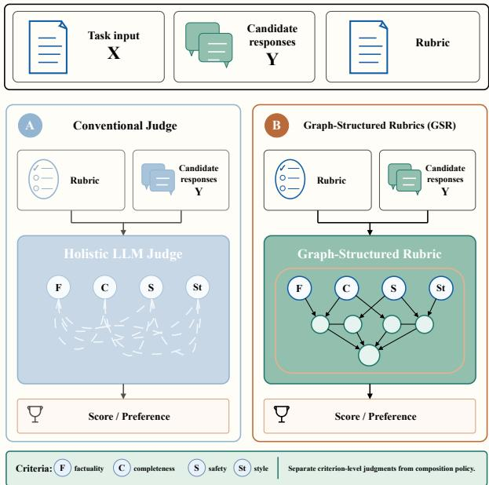
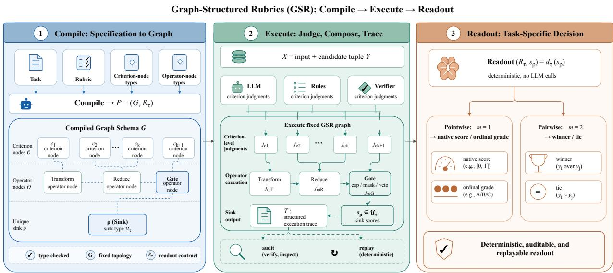
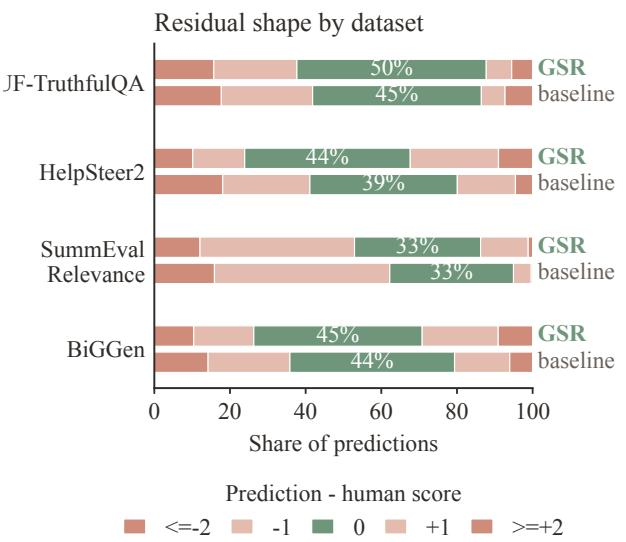
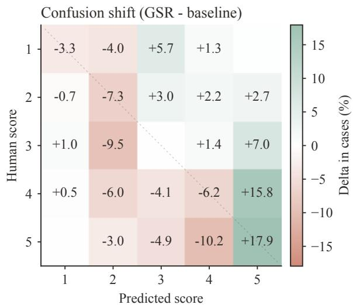
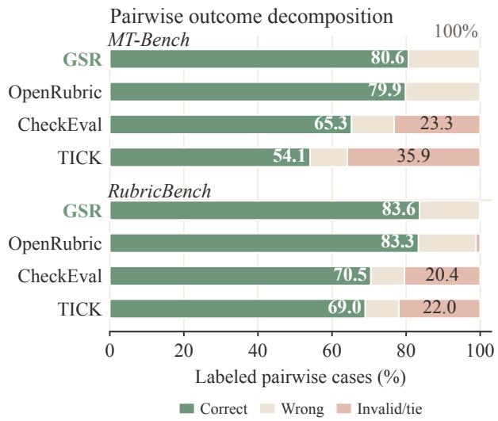

# GRAPH-STRUCTURED RUBRICS: COMPILING RUBRICS INTO TYPED EVALUATION GRAPHS FOR LLM JUDGES

AN ARXIV PREPRINT

Xi Chen, Jie Mu, Mo Xuan, Qun Shao Ant Group ct539484@antgroup.com

August 2026

## ABSTRACT

Rubric-based evaluators commonly treat rubrics as prompt context or flat criteria: they specify what to judge but leave criterion composition implicit, even when natural-language rules state it. We introduce Graph-Structured Rubrics (GSR), which compiles a rubric into a response-independent typed evaluation graph before observing responses. Criterion nodes elicit judgments; transformation, reduction, and gating operators compose them through named ports; and a task-specific output mapping, termed Readout, converts the unique sink into a score or preference. Compilation rejects malformed or type-incompatible graphs. Pointwise evaluation judges rubric dimensions separately before graph aggregation; pairwise evaluation reuses the graph with one judgment for each candidate under every criterion. Under GPT-OSS-120B, GSR improves exact score agreement by 0.62–6.75 percentage points over Prometheus-style scoring on four pointwise datasets and achieves the numerically highest end-to-end pairwise accuracy on two preference benchmarks under native tie and abstention policies.

## Introduction

Rubrics have become a common interface for LLM evaluation across direct scoring and pairwise comparison, yet many systems still treat them as prompt context or flat collections of criteria. Such representations specify what to judge but not how criterion-level judgments should interact to produce a score or preference. LLM-based judges make such evaluation scalable and can achieve substantial agreement with human judgments on open-ended tasks [Zheng et al., 2023, Kim et al., 2024b].

As evaluated tasks become more heterogeneous, however, high aggregate agreement with human ratings does not guarantee procedural stability. Prior studies document sensitivity to candidate order, output length, evaluator familiarity, anchoring, and even confusion between named quality criteria [Wang et al., 2023, Dubois et al., 2024, Stureborg et al., 2024, Hu et al., 2024]. Rubrics address the criterion-specification component of this problem by making relevant requirements explicit. Accordingly, recent benchmarks and evaluators have adopted human-authored criteria, generated rubrics, or instance-specific checklists [Zhou et al., 2026, Liu et al., 2025, Lee et al., 2025, Cook et al., 2024]. Because rubric-based judgments increasingly inform benchmark reporting, reward-model data construction, and model-selection workflows, the way a rubric is composed affects not only accuracy but also reproducibility and auditability.

An important gap remains after criterion-level judgments have been produced: their composition can still be implicit and unauditable. Writing rules in the prompt does not remove this problem because the LLM must execute them internally. Leaving these rules inside model inference creates opportunities for applicability checks to be omitted, reductions or gates to be applied out of order, or score caps to be enforced inconsistently. Moreover, rubric rules are often hierarchical: criterion judgments feed intermediate reductions, whose outputs feed gates, constraints, and final Readout. This hierarchy defines an execution policy rather than additional criteria. To make that policy explicit, GSR represents it as a directed acyclic graph and executes deterministic operators in topological order, exposing the decision path shown in Figure 1.

  
Figure 1: Natural-language rules leave hierarchical composition implicit within model inference; GSR routes criterionlevel judgments through an explicit graph before producing the final score or preference.

GSR therefore compiles each rubric before observing candidate responses. The program contains criterion nodes, deterministic operators, named ports, and a unique sink; compilation rejects cycles, missing ports, arity violations, and type-incompatible routes. At evaluation time, language models interpret semantic criteria, while the fixed graph controls routing, aggregation, non-compensatory constraints, and Readout in topological order. The policy is inspectable, and its execution is replayable from an audit trace that records the decision path.

We evaluate the framework in pointwise and pairwise settings. The experiments test whether compiled rubric graphs yield higher agreement than strong baselines, whether the gains transfer across judge backbones, and whether they arise from graph composition rather than direct scoring or flat aggregation. Our contributions are:

• To our knowledge, we introduce the first response-independent compilation framework that turns a rubric specification into a typed cross-criterion evaluation DAG with rubric-derived criterion nodes, operator nodes, named ports, and a unique sink.

• We define execution semantics in which criterion-level judgments flow through deterministic TRANSFORM, REDUCE, and GATE operators in topological order. Static validation rejects malformed graphs. Task-specific Readout produces pointwise or pairwise decisions, while audit traces enable deterministic replay of composition.

• We demonstrate the unified interface across four pointwise datasets and two pairwise preference benchmarks. Under GPT-OSS-120B, GSR achieves the numerically highest exact score agreement on all four pointwise datasets and the numerically highest end-to-end pairwise accuracy on both pairwise datasets; controlled ablations further show higher exact score agreement than direct scoring and weighted aggregation on every pointwise dataset.

## Related Work

From holistic judges to explicit criteria. LLM judges produce direct scores or pairwise preferences, but their outputs are sensitive to candidate position, response length, evaluator familiarity, distribution shift, and anchoring [Zheng et al., 2023, Wang et al., 2023, Dubois et al., 2024, Stureborg et al., 2024]. G-Eval adds structured reasoning [Liu et al., 2023], JudgeLM uses swap and reference augmentation [Zhu et al., 2025], and Prometheus models support custom criteria in direct and pairwise assessment [Kim et al., 2024a,b]. Debate and judge panels introduce deliberation or evaluator diversity [Chan et al., 2023, Verga et al., 2024]. Other work exposes finer-grained criteria: BiGGen uses instance criteria [Kim et al., 2025]; CheckEval, TICK, and RocketEval use checklist questions [Lee et al., 2025, Cook et al., 2024, Wei et al., 2025]; FLASK uses skill scores [Ye et al., 2024]; and LMUnit treats criteria as unit tests [Saad-Falcon et al., 2025]. These approaches improve judgment production or decomposition, but generally leave cross-criterion composition in prompts or fixed aggregation rather than an explicit typed program.

Rubric construction, aggregation, and calibration. EvalLM supports application-specific criteria, while AutoCalibrate generates and selects criteria against human labels [Kim et al., 2024c, Liu et al., 2024]. LLM-Rubric learns to aggregate multidimensional rubric outputs into calibrated predictions, whereas Praetor supports instance-level criteria in both pointwise and pairwise settings [Hashemi et al., 2024, Leng et al., 2025]. RubricBench, OpenRubrics, and recursive rubric-refinement methods study rubric construction [Zhou et al., 2026, Liu et al., 2025, Shen et al., 2026], while Autorubric unifies criterion design, judge ensembles, aggregation, and calibration practices [Rao and Callison-Burch, 2026]. These works address criterion selection, judgment elicitation, or score calibration. GSR assumes an available rubric and gives executable semantics to its cross-criterion composition.

Graphs in evaluation and the remaining gap. Graph structures have been used in evaluation, but at different abstraction boundaries. DAGMetric requires manual authoring of decision DAGs [Confident AI, 2026]; AgentEval derives graphs from agent execution traces rather than rubric criteria [Guo et al., 2026]; and OpenRS instantiates response-adaptive pairwise meta-rubrics and externally aggregates criterion-wise preferences [Jia et al., 2026]. RULERS instead compiles criteria into locked executable specifications with deterministic evidence verification and post-hoc score calibration [Hong et al., 2026]. None of these systems defines the specific abstraction studied here: a rubric compiled, before observing candidate responses, into a response-independent typed cross-criterion graph shared by pointwise and pairwise evaluation. GSR addresses this gap by compiling operators and a task-specific Readout, statically validating the resulting graph, and making its execution replayable.

## Graph-Structured Rubrics

GSR turns a hierarchical rubric policy into a graph program. Criterion nodes produce semantic judgments, operator nodes encode reductions and constraints, and edges fix their dependencies. Deterministic topological execution applies the declared rules in order rather than asking the LLM to reconstruct that order during every decision. For example, factuality and completeness can be reduced before a safety flag gates the result, preventing later positive evidence from overriding the cap. Pointwise scoring and pairwise preference share these node and operator semantics and differ only in task-specific Readout.

  
Figure 2: GSR procedure. Compile fixes the graph before observing candidate responses; Execute runs criterion and operator nodes; Readout maps sink scores to the task output.

Problem setup. GSR fixes an instance-specific composition policy before observing the responses it will judge. The compile-time specification $S = ( x , r , z , \tau )$ ) contains the task input x, rubric r, optional fixed reference material z, and task contract τ, but excludes candidate responses and gold labels. The contract fixes the number of candidates $m ,$ a closed internal quality-score interval $\mathcal { U } _ { \tau } \subset \mathbf { \bar { \mathbb { R } } }$ , output space $\boldsymbol { A } _ { \tau } ,$ , and quantization and tie policies. The execution stage subsequently receives $X = ( x , Y )$ , where $Y = ( y _ { 1 } , \dots , y _ { m } )$ is an ordered candidate tuple with stable identifiers. This partition is enforced at the invocation boundary: compilation cannot access ${ \cal Y } ,$ while execution cannot alter the accepted program.

Evaluation procedure. GSR has a three-stage interface. Given a graph language Λ, Compile turns S into a responseindependent program,

$$
P = { \mathrm { C o m p i l e } } ( S ; \Lambda ) = ( G , R _ { \tau } ) ,\tag{1}
$$

where G is the rubric graph and $R _ { \tau }$ is a readout contract. Execute applies the program to $X$ and returns the score vector produced at the unique sink and an audit trace $T ,$

$$
\begin{array} { r l } & { ( \mathbf { s } _ { \rho } , T ) = \mathrm { E x e c u t e } ( P , X ) , } \\ & { \qquad \mathbf { s } _ { \rho } = \left( ( \mathrm { i d } ( y _ { i } ) , s _ { \rho , i } ) \right) _ { i = 1 } ^ { m } , } \\ & { \qquad s _ { \rho , i } \in \mathcal { U } _ { \tau } . } \end{array}\tag{2}
$$

Readout then returns

$$
o = \operatorname { R e a d o u t } ( R _ { \tau } , { \mathbf { s } } _ { \rho } ) = d _ { \tau } ( { \mathbf { s } } _ { \rho } ) .\tag{3}
$$

## Compile: From a Rubric to a Graph Program

Compile receives the response-independent specification S and a graph language

$$
\Lambda = ( \mathbb { T } , \mathbb { F } , \mathbb { H } , \Pi ) ,\tag{4}
$$

where T gives the value types, F gives the available graph operators, H gives the available criterion-level judgment procedures, and Π gives task defaults and composition policies. This graph language fixes what kinds of criterion-level judgments can be produced and how they can be composed. The compiler therefore receives the rubric and the available graph language, but not the candidate responses or gold labels.

LLM-guided graph synthesis and repair. Compile uses an LLM to synthesize a declarative program from S under Λ. The model is restricted to catalogued types, criterion procedures, and operators, and emits nodes, named-port edges, parameters, and $R _ { \tau } . \mathrm { A }$ deterministic validator V checks JSON parsing, acyclicity, sink reachability, ports, arity, routing type compatibility, and readout compatibility. Writing $\delta ^ { ( t ) }$ for its structured diagnostics, compilation follows

$$
\begin{array} { r l } & { \qquad P ^ { ( 0 ) } = C _ { \phi } ( S , \Lambda ) , } \\ & { \qquad ( b ^ { ( t ) } , \delta ^ { ( t ) } ) = V ( P ^ { ( t ) } ) , } \\ & { \qquad P ^ { ( t + 1 ) } = C _ { \phi } ( S , \Lambda , P ^ { ( t ) } , \delta ^ { ( t ) } ) \quad \mathrm { i f ~ } b ^ { ( t ) } = 0 . } \end{array}\tag{5}
$$

The first structurally valid program with $b ^ { ( t ) } = 1$ is accepted; no manual semantic screening or selection among valid candidates is performed. If none is valid after the fixed repair budget $K _ { \mathrm { r e p } } .$ , the instance is recorded as a compilation failure. Validation checks that the graph is executable and type-consistent; whether the accepted graph captures the intended meaning of the natural-language rubric is tested through downstream agreement. Compiler and judge can use the same underlying LLM, as in our experiments, but they are separate invocations with different inputs: the compiler receives no candidate response, whereas the judge receives the frozen program and candidates during Execute.

The output of Compile is a program $P = ( G , R _ { \tau } )$ . The graph

$$
\begin{array} { r l } & { G = ( \gamma , \mathcal { E } , \rho ) , } \\ & { \gamma = \mathcal { C } \dot { \cup } \mathcal { O } , \qquad \rho \in \mathcal { V } , } \\ & { \mathcal { E } \subseteq \mathcal { V } \times \mathcal { P } \times \mathbb { N } _ { + } \times \mathcal { O } . } \end{array}\tag{6}
$$

contains criterion nodes ${ \mathcal { C } } ,$ operator nodes O, type-checked routing edges $\mathcal { E } ,$ port names ${ \mathcal P } _ { : }$ , and a unique sink $\rho .$ An edge $( u , p , \ell , \omega )$ routes the judgment produced by predecessor node u to slot ℓ of named port $p$ of operator node $\omega .$ . The graph permits criterion-to-operator and operator-to-operator edges; criterion nodes have no incoming judgment-flow edges. We write $v  \rho$ when node $v \in \mathcal V$ has a directed path to the sink $\rho ,$ and require this condition for every node so that no criterion-level judgment is unreachable. Each node declares an output type, each operator port declares an input type, and compilation rejects cycles, missing ports, arity mismatches, and type-incompatible routes.

Criterion-node semantics are task-invariant. Compile instantiates one node for each semantic criterion selected from the rubric, and every criterion node returns candidate-aligned judgments for all m candidates. Pointwise evaluation sets $m = 1$ , whereas pairwise evaluation sets $m = 2$ . Here m counts candidates, not criteria: either regime may contain multiple criterion nodes corresponding to different rubric dimensions. In both regimes, criterion nodes represent rubric dimensions rather than native task labels; their differences are confined to candidate arity, the task contract, and Readout.

Within $\mathbb { F } ,$ operators are grouped by the kind of composition they perform. Let $\mathcal { I }$ denote judgment spaces and B Boolean flags: a TRANSFORM operator maps $\mathcal { I } _ { a }$ to ${ \mathcal { T } } _ { b } ,$ a REDUCE operator maps $\mathcal { I } _ { 1 } \times \cdots \times \mathcal { I } _ { k }$ to $\mathcal { I }$ , and a GATE operator maps $\mathcal { I } \times \mathcal { B }$ to $\mathcal { I }$ by applying a declared cap, mask, or veto. GATE is therefore an operator node in O, not an additional node category beyond $\stackrel { \cdot } { \mathcal { C } }$ and O.

Compile also attaches a readout contract

$$
\begin{array} { r l } & { R _ { \tau } = ( \mathrm { A l i g n } _ { m } ( \mathscr { U } _ { \tau } ) , \mathscr { A } _ { \tau } , d _ { \tau } ) , } \\ & { d _ { \tau } : \mathrm { A l i g n } _ { m } ( \mathscr { U } _ { \tau } )  \mathscr { A } _ { \tau } . } \end{array}\tag{7}
$$

Here $\mathrm { A l i g n } _ { m } ( { \mathcal { U } } _ { \tau } )$ denotes the arity-m schema for candidate-aligned quality scores; for an evaluated instance it is instantiated as $( ( \mathrm { i d } ( y _ { i } ) , s _ { \rho , i } ) ) _ { i = 1 } ^ { m }$ with $s _ { \rho , i } ~ \in \mathcal { U } _ { \tau }$ . The map $d _ { \tau }$ alone performs native-scale conversion, output quantization, and tie or forced-choice behavior. For pairwise tasks, the annotated label belongs to $\boldsymbol { A } _ { \ u { \tau } }$ (for example, a winner or tie); the per-candidate scores are internal sink values produced by the graph. The sink type must be an aligned sequence of m quality scores in $\mathcal { U } _ { \tau }$ . The experiments instantiate this shared contract for pointwise scoring and pairwise preference.

## Execute: Evaluate and Compose Judgments

Execute applies the fixed graph to X without changing its nodes, edges, or parameters. Each criterion node $c \in { \mathcal { C } }$ produces a candidate-aligned judgment vector

$$
\mathbf { j } _ { c } = \left( ( \mathrm { i d } ( y _ { i } ) , j _ { c , i } ) \right) _ { i = 1 } ^ { m } , \qquad j _ { c , i } \in \mathsf { J u d g } ( c ) .\tag{8}
$$

Here $\mathsf { J u d g } ( c )$ is the judgment space declared for criterion c. The candidate-aligned vector can be produced by evaluating candidates separately or jointly, but it must contain exactly one criterion-level judgment for each candidate identifier. A criterion node never receives another node’s judgment. Criterion procedures include LLM calls, rule checks, verifiers, or human annotations, but their outputs must conform to the criterion node’s declared judgment type.

After the criterion-level judgments are available, operators run in a topological order of G. Each operator declares named input ports. For a port p of operator ω, let $\operatorname { P r e d } ( \omega , p ) = ( v _ { 1 } , \ldots , v _ { k } )$ denote the predecessor nodes whose edges target $p ,$ ordered by their edge slots. The input received at that port is

$$
\mathbf { j } _ { \omega , p } ^ { \mathrm { i n } } = ( \mathbf { j } _ { v _ { 1 } } , \ldots , \mathbf { j } _ { v _ { k } } ) .
$$

The operator then produces

$$
{ \bf j } _ { \omega } = f _ { \omega } \Big ( \big ( p \mapsto { \bf j } _ { \omega , p } ^ { \mathrm { i n } } \big ) _ { p \in \mathrm { p o r t s } ( \omega ) } ; \theta _ { \omega } \Big ) .\tag{9}
$$

The deterministic function $f _ { \omega }$ receives a named, slot-ordered sequence at each port and applies the fixed parameters $\theta _ { \omega } ;$ positional parameters are validated against the corresponding sequence length. For instance, a GATE:CAP reads a quality judgment through base and a Boolean failure judgment through trigger; the edge itself carries no cap semantics.

Let $\mathbf { j } _ { v }$ denote the candidate-aligned output vector of node v. Operators preserve candidate identifiers, and the terminal node is type-checked to return aligned quality scores. Thus all graph-level reductions and gates have been applied when the sink scores are produced:

$$
\begin{array} { r } { \mathbf { s } _ { \rho } = \mathbf { j } _ { \rho } = \left( ( \mathrm { i d } ( y _ { i } ) , s _ { \rho , i } ) \right) _ { i = 1 } ^ { m } , \quad s _ { \rho , i } \in \mathcal { U } _ { \tau } . } \end{array}\tag{10}
$$

Each $s _ { \rho , i }$ is the final internal quality score for $y _ { i }$ . Under the fixed topological order, the audit trace records node identifiers, slot-ordered inputs, outputs, operator parameters, and evidence references so that the composition stage can be replayed from recorded criterion-level judgments.

## Readout: Decide from Candidate Scores

Readout is fixed during Compile and makes no additional LLM call. It receives $\mathbf { s } _ { \rho } = ( ( \mathrm { i d } ( y _ { i } ) , s _ { \rho , i } ) ) _ { i = 1 } ^ { m }$ , checks identifier coverage, finiteness, and domain membership, and applies the deterministic task policy in $R _ { \tau }$

$$
o = d _ { \tau } ( \mathbf { s } _ { \rho } ) .\tag{11}
$$

For pointwise evaluation $( m = 1 ) , d _ { \tau }$ returns the native score or ordinal label obtained by the deterministic conversion and quantization policies in τ. For pairwise evaluation $( m = 2 )$ ,

$$
d _ { \tau } ( \mathbf { s } _ { \rho } ) = \left\{ \begin{array} { l l } { \mathrm { i d } ( y _ { 1 } ) , } & { s _ { \rho , 1 } > s _ { \rho , 2 } + \epsilon _ { \tau } , } \\ { \mathrm { i d } ( y _ { 2 } ) , } & { s _ { \rho , 2 } > s _ { \rho , 1 } + \epsilon _ { \tau } , } \\ { \mathrm { r e s o l v e } _ { \tau } ( \mathrm { i d } ( y _ { 1 } ) , \mathrm { i d } ( y _ { 2 } ) ) , } & { | s _ { \rho , 1 } - s _ { \rho , 2 } | \leq \epsilon _ { \tau } , } \end{array} \right.\tag{12}
$$

where $\epsilon _ { \tau } \geq 0$ and resolve are fixed by the task contract. The latter returns a tie, an abstention, or a candidate selected by a declared deterministic forced-choice rule. Scores are comparable only within the same program and task contract; GSR does not assume calibration across rubrics or judge models.

Returning to the factuality–completeness–safety example, the graph computes one quality score for each candidate after applying the safety cap, if any. In a pointwise task, the same criterion graph emits one aligned sink score and Readout quantizes it onto the native rubric scale. In a pairwise task, it emits two aligned sink scores and Readout compares them under the task’s tie policy. Thus pointwise scoring and pairwise preference share criterion-node and operator semantics; they differ only in candidate arity, task contract, and Readout. Criterion-level judgments remain model-dependent, but their routing, composition, gates, and final mapping are statically checked and replayable

## Experiments

## Experimental Setup

Evaluation questions. We evaluate ordinal pointwise scoring and A/B preference through the same criterion graph. Pointwise judging produces one judgment per rubric dimension and a native 1–5 score; pairwise judging produces two candidate-aligned judgments per criterion before preference Readout. Only candidate arity and task output change.

Datasets and baselines. Pointwise datasets are UltraFeedback–TruthfulQA (3,244 responses) [Cui et al., 2024, Lin et al., 2022], HelpSteer2 validation (1,038) [Wang et al., 2024], SummEval Relevance (1,600) [Fabbri et al., 2021], and BiGGen (2,776) [Kim et al., 2025]; their heterogeneous 1–5 targets are termed reference scores. Pairwise datasets are MT-Bench (2,575 labeled pairs) [Zheng et al., 2023] and RubricBench (1,147) [Zhou et al., 2026]. Unless noted, GPT-OSS-120B is the judge. Pointwise baselines are controlled, same-backbone adaptations of Prometheus [Kim et al., 2024b], G-Eval [Liu et al., 2023], and FLASK [Ye et al., 2024]; pairwise baselines add OpenRubric [Liu et al., 2025], TICK [Cook et al., 2024], and CheckEval [Lee et al., 2025]. Evaluation criteria are taken from public benchmark annotations or task definitions. In pointwise experiments, each benchmark is judged with its corresponding task criterion or released scoring rubric; in pairwise experiments, MT-Bench uses a shared preference rubric and RubricBench uses released instance-level checklist rubrics. For each benchmark, GSR and the baselines receive the same available task information, including the input, candidate response(s), and criterion/rubric text, with fixed reference material when provided. Gold scores and preference labels are reserved for metric computation, and baselines retain their native prompting and output formats.

<table><tr><td>Dataset</td><td>Method</td><td>Exact Agreement ↑</td><td>Within-1 Accuracy ↑</td><td>MAE↓</td><td>Pearson ↑</td><td>Spearman ↑</td></tr><tr><td rowspan="4">UF-TruthfulQA</td><td>Prometheus-style</td><td>43.30</td><td>73.50</td><td>0.928</td><td>0.637</td><td>0.623</td></tr><tr><td>G-Eval-style</td><td>44.61</td><td>74.98</td><td>0.881</td><td>0.593</td><td>0.565</td></tr><tr><td>FLASK-style</td><td>39.02</td><td>68.39</td><td>1.062</td><td>0.661</td><td>0.669</td></tr><tr><td>GSR (Ours)</td><td>50.05 +5.44</td><td></td><td>78.75 +3.770.779 +0.102</td><td>0.678 +0.017</td><td>0.659</td></tr><tr><td rowspan="4">HelpSteer2 SummEval Relevance</td><td>Prometheus-style</td><td>38.97</td><td>77.38</td><td>0.928</td><td>0.514</td><td>0.444</td></tr><tr><td>G-Eval-style</td><td>35.16</td><td>77.14</td><td>0.976</td><td>0.504</td><td>0.438</td></tr><tr><td>FLASK-style</td><td>35.81</td><td>75.48</td><td>0.978</td><td>0.468</td><td>0.405</td></tr><tr><td>GSR (Ours)</td><td>43.75 +4.78</td><td></td><td>80.81 +3.430.845 +0.083</td><td>0.514</td><td>0.427</td></tr><tr><td rowspan="4"></td><td>Prometheus-style</td><td>32.70</td><td>83.73</td><td>0.846</td><td>0.441</td><td>0.424</td></tr><tr><td>G-Eval-style</td><td>28.28</td><td>79.04</td><td>0.942</td><td>0.429</td><td>0.405</td></tr><tr><td>FLASK-style</td><td>28.83</td><td>72.55</td><td>1.068</td><td>0.301</td><td>0.286</td></tr><tr><td>GSR (Ours)</td><td>33.32 +0.62</td><td></td><td>86.75 +3.020.804 +0.042</td><td>0.392</td><td>0.386</td></tr><tr><td rowspan="4">BiGGen</td><td>Prometheus-style</td><td>43.52</td><td>79.73</td><td>0.854</td><td>0.611</td><td>0.588</td></tr><tr><td>G-Eval-style</td><td>40.83</td><td>79.12</td><td>0.890</td><td>0.589</td><td>0.565</td></tr><tr><td>FLASK-style</td><td>38.27</td><td>79.93</td><td>0.891</td><td>0.570</td><td>0.546</td></tr><tr><td>GSR (Ours)</td><td>44.51 +0.99</td><td></td><td>80.49 +0.560.833 +0.021</td><td>0.618 +0.007</td><td>0.591 +0.003</td></tr></table>

Table 1: Main pointwise comparison under GPT-OSS-120B, averaged over six runs (green: improvement vs. the best baseline for each metric).

Implementation protocol. Each instance is recompiled in a separate API call; the first validator-approved program within $K _ { \mathrm { r e p } }$ repairs is accepted without human selection and frozen for execution. Run-to-run variation therefore includes compilation and judging nondeterminism.

Figure 3: Six-run pointwise error geometry versus the strongest Exact Agreement baseline: pooled residuals (left) and mean row-normalized confusion shift (right). The baseline is G-Eval-style for UF–TruthfulQA and Prometheus-style otherwise.
<table><tr><td>Dataset</td><td>Method</td><td>Pairwise Accuracy ↑</td><td>Valid Accuracy ↑</td><td>Coverage ↑</td><td>Invalid Rate ↓</td><td>Tie Rate ↓</td></tr><tr><td rowspan="4">MT-Bench</td><td>OpenRubric</td><td>79.86</td><td>79.86</td><td>100.00</td><td>0.00</td><td>0.00</td></tr><tr><td>TICK</td><td>54.10</td><td>84.36</td><td>64.13</td><td>1.21</td><td>34.66</td></tr><tr><td>CheckEval</td><td>65.28</td><td>85.05</td><td>76.74</td><td>0.52</td><td>22.74</td></tr><tr><td>GSR (Ours)</td><td>80.63 +0.77</td><td>80.73</td><td>99.87</td><td>0.13</td><td>0.00</td></tr><tr><td rowspan="4">RubricBench</td><td>OpenRubric</td><td>83.35</td><td>84.30</td><td>98.87</td><td>1.13</td><td>0.00</td></tr><tr><td>TICK</td><td>68.98</td><td>88.38</td><td>78.04</td><td>2.18</td><td>19.78</td></tr><tr><td>CheckEval</td><td>70.49</td><td>88.59</td><td>79.57</td><td>0.86</td><td>19.57</td></tr><tr><td>GSR (Ours)</td><td>83.62 +0.28</td><td>83.70</td><td>99.91</td><td>0.09</td><td>0.00</td></tr></table>

Table 2: Pairwise comparison under GPT-OSS-120B, averaged over six runs (green: ∆ Accuracy vs. OpenRubric).

Metrics and provenance. Pointwise Exact Agreement, Within-1 Accuracy, MAE, Pearson, and Spearman are computed from predicted scores. Pairwise Coverage counts A/B decisions, Valid Accuracy conditions on them, and Pairwise Accuracy counts ties and invalid outputs as errors. Invalid Rate includes compile/parse failures and abstentions. GSR treats unresolved comparisons as abstentions; ties produced by baselines remain ties. Unless otherwise noted, reported tables use arithmetic means over six complete runs. Predictions retain dataset, model, protocol, and reference provenance, and no tie or abstention is forced post hoc into a choice. When standard deviations are summarized in text, they are sample standard deviations over the same six run-level primary metrics.

## Main Results

Tables 1 and 2 report pointwise and pairwise results under GPT-OSS-120B. Exact Agreement and end-to-end Pairwise Accuracy are the respective primary metrics. These metrics test the final decision produced after criterion-level judgments have been composed, and therefore evaluate the complete GSR pipeline rather than the accuracy of any individual criterion node.

For pointwise scoring, GSR gives the best Exact Agreement, Within-1 Accuracy, and MAE in every dataset block. Relative to the strongest baseline by Exact Agreement, its gains are 5.44 points on UF–TruthfulQA, 4.78 on HelpSteer2, 0.62 on SummEval Relevance, and 0.99 on BiGGen. The corresponding Within-1 gains are 3.77, 3.43, 3.02, and 0.56 points, while MAE falls by 0.102, 0.083, 0.042, and 0.021. The smaller Exact margins on SummEval Relevance and BiGGen indicate that GSR is competitive rather than decisively separated there. Across the four datasets, the common result is therefore not a uniformly large margin, but a consistent advantage on the final discrete score produced by the graph and Readout. This is compatible with GSR’s intended role of making cross-criterion dependencies explicit after criterion judgments are obtained. Because the main comparison changes the full evaluation procedure, the same-trace ablation below provides the more direct test of graph composition. Across the four GSR rows, the six-run standard deviations for Exact Agreement are 0.45–0.84 points.

Figure 3 localizes these changes. GSR increases zero residuals most clearly on UF–TruthfulQA and HelpSteer2, but the confusion shift is not uniformly favorable. For reference score 5, mass moves from mispredictions of 4 to the correct score 5; for reference score 4, some mass instead moves from 4 to 5. This mixed high-score redistribution is consistent with Exact Agreement and MAE improving more uniformly than Pearson or Spearman. Thus, explicit graph execution should not be read as a generic correction that moves every prediction toward its reference. It changes how criterion-level outputs cross the rubric’s final decision boundaries, and those changes can help one reference level while hurting a neighboring level. GSR therefore provides a controlled composition path, not a uniform correction of the score distribution.

The same criterion-node interface transfers to pairwise decisions without architectural modification. GSR attains the highest end-to-end Pairwise Accuracy at 99.87–99.91% coverage; TICK and CheckEval have higher valid-only accuracy but 19.57–34.66% tie rates, which Figure 4 counts as non-decisions. The GSR Pairwise Accuracy standard deviation is 0.30 points on MT-Bench and 0.51 points on RubricBench.

## Ablation Study

Direct predicts one holistic score. Weighted aggregation applies a flat weighted rule to the same criterion-level judgments as GSR, whereas full GSR applies compiled operators and task-level quantization. This isolates the effect of graph composition.

GSR improves Exact Agreement over Direct by 3.51–9.25 points. Against weighted aggregation, the gains are 2.60 points on BiGGen, 5.79 on UF–TruthfulQA, 3.26 on HelpSteer2, and 0.36 on SummEval Relevance. Because the latter comparison reuses the same criterion-level traces, these differences isolate composition and Readout rather than criterion elicitation: weighted aggregation collapses criterion-wise evidence in one flat rule, whereas GSR routes the same evidence through compiled TRANSFORM, REDUCE, and GATE operators before task-level Readout.

The GSR-composition rows reuse the same six runs as the GSR rows in Table 1; their Exact Agreement standard deviations are therefore 0.45–0.84 points across datasets. The gain varies from 0.36 to 5.79 points and does not identify which operator or dependency accounts for the variation, but it supports the limited conclusion that the compiled graph can change final ordinal boundaries while criterion-level inputs are held fixed. The flat weighted variant still has better Within-1 Accuracy on BiGGen and HelpSteer2, a marginally lower MAE on HelpSteer2, and sometimes stronger correlation, so GSR improves exact ordinal selection here but does not dominate a flat rule on all secondary metrics.

  
Figure 4: Pairwise outcomes under native decision policies. Invalid outputs and ties produced by baselines are grouped as non-decisions. Valid-only accuracy can remain high despite lower end-to-end accuracy.

<table><tr><td>Variant</td><td>Exact Agreement ↑</td><td>Within-1 Accuracy ↑</td><td>MAE↓</td><td>Pearson ↑</td><td>Spearman ↑</td></tr><tr><td colspan="6">BiGGen</td></tr><tr><td>Direct</td><td>41.00</td><td>79.13</td><td>0.889</td><td>0.589</td><td>0.562</td></tr><tr><td>Weighted aggregation</td><td>41.91</td><td>80.93</td><td>0.836</td><td>0.615</td><td>0.590</td></tr><tr><td>GSR composition</td><td>44.51 +2.60</td><td>80.49</td><td>0.833 +0.003</td><td>0.618 +0.003</td><td>0.591 +0.001</td></tr><tr><td colspan="6">UF–TruthfulQA</td></tr><tr><td>Direct</td><td>43.04</td><td>75.49</td><td>0.897</td><td>0.612</td><td>0.586</td></tr><tr><td>Weighted aggregation</td><td>44.26</td><td>77.03</td><td>0.851</td><td>0.664</td><td>0.649</td></tr><tr><td>GSR composition</td><td>50.05 +5.79</td><td>78.75 +1.72</td><td>0.779 +0.072</td><td>0.678 +0.014</td><td>0.659 +0.010</td></tr><tr><td colspan="6">HelpSteer2</td></tr><tr><td>Direct</td><td>35.79</td><td>77.16</td><td>0.963</td><td>0.522</td><td>0.451</td></tr><tr><td>Weighted aggregation</td><td>40.49</td><td>82.43</td><td>0.844</td><td>0.521</td><td>0.446</td></tr><tr><td>GSR composition</td><td>43.75 +3.26</td><td>80.81</td><td>0.845</td><td>0.514</td><td>0.427</td></tr><tr><td colspan="6">SummEval Relevance</td></tr><tr><td>Direct</td><td>24.07</td><td>75.92</td><td>1.022</td><td>0.454</td><td>0.442</td></tr><tr><td>Weighted aggregation</td><td>32.96</td><td>85.74</td><td>0.817</td><td>0.401</td><td>0.382</td></tr><tr><td>GSR composition</td><td>33.32 +0.36</td><td>86.75 +1.01</td><td>0.804 +0.013</td><td>0.392</td><td>0.386 +0.004</td></tr></table>

Table 3: Six-run scoring and composition ablation. Full GSR rows reuse the predictions in Table 1; weighted-aggregation predictions are recomputed from the same criterion-level judgment traces (green: improvement vs. weighted aggregation; MAE annotations show reductions).

## Cross-Model Sensitivity

<table><tr><td>Method</td><td>Exact Agreement ↑</td><td>Within-1 Accuracy ↑</td><td>MAE↓</td><td>Pearson ↑</td><td>Spearman ↑</td></tr><tr><td>Qwen3.5-35B-A3B</td><td></td><td></td><td></td><td></td><td></td></tr><tr><td>Prometheus-style</td><td>41.51</td><td>77.44</td><td>0.913</td><td>0.503</td><td>0.426</td></tr><tr><td>G-Eval-style</td><td>36.94</td><td>73.68</td><td>1.016</td><td>0.486</td><td>0.424</td></tr><tr><td>FLASK-style</td><td>39.03</td><td>77.22</td><td>0.932</td><td>0.461</td><td>0.393</td></tr><tr><td>GSR (Ours)</td><td>41.76 +0.25</td><td>78.16 +0.72</td><td>0.878 +0.035</td><td>0.500</td><td>0.427 +0.00</td></tr><tr><td>GLM-4.7</td><td></td><td></td><td></td><td></td><td></td></tr><tr><td>Prometheus-style</td><td>37.14</td><td>71.06</td><td>1.075</td><td>0.489</td><td>0.436</td></tr><tr><td>G-Eval-style</td><td>36.32</td><td>71.73</td><td>1.057</td><td>0.476</td><td>0.417</td></tr><tr><td>FLASK-style</td><td>34.52</td><td>72.17</td><td>1.056</td><td>0.452</td><td>0.399</td></tr><tr><td>GSR (Ours)</td><td>36.10</td><td>74.64 +3.58</td><td>1.004 +0.071</td><td>0.489</td><td>0.425</td></tr></table>

Table 4: Six-run cross-model sensitivity on HelpSteer2 (green: improvement vs. Prometheus-style; MAE annotations show reductions).

On HelpSteer2 with Qwen3.5-35B-A3B, GSR exceeds Prometheus-style by 0.25 points in Exact Agreement and 0.72 points in Within-1 Accuracy, while reducing MAE by 0.035. With GLM-4.7, its Exact Agreement is 1.04 points lower, but its Within-1 Accuracy is 3.58 points higher and its MAE is lower by 0.071. The graph interface therefore transfers structurally, but its metric profile is not backbone-invariant. GSR fixes dependencies, operator order, and Readout; it does not replace or correct the semantic judgments produced at criterion nodes. The Qwen result preserves a small Exact advantage, whereas the GLM comparison reverses despite better Within-1 Accuracy and MAE. Explicit composition controls how judgments are combined, but remains conditioned on the judgments entering the graph. The corresponding GSR Exact Agreement standard deviations are 0.74 points for Qwen3.5-35B-A3B and 0.87 points for GLM-4.7.

## Conclusion

GSR composes criterion-level judgments through a typed graph shared by pointwise and pairwise evaluation. Under GPT-OSS-120B, GSR is numerically strongest on the primary end-to-end metric in all six evaluated datasets, while ablations support the value of graph composition and cross-model results bound that value by backbone dependence. GSR offers a programmable alternative whose composition step is trace-replayable. Generative AI assisted with language, formatting, and consistency checks; the authors verified and remain responsible for all claims, results, and citations.

## References

Chi-Min Chan, Weize Chen, Yusheng Su, Jianxuan Yu, Wei Xue, Shanghang Zhang, Jie Fu, and Zhiyuan Liu. ChatEval: Towards better LLM-based evaluators through multi-agent debate. arXiv preprint arXiv:2308.07201, 2023. URL https://arxiv.org/abs/2308.07201.

Confident AI. DAG (deep acyclic graph), 2026. URL https://deepeval.com/docs/metrics-dag. Accessed 2026-07-25.

Jonathan Cook, Tim Rocktäschel, Jakob Foerster, Dennis Aumiller, and Alex Wang. TICKing all the boxes: Generated checklist improve LLM evaluation and generation. In Advances in Neural Information Processing Systems, 2024. URL https://arxiv.org abs/2410.03608.

Ganqu Cui, Lifan Yuan, Ning Ding, Guanming Yao, Bingxiang He, Wei Zhu, Yuan Ni, Guotong Xie, Ruobing Xie, Yankai Lin, Zhiyuan Liu, and Maosong Sun. UltraFeedback: Boosting language models with scaled AI feedback. In Proceedings ofthe 41st International Conference on Machine Learning, volume 235 of Proceedings ofMachine Learning Research, pages 9722–9744. PMLR, 2024. URL https://proceedings.mlr.press/v235/cui24f.html.

Yann Dubois, Balázs Galambosi, Percy Liang, and Tatsunori B. Hashimoto. Length-controlled AlpacaEval: A simple way to debias automatic evaluators. In First Conference on Language Modeling, 2024. URL https://openreview.net/forum?id=CybBmzWBX0.

Alexander R. Fabbri, Wojciech Krysci´ nski, Bryan McCann, Caiming Xiong, Richard Socher, and Dragomir Radev. SummEval:´ Re-evaluating summarization evaluation. Transactions ofthe Associationfor Computational Linguistics, 9:391–409, 2021. doi: 10.1162/tacl\_a\_00373. URL https://doi.org/10.1162/tacl\_a\_00373.

Dongxin Guo, Jikun Wu, and Siu Ming Yiu. AgentEval: DAG-structured step-level evaluation for agentic workflows with error propagation tracking. arXiv preprint arXiv:2604.23581, 2026. URL https://arxiv.org/abs/2604.23581.

Helia Hashemi, Jason Eisner, Corby Rosset, Benjamin Van Durme, and Chris Kedzie. LLM-rubric: A multidimensional, calibrated approach to automated evaluation of natural language texts. In Proceedings ofthe 62nd Annual Meeting ofthe Associationfor Computational Linguistics, pages 13806–13834. Association for Computational Linguistics, 2024. doi: 10.18653/v1/2024.acllong.745. URL https://aclanthology.org/2024.acl-long.745/.

Yihan Hong, Huaiyuan Yao, Bolin Shen, Wanpeng Xu, Hua Wei, and Yushun Dong. From rubrics to reliable scores: Evidencegrounded text evaluation with LLM judges. arXiv preprint arXiv:2601.08654, 2026. URL https://arxiv.org/abs/2601.08654.

Xinyu Hu, Mingqi Gao, Sen Hu, Yang Zhang, Yicheng Chen, Teng Xu, and Xiaojun Wan. Are LLM-based evaluators confusing NLG quality criteria? In Proceedings ofthe 62nd Annual Meeting ofthe Associationfor Computational Linguistics, pages 9530–9570. Association for Computational Linguistics, 2024. doi: 10.18653/v1/2024.acl-long.516. URL https://aclanthology.org/2024.acllong.516/.

Ruipeng Jia, Yunyi Yang, Yuxin Wu, Yongbo Gai, Siyuan Tao, Mengyu Zhou, Jianhe Lin, Xiaoxi Jiang, and Guanjun Jiang. Open rubric system: Scaling reinforcement learning with pairwise adaptive rubric. arXiv preprint arXiv:2602.14069, 2026. URL https://arxiv.org/abs/2602.14069.

Seungone Kim, Jamin Shin, Yejin Cho, Joel Jang, Shayne Longpre, Hwaran Lee, Sangdoo Yun, Seongjin Shin, Sungdong Kim, James Thorne, and Minjoon Seo. Prometheus: Inducing fine-grained evaluation capability in language models. In International Conference on Learning Representations, 2024a. URL https://proceedings.iclr.cc/paper\_files/paper/2024/hash/ 803485352e61e3ebf41221e4776c9fd4-Abstract-Conference.html.

Seungone Kim, Juyoung Suk, Shayne Longpre, Bill Yuchen Lin, Jamin Shin, Sean Welleck, Graham Neubig, Moontae Lee, Kyungjae Lee, and Minjoon Seo. Prometheus 2: An open source language model specialized in evaluating other language models. In Proceedings ofthe 2024 Conference on Empirical Methods in Natural Language Processing, pages 4334–4353. Association for Computational Linguistics, 2024b. doi: 10.18653/v1/2024.emnlp-main.248. URL https://aclanthology.org/2024.emnlp-main.248/.

Seungone Kim, Juyoung Suk, Ji Yong Cho, Shayne Longpre, Chaeeun Kim, Dongkeun Yoon, Guijin Son, Yejin Cho, Sheikh Shafayat, Jinheon Baek, Sue Hyun Park, Hyeonbin Hwang, Jinkyung Jo, Hyowon Cho, Haebin Shin, Seongyun Lee, Hanseok Oh, Noah Lee, Namgyu Ho, Se June Joo, Miyoung Ko, Yoonjoo Lee, Hyungjoo Chae, Jamin Shin, Joel Jang, Seonghyeon Ye, Bill Yuchen Lin, Sean Welleck, Graham Neubig, Moontae Lee, Kyungjae Lee, and Minjoon Seo. The BiGGen bench: A principled benchmark for fine-grained evaluation of language models with language models. In Proceedings ofthe 2025 Conference ofthe Nations ofthe Americas Chapter ofthe Associationfor Computational Linguistics: Human Language Technologies, pages 5877–5919. Association for Computational Linguistics, 2025. doi: 10.18653/v1/2025.naacl-long.303. URL https://aclanthology.org/2025.naacl long.303/.

Tae Soo Kim, Yoonjoo Lee, Jamin Shin, Young-Ho Kim, and Juho Kim. EvalLM: Interactive evaluation of large language model prompts on user-defined criteria. In Proceedings of the 2024 CHI Conference on Human Factors in Computing Systems, pages 1–21. Association for Computing Machinery, 2024c. doi: 10.1145/3613904.3642216. URL https://doi.org/10.1145/3613904.3642216.

Yukyung Lee, JoongHoon Kim, Jaehee Kim, Hyowon Cho, Jaewook Kang, Pilsung Kang, and Najoung Kim. CheckEval: A reliable LLM-as-a-judge framework for evaluating text generation using checklists. In Proceedings ofthe 2025 Conference on Empirical Methods in Natural Language Processing, pages 15771–15798. Association for Computational Linguistics, 2025. doi: 10.18653/v1/2025.emnlp-main.796. URL https://aclanthology.org/2025.emnlp-main.796/.

Yongqi Leng, Renren Jin, Yue Chen, Zhuowen Han, Ling Shi, Jianxiang Peng, Lei Yang, Juesi Xiao, and Deyi Xiong. Praetor: A fine-grained generative LLM evaluator with instance-level customizable evaluation criteria. In Proceedings ofthe 63rd Annual Meeting ofthe Associationfor Computational Linguistics, pages 10386–10418. Association for Computational Linguistics, 2025. doi: 10.18653/v1/2025.acl-long.513. URL https://aclanthology.org/2025.acl-long.513/.

Stephanie Lin, Jacob Hilton, and Owain Evans. TruthfulQA: Measuring how models mimic human falsehoods. In Proceedings of the 60th Annual Meeting ofthe Associationfor Computational Linguistics, pages 3214–3252. Association for Computational Linguistics, 2022. doi: 10.18653/v1/2022.acl-long.229. URL https://aclanthology.org/2022.acl-long.229/.

Tianci Liu, Ran Xu, Tony Yu, Ilgee Hong, Carl Yang, Tuo Zhao, and Haoyu Wang. OpenRubrics: Towards scalable synthetic rubric generation for reward modeling and LLM alignment. arXiv preprint arXiv:2510.07743, 2025. URL https://arxiv.org/abs/2510. 07743.

Yang Liu, Dan Iter, Yichong Xu, Shuohang Wang, Ruochen Xu, and Chenguang Zhu. G-Eval: NLG evaluation using GPT-4 with better human alignment. In Proceedings of the 2023 Conference on Empirical Methods in Natural Language Processing, pages 2511–2522. Association for Computational Linguistics, 2023. doi: 10.18653/v1/2023.emnlp-main.153. URL https: //aclanthology.org/2023.emnlp-main.153/.

Yuxuan Liu, Tianchi Yang, Shaohan Huang, Zihan Zhang, Haizhen Huang, Furu Wei, Weiwei Deng, Feng Sun, and Qi Zhang. Calibrating LLM-based evaluator. In Proceedings of the 2024 Joint International Conference on Computational Linguistics, Language Resources and Evaluation, pages 2638–2656. ELRA and ICCL, 2024. URL https://aclanthology.org/2024.lrecmain.237/.

Delip Rao and Chris Callison-Burch. Autorubric: Unifying rubric-based LLM evaluation. arXiv preprint arXiv:2603.00077, 2026. URL https://arxiv.org/abs/2603.00077.

Jon Saad-Falcon, Rajan Pathe Vivek, William Berrios, Nandita Shankar Naik, Matija Franklin, Bertie Vidgen, Amanpreet Singh, Douwe Kiela, and Shikib Mehri. LMUNIT: Fine-grained evaluation with natural language unit tests. In Findings of the Associationfor Computational Linguistics: EMNLP 2025, pages 3303–3324. Association for Computational Linguistics, 2025. doi: 10.18653/v1/2025.findings-emnlp.176. URL https://aclanthology.org/2025.findings-emnlp.176/.

William F. Shen, Xinchi Qiu, Chenxi Whitehouse, Lisa Alazraki, Shashwat Goel, Francesco Barbieri, Timon Willi, Akhil Mathur, and Ilias Leontiadis. Rethinking rubric generation for improving LLM judge and reward modeling for open-ended tasks. arXiv preprint arXiv:2602.05125, 2026. URL https://arxiv.org/abs/2602.05125.

Rickard Stureborg, Dimitris Alikaniotis, and Yoshi Suhara. Large language models are inconsistent and biased evaluators. arXiv preprint arXiv:2405.01724, 2024. URL https://arxiv.org/abs/2405.01724.

Pat Verga, Sebastian Hofstatter, Sophia Althammer, Yixuan Su, Aleksandra Piktus, Arkady Arkhangorodsky, Minjie Xu, Naomi White, and Patrick Lewis. Replacing judges with juries: Evaluating LLM generations with a panel of diverse models. arXiv preprint arXiv:2404.18796, 2024. URL https://arxiv.org/abs/2404.18796.

Peiyi Wang, Lei Li, Liang Chen, Zefan Cai, Dawei Zhu, Binghuai Lin, Yunbo Cao, Qi Liu, Tianyu Liu, and Zhifang Sui. Large language models are not fair evaluators. arXiv preprint arXiv:2305.17926, 2023. URL https://arxiv.org/abs/2305.17926.

Zhilin Wang, Yi Dong, Olivier Delalleau, Jiaqi Zeng, Gerald Shen, Daniel Egert, Jimmy J. Zhang, Makesh Narsimhan Sreedhar, and Oleksii Kuchaiev. HelpSteer 2: Open-source dataset for training top-performing reward models. In Advances in Neural Information Processing Systems, 2024. doi: 10.52202/079017-0047. URL https://papers.nips.cc/paper\_files/paper/2024/hash 02fd91a387a6a5a5751e81b58a75af90-Abstract-Datasets\_and\_Benchmarks\_Track.html.

Tianjun Wei, Wei Wen, Ruizhi Qiao, Xing Sun, and Jianghong Ma. RocketEval: Efficient automated LLM evaluation via grading checklist. In International Conference on Learning Representations, 2025. URL https://proceedings.iclr.cc/paper\_files/paper/ 2025/hash/937defc32e8ad2daba66a0e434177ae9-Abstract-Conference.html.

Seonghyeon Ye, Doyoung Kim, Sungdong Kim, Hyeonbin Hwang, Seungone Kim, Yongrae Jo, James Thorne, Juho Kim, and Min joon Seo. FLASK: Fine-grained language model evaluation based on alignment skill sets. In International Conference on Learn ing Representations, 2024. URL https://proceedings.iclr.cc/paper\_files/paper/2024/hash/f41b4a6b202adcd8e150a9d4f124d8f6- Abstract-Conference.html.

Lianmin Zheng, Wei-Lin Chiang, Ying Sheng, Siyuan Zhuang, Zhanghao Wu, Yonghao Zhuang, Zi Lin, Zhuohan Li, Dacheng Li, Eric P. Xing, Hao Zhang, Joseph E. Gonzalez, and Ion Stoica. Judging LLM-as-a-judge with MT-Bench and chatbot arena. In Advances in Neural Information Processing Systems, 2023. URL https://arxiv.org/abs/2306.05685.

Junyi Zhou, Qiyuan Zhang, Yufei Wang, Fuyuan Lyu, Yidong Ming, Can Xu, Qingfeng Sun, Kai Zheng, Peng Kang, Xue Liu, and Chen Ma. RubricBench: Aligning model-generated rubrics with human standards. In Proceedings ofthe 64th Annual Meeting ofthe Associationfor Computational Linguistics, pages 31179–31200. Association for Computational Linguistics, 2026. doi: 10.18653/v1/2026.acl-long.1439. URL https://aclanthology.org/2026.acl-long.1439/.

Lianghui Zhu, Xinggang Wang, and Xinlong Wang. JudgeLM: Fine-tuned large language models are scalable judges. In International Conference on Learning Representations, 2025. URL https://proceedings.iclr.cc/paper\_files/paper/2025/hash/ 7f8f73134e253845a8f82983219a8452-Abstract-Conference.html.