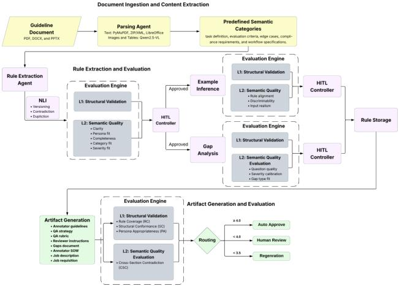

# GUIDE: Governed Unified Intelligence for Document-to-Artifact Generation in Enterprise Setings

Shivali Dalmia∗   
Centific Research   
Washington, USA   
shivali.dalmia@centific.com   
Mohammadreza Sediqin Centific Research New York, USA   
mohammadreza.s@centific.com

## ABSTRACT

Enterprise guideline documents are heterogeneous and multimodal, combining narrative text, complex tables, and embedded images. Existing LLM and VLM systems face hallucinated content, table structure degradation, and lack governed workflows extending be yond extraction to validation and artifact generation. This leaves enterprises to perform this manually, consuming 2–3 days per document. To address this, we introduce GUIDE, a governed multi-agent framework built on a shared versioned rule store with schemavalidated inter-agent contracts and end-to-end provenance tracking. Six specialized agents handle parsing, VLM-driven extraction, consistency checking, evaluation, human-in-the-loop (HITL) escalation, and persona-tailored artifact synthesis. Evaluated on 120 real-world enterprise guideline documents, GUIDE achieves 96% document success, extracts 3,896 rules with 71.4% auto-approved, produces 812 deployment-ready artifacts, and reduces turnaround to 40–125 minutes per document.

## VLDB Workshop Reference Format:

Shivali Dalmia, Sumukha Thoppanahalli, Mohammadreza Sediqin, and Abhishek Mukherji. GUIDE: Governed Unified Intelligence for Document-to-Artifact Generation in Enterprise Settings. VLDB 2026 Workshop: DASHSys: Systems for Data-centric Agents with Human-in-the-loop.

## 1 INTRODUCTION

Enterprise annotation pipelines rely on unstructured guideline documents that must be converted into structured, executable work artifacts before labeling can begin. Quality managers (QMs) and project managers (PMs) currently perform this manually—reading guidelines, inferring rules, resolving ambiguities, and assembling annotator instructions and statements of work. Each document

Sumukha Thoppanahalli Centific Research Washington, USA   
sumukhasharma.t@centific.com

Abhishek Mukherji Centific Research Washington, USA abhishek.mukherji@centific.com

takes 2–3 days, is error-prone, and must be redone whenever documents are updated [2, 12]. At scale, this becomes a critical bottleneck limiting how quickly projects can be stafed, launched, and maintained.

At its core, this is a data management challenge. Rules extracted from heterogeneous documents must be versioned, deduplicated, validated against a schema, and made traceable from source to artifact. Enterprise guideline documents compound this: text is encoded as positional tokens rather than semantic units; tables span pages, contain merged cells, or appear as images; and visual elements such as annotation examples and bounding box diagrams carry semantically critical information not captured in text [4]. Any parsing error cascades into downstream rule quality.

We introduce GUIDE, a governed multi-agent framework that treats guideline-to-artifact conversion as a data management problem: six specialized agents coordinate through a shared staging store that holds all extracted rules and intermediate results as structured, versioned data. This enforces contractual guarantees between stages, makes every artifact traceable to its source, and triggers human review only at explicit thresholds, the properties that make the pipeline governed. Our contributions are:

• A versioned, schema-validated shared staging store with stable rule\_id keying, inter-agent schema contracts, and end-to-end provenance tracking, forming the data management backbone of the pipeline.

• GUIDE, a governed multi-agent framework integrating deterministic parsing, VLM-based extraction, structured rule modeling, and dependency-aware artifact generation across six specialized agents.

• A two-stage evaluation framework combining structural validation (L1) and LLM-based semantic scoring (L2) with automated acceptance, targeted regeneration, and selective HITL escalation; zero-edit approvals feed back as calibration signals, reducing reviewer load.

• A dependency-driven HITL workflow routing only flagged rules, gaps, and artifacts to the QM or PM workbench by object type, severity, and downstream dependency.

• Empirical evaluation on 120 real-world enterprise guideline documents demonstrating strong performance across extraction fidelity, consistency control, and persona-specific artifact generation.

## 2 RELATED WORK

Document Parsing and Extraction. Document parsing has evolved from rule-based OCR pipelines [17] to hybrid vision-language approaches [7, 13], alongside discourse-level segmentation and structure-aware methods [15, 16]. Table extraction remains dificult: rule-based methods rely on geometric heuristics while VLM-based approaches improve robustness but introduce instability on dense or borderless layouts [5, 18]. Recent VLMs like Qwen-VL [3, 19] and LLaVA [8] advance multimodal extraction but vary in hallucination and visual grounding [21].

LLM-Based Structured Extraction. GoLLIE [14] shows annotation guidelines in prompts improve zero-shot extraction; UIE [10] enhances robustness via instruction tuning. However, these methods treat extraction as a single-step process and lack validation, contradiction handling, or production-level structuring. Layout-aware parsers such as Docling [9] and Donut [5] focus on extraction as a terminal task with no governed output routing or artifact generation. Since their outputs are structurally incompatible with GUIDE’s schema-constrained rule format, a direct end-to-end comparison is ill-posed; we instead compare against a monolithic single-model baseline with identical input and output structure.

Multi-Agent and HITL Systems. Multi-agent frameworks [20] decompose complex tasks across specialized agents but coordinate via unstructured message passing, without schema enforcement or provenance guarantees. HITL systems improve annotation quality through selective routing [1], yet treat review as a flat queue without distinction by object type, severity, or dependency. GUIDE addresses these gaps via schema-enforced inter-agent contracts, multi-stage quality evaluation, and dependency-aware HITL escalation.

## 3 SYSTEM ARCHITECTURE

GUIDE is architected around a central versioned rule store: schemaenforced tables keyed by stable rule\_ids serving as the shared data layer. Agents read from and write to this store through Pydanticvalidated contracts, ensuring no downstream agent ever consumes structurally invalid data. This yields three properties essential for enterprise deployment: provenance (every artifact traces to its source rules and originating document), versioning (rule updates across document revisions are reconciled rather than reprocessed), and auditability (every HITL decision is logged against a stable identifier). The system comprises six components: Parsing Agent, Rule Extraction Agent, Consistency Module, Evaluation Module, HITL Controller, and Artifact Generation Agent (Figure 1).

## 3.1 Document Ingestion and Rule Extraction

The Parsing Agent separates deterministic text extraction from VLM processing. Text is extracted from PDF (PyMuPDF), DOCX (internal XML), and PPTX (LibreOfice → PDF) without language models. Visual content is processed using Qwen2.5-VL [19] after MD5-based image deduplication. Extraction quality is assessed via � = 1 − (garbage + mojibake + repetition + silent\_skip) where each term is a normalized defect rate. Extracted content is segmented into semantic categories (task definition, evaluation criteria, edge cases, compliance requirements, workflow specifications) as a routing layer for downstream processing.

  
Figure 1: Overview of the GUIDE pipeline.

The Rule Extraction Agent applies a two-stage pipeline: opendomain extraction identifying candidate rules with source spans and confidence scores, followed by normalization into a fixed 26-field schema. Rule type determines persona routing: evaluation-criteria, edge-case, and qa-process rules route to the QM workbench; worker-requirements and delivery-schema rules route to the PM workbench. Rules pass through the Consistency Module, which applies embedding-based similarity filtering followed by NLI classification [11] for deduplication and version alignment. Gap analysis identifies missing or ambiguous aspects as structured GapObjects; resolved gaps generate ClarificationRecords and new RuleUnits. For each approved rule, examples are extracted when available or inferred under strict adherence to rule semantics.

## 3.2 Evaluation Engine and HITL

As ground truth annotations are unavailable for this corpus, all evaluation metrics are computed using standard signals: cosine similarity for grounding, schema validation for structural compliance, and LLM-as-judge scoring for semantic quality. All thresholds were selected empirically over the full corpus and fixed prior to all reported experiments; with only 120 diverse production documents, a held-out split would have reduced the diversity available for calibration. To validate the LLM judge, 300 rule-level annotations were independently labeled by expert annotators blind to judge outputs; the judge achieves precision 0.941, recall 0.974, F1 0.957, and Cohen’s � = 0.813 against these labels, providing an independent check that the calibrated thresholds align with expert judgment rather than overfitting the calibration corpus. These metrics and thresholds are applied through a two-stage validation pipeline that every structured object must pass. L1 (Structural) applies deterministic Pydantic validation: 28 constraints for RuleUnit (required fields, valid enumerations, prohibition of instruction-source duplication), 4 for ExampleObject (valid rule linkage, separation of correct/incorrect outputs), and 8 for GapObject (valid gap types, resolved rule references). Failed objects are retried, corrected, or rejected by error severity.

L2 (Semantic) scores passing objects across � quality dimensions using an LLM-as-judge:

$$
S ( x ) = { \frac { 1 } { K } } \sum _ { k = 1 } ^ { K } s _ { k } ( x ) , \quad s _ { k } \in \{ 1 , . . . , 5 \}\tag{1}
$$

with $K { = } 5$ for RuleUnit (clarity, persona fit, completeness, category fit, severity fit), �=3 for ExampleObject (rule alignment, discriminability, input realism), and �=3 for GapObject (question quality, severity calibration, gap type fit). Routing is by minimum dimension score: min� $s _ { k } \geq 4$ auto-approves; any �� ∈ {2, 3} routes to HITL; any $s _ { k } = 1$ rejects. Objects with rule\_source = inferred always route to HITL. Zero-edit HITL approvals are logged as calibration data for L2, progressively reducing reviewer load over deployment cycles. Every review decision is recorded against the corresponding rule\_id, providing a complete audit trail from human action to source rule.

HITL is staged and dependency-aware: Phase 1 reviews Rule-Units; Phase 2 reviews GapObjects conditioned on the approved rule set; Phase 3 reviews ExampleObjects conditioned on finalized rules and resolved gaps. This logically bounds the downstream review surface and ensures QM efort focuses on outputs grounded in high-quality, approved rules.

## 3.3 Artifact Generation

The Artifact Generation Agent transforms approved rules, resolved gaps, and evaluated examples into eight deployment-ready artifacts via Pydantic-constrained templates: annotator guidelines, QA strategy, QA rubric, reviewer instructions, gaps document, QA agent specification [6], annotator SOW, and job description/requisition. Each artifact is evaluated via:

$$
{ \mathrm { A R T } } = w _ { 1 } \cdot { \mathrm { R C } } + w _ { 2 } \cdot { \mathrm { S C } } + w _ { 3 } \cdot { \mathrm { P A } } + w _ { 4 } \cdot { \mathrm { C S C } }\tag{2}
$$

where RC (rule coverage), SC (structural conformance), PA (persona appropriateness via Flesch readability and LLM judgment), and CSC (cross-section contradiction, evaluated by Claude Sonnet 4.6) are combined with empirically tuned weights. ART ≥ 4.0 autoapproves; $3 . 5 \leq \mathrm { A R T } < 4 . 0$ routes to human review; ART < 3.5 triggers regeneration.

## 4 EVALUATION

## 4.1 Dataset and VLM Selection

Our corpus consists of 120 enterprise guideline documents from industrial clients (67 text, 23 speech, 16 multimodal, 8 image, 6 video; PDF/DOCX/PPTX formats), used as received without preprocessing; documents are governed by client confidentiality and non-disclosure agreements and cannot be released. Complexity tiers are defined by modality composition: Low (∼74 KB, 39–46 min), Moderate (∼1.5 MB, 46–70 min), and High (∼4.2 MB, 65–125 min). Table 1 shows Qwen2.5-VL-32B achieves the best balance of evidence rate (77.8%), hallucination (20.2%), and throughput (232/355 images) and the lowest duplication (14.6%); we select it for all stages.

Table 1: VLM benchmark results across document extraction tasks.
<table><tr><td>Model</td><td>Evidence (%)</td><td>Halluc. (%)</td><td>Quality (%)</td><td>Thruput (img)</td><td>Dupl. (%)</td></tr><tr><td>Qwen2.5-VL-32B</td><td>77.8</td><td>20.2</td><td>64.9</td><td>232</td><td>14.6</td></tr><tr><td>Qwen3-32B</td><td>76.7</td><td>22.7</td><td>73.2</td><td>184</td><td>17.9</td></tr><tr><td>LLaVA-13B</td><td>64.1</td><td>35.9</td><td>63.6</td><td>159</td><td>42.0</td></tr></table>

## 4.2 Content Extraction, Rule Extraction, and Artifacts

Content extraction across 120 documents (Table 3) achieves 96% document success with 99.2% page coverage, 97.1% figure recall, 88.3% table recall, and �=1.00 on successfully processed documents. Failures are caused by VLM timeouts on image-heavy documents and poorly structured tables.

Rule extraction on 115 documents (Table 4) yields 3,896 RuleUnits with 84.8% evidence rate, 82.6% coverage, and 3.2% hallucination. L1 passes 99.1%; the 0.9% flagged are structurally valid but insuficiently precise for direct execution. L2 auto-approves 71.4% with 28.6% routed to HITL and 0% rejected; most HITL cases arise from incomplete semantic coverage where rules capture the primary case but miss edge conditions. The consistency module identifies 26.7% gaps, 3.0% duplications, and 2.9% contradictions. The 2–3 day manual baseline is an expert estimate by the QMs and PMs who perform this task, indicating an order-of-magnitude reduction rather than an exact head-to-head.

Artifact generation produces 812 artifacts (Table 5). Cross-section contradiction (93.7%) and structural conformance (83.1%) reflect strong logical and structural consistency. Rule coverage (56.9%) and persona appropriateness (59.8%) remain the most challenging dimensions, the former reflects partial instantiation under constrained generation context, the latter reflects the dificulty of adapting technical rules for non-expert audiences. Only 29.8% of artifacts are auto-approved, with 52.0% routed to human review and 18.2% rejected, revealing two primary failure modes: incomplete rule propagation and persona adaptation gaps.

## 4.3 Comparison Against a Monolithic Baseline

We compare GUIDE against a one-pass Qwen2.5-VL-32B baseline that produces rules and artifacts directly from parsed documents, without the rule store, L1/L2 validation, consistency module, or HITL routing, using the same parser, documents, and scoring. Removing governance degrades every dimension (Table 2): hallucination rises from 3.2% to 15.7%, duplication from 3.0% to 10.3%, contradictions from 2.9% to 7.8%, and L1 pass rate falls from 99.1% to 93.2%. A layer-wise ablation isolates each layer: L1/L2 routes 1,114 units (28.6%) to review; the consistency module removes 117 duplicates, routes 113 contradictions, and surfaces 1,040 otherwiseundetected gaps.

## 5 LIMITATIONS AND FUTURE WORK

Limitations. GUIDE demonstrates strong performance across content extraction, rule generation, consistency validation, and artifact generation on real-world enterprise documents. VLM extraction stability decreases on low-quality scans and borderless or merged-cell tables, a known challenge across current vision-language systems. Persona appropriateness and rule coverage remain the most challenging artifact dimensions, reflecting the inherent dificulty of adapting technical rules to non-expert audiences. The calibration mechanism relies on accumulating zero-edit HITL approvals over deployment cycles, so scoring stability in early cycles remains limited. The current evaluation also covers English enterprise guidelines only. While the 26-field rule schema and QM/PM persona routing are specific to annotation operations, the staging store, schema contracts, L1/L2 evaluation, and dependency-aware HITL routing are domain-agnostic.

Table 2: Ungoverned one-pass baseline vs. GUIDE (same model, documents, and scoring).
<table><tr><td>Metric</td><td>Baseline</td><td>GUIDE</td></tr><tr><td>Hallucination</td><td>15.7%</td><td>3.2%</td></tr><tr><td>Duplication</td><td>10.3%</td><td>3.0%</td></tr><tr><td>Contradiction</td><td>7.8%</td><td>2.9%</td></tr><tr><td>L1 pass rate</td><td>93.2%</td><td>99.1%</td></tr></table>

Table 3: Content extraction evaluation across 120 documents.
<table><tr><td>Category</td><td>Metric</td><td>Value</td></tr><tr><td>Coverage</td><td>Page coverage</td><td>99.2%</td></tr><tr><td></td><td>Figure recall</td><td>97.1%</td></tr><tr><td></td><td>Table recall</td><td>88.3%</td></tr><tr><td colspan="2">Quality score Overall score</td><td>1.00</td></tr><tr><td></td><td>Garbage ratio</td><td>0.00%</td></tr><tr><td></td><td>Mojibake ratio</td><td>0.00%</td></tr><tr><td></td><td>Repetition ratio</td><td>0.01%</td></tr><tr><td></td><td>Silent skip ratio</td><td>0.00%</td></tr><tr><td></td><td colspan="2">Success rate Document success 96% (115/120)</td></tr></table>

Table 4: Rule extraction (3,896 RuleUnits).

<table><tr><td>Category</td><td>Metric</td><td>Value</td></tr><tr><td>Quality</td><td>Evidence rate</td><td>84.8%</td></tr><tr><td></td><td>Coverage Hallucination</td><td>82.6% 3.2%</td></tr><tr><td>L1</td><td>Pass rate</td><td>99.1%</td></tr><tr><td></td><td>Ambiguity</td><td>0.9%</td></tr><tr><td>L2</td><td>Auto-approved</td><td>71.4%</td></tr><tr><td></td><td>Human review</td><td>28.6%</td></tr><tr><td></td><td>Rejected</td><td>0.0%</td></tr><tr><td>Consistency</td><td></td><td></td></tr><tr><td></td><td>Gaps</td><td>26.7%</td></tr><tr><td></td><td>Duplications</td><td>3.0%</td></tr><tr><td></td><td>Contradictions</td><td>2.9%</td></tr></table>

Table 5: Artifact evaluation (115 documents, 812 artifacts).

<table><tr><td>Category</td><td>Metric</td><td>Value</td></tr><tr><td>HITL routing</td><td>Auto-approved</td><td>29.8%</td></tr><tr><td></td><td>Human review</td><td>52.0%</td></tr><tr><td></td><td>Rejected</td><td>18.2%</td></tr><tr><td>L1</td><td>Rule coverage</td><td>56.9%</td></tr><tr><td></td><td>Structural conform.</td><td>83.1%</td></tr><tr><td></td><td>Cross-sect. contra.</td><td>93.7%</td></tr><tr><td></td><td>Gap completeness</td><td>66.7%</td></tr><tr><td>L2</td><td>Persona approp.</td><td>59.8%</td></tr><tr><td></td><td>Sequential correct.</td><td>65.2%</td></tr></table>

Future Work. We will improve table detection and VLM prompting for degraded layouts, develop persona adaptation modules that learn audience-specific language patterns from approved artifacts, and incorporate structured reviewer edits as additional fine-tuning signal to accelerate calibration convergence. GUIDE will further be extended to multilingual settings and broader domains including legal, clinical, and regulatory, with domain-adapted consistency models trained on enterprise rule pairs.

## 6 CONCLUSION

We presented GUIDE, a governed multi-agent framework that transforms heterogeneous enterprise guideline documents into structured, deployment-ready artifacts via a schema-enforced shared staging store with end-to-end provenance. By coordinating six specialized agents through typed intermediate relations and applying threshold-driven HITL escalation, GUIDE reduces end-to-end turnaround from 2–3 days to 40–125 minutes while maintaining strong extraction fidelity and consistency. GUIDE shows how governed multi-agent pipelines serve as a principled foundation for data-aware, human-aligned agentic systems where reliability, traceability, and selective human oversight are first-class design goals.

## ACKNOWLEDGMENTS

We thank Srinivasa Karthikeya Reddy Kovvuri for his contributions to this work.

## REFERENCES

[1] Saleema Amershi et al. 2016. Human-in-the-loop machine learning: A survey. arXiv preprint arXiv:1611.04477 (2016).

[2] Eric Anderson, Jonathan Fritz, et al. 2024. The design of an llm-powered unstructured analytics system. arXiv preprint arXiv:2409.00847 (2024).

[3] Shuai Bai, Yuxuan Cai, et al. 2025. Qwen3-vl technical report. arXiv preprint arXiv:2511.21631 (2025).

[4] Wenjun Ke et al. 2025. Large language models in document intelligence: A comprehensive survey, recent advances, challenges, and future trends. ACM (2025).

[5] Geewook Kim et al. 2022. OCR-free Document Understanding Transformer (Donut). In ECCV.

[6] Sunil Kothari et al. 2026. Position: Early-Stage Quality Assurance in Annotation Pipelines Is More Cost-Efective Than Late-Stage Validation. arXiv preprint arXiv:2605.15714 (2026).

[7] Zhang Li et al. 2025. Monkeyocr: Document parsing with a structure-recognitionrelation triplet paradigm. arXiv preprint arXiv:2506.05218 (2025)

[8] Haotian Liu, Chunyuan Li, Qingyang Wu, and Yong Jae Lee. 2023. Visual instruction tuning. Advances in neural information processing systems 36 (2023).

[9] Nikolaos Livathinos et al. 2025. Docling: An eficient open-source toolkit fo ai-driven document conversion. arXiv preprint arXiv:2501.17887 (2025).

[10] Yaojie Lu et al. 2022. Unified Structure Generation for Universal Information Extraction, arXiv:2203 12277

[11] Bill MacCartney. 2009. Natural language inference. Stanford University.

[12] Vincent Perot et al. 2024. Lmdx: Language model-based document information extraction and localization. In ACL 2024.

[13] Jake Poznanski et al. 2025. olmocr: Unlocking trillions of tokens in pdfs with vision language models. arXiv:2502.18443 (2025).

[14] Oscar Sainz et al. 2024. GoLLIE: Annotation Guidelines improve Zero-Shot Information-Extraction. arXiv:2310.03668

[15] Mohammadreza Sediqin and Shlomo Engelson Argamon. 2025. RST-NDAS: RST Nuclei for Discourse-Aware Abstractive Summarization. In (DSAA). IEEE.

[16] Mohammadreza Sediqin and Shlomo Engelson Argamon. 2026. LACES: Lexical and Contextual Awareness for EDU Segmentation. In Advances in Natural Language Processing and Information Retrieval. Springer Nature Switzerland.

[17] Ray Smith. 2007. An overview of the Tesseract OCR engine. In ICDAR 2007.

[18] Andrey Verbovskiy. 2025. Comparing OCR and VLM techniques in processing tabular data. Master’s thesis. A. Verbovskiy.

[19] Peng Wang et al. 2024. Qwen2-vl: Enhancing vision-language model’s perception of the world at any resolution. arXiv preprint arXiv:2409.12191 (2024).

[20] Qingyun Wu, Gagan Bansal, et al. 2023. AutoGen: Enabling Next-Gen LLM Applications via Multi-Agent Conversation. arXiv:2308.08155 (2023).

[21] Fengbin Zhu et al. 2024. MMDocBench: Benchmarking Large Vision-Language Models for Fine-Grained Visual Document Understanding. arXiv:2410.21311