# Learning Loco-Manipulation From SMPC Demonstrations With Sparse Offline-to-Online RL

Martin Schuck 1,2 Maks Sorokin 1 Simone Manni 1,3 Duy Ta 1

Angela P. Schoellig 2 Marco Hutter 1,3 Simon Le Cleac’H 1 Jan Brudigam ¨ 1

1RAI Institute 2Technical University of Munich 3 ETH Zurich

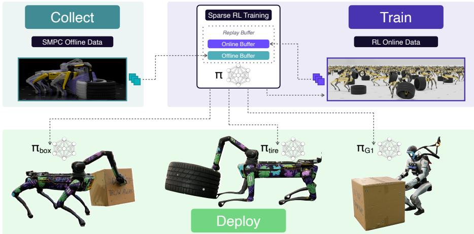  
Figure 1: The three main stages of our proposed pipeline. We first collect a dataset from an expert Sample-based Model Predictive Control (SMPC), which is easy to tune in near real-time. We then train complex loco-manipulation policies with sparse rewards solely by mixing in the offline expert data, skipping tedious reward tuning. Finally, the sparse-reward policies are deployed on hardware. Website: https://pages.rai-inst.com/smpc2rl/

Abstract: Integrating locomotion and manipulation is essential for robot autonomy, but scaling standard Reinforcement Learning (RL) to complex tasks is severely bottlenecked by the slow, manual process of dense reward shaping. To bypass this limitation, we leverage Sample-based Model Predictive Control (SMPC) entirely in simulation as an automated, rapidly tunable expert to generate massive offline datasets. Because this data solves the fundamental exploration problem, we can train an off-policy RL agent using purely sparse task rewards, drastically reducing the time required to learn new skills and eliminating the need for manual tuning. Integrating this high-level agent with a low-level dynamic stability controller yields more optimal behaviors that strictly align with true task objectives, ultimately allowing the learned policies to surpass the original optimal control teacher. We validate the robustness of this sim-to-real framework by successfully deploying complex loco-manipulation skills across different morphologies, including an arm-equipped Spot quadruped and a G1 humanoid.

Keywords: RL, Sample-based MPC, Whole-Body Manipulation

## 1 Introduction

The ability to seamlessly integrate locomotion and manipulation is essential for deploying autonomous robots in unstructured environments. Yet, learning loco-manipulation policies from scratch using RL has proven difficult. Recent developments in RL largely focus on imitation and trajectory tracking [1, 2, 3]. One major reason for this is that scaling pure RL to complex tasks relie heavily on dense reward shaping to guide exploration. Evaluating a single modification to the reward function requires lengthy training cycles, making iterative tuning prohibitively slow. Conversely, optimal control strategies such as SMPC [4, 5] are easier to tune, but their high computational cost prevents their direct deployment on high-degree-of-freedom hardware.

Consider, for example, an arm-equipped quadruped tasked with rolling a large tire. Because the object is too massive to drag, the robot must continuously coordinate its stepping to maintain dynamic stability while actively maneuvering its arm to exert forward force. Engineering a dense RL reward function for this intricate coordination requires navigating a highly constrained optimization landscape, where each adjustment demands extensive time to validate. In simulation, however, an SMPC controller can be iteratively tuned to solve this exact behavior in the order of minutes.

In this paper, we propose leveraging both paradigms to enable training RL policies for locomanipulation. We utilize SMPC entirely in simulation as an automated, highly scalable expert to generate massive datasets of successful demonstrations. Because this offline data solves the fundamental exploration problem, we then train an off-policy RL agent using purely sparse task rewards. This eliminates the need for manual reward shaping entirely, ensuring the learned policy strictly optimizes the true task objective and naturally achieves faster task completion than the expert. By doing so, we effectively pair the rapid tuning capabilities of optimal control with the fast execution speeds of neural networks and robustness of RL policies trained with domain randomization. To achieve reliable sim-to-real transfer, this high-level agent is integrated with a low-level whole-body controller that actively tracks limb motion while ensuring the robot’s dynamic stability [4].

Our contributions are as follows:

Tuning-free RL training We introduce a framework that leverages SMPC as an easily tunable automated data generator in simulation, enabling the use of sparse-reward off-policy RL and completely circumventing the manual reward-tuning bottlenecks of standard RL pipelines.

Optimal loco-manipulation policies We demonstrate empirically that bootstrapping sparse offpolicy RL with these SMPC datasets yields hardware-deployable policies that ultimately surpass the original optimal control teacher in performance.

Validation across real-world platforms We validate the robustness and generality of our approach across vastly different morphologies, deploying the learned skills on real hardware for both an armequipped Spot quadruped and a G1 humanoid.

## 2 Related Work

Model Predictive Control (MPC) approaches leverage known system dynamics to achieve locomanipulation tasks such as pulling and pushing [6], grasping and picking-and-placing [7, 8], or non-prehensile object moving [9]. However, by definition, these methods require accurate model knowledge, including the dynamics’ gradients, and are limited to prespecified contacts or narrow task formulations due to their high computational demand. In contrast, RL-based methods offer fast execution of advanced tasks by distilling optimization into networks. As a result, policies can perform more general manipulation of objects [2, 3], including whole-body interactions [1]. Yet, since on-policy RL for complex loco-manipulation requires dense reward shaping to guide exploration, current approaches use RL to track provided interaction trajectories instead of learning behaviors purely from rewards. As such, their generality is limited to the quality and availability of demonstrations. Our approach leverages the advantages of both paradigms: rather than deploying model-based optimal control in real-time, we use it entirely in simulation as an automated offline teacher to bypass the RL reward-tuning bottleneck, while allowing RL to outperform the expert demonstrations.

Leveraging large offline datasets for complex robotics requires architectures optimized for rapid learning and robust sim-to-real transfer. The offline-to-online paradigm [10] has proven effective at accelerating the training of RL agents with expert demonstrations. Streamlined off-policy architectures such as FastTD3 and FastSAC [11] have demonstrated strong sample efficiency, enabling training and sim-to-real transfer of high-dimensional humanoid locomotion with significantly reduced training times. We extend these approaches by integrating the offline-to-online paradigm with a modified FastTD3 architecture. By bootstrapping this efficient learner with our SMPC-generated expert datasets, we enable the acquisition of complex loco-manipulation skills using purely sparse rewards. This approach significantly reduces the overall training time and eliminates the need for manual RL reward engineering.

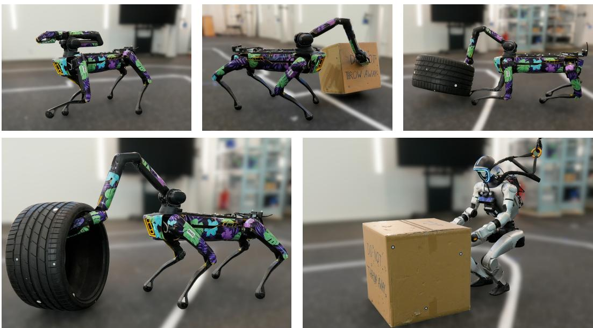  
Figure 2: Real-world deployment of our tasks. Our framework learns complex loco-manipulation skills across different embodiments (Spot and G1), objects (boxes and tires), and skills (pushing, rolling, or lifting). From left to right, top to bottom: Spot reach, box pushing, tire uprighting, tire rolling, and G1 box pushing.

There exists other work that circumvents the exploration challenges and manual reward shaping inherent in standard RL for manipulation by using demonstrations to guide the learning process. Learning from human demonstrations can be achieved with an augmented behavior-cloning loss [12], by bootstrapping a policy with imitation learning [13], or by adding demonstrations to the replay buffer [14]. However, the tasks investigated in these works are tabletop end-effector manipulation tasks—obtaining human demonstrations for loco-manipulation tasks, especially on non-humanoid robots, is a restrictive limitation for these methods. An alternative is using algorithmic planners to generate demonstrations. Learning can be guided by such demonstrations through informed reset states [15, 16]. As before, these methods are limited to tabletop and in-hand manipulation tasks. In [17], a graph-based motion planner with task-specific heuristics is used to generate dexterous manipulation data for training RL policies in stationary manipulation settings. Our approach focuses on dynamic, whole-body loco-manipulation rather than stationary dexterity. Furthermore, instead of relying on tree search and discrete heuristics, we utilize a unified SMPC framework that readily scales to a wide variety of loco-manipulation tasks and embodiments.

## 3 Learning Loco-Manipulation With SMPC Demonstrations

Our objective is to learn robust loco-manipulation policies using strictly sparse task rewards, thereby eliminating the need for extensive, manual reward tuning when acquiring new skills. However, training RL agents with sparse objectives poses a severe exploration challenge, particularly in the high-dimensional continuous action spaces of systems that combine legs and arms. To overcome this, we adopt an offline-to-online training paradigm, utilizing off-policy algorithms bootstrapped with expert demonstrations to bypass the initial exploration phase. Rather than relying on human teleoperation or human motion retargeting—which scale poorly to non-anthropomorphic platforms such as arm-equipped quadrupeds—we construct our offline dataset using SMPC in simulation. SMPC allows for rapid, intuitive tuning of complex behaviors and can be straightforwardly applied to any robotic morphology.

The remainder of this section is structured as follows: First, we provide an overview of our hierarchical control architecture (Section 3.1). Next, we formulate our offline-to-online RL pipeline using Twin Delayed DDPG (TD3) [18] to train policies exclusively on sparse-rewards (Section 3.2). Finally, we demonstrate how we leverage SMPC to autonomously generate the required high-quality datasets across diverse morphologies (Section 3.3).

## 3.1 Overview

We employ a hierarchical control architecture that decouples task-level navigation and manipulation from base maneuvering. This structure is shared during data collection and deployment, allowing seamlessly swapping between the SMPC expert or the RL agent for the high-level policy.

High-Level Task Policy The high-level policy is responsible for overarching manipulation and navigation. Its action space is defined as $a _ { \mathrm { h i g h } } = [ \Delta v _ { \mathrm { c m d } } , \Delta q _ { \mathrm { c m d } } ^ { \mathrm { a r m } } , \Delta h _ { \mathrm { c m d } } , \Delta p _ { \mathrm { c m d } } ]$ , where $\Delta v _ { \mathrm { c m d } } \in \mathbb { R } ^ { 3 }$ represents the delta to the current desired planar base velocity, $\Delta q _ { \mathrm { c m d } } ^ { \mathrm { a r m } } \in \mathbb { R } ^ { n _ { \mathrm { a } } }$ specifies the delta to the current target joint positions for the na-degree-of-freedom arm, $\Delta h _ { \mathrm { c m d } } \in$ R specifies the delta to the current torso height target, and $\Delta p _ { \mathrm { c m d } } \in$ R specifies the delta to the current desired torso pitch target. For Spot, we keep the torso height and pitch fixed and do not command these values.

Low-Level Stabilization Controller The kinematic commands from the high-level policy are passed to a whole-body maneuvering controller trained via the ReLIC framework [4], which is subsequently frozen for all downstream task learning. Given $a _ { \mathrm { h i g h } }$ and the current proprioceptive state, it outputs full-body joint position targets $q _ { \mathrm { t a r g e t } } = [ q _ { \mathrm { t a r g e t } } ^ { \mathrm { l e g s } } , q _ { \mathrm { t a r g e t } } ^ { \mathrm { a r m } } ]$ . This low-level policy strictly tracks the commanded arm motion and base velocity while dynamically adjusting the leg joints $q _ { \mathrm { l e g s } }$ to maintain balance, enabling the high-level policy to focus exclusively on task completion.

## 3.2 Training Off-Policy RL with Sparse Rewards

We formulate the high-level loco-manipulation task as a Markov decision process and train our policy in simulation using MuJoCo Warp and mjlab [19, 20]. Because our objective is to eliminate manual reward engineering, we define a strictly sparse task reward function

$$
r = \left\{ \begin{array} { l l } { { 0 \quad \quad } } & { { \mathrm { a t ~ g o a l } } } \\ { { - \frac { 2 } { 1 - \gamma } \quad \quad } } & { { \mathrm { r o b o t ~ c r a s h e d } , } } \\ { { - 1 \quad \quad } } & { { \mathrm { e l s e } } } \end{array} \right.\tag{1}
$$

where $\gamma$ is the discount factor of 0.99 in our experiments. The crash penalty for terminations is chosen such that agents prefer the constant negative reward over crashing, i.e., $\begin{array} { r } { \dot { \sum _ { i = 0 } ^ { \infty } } - 1 \gamma ^ { i } = - \frac { 1 } { 1 - \gamma } } \end{array}$ The robot is considered crashed when the torso height or tilt exceeds pre-defined limits.

Naturally, optimizing this sparse reward from scratch in a high-dimensional continuous action space is intractable without tailored exploration strategies. To overcome this bottleneck, we employ an offline-to-online training strategy utilizing a modified FastTD3 architecture. During the initial phases of learning, we replace 50% of the transitions in the replay buffer with pre-collected expert data (detailed in Section 3.3). This steady injection of expert transitions provides the necessary successful samples to ground the critic networks, allowing them to produce meaningful policy gradient estimates before the online agent randomly discovers successful trajectories. To prevent the policy from continually relying on these demonstrations, we use a curriculum that phases out the expert data once the agent achieves a sufficient empirical success rate, shifting to pure online learning.

Because policies trained with sparse objectives seek optimal solutions that push the physical limits of the platform, we must ensure these behaviors remain safe and deployable. To achieve this, we parameterize the high-level policy to output action deltas $( [ \Delta v _ { \mathrm { c m d } } , \Delta q _ { \mathrm { c m d } } ^ { \mathrm { a r m } } , \Delta h _ { \mathrm { c m d } } , \Delta p _ { \mathrm { c m d } } ] )$ ) relative to the current desired velocity and kinematic state, rather than absolute targets. This parameterization allows us to explicitly enforce maximum desired accelerations and speeds within the action space.

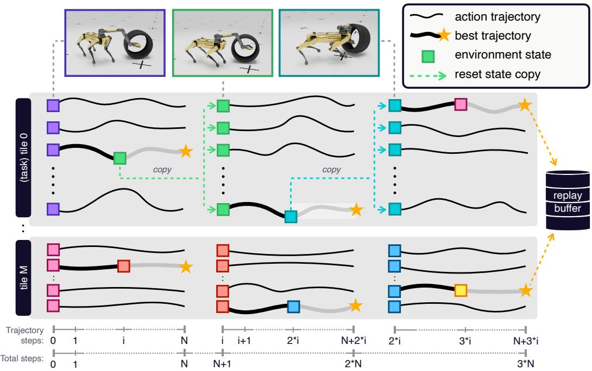  
Figure 3: We scale our SMPC data collection by solving multiple SMPCs in parallel on the GPU using vectorized environments divided into tiles. Each tile broadcasts its initial task to all its environments upon reset, runs sampled actions, selects the best trajectories, and adds them to our expert buffer. Note the different x-axes scales for a task’s trajectory steps and total simulation steps.

Finally, because our sparse reward formulation defines strictly known maximum and minimum possible returns, we structurally bound the critic network outputs to these limits. Unbounded overestimation in Q-functions is strongly associated with learning instability [21], and bounded critics have been successfully applied in advanced algorithms [22]. Empirically, we observe that enforcing these bounds at the architectural level significantly stabilizes training, particularly when hyperparameter configurations are still suboptimal. Complete environmental details, network architectures, and hyperparameters are provided in Appendix B.

## 3.3 Data Collection with Sampling-Based Model Predictive Control

To collect large-scale expert demonstrations without the prohibitive expense of manual teleoperation, which scales poorly to complex morphologies like an arm-equipped Spot, we employ SMPC as an automated expert. We run the SMPC using the same vectorized MuJoCo Warp environments as our RL pipeline, though it is guided by easily formulated dense cost functions rather than sparse rewards. At first glance, this might seem counterintuitive because we are reintroducing dense rewards that need to be tuned. However, the key difference is that the SMPC can be tuned in near real time, does not require training, and can thus be run interactively. On a single RTX 5090, our SMPC achieves 0.5 real-time performance. This allows us to tune rewards in minutes and start generating expert data without training a policy.

We find that a streamlined SMPC formulation, similar to Howell et al. [23], with random sampling and a warm-start strategy typical of MPC algorithms, is sufficient to solve our tasks without additional complexities such as Model Predictive Path Integral Control [24]. Once the dense costs are tuned, we scale the data collection using a massively parallelized tiled approach (see Figure 3). This architecture allows us to generate high-quality demonstration datasets at a rate of one million samples per hour (where each sample consists of a single observation, action, reward, and next observation), providing the offline data required to successfully bootstrap the sparse-reward RL agent within four hours on a single GPU. Complete algorithmic details are provided in the Appendix C.

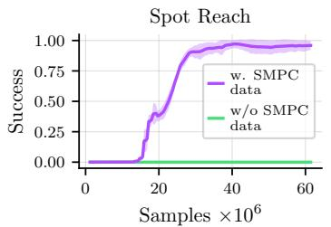

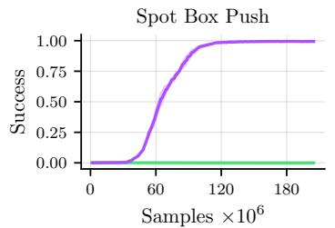

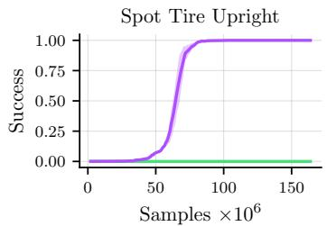

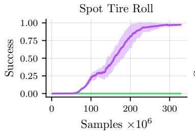

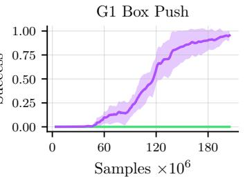  
Figure 4: Training performance of our framework on different tasks. We show the success rate of our policy over time in increasingly complex tasks. Our framework reliably reaches success rates close to 100% in simulation without any reward shaping. Without adding expert SMPC data, learning complex loco-manipulation policies from sparse rewards fails to learn anything. Statistic are averaged over five seeds, with the shaded area representing the standard deviation.

## 4 Experiments

We demonstrate the viability of our approach on a Boston Dynamics Spot quadruped equipped with an arm and a Unitree G1 humanoid. For more details on our hardware setup, see Appendix D. Additionally, we answer the following research questions with structured ablations:

Q1: Do agents trained on sparse rewards improve over seen data?

Q2: How much data is required for task learning?

Q3: How important is the quality of the data?

Q4: How does multimodality in the data affect training?

Real-world deployment on diverse platforms We design five diverse tasks, depicted in Figure 2, that require complex, whole-body coordination. For Spot, we start with proof-of-concept navigation task. Subsequently, we evaluate tasks requiring sustained physical contact and force exertion: pushing a box, uprighting tire, and rolling a tire. Finally, we evaluate generalization to bipedal systems by testing the G1 humanoid on the box-pushing task. The resulting training runs are depicted in Figure 4. Across all tasks, policies achieve near-perfect success rates with little variance between different seeds. The steps required for satisfactory performance grows with task complexity.

Empirically, we find that the policies trained exclusively on sparse rewards can be reliably deployed on the physical hardware across all five tasks and both robotic platforms. This demonstrates that our hierarchical architecture and offline-to-online training pipeline generalize robustly to real-world dynamics without requiring platform-specific reward engineering. Videos of all real-world deployments demonstrating this generalization can be viewed in our supplementary material.

Q1: Improving over seen expert data Sparse rewards eliminate the need for manual tuning and remove the biases introduced by surrogate reward shaping. This enables the discovery of task-optimal behaviors. We investigate whether our offline-to-online framework improves over the dataset by comparing the average task-completion time of the trained policy and the SMPC expert.

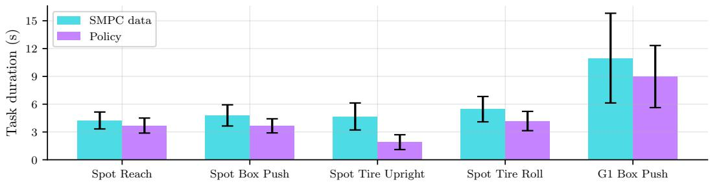  
Figure 5: We compare the performance of policies trained on sparse rewards (pink) and the SMPC used to generate the offline dataset on all tasks (blue). Our trained policies consistently finish the tasks faster than the SMPC experts. SMPC statistics are computed over the complete dataset of 4M samples, policy statistics are averaged over 50k simulated episodes without exploration noise.

As depicted in Figure 5, our sparse-reward approach consistently outperforms SMPC. Some tasks see improvements above 50%. Notably, learned policies show increased consistency, indicated by a 11-45% reduction in standard deviation of task duration. We attribute SMPC’s variance to suboptimal trajectories resulting from the limited number of parallel environments used for exploration.

Q2: Amount of data While our method’s data generation can be parallelized across multiple GPUs, a small dataset is generally desirable for efficiency. Therefore, we evaluate the required volume of expert data across different tasks. We ablate the dataset size per task, scaling up from hundreds of thousands to millions of samples. The results in Figure 6 demonstrate a clear correlation with task complexity: while easier tasks can be successfully solved with little data, more complex whole-body manipulation tasks require significantly larger datasets. We posit that this effect is caused by the policy gradient estimate. While critics trained on little data yield sufficiently accurate gradient estimates for easy tasks, value estimates for complex tasks with a wider state distribution require training on a dataset with greater coverage.

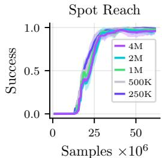

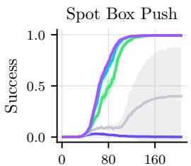  
Samples 106

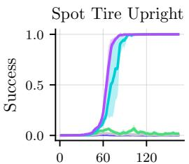  
Samples 106

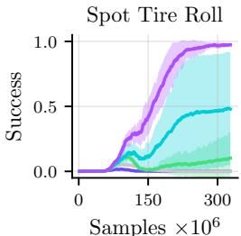  
Figure 6: Training performance with different SMPC dataset sizes. For simple tasks (i.e., navigation), reducing the number of samples has little effect. As tasks get more complex, the minimum required dataset size increases. On our most difficult task, agents require four million samples col lected within 4 GPU hours to converge.

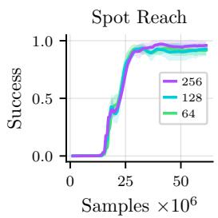

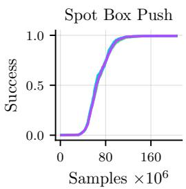

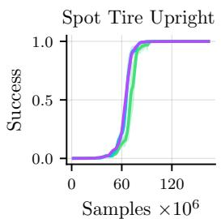

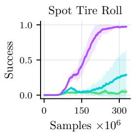  
Figure 7: Performance under varying data quality. We reduce the number of sampling environments per tile during data generation and train policies on the resulting datasets. Most tasks are robust to lower-quality data, whereas tasks that require high coordination are sensitive.

Q3: Quality of the data Along the same line, we analyze the influence of the SMPC trajectory quality on the downstream RL agent. Reducing the number of sampling environments during SMPC data generation leads to less exploration of the cost landscape, reducing the likelihood of sampling a well-performing trajectory (see also Appendix C), and thus resulting in lower-quality expert datasets. Surprisingly, most tasks are relatively robust to a low number of sampling environments (see Figure 7). However, for tire rolling, which requires the most coordination, we see a drop in successes. We thus conclude that the required data quality is highly correlated with the required task precision.

Q4: Multimodality in the data Our training pipeline collects expert datasets with automated SMPC. While SMPC is scalable and easily parallelized, it introduces a structural mismatch: RL policies rely on the Markov property and output uni-modal action distributions, whereas SMPC is inherently multi-modal and not observation-dependent, because it operates directly on the current state and initial guess provided by the MPC warm-starting strategy.

To analyze the impact of multi-modality on training stability, we compare training with uni-modal and multi-modal SMPC data. Uni-modality is achieved through stricter rewards. Multi-modality appears as, for example, kicking the tire into the goal with Spot’s legs, pushing it with the shoulder, or stepping into the tire. Introducing terms for leg and body contacts generates solutions that use the arm instead. Importantly, these terms can be tuned interactively in

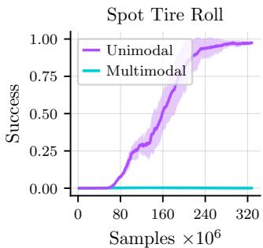  
Figure 8: Using multi-modal SMPC data heavily affects training and agents fail to learn viable policies.

just a few minutes. As shown in Figure 8, the policy trained on the multi-modal dataset completely fails to learn, even though the demonstration success rate is slightly higher, indicating that enforcing a single behavioral mode in the demonstration data is required for successful offline initialization.

## 5 Conclusion

In this work, we present an offline-to-online RL framework that enables the acquisition of complex loco-manipulation skills without manual reward tuning. By leveraging SMPC as an automated teacher, we bypass the need for expensive, non-scalable data collection methods such as teleoperation or motion capture. We validate this approach through real-world deployments across five challenging whole-body tasks with an arm-equipped Spot quadruped and a Unitree G1 humanoid.

We investigate the algorithmic conditions required to utilize SMPC data for offline-to-online RL. By guiding the learning process with expert data, the policy successfully optimizes for sparse task objectives, yielding loco-manipulation behaviors that are quantitatively superior to the dense-reward SMPC trajectories. Our ablations show that the required dataset size and quality scale with task complexity, and that filtering the inherent multimodality of the planner is necessary to effectively leverage SMPC demonstrations.

By demonstrating that SMPC can be visually tuned in near real-time and massively parallelized for data generation, we position it as a scalable utility for the RL community. We hope this work highlights how integrating automated expert data into sparse-reward training can accelerate the development of agile robotic behaviors while avoiding the iteration cycles of manual reward engineering.

## 6 Limitations

Our offline-to-online framework successfully yields deployable policies, but the achieved behavioral optimality remains local. Because the agent initially relies on SMPC demonstrations for successful samples, its policy is tied to the dataset’s distribution. Under realistic training constraints, the policy will optimize within this local manifold but is not expected to discover globally optimal strategies that fundamentally diverge from the provided trajectories. Additionally, hyperparameters, such as network sizes and learning rates affect training results.

The current control architecture is limited by the frozen weights of the low-level controller. It prevents adaptation to task-specific physical disturbances. This limitation could be resolved by unfreezing weights during late-stage online learning. Furthermore, real-world deployment relies on state-based information. Deployment in unstructured environments or outdoors either requires training on vision-based data or a distillation into a vision-based policy.

## Acknowledgments

If a paper is accepted, the final camera-ready version will (and probably should) include acknowledgments. All acknowledgments go at the end of the paper, including thanks to reviewers who gave useful comments, to colleagues who contributed to the ideas, and to funding agencies and corporate sponsors that provided financial support.

## References

[1] S. Zhao, Y. Ze, Y. Wang, C. K. Liu, P. Abbeel, G. Shi, and R. Duan. Resmimic: From general motion tracking to humanoid whole-body loco-manipulation via residual learning. arXiv preprint arXiv:2510.05070, 2025.

[2] J. Dao, H. Duan, and A. Fern. Sim-to-real learning for humanoid box loco-manipulation. In 2024 IEEE International Conference on Robotics and Automation (ICRA), pages 16930– 16936. IEEE, 2024.

[3] F. Liu, Z. Gu, Y. Cai, Z. Zhou, H. Jung, J. Jang, S. Zhao, S. Ha, Y. Chen, D. Xu, et al. Opt2skill: Imitating dynamically-feasible whole-body trajectories for versatile humanoid locomanipulation. IEEE Robotics and Automation Letters, 2025.

[4] X. Zhu, Y. Chen, L. Sun, F. Niroui, S. L. Cleac’h, J. Wang, and K. Fang. Versatile locomanipulation through flexible interlimb coordination. In 9th Annual Conference on Robot Learning, 2025. URL https://openreview.net/forum?id=Spg25qkV81.

[5] L. Brudermuller, B. Hung, X. Zhu, J. Wang, N. Hawes, P. Culbertson, and S. Le Cleac’h.¨ Generative models from and for sampling-based mpc: A bootstrapped approach for adaptive contact-rich manipulation. IEEE Robotics and Automation Letters, 11(3):3478–3485, 2026. doi:10.1109/LRA.2026.3655193.

[6] L. Molnar, J. Cheng, G. Fadini, D. Kang, F. Zargarbashi, and S. Coros. Whole-body inverse dynamics mpc for legged loco-manipulation. IEEE Robotics and Automation Letters, 2025.

[7] R. S. Sambhus, K. K. Mehta, A. M. Sadeghi, B. M. Imran, J. Kim, T. Chunawala, V. Pastore, S. Vijayan, and K. A. Hamed. A nonlinear mpc framework for loco-manipulation of quadrupedal robots with non-negligible manipulator dynamics. IEEE Robotics and Automation Letters, 2026.

[8] A. Rigo, M. Hu, S. K. Gupta, and Q. Nguyen. Hierarchical optimization-based control for whole-body loco-manipulation of heavy objects. In 2024 IEEE International Conference on Robotics and Automation (ICRA), pages 15322–15328. IEEE, 2024.

[9] A. Rigo, Y. Chen, S. K. Gupta, and Q. Nguyen. Contact optimization for non-prehensile loco-manipulation via hierarchical model predictive control. arXiv preprint arXiv:2210.03442, 2022.

[10] P. J. Ball, L. Smith, I. Kostrikov, and S. Levine. Efficient online reinforcement learning with offline data. In International Conference on Machine Learning, pages 1577–1594. PMLR, 2023.

[11] Y. Seo, C. Sferrazza, H. Geng, M. Nauman, Z.-H. Yin, and P. Abbeel. Fasttd3: Simple, fast, and capable reinforcement learning for humanoid control. arXiv preprint arXiv:2505.22642, 2025.

[12] A. Nair, B. McGrew, M. Andrychowicz, W. Zaremba, and P. Abbeel. Overcoming exploration in reinforcement learning with demonstrations. In 2018 IEEE international conference on robotics and automation (ICRA), pages 6292–6299. IEEE, 2018.

[13] H. Hu, S. Mirchandani, and D. Sadigh. Imitation bootstrapped reinforcement learning. arXiv preprint arXiv:2311.02198, 2023.

[14] M. Vecerik, T. Hester, J. Scholz, F. Wang, O. Pietquin, B. Piot, N. Heess, T. Rothorl, T. Lampe,¨ and M. Riedmiller. Leveraging demonstrations for deep reinforcement learning on robotics problems with sparse rewards. arXiv preprint arXiv:1707.08817, 2017.

[15] L. Pinto, A. Mandalika, B. Hou, and S. Srinivasa. Sample-efficient learning of nonprehensile manipulation policies via physics-based informed state distributions. arXiv preprint arXiv:1810.10654, 2018.

[16] G. Khandate, T. L. Saidi, S. Shang, E. T. Chang, Y. Liu, S. Dennis, J. Adams, and M. Ciocarlie. R r: Rapid exploration for reinforcement learning via sampling-based reset distributions and imitation pre-training. Autonomous Robots, 48(7):17, 2024.

[17] J. Bruedigam, A. A. Abbas, M. Sorokin, K. Fang, B. Hung, M. Guru, S. G. Sosnowski, J. Wang, S. Hirche, and S. L. Cleac’h. Jacta: A versatile planner for learning dexterous and wholebody manipulation. In 8th Annual Conference on Robot Learning, 2024. URL https:// openreview.net/forum?id=vobaOY0qDl.

[18] S. Fujimoto, H. van Hoof, and D. Meger. Addressing function approximation error in actorcritic methods. In J. Dy and A. Krause, editors, Proceedings of the 35th International Conference on Machine Learning, volume 80 of Proceedings of Machine Learning Research, pages 1587–1596. PMLR, 10–15 Jul 2018. URL https://proceedings.mlr.press/v80/ fujimoto18a.html.

[19] E. Todorov, T. Erez, and Y. Tassa. Mujoco: A physics engine for model-based control. In 2012 IEEE/RSJ International Conference on Intelligent Robots and Systems, pages 5026– 5033. IEEE, 2012. doi:10.1109/IROS.2012.6386109.

[20] K. Zakka, Q. Liao, B. Yi, L. L. Lay, K. Sreenath, and P. Abbeel. mjlab: A lightweight framework for gpu-accelerated robot learning, 2026. URL https://arxiv.org/abs/2601. 22074.

[21] H. V. Hasselt, Y. Doron, F. Strub, M. Hessel, N. Sonnerat, and J. Modayil. Deep reinforcement learning and the deadly triad. ArXiv, abs/1812.02648, 2018. URL https: //api.semanticscholar.org/CorpusID:54446702.

[22] A. Bhatt, D. Palenicek, B. Belousov, M. Argus, A. Amiranashvili, T. Brox, and J. Peters. Crossq: Batch normalization in deep reinforcement learning for greater sample efficiency and simplicity. In The Twelfth International Conference on Learning Representations, 2024. URL https://openreview.net/forum?id=PczQtTsTIX.

[23] T. Howell, N. Gileadi, S. Tunyasuvunakool, K. Zakka, T. Erez, and Y. Tassa. Predictive sampling: Real-time behaviour synthesis with mujoco, 2022. URL https://arxiv.org/abs/ 2212.00541.

[24] G. Williams, A. Aldrich, and E. A. Theodorou. Model predictive path integral control: From theory to parallel computation. Journal of Guidance Control and Dynamics, 40:344–357, 2017. URL https://api.semanticscholar.org/CorpusID:64010044.

## A Extended Ablations

In this section, we perform further ablations on our experiments. All configurations are averaged over five seeds, with the shaded areas denoting the standard deviation.

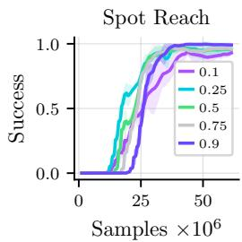

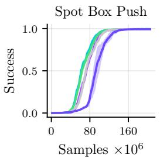

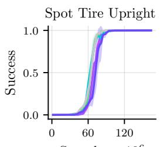

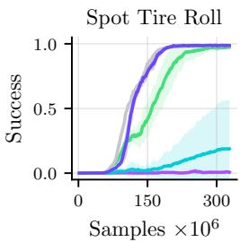  
Figure 9: We ablate the influence of the fraction of expert data in the buffer on training. Most tasks are robust to the choice of the expert data ratio. The exception is tire rolling, which greatly benefits from more expert data initially and collapses below 50% expert data. Note that all runs additionally use the phase-out threshold of 0.1, so the expert data ratio only directly influences the initial training phase.

Percentage of Expert Data In our experiments, we have fixed the ratio of expert data before phase-outs to 50%, following the recommendations of Ball et al. [10]. To show that this also holds for data generated by an SMPC expert, we run Spot environments with varying ratios of offline to online data. The results are depicted in Figure 9.

For reaching, box pushing, and tire uprighting, we find that training runs are almost unaffected by the choice of the expert ratio. This is partly due to our phase-out curriculum, which removes any expert data past a success rate of 10%. The tire-rolling task, however, is sensitive to the parameter and fails to converge when the amount of expert data is reduced. Notably, the performance of runs with higher expert ratios than 50% improves more consistently, even after phasing out the expert data. Since the data cannot influence the training after the phase-out point, we posit that exposing the critic to more expert data before improves value estimation around successful states and thereby helps convergence once the policy becomes successful.

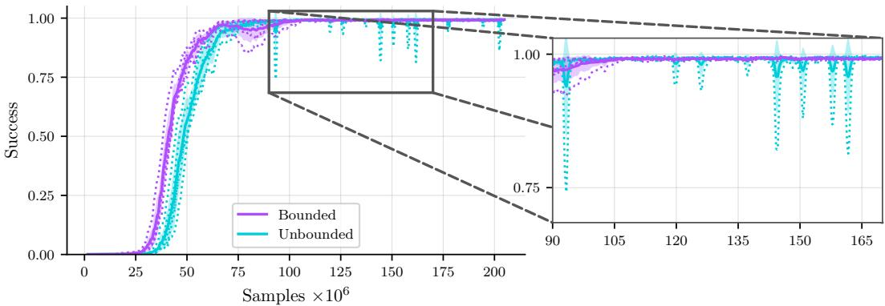  
Figure 10: Bounded critics stabilize the training (here Spot box pushing). In parameter ranges at the edges of what is still stable, bounded critics are still well-behaved (pink), whereas unbounded critics start to exhibit sharp drops in performance (blue).

Bounded Critic Networks As outlined in Section 3.2, we bound the value estimate of the critic network to stabilize the training. While we find that a well-tuned learning rate leads to stable convergence, bounded critic networks increase the range of hyperparameters that still yield successful runs, thereby making tuning easier. We illustrate this by increasing the critic’s learning rate to $8 \times 1 0 ^ { - 4 }$ and comparing the training curves of unbounded critics with those of our bounded critics on the Spot box pushing task. While both converge, training runs with unbounded critics exhibit spikes where the policy sharply drops in performance and then recovers. To illustrate this better, Figure 10 shows the mean and variance across the two groups, as well as the individual runs as dotted lines. For more details on how we design the network, see also Section B.1.

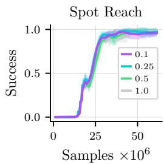

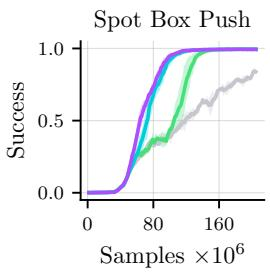

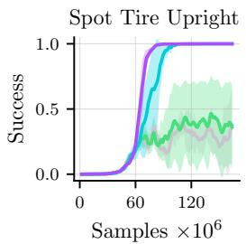

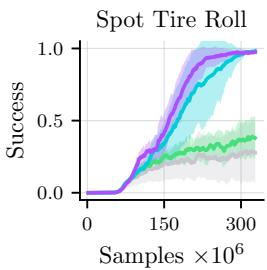  
Figure 11: Ablations on the phase-out threshold. Keeping the offline SMPC data in the buffer for too long harms training performance.

Phase-Out Threshold While the SMPC dataset is necessary to bootstrap training on sparse rewards, it is also a suboptimal data source. In Section 3.2, we therefore introduce a curriculum that phases out the data once runs achieve a 10% success rate. Here, we examine how different phase-out thresholds affect training across all Spot tasks. The training runs are shown in Figure 11.

Surprisingly, we find that keeping the SMPC data in the buffer results in significant performance degradation across all tasks except reach. Initially, all runs achieve a success rate of about 10-20% with the same steep rate of improvement. However, if the data is not removed, training progress slows down noticeably, affecting the thresholds above 25%. In box pushing, these runs still improve, albeit at a significantly reduced speed. Once the runs with a 50% required success rate reach their threshold, they resume rapid convergence. Runs that keep the data indefinitely continue to make only slow progress. For tire uprighting and tire rolling, progress slows down so much that runs with a threshold of 50% or above do not converge within our step limit, although they do improve.

Our explanation for this phenomenon is that while the SMPC data is necessary to guide initial exploration, it is too far from the policy to achieve the fine-grained improvements required by the tasks, and it becomes harmful once the policy is narrowed to a successful strategy with a shifted data distribution.

## B RL Training Details

We train all our policies with TD3 [18] and build on the settings proposed by FastTD3 [11] to adapt it to training with massively parallel simulation. Our environments are implemented in mjlab with MuJoCo Warp. To ensure robust sim-to-real transfer, we randomize the object mass, its size, and friction. In addition, we use an asymmetric actor-critic setup in which the actor receives noisy observations, while the critic receives exact observations from the simulation. We also use bounded critics, constrained by the theoretical limits of the Q-function. To keep the value predictions close to 0, we scale our rewards. The hyperparameters used across all experiments to train our RL policies are given in Table 1. For the G1 task, the difference in joint mappings leads to a slightly increased action regularization of $8 \times 1 0 ^ { - 4 }$ , and we increase the critic learning rate to $5 \times 1 0 ^ { - 4 }$ to accelerate convergence

Our lower-level policy is trained using the recipe from Zhu et al. [4] and has been adapted for training in mjlab. We also adapt ReLIC to the G1 for our humanoid experiments. For spot, we omit torso tilt and height control, as our tasks do not require it. For our G1 experiments, we include it to enable strategies relying on lowering the upper body.

Table 1: Hyperparameters for the sparse TD3 training.
<table><tr><td>Parameter</td><td>Value</td></tr><tr><td>Buffer size B Gradient steps per update Ny</td><td> $1 6 , 7 7 7 , 2 1 6 = 2 ^ { 2 4 }$ </td></tr><tr><td>Phase-out threshold η</td><td>8 0.1</td></tr><tr><td>Batch size  $N _ { b }$ </td><td>8192</td></tr><tr><td>Discount factor γ</td><td>0.99</td></tr><tr><td>Polyak factor τ</td><td>0.005</td></tr><tr><td>Actor learning rate τ</td><td> $3 \times 1 0 ^ { - 4 }$ </td></tr><tr><td>Critic learning rate τ</td><td> $1 \times 1 0 ^ { - 4 }$ </td></tr><tr><td>Policy delay</td><td>2</td></tr><tr><td>Smoothing noise  $\sigma _ { \mathrm { s } }$ </td><td>0.05</td></tr><tr><td>Action regularization</td><td></td></tr><tr><td>Reward scale</td><td> $5 \times 1 0 ^ { - 4 }$  0.01</td></tr></table>

## B.1 Bounding the Critic

As previously mentioned, we also bound our critics’ Q-value prediction to the theoretical bounds. These are easy to compute because of the simplicity of our reward function. Our best achievable reward is simply 0, and the lowest possible Q-value with $\gamma \in ( 0 , 1 )$ is

$$
\operatorname* { m i n } \left( \sum _ { i = 0 } ^ { \infty } - \gamma ^ { i } , - \frac { 2 } { 1 - \gamma } \right) = - \frac { 2 } { 1 - \gamma } ,
$$

taking into account that all robot crash penalties immediately terminate the episode and thus do not accumulate any future rewards. We enforce this by adding a tanh activation function after the critic’s final linear layer and then shifting and scaling it to the desired interval. We also add a constant bias to the prediction before applying tanh, thereby shifting the network output towards zero during initialization.

## C SMPC Data Collection

Our SMPC data collection uses the same vectorized mjlab environments we use during training. Because MuJuCo Warp relies on a functional programming paradigm with a single explicit state representation, it lends itself easily to sample-based implementations that need full control over the state. We use this to broadcast states across tiles at the beginning of each episode, and continue to periodically reset all environments to the best candidate chosen for the current batch of samples.

To generate smooth behaviors and prevent high-frequency control noise, the SMPC samples actions as splines rather than independent, step-wise commands. As for the RL environments, action ranges are normalized to $[ - 1 , 1 ]$ . The planner samples a sparse set of $N _ { \mathrm { c } }$ control points and interpolates them across the planning horizon T. After the first iteration, future actions are sampled around the shifted last best action trajectory. To stay reactive, we execute only the first $N _ { \mathrm { e } }$ actions, then resample, yielding a 5 Hz policy with 50 Hz action chunks. We discount future rewards in the sampled trajectories with a factor γ to bias the objective towards trajectories that achieve success sooner.

Since data collection computation time is almost exclusively spent running the forward simulation, we save computation by caching the simulation state after N steps and then resetting all simulations to the state of the most successful sample after the full rollout. The high-level pseudocode for our data collection is given in Algorithm 1. The hyperparameters used for the SMPC data collection across all tasks and their meaning are detailed in Table 2.

Algorithm 1 SMPC Expert Data Collection   
1: $\mathcal { D }  \emptyset , \bar { A }  0$ ▷ Initialize expert dataset and warm-start actions A¯   
2: $s _ { \mathrm { c k p t } } \gets \mathbf { G e r C S T A T E S } ( \mathrm { e n v s } , M )$ ▷ M initial tile states   
3: while $| \mathcal D | <$ target do   
4: $s _ { \mathrm { f u l l } } \gets \mathrm { R E P E A T } \big ( s _ { \mathrm { c k p t } } , K \big )$ ▷ Repeat for $K$ samples   
5: SETSTATES(envs, sfull) ▷ Broadcast M states to $\bar { M } \times K$ parallel envs   
6: $A \gets \mathrm { S A M P L E S P L I N E S } ( \bar { A } , \sigma _ { \mathrm { m i n } } , \sigma _ { \mathrm { m a x } } , N _ { c } )$ ▷ Sample action sequences around warm start   
7: $O , R _ { \mathrm { s m p c } } , R _ { \mathrm { s p a r s e } } , s _ { N _ { e } } \gets$ SIMULATEHORIZON(envs, A) ▷ Batched obs. and rewards   
8: $\begin{array} { r } { R _ { \tau }  \sum _ { i = 1 } ^ { T } \gamma ^ { i } \cdot R _ { \mathrm { s m p c } } [ i ] } \end{array}$ ▷ Compute discounted trajectory reward   
9: $j  \mathsf { A }$ RGMAXPERTIL $\mathrm { { . E } } \big ( \bar { R } _ { \tau } \big )$ ▷ Find elite trajectory   
10: $\mathring { A } ^ { \ast }  A [ j ]$ ▷ Elite action sequences   
11: $s _ { \mathrm { c k p t } } \gets s _ { N _ { e } } [ j ]$ ▷ Elite states after $\bar { N _ { e } }$ steps   
12: A¯ SHIFTTIMEFORWARD $( A _ { - } ^ { * } , N _ { e } )$   
13: RESETSTALEWARMSTARTS(A¯)   
14: $\tau \gets$ EXTRACTCOMMITTEDSTEPS $( O , A , R _ { \mathrm { s p a r s e } } , j , N _ { e } )$   
15: $\mathcal { D }  \mathcal { D } \cup \tau$   
16: if any episodes finished then   
17: DISCARDFAILEDEPISODES $( \mathcal { D } )$   
18: end if   
19: end while   
20: return

Table 2: Hyperparameters for the SMPC expert.
<table><tr><td>Parameter</td><td>Value</td></tr><tr><td>Horizon T</td><td>50</td></tr><tr><td>Spline control points  $N _ { \mathrm { c } }$ </td><td>10</td></tr><tr><td>Frequency f</td><td>50</td></tr><tr><td>Execution steps  $N _ { \mathrm { e } }$ </td><td>10</td></tr><tr><td>Discount factor γ</td><td>0.99</td></tr><tr><td>Samples per tile K</td><td>256</td></tr><tr><td>Minimum noise  $\sigma _ { \mathrm { m i n } }$ </td><td>0.5</td></tr><tr><td>Maximum noise  $\sigma _ { \mathrm { m a x } }$ </td><td>1.0</td></tr></table>

## D Hardware Setup

For the quadruped tasks, we deploy the trained policies on a Boston Dynamics quadrupedal Spot robot with an arm. Policy inference is run on an off-board computer for convenience, and commands are sent to the robot via WiFi. The humanoid policies are run directly on a computer mounted on the Unitree G1 robot.

The box is $0 . 5 \mathrm { m } \times 0 . 5 \mathrm { m } \times 0 . 5$ m in size and weighs 1.2 kg. The tire has a radius of 0.33 m, width of 0.34 m, and weighs 14.3 kg.

For state estimation, we use an OptiTrack motion capture system to track the robot and objects in combination with the robots’ on-board sensing.