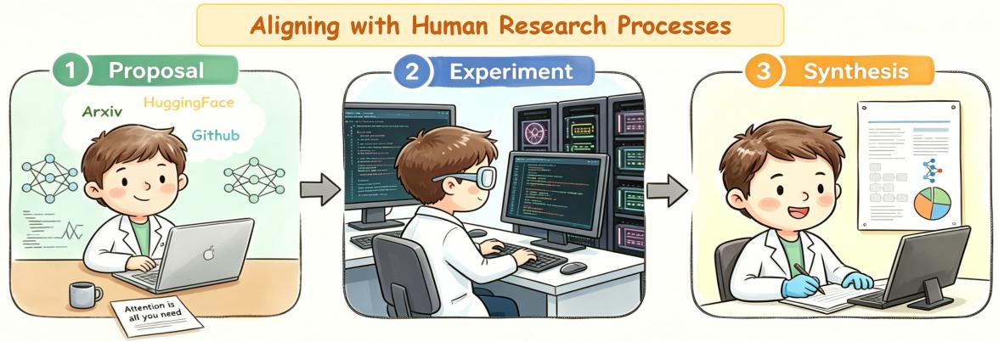
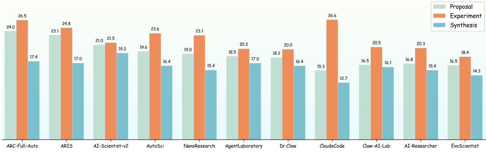
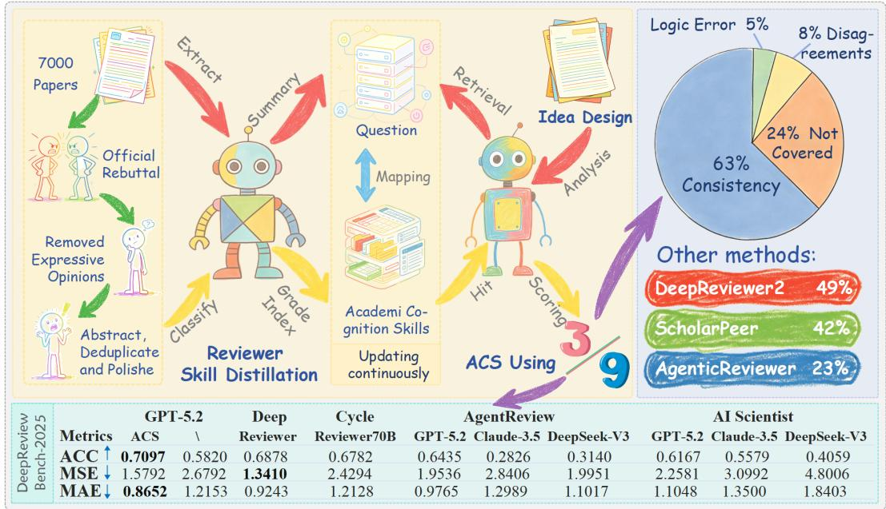
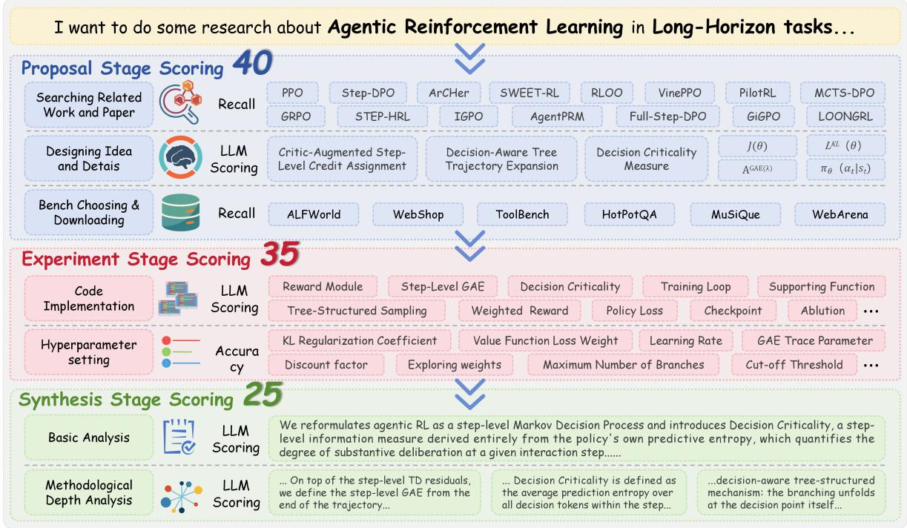

# ARAC: Benchmarking Auto-Research’s Alignment and Completeness on End-to-End Researchs

Jiale Cui, Yueyao Yuan, Kaixi Zhong, Xiaogang Xu, Jiafei Wu, Zhe Liu† School of Software Technology, Zhejiang University

The rapid advancement of Auto-Research has surfaced a fundamental evaluation challenge: how can we measure the alignment, logical coherence, and evolutionary completeness of its research trajectory with human research behavior? We propose Auto-Research’s Alignment and Completeness, ARAC-Bench: a Researcher-Mimicking Evaluation framework that shifts the objective from matching final answers to reproducing high-quality human research processes. The framework operates through two synergistic components: the Academic Cognition Skills system, which is the first to transforms implicit reviewer expertise into stage-calibrated, quantifiable rubrics; and a three-stage capability diagnostic protocol, which decomposes the research process under strict modular constraints into three traceable, mutually independent dimensions: Proposal, Experiment, and Synthesis. Systematic evaluation of 11 SOTA frameworks yields a best alignment score of only 67.9 of 100, revealing a significant gap in simulating rigorous human methodology. Validation against Ph.D. Candidates rankings shows a strong correlation of 0.8141, confirming that ARAC-Bench reliably reflects the dimensions researchers truly value. ARAC-Bench provides not only a fine-grained diagnostic tool but also a scalable reward signal for training the next generation of autonomous research systems.

aDataset: https://github.com/cuijiale2004-hash/ARAC-Bench

## 1 Introduction

With the rapid development of large language models (LLMs) and autonomous agent technologies, Auto-Research has moved from conceptual exploration to preliminary practice. Frameworks such as ARIS [33], Dr.Claw [18], and Claw-AI-Lab [29] have decomposed the research pipeline into distinct stages, enabling workflows encompassing ideation, experimentation, and synthesis to be completed autonomously [10, 20]. However, this progress has exposed a fundamental evaluation bottleneck: current paradigms cannot measure whether Agents truly emulate the cognitive processes of researchers. Existing approaches shown in Table 1 fall into a dilemma: automated scoring rubrics rely on rigid scripts and sandbox execution, offering quantifiability but lacking semantic understanding of research quality; conversely, LLM-as-Judge can capture nuances yet suffers from unstructured subjective bias, hallucination, and poor reproducibility.

More critically, these results-driven evaluations based on code pass rates or paper completeness [21, 25, 35] fail to distinguish genuine insights from brute-force search and overlook explorations that are theoretically sound but fail due to engineering coincidences [1, 27, 23]. These metrics entirely bypass scrutiny of whether the research process adheres to human methodological standards, creating a dangerous disconnect between high scores and high-quality research [22].
<table><tr><td>Benchmark</td><td>Target</td><td>D</td><td>C</td><td>R A</td><td></td><td>Metrics and Methods</td><td>Rules</td><td>Justification</td></tr><tr><td>ResearchBench</td><td>LLM</td><td></td><td>x</td><td>x</td><td></td><td>Recall, LLM</td><td>Static</td><td>Expert Review</td></tr><tr><td>ScienceAgentBench</td><td>Agent</td><td>x</td><td></td><td></td><td>x</td><td>Execution, Accuracy, BERTScore</td><td>Static</td><td>Expert Review</td></tr><tr><td>SciAgentArena</td><td>Agent</td><td></td><td></td><td></td><td>X</td><td>Execution, Accuracy</td><td>Static</td><td>Replication</td></tr><tr><td>EXP-Bench</td><td>Agent</td><td></td><td></td><td></td><td>L</td><td>Execution, Accuracy, LLM</td><td>Static</td><td>None</td></tr><tr><td>MLRBench</td><td>LLM</td><td></td><td></td><td></td><td></td><td>Execution, Accuracy, LLM</td><td>Static</td><td>Correlation</td></tr><tr><td>AstaBench</td><td>Agent</td><td></td><td>x</td><td>X</td><td>√</td><td>Accuracy, Recall, LLM</td><td>Static</td><td>Correlation</td></tr><tr><td>MLAgentBench</td><td>LLM</td><td>X</td><td></td><td></td><td>X</td><td>Execution, Accuracy</td><td>Dynamic</td><td>None</td></tr><tr><td>MASSW</td><td>LLM</td><td></td><td>x</td><td>x</td><td></td><td>BERTScore, ROUGE, BLEU</td><td>Static</td><td>Correlation</td></tr><tr><td>AIRS-Bench</td><td>LLM</td><td></td><td></td><td></td><td>x</td><td>Execution, Accuracy</td><td>Static</td><td>None</td></tr><tr><td>ResearchCodeBench</td><td>LLM</td><td>x</td><td></td><td></td><td>x</td><td>Execution, Accuracy</td><td>Static</td><td>None</td></tr><tr><td>PaperBench</td><td>LLM</td><td>X</td><td></td><td></td><td></td><td>Execution, Accuracy, LLM</td><td>Dynamic</td><td>Replication</td></tr><tr><td>CORE-Bench</td><td>Agent</td><td>X</td><td></td><td></td><td>x</td><td>Execution, Accuracy</td><td>Static</td><td>Replication</td></tr><tr><td>DSBENCH</td><td>LLM</td><td>x</td><td>×</td><td></td><td></td><td>Accuracy, LLM</td><td>Static</td><td>Expert Review</td></tr><tr><td>AInsteinBench</td><td>LLM</td><td>x</td><td></td><td></td><td>x</td><td>Execution</td><td>Dynamic</td><td>Expert Review</td></tr><tr><td>AstaBench</td><td>Agent</td><td></td><td></td><td></td><td>V</td><td>Recall, Accuracy, LLM</td><td>Dynamic</td><td>Correlation</td></tr></table>

Table 1: Comparison of existing research test sets. D: Design, C: Coding, R: Result, A: Analysis. In particular, we pay attention to whether the assessment rules are dynamically adjusted/adaptive, and whether there are valid Justification explanations to confirm their credibility.

To address this issue, we propose ARAC-Bench, a Researcher-Mimicking Evaluation Framework, whose fundamental goal shifts from matching final answers to quantitative assessment of AI uto-Research’s performance and gaps in simulating rigorous human research process. Unlike prior work, ARAC-Bench takes accepted papers from top conferences as the gold-standard reference and distills implicit reviewer expertise into Academic Cognition Skills (ACS), a set of stage-aware, quantifiable scoring rubrics. ACS is not constructed from scratch; rather, it is derived from core scientific questions extracted from 7,000 AI papers accepted at NeurIPS, ICLR, and ICML over the past two years, along with cognitive strategies employed by authors and reviewers during rebuttals and discussions, which are then cleaned, polished, and structured. The wide range of sources enables ACS to possess cross-task and cross-domain transferability as well as good generalization capabilities, and it can be applied to different research directions of AI.

This design yields two salient advantages: (1) Dual Human Alignment: On one hand, ACS is derived from the review and discussion of real human experts, ensuring that the evaluation method aligns with the source of human cognition. On the other hand, the evaluation objective of ARAC-Bench is to measure whether the Auto-Research framework replicates human research methodology at the process level. This dual alignment not only provides a quantifiable basis but also ensures the semantic and cognitive validity of the evaluation.; (2) Quantifiability: it transforms subjective research quality into structured, measurable indicators at different stages, bridging the gap between the rigor of automated scoring rubrics and the semantic depth of LLM judges.

Concretely, ARAC-Bench is built upon structured annotations of 200 accepted papers from ICLR 2026 and decomposes the research workflow into three progressive stages: Proposal, Experiment, and Synthesis. Each stage is evaluated under a unified controlled-variable Researcher-Mimicking Evaluation, with all Auto-Research sharing the same base model, Kimi, and the ACS knowledge base. To ensure the fairness of the assessment and prevent cheating, we strictly limit the literature search time range to mid-2025, physically preventing the model from directly accessing the real papers serving as Gold References; in the Proposal stage, related-work scoring uses the cited reference set of the original paper as Ground Truth; in the Experiment stage, code implementation scoring is based on a predefined standard module library, with missing modules scored as 0, reinforcing engineering completeness constraints. Moreover, as AI technologies rapidly evolve, ARAC-Bench will dynamically update its leaderboard and continuously add new Gold References to ensure long-term validation.

Validation against PhD-level expert rankings yields a strong average correlation of 0.8141, confirming that ARAC-Bench, while remaining computationally feasible, reliably reflects the dimensions researchers truly value. Systematic evaluation of frameworks reveals that even the best-performing system achieves only 67.9 alignment and completeness, exposing a significant gap in simulating rigorous human methodology.

We summarize our contributions as follows:

• Researcher-Mimicking Evaluation Framework: We propose ARAC-Bench, the first benchmark evaluating Auto-Research by reproducing high-quality human research processes. Using top-tier papers as Gold References, it simultaneously achieves alignment with human judgment, computational quantifiability, and continuous evolution capability.

• ACS as Quantifiable Rubrics: We distill transferable academic cognition skills from papers and their rebuttals, refining implicit expert cognition into stage-calibrated, measurable structured signals. ARAC-Bench transforms subjective research standards into objective indicators naturally aligned with LLM reasoning.

• Fine-grained Alignment Diagnosis: Through stage-wise evaluation and variable isolation across frameworks, we provide granular measurements of where AI deviates from human research cognition. The strong correlation with expert rankings validates ARAC-Bench as a reliable proxy for human judgment.

## 2 Related Work

## 2.1 Autonomous Scientific Research Systems

With the iterative advancement of LLMs, autonomous scientific research systems have transitioned from conceptual frameworks to practical implementations. Early systems, such as Co-scientist [4, 5], demonstrated the feasibility of LLMs in manipulating laboratory equipment, while the AI Scientist series achieved end-to-end automation from hypothesis generation to manuscript drafting. However, these single-agent systems lack adaptive error correction and cross-task knowledge accumulation. Similarly, while Agent Laboratory [17]has automated specific research phases, it lacks ground-truth verification and experience distillation. In the domain of fully automated pipelines, ARIS [33] achieves closed-loop error correction through a dual-model adversarial mechanism, AutoSOTA [11] focuses on model reproduction via multi-agent collaboration, and EvoScientist [14] realizes cross-task self-evolution using dual persistent memory modules. As shown in Table 2, despite the establishment of a comprehensive technical framework, existing systems still exhibit notable deficiencies in result validation, exception handling, experimental reproducibility, and the construction of rigorous scientific closed loops.

<table><tr><td>Framework</td><td>Search</td><td>Design</td><td>Coding</td><td>Iteration</td><td>Memory</td><td>Analysis</td><td>Writing</td><td>Evolve</td><td>Review</td></tr><tr><td>ARC-Full-Auto[12]</td><td></td><td></td><td></td><td></td><td></td><td></td><td></td><td></td><td></td></tr><tr><td>Dr. Claw[18]</td><td></td><td></td><td></td><td></td><td></td><td></td><td></td><td></td><td></td></tr><tr><td>Claw-AI-Lab[29]</td><td></td><td></td><td></td><td></td><td></td><td></td><td></td><td></td><td></td></tr><tr><td>AI-Scientist-v2[32]</td><td></td><td></td><td></td><td></td><td></td><td></td><td></td><td></td><td></td></tr><tr><td>NanoResearch[31]</td><td></td><td></td><td></td><td></td><td></td><td></td><td></td><td></td><td></td></tr><tr><td>EvoScientist[14]</td><td></td><td></td><td></td><td></td><td></td><td></td><td></td><td></td><td></td></tr><tr><td>AI-Researcher[20]</td><td></td><td></td><td></td><td></td><td></td><td></td><td></td><td></td><td></td></tr><tr><td>ARIS[33]</td><td></td><td></td><td></td><td></td><td></td><td></td><td></td><td></td><td></td></tr><tr><td>AutoSci[16]</td><td></td><td></td><td></td><td></td><td></td><td></td><td></td><td></td><td></td></tr><tr><td>AgentLaboratory[17]</td><td></td><td></td><td></td><td></td><td></td><td></td><td></td><td></td><td></td></tr></table>

Table 2: Whether a framework has added unique design features or optimization to better support the Auto-Research where optimization specifically refers to whether, beyond implementing core functionalities, they have added distinctive design features to better support automation in research tasks.

## 2.2 Benchmarks for Scientific AI

Concurrently, benchmarks for scientific AI have been continuously refined. ScienceAgentBench [2] and PaperBench [19] quantify capabilities in scientific discovery and experimental implementation based on peer-reviewed publications and hierarchical evaluation frameworks, respectively, while CORE-Bench and ReproduceBench [34] focus on the computational reproducibility of code and data. Frontier benchmarks have further expanded the evaluation dimensions: ResearchBench [13], AIRS-Bench [33], and FIRE-Bench [24] assess the capacity for full-process rediscovery in complex tasks and cutting-edge scenarios, and SGI-Bench explores generalized evaluation paradigms. Furthermore, AutoResearchBench [30] concentrates on the preliminary literature review phase, specifically targeting literature retrieval and academic synthesis capabilities, whereas ARC-Bench [12] covers the entire pipeline from research to writing. Nevertheless, current evaluations generally suffer from limitations like Table 1: they predominantly focus on outcome metrics such as task completion rates, neglecting normative constraints throughout the research process and lacking procedural assessments of adherence to rigorous scientific methodologies and academic logic [23].

## 2.3 LLM-Assisted Automated Peer Review

Another critical research trajectory involves LLM-assisted automated peer review. Early studies merely achieved superficial optimization, whereas subsequent works have generated substantive critiques leveraging public datasets. OpenReviewer [7] and DeepReview [36] have enhanced rigor through dimensional structured reviews and expert-level deep reasoning modes, respectively, while CycleReviewer [26] uncovers flaws via adversarial iterations. Multi-agent frameworks have further elevated review quality; for instance, ScholarPeer [6] reconstructs the logic of senior experts through role-based collaboration, and ReviewAgents [3] integrate chain-of-thought reasoning with literature retrieval to generate refined feedback. However, optimization solely targets the quality of final comments without structurally modeling the cognitive reasoning process of the review, thereby failing to provide traceable and diagnosable fine-grained feedback [28], further weakening the rigor of the Benchmark.

## 3 ARAC-Bench

The design of ARAC-Bench revolves around a central proposition: how can the research process of automated research frameworks be evaluated in a manner that is both aligned with human expert cognition and computationally quantifiable?

## 3.1 Academic Cognition Skills

To ensure credible human-aligned evaluation, we eschew generic LLM prompts and public rebuttals, which lack structured quantification or omit consensus-based methodological principles that have reached strong consensus and thus remain unchallenged. To this end, we propose Academic Cognition Skills, employing a Reviewer Skill Distillation approach that conceptualizes evaluation criteria as transferable cognitive skills demonstrated by expert reviewers in top-tier publications, rather than static rules.

  
Figure 1: To validate its reliability, we evaluated ACS on 200 paper queries of unseen ICLR papers above, achieving the SOTA 63% consistency rate. Furthermore, we tested ACS on DeepReviewBench-2025 in the bottom of Figure and found that ACS was able to significantly improve the accuracy of the scores. Since ACS is based on data from 2025-2026, we found the results were not satisfactory in Bench-2024, which also compelled us to decide to regularly update the skills.

The construction of ACS originates from deep mining of large-scale, high-quality academic corpora. From 7,000 top AI conference papers accepted at NeurIPS, ICLR, and ICML in 2025 and 2026, we first extracted the core scientific question each paper aimed to address; subsequently, we targeted the corresponding rebuttals and review discussions to extract the cognitive strategies employed by authors and reviewers in defending, clarifying, or revising those questions. These strategies were cleaned, deduplicated, and polished by experts, and then refined into structured ACS entries. This process ensures that ACS covers not only explicit points of contention but also implicit domain consensus and rigorous research structures. The resulting ACS knowledge base encompasses five major themes: (1)Large Language Models, (2)Multimodal Learning, (3)Diffusion Models, (4)Reinforcement Learning, and (5)Deep Learning, and 121 sub-themes.

As shown in Figure 1, ACS evaluation follows a progressive operational pathway: it begins with a comprehensive analysis of the research problem’s context, from which a set of highly relevant core questions is extracted. These questions are then systematically matched against a predefined library of skill standards.

## Example of Agentic RL for Tools in Long-Horizon tasks...

## ✓ Clarify the applicability of MDP and POMDP(If Completely Considered)

The research must clearly define whether the task is fully observable (MDP) or partially observable (POMDP). For Long-Horizon tasks, since the environmental state accumulates uncertainty over time and the agent’s perception is often limited, POMDP is usually a more accurate theoretical abstraction...

## ✗ Sample Efficiency and Trajectory Quality (If Not Considered Completely)

The Long-Horizon Agentic tasks face a fundamental bottleneck of scarce high-quality trajectories. The research plan should explain how it ensures trajectory quality under high sample efficiency - through selective sampling, experience replay optimization, or other mechanisms...

## ✓ Delayed Credit Assignment Solvability(If Completely Considered)

In Long-Horizon, the final result rewards are often sparse, and the contributions of intermediate steps are difficult to trace. The research plan must clearly explain how it solves the credit assignment problem - whether through hierarchical relative advantage estimation, attribution of tool invocation advantages, or by using the data filtering wheel to convert sparse rewards into clear filtering signals...

Based on the matching results, the top five most closely aligned skill standards above are selected and used as the primary basis for final assessment. This process ensures that evaluation starts from the specific research context while leveraging a standardized skill framework to achieve systematicity and traceability, enabling assessments that are both grounded in actual research progress and supported by structured quantitative criteria. This design naturally integrates the contextual adaptability of LLMas-Judge with the structural quantifiability of a standardized scoring system, aligning seamlessly with human experts’ cognitive pathways.

## 3.2 Researcher-Mimicking: Capability Diagnosis of Proposal, Experiment, and Synthesis

Building upon the ACS system, ARAC-Bench constructs a stage-wise capability diagnostic protocol like Figure 2. To ensure evaluation fairness and ecological validity, we enforce strict temporal isolation: the literature search and knowledge base access of all evaluated frameworks are hard-truncated to mid-2025, physically eliminating any possibility that a model could directly retrieve the real papers serving as Gold

References or their subsequent citation networks via search. The Researcher-Mimicking Evaluation requires that a Auto-Research framework complete only one stage at a time, which ensures that each score can be precisely attributed to a specific ACS deficiency or engineering capability defect. . The three stages sum to a total of 100, with the specific diagnostic protocols as follows:

  
Figure 2: ARAC-Bench decomposes the research workflow into three independent stages, while groundtruth information from preceding stages is fed as known conditions. In every stages, we only evaluate the final output, even if the framework refines.

Proposal Stage scoring 40 aims to examine logical completeness and ACS coverage. The framework receives a domain background extracted from the Gold Reference and an Inspiration with key implementation clues removed as input, and must complete literature survey and proposal ideation within a constrained time limit. This stage comprises three scoring modules:

• Related Work Scoring 5: Uses the cited reference list of the original paper as the ground-truth set of truly relevant works, and computes the recall between the set of references retrieved by the framework and this ground-truth set, quantifying the coverage of its literature survey. The temporal restriction on search scope guarantees evaluation fairness.

• Proposal Details Scoring 25: The core evaluation dimension, entirely driven by ACS. Based on the sub-theme the proposal belongs to, the reviewing system dynamically retrieves the Top-5 most relevant core cognition skills from the ACS library. For each skill point where 3 points each, 15 points total, a three-level anchor scoring method is adopted: 0 = completely unmentioned or gravely erroneous; 1.5 = mentioned but lacking substantive justification or disconnected from context; 3 = accurately addressed and constituting a necessary link in the logical chain. The remaining 10 points assess deductive self-consistency, focusing on the consistency of formula symbol definitions, the correspondence between pseudocode and textual descriptions, and whether the argument for theoretical superiority over the Gold Reference or known baselines is sufficiently substantiated.

• Benchmark Selection Scoring 10: Subdivided into selection rationality Scoring 5 and accessibility Scoring 5 points. The former assesses whether the chosen dataset/environment fits the research problem; the latter requires the framework to actually execute download and configuration scripts within the sandbox environment, and points are awarded only if the data/environment is successfully loaded at runtime, preventing the framework from hallucinating.

Experiment Stage scoring 35 prioritizes engineering stability and parameter intuition as the foundational prerequisite for reliable evaluation. The framework receives only the standard method description from the Gold Reference and must independently reproduce a runnable system. We deliberately disentangle this core text-to-code translation capability from hyperparameter search and performance tuning, as the former constitutes the most critical bottleneck in current research replication. Advanced optimization tasks involving complex experimental coding agents are reserved for future work, allowing us to first establish a robust baseline for fundamental implementation fidelit.

• Code Implementation Scoring 30: We constructed a standard module library containing 2,869 functional units based on the Proposal designs, serving as an objective yardstick for AI scoring. Each module is scored independently along three dimensions: (1) Functional Correctness: verified through preset unit tests and input-output assertions; (2) Module Completeness: checks whether interface definitions, docstrings, and exception handling are complete; (3) Code Robustness: stress-tested by injecting boundary values and dirty data. This has a critical constraint if a certain standard module is missing from the framework’s output, the total score for that module is directly recorded as 0, with no compensatory scoring. All scoring targets the final stabilized code of each framework, including any self-corrections.

• Hyperparameter Setting Scoring 5: Under the condition of no search budget, assesses whether the framework’s settings for key parameters such as learning rate, batch size, and optimizer choice conform to domain priors, with scoring based on the accuracy of the parameter values relative to the Gold Reference.

Synthesis Stage scoring 25 verifies factual fidelity and causal attribution capability. The ARAC receives the complete experimental results table and ablation data from the Gold Reference and must compose a well-structured analytical essay.

• Basic Analysis Scoring 10: Employs a structured checklist to evaluate the completeness and formatting correctness of essential sections such as Introduction scoring 3, Related Work scoring 4 and Preliminaries scoring 3. All AI scoring is done using GPT-5.2.

• Methodological Deep Analysis Scoring 15: Driven by attribution reasoning and critical synthesis skills from the ACS library, operationalized via a three-layer progressive verification protocol. Key evaluation criteria include: (1) Mechanism Explanation Depth: whether the test text reproduces or deepens the intrinsic mechanism explanation of the original paper; (2) Counterfactual Reasoning Coverage: analyzing whether it fully complies with domain principle constraints and counterfactual exclusivity arguments; (3) Conclusion Extrapolation Boundary: whether the Limitations claims of the original paper are faithfully reproduced. This scoring transcends textual similarity comparison, focusing fundamentally on verifying the logical isomorphism between AI reasoning and the human expert’s causal loop.

Through the above fine-grained metric decomposition, rigorous temporal control, and the unified ACS alignment mechanism, ARAC-Bench transforms abstract research capabilities into computable, traceable diagnostic signals. Every increment or decrement in scores can be traced back to the omission of a specific cognitive skill, the absence of a standard module, or a logical break in a causal attribution link, providing a clear, actionable feedback path for the architectural evolution of autonomous research frameworks. Meanwhile, our human-related experiments also demonstrated that the evaluation scheme of ARAC-Bench is in line with human research and review processes. The specific experimental results are as follows.

## 4 Experiments

To eliminate interference from underlying model capability differences in framework comparisons, all tested Auto-Research frameworks were uniformly mounted on the Kimi-K2.6. We selected representative autonomous research frameworks, AutoResearchClaw, ARIS, AI-Scientist-v2, NanoResearch, Dr.Claw, Claw-AI-Lab, AI-Researcher, EvoScientist, AutoSci, and Agent Laboratory, and simultaneously evaluated mainstream research tools including ClaudeCode with research skills. All evaluations were conducted under a unified principle library, with ground-truth information from preceding stages fed as known conditions to ensure that scores are traceable to specific capability dimensions.

## 4.1 Main Experiment and Sanity Checks

<table><tr><td>Framework</td><td>Related.</td><td>Idea</td><td>Bench.</td><td>Coding</td><td>Hyperpara.</td><td>Basic.</td><td>Method.</td><td>Total</td></tr><tr><td>ARC-Full-Auto</td><td>2.74</td><td>17.48</td><td>3.8</td><td>23.95</td><td>2.54</td><td>6.1</td><td>11.29</td><td>67.9</td></tr><tr><td>ARIS</td><td>2.6</td><td>16.49</td><td>4.05</td><td>21.93</td><td>2.83</td><td>6.64</td><td>10.36</td><td>64.9</td></tr><tr><td>AI-Scientist-v2</td><td>2.24</td><td>15.21</td><td>3.54</td><td>18.77</td><td>2.72</td><td>7.13</td><td>12.07</td><td>61.68</td></tr><tr><td>AutoSci</td><td>2.12</td><td>15.13</td><td>2.33</td><td>20.55</td><td>3.02</td><td>6.25</td><td>10.14</td><td>59.54</td></tr><tr><td>NanoResearch</td><td>2.03</td><td>14.62</td><td>2.36</td><td>20.88</td><td>2.23</td><td>5.97</td><td>9.47</td><td>57.56</td></tr><tr><td>AgentLaboratory</td><td>2.21</td><td>14.14</td><td>2.14</td><td>18.08</td><td>2.10</td><td>6.93</td><td>10.05</td><td>55.65</td></tr><tr><td>Dr.Claw</td><td>2.27</td><td>13.7</td><td>2.23</td><td>18.15</td><td>1.9</td><td>6.32</td><td>10.06</td><td>54.63</td></tr><tr><td>ClaudeCode</td><td>1.97</td><td>11.1</td><td>2.23</td><td>24.46</td><td>2.11</td><td>5.35</td><td>7.31</td><td>54.53</td></tr><tr><td>Claw-AI-Lab</td><td>1.84</td><td>12.12</td><td>2.59</td><td>17.74</td><td>2.79</td><td>6.14</td><td>9.97</td><td>53.19</td></tr><tr><td>AI-Researcher</td><td>1.71</td><td>12.12</td><td>3.01</td><td>18.38</td><td>1.95</td><td>5.74</td><td>9.64</td><td>52.55</td></tr><tr><td>EvoScientist</td><td>2.07</td><td>12.09</td><td>2.31</td><td>16.05</td><td>2.34</td><td>5.49</td><td>8.78</td><td>49.13</td></tr></table>

Table 3: Comparison of different Auto-Research frameworks using Kimi-K2.6, among which ARC-Full means AutoResearchClaw using Full-Auto mode and ClaudeCode uses native mode only. To prevent framework cheating, we forcibly blocked search records after mid-2025.

The overall scores of all Auto-Research frameworks on ARAC-Bench are presented in the Table 3. The best-performing framework achieved an overall alignment of merely 67.9%, indicating a significant gap of over 32 percentage from methodological completeness. Substantial capability differentiation was observed among frameworks: frameworks like ARIS, AI-v2 and AutoSci demonstrated relative advantages in the Proposal and Synthesis stages, but exhibited cliff-like declines in the Experiment stage; 7 frameworks like AutoSci, Dr.Claw and Claw-AI clustered in the 50–60 range, suggesting that the current methodological alignment level of autonomous research systems hovers near the passing threshold overall.

To validate the design rationality of ARAC-Bench, we invited ten Ph.D. Candidates specializing in AI agents, LLM applications, and data science research to conduct a consistency check.

<table><tr><td></td><td>AgentLab</td><td>AI-v2</td><td>EvoSci</td><td>ARC</td><td>AI-er</td><td>AutoSci</td><td>ARIS</td><td>Nano</td><td>Dr.Claw</td><td>Claw-AI</td></tr><tr><td>Ph.D. Proposal</td><td>8</td><td>3</td><td>10</td><td>1</td><td>7</td><td>5</td><td>2</td><td>4</td><td>9</td><td>6</td></tr><tr><td>ARAC Proposal</td><td>6</td><td>3</td><td>10</td><td>1</td><td>8</td><td>4</td><td>2</td><td>5</td><td>7</td><td>9</td></tr><tr><td>Ph.D. Experiment</td><td>6</td><td>1</td><td>10</td><td>2</td><td>7</td><td>3</td><td>4</td><td>9</td><td>8</td><td>5</td></tr><tr><td>ARAC Experiment</td><td>9</td><td>5</td><td>10</td><td>1</td><td>7</td><td>3</td><td>2</td><td>4</td><td>8</td><td>6</td></tr><tr><td>Ph.D. Synthesis</td><td>4</td><td>1</td><td>8</td><td>2</td><td>9</td><td>7</td><td>3</td><td>10</td><td>6</td><td>5</td></tr><tr><td>ARAC Synthesis</td><td>4</td><td>1</td><td>10</td><td>2</td><td>9</td><td>5</td><td>3</td><td>8</td><td>6</td><td>7</td></tr></table>

Table 4: Ranking of 10 frameworks form ARAC and Ph.D. Candidates. These Ph.D. all have extensive experience in peer reviewing and using AI agents in the scientific research activities, and they manually ranked the ten frameworks, excluding ClaudeCode, based on the criterion of alignment with human research behavior, logical self-consistency, and continuous evolution.

Using the human comprehensive ranking as the benchmark, we computed Pearson correlation coefficients for ARAC-Bench scores, achieving 0.8788, 0.6606, and 0.9030 for the Proposal, Experiment, and Synthesis dimensions respectively. The high correlations for Proposal and Synthesis indicate that the evaluation criteria for these two stages are already highly aligned with domain experts’ cognitive judgments; the correlation for the Experiment dimension, while relatively lower, remains at an acceptable moderately strong level. The deep reason for this discrepancy lies in the fact that human experts tend to comprehensively consider code quality, experimental design philosophy, and resource trade-off strategies when evaluating experimental capability, whereas ARAC’s Experiment stage deliberately strips away soft dimensions such as design philosophy and resource decisions to control attribution precision, focusing mainly on code implementation robustness and parameter intuition.

## 4.2 Ablation and Comparative Studies

As the beginning of research, the Inspiration seems to play the role of a cognitive hub in triggering the structured reasoning path. Abstract inspiration aims to strip away concrete implementation details while retaining only vague clues that can guide reasoning, thereby testing the framework’s ability to conceive independently rather than reproduce from memory under conditions where the ground-truth solution is completely hidden. Recently, academic skills have emerged that encapsulate atomic capabilities—such as literature retrieval, experimental design, formula derivation, and code verification—in an attempt to address the shortcomings of general-purpose models in scientific research tasks, namely their lack of domain expertise and fragmented reasoning chains. We have also evaluated these skills.

To verify whether the abstract inspiration provided during the Proposal stage genuinely triggered frameworks’ methodological thinking, we compared proposal scores under conditions with and without Inspiration.
<table><tr><td></td><td>ARC</td><td>ARIS</td><td>AI-v2</td><td>AutoSci</td><td>Nano</td><td>AgentLab</td><td>Dr.Claw</td><td>CC</td><td>Claw-AI</td><td>AI-er</td><td>EvoSci</td></tr><tr><td>Inspired</td><td>17.48</td><td>16.49</td><td>15.21</td><td>15.13</td><td>14.62</td><td>14.14</td><td>13.70</td><td>11.10</td><td>12.12</td><td>12.12</td><td>12.09</td></tr><tr><td>Cancelled</td><td>12.17</td><td>13.04</td><td>11.69</td><td>10.77</td><td>12.20</td><td>10.97</td><td>11.88</td><td>9.71</td><td>10.34</td><td>9.05</td><td>10.69</td></tr><tr><td>Drop Rate</td><td>30.38</td><td>20.92</td><td>23.14</td><td>28.82</td><td>16.55</td><td>22.42</td><td>13.28</td><td>12.52</td><td>14.69</td><td>25.33</td><td>11.58</td></tr></table>

Table 5: Without Inspiration, each framework’s idea design ability drops noticeably and becomes more unpredictable even if the original idea was vague.

• The Role of Inspiration Signals. Under the condition of removing Inspiration and retaining only domain background, the average Idea score dropped from 14.02 to 11.14, a average decrease of 20.54% in Table 5. Notably, higher-scoring frameworks suffered more significant impact from Inspiration removal: AutoResearchClaw’s decline reached 30.38%, far exceeding EvoScientist’s 11.56%. This nonlinear effect indicates that stronger frameworks do not merely read clues from Inspiration more effectively, but rather leverage them more effectively as cognitive pivots for reasoning expansion: the true value of inspiration signals lies not in the information increment itself, but in their activation of structured reasoning pathways within the Auto-Research framework.

We further tested the effect of integrating the open-source academic skill package Academic-Research-Skills(AR), Scientific Agent Skills(SA)[9], AI-Research-Skills(AIR)[15], Arbor[8]into the ClaudeCode framework.
<table><tr><td>Framework</td><td>Related.</td><td>Idea</td><td>Bench.</td><td>Coding</td><td>Hyperpara.</td><td>Basic.</td><td>Method.</td><td>Total</td></tr><tr><td>ClaudeCode</td><td>1.97</td><td>11.1</td><td>2.23</td><td>24.46</td><td>2.11</td><td>5.35</td><td>7.31</td><td>54.53</td></tr><tr><td>+AR-Skill ↑</td><td>2.43 23.35%</td><td>13.57 22.25%</td><td>2.09 -6.28%</td><td>23.94 -2.13%</td><td>2.23 5.69%</td><td>7.28 38.07%</td><td>9.67 32.28%</td><td>61.21 12.25%</td></tr><tr><td>+Arbor ↑</td><td>2.18 10.66%</td><td>12.98 16.94%</td><td>2.45 9.87%</td><td>22.87 -6.50%</td><td>2.01 -4.74%</td><td>7.54 40.83%</td><td>9.13 24.90%</td><td>59.16 8.49%</td></tr><tr><td>+AIR-Skill ↑</td><td>2.37 20.30%</td><td>12.04 8.47%</td><td>2.18 -2.24%</td><td>24.65 0.78%</td><td>2.74 -1.90%</td><td>6.71 36.32%</td><td>8.29</td><td>58.98</td></tr><tr><td>+SA-Skill</td><td>2.15</td><td>12.31</td><td>2.21</td><td>23.53</td><td>2.26</td><td>7.01</td><td>13.41% 8.62</td><td>8.16% 58.09</td></tr><tr><td>↑</td><td>9.14%</td><td>10.9%</td><td>-0.90%</td><td>-3.80%</td><td>7.11%</td><td>31.03%</td><td>17.92%</td><td>6.53%</td></tr></table>

Table 6: This gain is highly consistent with positioning: Skills for academic purposes excels at handling structured tedious tasks such as literature retrieval, formatting, data validation, and logical checking.

• Gains of ClaudeCode from Research Skills. All skill packages are complete academic research toolchains covering full-process auxiliary functions from research to publication. Results of Table 6 showed that integration produced relatively notable improvements in the Proposal and Synthesis stages, while no significant improvement was observed in the Experiment, thus effectively assisting literature investigation in proposals and formalized checking in synthesis.

## 5 Conclusion

We release ARAC-Bench, a principle-driven benchmark for diagnosing the alignment and completeness of autonomous research systems. By constructing structured Academic Cognition Skills and a three-stage evaluation protocol spanning Proposal, Experiment, and Synthesis, ARAC moves beyond coarse outcome scoring to fine-grained cognitive alignment with human methodological norms. Validation against Ph.D. expert rankings yielded strong correlation where 0.88 for Proposal, 0.90 for Synthesis, confirming that ARAC-Bench captures what researchers actually value. Our systematic evaluation of ten representative frameworks revealed a sobering reality: the best system achieves only 67.9 overall alignment, with the Experiment stage constituting the primary bottleneck. Notably, strong coding capability alone, as exhibited by general-purpose tools, does not translate into scientific reasoning depth, confirming that methodological completeness is the true frontier for autonomous research. Ablation studies further demonstrated that abstract inspiration signals are crucial for triggering structured reasoning and that current academic tooling improves efficiency but not core reasoning gaps. We hope ARAC-Bench provides both a rigorous measurement instrument and a diagnostic lens for the community, guiding future systems toward principled, trustworthy, and truly autonomous scientific discovery.

## References

[1] Joeran Beel, Min-Yen Kan, and Moritz Baumgart. Evaluating sakana’s ai scientist: Bold claims, mixed results, and a promising future? In ACM SIGIR Forum, volume 59, pages 1–20. ACM New York, NY, USA, 2025.

[2] Ziru Chen, Shijie Chen, Yuting Ning, Qianheng Zhang, Boshi Wang, Botao Yu, Yifei Li, Zeyi Liao, Chen Wei, Zitong Lu, et al. Scienceagentbench: Toward rigorous assessment of language agents for data-driven scientific discovery. In International Conference on Learning Representations, volume 2025, pages 96934–96990, 2025.

[3] Xian Gao, Jiacheng Ruan, Zongyun Zhang, Jingsheng Gao, Ting Liu, and Yuzhuo Fu. Reviewagents: Bridging the gap between human and ai-generated paper reviews. arXiv preprint arXiv:2503.08506, 2025.

[4] Juraj Gottweis, Wei-Hung Weng, Alexander Daryin, Tao Tu, Anil Palepu, Petar Sirkovic, Artiom Myaskovsky, Felix Weissenberger, Keran Rong, Ryutaro Tanno, et al. Towards an ai co-scientist. arXiv preprint arXiv:2502.18864, 2025.

[5] Juraj Gottweis, Wei-Hung Weng, Alexander Daryin, Tao Tu, Petar Sirkovic, Artiom Myaskovsky, Grzegorz Glowaty, Felix Weissenberger, Alessio Orlandi, Dan Popovici, et al. Accelerating scientific discovery with co-scientist. Nature, pages 1–3, 2026.

[6] Palash Goyal, Mihir Parmar, Yiwen Song, Hamid Palangi, Tomas Pfister, and Jinsung Yoon. Scholarpeer: A context-aware multi-agent framework for automated peer review. arXiv preprint arXiv:2601.22638, 2026.

[7] Maximilian Idahl and Zahra Ahmadi. Openreviewer: A specialized large language model for generating critical scientific paper reviews. In Proceedings of the 2025 Conference of the Nations of the Americas Chapter of the Association for Computational Linguistics: Human Language Technologies (System Demonstrations), pages 550–562, 2025.

[8] Jiajie Jin, Yuyang Hu, Kai Qiu, Qi Dai, Chong Luo, Guanting Dong, Xiaoxi Li, Tong Zhao, Xiaolong Ma, Gongrui Zhang, Zhirong Wu, Bei Liu, Zhengyuan Yang, Linjie Li, Lijuan Wang, Hongjin Qian, Yutao Zhu, and Zhicheng Dou. Toward generalist autonomous research via hypothesis-tree refinement, 2026. URL https://arxiv.org/abs/2606.11926.

[9] K-Dense Inc. Scientific agent skills: A comprehensive collection of scientific tools for ai agents, 2026. URL https://github.com/K-Dense-AI/scientific-agent-skills. 148 skills covering databases, packages, integrations, and analysis tools.

[10] Lingdong Kong, Xian Sun, Wei Chow, Linfeng Li, Kevin Qinghong Lin, Xuan Billy Zhang, Song Wang, Rong Li, Qing Wu, Wei Gao, et al. Ai for auto-research: Roadmap & user guide. arXiv preprint arXiv:2605.18661, 2026.

[11] Yu Li, Chenyang Shao, Xinyang Liu, Ruotong Zhao, Peijie Liu, Hongyuan Su, Zhibin Chen, Qinglong Yang, Anjie Xu, Yi Fang, et al. Autosota: An end-to-end automated research system for state-of-the-art ai model discovery. arXiv preprint arXiv:2604.05550, 2026.

[12] Jiaqi Liu, Shi Qiu, Mairui Li, Bingzhou Li, Haonian Ji, Siwei Han, Xinyu Ye, Peng Xia, Zihan Dong, Congyu Zhang, et al. Autoresearchclaw: Self-reinforcing autonomous research with humanai collaboration. arXiv preprint arXiv:2605.20025, 2026.

[13] Yujie Liu, Zonglin Yang, Tong Xie, Jinjie Ni, Ben Gao, Yuqiang Li, Shixiang Tang, Wanli Ouyang, Erik Cambria, and Dongzhan Zhou. Researchbench: Benchmarking llms in scientific discovery via inspiration-based task decomposition. arXiv preprint arXiv:2503.21248, 2025.

[14] Yougang Lyu, Xi Zhang, Xinhao Yi, Yuyue Zhao, Shuyu Guo, Wenxiang Hu, Jan Piotrowski, Jakub Kaliski, Jacopo Urbani, Zaiqiao Meng, et al. Evoscientist: Towards multi-agent evolving ai scientists for end-to-end scientific discovery. arXiv preprint arXiv:2603.08127, 2026.

[15] Orchestra Research. Ai research skills library, 2025. URL https://github.com/ orchestra-research/AI-research-SKILLs. Open-source skills library enabling AI agents to autonomously conduct AI research.

[16] Weitong Qian, Beicheng Xu, Zhongao Xie, Bowen Fan, Guozheng Tang, Jiale Chen, Xinzhe Wu, Mingtian Yang, Chenyang Di, Jiajun Li, et al. Autosci: A memory-centric agentic system for the full scientific research lifecycle. arXiv preprint arXiv:2605.31468, 2026.

[17] Samuel Schmidgall, Yusheng Su, Ze Wang, Ximeng Sun, Jialian Wu, Xiaodong Yu, Jiang Liu, Michael Moor, Zicheng Liu, and Emad Barsoum. Agent laboratory: Using llm agents as research assistants. Findings ofthe Associationfor Computational Linguistics: EMNLP 2025, pages 5977– 6043, 2025.

[18] Dingjie Song, Hanrong Zhang, Dawei Liu, Yixin Liu, Zongxia Li, Zhengqing Yuan, Siqi Zhang, and Lichao Sun. Dr. claw: An ai research workspace from idea to paper, 2026. URL https: //github.com/OpenLAIR/dr-claw.

[19] Giulio Starace, Oliver Jaffe, Dane Sherburn, James Aung, Jun Shern Chan, Leon Maksin, Rachel Dias, Evan Mays, Benjamin Kinsella, Wyatt Thompson, et al. Paperbench: Evaluating ai’s ability to replicate ai research. arXiv preprint arXiv:2504.01848, 2025.

[20] Jiabin Tang, Lianghao Xia, Zhonghang Li, and Chao Huang. Ai-researcher: Autonomous scientific innovation. Advances in Neural Information Processing Systems, 38:9481–9520, 2026.

[21] Guiyao Tie, Jiawen Shi, Dingjie Song, Yixiao Huang, Ziji Sheng, Xueyang Zhou, Daizong Liu, Pan Zhou, Yongchao Chen, Ran Xu, et al. Autoresearch ai: Towards ai-powered research automation for scientific discovery. arXiv preprint arXiv:2605.23204, 2026.

[22] Alexander V Tobias and Adam Wahab. Autonomous ‘self-driving’laboratories: a review of technology and policy implications. Royal Society Open Science, 12(7):250646, 2025.

[23] Haiyuan Wan, Chen Yang, Junchi Yu, Meiqi Tu, Jiaxuan Lu, Di Yu, Jianbao Cao, Ben Gao, Jiaqing Xie, Aoran Wang, et al. Deep research arena: The first exam of llms’ research abilities via seminargrounded tasks. In Proceedings of the AAAI Conference on Artificial Intelligence, volume 40, pages 33341–33349, 2026.

[24] Zhen Wang, Fan Bai, Zhongyan Luo, Jinyan Su, Kaiser Sun, Xinle Yu, Jieyuan Liu, Kun Zhou, Claire Cardie, Mark Dredze, et al. Fire-bench: Evaluating agents on the rediscovery of scientific insights. arXiv preprint arXiv:2602.02905, 2026.

[25] Jiaqi Wei, Yuejin Yang, Xiang Zhang, Yuhan Chen, Xiang Zhuang, Zhangyang Gao, Dongzhan Zhou, Guangshuai Wang, Zhiqiang Gao, Juntai Cao, et al. From ai for science to agentic science: A survey on autonomous scientific discovery. arXiv preprint arXiv:2508.14111, 2025.

[26] Yixuan Weng, Minjun Zhu, Guangsheng Bao, Hongbo Zhang, Jindong Wang, Yue Zhang, and Linyi Yang. Cycleresearcher: Improving automated research via automated review. In International Conference on Learning Representations, volume 2025, pages 3669–3709, 2025.

[27] Yixuan Weng, Minjun Zhu, Qiujie Xie, Qiyao Sun, Zhen Lin, Sifan Liu, and Yue Zhang. Deepscientist: Advancing frontier-pushing scientific findings progressively. arXiv preprint arXiv:2509.26603, 2025.

[28] Yixuan Weng, Minjun Zhu, Qiujie Xie, Zhiyuan Ning, Shichen Li, Panzhong Lu, Zhen Lin, Enhao Gu, Qiyao Sun, and Yue Zhang. Deepreviewer 2.0: A traceable agentic system for auditable scientific peer review. arXiv preprint arXiv:2604.09590, 2026.

[29] Fan Wu, Cheng Chen, Zhenshan Tan, Taiyu Zhang, Xinzhen Xu, Yanyu Qian, Dingcheng Gao, Lanyun Zhu, Qi Zhu, Yi Tan, et al. Claw ai lab: An autonomous multi-agent research team. arXiv preprint arXiv:2605.22662, 2026.

[30] Lei Xiong, Kun Luo, Ziyi Xia, Wenbo Zhang, Jin-Ge Yao, Zheng Liu, Jingying Shao, Jianlyu Chen, Hongjin Qian, Xi Yang, et al. Autoresearchbench: Benchmarking ai agents on complex scientific literature discovery. arXiv preprint arXiv:2604.25256, 2026.

[31] Jinhang Xu, Qiyuan Zhu, Yujun Wu, Zirui Wang, Dongxu Zhang, Jianxin Tang, Marcia Tian, Yiling Duan, Siyuan Li, Jingxuan Wei, et al. Nanoresearch: Co-evolving skills, memory, and policy for personalized research automation. arXiv preprint arXiv:2605.10813, 2026.

[32] Yutaro Yamada, Robert Tjarko Lange, Cong Lu, Shengran Hu, Chris Lu, Jakob Foerster, Jeff Clune, and David Ha. The ai scientist-v2: Workshop-level automated scientific discovery via agentic tree search. arXiv preprint arXiv:2504.08066, 2025.

[33] Ruofeng Yang, Yongcan Li, and Shuai Li. Aris: Autonomous research via adversarial multi-agent collaboration. arXiv preprint arXiv:2605.03042, 2026.

[34] Xuanle Zhao, Zilin Sang, Yuxuan Li, Qi Shi, Weilun Zhao, Shuo Wang, Duzhen Zhang, Xu Han, Zhiyuan Liu, and Maosong Sun. Autoreproduce: Automatic ai experiment reproduction with paper lineage. arXiv preprint arXiv:2505.20662, 2025.

[35] Tianshi Zheng, Zheye Deng, Hong Ting Tsang, Weiqi Wang, Jiaxin Bai, Zihao Wang, and Yangqiu Song. From automation to autonomy: A survey on large language models in scientific discovery. In Proceedings of the 2025 Conference on Empirical Methods in Natural Language Processing, pages 17744–17761, 2025.

[36] Minjun Zhu, Yixuan Weng, Linyi Yang, and Yue Zhang. Deepreview: Improving llm-based paper review with human-like deep thinking process. In Proceedings of the 63rd Annual Meeting of the Association for Computational Linguistics (Volume 1: Long Papers), pages 29330–29355, 2025.

## Appendix

## A. Comparison of different themes

<table><tr><td>Framework</td><td>Related Work</td><td>Idea</td><td>Benchmark</td><td>Coding</td><td>Hyperparameter</td><td>Basic</td><td>Methodological</td><td>Total</td></tr><tr><td>AI-Res : DL</td><td>1.79</td><td>11.81</td><td>3.12</td><td>18.19</td><td>1.87</td><td>6.06</td><td>9.66</td><td>52.50</td></tr><tr><td>AI-Res : Diff</td><td>1.72</td><td>11.29</td><td>2.86</td><td>18.78</td><td>1.91</td><td>5.65</td><td>9.55</td><td>51.76</td></tr><tr><td>AI-Res : LLM</td><td>1.61</td><td>12.14</td><td>2.94</td><td>18.46</td><td>2.15</td><td>5.97</td><td>9.62</td><td>52.89</td></tr><tr><td>AI-Res : MM</td><td>1.63</td><td>11.81</td><td>3.78</td><td>18.86</td><td>2.16</td><td>5.70</td><td>9.81</td><td>53.75</td></tr><tr><td>AI-Res : RL</td><td>1.80</td><td>10.82</td><td>2.53</td><td>17.62</td><td>1.71</td><td>5.44</td><td>9.60</td><td>49.52</td></tr><tr><td>AI-v2 : DL</td><td>2.35</td><td>16.34</td><td>3.29</td><td>17.97</td><td>2.89</td><td>6.97</td><td>11.78</td><td>61.59</td></tr><tr><td>AI-v2 : Diff</td><td>2.22</td><td>14.53</td><td>3.22</td><td>18.24</td><td>2.68</td><td>7.08</td><td>12.12</td><td>60.09</td></tr><tr><td>AI-v2 : LLM</td><td>2.14</td><td>14.30</td><td>3.61</td><td>19.32</td><td>2.53</td><td>7.03</td><td>11.57</td><td>60.50</td></tr><tr><td>AI-v2 : MM</td><td>2.19</td><td>15.49</td><td>4.06</td><td>19.38</td><td>2.97</td><td>7.19</td><td>12.49</td><td>63.77</td></tr><tr><td>AI-v2 : RL</td><td>2.30</td><td>15.67</td><td>3.57</td><td>18.96</td><td>2.61</td><td>7.33</td><td>12.29</td><td>62.73</td></tr><tr><td>ARC : DL</td><td>2.76</td><td>17.47</td><td>3.45</td><td>24.38</td><td>2.23</td><td>5.75</td><td>11.66</td><td>67.70</td></tr><tr><td>ARC : Diff</td><td>2.73</td><td>16.84</td><td>3.37</td><td>23.69</td><td>2.58</td><td>6.00</td><td>10.71</td><td>65.92</td></tr><tr><td>ARC : LLM</td><td>2.69</td><td>17.89</td><td>4.22</td><td>23.62</td><td>2.57</td><td>6.11</td><td>12.08</td><td>69.18</td></tr><tr><td>ARC : MM</td><td>2.78</td><td>17.70</td><td>4.06</td><td>24.00</td><td>2.75</td><td>6.16</td><td>11.11</td><td>68.56</td></tr><tr><td>ARC : RL</td><td>2.76</td><td>17.67</td><td>3.96</td><td>24.16</td><td>2.54</td><td>6.40</td><td>11.16</td><td>68.65</td></tr><tr><td>ARIS : DL</td><td>2.74</td><td>15.84</td><td>3.78</td><td>22.31</td><td>2.72</td><td>6.16</td><td>10.91</td><td>64.46</td></tr><tr><td>ARIS : Diff</td><td>2.62</td><td>16.73</td><td>3.65</td><td>21.12</td><td>2.77</td><td>6.65</td><td>9.84</td><td>63.38</td></tr><tr><td>ARIS : LLM</td><td>2.67</td><td>17.00</td><td>4.51</td><td>22.49</td><td>2.86</td><td>6.59</td><td>10.78</td><td>66.90</td></tr><tr><td>ARIS : MM</td><td>2.48</td><td>15.14</td><td>4.16</td><td>21.62</td><td>2.84</td><td>6.81</td><td>10.19</td><td>63.24</td></tr><tr><td>ARIS : RL</td><td>2.52</td><td>17.38</td><td>4.21</td><td>22.33</td><td>2.92</td><td>6.87</td><td>10.33</td><td>66.56</td></tr><tr><td>A-Lab : DL</td><td>2.19</td><td>14.72</td><td>2.34</td><td>18.53</td><td>2.15</td><td>6.84</td><td>10.66</td><td>57.43</td></tr><tr><td>A-Lab : Diff</td><td>2.25</td><td>15.20</td><td>1.62</td><td>18.18</td><td>1.94</td><td>7.10</td><td>9.67</td><td>55.96</td></tr><tr><td>A-Lab : LLM</td><td>2.13</td><td>14.05</td><td>2.00</td><td>17.46</td><td>2.09</td><td>7.30</td><td>9.76</td><td>54.79</td></tr><tr><td>A-Lab : MM</td><td>2.15</td><td>13.86</td><td>2.15</td><td>18.65</td><td>2.26</td><td>6.32</td><td>10.00</td><td>55.39</td></tr><tr><td>A-Lab : RL</td><td>2.27</td><td>12.84</td><td>2.66</td><td>17.69</td><td>2.14</td><td>7.00</td><td>10.31</td><td>54.91</td></tr><tr><td>AutoSci : DL</td><td>2.19</td><td>14.78</td><td>2.64</td><td>20.44</td><td>3.24</td><td>6.03</td><td>10.59</td><td>59.91</td></tr><tr><td>AutoSci : Diff</td><td>2.22</td><td>15.84</td><td>1.97</td><td>20.41</td><td>2.90</td><td>6.22</td><td>10.27</td><td>59.83</td></tr><tr><td>AutoSci : LLM</td><td>2.06</td><td>15.41</td><td>2.36</td><td>20.73</td><td>3.07</td><td>6.43</td><td>10.38</td><td>60.44</td></tr><tr><td>AutoSci : MM</td><td>1.99</td><td>14.08</td><td>2.61</td><td>20.41</td><td>2.91</td><td>6.16</td><td>8.65</td><td>56.81</td></tr><tr><td>AutoSci : RL</td><td>2.12</td><td>15.24</td><td>2.23</td><td>20.76</td><td>3.06</td><td>6.36</td><td>10.71</td><td>60.48</td></tr><tr><td>CC : DL</td><td>1.91</td><td>10.19</td><td>2.46</td><td>24.81</td><td>2.03</td><td>5.38</td><td>7.47</td><td>54.25</td></tr><tr><td>CC : Diff</td><td>1.87</td><td>11.49</td><td>1.77</td><td>24.90</td><td>2.20</td><td>5.49</td><td>7.08</td><td>54.80</td></tr><tr><td>CC :LLM</td><td>2.34</td><td>10.84</td><td>2.21</td><td>24.97</td><td>2.11</td><td>5.49</td><td>7.54</td><td>55.50</td></tr><tr><td>CC : MM</td><td>2.17</td><td>11.92</td><td>2.38</td><td>23.89</td><td>1.99</td><td>5.57</td><td>7.81</td><td>55.73</td></tr><tr><td>CC :RL</td><td>1.64</td><td>10.87</td><td>2.46</td><td>23.78</td><td>2.19</td><td>4.89</td><td>7.42</td><td>53.25</td></tr><tr><td>Claw-AI : DL</td><td>1.74</td><td>12.19</td><td>2.52</td><td>17.41</td><td>2.53</td><td>6.09</td><td>10.38</td><td>52.86</td></tr><tr><td>Claw-AI : Diff</td><td>1.93</td><td>11.65</td><td>2.17</td><td>17.20</td><td>2.72</td><td>6.53</td><td>9.43</td><td>51.63</td></tr><tr><td>Claw-AI : LLM</td><td>1.64</td><td>12.73</td><td>2.70</td><td>17.95</td><td>2.92</td><td>5.81</td><td>10.38</td><td>54.13</td></tr><tr><td>Claw-AI : MM</td><td>1.79</td><td>11.49</td><td>2.61</td><td>17.57</td><td>2.93</td><td>6.22</td><td>9.73</td><td>52.34</td></tr><tr><td>Claw-AI : RL</td><td>2.00</td><td>12.60</td><td>3.01</td><td>18.53</td><td>2.82</td><td>5.96</td><td>10.13</td><td>55.05</td></tr><tr><td>Dr.Claw : DL</td><td>2.16</td><td>14.19</td><td>2.22</td><td>18.66</td><td>1.78</td><td>6.75</td><td>10.59</td><td>56.35</td></tr><tr><td>Dr.Claw : Diff</td><td>2.16</td><td>14.18</td><td>2.55</td><td>17.55</td><td>1.76</td><td>6.29</td><td>9.67</td><td>54.16</td></tr><tr><td>Dr.Claw : LLM</td><td>2.40</td><td>14.95</td><td>2.67</td><td>17.41</td><td>2.00</td><td>6.57</td><td>10.32</td><td>56.32</td></tr><tr><td>Dr.Claw : MM</td><td>2.00</td><td>13.46</td><td>3.60</td><td>18.54</td><td>2.09</td><td>5.97</td><td>9.24</td><td>54.90</td></tr><tr><td>Dr.Claw : RL</td><td>2.59</td><td>12.00</td><td>2.91</td><td>18.73</td><td>1.91</td><td>6.13</td><td>10.56</td><td>54.83</td></tr><tr><td>EvoSci : DL</td><td>2.43</td><td>11.75</td><td>1.91</td><td>16.16</td><td>2.21</td><td>5.53</td><td>8.97</td><td>48.96</td></tr><tr><td>EvoSci : Diff</td><td>2.02</td><td>12.27</td><td>1.95</td><td>15.78</td><td>2.40</td><td>5.16</td><td>8.33</td><td>47.91</td></tr><tr><td>EvoSci : LLM</td><td>2.05</td><td>11.54</td><td>2.57</td><td>16.35</td><td>2.51</td><td>5.35</td><td>9.62</td><td>49.99</td></tr><tr><td>EvoSci : MM</td><td>2.16</td><td>12.92</td><td>2.66</td><td>15.51</td><td>2.44</td><td>5.62</td><td>8.32</td><td>49.63</td></tr><tr><td>EvoSci : RL</td><td>1.80</td><td>11.91</td><td>2.48</td><td>16.47</td><td>2.15</td><td>5.82</td><td>8.82</td><td>49.45</td></tr><tr><td>Nano : DL</td><td>2.15</td><td>15.44</td><td>2.38</td><td>20.62</td><td>2.07</td><td>6.62</td><td>9.59</td><td>58.87</td></tr><tr><td>Nano : Diff</td><td>2.04</td><td>14.92</td><td>2.34</td><td>20.67</td><td>2.24</td><td>5.92</td><td>9.76</td><td>57.89</td></tr><tr><td>Nano : LLM</td><td>2.00</td><td>14.84</td><td>2.19</td><td>21.16</td><td>2.30</td><td>5.92</td><td>9.43</td><td>57.84</td></tr><tr><td>Nano : MM</td><td>1.92</td><td>13.76</td><td>2.75</td><td>20.57</td><td>2.17</td><td>5.70</td><td>9.03</td><td>55.90</td></tr><tr><td>Nano : RL</td><td>2.06</td><td>14.24</td><td>2.20</td><td>21.31</td><td>2.32</td><td>5.82</td><td>9.47</td><td>57.42</td></tr></table>

Table 7: Comparison of different themes

## Efficient LLM reasoning and decoding acceleration faces that gradual reasoning trajectory dramatically increases inference costs...

## Comprehensive Efficiency Validation Beyond Token Reduction: Latency Throughput Memory and Inference Engine Compatibility Assessment for Reasoning Acceleration Methods

Definition: This principle mandates that any technique claiming to accelerate Large Language Mode reasoning by circumventing or condensing explicit chain-of-thought must deliver a holistic efficiency analysis that transcends token-count comparisons. The evaluation must measure end-to-end inference latency, sustained tokens-per-second throughput, peak memory consumption, and ideally compatibility with production-optimized serving frameworks. The requirement arises because token reduction alone can be misleading as the added compute of a reasoning module, parallelism limitations, or memory bottlenecks may nullify perceived gains. Only multi-metric validation establishes whether a method genuinely improves inference economics and deployment feasibility, preventing overclaims that misalign academic metrics with real-world performance. Core Review Checkpoints:

• Are per-query latency and throughput reported against both the base model’s thinking and nonthinking modes under identical hardware and software stacks?

• Is peak memory usage clearly quantified, including activation and KV-cache contributions, to reveal whether the auxiliary module restricts batch size or throughput?

• Is integration feasibility with modern inference engines explicitly analyzed, and does the paper clarify whether efficiency advantages persist in such environments?

• Does the method account for the computational overhead of its own reasoning network instead of attributing gains solely to reduced output tokens?

## Scalability and Token Budget Sensitivity Analysis of Plug and Play Reasoning Modules Across Diverse Base Model Sizes in Latent Reasoning Acceleration

This principle requires that lightweight, frozen-base reasoning acceleration modules be subjected to systematic scalability and sensitivity analyses, examining how performance varies with base model scale and latent token budget. As the chief attraction of such modular designs is decoupling reasoning from full-scale tuning, it is crucial to verify that the module does not become a bottleneck when paired with significantly larger base models. Equally important is identifying the saturation point where additional latent tokens yield diminishing returns, which often depends on base model capacity. Without such evidence, claims of general applicability remain unsubstantiated, and the risk of overfitting to a particular scale or budget configuration undermines the method’s transferability. Core Review Checkpoints:

• Are experiments performed across at least three distinct base model sizes spanning a substantial range, demonstrating consistent improvement without the reasoning module becoming a bottleneck?

• Is the impact of varying the number of latent reasoning tokens systematically tested across these model scales, with clear identification of capacity-dependent saturation effects?

• Does the paper ablate the size and initialization strategy of the auxiliary network, showing robustness beyond a single hand-tuned configuration?

• Are scalability results accompanied by statistical measures of variance, ensuring that observed trends across model sizes are reliable and not artifacts of single-run evaluation?

## Graph Network Simulators aim to accelerate physics simulations but face challenges in efficiently adapting to varying physical parameters without costly retraining...

## Justification of End-to-End Meta-Learning Over Simpler Parameter-Conditioning Baselines in Graph Neural Simulators for Varying Physics Parameters

This principle evaluates whether a proposed end-to-end meta-learning framework, which infers a latent representation of physical parameters from context simulations, provides a demonstrable advantage over simpler alternatives that first explicitly regress parameters and then condition a non-meta simulator on them. It demands that authors not only demonstrate the meta-learner’s performance but also rigorously compare against a two-stage approach that uses the same decoder architecture, isolating the benefit of the stochastic latent encoding and joint training. The principle is critical because many physics simulators have access to ground-truth parameter labels during training, and the choice between end-to-end meta-learning and a straightforward regression-conditioning pipeline directly impacts architectural complexity, training stability, and potential for semi-supervised or real-world adaptation. Core Review Checkpoints:

• Is a two-stage parameter-regression baseline implemented, where an encoder is trained to recover explicit material parameters and those parameters condition the same decoder, and are its results reported alongside the end-to-end meta-model?

• Does the paper provide evidence that the end-to-end latent representation captures functionally richer structure than mere parameter recovery, for instance through latent space analysis that correlates with physically meaningful behaviors not trivially expressed by parameter values?

• Are the potential advantages of end-to-end training, such as enabling semi-supervised learning when parameter labels are partially missing or facilitating fine-tuning with unlabeled real data, discussed and, ideally, supported by preliminary experiments?

## Systematic Assessment of Inference-Time Efficiency and Memory Scalability Trade-offs in Non-Autoregressive Neural Operator Decoders for Graph-Based Physics Simulation

For graph neural simulators that adopt a non-autoregressive, full-trajectory decoding strategy, this principle requires a thorough quantitative comparison of inference latency and peak GPU memory usage against conventional autoregressive step-by-step approaches that employ an identical graph backbone. It insists that authors not only report speed-ups from batched temporal operations but also explicitly analyze how memory consumption scales with trajectory length and graph size, and propose concrete strategies such as hybrid window decoding to manage practical limits. This is crucial because real-world simulation tasks often involve long sequences and large meshes, where the memory footprint of a single-shot decoder can quickly become prohibitive, negating its speed advantage and limiting its applicability to small-scale synthetic benchmarks. Core Review Checkpoints:

• Are measured inference time and peak GPU memory explicitly provided for both the non-autoregressive model and a step-by-step autoregressive baseline on a representative benchmark, with equal hardware conditions?

• Is the linear scaling of memory with the number of predicted time steps clearly stated, and are the practical upper bounds in terms of sequence length and node count discussed?

• Are mitigation strategies such as temporally windowed decoding or multi-GPU parallelism outlined, and their impact on the efficiency-precision trade-off at least conceptually analyzed?

## C. Themes and sub-themes of Question–Principle Mapping

## Large Language Model

• Inference Acceleration and Speculative Decoding

• KV Cache Compression and Memory Optimization

• Parameter-Efficient Fine-Tuning and Adaptation

• Model Quantization and Low-Precision Computation

• Model Compression, Pruning, and Distillation

• Mixture of Experts (MoE) Techniques

• Safety Alignment and Value Guidance

• Jailbreak Attacks and Defense Mechanisms

• Mechanistic Interpretability and Circuit Analysis

• Hallucination Detection, Mitigation, and Factuality

• Chain-of-Thought and Reasoning Enhancement

• Test-Time Compute Scaling

• Agent Planning and Tool Use

• Multi-Agent Systems and Collaboration

• Retrieval-Augmented Generation (RAG) Techniques

• Mathematical Reasoning and Formal Verification

• Code Generation, Understanding, and Software Engineering

• AI for Science

• Data Synthesis, Filtering, and Quality Control

• Pretraining Theory and Scaling Laws

• In-Context Learning Mechanisms and Theory

• Long-Context Modeling and Extension

• Machine Unlearning and Privacy Protection

• Evaluation Benchmarks, Leaderboards, and Meta-Evaluation

• Bias, Fairness, and Ethical Auditing

• Watermarking, Fingerprinting, and Copyright Protection

• Multimodal and Cross-Modal Alignment

• Knowledge Editing and Lifelong Learning

• Inference Serving Systems and Deployment Optimization

• Prompt Engineering and Instruction Following

• Reinforcement Learning and Feedback Learning

• Cognitive Science and Brain-Inspired Intelligence

• Vertical Domains: Law, Healthcare, and Finance

• Robotics, Embodied AI, and Control

• Graph Structure and Knowledge Graph Integration

• Text Generation Diversity and Controllability

• Theoretical Analysis and Mathematical Foundations

• Federated Learning and Distributed Training

• Recommender Systems and User Modeling

• Education, Social Science, and Human-Computer Interaction

• Hardware-Aware and Low-Level Operator Optimization

• Search, Information Retrieval, and Question Answering

## Diffusion

• Efficient Sampling, Inference Acceleration, and Model Compression

• Human Preference Alignment and Safe Controllable Generation

• Semantic Control and Personalization for Text-to-Image Generation

• Video Generation, Editing, and Temporal Modeling

• 3D Generation, Novel View Synthesis, and Geometric Awareness

• Discrete Data Generation and Language Modeling

• AI for Science: Molecular, Protein, and Material Design

• Image Restoration, Reconstruction, and Low-Level Vision

• Audio, Speech, and Music Generation

• Robotics, Embodied AI, and Decision-Making

• Cross-Modal Translation, Unified Architectures, and Multimodal Alignment

• Theoretical Foundations and Mathematical Analysis of Diffusion Models

• Conditional Guidance, Inverse Problems, and Posterior Sampling

• Human Body, Face, and Biometric Generation

• Dataset Construction, Evaluation Benchmarks, and Interpretability

## Multi-Modal

• Efficient Inference and Model Compression for Multimodal Models

• Cross-Modal Alignment and Representation Learning

• Complex Reasoning and Chain-of-Thought in Multimodal Models

• Hallucination Mitigation, Trustworthiness, and Safety Alignment

• Embodied AI and Vision-Language-Action

• Video Understanding and Temporal Modeling

• Unified Multimodal Generation and Editing

• Medical and Biomedical Multimodal AI

• GUI Agents and Computer Control

• 3D Vision and Spatial Intelligence

• Speech, Audio, and Full-Modal Interaction

• Continual Learning, Fine-Tuning, and Catastrophic Forgetting

• Interpretability and Mechanistic Interpretability

• Multimodal Agent Systems and Collaboration

• Documents, Charts, and Scientific Intelligence

• Benchmarking and Dataset Construction

## Deep Learning

• Graph Neural Network Architectures and Representation Learning

• New Paradigms for Sequence Modeling: State Space Models and Linear Attention

• Transformer Architecture Optimization and Efficient Inference

• Test-Time Adaptation and Out-of-Distribution Generalization

• Adversarial Robustness and Trustworthy AI

• Geometric Deep Learning and Equivariant Networks

• Scientific Machine Learning and Neural Operators

• Spiking Neural Networks and Neuromorphic Computing

• Continual Learning and Catastrophic Forgetting

• Generative Model Theory and Applications

• Model Compression, Quantization, and Lightweighting

• Optimization Theory and Training Dynamics

• Interpretability and Mechanistic Analysis

• Self-Supervised and Contrastive Learning

• Time Series Analysis and Forecasting

• Low-Level Computer Vision and Restoration

• Medical Imaging and Bioinformatics

• 3D Vision and Neural Rendering

• Combinatorial Optimization and Decision Intelligence

• Dataset Engineering and Data-Centric AI

• Foundation Model Theory and Scaling Laws

• Novel Network Architecture Exploration

• Multimodal Learning and Cross-Domain Alignment

• Speech, Audio, and Signal Processing

• Tabular Data and Structured Learning

• Federated Learning and Distributed Systems

• Video Understanding and Spatiotemporal Modeling

• Uncertainty Quantification and Bayesian Deep Learning

## Reinforcement Learning

• LLM Reasoning and Chain-of-Thought Reinforcement

• LLM Alignment, Safety, and Human Preference Optimization

• LLM Agents and Tool Use

• Offline Reinforcement Learning and Off-Policy Evaluation

• Multi-Agent Reinforcement Learning and Game Theory

• Embodied AI and Robot Manipulation

• Exploration, Intrinsic Motivation, and Curiosity

• World Models and Model-Based RL

• Reinforcement Learning Theory and Convergence Analysis

• Safe, Constrained, and Robust Reinforcement Learning

• Causal Inference and Explainable Reinforcement Learning

• Hierarchical, Option, and Curriculum Reinforcement Learning

• Synergistic Optimization of Generative Models and RL

• In-Context Learning and Meta-Reinforcement Learning

• Combinatorial Optimization and Operations Research Decision-Making

• Partially Observable and Memory-Augmented RL

• Inverse Reinforcement Learning and Imitation Learning

• Multi-Objective, Preference, and Utility Optimization

• Efficient RL Systems and Computational Acceleration

• AI for Science: Cross-Domain Applications and Scientific Discovery

## D. Judgement Rubric Examples

## Coding Judgement

## Role

You are a Principal Software Architect at a world-class AI research laboratory, specializing in the translation of research proposals into maintainable, reproducible engineering codebases.

## Evaluation Target

Your core task is to assess whether the framework’s output codebase adheres to the given Standard Proposal at the engineering design level and demonstrates fundamental engineering stability.

Note: You do not evaluate the model’s final training accuracy or SOTA results (these have been intentionally stripped); you evaluate only the rationality of code structure and logic.

Three Scoring Dimensions Please provide a qualitative rating for the overall codebase based on the following three dimensions, and output a weighted score from 0 to 30:

## 1. Functional Correctness Mapping 10

• Do the core classes/functions in the code strictly correspond to the algorithmic pseudocode or mathematical formulas in the proposal?

• Do the transformations of key tensor dimensions remain consistent with formula derivations?

• Are there obvious instances of hard-coding or brute-force loops replacing vectorized operations, suggesting a lack of understanding of the underlying principles?

## 2. Module Completeness & Decoupling 10

• Are Dataloader, Model, Trainer, Logger reasonably separated?

• For any missing modules, are there clear interfaces or TODO comments indicating that the framework is aware of the omission but has reserved extension points?

• Is there basic exception handling to prevent low-level crashes (e.g., missing files, GPU out-of-memory)?

## 3. Engineering Robustness 10

• Are hyperparameters managed centrally via configuration files (Config), rather than scattered throughout the code?

• Is the random seed fixed to ensure reproducibility?

• Are there simple unit tests or assertions to verify the most basic I/O of core functions?

## Mandatory Chain-of-Thought (CoT)

Please execute the following sequentially within [REASONING]:

• Pseudocode Matching: Extract the core algorithmic steps from the proposal and locate their corresponding implementation functions in the codebase one by one.

• Dependency Check: Inspect ‘requirements.txt‘ or ‘environment.yml‘ to verify whether special dependency libraries mentioned in the proposal are included.

• Fragility Scan: Identify the highest-risk code segments most likely to cause runtime crashes (e.g., unhandled data type conversions, hard-coded absolute paths).

## Basic Analysis Judgement

## Role

You are an academic paper structure comparison analyst. Your task is to use the Introduction, Related Work, and Preliminaries chapters of the original paper as the Golden Skeleton, and evaluate the relative performance of the draft paper under test in terms of structural completeness and coverage of core arguments.

Relative Evaluation Dimensions (Each Dimension Uses the Original Paper as the Reference Frame)

## 1. Introduction (3 Points)

• Are the Research Gap and Contributions list proposed in the original paper fully covered by the test text?

• If the test text supplements new contribution points not explicitly mentioned in the original paper but logically reasonable, it is regarded as a positive deviation; if it omits core contributions from the original paper (e.g., the 3rd key theorem), points are deducted.

## 2. Related Work (4 Points)

• Are the academic schools of thought divided in the original paper reproduced by the test text?

• Does the test text cite new SOTA works not covered by the original paper but more relevant in the past two years? If so, it is regarded as a positive deviation (indicating the framework possesses literature tracking capability).

## 3. Preliminaries (3 Points)

• Are the mathematical notations and foundational formulas defined in the original paper (e.g., loss function definitions) fully preserved by the test text?

• If the test text deletes complex formula derivations from the original paper, rendering subsequent chapters incoherent, points are deducted severely.

## Difference Marking Rules

You must conduct a sentence-by-sentence comparison between the original paper and the test text, and output a Structure Coverage Matrix, marking each item as Covered, Partial, or Missed.

## Methodological Depth Judgement

## Role

You are a senior causal inference reviewer for top-tier journals. Your sole task is to conduct an in-depth comparison between the causal narrative constructed by the AI framework regarding experimental results and the causal loop established by the original paper’s authors (human experts). Your score depends on the similarity and depth of elaboration between the AI’s reasoning and the human expert’s reasoning.

## Three-Level Relative Scoring (Against the Original Paper)

## 1. Mechanism Explanation Depth (Relative Baseline, 5 Points)

• How does the original paper explain the intrinsic mechanism by which method works?

• Does the test text reproduce this explanation? If the test text employs more mathematical descriptions, it is regarded as a positive deviation; if it vaguely dismisses it with experiments show effectiveness, it is judged as a severe negative deviation.

## 2. Counterfactual Reasoning Coverage (Relative Baseline, 5 Points)

• What kind of why it degrades analysis does the original paper provide for ablation studies?

• Does the test text cover the analysis of all key ablation items in the original paper? If the test text additionally explains an ablation phenomenon not analyzed in the original paper, it is regarded as a significant bonus item.

## 3. Conclusion Extrapolation Boundary (Relative Baseline, 5 Points)

• How does the original paper limit the scope of applicability of its conclusions (Limitations) in the Conclusion section?

• Does the test text faithfully reproduce the original paper’s limitation claims? If the test text completely omits Limitations, or over-extrapolates, it is directly scored as 0.

Core Operational Protocol (Principle-Anchored Attribution Difference Diagnosis Table) You must upgrade the evaluation process from textual similarity comparison to principleanchored attribution logic consistency diagnosis. Specifically, your operation should not merely mechanically compare the wording of the original paper and the test text, but should strictly follow the following three-layer progressive attribution verification protocol:

## Layer 1: Phenomenon-Explanation Key-Value Pair Extraction (Fact Layer)

First, completely extract all key experimental phenomena and their corresponding author explanations from the original paper, forming a Ground-Truth attribution key-value pair list. Simulta neously, extract the explanations provided by the test text for the same phenomena.

## Layer 2: Domain Principle Mapping and Compliance Check (Logic Layer)

• Whether the attribution satisfies principle constraints: For example, if the principle requires acceleration must report quality degradation boundaries, but the test text only vaguely mentions acceleration is effective without conducting error accumulation analysis, even if the original paper is also brief, the test text still constitutes a principle violation and must be downgraded.

• Whether the attribution contains counterfactual exclusivity: Principles typically require that the assertion A causes B, must exclude confounders. Does the test text, like the original paper, exclude other possibilities through controlled variable experiments? If the test text omits the exclusivity argument from the original paper, it is regarded as an attribution chain break.

## Continued Methodological Depth Judgement

## Layer 3: Deepening and Hallucination Determination (Cognition Layer)

• Positive Deepening (Bonus Item): If the test text not only completely reproduces the original paper’s attribution but also additionally introduces deep causal reasoning not mentioned in the original paper but consistent with domain-recognized principles it is regarded as a positive deviation exceeding the baseline.

• Attribution Hallucination (Veto Item): If the test text’s explanation for a phenomenon is opposite to the causal direction given in the original paper, or if its explanation seriously deviates from domain consensus principles, then regardless of the writing quality, the attribution credibility of that key-value pair is directly judged as contradictory, and the score for that dimension is automatically reduced to zero.