# T<sub>su</sub>GO<sub>:</sub> Pr<sub>o</sub>bin<sub>g</sub> S<sub>ea</sub>r<sub>c</sub>h Efi<sub>c</sub>i<sub>e</sub>n<sub>cy</sub> in LLM R<sub>easo</sub>nin<sub>g v</sub>i<sub>a</sub> G<sub>o</sub> Lif<sub>e-a</sub>nd<sub>-</sub>D<sub>ea</sub>th P<sub>ro</sub>bl<sub>ems</sub>

<sub>Shunwen</sub> <sub>Bai</sub>1<sub>,</sub>2<sub>,</sub> <sub>Ziping</sub> <sub>Ma</sub>2<sub>,</sub> <sub>Chaoyang</sub> <sub>Zhang</sub>2<sub>,</sub>3<sub>,</sub> <sub>Yarong</sub> <sub>Wang</sub>1<sub>,</sub>2<sub>,</sub> <sub>Jiale</sub> <sub>Liu</sub>1<sub>,</sub> <sub>Zhen</sub> <sub>Qin</sub>1†<sub>,</sub> <sub>Qingpei</sub> <sub>Guo</sub>2†

<sup>1</sup>Zhejiang University <sup>2</sup>Ant Group <sup>3</sup>Central South University

{shunwenbai,zhenqin}@zju.edu.cn, qingpei.gqp@antgroup.com

## Abstract

Th<sub>e eva</sub>l<sub>ua</sub>ti<sub>on o</sub>fLLM <sub>reason</sub>i<sub>ng</sub> i<sub>s mov</sub>i<sub>ng</sub> f<sub>rom</sub> fi<sub>na</sub>l<sub>-answer</sub> <sub>accuracy</sub> t<sub>o process-</sub>l<sub>eve</sub>l <sub>assessmen</sub>t<sub>, ye</sub>t <sub>ex</sub>i<sub>s</sub>ti<sub>ng me</sub>th<sub>o</sub>d<sub>s</sub> <sub>s</sub>till f<sub>a</sub>il t<sub>o</sub> <sub>cap</sub>t<sub>ure</sub> h<sub>ow</sub> <sub>mo</sub>d<sub>e</sub>l<sub>s</sub> <sub>p</sub>l<sub>an</sub> <sub>reason</sub>i<sub>ng</sub> <sub>pa</sub>th<sub>s</sub> <sub>an</sub>d <sub>a</sub>ll<sub>o-</sub> <sub>ca</sub>t<sub>e reason</sub>i<sub>ng resources—</sub>th<sub>a</sub>t i<sub>s,</sub> h<sub>ow</sub> th<sub>ey organ</sub>i<sub>ze searc</sub>h<sub>.</sub> P<sub>r</sub>i<sub>or process-</sub>l<sub>eve</sub>l <sub>me</sub>th<sub>o</sub>d<sub>s</sub> f<sub>ocus on</sub> th<sub>e co</sub>h<sub>erence an</sub>d <sub>re-</sub> dundanc<sub>y</sub> of chain-of-thou<sub>g</sub>ht (CoT), and most benchmark tasks have a single objective solvable by static capabilities <sub>suc</sub>h <sub>as</sub> d<sub>er</sub>i<sub>va</sub>ti<sub>on an</sub>d t<sub>oo</sub>l <sub>use,</sub> l<sub>eav</sub>i<sub>ng searc</sub>h <sub>organ</sub>i<sub>za</sub>ti<sub>on</sub> <sub>unmeasure</sub>d<sub>.</sub> W<sub>e</sub> i<sub>n</sub>t<sub>ro</sub>d<sub>uce</sub> T<sub>su</sub>GO<sub>, a process-</sub>l<sub>eve</sub>l <sub>reason</sub>i<sub>ng</sub> b<sub>enc</sub>h<sub>mar</sub>k f<sub>or eva</sub>l<sub>ua</sub>ti<sub>ng</sub> S<sub>earc</sub>h Efi<sub>c</sub>i<sub>ency</sub> i<sub>n</sub> LLM <sub>reason</sub>i<sub>ng</sub> th<sub>roug</sub>h G<sub>o</sub> lif<sub>e-an</sub>d<sub>-</sub>d<sub>ea</sub>th <sub>pro</sub>bl<sub>ems.</sub> Th<sub>ese pro</sub>bl<sub>ems prov</sub>id<sub>e</sub> <sub>c</sub>l<sub>ose</sub>d <sub>an</sub>d <sub>ver</sub>ifi<sub>a</sub>bl<sub>e so</sub>l<sub>u</sub>ti<sub>on spaces w</sub>ith <sub>an</sub> i<sub>n</sub>h<sub>eren</sub>t <sub>a</sub>d<sub>ver-</sub> <sub>sar</sub>i<sub>a</sub>l <sub>s</sub>t<sub>ruc</sub>t<sub>ure, ma</sub>ki<sub>ng can</sub>did<sub>a</sub>t<sub>e genera</sub>ti<sub>on, response c</sub>h<sub>ec</sub>k<sub>-</sub> i<sub>ng,</sub> b<sub>ranc</sub>h <sub>compar</sub>i<sub>son, an</sub>d b<sub>ac</sub>kt<sub>rac</sub>ki<sub>ng necessary par</sub>t<sub>s o</sub>f <sub>reason</sub>i<sub>ng ra</sub>th<sub>er</sub> th<sub>an</sub> i<sub>nc</sub>id<sub>en</sub>t<sub>a</sub>l t<sub>race pa</sub>tt<sub>erns.</sub> B<sub>y cons</sub>t<sub>ra</sub>i<sub>n-</sub> i<sub>ng</sub> th<sub>e so</sub>l<sub>u</sub>ti<sub>on space,</sub> T<sub>su</sub>GO di<sub>sen</sub>t<sub>ang</sub>l<sub>es</sub> d<sub>oma</sub>i<sub>n</sub> k<sub>now</sub>l<sub>-</sub> <sub>e</sub>d<sub>ge</sub> f<sub>rom searc</sub>h <sub>organ</sub>i<sub>za</sub>ti<sub>on, parses</sub> C<sub>o</sub>T i<sub>n</sub>t<sub>o a s</sub>t<sub>ruc</sub>t<sub>ure</sub>d <sub>searc</sub>h t<sub>ree, an</sub>d <sub>repor</sub>t<sub>s</sub> S<sub>earc</sub>h Efi<sub>c</sub>i<sub>ency</sub> t<sub>oge</sub>th<sub>er w</sub>ith T<sub>o-</sub> k<sub>en</sub> Efi<sub>c</sub>i<sub>ency an</sub>d <sub>o</sub>th<sub>er</sub> di<sub>agnos</sub>ti<sub>c me</sub>t<sub>r</sub>i<sub>cs an</sub>d <sub>v</sub>i<sub>sua</sub>li<sub>za-</sub> ti<sub>ons.</sub> E<sub>xper</sub>i<sub>men</sub>t<sub>s s</sub>h<sub>ow</sub> th<sub>a</sub>t <sub>curren</sub>t LLM<sub>s rema</sub>i<sub>n</sub> f<sub>ar</sub> f<sub>rom</sub> <sub>s</sub>t<sub>a</sub>bl<sub>e</sub> t<sub>sumego so</sub>l<sub>v</sub>i<sub>ng: s</sub>t<sub>ronger mo</sub>d<sub>e</sub>l<sub>s succee</sub>d b<sub>y</sub> fi<sub>n</sub>di<sub>ng</sub> th<sub>e correc</sub>t <sub>can</sub>did<sub>a</sub>t<sub>e ear</sub>li<sub>er an</sub>d <sub>sus</sub>t<sub>a</sub>i<sub>n</sub>i<sub>ng e</sub>f<sub>or</sub>t <sub>on pro</sub>d<sub>uc-</sub> ti<sub>ve</sub> b<sub>ranc</sub>h<sub>es,</sub> b<sub>u</sub>t <sub>mos</sub>t <sub>mo</sub>d<sub>e</sub>l<sub>s s</sub>till b<sub>e</sub>h<sub>ave muc</sub>h <sub>c</sub>l<sub>oser</sub> t<sub>o</sub> <sub>ungu</sub>id<sub>e</sub>d <sub>searc</sub>h <sub>a</sub>l<sub>gor</sub>ith<sub>ms</sub> th<sub>an</sub> t<sub>o</sub> <sub>neura</sub>l<sub>-gu</sub>id<sub>e</sub>d K<sub>a</sub>t<sub>a</sub>G<sub>o.</sub> L<sub>onger</sub> C<sub>o</sub>T <sub>or</sub> hi<sub>g</sub>h<sub>er</sub> T<sub>o</sub>k<sub>en</sub> Efi<sub>c</sub>i<sub>ency</sub> d<sub>oes no</sub>t <sub>necessar</sub>il<sub>y</sub> i<sub>mp</sub>l<sub>y</sub> b<sub>e</sub>tt<sub>er</sub> <sub>searc</sub>h<sub>.</sub> O<sub>ur</sub> <sub>resu</sub>lt<sub>s</sub> id<sub>en</sub>tif<sub>y</sub> <sub>searc</sub>h <sub>organ</sub>i<sub>za</sub>ti<sub>on</sub> <sub>an</sub>d <sub>reason</sub>i<sub>ng-resource a</sub>ll<sub>oca</sub>ti<sub>on as m</sub>i<sub>ss</sub>i<sub>ng</sub> di<sub>mens</sub>i<sub>ons</sub> i<sub>n</sub> LLM r<sub>easo</sub>nin<sub>g</sub> <sub>eva</sub>l<sub>ua</sub>ti<sub>o</sub>n<sub>.</sub>

## 1 Intr<sub>o</sub>d<sub>uc</sub>ti<sub>o</sub>n

Chain-of-Thou<sub>g</sub>ht (CoT) and extended thinkin<sub>g</sub> have become <sub>ce</sub>ntr<sub>a</sub>l t<sub>o</sub> LLM r<sub>easo</sub>nin<sub>g,</sub> im<sub>p</sub>r<sub>ov</sub>in<sub>g pe</sub>rf<sub>o</sub>rm<sub>a</sub>n<sub>ce o</sub>n m<sub>a</sub>th<sub>e-</sub> matics, code <sub>g</sub>eneration, and scientific <sub>p</sub>roblem solvin<sub>g</sub> (Wei et al. 2022; O<sub>p</sub>enAI 2024; Dee<sub>p</sub>Seek-AI 2025). This shift <sub>moves eva</sub>l<sub>ua</sub>ti<sub>on</sub> b<sub>eyon</sub>d fi<sub>na</sub>l<sub>-answer correc</sub>t<sub>ness</sub> t<sub>owar</sub>d <sub>w</sub>h<sub>e</sub>th<sub>er reason</sub>i<sub>ng processes are e</sub>f<sub>ec</sub>ti<sub>ve an</sub>d <sub>e</sub>fi<sub>c</sub>i<sub>en</sub>t<sub>.</sub>

E<sub>x</sub>i<sub>s</sub>ti<sub>ng</sub> <sub>eva</sub>l<sub>ua</sub>ti<sub>ons</sub> <sub>ma</sub>i<sub>n</sub>l<sub>y</sub> <sub>s</sub>t<sub>u</sub>d<sub>y</sub> th<sub>e</sub> <sub>qua</sub>lit<sub>y</sub> <sub>an</sub>d <sub>e</sub>f<sub>-</sub> ficiency of reasoning along a single trajectory. Traditional benchmarks such as GSM8K (Cobbe et al. 2021), MATH (Hendr<sub>y</sub>cks et al. 2021), and ARC (Clark et al. 2018) f<sub>ocus on</sub> fi<sub>na</sub>l<sub>-answer correc</sub>t<sub>ness, w</sub>hil<sub>e recen</sub>t <sub>process-</sub> l<sub>eve</sub>l <sub>me</sub>th<sub>o</sub>d<sub>s ana</sub>l<sub>yze reason</sub>i<sub>ng</sub> t<sub>races</sub> th<sub>emse</sub>l<sub>ves.</sub> C<sub>o</sub>T<sub>-</sub>

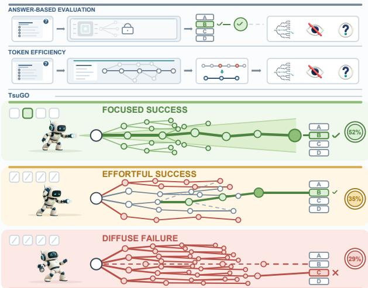  
Fi<sub>gure</sub> 1<sub>:</sub> T<sub>su</sub>GO <sub>revea</sub>l<sub>s searc</sub>h <sub>organ</sub>i<sub>za</sub>ti<sub>on</sub> th<sub>a</sub>t i<sub>s</sub> hidd<sub>en</sub> f<sub>rom</sub> A<sub>nswer- an</sub>d T<sub>o</sub>k<sub>en-</sub>Efi<sub>c</sub>i<sub>ency-</sub>b<sub>ase</sub>d <sub>eva</sub>l<sub>ua</sub>ti<sub>on.</sub>

J<sub>u</sub>d<sub>ger measures necessary reason</sub>i<sub>ng an</sub>d <sub>s</sub>t<sub>ruc</sub>t<sub>ura</sub>l <sub>re</sub>d<sub>un-</sub> danc<sub>y</sub> from de<sub>p</sub>endenc<sub>y g</sub>ra<sub>p</sub>hs (Li et al. 2026); ReEfBench <sub>maps</sub> t<sub>races</sub> i<sub>n</sub>t<sub>o</sub> l<sub>og</sub>i<sub>ca</sub>l <sub>s</sub>t<sub>ruc</sub>t<sub>ures</sub> t<sub>o ana</sub>l<sub>yze reason</sub>i<sub>ng e</sub>fi<sub>-</sub> cienc<sub>y</sub> and behavioral <sub>p</sub>atterns (Fu et al. 2026); and <sub>p</sub>rocess-<sub>superv</sub>i<sub>s</sub>i<sub>on</sub> <sub>or</sub> PRM<sub>-</sub>b<sub>ase</sub>d <sub>me</sub>th<sub>o</sub>d<sub>s</sub> <sub>eva</sub>l<sub>ua</sub>t<sub>e</sub> i<sub>n</sub>t<sub>erme</sub>di<sub>a</sub>t<sub>e</sub> ste<sub>p</sub>s throu<sub>g</sub>h ste<sub>p</sub>-level feedback (Li<sub>g</sub>htman et al. 2024; Son<sub>g</sub> et al. 2025). These studies show whether a reasonin<sub>g</sub> <sub>c</sub>h<sub>a</sub>i<sub>n</sub> i<sub>s</sub> <sub>correc</sub>t<sub>,</sub> <sub>conc</sub>i<sub>se,</sub> <sub>an</sub>d l<sub>og</sub>i<sub>ca</sub>ll<sub>y</sub> <sub>co</sub>h<sub>eren</sub>t<sub>,</sub> b<sub>u</sub>t <sub>ma</sub>i<sub>n</sub>l<sub>y</sub> <sub>assume</sub> th<sub>a</sub>t <sub>e</sub>f<sub>ec</sub>ti<sub>ve reason</sub>i<sub>ng</sub> f<sub>o</sub>ll<sub>ows a s</sub>i<sub>ng</sub>l<sub>e</sub> d<sub>er</sub>i<sub>va</sub>ti<sub>on</sub> <sub>pa</sub>th<sub>,</sub> <sub>w</sub>h<sub>ere</sub> th<sub>e</sub> k<sub>ey</sub> <sub>ques</sub>ti<sub>on</sub> i<sub>s</sub> <sub>w</sub>hi<sub>c</sub>h <sub>s</sub>t<sub>eps</sub> <sub>are</sub> <sub>necessary</sub> <sub>an</sub>d <sub>w</sub>hi<sub>c</sub>h <sub>can</sub> b<sub>e remove</sub>d<sub>.</sub>

M<sub>any</sub> <sub>c</sub>h<sub>a</sub>ll<sub>eng</sub>i<sub>ng</sub> <sub>pro</sub>bl<sub>ems</sub> <sub>requ</sub>i<sub>re</sub> <sub>more</sub> th<sub>an</sub> <sub>s</sub>t<sub>a</sub>ti<sub>c</sub> <sub>pro</sub>b<sub>-</sub> l<sub>em so</sub>l<sub>v</sub>i<sub>ng a</sub>l<sub>ong a s</sub>i<sub>ng</sub>l<sub>e</sub> d<sub>er</sub>i<sub>va</sub>ti<sub>on pa</sub>th<sub>: mo</sub>d<sub>e</sub>l<sub>s mus</sub>t <sub>ex-</sub> <sub>p</sub>l<sub>ore</sub> <sub>a</sub>lt<sub>erna</sub>ti<sub>ves,</sub> id<sub>en</sub>tif<sub>y</sub> <sub>prom</sub>i<sub>s</sub>i<sub>ng</sub> di<sub>rec</sub>ti<sub>ons,</sub> <sub>an</sub>d <sub>a</sub>ll<sub>oca</sub>t<sub>e</sub> <sub>resources across compe</sub>ti<sub>ng pa</sub>th<sub>s.</sub> W<sub>e ca</sub>ll thi<sub>s capa</sub>bilit<sub>y</sub> Search Eficiency (SearchE): or<sub>g</sub>anizin<sub>g</sub> reasonin<sub>g</sub> search toward efective solutions across multiple possible trajecto-<sub>r</sub>i<sub>es.</sub> C<sub>ompare</sub>d <sub>w</sub>ith T<sub>o</sub>k<sub>en</sub> Efi<sub>c</sub>i<sub>ency, w</sub>hi<sub>c</sub>h <sub>re</sub>fl<sub>ec</sub>t<sub>s o</sub>b<sub>-</sub> <sub>serva</sub>bl<sub>e</sub> t<sub>o</sub>k<sub>en cos</sub>t<sub>,</sub> S<sub>earc</sub>hE i<sub>s more</sub> i<sub>n</sub>t<sub>erna</sub>l<sub>:</sub> it t<sub>rac</sub>k<sub>s</sub> h<sub>ow</sub> <sub>mo</sub>d<sub>e</sub>l<sub>s move</sub> th<sub>roug</sub>h th<sub>e so</sub>l<sub>u</sub>ti<sub>on space an</sub>d <sub>re</sub>di<sub>s</sub>t<sub>r</sub>ib<sub>u</sub>t<sub>e e</sub>f<sub>-</sub> f<sub>or</sub>t <sub>across</sub> b<sub>ranc</sub>h<sub>es, ra</sub>th<sub>er</sub> th<sub>an on</sub>l h<sub>ow muc</sub>h <sub>sur</sub>f<sub>ace</sub> t<sub>ex</sub>t t<sup>h</sup>e<sub>y p</sub>ro<sup>d</sup>uce.

Ad<sub>versar</sub>i<sub>a</sub>l t<sub>as</sub>k<sub>s</sub> <sub>na</sub>t<sub>ura</sub>ll<sub>y</sub> <sub>expose</sub> thi<sub>s</sub> <sub>a</sub>bilit<sub>y</sub> b<sub>ecause</sub> <sub>eac</sub>h d<sub>ec</sub>i<sub>s</sub>i<sub>on</sub> <sub>mus</sub>t <sub>surv</sub>i<sub>ve</sub> f<sub>u</sub>t<sub>ure</sub> <sub>responses,</sub> f<sub>orc</sub>i<sub>ng</sub> <sub>compar</sub>i<sub>son,</sub> <sub>ver</sub>ifi<sub>ca</sub>ti<sub>on, an</sub>d <sub>rev</sub>i<sub>s</sub>i<sub>on.</sub> B<sub>ranc</sub>hi<sub>ng</sub> i<sub>s</sub> th<sub>ere</sub>f<sub>ore no</sub>t i<sub>n</sub>h<sub>er-</sub> <sub>en</sub>tl<sub>y re</sub>d<sub>un</sub>d<sub>an</sub>t<sub>; e</sub>f<sub>ec</sub>ti<sub>ve reason</sub>i<sub>ng</sub> d<sub>epen</sub>d<sub>s on w</sub>h<sub>e</sub>th<sub>er ex-</sub> <sub>p</sub>l<sub>ora</sub>ti<sub>on</sub> i<sub>s</sub> <sub>organ</sub>i<sub>ze</sub>d <sub>aroun</sub>d <sub>va</sub>l<sub>ua</sub>bl<sub>e</sub> <sub>pa</sub>th<sub>s.</sub> Cl<sub>ass</sub>i<sub>ca</sub>l <sub>game</sub> AI <sub>an</sub>d <sub>recen</sub>t LLM <sub>searc</sub>h <sub>s</sub>t<sub>u</sub>di<sub>es</sub> <sub>s</sub>h<sub>ow</sub> th<sub>e</sub> i<sub>mpor</sub>t<sub>ance</sub> <sub>o</sub>f ex<sub>p</sub>licit search (Silver et al. 2016, 2017; Gandhi et al. 2024; Fen<sub>g</sub> et al. 2024), but LLM benchmarks still lack a controlled <sub>way</sub> t<sub>o eva</sub>l<sub>ua</sub>t<sub>e searc</sub>h <sub>organ</sub>i<sub>za</sub>ti<sub>on</sub> it<sub>se</sub>lf<sub>.</sub>

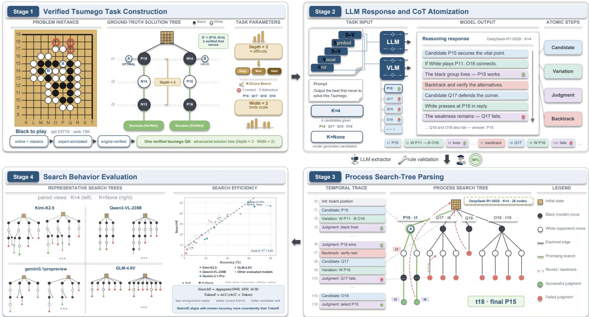  
Fi<sub>gure</sub> 2<sub>:</sub> O<sub>verv</sub>i<sub>ew o</sub>f T<sub>su</sub>GO<sub>: ver</sub>ifi<sub>e</sub>d <sub>pro</sub>bl<sub>ems are ren</sub>d<sub>ere</sub>d i<sub>n</sub>t<sub>o</sub> fi<sub>ve mo</sub>d<sub>a</sub>liti<sub>es, so</sub>l<sub>ve</sub>d th<sub>roug</sub>h b<sub>oun</sub>d<sub>e</sub>d <sub>or open</sub> K<sub>-</sub>S<sub>earc</sub>h<sub>,</sub> <sub>parse</sub>d i<sub>n</sub>t<sub>o</sub> <sub>process</sub> <sub>searc</sub>h t<sub>rees,</sub> <sub>an</sub>d <sub>eva</sub>l<sub>ua</sub>t<sub>e</sub>d b<sub>y</sub> S<sub>earc</sub>h Efi<sub>c</sub>i<sub>ency</sub> <sub>w</sub>ith <sub>suppor</sub>ti<sub>ng</sub> di<sub>agnos</sub>ti<sub>cs.</sub>

T<sub>o a</sub>dd<sub>ress</sub> thi<sub>s gap, we</sub> i<sub>n</sub>t<sub>ro</sub>d<sub>uce</sub> T<sub>su</sub>GO<sub>, a</sub> b<sub>enc</sub>h<sub>mar</sub>k b<sub>ase</sub>d <sub>on</sub> G<sub>o</sub> lif<sub>e-an</sub>d<sub>-</sub>d<sub>ea</sub>th <sub>pro</sub>bl<sub>ems</sub> f<sub>or eva</sub>l<sub>ua</sub>ti<sub>ng</sub> S<sub>earc</sub>hE in LLM reasoning. The name draws on tsumego (tsume-go), th<sub>e</sub> J<sub>apanese</sub> t<sub>erm</sub> f<sub>or</sub> G<sub>o</sub> lif<sub>e-an</sub>d<sub>-</sub>d<sub>ea</sub>th <sub>pro</sub>bl<sub>ems,</sub> <sub>an</sub>d <sub>em-</sub> <sub>p</sub>h<sub>as</sub>i<sub>zes</sub> h<sub>ow mo</sub>d<sub>e</sub>l<sub>s c</sub>h<sub>oose w</sub>h<sub>ere</sub> t<sub>o go nex</sub>t<sub>.</sub> T<sub>sumego</sub> <sub>o</sub>f<sub>ers a con</sub>t<sub>ro</sub>ll<sub>e</sub>d <sub>a</sub>d<sub>versar</sub>i<sub>a</sub>l <sub>env</sub>i<sub>ronmen</sub>t <sub>w</sub>ith <sub>ver</sub>ifi<sub>a</sub>bl<sub>e</sub> <sub>so</sub>l<sub>u</sub>ti<sub>on spaces, ena</sub>bli<sub>ng ana</sub>l<sub>ys</sub>i<sub>s o</sub>f b<sub>o</sub>th fi<sub>na</sub>l <sub>answers an</sub>d <sub>searc</sub>h <sub>over</sub> <sub>a</sub>lt<sub>erna</sub>ti<sub>ves.</sub> W<sub>e</sub> <sub>parse</sub> f<sub>ree-</sub>f<sub>orm</sub> C<sub>o</sub>T i<sub>n</sub>t<sub>o</sub> <sub>process</sub> <sub>searc</sub>h t<sub>rees an</sub>d <sub>repor</sub>t S<sub>earc</sub>hE<sub>, w</sub>hi<sub>c</sub>h <sub>measures w</sub>h<sub>e</sub>th<sub>er re-</sub> <sub>sources</sub> t<sub>arge</sub>t th<sub>e correc</sub>t b<sub>ranc</sub>h<sub>, an</sub>d T<sub>o</sub>k<sub>en</sub>E<sub>, w</sub>hi<sub>c</sub>h <sub>norma</sub>l<sub>-</sub> i<sub>zes accuracy</sub> b<sub>y o</sub>b<sub>serva</sub>bl<sub>e</sub> t<sub>o</sub>k<sub>en cos</sub>t<sub>.</sub> E<sub>xper</sub>i<sub>men</sub>t<sub>s s</sub>h<sub>ow</sub> th<sub>a</sub>t <sub>s</sub>t<sub>ronger</sub> <sub>mo</sub>d<sub>e</sub>l<sub>s</sub> <sub>succee</sub>d b<sub>y</sub> <sub>propos</sub>i<sub>ng</sub> th<sub>e</sub> <sub>correc</sub>t <sub>can-</sub> did<sub>a</sub>t<sub>e ear</sub>li<sub>er an</sub>d <sub>sus</sub>t<sub>a</sub>i<sub>n</sub>i<sub>ng e</sub>f<sub>or</sub>t <sub>on pro</sub>d<sub>uc</sub>ti<sub>ve</sub> b<sub>ranc</sub>h<sub>es,</sub> <sub>es</sub>t<sub>a</sub>bli<sub>s</sub>hi<sub>ng searc</sub>h <sub>organ</sub>i<sub>za</sub>ti<sub>on as a</sub> di<sub>mens</sub>i<sub>on</sub> b<sub>eyon</sub>d <sub>ou</sub>t<sub>-</sub> <sub>come</sub> <sub>accuracy</sub> <sub>an</sub>d t<sub>o</sub>k<sub>en</sub> <sub>e</sub>fi<sub>c</sub>i<sub>ency.</sub>

O<sub>ur con</sub>t<sub>r</sub>ib<sub>u</sub>ti<sub>ons are</sub> th<sub>ree</sub>f<sub>o</sub>ld<sub>:</sub>

• We introduce TsuGO<sub>,</sub> a <sub>p</sub>rocess-level benchmark for eval-<sub>ua</sub>ti<sub>ng</sub> S<sub>earc</sub>h Efi<sub>c</sub>i<sub>ency</sub> i<sub>n</sub> <sub>con</sub>t<sub>ro</sub>ll<sub>e</sub>d <sub>a</sub>d<sub>versar</sub>i<sub>a</sub>l t<sub>as</sub>k<sub>s</sub> with verifiable solution s<sub>p</sub>aces (§3).

• We <sub>p</sub>ro<sub>p</sub>ose a search-trace framework that converts freef<sub>orm</sub> C<sub>o</sub>T i<sub>n</sub>t<sub>o</sub> <sub>process</sub> <sub>searc</sub>h t<sub>rees</sub> <sub>an</sub>d di<sub>agnoses</sub> <sub>resource</sub> allocation with Search Eficiency and supporting trajec-

tor<sub>y</sub>/scale dia<sub>g</sub>nostics (§4).

• We show that Search Eficienc<sub>y</sub> ali<sub>g</sub>ns more closel<sub>y</sub> with <sub>searc</sub>h <sub>organ</sub>i<sub>za</sub>ti<sub>on</sub> th<sub>an</sub> t<sub>o</sub>k<sub>en-</sub>l<sub>eve</sub>l <sub>e</sub>fi<sub>c</sub>i<sub>ency,</sub> <sub>an</sub>d th<sub>a</sub>t T<sub>su</sub>GO <sub>rema</sub>i<sub>ns</sub> f<sub>ar</sub> f<sub>rom sa</sub>t<sub>ura</sub>t<sub>e</sub>d<sub>: even</sub> f<sub>ron</sub>ti<sub>er</sub> LLM<sub>s</sub> l<sub>ag</sub> f<sub>ar</sub> b<sub>e</sub>hi<sub>n</sub>d <sub>neura</sub>l<sub>-gu</sub>id<sub>e</sub>d K<sub>a</sub>t<sub>a</sub>G<sub>o,</sub> <sub>ma</sub>ki<sub>ng</sub> <sub>searc</sub>h <sub>orga-</sub> <sub>n</sub>i<sub>za</sub>ti<sub>on a</sub> k<sub>ey un</sub>d<sub>er</sub>d<sub>eve</sub>l<sub>ope</sub>d di<sub>rec</sub>ti<sub>on</sub> f<sub>or</sub> LLM <sub>reason-</sub> in<sub>g</sub> (§5).

## 2 R<sub>e</sub>l<sub>a</sub>t<sub>e</sub>d W<sub>or</sub>k

R<sub>eason</sub>i<sub>ng</sub> E<sub>va</sub>l<sub>ua</sub>ti<sub>on</sub> B<sub>enc</sub>h<sub>mar</sub>k<sub>s.</sub> E<sub>ar</sub>l<sub>y reason-</sub> i<sub>ng</sub> b<sub>enc</sub>h<sub>mar</sub>k<sub>s ma</sub>i<sub>n</sub>l<sub>y eva</sub>l<sub>ua</sub>t<sub>e</sub> fi<sub>na</sub>l<sub>-answer accuracy.</sub> GSM8K (Cobbe et al. 2021), MATH (Hendr<sub>y</sub>cks et al. 2021), ARC (Clark et al. 2018), and BIG-Bench (Srivastava et al. 2023) measure whether models can solve mathematical, sci-<sub>en</sub>tifi<sub>c, an</sub>d <sub>genera</sub>l <sub>reason</sub>i<sub>ng pro</sub>bl<sub>ems.</sub> S<sub>e</sub>lf<sub>-cons</sub>i<sub>s</sub>t<sub>ency</sub> f<sub>ur-</sub> th<sub>er</sub> i<sub>mproves per</sub>f<sub>ormance</sub> b<sub>y aggrega</sub>ti<sub>ng mu</sub>lti<sub>p</sub>l<sub>e samp</sub>l<sub>e</sub>d solutions (Wan<sub>g</sub> et al. 2023). Formal and s<sub>y</sub>nthetic lo<sub>g</sub>ic b<sub>enc</sub>h<sub>mar</sub>k<sub>s</sub> f<sub>ur</sub>th<sub>er</sub> t<sub>es</sub>t <sub>ru</sub>l<sub>e-</sub>b<sub>ase</sub>d i<sub>n</sub>f<sub>erence an</sub>d <sub>cons</sub>t<sub>ra</sub>i<sub>n</sub>t satisfaction (Han et al. 2024; Sa<sub>p</sub>arov and He 2023; Lin et al. 2025; Liu et al. 2025). However, outcome-based evaluation <sub>canno</sub>t <sub>revea</sub>l h<sub>ow mo</sub>d<sub>e</sub>l<sub>s reason.</sub>

R<sub>ecen</sub>t <sub>s</sub>t<sub>u</sub>di<sub>es</sub> h<sub>ave</sub> b<sub>egun</sub> t<sub>o</sub> <sub>ana</sub>l<sub>yze</sub> i<sub>n</sub>t<sub>erme</sub>di<sub>a</sub>t<sub>e</sub> <sub>rea-</sub> <sub>so</sub>nin<sub>g</sub> tr<sub>aces.</sub> ROSCOE <sub>a</sub>nd R<sub>e</sub>CE<sub>va</sub>l <sub>eva</sub>l<sub>ua</sub>t<sub>e</sub> C<sub>o</sub>T <sub>qua</sub>l<sub>-</sub> it<sub>y</sub> (Golovneva et al. 2023; Prasad et al. 2023); CoTJud<sub>g</sub>er <sub>measures</sub> <sub>reason</sub>i<sub>ng</sub> <sub>re</sub>d<sub>un</sub>d<sub>ancy</sub> th<sub>roug</sub>h d<sub>epen</sub>d<sub>ency</sub> <sub>grap</sub>h<sub>s</sub> and shortest efective <sub>p</sub>aths (Li et al. 2026); ReEfBench anal<sub>y</sub>zes reasonin<sub>g</sub> structures and eficienc<sub>y</sub> (Fu et al. 2026); Pro-<sub>cess</sub>B<sub>enc</sub>h<sub>,</sub> PRMB<sub>enc</sub>h<sub>, an</sub>d <sub>process rewar</sub>d <sub>mo</sub>d<sub>e</sub>li<sub>ng eva</sub>l<sub>-</sub> uate ste<sub>p</sub>-level correctness and su<sub>p</sub>ervision si<sub>g</sub>nals (Zhen<sub>g</sub> et al. 2025; Son<sub>g</sub> et al. 2025; Li<sub>g</sub>htman et al. 2024). Other <sub>wor</sub>k<sub>s s</sub>t<sub>u</sub>d<sub>y</sub> th<sub>e cos</sub>t<sub>, sca</sub>li<sub>ng</sub> b<sub>e</sub>h<sub>av</sub>i<sub>or,</sub> i<sub>n</sub>f<sub>erence-</sub>ti<sub>me</sub> b<sub>e</sub>h<sub>av-</sub> ior, and faithfulness of lon<sub>g</sub> CoT (Li, Chan<sub>g</sub>, and Wu 2025; L<sub>uo e</sub>t <sub>a</sub>l<sub>.</sub> 2025<sub>;</sub> S<sub>u</sub>i <sub>e</sub>t <sub>a</sub>l<sub>.</sub> 2025<sub>;</sub> Ch<sub>en e</sub>t <sub>a</sub>l<sub>.</sub> 2025<sub>;</sub> Sh<sub>en</sub> et al. 2025; Parashar et al. 2025; Gandhi et al. 2025). These <sub>me</sub>th<sub>o</sub>d<sub>s</sub> <sub>ma</sub>i<sub>n</sub>l<sub>y</sub> <sub>eva</sub>l<sub>ua</sub>t<sub>e</sub> th<sub>e</sub> <sub>qua</sub>lit<sub>y</sub> <sub>o</sub>f <sub>a</sub> <sub>s</sub>i<sub>ng</sub>l<sub>e</sub> <sub>reason</sub>i<sub>ng</sub> trajectory. In contrast, TsuGO studies how models organize search across multiple possible trajectories.

S<sub>ea</sub>r<sub>c</sub>h<sub>-</sub>b<sub>ase</sub>d R<sub>easo</sub>nin<sub>g.</sub> M<sub>eanw</sub>hil<sub>e, recen</sub>t <sub>wor</sub>k i<sub>m-</sub> <sub>proves</sub> LLM <sub>reason</sub>i<sub>ng</sub> b<sub>y</sub> i<sub>n</sub>t<sub>ro</sub>d<sub>uc</sub>i<sub>ng exp</sub>li<sub>c</sub>it <sub>searc</sub>h <sub>proce-</sub> d<sub>ures.</sub> T<sub>ree-o</sub>f<sub>-</sub>Th<sub>oug</sub>ht <sub>an</sub>d G<sub>rap</sub>h<sub>-o</sub>f<sub>-</sub>Th<sub>oug</sub>ht<sub>s represen</sub>t i<sub>n-</sub> termediate thou<sub>g</sub>hts as trees or <sub>g</sub>ra<sub>p</sub>hs (Yao et al. 2023; Besta et al. 2024); RAP formulates reasonin<sub>g</sub> as <sub>p</sub>lannin<sub>g</sub> (Hao et al. 2023); LATS, Al<sub>p</sub>haZero-like search, Stream of Search, <sub>an</sub>d LE<sub>-</sub>MCTS <sub>exp</sub>l<sub>ore searc</sub>h<sub>-</sub>b<sub>ase</sub>d i<sub>n</sub>f<sub>erence an</sub>d t<sub>ra</sub>i<sub>n-</sub> in<sub>g</sub> (Zhou et al. 2024; Fen<sub>g</sub> et al. 2024; Gandhi et al. 2024; Park et al. 2025). These methods show that structured search <sub>can</sub> i<sub>mprove</sub> <sub>reason</sub>i<sub>ng</sub> <sub>w</sub>h<sub>en</sub> <sub>supp</sub>li<sub>e</sub>d <sub>as</sub> <sub>an</sub> <sub>ex</sub>t<sub>erna</sub>l <sub>pro-</sub> <sub>ce</sub>d<sub>ure,</sub> b<sub>u</sub>t l<sub>eave open w</sub>h<sub>e</sub>th<sub>er</sub> LLM<sub>s can organ</sub>i<sub>ze searc</sub>h <sub>w</sub>ithi<sub>n</sub> th<sub>e</sub>i<sub>r own reason</sub>i<sub>ng</sub> t<sub>races.</sub> T<sub>su</sub>GO <sub>eva</sub>l<sub>ua</sub>t<sub>es</sub> thi<sub>s</sub> i<sub>n-</sub> t<sub>erna</sub>l <sub>searc</sub>h<sub>-organ</sub>i<sub>za</sub>ti<sub>on</sub> <sub>a</sub>bilit<sub>y</sub> di<sub>rec</sub>tl<sub>y.</sub>

Ad<sub>ve</sub>r<sub>sa</sub>ri<sub>a</sub>l R<sub>easo</sub>nin<sub>g</sub> En<sub>v</sub>ir<sub>o</sub>nm<sub>e</sub>nt<sub>s.</sub> Ad<sub>versar</sub>i<sub>a</sub>l <sub>env</sub>i<sub>-</sub> <sub>ronmen</sub>t<sub>s prov</sub>id<sub>e s</sub>t<sub>ruc</sub>t<sub>ure</sub>d <sub>spaces</sub> f<sub>or s</sub>t<sub>u</sub>d<sub>y</sub>i<sub>ng p</sub>l<sub>ann</sub>i<sub>ng</sub> <sub>an</sub>d <sub>searc</sub>h<sub>.</sub> Al<sub>p</sub>h<sub>a</sub>G<sub>o an</sub>d Al<sub>p</sub>h<sub>a</sub>G<sub>o</sub> Z<sub>ero</sub> d<sub>emons</sub>t<sub>ra</sub>t<sub>e</sub> th<sub>e</sub> im<sub>p</sub>ortance of tree search for decision makin<sub>g</sub> in <sub>g</sub>ames (Silver et al. 2016, 2017). Recent LLM studies on chess, Oth-<sub>e</sub>ll<sub>o, an</sub>d G<sub>o</sub> i<sub>nves</sub>ti<sub>ga</sub>t<sub>e s</sub>t<sub>a</sub>t<sub>e</sub> t<sub>rac</sub>ki<sub>ng, move pre</sub>di<sub>c</sub>ti<sub>on, an</sub>d strate<sub>g</sub>ic reasonin<sub>g</sub> (Toshniwal et al. 2023; Li et al. 2023; Ma et al. 2025). These works mainl<sub>y</sub> evaluate task <sub>p</sub>erformance <sub>or s</sub>t<sub>a</sub>t<sub>e un</sub>d<sub>ers</sub>t<sub>an</sub>di<sub>ng.</sub> T<sub>su</sub>GO <sub>uses</sub> G<sub>o</sub> lif<sub>e-an</sub>d<sub>-</sub>d<sub>ea</sub>th <sub>pro</sub>b<sub>-</sub> l<sub>ems</sub> dif<sub>eren</sub>tl<sub>y:</sub> <sub>as</sub> <sub>a</sub> <sub>con</sub>t<sub>ro</sub>ll<sub>e</sub>d <sub>env</sub>i<sub>ronmen</sub>t f<sub>or</sub> <sub>ana</sub>l<sub>yz</sub>i<sub>ng</sub> h<sub>ow</sub> <sub>mo</sub>d<sub>e</sub>l<sub>s</sub> <sub>exp</sub>l<sub>ore,</sub> <sub>ver</sub>if<sub>y,</sub> <sub>an</sub>d <sub>organ</sub>i<sub>ze</sub> <sub>reason</sub>i<sub>ng</sub> <sub>searc</sub>h<sub>.</sub>

## 3 T<sub>su</sub>GO

## 3<sub>.</sub>1 Wh<sub>y</sub> T<sub>su</sub>m<sub>ego</sub>?

A<sub>s</sub> i<sub>n</sub>t<sub>ro</sub>d<sub>uce</sub>d <sub>a</sub>b<sub>ove,</sub> T<sub>su</sub>GO <sub>uses</sub> G<sub>o</sub> lif<sub>e-an</sub>d<sub>-</sub>d<sub>ea</sub>th <sub>pro</sub>b<sub>-</sub> l<sub>ems</sub> t<sub>o s</sub>t<sub>u</sub>d<sub>y</sub> h<sub>ow mo</sub>d<sub>e</sub>l<sub>s organ</sub>i<sub>ze searc</sub>h <sub>ra</sub>th<sub>er</sub> th<sub>an</sub> <sub>w</sub>h<sub>e</sub>th<sub>er</sub> th<sub>ey</sub> k<sub>now a</sub> fi<sub>na</sub>l <sub>answer.</sub> Thi<sub>s se</sub>tti<sub>ng</sub> i<sub>s espec</sub>i<sub>a</sub>ll<sub>y</sub> <sub>su</sub>it<sub>a</sub>bl<sub>e</sub> b<sub>ecause a</sub>d<sub>versar</sub>i<sub>a</sub>l <sub>so</sub>l<sub>u</sub>ti<sub>on spaces are</sub> l<sub>arge an</sub>d d<sub>ynam</sub>i<sub>c: eac</sub>h <sub>can</sub>did<sub>a</sub>t<sub>e move c</sub>h<sub>anges</sub> th<sub>e space o</sub>f <sub>poss</sub>ibl<sub>e</sub> <sub>rep</sub>li<sub>es, an</sub>d <sub>a</sub> li<sub>ne rema</sub>i<sub>ns va</sub>lid <sub>on</sub>l<sub>y</sub> if it <sub>surv</sub>i<sub>ves</sub> th<sub>e op-</sub> <sub>po</sub>n<sub>e</sub>nt’<sub>s</sub> <sub>s</sub>tr<sub>o</sub>n<sub>ges</sub>t r<sub>espo</sub>n<sub>se.</sub> T<sub>su</sub>m<sub>ego</sub> <sub>p</sub>r<sub>ov</sub>id<sub>es</sub> thi<sub>s</sub> <sub>s</sub>tr<sub>uc</sub>t<sub>u</sub>r<sub>e</sub> i<sub>n</sub> <sub>a</sub> <sub>compac</sub>t <sub>an</sub>d <sub>ver</sub>ifi<sub>a</sub>bl<sub>e</sub> f<sub>orm:</sub> <sub>re</sub>l<sub>evan</sub>t <sub>moves</sub> <sub>are</sub> l<sub>oca</sub>l<sub>,</sub> <sub>var</sub>i<sub>a</sub>ti<sub>ons can</sub> b<sub>e c</sub>h<sub>ec</sub>k<sub>e</sub>d <sub>a a</sub>i<sub>ns</sub>t <sub>re</sub>f<sub>erence so</sub>l<sub>u</sub>ti<sub>ons an</sub>d <sub>en-</sub> <sub>g</sub>i<sub>ne ana</sub>l<sub>ys</sub>i<sub>s, an</sub>d <sub>pos</sub>iti<sub>ons can</sub> b<sub>e ren</sub>d<sub>ere</sub>d <sub>as coor</sub>di<sub>na</sub>t<sub>es,</sub> <sub>ma</sub>t<sub>r</sub>i<sub>ces, or</sub> i<sub>mages.</sub> W<sub>e</sub> th<sub>ere</sub>f<sub>ore use</sub> t<sub>sumego no</sub>t t<sub>o</sub> t<sub>es</sub>t G<sub>o</sub> <sub>s</sub>t<sub>reng</sub>th<sub>,</sub> b<sub>u</sub>t <sub>as a c</sub>l<sub>ose</sub>d <sub>a</sub>d<sub>versar</sub>i<sub>a</sub>l <sub>env</sub>i<sub>ronmen</sub>t <sub>w</sub>h<sub>ere</sub> th<sub>e</sub> difi<sub>cu</sub>lt<sub>y</sub> <sub>o</sub>f G<sub>o-s</sub>t<sub>y</sub>l<sub>e</sub> <sub>searc</sub>h <sub>comes</sub> f<sub>rom</sub> d<sub>ynam</sub>i<sub>ca</sub>ll<sub>y</sub> <sub>c</sub>h<sub>ang-</sub> i<sub>ng</sub> b<sub>ranc</sub>h<sub>es an</sub>d th<sub>e nee</sub>d t<sub>o separa</sub>t<sub>e</sub> d<sub>oma</sub>i<sub>n</sub> k<sub>now</sub>l<sub>e</sub>d<sub>ge</sub> f<sub>rom searc</sub>h <sub>organ</sub>i<sub>za</sub>ti<sub>on.</sub>

T<sub>a</sub>bl<sub>e</sub> 1 <sub>s</sub>h<sub>ows</sub> th<sub>a</sub>t <sub>pr</sub>i<sub>or</sub> b<sub>enc</sub>h<sub>mar</sub>k<sub>s cover answer accu-</sub> <sub>racy, s</sub>t<sub>ep errors, or</sub> C<sub>o</sub>T <sub>re</sub>d<sub>un</sub>d<sub>ancy,</sub> b<sub>u</sub>t <sub>no</sub>t <sub>resource a</sub>ll<sub>o-</sub> <sub>ca</sub>ti<sub>on</sub> <sub>across</sub> <sub>a</sub>d<sub>versar</sub>i<sub>a</sub>l b<sub>ranc</sub>h<sub>es.</sub> T<sub>su</sub>GO <sub>un</sub>i<sub>que</sub>l<sub>y</sub> <sub>com-</sub> bi<sub>nes process</sub> t<sub>races, reason</sub>i<sub>ng</sub> t<sub>opo</sub>l<sub>ogy, ver</sub>ifi<sub>a</sub>bl<sub>e s</sub>t<sub>a</sub>t<sub>es,</sub> <sub>con</sub>t<sub>ro</sub>ll<sub>e</sub>d <sub>can</sub>did<sub>a</sub>t<sub>es, mu</sub>lti<sub>mo</sub>d<sub>a</sub>l i<sub>npu</sub>t<sub>s,</sub> b<sub>ranc</sub>h <sub>searc</sub>h<sub>, an</sub>d <sub>searc</sub>h<sub>-organ</sub>i<sub>za</sub>ti<sub>on ana</sub>l<sub>ys</sub>i<sub>s.</sub>

T<sub>a</sub>bl<sub>e</sub> 1<sub>:</sub> C<sub>ompar</sub>i<sub>son w</sub>ith <sub>represen</sub>t<sub>a</sub>ti<sub>ve reason</sub>i<sub>ng</sub> b<sub>enc</sub>h<sub>-</sub> <sub>mar</sub>k<sub>s an</sub>d <sub>process-eva</sub>l<sub>ua</sub>ti<sub>on</sub> f<sub>ramewor</sub>k<sub>s.</sub> ✓ d<sub>eno</sub>t<sub>es a pr</sub>i<sub>-</sub> mar<sub>y</sub> tar<sub>g</sub>et, ◦ <sub>p</sub>artial su<sub>pp</sub>ort, and × no ex<sub>p</sub>licit su<sub>pp</sub>ort. T <sub>=</sub> t<sub>race,</sub> P <sub>=</sub> t<sub>opo</sub>l<sub>ogy,</sub> V <sub>= ver</sub>ifi<sub>ca</sub>ti<sub>on,</sub> C <sub>= con</sub>t<sub>ro</sub>ll<sub>e</sub>d <sub>can-</sub> did<sub>a</sub>t<sub>e space,</sub> M <sub>= mu</sub>lti<sub>mo</sub>d<sub>a</sub>l i<sub>npu</sub>t<sub>,</sub> B <sub>=</sub> b<sub>ranc</sub>h <sub>searc</sub>h<sub>,</sub> O <sub>=</sub> <sub>searc</sub>h <sub>organ</sub>i<sub>za</sub>ti<sub>on.</sub>
<table><tr><td>Benchmark group and examples</td><td>T</td><td>P</td><td>V</td><td>C</td><td>M</td><td>B</td><td>0</td></tr><tr><td>Outcome (GSM8K, MATH, ARC, BIG-Bench)</td><td>o</td><td>×</td><td>O</td><td>O</td><td>×</td><td>×</td><td>×</td></tr><tr><td>Logic (FOLIO, PrOntoQA, ZebraLogic)</td><td>o</td><td>o</td><td>√</td><td>√</td><td>×</td><td>o</td><td>×</td></tr><tr><td>Process (ROSCOE, ReCEval, ProcessBench, PRMB)</td><td>V</td><td>o</td><td>V</td><td>o</td><td>×</td><td>×</td><td>×</td></tr><tr><td>CoT efficiency (CoTJudger, ReEfBench)</td><td>√</td><td>V</td><td>O</td><td>O</td><td>×</td><td>O</td><td>o</td></tr><tr><td>Behavior (Sys2Bench, CogBehaviors)</td><td>√</td><td>o</td><td>O</td><td>O</td><td>×</td><td>O</td><td>×</td></tr><tr><td>Board games (Chess, Othello, Go)</td><td>√</td><td>√</td><td>√</td><td>O</td><td>×</td><td>O</td><td>×</td></tr><tr><td>TsuGO</td><td>√</td><td>√</td><td>√</td><td>V</td><td>V</td><td>√</td><td>√</td></tr></table>

## 3<sub>.</sub>2 D<sub>a</sub>t<sub>a</sub> C<sub>u</sub>r<sub>a</sub>ti<sub>o</sub>n

P<sub>ro</sub>bl<sub>ems are cura</sub>t<sub>e</sub>d f<sub>rom pu</sub>bli<sub>c</sub> t<sub>sumego ma</sub>t<sub>er</sub>i<sub>a</sub>l<sub>s, c</sub>l<sub>ass</sub>i<sub>-</sub> <sub>ca</sub>l <sub>co</sub>ll<sub>ec</sub>ti<sub>ons, an</sub>d t<sub>racea</sub>bl<sub>e source recor</sub>d<sub>s,</sub> i<sub>nc</sub>l<sub>u</sub>di<sub>ng</sub> t<sub>ex</sub>t<sub>s</sub> such as Xuanxuan Qijing and Go Life-and-Death Dictionary. T<sub>o avo</sub>id <sub>repro</sub>d<sub>uc</sub>i<sub>ng p</sub>l<sub>a</sub>tf<sub>orm-spec</sub>ifi<sub>c ma</sub>t<sub>er</sub>i<sub>a</sub>l<sub>,</sub> T<sub>su</sub>GO k<sub>eeps on</sub>l<sub>y norma</sub>li<sub>ze</sub>d b<sub>oar</sub>d <sub>s</sub>t<sub>a</sub>t<sub>es, can</sub>did<sub>a</sub>t<sub>e po</sub>i<sub>n</sub>t<sub>s, re</sub>f<sub>-</sub> <sub>erence so</sub>l<sub>u</sub>ti<sub>on</sub> t<sub>rees, an</sub>d <sub>provenance recor</sub>d<sub>s; eac</sub>h <sub>pro</sub>bl<sub>em</sub> is stored in SGF and converted to JSON with a 19×19 matrix, <sub>coor</sub>di<sub>na</sub>t<sub>es, s</sub>id<sub>e</sub> t<sub>o p</sub>l<sub>ay, an</sub>d <sub>so</sub>l<sub>u</sub>ti<sub>on</sub> t<sub>ree.</sub>

W<sub>e re</sub>t<sub>a</sub>i<sub>n pro</sub>bl<sub>ems sa</sub>ti<sub>s</sub>f<sub>y</sub>i<sub>ng</sub> th<sub>ree cr</sub>it<sub>er</sub>i<sub>a:</sub> L<sub>oca</sub>lit<sub>y,</sub> <sub>w</sub>h<sub>ere re</sub>l<sub>evan</sub>t <sub>s</sub>t<sub>ones occupy a</sub> b<sub>oun</sub>d<sub>e</sub>d <sub>reg</sub>i<sub>on;</sub> Fir<sub>s</sub>t<sub>-</sub>m<sub>ove</sub> d<sub>e</sub>t<sub>erm</sub>i<sub>nacy,</sub> <sub>w</sub>h<sub>ere</sub> <sub>correc</sub>t fi<sub>rs</sub>t <sub>moves</sub> <sub>are</sub> <sub>un</sub>i<sub>que</sub> <sub>or</sub> fi<sub>-</sub> <sub>n</sub>it<sub>e</sub> <sub>an</sub>d <sub>no</sub>t k<sub>o-</sub>d<sub>epen</sub>d<sub>en</sub>t<sub>;</sub> <sub>an</sub>d V<sub>e</sub>rifi<sub>a</sub>bilit<sub>y,</sub> <sub>w</sub>h<sub>ere</sub> <sub>groun</sub>d<sub>-</sub> t<sub>ru</sub>th <sub>so</sub>l<sub>u</sub>ti<sub>ons</sub> <sub>are</sub> <sub>exper</sub>t<sub>-c</sub>h<sub>ec</sub>k<sub>e</sub>d <sub>an</sub>d <sub>cross-va</sub>lid<sub>a</sub>t<sub>e</sub>d b<sub>y</sub> <sub>a</sub> G<sub>o</sub> <sub>eng</sub>i<sub>ne.</sub> E<sub>ac</sub>h <sub>so</sub>l<sub>u</sub>ti<sub>on</sub> t<sub>ree</sub> <sub>s</sub>t<sub>ores</sub> th<sub>e</sub> <sub>correc</sub>t fi<sub>rs</sub>t <sub>move,</sub> <sub>pr</sub>i<sub>nc</sub>i<sub>pa</sub>l <sub>var</sub>i<sub>a</sub>ti<sub>on,</sub> <sub>va</sub>lid <sub>a</sub>lt<sub>erna</sub>ti<sub>ves,</sub> <sub>re</sub>f<sub>u</sub>t<sub>a</sub>ti<sub>ons,</sub> <sub>an</sub>d f<sub>a</sub>il<sub>ure</sub> <sub>anno</sub>t<sub>a</sub>ti<sub>ons</sub> f<sub>or</sub> b<sub>o</sub>th <sub>answer scor</sub>i<sub>ng an</sub>d <sub>searc</sub>h<sub>-</sub>t<sub>race eva</sub>l<sub>ua-</sub> tion (§4); additional curation and traceabilit<sub>y</sub> details a<sub>pp</sub>ear i<sub>n</sub> th<sub>e</sub> <sub>appen</sub>di<sub>x.</sub>

E<sub>ac</sub>h <sub>pos</sub>iti<sub>on</sub> i<sub>s ren</sub>d<sub>ere</sub>d <sub>as</sub> S<sub>ym</sub>b<sub>o</sub>li<sub>c coor</sub>di<sub>na</sub>t<sub>es,</sub> G<sub>r</sub>id <sub>ma</sub>t<sub>r</sub>i<sub>ces,</sub> S<sub>ym</sub>b<sub>o</sub>li<sub>c</sub>+G<sub>r</sub>id<sub>,</sub> Vi<sub>sua</sub>l i<sub>mages,</sub> <sub>an</sub>d S<sub>ym-</sub> b<sub>o</sub>li<sub>c</sub>+Vi<sub>sua</sub>l<sub>,</sub> <sub>ena</sub>bli<sub>ng</sub> t<sub>ex</sub>t<sub>-on</sub>l<sub>y</sub> <sub>an</sub>d <sub>v</sub>i<sub>s</sub>i<sub>on-</sub>l<sub>anguage</sub> <sub>mo</sub>d<sub>e</sub>l<sub>s</sub> t<sub>o</sub> f<sub>ace s</sub>t<sub>ruc</sub>t<sub>ura</sub>ll<sub>y</sub> id<sub>en</sub>ti<sub>ca</sub>l <sub>pos</sub>iti<sub>ons.</sub> I<sub>n</sub> b<sub>oun</sub>d<sub>e</sub>d<sub>-can</sub>did<sub>a</sub>t<sub>e</sub> t<sub>es</sub>t<sub>s,</sub> di<sub>s</sub>t<sub>rac</sub>t<sub>ors are</sub> l<sub>oca</sub>ll<sub>y sa</sub>li<sub>en</sub>t b<sub>u</sub>t t<sub>ac</sub>ti<sub>ca</sub>ll<sub>y wrong</sub> p<sup>oints</sup>, <sup>common</sup> <sup>amate</sup>u<sup>r</sup> <sup>misconce</sup>p<sup>tions</sup>, <sup>or</sup> <sup>a</sup>pp<sup>arent</sup> <sup>sente</sup> <sub>moves</sub> th<sub>a</sub>t <sub>a</sub>ll<sub>ow re</sub>f<sub>u</sub>t<sub>a</sub>ti<sub>on.</sub>

## 3<sub>.</sub>3 D<sub>a</sub>t<sub>ase</sub>t O<sub>ve</sub>r<sub>v</sub>i<sub>ew</sub>

T<sub>su</sub>GO i<sub>s</sub> <sub>organ</sub>i<sub>ze</sub>d b<sub>y</sub> difi<sub>cu</sub>lt<sub>y,</sub> <sub>mo</sub>d<sub>a</sub>lit<sub>y,</sub> <sub>an</sub>d <sub>can</sub>did<sub>a</sub>t<sub>e-</sub> <sub>space</sub> <sub>se</sub>tti<sub>ng.</sub> Th<sub>e</sub> <sub>cura</sub>t<sub>e</sub>d <sub>poo</sub>l <sub>con</sub>t<sub>a</sub>i<sub>ns</sub> 1<sub>,</sub>500 <sub>pro</sub>bl<sub>ems</sub> i<sub>n</sub> fi<sub>ve</sub> i<sub>npu</sub>t f<sub>orms;</sub> th<sub>e ma</sub>i<sub>n eva</sub>l<sub>ua</sub>ti<sub>on uses</sub> 600 <sub>pro</sub>bl<sub>ems,</sub> <sub>samp</sub>l<sub>e</sub>d <sub>as</sub> 200 <sub>pro</sub>bl<sub>ems</sub> f<sub>rom eac</sub>h <sub>o</sub>f th<sub>ree eva</sub>l<sub>ua</sub>t<sub>e</sub>d dif<sub>-</sub> fi<sub>cu</sub>lt<sub>y</sub> ti<sub>ers, w</sub>hil<sub>e</sub> h<sub>ar</sub>d<sub>er rema</sub>i<sub>n</sub>i<sub>ng su</sub>b<sub>se</sub>t<sub>s are reserve</sub>d f<sub>or</sub> f<sub>u</sub>t<sub>ure</sub> <sub>mo</sub>d<sub>e</sub>l<sub>s</sub> <sub>as</sub> <sub>capa</sub>biliti<sub>es</sub> i<sub>mprove.</sub> Difi<sub>cu</sub>lt<sub>y</sub> ti<sub>ers</sub> <sub>com</sub>bi<sub>ne</sub> h<sub>uman-ran</sub>k b<sub>an</sub>d<sub>s,</sub> <sub>ma</sub>i<sub>n-</sub>li<sub>ne</sub> d<sub>ep</sub>th<sub>,</sub> <sub>an</sub>d <sub>p</sub>l<sub>aus</sub>ibl<sub>e</sub> <sub>wrong</sub> <sub>can</sub>did<sub>a</sub>t<sub>es;</sub> T<sub>a</sub>bl<sub>e</sub> 2 <sub>s</sub>h<sub>ows</sub> <sub>a</sub> <sub>progress</sub>i<sub>on</sub> f<sub>rom</sub> <sub>s</sub>h<sub>a</sub>ll<sub>ow</sub> k<sub>yu-</sub>l<sub>eve</sub>l t<sub>o</sub> d<sub>an-</sub>l<sub>eve</sub>l <sub>ama</sub>t<sub>eur pro</sub>bl<sub>ems, w</sub>ith <sub>ran</sub>k b<sub>an</sub>d<sub>s</sub> <sub>use</sub>d <sub>on</sub>l<sub>y as coarse</sub> d<sub>escr</sub>i<sub>p</sub>t<sub>ors.</sub>

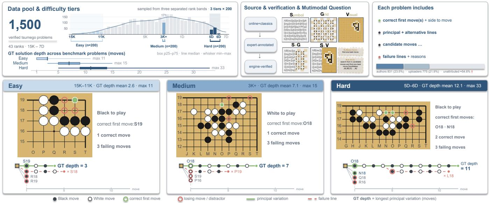  
Fi<sub>gure</sub> 3<sub>:</sub> O<sub>verv</sub>i<sub>ew o</sub>f th<sub>e</sub> T<sub>su</sub>GO d<sub>a</sub>t<sub>ase</sub>t <sub>cons</sub>t<sub>ruc</sub>ti<sub>on an</sub>d <sub>eva</sub>l<sub>ua</sub>ti<sub>on se</sub>tti<sub>ngs.</sub>

T<sub>a</sub>bl<sub>e</sub> 2<sub>:</sub> Difi<sub>cu</sub>lt<sub>y</sub> ti<sub>ers</sub> i<sub>n</sub> T<sub>su</sub>GO<sub>.</sub> H<sub>uman-ran</sub>k b<sub>an</sub>d<sub>s</sub> <sub>are</sub> <sub>approx</sub>i<sub>ma</sub>t<sub>e</sub> d<sub>escr</sub>i<sub>p</sub>t<sub>ors;</sub> d<sub>ep</sub>th i<sub>s</sub> <sub>measure</sub>d <sub>on</sub> <sub>re</sub>f<sub>erence</sub> <sub>so-</sub> l<sub>u</sub>ti<sub>on</sub> t<sub>rees.</sub>
<table><tr><td>Tier</td><td>Human rank band</td><td>Avg. depth</td><td>Max depth</td></tr><tr><td>Easy</td><td>15K-11K</td><td>2.8</td><td>7</td></tr><tr><td>Intermediate</td><td>7K-6K</td><td>5.7</td><td>11</td></tr><tr><td>Medium</td><td>3K+</td><td>6.6</td><td>15</td></tr><tr><td>Hard</td><td>5D-6D</td><td>11.9</td><td>37</td></tr></table>

W<sub>e eva</sub>l<sub>ua</sub>t<sub>e eac</sub>h <sub>pro</sub>bl<sub>em un</sub>d<sub>er</sub> t<sub>wo can</sub>did<sub>a</sub>t<sub>e-space con-</sub> ditions: K=4, where the model selects from four first moves including the correct one, and K=None, where it must generate, compare, and justify a move from the board. This <sub>separa</sub>t<sub>es can</sub>did<sub>a</sub>t<sub>e</sub> di<sub>scr</sub>i<sub>m</sub>i<sub>na</sub>ti<sub>on</sub> f<sub>rom</sub> i<sub>n</sub>d<sub>epen</sub>d<sub>en</sub>t <sub>searc</sub>h <sub>organ</sub>i<sub>za</sub>ti<sub>on across sym</sub>b<sub>o</sub>li<sub>c, gr</sub>id<sub>, an</sub>d <sub>v</sub>i<sub>sua</sub>l <sub>mo</sub>d<sub>a</sub>liti<sub>es.</sub> W<sub>e a</sub>l<sub>so</sub> t<sub>es</sub>t <sub>ro</sub>t<sub>a</sub>ti<sub>on, re</sub>fl<sub>ec</sub>ti<sub>on, co</sub>l<sub>or</sub> i<sub>nvers</sub>i<sub>on, coor</sub>di<sub>na</sub>t<sub>e</sub> <sub>re</sub>l<sub>a</sub>b<sub>e</sub>li<sub>ng, an</sub>d <sub>can</sub>did<sub>a</sub>t<sub>e-or</sub>d<sub>er permu</sub>t<sub>a</sub>ti<sub>on as ro</sub>b<sub>us</sub>t<sub>ness</sub> <sub>con</sub>t<sub>ro</sub>l<sub>s aga</sub>i<sub>ns</sub>t <sub>sur</sub>f<sub>ace memor</sub>i<sub>za</sub>ti<sub>on, coor</sub>di<sub>na</sub>t<sub>e s</sub>h<sub>or</sub>t<sub>cu</sub>t<sub>s,</sub> <sub>an</sub>d <sub>answer-or</sub>d<sub>er</sub> bi<sub>as;</sub> d<sub>e</sub>t<sub>a</sub>il<sub>s appear</sub> i<sub>n</sub> th<sub>e appen</sub>di<sub>x.</sub>

## 4 S<sub>earc</sub>h<sub>-</sub>T<sub>race</sub> A<sub>na</sub>l<sub>ys</sub>i<sub>s</sub> F<sub>ramewor</sub>k

## 4<sub>.</sub>1 T<sub>race</sub> S<sub>ource</sub>

T<sub>su</sub>GO <sub>uses</sub> <sub>eac</sub>h <sub>mo</sub>d<sub>e</sub>l’<sub>s</sub> <sub>o</sub>b<sub>serva</sub>bl<sub>e</sub> <sub>reason</sub>i<sub>ng</sub> <sub>ou</sub>t<sub>pu</sub>t t<sub>o</sub> <sub>recons</sub>t<sub>ruc</sub>t <sub>searc</sub>h <sub>organ</sub>i<sub>za</sub>ti<sub>on,</sub> <sub>us</sub>i<sub>ng</sub> f<sub>u</sub>ll C<sub>o</sub>T <sub>or</sub> <sub>reason-</sub> i<sub>ng con</sub>t<sub>en</sub>t <sub>w</sub>h<sub>en ava</sub>il<sub>a</sub>bl<sub>e.</sub> F<sub>or c</sub>l<sub>ose</sub>d<sub>-source mo</sub>d<sub>e</sub>l<sub>s</sub> th<sub>a</sub>t <sub>expose</sub> <sub>on</sub>l<sub>y</sub> <sub>compresse</sub>d <sub>summar</sub>i<sub>es,</sub> <sub>we</sub> <sub>ana</sub>l<sub>yze</sub> th<sub>ose</sub> <sub>sum-</sub> <sub>mar</sub>i<sub>es as o</sub>b<sub>serva</sub>bl<sub>e ar</sub>tif<sub>ac</sub>t<sub>s ra</sub>th<sub>er</sub> th<sub>an comp</sub>l<sub>e</sub>t<sub>e</sub> i<sub>n</sub>t<sub>erna</sub>l <sub>compu</sub>t<sub>a</sub>ti<sub>on.</sub> Th<sub>ey</sub> <sub>s</sub>till <sub>revea</sub>l <sub>can</sub>did<sub>a</sub>t<sub>e</sub> <sub>proposa</sub>l<sub>,</sub> <sub>var</sub>i<sub>a</sub>ti<sub>on</sub> reading, position judgment, and branch switching, although <sub>summary-</sub>l<sub>eng</sub>th <sub>sca</sub>l<sub>e</sub> <sub>me</sub>t<sub>r</sub>i<sub>cs</sub> <sub>are</sub> <sub>no</sub>t <sub>compara</sub>bl<sub>e</sub> t<sub>o</sub> f<sub>u</sub>ll<sub>-</sub> C<sub>o</sub>T <sub>mo</sub>d<sub>e</sub>l<sub>s.</sub> P<sub>romp</sub>t<sub>s</sub> <sub>prov</sub>id<sub>e</sub> <sub>on</sub>l<sub>y</sub> th<sub>e</sub> b<sub>oar</sub>d<sub>,</sub> <sub>s</sub>id<sub>e</sub> t<sub>o</sub> <sub>p</sub>l<sub>ay,</sub> <sub>an</sub>d t<sub>as</sub>k i<sub>ns</sub>t<sub>ruc</sub>ti<sub>on,</sub> <sub>w</sub>ith<sub>ou</sub>t i<sub>mpos</sub>i<sub>ng</sub> <sub>a</sub> <sub>reason</sub>i<sub>ng</sub> f<sub>orma</sub>t <sub>or</sub> <sup>tree-search</sup> <sup>strate</sup>gy.

## 4<sub>.</sub>2 Pr<sub>ocess</sub> S<sub>ea</sub>r<sub>c</sub>h Tr<sub>ee</sub>

T<sub>o co</sub>m<sub>pa</sub>r<sub>e</sub> fr<sub>ee-</sub>f<sub>o</sub>rm tr<sub>aces,</sub> T<sub>su</sub>GO <sub>pa</sub>r<sub>ses eac</sub>h <sub>ou</sub>t<sub>pu</sub>t i<sub>n</sub>t<sub>o</sub> <sub>a</sub> <sub>process</sub> <sub>searc</sub>h t<sub>ree</sub> $T = ( V , E , \dot { \tau } )$ , where V is the node set, E the directed edges, and τ a strictly increasing timestamp. The root r is the initial board state; action nodes a are proposed or simulated moves with side(a) and pos(a); evaluation nodes j are terminal judgments with polarity(j) ∈ {win, lose, undetermined}.

Th<sub>e roo</sub>t’<sub>s ac</sub>ti<sub>on c</sub>hild<sub>ren</sub> f<sub>orm</sub> th<sub>e</sub> fi<sub>rs</sub>t<sub>-</sub>l<sub>eve</sub>l <sub>can</sub>did<sub>a</sub>t<sub>es</sub> $C = \{ c _ { 1 } , \ldots , c _ { m } \}$ . For candidate c, |subtree(c)| measures <sub>a</sub>ll<sub>oca</sub>t<sub>e</sub>d <sub>resources an</sub>d <sub>max</sub>i<sub>mum roo</sub>t<sub>-</sub>t<sub>o-</sub>l<sub>ea</sub>f di<sub>s</sub>t<sub>ance mea-</sub> <sub>sures</sub> <sub>rea</sub>di<sub>ng</sub> d<sub>ep</sub>th<sub>.</sub> C<sub>ross-can</sub>did<sub>a</sub>t<sub>e</sub> ti<sub>mes</sub>t<sub>amp</sub> t<sub>rans</sub>iti<sub>ons</sub> are search jumps; jumps to previously visited candidates are b<sub>ac</sub>kt<sub>rac</sub>ki<sub>ng.</sub> D<sub>up</sub>li<sub>ca</sub>t<sub>e ac</sub>ti<sub>ons un</sub>d<sub>er</sub> th<sub>e same paren</sub>t <sub>are</sub> <sub>merge</sub>d<sub>, w</sub>hil<sub>e rev</sub>i<sub>s</sub>it<sub>s un</sub>d<sub>er</sub> dif<sub>eren</sub>t b<sub>ranc</sub>h<sub>es rema</sub>i<sub>n sep-</sub> <sub>ara</sub>t<sub>e</sub> t<sub>o preserve searc</sub>h hi<sub>s</sub>t<sub>ory.</sub>

## 4<sub>.</sub>3 E<sub>x</sub>tr<sub>ac</sub>ti<sub>o</sub>n Pi<sub>pe</sub>lin<sub>e</sub>

Al<sub>gor</sub>ith<sub>m</sub> 1 <sub>summar</sub>i<sub>zes ex</sub>t<sub>rac</sub>ti<sub>on.</sub> W<sub>e</sub> b<sub>u</sub>ild <sub>a</sub> d<sub>oma</sub>i<sub>n pr</sub>i<sub>or</sub> di<sub>c</sub>ti<sub>onary</sub> f<sub>rom open-en</sub>d<sub>e</sub>d <sub>answers w</sub>ith f<sub>our s</sub>t<sub>ep</sub> t<sub>ypes:</sub> <sub>can</sub>did<sub>a</sub>t<sub>e</sub> <sub>exp</sub>l<sub>ora</sub>ti<sub>on,</sub> <sub>var</sub>i<sub>a</sub>ti<sub>on</sub> <sub>rea</sub>di<sub>ng,</sub> <sub>pos</sub>iti<sub>on</sub> <sub>eva</sub>l<sub>ua-</sub> ti<sub>on, an</sub>d b<sub>ac</sub>kt<sub>rac</sub>ki<sub>ng.</sub> A<sub>n</sub> LLM<sub>-</sub>b<sub>ase</sub>d <sub>ex</sub>t<sub>rac</sub>t<sub>or</sub> th<sub>en</sub> id<sub>en-</sub> tifi<sub>es</sub> <sub>ac</sub>ti<sub>on</sub> <sub>an</sub>d <sub>eva</sub>l<sub>ua</sub>ti<sub>on</sub> <sub>no</sub>d<sub>es,</sub> <sub>c</sub>l<sub>ass</sub>ifi<sub>es</sub> <sub>e</sub>d<sub>ges</sub> f<sub>rom</sub> t<sub>empora</sub>l <sub>an</sub>d <sub>seman</sub>ti<sub>c con</sub>t<sub>ex</sub>t<sub>, an</sub>d <sub>c</sub>l<sub>oses</sub> b<sub>ranc</sub>h<sub>es w</sub>ith win/lose/undetermined judgments. Structural validation enf<sub>orces we</sub>ll<sub>-</sub>f<sub>orme</sub>d t<sub>rees: roo</sub>t<sub>s connec</sub>t <sub>on</sub>l<sub>y</sub> t<sub>o ac</sub>ti<sub>ons, eva</sub>l<sub>-</sub> <sub>ua</sub>ti<sub>ons are</sub> l<sub>eaves, unc</sub>l<sub>ose</sub>d b<sub>ranc</sub>h<sub>es rece</sub>i<sub>ve un</sub>d<sub>e</sub>t<sub>erm</sub>i<sub>ne</sub>d l<sub>eaves,</sub> <sub>repea</sub>t<sub>e</sub>d <sub>s</sub>ibli<sub>ng</sub> <sub>ac</sub>ti<sub>ons</sub> <sub>are</sub> <sub>merge</sub>d<sub>,</sub> <sub>an</sub>d ti<sub>mes</sub>t<sub>amps</sub> <sub>rema</sub>i<sub>n</sub> <sub>mono</sub>t<sub>on</sub>i<sub>c.</sub> Fi<sub>na</sub>l t<sub>rees</sub> <sub>are</sub> <sub>se</sub>l<sub>ec</sub>t<sub>e</sub>d f<sub>rom</sub> <sub>para</sub>ll<sub>e</sub>l <sub>ex-</sub> t<sub>rac</sub>t<sub>ors</sub> b<sub>y ru</sub>l<sub>e</sub> filt<sub>er</sub>i<sub>ng an</sub>d <sub>cross-va</sub>lid<sub>a</sub>ti<sub>on.</sub> W<sub>e</sub> f<sub>ur</sub>th<sub>er va</sub>l<sub>-</sub> id<sub>a</sub>t<sub>e ex</sub>t<sub>rac</sub>ti<sub>on on</sub> 300 <sub>samp</sub>l<sub>e</sub>d <sub>pro</sub>bl<sub>ems w</sub>ith t<sub>wo</sub> h<sub>uman</sub> <sub>expe</sub>rt<sub>s ass</sub>i<sub>s</sub>t<sub>e</sub>d b<sub>y</sub> K<sub>a</sub>t<sub>a</sub>G<sub>o;</sub> G<sub>e</sub>mini<sub>-</sub>2<sub>.</sub>5<sub>-</sub>Pr<sub>o</sub> r<sub>eac</sub>h<sub>es</sub> 93<sub>–</sub>98% <sub>agreemen</sub>t<sub>,</sub> <sub>w</sub>ith th<sub>e</sub> <sub>range</sub> <sub>re</sub>fl<sub>ec</sub>ti<sub>ng</sub> <sub>seman</sub>ti<sub>c</sub> <sub>am</sub>bi<sub>gu</sub>it<sub>y</sub> i<sub>n</sub> f<sub>ree-</sub>f<sub>orm</sub> t<sub>races, an</sub>d d<sub>e</sub>t<sub>a</sub>il<sub>s appear</sub> i<sub>n</sub> th<sub>e appen</sub>di<sub>x.</sub>

Al<sub>go</sub>rithm 1 P<sub>rocess</sub> S<sub>earc</sub>h T<sub>ree</sub> E<sub>x</sub>t<sub>rac</sub>ti<sub>on</sub>   
Re<sub>q</sub>uire: Free-form reasonin<sub>g</sub> text T, <sub>p</sub>rior dictionar<sub>y</sub> D   
E<sub>nsure:</sub> P<sub>rocess searc</sub>h t<sub>ree</sub> $\check { T } = ( V , \check { E } , \tau )$   
1<sub>:</sub> I<sub>n</sub>iti<sub>a</sub>li<sub>ze</sub> $V  \{ r \} , E  \emptyset , \tau ( r )  0$   
2: Scan T usin<sub>g</sub> D to identif<sub>y</sub> atomic ste<sub>p</sub>s: Explore,   
R<sub>ead,</sub> E<sub>valuate,</sub> B<sub>acktrack</sub>   
3<sub>:</sub> f<sub>or eac</sub>h id<sub>en</sub>tifi<sub>e</sub>d <sub>s</sub>t<sub>ep</sub> i<sub>n</sub> t<sub>empora</sub>l <sub>or</sub>d<sub>er</sub> d<sub>o</sub>   
4<sub>:</sub> if <sub>s</sub>t<sub>ep</sub> i<sub>s</sub> E<sub>xplore or</sub> R<sub>ead</sub> th<sub>e</sub>n   
5<sub>:</sub> Create action node a; infer parent by edge classifi  
cation; assign τ(a)   
6<sub>:</sub> <sub>e</sub>l<sub>se</sub> if <sub>s</sub>t<sub>ep</sub> i<sub>s</sub> E<sub>valuate</sub> th<sub>en</sub>   
7<sub>:</sub> Create evaluation node j; assign polarity and τ (j)   
8<sub>:</sub> <sub>e</sub>l<sub>se</sub> if <sub>s</sub>t<sub>ep</sub> i<sub>s</sub> B<sub>acktrack</sub> th<sub>en</sub>   
9: R<sub>ecor</sub>d b<sub>ranc</sub>h <sub>sw</sub>it<sub>c</sub>h <sub>an</sub>d <sub>up</sub>d<sub>a</sub>t<sub>e curren</sub>t <sub>con</sub>t<sub>ex</sub>t   
10<sub>: en</sub>d if   
11<sub>: e</sub>nd f<sub>o</sub>r   
12<sub>:</sub> A<sub>pp</sub>l<sub>y s</sub>t<sub>ruc</sub>t<sub>ura</sub>l <sub>va</sub>lid<sub>a</sub>ti<sub>on an</sub>d <sub>supp</sub>l<sub>emen</sub>t <sub>un</sub>d<sub>e</sub>t<sub>er-</sub>   
<sub>m</sub>i<sub>ne</sub>d l<sub>eaves</sub>   
13: return T

## 4<sub>.</sub>4 M<sub>e</sub>t<sub>r</sub>i<sub>cs</sub>

T<sub>su</sub>GO r<sub>epo</sub>rt<sub>s a</sub>n<sub>swe</sub>r <sub>accu</sub>r<sub>acy as</sub> fir<sub>s</sub>t<sub>-</sub>m<sub>ove</sub> hit r<sub>a</sub>t<sub>e: a</sub> <sub>response</sub> i<sub>s</sub> <sub>correc</sub>t <sub>w</sub>h<sub>en</sub> it<sub>s</sub> <sub>se</sub>l<sub>ec</sub>t<sub>e</sub>d k<sub>ey</sub> <sub>move,</sub> i<sub>.e.,</sub> th<sub>e</sub> t<sub>sumego</sub> <sub>v</sub>it<sub>a</sub>l <sub>po</sub>i<sub>n</sub>t<sub>,</sub> <sub>ma</sub>t<sub>c</sub>h<sub>es</sub> th<sub>e</sub> <sub>re</sub>f<sub>erence</sub> fi<sub>rs</sub>t <sub>move.</sub> B<sub>e-</sub> <sub>cause</sub> <sub>accuracy</sub> <sub>canno</sub>t <sub>s</sub>h<sub>ow</sub> h<sub>ow</sub> th<sub>e</sub> <sub>mo</sub>d<sub>e</sub>l <sub>reac</sub>h<sub>es,</sub> <sub>m</sub>i<sub>sses,</sub> <sub>or</sub> <sub>a</sub>b<sub>an</sub>d<sub>ons</sub> th<sub>a</sub>t <sub>move,</sub> <sub>we</sub> d<sub>e</sub>fi<sub>ne</sub> <sub>process</sub> <sub>me</sub>t<sub>r</sub>i<sub>cs,</sub> i<sub>nc</sub>l<sub>u</sub>di<sub>ng</sub> S<sub>earc</sub>hE<sub>, on ex</sub>t<sub>rac</sub>t<sub>e</sub>d t<sub>rees</sub> t<sub>o measure resource a</sub>ll<sub>oca</sub>ti<sub>on</sub> <sub>across can</sub>did<sub>a</sub>t<sub>es.</sub>

T<sub>o con</sub>t<sub>ras</sub>t t<sub>o</sub>k<sub>en-cen</sub>t<sub>ere</sub>d <sub>process e</sub>fi<sub>c</sub>i<sub>ency w</sub>ith <sub>searc</sub>h<sub>-</sub> organization eficiency, we highlight two signals: SearchE aggregates wrong-branch waste (SWR), first-hit behavior (SFH), and correct-candidate search rank (SCR): $\mathit { S e a r c h E } = 1 0 0 \cdot ( 0 . 5 ( 1 - \mathrm { S W R } ) + 0 . 3 \mathrm { S F H } + 0 . 2 ( 1 -$ SCR)). TokenE measures accuracy relative to observable thinking-token cost: Token $E = 1 0 \mathbf { \dot { 0 } } \cdot A / ( A + \mathrm { I T T } / 1 0 0 0 )$ with A = 100 · Acc. Full formulas and weight sensitivity appear in the appendix; we assign 0.3 to SFH and 0.2 to SCR because both measure earl<sub>y</sub> correct-branch exploration, while SFH more directly reflects early correct-candidate int<sub>u</sub>iti<sub>on.</sub>

D<sub>ue</sub> t<sub>o space,</sub> th<sub>e ma</sub>i<sub>n</sub> t<sub>ex</sub>t <sub>uses</sub> S<sub>earc</sub>hE <sub>as</sub> th<sub>e over-</sub> <sub>a</sub>ll <sub>searc</sub>h<sub>-e</sub>fi<sub>c</sub>i<sub>ency summary an</sub>d <sub>repor</sub>t<sub>s</sub> th<sub>e rema</sub>i<sub>n</sub>i<sub>ng</sub> metrics as dia<sub>g</sub>nostics: (i) search metrics, includin<sub>g</sub> Search Waste Ratio (SWR), Search First Hit (SFH), and Search Correct Rank (SCR); (ii) trajector<sub>y</sub> metrics, including Trajectory Max Depth (TMD), Trajectory Max Fan-out (TMF), and Trajector<sub>y</sub> Node Count (TNC); and (iii) scale metrics, including Inference Total Tokens (ITT) and Inference Per Node (IPN). For proprietary summary-only models, scale <sub>me</sub>t<sub>r</sub>i<sub>cs are summary-</sub>d<sub>er</sub>i<sub>ve</sub>d <sub>re</sub>f<sub>erences ra</sub>th<sub>er</sub> th<sub>an</sub> i<sub>n</sub>t<sub>erna</sub>l<sub>-</sub> <sub>co</sub>m<sub>pu</sub>t<sub>e</sub> m<sub>easu</sub>r<sub>es.</sub> N<sub>o</sub>n<sub>-</sub>LLM b<sub>ase</sub>lin<sub>es</sub> <sub>p</sub>r<sub>ov</sub>id<sub>e</sub> <sub>o</sub>nl<sub>y</sub> <sub>co</sub>m<sub>pa-</sub> <sub>ra</sub>bl<sub>e searc</sub>h<sub>-s</sub>id<sub>e me</sub>t<sub>r</sub>i<sub>cs</sub> b<sub>ecause</sub> th<sub>ey are no</sub>t t<sub>o</sub>k<sub>en-</sub>d<sub>r</sub>i<sub>ven,</sub> <sub>an</sub>d <sub>neura</sub>l<sub>-gu</sub>id<sub>e</sub>d K<sub>a</sub>t<sub>a</sub>G<sub>o</sub> d<sub>oes no</sub>t <sub>expose</sub> i<sub>n</sub>t<sub>erna</sub>l d<sub>ec</sub>i<sub>-</sub> <sub>s</sub>i<sub>ons</sub> i<sub>n</sub> <sub>a</sub> C<sub>o</sub>T<sub>-</sub>lik<sub>e</sub> f<sub>orm.</sub> F<sub>u</sub>ll d<sub>e</sub>fi<sub>n</sub>iti<sub>ons,</sub> LLM <sub>parame</sub>t<sub>ers,</sub> <sub>a</sub>nd n<sub>o</sub>n<sub>-</sub>LLM r<sub>e</sub>f<sub>e</sub>r<sub>e</sub>n<sub>ce</sub> <sub>se</sub>ttin<sub>gs</sub> <sub>appea</sub>r in th<sub>e</sub> <sub>appe</sub>ndi<sub>x.</sub>

## 5 Ex<sub>pe</sub>rim<sub>e</sub>nt<sub>s</sub>

## 5<sub>.</sub>1 S<sub>e</sub>t<sub>up</sub>

We e<sub>v</sub>al<sub>u</sub>ate o<sub>p</sub>en reasonin<sub>g,</sub> o<sub>p</sub>en non-reasonin<sub>g,</sub> and <sub>propr</sub>i<sub>e</sub>t<sub>ary mo</sub>d<sub>e</sub>l<sub>s on</sub> 600 <sub>samp</sub>l<sub>e</sub>d <sub>pro</sub>bl<sub>ems, w</sub>ith 200 per dificulty tier, under K=4 candidate selection and K=None generation. The evaluated LLMs cover Moonshot AI Kimi-K2.5 (Kimi Team 2026), Alibaba Qwen3- VL (Qwen Team 2025), MiniMax-M2.5 (MiniMax 2026), Dee<sub>p</sub>Seek-R1/V3.2 (Dee<sub>p</sub>Seek-AI 2025, 2024), Zhi<sub>p</sub>u AI GLM-4.6V (Zhi<sub>p</sub>u AI 2026), and Goo<sub>g</sub>le Gemini models (Goo<sub>g</sub>le Dee<sub>p</sub>Mind 2025; Goo<sub>g</sub>le 2026). Accurac<sub>y</sub> is <sub>average</sub>d <sub>over ava</sub>il<sub>a</sub>bl<sub>e mo</sub>d<sub>a</sub>liti<sub>es, w</sub>hil<sub>e process me</sub>t<sub>r</sub>i<sub>cs</sub> <sub>use</sub> S<sub>ym</sub>b<sub>o</sub>li<sub>c</sub> i<sub>npu</sub>t<sub>;</sub> f<sub>or propr</sub>i<sub>e</sub>t<sub>ary mo</sub>d<sub>e</sub>l<sub>s, sca</sub>l<sub>e me</sub>t<sub>r</sub>i<sub>cs</sub> <sub>are summary-</sub>d<sub>er</sub>i<sub>ve</sub>d <sub>re</sub>f<sub>erences.</sub>

We use the Smar<sub>g</sub>o im<sub>p</sub>lementation of MCTS/UCT (Kocsis and Sze<sub>p</sub>esvári 2006; Sun 2022) and KataGo (Wu 2019) <sub>as</sub> n<sub>o</sub>n<sub>-</sub>LLM r<sub>e</sub>f<sub>e</sub>r<sub>e</sub>n<sub>ces</sub> <sub>w</sub>ith 200 <sub>p</sub>l<sub>ayou</sub>t<sub>s</sub> <sub>o</sub>r <sub>v</sub>i<sub>s</sub>it<sub>s</sub> <sub>pe</sub>r <sub>p</sub>r<sub>o</sub>b<sub>-</sub> l<sub>e</sub>m<sub>;</sub> d<sub>e</sub>t<sub>a</sub>il<sub>s</sub> <sub>appea</sub>r in th<sub>e</sub> <sub>appe</sub>ndi<sub>x.</sub> MCTS r<sub>ep</sub>r<sub>ese</sub>nt<sub>s</sub> <sub>u</sub>n<sub>-</sub> <sub>gu</sub>id<sub>e</sub>d <sub>searc</sub>h <sub>an</sub>d K<sub>a</sub>t<sub>a</sub>G<sub>o</sub> <sub>neura</sub>l<sub>-gu</sub>id<sub>e</sub>d <sub>searc</sub>h<sub>;</sub> th<sub>ey</sub> l<sub>oca</sub>t<sub>e</sub> LLM <sub>searc</sub>h <sub>organ</sub>i<sub>za</sub>ti<sub>on</sub> b<sub>u</sub>t <sub>are</sub> <sub>no</sub>t t<sub>o</sub>k<sub>en-equ</sub>i<sub>va</sub>l<sub>en</sub>t<sub>.</sub>

B<sub>eyon</sub>d <sub>accuracy,</sub> th<sub>e ma</sub>i<sub>n</sub> t<sub>a</sub>bl<sub>e repor</sub>t<sub>s</sub> S<sub>earc</sub>hE<sub>, our pr</sub>i<sub>-</sub> <sub>mary</sub> <sub>s</sub>t<sub>ruc</sub>t<sub>ura</sub>l<sub>-e</sub>fi<sub>c</sub>i<sub>ency</sub> <sub>s</sub>i<sub>gna</sub>l<sub>,</sub> <sub>an</sub>d T<sub>o</sub>k<sub>en</sub>E<sub>,</sub> <sub>accuracy</sub> <sub>re</sub>l<sub>-</sub> <sub>a</sub>ti<sub>ve</sub> t<sub>o</sub> thi<sub>n</sub>ki<sub>ng-</sub>t<sub>o</sub>k<sub>en cos</sub>t<sub>.</sub>

## 5<sub>.</sub>2 M<sub>a</sub>i<sub>n</sub> R<sub>esu</sub>lt<sub>s</sub>

C<sub>urren</sub>t LLM<sub>s are s</sub>till f<sub>ar</sub> f<sub>rom s</sub>t<sub>a</sub>bl<sub>e</sub> T<sub>su</sub>GO <sub>so</sub>l<sub>v</sub>i<sub>ng.</sub> T<sub>a</sub>bl<sub>e</sub> 3 <sub>s</sub>h<sub>ows</sub> <sub>accuracy</sub> d<sub>ropp</sub>i<sub>ng</sub> f<sub>rom</sub> <sub>cons</sub>t<sub>ra</sub>i<sub>ne</sub>d <sub>easy</sub> to open hard problems across systems. Even under K=4 E<sub>asy,</sub> th<sub>e</sub> <sub>s</sub>t<sub>ronges</sub>t <sub>open</sub> <sub>mo</sub>d<sub>e</sub>l<sub>,</sub> Ki<sub>m</sub>i<sub>-</sub>K2<sub>.</sub>5<sub>,</sub> <sub>reac</sub>h<sub>es</sub> <sub>on</sub>l<sub>y</sub> 52<sub>.</sub>0 <sub>accuracy;</sub> G<sub>em</sub>i<sub>n</sub>i<sub>-</sub>3<sub>.</sub>1<sub>-</sub>P<sub>ro reac</sub>h<sub>es</sub> 80<sub>.</sub>0 b<sub>u</sub>t f<sub>a</sub>ll<sub>s</sub> t<sub>o</sub> 19<sub>.</sub>0 on K=None Hard. Model classes show a clear but non-<sub>a</sub>b<sub>so</sub>l<sub>u</sub>t<sub>e or</sub>d<sub>er</sub>i<sub>ng:</sub> G<sub>em</sub>i<sub>n</sub>i <sub>mo</sub>d<sub>e</sub>l<sub>s</sub> l<sub>ea</sub>d <sub>on easy se</sub>tti<sub>ngs</sub> b<sub>u</sub>t l<sub>ose a</sub>d<sub>van</sub>t<sub>age w</sub>ith difi<sub>cu</sub>lt<sub>y, w</sub>hil<sub>e open reason</sub>i<sub>ng mo</sub>d<sub>e</sub>l<sub>s</sub> <sub>genera</sub>ll<sub>y ou</sub>t<sub>per</sub>f<sub>orm wea</sub>k<sub>er non-reason</sub>i<sub>ng mo</sub>d<sub>e</sub>l<sub>s</sub> i<sub>n open</sub> <sub>searc</sub>h<sub>.</sub> D<sub>eep</sub>S<sub>ee</sub>k<sub>-</sub>V3<sub>.</sub>2<sub>,</sub> th<sub>oug</sub>h <sub>no</sub>t <sub>a</sub> l<sub>ong-reason</sub>i<sub>ng mo</sub>d<sub>e</sub>l<sub>,</sub> <sub>approac</sub>h<sub>es</sub> <sub>or</sub> <sub>excee</sub>d<sub>s</sub> <sub>some</sub> <sub>reason</sub>i<sub>ng</sub> <sub>mo</sub>d<sub>e</sub>l<sub>s</sub> i<sub>n</sub> <sub>accuracy</sub> and SearchE; GLM-4.6V retains limited K=4 discrimination but nearly collapses under K=None. Size alone is insuficient: Qwen3-VL-235B usuall<sub>y</sub> beats its 30B variant, <sub>ye</sub>t b<sub>o</sub>th d<sub>egra</sub>d<sub>e</sub> <sub>s</sub>h<sub>arp</sub>l<sub>y</sub> <sub>on</sub> <sub>open</sub> h<sub>ar</sub>d <sub>pro</sub>bl<sub>ems,</sub> <sub>po</sub>i<sub>n</sub>ti<sub>ng</sub> t<sub>o</sub> <sub>searc</sub>h <sub>organ</sub>i<sub>za</sub>ti<sub>on</sub> <sub>ra</sub>th<sub>er</sub> th<sub>an</sub> <sub>parame</sub>t<sub>er</sub> <sub>coun</sub>t <sub>or</sub> t<sub>o</sub>k<sub>en</sub> <sub>vo</sub>l<sub>ume.</sub>

The drop from K=4 to K=None exposes the opensearch bottleneck. With K=4, the model mainly discriminates among provided options; with K=None, it must gen-<sub>era</sub>t<sub>e,</sub> <sub>ran</sub>k<sub>,</sub> <sub>an</sub>d <sub>ver</sub>if<sub>y</sub> <sub>can</sub>did<sub>a</sub>t<sub>es</sub> it<sub>se</sub>lf<sub>.</sub> Th<sub>e</sub> <sub>gap</sub> <sub>s</sub>h<sub>ows</sub> th<sub>a</sub>t <sub>many</sub> <sub>mo</sub>d<sub>e</sub>l<sub>s</sub> <sub>use</sub> <sub>par</sub>ti<sub>a</sub>l b<sub>oar</sub>d<sub>-s</sub>h<sub>ape</sub> k<sub>now</sub>l<sub>e</sub>d<sub>ge</sub> <sub>w</sub>ith <sub>can-</sub> did<sub>a</sub>t<sub>es</sub> b<sub>u</sub>t <sub>s</sub>t<sub>rugg</sub>l<sub>e</sub> t<sub>o</sub> <sub>preserve</sub> th<sub>e</sub> <sub>correc</sub>t di<sub>rec</sub>ti<sub>on</sub> i<sub>n</sub> <sub>open</sub> <sub>space.</sub> F<sub>or</sub> <sub>examp</sub>l<sub>e,</sub> Ki<sub>m</sub>i<sub>-</sub>K2<sub>.</sub>5 d<sub>rops</sub> f<sub>rom</sub> 52<sub>.</sub>0 <sub>accuracy</sub> <sub>an</sub>d 39.9 SearchE on K=4 Easy to 27.8 and 26.4 on K=None E<sub>asy;</sub> GLM<sub>-</sub>4<sub>.</sub>6V <sub>near</sub>l<sub>y co</sub>ll<sub>apses across</sub> th<sub>e open</sub> ti<sub>ers, w</sub>ith S<sub>earc</sub>hE <sub>approac</sub>hi<sub>ng</sub> bli<sub>n</sub>d<sub>-searc</sub>h l<sub>eve</sub>l<sub>s.</sub>

Difi<sub>cu</sub>lt<sub>y</sub> tr<sub>e</sub>nd<sub>s s</sub>h<sub>ow</sub> th<sub>a</sub>t <sub>ca</sub>ndid<sub>a</sub>t<sub>e co</sub>n<sub>s</sub>tr<sub>a</sub>int<sub>s ca</sub>n mask open-search failures. Under K=4, candidate lists <sub>compress</sub> th<sub>e searc</sub>h <sub>space, so some mo</sub>d<sub>e</sub>l<sub>s</sub> d<sub>o no</sub>t d<sub>egra</sub>d<sub>e</sub> f<sub>rom</sub> M<sub>e</sub>di<sub>um</sub> t<sub>o</sub> H<sub>ar</sub>d<sub>.</sub> O<sub>nce can</sub>did<sub>a</sub>t<sub>es are remove</sub>d<sub>,</sub> difi<sub>-</sub> <sub>cu</sub>lt<sub>y pro</sub>d<sub>uces a more cons</sub>i<sub>s</sub>t<sub>en</sub>t <sub>accuracy an</sub>d S<sub>earc</sub>hE d<sub>e-</sub> <sub>c</sub>li<sub>ne, so</sub> th<sub>e open se</sub>tti<sub>ng</sub> b<sub>e</sub>tt<sub>er exposes</sub> i<sub>n</sub>d<sub>epen</sub>d<sub>en</sub>t <sub>searc</sub>h <sub>organ</sub>i<sub>za</sub>ti<sub>on.</sub>

<table><tr><td rowspan=2 colspan=9>Model             Diff.     Acc      SearchE     TokenESearchE↑  TokenE ↑</td><td rowspan=1 colspan=5>Trajectory</td><td rowspan=1 colspan=2>Scale</td><td rowspan=1 colspan=1></td></tr><tr><td rowspan=1 colspan=5>TMD     TMF       TNC</td><td rowspan=1 colspan=2>IPN↓     ITT(</td><td rowspan=1 colspan=1>k) ↓</td></tr><tr><td rowspan=2 colspan=7>Reasoning ModelsEasy 52.0|27.8 39.9|26.4</td><td rowspan=1 colspan=1></td><td rowspan=1 colspan=1></td><td rowspan=1 colspan=1></td><td rowspan=1 colspan=2></td><td rowspan=1 colspan=1></td><td rowspan=1 colspan=1></td><td rowspan=1 colspan=1></td><td rowspan=1 colspan=1></td><td rowspan=1 colspan=1></td></tr><tr><td rowspan=1 colspan=2>Easy52.0</td><td rowspan=1 colspan=2>27.839.9</td><td rowspan=1 colspan=1>68.2</td><td rowspan=1 colspan=1>47.2</td><td rowspan=1 colspan=1>4.6</td><td rowspan=1 colspan=2>4.8  2.3</td><td rowspan=1 colspan=1>2.4  20.5</td><td rowspan=1 colspan=1>24.7</td><td rowspan=1 colspan=1>1269</td><td rowspan=1 colspan=1>1176 24.3</td><td rowspan=1 colspan=1>31.1</td></tr><tr><td rowspan=1 colspan=3>Kimi-K2.5</td><td rowspan=1 colspan=2>Med  28.4|</td><td rowspan=1 colspan=2>11.0  32.3|</td><td rowspan=1 colspan=1>12.0  56.0</td><td rowspan=1 colspan=1>27.7</td><td rowspan=1 colspan=1>4.7</td><td rowspan=1 colspan=2>5.3  2.1</td><td rowspan=1 colspan=1>2.5  21.2</td><td rowspan=1 colspan=1>26.2</td><td rowspan=1 colspan=1>1258</td><td rowspan=1 colspan=1>1014 22.3</td><td rowspan=1 colspan=1>28.7</td></tr><tr><td rowspan=1 colspan=3></td><td rowspan=1 colspan=2>Hard 34.0|</td><td rowspan=1 colspan=1>4.4</td><td rowspan=1 colspan=1>32.9|</td><td rowspan=1 colspan=1>10.4  61.5</td><td rowspan=1 colspan=1>12.2</td><td rowspan=1 colspan=1>5.0</td><td rowspan=1 colspan=2>4.9  2.3</td><td rowspan=1 colspan=1>2.2  19.6</td><td rowspan=1 colspan=1>26.8</td><td rowspan=1 colspan=1>1213</td><td rowspan=1 colspan=1>1197 21.3</td><td rowspan=1 colspan=1>31.8</td></tr><tr><td rowspan=3 colspan=3>Qwen3-VL-235B-Thinking</td><td rowspan=1 colspan=2>Easy  40.0|</td><td rowspan=1 colspan=1>15.8</td><td rowspan=1 colspan=1>39.1|</td><td rowspan=1 colspan=1>19.5  68.6</td><td rowspan=1 colspan=1>46.9</td><td rowspan=1 colspan=1>5.1</td><td rowspan=1 colspan=2>5.1  2.2</td><td rowspan=1 colspan=1>2.3  24.4</td><td rowspan=1 colspan=1>27.3</td><td rowspan=1 colspan=1>854</td><td rowspan=1 colspan=1>745   18.3</td><td rowspan=1 colspan=1>17.9</td></tr><tr><td rowspan=1 colspan=2>Med  25.0|</td><td rowspan=1 colspan=1>8.8</td><td rowspan=1 colspan=1>32.1|</td><td rowspan=1 colspan=1>12.9  58.4</td><td rowspan=1 colspan=1>32.2</td><td rowspan=1 colspan=1>5.4</td><td rowspan=1 colspan=2>4.9  2.0</td><td rowspan=1 colspan=1>2.1  22.9</td><td rowspan=1 colspan=1>23.7</td><td rowspan=1 colspan=1>815</td><td rowspan=1 colspan=1>858   17.8</td><td rowspan=1 colspan=1>18.5</td></tr><tr><td rowspan=1 colspan=2>Hard  32.0|</td><td rowspan=1 colspan=1>7.2</td><td rowspan=1 colspan=1>34.2|</td><td rowspan=1 colspan=1>7.3   62.5</td><td rowspan=1 colspan=1>27.6</td><td rowspan=1 colspan=1>5.4</td><td rowspan=1 colspan=2>5.0  2.2</td><td rowspan=1 colspan=1>2.1  23.2</td><td rowspan=1 colspan=1>25.0</td><td rowspan=1 colspan=1>901</td><td rowspan=1 colspan=1>794   19.2</td><td rowspan=1 colspan=1>18.9</td></tr><tr><td rowspan=3 colspan=3>Qwen3-VL-30B-Thinking</td><td rowspan=1 colspan=2>Easy  34.2|</td><td rowspan=1 colspan=1>10.0</td><td rowspan=1 colspan=1>35.4|</td><td rowspan=1 colspan=1>18.8  65.6</td><td rowspan=1 colspan=1>34.1</td><td rowspan=1 colspan=1>3.9</td><td rowspan=1 colspan=2>3.7  1.5</td><td rowspan=1 colspan=1>1.4  15.6</td><td rowspan=1 colspan=1>17.5</td><td rowspan=1 colspan=1>1216</td><td rowspan=1 colspan=1>1264  17.9</td><td rowspan=1 colspan=1>19.3</td></tr><tr><td rowspan=1 colspan=2>Med  23.0|</td><td rowspan=1 colspan=1>4.6</td><td rowspan=1 colspan=1>32.0|</td><td rowspan=1 colspan=1>14.5  56.1</td><td rowspan=1 colspan=1>19.3</td><td rowspan=1 colspan=1>3.7</td><td rowspan=1 colspan=2>3.6  1.4</td><td rowspan=1 colspan=1>1.2  14.7</td><td rowspan=1 colspan=1>17.3</td><td rowspan=1 colspan=1>1285</td><td rowspan=1 colspan=1>1304  18.0</td><td rowspan=1 colspan=1>19.2</td></tr><tr><td rowspan=1 colspan=2>Hard  30.2|</td><td rowspan=1 colspan=1>3.6</td><td rowspan=1 colspan=1>32.8|</td><td rowspan=1 colspan=1>10.5  62.7</td><td rowspan=1 colspan=1>15.8</td><td rowspan=1 colspan=1>3.8</td><td rowspan=1 colspan=2>3.4  1.5</td><td rowspan=1 colspan=1>1.2  15.2</td><td rowspan=1 colspan=1>17.7</td><td rowspan=1 colspan=1>1259</td><td rowspan=1 colspan=1>1256 18.0</td><td rowspan=1 colspan=1>19.2</td></tr><tr><td rowspan=2 colspan=3>MiniMax-M2.5(Non-VL)</td><td rowspan=1 colspan=2>Easy  37.7|</td><td rowspan=1 colspan=1>13.3</td><td rowspan=1 colspan=1>36.0|</td><td rowspan=1 colspan=1>16.1  76.8</td><td rowspan=1 colspan=1>54.5</td><td rowspan=1 colspan=1>3.5</td><td rowspan=1 colspan=2>3.5  1.7</td><td rowspan=1 colspan=1>1.6  15.0</td><td rowspan=1 colspan=1>18.3</td><td rowspan=1 colspan=1>827</td><td rowspan=1 colspan=1>687  11.4</td><td rowspan=1 colspan=1>11.1</td></tr><tr><td rowspan=1 colspan=2>Med  22.0|</td><td rowspan=1 colspan=1>7.3</td><td rowspan=1 colspan=1>30.1|</td><td rowspan=1 colspan=1>10.0  80.9</td><td rowspan=1 colspan=1>38.6</td><td rowspan=1 colspan=1>3.1</td><td rowspan=1 colspan=2>3.5  1.2</td><td rowspan=1 colspan=1>1.3  12.6</td><td rowspan=1 colspan=1>17.3</td><td rowspan=1 colspan=1>540</td><td rowspan=1 colspan=1>740   5.2</td><td rowspan=1 colspan=1>11.6</td></tr><tr><td rowspan=1 colspan=3></td><td rowspan=1 colspan=2>Hard</td><td rowspan=1 colspan=1>6.3</td><td rowspan=1 colspan=1>31.5|</td><td rowspan=1 colspan=1>7.4  73.5</td><td rowspan=1 colspan=1>33.5</td><td rowspan=1 colspan=1>3.3</td><td rowspan=1 colspan=2>3.3  1.5</td><td rowspan=1 colspan=1>1.4  14.5</td><td rowspan=1 colspan=1>12.9</td><td rowspan=1 colspan=1>734</td><td rowspan=1 colspan=1>722   9.5</td><td rowspan=1 colspan=1>12.5</td></tr><tr><td rowspan=1 colspan=3>DeepSeek-R1-</td><td rowspan=1 colspan=2>Easy  32.3|</td><td rowspan=1 colspan=1>17.0</td><td rowspan=1 colspan=1>38.3|</td><td rowspan=1 colspan=1>19.1   71.1</td><td rowspan=1 colspan=1>53.8</td><td rowspan=1 colspan=1>4.6</td><td rowspan=1 colspan=2>4.5  2.0</td><td rowspan=1 colspan=1>2.1  19.5</td><td rowspan=1 colspan=1>23.3</td><td rowspan=1 colspan=1>743</td><td rowspan=1 colspan=1>676  13.1</td><td rowspan=1 colspan=1>14.6</td></tr><tr><td rowspan=2 colspan=3>0528(Non-VL)</td><td rowspan=1 colspan=2>Med  26.3|</td><td rowspan=1 colspan=1>8.3</td><td rowspan=1 colspan=1>30.2|</td><td rowspan=1 colspan=1>7.6   70.3</td><td rowspan=1 colspan=1>37.4</td><td rowspan=1 colspan=1>4.6</td><td rowspan=1 colspan=2>4.3  2.1</td><td rowspan=1 colspan=1>2.1  21.2</td><td rowspan=1 colspan=1>22.6</td><td rowspan=2 colspan=1>547629</td><td rowspan=2 colspan=1>680   11.1691  13.0</td><td rowspan=2 colspan=1>13.914.0</td></tr><tr><td rowspan=1 colspan=2>Hard 33.7|</td><td rowspan=1 colspan=1>5.3</td><td rowspan=1 colspan=1>34.3</td><td rowspan=1 colspan=1>72.2</td><td rowspan=1 colspan=1>27.5</td><td rowspan=1 colspan=1>4.6</td><td rowspan=1 colspan=2>4.4  2.2</td><td rowspan=1 colspan=1>2.0  21.6</td><td rowspan=1 colspan=1>21.1</td></tr><tr><td rowspan=2 colspan=3>Non-reasoning Mode</td><td rowspan=1 colspan=3>ls</td><td rowspan=1 colspan=1></td><td rowspan=1 colspan=1></td><td rowspan=1 colspan=1></td><td rowspan=1 colspan=1></td><td rowspan=2 colspan=2>2.5  0.7</td><td rowspan=2 colspan=1>|0.6   11.5</td><td rowspan=2 colspan=1>9.9</td><td rowspan=2 colspan=1>447</td><td rowspan=3 colspan=1>715    4.1901    2.7</td><td rowspan=3 colspan=1>4.16.0</td></tr><tr><td rowspan=1 colspan=3>Easy  31.0|2.4</td><td rowspan=1 colspan=1>35.8|</td><td rowspan=1 colspan=1>5.8    88.3</td><td rowspan=1 colspan=1>36.9</td><td rowspan=1 colspan=1>2.7</td></tr><tr><td rowspan=1 colspan=3>GLM-4.6V</td><td rowspan=1 colspan=2>Med  23.0|</td><td rowspan=1 colspan=1>1.0</td><td rowspan=1 colspan=1>33.5|</td><td rowspan=1 colspan=1>2.3   89.5</td><td rowspan=1 colspan=1>14.3</td><td rowspan=1 colspan=1>2.7</td><td rowspan=1 colspan=2>2.5  0.7</td><td rowspan=1 colspan=1>0.4   11.4</td><td rowspan=1 colspan=1>8.6</td><td rowspan=1 colspan=1>274</td></tr><tr><td rowspan=1 colspan=3></td><td rowspan=1 colspan=2>Hard 28.8|</td><td rowspan=1 colspan=1>1.8</td><td rowspan=1 colspan=1>31.3|</td><td rowspan=1 colspan=1>1.7   91.7</td><td rowspan=1 colspan=1>34.0</td><td rowspan=1 colspan=1>2.7</td><td rowspan=1 colspan=2>2.5  0.6</td><td rowspan=1 colspan=1>0.5   10.9</td><td rowspan=1 colspan=1>9.7</td><td rowspan=1 colspan=1>289</td><td rowspan=1 colspan=1>582    2.6</td><td rowspan=1 colspan=1>3.5</td></tr><tr><td rowspan=1 colspan=3></td><td rowspan=1 colspan=2>Easy 39.3|</td><td rowspan=1 colspan=1>16.0</td><td rowspan=1 colspan=1>37.0|</td><td rowspan=1 colspan=1>20.0 94.2</td><td rowspan=1 colspan=1>85.1</td><td rowspan=1 colspan=1>4.7</td><td rowspan=1 colspan=2>5.0  1.8</td><td rowspan=1 colspan=1>1.8  17.0</td><td rowspan=1 colspan=1>16.4</td><td rowspan=1 colspan=1>162</td><td rowspan=3 colspan=1>220   2.4225    2.2206*  2.0*</td><td rowspan=3 colspan=1>2.82.72.6*</td></tr><tr><td rowspan=2 colspan=3>DeepSeek-V3.2</td><td rowspan=2 colspan=2>Med  24.0|Hard 32.0|</td><td rowspan=2 colspan=1>7.06.3</td><td rowspan=1 colspan=1>31.8|</td><td rowspan=2 colspan=1>7.4   91.65.5  94.1</td><td rowspan=2 colspan=1>72.270.8</td><td rowspan=2 colspan=1>4.64.6</td><td rowspan=2 colspan=2>4.9  1.64.9  1.7</td><td rowspan=2 colspan=1>1.9  16.31.9  17.2</td><td rowspan=2 colspan=1>16.016.2</td><td rowspan=2 colspan=1>158138*</td></tr><tr><td rowspan=1 colspan=1>32.2|</td></tr><tr><td rowspan=2 colspan=3>Proprietary Models</td><td rowspan=2 colspan=1>Easy</td><td rowspan=2 colspan=1>32.0|</td><td rowspan=2 colspan=1>23.0</td><td rowspan=2 colspan=1>35.7|</td><td rowspan=2 colspan=1>22.2  95.5</td><td rowspan=2 colspan=1>93.1</td><td rowspan=1 colspan=1></td><td rowspan=1 colspan=2></td><td rowspan=1 colspan=1></td><td rowspan=1 colspan=1></td><td rowspan=1 colspan=1></td><td rowspan=1 colspan=1></td><td rowspan=1 colspan=1></td></tr><tr><td rowspan=1 colspan=1>3.4</td><td rowspan=2 colspan=2>1.24.3  2.1</td><td rowspan=2 colspan=1>1.8  13.81.8  19.7</td><td rowspan=2 colspan=1>16.015.6</td><td rowspan=2 colspan=1>109102</td><td rowspan=2 colspan=1>136    1.5146    1.8</td><td rowspan=2 colspan=1>1.71.7</td></tr><tr><td rowspan=1 colspan=3>Gemini-2.5-Flash</td><td rowspan=1 colspan=1>Med</td><td rowspan=1 colspan=1>29.0|</td><td rowspan=1 colspan=1>4.0</td><td rowspan=1 colspan=1>33.1|</td><td rowspan=1 colspan=1>7.2   94.2</td><td rowspan=1 colspan=1>70.2</td><td rowspan=1 colspan=1>4.6</td></tr><tr><td rowspan=1 colspan=3></td><td rowspan=1 colspan=2>Hard 29.0|</td><td rowspan=1 colspan=1>5.0</td><td rowspan=1 colspan=1>32.1|</td><td rowspan=1 colspan=1>6.4   94.8</td><td rowspan=1 colspan=1>74.6</td><td rowspan=1 colspan=1>4.6</td><td rowspan=1 colspan=2>4.1  2.1</td><td rowspan=1 colspan=1>2.1  19.2</td><td rowspan=1 colspan=1>16.1</td><td rowspan=1 colspan=1>98</td><td rowspan=1 colspan=1>133     1.6</td><td rowspan=1 colspan=1>1.7</td></tr><tr><td rowspan=2 colspan=7>Easy 80.0|65.0 47.3|46.6Gemini-3.1-Pro-Preview           Med  40.0|21.0  37.3|Hard 33.0|19.0 36.5|</td><td rowspan=1 colspan=1>Easv80.0</td><td rowspan=1 colspan=1>65.0</td><td rowspan=1 colspan=1>47.3</td><td rowspan=1 colspan=2>99.0</td><td rowspan=1 colspan=1>98.9</td><td rowspan=1 colspan=1>4.1</td><td rowspan=1 colspan=1>3.9  1.5</td><td rowspan=1 colspan=1>1.5   13.7</td><td rowspan=1 colspan=1>9.6</td></tr><tr><td rowspan=1 colspan=1>16.1  98.515.4 97.9*</td><td rowspan=1 colspan=1>95.996.4*</td><td rowspan=1 colspan=1>4.24.0</td><td rowspan=1 colspan=2>4.3  1.74.3  1.5</td><td rowspan=1 colspan=1>1.6  15.31.7  14.3</td><td rowspan=1 colspan=1>11.511.1</td><td rowspan=1 colspan=1>5259</td><td></td><td></td></tr><tr><td rowspan=3 colspan=7>Search BaselinesEasy  33.0|5.0    35.8|</td><td rowspan=2 colspan=1>13.1      -</td><td rowspan=2 colspan=1>一</td><td rowspan=1 colspan=1></td><td rowspan=1 colspan=2></td><td rowspan=1 colspan=1>TNC</td><td rowspan=1 colspan=1>(k)</td><td rowspan=1 colspan=1></td><td rowspan=1 colspan=1>Bud</td><td rowspan=1 colspan=1>get</td></tr><tr><td rowspan=1 colspan=1>5.3|</td><td rowspan=1 colspan=2>4.8 45.9 |</td><td rowspan=6 colspan=1>47.1  7.254.6  8.765.3 11.0-       一-       一一</td><td rowspan=1 colspan=1>7.8|</td><td rowspan=1 colspan=1>-1</td><td rowspan=6 colspan=1>-     200†200†200†200†200†200†</td><td rowspan=6 colspan=1>200†200†200†200†200†200†</td></tr><tr><td rowspan=1 colspan=7>MCTS/UCT Med 32.0|1.0 35.1</td><td rowspan=1 colspan=1>一</td><td rowspan=1 colspan=1></td><td rowspan=1 colspan=1>5.2</td><td rowspan=1 colspan=2>4.8 52.0 </td><td rowspan=5 colspan=1>9.111.4-一</td><td rowspan=5 colspan=1>一一</td></tr><tr><td rowspan=1 colspan=7>Hard 22.0|1.0   30.8|</td><td rowspan=1 colspan=1>13.4</td><td rowspan=1 colspan=1></td><td rowspan=1 colspan=1>5.3</td><td rowspan=1 colspan=2>4.9 63.1</td></tr><tr><td rowspan=1 colspan=2></td><td rowspan=2 colspan=5>Easy 97.0|49.0 96.9|75.0|46.0  73.9|</td><td rowspan=3 colspan=1>53.347.841.5*</td><td rowspan=3 colspan=1></td><td rowspan=3 colspan=1></td><td rowspan=3 colspan=2>一       -1一       -|一</td></tr><tr><td rowspan=1 colspan=4>KataGo-b18</td><td rowspan=1 colspan=2>4ed 75.01</td></tr><tr><td rowspan=1 colspan=7>Hard 58.0↑43.0*57.0↑</td></tr></table>

T<sub>a</sub>bl<sub>e</sub> 3<sub>:</sub> C<sub>ompac</sub>t <sub>ma</sub>i<sub>n resu</sub>lt<sub>s.</sub> C<sub>e</sub>ll<sub>s repor</sub>t $K { = } 4 | K { = } \mathrm { N o n e } ;$ A<sub>cc averages ava</sub>il<sub>a</sub>bl<sub>e mo</sub>d<sub>a</sub>liti<sub>es, an</sub>d t<sub>race me</sub>t<sub>r</sub>i<sub>cs use</sub> S<sub>ym</sub>b<sub>o</sub>li<sub>c</sub> input. SearchE aggregates SWR/SFH/SCR; TokenE is accuracy per token cost. ITT is in thousand tokens; for search baselines, TNC i<sub>s</sub> <sub>repor</sub>t<sub>e</sub>d i<sub>n</sub> th<sub>ousan</sub>d<sub>s</sub> <sub>an</sub>d th<sub>e</sub> fi<sub>na</sub>l <sub>sca</sub>l<sub>e</sub> <sub>co</sub>l<sub>umn</sub> <sub>repor</sub>t<sub>s</sub> <sub>p</sub>l<sub>ayou</sub>t/<sub>v</sub>i<sub>s</sub>it b<sub>u</sub>d<sub>ge</sub>t<sub>.</sub> B<sub>es</sub>t <sub>w</sub>ithi<sub>n</sub> <sub>eac</sub>h <sub>mo</sub>d<sub>e</sub>l<sub>-</sub>t<sub>ype</sub> <sub>group</sub> <sub>an</sub>d <sub>eac</sub>h <sub>se</sub>tti<sub>ng</sub> i<sub>s mar</sub>k<sub>e</sub>d <sub>per</sub> difi<sub>cu</sub>lt<sub>y:</sub> b<sub>o</sub>ld <sub>u</sub>nd<sub>e</sub>rlin<sub>e =</sub> E<sub>asy, un</sub>d<sub>er</sub>li<sub>ne =</sub> M<sub>e</sub>d<sub>,</sub> b<sub>o</sub>ld <sub>=</sub> H<sub>ar</sub>d<sub>.</sub> <sup>†</sup> d<sub>eno</sub>t<sub>es p</sub>l<sub>ayou</sub>t/<sub>v</sub>i<sub>s</sub>it b<sub>u</sub>d<sub>ge</sub>t<sub>;</sub> <sub>gray propr</sub>i<sub>e</sub>t<sub>ary va</sub>l<sub>ues are summary-</sub>d<sub>er</sub>i<sub>ve</sub>d <sub>an</sub>d <sub>exc</sub>l<sub>u</sub>d<sub>e</sub>d f<sub>rom ran</sub>ki<sub>ng.</sub> <sup>∗</sup> <sub>mar</sub>k<sub>s</sub> th<sub>e s</sub>i<sub>ng</sub>l<sub>e</sub> b<sub>es</sub>t <sub>va</sub>l<sub>ue</sub> i<sub>n eac</sub>h <sub>co</sub>l<sub>umn over</sub> th<sub>e</sub> whole table, re<sub>g</sub>ardless of model t<sub>yp</sub>e (shown for Hard).

Tr<sub>ee</sub>m<sub>aps</sub> r<sub>evea</sub>l f<sub>ocuse</sub>d <sub>a</sub>nd dif<sub>use sea</sub>r<sub>c</sub>h<sub>.</sub> Fi<sub>gure</sub> 4 <sub>v</sub>i<sub>sua</sub>li<sub>zes aggrega</sub>t<sub>e process</sub> t<sub>rees, w</sub>h<sub>ere no</sub>d<sub>e s</sub>i<sub>ze</sub> i<sub>n</sub>di<sub>-</sub> cates branch resources. Under K=4, candidate constraints make tree shapes similar. Under K=None, Kimi-K2.5 and G<sub>em</sub>i<sub>n</sub>i<sub>-</sub>3<sub>.</sub>1<sub>-</sub>P<sub>ro concen</sub>t<sub>ra</sub>t<sub>e on</sub> f<sub>ewer can</sub>did<sub>a</sub>t<sub>es an</sub>d <sub>pus</sub>h th<sub>em</sub> t<sub>owar</sub>d <sub>ver</sub>ifi<sub>ca</sub>ti<sub>on,</sub> <sub>w</sub>hil<sub>e</sub> GLM<sub>-</sub>4<sub>.</sub>6V <sub>an</sub>d MCTS spread resources across shallow wrong branches. Trajectory metrics in Table 3 quantify these structures: TMD measures depth, TMF single-node fan-out, and TNC node count. Thi<sub>s ma</sub>t<sub>c</sub>h<sub>es</sub> S<sub>earc</sub>hE<sub>:</sub> t<sub>ree w</sub>idth <sub>or</sub> d<sub>ep</sub>th <sub>ma</sub>tt<sub>ers</sub> l<sub>ess</sub> th<sub>an</sub> <sub>w</sub>h<sub>e</sub>th<sub>er resources po</sub>i<sub>n</sub>t t<sub>owar</sub>d th<sub>e correc</sub>t di<sub>rec</sub>ti<sub>on.</sub>

## 5<sub>.</sub>3 In<sub>s</sub>i<sub>g</sub>ht

F<sub>a</sub>il<sub>ure</sub> i<sub>s a</sub> f<sub>a</sub>il<sub>ure o</sub>f <sub>searc</sub>h<sub>-resource a</sub>ll<sub>oca</sub>ti<sub>on.</sub> Th<sub>e</sub> K=4 results show that many models retain board-shape k<sub>now</sub>l<sub>e</sub>d<sub>ge</sub> <sub>w</sub>h<sub>en</sub> <sub>can</sub>did<sub>a</sub>t<sub>es</sub> <sub>are</sub> <sub>prov</sub>id<sub>e</sub>d<sub>.</sub> I<sub>n</sub> th<sub>e</sub> <sub>open</sub> <sub>se</sub>t<sub>-</sub> ti<sub>ng,</sub> h<sub>owever,</sub> th<sub>e correc</sub>t <sub>move</sub> i<sub>s o</sub>ft<sub>en a</sub>b<sub>sen</sub>t <sub>or</sub> di<sub>sp</sub>l<sub>ace</sub>d b<sub>y s</sub>h<sub>a</sub>ll<sub>ow c</sub>h<sub>ec</sub>k<sub>s o</sub>f <sub>o</sub>th<sub>er</sub> b<sub>ranc</sub>h<sub>es.</sub> F<sub>a</sub>il<sub>ure</sub> i<sub>s</sub> th<sub>ere</sub>f<sub>ore no</sub>t <sub>on</sub>l<sub>y m</sub>i<sub>ss</sub>i<sub>ng</sub> th<sub>e r</sub>i<sub>g</sub>ht <sub>move; o</sub>ft<sub>en,</sub> th<sub>e r</sub>i<sub>g</sub>ht <sub>can</sub>did<sub>a</sub>t<sub>e</sub> l<sub>ac</sub>k<sub>s</sub> <sub>ear</sub>l<sub>y</sub> <sub>an</sub>d <sub>sus</sub>t<sub>a</sub>i<sub>ne</sub>d <sub>resources.</sub> T<sub>sumego</sub> <sub>requ</sub>i<sub>res</sub> <sub>a</sub>d<sub>versar</sub>i<sub>a</sub>l <sub>ver</sub>ifi<sub>ca</sub>ti<sub>on aroun</sub>d k<sub>ey can</sub>did<sub>a</sub>t<sub>es, no</sub>t f<sub>requen</sub>t <sub>sw</sub>it<sub>c</sub>hi<sub>ng</sub> <sub>among super</sub>fi<sub>c</sub>i<sub>a</sub>ll<sub>y p</sub>l<sub>aus</sub>ibl<sub>e</sub> b<sub>ranc</sub>h<sub>es.</sub>

S<sub>earc</sub>hE i<sub>s</sub> <sub>a</sub> <sub>s</sub>t<sub>ronger</sub> <sub>process</sub> <sub>s</sub>i<sub>gna</sub>l th<sub>an</sub> T<sub>o</sub>k<sub>en</sub>E<sub>.</sub> Fi<sub>g-</sub> <sub>ure</sub> 5 <sub>s</sub>h<sub>ows</sub> ti<sub>g</sub>ht<sub>er c</sub>l<sub>us</sub>t<sub>er</sub>i<sub>ng aroun</sub>d <sub>accuracy</sub> f<sub>or</sub> S<sub>earc</sub>hE th<sub>an</sub> T<sub>o</sub>k<sub>en</sub>E<sub>,</sub> i<sub>n</sub>di<sub>ca</sub>ti<sub>ng s</sub>t<sub>ronger a</sub>li<sub>gnmen</sub>t <sub>w</sub>ith t<sub>as</sub>k <sub>suc-</sub> <sub>cess.</sub> S<sub>earc</sub>hE t<sub>rac</sub>k<sub>s accuracy more c</sub>l<sub>ose</sub>l<sub>y</sub> b<sub>ecause s</sub>t<sub>ronger</sub> <sub>se</sub>tti<sub>ngs a</sub>ll<sub>oca</sub>t<sub>e more resources</sub> t<sub>o</sub> th<sub>e correc</sub>t <sub>can</sub>did<sub>a</sub>t<sub>e.</sub> T<sub>o-</sub> k<sub>en</sub>E i<sub>s</sub> <sub>more</sub> di<sub>sperse</sub>d<sub>,</sub> <sub>s</sub>i<sub>nce</sub> l<sub>ow</sub> t<sub>o</sub>k<sub>en</sub> <sub>cos</sub>t d<sub>oes</sub> <sub>no</sub>t i<sub>mp</sub>l<sub>y</sub> <sub>e</sub>f<sub>ec</sub>ti<sub>ve searc</sub>h<sub>;</sub> S<sub>earc</sub>hE b<sub>e</sub>tt<sub>er cap</sub>t<sub>ures searc</sub>h i<sub>n</sub>t<sub>e</sub>lli<sub>gence,</sub> <sub>w</sub>hil<sub>e</sub> T<sub>o</sub>k<sub>en</sub>E <sub>ma</sub>i<sub>n</sub>l<sub>y re</sub>fl<sub>ec</sub>t<sub>s cos</sub>t<sub>.</sub>

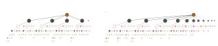

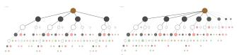  
(a) Kimi-K2.5  
(b) Qwen3-VL-235B-Thinkin<sub>g</sub>

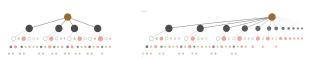

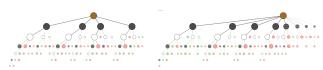

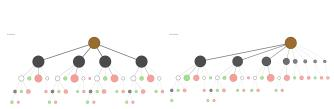

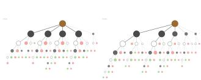  
(e) GLM-4.6V  
(f) Dee<sub>p</sub>Seek-V3.2†

(c) MiniMax-M2.5  
(d) Dee<sub>p</sub>Seek-R1-0528  
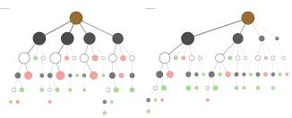  
(<sub>g</sub>) Gemini-3.1-Pro

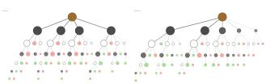  
(h) Gemini-2.5-Flash

Figure 4: Aggregated process search trees. Each panel shows K=4 (left) and K=None (right); node size is average subtree wei<sub>g</sub>ht and color denotes <sub>p</sub>olarit<sub>y</sub> (<sub>g</sub>reen = win, red = lose).  
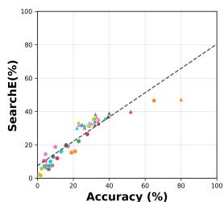

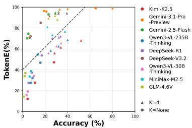  
Fi<sub>gure</sub> 5<sub>:</sub> S<sub>earc</sub>hE <sub>a</sub>li<sub>gns</sub> <sub>w</sub>ith <sub>accuracy</sub> <sub>more</sub> <sub>cons</sub>i<sub>s</sub>t<sub>en</sub>tl<sub>y</sub> th<sub>an</sub> T<sub>o</sub>k<sub>en</sub>E<sub>.</sub>

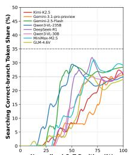

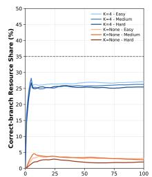

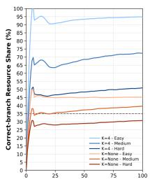  
Fi<sub>gure</sub> 6<sub>:</sub> R<sub>esource s</sub>h<sub>are ass</sub>i<sub>gne</sub>d t<sub>o</sub> th<sub>e correc</sub>t b<sub>ranc</sub>h d<sub>ur-</sub> i<sub>ng</sub> <sub>searc</sub>h<sub>.</sub>

LLMs lie bet<sub>w</sub>een blind and <sub>gu</sub>ided search<sub>.</sub> MCTS reaches mid-tier LLM accuracy under K=4 but drops to <sub>s</sub>i<sub>ng</sub>l<sub>e</sub> di<sub>g</sub>it<sub>s w</sub>ith<sub>ou</sub>t <sub>can</sub>did<sub>a</sub>t<sub>es, s</sub>h<sub>ow</sub>i<sub>ng</sub> th<sub>a</sub>t <sub>ungu</sub>id<sub>e</sub>d <sub>ex-</sub> <sub>pans</sub>i<sub>on canno</sub>t <sub>ma</sub>i<sub>n</sub>t<sub>a</sub>i<sub>n</sub> di<sub>rec</sub>ti<sub>on</sub> i<sub>n open space.</sub> K<sub>a</sub>t<sub>a</sub>G<sub>o</sub> <sub>rema</sub>i<sub>ns muc</sub>h <sub>s</sub>t<sub>ronger un</sub>d<sub>er</sub> th<sub>e same v</sub>i<sub>s</sub>it b<sub>u</sub>d<sub>ge</sub>t<sub>, con</sub>fi<sub>rm-</sub> i<sub>ng</sub> th<sub>a</sub>t th<sub>e</sub> t<sub>as</sub>k i<sub>s so</sub>l<sub>va</sub>bl<sub>e</sub> b<sub>y we</sub>ll<sub>-gu</sub>id<sub>e</sub>d <sub>searc</sub>h<sub>.</sub> St<sub>rong</sub> LLM<sub>s ou</sub>t<sub>per</sub>f<sub>orm</sub> bli<sub>n</sub>d <sub>searc</sub>h<sub>, sugges</sub>ti<sub>ng use</sub>f<sub>u</sub>l <sub>pr</sub>i<sub>ors,</sub> b<sub>u</sub>t th<sub>e</sub>i<sub>r gap</sub> t<sub>o</sub> K<sub>a</sub>t<sub>a</sub>G<sub>o s</sub>h<sub>ows</sub> th<sub>ese pr</sub>i<sub>ors are no</sub>t <sub>ye</sub>t <sub>s</sub>t<sub>a</sub>bl<sub>e,</sub> <sub>pro</sub>bl<sub>em-a</sub>d<sub>ap</sub>ti<sub>ve</sub> <sub>searc</sub>h <sub>con</sub>t<sub>ro</sub>l<sub>.</sub>

## 5<sub>.</sub>4 F<sub>ur</sub>th<sub>er</sub> A<sub>na</sub>l<sub>ys</sub>i<sub>s</sub>

D<sub>ynam</sub>i<sub>cs o</sub>f <sub>resource a</sub>ll<sub>oca</sub>ti<sub>on.</sub> Fi<sub>gure</sub> 6 <sub>compares</sub> h<sub>ow</sub> LLM C<sub>o</sub>T<sub>,</sub> MCTS<sub>, a</sub>nd K<sub>a</sub>t<sub>a</sub>G<sub>o a</sub>ll<sub>oca</sub>t<sub>e</sub> r<sub>esou</sub>r<sub>ces</sub> t<sub>o</sub> th<sub>e</sub> <sub>correc</sub>t b<sub>ranc</sub>h <sub>over norma</sub>li<sub>ze</sub>d <sub>searc</sub>h <sub>progress;</sub> th<sub>e</sub> d<sub>as</sub>h<sub>e</sub>d li<sub>ne mar</sub>k<sub>s</sub> 35%<sub>.</sub> MCTS <sub>an</sub>d K<sub>a</sub>t<sub>a</sub>G<sub>o</sub> b<sub>o</sub>th f<sub>orm ear</sub>l<sub>y</sub> b<sub>ranc</sub>h <sub>pre</sub>f<sub>erences</sub> <sub>an</sub>d <sub>p</sub>l<sub>a</sub>t<sub>eau,</sub> b<sub>u</sub>t K<sub>a</sub>t<sub>a</sub>G<sub>o</sub> <sub>converges</sub> f<sub>as</sub>t<sub>er</sub> <sub>an</sub>d <sub>more</sub> <sub>s</sub>t<sub>rong</sub>l<sub>y,</sub> <sub>espec</sub>i<sub>a</sub>ll<sub>y</sub> <sub>on</sub> E<sub>asy</sub> <sub>an</sub>d M<sub>e</sub>di<sub>um</sub> <sub>pro</sub>bl<sub>ems.</sub> MCTS stays near random four-choice allocation under K=4 <sub>an</sub>d l<sub>ower</sub> i<sub>n open searc</sub>h<sub>, w</sub>hil<sub>e</sub> LLM C<sub>o</sub>T i<sub>s more sca</sub>tt<sub>ere</sub>d <sub>an</sub>d <sub>vo</sub>l<sub>a</sub>til<sub>e,</sub> i<sub>n</sub>di<sub>ca</sub>ti<sub>ng wea</sub>k<sub>er concen</sub>t<sub>ra</sub>ti<sub>on</sub> th<sub>an exp</sub>li<sub>c</sub>it <sub>searc</sub>h<sub>.</sub>

D<sub>o</sub>m<sub>a</sub>in-<sub>spec</sub>i<sub>a</sub>liz<sub>e</sub>d m<sub>o</sub>d<sub>e</sub>l<sub>.</sub> W<sub>e a</sub>l<sub>so</sub> t<sub>es</sub>t L<sub>ogos, a</sub> G<sub>o</sub> LLM trained on KataGo game trajectories, but it often conti<sub>nues</sub> <sub>w</sub>h<sub>o</sub>l<sub>e-game</sub> <sub>p</sub>l<sub>ay</sub> <sub>or</sub> <sub>p</sub>l<sub>ays</sub> <sub>e</sub>l<sub>sew</sub>h<sub>ere</sub> i<sub>ns</sub>t<sub>ea</sub>d <sub>o</sub>f <sub>re-</sub> <sub>so</sub>l<sub>v</sub>i<sub>ng</sub> th<sub>e</sub> l<sub>oca</sub>l lif<sub>e-an</sub>d<sub>-</sub>d<sub>ea</sub>th <sub>po</sub>i<sub>n</sub>t<sub>.</sub> Thi<sub>s</sub> li<sub>m</sub>it<sub>a</sub>ti<sub>on ma</sub>k<sub>es</sub> it<sub>s</sub> <sub>ou</sub>t<sub>pu</sub>t<sub>s</sub> <sub>unsu</sub>it<sub>a</sub>bl<sub>e</sub> f<sub>or</sub> <sub>reason</sub>i<sub>ng-</sub>t<sub>race</sub> <sub>ana</sub>l<sub>ys</sub>i<sub>s</sub> <sub>an</sub>d hi<sub>g</sub>h<sub>-</sub> li<sub>g</sub>ht<sub>s</sub> <sub>w</sub>h<sub>y</sub> T<sub>su</sub>GO t<sub>arge</sub>t<sub>s</sub> <sub>goa</sub>l<sub>-</sub>di<sub>rec</sub>t<sub>e</sub>d l<sub>oca</sub>l <sub>searc</sub>h <sub>ra</sub>th<sub>er</sub> th<sub>an</sub> <sub>move-po</sub>li<sub>cy</sub> i<sub>m</sub>it<sub>a</sub>ti<sub>on;</sub> d<sub>e</sub>t<sub>a</sub>il<sub>s</sub> <sub>appear</sub> i<sub>n</sub> th<sub>e</sub> <sub>appen</sub>di<sub>x.</sub>

## 5<sub>.</sub>5 B<sub>a</sub>d-C<sub>ase</sub> An<sub>a</sub>l<sub>ys</sub>i<sub>s a</sub>nd Di<sub>s</sub>trib<sub>u</sub>ti<sub>o</sub>n

M<sub>anua</sub>l i<sub>nspec</sub>ti<sub>on</sub> <sub>o</sub>f f<sub>a</sub>il<sub>e</sub>d <sub>open-se</sub>tti<sub>ng</sub> t<sub>races</sub> id<sub>en</sub>tifi<sub>es</sub> f<sub>a</sub>il<sub>-</sub> <sub>ures</sub> i<sub>n can</sub>did<sub>a</sub>t<sub>e-genera</sub>ti<sub>on</sub> k<sub>now</sub>l<sub>e</sub>d<sub>ge, coor</sub>di<sub>na</sub>t<sub>e groun</sub>d<sub>-</sub> i<sub>ng,</sub> <sub>v</sub>i<sub>sua</sub>l <sub>percep</sub>ti<sub>on,</sub> b<sub>oar</sub>d<sub>-s</sub>t<sub>a</sub>t<sub>e</sub> <sub>ma</sub>i<sub>n</sub>t<sub>enance,</sub> <sub>a</sub>d<sub>versar-</sub> i<sub>a</sub>l <sub>ver</sub>ifi<sub>ca</sub>ti<sub>on,</sub> i<sub>ns</sub>t<sub>ruc</sub>ti<sub>on</sub> f<sub>o</sub>ll<sub>ow</sub>i<sub>ng,</sub> <sub>reason</sub>i<sub>ng</sub> l<sub>oops,</sub> <sub>an</sub>d b<sub>ranc</sub>h <sub>managemen</sub>t<sub>.</sub> Th<sub>ese cases</sub> i<sub>n</sub>di<sub>ca</sub>t<sub>e a com</sub>bi<sub>ne</sub>d b<sub>o</sub>t<sub>-</sub> tl<sub>enec</sub>k i<sub>n can</sub>did<sub>a</sub>t<sub>e genera</sub>ti<sub>on,</sub> l<sub>oca</sub>l <sub>s</sub>t<sub>a</sub>t<sub>e</sub> t<sub>rac</sub>ki<sub>ng, a</sub>d<sub>ver-</sub> <sub>sar</sub>i<sub>a</sub>l <sub>ver</sub>ifi<sub>ca</sub>ti<sub>on, an</sub>d b<sub>ranc</sub>h <sub>con</sub>t<sub>ro</sub>l<sub>, ra</sub>th<sub>er</sub> th<sub>an resource</sub> <sub>a</sub>ll<sub>oca</sub>ti<sub>on</sub> <sub>a</sub>l<sub>one.</sub> M<sub>o</sub>d<sub>e</sub> di<sub>s</sub>t<sub>r</sub>ib<sub>u</sub>ti<sub>ons</sub> <sub>an</sub>d <sub>represen</sub>t<sub>a</sub>ti<sub>ve</sub> <sub>cases</sub> a<sub>pp</sub>ear <sup>i</sup>n t<sup>h</sup>e a<sub>pp</sub>en<sup>di</sup>x.

## 6 C<sub>o</sub>n<sub>c</sub>l<sub>us</sub>i<sub>o</sub>n

W<sub>e resen</sub>t<sub>e</sub>d T<sub>su</sub>GO<sub>, a rocess-</sub>l<sub>eve</sub>l b<sub>enc</sub>h<sub>mar</sub>k f<sub>or eva</sub>l<sub>-</sub> <sub>ua</sub>ti<sub>ng</sub> S<sub>earc</sub>h Efi<sub>c</sub>i<sub>ency</sub> i<sub>n</sub> LLM <sub>reason</sub>i<sub>ng.</sub> I<sub>ns</sub>t<sub>ea</sub>d <sub>o</sub>f t<sub>es</sub>t<sub>-</sub> i<sub>ng</sub> G<sub>o-p</sub>l<sub>ay</sub>i<sub>ng s</sub>t<sub>reng</sub>th<sub>,</sub> it <sub>uses</sub> lif<sub>e-an</sub>d<sub>-</sub>d<sub>ea</sub>th <sub>pro</sub>bl<sub>ems as</sub> <sub>c</sub>l<sub>ose</sub>d<sub>, ver</sub>ifi<sub>a</sub>bl<sub>e, a</sub>d<sub>versar</sub>i<sub>a</sub>l <sub>searc</sub>h <sub>spaces;</sub> K<sub>-</sub>S<sub>earc</sub>h <sub>con-</sub> t<sub>ro</sub>l<sub>s</sub> th<sub>e so</sub>l<sub>u</sub>ti<sub>on space, an</sub>d <sub>process</sub> t<sub>rees expose resource</sub> <sub>a</sub>ll<sub>oca</sub>ti<sub>on.</sub> E<sub>xper</sub>i<sub>men</sub>t<sub>s s</sub>h<sub>ow</sub> th<sub>a</sub>t <sub>curren</sub>t LLM<sub>s rema</sub>i<sub>n</sub> f<sub>ar</sub> f<sub>rom s</sub>t<sub>a</sub>bl<sub>e</sub> t<sub>sumego so</sub>l<sub>v</sub>i<sub>ng: s</sub>t<sub>ronger mo</sub>d<sub>e</sub>l<sub>s</sub> fi<sub>n</sub>d th<sub>e correc</sub>t <sub>can</sub>did<sub>a</sub>t<sub>e ear</sub>li<sub>er an</sub>d <sub>sus</sub>t<sub>a</sub>i<sub>n pro</sub>d<sub>uc</sub>ti<sub>ve e</sub>f<sub>or</sub>t<sub>, w</sub>hil<sub>e</sub> f<sub>a</sub>il<sub>ures</sub> <sub>om</sub>it<sub>,</sub> d<sub>e</sub>l<sub>ay, or a</sub>b<sub>an</sub>d<sub>on</sub> th<sub>e</sub> k<sub>ey move, o</sub>ft<sub>en compoun</sub>d<sub>e</sub>d b<sub>y s</sub>t<sub>a</sub>t<sub>e-percep</sub>ti<sub>on an</sub>d t<sub>ac</sub>ti<sub>ca</sub>l <sub>errors.</sub> S<sub>earc</sub>h Efi<sub>c</sub>i<sub>ency</sub> i<sub>s a</sub> <sub>more e</sub>f<sub>ec</sub>ti<sub>ve process s</sub>i<sub>gna</sub>l th<sub>an</sub> t<sub>o</sub>k<sub>en cos</sub>t <sub>a</sub>l<sub>one</sub> b<sub>ecause</sub> it <sub>measures</sub> h<sub>ow mo</sub>d<sub>e</sub>l<sub>s a</sub>ll<sub>oca</sub>t<sub>e resources</sub> d<sub>ur</sub>i<sub>ng searc</sub>h<sub>.</sub> With T<sub>o</sub>k<sub>en</sub> Efi<sub>c</sub>i<sub>ency as a cos</sub>t <sub>re</sub>f<sub>erence,</sub> it id<sub>en</sub>tifi<sub>es can</sub>did<sub>a</sub>t<sub>e</sub> <sub>genera</sub>ti<sub>on,</sub> b<sub>ranc</sub>h <sub>compar</sub>i<sub>son, ver</sub>ifi<sub>ca</sub>ti<sub>on, an</sub>d b<sub>ac</sub>kt<sub>rac</sub>k<sub>-</sub> i<sub>ng</sub> <sub>as</sub> <sub>core</sub> <sub>searc</sub>h<sub>-con</sub>t<sub>ro</sub>l b<sub>o</sub>ttl<sub>enec</sub>k<sub>s.</sub> O<sub>vera</sub>ll<sub>,</sub> T<sub>su</sub>GO t<sub>urns</sub> f<sub>ree-</sub>f<sub>orm</sub> t<sub>races</sub> i<sub>n</sub>t<sub>o</sub> di<sub>agnos</sub>ti<sub>c</sub> f<sub>ee</sub>db<sub>ac</sub>k <sub>an</sub>d <sub>rema</sub>i<sub>ns</sub> f<sub>ar</sub> f<sub>rom sa</sub>t<sub>ura</sub>t<sub>e</sub>d<sub>, sugges</sub>ti<sub>ng</sub> f<sub>u</sub>t<sub>ure wor</sub>k <sub>on</sub> S<sub>earc</sub>h<sub>-</sub>Efi<sub>c</sub>i<sub>ency-</sub> <sub>sens</sub>iti<sub>ve</sub> t<sub>ra</sub>i<sub>n</sub>i<sub>ng</sub> d<sub>a</sub>t<sub>a an</sub>d <sub>p</sub>l<sub>ann</sub>i<sub>ng</sub> f<sub>ramewor</sub>k<sub>s.</sub>

## R<sub>e</sub>f<sub>erences</sub>

B<sub>es</sub>t<sub>a,</sub> M<sub>.;</sub> Bl<sub>ac</sub>h<sub>,</sub> N<sub>.;</sub> K<sub>u</sub>bi<sub>ce</sub>k<sub>,</sub> A<sub>.;</sub> G<sub>e</sub>r<sub>s</sub>t<sub>e</sub>nb<sub>e</sub>r<sub>ge</sub>r<sub>,</sub> R<sub>.;</sub> Podstawski, M.; Gianinazzi, L.; Gajda, J.; Lehmann, T.; Ni<sub>ew</sub>i<sub>a</sub>d<sub>oms</sub>ki<sub>,</sub> H<sub>.;</sub> N<sub>yczy</sub>k<sub>,</sub> P<sub>.; an</sub>d H<sub>oe</sub>fl<sub>er,</sub> T<sub>.</sub> 2024<sub>.</sub> G<sub>rap</sub>h <sub>o</sub>f Th<sub>oug</sub>ht<sub>s:</sub> S<sub>o</sub>l<sub>v</sub>i<sub>ng</sub> El<sub>a</sub>b<sub>ora</sub>t<sub>e</sub> P<sub>ro</sub>bl<sub>ems w</sub>ith L<sub>arge</sub> L<sub>an-</sub> guage Models. In Proceedings of the AAAI Conference on Artificial Intelligence, volume 38, 17682–17690.

Ch<sub>en,</sub> X<sub>.; e</sub>t <sub>a</sub>l<sub>.</sub> 2025<sub>.</sub> D<sub>o</sub> N<sub>o</sub>t Thi<sub>n</sub>k Th<sub>a</sub>t M<sub>uc</sub>h f<sub>or</sub> 2+3! Overthinking with Chain-of-Thought. arXiv preprint.

Cl<sub>ar</sub>k<sub>,</sub> P<sub>.;</sub> C<sub>ow</sub>h<sub>ey,</sub> I<sub>.;</sub> Et<sub>z</sub>i<sub>on</sub>i<sub>,</sub> O<sub>.;</sub> Kh<sub>o</sub>t<sub>,</sub> T<sub>.;</sub> S<sub>a</sub>bh<sub>arwa</sub>l<sub>,</sub> A<sub>.;</sub> Schoenick, C.; and Tafjord, O. 2018. Think you have solved <sub>ques</sub>ti<sub>on</sub> <sub>answer</sub>i<sub>ng</sub>? T<sub>ry</sub> ARC<sub>,</sub> th<sub>e</sub> AI2 <sub>reason</sub>i<sub>ng</sub> <sub>c</sub>h<sub>a</sub>ll<sub>enge.</sub> arXiv preprint arXiv:1803.05457.

Cobbe, K.; Kosaraju, V.; Bavarian, M.; Chen, M.; Jun, H.; K<sub>a</sub>i<sub>se</sub>r<sub>,</sub> L<sub>.;</sub> Pl<sub>appe</sub>rt<sub>,</sub> M<sub>.;</sub> T<sub>wo</sub>r<sub>e</sub>k<sub>,</sub> J<sub>.;</sub> Hilt<sub>o</sub>n<sub>,</sub> J<sub>.;</sub> N<sub>a</sub>k<sub>a</sub>n<sub>o,</sub> R<sub>.;</sub> <sub>e</sub>t <sub>a</sub>l<sub>.</sub> 2021<sub>.</sub> T<sub>ra</sub>i<sub>n</sub>i<sub>ng</sub> <sub>ver</sub>ifi<sub>ers</sub> t<sub>o</sub> <sub>so</sub>l<sub>ve</sub> <sub>ma</sub>th <sub>wor</sub>d <sub>pro</sub>bl<sub>ems.</sub> arXiv preprint arXiv:2110.14168.

DeepSeek-AI. 2024. DeepSeek-V3 Technical Report. arXiv preprint arXiv:2412.19437.

D<sub>eep</sub>S<sub>ee</sub>k<sub>-</sub>AI<sub>.</sub> 2025<sub>.</sub> D<sub>eep</sub>S<sub>ee</sub>k<sub>-</sub>R1<sub>:</sub> I<sub>ncen</sub>ti<sub>v</sub>i<sub>z</sub>i<sub>ng reason-</sub> ing capability in LLMs via reinforcement learning. arXiv preprint arXiv:2501.12948.

F<sub>eng,</sub> X<sub>.;</sub> W<sub>an,</sub> Z<sub>.;</sub> W<sub>en,</sub> M<sub>.;</sub> M<sub>c</sub>Al<sub>eer,</sub> S<sub>.</sub> M<sub>.;</sub> W<sub>en,</sub> Y<sub>.;</sub> Zh<sub>ang,</sub> W<sub>.; an</sub>d W<sub>ang,</sub> J<sub>.</sub> 2024<sub>.</sub> Al<sub>p</sub>h<sub>a</sub>Z<sub>ero-</sub>lik<sub>e</sub> t<sub>ree-searc</sub>h <sub>can gu</sub>id<sub>e</sub> large language model decoding and training. ICML.

F<sub>u,</sub> Z<sub>.;</sub> G<sub>u,</sub> Y<sub>.;</sub> H<sub>u,</sub> C<sub>.;</sub> Li<sub>u,</sub> H<sub>.; a</sub>nd Zh<sub>a</sub>n<sub>g,</sub> Y<sub>.</sub> 2026<sub>.</sub> R<sub>e</sub>Ef<sub>-</sub> Bench: Quantif<sub>y</sub>in<sub>g</sub> the Reasonin<sub>g</sub> Eficienc<sub>y</sub> of LLMs. arXiv preprint arXiv:2601.03550.

G<sub>an</sub>dhi<sub>,</sub> K<sub>.;</sub> Ch<sub>a</sub>k<sub>ravar</sub>th<sub>y,</sub> A<sub>.;</sub> Si<sub>ng</sub>h<sub>,</sub> A<sub>.;</sub> Lil<sub>e,</sub> N<sub>.; an</sub>d G<sub>oo</sub>d<sub>-</sub> <sub>man,</sub> N<sub>.</sub> D<sub>.</sub> 2025<sub>.</sub> C<sub>ogn</sub>iti<sub>ve</sub> B<sub>e</sub>h<sub>av</sub>i<sub>ors</sub> th<sub>a</sub>t E<sub>na</sub>bl<sub>e</sub> S<sub>e</sub>lf<sub>-</sub> Im<sub>p</sub>r<sub>ov</sub>in<sub>g</sub> R<sub>easo</sub>n<sub>e</sub>r<sub>s,</sub> <sub>o</sub>r<sub>,</sub> F<sub>ou</sub>r H<sub>a</sub>bit<sub>s</sub> <sub>o</sub>f Hi<sub>g</sub>hl<sub>y</sub> Ef<sub>ec</sub>ti<sub>ve</sub> STaRs. arXiv preprint arXiv:2503.01307.

G<sub>a</sub>ndhi<sub>,</sub> K<sub>.;</sub> L<sub>ee,</sub> D<sub>.;</sub> Gr<sub>a</sub>nd<sub>,</sub> G<sub>.;</sub> Li<sub>u,</sub> M<sub>.;</sub> Ch<sub>e</sub>n<sub>g,</sub> W<sub>.;</sub> S<sub>u</sub>hr<sub>,</sub> A<sub>.;</sub> and Goodman, N. D. 2024. Stream of search (SoS): Learnin<sub>g</sub> to search in language. arXiv preprint arXiv:2404.03683.

G<sub>o</sub>l<sub>ov</sub>n<sub>eva,</sub> O<sub>.;</sub> Ch<sub>e</sub>n<sub>,</sub> M<sub>.</sub> P<sub>.;</sub> P<sub>o</sub>f<sub>,</sub> S<sub>.;</sub> C<sub>o</sub>rr<sub>e</sub>d<sub>o</sub>r<sub>,</sub> M<sub>.;</sub> Z<sub>e</sub>ttl<sub>e-</sub> <sub>moyer,</sub> L<sub>.;</sub> F<sub>aze</sub>l<sub>-</sub>Z<sub>aran</sub>di<sub>,</sub> M<sub>.; an</sub>d C<sub>e</sub>lik<sub>y</sub>il<sub>maz,</sub> A<sub>.</sub> 2023<sub>.</sub> ROSCOE<sub>:</sub> A S<sub>u</sub>it<sub>e o</sub>f M<sub>e</sub>tri<sub>cs</sub> f<sub>o</sub>r S<sub>co</sub>rin<sub>g</sub> St<sub>ep-</sub>b<sub>y-</sub>St<sub>ep</sub> R<sub>ea-</sub> soning. In Proceedings ofthe 2023 Conference ofthe North American Chapter ofthe Associationfor Computational Linguistics: Human Language Technologies, 6556–6576.

G<sub>oog</sub>l<sub>e.</sub> 2026<sub>.</sub> G<sub>em</sub>i<sub>n</sub>i 3<sub>.</sub>1 P<sub>ro:</sub> A S<sub>mar</sub>t<sub>er</sub> M<sub>o</sub>d<sub>e</sub>l f<sub>or</sub> Y<sub>our</sub> M<sub>os</sub>t C<sub>o</sub>m<sub>p</sub>l<sub>ex</sub> T<sub>as</sub>k<sub>s.</sub> htt<sub>ps:</sub>//bl<sub>og.goog</sub>l<sub>e</sub>/inn<sub>ova</sub>ti<sub>o</sub>n<sub>-a</sub>nd<sub>-a</sub>i/ <sub>mo</sub>d<sub>e</sub>l<sub>s-an</sub>d<sub>-researc</sub>h/<sub>gem</sub>i<sub>n</sub>i<sub>-mo</sub>d<sub>e</sub>l<sub>s</sub>/<sub>gem</sub>i<sub>n</sub>i<sub>-</sub>3<sub>-</sub>1<sub>-pro</sub>/<sub>.</sub> Ofi<sub>-</sub> <sub>c</sub>i<sub>a</sub>l bl<sub>og.</sub>

G<sub>oog</sub>l<sub>e</sub> D<sub>eep</sub>Mi<sub>n</sub>d<sub>.</sub> 2025<sub>.</sub> G<sub>em</sub>i<sub>n</sub>i<sub>:</sub> A f<sub>am</sub>il<sub>y</sub> <sub>o</sub>f hi<sub>g</sub>hl<sub>y</sub> <sub>capa-</sub> ble multimodal models. arXiv preprint.

Han, S.; Schoelkopf, H.; Zhao, Y.; Qi, Z.; Riddell, M.; et al. 2024<sub>.</sub> FOLIO<sub>:</sub> N<sub>a</sub>t<sub>u</sub>r<sub>a</sub>l L<sub>a</sub>n<sub>guage</sub> R<sub>easo</sub>nin<sub>g w</sub>ith Fir<sub>s</sub>t<sub>-</sub>Ord<sub>e</sub>r Logic. In Proceedings of the 2024 Conference on Empirical Methods in Natural Language Processing, 22017–22031.

H<sub>ao,</sub> S<sub>.;</sub> G<sub>u,</sub> Y<sub>.;</sub> M<sub>a,</sub> H<sub>.;</sub> H<sub>ong,</sub> J<sub>.</sub> J<sub>.;</sub> W<sub>ang,</sub> Z<sub>.;</sub> W<sub>ang,</sub> D<sub>.</sub> Z<sub>.;</sub> <sub>a</sub>nd H<sub>u,</sub> Z<sub>.</sub> 2023<sub>.</sub> R<sub>easo</sub>nin<sub>g</sub> <sub>w</sub>ith L<sub>a</sub>n<sub>guage</sub> M<sub>o</sub>d<sub>e</sub>l i<sub>s</sub> Pl<sub>a</sub>n<sub>-</sub> ning with World Model. In Proceedings ofthe 2023 Conference on Empirical Methods in Natural Language Processing, 8154<sub>–</sub>8173<sub>.</sub>

H<sub>en</sub>d<sub>ryc</sub>k<sub>s,</sub> D<sub>.;</sub> B<sub>urns,</sub> C<sub>.;</sub> K<sub>a</sub>d<sub>ava</sub>th<sub>,</sub> S<sub>.;</sub> A<sub>rora,</sub> A<sub>.;</sub> B<sub>asar</sub>t<sub>,</sub> S<sub>.;</sub> T<sub>a</sub>n<sub>g,</sub> E<sub>.;</sub> S<sub>o</sub>n<sub>g,</sub> D<sub>.;</sub> <sub>a</sub>nd St<sub>e</sub>inh<sub>a</sub>rdt<sub>,</sub> J<sub>.</sub> 2021<sub>.</sub> M<sub>easu</sub>r<sub>-</sub> i<sub>ng</sub> <sub>ma</sub>th<sub>ema</sub>ti<sub>ca</sub>l <sub>pro</sub>bl<sub>em</sub> <sub>so</sub>l<sub>v</sub>i<sub>ng</sub> <sub>w</sub>ith th<sub>e</sub> MATH d<sub>a</sub>t<sub>ase</sub>t<sub>.</sub> NeurIPS.

Ki<sub>m</sub>i T<sub>eam.</sub> 2026<sub>.</sub> Ki<sub>m</sub>i K2<sub>.</sub>5<sub>:</sub> Vi<sub>sua</sub>l A<sub>gen</sub>ti<sub>c</sub> I<sub>n</sub>t<sub>e</sub>lli<sub>gence.</sub> arXiv preprint arXiv:2602.02276.

K<sub>ocs</sub>i<sub>s,</sub> L<sub>.; an</sub>d S<sub>zepesv</sub>á<sub>r</sub>i<sub>,</sub> C<sub>.</sub> 2006<sub>.</sub> B<sub>an</sub>dit b<sub>ase</sub>d M<sub>on</sub>t<sub>e-</sub> Carlo planning. In Machine Learning: ECML 2006, 282– 293<sub>.</sub> S<sub>p</sub>rin<sub>ge</sub>r<sub>.</sub>

Li<sub>,</sub> K<sub>.;</sub> H<sub>op</sub>kin<sub>s,</sub> A<sub>.</sub> K<sub>.;</sub> B<sub>au,</sub> D<sub>.;</sub> Vié<sub>gas,</sub> F<sub>.;</sub> Pfi<sub>s</sub>t<sub>e</sub>r<sub>,</sub> H<sub>.; a</sub>nd W<sub>a</sub>tt<sub>e</sub>nb<sub>e</sub>r<sub>g,</sub> M<sub>.</sub> 2023<sub>.</sub> Em<sub>e</sub>r<sub>ge</sub>nt <sub>wo</sub>rld r<sub>ep</sub>r<sub>ese</sub>nt<sub>a</sub>ti<sub>o</sub>n<sub>s:</sub> E<sub>x-</sub> ploring a sequence model trained on a synthetic task. ICLR.

Li<sub>,</sub> S<sub>.;</sub> Shi<sub>,</sub> J<sub>.;</sub> Ni<sub>,</sub> S<sub>.;</sub> Zh<sub>a</sub>n<sub>g,</sub> G<sub>.;</sub> Li<sub>,</sub> S<sub>.;</sub> W<sub>a</sub>n<sub>g,</sub> S<sub>.;</sub> W<sub>e</sub>n<sub>,</sub> Z<sub>.;</sub> Li, Y.; Alinejad-Rokny, H.; Liu, J.; Yang, M.; and Huang, W<sub>.</sub> 2026<sub>.</sub> C<sub>o</sub>TJ<sub>u</sub>d<sub>ger:</sub> A G<sub>rap</sub>h<sub>-</sub>D<sub>r</sub>i<sub>ven</sub> F<sub>ramewor</sub>k f<sub>or</sub> A<sub>u-</sub> t<sub>oma</sub>ti<sub>c</sub> E<sub>va</sub>l<sub>ua</sub>ti<sub>on o</sub>f Ch<sub>a</sub>i<sub>n-o</sub>f<sub>-</sub>Th<sub>oug</sub>ht Efi<sub>c</sub>i<sub>ency an</sub>d R<sub>e-</sub> dundancy in LRMs. arXiv preprint arXiv:2603.07078.

Li<sub>,</sub> Z<sub>.;</sub> Ch<sub>ang,</sub> Y<sub>.; an</sub>d W<sub>u,</sub> Y<sub>.</sub> 2025<sub>.</sub> THINK<sub>-</sub>B<sub>enc</sub>h<sub>:</sub> E<sub>va</sub>l<sub>u-</sub> atin<sub>g</sub> Thinkin<sub>g</sub> Eficienc<sub>y</sub> and Chain-of-Thou<sub>g</sub>ht Qualit<sub>y</sub> of Large Reasoning Models. arXiv preprint arXiv:2505.22113.

Lightman, H.; Kosaraju, V.; Burda, Y.; Edwards, H.; Baker, B<sub>.;</sub> L<sub>ee,</sub> T<sub>.;</sub> L<sub>e</sub>ik<sub>e,</sub> J<sub>.;</sub> S<sub>c</sub>h<sub>u</sub>lm<sub>a</sub>n<sub>,</sub> J<sub>.;</sub> S<sub>u</sub>t<sub>s</sub>k<sub>eve</sub>r<sub>,</sub> I<sub>.; a</sub>nd C<sub>o</sub>bb<sub>e,</sub> K. 2024. Let’s verify step by step. ICLR.

Li<sub>n,</sub> B<sub>.</sub> Y<sub>.;</sub> L<sub>e</sub> B<sub>ras,</sub> R<sub>.;</sub> Ri<sub>c</sub>h<sub>ar</sub>d<sub>son,</sub> K<sub>.;</sub> S<sub>a</sub>bh<sub>arwa</sub>l<sub>,</sub> A<sub>.;</sub> P<sub>ooven</sub>d<sub>ran,</sub> R<sub>.; e</sub>t <sub>a</sub>l<sub>.</sub> 2025<sub>.</sub> Z<sub>e</sub>b<sub>ra</sub>L<sub>og</sub>i<sub>c:</sub> O<sub>n</sub> th<sub>e</sub> S<sub>ca</sub>li<sub>ng</sub> Limits of LLMs for Logical Reasoning. arXiv preprint arXiv:2502.01100.

Li<sub>u,</sub> Y<sub>.;</sub> Li<sub>,</sub> Y<sub>.;</sub> Li<sub>,</sub> X<sub>.; a</sub>nd Ch<sub>e</sub>n<sub>g,</sub> G<sub>.</sub> 2025<sub>.</sub> L<sub>og</sub>iN<sub>u</sub>mS<sub>y</sub>nth<sub>:</sub> S<sub>yn</sub>th<sub>es</sub>i<sub>z</sub>i<sub>ng</sub> J<sub>o</sub>i<sub>n</sub>t L<sub>og</sub>i<sub>ca</sub>l<sub>-</sub>N<sub>umer</sub>i<sub>ca</sub>l R<sub>eason</sub>i<sub>ng</sub> P<sub>ro</sub>bl<sub>ems</sub> for Language Models. arXiv preprint arXiv:2510.11031.

L<sub>uo,</sub> H<sub>.;</sub> Sh<sub>en,</sub> L<sub>.;</sub> H<sub>e,</sub> H<sub>.;</sub> W<sub>ang,</sub> Y<sub>.;</sub> Li<sub>u,</sub> S<sub>.;</sub> Li<sub>,</sub> W<sub>.;</sub> T<sub>an,</sub> N<sub>.;</sub> C<sub>ao,</sub> X<sub>.; a</sub>nd T<sub>ao,</sub> D<sub>.</sub> 2025<sub>.</sub> O1<sub>-</sub>Pr<sub>u</sub>n<sub>e</sub>r<sub>:</sub> L<sub>e</sub>n<sub>g</sub>th<sub>-</sub>H<sub>a</sub>rm<sub>o</sub>ni<sub>z</sub>in<sub>g</sub> Fine-Tuning for O1-Like Reasoning Pruning. arXiv preprint arXiv:2501.12570.

Ma, Y.; Li, L.; Chen, Y.; Li, P.; Ye, J.; Guo, Q.; Lin, D.; and Ch<sub>e</sub>n<sub>,</sub> K<sub>.</sub> 2025<sub>.</sub> Mi<sub>x</sub>in<sub>g</sub> E<sub>xpe</sub>rt Kn<sub>ow</sub>l<sub>e</sub>d<sub>ge:</sub> Brin<sub>g</sub> H<sub>u</sub>m<sub>a</sub>n Thoughts Back To the Game of Go. In Advances in Neural Information Processing Systems.

Mi<sub>n</sub>iM<sub>ax.</sub> 2026<sub>.</sub> Th<sub>e</sub> Mi<sub>n</sub>iM<sub>ax-</sub>M2 S<sub>er</sub>i<sub>es:</sub> Mi<sub>n</sub>i A<sub>c</sub>ti<sub>va</sub>ti<sub>ons</sub> Unleashing Max Real-World Intelligence. arXiv preprint arXiv:2605.26494.

OpenAI. 2024. Learning to reason with LLMs. OpenAI Blog.

P<sub>a</sub>r<sub>as</sub>h<sub>a</sub>r<sub>,</sub> S<sub>.;</sub> Ol<sub>so</sub>n<sub>,</sub> B<sub>.;</sub> Kh<sub>u</sub>r<sub>a</sub>n<sub>a,</sub> S<sub>.;</sub> Li<sub>,</sub> E<sub>.;</sub> Lin<sub>g,</sub> H<sub>.;</sub> C<sub>ave</sub>r<sub>-</sub> l<sub>ee,</sub> J<sub>.;</sub> <sub>an</sub>d Ji<sub>,</sub> S<sub>.</sub> 2025<sub>.</sub> I<sub>n</sub>f<sub>erence-</sub>Ti<sub>me</sub> C<sub>ompu</sub>t<sub>a</sub>ti<sub>ons</sub> f<sub>or</sub> LLM R<sub>eason</sub>i<sub>ng an</sub>d Pl<sub>ann</sub>i<sub>ng:</sub> A B<sub>enc</sub>h<sub>mar</sub>k <sub>an</sub>d I<sub>ns</sub>i<sub>g</sub>ht<sub>s.</sub> arXiv preprint arXiv:2502.12521.

P<sub>a</sub>rk<sub>,</sub> J<sub>.; e</sub>t <sub>a</sub>l<sub>.</sub> 2025<sub>.</sub> En<sub>se</sub>mblin<sub>g</sub> L<sub>a</sub>r<sub>ge</sub> L<sub>a</sub>n<sub>guage</sub> M<sub>o</sub>d<sub>e</sub>l<sub>s</sub> <sub>w</sub>ith P<sub>rocess</sub> R<sub>ewar</sub>d<sub>-</sub>G<sub>u</sub>id<sub>e</sub>d T<sub>ree</sub> S<sub>earc</sub>h f<sub>or</sub> B<sub>e</sub>tt<sub>er</sub> C<sub>omp</sub>l<sub>ex</sub> Reasoning. arXiv preprint arXiv:2412.15797.

Pr<sub>asa</sub>d<sub>,</sub> A<sub>.;</sub> S<sub>a</sub>h<sub>a,</sub> S<sub>.;</sub> Zh<sub>ou,</sub> X<sub>.; a</sub>nd B<sub>a</sub>n<sub>sa</sub>l<sub>,</sub> M<sub>.</sub> 2023<sub>.</sub> R<sub>e-</sub> CE<sub>va</sub>l<sub>:</sub> E<sub>va</sub>l<sub>ua</sub>ti<sub>ng</sub> R<sub>eason</sub>i<sub>ng</sub> Ch<sub>a</sub>i<sub>ns</sub> <sub>v</sub>i<sub>a</sub> C<sub>orrec</sub>t<sub>ness</sub> <sub>an</sub>d Informativeness. In Proceedings of the 2023 Conference on Empirical Methods in Natural Language Processing, 10066– 10087<sub>.</sub>

Qwen Team. 2025. Qwen3-VL Technical Report. arXiv preprint arXiv:2511.21631.

S<sub>aparov,</sub> A<sub>.; an</sub>d H<sub>e,</sub> H<sub>.</sub> 2023<sub>.</sub> L<sub>anguage</sub> M<sub>o</sub>d<sub>e</sub>l<sub>s are</sub> G<sub>ree</sub>d<sub>y</sub> R<sub>easoners:</sub> A S<sub>ys</sub>t<sub>ema</sub>ti<sub>c</sub> F<sub>orma</sub>l A<sub>na</sub>l<sub>ys</sub>i<sub>s o</sub>f Ch<sub>a</sub>i<sub>n-</sub> of-Thought. In International Conference on Learning Representations.

Sh<sub>en,</sub> C<sub>.;</sub> <sub>e</sub>t <sub>a</sub>l<sub>.</sub> 2025<sub>.</sub> F<sub>a</sub>ithC<sub>o</sub>T<sub>-</sub>B<sub>enc</sub>h<sub>:</sub> B<sub>enc</sub>h<sub>mar</sub>k<sub>-</sub> i<sub>ng</sub> I<sub>ns</sub>t<sub>ance-</sub>L<sub>eve</sub>l F<sub>a</sub>ithf<sub>u</sub>l<sub>ness</sub> <sub>o</sub>f Ch<sub>a</sub>i<sub>n-o</sub>f<sub>-</sub>Th<sub>oug</sub>ht R<sub>ea-</sub> soning in Large Language Models. arXiv preprint arXiv:2510.04040.

Sil<sub>ve</sub>r<sub>,</sub> D<sub>.;</sub> H<sub>ua</sub>n<sub>g,</sub> A<sub>.;</sub> M<sub>a</sub>ddi<sub>so</sub>n<sub>,</sub> C<sub>.</sub> J<sub>.;</sub> G<sub>uez,</sub> A<sub>.;</sub> Sifr<sub>e,</sub> L<sub>.;</sub> V<sub>a</sub>n D<sub>e</sub>n Dri<sub>essc</sub>h<sub>e,</sub> G<sub>.;</sub> S<sub>c</sub>hritt<sub>w</sub>i<sub>ese</sub>r<sub>,</sub> J<sub>.;</sub> Ant<sub>o</sub>n<sub>og</sub>l<sub>ou,</sub> I<sub>.;</sub> P<sub>anneers</sub>h<sub>e</sub>l<sub>vam,</sub> V<sub>.;</sub> L<sub>anc</sub>t<sub>o</sub>t<sub>,</sub> M<sub>.; e</sub>t <sub>a</sub>l<sub>.</sub> 2016<sub>.</sub> M<sub>as</sub>t<sub>er</sub>i<sub>ng</sub> th<sub>e game o</sub>f G<sub>o w</sub>ith d<sub>eep neura</sub>l <sub>ne</sub>t<sub>wor</sub>k<sub>s an</sub>d t<sub>ree searc</sub>h<sub>.</sub> Nature, 529(7587): 484–489.

Sil<sub>ve</sub>r<sub>,</sub> D<sub>.;</sub> S<sub>c</sub>hritt<sub>w</sub>i<sub>ese</sub>r<sub>,</sub> J<sub>.;</sub> Sim<sub>o</sub>n<sub>ya</sub>n<sub>,</sub> K<sub>.;</sub> Ant<sub>o</sub>n<sub>og</sub>l<sub>ou,</sub> I<sub>.;</sub> H<sub>uang,</sub> A<sub>.;</sub> G<sub>uez,</sub> A<sub>.;</sub> H<sub>u</sub>b<sub>er</sub>t<sub>,</sub> T<sub>.;</sub> B<sub>a</sub>k<sub>er,</sub> L<sub>.;</sub> L<sub>a</sub>i<sub>,</sub> M<sub>.;</sub> B<sub>o</sub>lt<sub>on,</sub> A<sub>.;</sub> <sub>e</sub>t <sub>a</sub>l<sub>.</sub> 2017<sub>.</sub> M<sub>as</sub>t<sub>er</sub>i<sub>ng</sub> th<sub>e</sub> <sub>game</sub> <sub>o</sub>f G<sub>o</sub> <sub>w</sub>ith<sub>ou</sub>t h<sub>uman</sub> knowledge. Nature, 550(7676): 354–359.

Son<sub>g</sub>, M.; Su, Z.; Qu, X.; Zhou, J.; and Chen<sub>g</sub>, Y. 2025. PRMB<sub>enc</sub>h<sub>:</sub> A Fi<sub>ne-gra</sub>i<sub>ne</sub>d <sub>an</sub>d Ch<sub>a</sub>ll<sub>eng</sub>i<sub>ng</sub> B<sub>enc</sub>h<sub>mar</sub>k for Process-Level Reward Models. In Proceedings of the 63rd Annual Meeting of the Association for Computational Linguistics (Volume 1: Long Papers), 25299–25346.

Srivastava, A.; et al. 2023. Be<sub>y</sub>ond the imitation <sub>g</sub>ame: Quantif<sub>y</sub>i<sub>ng</sub> <sub>an</sub>d <sub>ex</sub>t<sub>rapo</sub>l<sub>a</sub>ti<sub>ng</sub> th<sub>e</sub> <sub>capa</sub>biliti<sub>es</sub> <sub>o</sub>f l<sub>anguage</sub> <sub>mo</sub>d<sub>e</sub>l<sub>s.</sub> TMLR.

S<sub>u</sub>i<sub>,</sub> Y<sub>.;</sub> <sub>e</sub>t <sub>a</sub>l<sub>.</sub> 2025<sub>.</sub> St<sub>op</sub> O<sub>ver</sub>thi<sub>n</sub>ki<sub>ng:</sub> A S<sub>urvey</sub> <sub>on</sub> Efi<sub>-</sub> cient Reasoning for Large Language Models. arXiv preprint arXiv:2503.16419.

S<sub>un,</sub> Y<sub>.</sub> 2022<sub>.</sub> S<sub>margo:</sub> A<sub>n</sub> Efi<sub>c</sub>i<sub>en</sub>t <sub>an</sub>d Hi<sub>g</sub>hl<sub>y</sub> A<sub>ccura</sub>t<sub>e</sub> S<sub>o</sub>l<sub>ve</sub>r f<sub>o</sub>r T<sub>su</sub>m<sub>ego.</sub> htt<sub>ps:</sub>//<sub>g</sub>ith<sub>u</sub>b<sub>.co</sub>m/S<sub>u</sub>n<sub>-</sub>Yi<sub>ze</sub>/<sub>s</sub>m<sub>a</sub>r<sub>go.</sub> GitH<sub>u</sub>b r<sub>epos</sub>it<sub>o</sub>r<sub>y.</sub>

T<sub>os</sub>hni<sub>wa</sub>l<sub>,</sub> S<sub>.;</sub> Wi<sub>se</sub>m<sub>a</sub>n<sub>,</sub> S<sub>.;</sub> Li<sub>vescu,</sub> K<sub>.;</sub> <sub>a</sub>nd Gim<sub>pe</sub>l<sub>,</sub> K<sub>.</sub> 2023<sub>.</sub> Ch<sub>ess</sub> <sub>as</sub> <sub>a</sub> T<sub>es</sub>tb<sub>e</sub>d f<sub>o</sub>r L<sub>a</sub>n<sub>guage</sub> M<sub>o</sub>d<sub>e</sub>l St<sub>a</sub>t<sub>e</sub> Tr<sub>ac</sub>kin<sub>g.</sub> arXiv preprint arXiv:2302.13071.

Wan<sub>g</sub>, X.; Wei, J.; Schuurmans, D.; Le, Q. V.; Chi, E. H.; N<sub>arang,</sub> S<sub>.;</sub> Ch<sub>ow</sub>dh<sub>ery,</sub> A<sub>.; an</sub>d Zh<sub>ou,</sub> D<sub>.</sub> 2023<sub>.</sub> S<sub>e</sub>lf<sub>-</sub> C<sub>o</sub>n<sub>s</sub>i<sub>s</sub>t<sub>e</sub>n<sub>cy</sub> Im<sub>p</sub>r<sub>oves</sub> Ch<sub>a</sub>in <sub>o</sub>f Th<sub>oug</sub>ht R<sub>easo</sub>nin<sub>g</sub> in L<sub>a</sub>n<sub>-</sub> guage Models. In International Conference on Learning Representations.

W<sub>e</sub>i<sub>,</sub> J<sub>.;</sub> W<sub>ang,</sub> X<sub>.;</sub> S<sub>c</sub>h<sub>uurmans,</sub> D<sub>.;</sub> B<sub>osma,</sub> M<sub>.;</sub> I<sub>c</sub>ht<sub>er,</sub> B<sub>.;</sub> Xia, F.; Chi, E.; Le, Q. V.; and Zhou, D. 2022. Chain-ofth<sub>oug</sub>ht <sub>promp</sub>ti<sub>ng</sub> <sub>e</sub>li<sub>c</sub>it<sub>s</sub> <sub>reason</sub>i<sub>ng</sub> i<sub>n</sub> l<sub>arge</sub> l<sub>anguage</sub> <sub>mo</sub>d<sub>-</sub> els. NeurIPS.

Wu, D. J. 2019. Accelerating self-play learning in Go. arXiv preprint arXiv:1902.10565.

Y<sub>ao,</sub> S<sub>.;</sub> Y<sub>u,</sub> D<sub>.;</sub> Zh<sub>ao,</sub> J<sub>.;</sub> Sh<sub>a</sub>fr<sub>a</sub>n<sub>,</sub> I<sub>.;</sub> Grifith<sub>s,</sub> T<sub>.</sub> L<sub>.;</sub> C<sub>ao,</sub> Y<sub>.; an</sub>d N<sub>aras</sub>i<sub>m</sub>h<sub>an,</sub> K<sub>.</sub> 2023<sub>.</sub> T<sub>ree o</sub>f Th<sub>oug</sub>ht<sub>s:</sub> D<sub>e</sub>lib<sub>-</sub> <sub>e</sub>r<sub>a</sub>t<sub>e</sub> Pr<sub>o</sub>bl<sub>e</sub>m S<sub>o</sub>l<sub>v</sub>in<sub>g w</sub>ith L<sub>a</sub>r<sub>ge</sub> L<sub>a</sub>n<sub>guage</sub> M<sub>o</sub>d<sub>e</sub>l<sub>s.</sub> In Advances in Neural Information Processing Systems, vol-<sub>ume</sub> 36<sub>,</sub> 11809<sub>–</sub>11822<sub>.</sub>

Zh<sub>eng,</sub> C<sub>.;</sub> Zh<sub>ang,</sub> Z<sub>.;</sub> Zh<sub>ang,</sub> B<sub>.;</sub> Li<sub>n,</sub> R<sub>.;</sub> L<sub>u,</sub> K<sub>.;</sub> Y<sub>u,</sub> B<sub>.;</sub> Li<sub>u,</sub> D<sub>.;</sub> Zh<sub>ou,</sub> J<sub>.; an</sub>d Li<sub>n,</sub> J<sub>.</sub> 2025<sub>.</sub> P<sub>rocess</sub>B<sub>enc</sub>h<sub>:</sub> Id<sub>en</sub>ti<sub>-</sub> fying Process Errors in Mathematical Reasoning. In Proceedings of the 63rd Annual Meeting of the Association for Computational Linguistics.

Zhi<sub>pu</sub> AI<sub>.</sub> 2026<sub>.</sub> GLM<sub>-</sub>4<sub>.</sub>6V<sub>:</sub> O<sub>pen</sub> S<sub>ource</sub> M<sub>u</sub>lti<sub>mo</sub>d<sub>a</sub>l M<sub>o</sub>d<sub>e</sub>l<sub>s w</sub>ith N<sub>a</sub>ti<sub>ve</sub> T<sub>oo</sub>l U<sub>se.</sub> htt<sub>ps:</sub>//<sub>www.z</sub>hi<sub>pua</sub>i<sub>.cn</sub>/<sub>en</sub>/ <sub>g</sub>l<sub>m</sub>46<sub>v.</sub> Ofi<sub>c</sub>i<sub>a</sub>l bl<sub>og.</sub>

Zh<sub>ou,</sub> A<sub>.;</sub> Y<sub>a</sub>n<sub>,</sub> K<sub>.;</sub> Shl<sub>ape</sub>nt<sub>o</sub>kh<sub>-</sub>R<sub>o</sub>thm<sub>a</sub>n<sub>,</sub> M<sub>.;</sub> W<sub>a</sub>n<sub>g,</sub> H<sub>.;</sub> <sub>a</sub>nd W<sub>a</sub>n<sub>g,</sub> Y<sub>.-</sub>X<sub>.</sub> 2024<sub>.</sub> L<sub>a</sub>n<sub>guage</sub> A<sub>ge</sub>nt Tr<sub>ee</sub> S<sub>ea</sub>r<sub>c</sub>h Unifi<sub>es</sub> Reasoning Acting and Planning in Language Models. arXiv preprint arXiv:2310.04406.

## A D<sub>a</sub>t<sub>a</sub> C<sub>u</sub>r<sub>a</sub>ti<sub>o</sub>n <sub>a</sub>nd Tr<sub>acea</sub>bilit<sub>y</sub>

T<sub>su</sub>GO i<sub>s</sub> b<sub>u</sub>ilt f<sub>rom</sub> t<sub>racea</sub>bl<sub>e</sub> t<sub>sumego recor</sub>d<sub>s ra</sub>th<sub>er</sub> th<sub>an</sub> f<sub>rom</sub> f<sub>ree-</sub>f<sub>orm</sub> <sub>puzz</sub>l<sub>e</sub> t<sub>ex</sub>t <sub>a</sub>l<sub>one.</sub> E<sub>ac</sub>h it<sub>em</sub> i<sub>s</sub> <sub>norma</sub>li<sub>ze</sub>d i<sub>n</sub>t<sub>o</sub> <sub>a</sub> b<sub>oar</sub>d <sub>s</sub>t<sub>a</sub>t<sub>e,</sub> <sub>s</sub>id<sub>e</sub> t<sub>o</sub> <sub>p</sub>l<sub>ay,</sub> <sub>can</sub>did<sub>a</sub>t<sub>e</sub> fi<sub>rs</sub>t <sub>moves</sub> f<sub>or</sub> b<sub>oun</sub>d<sub>e</sub>d <sub>eva</sub>l<sub>ua</sub>ti<sub>on, an</sub>d <sub>re</sub>f<sub>erence so</sub>l<sub>u</sub>ti<sub>on</sub> li<sub>nes.</sub> Th<sub>e re-</sub> l<sub>ease</sub>d b<sub>enc</sub>h<sub>mar</sub>k <sub>s</sub>t<sub>ores</sub> th<sub>e norma</sub>li<sub>ze</sub>d <sub>s</sub>t<sub>a</sub>t<sub>e an</sub>d <sub>so</sub>l<sub>u</sub>ti<sub>on</sub> <sub>me</sub>t<sub>a</sub>d<sub>a</sub>t<sub>a,</sub> <sub>w</sub>hil<sub>e</sub> <sub>avo</sub>idi<sub>ng</sub> <sub>re</sub>di<sub>s</sub>t<sub>r</sub>ib<sub>u</sub>ti<sub>on</sub> <sub>o</sub>f <sub>we</sub>b<sub>page</sub> l<sub>ayou</sub>t<sub>,</sub> <sub>p</sub>l<sub>a</sub>tf<sub>orm-spec</sub>ifi<sub>c</sub> <sub>presen</sub>t<sub>a</sub>ti<sub>on,</sub> <sub>or</sub> <sub>exp</sub>l<sub>ana</sub>t<sub>ory</sub> <sub>prose</sub> f<sub>rom</sub> th<sub>e</sub> <sub>or</sub>i<sub>g</sub>i<sub>na</sub>l <sub>sources.</sub>

Constr<sub>u</sub>ction <sub>p</sub>rocess<sub>.</sub> W<sub>e use</sub> SGF <sub>as</sub> th<sub>e co</sub>mm<sub>o</sub>n in<sub>-</sub> t<sub>erme</sub>di<sub>a</sub>t<sub>e represen</sub>t<sub>a</sub>ti<sub>on.</sub> S<sub>ource recor</sub>d<sub>s are</sub> fi<sub>rs</sub>t <sub>conver</sub>t<sub>e</sub>d i<sub>n</sub>t<sub>o</sub> SGF fi<sub>e</sub>ld<sub>s</sub> f<sub>or</sub> b<sub>oar</sub>d <sub>s</sub>i<sub>ze,</sub> bl<sub>ac</sub>k <sub>s</sub>t<sub>ones, w</sub>hit<sub>e s</sub>t<sub>ones,</sub> <sub>s</sub>id<sub>e</sub> t<sub>o p</sub>l<sub>ay, an</sub>d <sub>ver</sub>ifi<sub>e</sub>d <sub>so</sub>l<sub>u</sub>ti<sub>on moves;</sub> th<sub>e</sub> SGF i<sub>s</sub> th<sub>en</sub> <sub>conver</sub>t<sub>e</sub>d i<sub>n</sub>t<sub>o</sub> th<sub>e s</sub>t<sub>ruc</sub>t<sub>ure</sub>d <sub>pro</sub>bl<sub>em represen</sub>t<sub>a</sub>ti<sub>on use</sub>d b<sub>y</sub> <sub>a</sub>ll <sub>mo</sub>d<sub>e</sub>l <sub>eva</sub>l<sub>ua</sub>ti<sub>ons.</sub> Thi<sub>s</sub> k<sub>eeps</sub> th<sub>e sym</sub>b<sub>o</sub>li<sub>c coor</sub>di<sub>na</sub>t<sub>e</sub> <sub>s</sub>t<sub>a</sub>t<sub>e, numer</sub>i<sub>c gr</sub>id<sub>, v</sub>i<sub>sua</sub>l <sub>ren</sub>d<sub>er</sub>i<sub>ng, an</sub>d <sub>answer</sub> k<sub>ey</sub> ti<sub>e</sub>d t<sub>o</sub> th<sub>e same canon</sub>i<sub>ca</sub>l <sub>pos</sub>iti<sub>on.</sub>

Each JSON item contains three to<sub>p</sub>-level fields: Prompt, Question, and Solution. Question stores the s<sub>y</sub>mb<sub>o</sub>li<sub>c</sub> <sub>coor</sub>di<sub>na</sub>t<sub>e</sub> <sub>s</sub>t<sub>a</sub>t<sub>e,</sub> th<sub>e</sub> 19<sub>-</sub>b<sub>y-</sub>19 <sub>gr</sub>id <sub>s</sub>t<sub>a</sub>t<sub>e,</sub> <sub>op</sub>ti<sub>ona</sub>l <sub>v</sub>i<sub>sua</sub>l renderin<sub>g</sub> metadata, and the side to <sub>p</sub>la<sub>y</sub>. Solution stores th<sub>e re</sub>f<sub>erence</sub> fi<sub>rs</sub>t <sub>move,</sub> th<sub>e</sub> b<sub>oun</sub>d<sub>e</sub>d <sub>can</sub>did<sub>a</sub>t<sub>e se</sub>t<sub>, a</sub>ll <sub>equ</sub>i<sub>v-</sub> <sub>a</sub>l<sub>en</sub>t fi<sub>rs</sub>t <sub>moves</sub> <sub>w</sub>h<sub>en</sub> <sub>presen</sub>t<sub>,</sub> <sub>s</sub>t<sub>an</sub>d<sub>ar</sub>d <sub>w</sub>i<sub>nn</sub>i<sub>ng</sub> li<sub>nes,</sub> <sub>var</sub>i<sub>-</sub> <sub>a</sub>ti<sub>ons,</sub> <sub>an</sub>d l<sub>os</sub>i<sub>ng</sub> <sub>can</sub>did<sub>a</sub>t<sub>e</sub> li<sub>nes.</sub> Thi<sub>s</sub> <sub>s</sub>t<sub>ruc</sub>t<sub>ure</sub> l<sub>e</sub>t<sub>s</sub> <sub>every</sub> <sub>eva</sub>l<sub>ua</sub>t<sub>e</sub>d <sub>answer</sub> b<sub>e c</sub>h<sub>ec</sub>k<sub>e</sub>d b<sub>y coor</sub>di<sub>na</sub>t<sub>e norma</sub>li<sub>za</sub>ti<sub>on</sub> <sub>ra</sub>th<sub>er</sub> th<sub>an</sub> b<sub>y s</sub>t<sub>r</sub>i<sub>ng ma</sub>t<sub>c</sub>hi<sub>ng a</sub>l<sub>one.</sub>

SGF-t<sub>o</sub>-<sub>sy</sub>mb<sub>o</sub>li<sub>c co</sub>n<sub>ve</sub>r<sub>s</sub>i<sub>o</sub>n<sub>.</sub> SGF <sub>po</sub>i<sub>n</sub>t<sub>s are conver</sub>t<sub>e</sub>d t<sub>o</sub> th<sub>e</sub> b<sub>enc</sub>h<sub>mar</sub>k <sub>coor</sub>di<sub>na</sub>t<sub>e sys</sub>t<sub>em</sub> b<sub>y mapp</sub>i<sub>ng</sub> th<sub>e</sub> fi<sub>rs</sub>t SGF <sub>c</sub>h<sub>arac</sub>t<sub>er</sub> t<sub>o</sub> b<sub>oar</sub>d <sub>co</sub>l<sub>umns</sub> $\mathbb { A } , \mathbb { B } , \dots , \mathbb { H } , \mathbb { J } , \dots , \mathbb { T }$ <sub>an</sub>d th<sub>e secon</sub>d SGF <sub>c</sub>h<sub>arac</sub>t<sub>er</sub> t<sub>o rows</sub> f<sub>rom</sub> t<sub>op</sub> t<sub>o</sub> b<sub>o</sub>tt<sub>om.</sub> Thus an SGF <sub>p</sub>oint [oe] ma<sub>p</sub>s to P15: o is the fifteenth zero-indexed SGF column, which becomes P after ski<sub>pp</sub>in<sub>g</sub> I, and e ma<sub>p</sub>s to row $1 9 - 4 = 1 5$ <sub>.</sub> Th<sub>e same convers</sub>i<sub>on</sub> i<sub>s</sub> <sub>app</sub>li<sub>e</sub>d t<sub>o</sub> <sub>se</sub>t<sub>up</sub> <sub>s</sub>t<sub>ones,</sub> <sub>re</sub>f<sub>erence</sub> <sub>so</sub>l<sub>u</sub>ti<sub>on</sub> li<sub>nes,</sub> <sub>can</sub>did<sub>a</sub>t<sub>e</sub> <sub>op</sub>ti<sub>ons, an</sub>d <sub>mo</sub>d<sub>e</sub>l <sub>pre</sub>di<sub>c</sub>ti<sub>ons.</sub>

T<sub>a</sub>bl<sub>e</sub> 4<sub>:</sub> E<sub>xamp</sub>l<sub>e</sub> <sub>norma</sub>li<sub>ze</sub>d <sub>eva</sub>l<sub>ua</sub>ti<sub>on</sub> i<sub>n</sub>t<sub>er</sub>f<sub>ace</sub> d<sub>er</sub>i<sub>ve</sub>d fr<sub>o</sub>m <sub>o</sub>n<sub>e</sub> SGF <sub>p</sub>r<sub>o</sub>bl<sub>e</sub>m<sub>.</sub>
<table><tr><td>Field</td><td>Example value</td></tr><tr><td>Benchmark record</td><td>E−001–15K; Easy split; rank tag 15K</td></tr><tr><td>SGF state</td><td> $\mathtt { A B [ m e ] } \ [ \mathtt { p j } ] \dots \mathtt { A W [ q j ] } \ [ \mathtt { l d } ] \dots \mathtt { P L } \left[ \mathtt { B } \right]$ </td></tr><tr><td>Side to play</td><td>Black</td></tr><tr><td>Symbolic state (Sym) Black:</td><td> $\mathbb { M } 1 4 , \mathbb { M } 1 5 , \mathbb { N } 1 3 , \ldots , \mathbb { Q } 1 5 ;$   $\mathtt { L 1 3 , L 1 4 , . . . , R 1 5 }$ </td></tr><tr><td>Grid state (Grd)</td><td>19 × 19 board with 0/1/2 for empty/black/white.</td></tr><tr><td>Visual state (Vis)</td><td>Rendered board image generated from the same normalized state.</td></tr><tr><td>Accepted answers</td><td>correct_answer=P15; all_correct_answers={P15,N14}</td></tr><tr><td>Candidate options</td><td>A: P15; B: Q17; C: Q18; D: 018</td></tr><tr><td>Reference lines</td><td>Standard: [P15], [N14];variations: [P15,N14, N13],</td></tr><tr><td>Input variants</td><td>[N14,P15,P16] Sym, Grd, Vis, S+G, and S+V share the same side-to-play, options, and answer key.</td></tr></table>

K<sub>=</sub>4 <sub>ca</sub>ndid<sub>a</sub>t<sub>e</sub> <sub>co</sub>n<sub>s</sub>tr<sub>uc</sub>ti<sub>o</sub>n<sub>.</sub> Th<sub>e</sub> b<sub>oun</sub>d<sub>e</sub>d <sub>se</sub>tti<sub>ng</sub> i<sub>s</sub> d<sub>e-</sub> <sub>s</sub>i<sub>gne</sub>d t<sub>o</sub> <sub>eva</sub>l<sub>ua</sub>t<sub>e</sub> fi<sub>rs</sub>t<sub>-move</sub> di<sub>scr</sub>i<sub>m</sub>i<sub>na</sub>ti<sub>on</sub> <sub>ra</sub>th<sub>er</sub> th<sub>an</sub> <sub>open</sub>

Al<sub>go</sub>rithm 2 B<sub>oun</sub>d<sub>e</sub>d K<sub>=</sub>4 C<sub>an</sub>did<sub>a</sub>t<sub>e</sub> C<sub>ons</sub>t<sub>ruc</sub>ti<sub>on</sub>   
Require: Normalized board B, side to play $s ,$ <sub>canon</sub>i<sub>ca</sub>l   
answer $c ^ { * }$ <sub>, ver</sub>ifi<sub>e</sub>d <sub>equ</sub>i<sub>va</sub>l<sub>en</sub>t <sub>answers</sub> $E ,$ <sub>searc</sub>h<sub>-ass</sub>i<sub>s</sub>t<sub>e</sub>d   
proposal records S<sub>KG</sub>, S<sub>MCTS</sub>   
Ensure: Four-option set O   
1<sub>:</sub> $A  \{ c ^ { * } \} \cup \dot { E }$ {accepted first-move answer set}   
2<sub>:</sub> $P \gets \bar { \{ \boldsymbol m \} }$ : m is a non-solution local proposal in $S _ { \mathrm { K G } } \cup$   
$ { S _ { \mathrm { M C T S } } } \}$   
3<sub>:</sub> $P  P \backslash A$   
4<sub>:</sub> <sub>remove</sub> <sub>occup</sub>i<sub>e</sub>d<sub>,</sub> ill<sub>ega</sub>l<sub>,</sub> <sub>non-</sub>l<sub>oca</sub>l<sub>,</sub> <sub>an</sub>d <sub>g</sub>l<sub>o</sub>b<sub>a</sub>ll<sub>y</sub>   
<sub>con</sub>t<sub>ex</sub>t<sub>-</sub>d<sub>epen</sub>d<sub>en</sub>t <sub>moves</sub> f<sub>rom</sub> $P$   
5: rank each m $\in { \cal P }$ b<sub>y</sub> E<sub>uc</sub>lid<sub>ean</sub> di<sub>s</sub>t<sub>ance</sub> t<sub>o</sub> $c ^ { * }$   
6: D ← the nearest three remainin<sub>g</sub> moves   
7: O ← Shufl $\mathrm { e } ( \{ c ^ { * } \} \cup D )$   
8: return O

<sub>move genera</sub>ti<sub>on.</sub> F<sub>or eac</sub>h <sub>pro</sub>bl<sub>em,</sub> th<sub>e correc</sub>t fi<sub>rs</sub>t <sub>move</sub> <sub>an</sub>d <sub>a</sub>ll <sub>ver</sub>ifi<sub>e</sub>d <sub>equ</sub>i<sub>va</sub>l<sub>en</sub>t fi<sub>rs</sub>t <sub>moves are</sub> fi<sub>rs</sub>t id<sub>en</sub>tifi<sub>e</sub>d f<sub>rom</sub> th<sub>e so</sub>l<sub>u</sub>ti<sub>on recor</sub>d<sub>.</sub> Di<sub>s</sub>t<sub>rac</sub>t<sub>or can</sub>did<sub>a</sub>t<sub>es are</sub> th<sub>en</sub> d<sub>rawn</sub> f<sub>rom a searc</sub>h<sub>-ass</sub>i<sub>s</sub>t<sub>e</sub>d <sub>cura</sub>ti<sub>on poo</sub>l <sub>ra</sub>th<sub>er</sub> th<sub>an</sub> f<sub>rom</sub> <sub>ran</sub>d<sub>om</sub> l<sub>ega</sub>l <sub>moves.</sub> Thi<sub>s poo</sub>l <sub>com</sub>bi<sub>nes non-so</sub>l<sub>u</sub>ti<sub>on</sub> l<sub>o-</sub> <sub>ca</sub>l <sub>a</sub>lt<sub>erna</sub>ti<sub>ves recor</sub>d<sub>e</sub>d d<sub>ur</sub>i<sub>ng can</sub>did<sub>a</sub>t<sub>e cons</sub>t<sub>ruc</sub>ti<sub>on,</sub> i<sub>n-</sub> <sub>c</sub>l<sub>u</sub>di<sub>ng proposa</sub>l<sub>s</sub> f<sub>rom non-</sub>LLM <sub>searc</sub>h <sub>re</sub>f<sub>erences suc</sub>h <sub>as</sub> K<sub>a</sub>t<sub>a</sub>G<sub>o a</sub>nd MCTS/UCT<sub>, ca</sub>ndid<sub>a</sub>t<sub>e</sub> m<sub>e</sub>t<sub>a</sub>d<sub>a</sub>t<sub>a</sub> fr<sub>o</sub>m th<sub>e</sub> <sub>norma</sub>li<sub>ze</sub>d <sub>pro</sub>bl<sub>em recor</sub>d<sub>, an</sub>d <sub>geome</sub>t<sub>r</sub>i<sub>c</sub> l<sub>oca</sub>lit<sub>y aroun</sub>d th<sub>e canon</sub>i<sub>ca</sub>l <sub>answer.</sub> C<sub>an</sub>did<sub>a</sub>t<sub>es</sub> th<sub>a</sub>t d<sub>up</sub>li<sub>ca</sub>t<sub>e a ver</sub>i<sub>-</sub> fi<sub>e</sub>d <sub>equ</sub>i<sub>va</sub>l<sub>en</sub>t <sub>answer,</sub> l<sub>an</sub>d <sub>on occup</sub>i<sub>e</sub>d <sub>po</sub>i<sub>n</sub>t<sub>s, or requ</sub>i<sub>re</sub> <sub>g</sub>l<sub>o</sub>b<sub>a</sub>l <sub>con</sub>t<sub>ex</sub>t <sub>are remove</sub>d<sub>.</sub> Wh<sub>en more</sub> th<sub>an</sub> th<sub>ree</sub> di<sub>s-</sub> t<sub>rac</sub>t<sub>ors rema</sub>i<sub>n, we ran</sub>k th<sub>em</sub> b<sub>y</sub> E<sub>uc</sub>lid<sub>ean</sub> b<sub>oar</sub>d di<sub>s</sub>t<sub>ance</sub> $d ( m , c ^ { * } ) = \sqrt { ( x _ { m } - x _ { c ^ { * } } ) ^ { 2 } + ( y _ { m } - y _ { c ^ { * } } ) ^ { 2 } }$ t<sub>o</sub> th<sub>e canon</sub>i<sub>ca</sub>l <sub>correc</sub>t <sub>po</sub>i<sub>n</sub>t <sub>an</sub>d <sub>c</sub>h<sub>oose c</sub>l<sub>ose a</sub>lt<sub>erna</sub>ti<sub>ves</sub> fi<sub>rs</sub>t<sub>,</sub> b<sub>ecause near</sub> <sub>m</sub>i<sub>sses are more</sub> di<sub>a nos</sub>ti<sub>c o</sub>f l<sub>oca</sub>l t<sub>ac</sub>ti<sub>ca</sub>l di<sub>scr</sub>i<sub>m</sub>i<sub>na</sub>ti<sub>on</sub> th<sub>an ar</sub>bit<sub>rary</sub> di<sub>s</sub>t<sub>an</sub>t l<sub>ega</sub>l <sub>moves.</sub>

The construction has six ste<sub>p</sub>s. (i) Normalize the SGF b<sub>oar</sub>d <sub>an</sub>d <sub>so</sub>l<sub>u</sub>ti<sub>on recor</sub>d i<sub>n</sub>t<sub>o</sub> th<sub>e</sub> b<sub>enc</sub>h<sub>mar</sub>k <sub>coor</sub>di<sub>na</sub>t<sub>e</sub> s<sub>y</sub>stem. (ii) Define the acce<sub>p</sub>ted answer set from the canonical solution and all verified equivalent first moves. (iii) B<sub>u</sub>ild <sub>a proposa</sub>l <sub>poo</sub>l f<sub>rom non-so</sub>l<sub>u</sub>ti<sub>on</sub> l<sub>oca</sub>l <sub>a</sub>lt<sub>erna</sub>ti<sub>ves</sub> i<sub>n</sub> th<sub>e co</sub>n<sub>s</sub>tr<sub>uc</sub>ti<sub>o</sub>n r<sub>eco</sub>rd<sub>s,</sub> in<sub>c</sub>l<sub>u</sub>din<sub>g</sub> K<sub>a</sub>t<sub>a</sub>G<sub>o a</sub>nd MCTS/UCT <sub>p</sub>r<sub>oposa</sub>l<sub>s.</sub> MCTS/UCT <sub>co</sub>ntrib<sub>u</sub>t<sub>es</sub> br<sub>oa</sub>d <sub>ca</sub>ndid<sub>a</sub>t<sub>e cove</sub>r<sub>-</sub> <sub>age, w</sub>hil<sub>e</sub> K<sub>a</sub>t<sub>a</sub>G<sub>o con</sub>t<sub>r</sub>ib<sub>u</sub>t<sub>es more se</sub>l<sub>ec</sub>ti<sub>ve can</sub>did<sub>a</sub>t<sub>e an</sub>d equivalent-answer si<sub>g</sub>nals. (iv) Remove candidates that are <sub>occup</sub>i<sub>e</sub>d<sub>,</sub> ill<sub>ega</sub>l f<sub>or</sub> th<sub>e s</sub>id<sub>e</sub> t<sub>o p</sub>l<sub>ay, ou</sub>t<sub>s</sub>id<sub>e</sub> th<sub>e</sub> l<sub>oca</sub>l <sub>pro</sub>b<sub>-</sub> lem re<sub>g</sub>ion, or in the acce<sub>p</sub>ted answer set. (v) Use Euclidean di<sub>s</sub>t<sub>ance</sub> t<sub>o pr</sub>i<sub>or</sub>iti<sub>ze</sub> th<sub>e rema</sub>i<sub>n</sub>i<sub>ng wrong can</sub>did<sub>a</sub>t<sub>es</sub> b<sub>y</sub> l<sub>o-</sub> calit<sub>y</sub> to the canonical correct <sub>p</sub>oint. (vi) Select the nearest <sub>p</sub>l<sub>aus</sub>ibl<sub>e</sub> di<sub>s</sub>t<sub>rac</sub>t<sub>ors an</sub>d <sub>com</sub>bi<sub>ne</sub> th<sub>em w</sub>ith th<sub>e correc</sub>t <sub>an-</sub> <sub>swer</sub> t<sub>o</sub> f<sub>orm</sub> th<sub>e</sub> $\mathrm { K } { = } 4 \ \mathrm { s e t . }$ <sub>,</sub> th<sub>en ran</sub>d<sub>om</sub>l<sub>y s</sub>h<sub>u</sub>fl<sub>e</sub> th<sub>e op</sub>ti<sub>on</sub> l<sub>a</sub>b<sub>e</sub>l<sub>s</sub> b<sub>e</sub>f<sub>ore eva</sub>l<sub>ua</sub>ti<sub>on.</sub> Thi<sub>s s</sub>h<sub>u</sub>fl<sub>e preven</sub>t<sub>s</sub> th<sub>e ver</sub>ifi<sub>e</sub>d <sub>answer</sub> f<sub>rom</sub> <sub>occupy</sub>i<sub>ng</sub> <sub>a</sub> fi<sub>xe</sub>d A/B/C/D <sub>pos</sub>iti<sub>on</sub> <sub>w</sub>hil<sub>e</sub> <sub>pre-</sub> <sub>serv</sub>i<sub>ng</sub> th<sub>e same coor</sub>di<sub>na</sub>t<sub>e-</sub>l<sub>eve</sub>l <sub>answer</sub> k<sub>ey.</sub> Th<sub>e resu</sub>lti<sub>ng</sub> <sub>samp</sub>l<sub>e</sub>d <sub>pro</sub>bl<sub>ems are</sub> th<sub>en c</sub>h<sub>ec</sub>k<sub>e</sub>d b<sub>y</sub> h<sub>uman rev</sub>i<sub>ew an</sub>d i<sub>n-</sub> d<sub>epen</sub>d<sub>en</sub>t <sub>searc</sub>h t<sub>races.</sub> S<sub>earc</sub>h <sub>re</sub>f<sub>erences are</sub> th<sub>ere</sub>f<sub>ore use</sub>d t<sub>o propose p</sub>l<sub>aus</sub>ibl<sub>e wrong moves, an</sub>d di<sub>s</sub>t<sub>ance</sub> i<sub>s use</sub>d t<sub>o</sub> <sub>c</sub>h<sub>oose</sub> l<sub>oca</sub>l <sub>near m</sub>i<sub>sses; ne</sub>ith<sub>er</sub> d<sub>e</sub>fi<sub>nes correc</sub>t<sub>ness, w</sub>hi<sub>c</sub>h <sub>a</sub>l<sub>ways comes</sub> f<sub>rom</sub> th<sub>e ver</sub>ifi<sub>e</sub>d <sub>so</sub>l<sub>u</sub>ti<sub>on recor</sub>d<sub>.</sub>

A <sub>pos</sub>t<sub>-</sub>h<sub>oc</sub> <sub>au</sub>dit <sub>o</sub>f i<sub>n</sub>d<sub>epen</sub>d<sub>en</sub>t <sub>s</sub>h<sub>a</sub>ll<sub>ow-searc</sub>h t<sub>races</sub> <sub>sup-</sub> <sub>por</sub>t<sub>s</sub> thi<sub>s cura</sub>ti<sub>on ru</sub>l<sub>e.</sub> T<sub>a</sub>bl<sub>e</sub> 5 <sub>summar</sub>i<sub>zes</sub> th<sub>e</sub> 300<sub>-pro</sub>bl<sub>em</sub> b<sub>oun</sub>d<sub>e</sub>d<sub>-can</sub>did<sub>a</sub>t<sub>e</sub> t<sub>race-au</sub>dit <sub>su</sub>b<sub>se</sub>t<sub>, samp</sub>l<sub>e</sub>d <sub>as</sub> 100 <sub>pro</sub>b<sub>-</sub> l<sub>ems</sub> f<sub>rom eac</sub>h <sub>eva</sub>l<sub>ua</sub>t<sub>e</sub>d difi<sub>cu</sub>lt<sub>y</sub> ti<sub>er.</sub> Thi<sub>s su</sub>b<sub>se</sub>t i<sub>s</sub> h<sub>a</sub>lf <sub>o</sub>f th<sub>e</sub> 600<sub>-pro</sub>bl<sub>em ma</sub>i<sub>n eva</sub>l<sub>ua</sub>ti<sub>on an</sub>d i<sub>s</sub> th<sub>e por</sub>ti<sub>on</sub> f<sub>or</sub> <sub>w</sub>hi<sub>c</sub>h <sub>co</sub>m<sub>p</sub>l<sub>e</sub>t<sub>e ope</sub>n<sub>-</sub>r<sub>oo</sub>t <sub>a</sub>nd r<sub>es</sub>tri<sub>c</sub>t<sub>e</sub>d<sub>-</sub>r<sub>oo</sub>t MCTS/UCT <sub>an</sub>d K<sub>a</sub>t<sub>a</sub>G<sub>o roo</sub>t<sub>-</sub>di<sub>s</sub>t<sub>r</sub>ib<sub>u</sub>ti<sub>on</sub> t<sub>races are ava</sub>il<sub>a</sub>bl<sub>e.</sub> Th<sub>e au</sub>dit i<sub>s</sub> d<sub>e</sub>lib<sub>era</sub>t<sub>e</sub>l<sub>y separa</sub>t<sub>e</sub> f<sub>rom</sub> th<sub>e cons</sub>t<sub>ruc</sub>ti<sub>on s</sub>t<sub>ep a</sub>b<sub>ove:</sub> it d<sub>oes</sub> <sub>no</sub>t d<sub>e</sub>fi<sub>ne</sub> th<sub>e</sub> <sub>op</sub>ti<sub>ons,</sub> b<sub>u</sub>t <sub>app</sub>li<sub>es</sub> th<sub>e</sub> <sub>same</sub> <sub>coverage</sub> t<sub>es</sub>t t<sub>o</sub> i<sub>n</sub>d<sub>epen</sub>d<sub>en</sub>t <sub>roo</sub>t<sub>-</sub>di<sub>s</sub>t<sub>r</sub>ib<sub>u</sub>ti<sub>on</sub> t<sub>races.</sub> C<sub>overage</sub> i<sub>s</sub> th<sub>ere</sub>f<sub>ore</sub> <sub>no</sub>t <sub>expec</sub>t<sub>e</sub>d t<sub>o</sub> b<sub>e</sub> 100%<sub>.</sub> Th<sub>e au</sub>dit h<sub>as</sub> t<sub>wo purposes.</sub> Fi<sub>rs</sub>t<sub>,</sub> it <sub>c</sub>h<sub>ec</sub>k<sub>s</sub> th<sub>a</sub>t <sub>se</sub>l<sub>ec</sub>t<sub>e</sub>d <sub>non-correc</sub>t <sub>op</sub>ti<sub>ons are usua</sub>ll<sub>y searc</sub>h<sub>-</sub> <sub>v</sub>i<sub>s</sub>ibl<sub>e ra</sub>th<sub>er</sub> th<sub>an ar</sub>bit<sub>rary</sub> l<sub>ega</sub>l <sub>po</sub>i<sub>n</sub>t<sub>s.</sub> S<sub>econ</sub>d<sub>,</sub> it <sub>c</sub>h<sub>ec</sub>k<sub>s</sub> th<sub>a</sub>t <sub>a</sub>dditi<sub>ona</sub>l <sub>equ</sub>i<sub>va</sub>l<sub>en</sub>t <sub>correc</sub>t <sub>moves are recogn</sub>i<sub>ze</sub>d <sub>as</sub> <sub>accep</sub>t<sub>e</sub>d <sub>answers ra</sub>th<sub>er</sub> th<sub>an coun</sub>t<sub>e</sub>d <sub>as</sub> di<sub>s</sub>t<sub>rac</sub>t<sub>ors.</sub> F<sub>or eac</sub>h <sub>se</sub>l<sub>ec</sub>t<sub>e</sub>d <sub>op</sub>ti<sub>on, we scan</sub> b<sub>u</sub>d<sub>ge</sub>t<sub>s up</sub> t<sub>o</sub> 30 <sub>an</sub>d <sub>coun</sub>t it <sub>as cov-</sub> <sub>ere</sub>d if it <sub>rece</sub>i<sub>ves a nonzero roo</sub>t <sub>v</sub>i<sub>s</sub>it<sub>.</sub> Th<sub>e</sub> 881 <sub>non-correc</sub>t <sub>op</sub>ti<sub>on en</sub>t<sub>r</sub>i<sub>es are o</sub>bt<sub>a</sub>i<sub>ne</sub>d b<sub>y coun</sub>ti<sub>ng a</sub>ll fi<sub>na</sub>l K<sub>=</sub>4 <sub>op</sub>ti<sub>ons</sub> i<sub>n</sub> th<sub>e</sub> 300 <sub>samp</sub>l<sub>e</sub>d <sub>pro</sub>bl<sub>ems an</sub>d <sub>exc</sub>l<sub>u</sub>di<sub>ng ver</sub>ifi<sub>e</sub>d <sub>correc</sub>t or equivalent-correct entries: 300 × 4 = 1200 total option entries, 319 accepted-answer entries, and 1200 − 319 = 881 <sub>non-correc</sub>t <sub>en</sub>t<sub>r</sub>i<sub>es.</sub>

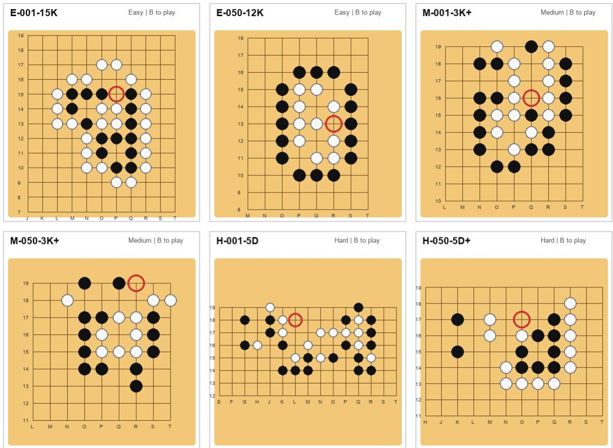  
Fi<sub>gure</sub> 7<sub>:</sub> E<sub>xamp</sub>l<sub>e</sub> <sub>norma</sub>li<sub>ze</sub>d t<sub>sumego</sub> b<sub>oar</sub>d<sub>s</sub> <sub>samp</sub>l<sub>e</sub>d f<sub>rom</sub> E<sub>asy,</sub> M<sub>e</sub>di<sub>um,</sub> <sub>an</sub>d H<sub>ar</sub>d <sub>sp</sub>lit<sub>s.</sub> L<sub>a</sub>b<sub>e</sub>l<sub>s</sub> <sub>use</sub> b<sub>enc</sub>h<sub>mar</sub>k di<sub>sp</sub>l<sub>ay</sub> id<sub>en</sub>tifi<sub>ers w</sub>ith <sub>ran</sub>k t<sub>ags, an</sub>d th<sub>e re</sub>d <sub>c</sub>i<sub>rc</sub>l<sub>e mar</sub>k<sub>s</sub> th<sub>e re</sub>f<sub>erence</sub> fi<sub>rs</sub>t <sub>move.</sub>

O<sub>pen-roo</sub>t <sub>coverage</sub> i<sub>s</sub> <sub>a</sub> <sub>p</sub>l<sub>aus</sub>ibilit<sub>y</sub> <sub>c</sub>h<sub>ec</sub>k<sub>,</sub> <sub>no</sub>t <sub>a</sub> <sub>correc</sub>t<sub>-</sub> n<sub>ess s</sub>i<sub>g</sub>n<sub>a</sub>l<sub>.</sub> In <sub>a</sub>n <sub>ope</sub>n<sub>-</sub>r<sub>oo</sub>t r<sub>u</sub>n<sub>,</sub> K<sub>a</sub>t<sub>a</sub>G<sub>o o</sub>r MCTS/UCT <sub>searc</sub>h<sub>es</sub> f<sub>rom</sub> th<sub>e or</sub>i<sub>g</sub>i<sub>na</sub>l b<sub>oar</sub>d <sub>w</sub>ith<sub>ou</sub>t b<sub>e</sub>i<sub>ng</sub> t<sub>o</sub>ld th<sub>e</sub> f<sub>our</sub> b<sub>enc</sub>h<sub>mar</sub>k <sub>op</sub>ti<sub>ons, so a</sub> di<sub>s</sub>t<sub>rac</sub>t<sub>or covere</sub>d b<sub>y open-roo</sub>t <sub>searc</sub>h i<sub>s a move</sub> th<sub>a</sub>t th<sub>e searc</sub>h <sub>process na</sub>t<sub>ura</sub>ll<sub>y cons</sub>id<sub>ere</sub>d <sub>among</sub> l<sub>ega</sub>l <sub>roo</sub>t <sub>moves.</sub> R<sub>es</sub>t<sub>r</sub>i<sub>c</sub>t<sub>e</sub>d<sub>-roo</sub>t <sub>coverage</sub> <sub>answers</sub> <sub>a</sub> dif<sub>eren</sub>t <sub>ques</sub>ti<sub>on: a</sub>ft<sub>er</sub> th<sub>e</sub> b<sub>enc</sub>h<sub>mar</sub>k fi<sub>xes</sub> th<sub>e</sub> fi<sub>na</sub>l K<sub>=</sub>4 i<sub>n-</sub> t<sub>er</sub>f<sub>ace,</sub> d<sub>oes</sub> th<sub>e searc</sub>h <sub>process a</sub>ll<sub>oca</sub>t<sub>e v</sub>i<sub>s</sub>it<sub>s</sub> t<sub>o</sub> th<sub>ose</sub> li<sub>s</sub>t<sub>e</sub>d <sub>op</sub>ti<sub>ons</sub>? W<sub>e</sub> th<sub>ere</sub>f<sub>ore use open-roo</sub>t <sub>coverage</sub> t<sub>o</sub> t<sub>es</sub>t <sub>w</sub>h<sub>e</sub>th<sub>er</sub> di<sub>s</sub>t<sub>rac</sub>t<sub>ors</sub> <sub>are</sub> <sub>na</sub>t<sub>ura</sub>ll<sub>y</sub> <sub>p</sub>l<sub>aus</sub>ibl<sub>e,</sub> <sub>an</sub>d <sub>res</sub>t<sub>r</sub>i<sub>c</sub>t<sub>e</sub>d<sub>-roo</sub>t <sub>cover-</sub> <sub>age</sub> t<sub>o</sub> t<sub>es</sub>t <sub>w</sub>h<sub>e</sub>th<sub>er</sub> th<sub>e</sub> fi<sub>na</sub>l <sub>op</sub>ti<sub>on se</sub>t <sub>rema</sub>i<sub>ns mean</sub>i<sub>ng</sub>f<sub>u</sub>l <sub>un</sub>d<sub>er</sub> th<sub>e same answer</sub> i<sub>n</sub>t<sub>er</sub>f<sub>ace use</sub>d b<sub>y</sub> LLM<sub>s.</sub>

Th<sub>e</sub> t<sub>a</sub>bl<sub>e s</sub>h<sub>ows</sub> th<sub>a</sub>t 77<sub>.</sub>3% <sub>o</sub>f th<sub>e</sub> fi<sub>na</sub>l <sub>non-correc</sub>t <sub>op-</sub> ti<sub>ons are</sub> i<sub>n</sub>d<sub>epen</sub>d<sub>en</sub>tl<sub>y encoun</sub>t<sub>ere</sub>d b<sub>y a</sub>t l<sub>eas</sub>t <sub>one open-roo</sub>t <sub>searc</sub>h <sub>re</sub>f<sub>erence w</sub>ithi<sub>n</sub> th<sub>e s</sub>h<sub>a</sub>ll<sub>ow</sub> b<sub>u</sub>d<sub>ge</sub>t<sub>.</sub> MCTS/UCT <sub>con-</sub> t<sub>r</sub>ib<sub>u</sub>t<sub>es</sub> b<sub>roa</sub>d<sub>er ear</sub>l<sub>y roo</sub>t <sub>coverage, w</sub>hil<sub>e</sub> K<sub>a</sub>t<sub>a</sub>G<sub>o</sub> i<sub>s more</sub> <sub>se</sub>l<sub>ec</sub>ti<sub>ve;</sub> thi<sub>s</sub> dif<sub>erence</sub> i<sub>s</sub> <sub>use</sub>f<sub>u</sub>l b<sub>ecause</sub> it <sub>preven</sub>t<sub>s</sub> th<sub>e</sub> <sub>op-</sub> ti<sub>on se</sub>t f<sub>rom re</sub>fl<sub>ec</sub>ti<sub>ng a s</sub>i<sub>ng</sub>l<sub>e searc</sub>h <sub>po</sub>li<sub>cy.</sub> Th<sub>ese v</sub>i<sub>s</sub>it <sub>coun</sub>t<sub>s are use</sub>d <sub>as pr</sub>i<sub>or</sub>it<sub>y an</sub>d <sub>p</sub>l<sub>aus</sub>ibilit<sub>y s</sub>i<sub>gna</sub>l<sub>s, no</sub>t <sub>as</sub> <sub>correc</sub>t<sub>ness</sub> th<sub>res</sub>h<sub>o</sub>ld<sub>s.</sub> Th<sub>e res</sub>t<sub>r</sub>i<sub>c</sub>t<sub>e</sub>d<sub>-roo</sub>t <sub>co</sub>l<sub>umns prov</sub>id<sub>e</sub> <sub>a secon</sub>d <sub>c</sub>h<sub>ec</sub>k<sub>: once</sub> th<sub>e</sub> fi<sub>na</sub>l f<sub>our can</sub>did<sub>a</sub>t<sub>es are</sub> fi<sub>xe</sub>d<sub>, many</sub> <sub>non-correc</sub>t <sub>op</sub>ti<sub>ons rece</sub>i<sub>ve v</sub>i<sub>s</sub>it<sub>s un</sub>d<sub>er</sub> th<sub>e same answer</sub> i<sub>n-</sub> t<sub>er</sub>f<sub>ace</sub> <sub>use</sub>d f<sub>or</sub> <sub>mo</sub>d<sub>e</sub>l <sub>eva</sub>l<sub>ua</sub>ti<sub>on.</sub> Th<sub>e</sub> <sub>equ</sub>i<sub>va</sub>l<sub>en</sub>t<sub>-correc</sub>t <sub>rows a</sub>l<sub>so s</sub>h<sub>ow w</sub>h<sub>y answer-se</sub>t filt<sub>er</sub>i<sub>ng mus</sub>t <sub>prece</sub>d<sub>e</sub> di<sub>s-</sub> t<sub>rac</sub>t<sub>or se</sub>l<sub>ec</sub>ti<sub>on: many ver</sub>ifi<sub>e</sub>d <sub>equ</sub>i<sub>va</sub>l<sub>en</sub>t <sub>answers are a</sub>t<sub>-</sub> t<sub>rac</sub>ti<sub>ve</sub> t<sub>o searc</sub>h <sub>re</sub>f<sub>erences, so us</sub>i<sub>ng searc</sub>h <sub>proposa</sub>l<sub>s a</sub>l<sub>one</sub> <sub>wou</sub>ld i<sub>ncorrec</sub>tl<sub>y</sub> l<sub>a</sub>b<sub>e</sub>l <sub>some va</sub>lid fi<sub>rs</sub>t <sub>moves as</sub> di<sub>s</sub>t<sub>rac</sub>t<sub>ors.</sub>

H<sub>ere</sub> “O” d<sub>eno</sub>t<sub>es</sub> <sub>open-roo</sub>t <sub>searc</sub>h <sub>over</sub> l<sub>ega</sub>l <sub>roo</sub>t <sub>moves,</sub> <sub>an</sub>d “4” d<sub>eno</sub>t<sub>es res</sub>t<sub>r</sub>i<sub>c</sub>t<sub>e</sub>d<sub>-roo</sub>t <sub>searc</sub>h <sub>over</sub> th<sub>e</sub> fi<sub>na</sub>l K<sub>=</sub>4 <sub>op</sub>ti<sub>on</sub> <sub>se</sub>t<sub>.</sub> Th<sub>e</sub> <sub>examp</sub>l<sub>e</sub> ill<sub>us</sub>t<sub>ra</sub>t<sub>es</sub> th<sub>e</sub> f<sub>u</sub>ll <sub>cura</sub>ti<sub>on-an</sub>d<sub>-au</sub>dit <sub>c</sub>h<sub>a</sub>i<sub>n.</sub> Th<sub>e</sub> fi<sub>na</sub>l di<sub>s</sub>t<sub>rac</sub>t<sub>ors are</sub> l<sub>oca</sub>l <sub>near m</sub>i<sub>sses aroun</sub>d th<sub>e</sub> <sub>canon</sub>i<sub>ca</sub>l <sub>answer an</sub>d <sub>appear</sub> i<sub>n</sub> i<sub>n</sub>d<sub>epen</sub>d<sub>en</sub>t MCTS <sub>au</sub>dit t<sub>races, so</sub> th<sub>ey are no</sub>t <sub>ran</sub>d<sub>om</sub> l<sub>ega</sub>l <sub>po</sub>i<sub>n</sub>t<sub>s.</sub> At th<sub>e same</sub> ti<sub>me,</sub> N14 is also search-visible and <sub>g</sub>eometricall<sub>y</sub> close, but it is filt<sub>ere</sub>d <sub>ou</sub>t b<sub>e</sub>f<sub>ore</sub> fi<sub>na</sub>l <sub>op</sub>ti<sub>on se</sub>l<sub>ec</sub>ti<sub>on</sub> b<sub>ecause</sub> th<sub>e ver</sub>ifi<sub>e</sub>d <sub>so</sub>l<sub>u</sub>ti<sub>on recor</sub>d <sub>mar</sub>k<sub>s</sub> it <sub>as an equ</sub>i<sub>va</sub>l<sub>en</sub>t <sub>correc</sub>t fi<sub>rs</sub>t <sub>move.</sub>

T<sub>a</sub>bl<sub>e</sub> 5<sub>:</sub> A<sub>u</sub>dit <sub>o</sub>f K<sub>=</sub>4 <sub>can</sub>did<sub>a</sub>t<sub>e cons</sub>t<sub>ruc</sub>ti<sub>on us</sub>i<sub>ng</sub> i<sub>n</sub>d<sub>epen-</sub> d<sub>en</sub>t <sub>s</sub>h<sub>a</sub>ll<sub>ow-searc</sub>h t<sub>races</sub> f<sub>or</sub> th<sub>e</sub> 300<sub>-pro</sub>bl<sub>em</sub> t<sub>race-au</sub>dit subset. The 881 non-correct option entries equal 300 × 4 fi<sub>na</sub>l <sub>op</sub>ti<sub>on en</sub>t<sub>r</sub>i<sub>es m</sub>i<sub>nus</sub> 319 <sub>ver</sub>ifi<sub>e</sub>d <sub>correc</sub>t <sub>or equ</sub>i<sub>va</sub>l<sub>en</sub>t<sub>-</sub> <sub>correc</sub>t <sub>en</sub>t<sub>r</sub>i<sub>es.</sub> A <sub>can</sub>did<sub>a</sub>t<sub>e</sub> i<sub>s coun</sub>t<sub>e</sub>d <sub>as covere</sub>d <sub>w</sub>h<sub>en</sub> it <sub>rece</sub>i<sub>ves</sub> <sub>a</sub> <sub>nonzero</sub> <sub>roo</sub>t <sub>v</sub>i<sub>s</sub>it <sub>w</sub>ithi<sub>n</sub> b<sub>u</sub>d<sub>ge</sub>t 0<sub>–</sub>30<sub>.</sub> O<sub>pen-roo</sub>t <sub>runs searc</sub>h <sub>a</sub>ll l<sub>ega</sub>l <sub>roo</sub>t <sub>moves; res</sub>t<sub>r</sub>i<sub>c</sub>t<sub>e</sub>d<sub>-roo</sub>t <sub>runs searc</sub>h <sub>on</sub>l<sub>y</sub> th<sub>e</sub> fi<sub>na</sub>l K<sub>=</sub>4 <sub>op</sub>ti<sub>on se</sub>t<sub>.</sub>
<table><tr><td>Audit quantity</td><td>Count</td><td>Rate</td></tr><tr><td>Problems in curation subset</td><td>300</td><td></td></tr><tr><td>Final option entries</td><td>1200</td><td></td></tr><tr><td>Accepted-answer entries</td><td>319</td><td></td></tr><tr><td>Non-correct option entries</td><td>881</td><td></td></tr><tr><td>Covered by open-root MCTS/UCT</td><td>629/881</td><td>71.4%</td></tr><tr><td>Covered by open-root KataGo</td><td>210/881</td><td>23.8%</td></tr><tr><td>Covered by either open-root search</td><td>681/881</td><td>77.3%</td></tr><tr><td>Covered by restricted-root MCTS/UCT</td><td>851/881</td><td>96.6%</td></tr><tr><td>Covered by restricted-root KataGo</td><td>485/881</td><td>55.1%</td></tr><tr><td>Extra equivalent correct moves</td><td>38</td><td></td></tr><tr><td>Equiv. correct visited by open-root MCTS/UCT</td><td>26/38</td><td>68.4%</td></tr><tr><td>Equiv. correct visited by open-root KataGo</td><td>23/38</td><td>60.5%</td></tr></table>

T<sub>a</sub>bl<sub>e</sub> 6<sub>:</sub> E<sub>xamp</sub>l<sub>e</sub> K<sub>=</sub>4 <sub>ev</sub>id<sub>ence</sub> f<sub>or</sub> b<sub>enc</sub>h<sub>mar</sub>k <sub>pro</sub>bl<sub>em</sub> E-001-15K. Rows A–D are the final answer o<sub>p</sub>tions, while N14 is shown as a rejected proposal. Distance is Euclidean distance to the canonical answer P15; first-seen columns re-<sub>por</sub>t th<sub>e</sub> <sub>ear</sub>li<sub>es</sub>t i<sub>n</sub>d<sub>epen</sub>d<sub>en</sub>t <sub>au</sub>dit b<sub>u</sub>d<sub>ge</sub>t<sub>,</sub> <sub>a</sub>t <sub>mos</sub>t 30<sub>,</sub> <sub>w</sub>h<sub>ere</sub> the move receives a nonzero root visit. N14 is search-visible b<sub>u</sub>t <sub>remove</sub>d b<sub>ecause</sub> it i<sub>s a ver</sub>ifi<sub>e</sub>d <sub>equ</sub>i<sub>va</sub>l<sub>en</sub>t <sub>correc</sub>t <sub>an-</sub> swer.
<table><tr><td>Option Coord. Label</td><td></td><td></td><td colspan="4">Dist. MCTS-O KG-O MCTS-4 KG-4</td></tr><tr><td>A</td><td>P15</td><td>correct</td><td>0.00</td><td>21</td><td>2 1</td><td>2</td></tr><tr><td>B</td><td>Q17</td><td>distractor</td><td>2.24</td><td>11 一</td><td>2</td><td>30</td></tr><tr><td>C</td><td>Q18</td><td>distractor</td><td>3.16</td><td>7</td><td>一 3</td><td>一</td></tr><tr><td>D</td><td>018</td><td>distractor</td><td>3.16</td><td>5</td><td>4</td><td>一</td></tr><tr><td>一</td><td>N14</td><td>equiv. correct</td><td>2.24</td><td>27</td><td>4 一</td><td>1</td></tr></table>

E<sub>va</sub>l<sub>ua</sub>ti<sub>o</sub>n <sub>p</sub>r<sub>o</sub>m<sub>p</sub>t <sub>exa</sub>m<sub>p</sub>l<sub>e.</sub> F<sub>or</sub> th<sub>e same pro</sub>bl<sub>em,</sub> th<sub>e</sub> <sub>sym</sub>b<sub>o</sub>li<sub>c</sub> <sub>promp</sub>t <sub>presen</sub>t<sub>s</sub> th<sub>e</sub> <sub>s</sub>t<sub>a</sub>t<sub>e</sub> <sub>as</sub> <sub>norma</sub>li<sub>ze</sub>d <sub>coor</sub>di<sub>na</sub>t<sub>es</sub> <sub>ra</sub>th<sub>er</sub> th<sub>an</sub> <sub>as</sub> <sub>a</sub> <sub>na</sub>t<sub>ura</sub>l<sub>-</sub>l<sub>anguage</sub> <sub>puzz</sub>l<sub>e</sub> d<sub>escr</sub>i<sub>p</sub>ti<sub>on:</sub> “Bl<sub>ac</sub>k stones: M14, M15, N13, ..., Q15; White stones: L13, L14, ..., R15; side to <sub>p</sub>la<sub>y</sub>: Black; choose from A: P15, B: Q17, C: Q18, D: O18.” The final answer is <sub>score</sub>d b<sub>y</sub> <sub>mapp</sub>i<sub>ng</sub> th<sub>e</sub> <sub>op</sub>ti<sub>on</sub> l<sub>e</sub>tt<sub>er</sub> b<sub>ac</sub>k t<sub>o</sub> <sub>a</sub> <sub>norma</sub>li<sub>ze</sub>d <sub>coor</sub>di<sub>na</sub>t<sub>e an</sub>d <sub>c</sub>h<sub>ec</sub>ki<sub>ng w</sub>h<sub>e</sub>th<sub>er</sub> it b<sub>e</sub>l<sub>ongs</sub> t<sub>o</sub> th<sub>e ver</sub>ifi<sub>e</sub>d correct-answer set.

Filt<sub>er</sub>i<sub>ng cr</sub>it<sub>er</sub>i<sub>a.</sub> W<sub>e re</sub>t<sub>a</sub>i<sub>n a pro</sub>bl<sub>em on</sub>l<sub>y w</sub>h<sub>en</sub> th<sub>e</sub> l<sub>o-</sub> cal life-and-death objective is well defined, the first move i<sub>s un</sub>i<sub>que or</sub> b<sub>e</sub>l<sub>ongs</sub> t<sub>o a</sub> fi<sub>n</sub>it<sub>e equ</sub>i<sub>va</sub>l<sub>ence c</sub>l<sub>ass,</sub> th<sub>e can-</sub> did<sub>a</sub>t<sub>e se</sub>t i<sub>s</sub> l<sub>ega</sub>l <sub>un</sub>d<sub>er coor</sub>di<sub>na</sub>t<sub>e norma</sub>li<sub>za</sub>ti<sub>on, an</sub>d th<sub>e</sub> <sub>re</sub>f<sub>erence</sub> li<sub>ne</sub> i<sub>s</sub> <sub>no</sub>t d<sub>epen</sub>d<sub>en</sub>t <sub>on</sub> <sub>unreso</sub>l<sub>ve</sub>d <sub>g</sub>l<sub>o</sub>b<sub>a</sub>l k<sub>o</sub> <sub>or</sub> <sub>w</sub>h<sub>o</sub>l<sub>e-</sub>b<sub>oar</sub>d <sub>con</sub>t<sub>ex</sub>t<sub>.</sub> A<sub>m</sub>bi<sub>guous</sub> <sub>pro</sub>bl<sub>ems,</sub> <sub>recor</sub>d<sub>s</sub> <sub>w</sub>ith i<sub>n-</sub> <sub>cons</sub>i<sub>s</sub>t<sub>en</sub>t <sub>s</sub>id<sub>e-</sub>t<sub>o-p</sub>l<sub>ay me</sub>t<sub>a</sub>d<sub>a</sub>t<sub>a, pos</sub>iti<sub>ons w</sub>h<sub>ose can</sub>did<sub>a</sub>t<sub>e</sub> l<sub>a</sub>b<sub>e</sub>l<sub>s canno</sub>t b<sub>e mappe</sub>d b<sub>ac</sub>k t<sub>o</sub> l<sub>ega</sub>l b<sub>oar</sub>d <sub>coor</sub>di<sub>na</sub>t<sub>es, an</sub>d K<sub>=</sub>4 <sub>se</sub>t<sub>s con</sub>t<sub>a</sub>i<sub>n</sub>i<sub>ng ano</sub>th<sub>er unver</sub>ifi<sub>e</sub>d <sub>equ</sub>i<sub>va</sub>l<sub>en</sub>t <sub>answer are</sub> <sub>remove</sub>d b<sub>e</sub>f<sub>ore eva</sub>l<sub>ua</sub>ti<sub>on.</sub>

N<sub>o</sub>rm<sub>a</sub>li<sub>za</sub>ti<sub>o</sub>n <sub>c</sub>h<sub>ec</sub>k<sub>s.</sub> E<sub>very re</sub>t<sub>a</sub>i<sub>ne</sub>d it<sub>em</sub> i<sub>s c</sub>h<sub>ec</sub>k<sub>e</sub>d <sub>a</sub>t th<sub>ree</sub> l<sub>eve</sub>l<sub>s.</sub> Fi<sub>rs</sub>t<sub>, a</sub>ll <sub>coor</sub>di<sub>na</sub>t<sub>es mus</sub>t <sub>use</sub> th<sub>e same</sub> 19<sub>-</sub>b<sub>y-</sub>19 convention with the column I omitted. Second, the s<sub>y</sub>mbolic <sub>coor</sub>di<sub>na</sub>t<sub>e</sub> <sub>s</sub>t<sub>a</sub>t<sub>e</sub> <sub>an</sub>d <sub>gr</sub>id <sub>s</sub>t<sub>a</sub>t<sub>e</sub> <sub>mus</sub>t <sub>agree</sub> <sub>a</sub>ft<sub>er</sub> <sub>co</sub>l<sub>or,</sub> <sub>row,</sub> <sub>an</sub>d <sub>co</sub>l<sub>umn norma</sub>li<sub>za</sub>ti<sub>on.</sub> Thi<sub>r</sub>d<sub>, eac</sub>h <sub>can</sub>did<sub>a</sub>t<sub>e</sub> fi<sub>rs</sub>t <sub>move</sub> <sub>an</sub>d <sub>eac</sub>h <sub>re</sub>f<sub>erence</sub> fi<sub>rs</sub>t <sub>move mus</sub>t <sub>map</sub> t<sub>o an emp</sub>t<sub>y</sub> l<sub>ega</sub>l <sub>coor</sub>di<sub>na</sub>t<sub>e</sub> f<sub>or</sub> th<sub>e s</sub>t<sub>a</sub>t<sub>e</sub>d <sub>s</sub>id<sub>e</sub> t<sub>o p</sub>l<sub>ay.</sub> Th<sub>ese c</sub>h<sub>ec</sub>k<sub>s ma</sub>k<sub>e</sub> <sub>answer eva</sub>l<sub>ua</sub>ti<sub>on</sub> i<sub>n</sub>d<sub>epen</sub>d<sub>en</sub>t <sub>o</sub>f th<sub>e sur</sub>f<sub>ace</sub> t<sub>ex</sub>t <sub>use</sub>d t<sub>o</sub> <sub>p</sub>resent a <sub>p</sub>ro<sup>bl</sup>em.

T<sub>racea</sub>bilit<sub>y.</sub> Th<sub>e</sub> b<sub>enc</sub>h<sub>mar</sub>k k<sub>eeps source-</sub>l<sub>eve</sub>l id<sub>en</sub>ti<sub>-</sub> fi<sub>ers, ran</sub>k t<sub>ags, can</sub>did<sub>a</sub>t<sub>e</sub> l<sub>a</sub>b<sub>e</sub>l<sub>s, an</sub>d <sub>re</sub>f<sub>erence-</sub>li<sub>ne me</sub>t<sub>a-</sub> d<sub>a</sub>t<sub>a</sub> f<sub>or au</sub>dit<sub>a</sub>bilit<sub>y,</sub> b<sub>u</sub>t <sub>eva</sub>l<sub>ua</sub>ti<sub>on uses</sub> th<sub>e norma</sub>li<sub>ze</sub>d b<sub>oar</sub>d <sub>s</sub>t<sub>a</sub>t<sub>e.</sub> Thi<sub>s separa</sub>ti<sub>on</sub> i<sub>s</sub> i<sub>mpor</sub>t<sub>an</sub>t f<sub>or repro</sub>d<sub>uc</sub>ibil<sub>-</sub> it<sub>y.</sub> A <sub>mo</sub>d<sub>e</sub>l <sub>can</sub> b<sub>e eva</sub>l<sub>ua</sub>t<sub>e</sub>d f<sub>rom</sub> th<sub>e re</sub>l<sub>ease</sub>d <sub>s</sub>t<sub>ruc</sub>t<sub>ure</sub>d <sub>pro</sub>bl<sub>em a</sub>l<sub>one, w</sub>hil<sub>e</sub> th<sub>e cons</sub>t<sub>ruc</sub>ti<sub>on recor</sub>d <sub>s</sub>till <sub>a</sub>ll<sub>ows us</sub> t<sub>o</sub> i<sub>nspec</sub>t <sub>w</sub>h<sub>y</sub> <sub>a</sub> <sub>puzz</sub>l<sub>e</sub> <sub>was</sub> i<sub>nc</sub>l<sub>u</sub>d<sub>e</sub>d<sub>,</sub> h<sub>ow</sub> it<sub>s</sub> <sub>can</sub>did<sub>a</sub>t<sub>es</sub> <sub>were</sub> <sub>pro</sub>d<sub>uce</sub>d<sub>,</sub> <sub>an</sub>d <sub>w</sub>h<sub>e</sub>th<sub>er</sub> <sub>an</sub> <sub>apparen</sub>t <sub>mo</sub>d<sub>e</sub>l <sub>error</sub> i<sub>s</sub> <sub>ac</sub>t<sub>ua</sub>ll<sub>y</sub> <sub>a</sub> <sub>coor</sub>di<sub>na</sub>t<sub>e or me</sub>t<sub>a</sub>d<sub>a</sub>t<sub>a</sub> i<sub>ssue.</sub>

Wh<sub>y</sub> th<sub>e</sub> b<sub>ou</sub>nd<sub>e</sub>d t<sub>as</sub>k i<sub>s</sub> <sub>eva</sub>l<sub>ua</sub>bl<sub>e.</sub> Th<sub>e</sub> K<sub>=</sub>4 <sub>se</sub>tti<sub>ng</sub> i<sub>s</sub> i<sub>n</sub>t<sub>en</sub>ti<sub>ona</sub>ll<sub>y</sub> <sub>conserva</sub>ti<sub>ve.</sub> Fi<sub>ve</sub> h<sub>uman</sub> <sub>rev</sub>i<sub>ewers,</sub> <sub>ass</sub>i<sub>s</sub>t<sub>e</sub>d b<sub>y</sub> K<sub>a</sub>t<sub>a</sub>G<sub>o</sub> li<sub>ne c</sub>h<sub>ec</sub>ki<sub>n , rev</sub>i<sub>ew</sub> th<sub>e</sub> fi<sub>rs</sub>t<sub>-move answer se</sub>t <sub>an</sub>d th<sub>e</sub> di<sub>s</sub>t<sub>rac</sub>t<sub>or</sub> <sub>se</sub>t f<sub>or</sub> 300 <sub>samp</sub>l<sub>e</sub>d <sub>pro</sub>bl<sub>ems,</sub> <sub>correspon</sub>di<sub>ng</sub> t<sub>o</sub> h<sub>a</sub>lf <sub>o</sub>f th<sub>e</sub> 600<sub>-pro</sub>bl<sub>em ma</sub>i<sub>n eva</sub>l<sub>ua</sub>ti<sub>on.</sub> Th<sub>e rev</sub>i<sub>ewers</sub> <sub>se</sub>lf<sub>-ra</sub>t<sub>e as</sub> t<sub>wo s</sub>t<sub>ronger ama</sub>t<sub>eur</sub> G<sub>o p</sub>l<sub>ayers,</sub> t<sub>wo</sub> i<sub>n</sub>t<sub>erme</sub>di<sub>-</sub> <sub>a</sub>t<sub>e ama</sub>t<sub>eur p</sub>l<sub>ayers, an</sub>d <sub>one</sub> b<sub>eg</sub>i<sub>nner ama</sub>t<sub>eur p</sub>l<sub>ayer; eac</sub>h <sub>rev</sub>i<sub>ewer</sub> <sub>spen</sub>d<sub>s</sub> <sub>approx</sub>i<sub>ma</sub>t<sub>e</sub>l<sub>y</sub> 12 h<sub>ours</sub> <sub>on</sub> th<sub>e</sub> <sub>rev</sub>i<sub>ew,</sub> f<sub>or</sub> about 60 reviewer-hours before joint adjudication. The re-<sub>v</sub>i<sub>ew as</sub>k<sub>s w</sub>h<sub>e</sub>th<sub>er</sub> th<sub>e</sub> li<sub>s</sub>t<sub>e</sub>d <sub>correc</sub>t <sub>moves are a</sub>ll <sub>accep</sub>t<sub>a</sub>bl<sub>e</sub> first-move tesuji, whether any distractor is actually an equiv-<sub>a</sub>l<sub>en</sub>t <sub>so</sub>l<sub>u</sub>ti<sub>on, an</sub>d <sub>w</sub>h<sub>e</sub>th<sub>er every op</sub>ti<sub>on</sub> i<sub>s a</sub> l<sub>ega</sub>l l<sub>oca</sub>l <sub>move</sub> <sub>un</sub>d<sub>er</sub> th<sub>e norma</sub>li<sub>ze</sub>d <sub>s</sub>t<sub>a</sub>t<sub>e.</sub> A<sub>ccuracy</sub> i<sub>s</sub> th<sub>en</sub> d<sub>e</sub>fi<sub>ne</sub>d <sub>on</sub>l<sub>y a</sub>t th<sub>e</sub> fi<sub>rs</sub>t <sub>move: a mo</sub>d<sub>e</sub>l i<sub>s correc</sub>t if it<sub>s se</sub>l<sub>ec</sub>t<sub>e</sub>d <sub>coor</sub>di<sub>na</sub>t<sub>e</sub> i<sub>s</sub> i<sub>n</sub> th<sub>e ver</sub>ifi<sub>e</sub>d <sub>correc</sub>t<sub>-answer se</sub>t<sub>.</sub> Thi<sub>s</sub> d<sub>oes no</sub>t <sub>c</sub>l<sub>a</sub>i<sub>m</sub> t<sub>o cer-</sub> tif<sub>y every poss</sub>ibl<sub>e con</sub>ti<sub>nua</sub>ti<sub>on o</sub>f <sub>an open game;</sub> it <sub>cer</sub>tifi<sub>es</sub> th<sub>e</sub> l<sub>oca</sub>l f<sub>our-c</sub>h<sub>o</sub>i<sub>ce</sub> <sub>eye</sub> <sub>po</sub>i<sub>n</sub>t <sub>use</sub>d b<sub>y</sub> th<sub>e</sub> b<sub>enc</sub>h<sub>mar</sub>k<sub>.</sub>

Thi<sub>s</sub> b<sub>oun</sub>d<sub>e</sub>d <sub>eva</sub>l<sub>ua</sub>ti<sub>on</sub> i<sub>s a</sub>l<sub>rea</sub>d<sub>y non-sa</sub>t<sub>ura</sub>t<sub>e</sub>d<sub>.</sub> E<sub>ven on</sub> th<sub>e eas</sub>i<sub>es</sub>t K<sub>=</sub>4 ti<sub>er, mos</sub>t <sub>eva</sub>l<sub>ua</sub>t<sub>e</sub>d LLM<sub>s rema</sub>i<sub>n we</sub>ll b<sub>e</sub>l<sub>ow</sub> <sub>per</sub>f<sub>ec</sub>t <sub>accuracy</sub> i<sub>n</sub> th<sub>e</sub> <sub>ma</sub>i<sub>n</sub> t<sub>a</sub>bl<sub>e.</sub> Th<sub>ere</sub>f<sub>ore,</sub> <sub>a</sub>lth<sub>oug</sub>h K<sub>=</sub>4 i<sub>s</sub> <sub>s</sub>i<sub>mp</sub>l<sub>er</sub> th<sub>an</sub> <sub>open</sub> <sub>searc</sub>h<sub>,</sub> it <sub>s</sub>till <sub>prov</sub>id<sub>es</sub> <sub>a</sub> <sub>mean</sub>i<sub>ng</sub>f<sub>u</sub>l fi<sub>rs</sub>t l<sub>ayer o</sub>f <sub>measuremen</sub>t<sub>:</sub> it t<sub>es</sub>t<sub>s w</sub>h<sub>e</sub>th<sub>er</sub> th<sub>e mo</sub>d<sub>e</sub>l <sub>can</sub> id<sub>en</sub>tif<sub>y</sub> th<sub>e v</sub>it<sub>a</sub>l <sub>po</sub>i<sub>n</sub>t <sub>among</sub> l<sub>oca</sub>ll<sub>y p</sub>l<sub>aus</sub>ibl<sub>e a</sub>lt<sub>erna</sub>ti<sub>ves</sub> b<sub>e</sub>f<sub>ore</sub> th<sub>e</sub> b<sub>enc</sub>h<sub>mar</sub>k <sub>as</sub>k<sub>s</sub> it t<sub>o genera</sub>t<sub>e can</sub>did<sub>a</sub>t<sub>es</sub> f<sub>rom</sub> th<sub>e</sub> f<sub>u</sub>ll b<sub>oar</sub>d<sub>.</sub>

Th<sub>e</sub> <sub>sp</sub>lit <sub>s</sub>t<sub>a</sub>ti<sub>s</sub>ti<sub>cs</sub> i<sub>n</sub> T<sub>a</sub>bl<sub>e</sub> 7 <sub>s</sub>h<sub>ow</sub> th<sub>e</sub> i<sub>n</sub>t<sub>en</sub>d<sub>e</sub>d difi<sub>cu</sub>lt<sub>y</sub> <sub>progress</sub>i<sub>on:</sub> h<sub>ar</sub>d<sub>er</sub> ti<sub>ers</sub> h<sub>ave</sub> l<sub>onger</sub> <sub>s</sub>t<sub>an</sub>d<sub>ar</sub>d <sub>so</sub>l<sub>u</sub>ti<sub>on</sub> li<sub>nes</sub> <sub>an</sub>d l<sub>onger</sub> f<sub>a</sub>il<sub>ure</sub>/<sub>var</sub>i<sub>a</sub>ti<sub>on</sub> li<sub>nes.</sub> Thi<sub>s</sub> <sub>pa</sub>tt<sub>ern</sub> i<sub>s</sub> i<sub>mpor</sub>t<sub>an</sub>t b<sub>ecause</sub> it <sub>ver</sub>ifi<sub>es</sub> th<sub>a</sub>t th<sub>e</sub> <sub>sp</sub>lit i<sub>s</sub> <sub>no</sub>t <sub>mere</sub>l<sub>y</sub> <sub>re</sub>l<sub>a</sub>b<sub>e</sub>l<sub>e</sub>d b<sub>y</sub> <sub>ran</sub>k<sub>;</sub> th<sub>e</sub> <sub>re</sub>f<sub>erence</sub> <sub>so</sub>l<sub>u</sub>ti<sub>on</sub> <sub>s</sub>t<sub>ruc</sub>t<sub>ure</sub> it<sub>se</sub>lf b<sub>ecomes</sub> l<sub>onger</sub> <sub>an</sub>d <sub>more</sub> b<sub>ranc</sub>hi<sub>ng as</sub> difi<sub>cu</sub>lt<sub>y</sub> i<sub>ncreases.</sub>

T<sub>a</sub>bl<sub>e</sub> 7<sub>:</sub> C<sub>ompos</sub>iti<sub>on au</sub>dit f<sub>or</sub> th<sub>e</sub> 300<sub>-pro</sub>bl<sub>em</sub> b<sub>oun</sub>d<sub>e</sub>d<sub>-</sub> <sub>can</sub>did<sub>a</sub>t<sub>e cura</sub>ti<sub>on su</sub>b<sub>se</sub>t <sub>use</sub>d f<sub>or s</sub>t<sub>ruc</sub>t<sub>ura</sub>l <sub>c</sub>h<sub>ec</sub>k<sub>s.</sub> Thi<sub>s</sub> <sub>au</sub>dit <sub>su</sub>b<sub>se</sub>t i<sub>s separa</sub>t<sub>e</sub> f<sub>rom</sub> th<sub>e</sub> 600<sub>-pro</sub>bl<sub>em ma</sub>i<sub>n eva</sub>l<sub>ua-</sub> ti<sub>on se</sub>t<sub>.</sub>
<table><tr><td>Split</td><td>N</td><td>Options</td><td>B/W</td><td>Std. len.</td><td>Var. len.</td></tr><tr><td>Easy</td><td>100</td><td>4</td><td>99/1</td><td>2.77</td><td>3.84</td></tr><tr><td>Medium</td><td>100</td><td>4</td><td>68/32</td><td>6.56</td><td>6.86</td></tr><tr><td>Hard</td><td>100</td><td>4</td><td>85/15</td><td>11.92</td><td>10.14</td></tr></table>

## B E<sub>qu</sub>i<sub>va</sub>l<sub>ence-</sub>T<sub>rans</sub>f<sub>orm</sub> R<sub>o</sub>b<sub>us</sub>t<sub>ness</sub>

Th<sub>e</sub> b<sub>enc</sub>h<sub>mar</sub>k i<sub>s</sub> d<sub>es</sub>i<sub>gne</sub>d <sub>so</sub> th<sub>a</sub>t t<sub>ac</sub>ti<sub>ca</sub>l <sub>con</sub>t<sub>en</sub>t i<sub>s</sub> i<sub>n-</sub> <sub>var</sub>i<sub>an</sub>t t<sub>o</sub> b<sub>oar</sub>d <sub>symme</sub>t<sub>r</sub>i<sub>es an</sub>d <sub>co</sub>l<sub>or re</sub>l<sub>a</sub>b<sub>e</sub>li<sub>ng.</sub> W<sub>e</sub> th<sub>ere-</sub> f<sub>ore</sub> d<sub>e</sub>fi<sub>ne a</sub> t<sub>rans</sub>f<sub>orm su</sub>it<sub>e</sub> f<sub>or ro</sub>b<sub>us</sub>t<sub>ness eva</sub>l<sub>ua</sub>ti<sub>on:</sub> 90/180/270 d<sub>e ree ro</sub>t<sub>a</sub>ti<sub>on,</sub> h<sub>or</sub>i<sub>zon</sub>t<sub>a</sub>l <sub>re</sub>fl<sub>ec</sub>ti<sub>on, ver</sub>ti<sub>ca</sub>l <sub>re</sub>fl<sub>ec</sub>ti<sub>on, co</sub>l<sub>or</sub> i<sub>nvers</sub>i<sub>on w</sub>ith <sub>s</sub>id<sub>e-</sub>t<sub>o-p</sub>l<sub>ay</sub> fli<sub>p, an</sub>d <sub>coor-</sub> di<sub>na</sub>t<sub>e re</sub>l<sub>a</sub>b<sub>e</sub>li<sub>ng.</sub> Thi<sub>s</sub> t<sub>es</sub>t i<sub>s no</sub>t <sub>a proo</sub>f th<sub>a</sub>t <sub>no</sub> b<sub>enc</sub>h<sub>mar</sub>k <sub>pos</sub>iti<sub>on</sub> <sub>appears</sub> i<sub>n</sub> <sub>pre</sub>t<sub>ra</sub>i<sub>n</sub>i<sub>ng</sub> d<sub>a</sub>t<sub>a.</sub> I<sub>ns</sub>t<sub>ea</sub>d<sub>,</sub> it i<sub>s</sub> <sub>a</sub> <sub>sur</sub>f<sub>ace-</sub> <sub>memor</sub>i<sub>za</sub>ti<sub>on</sub> <sub>s</sub>t<sub>ress</sub> t<sub>es</sub>t<sub>:</sub> th<sub>e</sub> l<sub>oca</sub>l t<sub>sumego</sub> <sub>answer</sub> i<sub>s</sub> <sub>pre-</sub> <sub>serve</sub>d <sub>w</sub>hil<sub>e coor</sub>di<sub>na</sub>t<sub>es, co</sub>l<sub>ors, or geome</sub>t<sub>ry are c</sub>h<sub>ange</sub>d<sub>.</sub> A <sub>mo</sub>d<sub>e</sub>l th<sub>a</sub>t <sub>re</sub>li<sub>es on memor</sub>i<sub>ze</sub>d b<sub>oar</sub>d l<sub>ayou</sub>t<sub>s or coor-</sub> di<sub>na</sub>t<sub>e s</sub>h<sub>or</sub>t<sub>cu</sub>t<sub>s s</sub>h<sub>ou</sub>ld b<sub>ecome</sub> l<sub>ess cons</sub>i<sub>s</sub>t<sub>en</sub>t <sub>un</sub>d<sub>er</sub> th<sub>ese</sub> <sub>equ</sub>i<sub>va</sub>l<sub>en</sub>t <sub>v</sub>i<sub>ews.</sub>

Tr<sub>a</sub>n<sub>s</sub>f<sub>o</sub>rm <sub>co</sub>n<sub>s</sub>tr<sub>uc</sub>ti<sub>o</sub>n <sub>au</sub>dit<sub>.</sub> B<sub>e</sub>f<sub>ore us</sub>i<sub>ng</sub> th<sub>e</sub> t<sub>rans-</sub> f<sub>orms</sub> f<sub>or mo</sub>d<sub>e</sub>l <sub>eva</sub>l<sub>ua</sub>ti<sub>on, we au</sub>dit <sub>w</sub>h<sub>e</sub>th<sub>er eac</sub>h t<sub>rans-</sub> f<sub>orme</sub>d <sub>pro</sub>bl<sub>em preserves a va</sub>lid <sub>coor</sub>di<sub>na</sub>t<sub>e sys</sub>t<sub>em an</sub>d <sub>maps</sub> th<sub>e re</sub>f<sub>erence answer</sub> i<sub>n</sub>t<sub>o</sub> th<sub>e</sub> t<sub>rans</sub>f<sub>orme</sub>d <sub>can</sub>did<sub>a</sub>t<sub>e</sub> <sub>se</sub>t<sub>.</sub> Th<sub>e cons</sub>t<sub>ruc</sub>ti<sub>on au</sub>dit <sub>covers</sub> 300 b<sub>enc</sub>h<sub>mar</sub>k it<sub>ems an</sub>d <sub>passes</sub> f<sub>or a</sub>ll t<sub>es</sub>t<sub>e</sub>d t<sub>rans</sub>f<sub>orms: ro</sub>t<sub>a</sub>ti<sub>on,</sub> h<sub>or</sub>i<sub>zon</sub>t<sub>a</sub>l/<sub>ver</sub>ti<sub>ca</sub>l <sub>re</sub>fl<sub>ec</sub>ti<sub>on,</sub> <sub>an</sub>d <sub>co</sub>l<sub>or</sub> i<sub>nvers</sub>i<sub>on.</sub> Thi<sub>s</sub> <sub>c</sub>h<sub>ec</sub>k <sub>ensures</sub> th<sub>a</sub>t <sub>a</sub> <sub>mo</sub>d<sub>e</sub>l f<sub>a</sub>il<sub>ure</sub> i<sub>s no</sub>t <sub>cause</sub>d b<sub>y an</sub> i<sub>nva</sub>lid t<sub>rans</sub>f<sub>orme</sub>d i<sub>n-</sub> stance.

R<sub>o</sub>b<sub>us</sub>tn<sub>ess p</sub>r<sub>o</sub>t<sub>oco</sub>l<sub>.</sub> W<sub>e eva</sub>l<sub>ua</sub>t<sub>e</sub> t<sub>rans</sub>f<sub>orma</sub>ti<sub>on</sub> i<sub>nvar</sub>i<sub>-</sub> <sub>ance w</sub>ith <sub>a con</sub>t<sub>ro</sub>ll<sub>e</sub>d <sub>answer-on</sub>l<sub>y pro</sub>t<sub>oco</sub>l <sub>a</sub>t t<sub>empera</sub>t<sub>ure</sub> 0<sub>.</sub> Th<sub>e promp</sub>t <sub>as</sub>k<sub>s</sub> f<sub>or a s</sub>i<sub>ng</sub>l<sub>e op</sub>ti<sub>on</sub> l<sub>e</sub>tt<sub>er, so</sub> thi<sub>s pro</sub>b<sub>e</sub> i<sub>s</sub> <sub>use</sub>d t<sub>o s</sub>t<sub>u</sub>d<sub>y presen</sub>t<sub>a</sub>ti<sub>on sens</sub>iti<sub>v</sub>it<sub>y ra</sub>th<sub>er</sub> th<sub>an</sub> t<sub>o rep</sub>l<sub>ace</sub> th<sub>e ma</sub>i<sub>n</sub> b<sub>enc</sub>h<sub>mar</sub>k <sub>accuracy es</sub>ti<sub>ma</sub>t<sub>es.</sub> F<sub>or eac</sub>h <sub>eva</sub>l<sub>ua</sub>t<sub>e</sub>d <sub>mo</sub>d<sub>e</sub>l<sub>, we samp</sub>l<sub>e</sub> 10 <sub>pro</sub>bl<sub>ems</sub> f<sub>rom</sub> th<sub>e</sub> b<sub>enc</sub>h<sub>mar</sub>k <sub>w</sub>ith dif<sub>-</sub> fi<sub>cu</sub>lt<sub>y s</sub>t<sub>ra</sub>tifi<sub>ca</sub>ti<sub>on across</sub> E<sub>asy,</sub> M<sub>e</sub>di<sub>um, an</sub>d H<sub>ar</sub>d it<sub>ems.</sub> E<sub>ac</sub>h <sub>samp</sub>l<sub>e</sub>d it<sub>em</sub> i<sub>s eva</sub>l<sub>ua</sub>t<sub>e</sub>d <sub>un</sub>d<sub>er</sub> th<sub>e or</sub>i<sub>g</sub>i<sub>na</sub>l <sub>presen-</sub> t<sub>a</sub>ti<sub>on an</sub>d th<sub>ree answer-preserv</sub>i<sub>ng</sub> t<sub>rans</sub>f<sub>orma</sub>ti<sub>ons.</sub> T<sub>a</sub>bl<sub>e</sub> 8 <sub>repor</sub>t<sub>s</sub> th<sub>e average resu</sub>lt <sub>across mo</sub>d<sub>e</sub>l<sub>s.</sub>

A<sub>ccuracy</sub> i<sub>s compu</sub>t<sub>e</sub>d <sub>aga</sub>i<sub>ns</sub>t th<sub>e answer a</sub>ft<sub>er</sub> t<sub>rans</sub>f<sub>orma-</sub> ti<sub>on.</sub> C<sub>ons</sub>i<sub>s</sub>t<sub>ency</sub> i<sub>s compu</sub>t<sub>e</sub>d b<sub>y mapp</sub>i<sub>ng eac</sub>h t<sub>rans</sub>f<sub>orme</sub>d <sub>pre</sub>di<sub>c</sub>ti<sub>on</sub> b<sub>ac</sub>k t<sub>o</sub> th<sub>e or</sub>i<sub>g</sub>i<sub>na</sub>l <sub>coor</sub>di<sub>na</sub>t<sub>e sys</sub>t<sub>em an</sub>d <sub>com-</sub> <sub>par</sub>i<sub>ng</sub> it <sub>w</sub>ith th<sub>e same mo</sub>d<sub>e</sub>l’<sub>s pre</sub>di<sub>c</sub>ti<sub>on on</sub> th<sub>e or</sub>i<sub>g</sub>i<sub>na</sub>l <sub>presen</sub>t<sub>a</sub>ti<sub>on o</sub>f th<sub>e same pro</sub>bl<sub>em.</sub> Th<sub>e</sub> l<sub>a</sub>tt<sub>er</sub> i<sub>s</sub> th<sub>e pr</sub>i<sub>mary</sub> <sub>ro</sub>b<sub>us</sub>t<sub>ness quan</sub>tit<sub>y: a mo</sub>d<sub>e</sub>l <sub>can</sub> b<sub>e</sub> i<sub>naccura</sub>t<sub>e</sub> i<sub>n</sub> thi<sub>s</sub> t<sub>erse</sub> <sub>se</sub>tti<sub>ng ye</sub>t <sub>s</sub>till b<sub>e</sub> i<sub>nvar</sub>i<sub>an</sub>t<sub>, or accura</sub>t<sub>e on some</sub> t<sub>rans</sub>f<sub>orme</sub>d <sub>promp</sub>t<sub>s w</sub>hil<sub>e c</sub>h<sub>ang</sub>i<sub>ng</sub> it<sub>s un</sub>d<sub>er</sub>l<sub>y</sub>i<sub>ng pre</sub>di<sub>c</sub>ti<sub>on.</sub>

Inter<sub>p</sub>retation. The a<sub>gg</sub>re<sub>g</sub>ate results show that answer-<sub>preserv</sub>i<sub>ng</sub> <sub>sur</sub>f<sub>ace</sub> <sub>c</sub>h<sub>anges</sub> <sub>can</sub> <sub>su</sub>b<sub>s</sub>t<sub>an</sub>ti<sub>a</sub>ll<sub>y</sub> <sub>a</sub>lt<sub>er</sub> <sub>mo</sub>d<sub>e</sub>l b<sub>e</sub>h<sub>av</sub>i<sub>or.</sub> G<sub>eome</sub>t<sub>r</sub>i<sub>c</sub> t<sub>rans</sub>f<sub>orms re</sub>d<sub>uce cons</sub>i<sub>s</sub>t<sub>ency, w</sub>ith 60<sub>.</sub>0% <sub>un</sub>d<sub>er</sub> 180<sub>-</sub>d<sub>egree ro</sub>t<sub>a</sub>ti<sub>on an</sub>d 64<sub>.</sub>4% <sub>un</sub>d<sub>er</sub> h<sub>or</sub>i<sub>zon-</sub> t<sub>a</sub>l <sub>re</sub>fl<sub>ec</sub>ti<sub>on, sugges</sub>ti<sub>ng</sub> th<sub>a</sub>t <sub>spa</sub>ti<sub>a</sub>l <sub>norma</sub>li<sub>za</sub>ti<sub>on rema</sub>i<sub>ns</sub> i<sub>mper</sub>f<sub>ec</sub>t <sub>even w</sub>h<sub>en</sub> th<sub>e pro</sub>bl<sub>em</sub> i<sub>s presen</sub>t<sub>e</sub>d <sub>sym</sub>b<sub>o</sub>li<sub>ca</sub>ll<sub>y.</sub>

T<sub>a</sub>bl<sub>e</sub> 8<sub>:</sub> A<sub>verage equ</sub>i<sub>va</sub>l<sub>ence-</sub>t<sub>rans</sub>f<sub>orm ro</sub>b<sub>us</sub>t<sub>ness over eva</sub>l<sub>-</sub> <sub>ua</sub>t<sub>e</sub>d <sub>mo</sub>d<sub>e</sub>l<sub>s.</sub> F<sub>or eac</sub>h <sub>mo</sub>d<sub>e</sub>l<sub>,</sub> 10 b<sub>enc</sub>h<sub>mar</sub>k <sub>pro</sub>bl<sub>ems are</sub> <sub>samp</sub>l<sub>e</sub>d <sub>w</sub>ith difi<sub>cu</sub>lt<sub>y s</sub>t<sub>ra</sub>tifi<sub>ca</sub>ti<sub>on.</sub> A<sub>cc.</sub> i<sub>s accuracy un</sub>d<sub>er</sub> th<sub>e correspon</sub>di<sub>ng sur</sub>f<sub>ace</sub> f<sub>orm;</sub> C<sub>ons</sub>i<sub>s</sub>t<sub>.</sub> i<sub>s</sub> i<sub>nverse-mappe</sub>d <sub>agreemen</sub>t <sub>w</sub>ith th<sub>e same mo</sub>d<sub>e</sub>l’<sub>s or</sub>i<sub>g</sub>i<sub>na</sub>l <sub>pre</sub>di<sub>c</sub>ti<sub>on.</sub>
<table><tr><td>Transform</td><td>Problems/model Acc.</td><td>Consist.</td></tr><tr><td>Original</td><td>10 26.7 </td><td>100.0</td></tr><tr><td>Rotate 180</td><td>10 40.0</td><td>60.0</td></tr><tr><td>Mirror horizontal</td><td>10 31.1</td><td>64.4</td></tr><tr><td>Color inversion</td><td>10 28.9</td><td>77.8</td></tr></table>

C<sub>o</sub>l<sub>or</sub> i<sub>nvers</sub>i<sub>on</sub> i<sub>s</sub> l<sub>ess</sub> di<sub>srup</sub>ti<sub>ve</sub> b<sub>u</sub>t <sub>s</sub>till b<sub>e</sub>l<sub>ow per</sub>f<sub>ec</sub>t <sub>con-</sub> <sub>s</sub>i<sub>s</sub>t<sub>ency a</sub>t 77<sub>.</sub>8%<sub>,</sub> i<sub>n</sub>di<sub>ca</sub>ti<sub>ng sens</sub>iti<sub>v</sub>it<sub>y</sub> t<sub>o co</sub>l<sub>or an</sub>d <sub>s</sub>id<sub>e-</sub> t<sub>o-p</sub>l<sub>ay re</sub>l<sub>a</sub>b<sub>e</sub>li<sub>ng.</sub> Th<sub>ese resu</sub>lt<sub>s</sub> d<sub>o no</sub>t <sub>prove a</sub>b<sub>sence o</sub>f t<sub>ra</sub>i<sub>n</sub>i<sub>ng-se</sub>t <sub>exposure;</sub> th<sub>ey</sub> <sub>suppor</sub>t th<sub>e</sub> <sub>more</sub> li<sub>m</sub>it<sub>e</sub>d <sub>c</sub>l<sub>a</sub>i<sub>m</sub> <sub>use</sub>d i<sub>n</sub> th<sub>e</sub> <sub>ma</sub>i<sub>n</sub> <sub>paper,</sub> <sub>name</sub>l<sub>y</sub> th<sub>a</sub>t <sub>sur</sub>f<sub>ace-equ</sub>i<sub>va</sub>l<sub>en</sub>t <sub>per-</sub> t<sub>ur</sub>b<sub>a</sub>ti<sub>ons are a use</sub>f<sub>u</sub>l <sub>ro</sub>b<sub>us</sub>t<sub>ness con</sub>t<sub>ro</sub>l f<sub>or memor</sub>i<sub>za</sub>ti<sub>on-</sub> lik<sub>e s</sub>h<sub>or</sub>t<sub>cu</sub>t<sub>s an</sub>d <sub>coor</sub>di<sub>na</sub>t<sub>e sens</sub>iti<sub>v</sub>it<sub>y.</sub>

## C Pr<sub>ocess-</sub>Tr<sub>ee</sub> E<sub>x</sub>tr<sub>ac</sub>ti<sub>o</sub>n <sub>a</sub>nd V<sub>a</sub>lid<sub>a</sub>ti<sub>o</sub>n

Th<sub>e</sub> <sub>ma</sub>i<sub>n</sub> <sub>paper</sub> <sub>eva</sub>l<sub>ua</sub>t<sub>es</sub> <sub>v</sub>i<sub>s</sub>ibl<sub>e</sub> <sub>reason</sub>i<sub>ng</sub> b<sub>y</sub> <sub>conver</sub>ti<sub>ng</sub> f<sub>ree-</sub>f<sub>orm responses</sub> i<sub>n</sub>t<sub>o process searc</sub>h t<sub>rees.</sub> W<sub>e use a com-</sub> <sub>p</sub>act node schema with three node t<sub>yp</sub>es: root, move, and judgment. Candidate <sub>p</sub>ro<sub>p</sub>osal, adversarial re<sub>p</sub>l<sub>y</sub>, variation <sub>con</sub>ti<sub>nua</sub>ti<sub>on, an</sub>d b<sub>ranc</sub>h <sub>sw</sub>it<sub>c</sub>hi<sub>ng are me</sub>t<sub>r</sub>i<sub>c-</sub>l<sub>eve</sub>l <sub>ro</sub>l<sub>es</sub> d<sub>e-</sub> <sub>r</sub>i<sub>ve</sub>d f<sub>rom no</sub>d<sub>e</sub> d<sub>ep</sub>th<sub>, paren</sub>t li<sub>n</sub>k<sub>s, move s</sub>id<sub>e, an</sub>d t<sub>empora</sub>l <sub>or</sub>d<sub>er.</sub> Th<sub>e roo</sub>t i<sub>s</sub> th<sub>e</sub> i<sub>n</sub>iti<sub>a</sub>l b<sub>oar</sub>d <sub>s</sub>t<sub>a</sub>t<sub>e;</sub> fi<sub>rs</sub>t<sub>-</sub>l<sub>eve</sub>l <sub>move</sub> <sub>c</sub>hild<sub>ren are can</sub>did<sub>a</sub>t<sub>e</sub> fi<sub>rs</sub>t <sub>moves w</sub>h<sub>enever</sub> th<sub>ey can</sub> b<sub>e re-</sub> <sub>covere</sub>d<sub>.</sub>

Extr<sub>ac</sub>t<sub>o</sub>r <sub>p</sub>r<sub>o</sub>t<sub>oco</sub>l<sub>.</sub> W<sub>e use</sub> G<sub>em</sub>i<sub>n</sub>i<sub>-</sub>2<sub>.</sub>5<sub>-</sub>P<sub>ro as</sub> th<sub>e pr</sub>i<sub>-</sub> <sub>mary v</sub>i<sub>s</sub>ibl<sub>e-</sub>t<sub>race ex</sub>t<sub>rac</sub>t<sub>or</sub> b<sub>ecause</sub> it <sub>g</sub>i<sub>ves s</sub>t<sub>a</sub>bl<sub>e s</sub>t<sub>ruc</sub>t<sub>ure</sub>d <sub>ou</sub>t<sub>pu</sub>t<sub>s on</sub> l<sub>ong</sub> f<sub>ree-</sub>f<sub>orm reason</sub>i<sub>ng w</sub>hil<sub>e preserv</sub>i<sub>ng enoug</sub>h l<sub>oca</sub>l G<sub>o</sub> t<sub>erm</sub>i<sub>no</sub>l<sub>ogy</sub> t<sub>o avo</sub>id <sub>excess</sub>i<sub>ve ru</sub>l<sub>e-</sub>b<sub>ase</sub>d <sub>prepro-</sub> <sub>cess</sub>i<sub>ng.</sub> Th<sub>e promp</sub>t b<sub>e</sub>l<sub>ow</sub> i<sub>s a con</sub>d<sub>ense</sub>d E<sub>ng</sub>li<sub>s</sub>h <sub>vers</sub>i<sub>on o</sub>f th<sub>e ex</sub>t<sub>rac</sub>ti<sub>on</sub> i<sub>ns</sub>t<sub>ruc</sub>ti<sub>ons use</sub>d i<sub>n eva</sub>l<sub>ua</sub>ti<sub>on.</sub> Th<sub>e ex</sub>t<sub>rac</sub>t<sub>or</sub> i<sub>s no</sub>t <sub>g</sub>i<sub>ven</sub> th<sub>e re</sub>f<sub>erence answer as a</sub> t<sub>arge</sub>t t<sub>o</sub> i<sub>m</sub>it<sub>a</sub>t<sub>e.</sub> It <sub>re-</sub> <sub>ce</sub>i<sub>ves</sub> th<sub>e mo</sub>d<sub>e</sub>l’<sub>s v</sub>i<sub>s</sub>ibl<sub>e reason</sub>i<sub>ng</sub> t<sub>ex</sub>t <sub>an</sub>d <sub>a sc</sub>h<sub>ema.</sub> Th<sub>e</sub> <sub>promp</sub>t <sub>as</sub>k<sub>s</sub> th<sub>e</sub> <sub>ex</sub>t<sub>rac</sub>t<sub>or</sub> t<sub>o</sub> <sub>preserve</sub> th<sub>e</sub> t<sub>empora</sub>l <sub>or</sub>d<sub>er</sub> <sub>o</sub>f th<sub>e or</sub>i<sub>g</sub>i<sub>na</sub>l <sub>response,</sub> id<sub>en</sub>tif<sub>y exp</sub>li<sub>c</sub>itl<sub>y ana</sub>l<sub>yze</sub>d <sub>moves, a</sub>t<sub>-</sub> t<sub>ac</sub>h f<sub>o</sub>ll<sub>ow-up moves</sub> t<sub>o</sub> th<sub>e ac</sub>ti<sub>ve</sub> b<sub>ranc</sub>h<sub>, an</sub>d <sub>mar</sub>k t<sub>erm</sub>i<sub>na</sub>l judgments as win, lose, or other. A structural validation <sub>s</sub>t<sub>ep</sub> th<sub>en en</sub>f<sub>orces exac</sub>tl<sub>y one roo</sub>t<sub>, va</sub>lid <sub>paren</sub>t <sub>po</sub>i<sub>n</sub>t<sub>ers,</sub> <sub>move</sub> l<sub>a</sub>b<sub>e</sub>l<sub>s w</sub>ith <sub>s</sub>id<sub>e an</sub>d <sub>coor</sub>di<sub>na</sub>t<sub>e w</sub>h<sub>en recovera</sub>bl<sub>e, no</sub> <sub>orp</sub>h<sub>ane</sub>d <sub>no</sub>d<sub>es, an</sub>d <sub>mono</sub>t<sub>one no</sub>d<sub>e or</sub>d<sub>er.</sub> R<sub>epea</sub>t<sub>e</sub>d <sub>s</sub>ibli<sub>ng</sub> <sub>moves</sub> <sub>are</sub> <sub>merge</sub>d <sub>w</sub>h<sub>en</sub> th<sub>ey</sub> <sub>c</sub>l<sub>ear</sub>l<sub>y</sub> <sub>re</sub>f<sub>er</sub> t<sub>o</sub> th<sub>e</sub> <sub>same</sub> <sub>move</sub> <sub>un</sub>d<sub>er</sub> th<sub>e same paren</sub>t<sub>;</sub> i<sub>ncomp</sub>l<sub>e</sub>t<sub>e</sub> b<sub>ranc</sub>h<sub>es are c</sub>l<sub>ose</sub>d <sub>w</sub>ith an other judgment instead of being deleted.

E<sub>x</sub>tr<sub>ac</sub>t<sub>o</sub>r <sub>p</sub>r<sub>o</sub>m<sub>p</sub>t<sub>.</sub> Th<sub>e ex</sub>t<sub>rac</sub>ti<sub>on promp</sub>t fi<sub>rs</sub>t d<sub>e</sub>fi<sub>nes</sub> th<sub>e</sub> <sub>ru</sub>l<sub>es,</sub> th<sub>en</sub> i<sub>nc</sub>l<sub>u</sub>d<sub>es</sub> <sub>a</sub> <sub>compac</sub>t <sub>s</sub>t<sub>ruc</sub>t<sub>ure</sub>d <sub>examp</sub>l<sub>e</sub> <sub>s</sub>h<sub>ow</sub>i<sub>ng</sub> th<sub>e</sub> <sub>requ</sub>i<sub>re</sub>d <sub>no</sub>d<sub>e</sub> f<sub>orma</sub>t<sub>,</sub> <sub>an</sub>d fi<sub>na</sub>ll<sub>y</sub> <sub>appen</sub>d<sub>s</sub> th<sub>e</sub> <sub>mo</sub>d<sub>e</sub>l <sub>reason</sub>i<sub>ng</sub> t<sub>race</sub> t<sub>o</sub> b<sub>e parse</sub>d<sub>.</sub> Th<sub>e vers</sub>i<sub>on</sub> b<sub>e</sub>l<sub>ow con</sub>d<sub>enses</sub> th<sub>e</sub> i<sub>ns</sub>t<sub>ruc</sub>ti<sub>on por</sub>ti<sub>on w</sub>hil<sub>e preserv</sub>i<sub>ng</sub> th<sub>e me</sub>t<sub>r</sub>i<sub>c-re</sub>l<sub>evan</sub>t <sub>cons</sub>t<sub>ra</sub>i<sub>n</sub>t<sub>s:</sub>

T<sub>as</sub>k<sub>.</sub> C<sub>onver</sub>t th<sub>e v</sub>i<sub>s</sub>ibl<sub>e reason</sub>i<sub>ng</sub> t<sub>race</sub> i<sub>n</sub>t<sub>o a s</sub>t<sub>ruc</sub>t<sub>ure</sub>d ti<sub>me</sub>li<sub>ne searc</sub>h t<sub>ree</sub> f<sub>or a</sub> G<sub>o</sub> lif<sub>e-an</sub>d<sub>-</sub>d<sub>ea</sub>th <sub>pro</sub>bl<sub>em.</sub> R<sub>ea</sub>d th<sub>e mo</sub>d<sub>e</sub>l’<sub>s</sub> thi<sub>n</sub>ki<sub>ng</sub>/<sub>reason</sub>i<sub>ng</sub> t<sub>ex</sub>t <sub>an</sub>d <sub>ou</sub>t<sub>pu</sub>t <sub>a</sub> JSON t<sub>ree</sub> d<sub>escr</sub>ibi<sub>ng w</sub>hi<sub>c</sub>h <sub>move</sub> b<sub>ranc</sub>h<sub>es were exp</sub>li<sub>c</sub>itl<sub>y cons</sub>id<sub>ere</sub>d<sub>,</sub> h<sub>ow eac</sub>h b<sub>ranc</sub>h <sub>was expan</sub>d<sub>e</sub>d<sub>, an</sub>d <sub>w</sub>h<sub>a</sub>t <sub>conc</sub>l<sub>us</sub>i<sub>on was</sub> <sub>reac</sub>h<sub>e</sub>d<sub>.</sub>

Node types. Use onl<sub>y</sub> three node t<sub>yp</sub>es. root a<sub>pp</sub>ears once with id=0 and parent=null. move re<sub>p</sub>resents an ex-<sub>p</sub>licitl<sub>y</sub> anal<sub>y</sub>zed move h<sub>yp</sub>othesis and must include side in {B,W} and move\_pos. judgment terminates a branch and must be a leaf with polarity in {win,lose,other}.

Extraction sco<sub>p</sub>e. Extract necessar<sub>y</sub> structure onl<sub>y</sub>: candid<sub>a</sub>t<sub>e moves cons</sub>id<sub>ere</sub>d b<sub>y</sub> th<sub>e mo</sub>d<sub>e</sub>l<sub>, exp</sub>li<sub>c</sub>itl<sub>y expan</sub>d<sub>e</sub>d follow-up moves, and final branchjudgments. Do not convert b<sub>ac</sub>k<sub>groun</sub>d b<sub>oar</sub>d d<sub>escr</sub>i<sub>p</sub>ti<sub>on, repea</sub>t<sub>e</sub>d <sub>res</sub>t<sub>a</sub>t<sub>emen</sub>t<sub>, g</sub>l<sub>o</sub>b<sub>a</sub>l <sub>summar</sub>i<sub>es, or compar</sub>i<sub>son prose</sub> i<sub>n</sub>t<sub>o no</sub>d<sub>es.</sub> If <sub>a move</sub> i<sub>s</sub> <sub>mere</sub>l<sub>y men</sub>ti<sub>one</sub>d b<sub>u</sub>t <sub>no</sub>t <sub>ana</sub>l<sub>yze</sub>d <sub>as a</sub> b<sub>ranc</sub>h<sub>,</sub> d<sub>o no</sub>t <sub>cre-</sub> <sub>a</sub>t<sub>e a no</sub>d<sub>e</sub> f<sub>or</sub> it<sub>.</sub>

Tim<sub>e</sub>lin<sub>e a</sub>nd tr<sub>ee</sub> r<sub>u</sub>l<sub>es.</sub> N<sub>o</sub>d<sub>e</sub> id<sub>s mus</sub>t <sub>s</sub>t<sub>r</sub>i<sub>c</sub>tl<sub>y</sub> i<sub>ncrease</sub> i<sub>n</sub> th<sub>e or</sub>d<sub>er</sub> th<sub>e response</sub> i<sub>n</sub>t<sub>ro</sub>d<sub>uces</sub> th<sub>em.</sub> Th<sub>e roo</sub>t <sub>may</sub> have onl<sub>y</sub> move children. Ever<sub>y</sub> non-leaf node exce<sub>p</sub>t the root must be a move. Ever<sub>y</sub> leaf must be a judgment. If th<sub>e same move appears un</sub>d<sub>er</sub> dif<sub>eren</sub>t <sub>paren</sub>t<sub>s or</sub> dif<sub>eren</sub>t <sub>searc</sub>h b<sub>ranc</sub>h<sub>es, crea</sub>t<sub>e a new no</sub>d<sub>e;</sub> if th<sub>e same move</sub> i<sub>s</sub> <sub>repea</sub>t<sub>e</sub>d <sub>un</sub>d<sub>er</sub> th<sub>e same paren</sub>t<sub>, reuse</sub> th<sub>e ex</sub>i<sub>s</sub>ti<sub>ng no</sub>d<sub>e.</sub> D<sub>o</sub> <sub>no</sub>t i<sub>nven</sub>t i<sub>n</sub>t<sub>erme</sub>di<sub>a</sub>t<sub>e moves</sub> t<sub>o comp</sub>l<sub>e</sub>t<sub>e a</sub> li<sub>ne.</sub>

Judgment rules. Add judgment onl<sub>y</sub> when a branch t<sub>erm</sub>i<sub>na</sub>t<sub>es.</sub> D<sub>o no</sub>t t<sub>urn</sub> i<sub>n</sub>t<sub>erme</sub>di<sub>a</sub>t<sub>e s</sub>t<sub>a</sub>t<sub>emen</sub>t<sub>s suc</sub>h <sub>as</sub> “h<sub>as one</sub> lib<sub>er</sub>t<sub>y</sub>”<sub>,</sub> “<sub>connec</sub>t<sub>s</sub>”<sub>,</sub> “<sub>pre</sub>li<sub>m</sub>i<sub>nary compar</sub>i<sub>son</sub>”<sub>,</sub> or “think further” into judgments if the response continues the line. Use win for a branch judged feasible, alive, killing, optimal, or successful; lose for a branchjudged failed, captured, refuted, or inferior; and other for <sub>p</sub>runed, unclear, i<sub>n</sub>t<sub>errup</sub>t<sub>e</sub>d<sub>,</sub> <sub>or</sub> <sub>unreso</sub>l<sub>ve</sub>d b<sub>ranc</sub>h<sub>es.</sub>

Output. Return only a JSON object with a nodes arra<sub>y</sub>. Each node includes id, label, type, parent, and, for moves, side and move\_pos; for judgments, include polarity. Do not out<sub>p</sub>ut ex<sub>p</sub>lanations or Markdown.

Th<sub>e</sub> <sub>s</sub>t<sub>ruc</sub>t<sub>ure</sub>d <sub>examp</sub>l<sub>e</sub> h<sub>as</sub> th<sub>e</sub> f<sub>o</sub>ll<sub>ow</sub>i<sub>ng</sub> f<sub>orm:</sub>

{   
"nodes": [   
{   
"id": 0,   
"label": "Initial board state",   
"type": "root",   
"parent": null   
},   
{   
"id": 1,   
"label": "B:T14",   
"type": "move",   
"parent": 0,   
"side": "B",   
"move\_pos": "T14"   
},   
{   
"id": 2,   
"label": "W:S13",   
"type": "move",   
"parent": 1,   
"side": "W",   
"move\_pos": "S13"   
},   
{   
"id": 3,

T<sub>a</sub>bl<sub>e</sub> 9<sub>:</sub> N<sub>o</sub>d<sub>e</sub> t<sub>ypes</sub> <sub>use</sub>d b<sub>y</sub> th<sub>e</sub> <sub>v</sub>i<sub>s</sub>ibl<sub>e</sub> <sub>process-</sub>t<sub>ree</sub> <sub>ex</sub>t<sub>rac</sub>t<sub>or.</sub>
<table><tr><td>Node type</td><td>Extraction rule</td></tr><tr><td>Root</td><td>Initial board state and side to play.</td></tr><tr><td>Move</td><td>Explicitly analyzed move or move hypothesis; first-level moves are candidate first moves.</td></tr><tr><td>Judgment</td><td>Branch-ending win, loss, refutation, success, uncertainty, or pruning claim.</td></tr><tr><td></td><td>Derived roles Candidate, reply, continuation, and branch switch are inferred from depth, side, parent, and time order.</td></tr></table>

```json
"label": "Black lives",
"type": "judgment",
"parent": 2,
"polarity": "win"
}
]
}
```

V<sub>a</sub>lid<sub>a</sub>ti<sub>o</sub>n <sub>p</sub>r<sub>o</sub>t<sub>oco</sub>l<sub>.</sub> H<sub>uman va</sub>lid<sub>a</sub>ti<sub>on samp</sub>l<sub>es across</sub> <sub>mo</sub>d<sub>e</sub>l<sub>,</sub> difi<sub>cu</sub>lt<sub>y, mo</sub>d<sub>a</sub>lit<sub>y, can</sub>did<sub>a</sub>t<sub>e-space con</sub>diti<sub>on, an</sub>d <sub>correc</sub>t<sub>ness s</sub>t<sub>ra</sub>t<sub>a.</sub> Th<sub>e va</sub>lid<sub>a</sub>ti<sub>on se</sub>t <sub>con</sub>t<sub>a</sub>i<sub>ns</sub> 300 <sub>samp</sub>l<sub>e</sub>d <sub>pro</sub>bl<sub>em responses, ma</sub>t<sub>c</sub>hi<sub>ng</sub> th<sub>e samp</sub>l<sub>e s</sub>i<sub>ze re</sub>f<sub>erence</sub>d i<sub>n</sub> th<sub>e</sub> <sub>ma</sub>i<sub>n</sub> <sub>paper.</sub> T<sub>wo</sub> h<sub>uman</sub> <sub>exper</sub>t<sub>s</sub> i<sub>n</sub>d<sub>epen</sub>d<sub>en</sub>tl<sub>y</sub> i<sub>n-</sub> <sub>spec</sub>t th<sub>e</sub> G<sub>em</sub>i<sub>n</sub>i<sub>-</sub>2<sub>.</sub>5<sub>-</sub>P<sub>ro</sub> <sub>ex</sub>t<sub>rac</sub>ti<sub>on</sub> <sub>aga</sub>i<sub>ns</sub>t th<sub>e</sub> <sub>or</sub>i<sub>g</sub>i<sub>na</sub>l <sub>v</sub>i<sub>s-</sub> ibl<sub>e response.</sub> Th<sub>e exper</sub>t<sub>s c</sub>h<sub>ec</sub>k fi<sub>ve me</sub>t<sub>r</sub>i<sub>c-cr</sub>iti<sub>ca</sub>l <sub>prop-</sub> <sub>er</sub>ti<sub>es:</sub> fi<sub>rs</sub>t<sub>-</sub>l<sub>eve</sub>l <sub>can</sub>did<sub>a</sub>t<sub>e recovery, can</sub>did<sub>a</sub>t<sub>e appearance</sub> <sub>or</sub>d<sub>er, paren</sub>t<sub>-c</sub>hild b<sub>ranc</sub>h <sub>ass</sub>i<sub>gnmen</sub>t<sub>,</sub> t<sub>erm</sub>i<sub>na</sub>l <sub>po</sub>l<sub>ar</sub>it<sub>y, an</sub>d <sub>w</sub>h<sub>e</sub>th<sub>er</sub> th<sub>e resu</sub>lti<sub>ng</sub> t<sub>ree preserves</sub> th<sub>e va</sub>l<sub>ues nee</sub>d<sub>e</sub>d f<sub>or</sub> SWR<sub>,</sub> SFH<sub>,</sub> SCR<sub>,</sub> TMD<sub>,</sub> TMF<sub>,</sub> TNC<sub>,</sub> IPN<sub>, an</sub>d ITT<sub>.</sub> Th<sub>e</sub> r<sub>epo</sub>rt<sub>e</sub>d 93<sub>–</sub>98% r<sub>a</sub>n<sub>ge co</sub>m<sub>es</sub> fr<sub>o</sub>m thi<sub>s</sub> ind<sub>epe</sub>nd<sub>e</sub>nt <sub>c</sub>r<sub>oss-</sub> <sub>va</sub>lid<sub>a</sub>ti<sub>on: mos</sub>t di<sub>sagreemen</sub>t<sub>s are seman</sub>ti<sub>c</sub> b<sub>oun</sub>d<sub>ary cases</sub> <sub>ra</sub>th<sub>er</sub> th<sub>an</sub> <sub>s</sub>t<sub>ruc</sub>t<sub>ura</sub>ll<sub>y</sub> i<sub>nva</sub>lid t<sub>rees,</sub> <sub>suc</sub>h <sub>as</sub> <sub>a</sub> <sub>move</sub> b<sub>e</sub>i<sub>ng</sub> b<sub>r</sub>i<sub>e</sub>fl<sub>y men</sub>ti<sub>one</sub>d b<sub>u</sub>t <sub>no</sub>t d<sub>eve</sub>l<sub>ope</sub>d i<sub>n</sub>t<sub>o a</sub> b<sub>ranc</sub>h<sub>, a</sub> b<sub>ranc</sub>h b<sub>e</sub>i<sub>ng rev</sub>i<sub>s</sub>it<sub>e</sub>d <sub>w</sub>ith<sub>ou</sub>t <sub>nam</sub>i<sub>ng</sub> th<sub>e</sub> fi<sub>rs</sub>t <sub>move aga</sub>i<sub>n, a pro-</sub> <sub>noun suc</sub>h <sub>as</sub> “thi<sub>s</sub> li<sub>ne</sub>” h<sub>av</sub>i<sub>ng mu</sub>lti<sub>p</sub>l<sub>e poss</sub>ibl<sub>e an</sub>t<sub>ece</sub>d<sub>en</sub>t<sub>s,</sub> <sub>or a summary-on</sub>l<sub>y</sub> t<sub>race compress</sub>i<sub>ng severa</sub>l b<sub>ranc</sub>h<sub>es</sub> i<sub>n</sub>t<sub>o</sub> <sub>one sen</sub>t<sub>ence.</sub> Th<sub>e exper</sub>t<sub>s are ass</sub>i<sub>s</sub>t<sub>e</sub>d b<sub>y</sub> th<sub>e norma</sub>li<sub>ze</sub>d b<sub>oar</sub>d <sub>s</sub>t<sub>a</sub>t<sub>e an</sub>d K<sub>a</sub>t<sub>a</sub>G<sub>o</sub> li<sub>ne c</sub>h<sub>ec</sub>ki<sub>ng w</sub>h<sub>en a move</sub> l<sub>a</sub>b<sub>e</sub>l or terminal Go judgment is ambiguous, but the adjudicati<sub>on</sub> t<sub>arge</sub>t <sub>rema</sub>i<sub>ns</sub> th<sub>e v</sub>i<sub>s</sub>ibl<sub>e</sub> t<sub>ex</sub>t<sub>, no</sub>t th<sub>e eng</sub>i<sub>ne</sub>’<sub>s pre</sub>f<sub>erre</sub>d solution. Disagreements are resolved by joint adjudication. A<sub>m</sub>bi<sub>guous propr</sub>i<sub>e</sub>t<sub>ary summar</sub>i<sub>es are no</sub>t <sub>expan</sub>d<sub>e</sub>d i<sub>n</sub>t<sub>o</sub> hidd<sub>en</sub> i<sub>n</sub>t<sub>erna</sub>l t<sub>rees;</sub> th<sub>ey are mar</sub>k<sub>e</sub>d <sub>as summary-</sub>d<sub>er</sub>i<sub>ve</sub>d traces.

Validation criteria. We judge extraction quality at the l<sub>eve</sub>l <sub>requ</sub>i<sub>re</sub>d b<sub>y</sub> th<sub>e me</sub>t<sub>r</sub>i<sub>cs ra</sub>th<sub>er</sub> th<sub>an</sub> b<sub>y exac</sub>t <sub>na</sub>t<sub>ura</sub>l<sub>-</sub> l<sub>anguage parap</sub>h<sub>rase.</sub> A t<sub>ree</sub> i<sub>s cons</sub>id<sub>ere</sub>d <sub>me</sub>t<sub>r</sub>i<sub>c-cons</sub>i<sub>s</sub>t<sub>en</sub>t when it <sub>p</sub>reserves (i) whether the correct candidate a<sub>pp</sub>ears, (ii) the order in which first-level candidates a<sub>pp</sub>ear, (iii) the <sub>a</sub>ll<sub>oca</sub>ti<sub>on</sub> <sub>o</sub>f <sub>exp</sub>l<sub>ore</sub>d <sub>no</sub>d<sub>es</sub> t<sub>o</sub> <sub>correc</sub>t <sub>an</sub>d <sub>wrong</sub> fi<sub>rs</sub>t<sub>-move</sub> branches, (iv) the terminal <sub>p</sub>olarit<sub>y</sub> of each ex<sub>p</sub>licitl<sub>y</sub> evaluated branch, and (v) the observable token s<sub>p</sub>an used to <sub>compu</sub>t<sub>e sca</sub>l<sub>e me</sub>t<sub>r</sub>i<sub>cs.</sub> Thi<sub>s cr</sub>it<sub>er</sub>i<sub>on</sub> i<sub>s s</sub>t<sub>r</sub>i<sub>c</sub>t<sub>er</sub> th<sub>an answer</sub> <sub>ex</sub>t<sub>rac</sub>ti<sub>on</sub> b<sub>u</sub>t <sub>more</sub> <sub>s</sub>t<sub>a</sub>bl<sub>e</sub> th<sub>an</sub> <sub>requ</sub>i<sub>r</sub>i<sub>ng</sub> <sub>anno</sub>t<sub>a</sub>t<sub>ors</sub> t<sub>o</sub> <sub>agree</sub> <sub>on every</sub> i<sub>n</sub>t<sub>erme</sub>di<sub>a</sub>t<sub>e p</sub>h<sub>rase</sub> i<sub>n a</sub> l<sub>ong</sub> f<sub>ree-</sub>f<sub>orm</sub> t<sub>race.</sub>

T<sub>a</sub>bl<sub>e</sub> 10<sub>:</sub> H<sub>uman cross-va</sub>lid<sub>a</sub>ti<sub>on o</sub>f G<sub>em</sub>i<sub>n</sub>i<sub>-</sub>2<sub>.</sub>5<sub>-</sub>P<sub>ro</sub> <sub>p</sub>r<sub>ocess-</sub>tr<sub>ee ex</sub>tr<sub>ac</sub>ti<sub>o</sub>n <sub>o</sub>n 300 <sub>sa</sub>m<sub>p</sub>l<sub>e</sub>d <sub>p</sub>r<sub>o</sub>bl<sub>e</sub>m r<sub>espo</sub>n<sub>ses.</sub> R<sub>a</sub>t<sub>es repor</sub>t <sub>w</sub>h<sub>e</sub>th<sub>er</sub> th<sub>e au</sub>t<sub>oma</sub>ti<sub>c ex</sub>t<sub>rac</sub>ti<sub>on passes</sub> th<sub>e</sub> h<sub>u-</sub> man check for each metric-critical property before joint adjudi<sub>ca</sub>ti<sub>on;</sub> th<sub>e</sub> 93<sub>–</sub>98% <sub>range ma</sub>i<sub>n</sub>l<sub>y re</sub>fl<sub>ec</sub>t<sub>s seman</sub>ti<sub>c</sub> b<sub>oun</sub>d<sub>-</sub> <sub>ary am</sub>bi<sub>gu</sub>it<sub>y</sub> i<sub>n</sub> f<sub>ree-</sub>f<sub>orm</sub> t<sub>races.</sub>
<table><tr><td>Validation property</td><td></td><td>Pass rate Main risk when failed</td></tr><tr><td>First-level candidate set</td><td>98%</td><td>brief mention vs. ana- lyzed branch</td></tr><tr><td>Candidate order / SFH rank</td><td>97%</td><td>late restatement of an earlier branch</td></tr><tr><td>Parent-child branch edges</td><td>95%</td><td>pronoun or “this line&quot; ambiguity</td></tr><tr><td>Terminal polarity</td><td>93%</td><td>hedged or summary- level life/death judg- ment</td></tr><tr><td>Metric-consistent tree</td><td>96%</td><td>merged or split re- peated branch</td></tr></table>

Ob<sub>serve</sub>d <sub>ex</sub>t<sub>rac</sub>ti<sub>on r</sub>i<sub>s</sub>k<sub>s.</sub> Th<sub>e ma</sub>i<sub>n</sub> f<sub>a</sub>il<sub>ure mo</sub>d<sub>es o</sub>f <sub>ex-</sub> t<sub>rac</sub>ti<sub>on are</sub> i<sub>mp</sub>li<sub>c</sub>it <sub>can</sub>did<sub>a</sub>t<sub>e re</sub>f<sub>erences, coor</sub>di<sub>na</sub>t<sub>e a</sub>li<sub>ases,</sub> <sup>s</sup>u<sup>mmar</sup>y<sup>-onl</sup>y p<sup>ro</sup>p<sup>rietar</sup>y <sup>reasonin</sup>g, <sup>and lon</sup>g <sup>res</sup>p<sup>onses that</sup> <sub>rev</sub>i<sub>s</sub>it <sub>a</sub> b<sub>ranc</sub>h <sub>w</sub>ith<sub>ou</sub>t <sub>exp</sub>li<sub>c</sub>itl<sub>y nam</sub>i<sub>ng</sub> th<sub>e</sub> fi<sub>rs</sub>t <sub>move.</sub> W<sub>e</sub> h<sub>an</sub>dl<sub>e</sub> th<sub>ese cases conserva</sub>ti<sub>ve</sub>l<sub>y: am</sub>bi<sub>guous</sub> b<sub>ranc</sub>h<sub>es re-</sub> <sub>ma</sub>i<sub>n mar</sub>k<sub>e</sub>d <sub>as unc</sub>l<sub>ear, summary-on</sub>l<sub>y</sub> t<sub>races are no</sub>t <sub>ex-</sub> <sub>pan</sub>d<sub>e</sub>d i<sub>n</sub>t<sub>o</sub> hidd<sub>en</sub> i<sub>n</sub>t<sub>erna</sub>l <sub>searc</sub>h<sub>, an</sub>d <sub>answer me</sub>t<sub>r</sub>i<sub>cs are</sub> com<sub>p</sub>ute<sup>d</sup> se<sub>p</sub>arate<sup>l</sup><sub>y</sub> <sup>f</sup>rom <sub>p</sub>rocess metr<sup>i</sup>cs.

Wh<sub>y</sub> tr<sub>ee va</sub>lid<sub>a</sub>ti<sub>o</sub>n i<sub>s</sub> m<sub>e</sub>tri<sub>c-spec</sub>ifi<sub>c.</sub> Th<sub>e goa</sub>l i<sub>s no</sub>t t<sub>o</sub> <sub>recons</sub>t<sub>ruc</sub>t <sub>pr</sub>i<sub>va</sub>t<sub>e cogn</sub>iti<sub>on,</sub> b<sub>u</sub>t t<sub>o measure</sub> th<sub>e organ</sub>i<sub>za-</sub> ti<sub>on o</sub>f <sub>v</sub>i<sub>s</sub>ibl<sub>e ev</sub>id<sub>ence.</sub> Th<sub>ere</sub>f<sub>ore</sub> th<sub>e ex</sub>t<sub>rac</sub>t<sub>or</sub> i<sub>s a</sub>ll<sub>owe</sub>d t<sub>o</sub> i<sub>gnore r</sub>h<sub>e</sub>t<sub>or</sub>i<sub>ca</sub>l fill<sub>er, se</sub>lf<sub>-correc</sub>ti<sub>ons</sub> th<sub>a</sub>t d<sub>o no</sub>t i<sub>n</sub>t<sub>ro</sub>d<sub>uce</sub> <sub>a new</sub> b<sub>oar</sub>d <sub>s</sub>t<sub>a</sub>t<sub>e, an</sub>d <sub>repea</sub>t<sub>e</sub>d <sub>res</sub>t<sub>a</sub>t<sub>emen</sub>t<sub>s o</sub>f <sub>an a</sub>l<sub>rea</sub>d<sub>y</sub> <sub>represen</sub>t<sub>e</sub>d b<sub>ranc</sub>h<sub>.</sub> It i<sub>s no</sub>t <sub>a</sub>ll<sub>owe</sub>d t<sub>o a</sub>dd <sub>a can</sub>did<sub>a</sub>t<sub>e</sub> th<sub>a</sub>t i<sub>s</sub> <sub>on</sub>l<sub>y</sub> i<sub>mp</sub>li<sub>e</sub>d b<sub>y</sub> th<sub>e</sub> <sub>re</sub>f<sub>erence</sub> <sub>answer,</sub> t<sub>o</sub> <sub>move</sub> <sub>an</sub> <sub>oppo-</sub> nent re<sub>p</sub><sup>l</sup><sub>y</sub> un<sup>d</sup>er a more conven<sup>i</sup>ent <sub>p</sub>arent, or to convert an <sub>uncer</sub>t<sub>a</sub>i<sub>n</sub> b<sub>ranc</sub>h i<sub>n</sub>t<sub>o a</sub> t<sub>erm</sub>i<sub>na</sub>l <sub>w</sub>i<sub>n</sub>/l<sub>oss.</sub> Th<sub>ese cons</sub>t<sub>ra</sub>i<sub>n</sub>t<sub>s</sub> k<sub>eep</sub> SWR<sub>,</sub> SFH<sub>,</sub> CCER<sub>, a</sub>nd r<sub>e</sub>l<sub>a</sub>t<sub>e</sub>d m<sub>e</sub>tri<sub>cs</sub> ti<sub>e</sub>d t<sub>o</sub> th<sub>e</sub> t<sub>ex</sub>t <sub>ac</sub>t<sub>ua</sub>ll<sub>y s</sub>h<sub>own</sub> b<sub>y</sub> th<sub>e mo</sub>d<sub>e</sub>l<sub>.</sub>

## D M<sub>e</sub>tri<sub>c</sub> D<sub>e</sub>finiti<sub>o</sub>n<sub>s</sub> <sub>a</sub>nd W<sub>e</sub>i<sub>g</sub>ht S<sub>e</sub>n<sub>s</sub>iti<sub>v</sub>it<sub>y</sub>

A<sub>nswer</sub> A<sub>ccuracy.</sub> F<sub>or a</sub> b<sub>enc</sub>h<sub>mar</sub>k <sub>se</sub>t $\mathcal { D } = \{ x _ { i } \} _ { i = 1 } ^ { n } .$ l<sub>e</sub>t $c _ { i } ^ { * }$ b<sub>e</sub> th<sub>e re</sub>f<sub>erence</sub> fi<sub>rs</sub>t <sub>move an</sub>d $\hat { c } _ { i }$ b<sub>e</sub> th<sub>e</sub> fi<sub>rs</sub>t <sub>move</sub> <sub>se</sub>l<sub>ec</sub>t<sub>e</sub>d b<sub>y</sub> th<sub>e mo</sub>d<sub>e</sub>l <sub>a</sub>ft<sub>er coor</sub>di<sub>na</sub>t<sub>e norma</sub>li<sub>za</sub>ti<sub>on.</sub> W<sub>e</sub> <sup>com</sup>p<sup>ute</sup> <sup>ans</sup>w<sup>er</sup> <sup>accurac</sup>y <sup>as</sup>

$$
\operatorname { A c c } = \frac { 1 } { n } \sum _ { i = 1 } ^ { n } { \mathcal { H } } [ { \hat { c } } _ { i } = c _ { i } ^ { * } ] .\tag{1}
$$

S<sub>ea</sub>r<sub>c</sub>hE<sub>.</sub> Th<sub>e ma</sub>i<sub>n</sub> t<sub>a</sub>bl<sub>e repor</sub>t<sub>s a</sub> 0<sub>–</sub>100 <sub>s</sub>t<sub>ruc</sub>t<sub>ura</sub>l<sub>-</sub> <sub>e</sub>fi<sub>c</sub>i<sub>ency</sub> <sub>score:</sub>

$$
\mathrm { S e a r c h E } = 1 0 0 \cdot \left( 0 . 5 ( 1 \mathrm { - S W R } ) + 0 . 3 \mathrm { S F H } + 0 . 2 ( 1 \mathrm { - S C R } ) \right) .\tag{2}
$$

It <sub>aggrega</sub>t<sub>es wrong-</sub>b<sub>ranc</sub>h <sub>was</sub>t<sub>e, ear</sub>l<sub>y</sub> fi<sub>rs</sub>t <sub>exp</sub>l<sub>ora</sub>ti<sub>on o</sub>f th<sub>e correc</sub>t <sub>can</sub>did<sub>a</sub>t<sub>e, an</sub>d th<sub>e searc</sub>h <sub>ran</sub>k <sub>o</sub>f th<sub>a</sub>t <sub>can</sub>did<sub>a</sub>t<sub>e.</sub>

T<sub>o</sub>k<sub>en</sub>E<sub>.</sub> L<sub>e</sub>t $A = 1 0 0 \cdot \operatorname { A c c }$ <sup>be</sup> <sup>acc</sup>u<sup>rac</sup>y <sup>in</sup> p<sup>ercenta</sup>g<sup>e</sup> <sub>po</sub>i<sub>n</sub>t<sub>s</sub> <sub>an</sub>d l<sub>e</sub>t $\mathrm { I T T } _ { \mathrm { r a w } }$ b<sub>e</sub> th<sub>e raw num</sub>b<sub>er o</sub>f <sub>o</sub>b<sub>serva</sub>bl<sub>e</sub> thi<sub>n</sub>k<sub>-</sub> i<sub>ng</sub> t<sub>o</sub>k<sub>ens.</sub> W<sub>e repor</sub>t t<sub>o</sub>k<sub>en e</sub>fi<sub>c</sub>i<sub>ency as</sub>

$$
\mathrm { T o k e n E } = 1 0 0 \cdot { \frac { A } { A + { \mathrm { I T T } } _ { \mathrm { r a w } } / 1 0 0 0 } } .\tag{3}
$$

T<sub>o</sub>k<sub>en</sub>E i<sub>s a cos</sub>t <sub>re</sub>f<sub>erence</sub> f<sub>or</sub> LLM t<sub>races an</sub>d i<sub>s un</sub>d<sub>e</sub>fi<sub>ne</sub>d f<sub>or</sub> <sub>searc</sub>h b<sub>ase</sub>li<sub>nes,</sub> <sub>w</sub>hi<sub>c</sub>h <sub>spen</sub>d <sub>p</sub>l<sub>ayou</sub>t<sub>s</sub> <sub>or</sub> <sub>v</sub>i<sub>s</sub>it<sub>s</sub> <sub>ra</sub>th<sub>er</sub> th<sub>an</sub> l<sub>anguage</sub> t<sub>o</sub>k<sub>ens.</sub>

Search-tree notation<sub>.</sub> F<sub>o</sub>r <sub>o</sub>n<sub>e</sub> r<sub>espo</sub>n<sub>se,</sub> l<sub>e</sub>t $T =$ $( V , E , r , \tau )$ be the extracted process tree, where r is the root and τ orders nodes by their appearance in the reasoning trace. L<sub>e</sub>t $C = \{ c _ { 1 } , \ldots , c _ { m } \}$ b<sub>e</sub> fi<sub>rs</sub>t<sub>-</sub>l<sub>eve</sub>l <sub>can</sub>did<sub>a</sub>t<sub>e moves, an</sub>d l<sub>e</sub>t $c ^ { * }$ denote the correct first move. For any node v, owner(v) denotes the first-level candidate whose subtree contains v. L<sub>e</sub>t $u _ { 1 } , \ldots , u _ { L }$ be the non-root nodes sorted by τ.

S<sub>ea</sub>r<sub>c</sub>h m<sub>e</sub>tri<sub>cs.</sub>

$$
{ \mathrm { C C E R } } = \operatorname* { m i n } \{ j : { \mathrm { o w n e r } } ( u _ { j } ) = c ^ { * } \} ,
$$

$$
\mathrm { C C E R } = \infty \quad \mathrm { i f } \ c ^ { * } \ \mathrm { i s \ n e v e r \ e x p a n d e d } .\tag{4}
$$

$$
\mathrm { S W R } = \frac { \sum _ { c \in C , c \neq c ^ { * } } | \mathrm { s u b t r e e } ( c ) | } { \sum _ { c \in C } | \mathrm { s u b t r e e } ( c ) | } .\tag{5}
$$

$$
\mathrm { S F H } = { \mathbb { k } } [ \mathrm { C C E R } = 1 ] .\tag{6}
$$

$$
\mathrm { S C R } = \left\{ \begin{array} { l l } { ( \mathrm { C C E R } - 1 ) / \mathrm { S B C } , } & { \mathrm { C C E R } < \infty , } \\ { 1 , } & { \mathrm { C C E R } = \infty . } \end{array} \right.\tag{7}
$$

$$
\mathrm { S S C } = \sum _ { \ell = 2 } ^ { L } \mathcal { H } \mathrm { [ o w n e r } ( u _ { \ell } ) \neq \mathrm { o w n e r } ( u _ { \ell - 1 } ) ] ,\tag{8}
$$

$$
\mathrm { I T T = n u m b e r \ o f \ o b s e r v a b l e \ r e a s o n i n g \ t o k e n s , }
$$

$$
\begin{array} { r l } & { \mathrm { I P N } = \mathrm { I T T } / | V | . } \\ & { \qquad \mathrm { T M D } = \underset { v \in V } { \operatorname* { m a x } } \mathrm { d i s t } ( r , v ) , } \\ & { \qquad \mathrm { T N C } = | V | , } \\ & { \qquad \mathrm { T M F } = \underset { v \in V } { \operatorname* { m a x } } | \mathrm { c h i l d r e n } ( v ) | . } \end{array}\tag{9}
$$

(10)

Th<sub>e</sub> f<sub>o</sub>rm<sub>u</sub>l<sub>as a</sub>b<sub>ove use</sub> fr<sub>ac</sub>ti<sub>o</sub>n<sub>a</sub>l SWR<sub>,</sub> SFH<sub>, a</sub>nd SCR values in [0, 1]. All result tables report these three metrics on <sub>a</sub> 0<sub>–</sub>100 <sub>sca</sub>l<sub>e</sub> f<sub>or</sub> <sub>cons</sub>i<sub>s</sub>t<sub>ency</sub> <sub>w</sub>ith th<sub>e</sub> <sub>ma</sub>i<sub>n</sub> t<sub>a</sub>bl<sub>e</sub> <sub>cap</sub>ti<sub>ons</sub> <sub>an</sub>d S<sub>earc</sub>hE<sub>.</sub>

C<sub>o</sub>m<sub>p</sub>l<sub>e</sub>t<sub>e</sub> r<sub>esu</sub>lt t<sub>a</sub>bl<sub>es.</sub> T<sub>a</sub>bl<sub>e</sub> 12 <sub>prov</sub>id<sub>es</sub> th<sub>e</sub> f<sub>u</sub>ll <sub>ag-</sub> <sub>g</sub>re<sub>g</sub>ate <sup>di</sup>a<sub>g</sub>nost<sup>i</sup>c <sup>l</sup>a<sub>y</sub>out: <sup>i</sup>t re<sub>p</sub>orts accurac<sub>y</sub>, searc<sup>h</sup>- organization metrics SWR, SFH, SCR, SSC, and SBC, trajectory metrics TMD, TMF, and TNC, and scale metrics IPN and ITT(k) for LLMs, proprietary systems, and search b<sub>ase</sub>li<sub>nes.</sub> It <sub>om</sub>it<sub>s</sub> S<sub>earc</sub>hE <sub>an</sub>d T<sub>o</sub>k<sub>en</sub>E b<sub>ecause</sub> th<sub>ose</sub> <sub>com-</sub> <sub>pos</sub>it<sub>e summar</sub>i<sub>es a</sub>l<sub>rea</sub>d<sub>y appear</sub> i<sub>n</sub> th<sub>e ma</sub>i<sub>n</sub> t<sub>a</sub>bl<sub>e.</sub> T<sub>a</sub>bl<sub>e</sub> 13 <sub>g</sub>i<sub>ves</sub> th<sub>e</sub> <sub>co</sub>m<sub>p</sub>l<sub>e</sub>m<sub>e</sub>nt<sub>a</sub>r<sub>y</sub> <sub>pe</sub>r<sub>-</sub>m<sub>o</sub>d<sub>a</sub>lit<sub>y</sub> LLM <sub>accu</sub>r<sub>acy</sub> br<sub>ea</sub>k<sub>-</sub> d<sub>own, w</sub>hil<sub>e</sub> t<sub>race-</sub>l<sub>eve</sub>l di<sub>agnos</sub>ti<sub>cs rema</sub>i<sub>n</sub> i<sub>n</sub> T<sub>a</sub>bl<sub>e</sub> 12<sub>.</sub>

## D<sub>.</sub>1 M<sub>e</sub>t<sub>r</sub>i<sub>c</sub> Di<sub>scr</sub>i<sub>m</sub>i<sub>na</sub>ti<sub>ve</sub> P<sub>ower</sub>

T<sub>a</sub>bl<sub>e</sub> 14 <sub>repor</sub>t<sub>s</sub> t<sub>wo</sub> <sub>comp</sub>l<sub>emen</sub>t<sub>ary</sub> <sub>measures</sub> <sub>o</sub>f <sub>me</sub>t<sub>r</sub>i<sub>c</sub> discriminative power. Cohen’s d is computed on correct vs. i<sub>ncorrec</sub>t <sub>samp</sub>l<sub>es,</sub> <sub>w</sub>hil<sub>e</sub> S<sub>pearman</sub> $\rho$ i<sub>s</sub> <sub>compu</sub>t<sub>e</sub>d <sub>across</sub> <sub>mo</sub>d<sub>e</sub>l<sub>-</sub>l<sub>eve</sub>l <sub>me</sub>t<sub>r</sub>i<sub>c</sub> <sub>means</sub> <sub>vs.</sub> <sub>accuracy.</sub>

T<sub>a</sub>bl<sub>e</sub> 11<sub>:</sub> C<sub>omp</sub>l<sub>e</sub>t<sub>e me</sub>t<sub>r</sub>i<sub>c</sub> i<sub>nven</sub>t<sub>ory use</sub>d i<sub>n</sub> th<sub>e ma</sub>i<sub>n an</sub>d <sub>appen</sub>di<sub>x resu</sub>lt t<sub>a</sub>bl<sub>es.</sub> S<sub>earc</sub>h<sub>-organ</sub>i<sub>za</sub>ti<sub>on me</sub>t<sub>r</sub>i<sub>cs exp</sub>l<sub>a</sub>i<sub>n w</sub>h<sub>ere</sub> visible reasoning efort is allocated; trajectory metrics describe extracted tree topology; scale metrics describe observable text b<sub>u</sub>d<sub>ge</sub>t<sub>.</sub>
<table><tr><td>Metric</td><td>Category</td><td>Direction</td><td>Definition / interpretation</td></tr><tr><td>Acc.</td><td>Answer</td><td>个</td><td>First-move hit rate after coordinate normalization.</td></tr><tr><td>SearchE</td><td>Composite</td><td></td><td>Weighted score from SWR, SFH, and SCR.</td></tr><tr><td>TokenE</td><td>Composite</td><td></td><td>Accuracy normalized by observable token cost.</td></tr><tr><td>SWR</td><td>Search organization</td><td></td><td>Fraction of explored tree nodes under wrong first-move branches.</td></tr><tr><td>SFH</td><td>Search organization</td><td></td><td>Indicator that the correct first-move branch is explored first.</td></tr><tr><td>CCER</td><td>Search organization</td><td></td><td>Rank at which the correct first-move branch first appears; ∞ if absent.</td></tr><tr><td>SCR</td><td>Search organization</td><td></td><td>Normalized correct-candidate rank derived from CCER and SBC.</td></tr><tr><td>SSC</td><td>Search organization</td><td>context</td><td>Number of switches between first-level candidate branches.</td></tr><tr><td>SBC</td><td>Search organization</td><td>context</td><td>Number of first-level candidate branches considered.</td></tr><tr><td>TMD</td><td>Trajectory</td><td>context</td><td>Maximum root-to-leaf depth of the extracted process tree.</td></tr><tr><td>TMF</td><td>Trajectory</td><td>context</td><td>Maximum number of children of any single tree node.</td></tr><tr><td>TNC ITT</td><td>Trajectory</td><td>context</td><td>Number of nodes in the extracted process tree.</td></tr><tr><td></td><td>Scale</td><td>↓</td><td>Observable reasoning-token count; reported in thousands in compact tables.</td></tr><tr><td>IPN</td><td>Scale</td><td>↓</td><td>Observable reasoning tokens per extracted tree node.</td></tr></table>

W<sub>e</sub>i<sub>g</sub>ht <sub>se</sub>n<sub>s</sub>iti<sub>v</sub>it<sub>y.</sub> W<sub>e</sub> <sub>recompu</sub>t<sub>e</sub>d S<sub>earc</sub>hE <sub>un</sub>d<sub>er</sub> fi<sub>ve</sub> i<sub>n</sub>t<sub>erpre</sub>t<sub>a</sub>bl<sub>e we</sub>i<sub>g</sub>ht <sub>sc</sub>h<sub>emes over</sub> th<sub>e non-</sub>b<sub>ase</sub>li<sub>ne</sub> LLM <sub>rows use</sub>d f<sub>or</sub> th<sub>e ma</sub>i<sub>n corre</sub>l<sub>a</sub>ti<sub>on ana</sub>l<sub>ys</sub>i<sub>s.</sub> T<sub>a</sub>bl<sub>e</sub> 15 <sub>repor</sub>t<sub>s</sub> th<sub>e corre</sub>l<sub>a</sub>ti<sub>on</sub> b<sub>e</sub>t<sub>ween eac</sub>h S<sub>earc</sub>hE <sub>var</sub>i<sub>an</sub>t <sub>an</sub>d <sub>accuracy;</sub> Fi<sub>gure</sub> 8 <sub>s</sub>h<sub>ows</sub> th<sub>e correspon</sub>di<sub>ng sca</sub>tt<sub>er p</sub>l<sub>o</sub>t<sub>s.</sub> Th<sub>e ma</sub>i<sub>n</sub> (0.5, 0.3, 0.2) setting is not uniquely tuned to the data: nearby b<sub>a</sub>l<sub>ance</sub>d<sub>, was</sub>t<sub>e-</sub>h<sub>eavy,</sub> fi<sub>rs</sub>t<sub>-</sub>hit<sub>-</sub>h<sub>eavy, an</sub>d <sub>ran</sub>k<sub>-</sub>h<sub>eavy var</sub>i<sub>-</sub> <sub>an</sub>t<sub>s</sub> <sub>preserve</sub> hi<sub>g</sub>h P<sub>earson</sub> <sub>an</sub>d <sub>ran</sub>k <sub>corre</sub>l<sub>a</sub>ti<sub>on.</sub> Thi<sub>s</sub> <sub>sup-</sub> <sub>po</sub>rt<sub>s us</sub>in<sub>g</sub> S<sub>ea</sub>r<sub>c</sub>hE <sub>as a co</sub>m<sub>pac</sub>t <sub>su</sub>mm<sub>a</sub>r<sub>y o</sub>f <sub>sea</sub>r<sub>c</sub>h <sub>o</sub>r<sub>ga-</sub> <sub>n</sub>i<sub>za</sub>ti<sub>on ra</sub>th<sub>er</sub> th<sub>an a</sub> f<sub>rag</sub>il<sub>e</sub> fitt<sub>e</sub>d <sub>score.</sub>

## E E<sub>va</sub>l<sub>ua</sub>ti<sub>o</sub>n S<sub>e</sub>ttin<sub>gs</sub>

All LLM <sub>eva</sub>l<sub>ua</sub>ti<sub>ons use</sub> th<sub>e same</sub> t<sub>as</sub>k i<sub>n</sub>t<sub>er</sub>f<sub>ace:</sub> b<sub>oun</sub>d<sub>e</sub>d<sub>-</sub> candidate runs provide K = 4 options, while open-search runs use K = None and require the model to generate the fi<sub>rs</sub>t <sub>move.</sub> Fi<sub>na</sub>l <sub>answers are score</sub>d <sub>a</sub>ft<sub>er coor</sub>di<sub>na</sub>t<sub>e nor-</sub> <sub>ma</sub>li<sub>za</sub>ti<sub>on.</sub> D<sub>eco</sub>di<sub>ng se</sub>tti<sub>ngs vary</sub> b<sub>y mo</sub>d<sub>e</sub>l f<sub>am</sub>il<sub>y an</sub>d provider; most long-form runs use temperature 0.7 with a l<sub>arge ou</sub>t<sub>pu</sub>t b<sub>u</sub>d<sub>ge</sub>t<sub>, w</sub>hil<sub>e some se</sub>lf<sub>-</sub>h<sub>os</sub>t<sub>e</sub>d <sub>or</sub> d<sub>e</sub>t<sub>erm</sub>i<sub>n</sub>i<sub>s</sub>ti<sub>c</sub> fill-in runs use temperature 0–0.5.

F<sub>or repro</sub>d<sub>uc</sub>ibilit<sub>y, eac</sub>h <sub>eva</sub>l<sub>ua</sub>ti<sub>on recor</sub>d li<sub>n</sub>k<sub>s</sub> th<sub>e nor-</sub> <sub>ma</sub>li<sub>ze</sub>d <sub>pro</sub>bl<sub>em s</sub>t<sub>a</sub>t<sub>e,</sub> difi<sub>cu</sub>lt<sub>y, mo</sub>d<sub>a</sub>lit<sub>y, can</sub>did<sub>a</sub>t<sub>e se</sub>t<sub>,</sub> <sub>s</sub>id<sub>e</sub> t<sub>o</sub> <sub>p</sub>l<sub>ay,</sub> <sub>mo</sub>d<sub>e</sub>l f<sub>am</sub>il<sub>y,</sub> d<sub>eco</sub>di<sub>ng</sub> <sub>se</sub>tti<sub>ng,</sub> <sub>ou</sub>t<sub>pu</sub>t b<sub>u</sub>d<sub>ge</sub>t<sub>,</sub> <sub>an</sub>d fi<sub>na</sub>l <sub>norma</sub>li<sub>ze</sub>d <sub>answer.</sub> Thi<sub>s</sub> i<sub>s su</sub>fi<sub>c</sub>i<sub>en</sub>t t<sub>o recompu</sub>t<sub>e</sub> <sub>answer me</sub>t<sub>r</sub>i<sub>cs</sub> f<sub>rom</sub> fi<sub>na</sub>l <sub>moves, w</sub>hil<sub>e process me</sub>t<sub>r</sub>i<sub>cs are</sub> i<sub>n</sub>t<sub>erpre</sub>t<sub>e</sub>d <sub>on</sub>l<sub>y</sub> f<sub>or</sub> th<sub>e</sub> <sub>v</sub>i<sub>s</sub>ibl<sub>e</sub> <sub>reason</sub>i<sub>ng</sub> <sub>expose</sub>d b<sub>y</sub> th<sub>e</sub> <sub>mo</sub>d<sub>e</sub>l<sub>.</sub>

<sup>For</sup> p<sup>ro</sup>p<sup>rietar</sup>y <sup>s</sup>y<sup>stems that ex</sup>p<sup>ose onl</sup>y <sup>reasonin</sup>g <sup>s</sup>u<sup>m-</sup> <sub>mar</sub>i<sub>es,</sub> t<sub>ree s</sub>i<sub>ze an</sub>d t<sub>o</sub>k<sub>en-sca</sub>l<sub>e measuremen</sub>t<sub>s are</sub> t<sub>rea</sub>t<sub>e</sub>d <sub>as</sub> <sub>summary-</sub>d<sub>er</sub>i<sub>ve</sub>d <sub>o</sub>b<sub>serva</sub>ti<sub>ons.</sub> Th<sub>ey</sub> <sub>are</sub> <sub>use</sub>f<sub>u</sub>l f<sub>or</sub> <sub>com-</sub> <sub>par</sub>i<sub>ng</sub> <sub>v</sub>i<sub>s</sub>ibl<sub>e</sub> <sub>ou</sub>t<sub>pu</sub>t <sub>organ</sub>i<sub>za</sub>ti<sub>on,</sub> b<sub>u</sub>t th<sub>ey</sub> <sub>are</sub> <sub>no</sub>t <sub>c</sub>l<sub>a</sub>i<sub>ms</sub> <sub>a</sub>b<sub>ou</sub>t hidd<sub>en</sub> i<sub>n</sub>t<sub>erna</sub>l <sub>compu</sub>t<sub>a</sub>ti<sub>on.</sub>

## F MCTS/K<sub>a</sub>t<sub>a</sub>G<sub>o</sub> S<sub>e</sub>ttin<sub>gs</sub>

W<sub>e compare</sub> LLM t<sub>races w</sub>ith t<sub>wo non-</sub>LLM <sub>searc</sub>h <sub>re</sub>f<sub>-</sub> <sub>e</sub>r<sub>e</sub>n<sub>ces:</sub> Sm<sub>a</sub>r<sub>go</sub> MCTS/UCT <sub>a</sub>nd K<sub>a</sub>t<sub>a</sub>G<sub>o.</sub> Th<sub>ese a</sub>r<sub>e</sub> n<sub>o</sub>t t<sub>o</sub>k<sub>en-equ</sub>i<sub>va</sub>l<sub>en</sub>t b<sub>ase</sub>li<sub>nes.</sub> Th<sub>ey prov</sub>id<sub>e searc</sub>h<sub>-re</sub>f<sub>erence</sub> <sub>runs</sub> th<sub>a</sub>t <sub>s</sub>h<sub>ow</sub> h<sub>ow</sub> <sub>non-</sub>l<sub>anguage</sub> <sub>searc</sub>h <sub>proce</sub>d<sub>ures</sub> <sub>a</sub>ll<sub>o-</sub> <sub>ca</sub>t<sub>e</sub> fi<sub>xe</sub>d <sub>p</sub>l<sub>ayou</sub>t <sub>or v</sub>i<sub>s</sub>it b<sub>u</sub>d<sub>ge</sub>t<sub>s on</sub> th<sub>e same norma</sub>li<sub>ze</sub>d t<sub>sumego</sub> b<sub>oar</sub>d <sub>s</sub>t<sub>a</sub>t<sub>es.</sub>

Root modes. We use two root settings. Open-root starts f<sub>rom</sub> th<sub>e or</sub>i<sub>g</sub>i<sub>na</sub>l b<sub>oar</sub>d <sub>an</sub>d l<sub>e</sub>t<sub>s</sub> th<sub>e searc</sub>h <sub>proce</sub>d<sub>ure se-</sub> l<sub>ec</sub>t <sub>among</sub> l<sub>ega</sub>l <sub>roo</sub>t <sub>moves.</sub> F<sub>or</sub> S<sub>margo</sub> thi<sub>s uses</sub> it<sub>s</sub> l<sub>oca</sub>l l<sub>ega</sub>l<sub>-move genera</sub>t<sub>or;</sub> f<sub>or</sub> K<sub>a</sub>t<sub>a</sub>G<sub>o</sub> thi<sub>s means no roo</sub>t <sub>can</sub>di<sub>-</sub> date restriction in the analysis query. Restricted-root uses the benchmark K = 4 interface: only the four listed answer opti<sub>ons are perm</sub>itt<sub>e</sub>d <sub>a</sub>t <sub>roo</sub>t <sub>a</sub>ft<sub>er</sub> filt<sub>er</sub>i<sub>ng occup</sub>i<sub>e</sub>d <sub>or</sub> i<sub>nva</sub>lid <sub>coor</sub>di<sub>na</sub>t<sub>es.</sub> O<sub>pen-roo</sub>t <sub>runs</sub> t<sub>es</sub>t <sub>w</sub>h<sub>e</sub>th<sub>er</sub> fi<sub>na</sub>l di<sub>s</sub>t<sub>rac</sub>t<sub>ors are</sub> <sub>na</sub>t<sub>ura</sub>ll<sub>y searc</sub>h<sub>-v</sub>i<sub>s</sub>ibl<sub>e, w</sub>hil<sub>e res</sub>t<sub>r</sub>i<sub>c</sub>t<sub>e</sub>d<sub>-roo</sub>t <sub>runs a</sub>li<sub>gn</sub> th<sub>e</sub> <sub>searc</sub>h <sub>re</sub>f<sub>erences w</sub>ith th<sub>e</sub> LLM f<sub>our-c</sub>h<sub>o</sub>i<sub>ce</sub> i<sub>n</sub>t<sub>er</sub>f<sub>ace.</sub>

Sm<sub>a</sub>r<sub>go</sub> MCTS/UCT<sub>.</sub> S<sub>margo</sub> i<sub>s</sub> <sub>use</sub>d <sub>as</sub> <sub>an</sub> <sub>ungu</sub>id<sub>e</sub>d MCTS/UCT r<sub>e</sub>f<sub>e</sub>r<sub>e</sub>n<sub>ce,</sub> <sub>us</sub>in<sub>g</sub> th<sub>e</sub> <sub>pu</sub>bli<sub>c</sub> im<sub>p</sub>l<sub>e</sub>m<sub>e</sub>nt<sub>a</sub>ti<sub>o</sub>n b<sub>y</sub> S<sub>u</sub>n<sub>-</sub>Yi<sub>ze</sub> <sub>e</sub>t <sub>a</sub>l<sub>.</sub> E<sub>ac</sub>h <sub>p</sub>r<sub>o</sub>bl<sub>e</sub>m r<sub>ece</sub>i<sub>ves</sub> 200 MCTS <sub>p</sub>l<sub>ayou</sub>t<sub>s</sub> <sub>w</sub>ith fi<sub>xe</sub>d <sub>see</sub>d<sub>s.</sub> I<sub>n</sub> th<sub>e res</sub>t<sub>r</sub>i<sub>c</sub>t<sub>e</sub>d<sub>-roo</sub>t <sub>se</sub>tti<sub>ng,</sub> th<sub>e roo</sub>t <sub>ac-</sub> ti<sub>on se</sub>t i<sub>s</sub> li<sub>m</sub>it<sub>e</sub>d t<sub>o</sub> th<sub>e</sub> f<sub>our</sub> b<sub>enc</sub>h<sub>mar</sub>k <sub>can</sub>did<sub>a</sub>t<sub>es;</sub> i<sub>n</sub> th<sub>e</sub> <sub>open-roo</sub>t <sub>se</sub>tti<sub>ng,</sub> th<sub>e searc</sub>h <sub>may c</sub>h<sub>oose among</sub> l<sub>ega</sub>l l<sub>oca</sub>l <sub>roo</sub>t <sub>moves.</sub> Th<sub>e</sub> <sub>can</sub>did<sub>a</sub>t<sub>e-cons</sub>t<sub>ruc</sub>ti<sub>on</sub> <sub>au</sub>dit <sub>uses</sub> th<sub>e</sub> <sub>ear</sub>l<sub>y</sub> part of the same playout trajectory to check whether selected di<sub>s</sub>t<sub>rac</sub>t<sub>ors are encoun</sub>t<sub>ere</sub>d <sub>un</sub>d<sub>er s</sub>h<sub>a</sub>ll<sub>ow searc</sub>h<sub>.</sub>

S<sub>margo</sub> <sub>se</sub>l<sub>ec</sub>ti<sub>on</sub> <sub>uses</sub>

$$
Q ( s , a ) + c _ { \mathrm { p u c t } } P ( s , a ) \frac { \sqrt { N ( s ) } } { 1 + N ( s , a ) } ,\tag{11}
$$

<sub>w</sub>ith $c _ { \mathrm { p u c t } } = 5 . 0$ i<sub>n our runs.</sub> R<sub>oo</sub>t <sub>pr</sub>i<sub>ors are un</sub>if<sub>orm over</sub> th<sub>e perm</sub>itt<sub>e</sub>d <sub>roo</sub>t <sub>moves.</sub> At <sub>a new</sub>l<sub>y expan</sub>d<sub>e</sub>d l<sub>ea</sub>f<sub>,</sub> S<sub>margo</sub> <sub>expan</sub>d<sub>s</sub> th<sub>e</sub> <sub>ava</sub>il<sub>a</sub>bl<sub>e</sub> l<sub>oca</sub>l <sub>moves</sub> <sub>w</sub>ith <sub>un</sub>if<sub>orm</sub> <sub>pr</sub>i<sub>ors,</sub> th<sub>en</sub> <sub>per</sub>f<sub>orms</sub> <sub>a</sub> <sub>ro</sub>ll<sub>ou</sub>t <sub>un</sub>til <sub>a</sub> l<sub>oca</sub>l t<sub>sumego</sub> t<sub>erm</sub>i<sub>na</sub>l <sub>con</sub>diti<sub>on</sub> i<sub>s reac</sub>h<sub>e</sub>d<sub>, no va</sub>lid <sub>con</sub>ti<sub>nua</sub>ti<sub>on rema</sub>i<sub>ns, or</sub> th<sub>e</sub> b<sub>oar</sub>d<sub>-area</sub> d<sub>ep</sub>th li<sub>m</sub>it i<sub>s reac</sub>h<sub>e</sub>d<sub>.</sub> Th<sub>e</sub> t<sub>erm</sub>i<sub>na</sub>l <sub>con</sub>diti<sub>on</sub> i<sub>s</sub> l<sub>oca</sub>l t<sub>o</sub> th<sub>e</sub> lif<sub>e-an</sub>d<sub>-</sub>d<sub>ea</sub>th <sub>so</sub>l<sub>ver</sub> <sub>ra</sub>th<sub>er</sub> th<sub>an</sub> f<sub>u</sub>ll<sub>-game</sub> t<sub>err</sub>it<sub>ory</sub> <sub>scor</sub>i<sub>ng,</sub> <sub>so</sub> th<sub>e</sub> b<sub>ase</sub>li<sub>ne</sub> i<sub>s</sub> b<sub>es</sub>t i<sub>n</sub>t<sub>erpre</sub>t<sub>e</sub>d <sub>as</sub> <sub>a</sub> l<sub>oca</sub>l <sub>searc</sub>h <sub>re</sub>f<sub>erence</sub> r<sub>a</sub>th<sub>e</sub>r th<sub>a</sub>n <sub>a</sub> <sub>ge</sub>n<sub>e</sub>r<sub>a</sub>l G<sub>o-p</sub>l<sub>ay</sub>in<sub>g</sub> <sub>age</sub>nt<sub>.</sub>

T<sub>a</sub>bl<sub>e</sub> 12<sub>:</sub> C<sub>omp</sub>l<sub>e</sub>t<sub>e</sub> di<sub>agnos</sub>ti<sub>c</sub> <sub>resu</sub>lt<sub>s</sub> <sub>w</sub>ith th<sub>e</sub> <sub>or</sub>i<sub>g</sub>i<sub>na</sub>l <sub>non-compos</sub>it<sub>e</sub> <sub>me</sub>t<sub>r</sub>i<sub>c</sub> <sub>co</sub>l<sub>umns.</sub> E<sub>ac</sub>h <sub>me</sub>t<sub>r</sub>i<sub>c</sub> <sub>ce</sub>ll <sub>uses</sub> th<sub>e</sub> f<sub>orma</sub>t K=4 | K=None. Accuracy averages available input modalities; all trace metrics are computed under Symbolic input. SWR, SFH<sub>, a</sub>nd SCR <sub>a</sub>r<sub>e</sub> r<sub>epo</sub>rt<sub>e</sub>d <sub>o</sub>n <sub>a</sub> 0<sub>–</sub>100 <sub>sca</sub>l<sub>e w</sub>ith<sub>ou</sub>t <sub>pe</sub>r<sub>ce</sub>nt <sub>s</sub>i<sub>g</sub>n<sub>s.</sub> S<sub>ca</sub>l<sub>e</sub> f<sub>o</sub>ll<sub>ows</sub> th<sub>e</sub> m<sub>a</sub>in t<sub>a</sub>bl<sub>e:</sub> f<sub>o</sub>r LLM<sub>s,</sub> ITT i<sub>s</sub> r<sub>epo</sub>rt<sub>e</sub>d i<sub>n</sub> th<sub>ousan</sub>d t<sub>o</sub>k<sub>ens;</sub> f<sub>or searc</sub>h b<sub>ase</sub>li<sub>nes,</sub> TNC i<sub>s repor</sub>t<sub>e</sub>d i<sub>n</sub> th<sub>ousan</sub>d<sub>s an</sub>d th<sub>e</sub> fi<sub>na</sub>l <sub>co</sub>l<sub>umn repor</sub>t<sub>s p</sub>l<sub>ayou</sub>t/<sub>v</sub>i<sub>s</sub>it b<sub>u</sub>d<sub>ge</sub>t <sub>ra</sub>th<sub>er</sub> th<sub>an</sub> t<sub>o</sub>k<sub>ens.</sub> G<sub>ray propr</sub>i<sub>e</sub>t<sub>ary va</sub>l<sub>ues are summary-</sub>d<sub>er</sub>i<sub>ve</sub>d <sub>an</sub>d <sub>are no</sub>t di<sub>rec</sub>tl<sub>y compara</sub>bl<sub>e</sub> t<sub>o</sub> f<sub>u</sub>ll <sub>v</sub>i<sub>s</sub>ibl<sub>e</sub> t<sub>races.</sub>
<table><tr><td rowspan="2">Model</td><td rowspan="2">Diff.</td><td rowspan="2">Acc</td><td colspan="6">Search Organization</td><td colspan="3">Trajectory</td><td colspan="3">Scale</td></tr><tr><td>SWR↓</td><td>SFH↑</td><td></td><td>SCR↓</td><td>SSC</td><td>SBC</td><td>TMD</td><td>TMF</td><td>TNC</td><td></td><td>IPN↓</td><td>ITT(k) ↓</td></tr><tr><td colspan="2">Reasoning Models</td><td></td><td></td><td></td><td></td><td></td><td></td><td></td><td></td><td></td><td></td><td></td><td></td><td></td></tr><tr><td rowspan="3">Kimi-K2.5</td><td>Easy 52.0 | 27.8</td><td></td><td></td><td>66.8 |82.3 31.6 | 18.4 30.7 |39.8</td><td></td><td></td><td>4.2|6.5</td><td>4.1 | 6.4</td><td>|4.6|4.8</td><td>2.3 |2.4</td><td>20.5 |24.7</td><td>1269|1176</td><td></td><td>24.3 | 31.1</td></tr><tr><td>Med 28.4 | 11.0</td><td></td><td>75.2 |92.6</td><td>23.2 |8.2</td><td></td><td>35.5| 70.9</td><td>4.3|6.8</td><td>4.1 | 6.8</td><td>4.7| 5.3</td><td>2.1 |2.5</td><td>21.2 |26.2</td><td>1258 |1014</td><td></td><td>22.3 |28.7</td></tr><tr><td>Hard</td><td>134.0 | 4.4</td><td>71.8 |92.4</td><td>20.2 | 5.4</td><td>36.3 | 74.9</td><td></td><td>4.5|7.8</td><td>4.0|7.6</td><td>5.0 |4.9</td><td>2.3 |2.2</td><td>19.6 | 26.8</td><td>1213| 1197</td><td></td><td>21.3 | 31.8</td></tr><tr><td rowspan="3">Qwen3-VL-235B- Thinking</td><td>Easy 40.0 | 15.8</td><td></td><td>69.9|84.2</td><td>33.7|7.1</td><td>30.5|52.5</td><td></td><td>3.6|4.5</td><td>4.1 | 5.3</td><td>|5.1 |5.1</td><td>2.2 |2.3</td><td>24.4 | 27.3</td><td>854|745</td><td></td><td>18.3|17.9</td></tr><tr><td>Med</td><td>25.0|8.8</td><td>75.1 | 92.4</td><td>23.5 |12.6</td><td></td><td>37.0| 73.4</td><td>3.3 |4.9</td><td>4.0 | 5.6</td><td>5.4| 4.9</td><td>2.0 | 2.1</td><td>22.9 | 23.7</td><td>815|858</td><td></td><td>17.8|18.5</td></tr><tr><td>Hard</td><td>32.0| 7.2</td><td>73.8|94.2</td><td>26.5|3.2</td><td>34.4 |82.6</td><td></td><td>3.4| 5.1</td><td>4.0|5.9</td><td>5.4| 5.0</td><td>2.2 |2.1</td><td>23.2 | 25.0</td><td>901 | 794</td><td></td><td>19.2|18.9</td></tr><tr><td rowspan="3">Qwen3-VL-30B- Thinking</td><td>Easy 34.2 |10.0</td><td></td><td>73.0 | 90.0</td><td>30.0| 7.0</td><td></td><td>35.5|41.7</td><td>3.7|4.7</td><td>4.0 |5.2</td><td>|3.9|3.7</td><td>1.5|1.4</td><td>15.6 |17.5</td><td>1216 | 1264</td><td></td><td>17.9| 19.3</td></tr><tr><td>Med</td><td>23.0 | 4.6</td><td>76.0 |96.0</td><td>24.0 |5.0</td><td></td><td>36.1 |45.1</td><td>3.8 |4.9</td><td>4.1 | 5.5</td><td>3.7 |3.6</td><td>1.4|1.2</td><td>14.7|17.3</td><td>1285|1304</td><td></td><td>18.0 |19.2</td></tr><tr><td>Hard</td><td>30.2|3.6</td><td>74.0 |97.0</td><td>24.0 | 2.0</td><td>36.8|57.8</td><td></td><td>3.9|5.5</td><td>4.0|5.8</td><td>3.8 |3.4</td><td>1.5|1.2</td><td>15.2|17.7</td><td>1259|1256</td><td></td><td>18.0 |19.2</td></tr><tr><td rowspan="3">MiniMax-M2.5 (Non-VL)</td><td>Easy 37.7 | 13.3</td><td></td><td>70.7|87.0</td><td>28.0| 7.1</td><td></td><td>35.3 |62.9</td><td>4.0|5.7</td><td>4.0| 5.6</td><td>|3.5|3.5</td><td>1.7|1.6</td><td>15.0|18.3</td><td>827|687</td><td></td><td>11.4|11.1</td></tr><tr><td>Med</td><td>22.0| 7.3</td><td>75.3 |93.1</td><td>18.0 |9.1</td><td></td><td>38.2|80.8</td><td>3.7|5.3</td><td>4.0 | 5.7</td><td>3.1 |3.5</td><td>1.2|1.3</td><td>12.6 | 17.3</td><td>540|740</td><td></td><td>5.2|11.6</td></tr><tr><td>Hard</td><td>26.3|6.3</td><td>74.2 |94.2</td><td>21.0|4.5</td><td>38.7|84.4</td><td></td><td>4.3|6.3</td><td>4.0| 6.6</td><td>|3.3 |3.3</td><td>1.5|1.4</td><td>14.5 |12.9</td><td>734| 722</td><td></td><td>9.5|12.5</td></tr><tr><td rowspan="3">DeepSeek-R1- 0528(Non-VL)</td><td>Easy 32.3 | 17.0|</td><td></td><td>69.2|83.5</td><td>30.3 | 5.3</td><td></td><td>30.7|53.5</td><td>3.3|4.8</td><td>4.0| 5.6</td><td>|4.6|4.5</td><td>2.0 | 2.1</td><td>19.5|23.3</td><td>743|676</td><td></td><td>13.1 | 14.6</td></tr><tr><td>Med</td><td>26.3|8.3</td><td>75.5|94.1</td><td>20.0 |3.0</td><td></td><td>40.2|81.2</td><td>3.5|5.1</td><td>4.0| 5.7</td><td>4.6 | 4.3</td><td>2.1 |2.1</td><td>21.2 | 22.6</td><td>547|680</td><td></td><td></td></tr><tr><td>Hard</td><td>33.7|5.3</td><td>73.6 | 94.6</td><td>27.0| |4.4</td><td>35.2|</td><td>82.2</td><td>3.6 | 4.7</td><td>4.0| |5.6</td><td>4.6 |4.4</td><td>2.2 | 2.0</td><td>21.6 |21.1</td><td>629 | 691</td><td>13.0 | 14.0</td><td>11.1 | 13.9</td></tr><tr><td colspan="2">Non-reasoning Models</td><td></td><td></td><td></td><td></td><td></td><td></td><td></td><td></td><td></td><td></td><td></td><td></td><td></td></tr><tr><td rowspan="3">GLM-4.6V</td><td>Easy</td><td>31.0|2.4</td><td>73.5|95.0</td><td>32.0 | 4.1</td><td></td><td>35.1 |89.8</td><td>3.9 |3.9</td><td>4.0|3.8</td><td>|2.7|2.5</td><td>0.7 |0.6</td><td>11.5|9.9</td><td>447|715</td><td></td><td></td></tr><tr><td>Med</td><td>23.0| 1.0</td><td>74.8|97.6</td><td>26.0 |1.1</td><td></td><td>34.7|96.1</td><td>3.6 |3.4</td><td>4.0|3.5</td><td>2.7 |2.5</td><td>0.7|0.4</td><td>11.4|8.6</td><td>274 | 901</td><td></td><td>4.1 | 4.1</td></tr><tr><td>Hard</td><td>28.8|1.8</td><td>74.7|98.7</td><td>21.2|1.0</td><td>38.4 | 96.1</td><td></td><td>3.7|3.8</td><td>4.0| 3.7</td><td>2.7|2.5</td><td>0.6 |0.5</td><td>10.9 | 9.7</td><td>289| 582</td><td>2.7| 6.0</td><td></td></tr><tr><td rowspan="3">DeepSeek-V3.2</td><td>Easy</td><td>39.3 | 16.0</td><td>69.8 |83.3</td><td>29.0|16.0</td><td></td><td></td><td></td><td>4.1 | 3.3</td><td>|4.7|5.0</td><td></td><td></td><td></td><td></td><td>2.6 |3.5</td></tr><tr><td></td><td></td><td>75.7|93.9</td><td>23.0 | 7.0</td><td></td><td>33.8 |65.9</td><td>4.0|2.8</td><td>4.1 |3.2</td><td>4.6 | 4.9</td><td>1.8 |1.8 1.6 |1.9</td><td>17.0 |16.4</td><td>162| 220</td><td></td><td>2.4 | 2.8</td></tr><tr><td>Med Hard</td><td>24.0|7.0 32.0| 6.3</td><td>72.9 | 95.9</td><td>21.0 |5.0</td><td>36.1|88.8</td><td></td><td>4.1 |2.8 2.6</td><td>4.1 | 3.2</td><td>4.6 | 4.9</td><td>1.7|1.9</td><td>16.3|16.0</td><td>158 | 225</td><td>2.2 | 2.7</td><td></td></tr><tr><td colspan="2">Proprietary Models</td><td></td><td></td><td></td><td></td><td>38.1 |90.4</td><td>4.0</td><td></td><td></td><td></td><td>17.2 |16.2</td><td>138 | 206</td><td></td><td>2.0 |2.6</td></tr><tr><td rowspan="3">Gemini-2.5-Flash Med</td><td>Easy 32.0 | 23.0|</td><td></td><td>68.0 | 80.5 25.5 | 16.1 39.9 | 61.7</td><td></td><td></td><td></td><td></td><td>3.8 |3.3</td><td>|3.4 |4.1</td><td></td><td></td><td></td><td></td><td></td></tr><tr><td></td><td>29.0 | 4.0</td><td>73.4 |95.1</td><td>24.2|7.3</td><td></td><td>37.1|87.2</td><td>3.3|2.4 3.1 |2.3</td><td>4.0 |3.2</td><td>4.6 |4.3</td><td>1.2|1.8 2.1 |1.8</td><td>13.8 |16.0 19.7 |15.6</td><td>109|136 102|146</td><td></td><td>1.5|1.7 1.8 |1.7</td></tr><tr><td>Hard 29.0 | 5.0</td><td>72.5 |94.4</td></table>

T<sub>a</sub>bl<sub>e</sub> 13<sub>:</sub> P<sub>er-mo</sub>d<sub>a</sub>lit<sub>y</sub> LLM <sub>accuracy resu</sub>lt<sub>s.</sub> A<sub>ccuracy co</sub>l<sub>umns repor</sub>t fi<sub>rs</sub>t<sub>-move</sub> hit <sub>ra</sub>t<sub>e</sub> b<sub>y</sub> i<sub>npu</sub>t <sub>mo</sub>d<sub>a</sub>lit<sub>y:</sub> S<sub>ym=</sub>S<sub>ym</sub>b<sub>o</sub>li<sub>c,</sub> G<sub>r</sub>d<sub>=</sub>G<sub>r</sub>id S+G<sub>=</sub>S <sub>m</sub>b<sub>o</sub>li<sub>c</sub>+G<sub>r</sub>id Vi<sub>s=</sub>Vi<sub>sua</sub>l <sub>an</sub>d ${ \mathrm { S } } + { \mathrm { V } } { = } { \mathrm { S } } { \mathrm { y } }$ <sub>m</sub>b<sub>o</sub>li<sub>c</sub>+Vi<sub>sua</sub>l<sub>.</sub> T<sub>race-</sub>l<sub>eve</sub>l di<sub>agnos</sub>ti<sub>cs are repor</sub>t<sub>e</sub>d <sub>separa</sub>t<sub>e</sub>l<sub>y</sub> i<sub>n</sub> T<sub>a</sub>bl<sub>e</sub> 12<sub>.</sub>
<table><tr><td></td><td></td><td></td><td colspan="4"> $\mathrm { A c c u r a c y } \left( \% \right)$ </td><td></td></tr><tr><td>Model</td><td>Cond.</td><td>Diff.</td><td> $\operatorname { S y m }$ </td><td>Grd</td><td>S+G</td><td>Vis</td><td> $\mathrm { { s + V } }$ </td></tr><tr><td rowspan="6">Kimi-K2.5</td><td></td><td>Easy</td><td>57</td><td>47</td><td>49</td><td>51</td><td>56</td></tr><tr><td> $K = 4$ </td><td>Med</td><td>25</td><td>30</td><td>30</td><td>28</td><td>29</td></tr><tr><td></td><td>Hard</td><td>33</td><td>25</td><td>38</td><td>37</td><td>37</td></tr><tr><td></td><td>Easy</td><td>29</td><td>20</td><td>35</td><td>22</td><td>33</td></tr><tr><td> $K = \mathrm { N o n e }$ </td><td>Med</td><td>10</td><td>11</td><td>12</td><td>9</td><td>13</td></tr><tr><td></td><td>Hard</td><td>9</td><td>1</td><td>4</td><td>3</td><td>5</td></tr><tr><td rowspan="6"> $_ { \mathrm { Q w e n 3 - V L - 2 3 5 B } }$ </td><td></td><td>Easy</td><td>46</td><td>47</td><td>41</td><td>29</td><td>37</td></tr><tr><td> $K = 4$ </td><td>Med</td><td>23</td><td>27</td><td>27</td><td>26</td><td>22</td></tr><tr><td></td><td>Hard</td><td>31</td><td>26</td><td>31</td><td>39</td><td>33</td></tr><tr><td></td><td>Easy</td><td>17</td><td>12</td><td>20</td><td>6</td><td>24</td></tr><tr><td> $K = \mathrm { N o n e }$ </td><td>Med</td><td>11</td><td>9</td><td>7</td><td></td><td>11</td></tr><tr><td></td><td>Hard</td><td>6</td><td>5</td><td>11</td><td></td><td></td></tr><tr><td rowspan="6"> $\mathbf { G L M }  – 4 . 6 \mathbf { V }$ </td><td></td><td>Easy</td><td>33</td><td>23</td><td>29</td><td>36</td><td>34</td></tr><tr><td> $K = 4$ </td><td>Med</td><td>17</td><td>23</td><td>28</td><td>22</td><td>25</td></tr><tr><td></td><td>Hard</td><td>24</td><td>28</td><td>26</td><td>34</td><td>32</td></tr><tr><td></td><td>Easy</td><td>4</td><td>3</td><td>1</td><td>0</td><td>4</td></tr><tr><td> $K = \mathrm { N o n e }$ </td><td>Med</td><td>0</td><td>3</td><td>1</td><td>0</td><td>1</td></tr><tr><td></td><td>Hard</td><td>3</td><td>2</td><td>2</td><td>0</td><td>2</td></tr><tr><td rowspan="6"> ${ \mathrm { Q w e n 3 - V L } } \mathrm { - } 3 0 \mathrm { B }$ </td><td> $K = 4$ </td><td>Easy</td><td>34</td><td>32</td><td>35</td><td>31</td><td>39</td></tr><tr><td></td><td>Med Hard</td><td>24</td><td>24</td><td>19</td><td>22</td><td>26</td></tr><tr><td></td><td></td><td>36</td><td>30</td><td>31</td><td>31</td><td>23</td></tr><tr><td></td><td>Easy</td><td>9</td><td>4</td><td>15</td><td>4</td><td>18</td></tr><tr><td> $K = \mathrm { N o n e }$ </td><td>Med</td><td>7</td><td>2</td><td>5</td><td>4</td><td>5</td></tr><tr><td></td><td>Hard</td><td>6</td><td>2</td><td>2</td><td>1</td><td>7</td></tr><tr><td rowspan="5">MiniMax-M2.5</td><td> $K = 4$ </td><td>Easy</td><td>41</td><td></td><td>36</td><td></td><td></td></tr><tr><td></td><td>Med Hard</td><td>22</td><td>21</td><td>23</td><td></td><td></td></tr><tr><td></td><td></td><td>25</td><td>27</td><td>27</td><td></td><td></td></tr><tr><td></td><td>Easy</td><td>10</td><td>12</td><td>18</td><td></td><td></td></tr><tr><td> $K = \mathrm { N o n e }$ </td><td>Med</td><td>9</td><td>4 8</td><td>9</td><td></td><td></td></tr><tr><td rowspan="8"> $\mathrm { D e e p S e e k – R 1 } { - 0 5 2 8 }$ </td><td></td><td>Hard</td><td>3</td><td></td><td>8</td><td></td><td></td></tr><tr><td></td><td>Easy</td><td>32</td><td>27</td><td>38</td><td></td><td></td></tr><tr><td> $K = 4$ </td><td>Med</td><td>31</td><td>26</td><td>22</td><td></td><td></td></tr><tr><td></td><td>Hard</td><td>28</td><td>41</td><td>32</td><td></td><td></td></tr><tr><td> $K = \mathrm { N o n e }$ </td><td>Easy</td><td>13</td><td>18</td><td>20 6</td><td></td><td></td></tr><tr><td></td><td>Med Hard</td><td>8 4</td><td>11 4</td><td>8</td><td></td><td></td></tr><tr><td></td><td></td><td></td><td></td><td></td><td></td><td></td></tr><tr><td> $K = 4$ </td><td>Easy Med</td><td>20 21</td><td>37 24</td><td>23 19</td><td></td><td></td></tr><tr><td rowspan="7"> $\mathrm { Q w e n } 3 { - } 3 0 \mathrm { B }$ </td><td></td><td>Hard</td><td>24</td><td></td><td>30</td><td></td><td></td></tr><tr><td></td><td></td><td></td><td>39</td><td></td><td></td><td></td></tr><tr><td> $K = \mathrm { N o n e }$ </td><td>Easy Med</td><td>15 8</td><td>9 6</td><td>17 7</td><td></td><td></td></tr><tr><td></td><td>Hard</td><td>3</td><td>3</td><td>5</td><td></td><td></td></tr><tr><td></td><td></td><td></td><td></td><td></td><td></td><td></td></tr><tr><td> $K = 4$ </td><td>Easy</td><td>33</td><td>41</td><td>44</td><td></td><td></td></tr><tr><td></td><td>Med</td><td>21</td><td>29</td><td>22</td><td></td><td></td></tr><tr><td rowspan="4"> $\mathrm { D e e p S e e k } { - } \mathsf { V } 3 . 2$ </td><td></td><td>Hard</td><td>37</td><td>31</td><td>28</td><td></td><td></td></tr><tr><td></td><td>Easy</td><td>19</td><td>10</td><td>19</td><td></td><td></td></tr><tr><td></td><td></td><td></td><td></td><td></td><td></td><td></td></tr><tr><td> $K = \mathrm { N o n e }$ </td><td>Med Hard</td><td>6 5</td><td>8 6</td><td>7 8</td><td></td><td></td></tr></table>

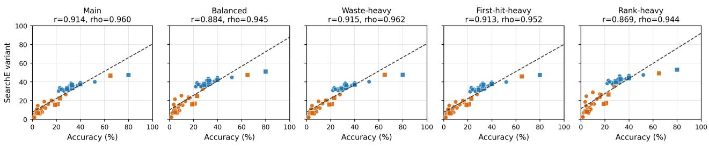  
Fi<sub>gure</sub> 8<sub>:</sub> A<sub>ccuracy–</sub>S<sub>earc</sub>hE <sub>sca</sub>tt<sub>er p</sub>l<sub>o</sub>t<sub>s un</sub>d<sub>er a</sub>lt<sub>erna</sub>ti<sub>ve</sub> S<sub>earc</sub>hE <sub>we</sub>i<sub>g</sub>ht <sub>sc</sub>h<sub>emes.</sub> Th<sub>e re</sub>l<sub>a</sub>ti<sub>ons</sub>hi<sub>p rema</sub>i<sub>ns mono</sub>t<sub>on</sub>i<sub>c across</sub> <sub>near</sub>b<sub>y</sub> <sub>we</sub>i<sub>g</sub>ht <sub>c</sub>h<sub>o</sub>i<sub>ces,</sub> <sub>suppor</sub>ti<sub>ng</sub> th<sub>e</sub> <sub>use</sub> <sub>o</sub>f S<sub>earc</sub>hE <sub>as</sub> <sub>a</sub> <sub>compac</sub>t <sub>searc</sub>h<sub>-organ</sub>i<sub>za</sub>ti<sub>on</sub> <sub>summary</sub> <sub>ra</sub>th<sub>er</sub> th<sub>an</sub> <sub>a</sub> f<sub>rag</sub>il<sub>e</sub> fitt<sub>e</sub>d score.

T<sub>a</sub>bl<sub>e</sub> 14<sub>:</sub> Di<sub>scr</sub>i<sub>m</sub>i<sub>na</sub>ti<sub>ve</sub> <sub>power</sub> <sub>o</sub>f <sub>searc</sub>h<sub>-</sub>t<sub>race</sub> <sub>me</sub>t<sub>r</sub>i<sub>cs.</sub>
<table><tr><td>Metric</td><td>d</td><td>Direction</td><td>ρ</td><td>Assessment</td></tr><tr><td>SWR SFH SCR</td><td>2.07 1.02 0.57</td><td> $\mathrm { c o r r . } < \mathrm { w r o n g }$   $\mathrm { c o r r . } > \mathrm { w r o n g }$   $\mathrm { c o r r . } < \mathrm { w r o n g }$ </td><td>-0.82 +0.71 -0.21</td><td>Strong Strong Moderate</td></tr></table>

T<sub>a</sub>bl<sub>e</sub> 15<sub>:</sub> W<sub>e</sub>i<sub>g</sub>ht <sub>sens</sub>iti<sub>v</sub>it<sub>y o</sub>f S<sub>earc</sub>hE <sub>var</sub>i<sub>an</sub>t<sub>s aga</sub>i<sub>ns</sub>t <sub>ac-</sub> <sub>curacy on non-</sub>b<sub>ase</sub>li<sub>ne</sub> LLM <sub>rows.</sub> W<sub>e</sub>i<sub>g</sub>ht<sub>s are or</sub>d<sub>ere</sub>d <sub>as</sub> <sub>wrong-</sub>b<sub>ranc</sub>h <sub>was</sub>t<sub>e,</sub> fi<sub>rs</sub>t<sub>-</sub>hit b<sub>e</sub>h<sub>av</sub>i<sub>or, an</sub>d <sub>correc</sub>t<sub>-ran</sub>k <sub>cos</sub>t<sub>.</sub>
<table><tr><td>Scheme</td><td>Weights</td><td>Pearson r</td><td>Spearman ρ</td></tr><tr><td>Main</td><td>.50/.30/.20</td><td>.914</td><td>.960</td></tr><tr><td>Balanced</td><td>.33/.33/.33</td><td>.884</td><td>.945</td></tr><tr><td>Waste-heavy</td><td>.60/.20/.20</td><td>.915</td><td>.962</td></tr><tr><td>First-hit-heavy</td><td>.40/.40/.20</td><td>.913</td><td>.952</td></tr><tr><td>Rank-heavy</td><td>.40/.20/.40</td><td>.869</td><td>.944</td></tr></table>

K<sub>a</sub>t<sub>a</sub>G<sub>o.</sub> K<sub>a</sub>t<sub>a</sub>G<sub>o</sub> i<sub>s use</sub>d <sub>as a neura</sub>l<sub>-gu</sub>id<sub>e</sub>d <sub>searc</sub>h <sub>re</sub>f<sub>-</sub> <sub>erence.</sub> W<sub>e use</sub> K<sub>a</sub>t<sub>a</sub>G<sub>o v</sub>1<sub>.</sub>16<sub>.</sub>4 <sub>w</sub>ith th<sub>e</sub> b18 <sub>ne</sub>t<sub>wor</sub>k <sub>an</sub>d <sub>a</sub> 200<sub>-v</sub>i<sub>s</sub>it b<sub>u</sub>d<sub>ge</sub>t <sub>per pro</sub>bl<sub>em un</sub>d<sub>er</sub> Chi<sub>nese ru</sub>l<sub>es,</sub> k<sub>om</sub>i 7.5, and a 19 × 19 board. The analysis configuration uses d<sub>e</sub>t<sub>erm</sub>i<sub>n</sub>i<sub>s</sub>ti<sub>c roo</sub>t b<sub>e</sub>h<sub>av</sub>i<sub>or w</sub>ith <sub>res</sub>i<sub>gna</sub>ti<sub>on</sub> di<sub>sa</sub>bl<sub>e</sub>d<sub>, no</sub> <sub>roo</sub>t <sub>no</sub>i<sub>se, an</sub>d <sub>pr</sub>i<sub>nc</sub>i<sub>pa</sub>l<sub>-var</sub>i<sub>a</sub>ti<sub>on v</sub>i<sub>s</sub>it <sub>repor</sub>ti<sub>ng ena</sub>bl<sub>e</sub>d<sub>.</sub> I<sub>n res</sub>t<sub>r</sub>i<sub>c</sub>t<sub>e</sub>d<sub>-roo</sub>t <sub>runs,</sub> th<sub>e roo</sub>t i<sub>s</sub> li<sub>m</sub>it<sub>e</sub>d t<sub>o</sub> th<sub>e</sub> b<sub>enc</sub>h<sub>mar</sub>k’<sub>s</sub> f<sub>our can</sub>did<sub>a</sub>t<sub>es;</sub> i<sub>n open-roo</sub>t <sub>runs, no suc</sub>h <sub>can</sub>did<sub>a</sub>t<sub>e re-</sub> striction is imposed. The same visit trajectory is used for <sub>s</sub>h<sub>a</sub>ll<sub>ow-</sub>b<sub>u</sub>d<sub>ge</sub>t <sub>au</sub>dit <sub>a</sub>t <sub>v</sub>i<sub>s</sub>it<sub>s</sub> 1<sub>–</sub>30<sub>.</sub>

In<sub>p</sub>ut and out<sub>p</sub>ut ma<sub>pp</sub>in<sub>g</sub>. Both references consume the <sub>norma</sub>li<sub>ze</sub>d b<sub>oar</sub>d <sub>s</sub>t<sub>a</sub>t<sub>e,</sub> <sub>no</sub>t <sub>na</sub>t<sub>ura</sub>l<sub>-</sub>l<sub>anguage</sub> <sub>puzz</sub>l<sub>e</sub> t<sub>ex</sub>t<sub>.</sub> Th<sub>e</sub> b<sub>oar</sub>d <sub>ma</sub>t<sub>r</sub>i<sub>x</sub> i<sub>s</sub> <sub>conver</sub>t<sub>e</sub>d t<sub>o</sub> th<sub>e</sub> <sub>s</sub>h<sub>are</sub>d G<sub>o</sub> <sub>coor</sub>di<sub>na</sub>t<sub>e</sub> <sub>sys</sub>t<sub>em</sub> A-T with I ski<sub>pp</sub>ed. Smar<sub>g</sub>o internall<sub>y</sub> indexes board <sub>p</sub>oints <sub>an</sub>d <sub>maps</sub> th<sub>em</sub> b<sub>ac</sub>k t<sub>o</sub> b<sub>enc</sub>h<sub>mar</sub>k <sub>coor</sub>di<sub>na</sub>t<sub>es;</sub> K<sub>a</sub>t<sub>a</sub>G<sub>o</sub> <sub>rece</sub>i<sub>ves</sub> th<sub>e</sub> <sub>same</sub> <sub>norma</sub>li<sub>ze</sub>d <sub>s</sub>t<sub>ones</sub> <sub>an</sub>d <sub>s</sub>id<sub>e-</sub>t<sub>o-p</sub>l<sub>ay</sub> i<sub>n-</sub> f<sub>orma</sub>ti<sub>on</sub> th<sub>roug</sub>h it<sub>s</sub> <sub>ana</sub>l<sub>ys</sub>i<sub>s</sub> i<sub>n</sub>t<sub>er</sub>f<sub>ace.</sub> T<sub>op-</sub>1 <sub>accuracy</sub> i<sub>s</sub> <sub>compu</sub>t<sub>e</sub>d f<sub>rom</sub> th<sub>e</sub> fi<sub>na</sub>l <sub>roo</sub>t <sub>move w</sub>ith th<sub>e</sub> l<sub>arges</sub>t <sub>v</sub>i<sub>s</sub>it <sub>coun</sub>t <sub>a</sub>ft<sub>er</sub> <sub>coor</sub>di<sub>na</sub>t<sub>e</sub> <sub>norma</sub>li<sub>za</sub>ti<sub>on.</sub> Ill<sub>ega</sub>l<sub>,</sub> <sub>occup</sub>i<sub>e</sub>d<sub>,</sub> <sub>pass,</sub> <sub>m</sub>i<sub>ss</sub>i<sub>ng, or o</sub>f<sub>-</sub>f<sub>orma</sub>t <sub>ou</sub>t<sub>pu</sub>t<sub>s are</sub> t<sub>rea</sub>t<sub>e</sub>d <sub>as non-correc</sub>t<sub>;</sub> i<sub>n</sub> <sub>res</sub>t<sub>r</sub>i<sub>c</sub>t<sub>e</sub>d<sub>-roo</sub>t <sub>runs occup</sub>i<sub>e</sub>d <sub>op</sub>ti<sub>ons are</sub> filt<sub>ere</sub>d b<sub>e</sub>f<sub>ore eva</sub>l<sub>-</sub> <sub>ua</sub>ti<sub>on.</sub>

F<sub>or</sub> <sub>me</sub>t<sub>r</sub>i<sub>c</sub> <sub>mapp</sub>i<sub>ng,</sub> S<sub>margo</sub> <sub>exposes</sub> <sub>an</sub> <sub>exp</sub>li<sub>c</sub>it fi<sub>na</sub>l MCTS tree, so TNC(k) is the number of reachable tree nodes after k playouts, with final TNC reported at $k = 2 0 0$ <sub>.</sub> K<sub>a</sub>t<sub>a</sub>G<sub>o</sub> <sub>exposes roo</sub>t <sub>s</sub>t<sub>a</sub>ti<sub>s</sub>ti<sub>cs an</sub>d <sub>pr</sub>i<sub>nc</sub>i<sub>pa</sub>l <sub>var</sub>i<sub>a</sub>ti<sub>ons ra</sub>th<sub>er</sub> th<sub>an a</sub> <sub>comp</sub>l<sub>e</sub>t<sub>e</sub> i<sub>n</sub>t<sub>erna</sub>l <sub>searc</sub>h t<sub>ree, so</sub> K<sub>a</sub>t<sub>a</sub>G<sub>o</sub> t<sub>ree-s</sub>i<sub>ze co</sub>l<sub>umns</sub> are not interpreted as internal TNC. For both references, <sub>roo</sub>t<sub>-</sub>l<sub>eve</sub>l S<sub>earc</sub>hE <sub>componen</sub>t<sub>s are compu</sub>t<sub>e</sub>d f<sub>rom</sub> th<sub>e roo</sub>t visit distributions: SWR = 1−correct root visit share, SFH indicates whether the earliest top root move is correct, SCR is d<sub>er</sub>i<sub>ve</sub>d f<sub>rom</sub> th<sub>e</sub> fi<sub>na</sub>l <sub>correc</sub>t<sub>-can</sub>did<sub>a</sub>t<sub>e ran</sub>k <sub>an</sub>d <sub>roo</sub>t b<sub>ranc</sub>h count, and SSC counts top-root switches over the 1–200 trajectory. Budget is reported as playouts for Smargo and visits f<sub>o</sub>r K<sub>a</sub>t<sub>a</sub>G<sub>o,</sub> n<sub>eve</sub>r <sub>as</sub> l<sub>a</sub>n<sub>guage</sub> t<sub>o</sub>k<sub>e</sub>n<sub>s.</sub>

Fi<sub>gure</sub> 9 <sub>s</sub>h<sub>ows a represen</sub>t<sub>a</sub>ti<sub>ve</sub> fi<sub>na</sub>l S<sub>margo</sub> t<sub>ree</sub> f<sub>or a</sub> restricted-root K = 4 problem after 200 playouts. The example is included to make the reported TNC, depth, and b<sub>ranc</sub>hi<sub>ng-</sub>f<sub>ac</sub>t<sub>or quan</sub>titi<sub>es concre</sub>t<sub>e: un</sub>lik<sub>e</sub> K<sub>a</sub>t<sub>a</sub>G<sub>o,</sub> S<sub>margo</sub> <sub>exposes</sub> th<sub>e</sub> <sub>exp</sub>li<sub>c</sub>it <sub>exp</sub>l<sub>ore</sub>d t<sub>ree,</sub> <sub>so</sub> <sub>eac</sub>h <sub>no</sub>d<sub>e-coun</sub>t <sub>s</sub>t<sub>a</sub>ti<sub>s-</sub> ti<sub>c</sub> i<sub>s</sub> <sub>compu</sub>t<sub>e</sub>d f<sub>rom</sub> th<sub>e</sub> <sub>save</sub>d MCTS t<sub>ree</sub> <sub>ra</sub>th<sub>er</sub> th<sub>an</sub> i<sub>n</sub>f<sub>erre</sub>d f<sub>rom</sub> <sub>pr</sub>i<sub>nc</sub>i<sub>pa</sub>l <sub>var</sub>i<sub>a</sub>ti<sub>ons.</sub>

S<sub>earc</sub>h<sub>-re</sub>f<sub>erence</sub> b<sub>u</sub>d<sub>ge</sub>t<sub>s are</sub> k<sub>ep</sub>t i<sub>n</sub> th<sub>e</sub>i<sub>r na</sub>ti<sub>ve un</sub>it<sub>s:</sub> <sub>p</sub>l<sub>ayou</sub>t<sub>s</sub> f<sub>o</sub>r Sm<sub>a</sub>r<sub>go, v</sub>i<sub>s</sub>it<sub>s</sub> f<sub>o</sub>r K<sub>a</sub>t<sub>a</sub>G<sub>o, a</sub>nd t<sub>o</sub>k<sub>e</sub>n<sub>s</sub> f<sub>o</sub>r LLM<sub>s.</sub> Th<sub>e</sub> m<sub>a</sub>in n<sub>o</sub>n<sub>-</sub>LLM <sub>se</sub>ttin<sub>g</sub> <sub>uses</sub> 200 <sub>p</sub>l<sub>ayou</sub>t<sub>s</sub> <sub>o</sub>r <sub>v</sub>i<sub>s</sub>it<sub>s</sub> <sub>pe</sub>r <sub>pro</sub>bl<sub>em;</sub> <sub>sma</sub>ll<sub>er</sub> i<sub>n</sub>t<sub>erme</sub>di<sub>a</sub>t<sub>e</sub> b<sub>u</sub>d<sub>ge</sub>t<sub>s</sub> <sub>are</sub> <sub>re</sub>t<sub>a</sub>i<sub>ne</sub>d <sub>on</sub>l<sub>y</sub> f<sub>or</sub> trajectory analysis and are not used as separate evaluation <sub>me</sub>t<sub>r</sub>i<sub>cs.</sub>

## G Prom<sub>p</sub>t Tem<sub>p</sub>lates

W<sub>e</sub> i<sub>nc</sub>l<sub>u</sub>d<sub>e</sub> f<sub>a</sub>ithf<sub>u</sub>l t<sub>emp</sub>l<sub>a</sub>t<sub>es o</sub>f th<sub>e</sub> Chi<sub>nese</sub> t<sub>as</sub>k <sub>promp</sub>t<sub>s</sub> <sub>use</sub>d f<sub>or</sub> <sub>eva</sub>l<sub>ua</sub>t<sub>e</sub>d <sub>mo</sub>d<sub>e</sub>l<sub>s.</sub> Th<sub>e</sub> <sub>ex</sub>t<sub>rac</sub>ti<sub>on</sub> <sub>promp</sub>t i<sub>s</sub> <sub>a</sub>l<sub>rea</sub>d<sub>y</sub> d<sub>escr</sub>ib<sub>e</sub>d i<sub>n</sub> A<sub>ppen</sub>di<sub>x</sub> C<sub>;</sub> h<sub>ere we repor</sub>t <sub>on</sub>l<sub>y</sub> th<sub>e</sub> t<sub>wo</sub> t<sub>as</sub>k <sub>promp</sub>t<sub>s use</sub>d f<sub>or</sub> b<sub>oun</sub>d<sub>e</sub>d <sub>can</sub>did<sub>a</sub>t<sub>e</sub> di<sub>scr</sub>i<sub>m</sub>i<sub>na</sub>ti<sub>on an</sub>d <sub>open</sub> fi<sub>rs</sub>t<sub>-move genera</sub>ti<sub>on.</sub>

## Bo<sub>u</sub>nded candidate tem<sub>p</sub>late<sub>.</sub>

Y<sub>ou</sub> <sub>are</sub> <sub>a</sub> t<sub>op-</sub>l<sub>eve</sub>l G<sub>o</sub> <sub>mas</sub>t<sub>er.</sub> Pl<sub>ease</sub> <sub>care</sub>f<sub>u</sub>ll<sub>y</sub> <sub>ana</sub>l<sub>yze</sub> thi<sub>s</sub> G<sub>o</sub> lif<sub>e-an</sub>d<sub>-</sub>d<sub>ea</sub>th <sub>pro</sub>bl<sub>em,</sub> <sub>reason</sub> d<sub>eep</sub>l<sub>y,</sub> <sub>an</sub>d <sub>c</sub>h<sub>oose</sub> th<sub>e</sub> <sub>op</sub>ti<sub>ma</sub>l fi<sub>rs</sub>t <sub>move</sub> f<sub>or</sub> Bl<sub>ac</sub>k f<sub>rom</sub> th<sub>e g</sub>i<sub>ven op</sub>ti<sub>ons.</sub> Th<sub>e</sub> i<sub>npu</sub>t th<sub>en</sub> <sub>prov</sub>id<sub>es</sub> <sub>one</sub> <sub>or</sub> <sub>more</sub> b<sub>oar</sub>d <sub>presen</sub>t<sub>a</sub>ti<sub>ons:</sub> <sub>coor-</sub> di<sub>na</sub>t<sub>e</sub> li<sub>s</sub>t<sub>s, a numer</sub>i<sub>c</sub> b<sub>oar</sub>d <sub>ma</sub>t<sub>r</sub>i<sub>x, a ren</sub>d<sub>ere</sub>d b<sub>oar</sub>d i<sub>mage,</sub> <sub>or</sub> th<sub>e</sub>i<sub>r com</sub>bi<sub>na</sub>ti<sub>ons.</sub> Th<sub>e promp</sub>t li<sub>s</sub>t<sub>s</sub> th<sub>e can</sub>did<sub>a</sub>t<sub>e moves</sub> as A. <coord>, B. <coord>, . . . . Please think ste<sub>p</sub> b<sub>y</sub> <sub>s</sub>t<sub>ep</sub> <sub>a</sub>b<sub>ou</sub>t th<sub>e</sub> <sub>con</sub>ti<sub>nua</sub>ti<sub>ons</sub> <sub>a</sub>ft<sub>er</sub> <sub>eac</sub>h <sub>op</sub>ti<sub>on,</sub> <sub>an</sub>d fi<sub>na</sub>ll<sub>y</sub> <sub>s</sub>t<sub>a</sub>t<sub>e</sub> <sub>your</sub> <sub>answer</sub> <sub>c</sub>l<sub>ear</sub>l<sub>y.</sub> A<sub>nswer</sub> f<sub>orma</sub>t<sub>:</sub> <sub>a</sub>t th<sub>e</sub> <sub>en</sub>d<sub>,</sub> <sub>ex-</sub> <sub>p</sub>li<sub>c</sub>itl<sub>y</sub> <sub>wr</sub>it<sub>e</sub> “<sub>answer</sub> i<sub>s</sub> X”<sub>,</sub> <sub>w</sub>h<sub>ere</sub> X i<sub>s</sub> <sub>one</sub> <sub>o</sub>f th<sub>e</sub> <sub>op</sub>ti<sub>on</sub> l<sub>a</sub>b<sub>e</sub>l<sub>s.</sub>

T<sub>a</sub>bl<sub>e</sub> 16<sub>:</sub> R<sub>epro</sub>d<sub>uc</sub>ibilit <sub>summar</sub> f<sub>or mo</sub>d<sub>e</sub>l <sub>eva</sub>l<sub>ua</sub>ti<sub>ons.</sub> P<sub>rov</sub>id<sub>er names</sub> f<sub>o</sub>ll<sub>ow</sub> th<sub>e ma</sub>i<sub>n exper</sub>i<sub>men</sub>t<sub>a</sub>l <sub>se</sub>t<sub>up;</sub> t<sub>empera</sub>t<sub>ure an</sub>d <sub>ou</sub>t<sub>pu</sub>t b<sub>u</sub>d<sub>ge</sub>t<sub>s summar</sub>i<sub>ze</sub> th<sub>e eva</sub>l<sub>ua</sub>t<sub>e</sub>d <sub>run</sub> f<sub>am</sub>ili<sub>es.</sub>
<table><tr><td>Model family</td><td>Provider</td><td>Modalities</td><td>Temp.</td><td>Max output</td></tr><tr><td>Kimi-K2.5</td><td>Moonshot AI</td><td>S/G/S+G</td><td>0.7</td><td>32k</td></tr><tr><td>Qwen3-VL-235B-Thinking</td><td>Alibaba/Qwen</td><td> $\mathrm { S } / \mathrm { G } / \mathrm { V } / \mathrm { S } + \mathrm { V } / \mathrm { S } + \mathrm { G }$ </td><td>0.7</td><td>32k</td></tr><tr><td>Qwen3-VL-30B-Thinking</td><td>self-hosted vLLM</td><td> $\mathrm { S } / \mathrm { G } / \mathrm { V } / \mathrm { S } + \mathrm { V } / \mathrm { S } + \mathrm { G }$ </td><td>0.5–0.7</td><td>30k-32k</td></tr><tr><td> $\mathbf { M i n i M a x - M } 2 . 5$ </td><td>MiniMax</td><td>S/G/S+G</td><td>0.7</td><td>32k</td></tr><tr><td>DeepSeek-R1-0528</td><td>DeepSeek</td><td>S/G/S+G</td><td>0.7</td><td>32k</td></tr><tr><td>DeepSeek-V3.2</td><td>DeepSeek</td><td>S/G/S+G</td><td>0.7</td><td>32k</td></tr><tr><td>GLM-4.6V</td><td>Zhipu AI</td><td> $\mathrm { S } / \mathrm { G } / \mathrm { V } / \mathrm { S } + \mathrm { V } / \mathrm { S } + \mathrm { G }$ </td><td>0.7</td><td>32k</td></tr><tr><td>Gemini-2.5 family</td><td>Google</td><td> $\mathrm { S } / \mathrm { G } / \mathrm { V } / \mathrm { S } + \mathrm { V } / \mathrm { S } + \mathrm { G }$ </td><td>0-default</td><td></td></tr><tr><td>Gemini-3 family</td><td>Google</td><td> $\mathrm { S } / \mathrm { G } / \mathrm { V } / \mathrm { S } + \mathrm { V } / \mathrm { S } + \mathrm { G }$ </td><td>0-default</td><td></td></tr></table>

T<sub>a</sub>bl<sub>e</sub> 17<sub>:</sub> R<sub>epro</sub>d<sub>uc</sub>ibl<sub>e</sub> <sub>non-</sub>LLM <sub>searc</sub>h<sub>-re</sub>f<sub>erence</sub> <sub>se</sub>tti<sub>ngs.</sub>
<table><tr><td>Method</td><td>Search type</td><td>Root mode</td><td>Budget</td><td>N</td><td>Output used</td></tr><tr><td>Smargo MCTS/UCT</td><td>unguided MCTS/UCT</td><td> $K = 4$ </td><td>200 playouts</td><td>300</td><td>root distribution + full tree</td></tr><tr><td>Smargo MCTS/UCT</td><td>unguided MCTS/UCT</td><td>open</td><td>200 playouts</td><td>300</td><td>root  $\mathrm { d i s t r i b u t i o n + f u l l t r e e }$ </td></tr><tr><td>KataGo b18</td><td>neural-guided search</td><td> $K = 4$ </td><td>200 visits</td><td>300</td><td>root distribution + principal variations</td></tr><tr><td>KataGo b18</td><td>neural-guided search</td><td>open</td><td>200 visits</td><td>300</td><td>root distribution + principal variations</td></tr></table>

## O<sub>p</sub>en-search tem<sub>p</sub>late.

Y<sub>ou are a</sub> t<sub>op-</sub>l<sub>eve</sub>l G<sub>o mas</sub>t<sub>er.</sub> Pl<sub>ease care</sub>f<sub>u</sub>ll<sub>y ana</sub>l<sub>yze</sub> thi<sub>s</sub> G<sub>o</sub> lif<sub>e-an</sub>d<sub>-</sub>d<sub>ea</sub>th <sub>pro</sub>bl<sub>em, reason</sub> d<sub>eep</sub>l<sub>y, an</sub>d fi<sub>n</sub>d th<sub>e op-</sub> ti<sub>ma</sub>l fi<sub>rs</sub>t <sub>move</sub> f<sub>or</sub> th<sub>e s</sub>id<sub>e</sub> t<sub>o p</sub>l<sub>ay.</sub> Th<sub>e</sub> i<sub>npu</sub>t th<sub>en prov</sub>id<sub>es</sub> <sub>one or more</sub> b<sub>oar</sub>d <sub>presen</sub>t<sub>a</sub>ti<sub>ons: coor</sub>di<sub>na</sub>t<sub>e</sub> li<sub>s</sub>t<sub>s, a numer</sub>i<sub>c</sub> b<sub>oar</sub>d <sub>ma</sub>t<sub>r</sub>i<sub>x, a ren</sub>d<sub>ere</sub>d b<sub>oar</sub>d i<sub>mage, or</sub> th<sub>e</sub>i<sub>r com</sub>bi<sub>na-</sub> ti<sub>ons.</sub> N<sub>o can</sub>did<sub>a</sub>t<sub>e moves are prov</sub>id<sub>e</sub>d<sub>.</sub> Pl<sub>ease</sub> thi<sub>n</sub>k <sub>s</sub>t<sub>ep</sub> b<sub>y</sub> <sub>s</sub>t<sub>ep</sub> <sub>a</sub>b<sub>ou</sub>t <sub>poss</sub>ibl<sub>e</sub> <sub>moves</sub> <sub>an</sub>d th<sub>e</sub>i<sub>r</sub> <sub>con</sub>ti<sub>nua</sub>ti<sub>ons,</sub> <sub>an</sub>d fi<sub>na</sub>ll<sub>y s</sub>t<sub>a</sub>t<sub>e your answer c</sub>l<sub>ear</sub>l<sub>y.</sub> A<sub>nswer</sub> f<sub>orma</sub>t<sub>: a</sub>t th<sub>e en</sub>d<sub>,</sub> <sub>exp</sub>li<sub>c</sub>itl<sub>y wr</sub>it<sub>e</sub> “<sub>answer</sub> i<sub>s</sub> X”<sub>, w</sub>h<sub>ere</sub> X i<sub>s a</sub> b<sub>oar</sub>d <sub>coor</sub>di<sub>na</sub>t<sub>e</sub> such as T18.

E<sub>xamp</sub>l<sub>e</sub> b<sub>oun</sub>d<sub>e</sub>d <sub>response.</sub> Th<sub>e</sub> f<sub>o</sub>ll<sub>ow</sub>i<sub>ng</sub> ill<sub>us</sub>t<sub>ra</sub>t<sub>es</sub> th<sub>e</sub> <sub>expec</sub>t<sub>e</sub>d <sub>response s</sub>t<sub>y</sub>l<sub>e:</sub> f<sub>ree-</sub>f<sub>orm reason</sub>i<sub>ng</sub> f<sub>o</sub>ll<sub>owe</sub>d b<sub>y an</sub> <sub>exp</sub>li<sub>c</sub>it fi<sub>na</sub>l <sub>op</sub>ti<sub>on</sub> l<sub>a</sub>b<sub>e</sub>l<sub>.</sub>

O<sub>p</sub>ti<sub>on</sub> A <sub>p</sub>l<sub>ays</sub> di<sub>rec</sub>tl<sub>y</sub> <sub>a</sub>t th<sub>e</sub> <sub>v</sub>it<sub>a</sub>l <sub>po</sub>i<sub>n</sub>t <sub>an</sub>d l<sub>eaves</sub> Whit<sub>e</sub> <sub>w</sub>ith<sub>ou</sub>t <sub>enoug</sub>h <sub>eye space a</sub>ft<sub>er</sub> th<sub>e</sub> l<sub>oca</sub>l <sub>rep</sub>l<sub>y.</sub> O<sub>p</sub>ti<sub>on</sub> B l<sub>e</sub>t<sub>s</sub> Whit<sub>e connec</sub>t <sub>an</sub>d k<sub>eep</sub> lib<sub>er</sub>ti<sub>es, so</sub> Bl<sub>ac</sub>k l<sub>oses</sub> th<sub>e</sub> f<sub>orc</sub>i<sub>ng</sub> <sub>sequence.</sub> O<sub>p</sub>ti<sub>ons</sub> C <sub>an</sub>d D <sub>are</sub> f<sub>ar</sub>th<sub>er</sub> f<sub>rom</sub> th<sub>e eye-s</sub>h<sub>ape</sub> <sub>wea</sub>k<sub>ness an</sub>d d<sub>o no</sub>t <sub>so</sub>l<sub>ve</sub> th<sub>e</sub> l<sub>oca</sub>l lif<sub>e-an</sub>d<sub>-</sub>d<sub>ea</sub>th <sub>pro</sub>bl<sub>em.</sub> Th<sub>ere</sub>f<sub>ore</sub> th<sub>e s</sub>t<sub>ronges</sub>t fi<sub>rs</sub>t <sub>move</sub> i<sub>s op</sub>ti<sub>on</sub> A<sub>.</sub> A<sub>nswer</sub> i<sub>s</sub> A<sub>.</sub>

## H Ex<sub>a</sub>m<sub>p</sub>l<sub>e</sub> R<sub>espo</sub>n<sub>ses a</sub>nd Extr<sub>ac</sub>t<sub>e</sub>d Tr<sub>ees</sub>

W<sub>e repor</sub>t <sub>e</sub>i<sub>g</sub>ht <sub>represen</sub>t<sub>a</sub>ti<sub>ve au</sub>dit<sub>e</sub>d <sub>process-</sub>t<sub>ree examp</sub>l<sub>es</sub> from the bounded K = 4 candidate interface. The cases are labeled as K-4-E-<id>-<model> and are chosen to <sub>p</sub>l<sub>ace</sub> <sub>one</sub> <sub>mo</sub>d<sub>e</sub>l<sub>-</sub>f<sub>am</sub>il<sub>y</sub> <sub>examp</sub>l<sub>e</sub> i<sub>n</sub> <sub>eac</sub>h <sub>pane</sub>l <sub>o</sub>f <sub>a</sub> <sub>s</sub>i<sub>ng</sub>l<sub>e-</sub> <sub>page mon</sub>t<sub>age.</sub> E<sub>ac</sub>h <sub>pane</sub>l <sub>s</sub>h<sub>ows</sub> th<sub>e</sub> fi<sub>na</sub>l <sub>ex</sub>t<sub>rac</sub>t<sub>e</sub>d t<sub>ree</sub> f<sub>or</sub> <sub>one</sub> <sub>mo</sub>d<sub>e</sub>l <sub>response,</sub> t<sub>oge</sub>th<sub>er</sub> <sub>w</sub>ith th<sub>e</sub> <sub>se</sub>l<sub>ec</sub>t<sub>e</sub>d <sub>op</sub>ti<sub>on</sub> <sub>an</sub>d <sub>ver</sub>ifi<sub>e</sub>d <sub>answer.</sub>

Th<sub>e</sub> r<sub>esu</sub>ltin<sub>g</sub> <sub>cases</sub> <sub>expose</sub> <sub>seve</sub>r<sub>a</sub>l r<sub>ecu</sub>rrin<sub>g</sub> <sub>pa</sub>tt<sub>e</sub>rn<sub>s.</sub> C<sub>o</sub>r<sub>-</sub> <sub>rec</sub>t t<sub>races may</sub> b<sub>e s</sub>h<sub>or</sub>t <sub>w</sub>h<sub>en</sub> th<sub>e</sub> k<sub>ey</sub> fi<sub>rs</sub>t <sub>move</sub> i<sub>s</sub> i<sub>n</sub>t<sub>ro</sub>d<sub>uce</sub>d i<sub>mme</sub>di<sub>a</sub>t<sub>e</sub>l<sub>y, or</sub> l<sub>onger w</sub>h<sub>en</sub> th<sub>e mo</sub>d<sub>e</sub>l <sub>exp</sub>li<sub>c</sub>itl<sub>y ver</sub>ifi<sub>es sev-</sub> <sub>era</sub>l l<sub>oca</sub>l <sub>rep</sub>li<sub>es</sub> b<sub>e</sub>f<sub>ore</sub> <sub>c</sub>h<sub>oos</sub>i<sub>ng.</sub> W<sub>rong</sub> t<sub>races</sub> <sub>are</sub> <sub>o</sub>ft<sub>en</sub> <sub>s</sub>till <sub>s</sub>t<sub>ruc</sub>t<sub>ure</sub>d<sub>:</sub> th<sub>ey</sub> <sub>men</sub>ti<sub>on</sub> th<sub>e</sub> <sub>correc</sub>t <sub>reg</sub>i<sub>on</sub> b<sub>u</sub>t <sub>e</sub>ith<sub>er</sub> <sub>a</sub>tt<sub>ac</sub>h the terminal judgment to the wrong branch, drift in coordi-<sub>na</sub>t<sub>e recons</sub>t<sub>ruc</sub>ti<sub>on, or accep</sub>t <sub>a</sub> l<sub>oca</sub>l <sub>eye-s</sub>h<sub>ape c</sub>l<sub>a</sub>i<sub>m</sub> th<sub>a</sub>t d<sub>oes</sub> <sub>no</sub>t <sub>ma</sub>t<sub>c</sub>h th<sub>e</sub> <sub>ver</sub>ifi<sub>e</sub>d <sub>answer.</sub> Thi<sub>s</sub> i<sub>s</sub> <sub>w</sub>h<sub>y</sub> th<sub>e</sub> <sub>process</sub> t<sub>ree</sub> i<sub>s use</sub>f<sub>u</sub>l b<sub>eyon</sub>d fi<sub>na</sub>l <sub>accuracy:</sub> it <sub>recor</sub>d<sub>s w</sub>h<sub>ere</sub> th<sub>e</sub> <sub>v</sub>i<sub>s</sub>ibl<sub>e</sub> <sub>searc</sub>h <sub>pa</sub>th l<sub>oses</sub> <sub>a</sub>li<sub>gnmen</sub>t <sub>w</sub>ith th<sub>e</sub> <sub>answer</sub> k<sub>ey.</sub>

Table 18: Displayed K = 4 extracted-tree cases. The case l<sub>a</sub>b<sub>e</sub>l<sub>s</sub> f<sub>o</sub>ll<sub>ow</sub> $\mathrm { K } { - } 4 { - } \mathrm { E } { - } { < } \mathrm { i } \mathrm { d } { > } { - } { < } \mathrm { m o d e } { 1 > }$
<table><tr><td>Case</td><td>Tier Model</td><td></td><td>Outcome Correct</td><td></td></tr><tr><td>K-4-E-001 Easy</td><td></td><td>Qwen3-30B</td><td>wrong</td><td>T15</td></tr><tr><td>K-4-E-002 Easy</td><td></td><td>Kimi-K2.5</td><td>correct</td><td>P14</td></tr><tr><td></td><td></td><td>K-4-E-003 Easy MiniMax-M2.5</td><td>wrong</td><td>T13</td></tr><tr><td></td><td></td><td>K-4-E-004 Easy DeepSeek-V3.2</td><td>correct</td><td>P15</td></tr><tr><td></td><td></td><td>K-4-E-005 Easy DeepSeek-R1</td><td>correct</td><td>T15</td></tr><tr><td>K-4-E-006 Easy</td><td></td><td>GLM-4.6V</td><td>correct</td><td>S13</td></tr><tr><td>K-4-E-007 Easy Qwen3-VL</td><td></td><td></td><td>correct</td><td>S17</td></tr><tr><td></td><td></td><td>K-4-E-008 Easy Gemini-2.5-Pro correct</td><td></td><td>T13</td></tr></table>

## J Domain-S<sub>p</sub>ecialized Model: Lo<sub>g</sub>os

W<sub>e</sub> d<sub>o no</sub>t i<sub>nc</sub>l<sub>u</sub>d<sub>e</sub> L<sub>ogos</sub> i<sub>n</sub> th<sub>e quan</sub>tit<sub>a</sub>ti<sub>ve</sub> t<sub>a</sub>bl<sub>es</sub> b<sub>ecause</sub> th<sub>e ava</sub>il<sub>a</sub>bl<sub>e se</sub>t<sub>up</sub> d<sub>oes no</sub>t <sub>prov</sub>id<sub>e ou</sub>t<sub>pu</sub>t<sub>s un</sub>d<sub>er</sub> th<sub>e same</sub> <sub>promp</sub>t <sub>an</sub>d <sub>response</sub> f<sub>orma</sub>t<sub>.</sub> Th<sub>e</sub> <sub>qua</sub>lit<sub>a</sub>ti<sub>ve</sub> di<sub>s</sub>ti<sub>nc</sub>ti<sub>on</sub> i<sub>s</sub> <sub>s</sub>till i<sub>mpor</sub>t<sub>an</sub>t<sub>: a</sub> G<sub>o-spec</sub>i<sub>a</sub>li<sub>ze</sub>d <sub>po</sub>li<sub>cy mo</sub>d<sub>e</sub>l <sub>may ou</sub>t<sub>pu</sub>t <sub>p</sub>l<sub>aus</sub>ibl<sub>e</sub> <sub>w</sub>h<sub>o</sub>l<sub>e-game</sub> <sub>moves</sub> <sub>w</sub>hil<sub>e</sub> f<sub>a</sub>ili<sub>ng</sub> <sub>a</sub>t l<sub>oca</sub>l lif<sub>e-an</sub>d<sub>-</sub> death search because the objective is not merely to continue th<sub>e game,</sub> b<sub>u</sub>t t<sub>o organ</sub>i<sub>ze a</sub>d<sub>versar</sub>i<sub>a</sub>l f<sub>orc</sub>i<sub>ng</sub> li<sub>nes aroun</sub>d lif<sub>e,</sub> d<sub>ea</sub>th<sub>, cap</sub>t<sub>ure, an</sub>d <sub>eye-s</sub>h<sub>ape cons</sub>t<sub>ra</sub>i<sub>n</sub>t<sub>s.</sub>

Fi<sub>gure</sub> 11 <sub>s</sub>h<sub>ows</sub> <sub>a</sub> <sub>manua</sub>l <sub>pro</sub>b<sub>e</sub> <sub>us</sub>i<sub>ng</sub> th<sub>e</sub> fi<sub>rs</sub>t b<sub>enc</sub>h<sub>mar</sub>k <sub>pro</sub>bl<sub>em</sub> i<sub>n</sub> th<sub>e</sub> <sub>on</sub>li<sub>ne</sub> L<sub>ogos</sub> i<sub>n</sub>t<sub>er</sub>f<sub>ace.</sub> F<sub>or</sub> thi<sub>s</sub> <sub>pro</sub>bl<sub>em,</sub> the verified answer set is P15 or the e<sub>q</sub>uivalent first move N14, as shown in A<sub>pp</sub>endix 4. Lo<sub>g</sub>os instead returns R4, <sub>an</sub>d it<sub>s exp</sub>l<sub>ana</sub>ti<sub>on</sub> i<sub>s</sub> f<sub>rame</sub>d <sub>as or</sub>di<sub>nary game con</sub>ti<sub>nua</sub>ti<sub>on</sub> <sub>an</sub>d <sub>pos</sub>iti<sub>ona</sub>l <sub>commen</sub>t<sub>ary ra</sub>th<sub>er</sub> th<sub>an as a</sub> l<sub>oca</sub>l lif<sub>e-an</sub>d<sub>-</sub> d<sub>ea</sub>th <sub>so</sub>l<sub>u</sub>ti<sub>on.</sub> It di<sub>scusses g</sub>l<sub>o</sub>b<sub>a</sub>l <sub>s</sub>t<sub>reng</sub>th <sub>an</sub>d f<sub>o</sub>ll<sub>ow-up</sub> direction, but does not identify the local live-or-kill objective, <sub>enumera</sub>t<sub>e can</sub>did<sub>a</sub>t<sub>e</sub> fi<sub>rs</sub>t <sub>moves, or ver</sub>if<sub>y</sub> f<sub>orc</sub>i<sub>ng rep</sub>li<sub>es.</sub> Thi<sub>s</sub> <sub>case</sub> i<sub>s</sub> <sub>no</sub>t <sub>use</sub>d <sub>as</sub> <sub>a</sub> <sub>quan</sub>tit<sub>a</sub>ti<sub>ve</sub> <sub>resu</sub>lt<sub>;</sub> it ill<sub>us</sub>t<sub>ra</sub>t<sub>es</sub> <sub>w</sub>h<sub>y</sub> <sub>a</sub> d<sub>oma</sub>i<sub>n-spec</sub>i<sub>a</sub>li<sub>ze</sub>d G<sub>o</sub> i<sub>n</sub>t<sub>er</sub>f<sub>ace</sub> i<sub>s</sub> <sub>no</sub>t <sub>au</sub>t<sub>oma</sub>ti<sub>ca</sub>ll<sub>y</sub> <sub>compara</sub>bl<sub>e</sub> t<sub>o</sub> T<sub>su</sub>GO <sub>un</sub>l<sub>ess</sub> it<sub>s promp</sub>t<sub>, answer</sub> f<sub>orma</sub>t<sub>, an</sub>d t<sub>race ex</sub>t<sub>rac</sub>ti<sub>on are a</sub>li<sub>gne</sub>d <sub>w</sub>ith l<sub>oca</sub>l t<sub>sumego so</sub>l<sub>v</sub>i<sub>ng.</sub>

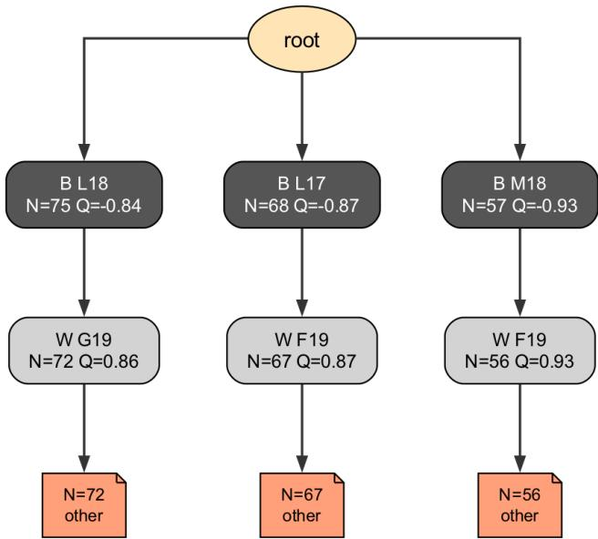  
Fi<sub>gu</sub>r<sub>e</sub> 9<sub>:</sub> R<sub>ep</sub>r<sub>ese</sub>nt<sub>a</sub>ti<sub>ve</sub> Sm<sub>a</sub>r<sub>go</sub> MCTS/UCT tr<sub>ee</sub> f<sub>o</sub>r <sub>a</sub> restricted-root K = 4 problem after 200 playouts. The same trajectory format is used to compute MCTS tree-size diagnostics such as TNC(200), maximum depth, and maximum b<sub>ranc</sub>hi<sub>ng</sub> f<sub>ac</sub>t<sub>or.</sub>

## K F<sub>a</sub>il<sub>ure</sub> A<sub>na</sub>l<sub>ys</sub>i<sub>s</sub>

W<sub>e au</sub>dit <sub>wrong answers w</sub>ith <sub>a</sub> b<sub>a</sub>l<sub>ance</sub>d <sub>s</sub>li<sub>ce across mo</sub>d<sub>e</sub>l families, dificulty tiers, and both K = 4 and open-search i<sub>n</sub>t<sub>er</sub>f<sub>aces.</sub> Fi<sub>gure</sub> 12 <sub>summar</sub>i<sub>zes</sub> th<sub>e</sub> d<sub>om</sub>i<sub>nan</sub>t <sub>error</sub> <sub>sources.</sub> Th<sub>e</sub> l<sub>arges</sub>t <sub>ca</sub>t<sub>egor</sub>i<sub>es are searc</sub>h<sub>-organ</sub>i<sub>za</sub>ti<sub>on</sub> f<sub>a</sub>il<sub>ures ra</sub>th<sub>er</sub> th<sub>an sur</sub>f<sub>ace presen</sub>t<sub>a</sub>ti<sub>on errors:</sub> th<sub>e so</sub>l<sub>ver e</sub>ith<sub>er never en</sub>t<sub>ers</sub> th<sub>e correc</sub>t l<sub>oca</sub>l b<sub>ranc</sub>h<sub>, accep</sub>t<sub>s a wea</sub>k l<sub>oca</sub>l li<sub>ne as</sub> d<sub>ec</sub>i<sub>s</sub>i<sub>ve,</sub> <sub>or</sub> d<sub>r</sub>ift<sub>s</sub> f<sub>rom</sub> th<sub>e</sub> i<sub>n</sub>t<sub>en</sub>d<sub>e</sub>d <sub>coor</sub>di<sub>na</sub>t<sub>e an</sub>d b<sub>oar</sub>d <sub>s</sub>t<sub>a</sub>t<sub>e.</sub>

Th<sub>e</sub> di<sub>s</sub>t<sub>r</sub>ib<sub>u</sub>ti<sub>on sugges</sub>t<sub>s a</sub> l<sub>ayere</sub>d f<sub>a</sub>il<sub>ure s</sub>t<sub>ruc</sub>t<sub>ure.</sub> At th<sub>e</sub> <sub>percep</sub>t<sub>ua</sub>l l<sub>ayer, v</sub>i<sub>sua</sub>l <sub>groun</sub>di<sub>ng errors ar</sub>i<sub>se w</sub>h<sub>en</sub> th<sub>e po-</sub> <sub>s</sub>iti<sub>on</sub> i<sub>s enco</sub>d<sub>e</sub>d <sub>w</sub>ith <sub>an</sub> i<sub>ncorrec</sub>t <sub>s</sub>t<sub>one, co</sub>l<sub>or, or occupancy</sub> <sub>re</sub>l<sub>a</sub>ti<sub>on;</sub> th<sub>ese</sub> <sub>errors</sub> <sub>are</sub> <sub>compara</sub>ti<sub>ve</sub>l<sub>y</sub> i<sub>n</sub>f<sub>requen</sub>t<sub>,</sub> b<sub>u</sub>t th<sub>ey</sub> <sub>po</sub>i<sub>son</sub> <sub>a</sub>ll l<sub>a</sub>t<sub>er</sub> t<sub>ac</sub>ti<sub>ca</sub>l <sub>compu</sub>t<sub>a</sub>ti<sub>on</sub> b<sub>ecause</sub> th<sub>e</sub> <sub>so</sub>l<sub>ver</sub> i<sub>s</sub> <sub>rea-</sub> <sub>son</sub>i<sub>ng</sub> <sub>over</sub> th<sub>e</sub> <sub>wrong</sub> l<sub>oca</sub>l <sub>s</sub>t<sub>a</sub>t<sub>e.</sub> At th<sub>e</sub> <sub>s</sub>t<sub>a</sub>t<sub>e-compu</sub>t<sub>a</sub>ti<sub>on</sub> l<sub>ayer, coor</sub>di<sub>na</sub>t<sub>e</sub>/<sub>s</sub>t<sub>a</sub>t<sub>e</sub> d<sub>r</sub>ift <sub>re</sub>fl<sub>ec</sub>t<sub>s</sub> f<sub>a</sub>il<sub>ures</sub> t<sub>o ma</sub>i<sub>n</sub>t<sub>a</sub>i<sub>n</sub> lib<sub>-</sub> erties, adjacency, captures, or coordinate identities across <sub>a mu</sub>lti<sub>-s</sub>t<sub>ep</sub> li<sub>ne.</sub> Th<sub>ese cases are no</sub>t <sub>s</sub>i<sub>mp</sub>l<sub>y no</sub>t<sub>a</sub>ti<sub>on m</sub>i<sub>s-</sub> t<sub>a</sub>k<sub>es:</sub> th<sub>ey</sub> i<sub>n</sub>di<sub>ca</sub>t<sub>e</sub> th<sub>a</sub>t th<sub>e</sub> i<sub>n</sub>t<sub>erna</sub>l b<sub>oar</sub>d <sub>up</sub>d<sub>a</sub>t<sub>e</sub> i<sub>s</sub> <sub>no</sub> l<sub>onger</sub> <sub>sync</sub>h<sub>ron</sub>i<sub>ze</sub>d <sub>w</sub>ith th<sub>e can</sub>did<sub>a</sub>t<sub>e sequence</sub> b<sub>e</sub>i<sub>ng eva</sub>l<sub>ua</sub>t<sub>e</sub>d<sub>.</sub>

At th<sub>e searc</sub>h l<sub>ayer, correc</sub>t<sub>-</sub>b<sub>ranc</sub>h <sub>a</sub>b<sub>sence an</sub>d <sub>open-</sub> <sub>searc</sub>h dif<sub>us</sub>i<sub>on expose</sub> t<sub>wo comp</sub>l<sub>emen</sub>t<sub>ary wea</sub>k<sub>nesses.</sub> I<sub>n</sub> th<sub>e</sub> b<sub>oun</sub>d<sub>e</sub>d i<sub>n</sub>t<sub>er</sub>f<sub>ace,</sub> th<sub>e correc</sub>t <sub>can</sub>did<sub>a</sub>t<sub>e may</sub> b<sub>e ava</sub>il<sub>-</sub> <sub>a</sub>bl<sub>e</sub> b<sub>u</sub>t <sub>no</sub>t t<sub>rea</sub>t<sub>e</sub>d <sub>as</sub> th<sub>e ma</sub>i<sub>n</sub> t<sub>ac</sub>ti<sub>ca</sub>l b<sub>ranc</sub>h<sub>.</sub> I<sub>n</sub> th<sub>e open</sub> i<sub>n</sub>t<sub>er</sub>f<sub>ace,</sub> th<sub>e mo</sub>d<sub>e</sub>l <sub>o</sub>ft<sub>en expan</sub>d<sub>s many p</sub>l<sub>aus</sub>ibl<sub>e-</sub>l<sub>oo</sub>ki<sub>ng</sub> <sub>moves w</sub>ith<sub>ou</sub>t <sub>converg</sub>i<sub>ng</sub> t<sub>o</sub> th<sub>e v</sub>it<sub>a</sub>l <sub>po</sub>i<sub>n</sub>t<sub>, w</sub>hi<sub>c</sub>h <sub>pro</sub>d<sub>uces</sub> breadth without a decisive local objective. Finally, weak-line <sub>accep</sub>t<sub>ance an</sub>d b<sub>ranc</sub>h <sub>a</sub>b<sub>an</sub>d<sub>onmen</sub>t <sub>occur a</sub>t th<sub>e a</sub>d<sub>versar-</sub> i<sub>a</sub>l <sub>ver</sub>ifi<sub>ca</sub>ti<sub>on</sub> l<sub>ayer:</sub> th<sub>e so</sub>l<sub>ver reac</sub>h<sub>es a re</sub>l<sub>evan</sub>t <sub>reg</sub>i<sub>on,</sub> b<sub>u</sub>t <sub>eva</sub>l<sub>ua</sub>t<sub>es</sub> th<sub>e</sub> <sub>opponen</sub>t’<sub>s</sub> <sub>rep</sub>l<sub>y</sub> t<sub>oo</sub> <sub>op</sub>ti<sub>m</sub>i<sub>s</sub>ti<sub>ca</sub>ll<sub>y,</sub> <sub>pre-</sub> <sub>ma</sub>t<sub>ure</sub>l<sub>y</sub> t<sub>erm</sub>i<sub>na</sub>t<sub>es</sub> th<sub>e</sub> li<sub>ne, or sw</sub>it<sub>c</sub>h<sub>es away</sub> f<sub>rom a s</sub>till<sub>-</sub> <sub>v</sub>i<sub>a</sub>bl<sub>e</sub> f<sub>orc</sub>i<sub>ng</sub> b<sub>ranc</sub>h<sub>.</sub> Th<sub>us</sub> th<sub>e common</sub> f<sub>a</sub>il<sub>ure</sub> i<sub>s no</sub>t l<sub>ac</sub>k <sub>o</sub>f G<sub>o voca</sub>b<sub>u</sub>l<sub>ary,</sub> b<sub>u</sub>t f<sub>a</sub>il<sub>ure</sub> t<sub>o</sub> k<sub>eep percep</sub>ti<sub>on,</sub> b<sub>oar</sub>d<sub>-s</sub>t<sub>a</sub>t<sub>e</sub> <sub>compu</sub>t<sub>a</sub>ti<sub>on, can</sub>did<sub>a</sub>t<sub>e searc</sub>h<sub>, an</sub>d <sub>a</sub>d<sub>versar</sub>i<sub>a</sub>l <sub>ver</sub>ifi<sub>ca</sub>ti<sub>on</sub> <sub>a</sub>li<sub>gne</sub>d<sub>.</sub>

## L Di<sub>scuss</sub>i<sub>o</sub>n <sub>a</sub>nd Limit<sub>a</sub>ti<sub>o</sub>n<sub>s</sub>

Wh<sub>a</sub>t T<sub>su</sub>GO m<sub>easu</sub>r<sub>es.</sub> T<sub>su</sub>GO <sub>measures</sub> l<sub>oca</sub>l <sub>a</sub>d<sub>ver-</sub> <sub>sar</sub>i<sub>a</sub>l <sub>searc</sub>h <sub>organ</sub>i<sub>za</sub>ti<sub>on</sub> <sub>ra</sub>th<sub>er</sub> th<sub>an</sub> <sub>genera</sub>l G<sub>o-p</sub>l<sub>ay</sub>i<sub>ng</sub> <sub>s</sub>t<sub>reng</sub>th<sub>.</sub> It<sub>s</sub> <sub>ma</sub>i<sub>n</sub> t<sub>arge</sub>t i<sub>s</sub> h<sub>ow</sub> <sub>a</sub> <sub>mo</sub>d<sub>e</sub>l <sub>p</sub>l<sub>ans</sub> <sub>a</sub> <sub>reason</sub>i<sub>ng</sub> <sub>pa</sub>th <sub>an</sub>d <sub>a</sub>ll<sub>oca</sub>t<sub>es</sub> <sub>o</sub>b<sub>serva</sub>bl<sub>e</sub> <sub>reason</sub>i<sub>ng</sub> <sub>resources</sub> <sub>across</sub> <sub>compe</sub>t<sub>-</sub> i<sub>ng</sub> <sub>can</sub>did<sub>a</sub>t<sub>es:</sub> <sub>w</sub>h<sub>e</sub>th<sub>er</sub> it <sub>en</sub>t<sub>ers</sub> th<sub>e</sub> <sub>v</sub>it<sub>a</sub>l b<sub>ranc</sub>h<sub>,</sub> <sub>sus</sub>t<sub>a</sub>i<sub>ns</sub> <sub>ver</sub>ifi<sub>ca</sub>ti<sub>on un</sub>d<sub>er opponen</sub>t <sub>rep</sub>li<sub>es, avo</sub>id<sub>s spen</sub>di<sub>ng e</sub>f<sub>or</sub>t <sub>on</sub> <sub>s</sub>h<sub>a</sub>ll<sub>ow wrong</sub> li<sub>nes, an</sub>d <sub>rea</sub>ll<sub>oca</sub>t<sub>es e</sub>f<sub>or</sub>t <sub>w</sub>h<sub>en a</sub> li<sub>ne</sub> i<sub>s re-</sub> f<sub>u</sub>t<sub>e</sub>d<sub>.</sub> Th<sub>e process-</sub>t<sub>ree v</sub>i<sub>ew</sub> th<sub>ere</sub>f<sub>ore separa</sub>t<sub>es</sub> th<sub>e amoun</sub>t <sub>o</sub>f <sub>reason</sub>i<sub>ng</sub> f<sub>rom</sub> <sub>w</sub>h<sub>ere</sub> th<sub>a</sub>t <sub>reason</sub>i<sub>ng</sub> i<sub>s</sub> <sub>p</sub>l<sub>ace</sub>d<sub>,</sub> <sub>ma</sub>ki<sub>ng</sub> b<sub>ranc</sub>h <sub>se</sub>l<sub>ec</sub>ti<sub>on,</sub> <sub>con</sub>ti<sub>nua</sub>ti<sub>on</sub> d<sub>ep</sub>th<sub>,</sub> <sub>re</sub>f<sub>u</sub>t<sub>a</sub>ti<sub>on</sub> <sub>c</sub>h<sub>ec</sub>ki<sub>ng,</sub> <sub>an</sub>d b<sub>ac</sub>kt<sub>rac</sub>ki<sub>ng v</sub>i<sub>s</sub>ibl<sub>e as</sub> di<sub>s</sub>ti<sub>nc</sub>t <sub>p</sub>l<sub>ann</sub>i<sub>ng</sub> b<sub>e</sub>h<sub>av</sub>i<sub>ors.</sub>

H<sub>uman–</sub>AI i<sub>n</sub>t<sub>erac</sub>ti<sub>on con</sub>t<sub>ex</sub>t<sub>.</sub> Thi<sub>s</sub> b<sub>enc</sub>h<sub>mar</sub>k <sub>a</sub>l<sub>so ex-</sub> <sub>poses a m</sub>i<sub>sma</sub>t<sub>c</sub>h b<sub>e</sub>t<sub>ween many curren</sub>t <sub>op</sub>ti<sub>m</sub>i<sub>za</sub>ti<sub>on se</sub>t<sub>-</sub> ti<sub>ngs an</sub>d <sub>a</sub>d<sub>versar</sub>i<sub>a</sub>l <sub>p</sub>l<sub>ann</sub>i<sub>ng</sub> t<sub>as</sub>k<sub>s.</sub> M<sub>o</sub>d<sub>ern</sub> i<sub>ns</sub>t<sub>ruc</sub>ti<sub>on</sub> t<sub>un-</sub> i<sub>ng</sub> <sub>an</sub>d d<sub>ep</sub>l<sub>oymen</sub>t f<sub>ee</sub>db<sub>ac</sub>k <sub>o</sub>ft<sub>en</sub> <sub>emp</sub>h<sub>as</sub>i<sub>ze</sub> <sub>coopera</sub>ti<sub>ve,</sub> <sub>non-a</sub>d<sub>versar</sub>i<sub>a</sub>l<sub>,</sub> <sub>mu</sub>lti<sub>-</sub>t<sub>urn</sub> i<sub>n</sub>t<sub>erac</sub>ti<sub>on:</sub> th<sub>e</sub> <sub>user</sub> <sub>can</sub> <sub>c</sub>l<sub>ar</sub>if<sub>y</sub> i<sub>n</sub>t<sub>en</sub>t<sub>,</sub> <sub>correc</sub>t <sub>m</sub>i<sub>s</sub>t<sub>a</sub>k<sub>es,</sub> <sub>narrow</sub> th<sub>e</sub> <sub>searc</sub>h <sub>space,</sub> <sub>or</sub> <sub>accep</sub>t <sub>par</sub>ti<sub>a</sub>l <sub>progress.</sub> Th<sub>a</sub>t <sub>se</sub>tti<sub>ng</sub> i<sub>s</sub> <sub>va</sub>l<sub>ua</sub>bl<sub>e,</sub> b<sub>u</sub>t it <sub>g</sub>i<sub>ves</sub> th<sub>e</sub> <sub>mo</sub>d<sub>e</sub>l <sub>ex</sub>t<sub>erna</sub>l <sub>sca</sub>f<sub>o</sub>ldi<sub>ng</sub> f<sub>or p</sub>l<sub>ann</sub>i<sub>ng.</sub> I<sub>n</sub> T<sub>su</sub>GO<sub>,</sub> th<sub>e op-</sub> <sub>ponen</sub>t d<sub>oes no</sub>t <sub>coopera</sub>t<sub>e,</sub> hidd<sub>en correc</sub>ti<sub>on</sub> i<sub>s unava</sub>il<sub>a</sub>bl<sub>e,</sub> <sub>an</sub>d th<sub>e mo</sub>d<sub>e</sub>l <sub>mus</sub>t <sub>ma</sub>i<sub>n</sub>t<sub>a</sub>i<sub>n</sub> th<sub>e</sub> l<sub>oca</sub>l <sub>s</sub>t<sub>a</sub>t<sub>e w</sub>hil<sub>e an</sub>ti<sub>c</sub>i<sub>pa</sub>t<sub>-</sub> i<sub>ng re</sub>f<sub>u</sub>t<sub>a</sub>ti<sub>ons.</sub> Th<sub>e resu</sub>lti<sub>ng</sub> f<sub>a</sub>il<sub>ures</sub> th<sub>ere</sub>f<sub>ore s</sub>h<sub>ou</sub>ld <sub>no</sub>t b<sub>e rea</sub>d <sub>on</sub>l<sub>y as</sub> G<sub>o-spec</sub>ifi<sub>c errors;</sub> th<sub>ey</sub> i<sub>n</sub>di<sub>ca</sub>t<sub>e</sub> th<sub>a</sub>t <sub>mo</sub>d<sub>e</sub>l<sub>s</sub> <sub>op</sub>ti<sub>m</sub>i<sub>ze</sub>d f<sub>or</sub> h<sub>e</sub>l<sub>p</sub>f<sub>u</sub>l i<sub>n</sub>t<sub>erac</sub>ti<sub>ve</sub> di<sub>a</sub>l<sub>ogue may s</sub>till l<sub>ac</sub>k <sub>ro-</sub> b<sub>us</sub>t <sub>au</sub>t<sub>onomous con</sub>t<sub>ro</sub>l <sub>over w</sub>h<sub>ere reason</sub>i<sub>ng e</sub>f<sub>or</sub>t i<sub>s spen</sub>t <sub>w</sub>h<sub>en</sub> th<sub>e env</sub>i<sub>ronmen</sub>t <sub>ac</sub>ti<sub>ve</sub>l<sub>y pus</sub>h<sub>es</sub> b<sub>ac</sub>k<sub>.</sub>

Tr<sub>ace o</sub>b<sub>se</sub>r<sub>va</sub>bilit<sub>y.</sub> S<sub>earc</sub>h t<sub>rees are ex</sub>t<sub>rac</sub>t<sub>e</sub>d f<sub>rom o</sub>b<sub>-</sub> <sub>serva</sub>bl<sub>e</sub> C<sub>o</sub>T t<sub>races,</sub> <sub>so</sub> <sub>our</sub> <sub>process</sub> <sub>me</sub>t<sub>r</sub>i<sub>cs</sub> d<sub>escr</sub>ib<sub>e</sub> th<sub>e</sub> <sub>v</sub>i<sub>s</sub>ibl<sub>e</sub> <sub>reason</sub>i<sub>ng</sub> <sub>pa</sub>th <sub>ra</sub>th<sub>er</sub> th<sub>an</sub> th<sub>e</sub> <sub>mo</sub>d<sub>e</sub>l’<sub>s</sub> l<sub>a</sub>t<sub>en</sub>t <sub>com-</sub> <sub>pu</sub>t<sub>a</sub>ti<sub>on.</sub> Thi<sub>s</sub> li<sub>m</sub>it<sub>a</sub>ti<sub>on</sub> i<sub>s a</sub>l<sub>so an oppor</sub>t<sub>un</sub>it<sub>y:</sub> f<sub>u</sub>t<sub>ure wor</sub>k could analyze internal activations, attention/state trajectories, <sub>or p</sub>l<sub>anner–ver</sub>ifi<sub>er s</sub>i<sub>gna</sub>l<sub>s</sub> t<sub>o recover</sub> l<sub>a</sub>t<sub>en</sub>t <sub>searc</sub>h <sub>pa</sub>th<sub>s an</sub>d <sub>compare</sub> th<sub>em w</sub>ith th<sub>e ex</sub>t<sub>erna</sub>li<sub>ze</sub>d t<sub>race.</sub>

F<sub>u</sub>t<sub>u</sub>r<sub>e</sub> <sub>wo</sub>rk<sub>.</sub> A <sub>na</sub>t<sub>ura</sub>l <sub>nex</sub>t <sub>s</sub>t<sub>ep</sub> i<sub>s</sub> t<sub>o</sub> <sub>expan</sub>d f<sub>rom</sub> l<sub>oca</sub>l t<sub>sumego</sub> t<sub>o</sub> b<sub>roa</sub>d<sub>er agen</sub>t<sub>-sys</sub>t<sub>em se</sub>tti<sub>ngs w</sub>h<sub>ere can</sub>did<sub>a</sub>t<sub>e</sub> <sub>genera</sub>ti<sub>on, s</sub>t<sub>a</sub>t<sub>e</sub> t<sub>rac</sub>ki<sub>ng,</sub> t<sub>oo</sub>l <sub>use, memory, an</sub>d <sub>a</sub>d<sub>versar</sub>i<sub>a</sub>l f<sub>ee</sub>db<sub>ac</sub>k i<sub>n</sub>t<sub>erac</sub>t <sub>over</sub> l<sub>onger</sub> h<sub>or</sub>i<sub>zons.</sub> A<sub>no</sub>th<sub>er</sub> di<sub>rec</sub>ti<sub>on</sub> i<sub>s</sub> t<sub>o compare au</sub>t<sub>onomous so</sub>l<sub>v</sub>i<sub>ng w</sub>ith h<sub>uman-gu</sub>id<sub>e</sub>d <sub>mu</sub>lti<sub>-</sub> t<sub>urn</sub> <sub>repa</sub>i<sub>r,</sub> <sub>measur</sub>i<sub>ng</sub> <sub>w</sub>h<sub>en</sub> i<sub>n</sub>t<sub>erac</sub>ti<sub>on</sub> <sub>sca</sub>f<sub>o</sub>ldi<sub>ng</sub> <sub>compen-</sub> <sub>sa</sub>t<sub>es</sub> f<sub>or wea</sub>k i<sub>n</sub>t<sub>erna</sub>l <sub>searc</sub>h <sub>con</sub>t<sub>ro</sub>l<sub>.</sub> Fi<sub>na</sub>ll<sub>y,</sub> T<sub>su</sub>GO <sub>po</sub>i<sub>n</sub>t<sub>s</sub> t<sub>o</sub> t<sub>arge</sub>t<sub>e</sub>d t<sub>ra</sub>i<sub>n</sub>i<sub>ng</sub> f<sub>ramewor</sub>k<sub>s</sub> th<sub>a</sub>t <sub>superv</sub>i<sub>se</sub> b<sub>ranc</sub>h <sub>pr</sub>i<sub>or-</sub> iti<sub>za</sub>ti<sub>on, opponen</sub>t<sub>-response ver</sub>ifi<sub>ca</sub>ti<sub>on, s</sub>t<sub>a</sub>t<sub>e ma</sub>i<sub>n</sub>t<sub>enance,</sub> b<sub>ac</sub>kt<sub>rac</sub>ki<sub>ng,</sub> <sub>an</sub>d <sub>searc</sub>h<sub>-</sub>b<sub>u</sub>d<sub>ge</sub>t <sub>a</sub>ll<sub>oca</sub>ti<sub>on</sub> <sub>ra</sub>th<sub>er</sub> th<sub>an</sub> <sub>on</sub>l<sub>y</sub> fi<sub>na</sub>l <sub>answers or</sub> fl<sub>uen</sub>t <sub>ra</sub>ti<sub>ona</sub>l<sub>es.</sub>

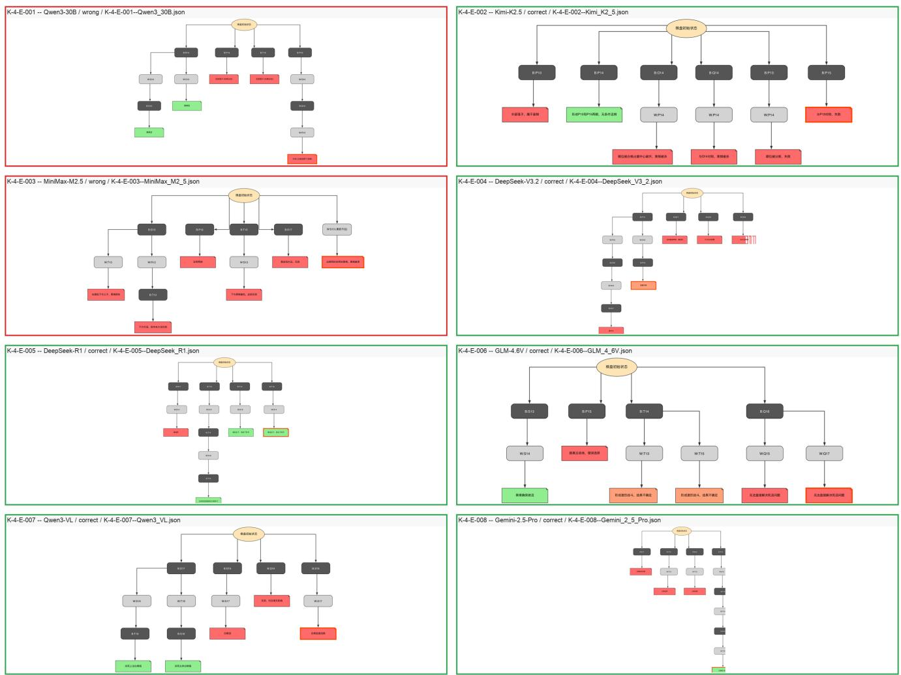  
Figure 10: K = 4 extracted process trees for eight displayed Easy examples. Green panels denote correct final answers and red <sub>pane</sub>l<sub>s</sub> d<sub>eno</sub>t<sub>e wrong</sub> fi<sub>na</sub>l <sub>answers.</sub>

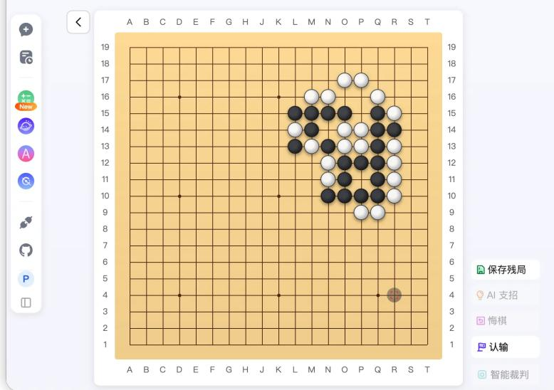

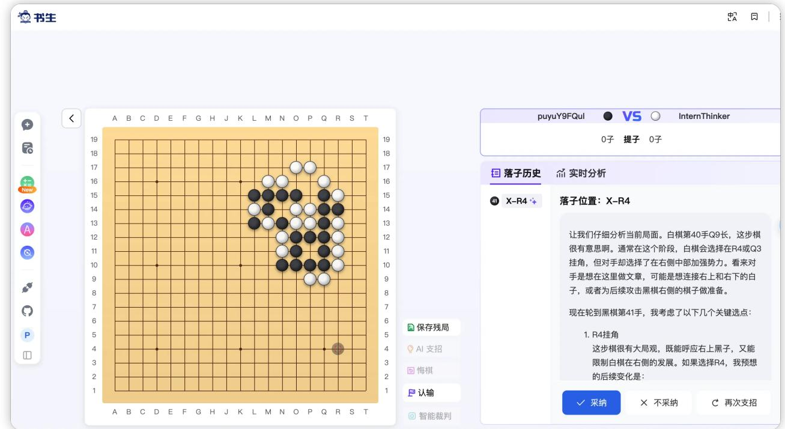  
Fi<sub>g</sub>ure 11: Qualitative Lo<sub>g</sub>os <sub>p</sub>robe on the first benchmark <sub>p</sub>roblem. The verified first move is P15 or e<sub>q</sub>uivalent N14, whereas Lo<sub>g</sub>os returns R4. The res<sub>p</sub>onse behaves like a <sub>g</sub>eneral Go continuation anal<sub>y</sub>sis rather than a local life-and-death solution trace, <sub>so</sub> it i<sub>s</sub> t<sub>rea</sub>t<sub>e</sub>d <sub>as</sub> di<sub>agnos</sub>ti<sub>c ev</sub>id<sub>ence</sub> f<sub>or response-</sub>f<sub>orma</sub>t <sub>m</sub>i<sub>sma</sub>t<sub>c</sub>h <sub>ra</sub>th<sub>er</sub> th<sub>an as a score</sub>d b<sub>enc</sub>h<sub>mar</sub>k <sub>run.</sub>

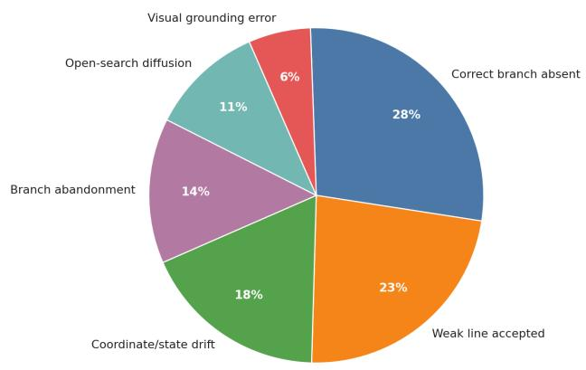  
Fi<sub>gure</sub> 12<sub>:</sub> F<sub>a</sub>il<sub>ure-mo</sub>d<sub>e</sub> di<sub>s</sub>t<sub>r</sub>ib<sub>u</sub>ti<sub>on</sub> f<sub>rom</sub> th<sub>e</sub> b<sub>a</sub>l<sub>ance</sub>d <sub>qua</sub>l<sub>-</sub> it<sub>a</sub>ti<sub>ve au</sub>dit<sub>.</sub> Th<sub>e</sub> d<sub>om</sub>i<sub>nan</sub>t <sub>errors concern searc</sub>h <sub>organ</sub>i<sub>za-</sub> ti<sub>on</sub> <sub>an</sub>d l<sub>oca</sub>l <sub>ver</sub>ifi<sub>ca</sub>ti<sub>on</sub> <sub>ra</sub>th<sub>er</sub> th<sub>an</sub> <sub>ou</sub>t<sub>pu</sub>t f<sub>orma</sub>tti<sub>ng.</sub>