# Algebraic Decomposition Theory for Transformer Length Generalization

Andy Yang1∗ Blerta Veseli2∗ Corentin Barloy3 Micha¨el Cadilhac4

Andreas Krebs5 Charles Paperman6 Howard Straubing7 Michael Hahn2

1University of Notre Dame, 2Saarland University, 3Ruhr University Bochum 4DePaul University, 5University of Tubingen, ¨ 6University of Lille, 7Boston College

## Abstract

Transformer-based language models are known to sometimes generalize to sequences longer than seen during training, but we lack a precise characterization of which tasks admit length generalization. It is not even known which regular languages transformers length-generalize on – and this is a foundational class of languages. Our contributions are to establish the first complete characterization of which regular languages transformers length-generalize on and provide a decision algorithm running in polynomial time in the size of the language’s syntactic monoid. These results rely on an effective characterization of the regular languages in C-RASP, a recently-established formalism that expresses which languages transformers length-generalize on. This characterization is challenging because classical tools like Krohn-Rhodes decomposition theory for finite semigroups are insufficient for C-RASP. Firstly, the basic building blocks of Krohn-Rhodes theory – flip-flop and simple groups – are not expressible in C-RASP. Secondly, the basic building block of C-RASP (unbounded counting) is not expressible by the finite semigroups of Krohn-Rhodes theory. Thus, length generalization on regular languages is controlled by an algebraic property that is invisible to classicalfinite decomposition theory. We generalize classical decomposition theory from finite semigroups to the infinite additive group on the integers, allowing us to characterize C-RASP in terms of iterated wreath products of the integers and derive a provable polynomial-time decision algorithm for regular language membership. Experiments across a broad test suite of regular languages confirm that our theory captures transformers’ length-generalization behavior more accurately than existing classifications.1

## 1 Introduction

What state-tracking capabilities do transformer language models possess? To answer this question we study the regular languages on which transformers can length-generalize. First, regular languages give us a formal framework to describe the structure of state-tracking algorithms that transformers can implement. Second, probing for length-generalization gives us an empirical confirmation that the transformer learns an implementation of the underlying algorithm. Even though this is a fundamental question about an important architecture, we still lack a precise answer. For instance as shown in fig. 1, two structurally similar state-tracking tasks (recognizing (ab + bbaa)∗ and (ab + aabb)∗) may diverge sharply in terms of length-generalizability – and all existing theory fails to explain this discrepancy.

This line of inquiry has a deep history in machine learning. In fact, Kleene (1956) invented regular expressions specifically for the purpose of analyzing the capabilities of McCulloch-

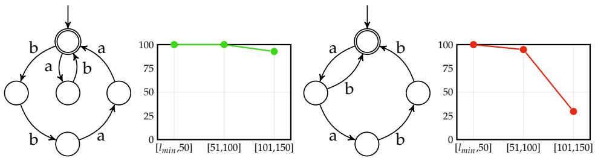  
Figure 1: DFAs for $( a b + b b a a ) ^ { * }$ and $( a b + a a b b ) ^ { * }$ and transformer length generalization on both. Transformers were trained on strings of length $\left[ l _ { m i n } , 5 0 \right]$ , where $\bar { l _ { m i n } }$ denotes the length of the shortest valid string in the respective language, and the tested on a held-out sets of strings from bins of length up to 150. Existing theory fails to explain why lengthgeneralization differs between these simple regular languages with very similar structure.

Pitts neural networks. Regular language recognition is a fundamental task in the theory of computation that provides us a systematic method of determining the sequence-processing capabilities of a model (Sipser, 1996). The task is simple: given a sequence of inputs, each of which triggers a transition in a deterministic finite automaton (DFA), track the state of the machine after each transition. These finite state-tracking tasks arise concretely in the context of language models, which we sketch below.

Constrained decoding: A user may want a language model to generate text in a structured format, such as JSON or code, which can pose challenges (Schall & de Melo, 2025). Even as outputs grow in length, their structured formats often follow regular constraints (e.g. matching curly braces to a fixed depth in JSON).

Agentic workflows: AI agents in practice follow workflows consisting of compositional sequences of actions (Schluntz & Zhang, 2024). Keeping track of the state of the environment and deciding the next action to take can then explicitly be seen as simulating a DFA.

Natural language: Morphemes in natural languages typically follow constraints that can be modeled by regular languages (Kaplan & Kay, 1994). Natural language semantics also involves maintaining the states of different referents over time (Kim & Schuster, 2023).

Previous work provides a theoretical foundation for our study by providing characterizations of which regular languages can be expressed by the transformer architecture. Liu et al. (2023b); Merrill & Sabharwal (2025) showed transformers with log(n) depth could express all regular languages, while constant depth transformers could express all solvable regular languages. The containment of poly(n)-precision transformers within ${ \mathsf { T } } { \mathsf { C } } ^ { 0 }$ suggests transformers cannot express non-solvable regular languages (assuming ${ \mathsf { T C } } ^ { 0 } \neq { \mathsf { N C } } ^ { 1 } ,$ as is common) (Merrill & Sabharwal, 2023; Chiang, 2025). Hahn (2020) showed that hard attention transformers recognized only languages in $\mathsf { A C } ^ { 0 }$ , which Yang et al. (2024) later refined to the star-free regular languages, and Jerad et al. (2025) finally refined to the Rtrivial languages (when using leftmost tie breaking). Similarly, Li et al. (2024) showed that finite-precision transformers recognized only star-free languages, which Li & Cotterell (2025) refined to the R-trivial languages.

In contrast, Bhattamishra et al. (2020); Huang et al. (2025) showed that transformers can learn languages both in and outside of each class discussed above, implying that existing expressivity characterizations do not account for transformer length generalization on regular languages. In particular, strong empirical evidence show that transformers tend to lengthgeneralize on and only on the languages expressible in C-RASP, a programming language defining a subclass of the languages expressible by a transformer (Huang et al., 2025; Jobanputra et al., 2025; Yang et al., 2025; Yang & Chiang, 2024). However, prior to this work, there did not exist a complete characterization of the regular languages in C-RASP.

Formal language theory has a vibrant tradition of producing beautiful characterizations of regular language membership for different classes. For instance, Barrington et al. (1992)

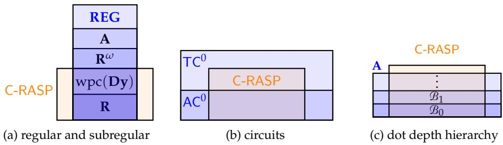  
Figure 2: C-RASP is situated orthogonal to well-known classes of languages. C-RASP contains all R-trivial languages but not all star-free ones (fig. 2a). C-RASP is contained in ${ \mathsf { T C } } ^ { 0 } .$ , but incomparable to $\mathsf { A C } ^ { 0 }$ (fig. 2b). C-RASP intersects every level of the dot depth hierarchy, while remaining incomparable to the full hierarchy (fig. 2c).

showed that a regular language is in $\mathsf { A C } ^ { 0 }$ if and only if its syntactic morphism is quasiaperiodic, thus providing a decision procedure. Simon (1975) showed that a language is piece-wise testable iff its syntactic monoid is J-trivial. On the frontier, regular language membership in ${ \mathsf { T } } { \mathsf { C } } ^ { 0 }$ is equivalent to the 40 year old open problem of whether or not ${ \mathsf { T C } } ^ { 0 } \neq$ ${ \mathsf { N C } } ^ { 1 }$ (Barrington, 1989), and regular language membership in all levels of the dot-depth hierarchy is a 50 year old open problem (Pin, 2017). Our work follows in this tradition, tackling the same question in the case of C-RASP.

This is a deep and challenging theoretical question because classical tools for characterizing regular languages – namely the Krohn-Rhodes decomposition theory of Krohn & Rhodes (1965) – are insufficient for C-RASP. On one front, the building blocks of Krohn-Rhodes theory (flip-flop units and simple groups) are not expressible in C-RASP (Huang et al., 2025). On a second front, the basic building blocks of C-RASP (unbounded counting units) are not expressible by the finite semigroups of Krohn-Rhodes theory. Our core innovation is to develop an analogous algebraic decomposition theory for transformers using the additive group on the integers. We effectively characterize the regular languages in C-RASP, and provide a polynomial-time algorithm that decides DFA membership in C-RASP. A simpler necessary (but not sufficient) criterion is proven via a profinite equation. Finally, we validate empirically that regular language membership in C-RASP predicts transformer length-generalization better than any existing characterization.

## 2 Algebraic Preliminaries

Our characterization of the regular languages that languages transformers length-generalize on (i.e. those in C-RASP) builds upon the algebraic theory of formal languages (Pin, 2025).

## 2.1 Basics: Algebraic Theory of Formal Languages

We refer to section C for additional definitions. The essential ones are presented here.

Definition 1 (Monoid). A monoid $( M , \cdot , 1 )$ is a set M with an associative binary operation and an identity element. We will just write M when the operation and identity are clear.

A finite monoid M together with a homomorphism $\phi \colon \Sigma ^ { * } \to M$ behaves like a finite automaton: after reading string $w = w _ { 1 } \cdot \cdot \cdot w _ { n } $ , the automaton is in state $\phi ( w _ { 1 } ) \cdot \cdot \cdot \phi ( w _ { n } )$ Like a finite automaton, a monoid M recognizes a language L if there exists an accepting subset $X \subseteq M$ and a homomorphism $\phi \colon \Sigma ^ { * } \to M$ such that ${ \boldsymbol { L } } = \phi ^ { - 1 } ( { \boldsymbol { X } } )$ . Two monoids will serve as basic units for us (the latter is the “flip-flop” alluded to above).

Definition 2. The monoid $U _ { 1 }$ is the set $\{ 0 , 1 \}$ where $0 \cdot 1 = 1 \cdot 0 = 0 \cdot 0 = 0$ and $1 \cdot 1 = 1$ . The monoid $U _ { 2 }$ is the set $\{ 1 , a , b \}$ where $x \cdot a = a , x \cdot b = b ,$ and $1 \cdot x = x = x \cdot 1$ for any $x \in U _ { 2 }$

As an example, consider $\boldsymbol { L } = \boldsymbol { \Sigma } ^ { * } a \boldsymbol { \Sigma } ^ { * }$ and the homomorphism $\phi \colon \Sigma ^ { * }  U _ { 1 }$ where $\phi ( \sigma ) = 0$ iff $\sigma = a$ . Then for any $w \in \Sigma ^ { * }$ we have that $\phi ( w ) = 0 \not \in U _ { 1 }$ iff in $w \in L$ . In some sense, $U _ { 1 }$ captures the structure of $L \ ( \mathrm { i . e . }$ . it detects if a ever occurs in the string). In fact, any monoid recognizing L is divided by $U _ { 1 }$ , in the following sense:

Definition 3 (Division). A monoid M divides a monoid N iff there is a submonoid T of N and homomorphism $\phi \colon T  M$ such that $M = \phi ( T )$ . Division is transitive.

For a language L, the syntactic monoid $M ( L )$ is the unique monoid which recognizes L and divides all other M that also recognize L. In the example above, $U _ { 1 }$ is the syntactic monoid of $L = \Sigma ^ { * } a \Sigma ^ { * }$

We will consider classes of monoids that enjoy closure properties that will be useful for effective characterizations.

Definition 4 (Pseudovariety). A pseudovariety of monoids is a collection of monoids closed under division andfinite direct products.

Some pseudovarieties relevant to our characterization are R (the R-trivial monoids (Brzozowski & Fich, 1980), A (the aperiodic monoids (Schutzenberger ¨ , 1965)), REG (all regular languages), and Dy (the pseudovariety generated by all bounded Dyck monoids).

## 2.2 Background: Classical Algebraic Decomposition Theory of Regular Languages

The classical algebraic operation for composing monoids is the wreath product. Here we will sometimes use + to notate the monoid multiplication to decongest the notation, but we do not intend to suggest it is commutative.

Definition 5 (Classical Wreath Product). The wreath product $M \circ N$ of finite monoids $( M , + )$ and $( N , \cdot )$ is the monoid $M ^ { N } \times N$ with multiplication given by $( f _ { 1 } , n _ { 1 } ) ( f _ { 2 } , n _ { 2 } ) = ( f _ { 1 } + { } ^ { n _ { 1 } } f _ { 2 } , n _ { 1 } n _ { 2 } )$ where the left action $^ n f$ is given by ${ } ^ { n } f ( n ^ { \prime } ) { \overset { \prime } { = } } f ( n ^ { \prime } n )$ ).

The wreath product $M \circ N$ together with a homomorphism $\phi \colon \Sigma ^ { * } \to M \circ N$ behaves like the composition of a finite automaton and a finite transducer. Let $\phi _ { M }$ and $\phi _ { N }$ be such that $\phi ( a ) = \dot { ( } \phi _ { M } ( a ) , \phi _ { N } ( a ) )$ for all $a \in \Sigma$ . After reading a prefix $w _ { 1 } \cdots w _ { t } ,$ the automaton is in state $q _ { t } = \phi _ { N } ( w _ { 1 } ) \cdot \cdot \cdot \phi _ { N } ( w _ { t } )$ , and the transducer is in state $\phi _ { M } ( w _ { 1 } ) ( q _ { 0 } ) + \phi _ { M } ( w _ { 2 } ) ( q _ { 1 } ) +$ $\phi _ { M } ( w _ { 3 } ) ( q _ { 2 } ) + . . . + \phi _ { M } ( w t ) ( q _ { t - 1 } )$ . Wreath products are the backbone of the fundamental result in the decomposition theory of finite monoids, the Krohn-Rhodes Theorem:

Theorem 6 (Krohn-Rhodes Theorem (Krohn & Rhodes, 1965)). Every finite monoid M divides an iterated wreath product ofU and simple groups G that divide M.

Unfortunately, Krohn-Rhodes theory is insufficient for handling the monoids involved in transformer length-generalization. C-RASP defines languages with infinite syntactic monoids (Krohn-Rhodes only applies to finite monoids), while $U _ { 2 }$ is not definable in C-RASP (Huang et al., 2025) (the Krohn-Rhodes flip-flop unit is useless for C-RASP). The essential monoid for us will be the syntactic monoid of the bounded Dyck monoid, which can be defined in C-RASP.

Definition 7 (Bounded depth Dyck language). Define $\mathcal { D } _ { 1 } : = ( a b ) ^ { * } a n d \mathcal { D } _ { k + 1 } : = ( a \mathcal { D } _ { k } b ) ^ { * }$

In short: transformers simultaneously succeed at length-generalizing on languages beyond the scope of Krohn-Rhodes theory (Bhattamishra et al., 2020), and fail to length generalize on the fundamental units in scope of Krohn-Rhodes theory (Liu et al., 2023a). This necessitates a new decomposition theory to handle C-RASP.

## 3 Algebraic Characterization of C-RASP

Huang et al. (2025) showed that transformer length-generalization can be guaranteed for all languages in C-RASP, and strong empirical evidence suggests failure of lengthgeneralization outside of C-RASP (Jobanputra et al., 2025). Furthermore, a form of fixedprecision transformer is equivalent to C-RASP (Yang et al., 2025). In this section we develop an algebraic characterization of C-RASP, which crucially requires moving beyond Krohn-Rhodes theory to infinite monoids. We refer to Yang & Chiang (2024); Huang et al. (2025) for an exposition of C-RASP and provide a formal definition in section F.

## 3.1 Typed Monoids

Krebs (2008) developed a framework for using infinite monoids to recognize languages. We present a restriction of the aforementioned framework to the case of wreath products (a one-sided version of the block product used in previous work), which ultimately provides an exact algebraic characterization of C-RASP. The core issue here is that the wreath product of infinite monoids can generate uncountably many elements, which can be too powerful.

Proposition 8. Consider the classic wreath product $\mathbb { Z } \mathrm { o } \mathbb { Z } .$ . Then $M ( L ) \preceq \mathbb { Z } \circ \mathbb { Z } .$ for every L.

Proof. Without loss of generality let $\Sigma = \{ 0 , 1 \}$ . Consider the submonoid of $\mathbb { Z } \circ \mathbb { Z }$ generated by the image of $\Sigma ^ { * }$ under the homomorphism $\sigma \mapsto ( f _ { \sigma } , 1 )$ where $f _ { \sigma } ( x ) = \sigma \cdot 2 ^ { | x | }$ . In essence, this creates a mapping $w \mapsto \left( f _ { w } , | w | \right)$ where $f _ { w } ( 0 )$ outputs the integer value of the binary number w. Thus, $\scriptstyle { \bar { \mathbb { Z } } } \circ { \bar { \mathbb { Z } } }$ can recognize arbitrary languages. 口

This problem motivates the definition of typed monoids, which restricts the accepting sets to be collection of sets closed under union, intersection and complement.

Definition 9. A typed monoid is a triple $\left( M , \mathfrak { T } _ { M } , \mathcal { E } _ { M } \right)$ where M is afinitely generated monoid, ${ \mathfrak { T } } _ { M }$ is a finite Boolean algebra over M, and $\mathcal { E } _ { M }$ is a finite subset of M. Elements $o f \mathfrak { T } _ { M }$ are the types and elements of $\mathcal { E } _ { M }$ are the units. A language L is recognized by $\left( M , \mathfrak { T } _ { M } , \dot { \mathcal { E } } _ { M } \right) i f$ there exists a homomorphism $h \colon \Sigma ^ { * } \to M$ such that $h ( \Sigma ) \subseteq \mathcal { E } _ { M }$ and $\bar { L } = h ^ { - 1 } ( \mathfrak { M } )$ for some ${ \mathfrak { M } } \in { \mathfrak { T } } _ { M }$

As an example, the language MAJORITY (there are more $a ^ { \prime } \mathrm { s }$ than $b ^ { \prime } \mathbf { s } )$ is recognized by the typed monoid $( \mathbb { Z } , \{ ( - \infty , 0 ] , [ 1 , \infty ) , \mathbb { Z } , \emptyset \} , \{ - 1 , 1 \} )$ via the type $[ 1 , \infty )$ and the homomorphism $a \mapsto 1$ and $b \mapsto - 1$ . We will typically refer to this typed monoid as $\mathbb { Z } .$ Now the typed wreath product follows the same intuition as the classical wreath product, except the computations are restricted so as not to have more distinguishing power than provided by the types.

Definition 10 (Typed Wreath Product). Let $( M , \mathfrak { T } _ { M } , \mathcal { E } _ { M } ) , ( N , \mathfrak { T } _ { N } , \mathcal { E } _ { N } )$ be two typed monoids, and let $C \subseteq N$ be a finite set. The typed wreath product

$$
( U , \mathfrak { T } _ { U } , \mathcal { E } _ { U } ) = ( M , \mathfrak { T } _ { M } , \mathcal { E } _ { M } ) \mathfrak { o } _ { C } ( N , \mathfrak { T } _ { N } , \mathcal { E } _ { N } )
$$

of $\left( M , \mathfrak { T } _ { M } , \mathcal { E } _ { M } \right)$ with $\left( N , \mathfrak { T } _ { N } , \mathcal { E } _ { N } \right)$ using constants C is defined such that

$\mathcal { E } _ { U }$ consists of elements $( f , n )$ , where $n \in \mathcal { E } _ { N } ,$ and $f : N \to \mathcal { E } _ { M }$ is a type respecting function (see definition $3 2 )$ with respect to $( N , \mathfrak { T } _ { N } , \mathcal { E } _ { N } )$ and C

• $\mathbf { \bar { \rho } } _ { U }$ is the submonoid of $M \circ N$ generated by $\mathcal { E } _ { U }$

${ \mathfrak { T } } _ { U }$ consists of types UM $\mathfrak { N } = \{ ( f , n ) \ | \ \check { f } ( 1 _ { N } ) \in \mathfrak { M } , n \in \mathfrak { N } \}$ , where $\mathfrak { M } \in \mathfrak { T } _ { M } , \mathfrak { N } \in \mathfrak { T } _ { N }$

Multiplication is the same as in the classical wreath product.

## 3.2 Wreath Product Characterization

With the notion of typed monoids in hand, we can give an algebraic characterization of C-RASP. Let wpc $( \dot { M } , \dot { \mathfrak { T } } _ { M } , \mathfrak { E } _ { M } )$ denote the wreath product closure of a typed monoid, which closes iterated wreath products of this monoid under Boolean combinations and other basic operations. The precise definition will be found in section E.2. The typed wreath product closure turns out to be the precise algebraic $\mathrm { \Delta ^ { \prime \prime } g l u e ^ { \prime \prime } }$ that connects integer counting to C-RASP programs. The proof is given in section F.4.

Theorem 11. ${ \cal L } \in \mathsf { C \mathrm { - } R A S P } \iff { \cal M } ( { \cal L } ) \in \mathrm { w p c } ( \mathbb { Z } )$

## 4 Decomposition Theory for Regular Languages in C-RASP

So far, we have characterized C-RASP in terms of iterated wreath products of $\mathbb { Z } .$ . We will turn this into an algebraic decision algorithm: given a regular language $L ,$ we determine if $M ( L )$ divides a wreath product of $\breve { \mathbb Z }$ (or not). A priori, such a question is a formidable problem, due to multiple challenges: Z is infinite, and we do not even know how many $\mathbf { \dot { \mathbb { Z } } }$ factors are needed. In fact, there even examples in the finite case where the problem ends up undecidable (Rhodes, 1999). Our second main result will be that, using a detailed understanding of wreath products of $\mathbb { Z } ,$ this problem is decidable.

In the depth-1 case, it is easy to check if $M ( L )$ divides Z (this is true $\mathrm { e . g . }$ for the AND language, $L = 1 ^ { * } )$ . How would we check if $\operatorname { \dot { M } } ( L ) \prec \mathbb { Z } \circ \mathbb { Z } ?$ If we could “divide” out the right factor to obtain an object $^ { \prime \prime } M ( L ) / \mathbb { Z } ^ { \prime \prime }$ , we could check if $^ { \prime \prime } M ( L ) / \mathbb { Z } ^ { \prime \prime } \prec \mathbb { Z }$ . If this is not the case, we could “divide” by $\mathbb { Z }$ again, and iterate until we either reach division of $\mathbb { Z } ( \mathrm { i } . \mathrm { e } . , L$ is in ${ \mathsf { C } } { \mathrm { - R A S P ) , } }$ or a fixed point $( \mathrm { i } . \mathrm { e } . , \overline { { L } }$ is not in C-RASP). This is the basic idea of our decision procedure. There are three challenges at hand: First, understanding how to $\mathrm { ^ { \prime \prime } d i v i d e ^ { \prime \prime } }$ by a wreath product factor; second, making this computable even though $\mathbb { Z }$ is infinite; third, understanding how to identify the fixed point.

## 4.1 Categories

What do you get when you “divide” one monoid by another? For this first challenge, there is a well-understood technique using categories as algebraic structures (Tilson, 1987). We informally present the main idea, but defer the precise definitions to section G.

In group theory, this question has a simple answer. With a surjective group homomorphism between groups $\phi \colon { \dot { G } }  H .$ , we can “divide” G by ker ϕ with a “quotient” of H, such that $G \preceq ( \ker \phi ) \circ \dot { H }$ . However, since we are dealing with monoids (and C-RASP does not even contain any non-trivial finite groups), this is of no use for us.

For monoid homomorphisms $\phi \colon M \to N ,$ we may not be able to “divide” M by ker $\phi ,$ as monoids’ lack of inverses obstructs such a clean division. What is the divisor in the division $\phi \colon M ( \mathcal { D } _ { 1 } )  U _ { 2 } ?$ Intuitively, the wreath product $M ( \mathcal { D } _ { 1 } ) \preceq N \circ U _ { 2 }$ should form a structure that contains elements (last symbol = a) and (last symbol = b). However, composition in this structure will be highly restricted $- \mathrm { { e . g . } }$ (this symbol $= { \dot { b } } )$ (last symbol $= a )$ is an illegal composition. It turns out the cleanest way to handle this is by lifting monoids and homomorphisms to higher order structures – categories and relational morphisms .

A category X consists of a set of objects Obj(X) and hom-sets $X ( x _ { 1 } , x _ { 2 } )$ , which are collections of arrows $\alpha \colon x _ { 1 }  x _ { 2 }$ for each pair of objects $x _ { 1 } , x _ { 2 } \in X$ . Arrows can compose associatively, and each object has an identity arrow. A relational morphism of monoids ϕ : M◁N is a relation where $\dot { \phi } ( m ) \neq \emptyset , \phi ( m _ { 1 } ) \dot { \phi } ( m _ { 2 } ) \subseteq \phi ( m _ { 1 } m _ { 2 } )$ , and $\hat { 1 _ { N } } \in \phi ( 1 _ { M } )$ . This is a generalization of the classical morphism, where elements may map to sets of elements.

Now for any relational morphism of monoids $\phi \colon M { \ < } N .$ , the correct notion of divisor turns out to be the derived $c a t e g o r y \bar { D } _ { \phi }$ . Here, $\mathrm { O b j } ( D _ { \phi } ) { \dot { = } } \phi ( M )$ and $D _ { \phi } ( n _ { 1 } , n _ { 2 } ) = \{ n _ { 1 } {  } _ { ( m , n ) } \mid n \in$ $\phi ( m ) , n _ { 1 } n = n _ { 2 } \}$ . Arrows compose via the rule $n _ { 0 } {  } _ { ( m _ { 1 } , n _ { 1 } ) } n _ { 0 } n _ { 1 } {  } _ { ( m _ { 2 } , n _ { 2 } ) } = n _ { 0 } {  } _ { ( m _ { 1 } m _ { 2 } , n _ { 1 } n _ { 2 } ) } ,$ and we merge arrows that have the same behavior under composition.

The Derived Category Theorem (Tilson, 1987) states that given a relational morphism $\phi \colon$ M◁N, and a division $\breve { D } _ { \phi } \preceq V ,$ we obtain a division $M \preceq V \circ N$ Thus, if $\phi : { \overline { { M } } } \triangleleft \mathbb { Z } , $ , then $D _ { \phi }$ formalizes the object $^ { \prime \prime } M / \mathbb { Z } ^ { \prime \prime }$ alluded to in the previous section. Going forward, we work with an extension of the notions of relational morphisms and division in which the left-hand side can also be a category.

## 4.2 Decomposition of $\mathcal { D } _ { 1 }$ into wreath products of Z

We explain our decision procedure by walking through the division of the syntactic monoid of $\hat { \mathcal { D } _ { 1 } } \doteq ( a b ) ^ { * }$ into an iterated wreath product of $\mathbb { Z } ,$ via carefully selected relational morphisms into $\mathbb { Z } .$ We will visualize objects of a category as rectangles (to prevent confusion with automata) and arrows as labels on edges between squares. Colors indicate the monoid each element comes from. We can view $M ( \mathcal D _ { 1 } )$ as a category with a single object and arrows corresponding to monoid elements. We take a relational morphism into $\phi _ { 1 } \colon \mathsf { M } ( \qquad \mathscr { D } _ { 1 } ) { \triangle } \mathbb { Z }$ where $\phi _ { 1 } ( \perp ) = \mathbb { Z } ,$ $\phi _ { 1 } ( a ) = \{ 1 \} , \phi _ { 1 } ( \dot { b } ) = \{ - 1 \} , \dot { \phi _ { 1 } } ( \epsilon ) \stackrel { . } { = } \dot { \phi _ { 1 } } ( a b ) = \phi _ { 1 } ( \dot { b a } \stackrel { . } { = } \{ 0 \}$

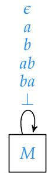

In the derived category $D _ { \phi _ { 1 } }$ there are infinitely many objects, corresponding to each integer. We omit starting or ending objects of arrows where clear by the diagram, combine isomorphic arrows, and let low-opacity arrows and objects denote transitions to ⊥ elements.

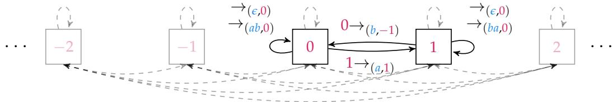

We have not yet arrived at a division $M ( \mathcal { D } _ { 1 } ) ~ \preceq ~ \mathbb { Z }$ because $D _ { \phi _ { 1 } }$ has hom-sets containing multiple arrows (Tilson, 1987, Lemma 3.1, Lemma 4.1). To proceed, we take another relational morphism $\psi _ { 1 } \colon D _ { \phi _ { 1 } } \triangleleft \mathcal { U }$ where $\psi _ { 1 } ( x {  } _ { ( \perp , 1 ) } ) ~ = ~ \psi _ { 1 } ( \dot { x } {  } _ { ( \perp , - 1 ) } ) ~ =$ $[ 1 , \infty )$ for all $x ;$ arrows not associated to ⊥ are instead mapped to {0}. From $\phi _ { 1 } ,$ , ψ1 we define a relational morphism ϕ2 : $M ( \mathcal { D } _ { 1 } ) { \triangleleft } \mathbb { Z } { \circ } \mathbb { Z }$ where we let $\begin{array} { l l } { \phi _ { 2 } { \left( m \right) } } & { = } \end{array}$ $\left\{ { \Bigl ( } f _ { ( m , y ) } , y { \Bigr ) } \mid y \in \phi _ { 1 } ( m ) , \forall x : f _ { ( m , y ) } ( x ) = \psi _ { 1 } \left( x \to _ { ( m , y ) } \right) \right\}$ . We visualize the derived category $D _ { \phi _ { 2 } }$ below (writing $\left( f _ { m } , y \right)$ as shorthand for $\phi _ { 2 } ( m )$ whenever it is unique).

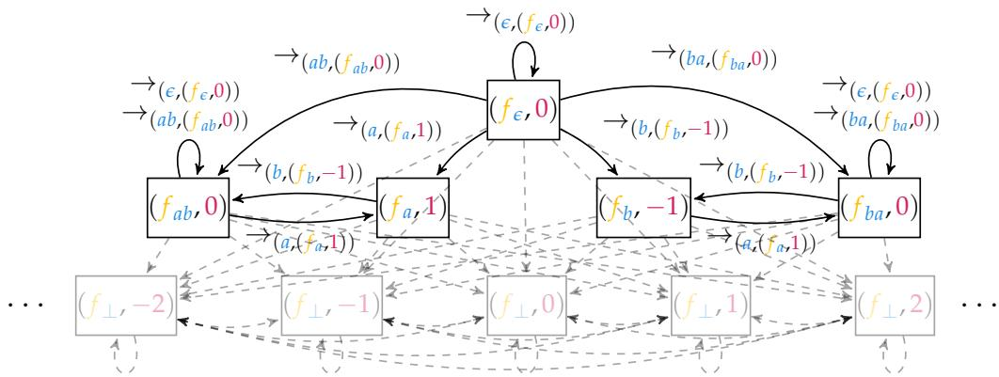

We still do not have a division because there are still two arrows in a single homset of $D _ { \phi _ { 2 } } ,$ for instance $\phi _ { 2 } ( \epsilon )$ and $\phi _ { 2 } ( a b )$ act the same on $( f _ { a b } , 0 )$ . To handle this, we define a final relational morphism ϕ : $\dot { M } ( \dot { \mathcal { D } } _ { 1 } ) { \sf d } \mathbb { Z } \circ \mathbb { Z } \circ \mathbb { Z }$ such that $\flat _ { 3 } ( m ) = ( g , \phi _ { 2 } ( m ) )$ ) where $g ( x ) = 0$ iff $x = ( f _ { ( \epsilon , 0 ) } , 0 )$ . We ultimately obtain the division. ϕ3 : $M ( \mathcal { D } _ { 1 } ) \stackrel { \smile } { = } \mathbb { Z } \circ \mathbb { Z } \circ \mathbb { Z }$ . In this example, we chose the correct relational morphisms into $\mathbb { Z }$ so as to obtain a division, but in principle there are infinitely many choices of morphisms. Guiding the choice of relational morphisms to reach a termination is a major challenge we address in our decision procedure.

## 4.3 Algebraic Decision Procedure

We now address the second challenge of maintaining computability despite the existence of infinitely many relational morphisms into $\mathbb { Z } .$ First, we divide $\check { M } ( L )$ into equivalence classes via the R relation, a classical relation in semigroup theory which characterizes which elements are reachable by other elements via right-multiplication (Pin, 2025). We construct a sequence of iterated relational morphisms into Z by iterating over the R-classes in order. At step $i + 1$ , we assume that a relational morphism $\dot { \phi } _ { i }$ covers all R-classes up to $R _ { i } ,$ and extend to a relational morphism $\phi _ { i + 1 }$ that covers $R _ { i + 1 }$ . This is done by iteratively computing nontrivial relational morphisms whose values are bounded on $R _ { i }$ . This process terminates, because the set of such bounded relational morphisms forms a finitely generated Z-module (an integer analogue of vector spaces), and every step finds a morphism linearly independent of the previous ones.

Finally we address the termination conditions by proving completeness of the algorithm. If the algorithm terminates with success, we have constructed a division from $\Breve { M ( L ) }$ into a wreath product of $\mathbb { Z }$ (and thus C-RASP by theorem 11). Otherwise, if the algorithm terminates with failure, we show no such division exists. In this case, assume for sake of contradiction that $M ( L )$ divides a T-fold iterated wreath product of $\mathbb { Z }$ via a relational morphism ψ: $M ( L ) \preceq \mathbb { Z } \circ \cdot \cdot \cdot \circ \mathbb { Z }$ (where $T$ is minimal). The rightmost component defines a relational morphism $\omega : M ( L ) { \triangleleft } \mathbb { Z }$ . Either ω is bounded, and it would have been chosen as part of the decomposition had it provided any useful information, or ω is unbounded which renders long strings indistinguishable by types in $\mathbb { Z }$ since values may run to infinity. In either case, we can remove the rightmost component of $\psi ,$ and obtain a division from M into a (T − 1)-fold iterated wreath product of $\mathbb { Z } ,$ contradicting the minimality of T.

To formalize the above proof, we choose relational morphisms to $\mathbb { Z }$ which truncate values beyond a threshold k (which results in relational morphisms to $\mathcal { D } _ { k } )$ . This allows us to formalize the proof using finite category theory (avoiding the use of types on the category side). A formal writeup can be found in section H.3.

## 4.4 Necessary (but not Sufficient) Condition via Equations

In this section use profinite equations to give an alternative characterization of the regular languages in C-RASP. These equations are a technique drawing ideas from topology to derive elegant and decidable characterizations for classes of monoids. We defer a precise definition to Pin (2009).

Definition 12. Define $\mathbf { R } ^ { \omega }$ as an equation and the corresponding variety of monoid $\scriptstyle { l s ^ { 2 } }$ as

$$
\begin{array} { r } { \mathbf { R } ^ { \omega } : ( x y ^ { \omega } ) ^ { \omega } x = ( x y ^ { \omega } ) ^ { \omega } . } \end{array}
$$

For our purposes, a finite monoid M satisfies $\mathbf { R } ^ { \omega }$ if for any $m _ { 1 } , m _ { 2 } \in M$ we have that $( m _ { 1 } m _ { 2 } ^ { \omega } ) ^ { \omega } = ( m _ { 1 } m _ { 2 } ^ { \omega } ) ^ { \omega } m _ { 1 } .$ , where $m ^ { \omega }$ denotes $m ^ { k }$ such that $m ^ { k } = m ^ { 2 k } \ \mathrm { ( i . e }$ . the unique idempotent generated by m). We give an exact characterization of the monoids in $\mathbf { R } ^ { \omega }$ , the proof of which is in section I.

Theorem 13. $M \in \mathbf { R } ^ { \omega }$ iff M is aperiodic and every R-class of M contains at most one idempotent.

Equivalently, $\mathbf { R } ^ { \omega } = \mathbf { R } \circ \mathbf { G } \cap \mathbf { A }$ , where R denotes the monoids where each R-class is singleton, G denotes the finite groups, and A denotes the aperiodic monoids. In our experiments below, we will draw languages from the larger class R◦G rather than $\mathbf { R } ^ { \omega }$ for testing lengthgeneralization. While both the main decision procedure and $\mathbf { R } ^ { \omega }$ require iterating over the R-classes of the monoid, the former needs to iteratively compute relational morphisms, while the latter only needs to count idempotents. This gives a much simpler criterion that is necessary for membership in C-RASP, though we can show it is not sufficient.

## 4.5 Algebraic Characterization

The decision procedure results an an exact algebraic characterization of the regular languages in C-RASP – namely, they are wreath products of bounded-depth Dyck languages. We thus derive a small hierarchy within the classes of finite monoids surrounding C-RASP.

Theorem 14. $\mathsf { C - R A S P } \cap \mathbf { R E G } = \mathsf { w p c } ( \mathbf { D y } )$ . Hence $\mathbf { R } \subsetneq \mathbf { C } \mathbf { - R A S P } \cap \mathbf { R E G } \subsetneq \mathbf { R } ^ { \omega } \subsetneq \mathbf { A } \subsetneq \mathbf { R E G }$

A proof is given in section I. Furthermore, the decision procedure runs in polynomial time in the size of the monoid. This allows us to efficiently decide whether or not we expect a transformer to length-generalize on any given regular language. A proof is in section H.3. Theorem 15. Membership of $M \in { \mathsf { C } } { \mathsf { - R A S P } } \cap$ REG is decidable in $O \big ( \mathsf { p o l y } ( | M | ) \big )$ time.

## 5 Experiments

We empirically evaluate whether our characterization of regular languages in C-RASP predicts transformer length-generalization. In particular, we examine the different levels

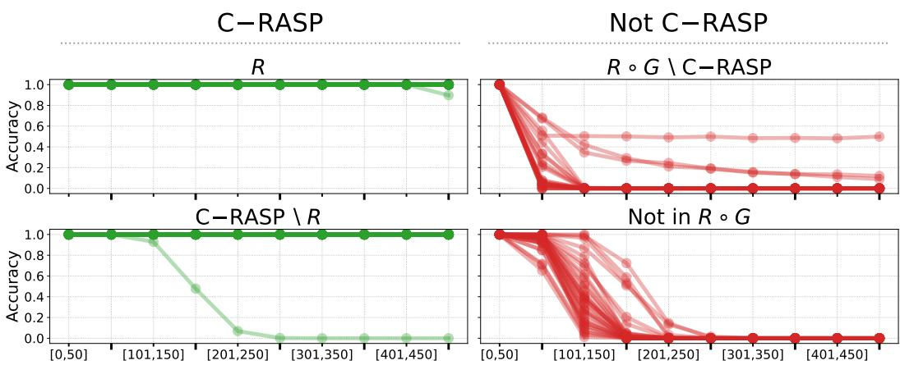  
Figure 3: Length generalization on regular languages. Models are trained on strings of lengths in $[ l _ { \mathrm { m i n } } , 5 0 ]$ , and evaluated on bins $[ l _ { \mathrm { m i n } } , \breve { 5 0 } ]$ (in-distribution) up to [451, 500] in bins of width 50. Each curve corresponds to a language. Green curves denote languages in C-RASP, while red curves denote languages not in C-RASP. Languages in C-RASP maintain near-perfect accuracy well beyond the training range, whereas languages outside C-RASP exhibit rapid degradation, typically failing shortly after. Each panel includes all languages in the corresponding class from Table 1 in appendix B.3.

of the hierarchy shown in theorem 14 to determine the efficacy of each class in predicting length-generalization by transformers. Because $\mathbf { R } ^ { \omega } \backslash$ C-RASP ∩ REG contains few samples, we report results based on membership in R◦G (whose aperiodic fragment is Rω).

## 5.1 Languages

We construct a diverse suite of 125 regular languages, including both representative examples from prior work (Li & Cotterell, 2025; Huang et al., 2025) and systematically generated ones. We provide the full table of languages in Table 1, appendix B.3). To generate languages within the classes discussed in theorem 14, we sample regular expressions using a probabilistic context-free grammar (PCFG) for which we tune the probabilities to obtain diverse class membership. For each language, we determined membership in C-RASP using an automata-based version of the algebraic procedure, which we explain in section J.

## 5.2 Experimental Setup

Task Definition. The task is state prediction, i.e. tracking automaton states over prefixes. Let $w = a _ { 1 } \ldots a _ { n } ,$ and denote by $w _ { 1 : i } = a _ { 1 } \ldots a _ { i }$ the prefix of length i. Each symbol $a _ { i }$ triggers a transition, and the model must predict the sequence of DFA states $q _ { 1 } , \ldots , q _ { n } ,$ , where $q _ { i }$ is the state reached after processing $w _ { 1 : i }$

Training and Evaluation. Per formal language, we train GPT-2 models on 10,000 words sampled from the training length range $[ l _ { m i n } , \breve { 5 0 } ]$ with $l _ { m i n }$ being the length of the shortest valid word in the respective language. We use an 80/20 train-test split. We then evaluate generalization on test length ranges [51, 100], [101, 150] . . . [451, 500], with 1,000 words in each test set. We define successful length generalization as maintaining near in-distribution performance at lengths beyond $2 \times$ the maximum training length 50. Following Huang et al. (2025) we used AdamW with weight decay 0.01 and dropout 0.0. We performed a hyperparameter sweep over layers {1, 2, 4}, heads {1, 2, 4}, dimension {16, 64, 256} and learning rates {0.001, 0.0001} – training every combination in the grid with early stopping when 100% accuracy is achieved on in-distribution test data. For those languages, where in-distribution accuracy never reached 100%, we additionally performed a hyperparameter sweep over layers {6, 8, 12}, heads {4, 8}, dimensions $\{ 6 4 , 2 5 6 \}$ and learning rates {0.001, 0.0001}. We adopted optimization choices and hyperparameter ranges from Huang et al. (2025). Per language, we choose the configuration that achieves the highest accuracy on the longest test length range among those whose accuracy on in-distribution length $\left[ l _ { m i n } , 5 0 \right]$ is 100%. We break remaining ties by successively considering the next-longest ranges and finally preferring the smallest model (fewest layers, then attention heads, then hidden dimension). The chosen configuration was then used for a multi-seed run, in which models were trained under different random model initializations, an approach commonly used in prior work (Li & Cotterell, 2025; Huang et al., 2025). A run was considered successful if it achieved 100% accuracy on the in-distribution test set. We evaluated random initializations sequentially, up to a maximum of 1,000 trials, and ended the search once five successful runs were found. We report the best successful seed in Figure 3 and show the average performance across all successful seeds in B.

Architectural Constraints. To align empirical results with our theoretical setup, state prediction should depend on the evolving prefix rather than local information. We therefore introduce two constraints: first, we remove positional information by replacing positional embeddings with the zero function (NoPE) forcing the model to rely on the sequential order of tokens provided by the causal attention mask. Second, while NoPE removes absolute positional information, the model still has direct access to the most recent input symbol $a _ { i }$ when predicting the target state $q _ { i } ,$ which provides a positional signal through alignment with the prediction target. This can enable shortcuts in which the model predicts the state based solely on the final symbol, rather than the full prefix. To prevent this, we insert a separator token & between symbols (see below) and require the model to predict the state $q _ { i }$ only at these separator positions. Consequently, access to the most recent symbol is also mediated through the attention mechanism. Word symbols receive placeholder targets # and are excluded from the cross-entropy loss. Each target sequence begins with the initial DFA state, predicted at the first separator following <bos>.

<table><tr><td rowspan=1 colspan=1>#1</td><td rowspan=1 colspan=1>e#3</td><td rowspan=1 colspan=1>#1</td><td rowspan=1 colspan=1>#</td></tr></table>

## 5.3 Results

Figure 3 shows that C-RASP membership is a strong predictor of transformer lengthgeneralization. Languages in C-RASP generalize reliably to substantially longer lengths, while languages outside C-RASP fail to do so, with accuracy rapidly collapsing beyond the training length. This demonstrates that across all evaluated languages C-RASP provides an accurate characterization of length generalization.

## 6 Conclusion

We have precisely characterized the regular languages on which transformers lengthgeneralize using a decision procedure for regular language membership in C-RASP (which runs in polynomial-time). Experiments on a range of languages in and outside of C-RASP demonstrate that the theory accurately predicts when transformers do and do not lengthgeneralize. The decision procedure is based on a novel algebraic decomposition theory for C-RASP that is distinguished from the classical Krohn-Rhodes theory due to the inclusion of infinite monoids and the omission of the aperiodic flip-flop unit U2. A simpler criterion which is necessary (but not sufficient) for membership in C-RASP is also given in the form of a profinite equation. Our results provide a deeper understanding of the state-tracking capabilities of transformers on the machine learning front, as well as a deeper understanding of counting, on the algebraic front.

## Acknowledgments

We thank Dana Angluin, Michael Benedikt, David Chiang, and Will Merrill for fruitful discussion and feedback. We thank the anonymous reviewers for their helpful comments.

Funded in part by the Deutsche Forschungsgemeinschaft (DFG, German Research Foundation) – GRK 2853/1 “Neuroexplicit Models of Language, Vision, and Action” - project number 471607914, and the US National Science Foundation (grant number 2502292). AY is supported by the US National Science Foundation Graduate Research Fellowship Program under Grant No. 2236418. MH acknowledges support from the Deutsche Forschungsgemeinschaft (DFG, German Research Foundation) – Project number 560456343.

## References

Jorge Almeida and Assis Azevedo. The join of the pseudovarieties of R-trivial and L-trivial monoids. Journal of Pure and Applied Algebra, 60(2):129–137, 1989. ISSN 0022-4049. doi: https://doi.org/10.1016/0022-4049(89)90125-4. URL https://www.sciencedirect.com/ science/article/pii/0022404989901254.

Eric Alsmann, Lowejatan Noori, and Martin Lange. On the expressiveness of state space models via temporal logics. In The Fourteenth International Conference on Learning Representations, 2026. URL https://openreview.net/forum?id=Vg511oJScS.

David A. Barrington. Bounded-width polynomial-size branching programs recognize exactly those languages in nc1. Journal of Computer and System Sciences, 38(1):150–164, 1989. ISSN 0022-0000. doi: https://doi.org/10.1016/0022-0000(89)90037-8. URL https: //doi.org/10.1016/0022-0000(89)90037-8.

David A. Mix Barrington, Kevin Compton, Howard Straubing, and Denis Therien. Regular´ languages in NC1. Journal of Computer and System Sciences, 44(3):478–499, 1992. ISSN 0022-0000. doi: https://doi.org/10.1016/0022-0000(92)90014-A. URL https://doi.org/ 10.1016/0022-0000(92)90014-A.

Christoph Behle, Andreas Krebs, and Stephanie Reifferscheid. Typed monoids – an eilenberglike theorem for non regular languages. In Franz Winkler (ed.), Algebraic Informatics, pp. 97–114, Berlin, Heidelberg, 2011. Springer Berlin Heidelberg. ISBN 978-3-642-21493-6. doi: https://doi.org/10.1007/978-3-642-21493-6 6.

Satwik Bhattamishra, Kabir Ahuja, and Navin Goyal. On the Ability and Limitations of Transformers to Recognize Formal Languages. In Bonnie Webber, Trevor Cohn, Yulan He, and Yang Liu (eds.), Proceedings of the 2020 Conference on Empirical Methods in Natural Language Processing (EMNLP), pp. 7096–7116, Online, November 2020. Association for Computational Linguistics. doi: 10.18653/v1/2020.emnlp-main.576. URL https:// aclanthology.org/2020.emnlp-main.576/.

J.A. Brzozowski and Faith E. Fich. Languages of R-trivial monoids. Journal of Computer and System Sciences, 20(1):32–49, 1980. ISSN 0022-0000. doi: https://doi.org/10.1016/ 0022-0000(80)90003-3.

David Chiang. Transformers in uniform TC0. Transactions on Machine Learning Research, 2025. ISSN 2835-8856. URL https://openreview.net/forum?id=ZA7D4nQuQF.

Mai Gehrke and Andreas Krebs. Stone duality for languages and complexity. ACM SIGLOG News, 4(2):29–53, May 2017. doi: 10.1145/3090064.3090068. URL https://doi.org/10. 1145/3090064.3090068.

Michael Hahn. Theoretical limitations of self-attention in neural sequence models. Transactions ofthe Associationfor Computational Linguistics, 8:156–171, 01 2020. ISSN 2307-387X. doi: 10.1162/tacl a 00306. URL https://doi.org/10.1162/tacl a 00306.

Xinting Huang, Andy Yang, Satwik Bhattamishra, Yash Sarrof, Andreas Krebs, Hattie Zhou, Preetum Nakkiran, and Michael Hahn. A formal framework for understanding length generalization in transformers. In The Thirteenth International Conference on Learning Representations, 2025. URL https://openreview.net/forum?id=U49N5V51rU.

Selim Jerad, Anej Svete, Jiaoda Li, and Ryan Cotterell. Unique hard attention: A tale of two sides. In Wanxiang Che, Joyce Nabende, Ekaterina Shutova, and Mohammad Taher Pilehvar (eds.), Proceedings of the 63rd Annual Meeting of the Associationfor Computational Linguistics (Volume 2: Short Papers), pp. 977–996, Vienna, Austria, July 2025. Association for Computational Linguistics. ISBN 979-8-89176-252-7. doi: 10.18653/v1/2025.acl-short.76. URL https://aclanthology.org/2025.acl-short.76/.

Mayank Jobanputra, Yana Veitsman, Yash Sarrof, Aleksandra Bakalova, Vera Demberg, Ellie Pavlick, and Michael Hahn. Born a transformer – always a transformer? On the effect of pretraining on architectural abilities. In The Thirty-ninth Annual Conference on Neural Information Processing Systems, 2025. URL https://openreview.net/forum?id= Huw15LqglI.

Ravindran Kannan and Achim Bachem. Polynomial algorithms for computing the smith and hermite normal forms of an integer matrix. SIAM Journal on Computing, 8(4):499–507, 1979. doi: 10.1137/0208040. URL https://doi.org/10.1137/0208040.

Ronald M. Kaplan and Martin Kay. Regular models of phonological rule systems. Computational Linguistics, 20(3):331–378, 1994. URL https://aclanthology.org/J94-3001/.

Najoung Kim and Sebastian Schuster. Entity tracking in language models. In Anna Rogers, Jordan Boyd-Graber, and Naoaki Okazaki (eds.), Proceedings of the 61st Annual Meeting of the Association for Computational Linguistics (Volume 1: Long Papers), pp. 3835–3855, Toronto, Canada, July 2023. Association for Computational Linguistics. doi: 10.18653/v1/2023. acl-long.213. URL https://aclanthology.org/2023.acl-long.213/.

S. C. Kleene. Representation of Events in Nerve Nets and Finite Automata, pp. 3–42. Princeton University Press, Princeton, 1956. ISBN 9781400882618. doi: doi:10.1515/ 9781400882618-002. URL https://doi.org/10.1515/9781400882618-002.

Andreas Krebs. Typed Semigroups, Majority Logic, and Threshold Circuits. PhD thesis, Universitat T¨ ubingen, 2008. URL¨ https://nbn-resolving.org/urn:nbn:de:bsz:21-opus-36244. URN: urn:nbn:de:bsz:21-opus-36244.

Kenneth Krohn and John Rhodes. Algebraic theory of machines. I. Prime decomposition theorem for finite semigroups and machines. Transactions of the American Mathematical Society, 116:450–464, 1965. doi: 10.1090/S0002-9947-1965-0188316-1. URL https://doi. org/10.1090/S0002-9947-1965-0188316-1.

Jiaoda Li and Ryan Cotterell. Characterizing the expressivity of fixed-precision transformer language models. In The Thirty-ninth Annual Conference on Neural Information Processing Systems, 2025. URL https://openreview.net/forum?id=29LwAgLFpj.

Zhiyuan Li, Hong Liu, Denny Zhou, and Tengyu Ma. Chain of thought empowers transformers to solve inherently serial problems. In The Twelfth International Conference on Learning Representations, 2024. URL https://openreview.net/forum?id=3EWTEy9MTM.

Bingbin Liu, Jordan T. Ash, Surbhi Goel, Akshay Krishnamurthy, and Cyril Zhang. Exposing attention glitches with flip-flop language modeling. In Thirty-seventh Conference on Neural Information Processing Systems, 2023a. URL https://openreview.net/forum?id= VzmpXQAn6E.

Bingbin Liu, Jordan T. Ash, Surbhi Goel, Akshay Krishnamurthy, and Cyril Zhang. Transformers learn shortcuts to automata. In The Eleventh International Conference on Learning Representations, 2023b. URL https://openreview.net/forum?id=De4FYqjFueZ.

William Merrill and Ashish Sabharwal. A logic for expressing log-precision transformers. In A. Oh, T. Naumann, A. Globerson, K. Saenko, M. Hardt, and S. Levine (eds.), Advances in Neural Information Processing Systems, volume 36, pp. 52453–52463. Curran Associates, Inc., 2023. URL https://proceedings.neurips.cc/paper files/paper/2023/ file/a48e5877c7bf86a513950ab23b360498-Paper-Conference.pdf.

William Merrill and Ashish Sabharwal. A little depth goes a long way: The expressive power of log-depth transformers. In The Thirty-ninth Annual Conference on Neural Information Processing Systems, 2025. URL https://openreview.net/forum?id=5pHfYe10iX.

Jean-Eric Pin. Profinite Methods in Automata Theory. In Susanne Albers and Jean-Yves Marion (eds.), 26th International Symposium on Theoretical Aspects of Computer Science, volume 3 of Leibniz International Proceedings in Informatics (LIPIcs), pp. 31–50, Dagstuhl, Germany, 2009. Schloss Dagstuhl – Leibniz-Zentrum fur Informatik. ISBN 978-3-939897-¨ 09-5. doi: 10.4230/LIPIcs.STACS.2009.1856. URL https://drops.dagstuhl.de/entities/ document/10.4230/LIPIcs.STACS.2009.1856.

Jean-Eric Pin. The dot-depth hierarchy, 45 years later. In Stavros Konstantinidis, Nelma Moreira, Rogerio Reis, and Jeffrey Shallit (eds.),´ The Role of Theory in Computer Science - Essays Dedicated to Janusz Brzozowski, The Role of Theory in Computer Science - Essays Dedicated to Janusz Brzozowski. World Scientific, 2017. doi: 10.1142/9789813148208\ 0008. URL https://hal.science/hal-01614357.

Jean-Eric Pin. Mathematical foundations of automata theory. Lecture notes, MPRI, IRIF,´ CNRS and Universite de Paris. Available at´ https://www.irif.fr/∼jep/PDF/MPRI/MPRI. pdf, 2025.

John Rhodes. Undecidability, automata, and pseudovarities of finite semigroups. International Journal of Algebra and Computation, 9(3):455–474, 1999. doi: 10.1142/ S0218196799000278. URL https://doi.org/10.1142/S0218196799000278.

Yash Sarrof, Yana Veitsman, and Michael Hahn. The expressive capacity of state space models: A formal language perspective. In The Thirty-eighth Annual Conference on Neural Information Processing Systems, 2024. URL https://openreview.net/forum?id=eV5YIrJPdy.

Maximilian Schall and Gerard de Melo. The hidden cost of structure: How constrained decoding affects language model performance. In Galia Angelova, Maria Kunilovskaya, Marie Escribe, and Ruslan Mitkov (eds.), Proceedings of the 15th International Conference on Recent Advances in Natural Language Processing - Natural Language Processing in the Generative AI Era, pp. 1074–1084, Varna, Bulgaria, September 2025. INCOMA Ltd., Shoumen, Bulgaria. URL https://aclanthology.org/2025.ranlp-1.124/.

Erik Schluntz and Barry Zhang. Building effective agents. https://www.anthropic.com/ engineering/building-effective-agents, December 2024. Accessed: 2026-03-23.

M. P. Schutzenberger. On finite monoids having only trivial subgroups.¨ Information and Control, 8:190–194, 1965. doi: https://doi.org/10.1016/S0019-9958(65)90108-7.

Imre Simon. Piecewise testable events. In Proceedings of the 2nd GI Conference on Automata Theory and Formal Languages, pp. 214–222, Berlin, Heidelberg, 1975. Springer-Verlag. ISBN 3540074074. doi: https://doi.org/10.1007/3-540-07407-4 23.

Michael Sipser. Introduction to the Theory of Computation. International Thomson Publishing, 1st edition, 1996. ISBN 053494728X. URL https://dl.acm.org/doi/10.5555/524279.

Price Stiffler Jr. Extension of the fundamental theorem of finite semigroups. Advances in Mathematics, 11(2):159–209, 1973. doi: https://doi.org/10.1016/0001-8708(73)90007-8.

Robert Tarjan. Depth-first search and linear graph algorithms. SIAM Journal on Computing, 1 (2):146–160, 1972. doi: https://doi.org/10.1137/0201010.

Denis Therien and Thomas Wilke. Temporal logic and semidirect products: An effective ´ characterization of the until hierarchy. SIAM Journal on Computing, 31(3):777–798, 2001. doi: https://doi.org/10.1137/S0097539797322772.

Bret Tilson. Categories as algebra: An essential ingredient in the theory of monoids. Journal of Pure and Applied Algebra, 48(1):83–198, 1987. ISSN 0022-4049. doi: https://doi.org/10. 1016/0022-4049(87)90108-3.

Sam van der Poel, Dakotah Lambert, Kalina Kostyszyn, Tiantian Gao, Rahul Verma, Derek Andersen, Joanne Chau, Emily Peterson, Cody St. Clair, Paul Fodor, Chihiro Shibata, and Jeffrey Heinz. Mlregtest: A benchmark for the machine learning of regular languages. Journal ofMachine Learning Research, 25(283):1–45, 2024. URL http://jmlr.org/papers/ v25/23-0518.html.

Andy Yang and David Chiang. Counting like transformers: Compiling temporal counting logic into softmax transformers. In First Conference on Language Modeling, 2024. URL https://openreview.net/forum?id=FmhPg4UJ9K.

Andy Yang, David Chiang, and Dana Angluin. Masked hard-attention transformers recognize exactly the star-free languages. In The Thirty-eighth Annual Conference on Neural Information Processing Systems, 2024. URL https://openreview.net/forum?id=FBMsBdH0yz.

Andy Yang, Michael Cadilhac, and David Chiang. Knee-deep in c-RASP: A transformer ¨ depth hierarchy. In The Thirty-ninth Annual Conference on Neural Information Processing Systems, 2025. URL https://openreview.net/forum?id=jPduiyxyfw.

## Contents

1 Introduction 1   
2 Algebraic Preliminaries 3   
2.1 Basics: Algebraic Theory of Formal Languages 3   
2.2 Background: Classical Algebraic Decomposition Theory of Regular Languages 4   
3 Algebraic Characterization of C-RASP 4   
3.1 Typed Monoids 5   
3.2 Wreath Product Characterization 5   
4 Decomposition Theory for Regular Languages in C-RASP 5   
4.1 Categories 6   
4.2 Decomposition of $\mathcal { D } _ { 1 }$ into wreath products of Z 6   
4.3 Algebraic Decision Procedure 7   
4.4 Necessary (but not Sufficient) Condition via Equations 8   
4.5 Algebraic Characterization . 8   
5 Experiments 8   
5.1 Languages 9   
5.2 Experimental Setup 9   
5.3 Results 10   
6 Conclusion 10   
A FAQ 16   
B Additional Experimental Results 19   
B.1 Additional Results on the Main Language Suite . 19   
B.1.1 Results by C-RASP Membership 19   
B.1.2 Length Generalization Across Seeds and Languages . 19   
B.1.3 Increased Training Data Size 20   
B.2 Experiments on More Complex Languages 21   
B.2.1 Length Generalization 21   
B.2.2 Results by C-RASP Membership 22   
B.2.3 Length Generalization Across Seeds and Languages . 22   
B.3 Regular Languages 23   
C Algebraic Preliminaries 23   
D Linear RASP programs 26   
Typed Monoids 27   
E.1 Definitions . 28   
E.2 Proof of Typed Wreath Product Principle 30   
F C-RASP 32   
F.1 Definitions 32   
F.2 C-RASP as a pseudovariety of Languages 33   
F.3 Existing Characterizations 34   
F.4 Algebraic Characterization of C-RASP 34   
G Derived Categories 34   
H Algebraic Decision Procedure 36   
H.1 Relevant Lemmas 36   
H.2 Bounded-Depth Dyck Monoids 36   
H.3 Decidability Proof (via Finite Derived Categories) . 37   
H.3.1 Key Properties of the Procedure 39   
H.3.2 Establishing Completeness 42   
H.3.3 Deriving Main Results . 46   
H.4 Defining Division between Categories and Typed Monoids . 47   
I Algebraic Characterization (Necessary but not Sufficient Criterion) 48   
J Automata proof of C-RASP ∩ REG 49   
K Implementation 53

## Author Contributions

AY led paper writing, drafted the proof of Theorem 11 and the implementation of the decision procedure, contributed to the discovery and proof of Theorems 14 and 15, drafted Appendix J, and drafted Sections 1–4 of the paper. BV designed, implemented, and carried out the experiments, and drafted Section 5 of the paper. CB, MC, AK, CP, HS contributed to the discovery and proof of Theorems 14 and 15, and provided input to the paper writing. HS further contributed Theorem 13. MH contributed to the discovery and proof of Theorems 14 and 15, drafted the proof of Theorems 14 and 15 in Appendix H and an early draft of Appendix J, and contributed to paper writing.

## A FAQ

1. Q: How does the work relate and compare to Liu et al. (2023b)?

Liu et al. (2023b) primarily looked at expressivity, not length generalization. Indeed, their experiments also confirmed that transformers may not length-generalize on the particular regular languages that they were able to express and learn to a fixed length.

Our results may also apply to the expressive power of transformers under a particular fixed-precision assumption, because C-RASP was shown to be equivalent to these transformers by Yang et al. (2025).

2. Q: How about other architectures? Like log-depth transformers, state-space models, $\cdots ?$ It is already known that log-depth architectures can simulate arbitrary automata, so a characterization of the regular languages they can express is not needed (Liu et al., 2023b; Merrill & Sabharwal, 2025). As for length-generalization, we do not presently know what regular languages these architectures length-generalize on. Analyzing architectures with limited recurrence, like state-space models, would be an interesting future question. Under varying assumptions, state-space models are able to simulate flip-flops and counting (Sarrof et ${ \mathrm { a l . } } ,$ 2024; Alsmann et al., 2026). The techniques we have developed to handle counting could be extended to handle these cases as well.

## 3. Q: Why not evaluate LLMs?

We’re more interested in the architecture itself. LLM abilities depend on prompt format and are strongly impacted by what’s in the training data. There is work suggesting that the capabilities of LLMs are ultimately bounded by C-RASP (Jobanputra et al., 2025), though a precise investigation in the case of regular language length-generalization is out of the scope of this work.

4. Q: How does C-RASP compare to other classes, such as subregular classes, circuit classes, and the dot depth hierarchy? Could they on their own already predict transformer length generalization?

C-RASP is distinct from known classes, and much more successful at predicting length generalization than those are. Here, we will expand on fig. 2. In fact, all existing classes do not predict length-generalization on transformers.

• Regular and subregular: The regular languages in C-RASP define a strict subset of the star-free languages. As we show, even $\mathbf { \check { R } } ^ { \omega }$ only covers star-free languages (and in fact it is a strict subset).

• Circuit classes: The circuit classes most relevant to transformers are $\mathsf { A C } ^ { 0 }$ and ${ \mathsf { T C } } ^ { 0 } ;$ neither of them captures C-RASP or transformer length generalization well. C-RASP is a strict subset of ${ \mathsf { T C } } ^ { 0 } .$ , as was shown in Huang et al. (2025). This extends to regular languages: $\operatorname { E } . \mathbf { g } .$ ., the PARITY language $( b ^ { * } a b ^ { * } a b ^ { * } )$ (checking if the number of $a ^ { \prime } \mathrm { s }$ is even) is in ${ \mathsf { T } } { \mathsf { C } } ^ { 0 }$ but not in C-RASP. In general, C-RASP is incomparable with $A C ^ { 0 }$ . Interestingly, on the level of regular languages, C-RASP is a strict subset of $\mathsf { A C } ^ { 0 }$ : C-RASP only includes star-free languages (and all of those are in $A C ^ { 0 } ) ,$ , but, for instance, $\{ a , b \} ^ { * } b$ is in $\mathsf { A C } ^ { 0 }$ but not in C-RASP.

• Dot-depth hierarchy. Given the containment inside the star-free languages, one could consider stratifications of these languages. One of the most well-studied ones is the dot-depth hierarchy. C-RASP can express every bounded-depth dyck languages, and thus can touch every single level of the dot-depth hierarchy, while not covering the entire hierarchy.

## 5. Q: What about the role of positional encodings?

This is an important question for future work that would result in a different characterization than the one we have derived here. Huang et al. (2025) showed that C-RASP[periodic, local] characterizes the languages which transformers with APE can length-generalize on. Obtaining a decision procedure on the algebraic side would require additional techniques from the ones used in this paper.

## 6. Q: Why did you not use MLRegTestfor your experiments (van der Poel et al., 2024)?

We looked into this, but unfortunately a significant portion of the languages in the dataset contain strictly local patterns, which are not expressible in C-RASP without positional encodings (Huang et al., 2025). Future work extending the characterization of C-RASP to handle positional encodings should use this benchmark.

7. Q: The experiments deliberately prevent residual-stream access to the last token in state prediction. Why? Could the theory handle the case where one actually wants this access? We argue that state tracking should be robust to the insertion of “do-nothing” actions not changing the state, or other unrelated extra material. In formal language theory, such actions are referred to as neutral symbols. Invariance under the inclusion of such neutral symbols is a natural property of characterizations in terms of syntactic monoids, as we have done here. An example where this plays a role is $\{ a , b \} ^ { * } b$ (where the state – is the last symbol seen a b? – can be easily tracked based on the last symbol), which has the same syntactic monoid as the language $\{ a , b , e \} ^ { * } b e ^ { * }$ resulting from adding a neutral symbol e, which is difficult for Transformer length generalization (Liu et al., 2023a; Huang et al., 2025). Neither is definable in C-RASP.

8. Q: Why do your empirical results differfrom that of Li & Cotterell (2025) and Huang et al. (2025) who both test length generalization for regular languages in C-RASP?

We think addressing the empirical and theoretical results of Huang et al. (2025) and Li & Cotterell (2025) in light of our findings is an important question. Li & Cotterell (2025) suggested that transformers consistently fail to length-generalize on languages outside of R, providing evidence when trained on length N and tested on length 12N. While Huang et al. (2025) showed length-generalization in languages in C-RASP \ R, they only trained on length N and tested up to 3N, so the results may be incomparable. In the present work, we specifically probed languages in C-RASP ∩ REG \ R and found length-generalization from length N to 10N, suggesting a more optimistic picture of length-generalization than Li & Cotterell (2025).

We suspect the difference in our empirical observations might be attributed to the small number of languages in C-RASP ∩ REG \ R tested by Li & Cotterell (2025) – only 3 such languages were tested. Indeed, prior to this work there existed no sizeable dataset of languages in C-RASP ∩ REG \ R, as there was no computable membership criterion for C-RASP ∩ REG.

An additional difference is that Li & Cotterell (2025) use a language classification task where the model is trained on both positive and negative examples. The experiments done by Bhattamishra et al. (2020); Huang et al. (2025); Yang et al. (2025), and this work on C-RASP all use a next-token prediction setup.

## B Additional Experimental Results

In this section, we provide additional experimental results supporting Section 5. We first report complementary analyses on the language suite from Table 1 used for the experiments in Figure 3 shown in the main paper. Specifically, we present best seed results grouped directly by C-RASP membership in Section B.1.1, results across multiple random seeds in Section B.1.2, and experiments with increased training data (from 10K to 100K) in Section B.1.3.

We then evaluate a second suite of more complex regular languages with greater nesting depth (Table 2). For these languages, we extend the training range from $[ l _ { m i n } , \breve { 5 } 0 ]$ to $[ l _ { m i n } , 2 0 0 ]$ and report the corresponding experiments in Section B.2. We present length generalization results across the classes R, C-RASP, and R ◦ G in Section B.2.1, directly compare languages in and outside of C-RASP in Section B.2.2, and evaluate performance across multiple random seeds in Section B.2.3.

Finally, Section B.3 provides the complete lists of regular languages used in both experimental suites, together with their membership in R, Rω, R ◦ G, and C-RASP.

## B.1 Additional Results on the Main Language Suite

## B.1.1 Results by C-RASP Membership

The main paper reports length generalization results separately for languages in R, C-RASP \ R, R ◦ G \ C-RASP, and outside R ◦ G (Figure 3). Here, we provide an alternative view of the same experimental results by grouping languages according to their C-RASP membership only. Figure 4 shows a clear separation between languages, where languages in C-RASP reliably generalize beyond the training length range, whereas languages outside C-RASP consistently fail to do so.

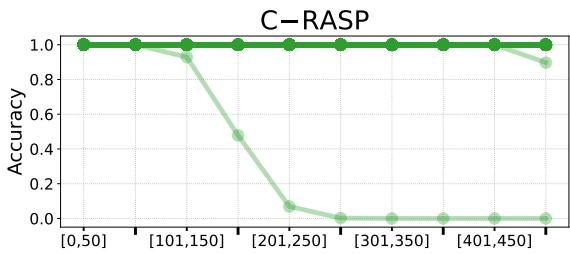

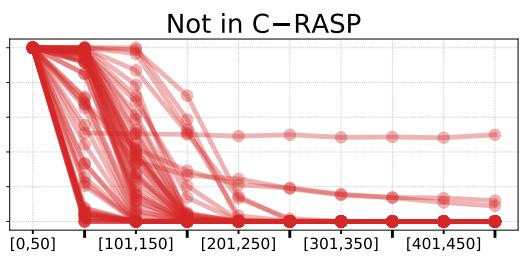  
Figure 4: Length generalization by C-RASP membership. Models are trained on strings of lengths in $[ l _ { m i n } , 5 0 ]$ and evaluated on ranges from $[ l _ { m i n } , \bar { 5 0 } ]$ (in-distribution) up to [451, 500] in steps of 50. Each curve corresponds to a language from Table 1.

## B.1.2 Length Generalization Across Seeds and Languages

The results in the main paper report the best successful seed for each language. To assess whether the observed length generalization behavior is robust across random seeds (i.e. random model initializations), we additionally aggregate results over the five best successful seeds per language, where a seed is considered successful if it achieves 100% accuracy on the in-distribution test data. Figure 5 reports these results across R, C-RASP \ R, R ◦ G \ C-RASP, and outside $\mathbf { R } \circ \mathbf { G } ,$ while Figure 6 groups them only by C-RASP membership. Results show that languages outside C-RASP consistently fail to length generalize across languages and across random seeds.

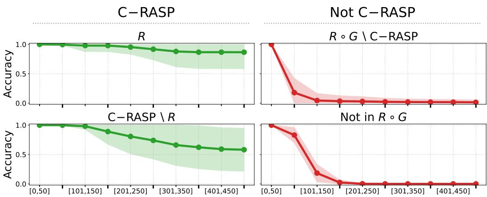  
Figure 5: Length generalization on regular languages (aggregated across languages and seeds). Models are trained on strings of lengths in $[ \tilde { l _ { m i n } } , 5 0 ]$ and evaluated on length ranges from $[ l _ { m i n } , 5 0 ]$ (in-distribution) up to [451, 500] in steps of 50. For each language we compute the mean accuracy across its 5 best successful seeds, where a seed is considered successful if it achieves 100% accuracy on the in-distribution test data. Solid lines show the mean of these per-language curves within each group, and shaded regions show one standard deviation across languages. Green corresponds to languages in C-RASP, while red corresponds to languages not in C-RASP. Each panel includes all languages in the corresponding group from Table 1.

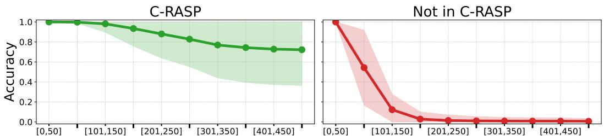  
Figure 6: Length generalization by C-RASP membership, aggregated across languages and seeds. Models are trained on strings of lengths in $[ l _ { m i n } , \hat { 5 } 0 ]$ and evaluated on length ranges from $[ l _ { m i n } , 5 0 ]$ (in-distribution) up to [451, 500] in steps of 50. For each language, we compute the mean accuracy across its 5 best successful seeds, where a seed is considered successful if it achieves 100% accuracy on the in-distribution test data. Solid lines show the mean of these per-language curves for languages within and outside C-RASP, and shaded regions show one standard deviation across languages. In contrast to Figure $5 ,$ which separates languages into R, C-RASP \ R, R ◦ G \ C-RASP, and those outside $\mathbf { \tilde { R } } \circ \mathbf { G } ,$ here we group the same languages by C-RASP membership only, providing an overall view of length generalization within and outside C-RASP. Each panel includes all languages in the corresponding group from Table 1.

## B.1.3 Increased Training Data Size

Finally, we test how increased training data size affects length generalization within different classes. We repeat the experiments with 100K sampled words per language, using an 80/20 train-test split, compared to 10K training examples in the original experiments. We otherwise follow the same training and hyperparameter search procedure described in Section 5. Figure 7 shows that increasing the amount of training data does not change trends in length generalization: languages in C-RASP continue to generalize beyond the training lengths, while languages outside C-RASP do not. In Figure 8 we again regroup the same results from Figure 7 into languages in and outside of C-RASP only.

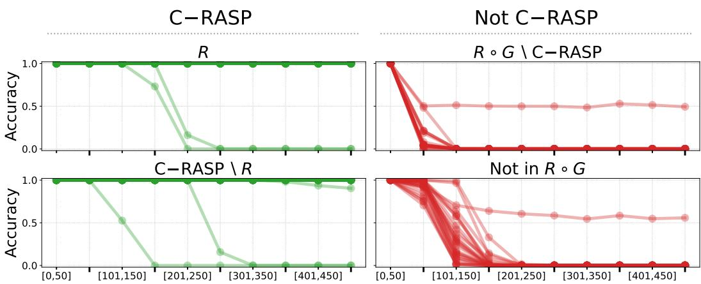  
Figure 7: Length generalization on regular languages with increased training data. Models are trained on strings of lengths in $[ l _ { m i n } , 5 0 ]$ using a larger training set (100K examples instead of 10K), and evaluated on lengths from $[ l _ { m i n } , 5 0 ]$ (in-distribution) up to [401, 500] in steps of 50. Each curve corresponds to a language. We report the best seed per language. Increasing the training data does not change trends in length generalization: languages in $\mathsf { C - R A S } \breve { \mathsf { P } }$ continue to generalize, while languages not in ${ \mathsf { C } } { \cdot } { \check { \mathsf { R A S P } } }$ consistently fail to generalize beyond the training range. For these experiments, we used the systematically generated subset of languages listed in Table 1, consisting of 100 languages in total.

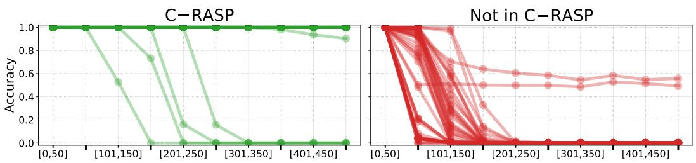  
Figure 8: Length generalization by C-RASP membership with increased training data. Models are trained on strings of lengths in $[ l _ { m i n } , 5 0 ]$ using a larger training set (100K examples instead of 10K) and evaluated on length ranges from $[ l _ { m i n } , 5 0 ]$ (in-distribution) up to [401, 500] in steps of width 50. Each curve corresponds to a language, and we report the best seed per language. In contrast to Figure $^ { 7 , }$ which separates languages into the four groups $\mathbf { R } ,$ C-RASP\R, R ◦ G\C-RASP, and languages outside $\scriptstyle { \mathbf { R } } \circ \mathbf { G } ,$ here we group the same languages solely by C-RASP membership, providing an overall view of length generalization within and outside C-RASP. For these experiments, we used the systematically generated subset of languages listed in Table 1, consisting of 100 languages in total.

## B.2 Experiments on More Complex Languages

To test whether our findings extend to more complex languages, we repeat our experiments on a systematically generated set of 50 regular languages with greater nesting depth (Table 2), following the same experimental procedure described in Section 5. In addition, we increase the maximum training length from 50 to 200, allowing us to examine length generalization behavior when models are trained on longer strings.

## B.2.1 Length Generalization

In Figure 9 we show results across R, C-RASP \ R, R ◦ G \ C-RASP, and those outside $\mathbf { R } \circ \mathbf { G } .$ confirming length generalization trends seen on simpler languages and shorter training lengths. Figure 10 highlights this length generalization trends further by dividing languages into subsets of in and outside of C-RASP providing a more summarized overview.

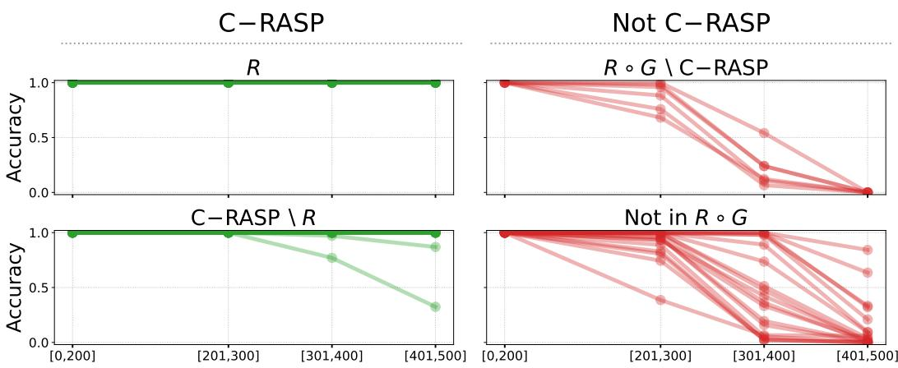  
Figure 9: Length generalization on regular languages (longer training length). Models are trained on strings of lengths in $[ l _ { m i n } , 2 0 0 ]$ ], and evaluated on length ranges $[ l _ { m i n } , 2 0 0 ]$ (in-distribution) up to [401, 500] in steps of 100. Each curve corresponds to a language. Green curves denote languages in C-RASP, while red curves denote languages not in C-RASP. Languages in ${ \mathsf { C } } { \mathrm { - R A S P } }$ maintain near-perfect accuracy well beyond the training range, whereas languages outside C-RASP exhibit rapid degradation, typically failing shortly after. Languages corresponding to this plot can be viewed in Table 2.

## B.2.2 Results by C-RASP Membership

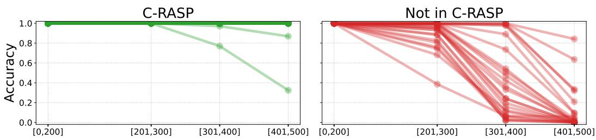  
Figure 10: Length generalization by C-RASP membership (longer training length). Models are trained on strings of lengths in $[ l _ { m i n } , 2 0 0 ]$ and evaluated on length ranges from $[ l _ { m i n } , 2 0 0 ]$ (in-distribution) up to [401, 500] in steps of 100. Each curve corresponds to a language. In contrast to Figure 9, which separates languages into the four groups R, C-RASP\R, $\mathbf { R } \circ \mathbf { G } \backslash \mathsf { C - R A S P }$ , and languages outside $\mathbf { R } \circ \mathbf { G } ,$ , here we group the same languages by C-RASP membership, providing an overall view of length generalization within and outside C-RASP. Each panel includes all languages in the corresponding group from Table 2.

## B.2.3 Length Generalization Across Seeds and Languages

Similar to Section B.1.2, we evaluate how consistent length generalization trends are across random seeds (i.e. random model initializations) and languages within a class. We compute the mean accuracy across the five best successful seeds for each language and aggregate these results across languages. Figure 11 shows that same length generalization trends persist across seeds: languages in C-RASP maintain high accuracy beyond the training length range, while languages outside C-RASP consistently degrade with increasing length. Figure 12 further emphasizes this difference by grouping languages in and outside of C-RASP.

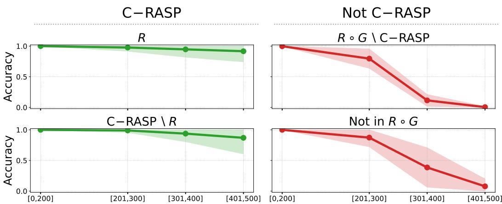  
Figure 11: Length generalization on regular languages (aggregated across languages and seeds). Models are trained on strings of lengths in $[ l _ { m i n } , \bar { 2 } 0 0 ]$ and evaluated on length ranges from $[ l _ { m i n } , 2 0 0 ]$ (in-distribution) up to [401, 500] in steps of 100. For each language we compute the mean accuracy across its 5 best successful seeds, where a seed is considered successful if it achieves 100% accuracy on the in-distribution test data. Solid lines show the mean of these per-language curves within each class, and shaded regions show one standard deviation across languages. Green corresponds to languages in C-RASP, while red corresponds to languages not in C-RASP. Results for individual best seeds are shown in Figure 9. Each panel includes all languages in the corresponding class from Table 2.

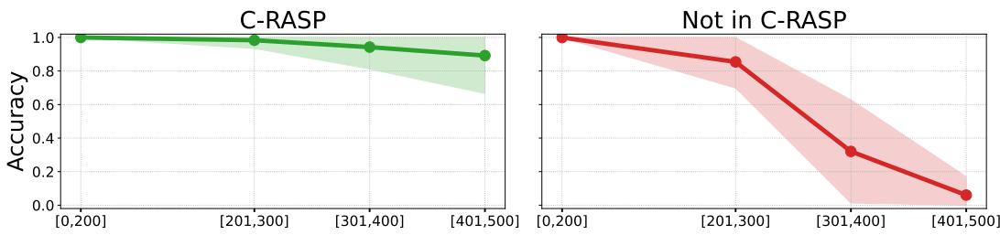  
Figure 12: Length generalization by C-RASP membership, aggregated across languages and seeds. Models are trained on strings of lengths in $[ l _ { m i n } , 2 \breve { 0 } \breve { 0 } ]$ and evaluated on length ranges from $[ l _ { m i n } , 2 0 0 ]$ (in-distribution) up to [401, 500] in steps of 100. For each language, we compute the mean accuracy across its 5 best successful seeds, where a seed is considered successful if it achieves 100% accuracy on the in-distribution test data. Solid lines show the mean of these per-language curves for languages within and outside C-RASP, and shaded regions show one standard deviation across languages. In contrast to Figure 11, which separates languages into the four groups R, C-RASP\R, $\mathbf R \circ \mathbf G \backslash$ C-RASP, and languages outside $\mathbf { R } \circ \mathbf { G } ,$ , here we group the same languages solely by ${ \mathsf { C } } { \mathsf { - R A S P } }$ membership, providing an overall view of length generalization within and outside C-RASP. Each panel includes all languages in the corresponding group from Table 2.

## B.3 Regular Languages

We report the complete set of regular languages used in our experimental evaluation in the main paper and appendix. Tables 1 and 2 provide a comprehensive overview of the dataset. For each language, we indicate membership in ${ \bf R } , { \bf R } ^ { \omega } , \dot { \bf R } \circ { \bf G } ,$ , and C-RASP.

## C Algebraic Preliminaries

Definition 16 (Recognition; Syntactic Monoid). Let $L \subseteq \Sigma ^ { * }$ be a language. A monoid M recognizes L iffthere is a homomorphism h : $\Sigma ^ { * }  M$ and a subset $X \subseteq M$ such that $L = h ^ { - 1 } ( X )$

<table><tr><td rowspan=1 colspan=6>Formal Language       R C-RASPRω R o G | F</td><td rowspan=1 colspan=6>ormal Language                      RC-RASPRω  $\mathbf { R } \circ \mathbf { G }$ </td></tr><tr><td rowspan=1 colspan=6> $( b b a c ) ^ { * }$                False True True True</td><td rowspan=1 colspan=6> $( a b ) ^ { * } + ( b b ) ^ { * }$                         FalseFalse False True</td></tr><tr><td rowspan=1 colspan=5> $( b a b + b ) ^ { * }$             FalseFalseFalse</td><td rowspan=1 colspan=1>False</td><td rowspan=1 colspan=5> $( b b ) ^ { * } ( b b ) ^ { * }$                            FalseFalseFalse</td><td rowspan=1 colspan=1>True</td></tr><tr><td rowspan=1 colspan=5> ${ \dot { ( } } c + b ( a ) ^ { * } { \dot { ) } } ^ { * }$            FalseFalseFalse</td><td rowspan=1 colspan=1>False</td><td rowspan=1 colspan=5> $( ( b ) ^ { * } a c ) ^ { * }$                             False FalseFalse</td><td rowspan=1 colspan=1>False</td></tr><tr><td rowspan=1 colspan=5> $\dot { b } + ( b \dot { b } ) ^ { * }$              FalseFalseFalse</td><td rowspan=1 colspan=1>True</td><td rowspan=1 colspan=5> $\dot { ( b c ( c ) ^ { * } ) ^ { * } }$                             FalseFalseFalse</td><td rowspan=1 colspan=1>False</td></tr><tr><td rowspan=1 colspan=5> $a c a b c c ( c ) ^ { * }$             True True True</td><td rowspan=1 colspan=1>True</td><td rowspan=1 colspan=5> $( b a + a ) ^ { * }$                            FalseFalseFalse</td><td rowspan=1 colspan=1>False</td></tr><tr><td rowspan=1 colspan=5> $b b c c ( a \dot { a } ) ^ { * }$              FalseFalse False</td><td rowspan=1 colspan=1>True</td><td rowspan=1 colspan=5> $( a c ) ^ { * } c + b a + a$                        False True True</td><td rowspan=1 colspan=1>True</td></tr><tr><td rowspan=1 colspan=5> $( a b ( a ) ^ { * } ) ^ { * }$              FalseFalseFalse</td><td rowspan=1 colspan=1>False</td><td rowspan=1 colspan=5> $( b + a ) ^ { * } a a a c$                          False False False</td><td rowspan=1 colspan=1>False</td></tr><tr><td rowspan=1 colspan=5> ${ \dot { ( } } c c { \dot { ) } } ^ { * ^ { ? } }$              FalseFalseFalse</td><td rowspan=1 colspan=1>True</td><td rowspan=1 colspan=6> $( b b ) ^ { * } c b a c$                           FalseFalseFalse True</td></tr><tr><td rowspan=1 colspan=4> $( ( a ) ^ { * } a c ) ^ { * }$              FalseFalse</td><td rowspan=1 colspan=1>False</td><td rowspan=1 colspan=1>False</td><td rowspan=1 colspan=6> $\hat { ( } ( b ) ^ { * } ) ^ { * } ( a b ) ^ { * }$                          FalseTrue True True</td></tr><tr><td rowspan=1 colspan=3> $( ( b ) ^ { * } a b ) ^ { * }$              False</td><td rowspan=1 colspan=1>False</td><td rowspan=1 colspan=1>False</td><td rowspan=1 colspan=1>False</td><td rowspan=1 colspan=2> $b \dot { b } a ( \dot { c } + \dot { a } ) ^ { * }$ </td><td rowspan=1 colspan=3>True True True</td><td rowspan=1 colspan=1>True</td></tr><tr><td rowspan=1 colspan=3> $( \grave { a } c ( a ) ^ { * } ) ^ { * }$              False</td><td rowspan=1 colspan=1>False</td><td rowspan=1 colspan=1>False</td><td rowspan=1 colspan=1>False</td><td rowspan=1 colspan=2> $c b ( a ) ^ { * } b a a$ </td><td rowspan=1 colspan=1>True</td><td rowspan=1 colspan=2>True True</td><td rowspan=1 colspan=1>True</td></tr><tr><td rowspan=1 colspan=2> $( c c a + a ) ^ { * }$ </td><td rowspan=1 colspan=1>False</td><td rowspan=1 colspan=1>False</td><td rowspan=1 colspan=1>False</td><td rowspan=1 colspan=1>False</td><td rowspan=1 colspan=2>(b)*baa</td><td rowspan=1 colspan=1>True</td><td rowspan=1 colspan=2>True True</td><td rowspan=1 colspan=1>True</td></tr><tr><td rowspan=1 colspan=2> $\dot { c } b ( a ) ^ { * } + a b b c$ </td><td rowspan=1 colspan=1>True</td><td rowspan=1 colspan=1>True</td><td rowspan=1 colspan=1>True</td><td rowspan=1 colspan=1>True</td><td rowspan=1 colspan=2> $( \grave { a } \grave { a } + ( b ) ^ { * } ) ^ { * }$ </td><td rowspan=1 colspan=1>False</td><td rowspan=1 colspan=2>FalseFalse</td><td rowspan=1 colspan=1>True</td></tr><tr><td rowspan=1 colspan=2> $a a ( a ) ^ { * } c$ </td><td rowspan=1 colspan=1>True</td><td rowspan=1 colspan=1>True</td><td rowspan=1 colspan=1>True</td><td rowspan=1 colspan=1>True</td><td rowspan=1 colspan=2>aa + ca(aa)*</td><td rowspan=1 colspan=1>False</td><td rowspan=1 colspan=2>FalseFalse</td><td rowspan=1 colspan=1>True</td></tr><tr><td rowspan=1 colspan=3> $( a \dot { a } + a a ) ^ { * }$             False</td><td rowspan=1 colspan=1>False</td><td rowspan=1 colspan=1>False</td><td rowspan=1 colspan=1>True</td><td rowspan=1 colspan=2> $( a ) ^ { * } ( a ) ^ { * } b + a a c$ </td><td rowspan=1 colspan=1>True</td><td rowspan=1 colspan=2>True True</td><td rowspan=1 colspan=1>True</td></tr><tr><td rowspan=1 colspan=3> $( a + c ) ^ { * } c b b b$           False</td><td rowspan=1 colspan=1>False</td><td rowspan=1 colspan=1>False</td><td rowspan=1 colspan=1>False</td><td rowspan=1 colspan=5> $( b { \dot { b } } ) ^ { * } a { \dot { b } } + a c$                          False FalseFalse</td><td rowspan=1 colspan=1>True</td></tr><tr><td rowspan=1 colspan=3> $\dot { b } c ( b ) ^ { * } a b b b$             True</td><td rowspan=1 colspan=1>True</td><td rowspan=1 colspan=1>True</td><td rowspan=1 colspan=1>True</td><td rowspan=1 colspan=3> $( \boldsymbol { c } \boldsymbol { c } ) ^ { * } \boldsymbol { c } \boldsymbol { c } \boldsymbol { c } \boldsymbol { b }$                             False</td><td rowspan=1 colspan=2>FalseFalse</td><td rowspan=1 colspan=1>True</td></tr><tr><td rowspan=1 colspan=3> $( \hat { c a } ) ^ { * } ( \hat { c b } ) ^ { * }$             False</td><td rowspan=1 colspan=1>True</td><td rowspan=1 colspan=1>True</td><td rowspan=1 colspan=1>True</td><td rowspan=1 colspan=3>(b)*cbbcaa                           True</td><td rowspan=1 colspan=2>True True</td><td rowspan=1 colspan=1>True</td></tr><tr><td rowspan=1 colspan=3>(cc)*ccb + b          False</td><td rowspan=1 colspan=1>False</td><td rowspan=1 colspan=1>False</td><td rowspan=1 colspan=1>True</td><td rowspan=1 colspan=2> $( ( b ) ^ { * } b ) ^ { * }$ </td><td rowspan=1 colspan=1>True</td><td rowspan=1 colspan=2>True True</td><td rowspan=1 colspan=1>True</td></tr><tr><td rowspan=1 colspan=3> $\grave { ( } ( a ) ^ { * } ) ^ { * } ( a c ) ^ { * }$            False</td><td rowspan=1 colspan=1>True</td><td rowspan=1 colspan=1>True</td><td rowspan=1 colspan=1>True</td><td rowspan=1 colspan=2> $c c c ( b a ) ^ { * }$ </td><td rowspan=1 colspan=1>False</td><td rowspan=1 colspan=2>True True</td><td rowspan=1 colspan=1>True</td></tr><tr><td rowspan=1 colspan=3>bccb(aa)*             False</td><td rowspan=1 colspan=1>False</td><td rowspan=1 colspan=1>False</td><td rowspan=1 colspan=1>True</td><td rowspan=1 colspan=2> $b c a \dot { c } ( a ) ^ { * } + b a$ </td><td rowspan=1 colspan=1>True</td><td rowspan=1 colspan=2>True True</td><td rowspan=1 colspan=1>True</td></tr><tr><td rowspan=1 colspan=3> $( b a ) ^ { \ast } ( b ) ^ { \ast } b c$            False</td><td rowspan=1 colspan=1>True</td><td rowspan=1 colspan=1>True</td><td rowspan=1 colspan=1>True</td><td rowspan=1 colspan=2> $( b ) ^ { * } c c ( c a ) ^ { * }$ </td><td rowspan=1 colspan=1>False</td><td rowspan=1 colspan=2>True True</td><td rowspan=1 colspan=1>True</td></tr><tr><td rowspan=1 colspan=3> $( a c ) ^ { * } b a ( b ) ^ { * }$            False</td><td rowspan=1 colspan=1>True</td><td rowspan=1 colspan=1>True</td><td rowspan=1 colspan=1>True</td><td rowspan=1 colspan=2> $( c a b + c ) ^ { * }$ </td><td rowspan=1 colspan=1>False</td><td rowspan=1 colspan=2>FalseFalse</td><td rowspan=1 colspan=1>False</td></tr><tr><td rowspan=1 colspan=2> $( a ) ^ { * } b + \dot { a } c a b$ </td><td rowspan=1 colspan=1>True</td><td rowspan=1 colspan=1>True</td><td rowspan=1 colspan=1>True</td><td rowspan=1 colspan=1>True</td><td rowspan=1 colspan=2> $( a + a c + a ) ^ { * }$ </td><td rowspan=1 colspan=1>False</td><td rowspan=1 colspan=2>FalseFalse</td><td rowspan=1 colspan=1>False</td></tr><tr><td rowspan=1 colspan=2> $( \dot { c a } ) ^ { * } ( a ) ^ { * } b b$ </td><td rowspan=1 colspan=1>False</td><td rowspan=1 colspan=1>True</td><td rowspan=1 colspan=1>True</td><td rowspan=1 colspan=1>True</td><td rowspan=1 colspan=2> $\dot { a } b a + c ( b b ) ^ { * }$ </td><td rowspan=1 colspan=1>False</td><td rowspan=1 colspan=2>FalseFalse</td><td rowspan=1 colspan=1>True</td></tr><tr><td rowspan=1 colspan=2> $\ ` ( b ) ^ { * } ( \dot { b } ) ^ { * } ( a a ) ^ { * }$ </td><td rowspan=1 colspan=1>False</td><td rowspan=1 colspan=1>False</td><td rowspan=1 colspan=1>False</td><td rowspan=1 colspan=1>True</td><td rowspan=1 colspan=2> $( ( a ) ^ { * } c a ) ^ { * }$ </td><td rowspan=1 colspan=1>False</td><td rowspan=1 colspan=2>FalseFalse</td><td rowspan=1 colspan=1>False</td></tr><tr><td rowspan=1 colspan=2> $b + \dot { c } a + \dot { b } ( \dot { c } + a ) ^ { * }$ </td><td rowspan=1 colspan=1>True</td><td rowspan=1 colspan=1>True</td><td rowspan=1 colspan=1>True</td><td rowspan=1 colspan=1>True</td><td rowspan=1 colspan=2>(abbc)*</td><td rowspan=1 colspan=1>False</td><td rowspan=1 colspan=1>True</td><td rowspan=1 colspan=1>True</td><td rowspan=1 colspan=1>True</td></tr><tr><td rowspan=1 colspan=2> $( c b b + b ) ^ { * }$ </td><td rowspan=1 colspan=1>False</td><td rowspan=1 colspan=1>False</td><td rowspan=1 colspan=1>False</td><td rowspan=1 colspan=1>False</td><td rowspan=1 colspan=2> $( \boldsymbol { a } + \boldsymbol { \dot { c } } ) ^ { * } ( \boldsymbol { c } \boldsymbol { b } ) ^ { * }$ </td><td rowspan=1 colspan=1>False</td><td rowspan=1 colspan=1>False</td><td rowspan=1 colspan=1>False</td><td rowspan=1 colspan=1>False</td></tr><tr><td rowspan=1 colspan=2> $\dot { c } + c a b + ( b c ) ^ { * }$ </td><td rowspan=1 colspan=1>False</td><td rowspan=1 colspan=1>True</td><td rowspan=1 colspan=1>True</td><td rowspan=1 colspan=1>True</td><td rowspan=1 colspan=2>(aa)*bb(a)*</td><td rowspan=1 colspan=1>False</td><td rowspan=1 colspan=1>False</td><td rowspan=1 colspan=1>False</td><td rowspan=1 colspan=1>True</td></tr><tr><td rowspan=1 colspan=2> $( c ) ^ { * } b + b ( \dot { b } ) ^ { * }$ </td><td rowspan=1 colspan=1>True</td><td rowspan=1 colspan=1>True</td><td rowspan=1 colspan=1>True</td><td rowspan=1 colspan=1>True</td><td rowspan=1 colspan=2>a(bc)*</td><td rowspan=1 colspan=1>False</td><td rowspan=1 colspan=1>True</td><td rowspan=1 colspan=1>True</td><td rowspan=1 colspan=1>True</td></tr><tr><td rowspan=1 colspan=2> $( c a ( c ) ^ { * } ) ^ { * }$ </td><td rowspan=1 colspan=1>False</td><td rowspan=1 colspan=1>False</td><td rowspan=1 colspan=1>False</td><td rowspan=1 colspan=1>False</td><td rowspan=1 colspan=2> $( \grave { c } a ) ^ { * } ( a b ) ^ { * }$ </td><td rowspan=1 colspan=1>False</td><td rowspan=1 colspan=1>True</td><td rowspan=1 colspan=1>True</td><td rowspan=1 colspan=1>True</td></tr><tr><td rowspan=1 colspan=2> $\dot { b } a \dot { b } \dot { ( b a ) ^ { * } }$ </td><td rowspan=1 colspan=1>False</td><td rowspan=1 colspan=1>True</td><td rowspan=1 colspan=1>True</td><td rowspan=1 colspan=1>True</td><td rowspan=1 colspan=1>((ac)*)*</td><td rowspan=1 colspan=1></td><td rowspan=1 colspan=1>False</td><td rowspan=1 colspan=1>True</td><td rowspan=1 colspan=1>True</td><td rowspan=1 colspan=1>True</td></tr><tr><td rowspan=1 colspan=2> $b b b c ( c a ) ^ { * }$ </td><td rowspan=1 colspan=1>False</td><td rowspan=1 colspan=1>True</td><td rowspan=1 colspan=1>True</td><td rowspan=1 colspan=1>True</td><td rowspan=1 colspan=1> $( b a + a + c ) ^ { * }$ </td><td rowspan=1 colspan=1></td><td rowspan=1 colspan=1>False</td><td rowspan=1 colspan=1>False</td><td rowspan=1 colspan=1>False</td><td rowspan=1 colspan=1>False</td></tr><tr><td rowspan=1 colspan=2>(abcb)*</td><td rowspan=1 colspan=1>False</td><td rowspan=1 colspan=1>True</td><td rowspan=1 colspan=1>True</td><td rowspan=1 colspan=1>True</td><td rowspan=1 colspan=1> $\hat { \ b { \ b } } ( a ) ^ { * } ) ^ { * } ( c c ) ^ { \hat { \ b } } .$ </td><td rowspan=1 colspan=1></td><td rowspan=1 colspan=1>False</td><td rowspan=1 colspan=1>False</td><td rowspan=1 colspan=1>False</td><td rowspan=1 colspan=1>True</td></tr><tr><td rowspan=1 colspan=2> $\dot { c } c + \dot { c } c ( b b ) ^ { * }$ </td><td rowspan=1 colspan=1>False</td><td rowspan=1 colspan=1>False</td><td rowspan=1 colspan=1>False</td><td rowspan=1 colspan=1>True</td><td rowspan=1 colspan=2> $( ( b ) ^ { * } a + c ) ^ { * }$ </td><td rowspan=1 colspan=1>False</td><td rowspan=1 colspan=1>False</td><td rowspan=1 colspan=1>False</td><td rowspan=1 colspan=1>False</td></tr><tr><td rowspan=1 colspan=2> $b c b a + { \dot { ( a ) } } ^ { * } a a$ </td><td rowspan=1 colspan=1>True</td><td rowspan=1 colspan=1>True</td><td rowspan=1 colspan=1>True</td><td rowspan=1 colspan=1>True</td><td rowspan=1 colspan=2> $( b a ) ^ { * } c b + a a$ </td><td rowspan=1 colspan=1>False</td><td rowspan=1 colspan=1>True</td><td rowspan=1 colspan=1>True</td><td rowspan=1 colspan=1>True</td></tr><tr><td rowspan=1 colspan=2> $a + c ( a ) ^ { * } c b + a$ </td><td rowspan=1 colspan=1>True</td><td rowspan=1 colspan=1>True</td><td rowspan=1 colspan=1>True</td><td rowspan=1 colspan=1>True</td><td rowspan=1 colspan=2>(baaa)*</td><td rowspan=1 colspan=1>False</td><td rowspan=1 colspan=1>True</td><td rowspan=1 colspan=1>True</td><td rowspan=1 colspan=1>True</td></tr><tr><td rowspan=1 colspan=1> $( c b ( c ) ^ { * } ) ^ { * }$ </td><td rowspan=1 colspan=1></td><td rowspan=1 colspan=1>False</td><td rowspan=1 colspan=1>False</td><td rowspan=1 colspan=1>False</td><td rowspan=1 colspan=1>False</td><td rowspan=1 colspan=2> $( b a a + b ) ^ { * }$ </td><td rowspan=1 colspan=1>False</td><td rowspan=1 colspan=1>False</td><td rowspan=1 colspan=1>False</td><td rowspan=1 colspan=1>False</td></tr><tr><td rowspan=1 colspan=1> $( ( b ) ^ { * } b c ) ^ { * }$ </td><td rowspan=1 colspan=1></td><td rowspan=1 colspan=1>False</td><td rowspan=1 colspan=1>False</td><td rowspan=1 colspan=1>False</td><td rowspan=1 colspan=1>False</td><td rowspan=1 colspan=2> $\dot { c } c c ( b ) ^ { * }$ </td><td rowspan=1 colspan=1>True</td><td rowspan=1 colspan=1>True</td><td rowspan=1 colspan=1>True</td><td rowspan=1 colspan=1>True</td></tr><tr><td rowspan=1 colspan=1> $( \dot { a } + a a \dot { c } ) ^ { * }$ </td><td rowspan=1 colspan=1></td><td rowspan=1 colspan=1>False</td><td rowspan=1 colspan=1>False</td><td rowspan=1 colspan=1>False</td><td rowspan=1 colspan=1>False</td><td rowspan=1 colspan=2> $a a ( \dot { c } ) ^ { * } + a c c a$ </td><td rowspan=1 colspan=1>True</td><td rowspan=1 colspan=1>True</td><td rowspan=1 colspan=1>True</td><td rowspan=1 colspan=1>True</td></tr><tr><td rowspan=1 colspan=1> $( c b ) ^ { * } c a a + b$ </td><td rowspan=1 colspan=1></td><td rowspan=1 colspan=1>False</td><td rowspan=1 colspan=1>True</td><td rowspan=1 colspan=1>True</td><td rowspan=1 colspan=1>True</td><td rowspan=1 colspan=2> $( a ) ^ { * } c a a a + c$ </td><td rowspan=1 colspan=1>True</td><td rowspan=1 colspan=1>True</td><td rowspan=1 colspan=1>True</td><td rowspan=1 colspan=1>True</td></tr><tr><td rowspan=1 colspan=2> $\dot { c } a a \dot { b } a + ( a ) ^ { * }$ </td><td rowspan=1 colspan=1>True</td><td rowspan=1 colspan=1>True</td><td rowspan=1 colspan=1>True</td><td rowspan=1 colspan=1>True</td><td rowspan=1 colspan=2> $( ( a ) ^ { * } b b ) ^ { * }$ </td><td rowspan=1 colspan=1>False</td><td rowspan=1 colspan=1>False</td><td rowspan=1 colspan=1>False</td><td rowspan=1 colspan=1>False</td></tr><tr><td rowspan=1 colspan=2>(cc)*bac</td><td rowspan=1 colspan=1>False</td><td rowspan=1 colspan=1>False</td><td rowspan=1 colspan=1>False</td><td rowspan=1 colspan=1>True</td><td rowspan=1 colspan=2> $( \grave { b } b ) ^ { * } ( c ) ^ { * } a c$ </td><td rowspan=1 colspan=1>False</td><td rowspan=1 colspan=1>False</td><td rowspan=1 colspan=1>False</td><td rowspan=1 colspan=1>True</td></tr><tr><td rowspan=1 colspan=2> $( b + a c + c ) ^ { * }$ </td><td rowspan=1 colspan=1>False</td><td rowspan=1 colspan=1>False</td><td rowspan=1 colspan=1>False</td><td rowspan=1 colspan=1>False</td><td rowspan=1 colspan=2> $( b ) ^ { * } b + a a + b b a$ </td><td rowspan=1 colspan=1>True</td><td rowspan=1 colspan=1>True</td><td rowspan=1 colspan=1>True</td><td rowspan=1 colspan=1>True</td></tr><tr><td rowspan=1 colspan=2>(acba)*</td><td rowspan=1 colspan=1>False</td><td rowspan=1 colspan=1>True</td><td rowspan=1 colspan=1>True</td><td rowspan=1 colspan=1>True</td><td rowspan=1 colspan=2>(b + bc)*</td><td rowspan=1 colspan=1>False</td><td rowspan=1 colspan=1>False</td><td rowspan=1 colspan=1>False</td><td rowspan=1 colspan=1>False</td></tr><tr><td rowspan=1 colspan=2> $\grave { c } b a c ( a ) ^ { * }$ </td><td rowspan=1 colspan=1>True</td><td rowspan=1 colspan=1>True</td><td rowspan=1 colspan=1>True</td><td rowspan=1 colspan=1>True</td><td rowspan=1 colspan=2> $\mathit ( b ) ^ { * } c c ( \mathit { \hat { b } } ) ^ { * } c a$ </td><td rowspan=1 colspan=1>True</td><td rowspan=1 colspan=1>True</td><td rowspan=1 colspan=1>True</td><td rowspan=1 colspan=1>True</td></tr><tr><td rowspan=1 colspan=2> $( a ) ^ { * } { \dot { ( a ) } } ^ { * } ( b b ) ^ { * }$ </td><td rowspan=1 colspan=1>False</td><td rowspan=1 colspan=1>False</td><td rowspan=1 colspan=1>False</td><td rowspan=1 colspan=1>True</td><td rowspan=1 colspan=2>aca(a)*</td><td rowspan=1 colspan=1>True</td><td rowspan=1 colspan=1>True</td><td rowspan=1 colspan=1>True</td><td rowspan=1 colspan=1>True</td></tr><tr><td rowspan=1 colspan=2> $( ( a ) ^ { * } a b ) ^ { * }$ </td><td rowspan=1 colspan=1>False</td><td rowspan=1 colspan=1>False</td><td rowspan=1 colspan=1>False</td><td rowspan=1 colspan=1>False</td><td rowspan=1 colspan=2>bcbb(bb)*</td><td rowspan=1 colspan=1>False</td><td rowspan=1 colspan=1>False</td><td rowspan=1 colspan=1>False</td><td rowspan=1 colspan=1>True</td></tr><tr><td rowspan=1 colspan=2> $\dot { b a c a } ( b c ) ^ { * }$ </td><td rowspan=1 colspan=1>False</td><td rowspan=1 colspan=1>True</td><td rowspan=1 colspan=1>True</td><td rowspan=1 colspan=1>True</td><td rowspan=1 colspan=2> $( a ) ^ { * } a ( b + b ) ^ { * }$ </td><td rowspan=1 colspan=1>True</td><td rowspan=1 colspan=1>True</td><td rowspan=1 colspan=1>True</td><td rowspan=1 colspan=1>True</td></tr><tr><td rowspan=1 colspan=2> $( c a ) ^ { * } ( c c ) ^ { * }$ </td><td rowspan=1 colspan=1>False</td><td rowspan=1 colspan=1>False</td><td rowspan=1 colspan=1>False</td><td rowspan=1 colspan=1>True</td><td rowspan=1 colspan=2> $\dot { b } + c + a c ( \dot { a } c ) ^ { * }$ </td><td rowspan=1 colspan=1>False</td><td rowspan=1 colspan=2>True True</td><td rowspan=1 colspan=1>True</td></tr><tr><td rowspan=1 colspan=2> $( a b + a a b b ) ^ { * }$ </td><td rowspan=1 colspan=1>False</td><td rowspan=1 colspan=1>False</td><td rowspan=1 colspan=1>False</td><td rowspan=1 colspan=1>False</td><td rowspan=1 colspan=2> $( a b + b b a a ) ^ { * }$ </td><td rowspan=1 colspan=1>False</td><td rowspan=1 colspan=2>True True</td><td rowspan=1 colspan=1>True</td></tr><tr><td rowspan=1 colspan=3>(aa)*                False</td><td rowspan=1 colspan=1>False</td><td rowspan=1 colspan=1>False</td><td rowspan=1 colspan=1>True</td><td rowspan=1 colspan=2> $\dot { ( a ^ { + } b ^ { + } ) } +$ </td><td rowspan=1 colspan=1>False</td><td rowspan=1 colspan=1>False</td><td rowspan=1 colspan=1>False</td><td rowspan=1 colspan=1>False</td></tr><tr><td rowspan=1 colspan=3> $( a b ) ^ { + } a ^ { + }$               False</td><td rowspan=1 colspan=1>True</td><td rowspan=1 colspan=1>True</td><td rowspan=1 colspan=1>True</td><td rowspan=1 colspan=2> $( a b ) ^ { + } a ^ { + } b ^ { + }$ </td><td rowspan=1 colspan=1>False</td><td rowspan=1 colspan=1>True</td><td rowspan=1 colspan=1>True</td><td rowspan=1 colspan=1>True</td></tr><tr><td rowspan=1 colspan=2> $\dot { ( } a b ) ^ { + } a ^ { + } b ^ { + } a ^ { + }$ </td><td rowspan=1 colspan=1>False</td><td rowspan=1 colspan=1>True</td><td rowspan=1 colspan=1>True</td><td rowspan=1 colspan=1>True</td><td rowspan=1 colspan=2> $( a b ) ^ { + } b ^ { + } ) ^ { + }$ </td><td rowspan=1 colspan=1>False</td><td rowspan=1 colspan=1>False</td><td rowspan=1 colspan=1>False</td><td rowspan=1 colspan=1>False</td></tr><tr><td rowspan=1 colspan=2> $( a b ) ^ { + } b ^ { + } ) ^ { k }$ </td><td rowspan=1 colspan=1>False</td><td rowspan=1 colspan=1>True</td><td rowspan=1 colspan=1>True</td><td rowspan=1 colspan=1>True</td><td rowspan=1 colspan=2> $( a b + b a ) ^ { * }$ </td><td rowspan=1 colspan=1>False</td><td rowspan=1 colspan=1>True</td><td rowspan=1 colspan=1>True</td><td rowspan=1 colspan=1>True</td></tr><tr><td rowspan=1 colspan=2> $( \grave { a } b ) ^ { + } b ( a \grave { b } ) ^ { + }$ </td><td rowspan=1 colspan=1>False</td><td rowspan=1 colspan=1>True</td><td rowspan=1 colspan=1>True</td><td rowspan=1 colspan=1>True</td><td rowspan=1 colspan=2> $( a b + b b a ) ^ { * }$ </td><td rowspan=1 colspan=1>False</td><td rowspan=1 colspan=1>False</td><td rowspan=1 colspan=1>True</td><td rowspan=1 colspan=1>True</td></tr><tr><td rowspan=1 colspan=2> $( a + b + ) ^ { k }$ </td><td rowspan=1 colspan=1>True</td><td rowspan=1 colspan=1>True</td><td rowspan=1 colspan=1>True</td><td rowspan=1 colspan=1>True</td><td rowspan=1 colspan=2> $\dot { a } b e ^ { * } b e ^ { * }$ </td><td rowspan=1 colspan=1>False</td><td rowspan=1 colspan=1>False</td><td rowspan=1 colspan=1>False</td><td rowspan=1 colspan=1>False</td></tr><tr><td rowspan=1 colspan=2>(ab)*</td><td rowspan=1 colspan=1>False</td><td rowspan=1 colspan=1>True</td><td rowspan=1 colspan=1>True</td><td rowspan=1 colspan=1>True</td><td rowspan=1 colspan=2> $( a ( a b ) ^ { * } b ) ^ { * }$ </td><td rowspan=1 colspan=1>False</td><td rowspan=1 colspan=1>True</td><td rowspan=1 colspan=1>True</td><td rowspan=1 colspan=1>True</td></tr><tr><td rowspan=1 colspan=2>b∑*</td><td rowspan=1 colspan=1>True</td><td rowspan=1 colspan=1>True</td><td rowspan=1 colspan=1>True</td><td rowspan=1 colspan=1>True</td><td rowspan=1 colspan=2>∑*b</td><td rowspan=1 colspan=1>False</td><td rowspan=1 colspan=1>False</td><td rowspan=1 colspan=1>False</td><td rowspan=1 colspan=1>False</td></tr><tr><td rowspan=1 colspan=3> $( \Sigma \backslash \{ a , b _ { 0 } \} ) ^ { * } a ( \Sigma \backslash \{ b _ { 1 } \} ) ^ { * }$  True</td><td rowspan=1 colspan=1>True</td><td rowspan=1 colspan=1>True</td><td rowspan=1 colspan=1>True</td><td rowspan=1 colspan=2> $\begin{array} { r l } & { \overline { { ( \Sigma ) } } ^ { \circ } \{ a _ { 1 } , b _ { 0 } \} ) ^ { \ast } a _ { 1 } \big ( \Sigma \backslash \{ a _ { 2 } , b _ { 1 } \} \big ) ^ { \ast } a _ { 2 } \big ( \Sigma \backslash \{ b _ { 2 } \} \big ) ^ { \ast } } \\ & { \Sigma ^ { \ast } a b \Sigma ^ { \ast } } \end{array}$ </td><td rowspan=1 colspan=1>True</td><td rowspan=1 colspan=1>True</td><td rowspan=1 colspan=1>True</td><td rowspan=1 colspan=1>True</td></tr><tr><td rowspan=1 colspan=3>True</td><td rowspan=1 colspan=1>True</td><td rowspan=1 colspan=1>True</td><td rowspan=1 colspan=1>True</td><td rowspan=1 colspan=2>∑ab∑</td><td rowspan=1 colspan=1>True</td><td rowspan=1 colspan=1>True</td><td rowspan=1 colspan=1>True</td><td rowspan=1 colspan=1>True</td></tr><tr><td rowspan=1 colspan=3> $a ^ { * } ( b a ^ { * } b a ^ { * } ) ^ { * }$            False</td><td rowspan=1 colspan=2>FalseFalse</td><td rowspan=1 colspan=1>True</td><td rowspan=1 colspan=2> $\Sigma ^ { * } a \Sigma ^ { * } b \Sigma ^ { * }$ </td><td rowspan=1 colspan=1>True</td><td rowspan=1 colspan=2>True True</td><td rowspan=1 colspan=1>True</td></tr><tr><td rowspan=1 colspan=3> $( \Sigma \backslash b _ { 0 } ) ^ { * } a ( \Sigma \backslash a , b _ { 1 } ) ^ { * }$      False</td><td rowspan=1 colspan=3>FalseFalseFalse</td><td rowspan=1 colspan=3></td><td rowspan=1 colspan=3></td></tr></table>

Table 1: Set of 125 regular languages used in the experiments in Figure 3 and in Section B.1. For each language, we report membership in ${ \bf R } , \hat { { \bf R } } ^ { \omega } , { \bf R } \circ { \bf G } ,$ , and C-RASP (where True in a column denotes membership in the column’s class). For each language, we sampled 10K words for the training set (lengths $l _ { m i n } { - } 5 0 )$ and 1K words for each evaluation length bin.

The syntactic monoid $M ( L )$ of a language L is the minimal monoid (up to isomorphism) which recognizes L.

Definition 17 (Basic Units). The three basic semigroup units $U _ { 1 } , U _ { 3 } , U _ { 2 }$ are given with their multiplication tables, where rows denote thefirst operand and columns denote the second.

Definition 18 (Basic monoid operations). We define basic monoid operations.

Formal Language R C-RASP Rω R ◦ G   
(ab)∗bb(aabb)∗ False True True True   
$( a b { b } ) ^ { * } ( { a } ) ( c + a ) ( a ) c b { b } + a ^ { * } ( c )$ False True True True   
$( b ^ { * } c a + c a ) ( a c + b ) ( c + a ) ^ { * } ( b ) ^ { * } + ( b c ) ^ { * } ( b + c ) ( c ) + a ( c ) ^ { * } c a a$ False True True True   
$( b ^ { * } b c + b b ) c ( a ) ( a ) c ^ { \prime } s ^ { * } a a + ( b c ) ^ { \prime } ( b ) ^ { * } ( b ) b ^ { * } a a + ( a + a ) ( b ) a b a + ( c ) ^ { * } c ^ { * } b c + b ^ { * } + b c + a$ False True True True   
(cba)∗ a False True True True   
$( c a c ) ^ { * } b ( b + c ) ^ { * } a ^ { * } + b b + a ( b ) a ^ { * } b a + ( a ) ^ { * } c ^ { * } b b$ False True True True   
(cb)∗ab + (aa + a)∗a(a)bba False True True True   
(ac + aa + c)(ca $\stackrel { \prime } { + } b + \stackrel { \prime } { b } ) ( c + a ) ^ { * } b a ^ { * } a b + ( a b + c ) ^ { * } ( b + c ) ^ { * } ( b ) ^ { * } a ^ { * } a c + c + b ^ { * } a b c + b ^ { * } c b + b c + c + b + a c + a + b + c + a + c$ False True True True   
$( c ^ { * } c c + b ) ( b \dot { c } ) ^ { * } ( c + a ) ^ { * } \stackrel { \prime } { + } ( b c \dot { a } ) ^ { * } + b$ False True True True   
$( a c c ) ^ { * } + ( a b + c + b ) ( a + b ) ^ { * } + ( a + b ) + c a b c$ False True True True   
$( c a c ) ^ { * } ( c a + c + c ) ( c ) ( b ) ^ { * } c c c + ( a c + c ^ { ' } + a ) ^ { * } a ^ { * } ( c ) ^ { * } b a + ( a + a ) ^ { * } ( a ) a$ False True True True   
(bcb)∗(b)(b)∗(c)∗ a∗ False True True True   
$( a ^ { * } a c + { b } a + a + a ) ( a b + c ) ^ { * } b a ^ { * } b ^ { * } b c$ False True True True   
$( b c b + c + c + c ) ( \acute { b c } + c + \acute { b } ) ( b + a ) ^ { * } ( a ) ^ { * } b b a$ False False False False   
$( a ^ { * } c c + b b + b ) ( \dot { a } c ) ^ { * } b ^ { * } + ( c \dot { + } b + \dot { b } ) ^ { * } ( a ) ( b ) a ^ { * } b a + ( a + c ) ^ { * } c c$ False False False False   
(bcb + cb + a + c)∗ False False False False   
$\displaystyle { \big ( c c b + a c + c + b \big ) + ( c c + b ) ^ { * } ( b + c ) ^ { * } ( c ) c b a + a ^ { * } }$ False False False False   
$b ^ { * } + ( c b + a ) ^ { * } ( c + b ) ^ { * } c ^ { * } c ^ { * } c + ( a + a ) ^ { * } ( c ) b ^ { * } + ( b ) ^ { * }$ False False False False   
$( b ^ { * } c + b a ) ^ { * } c ^ { * } + ( a a + b + c ) ( a + c ) a ^ { * } c c c$ False False False False   
(a∗ab + cb + a + c) False False False False   
$( c b { b } + c { b } + a + a ) ( c a + b + c ) ^ { * } ( c + b ) ^ { * } _ { , } ( b ) ^ { * } b ^ { * } + ( c b ) ^ { * } ( a + b ) ( b ) + b ( b ) c ^ { * } b a$ False False False False   
$( b ^ { * } a b + a b + a + \acute { c } ) ^ { * } ( c b + b ) ( b ) ^ { * } + c ^ { * } ( b + b ) ^ { * } ( c ) ^ { * }$ False False False False   
$( a ^ { * } b b + b a + b + b ) ^ { * } + b ^ { * } ( b ^ { ' } + a ) ( c ) a c b + c ( b ) b ^ { * } b +$ aaba + cc False False False False   
$( c ^ { * } b b + b b + c ) + ( a b + c + c ) ^ { * } a b + ( b + c ) ^ { * } a + a b$ False False False False   
$( c ^ { * } + b b + c + a ) ( a c + a ) c ( c ) { \overset { . } { a } } ^ { * } a b + ( c b + b + a ) ( a ) a ^ { * } c + ( c + b ) ^ { * } ( b ) b ^ { * } a$ False False False False   
$( b ^ { * } c a + c b + b ) ^ { * } ( a + a ) ( b + a ) a$ False False False False   
(baa + ab + b)∗ False False False False   
$( c ^ { * } + a c + a + b ) ^ { * } b ^ { * } ( c + b )$ False False False False   
$\dot { ( } a ^ { * } c b + c a + b + a ) c + a ^ { * } c ^ { * } c ^ { * } + ( b + a ) ^ { * } ( a ) ^ { * } b ^ { * } a c + ( b ) a ^ { * } c$ False False False False   
$a ^ { * } + ( a a + a + c ) ( a ) ( b ) ^ { * } b + ( b + a ) ^ { * } ( a ) b b a$ False False False False   
$( a b { b } + b ) ( b a + c + c ) ( c + a ) + ( b ) ( a + b ) ^ { * } + ( c ) b ^ { * } c ^ { * } + ( a ) ^ { * } a ^ { * } a$ True True True True   
(b∗cc + bb + b + a)(ca + b) True True True True   
$( b ^ { * } b + c a + b + c ) ( a + a + c ) ^ { * } ( a + c ) + ( a a + c ) a ( a )$ True True True True   
(a∗)∗ True True True True   
$\ ` ( a c a ) ^ { * } ( a + c + a ) ^ { * } + ( b a + b + a ) ^ { * } c c ^ { * } c ^ { * } + ( c ) ( b ) ^ { * } b + b ^ { * } a a b + b$ True True True True   
$\dot { ( c b c ) } ( \dot { b } c ) a ^ { * } ( c ) ^ { * } \dot { a } ^ { * } a b \dot { + } a ^ { * } ( a + b ) \dot { ( c ) } c ^ { * } b b + \dot { c } ^ { * } \dot { ( c ) } ^ { * } a ^ { * } a a$ True True True True   
$\dot { b } ^ { * } ( \dot { b } a + c ) c ^ { * } c ^ { * } + c ( b + b ) ^ { * } b c c c + ( c ) a ^ { * } c ^ { * } b b + a ^ { * } c ^ { * } c c$ True True True True   
$b + b ^ { * } ( c ) \dot { ( } b ) c c a + \dot { a } c ^ { * } b a a + ( b ) ^ { * } a c + b ^ { * } c b + b + c + b$ True True True True   
$( a c c + c + c + b ) ( a ) ( a + a ) ^ { * } ( a ) ^ { * } b b b + ( b a + a + b ) + a ^ { * } c a ^ { * } a a + ( b ) + a c c$ True True True True   
$\dot { a } ^ { * } b ^ { * } + a ( b + a ) \dot { ( a ) } \dot { b } ^ { * } a c$ True True True True   
$( a ^ { * } b ) ^ { * } + ( a c + b + a ) b ^ { * } b c ^ { * } c b$ False False False False   
$\dot { ( } a ^ { * } a \dot { c } ) + \dot { c } ^ { * } b ( c ) ^ { * } + ( \stackrel { \cdot } { c } + b ) ^ { * } + ( b )$ aac True True True True   
a∗ + (a)∗ True True True True   
(a + bb)∗ a∗ False False False True   
(b∗bc) + (aa + c)∗ False False False True   
$( c c + a a + , a + b ) ( a a + b + b ) ^ { * } + b ^ { * } b + ( b + b ) ( c ) a c a + ( a ) ^ { * } a c b + c a b$ False False False True   
(b + aa + b + c)∗ False False False True   
b(aa + c)∗(b)(b)cca False False False True   
$( \dot { a } ) + ( b \dot { b } ) ^ { * } + a ^ { * } a ^ { * } c a c b$ False False False True   
(b∗cc)∗ False False False False  
Table 2: Set of 50 regular languages used in the experiments in B.2. For each language, we report membership in $\mathbf { R } , \mathsf { C - R A S P } , \mathbf { R } ^ { \omega }$ and $\mathbf { R } \circ \mathbf { \dot { G } }$ (where True in a column denotes membership in the column’s class). For each language, we sampled 10K words for the training set (lengths $l _ { m i n } - 2 0 0 )$ and 1K words for each evaluation length bin.

<table><tr><td colspan="2">U1 0 1</td><td></td><td> $U _ { 3 }$ </td><td>a b</td><td></td><td> $U _ { 2 }$ </td><td>1</td><td>a</td><td>b</td></tr><tr><td>0</td><td>0</td><td>0</td><td></td><td>a</td><td>b</td><td></td><td>1</td><td>1</td><td>a</td><td>b</td></tr><tr><td>1</td><td>0</td><td>1</td><td></td><td>b</td><td>a a b</td><td></td><td>a b</td><td>a b</td><td>a a</td><td>b b</td></tr></table>

• Submonoid. A monoid M is a submonoid of N (usually written $M \leq N )$ whenever $M \subseteq N$ and M is closed under the monoid operation of N.

• Direct product. The direct product $M \times N$ of monoids M and N has elements $( m , n )$ where m $\in \dot { M }$ and $n \in N .$ , with the operation $( m _ { 1 } , n _ { 1 } ) \cdot _ { M \times N } ( m _ { 2 } , n _ { 2 } ) = ( m _ { 1 } \cdot _ { M } m _ { 2 } , n _ { 1 } \cdot _ { N } n _ { 2 } )$

• Homomorphism. A homomorphism of monoids $\phi \colon M \to N$ is a function such that $\dot { \phi } ( 1 _ { M } ) = \dot { 1 } _ { N } a n d \phi ( m _ { 1 } ) \phi ( m _ { 2 } ) = \phi ( \tilde { m _ { 1 } } m _ { 2 } ) ,$

• Division. A monoid M divides a monoid N (written $M \preceq N )$ whenever there is a submonoid $X \leq N$ of N and a homomorphism $\phi \colon X \to M$ such that $M = \phi ( X )$

Definition 19 (Pseudovariety). A pseudovariety of monoids is a class closed under submonoids, division, and finite direct products. A pseudovariety of languages is a class closed under inverse homomorphism, Boolean operations, and shifts $( a ^ { - 1 } L b ^ { - 1 } )$

Definition 20. Define V◦W as the pseudovariety generated by all V◦W where $V \in \mathbf { V }$ and $W \in { \bf W }$ Define $\mathbf { w } \mathrm { p } ^ { 1 } ( \mathbf { V } ) = \mathbf { V } , \mathbf { w } \mathrm { p } ^ { k + 1 } ( \mathbf { V } ) = \mathbf { w } \mathrm { p } ^ { k } ( \mathbf { V } ) \circ \mathbf { V } ,$ , and $\begin{array} { r } { \mathbf { w p c } ( \mathbf { V } ) = \bigcup _ { k > 0 } \mathbf { w p } ^ { k } ( \mathbf { V } ) } \end{array}$ . We also define $\mathrm { w p } ^ { k } ( M ) f o r$ monoids, taking $\mathrm { w p } ^ { 1 } ( M )$ as the pseudovariety generated by M.

We define some pseudovarieties that we use in the paper:

Definition 21. The following are standard, except for Dy.

• R is the pseudovariety of R-trivial monoids (Brzozowski & Fich, 1980)

• A is the pseudovariety of all aperiodic monoids

• G is the pseudovariety of all finite groups

• Dy is the pseudovariety generated by $\dot { M } \left( \mathcal { D } _ { k } \right) f o r a l l k \in \mathbb { N }$

An important relation on monoid elements we will use is the R relation (Brzozowski & Fich, 1980):

Definition 22. For $s , t \in M$ , we say $s \preceq _ { \mathcal { R } } \ t \Leftrightarrow s M \subseteq t M .$

R-classes are the equivalence classes for $\displaystyle { \mathit { \check { s } } } \sim _ { \mathcal { R } } t \Leftrightarrow [ s \preceq _ { \mathcal { R } } t \wedge t \preceq _ { \mathcal { R } } s ] .$

Proposition 23. $M ( \mathcal { D } _ { k } ) \preceq ( U _ { 1 } \circ \mathbb { Z } _ { k + 3 } ) \circ U _ { 1 }$ , where $\mathbb { Z } _ { k + 3 }$ is the cyclic group of order $k + 3 .$

Proof. First consider the submonoid of $( U _ { 1 } \circ \mathbb { Z } _ { k + 3 } ) \times U _ { 1 }$ generated by $( ( g , 0 ) , 1 ) , ( ( g , 1 ) , 0 )$ and $( ( g , k + 2 ) , 0 )$ where $g \in U _ { 1 } ^ { \mathbb { Z } _ { k + 3 } }$ given by $g ( x ) = 0 \iff x \in \{ k + 1 , k + 2 \}$ . It can be verified that $( ( g , 0 ) , 1 ) \mapsto \check { \epsilon } , ( ( g , 1 ) , 0 \check { ) } \mapsto a ,$ and $( ( g , k + 2 ) , 0 ) \mapsto b$ extends to a surjective homomorphism $h \colon U _ { 1 } \circ \mathbb { Z } _ { k + 3 } \to M ( { \tilde { \mathcal { D } } } _ { k } ) \times U _ { 1 }$ . Finally, using the fact that direct products divide wreath products, we conclude that $M ( \mathcal { D } _ { k } ) \preceq ( U _ { 1 } \circ \mathbb { Z } _ { k + 3 } ) \circ U _ { 1 }$ □

Intuitively, computation in $\mathbb { Z } _ { k + 3 }$ detects if the depth ever exceeds $k + 1$ , and this depthviolation is detected by $U _ { 1 }$ . Another $U _ { 1 }$ detects non-emptiness of the string.

## D Linear RASP programs

In this section we abstract from C-RASP to the class of linear RASP programs, which intuitively are a class of straight-line programs in which each operation at position i can only depend on previously defined operations and positions $j \leq i .$ This content follows Therien & Wilke´ (2001).

Definition 24 (Linear RASP programs). Linear RASP programs are those with the syntax

$$
\phi : : = \sigma \mid \neg \phi _ { 1 } \mid \phi _ { 1 } \land \phi _ { 2 } \mid \mathcal { O } \langle \phi _ { 1 } , \phi _ { 2 } , \ldots , \phi _ { k } \rangle
$$

where $\sigma \in \Sigma$ and O is some operator of arity k. For each operator there is an associated collection $K _ { \mathcal { O } } \subseteq \Sigma ^ { * } \times ( 2 ^ { \mathrm { N } } ) ^ { k }$ of words and sets of positions contained in the operator. Semantics are defined

$$
\begin{array} { l l l l } { w , i | = \sigma } & { \iff } & { w _ { i } = \sigma } \\ { w , i | = \neg \phi  } & { \iff } & { w , i | \neq \phi  } \\ { w , i | = \phi _ { 1 } \wedge \phi _ { 2 }  } & { \iff } & { w , i | = \phi _ { 1 } a n d w , i | = \phi _ { 2 }  } \\ { w , i | = \emptyset \langle \phi _ { 1 } , \phi _ { 2 } , \dots , \phi _ { k } \rangle  } & { \iff } & { ( w _ { \leq i } , \{ j \mid w , j | = \phi _ { 1 }  \} , \dots , \{ j \mid w , j | = \phi _ { k }  \} ) \in K _ { \emptyset } } \end{array}
$$

This is just defining Lindstrom quantifiers, which can be instantiated by the typical logics as¨ follows.

Example 25. Linear Temporal Logic is the class of Linear RASP programs with the binary since operator, typically written infix.

$$
K _ { \mathsf { s i n c e } } = \left\{ \left( w , R _ { 1 } , R _ { 2 } \right) \mid \exists k \in R _ { 2 } s t k < \left| w \right| a n d \left[ k , \left| w \right| \right) \subseteq R _ { 1 } \right\}
$$

In this way

$$
w , i | = \phi _ { 1 } \operatorname { s i n c e } \phi _ { 2 } \begin{array} { l } { \iff ( w _ { \leq i } , \{ j \mid w , j \mid = \phi _ { 1 } \} , \{ j \mid w , j \mid = \phi _ { 2 } \} ) \in K _ { \operatorname { s i n c e } } } \\  \iff t h e r e \ : e x i s t s k < i s u c h t h a t w , k | = \phi _ { 2 } a n d w , j | = \phi _ { 1 } f o r \ : a l l \ : k < j < i \end{array}
$$

Similarly, C-RASP is the class of linear RASP programs with the operator $\left( \Lambda , C \right) = \sum _ { 1 \leq m \leq k } \lambda _ { m }$ $\overline { { \# } } \phi _ { m } \geq C$

$$
K _ { ( \Lambda , C ) } = \left\{ ( w , R _ { 1 } , R _ { 2 } , \ldots , R _ { k } ) \bigg | \sum _ { 1 \leq m \leq k } \lambda _ { m } \cdot | R _ { m } | \geq C \right\}
$$

In this way

$$
\begin{array} { r l r } & { w , i \in \displaystyle \sum _ { 1 \leq m \leq k } \lambda _ { m } \cdot \overleftarrow { \# } \phi _ { m } \geq C \iff ( w _ { \leq i } , \{ j \mid w , j \mid = \phi _ { 1 } \} , \ldots \{ j \mid w , j \mid = \phi _ { 2 } \} ) \in K _ { ( \Lambda , C ) } } & \\ & { } & { \iff \displaystyle \sum _ { 1 \leq m \leq k } \lambda _ { m } \cdot \vert \{ j \mid w , j \vert = \phi _ { m } \} \vert \geq C } \end{array}
$$

Definition 26. Let Φ and Ψ be classes of linear RASP programsformulas over alphabet Γ and Σ, respectively. Let $G = \{ \psi _ { \gamma } \} _ { \gamma \in \Gamma }$ be a family of formulas in Ψ. Let $\dot { \theta _ { G } }$ be a mapping of formulas given by

$$
\begin{array} { r l r l r l } & { \theta _ { G } ( Q _ { \gamma } ) } & & { \mapsto } & & { \psi _ { \gamma } } \\ & { \theta _ { G } ( \lnot \phi ) } & & { \mapsto } & & { \lnot \theta _ { G } ( \phi ) } \\ & { \theta _ { G } ( \phi _ { 1 } \land \phi _ { 2 } ) } & & { \mapsto } & & { \theta _ { G } ( \phi _ { 1 } ) \land \theta _ { G } ( \phi _ { 2 } ) } \\ & { \theta _ { G } ( \phi _ { 1 } , \phi _ { 2 } , \ l \phi _ { 1 } \rangle ) } & & { \mapsto } & & { \mathcal { O } \langle \theta _ { G } ( \phi _ { 1 } ) , \theta _ { G } ( \phi _ { 2 } ) , \ l \dots , \theta _ { G } ( \phi _ { k } ) \rangle ) } \end{array}
$$

We write $\phi [ \gamma \mapsto \psi _ { \gamma } ]$ for this substitution. This is called a Ψ substitution of Φ formulas. We write Φ⋆Ψ for the class of all Ψ substitutions of Φ formulas. The semantics are as would be expected. By default we let this operation be right-associative.

To help formalize the expressivity of linear RASP programs, we define a class of languages. Definition 27 (End-Pointed Language). A pointed word is a tuple $( w , p )$ for $w \in \Sigma ^ { * }$ and $1 \leq p \leq | w |$ . An end-pointed language is a set of pointed words where the point denotes the end of the prefix of the string used for recognition.

• For Φ a class of linear RASP programs, $P ( \Phi )$ is the set ofpointed languages Lfor which there exists $\phi \in \Phi$ such that $( w , \breve { p } ) \in L i f f w , p \vdash \phi .$

• For M a class of typed monoids, $\dot { \mathbf { \nabla } } P ( \mathbf { M } )$ is the set of pointed languages L for which there exists $( M , \mathfrak { T } _ { M } , \overset { \cdot } { \mathcal { E } } _ { M } ) \in \mathbf { M }$ , typed homomorphism $h \colon \mathbf { \bar { \Sigma } } ^ { * }  ( M , \overleftarrow { \mathfrak { T } } _ { M } , \overleftarrow { \mathcal { E } } _ { M } ) , \bar { a } t y p e \mathfrak { M } \in \mathfrak { T } _ { M } ,$ and a finite set $C \subseteq M$ such that $( w , p ) \dot { \in } L i f f ( h ( w _ { 1 } w _ { 2 } \cdot \cdot \cdot w _ { p - 1 } ) , \dot { h ( w _ { p } ) } ) \dot { \in } \mathfrak { M } \times C$

Programs are classically connected to algebraic characterizations of languages via wreath product principles. We define how to take two classes of programs and obtain a more complex class.

Definition 28 (Program composition). Let Φ, Ψ be classes of linear RASP programs. The class $\Phi { \star } \Psi$ consists of all programs in Φ where atomic operations may refer to programs in Ψ.

For instance, $\mathsf { C } { \mathsf { - R A S P } } _ { 1 } { \star } \mathsf { C } { \mathsf { - R A S P } } _ { 1 }$ is equivalent to the class of depth 2 programs ${ \mathsf { C } } { \mathrm { - R A S P } } _ { 2 }$ We will see in section E.2 that linear RASP programs can be closely connected to wreath products of monoids.

## E Typed Monoids

Krebs (2008) developed a framework for using infinite monoids to recognize languages. We present a restriction of the aforementioned framework to the case of wreath products (a one-sided version of the block product used in previous work), which ultimately provides an exact algebraic characterization of C-RASP. The core issue here is that the wreath product of infinite monoids can generate uncountably many elements, which can be too powerful.

Proposition 29. Consider the classic wreath product $\mathbb { Z } \mathrm { o } \mathbb { Z } .$ . Then $M ( L ) \preceq \mathbb { Z } \circ \mathbb { Z } .$ for every L.

Proof. Without loss of generality let $\Sigma = \{ 0 , 1 \}$ . Consider the submonoid of $\mathbb { Z } \circ \mathbb { Z }$ generated by the image of $\Sigma ^ { * }$ under the homomorphism $\sigma \mapsto ( f _ { \sigma } , 1 )$ where $f _ { \sigma } ( x ) = \sigma \cdot 2 ^ { | x | }$ . In essence, this creates a mapping $w \mapsto \left( f _ { w } , | w | \right)$ where $f _ { w } ( 0 )$ outputs the integer value of the binary number w. Thus, $\dot { \mathbb { Z } } \circ \breve { \mathbb { Z } }$ can recognize arbitrary languages. 口

This problem motivates the definition of typed monoids, which restricts the accepting sets.

## E.1 Definitions

Definition 30. A typed monoid is a triple $\left( M , \mathfrak { T } _ { M } , \mathcal { E } _ { M } \right)$ where M is afinitely generated monoid, ${ \mathfrak { T } } _ { M }$ is afinite Boolean algebra over M, and $\mathcal { E } _ { M }$ is afinite subset of M. Elements $o \bar { f } \mathfrak { T } _ { M }$ are the types and elements of $\mathcal { E } _ { M }$ are the units. A language L is recognized by $( M , \mathfrak { T } _ { M } , \mathcal { E } _ { M } ) \ \overset { \cdot } { i f }$ there exists a homomorphism $h \colon \Sigma ^ { * } \to M$ such that $h ( \Sigma ) \subseteq \mathcal { E } _ { M }$ and $\bar { L } = h ^ { - 1 } ( \mathfrak { M } )$ for some ${ \mathfrak { M } } \in { \mathfrak { T } } _ { M }$

As an example, the language MAJORITY can be recognized by the typed monoid $( \mathbb { Z } , \{ ( - \infty , 0 ] , ^ { \bullet } [ 1 , \infty ) , \mathbb { Z } , \emptyset \} , \{ - 1 , 1 \} )$ via the type $[ 1 , \infty )$ and the homomorphism $a \mapsto 1$ and $b \mapsto - 1$ . We will typically refer to this typed monoid as $\mathbb { Z }$

## We define morphisms

Definition 31. Let $\left( S , \mathfrak { T } _ { S } , \mathcal { E } _ { S } \right)$ and $\left( T , \mathfrak { T } _ { T } , \mathcal { E } _ { T } \right)$ be typed monoids. A typed monoid homomorphism $h \colon ( S , \mathfrak { T } _ { S } , \mathcal { E } _ { S } )  ( T , \mathfrak { T } _ { T } , \mathcal { \bar { E } } _ { T } )$ is a triple $( h _ { S } , h _ { \mathfrak { T } _ { S } } , h _ { \mathcal { E } _ { S } } )$ such that:

$h _ { S } \colon S \to T$ is a monoid homomorphism

$h _ { \mathfrak { T } _ { \mathfrak { S } } } \colon \mathfrak { T } _ { S }  \mathfrak { T } _ { T }$ is a homomorphism of Boolean algebras

• ∀S ∈ TS, hS(S) = hT (S) ∩ hS(S)

• ∀s ∈ ES, hS(s) = hE (s)

And due to the compatibility $o f h _ { S } , h _ { \mathfrak { T } _ { S } } , h _ { \mathcal { E } _ { S } }$ we can omit the subscripts. We say that a typed monoid $\left( S , \mathfrak { T } _ { S } , \mathcal { E } _ { S } \right)$ recognizes the language $L \subseteq \Sigma ^ { * }$ if there is a morphism h : $\Sigma ^ { * }  S$ with $h ( \Sigma ) \subseteq \mathcal { E } _ { S }$ and a type ${ \mathfrak { S } } \in { \mathfrak { T } } _ { S }$ such that $L = h ^ { - 1 } ( \mathfrak { S } )$

So we want our functions to be compatible with the finite types, which motivates the following definition. In a sense, this requires that all elements of the same type, up to some constant shifting C, behave the same under the function.

Definition 32 (Type-respecting Functions). Let S be a set and $\left( T , \mathfrak { T } _ { T } , \mathcal { E } _ { T } \right)$ be a typed monoid and let $C \subseteq T$ be a nonempty finite set of constants. A function $f : T  S$ is called type respecting with respect to $\left( T , \mathfrak { T } _ { T } , \mathcal { E } _ { T } \right)$ and C if the preimage $f ^ { - 1 } ( s )$ can be described by afinite Boolean combination of conditions of the form tc $\in \mathfrak { T }$ where c is a constant in T (not necessarily in $\mathcal { E } _ { T } )$ and $\mathfrak { T } \in \mathfrak { T } _ { T }$

Intuitively, the image of x under a type-respecting function depends only on the type of xc for some qualified set of constants c. Now the typed wreath product is similar to the untyped case, though the functions are constrained to be type-respecting functions.

Definition 33 (Typed Wreath Product). Let $( M , \mathfrak { T } _ { M } , \mathcal { E } _ { M } ) , ( N , \mathfrak { T } _ { N } , \mathcal { E } _ { N } )$ be two typed monoids, $C \subseteq N$ be afinite set. The typed wreath produc

$$
( U , \mathfrak { T } _ { U } , \mathcal { E } _ { U } ) = ( M , \mathfrak { T } _ { M } , \mathcal { E } _ { M } ) \mathfrak { o } _ { C } ( N , \mathfrak { T } _ { N } , \mathcal { E } _ { N } )
$$

of $\left( M , \mathfrak { T } _ { M } , \mathcal { E } _ { M } \right)$ with $\left( N , \mathfrak { T } _ { N } , \mathcal { E } _ { N } \right)$ is defined such that

$\mathcal { E } _ { U }$ consists of all elements $( f , n )$ , where $n \in \mathcal { E } _ { N } .$ , and $f : N \to \mathcal { E } _ { M }$ is a type respecting function (see definition 32) with respect to $\left( N , \mathfrak { T } _ { N } , \mathcal { E } _ { N } \right)$ and C

• U is the submonoid of M◦N generated by $\mathcal { E } _ { l J }$ ${ \mathfrak { T } } _ { U }$ consists of all types $\mathfrak { U } _ { \mathfrak { M } , \mathfrak { N } } = \{ ( f , n ) \in U \mid f ( 1 _ { N } ) \in \mathfrak { M } , n \in \mathfrak { N } \}$ , where $\mathfrak { M } \in \mathfrak { T } _ { M }$ $\mathfrak { N } \in \mathfrak { T } _ { N }$

Definition 34 (Typed Monoid Pseudovariety). A typed monoid pseudovariety is a class of typed monoids closed under

• Division

• Shifting (changing types by inverse multiplication)

• Unit relaxation (swapping out units)

• Trivial extension (applying a congruence)

Definition 35 (Typed Wreath Product Closure). For typed monoid pseudovarieties define V◦W as the pseudovariety generated by all V ·◦W where $V \in \mathbf { V }$ and $W \in { \bf W }$ . Define $\mathbf { w p } ^ { 1 } ( \mathbf { V } ) = \mathbf { V } ,$ $\mathbf { w } \mathbf { p } ^ { k + 1 } ( \mathbf { V } ) = \mathbf { w } \mathbf { p } ^ { k } ( \mathbf { V } ) \circ \mathbf { V } .$ , and wpc $( \mathbf { V } ) = \bigcup _ { k > 0 } \mathbf { w } \mathbf { p } ^ { k } ( \mathbf { V } )$ . We also define $\mathbf { w p } ^ { k } ( ( M , \mathfrak { T } _ { M } , \mathcal { E } _ { M } ) )$ for typed monoids $\left( M , \mathfrak { T } _ { M } , \mathcal { E } _ { M } \right)$ , taking $\mathrm { w p } ^ { 1 } ( ( M , \mathfrak { T } _ { M } , \mathcal { E } _ { M } ) )$ ) as the pseudovariety generated by $( M , \overset { \cdot } { \mathfrak { T } } _ { M } , \mathcal { E } _ { M } )$

Finally, we note the compatibility of the classical wreath product and the typed wreath product, which will become important in our algebraic decision procedure.

Lemma 36. Assume $M \preceq S , N \preceq T$ where $M ,$ N are finite and S, T are typed. Then

$$
M \circ N \preceq S ^ { N } \odot T\tag{1}
$$

where ◦ is the classical wreath product and ·◦ is the typed wreath product.

Proof. Call these typed semigroups $\left( S , \mathfrak { T } _ { S } , \mathcal { E } _ { S } \right)$ and $\left( T , \mathfrak { T } _ { T } , \mathcal { E } _ { T } \right)$ . Let $h _ { M } \colon ( S ^ { \prime } , \mathfrak { T } _ { S } { } ^ { \prime } , \mathcal { E } _ { S } { } ^ { \prime } ) \ $ $( M , \overset { \cdot } { 2 } ^ { M } , M )$ and $h _ { N } \colon \left( T ^ { \prime } , \mathfrak { T } _ { T ^ { \prime } } , \bar { \mathcal { E } } _ { T } { } ^ { \prime } \right) ^ { - } \to \left( N , 2 ^ { N } , N \right)$ define the divisions. We will define a function $h \colon ( U , \mathfrak { T } _ { U } , \mathcal { E } _ { U } ) $ M◦N where $( U , \mathfrak { T } _ { U } , \mathcal { E } _ { U } ) \le ( S ^ { N } , \mathfrak { T } _ { S } { } ^ { N } , \mathcal { E } _ { S } { } ^ { N } ) \odot ( T , \mathfrak { T } _ { T } , \mathcal { E } _ { T } )$ . First, let U be the submonoid of $( S ^ { N } ) ^ { T } \times T$ generated by $\left( f _ { d } , t \right)$ where $f _ { d }$ for $d \in ( S ^ { \prime } ) ^ { N }$ is defined such that $f _ { d } ( 1 _ { T } ) = d$ and $f _ { d } ( t ) = [ \check { n } \mapsto d ( n + \check { h _ { N } } ( \check { t } ) ) ]$ for all $t \in T ^ { \prime }$ , and $f _ { d } ( t ) = 1 _ { ( S ^ { \prime } ) ^ { N } }$ for $t \in T \setminus T ^ { \prime }$ . Note that all $( f , t )$ in U satisfy the following constraints:

1. $t \in T ^ { \prime }$   
2. $\operatorname { I m } ( \operatorname { I m } ( f ) ) \subseteq S ^ { \prime }$   
3. $f ( t _ { 1 } + t _ { 2 } ) ( n ) = f ( t _ { 1 } ) ( n + h _ { N } ( t _ { 2 } ) )$   
4. $\mathbf { \dot { \boldsymbol { f } } } ( t _ { 1 } ) = \mathbf { \dot { \boldsymbol { f } } } ( t _ { 2 } )$ whenever $h _ { N } ( t _ { 1 } ) \stackrel { \cdot \cdot } { = } h _ { N } ( t _ { 2 } )$   
5. Im $\left( f ( t ) \right) = 1 _ { S ^ { \prime } { } ^ { N } }$ for $t \in T \setminus { \dot { T } } ^ { \prime }$

As a submonoid of the wreath product, ${ \mathfrak { T } } _ { U }$ consists of all types $\mathfrak { U } _ { \mathfrak { S } \mathfrak { N } , \mathfrak { T } } = \{ ( f , t ) \in U \mid$ $f ( 1 _ { T } ) \in \mathfrak { S } \mathfrak { N } , t \in \mathfrak { T } \}$ , where SN $\in \mathfrak { T } _ { S ^ { \prime } } { } ^ { N } , \mathfrak { T } \in \mathfrak { T } _ { T ^ { \prime } }$ and $1 _ { T }$ is the neutral element of $T .$ . Let $\mathcal { E } _ { U }$ consist of $( f , t )$ where $t \in { \mathcal { E } } _ { T } { ' }$ . Define a function h : $( U , \mathfrak { T } _ { U } , \mathcal { E } _ { U } ) \to M \circ N$ such that $h ( ( f , t ) ) = ( g , \ddot { h } _ { N } ( \dot { t } ) )$ ) where $g ( n ) = h _ { M } ( f ( 1 _ { T } ) ( n ) )$ ).

• All functions in U are type-respecting. This is because each of the generators $f _ { d }$ is type-respecting – since $h _ { N }$ is a homomorphism on types $h _ { N } \colon \mathfrak { T } _ { T } \mapsto 2 ^ { N }$ , the image $\dot { f } _ { d } \dot { ( t ) }$ is determined by a boolean combination of conditions on the type of t.

• h is a surjection, because any $( g , n ) \in M \circ N ;$

– There is $f \in U$ such that $g ( \cdot ) = h _ { M } ( f ( t ) ( \cdot ) )$ , because all $d \in ( S ^ { \prime } ) ^ { N }$ are represented in U. We just pick d to be compatible with $g$ and $f _ { d }$ witnesses the preimage. As for which d to choose, we construct d where for $n _ { 0 } \in N ,$ , we pick an element s0 $\in \mathfrak { h } _ { M } ^ { - 1 } ( g ( n _ { 0 } ) )$ (which exists by the surjectivty of $h _ { M } )$ and set d such that $d ( n ^ { \prime } ) = s _ { 0 }$ for all $n ^ { \prime }$ where $g ( n ^ { \prime } ) = g ( n _ { 0 } )$

– There is $t \in T ^ { \prime }$ such that $h _ { N } ( t ^ { \prime } ) = n$ by the surjectivity of $h _ { N }$ .

• h is a homomorphism on elements. From (3) we get that $f ( t _ { 1 } + t _ { 2 } ) ( n ) = f ( t _ { 1 } ) ( n +$ $h _ { N } ( t _ { 2 } ) )$ .

$$
\begin{array} { r l } & { h ( ( f _ { 1 } , t _ { 1 } ) ( f _ { 2 } , t _ { 2 } ) ) } \\ & { = h ( ( f _ { 1 } + ^ { t _ { 1 } } f _ { 2 } , t _ { 1 } t _ { 2 } ) ) } \\ & { = ( n \mapsto h _ { M } ( ( f _ { 1 } + ^ { t _ { 1 } } f _ { 2 } ) ( 1 \tau ) ( n ) ) , h _ { N } ( t _ { 1 } t _ { 2 } ) ) } \\ & { = ( ( n \mapsto h _ { M } ( f _ { 1 } ( 1 _ { T } ) ( n ) ) ) + ( n \mapsto h _ { M } ( ^ { t _ { 1 } } f _ { 2 } ( 1 _ { T } ) ( n ) ) ) , h _ { N } ( t _ { 1 } t _ { 2 } ) ) } \\ & { = ( ( n \mapsto h _ { M } ( f _ { 1 } ( 1 _ { T } ) ( n ) ) ) + ( n \mapsto h _ { M } ( f _ { 2 } ( 1 _ { T } + t _ { 1 } ) ( n ) ) ) , h _ { N } ( t _ { 1 } t _ { 2 } ) ) } \\ & { = ( ( n \mapsto h _ { M } ( f _ { 1 } ( 1 _ { T } ) ( n ) ) ) + ( n \mapsto h _ { M } ( f _ { 2 } ( 1 _ { T } ) ( n + h _ { N } ( t _ { 1 } ) ) ) ) , h _ { N } ( t _ { 1 } ) h _ { N } ( t _ { 2 } ) \quad \mathrm { ~ b y ~ ( 3 ) } } \\ & { = ( ( n \mapsto h _ { M } ( f _ { 1 } ( 1 _ { T } ) ( n ) ) ) + h _ { N } ( t _ { 1 } ) ( n \mapsto h _ { M } ( f _ { 2 } ( 1 _ { T } ) ( n ) ) ) , h _ { N } ( t _ { 1 } ) h _ { N } ( t _ { 2 } ) } \\ & { = ( n \mapsto h _ { M } ( f _ { 1 } ( 1 _ { T } ) ( n ) ) , h _ { N } ( t _ { 1 } ) ) ( n \mapsto h _ { M } ( f _ { 2 } ( 1 _ { T } ) ( n ) ) , h _ { N } ( t _ { 2 } ) ) } \\ &  = h ( ( f _ { 1 } , t _ { 1 } ) ) h ( ( f _ { 2 } , t _ { 2 } \end{array}
$$

• h is a homomorphism on types. Let $\mathfrak { U } _ { \mathfrak { S } \mathfrak { N } , \mathfrak { T } }$ be a type of $\left( U , \mathfrak { T } _ { U } , \mathcal { E } _ { U } \right)$ . Here, $h ( \mathfrak { S } \mathfrak { N } ) \in$ $2 ^ { M ^ { N } }$ and $h ( \mathfrak { T } ) \in 2 ^ { N }$ , because $h _ { M } , h _ { N }$ are homomorphisms on types by assumption3. First, h respects complements

$$
\begin{array} { r l } & { h ( \overline { { \mathfrak { A } _ { \mathfrak { S } \mathfrak { N } , \mathfrak { T } } } } ) = h ( \{ ( f , t ) \in U \mid f ( 1 _ { T } ) \notin \mathfrak { S } \mathfrak { N } \mathrm { o r } t \notin \mathfrak { T } \} ) } \\ & { \qquad = \{ h ( ( f , t ) ) \in M \circ N \mid h ( f ( 1 _ { T } ) ) \notin h ( \mathfrak { S } \mathfrak { N } ) \mathrm { o r } h ( t ) \notin h ( \mathfrak { T } ) \} } \\ & { \qquad = 2 ^ { M ^ { N } } \times 2 ^ { N } \setminus \{ h ( ( f , t ) ) \in M \circ N \mid h ( f ( 1 _ { T } ) ) \in h ( \mathfrak { S } \mathfrak { N } ) , h ( t ) \in h ( \mathfrak { T } ) \} } \\ & { \qquad = \overline { { h ( \mathfrak { A } _ { \mathfrak { S } \mathfrak { N } , \mathfrak { T } } } } ) } \end{array}
$$

And h respects union

$$
\begin{array} { r l } & { h ( \mathfrak { L } \mathfrak { L } _ { \mathfrak { C } \mathfrak { P } _ { 1 } , \mathfrak { T } _ { 1 } } \cup \mathfrak { L } \mathfrak { L } _ { \mathfrak { C } \mathfrak { P } _ { 1 } , \mathfrak { T } _ { 1 } } ) } \\ & { = h ( \{ ( f , t ) \in U \mid f ( 1 _ { T } ) \in \mathfrak { S } \mathfrak { N } _ { 1 } , t \in \mathfrak { T } _ { 1 } \} \cup \{ ( f , t ) \in U \mid f ( 1 _ { T } ) \in \mathfrak { S } \mathfrak { N } _ { 2 } , t \in \mathfrak { T } _ { 2 } \} ) } \\ & { = \{ h ( ( f , t ) ) \in U \mid f ( 1 _ { T } ) \in \mathfrak { S } \mathfrak { N } _ { 1 } , t \in \mathfrak { T } _ { 1 } \} \cup \{ h ( ( f , t ) ) \in U \mid f ( 1 _ { T } ) \in \mathfrak { S } \mathfrak { N } _ { 2 } , t \in \mathfrak { T } _ { 2 } \} } \\ & { = h ( \{ ( f , t ) \in U \mid f ( 1 _ { T } ) \in \mathfrak { S } \mathfrak { N } _ { 1 } , t \in \mathfrak { T } _ { 1 } \} ) \cup h ( \{ ( f , t ) \in U \mid f ( 1 _ { T } ) \in \mathfrak { S } \mathfrak { N } _ { 2 } , t \in \mathfrak { T } _ { 2 } \} ) } \\ & { = h ( \mathfrak { L } _ { \mathfrak { C } \mathfrak { N } _ { 1 } , \mathfrak { T } _ { 1 } } ) \cup h ( \mathfrak { L } \mathfrak { S } \mathfrak { N } _ { 1 } , \mathfrak { T } _ { 1 } ) } \end{array}
$$

And h preserves the inf and sup

$$
\begin{array} { r l } & { h ( \emptyset ) = \emptyset } \\ & { h ( U ) = \{ h ( f _ { d } , t ) \mid d \in ( S ^ { \prime } ) ^ { N } , t \in T ^ { \prime } \} } \\ & { \qquad = \{ ( h _ { M } ( d ) , h _ { N } ( t ) ) \mid d \in ( S ^ { \prime } ) ^ { N } , t \in T ^ { \prime } \} } \\ & { \qquad = M ^ { N } \times N } \end{array}
$$

## E.2 Proof of Typed Wreath Product Principle

First, we show how the type of an element is computed within the wreath product. Here we write $\pi _ { 1 }$ and $\pi _ { 2 }$ as the projections from the first and second coordinates of $M ^ { N } \times N$

Lemma 37. Let $h \colon \Sigma ^ { * } \to ( T , \mathfrak { T } _ { T } , \mathcal { T } ) = ( M , \mathfrak { T } _ { M } , \mathcal { E } _ { M } ) \circ _ { C } ( N , \mathfrak { T } _ { N } , \mathcal { E } _ { N } ) f o r C \subseteq N .$ . Let $\pi _ { 1 } ( { \mathfrak { T } } ) \in$ ${ \mathfrak { T } } _ { M }$ be such that $t \in \mathfrak { T } \iff \pi _ { 1 } ( t ) ( 1 _ { N } ) \in \pi _ { 1 } ( \mathfrak { T } )$ . Then $h ( w ) \in \mathfrak { T } \in \dot { \mathfrak { T } } _ { T } i f f$

$$
\begin{array} { r } { \displaystyle \sum _ { 1 \leq i \leq | w | } \pi _ { 1 } ( h ( w _ { i } ) ) \left( \prod _ { 1 \leq j < i } \pi _ { 2 } ( h ( w _ { j } ) ) \right) \in \pi _ { 1 } ( \mathfrak T ) \in \mathfrak T _ { M } } \\ { \displaystyle \prod _ { 1 \leq j < \leq i } \pi _ { 2 } ( h ( w _ { j } ) ) \in \pi _ { 2 } ( \mathfrak T ) \in \mathfrak T _ { N } } \end{array}
$$

Proof. We walk through the computation. First, we note that $h ( w ) \in \mathfrak { T i f f } \pi _ { 1 } ( h ( w ) ) \in \pi _ { 1 } ( \mathfrak { T } )$ and this type $\pi _ { 1 } ( { \mathfrak { T } } )$ exists by the definition of the typed wreath product. Let $h ( w _ { i } ) = ( f _ { i } , n _ { i } )$ where $f _ { i } \in M ^ { N }$ and $n _ { i } \in N$ . Then compute

$$
\begin{array} { l } { { \displaystyle h ( w ) = h ( w _ { 1 } ) h ( w _ { 2 } ) \ldots h ( w _ { | w | } ) } } \\ { { \displaystyle \quad = ( f _ { 1 } , n _ { 1 } ) ( f _ { 2 } , n _ { 2 } ) \ldots ( f _ { | w | } , n _ { | w | } ) } } \\ { { \displaystyle \quad = \left( f _ { 1 } + { } ^ { n _ { 1 } } f _ { 2 } + \ldots + \left( \Pi _ { 1 \le j \le | w | - 1 } { } ^ { n _ { j } } \right) f _ { | w | } , \prod _ { 1 \le i \le | w | } n _ { i } \right) } } \\ { { \displaystyle \quad = \left( \sum _ { 1 \le i \le | w | } \left( \Pi _ { 1 \le j < i } n _ { j } \right) _ { f _ { i } } , \prod _ { 1 \le i \le | w | } n _ { i } \right) } } \end{array}
$$

Recall by the definition of the wreath product that ${ } ^ { n } f ( x ) = f ( x n ) , s \mathbf { o } ^ { n } f ( 1 _ { N } ) = f ( n )$

$$
\begin{array} { r l } { \pi _ { 1 } ( h ( w ) ) ( 1 _ { N } ) \in \pi _ { 1 } ( \mathfrak { T } ) \iff } & { \displaystyle \sum _ { 1 \leq i \leq | w | } \left( \Pi _ { 1 \leq j < i } n _ { j } \right) f _ { i } ( 1 _ { N } ) \in \pi _ { 1 } ( \mathfrak { T } ) } \\ & { \iff \underset { 1 \leq i \leq | w | } { \sum } f _ { i } \left( \underset { 1 \leq j < i } { \prod } n _ { j } \right) \in \pi _ { 1 } ( \mathfrak { T } ) } \\ & { \iff \underset { 1 \leq i \leq | w | } { \sum } \pi _ { 1 } ( h ( w _ { i } ) ) \left( \underset { 1 \leq j < i } { \prod } \pi _ { 2 } ( h ( w _ { j } ) ) \right) \in \pi _ { 1 } ( \mathfrak { T } ) } \end{array}
$$

The computation of the second coordinate is routine as is computed in $\left( N , \mathfrak { T } _ { N } , \mathcal { E } _ { N } \right)$

$$
\pi _ { 2 } ( h ( w ) ) \in \pi _ { 2 } ( \mathfrak { T } ) \iff \prod _ { 1 \leq j < \leq i } \pi _ { 2 } ( h ( w _ { j } ) ) \in \pi _ { 2 } ( \mathfrak { T } ) .
$$

Now connection between the algebraic and logical formulations is often spelled out using statements in the form of a “wreath product principle”.

Theorem 38 (Typed Wreath Product Principle). Let Φ, Ψ be classes of linear RASP programs and M, N be pseudovarieties of monoids such that ${ \cal L } ( \Phi ) = { \cal L } ( { \bf M } )$ and $P ( \Psi ) = P ( \dot { \mathbf { N } } )$ . Then ${ \cal L } ( \Phi { \star \Psi } ) = { \cal L } \dot { ( } { \bf M } \odot { \bf N } )$ .

Proof.

• Suppose $h \colon \Sigma ^ { * } \to ( T , \mathfrak { T } _ { T } , \mathcal { T } ) = ( M , \mathfrak { T } _ { M } , \mathcal { E } _ { M } ) \circ _ { C } ( N , \mathfrak { T } _ { N } , \mathcal { E } _ { N } )$ for $C _ { N } \subseteq N$ . For each type ${ \mathfrak { T } } _ { \mathfrak { M } , \mathfrak { N } } \in { \mathfrak { T } } _ { T }$ we will construct a formula $\dot { \theta _ { \mathfrak { T } } } \in \Phi { \star \Psi }$ such that $w \mapsto \theta _ { \mathfrak { T } } \iff$ $\bar { h ( w ) } \in \dot { \mathfrak { T } }$ . Observe from Lemma 37 that $h ( w ) \in \mathfrak { T }$ iff

$$
\sum _ { 1 \leq i \leq | w | } \pi _ { 1 } ( h ( w _ { i } ) ) \left( \prod _ { 1 \leq j < i } \pi _ { 2 } ( h ( w _ { j } ) ) \right) \in \mathfrak { M } \qquad \mathrm { a n d } \qquad \prod _ { 1 \leq j < \leq i } \pi _ { 2 } ( h ( w _ { j } ) ) \in \mathfrak { N } .
$$

The first coordinate can be viewed as recognition of a language by M in M via a homomorphism $h _ { 1 } \colon ( { \mathfrak { T } } _ { N } { } ^ { C } ) ^ { * } \to ( M , { \mathfrak { T } } _ { M } , { \mathcal { E } } _ { M } )$ . By assumption obtain a $\phi \in \Phi$ that recognizes this language. $\mathrm { A s }$ for the word $w ^ { \prime } \in \dot { ( \mathfrak { T } _ { N } } { } ^ { C } ) ^ { * }$ we have that

$$
w _ { i } ^ { \prime } = ( \mathfrak { N } _ { c _ { 1 } } , \mathfrak { N } _ { c _ { 2 } } , \dots , \mathfrak { N } _ { c _ { | C | } } ) \iff \bigwedge _ { c \in C } \left[ \left( c \prod _ { 1 \leq j < i } \pi _ { 2 } ( h ( w _ { j } ) ) \right) \in \mathfrak { N } _ { c } \right]
$$

Observe that for each c, we use $\left( N , \mathfrak { T } _ { N } , \mathcal { E } _ { N } \right)$ to recognize an end-pointed language accepting with type $\mathfrak { N } _ { c }$ . Then by assumption we obtain $\psi _ { c } \in \Psi$ recognizing each prefix, and then use the substitution

$$
\phi _ { \mathfrak { M } } \left[ \left( \mathfrak { N } _ { c _ { 1 } } , \mathfrak { N } _ { c _ { 2 } } , \ldots , \mathfrak { N } _ { c _ { | C | } } \right) \mapsto \bigwedge _ { c \in C } \psi _ { c } \right]
$$

The second coordinate can be viewed as recognition of a language by N in N. Since N is a pseudovariety, $L ( \mathbf { N } ) \subseteq P ( \mathbf { N } )$ . We obtain a formula $\breve { \psi } \mathfrak { N } \in \Psi$ such that recognizes the same language and define $\theta _ { \mathfrak { T } } = \phi _ { \mathfrak { M } } \wedge \psi _ { \mathfrak { N } }$ . This results in a formula $\theta _ { \mathfrak { T } } \in \Phi { \star \Psi }$ which recognizes the same language as $( T , { \mathfrak { T } } _ { T } , { \mathcal { T } } )$

• The other direction is similar. Suppose we have a formula with substitution $\phi [ \gamma \mapsto$ $\psi _ { \gamma } ] \in \Phi { \star \Psi }$ . Because $P ( \Psi ) = P ( { \dot { \mathbf { N } } } )$ , there are typed monoids $N _ { \gamma }$ that can compute the substitution’s output $\gamma$ at each position. That is, for each $\gamma$ there is a type $\mathfrak { N } _ { \gamma }$ and homomorphism $\dot { h } \colon \Sigma ^ { * }  N _ { \gamma }$

$$
w , i \left| = \psi _ { \gamma } \Longleftrightarrow h ( w _ { < i } ) \in \mathfrak { N } _ { \gamma } \right.
$$

Using this, we can compute the substitution into a word over Γ. Then because $L ( \Phi ) ^ { \smile } = \ L ( \mathbf { M } )$ , we obtain a typed monoid M that can recognize the resulting language over Γ. The entire computation can thus be computed using a monoid in M ·◦N.

## F C-RASP

Here we reiterate some of the definitions of C-RASP, which can be found in prior papers by Yang & Chiang (2024); Huang et al. (2025).

## F.1 Definitions

Definition 39. The syntax of C-RASP formulas is defined:

$$
\phi : : = \sigma \mid \neg \phi _ { 1 } \mid \phi _ { 1 } \land \phi _ { 2 } \mid \sum _ { t \in \mathcal { T } } \alpha _ { t } \cdot \overline { { \# } } [ \phi _ { t } ] \sim k
$$

where $\sigma \in \Sigma , \alpha _ { i } , k \in \mathbb { Z }$ and $\sim \in \{ < , \leq , = , \geq , > \}$ . The semantics of formulas is defined as follows:

$$
w , i \in \sigma \qquad \iff w _ { i } = \sigma
$$

$$
\begin{array} { r }  w , i | \begin{array} { l l l l l } { \displaylimits { w - \phi } } & { } & { } & { \iff \ w , i | \neq \phi  } \end{array} \end{array}
$$

$$
w , i \mid = \phi _ { 1 } \wedge \phi _ { 2 } \qquad \Longleftrightarrow \ w , i  = \phi _ { 1 } \ a n d \ w , i  = \phi _ { 2 }
$$

$$
w , i | = \sum _ { t \in \mathcal { T } } \alpha _ { t } t \sim k \quad \Longleftrightarrow \quad \sum _ { t \in \mathcal { T } } \alpha _ { t } \cdot | \{ j \in [ 1 , i ] \ : | \ : w , j \ : | = \phi \} | \sim k .
$$

We write $w \not = \phi$ iff $w { < } \mathsf { E } 0 \mathsf { S } { > } , | w | + 1 \models \phi$ where $\mathsf { < E O S > } \notin \Sigma$ is a special end-of-sequence symbol. and we say that ϕ defines the language $L ( \dot { \phi } ) = \{ w \mid w \mid = \phi \}$

In the sequel, we will use a DAG (directed acyclic graph) representation of C-RASP formulas, where a subformula φ may be used multiple times in a formula. Such a formula can be thought of as a straight-line $p r o g r a m , \mathrm { i . e . , }$ a sequence $\varphi = ( \varphi _ { i } ) _ { i = 1 } ^ { n } ,$ where $\varphi _ { i }$ is any C-RASP definition that could refer to $\varphi _ { j }$ with $j < i .$

Definition 40. The syntax of C-RASP is as follows:

$$
t : : = \stackrel { \_ } { \# } [ \phi _ { 1 } ] \mid t _ { 1 } + t _ { 2 } \mid 1
$$

$$
\phi : : = \sigma \mid t _ { 1 } < t _ { 2 } \mid \neg \phi _ { 1 } \mid \phi _ { 1 } \land \phi _ { 2 } \qquad \sigma \in \Sigma \qquad B o o l e a n \neg v a l u e d f o r m u l a s
$$

integer-valued terms

The semantics of formulas is defined as follows:

$$
\begin{array}{c} \begin{array} { r } { w , i \left| = \sigma \qquad \iff \ w _ { i } = \sigma \right.} \end{array}   \end{array}\tag{3a}
$$

$$
w , i \not \ = \not \ = \varphi \qquad \iff \ w , i \not \ = \phi\tag{3b}
$$

$$
w , i | = \phi _ { 1 } \wedge \phi _ { 2 }  \iff \ w , i | = \phi _ { 1 } a n d w , i | = \phi _ { 2 }\tag{3c}
$$

$$
w , i \big | = t _ { 1 } < t _ { 2 } \iff t _ { 1 } ^ { w , i } < t _ { 2 } ^ { w , i } .\tag{3d}
$$

The semantics of terms is defined as follows:

$$
{ \overline { { \# } } } [ \phi ] ^ { w , i } = | \{ j \in [ 1 , i ] \ | \ w , j | = \phi \} |\tag{4a}
$$

$$
( t _ { 1 } + t _ { 2 } ) ^ { w , i } = t _ { 1 } ^ { w , i } + t _ { 2 } ^ { w , i }\tag{4b}
$$

$$
1 ^ { w , i } = 1 .\tag{4c}
$$

We write $w \Vdash \phi { \ i f { w } , \lvert { w } \rvert } \ Vdash \phi ,$ and we say that ϕ defines the language $L ( \phi ) = \{ w \mid w \mid = \phi \}$

The table below shows how this program works for the string $( ( ) ) ( )$ , which belongs to $\mathcal { D } _ { 2 }$

<table><tr><td>predicate</td><td>definition</td><td>description</td><td>a</td><td>a</td><td>b</td><td>b</td><td>a</td><td>b</td></tr><tr><td>a</td><td></td><td>is left paren</td><td>T</td><td>T</td><td>⊥</td><td>⊥</td><td>T</td><td>⊥</td></tr><tr><td>b</td><td></td><td>is right paren</td><td>⊥</td><td>⊥</td><td>T</td><td>T</td><td>⊥</td><td>T</td></tr><tr><td> $C _ { a }$ </td><td> $\mathrel { \mathop : } = \overleftarrow { \# } \left[ a \right]$ </td><td>num of left parens</td><td>1</td><td>2</td><td>2</td><td>2</td><td>3</td><td>3</td></tr><tr><td> $C _ { b }$ </td><td> $\mathrel { \mathop : } = \overline { { \# } } \left[ b \right]$ </td><td>num of left parens</td><td>0</td><td>0</td><td>1</td><td>2</td><td>2</td><td></td></tr><tr><td> $\phi _ { \mathrm { l o w } }$ </td><td> $: = C _ { a } - C _ { b } \geq 0$ </td><td>depth above 0</td><td></td><td>T</td><td>T</td><td>T</td><td>T</td><td></td></tr><tr><td> $\phi _ { \mathrm { u p } }$ </td><td> $: = C _ { a } - C _ { b } \leq 2$ </td><td>depth below 2</td><td></td><td>T</td><td>T</td><td>T</td><td>T</td><td>3TT</td></tr><tr><td> $\phi _ { \mathrm { b o u n d e d } }$ </td><td> $: = \phi _ { \mathrm { l o w } } \wedge \phi _ { \mathrm { u p } }$ </td><td>depth bounded</td><td>TTT</td><td>T</td><td>T</td><td>T</td><td>T</td><td>T</td></tr><tr><td> $\phi _ { \mathrm { { m a t c h e d } } }$ </td><td> $: = \overline { { \# } } \left[ \neg \phi _ { \mathrm { b o u n d e d } } \right] = 0$ </td><td>depth bounded everywhere</td><td>T</td><td>T</td><td>T</td><td>T</td><td>T</td><td>T</td></tr><tr><td> $\phi _ { \mathrm { b a l a n c e d } }$ </td><td> $\mathrel { \mathop : } = C _ { a } = C _ { b }$ </td><td>balanced at end</td><td>⊥</td><td>⊥</td><td>⊥</td><td>T</td><td>⊥</td><td>T</td></tr><tr><td> $\phi _ { \mathcal { D } _ { 2 } }$ </td><td> $: = \phi _ { \mathrm { m a t c h e d } } \wedge \phi _ { \mathrm { b a l a n c e d } }$ </td><td>acceptance</td><td>⊥</td><td>⊥</td><td>⊥</td><td>T</td><td>⊥</td><td>T</td></tr></table>

The table below shows how this program works for the string $( ) ) ( ) ( ,$ which does not belong to D2.
<table><tr><td>predicate</td><td>definition</td><td>description</td><td>a</td><td>b</td><td>b</td><td>a</td><td>b</td><td>a</td></tr><tr><td>a b</td><td></td><td>is left paren</td><td>T</td><td>⊥</td><td>⊥</td><td>T</td><td>T</td><td>⊥</td></tr><tr><td></td><td></td><td>is right paren</td><td>⊥</td><td>T</td><td>T</td><td>⊥</td><td>T</td><td>⊥</td></tr><tr><td></td><td> $\begin{array} { r l } { C _ { a } } & { { } : = { \overline { { \# } } } [ a ] } \end{array}$ </td><td>num of left parens</td><td>1</td><td>1</td><td>1</td><td>2</td><td>2</td><td>3</td></tr><tr><td></td><td> $\begin{array} { r l } { C _ { b } } & { { } : = \overline { { \# } } \left[ b \right] } \end{array}$ </td><td>num of left parens</td><td>0</td><td>1</td><td>2</td><td>2</td><td>3</td><td>3</td></tr><tr><td></td><td> $\begin{array} { r l } { \phi _ { \mathrm { l o w } } } & { { } : = C _ { a } - C _ { b } \geq 0 } \end{array}$ </td><td>depth above 0</td><td>T</td><td>T</td><td>⊥</td><td>T</td><td>⊥</td><td>T</td></tr><tr><td></td><td> $\begin{array} { r l } { \phi _ { \mathrm { u p } } } & { { } : = C _ { a } - C _ { b } \leq 2 } \end{array}$ </td><td>depth below 2</td><td>T</td><td>T</td><td>T</td><td>T</td><td>T</td><td>T</td></tr><tr><td></td><td> $\begin{array} { r l } { \phi _ { \mathrm { b o u n d e d } } } & { { } : = \phi _ { \mathrm { l o w } } \wedge \phi _ { \mathrm { u p } } } \end{array}$ </td><td>depth bounded</td><td>T</td><td>T</td><td>⊥</td><td>T</td><td>⊥</td><td>T</td></tr><tr><td></td><td> $\begin{array} { r l } { \phi _ { \mathrm { m a t c h e d } } } & { { } : = \overline { { \# } } \left[ \neg \phi _ { \mathrm { b o u n d e d } } \right] = 0 } \end{array}$ </td><td>depth bounded everywhere</td><td>T</td><td>⊥</td><td>⊥</td><td>⊥</td><td>⊥</td><td>⊥</td></tr><tr><td>φbalanced</td><td> $\mathrel { \mathop : } = C _ { a } = C _ { b }$ </td><td>balanced at end</td><td>⊥</td><td>⊥</td><td>⊥</td><td>T</td><td>⊥</td><td>T</td></tr><tr><td></td><td> $\begin{array} { r l } { \phi _ { \mathcal { D } _ { 2 } } } & { { } : = \phi _ { \mathrm { m a t c h e d } } \wedge \phi _ { \mathrm { b a l a n c e d } } } \end{array}$ </td><td>acceptance</td><td>⊥</td><td>⊥</td><td>⊥</td><td>⊥</td><td>⊥</td><td>⊥</td></tr></table>

## F.2 C-RASP as a pseudovariety of Languages

Proposition 41. C-RASP defines a pseudovariety of languages.

Proof. We sketch the proof here.

• Closed under Boolean combinations: by definition.

• Closed under inverse homomorphisms: follow the construction in Yang et al. (2025, Lemma F.2) or Huang et al. (2025, Lemma 34), but ignoring positional predicates and allowing arbitrary symbols in the image of the homomorphism.

• Closed under factors: Let L be in C-RASP, and $a \in \Sigma$ . To obtain a $^ { - 1 } L ,$ we can detect the beginning in C-RASP and simulate the computations at a prefix a. To obtain La−1, at <EOS> we simulate the computations at a<EOS>.

Because the languages form a pseudovariety, there must exist a corresponding class of monoids (Behle et al., 2011, Theorem 2).

Remark 42. If we defined recognition without the <EOS> symbol, the result would not be a pseudovariety, because of the special role played by thefinal position. For instance, a C-RASP program can separate $\{ a , b \} ^ { * } b$ from $\{ a , b \} ^ { * } a$ , but taking the inverse of a homomorphism that deletes e and keeps a, b unchanges leads to the two sets $\{ a , b \} ^ { * } b e ^ { * }$ from $\{ a , { \overset { \cdot } { b } } , e \} ^ { * } a e ^ { * }$ which no C-RASP program can separate.

## F.3 Existing Characterizations

Previous work has explored upper and lower bounds for the regular languages of C-RASP and the related logic $\mathsf { M A j } _ { 2 } [ < ]$ , though none have arrived at an exact characterization. Here, we summarize a few of these previously known results.

Example 43. We know the following language characterizations

1. $\mathbf { R } \subset \mathsf { C } \mathbf { - R A S P } \cap \mathbf { R E G }$ , because any R-trivial language is definable using existential quantification to the left, which is implementable in C-RASP $\tilde { ( \# } \tilde { | } \phi \vert \geq 1 )$

2. $\begin{array} { r } { \dot { \mathsf { C } } \mathbf { - } \mathsf { R A } \mathsf { S P } \cap \mathbf { R E G } ^ { \mathbf { ' } } \subset \mathbf { A } , } \end{array}$ since any periodic regular language like $( \romannumeral 4 ) ^ { * }$ is not definable in C-RASP (Huang et al., 2025, Lemma 38).

3. $\Sigma ^ { * } b ,$ is not in C-RASP (Huang et al., 2025, Lemma 38).

4. Σ∗bbΣ∗is not in C-RASP, because it is not in the larger class $\widehat { \mathsf { M A J } _ { 2 } } \lbrack < \rbrack$ by Lemma 6.11 in Krebs (2008)

5. For any $k , ( \dot { a } ^ { + } b ^ { + } ) ^ { k }$ in C-RASP by Yang et al. (2025)

6. $( a b ) ^ { + } i n { \mathsf { C - R A S P } }$

The next section develops our exact characterization.

## F.4 Algebraic Characterization of C-RASP

Theorem 11. ${ \cal L } \in \mathsf { C \mathrm { - } R A S P } \iff { \cal M } ( { \cal L } ) \in \mathrm { w p c } ( \mathbb { Z } )$

Proof. We will show that $L ( \mathsf { C - R A S P } ) = L ( \mathbf { w p c } ( \mathbb { Z } ) )$ , which will be equivalent to the theorem statement. First, we note that $\operatorname { w p c } ( \mathbb { Z } )$ and $\operatorname { w p } ^ { 2 } ( \mathbb { Z } )$ are pseudovarieties of typed monoids by definition. Then, we establish that $P ( \mathsf { C } \mathrm { \bar { - } R A S P } _ { 1 } ) \overset { \cdot } { = } P ( \mathbf { w p } ^ { 2 } ( \mathbb { Z } ) )$ , noting that C-RASP is an instance of a linear RASP program. First, by Yang et al. (2025, Lemma ${ \bf A . 4 } )$ every C-RASP program can be written such that it only counts over positions $j < i ,$ with Boolean operations testing the symbol at i. The strict counting can be translated into a typed monoid over $\operatorname { w p } ^ { 2 } ( \mathbb { Z } )$ (since the equations in C-RASP may not just be $\overset {  } { \# } \phi \geq 0 ,$ , we require another wreath product to add constants into the equation), and the testing of the symbol at i can be handled by constants in $\operatorname { w p } ^ { 2 } ( \mathbb { Z } )$ The other direction is similar – for every type of Z, there exists a C-RASP program that checks if the running sum is in that type. Thus by section E.2, $L ( { \mathsf { C } } { \mathsf { - R A S P } } _ { 1 } ) ^ { \bullet } = { \mathsf { \Gamma } } L ( \mathbb { Z } { \mathsf { \circ Z } } )$ . From this base case we can build up to $L ( { \mathsf { C } } { \mathsf { - R A S P } } _ { k } ) = L ( \mathbf { w p } ^ { 2 k } ( \mathbb { Z } ) )$ by induction, and thus $L ( { \mathsf { C } } { \mathsf { R A S P } } ) = \bigcup _ { k \geq 0 } L ( { \mathsf { C } } { \mathsf { R A S P } } _ { k } ) =$ $\cup _ { k \geq 0 } L ( \mathbf { w p c } ^ { k } ( \mathbb { Z } ) ) = \mathbf { w p c } ( \mathbb { Z } )$ □

## G Derived Categories

Here we provide a formal exposition of the ideas that were informally presented in the body of the paper. The notions are based on Tilson (1987) but with some notational adaptations;

we refer to that paper for full formal definition, and for proofs of well-definedness. As mentioned above, we will principally be interested in finite categories for use as algebraic objects.

Definition 44 (Category). A category X consists of a set of objects $O b j ( X )$ andfor each $c , c ^ { \prime } \in$ $O b j ( X )$ a homset of arrows $X ( c , c ^ { \prime } )$ , often written as $x \colon c { \dot {  } } c ^ { \dot { \prime } } f o r \ x \ \in { \dot { X } } ( c , c ^ { \prime } )$ . A category is endowed with thefollowing algebraic structure:

• For arrows we have an associative composition operation, where s : $c \to c ^ { \prime }$ and $t \colon c ^ { \prime } \to c ^ { \prime \prime }$ compose into an arrow $s t \colon c  c ^ { \prime \prime } .$ Furthermore, for $s \colon c _ { 1 } \to c _ { 2 } , t \colon c _ { 2 } \to c _ { 3 } $ , and $v \colon c _ { 3 } \to c _ { 4 } .$ , we have that $( s t ) v = s ( t v )$

• For objects c we have an identity arrow $1 _ { c } \colon c \to c ,$ where s $_ { \cdot c } = s$ and $1 _ { c } t = t f o r s \colon c ^ { \prime }  c$ and $t \colon c \to c ^ { \prime \prime }$

Remark 45. When the ambient category C is unambiguous, we also write Hom $( x  x ^ { \prime } )$ for $C ( \boldsymbol { x } , \boldsymbol { x } ^ { \prime } )$

We will think of a monoid as a single-object category with the monoid elements as arrows of the category. Between categories we can define relations, which do not necessarily have to be functions.

Definition 46 (Category relation). Let $X , Y$ be categories. A category relation $f \colon X \to Y$ has

• An object relation $f \colon O b j ( X ) \to O b j ( Y )$ , thought of as a subset of $X \times Y .$

• For any corresponding edge sets $X ( \stackrel { \cdot } { c } , c ^ { \prime } )$ and $\breve { Y } ( d , \breve { d } ^ { \prime } )$ where $\mathcal { I } \in \dot { c } f , d ^ { \prime } \in c ^ { \prime } f ,$ , an edge set relation $f \colon X ( c , c ^ { \prime } )  Y ( d , d ^ { \prime } )$

and satisfies the property that $\# f ,$ defined as follows, is a subcategory # f of $X \times Y \colon$

$$
\begin{array} { r l } { \bullet } & { { } O b j ( \# f ) = \{ ( c , d ) \colon d \in c f \} } \\ { \bullet } & { { } \# f [ ( c , d ) , ( c ^ { \prime } , d ^ { \prime } ) ] = \{ ( x , y ) \mid x \in X ( c , c ^ { \prime } ) , y \in Y ( d , d ^ { \prime } ) , y \in x f \} } \end{array}
$$

The most important kind of relation for us will be a relational morphism, denoted $\phi \colon X { \triangleleft { Y } }$ In a sense, this is a generalization of a homomorphism where you can take any function on the atomic elements of the X as a generator of the resulting relation $X { \triangle } Y$ after we close under composition in X.

Definition 47 (Relational Morphism). A relational morphism $f : C { \ < } C ^ { \prime }$ between categories C and $C ^ { \prime }$ is a category relation where the object relation is a function and each hom-set relation is fully-defined. A relational morphism where the hom-set relations are injective is called a division.

Remark 48. It is convenient to view relational morphisms as set-valued functions. That is, if $f : C { \ < } C ^ { \prime }$ and $\alpha \in C ( x , x ^ { \prime } )$ is an arrow in $C ,$ , then we write f(α) for the set $\big \{ \beta \in C ^ { \prime } ( y , y ^ { \prime } ) \big \} \big :$ $\mathsf { \bar { ( } } \alpha , \beta ) \in \# f [ ( x , x ^ { \prime } ) , ( y , y ^ { \prime } ) ] \}$ , where $( x , y ) , ( x ^ { \prime } , y ^ { \prime } ) \in O b j ( \# f )$

The condition that # f be a category implies in particular

$$
f ( \alpha ) f ( \beta ) \subseteq f ( \alpha \beta )\tag{5}
$$

whenever $\alpha \in C ( x , x ^ { \prime } ) , \beta \in C ( x ^ { \prime } , x ^ { \prime \prime } )$ . It also implies that the image of an identity arrow at some object of C always includes the identity arrow at the corresponding target object $i n ^ { \dprime } C ^ { \prime }$

The notion of homomorphism and division for finite monoids is a special case of the definitions above for categories. Then, as discussed above, the analogue of the kernel of a group homomorphism (and thus the analogue of $\mathrm { { a } ^ { \prime \prime } \mathrm { { d i v i s o r } ^ { \prime \prime } ) } }$ for monoids is the derived category. The worked example in section 4.2 hopefully provides some intuition on the structure of the derived category.

Definition 49 (Derived Category). Let ϕ : M◁N be a relational morphism between monoids. The derived category $D _ { \phi }$ of the relational morphism is defined with $\mathsf { \bar { O b j } } ( D _ { \phi } ) = \phi ( M )$ and $H o m ( n _ { 1 } , n _ { 2 } ) = \{ n _ { 1 } {  } _ { ( m , n ) } : { \phi } ^ { - 1 } ( n _ { 1 } )  { \phi } ^ { - 1 } ( n _ { 2 } ) \mid ( m , n ) \in \# { \phi } , n _ { 1 } n = n _ { 2 } \}$ , where $n _ { 1 }  _ { ( m , n ) }$ is a function $\phi ^ { - 1 } ( n _ { 1 } ) \to \phi ^ { - 1 } ( n _ { 1 } n )$ mapping any $x \in \phi ^ { - 1 } ( n _ { 1 } )$ to xm $\mathbf { \Psi } \in \phi ^ { - 1 } ( n _ { 1 } n )$ . Composition of arrows is given by $( n _ { 0 } {  } _ { ( m _ { 1 } , n _ { 1 } ) } ) ( n _ { 1 } {  } _ { ( m _ { 2 } , n _ { 2 } ) } ) = n _ { 0 } {  } _ { ( m _ { 1 } m _ { 2 } , n _ { 1 } n _ { 2 } ) }$

Remark 50. We note that, as the arrows denote functions on subsets of M, it is possible for $n _ { 1 }  _ { ( m , n ) }$ and $n _ { 1 }  _ { ( m ^ { \prime } , n ) }$ to be identical even if m $\neq m ^ { \prime } .$ , provided m and m′ act identically on $\phi ^ { - 1 } ( n _ { 1 } )$

Where helpful for notational clarity, we explicitly include the end object, writing $n _ { 1 }  _ { ( m , n ) }$ as $n _ { 1 }  _ { ( m , n ) }$ n2 where $n _ { 2 } = n _ { 1 } n$

For readers familiar with the corresponding construction for groups, we provide some intuition. In some sense, ker $\phi$ for $\mathsf { \Sigma } { \hat { \phi } } \colon G \ \to \ H$ records what information is lost when compressing G into H. By recording what elements collapse into $1 _ { H } ,$ , we can reconstruct how every other component of G collapses into H (taking advantage of the inverses in the group to form connections between elements). Then, taking the quotient $G / ( \ker \phi )$ precisely records what information is lost by this collapse, and by enriching H with this information again we reconstruct G via the division $G \overset { \cdot } { \preceq } ( \ker \phi ) { \circ } \breve { H }$

In the case of monoids, we lack the nice closure properties of groups, and thus ker ϕ cannot be used to reconstruct the collapsing behavior of every other component of $G .$ So the corresponding structure must be enriched with additional information. Indeed, in the derived category construction, for each element of $n \in N$ we consider subsets of M which collapse into n via a relational morphism, and then must record specific information about the interactions of elements within and between these subsets. The derived category just stores the essential amount of information in order to reconstruct M via a wreath product $M \preceq V \circ N$ , formalized by the Derived Category Theorem (Tilson, 1987):

Theorem 51 (Derived Category Theorem).

1. Let ϕ : M◁N be a relational morphism of monoids, and let V be a monoid satisfying $D _ { \phi } \preceq V .$ Then there is a division of monoids θ : ${ \bf \dot { \cal M } } \preceq { \cal V } \circ { \cal N } .$

2. Let $\theta \colon M \preceq V \circ N$ be a division of monoids, and let $\phi = \theta \pi \colon M \triangle N$ be the associated relational morphism. Then $D _ { \phi } \preceq \dot { V } ^ { N }$

## H Algebraic Decision Procedure

## H.1 Relevant Lemmas

Lemma 52. $I f M \preceq S$ and $N \preceq T$ then $M \circ N \preceq S \circ T$

Proof. This is a standard fact which we sketch out here. For some $S ^ { \prime } \leq S$ and $T ^ { \prime } \leq T$ there exists surjections $h _ { M } \colon S ^ { \prime } \to M$ and $h _ { N } \colon T ^ { \prime } \to N$ . Let $G ^ { \prime }$ be the subset of $S ^ { T } \times T$ generated by all $\left( f , t ^ { \prime } \right)$ where $t ^ { \prime } \in T ^ { \prime }$ , Im $( f ) \subseteq S ^ { \prime }$ , and $f ( t ) = 1 _ { S }$ for $\textit { \textbf { : } } \notin T ^ { \prime }$ , with the wreath product action inherited from $S \circ T$ . Define $h \colon G \to \dot { M } \circ \dot { N }$ by $\ddot { h } ( f , t ^ { \prime } ) \dot { = } ( f ^ { \prime } , h _ { N } ( t ^ { \prime } ) )$ ) where $f ^ { \prime } ( n ) = h _ { M } ( f ^ { \prime } ( t ) )$ for some $t \in h _ { N } ^ { - 1 } ( n )$ (the choice does not matter). It is clear that h is a surjective homomorphism via inheritance from $h _ { M }$ and $h _ { N }$ □

## H.2 Bounded-Depth Dyck Monoids

To make constructions computable despite the infinity of $\mathbb { Z } ,$ we use bounded-depth Dyck monoids $\mathcal { D } _ { k }$ as partial stand-ins for $\dot { \mathbb { Z } }$ . The non-⊥ elements of the monoid $\bar { \mathcal D } _ { k }$ can be canonically represented as tuples $\left( h , h _ { \downarrow } , h _ { \uparrow } \right)$ where, for a word $) \in \{ a , b \} ^ { * }$ , the syntactic morphism η maps it to

$$
h = \sum _ { i = 1 } ^ { | w | } \phi ( w _ { i } )
$$

$$
h _ { \uparrow } = \operatorname* { m a x } _ { j } \sum _ { i = 1 } ^ { j } \phi ( w _ { i } )
$$

$$
h _ { \downarrow } = \operatorname* { m i n } _ { j } \sum _ { i = 1 } ^ { j } \phi ( w _ { i } )
$$

under $\phi ( a ) = 1 , \phi ( b ) = - 1$ , provided these numbers are all in $[ - k , \ldots , k ] ;$ ; otherwise the word is mapped to ⊥. The monoid $\mathcal { D } _ { k }$ has a natural action on the set

$$
S _ { k } : = [ - k , \ldots , k ] \cup \{ \perp \}\tag{6}
$$

given by

$$
j \cdot ( h , h _ { \uparrow } , h _ { \downarrow } ) = \left\{ \begin{array} { l l } { \bot } & { \mathrm { i f ~ } j = \bot } \\ { h + j } & { \mathrm { i f ~ } j + h _ { \downarrow } \geq - k \wedge j + h _ { \uparrow } \leq k } \\ { \bot } & { \mathrm { e l s e } } \end{array} \right.\tag{7}
$$

Formally, the pair $\left( \mathcal { D } _ { k } , S _ { k } \right)$ is a transformation monoid.4 We could develop the decidability proof in terms of wreath products of $\left( \mathcal { D } _ { k } , S _ { k } \right)$ , which are somewhat different from wreath products of $\mathcal { D } _ { k } ;$ this would have some advantages because the set $S _ { k }$ naturally behaves as a truncated version of the infinite set $\mathbb { Z } .$ However, to avoid introducing more technical notions, we stay on the level of monoids, at the cost of factoring out an extra congruence out of the derived category. Specifically, there is a natural right-congruence on ${ \mathcal D } _ { k } ,$ namely $n \sim m \Leftrightarrow 0 n = 0 m$ . It is a right-congruence in the sense that $0 n = 0 \breve { m } \Rightarrow 0 n r = ($ 0mr for any $n , m , r \in \mathcal { D } _ { k }$ . When considering derived categories for relational morphisms to $\mathcal { D } _ { k } ,$ we will factor this right congruence out of the object set; this is a well-defined construction resulting in a category because ∼ is a right-congruence. The result resembles the derived category, but has a more coarse-grained object set consisting of the equivalence classes of $\sim .$

## H.3 Decidability Proof (via Finite Derived Categories)

The following formalizes a basic construction in the theory of derived categories; it permits going from a derived category to a wreath product decomposition:

Definition 53 (Extension). Let $M , S , T$ be finite monoids. Given relational morphisms $\phi : M { \triangleleft } T _ {  }$ $\phi ^ { \prime } : D _ { \phi } { \triangle } S _ { \phi }$ , we define $\mathrm { E x t } ( \dot { \phi ^ { \prime } } , \phi ) : M \triangleleft ( S \circ T )$ as

$$
\operatorname { E x t } ( \phi ^ { \prime } , \phi ) ( m ) = \{ ( f , t ) \in S ^ { T } \times T : t \in \phi ( m ) ; \forall x \in O b j ( D _ { \phi } ) : f ( x ) \in \phi ^ { \prime } ( x  _ { ( m , t ) } x t ) \}
$$

Remark 54. This construction is made at the top of p. 116, case (a) of the proof of Theorem 5.2 of Tilson (1987). There, it is also proven that it is a relational morphism. It is also proven that if $\left| \phi ^ { \prime } \right|$ is a division, then so is $\operatorname { E x t } ( \phi ^ { \prime } , \phi )$

Remark 55. We write $E x t ( \phi _ { 1 } , \phi _ { 2 } , \ldots , \phi _ { n } ) f o r \operatorname { E x t } ( \phi _ { n } , \operatorname { E x t } ( \phi _ { n - 1 } , \ldots ) )$

The following is shown in Tilson (1987):

Proposition 56. Ext $\left( \phi ^ { \prime } , \phi \right)$ is a well-defined relational morphism $M \triangle { S } \circ T { _ { ☉ } }$

In the sequel we will write Z or $\left( \mathbb { Z } , \mathbb { Z } _ { + } \right)$ for the typed monoid $( \mathbb { Z } , \mathbb { Z } _ { + } , \pm 1 )$ and $\mathcal { D } _ { k }$ for the syntactic monoid of the language $\mathcal { D } _ { k }$

Theorem 57. Given afinite monoid M, the procedure below correctly determines if M divides an iterated typed wreath product of $\left( \mathbb { Z } , \mathbb { Z } _ { + } \right)$ .

Recall the definition of R classes and the $\prec _ { \mathcal { R } }$ order from definition 22. We now state our decision procedure:

Definition 58 (Decision Procedure). Our input is afinite monoid M. Let $R _ { 1 } , R _ { 2 } , \ldots , R _ { \ell }$ be the R-classes of M, such that $R _ { i } \prec _ { \mathcal { R } } R _ { j } \Rightarrow i > j . \dot { F o r } i = \dot { 1 } , 2 , \dotsc , \ell ,$ we maintain relational morphisms $\phi _ { i } f r o m$ M to an iterated wreath product $o f \mathcal { D } _ { k }$ and $U _ { 1 }$ . We maintain the invariant that

$$
\{ m \} = \phi _ { i } ^ { - 1 } ( \phi _ { i } ( m ) ) , \forall m \in R _ { 1 } , \ldots , R _ { i } \qquad ( \mathrm { I n v a r i a n t } ( i ) )
$$

Let $N _ { 0 }$ be the trivial monoid and $\phi _ { 0 } \colon M \triangleleft N _ { 0 }$ be the trivial relational morphism. For $i = 1 , \ldots , \ell ,$ do

1. Note: Here, we record, for any path through the category going into $R _ { i } ,$ which arrow was used for passing into it. We will later refer to this annotation as the “entry point coordinate”. It intuitively tells us via which element of $R _ { i }$ wefirst entered it. Later, $\stackrel { \triangledown } { \bar { E } _ { i , j } }$ will have multiple strongly connected components (or bonded components, the term used by Tilson) corresponding to $R _ { i } ,$ indexed by the different possible entry points (Lemma 63).

Let $\delta : O b j ( D _ { \phi _ { i - 1 } } )  \{ 0 , 1 \}$ be given as

$$
\delta ( o ) = \left\{ \begin{array} { l l } { 1 } & { \exists m \in \phi _ { i - 1 } ^ { - 1 } ( o ) : m \preceq _ { R } R _ { i } } \\ { 0 } & { e l s e } \end{array} \right.
$$

Let $\partial _ { i } = \{ ( o \to _ { s , t } o t ) : \delta ( o ) = 0 , \delta ( o t ) = 1 \}$

Define $\phi ^ { \prime } : D _ { \phi _ { i - 1 } } { \triangleleft B } _ { \qquad }$ , where B is the left-zero semigroup with identity ∗ adjoined, with left-zeros indexed by the elements of $\mathsf { \partial } \partial _ { i } { } ^ { 5 } .$ , as the relational morphism generated by (i.e., the intersection of all relational morphisms satisfying)

$$
\phi ^ { \prime } ( o \to _ { ( s , t ) } o t ) \supseteq \left\{ \begin{array} { l l } { \partial _ { i } } & { \delta ( o ) = \delta ( o t ) = 1 } \\ { \{ * \} } & { \delta ( o ) = \delta ( o t ) = 0 } \\ { \{ ( o \to _ { ( s , t ) } o t ) \} } & { \delta ( o ) = 0 , \delta ( o t ) = 1 } \end{array} \right.\tag{8}
$$

where we note $\delta ( o ) = 1 , \delta ( o t ) = 0$ cannot occur.

By definition, ∗ $\ : \notin \phi ^ { \prime } ( 1  _ { ( s , o ) } o ) i f f s \preceq _ { R } R _ { i } \ :$

We note that B is R-trivial; hence it divides an iterated wreath product of $U _ { 1 }$

This is a relational morphism.

Set $\phi _ { i , 1 } : = \mathrm { E x t } ( \phi ^ { \prime } , \phi _ { i - 1 } ) : M \triangleleft N _ { i , 1 }$ where $N _ { i , 1 } = B \circ N _ { i - 1 }$

2. Build a sequence of relational morphisms $\phi _ { i , 2 } , \phi _ { i , 3 } , . . .$ . as follows, over $j = 1 , 2 , 3 , \dotsc$

(a) Intuition: We simplify $D _ { \phi _ { i , j } }$ in two ways. First, all information from earlier annotation is removed once we have entered $R _ { i } .$ This simplifies our proof by avoiding any complications arising from interactions between old and new annotation. Second, elements of $\mathcal { D } _ { k }$ provide extra information beyond bounded counting; here, we project its elements to the underlying set of truncated integers.

Write an element of $N _ { i , j }$ as

$$
a = ( f _ { i , j } , \ldots , f _ { i , 1 } , f ) .
$$

where $f _ { i , j } : N _ { i , j - 1 } \to \mathcal { D } _ { k }$ . Define its “retained signature” by

$$
\begin{array} { r l } & { \mathrm { s i g } _ { i , j } ( a ) : = \big ( 0 \cdot \underbrace { f _ { i , j } ( 1 _ { N _ { i , j - 1 } } ) } _ { \in \mathcal { D } _ { k } } , \ldots , 0 \cdot f _ { i , 2 } ( 1 _ { N _ { i , 1 } } ) , \underbrace { f _ { i , 1 } ( 1 _ { N _ { i - 1 } } ) } _ { \in B } \big ) , } \\ & { \qquad \overbrace { \mathrm { \in } S _ { k } } ^ { \in \mathcal { D } _ { k } } } \end{array}
$$

where we view $\mathcal { D } _ { k }$ as acting on $S _ { k } : = [ - k , \ldots , k ] \cup \{ \perp \}$ from the right (7). We define a right congruence6 $\rho _ { i , j }$ on $N _ { i , j }$ by setting $a \rho _ { i , j } b$ whenever $( i ) a = b ,$ , or (ii) $f _ { i , 1 } ^ { a } ( 1 _ { N _ { i - 1 } } ) \neq * , f _ { i , 1 } ^ { b } ( 1 _ { N _ { i - 1 } } ) \neq * .$ , and $\mathrm { s i g } _ { i , j } ( a ) = \mathrm { s i g } _ { i , j } ( b )$ . We define $E _ { i , j }$ as the category obtained from $D _ { \phi _ { i , j } }$ and the right-congruence $\rho _ { i , j }$ (based on the discussion in Section H.2).

(b) Consider the set $\Omega _ { i , j }$ of algebraic relational morphisms $\phi ^ { \prime } : E _ { i , j } { \triangleleft \mathbb { Z } }$ such thatfor each $s \in R _ { i }$ and any $t \in \phi _ { i , j } ( s ) , \phi ^ { \prime } ( 1 \to _ { s , t } t )$ is a finite set. 7 Note: In the automaton-based proof, the key requirement is for the relabelings to be balanced. Here, we formulate this in terms of finite sets.

(c) If there is $\phi ^ { \prime } \in \Omega _ { i , j }$ such that at least one of the following is satisfied:

i. Condition A: $\phi ^ { \prime } : E _ { i , j } { \triangleleft \mathbb { Z } }$ assigns disjoint images to two arrows in Hom $( o  o ^ { \prime } )$ where $o , o ^ { \prime }$ both are in $R _ { i }$ (in the sense of Definition 59).

ii. Condition B: There exist objects $x , y \in O b j ( E _ { i , j } )$ , arrows $a \in H o m ( x \to y ) ; b \in$ Hom $( y \to x ) ; \ell \in H o m ( x \to x )$ such that x, y are inside $R _ { i } { } ^ { 8 }$ , but no arrow in $H o m ( x , y )$ ends in $R _ { i } { } ^ { 9 }$ , whereas ℓ ends in $R _ { i } ^ { 1 0 }$ and

$$
\phi ^ { \prime } ( a b ) \cap \phi ^ { \prime } ( \ell ) = \emptyset .
$$

then we take such a $\phi ^ { \prime }$ , turn it to a relational morphism $\tilde { \phi ^ { \prime } } : E _ { i , j } { \triangle \mathcal { D } _ { k } } ^ { 1 1 }$ , pull it back to $\widehat { \phi } ^ { \prime } : D _ { \phi _ { i , j } } { \triangleleft \mathcal { D } _ { k } }$ and build $\phi _ { i , j + 1 } : = \mathrm { E x t } ( \widehat { \phi } ^ { \prime } , \phi _ { i , j } ) : M \triangle N _ { i , j + 1 }$ , where $N _ { i , j + 1 } : = \mathcal { D } _ { k } \circ N _ { i , j }$ (d) Otherwise, we terminate this inner loop.

(e) One possibility is that $\phi _ { i , j } ^ { - 1 } ( \phi _ { i , j } ( m ) ) = \{ m \}$ for each m $\in R _ { i }$ . By induction, we have satisfied Invariant(i). Then, set $\phi _ { i } : = \phi _ { i , j } : M \triangleleft N _ { i }$ and pass to the next iteration in the outer loop. Else, we exitfrom the entire algorithm and declare failure.

We declare success and return $N _ { \ell }$ if we iterated through all $i = 1 , \ldots , \ell$ without ever declaring failure.

Note: Motivation of this algorithm: The generic strategy would be to keep generating relational morphisms to $\mathbb { Z } ,$ but that would not suffice for decidability, because (i) we wouldn’t know how often to iterate, and (ii) wouldn’t know which types to use. ${ \mathrm { W e } } ~ ^ { \prime \prime } { \mathrm { g u i d e } } ^ { \prime \prime }$ the process by (i) proceeding along R classes, (ii) considering morphisms to well-selected finite monoids, (iii) passing to $E _ { i , j }$ instead of the more complicated $D _ { \phi _ { i , j } } .$ , and (iv) focusing on the sets $\Omega _ { i , j }$

Throughout, we write $1 \in O b j ( E _ { i , j } )$ for the object arising from the identity element of $N _ { i , j }$ Definition 59. For any of the categories $E _ { i , j }$ constructed in the decision procedure, we define the following notions. Let $\pi : E _ { i , j } \prec M$ be the canonical division.

1. Let $S _ { i }$ be the set of arrows $o  _ { s , t }$ ot such that there are arrows $1  _ { s ^ { \prime } , o }$ o and $o t  _ { s ^ { \prime \prime } , t ^ { \prime \prime } } o t t ^ { \prime \prime }$ such that $s s ^ { \prime } s ^ { \prime \prime } \in R _ { i }$

2. We say an arrow $\alpha \in H o m ( o  o ^ { \prime } )$ “ends” in $R _ { i }$ if there is an arrow $\beta \in H o m ( 1  o )$ such that βα is defined and $\beta \alpha \in \pi ^ { - 1 } ( R _ { i } )$

3. We say an arrow $\alpha \in H o m ( o  o ^ { \prime } )$ “starts” in $R _ { i }$ if there is an arrow $\beta \in H o m ( 1  o )$ such that βα is defined and $\beta \in \pi ^ { - 1 } ( R _ { i } )$

4. We say an object o is “inside ${ R _ { i } } ^ { \prime \prime } i f H o m ( 1 \to o ) \cap \pi ^ { - 1 } ( R _ { i } ) \neq \emptyset .$

## H.3.1 Key Properties of the Procedure

Lemma 60 (Correctness). If the algorithm succeeds, then M divides an iterated wreath product of $\left( \mathbb { Z } , \mathbb { Z } _ { + } \right)$ , of the form $( ( ( \therefore \bar { \mathbb { Z } } ) \odot \mathbb { Z } ) ^ { \cup } \mathbb { Z } )$

$^ 8 \mathrm { I n }$ the sense of Definition 59: Hom $( 1 , x ) \cap \pi ^ { - 1 } ( R _ { i } ) \ \neq \ \varnothing ; H o m ( 1 , y ) \cap \pi ^ { - 1 } ( R _ { i } ) \ \neq \ \varnothing ,$ , where $\pi : E _ { i , j }$ $E _ { i , j } { \triangleleft { M } }$ is the canonical division.

9In the sense of Definition 59: $\forall \beta \in H o m ( x  y ) ; H o m ( 1  x ) \beta \cap \pi ^ { - 1 } ( R _ { i } ) = \emptyset ,$ , where π : $E _ { i , j } { \triangleleft { M } }$ is the canonical division.

10In the sense of Definition 59: Hom $( 1 , x ) \ell \cap \pi ^ { - 1 } ( R _ { i } ) \neq \emptyset ,$

11For sufficiently large k, greater than the absolute value of, for each $s \in R _ { i }$ and any $t \in \phi _ { i , j } ( s )$ , the entries of the finite set $\phi ^ { \prime } ( 1  _ { s , t } t )$ . To convert a relational morphism to Z into one on $\mathcal { D } _ { k } ,$ map 1 to $\mathsf { a } , - 1$ to b, etc., and close to make it a relational morphism. Choosing k large enough will ensure ⊥ is avoided on these homsets. Also, on these homsets, this resulting relational morphism is at least as finegrained as the original one, since one can get back the original one by mapping Dyck elements to their height.

Proof. We refer to a wreath product of the form $\Big ( \ldots \odot \cdot \Big ) \odot \cdot \Big ) \odot \cdot \Big ) \odot$ · as left-associative. First, if the algorithm succeeds we obtain a relational morphism $\phi _ { k } : M \triangleleft { \dot { N } }$ where N divides a left-associative wreath product of $U _ { 1 }$ and $\mathcal { D } _ { k }$ . By the invariant maintained in the Decision Procedure, $\phi _ { k }$ is injective, making it a division. We now need to explain why M also divides a product of the form $( ( ( \ldots \mathbb { Z } ) \odot \mathbb { Z } ) \odot \mathbb { Z } )$ . First, by we can obtain a representation in terms of $\mathcal { D } _ { k } \preceq ( ( U _ { 1 } ) ^ { 2 k } \odot \mathbb { Z } )$ and $U _ { 1 } ,$ , in the left-associative bracketing due to the associativity of the finite wreath product at the level of pseudovarieties (Tilson, 1987). By repeated application of lemma $6 1$ , we then obtain a left-associative wreath product where the factors are either direct products of $U _ { 1 }$ or just $\mathbb { Z }$ . Because direct products divide wreath products, we know that $\hat { M } \preceq ( S \odot ( N \times U _ { 1 } ) ) \overset { } { \circ } T$ implies $M \preceq ( ( S \odot N ) \odot U _ { 1 } ) \odot T$ . Iteratively applying this identity, we obtain a division into a left-associative wreath product of $U _ { 1 }$ and $\dot { \mathbb Z }$ (with much greater depth). Finally because $U _ { 1 } \preceq \mathbb { Z } ,$ , we can conclude that M divides a left-associative wreath product of $\mathbb { Z }$

Lemma 61. For typed monoids T, S, we have that $T \odot ( U _ { 1 } \odot S ) \preceq ( T \odot U _ { 1 } { } ^ { | \mathfrak { T } _ { S } | } ) \odot S$

Proof. We show the proof ignoring any constants in the wreath product to put less strain on notation, but it is easy to add them back in. Let $( f _ { 1 } , ( g _ { 1 } , h _ { 1 } ) ) ( { f } _ { 2 } ^ { \bot } , ( g _ { 2 } , h _ { 2 } ) ) \therefore ( f _ { n } , ( g _ { n } , h _ { n } ) )$ be a multiplication in $T \odot \left( U _ { 1 } \odot S \right)$ where $h _ { i } \in S , g _ { i } \in U _ { 1 } { } ^ { S } ,$ , and $f _ { i } \in T ^ { U _ { 1 } ^ { S } \times S }$ . We will write multiplication in all monoids using Π, but assume the distinction is clear. By lemma $^ { 3 7 }$ we can compute the type of this multiplication by computing the following and checking the types of the indicated terms $\scriptstyle 1 , 2 ,$ and 3

$$
\left( \underbrace { \prod _ { i = 1 } ^ { n - 1 } f _ { i } \left( \left( \prod _ { j = 1 } ^ { i - 1 } g _ { j } \left( \prod _ { k = 1 } ^ { j - 1 } h _ { k } \right) , \prod _ { j = 1 } ^ { i - 1 } h _ { j } \right) \right) } _ { \mathbf { 1 } } , \left( \underbrace { \prod _ { i = 1 } ^ { n - 1 } g _ { i } \left( \prod _ { j = 1 } ^ { i - 1 } h _ { j } \right) } _ { 2 } , \underbrace { \prod _ { i = 1 } ^ { n - 1 } h _ { i } } _ { 3 } \right) \right)
$$

We will simulate this computation in $( T \odot U _ { 1 } ^ { \mid \mathfrak { T } _ { S } \mid } ) \odot S$ . That is, the desired computation is given by the following injective relational morphism given below. Intuitively, $U _ { 1 } { \ ' } ^ { \langle \mathfrak { T } _ { S } }$ | records which of the finitely many types have been seen. Since $f$ must be type-respecting, this suffices to recreate the computation of $T \odot \left( U _ { 1 } \odot S \right)$

$$
\begin{array} { r l r } & { \phi \colon T \circ ( U _ { 1 } \circ S ) \to ( T \circ U _ { 1 } | ^ { \mathfrak { L } _ { S } } | ) _ { \otimes S } } \\ & { \qquad \alpha _ { f , g } \in ( T ^ { U _ { 1 } | \mathfrak { L } _ { S } } | \times U _ { 1 } | ^ { \mathfrak { L } _ { S } } | ) ^ { S } } \\ & { \qquad \gamma _ { f , \zeta } \in T ^ { U _ { 1 } | \mathfrak { L } _ { S } | } } \\ & { \phi ( ( f , ( g , h ) ) ) = ( \alpha _ { f , g } , h ) } \\ & { \qquad \alpha _ { f , g } \left( \zeta \right) = ( \gamma _ { f , \zeta } , ( \lambda _ { \mathfrak { S } _ { 1 } } , \lambda _ { \mathfrak { S } _ { 2 } } , \ldots , \lambda _ { \mathfrak { S } | \mathfrak { L } _ { S } } ) ) } & { \qquad \lambda _ { \mathfrak { S } } = \left\{ \begin{array} { l l } { 1 } & { \zeta \in \mathfrak { S } } \\ { 0 } & { \zeta \notin \mathfrak { S } } \\ { 0 } & { \mathrm { I m } ( \beta ) \subseteq } \end{array} \right. } \\ & { \qquad \mathrm { T } _ { f , \zeta } ( ( \lambda _ { \mathfrak { S } _ { 1 } } , \lambda _ { \mathfrak { S } _ { 2 } } , \ldots , \lambda _ { \mathfrak { S } | \mathfrak { L } _ { S } | } ) ) = f \left( \beta , \zeta \right) } & { \qquad \mathrm { I m } ( \beta ) \subseteq \underset { \mathfrak { S } \in \mathfrak { L } _ { S } \times \mathfrak { L } _ { S } = 1 } { \bigcap } \overset { \mathfrak { L } } { \in } } \end{array}
$$

Note that $\gamma _ { f , \zeta }$ is well-defined because $f ( ( \beta , \zeta ) )$ identical for all $\beta$ whose images are contained in the same set of types, since $f$ is type-respecting. Now, this mapping is injective because every type-respecting function $g \in U _ { 1 } { } ^ { S }$ is represented by some $( \lambda _ { \mathfrak { S } _ { 1 } } , \lambda _ { \mathfrak { S } _ { 2 } } , \ldots , \lambda _ { \mathfrak { S } _ { | \mathfrak { T } _ { S } | } } ) ) \in$ $U _ { 1 } { ^ { | \mathfrak { T } _ { s } | } }$ , and every type-respecting function $f$ is represented as some $\gamma _ { f , \zeta } .$

Thus the sequence $( f _ { 1 } , ( g _ { 1 } , h _ { 1 } ) ) ( f _ { 2 } , ( g _ { 2 } , h _ { 2 } ) ) \cdot \cdot \cdot ( f _ { n } , ( g _ { n } , h _ { n } ) )$ ) maps homomorphically to the sequence $( \tilde { \alpha _ { f _ { 1 } , g _ { 1 } } } , h _ { 1 } ) \bar { ( \alpha _ { f _ { 2 } , g _ { 2 } } , h _ { 2 } ) } \cdot \cdot \cdot ( \tilde { \alpha _ { f _ { n } , g _ { n } } } , \dot { h _ { n } } )$ which is evaluated as

$$
\left( \prod _ { i = 1 } ^ { n - 1 } \alpha _ { f _ { i } , g _ { i } } \left( \prod _ { j = 1 } ^ { i - 1 } h _ { j } \right) , \prod _ { \stackrel { i = 1 } { \underbrace { \sum _ { j } ^ { i - 1 } } } } ^ { n - 1 } h _ { i } \right)
$$

Observe that the type 3 is already computed in the second coordinate. We will see that 1 and 2 are also computed in the first coordinate:

$$
\begin{array} { r l r } {  { \prod _ { i = 1 } ^ { n - 1 } \alpha _ { f _ { i } , g _ { i } } ( \prod _ { j = 1 } ^ { i - 1 } h _ { j } ) = \alpha _ { f _ { 1 } , g _ { 1 } } ( 0 ) \alpha _ { f _ { 2 } , g _ { 2 } } ( h _ { 1 } ) \cdot \cdot \cdot \alpha _ { f _ { n } , g _ { n } } ( \prod _ { j = 1 } ^ { n - 1 } h _ { j } ) } } \\ & { } & { = ( \gamma _ { f _ { 1 } , 0 } , \Lambda _ { 1 } ) ( \gamma _ { f _ { 2 } , h _ { 1 } } , \Lambda _ { 2 } ) \cdot \cdot \cdot ( \gamma _ { f _ { i } , \prod _ { i = 1 } ^ { n - 1 } h _ { j } } , \Lambda _ { n } ) } \\ & { } & { = ( \underbrace { ( \prod _ { i = 1 } ^ { n - 1 } f _ { i } ( 1 , \prod _ { j = 1 } ^ { i - 1 } h _ { j } ) ) } _ { 1 } , \underbrace { \prod _ { i = 1 } ^ { n - 1 } g _ { i } ( \prod _ { j = 1 } ^ { i - 1 } h _ { j } ) } _ { 2 } ) } \end{array}
$$

The following properties of $\omega \in \Omega _ { i , j }$ are key:

Lemma 62 (Balance on Loops). Let $\omega \in \Omega _ { i , j }$

1. Let $u \in R _ { i } , \rho \in M$ such that $u \rho = u .$ . Consider arrows

$$
1 \to _ { ( u , o ) } o \to _ { ( \rho , t ) } o
$$

in $E _ { i , j } .$ . Then in fact $o t = o ,$ and $\omega ( o  _ { ( \rho , t ) } o ) = \{ 0 _ { \mathbb { Z } } \}$ where $0 _ { \mathbb { Z } }$ is the neutral element of $\mathbb { Z } .$

2. Let u be such that $R _ { i } u = R _ { i }$

For $v \in R _ { i } ,$ consider arrows

$$
1 \to _ { ( v , o ) } o \to _ { ( u , t ) } o t
$$

in Ei,j. Then ω(o →(u,t) ot) is a singleton.

Proof. For the first point, we have two claims to prove: that $( \mathsf { a } ) o t = o ,$ and that (b) the image is $\{ \breve { 0 } _ { \mathbb { Z } } \}$ . We first note that (a) holds at $j = 1 \colon \widehat { u } \in R _ { i } , u \rho = u$ and $1 \to _ { ( u , o ) } o \to _ { ( \rho , t ) }$ ot in $E _ { i , j }$ , then in fact $o t = o$ by construction of $E _ { i , 1 }$ . We also note that, if (b) has been shown for $1 , \ldots , j ,$ then (a) follows for $1 , \ldots , j + 1$ . We thus need to perform the inductive step for (b). We consider the arrow $o \to _ { ( \rho , t ) } o$ . Assume $z \in \omega ( o \to _ { ( \rho , t ) } \overline { { o } } )$ and $z \neq 0$ . Now, for all $k \geq 0$ $u \rho ^ { k } = u ; \operatorname { h e n c e } , \omega ( 1 \to _ { ( u , o ) } o )$ is infinite. This is a contradiction to $\omega \in \Omega _ { i , j }$

For the second point, from $R _ { i } u = R _ { i } ,$ , obtain ρ such that $v u \rho = v$ . We consider arrows:

$$
1 \to _ { ( v , o ) } o \to _ { ( u , t ) } o t \to _ { ( \rho , t ^ { \prime } ) } o t t ^ { \prime }
$$

By (1), in fact, $o t t ^ { \prime } = o$ and $\omega ( o  _ { ( u , t ) } o t  _ { ( \rho , t ^ { \prime } ) } o t t ^ { \prime } ) = \{ 0 _ { \mathbb { Z } } \}$ . Because ω is a relational morphism and Z is a group, this entails $\omega \big ( o  _ { ( u , t ) } o t \big )$ must be a singleton. □

We deduce the following structural properties of $E _ { i , j } ,$ , which are used both for termination and for completeness of the procedure. As foreshadowed when we defined the “entrypoint coordinate” $\phi _ { i , 1 } .$ , we find that $R _ { i }$ is reflected in $E _ { i , j }$ in multiple strongly connected components (or “bonded components”), each indexed by a different entry arrow of the “boundary set” ∂ we defined there:

## Lemma 63 (Structure of $E _ { i , j } )$ .

1. Let $\alpha : = ( o  _ { ( s , t ) } o t ) \in \partial _ { i }$ , and let $m \in R _ { i }$ . Then there is exactly one $u \in O b j ( E _ { i , j } )$ such that both of thefollowing hold: (i) there is an arrow $1  _ { ( m , u ) }$ u, and (ii) the $\phi _ { i , 1 }$ component of u is α.

2. Let $\alpha = ( 1  _ { ( m , u ) } u ) , \alpha ^ { \prime } = ( 1  _ { ( m ^ { \prime } , u ^ { \prime } ) } u ^ { \prime } )$ be arrows in $E _ { i , j } ,$ , where $m , m ^ { \prime } \in R _ { i } ;$ and assume $u , u ^ { \prime }$ have the same $\phi _ { i , 1 }$ component. Then there is $\beta \in H o m ( u , u ^ { \prime } )$ such that $\alpha ^ { \prime } = \alpha \beta .$

Proof. We show this by induction over $j .$ The claims are immediate at $j = 1$ . For the first claim, we show the inductive step using Lemma $6 2 .$ . For any arrow

$$
\alpha = ( 1  _ { ( m , o ) } o )
$$

with $m \in R _ { i } ,$ Lemma 62.2 entails that ω is single-valued on all arrows $\beta = ( o  _ { ( m ^ { \prime } , t ) } o t )$ with $m m ^ { \prime } \in R _ { i } ;$ hence, inductively, after passing to $E _ { i , j + 1 } ,$ , only a single arrow is derived from $\beta .$

The second claim follows by choosing n such that $m ^ { \prime } = m n ;$ the first claim enforces the presence of an arrow covering n in $H o m ( u , u ^ { \prime } )$ . □

Lemma 64 (Termination). The inner loop always terminates.

Proof. A new morphism $\phi _ { i , j }$ can only be accepted because it separates two arrows in a homset $H o m ( o  o ^ { \prime } )$ where $o , o ^ { \prime }$ are both inside $R _ { i }$ . We need to show that this can only happen a bounded number of times.

To this end, we first note by the first point of Structure of $E _ { i , j }$ that, for each entry arrow $\alpha ,$ we can uniquely assign a single o for every $r \in R _ { i } ,$ and this mapping is a surjection onto the objects inside ${ \dot { R _ { i } } }$

Also, with every j iteration, this structure becomes finer, i.e., a homset Hom $( o  o ^ { \prime } )$ where $o , o ^ { \prime }$ are in $R _ { i }$ can split into several ones that (save for arrows leaving $R _ { i } ,$ where arrows carrying the same M-label might go into into different descendant homsets) each exactly carry some subset of the original arrows. Thus, the total number of times this happens must be bounded. □

Lemma 65 (Computability). In each step of the inner loop, we can effectively decide if there is a $\phi ^ { \prime }$ satisfying the requirements.

Proof. We can always construct a relational morphism of the second type if it exists. We can always apply this case when it is available. We need to check when a relational morphism of the first type exists. For the arrows that start and end in $R _ { i } ,$ since they will be single-valued, we can check the $\mathbb { Z }$ -module of functions defined on these arrows satisfying the balancedness condition. For arrows in the connected components of objects in $R _ { i }$ that however do not end $R _ { i } ,$ , all of them will receive a nonempty set of values by closing this under composition, for, otherwise, we would have been able to choose a relational morphism of the second type. We can extend any solution from a single connected component to a full morphism, by the Extension Lemma (Lemma 69).

## H.3.2 Establishing Completeness

Assume that, after constructing $E _ { i , j } ,$ the procedure terminates with failure. We localize this failure into a smaller, focused category.

Definition 66. For each object o inside $R _ { i } ,$ we consider the strongly connected component (or “bonded component” in Tilson (1987)) of o:

$$
O b j ( C _ { o } ) : = \{ o ^ { \prime } \in O b j ( E _ { i , j } ) : H o m ( o  o ^ { \prime } ) \neq \emptyset , H o m ( o ^ { \prime }  o ) \neq \emptyset \}
$$

As above, let π be the canonical division π : $E _ { i , j } \prec M$ . Within any homset Hom $( o ^ { \prime }  o ^ { \prime \prime } )$ in $C _ { o } ,$ we merge any two arrows $\beta , \beta ^ { \prime }$ such that, in $E _ { i , j } , H o m ( 1  o ^ { \prime } ) \beta$ and $H o m ( 1  o ^ { \prime } ) \beta ^ { \prime }$ both are not in $\textstyle \pi ^ { - 1 } ( \bigcup _ { j \leq i } R _ { j } )$ . By construction, $C _ { o }$ is a well-defined category, and $C _ { o } \prec E _ { i , j } \prec M$

Lemma $\mathbf { 6 7 } .$ Every homset $H o m ( u  u ^ { \prime } )$ in $C _ { o }$ hosts an arrow ending in $R _ { i }$

Proof. Otherwise, a morphism $\phi ^ { \prime }$ satisfying the second condition would have been selected. □

Lemma 68. Failure of the algorithm entails that some $C _ { o }$ contains a non-singleton homset, $i . e . , C _ { o }$ is not trivial.

$$
m \in R _ { i }
$$

$$
\phi _ { i , j } ^ { - 1 } ( \phi _ { i , j } ( m ) ) \supset \{ m \}
$$

Now consider $m ^ { \prime } \in M , m \neq m ^ { \prime }$ such that there is some $\hat { o } \in \phi _ { i , j } ( m ) \cap \phi _ { i , j } ( m ^ { \prime } )$

Let o be the corresponding element of $E _ { i , j }$

This means that, in $E _ { i , j } ,$ , there are distinct arrows $1 \to _ { ( m , \tilde { o } ) } o$ and $1  _ { ( m ^ { \prime } , o ) } o .$

Now we consider the $\phi _ { i , 1 }$ coordinate of o (“entry point coordinate”); this is of the form $( u \to _ { ( s , t ) } v )$ corresponding to some arrow of $D _ { \phi _ { i - 1 } }$

By the inductive hypothesis “(Invarian $( \mathrm { i } ) ) ^ { \prime \prime } .$ , $H o m ( 1  u )$ in that category had exactly one object $1  _ { ( s ^ { \prime } , u ) } u ,$ where $s ^ { \prime } \in \dot { R } _ { k }$ for some $k < i$

We can thus factorize

$$
1 \to _ { ( m , \tilde { o } ) } o = \left( 1 \to _ { ( s ^ { \prime } , u ) } u \right) \left( u \to _ { ( s , t ) } v \right) \left( v \to _ { ( w , \ldots ) } o \right)\tag{9}
$$

$$
1 \to _ { ( m ^ { \prime } , \tilde { o } ) } o = \left( 1 \to _ { ( s ^ { \prime } , u ) } u \right) \left( u \to _ { ( s , t ) } v \right) \left( v \to _ { ( w ^ { \prime } , \dots ) } o \right)\tag{10}
$$

Now let v be the corresponding entry object, which must be contained in $C _ { o }$ (by Lemma $6 3 . 1 ) .$ then (by Lemma 63.2) there is an arrow $\dot { \alpha } = 1  _ { ( s ^ { \prime } s , v ) }$ v such that there are $\dot { \beta } , \mathsf { \bar { \beta } } ^ { \prime } \in H o m ( v , o )$ with $1 \  _ { ( m , \tilde { o } ) } o \ = \ \alpha \beta$ and $1 \to _ { ( m ^ { \prime } , o ) } o \ = \ \alpha \beta ^ { \prime }$ . We thus have shown Hom $( v , o )$ to be nonsingleton. □

Lemma 69 (Extension Lemma). Assume $\omega : C _ { o } { \triangleleft } \mathbb { Z }$ staysfinite-image on all arrows in $C _ { o }$ that end in $R _ { i }$ . Then there is an algebraic relational morphism $\mathbf { \tilde { \omega } } : E _ { i , j } { \triangleleft { \mathbb { Z } } }$ such that $\tilde { \omega } ( 1  _ { ( s , t ) } t )$ is a singleton set whenever $s \in R _ { i } .$ , and $\tilde { \omega } | _ { C _ { o } } \equiv \omega$

Proof. There are two aspects here: achieving $\tilde { \omega } | _ { C _ { o } } \equiv \omega -$ this is easy because $C _ { o }$ is a bonded component – and achieving that $\tilde { \omega } ( 1  _ { ( s , t ) } \tilde { s } )$ is a finite set for $s \in R _ { i } -$ which requires care.

We first define

$$
\omega _ { * } ( \alpha ) : = { \left\{ \begin{array} { l l } { \omega ( \alpha ) } & { \alpha \in C _ { o } } \\ { \{ 0 \} } & { { \mathrm { e l s e } } } \end{array} \right. }\tag{11}
$$

which is not in general a relational morphism. We define ω˜ as the closure under composition, so that ω˜ is a relational morphism. Constructively, we can write

$$
\tilde { \omega } ( \alpha ) = \bigcup _ { \gamma _ { 1 } \ldots \gamma _ { n } = \alpha } \sum _ { i = 1 } ^ { n } \omega _ { * } ( \gamma _ { i } )\tag{12}
$$

where $^ { \prime \prime } \sum ^ { \prime \prime }$ is to be understood in a set-valued sense as $A + B = \left\{ a + b : a \in A , b \in B \right\}$

Because $C _ { o }$ is a strongly connected component, $\tilde { \omega } | _ { C _ { o } } \equiv \omega$ . Now consider $\alpha : 1  _ { ( s , t ) }$ t for some $s \in R _ { i }$ . One option is that $t \notin C _ { o } ;$ in this case, no path through $C _ { o }$ can multiply out to this arrow, and $\tilde { \omega } ( \alpha ) = \{ 0 \}$ , which is a finite set. The other option is that $t \in C _ { o }$

Assume $\omega ( \alpha )$ is infinite. Then, for each n, there is a path of the form:

$$
\alpha = \gamma _ { 1 } \gamma _ { 2 } \gamma _ { 3 } \ldots \gamma _ { n }\tag{13}
$$

where $\scriptstyle \sum _ { i = 2 } ^ { n } \omega _ { * } ( \gamma _ { i } )$ contains unboundedly (positive or negative) large numbers; we can WLOG choose this so that $\omega _ { * } ( \gamma _ { 2 } ) ~ \neq ~ \{ \bar { 0 } \}$ by multiplying the initial prefix out into $\gamma _ { 1 }$ if needed. By construction, $\gamma _ { 2 } ~ \in ~ C _ { o } ;$ hence, $\gamma _ { 1 }$ must end in $C _ { o }$ . But then we can set $\beta : = \gamma _ { 2 } \cdot \cdot \cdot \cdot \cdot \gamma _ { n , }$ , which starts and ends in $C _ { o , }$ , and also ends in $R _ { i }$ because α does. But then $\tilde { \omega } ( \beta ( n ) )$ has unboundedly large numbers as $n  \infty ,$ , which is a contradiction to $\tilde { \omega } | _ { C _ { o } } \equiv \omega$

Lemma 70. Consider two arrows in the same homset in $C _ { o } \colon \beta _ { 1 } : = u \to _ { ( s , t ) }$ ut and $\beta _ { 2 } : = u  _ { ( s ^ { \prime } , t ^ { \prime } ) }$ ut. $I f \beta _ { 1 } \ne \beta _ { 2 }$ , then

1. there is $\lambda \in R _ { i } \cap \pi ( H o m ( 1 \to u ) )$ such that $\lambda s \neq \lambda s ^ { \prime } .$

2. there is $\alpha \in H o m ( o  u )$ such that $\alpha \beta _ { 1 } \neq \alpha \beta _ { 2 }$

Proof. This follows from the derived category construction; the right-congruences applied afterwards preserve it. □

Lemma 71 (Completeness). If the procedure terminates withfailure, M does not divide an iterated wreath product of $\left( \mathbb { Z } , \mathbb { Z } _ { + } \right)$

Proof. Assume that, after constructing $E _ { i , j }$ , the procedure terminates with failure.

Setting up a division Choose as $C ^ { \prime \prime }$ one nontrivial $C _ { o }$ (it doesn’t matter which one); from now on this fixes o. For the purposes of defining typed division, we view $C _ { o }$ as rooted in o (Definition 75). Assume M divides an iterated wreath product of $( \mathbb { Z } , \mathbb { Z } _ { + } ) .$ , then so does $C ^ { \dot { \prime \prime } }$ (in the sense of Definition 75) by Lemma $7 7$ . Consider a division of a minimum-depth wreath product of Z, $\boldsymbol { \psi } : C ^ { \prime \prime } \prec \mathbb { Z } ^ { \odot } : . . \odot \mathbb { Z }$ (here all Z are typed like $( \mathbb { Z } , \mathbb { Z } _ { + } ) ) .$ ; in particular,

because $C ^ { \prime \prime }$ is not trivial, $T \geq 1$ . Let $\boldsymbol { \omega } = \pi ^ { ( T ) } \circ \boldsymbol { \psi } ;$ by definition, $\omega : C ^ { \prime \prime } { \triangleleft } \mathbb { Z }$ . Our goal is to create a division $\mu : C ^ { \prime \prime } \prec \mathbb { Z } ^ { \odot } \ldots \odot \mathbb { Z }$ (again in the sense of Definition 75). This would T−1 times

be a contradiction to the minimality of T. As a consequence, $C ^ { \prime \prime }$ cannot divide any wreath product of $\left( \mathbb { Z } , \mathbb { Z } _ { + } \right)$ .

Note: The basic idea is to show that ω cannot have provided any useful information, and in particular gives the same values across different arrows in a given hom-set. Either it stays finite-image on all arrows going into $R _ { i }$ (in which case ω provides as much information as an element of $\textcircled { 1 , j } -$ and the algorithm having terminated indicates that no such element would have been helpful), or it is infinite-image (in which case we can pass to a limiting element ± $\infty ,$ showing that ω contributes no information useful to $( \mathbb { Z } , \mathbb { Z } _ { + } ^ { \star } )$ )-based recognizers).

Case 1: ω stays finite-image on all arrows ending in $R _ { i }$ inside $C ^ { \prime \prime }$ First, assume ω stays finite-image on all arrows ending in $R _ { i }$ inside $C ^ { \eta }$ . We obtain $\tilde { \omega } : E _ { i , j } { \triangleleft { \mathbb { Z } } }$ via Lemma 69. We observe that $\tilde { \omega } \in \Omega _ { i , j } ;$ hence, ω˜ must assign singleton images to any arrow in $C _ { o }$ that ends inside $R _ { i }$ . The algorithm having terminated means that $\tilde { \omega } ,$ and hence $\omega ,$ cannot assign distinct images to any two arrows staying inside $R _ { i }$ that appear in a single homset in $C _ { O } ;$ also, any of these needs to be mapped to a singleton set. It also means that, when considering an arrow that is in $C _ { o }$ but ends outside of ${ \breve { R _ { i } } } ,$ it might in fact be assigned some further set of values, but it must overlap with the value assigned to the arrows staying inside $R _ { i } .$ That is, in any homset, there is one single value shared across all arrows; also, there potentially is a further set of values assigned to the arrows that end outside of $R _ { i }$

For each homset Hom $( u \to u ^ { \prime } )$ , we obtain a unique $\theta _ { u , u ^ { \prime } } \in \mathbb { Z }$ such that $\omega ( \alpha ) = \{ \theta _ { u , u ^ { \prime } } \}$ whenever $\alpha \in H o m ( u  u ^ { \prime } )$ ends in $R _ { i } ;$ also, when the homset contains an arrow leaving

$R _ { i }$ (we can write it as $\beta : u  _ { ( \perp , \dots ) } u ^ { \prime } ) , \theta _ { u , u ^ { \prime } } \in \omega ( \beta )$ . We write $\nu _ { u } : = \theta _ { o , u } ;$ importantly, $\nu _ { u t } = \nu _ { u } \theta _ { u , u t }$

We obtain the desired division $\mu : C _ { o } \prec _ { \mathbf { \mathscr { C } } } ( \mathbb { Z } ^ { _ { \odot } } \dots \circ \mathbb { Z } ) _ { _ { \cos \mathbf { \mathscr { C } } } }$ as follows. Note that any object in the T−1 times image of $\psi$ has the form $( g , \ldots )$ where $g : \mathbb { Z } \to \underbrace { \left( \mathbb { Z } ^ { \odot } \cdot \cdot \cdot ^ { \odot } \mathbb { Z } \right) } _ { T - 1 { \mathrm { t i m e s } } }$ . For any arrow $u  _ { ( s , t ) }$ ut in

$C _ { o } ,$ we define:

$$
\mu ( u  _ { ( s , t ) } u t ) : = \{ g ( \nu _ { u } ) : ( g , \theta _ { u , u t } ) \in \psi ( u  _ { ( s , t ) } u t ) \}\tag{14}
$$

which is a nonempty subset of $\underbrace { ( \mathbb { Z } \odot \ldots \odot \mathbb { Z } ) } _ { \texttt { -- } }$

We first show that $\mu$ is an algebraic relational morphism. Consider arrows $\alpha : u  _ { ( s , t ) }$ ut and $\beta : u t \to _ { ( s ^ { \prime } , t ^ { \prime } ) }$ utt′ in $C _ { o }$ . Then:

$$
\begin{array} { r l } & { \mu ( \alpha ) \mu ( \beta ) = \{ g ( \nu _ { u } ) : ( g , \theta _ { u , u t } ) \in \psi ( \alpha ) \} \{ g ^ { \prime } ( \nu _ { u t } ) : ( g ^ { \prime } , \theta _ { u t , u t t ^ { \prime } } ) \in \psi ( \beta ) \} } \\ & { \qquad = \{ g ( \nu _ { u } ) g ^ { \prime } ( \nu _ { u t } ) : ( g , \theta _ { u , u t } ) \in \psi ( \alpha ) , ( g ^ { \prime } , \theta _ { u t , u t t ^ { \prime } } ) \in \psi ( \beta ) \} } \\ & { \qquad \subseteq \{ g ( \nu _ { u } ) : ( g , \theta _ { u , u t t ^ { \prime } } ) \in \psi ( \alpha \beta ) \} } \\ & { \qquad = \mu ( \alpha \beta ) } \end{array}
$$

where the $" \subseteq \prime \prime$ step used the fact that ψ is an algebraic relational morphism.

$W \mathrm { e } ,$ second, show that $\mu$ is a typed division. Consider two arrows $\beta _ { 1 } : = \textit { u } \to _ { s , t }$ ut, $\beta _ { 2 } : = u  _ { s ^ { \prime } , t }$ ut in $C ^ { \prime \prime } ;$ if they are distinct, we find $\alpha \in H o m ( o  u )$ such that $\alpha \beta _ { 1 } \neq \alpha \beta _ { 2 }$ (Lemma 70). Then there are disjoint types $T _ { 1 } , T _ { 2 }$ of $\underbrace { \mathbb { Z } \odot \dots \odot \mathbb { Z } } _ { \displaystyle \sum \operatorname { i n } \left( \frac { \partial } { \partial \mathbb { Z } } \right) }$ such that $\psi ( \alpha \beta _ { 1 } ) ~ \subseteq ~ T _ { 1 } ,$ {zT times

$\psi ( \alpha \beta _ { 2 } ) \subseteq T _ { 2 }$ . That is, for any $g _ { s } , g _ { s ^ { \prime } }$ selected for the two arrows, we have

$$
( g _ { \alpha } ( \cdot ) g _ { s } ( \cdot \theta _ { o , u } ) , \theta _ { o , u } \theta _ { o , u t } ) \in \psi ( \alpha \beta _ { 1 } ) \subseteq T _ { 1 }\tag{15}
$$

$$
( g _ { \alpha } ( \cdot ) g _ { s ^ { \prime } } ( \cdot \theta _ { o , u } ) , \theta _ { o , u } \theta _ { o , u t } ) \in \psi ( \alpha \beta _ { 2 } ) \subseteq T _ { 2 }\tag{16}
$$

Hence, there must be disjoint types $V _ { 1 } , V _ { 2 }$ of such that

$$
\underbrace { \mathbb { Z } ^ { \odot } \cdot \cdot \cdot { \^ { \odot } } } _ { T - 1 \mathrm { t i m e s } }
$$

$$
\mu ( \alpha \beta _ { 1 } ) = g _ { \alpha } ( 0 ) g _ { s } ( \theta _ { o , u } ) \in V _ { 1 }\tag{17}
$$

$$
\mu ( \alpha \beta _ { 2 } ) = g _ { \alpha } ( 0 ) g _ { s ^ { \prime } } ( \theta _ { o , u } ) \in V _ { 2 }\tag{18}
$$

But then

$$
g _ { s } ( \theta _ { o , u } ) \in g _ { \alpha } ( 0 ) ^ { - 1 } V _ { 1 }\tag{19}
$$

$$
g _ { s ^ { \prime } } ( \theta _ { o , u } ) \in g _ { \alpha } ( 0 ) ^ { - 1 } V _ { 2 }\tag{20}
$$

where $V _ { 1 } \cap V _ { 2 } = \emptyset ,$ the types $g _ { \alpha } ( 0 ) ^ { - 1 } V _ { 1 }$ and $g _ { \alpha } ( 0 ) ^ { - 1 } V _ { 2 }$ are also disjoint $\mathrm { t y p e s . } ^ { 1 2 }$ The above assumes that $T _ { 1 } , T _ { 2 }$ are defined simply by first-coordinate evaluation at zero; if they instead arise as Boolean combinations of multiple observations, $\mu$ would instead map into a direct product of multiple copies where we evaluate $g$ at different coordinates; in this case, the proof here would be lifted to depth-T wreath products of direct products of $\mathbb { Z } .$

Case 2: ω is infinite-image on some arrow ending in $R _ { i }$ inside $C ^ { \prime \prime }$ Let $\alpha \quad =$ $\left( u _ { 0 } \to _ { ( s _ { 0 } , t _ { 0 } ) } u _ { 0 } t _ { 0 } \right)$ in $C ^ { \prime \prime }$ be an arrow ending in $R _ { i }$ which is associated with an infinite number of different values under $\omega .$ . Without loss of generality, we may assume that sup $\omega ( \alpha ) = + \infty$ (else, inf $\omega ( \alpha ) = - \infty$ and we replace +∞ by −∞ below).

Note that any object in the image of $\psi$ has the form $( g , \ldots )$ where $g : \mathbb { Z } \to ( \mathbb { Z } ^ { \odot } \dots \circ \mathbb { Z } )$ T−1 times

Because $g$ arises from a composition of type-respecting functions, $g ( \infty ) : = \operatorname* { l i m } _ { x  \infty } g ( x )$ is well-defined and in Z. We define

$$
\mu ( u  _ { ( s , t ) } u t ) : = \{ g ( \infty ) : ( g , \ldots ) \in \psi ( u  _ { ( s , t ) } u t ) \}\tag{21}
$$

which is a subset of

$$
\underbrace { \left( { \mathbb { Z } } { \boldsymbol { \odot } } \ldots { \boldsymbol { \odot } } { \mathbb { Z } } \right) } _ { T - 1 { \mathrm { ~ t i m e s } } } .
$$

This is an algebraic relational morphism $\mu : C ^ { \prime \prime } { \overset { } { \backsim } } \underbrace { ( \mathbb { Z } \circ \dots \circ \mathbb { Z } ) } _ { T - 1 { \mathrm { t i m e s } } } ;$ : For arrows $\beta , \beta ^ { \prime }$ such that $\beta \beta ^ { \prime }$

is defined, we have:

$$
\begin{array} { r c l } { \displaystyle \mu ( \boldsymbol { \beta } ) \mu ( \boldsymbol { \beta } ^ { \prime } ) = \{ g ( \infty ) h ( \infty ) : ( g , \ldots ) \in \psi ( \boldsymbol { \beta } ) , ( h , \ldots ) \in \psi ( \boldsymbol { \beta } ^ { \prime } ) \} } \\ { \displaystyle = \{ \operatorname* { l i m } _ { x  \infty } ( g ( x ) h ( x ) ) : g . . . , h . . \} } \\ { \displaystyle = \{ \operatorname* { l i m } _ { x  \infty } ( g ( x ) h ( x \tau _ { 1 } ) ) : g . . . , h . . \} } \\ { \displaystyle \subseteq \{ G ( \infty ) : ( G , \ldots ) \in \psi ( \beta \beta ^ { \prime } ) \} } \\ { \displaystyle = \mu ( \beta \beta ^ { \prime } ) } \end{array}
$$

We need to show that it is typed and injective; the proof is similar to Case 1. Consider two distinct arrows in the same homset in ${ \acute { C } } ^ { \prime \prime } ;$

$$
\beta _ { 1 } : = u  _ { ( s , t ) } u t \qquad \beta _ { 2 } : = u  _ { ( s ^ { \prime } , t ^ { \prime } ) } u t
$$

If $\beta _ { 1 } \neq \beta _ { 2 }$ , that means there is $\lambda \in R _ { i } \cap \pi ^ { - 1 } ( H o m ( 1 \to u ) )$ such that $\lambda s \neq \lambda s ^ { \prime } ,$ , by Lemma $7 0 .$

We now construct $\rho _ { 1 } , \rho _ { 2 } \in M$ such that

$$
\alpha : = 1 \longrightarrow _ { ( \rho _ { 1 } , u _ { 0 } ) } u _ { 0 } \longrightarrow _ { ( s _ { 0 } , t _ { 0 } ) } u _ { 0 } t _ { 0 } \longrightarrow _ { ( \rho _ { 2 } , t ^ { \prime } ) } u = 1 \longrightarrow _ { ( \rho _ { 1 } s _ { 0 } \rho _ { 2 } , u ) } u\tag{22}
$$

in $H o m ( 1  u )$ satisfies $\lambda \in \pi ^ { - 1 } ( \alpha ) . ^ { 1 3 }$ Hence, $\alpha \beta \neq \alpha \beta ^ { \prime }$ in $E _ { i , j }$ . In $C ^ { \prime \prime } , \alpha ^ { \prime } : = u _ { 0 }  _ { ( s _ { 0 } , t _ { 0 } ) }$ $u _ { 0 } t _ { 0 } \to _ { ( \rho _ { 2 } , t ^ { \prime } ) }$ u satisfies $\alpha ^ { \prime } \beta \neq \alpha ^ { \prime } \beta ^ { \prime }$ . Now, we note that sup $\omega ( \alpha ^ { \prime } ) = + \infty ;$ this enforces that $\mu ( \beta ) \cap \dot { \mu } ( \beta ^ { \prime } ) = \emptyset$

Overall, we have obtained a division $\mu$ in either case, and, by contradiction, established that M does not divide an iterated wreath product of $\left( \mathbb { Z } , \mathbb { Z } _ { + } \right)$ □

## H.3.3 Deriving Main Results

Theorem 15. Membership of $M \in { \mathsf { C } } { \mathsf { - R A S P } } \cap$ REG is decidable in $O \big ( \mathsf { p o l y } ( | M | ) \big )$ time.

Proof. We need to show that (i) the algorithm from Definition 58 correctly determines membership in C-RASP (shown in Theorem 57), and (ii) that it runs in polynomial time in |M|. For (ii), one route is via the automaton-based formulation of the algorithm in Appendix J, with proof of time polynomial in the number of automaton states (hence the size of the syntactic monoid) in Corollary 88. Another route is by noting that one can identify candidate morphisms $\phi ^ { \prime } : \dot { E } _ { i , j } { \triangle } \mathbb { Z }$ by restricting to the strongly-connected component $C _ { o } ,$ encoding (i) respecting composition, (ii) zeros on idempotent arrows as linear constraints. The number of such linear constraints is polynomial in the size of M; an integral basis of the solution space can then be found in polynomial time. A solution can be extended to an element of $\dot { \Omega } _ { i , j }$ via the Extension Lemma 69. □

Corollary 72. C-RASP ∩ REG = wpc(Dy).

Proof. The $\prime \prime \supset \prime \prime$ direction is implied by the proof of Lemma 60. The $" \subseteq \prime \prime$ direction follows because the algorithm from Definition 58, when it succeeds on a monoid M, supplies a division $M \prec \breve { \mathcal { D } } _ { k _ { 1 } } \circ . . . \circ \mathcal { D } _ { k _ { r } }$ □

## H.4 Defining Division between Categories and Typed Monoids

Here, we define relational morphisms and divisions between finite categories and typed monoids. The definitions are naturally typed extensions of the usual definitions for finite categories (Tilson, 1987).

Definition 73. An algebraic relational morphism $\phi : X { \triangle } M$ from a category X to a monoid M specifies, for each arrow α in X a nonempty set $\phi ( \alpha ) \stackrel { \cdot } { \subseteq } M$ , such that $\phi ( \alpha ) \phi ( \zeta \beta ) \subseteq \phi ( \alpha \beta )$ when $\overset { \cdot } { \alpha } \in \mathrm { \ ' { ~ H o m } } ( o \to o ^ { \prime } ) , \beta \in H o m ( o ^ { \prime } \to o ^ { \prime \prime } ) ^ { \prime }$ , and $1 _ { M } \in \phi ( 1 _ { o } )$ where $1 _ { o } \in \dot { H } o \dot { m } \big ( \dot { o }  o \big )$ is the local identity arrow.

This definition matches the definition of relational morphisms in Tilson (1987) in the special case where the target is a monoid; we add the qualifier “algebraic” to highlight that type structure does not yet enter its definition. We do the same for division:

Definition 74. An algebraic division $\psi : X \preceq N$ is an algebraic relational morphism $\psi : X { \ < } N$ where, for any two distinct arrows $\alpha , \alpha ^ { \prime } \in H o m ( o  o ^ { \prime } )$ , we have $\psi ( \alpha ) \cap \psi ( \alpha ^ { \prime } ) \dot { = } \emptyset$

We expand this definition of division to the case where type structure is present:

Definition 75. Let C be a finite category and let $\boldsymbol { S } = ( S , \mathfrak { T } _ { S } , \mathcal { E } _ { S } )$ be a typed monoid. A typed division $\psi : C \preceq S$ is an algebraic division $\psi : C { \triangleleft { S } }$ , such that,for each homset $H = H o m _ { C } \mathbf { \bar { ( } } ^ { \circ } $ $\mathbf { \omega } _ { o ^ { \prime } } ) , f o r$ each $\alpha \in H ,$ , there is a type $T \in { \mathfrak { T } } _ { S }$ such that $\psi ( \alpha ) = T \dot { \cap } \psi ( H )$

We first note that, in the case of finite monoids with discrete types $( \mathrm { i . e . }$ , each subset of the monoid is a type), the notions of typed relational morphisms and typed divisions reduce to the usual definitions from Tilson (1987). We can further link the definition to typed recognition,14 considering the setting of a finite monoid M such that any language it recognizes (in the ordinary sense) via the surjective morphism η is also recognized (in the typed sense) by S. Then:

Lemma 76. Let M be afinite monoid, and let S be a typed monoid. Let $\eta : \Sigma ^ { * } \to M$ be a surjective morphism, and $h : \Sigma ^ { * } \to { \dot { S } }$ a morphisms. Assume that for every $P \subseteq M$ , there is $T _ { P } \in \mathfrak { T } _ { S }$ such that

$$
\eta ^ { - 1 } ( P ) = h ^ { - 1 } ( T _ { P } ) .
$$

Then $M \preceq S$ in the sense of Definition 75, viewing M as a single-object category.

Proof. Consider the relation $\psi \subseteq M \times S$ defined by $\psi : = h \circ \eta ^ { - 1 }$ . Because η is surjective, this is an algebraic relational morphism. The assumption also ensures that it is an algebraic division. Then, for any $\alpha \in M$ , there is a type $T _ { \alpha } \in \mathfrak { T } _ { S }$ such that $\eta ^ { - 1 } ( \alpha ) = h ^ { - 1 } ( T _ { \alpha } \bar { ) }$ . This entails $\psi ( \alpha ) = h ( \eta ^ { - 1 } ( \dot { \alpha } ) ) = h ( h ^ { - 1 } ( T _ { \alpha } ) ) = \bar { T _ { \alpha } } \cap \psi ( M )$ □

Thus, our definitions here are compatible with the relevant pre-existing definitions from prior work.

We now verify compatibility of our extended notion of division with composition.

Lemma 77. Let C be a finite category, let M be a finite monoid, and let $S = ( S , \mathfrak { T } _ { S } , \mathcal { E } _ { S } )$ be a typed monoid. Assume that M and S satisfy the assumptions of Lemma 76. Assume $C \preceq M$ (in the sense of Tilson (1987)). Then $C \preceq S$ (in the sense of Definition 75).

We will apply this to the setting where M is the syntactic monoid of a regular language that is definable in $\mathrm { C - R A S P } ;$ this then provides an iterated wreath product of $\mathbb { Z }$ recognizing all languages recognized by the syntactic morphism of M.

Proof. Let $\phi \colon C { \ < } M$ be an algebraic division and let $\theta \colon M { \triangleleft } S$ be a typed division. Define their composite relation ψ : C◁S by

$$
\psi ( \alpha ) = \bigcup _ { m \in \phi ( \alpha ) } \theta ( m )
$$

for each arrow α of C. Because algebraic relational morphisms and divisions composeTilson (1987), ψ is again an algebraic relational morphism and a division from C to the underlying monoid of S.

It remains to check that ψ is also a typed relational morphism. Because M is a one-object category, the hypothesis that θ is typed yields a single ambient set $A \subseteq S$ such that for every $m \in { \overline { { M } } }$ there is a type m $\in { \mathfrak { T } } _ { S }$ with

$$
\theta ( m ) = A \cap { \mathfrak { m } } .
$$

Fix a homset H of $C ,$ and put $A _ { H } ^ { \psi } : = \cup _ { \beta \in H } \psi ( \beta )$ . For $\alpha \in H$

$$
\psi ( { \boldsymbol \alpha } ) = \bigcup _ { m \in \phi ( { \boldsymbol \alpha } ) } ( A _ { H } ^ { \psi } \cap { \mathfrak { m } } ) = A _ { H } ^ { \psi } \cap { \big ( } \bigcup _ { m \in \phi ( { \boldsymbol \alpha } ) } \mathfrak { m } { \big ) } .
$$

Because M is finite and ${ \mathfrak { T } } _ { S }$ is a Boolean algebra, the finite union

$$
{ \mathfrak { a } } : = \bigcup _ { m \in \phi ( \alpha ) } { \mathfrak { m } }
$$

is again a type of S. Thus

$$
\psi ( \alpha ) = A _ { H } ^ { \psi } \cap \mathfrak { a } ,
$$

so $\psi$ is a typed relational morphism.

## I Algebraic Characterization (Necessary but not Sufficient Criterion)

Theorem 13. $M \in \mathbb { R } ^ { \omega } i f f M$ is aperiodic and every R-class of M contains at most one idempotent.

Proof. We note that $\mathbf { R } \circ \mathbf { G } \cap \mathbf { A }$ is exactly the aperiodic monoids with at most one idempotent in each R-class. First, we show $\mathbf { R } ^ { \omega } \subseteq \mathbf { R } \circ \mathbf { G } \hat { \cap } \mathbf { A }$ . Suppose $M \in \mathbf { R } ^ { \omega }$ . By substituting 1 for y in $\mathbf { R } ^ { \omega }$ we obtain that M satisfies

$$
x ^ { \omega } x = x ^ { \omega }
$$

which implies $M \in \mathbf { A }$ (Pin, 2009). Next, assume for sake of contradiction that $M \not \in { \bf R } \circ { \bf G }$ Then there is a R-class of M which contains at least 2 idempotents (Stiffler Jr, 1973, Theorem 3.18). Let $e _ { 1 } \neq e _ { 2 }$ be R-equivalent idempotents, where $e _ { 1 } = e _ { 2 } m _ { 2 }$ and $e _ { 2 } = e _ { 1 } m _ { 1 }$ . Then

$$
( e _ { 1 } e _ { 2 } ) ^ { \omega } = ( e _ { 1 } e _ { 1 } m _ { 1 } ) ^ { \omega } = ( e _ { 1 } m _ { 1 } ) ^ { \omega } = e _ { 2 } ^ { \omega } = e _ { 2 }
$$

while

$$
( e _ { 1 } e _ { 2 } ) ^ { \omega } e _ { 1 } = e _ { 2 } e _ { 1 } = e _ { 2 } e _ { 2 } m _ { 2 } = e _ { 2 } m _ { 2 } = e _ { 1 } .
$$

This implies $( e _ { 1 } e _ { 2 } ) ^ { \omega } \neq ( e _ { 1 } e _ { 2 } ) ^ { \omega } e _ { 1 }$ , and thus $M \not \in \mathbf { R } ^ { \omega }$ , a contradiction. Thus $M \in \mathbf { R } \circ \mathbf { G }$

Now we show $\mathbf { R } \circ \mathbf { G } \cap \mathbf { A } \subseteq \mathbf { R } ^ { \omega }$ . Let $m _ { 1 } , m _ { 2 } \in M$ . First, we note that $( m _ { 1 } m _ { 2 } ^ { \omega } ) ^ { \omega } = ( m _ { 2 } ^ { \omega } m _ { 1 } ) ^ { \omega }$ This is because

$$
\begin{array} { r l } & { ( m _ { 1 } m _ { 2 } ^ { \omega } ) ^ { \omega } = ( m _ { 1 } m _ { 2 } ^ { \omega } ) ^ { \omega + 1 } } \\ & { \qquad = m _ { 1 } ( m _ { 2 } ^ { \omega } m _ { 1 } ) ^ { \omega } m _ { 2 } ^ { \omega } } \\ & { \qquad \le _ { \mathcal R } m _ { 1 } ( m _ { 2 } ^ { \omega } m _ { 1 } ) ^ { \omega } } \\ & { \qquad \le _ { \mathcal R } ( m _ { 1 } m _ { 2 } ^ { \omega } m _ { 1 } ) ^ { \omega } m _ { 1 } } \\ & { \qquad \le _ { \mathcal R } ( m _ { 2 } ^ { \omega } m _ { 1 } ) ^ { \omega } } \end{array}
$$

by aperiodicity

and similarly we have $( m _ { 2 } ^ { \omega } m _ { 1 } ) ^ { \omega } \leq _ { \mathcal { R } } ( m _ { 1 } m _ { 2 } ^ { \omega } ) ^ { \omega }$ . Then, because R-equivalent idempotents are equal in $M \in \mathbf { R } \circ \mathbf { G } \cap \bar { \mathbf { A } }$ . Now consider the elements $( m _ { 1 } m _ { 2 } ^ { \omega } ) ^ { \omega }$ and $( m _ { 1 } m _ { 2 } ^ { \omega } ) ^ { \omega } ( m _ { 2 } ^ { \omega } m _ { 1 } ) ^ { \omega } .$ which are both idempotent. We show these are R-equivalent. First $( m _ { 1 } m _ { 2 } ^ { \omega } ) ^ { \omega } \geq _ { \mathcal R }$ $( m _ { 1 } m _ { 2 } ^ { \omega } ) ^ { \omega } m _ { 1 } \geq _ { \mathcal { R } } ( m _ { 1 } m _ { 2 } ^ { \omega } ) ^ { \omega + 1 }$ , so by aperiodicity $( m _ { 1 } m _ { 2 } ^ { \omega } ) ^ { \omega } \equiv _ { \mathcal R } ~ ( m _ { 1 } m _ { 2 } ^ { \omega } ) ^ { \omega } m _ { 1 }$ . Then

$$
\begin{array} { l } { { ( m _ { 1 } m _ { 2 } ^ { \omega } ) ^ { \omega } ( m _ { 2 } ^ { \omega } m _ { 1 } ) ^ { \omega } = ( m _ { 1 } m _ { 2 } ^ { \omega } ) ^ { \omega } m _ { 2 } ^ { \omega } ( m _ { 1 } m _ { 2 } ^ { \omega } ) ^ { \omega } m _ { 1 } } } \\ { { { } } } \\ { { { } = ( m _ { 1 } m _ { 2 } ^ { \omega } ) ^ { \omega } m _ { 1 } m _ { 2 } ^ { \omega } m _ { 2 } ^ { \omega } ( m _ { 1 } m _ { 2 } ^ { \omega } ) ^ { \omega } m _ { 1 } } } \\ { { { } } } \\ { { { } = ( m _ { 1 } m _ { 2 } ^ { \omega } ) ^ { \omega } m _ { 1 } } } \end{array}
$$

Since these are in fact both R-equivalent idempotents, they are equal (Stiffler Jr, 1973). Thus using the above equalities we can conclude

$$
( m _ { 1 } m _ { 2 } ^ { \omega } ) ^ { \omega } = ( m _ { 1 } m _ { 2 } ^ { \omega } ) ^ { \omega } ( m _ { 2 } ^ { \omega } m _ { 1 } ) ^ { \omega } = ( m _ { 1 } m _ { 2 } ^ { \omega } ) ^ { \omega } m _ { 1 } .
$$

Theorem 14. C-RASP $\cap \mathbf { R E G } = \mathbf { w p c } ( \mathbf { D y } )$ . Hence $\mathbf { R } \subsetneq { \mathsf { C } } \mathbf { \bar { \tau } } \mathbf { R } \mathbf { A } \mathsf { S P } \cap \mathbf { R } \mathbf { E } \mathbf { G } \subsetneq \mathbf { R } ^ { \omega } \subsetneq \mathbf { A } \subsetneq$ REG

Proof. The first claim is shown using the decision procedure (corollary $7 2 ) \colon$ every finite monoid in $\mathsf { C } { \mathrm { - R A S P } }$ can be decomposed into wreath products of $U _ { 1 }$ and $\mathcal { D } _ { k } - \mathrm { i n }$ this case $U _ { 1 } \preceq \mathcal { D } _ { 1 }$ . In the other direction, $\dot { \mathcal { D } } _ { k } \in \mathsf { C } \mathsf { - R A S P }$ , and thus wpc(Dy) contains only monoids in C-RASP, using section E.2. We use this to show the other strict inclusions.

• First, $\mathbf { R } = \mathbf { w p c } ( U _ { 1 } ) . ~ U _ { 1 } \in \mathbf { D y }$ . Then we have that $\mathbf { C } \mathbf { - } \mathsf { R A S P } \cap \mathbf { R E G } = \mathbf { w p c } ( \mathbf { D y } )$ so $\pmb { \mathrm { R } } \subseteq \mathsf { C } \pmb { \mathrm { - R A } } \hat { \mathsf { S } } \mathsf { P } \bar { \cap }$ REG. For a strict separation, $\mathcal { D } _ { 1 } \in \mathsf { C } \mathsf { - R A S P } \cap \mathbf { R E G }$ but $\mathbf { \bar { \mathcal { D } } } _ { 1 } \notin \mathbf { R }$ (Brzozowski & Fich, 1980).

• We have that $\mathbf { C } \mathbf { - } \mathsf { R A S P } \cap \mathbf { R E G } = \mathbf { w p c } ( \mathbf { D y } )$ . Then by proposition 23 we know $\mathcal { D } _ { k }$ divides into a wreath product of $\boldsymbol { U _ { 1 } }$ and cyclic groups. We can move all $U _ { 1 }$ factors to the left, obtaining a monoid in R◦G (Stiffler $\operatorname { J r } , \ 1 9 7 3 )$ . Furthermore, since all monoids C-RASP are aperiodic, this results in a monoid in $\mathbf { R } ^ { \omega }$ , by theorem 13. For a strict separation, the monoid $M ( ( a b + b b a ) ^ { * } ) \in \mathbb { R } ^ { \omega } \backslash \mathsf { C } \mathrm { \mathrm { - } } \mathsf { R A S P }$ (this can be computed by the decision procedure)

• First, $\mathbf { R } ^ { \omega } \subseteq \mathbf { A } \subseteq \mathbf { R } \mathbf { E } \mathbf { G }$ by theorem 13. The strict separation can be witnessed by $M ( ( a b + a a b b ) ^ { * } )$ , which is aperiodic but has two idempotents in a single R-class $\mathbf { A } \subsetneq \mathbf { R E G }$ is a standard fact. For instance, $M ( ( b ^ { * } a b ^ { * } a \dot { b } ^ { * } ) ^ { * } ) \ ( \mathrm { i . e . } \ \mathbb { Z } / 2 \breve { \mathbb { Z } } )$ witnesses the strict separation.

## J Automata proof of C-RASP ∩ REG

We attempt to track the states of a DFA by a C-RASP program by iterating over the reachability order of the DFA. Whenever we encounter a nontrivial strongly connected component, we need to check if the program can be extended to cover it. If we succeed for all strongly connected components, the language of the DFA is recognized by a C-RASP program. Otherwise, we show that failure at any component entails non-membership in C-RASP. First, we will define a property of DFAs which determines their definability in C-RASP. Then, we will argue this property is decidable in polynomial time.

We make the following assumptions, which simplify the presentation of the proof but do not affect the expressivity of C-RASP:

1. All atoms occur bound within $\overleftarrow { \# }$ (unbound atoms have a constant truth value since we would evaluate them on an <EOS> token).

2. No atom appears negatively (since atoms are disjoint, we didn’t need negation on them anyways).

Throughout, write $\mathcal { A } = ( Q , \delta , \Sigma )$ for a semiautomaton where $\delta$ is extended to $\Sigma ^ { * }$ as usual. We write $t ^ { q , w , i }$ for the value of a $\mathsf { C } { \mathrm { - R A S P } }$ term t at position i of w when the run starts in state q, and $q , w , i \not | = \phi$ for the truth of a formula at that position. We write $t ^ { q , w }$ as shorthand for $_ { t ^ { q } } , w , | w |$ . We write $L ( \mathcal { A } , q _ { 0 } , F )$ to denote the language recognized by A with start state $q _ { 0 } \in Q$ and accepting states $F \subseteq Q$

Definition 78 (SCC). $W \subseteq Q$ is a strongly connected component ofA ifit is maximal such that for all $q _ { 1 } , q _ { 2 } \in W$ there is $w \in \Sigma ^ { * }$ with $\bar { \delta } ( \bar { q } _ { 1 } , w ) = q _ { 2 }$ . W is trivial $\dot { i } f W \dot { = } \{ q \}$ and $\delta ( q , \sigma ) \neq q$ for every σ.

We will be reasoning about individual SCCs of an automaton, so we formalize what it means to take an SCC out of an automaton.

Definition 79 (Extraction). Let W be an SCC ofA. The extraction of W is the semiautomaton $\mathcal { A } \lceil W = \left( W \sqcup \dot { S } _ { W } , \delta _ { W } , \Sigma \right)$ where

$$
\begin{array} { c } { { S _ { W } = \{ \delta ( p , \sigma ) \mid p \in W , \sigma \in \Sigma \} \setminus W } } \\ { { \delta _ { W } ( q , \sigma ) = \left\{ \begin{array} { l l } { { \delta ( q , \sigma ) } } & { { q \in W } } \\ { { q } } & { { q \in S _ { W } . } } \end{array} \right. } } \end{array}
$$

In other words, to extract an SCC you isolate the states of W and all other states reachable in one transition. These external states become sink states in the extracted semiautomaton. If a semiautomaton A is the extraction of a SCC from itself, then we say A is strongly connected. In the sequel, we will denote by $S _ { W }$ the external sink states of an extracted $\ I { \bar { \operatorname { S C C } } }$ . We define the following helper function, which acts differently on internal states and external sink states of an SCC.

Definition 80. Let A be a semiautomaton, W a $S C C , q _ { 0 }$ a state of A, and t a term of C-RASP. We define the following function:

$$
V _ { q _ { 0 } , q } ( t ) = \left\{ \begin{array} { l l } { \{ t ^ { q _ { 0 } , w , i } \mid \delta _ { W } ( q _ { 0 } , w _ { \le i } ) = q \} } & { q \in W } \\ { \{ t ^ { q _ { 0 } , w , i } \mid \delta _ { W } ( q _ { 0 } , w _ { \le i - 1 } ) \in W , \delta _ { W } ( q _ { 0 } , w _ { \le i } ) = q \} } & { o t h e r w i s e } \end{array} \right.
$$

In other words, for states in $W ,$ the function $V _ { q _ { 0 } , q }$ take the set of all realizable counts on a path from $q _ { 0 } \to q$ , and for states immediately outside of W we take the counts realizable by a path $q _ { 0 } \to q$ which takes a single step from W to q. We will distinguish states in an automaton using terms which realize distinct sets of counts when in each state. However, only certain sets of counts can be distinguished by C-RASP formulas (which can be formalized by the $\mathrm { \Delta ^ { \prime \prime } t y p e s { \prime \prime } }$ as in section E.2).

Definition 81 (Separated). Let W be an SCC . Distinct $q _ { 1 } , q _ { 2 } \in \mathcal { A } \lceil W$ are separated by a term t if there is some $q _ { 0 } \in W$ such that $V _ { q _ { 0 } , q _ { 1 } } ( t ) \cap V _ { q _ { 0 } , q _ { 2 } } ( t ) = \dot { \emptyset }$ . We say W is separable if every pair of distinct states in $\mathcal { A } \ h$ is separated by some t. We say W is separable if every pair of distinct states in A↾W is separated by some t.

Definition 82 (Balanced). The subterms of a term t are t itself alongside every term $t ^ { \prime }$ occurring inside a subformula $\left\lceil t ^ { \prime } \geq C \right\rceil$ . A term t is balanced on W if there is an interval $\left[ \alpha , \beta \right]$ such that $V _ { q _ { 0 } , q } ( t ) \subseteq \check { [ } \alpha , \beta ]$ for all $q _ { 0 } , \dot { q } \in W$ . A term t is totally balanced on W if all subterms $t ^ { \prime } \in t$ are balanced on W. A formula ϕ is balanced on W if every term occurring in ϕ is balanced on W.

Intuitively, if $\phi$ is not balanced on W then we would see arbitrarily large or small values when checking the counters when the DFA is in states in W. An important observation is that for balanced terms, $| V ( t ) | = 1$

Lemma 83. If t is balanced on W, then $| V _ { q _ { 0 } , q } ( t ) | = 1 f o r a l l q _ { 0 } , q \in Q$

Proof. Suppose otherwise that some $V _ { q _ { 0 } , q } ( t )$ holds two values $x _ { 1 } \neq x _ { 2 }$ . Since cycles in W must sum to 0 (otherwise t would be unbalanced), $V _ { q , q _ { 0 } } ( t )$ must contain −x and −x . However, this implies the existence of some cycle $q _ { 0 } \to \dot { q _ { 0 } }$ with weight $x _ { 1 } - x _ { 2 } \neq 0$ □

With these notions at hand, we are ready to state the main claim.

Lemma 84 (Definability Criterion). Let $\mathcal { A } = ( Q , \delta , \Sigma )$ be a semiautomaton. The following are equivalent

1. $L ( \mathcal { A } , q _ { 0 } , F )$ is recognizable in C-RASP for any $q _ { 0 } \in Q$ and $F \subseteq Q$

2. ${ \mathcal { A } } \ h$ is separable by totally balanced terms for every SCC W in $\mathcal { A }$

Proof. First, $( 2 ) \Rightarrow ( 1 )$ is shown in lemma 84. Then, $\lnot ( 2 ) \Rightarrow \lnot ( 1 )$ is shown in lemma 84.

Lemma 85. [Construction] Suppose every SCC in A is separable by totally balacned terms Fix $q _ { 0 } \in$ Q. Thenfor each $q \in Q$ there exists a C-RASPformula $\phi _ { q }$ such that $v \equiv \phi _ { q } \iff \delta ( q _ { 0 } , w ) \dot { = } q .$

Proof. First, for any $q \in Q$ not reachable from $q _ { 0 }$ we can set $\phi _ { q } = \perp$ . Otherwise, we induct on the reachability order of ${ \mathrm { S C C } } ^ { \prime } { \mathrm { s } }$ in $\mathcal { A }$ . Consider the first SCC W containing $q _ { 0 }$ . Because $W$ is separable by a totally balanced terms, for each $q _ { 1 } , q _ { 2 } \in \mathcal { A } \lceil u$ there exists a totally balanced term t that separates them. We will define a formula $\phi _ { q _ { 1 } , \lnot q _ { 2 } }$ such that strings which land on $q _ { 1 }$ always satisfy $\phi _ { q _ { 1 } , q _ { 2 } }$ while strings that land in $q _ { 2 }$ do not. Since the sets of counts upon landing in each state form two disjoint finite sets, we can check these counts using a C-RASP formula:

$$
\phi _ { q _ { 1 } , \neg q _ { 2 } } : = \left( \bigvee _ { { c \in V _ { q _ { 0 } , q _ { 1 } } ( t ) } } t = c \right) \wedge \neg \left( \bigvee _ { { c \in V _ { q _ { 0 } , q _ { 2 } } ( t ) } } t = c \right)
$$

Then, we can let $\phi _ { q } : = \Lambda _ { q ^ { \prime } \neq q \in \mathcal { A } | W } \phi _ { q , \lnot q ^ { \prime } }$ . For the inductive step on an $\mathsf { S C C } W ^ { \prime }$ , we have by assumption formulas $\phi _ { q _ { 0 } ^ { \prime } }$ which detect entry into $W ^ { \prime }$ (as these are states in $S _ { W }$ from previous ${ \mathrm { S C C } } ^ { \prime } { \mathrm { s } } )$ . By assumption, there exists $\phi _ { q _ { 0 } ^ { \prime } , q }$ which detects if A is in $q$ if we started in state $\phi _ { q _ { 0 } ^ { \prime } }$ Since, by assumption, no atom appears negatively, we can take $\phi _ { q }$ and apply the mapping $\sigma \mapsto ( \sigma \wedge \overline { { \# } } \phi _ { q _ { 0 } ^ { \prime } } \geq 1 )$ ) to transform $\phi _ { q _ { 0 } ^ { \prime } , q } \mapsto \hat { \phi } _ { q _ { 0 } ^ { \prime } , q }$ . Intuitively, this transformation tells $\phi _ { q _ { 0 } ^ { \prime } , q }$ to ignore all symbols which occurred before the first $q _ { 0 } ^ { \prime } \left( \mathrm { i . e } \right.$ . before we entered $W ^ { \prime }$ via $q _ { 0 } ^ { \prime } )$ Now, define the set of entry points ${ \cal E } _ { W ^ { \prime } } = \{ q | \delta ( q ^ { \prime } , \sigma ) = q , q ^ { \prime } \notin W ^ { \prime } \}$ , and then we can let $\phi _ { q } = \bigvee _ { q _ { 0 } ^ { \prime } \in E _ { W ^ { \prime } } } \hat { \phi } _ { q _ { 0 } ^ { \prime } , q } .$ □

Lemma 86 (Contradiction). Let ${ \mathcal { A } } , q _ { 0 } ,$ , F define the minimal automaton ofa language. Suppose there exists an SCC W in A which is not separable by any totally balanced terms. Then $\overrightharpoon { L } ( \mathcal { A } , \overrightharpoon { q _ { 0 } } , F )$ is not definable in C-RASP.

Proof. Let $\phi$ be any C-RASP formula and $C _ { 0 }$ be larger than any theshold or coefficient in any subformula of the form $\Sigma \chi \cdot \stackrel {  } { \# } [ \psi ] \geq C$ . Since W is not separable by totally balanced terms, there are $q _ { 1 } , q _ { 2 } \in \mathrm { ~ W ~ }$ such that for all totally balanced terms $t ^ { ' }$ and entry points $\delta ( q _ { 0 } , x ) = q _ { \iota } .$ , we have that $V _ { q _ { \iota } , q _ { 1 } } ( t ) = V _ { q _ { \iota } , q _ { 2 } } ( t )$ . Let $w _ { 1 }$ and $w _ { 2 }$ be the minimal strings such that $\delta ( q _ { \iota } , w _ { 1 } ) = q _ { 1 }$ and $\delta ( q _ { l } , \dot { w } _ { 2 } ) = q _ { 2 }$ . Let $\ u _ { 1 } \in \Sigma ^ { * }$ be any distinguishing suffix of $q _ { 1 }$ and $q _ { 2 } -$ such that $\delta ( q _ { 1 } , v ) \in F$ while $\delta ( q _ { 2 } , v )$ ̸∈ F –which always exists as $q _ { 1 }$ , q2 are distinct states in the minimal automaton. We will prepend very large loops around $q _ { \iota } ,$ carefully chosen so that all unbalanced terms $\gg C _ { 0 }$ or ${ \ll } C _ { 0 }$

Order all unbalanced terms $t _ { 1 } , t _ { 2 } , \ldots , t _ { k }$ . First, we note that for all unbalanced $t _ { i }$ there exists some loop $u _ { i } \in \Sigma ^ { * }$ such that $\delta ( q _ { \iota } , u _ { i } ) = q _ { \iota }$ and the loop sum $t _ { i } ^ { q _ { l } , u _ { i } u _ { i } } - t _ { i } ^ { q _ { l } , u _ { i } } \neq 0$ – otherwise, $V _ { q _ { l } , q _ { l } } ( t _ { i } )$ would be bounded and $t _ { i }$ would not be unbalanced on W. Then, there exists some constant c such that the loop $u : = u _ { 1 } ^ { c ^ { k } } u _ { 2 } ^ { c ^ { k - 1 } } \cdot \cdot \cdot u _ { k } ^ { c }$ has a nonzero sum for all terms (The constant is chosen such that no subsequent loop can “undo” the counts accumulated in previous loops, thus guaranteeing that all terms will have a nonzero sum).

There exists a sufficiently large exponent N such that over a long prefix $x u ^ { N } .$ , replacing all unbalanced terms with ∞ $( \mathrm { o r } - \infty ,$ , depending on the sum over u) results in a formula $\psi$ whose truth value matches $\phi$ on all positions after the prefix in $x u ^ { N } w _ { 1 }$ and $x u ^ { N } w _ { 2 }$ Intuitively, any formula $[ t \geq C ]$ converges to ⊤ or ⊥ after enough iterations of $u ,$ and the remaining iterations are used to drown out the finite prefix before convergence. Now, ψ had all unbalanced subformulas replaced with constants, so it is totally balanced. Thus, $t ^ { q _ { 0 } , x u ^ { N } w _ { 1 } } = t ^ { q _ { 0 } , x u ^ { N } w _ { 2 } }$ , and appending the suffix v does not change this, so ϕ will have the same truth value on $x u ^ { N } { w _ { 1 } } v$ as $x u ^ { N } w _ { 2 } v -$ – therefore ϕ cannot define $L ( \mathcal { A } , q _ { 0 } , F )$ □

Now we will show that these conditions are decidable in polynomial time. We say that two terms are equivalent up to separation of states in the following sense: Each term defines an equivalence relation $\equiv _ { t , q _ { 0 } }$ over states, where $q _ { 1 } \approx _ { t , q _ { 0 } }$ q whenever $V _ { q _ { 0 } , q _ { 1 } } ( t ) = V _ { q _ { 0 } , q _ { 2 } } ( t )$

Lemma 87. [Depth-1 Balanced] Let $\mathcal { A } = ( Q , \delta , \Sigma )$ be an SCC. The set of all depth-1 C-RASP terms up to equivalent separability of states can be computed in $O ( { \mathsf { p o l y } } ( | Q | , | \Sigma | )$ time.

Proof. Let $q _ { 0 } \in Q$ . For every term $\sum \chi _ { p } \overset { \ll } { \# } \bigl [ \phi _ { p } \bigr ]$ occurring in a balanced depth-1 we must have that $\begin{array} { r } { \left( \sum \chi _ { \sigma } \overleftarrow { \# } [ \sigma ] \right) ^ { w , | w | } = 0 } \end{array}$ over any loop $w ,$ i.e. when $\delta ( q _ { 0 } , w ) = q _ { 0 }$ . Here, we use the fact that balanced terms are single-valued on each state of an SCC (lemma 83). First, we assert that such a balanced term exists iff there exists a function $E \colon \Sigma  \mathbb { Z }$ and $V \colon Q \to \mathbb { Z }$ such that the following condition is satisfied:

$$
\mathrm { I f } \delta ( q _ { 1 } , \sigma ) = q _ { 2 } \mathrm { t h e n } V ( q _ { 2 } ) = V ( q _ { 1 } ) + E ( \sigma )\tag{23}
$$

If such a function exists, we can obtain a term that sums to 0 on loops via $\Sigma E ( \sigma ) \overleftarrow { \# } \left[ \sigma \right]$ . If such a term $\Sigma \chi _ { \sigma } \overline { { \# } } \left[ \sigma \right]$ exists, we can obtain the function by setting $E ( \sigma ) = \chi _ { o }$ and $V ( q ) =$ $\Sigma _ { 1 \leq i \leq | w | } E ( w _ { i } )$ for any w such that $\delta ( q _ { 0 } , w ) = q$ . The only other balanced terms are linear combinations of these terms, but these would all be equivalent with respect to separability of states. Deciding the existence of such a function can be done in $O ( { \mathsf { p o l y } } ( | Q | , | \Sigma | )$ time. There are $O ( | Q | ^ { 2 } | \Sigma | )$ ) many transitions $\delta ( q _ { 1 } , \sigma ) = q _ { 2 }$ so we obtain $O ( | Q | ^ { 2 } \cdot | \Sigma | )$ many constraints of the form $V ( q _ { 2 } ) = V ( q _ { 1 } ) + E ( \sigma )$ . These give $O ( | Q | ^ { 2 } | \Sigma | )$ -many linear constraints over $O ( | Q | ^ { 2 } \cdot | \Sigma | + | Q | )$ )-many variables. This can be solved in $O ( { \mathsf { p o l y } } ( | Q | , | \Sigma | )$ time (Kannan & Bachem, 1979). □

Lemma 88. Whether an SCC W is separable by totally balanced terms is decidable in $O ( { \mathsf { p o l y } } ( | Q | , | \Sigma | ) )$ time.

Proof. We will iteratively refine an equivalence relation ≡ over states, based upon the set of $V _ { q _ { 0 } , q } ( t )$ over all terms. At the end, if all states are in their own equivalence class, the SCC is separable by a balanced formula.

1. Initialize $\equiv _ { 0 } : = W \times W$ by setting all elements to the same class. Initialize a set of C-RASP formulas $\Phi _ { 0 } : = \mathrm { \bar { \infty } }$ . Fix a start state $q _ { 0 }$ (since a balanced term is balanced given any start state, the exact choice is immaterial). Then perform the loop $( 2 ) -$ $\textcircled{4}$

2. Generate the set $B _ { k }$ of all terms that count over formulas in $\Phi _ { k - 1 }$ , up to equivalent separability of states using lemma 87.

3. Denote the indicator for $K \subseteq W$ induced by t as the formula

$$
\psi _ { K } : = \bigvee _ { q \in K } t = V _ { q _ { 0 } , q } .
$$

We generate the collection of indicators of separable state sets by all $t \in B _ { k }$ as the collection $\Psi _ { k } : = \{ \psi _ { K } \mid V _ { q _ { 0 } , q _ { 1 } } ( t ) = V _ { q _ { 0 } , q _ { 2 } } ( t )$ for all $q _ { 1 } , q _ { 2 } \in K \}$

4. Now there are two cases

• If $\Psi _ { k } \ \nsubseteq \Phi _ { k - 1 }$ , then define $\Phi _ { k }$ to refine $\Phi _ { k - 1 }$ via intersection with $\Psi _ { k }$

$$
\Phi _ { k } : = \{ \psi _ { K _ { 1 } } \cap \psi _ { K _ { 2 } } \mid \psi _ { K _ { 1 } } \in \Phi _ { k - 1 } , \psi _ { K _ { 2 } } \in \Psi _ { k } \} .
$$

Next, set $\equiv _ { k } : = \{ ( q _ { 1 } , q _ { 2 } ) ~ | ~ q _ { 1 } , q _ { 2 } \in K$ for some $\phi _ { K } \in \Phi _ { k } \}$ . Then, return to step (2) for iteration $k + 1$

• If $\Psi _ { k } \subseteq \Phi _ { k - 1 } ,$ , then we have reached a fixed point. Set $\Phi : = \Phi _ { k }$ and $\equiv : = \equiv _ { k }$ and move to step (5).

5. If [q]≡ is a singleton for all q, output TRUE and return Φ. Otherwise, output FALSE.

Correctness: Since each $\phi _ { K } \in \Phi$ is balanced, all its subterms are balanced and thus if $[ q ] _ { \equiv }$ are singletons we can obtain totally balanced terms which separate each pair of states. If some $[ \stackrel { \smile } { q } ] \equiv$ is not a singleton, we know there are two states that no totally balanced term can separate. Thus, the algorithm is correct.

Polynomial running time: We crucially maintain that $\equiv _ { k }$ is monotonoically refined at each step, and Φ keeps only the formulas that define equivalence classes ${ \mathrm { v i a } } \equiv _ { k }$ , and thus there are only $O ( | Q | ^ { 2 } )$ many of them at each iteration. The first step (1) runs in $O ( | Q | ^ { 2 } )$ time. Step (2) takes $\mathcal { O } ( \mathsf { p o l y } ( | Q | , | \Sigma | )$ time by lemma 87. Step (3) runs in $O ( { \mathsf { p o l y } } ( | Q | , | \dot { \Sigma } | )$ time by generating in $O ( | Q | ^ { 2 } )$ time the equivalence class where $V _ { q _ { 0 } , q _ { 1 } } ( t ) = V _ { q _ { 0 } , q _ { 2 } } ( t )$ for each of the $\mathsf { \bar { O } } ( { \mathsf { p o l y } } ( | { \bar { Q } } | , | \Sigma | )$ terms $t \in B$ . Step (4) runs in $O ( { \mathsf { p o l y } } ( | Q | , | \Sigma | )$ time, since the inclusion check is over polynomially sized sets and the intersection only needs to be done via pairs in $\Phi _ { k - 1 } \times \Psi _ { k } ,$ since each formula identifies a disjoint set of states K. Step (5) also just needs to check if the equivalence relation has size |Q|, achievable in $O ( | Q | )$ time. Finally, we only need to iterate the $( 2 - 4 )$ loop $O ( | Q | ^ { 2 } )$ many times, as the equivalence relation $\equiv _ { k }$ is strictly refined at each step until a fixed-point is reached. Thus, this algorithm runs in polynomial time. □

Theorem 89. Checking whether or not every SCC in A is separable by a totally balanced terms is decidable in time polynomial in the size of A.

Proof. We iterate over $O ( { \mathsf { p o l y } } ( | Q | , | \Sigma | )$ many SCCs (e.g. using Tarjan’s algorithm (Tarjan, 1972)), and only need to perform a $\dot { O } ( \mathsf { p o l y } ( | \bar { Q } | , | \Sigma | )$ time query on each one, as in lemma 88. □

## K Implementation

A sketch of the algorithm used in the python implementation we have provided. For simplicity the implementation uses a looser version the algorithm which enumerates all loops in a strongly conected component (of which there may be exponentially many), though one could modify it to strictly be a polynomial time algorithm, as proven above. For each simple loop in a strongly connected component, the helper function BALANCEDLABELS-BASIS computes the basis of all morphisms into Z given the constraint that all loops must be “balanced” (i.e. have the images of the symbols sum to 0). By computing the nullspace of this basis, we find all possible morphisms that sum to 0 on loops, and iteratively relable the symbols according to these morphisms. At the end, the helper function SEPARATED checks if all states have differing sets of outgoing transition labels (hence the states can be distinguished only using iterated counting – and thus being expressible in C-RASP).

Algorithm 1 C-RASP Membership   
1: procedure DECIDEMEMBERSHIP(A)   
2: SCCs ← STRONGLYCONNECTEDCOMPONENTS(A)   
3: for all SCC ∈ SCCs do   
4: Bprev ← ∅   
5: Bcurr ← BALANCEDLABELSBASIS(SCC)   
6: if NULLSPACE(Bcur) ̸= ∅ then   
7: while Bcurr ̸∈ SPAN(Bprev) do   
8: labels[σi ] ← [vi ]v∈Bcurr   
9: for all loop ∈ LOOPSAROUND(q , SCC) do   
10: for all 0 ≤ i ≤ LEN(loop) do   
11: (qi, σi, qi+1) ← loo p[i]   
12: SCC.δ.REPLACE (qi, σ, qi+1), qi, hσi, ∑1≤j≤i labels[σj]i , qi+1   
13: end for   
14: Bprev ← Bcurr   
15: Bcurr ← BALANCEDLABELSBASIS(SCC)   
16: end for   
17: end while   
18: end if   
19: if ¬SEPARATED(SCC) then   
20: return ⊥   
21: end if   
22: end for   
23: return ⊤   
24: end procedure