# Beyond the Best Guess: Improving LLM Solution Coverage with Evolution Strategies

Conor F. Hayes1, Elliot Meyerson1, Kajetan Schweighofer1, Roberto Dailey1, Babak Hodjat1, Risto Miikkulainen1,2, Xin Qiu1

1Cognizant AI Lab, San Francisco 2The University of Texas at Austin, Austin

## Abstract

Large Language Models (LLMs) are increasingly deployed in discovery domains such as math and science. The usual approach is to present the problem to the model and use its answer as the proposed solution. However, beyond this best guess, discovery can be enhanced by increasing test-time compute. In a process called pass@k, the model is allowed to explore the solution space and generate diverse candidate solutions. Unfortunately, the standard approach to post-training LLMs through Reinforcement Learning (RL) may limit pass@k: the model's output distribution narrows around high-reward outputs, causing the solution coverage to collapse. The alternative is to use Evolution Strategies (ES), a population-based, gradient-free post-training method that optimizes directly in weight space through random perturbations. As this paper shows, ES achieves consistently higher pass@k than RL and produces a broader output distribution with greater solution coverage. This coverage in turn makes it possible to achieve better results in e.g. standard math benchmarks. Thus, ES provides a better foundation for post-training in discovery problems and other domains where diverse solution coverage is critical.

beyond-the-best-guess

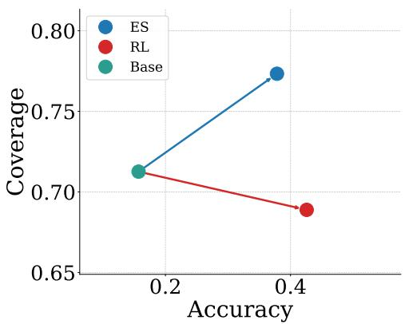

beyond-the-best-guess

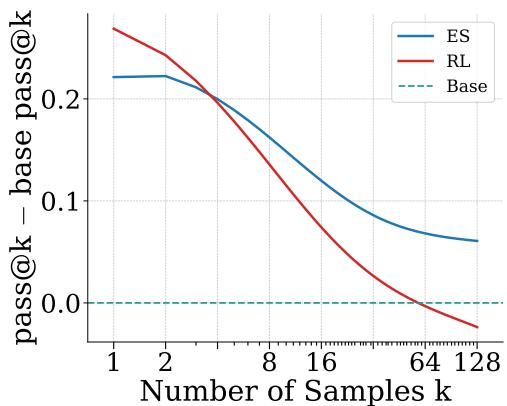  
Figure 1: Whereas RL sharpens accuracy, ES broadens solution coverage. (Left) Accuracy-coverage shift. With respect to the base model, RL raises accuracy (pass@1) but lowers coverage (pass@k), whereas ES raises both. (Right) Coverage relative to the base model vs. the number of samples (k). ES stays positive across all measured k values (max k=128). In contrast, as k increases RL reduces coverage below ES, and eventually falls even below the base model.

## 1 Introduction

The reasoning capabilities of Large Language Models (LLMs) continue to improve (Moonshot AI, 2026; Zeng et al., 2026) and, as a result, LLMs are increasingly being utilized for discovery problems, e.g., where the model is tasked with solving open scientific problems in math or coding. The continued improvement in reasoning capabilities is largely due to the introduction of post-training, where Reinforcement Learning (RL; Sutton et al., 1998), is utilized in settings where model responses can be verified with outcome based verifiable rewards (RLVR; Lambert et al., 2024). RLVR training increases model performance across a broad range of tasks, including math and coding. This has become a crucial step in the LLM training pipeline.

The increased reasoning capabilities of LLMs, combined with the ability to scale test-time compute, have enabled these models to tackle open scientific problems that were previously the sole domain of human experts (Lu et al., 2026). For example, OpenAI recently disproved an 80-year-old geometry conjecture by finding a point arrangement that no human mathematician had discovered (OpenAI, 2026a). This result required scaling test-time compute across many candidate proofs (OpenAI, 2026b). By scaling test-time compute, a model is able to sample many feasible solutions to a given problem, effectively performing search over the solution space (Snell et al., 2024). This shift in paradigm means traditional single-shot metrics no longer capture what matters, e.g. pass@1. Instead, a model's value increasingly lies not in whether its single best guess is correct, but in whether some sample among many contains a correct solution. Capturing this property requires a different measure of performance, pass@k (Brown et al., 2024), which quantifies solution coverage as the probability that at least one correct solution exists within k samples drawn from the model's output distribution. Maximizing pass@k therefore requires the model's output distribution to maintain broad support over valid solutions.

Before test-time scaling, models have usually been refined through post-training with RL. It turns out that such RL-trained LLMs suffer from distribution collapse: RL updates sharpen the output distribution to maximize the best guess, i.e. pass@1, concentrating probability mass on high-reward outputs while narrowing the support, pruning low-probability but correct solutions (Nguyen et al., 2026). This process reduces the overall solution coverage of a model and limits the models ability to explore alternative viable solutions for a given problem. Remarkably, even the base model can outperform an RL fine-tuned model at pass@k, a phenomenon first reported by Yue et al. (2025). This mismatch suggests that RL may be poorly suited to post-training in domains where pass@k is the metric of interest.

Recently, Evolution Strategies (ES) has emerged as an alternative LLM post-training technique with potentially better fit for pass@k (Qiu et al., 2025). ES is a population-based gradient-free optimization method that optimizes model parameters through random perturbations in weight space (Salimans et al., 2017). Random perturbations are used to generate a population of models that are evaluated and rewarded on the basis of their performance in a given task. ES achieves comparable performance to RL in reasoning tasks; however, ES optimizes for a robust solution distribution (Lehman et al., 2018) resulting in a more broad distribution of solutions for pass@k to utilize.

This difference arises because ES and RL perform parameter updates differently. RL typically uses policy gradient methods (Williams, 1992; Sutton et al., 1998) such as Proximal Policy Optimization (PPO; Schulman et al., 2017) or Group Relative Policy Optimization (GRPO; Shao et al., 2024) to update a single model's parameters using gradients computed over sampled token sequences. It operates in the action space, i.e. the gradient signal is used to increase the log-probability of high-reward outputs directly, progressively concentrating probability mass on a narrow set of solutions and sharpening the output distribution towards a single high-reward mode of the output distribution (Wu et al., 2025; Nguyen et al., 2026). This narrowing is further compounded in settings where the reward is sparse and binary (Sinha et al., 2026), reinforcing a small subset of high-reward trajectories at the expense of the broader solution space (Yue et al., 2025). In contrast, ES operates in the parameter space: it maximizes the expected reward over a distribution of weight-space perturbations (Salimans et al., 2017; Conti et al., 2018). As a result, the ES optimization pressure is not focused on sharpening a single high reward mode of the output distribution, but instead pushes the model parameters to regions robust to weight perturbations and comprising a broader set of solutions (Lehman et al., 2018). Recent work has also shown that ES fine-tuning results in smaller deviation from the base model's output distribution than RL on the training task (Schweighofer et al., 2026), suggesting that ES post-training preserves broader output distribution support and makes it better suited for settings where solution diversity is critical.

This paper empirically investigates whether ES yields improved pass@k relative to RL-trained models at matched compute budgets and evaluates the implications for downstream performance through test-time scaling experiments. The main contributions are:

• The most comprehensive evaluation of ES as an LLM post-training technique to date: ES models are trained on different parameter scales from 1.5B to 32B parameters, spanning multiple model families.

• Establishing ES as a superior post-training strategy for settings requiring solution diversity: ES consistently improves pass@k over RL-trained models across all model families and scales.

• Insights into the mechanistic origins of the observed improvements in solution coverage, obtained through a systematic analysis of the output distributions of ES-trained models relative to base and RL-trained models.

• Demonstrating the value of high-quality ES output distributions compared to those of RL in several math benchmarks.

Overall, the results confirm the hypothesis that ES is better suited to pass@k than RL, and establish ES as the state-of-the-art approach to post-training in domains where diverse solution exploration is critical to performance.

## 2 Background

This section reviews the literature most relevant to this work, covering four areas: Reinforcement Learning with verifiable rewards as the dominant LLM post-training paradigm, test-time scaling and its relationship to solution coverage, the limitations of Reinforcement Learning, and Evolution Strategies as an emerging alternative to Reinforcement Learning for LLM post-training.

## 2.1 Reinforcement Learning with Verifiable Rewards

Reinforcement Learning (RL) for LLMs uses policy gradient methods (Williams, 1992; Sutton et al., 1998) where gradient updates are computed using the log-probability of sampled token sequences and their corresponding reward. Shao et al. (2024) combined RL with verifiable rewards (RLVR; Lambert et al., 2024) to elicit chain-of-thought (CoT; Wei et al., 2022) reasoning behaviors from LLMs. In the RLVR setting, a deterministic verifier generates a reward of 1 for a correct answer and 0 for an incorrect answer. A format reward may also be added to encourage the model to explicitly separate the reasoning process from the final answer. The goal of RL is to find a policy $\pi _ { \theta }$ that maximizes the expected reward :

$$
J ( \theta ) = \mathbb { E } _ { x \sim \mathcal { D } , y \sim \pi _ { \theta } ( \cdot | x ) } \left[ R ( y ) \right] ,\tag{1}
$$

where x is a problem sampled from a dataset $\mathcal { D } , y$ is a response sampled from the policy $\pi _ { \theta . }$ , and $R ( y )$ is the reward assigned by the verifier. In practice, policy gradient methods such as GRPO (Shao et al., 2024) are used in RLVR settings (Zeng et al., 2025a) to optimize $J ( \theta )$ by computing gradient updates that increase the log-probability of high-reward responses. RLVR has become the standard post-training paradigm, demonstrating strong performance across mathematical reasoning, science discovery, and coding benchmarks (Olmo et al., 2025; Guo et al., 2025).

## 2.2 Test-Time Scaling

The classical way to assess the quality of an LLM in reasoning domains is to look at single sample accuracy, i.e. pass@1. A single answer is drawn from the model and checked for correctness. Over the past few years, researchers have realized that one way to increase model performance is to systematically increase the amount of compute spent at test time. This regime of model usage is known as Test-time Scaling (TTS; Zhang et al., 2025). TTS began with early breakthroughs like CoT (Wei et al., 2022), and has since diversified into methods including tree-base approaches (Yao et al., 2023; Aygün et al., 2026), iterative feedback loops (Madaan et al., 2023; Shinn et al., 2023), and general agentic harnesses (Ning et al., 2026).

TTS works because there is some latent knowledge in the LLM that may not be actualized when asking directly for a single answer, but increasing the amount of interaction with the model can bring the answer forward. The most natural way to assess whether a model contains the desired knowledge or capabilities is pass@k, i.e. sampling k > 1 answers and checking whether any is correct. In addition to its utility as an analytical tool, pass@k is a practical and easily parallelizable TTS method to improve performance in domains where answers are verifiable (Brown et al., 2024; Snell et al., 2024). It can be further used in non-verifiable test settings by incorporating a mechanism of voting across answers (Wang et al., 2022; Meyerson et al., 2025). Section 4 focuses on pass@k in verifiable settings in order to characterize differences between the behavior of ES- and RL-tuned models. The voting results in Section 6 verify that improvement in pass@k leads to downstream benefits in non-verifiable domains as well.

## 2.3 Limitations of RLVR

TTS is typically applied to deployed models that have undergone post-training with RLVR. Although RLVR post-training has shown improved pass@1 performance, further analysis of the output distributions of RL-trained models has revealed a number of fundamental limitations.

A key issue is distributional collapse, where the policy gradient updates in RL progressively concentrate probability mass on high-reward outputs, narrowing the support of the output distribution (Wu et al. 2025). This narrowing effect is particularly problematic in sparse, binary reward settings, where a small subset of high-reward trajectories are reinforced at the expense of the broader solution space. As a consequence, low-probability but correct solutions are effectively pruned from the distribution, reducing the overall solution coverage of the model (Nguyen et al., 2026; Wu et al., 2025). This reduction in coverage makes TTS less effective because the model is unable to explore diverse candidate solutions regardless of the compute budget allocated (Dang et al., 2025).

A striking manifestation of this effect is that for sufficiently large k, the pass@k accuracy of the base model can surpass that of the RLVR fine-tuned model (Yue et al., 2025). This counterintuitive result demonstrates that RL post-training can be actively harmful in TTS settings, trading solution coverage for pass@1 performance in a way that becomes increasingly costly as k grows.

Several methods have been proposed to mitigate distribution collapse in RL. KL-divergence penalties (Schulman et al., 2017) constrain the fine-tuned model to remain close to the reference distribution, preventing the policy from straying too far from its initialization. Another distributional collapse mitigation strategy is the use of resets (Liu et al., 2026; Bartoldson et al., 2026) where the reference distribution is periodically updated to the current policy during training, relaxing the KL constraint over time to avoid over-constraining exploration (Wu et al., 2025). A complementary approach addresses the clipping threshold in the policy gradient objective. A tight upper clip limits the policy update step, restricting exploration and contributing to distribution collapse. Yu et al. (2026) address clipping restriction by increasing the upper clipping threshold, allowing the policy to make larger updates and to explore a broader region of the solution space. Other approaches address distribution collapse by modifying the policy gradient objective directly. Vector Policy Optimization $\mathrm { ( V P O ; }$ Bahlous-Boldi et al., 2026) reformulates RL as a multi-objective RL problem (Hayes et al., 2022), training the model to produce candidate sets that cover the Pareto frontier of a vector-valued reward, thereby preserving diversity in the output distribution. While VPO improves pass@k, it does so at the cost of pass@1 performance.

However, these approaches introduce additional hyperparameters that are difficult to tune and may conflict with the primary reward objective, potentially making them less effective in practice (Shah et al., 2025). Furthermore, these approaches do not fundamentally address the tension between policy gradient optimization and distributional diversity. This motivates the investigation of alternative post-training methods that preserve solution coverage by construction rather than through explicit regularization.

## 2.4 Evolution Strategies for LLM Fine-tuning

Evolution strategies (ES) are a class of population-based zeroth-order optimization methods (Wierstra et al., 2014; Rechenberg, 1973). Instead of backpropagation, ES approximates a gradient using random weight perturbations over a population N. For a given set of parameters θ and a reward function $R ( \cdot )$ , at each optimization step, for each individual in the population $n \in N _ { \cdot }$ , ES samples perturbations $\epsilon _ { n } \sim \mathcal { N } ( \mathbf { 0 } , I )$ , scales them by $\sigma ,$ and evaluates the performance of the perturbed model $r _ { n } = R ( \theta + \sigma \epsilon _ { n } )$ under the reward function. Using this approach, ES aims to maximize the expected reward over the population under Gaussian perturbations: maxθ $\mathbb { E } _ { \epsilon _ { n } \sim \mathcal { N } ( \mathbf { 0 } , I ) } \left[ R ( \theta + \sigma \epsilon ) \right]$ , where the reward is normalized over the population using ranking (Salimans et al., 2017) or z-scores (Qiu et al., 2025). Finally, the weight update aggregates the perturbations weighted by their normalized reward as

$$
\theta _ { t } = \theta _ { t - 1 } + \alpha \cdot \frac { 1 } { N } \sum _ { n = 1 } ^ { N } \hat { r } _ { n } \epsilon _ { n } ,\tag{2}
$$

where α is the learning rate and $\boldsymbol { \hat { r } _ { n } }$ is the normalized rewards for each member of the population.

Salimans et al. (2017) implemented ES to optimize a policy in RL domains showing competitive performance with RL. Given that ES does not compute a gradient and therefore no backpropagation is required, they highlighted how ES can be more scalable and parallelizable than RL. As the number of model parameters grows, computing gradients becomes more computationally difficult.

Recently, Qiu et al. (2025) applied ES to LLM fine-tuning, showing competitive performance with RL across many domains such as mathematical reasoning. Interestingly, Qiu et al. (2025) used a population size of 30, breaking the long-held assumption that population sizes needed to be on the order of thousands for ES to optimize effectively. As a result, ES has become an attractive alternative to RL, motivating further algorithmic studies (Liang et al., 2026; Hoy et al., 2026) and new post-training methods (Sarkar et al., 2025; Gan & Isola, 2026; Schweighofer et al., 2026; Xu et al., 2026). This work contributes to this growing body of research by empirically investigating the solution coverage of ES-trained models, comparing pass@k performance against state-of-the-art RL-trained LLM checkpoints across mathematical reasoning benchmarks.

## 3 Experimental Setup

This section describes the experimental setup for comparing ES and RL fine-tuning on pass@k across multiple benchmarks and models ranging from 1.5B to 32B parameters.

## 3.1 The Pass@k Metric

Given an input prompt the model samples k responses, and the task is considered solved if at least one of the k responses is correct. Naively measuring pass@k requires many trials for each k to reduce estimation

variance. To address this, Chen et al. (2021) introduced an unbiased low variance pass@k estimator over a dataset D:

$$
\mathrm { p a s s } @ k = \mathbb { E } _ { x \sim \mathcal { D } } \left[ 1 - \frac { \binom { n - c } { k } } { \binom { n } { k } } \right] ,\tag{3}
$$

where n is the total number of sampled responses per problem and c is the number of correct responses for problem $x \in \mathcal { D }$ . As k increases, pass@k monotonically increases toward the fraction of problems for which at least one correct solution exists in the model's output distribution, providing a measure of solution coverage. At k = 1, pass@k reduces to the standard accuracy metric, while for large k it captures the breadth of the model's output distribution rather than the quality of its single most likely response. For each benchmark below, the same n is used as in Yue et al. (2025).

## 3.2 The Mathematical Reasoning Domain

To study pass@k behavior, standard math reasoning benchmarks and training setups were used.

Benchmarks. To study pass@k for mathematical reasoning two datasets are used for training: GSM8K (Cobbe et al., 2021) and MATH (level 3-5) (Hendrycks et al., 2021; Liu et al., 2025). Each dataset captures a different level of problem difficulty, allowing the effects of ES and RL on solution coverage to be tested across easier and harder reasoning tasks. Models trained using GSM8K are evaluated using the GSM8K test set (Cobbe et al., 2021), while models trained using MATH are evaluated using MATH500 (Hendrycks et al., 2021), Olympiad Bench (He et al., 2024), and Minerva (Lewkowycz et al., 2022). As in prior work, at test time each response is limited to 16,384 tokens which are sampled with temperature 0.6 and top-p 0.95 (Yue et al., 2025).

Training. Pass@k performance for ES is extensively evaluated on GSM8K by fine-tuning models across sizes and families: Qwen2.5 1.5B-Instruct, 3B-Instruct, and 7B-Instruct (Qwen Team et al., 2025), and Qwen3 1.7B, 4B, and 8B (Yang et al., 2025). The ES-at-Scale library (Qiu et al., 2025) is used for ES and the VERL library (Sheng et al., 2025) for RL. To study pass@k at larger scales, ES-at-Scale is used to fine-tune Qwen2.5-Math-7B, Qwen2.5-14B, and Qwen2.5-32B (Qwen Team et al., 2025) on MATH (Hendrycks et al., 2021), comparing to state-of-the-art publicly available RL checkpoints from SimpleRL-Zoo (Zeng et al., 2025b) and OatZero (Liu et al., 2025).

## 4 Pass@k Performance

This section presents results on comparing the pass@k performance of ES and RL across benchmarks and models.

## 4.1 GSM8K Results

ES improves pass@k over RL across model families on GSM8K. Figure 2 shows that ES consistently improves pass@k over RL across Qwen2.5-Instruct and Qwen3 models at scales ranging from 1.5B to 8B. The crossover point, where ES and RL perform equally, typically occurs at k = 2, after which ES outperforms RL. Notably, the RL pass@k curves plateau earlier than those of ES, consistent with distribution collapse narrowing the solution coverage of RL-trained models. Furthermore, for the Qwen2.5-Instruct models the base model overtakes RL at sufficiently large k, empirically confirming the findings of Yue et al. (2025). The advantage of ES over RL grows with k, suggesting that ES becomes increasingly beneficial as the test-time compute budget increases. This pattern is consistent across both model families, supporting the generality of the finding.

ES preserves solution coverage while RL does not. Crucially, the phenomenon reported by Yue et al. (2025) that the base model outperforms the RL-fine-tuned model at sufficiently large k, is not observed for ES. This suggests that ES post-training improves pass@1 without sacrificing the broad output distribution support of the base model. As a result, ES models benefit from increasing test-time compute in a way that RL models do not, making ES a potentially more suitable post-training strategy for discovery problems (see Section 6).

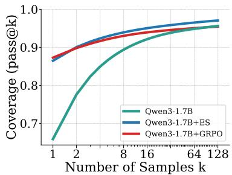  
(a) Qwen3-1.7B

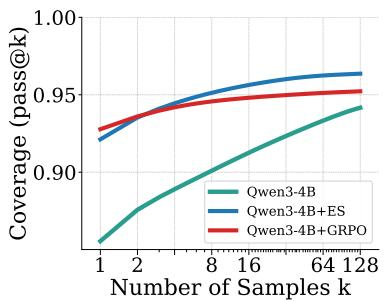  
(b) Qwen3-4B

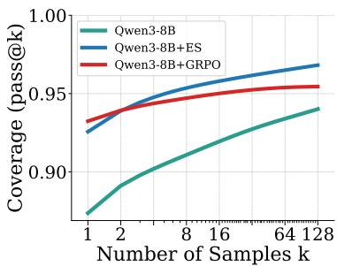  
(c) Qwen3-8B

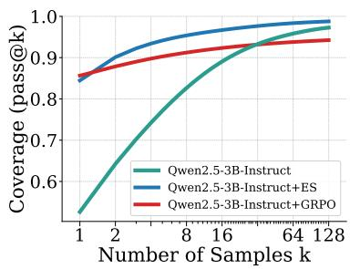  
(d) Qwen2.5-1.5B-Instruct

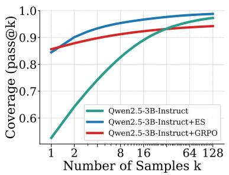  
(e) Qwen2.5-3B-Instruct

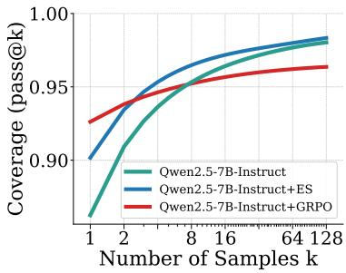  
(f) Qwen2.5-7B-Instruct

Figure 2: GSM8K Results. ES outperforms RL on pass@k for (a–c) Qwen3-1.7B, -4B, -8B and (d–f) Qwen2.5- 1.5B, -3B, -7B-Instruct. As k increases, ES continues to improve while RL plateaus and is overtaken by the base model. ES thus improves pass@k without sacrificing pass@1, making it a more suitable post-training method for discovery domains.  
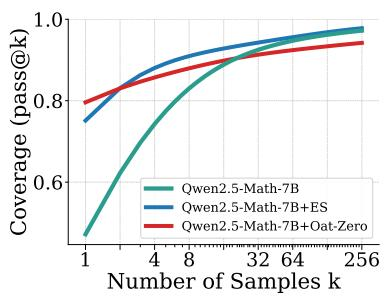  
(a) MATH500

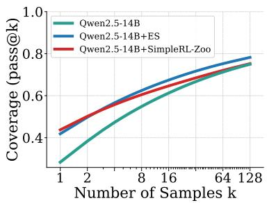  
(b) Olympiad Bench

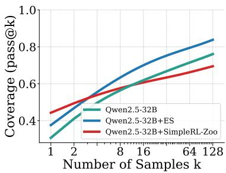  
(c) Minerva  
Figure 3: Comparison to state-of-the-art RL checkpoints. ES outperforms SOTA RL checkpoints (OatZero and SimpleRL-Zoo) on pass@k, across (a) 7B, (b) 14B, and (c) 32B parameter models, showing that the advantage of ES persists as models scale. This result further motivates the use of ES in TTS scenarios with larger models. See Appendix A Figure 9 for additional results.

## 4.2 MATH Results

Next, pass@k for ES and RL was compared by evaluating Qwen2.5-Math-7B, Qwen2.5-14B, and Qwen2.5- 32B on MATH500, Olympiad Bench, and Minerva benchmarks.

ES improves pass@k over RL across math benchmarks. Figure 3 shows that ES consistently improves pass@k over RL across Qwen2.5-Math-7B, Qwen2.5-14B, and Qwen2.5-32B. For Qwen2.5-Math-7B, ES outperforms OatZero for k > 1 across on MATH500. For Qwen2.5-14B, ES outperforms SimpleRL-Zoo for k > 1 on Olympiad Bench. Notably, for Qwen2.5-14B the base model becomes competitive with SimpleRL-

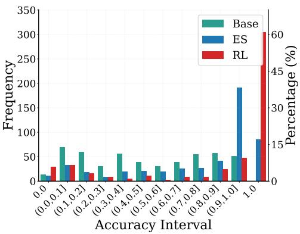  
(a) MATH500

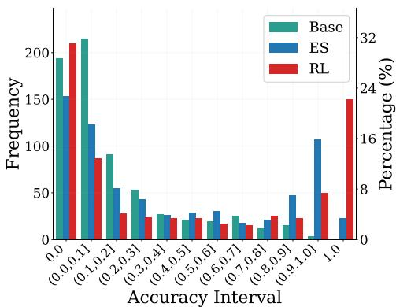  
(b) Olympiad Bench  
Figure 4: Qwen2.5-Math-7B accuracy distributions for ES and RL (OatZero) on MATH500 and Olympiad Bench. Bin 0.0 measures unsolvable problems, i.e., where none of the model's responses are correct. Relative to the base model, RL increases unsolvable problems while ES reduces them.

Zoo at large k on Olympiad Bench. For Qwen2.5-32B, ES retains a clear advantage over SimpleRL-Zoo on Minerva where the gap grows with k. Results for additional model/benchmark combinations are presented in Figure 9 Appendix A and highlight that ES outperforms RL across larger models for each measured benchmark.

ES preserves solution coverage while RL does not. The MATH experiments provided further evidence that distribution collapse is not an artifact of a specific RL algorithm but a general consequence of RL post-training. The RL-trained models exhibit earlier pass@k saturation compared to ES, especially on Minerva, consistent with a narrowing of the output distribution support. Crucially, the base model does not outperform the ES fine-tuned model at any value of k or model scale tested, showing that ES post-training improves pass@1 without sacrificing the broad output distribution support of the base model. This pattern holds consistently from 7B to 32B parameters, indicating that ES's ability to preserve solution coverage is not a small-scale artifact but persists as models grow substantially larger.

## 5 Solution Coverage

To better understand how ES achieves such high pass@k compared to RL or the base model, this section analyzes model behavior from three perspectives: accuracy distributions, regressions vs. progressions, and answer entropy.

Accuracy distribution analysis. Figure 4 shows the accuracy distribution for ES and RL Qwen2.5-Math-7B models on MATH500 and Olympiad Bench. Each bin shows the mean accuracy across k responses for a given prompt, where the frequency on the y-axis denotes the number of prompts in each bin over the full dataset. For example, bin 1.0 contains prompts where all k responses were correct, and bin 0.0 contains prompts where all k responses were incorrect.

ES and RL affect the accuracy distribution differently with respect to the base model. RL increases the frequency in bin 1.0 relative to the base model, reflecting its objective of maximizing pass@1. ES also increases frequency in bin 1.0, but the improvement is more distributed across bin (0.9, 1.0], consistent with the pass@1 differences between ES and RL reported in Section 3.2.

A notable artifact of RL training is an increase in the frequency of bin 0.0 relative to the base model, which was also observed by Yue et al. (2025). This indicates that RL renders a subset of prompts that the base model could solve entirely unsolvable across k samples, reducing solution coverage and limiting the model's ability to generalize across a broad range of problems. RL's increase in unsolvable prompts imposes a hard ceiling on achievable pass@k performance that no amount of additional sampling can overcome. In contrast, ES reduces the frequency in bin 0.0 relative to the base model, improving solution coverage across all benchmarks. Figures 10 and 11 in Appendix A show the accuracy distributions for Qwen2.5, Qwen3, and Qwen2.5-Math across scales from 1.5B to 32B, consistently showing that ES broadens solution coverage while RL narrows it.

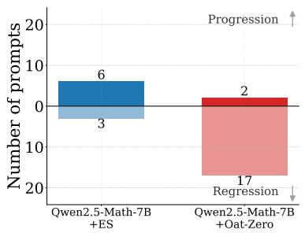  
(a) MATH500

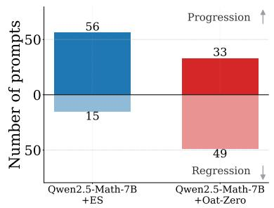  
(b) Olympiad Bench

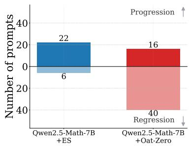  
(c) Minerva  
Figure 5: Progressions and regressions for Qwen2.5-Math-7B evaluated using MATH500, Olympiad Bench, and Minerva. ES reduces regressions and increases progressions across all three benchmarks compared to RL fine-tuned model checkpoints (OatZero).

Measuring model regressions and progressions. The narrowing and broadening of solution coverage can be quantified through model progressions and regressions. Progressions measure knowledge gained during fine-tuning: prompts the base model got wrong but the fine-tuned model answered correctly. Regressions measure knowledge lost during fine-tuning: prompts the base model answered correctly but the fine-tuned model got wrong. Ideally, a post-trained model maximizes progressions and minimizes regressions.

Figures 5a, 5b, and 5c report progressions and regressions for ES and RL fine-tuned Qwen2.5-Math-7B models. ES yields significant increases of progressions compared to RL: There are 6 for ES vs. 3 for RL on MATH500; 56 vs. 33 on Olympiad Bench; and 22 vs. 16 on Minerva. A natural concern when comparing ES to RL is that ES may preserve the base model distribution simply because it is not learning effectively. The progression results show ES adds more new correct solutions than RL, i.e. ES improves the model's knowledge rather than simply not damaging it. ES also results in significantly fewer regressions compared to RL. For Qwen2.5-Math-7B, ES has 3 regressions vs. 17 for RL on MATH500; on Olympiad Bench, ES has 15 vs. 49 for RL; on Minerva, ES has 6 vs. 40 for RL. Additional progression and regression results are included in Figures 12 and 13 Appendix A, showing that across Qwen2.5 and Qwen3 models from 1.5B to 32B parameter scale, ES increases progressions and reduces regressions over RL.

Regressions are a signal of catastrophic forgetting, where knowledge already contained within the base model is lost. RL overwrites some of this knowledge in order to maximize reward on the training distribution, whereas ES pushes parameters toward flat regions of weight space and is therefore less destructive to existing knowledge. Notably, the gains in progressions from ES are observed alongside reductions in regressions, meaning ES is not trading one for the other but improving on both simultaneously. This finding suggests ES fine-tuned models are more quality-preserving with respect to the output distribution and may generalize better to out-of-distribution problems.

Together, the progression and regression results reveal that ES achieves a more favorable knowledge tradeoff than RL during fine-tuning. RL gains new knowledge at the cost of overwriting existing knowledge, while ES adds new knowledge while preserving more of what the base model already knew. In other words, ES finds regions of parameter space that are both more capable and more knowledge-preserving. Critically, this dual advantage directly explains the pass@k results, where fewer regressions broaden the lower end of the solution coverage distribution, while more progressions expand the upper end, together

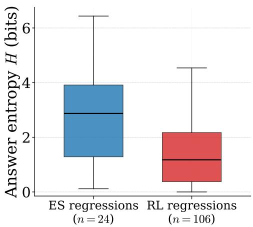  
(a)

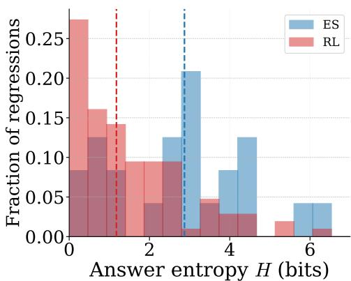  
(b)

Figure 6: Entropy of the answer distribution plots of combined model regressions for ES and RL across MATH500, Olympiad Bench, and Minerva for Qwen2.5-Math-7B. (a) ES maintains higher entropy when compared to RL during failures. (b) ES maintains a distribution over regressions at a higher entropy, while RL maintains low entropy during regressions.  
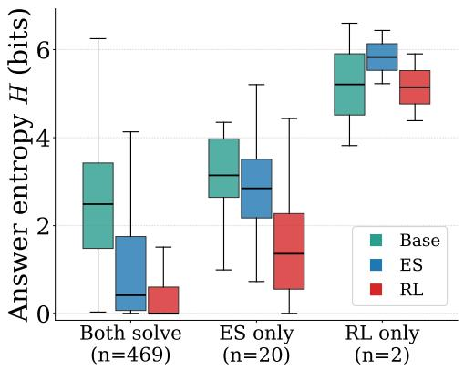  
(a) MATH500

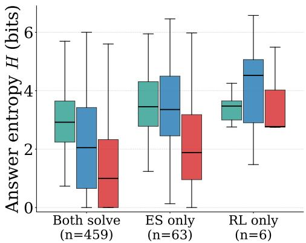  
(b) Olympiad Bench  
Figure 7: Box plots of answer entropy for Qwen2.5-Math-7B on MATH500 and Olympiad Bench. The box plots are clustered into subsets where both ES and RL fail on specific problems. For each set, RL fails confidently and narrowly (low entropy), whereas ES fails with preserved uncertainty and succeeds with reasonable confidence (high entropy).

producing the consistently higher pass@k curves observed for ES across all benchmarks and model scales.   
These results thus further strengthen the case for ES as a powerful post-training method.

Entropy analysis for ES and RL failure modes. Figure 6 shows the entropy over answer distributions for ES and RL regressions for Qwen2.5-Math-7B. The answer distribution is constructed by taking the unique final answers per problem and computing a frequency distribution, over which the Shannon entropy is calculated (Shannon, 1948). ES has a total of 24 regressions across MATH500, Olympiad Bench, and Minerva, while RL has 106. Figure 6a shows that ES maintains higher entropy than RL, indicating that when ES fails it preserves greater diversity over candidate answers. Figure 6b presents the distribution over entropy values, where each bin corresponds to the fraction of total regressions across all three benchmarks. Notably, more than 25% of RL regressions have entropy close to zero, meaning the model collapses to a small number of responses and is confidently incorrect. In contrast, the ES entropy distribution is shifted to the right relative to RL, with a higher median entropy, further confirming that ES failures are characterized by uncertainty rather than confident convergence to incorrect answers.

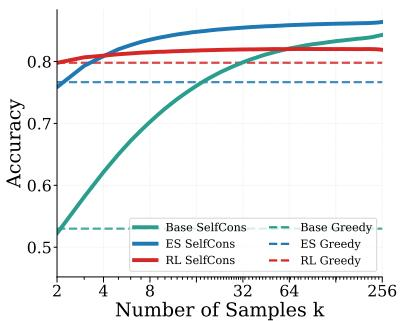  
(a) MATH500

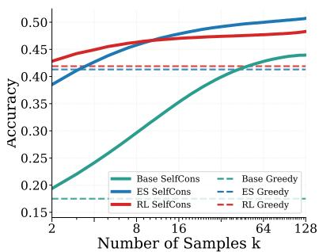  
(b) Olympiad Bench

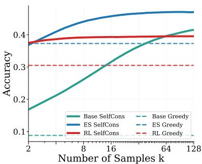  
(c) Minerva  
Figure 8: ES and RL performance measuring self-consistency (voting). ES's higher-quality distributions yield higher voting accuracy than RL or the base model as k increases. Each curve averages 1K random permutations of answers from Section 4.2.

Figure 7 provides a complementary view, presenting box plots of the entropy over the answer distribution per prompt across three subsets of problems: those that both ES and RL solve, those that only ES solves, and those that only RL solves. On problems that both methods solve, ES and RL reduce entropy relative to the base model, indicating increased confidence on solvable problems. A striking difference emerges on problems where methods fail: on problems that ES solves but RL fails, RL exhibits low entropy, indicating that the model confidently converges to a small subset of incorrect answers. In contrast, on problems that RL solves but ES fails, ES preserves or exceeds the entropy of the base model, maintaining solution diversity even in its failure modes. This asymmetry reveals a fundamental difference in how ES and RL fail: whereas RL fails confidently and narrowly, ES fails with preserved uncertainty, a property that is more amenable to correction through increased test-time compute.

## 6 Test-time Scaling Beyond Pass@k: Voting

Beyond its role as a tool for understanding distribution quality, pass@k can be put to good use through TTS. With high-quality output distributions, better solutions are more likely to surface over increased inference steps. However, pass@k itself is a practical TTS method only in verifiable test settings, e.g., in coding when there are a given set of tests that can be used to programatically judge whether a particular solution is correct (Brown et al., 2024). In more general settings, the simplest and most well-established TTS method is Self-Consistency, i.e. generating multiple independent samples and selecting an answer by plurality vote (Wang et al., 2022). This section evaluates ES fine-tuning in this role. The same math benchmarks are still used for this evaluation, however, instead of checking whether any of the k generated answers are correct, self-consistency is first used to identify one answer among the k generated. The evaluation thus measures how well TTS can be used with ES-generated output distributions in non-verifiable test settings.

Self-Consistency was applied using the same models, parameters, and data as Section 3.2. The results mirror those in Section 4.2: As k increases, ES overtakes RL in terms of accuracy (Figures 8a, 8b, and 8c). These results indicate that not only is ES more likely to include the correct answer in its distribution, but its maximum probability answer is more likely to be correct. It is notable that on two of the three benchmarks the maximum probability answers of RL are worse than the base model, consistent with other observations of distribution degradation. Coupled with the pass@k results, these results suggest that the higher-quality distributions of ES may be generally more useful in TTS than those of RL. Exploring how ES can improve other forms of TTS, such as agentic harnesses (Ning et al., 2026) or tree search (Aygün et al., 2026) is a promising avenue of future work.

## 7 Future Work

As the importance of TTS continues to grow, methods that explicitly optimize for use in TTS settings must be developed. ES is a natural fit given its gradient-free nature, which allows a TTS objective to be defined and optimized directly. For example, ES could be used to optimize the pass@k metric during training, directly aligning the training objective with the downstream metric that matters in TTS deployments. Beyond pass@k, this framework could extend to other TTS objectives such as self-consistency voting accuracy or multi-step agentic success rate.

## 8 Conclusion

As LLMs are increasingly used for discovery problems, it is important that post-training methods do not degrade solution coverage. This paper shows that while RL improves pass@1 accuracy, it does so at the cost of solution coverage through distribution collapse. In contrast, ES preserves broad solution coverage while simultaneously increasing pass@1 accuracy. The benefits of ES for test-time scaling are demonstrated through pass@k performance, output distribution analysis, and downstream test-time scaling experiments, where ES consistently outperforms RL. These results position ES as a promising alternative to RL for post-training in discovery problems such as science, math, and coding, and in other settings where solution diversity is critical.

## References

Eser Aygün, Anastasiya Belyaeva, Gheorghe Comanici, Marc Coram, Hao Cui, Jake Garrison, Renee Johnston, Anton Kast, Cory Y McLean, Peter Norgaard, et al. An ai system to help scientists write expert-level empirical software. Nature, pp. 1–3, 2026.

Ryan Bahlous-Boldi, Isha Puri, Idan Shenfeld, Akarsh Kumar, Mehul Damani, Sebastian Risi, Omar Khattab, Zhang-Wei Hong, and Pulkit Agrawal. Vector policy optimization: Training for diversity improves test-time search. arXiv preprint arXiv:2605.22817, 2026.

Brian Bartoldson, Siddarth Venkatraman, James Diffenderfer, Moksh Jain, Tal Ben-Nun, Seanie Lee, Minsu Kim, Johan Obando Ceron, Yoshua Bengio, and Bhavya Kailkhura. Trajectory balance with asynchrony: Decoupling exploration and learning for fast, scalable llm post-training. Advances in Neural Information Processing Systems, 38:113901–113931, 2026.

Bradley Brown, Jordan Juravsky, Ryan Ehrlich, Ronald Clark, Quoc V Le, Christopher Ré, and Azalia Mirhoseini. Large language monkeys: Scaling inference compute with repeated sampling. arXiv preprint arXiv:2407.21787, 2024.

Mark Chen, Jerry Tworek, Heewoo Jun, Qiming Yuan, Henrique Ponde De Oliveira Pinto, Jared Kaplan, Harri Edwards, Yuri Burda, Nicholas Joseph, Greg Brockman, et al. Evaluating large language models trained on code. arXiv preprint arXiv:2107.03374, 2021.

Karl Cobbe, Vineet Kosaraju, Mohammad Bavarian, Mark Chen, Heewoo Jun, Lukasz Kaiser, Matthias Plappert, Jerry Tworek, Jacob Hilton, Reiichiro Nakano, et al. Training verifiers to solve math word problems. arXiv preprint arXiv:2110.14168, 2021.

Edoardo Conti, Vashisht Madhavan, Felipe Petroski Such, Joel Lehman, Kenneth Stanley, and Jeff Clune. Improving exploration in evolution strategies for deep reinforcement learning via a population of novelty-seeking agents. Advances in neural information processing systems, 31, 2018.

Xingyu Dang, Christina Baek, Kaiyue Wen, Zico Kolter, and Aditi Raghunathan. Weight ensembling improves reasoning in language models. arXiv preprint arXiv:2504.10478, 2025.

Yulu Gan and Phillip Isola. Neural thickets: Diverse task experts are dense around pretrained weights. arXiv preprint arXiv:2603.12228, 2026.

Daya Guo, Dejian Yang, Haowei Zhang, Junxiao Song, Peiyi Wang, Qihao Zhu, Runxin Xu, Ruoyu Zhang, Shirong Ma, Xiao Bi, et al. Deepseek-r1: Incentivizing reasoning capability in llms via reinforcement learning. arXiv preprint arXiv:2501.12948, 2025.

Conor F Hayes, Roxana Rădulescu, Eugenio Bargiacchi, Johan Källström, Matthew Macfarlane, Mathieu Reymond, Timothy Verstraeten, Luisa M Zintgraf, Richard Dazeley, Fredrik Heintz, et al. A practical guide to multi-objective reinforcement learning and planning: Cf hayes et al. Autonomous Agents and Multi-Agent Systems, 36(1):26, 2022.

Chaoqun He, Renjie Luo, Yuzhuo Bai, Shengding Hu, Zhen Thai, Junhao Shen, Jinyi Hu, Xu Han, Yujie Huang, Yuxiang Zhang, et al. Olympiadbench: A challenging benchmark for promoting agi with olympiad-level bilingual multimodal scientific problems. In Proceedings of the 62nd Annual Meeting of the Association for Computational Linguistics (Volume 1: Long Papers), pp. 3828–3850, 2024.

Dan Hendrycks, Collin Burns, Saurav Kadavath, Akul Arora, Steven Basart, Eric Tang, Dawn Song, and Jacob Steinhardt. Measuring mathematical problem solving with the math dataset. arXiv preprint arXiv:2103.03874, 2021.

William Hoy, Binxu Wang, and Xu Pan. Matching accuracy, different geometry: Evolution strategies vs grpo in llm post-training. arXiv preprint arXiv:2604.01499, 2026.

Nathan Lambert, Jacob Morrison, Valentina Pyatkin, Shengyi Huang, Hamish Ivison, Faeze Brahman, Lester James V Miranda, Alisa Liu, Nouha Dziri, Shane Lyu, et al. Tulu 3: Pushing frontiers in open language model post-training. arXiv preprint arXiv:2411.15124, 2024.

Joel Lehman, Jay Chen, Jeff Clune, and Kenneth O Stanley. Es is more than just a traditional finitedifference approximator. In Proceedings of the genetic and evolutionary computation conference, pp. 450–457, 2018.

Aitor Lewkowycz, Anders Andreassen, David Dohan, Ethan Dyer, Henryk Michalewski, Vinay Ramasesh, Ambrose Slone, Cem Anil, Imanol Schlag, Theo Gutman-Solo, et al. Solving quantitative reasoning problems with language models. Advances in neural information processing systems, 35:3843–3857, 2022.

Qiyao Liang, Jinyeop Song, Yizhou Liu, Jeff Gore, Ila Fiete, Risto Miikkulainen, and Xin Qiu. The blessing of dimensionality in llm fine-tuning: A variance-curvature perspective. arXiv preprint arXiv:2602.00170, 2026.

Mingjie Liu, Shizhe Diao, Ximing Lu, Jian Hu, Xin Dong, Yejin Choi, Jan Kautz, and Yi Dong. Prorl: Prolonged reinforcement learning expands reasoning boundaries in large language models. Advances in Neural Information Processing Systems, 38:17998–18031, 2026.

Zichen Liu, Changyu Chen, Wenjun Li, Penghui Qi, Tianyu Pang, Chao Du, Wee Sun Lee, and Min Lin. Understanding r1-zero-like training: A critical perspective. arXiv preprint arXiv:2503.20783, 2025.

Chris Lu, Cong Lu, Robert Tjarko Lange, Yutaro Yamada, Shengran Hu, Jakob Foerster, David Ha, and Jeff Clune. Towards end-to-end automation of ai research. Nature, 651(8107):914–919, 2026.

Aman Madaan, Niket Tandon, Prakhar Gupta, Skyler Hallinan, Luyu Gao, Sarah Wiegreffe, Uri Alon, Nouha Dziri, Shrimai Prabhumoye, Yiming Yang, et al. Self-refine: Iterative refinement with selffeedback. Advances in neural information processing systems, 36:46534–46594, 2023.

Elliot Meyerson, Giuseppe Paolo, Roberto Dailey, Hormoz Shahrzad, Olivier Francon, Conor F Hayes, Xin Qiu, Babak Hodjat, and Risto Miikkulainen. Solving a million-step llm task with zero errors. arXiv preprint arXiv:2511.09030, 2025.

Moonshot AI. Kimi k3: Open agentic intelligence. https://www.kimi.com/blog/kimi-k3, 2026.

Ngoc-Hieu Nguyen, Parshin Shojaee, Phuc Minh Nguyen, Nan Zhang, Chandan K Reddy, Khoa D Doan, and Rui Zhang. Why do reasoning models lose coverage? the role of data and forks in the road. arXiv preprint arXiv:2605.17026, 2026.

Xuying Ning, Katherine Tieu, Dongqi Fu, Tianxin Wei, Zihao Li, Yuanchen Bei, Jiaru Zou, Mengting Ai, Zhining Liu, Ting-Wei Li, et al. Code as agent harness. arXiv preprint arXiv:2605.18747, 2026.

Team Olmo, Allyson Ettinger, Amanda Bertsch, Bailey Kuehl, David Graham, David Heineman, Dirk Groeneveld, Faeze Brahman, Finbarr Timbers, Hamish Ivison, et al. Olmo 3. arXiv preprint arXiv:2512.13961, 2025.

OpenAI. Planar point sets with many unit distances. https://cdn.openai.com/pdf/74c24085-19b0-4534-9c90- 465b8e29ad73/unit-distance-proof.pdf, 2026a.

OpenAI. An openai model has disproved a central conjecture in discrete geometry. https://openai.com/index/model-disproves-discrete-geometry-conjecture/, 2026b.

Xin Qiu, Yulu Gan, Conor F Hayes, Qiyao Liang, Yinggan Xu, Roberto Dailey, Elliot Meyerson, Babak Hodjat, and Risto Miikkulainen. Evolution strategies at scale: Llm fine-tuning beyond reinforcement learning. arXiv preprint arXiv:2509.24372, 2025.

Qwen Team, An Yang, Baosong Yang, Beichen Zhang, Binyuan Hui, Bo Zheng, Bowen Yu, Chengyuan Li, Dayiheng Liu, Fei Huang, Haoran Wei, Huan Lin, Jian Yang, Jianhong Tu, Jianwei Zhang, Jianxin Yang, Jiaxi Yang, Jingren Zhou, Junyang Lin, Kai Dang, Keming Lu, Keqin Bao, Kexin Yang, Le Yu, Mei Li, Mingfeng Xue, Pei Zhang, Qin Zhu, Rui Men, Runji Lin, Tianhao Li, Tianyi Tang, Tingyu Xia, Xingzhang Ren, Xuancheng Ren, Yang Fan, Yang Su, Yichang Zhang, Yu Wan, Yuqiong Liu, Zeyu Cui, Zhenru Zhang, and Zihan Qiu. Qwen2.5 technical report, 2025. URL https://arxiv. org/abs/2412.15115.

I. Rechenberg. Evolutionsstrategie: Optimierung technischer Systeme nach Prinzipien der biologischen Evolution. Problemata (Stuttgart). Frommann-Holzboog, 1973.

Tim Salimans, Jonathan Ho, Xi Chen, Szymon Sidor, and Ilya Sutskever. Evolution strategies as a scalable alternative to reinforcement learning. arXiv preprint arXiv:1703.03864, 2017.

Bidipta Sarkar, Mattie Fellows, Juan Agustin Duque, Alistair Letcher, Antonio León Villares, Anya Sims, Clarisse Wibault, Dmitry Samsonov, Dylan Cope, Jarek Liesen, et al. Evolution strategies at the hyperscale. arXiv preprint arXiv:2511.16652, 2025.

John Schulman, Filip Wolski, Prafulla Dhariwal, Alec Radford, and Oleg Klimov. Proximal policy optimization algorithms. arXiv preprint arXiv:1707.06347, 2017.

Kajetan Schweighofer, Conor F Hayes, Roberto Dailey, Risto Miikkulainen, and Xin Qiu. Overcoming forgetting in llm fine-tuning with evolution strategies. arXiv preprint arXiv:2605.30148, 2026.

Vedant Shah, Johan Obando-Ceron, Vineet Jain, Brian Bartoldson, Bhavya Kailkhura, Sarthak Mittal, Glen Berseth, Pablo Samuel Castro, Yoshua Bengio, Nikolay Malkin, et al. A comedy of estimators: On kl regularization in rl training of llms. arXiv preprint arXiv:2512.21852, 2025.

Claude Elwood Shannon. A mathematical theory of communication. The Bell system technical journal, 27 (3):379–423, 1948.

Zhihong Shao, Peiyi Wang, Qihao Zhu, Runxin Xu, Junxiao Song, Xiao Bi, Haowei Zhang, Mingchuan Zhang, YK Li, Yang Wu, et al. Deepseekmath: Pushing the limits of mathematical reasoning in open language models. arXiv preprint arXiv:2402.03300, 2024.

Guangming Sheng, Chi Zhang, Zilingfeng Ye, Xibin Wu, Wang Zhang, Ru Zhang, Yanghua Peng, Haibin Lin, and Chuan Wu. Hybridflow: A flexible and efficient rlhf framework. In Proceedings of the Twentieth European Conference on Computer Systems, pp. 1279–1297, 2025.

Noah Shinn, Federico Cassano, Ashwin Gopinath, Karthik Narasimhan, and Shunyu Yao. Reflexion: Language agents with verbal reinforcement learning. Advances in neural information processing systems, 36:8634–8652, 2023.

Abhijeet Sinha, Sundari Elango, and Dianbo Liu. Expected return causes outcome-level mode collapse in reinforcement learning and how to fix it with inverse probability scaling. arXiv preprint arXiv:2601.21669, 2026.

Charlie Snell, Jaehoon Lee, Kelvin Xu, and Aviral Kumar. Scaling llm test-time compute optimally can be more effective than scaling model parameters. arXiv preprint arXiv:2408.03314, 2024.

Richard S Sutton, Andrew G Barto, et al. Reinforcement learning: An introduction, volume 1. MIT press Cambridge, 1998.

Xuezhi Wang, Jason Wei, Dale Schuurmans, Quoc Le, Ed Chi, Sharan Narang, Aakanksha Chowdhery, and Denny Zhou. Self-consistency improves chain of thought reasoning in language models. arXiv preprint arXiv:2203.11171, 2022.

Jason Wei, Xuezhi Wang, Dale Schuurmans, Maarten Bosma, Fei Xia, Ed Chi, Quoc V Le, Denny Zhou, et al. Chain-of-thought prompting elicits reasoning in large language models. Advances in neural information processing systems, 35:24824–24837, 2022.

Daan Wierstra, Tom Schaul, Tobias Glasmachers, Yi Sun, Jan Peters, and Jürgen Schmidhuber. Natural evolution strategies. The Journal of Machine Learning Research, 15(1):949–980, 2014.

Ronald J Williams. Simple statistical gradient-following algorithms for connectionist reinforcement learning. Machine learning, 8(3):229–256, 1992.

Fang Wu, Weihao Xuan, Ximing Lu, Mingjie Liu, Yi Dong, Zaid Harchaoui, and Yejin Choi. The invisible leash: Why rlvr may or may not escape its origin. arXiv preprint arXiv:2507.14843, 2025.

Yinggan Xu, Kajetan Schweighofer, Risto Miikkulainen, and Xin Qiu. Quantized evolution strategies: High-precision fine-tuning of quantized llms at low-precision cost. arXiv preprint arXiv:2602.03120, 2026.

An Yang, Anfeng Li, Baosong Yang, Beichen Zhang, Binyuan Hui, Bo Zheng, Bowen Yu, Chang Gao, Chengen Huang, Chenxu Lv, et al. Qwen3 technical report. arXiv preprint arXiv:2505.09388, 2025.

Shunyu Yao, Dian Yu, Jeffrey Zhao, Izhak Shafran, Tom Griffiths, Yuan Cao, and Karthik Narasimhan. Tree of thoughts: Deliberate problem solving with large language models. Advances in neural information processing systems, 36:11809–11822, 2023

Qiying Yu, Zheng Zhang, Ruofei Zhu, Yufeng Yuan, Xiaochen Zuo, Yu Yue, Weinan Dai, Tiantian Fan, Gaohong Liu, Lingjun Liu, et al. Dapo: An open-source llm reinforcement learning system at scale. Advances in Neural Information Processing Systems, 38:113222–113244, 2026.

Yang Yue, Zhiqi Chen, Rui Lu, Andrew Zhao, Zhaokai Wang, Shiji Song, and Gao Huang. Does reinforcement learning really incentivize reasoning capacity in llms beyond the base model? arXiv preprint arXiv:2504.13837, 2025.

Aohan Zeng, Xin Lv, Qinkai Zheng, Zhenyu Hou, Bin Chen, Chengxing Xie, Cunxiang Wang, Da Yin, Hao Zeng, Jiajie Zhang, et al. Glm-4.5: Agentic, reasoning, and coding (arc) foundation models. arXiv preprint arXiv:2508.06471, 2025a.

Aohan Zeng, Xin Lv, Zhenyu Hou, Zhengxiao Du, Qinkai Zheng, Bin Chen, Da Yin, Chendi Ge, Chenghua Huang, Chengxing Xie, et al. Glm-5: from vibe coding to agentic engineering. arXiv preprint arXiv:2602.15763, 2026.

Weihao Zeng, Yuzhen Huang, Qian Liu, Wei Liu, Keqing He, Zejun Ma, and Junxian He. Simplerl-zoo: Investigating and taming zero reinforcement learning for open base models in the wild. arXiv preprint arXiv:2503.18892, 2025b.

Qiyuan Zhang, Fuyuan Lyu, Zexu Sun, Lei Wang, Weixu Zhang, Wenyue Hua, Haolun Wu, Zhihan Guo, Yufei Wang, Niklas Muennighoff, et al. A survey on test-time scaling in large language models: What, how, where, and how well?arXiv preprint arXiv:2503.24235, 2025.

## A Appendix

Below, additional experimental details required to reproduce the results are presented, followed by additional experimental results, including pass@k, accuracy distribution analysis, and model regressions and progressions.

## A.1 Additional experiment details

The additional details required to fully document the ES and RL training for GSM8K and MATH for Qwen2.5 and Qwen3 models are documented below.

Training hyperparameters. Table 1 and Table 2 list the training parameters used with the VERL library (RL) and ES-at-Scale library (ES), respectively, for GSM8K and MATH training. Among ES models trained on MATH, Qwen2.5-Math-7B uses a batch size of 512 and a maximum response length of 3,000 tokens. While Qwen2.5-14B and Qwen2.5-32B use batch size of 1,024 and a max response length of 8,192 tokens.

<table><tr><td>Hyperparameter</td><td>Value</td></tr><tr><td>Algorithm</td><td>GRPO</td></tr><tr><td>Optimizer</td><td>AdamW</td></tr><tr><td>Learning rate</td><td>1e-6</td></tr><tr><td>LR schedule</td><td>constant (no warmup)</td></tr><tr><td>Train batch size</td><td>512</td></tr><tr><td>Rollout batch size</td><td>1,024</td></tr><tr><td>PPO mini-batch size</td><td>128</td></tr><tr><td>PPO clip ratio ε</td><td>0.2</td></tr><tr><td>Rollout n (samples/prompt)</td><td>8</td></tr><tr><td>Max prompt length</td><td>512</td></tr><tr><td>Max response length</td><td>512</td></tr><tr><td>Rollout temperature</td><td>1.0</td></tr><tr><td>KL coefficient</td><td>0.0</td></tr><tr><td>Clip ratio (€)</td><td>0.2</td></tr><tr><td>Total training steps</td><td>500</td></tr></table>

Table 1: VERL training hyperparameters for GSM8K.

<table><tr><td>Hyperparameter</td><td>GSM8K</td><td>MATH</td></tr><tr><td>σ</td><td>0.001</td><td>0.001</td></tr><tr><td>α</td><td>α/2</td><td>α/2</td></tr><tr><td>Train batch size</td><td>512</td><td>512/1,024</td></tr><tr><td>Population size</td><td>32</td><td>32</td></tr><tr><td>Max response length</td><td>512</td><td>3,000/8,192</td></tr><tr><td>Rollout temperature</td><td>0.0</td><td>0.0</td></tr><tr><td>Total training steps</td><td>500</td><td>500</td></tr></table>

Table 2: Hyperparameters for training ES using the ES-at-Scale library.

Training & evaluation GPU infrastructure. The GSM8K experiments (Qwen2.5-Instruct-1.5B, -3B, -7B and Qwen3-1.7B, -4B, -8B) were trained for both ES and RL using 8 NVIDIA H200 GPUs, and each trained model was evaluated using a single NVIDIA H200 GPU. The MATH experiments (Qwen2.5-Math-7B, Qwen2.5-14B, and -32B) for ES were trained using 8 NVIDIA B200 GPUs, and each trained model was evaluated using a single NVIDIA B200 GPU.

Model chat templates. The Qwen chat template is used for the Qwen2.5 and Qwen3 models across all parameter scales. The wording of the system prompts differ slightly and so does the required answer format: for GSM8K the model must produce its final answer after "####", whereas for MATH the model must place its final answer inside \boxed{}. Table 3 documents the template used for GSM8K, and Table 4 documents the template used for MATH.

<table><tr><td>GSM8K</td><td>&lt;lim_start|&gt;system\n You are a helpful AI assistant. Let&#x27;s think step by step and output the final answer after&#x27;&quot;####&quot;&#x27;.&lt;|im_end|&gt;\n &lt;|im_start|&gt;user\n {question} &lt;|im_end|&gt;\n &lt;|im_start|&gt;assistant\n</td></tr></table>

Table 3: System prompt and template used for GSM8K.
<table><tr><td>MATH</td><td>&lt;lim_start|&gt;system\n Please reason step by step, and put your final answer within \boxed{}.&lt;|im_end|&gt;\n &lt;|im_start|&gt;user\n {question} &lt;|im_end|&gt;\n &lt;|im_start|&gt;assistant\n</td></tr></table>

Table 4: System prompt and template used for MATH.

## A.2 Additional experimental results

This section includes additional experiment results for pass@k results for MATH, additional accuracy analysis and regressions and progressions for Qwen2.5 and Qwen3 models ranging from 1.5B to 32B parameters across GSM8K, Minerva, Olympaid Bench, and MATH500,

Pass@k for MATH experiments Figure 9 presents additional pass@k results for Qwen2.5-Math-7B, Qwen2.5-14B, and Qwen2.5-32B on MATH500, Olympiad Bench, and Minerva. The trends from Section 4 hold at larger scales: ES outperforms RL on pass@k for Qwen2.5-Math-7B and Qwen2.5-14B across every benchmark, underscoring the quality of the ES distribution as parameter count grows. For Qwen2.5- 32B, ES remains competitive with RL on MATH500 and Olympiad Bench and outperforms it on the challenging Minerva benchmark. Notably, the base model never surpasses the ES fine-tuned model at any scale, confirming that ES preserves broad solution coverage even as parameter count increases.

Accuracy distribution analysis. Figures 10 and 11 present accuracy distribution plots for ES and RL across all trained models, extending the results in Section 5 and Figure 4. As in Section 3.2, ES consistently reduces the number of prompts in bin 0.0 relative to the base model, while RL increases this count. Figure 10 shows this pattern for Qwen2.5-Instruct and Qwen3 models (1.5B-8B parameters) trained on GSM8K. Figure 11 extends this to ES and RL recipes (OatZero, SimpleRL-Zoo) for Qwen2.5-Math-7B, Qwen2.5-14B, and Qwen2.5-32B on MATH500, Olympiad Bench, and Minerva, showing the same bin 0.0 pattern across every model-benchmark pair. Notably, RL increases the number of prompts in bin 1.0 with respect to ES and the base model. Whereas ES's gains concentrate in the (0.9, 1.0] range. These results further explain the pass@k findings in Figure 9. For test-time scaling, this distinction matters directly: a lower count in bin 0.0 means ES yields fewer prompts that are entirely unsolvable regardless of how many samples k are drawn, while RL's increase in unsolvable prompts imposes a hard ceiling on achievable pass@k performance that no amount of additional sampling can overcome.

Measuring model regressions and progressions. Figures 12 and 13 present model progressions and regressions for ES and RL fine-tuned models on GSM8K and MATH across all model parameter scales from 1.5B to 32B. Figure 12 shows that ES increases model progressions and reduces model regressions compared to RL on GSM8K for Qwen2.5-Instruct and Qwen3 models from 1.5B to 8B parameters. Figure 13 shows the same pattern on MATH across MATH500, Olympiad Bench, and Minerva for Qwen2.5-Math-7B, Qwen2.5-14B, and Qwen2.5-32B, comparing ES against RL recipes OatZero and SimpleRL-Zoo. Together, Figures 12 and 13 show that ES's advantage in progressions and regressions holds consistently across model families, benchmarks, and parameter scales, reinforcing that ES is less destructive to existing model knowledge than RL regardless of scale. This scale-invariance of ES's regression/progression advantage complements the pass@k results in Section 4, further supporting ES as a more knowledge-preserving post-training method than RL. Fewer regressions directly motivate the use of ES in test-time scaling settings. ES maintains a larger pool of correct solutions to draw on when scaling test-time compute, whereas RL's regressions permanently remove some of these solutions from consideration regardless of

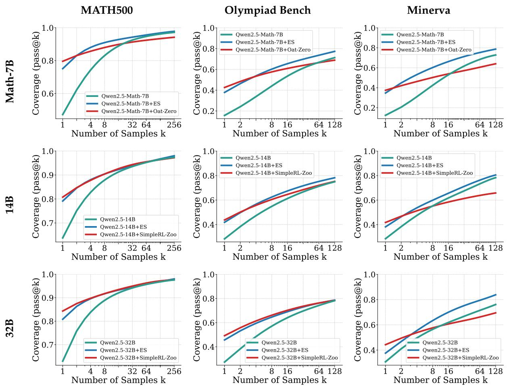  
Figure 9: Qwen2.5 results for MATH500, Olympiad Bench and Minerva across Math-7B, 14B and 32B model scales. ES outperforms SOTA RL training recipes (OatZero and SimpleRL-Zoo) for pass@k, highlighting the pass@k trend in favor of ES as model parameters scale. This further motivates the use of ES for problems requiring TTS with larger models.  
how many samples are drawn

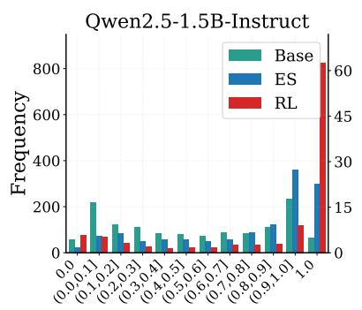

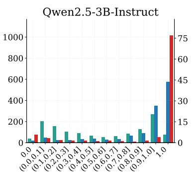

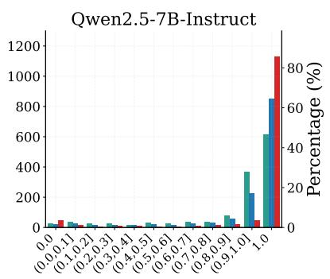

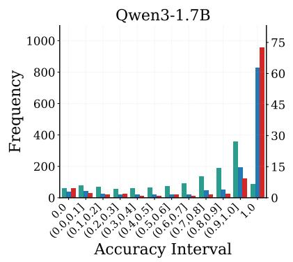

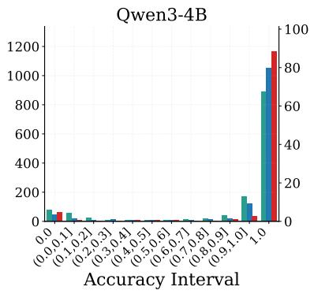

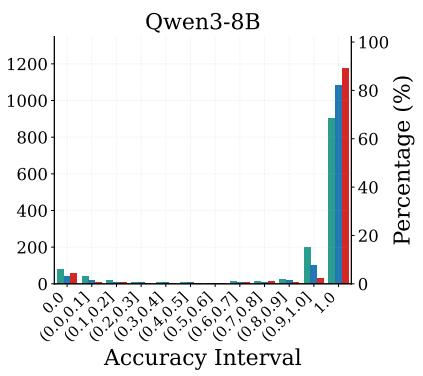  
Figure 10: Accuracy distribution analysis for Qwen2.5 and Qwen3 models from 1.5B to 8B on GSM8K.

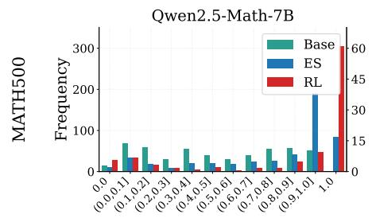

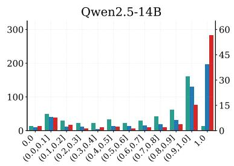

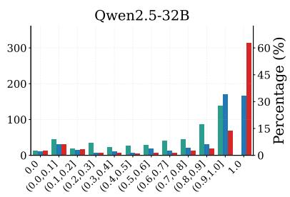

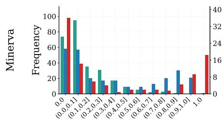

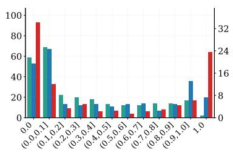

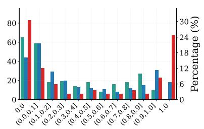

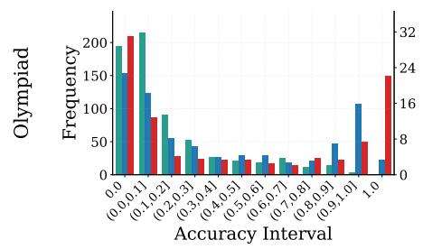

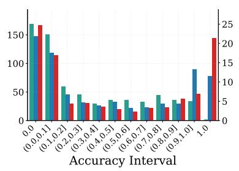

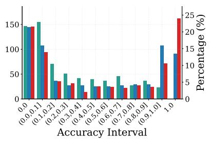  
Figure 11: Accuracy distribution analysis for Qwen2.5 model from 7B to 32B on MATH500, Minerva, and Olympiad Bench. ES reduces the number of unsolveable problems i.e., prompts located in bin 0.0 across each benchmark.

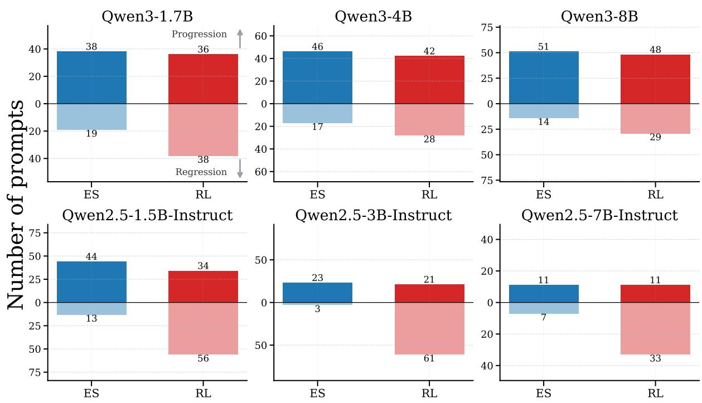  
Figure 12: Progressions and regression for Qwen2.5 and Qwen3 models trained on GSM8K with parameters rangin from 1.5B to 8B. ES reduces the number of regressions and increases progressions compared to RL across all parameter scales.

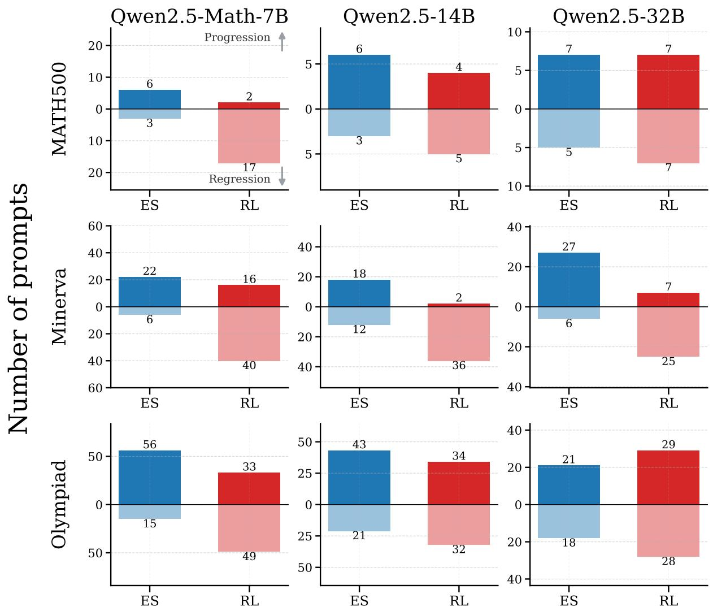  
Figure 13: Progressions and regression for Qwen2.5-Math-7B, Qwen2.5-14B, and Qwen2.5-32B trained on MATH and evaluated using MATH500, Olympiad Bench, and Minerva. RL has more regressions compared to ES across each benchmark, while ES has more progressions.