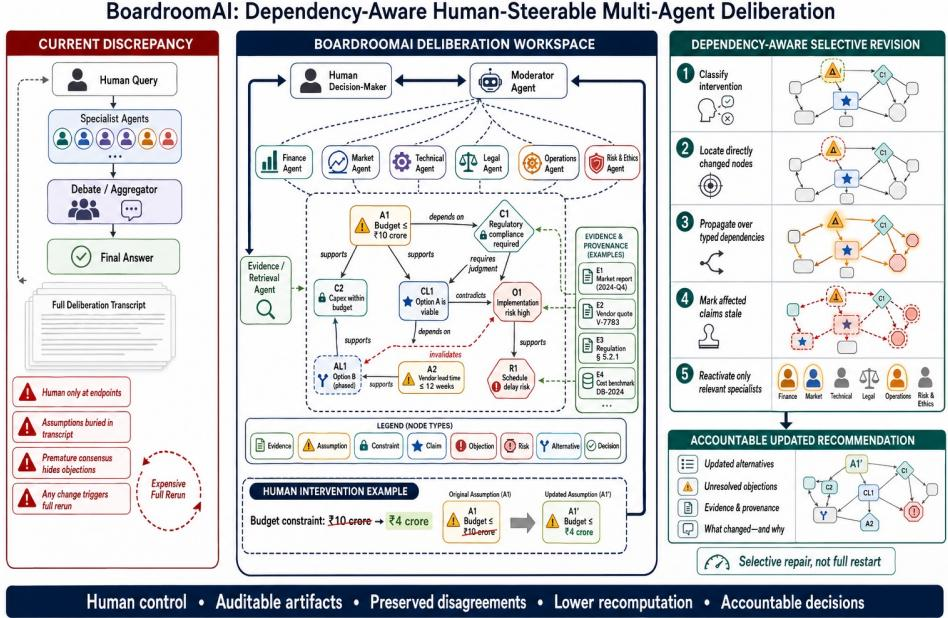
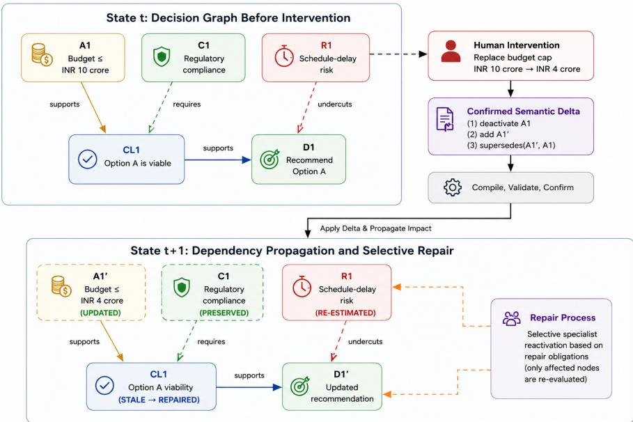

# BoardroomAI: Dependency-Aware Human-Steerable Multi-Agent Deliberation through Evolving Decision Graphs

Sanjeev Manivannan1

Indian Institute of Technology Madras, Chennai, India sanjeev.manivannan@gmail.com

Abstract. Organizational decisions are co-created while evidence, constraints, and human priorities continue to change. In conventional transcrip based multi-agent systems, a human typically provides an initial problem, agents deliberate internally, and the system returns a final response. BoardroomAI instead treats the human as a persistent participant who can intervene during the discussion by challenging assumptions, modifying constraints, changing priorities, introducing evidence, or redirecting the decision process. We operationalize this human–agent coexistence through four components: (i) a typed decision graph whose nodes represent evidence, assumptions, constraints, claims, objections, alternatives, risks, and decisions, and whose edges represent semantic dependencies and specialist responsibility; (ii) an intervention compiler that converts each confirmed human action into explicit node- and edge-level graph updates; (iii) a dependency-aware propagation mechanism that measures the structural impact of the intervention, identifies the afected decision subgraph, preserves unafected artifacts, and selectively reactivates the relevant domain specialists; and (iv) an evaluation framework that measures intervention impact, repair coverage, preservation, recomputation, and final decision validity. On 600 generated decision-DAG interventions, the proposed propagation mechanism matched exhaustive impact computation while inspecting only 14.59% of nodes. In a 12-case exploratory agent pilot, selective repair recomputed 62.11% of canonical nodes, preserved all gold-unafected nodes, and produced valid updated decisions in six cases, while conservatively abstaining in the remaining six. These abstentions show that correct intervention routing does not necessarily provide suficient context for decision synthesis. We therefore formalize a decision-suficient context closure for human-steered multi-agent deliberation. All reported results are synthetic and prototype-level.

Keywords: Human–AI co-creation · multi-agent deliberation · human steerability · Knowledge representation · decision graphs · selective repair

## 1 Introduction

LLM agents can adopt roles, exchange critiques, and aggregate answers [5, 14]. These capabilities do not by themselves produce an accountable meeting. In a real decision process, a chief executive may reduce a budget after several proposals have been developed; legal evidence may be withdrawn; or an ethical objection may remain unresolved despite a numerical majority. Restarting wastes work and can alter unrelated conclusions through stochastic drift. Appending the change to a transcript, however, ofers no guarantee that every dependent artifact is revisited.

The central research problem is revision routing: after a human intervention, the system must determine (i) which claims, assumptions, constraints, or decisions have changed semantic status; (ii) which generated artifacts must be revised, recomputed, or invalidated; (iii) which unafected artifacts should be preserved without unnecessary regeneration; and (iv) which specialist agents must be reactivated to repair the afected portion of the deliberation. This does not expose private chain-of-thought. Instead, it maintains concise, externally generated deliberation artifacts, including claims, evidence, assumptions, constraints, objections, alternatives, dependencies, confidence estimates, and provenance, that can be inspected, challenged, revised, and audited by the human participant.

BoardroomAI treats the recommendation, its alternatives, and its supporting rationale as a shared co-created artifact. The human is neither a prompt provider restricted to the beginning nor an approver restricted to the end and can redirect the process, revise constraints, challenge an inference, change priorities, preserve a minority objection, or make an accountable override while the agents continue to elaborate the artifact. Dependency-aware conversational revision and graphbased context selection already exist [9, 24]. BoardroomAI therefore claims the following narrower system contribution:

1. Decision-graph representation. We define a formal decision-graph semantics with alternative minimal justification environments for preserving independently supported claims.

2. Typed human interventions. We formalize human interventions as typed graph operations, including invalidation, weakening, contestation, supersession, and preference changes.

3. Selective specialist repair. We propagate intervention impact through decision graph, selectively reactivate only afected specialists, and specify conservative fallback to full redeliberation when the repair is insuficient.

4. DynaBoard evaluation. We introduce DynaBoard, a 12-case synthetic pilot for evaluating routing independent of the final decision quality.

The current prototype is language-and-graph based rather than multimodal. Its co-creation contribution lies in maintaining and revising an explicit shared decision state as human intent evolves during deliberation. The present evaluation examines (i) intervention-impact routing and preservation of unafected artifacts, (ii) decision-suficient selective repair on complete and corrupted dependency graphs, and (iii) controlled human interventions applied through a programmatic controller. Unrestricted natural-language intervention parsing, human comprehension, calibrated reliance, and robustness to ambiguous or incorrect interventions remain subjects for larger agent evaluations and human-subject studies.

## 1.1 Motivation

Let us look at a real-world boardroom situation to understand the motivation behind our agentic framework.

Consider a company evaluating the launch of a new product. Finance, marketing, legal, and operations specialists deliberate over multiple alternatives and eventually recommend a staged product launch under a 100 million budget. After the discussion reaches consensus, the decision maker reduces the budget to 40 million. While this change invalidates some earlier conclusions, others remain fully justified. A transcript-based multi-agent system either restarts the entire discussion or continues without explicitly determining which previous decisions remain valid, leading to unnecessary recomputation or inconsistent reasoning.

BoardroomAI instead represents the deliberation as a dependency-aware decision graph. The intervention is propagated only through afected dependencies, invalidating the paid-acquisition launch strategy while preserving the independent regional-partnership justification and unrelated legal conclusions. Only the relevant specialists are reactivated, and the system produces an auditable change log explaining what changed, why it changed, and which decisions remain valid.

## 2 Related Work

Human–AI co-creation and mixed initiative. Co-creative systems study how humans and AI jointly contribute to an evolving artifact through shared responsibility and interaction [11, 13, 15, 20]. BoardroomAI extends this perspective to organizational deliberation by treating human interventions as explicit operations on a shared decision graph.

Multi-agent reasoning. Multi-agent debate and role-based collaboration improve reasoning, coordination, and decision making across diverse tasks [3,5,14,17–19, 23, 25, 26]. Unlike prior work, we study typed human interventions followed by dependency-aware selective specialist repair.

Revision, argumentation, and provenance. Truth-maintenance systems, computational argumentation, and provenance models provide formal mechanisms for representing dependencies, alternative justifications, and explanation [4,6,7,12]. BoardroomAI adapts these ideas to maintain a dynamically evolving decision graph for human–AI deliberation.

Human control and group decision support. Mixed-initiative systems emphasize appropriate human oversight, while research in decision support highlights the importance of calibrated trust, diverse opinions, and preserving dissent [1, 2, 10, 16, 22]. Accordingly, BoardroomAI treats dissent and human interventions as first-class, auditable components of the deliberation process.

Table 1: Typed edges and their revision semantics.
<table><tr><td>Relation</td><td>Meaning under an upstream change</td></tr><tr><td>requires</td><td>Hard premise; loss invalidates that environment.</td></tr><tr><td>supports</td><td>Defeasible support; loss weakens or invalidates only the environ- ments containing it.</td></tr><tr><td>derives</td><td>Records the rule/tool and source lineage.</td></tr><tr><td>rebuts</td><td>Incompatible conclusion; sets contestation, not staleness.</td></tr><tr><td>undercuts</td><td>Attacks an inference or environment&#x27;s applicability.</td></tr><tr><td>supersedes</td><td>Replaces an artifact while retaining history.</td></tr><tr><td>requiresHuman</td><td>Blocks synthesis until judgment or explicit deferral.</td></tr></table>

## 3 Problem Formulation

At turn t, the deliberation state is

$$
\boldsymbol { S } _ { t } = ( G _ { t } , \mathcal { L } _ { t } , \mathcal { M } _ { t } , \varPi , \mathcal { H } _ { t } , \mathcal { E } _ { t } , \mathcal { B } _ { t } ) .
$$

$G _ { t } = ( V _ { t } , E _ { t } )$ is a typed directed multigraph; $\mathcal { L } _ { t }$ stores justification labels; $\mathcal { M } _ { t }$ is concise shared memory; \Pi contains agents, tools, and policies; $\mathcal { H } _ { t }$ is the intervention ledger; $\mathcal { E } _ { t }$ is an immutable evidence/provenance ledger; and $B _ { t }$ records token, latency, and monetary budgets.

We use decision graph for the full typed structure. The 600-instance mechanism benchmark uses acyclic dependency graphs, hence the term decision DAG in that experiment. A deployed deliberation can contain cycles through mutual rebuttal, recursive requirements, or version relations. The propagation engine therefore condenses every strongly connected component into one supernode and runs over the resulting condensation DAG. This distinction is essential: the raw workspace is not assumed to be acyclic.

A node is $\boldsymbol { v } = \langle i d , \tau , x , s , o , c , p , t \rangle$ : type, content, status, owner, confidence, provenance, and timestamp. Types are evidence/fact, assumption, hard or soft constraint, claim, objection, alternative, risk, question, intermediate conclusion, and decision. Status is active, weakened, contested, stale, superseded, rejected, unresolved, or accepted. Edge typ es include \protect \mathsf {requires}, \protect \mathsf {supports}, \protect \mathsf {derives}, \protect \mathsf {rebuts}, \protect \mathsf {undercuts}, \protect \mathsf {supersedes}, \protect \mathsf {answers}, and \protect \mathsf {requiresHuman} . Evidence nodes require a source locator, retrieval time, and content hash; model-generated claims never become evidence merely by repetition.

Minimal justification environments. For each derived node v, the label $\mathcal { L } _ { t } ( v ) =$ $\{ J _ { v } ^ { 1 } , \ldots , J _ { v } ^ { m } \}$ contains subset-minimal alternative environments. Each J is a conjunction of supporting literals and rule identifiers; the label is their disjunction. Let

$$
\operatorname { o k } _ { t } ( J ) = \bigwedge _ { \ell \in J } \operatorname { a c t i v e } _ { t } ( \ell ) \ \wedge \ \neg \operatorname { u n d e r c u t } _ { t } ( J ) .
$$

Then v remains supportable if $\backslash \backslash _ { J \in \mathcal { L } _ { t } ( v ) } \mathrm { o k } _ { t } ( J )$ . Loss of some but not all environments weakens v; loss of all makes it stale. A rebuttal makes a claim contested unless an explicit rule or authoritative evidence invalidates its justification. This prevents majority agreement from silently deleting a minority objection.

  
Fig. 1: BoardroomAI overview. A typed workspace replaces transcript-only aggregation; confirmed human edits propagate through dependencies and reactivate only relevant specialists. Exposed objects are decision-support artifacts and provenance, not private chain-of-thought.

## 4 BoardroomAI Framework

## 4.1 Architecture and Deliberation Protocol

The human can add, retract, replace, challenge, confirm, prioritize, or resolve an artifact at any turn (Fig. 1). The moderator compiles the utterance into candidate typed operations and asks for confirmation when scope or authority is ambiguous. Specialist agents receive only their role, the task packet, relevant active subgraph, open objections, evidence excerpts, and output schema. A retriever returns source-bounded evidence nodes; it cannot vote. A provenance validator checks locators and quotation entailment. A skeptic must search for shared assumptions, missing evidence, and counterexamples.

Each specialist emits atomic graph operations rather than an unrestricted essay: propose/qualify claim, attach evidence, declare assumption, add justification, object/undercut/rebut, propose alternative, quantify risk, or ask a question. The deterministic graph service checks node typing, source availability, cycles, environment minimality, and ownership. The moderator’s turn score combines coverage of open repair obligations, expected information gain, decision risk, cost, and redundancy. It requests human judgment for conflicting hard constraints, irreducible value trade-ofs, high-sensitivity near ties, unresolved source conflicts, ambiguous interventions, or unreliable dependency coverage.

Disagreement and uncertainty. Disagreement is relational: two artifacts rebut one another or an objection undercuts a stated environment. Uncertainty is epistemic: a node’s probability or interval reflects confidence in a checkable proposition. They are not interchangeable. Each probabilistic claim declares its event, horizon, and elicitation method; the system aggregates only commensurable forecasts and retains the individual forecasts. The moderator cannot resolve a normative conflict by averaging confidence. An objection has a disposition \ifmode lbrac \se txbracleft \i open, answered, accepted-residual, rejected-with-basis, deferred-by-human \ifmode rbac \lse txbracight \f ; only the human can defer a mandatory value judgment. Minority reports are generated from open or accepted-residual objections and include the evidence and condition under which they would change the recommendation.

Stopping requires: no stale artifact on a decision’s active justification; all hard constraints resolved; each objection answered, accepted as residual, or explicitly deferred; evidence and budget thresholds met; and no mandatory human question open. The accountable packet contains a recommendation, alternatives, constraints, sources, assumptions, residual objections and minority report, calibrated uncertainty, intervention/change log, and reopening conditions. Otherwise the system abstains or returns an unresolved decision packet.

## 4.2 Human Intervention as Decision-Graph Evolution

An intervention parser returns a confirmed graph delta $\varDelta _ { h }$ . Its components $D ^ { + }$ $D ^ { - } , D ^ {  } , D ^ { ? }$ , and $\rho$ encode additions, retractions, replacements, challenges, and preference/authority updates. A replacement, for example, does not merely overwrite text: it deactivates the old node, adds a new version, records a supersedes edge, and then reevaluates only those environments that reference the changed version. Figure 2 shows this distinction between the direct graph edit and its propagated repair.

Directly changed nodes seed a queue. For each downstream node, the engine recomputes the semantic signature

$$
q _ { t } ( v ) = \langle s _ { t } ( v ) , \{ J \in \mathcal { L } _ { t } ( v ) : \mathrm { o k } _ { t } ( J ) \} , a _ { t } ( v ) , x _ { t } ( v ) \rangle ,
$$

where $a _ { t } ( v )$ is its active attack set. Only a signature change propagates. Thus ordinary \protect \mathrm {Reac $\mathrm { _ { ) l e ^ { + } } }$ is a safe candidate set but can over-revise; the impact set $I _ { h }$ is the least fixed point of actual signature changes. The repair set $R _ { h } \subseteq$ $I _ { h }$ contains stale or contested generated artifacts and content whose source, constraint, or preference basis changed.

Let $P _ { h } = V _ { t } \setminus I _ { h }$ denote the preservation set. Preservation does not mean retaining identical wording from a stochastic model; it means that the validated semantic signature and provenance of an artifact do not change. Let $C _ { h }$ be the set of nodes actually recomputed. The system is selective when $R _ { h } \subseteq C _ { h }$ and $| C _ { h } | \ll | V _ { t } |$ , and it is safe only when every mandatory repair obligation is covered or the system falls back to full redeliberation.

More formally, let $\sigma _ { t } ( v )$ be the validated local update function for the node type and let \protect \operatorname {pred}(v) include support, requirement, attack, and supersession predecessors. Starting from direct seeds $D _ { h }$ , the engine computes the least fixed

  
Fig. 2: A budget revision becomes an explicit semantic delta. Unchanged regulatory context is preserved; afected viability and schedule artifacts are repaired. Cyclic workspaces are processed through their SCC condensation DAG.

point

$$
I _ { h } = \mu X .  D _ { h } \cup \{ v : \exists u \in X \cap \mathrm { p r e d } ( v ) , \ \sigma _ { t + 1 } ( v ) \neq \sigma _ { t } ( v ) \} .
$$

The comparison is performed after all alternative environments and active attacks for v are recomputed. Within a strongly connected component, updates iterate to stability; non-convergence or inconsistent hard statuses forces escalation rather than an arbitrary tie break. Every transition records the causal predecessor, rule version, old/new signature, and responsible actor.

Obligations include re-estimate, retrieve, reconcile, generate alternative, adjudicate objection, and resynthesize. Owners, expertise tags, source access, and estimated cost define a weighted set-cover instance; the router greedily maximizes uncovered risk-weighted obligations per expected cost, then adds a skeptic for contested high-impact claims. A full restart is mandatory for global objective changes, low dependency/extraction confidence, unresolved cycles, or an afected fraction above a preregistered threshold.

Routing is a budgeted weighted set-cover problem: agent a has expected cost $c _ { a } ,$ estimated obligation coverage $K _ { a o } ,$ and each obligation has risk weight $w _ { o } .$ The online policy greedily maximizes uncovered risk-weighted coverage per expected cost. Any uncovered mandatory obligation triggers escalation or fallback, and rejected candidates are logged.

Table 2: Direct semantics of confirmed human interventions. Downstream status changes remain justification-dependent.
<table><tr><td>Operation</td><td>Direct node update</td><td>Edge/semantic effect</td></tr><tr><td>Add</td><td>Create a provenance-linked node.</td><td>typed, attributed, Add validated relations; reevaluate de- pendents.</td></tr><tr><td>Retract</td><td>tory.</td><td>Mark inactive without erasing his- Exclude from active environments; retain audit edges.</td></tr><tr><td>Replace</td><td>Add a version and supersede the Add supersedes old node.</td><td> $\scriptstyle : ( v ^ { \prime } , v ) ;$  preserve replayabil- ity.</td></tr><tr><td>Challenge</td><td>Add an objection or counterclaim. Add rebuts/undercuts; contest, not falsify.</td><td>Update authority only; create no evi-</td></tr><tr><td>Confirm</td><td>Record human acceptance.</td><td>dence edge.</td></tr><tr><td>Prioritize</td><td>Edit a criterion weight or prefer- Reopen dependent rankings and sensitiv- ence.</td><td>ities.</td></tr><tr><td>Override</td><td>Add a human decision with stated Supersede the recommendation; retain basis.</td><td>residual objections.</td></tr><tr><td>Resolve</td><td>sition.</td><td>Add an answer or objection dispo- Add answers; close only with a valid basis.</td></tr></table>

Fallback is based on preregistered diagnostics, not the moderator’s rhetorical confidence: graph-coverage audit score below $\tau _ { c } ,$ mean edge-confidence below $\tau _ { e } .$ changed-node fraction above $\tau _ { f }$ , a global objective/ontology edit, or an unstable component. Thresholds are tuned only on development tasks. The evaluation reports a routing safety curve across deliberately corrupted edges so that cheapness cannot mask incomplete repair.

Conditional preservation. Assume complete dependency annotations, deterministic pure update functions, and propagation over an acyclic graph or its strongly connected component condensation. Then every node outside the least-fixedpoint impact set preserves its semantic signature. The proof is induction over topological order: an unchanged node has neither a direct delta nor a changed predecessor signature, so its deterministic update is unchanged. This is a conditional systems property, not a claim about fallible LLM extraction. The structural pass is $\begin{array} { r } { O ( | V | + | E | + \sum _ { v } | \mathcal { L } ( v ) | ) } \end{array}$ ; LLM cost remains empirical.

## 4.3 Decision-Suficient Repair Packets

Correct impact routing is necessary but not suficient. The synthesizer must also receive enough unchanged boundary context to prove feasibility and reconstruct the declared decision rubric. We define the decision-suficient closure of a repair set as

$$
\mathrm { D S C } ( R _ { h } ) = R _ { h } \cup B _ { h } ^ { \mathrm { h a r d } } \cup B _ { h } ^ { \mathrm { r u b r i c } } \cup B _ { h } ^ { \mathrm { a l t s } } \cup B _ { h } ^ { \mathrm { r i s k } } \cup B _ { h } ^ { \mathrm { s o u r c e } } ,
$$

where the five boundary sets contain, respectively, every active hard constraint relevant to a surviving alternative, every criterion and human-approved weight used by the synthesizer, the roots of surviving alternative justifications, unresolved objections and material risks, and the minimal evidence spans needed to verify included claims. The packet contains semantic summaries plus identifiers and provenance, not an unrestricted replay of the meeting.

Algorithm 1 Justification-aware selective redeliberation   
Require: State $S _ { t } ,$ , confirmed intervention h   
Ensure: Repaired deliberation state or full redeliberation   
1: ∆ ← CompileAndValidate $\ d _ { i } ( h , G _ { t } , \mathcal { E } _ { t } )$   
2: Q ← ApplyDirectDelta $\left( \varDelta _ { h } \right)$   
3: I ← ∅, R ← ∅   
4: while $Q \neq \emptyset$ do   
5: u ← Pop(Q)   
6: for all typed dependents v of u do   
7: q′ ← RecomputeSignature $( v , \mathcal { L } _ { t } )$   
8: if $q ^ { \prime } \neq q _ { t } ( v )$ then   
9: update qt(v) and enqueue v into $Q$   
10: I ← I ∪ {v}   
11: if NeedsRepair(v, q′) then   
12: R ← R ∪ {v}   
13: end if   
14: end if   
15: end for   
16: end while   
17: O ← Obligations $( R , \varDelta _ { h } )$   
18: if GlobalOrUnreliable(I, G ) then   
19: return full redeliberation with change log   
20: end if   
21: A′ ← BudgetedCover(O, Π, B )   
22: return DeliberateRepair $( \mathrm { A } ^ { \prime } , 0 , S _ { t } )$

This closure is a design correction motivated by the reported pilot. The prototype selective condition supplied afected subgraphs and hand-selected boundary premises, yet abstained in six of twelve cases because the synthesizer could not establish a complete constraint/rubric basis. The reported numbers therefore evaluate the earlier packet construction, not the full \protect \operatorname {DSC} rule. A future replication must compare the original packet, the closure above, and full structured repair under matched budgets.

## 4.4 Decision Synthesis and Implementation Blueprint

Synthesis is constraint-first, not a vote over prose. For alternative $d ,$ the graph service evaluates executable hard predicates ${ \bf g } ( d )$ , then computes a transparent soft-utility interval

$$
U ( d ) = \sum _ { k } \omega _ { k } u _ { k } ( d ) - \sum _ { r } \eta _ { r } p _ { r } ( d ) \ell _ { r } ( d ) ,
$$

where weights $\omega _ { k }$ are human-approved, $u _ { k }$ are normalized criterion scores, and each risk has probability $p _ { r } .$ , loss $\ell _ { r }$ , and severity weight $\eta _ { r }$ . Missing quantities remain intervals or unresolved nodes; they are not imputed by the judge. The synthesizer ranks only hard-feasible alternatives, reports sensitivity to weights and uncertain inputs, and abstains if no alternative is feasible. Agent votes are retained as provenance but have no direct coeficient in U. This separation lets the benchmark distinguish a correct calculation from an unsupported preference.

The graph service accepts schema-valid, versioned transactions that name every premise ID. It verifies identifiers, permissions, immutable evidence spans, and environment minimality; accepted writes store replayable before/after hashes. Meeting prose is only a view of this authoritative graph. Specialists declare premises and edge types, a separate critic tests counterfactual dependence, and rule validators enforce types; disagreement lowers edge confidence and broadens routing. The moderator sees graph summaries and obligations, not hidden reasoning, and every action must cite the obligation or stop condition it addresses. Evidence prompt injection is treated as quoted data and credentials remain outside specialist context. These are implementation controls, not outcomes tested by the present experiments.

## 5 Experiments

We report deterministic propagation on complete generated decision DAGs, a missing-edge stress test with fallback disabled, and a 12-case exploratory agent pilot. The pilot uses confirmed field-level updates and a non-LLM router; it does not test unrestricted parsing, human outcomes, live retrieval, or real organizations. The proposed decision-suficient closure is not yet evaluated.

## 5.1 Mechanism-Level Synthetic Validation

Scope and setup. We implemented the deterministic propagation core in Python and tested it on 600 generated decision DAG interventions (150 each with 64, 128, 256, and 512 nodes). Each derived node had one to three subset-minimal alternative environments. One or two active source nodes were invalidated; 175 generated attempts with trivial or near-global impact were rejected before obtaining the fixed 600-case suite. Seed 20270721, per-case records, the generator, and the analysis script are included. An independent exhaustive evaluator recomputed every node and defined gold semantic impact as any change in active environment IDs. This experiment used no LLM, evidence packet, decision rubric, or human; it isolates routing semantics and cannot answer RQ1, RQ3, RQ4, or RQ5.

Conditions were direct-node updating; an ablation retaining only one environment per claim; descendant reachability; exhaustive full restart; BoardroomAI signature propagation; and an oracle that inspects exactly the gold impact set. Recompute is the fraction of nodes inspected. Reuse is the fraction of gold-unafected nodes not recomputed, not a claim that a stochastic LLM would reproduce identical prose. Tab. 3 reports case means; intervals below use 1,000 case-bootstrap draws.

With complete annotations, selective propagation agreed with exhaustive recomputation in all 600 cases. It inspected 14.59% of nodes (95% bootstrap CI

Table 3: Mechanism-level results on 600 generated interventions. BoardroomAI uses complete dependency annotations. Values are percentages.
<table><tr><td>Method</td><td>P</td><td>R</td><td>F1</td><td></td><td>Exact Inspect Reuse</td><td></td></tr><tr><td>Direct only</td><td>100.00</td><td>23.32</td><td>36.65</td><td>0.00</td><td>0.95</td><td>100.00</td></tr><tr><td>Single env.</td><td>34.04</td><td>78.58</td><td>38.60</td><td>1.33</td><td>19.02</td><td>84.19</td></tr><tr><td>Reachability</td><td>10.47</td><td>100.00</td><td>17.08</td><td>0.33</td><td>59.78</td><td>42.66</td></tr><tr><td>Full restart</td><td>100.00</td><td>100.00</td><td>100.00</td><td>100.00</td><td>100.00</td><td>0.00</td></tr><tr><td>BoardroomAI 100.00</td><td></td><td>100.00</td><td>100.00</td><td>100.00</td><td>14.59</td><td>89.96</td></tr><tr><td>Oracle</td><td>100.00</td><td>100.00</td><td>100.00</td><td>100.00</td><td>5.75</td><td>100.00</td></tr></table>

Table 4: Observed selective routing without fallback under random edge deletion (240 cases per rate; percentages).
<table><tr><td>Deleted</td><td>Precision</td><td>Recall</td><td>F1</td><td>Exact set</td></tr><tr><td>0%</td><td>100.00</td><td>100.00</td><td>100.00</td><td>100.00</td></tr><tr><td>5%</td><td>100.00</td><td>96.11</td><td>97.68</td><td>81.25</td></tr><tr><td>10%</td><td>100.00</td><td>90.55</td><td>94.19</td><td>60.42</td></tr><tr><td>20%</td><td>100.00</td><td>85.09</td><td>90.86</td><td>47.08</td></tr><tr><td>30%</td><td>100.00</td><td>75.13</td><td>83.74</td><td>23.75</td></tr></table>

13.47–15.85) and reused 89.96% of unafected nodes (89.11–90.80). Reachability obtained full recall by inspecting 59.78% of nodes, but its mean precision was 10.47% (9.49–11.50). Direct updating and a single-environment label were cheaper but missed downstream or alternative-environment changes. The oracle gap (14.59% versus 5.75%) is boundary-inspection overhead: the selective algorithm must inspect candidates to prove they are unchanged. Median Python structural speed-up over full recomputation rose from 2.11× at 64 nodes to 22.08× at 512 nodes; these timings reflect local synthetic edits on one CPU, not LLM latency or token savings.

Missing-dependency stress test. We randomly deleted routing edges while retaining the complete graph for gold evaluation and deliberately disabled fallback (240 cases per rate). As Tab. 4 shows, only 10% deletion reduced recall to 90.55% (88.48–92.52) and exact-set recovery to 60.42%. Precision remains 100% because deletion hides paths but cannot create false ones in this monotone simulation; wrong-edge corruption remains untested. Thus the perfect completegraph result validates an implementation conditional, while the stress test exposes dependency extraction and fallback detection as unresolved risks.

## 5.2 Exploratory Validation

The primary contribution of BoardroomAI is a methodology for dependencyaware, human-steerable multi-agent deliberation rather than a new language model or benchmark. Consequently, our objective is not to establish state-ofthe-art decision quality, but to verify that the complete intervention–routing– repair pipeline can be instantiated using contemporary LLM agents and executed end-to-end under controlled conditions. To this end, we conduct an exploratory validation using a synthetic organizational benchmark with hidden interventions. The study evaluates whether selective repair preserves unafected reasoning, correctly propagates intervention efects, and reconstructs updated decisions without unnecessary re-deliberation. Equally importantly, it serves as a feasibility study for identifying practical failure modes and guiding the design of future large-scale evaluations.

Exploratory Codex validation. The validation consists of an end-to-end stress test over a controlled 12-task synthetic benchmark. Each organizational case was constructed before generation and contains four candidate decisions, supporting evidence, executable hard constraints, weighted decision criteria, and one hidden intervention that alters both the feasible solution space and the optimal decision. Ground-truth dependency annotations identify directly afected, transitively afected, revision-required, and unafected artifacts, allowing repair accuracy to be evaluated automatically.

Generation agents received only phase-specific public information, while a deterministic validator verified every ground-truth label. For the structured conditions, a canonical decision graph was generated mechanically from the public artifacts. Following revelation of the hidden intervention, a non-LLM controller propagated changes through typed dependency edges to identify the minimal repair region. This evaluates selective repair assuming an available dependency graph rather than the separate problem of dependency extraction.

Four execution settings were compared. C1 employs a single iterative agent. C2 uses multiple specialist agents followed by complete re-deliberation after every intervention. C3 performs structured full re-deliberation using the canonical decision graph, while C4 activates only specialists whose artifacts lie within the routed repair region. The exploratory implementation was executed using the product-facing gpt-5.6-terra interface with medium reasoning. Since immutable model snapshots, decoding controls, seeds, token usage, hardware configuration, and latency statistics were unavailable, this study is presented as an exploratory feasibility validation rather than a fully reproducible benchmark.

Quantitative results. C1, C2, and C3 produced a valid updated decision for every evaluated task, reflecting the transparency of the synthetic benchmark rather than real-world decision quality. C1 correctly identified only 44.44% of afected artifacts, whereas C2 preserved none of the gold-unafected reasoning because every specialist was restarted. C3 achieved perfect routing accuracy but recomputed every canonical artifact, including 37.89% that should have remained unchanged. In contrast, C4 preserved every unafected artifact and reduced specialist activations by 11.11%, recomputing only 62.11% of canonical artifacts. However, it abstained on six of the twelve tasks, producing a valid updated recommendation only when the routed repair packet contained suficient information to reconstruct the final decision.

Table 5: Exploratory agent results. Percentages are task-run means. Utility was 100% conditional on a non-abstaining valid choice in every condition. Unequal repetitions preclude a superiority claim.
<table><tr><td>Condition</td><td>n Valid Impact F1 Rev. F1 Preserve Inspect Exact</td><td></td><td></td><td></td><td></td><td></td><td></td></tr><tr><td>C1 iterative</td><td></td><td>36 100.00</td><td>61.44</td><td>65.28</td><td>45.24</td><td>25.88</td><td>0.00</td></tr><tr><td>C2 full panel</td><td></td><td>36100.00</td><td>43.77</td><td>38.44</td><td>0.00</td><td>42.51</td><td>0.00</td></tr><tr><td>C3 struct. full 12 100.00</td><td></td><td></td><td>100.00</td><td>100.00</td><td>0.00</td><td>100.00</td><td>100.00</td></tr><tr><td>C4 selective</td><td>12</td><td>50.00</td><td>100.00</td><td>100.00</td><td>100.00</td><td>62.11</td><td>50.00</td></tr></table>

Qualitative analysis. The most important observation is that dependency-correct routing alone is insuficient for successful selective repair. Although C4 achieved perfect routing and preservation on all evaluated tasks, it abstained whenever the available repair context was insuficient to establish a complete constraint– criterion basis for the synthesizer. This suggests that future selective-repair systems should optimize not only routing accuracy but also decision suficiency, ensuring that repaired artifact subsets contain enough information to reconstruct globally consistent recommendations.

Scoring and limitations. Programs compared predicted decisions and artifact sets against frozen private labels. Decision quality, preservation, unnecessary recomputation, and routing precision/recall/F1 were computed automatically using exact canonical identifiers. Confidence intervals were estimated using 5,000 task-cluster bootstrap samples. Because structured conditions completed only a single paired execution and backend reproducibility controls were unavailable, no statistical superiority claims are made. Risk descriptions, factual entailment, confidence calibration, execution cost, latency, and token consumption were therefore excluded from quantitative analysis.

Future evaluation. A comprehensive evaluation should include independently adjudicated decision cases, multiple model families, controlled decoding configurations, matched token budgets, oracle and full-repair baselines, and ablation studies of typed dependencies, provenance, escalation, alternative justification environments, and routing policies. Robustness experiments should additionally evaluate incorrect dependency graphs, ambiguous interventions, conflicting constraints, fabricated evidence, and fallback strategies. The principal safety objective is to demonstrate that selective repair preserves decision quality while reducing unnecessary re-deliberation.

## 6 Design Implications for Human–AI Co-Creation

Human steerability should update authoritative state rather than append another message. Preservation is also a co-creative capability because it protects valid alternatives, dissent, and provenance from unnecessary stochastic rewriting. Finally, routing minimality and decision suficiency are diferent: a small impact set may still omit the hard constraints or rubric context needed for synthesis. Evaluation must therefore report validity, preservation, coverage, completion, and cost together.

Planned human evaluation. A counterbalanced within-subject study will compare iterative single-agent, structured full, and selective repair. Its primary endpoint is change-basis comprehension: what changed, what was preserved, and why, with task score, calibrated reliance, time, control, situation awareness, and NASA-TLX as secondary outcomes [8, 21]. No participant result is claimed.

## 7 Reproducibility

The specified supplement contains the structural runner, fixed seed, 600 graph records, corruption records, 12-case generator and validator, frozen prompts, outputs, canonical labels, exclusion ledger, scorer, bootstrap summaries, and hashes. Unavailable backend fields remain null; the interrupted repetition is listed but excluded before synthesis.

## 8 Conclusion

BoardroomAI models human–AI deliberation as evolution of an external decision graph: typed human edits propagate through alternative justifications, trigger obligation-based specialist repair, and preserve unafected objections and provenance. On 600 complete generated decision DAGs, propagation exactly matched exhaustive impact sets while inspecting 14.59% of nodes; missing edges sharply degraded recovery. In the 12-case pilot, selective repair preserved all unafected canonical nodes but abstained on half the cases. This negative result motivates decision-suficient closure: correct routing must also supply the constraints, rubric, alternatives, risks, and evidence needed for synthesis. The contribution is therefore a falsifiable mechanism, not evidence of general organizational superiority.

## Acknowledgements

We thank the anonymous reviewers for their valuable comments and constructive feedback. We also thank colleagues and mentors for insightful discussions on multi-agent systems, computational argumentation, and human–AI collaboration that helped shape this work.

## References

1. Bansal, G., Nushi, B., Kamar, E., Weld, D.S., Lasecki, W.S., Horvitz, E.: Does the whole exceed its parts? the efect of AI explanations on complementary team performance. In: Proceedings of the 2021 CHI Conference on Human Factors in Computing Systems (2021). https://doi.org/10.1145/3411764.3445717

2. Buçinca, Z., Malaya, M.B., Gajos, K.Z.: To trust or to think: Cognitive forcing functions can reduce overreliance on AI in AI-assisted decision-making. Proceedings of the ACM on Human-Computer Interaction 5(CSCW1), 1–21 (2021). https://doi.org/10.1145/3449287

3. Chiang, C.W., Lu, Z., Li, Z., Yin, M.: Enhancing AI-assisted group decision making through LLM-powered devil’s advocate. In: Proceedings of the 29th International Conference on Intelligent User Interfaces. pp. 103–119 (2024). https://doi.org/ 10.1145/3640543.3645199

4. Conklin, J., Begeman, M.L.: gIBIS: A hypertext tool for exploratory policy discussion. ACM Transactions on Ofice Information Systems 6(4), 303–331 (1988). https://doi.org/10.1145/62266.62278

5. Du, Y., Li, S., Torralba, A., Tenenbaum, J.B., Mordatch, I.: Improving factuality and reasoning in language models through multiagent debate. In: Proceedings of the 41st International Conference on Machine Learning. Proceedings of Machine Learning Research, vol. 235, pp. 11733–11763 (2024)

6. Dung, P.M.: On the acceptability of arguments and its fundamental role in nonmonotonic reasoning, logic programming and n-person games. Artificial Intelligence 77(2), 321–357 (1995). https://doi.org/10.1016/0004-3702(94)00041-X

7. Green, T.J., Karvounarakis, G., Tannen, V.: Provenance semirings. In: Proceedings of the Twenty-Sixth ACM SIGMOD-SIGACT-SIGART Symposium on Principles of Database Systems. pp. 31–40 (2007). https://doi.org/10.1145/1265530. 1265535

8. Hart, S.G., Staveland, L.E.: Development of NASA-TLX (task load index): Results of empirical and theoretical research. In: Human Mental Workload, Advances in Psychology, vol. 52, pp. 139–183. North-Holland (1988). https://doi.org/10. 1016/S0166-4115(08)62386-9

9. He, Q., Dong, Y., Huang, X.: Grounded continuation: A linear-time runtime verifier for LLM conversations. arXiv preprint arXiv:2605.14175 (2026), https://arxiv. org/abs/2605.14175

10. Horvitz, E.: Principles of mixed-initiative user interfaces. In: Proceedings of the SIGCHI Conference on Human Factors in Computing Systems. pp. 159–166 (1999). https://doi.org/10.1145/302979.303030

11. Kantosalo, A., Toivonen, H.: Modes for creative human-computer collaboration: Alternating and task-divided co-creativity. In: Proceedings of the Seventh International Conference on Computational Creativity. pp. 77–84 (2016)

12. de Kleer, J.: An assumption-based TMS. Artificial Intelligence 28(2), 127–162 (1986). https://doi.org/10.1016/0004-3702(86)90080-9

13. Lawton, T., Grace, K., Ibarrola, F.J.: When is a tool a tool? user perceptions of system agency in human–ai co-creative drawing. In: Proceedings of the 2023 ACM Designing Interactive Systems Conference. pp. 1978–1996 (2023). https: //doi.org/10.1145/3563657.3595977

14. Li, G., Hammoud, H.A.A.K., Itani, H., Khizbullin, D., Ghanem, B.: CAMEL: Communicative agents for mind exploration of large scale language model society. In: Advances in Neural Information Processing Systems. vol. 36, pp. 51991–52008 (2023)

15. Lin, Z., Riedl, M.: An ontology of co-creative AI systems. arXiv preprint arXiv:2310.07472 (2023)

16. Lorenz, J., Rauhut, H., Schweitzer, F., Helbing, D.: How social influence can undermine the wisdom of crowd efect. Proceedings of the National Academy of Sciences 108(22), 9020–9025 (2011). https://doi.org/10.1073/pnas.1008636108

17. Ma, S., Chen, Q., Wang, X., Zheng, C., Peng, Z., Yin, M., Ma, X.: Towards human–ai deliberation: Design and evaluation of LLM-empowered deliberative AI for AI-assisted decision-making. In: Proceedings of the 2025 CHI Conference on Human Factors in Computing Systems. pp. 1–23 (2025). https://doi.org/10. 1145/3706598.3713423

18. Prakash, S.: From debate to deliberation: Structured collective reasoning with typed epistemic acts. arXiv preprint arXiv:2603.11781 (2026), https://arxiv. org/abs/2603.11781

19. Quan, K., Albassam, D., Wu, M., Ding, Z., Chin, J.: Towards AI as colleagues: Multi-agent system improves structured professional ideation. In: Proceedings of the 2026 CHI Conference on Human Factors in Computing Systems. pp. 1–17 (2026). https://doi.org/10.1145/3772318.3790375, https://arxiv.org/abs/ 2510.23904

20. Rezwana, J., Maher, M.L.: Designing creative AI partners with COFI: A framework for modeling interaction in human–ai co-creative systems. ACM Transactions on Computer-Human Interaction 30(5), 1–28 (2023). https://doi.org/10.1145/ 3519026

21. Schemmer, M., Kühl, N., Benz, C., Bartos, A., Satzger, G.: Appropriate reliance on AI advice: Conceptualization and the efect of explanations. In: Proceedings of the 28th International Conference on Intelligent User Interfaces. pp. 410–422 (2023). https://doi.org/10.1145/3581641.3584066

22. Stasser, G., Titus, W.: Pooling of unshared information in group decision making: Biased information sampling during discussion. Journal of Personality and Social Psychology 48(6), 1467–1478 (1985). https://doi.org/10.1037/0022-3514.48. 6.1467

23. Turkstra, F., Nabhani, S., Al-Khatib, K.: ARGSBASE: A multi-agent interface for structured human–AI deliberation. In: Proceedings of the 19th Conference of the European Chapter of the Association for Computational Linguistics: System Demonstrations. pp. 563–574 (2026). https://doi.org/10.18653/v1/2026.eacldemo.39, https://aclanthology.org/2026.eacl-demo.39/

24. Wang, H., Garg, U., Davari, R., Jiao, H., Cheng, H., Peng, B., Chen, S.Q., Ge, T.: LEDGER: Scaling agentic document editing with dependency-aware graph retrieval. In: Findings of the Association for Computational Linguistics: ACL 2026. pp. 10614–10644 (2026). https://doi.org/10.18653/v1/2026.findingsacl.515, https://aclanthology.org/2026.findings-acl.515/

25. Wang, Q., Wang, Z., Su, Y., Tong, H., Song, Y.: Rethinking the bounds of LLM reasoning: Are multi-agent discussions the key? In: Proceedings of the 62nd Annual Meeting of the Association for Computational Linguistics. pp. 6106–6131 (2024). https://doi.org/10.18653/v1/2024.acl-long.331

26. Xiong, K., Ding, X., Cao, Y., Liu, T., Qin, B.: Examining inter-consistency of large language models collaboration: An in-depth analysis via debate. In: Findings of the Association for Computational Linguistics: EMNLP 2023. pp. 7572–7590 (2023)