# DMDINTEL: Interpreting Large Language Models via Dynamic Mode Decomposition

Amogh Joshi IIT Kharagpur, India University of Manchester, UK

Animesh Mukherjee IIT Kharagpur, India

Sergey Utyuzhnikov University of Manchester, UK

## Abstract

In this work, we introduce DMDINTEL which uses dynamic mode decomposition (DMD) to make the predictions made by LLMs in a classification task interpretable. It develops an input attribution pipeline, that first decomposes the hidden states of an LLM into prominent patterns, also known as modes, and then associates ranks to the input tokens based on the projection values on those modes. Rigorous experiments across three datasets and three model families consistently show that the ranked attribution of input tokens obtained using DMD-INTEL by far outperforms state-of-the-art techniques such as principal component analysis, integrated gradients and SHAP.

## 1 Introduction

Transformer language models (Vaswani et al., 2017) redefined the processing of natural language by introducing self-attention. Following this, many modifications have been made to the transformer architecture, such as encoder-only and decoder-only models (Devlin et al., 2019; Radford et al., 2018). Due to an increase in the complexity of these models, interpretability remains a huge challenge. A significant body of literature has been dedicated to dissecting and interpreting the internal mechanisms of attention layers in transformer-based architectures. Traditional interpretability methods, such as Integrated Gradients (IG) (Sundararajan et al., 2017), SHAP (Lundberg and Lee, 2017), etc., are often used for input attribution in LLMs. Although these methods are effective in identifying “what” the model looks at, they treat the tokens as discrete entities and often overlook the sequential evolution of the latent information, providing a fragmented snapshot rather than a continuous narrative of model’s reasoning.

In addition to attribution, there are some attempts to decode the structural logic of the MLP component of the decoder layer. Geva et al. (2021) suggests that the MLP module acts as a key-value memory bank, where the first linear layer is a pattern detector (keys) and the second is a value provider that updates the residual stream. Hernandez et al. (2023) states that much of the black-box computation within an MLP can be approximated via linear operations in high-dimensional space. However, even these structural insights frequently treat each token’s hidden state as an isolated vector, failing to capture the logic that builds across a sequence.

To address these issues, in this paper, we attempt to take advantage of masked self-attention, which invokes the sequential nature of decoder-only LLMs by analyzing hidden states as they evolve token by token. By viewing these hidden states as trajectories, we can treat the supervised fine-tuned LLM as a dynamical system where the internal processing resembles a flow in the embedding space. We use Dynamic Mode Decomposition (DMD) (Schmid, 2010) to find a surrogate linear operator, A, which approximates the complex model underlying $\mathcal { F }$ . Specifically, we model the state transition, $h _ { t + 1 } = \mathcal { F } ( w _ { \leq t } )$ , using a linear relationship $h _ { t + 1 } = \mathbf { A } h _ { t } .$ , where $w { \le } t$ represents the tokens until the current token index t and $h _ { t }$ represents the hidden state of the model at the token index t. This linear operator is then decomposed using DMD into interpretable spatio-temporal modes. These modes can be thought of as the low-dimensional structures that manifest when a model is supervised fine-tuned for a particular downstream task. We then use the dominant modes for input attribution to identify the most influential tokens. Thus, we can think of these tokens as the main drivers of the model’s input processing, as it prepares the output by reading the input tokens.

Key contributions: Our key contributions in this work are as follows.

• We introduce DMDINTEL, an input attribution framework for supervised fine-tuned

LLMs that extracts the primary tokens driving a given output classification. We show that the hidden states of a supervised finetuned model, obtained from the down\_proj of its multi-layer perceptron (MLP) component, show interpretable patterns when decomposed into lower-dimensional spatio-temporal modes. The ranking of tokens by their projections onto these DMD modes demonstrates that certain modes serve as robust indicators of the model’s information flow.

• We validate the versatility and robustness of our approach by evaluating it across three distinct LLM families of varying parameter scales using three diverse text classification datasets.

• To the best of our knowledge, this is the first work to analyze the sequential evolution of hidden states in decoder-only LLMs as a dynamical system for input attribution. We demonstrate that DMDINTEL consistently identifies the highest proportion of groundtruth tokens while preserving their ranked importance, outperforming baseline methods such as PCA, IG, and SHAP.

## 2 Background

Dynamic Mode Decomposition (DMD) (Schmid, 2010) was originally developed in fluid mechanics to extract coherent spatial structures from complex, non-linear flow fields. DMD is a purely data-driven, model-agnostic technique that requires no prior knowledge of the underlying system governing equations. By operating directly on timeseries observation snapshots, DMD constructs a best-fit linear operator that approximates the nonlinear dynamics of the system. The resulting eigendecomposition yields a set of spatial DMD modes—representing the primary spatial structures along with complex eigenvalues that quantify their temporal growth, decay, and oscillation frequencies. A complete mathematical derivation and algorithmic setup of DMD is detailed in Appendix B.

## 3 Related work

Interpretability of LLMs: Various analytical frameworks have been proposed to understand the inner workings of LLMs. Probing-based approaches evaluate whether hidden representations capture structural or semantic features by training linear classifiers on top of frozen model layers (Tenney et al., 2019). Beyond static probing, mechanistic interpretability seeks to reverse-engineer specific network circuits, mapping exact weights and attention head paths to functional behaviors such as in-context pattern matching (Olsson et al., 2022) or factual retrieval (Meng et al., 2022). To observe how these internal features evolve into final predictions, methods such as the LogitLens decode intermediate hidden states directly into the vocabulary space. This concept is further refined in TunedLens (Belrose et al., 2023), which trains linear adapters at each layer to more accurately map representation dynamics to the model’s predictive trajectory.

DMD applications: Beyond fluid dynamics, DMD has been successfully applied to video processing scenarios. Kutz et al. (2017) established DMD’s capability for background modeling in video stream data, effectively separating the foreground from the background. Erichson et al. (2019) utilized a memory-efficient variant of DMD to achieve foreground-background separation in streaming video data.

DMD for NLP tasks: In recent works, DMD has also been used for feature extraction to improve performance in classification tasks. For example, (Sachin Kumar et al., 2019) uses DMD to extract spatio-temporal features from text representations to capture the evolving sentiment trajectory across a sentence. Similarly, this dynamical perspective has been successfully applied to multimodal and spoken language tasks; for example, (Mao et al., 2020) utilizes DMD to derive spectral representations of audio utterances. Vyshnav et al. (2020) evaluates DMD along with traditional sequence models to isolate consistent and underlying semantic patterns from highly noisy and user-generated social media text. Together, these works highlight the efficacy of DMD in capturing non-linear dynamics across diverse linguistic modalities.

## 4 The DMDINTEL framework

In this section, we outline the DMDINTEL framework which we propose for interpreting the predictions of decoder-only LLMs when they are used to perform various text classification tasks. We view the LLMs as a discrete-time dynamical system, where the evolution of hidden states acts as a first-order approximation of the LLM F, such that $h _ { k + 1 } \approx \mathcal { F } ( h _ { k } )$ . Subsequently, we use DMD (see

Appendix B for more details) to approximate ${ \mathcal F } .$ and finally decompose it to get a set of interpretable modes.

## 4.1 Formulation of the data matrix

As an LLM processes a text sequence, it stores the information in the intermediate hidden states such that $h _ { t + 1 } = \mathcal { F } ( w _ { \leq t } )$ . The information can be considered as the combined representation of the instruction prompt plus the information from the actual input sentence in some non-linear fashion. This information is passed through all the layers, before passing through the unembedding matrix, followed by softmax to generate the actual token. We target a layer, and in that layer, we consider outputs from the down\_proj of the multilayer perceptron. For an input sequence consisting of $w _ { 1 } , w _ { 2 } , . . . , w _ { n }$ tokenized words, we collect the vectors from the selected layer to form the matrix X such that

$$
\begin{array} { c } { \mathbf { X } = \left[ \begin{array} { c c c c } { \rule { 0.5 pt } { 2.5 ex } } & { \rule { 0.5 pt } { 2.5 ex } } & { \rule { 0.5 pt } { 2.5 ex } } & { \rule { 0.5 pt } { 2.5 ex } } \\ { h _ { 1 } } & { h _ { 2 } } & { \cdots } & { h _ { n } } \\ { \rule { 0.5 pt } { 2.5 ex } } & { \rule { 0.5 pt } { 2.5 ex } } & { \rule { 0.5 pt } { 2.5 ex } } \end{array} \right] } \\ { h _ { i } = \mathcal { F } ( w _ { \leq i } ) . } \end{array}
$$

where each

(1)

## 4.2 Noise removal

We find that the instruction fine-tuned models encode a significant representation of the prompt template used during fine-tuning within the hidden representations of each token. As Hemati et al. (2017) proves the sensitivity of DMD to noise in the data, we denoise the data matrix obtained in Eq. 1 by removing the noise inflicted by the prompt template. For this, we pass an empty prompt consisting of the same exact system and user prompts without the input sentence, and then collect the hidden representation from the same layer from where we pick the token representations. We call this instruction bias, b. This bias is then subtracted from each $h _ { i }$ to obtain the debiased estimate of the hidden representation of the actual token $w _ { i }$

$$
\hat { h } _ { i } = h _ { i } - \pmb { b }\tag{2}
$$

Thus, our resulting data matrix is the collection of the debiased hidden states of each token.

$$
\hat { \pmb X } = \left[ \hat { h } _ { 1 } \quad \hat { h } _ { 2 } \quad \ldots \quad \hat { h } _ { n } \right]\tag{3}
$$

Algorithm 1 Heuristic layer selection   
Require: Fine-tuned LLM $\mathcal { F } ;$ input sequence w   
$( w _ { 1 } , w _ { 2 } , \ldots , w _ { n } ) ;$ instruction bias vector b (obtained by   
passing an empty prompt through F); cosine threshold   
$\tau = 0 . 2 5$   
Ensure: Selected layer index $\ell ^ { * }$   
1: Let $L _ { \mathrm { m i d } }$ denote the middle-indexed decoder layer of ${ \mathcal F } ,$   
and $L _ { \mathrm { l a s t } }$ the final decoder layer.   
2: for each layer $\ell \in \{ L _ { \mathrm { m i d } } , L _ { \mathrm { m i d } } ^ { \bullet } + 1 , . . . , L _ { \mathrm { l a s t } } \}$ do   
3: Extract the down\_proj hidden representation $h _ { t } ^ { ( \ell ) }$ for   
each token $w _ { t } ,$ , without debiasing.   
4: Compute the per-token cosine similarity with the bias   
vector:   
$c _ { t } ^ { ( \ell ) } = \frac { \langle h _ { t } ^ { ( \ell ) } , b \rangle } { \vert \vert h _ { t } ^ { ( \ell ) } \vert \vert \vert b \vert \vert }$   
5: Average over all tokens to obtain a layer-level simi  
larity score:   
$\bar { c } ^ { ( \ell ) } \ = \ \frac { 1 } { n } \sum _ { t = 1 } ^ { n } c _ { t } ^ { ( \ell ) }$   
6: end for   
7: Form the cosine-similarity curve $\mathcal { C } = \left( \bar { c } ^ { ( \ell ) } \right) _ { \ell = L _ { \mathrm { m i d } } } ^ { L _ { \mathrm { l a s t } } } ,$   
8: Restrict the candidate set to layers whose similarity lies   
below the threshold:   
$\mathcal { L } _ { \tau } ~ = ~ \left\{ \ell ~ | ~ \bar { c } ^ { ( \ell ) } < \tau \right\}$   
9: Within $\mathcal { L } _ { \tau } ,$ compute the discrete gradient of C:   
$\nabla \bar { c } ^ { ( \ell ) } = \bar { c } ^ { ( \ell + 1 ) } - \bar { c } ^ { ( \ell ) }$   
10: Identify the layer at the lower end of the steepest ascent   
in $c { \mathrm { : } }$   
$\ell ^ { * } \ = \ \underset { \ell \in \mathcal { L } _ { \tau } } { \mathrm { a r g m a x } } \ \nabla \bar { c } ^ { ( \ell ) }$   
11: return $\ell ^ { * }$

## 4.3 Layer selection

Recall that a transformer has multiple layers, and each layer has its own representation of the input tokens. We define a heuristic to identify the decoder layer whose down\_proj MLP outputs best represent the actual input sentence, balancing inputtoken fidelity against instruction-following bias. The intuition behind this heuristic is as follows. Layers close to the middle layer of the transformer, $L _ { \mathrm { m i d } }$ tend to be nearly orthogonal to b, indicating that their representations are driven primarily by the actual input tokens. As ℓ increases toward $L _ { \mathrm { l a s t } }$ (last transformer layer), the cosine similarity also rises, reflecting a shift in the model’s focus toward instruction-following rather than input content. The selected layer $\ell ^ { * }$ sits at the inflection point of this curve C – the point of highest local gradient still below the cosine similarity threshold $\tau = 0 . 2 5 \ : .$ – where the model strikes the best balance between encoding input-token semantics and attending to the instruction prompt. We verify that this heuristic is consistent across all model families and datasets considered in this work (see example curves C in Figure 1 for different datasets and models discussed in Section 5). The procedure based on this heuristic is formalized in Algorithm 1, and the layers selected for different model and dataset settings are detailed in Table 1

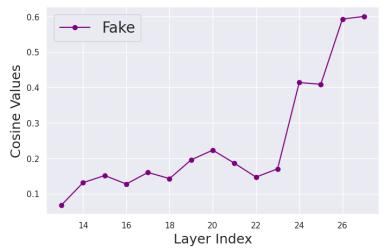  
(a) Llama-3.2-3B-inst: FE

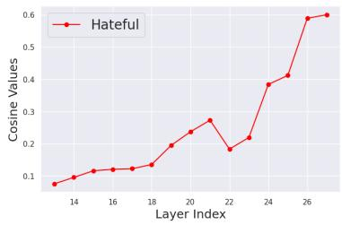  
(b) Llama-3.2-3B-inst: HX

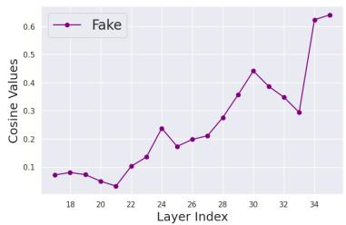  
(c) Qwen3-4B-inst: FE

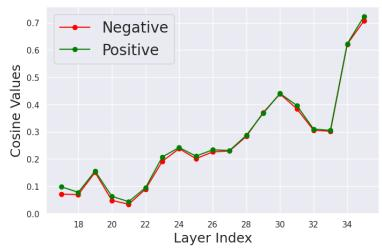  
(d) Qwen3-4B-inst: SNT

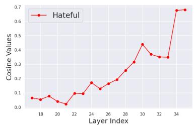  
(e) Qwen3-4B-inst: HX

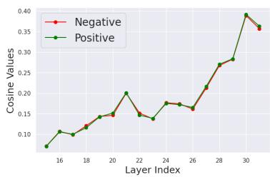  
(f) Mistral-7B-v0.3-inst: SNT  
Figure 1: Cosine similarity curves C across different datasets and models. x-axis shows the layer indices starting from the middle layer of the model till the end. y-axis shows the average cosine similarity of the bias vector with the input token sentences. FE: FakeEdit, HX: HateXplain, SNT: Sentiment.

<table><tr><td>Model Family</td><td>Sentiment</td><td>HateXplain</td><td>FakeEdit</td></tr><tr><td>Llama-3.2-3B-inst</td><td>19</td><td>18</td><td>18</td></tr><tr><td>Qwen3-4B-inst</td><td>22</td><td>23</td><td>23</td></tr><tr><td>Mistral-7B-v0.3-inst</td><td>20</td><td>27</td><td>22</td></tr></table>

Table 1: Selected optimal layer indices across different datasets and model families.

## 4.4 Input token attribution

We use PyDMD, (Demo et al., 2018), a robust Python package, which consists of implementations of various DMD algorithms, to obtain the approximate surrogate $\mathcal { F }$ of the LLM using the debiased hidden state matrix. The modes obtained after the eigendecomposition of the linear Koopman operator A can be interpreted as capturing low-dimensional structures underlying the evolution of hidden representations. We interpret these structures to reflect linguistic and semantic regularities, such as syntactic patterns, grammatical dependencies, and features relevant to the predictive behavior of the model.

Apart from the basic DMD algorithm we also use the higher order dynamic mode decomposition (HODMD) (Le Clainche and Vega, 2017). While DMD focuses on finding a linear operator satisfying the Markovian assumption $( h _ { t + 1 } = \mathbf { A } h _ { t } )$ HODMD implements time embedding (see Appendix C for more details). In this way, a Hankel matrix is constructed from the original snapshot data to model the system such that each hidden state is treated as a linear combination of the d previous time-steps, where d is the delay parameter. To implement HODMD, we stack d successive snapshots into a higher-dimensional representation, which allows the model to capture long-term dynamics and temporal dependencies that standard DMD might miss. The expanded snapshot matrix H looks as follows

$$
\mathcal { H } _ { 1 } ^ { N - d } = \left[ \begin{array} { c c c c } { h _ { 1 } ^ { \ell ^ { * } } } & { h _ { 2 } ^ { \ell ^ { * } } } & { \hdots } & { h _ { N - d } ^ { \ell ^ { * } } } \\ { h _ { 2 } ^ { \ell ^ { * } } } & { h _ { 3 } ^ { \ell ^ { * } } } & { \hdots } & { h _ { N - d + 1 } ^ { \ell ^ { * } } } \\ { \vdots } & { \vdots } & { \ddots } & { \vdots } \\ { h _ { d } ^ { \ell ^ { * } } } & { h _ { d + 1 } ^ { \ell ^ { * } } } & { \hdots } & { h _ { N } ^ { \ell ^ { * } } } \end{array} \right]\tag{4}
$$

Our pipeline then proceeds by applying standard DMD to this augmented matrix. First, we perform an SVD on H to reduce dimensionality while preserving dominant features. Next, we compute the Koopman eigenvalues and eigenvectors from the reduced-rank operator to identify the system’s modes.

Mode ranking: Similar to PCA, where components are ranked by the amount of variance explained, DMD/HODMD modes can be ranked according to different measures of dynamical significance. We employ two ranking criteria: (i) the magnitude of the initial modal amplitudes (Rowley et al., 2009), and (ii) the average magnitude of the modal amplitudes over the temporal trajectory (Tissot et al., 2014) to get the most relevant modes (top-k) for our task. In all our experiments, we consider $k = 5$ modes, both when experimenting with DMD (and other similar baselines like PCA). Token ranking: To find how each token contributes to those modes, we consider the state change $( \Delta h _ { t } ^ { \ell ^ { * } }$ ) which the token $w _ { t }$ adds after it has been processed, as a proxy for the hidden state representation of that token, and then calculate its scalar projection magnitude on each of the modes. We then sum the projection magnitude values for each mode for all the top k modes to obtain a projection score for that token.

$$
\Delta h _ { t } ^ { \ell ^ { * } } = h _ { t } ^ { \ell ^ { * } } - h _ { t - 1 } ^ { \ell ^ { * } }\tag{5}
$$

$$
\alpha _ { t , i } = \frac { \left| \left. \Delta h _ { t } ^ { \ell ^ { * } } , \phi _ { i } \right. \right| } { \left\| \phi _ { i } \right\| } , \quad i = 1 , \ldots , k\tag{6}
$$

$$
s _ { t } = \sum _ { i = 1 } ^ { k } \alpha _ { t , i }\tag{7}
$$

where, $\phi _ { i }$ is a selected mode, $\langle \cdot \rangle$ represents the dot product of two vectors, k represents the number of top modes considered, and $s _ { t }$ is the projected score obtained for the particular token index t. Finally, we rank the tokens according to their decreasing order of projection scores to obtain the ranked input attributions for each token.

## 5 Experimental setup

Models: In this work, we fine-tune three different LLMs, Llama-3.2-3B-inst (Grattafiori et al., 2024), Qwen3-4B-inst (Yang et al., 2025), and Mistral-7B-v0.3-inst (Jiang et al., 2023). We perform supervised instruction fine-tuning of the model in full precision. The prompt templates used for the fine-tuning are provided in the Appendix. Datasets: For this work, we use three text classification datasets (see Appendix D for more details) as follows – (i) Sentiment: sentiment classification (Zhang et al., 2015), (ii) FakeEdit: fake news detection (Nakamura et al., 2020), and (iii) HateXplain: hateful content classification (Mathew et al., 2021). We use the training split of each of these datasets to perform the supervised fine-tuning of the three chosen models. Finally, we use 1000 different sentences from the test set of each dataset, equally divided in different input size buckets, to evaluate the efficacy of our method on small as well as large input sentences.

Baselines: We compare our method with IG (Sundararajan et al., 2017), SHAP (Lundberg and Lee, 2017) (more specifically, the GRADIENTSHAP implementation) and PCA. Note that PCA is computed directly on the transpose of debiased hidden state matrix, $\hat { X } ^ { \top }$ , such that each row is treated as an observation (token hidden states) and each column represents the hidden dimension, to obtain a set of principal components that maximizes the variance in the collection of representation vectors. The token attribution in PCA then follows the same procedure as DMD, mentioned in Eq. 5 to 7.

Metrics: We report three metrics: (i) average matched count, (ii) Rank-Biased Overlap (RBO) (Webber et al., 2010) and (iii) recall@k. The average matched count gives the expected number of tokens matched from the GT, it does not take into account the number of tokens GT has for a particular sentence. RBO compares the rank of the retrieved token with the token’s rank in the GT and penalizes tokens that are assigned a higher rank than in the GT. RBO is defined as follows,

$$
\mathbf { R B O } _ { \mathrm { E X T } } ( S , T , p , k ) = ( 1 - p ) \sum _ { d = 1 } ^ { k } A _ { d } \cdot p ^ { d - 1 } + \frac { X _ { k } } { k } \cdot p ^ { k }\tag{8}
$$

where $S$ and $T$ are two retrieved lists, $p$ is the persistence factor, $A _ { d }$ is the agreement between two lists at depth $d ,$ k is the top-k cut-off value, and $X _ { k }$ is the overlap count between $S$ and $T$ at depth k. For our evaluations, we choose $p = 0 . 9 5$ . Recall@k measures the percentage of GT tokens retrieved. It is sensitive to both the number of retrieved tokens and the number of tokens in the GT.

Ground truth: For each dataset, ground truth tokens responsible for a prediction were obtained using OpenAI GPT-4.1 (Achiam et al., 2023), where the model was prompted to rank individual tokens from input sentences based on their importance to the output label. A maximum of 20 tokens were ranked for each input, apart from stop words, and the model was instructed to stop the ranking early if there were fewer than 20 influential tokens. Table 2 lists an example sentence from each dataset’s class label, and the corresponding ground truth (GT) returned by GPT-4.1. The GTs are ranked in order of the most influential to the least influential in determining the class label of the input sentence. In order to test the goodness of the labelling, two experienced annotators manually rank 100 input sentences from each dataset which is then compared with the GPT-4.1 annotated rankings. We first observe that the two experienced annotators agree very well in terms of the RBO scores for all the three datasets. The scores are as follows – negative sentiment: 0.64, positive sentiment: 0.72, hateful text: 0.62, and fake text: 0.61. Next, we find that the human annotations and GPT-4.1 annotations also align well. In particular, RBO values obtained for the three datasets are negative sentiment: 0.60, positive sentiment: 0.70, hateful text: 0.54, and fake text: 0.60. The slightly lower agreement for HateXplain corresponds to the known subjectivity of hate speech annotation in the literature.

<table><tr><td>Dataset classes</td><td>Input sentence</td><td>Ground truth (GT)</td></tr><tr><td>Negative sentiment</td><td>hated it it was so small not as the picture showed could not even get it to turn on i threw it in the trash it wasnt worth the hassle of returning it</td><td>1. hated, 2. trash, 3. hassle, 4. not, 5. small, 6. threw, 7. worth, 8. returning</td></tr><tr><td>Positive sentiment</td><td>great gift but expensive i got this gift from my husband it is a little expensive but the best gps so far</td><td>1. best, 2. great, 3. gift, 4. husband, 5. gps</td></tr><tr><td>HateXplain (hateful)</td><td>user it a refugees fault for sucking up all the oxygen thus my issues get ignored or minimized citizens before regugees</td><td>1. refugees, 2. fault, 3. sucking, 4. oxygen, 5. citizens, 6. regugees</td></tr><tr><td>FakeEdit (fake)</td><td>womens magazine staff out of work as kardashians reveal they have nothing left to reveal</td><td>1. kardashians, 2. reveal, 3. nothing, 4. left, 5. womens, 6. magazine, 7. staff, 8. out, 9. work</td></tr></table>

Table 2: Examples of input sentences and their corresponding token-level ground truth (GT) rankings generated by GPT-4.1.

## 6 Results

We evaluate our framework using 1,000 samples per dataset, partitioned into distinct buckets based on input length to assess performance across varying context sizes. For the Sentiment dataset, samples are categorized into three ranges: 15–40, 40–70, and 70–100 tokens. For the HateXplain and FakeEdit datasets, we utilize two buckets: 15–40 and 40–70 tokens.

As noted earlier, we evaluate four combinations as follows – (i) standard DMD with amplitude-based ranking, (ii) standard DMD with time-averaged amplitude ranking, (iii) HODMD with amplitudebased ranking using an adaptive delay parameter, and (iv) HODMD with time-averaged amplitude ranking using an adaptive delay parameter. In each setting (model + dataset), we report the metrics obtained for the best performing combination above alongside the baselines (see Appendix D for full results).

## 6.1 Dataset based results

Sentiment classification: For sentiment classification, we retrieve the top 20 tokens for both sentiments and then compare them with the GT. We find that HODMD (see Table 3), paired with mode ranking through the averaged amplitude, consistently outperforms all other configurations across the three evaluated models. This setup generally exceeds traditional baselines, including PCA, IG, and SHAP in most metrics. Since sentiment is typically expressed through multi-word phrases rather than isolated tokens, the use of delay factors in the HODMD setup provides the necessary context to capture these dynamics more effectively than the standard DMD.

HateXplain: For this dataset, the standard DMD using amplitude-based ranking proves to be the most effective configuration for all models. As each data point in HateXplain contains very few sentences with more than 10 GT tokens, we calculate the metrics for the top 10 retrieved tokens. Note that here we compute the attributions on for the class of interest (i.e., hateful class). For Llama-3.2-3B-inst and Qwen3-4B-inst, the DMD-based attribution generally outperforms the baseline methods (Table 4). For Mistral-7B-v0.3-inst, our method is the second best. Since HateXplain relies on the specific token-level annotations for hateful content, we believe that the state changes triggered by these individual tokens are well-captured by the standard DMD. This suggests that the evolution of hidden representations in this context follows a near-Markovian process that does not require the extended memory of HODMD.

FakeEdit: The results for FakeEdit align closely with those of HateXplain (Table 4). Because the dataset consists of Reddit posts where specific keywords—such as the names of political figures—often dictate the “fake” status of a post, the importance is concentrated on individual tokens. Here, again, the attributions are computed for the fake class. Consequently, the standard DMD with amplitude ranking achieves the best performance, outperforming all baseline methods in recall@10. The importance ranking of the tokens may not align best with the GT, but our method retrieves the most amount of tokens from GT as measured by recall. This confirms that for tasks where localized token information is critical, standard linear approximations are highly effective.

<table><tr><td rowspan=1 colspan=8>Negative sentiment                                 Positive sentimentMethodMC@20↑      RBO@20 ↑     Recall@20 ↑  二  MC@20↑      RBO@20 ↑     Recall@20 ↑</td></tr><tr><td rowspan=1 colspan=8>Llama-3.2-3B-inst</td></tr><tr><td rowspan=2 colspan=2>IGSHAP</td><td rowspan=1 colspan=1>4.42</td><td rowspan=1 colspan=1>0.24</td><td rowspan=1 colspan=1>0.60</td><td rowspan=1 colspan=1>4.69</td><td rowspan=1 colspan=1>0.26</td><td rowspan=1 colspan=1>0.66</td></tr><tr><td rowspan=1 colspan=1>3.85</td><td rowspan=1 colspan=1>0.20</td><td rowspan=1 colspan=1>0.47</td><td rowspan=1 colspan=1>4.26</td><td rowspan=1 colspan=1>0.21</td><td rowspan=1 colspan=1>0.50</td></tr><tr><td rowspan=2 colspan=2>PCADMDINTELHoDMD−avgamp</td><td rowspan=1 colspan=1>5.24</td><td rowspan=1 colspan=1>0.24</td><td rowspan=1 colspan=1>0.66</td><td rowspan=1 colspan=1>5.98</td><td rowspan=1 colspan=1>0.26</td><td rowspan=1 colspan=1>0.73</td></tr><tr><td rowspan=1 colspan=1>5.35</td><td rowspan=1 colspan=1>0.25</td><td rowspan=1 colspan=1>0.68</td><td rowspan=1 colspan=1>6.12</td><td rowspan=1 colspan=1>0.27</td><td rowspan=1 colspan=1>0.76</td></tr><tr><td rowspan=1 colspan=8>Qwen3-4B-inst</td></tr><tr><td rowspan=4 colspan=2>IGSHAPPCADMDINTELHoDMD-avgamp</td><td rowspan=2 colspan=1>4.603.94</td><td rowspan=1 colspan=1>0.25</td><td rowspan=1 colspan=1>0.57</td><td rowspan=2 colspan=1>5.244.26</td><td rowspan=1 colspan=1>0.28</td><td rowspan=2 colspan=1>0.630.50</td></tr><tr><td rowspan=1 colspan=1>0.20</td><td rowspan=1 colspan=1>0.48</td><td rowspan=1 colspan=1>0.21</td></tr><tr><td rowspan=1 colspan=1>5.46</td><td rowspan=1 colspan=1>0.25</td><td rowspan=2 colspan=1>0.690.69</td><td rowspan=1 colspan=1>6.07</td><td rowspan=1 colspan=1>0.28</td><td rowspan=1 colspan=1>0.74</td></tr><tr><td rowspan=1 colspan=1>5.43</td><td rowspan=1 colspan=1>0.26</td><td rowspan=1 colspan=1>6.17</td><td rowspan=1 colspan=1>0.29</td><td rowspan=1 colspan=1>0.76</td></tr><tr><td rowspan=1 colspan=8>Mistral-7B-v0.3-inst</td></tr><tr><td rowspan=3 colspan=2>IGSHAPPCA</td><td rowspan=1 colspan=1>5.03</td><td rowspan=1 colspan=1>0.27</td><td rowspan=1 colspan=1>0.62</td><td rowspan=1 colspan=1>5.14</td><td rowspan=1 colspan=1>0.26</td><td rowspan=1 colspan=1>0.61</td></tr><tr><td rowspan=1 colspan=1></td><td rowspan=1 colspan=1>4.02</td><td rowspan=1 colspan=1>0.20</td><td rowspan=1 colspan=1>0.48</td><td rowspan=1 colspan=1>4.38</td><td rowspan=1 colspan=1>0.22</td><td rowspan=1 colspan=1>0.51</td></tr><tr><td rowspan=1 colspan=1>5.23</td><td rowspan=1 colspan=1>0.24</td><td rowspan=1 colspan=1>0.65</td><td rowspan=1 colspan=1>5.72</td><td rowspan=1 colspan=1>0.25</td><td rowspan=1 colspan=1>0.70</td></tr><tr><td rowspan=1 colspan=2>DMDINTELHoDMD-avgamp</td><td rowspan=1 colspan=1>5.40</td><td rowspan=1 colspan=1>0.25</td><td rowspan=1 colspan=1>0.68</td><td rowspan=1 colspan=1>6.03</td><td rowspan=1 colspan=1>0.27</td><td rowspan=1 colspan=1>0.75</td></tr></table>

Table 3: Experimental results for the Sentiment dataset across three different model families. MC: Matched count, HODMDavgamp: HODMD with averaged amplitude ranking. Best results are in bold and the second best are underlined.
<table><tr><td rowspan="2">Method</td><td colspan="3">Hateful reviews (HateXplain)</td><td colspan="3">Fake reviews (FakeEdit)</td></tr><tr><td>MC@10↑</td><td>RBO@10 ↑</td><td>Recall@10↑</td><td>MC@10↑</td><td>RBO@10↑</td><td>Recall@10↑</td></tr><tr><td colspan="7">Llama-3.2-3B-inst</td></tr><tr><td>IG</td><td>2.57</td><td>0.24</td><td>0.60</td><td>4.39</td><td>0.38</td><td>0.60</td></tr><tr><td>SHAP</td><td>2.30</td><td>0.22</td><td>0.50</td><td>3.60</td><td>0.32</td><td>0.48</td></tr><tr><td>PCA</td><td>2.63</td><td>0.23</td><td>0.60</td><td>5.12</td><td>0.43</td><td>0.70</td></tr><tr><td>DMDINTEL DMD−amp</td><td>2.77</td><td>0.25</td><td>0.64</td><td>5.46</td><td>0.42</td><td>0.76</td></tr><tr><td colspan="7">Qwen3-4B-inst</td></tr><tr><td>IG</td><td>2.66</td><td>0.26</td><td>0.60</td><td>4.35</td><td>0.38</td><td>0.60</td></tr><tr><td>SHAP</td><td>2.31</td><td>0.22</td><td>0.50</td><td>3.85</td><td>0.34</td><td>0.52</td></tr><tr><td>PCA</td><td>2.63</td><td>0.24</td><td>0.60</td><td>4.90</td><td>0.41</td><td>0.68</td></tr><tr><td>DMDINTEL DMD−amp</td><td>2.85</td><td>0.25</td><td>0.64</td><td>5.37</td><td>0.42</td><td>0.75</td></tr><tr><td colspan="7">Mistral-7B-v0.3-inst</td></tr><tr><td>IG</td><td>2.73</td><td>0.26</td><td>0.62</td><td>4.43</td><td>0.39</td><td>0.61</td></tr><tr><td>SHAP PCA</td><td>2.60</td><td>0.25</td><td>0.59</td><td>4.00</td><td>0.35</td><td>0.54</td></tr><tr><td></td><td>2.95</td><td>0.30</td><td>0.67</td><td>5.21</td><td>0.44</td><td>0.72</td></tr><tr><td>DMDINTEL DMD−amp</td><td>2.82</td><td>0.26</td><td>0.65</td><td>5.27</td><td>0.41</td><td>0.74</td></tr></table>

Table 4: Experimental results for the HateXplain and FakeEdit datasets across three different model families. The attributions are computed only for the class of interest (i.e., hateful for HateXplain and fake for FakeEdit). MC: Matched count, DMD-amp: DMD with amplitude ranking. Best results are in bold and the second best are underlined.

## 6.2 Qualitative results

Some of the representative qualitative results are noted in Table 5. DMDINTEL consistently demonstrates the strongest alignment with GT attributions across both models and sentence types, ranking the most semantically relevant tokens near the top of its lists. For the negative sentence, DMDINTEL places “trash” and “unable” within its top four for Llama-3.2-3B-inst, while for the hate speech it recovers all five GT tokens within its top nine for both models. Notably, DMDINTEL also exhibits strong cross-model consistency – its top five tokens for hate speech are nearly identical between Llama-3.2-3B-inst and Qwen3-4B-inst, differing only in minor reordering. SHAP performs competitively, recovering several high-priority GT tokens in compact lists: for the hate speech sentence it ranks “fa\*\*ot” and “retarded” in its top two for both models, and for the negative sentence it places “trash” first for Llama-3.2-3B-inst. However, SHAP tends to surface contextually plausible but GT-absent tokens (e.g. “high”, “conference”, “scheduled”) at the expense of key sentiment markers such as “unable” and “shrieking”. PCA shows moderate but uneven alignment, capturing several GT tokens yet struggling to prioritize the most discriminative ones (e.g., ranking “ni\*\*er”, the highest GT token, last in the hate speech sentence for Llama-3.2-3B-inst). IG shows the weakest performance overall, with non-salient tokens frequently appearing at the top of its rankings and instability manifesting as duplicate token entries (e.g., “use” appears twice in its Qwen3-4B-inst negative sentence list).

<table><tr><td>Model</td><td>Method</td><td>Top-ranked Tokens (Attribution)</td></tr><tr><td colspan="3">&quot;dont buy this phone this phone makes a constant high static shrieking noise i bought this phone to use on a regularly scheduled long conference call and was totall unable to use it its going directly in the trash&quot; [Negative]</td></tr><tr><td></td><td>GT</td><td>1. trash, 2. unable, 3. shrieking, 4. static, 5. noise, 6. constant, 7. dont, 8. buy, 9. totally, 10. directly</td></tr><tr><td>Llama-3.2-3B-inst</td><td>DMDINTEL</td><td>1. going, 2. trash, 3. dont, 4. unable, 5. conference, 6. shrieking, 7. makes, 8. bought, 9. regularly, 10. high, 11. scheduled, 12. use, 13. long, 14. directly, 15. phone, 16. constant, 17. call, 18. static, 19. totally</td></tr><tr><td></td><td>PCA</td><td>1. going, 2. unable, 3. conference, 4. shrieking, 5. makes, 6. high, 7. bought, 8. trash, 9. phone, 10. regularly, 11. constant, 12. static, 13. long, 14. use, 15. noise, 16. directly</td></tr><tr><td></td><td>IG</td><td>1. scheduled, 2. dont, 3. conference, 4. use, 5. totally, 6. trash, 7. directly, 8. going, 9. use, 10. static, 11. call, 12. unable, 13. noise, 14. buy, 15. regularly, 16. long</td></tr><tr><td></td><td>SHAP</td><td>1. trash, 2. directly, 3. noise, 4. high, 5. scheduled, 6. use, 7. constant, 8. going, 9. static, 10. dont, 11. phone, 12. totally</td></tr><tr><td></td><td>GT</td><td>1. trash, 2. unable, 3. shrieking, 4. static, 5. noise, 6. constant, 7. dont, 8. buy, 9. totally, 10. directly</td></tr><tr><td>Qwen3-4B-inst</td><td>DMDINTEL</td><td>1. going, 2. directly, 3. trash, 4. dont, 5. regularly, 6. makes, 7. buy, 8. static, 9. unable, 10. bought, 11. scheduled, 12. use, 13. totally, 14. long, 15. phone, 16. shrieking, 17. conference, 18. constant, 19. noise</td></tr><tr><td></td><td>PCA</td><td>1. dont, 2. buy, 3. going, 4. bought, 5. makes, 6. regularly, 7. shrieking, 8. trash, 9. constant, 10. scheduled, 11. static, 12. noise, 13. directly, 14. use, 15. conference, 16. totally, 17. call, 18. long, 19. unable</td></tr><tr><td></td><td>IG</td><td>1. use, 2. dont, 3. unable, 4. regularly, 5. totally, 6. conference, 7. scheduled, 8. use, 9. noise, 10. directly, 11. going, 12. call, 13. constant, 14. phone, 15. bought, 16. high, 17. static, 18. phone, 19. trash</td></tr><tr><td></td><td>SHAP</td><td>1. use, 2. high, 3. conference, 4. totally, 5. dont, 6. regularly, 7. makes, 8. phone, 9. buy, 10. scheduled, 11. directly,</td></tr><tr><td colspan="3">&quot;you are retarded and do not know what reply mean or are a shitty troller suck a bag of ni**er d*cks fa**ot&quot; [Hateful]</td></tr><tr><td></td><td>GT</td><td>1. ni**er, 2. fa**ot, 3. retarded, 4. shitty, 5. d*cks</td></tr><tr><td></td><td>DMDINTEL</td><td>1. fa**ot, 2. d*cks, 3. suck, 4. ni**er, 5. bag, 6. troller, 7. shitty, 8. retarded, 9. mean</td></tr><tr><td>Llama-3.2-3B-inst</td><td>PCA</td><td>1. suck, 2. reply, 3. know, 4. retarded, 5. troller, 6. bag, 7. d*cks, 8. shitty, 9. mean, 10. fa**ot, 11. ni**er</td></tr><tr><td></td><td>IG</td><td>1. shitty, 2. fa**ot, 3. troller, 4. mean, 5. know, 6. bag, 7. ni**er</td></tr><tr><td></td><td>SHAP</td><td>1. fa**ot, 2. retarded, 3. know, 4. ni**ger, 5. bag, 6. shitty</td></tr><tr><td></td><td>GT</td><td></td></tr><tr><td></td><td>DMDINTEL</td><td>1. ni**er, 2. fa**ot, 3. retarded, 4. shitty, 5. d*cks 1. fa**ot, 2. d*cks, 3. bag, 4. suck, 5. ni**er, 6. troller, 7. reply, 8. mean, 9. shitty, 10. know, 11. retarded</td></tr><tr><td>Qwen3-4B-inst</td><td>PCA</td><td>1. retarded, 2. d*cks, 3. fa**ot, 4. bag, 5. suck, 6. know, 7. reply, 8. mean, 9. troller, 10. shitty, 11. ni**er</td></tr><tr><td></td><td></td><td>1. bag, 2. ni**er, 3. retarded, 4. fa**ot, 5. suck, 6. troller, 7. know, 8. d*cks, 9. shitty</td></tr><tr><td></td><td>IG SHAP</td><td>1. fa**ot, 2. retarded, 3. reply, 4. ni**er, 5. d*cks</td></tr></table>

Table 5: Attribution for Llama-3.2-3B-inst and Qwen3-4B-inst models on negative sentiment and hate speech sentences.

Beyond ranking quality, the methods also differ in coverage and consistency. DMDINTEL and PCA produce longer attribution lists, surfacing a broader set of contributing tokens, while SHAP and IG yield shorter and more concentrated lists. This compactness is a strength for SHAP, which tends to maintain reasonable precision within its smaller set, but a liability for IG, which risks omitting relevant tokens such as “noise” and “constant” in the negative sentence. Across models, PCA and IG exhibit greater sensitivity to the underlying model’s representations — for instance, PCA’s top-ranked tokens for the negative sentence differ substantially between Llama-3.2-3B-inst and Qwen3-4B-inst — whereas DMDINTEL and

SHAP remain comparatively stable. Taken together, these observations suggest that DMDIN-TEL offers the best balance of GT recall, coverage, and cross-model robustness, with SHAP being a reasonable but less comprehensive alternative, and PCA and IG largely lagging behind.

## 6.3 Sensitivity to layer selection

Here we investigate how sensitive DMDINTEL is to the layer selected (see Algorithm 1) for obtaining our results. We report the recall values for each of the datasets and models in Table 7. We note that DMDINTEL is quite stable, and the results using ℓ∗ − 1 or $\ell ^ { * } + 1$ are very similar to those using ℓ∗. In fact, as long as the cosine similarity of the bias and the selected layer is close to that between the bias and ℓ∗, the results remain largely unchanged.

<table><tr><td rowspan="3">Method</td><td colspan="4">Sentiment Analysis</td><td colspan="2">HateXplain</td></tr><tr><td colspan="2">Negative Sentiment</td><td colspan="2">Positive Sentiment</td><td colspan="2">Hateful Label</td></tr><tr><td>Acc Drop (%) ↑</td><td>Conf Drop ↑</td><td>Acc Drop (%) ↑</td><td>Conf Drop ↑</td><td>Acc Drop (%) ↑</td><td>Conf Drop ↑</td></tr><tr><td colspan="7">Llama-3.2-3B-inst</td></tr><tr><td>IG</td><td>12.18</td><td>0.15</td><td>15.17</td><td>0.20</td><td>50.66</td><td>0.34</td></tr><tr><td>PCA</td><td>13.68</td><td>0.17</td><td>18.67</td><td>0.24</td><td>56.88</td><td>0.37</td></tr><tr><td>DMDINTEL</td><td>12.57</td><td>0.18</td><td>19.26</td><td>0.25</td><td>45.50</td><td>0.32</td></tr><tr><td colspan="7">Qwen3-4B-inst</td></tr><tr><td>IG PCA</td><td>15.77</td><td>0.19</td><td>19.07</td><td>0.24</td><td>57.01</td><td>0.37</td></tr><tr><td>DMDINTEL</td><td>12.68 10.78</td><td>0.19 0.18</td><td>26.15 25.35</td><td>0.28 0.28</td><td>47.75 44.31</td><td>0.32 0.31</td></tr><tr><td></td><td></td><td></td><td></td><td></td><td></td><td></td></tr><tr><td colspan="7">Mistral-7B-v0.3-inst</td></tr><tr><td>IG PCA</td><td>26.75</td><td>0.27</td><td>8.48</td><td>0.08</td><td>34.79</td><td>0.22</td></tr><tr><td>DMDINTEL</td><td>19.76</td><td>0.20</td><td>20.26</td><td>0.19</td><td>51.19</td><td>0.33</td></tr><tr><td></td><td>17.76</td><td>0.19</td><td>21.66</td><td>0.21</td><td>44.53</td><td>0.29</td></tr></table>

Table 6: Comparison of accuracy drop (%) and confidence score drop under top-k token masking across the models on Sentiment and HateXplain datasets. Higher drops (↑) indicate more faithful attributions.

<table><tr><td>Model</td><td>|Dataset</td><td>l* − 1</td><td>l*</td><td>l* + 1 |</td><td> $\Delta _ { \mathbf { m a x } }$ </td></tr><tr><td rowspan="3">Llama-3.2-3B-inst</td><td>|Negative Positive</td><td>0.69</td><td>0.68</td><td>0.68</td><td>0.01</td></tr><tr><td></td><td>0.76</td><td>0.75</td><td>0.75</td><td>0.01</td></tr><tr><td>Hateful Fake</td><td>0.64 0.76</td><td>0.64 0.76</td><td>0.63 0.76</td><td>0.01 0.00</td></tr><tr><td rowspan="5">Qwen3-4B-inst</td><td>|Negative</td><td>0.68</td><td>0.69</td><td>0.68</td><td>0.01</td></tr><tr><td>Positive</td><td>0.74</td><td>0.76</td><td>0.75</td><td>0.02</td></tr><tr><td>Hateful</td><td>0.62</td><td>0.64</td><td>0.62</td><td>0.02</td></tr><tr><td>Fake</td><td>0.75</td><td>0.75</td><td>0.75</td><td>0.00</td></tr><tr><td></td><td></td><td></td><td></td><td></td></tr><tr><td rowspan="4">Mistral-7B-v0.3-inst</td><td>|Negative</td><td>0.67</td><td>0.67</td><td>0.67</td><td>0.00</td></tr><tr><td>Positive</td><td>0.74</td><td>0.74</td><td>0.73</td><td>0.01</td></tr><tr><td>Hateful</td><td>0.65</td><td>0.65</td><td>0.64</td><td>0.01</td></tr><tr><td>Fake</td><td>0.73</td><td>0.74</td><td>0.74</td><td>0.01</td></tr></table>

Table 7: Layer-wise sensitivity analysis. $\Delta _ { \mathrm { m a x } }$ represents the maximum DMD performance difference observed from layer ℓ∗ to either $\ell ^ { * } - \mathrm { \hat { 1 } }$ or $\ell ^ { * } + 1$

## 6.4 Fidelity based analysis

To evaluate the faithfulness of our input attribution framework, we conduct a token-masking experiment following established perturbation benchmarks. Specifically, we measure the drop in model accuracy and output confidence when masking the top-k most influential tokens as identified by each attribution method, with whitespace characters. As reported in Table 6, our approach consistently ranks first or second in both accuracy and confidence drops across all evaluated model families and datasets, confirming its robust capability to locate the most critical input features. Notably, while gradient-based baselines like IG achieve high accuracy drops on HateXplain by isolating explicit target terms, they often focus strictly on a narrow subset of toxic keywords. This behavior is corroborated by higher RBO scores alongside lower recall values in Table 4, indicating that IG overlooks implicit, contextually essential tokens. In contrast, our method captures a broader, more cohesive set of influential features while maintaining competitive perturbation performance.

## 7 Conclusion

In this paper, we proposed a framework for interpreting the predictions of fine-tuned LLMs by analyzing the evolution of their hidden states during sequence processing. By treating the model’s internal mechanics as a dynamical system, we demonstrate that DMD provides a more effective lens for input attribution than traditional methods. Our findings suggest that this dynamical perspective offers a better and more robust way to understand how LLMs represent and process complex information compared to state-of-the-art methods.

## Acknowledgment

The authors gratefully acknowledge the financial and institutional support provided by the Joint PhD Programme between the Indian Institute of Technology Kharagpur (IIT Kharagpur) and The University of Manchester.

## 8 Limitations

In this section, we discuss potential limitations of our approach in this work for interpreting LLMs. First, we only fine-tune and evaluate LLMs for classification tasks, where there are very few tokens (1-2) generated as a response to the input query. While this makes our approach efficient for identifying key tokens from the input when only one to two tokens are generated as output, it is still a challenge to find out the influential tokens from the input if more tokens are generated as these tokens also get fed to the model in an auto-regressive manner to generate the next token. For example, in machine translation from English to French, one can find the tokens that dominate the low dimensional structures for the first few French tokens generated, but as these French tokens are also fed to the model to generate the complete translation, formulating the DMD matrix in this case becomes somewhat difficult. So accurately mapping the English tokens responsible for French translated tokens becomes a challenging task and is potential future work.

Second, in this work we only explore supervised instruction fine-tuned LLMs for simple downstream tasks, but the general purpose instruction models released by the companies remains unexplored in this study. These instruction tuned models are base models fine-tuned on huge datasets for instruction following tasks, and identifying key patterns in their input processing is also a potential future work.

## References

Josh Achiam, Steven Adler, Sandhini Agarwal, Lama Ahmad, Ilge Akkaya, Florencia Leoni Aleman, Diogo Almeida, Janko Altenschmidt, Sam Altman, Shyamal Anadkat, and 1 others. 2023. Gpt-4 technical report. arXiv preprint arXiv:2303.08774.

Nora Belrose, Igor Ostrovsky, Lev McKinney, Zach Furman, Logan Smith, Danny Halawi, Stella Biderman, and Jacob Steinhardt. 2023. Eliciting latent predictions from transformers with the tuned lens. arXiv preprint arXiv:2303.08112.

Nicola Demo, Marco Tezzele, and Gianluigi Rozza. 2018. PyDMD: Python dynamic mode decomposition. Journal ofOpen Source Software, 3(22):530.

Jacob Devlin, Ming-Wei Chang, Kenton Lee, and Kristina Toutanova. 2019. Bert: Pre-training of deep bidirectional transformers for language understanding. In Proceedings of the 2019 conference of the North American chapter ofthe Associationfor Computational Linguistics: Human Language Technologies, volume 1 (long and short papers), pages 4171– 4186.

N Benjamin Erichson, Steven L Brunton, and J Nathan Kutz. 2019. Compressed dynamic mode decomposition for background modeling. Journal ofReal-Time Image Processing, 16(5):1479–1492.

Mor Geva, Roei Schuster, Jonathan Berant, and Omer Levy. 2021. Transformer feed-forward layers are key-value memories. In Proceedings of the 2021 Conference on Empirical Methods in Natural Language Processing, pages 5484–5495.

Aaron Grattafiori, Abhimanyu Dubey, Abhinav Jauhri, Abhinav Pandey, Abhishek Kadian, Ahmad Al-Dahle, Aiesha Letman, Akhil Mathur, Alan Schelten, Alex Vaughan, and 1 others. 2024. The llama 3 herd of models. arXiv preprint arXiv:2407.21783.

Maziar S Hemati, Clarence W Rowley, Eric A Deem, and Louis N Cattafesta. 2017. De-biasing the dynamic mode decomposition for applied koopman spectral analysis of noisy datasets. Theoretical and Computational Fluid Dynamics, 31(4):349–368.

Evan Hernandez, Arnab Sen Sharma, Tal Haklay, Kevin Meng, Martin Wattenberg, Jacob Andreas, Yonatan Belinkov, and David Bau. 2023. Linearity of relation decoding in transformer language models. arXiv preprint arXiv:2308.09124.

Albert Q Jiang, Alexandre Sablayrolles, Arthur Mensch, Chris Bamford, Devendra Singh Chaplot, Diego de las Casas, Florian Bressand, Guillaume Lengyel, Guillaume Lample, Lucile Saulnier, and 1 others. 2023. Mistral 7b. arXiv:2310.06825.

Narine Kokhlikyan, Vivek Miglani, Miguel Martin, Edward Wang, Bilal Alsallakh, Jonathan Reynolds, Alexander Melnikov, Natalia Kliushkina, Carlos Araya, Siqi Yan, and 1 others. 2020. Captum: A unified and generic model interpretability library for pytorch. arXiv preprint arXiv:2009.07896.

J Nathan Kutz, N Benjamin Erichson, Travis Askham, Seth Pendergrass, and Steven L Brunton. 2017. Dynamic mode decomposition for background modeling. In Proceedings ofthe 16th IEEE International Conference on Computer Vision (ICCV), Venice, Italy, pages 22–29.

Soledad Le Clainche and José M. Vega. 2017. Higher order dynamic mode decomposition. SIAM Journal on Applied Dynamical Systems, 16(2):882–925.

Scott M Lundberg and Su-In Lee. 2017. A unified approach to interpreting model predictions. Advances in Neural Information Processing Systems, 30.

Shuiyang Mao, PC Ching, and Tan Lee. 2020. Eigenemo: Spectral utterance representation using dynamic mode decomposition for speech emotion classification. arXiv preprint arXiv:2008.06665.

Binny Mathew, Punyajoy Saha, Seid Muhie Yimam, Chris Biemann, Pawan Goyal, and Animesh Mukherjee. 2021. Hatexplain: A benchmark dataset for explainable hate speech detection. In Proceedings of the AAAI conference on artificial intelligence, volume 35, pages 14867–14875.

Kevin Meng, David Bau, Alex Andonian, and Yonatan Belinkov. 2022. Locating and editing factual associations in gpt. Advances in Neural Information Processing Systems, 35:17359–17372.

Kai Nakamura, Sharon Levy, and William Yang Wang. 2020. Fakeddit: A new multimodal benchmark

dataset for fine-grained fake news detection. In $P r o \mathrm { - }$ ceedings ofthe twelfth language resources and evaluation conference, pages 6149–6157.

Catherine Olsson, Nelson Elhage, Neel Nanda, Nicholas Joseph, Nova DasSarma, Tom Henighan, Ben Mann, Amanda Askell, Yuntao Bai, Anna Chen, and 1 others. 2022. In-context learning and induction heads. arXiv preprint arXiv:2209.11895.

Alec Radford, Karthik Narasimhan, Tim Salimans, Ilya Sutskever, and 1 others. 2018. Improving language understanding by generative pre-training.

Clarence W. Rowley, Igor Mezic, Shervin Bagheri, Phillpp Schlatter, and Dan S. Henningson. 2009. Spectral analysis of nonlinear flows. Journal ofFluid Mechanics, 641:115–127.

S Sachin Kumar, M Anand Kumar, KP Soman, and Prabaharan Poornachandran. 2019. Dynamic modebased feature with random mapping for sentiment analysis. In Intelligent Systems, Technologies and Applications: Proceedings of ISTA 2018, pages 1–15. Springer.

Peter J Schmid. 2010. Dynamic mode decomposition of numerical and experimental data. Journal of Fluid Mechanics, 656:5–28.

Mukund Sundararajan, Ankur Taly, and Qiqi Yan. 2017. Axiomatic attribution for deep networks. In International Conference on Machine Learning, pages 3319–3328. PMLR.

Ian Tenney, Dipanjan Das, and Ellie Pavlick. 2019. BERT rediscovers the classical NLP pipeline. In Proceedings of the 57th Annual Meeting of the Association for Computational Linguistics, pages 4593– 4601, Florence, Italy. Association for Computational Linguistics.

Gilles Tissot, Laurent Cordier, Nicolas Benard, and Bernd R. Noack. 2014. Model reduction using Dynamic Mode Decomposition. Comptes Rendus. Mé- canique, 342(6-7):410–416.

Ashish Vaswani, Noam Shazeer, Niki Parmar, Jakob Uszkoreit, Llion Jones, Aidan N Gomez, Łukasz Kaiser, and Illia Polosukhin. 2017. Attention is all you need. Advances in Neural Information Processing Systems, 30.

MT Vyshnav, Sachin Kumar, and KP Soman. 2020. Offensive language detection: A comparative analysis. arXiv preprint arXiv:2001.03131, 10.

William Webber, Alistair Moffat, and Justin Zobel. 2010. A similarity measure for indefinite rankings. ACM Trans. Inf. Syst., 28(4).

An Yang, Anfeng Li, Baosong Yang, Beichen Zhang, Binyuan Hui, Bo Zheng, Bowen Yu, Chang Gao, Chengen Huang, Chenxu Lv, and 1 others. 2025. Qwen3 technical report. arXiv preprint arXiv:2505.09388.

Xiang Zhang, Junbo Zhao, and Yann LeCun. 2015. Character-level convolutional networks for text classification. Advances in Neural Information Processing Systems, 28.

## A Use of AI assistance

We employed proprietary LLMs solely for obtaining the ground truth labels for the datasets, editorial purposes, including refining grammar, spelling, word choice, and overall clarity of the manuscript.

## B Dynamic mode decomposition

Dynamic mode decomposition was introduced in (Schmid, 2010), to extract dynamic patterns from a flow field in fluid mechanics. DMD works on observational data, without any underlying assumptions of the dynamical system. Consider a set of observations obtained from a dynamical system, represented by the matrix $X _ { 1 } ^ { N }$

$$
\pmb { X } _ { 1 } ^ { N } = [ x _ { 1 } , x _ { 2 } , . . . , x _ { N } ]
$$

where each column vector xi represents an $i ^ { t h }$ observation of size m. Next, the assumption is that, there exists a linear mapping A which connects the observation $x _ { i }$ to $x _ { i + 1 }$ as follows

$$
x _ { i + 1 } = \mathbf { A } x _ { i }
$$

In the matrix notation we can write the above equation as,

$$
X _ { 2 } ^ { N } \approx \mathbf { A } X _ { 1 } ^ { N - 1 }\tag{9}
$$

where, ${ \pmb X } _ { 1 } ^ { N - 1 } \in \ b { m } \times \ b { n } - 1$ , is the matrix containing the first $N - 1$ snapshots, and $X _ { 2 } ^ { N }$ is the matrix shifted by one time-step. Generally, the spatial dimension of the systems is much larger than the temporal dimension, m ≫ n and hence Eq 9 can be solved using the singular-value decomposition (SVD):

$$
\ b { X } = \ b { U } \ b { \Sigma } \ b { V } ^ { * }\tag{10}
$$

where \* represents complex conjugate transpose, $U \in \mathbb { C } ^ { n \times r } , \Sigma \in \mathbb { C } ^ { r \times r }$ , and $V \in \mathbb { C } ^ { r \times n }$ . Hence

$$
\mathbf { A } = \mathbf { } X _ { 2 } ^ { N } V \Sigma ^ { - 1 } U ^ { * }\tag{11}
$$

as computing this can be computationally expensive, we project A onto the lower dimensional subspace defined by the eigenvectors of the snapshot matrix, $\tilde { \textbf { A } } = \ U ^ { * } \mathbf { A } U$ and then again define the DMD problem as,

$$
\tilde { \mathbf { x } } _ { t + 1 } = \tilde { \mathbf { A } } \tilde { \mathbf { x } } _ { t }\tag{12}
$$

After computing A˜ , the eigenvector-decomposition is done and then the lower dimensional eigenvectors are projected back to the original spatial dimension, to approximate the eigenvectors of A.

$$
\tilde { \mathbf { A } } \mathbf { W } = \mathbf { W } \boldsymbol { \Lambda }\tag{13}
$$

$$
\Phi = \mathbf { } X _ { 2 } ^ { N } V \Sigma ^ { - 1 } \mathbf { W }\tag{14}
$$

The eigenvectors obtained from Eq 13, are known as DMD modes, and they represent the dominant patterns which construct the flow of the dynamical system. Each eigenvector $\phi _ { i }$ , is associated with a complex eigenvalue which represents the strength and the frequency of oscillations of that eigenvector.

## C Higher order dynamic mode decomposition

HODMD exploits a delay-embedding approach which helps it capture temporal dependencies across multiple snapshots. Consider a set of observations $X _ { 1 } ^ { N } = [ x _ { 1 } , x _ { 2 } , \dots , x _ { N } ]$ . The core assumption of HODMD is that there exists a higher-order linear relationship such that the observation $x _ { i + d }$ is a linear combination of the previous d snapshots:

$x _ { i + d } \approx \mathbf { A } _ { 0 } x _ { i } + \mathbf { A } _ { 1 } x _ { i + 1 } + \cdot \cdot \cdot + \mathbf { A } _ { d - 1 } x _ { i + d - 1 }$ (15) where d is the design parameter representing the number of delays. This is solved by constructing a Hankel snapshot matrix $\mathcal { H } _ { 1 } ^ { N - d + 1 }$ by stacking d successive snapshots into a higher-dimensional representation as follows.

$$
\mathscr { H } _ { 1 } ^ { N - d + 1 } = \left[ \begin{array} { c c c c } { x _ { 1 } } & { x _ { 2 } } & { . . . } & { x _ { N - d + 1 } } \\ { x _ { 2 } } & { x _ { 3 } } & { . . . } & { x _ { N - d + 2 } } \\ { \vdots } & { \vdots } & { \ddots } & { \vdots } \\ { x _ { d } } & { x _ { d + 1 } } & { . . . } & { x _ { N } } \end{array} \right]\tag{16}
$$

In this augmented space, the system can be treated as a first-order dynamical system:

$$
\mathcal { H } _ { 2 } ^ { N - d + 1 } \approx \mathcal { A } \mathcal { H } _ { 1 } ^ { N - d }\tag{17}
$$

where $\mathcal { H } _ { 2 } ^ { N - d + 1 }$ is the Hankel matrix shifted by one time-step. To efficiently compute the operator A, the SVD is performed on the Hankel matrix similar to DMD.

$$
\mathcal { H } _ { 1 } ^ { N - d } = \mathcal { U } \Sigma \mathcal { V } ^ { * }\tag{18}
$$

The high-dimensional operator is then projected onto the lower-dimensional subspace defined by the SVD modes of the Hankel matrix, yielding the reduced-order operator A˜ :

$$
\tilde { \mathbf { A } } = \mathcal { U } ^ { * } \mathcal { H } _ { 2 } ^ { N - d + 1 } \mathcal { V } \Sigma ^ { - 1 }\tag{19}
$$

The reduced operator is then eigendecomposed as:

$$
\begin{array} { r } { \tilde { \mathbf { A } } \mathbf { W } = \mathbf { W } \boldsymbol { \Lambda } } \end{array}\tag{20}
$$

The HODMD modes are obtained by projecting these eigenvectors back. Since the eigenvectors W exist in the augmented $m \times$ d dimensional space, the spatial DMD modes Φ are recovered by extracting the first m components (the first block) of the projected eigenvectors:

$$
\begin{array} { r } { \Phi = \mathcal { U } _ { 1 : m , : } \mathbf { W } } \end{array}\tag{21}
$$

Each mode $\phi _ { i }$ in Φ represents a spatio-temporal pattern, while the corresponding eigenvalue in Λ describes the temporal evolution (frequency and growth/decay rate) of that specific pattern.

## D Experimental setting and detailed results

We fine-tune all the models on a single NVIDIA H100 GPU, and we utilize NVIDIA L40 GPUs for model inference and execution of the input attribution pipelines.

## D.1 Sentiment analysis

We use Amazon polarity dataset which has reviews extracted from Amazon and their corresponding labels as positive and negative (Zhang et al., 2015). All the three LLMs used in this study, were fully fine-tuned on 150,000 train samples in full precision. The test accuracy achieved on 10,000 test samples was around 97% for all the three models with very minor variations.

The instruction prompt used for fine-tuning the LLMs and also used to get the bias vector without passing the input sentence for sentiment analysis is as follows.

"role": "system",   
"content": (   
"You are a sentiment classification bot, Your ONLY function is to analyze   
the sentiment of a review."   
"Your response MUST be a single word, either 'positive' or 'negative'.'   
"You MUST NOT proyide any other text, explanations, or punctuation."   
)   
{   
"role": "user",   
"content": f"Review: {review\_text}\nWhat is the sentiment of this review?   
Answer with only 'positive' or 'negative'."   
一

We use the chat template format provided by HuggingFace to define the above chat template, and then HuggingFace handles the tokenization of this template internally. To obtain the vector corresponding to the entire representation of the instruction template, we find the review index \_start and then use the index before that to extract the bias vector from the hidden states. Table 8 shows the comparison study of our DMD attribution pipeline of all possible ranking variants against the baselines. From the metrics, it is evident that the modes whose amplitudes persist for longer, capture the sentiment better than those whose initial amplitude has a very high value.

## D.2 HateXplain

From HateXplain (Mathew et al., 2021), we only consider attribution towards hateful sentences, although the model was trained for binary classification with hateful and normal labels. After fine-tuning on 10,000 samples for 2 epochs, Llama-3.2-3B-inst achieved an accuracy of 82%, Qwen3-4B-inst achieved an accuracy of 83.2% and Mistral-7B-v0.3-inst achieved an accuracy of 84% on the test set consisting of 2,000 samples.

The instruction prompt used for fine-tuning the LLMs is as follows:

"role": "system",   
"content": (   
"You are a hate speech classification bot, "   
"Your ONLY task is to classify whether the given text is hateful or normal.   
"Respond with exactly one word: 'hateful' or 'normal'. "   
"Do NOT provide explanations, punctuation, or any additional text."   
"role": "user",   
"content": f"Is this text hateful or normal, Text: {review text}\n'

The same prompt was also used for the generation of bias vector from the layer considered in the experiments. Table 8 shows full comparison study between different DMD algorithms and ranking techniques. As the dataset contains the hateful triggers as single words or a few collection of words, it can be well approximated by vanilla DMD, and the modes whose amplitude starts high prove to be useful for finding the correct attribution tokens.

## D.3 FakeEdit

We use FakeEdit dataset, which contains posts taken from Reddit and categorized into two labels; fake and not-fake. These reviews are mostly post titles with short to medium input length sentences. We fine-tune the LLMs on a train set of 15,000 samples for 2 epochs and achieve an accuracy of 84% for Llama-3.2-3B-inst, 85.6% for Qwen3-4B-inst and 86% for Mistral-7B-v0.3-inst on a test set of 2,000 samples. The prompt template used in fine-tuning and generating the bias vector is as follows.

"role": "system",   
"content": (   
"You are a fake news classification bot, "   
"Your ONLY task is to classify whether the given news in the form of text   
is fake or non-fake. "   
"Respond with exactly one word: 'fake' or 'non-fake'."   
"Do NOT provide explanations, punctuation, or any additional text.'   
{   
"role": "user".   
"content": f"Is this news fake or non-fake? Text: {review text}\n"   
}

The observations for FakeEdit are mostly similar to HateXplain, as FakeEdit also contains individual trigger words which can determine the “fakeness” of a sentence. Consequently, DMD with amplitude ranking performs the best among all variants and baselines.

## D.4 IG and SHAP

We use Captum library (Kokhlikyan et al., 2020) to implement the pipelines for IG and SHAP. In both implementations, we calculate the attributions on the embedding layer for each token, which directly measures the impact of the input tokens on the generated output.

## E Analysis of eigenvalues and the modes

The temporal evolution of the dynamical system is governed by the discrete-time eigenvalues λi obtained from the eigendecomposition of the linear operator A. These eigenvalues provide critical information regarding the stability, growth, and oscillatory nature of their corresponding DMD modes ϕi. The position of the eigenvalues relative to the unit circle in the complex plane determines the asymptotic behavior of the modes categorized as follows.

• Steady modes $( | \lambda _ { i } | = 1 )$ : Eigenvalues falling exactly on the unit circle correspond to pure oscillations with constant amplitude. These represent the steady-state dynamics of the system.

• Stable modes $( | \lambda _ { i } | ~ < ~ 1 ) \colon$ : Eigenvalues located within the unit circle represent physically damped or transient dynamics. The closer the eigenvalue is to the origin, the more rapid the decay of the mode as the sequence progresses.

Table 8: Detailed Attribution results across models and datasets. Best results are noted in bold.  
Llama-3.2-3B-inst - Sentiment
<table><tr><td>Method</td><td>Negative RBO Rec</td><td>Positive RBO Rec</td><td></td></tr><tr><td>IG SHAP PCA</td><td>0.23 0.58 0.15 0.33 0.24 0.66</td><td>0.24 0.17 0.26</td><td>0.66 0.38 0.73</td></tr><tr><td>DMDINTEL DMD-amp DMDINTEL DMD-avgamp DMDINTEL HoDMD-amp DMDINTEL HoDMD-avgamp</td><td>0.24 0.24 0.24 0.25 0.68</td><td>0.67 0.26 0.67 0.27 0.68 0.27</td><td>0.74 0.75 0.75</td></tr></table>

Qwen3-4B-inst - Sentiment
<table><tr><td>Method</td><td>Negative RBO Rec</td><td>Positive RBO Rec</td><td></td></tr><tr><td>IG</td><td>0.25</td><td>0.57</td><td>0.28 0.63</td></tr><tr><td>SHAP</td><td>0.20</td><td>0.48</td><td>0.21 0.50</td></tr><tr><td>PCA</td><td>0.25</td><td>0.69 0.28</td><td>0.74</td></tr><tr><td>DMDINTEL DMD-amp</td><td>0.24</td><td>0.68 0.27</td><td>0.74</td></tr><tr><td>DMDINTEL DMD-avgamp</td><td>0.24</td><td>0.68</td><td>0.28 0.76</td></tr><tr><td>DMDINTEL HoDMD-amp</td><td>0.24</td><td></td><td>0.75</td></tr><tr><td>HoDMD-avgamp</td><td></td><td>0.68</td><td>0.27</td></tr><tr><td>DMDINTEL</td><td>0.26</td><td>0.69</td><td>0.29 0.76</td></tr></table>

Mistral-7B-v0.3-inst - Sentiment
<table><tr><td rowspan=1 colspan=1>Method</td><td rowspan=1 colspan=1>NegativeRBO Rec</td><td rowspan=1 colspan=1>PositiveRBO Rec</td></tr><tr><td rowspan=1 colspan=1>IGSHAPPCA</td><td rowspan=1 colspan=1>0.27 0.670.20 0.480.24 0.65</td><td rowspan=1 colspan=1>0.26 0.610.22 0.510.25 0.70</td></tr><tr><td rowspan=2 colspan=1>DMDINTELDMD-ampDMDINTELDMD-avgampDMDINTELHoDMD-ampDMDINTELHoDMD-avgamp</td><td rowspan=1 colspan=1>0.23 0.650.24 0.67</td><td rowspan=1 colspan=1>0.25 0.720.26 0.73</td></tr><tr><td rowspan=1 colspan=1>0.24 0.660.25 0.68</td><td rowspan=1 colspan=1>0.26 0.740.27 0.75</td></tr></table>

Llama-3.2-3B-inst - HateXplain and FakeEdit
<table><tr><td>Method</td><td>Hateful RBO Rec</td><td colspan="2">Fake RBO Rec</td></tr><tr><td>IG SHAP</td><td>0.24 0.60 0.22</td><td>0.38 0.32</td><td>0.60</td></tr><tr><td>PCA DMDINTEL DMD-amp</td><td>0.23 0.25</td><td>0.50 0.60 0.43 0.64 0.42</td><td>0.48 0.70 0.76</td></tr><tr><td>DMDINTEL DMD-avgamp DMDINTEL HoDMD-amp DMDINTEL HoDMD-avgamp</td><td>0.24 0.25 0.24</td><td>0.63 0.64 0.63</td><td>0.42 0.75 0.41 0.74 0.41 0.74</td></tr></table>

Qwen3-4B-inst - HateXplain and FakeEdit
<table><tr><td rowspan=1 colspan=1>Method</td><td rowspan=1 colspan=3>HatefulRBO Rec</td><td rowspan=1 colspan=1>FakeRBO Rec</td></tr><tr><td rowspan=1 colspan=1>IGSHAPPCA</td><td rowspan=1 colspan=3>0.26 0.600.22 0.500.24 0.60</td><td rowspan=1 colspan=1>0.38 0.600.34 0.520.41 0.68</td></tr><tr><td rowspan=2 colspan=1>DMDINTELDMD-ampDMDINTELDMD-avgampHoDMD-ampDMDINTELDMDINTELHoDMD-avgamp</td><td rowspan=2 colspan=3>0.25 0.640.240.25 0.630.24 0.62</td><td rowspan=2 colspan=1>0.42 0.750.740.41 0.740.41 0.73</td></tr><tr><td rowspan=1 colspan=2>24 0.62</td><td rowspan=1 colspan=1>62</td><td rowspan=1 colspan=1>0.41</td></tr></table>

Mistral-7B-v0.3-inst - HateXplain and FakeEdit
<table><tr><td>Method</td><td colspan="2">Hateful RBO Rec</td></tr><tr><td>IG</td><td>0.26 0.62</td><td>RBO Rec 0.39 0.61</td></tr><tr><td>SHAP PCA</td><td>0.25 0.59 0.30 0.67</td><td>0.35 0.54 0.44</td></tr><tr><td>DMDINTEL DMD-amp</td><td>0.26</td><td>0.72</td></tr><tr><td>DMD-avgamp</td><td>0.65</td><td>0.41 0.74</td></tr><tr><td>DMDINTEL HoDMD-amp</td><td>0.26 0.64</td><td>0.41 0.74</td></tr><tr><td>DMDINTEL DMDINTEL HoDMD-avgamp</td><td>0.25 0.63 0.25 0.63</td><td>0.40 0.73</td></tr></table>

• Unstable modes $( | \lambda _ { i } | ~ > ~ 1 )$ : Eigenvalues outside the unit circle indicate exponential growth, often associated with diverging hidden state representations or numerical instabilities in the local flow.

Based on this theory, we conduct an analysis of the eigenvalues and the dynamics of the hidden states of the representative sentences from the test set of all datasets for each model. We find that for all the sentences, the hidden states produced by the model induce decaying and stable modes. While some modes persist forever without any oscillations (mode 0 in the plots), there exist some modes that decay to zero amplitude before the sentence even finishes, and some modes still oscillate without ever converging to zero amplitude.

Figure 2 provides a comprehensive comparison of eigenvalue distributions and mode dynamics across various model and dataset configurations. Each subfigure consists of two complementary plots: the left plot displays the unit circle (with real and imaginary components on the axes), while the right plot illustrates the corresponding temporal dynamics. In the dynamics plot, the x-axis represents the token index (time-step) and the y-axis tracks the real part of the mode’s amplitude. These dynamics plots ef fectively show how the influence of specific modes fluctuates throughout the processing of a sentence. To ensure a fair comparison, we use the same sample input sentences for every model-dataset pair. The results reveal that even when processing identical inputs, the selected modes and their behaviors vary significantly across models. This divergence is likely due to differences in hidden state dimensions, which force each model to encode and process information in its own distinct way. This observation is further supported by the results in Table 8 of this Appendix. Although PCA performance fluctuates significantly between different models even on the same dataset, our optimized DMD configuration remains remarkably stable. This consistency suggests that DMD is less sensitive to architectural variations, providing more reliable attribution metrics across diverse model scales and hidden state dimensions.

## F Error analysis

We also conduct an error analysis of how good is the approximation A found by DMD by reconstructing the hidden states for sample sentences and then measuring the Frobenius norm between the original hidden states and the reconstructed states. The reconstruction of the snapshot matrix $\hat { X } _ { \mathrm { o r i g } }$ is achieved by utilizing the extracted DMD modes $\Phi .$ , the diagonal matrix of eigenvalues Λ, and the vector of initial amplitudes α. The approximated state at time t is given by:

$$
\hat { h } _ { t } = \sum _ { i = 1 } ^ { r } \phi _ { i } \lambda _ { i } ^ { t - 1 } \alpha _ { i } = \Phi \Lambda ^ { t - 1 } \alpha\tag{22}
$$

For the entire sequence of $N$ snapshots, the reconstructed matrix $\bar { \hat { X } } _ { \mathrm { r e c o n s } }$ is represented as:

$$
\hat { X } _ { \mathrm { r e c o n s } } = \Phi \mathrm { d i a g } ( \boldsymbol { \alpha } ) \begin{array} { l } { \left[ 1 \begin{array} { c c c c } { 1 } & { \lambda _ { 1 } } & { \ldots } & { \lambda _ { 1 } ^ { N - 1 } } \\ { 1 } & { \lambda _ { 2 } } & { \ldots } & { \lambda _ { 2 } ^ { N - 1 } } \\ { \vdots } & { \vdots } & { \ddots } & { \vdots } \\ { 1 } & { \lambda _ { r } } & { \ldots } & { \lambda _ { r } ^ { N - 1 } } \end{array} \right] } \end{array}\tag{23}
$$

To evaluate the fidelity of this approximation, we calculate the relative reconstruction error using the Frobenius norm $| | \cdot | | _ { F }$ . The error ϵ is defined as the ratio of the norm of the residual to the norm of the original snapshot matrix:

$$
\epsilon = \frac { | | \hat { X } _ { \mathrm { o r i g } } - \hat { X } _ { \mathrm { r e c o n s } } | | _ { F } } { | | \hat { X } _ { \mathrm { o r i g } } | | _ { F } }\tag{24}
$$

Table 9 represents the error values for the models and the datasets. We find that the reconstruction error rate is very low in the order of $1 0 ^ { - 2 }$ , suggesting that the linear approximation of the LLM using DMD is quite accurate.

## G Computational efficiency and resource utilization

To assess the computational efficiency of our proposed framework, we benchmark its average execution time per input and peak GPU memory footprint against established baselines. All timing and memory profiling experiments were conducted on NVIDIA L40 GPUs using single-precision floatingpoint format (float32) for model parameters and internal vector representations. As detailed in Table 10, our approach achieves superior efficiency, requiring the lowest processing time and minimal GPU memory overhead. This performance gain primarily stems from our architectural design: while standard gradient- and perturbation-based techniques like IG and SHAP require dozens to hundreds of forward and backward passes per input sequence, our method extracts attributions nonintrusively via a single forward pass. Consequently, this yields a substantial reduction in inference latency and resource consumption.

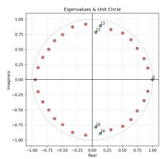

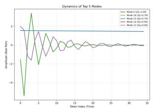  
(a) Llama-3.2-3B-inst: Negative sentiment

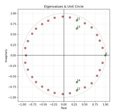

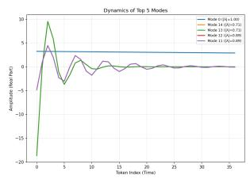  
(b) Qwen3-4B-inst: Negative sentiment  
DMD Analysis - Review 58920 Method: HODMD

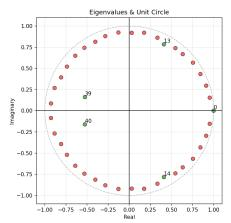

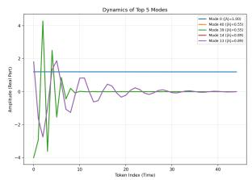  
DMD Analysis - Review 99093 Method: HODMD

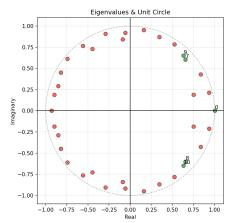  
(c) Mistral-7B-v0.3-inst: Negative sentiment

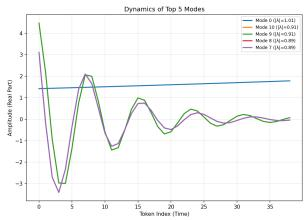  
(d) Llama-3.2-3B-inst: Positive sentiment  
DMD Analysis - Review 99093 Method: HODMD

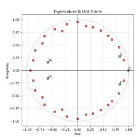

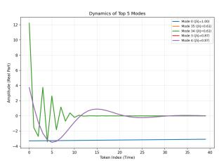  
(e) Qwen3-4B-inst: Positive sentiment  
DMD Analysis - Review 99093 Method: HODMD

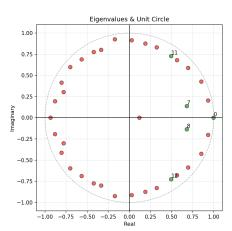

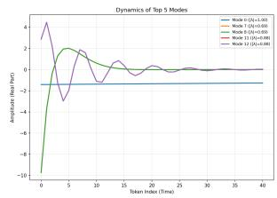  
DMD Analysis - Review 89 Method: DMD

(f) Mistral-7B-v0.3-inst: Positive sentiment  
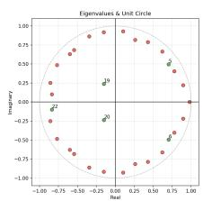

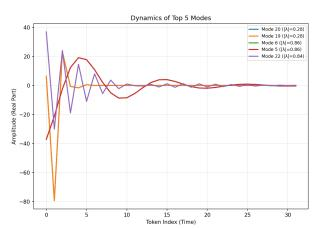  
DMD Analysis - Review 897 Method: DMD

(g) Llama-3.2-3B-inst: HateXplain  
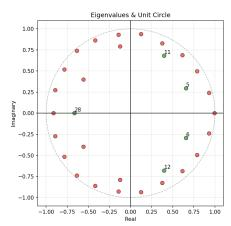

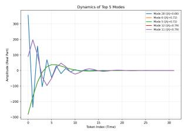  
(h) Qwen3-4B-inst: HateXplain  
DMD Analysis - Review 89 Method: DMD

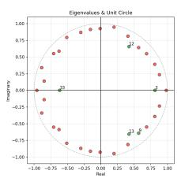

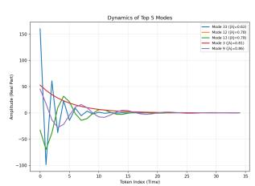  
(i) Mistral-7B-v0.3-inst: HateXplain  
DMD Analysis - Review 3831 Method: DMD

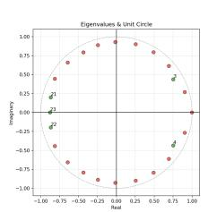

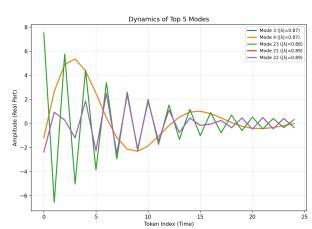  
(j) Llama-3.2-3B-inst: FakeEdit  
DMD Analysis - Review 38317 Method: DMD

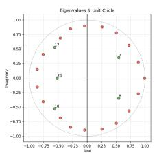

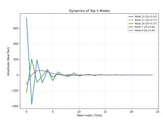  
(k) Qwen3-4B-inst: FakeEdit  
DMD Analysis - Review 38317 Method: DMD

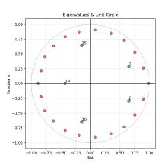

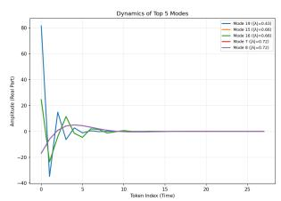  
(l) Mistral-7B-v0.3-inst: FakeEdit  
Figure 2: Eigenvalue distributions and mode dynamics across various model and dataset configurations.

<table><tr><td rowspan="2">Label</td><td colspan="3">Reconstruction error (€)</td></tr><tr><td>Llama-3.2-3B-inst</td><td>Qwen3-4B-inst</td><td>Mistral-7B-v0.3-inst</td></tr><tr><td>Negative Sentiment</td><td>0.070</td><td>0.074</td><td>0.059</td></tr><tr><td>Positive Sentiment</td><td>0.069</td><td>0.074</td><td>0.060</td></tr><tr><td>Hateful Label</td><td>0.096</td><td>0.073</td><td>0.059</td></tr><tr><td>Fake Label</td><td>0.132</td><td>0.099</td><td>0.121</td></tr></table>

Table 9: Reconstruction error ϵ.
<table><tr><td rowspan="2">Model</td><td rowspan="2">Method</td><td colspan="2">Sentiment Analysis</td><td colspan="2">HateXplain</td><td colspan="2">Fakeddit</td></tr><tr><td>GPU (GB) ↓</td><td>Time (s) ↓</td><td>GPU (GB) ↓</td><td>Time (s) ↓</td><td>GPU (GB) ↓</td><td>Time (s) ↓</td></tr><tr><td rowspan="4">Llama-3.2-3B-inst</td><td>IG</td><td>15.23 ± 1.20</td><td>9.07 / 8.24</td><td>14.70 ± 0.50</td><td>6.17</td><td>14.18 ± 0.12</td><td>5.86</td></tr><tr><td>SHAP</td><td>38.80 ± 3.00</td><td>2.62 / 2.30</td><td>35.30</td><td>2.21</td><td>27.22 ± 4.20</td><td>1.66</td></tr><tr><td>PCA</td><td>12.90</td><td>1.10 / 1.14</td><td>12.99</td><td>0.87</td><td>12.96</td><td>0.73</td></tr><tr><td>DMDINTEL (Ours)</td><td>13.01</td><td>1.03 / 1.10</td><td>12.90</td><td>0.33</td><td>12.97</td><td>0.36</td></tr><tr><td rowspan="4">Qwen3-4B-inst</td><td>IG</td><td>18.20 ± 0.90</td><td>10.98 / 10.02</td><td>18.15 ± 0.30</td><td>5.96</td><td>17.78</td><td>5.74</td></tr><tr><td>SHAP</td><td> $4 5 . 3 0 \pm 4 . 2 0$ </td><td>3.37 / 3.56</td><td>39.56 ± 3.20</td><td>2.34</td><td>40.15 ± 2.1</td><td>1.97</td></tr><tr><td>PCA</td><td>16.18</td><td>1.61 / 1.65</td><td>16.07</td><td>1.00</td><td>16.22</td><td>0.79</td></tr><tr><td>DMDINTEL (Ours)</td><td>16.31 ± 0.10</td><td>0.87 / 0.96</td><td>16.13</td><td>0.40</td><td>16.22</td><td>0.37</td></tr><tr><td rowspan="4">Mistral-7B-v0.3-inst</td><td>IG</td><td>28.26 ± 1.30</td><td>16.30 / 16.82</td><td>30.09 ± 0.20</td><td>11.40</td><td>29.86 ± 0.20</td><td>11.30</td></tr><tr><td>SHAP</td><td></td><td></td><td></td><td></td><td></td><td></td></tr><tr><td>PCA</td><td>28.26</td><td>1.73 / 2.21</td><td>28.22</td><td>1.04</td><td>28.22</td><td>0.94</td></tr><tr><td>DMDINTEL (Ours)</td><td>28.28</td><td>1.03 / 1.65</td><td>28.22</td><td>0.51</td><td>28.22</td><td>0.47</td></tr></table>

Table 10: Detailed efficiency evaluation comparing peak GPU memory usage (GB) and per-sample attribution computation time (seconds) across model families and benchmark datasets. For Sentiment dataset, execution times are reported for negative/positive context passes.

## H Ablation studies

## H.1 Results without denoising

To assess the importance of removing the noise inflicted by the empty chat prompt template, we studied the metrics without the removal. We find that the metrics drop significantly for sentiment analysis, there is a slight drop for HateXplain but the drop in metrics is not so significant for FakeEdit. Detailed results for the three models and the datasets for DMDINTEL without the noise removal are presented in the Tables 11 and 12. This reinforces that the noise removal step not only removes the noise, but also ensures that the hidden state snapshots contain the information which the specific token adds to the residual stream.

## H.2 Threshold τ = 0.5

Raising the similarity threshold to 0.5 restricts layer selection strictly to representations that exhibit a higher alignment with the model’s instruction-following dynamics. Intuitively, enforcing a stricter cutoff filters out lower-level contextual signals, which is expected to yield a corresponding decline in attribution performance metrics. Our empirical observations largely align with this expectation, albeit with domain-specific nuances. For the FakeEdit dataset, we observe a minor reduction across evaluation metrics. On HateXplain, performance remains largely stable, accompanied by a subtle increase in RBO scores. In contrast, for the Sentiment dataset across both positive and negative sentiment classes, raising the threshold induces a pronounced drop in metric values for Qwen3-4B-inst and Mistral-7B-v0.3-inst, whereas Llama-3.2-3B-inst maintains relatively resilient performance. Complete results across all configurations are reported in Tables 13 and 16.

## H.3 Varying the k value in top-k tokens for calculation of metrics

We check the consistency of the results when we select top-10 ranked tokens with the GT for the Sentiment dataset, and top-20 ranked tokens with GT for FakeEdit and HateXplain datasets. We find that the results remain consistent in the Sentiment dataset, while in that of FakeEdit and HateXplain the metrics start to converge for top-20 ranked tokens as there are very few input sentences from these datasets which have GT tokens more than 10.

<table><tr><td rowspan="3">Model</td><td colspan="3">Negative Sentiment</td><td colspan="3">Positive Sentiment</td></tr><tr><td>MC@20 ↑</td><td>RBO@20 ↑</td><td>Recall@20 ↑</td><td>MC@20↑</td><td>RBO@20 ↑</td><td>Recall@20 ↑</td></tr><tr><td>Llama-3.2-3B-inst</td><td>5.19</td><td>0.23</td><td>0.66</td><td>5.92</td><td>0.26</td><td>0.73</td></tr><tr><td>Qwen3-4B-inst</td><td>5.28</td><td>0.23</td><td>0.67</td><td>5.99</td><td>0.26</td><td>0.73</td></tr><tr><td>Mistral-7B-v0.3-inst</td><td>5.13</td><td>0.23</td><td>0.64</td><td>5.81</td><td>0.25</td><td>0.71</td></tr></table>

Table 11: Evaluation results of our proposed method (DMDINTELHODMD−avgamp) on Sentiment dataset across Negative and Positive sentiment classes for three model families without denoising the hidden states.
<table><tr><td rowspan="2">Model</td><td colspan="3">Hateful Reviews (HateXplain)</td><td colspan="3">Fake Reviews (FakeEdit)</td></tr><tr><td>MC@10↑</td><td>RBO@10 ↑</td><td>Recall@10 ↑</td><td>MC@10↑</td><td>RBO@10↑</td><td>Recall@10 ↑</td></tr><tr><td>Llama-3.2-3B-inst</td><td>2.76</td><td>0.24</td><td>0.63</td><td>5.45</td><td>0.42</td><td>0.75</td></tr><tr><td>Qwen3-4B-inst</td><td>2.80</td><td>0.24</td><td>0.63</td><td>5.37</td><td>0.41</td><td>0.75</td></tr><tr><td>Mistral-7B-v0.3-inst</td><td>2.80</td><td>0.26</td><td>0.64</td><td>5.27</td><td>0.41</td><td>0.74</td></tr></table>

Table 12: Evaluation results of our proposed method (DMDINTELDMD−amp) on the HateXplain and FakeEdit datasets across three model families without denoising the hidden states.  
Detailed results are presented in Tables 14 and 15.

## H.4 Selecting top-7 modes

We examine the effect of mode subspace dimensionality by projecting token representations onto the top-7 modes compared to top-5 in our original setup. As reported in Table 17, selecting additional modes leads to a noticeable drop in performance metrics for DMDINTEL. This performance decrease likely stems from noisy higher-order modes that introduce non-label-intensive tokens into the top attributions. In contrast, PCA shows slight, though statistically marginal, performance gains when the number of modes is increased.

<table><tr><td>Method</td><td>MC</td><td>RBO</td><td>Rec@k</td></tr><tr><td colspan="4">Llama-3.2-3B-inst - Hateful (HateXplain)</td></tr><tr><td rowspan="2">DMDINTEL DMD−amp PCA</td><td>2.79</td><td>0.25</td><td>0.64</td></tr><tr><td>2.71</td><td>0.25</td><td>0.62</td></tr><tr><td colspan="4">Llama-3.2-3B-inst - Fake (FakeEdit)</td></tr><tr><td rowspan="2">DMDINTEL DMD−amp PCA</td><td>5.36</td><td>0.41</td><td>0.74</td></tr><tr><td>5.11</td><td>0.41</td><td>0.70</td></tr><tr><td colspan="4">Qwen3-4B-inst - Hateful (HateXplain)</td></tr><tr><td rowspan="2">DMDINTEL DMD−amp PCA</td><td>2.85</td><td>0.26</td><td>0.64</td></tr><tr><td>2.80</td><td>0.26</td><td>0.63</td></tr><tr><td colspan="4">Qwen3-4B-inst – Fake (FakeEdit)</td></tr><tr><td rowspan="2">DMDINTEL DMD−amp PCA</td><td>5.33</td><td>0.41</td><td>0.74</td></tr><tr><td>4.92</td><td>0.41</td><td>0.68</td></tr><tr><td colspan="4">Mistral-7B-v0.3-inst - Hateful (HateXplain)</td></tr><tr><td rowspan="2">DMDINTEL DMD-amp PCA</td><td>2.81</td><td>0.26</td><td>0.64</td></tr><tr><td>2.88</td><td>0.29</td><td>0.66</td></tr><tr><td colspan="4">Mistral-7B-v0.3-inst - Fake (FakeEdit)</td></tr><tr><td rowspan="2">DMDINTEL DMD-amp</td><td>5.17</td><td>0.40</td><td>0.72</td></tr><tr><td>4.87</td><td>0.41</td><td>0.68</td></tr></table>

Table 16: Comparative evaluation results for HateXplain and FakeEdit datasets, with threshold τ = 0.5.

## I Label-intensive token alignment vs. decision faithfulness

To systematically evaluate the semantic relevance of identified tokens, we employ GPT-4.1 to annotate input sequences with label-oriented groundtruth rationale tokens. For any LLM fine-tuned on downstream classification, these label-intensive tokens intuitively represent the core semantic anchors driving the model’s target class selection. Our empirical findings demonstrate that DMD successfully isolates the low-dimensional latent subspaces onto which these label-intensive tokens yield high projection values, revealing their prominent role within the model’s implicit representation dynamics. Crucially, we distinguish between semantic coverage and exclusive causal dependency. Identifying these dominant tokens does not imply that the model relies solely on them to synthesize its output, nor does it suggest that non-labeled contextual tokens are irrelevant to the decision trajectory. As evidenced by our fidelity-by-masking experiments (Section 6.4)—particularly on the HateXplain dataset where gradient-based baselines like IG exhibit sharper accuracy and confidence drops—DMD prioritizes broad, contextually rich label-intensive patterns over narrow, isolated toxic keywords. Consequently, while IG aggressively degrades task performance by removing single highleverage tokens, our approach captures a more comprehensive, contextually aligned feature set that reflects the broader latent mechanisms governing sequence processing.

<table><tr><td rowspan="3">Method</td><td colspan="6">Top20</td></tr><tr><td colspan="3">Negative</td><td colspan="3">Positive</td></tr><tr><td>Matched count</td><td>RBO</td><td>Recall@k</td><td>Matched count</td><td>RBO</td><td>Recall@k</td></tr><tr><td colspan="7">Llama-3.2-3B-inst</td></tr><tr><td>DMDINTEL HoDMD−avgamp PCA</td><td>5.29</td><td>0.24</td><td>0.67</td><td>6.02</td><td>0.26</td><td>0.74</td></tr><tr><td></td><td>5.31</td><td>0.25</td><td>0.67</td><td>5.91</td><td>0.26</td><td>0.72</td></tr><tr><td colspan="7">Qwen3-4B-inst _</td></tr><tr><td>DMDINTEL HoDMD−avgamp</td><td>5.18</td><td></td><td>0.65</td><td>5.83</td><td>0.25</td><td>0.72</td></tr><tr><td>PCA</td><td>5.09</td><td></td><td>0.64</td><td>5.60</td><td>0.23</td><td>0.69</td></tr><tr><td colspan="7">Mistral-7B-v0.3-inst</td></tr><tr><td>DMDINTELHoDMD-avgamp</td><td>5.16</td><td>0.23</td><td>0.64</td><td>5.78</td><td>0.25</td><td>0.71</td></tr><tr><td>PCA</td><td>5.00</td><td>0.23</td><td>0.62</td><td>5.46</td><td>0.23</td><td>0.68</td></tr></table>

Table 13: Comparative evaluation results for Sentiment Analysis across negative and positive classes with threshold τ = 0.5.

<table><tr><td rowspan="2">Method</td><td colspan="3">Negative sentiment</td><td colspan="3">Positive sentiment</td></tr><tr><td>MC@10 ↑</td><td>RBO@10↑</td><td>Recall@10 ↑</td><td>MC@10 ↑</td><td>RBO@10↑</td><td>Recall@10 ↑</td></tr><tr><td colspan="7">Llama-3.2-3B-inst</td></tr><tr><td>IG</td><td>2.93</td><td>0.26</td><td>0.39</td><td>3.09</td><td>0.28</td><td>0.45</td></tr><tr><td>SHAP</td><td>2.52</td><td>0.21</td><td>0.33</td><td>2.70</td><td>0.23</td><td>0.38</td></tr><tr><td>PCA</td><td>3.19</td><td>0.26</td><td>0.42</td><td>3.51</td><td>0.28</td><td>0.45</td></tr><tr><td>DMDINTELHoDMD-avgamp</td><td>3.28</td><td>0.26</td><td>0.43</td><td>3.73</td><td>0.29</td><td>0.48</td></tr><tr><td colspan="7">Qwen3-4B-inst</td></tr><tr><td>IG</td><td>3.17</td><td>0.29</td><td>0.41</td><td>3.55</td><td>0.31</td><td>0.45</td></tr><tr><td>SHAP</td><td>2.73</td><td>0.22</td><td>0.35</td><td>3.00</td><td>0.24</td><td>0.37</td></tr><tr><td>PCA</td><td>3.35</td><td>0.27</td><td>0.44</td><td>3.70</td><td>0.30</td><td>0.48</td></tr><tr><td>DMDINTELHoDMD-avgamp</td><td>3.43</td><td>0.28</td><td>0.45</td><td>3.80</td><td>0.31</td><td>0.49</td></tr><tr><td colspan="7">Mistral-7B-v0.3-inst</td></tr><tr><td>IG</td><td>3.41</td><td>0.31</td><td>0.43</td><td>3.45</td><td>0.29</td><td>0.43</td></tr><tr><td>SHAP</td><td>2.77</td><td>0.23</td><td>0.35</td><td>3.01</td><td>0.24</td><td>0.37</td></tr><tr><td>PCA</td><td>3.13</td><td>0.25</td><td>0.40</td><td>3.26</td><td>0.26</td><td>0.41</td></tr><tr><td>DMDINTELHoDMD-avgamp</td><td>3.40</td><td>0.27</td><td>0.44</td><td>3.65</td><td>0.29</td><td>0.47</td></tr></table>

Table 14: Results for top-10 ranked tokens in case of Sentiment dataset.

<table><tr><td rowspan="2">Method</td><td colspan="3">Hateful reviews (HateXplain)</td><td colspan="3">Fake reviews (FakeEdit)</td></tr><tr><td>MC@20↑</td><td>RBO@20↑</td><td>Recall@20 ↑ II</td><td>MC@20↑</td><td>RBO@20 ↑</td><td>Recall@20 ↑</td></tr><tr><td colspan="7">Llama-3.2-3B-inst</td></tr><tr><td>IG</td><td>3.34</td><td>0.20</td><td>0.73</td><td>5.31</td><td>0.31</td><td>0.70</td></tr><tr><td>SHAP</td><td>2.69</td><td>0.17</td><td>0.58</td><td>3.73</td><td>0.24</td><td>0.50</td></tr><tr><td>PCA</td><td>4.09</td><td>0.20</td><td>0.89</td><td>6.94</td><td>0.36</td><td>0.92</td></tr><tr><td>DMDINTELDMD-amp</td><td>4.17</td><td>0.22</td><td>0.91</td><td>7.00</td><td>3.43</td><td>0.93</td></tr><tr><td colspan="7">Qwen3-4B-inst</td></tr><tr><td>IG</td><td>3.64</td><td>0.22</td><td>0.78</td><td>4.88</td><td>0.30</td><td>0.65</td></tr><tr><td>SHAP</td><td>2.75</td><td>0.17</td><td>0.59</td><td>4.06</td><td>0.25</td><td>0.54</td></tr><tr><td>PCA</td><td>4.11</td><td>0.21</td><td>0.89</td><td>6.88</td><td>0.35</td><td>0.92</td></tr><tr><td>DMDINTEL DMD-amp</td><td>4.20</td><td>0.21</td><td>0.90</td><td>6.94</td><td>0.34</td><td>0.93</td></tr><tr><td colspan="7">Mistral-7B-v0.3-inst</td></tr><tr><td>IG</td><td>3.34</td><td>0.21</td><td>0.72</td><td>5.12</td><td>0.31</td><td>0.69</td></tr><tr><td>SHAP</td><td>3.12</td><td>0.20</td><td>0.67</td><td>4.23</td><td>0.26</td><td>0.57</td></tr><tr><td>PCA</td><td>4.19</td><td>0.25</td><td>0.90</td><td>6.89</td><td>0.37</td><td>0.92</td></tr><tr><td>DMDINTELDMD-amp</td><td>4.15</td><td>0.23</td><td>0.90</td><td>6.93</td><td>0.34</td><td>0.93</td></tr><tr><td rowspan="2">Method</td><td colspan="3">Negative sentiment</td><td colspan="3">Positive sentiment</td></tr><tr><td>MC@20↑</td><td>RBO@20↑</td><td>Recall@20 ↑</td><td>MC@20 ↑</td><td>RBO@20 ↑</td><td>Recall@20 ↑</td></tr><tr><td colspan="7">Llama-3.2-3B-inst</td></tr><tr><td>PCA</td><td>5.28</td><td>0.24</td><td>0.66</td><td>5.99</td><td>0.27</td><td>0.73</td></tr><tr><td>DMDINTELHoDMD-avgamp</td><td>5.21</td><td>0.23</td><td>0.66</td><td>6.04</td><td>0.26</td><td>0.74</td></tr><tr><td colspan="7">Qwen3-4B-inst</td></tr><tr><td>PCA</td><td>5.46</td><td>0.25</td><td>0.68</td><td>6.08</td><td>0.28</td><td>0.75</td></tr><tr><td>DMDINTEL HoDMD-avgamp</td><td>5.34</td><td>0.24</td><td>0.67</td><td>6.10</td><td>0.27</td><td>0.75</td></tr><tr><td colspan="7">Mistral-7B-v0.3-inst</td></tr><tr><td>PCA</td><td>5.27</td><td>0.24</td><td>0.66</td><td>5.76</td><td>0.25</td><td>0.71</td></tr><tr><td>DMDINTEL HoDMD−avgamp</td><td>5.18</td><td>0.23</td><td>0.65</td><td>5.88</td><td>0.25</td><td>0.72</td></tr></table>

Table 15: Results for HateXplain and FakeEdit for top-20 ranked tokens.

Table 17: Selecting top-7 modes for calculating the attribution for sentiment analysis dataset.