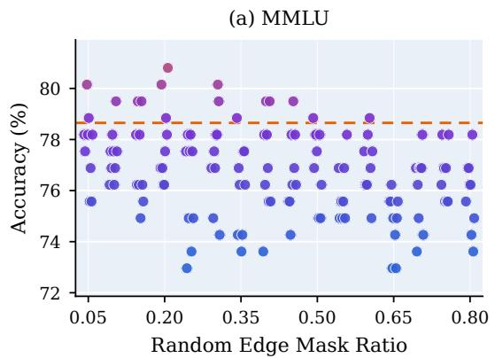
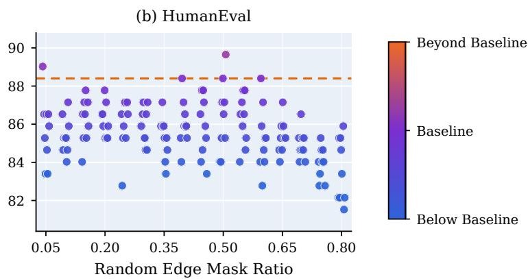
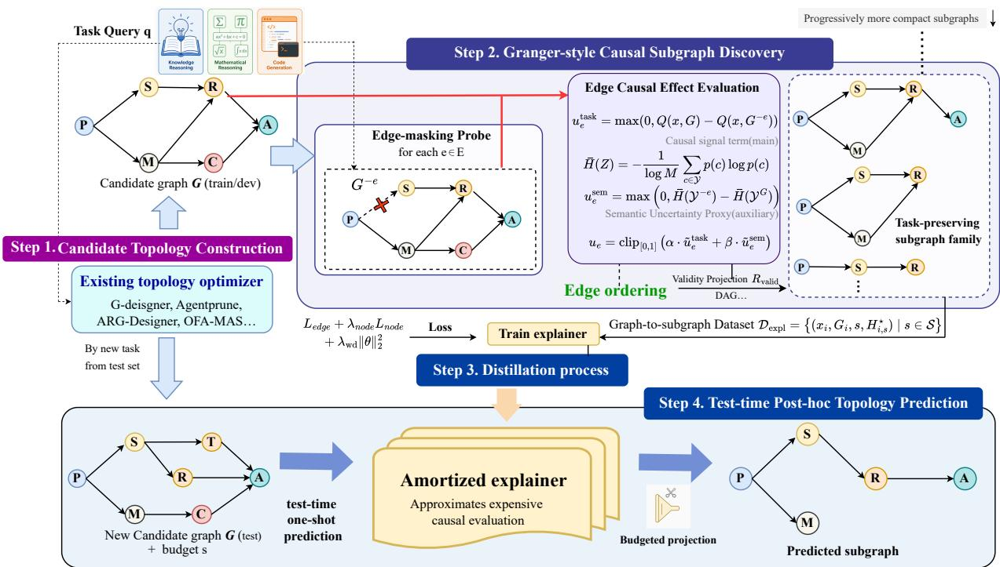
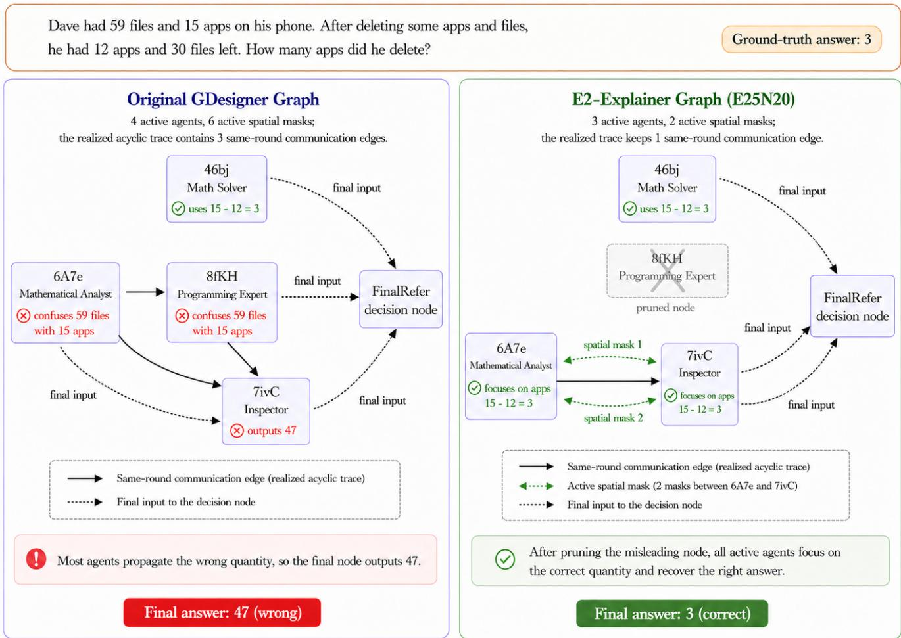
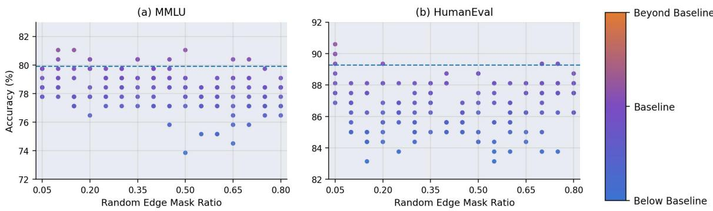

# Discovering Eficient and Explainable Communication Topologies for LLM-based Multi-Agent Systems via Causal Inference

Junzhi Li1,2∗, Peng He3∗, Qirui Ji2∗, Wei Wang3, Lixiang Liu2, Chuxiong Sun2†

1University of Chinese Academy of Sciences

2National Ke Laborator of Space Integrated Information S stem, Institute of Software, Chinese Academ of Sciences 3Beijing University of Posts and Telecommunications

lijunzhi25@mails.ucas.ac.cn, {jiqirui2022, lixiang, chuxiong2016}@iscas.ac.cn, {hepeng123, wangwei}@bupt.edu.cn

## Abstract

The performance oflarge language model (LLM)-based multiagent systems (MAS) largely depends on efective commu-nication topologies. Existing topology generation methods, however, typically learn communication topologies through black-box optimization driven solely by task-level rewards. While efective, such optimization provides little insight into why particular communication edges are selected, making it dificult to identify the critical communication subgraphs re- sponsible for successful collaboration. To address this limita- tion, we propose E2-Explainer, a model-agnostic framework for providing interpretable explanations of communication topologies produced by arbitrary topology generators. Specif- ically, we formulate topology explanation as a causal attri- bution problem that identifies compact communication sub- graphs supported by edge-level evidence of task preservation. We obtain this evidence with a Granger-style objective that measures how masking each communication channel changes the task outcome and the stabilit of the final res onse. The resulting budgeted subgraphs are then distilled into an amor- tized explainer, enabling eficient post-hoc explanation with- out repeated edge-level evaluations at deployment. Extensive experiments on multiple reasoning and coding benchmarks demonstrate that E2-Explainer identifies critical communica- tion subgraphs that preserve successful collaboration. These subgraphs can also be executed directly to prune redundant communication edges, substantially reducing communication costs while maintaining competitive task performance.

## Introduction

Large language model (LLM)-based agents have demon-strated remarkable capabilities across a wide range of com- plex tasks, including question answering (Xu et al. 2024), code generation (Zhang et al. 2024), and autonomous driving (Jin et al. 2023). However, organizing multiple LLMbased agents into a cohesive team capable of exhibiting human-like collective intelligence poses a range of new chal- lenges (Du et al. 2024; Wu et al. 2024; Li et al. 2023; Qian et al. 2024; Hong et al. 2024). Among these challenges, a fundamental one lies in designing the communication topol- ogy—that is, determining how agents should be connected and how they should transmit information during collabo- ration—as it directly shapes information flow, coordination efectiveness, and ultimately the collective intelligence of the system.

Early studies typically relied on manually specified and predefined topologies (Du et al. 2024; Wu et al. 2024; Li et al. 2023; Qian et al. 2024; Hong et al. 2024). Although sim-ple and efective, these topologies are largely task-agnostic, limiting their adaptability to diverse tasks and evolving col- laboration demands. To improve task adaptivity and com- munication eficiency, recent works have increasingly ex- plored learnable communication topology designers, which broadly fall into two paradigms. Pruning-based approaches begin with an existing collaboration workflow and remove unnecessary agents or communication links through learned gating mechanisms, structured dropout, or importance esti- mation (Zhang et al. 2025a; Wang et al. 2025; Li et al. 2025). Generation-based approaches, by contrast, formulate topol- ogy design as a task-conditioned graph generation problem and synthesize collaboration topologies using autoregressive node-and-edge decoding, mixture-of-experts graph genera- tors, or guided graph difusion (Li et al. 2026a,b; Jiang et al. 2026; Zhang et al. 2026).

Despite their impressive performance, we observe that the communication topologies generated by existing methods still contain substantial redundancy. As illustrated in Fig- ure 1, removing several communication links in the topolo- gies generated by G-Designer (Zhang et al. 2025b) has little impact on the final task performance and, in some cases, even improves it. This observation suggests that the learned topologies may contain not only redundant edges but also communication patterns that are merely correlated with, rather than causally relevant to, successful collaboration. Such redundanc is dificult to discover under the black-box optimization paradigm adopted by existing methods, where topologies are optimized solely using topology-level task rewards without explicitly attributing the final outcome to individual communication decisions or substructures. Con- sequently, existing topology designers provide little insight into which communication substructures are truly responsi- ble for successful collaboration. This motivates the need for a post-hoc explanation framework that can identify critical causal communication substructures, thereby revealing why a learned topology succeeds and enabling redundant com- munication edges to be pruned for improved eficiency.

  
Figure 1: Random edge masking on G-Designer-generated communication graphs for MMLU and HumanEval. The edge masking ratio ranges from 0.05 to 0.80 in increments of 0.05, with ten random seeds evaluated at each ratio. Each point denotes the accurac obtained with one random mask while the dashed line marks the erformance of the ori inal unmasked G-Desi ner ra h. Most random masks de rade erformance whereas onl a few reserve or im rove accurac indicatin tha task-preserving compact subgraphs exist but are dificult to identify through random pruning.

In this work, we explicitly investigate the causal contri- bution of individual communication edges to the task out- comes achieved by the overall communication topology. Our formulation is inspired by the notion of Granger causality, which considers ${ \bar { x _ { i } } } \to Y$ causal if the information provided by x improves the prediction of Y (Granger 1969; Wiener 1956). Analogously, in a communication topology, if the information transmitted through an edge improves the coop- erative performance of the MAS, that edge can be regarded as causally important to the resulting collaboration. Build- ing upon this intuition, we extend the Granger-style criterion from individual communication edges to local communica- tion substructures, aiming to identify compact causal sub- graphs that preserve task-relevant interactions while elimi- nating redundant communication.

Specifically, we propose E2-Explainer, a model-agnostic post-hoc framework for identifying compact causal sub- graphs from communication topologies generated by arbi- trary topology designers. Given a communication topology, E2-Explainer estimates the Granger-style causal contribution of each edge by systematically masking it and measuring the resulting change in a task evaluation signal. This signal is primarily defined by the final task outcome and is supple- mented with result-level semantic entropy changes to pro- vide denser feedback under sparse rewards. The estimated edge contributions are then integrated with structural con- straints to identify compact causal subgraphs that preserve task-relevant communication while eliminating redundant in- teractions. Since this attribution process requires repeated executions of the underlying LLM-based MAS, we further train an amortized explainer using the discovered causal sub- graphs as supervision. At deployment, the explainer directly predicts a compact causal subgraph from a newly generated topology, avoiding repeated edge-masking evaluations. Ex- tensive experiments across six reasoning and coding bench- marks demonstrate that E2-Explainer consistently improves the performance–communication cost trade-of of multiple topology designers while exhibiting strong transferability across diferent designers and agent scales.

Our contributions are summarized as follows:

• We formulate post-hoc explanation of optimized LLM-MAS communication graphs as the identification of com- pact subgraphs that preserve the task behavior of the orig- inal topology, and introduce a Granger-style criterion for evaluating the contribution of communication edges.

• We propose E2-Explainer, which distills edge-level causal evidence obtained from ofline masking eval- uations into budget-specific subgraph supervision and trains an amortized explainer to directly generate com- pact, collaboration-preserving communication subgraphs without requiring edge-contribution evaluations at test time.

• We conduct extensive experiments across multiple bench-marks, topology optimizers, and agent scales, showing that E2-Explainer reduces communication costs while maintaining competitive task performance and exhibits cross-generator and cross-scale transferability.

## Related Work

LLM-based multi-agent systems. LLM-based multi-agent systems organize multiple language-model agents into collaborative workflows, where agents exchange intermedi- ate solutions, critique one another, and aggregate final deci- sions (Du et al. 2024; Wu et al. 2024; Li et al. 2023; Qian et al. 2024; Hong et al. 2024). They build on decomposed reasoning, self-consistency, and multi-perspective delibera- tion to improve LLM reliability (Wei et al. 2022; Wang et al. 2023; Kojima et al. 2022), and have been summarized in recent surveys on agent workflows and applications (Guo et al. 2024; Li et al. 2024; Chen et al. 2024). Our work focuses on their communication structure rather than new roles or prompting strategies.

Communication topology optimization. A growing line of work studies how to design eficient communication topologies for LLM-MAS. Recent methods can be roughly grouped into generative topology methods, which construct task-adaptive collaboration graphs, such as G-Designer and ARG-Designer (Zhang et al. 2025b; Li et al. 2026a), and pruning or selection methods, which remove unnecessary links, agents, or graph components from an existing work- flow, such as AgentPrune, AgentDropout, Cut the Crap, and adaptive graph pruning methods (Zhang et al. 2025a; Wang et al. 2025; Li et al. 2025; Cang et al. 2026). These meth-ods show that topology strongly afects the performance–cost trade-of. E2-Explainer is complementary: it treats generated topologies as candidate graphs and learns to refine them into smaller task-preserving communication subgraphs.

Causality in machine learning. Causality provides a prin-cipled framework for reasoning about interventions, coun- terfactuals, and invariant mechanisms (Pearl 2009; Peters, Janzing, and Schölkopf 2017; Schölkopf et al. 2021). In ma-chine learning, causal ideas have been used to analyze model behavior under controlled perturbations and to identify fac- tors that are responsible for predictions (Chattopadhyay et al. 2019; Schwab and Karlen 2019). Granger causality characterizes causal informativeness by whether access to one vari- able improves the prediction of another (Granger 1969, 1980; Bressler and Seth 2011). In graph learning, this intuition has been connected to explanation methods that identify com- pact graph structures responsible for preserving or changing model behavior, such as GNNExplainer, PGExplainer, coun- terfactual explainers, and GEM (Ying et al. 2019; Luo et al. 2020; Lucic et al. 2022; Lin, Lan, and Li 2021). Inspired by these ideas, we adapt Granger-style causal reasoning from diferentiable graph models to frozen LLM-MAS communi- cation graphs. Unlike prior graph explanation methods that primarily produce explanations for inspection, E2-Explainer distills ofline edge-masking evidence into an amortized ex- plainer that directly outputs budgeted task-preserving com- munication subgraphs at deployment.

## Problem Formulation

## LLM-MAS Communication Graphs

We consider an LLM-based multi-agent system with agents $V = \{ a _ { 1 } , \ldots , a _ { n } \}$ . Given query $x ,$ a topology generator $\mathcal { G } _ { \phi }$ produces a directed communication graph

$$
G = { \mathcal { G } } _ { \phi } ( x ) = ( V , E ) ,
$$

where $e = ( a _ { i } , a _ { j } ) \in E$ delivers the output of agent $a _ { i }$ to agent $\boldsymbol { a } _ { j } .$ . Executing G yields a final response $y ( x , G )$ and a dataset-specific task score $Q ( x , G )$ , such as exact-match accuracy, execution correctness, or an LLM-judged score.

## Post-hoc Communication Explanation

Given a generated graph G, we seek a compact and executable subgraph

$$
H = ( V _ { H } , E _ { H } ) , \quad H \subseteq G ,
$$

that preserves its task behavior. The retained edges explain the communication paths supporting the original collabora- tion, while executing H may reduce communication overhead. We denote the realized online cost by $C ( x , H )$ , mea-sured using actual execution tokens. Because removing an edge changes downstream prompts and messages, $C ( x , H )$ need not vary monotonically with the number of retained edges or nodes.

## Objective and Deployment Constraint

Let $b = \left( \rho _ { E } , \rho _ { V } \right)$ denote a subgraph budget, where $\rho _ { E }$ and $\rho _ { V }$ specify the desired edge-pruning and node-pruning ra- tios, and let $\mathcal { H } _ { b } ( G )$ be the corresponding family of compact subgraphs. A valid explanation under budget b should satisfy

$$
H _ { b } ^ { \star } \in \mathcal { H } _ { b } ( G ) , \qquad Q ( x , H _ { b } ^ { \star } ) \approx Q ( x , G ) .\tag{1}
$$

The budget determines compactness, while the task-behavior condition defines faithfulness. We report $C ( x , H _ { b } ^ { \star } )$ as mea-sured eficiency rather than assuming that structural sparsity guarantees a fixed token reduction. Because validating candi- date subgraphs requires repeated LLM-MAS executions and may require task feedback, we learn an amortized explainer $F _ { \theta } \colon$

$$
\widehat { H } _ { b } = F _ { \theta } ( x , G , b ) , \quad \widehat { H } _ { b } \subseteq G .\tag{2}
$$

## E2-Explainer

As illustrated in Figure 2, E2-Explainer is a model-agnostic post-hoc framework for identifying compact causal sub- graphs from communication topologies generated by arbi- trary topology designers. Given a communication topology, E2-Explainer estimates the Granger-style causal contribution of each edge by systematically masking it and measuring the resulting change in a task evaluation signal. This signal is primarily derived from the final task outcome and fur- ther incorporates topology-level semantic entropy changes to provide denser feedback when the task outcome is sparse or coarse-grained. The estimated causal contributions are then combined with budget constraints and structural re- quirements to construct executable compact subgraphs that preserve task-relevant communication patterns. Since this at- tribution process requires repeated edge-masking evaluations of the underlying LLM-based MAS, we use the discovered subgraphs as supervision to train an amortized explainer, which can directly predict a budget-specific subgraph for a newly generated topology at test time.

## Edge-Level Granger-Style Causal Attribution

To estimate the Granger-style causal contribution of each communication edge under the original topology, we perform single-edge removal interventions while keeping all other factors fixed. For a query x, graph G, and edge $\boldsymbol { e } = \left( u , v \right)$ we preserve the same agents, prompts, decoding configurations, and all other communication channels, while interven- ing on e by blocking the message transmitted from source agent u to target agent v. Following the Granger criterion, we quantify the contribution of e by measuring the change in the evaluation signal before and after this intervention.

  
Figure 2: Overview of E2-Explainer. Edge masking estimates preservation utilities from task-score and semantic-entropy changes, which yield budgeted subgraphs for supervision. The amortized explainer then predicts a task-preserving subgraph for an unseen topology in one forward pass.

Task-level causal contribution. For each active edge $e \in$ E of the generated graph $G = ( V , E )$ , we construct the in- tervened graph $G ^ { - { \check { e } } } = G \backslash \{ e \}$ and re-execute the frozen LLM-MAS. Let $Q ( x , G )$ and $\bar { Q } ( x , G ^ { - e } )$ denote the task scores obtained before and after intervening on e, respectivel . We define the task-level causal contribution of e as

$$
\Delta _ { e } ^ { \mathrm { t a s k } } = Q ( x , G ) - Q ( x , G ^ { - e } ) .\tag{3}
$$

A positive value indicates that retaining edge e improves the task outcome relative to removing it, whereas a nega- tive value suggests that the information transmitted through e may be detrimental to the task outcome. Since our expla-nation focuses on communication that supports the original collaboration, we retain only the nonnegative preservation contribution:

$$
u _ { e } ^ { \mathrm { t a s k } } = \mathrm { m a x } \left( 0 , \Delta _ { e } ^ { \mathrm { t a s k } } \right) .\tag{4}
$$

A larger value provides stronger evidence that edge e contributes to preserving the task behavior of the candidate graph, while zero indicates no positive preservation evidence under the observed task metric.

Auxiliary semantic signal. The final task outcome can be too coarse to distinguish edge masks that receive the same task score. We therefore use result-level semantic entropy as an auxiliary signal to characterize the stability of the final response (Kuhn, Gal, and Farquhar 2023; Farquhar et al. 2024). For the response set Y obtained from M stochastic executions, we group semantically equivalent responses into classes C(Y) and compute

$$
\bar { H } ( \mathcal { Y } ) = - \sum _ { c \in \mathcal { C } ( \mathcal { Y } ) } p ( c ) \log p ( c ) ,\tag{5}
$$

where $p ( c )$ is the empirical frequency of class c among the M executions. We use $M = 5$ independently sampled ex- ecutions for both the original graph and each edge-masked graph. The auxiliary semantic efect of edge e is defined as

$$
u _ { e } ^ { \mathrm { s e m } } = \operatorname* { m a x } \left( 0 , \bar { H } ( \mathcal { Y } ^ { G ^ { - e } } ) - \bar { H } ( \mathcal { Y } ^ { G } ) \right) .\tag{6}
$$

A positive value indicates that masking e increases the un-certainty of the final response, providing additional evidence that the edge contributes to preserving the behavior of the original graph.

Unified edge efect. We combine the task-level causal effect with the auxiliary semantic stability signal. The resulting edge utility is

$$
\begin{array} { r } { u _ { e } = \mathrm { c l i p } _ { [ 0 , 1 ] } \left( \alpha \cdot \widetilde { u } _ { e } ^ { \mathrm { t a s k } } + \beta \cdot \widetilde { u } _ { e } ^ { \mathrm { s e m } } \right) , } \end{array}\tag{7}
$$

where e· denotes normalization within the current graph or calibration batch, and $\alpha , \beta \geq 0$ control the two signals. The

utilities induce a preservation ordering over the edges of $G \colon$

$$
\pi _ { G } = ( e _ { ( 1 ) } , e _ { ( 2 ) } , \ldots , e _ { ( | E | ) } ) , \quad u _ { e _ { ( 1 ) } } \geq u _ { e _ { ( 2 ) } } \geq \cdots \geq u _ { e _ { ( | E | ) } } .
$$

This ordering connects edge-level Granger-style attribution to budgeted subgraph construction.

## Causal Subgraph Extraction

The edge-level causal contributions obtained above provide a principled basis for extracting compact communication sub- graphs. Given a target budget $b ,$ E2-Explainer selects edges according to their preservation utilities and constructs a sub- graph that retains the most task-relevant information flows while satisfying the structural constraints inherited from the original workflow. This budget-aware extraction process achieves a desirable trade-of between communication spar- sity and task preservation without requiring exhaustive sub- graph enumeration. Specifically, the budget determines the number of retained edges, while the causal ordering deter- mines which communication paths are preserved.

Budget-Aware Subgraph Selection. The budget $\begin{array} { r l } { b } & { { } = } \end{array}$ $( \rho _ { E } , \rho _ { V } )$ specifies the desired retention ratios of edges and optional nodes. For each graph, these ratios are converted into retention counts $k _ { E } ( b )$ and $k _ { V } ( b )$ according to the graph size. We first select the most important edges according to the preservation ordering obtained from edge attribution:

$$
E _ { b } ^ { \star } = \mathrm { T o p K } \left( \pi _ { G } , k _ { E } ( b ) \right) .\tag{9}
$$

The node budget is subsequently enforced jointly with the structural projection described below to obtain an executable communication subgraph.

Executability-Constrained Projection. To transform the selected high-utility edges into an executable communication topology, we apply an executability-constrained projection:

$$
H _ { b } ^ { \star } = \mathcal { R } _ { \mathrm { v a l i d } } ( G , E _ { b } ^ { \star } , k _ { V } ( b ) ) .\tag{10}
$$

The projection $\mathcal { R } _ { \mathrm { v a l i d } }$ only selects edges from the original edge set E and never introduces new links. Therefore, when the original topology G is a directed acyclic graph, the extracted subgraph naturally preserves acyclicity. Specifically, the projection retains mandatory input and final-aggregation agents, removes communication links incident to excluded optional agents, and discards optional agents that no longer participate in valid directed communication paths. When the node budget is active, optional agents are prioritized accord- ing to the aggregated preservation utilities of their incident retained edges. The resulting $H _ { b } ^ { \star }$ therefore satisfies both the specified budget constraints and the execution requirements of the underlying LLM-MAS.

Budget-Specific Explanation Family. Applying Eq. (10) to the budget set B yields an explanation family

$$
{ \mathcal { F } } ^ { \star } ( x , G ) = \{ H _ { b } ^ { \star } : b \in B \} .\tag{11}
$$

Each member provides an explanation of the same candidate topology under a diferent compactness requirement. Col- lectively, these subgraphs characterize diferent trade-ofs between communication eficiency and task preservation. As the retention budget increases, the extracted subgraphs pro- gressively incorporate lower-ranked communication edges to recover additional information flows.

## Amortized Subgraph Explainer

The causal attribution and structural projection procedures described above provide a reliable mechanism for identifying compact, task-preserving subgraphs from arbitrary commu- nication topologies. However, directly applying this proce- dure to a newly generated topology at test time is computationally expensive, as it requires repeated edge-masking in- terventions and multiple executions of the underlying LLM- MAS to estimate edge contributions. To overcome this lim- itation, we amortize the causal extraction process by col- lecting extracted subgraphs from generated topologies as graph-to-subgraph supervision. Specifically, these causally grounded subgraphs serve as explanation targets that teach an explainer to predict which communication paths should be preserved under diferent compactness budgets. After train- ing, the amortized explainer can directly generate budget- specific causal subgraphs for unseen topologies without ad- ditional causal evaluations.

Graph-to-subgraph supervision. For each query $x _ { i }$ and candidate graph $\bar { G _ { i } }$ , the extraction procedure produces one target subgraph $H _ { i , b } ^ { \star }$ for every budget $b \in B$ . These targets form the training set

$$
\mathcal { D } _ { \mathrm { e x p l } } = \left\{ \left( x _ { i } , G _ { i } , b , H _ { i , b } ^ { \star } \right) \vert b \in \mathcal { B } \right\} .\tag{12}
$$

Thus, the explanation family provides supervision rather than an input to the explainer. For a fixed graph, the targets share the same causal preservation ordering but correspond to dif- ferent pruning budgets. Learning from the complete family therefore teaches the explainer both which communication elements are important and how their retention changes with the requested compactness, allowing one model to serve mul- tiple budgets.

Explainer mapping. We train a parameterized explainer $F _ { \theta }$ to approximate the graph-to-subgraph mapping induced by the causal extraction procedure:

$$
\widehat { H } _ { i , b } = F _ { \theta } ( x _ { i } , G _ { i } , b ) , \qquad \widehat { H } _ { i , b } \subseteq G _ { i } .\tag{13}
$$

Given a query, a candidate graph, and a pruning budget, $F _ { \theta }$ internally predicts edge and node retention probabilities and decodes them into the corresponding budget-specific sub- graph. The explainer is independent of the topology gener- ation mechanism, with architectural details deferred to the Appendix.

Training objective. Let $A _ { i , b , \epsilon } ^ { \star }$ indicate whether edge e be-longs to $H _ { i , b } ^ { \star } ,$ , and let $R _ { i , b , v } ^ { \star }$ indicate whether node v is retained. The explainer predicts the corresponding probabil- ities $\widehat { A } _ { i , b , e }$ and $\widehat { R } _ { i , b , v }$ , which are collected into the edge- and node-retention vectors $\widehat { \mathbf { A } } _ { i , b }$ and $\widehat { \mathbf { R } } _ { i , b } .$ , respectively. We optimize

$$
\mathcal { L } _ { \mathrm { e d g e } } = \sum _ { ( x _ { i } , G _ { i } , b , H _ { i , b } ^ { \star } ) \in \mathcal { D } _ { \mathrm { e x p } } } \frac { 1 } { | E _ { i } | } \sum _ { e \in E _ { i } } \mathrm { B C E } \left( A _ { i , b , e } ^ { \star } , \widehat { A } _ { i , b , e } \right) ,
$$

$$
\mathcal { L } _ { \mathrm { n o d e } } = \sum _ { ( x _ { i } , G _ { i } , b , H _ { i , b } ^ { \star } ) \in \mathcal { D } _ { \mathrm { e x p } } } \frac { 1 } { \vert V _ { i } \vert } \sum _ { v \in V _ { i } } \mathrm { B C E } \left( R _ { i , b , v } ^ { \star } , \widehat { R } _ { i , b , v } \right) ,\tag{14}
$$

with the final objective

$$
\begin{array} { r } { \mathcal { L } = \mathcal { L } _ { \mathrm { e d g e } } + \lambda _ { \mathrm { n o d e } } \mathcal { L } _ { \mathrm { n o d e } } + \lambda _ { \mathrm { w d } } \Vert \theta \Vert _ { 2 } ^ { 2 } . } \end{array}\tag{15}
$$

Subgraph prediction. The predicted probabilities are first converted into budget-compatible candidate sets:

$$
\begin{array} { r l } & { \widehat { E } _ { i , b } = \mathrm { T o p K } \left( \widehat { \mathbf { A } } _ { i , b } , k _ { E } ( b ) \right) , } \\ & { \widehat { V } _ { i , b } = \mathrm { T o p K } \left( \widehat { \mathbf { R } } _ { i , b } , k _ { V } ( b ) \right) . } \end{array}\tag{16}
$$

Accordingly, the final subgraph is obtained as

$$
\widehat { H } _ { i , b } = F _ { \boldsymbol { \theta } } ( \boldsymbol { x } _ { i } , G _ { i } , b ) = { \mathcal { R } } _ { \mathrm { v a l i d } } \left( G _ { i } , \widehat { E } _ { i , b } , \widehat { V } _ { i , b } \right) ,\tag{17}
$$

where mandatory nodes are retained by $\mathcal { R } _ { \mathrm { v a l i d } }$ . At deploy- ment, this process requires neither task labels nor repeated edge interventions.

## Experiment

## Experimental Setup

Datasets and backbone. We evaluate on six benchmarks: AQuA, GSM8K, MultiArith, and SVAMP for mathematical reasoning (Ling et al. 2017; Cobbe et al. 2021; Roy and Roth 2015; Patel, Bhattamishra, and Goyal 2021), MMLU for knowledge-intensive reasoning (Hendrycks et al. 2021), and HumanEval for code generation (Chen et al. 2021). All methods use Qwen3-8B as the backbone LLM (Yang et al. 2025), with Vanilla, CoT (Wei et al. 2022), and SC(CoT) (Wang et al. 2023) as single-agent baselines.

Candidate generators and calibration. We train a sin-gle explainer using only G-Designer-generated candidate graphs. For each dataset, 40 calibration inputs are sampled from the training split without overlap with the test split, and edge-masking probes construct graph-to-subgraph supervi- sion. The frozen explainer is then applied without retraining to graphs produced by ARG-Designer, OFA-MAS, Agent- Prune, and G-Designer.

Subgraph setting and metrics. The main comparison uses E25 + N20 as the default subgraph-size setting, while other settings are examined in the appendix. We report task accu- racy and actual online token usage; changes for E2-Explainer are computed relative to the corresponding candidate gener- ator.

## Results and Analysis

Main comparison. Table 1 evaluates E2-Explainer as a post-hoc module for four representative topology optimizers. Across all four optimizers, E2-Explainer reduces weighted token usage by 20.1%–25.6%, while preserving or improving their average accuracy. Specifically, it improves the average accuracy of ARG-Designer, OFA-MAS, AgentPrune, and G- Designer by 0.44, 0.53, 0.58, and 1.09 points, respectively. G-Designer+E2-Explainer achieves the highest average ac- curacy of 90.71 while consuming 25.1% fewer tokens than the original G-Designer. These results directly support the primary objective of E2-Explainer: reducing communication overhead without sacrificing the collaborative efectiveness of an already optimized topology.

The fine-grained results show that the reduction in com- munication cost is more consistent than the change in task accuracy. Across the 24 optimizer–dataset combinations, E2- Explainer reduces token usage in every case, with dataset- level reductions ranging from 10.6% to 44.0%. Meanwhile, accuracy improves in 16 combinations and remains un- changed in one. Improvements are particularly consistent on MMLU, AQuA, and HumanEval, where all four topology optimizers benefit from post-processing. Results on GSM8K, MultiArith, and SVAMP are more mixed, indicating that the amount of removable communication depends on both the task and the initial candidate topology. Nevertheless, the universal token reduction and predominantly preserved or improved accuracy show that compact task-preserving sub- graphs can often be recovered from optimized communica- tion graphs. The additional accuracy gains further suggest that some candidate topologies still retain redundant or dis- tracting communication whose removal can benefit answer quality.

A key observation is that the improvement transfers beyond the generator used for calibration. The explainer is trained only on G-Designer graphs but applied without retraining to ARG-Designer, OFA-MAS, and AgentPrune. These un- seen generators have diferent construction biases, covering autoregressive graph generation, mixture-of-experts graph generation, and pruning-based topology optimization. Nev- ertheless, E2-Explainer improves their average accuracy by 0.44–0.58 points and reduces weighted online cost by 20.1%– 25.6%. Since these generators are unseen during calibra- tion, the transfer is unlikely to come from memorizing G- Designer-specific adjacency patterns. Instead, the explainer appears to capture reusable cues about which communication paths are necessary under a given task and graph context.

Generalization across agent scales. Table 2 further tests cross-scale generalization by training the explainer on 5- agent G-Designer graphs and directly evaluating it on 6- agent graphs. Without retraining, E2-Explainer improves MMLU accuracy from 79.43 to 81.70 and HumanEval ac- curacy from 89.26 to 90.08, while also reducing token usage by 10.16% and 19.38%, respectively. These results suggest that the learned explainer transfers beyond the graph size observed during training and can still identify compact task- preserving subgraphs under moderate changes in agent scale.

Component ablation. Table 3 evaluates the roles of the causal and auxiliary semantic-entropy signals. Removing the causal signal leads to a larger degradation, reducing accuracy from 79.74 to 75.82 on MMLU and from 90.69 to 86.88 on HumanEval. The causal-only variant, namely w/o Sem. Entropy, performs better than the semantic-entropy-only vari-ant, suggesting that task-level causal efects provide the pri- mary preservation-aware signal for edge valuation. However, causal-only still falls short of the full model. This indicates that the result-level semantic entropy proxy complements causal supervision by densifying the refinement signal when final-task feedback is sparse.

<table><tr><td>Method</td><td>Metric</td><td>MMLU</td><td>GSM8K</td><td>MultiArith</td><td>SVAMP</td><td>AQuA</td><td>HumanEval</td><td>Avg.</td></tr><tr><td>Vanilla</td><td>Acc.</td><td>72.78</td><td>88.15</td><td>96.67</td><td>93.40</td><td>82.68</td><td>81.37</td><td>85.84</td></tr><tr><td>CoT</td><td>Acc.</td><td>76.81</td><td>91.81</td><td>97.67</td><td>93.60</td><td>83.07</td><td>87.58</td><td>88.42</td></tr><tr><td>SC(CoT)</td><td>Acc.</td><td>77.34</td><td>92.48</td><td>97.67</td><td>93.83</td><td>84.13</td><td>87.08</td><td>88.76</td></tr><tr><td>ARG-Designer</td><td>Acc.</td><td>76.68</td><td>89.18</td><td>97.81</td><td>93.57</td><td>83.95</td><td>86.78</td><td>88.00</td></tr><tr><td>ARG-Designer + E2-Explainer</td><td>Acc. Token ∆</td><td>77.99↑1.31 -12.1%</td><td>86.94↓2.24 -15.5%</td><td>97.17↓0.64 -23.3%</td><td>94.67↑1.10 -21.1%</td><td>84.58↑0.63 -29.8%</td><td>89.26↑2.48 -14.3%</td><td>88.44↑0.44 -20.1%</td></tr><tr><td>OFA-MAS</td><td>Acc.</td><td>79.91</td><td>91.01</td><td>98.21</td><td>93.97</td><td>84.11</td><td>89.26</td><td>89.41</td></tr><tr><td>OFA-MAS + E2-Explainer</td><td>Acc. Token ∆</td><td>81.87↑1.96 -15.1%</td><td>90.40↓0.61 -27.2%</td><td>97.41↓0.80 -25.5%</td><td>92.65↓1.32 -23.8%</td><td>86.67↑2.56 -17.8%</td><td>90.62↑1.36 -26.8%</td><td>89.94↑0.53 -25.6%</td></tr><tr><td>AgentPrune</td><td>Acc.</td><td>78.43</td><td>92.78</td><td>98.33</td><td>94.90</td><td>85.04</td><td>87.58</td><td>89.51</td></tr><tr><td>AgentPrune + E2-Explainer</td><td>Acc. Token ∆</td><td>79.08↑0.65 -14.7%</td><td>94.09↑1.31 -26.7%</td><td>98.33±0.00 -27.3%</td><td>94.20↓0.70 -22.9%</td><td>86.61↑1.57 -38.1%</td><td>88.20↑0.62 -10.6%</td><td>90.09↑0.58 -24.9%</td></tr><tr><td>G-Designer</td><td>Acc.</td><td>78.65</td><td>93.05</td><td>98.13</td><td>95.00</td><td>84.52</td><td>88.40</td><td>89.63</td></tr><tr><td>G-Designer + E2-Explainer</td><td>Acc. Token ∆</td><td>79.74↑1.09 -31.5%</td><td>93.77↑0.72 -44.0%</td><td>98.17↑0.04 -28.0%</td><td>94.60↓0.40 -20.1%</td><td>87.30↑2.78 -37.5%</td><td>90.69↑2.29 -19.3%</td><td>90.71↑1.09 -25.1%</td></tr></table>

Table 1: Main results with Qwen3-8B as the backbone LLM. Boldface indicates the best accurac for each dataset. For E2- Explainer variants, Acc. arrows indicate changes relative to the corresponding candidate generator, while the Avg. column reports average accuracy and weighted token reduction across all datasets.

<table><tr><td rowspan="2">Setting</td><td colspan="2">MMLU</td><td colspan="2">HumanEval</td></tr><tr><td>Acc.</td><td>Tok. ↓</td><td>Acc.</td><td>Tok. ↓</td></tr><tr><td>Original (6-agent)</td><td>79.43</td><td></td><td>89.26</td><td></td></tr><tr><td>E2-Explainer (5→6-agent)</td><td>81.70</td><td>10.16%</td><td>90.08</td><td>19.38%</td></tr></table>

Table 2: Generalization across agent scales on G-Designer- generated communication graphs. The explainer is trained on 5-agent graphs and evaluated on 6-agent graphs. Token reductions are measured against the original 6-agent topol- ogy.

<table><tr><td rowspan="2">Method</td><td colspan="2">MMLU</td><td colspan="2">HumanEval</td></tr><tr><td>Acc.</td><td>Token ∆</td><td>Acc.</td><td>Token ∆</td></tr><tr><td>w/o Causal</td><td>75.82</td><td>-11.16%</td><td>86.88</td><td>-5.05%</td></tr><tr><td>w/o Sem. Entropy</td><td>77.78</td><td>-23.42%</td><td>87.50</td><td>-14.32%</td></tr><tr><td>E2-Explainer</td><td>79.74</td><td>-31.50%</td><td>90.69</td><td>-19.25%</td></tr></table>

Table 3: Component ablation of E2-Explainer on G- Designer-generated communication graphs for MMLU and HumanEval.

Efect of Calibration Sources. Table 4 compares ex-plainers trained on G-Designer graphs, AgentPrune graphs, or their mixture and evaluated on both target optimiz- ers. All six calibration–target combinations improve accu- racy while reducing token usage, providing evidence of bidirectional cross-optimizer transfer. Source matching re- mains beneficial: AgentPrune-only calibration achieves the highest accuracy on both datasets for AgentPrune targets, while G-Designer-only performs best on HumanEval for G-

<table><tr><td rowspan="2">Source</td><td>MMLU</td><td>HumanEval</td></tr><tr><td>Acc. Token ∆</td><td>Acc. Token ∆</td></tr><tr><td>Target: G-Designer Original 78.65 Mixed</td><td>88.40 G-Designer 79.74 -31.50%90.69 -19.25% AgentPrune 79.08 -14.43% 88.75 -15.40%</td><td>80.18-24.55%89.30-20.61%</td></tr><tr><td>Target: AgentPrune Original G-Designer 79.08 -14.70% 88.20 -10.60% AgentPrune 81.70-24.56%90.07 -19.18%</td><td>78.43 -87.58</td><td></td></tr></table>

Table 4: Efect of calibration sources under E25 + N20. Original denotes unrefined target graphs, and Mixed combines G-Designer and AgentPrune calibration graphs. Bold- face marks the best refined accuracy.

Designer targets. Mixed-source calibration obtains the best G-Designer result on MMLU and improves both target op- timizers, but does not uniformly outperform single-source calibration. These results suggest that E2-Explainer learns transferable communication patterns while still benefiting from structural characteristics specific to the target optimizer.

## Conclusion

We present E2-Explainer, a post-hoc framework for iden- tifying compact and collaboration-preserving communica- tion subgraphs from optimized LLM-MAS topologies. E2- Explainer distills ofline edge-level evaluations into an amor- tized explainer, enabling eficient test-time generation of compact communication subgraphs that preserve collabo- rative task performance without requiring ground-truth an- swers or repeated edge-level evaluations. Experiments across multiple topology optimizers show that it reduces communi- cation costs while maintaining task performance, and trans- fers across graph sources and agent scales.

## References

Bressler, S. L.; and Seth, A. K. 2011. Wiener–Granger Causality: A Well Established Methodology. NeuroImage, 58(2): 323–329.

Cang, Y.; Zhang, X.; Zhao, E.; Ji, Z.; Liu, Y.; He, Y.; Ning, Z.; Chen, Y.; Que, W.; and Shi, L. 2026. Graph-GRPO: Stabilizing Multi-Agent Topology Learning via Group Rela- tive Policy Optimization. In Findings of the Association for Computational Linguistics: ACL 2026, 20222–20231. Asso-ciation for Computational Linguistics.

Chattopadhyay, A.; Manupriya, P.; Sarkar, A.; and Balasubra- manian, V. N. 2019. Neural Network Attributions: A Causal Perspective. In International Conference on Machine Learning.

Chen, M.; et al. 2021. Evaluating Large Language Models Trained on Code. arXiv preprint arXiv:2107.03374.

Chen, W.; Su, Y.; Zuo, J.; Yang, C.; Yuan, C.; Qian, C.; Chan, C.-M.; Qin, Y.; Lu, Y.; Xie, R.; Liu, Z.; and Sun, M. 2024. A Survey on Large Language Model based Au- tonomous Agents. Frontiers of Computer Science, 18(6): 186345.

Cobbe, K.; Kosaraju, V.; Bavarian, M.; Chen, M.; Jun, H.; Kaiser, L.; Plappert, M.; Tworek, J.; Hilton, J.; Nakano, R.; Hesse, C.; and Schulman, J. 2021. Training Verifiers to Solve Math Word Problems. arXiv preprint arXiv:2110.14168.

Du, Y.; Li, S.; Torralba, A.; Tenenbaum, J. B.; and Mordatch, I. 2024. Improving Factuality and Reasoning in Language Models through Multiagent Debate. In Proceedings of the 41st International Conference on Machine Learning, volume 235 of Proceedings ofMachine Learning Research. PMLR.

Farquhar, S.; Kossen, J.; Kuhn, L.; and Gal, Y. 2024. De- tecting Hallucinations in Large Language Models Using Se- mantic Entropy. Nature, 630: 625–630.

Granger, C. W. J. 1969. Investigating Causal Relations by Econometric Models and Cross-spectral Methods. Econometrica, 37(3): 424–438.

Granger, C. W. J. 1980. Testing for Causality: A Personal Viewpoint. Journal ofEconomic Dynamics and Control, 2: 329–352.

Guo, T.; Chen, X.; Wang, Y.; Chang, R.; Pei, S.; Chawla, N. V.; Wiest, O.; and Zhang, X. 2024. Large Language Model based Multi-Agents: A Survey of Progress and Chal- lenges. In Proceedings of the Thirty-Third International Joint Conference on Artificial Intelligence, 8048–8057.

Hendrycks, D.; Burns, C.; Basart, S.; Zou, A.; Mazeika, M.; Song, D.; and Steinhardt, J. 2021. Measuring Massive Mul- titask Language Understanding. In International Conference on Learning Representations.

Hong, S.; Zhuge, M.; Chen, J.; Zheng, X.; Cheng, Y.; Zhang,C.; Wang, J.; Wang, Z.; Yau, S. K. S.; Lin, Z.; Zhou, L.; Ran,

C.; Xiao, L.; Wu, C.; and Schmidhuber, J. 2024. MetaGPT: Meta Programming for A Multi-Agent Collaborative Frame- work. In International Conference on Learning Representations.

Jiang, E. H.; Li, L.; Wan, F.; Liang, X.; Yin, S.; Wu, Y.; Li, X.; Sun, Y.; Wang, W.; Chang, K.-W.; and Wu, Y. N. 2026. Dynamic Generation of Multi LLM Agents Communication Topologies with Graph Difusion Models. In Proceedings ofthe 64th Annual Meeting ofthe Associationfor Computational Linguistics (Volume 1: Long Papers), 38042–38060. Association for Computational Linguistics.

Jin, Y.; Shen, X.; Peng, H.; Liu, X.; Qin, J.; Li, J.; Xie, J.; Gao, P.; Zhou, G.; and Gong, J. 2023. Surrealdriver: Designing generative driver agent simulation framework in urban contexts based on large language model. arXiv preprint arXiv:2309.13193, 5(7): 8.

Kojima, T.; Gu, S. S.; Reid, M.; Matsuo, Y.; and Iwasawa, Y. 2022. Large Language Models are Zero-Shot Reason- ers. In Advances in Neural Information Processing Systems, volume 35, 22199–22213.

Kuhn, L.; Gal, Y.; and Farquhar, S. 2023. Semantic Uncer- tainty: Linguistic Invariances for Uncertainty Estimation in Natural Language Generation. In International Conference on Learning Representations.

Li, B.; Zhao, Z.; Lee, D.-H.; and Wang, G. 2025. Adap- tive Graph Pruning for Multi-Agent Communication. arXiv preprint arXiv:2506.02951.

Li, G.; Hammoud, H. A. A. K.; Itani, H.; Khizbullin, D.; and Ghanem, B. 2023. CAMEL: Communicative Agents for “Mind” Exploration of Large Scale Language Model Soci- ety. In Advances in Neural Information Processing Systems, volume 36.

Li, S.; Liu, Y.; Wen, Q.; Zhang, C.; and Pan, S. 2026a. As-semble Your Crew: Automatic Multi-Agent Communication Topology Design via Autoregressive Graph Generation. In Proceedings of the AAAI Conference on Artificial Intelligence, volume 40, 23142–23150.

Li, S.; Liu, Y.; Zheng, Y.; Li, M.; Nguyen, Q. V. H.; and Pan, S. 2026b. OFA-MAS: One-for-All Multi-Agent System Topology Design based on Mixture-of-Experts Graph Gen- erative Models. In Proceedings of the ACM Web Conference 2026, 1333–1344.

Li, X.; Wang, S.; Zeng, S.; Wu, Y.; and Yang, Y. 2024. A Survey on LLM-based Multi-Agent Systems: Workflow, Infrastructure, and Challenges. Vicinagearth, 1(1): 9.

Lin, W.; Lan, H.; and Li, B. 2021. Generative Causal Expla- nations for Graph Neural Networks. In Proceedings of the 38th International Conference on Machine Learning, volume 139 of Proceedings of Machine Learning Research, 6666– 6679. PMLR.

Ling, W.; Yogatama, D.; Dyer, C.; and Blunsom, P. 2017. Pro- gram Induction by Rationale Generation: Learning to Solve and Explain Algebraic Word Problems. In Proceedings of the 55th Annual Meeting of the Association for Computational Linguistics (Volume 1: Long Papers), 158–167. Association for Computational Linguistics.

Lucic, A.; Ter Hoeve, M. A.; Tolomei, G.; de Rijke, M.; and Silvestri, F. 2022. CF-GNNExplainer: Counterfactual Expla- nations for Graph Neural Networks. In Proceedings of The 25th International Conference on Artificial Intelligence and Statistics, volume 151 of Proceedings ofMachine Learning Research, 4499–4511. PMLR.

Luo, D.; Cheng, W.; Xu, D.; Yu, W.; Zong, B.; Chen, H.; and Zhang, X. 2020. Parameterized Explainer for Graph Neural Network. In Advances in Neural Information Processing Systems, volume 33, 19620–19631.

Patel, A.; Bhattamishra, S.; and Goyal, N. 2021. Are NLP Models Really Able to Solve Simple Math Word Problems? In Proceedings ofthe 2021 Conference ofthe NorthAmerican Chapter of the Association for Computational Linguistics: Human Language Technologies, 2080–2094. Association for Computational Linguistics.

Pearl, J. 2009. Causality: Models, Reasoning, and Inference. Cambridge University Press, 2 edition.

Peters, J.; Janzing, D.; and Schölkopf, B. 2017. Elements of Causal Inference: Foundations and Learning Algorithms. MIT Press.

Qian, C.; Liu, W.; Liu, H.; Chen, N.; Dang, Y.; Li, J.; Yang, C.; Chen, W.; Su, Y.; Cong, X.; Xu, J.; Li, D.; Liu, Z.; and Sun, M. 2024. Communicative Agents for Software Development. In Proceedings of the 62nd Annual Meeting ofthe Associationfor Computational Linguistics (Volume 1: Long Papers). Association for Computational Linguistics.

Roy, S.; and Roth, D. 2015. Solving General Arithmetic Word Problems. In Proceedings of the 2015 Conference on Empirical Methods in Natural Language Processing, 1743– 1752. Association for Computational Linguistics.

Schölkopf, B.; Locatello, F.; Bauer, S.; Ke, N. R.; Kalch- brenner, N.; Goyal, A.; and Bengio, Y. 2021. Toward Causal Representation Learning. Proceedings of the IEEE, 109(5): 612–634.

Schwab, P.; and Karlen, W. 2019. CXPlain: Causal Explana- tions for Model Interpretation under Uncertainty. Advances in Neural Information Processing Systems, 32.

Wang, X.; Wei, J.; Schuurmans, D.; Le, Q. V.; Chi, E. H.; Narang, S.; Chowdhery, A.; and Zhou, D. 2023. Self- Consistency Improves Chain of Thought Reasoning in Lan- guage Models. In International Conference on Learning Representations.

Wang, Z.; Wang, Y.; Liu, X.; Ding, L.; Zhang, M.; Liu, J.; and Zhang, M. 2025. AgentDropout: Dynamic Agent Elimina- tion for Token-Eficient and High-Performance LLM-Based Multi-Agent Collaboration. In Proceedings of the 63rd Annual Meeting ofthe Associationfor Computational Linguistics, 24013–24035. Association for Computational Linguistics.

Wei, J.; Wang, X.; Schuurmans, D.; Bosma, M.; Ichter, B.; Xia, F.; Chi, E. H.; Le, Q. V.; and Zhou, D. 2022. Chain-of-Thought Prompting Elicits Reasoning in Large Language Models. In Advances in Neural Information Processing Systems, volume 35, 24824–24837.

Wiener, N. 1956. The Theory of Prediction. Modern Mathematicsfor Engineers, 165–190.

Wu, Q.; Bansal, G.; Zhang, J.; Wu, Y.; Li, B.; Zhu, E.; Jiang, L.; Zhang, X.; Zhang, S.; Liu, J.; Awadallah, A. H.; White, R. W.; Burger, D.; and Wang, C. 2024. AutoGen: Enabling Next-Gen LLM Applications via Multi-Agent Conversation. In First Conference on Language Modeling.

Xu, Y.; He, S.; Chen, J.; Wang, Z.; Song, Y.; Tong, H.; Liu, G.; Zhao, J.; and Liu, K. 2024. Generate-on-Graph: Treat LLM as both Agent and KG for Incomplete Knowl- edge Graph Question Answering. In Al-Onaizan, Y.; Bansal, M.; and Chen, Y., eds., Proceedings of the 2024 Conference on Empirical Methods in Natural Language Processing, EMNLP 2024, Miami, FL, USA, November 12-16, 2024, 18410–18430. Association for Computational Linguistics.

Yang, A.; Li, A.; Yang, B.; et al. 2025. Qwen3 Technical Report. arXiv preprint arXiv:2505.09388.

Ying, Z.; Bourgeois, D.; You, J.; Zitnik, M.; and Leskovec, J. 2019. GNNExplainer: Generating Explanations for Graph Neural Networks. In Advances in Neural Information Processing Systems, volume 32.

Zhang, G.; Yue, Y.; Li, Z.; Yun, S.; Wan, G.; Wang, K.; Cheng, D.; Yu, J. X.; and Chen, T. 2025a. Cut the Crap: An Economical Communication Pipeline for LLM-based Multi- Agent Systems. In International Conference on Learning Representations.

Zhang, G.; Yue, Y.; Sun, X.; Wan, G.; Yu, M.; Fang, J.; Wang, K.; Chen, T.; and Cheng, D. 2025b. G-Designer: Architecting Multi-agent Communication Topologies via Graph Neural Networks. In Proceedings ofthe 42nd International Conference on Machine Learning, volume 267 of Proceedings of Machine Learning Research. PMLR.

Zhang, K.; Li, J.; Li, G.; Shi, X.; and Jin, Z. 2024. Codeagent: Enhancing code generation with tool-integrated agent sys- tems for real-world repo-level coding challenges. In Proceedings of the 62nd Annual Meeting of the Association for Computational Linguistics (Volume 1: Long Papers), 13643– 13658.

Zhang, Z.; Zhou, W.; Li, J.; Fei, H.; Wen, J.; and Ji, W. 2026. RADAR: Redundancy-Aware Difusion for Multi- Agent Communication Structure Generation. In Proceedings ofthe 43rd International Conference on Machine Learning, volume 306 of Proceedings of Machine Learning Research. PMLR.

## Implementation Details

## Explainer Input and Output

The amortized explainer learns the budget-conditioned map- ping

$$
F _ { \theta } : ( x , G , b ) \mapsto \widehat { H } _ { b } , \qquad \widehat { H } _ { b } \subseteq G ,\tag{18}
$$

where x is the task query, $G = ( V , E )$ is a candidate com- munication graph, and $b = \left( \rho _ { E } , \rho _ { V } \right)$ specifies the edge- and node-pruning ratios. All inputs are available before execut- ing the predicted subgraph; the explainer does not require ground-truth answers, repeated edge interventions, or inter- nal parameters of the topology generator.

For each edge $e = ( u , v ) \in E$ and node $v \in V$ , the net- work predicts an edge-retention probability $\widehat { A } _ { b , e } \in [ 0 , 1 ]$ and a node-retention probability $\widehat { R } _ { b , v } \in [ 0 , 1 ]$ . These probabil- ities are intermediate outputs rather than the final explana- tion. They are converted into budget-compatible candidate sets and passed through the validity projection to obtain the executable subgraph $\lnapprox _ { \Vec { H } _ { b } }$

The explainer therefore learns a budget-conditioned graph- to-subgraph mapping. The same candidate graph can yield diferent explanations under diferent pruning budgets, while the supervision is defined by the edge and node membership of the corresponding compact target subgraph $H _ { b } ^ { \star }$

## Budget-Conditioned Explainer Architecture

Input representations. Let $\mathbf { q } _ { x }$ denote a fixed embedding of query $x ,$ and let $\mathbf { r } _ { v }$ denote a fixed embedding of the role or system prompt assigned to agent v. Each node is also asso-ciated with a structural feature vector $\mathbf { t } _ { v } ,$ , containing graph- local information available from the candidate topology, such as normalized in-degree and out-degree and topological po- sition. A shared node encoder produces

$$
\mathbf { h } _ { v } = \phi _ { \mathrm { n o d e } } \left( \left[ \mathbf { q } _ { x } \| \mathbf { r } _ { v } \| \mathbf { t } _ { v } \right] \right) , \qquad \mathbf { g } _ { G } = \frac { 1 } { | V | } \sum _ { v \in V } \mathbf { h } _ { v } ,\tag{19}
$$

where ∥ denotes concatenation and $\mathbf { g } _ { G }$ is a permutation- invariant graph-level summary. The pruning ratios are en- coded as

$$
{ \bf z } _ { b } = \phi _ { b } ( [ \rho _ { E } , \rho _ { V } ] ) .\tag{20}
$$

Edge and node prediction heads. For an active edge $\boldsymbol { e } = \left( u , v \right)$ , let ${ \bf s } _ { e }$ collect edge-local structural features, in- cluding the edge type and normalized structural statistics of its endpoints. The shared edge head predicts

$$
\begin{array} { r } { \widehat { A } _ { b , e } = \sigma ( \phi _ { \mathrm { e d g e } } ( [ \mathbf { h } _ { u } \vert \vert \mathbf { h } _ { v } \vert \vert \mathbf { g } _ { G } \vert \vert \mathbf { z } _ { b } \vert \vert \mathbf { s } _ { e } ] ) ) . } \end{array}\tag{21}
$$

The node head predicts

$$
\widehat { R } _ { b , v } = \sigma ( \phi _ { \mathrm { r e t a i n } } ( [ \mathbf { h } _ { v } \Vert \mathbf { g } _ { G } \Vert \mathbf { z } _ { b } ] ) ) .\tag{22}
$$

All node and edge instances share the same encoders and pre- diction heads. Consequently, the number of trainable param- eters does not depend on the numbers of agents or commu- nication links, which allows the explainer to process graphs of diferent sizes.

The modules $\phi _ { \mathrm { n o d e } } , ~ \phi _ { b } , ~ \phi _ { \mathrm { e d g e } } ,$ , and $\phi _ { \mathrm { r e t a i n } }$ are imple- mented as lightweight multilayer perceptrons with param- eters shared across graph elements. Fixed task and role rep- resentations are computed once and reused during explainer training and inference.

## Graph-to-Subgraph Supervision and Decoding

For each calibration pair $( x _ { i } , G _ { i } )$ , causal subgraph construc- tion produces one target $H _ { i , b } ^ { \star }$ for every budget $b \in B$ . The resulting training set is

$$
\mathcal { D } _ { \mathrm { e x p l } } = \{ ( x _ { i } , G _ { i } , b , H _ { i , b } ^ { \star } ) \ | \ b \in B \} .\tag{23}
$$

Each target subgraph defines binary edge- and node-retention labels

$$
A _ { i , b , e } ^ { \star } = \mathbb { I } [ e \in E ( H _ { i , b } ^ { \star } ) ] , \qquad R _ { i , b , v } ^ { \star } = \mathbb { I } [ v \in V ( H _ { i , b } ^ { \star } ) ] .\tag{24}
$$

The explainer is optimized with the edge and node binary- cross-entropy losses defined in the main paper. Because one candidate graph contributes one target for each budget, the model learns both which communication elements should be retained and how the selected subgraph changes with the requested pruning ratios.

At inference time, the predicted probabilities are converted into candidate sets according to the graph-specific retention counts:

$$
\widehat { E } _ { b } = \mathrm { T o p K } ( \widehat { \mathbf { A } } _ { b } , k _ { E } ( b ) ) , \qquad \widehat { V } _ { b } = \mathrm { T o p K } ( \widehat { \mathbf { R } } _ { b } , k _ { V } ( b ) ) .\tag{25}
$$

The final explanation is

$$
\widehat { H } _ { b } = \mathcal { R } _ { \mathrm { v a l i d } } ( G , \widehat { E } _ { b } , \widehat { V } _ { b } ) ,\tag{26}
$$

where $\mathcal { R } _ { \mathrm { v a l i d } }$ enforces the requested node budget together with a minimum-node constraint, removes every edge inci- dent to an excluded node, and retains only feasible directed links between selected agents. The projection ranks feasible elements using the predicted retention scores and selects only nodes and edges already present in G, so it never introduces a new communication link.

## Causal Supervision Construction Details

Repeated execution and task score. For every active edge $e ,$ we independently execute both the original graph G and the intervened graph $G ^ { - e }$ for $M = 5$ runs. The task score is the mean outcome over these executions:

$$
Q ( x , G ) = \frac { 1 } { M } \sum _ { m = 1 } ^ { M } Q ^ { ( m ) } ( x , G ) .\tag{27}
$$

The original graph is re-executed for each evaluated edge rather than sharing one response set across all interventions. All executions use a decoding temperature of 0.2. The origi-nal and intervened runs are sampled independently and do not use paired random seeds. The same response sets are used to compute both the mean task outcome and the auxiliary semantic signal.

Result-level semantic signal. Semantic entropy is com-puted from the final system responses, rather than from the local outputs of the two agents incident to an edge. This choice aligns the auxiliary signal with the system-level quan- tity whose causal contribution is being estimated. The M fi-nal responses are grouped into semantic equivalence classes using the same equivalence procedure for the original and intervened graphs, after which the empirical class entropy is computed as defined in the main paper.

Score normalization. The mean task outcome and its nonnegative intervention diference already lie in [0, 1]. We therefore retain the task contribution on its original scale and normalize the semantic contribution by the maximum empirical entropy of M samples:

$$
\widetilde { u } _ { e } ^ { \mathrm { t a s k } } = u _ { e } ^ { \mathrm { t a s k } } , \qquad \widetilde { u } _ { e } ^ { \mathrm { s e m } } = \operatorname* { m i n } \left( 1 , \frac { u _ { e } ^ { \mathrm { s e m } } } { \log M } \right) .\tag{28}
$$

The combined preservation utility is then computed with $( \alpha , \beta ) = ( 0 . 8 , \bar { 0 . 2 } )$ .

Pruning counts and validity projection. The budget $b =$ $( \rho _ { E } , \rho _ { V } )$ ) specifies removal ratios. For a candidate graph $G =$ $( V , E )$ , the numbers of removed elements are

$$
r _ { E } ( b ) = \lceil \rho _ { E } | E | \rceil , \qquad r _ { V } ( b ) = \lceil \rho _ { V } | V | \rceil ,\tag{29}
$$

with retention counts $k _ { E } ( b ) = | E | - r _ { E } ( b )$ and $k _ { V } ( b ) =$ $| V | - r _ { V } ( b )$ . Thus, E25 denotes removing 25% of the active edges and N20 denotes removing 20% of the active nodes. After budgeted selection, the validity projection applies the selected node mask, removes incident edges, and retains the highest-ranked feasible links subject to the edge budget and the minimum-node constraint.

Scope of the causal attribution. The intervention procedure estimates a first-order conditional contribution for each edge in the context of the remaining full topology. Follow- ing the Granger principle, it measures whether excluding one information channel reduces the mean outcome or the stability of the final response while all other channels re- main available. We do not enumerate multi-edge coalitions, whose cost grows combinatorially with graph size. Instead, these conditional edge contributions provide a tractable sig- nal for constructing graph-level supervision, while the end- to-end evaluation of the predicted subgraph measures the aggregate outcome after multiple communication elements are removed.

## Implementation Settings

Table 5 summarizes the main settings used for causal su- pervision construction and explainer training. We train one dataset-specific explainer for each benchmark. The six ex- plainers use the same architecture, optimization configura- tion, and budget set, but each is trained from the 40 calibra- tion queries of its corresponding dataset. The same frozen Qwen3-8B backbone is used for all methods.

<table><tr><td>Item</td><td>Setting</td></tr><tr><td>Semantic samples M</td><td>5</td></tr><tr><td>Task/semantic weights (α, β)</td><td>(0.8,0.2)</td></tr><tr><td>Calibration queries per dataset</td><td>40</td></tr><tr><td>Training budgets B</td><td>E25+N0, E50+N0, E75+N0 E25+N20, E50+N20, E25+N40</td></tr><tr><td>Shared hidden dimension</td><td>128</td></tr><tr><td>Dropout</td><td>0.15</td></tr><tr><td>Optimizer</td><td>AdamW</td></tr><tr><td>Learning rate</td><td> $1 \times 1 0 ^ { - 3 }$ </td></tr><tr><td>Weight decay</td><td> $1 \times 1 0 ^ { - 4 }$ </td></tr><tr><td>Batch size / epochs</td><td>64 / 200</td></tr><tr><td>Backbone LLM</td><td>Qwen3-8B</td></tr><tr><td>Decoding temperature</td><td>0.2</td></tr><tr><td>Reported evaluation runs</td><td>3</td></tr><tr><td>Hardware</td><td>4× NVIDIA GeForce RTX 4090 GPUs</td></tr><tr><td>Inference framework</td><td>PyTorch and vLLM</td></tr><tr><td>Token accounting</td><td>Online prompt + completion tokens</td></tr></table>

Table 5: Main implementation settings. Dataset-specific ex- plainers share the same architecture and optimization con- figuration.

## Dataset and Evaluation Details

We evaluate E2-Explainer on six reasoning and code- generation benchmarks using the data scale and evalua- tion protocol adopted by G-Designer and AgentPrune. For datasets with a dedicated training split, 40 calibration queries are selected from that split and are not used as evaluation queries. For HumanEval, we follow the AgentPrune data split: 40 problems are used for calibration and the remaining 124 problems are used for evaluation. G-Designer, Agent- Prune, OFA-MAS, ARG-Designer, and all variants equipped with E2-Explainer are evaluated on exactly the same query set for each benchmark.

<table><tr><td>Dataset</td><td>Task Calib. Eval. Metric</td></tr><tr><td></td><td>153 Accuracy</td></tr><tr><td>MMLU GSM8K</td><td>Knowledge MCQ 40</td></tr><tr><td>Math reasoning</td><td>40 1,319 Exact match</td></tr><tr><td>MultiArith Math reasoning</td><td>40 600 Exact match</td></tr><tr><td>SVAMP Math reasoning</td><td>40 1,000 Exact match</td></tr><tr><td>AQuA Algebra MCQ HumanEval Code generation</td><td>40 254 Accuracy 40 124 Pass@1</td></tr></table>

Table 6: Dataset statistics and evaluation protocols. Hu- manEval uses 40 calibration problems and the remaining 124 problems for evaluation. All methods use identical eval- uation queries.

MMLU. MMLU evaluates knowledge-intensive reasoning across subjects from STEM, the humanities, and the social sciences. Each query contains a question and four candidate answers. We evaluate on the 153-query validation subset used by G-Designer and AgentPrune and report multiple-choice accuracy.

GSM8K, MultiArith, and SVAMP. These benchmarks evaluate multi-step arithmetic reasoning over natural- language word problems. Their evaluation sets contain 1,319, 600, and 1,000 queries, respectively. Performance is mea- sured by exact match after extracting and normalizing the final numerical answer.

AQuA. AQuA contains algebraic word problems with five candidate answers. We evaluate on 254 queries and report multiple-choice accuracy based on the final selected option.

HumanEval. HumanEval evaluates function-level Python code generation from a function signature and natural- language specification. Following AgentPrune, 40 problems are used for calibration and the remaining 124 problems are used for evaluation. Pass@1 is computed by executing the generated implementation against the associated unit tests.

Answer extraction and scoring. We follow the answer-processing conventions of the released G-Designer evalu- ation implementation, which are also used by AgentPrune for the overlapping benchmarks. For MMLU, the evaluator locates the final answer statement and extracts the option la- bel from A–D; AQuA is processed analogously with labels A–E. For GSM8K, MultiArith, and SVAMP, the parser first checks for an explicit final-answer statement or a \boxed{} expression and otherwise uses the last numerical expression in the response. Commas, surrounding spaces, trailing punc- tuation, and superficial LaTeX formatting are removed before exact comparison with the normalized reference value. For HumanEval, Markdown code fences are removed and the generated Python function is executed against the provided unit tests; a query is counted as correct only when all tests pass within the execution timeout. The same extraction and scoring pipeline is used for every topology generator and its corresponding E2-Explainer variant.

## Additional Evaluation Protocols

Controlled candidate-graph comparison. For each query, a topology generator and its E2-Explainer variant start from exactly the same candidate graph and use the same agent roles, prompts, decoding temperature, and evaluation proce- dure. The reported accuracy and token results are averaged over three independent runs.

Token accounting. The online communication cost in-cludes the prompt and completion tokens of all retained agent calls and the final aggregation call during execution of the candidate or predicted subgraph. It excludes the ofline edge interventions, semantic-entropy sampling, topology- optimizer training, explainer training, and the lightweight explainer forward pass.

Causal ablations. Both ablations reconstruct the target graph-to-subgraph supervision and retrain the explainer. $\tilde { ^ { \mathrm { s } } \mathrm { w } } / \mathrm { o } \mathrm { C a u s a l \tilde { ^ { \mathrm { s } } \mathrm { , } } }$ uses only the semantic signal by setting $( \alpha , \beta ) = ( 0 , 1 )$ , whereas “w/o Sem. Entropy” uses only the task-level causal contribution by setting $( \bar { \alpha } , \bar { \beta } ) = ( 1 , 0 )$

Calibration-source analysis. The G-Designer-only and AgentPrune-only variants each use 40 candidate graph in- stances generated from the corresponding 40 calibration queries. In the mixed setting, the same 40 queries are pro- cessed by both topology generators, yielding 80 candidate graph instances in total.

Agent-scale generalization. For MMLU and HumanEval, the scale-generalization experiment trains the explainer on 40 five-agent calibration graphs and directly evaluates it on six-agent graphs generated separately under a six-role G- Designer configuration. The six-agent roles are reconstructed following the role-design logic of G-Designer. The E25+N20 budget and evaluation queries are identical to those used in the main comparison.

Meaning of model-agnostic. In this work, model-agnostic specifically denotes independence from the candidate topol- ogy generator. E2-Explainer does not access generator pa-rameters or generator-specific optimization states; it operates on the candidate graph together with the task and agent-role information.

Additional Experimental Results  
Results across Diferent Pruning Budgets
<table><tr><td>Budget</td><td>Metric</td><td>MMLU</td><td>GSM8K</td><td>MultiArith</td><td>SVAMP</td><td>AQuA</td><td>HumanEval</td><td>Avg./Total</td></tr><tr><td>Original</td><td>Acc.</td><td>78.65</td><td>93.05</td><td>98.13</td><td>95.00</td><td>84.52</td><td>88.40</td><td>89.63</td></tr><tr><td></td><td>Tokens</td><td>985,486</td><td>1,549,496</td><td>3,068,504</td><td>11,377,630</td><td>1,340,006</td><td>725,946</td><td>19,047,068</td></tr><tr><td>E25+N0</td><td>Acc.</td><td>78.43↓0.22</td><td>93.39↑0.34</td><td>98.00↓0.13</td><td>94.60↓0.40</td><td>87.10↑2.58</td><td>88.75↑0.35</td><td>90.05↑0.42</td></tr><tr><td></td><td>Tokens</td><td>985,289↓0.02%</td><td>1,472,951↓4.94%</td><td>2,919,068↓4.87%</td><td>11,325,293↓0.46%</td><td>1,315,752↓1.81%</td><td>696,908↓4.00%</td><td>18,715,261↓1.74%</td></tr><tr><td>E50+N0</td><td>Acc.</td><td>79.08↑0.43</td><td>91.95↓1.10</td><td>98.17↑0.04</td><td>94.30↓0.70</td><td>84.52±0.00</td><td>90.62↑2.22</td><td>89.77↑0.15</td></tr><tr><td></td><td>Tokens</td><td>972,970↓1.27%</td><td>1,496,193↓3.44%</td><td>2,906,180↓5.29%</td><td>11,300,262↓0.68%</td><td>1,305,434↓2.58%</td><td>642,172↓11.54%</td><td>18,623,211↓2.23%</td></tr><tr><td>E75+N0</td><td>Acc.</td><td>77.78↓0.87</td><td>92.71↓0.34</td><td>97.83↓0.30</td><td>93.80↓1.20</td><td>89.29↑4.77</td><td>89.38↑0.98</td><td>90.13↑0.51</td></tr><tr><td></td><td>Tokens</td><td>960,849↓2.50%</td><td>1,428,945↓7.78%</td><td>2,889,917↓5.82%</td><td>10,812,162↓4.97%</td><td>1,232,270↓8.04%</td><td>718,396↓1.04%</td><td>18,042,539↓5.27%</td></tr><tr><td>E25+N20</td><td>Acc.</td><td>79.74↑1.09</td><td>93.77↑0.72</td><td>98.17↑0.04</td><td>94.60↓0.40</td><td>87.30↑2.78</td><td>90.69↑2.29</td><td>90.71↑1.09</td></tr><tr><td></td><td>Tokens</td><td>675,452↓31.46%</td><td>867,098↓44.04%</td><td>2,208,095↓28.04%</td><td>9,091,864↓20.09%</td><td>837,906↓37.47%</td><td>585,838↓19.30%</td><td>14,266,253↓25.10%</td></tr><tr><td>E50+N20</td><td>Acc.</td><td>76.47↓2.18</td><td>92.86↓0.19</td><td>97.83↓0.30</td><td>94.30↓0.70</td><td>85.71↑1.19</td><td>86.88↓1.52</td><td>89.01↓0.62</td></tr><tr><td></td><td></td><td>Tokens 774,789↓21.38%</td><td>1,103,706↓28.77%</td><td>2,174,956↓29.12% 9,004,256↓20.86%</td><td></td><td>889,764↓33.60%</td><td>653,860↓9.93%</td><td>14,601,331↓23.34%</td></tr><tr><td>E25+N40</td><td>Acc.</td><td>79.64↑0.99</td><td>92.55↓0.50</td><td>98.00↓0.13</td><td>94.10↓0.90</td><td>86.11↑1.59</td><td>81.88↓6.52</td><td>88.71↓0.91</td></tr><tr><td></td><td></td><td>Tokens 643,030↓34.75%</td><td>948,911↓38.76%</td><td>1,714,373↓44.13%</td><td>6,562,617↓42.32%</td><td>575,265↓57.07%</td><td>483,916↓33.34%</td><td>10,928,112↓42.63%</td></tr></table>

Table 7: Performance of E2-Explainer on G-Designer candidate graphs under diferent pruning budgets. Accuracy changes are measured against the unpruned G-Designer graph. Token reductions are reported per dataset, and the final column gives macro-average accuracy and total token usage across all six datasets. E25+N20 is the default setting used in the main paper.

Table 7 provides a more complete view of the accuracy– eficiency trade-of controlled by the edge- and node-pruning budgets. Edge-only pruning largely preserves overall task performance, with the three settings changing average accu- racy by only +0.42, +0.15, and +0.51 percentage points. However, even E75+N0 reduces weighted token usage by only 5.27%. This shows that structural sparsity alone does not translate into proportional execution savings when all agents remain active: each retained agent still performs its own reasoning, and the lengths of the remaining messages can change after the topology is modified. At the same time, the gains on AQuA and HumanEval indicate that removing low-contribution channels can suppress redundant or mis- leading information rather than merely reducing cost.

Introducing node pruning produces substantially larger to- ken reductions, but the benefit depends strongly on the bud- get. E25+N20 provides the most favorable overall trade-of, improving average accuracy from 89.63 to 90.71 while re- ducing weighted token usage by 25.10%. It preserves or im- proves performance on five of the six benchmarks, including gains of 1.09, 2.78, and 2.29 percentage points on MMLU, AQuA, and HumanEval, respectively. Increasing the node-pruning ratio to 40% further reduces token usage by 42.63%, but decreases average accuracy to 88.71, largely because Hu- manEval drops by 6.52 percentage points. This result sug- gests that aggressive node removal is particularly risky for code generation, where diferent roles may provide comple- mentary implementation and verification signals. E50+N20 also removes more edges than E25+N20 but achieves both lower accuracy and a smaller token reduction. The realized cost is therefore jointly determined by node selection, edge selection, structural projection, and the lengths of the re-maining messages, rather than by the nominal sparsity ratio alone.

We perform the complete budget sweep only on G- Designer candidate graphs because its purpose is to char- acterize budget sensitivity and select one common operating point, rather than tune a diferent ratio for every topology gen- erator. After selecting E25+N20, we keep the budget fixed when transferring E2-Explainer to AgentPrune, OFA-MAS, and ARG-Designer. This isolates cross-generator generaliza- tion from generator-specific budget tuning and evaluates all topology optimizers under the same compression require- ment. Selecting a separate budget for each generator on the evaluation set would introduce method-specific tuning ad- vantages and make the comparison less controlled.

## Qualitative Case Studies and Execution Traces

We examine four E25N20 examples covering all possible transitions between correct and incorrect predictions. Ta- ble 8 summarizes their outcomes and online token usage. In every example, the original candidate graph contains six active spatial masks, whereas E25N20 retains two active spa- tial masks after removing one agent. The executable acyclic trace contains three same-round communication edges be- fore refinement and one afterward. Active masks describe the selected candidate topology, while the trace records the directed messages that are actually executed after acyclic projection.

The original and E25N20 outputs are independent execu- tions with decoding temperature 0.2. Accordingly, the cases illustrate observed changes in information propagation and aggregation under diferent topologies, rather than paired single-sample proofs that one removed element alone causes the change in correctness.

<table><tr><td>Outcome transition</td><td>Dataset / index</td><td>Original</td><td>E25N20</td><td>Online tokens</td><td>Token change</td></tr><tr><td>Correct → Correct</td><td>MultiArith / 419</td><td>49</td><td>49</td><td> $6 , 3 8 3  4 , 5 6 7$ </td><td>-28.5%</td></tr><tr><td> $\mathrm { W r o n g } \to \mathrm { W r o n g }$ </td><td>MMLU / 62</td><td>A</td><td>A</td><td> $6 , 3 1 4  5 , 5 5 0$ </td><td> $- 1 2 . 1 \%$ </td></tr><tr><td> $\mathbf { C o r r e c t } \to \mathbf { W r o n g }$ </td><td>MMLU / 151</td><td>B</td><td>C</td><td> $1 1 , 8 1 1  1 0 , 2 1 6$ </td><td> $- 1 3 . 5 \%$ </td></tr><tr><td> $\mathrm { W r o n g } \to \mathrm { C o r r e c t }$ </td><td>SVAMP / 415</td><td>47</td><td>3</td><td> $6 , 0 5 9  4 , 9 6 5$ </td><td> $- 1 8 . 1 \%$ </td></tr></table>

Table 8: Overview of the four qualitative cases. Online tokens include the prompt and completion tokens of the agent calls and final aggregation call for the corresponding query. Per-query totals are obtained from the sequential usage records within each evaluation scope.

Case 1: Correct → Correct with lower token usage. The MultiArith query asks how much longer a painter needs to finish 12 rooms when each room requires 7 hours and 5 rooms have already been painted. The reference answer is $( 1 2 - 5 ) \times 7 = 4 9$ . The original trace is $4 \mathsf { t C g } \to 3 \mathrm { L K } 5$ 4tCg → 3Ssf, and $3 \mathrm { L K } 5  3 \mathrm { S } \mathrm { s f }$ . All four agents return 49. E25N20 removes 4tCg (Mathematical Analyst), leaving only $3 \mathrm { L K } 5  3 \mathrm { S } \mathrm { s } \mathrm { f } ;$ the three retained agents and the final node still return 49.

The removed Mathematical Analyst is correct, but its derivation duplicates information already available from the other roles and is forwarded to two downstream agents. Re- moving this node shortens both the number of calls and the prompts received downstream. Total online usage falls from 6,383 to 4,567 tokens, a reduction of28.5%, while the answer remains correct.

Case 2: Wrong → Wrong under a shared domain misconception. The MMLU query asks which isolated pancreatic-enzyme loss would have the most extensive efect on nu- trient absorption in cystic fibrosis. The reference option is C, trypsinogen. Both executions instead select A, lipase. In the original trace, 4MEK → 4BNb, 4MEK → 4Cwg, and 4BNb → 4Cwg are executed. E25N20 removes 4MEK (Knowledgeable Expert) and retains only 4BNb→4Cwg.

This failure is not primarily caused by one removable noisy message. The active reasoning roles share the same substantive misconception and rank the direct consequences of lipase loss above the broader downstream role of trypsino- gen. Pruning reduces token usage from 6,314 to 5,550, but the retained subgraph continues to support the same incor- rect answer. This case exposes a limit of topology refinement: removing redundant communication cannot repair an error already shared by the retained agents.

Case 3: Correct → Wrong after removing a useful knowledge source. The MMLU query asks which worker uses a “paddy wagon,” with reference option B, police ofi- cer. The original execution returns B. Its realized trace is 4MEK → 4BNb, 4MEK → 4Cwg, and 4BNb → 4Cwg. E25N20 removes 4MEK (Knowledgeable Expert), retains only 4BNb→4Cwg, and returns C, rice farmer.

The removed node provides a useful lexical cue in the original run. After its removal, the only retained commu- nication path propagates an incorrect literal interpretation from 4BNb to 4Cwg. The execution uses 13.5% fewer tokens, but the connected pair reinforces option C and the final node rejects two independent correct responses. This exam-ple shows that a lower-cost topology can lose complementary knowledge and preserve a misleading information path.

Case 4: Wrong → Correct after topology refinement. Figure 3 visualizes the SVAMP example in which Dave ini- tially has 59 files and 15 apps, and retains 30 files and 12 apps after deletion. The requested quantity is the number of deleted apps, so the reference answer is $1 5 - 1 2 = 3 .$ . The original G-Designer execution returns 47, whereas E25N20 returns 3.

The original realized trace is 6A7e → 8fKH, 6A7e → $7 \div \mathtt { v C } .$ , and 8fKH → 7ivC. E25N20 removes 8fKH (Pro-gramming Expert), after which only $6 \mathbb { A } 7 \mathbb { e }  7 \mathrm { i v C }$ is exe- cuted.

In the original run, the incorrect variable binding is re- peated along the connected path and outweighs the only cor- rect response at aggregation. In the independent E25N20 run, all retained agents distinguish files from apps and agree on 3. Token usage also falls from 6,059 to 4,965. The case illus- trates how a compact topology can coincide with both lower cost and a more reliable aggregation outcome, while the inde- pendent sampling caveat prevents attributing the correction solely to removal of 8fKH.

<table><tr><td>Node</td><td>Observed input in the realized trace</td><td>Logged output summary</td></tr><tr><td colspan="3">Original G-Designer execution</td></tr><tr><td>6bRH (Math Solver)</td><td>Query only</td><td>Computes 7 remaining rooms and returns 7 × 7 = 49.</td></tr><tr><td>4t Cg (Mathematical Ana- Query only lyst)</td><td></td><td>Computes total time 12 × 7 = 84, elapsed time 5 × 7 = 35, and returns 84 — 35 = 49.</td></tr><tr><td>3LK5 pert)</td><td>(Programming Ex- Query and the output of 4t Cg</td><td>Generates a program that subtracts the painted rooms and returns 49.</td></tr><tr><td>3Ssf (Inspector)</td><td>Query and the outputs of 4 t Cg and 3LK5</td><td>Verifies the remaining-room calculation and returns 49.</td></tr><tr><td>FinalRefer</td><td>Final outputs of all four agents</td><td>Observes four consistent solutions and returns 49.</td></tr><tr><td colspan="3">E25N20 execution</td></tr><tr><td>6bRH (Math Solver)</td><td>Query only</td><td>Returns 7 × 7 = 49.</td></tr><tr><td>3LK5 (Programming Ex- Query only</td><td></td><td>Generates an equivalent program and returns 49.</td></tr><tr><td>pert) 3Ssf (Inspector)</td><td>Query and the output of 3LK5</td><td>Checks the calculation and returns 49.</td></tr><tr><td>FinalRefer</td><td>Final outputs of the three retained agents</td><td>Receives three consistent answers and returns 49.</td></tr></table>

Table 9: Execution trace for the correct-to-correct MultiArith case.
<table><tr><td>Node</td><td>Observed input in the realized trace</td><td>Logged output summary</td></tr><tr><td colspan="3">Original G-Designer execution</td></tr><tr><td>4MEK (Knowledgeable Ex- Query only pert)</td><td></td><td>Produces search terms covering cystic fibrosis, pancreatic function, lipase, trypsinogen, and nutrient absorption, without selecting an option.</td></tr><tr><td>6wZy (Critic)</td><td>Query only</td><td>Notes that trypsinogen activates proteolytic enzymes, but its response ends without a final option.</td></tr><tr><td>4BNb (Mathematician)</td><td>Query and the output of 4MEK</td><td>Prioritizes fat and fat-soluble-vitamin malabsorption and selects A, lipase.</td></tr><tr><td>3gkY (Psychologist)</td><td>Query only</td><td>Uses the same fat-malabsorption argument and selects A.</td></tr><tr><td>4Cwg (Historian)</td><td>Query and the outputs of 4MEK and 4BNb</td><td>Adopts 4BNb&#x27;s comparison and selects A.</td></tr><tr><td>FinalRefer</td><td>Final outputs of all five agents</td><td>Returns A, which disagrees with the reference option C.</td></tr><tr><td colspan="3">E25N20 execution</td></tr><tr><td>6wZy (Critic)</td><td>Query only</td><td>Again discusses the alternatives but does not produce a complete final option.</td></tr><tr><td>4BNb (Mathematician)</td><td>Query only</td><td>Again argues that lipase has the broadest nutritional consequences and selects A.</td></tr><tr><td>3gkY (Psychologist)</td><td>Query only</td><td>Selects A using the same fat-digestion rationale.</td></tr><tr><td>4 Cwg (Historian)</td><td>Query and the output of 4BNb</td><td>Repeats the lipase argument and selects A.</td></tr><tr><td>FinalRefer</td><td>Final outputs of the four retained agents</td><td>Returns A again.</td></tr></table>

Table 10: Execution trace for the wrong-to-wrong MMLU case.
<table><tr><td>Node</td><td>Observed input in the realized trace</td><td>Logged output summary</td></tr><tr><td colspan="3">Original G-Designer execution</td></tr><tr><td>4MEK (Knowledgeable Ex- Query only pert)</td><td></td><td>Supplies lexical cues linking “paddy wagon&quot; with police officer, while also listing the competing options.</td></tr><tr><td>6wZy (Critic)</td><td>Query only</td><td>Treats the wording as regionally ambiguous but identifies B as the most likely answer.</td></tr><tr><td>4BNb (Mathematician)</td><td>Query and the output of 4MEK</td><td>Compares the police-van and agricultural readings and selects the common police-van meaning, B.</td></tr><tr><td>3gkY (Psychologist)</td><td>Query only</td><td>Independently interprets the term as a police transport vehicle and selects B.</td></tr><tr><td>4Cwg (Historian)</td><td>Query and the outputs of 4MEK and 4BNb</td><td>Follows the common slang interpretation and selects B.</td></tr><tr><td>FinalRefer</td><td>Final outputs of all five agents</td><td>Returns B, matching the reference answer.</td></tr><tr><td colspan="3">E25N20 execution</td></tr><tr><td>6wZy (Critic)</td><td>Query only</td><td>Still identifies B as the best answer, although with reservations about ambiguity.</td></tr><tr><td>4BNb (Mathematician)</td><td>Query only</td><td>Reinterprets the term literally as a wagon for transporting unmilled rice and selects C.</td></tr><tr><td>3gkY (Psychologist)</td><td>Query only</td><td>Independently retains the police-van interpretation and selects B.</td></tr><tr><td>4Cwg (Historian)</td><td>Query and the output of 4BNb</td><td>Adopts the agricultural interpretation from 4 BNb and selects C.</td></tr><tr><td>FinalRefer</td><td>Final outputs of the four retained agents</td><td>Chooses C despite two independent agents selecting B.</td></tr></table>

Table 11: Execution trace for the correct-to-wrong MMLU case.

Figure 3: Wrong-to-correct case on SVAMP index 415. The original graph contains four active agents and six active spatial masks, and its realized acyclic trace contains three same-round communication edges. E25N20 removes the Programming Expert, retains three agents and two active spatial masks, and realizes one same-round communication edge.
<table><tr><td>Node</td><td>Observed input in the realized trace</td><td>Logged output summary</td></tr><tr><td colspan="3">Original G-Designer execution</td></tr><tr><td>4 6b j (Math Solver)</td><td>Query only</td><td>Correctly uses the app counts and returns 15 — 12 = 3.</td></tr><tr><td>6A7e (Mathematical Ana- Query only lyst)</td><td></td><td>Misbinds 59 files as the original number of apps and returns 59 – 12 = 47.</td></tr><tr><td>pert)</td><td>8 fKH (Programming Ex- Query and the output of 6A7e</td><td>Sets original_apps=59 in its generated program and returns 47.</td></tr><tr><td>7ivC (Inspector)</td><td>Query and the outputs of 6A7e and 8 fKH</td><td>Accepts the same variable assignment and returns 47.</td></tr><tr><td>FinalRefer</td><td>Final outputs of all four agents</td><td>Selects 47 from three mutually consistent but incorrect responses and rejects the isolated answer 3.</td></tr><tr><td colspan="3">E25N20 execution</td></tr><tr><td>4 6b j (Math Solver)</td><td>Query only</td><td>Returns 15 − 12 = 3.</td></tr><tr><td>6A7e (Mathematical Ana- Query only lyst)</td><td></td><td>Correctly binds 59 and 30 to files and 15 and 12 to apps, then returns 3.</td></tr><tr><td>7ivC (Inspector)</td><td>Query and the output of 6A7e</td><td>Verifies the app-based subtraction and returns 3.</td></tr><tr><td>FinalRefer</td><td>Final outputs of the three retained agents</td><td>Receives three consistent answers of 3 and returns 3.</td></tr></table>

Table 12: Execution trace for the wrong-to-correct SVAMP case in Figure 3.

## Generalization to Hand-Crafted Communication Topologies

We further examine whether the frozen explainer trained only on G-Designer-generated graphs can transfer to manually specified communication structures. We consider five rep-

resentative topology families, including complete, random, layered, chain, and star graphs. E2-Explainer is directly ap- plied to these graphs without additional causal supervision or retraining.
<table><tr><td>Method</td><td>Metric</td><td>MMLU</td><td>GSM8K</td><td>MultiArith</td><td>SVAMP</td><td>AQuA</td><td>HumanEval</td></tr><tr><td>Complete</td><td>Acc. Acc.</td><td>77.39</td><td>90.71</td><td>97.50</td><td>94.31</td><td>83.90</td><td>87.09 88.70↑1.61</td></tr><tr><td>Complete + E2-Explainer</td><td>Token ∆</td><td>78.43↑1.04 -17.4%</td><td>91.35↑0.64 -36.5%</td><td>97.67↑0.17 -30.9%</td><td>94.50↑0.19 -22.4%</td><td>84.64↑0.74 -28.9%</td><td>-25.1%</td></tr><tr><td>Random Random + E2-Explainer</td><td>Acc. Acc.</td><td>76.78 77.45↑0.67</td><td>91.01 90.97↓0.04</td><td>97.17 97.33↑0.16</td><td>93.97 94.09↑0.12</td><td>84.70 85.03↑0.33</td><td>86.88 87.09↑0.21 -14.3%</td></tr><tr><td>Layer</td><td>Token ∆ Acc.</td><td>-18.7% 77.08</td><td>-21.2% 91.24</td><td>-19.7% 96.83</td><td>-15.6% 94.40</td><td>-17.6% 85.49</td><td>88.38 89.11↑0.73</td></tr><tr><td>Layer + E2-Explainer</td><td>Acc. Token ∆</td><td>78.10↑1.02 -23.6%</td><td>91.28↑0.04 -30.1%</td><td>97.41↑0.58 -27.4%</td><td>94.91↑0.51 -22.8%</td><td>85.43↓0.06 -33.9%</td><td>-19.9%</td></tr><tr><td>Chain</td><td>Acc.</td><td>78.05</td><td>91.09</td><td>96.67</td><td>94.62</td><td>83.51</td><td>86.29</td></tr><tr><td>Chain + E2-Explainer</td><td>Acc.</td><td>78.37↑0.32</td><td>90.67↓0.42</td><td>96.67±0.00</td><td>94.95↑0.33</td><td>83.46↓0.05</td><td>85.88↓0.41</td></tr><tr><td></td><td></td><td></td><td></td><td></td><td></td><td></td><td></td></tr><tr><td></td><td>Token ∆</td><td>-15.2%</td><td>-25.0%</td><td>-24.1%</td><td>-14.3%</td><td>-15.4%</td><td>-7.93%</td></tr><tr><td></td><td></td><td></td><td></td><td></td><td></td><td></td><td></td></tr><tr><td></td><td></td><td></td><td></td><td></td><td></td><td></td><td></td></tr><tr><td>Star</td><td>Acc.</td><td>77.08</td><td>90.78</td><td>97.67</td><td>93.85</td><td>83.90</td><td>83.25</td></tr><tr><td></td><td></td><td></td><td></td><td></td><td></td><td></td><td></td></tr><tr><td>Star + E2-Explainer</td><td>Acc.</td><td>78.03↑0.95 -29.6%</td><td>91.43↑0.65 -35.4%</td><td>97.83↑0.16 -22.8%</td><td>94.17↑0.32</td><td>85.82↑1.92</td><td>86.13↑2.88 -20.1%</td></tr></table>

Table 13: Generalization of E2-Explainer to manually specified communication topologies. The explainer is trained only on G-Designer-generated graphs and applied without retraining. Accuracy arrows indicate changes relative to the corresponding unrefined topology.

Table 13 shows that E2-Explainer transfers efectively be- yond the generated graph distribution used for training. It im- proves or matches accuracy in 26 of the 30 dataset–topology combinations while reducing token usage across every topol- ogy and benchmark. The strongest gains appear on the star topology, including improvements of 1.92 points on AQuA and 2.88 points on HumanEval. The layered topology also benefits consistently, reaching 89.11 on HumanEval while reducing token usage by 19.9%. Even for the chain topology, whose sparse structure leaves less removable redundancy, the explainer largely preserves task performance and still reduces token usage on all six benchmarks.

These results are notable because the explainer is cali- brated exclusively on G-Designer graphs but is directly ap- plied to fixed topologies with substantially diferent structural patterns. Its improvements therefore cannot be attributed solely to memorizing G-Designer-specific adjacency structures. Instead, the explainer captures transferable task- and structure-dependent cues for retaining useful communication elements.

## Additional Redundancy Analysis on OFA-MAS

To examine whether the redundancy observed on G-Designer is specific to a particular topology designer, we repeat the same random edge-masking analysis on OFA-MAS, as shown in Figure 4. Similar to the observations on G- Designer, most random edge masks degrade performance on both MMLU and HumanEval, while only a small fraction of them preserve or slightly improve the original accuracy. This pattern suggests that OFA-MAS-generated topologies also contain redundant communication links and that task- preserving compact subgraphs do exist.

At the same time, the rarity of these successful random masks shows that such subgraphs are dificult to identify through unguided pruning alone. In other words, redundancy does not imply that arbitrary pruning is safe. This further mo- tivates the need for a task-conditioned explainer that selects compact communication subgraphs according to causal con- tribution rather than random deletion.

  
Figure 4: Random edge masking on OFA-MAS-generated communication graphs for MMLU and HumanEval. The edge masking ratio ranges from 0.05 to 0.80 in increments of 0.05. Each point denotes the accuracy obtained under one retained random mask, while the dashed line marks the performance of the original unmasked OFA-MAS graph. For visualization, one extreme run is omitted at each masking ratio. The resulting distribution shows that although a few random masks preserve or even improve the ori inal erformance, most random masks de rade accurac , indicatin that task- reservin com act sub ra hs exist but are dificult to identify through unguided pruning.

## Algorithmic Details

## Causal Supervision Construction and Explainer Prediction

Algorithms 1 and 2 summarize the ofline construction of graph-to-subgraph supervision and the training and test-time prediction procedures, respectively.

Algorithm 1: Causally Grounded Supervision Construction   
Require: $\mathcal { D } _ { \mathrm { c a l } } , \mathcal { G } _ { \phi } , \boldsymbol { B } , M , \alpha , \beta$   
Ensure: Graph-to-subgraph dataset $\mathcal { D } _ { \mathrm { e x p l } }$   
1: $\mathcal { D } _ { \mathrm { e x p l } }  \mathit { \emptyset }$   
2: for each $x \in \mathcal { D } _ { \mathrm { c a l } }$ do   
3: $G = ( V , E )  { } \mathcal { G } _ { \phi } ( x )$   
4: for each active $\mathsf { e d g e }  { e } \in E$ do   
5: $( Q _ { G } ^ { e } , \mathcal { V } ^ { G , e } ) \mathrel { \mathop {  } } \mathrm { E v a L U A T E } ( x , G , M )$   
6: $\smash { \dot { G } ^ { - e } \gets \mathrm { I N T E R V E N E } ( G , e ) }$   
7: $( Q _ { e } , y ^ { G ^ { - e } } ) \gets \mathrm { E v a L U A T E } ( x , G ^ { - e } , M )$   
8: $u _ { e } ^ { \mathrm { t a s k } } \gets \operatorname* { m a x } ( 0 , Q _ { G } ^ { e } - Q _ { e } )$   
9: $u _ { e } ^ { \mathrm { s e m } } \gets \operatorname* { m a x } \Big ( 0 , \bar { H } ( \mathcal { Y } ^ { G ^ { - e } } ) - \bar { H } ( \mathcal { Y } ^ { G , e } ) \Big )$   
10: $\widetilde { u } _ { e } ^ { \mathrm { t a s k } }  u _ { e } ^ { \mathrm { t a s k } }$   
11: $\widetilde { u } _ { e } ^ { \mathrm { s e m } } \gets \operatorname* { m i n } ( 1 , u _ { e } ^ { \mathrm { s e m } } / \log M )$   
12: $\begin{array} { r } { u _ { e } \gets \mathrm { c l i p } _ { [ 0 , 1 ] } ( \alpha \widetilde { u } _ { e } ^ { \mathrm { t a s k } } + \beta \widetilde { u } _ { e } ^ { \mathrm { s e m } } ) } \end{array}$   
13: end for   
14: $\pi _ { G }  \operatorname { S }$ ortDescending $( E , \{ u _ { e } \} _ { e \in E } )$   
15: for each budget $b \in B \cdot$ do   
16: $( k _ { E } , k _ { V } )  1$ RetentionCounts(G, b)   
17: $E _ { b } ^ { \star } \gets \mathrm { T o r K } ( \pi _ { G } , k _ { E } )$   
18: $H _ { b } ^ { \star } \gets \mathcal { R } _ { \mathrm { v a l i d } } ( G , E _ { b } ^ { \star } , k _ { V } )$   
19: $\mathcal { D } _ { \mathrm { e x p l } }  \mathcal { D } _ { \mathrm { e x p l } } \cup \{ ( x , G , b , H _ { b } ^ { \star } ) \}$   
20: end for   
21: end for   
22: return $\mathcal { D } _ { \mathrm { e x p l } }$

Algorithm 2: Explainer Training and Test-Time Prediction   
Require: $\mathcal { D } _ { \mathrm { e x p l } } , \lambda _ { \mathrm { n o d e } } , \lambda _ { \mathrm { w d } }$   
Ensure: Trained explainer $F _ { \theta }$   
1: Initialize parameters θ   
Training   
2: for each minibatch $\mathcal { S } \subseteq \mathcal { D } _ { \mathrm { e x p l } }$ do   
3: for each $( x _ { i } , G _ { i } , b , H _ { i , b } ^ { \star } ) \dot { = } \mathcal { S }$ do   
4: $( { \bf A } _ { i , b } ^ { \star } , { \bf R } _ { i , b } ^ { \star } ) \gets$ Indicators $\left( G _ { i } , H _ { i , b } ^ { \star } \right)$   
5: $( \widehat { \mathbf { A } } _ { i , b } , \widehat { \mathbf { R } } _ { i , b } ) \gets F _ { \theta } ( x _ { i } , G _ { i } , b )$   
6: end for   
7: Compute $\mathcal { L } _ { \mathrm { e d g e } }$ and $\mathcal { L } _ { \mathrm { n o d e } }$ on S   
8: ${ \mathcal { L } } \gets { \mathcal { L } } _ { \mathrm { e d g e } } + \lambda _ { \mathrm { n o d e } } { \mathcal { L } } _ { \mathrm { n o d e } } + \lambda _ { \mathrm { w d } } \| { \boldsymbol { \theta } } \| _ { 2 } ^ { 2 }$   
9: Update θ by minimizing L   
10: end for   
Test-time prediction   
11: Receive query x, graph G, and budget b   
12: $( \widehat { \mathbf { A } } _ { b } , \widehat { \mathbf { R } } _ { b } ) \gets F _ { \theta } ( x , G , b )$   
13: $( k _ { E } , k _ { V } )  \mathrm { ~ F ~ }$ RetentionCounts $( G , b )$   
14: $\widehat { E } _ { b } \gets \mathrm { T o r K } ( \widehat { \mathbf { A } } _ { b } , k _ { E } )$   
15: $\widehat { V } _ { b } \gets \mathrm { T o r K } ( \widehat { \mathbf { R } } _ { b } , k _ { V } )$   
16: $\widehat { H } _ { b } \gets \mathcal { R } _ { \mathrm { v a l i d } } ( G , \widehat { E } _ { b } , \widehat { V } _ { b } )$   
17: return $\widehat { H } _ { b }$