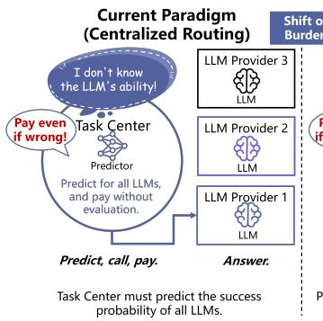
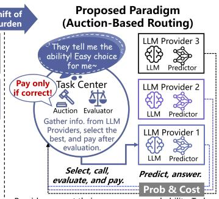
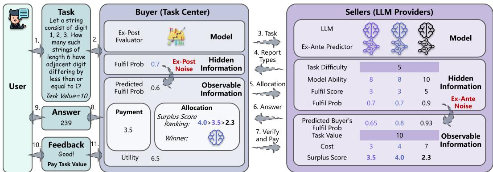
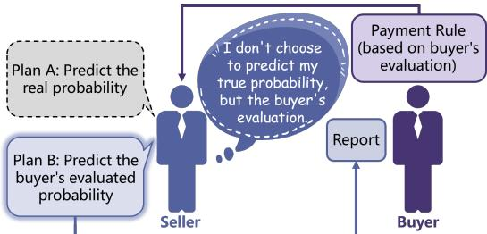
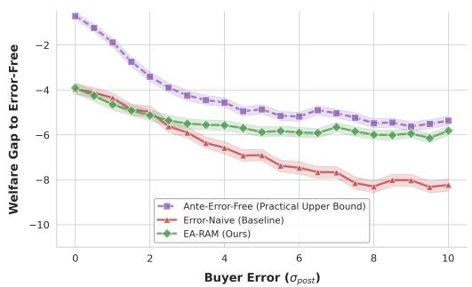
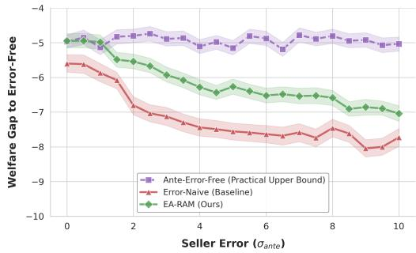
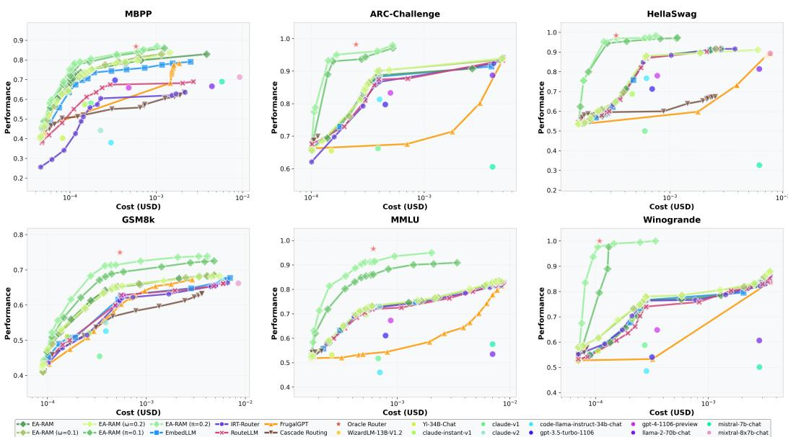
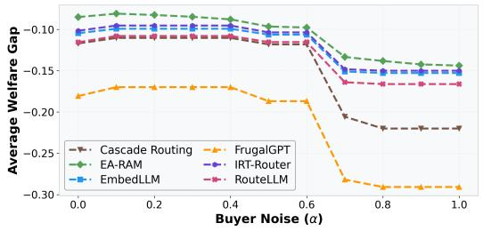
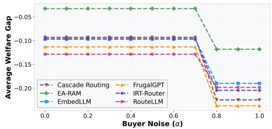
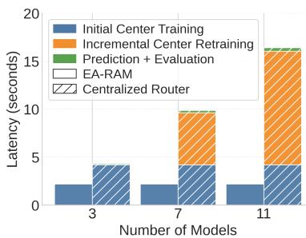

# Error-Aware Reverse Auction Mechanism for Large Language Model Routing

Haolong Chen1,2,3,∗, Zhengyuan Xin2,3,∗, Liang Zhang4, Lei Xue4, Guangxu Zhu1,2,3,5 1Shenzhen International Center for Industrial and Applied Mathematics 2Shenzhen Research Institute of Big Data 3The Chinese University of Hong Kong, Shenzhen 4Shenzhen Campus of Sun Yat-sen University 5Shenzhen Loop Area Institute ∗Equal Contribution {haolongchen1, zhengyuanxin}@link.cuhk.edu.cn, {zhangliang27, xuelei3}@mail.sysu.edu.cn, gxzhu@sribd.cn

## Abstract

Routing each query to a cost-effective large language model (LLM) is critical for balancing quality and cost, yet most routers rely on a centralized task center to predict model performance, creating an information-risk mismatch and a scalability bottleneck as the model pool grows. We propose a market-based routing paradigm that shifts ex-ante prediction to LLM providers via a reverse auction, where providers bid with self-predicted success probabilities and execution costs. To account for inherently noisy provider predictions and center evaluations, we introduce the Error-Aware Reverse Auction Mechanism (EA-RAM), which explicitly models this inherent Dual Error. We prove that EA-RAM is Bayesian incentive compatible and individually rational under the Dual Error, establish sufficient conditions for center rationality, and derive an explicit welfare-loss bound. We further identify robustness effects: opposite-signed errors can cancel, vanishing-tail link functions (e.g., logistic) stabilize clear-cut cases via saturation, and extra noise smooths belief maps, reducing the gains from marginal manipulation. Experiments on simulations and real-world benchmarks show that EA-RAM is robust to the Dual Error and achieves a better cost–performance Pareto frontier than centralized baselines, with additional gains when providers contribute local information, validating its practical effectiveness.

## 1 Introduction

Large language models (LLMs) underpin many intelligent applications [1, 2, 3], yet the expanding model ecosystem makes it increasingly necessary to route each query to a cost-effective model. Because model capabilities and costs vary widely, from expensive frontier models to cheaper specialized ones, LLM routing is essential for optimizing the cost–performance trade-off.

Most existing routers follow a centralized estimation paradigm,

  
Providers report their own success probability. Task Center executes the optimal selection.

Figure 1: Paradigm shift from traditional Centralized Routing to our proposed Auction-Based Routing.

where the task center predicts each

model’s performance [4, 5, 6]. It

has two structural limitations. (i) Information–risk mismatch: the task center bears the risk of failure but has less information about the LLMs, whereas providers hold richer private knowledge. Commercial routers1 largely retain this paradigm and thus inherit the same inefficiency. (ii) Scalability bottleneck: the center must profile or train for every new model, incurring per-model overhead even for training-free routers [6], which hinders rapid expansion.

To address these limitations, we propose a market-based routing paradigm that transfers ex-ante prediction to LLM providers via a reverse auction (Figure 1). The task center acts as the buyer and solicits bids from providers, who report their self-predicted success probabilities and costs; the center maintains only a model-agnostic ex-post evaluator. This distributed design aligns information with risk and removes the need for model-by-model profiling for the buyer, thereby improving scalability.

Similar paradigm shifts have proven successful in other mature domains. For example, moving from static allocation to market-based mechanisms such as real-time bidding in advertising [9, 10] and auction-based spectrum allocation [11, 12]. However, transferring this idea to LLM routing is not straightforward. Designing such a mechanism requires a new theory because LLM routing operates under an inherent Dual Error: providers’ ex-ante success estimates are subjective and noisy, and the center’s ex-post evaluation is imperfect. This setting departs from prior fault-tolerant allocation mechanisms [13, 14, 15], which typically assume ideal observability—i.e., task outcomes are objectively verifiable and/or agents’ success probabilities are common knowledge—and thus can distort incentives if such assumptions are violated.

We therefore propose the Error-Aware Reverse Auction Mechanism (EA-RAM) Crucially, EA-RAM explicitly models the inherent Dual Error by characterizing both providers’ subjective error in ex-ante prediction and the task center’s error in ex-post evaluation. We characterize equilibrium bidding and prove that EA-RAM is Bayesian incentive compatible (BIC) and individually rational (IR) under Dual Error; we further provide sufficient conditions for center rationality (CR) and derive an explicit upper bound on welfare loss relative to the error-free benchmark. Beyond these, we uncover three structural robustness effects: ex-ante and ex-post errors with opposite signs can offset each other; when the link function has vanishing tails (e.g., logistic), large-margin (clear-cut) instances lie in the saturated region and are thus insensitive to noise; and extra independent noise smooths the belief maps, reducing their maximum slope and thereby limiting the gains from marginal manipulation. Extensive simulations and real-world experiments show that EA-RAM is robust to Dual Error and achieves a superior cost–performance trade-off over state-of-the-art centralized baselines, especially when leveraging providers’ local information. Our main contributions are summarized as follows:

1. We propose EA-RAM, a market-based routing framework that shifts ex-ante prediction to LLM providers, addresses centralized routers’ information–risk mismatch and per-model profiling bottleneck, and models LLM routing as an auction under explicit Dual Error.

2. We establish theoretical guarantees under Dual Error: EA-RAM satisfies BIC and IR, admits sufficient conditions for CR, and enjoys a welfare-loss bound; we further reveal robustness insights, including error compensation, saturation stability, and noise-induced flattening.

3. Extensive experiments on simulations and real-world benchmarks show that EA-RAM is robust to Dual Error and improves economic efficiency compared to state-of-the-art centralized baselines.

## 2 Error-Aware Reverse Auction Mechanism

We formulate LLM routing as a strategic reverse auction between the task center and LLM providers. As shown in Figure 2, providers submit ex-ante bids, the center allocates the query, and payments are settled after ex-post evaluation.

## 2.1 Basic Setting

We consider a task center (the buyer) and a set of risk-neutral2 LLM providers (the sellers) $\mathcal { Z } =$ $\{ 1 , \ldots , N \}$ over independent, non-combinatorial tasks $t \in \mathcal T$ . Hence, we omit the superscript t. Each task has a common-knowledge value $V > 0$ , realized by the buyer iff the task demand is fulfilled $( \mu = 1 )$ ). Seller i has private type $\theta _ { i } = ( p _ { i } , c _ { i } )$ , where $c _ { i } > 0$ is the execution cost and $p _ { i }$ is the true fulfillment probability of the binary fulfillment indicator $\mu _ { i } \sim$ Bernoulli $\left( { p _ { i } } \right)$

  
Figure 2: EA-RAM for LLM routing. (1) Providers bid using ex-ante predictions. (2) The buyer allocates the query by reported surplus. (3) The selected model answers. (4) The buyer evaluates the output and settles payment. (5) The user receives accepted output and pays the task value.

Following prior work on capability modeling [6, 16], we model the fulfillment probability pi via the alignment between seller i’s model ability $m _ { i } \in \mathbb { R }$ and the task difficulty $d \in \mathbb { R } \left( { \mathrm { F i g u r e } } 3 \right)$ . The latentfulfillment score $\phi _ { i } ~ = ~ \phi ( m _ { i } , d )$ satisfies $\partial \bar { \phi } / \partial \bar { m } _ { i } \geq 0$ and $\partial \phi / \partial d \leq 0$ , and $p _ { i } = \sigma ( \phi _ { i } )$ , where the link

  
Figure 3: Ability–Difficulty Matching.

function $\sigma : \mathbb { R }  ( 0 , 1 )$ is strictly increasing, continuously differentiable, and globally $L _ { \sigma ^ { - 1 } }$ ipschitz.   
Neither $p _ { i }$ nor $\mu _ { i }$ is observed during mechanism execution.

## 2.2 Error-Aware Prediction and Evaluation

LLM Routing faces Dual Error due to noisy prediction and imperfect evaluation, undermining classical mechanisms such as FTMD [13] and necessitating an error-aware formulation.

Buyer’s ex-post evaluation. The buyer evaluates the output via the error-involved ex-post acceptance probability $h _ { i } = \sigma ( \phi _ { i } + \varepsilon _ { \mathrm { p o s t } } )$ , where the evaluation error $\varepsilon _ { \mathrm { p o s t } }$ has $\mathbf { E } [ \varepsilon _ { \mathrm { p o s t } } ] = a _ { \mathrm { p o s t } }$ and $\mathrm { V a r } ( \varepsilon _ { \mathrm { p o s t } } ) ~ = ~ b _ { \mathrm { p o s t } } $ The decision $\tilde { \mu } _ { i } \sim$ Bernoull $\left\lfloor \left( h _ { i } \right) \right\rfloor$ determines whether the answer is sent to the user.

  
Figure 4: Seller’s strategic decision. The seller bids based on the buyer’s error-involved evaluation, rather than the unobserved ground-truth.

Sellers’ ex-ante prediction. Since payments depend on the buyer’s evaluation, seller i predicts the buyer’s acceptance probability rather than the ground-truth fulfillment probability. We introduce an independent prediction error $\varepsilon _ { \mathrm { a n t e } , i }$ with ${ \bf E } [ \varepsilon _ { \mathrm { a n t e } , i } ] = a _ { \mathrm { a n t e } , i }$ and $\mathrm { V a r } ( \varepsilon _ { \mathrm { a n t e } , i } ) = b _ { \mathrm { a n t e } , i } .$ , and define the aggregated error $\eta _ { i } = \varepsilon _ { \mathrm { p o s t } } + \varepsilon _ { \mathrm { a n t e } , i } .$ Thus the seller’s ex-ante subjective probability is $g _ { i } = \sigma ( \phi _ { i } + \eta _ { i } )$ where $\mathbf { E } [ \eta _ { i } ] = a _ { \eta , i } = \dot { a } _ { \mathrm { p o s t } } + a _ { \mathrm { a n t e } , i }$ and $\mathrm { V a r } ( \eta _ { i } ) = b _ { \eta , i } = \dot { b _ { \mathrm { p o s t } } } + \bar { b _ { \mathrm { a n t e } , i } } .$ As shown in Figure 4, sellers bid based on $g _ { i }$ rather than $p _ { i }$ , a rationale formalized in Section 3.2.

## 2.3 Mechanism Interaction

A mechanism is a mapping $\Gamma : \hat { \theta } \mapsto ( f ( \hat { \theta } ) , r ( \hat { \theta } , \tilde { \mu } ) )$ , where $f$ is the allocation rule and r is the payment rule, based on sellers’ reports $\dot { \theta }$ and the evaluator signal ${ \tilde { \mu } } .$ . Each seller submits a report ${ \hat { \theta } } ;$ the buyer applies $f ( { \hat { \theta } } )$ to select a winner or the null allocation; after execution, the buyer observes µ˜ and settles transfers via $r (  { \hat { \theta } } ,  { \tilde { \mu } } )$ . Utilities and social welfare are then computed from the realized allocation, evaluation, and payment, as summarized in Algorithm 1.

Utilities and welfare. Our mechanism is welfare-oriented but strategic-agent-aware: the buyer aims to maximize expected social welfare, whereas each seller aims to maximize its own expected utility under the induced allocation and payment rules. Any non-winning seller $i \neq j$ obtains zero utility. The winner j receives payment $r _ { j } ,$ , incurs cost $c _ { j } .$ , and obtains $U _ { j } ^ { \mathrm { s e l l e r } } = r _ { j } - c _ { j }$ with $\mathbb { E } [ U _ { j } ^ { \mathrm { s e l l e r } } ] = \mathbb { E } [ r _ { j } ] - c _ { j }$ . The buyer obtains Ubuyer $= V \mu _ { j } - r _ { j }$ , with $\mathbb { E } [ U ^ { \mathrm { b u y e r } } ] =$ $V p _ { j } - \mathbb { E } [ r _ { j } ]$ . Social welfare is $W \doteq V \mu _ { j } { \stackrel { - } { - } } c _ { j }$ and $\mathbb { E } [ \boldsymbol { W } ] ^ { \sim } = V \boldsymbol { p } _ { j } - \boldsymbol { c } _ { j } ;$ equivalently, $\Breve { W } =$ $\begin{array} { r } { U ^ { \mathrm { b u y e r } } + \sum _ { i = 1 } ^ { N } U _ { i } ^ { \mathrm { s e l l e r } } } \end{array}$ because transfers are internal.

Algorithm 1 EA-RAM   
1: Input: Sellers $\{ m _ { i } , c _ { i } \} _ { i = 1 } ^ { N } ;$ task $( d , V )$   
2: for $i = 1 , \ldots , N$ do   
3: Compute $( \phi _ { i } , p _ { i } )$ and $( h _ { i } , g _ { i } )$ with errors $\varepsilon _ { \mathrm { p o s t } }$ and   
$\left\{ \varepsilon _ { \mathrm { a n t e } , i } \right\} _ { i = 1 } ^ { N } .$   
4: Set ranking score ${ \hat { s } } _ { i } \gets V g _ { i } - c _ { i }$   
5: end for   
6: $j \gets$ arg maxi sˆi; H ← max(0, maxk̸=j ${ \hat { s } } _ { k } )$   
7: if $\dot { s } _ { j } \le \bar { 0 }$ then   
8: return Null.   
9: end if   
10: Execute $\mu _ { j } \sim$ Bern $( p _ { j } ) ;$ evaluate $\tilde { \mu } _ { j } \sim$ Bern $( h _ { j } )$   
11: Pay $r _ { j } \gets V \tilde { \mu } _ { j } - H ;$ set $r _ { i } \gets 0$ for all ${ \mathrm { i } } \neq j .$   
12: $U _ { j } ^ { \mathrm { s e l l e r } }  r _ { j } - c _ { j } ; U ^ { \mathrm { b u y e r } }  V \mu _ { j } - r _ { j }$   
13: $\begin{array} { r } { \dot { W }  V \dot { \mu _ { j } } - c _ { j } . } \end{array}$   
14: return $j , \ L ^ { \backslash } ( r _ { i } \ L ) _ { i = 1 } ^ { \tilde { N } } , U _ { j } ^ { \mathrm { s e l l e r } } , U ^ { \mathrm { b u y e r } } , W .$

Reports. Seller i privately observes cost $c _ { i } ,$ forms an ex-ante belief $g _ { i }$ about the buyer’s evaluation outcome, and reports a type $\hat { \theta } _ { i } = ( \hat { p } _ { i } , \hat { c } _ { i } )$ . Since the allocation rule ranks sellers only through the induced reported surplus score $\hat { s } _ { i } = V \hat { p } _ { i } - \hat { c } _ { i } .$ , any report can be equivalently summarized by ${ \hat { s } } _ { i } ;$ thus seller $i \ ' s$ strategic choice reduces from the two-dimensional report ${ \hat { \theta } } _ { i }$ to a scalar $\hat { s } _ { i }$ . For incentive analysis under Dual Error, given belief $g _ { i }$ and true cost $c _ { i } .$ , define the error-adjusted effective surplus $\bar { T } _ { i } = V g _ { i } - c _ { i }$ , representing seller $i \ ' _ { \mathrm { { s } } }$ perceived ex-ante expected welfare contribution under the evaluation process. Theorem 3.2 will later show that, under our payment rule, it is optimal to align the reported score with this effective surplus, i.e., $\hat { s } _ { i } = \bar { T } _ { i }$

Allocation. Given reports ${ \hat { \theta } } ,$ the buyer allocates to maximize reported expected welfare. For seller i with report $\hat { \theta } _ { i } = ( \hat { p } _ { i } , \hat { c } _ { i } )$ , the reported surplus is $V \hat { p } _ { i } - \hat { c } _ { i } = \hat { s } _ { i } ;$ hence ranking by $\hat { s } _ { i }$ is equivalent to ranking sellers by reported expected welfare. The rule selects the largest positive $\hat { s } _ { i }$ or the null outcome if all reported surpluses are non-positive. Equivalently, introduce a dummy seller 0 with $( \hat { p } _ { 0 } , \hat { c } _ { 0 } ) = ( 0 , \bar { 0 ) }$ and $\hat { s } _ { 0 } = 0$ , representing the null allocation. Let ${ \bar { \mathcal { Z } } } = { \mathcal { Z } } \cup \{ 0 \}$ and $j \in \arg \operatorname* { m a x } _ { i \in \bar { \mathcal { T } } } \hat { s } _ { i }$ . Then $f ( { \hat { \theta } } ) = j \operatorname { i f } j \neq 0$ , and $f ( { \hat { \theta } } ) = \varnothing$ otherwise.

Payment and incentive alignment. Let $j$ denote the winning seller and let $\begin{array} { r l } { H } & { { } = } \end{array}$ max(0, max $\cdot _ { k \neq j } \hat { s } _ { k } )$ be the runner-up score. If payments depended on the self-reported probability $\hat { p } _ { i }$ , sellers could inflate $\hat { p } _ { i } ~ ( \mathrm { e . g . }$ , report $\hat { p } _ { i } ~ = 1 )$ . We therefore condition transfers on the evaluator signal $\tilde { \mu } _ { j } \in \{ 0 , 1 \}$ , a noisy proxy for the unobserved ground truth $\mu _ { j }$ . The winner is paid $r _ { j } = r ( \hat { \theta } _ { j } , \tilde { \mu } _ { j } ) = V \tilde { \mu } _ { j } - H ^ { 3 }$ , while losers receive $r _ { i } = 0$ for $i \neq j$ . Here $V \tilde { \mu } _ { j }$ rewards evaluated performance, and $H$ charges the winner for the externality imposed on others, aligning the best response with surplus-based truthful competition (see Theorem 3.2 for the formal statement).

## 3 Mechanism Properties

This section establishes EA-RAM’s theoretical foundations, showing that it remains incentive-aligned and economically robust under Dual Error. Proofs of all results are deferred to Appendix C.

## 3.1 Mechanism Goals

To ensure a reliable and sustainable routing market, we follow FTMD [13] and consider four standard desiderata: (1) Dominant-Strategy Incentive Compatibility (DSIC): Truth-telling maximizes each agent’s expected utility regardless of others’ actions. (2) Individual Rationality (IR): Truthful participation gives each seller non-negative expected utility. (3) Center Rationality (CR): The buyer’s expected utility remains non-negative. (4) Economic Efficiency (EE): Under truthful reporting, the mechanism allocates to maximize total expected social welfare.

We formalize the error-aware setting as a unified framework covering two cases. The general noisy case is the error-involved setting; the ideal case with vanishing errors, $\varepsilon _ { \mathrm { p o s t } } = 0$ and $\varepsilon _ { \mathrm { a n t e } , i } = 0 .$ , is the error-free setting, corresponding to FTMD [13]. In the error-free setting, ex-ante and ex-post beliefs coincide with the ground-truth probability, $g _ { i } = h _ { i } = p _ { i }$ , and the effective surplus report becomes the true surplus, $\hat { s } _ { i } = \bar { T } _ { i } = V p _ { i } - c _ { i }$ . We then establish the following benchmark property:

Proposition 3.1 (Optimality of the Error-Free Setting). In the error-free setting, the mechanism satisfies all four desirable properties: DSIC, IR, CR, and EE.

Proposition 3.1 establishes the error-free benchmark, showing optimality under idealized conditions. Although Dual Error weakens these exact guarantees, EA-RAM retains strong robustness in the error-involved setting: it satisfies BIC and IR, admits sufficient CR conditions when surplus margins absorb evaluation noise or evaluations are conservative, and bounds welfare loss, ensuring controlled efficiency degradation under uncertainty.

## 3.2 Strategic Properties

Let H denote the runner-up score with cumulative distribution function $F _ { H }$ and probability density function $f _ { H }$ . For a unilateral report $\hat { s } _ { i }$ , the seller’s interim expected utility is $\begin{array} { r } { U _ { i } ^ { \mathrm { s e l l e r } } ( \hat { s } _ { i } ) = \mathbf { \bar { P } } \mathrm { r } ( H \leq } \end{array}$ $\hat { s } _ { i } ) \cdot \mathbf { E } [ V \tilde { \mu } _ { i } - H - c _ { i } \mid H \leq \hat { s } _ { i } ] = F _ { H } ( \hat { s } _ { i } ) ( \bar { T } _ { i } - \mathbf { E } [ H \mid H \leq \hat { s } _ { i } ] )$ , since $\mathbf { E } [ V \tilde { \mu } _ { i } \tilde { \mid } \cdot ] \stackrel { \cdot } { = } V g _ { i }$ from the seller’s ex-ante perspective.

Theorem 3.2 (Bayesian Incentive Compatibility (BIC)). Seller i’s interim expected utility $U _ { i } ^ { s e l l e r } ( \hat { s } _ { i } )$ is maximized at $\bar { s _ { i } } = \bar { T _ { i } }$ . Hence, reporting $\hat { s } _ { i } = \bar { T } _ { i }$ is a Bayesian best response. Moreover, $i \bar { f } \bar { T } _ { i } > 0$ then $U _ { i } ^ { s e l l e r } ( \hat { s } _ { i } )$ is uniquely maximized at $\hat { s } _ { i } = \bar { T } _ { i }$

This implies that for every seller i, truthfully reporting $\hat { s } _ { i } = \bar { T } _ { i }$ is a Bayesian best response. Consequently, the strategy profile in which all sellers report $\hat { s } _ { i } = \bar { T } _ { i }$ constitutes a Bayesian Nash equilibrium. Under this report, seller i’s expected utility is $\begin{array} { r } { { \bf E } [ U _ { i } ^ { \mathrm { s e l l e r } } ] = \int _ { - \infty } ^ { T _ { i } } ( \bar { T } _ { i } - h ) d F _ { H } ( h ) } \end{array}$

Theorem 3.3 (Individual Rationality (IR)). At the equilibrium $\hat { s } = \bar { T }$ , every seller satisfies IR: ${ \bf E } [ U _ { i } ^ { s e l l e r } \mid \tilde { \theta } _ { i } ] \ge 0 .$

This implies that truthful reporting yields non-negative expected utility, thereby ensuring that participating in the auction remains a rational strategy for every seller.

Theorem 3.4 (Center Rationality (CR)). Each of the following sufficient conditions guarantees CR:

(A) $\mathbf { E } [ H ] \geq V \Delta _ { g a t e } ,$ , where $\Delta _ { g a t e } = L _ { \sigma } \sqrt { b _ { p o s t } + a _ { p o s t } ^ { 2 } } ; ( B ) \Delta _ { c o n s } = { \bf E } \big [ p _ { ( 1 ) } - h _ { ( 1 ) } \big ] \ge 0 .$

Intuitively, CR holds either (A) when the runner-up margin effectively buffers against evaluation noise, or (B) when the center’s evaluation is sufficiently conservative. Under either condition, the mechanism is safe for the Task Center in the sense that its expected utility remains non-negative.

Proposition $_ { 3 . 5 }$ (Comparative Statics: Ability and Difficulty). Holding fixed the runner-up score distribution $F _ { H }$ , seller i’s interim expected utility ${ \bf E } [ U _ { i } ^ { s e l l e r } ]$ is weakly increasing in their model ability $m _ { i }$ and weakly decreasing in the task difficulty d.

Intuitively, stronger models yield higher expected payoffs because they are more likely to meet the evaluator’s standard, while increased task difficulty reduces potential gains.

## 3.3 Welfare Analysis

For welfare accounting, let the expected welfare under a specified selected seller i be $\mathbf { E } [ W _ { i } ] =$ $V p _ { i } - c _ { i }$ . We define the true optimal winner index (selected under the error-free setting) as $i ^ { \star } \in$ arg max ${ } _ { j } \{ V p _ { i } - c _ { i } \}$ and the error-aware setting’s winner index as $i ^ { \dagger } \in$ arg $\operatorname* { m a x } _ { j } \{ V g _ { j } - c _ { j } \}$

Proposition 3.6 (Economic Efficiency (EE)). The equilibrium allocation induced by the error-aware setting attains the same expected welfare as the error-free benchmark if and only if the error-aware winner i† is welfare-optimal.

Intuitively, Dual Error may distort the induced allocation away from the welfare-optimal seller, thereby causing welfare loss. We quantify this effect using the Dual Error’s second-moment radii,

$$
M _ { \mathrm { p o s t } } = { \sqrt { b _ { \mathrm { p o s t } } + a _ { \mathrm { p o s t } } ^ { 2 } \mathrm { a n d } M _ { \mathrm { a n t e } } } } = \operatorname* { m a x } _ { i } { \sqrt { b _ { \mathrm { a n t e } , i } + a _ { \mathrm { a n t e } , i } ^ { 2 } } } .
$$

Theorem 3.7 (Welfare-loss bound). The expected welfare loss satisfies $0 \leq \mathbf { E } [ W _ { i ^ { \star } } ] - \mathbf { E } [ W _ { i ^ { \dagger } } ] =$ $\mathbf { E } [ ( V p _ { i ^ { \star } } - c _ { i ^ { \star } } ) - ( V p _ { i ^ { \dagger } } - c _ { i ^ { \dagger } } ) ] \leq 2 V L _ { \sigma } ( M _ { \mathrm { p o s t } } ^ { - } + M _ { \mathrm { a n t e } } )$

This bound provides a guarantee of robustness, showing that the efficiency degradation scales linearly with the aggregate magnitude of the Dual Error and vanishes as the estimation quality improves.

## 3.4 Structural Insights

Having established EA-RAM’s validity under Dual Error, we now examine its structural insights. Proposition 3.8 (Opposite-Signed Error Compensation). $I f ( g _ { i } - h _ { i } ) ( h _ { i } - p _ { i } ) \leq 0 , f o r i \in \{ i ^ { \star } , i ^ { \dagger } \}$ then the welfare-loss bound tightens to $2 V L _ { \sigma }$ max $\{ M _ { \mathrm { a n t e } } , \dot { M } _ { \mathrm { p o s t } } \}$

Intuitively, when ex-ante and ex-post errors have opposite signs, they partially cancel out, reducing the resulting welfare loss.

Proposition 3.9 (Saturation Robustness). In addition to the baseline link-function assumptions, suppose σ has vanishing tails, i.e., lim $_ { \cdot | x |  \infty } \sigma ^ { \prime } ( x ) = 0$ . For any error ϵ with $\mathbf { E } [ \epsilon ^ { 2 } ] < \dot { \infty } ,$ the deviation $\Delta ( \phi _ { i } ) = | { \bf E } [ \sigma ( \phi _ { i } + \epsilon ) ] - \sigma ( \phi _ { i } )$ | satisfies lim $_ { \cdot | \phi _ { i } | \to \infty } \Delta ( \phi _ { i } ) = 0 .$

Intuitively, flat-tailed links such as the logistic function saturate when $| \phi _ { i } |$ is large, so score noise barely affects $\sigma ( \phi _ { i } )$ and the mechanism is robust in clear-cut cases.

Proposition 3.10 (Noise-Induced Flattening). Let η be an independent noise term with $\mathbf { E } [ | \boldsymbol { \eta } | ] < \infty .$ Define the perturbed belief maps by convolution: $\tilde { g } _ { i } ( \phi ) = \mathbf { E } [ g _ { i } ( \phi + \eta ) ]$ and $\tilde { h } _ { i } ( \phi ) = { \bf E } [ h _ { i } ( \phi + $ $\eta ) ]$ ]. $H g _ { i }$ and $h _ { i }$ are continuously differentiable with bounded derivatives, then $\begin{array} { r } { \operatorname* { s u p } _ { \phi } \vert \frac { \partial \tilde { g } _ { i } } { \partial \phi } ( \phi ) \vert \leq } \end{array}$ $\operatorname* { s u p } _ { \phi } | \frac { \partial g _ { i } } { \partial \phi } ( \phi ) |$ and $\begin{array} { r } { \operatorname* { s u p } _ { \phi } | \frac { \partial \tilde { h } _ { i } } { \partial \phi } ( \phi ) | \leq \operatorname* { s u p } _ { \phi } | \frac { \partial h _ { i } } { \partial \phi } ( \phi ) | } \end{array}$ . Consequently, injecting additional independent noise weakly reduces the maximal sensitivity ofboth $\phi \mapsto g _ { i } ( \phi )$ and $\phi \mapsto h _ { i } ( \phi )$

Intuitively, ex-ante error and ex-post error lower the maximal sensitivity of the ranking map and the approval map, respectively, limiting the return to strategic manipulation.

## 4 Experiments

## 4.1 Simulation Experiments

In this section, we run simulation experiments that explicitly control the magnitude of the Dual Error to evaluate EA-RAM’s robustness.

## 4.1.1 Experimental Setup

<table><tr><td>Seller  $m _ { i }$ </td><td> $c _ { i }$ </td><td> $_ { p _ { i } }$ </td><td> $s _ { i }$ </td></tr><tr><td>0 1.0</td><td></td><td>9.00.38 -1.45</td><td></td></tr><tr><td>1</td><td>1.5</td><td>10.0 0.500.00</td><td></td></tr><tr><td>2</td><td>2.5</td><td>12.0 0.732.62</td><td></td></tr><tr><td>3</td><td>3.5</td><td>12.8 0.884.81</td><td></td></tr><tr><td>4</td><td></td><td>4.5 13.8 0.95 5.25</td><td></td></tr></table>

We simulate $N = 5$ heterogeneous sellers competing for one task with $V { = } 2 0$ and d=1.5 (Table 1). To stress-test robustness, we use a highly competitive market with a small top-two surplus gap $( \Delta s = 0 . 4 4 )$ , where mild noise can flip the ranking. Performance is measured by the Welfare Gap relative to the Error-Free upper bound, shown as the $y = 0$ line. We

Table 1: Simulation Settings.

compare: (1) Ante-Error-Free (Practical Upper Bound): an oracle seller that perfectly models $h _ { i }$ and best responds by reporting $p _ { i } + \epsilon _ { p o s t } ; ( 2 )$ Error-Naive (Baseline): naive sellers that ignore evaluation and report $p _ { i } + \epsilon _ { a n t e } \mathrm { , }$ and (3) EA-RAM (Ours): sellers report according to belief $g _ { i }$

## 4.1.2 Error Robustness Analysis

Figure 5a evaluates robustness to evaluation error $( \sigma _ { p o s t } )$ . The Ante-Error-Free curve is an upper bound, where sellers perfectly model $h _ { i }$ and best respond. EA-RAM closely tracks this bound and maintains a stable welfare gap as $\sigma _ { p o s t }$ increases, whereas Error-Naive deteriorates sharply. Figure 5b varies seller 0’s prediction error $( \sigma _ { a n t e } )$ . Although welfare inevitably declines as seller information becomes noisier, EA-RAM consistently outperforms Error-Naive, showing that internalizing the evaluation mechanism avoids severe misallocation and yields more graceful degradation.

  
(a) Robustness to evaluation error $\sigma _ { \mathrm { p o s t } } .$ . EA-RAM closely tracks the Ante-Error-Free upper bound, while Error-Naive degrades sharply.

  
(b) Robustness to prediction error $\sigma _ { \mathrm { a n t e } }$ . EA-RAM consistently outperforms Error-Naive as seller information quality deteriorates.  
Figure 5: Robustness to Dual Error. EA-RAM remains stable under evaluator and seller noise, avoiding the misallocation caused by naive reporting. Shaded regions show 95% confidence intervals.

## 4.2 Real-World Experiments

In this section, we benchmark EA-RAM against centralized baselines on real-world benchmarks.

## 4.2.1 Experimental Setup

Benchmark and baselines. We evaluate routing policies on RouterBench [17], which aggregates per-query accuracy and monetary cost for 11 LLMs (Appendix A.1), spanning both open-source (e.g., Llama, Mixtral) and proprietary models (e.g., GPT, Claude). We use queries from six benchmarks covering reasoning (HellaSwag [18], Winogrande [19], ARC-Challenge [20]), coding (MBPP [21]), math (GSM8k [22]), and knowledge-intensive understanding (MMLU [23]), and split them into train/test with a 70/30 ratio. We compare EA-RAM against a diverse set of strong baselines: EmbedLLM [4], IRT-Router [16], RouteLLM [5], FrugalGPT [24], and Cascade Routing [25]. They cover a wide range of architectures, enabling a comprehensive comparison.

Implementation details. EA-RAM trains two types of models. Each LLM has a seller-side ex-ante predictor, trained separately to estimate the probability that it will correctly answer a query based on the query embedding. The buyer maintains an ex-post evaluator that predicts answer correctness from concatenated query and answer embeddings. Both modules are MLPs with two layers. The embedding model is all-MiniLM-L6-v2 [26]. More details are provided in Appendix A.3.

## 4.2.2 Routing Pareto Analysis

We evaluate EA-RAM on real-world benchmarks by sweeping each router’s operating points to obtain cost–performance pairs (c, a), where c is the average cost per query and a is empirical performance, and then extracting the Pareto frontier. Beyond the base setting, EA-RAM uses two forms of seller-side local information. For oracle local information, we set $\hat { p } _ { m } ^ { ( \pi ) } ( x ) =$ $( 1 - \pi ) \hat { p } _ { m } ( x ) + \pi y _ { m } ( x )$ , where $\pi \in [ 0 , 1 ]$ and $y _ { m } ( x )$ is the ground-truth label. For realistic local information, we retrieve the top-10 nearest

<table><tr><td>Method</td><td colspan="5">MBPP ARC-C HellaSwag GSM8k MMLU Wino.</td></tr><tr><td>EmbedLLM</td><td>.77453</td><td>.89855</td><td>.89646</td><td>.64596</td><td>.78289 .79154</td></tr><tr><td>IRT-Router</td><td>.60465</td><td>.89391</td><td>.87664</td><td>.63717</td><td>.77604.79065</td></tr><tr><td>RouteLLM</td><td>.67213</td><td>.89498</td><td>.85518</td><td>.63841</td><td>.77615.78825</td></tr><tr><td>FrugalGPT</td><td>.70161</td><td>.77691</td><td>.72110</td><td>.65646</td><td>.67609 .67387</td></tr><tr><td>Cascade Routing .58511 .68921</td><td></td><td></td><td>.62885</td><td>.60751</td><td>.54454.55891</td></tr><tr><td>EA-RAM</td><td>.8047890353</td><td></td><td>.89676</td><td>.67302</td><td>7854879396</td></tr><tr><td>with π=0.1</td><td>.84932</td><td>.96729</td><td>.96919</td><td>.71379</td><td>.90021 .97214</td></tr><tr><td>with π=0.2</td><td>.85792</td><td>.97704</td><td>.98029</td><td>.73137</td><td>.94303 .99792</td></tr><tr><td>with ω=0.1</td><td>.81834.91131</td><td></td><td>.89938</td><td>.67421</td><td>.78616.81110</td></tr><tr><td>with  $\omega { = } 0 . 2$ </td><td>.82138.91338</td><td></td><td>.89912</td><td>.67515</td><td>.78899 .81303</td></tr></table>

Table 2: Quantitative comparison (AIQ↑). EA-RAM yields the best overall performance.

training examples in the embedding space and use the similarity-weighted label average as a noisy provider-side signal $\tilde { y } _ { m } ( x )$ , defining $\hat { p } _ { m } ^ { ( \omega ) } ( x ) = ( 1 - \omega ) \hat { p } _ { m } ( x ) + \omega \tilde { y } _ { m } ( x )$ , where $\omega \in [ 0 , 1 ]$

Figure 6 and Table 2 show that EA-RAM achieves the best overall routing performance. Table 2 reports Average Improvement in Quality (AIQ; Appendix A.2), which averages Pareto-frontier quality over a shared cost range, with higher values indicating a better cost–performance trade-off. EA-RAM already outperforms baselines in the base setting, and seller-side local information further shifts the frontier: oracle information yields the largest gains, and realistic information also improves over the base setting across all datasets.

  
Figure 6: Cost–performance Pareto frontiers on real-world benchmarks. As π or ω increases, EA-RAM shifts the frontier upward and leftward, indicating a more favorable cost–quality trade-off than the centralized baselines.

  
(a) Comparison on GSM8k.

  
(b) Comparison on MBPP.  
Figure 7: Noisy LLM-as-a-Judge evaluation. Varying the judge weight $\alpha ,$ , we report the average welfare gap to the error-free upper bound (higher is better). EA-RAM consistently incurs the smallest welfare loss.

## 4.2.3 Robustness to Real-world Noise

To further test robustness to evaluator-side noise, we run a GSM8k/MBPP experiment with a LLMas-a-judge evaluator (DeepSeek-V3.2). The evaluation score is score $: = \alpha \cdot { \mathrm { s c o r e } } _ { \mathrm { j u d g e } } + ( 1 - \alpha )$ $\mathtt { s c o r e \_ g r o u n d t r u t h }$ , where $\alpha \in [ 0 , 1 ]$ controls evaluator noise, and score $\geq 0 . 5$ indicates acceptance. All methods follow the same pipeline: select an LLM, evaluate its response, and compute welfare. We report the average welfare gap to the error-free upper bound over all queries, where higher is better. Figure 7 shows that EA-RAM consistently performs best across all $\alpha _ { \mathfrak { s } }$ incurring the smallest welfare loss, providing real-benchmark evidence of robustness to evaluator-side error.

## 4.2.4 Scalability and Efficiency

To evaluate the practical scalability and efficiency of EA-RAM, we conduct an MBPP experiment as the number of candidate LLMs increases from 3 to 7 to 11, and examine both center-side computation latency and the extra communication overhead introduced by the reverse-auction.

Center-side latency. Figure 8 shows that the center-side latency of EA-RAM remains nearly constant as the model pool grows, since the center only performs evaluator and auction computation and does not require retraining or per-model prediction. In contrast, the centralized router (EmbedLLM) becomes substantially slower as the model pool grows due to predictor retraining and ex-ante prediction. Detailed numerical results are provided in Appendix B.1.

  
Figure 8: Center-side latency.

Communication overhead. The efficiency gain introduces extra reverse-auction communication: for each query, EA-RAM sends the query to all N providers and collects N bids, adding $( \dot { N } - 1 ) S _ { q } +$ $N S _ { b }$ bytes, where $S _ { q }$ and $S _ { b }$ denote the query and bid sizes, respectively. This counts only auction-specific overhead, excluding costs shared by standard routing frameworks. As shown in Table 3, communication grows roughly linearly with N, while computation latency stays nearly constant. With parallel provider channels, communication becomes the bottleneck only below 0.338–0.384 MB/s per channel, suggesting that it is less likely to dominate in typical high-bandwidth text-routing settings.

<table><tr><td rowspan="2">N</td><td colspan="2">Extra communication Computation</td><td rowspan="2">Throughput threshold (MB/s)</td></tr><tr><td>volume (bytes)</td><td>latency (s)</td></tr><tr><td>3</td><td>44,643</td><td>0.044</td><td>0.338</td></tr><tr><td>7</td><td>111,439</td><td>0.043</td><td>0.370</td></tr><tr><td>11</td><td>177,377</td><td>0.042</td><td>0.384</td></tr></table>

Table 3: Extra reverse-auction communication overhead on MBPP.

## 5 Related Work

## 5.1 LLM Routing

To balance performance and cost, prior works have explored various routing architectures. Predictorbased approaches train a centralized router to dispatch queries, ranging from similarity-weighted ranking and embedding-based routing [5, 4] to specialized fine-tuned agents [27]. Recent works also incorporate in-context learning to adapt to new models without retraining [6]. Cascading strategies, in contrast, adopt a model chain [24, 25], invoking stronger models only when cheaper options fail. Despite these advancements, existing strategies predominantly rely on a centralized estimation paradigm, which places the prediction burden on the router, the party with the least internal visibility, resulting in inherent information asymmetry and scalability bottlenecks.

## 5.2 Market-Based Mechanisms for LLMs

Recent literature has applied auction theory to the allocation of LLM resources. Works in this domain focus primarily on determining content streams, such as auctioning slots within the RAG context window for advertisements [28], or aggregating generative preferences via token-level and summarylevel auctions [29, 30]. Regarding task execution, operational frameworks such as COALESCE [15] employ reverse auctions to outsource subtasks. However, akin to classical FTMD [13], these approaches typically operate under idealized assumptions: they presume providers make perfect ex-ante predictions and the center performs perfect ex-post evaluation. Our work challenges this premise by explicitly modeling the Dual Error inherent in practical routing, and ensures incentive compatibility and optimal allocation under Dual Error.

## 6 Conclusion

We presented EA-RAM, an error-aware reverse-auction mechanism for LLM routing that replaces centralized capability estimation with provider-side ex-ante prediction and platform-side ex-post evaluation. This paradigm resolves the information–risk mismatch and removes the per-model profiling bottleneck by requiring only a model-agnostic evaluator. Theoretically, we model LLM routing as a Dual-Error environment with noisy provider predictions and noisy platform evaluations, and prove that EA-RAM remains incentive-aligned: it is Bayesian incentive compatible and individually rational, admits sufficient conditions for center rationality, and enjoys an explicit welfare-loss bound. Our analysis further reveals three robustness effects: opposite-signed errors can cancel, vanishing-tail links stabilize clear-cut cases via saturation, and additional noise smooths belief maps, weakly reduc ing the gains from marginal manipulation. Empirically, simulations and real-world benchmarks show that EA-RAM is robust to the Dual Error and achieves a better cost–performance frontier than strong centralized baselines, with additional gains when providers contribute local information. Overall, our results suggest that market-based routing offers a scalable and robust foundation for orchestrating heterogeneous LLM ecosystems under realistic uncertainty.

## References

[1] Wayne Xin Zhao, Kun Zhou, Junyi Li, Tianyi Tang, Xiaolei Wang, Yupeng Hou, Yingqian Min, Beichen Zhang, Junjie Zhang, Zican Dong, et al. A survey of large language models. arXiv preprint arXiv:2303.18223, 1(2), 2023.

[2] Taicheng Guo, Xiuying Chen, Yaqi Wang, Ruidi Chang, Shichao Pei, Nitesh V Chawla, Olaf Wiest, and Xiangliang Zhang. Large language model based multi-agents: A survey of progress and challenges. In IJCAI, 2024.

[3] Haolong Chen, Hanzhi Chen, Zijian Zhao, Kaifeng Han, Guangxu Zhu, Yichen Zhao, Ying Du, Wei Xu, and Qingjiang Shi. An overview of domain-specific foundation model: key technologies, applications and challenges. Science China Information Sciences, 69(1):111301, 2026.

[4] Richard Zhuang, Tianhao Wu, Zhaojin Wen, Andrew Li, Jiantao Jiao, and Kannan Ramchandran. EmbedLLM: Learning compact representations of large language models. In The Thirteenth International Conference on Learning Representations, 2025.

[5] Isaac Ong, Amjad Almahairi, Vincent Wu, Wei-Lin Chiang, Tianhao Wu, Joseph E. Gonzalez, M Waleed Kadous, and Ion Stoica. RouteLLM: Learning to route LLMs from preference data. In The Thirteenth International Conference on Learning Representations, 2025.

[6] Chenxu Wang, Hao Li, Yiqun Zhang, Linyao Chen, Jianhao Chen, Ping Jian, Peng Ye, Qiaosheng Zhang, and Shuyue Hu. Icl-router: In-context learned model representations for llm routing. arXiv preprint arXiv:2510.09719, 2025.

[7] OpenRouter. Auto router. https://openrouter.ai/docs/guides/routing/routers/ auto-router. Accessed: 2026-05-06.

[8] Requesty. Smart llm routing. https://www.requesty.ai/solution/llm-routing. Accessed: 2026-05-06.

[9] Shuai Yuan, Jun Wang, and Xiaoxue Zhao. Real-time bidding for online advertising: measurement and analysis. In Proceedings of the seventh international workshop on data mining for online advertising, pages 1–8, 2013.

[10] Jun Wang, Weinan Zhang, Shuai Yuan, et al. Display advertising with real-time bidding (rtb) and behavioural targeting. Foundations and Trends® in Information Retrieval, 11(4-5):297–435, 2017.

[11] Peter Cramton. The fcc spectrum auctions: An early assessment. Journal of Economics & Management Strategy, 6(3):431–495, 1997.

[12] Paul Robert Milgrom. Putting auction theory to work. Cambridge University Press, 2004.

[13] Ryan Porter, Amir Ronen, Yoav Shoham, and Moshe Tennenholtz. Fault tolerant mechanism design. Artificial Intelligence, 172(15):1783–1799, 2008.

[14] Hidenori Takahashi. Strategic design under uncertain evaluations: structural analysis of designbuild auctions. The RAND Journal ofEconomics, 49(3):594–618, 2018.

[15] Manish Bhatt, Ronald F Del Rosario, Vineeth Sai Narajala, and Idan Habler. Coalesce: Economic and security dynamics of skill-based task outsourcing among team of autonomous llm agents. arXiv preprint arXiv:2506.01900, 2025.

[16] Wei Song, Zhenya Huang, Cheng Cheng, Weibo Gao, Bihan Xu, GuanHao Zhao, Fei Wang, and Runze Wu. IRT-router: Effective and interpretable multi-LLM routing via item response theory. In Wanxiang Che, Joyce Nabende, Ekaterina Shutova, and Mohammad Taher Pilehvar, editors, Proceedings of the 63rd Annual Meeting of the Association for Computational Linguistics (Volume 1: Long Papers), pages 15629–15644, Vienna, Austria, July 2025. Association for Computational Linguistics.

[17] Qitian Jason Hu, Jacob Bieker, Xiuyu Li, Nan Jiang, Benjamin Keigwin, Gaurav Ranganath, Kurt Keutzer, and Shriyash Kaustubh Upadhyay. Routerbench: A benchmark for multi-LLM routing system. In Agentic Markets Workshop at ICML 2024, 2024.

[18] Rowan Zellers, Ari Holtzman, Yonatan Bisk, Ali Farhadi, and Yejin Choi. HellaSwag: Can a machine really finish your sentence? In Anna Korhonen, David Traum, and Lluís Màrquez, editors, Proceedings ofthe 57th Annual Meeting ofthe Associationfor Computational Linguistics, pages 4791–4800, Florence, Italy, July 2019. Association for Computational Linguistics.

[19] Keisuke Sakaguchi, Ronan Le Bras, Chandra Bhagavatula, and Yejin Choi. Winogrande: An adversarial winograd schema challenge at scale. Communications ofthe ACM, 64(9):99–106, 2021.

[20] Peter Clark, Isaac Cowhey, Oren Etzioni, Tushar Khot, Ashish Sabharwal, Carissa Schoenick, and Oyvind Tafjord. Think you have solved question answering? try arc, the ai2 reasoning challenge. arXiv preprint arXiv:1803.05457, 2018.

[21] Jacob Austin, Augustus Odena, Maxwell Nye, Maarten Bosma, Henryk Michalewski, David Dohan, Ellen Jiang, Carrie Cai, Michael Terry, Quoc Le, et al. Program synthesis with large language models. arXiv preprint arXiv:2108.07732, 2021.

[22] Karl Cobbe, Vineet Kosaraju, Mohammad Bavarian, Mark Chen, Heewoo Jun, Lukasz Kaiser, Matthias Plappert, Jerry Tworek, Jacob Hilton, Reiichiro Nakano, et al. Training verifiers to solve math word problems. arXiv preprint arXiv:2110.14168, 2021.

[23] Dan Hendrycks, Collin Burns, Steven Basart, Andy Zou, Mantas Mazeika, Dawn Song, and Jacob Steinhardt. Measuring massive multitask language understanding. In International Conference on Learning Representations, 2021.

[24] Lingjiao Chen, Matei Zaharia, and James Zou. FrugalGPT: How to use large language models while reducing cost and improving performance. Transactions on Machine Learning Research, 2024. Featured Certification.

[25] Jasper Dekoninck, Maximilian Baader, and Martin Vechev. A unified approach to routing and cascading for LLMs. In Forty-second International Conference on Machine Learning, 2025.

[26] Sentence-Transformers. all-minilm-l6-v2. https://huggingface.co/ sentence-transformers/all-MiniLM-L6-v2. Accessed: 2026-05-06.

[27] Haozhen Zhang, Tao Feng, and Jiaxuan You. Router-r1: Teaching llms multi-round routing and aggregation via reinforcement learning. In The Thirty-ninth Annual Conference on Neural Information Processing Systems, 2025.

[28] MohammadTaghi Hajiaghayi, Sébastien Lahaie, Keivan Rezaei, and Suho Shin. Ad auctions for llms via retrieval augmented generation. Advances in Neural Information Processing Systems, 37:18445–18480, 2024.

[29] Paul Duetting, Vahab Mirrokni, Renato Paes Leme, Haifeng Xu, and Song Zuo. Mechanism design for large language models. In Proceedings of the ACM Web Conference 2024, pages 144–155, 2024.

[30] Avinava Dubey, Zhe Feng, Rahul Kidambi, Aranyak Mehta, and Di Wang. Auctions with llm summaries. In Proceedings ofthe 30th ACM SIGKDD Conference on Knowledge Discovery and Data Mining, pages 713–722, 2024.

## Contents

1 Introduction 1   
2 Error-Aware Reverse Auction Mechanism 2   
2.1 Basic Setting 2   
2.2 Error-Aware Prediction and Evaluation . 3   
2.3 Mechanism Interaction 3   
3 Mechanism Properties 4   
3.1 Mechanism Goals . 4   
3.2 Strategic Properties 5   
3.3 Welfare Analysis 5   
3.4 Structural Insights . 6   
4 Experiments 6   
4.1 Simulation Experiments . 6   
4.1.1 Experimental Setup . 6   
4.1.2 Error Robustness Analysis 6   
4.2 Real-World Experiments 7   
4.2.1 Experimental Setup . 7   
4.2.2 Routing Pareto Analysis 7   
4.2.3 Robustness to Real-world Noise 8   
4.2.4 Scalability and Efficiency 8   
5 Related Work 9   
5.1 LLM Routing 9   
5.2 Market-Based Mechanisms for LLMs 9   
6 Conclusion 9   
A More Implementation Details 14   
A.1 RouterBench 14   
A.2 AIQ Computation 14   
A.3 Other Details 14   
B More Experiments 14   
B.1 Detailed Results for Efficiency Analysis 14   
C Proof 14   
C.1 Proof of Error-Free Setting’s Property 14   
C.2 Strategic Properties 15   
C.3 Welfare Analysis 17   
C.4 Structural Insights . . 18   
D Limitations and Future Directions 20

## A More Implementation Details

## A.1 RouterBench

The model pool of the selected part of the RouterBench dataset is:

• Open Source Models: Llama-70B-chat, Mixtral-8x7B-chat, Yi-34B-chat, Code Llama-34B, Mistral-7B-chat, and WizardLM-13B.

• Proprietary Models: GPT-4, GPT-3.5-turbo, Claude-instant-v1, Claude-v1, Claude-v2.

## A.2 AIQ Computation

Given a routing system family, we sample a set of parameterized routers and obtain a collection of cost–quality points $\{ ( c _ { i } , q _ { i } ) \} _ { i = 1 } ^ { n }$ , where $c _ { i }$ is the average monetary cost per query and $q _ { i }$ is the corresponding quality (e.g., accuracy / performance). We then construct the non-decreasing convex hull frontier $R _ { f } ( c )$ over a shared domain $[ c _ { \mathrm { m i n } } , c _ { \mathrm { m a x } } ]$ ]. AIQ is defined as the average quality of this frontier over the shared cost interval:

$$
\mathrm { A I Q } ( R _ { f } ) = \frac { 1 } { c _ { \operatorname* { m a x } } - c _ { \operatorname* { m i n } } } \int _ { c _ { \operatorname* { m i n } } } ^ { c _ { \operatorname* { m a x } } } R _ { f } ( c ) d c .\tag{1}
$$

In implementation, we evaluate the integral numerically by (i) aligning all methods to the same $[ c _ { \mathrm { m i n } } , c _ { \mathrm { m a x } } ]$ via endpoint extrapolation when necessary, (ii) representing $\bar { R } _ { f } ( c )$ with piecewise-linear segments, and (iii) computing the area under the curve using the trapezoidal rule, then normalizing by $\left( c _ { \operatorname* { m a x } } - c _ { \operatorname* { m i n } } \right)$

For endpoint extrapolation, let a router have observed points spanning $[ c _ { \operatorname* { m i n } } ^ { R } , c _ { \operatorname* { m a x } } ^ { R } ]$ with corresponding frontier quality range $[ q _ { \mathrm { m i n } } ^ { R } , q _ { \mathrm { m a x } } ^ { R } ]$ . We left-extrapolate by extending the global minimum quality-cost point $( q _ { \mathrm { m i n } } , c _ { \mathrm { m i n } } )$ , and right-extrapolate by extending the router’s maximum quality $q _ { \operatorname* { m a x } } ^ { R }$ to the global maximum cost $c _ { \mathrm { m a x } } \ ( \mathrm { i . e . , } \ R _ { f } ^ { \bullet } ( c ) = \bar { q _ { \mathrm { m a x } } ^ { R } }$ for $c \bar { \in } [ c _ { \operatorname* { m a x } } ^ { R } , c _ { \operatorname* { m a x } } ] )$ .

## A.3 Other Details

EA-RAM’s predictors and evaluator are trained with cross-entropy loss and AdamW for 100 epochs, with a batch size of 256 and a learning rate of $1 0 ^ { - 3 }$ . All experiments were done on a server with 8 NVIDIA GeForce RTX 3090 GPUs.

## B More Experiments

## B.1 Detailed Results for Efficiency Analysis

We provide detailed numerical results in Table 4.

Table 4: Center-side latency under different numbers of candidate LLMs on MBPP. Lower is better.
<table><tr><td>Latency(s)/Method</td><td>EA-RAM (3)</td><td>EA-RAM (7)</td><td>EA-RAM (11)</td><td>Centralized Router (3)</td><td>Centralized Router (7)</td><td>Centralized Router (11)</td></tr><tr><td>Initial Center Training</td><td>2.184</td><td>2.184</td><td>2.184</td><td>4.181</td><td>4.181</td><td>4.181</td></tr><tr><td>Incremental Center Retraining</td><td></td><td>0.000</td><td>0.000</td><td></td><td>5.425</td><td>11.836</td></tr><tr><td>Center Computation (Prediction + Evaluation)</td><td>0.044</td><td>0.043</td><td>0.042</td><td>0.118</td><td>0.249</td><td>0.383</td></tr><tr><td>Total Latency</td><td>2.228</td><td>2.227</td><td>2.226</td><td>4.299</td><td>9.855</td><td>16.400</td></tr></table>

## C Proof

## C.1 Proof of Error-Free Setting’s Property

Proposition C.1 (Optimality of the Error-Free Setting. Restatement of Proposition 3.1). In the error-free setting, the mechanism satisfies allfour desirable properties: DSIC, IR, CR, and EE.

Proof. DSIC: Fix others’ reports. Let $H = \mathrm { m a x } \{ 0 , \mathrm { m a x } _ { k \neq i } ( \hat { p } _ { k } V - \hat { c } _ { k } ) \}$ . If i wins, then $r _ { i } =$ $V \mu - H , \mathbf { s o } \mathbf { E } [ r _ { i } ] = p _ { i } V - \dot { H }$ and

$$
\mathbf { E } [ U _ { i } ^ { \mathrm { s e l l e r } } \mid \mathrm { w i n } ] = \mathbf { E } [ r _ { i } ] - c _ { i } = p _ { i } V - H - c _ { i } = s _ { i } - H .\tag{2}
$$

If i loses, $U _ { i } ^ { \mathrm { s e l l e r } } = 0$ . Thus

$$
\mathbf { E } [ U _ { i } ^ { \mathrm { s e l l e r } } \mid \hat { \theta } _ { i } ] = ( s _ { i } - H ) \cdot \mathrm { P r } [ \hat { s } _ { i } \geq H ] ,\tag{3}
$$

where the win probability depends on $\hat { s } _ { i }$ relative to H.

$- \operatorname { I f } s _ { i } > H$ , the best outcome is to win, yielding $s _ { i } - H > 0$ . Truthful reporting sets $\hat { s } _ { i } = s _ { i }$ , hence ensures winning. - If $s _ { i } < H$ , any win would yield $s _ { i } - H < 0$ , strictly worse than losing. Truthful reporting sets $\hat { s } _ { i } = s _ { i } < H$ , hence ensures losing. $- \operatorname { I f } s _ { i } = H$ , both win and loss yield expected utility 0.

Thus, truth-telling maximizes expected utility in all cases.

IR: From DSIC, if i wins then $\mathbf { E } [ U _ { i } ^ { \mathrm { s e l l e r } } ] = s _ { i } - H \geq 0$ because allocation requires $\hat { s } _ { i } = s _ { i } \ge H$ . If i loses then ${ \bf E } [ U _ { i } ^ { \mathrm { s e l l e r } } ] = 0$ . Hence expected utility is never negative.

CR: If seller j is assigned, then

$$
U ^ { \mathrm { b u y e r } } = V \mu - r _ { j } = V \mu - ( V \mu - H ) = H .\tag{4}
$$

Since the dummy seller has a score $s _ { 0 } = 0$ , we have $H \geq 0$ , so the buyer never loses. If no seller is assigned, then ${ \tilde { U } } ^ { \mathrm { b u y e r } } = 0$

EE: With truth-telling, $\hat { s } _ { i } = s _ { i }$ . The mechanism assigns only if maxi $s _ { i } > 0$ , and then to an i maximizing $s _ { i }$ . This maximizes expected welfare max $\{ 0 , \operatorname* { m a x } _ { i } s _ { i } \}$ □

## C.2 Strategic Properties

Theorem C.2 (Bayesian Incentive Compatibility (BIC). Restatement of Theorem 3.2). Seller i’s interim expected utility $U _ { i } ^ { s e l l e r } ( \hat { s } _ { i } )$ is maximized at $\hat { s } _ { i } = \bar { T } _ { i }$ . Hence, reporting $\hat { s } _ { i } = \bar { T } _ { i }$ is a Bayesian best response. Moreover, $i f \bar { T } _ { i } > 0 ;$ , then $U _ { i } ^ { s e l l e r } ( \hat { s } _ { i } )$ is uniquely maximized at $\hat { s } _ { i } = \bar { T } _ { i }$

Proof. Recall the definition of $U _ { i } ^ { \mathrm { s e l l e r } } ( \hat { s } _ { i } )$

$$
\begin{array} { r l } & { U _ { i } ^ { \mathrm { s e l l e r } } ( \hat { s } _ { i } ) = \operatorname* { P r } ( H \leq \hat { s } _ { i } ) \cdot { \bf E } \big [ V \tilde { \mu } _ { i } - H - c _ { i } \mid H \leq \hat { s } _ { i } \big ] } \\ & { \qquad = F _ { H } \big ( \hat { s } _ { i } \big ) \big ( \bar { T } _ { i } - { \bf E } [ H \mid H \leq \hat { s } _ { i } ] \big ) . } \end{array}\tag{5}
$$

Differentiating $U _ { i } ^ { \mathrm { s e l l e r } } ( \hat { s } _ { i } )$ and using

$$
{ \frac { d } { d x } } [ F _ { H } ( x ) \mathbf { E } ( H \mid H \leq x ) ] = f _ { H } ( x ) x\tag{6}
$$

gives

$$
U _ { i } ^ { \mathrm { s e l l e r } ^ { \prime } } ( \hat { s } _ { i } ) = f _ { H } ( \hat { s } _ { i } ) ( \bar { T } _ { i } - \hat { s } _ { i } ) .\tag{7}
$$

If $\bar { T } _ { i } > 0$ , then $U _ { i } ^ { \mathrm { s e l l e r } ^ { \prime } } ( \hat { s } _ { i } ) > 0$ for $\hat { s } _ { i } < \bar { T } _ { i }$ and $U _ { i } ^ { \mathrm { s e l l e r } ^ { \prime } } ( \hat { s } _ { i } ) < 0$ for $\hat { s } _ { i } > \bar { T } _ { i }$ , so $U _ { i } ^ { \mathrm { s e l l e r } } ( \hat { s } _ { i } )$ is uniquely maximized at $\hat { s } _ { i } \overset { \cdot } { = } \bar { T } _ { i }$

If $\bar { T } _ { i } \leq 0$ , then for every $\hat { s } _ { i } > 0$ we have $U _ { i } ^ { \mathrm { s e l l e r } ^ { \prime } } ( \hat { s } _ { i } ) < 0$ , so $U _ { i } ^ { \mathrm { s e l l e r } } ( \hat { s } _ { i } )$ is decreasing on $( 0 , \infty )$ Hence, any positive over-report is not profitable. With the explicit null option, any non-positive report is equivalent to opting out, so reporting $\hat { s } _ { i } = \bar { T } _ { i }$ remains optimal. Therefore, $\hat { s } _ { i } = \bar { T } _ { i }$ is always a Bayesian best response, and uniqueness holds whenever $\bar { T } _ { i } > 0$ □

Theorem C.3 (Individual Rationality (IR). Restatement of Theorem 3.3). At the equilibrium $\hat { s } = \bar { T }$ every seller satisfies $I R \colon { \bf E } [ U _ { i } ^ { s e l l e r } \mid \tilde { \theta } _ { i } ] \geq 0$

Proof. Win case. Conditioned on $H \leq { \bar { T } } _ { i }$ ,

$$
{ \bf E } [ U _ { i } ^ { \mathrm { s e l l e r } } \ | \ \mathrm { w i n } , \tilde { \theta } _ { i } ] = \bar { T } _ { i } - { \bf E } [ H \ | \ H \leq \bar { T } _ { i } ] \ \geq \ 0 .\tag{8}
$$

Plugging $\hat { s } _ { i } = \bar { T } _ { i }$ into the interim utility $U _ { i } ^ { \mathrm { s e l l e r } } ( \hat { s } _ { i } )$ yields

$$
U _ { i } ^ { \mathrm { s e l l e r } } ( \bar { T } _ { i } ) = F _ { H } ( \bar { T } _ { i } ) \big ( \bar { T } _ { i } - { \bf E } [ H \mid H \leq \bar { T } _ { i } ] \big ) ~ \geq ~ 0 .\tag{9}
$$

Lose case. If $H > \bar { T } _ { i }$ , then

$$
\mathbf { E } [ U _ { i } ^ { \mathrm { s e l l e r } } \mid \mathrm { l o s e } , \tilde { \theta } _ { i } ] = 0 .\tag{10}
$$

Combining (8)–(10) gives $\mathbf { E } [ U _ { i } ^ { \mathrm { s e l l e r } } \mid \tilde { \theta } _ { i } ] \ge 0$

Lemma C.4 (Lipschitz Bound.). The link function σ is globally Lσ-Lipschitz, $i . e . , | \sigma ^ { \prime } ( z ) | \le L _ { \sigma }$ for all $z \in \mathbb { R }$ . Therefore,for any real number x and any random variable ϵ with $\mathbf { E } [ \epsilon ^ { 2 } ] < \infty ,$ , the deviation between ${ \bf E } [ \sigma ( x + \epsilon ) ]$ and σ(x) satisfies $\begin{array} { r } { \left| \mathbf { E } [ \sigma ( x + \epsilon ) ] - \sigma ( x ) \right| \le L _ { \sigma } \mathbf { E } [ | \epsilon | ] \le L _ { \sigma } \sqrt { \mathrm { V a r } ( \epsilon ) + ( \mathbf { E } [ \epsilon ] ) ^ { 2 } } . } \end{array}$

Proof. The proof consists of two steps: applying the Lipschitz property to the expectation and then bounding the first absolute moment using the second moment.

Step 1: Bounding the deviation via the Lipschitz constant. Since $\sigma$ is differentiable and satisfies $| \sigma ^ { \prime } \bar { ( z ) } | \le L _ { \sigma }$ for all z, by the Mean Value Theorem, σ is $L _ { \sigma ^ { - 1 } }$ ipschitz continuous. That is, for any $a , b \in \mathbb { R } , | \sigma ( a ) - \sigma ( b ) | \leq L _ { \sigma } | a - b |$ . Let $a = x + \epsilon$ and $b = x$ . Then:

$$
| \sigma ( x + \epsilon ) - \sigma ( x ) | \leq L _ { \sigma } | ( x + \epsilon ) - x | = L _ { \sigma } | \epsilon | .\tag{11}
$$

Now, consider the absolute difference of the expectations. By the linearity of expectation and Jensen’s inequality (since the absolute value function | · | is convex, $| \mathbf { E } [ Y ] | \leq \mathbf { E } [ | Y | ] )$ , we have:

$$
\left| \mathbf { E } [ \sigma ( x + \epsilon ) ] - \sigma ( x ) \right| = \left| \mathbf { E } [ \sigma ( x + \epsilon ) - \sigma ( x ) ] \right|\tag{12}
$$

$$
\begin{array} { r } { \leq \mathbf { E } \big [ | \sigma ( x + \epsilon ) - \sigma ( x ) | \big ] . } \end{array}\tag{13}
$$

Substituting the Lipschitz bound from Eq. (1) into the expectation:

$$
{ \mathbf E } \big [ | \sigma ( x + \epsilon ) - \sigma ( x ) | \big ] \le { \mathbf E } \big [ L _ { \sigma } | \epsilon | \big ] = L _ { \sigma } { \mathbf E } [ | \epsilon | ] .\tag{14}
$$

This establishes the first inequality of the lemma.

Step 2: Bounding the first moment via Variance. We apply Lyapunov’s inequality (or simply Jensen’s inequality for the convex function $f ( y ) = y ^ { 2 } )$ , which states that $( \mathbf { E } [ | Y | ] ) ^ { \mathbf { \bar { 2 } } } \leq \mathbf { E } [ \dot { Y } ^ { 2 } ]$ Applied to the random variable ϵ:

$$
\mathbf { E } [ | \epsilon | ] \leq \sqrt { \mathbf { E } [ \epsilon ^ { 2 } ] } .\tag{15}
$$

Recall the definition of variance: $\mathrm { V a r } ( \epsilon ) = { \bf E } [ \epsilon ^ { 2 } ] - ( { \bf E } [ \epsilon ] ) ^ { 2 }$ . Rearranging for the second moment gives $\mathbf { E } [ \epsilon ^ { 2 } ] = \mathrm { V a r } ( \epsilon ) + ( \mathbf { E } [ \epsilon ] ) ^ { 2 }$ . Substituting this into Eq. (4):

$$
\mathbf { E } [ | \epsilon | ] \leq \sqrt { \mathrm { V a r } ( \epsilon ) + ( \mathbf { E } [ \epsilon ] ) ^ { 2 } } .\tag{16}
$$

Multiplying both sides by $L _ { \sigma }$ yields the final bound:

$$
L _ { \sigma } \mathbf { E } [ | \epsilon | ] \leq L _ { \sigma } \sqrt { \mathrm { V a r } ( \epsilon ) + ( \mathbf { E } [ \epsilon ] ) ^ { 2 } } .\tag{17}
$$

Theorem C.5 (Center Rationality (CR). Restatement of Theorem 3.4). Each of the following sufficient conditions guarantees CR: $( A ) \ \mathbf { E } [ H ] \geq V \Delta _ { g a t e }$ , where $\Delta _ { g a t e } = L _ { \sigma } \sqrt { b _ { p o s t } + a _ { p o s t } ^ { 2 } } ; ( B ) \Delta _ { c o n s } =$ $\begin{array} { r } { { \bf E } \big [ p _ { ( 1 ) } - h _ { ( 1 ) } \big ] \geq 0 . } \end{array}$

Proof. Let the runner-up surplus be H, and let the selected winner be indexed by (1). The winner’s true fulfillment probability and evaluated acceptance probability are

$$
p _ { ( 1 ) } = \sigma ( \phi _ { ( 1 ) } ) , \qquad h _ { ( 1 ) } = \sigma \big ( \phi _ { ( 1 ) } + \varepsilon _ { \mathrm { p o s t } } \big ) .\tag{18}
$$

Let $\mu _ { ( 1 ) } \sim \mathrm { B e r n o u l l i } ( p _ { ( 1 ) } )$ denote the true fulfillment outcome and $\tilde { \mu } _ { ( 1 ) } \sim$ Bernoull $\left( h _ { ( 1 ) } \right)$ denote the evaluator’s acceptance signal. Since the winner is paid

$$
r _ { ( 1 ) } = V \tilde { \mu } _ { ( 1 ) } - H ,\tag{19}
$$

the buyer’s realized utility is

$$
U ^ { \mathrm { b u y e r } } = V \mu _ { ( 1 ) } - r _ { ( 1 ) } = H + V \big ( \mu _ { ( 1 ) } - \tilde { \mu } _ { ( 1 ) } \big ) .\tag{20}
$$

Taking expectations and using ${ \bf E } [ \mu _ { ( 1 ) } ] = { \bf E } [ p _ { ( 1 ) } ]$ and ${ \bf E } [ \tilde { \mu } _ { ( 1 ) } ] = { \bf E } [ h _ { ( 1 ) } ]$ , we obtain

$$
\mathbf { E } [ U ^ { \mathrm { b u y e r } } ] = \mathbf { E } [ H ] + V \big ( \mathbf { E } [ p _ { ( 1 ) } ] - \mathbf { E } [ h _ { ( 1 ) } ] \big ) .\tag{21}
$$

(A) Condition on $\phi _ { ( 1 ) }$ and apply Lemma C.4 to $x = \phi _ { ( 1 ) }$ and $\epsilon = \varepsilon _ { \mathrm { p o s t } } \dot { \cdot }$

$$
\begin{array} { r } { \left| { \bf E } [ h _ { ( 1 ) } \ | \ \phi _ { ( 1 ) } ] - p _ { ( 1 ) } \right| \ \leq \ L _ { \sigma } \sqrt { b _ { \mathrm { p o s t } } + a _ { \mathrm { p o s t } } ^ { 2 } } . } \end{array}\tag{22}
$$

Taking expectations over $\phi _ { ( 1 ) }$ gives

$$
\left| \mathbf { E } [ h _ { ( 1 ) } ] - \mathbf { E } [ p _ { ( 1 ) } ] \right| \leq \Delta _ { \mathrm { g a t e } } .\tag{23}
$$

Substituting (23) into (21), we obtain

$$
\begin{array} { r } { \mathbf { E } [ U ^ { \mathrm { b u y e r } } ] \geq \mathbf { E } [ H ] - V \Delta _ { \mathrm { g a t e } } . } \end{array}\tag{24}
$$

Hence, if ${ \bf E } [ H ] \geq V \Delta _ { \mathrm { g a t e } }$ , then ${ \bf E } [ U ^ { \mathrm { b u y e r } } ] \ge 0$ , establishing CR.

(B) By (21),

$$
\mathbf { E } [ U ^ { \mathrm { b u y e r } } ] = \mathbf { E } [ H ] + V \mathbf { E } [ p _ { ( 1 ) } - h _ { ( 1 ) } ] = \mathbf { E } [ H ] + V \Delta _ { \mathrm { c o n s } } .\tag{25}
$$

Since the mechanism includes the dummy seller with score 0, we have $H \geq 0$ and thus $\mathbf { E } [ H ] \geq 0$ Therefore, whenever $\Delta _ { \mathrm { c o n s } } \geq 0 , ( 2 5 )$ implies ${ \bf E } [ U ^ { \mathrm { b u y e r } } ] \ge 0$ . This establishes CR. □

Proposition C.6 (Comparative Statics: Ability and Difficulty. Restatement of Proposition 3.5). Holding fixed the runner-up score distribution $F _ { H } ,$ , seller i’s interim expected utility ${ \bf E } [ U _ { i } ^ { s e l l e r } ]$ is weakly increasing in their model ability $m _ { i }$ and weakly decreasing in the task difficulty d.

Proof. We consider ceteris-paribus comparative statics, holding the runner-up score distribution $F _ { H }$ fixed. Recall that

$$
\mathbf { E } [ U _ { i } ^ { \mathrm { s e l l e r } } ] = \int _ { - \infty } ^ { \bar { T } _ { i } } ( \bar { T } _ { i } - h ) d F _ { H } ( h ) ,\tag{26}
$$

where $\bar { T } _ { i } = V g _ { i } - c _ { i }$ . Differentiating with respect to x using the Leibniz integral rule yields:

$$
\frac { \partial \mathbf { E } [ U _ { i } ^ { \mathrm { s e l i e r } } ] } { \partial x } = \operatorname* { P r } ( H \leq \bar { T } _ { i } ) \cdot V \cdot \frac { \partial g _ { i } } { \partial x } = \operatorname* { P r } ( H \leq \bar { T } _ { i } ) \cdot V \cdot \mathbf { E } [ \sigma ^ { \prime } ( \phi + \eta _ { i } ) ] \frac { \partial \phi } { \partial x } .\tag{27}
$$

The second equality follows from the chain rule applied to the ex-ante belief $g _ { i }$ . Observe that V and $\mathbf { E } [ \sigma ^ { \prime } ]$ are strictly positive, while the win probability $\Pr ( H \leq { \bar { T } } _ { i } )$ is non-negative. Thus, the sign of the utility gradient follows the sign of $\frac { \partial \phi } { \partial x }$ . Recall from Section 2.1 that ϕ is non-decreasing in ability $\begin{array} { r } { ( \frac { \partial \phi } { \partial m _ { i } } \geq 0 ) } \end{array}$ and non-increasing in difficulty $( \frac { \partial \phi } { \partial d } \leq 0 )$ . Therefore:

1. For ability $( x = m _ { i } )$ , the gradient is non-negative $( \frac { \partial \mathbf { E } [ U _ { i } ^ { \mathrm { s e l l e r } } ] } { \partial m _ { i } } \geq 0 )$

2. For difficulty $( x = d )$ , the gradient is non-positive $( \frac { \partial \mathbf { E } [ U _ { i } ^ { \mathrm { s e l l e r } } ] } { \partial d } \leq 0 )$

This confirms that the seller’s utility is weakly increasing in ability and weakly decreasing in difficulty. □

## C.3 Welfare Analysis

Proposition C.7 (Economic Efficiency (EE). Restatement of Proposition 3.6). The equilibrium allocation induced by the error-aware setting attains the same expected welfare as the error-free benchmark if and only if the error-aware winner i† is welfare-optimal.

Proof. Let $i ^ { \star }$ denote an error-free welfare-maximizing seller. If seller i is selected, then the realized welfare is

$$
\begin{array} { r } { W _ { i } = V \mu _ { i } - c _ { i } . } \end{array}\tag{28}
$$

Taking the expectation gives

$$
\mathbf { E } [ W _ { i } ] = V \mathbf { E } [ \mu _ { i } ] - c _ { i } = V p _ { i } - c _ { i } .\tag{29}
$$

Hence, the expected welfare induced by the error-aware allocation is

$$
\mathbf { E } [ W _ { i ^ { \dagger } } ] = V p _ { i ^ { \dagger } } - c _ { i ^ { \dagger } } ,\tag{30}
$$

whereas the error-free benchmark welfare is

$$
\mathbf { E } [ W _ { i ^ { \star } } ] = \operatorname* { m a x } _ { i } \{ V p _ { i } - c _ { i } \} .\tag{31}
$$

Therefore,

$$
\mathbf { E } [ W _ { i ^ { \dagger } } ] = \mathbf { E } [ W _ { i ^ { \star } } ] \iff V p _ { i ^ { \dagger } } - c _ { i ^ { \dagger } } = \operatorname* { m a x } _ { i } \{ V p _ { i } - c _ { i } \} .
$$

This proves the claim.

(32)

Theorem C.8 (Welfare-loss bound. Restatement of Theorem 3.7). The expected welfare loss satisfies $0 \le \mathbf { E } [ W _ { i ^ { \star } } ] - \mathbf { E } [ W _ { i ^ { \star } } ] = \mathbf { E } [ ( V p _ { i ^ { \star } } - c _ { i ^ { \star } } ) - ( V p _ { i ^ { \star } } - c _ { i ^ { \star } } ) ] \le 2 V \dot { L } _ { \sigma } ( M _ { \mathrm { p o s t } } + M _ { \mathrm { a n t e } } ) .$

Proof. Step 1: Pointwise comparison. Let $\mathbf { E } [ W _ { i } ] = V p _ { i } - c _ { i }$ and $\bar { T } _ { i } = V g _ { i } - c _ { i }$ . Since $i ^ { \dagger }$ maximizes T¯i,

$$
\mathbf { E } [ W _ { i ^ { * } } ] - \mathbf { E } [ W _ { i ^ { * } } ] = ( \mathbf { E } [ W _ { i ^ { * } } ] - { \bar { T } } _ { i ^ { * } } ) + ( { \bar { T } } _ { i ^ { * } } - { \bar { T } } _ { i ^ { \dagger } } ) + ( { \bar { T } } _ { i ^ { \dagger } } - \mathbf { E } [ W _ { i ^ { * } } ] ) \ \leq \ ( \mathbf { E } [ W _ { i ^ { * } } ] - { \bar { T } } _ { i ^ { * } } ) + ( { \bar { T } } _ { i ^ { \dagger } } - \mathbf { E } [ W _ { i ^ { * } } ] ) .\tag{33}
$$

because $\bar { T } _ { i ^ { \star } } - \bar { T } _ { i ^ { \dagger } } \leq 0$ . Rearranging yields

$$
0 \leq \mathbf { E } [ W _ { i ^ { \star } } ] - \mathbf { E } [ W _ { i ^ { \star } } ] \leq V \big [ ( p _ { i ^ { \star } } - g _ { i ^ { \star } } ) + ( g _ { i ^ { \dagger } } - p _ { i ^ { \dagger } } ) \big ] \leq V \big ( | g _ { i ^ { \star } } - p _ { i ^ { \star } } | + | g _ { i ^ { \dagger } } - p _ { i ^ { \dagger } } | \big ) .\tag{34}
$$

Step 2: Bound $| g _ { i } - p _ { i }$ | by decomposing the two channels. Introduce the telescoping decomposition

$$
g _ { i } ^ { ( 0 ) } = \sigma ( \phi _ { i } ) = p _ { i } , \quad g _ { i } ^ { ( 1 ) } = { \bf E } [ \sigma ( \phi _ { i } + \varepsilon _ { \mathrm { p o s t } } ) ] , \quad g _ { i } ^ { ( 2 ) } = g _ { i } ,\tag{35}
$$

so that

$$
| g _ { i } - p _ { i } | \leq | g _ { i } ^ { ( 1 ) } - g _ { i } ^ { ( 0 ) } | + | g _ { i } ^ { ( 2 ) } - g _ { i } ^ { ( 1 ) } | .\tag{36}
$$

Applying Lemma C.4 to each increment:

$$
\begin{array} { r } { | g _ { i } ^ { ( 1 ) } - g _ { i } ^ { ( 0 ) } | \leq L _ { \sigma } \sqrt { b _ { \mathrm { p o s t } } + a _ { \mathrm { p o s t } } ^ { 2 } } = L _ { \sigma } M _ { \mathrm { p o s t } } , } \end{array}\tag{37}
$$

$$
\begin{array} { r } { | g _ { i } ^ { ( 2 ) } - g _ { i } ^ { ( 1 ) } | \leq L _ { \sigma } \sqrt { b _ { \mathrm { a n t e } , i } + a _ { \mathrm { a n t e } , i } ^ { 2 } } \leq L _ { \sigma } M _ { \mathrm { a n t e } } . } \end{array}\tag{38}
$$

Therefore,

$$
| g _ { i } - p _ { i } | \leq L _ { \sigma } \big ( M _ { \mathrm { p o s t } } + M _ { \mathrm { a n t e } } \big ) \quad \mathrm { f o r ~ a l l ~ } i .\tag{39}
$$

Step 3: Combine. Taking expectations of (34) and applying (39) at indices $i ^ { \star }$ and $i ^ { \dagger }$

$$
0 \leq \mathbf { E } \big [ W _ { i ^ { \star } } \big ] - \mathbf { E } \big [ W _ { i ^ { \star } } \big ] \leq V \mathbf { E } \big [ | g _ { i ^ { \star } } - p _ { i ^ { \star } } | + | g _ { i ^ { \star } } - p _ { i ^ { \star } } | \big ] \leq 2 V L _ { \sigma } \big ( M _ { \mathrm { p o s t } } + M _ { \mathrm { a n t e } } \big ) ,\tag{40}
$$

completing the proof.

## C.4 Structural Insights

Proposition C.9 (Opposite-Signed Error Compensation. Restatement of Proposition 3.8). ${ \cal { I } } f ( g _ { i } \ : - \ :$ $h _ { i } ) ( h _ { i } - p _ { i } ) \leq 0 f o r i \in \{ i ^ { \star } , i ^ { \dagger } \}$ , then the welfare-loss bound tightens to $2 V L _ { \sigma } \operatorname* { m a x } \{ M _ { \mathrm { a n t e } } , M _ { \mathrm { p o s t } } \}$

Proof. Let $i ^ { \star } \in \arg \operatorname* { m a x } _ { j } W _ { j }$ denote the winner under the error-free setting, and let $i ^ { \dagger } \in$ arg max $_ j \{ V g _ { j } - c _ { j } \}$ denote the winner selected by the error-involved mechanism. We start from the welfare-gap decomposition established in Theorem 3.7:

$$
0 \leq \mathbf { E } [ W _ { i ^ { \star } } ] - \mathbf { E } [ W _ { i ^ { \dagger } } ] \leq V \Big ( | g _ { i ^ { \star } } - p _ { i ^ { \star } } | + | g _ { i ^ { \dagger } } - p _ { i ^ { \dagger } } | \Big ) .\tag{41}
$$

Consider the error decomposition $g _ { i } - p _ { i } = ( g _ { i } - h _ { i } ) + ( h _ { i } - p _ { i } ) : = a _ { i } + b _ { i }$ . The condition $( g _ { i } - h _ { i } ) ( h _ { i } - p _ { i } ) \leq 0$ implies that the two error components $a _ { i }$ and $b _ { i }$ have opposite signs. Consequently, their sum is bounded by the maximum of their absolute values:

$$
| g _ { i } - p _ { i } | = | a _ { i } + b _ { i } | \leq \operatorname* { m a x } \{ | a _ { i } | , | b _ { i } | \} .\tag{42}
$$

Applying this to the critical sellers $i \in \{ i ^ { \star } , i ^ { \dagger } \}$ yields:

$$
\left| g _ { i ^ { \star } } - p _ { i ^ { \star } } \right| + | g _ { i ^ { \dagger } } - p _ { i ^ { \dagger } } | \ \leq \ \operatorname* { m a x } \{ | a _ { i ^ { \star } } | , | b _ { i ^ { \star } } | \} + \operatorname* { m a x } \{ | a _ { i ^ { \dagger } } | , | b _ { i ^ { \dagger } } | \} .\tag{43}
$$

Next, invoke the Lipschitz bounds from Lemma C.4:

$$
| g _ { i } - h _ { i } | \leq L _ { \sigma } M _ { \mathrm { a n t e } } ,\tag{44}
$$

$$
\begin{array} { r } { | h _ { i } - p _ { i } | \le L _ { \sigma } M _ { \mathrm { p o s t } } , } \end{array}\tag{45}
$$

where the first arises because $g - h$ differs only by the ante channel, and the second because $h - p$ aggregates the post channels. Taking the supremum across sellers j yields

$$
\operatorname* { s u p } _ { j } | g _ { j } - h _ { j } | \leq L _ { \sigma } M _ { \mathrm { a n t e } } , \quad \operatorname* { s u p } _ { j } | h _ { j } - p _ { j } | \leq L _ { \sigma } M _ { \mathrm { p o s t } } .\tag{46}
$$

Combining (41)–(46), we obtain

$$
0 \leq \mathbf { E } [ W _ { i ^ { \star } } ] - \mathbf { E } [ W _ { i ^ { \dagger } } ] \leq 2 V L _ { \sigma } \operatorname* { m a x } \{ M _ { \mathrm { a n t e } } , \ M _ { \mathrm { p o s t } } \} .\tag{47}
$$

Finally, because for any nonnegative $x , y ,$ max $\{ x , y \} < x + y$ when both are positive, we have

$$
2 V L _ { \sigma } \operatorname * { m a x } \{ M _ { \mathrm { a n t e } } , M _ { \mathrm { p o s t } } \} < 2 V L _ { \sigma } ( M _ { \mathrm { p o s t } } + M _ { \mathrm { a n t e } } ) ,\tag{48}
$$

which completes the proof.

Proposition C.10 (Saturation Robustness. Restatement of Proposition 3.9). lim $\begin{array} { r } { \operatorname { \mathbb { 1 } } _ { | x | \to \infty } \sigma ^ { \prime } ( x ) = } \end{array}$ 0. For any error ϵ with $\mathbf { E } [ \epsilon ^ { 2 } ] < \infty$ , the deviation $\Delta ( \phi _ { i } ) = | { \bf E } [ \sigma ( \phi _ { i } + \epsilon ) ] - \sigma ( \phi _ { i } ) |$ satisfies $\begin{array} { r } { \operatorname* { l i m } _ { | \phi _ { i } | \to \infty } \Delta ( \phi _ { i } ) = 0 } \end{array}$

Proof. Using the integral form of the Mean Value Theorem, for any realization of $\epsilon ,$

$$
\sigma ( \phi _ { i } + \epsilon ) - \sigma ( \phi _ { i } ) = \epsilon \int _ { 0 } ^ { 1 } \sigma ^ { \prime } ( \phi _ { i } + t \epsilon ) d t .\tag{49}
$$

Taking absolute values and expectations gives

$$
\Delta ( \phi _ { i } ) \leq { \bf E } \Bigg [ | \epsilon | \int _ { 0 } ^ { 1 } | \sigma ^ { \prime } ( \phi _ { i } + t \epsilon ) | d t \Bigg ] .\tag{50}
$$

Fix $\eta > 0$ . Since $\begin{array} { r } { \operatorname* { l i m } _ { | x |  \infty } \sigma ^ { \prime } ( x ) = 0 } \end{array}$ , there exists $R > 0$ such that

$$
| x | \geq R \implies | \sigma ^ { \prime } ( x ) | \leq \eta .\tag{51}
$$

Define the event $A = \{ | \epsilon | \leq | \phi _ { i } | / 2 \}$ and split the expectation in (50) over A and $A ^ { c }$

On A, for any $t \in [ 0 , 1 ]$

$$
| \phi _ { i } + t \epsilon | \geq | \phi _ { i } | - t | \epsilon | \geq | \phi _ { i } | - \frac { | \phi _ { i } | } { 2 } = \frac { | \phi _ { i } | } { 2 } .\tag{52}
$$

Hence, $\operatorname { i f } \left| \phi _ { i } \right| \geq 2 R$ , then $| \phi _ { i } + t \epsilon | \geq R$ and by (51) we have $| \sigma ^ { \prime } ( \phi _ { i } + t \epsilon ) | \le \eta$ . Therefore,

$$
\mathbf { E } \bigg [ | \epsilon | \int _ { 0 } ^ { 1 } | \sigma ^ { \prime } ( \phi _ { i } + t \epsilon ) | d t \ : 1 _ { A } \bigg ] \leq \eta \mathbf { E } [ | \epsilon | ] .\tag{53}
$$

On $A ^ { c }$ , we use boundedness of $\sigma ^ { \prime }$

$$
\mathbf { E } \biggl [ | \epsilon | \int _ { 0 } ^ { 1 } | \sigma ^ { \prime } ( \phi _ { i } + t \epsilon ) | d t 1 _ { A ^ { c } } \biggr ] \leq \| \sigma ^ { \prime } \| _ { \infty } \mathbf { E } [ | \epsilon | \mathbf { 1 } \{ | \epsilon | > | \phi _ { i } | / 2 \} ] .\tag{54}
$$

Since $\mathbf { E } [ \epsilon ^ { 2 } ] < \infty$ , we have $\mathbf { E } [ | \epsilon | ] < \infty$ , and moreover

$$
\mathbf { E } [ | \epsilon | \mathbf { 1 } \{ | \epsilon | > t \} ] \xrightarrow [ t \to \infty ] { } 0\tag{55}
$$

$( \mathrm { e . g . }$ ., by dominated convergence with the dominating integrable random variable |ϵ|). Thus the right-hand side of (54) vanishes as $| \phi _ { i } | \to \infty$

Combining (50)–(54) yields, for all sufficiently large |ϕi|,

$$
\Delta ( \phi _ { i } ) \leq \eta \mathbf { E } [ | \epsilon | ] + \| \sigma ^ { \prime } \| _ { \infty } \mathbf { E } [ | \epsilon | \mathbf { 1 } \{ | \epsilon | > | \phi _ { i } | / 2 \} ] .\tag{56}
$$

Taking lim $\operatorname* { s u p } _ { | \phi _ { i } | \to \infty }$ gives lim $\begin{array} { r } { \operatorname* { s u p } _ { | \phi _ { i } | \to \infty } \Delta ( \phi _ { i } ) \le \eta \mathbf { E } [ | \epsilon | ] } \end{array}$ . Because $\eta > 0$ is arbitrary, we conclude that $\Delta ( \phi _ { i } )  0 \mathrm { a s } | \phi _ { i } |  \infty$ □

Proposition C.11 (Noise-Induced Flattening. Restatement of Proposition 3.10). Let η be an independent noise term with $\mathbf { E } [ | \boldsymbol { \eta } | ] \ < \ \infty . \dot { \ } D e f i n e$ the perturbed belief maps by convolution: $\tilde { g } _ { i } ( \phi ) = { \bf E } [ g _ { i } ( \phi + \eta ) ]$ and $\tilde { h } _ { i } ( \phi ) = \mathbf { E } [ h _ { i } ( \phi + \eta ) ]$ $H g _ { i }$ and $h _ { i }$ are continuously differentiable with bounded derivatives, then s $\begin{array} { r } { \operatorname { 1 p } _ { \phi } | \frac { \partial \tilde { g } _ { i } } { \partial \phi } ( \phi ) | \leq \operatorname* { s u p } _ { \phi } | \frac { \partial g _ { i } } { \partial \phi } ( \phi ) } \end{array}$ | and $\begin{array} { r } { \operatorname* { s u p } _ { \phi } | \frac { \partial \bar { h } _ { i } } { \partial \phi } ( \phi ) | \leq \operatorname* { s u p } _ { \phi } | \frac { \partial h _ { i } } { \partial \phi } ( \phi ) | } \end{array}$ Consequently, injecting additional independent noise weakly reduces the maximal sensitivity of both $\phi \mapsto g _ { i } ( \phi )$ and $\bar { \phi } \mapsto \bar { h _ { i } } ( \phi )$

Proof. We prove the claim for ${ \tilde { g } } _ { i } ;$ ; the argument for $\tilde { h } _ { i }$ is identical. By definition,

$$
\tilde { g } _ { i } ( \phi ) = { \bf E } [ g _ { i } ( \phi + \eta ) ] .\tag{57}
$$

Since $g _ { i }$ is continuously differentiable and $g _ { i } ^ { \prime }$ is bounded, we may differentiate under the expectation (e.g., by dominated convergence) to obtain

$$
\frac { \partial \tilde { g } _ { i } } { \partial \phi } ( \phi ) = { \bf E } [ g _ { i } ^ { \prime } ( \phi + \eta ) ] .\tag{58}
$$

Taking absolute values and using the bound $| g _ { i } ^ { \prime } ( x ) | \leq \operatorname* { s u p } _ { y } | g _ { i } ^ { \prime } ( y )$ for all x yields

$$
| \frac { \partial \tilde { g } _ { i } } { \partial \phi } ( \phi ) | = | \mathbf { E } [ g _ { i } ^ { \prime } ( \phi + \eta ) ] | \leq \mathbf { E } [ | g _ { i } ^ { \prime } ( \phi + \eta ) | ] \leq \operatorname* { s u p } _ { y } | g _ { i } ^ { \prime } ( y ) | .\tag{59}
$$

Finally, taking the supremum over $\phi$ on the left-hand side gives

$$
\begin{array} { r } { \operatorname* { s u p } _ { \phi } | \frac { \partial \tilde { g } _ { i } } { \partial \phi } ( \phi ) | \leq \operatorname* { s u p } _ { y } | g _ { i } ^ { \prime } ( y ) | , } \end{array}\tag{60}
$$

as desired. The same steps apply to $\tilde { h } _ { i }$

## D Limitations and Future Directions

Although this work, to our knowledge, is the first to introduce a reverse-auction paradigm for LLM routing and to explicitly model Dual Error in this setting, several limitations remain. Our present theory does not cover payment-rule variants such as bounded penalties or non-negative payments, which may alter the existing BIC, IR, and CR guarantees. Although we provide robustness experiments with realistic noisy local information and noisy evaluators, our empirical evaluation still does not cover all practical settings. Moreover, while EA-RAM improves scalability by trading additional communication overhead for nearly fixed center-side computation, this advantage is most evident in our current text-based benchmarks, where payload sizes are relatively small; in communication-heavy settings such as image- or video-based tasks, or under degraded network conditions, communication may become a more significant bottleneck. In addition, the auction protocol requires broadcasting each query to all candidate providers before selection, which may expose user prompts to non-winning providers and raises security concerns. Finally, because routing and payment are tied to evaluator outcomes, providers may be incentivized to optimize toward the evaluator rather than the user’s true underlying need.

These limitations suggest several directions for future work. An important extension is to develop communication-efficient reverse-auction mechanisms. Other promising directions include extending the theory to bounded-penalty or non-negative-payment variants, tightening the current welfare-loss bound, generalizing the framework beyond single-winner routing to support multi-provider crosschecking, cascading, and multi-turn settings, extending the model to heterogeneous risk preferences, and providing more principled support for non-binary evaluation tasks beyond the current thresholdbased implementation. In addition, while EA-RAM is defined with respect to an announced task value V , it remains well defined as long as the buyer announces a reference value; a natural next step is to study more systematically how misspecification of $V$ changes participation incentives and the resulting operating point.