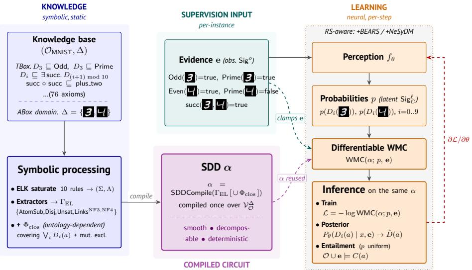

# Moose: Latent concept learning with reasoning-shortcut awareness in ${ \pmb { \varepsilon } } { \pmb { \mathcal { L } } } ^ { + + }$

<sub>Olga</sub> <sub>Mashkova</sub>1[0000-0002-4916-1660]<sub>,</sub> <sub>Asaad</sub>

Mohammedsaleh<sup>1[0009-0007-3160-8819]</sup>, Fernando

Zhapa-Camacho<sup>1[0000-0002-0710-2259]</sup> and Robert

<sub>Hoehndorf</sub>1[0000-0001-8149-5890]

Computer Science Program, Computer, Electrical, and Mathematical Sciences & Engineering Division, King Abdullah University of Science and Technology, Thuwal 23955, Saudi Arabia {first name.last name}@kaust.edu.sa

Abstract. The OWL 2 EL profile is used in some of the largest production ontologies, including the Gene Ontology and SNOMED CT. Existing neuro-symbolic (NeSy) learning methods accept propositional theories or Datalog, and reasoning-shortcut (RS) awareness has not been investigated in ontology settings. We present Moose, a method that compiles an $\varepsilon L ^ { + + }$ TBox and finite ABox to a Sentential Decision Diagram (SDD). The SDD acts as a diferentiable weighted-model-counting layer, and we add closure clauses outside the EL<sup>++</sup> profile on declared exhaustive families to overcome the limited expressivity of $\mathcal { E } \mathcal { L } ^ { + + }$ under partial supervision. We show termination, soundness, completeness, and polynomial intermediate sizes, and validate the proofs in Lean. We then define the first formal partial-supervision latent-concept-learning task over an OWL EL ontology, i.e., learning per-individual classifiers for latent concepts from observed ABox literals, and evaluate Moose on MNIST-with-ontology and Pizza¨ıolo. Moose improves over propositional-NeSy, fuzzy-logic, and ontology embedding baselines, and presents the first reasoning-shortcut analysis in an OWL EL setting.

Keywords: OWL 2 EL · neuro-symbolic learning · knowledge compilation · weighted model counting · reasoning shortcuts.

## 1 Introduction

The OWL 2 EL profile underpins some of the largest and most widely-used ontologies, such as the Gene Ontology with 50K classes and 8M annotations [3,49], SNOMED CT [22], and most of the OBO Foundry ontologies [45,25], because EL trades expressivity for polynomial-time reasoning on subsumption, instance checking, and consistency [5,26]. Neuro-symbolic (NeSy) learning combines neural perception with symbolic constraints; several families coexist. Fuzzy / t-norm methods replace propositional truth with continuous operators on [0, 1] [7]; embedding methods score entities and relations in a continuous geometry [36,15,16]; knowledge-compilation methods compile the constraint to an arithmetic circuit whose weighted model count (WMC) is diferentiable in the inputs [39,51,43,1]. The knowledge-compilation family retains an exact WMC of the constraint as its training signal under partial supervision.

The task we address, ABox-supervised latent concept learning, takes the following form. Each training instance supplies one perceptual input per named individual (e.g. an image of a digit) together with a partial set of ABox literals over an observable signature; the truth values of atoms over a separate latent signature are never directly supervised. The objective is to learn per-individual classifiers for the truth values of latent concept atoms. A WMC layer over a circuit compiled from the ontology supplies the training signal: evaluated with the perception’s per-atom outputs and clamped on the observed evidence, the layer scores how compatible the perception’s predictions are with the ontology, and the gradient steers the perception toward configurations that the constraints admit. When several latent configurations satisfy the same evidence, no method can recover the true labels from supervision alone; per-atom-independent predictors fail to recognize this and collapse to high confidence on a single arbitrary configuration rather than spreading mass over the satisfying ones [39,41,29].

Existing knowledge-compilation NeSy frameworks accept propositional formulas, Datalog programs, or finite-domain rules [39,51,43,1], but not OWL ontologies directly. Two recent works target description logics: a domino-style reduction of  to a probabilistic circuit [37] that treats the circuit as a regulariser under full label supervision, and a fuzzy approximation of $\mathcal { E } \mathcal { L } ^ { + + }$ via Goguen-implication semantics [53] that targets knowledge-base completion without exact WMC or compilation soundness; neither performs partial-supervision concept learning over OWL EL. Embedding methods such as ELEmbeddings and OWL2Vec∗ [36,15] map ontology structure to a continuous geometry (via geometric model-theoretic constraints or graph walks respectively), trading exact entailment for diferentiability. A separate body of work on reasoning shortcuts (RS) [41,40,29,31,30,9] formally proves that conditional independence among predicted concepts is incompatible with RS-awareness, and develops mitigation strategies (BEARS ensembles, neuro-symbolic difusion); these results are stated entirely in propositional or Datalog NeSy. OWL 2 EL underpins many production ontologies, so the RS phenomena documented in propositional settings translate directly into uncertainty-modeling failures in deployed ontology-driven systems. Translations of OWL EL into other formalisms are well established: it is Datalogrewritable [33,11], and probabilistic [12,13] and fuzzy [53,8] variants have been studied at length. However, a rewriting yields a reasoning procedure rather than a learning signal, and the probabilistic and fuzzy variants relax or re-specify the model-theoretic semantics rather than compiling it.

Here we present Moose, a method that compiles an $\mathcal { E } \mathcal { L } ^ { + + }$ ontology and a finite ABox domain into a Sentential Decision Diagram [20,17] whose models coincide with ABox interpretations satisfying the entailments of the input ontology, paired with a learning framework that uses the diferentiable circuit as the sole supervision channel for latent concept atoms and provides the first RS analysis in an OWL EL setting. Our contributions are:

1. End-to-end OWL 2 EL compilation with full proofs. We compile the EL profile, including role chains $R _ { 1 } \circ R _ { 2 } \subseteq S$ and role hierarchies (the constructs that distinguish SNOMED CT and the Gene Ontology from a propositional or  setting), via ELK-style saturation [26] to an SDD supporting WMC. The four formal contributions are a verified SDD encoding (Theorem 1), the rational DISPONTE [44] distribution-semantics correspondence (Theorem 2), and SCC-compositional factorizations at the Sat and WMC levels (Theorems 3 and 4). All four are mechanized in Lean 4 (no Moose-specific axioms; Sections D and D.10), along with the supporting Lean libraries for ELK saturation, soundness/completeness on $\mathcal { E } \mathcal { L } ^ { + + }$ [26], and SDD knowledge compilation, which to our knowledge are the first such formalizations (Section D.1). The closure-augmented variant is correct (Theorem 7) and inference is linear in the SDD (Theorem 8).

2. ABox-supervised latent concept learning under partial axiom observation. We pose a learning task in which a subset of ABox literals over the observable signature is given as evidence (with truth values written true and false, so that they are not confused with the $\mathcal { E } \mathcal { L } ^ { + + }$ concepts and ), and the goal is to learn per-individual classifiers for the truth values of latent concept atoms (role atoms are observed or marginalized, never classified), to our knowledge the first such formulation over an OWL EL ontology, generalizing DeepProbLog [39] and Semantic Loss [51] to description logic constraints with role chains and role hierarchies.

3. Reasoning-shortcut analysis transposed to OWL EL. We compute family-argmax accuracy, expected calibration error (ECE), and the RSconsistency rate under Moose and two plug-in mitigations (Moose+BEARS [40] and Moose+NeSyDM [30]), and isolate a calibration-vs-accuracy tradeof: BEARS leads on family-argmax accuracy via ensemble diversification on RS-suspect inputs, NeSyDM leads on calibration (ECE) under symbolic ambiguity.

4. A benchmark suite. A single MNIST-with-ontology benchmark covering three supervision regimes (atomic, relational, and role-chain), together with a fourth experiment on the Pizza¨ıolo synthetic-image dataset [10] that transfers the method to a real expert-authored OWL EL ontology.

## 2 Background and related work

## 2.1 Preliminaries: OWL EL, knowledge compilation, partial-supervision NeSy

The OWL 2 EL profile. $\mathcal { E } \mathcal { L } ^ { + + }$ [5] is the description logic basis of OWL 2 EL (syntax and semantics in Table 4). Concepts are built from atomic names, $\top , \bot$ conjunction C D, and existential restriction $\exists R . C ;$ an ontology contains GCIs

$C \subseteq D$ , role inclusions $R \subseteq S$ , and role chains $R _ { 1 } \circ R _ { 2 } \subseteq S$ , with subsumption, instance checking, and consistency decidable in time polynomial in . ELK [26] realizes this bound through a consequence-based saturation closure under ten completion rules [48]. $\mathcal { E } \mathcal { L } ^ { + + }$ is moreover Datalog-rewritable: consequence-based reasoning can be recast as the evaluation of a Datalog program [33,11], and Stage 2 of our pipeline (§3.2) uses precisely this view, treating the ELK saturation as a monotone Datalog program. Such a rewriting yields a reasoning procedure, not a diferentiable one. Probabilistic $\mathcal { E } \mathcal { L } ^ { + + }$ [12,13,24] attaches weights via Bayesiannetwork encodings; fuzzy $\mathcal { E } \mathcal { L } ^ { + + } \left[ 5 3 , 8 \right]$ replaces model-theoretic semantics with a t-norm-based approximation.

Knowledge compilation, WMC, and SDDs. For a propositional formula $\varphi$ and literal weights w $\mathbf { \Omega } \left( \ell \right) \quad \geq \quad 0$ , the weighted model count is $\begin{array} { r } { \mathsf { W M C } ( \varphi ; w ) = \sum _ { M \mid = \varphi } \prod _ { \ell \in M } w ( \ell ) \big [ 1 4 \big ] } \end{array}$ . With arbitrary non-negative weights WMC is a generic algebraic quantity; it acquires a probabilistic reading precisely when the weights are per-variable normalized, i.e. w $( X ) + w ( \lnot X ) = 1$ for every variable X. Under that condition the weights specify a product distribution over truth assignments, and ${ \mathsf { W M C } } ( \varphi ; w )$ is exactly the probability that a sample from this distribution satisfies $\varphi \colon$ it lies in [0, 1] and $\mathsf { W M C } ( \varphi ; w ) + \mathsf { W M C } ( \lnot \varphi ; w ) = 1$ [14]. Moose enforces this normalization by construction (§3.1, Table 1), and Theorem 2 establishes the resulting WMC/distribution-semantics identity for the compiled circuit. When the per-variable weights are produced by a neural network, WMC is diferentiable in the network’s outputs. Knowledge compilation translates $\varphi$ to a circuit whose structural properties (smoothness, decomposability, determinism) make WMC linear in circuit size and reduce probabilistic queries to circuit traversals [21]. A Sentential Decision Diagram (SDD) [20,17] is one such circuit and supports polynomial-time conjunction, disjunction, conditioning, and weighted model counting; exact definitions are in Section D, and Section C.3 shows a small example.

Knowledge-compilation NeSy and partial supervision. A predictor composes a neural concept extractor $p _ { \theta } ( \mathbf { c } \mid \mathbf { x } )$ with a symbolic constraint $\varphi$ and trains by maximizing the marginal

$$
p _ { \theta } ( \mathbf { y _ { \theta } } \vert \mathbf { \epsilon _ { x } } ) = \sum _ { \mathbf { c _ { \theta } } } p _ { \theta } ( \mathbf { c _ { \theta } } \vert \mathbf { x } ) \mathbf { 1 } [ \varphi ( \mathbf { c _ { \theta } } ) = \mathbf { y } ] ,\tag{1}
$$

the standard objective across this family [39,51,1,43,30]. DeepProbLog [39] grounds $\varphi$ as probabilistic Datalog with neural-network annotated facts; Semantic Loss [51] adds  log WMC(φ) on propositional constraints; Semantic Probabilistic Layers [1] combine exact probabilistic inference with logical constraints in a single tractable circuit; Scallop [38] compiles diferentiable Datalog with provenance semirings; NeurASP [52] embeds neural perception inside answer-set programs; and A-NeSI [32] amortizes the intractable WMC marginal with a neural surrogate. A partial-supervision instance reveals labels for a subset of y-atoms only; the latent concept vector c is recovered through the WMC gradient (Definition 1).

None of the existing frameworks accepts an OWL ontology directly: the user must hand-translate existentials, role hierarchies, and role chains, losing the soundness, completeness, and polynomial-time saturation guarantees of consequence-based EL reasoning [26] in the process.

## 2.2 The independence assumption and reasoning shortcuts

Knowledge-compilation NeSy predictors almost universally factorize $p _ { \theta } ( \mathbf { c } \mid \mathbf { x } ) =$ $\textstyle \prod _ { i } p _ { \theta } ( c _ { i } \mid \mathbf { x } )$ . Marconato et al. [41] show that this can attain optimal log-likelihood while learning unintended concept semantics, i.e., a reasoning shortcut (RS), and identify four root causes (knowledge structure, ground-truth concept distribution, objective, extractor architecture); RSBench [9] quantifies RS rates across NeSy architectures. [29,31] prove that the independence factorization is incompatible with RS-awareness: placing non-trivial probability mass on every constraintconsistent latent assignment. Two mitigations are available: BEARS [40] keeps the independent extractor and trains a K-encoder ensemble whose members commit to distinct shortcut explanations; NeSyDM [30] replaces independence with a masked discrete-difusion concept distribution. Every published RS result is propositional, Datalog, or finite-domain relational; no OWL fragment has been studied through this lens. Related work on description logic compilation [37,53], refinement [19,4], and ontology embeddings [36,15,16] is reviewed in Section G.

## 3 Methods

## 3.1 Task and ground vocabulary

Given an $\mathcal { E } \mathcal { L } ^ { + + }$ ontology and a finite ABox domain $\varDelta = \{ a _ { 1 } , \ldots , a _ { m } \}$ , the ground vocabulary is $\mathcal { V } _ { \mathcal { O } } ^ { A } : = \{ C ( a ) : C \in \mathsf { S i g } _ { C } , a \in \varDelta \} \cup \{ R ( a , b ) : R \in \mathsf { S i g } _ { R } , a , b \in$ $\varDelta \}$ . The modeller partitions each signature into observable and latent names, $\mathsf { S i g } _ { C } = \mathsf { S i g } _ { C } ^ { o } \mathsf { \Psi } \Psi \mathsf { S i g } _ { C } ^ { \ell }$ and $\mathsf { S i g } _ { R } = \mathsf { S i g } _ { R } ^ { o } \mathsf { \Pi } \mathsf { \pm i } \bar { \mathsf { S i g } } _ { R } ^ { \ell } .$ A training instance $( \varDelta , \mathbf { x } , \mathbf { e } )$ comprises a per-individual input tuple $\mathbf { x } = ( x _ { a } ) _ { a \in \varDelta }$ with each $x _ { a } \in \mathcal { X }$ and a partial set of ABox literals e over the observable ground vocabulary (Definition 1, Section B). We learn a weight-shared per-individual classifier $f _ { \theta } : \mathcal { X }  [ 0 , 1 ] ^ { | \mathsf { S i g } _ { C } ^ { \ell } | }$ that approximates the marginal of each latent atom under $\mathcal { O } \cup \mathbf { e }$ . The diferentiable WMC layer evaluates ${ \mathsf { W M C } } ( \alpha ; w , \mathbf { e } )$ under the literal-weight map w that assigns $f _ { \theta } ( x _ { a } )$ to each latent concept atom $C ( \boldsymbol a )$ , its observed truth value to each observed atom, $\begin{array} { l } { { \frac { 1 } { 2 } } } \end{array}$ to each unobserved observable and to each latent role atom, and $1 - w ( X )$ to each negative literal X, where X ranges over the ground atoms of $\nu _ { \mathcal { O } } ^ { \varDelta }$ (Table 1). Because $w ( X ) + w ( \neg X ) = 1$ for every X by construction, the map is per-variable normalized: it defines a product distribution over the ground atoms whose per-atom marginal is $w ,$ and ${ \mathsf { W M C } } ( \alpha ; w , \mathbf { e } )$ is the probability under this distribution that a sample satisfies α and the evidence e (§2.1; Theorem 2). This product form encodes the per-atom independence factorization $p _ { \theta } ( \mathbf { c } \mid \mathbf { x } ) =$ $\textstyle \prod _ { i } p _ { \theta } ( c _ { i } \mid \mathbf { x } )$ shared by knowledge-compilation NeSy predictors (§2.2). We make the assumption explicit here because it is the object of study rather than an incidental choice: it is exactly the factorization that induces reasoning shortcuts, which contribution 3 quantifies via $\mathrm { R S } _ { \mathrm { c o n s } }$ and which the BEARS and NeSyDM variants (§3.4) are designed to mitigate.

  
Fig. 1. End-to-end Moose workflow on O<sub>MNIST</sub> at $\scriptstyle { \varDelta = } \{ a , b \}$ . The TBox is compiled once via ELK saturation → shape-aware extractors → Γ<sub>EL</sub> $( + \varPhi _ { \mathrm { c l o s } }$ when supplied) → SDD α. The diferentiable WMC layer evaluates ${ \mathsf { W M C } } ( \alpha ; p _ { \theta } ( \mathbf { x } ) , \mathbf { e } )$ for the training loss, the conditional posterior, and the entailment query.

Table 1. Literal-weight map w; the two weights of each variable sum to 1.
<table><tr><td>Literal</td><td>Weight</td><td>Literal</td><td>Weight</td></tr><tr><td>C(a),  $\overline { { C \in \mathsf { S i g } _ { C } ^ { \ell } } }$ </td><td> $\overline { { f _ { \theta } ( x _ { a } ) [ C ] } }$ </td><td> $\overline { { C ( \boldsymbol { a } ) , C \in \mathsf { S i g } _ { C } ^ { o } } }$  unobs.</td><td>112</td></tr><tr><td> $C ( a ) \in { \mathbf { e } }$ </td><td>1</td><td> $R ( a , b ) , R \in { \mathsf { S i g } } _ { R } ^ { o }$  obs.</td><td>1 or 0 from e</td></tr><tr><td> $\neg C ( a ) \in \mathbf { e }$ </td><td>0</td><td> $R ( a , b )$  latent or unobs.</td><td>12</td></tr><tr><td colspan="4"> $\neg X$  for any atom X: 1 − weight of X</td></tr></table>

## 3.2 Compilation algorithm

The algorithm (full pseudocode in Algorithm 1, Section C) compiles an $\mathcal { E } \mathcal { L } ^ { + + }$ ontology and a finite ABox domain to an SDD over $\nu _ { \mathcal { O } } ^ { \varDelta }$ in seven stages; the SDD is built once at startup and reused across every training step. Stage 1 runs the ELK saturation, which derives all entailed subsumptions and role links and records the grounded rule instances that justify each derivation. Stages 2–5 build a propositional encoding of the full saturation closure, including deeply nested existential derivations and cyclic dependency chains, via Clark completion, strongly-connected-component (SCC) detection, time-stamped unrolling, and conjunctive normal form (CNF) conversion. Stages 6–7 ground the saturation onto the finite ABox domain and compile the resulting clauses into the SDD that the diferentiable WMC layer evaluates.

The two groups of stages operate at diferent abstraction levels and serve complementary purposes. Stages 2–5 produce a TBox-level propositional theory whose variables are concept-level atoms such as $x _ { C \subseteq D }$ and $x _ { E \xrightarrow { R } C }$ , including derived complex concepts (e.g. $C \ \subseteq \ \exists R . \exists S . D )$ ; the input axiom variables $\alpha _ { i }$ in this theory are free, so the theory supports probabilistic ontology reasoning: assigning a weight $p _ { i }$ to each $\alpha _ { i }$ and computing the WMC gives P(query entailed). Stages $6 { - } 7$ operate on the ground vocabulary $\nu _ { \mathcal { O } } ^ { \varDelta }$ whose variables are ABox atoms $C ( \boldsymbol a )$ and $R ( a , b )$ ; for $N e S y$ learning all ontology axioms are certain and the WMC literal weights come from a neural network’s per-atom outputs (Table 1), so the input-axiom tracking of Stages 2–5 is not consumed.

In the NeSy learning use case, Stages $6 { - } 7$ return to the Stage 1 saturation output and extract the subset relevant for ABox grounding: subsumptions, disjointness, and role links between named concepts. Deeply nested existential derivations that Stages 2–5 process, including those that create cyclic SCCs requiring time-stamped unrolling, have no ABox-level counterpart: the complex concepts produced during saturation (e.g. R.C or R. S.D) do not lie in the named signature $\mathsf { S i g } _ { C } ( \mathcal { O } )$ , and the shape-aware extractors of Stage 6 correctly filter them out. Stages 2–5 still serve a diagnostic and validation role: the Clark completion, SCC structure, and CNF size characterize the TBox complexity and verify that the Stage 6 filter captures every ABox-relevant consequence.

We summarize each stage below.

Stage 1: ELK saturation. Saturate( , E) runs the ten ELK completion rules [26] and returns the saturation pair $( \Sigma , \varLambda )$ , where Σ is the set of derived subsumptions $C \subseteq D$ and Λ the set of derived role links $E { \stackrel { R } { \longrightarrow } } C ,$ sound and complete with respect to [26]. We write $\mathsf { S a t } ( \mathcal { O } ) : = \Sigma \cup A$ for the saturation closure. For each derived atom the saturation records all grounded rule instances that can derive it (there may be multiple justifications), and these form the input to Stage 2. When the ontology contains existential restrictions or role chains, the saturation may derive non-atomic concepts (e.g. $\exists R . C , \exists R . \exists S . D )$ ; these are internal to the completion and are consumed by Stages 2–5 but filtered out by the shape-aware extractors of Stage 6. Algorithmic details are in Section C, and Section C.3 works one axiom end-to-end through the algorithm.

Stages 2–5: TBox-level encoding. The saturation of Stage 1 can be viewed as a monotone Datalog program [18]. Stages 2–5 turn it into a propositional TBox theory: Clark completion [18] replaces each derived atom’s justifications with a biconditional, Tarjan’s algorithm [47] isolates cyclic strongly-connected components, these are broken by SCC-local time-stamped unrolling, and the Tseitin transformation [50] yields an equisatisfiable CNF. With all input-axiom variables true this theory has $\mathsf { S a t } ( \mathscr { O } )$ as its unique model; when the axioms carry weights it supports probabilistic ontology reasoning. For NeSy learning these stages are diagnostic: the deeply nested and cyclic derivations they handle lie outside the named signature and are filtered by the Stage 6 extractors, so the ABox grounding of Stages 6–7 consumes only the Stage-1 saturation. The construction and its equations are given in Section C.

Stage 6: shape-aware extractors and ABox grounding. Stage 6 extractors return to the Stage 1 saturation output $( \Sigma , \varLambda )$ and select the subset that maps to ground ABox atoms over $\nu _ { \mathcal { O } } ^ { \varDelta }$ . AtomSub emits $\neg A ( a ) \lor B ( a )$ for every subsumption $A \subseteq B$ in Σ where both A and B are named concepts in $\mathsf { S i g } _ { C } ( \mathcal { O } )$ ; Disj emits $\mathsf { V } _ { i } \neg A _ { i } ( a )$ for n-ary atomic disjointness $A _ { 1 } \cap \cdots \cap A _ { n } \subseteq \bot$ (flattened from any parenthesization); Unsat emits $\neg A ( a )$ for atomic $A \subseteq \bot$ ; Links emits the NF3-forward clause $\neg E ( a ) \lor \neg R ( a , b ) \lor C ( b )$ per saturation-derived atomic link $( E , R , C ) \in { \cal A } \ ( \mathrm { i . e . } \ E \ \sqsubseteq \exists R . C $ with $E , C \in \mathsf { S i g } _ { C } ( \mathcal { O } ) )$ , plus an NF4-reverse clause $\neg R ( a , b ) \lor \neg C ( b ) \lor E ( a )$ when $L ( E , R ) : = \{ C : ( E , R , C ) \in \varLambda \}$ is a singleton (so the NF4 direction is deterministic). The union of the clauses produced by these extractors is the propositional Horn program Γ over $\nu _ { \mathcal { O } } ^ { \varDelta }$ ; the saturation closure is polynomial by Theorem 6 and grounding multiplies it by at most $| \varDelta | ^ { 2 }$ (Section D.4).

Stage 7: SDD compilation. Γ is compiled bottom-up into an SDD α that is smooth, decomposable, and deterministic [17,21]. The role-pinning caveat applies to the Links clause: ELK derives $E \subseteq \exists R . C$ (existential, “some witness”); Moose encodes the propositional clause $E ( a ) \land R ( a , b )  C ( b )$ , which is universal on the named pair. Soundness depends on ∆ being closed and on role atoms over $\mathsf { S i g } _ { R } ^ { o }$ being pinned by evidence (a Moose-specific encoding choice for the finite-nameddomain regime, not an ELK theorem). The diferentiable WMC layer traverses α and evaluates WMC(α; w) by the standard smooth/decomposable/deterministic recursion (Equation (8) in Section C), with literal weights w read from Table 1. Decomposability factors the product at each decision node; determinism makes the prime/sub pairs mutually exclusive, so the sum is plain rather than an inclusion–exclusion. Conditioning on e clamps the literal weight of every observed atom to 0 or 1.

## 3.3 Closure axioms outside the EL profile

OWL EL is open-world and lacks both right-hand-side disjunction and cardinality constructors [5], so the covering axiom $\intercal \sqsubseteq D _ { 0 } \sqcup \cdots \sqcup D _ { K - 1 }$ on an exhaustive family is unstatable in EL. Under partial supervision the WMC gradient on unobserved members of such a family vanishes at every all-False extension (e.g. on MNIST, observing Even(a) without closure leaves the digit posterior uninformative). We therefore optionally append a finite set of closure axioms $\varPhi _ { \mathrm { c l o s } }$ to $T _ { \mathsf { E L } }$ on each modeller-declared exhaustive family ${ \mathcal { F } } \colon$ pairwise disjointness, the covering clause $\vee _ { i } D _ { i } ( a )$ , and (when each $D _ { i }$ carries a distinguishing property profile $\pi _ { i } )$ profile-keyed reverse implications. We write these three jointly manipulated components as $\varPhi _ { \mathrm { c l o s } } = \varPhi _ { \mathrm { m u t e \times } } \cup \varPhi _ { \mathrm { c o v e r } } \cup \varPhi _ { \mathrm { p r o f i l e } }$ . Two of the three are outside the EL profile but are standard OWL-DL machinery; Moose’s contribution is the ELKvia-SDD infrastructure that absorbs $\varPhi _ { \mathrm { c l o s } }$ at the propositional level, so the same compilation yields $\alpha _ { \mathsf { E L } }$ or $\alpha _ { \mathsf { c l o s } }$ with no method change. This absorption is free at the CNF level $( \phi _ { \mathsf { c l o s } }$ adds at most ${ \binom { K } { 2 } } m + ( K + 1 )$ m clauses per declared family: $\binom { K } { 2 }$ m mutex, m covering, and up to Km profile-keyed reverse implications), but the polynomial saturation-closure bound of Theorem 6 applies to the EL Horn fragment only and does not transfer to ${ \cal T } _ { \sf E L } \cup \varPhi _ { \sf c l o s } \colon$ covering disjunctions can raise the primal-graph treewidth, and SDD compilation is worst-case exponential in $| { \cal { T } } |$ with a $O ( | T | \cdot 2 ^ { w } )$ bound under treewidth $w$ (Section D.5); inference remains $O ( | \alpha | )$ in the SDD node count regardless (Theorem 8). Whether closure is needed is ontology- and regime-dependent: a forward-only EL hierarchy under factorized perception leaves the all-false latent assignment consistent with any property evidence, so the WMC gradient is uninformative and closure restores a non-trivial gradient (an architectural softmax head encoding mutex+covering, as DeepProbLog uses via $\mathsf { n n } ( \cdot )$ , achieves the same efect by other means); when forward subsumption alone pins the latent vector, no closure is added. The choice is orthogonal to RS-awareness, which targets the cross-atom factorization at the perception output [41,29] and is implemented by the BEARS / NeSyDM wrappers of §3.4. Section B.1 summarizes the assumptions introduced by each pipeline component and what each concedes against open-world semantics.

## 3.4 Inference and RS-aware variants

The diferentiable WMC layer supports three inference operations on the same SDD (training loss, conditional posterior, and entailment query), varying only literal weights and evidence. The training loss is $L ( \theta ; { \mathbf x } , { \mathbf e } ) = - \log { \mathsf { W M C } } ( \alpha ; p _ { \theta } ( { \mathbf x } ) , { \mathbf e } )$ [51], which coincides with the DeepProbLog marginal loss on this Horn theory by Proposition 1. The conditional posterior $P _ { \theta } ( C ( a ) \mid \mathbf { x } , \mathbf { e } )$ is the ratio of two WMCs with $C ( \boldsymbol a )$ clamped vs. left free; the perception-free entailment query ${ \mathcal { O } } \cup \mathbf { e } \left| = C ( a ) \right.$ holds if WMC $( \alpha ; w _ { 1 / 2 } , \mathbf { e } \cup \{ C ( a ) { : = } \mathsf { f a l s e } \} ) = 0$ (the <sup>1</sup> -weighted SDD acts as a satisfiability oracle). All three run in $O ( | \alpha | )$ (Theorem 8, Equations (11) to (13) in Section E.1). The compilation algorithm is independent of the perception’s output distribution, so RS-aware methods (§2.2) plug in by replacing $p _ { \theta } ( \mathbf { x } )$ in w without modifying $\alpha .$ Moose+BEARS [40] trains a K-encoder ensemble diversified by Kullback–Leibler (KL) divergence against the running ensemble average; Moose+NeSyDM [30] replaces $\textstyle \prod _ { i } p _ { \theta } ( c _ { i } \mid \mathbf { x } )$ with a masked discrete-difusion q , evaluated with both the REINFORCE leave-one-out (RLOO) estimator [28] and an exact-WMC gradient estimator. Wrapper losses with hyperparameters are in Section E.3.

## 4 Correctness and complexity

This section states the four theorems that constitute the formal contribution of Moose: a verified SDD encoding of the ELK-derived saturation, the unconditional rational DISPONTE correspondence, and the SCC-compositional factorizations at the Sat and WMC levels. Each theorem is mechanized in Lean 4; the infrastructure on which they rest (ELK soundness/completeness on $\mathcal { E } \mathcal { L } ^ { + + }$ and polynomial-time

Sat decidability [26]) is reused unchanged from the ELK literature and remechanized in our Lean library (Section D.1). Proofs, Lean theorem names, and audit-surface details are deferred to Sections D and D.10.

Notation. ranges over $\mathcal { E } \mathcal { L } ^ { + + }$ ontologies (OWL 2 EL minus datatype properties and concrete domains). $\mathsf { S a t } ( \mathcal { O } , C , D )$ holds if ELK derives $C \subseteq D$ from  [26]. A world $M : \mathcal { O }  \{ 0 , 1 \}$ selects the sub-ontology se $1 ( \mathcal { O } , M ) : = \{ \alpha \in \mathcal { O } : M ( \alpha ) = 1 \}$ (sel short for selectedAxioms in the Lean library). For a weight w $: \mathcal { O } \times \{ 0 , 1 \} \to \mathbb { Q }$ the rational DISPONTE marginal [44] is

$$
\mathsf { P } ^ { \mathbb Q } ( \mathcal O , C , D , w ) : = \sum _ { M : \mathcal O \to \{ 0 , 1 \} } \mathbf 1 [ \mathsf { S a t } ( \mathsf { s e l } ( \mathcal O , M ) , C , D ) ] \cdot \prod _ { \alpha \in \mathcal O } w ( \alpha , M ( \alpha ) ) ;
$$

$\mathsf { P } ( \mathcal { O } , C , D , w )$ denotes the natural-valued analogue when w takes values in N. cmp( , C, D) (cmp short for compileSat) is the verified Shannon-tree SDD produced by the algorithm of §3.2, and $\mathsf { W M C } ^ { \mathbb { Q } } ( t , w )$ is its rational weighted model count.

Theorem 1 (Verified SDD encoding). For every $\mathcal { E } \mathcal { L } ^ { + + }$ ontology $\mathcal { O }$ and concepts C, D, there exists an SDD tree t such that

1. model $( t , M ) \longleftrightarrow \mathsf { S a t } ( \mathsf { s e l } ( \mathcal { O } , M ) , C , D )$ for every world $M : \mathcal { O }  \{ 0 , 1 \}$ ; <sup>2.</sup> <sup>for</sup> <sup>every</sup> <sup>weight</sup> <sup>w,</sup> <sup>WMC(t,</sup> <sup>w)</sup> <sup>=</sup> <sup>P(</sup>O<sup>,</sup> <sup>C,</sup> <sup>D,</sup> <sup>w);</sup>   
$\begin{array} { r } { { \mathcal { S } } . \ \left| t \right| = 2 ^ { \left| { \mathcal { O } } \right| + 1 } - 1 . } \end{array}$

Theorem 1 is the formal contract of Moose’s compilation step: the SDD’s models are exactly the worlds whose selected sub-ontology ELK-entails $C \subseteq D .$ , the SDD’s WMC is the DISPONTE marginal under arbitrary weights, and the worstcase size is the explicit $2 ^ { | { \mathcal { O } } | + 1 } - 1$ bound of the Shannon expansion (Section D.5). Lean proof: see Section D.

Theorem 2 (Rational DISPONTE correspondence). For every $\mathcal { E } \mathcal { L } ^ { + + }$ ontology , every concepts $C , D ,$ and every rational weight w,

$$
\mathsf { W M C } ^ { \mathbb { Q } } \big ( \mathsf { c m p } ( { \mathcal O } , C , D ) , w \big ) \ = \ \mathsf { P } ^ { \mathbb { Q } } ( { \mathcal O } , C , D , w ) .\tag{2}
$$

The identity holds unconditionally on rational weights: no distributional assumption is required. It is the formal warrant of the standard entailment-as-WMC-zero phrasing of probabilistic DLs [44] (at the uniform prior $w \equiv \frac { 1 } { 2 } , { \sf W M C } ^ { \mathbb { Q } } = 0$ if no world’s sub-ontology entails $C \subseteq D )$ , and lifts that phrasing from the propositional encoding to the verified compiled circuit. Lean proof: see Section D.

Theorem 3 (SCC compositional theorem, Sat level). Let $\mathcal { O } = \mathcal { O } _ { 1 } \not \Game \mathcal { O } _ { 2 }$ with disjoint signatures, both components nominal-free and range-chain-safe, $\mathcal { O } _ { 2 }$ consistent $( \neg \mathsf { S a t } ( \mathcal { O } _ { 2 } , \top , \bot ) )$ , and $C , D$ nominal-free with $C , D$ in the signature of $\mathcal { O } _ { 1 }$ . Then

$$
{ \mathsf { S a t } } ( { \mathcal { O } } _ { 1 } \uplus { \mathcal { O } } _ { 2 } , C , D ) \ \Longleftrightarrow \ { \mathsf { S a t } } ( { \mathcal { O } } _ { 1 } , C , D ) .
$$

The result formalizes the intuition that an inferentially irrelevant SCC cannot afect Sat-derivability inside the relevant component, provided the irrelevant component is itself consistent. SCC-wise compilation follows: each SCC can be saturated and compiled in isolation, and the joint posterior recovered by combination. Range-chain safety rules out interactions between role chains and range axioms that would block the SCC factorization. It holds vacuously when neither component has range axioms (the case for both experimental ontologies); for chain-and-range ontologies, mechanized syntactic range-elimination [6] reduces to this case under a side condition that is automatically satisfied by reflexive roleinclusion propagation. Lean proofs, theorem names, and side-condition details: Sections D and D.10.

Theorem 4 (Per-SCC posterior equivalence). Under the hypotheses of Theorem 3, for any uniform per-axiom prior w $\equiv c$ with $c > 0$ , the per-SCC and joint DISPONTE posteriors coincide. In the unnormalized counting case $w \equiv 1$

$$
\mathsf { P } ^ { \mathbb { Q } } ( \mathcal { O } _ { 1 } \sqcup \mathcal { O } _ { 2 } , C , D , w ) \ = \ \mathsf { P } ^ { \mathbb { Q } } ( \mathcal { O } _ { 1 } , C , D , w ) \cdot 2 ^ { | \mathcal { O } _ { 2 } | } .\tag{3}
$$

The multiplicative $2 ^ { | \mathcal { O } _ { 2 } | }$ from the irrelevant SCC cancels under posterior normalization, and the same cancellation extends the identity to any $c > 0$ after factoring out $c ^ { | \mathcal { O } _ { 1 } | + | \mathcal { O } _ { 2 } | }$ . This is the WMC-level analogue of Theorem 3: per-SCC compilation is posterior-faithful. Lean proof: Sections D and D.10.

The closure-augmented variant of the SDD (which materializes the per-individual partition constraints on declared exhaustive families) satisfies an analogous correctness theorem (Theorem 7, appendix). Inference is linear in $| \mathsf { c m p } ( \mathcal { O } , C , D ) |$ [17,21] (Theorem 8, appendix). All proofs and the DeepProbLog equivalence Proposition 1 are in Section D; the implementation index in Section D.10 crossreferences every paper claim with its formalized counterpart.

## 5 Research questions and experiments

We evaluate Moose on two benchmarks: the MNIST-with-ontology benchmark we developed for this work (Example 1), instantiated under three supervision regimes (atomic property literals, relational R.C evidence, and role-chain evidence); and the Pizza¨ıolo dataset [10] of 4,800 synthetic pizza images generated to conform to the published OWL pizza ontology [46], which lets us test transfer to a thirdparty ontology and a diferent image distribution. Within each benchmark, the experiments share the ontology and difer only in the observable signature, the domain size ∆ , and the supplied evidence.

We address five research questions. RQ1–RQ3 test latent digit recovery on <sub>MNIST</sub> as the supervision signal grows from a single individual with unary property literals (RQ1), to a pair of individuals connected by an observed $r ( a , b )$ role literal under an R.C axiom (RQ2), to a pair connected by observed role literals only through an ELK-derived role-chain consequence (RQ3). RQ4 tests transfer to the pre-existing third-party OWL pizza ontology, restricted to its EL fragment (Pizza¨ıolo, §5.2). RQ5 asks which RS-mitigation regime works under which conditions: with encoder, ontology, and compiled SDDs fixed, we vary only the output-distribution treatment: an independent per-atom baseline (no logical structure), Moose on the EL theory alone (the DPL surface, Proposition 1), Moose with closure $\varPhi _ { \mathrm { c l o s } } .$ , and the BEARS / NeSyDM wrappers, across factorized relational, tied symmetric, and high-arity disjunctive ambiguity. The independent baseline (binary cross-entropy, BCE, on observed atoms) is a lower-bound reference that cannot propagate evidence through subsumption, disjointness, or role axioms and so cannot beat chance on latent atoms [41,29].

## 5.1 The MNIST ontology and supervision regimes

A single OWL EL ontology $\mathcal { O } _ { \mathsf { M N I S T } }$ (14 concepts, 2 roles, 76 axioms; full listing in Section F.2) is used in all three MNIST experiments; the experiments difer only in $| \varDelta |$ and the evidence regime, never in the TBox. ELK saturation derives the chain consequence $D _ { i } \subseteq \exists { \mathsf { p l u s \_ t w o . } } D _ { ( i + 2 ) \bmod 1 0 }$ from the axiom succ succ plus two at compile time. The compiled SDD has $1 4 m + 2 m ^ { 2 }$ ground atoms. A small convolutional neural network (CNN) $f _ { \theta }$ (2 conv blocks + 2 fully-connected layers, weight-shared across individuals; Section F.3) maps each image to per-atom probabilities; training minimizes $\mathcal { L } ( \boldsymbol { \theta } ) = - \log \mathsf { W M C } ( \alpha _ { \mathrm { c l o s } } ; p _ { \boldsymbol { \theta } } ( \mathbf { x } ) , \mathbf { e } )$ with Adam, batch 32, 5 seeds; per-regime learning rates and epoch counts are in Section F.4. EL-only ablations omit $\varPhi _ { \mathrm { c l o s } }$ and train against $\alpha _ { \mathrm { E L } }$ , recovering the DPL loss (Proposition 1). Exp. 1 (atomic, RQ1) uses $\varDelta = \{ a \}$ with $n _ { \mathrm { o b s } } \in \{ 1 , 2 , 3 \}$ unary literals over Sig<sup>o</sup> = Even, Odd, Prime, Composite . Exp. 2 (relational, RQ2) uses $\varDelta = \{ a , b \}$ with the role atom succ(a, b) asserted (digits satisfy digit(b) = (digit(a)+1) mod 10) plus $n _ { \mathrm { o b s } } \in \{ 1 , 2 , 3 \}$ primality literals. Exp. 3 (role chain, RQ3) flips the asserted role to plus two(a, c) and widens the unary pool to parity and primality; the only chain from a to c is the NF7-derived consequence above. The digit family is declared exhaustive at every individual; $\varPhi _ { \mathrm { c l o s } }$ supplies pairwise disjointness, covering, and reverse-implication clauses. Some property profiles uniquely identify the latent digit (e.g. Even(a)  Prime(a) pins $D _ { 2 } )$ , while others leave it ambiguous (e.g. Even(a) alone admits $\{ D _ { 0 } , D _ { 2 } , D _ { 4 } , D _ { 6 } , D _ { 8 } \} ) ; \mathrm { R S _ { c o n s } }$ on the ambiguous cases measures confident commitment to a wrong digit.

## 5.2 Experiment 4: Pizza¨ıolo (RQ4)

Pizza¨ıolo [10] provides 4,800 synthetic pizza images. The canonical pizza ontology contains non-EL constructs (universal restrictions on hasTopping, complement-based definitions such as VegetarianPizza 三 Pizza  hasTopping.MeatTopping  hasTopping.FishTopping, and cardinality on NumberedPizza); we use only its EL-expressible fragment, restating the four-pizza recipes and property classes as conjunctive subsumption and disjointness axioms, and treating classes whose canonical definitions fall outside EL (e.g. VegetarianPizza) as atomic concepts whose truth values come from the dataset labels rather than from non-EL closure. The method targets the four-pizza subset

Mushroom, Cajun, Capricciosa, FourSeasons over 16 topping concepts, with conjunctive per-pizza axioms (e.g. Capricciosa Ham Anchovy Olive Peperonata), pairwise pizza disjointness, and disjointness axioms $P \cap T \subseteq \bot$ for every topping T outside $P ^ { * } { \mathrm { s } }$ recipe. EL forward subsumption plus these disjointness axioms pin the topping vector once pizza identity is observed; no out-of-profile closure is added. Track A reveals pizza identity; toppings are latent. We test distribution shift via an OOD split: the four training pizzas all carry Anchovy and Olive together, so a network can score well on the in-distribution split by coupling the two atoms; we hold out five tie-breaker pizzas (Fiorentina, Giardiniera, LaReine, Soho, Veneziana) whose recipes break this co-occurrence. Track B reveals one of four property-class atoms (NonVegetarianPizza, SpicyPizza, RealFrenchPizza, VegetarianPizza); revealing NonVegetarianPizza leaves Cajun, Capricciosa, FourSeasons indistinguishable (a 3-way RS over pizza identity). Track C (the is spicy task in the codebase) adds four axioms $T _ { i } \subseteq \mathsf { S p i c y }$ Topping for $T _ { i } ~ \in ~ \{ \mathsf { J a l a p e n o }$ , Peperonata, PeperoniSausage, Prawn together with SpicyTopping $\equiv { \sf S p i c y P i z z a }$ (two GCIs; here SpicyTopping acts as a label-class denoting “pizza with a spicy topping”). Symbolic supervision SpicyPizza(a) forces SpicyTopping(a) but the EL theory leaves the witness ambiguous over $2 ^ { 4 } { = } 1 6$ topping subsets (the multi-witness regime BEARS/NeSyDM target). We train the perception CNN from scratch with batch size 32, 5 seeds, and 60 epochs on Tracks A and B (Track C uses 15 epochs); per-method hyperparameters and the NeSyDM $\left( \gamma _ { c } , \gamma _ { h } \right)$ sweep results are in Section F.4.

## 5.3 Baselines, metrics, and results

We compare Moose against seven baselines. Independent (BCE on observed atoms) is the NeSy-free lower bound. Semantic Loss [51] shares the log WMC objective but compiles only the directly-stated NF1/NF2 atomic axioms, dropping NF3/NF4/NF7 and ELK saturation, isolating the EL-aware method of §3.2. DeepProbLog [39] hand-codes each MNIST regime as a ProbLog program with one nn( ) digit directive; by Proposition 1 DPL and Moose compute the same loss on the same Horn theory, though that directive is an annotated disjunction, so DPL is not closure-free. Moose+BEARS [40] keeps the factorized perception and $\alpha _ { \mathrm { c l o s } }$ but replaces the single encoder with $K { = } 5$ diversified encoders. Moose+NeSyDM [30] replaces the factorized extractor with a masked-difusion concept distribution; we evaluate both RLOO and exact-WMC gradient estimators. LTN [7] substitutes a fuzzy product T-norm; ELEmbeddings [36,54] embeds the EL ontology into ball geometries with a classifier head; both are detailed in Section E.4.

Metrics. The headline tables Tables 2 and 3 report the regime’s principal accuracy and ECE, the expected calibration error binned by predicted confidence [23]. The two ontologies do not admit the same accuracy metric. On MNIST the digit family is declared exhaustive and we report Acc<sub>F</sub>, family-argmax accuracy: per individual, the argmax of the WMC posterior over that family. On Pizza¨ıolo we report Acc , per-atom accuracy on the latent slice, since Track C declares no exhaustive family and the decode degenerates on the other two (Section F.7). The full per-regime breakdown (Table 9, Section F.6) additionally reports the negative log-likelihood (NLL), the mean per-atom Bernoulli loss on the latent signature; the RS-consistency rate $\mathrm { R S } _ { \mathrm { c o n s } } = \mathrm { C o n f }$ (1 Acc<sub>F</sub>) on the latent family-argmax (higher = more confident commitment to a wrong shortcut; on Pizza¨ıolo the complement uses $\operatorname { A c c } _ { C , C } ,$ , and on Track C it is not applicable); per-atom accuracy $\operatorname { A c c } _ { \mathrm { a t o m } }$ on the latent signature; and the macro-averaged per-concept F1, F1<sub>macro</sub>. A paired significance analysis of the headline comparisons over 20 seeds is given in Section F.8, and a learning-rate sensitivity analysis in Section F.5.

Table 2. Principal accuracy (%, mean ± s.d. over 5 seeds. MNIST Experiments 1–3 (Section 5.1), Pizza¨ıolo Tracks A–C (Section 5.2); Track A is the out-of-distribution split. Metric: Acc<sub>F</sub> (family-argmax) on MNIST, Acc<sub>C</sub> (per-atom, latent slice) on Pizza¨ıolo; compare only within a column (Section F.7). Operative theory: $T _ { \mathsf { E L } } + \varPhi _ { \mathsf { c l o s } }$ for the Moose rows on MNIST, $T _ { \mathsf { E L } }$ elsewhere, none for Independent (§3.3). Bold = column-best; $^ \dag =$ highest but not significant (Section F.8); DeepProbLog on Pizza¨ıolo is not a separate run (Section F.6). Full $\operatorname { A c c } _ { \mathrm { a t o m } } ,$ NLL, RS<sub>cons</sub>, and $\operatorname { F 1 } _ { \operatorname* { m a c r o } }$ in Table 9.
<table><tr><td></td><td colspan="3">MNIST</td><td colspan="3">Pizzaiolo</td></tr><tr><td>Method</td><td>Exp 1</td><td>Exp 2</td><td> $\mathrm { E x p 3 }$ </td><td> $\mathrm { P z } \mathrm { A }$ </td><td>PzB</td><td> $\mathrm { P z } \mathrm { C }$ </td></tr><tr><td>Independent</td><td> $\overline { { 1 3 . 2 \pm 7 . 9 } }$ </td><td> $\overline { { 8 . 8 \pm 4 . 5 } }$ </td><td> $\overline { { 1 2 . 2 \pm 7 . 3 } }$ </td><td>21.7 ± 9.7</td><td> $\overline { { 2 5 . 0 \pm 0 . 0 } }$ </td><td> $\overline { { 4 8 . 9 \pm 5 . 6 } }$ </td></tr><tr><td>DeepProbLog</td><td> $4 2 . 1 \pm 1 . 3$ </td><td> $3 8 . 9 \pm 3 . 2 $ </td><td> $5 9 . 6 \pm 1 3 . 6$ </td><td> $6 8 . 1 \pm 0 . 3$ </td><td> $8 4 . 5 \pm 2 . 1$ </td><td> $8 1 . 0 \pm 3 . 0$ </td></tr><tr><td>LTN</td><td> $2 5 . 9 \pm 6 . 5$ </td><td> $1 4 . 5 \pm 4 . 9$ </td><td> $1 1 . 0 \pm 7 . 9$ </td><td> $2 2 . 1 \pm 5 . 2$ </td><td> $3 2 . 5 \pm 2 0 . 9$ </td><td> $8 4 . 8 \pm 0 . 4 ^ { \dagger }$ </td></tr><tr><td>ELEm/mOWL</td><td> $3 4 . 9 \pm 4 . 2$ </td><td> $3 4 . 8 \pm { 3 . 6 }$ </td><td> $2 7 . 4 \pm 7 . 1$ </td><td> $2 5 . 7 \pm 7 . 3$ </td><td> $2 5 . 0 \pm 0 . 0$ </td><td> $7 5 . 4 \pm 6 . 6$ </td></tr><tr><td>MOOSE</td><td> $\overline { { 4 8 . 1 \pm 1 0 . 1 } }$ </td><td> $\overline { { 7 4 . 6 \pm 0 . 3 } }$ </td><td> $\overline { { \bf 9 6 . 1 \pm 7 . 2 } }$ </td><td> $\overline { { 6 8 . 1 \pm 0 . 3 } }$ </td><td> $\overline { { 8 4 . 5 \pm 2 . 1 } }$ </td><td> $\overline { { 8 1 . 0 \pm 3 . 0 } }$ </td></tr><tr><td>+BEARS</td><td> $5 0 . 1 \pm 5 . 2 ^ { \dagger }$ </td><td> $7 6 . 5 \pm 5 . 9 ^ { \dagger }$ </td><td> $8 9 . 2 \pm 7 . 2$ </td><td> $6 8 . 6 \pm 0 . 3$ </td><td> ${ \bf 8 7 . 9 \pm 0 . 9 }$ </td><td> $8 4 . 2 \pm 3 . 6 $ </td></tr><tr><td>+NeSyDM (RLOO)</td><td> $4 6 . 6 \pm 2 . 1$ </td><td> $5 8 . 2 \pm 1 . 4$ </td><td> $6 2 . 7 \pm 2 . 9$ </td><td> ${ \bf 7 2 . 2 \pm 1 . 3 }$ </td><td> $7 8 . 5 \pm 0 . 8$ </td><td> $6 3 . 9 \pm 3 . 7$ </td></tr><tr><td>+NeSyDM (exact)</td><td> $4 9 . 4 \pm 9 . 7$ </td><td> $6 2 . 6 \pm 6 . 1$ </td><td> $6 0 . 1 \pm 5 . 7$ </td><td> $6 7 . 4 \pm 1 . 4$ </td><td> $8 4 . 7 \pm 2 . 2$ </td><td> $8 0 . 1 \pm 1 . 5$ </td></tr></table>

Table 3. Expected calibration error ECE (%, mean ± s.d.). Lower is better. Same baselines, seed counts, operative theories, and metric conventions as Table 2; bold = column-best per regime, not significance-tested. Per-regime $\operatorname { A c c } _ { \mathrm { a t o m } }$ , NLL, ${ \mathrm { R S } } _ { \mathrm { c o n s } }$ , and $\mathrm { F 1 } _ { \mathrm { m a c r o } }$ alongside ECE are in Table 9 (Section F.6).
<table><tr><td></td><td colspan="3">MNIST</td><td colspan="3">Pizzaiolo</td></tr><tr><td>Method</td><td>Exp 1</td><td> $\mathrm { E x p 2 }$ </td><td> $\mathrm { E x p 3 }$ </td><td> $\mathrm { P z } \mathrm { A }$ </td><td>PzB</td><td> $\mathrm { P z } \mathrm { C }$ </td></tr><tr><td>Independent</td><td> $\overline { { 9 . 3 \pm 4 . 5 } }$ </td><td> $\overline { { 1 3 . 4 \pm 3 . 6 } }$ </td><td> $\overline { { 9 . 0 \pm 8 . 2 } }$ </td><td> $\overline { { 5 8 . 3 \pm 1 5 . 4 } }$ </td><td> $\overline { { 2 6 . 4 \pm 1 7 . 1 } }$ </td><td> $\overline { { 2 2 . 1 \pm 9 . 2 } }$ </td></tr><tr><td>DeepProbLog</td><td> $1 0 . 3 \pm 0 . 9$ </td><td> $1 2 . 3 \pm 0 . 9$ </td><td> $8 . 0 \pm 2 . 9$ </td><td> $3 0 . 8 \pm 0 . 7$ </td><td> $1 5 . 5 \pm 2 . 1$ </td><td> $1 5 . 3 \pm 1 . 4$ </td></tr><tr><td>LTN</td><td> $1 6 . 1 \pm 6 . 7$ </td><td> $1 0 . 0 \pm 0 . 0$ </td><td> $1 0 . 0 \pm 0 . 0$ </td><td> $5 2 . 7 \pm 2 1 . 8$ </td><td> $3 9 . 3 \pm 1 7 . 4$ </td><td> $1 4 . 1 \pm 0 . 5$ </td></tr><tr><td>ELEm/mOWL</td><td> ${ \bf 3 . 9 \pm 0 . 4 }$ </td><td> $7 . 2 \pm 0 . 1$ </td><td> $6 . 3 \pm 0 . 1$ </td><td> $4 9 . 7 \pm 1 0 . 2$ </td><td> $1 6 . 1 \pm 0 . 2$ </td><td> $1 1 . 8 \pm 3 . 8$ </td></tr><tr><td>MOOSE</td><td> $\overline { { 1 0 . 6 \pm 1 . 8 } }$ </td><td> $\overline { { 4 . 9 \pm 0 . 3 } }$ </td><td> $\mathbf { \overline { { 1 . 1 \pm 1 . 5 } } }$ </td><td> $\overline { { 3 0 . 8 \pm 0 . 7 } }$ </td><td> $\overline { { 1 5 . 5 \pm 2 . 1 } }$ </td><td> $\overline { { 1 5 . 3 \pm 1 . 4 } }$ </td></tr><tr><td>+BEARS</td><td> ${ \bf 3 . 9 \pm 1 . 0 }$ </td><td> ${ \bf 4 . 0 \pm 1 . 2 }$ </td><td> $5 . 6 \pm 1 . 1$ </td><td> $2 8 . 2 \pm 1 . 5$ </td><td> $1 2 . 3 \pm 1 . 0$ </td><td> $1 1 . 3 \pm 3 . 4$ </td></tr><tr><td>+NeSyDM (RLOO)</td><td> $6 . 0 \pm 0 . 6$ </td><td> $7 . 3 \pm 0 . 7$ </td><td> $4 . 6 \pm 0 . 8$ </td><td> ${ \bf 7 . 5 \pm 1 . 2 }$ </td><td> ${ \bf 2 . 6 \pm 0 . 9 }$ </td><td> $8 . 9 \pm 1 . 5$ </td></tr><tr><td> $+ \mathrm { N e S y D M } \ \mathrm { ( e x a c t ) }$ </td><td> $5 . 1 \pm 1 . 5$ </td><td> $7 . 4 \pm 1 . 2$ </td><td> $7 . 9 \pm 1 . 1$ </td><td> $3 0 . 8 \pm { 3 . 2 }$ </td><td> $1 5 . 3 \pm 2 . 2$ </td><td> ${ \bf 6 . 9 \pm 2 . 2 }$ </td></tr></table>

Findings on Experiments 1–3 (RQ1–3, RQ5). At ∆ =1 (Exp. 1) Moose leads DeepProbLog on $\operatorname { A c c } _ { F }$ (48.1 vs. 42.1). Independent stays near random $( \operatorname { A c c } _ { F } =$ 13.2). BEARS cuts ECE from 10.6 to 3.9 at no cost to accuracy; at $| \varDelta | { = } 1$ there is little diversifiable structure left for the ensemble to exploit. NeSyDM matches Moose on Acc (46.6 and 49.4 for the RLOO and exact estimators vs. 48.1). On the relational and role-chain regimes (Exps. 2–3) Moose dominates DeepProbLog by tens of points on Acc (74.6 vs. 38.9 on Exp. 2; 96.1 vs. 59.6 on Exp. 3): the EL-aware Links extractor propagates evidence across the $| \varDelta | { = } 2$ ground individuals, but the closure clauses $\varPhi _ { \mathrm { c l o s } }$ are what make this signal learnable.

The ablation in Section F.10 shows the base WMC objective falling to 17.4 and 9.4 (near chance) once $\varPhi _ { \mathrm { c l o s } }$ is removed, so the EL compilation supplies the structure and $\varPhi _ { \mathrm { c l o s } }$ the identifying constraint, with reasoning-shortcut mitigations partially substituting for the latter (Table 13). BEARS reduces $\mathrm { R S } _ { \mathrm { c o n s } }$ (Table 9, Section F.6) but gives up a few points of accuracy on Exp. 3 (89.2 vs. 96.1); NeSyDM lags even at tuned $( \gamma _ { c } , \gamma _ { h } )$ . LTN and ELEmbeddings under-perform on Acc<sub>F</sub> (14.5 and 34.8 on Exp. 2): LTN’s ECE saturates near the uniform prior (10.0, information-vacuous), while ELEmbeddings’ lower ECE on Exps. 2–3 (7.2, 6.3) does not translate into accuracy. An inductive held-out-edge split, in which query individuals appear only in relational configurations never supervised, leaves Moose’s accuracy essentially unchanged while NeSyDM collapses to near-chance (Section F.9).

Findings on Experiment 4 (RQ4–5). Track A is an OOD generalization test on five held-out tie-breaker pizzas whose recipes break the Anchovy, Olive cooccurrence admissible on the four training pizzas; on the in-distribution split most methods reach near-perfect topping accuracy, but on the OOD split the Moose family clusters around 67–72% on $\operatorname { A c c } _ { C _ { \scriptstyle { C _ { \scriptstyle { C } } } } }$ (Table 2). Track B is the canonical RS test (3-way symbolic ambiguity: a property-class observation leaves three pizzas indistinguishable). Plain Moose-WMC commits to a single constraint-consistent latent (“Mechanism $\mathrm { A } ^ { \mathfrak { s } }$ of [41]); BEARS lifts Acc from 84.5 to 87.9 via ensemble diversification on RS-suspect pizzas, and NeSyDM (RLOO) trades a few points of accuracy (78.5) for the lowest ECE of any row (2.6). Track C (is spicy disjunction) is the multi-witness regime NeSyDM was designed for: among the Moose variants BEARS leads on $\operatorname { A c c } _ { C _ { \scriptstyle { C _ { \scriptstyle { C } } } } }$ (84.2 vs. 81.0 for plain Moose-WMC) and NeSyDM (exact) leads on ECE (6.9, the column best); LTN matches BEARS on accuracy (84.8, the highest value in the column but not significantly so, Section F.8) at higher ECE (14.1). On both Track B and Track C the Moose-family results separate along an argmax-vs-calibration axis (BEARS leads accuracy, NeSyDM leads ECE). These mitigation efects are sizeable rather than marginal: paired over 20 seeds, BEARS significantly exceeds plain Moose-WMC on both Track B and Track C, and NeSyDM significantly exceeds it on the Track A OOD split (Section F.8). In the symbolically ambiguous regimes it is therefore the RSmitigation wrapper, not the exact base layer, that is the stronger configuration; the mitigation is doing substantive work, not fine-tuning. This reverses the relational regime (Exps. 2–3), where forward subsumption already pins the latent vector, no residual reasoning shortcut remains to remove, and plain Moose is best; mitigation helps precisely where symbolic ambiguity leaves an RS to exploit. Whether this generalizes beyond the regimes tested here is left to future work.

## 6 Conclusion and outlook

Moose compiles OWL 2 EL into a Lean 4-verified weighted-model-counting layer with native role chains and role hierarchies, and supplies the first end-to-end formally verified circuit for an OWL profile together with the first reasoningshortcut analysis in OWL EL. Empirically, the closure-augmented variant dominates propositional NeSy baselines by tens of points on relational and role-chain regimes, where the EL-aware grounding propagates evidence that propositional encodings cannot and the closure clauses render the resulting signal learnable (Section F.10); under symbolic ambiguity BEARS and NeSyDM separate along an argmax-vs-calibration axis.

Limitations. Three assumptions bound the present results. (i) Scale. Our experiments use $| \varDelta | = 2 ;$ the compiled SDD grows empirically as $| \varDelta | ^ { 2 . 9 }$ with a 40 compile-time jump at $| \varDelta | = 4$ (Section D.5). Saturation and grounding are polynomial and the compilation is exact, but we do not demonstrate ontology-scale ABoxes such as SNOMED CT or the Gene Ontology; that regime requires lifted WMC and is the principal open problem. (ii) Finite named domain. Moose learns over a given finite ABox of named individuals (Definition 1); this defines the ABox-supervised task rather than weakening it, but it does not by itself perform open-domain inference over unnamed individuals. (iii) Role-pinning. Soundness of the Links encoding treats an existential as universal on the named pair, assuming role atoms over $\mathsf { S i g } _ { R } ^ { o }$ are pinned by evidence (§3.2, Stage 7), a Moose-specific choice for the finite-named-domain regime, not an ELK theorem. The theoretical contribution, a Lean-verified exact compilation and the RS analysis, stands independently of the scaling outcome: it is the learned-perception pipeline at ontology scale, not the correctness result, that the scalability question concerns.

Open directions include lifted WMC [37] for larger ABox domains, rewriting that would extend the same encoding to existential-on-the-left axioms, and evaluation on biomedical ontologies such as SNOMED CT and the Gene Ontology, and link prediction over latent role assertions: the role atoms $R ( a , b )$ that the weight map (Table 1) currently fixes at $\frac { 1 } { 2 }$ when unobserved would instead be predicted from perception, extending the same WMC layer from latent-concept learning to latent-role learning.

Acknowledgments. This work was supported by funding from King Abdullah University of Science and Technology (KAUST), through the KAUST Center of Excellence for Smart Health (KCSH), under award number 5932, and the KAUST Center of Excellence for Generative AI, under award number 5940.

Supplemental Material Statement: Source code, $\mathcal { O } _ { \mathsf { M N I S T } }$ , the Pizza¨ıolo subset, seeds, per-seed JSON, the Lean 4 proof library, and pseudocode are at https: //github.com/bio-ontology-research-group/moose-iswc/; full proofs are given in Section D.

Declaration of use of Generative AI. A large language model assisted with copy-editing and with Lean 4 transcription of the proofs in Section D. All technical content (definitions, theorem statements, proof structure, algorithms, experimental design and results) was authored, verified, and approved by the authors, and every mechanized statement was checked by the Lean type checker.

## References

1. Ahmed, K., Teso, S., Chang, K.W., Van den Broeck, G., Vergari, A.: Semantic probabilistic layers for neuro-symbolic learning. In: Advances in Neural Information Processing Systems 35 (NeurIPS). pp. 29944–29959 (2022). https://doi.org/10. 52202/068431-2171

2. Alrabbaa, C., Borgwardt, S., Herrmann, S., Kr¨otzsch, M.: The shape of EL proofs: A tale of three calculi. In: Proceedings of the 38th International Workshop on Description Logics (DL 2025) (2025), https://arxiv.org/abs/2507.21851

3. Ashburner, M., Ball, C.A., Blake, J.A., Botstein, D., Butler, H., Cherry, J.M., Davis, A.P., Dolinski, K., Dwight, S.S., Eppig, J.T., Harris, M.A., Hill, D.P., Issel-Tarver, L., Kasarskis, A., Lewis, S., Matese, J.C., Richardson, J.E., Ringwald, M., Rubin, G.M., Sherlock, G.: Gene ontology: tool for the unification of biology. Nature Genetics 25(1), 25–29 (2000). https://doi.org/10.1038/75556

4. Aspis, Y., Broda, K., Lobo, J., Russo, A.: Embed2Sym: Scalable neuro-symbolic reasoning via clustered embeddings. In: Proceedings of the 19th International Conference on Principles of Knowledge Representation and Reasoning (KR). pp. 421–431 (2022). https://doi.org/10.24963/kr.2022/44

5. Baader, F., Brandt, S., Lutz, C.: Pushing the EL envelope. In: Proceedings of the Nineteenth International Joint Conference on Artificial Intelligence (IJCAI). pp. 364–369 (2005). https://doi.org/10.25368/2022.144

6. Baader, F., Brandt, S., Lutz, C.: Pushing the EL envelope further. In: Proceedings of the OWLED 2008 DC Workshop on OWL: Experiences and Directions (2008)

7. Badreddine, S., Garcez, A.d., Serafini, L., Spranger, M.: Logic tensor networks. Artificial Intelligence 303, 103649 (2022). https://doi.org/10.1016/j.artint. 2021.103649

8. Bobillo, F., Straccia, U.: Fuzzy ontology representation using OWL 2. International Journal of Approximate Reasoning 52(7), 1073–1094 (2011). https://doi.org/10. 1016/j.ijar.2011.05.003

9. Bortolotti, S., Marconato, E., Carraro, T., Morettin, P., van Krieken, E., Vergari, A., Teso, S., Passerini, A.: A neuro-symbolic benchmark suite for concept quality and reasoning shortcuts. In: Advances in Neural Information Processing Systems 38 (NeurIPS), Datasets and Benchmarks Track (2024). https://doi.org/10.52202/ 079017-3679

10. Bourguin, G., Lewandowski, A.: Pizza¨ıolo dataset: Des images synth´etiques ontologiquement explicables. https://hal.science/hal-04401953 (2024), dataset DOI: https://doi.org/10.5281/zenodo.10165941

11. Carral, D., Gonz´alez, L., Koopmann, P.: From Horn-SRIQ to Datalog: A dataindependent transformation that preserves assertion entailment. Proceedings of the AAAI Conference on Artificial Intelligence 33(01), 2736–2743 (2019). https: //doi.org/10.1609/aaai.v33i01.33012736

12. Ceylan, <sup>˙</sup>I.<sup>˙</sup>I., Pe˜naloza, R.: Bayesian description logics. In: Proceedings of the 27th International Workshop on Description Logics (DL). CEUR Workshop Proceedings, vol. 1193, pp. 447–458 (2014)

13. Ceylan, <sup>˙</sup>I.<sup>˙</sup>I., Pe˜naloza, R.: The bayesian ontology language BEL. Journal of Automated Reasoning 58(1), 67–95 (2017). https://doi.org/10.1007/ s10817-016-9386-0

14. Chavira, M., Darwiche, A.: On probabilistic inference by weighted model counting. Artificial Intelligence 172(6-7), 772–799 (2008)

15. Chen, J., Hu, P., Jimenez-Ruiz, E., Holter, O.M., Antonyrajah, D., Horrocks, I.: OWL2Vec\*: embedding of OWL ontologies. Machine Learning 110(7), 1813–1845 (2021). https://doi.org/10.1007/s10994-021-05997-6

16. Chen, J., Mashkova, O., Zhapa-Camacho, F., Hoehndorf, R., He, Y., Horrocks, I.: Ontology embedding: A survey of methods, applications and resources. IEEE Transactions on Knowledge and Data Engineering 37(7), 4193–4212 (2025). https: //doi.org/10.1109/TKDE.2025.3559023

17. Choi, A., Darwiche, A.: Dynamic minimization of sentential decision diagrams. In: Proceedings of the 27th AAAI Conference on Artificial Intelligence (2013). https://doi.org/10.1609/aaai.v27i1.8690

18. Clark, K.L.: Negation as failure. In: Gallaire, H., Minker, J. (eds.) Logic and Data Bases, pp. 293–322. Plenum Press (1978). https://doi.org/10.1007/ 978-1-4684-3384-5\_11

19. Daniele, A., van Krieken, E., Serafini, L., van Harmelen, F.: Refining neural network predictions using background knowledge. Machine Learning 112(9), 3293–3331 (2023). https://doi.org/10.1007/s10994-023-06310-3

20. Darwiche, A.: SDD: A new canonical representation of propositional knowledge bases. In: Proceedings of the 22nd International Joint Conference on Artificial Intelligence (IJCAI). pp. 819–826 (2011). https://doi.org/10.5591/978-1-57735-516-8/ IJCAI11-143

21. Darwiche, A., Marquis, P.: A knowledge compilation map. Journal of Artificial Intelligence Research 17, 229–264 (2002). https://doi.org/10.1613/jair.989

22. Donnelly, K.: SNOMED-CT: The advanced terminology and coding system for eHealth. Studies in Health Technology and Informatics 121, 279–290 (2006)

23. Guo, C., Pleiss, G., Sun, Y., Weinberger, K.Q.: On calibration of modern neural networks. In: Proceedings of the 34th International Conference on Machine Learning (ICML). pp. 1321–1330 (2017)

24. Guti´errez-Basulto, V., Jung, J.C., Lutz, C., Schr¨oder, L.: A closer look at the probabilistic description logic Prob-EL. In: Proceedings of the Twenty-Fifth AAAI Conference on Artificial Intelligence (AAAI). pp. 197–202 (2011). https://doi. org/10.1609/aaai.v25i1.7856

25. Jackson, R.C., Matentzoglu, N., Overton, J.A., Vita, R., Balhof, J.P., Buttigieg, P.L., Carbon, S., Courtot, M., Diehl, A.D., Dooley, D.M., Duncan, W.D., Harris, N.L., Haendel, M.A., Lewis, S.E., Natale, D.A., Osumi-Sutherland, D., Ruttenberg, A., Schriml, L.M., Smith, B., Stoeckert, C.J., Vasilevsky, N.A., Walls, R.L., Zheng, J., Mungall, C.J., Peters, B.: OBO Foundry in 2021: operationalizing open data principles to evaluate ontologies. Database 2021, baab069 (2021). https://doi. org/10.1093/database/baab069

26. Kazakov, Y., Kr¨otzsch, M., Simˇc´ık, F.: The incredible ELK: From polynomial procedures to eficient reasoning with EL ontologies. Journal of Automated Reasoning 53(1), 1–61 (2014). https://doi.org/10.1007/s10817-013-9296-3

27. Kingma, D.P., Ba, J.: Adam: A method for stochastic optimization. In: Proceedings of the 3rd International Conference on Learning Representations (ICLR) (2015)

28. Kool, W., van Hoof, H., Welling, M.: Buy 4 REINFORCE samples, get a baseline for free! In: Workshop on Deep Reinforcement Learning Meets Structured Prediction (ICLR Workshop) (2019)

29. van Krieken, E., Minervini, P., Ponti, E.M., Vergari, A.: On the independence assumption in neurosymbolic learning. In: Proceedings of the 41st International Conference on Machine Learning (ICML). PMLR, vol. 235 (2024)

30. van Krieken, E., Minervini, P., Ponti, E.M., Vergari, A.: Neurosymbolic difusion models. In: Advances in Neural Information Processing Systems 39 (NeurIPS) (2025)

31. van Krieken, E., Minervini, P., Ponti, E.M., Vergari, A.: Neurosymbolic reasoning shortcuts under the independence assumption. In: Proceedings of the 19th Conference on Neurosymbolic Learning and Reasoning (NeSy). Proceedings of Machine Learning Research, vol. 284, pp. 1–18 (2025)

32. van Krieken, E., Thanapalasingam, T., Tomczak, J.M., van Harmelen, F., ten Teije, A.: A-NeSI: A scalable approximate method for probabilistic neurosymbolic inference. In: Advances in Neural Information Processing Systems 36 (NeurIPS) (2023). https://doi.org/10.52202/075280-1069

33. Kr¨otzsch, M.: Eficient Inferencing for OWL EL, pp. 234–246. Springer Berlin Heidelberg (2010). https://doi.org/10.1007/978-3-642-15675-5\_21

34. Kulmanov, M., Guzm´an-Vega, F.J., Duek Roggli, P., Lane, L., Arold, S.T., Hoehndorf, R.: Protein function prediction as approximate semantic entailment. Nature Machine Intelligence 6, 220–228 (2024). https://doi.org/10.1038/ s42256-024-00795-w

35. Kulmanov, M., Hoehndorf, R.: DeepGOZero: improving protein function prediction from sequence and zero-shot learning based on ontology axioms. Bioinformatics 38(Supplement 1), i238–i245 (2022). https://doi.org/10.1093/bioinformatics/ btac256

36. Kulmanov, M., Liu-Wei, W., Yan, Y., Hoehndorf, R.: EL embeddings: Geometric construction of models for the description logic EL<sup>++</sup>. In: Proceedings of the Twenty-Eighth International Joint Conference on Artificial Intelligence (IJCAI). pp. 6103–6109 (2019). https://doi.org/10.24963/ijcai.2019/845

37. Lazzari, N., Presutti, V., Vergari, A.: To neuro-symbolic classification and beyond by compiling description logic ontologies to probabilistic circuits. CoRR abs/2601.14894 (2026). https://doi.org/10.48550/arXiv.2601.14894

38. Li, Z., Huang, J., Naik, M.: Scallop: A language for neurosymbolic programming. In: Proceedings of the ACM on Programming Languages (PLDI) (2023). https: //doi.org/10.1145/3591280

39. Manhaeve, R., Dumanˇci´c, S., Kimmig, A., Demeester, T., De Raedt, L.: Deep-ProbLog: Neural probabilistic logic programming. In: Advances in Neural Information Processing Systems 31 (NeurIPS). pp. 3753–3763 (2018)

40. Marconato, E., Bortolotti, S., van Krieken, E., Passerini, A., Teso, S., Vergari, A.: BEARS make neuro-symbolic models aware of their reasoning shortcuts. CoRR abs/2402.12240 (2024). https://doi.org/10.48550/arXiv.2402.12240

41. Marconato, E., Passerini, A., Teso, S., Vergari, A.: Not all neuro-symbolic concepts are created equal: Analysis and mitigation of reasoning shortcuts. In: Advances in Neural Information Processing Systems 36 (NeurIPS). pp. 72507–72539 (2023). https://doi.org/10.52202/075280-3170

42. Mishra, A., Tahar, S.: VEL: A formally verified reasoner for OWL2 EL profile. arXiv preprint abs/2412.08739 (2024), https://arxiv.org/abs/2412.08739

43. Pryor, C., Dickens, C., Augustine, E., Albalak, A., Wang, W.Y., Getoor, L.: NeuPSL: Neural probabilistic soft logic. In: Proceedings of the 32nd International Joint Conference on Artificial Intelligence (IJCAI). pp. 4145–4153 (2023). https://doi. org/10.24963/ijcai.2023/461

44. Riguzzi, F., Bellodi, E., Lamma, E., Zese, R.: Probabilistic description logics under the distribution semantics. Semantic Web 6(5), 477–501 (2015). https: //doi.org/10.3233/SW-140154

45. Smith, B., Ashburner, M., Rosse, C., Bard, J., Bug, W., Ceusters, W., Goldberg, L.J., Eilbeck, K., Ireland, A., Mungall, C.J., Leontis, N., Rocca-Serra, P., Ruttenberg, A., Sansone, S.A., Scheuermann, R.H., Shah, N., Whetzel, P.L., Lewis, S.: The OBO Foundry: coordinated evolution of ontologies to support biomedical data integration. Nature Biotechnology 25(11), 1251–1255 (2007). https://doi.org/ 10.1038/nbt1346

46. Stevens, R., Drummond, N., Rector, A.: The pizza ontology. https://github.com/ owlcs/pizza-ontology, manchester University tutorial OWL ontology

47. Tarjan, R.: Depth-first search and linear graph algorithms. SIAM Journal on Computing 1(2), 146–160 (1972). https://doi.org/10.1137/0201010

48. Tena Cucala, D., Cuenca Grau, B., Horrocks, I.: 15 years of consequence-based reasoning. In: Description Logic, Theory Combination, and All That, Lecture Notes in Computer Science, vol. 11560, pp. 573–587. Springer (2019). https: //doi.org/10.1007/978-3-030-22102-7\_27

49. The Gene Ontology Consortium: The gene ontology knowledgebase in 2023. Genetics 224(1), iyad031 (2023). https://doi.org/10.1093/genetics/iyad031

50. Tseitin, G.S.: On the complexity of derivation in propositional calculus. In: Siekmann, J.H., Wrightson, G. (eds.) Automation of Reasoning: Classical Papers on Computational Logic 1967–1970, pp. 466–483. Springer (1983). https: //doi.org/10.1007/978-3-642-81955-1\_28

51. Xu, J., Zhang, Z., Friedman, T., Liang, Y., Van den Broeck, G.: A semantic loss function for deep learning with symbolic knowledge. In: Proceedings of the 35th International Conference on Machine Learning (ICML). PMLR, vol. 80, pp. 5498–5507 (2018)

52. Yang, Z., Ishay, A., Lee, J.: NeurASP: Embracing neural networks into answer set programming. In: Proceedings of the 29th International Joint Conference on Artificial Intelligence (IJCAI) (2020). https://doi.org/10.24963/ijcai.2020/ 243

53. Zhao, Y.: Fast and faithful: Scalable neuro-symbolic learning and reasoning with diferentiable fuzzy EL<sup>++</sup>. In: Proceedings of the 34th ACM International Conference on Information and Knowledge Management (CIKM) (2025). https: //doi.org/10.1145/3770854.3780220

54. Zhapa-Camacho, F., Kulmanov, M., Hoehndorf, R.: mOWL: Python library for machine learning with biomedical ontologies. Bioinformatics 39(1), btac811 (2023). https://doi.org/10.1093/bioinformatics/btac811

## A ${ \pmb { \varepsilon } } { \pmb { \mathcal { L } } } ^ { + + }$ syntax, semantics, and ELK calculus

This appendix collects the formal foundations on which Moose is built: the syntax and semantics of the $\mathcal { E } \mathcal { L } ^ { + + }$ profile of OWL 2 EL, the Baader–Brandt–Lutz (BBL) normal-form rules NF1–NF7 [5], and the ELK saturation calculus [26] that drives Stage 1 of the compilation pipeline. Every construct, normal form, and rule listed here is also formalized in the Lean 4 library introduced below; Section D contains the full proofs of §4.

The Lean library. All formalized statements cited in this paper live in the Lean 4 library ELKSDD, distributed with the supplementary release at https:// github.com/bio-ontology-research-group/moose-iswc/. Theorems are organized into namespaces: ELKSDD.ELpp (the bulk of the OWL 2 EL stack (syntax, semantics, the ELK saturation calculus, canonical-model completeness, the SCC compositional results, the DISPONTE correspondence, and the paper-citation theorems), ELKSDD.SDD (sentential decision diagrams and weighted model counting), ELKSDD.RangeNorm (the syntactic range-elimination of [6]), and the ELKSDD.EL and ELKSDD.MiniEL fragments for testing purposes. The DeepProbLog equivalence layer lives in a companion library under namespace Moose. Inline references of the form <namespace>.<theorem> point to a specific theorem; the index in Section D.10 cross-references every paper claim with its mechanized counterpart. Every theorem listed in Section D.10 is audit-clean: its proof depends only on the standard Lean foundation propext, Classical.choice, Quot.sound and the formalization contains zero sorry or admit. An audit pass in each library runs #print axioms on every paper-cited theorem at build time and reports its dependency set.

Syntax. Fix countably infinite, pairwise-disjoint vocabularies of atomic concept names ${ \mathsf { N } } _ { \mathsf { C } } .$ , role names $\mathsf { N } _ { \mathsf { R } } .$ , and individual names $\mathsf { N } _ { 1 } . ~ \mathcal { E } \mathcal { L } ^ { + + }$ concepts are built by the grammar

$$
C , D \ : : = \textsf { T } | \bot | \ A | \ \{ a \} \ | \ C \cap D \ | \ \exists R . C ,
$$

where $A \in \mathsf { N } _ { \mathsf { C } } , a \in \mathsf { N } _ { 1 }$ , and $R \in { \mathsf { N } } _ { \mathsf { R } }$ . An ontology is a finite set of axioms of one of the following shapes (Table 4): general concept inclusions $C \subseteq D .$ role inclusions $R \subseteq S$ , role chains $R _ { 1 } \circ R _ { 2 } \subseteq S$ , range restrictions range(R) $C ,$ , reflexive-role declarations ${ \mathrm { R e f } } ( R )$ , local-reflexivity R.Self, and key axioms HasKey(C, R<sub>1</sub>, . . . , R<sub>n</sub>). The ground vocabulary of  over a finite individual set ∆ is $\mathcal { V } _ { \mathcal { O } } ^ { \varDelta } : = \{ A ( a ) : A \in \mathsf { S i g } _ { C } ( \mathcal { O } ) , a \in \varDelta \} \cup \{ R ( a , b ) : R \in \mathsf { S i g } _ { R } ( \mathcal { O } ) , a , b \in \varDelta \}$

Semantics. An interpretation $\mathcal { I } = ( \varDelta ^ { \tau } , \cdot ^ { \tau } )$ comprises a non-empty domain $\varDelta ^ { \underline { { \tau } } }$ and a mapping $\cdot ^ { \mathcal { Z } }$ that sends each $A \in \mathsf { N } _ { \mathsf { C } }$ to $A ^ { \mathcal { T } } \subseteq \varDelta ^ { \mathcal { T } }$ , each $R \in \mathsf { N } _ { \mathsf { R } }$ to $R ^ { \mathcal { I } } \subseteq \varDelta ^ { \mathbb { Z } } \times \varDelta ^ { \bar { \mathbb { Z } } }$ , and each $a \in \mathsf { N } _ { 1 }$ to $a ^ { \mathcal { Z } } \in \varDelta ^ { \mathcal { Z } }$ . Concept and axiom semantics extend $\cdot ^ { \mathcal { Z } }$ to compound concepts and constraints as in Table 4. is a model of ${ \mathcal { O } } ,$ written ${ \mathcal { T } } \models { \mathcal { O } }$ , if it satisfies every axiom in ${ \mathcal { O } } ; { \mathcal { O } } \Vdash C \ \subseteq D$ means $C ^ { \mathcal { I } } \subseteq D ^ { \mathcal { I } }$ in every model of .

Table 4. $\varepsilon L ^ { + + }$ syntax and semantics. Together with role inclusion, role chain, and range axioms, plus the ABox-style constructs (nominals, Self, HasKey), this is the OWL 2 EL profile minus datatype properties.
<table><tr><td>Construct</td><td>Syntax</td><td>Semantics</td></tr><tr><td>top</td><td>T</td><td> $\overline { { { \varDelta } ^ { \ I } } }$ </td></tr><tr><td>bottom</td><td> $\perp$ </td><td>∅</td></tr><tr><td>atomic concept</td><td> $A$ </td><td> $A ^ { \mathbb { Z } } \subseteq { \varDelta } ^ { \mathbb { Z } }$ </td></tr><tr><td>nominal</td><td> $\{ a \}$ </td><td> $\{ a ^ { \underline { { \tau } } } \}$ </td></tr><tr><td>conjunction</td><td> $C \cap D$ </td><td> $\partial ^ { \underline { { \tau } } } \cap D ^ { \underline { { \tau } } }$ </td></tr><tr><td>existential</td><td> $\exists R . C$ </td><td> $\{ a \ | \ \exists b : \ ( a , b ) \in R ^ { \mathbb { Z } } , b \in C ^ { \mathbb { Z } } \}$ </td></tr><tr><td>local reflexivity</td><td> $\exists R . S { \mathsf { e l f } }$ </td><td> $\{ a \ | \ ( a , a ) \in R ^ { \tau } \}$ </td></tr><tr><td>GCI</td><td> $C \subseteq D$ </td><td> $C ^ { \mathbb { Z } } \subseteq D ^ { \mathbb { Z } }$ </td></tr><tr><td>role inclusion</td><td> $R \subseteq S$ </td><td> $R ^ { \mathbb { Z } } \subseteq S ^ { \mathbb { Z } }$ </td></tr><tr><td>role chain</td><td> $R _ { 1 } \circ R _ { 2 } \subseteq S$ </td><td> $R _ { 1 } ^ { \mathbb { Z } } \circ R _ { 2 } ^ { \mathbb { Z } } \subseteq S ^ { \mathbb { Z } }$ </td></tr><tr><td>range restriction</td><td> $\mathrm { r a n g e } ( R ) \subseteq C$ </td><td> $\forall ( a , b ) \in R ^ { \mathcal { T } } : b \in C ^ { \mathcal { T } }$ </td></tr><tr><td>reflexive role</td><td> ${ \mathrm { R e f } } ( R )$ </td><td> $( a , a ) \in R ^ { \mathbb { Z } }$  for all  $a \in \varDelta ^ {  { \tau } }$ </td></tr><tr><td>key</td><td> $\mathrm { H a s K e y } ( C , R _ { 1 } , \ldots , R _ { n } )$ </td><td>shared Ri-fillers force individual identity</td></tr></table>

BBL normal forms NF1–NF7. Baader, Brandt, and Lutz [5] show every $\mathcal { E } \mathcal { L } ^ { + + }$ ontology can be transformed into one whose GCIs have one of seven shapes by introducing fresh atomic names, with the transformation conservative for atomic subsumptions: NF1, $A _ { 1 } \cap \cdot \cdot \cdot \Pi A _ { n } \subseteq B$ (atomic conjunctive LHS); $\mathrm { N F 2 } , \exists R . A \subseteq B$ (atomic existential LHS); NF3, $A \subseteq \exists R . B$ (atomic existential RHS); NF4, $A \subseteq \bot$ (atomic unsat); NF5, $A \subseteq B$ (atomic-atomic); NF6, ${ \mathsf { T } } \subseteq A$ (top-LHS); NF7, $\perp \subseteq A$ (vacuous). Our Lean formalization (namespace ELKSDD.Normalize) covers all seven rules via the canonical-extension construction of BBL 2005, §3.1.

ELK saturation calculus. Kazakov, Kr¨otzsch, and Simanˇc´ık [26] give a saturation procedure that decides Sat-derivability $\mathsf { S a t } ( \mathcal { O } , C , D )$ for the full OWL 2 EL profile (minus datatypes) in time $O ( | O | ^ { 4 } )$ . The calculus operates on a finite collection of atomic subsumptions and links $E \ { \stackrel { R } { \to } } \ D$ , closed under a fixed rule set: $\mathrm { R } _ { 0 } \ ( A \ \sqsubseteq \ A )$ ， $\mathrm { R } \tau ~ \left( A \subseteq \top \right)$ $\mathrm { R } _ { \sqsubseteq }$ (transitivity along axioms), $\mathrm { R } _ { \Pi } ^ { - }$ and $\mathrm { R } _ { \sqcap } ^ { + }$ (conjunction), $\mathrm { R _ { \perp } }$ (unsatisfiability propagation), $\mathrm { R } _ { \exists } ^ { + }$ and $\mathrm { R } _ { \perp - \exists }$ (existential constructors), role-side rules $\mathrm { R } _ { \mathrm { r i n c } } , \ \mathrm { R } _ { \mathrm { r c h a i n } }$ for role inclusions and chains, plus specialized rules for ranges, reflexive roles, Self, the nominal-handling rules of [26, §3], and the merging canonical-model construction of [26, §6] for shapes 1–4 of nominals together with HasKey. Saturation terminates because all derivable atoms are over the finite vocabulary of $\mathsf { S u b } ( \mathcal { O } ) \cup \mathsf { R o l e s } ( \mathcal { O } ) \mathrm { : }$ the resulting closure has size $O ( n ^ { 2 } r )$ for $n = | \mathsf { S u b } ( \mathcal { O } )$ and $r = | { \mathsf { R o l e s } } ( { \mathcal { O } } ) |$ [26, Thm. 1]. Our formalization (namespace ELKSDD.ELpp) mechanizes the same calculus, sound and complete on the nominal-free fragment (with ranges, reflexive roles, Self, role inclusions, and role chains) and on the LHS-nominal and shallow-exist-RHS-nominal extensions; shapes $2 / 4$ (RHS-nominal GCIs $C \subseteq \{ a \} , \{ a \} \subseteq \{ b \} )$ and HasKey are handled by the merging canonical-model construction of [26, §6], fully mechanized as ELKSDD.ELpp.complete via mergedCanon regular and ELKSDD.ELpp.complete via mergedCanon nom (both audit-clean), under the shallow concept restriction of [26, §6]: concepts may not contain deep existentials with non-nominal targets. The unified completeness theorem ELKSDD.ELpp.complete owl2el cases on a fragment witness to invoke the appropriate canonical-model construction; together with ELKSDD.ELpp.sound owl2el, it gives $\mathrm { S a t } ~ \Longleftrightarrow$ Entails on every ontology meeting at least one of its five branch preconditions. Every individual $\mathcal { E } \mathcal { L } ^ { + + }$ construct (nominals, ranges, role chains, reflexive, Self, HasKey) is supported in some branch, but the branches are not jointly compatible: shapes $2 / 4$ (RHS-nominal GCIs $C \subseteq \{ a \} , \{ a \} \subseteq \{ b \} )$ combined with deep non-nominal existentials, and the merging fragment combined with role chains or ranges, hit the case-disabling preconditions of [26, §6] (an ontology may have a model where C is empty and another where C is forced into the a -class; a single canonical construction must pick one); the supported shapes follow the consequence-based reasoning literature $\lvert 4 8 , 2 \rvert$ The concurrent verified-reasoner efort VEL [42] mechanizes BBL 2005 $\dot { \mathcal { E } } \mathcal { L } ^ { + \dot { + } }$ in Coq but covers strictly less than our unified completeness theorem (no nominals, no RHS-nominal GCIs, no ranges, no role chains, no HasKey). The exact closure-size bound $| L | \leq 5 n ^ { 3 } ( r + 1 )$ that includes ranges, reflexive, and Self is ELKSDD.ELpp.sat closure total polynomial bound.

## B Task formalism and MNIST instantiation

Definition 1 (ABox-supervised latent concept learning). A training instance is a triple $( \varDelta , \mathbf { x } , \mathbf { e } )$ where $\mathbf { x } = ( x _ { a } ) _ { a \in \varDelta }$ with each $x _ { a } \in \mathcal { X }$ and e is a set of literals (truth-tagged ground atoms) over the observable ground vocabulary; ground atoms not in e are unobserved. The task is to learn a weight-shared per-individual classifier $f _ { \theta } : \mathcal { X } \to [ 0 , 1 ] ^ { | \mathsf { S i g } _ { C } ^ { \ell } | }$ | such that $f _ { \theta } ( x _ { a } ) [ C ]$ approximates the marginal probability of $C ( \boldsymbol a )$ given and ${ \bf e } , f o r$ every $C \in \mathsf { S i g } _ { C } ^ { \ell }$ and a $\in \varDelta$ . A negative literal $\neg C ( a ) \in \mathbf { e }$ encodes the polarity of a ground variable in $\mathcal { V } _ { \mathcal { O } } ^ { \varDelta } \ ( \mathcal { E } \mathcal { L } ^ { + + }$ itself has no concept negation); role atoms are not classified by $f _ { \theta } ,$ , and latent role atoms are marginalized at the uniform prior.

A boolean assignment $M : \mathcal { V } _ { \mathcal { O } } ^ { \varDelta }  \{ 0 , 1 \}$ induces an ABox interpretation $\mathcal { T } _ { M } =$ $( \varDelta , \cdot ^ { M } )$ via $C ^ { M } : = \{ a : M ( C ( a ) \breve { ) } = 1 \}$ and $R ^ { M } : = \{ ( a , b ) : M ( R ( \bar { a } , b ) ) = 1 \}$ . The diferentiable WMC layer evaluates ${ \mathsf { W M C } } ( \alpha ; w , \mathbf { e } )$ where the literal-weight map w is the unique extension of $f _ { \boldsymbol { \theta } } ( \mathbf { x } )$ and e that makes the training-loss, posterior, and entailment-query operations of §3.4 three settings of the same SDD traversal:

The literal-weight map itself is now inlined in §3.1 as Table 1.

Example 1 (MNIST instantiation). Definition 1 instantiates on MNIST as follows. The TBox is <sub>MNIST</sub> over $\mathsf { S i g } _ { C } = \{ D _ { 0 } , \ldots , D _ { 9 }$ , Even, Odd, Prime, Composite and $\mathsf { S i g } _ { R } =$ succ, plus two (full listing in Section F.2). The observable signature is $\mathsf { S i g } _ { C } ^ { o } = \{ \mathsf { E v e n } , \mathsf { O d d }$ , Prime, Composite ; the latent signature is $\mathsf { S i g } _ { C } ^ { \ell } \stackrel { } { = }$ $\{ D _ { 0 } , . . . , D _ { 9 } \}$ (the digit class is never revealed). A training instance places one MNIST image $x _ { a }$ at each named individual and supplies one or two property literals as evidence, e.g. $\mathbf { e } = \{ \mathsf { E v e n } ( a ) , \neg \mathsf { P r i m e } ( a ) \}$ for an image of digit 4. An independent per-atom baseline matching its predictions to the observed literals provably cannot disambiguate the latent atoms when several digits share the property profile (e.g. $D _ { 3 } , D _ { 5 } , D _ { 7 }$ are all Odd Prime) [39,41,29].

Table 5. Assumptions introduced by each component of the Moose pipeline and their departure from open-world semantics.
<table><tr><td>Component</td><td>Assumption</td><td>Departure from open-world se- mantics</td></tr><tr><td>EL fragment</td><td>Background axioms lie in the Exhaustiveness and counting  $\varepsilon L ^ { + + }$  existentials, no right-hand-side they must be supplied as clo- disjunction or cardinality.</td><td>profile: conjunction and are not natively expressible; sure axioms rather than read from the ontology.</td></tr><tr><td></td><td>Closed domain Learning and inference range No certain answers are pro- over a given finite set of named duced over anonymous or un- individuals.</td><td>named individuals; entailment over the anonymous domain is</td></tr><tr><td>Role-pinning</td><td>An existential ∃R.C is scored Unobserved role witnesses are on the observed role pair, with not hypothesized; existential im- role atoms over  $\mathsf { S i g } _ { R } ^ { o }$ </td><td>not performed. fixed by port over the anonymous do-</td></tr><tr><td></td><td>the evidence. Declared families Mutual exclusion and covering The closed-world reading is lo- hold only on families the mod- cal and opt-in; outside declared eller declares exhaustive.</td><td>main is dropped. families the open-world reading is retained.</td></tr><tr><td>Factorized per-The predictor factorizes ception</td><td> $p _ { \theta } ( \mathbf { c }$   $\begin{array} { r } { \mathbf { x } ) = \prod _ { i } p _ { \theta } ( c _ { i } \mid \mathbf { x } ) ; } \end{array}$  pendent given the image.</td><td>Joint perceptual correlations atoms inde- among atoms are not mod- eled; this is the reasoning- shortcut source, mitigated but not removed by BEARS and</td></tr></table>

## B.1 Summary of pipeline assumptions

Table 5 collects the assumptions that the pipeline introduces beyond the source ontology, one per component, and states for each what it concedes relative to the open-world semantics that OWL EL is designed for. The assumptions are not defects of the implementation but scoping choices that define the ABox-supervised learning task (Definition 1); the right-hand column makes explicit what a user gives up by adopting them.

## C Compilation algorithm and worked example

This appendix gives the seven-stage compilation pseudocode (Algorithm 1) and works a concrete two-axiom ontology through it (Section C.3).

## C.1 Pseudocode

Algorithm 1 gives the full pseudocode of the seven-stage compilation algorithm summarized in §3.2. Stages 2–5 (Clark completion of the saturation output, SCC detection via Tarjan’s algorithm, SCC-local time-stamped unrolling, and Tseitin CNF conversion) operate on the TBox-level derived atoms and produce a propositional CNF that exactly characterizes the ELK canonical model. For acyclic ontologies (all SCCs are trivial), Stages 3–4 are no-ops and the Clark biconditionals compile directly to CNF. Two implementation choices are essential for the soundness, completeness, and termination arguments. The first is the signature side condition on the existential-introduction rule $R _ { \exists } ^ { + }$ : the rule fires only on existentials already in Sub( ) (line 1 of the algorithm). This is the standard ELK rule [26, §5] and is what keeps saturation finite on ontologies with cyclic role inclusions. The second is uniform super-role materialization under the role-composition rule $R _ { \circ } \colon$ the implementation routes every link insertion through a helper that records the link for the base role and, recursively, for every strict super-role. Without this step, an ontology with $R _ { 1 } \circ R _ { 2 } \subseteq S$ and $S \subseteq T$ produces the S-link from the chain rule but silently loses the T-link, breaking ELK completeness (Theorem 5) on chain heads with a super-role.

## C.2 Stages 2–5: the TBox-level encoding

This subsection expands the Stage 2–5 block of Algorithm 1, which turns the Stage-1 saturation into a propositional TBox theory. For NeSy learning these stages are diagnostic (§3.2); they are the compilation path used for probabilistic ontology reasoning, where the input-axiom variables carry weights.

Stage 2: Clark completion. The saturation of Stage 1 can be viewed as a monotone Datalog program [18]: each derived atom h has one or more grounded rule body $b o d y _ { 1 } , \dotsc , b o d y _ { k }$ that can derive it. The Clark completion replaces these defining clauses with a biconditional

$$
h \longleftrightarrow b o d y _ { 1 } \lor b o d y _ { 2 } \lor \cdots \lor b o d y _ { k } ,\tag{4}
$$

asserting that h holds if and only if at least one of its justifications holds. Each body is a conjunction of previously derived atoms and input axiom variables $\alpha _ { i }$ representing ontology axioms. The input variables are free (not defined by any biconditional) and represent whether each axiom is active: in standard reasoning all $\alpha _ { i }$ are true; in probabilistic reasoning each carries a weight. When the dependency graph is acyclic, Clark completion has the Datalog least fixed point as its only model for each assignment to the input variables [18]. For recursive monotone Datalog, however, completion alone can also admit supported non-least fixed points. Stages 3–4 therefore identify recursive strongly connected components and replace their circular definitions by time-stamped unrolling from the all-false interpretation. The completed and unrolled theory, rather than Clark completion alone, has exactly one model; with all $\alpha _ { i }$ true, that model is exactly the set of atoms ELK derives from , i.e. the saturation closure Sat( ) [26].

Algorithm 1 Moose: $\mathcal { E } \mathcal { L } ^ { + + }$ ontology to SDD over ground atoms   
Require: Ontology O as a set of GCIs ${ \overline { { C \subseteq D } } } ,$ role inclusions ${ \overline { { R \subseteq S } } } ,$ role chains   
$R _ { 1 } \circ R _ { 2 } \subseteq S .$ Finite ABox domain ∆.   
Ensure: SDD α over $\nu _ { \mathcal { O } } ^ { \varDelta }$ (Theorem 1).   
[Stage 1: ELK saturation]   
1: $\mathcal { E } _ { \exists }  \{ \exists R . D \ | \ \exists R . D \in \mathsf { S u b } ( \mathcal { O } ) \}$ ▷ signature side condition on $R _ { \exists } ^ { + }$   
2: (Σ, Λ) ← Saturate $( \mathcal { O } , \mathcal { E } _ { \exists } )$ ▷ Σ: subsumptions $C \subseteq D { \mathrm { : } }$ Λ: links $E { \stackrel { R } { \longrightarrow } } C$   
[Stages 2–5: Clark completion, SCC, unrolling, CNF]   
3: for each derived atom $h \in \Sigma \cup A$ do   
4: $\mathsf { C l a r k } ( h ) \gets h  \mathsf { V } _ { j } ( \bigwedge _ { b \in b o d y _ { j } ( h ) } b )$ ▷ Stage 2: Clark completion   
5: end for   
6: SCCs ← Tarjan(DepGraph(Clark)) ▷ Stage 3: SCC detection   
7: for each non-trivial SCC S of size $T = \rvert \boldsymbol { S } \rvert ~ ( \lvert \boldsymbol { S } \rvert > 1$ or self-loop) do ▷ Stage 4:   
time-stamped unrolling   
8: for each $h \in S$ do   
9: emit $x _ { h } ^ { ( 0 ) }  \perp ; x _ { h }  x _ { h } ^ { ( T ) }$   
10: end for   
11: for each $h \in S , t = 0 , \dots , T - 1 \mathrm { ~ d o }$   
12: emit $x _ { h } ^ { ( t + 1 ) }  x _ { h } ^ { ( t ) } \lor \bigvee _ { j } ( \bigwedge _ { b } x _ { b } ^ { ( t ) } )$   
13: end for   
14: end for   
15: CNF ← Tseitin(all formulas) ▷ Stage 5: CNF conversion   
[Stages 6–7: ABox grounding and SDD compilation]   
16: ${ \mathsf { A t o m S u b  \{ ( X , Y ) \in { \Sigma : X , Y \in { \mathsf { S i g } _ { C } ( \mathcal { O } ) } , \ X \neq Y } } } $   
17: Disj ← {flatte $\iota ( C ) : ( C \subseteq \bot ) \in \Sigma , C$ atomic conjunction}   
18: Unsat $ \{ X \in \Sigma : X \sqsubseteq \bot , X \in { \sf S i g } _ { C } ( \mathcal { O } ) \}$   
19: Links $ \{ ( X , R , Y ) \in A : X , Y \in { \sf S i g } _ { C } ( \mathcal { O } ) \}$   
20: Γ ← ∅   
21: for (X, Y) ∈ AtomSub, $a \in \varDelta$ do $\Gamma \cup = \{ \neg X ( a ) \lor Y ( a ) \}$   
22: end for   
23: for (X<sub>1</sub>, . . . , X<sub>n</sub>) ∈ Disj, $a \in \varDelta$ do $ { \boldsymbol { { T } } } \cup = \{  { \mathsf { V } } _ { i } \neg  { \boldsymbol { X } } _ { i } ( a ) \}$   
24: end for   
25: for X ∈ Unsat, $a \in \varDelta$ do $\cal { { T } \cup = \{ \neg { X ( a ) \} } }$   
26: end for   
27: for $( X , R , Y ) \in$ Links, $( a , b ) \in \Delta ^ { 2 } , \ a \neq b$ do   
28: $\dot { T } \cup = \{ \neg X ( a ) \lor \neg R ( a , b ) \lor Y ( b ) \}$ ▷ NF3 forward   
29: if $| \{ Y ^ { \prime } : ( X , R , Y ^ { \prime } ) \in \mathsf { L i n k s } \} | = 1$ then   
30: $\varGamma \cup = \{ \neg R ( a , b ) \lor \neg Y ( b ) \lor X ( a ) \}$ ▷ NF4 reverse   
31: end if   
32: end for   
33: return SDDCompile(Γ) ▷ PySDD bottom-up

When the ontology contains axioms with existential restrictions, derived atoms can have heads that contain nested existentials, $\mathrm { e . g . ~ } x _ { D _ { i } \subseteq \exists R . \exists R . D _ { k } }$ . For NeSy training, the Clark completion is restricted to atoms whose head is an atomic concept, a conjunction of atomic concepts, , or (the groundable atoms); all other atoms are filtered out. This keeps Stages 3–5 tractable without losing any ABox-relevant consequence, because the filtered atoms have no corresponding ground variable in $\nu _ { \mathcal { O } } ^ { \varDelta }$

Stage 3: SCC detection. The dependency graph among derived atoms may contain cycles. For example, a cyclic successor chain $D _ { 0 } \subseteq \exists s \mathsf { u c c . } D _ { 1 } \subseteq \exists s \mathsf { u c c . } \exists s \mathsf { u c c . } D _ { 2 } \subseteq$ $\cdots \subseteq D _ { 0 }$ (through the existential derivations) produces circular dependencies among the derived concept-level atoms. Plain biconditionals have circular definitions in this case. We apply Tarjan’s algorithm [47] to find strongly connected components (SCCs) of the dependency graph. Acyclic atoms (trivial SCCs) can use the plain biconditional of Equation (4) directly. Non-trivial SCCs (size > 1, or self-loops) require time-stamped unrolling in Stage 4.

Stage 4: propositional compilation with time-stamped unrolling. For acyclic atoms the biconditional of Equation (4) is directly expressible in propositional logic. For cyclic SCCs we break the circularity by introducing time-stamped copies $x _ { h } ^ { ( 0 ) } , \breve { x _ { h } } ^ { ( 1 ) } , \dots , x _ { h } ^ { ( T ) }$ of each atom h within the SCC and defining:

$$
x _ { h } ^ { ( 0 ) } \longleftrightarrow \perp ,\tag{5}
$$

$$
x _ { h } ^ { ( t + 1 ) } \longleftrightarrow x _ { h } ^ { ( t ) } \vee \bigvee \Big ( \bigwedge _ { \substack { b \in b o d y _ { j } ( h ) } } x _ { b } ^ { ( t ) } \Big ) ,\tag{6}
$$

$$
x _ { h } \longleftrightarrow x _ { h } ^ { ( T ) } ,\tag{7}
$$

where the local bound $T = | S |$ (the SCC size) sufices because each iteration of the monotone operator must derive at least one new atom or the fixed point is already reached. Only atoms within the same non-trivial SCC receive timestamped copies; atoms from other SCCs (already computed in topological order) use their plain variable. This gives total cost $\check { \Sigma } _ { S } | S | ^ { \bar { 2 } }$ instead of $| \mathcal { V } | ^ { 2 }$ for global unrolling.

Stage 5: CNF conversion. The Tseitin transformation [50] converts the nested propositional formulas from Stage 4 into equisatisfiable conjunctive normal form (CNF) by introducing an auxiliary variable for each sub-formula $\varphi$ and adding clauses that enforce the auxiliary to equal $\varphi .$ The resulting CNF is linear in the size of the Stage 4 output and encodes the full TBox-level propositional theory. In the probabilistic ontology reasoning use case, this CNF is the input to an SDD compiler that produces a circuit over the input-axiom variables; in the NeSy learning use case, the CNF serves a diagnostic role (characterizing the TBox complexity) and the ABox grounding of Stage 6 produces its own clause set over $\nu _ { \mathcal { O } } ^ { \varDelta }$

WMC recursion. The diferentiable WMC layer of Stage 7 traverses the compiled SDD α and evaluates

$$
\mathsf { W M C } ( \alpha ; w ) = \left\{ \begin{array} { l l } { w ( \ell ) } & { \mathrm { i f ~ } \alpha = \ell \mathrm { ~ i s ~ a ~ l i t e r a l ~ n o d e , } } \\ { 0 } & { \mathrm { i f ~ } \alpha = \bot , } \\ { 1 } & { \mathrm { i f ~ } \alpha = \mathsf { T } , } \\ { \displaystyle \sum _ { ( p _ { i } , s _ { i } ) \in \alpha } \mathsf { W M C } ( p _ { i } ; w ) \cdot \mathsf { W M C } ( s _ { i } ; w ) } & { \mathrm { i f ~ } \alpha \mathrm { ~ i s ~ a ~ d e c i s i o n ~ n o d e , } } \end{array} \right.\tag{8}
$$

with literal weights w read from Table 1.

## C.3 Worked example

Consider the two-axiom fragment $\mathcal { O } _ { 5 } : = \{ D _ { 5 } \subseteq \mathsf { O d d } , D _ { 5 } \subseteq \mathsf { P r i m e } \}$ on $\varDelta =$ $\{ a \}$ , drawn from $\mathcal { O } _ { \mathsf { M N I S T } }$ (§5.1). Stage 1 runs the ELK rule $R _ { \stackrel { \_ } { = } }$ over $\mathcal { O } _ { 5 }$ and adds the two input axioms to Σ as atomic subsumptions; no role axioms, so $\varLambda = \emptyset .$ . Stages 2–5 (Clark completion, SCC detection, propositional compilation, CNF conversion) produce a propositional theory over the derived atoms; for this acyclic two-axiom fragment no time-stamped unrolling is needed (both atoms are in trivial SCCs). Stage 6 applies the four extractors to $( \Sigma , \varLambda )$ both subsumptions match the AtomSub shape (atomic-atomic, $X \neq Y )$ , so AtomSub $= \{ ( D _ { 5 } , 0 { \mathsf { d d } } ) , ( D _ { 5 } , { \mathsf { P r i m e } } ) \}$ ; the other extractors produce nothing. The extractors ground each $( X , Y ) \in$ AtomSub on every $a \ \in \ \varDelta .$ , emitting $\boldsymbol { \Gamma } =$ $\{ \neg D _ { 5 } ( a ) \lor { \mathsf { O d d } } ( a ) , \neg D _ { 5 } ( a ) \lor \mathsf { P r i m e } ( a ) \}$ over $\mathcal { V } _ { \mathcal { O } _ { 5 } } ^ { \{ a \} }$ . Stage 7 compiles Γ into an SDD whose models are exactly the assignments in which $D _ { 5 } ( a ) = 1$ implies ${ \mathsf { O d d } } ( a ) = 1$ and $\mathsf { P r i m e } ( a ) = 1$ . The full $\mathcal { O } _ { \mathsf { M N I S T } }$ extends $\mathcal { O } _ { 5 }$ with the analogous property axioms for the remaining digits, the 45 pairwise digit disjointness axioms (handled by Disj), the 10 NF3 successor existentials, and the NF7 role chain (Section F.2); the SDD is 155 nodes over 14 atoms and compiles in under a quarter of a second (Section F.1).

## D Full proofs

This part of the appendix contains the full proofs of the §4 theorems (Theorems 1 to 4), the ELK mechanization of the reused infrastructure (Theorems 5 and $6 ,$ Section D.1), and the closure-augmented and inference-time variants (Theorems 7 and 8). The final subsection (Section D.10) cross-references each paper claim with its Lean module and theorem identifier. We use the notation introduced in §4.

Mechanized statements. The Lean library ELKSDD (Section A) proves every prior-work result it relies on rather than admitting it as an axiom: ELK soundness/completeness [26] is proved end-to-end in namespaces ELKSDD.EL and ELKSDD.ELpp; SDD compilation correctness [21,17] and the WMC-correctness theorem underlying Theorem $8 ( \mathrm { c ) }$ are proved structurally in namespace ELKSDD.SDD;

the four ELK extractors are concrete noncomputable defs with proven membership and size theorems; the Manhaeve 2018 distribution-semantics step of the DPL-equivalence proof is closed both qualitatively (Iff.rfl) and quantitatively ([21] SDD-WMC correctness, by structural induction). Running #print axioms on every paper-cited theorem at build time confirms that the dependency set is exactly propext, Classical.choice, Quot.sound .

## D.1 Reused ELK infrastructure: soundness, completeness, and polynomial Sat decision

The two results below are restatements of the standard ELK soundness/completeness theorem and the polynomial-time Sat decision procedure of Kazakov, Kr¨otzsch, and Simanˇc´ık [26]. They are reused unchanged in §4 but re-mechanized in our Lean library so that Theorems 1 to 4 can be proved within the same audit-clean foundation. OWL2ELFragment abbreviates the syntactic fragment witness selecting the canonical-model construction used for completeness on $( \mathcal { O } , C , D )$ : (a) nominal-free with $C , D$ in the signature of and range-chain-safe; (b) the ABox-style LHS-nominal extension; (c) the shallow-exist RHS-nominal extension; (d) the strict fragment without ranges or chains; (e) the merging canonical model [26, §6] for shapes 1–4 of nominals and HasKey, restricted to Shallow concepts (no deep existentials with non-nominal targets). The disjunction is the inductive predicate ELKSDD.ELpp.OWL2ELFragment; together with OWL2ELFragment the unified completeness theorem ELKSDD.ELpp.complete owl2el covers any ontology meeting at least one branch precondition $\mathrm { ( a ) - ( e ) }$ . Every individual $\mathcal { E } \mathcal { L } ^ { \bar { + + } }$ construct is supported in some branch; the residual unmechanized cases (shapes $2 / 4$ (RHS-nominal GCIs) combined with deep non-nominal existentials, and the merging fragment combined with ranges or chains) correspond to the case-disabling preconditions of [26, §6] and constitute open work in the ELK literature itself rather than gaps in the Lean formalization (see Section A for discussion of a 2019 survey, a 2025 proof-theoretic study, and the concurrent VEL efort, none of which extend the canonical-model coverage). The atomic-shape vocabulary $\nu _ { \mathcal { O } } ^ { \varDelta }$ used by the SDD encoding (§3.2) is a separate, deliberate scope choice: nested existentials produce ELK-internal derivations but have no ground counterpart in the SDD; ELK Sat-completeness via the unified completeness theorem holds over all concepts, the SDD-encoding completeness holds over the atomic-shape ABox slice (Theorem 1).

Theorem 5 (ELK soundness and completeness on $\mathcal { E } \mathcal { L } ^ { + + } )$ . For every $\mathcal { E } \mathcal { L } ^ { + + }$ ontology and concepts C, D, if OWL2ELFragment $( \mathcal { O } , C , D )$ holds then

$$
{ \sf S a t } ( { \mathcal { O } } , C , D ) \iff { \mathcal { O } } \models C \ v E \subseteq D .\tag{9}
$$

Proof. Soundness (left to right) is unconditional in OWL2ELFragment and proved by structural induction on the ELK derivation, mechanized as ELKSDD.ELpp.sound owl2el. Completeness (right to left) is by case-split on

OWL2ELFragment to one of five canonical-model constructions (Kazakov 2014 §3, §6 for the merging case); mechanized as ELKSDD.ELpp.complete owl2el. See [26] for the original arguments. □

Theorem 6 (Polynomial Sat decision). For every $\mathcal { E } \mathcal { L } ^ { + + }$ ontology  there exists a list L of pairs of concepts with $| L | \leq | \mathsf { S u b } ( \mathscr { O } ) | ^ { 2 }$ such that for every $C , D \in { \mathsf { S u b } } ( { \mathcal { O } } )$

$$
{ \mathsf { S a t } } ( { \mathcal { O } } , C , D ) \iff ( C , D ) \in L .
$$

Proof. The witness L is the time-stamped Clark closure derivableClosure( ): length bound by derivableClosure length (counts concept pairs in the saturation closure); membership equivalence by sat iff in derivableClosure (simultaneous induction over the Sat constructors). Mechanized as ELKSDD.ELpp.sat decision polynomial; an exact closure-size bound $| L | \leq 5 n ^ { 3 } ( r + 1 )$ that includes ranges, reflexive, and Self $( n ~ = ~ \vert \mathsf { S u b } ( \mathcal { O } ) \vert$ $r = | { \mathsf { R o l e s } } ( { \mathcal { O } } ) | )$ is ELKSDD.ELpp.sat closure total polynomial bound, with per-shape exact lengths. See [26, Thm. 1, §5] for the original $O ( | O | ^ { 4 } )$ saturation runtime. □

## D.2 Verified SDD encoding (Theorem 1)

Proof (Proof of Theorem 1). The witness is $t = \mathsf { c m p } ( \mathcal { O } , C , D )$ , mechanized in namespace ELKSDD.ELpp (with the SDD-side WMC theorems in namespace ELKSDD.SDD). Conjunct (1): the compiled Shannon tree’s models are exactly the worlds whose selected sub-ontology is Sat-derivable. Conjunct (2): a Shannonrecursive unfolding of WMC enumerating the $2 ^ { | \mathcal { O } | }$ leaves. Conjunct (3): by induction on , a Shannon node at depth k has $2 ^ { | \mathcal { O } | - k + 1 } - 1$ descendants. Lean theorem identifiers are listed in Table 6. □

The standard probabilistic-DL “entailment-as-WMC-zero” phrasing [44] follows immediately: at uniform per-axiom prior $w \equiv \frac { 1 } { 2 } , { \sf W M C } ^ { \mathbb { 0 } } = 0$ if no world’s selected sub-ontology entails $C \subseteq D$ (Theorem 2 combined with Theorem 5). The production four-extractor ground encoding (§3.2, Stages 6–7) is a separate ABox encoding whose soundness over the finite domain follows from Theorem 5 (Lean: ELKSDD.ELpp.sound owl2el and ELKSDD.ELpp.complete owl2el) under the partial-supervision role-pinning of §3.2.

## D.3 Correctness of the closure-augmented circuit (Theorem 7)

Theorem 7 (Correctness of the closure-augmented circuit). For every modeller-declared exhaustive family $\mathcal { F } = \{ D _ { 0 } , \ldots , D _ { K - 1 } \}$ , define matc $\mathfrak { l } _ { \pi } ( a )$ as the conjunction of the positive and negated property literals specified by profile π. Then $M \Vdash \alpha _ { c l o s } \ i f f \ M \ b \ k$ and, at every $a \in \varDelta$ , both of the following hold: (i) the partition constraints $\{ \neg ( D _ { i } ( a ) \wedge D _ { j } ( a ) ) : i < j \} \cup \{ D _ { 0 } ( a ) \vee \cdots \vee D _ { K - 1 } ( a ) \} ;$ and (ii), for every distinct declared profile π, the reverse implication match $\pi ( a ) $ $\mathsf { V } _ { i : \pi _ { i } = \pi } D _ { i } ( a )$

Proof (Proof of Theorem 7). α = SDDCompile $( T _ { \mathrm { E L } } \cup \varPhi _ { \mathrm { c l o s } } )$ by construction. For each marked family and individual, $\varPhi _ { \mathrm { m u t e x } }$ contains the $\binom { K } { 2 }$ clauses $\neg D _ { i } ( a ) \lor$ $\neg D _ { j } ( a )$ , and $\varPhi _ { \mathrm { c o v e r } }$ contains $D _ { 0 } ( a ) \lor \cdots \lor D _ { K - 1 } ( a )$ . These are exactly the partition constraints in clausal form. For every distinct profile $\pi , ~ \varPhi _ { \mathrm { p r o f i l e } }$ additionally contains the clausal form of match $\tau ( a ) \to \bigvee _ { i : \pi _ { i } = \pi } D _ { i } ( a )$ . Therefore, satisfaction of the full clause set is equivalent to conditions $\mathrm { ( i ) - ( i i ) }$ . Generic SDD compilation correctness then gives the stated model equivalence [17,21]. The Lean theorem ELKSDD.SDD.compile correct quantifies over the complete input clause list, so it applies to all three components of $\varPhi _ { \mathrm { c l o s } }$ . □

## D.4 Production-encoding size

Theorem 6 bounds the saturation closure by $| \mathsf { S a t } ( \mathcal { O } ) | \ \le \ 5 n ^ { 3 } ( r + 1 )$ atoms with $n ~ = ~ \vert \mathsf { S u b } ( \mathcal { O } ) \vert$ and $r ~ = ~ | { \mathsf { R o l e s } } ( \mathcal { O } ) |$ (Lean: ELKSDD.ELpp.sat closure total polynomial bound). Grounding the extractors of §3.2 over $| \varDelta | \ = \ m$ named individuals adds an at-most $m ^ { 2 }$ multiplicative factor (AtomSub, Disj, Unsat contribute m clauses each; Links contributes up to $m ^ { 2 }$ for the $\mathrm { N F 3 / N F 4 }$ clauses). Each declared exhaustive family of size K adds a further $\binom { K } { 2 } \dot { m } + ( K + 1 ) \dot { m }$ closure clauses $( { \binom { K } { 2 } } m$ mutex, m covering, and up to Km profile-keyed reverse implications). SDD compilation of the resulting CNF is treated in Section D.5.

## D.5 SDD treewidth dependence and empirical scaling

Bottom-up SDD compilation [17] of a CNF Γ produces an SDD whose worst-case size is exponential in Γ [21]. For CNFs whose primal graph has treewidth w, the resulting SDD admits a polynomial bound $O ( | T | \cdot 2 ^ { w } )$ because tractable WMC over bounded-treewidth instances is reducible to compact circuit compilation. Empirically on mnist the SDD node count fits $\propto | \varDelta | ^ { 2 . 9 }$ for $| \varDelta | \leq 3$ (consistent <sup>with</sup> <sup>the</sup> <sup>bounded-treewidth</sup> <sup>regime),</sup> <sup>with</sup> <sup>a</sup> <sup>40</sup>× <sup>compile-time</sup> <sup>jump</sup> <sup>between</sup> $| \varDelta | \phantom { 0 } = \ 3$ and $| \varDelta | \phantom { 0 } = \ 4$ as the primal-graph treewidth rises; at the $| \varDelta | \phantom { \theta | } = \ 2$ configurations used in §5 compilation finishes well below one second on a CPU (1 RTX 4090, single CPU core; Section F.1).

## D.6 Inference complexity (Theorem 8)

Theorem 8 (Inference complexity). Let α denote the node count of either $\alpha _ { E L }$ or $\alpha _ { c l o s } .$ The training loss Equation (11), conditional posterior Equation (12), entailment query Equation (13), and one training step (loss plus gradient) all run in $O ( | \alpha | )$ time $[ 2 1 , 1 7 ]$ , with the training step adding the cost of one forward and backward pass of $f _ { \theta }$

Proof (Proof of Theorem 8). The SDD α produced by Algorithm 1 is smooth, decomposable, and deterministic by PySDD construction [21,17]; let α denote its node count.

(a) WMC. The recursive traversal of §3.2 visits each node once (memoized by node id), contributing $p _ { C ( a ) }$ or $1 - p _ { C ( a ) }$ at literal nodes, 0 or 1 at constants, and $\begin{array} { r } { \sum _ { i } { \sf W M C } ( { \sf p r i m e } _ { i } ) \cdot { \sf W M C } ( { \sf s u b } _ { i } ) } \end{array}$ at decision nodes. Determinism makes each sum disjoint and decomposability makes each product over disjoint variable scopes, so ${ \mathsf { W M C } } ( \alpha ; p , \mathbf { e } )$ is exact and runs in $O ( | \alpha | )$ time. Each per-node operation is diferentiable in the literal weights, and $\mathrm { P y }$ Torch autograd composes the backward pass through the same traversal in $O ( | \alpha | )$ additional time.

(b) Conditional posterior. The ratio $P _ { \theta } ( C ( a ) \mid \mathbf { x } , \mathbf { e } ) = \mathsf { W M C } ( \alpha ; p _ { \theta } ( \mathbf { x } ) , \mathbf { e } \cup$ J $\{ C ( a ) : = \mathrm { t r u e } \} / \mathsf { W M C } ( \alpha ; p _ { \theta } ( \mathbf { x } ) , \mathbf { e } )$ is two applications of $\mathrm { ( a ) }$ , each $O ( | \alpha | )$ . The denominator is strictly positive whenever e is consistent with .

(c) Entailment query. Setting $\begin{array} { r } { p \equiv \frac { 1 } { 2 } } \end{array}$ gives the uniform prior; conditioning on $\mathbf { e } \cup \{ C ( a ) : = { \mathsf { f a l s e } } \}$ clamps the corresponding literal. $\mathrm { B y }$ Theorem 5 the SDD’s models are exactly the finite-domain interpretations satisfying the entailed clauses, so ${ \mathsf { W M C } } ( \alpha ; { \textstyle { \frac { 1 } { 2 } } } , \mathbf { e } \cup \{ C ( a ) : = { \mathsf { f a l s e } } \} ) = 0$ if no model of α has $C ( a ) = \mathsf { f a l s e }$ if ${ \mathcal { O } } \cup \mathbf { e } \left| = C ( a ) \right.$ . The check is one $\mathrm { W M C ~ c a l l } , O ( | \alpha | )$

(d) Training step. The loss $L ( \theta ; { \mathbf x } , { \mathbf e } ) = - \log { \mathsf { W M C } } ( \alpha ; p _ { \theta } ( { \mathbf x } ) , { \mathbf e } )$ is one WMC call, $O ( | \alpha | )$ . Its gradient with respect to θ is computed by autograd through the WMC traversal (cost $O ( | \alpha | ) )$ followed by the perception backbone’s backward pass (cost equal to the forward pass of $f _ { \theta } )$ . Total: $O ( | \alpha | ) + O ( \mathrm { c o s t }$ of $f _ { \boldsymbol { \theta } } ( \mathbf { x } ) )$ ).

## D.7 Structural circuit properties

We define three structural properties used to characterize the tractability of weighted model counting on a circuit [21]. A circuit over variables V is a rooted directed acyclic graph whose leaves are literals over V (or the constants $\textsf { T } /$ ), and whose internal nodes are either product nodes $( \wedge ,$ evaluating to the conjunction of their children) or sum nodes $( \lor \cdot$ evaluating to the disjunction of their children). Let $\varphi$ be such a circuit; the scope of a node is the set of variables appearing in the subcircuit rooted at it, and the support is the set of total assignments to $\mathbf { V }$ on which the node evaluates to a non-zero value.

Definition 2 (Decomposability). A circuit is decomposable $i f$ at every product node the scopes of its children are pairwise disjoint.

Definition 3 (Determinism). A circuit is deterministic $i f$ at every sum node the children have pairwise disjoint supports.

Definition 4 (Smoothness). A circuit is smooth if at every sum node all children share the same scope.

A Sentential Decision Diagram (SDD) is a circuit whose internal nodes are decision nodes of the form $\left( p _ { 1 } , s _ { 1 } \right) \lor \cdots \lor \left( p _ { k } , s _ { k } \right)$ , abbreviating $\vee _ { i } ( p _ { i } \wedge s _ { i } )$ ; each $p _ { i }$ (the prime) and $s _ { i } \ ( \mathrm { t h e \ } s u b )$ are themselves SDDs over disjoint variable sets fixed by a v-tree, with the prime ranging over the variables of the left subtree and the sub over those of the right [20,17]. This prime/sub decomposition realizes all three structural properties above by construction: every prime $p _ { i }$ has scope disjoint from its corresponding sub $s _ { i }$ (decomposability), the primes are pairwise inconsistent (determinism), and they cover the input space allotted to the node by its v-tree (smoothness) [20,17]. Together, these properties make WMC linear in α and reduce conditioning, marginalization, and MAP inference to circuit traversals [21].

## D.8 Compositional SCC factorization lemmas (Theorems 3 and 4)

The following lemmas establish the SCC factorization formalized in Lean: an arbitrary two-component partition of an ontology, $\mathcal { O } = \mathcal { O } _ { 1 } \cup \mathcal { O } _ { 2 }$ , with disjoint atom and role signatures, factors the closure exactly, modulo a single “global inconsistency” disjunct that captures the case where $\mathcal { O } _ { 2 }$ alone derives ${ \mathsf { T } } \subseteq \bot$ (which then propagates to all of $\mathcal { O } _ { 1 } \cup \mathcal { O } _ { 2 }$ via the $R _ { \perp }$ rule, regardless of $\mathcal { O } _ { 1 } )$ . This is what allows the algorithm to compile per-SCC SDDs and combine them, rather than compiling one monolithic SDD over the union.

Lemma 1 (Semantic SCC factorization). Let $O _ { 1 } , O _ { 2 }$ be $\mathcal { E } \mathcal { L } ^ { + + }$ ontologies (finite sets of GCIs, role inclusions, and role chains). Let atoms $( O _ { i } ) \subseteq { \mathsf { S i g } } _ { C }$ and roles $( O _ { i } ) \subseteq { \mathsf { S i g } } _ { R }$ denote the sets of atomic concept names and role names appearing in axioms of $O _ { i }$ . Assume signature disjointness:

$$
\operatorname { a t o m s } ( O _ { 1 } ) \cap \operatorname { a t o m s } ( O _ { 2 } ) = \varnothing , \qquad \operatorname { r o l e s } ( O _ { 1 } ) \cap \operatorname { r o l e s } ( O _ { 2 } ) = \varnothing .\tag{Disj}
$$

Then for every pair of $\mathcal { E } \mathcal { L } ^ { + + }$ concepts C, D whose atom and role names lie entirely in $O _ { 1 } \mathit { \Omega } _ { s }$ signature (atoms(C) atoms $( D ) \subseteq$ atoms(O<sub>1</sub>) and roles $( C ) \cup \mathrm { r o l e s } ( D ) \subseteq$ roles $( O _ { 1 } ) )$ , the closure factors as

$$
{ \mathsf { S a t } } ( O _ { 1 } \cup O _ { 2 } ) ~ C \subseteq D ~ \iff ~ { \mathsf { S a t } } ( O _ { 1 } ) ~ C \subseteq D ~ \lor ~ { \mathsf { S a t } } ( O _ { 2 } ) ~ \top \subseteq \bot .\tag{10}
$$

The statement holds for the nominal-free, range-chain-safe fragment of full OWL 2 EL $( \mathcal { E } \mathcal { L } ^ { + + }$ minus concrete domains): both $O _ { 1 }$ and $O _ { 2 }$ are nominalfree, both satisfy the range-chain safety condition ELKSDD.ELpp.RangeChainSafe (range axioms are forbidden on the rinc-ancestors of any role-chain target, so that range-guards transfer vacuously through chain composition; [26] §3.3), and $C , D$ are nominal-free. No restriction on $\intercal - o r \bot - a x i o m s$ is imposed on either side.

OWL 2 EL nominals (ObjectOneOf singleton classes) are supported by the algorithm at the axiom level (normal forms NFnomR $\begin{array} { r l r } { \mathrm { \Sigma } ^ { \omega } A } & { { } \subseteq } & { \{ a \} \mathrm { \Sigma } ^ { \prime \prime } } \end{array}$ and NFnomL $ { \left\{ a \right\} } \subseteq B ^ { \prime \prime } )$ and at the concept level (Concept.nom, Interp.indiv, conceptIndividuals, ontologyIndividuals) in our Lean implementation. The proof of Lemma 1 below covers the nominal-free fragment. Shape 1 nominals (ABox-style ClassAssertion axioms $\{ a \} \subseteq D$ with D nominal-free) are formalized by the relaxed ELKSDD.ELpp.Sat factor nomLHS theorem, under the OntologyNomLHS precondition (which permits LHS-nominal GCIs on the analyzed side $O _ { 1 } )$ and AllNomInhabited (every nominal index is consistent). The key observation is that an LHS-nominal $\{ a \}$ pins the prodInterp evaluation to the specific point $\langle \mathcal { T } _ { 1 } . i n d i v ( a ) , b _ { 0 } \rangle$ , so no general nominal-evaluation lemma is needed: the existing P2 (which is already general in the second coordinate) is applied at $b \ = \ b _ { 0 }$ . Shapes $\it { 2 / 4 }$ (RHS nominal: $A \ \subseteq \ \{ a \} \ o r \ \{ a \} \ \ \subseteq \ \{ b \} )$ and HasKey are handled by the merging canonical-model construction [26] (concept equivalence classes through nominals), fully mechanized in namespace ELKSDD.ELpp under the Shallow concept restriction of [26, §6]. The Sat-level SCC factorization theorem in this lemma is currently stated only for the nominal-free and LHS-nominal cases; lifting the WMC factorization to the merge fragment is a straightforward composition of ELKSDD.SCC.Sat factor refined with ELKSDD.ELpp.complete via mergedCanon regular.

Proof (Proof outline (full proof: ELKSDD.SCC.Sat factor refined)). The $( \Leftarrow )$ direction is monotonicity of Sat in the ontology, plus the $R _ { \perp }$ rule when the second disjunct holds. For $( \Rightarrow )$ we may assume $\neg { \mathsf { S a t } } ( O _ { 2 } ) \top \sqsubseteq \bot$ (else the second disjunct is immediate), so the canonical (term) model $\scriptstyle { \mathcal { T } } ^ { \mathrm { c a n } } ( O _ { 2 } )$ of Theorem 5 is non-empty. Given an arbitrary $\mathcal { T } _ { 1 } \models O _ { 1 }$ on $\varDelta _ { 1 }$ , build the product interpretation $\mathcal { T } ^ { \prime }$ on $\varDelta _ { 1 } \times$ $\scriptstyle { \mathcal { T } } ^ { \mathrm { c a n } } ( O _ { 2 } )$ that evaluates $O _ { 1 }$ -signature atoms and roles on the first coordinate and $O _ { 2 ^ { - } }$ signature ones on the second. Signature disjointness (Disj) lets the evaluation of any $O _ { i }$ -signature concept factor cleanly through the corresponding component (Lean: eval prodInterp ${ \bf \mathrm { - } } { \bf { 0 } } _ { 1 }$ , eval prodInterp $\underline { { \boldsymbol { \mathsf { D } } _ { 2 } } } )$ , which in turn gives $\begin{array} { r l } { \mathcal { T } ^ { \prime } \mid = } \end{array}$ $O _ { 1 } \cup O _ { 2 }$ (prodInterp satisfies). By ELK soundness on the union, ${ \mathcal { T } } ^ { \prime } \models C \subseteq$ $D ;$ factoring back through the first coordinate at the basepoint $\langle a , x \tau \rangle$ yields ${ \mathcal { T } } _ { 1 } \models C \subseteq D$ . Since $\mathcal { T } _ { 1 }$ was arbitrary, ELK completeness on $O _ { 1 }$ closes the left-hand disjunct. □

Lemma 2 (Per-world Sat factorization). Let $O ~ = ~ O _ { 1 } \cup O _ { 2 }$ satisfy the signature-disjointness, nominal-free, and range-chain-safe preconditions of Lemma $^ { 1 , }$ and additionally assume $O _ { 2 }$ consistent $( \neg \mathsf { S a t } ( O _ { 2 } , \top , \bot ) )$ For every Boolean world $M \ : \ { \cal { O } } \  \ \mathbb { B }$ , write $\begin{array} { l c l } { { M _ { 1 } } } & { { = } } & { { M \vert O _ { 1 } } } \end{array}$ and let $s e I ( O , M ) \ : = \ \{ \alpha \in O \ : \ M ( \alpha ) \ =$ true denote the sub-ontology selected $b y$ M. For nominal-free $C , D$ in $O _ { 1 } \mathit { \Omega } _ { s }$ signature,

$$
{ \mathsf { S a t } } { \bigl ( } s e I ( O , M ) { \bigr ) } C \sqsubseteq D \quad \Longleftrightarrow \quad { \mathsf { S a t } } { \bigl ( } s e I ( O _ { 1 } , M _ { 1 } ) { \bigr ) } C \sqsubseteq D .
$$

That is, Sat-derivability of $C \subseteq D$ at world M factors through the $O _ { 1 }$ -restriction of M alone.

Proof. Two steps. (i) sel $( O , M )$ and se $( O _ { 1 } , M _ { 1 } )$ sel $( O _ { 2 } , M _ { 2 } )$ are equal as ontologies (each axiom $\alpha ~ \in ~ { \cal O } ~ = ~ { \cal O } _ { 1 } \not \in { \cal O } _ { 2 }$ lies in exactly one side and contributes to the corresponding selected sub-ontology by the same Boolean choice $M ( \alpha ) )$ Bidirectional sub-ontology inclusions yield Sat equivalence by monotonicity of Sat in the ontology (Sat mono); the Lean witnesses are ELKSDD.ELpp.selectedAxioms sub decompose and decompose sub selectedAxioms. (ii) Apply Lemma 1 in the generalized form ELKSDD.ELpp.Sat factor refined general, which uses $O _ { 1 } , O _ { 2 }$ as signature-defining outer ontologies while permitting the analyzed sides ${ \mathsf { s e l } } ( O _ { 1 } , M _ { 1 } )$ and se $( O _ { 2 } , M _ { 2 } )$ to be sub-ontologies thereof. se $( O _ { 2 } , M _ { 2 } )$ is consistent because it is a sub-ontology of the consistent $O _ { 2 } .$ , so the right disjunct of Lemma 1 vanishes, leaving the clean factorization through $O _ { 1 }$ . See ELKSDD.ELpp.per world sat factor consistent. □

Lemma 3 (Closed-form WMC SCC factorization under uniform priors). Under the hypotheses of Lemma 2 (signature-disjoint, nominal-free, range-chainsafe $O _ { 1 } , O _ { 2 }$ with $O _ { 2 }$ consistent), for the rational DISPONTE marginal under the uniform per-axiom weight $w \equiv 1$

$$
w m c ^ { \mathbb { Q } } ( O _ { 1 } \cup O _ { 2 } , C , D , w ) \ = \ w m c ^ { \mathbb { Q } } ( O _ { 1 } , C , D , w ) \cdot 2 ^ { | O _ { 2 } | } .
$$

Proof. By definition,

$$
\mathsf { w m c } ^ { \mathbb { Q } } ( O , C , D , w ) : = \sum _ { M : O \to \mathbb { B } } \left[ 5 \mathsf { a t } ( \mathsf { s e l } ( O , M ) ) C \subseteq D \right] \cdot \mathsf { w o r l d W e i g h t } ( M , w ) ,
$$

where the world weight is $\textstyle \prod _ { \alpha \in O } w ( \alpha , M ( \alpha ) )$ . Three steps. (a) Under $w \equiv 1$ worldWeight $( M , w ) ~ = ~ 1$ for every M (Lean: worldWeightRat uniform). (b) $\mathrm { B y }$ Lemma $^ { 2 , }$ the indicator depends on M only through $M _ { 1 } ~ = ~ M | O _ { 1 }$ (c) The sum over $M : O _ { 1 } \not \left. O _ { 2 } \right. \mathbb { B }$ of any function depending only on $M \harpoonright$ factorizes as $\begin{array} { r } { \sum _ { M _ { 1 } : O _ { 1 } \to \mathbb { B } } f ( M _ { 1 } ) \cdot 2 ^ { | O _ { 2 } | } } \end{array}$ . Step (c) is a combinatorial identity proved by induction on $| O _ { 2 } |$ over the flatMap structure of the world enumeration (ELKSDD.ELpp.sum enumerateWorlds factor); combining (a)–(c) yields the displayed equation. The closed-form Lean theorem is ELKSDD.ELpp.disponteWMCRat uniform scc factor, audit-clean with dependencies only on [propext, Classical.choice, Quot.sound]. □

Lemma 4 (Distribution-semantics correspondence (rational form)). For every $\dot { \varepsilon } \dot { \mathcal { L } } ^ { + + }$ ontology O, every concept pair (C, D), and every per-axiom weight function $w : D i s p A t o m ( O ) \times \mathbb { B }  \mathbb { Q }$

$$
w m c ^ { \mathbb { Q } } \big ( c o m p i l e ( O , C , D ) ; w \big ) \ = \ w m c ^ { \mathbb { Q } } ( O , C , D , w ) ,
$$

where the LHS is the SDD-level WMC of the verified compiled circuit compileSat and the RHS is the rational DISPONTE distribution-semantics marginal. No restriction on w is imposed (in particular, no probabilistic normalization of w).

Proof. By Shannon-decomposition correctness of SDD compilation, the LHS equals the sum over all axiom-extensions of $\begin{array} { l l l } { [ { \mathsf { S a t } } ( { \mathsf { s e l } } ( O , M ) ) } & { C } & { \subseteq } \end{array}$ $D ] \cdot \mathsf { w e i g h t A l o n g } ( M , w )$ . The RHS is the same sum indexed by worlds. The two index sets coincide as multisets (a routine permutation lemma), and permutationinvariance of $\displaystyle \sum$ over $\mathbb { Q }$ closes the equality. This is the unconditional form: no distributional assumption is required; the entire Riguzzi 2015 distributionsemantics construction is internalized inside the SDD-WMC. Mechanized as ELKSDD.ELpp.wmc compileSat eq disponteWMC rat (Table 6). □

## D.9 DeepProbLog equivalence on the EL Horn theory

We tighten the informal claim of §5.3 that Moose on $T _ { \mathsf { E L } }$ alone “yields the loss DeepProbLog [39] would minimize on the same Horn instance” into a formal proposition and a Lean 4 encoding in namespace Moose (the Lean identifiers retain the historical no clos sufix as code artefacts).

Setup. Let be an $\mathcal { E } \mathcal { L } ^ { + + }$ ontology, ∆ a finite ABox domain, and let $I _ { \mathsf { E L } } =$ AtomSub Disj Unsat Links be the ground clause set produced by the four Moose extractors after ELK saturation (Algorithm 1 of Section C, before SDDCompile). Let $\alpha _ { \mathsf { E L } } = \mathsf { S D D C o m p i l e } ( \varGamma _ { \mathsf { E L } } )$ , let $f _ { \theta } : \mathcal { X } ^ { | \varDelta | }  [ 0 , 1 ] ^ { | \nu _ { \mathcal { O } } ^ { \varDelta } | }$ be a perception model assigning probability $p _ { \theta } ( \ell )$ to each positive ground literal (and weight $1 - p _ { \theta } ( \ell )$ to its negation), and let e be an evidence set of literals.

Translation $\mathcal { P } ( \boldsymbol { { T } _ { E L } } )$ to a ProbLog program. The translation maps Moose’s three Horn shapes plus the one non-Horn shape into the three native ProbLog constructs:

1. Each ground atom $A ( a ) \in \mathcal { V } _ { \mathcal { O } } ^ { \varDelta }$ becomes a probabilistic fact $p _ { \theta } ( A ( a ) ) : : A ( a )$ 2. Each definite Horn clause $\neg \check { B } _ { 1 } \lor \cdots \lor \neg B _ { k } \lor H \in I _ { \mathsf { E L } }$ (AtomSub, Unsat, and Links shapes) becomes a Datalog rule $H : - B _ { 1 } , \ldots , B _ { k }$

3. Each non-Horn atomic-disjointness clause $\neg A _ { 1 } \lor \cdots \lor \neg A _ { n }$ (Disj shape) becomes a ProbLog integrity constraint $\tan \cdot - A _ { 1 } , \ldots , A _ { n } .$

Loss objects. $L _ { \mathrm { M o o s } / \mathsf { E } \mathsf { L } } ( \theta ; \mathbf { x } , \mathbf { e } ) : = - \log \mathsf { W M C } ( \alpha _ { \mathsf { E } \mathsf { L } } ; p _ { \theta } ( \mathbf { x } ) , \mathbf { e } )$ is the Semantic loss WMC objective of §3.4 on the EL theory alone (no closure axioms); $L _ { \mathrm { D P L } } ( \theta ; \mathbf { x } , \mathbf { e } ) : = - \log P _ { \mathrm { D P L } } ( \mathbf { e } \mid \mathbf { x } ; \theta )$ is the DeepProbLog marginal loss [39] on ${ \mathcal { P } } ( { \cal T } _ { \mathsf { E L } } )$ under the ProbLog distribution semantics.

Proposition 1 (DeepProbLog equivalence on the EL Horn theory). For every (x, e) consistent with ,

$$
L _ { \mathrm { M o o s } \mathrm { E } / E L } ( \theta ; { \bf x } , { \bf e } ) = L _ { \mathrm { D P L } } ( \theta ; { \bf x } , { \bf e } ) ,
$$

as values (in any commutative semiring carrying the literal weights) and as gradients in θ. The Lean mechanization instantiates the semiring at N (the type of ELKSDD.SDD.wmc); the same induction is semiring-polymorphic and lifts to $\mathbb { R } _ { \geq 0 }$ used in the Manhaeve 2018 real-valued marginal (paragraph (B) below).

Proof (Proof outline (full proof: Moose.moose no clos dpl equiv and ... quantitative).). Both losses equal $- \log \mathsf { W M C } ( T _ { \mathsf { E L } } \cup \mathbf { e } ; w _ { \theta } ( \mathbf { x } ) )$ with w assigning $p _ { \theta } ( \ell )$ to positive literals and $1 - p _ { \theta } ( \ell )$ to negative ones. SDD compilation preserves the model set, so ${ \mathsf { W M C } } ( \alpha _ { \mathsf { E L } } ; \cdot ) = { \mathsf { W M C } } ( { \cal T } _ { \mathsf { E L } } ; \cdot )$ [21,17]. The translation ${ \mathcal { P } } ( { \cal T } _ { \mathsf { E L } } )$ defined above is shape-by-shape purely syntactic: a definite Horn rule, an atomic-disjointness integrity constraint, and a probabilistic fact each have the same satisfying assignments as the clause they came from, so $M \models { \cal T } _ { \mathsf { E L } } \Leftrightarrow M \models { \mathcal { P } } ( { \cal T } _ { \mathsf { E L } } )$ . The DeepProbLog distribution semantics then coincides with WMC by [39, Eq. 4]: each total assignment over the probabilistic facts is weighted by $\Breve { \prod _ { a } } \tilde { p _ { \theta } } ( a ) ^ { \hat { M } ( \hat { a } ) } ( 1 - p _ { \theta } ( a ) ) ^ { 1 - \Breve { M } ( a ) }$ exactly when it satisfies every rule and integrity constraint, which is the WMC weight of M. Equality of the losses as functions of θ implies equality of their gradients, and of any other operator respecting functional equality. □

Lean encoding. The argument is mechanized in namespace Moose at two levels. At the qualitative level (moose no clos dpl equiv), both losses unfold to the same model-existence predicate $\exists M . M \vdash I _ { \mathsf { E L } } \land \operatorname { s u p p o r t } ( M ) \subseteq \operatorname { s u p p o r t } ( w )$ and the equivalence closes by definitional unfolding (Iff.rfl) once the ProbLog translation is recognized as the identity on List Clause. At the quantitative level (moose no clos dpl equiv quantitative), the equality is lifted from a proposition to a numeric identity wmcQ $O \varDelta w = { \mathsf { d p } } { \mathsf { I L o s s Q } } O \varDelta w$ via the key lemma wmc compileWithCtx eq modelSum, which proves by structural induction on the variable list that the SDD weighted-model count equals the explicit Manhaeve-Eq. 4 sum-over-models computed by Shannon decomposition. The proof is semiring-polymorphic; the Lean library instantiates the weighted-model-count semiring at N to keep the formalization free of a realarithmetic dependency, while the same induction lifts verbatim to the $\mathbb { R } _ { \geq 0 }$ semiring of the original Manhaeve 2018 marginal. Gradient equality is a corollary (moose no clos dpl loss function eq, ... operator invariant): any operator respecting functional equality (diferentiation, integration, point evaluation, PyTorch autograd) returns the same answer on both sides.

Reading. Proposition 1 pins Moose’s contribution to the EL-to-Horn compilation algorithm (Theorems 1 and 6): given in $\varepsilon L ^ { + + }$ , the algorithm produces in time polynomial in the ground Horn instance $T _ { \mathsf { E L } }$ on which Semantic-loss WMC and the DeepProbLog loss coincide, lifting DeepProbLog to OWL 2 EL with existentials, role hierarchy, and role chains. The closure-augmented variant adds the disjointness, covering, and reverse-implication clauses of $\varPhi _ { \mathrm { c l o s } }$ on top of $T _ { \mathsf { E L } }$ . The content of these clauses is independent of $\mathcal { E } \mathcal { L } ^ { + + }$ entailment, and the DeepProbLog baseline correspondingly shows a higher RS-consistency rate $( \mathrm { R S } _ { \mathrm { c o n s } } ,$ the rate of confident wrong commitments) than closure-augmented Moose across Tables 2 and 3.

## D.10 Lean mechanization: theorem index

The Lean 4 library ELKSDD (introduced in Section A) formalizes every Moosecited theorem of the OWL 2 EL stack; the companion library Moose houses the DeepProbLog-equivalence layer. Table 6 cross-references each paper claim with its namespace-qualified Lean theorem. Every theorem listed depends only on the standard Lean foundation [propext, Classical.choice, Quot.sound] (audit-clean), and the formalization contains zero sorry or admit. An audit pass in each library runs #print axioms on every paper-cited theorem at build time and reports its dependency set.

Table 6: Lean implementation index, namespace-qualified. Theorems are reported as <namespace>.<theorem>; the bulk live in ELKSDD.ELpp, with ELKSDD.SDD for the SDD calculus, ELKSDD.RangeNorm for the BBL 2008 path, and Moose for the DeepProbLog equivalence. Every listed theorem is audit-clean: #print axioms reports [propext, Classical.choice, Quot.sound] only, no Moose-specific axioms, no sorry, no admit. Each theorem stated in §4 corresponds to exactly one Lean theorem (top section); supporting lemmas, the closed-form WMC SCC factor under uniform priors (Theorem 4), and the LHS-nominal extension are listed in the per-topic sections that follow.

```powershell
Paper claim Lean theorem
Section 4 (correctness and complexity): one Lean theorem per stated theorem
Verified SDD encoding (Theo- ELKSDD.ELpp.moose inference correct
rem 1)
models if Sat ELKSDD.ELpp.compileSat models iff sat
$\mathrm { s i z e } = 2 ^ { | \mathcal { O } | + 1 } - 1$ ELKSDD.ELpp.compileSat size eq
DISPONTE correspondence ELKSDD.ELpp.wmc compileSat eq disponteWMC rat
(Theorem 2)
SCC compositional, Sat (Theo- ELKSDD.ELpp.scc sat factor
rem 3)
```

(Continued on next page.)

(Continued from previous page.)
<table><tr><td>Paper claim</td><td>Lean theorem</td></tr><tr><td colspan="2">SCC compositional, WMC uni- ELKSDD.ELpp.disponteWMCRat_uniform_scc_factor form (Theorem 4)</td></tr><tr><td colspan="2">Reused ELK infrastructure (Section D.1; mechanized from [26])</td></tr><tr><td colspan="2">ELK soundness/completeness ELKSDD.ELpp.correct_owl2el</td></tr><tr><td>(Theorem 5)</td><td></td></tr><tr><td>soundness (unconditional)</td><td>ELKSDD.ELpp.sound_ow12el</td></tr><tr><td></td><td>completeness (with fragment ELKSDD.ELpp.complete_ow12el</td></tr><tr><td colspan="2">witness)</td></tr><tr><td></td><td>Polynomial Sat decision (Theo-ELKSDD.ELpp.sat_decision-polynomial</td></tr><tr><td>rem 6)</td><td></td></tr><tr><td>exact closure-size bound</td><td>ELKSDD.ELpp.sat_closure_total_polynomial_bound</td></tr><tr><td>Closure-augmented circuit and inference complexity (appendix)</td><td></td></tr><tr><td>Closure-augmented (Theorem 7) ELKSDD.SDD.compile_correct</td><td></td></tr><tr><td colspan="2">Inference complexity(Theo-ELKSDD.SDD.wmc_linear, ELKSDD.ELpp.compileSat_wmcCost_eq</td></tr><tr><td>rem 8) Compositional and distributional results: supporting lemmas</td><td></td></tr><tr><td>SCC Sat factor, sig-disjoint</td><td>ELKSDD.SCC.Sat_factor_refined</td></tr><tr><td>closed form (O2 consistent)</td><td>ELKSDD.ELpp.scc_sat_factor, ELKSDD.ELpp.scc_sat_factor_symm</td></tr><tr><td>sub-ontology generalization</td><td>ELKSDD.ELpp.Sat_factor_refined_general</td></tr><tr><td>k-component generalization</td><td>ELKSDD.ELpp.scc_sat_factor_k,</td></tr><tr><td></td><td>ELKSDD.ELpp.joint_consistent_pair</td></tr><tr><td></td><td>Per-world Sat factor (Lemma 2) ELKSDD.ELpp·per_world_sat_factor_consistent</td></tr><tr><td></td><td>selectedAxioms decomposition ELKSDD.ELpp.selectedAxioms_sub_decompose</td></tr><tr><td></td><td>World-summation factorization ELKSDD.ELpp.sum_enumerateWorlds_factor</td></tr><tr><td>length-cast generalization</td><td>ELKSDD.ELpp.sum_enumerateWorlds_factor-general</td></tr><tr><td></td><td>WMC SCC factor (uniform, ELKSDD.ELpp.disponteWMCRat_uniform_scc_factor</td></tr><tr><td colspan="2">Lemma 3)</td></tr><tr><td></td><td>DISPONTE corresp. (N-valued) ELKSDD.ELpp.wmc_compileSat_eq_disponteWMC (Q, ELKSDD.ELpp.wmc_compileSat_eq_disponteWMC_rat</td></tr><tr><td>DISPONTE corresp. Lemma 4)</td><td></td></tr><tr><td>existence form</td><td>ELKSDD.ELpp.exists_disponte_correspondence_rat (LHS ELKSDD.ELpp.Sat_factor_nomLHS,</td></tr><tr><td colspan="2">Nominal-aware SCC</td></tr><tr><td>shape 1)</td><td>ELKSDD.ELpp.scc_sat_factor_nomLHS</td></tr><tr><td>axioms</td><td>prodInterp on LHS-nominal ELKSDD.ELpp·prodInterp_satisfies_nomLHS</td></tr><tr><td colspan="2">ELK calculus (Kazakov, Krötzsch, Simančk 2014)</td></tr><tr><td></td><td></td></tr><tr><td>ELK soundness</td><td>ELKSDD.EL.sound, ELKSDD.ELpp.sound</td></tr><tr><td>ELK completeness (nom-free)</td><td>ELKSDD.ELpp.complete_via_canon</td></tr><tr><td>LHS-nominal extension</td><td>ELKSDD.ELpp.complete_via_canon_nomLHS ELKSDD.ELpp.canon_satisfies</td></tr><tr><td>Canonical model = O (nom-free)</td><td>ELKSDD.ELpp.canon_satisfies_nomLHS</td></tr><tr><td>LHS-nominal extension</td><td>shallow-∃-nom-RHS extension ELKSDD.ELpp.canon_satisfies_nomLR</td></tr><tr><td></td><td></td></tr><tr><td>Saturation termination</td><td>ELKSDD.ELpp.saturation_terminates</td></tr><tr><td>Sat ⇔ derivable closure</td><td>ELKSDD.ELpp.sat_iff_in_derivableClosure</td></tr><tr><td>Poly-time Sat decision Bounded Sat closure size</td><td>ELKSDD.ELpp.sat_polynomial_decidable</td></tr><tr><td colspan="2">ELKSDD.ELpp.sat_closure_total_polynomial_bound SDD calculus (Darwiche 2002, Choi-Darwiche 2013)</td></tr><tr><td></td><td></td></tr><tr><td>SDD compile-correctness</td><td>ELKSDD.SDD.compile_correct,</td></tr><tr><td></td><td>ELKSDD.SDD.compileWithCtx_correct</td></tr><tr><td>SDD WMC linearity</td><td>ELKSDD.SDD.wmc_linear, ELKSDD.SDD.wmcCost_eq_size</td></tr><tr><td>MOOSE pipeline (paper-citation theorems) Inference correctness</td><td>ELKSDD.ELpp.moose_inference_correct</td></tr><tr><td colspan="2"></td></tr><tr><td>Pipeline completeness</td><td>ELKSDD.ELpp.moose_pipeline_complete</td></tr><tr><td></td><td>Polynomial Sat decision (algo-ELKSDD.ELpp.sat_decision_polynomial</td></tr><tr><td>rithmic)</td><td></td></tr><tr><td>SCC summary</td><td>ELKSDD.ELpp.moose_scc_summary</td></tr><tr><td>SCC, chain-free corollary</td><td>ELKSDD.ELpp.scc_sat_factor_no_chain</td></tr><tr><td>SCC, range-free corollary</td><td>ELKSDD.ELpp.scc_sat_factor_no_range</td></tr><tr><td>Syntactic range-elimination [6] §3.3 (Path B)</td><td></td></tr><tr><td>Syntactic range-elimination</td><td>ELKSDD.RangeNorm.eliminateRanges</td></tr><tr><td>strict-output preservation</td><td>ELKSDD.RangeNorm.eliminateRanges_strict</td></tr><tr><td></td><td>NoRange degenerate baseline ELKSDD.RangeNorm.eliminateRanges_eq_under_no_range</td></tr></table>

(Continued from previous page.)   
Paper claim Lean theorem   
rinc closure (bounded fixed ELKSDD.RangeNorm.rincDescendants   
point)   
transitive reflexive-rinc propa- ELKSDD.RangeNorm.reflexiveTransitiveAxioms   
gation   
Forward Sat-conservativity (full) ELKSDD.RangeNorm.Sat to eliminated full   
transitive marker membership ELKSDD.RangeNorm.reflexiveTransitive axiom ...   
DeepProbLog equivalence (Manhaeve 2018, Riguzzi 2015)   
Qualitative (Proposition 1) Moose.moose no clos dpl equiv   
Quantitative (N-valued) Moose.moose no clos dpl equiv quantitative   
WMC = model sum (BoolAtom) Moose.wmc compileWithCtx eq modelSum

## E Inference, training, and RS-mitigation wrappers

This appendix gives the explicit inference equations of §3.4 (Section E.1), the gradient flow used at training time (Section E.2), and the Moose+BEARS / Moose+NeSyDM wrapper losses used in the RS-aware experiments (Section E.3).

## E.1 Inference equations

The diferentiable WMC layer supports three inference operations on the same SDD $\alpha _ { \mathrm { { ; } } }$ , varying only literal weights and evidence.

Training loss. For (x, e),

$$
L ( \theta ; { \mathbf x } , { \mathbf e } ) = - \log { \mathsf { W M C } } ( \alpha ; p _ { \theta } ( { \mathbf x } ) , { \mathbf e } ) .\tag{11}
$$

The literal-weight map (Table 1) sets $w ( \ell ) : = p _ { \theta } ( \ell )$ on positive ground literals $\ell \in \mathcal { V } _ { \mathcal { O } } ^ { \varDelta }$ and $w ( \neg \ell ) : = 1 - p _ { \theta } ( \ell )$ on negative ones; evidence literals $\ell \in { \mathbf e }$ clamp the negation weight to zero (equivalent to conditioning the SDD on ℓ).

Conditional posterior at test time. For a query atom $C ( \boldsymbol a )$ 2

$$
P _ { \theta } ( C ( a ) \mid \mathbf { x } , \mathbf { e } ) = { \frac { \mathsf { W M C } ( \alpha ; p _ { \theta } ( \mathbf { x } ) , \mathbf { e } \cup \{ C ( a ) : = t r u e \} ) } { \mathsf { W M C } ( \alpha ; p _ { \theta } ( \mathbf { x } ) , \mathbf { e } ) } } ;\tag{12}
$$

the latent-class prediction on a closed family is the argmax $\hat { D } ( a ) : =$ arg max $D _ { i } \in \mathcal { D } \ P _ { \theta } ( D _ { i } ( a ) \mid \mathbf { x } , \mathbf { e } )$ . The denominator is strictly positive whenever e is consistent with , so the ratio is well defined.

Perception-free entailment query.

$$
{ \mathcal { O } } \cup { \mathbf { e } } \in C ( a ) \iff \mathsf { W M C } ( \alpha ; w _ { 1 / 2 } , \mathbf { e } \cup \{ C ( a ) : = \mathbf { f a l s e } \} ) = 0 ,\tag{13}
$$

where $w _ { 1 / 2 }$ assigns $\begin{array} { l } { { \frac { 1 } { 2 } } } \end{array}$ to every literal: asserting $\neg C ( a )$ leaves no -consistent assignment if the entailment holds. The same SDD acts as an of-line ELK reasoner over ∆, independent of any neural model. All three operations run in $O ( | \alpha | )$ (Theorem 8).

## E.2 Training step and gradient flow

A single training step on minibatch $\left\{ \left( \mathbf { x } _ { i } , \mathbf { e } _ { i } \right) \right\}$ <sub>i</sub> proceeds as follows.

1. Perception forward. The neural extractor $f _ { \theta } : \mathcal { X } ^ { | \varDelta | }  [ 0 , 1 ] ^ { | \nu _ { \mathcal { O } } ^ { \varDelta } | }$ maps the input tuple to a per-atom probability vector $p _ { \theta } ( \mathbf { x } _ { i } )$ , factorized as $\textstyle \prod _ { \ell } p _ { \theta } ( \ell \mid \mathbf { x } _ { i } )$ (the marginal-independence factorization targeted by the RS literature, §2.2).

2. Literal-weight assignment. The atom-weight map of Table 1 routes $p _ { \theta } ( \boldsymbol { \ell } \mid \mathbf { x } _ { i } )$ 1 to literal ℓ and $1 - p _ { \theta } ( \boldsymbol { \ell } \mid \mathbf { x } _ { i } )$ to ℓ. Evidence $\mathbf { e } _ { i }$ clamps observed literals.

3. SDD WMC traversal. The post-order traversal visits each node once (memoized by node id) and accumulates the WMC value (Equation (8)) in $O ( | \alpha | )$ time. Smoothness, decomposability, and determinism (Section D) make each sum disjoint and each product over disjoint scopes, so the result is exact.

4. Loss aggregation. $\begin{array} { r } { L ( \theta ) = - \frac { 1 } { n } \sum _ { i } } \end{array}$ <sub>i</sub> log $\mathsf { W M C } ( \alpha ; p _ { \theta } ( \mathbf { x } _ { i } ) , \mathbf { e } _ { i } )$

5. Backward pass. $\mathrm { P y }$ Torch autograd composes the backward pass through the same WMC traversal at $O ( | \alpha | )$ additional cost, plus the perception backbone’s own backward pass. Every intermediate WMC value is the product/sum of literal weights, hence diferentiable in θ via the chain rule: $\begin{array} { r } { \nabla _ { \theta } \dot { L } = - \frac { 1 } { n } \sum _ { i } ( \mathsf { W M C } _ { i } ) ^ { - 1 } \nabla _ { \theta } \mathsf { W M C } _ { i } } \end{array}$ . No Monte-Carlo or sampling step is required; the gradient is computed exactly.

This exact-gradient property is what makes the SDD a tractable surrogate for the ProbLog marginal that DeepProbLog approximates by proof-tree enumeration (Proposition 1).

## E.3 RS-mitigation wrapper losses

The compilation algorithm of §3.2 is independent of the perception’s output distribution: α depends only on $( \mathcal { O } , \varDelta )$ , so RS-aware methods plug in by replacing the literal weights $p _ { \theta } ( \mathbf { x } )$ in Equation (11) without modifying α or the WMC traversal.

Moose+BEARS $[ \langle \beta \theta \rangle$ . BEARS [40] trains a K-encoder ensemble $\{ \theta _ { k } \} _ { k = \cdot } ^ { K }$ that shares α but diversifies over the RS equivalence class. Members are trained sequentially: at step k, the new encoder $\theta _ { k }$ is fit by maximizing the BEARS objective [40, Eq. 7]

$$
{ \cal L } _ { \mathrm { B E a n s } } ( \theta _ { k } ; { \bf x } , { \bf e } ) = { \cal L } ( \theta _ { k } ; { \bf x } , { \bf e } ) + \gamma _ { 1 } \mathrm { K L } ( p _ { \theta _ { k } } \| \frac { 1 } { k } \sum _ { j = 1 } ^ { k } p _ { \theta _ { j } } ) + \gamma _ { 2 } H ( p _ { \theta _ { k } } ) ,\tag{14}
$$

where the KL term against the running average over members $1 , \ldots , k$ encourages $\theta _ { k }$ to commit to a diferent shortcut than its predecessors, and the entropy term $H ( p _ { \theta _ { k } } )$ prevents collapse to a degenerate posterior. At test time, the ensemble averages the per-atom marginals: $p ( \ell \mid \mathbf { x } ) = \frac { 1 } { K } \sum _ { k } p _ { \theta _ { k } } ( \ell \mid \mathbf { x } )$ , spreading mass across multiple shortcut explanations. We use $\bar { K } { = } 5 .$ , entropy weight $\gamma _ { 2 } { = } 0 . 1$ , and per-regime tuning of the KL weight $\gamma _ { 1 }$ (Section F.4).

Moose+NeSyDM [30]. NeSyDM [30] replaces the marginal-independence factorization $\begin{array} { r } { p _ { \theta } ( \mathbf { c } \mid \mathbf { x } ) = \prod _ { i } p _ { \theta } ( c _ { i } \mid \mathbf { x } ) } \end{array}$ with a masked-discrete-difusion variational distribution $q _ { \boldsymbol { \theta } } ( \mathbf { c } \mid \mathbf { x } )$ that models cross-atom dependencies through a denoising trajectory over $T$ timesteps. The continuous-time negative evidence lower bound (NELBO) objective is

$$
\mathcal { L } _ { \mathrm { N e S y D M } } ( \boldsymbol { \theta } ) = \mathbb { E } _ { \boldsymbol { q } _ { \boldsymbol { \theta } } } \bigl [ - \log \mathsf { W M C } ( \alpha ; q _ { \boldsymbol { \theta } } ( \mathbf { x } ) , \mathbf { e } ) \bigr ] + \gamma _ { c } \mathcal { L } _ { c } ( \boldsymbol { \theta } ) + \gamma _ { h } \mathcal { L } _ { h } ( \boldsymbol { \theta } ) ,\tag{15}
$$

where $\mathcal { L } _ { c }$ is the masked-difusion concept-unmasking loss $L _ { c }$ of [30, §3.2] and $\mathcal { L } _ { h }$ the variational-entropy term $L _ { H [ q ] }$ that maximizes the entropy of $q _ { \theta }$ at the fully-masked step. The expectation under $q _ { \theta }$ is intractable in closed form; we use two gradient estimators: (a) RLOO [28], a leave-one-out REINFORCE baseline that draws $S$ samples from $q _ { \theta }$ and uses the sample average over the other $S { - } 1$ as the control variate; $( b )$ exact-WMC, which replaces sampling by direct WMC evaluation log WMC(α; q¯<sub>θ</sub>, e) on the average per-atom marginal ${ \bar { q } } \theta$ when the difusion-step posterior factorizes across atoms. We use the $\mathrm { N e S y D M }$ -repository defaults $\beta { = } 1 0$ and $T { = } 1 0$ continuous-time mask budget; $( \gamma _ { c } , \gamma _ { h } )$ are swept per regime (Section F.4).

Both wrappers share α across all encoders/timesteps and inherit the $O ( | \alpha | )$ inference cost of Theorem 8, multiplied by K for BEARS or by the difusion budget $T \cdot S$ for NeSyDM.

## E.4 Non-WMC baselines

LTN and ELEmbeddings replace exact WMC over the compiled SDD with, respectively, a fuzzy-logic satisfaction objective and a geometric embedding loss. Both consume the same atom vocabulary and per-example domain as the WMCbased methods (the same circuit atoms drive the losses), so the only thing varying across baselines is the symbolic treatment.

LTN [7]. Each $\mathcal { E } \mathcal { L } ^ { + + }$ axiom is grounded into a first-order formula over the per-example domain ( a for Exp. 1 / Track $\mathrm { A - C } , \{ a , b \}$ for Exps. 2–3) and scored under the product (Goguen) t-norm with Reichenbach implication (a $b \ = \ a b , \ a \vee b \ = \ a + b - a b , \ a \  \ b \ = \ 1 - a + a b )$ . The translations used are $C \ \sqsubseteq { D } \mapsto \forall x . C ( x )  D ( x ) , C \sqcap { D } \sqsubseteq E \mapsto \forall x . C ( x ) \wedge D ( x )  E ( x )$ $C \subseteq \exists R . D \mapsto \forall x . C ( x ) \to \exists y . R ( x , y ) \land D ( y )$ , and the symmetric variants for $\exists R . C \ \sqsubseteq \ D , \ C \sqcap \ D \ \sqsubseteq \bot , \ R \ \sqsubseteq \ S$ , and $R _ { 1 } \circ R _ { 2 } \subseteq S .$ . Per-atom truth values come from the same perception output that the WMC baselines use; and are aggregated by the generalized mean $\begin{array} { r } { \mathsf { p } _ { - } \mathsf { m e a n } ( v _ { 1 } , \ldots , v _ { n } ) = ( \frac { 1 } { n } \sum _ { i } v _ { i } ^ { p } ) ^ { 1 / p } } \end{array}$ with sweepable exponent $p \in \{ 2 , 4 \}$ (Section F.4). The training loss is $1 - \mathrm { S A T }$ where SAT is the satisfaction aggregator across all axiom-grounded formulas. LTN does not compute an exact joint distribution over ground atoms.

ELEmbeddings $[ 3 6 , 5 4 ] .$ . The same $\mathcal { E } \mathcal { L } ^ { + + }$ geometric encoding underlies DeepGO-SE [34], where ELEmbeddings approximate semantic entailment for proteinfunction prediction over the Gene Ontology; our use of ELEmbeddings here adopts the same NF1–NF4 losses but attaches them to the Moose perception backbone rather than a sequence encoder. Each named concept C is embedded as an n-ball with centre $c _ { C } \in \mathbb { R } ^ { d }$ and radius $r _ { C } ;$ each role $R$ as a translation vector $\rho _ { R } \in \mathbb { R } ^ { d }$ . A linear head projects the perception’s CNN latent $\psi ( \mathbf { x } ) \in \mathbb { R } ^ { 1 2 8 }$ into the same $\mathbb { R } ^ { d }$ space, yielding a per-individual point $z _ { a }$ . The class-membership score is $P ( C ( a ) ) = \sigma ( { \mathsf { m a r g i n } } - ( \| z _ { a } - c _ { C } \| - r _ { C } ) )$ (image inside the ball atom true) and the role-atom score is $P ( R ( a , b ) ) = \sigma ( { \mathsf { m a r g i n } } - \| z _ { a } + \rho _ { R } - z _ { b } \| )$ . The TBox loss is the sum of mOWL’s NF1–NF4 losses [36,54] (mean-aggregated per normal form), and the total objective is $\mathcal { L } = \mathcal { L } _ { \mathrm { p e r c e p t i o n } } + \lambda _ { \mathrm { E L } } \mathcal { L } _ { \mathrm { T B o x } }$ with $\mathcal { L } _ { \mathrm { { p e r c e p t i o n } } }$ a BCE over observed ABox literals. Vanilla ELEmbeddings has no normal form for role chains, and role chains are ignored for ELEmbeddings.

## F Experimental details

This part of the appendix collects the materials supporting experiments: the full MNIST ontology used by all three MNIST experiments (Section F.2), permethod hyperparameter sweeps and the tuned configurations used in the result tables (Section F.4), and the full per-regime breakdown across all six metrics (Section F.6).

## F.1 Compiled-circuit sizes and compilation cost

All experiments were run on a single machine with one NVIDIA RTX 4090 GPU and a single CPU core allocated per job. SDD compilation is CPU-only and happens once at start-up; the resulting circuit is reused across every training step, seed, and method, so its size is a deterministic function of the ontology  and the ABox domain ∆ alone, not of the learning method. Every Moose variant and every SDD-based baseline in a given regime therefore shares the circuit in the corresponding row of Table 7.

Compile time grows with the ABox domain as analyzed in Section D.5: the SDD node count fits $\propto | \varDelta | ^ { 2 . 9 }$ for $| \varDelta | \leq 3$ , with a 40 compile-time jump at $| \varDelta | = 4$ . The $| \varDelta | = 2$ configurations used throughout §5 sit well inside the sub-second regime.

Peak GPU memory at circuit-build time is 0 in every configuration: compilation is CPU-only and no tensor is allocated on the device before the encoder is moved there.

Training cost is dominated by the perception backbone rather than the WMC layer. On the MNIST regimes end-to-end training takes roughly 11 minutes at $| \varDelta | { = } 1 \left( \mathrm { E x p . 1 } \right)$ and 65–75 minutes at $\scriptstyle | \varDelta | = 2 \ ( \mathrm { E x p s . \ 2 - 3 } )$ , with peak GPU memory of 35–56 MB; the Pizza¨ıolo tracks train in under 9 minutes each (Track C, a single binary label, in well under a minute) but use 900 MB, reflecting the larger image encoder rather than any growth in the circuit (Table 7). Peak memory therefore tracks the backbone and batch size, not the compiled SDD, whose own device footprint is negligible.

Table 7. Compiled-circuit size and per-regime cost. SDD size (nodes, distinct atoms, CNF clauses) is method-independent; compile time is the range observed across all methods, learning rates, and seeds on one CPU core. Compilation finishes in $\leq 0 . 7 5$ s in every configuration, and in $\leq 0 . 3 5$ s in all but the two DeepProbLog cells (0.68 s on Exp. 2, 0.71 s on Exp. 3). ∗The Exp. 1 row was profiled separately on a CPUonly machine; its structural counts are machine-independent by the argument above, and its compile times are reported as measured there rather than merged into the RTX 4090 column. The last two columns report end-to-end training wall-clock and peak GPU memory during training for a single representative Moose-WMC run per regime (batch size $^ { 3 2 ; }$ the MNIST CNN encoder on Exps. 1–3, the larger Pizza¨ıolo encoder on Tracks $\mathrm { A - C } )$ ; unlike the circuit columns these depend on the backbone, batch size, and epoch budget rather than on the compiled circuit.
<table><tr><td>Regime</td><td>∆ |SDD nodes atoms clauses compile (s)</td><td></td><td></td><td></td><td></td><td>train (s)</td><td>peak GPU (MB)</td></tr><tr><td>MNIST Exp. 1 (atomic)*</td><td>1</td><td>155</td><td>14</td><td>117</td><td>0.18-0.24</td><td>647</td><td>35.3</td></tr><tr><td>MNIST Exp. 2 (relational)</td><td>2</td><td>1080</td><td>30</td><td>274</td><td>0.29–0.68</td><td>3893</td><td>56.4</td></tr><tr><td>MNIST Exp. 3 (role-chain)</td><td>2</td><td>1153</td><td>32</td><td>314</td><td>0.23-0.71</td><td>4484</td><td>56.4</td></tr><tr><td>Pizzaïolo Track A</td><td>2</td><td>245</td><td>26</td><td>103</td><td>0.16-0.30</td><td>516</td><td>903.4</td></tr><tr><td>Pizzaïolo Track B</td><td>2</td><td>245</td><td>26</td><td>107</td><td>0.14-0.23</td><td>507</td><td>903.4</td></tr><tr><td>Pizzaïolo Track C</td><td>2</td><td>16</td><td>6</td><td>10</td><td>0.15–0.23</td><td>26</td><td>903.3</td></tr></table>

## F.2 Full MNIST ontology

The single OWL EL ontology $\mathcal { O } _ { \mathsf { M N I S T } }$ used by all three MNIST experiments (§5.1) consists of 76 axioms over $\mathsf { S i g } _ { C } = \{ D _ { 0 } , \hdots , D _ { 9 }$ , Even, Odd, Prime, Composite and $\mathsf { S i g } _ { R } = \{ \mathsf { s u c c } , \mathsf { p l u s } . \mathsf { t w o } \}$ , listed below in EL DL syntax. Numerals 0–9 are read as the corresponding $D _ { i }$

NF1: property subsumptions (18). $D _ { 0 } \subseteq \mathsf { E v e n }$ $D _ { 2 } \subseteq { \mathsf { E v e n } } ; ~ D _ { 4 } \subseteq { \mathsf { E v e n } } ; ~ D _ { 6 } \subseteq { \mathsf { E v e n } } ;$   
D<sub>8</sub> ⊑ Even; D<sub>1</sub> ⊑ Odd; D<sub>3</sub> ⊑ Odd; $D _ { 5 } \subseteq { \mathsf { O d d } }$ $D _ { 7 } \subseteq { \mathsf { O d d } } ; D _ { 9 } \subseteq { \mathsf { O d d } } ; D _ { 2 } \subseteq { \mathsf { P r i m e } } ;$   
$D _ { 3 } \subseteq \mathsf { P r i m e }$ ; D<sub>5</sub> ⊑ Prime; $D _ { 7 } \subseteq \mathsf { P r i m e }$ ; $D _ { 4 } \ \subseteq { \mathsf { C o m p o s i t e } }$ $D _ { 6 } \subseteq { \mathsf { C o m p o s i t e } } .$ ${ \cal D } _ { 8 } \subseteq \sqsubseteq$   
Composite; $D _ { 9 } \subseteq { \mathsf { C o m p o s i t e } }$

NF2: disjointness (47). Even Odd  ; Prime Composite $\sqsubseteq \bot ;$ ; plus $D _ { i } \cap D _ { j } \subseteq$ for every $0 \leq i < j \leq 9 \ ( \binom { 1 0 } { 2 } = 4 5$ pairs).

NF3: successor existentials (10). $D _ { i } \subseteq \mathbb { E }$ succ. $D _ { ( i + 1 ) }$ <sub>mod 10</sub> for each $i \in \{ 0 , 1 , \ldots , 9 \}$ . The chain is cyclic $( D _ { 9 } \subseteq \exists { \mathsf { s u c c . } } D _ { 0 } )$ ; without the signature side condition (Section C) saturation would diverge.

NF7: role chain (1). succ  succ  plus two.

Saturation closure used by the experiments. ELK derives the chain consequence $D _ { i } \subseteq { \mathsf { i } }$ plus two. $D _ { ( i + 2 ) \mathrm { ~ m o d ~ } 1 0 }$ via the role-composition rule $R _ { \circ }$ (given $D _ { i } \subseteq \exists { \mathsf { s u c c . } } D _ { i + 1 } , \ D _ { i + 1 } \subseteq$ succ. $D _ { i + 2 }$ , and succ  succ  plus two, infer $D _ { i } ~ \subseteq ~ \exists \mathsf { p l u s \_ t w o . } D _ { i + 2 } ~ [ 2 6 ] )$ populating Λ with the plus two links that the role-chain experiment relies on. The four Moose extractors then ground Σ and Λ into the clauses of $T _ { \mathsf { E L } }$ , and the closure axioms $\varPhi _ { \mathrm { c l o s } }$ over the exhaustive family $\{ D _ { 0 } , . . . , D _ { 9 } \}$ supply ${ \binom { 1 0 } { 2 } } m + m$ disjointness and covering clauses plus the six reverse clauses per individual (one per distinct parity-primality profile; §3.3).

## F.3 Perception architecture

Both MNIST and Pizza¨ıolo experiments train the perception encoder from scratch. The MNIST encoder (used in Experiments 1–3) takes a 28 28 grayscale image through two Conv ReLU MaxPool(2 2) blocks of 32 and 64 channels (3 3 kernels, padding 1), flattens to 64 7 7 features, and applies a fullyconnected layer to a 128-dim latent followed by a linear head to per-concept logits. The Pizza¨ıolo encoder (Experiment 4) takes a 224 224 RGB image through four Conv ReLU MaxPool blocks of 32, 64, 128, 128 channels (3 3 kernels, padding 1), then global average pooling to 128 features and the same 128 128 n concepts head. Per-concept Bernoulli probabilities are obtained by a sigmoid; the same encoder is shared across all named individuals in a training instance.

## F.4 Hyperparameter selection

For every method in the headline tables we ran a single-seed sweep over a small per-method grid, picked the best configuration per regime by $\mathrm { R S } _ { \mathrm { c o n s } }$ and $\operatorname { A c c } _ { \mathrm { d i g i t } }$ on the seed-0 cell, and then ran a 5-seed final at that configuration. All methods share Adam [27] with batch size 32, 30 epochs on MNIST and 60 epochs on Pizza¨ıolo Tracks $\mathrm { A } / \mathrm { B }$ (Track C uses 15 epochs because the binary is spicy supervision saturates faster), unless otherwise noted. The reported MNIST headline tables in Tables 2 and 3 use 5 seeds at the tuned HPs; the Pizza¨ıolo tables (Tables 2 and 3) use 5 seeds at the tuned HPs except where indicated.

Moose / Semantic-loss WMC. Sweep over $l r \in \{ 1 0 ^ { - 3 } , 3 { \cdot } 1 0 ^ { - 3 } \}$ per regime. Best: mnist1 / mnist3 / pizzaC use $l r { = } 3 { \cdot } 1 0 ^ { - 3 }$ ; mnist2 / pizzaA / pizzaB use $l r { = } 1 0 ^ { - 3 }$ The SDD compilation is determined by and ∆, so the only free knob is the perception backbone’s optimiser. A wider-range sensitivity analysis over this knob is in Section F.5.

DeepProbLog [39]. Sweep over $l r \in \{ 1 0 ^ { - 3 } , 3 { \cdot } 1 0 ^ { - 3 } \}$ . Both regimes (mnist2, mnist3) prefer $l r { = } 1 0 ^ { - 3 }$ ; the $\mathsf { n n } ( \cdot )$ predicate’s softmax matches the latent signature $\mathsf { S i g } _ { C } ^ { \ell }$ exactly (one head per concept family); no additional HPs.

Moose $+ B E A R S \ : [ 4 0 ]$ . Ensemble size $K { = } 5 ,$ , entropy weight $\gamma _ { 2 } { = } 0 . 1$ at the BEARSpaper default; sweep over the KL weight $\gamma _ { 1 } \in \{ 0 . 5 , 1 . 0 , 2 . 0 \}$ on every regime. The MNIST sweep is uniform on $\gamma _ { 1 } = 1 . 0$ (the BEARS-paper default), so the final 5-seed run uses $\gamma _ { 1 } = 1 . 0$ on mnist1, mnist2, mnist3. On Pizza¨ıolo, $\gamma _ { 1 }$ was tuned per track: pizza $\mathrm { { A } }  \gamma _ { 1 } { = } 1 . 0$ , pizzaB $\to \gamma _ { 1 } = 2 . 0$ , pizzaC → γ<sub>1</sub>=1.0.

Moose+ $N e S y D M \ : / 3 0 ]$ . Sweep over $( \gamma _ { c } , \gamma _ { h } ) \in \{ 0 . 1 , 1 . 0 \} \times \{ 1 . 0 , 2 . 0 \}$ per regime (4 cells), at the RLOO gradient estimator. $\beta { = } 1 0$ and $T { = } 1 0$ (continuous-time mask budget) are the NeSyDM-repository defaults, adopted unchanged. Best per regime: mnist1 $ ( \gamma _ { c } { = } 1 . 0 , \gamma _ { h } { = } 2 . 0 )$ ; mnist $2  ( 0 . 1 , 2 . 0 ) ;$ ; mnis $3  ( 1 . 0 , 1 . 0 )$ ; pizza $\mathrm { A }  ( 0 . 1 , 2 . 0 )$ ; pizzaB → (0.1, 2.0); $\mathrm { p i z z a C }  ( 0 . 1 , 1 . 0 )$

LTN [7]. Product T-norm; sweep over the p-mean aggregator exponent forall p=exists $\mathsf { ~ \textsf ~ { ~ p ~ } ~ } \in \mathrm { ~ \{ ~ 2 , ~ 4 \} ~ }$ on every regime, and additionally over exists mode universe, skolem on MNIST relational/role-chain. Best: forall p=4 uniformly across all six regimes; exists mode=universe on mnist2 and mnist3 (skolem produced equivalent or worse $\operatorname { A c c } _ { \mathrm { d i g i t } }$ at single seed). $l r { = } 1 0 ^ { - 3 }$

ELEmbeddings [36] / mOWL $[ 5 4 ] .$ Sweep over (embed dim, margin) $\in \{ 5 0 , 1 2 8 \} \times$ 0.1, 0.5 per regime (4 cells). Best: mnist1 / mnist2 / mnist3 $/ \mathrm { \ p i z z a B  }$ (embed dim=50, margin=0.1); pizza $\mathrm { ~ A ~ } \to \left( 1 2 8 , 0 . 5 \right)$ (best Brier among the four cells; all four reached $\operatorname { A c c } _ { C = 1 . 0 }$ on the in-distribution split). For mnist3 the EL ball loss is augmented with an explicit plus two role-chain penalty term (vanilla ELEmbeddings has no normal form for role chains; Section E.4).

Independent (BCE). Sweep over $l r \in \{ 3 { \cdot } 1 0 ^ { - 4 } , 1 0 ^ { - 3 } , 3 { \cdot } 1 0 ^ { - 3 } \}$ per MNIST regime. Best: mnist1 / mnist3 use $l r { = } 3 { \cdot } 1 0 ^ { - 4 }$ (best $\mathrm { A c c } _ { \mathrm { a t o m } } ~ + ~ \mathrm { E C E } )$ ; mnist2 uses $l r { = } 3 { \cdot } 1 0 ^ { - 3 }$ . Per-atom BCE on the observed evidence atoms only; no symbolic structure enters the loss.

Summary. The final numbers in Tables 2 and 3 are 5-seed means at the perregime-tuned hyperparameters above, after a per-method single-seed sweep.

## F.5 Learning-rate sensitivity

The per-method grids above are budget-matched: every method is tuned over a grid of the same size on the same seed-0 protocol, so no method is advantaged by a larger search. Because Moose exposes a single free hyperparameter, the perception backbone’s learning rate, while the SDD compilation has none, we additionally sweep it over a wider five-point grid to check that the headline numbers are not an artifact of a lucky rate. Table 8 reports Moose accuracy at each rate (3 seeds per cell); the metric is Acc<sub>F</sub> on MNIST and Acc<sub>C</sub> on Pizza¨ıolo (Section 5.3). Track C is not included in this sweep.

On MNIST and Pizza A the response is unimodal, with the optimum in the interior of the grid $( 1 0 ^ { - 3 } ~ \mathrm { o r } ~ 3 { \cdot } 1 0 ^ { - 3 } )$ and the extreme rates worst, as expected; Pizza B is flatter and less regular, its per-rate means varying little (all within 0.786–0.846) with no clear interior peak. Moose is robust on Exp. 2 and Pizza A (spread $\leq 0 . 1 0 )$ and more rate-sensitive on Exp. 3 and Pizza B (0.13–0.18), where the low-rate cells underfit and carry large seed variance. In every regime the tuned rate used for the headline tables sits at or adjacent to the best-performing rate in this grid, so the reported numbers are not a lucky-rate artifact.

Table 8. Moose learning-rate sensitivity (3 seeds per cell, $\mathrm { m e a n } \pm \mathrm { s . d . } )$ . Metric: Acc<sub>F</sub> on MNIST Experiments 2–3, $\operatorname { A c c } _ { C _ { \scriptstyle \mathbf { C } _ { \scriptstyle \mathbf { C } _ { \scriptstyle \mathbf { C } _ { \scriptstyle \mathbf { C } _ { \scriptstyle \mathbf { C } _ { \scriptstyle \mathbf { C } _ { \scriptstyle \mathbf { C } _ { \scriptstyle \mathbf { C } _ { \scriptstyle \mathbf { C } _ { \scriptstyle \ C } } } } } } } } } } } $ on Pizza¨ıolo Tracks $_ \mathrm { A - B }$ . The final row is the across-grid spread (max − min over all per-seed runs in the grid).
<table><tr><td>Learning rate</td><td>Exp. 2</td><td>Exp. 3</td><td>Pizza A</td><td>Pizza B</td></tr><tr><td> $\overline { { { 1 0 } ^ { - 4 } } }$ </td><td> $\overline { { 0 . 7 2 9 \pm 0 . 0 1 1 } }$ </td><td> $\overline { { 0 . 9 4 1 \pm 0 . 0 5 5 } }$ </td><td>0.861 ± 0.003</td><td> $\overline { { 0 . 8 1 0 \pm 0 . 0 5 6 } }$ </td></tr><tr><td> $3 { \cdot } 1 0 ^ { - 4 }$ </td><td> $0 . 7 4 4 \pm 0 . 0 2 0 0 . 9 4 3 \pm 0 . 0 6 8 0 . 9 0 6 \pm 0 . 0 0 0 0 . 8 4 6 \pm 0 . 0 1 0$ </td><td></td><td></td><td></td></tr><tr><td> $1 0 ^ { - 3 }$ </td><td> $0 . 7 8 6 \pm 0 . 0 3 0 0 . 9 4 3 \pm 0 . 0 7 1 0 . 9 4 8 \pm 0 . 0 0 7 0 . 8 2 7 \pm 0 . 0 1 5$ </td><td></td><td></td><td></td></tr><tr><td> $3 { \cdot } 1 0 ^ { - 3 }$ </td><td> $0 . 7 7 2 \pm 0 . 0 2 2 0 . 9 9 4 \pm 0 . 0 0 1 0 . 9 5 5 \pm 0 . 0 0 0 0 . 7 8 6 \pm 0 . 0 3 8$ </td><td></td><td></td><td></td></tr><tr><td> $1 0 ^ { - 2 }$ </td><td>0.743 ± 0.010 0.880 ± 0.077 0.925 ± 0.042</td><td></td><td></td><td> $0 . 8 2 1 \pm 0 . 0 4 4$ </td></tr><tr><td>spread (max-min)</td><td>0.100</td><td>0.178</td><td>0.096</td><td>0.129</td></tr></table>

## F.6 Full per-regime results

Table 9: Full per-regime results, six metrics. Means $\pm \ \mathrm { s . d . }$ . over 5 seeds. The third column is Acc<sub>F</sub>, family-argmax accuracy, on the MNIST blocks and Acc<sub>C</sub>, per-atom accuracy on the latent slice, on the Pizza¨ıolo blocks, which declare no exhaustive family on Track C (Section $\mathrm { F } . 7 ) ;$ the two are compared only within a block. Operative theory: $T _ { \mathsf { E L } } + \varPhi _ { \mathsf { c l o s } }$ for the Moose rows on MNIST, $T _ { \mathsf { E L } }$ for every other row (closure is opt-in and unused on Pizza¨ıolo), and none for Independent. $\mathrm { R \dot { S } _ { c o n s } = C o n f \cdot ( 1 - A c c ) }$ is the confidence-weighted error rate of that decode: lower is better, and a high value means confident commitment to a wrong latent explanation. $\operatorname { F 1 } _ { \operatorname* { m a c r o } }$ is the macro-averaged per-concept F1 on the latent signature. Bold marks the columnbest within each block. On Track A the OOD harness records a single accuracy, so the $\mathbf { A c c } _ { \mathrm { a t o m } }$ and $\operatorname { A c c } _ { C _ { C _ { \mathit { C } } } }$ columns coincide there by construction rather than by coincidence. DeepProbLog<sup>‡</sup> rows on Pizza¨ıolo Tracks $\mathrm { A } / \mathrm { B }$ are not separate runs: no ProbLog program was written for Pizza¨ıolo, and the cells reproduce the Moose (Semantic-loss WMC) values, which Proposition 1 shows the translation $\mathcal { P } ( \boldsymbol { { \cal T } } _ { \mathtt { E } \mathtt { L } } )$ would attain exactly. Note that this translation uses one independent probabilistic fact per ground atom, whereas the MNIST DeepProbLog programs use an nn/4 annotated disjunction over the digit family, so the two halves of the row are diferent programs. ${ \mathrm { R S } } _ { \mathrm { c o n s } }$ and $\operatorname { F 1 } _ { \operatorname* { m a c r o } }$ on Track C (binary is spicy supervision) collapse to 0 across all methods because the metric is defined over a multi-class concept family; we mark these cells $\mathrm { { N / A } . }$ Pizza¨ıolo Track A $\cdot ~ \mathrm { R S } _ { \mathrm { c o n s } } / \mathrm { F 1 } _ { \mathrm { m a c r o } }$ are computed on the in-distribution eval block (the OOD harness does not record per-atom logits for these metrics).

<table><tr><td>Method</td><td> $\overline { { \mathrm { A c c } _ { \mathrm { a t o m } } } }$  ↑</td><td> $\overline { { \mathrm { A c c } _ { F / C } \uparrow } }$ </td><td>NLL↓</td><td>ECE</td><td> $\overline { { \mathrm { R S } _ { \mathrm { c o n s } } \downarrow } }$ </td><td> $\overline { { \mathrm { F } 1 _ { \mathrm { m a c r o } } \uparrow } }$ </td></tr><tr><td>Experiment 1: atomic MNIST (RQ1). ∆|=1, NF1/NF2 fragment.</td><td></td><td></td><td></td><td></td><td></td><td></td></tr><tr><td>Independent (BCE)</td><td> $\overline { { 5 8 . 0 \pm 5 . 6 } }$ </td><td> $\overline { { 1 3 . 2 \pm 7 . 9 } }$ </td><td> $\overline { { 2 . 9 \pm 0 . 2 } }$ </td><td> $\overline { { 9 . 3 \pm 4 . 5 } }$ </td><td> $\overline { { 1 5 . 7 \pm 3 . 3 } }$ </td><td> $\overline { { 7 . 6 \pm 5 . 7 } }$ </td></tr><tr><td>DeepProbLog</td><td> $8 9 . 0 \pm 0 . 8$ </td><td> $4 2 . 1 \pm 1 . 3$ </td><td> $1 . 2 \pm 0 . 1$ </td><td> $1 0 . 3 \pm 0 . 9$ </td><td> $3 1 . 3 \pm 2 . 6$ </td><td> $3 1 . 2 \pm 6 . 9$ </td></tr><tr><td>LTN</td><td> ${ \bf 9 2 . 2 \pm 0 . 1 }$ </td><td> $2 5 . 9 \pm 6 . 5$ </td><td> $1 . 1 \pm 0 . 0$ </td><td> $1 0 . 0 \pm 0 . 0$ </td><td> $4 7 . 1 \pm 7 . 8$ </td><td> $1 6 . 1 \pm 6 . 7$ </td></tr><tr><td>ELEmbeddings/mOWL</td><td> $9 0 . 0 \pm 0 . 1$ </td><td> $3 4 . 9 \pm 4 . 2$ </td><td> ${ \bf 0 . 3 \pm 0 . 0 }$ </td><td> ${ \bf 3 . 9 \pm 0 . 4 }$ </td><td> ${ \bf 1 4 . 9 \pm 0 . 9 }$ </td><td> $2 5 . 8 \pm 2 . 8$ </td></tr><tr><td>MoosE (Semantic-loss WMC)</td><td> $8 9 . 3 \pm 1 . 8$ </td><td>48.1 ± 10.1</td><td> $1 . 6 \pm 0 . 3$ </td><td>10.6 ± 1.8</td><td> $2 9 . 0 \pm 4 . 2$ </td><td> $3 2 . 1 \pm 1 0 . 0$ </td></tr><tr><td>MOOSE+BEARS</td><td> $9 1 . 2 \pm 0 . 9$ </td><td> ${ \bf 5 0 . 1 \pm 5 . 2 }$ </td><td> ${ \bf 0 . 3 \pm 0 . 1 }$ </td><td> ${ \bf 3 . 9 \pm 1 . 0 }$ </td><td> $2 0 . 0 \pm 1 . 4$ </td><td> $2 8 . 0 \pm 6 . 2$ </td></tr><tr><td>MooSE+NeSyDM (RLOO)</td><td> $9 0 . 6 \pm 0 . 2$ </td><td>46.6 ± 2.1</td><td> ${ \bf 0 . 3 \pm 0 . 0 }$ </td><td> $6 . 0 \pm 0 . 6$ </td><td> $2 3 . 2 \pm 0 . 9$ </td><td> $3 5 . 8 \pm 1 . 9$ </td></tr><tr><td>MoosE+NeSyDM (exact)</td><td> $9 0 . 1 \pm 1 . 6 $ </td><td> $4 9 . 4 \pm 9 . 7$ </td><td> $0 . 7 \pm 0 . 2$ </td><td> $5 . 1 \pm 1 . 5$ </td><td> $2 5 . 6 \pm 2 . 1$ </td><td> ${ \bf 3 5 . 9 \pm 8 . 6 }$ </td></tr><tr><td>Experiment 2: relational MNIST (RQ2). |∆|=2, NF3 cyclic-successor TBox.</td><td></td><td></td><td></td><td></td><td></td><td></td></tr><tr><td>Independent (BCE)</td><td> $\overline { { 6 1 . 8 \pm 4 . 9 } }$ </td><td> $\overline { { 8 . 8 \pm 4 . 5 } }$ </td><td> $\overline { { 2 . 8 \pm 0 . 3 } }$ </td><td> $\overline { { 1 3 . 4 \pm 3 . 6 } }$ </td><td> $\overline { { 1 7 . 6 \pm 2 . 3 } }$ </td><td> $\overline { { 5 . 7 \pm 3 . 3 } }$ </td></tr><tr><td>DeepProbLog</td><td> $8 5 . 3 \pm { 0 . 8 }$ </td><td> $3 8 . 9 \pm 3 . 2 $ </td><td> $1 . 4 \pm 0 . 1$ </td><td> $1 2 . 3 \pm 0 . 9$ </td><td> $5 7 . 9 \pm 3 . 2$ </td><td> $1 7 . 5 \pm 4 . 1$ </td></tr><tr><td>LTN</td><td> $9 1 . 9 \pm 0 . 1$ </td><td> $1 4 . 5 \pm 4 . 9$ </td><td> $1 . 2 \pm 0 . 0$ </td><td> $1 0 . 0 \pm 0 . 0$ </td><td> $4 0 . 1 \pm 8 . 6$ </td><td> $1 1 . 4 \pm 5 . 8$ </td></tr><tr><td>ELEmbeddings/mOWL</td><td> $9 0 . 1 \pm 0 . 2 $ </td><td> $3 4 . 8 \pm { 3 . 6 }$ </td><td> $0 . 4 \pm 0 . 0$ </td><td> $7 . 2 \pm 0 . 1$ </td><td> ${ \bf 6 . 9 \pm 0 . 4 }$ </td><td> $2 5 . 8 \pm 3 . 7$ </td></tr><tr><td>MoosE (Semantic-loss WMC)</td><td> $9 3 . 8 \pm 0 . 3$ </td><td> $7 4 . 6 \pm 0 . 3$ </td><td> $0 . 5 \pm 0 . 1$ </td><td> $4 . 9 \pm 0 . 3$ </td><td> $2 4 . 9 \pm 0 . 3$ </td><td> $6 3 . 7 \pm 1 . 1$ </td></tr><tr><td>MOOSE+BEARS</td><td> ${ \bf 9 3 . 9 \pm 1 . 1 }$ </td><td> ${ \bf 7 6 . 5 \pm 5 . 9 }$ </td><td> ${ \bf 0 . 2 \pm 0 . 0 }$ </td><td> ${ \bf 4 . 0 \pm 1 . 2 }$ </td><td> $1 8 . 0 \pm 4 . 5$ </td><td> ${ \bf 6 7 . 8 \pm 9 . 3 }$ </td></tr><tr><td> $\mathrm { M O O S E + N e S y D M \ ( R L O O ) }$ </td><td> $9 0 . 9 \pm 0 . 4$ </td><td> $5 8 . 2 \pm 1 . 4$ </td><td> $0 . 3 \pm 0 . 0$ </td><td> $7 . 3 \pm 0 . 7$ </td><td> $3 0 . 3 \pm { 0 . 8 }$ </td><td> $4 5 . 8 \pm 4 . 3$ </td></tr><tr><td>MoosE+NeSyDM (exact)</td><td> $9 2 . 5 \pm 1 . 2$ </td><td> $6 2 . 6 \pm 6 . 1$ </td><td> $1 . 2 \pm 0 . 2$ </td><td> $7 . 4 \pm 1 . 2$ </td><td> $3 7 . 2 \pm 6 . 1$ </td><td> $5 9 . 1 \pm 4 . 5$ </td></tr><tr><td>Experiment 3: role-chain MNIST (RQ3). |∆|=2, plus_two=succ o succ.</td><td></td><td></td><td></td><td></td><td></td><td></td></tr><tr><td>Independent (BCE)</td><td> $6 1 . 5 \pm 3 . 3$ </td><td> $\overline { { 1 2 . 2 \pm 7 . 3 } }$ </td><td> $\overline { { 3 . 3 \pm 0 . 4 } }$ </td><td> $\overline { { 9 . 0 \pm 8 . 2 } }$ </td><td> $\overline { { 1 7 . 5 \pm 3 . 5 } }$ </td><td> $\overline { { 7 . 9 \pm 4 . 4 } }$ </td></tr><tr><td>DeepProbLog</td><td> $9 0 . 6 \pm 3 . 1$ </td><td> $5 9 . 6 \pm 1 3 . 6$ </td><td> $0 . 9 \pm 0 . 3$ </td><td> $8 . 0 \pm 2 . 9$ </td><td> $3 8 . 3 \pm 1 2 . 7$ </td><td>48.4± 14.3</td></tr><tr><td>LTN</td><td> $9 2 . 0 \pm 0 . 1$ </td><td> $1 1 . 0 \pm 7 . 9$ </td><td> $1 . 2 \pm 0 . 0$ </td><td> $1 0 . 0 \pm 0 . 0$ </td><td> $4 7 . 1 \pm 6 . 9$ </td><td> $8 . 2 \pm 6 . 7$ </td></tr><tr><td> $\mathrm { E L E m b e d d i n g s / m O W L }$ </td><td> $9 0 . 4 \pm 0 . 1$ </td><td> $2 7 . 4 \pm 7 . 1$ </td><td> $0 . 3 \pm 0 . 0$ </td><td> $6 . 3 \pm 0 . 1$ </td><td> $7 . 5 \pm 0 . 7$ </td><td> $1 8 . 7 \pm 6 . 7$ </td></tr></table>

Continued on next page.

Table 9 continued.
<table><tr><td colspan="4">Table 9 continued.</td><td colspan="4">NLL↓ ECE↓</td></tr><tr><td>Method MoosE (Semantic-loss WMC)</td><td> $\overline { { \mathrm { A c c } _ { \mathrm { a t o m } } \uparrow } }$   $\overline { { \mathbf { 9 8 . 7 \pm 1 . 8 } } }$ </td><td> $\overline { { \mathrm { A c c } _ { F / C } \uparrow } }$   $\overline { { \bf 9 6 . 1 \pm 7 . 2 } }$ </td><td> $\overline { { \bf 0 . 1 \pm 0 . 2 } }$ </td><td> $\mathbf { \overline { { 1 . 1 \pm 1 . 5 } } }$ </td><td></td><td> $\overline { { \mathrm { R S } _ { \mathrm { c o n s } } \downarrow } }$   $\frac { \bf { \sigma } } { { \bf { 3 . 9 \pm 7 . 1 } } }$ </td><td>F1macro↑ 93.8 ± 8.6</td></tr><tr><td></td><td></td><td></td><td> ${ \bf 0 . 1 \pm 0 . 0 }$ </td><td> $5 . 6 \pm 1 . 1$ </td><td> $8 . 3 \pm 5 . 2$ </td><td></td><td> $8 1 . 0 \pm 1 2 . 2$ </td></tr><tr><td>MOOSE+BEARS</td><td></td><td>94.8 ± 0.5 89.2 ± 7.2</td><td></td><td> $4 . 6 \pm 0 . 8$ </td><td></td><td> $2 8 . 0 \pm 2 . 1$ </td><td></td></tr><tr><td> $\mathrm { M O O S E + N e S y D M \ ( R L O O ) }$ </td><td> $9 1 . 8 \pm 0 . 5$ </td><td> $6 2 . 7 \pm 2 . 9$ </td><td> $0 . 2 \pm 0 . 0$ </td><td></td><td></td><td></td><td> $5 7 . 6 \pm 2 . 0$ </td></tr><tr><td>MoosE+NeSyDM (exact)</td><td> $9 2 . 0 \pm 1 . 2$ </td><td> $6 0 . 1 \pm 5 . 7$ </td><td> $1 . 3 \pm 0 . 2$ </td><td></td><td> $7 . 9 \pm 1 . 1$ </td><td> $3 6 . { \overset { - } { 1 } } \mathop { \pm } 9 . 7$ </td><td>62.4 ± 10.1</td></tr><tr><td colspan="10">Pizzaiolo Track A: pizza-type, OOD eval (RQ4). 5 held-out tie-breaker pizzas (Section 5.2).</td></tr><tr><td>Independent (BCE)</td><td></td><td> $4 6 . 6 \pm 6 . 2$ </td><td> $\overline { { 2 1 . 7 \pm 9 . 7 } }$ </td><td></td><td></td><td>6.4 ± 5.0 58.3 ± 15.4 62.2 ± 12.3</td><td> $\overline { { 1 1 . 1 \pm 6 . 4 } }$ </td></tr><tr><td> $\scriptstyle { \mathrm { D e e p P r o b L o g } } ^ { \frac { 1 } { 4 } }$ </td><td> $6 8 . 1 \pm 0 . 3$ </td><td></td><td> $6 8 . 1 \pm 0 . 3$ </td><td> $4 . 1 \pm 0 . 2$ </td><td> $3 0 . 8 \pm 0 . 7$ </td><td> $4 . 2 \pm 7 . 6$ </td><td> $1 4 . 1 \pm 3 . 5$ </td></tr><tr><td>LTN</td><td> $7 4 . 0 \pm 3 . 4$ </td><td> $2 2 . 1 \pm 5 . 2$ </td><td> $1 3 . 6 \pm 5 . 4$ </td><td></td><td> $5 2 . 7 \pm 2 1 . 8$ </td><td> $5 7 . 6 \pm 1 7 . 3$ </td><td> $1 0 . 9 \pm 6 . 8$ </td></tr><tr><td>ELEmbeddings/mOWL</td><td> ${ \bf 7 7 . 0 \pm 0 . 9 }$ </td><td></td><td> $2 5 . 7 \pm 7 . 3$ </td><td> $4 . 9 \pm 1 . 0$ </td><td> $4 9 . 7 \pm 1 0 . 2$ </td><td> $5 4 . 9 \pm 6 . 6$ </td><td> $1 1 . 2 \pm 6 . 5$ </td></tr><tr><td>MoosE (Semantic-loss WMC)</td><td> $6 8 . 1 \pm 0 . 3$ </td><td></td><td> $6 8 . 1 \pm 0 . 3$ </td><td> $4 . 1 \pm 0 . 2$ </td><td> $3 0 . 8 \pm 0 . 7$ </td><td> $4 . 2 \pm 7 . 6$ </td><td> $1 4 . 1 \pm 3 . 5$ </td></tr><tr><td>MOOSE+BEARS</td><td> $6 8 . 6 \pm 0 . 3$ </td><td></td><td> $6 8 . 6 \pm 0 . 3$ </td><td> $3 . 3 \pm 0 . 3$ </td><td> $2 8 . 2 \pm 1 . 5$ </td><td> ${ \bf 0 . 6 \pm 0 . 7 }$ </td><td> $3 0 . 1 \pm 1 0 . 2$ </td></tr><tr><td>MooSE+NeSyDM (RLOO)</td><td></td><td> $7 2 . 2 \pm 1 . 3$ </td><td> ${ \bf 7 2 . 2 \pm 1 . 3 }$ </td><td> ${ \bf 0 . 6 \pm 0 . 0 }$ </td><td> ${ \bf 7 . 5 \pm 1 . 2 }$ </td><td> $3 4 . 3 \pm 4 . 2$ </td><td> ${ \bf 4 4 . 8 \pm 6 . 3 }$ </td></tr><tr><td>MoosE+NeSyDM (exact)</td><td> $6 7 . 4 \pm 1 . 4$ </td><td></td><td> $6 7 . 4 \pm 1 . 4$ </td><td> $4 . 6 \pm 0 . 8$ </td><td> $3 0 . 8 \pm { 3 . 2 }$ </td><td> $3 . 8 \pm 8 . 0$ </td><td> $4 3 . 4 \pm 3 . 0$ </td></tr><tr><td colspan="8">Pizzaiolo Track B: property-class (RQ4, RQ5). 3-way RS over the property class.</td></tr><tr><td>Independent (BCE)</td><td> $\overline { { 5 7 . 2 \pm 3 . 3 } }$ </td><td></td><td> $2 5 . 0 \pm 0 . 0$ </td><td> $\overline { { 2 . 7 \pm 0 . 9 } }$ </td><td> $2 6 . 4 \pm 1 7 . 1$ </td><td>37.0 ± 12.8</td><td> $\overline { { 1 2 . 0 \pm 1 . 1 } }$ </td></tr><tr><td>DeepProbLog</td><td> $8 2 . 4 \pm 1 . 9$ </td><td> $8 4 . 5 \pm 2 . 1$ </td><td> $2 . 4 \pm 0 . 3$ </td><td></td><td> $1 5 . 5 \pm 2 . 1$ </td><td> $4 9 . 8 \pm 4 . 6$ </td><td> $3 7 . 8 \pm 1 . 1$ </td></tr><tr><td>LTN</td><td> $8 3 . 3 \pm 1 . 6$ </td><td></td><td> $3 2 . 5 \pm 2 0 . 9$ </td><td> $7 . 0 \pm 6 . 0$ </td><td> $3 9 . 3 \pm 1 7 . 4$ </td><td> $2 8 . 8 \pm 1 2 . 5$ </td><td> $2 3 . 4 \pm 1 9 . 0$ </td></tr><tr><td>ELEmbeddings/mOWL</td><td> $7 6 . 9 \pm 0 . 0$ </td><td> $2 5 . 0 \pm 0 . 0$ </td><td></td><td> $0 . 6 \pm 0 . 0$ </td><td> $1 6 . 1 \pm 0 . 2$ </td><td> ${ \bf 1 9 . 5 \pm 0 . 1 }$ </td><td> $1 0 . 0 \pm 0 . 0$ </td></tr><tr><td>MoosE (Semantic-loss WMC)</td><td> $8 2 . 4 \pm 1 . 9$ </td><td> $8 4 . 5 \pm 2 . 1$ </td><td> $2 . 4 \pm 0 . 3$ </td><td></td><td> $1 5 . 5 \pm 2 . 1$ </td><td> $4 9 . 8 \pm 4 . 6$ </td><td> $3 7 . 8 \pm 1 . 1$ </td></tr><tr><td>MOOSE+BEARS</td><td> $8 5 . 4 \pm 0 . 8$ </td><td> ${ \bf 8 7 . 9 \pm 0 . 9 }$ </td><td></td><td> ${ \bf 0 . 3 \pm 0 . 0 }$ </td><td> $1 2 . 3 \pm 1 . 0$ </td><td> $3 0 . 3 \pm 8 . 6$ </td><td> ${ \bf 4 2 . 0 \pm 9 . 0 }$ </td></tr><tr><td> $\mathrm { M O O S E + N e S y D M \ ( R L O O ) }$ </td><td> $8 0 . 1 \pm 0 . 8$ </td><td></td><td> $7 8 . 5 \pm 0 . 8$ </td><td> $0 . 5 \pm 0 . 0$ </td><td> ${ \bf 2 . 6 \pm 0 . 9 }$ </td><td> $3 8 . 0 \pm 4 . 7$ </td><td> $2 2 . 6 \pm 2 . 3$ </td></tr><tr><td>MoosE+NeSyDM (exact)</td><td> ${ \bf 8 6 . 3 \pm 1 . 9 }$ </td><td> $8 4 . 7 \pm 2 . 2$ </td><td></td><td> $2 . 5 \pm 0 . 4$ </td><td> $1 5 . 3 \pm 2 . 2$ </td><td> $5 0 . 3 \pm 4 . 4$ </td><td> $3 7 . 7 \pm 1 . 0$ </td></tr><tr><td colspan="8">Pizzaiolo Track C: is_spicy  $\left. ( R Q _ { 4 } , \ R Q 5 ) . \right.$  Multi-witness disjunction; 15 epochs.</td></tr><tr><td>Independent (BCE)</td><td> $\overline { { 5 5 . 2 \pm 5 . 4 } }$ </td><td> $\overline { { 4 8 . 9 \pm 5 . 6 } }$ </td><td> $\overline { { 1 . 0 \pm 0 . 2 } }$ </td><td> $\overline { { 2 2 . 1 \pm 9 . 2 } }$ </td><td></td><td>N/A</td><td>N/A</td></tr><tr><td> $\scriptstyle \mathrm { { D e e p P r o b L o g } } ^ { \frac { 1 } { 4 } }$ </td><td> $7 7 . 3 \pm 2 . 8$ </td><td> $8 1 . 0 \pm 3 . 0$ </td><td> $1 . 5 \pm 0 . 3$ </td><td></td><td> $1 5 . 3 \pm 1 . 4$ </td><td> $\mathrm { { N / A } }$ </td><td>N/A</td></tr><tr><td>LTN</td><td> ${ \bf 8 5 . 1 \pm 0 . 9 }$ </td><td> ${ \bf 8 4 . 8 \pm 0 . 4 }$ </td><td> $1 . 3 \pm 0 . 3$ </td><td></td><td> $1 4 . 1 \pm 0 . 5$ </td><td> $\mathrm { N } ^ { ' } / \mathrm { A }$ </td><td>N/A</td></tr><tr><td> $\mathrm { E L E m b e d d i n g s / m O W L }$ </td><td> $7 8 . 8 \pm 6 . 5$ </td><td> $7 5 . 4 \pm 6 . 6$ </td><td> ${ \bf 0 . 3 \pm 0 . 1 }$ </td><td></td><td> $1 1 . 8 \pm 3 . 8$ </td><td> $\mathrm { { N } ^ { ' } / A }$ </td><td> $\mathrm { N } / \mathrm { A }$ </td></tr><tr><td>MoosE (Semantic-loss WMC)</td><td> $7 7 . 3 \pm 2 . 8$ </td><td> $8 1 . 0 \pm 3 . 0$ </td><td> $1 . 5 \pm 0 . 3$ </td><td> $1 5 . 3 \pm 1 . 4$ </td><td></td><td> $\mathrm { { N } ^ { ' } / A }$ </td><td>N/A</td></tr><tr><td> $\mathrm { M o o s E + B E A R S }$ </td><td> $7 9 . 9 \pm 3 . 2$ </td><td> $8 4 . 2 \pm 3 . 6 $ </td><td> $0 . 4 \pm 0 . 0$ </td><td></td><td> $1 1 . 3 \pm 3 . 4$ </td><td> $\mathrm { { N } ^ { ' } / A }$ </td><td> $\mathrm { { N } ^ { ' } / A }$ </td></tr><tr><td> $\mathrm { M O O S E + N e S y D M \ ( R L O O ) }$ </td><td> $6 6 . 1 \pm 3 . 7$ </td><td> $6 3 . 9 \pm 3 . 7$ </td><td></td><td> $0 . 7 \pm 0 . 0$ </td><td> $8 . 9 \pm 1 . 5$ </td><td> $\mathrm { { N } ^ { ' } / A }$ </td><td> $\mathrm { { N } ^ { ' } / A }$ </td></tr><tr><td> $\mathrm { M o o s e + N e S y D M \ ( e x a c t ) }$ </td><td> $7 5 . 9 \pm 1 . 4$ </td><td> $8 0 . 1 \pm 1 . 5$ </td><td></td><td> $0 . 8 \pm 0 . 2$ </td><td> ${ \bf 6 . 9 \pm 2 . 2 }$ </td><td> $\mathrm { { N } ^ { ' } / A }$ </td><td> $\mathrm { \bar { N } / A }$ </td></tr></table>

Table 9 reports all six metrics $( \mathrm { A c c } _ { \mathrm { a t o m } } ,$ the principal accuracy, NLL, ECE, ${ \mathrm { R S } } _ { \mathrm { c o n s } } , { \mathrm { F 1 } } _ { \mathrm { m a c r o } } )$ per regime, laid out as six row-blocks (MNIST Experiments 1–3, Pizza¨ıolo Tracks A–C). The compact main-paper tables Table 2 and Table 3 are summary views of the principal-accuracy and ECE columns of this table; per-regime $\operatorname { A c c } _ { \mathrm { a t o m } } ,$ NLL, ${ \mathrm { R S } } _ { \mathrm { c o n s } } ,$ and $\mathrm { F 1 } _ { \mathrm { m a c r o } }$ appear only here. $\mathrm { R S } _ { \mathrm { c o n s } }$ and $\mathrm { F 1 } _ { \mathrm { m a c r o } }$ on Pizza¨ıolo Track A are computed from the in-distribution eval block (the OOD harness writes only per-pizza accuracies); on Track C (is spicy binary supervision) both metrics are defined over a multi-class concept family and are not applicable.

## F.7 Family-argmax on Pizza¨ıolo

Family-argmax accuracy Acc<sub>F</sub> is defined per individual as the argmax of the WMC posterior over a declared exhaustive family, scored against ground truth. On MNIST the digit family $\{ D _ { 0 } , . . . , D _ { 9 } \}$ is declared exhaustive and $\operatorname { A c c } _ { F }$ is the reported metric. Pizza¨ıolo does not admit the same decode across its three tracks; we therefore report Acc<sub>C</sub> there and label it as such rather than folding two diferent quantities under one symbol. This appendix states the two metrics precisely and shows why the Pizza¨ıolo tracks carry $\operatorname { A c c } _ { C _ { C } }$

Track C is the clear case: is spicy supervision is a multi-witness disjunction over four spicy toppings and declares no exhaustive family, so there is no set to take an argmax over and Acc is undefined; the harness records 0 for these cells by absence, not as a score, and we report them as $\mathrm { N } / \mathrm { A }$ throughout. Track A is reported on the out-of-distribution tie-breaker split, whose harness records perpizza accuracies only and no family decode, so Acc<sub>F</sub> is unavailable there without a rerun. Track B does admit the decode, over the 3-way property class, and we report it in Table 10: every method lands between 48.0 and 50.2, a 2.2-point spread against per-method standard deviations of 3.6–5.3, so the metric separates no pair of methods. The Acc<sub>C</sub> column of the same runs spreads 78.5–87.9 and does separate them. Family-argmax on Pizza¨ıolo would therefore replace an informative metric with an uninformative one on the only track where it is even computable, which is why the headline tables keep Acc<sub>C</sub> and name it.

Table 10. Pizza¨ıolo Track B under both accuracy metrics (5 seeds, mean $\pm \ : \mathrm { s . d . } , \ : \% )$ Acc<sub>F</sub> is the family-argmax decode over the 3-way property class; Acc<sub>C</sub> is the per-atom accuracy on the latent slice reported in Table 2. Rows absent from the Acc column did not record a family decode. Tracks A and C are omitted: the metric is unavailable and undefined there respectively (see text).
<table><tr><td>Method</td><td>AccF</td><td> $\operatorname { A c c } _ { C _ { \scriptstyle \mathbf { C } _ { \scriptstyle \mathbf { C } _ { \scriptstyle \mathbf { C } _ { \scriptstyle \mathbf { C } _ { \scriptstyle \mathbf { C } _ { \scriptstyle \mathbf { C } _ { \scriptstyle \mathbf { C } _ { \scriptstyle \mathbf { C } _ { \scriptstyle \mathbf { C } _ { \scriptstyle \ C } } } } } } } } } } } $ </td></tr><tr><td>LTN MooSE (Semantic-loss WMC)</td><td>49.5 ± 3.6 83.2 ± 1.9  $5 0 . 2 \pm 4 . 6 ~ 8 4 . 5 \pm 2 . 1$ </td><td rowspan="3"></td></tr><tr><td>MOOSE+BEARS MoOSE+NeSyDM (RLOO)</td><td> $4 9 . 8 \pm 3 . 9 8 7 . 9 \pm 0 . 9$   $4 8 . 0 \pm 5 . 3 7 8 . 5 \pm 0 . 8$ </td></tr><tr><td>MoosE+NeSyDM (exact) spread (max-min)</td><td> $4 9 . 7 \pm 4 . 4$   $8 4 . 7 \pm 2 . 2$  2.2 9.4</td></tr></table>

## F.8 Paired significance of the headline comparisons

A mean s.d. over five runs is a stability summary rather than a significance test, and the shared evaluation instances call for a paired analysis. We therefore rerun the principal comparisons over 20 seeds and test each Moose-vs-baseline diference with a paired Wilcoxon signed-rank test and an exact sign-flip permutation test on the mean diference, sharing seeds within every pair. Within each regime the p-values are Holm-corrected across the baselines, and we report significance at $\alpha = 0 . 0 5$ . The metric is the regime’s headline accuracy: familyargmax accuracy Acc<sub>F</sub> on MNIST Experiments 2–3, and latent-concept accuracy Acc on Pizza¨ıolo Tracks A–C (Table 11); the Pizza¨ıolo significance statements therefore concern the latent-atom metric.

The relational and role-chain regimes are unambiguous: Moose beats every propositional baseline on Experiments 2–3 by margins that are large and significant (Holm $p \leq 0 . 0 0 0 2 )$ . On Pizza¨ıolo the picture is mixed, and we report it as such. Moose is significantly stronger than NeSyDM on Tracks B and C, but BEARS is significantly stronger than Moose on both; on the Track A OOD split NeSyDM significantly overtakes Moose, while the Moose-vs-BEARS gap there is not significant. Moose is therefore competitive but not dominant under symbolic ambiguity, and its clear advantage is in the relational regime where EL-aware grounding propagates evidence that propositional encodings cannot.

Table 11. Paired significance of Moose (Semantic-loss WMC) against each baseline over 20 shared seeds. “dif” is the mean per-seed diference (Moose − baseline); “Holm $p ^ { \prime \prime }$ is the Holm-corrected Wilcoxon p-value within the regime. The verdict is win (Moose significantly higher), loss (significantly lower), or ns (not significant) at $\alpha = 0 . 0 5$ . Metric: Acc<sub>F</sub> on MNIST, Acc<sub>C</sub> on Pizza¨ıolo. The 20-seed reruns cover Moose, DeepProbLog, NeSyDM (RLOO), LTN, and BEARS on Experiments 2–3 and Pizza¨ıolo Tracks A–C; Experiment 1 and the remaining baselines (Independent, ELEmbeddings, NeSyDM-exact) are 5-seed only and are not part of the paired analysis.
<table><tr><td>Regime</td><td>Baseline</td><td>MOOSE</td><td>base</td><td>diff</td><td>Holm  $p$  verdict</td></tr><tr><td rowspan="3">MNIST Exp. 2</td><td>DeepProbLog</td><td>0.745</td><td>0.423 +0.322</td><td>0.0002</td><td>win</td></tr><tr><td>NeSyDM</td><td>0.745</td><td>0.595 +0.150</td><td></td><td>0.0002 win</td></tr><tr><td>LTN</td><td>0.745</td><td>0.150 +0.595</td><td></td><td>0.0000 win</td></tr><tr><td rowspan="3">MNIST Exp. 3</td><td>DeepProbLog</td><td>0.977</td><td></td><td>0.598 +0.378 0.0000 win</td><td></td></tr><tr><td>NeSyDM</td><td>0.977</td><td></td><td>0.631 +0.346 0.0001 win</td><td></td></tr><tr><td>LTN</td><td>0.977</td><td>0.151 +0.825</td><td>0.0000 win</td><td></td></tr><tr><td rowspan="2"></td><td>Pizza A (OOD) NeSyDM</td><td>0.679</td><td>0.709 -0.031</td><td></td><td>0.0004 loss</td></tr><tr><td>BEARS</td><td>0.679</td><td>0.683 -0.004</td><td>0.1454 ns</td><td></td></tr><tr><td rowspan="2">Pizza B</td><td>NeSyDM</td><td>0.841</td><td>0.790 +0.052</td><td>0.0002 win</td><td></td></tr><tr><td>BEARS</td><td>0.841</td><td>0.880 -0.038</td><td>0.0002 loss</td><td></td></tr><tr><td rowspan="2">Pizza C</td><td>NeSyDM</td><td>0.809</td><td>0.617 +0.192</td><td></td><td>0.0002 win</td></tr><tr><td>BEARS</td><td>0.809</td><td>0.856 -0.047 0.0003 loss</td><td></td><td></td></tr></table>

The cell means here difer marginally from the 5-seed headline tables (Table 2) because this analysis uses the 20-seed reruns; e.g. Moose on Exp. 2 is 0.745 here versus 0.746 in the 5-seed table. These paired tests compare Moose against each baseline; the headline tables mark the raw column-best rather than a significance verdict, since the 20-seed reruns do not cover every method or regime (Table 11). The test covers accuracy only, so Table 3 still marks the raw column-best.

## F.9 Inductive generalization

A further question is whether the learned models generalize to new query individuals rather than only to held-out images. We test this with an inductive held-out-edge split of the relational (Exp. 2) and role-chain (Exp. 3) regimes. On Exp. 2 we supervise only the successor edges whose source digit lies in $\{ 0 , 2 , 4 , 6 , 8 \} \ ( 0 \to 1 , 2 \to 3 , . . . , 8 \to 9 )$ and query individuals on the held-out edges $\{ 1 , 3 , 5 , 7 , 9 \} \ ( 1 \to 2 , 3 \to 4 , \dots , 9 \to 0 )$ ; on Exp. 3 the plus two relation forms two 5-cycles, and we supervise sources $\{ 0 , 1 , 2 , 3 , 6 , 7 \}$ and query the held-out sources 4, 5, 8, 9 . In both splits the training and query edge sets jointly cover all ten digit nodes, so the shared perception network sees every digit during training; only the relational configuration of a query pair is novel, not its images; this is a test of relational generalization, not zero-shot perception. As a control we also evaluate on the supervised edge types with fresh images (the transductive column of Table 12).

Moose shows no inductive degradation on either regime: its held-outconfiguration accuracy matches its transductive control to within noise ( 0.032 and 0.021, i.e. marginally higher inductive). NeSyDM, by contrast, collapses from 0.594/0.712 transductive to 0.135/0.254 on held-out configurations, and the Independent baseline degrades moderately. The WMC layer scores whole declared families rather than memorized edge identities, so a query pair in an unseen configuration is handled by the same exact-inference path as a supervised one, which is what preserves accuracy. The paired Moose-vs-Independent advantage on the inductive split is significant on Exp. 2 (Wilcoxon $p < 1 0 ^ { - 4 }$ $n = 2 0 )$ but not on Exp. 3 $( p = 0 . 5 2 )$ , where the role-chain circuit leaves both methods with high seed-to-seed variance.

Table 12. Inductive generalization over 20 seeds (Acc<sub>F</sub>, family-argmax accuracy). Inductive evaluates on relational configurations never supervised; transductive is the same-edge-type control on new images; drop is transductive − inductive (positive means degradation on unseen configurations).
<table><tr><td>Regime</td><td>Method</td><td>Inductive</td><td>Transductive</td><td>Drop</td></tr><tr><td rowspan="3">Exp. 2 (relational)</td><td>MOOSE (WMC)</td><td> $\overline { { 0 . 7 1 7 \pm 0 . 0 7 1 } }$ </td><td>0.685</td><td>-0.032</td></tr><tr><td>Independent</td><td> $0 . 5 8 2 \pm 0 . 0 3 6$ </td><td>0.605</td><td>+0.023</td></tr><tr><td>NeSyDM</td><td> $0 . 1 3 5 \pm 0 . 0 2 4$ </td><td>0.594</td><td>+0.459</td></tr><tr><td rowspan="3"></td><td>Exp. 3 (role-chain) MoosE (WMC)</td><td> $\overline { { 0 . 5 9 5 \pm 0 . 1 3 8 } }$ </td><td>0.574</td><td>-0.021</td></tr><tr><td>Independent</td><td> $0 . 5 5 1 \pm 0 . 0 9 3$ </td><td>0.710</td><td>+0.159</td></tr><tr><td>NeSyDM</td><td> $0 . 2 5 4 \pm 0 . 0 4 2$ </td><td>0.712</td><td>+0.458</td></tr></table>

## F.10 Closure ablation: separating $T _ { \mathsf { E L } }$ from $\pmb { \phi } _ { \mathbf { c l o s } }$

The compiled theory combines the EL-aware extractors $T _ { \mathsf { E L } }$ with the optional closure clauses $\varPhi _ { \mathrm { c l o s } }$ , whose covering axiom ${ \top } \subseteq \textstyle \bigcup _ { i } D _ { i }$ lies outside the EL profile. To isolate their contributions we disable $\varPhi _ { \mathrm { c l o s } }$ on all three MNIST regimes (--no-closed-world, 5 seeds) and pair against the with-closure baseline (Table 13).

Table 13. Closure ablation on MNIST. Acc $( \mathrm { m e a n } \pm \mathrm { s . d . }$ over 5 seeds) with and without the exhaustive-family closure clauses $\varPhi _ { \mathrm { c l o s } }$ . The --no-closed-world arm removes mutual exclusion and covering in all three regimes and profile-keyed reverse implications in Experiment 1. ∆ is the change in the mean when $\varPhi _ { \mathrm { c l o s } }$ is removed.
<table><tr><td>Regime</td><td>Method</td><td>with  $\varPhi _ { \mathrm { c l o s } }$ </td><td>without  $\varPhi _ { \mathrm { c l o s } }$ </td><td>Δ</td></tr><tr><td rowspan="4">Exp. 1 (atomic)</td><td>MOOSE</td><td> $\overline { { 4 8 . 1 \pm 1 0 . 1 } }$ </td><td> $\overline { { 2 1 . 7 \pm 0 . 0 } }$ </td><td>-26.4</td></tr><tr><td>+BEARS</td><td> $5 0 . 1 \pm 5 . 2$ </td><td> $2 1 . 7 \pm 0 . 0$ </td><td>-28.4</td></tr><tr><td>+NeSyDM (RLOO)</td><td> $4 6 . 6 \pm 2 . 1$ </td><td> $2 1 . 7 \pm 0 . 0$ </td><td>-24.9</td></tr><tr><td>+NeSyDM (exact)</td><td> $4 9 . 4 \pm 9 . 7$ </td><td> $2 1 . 7 \pm 0 . 0$ </td><td>-27.7</td></tr><tr><td rowspan="4">Exp. 2 (relational) MoosE</td><td></td><td> $7 4 . 6 \pm 0 . 3$ </td><td> $1 7 . 4 \pm 1 . 8$ </td><td>-57.2</td></tr><tr><td>+BEARS</td><td> $7 6 . 5 \pm 5 . 9$ </td><td> $3 0 . 9 \pm 4 . 5$ </td><td>-45.6</td></tr><tr><td>+NeSyDM (RLOO)</td><td> $5 8 . 2 \pm 1 . 4$ </td><td> $3 9 . 4 \pm { 3 . 0 }$ </td><td>-18.8</td></tr><tr><td>+NeSyDM (exact)</td><td> $6 2 . 6 \pm 6 . 1$ </td><td> $1 7 . 3 \pm 5 . 1$ </td><td>-45.3</td></tr><tr><td rowspan="4">Exp. 3 (role-chain) MoOSE</td><td></td><td> $\overline { { 9 6 . 1 \pm 7 . 2 } }$ </td><td> $\overline { { 9 . 4 \pm 0 . 9 } }$ </td><td>-86.7</td></tr><tr><td>+BEARS</td><td> $8 9 . 2 \pm 7 . 2$ </td><td> $3 7 . 1 \pm 6 . 5$ </td><td>-52.1</td></tr><tr><td> $+ \mathrm { N e S y D M }$  (RLOO)</td><td> $6 2 . 7 \pm 2 . 9$ </td><td> $4 6 . 5 \pm 3 . 0$ </td><td>-16.2</td></tr><tr><td> $+ \mathrm { N e S y D M }$  (exact)</td><td> $6 0 . 1 \pm 5 . 7$ </td><td>54.3 ± 3.0</td><td>-5.8</td></tr></table>

Without $\varPhi _ { \mathrm { c l o s } }$ the base WMC objective collapses toward chance in every regime, and the collapse deepens with relational complexity: $\operatorname { A c c } _ { F }$ falls by 26.4, 57.2, and 86.7 points on Experiments 1–3, reaching 9.4 (chance is 10.0) on the role-chain regime. Experiment 1 is degenerate: all four methods land on the same seed-independent $2 1 . 7 \pm 0 . 0$ , because without the complete closure package the digit family receives no disambiguating gradient. The EL-aware extractors provide the structural scafold, but the complete $\varPhi _ { \mathrm { c l o s } }$ package supplies the learning signal that makes the latent digit identifiable; the MNIST gains cannot be attributed to $T _ { \mathsf { E L } }$ alone.

The reasoning-shortcut mitigations can partially substitute for closure on the relational regimes, but which objective helps, and by how much, is regimedependent rather than systematic. NeSyDM (RLOO) is the most robust, retaining 39.4 (Exp. 2) and 46.5 (Exp. 3) against plain Moose’s 17.4 and 9.4; BEARS bufers partially in both (30.9 and 37.1); and NeSyDM (exact) splits the two regimes, collapsing with the base objective on Experiment 2 (17.3, ∆= 45.3) yet proving the most closure-robust of any method on Experiment 3 (54.3, ∆= 5.8). The wrappers that resist collapse also hold ${ \mathrm { R S } } _ { \mathrm { c o n s } }$ down (to 0.28–0.43, against plain Moose’s 0.43–0.50 where it does not collapse outright), reshaping the posterior enough to recover a substantial fraction of the signal, though never to the with-closure level. No single mitigation is a general substitute for $\boldsymbol \varPhi _ { \mathrm { c l o s } } \mathrm { : }$ closure is necessary for the exact base objective and only partially, inconsistently replaceable by a reasoning-shortcut objective, which connects the mitigation behaviour of §5.3 to the ${ \cal T } _ { \sf E L ^ { - V e r s u s - } } \varPhi _ { \sf c l o s }$ separation.

## G Related work: compilation, refinement, and embedding approaches

Rewriting-based approaches. $\mathcal { E } \mathcal { L } ^ { + + }$ is Datalog-rewritable, and a substantial line of work recasts description logic reasoning as rule evaluation: consequence-based calculi for EL can be expressed as Datalog programs [33], and data-independent transformations carry richer Horn DLs into Datalog while preserving assertion entailment [11]. Moose shares this view: Stage 2 of the pipeline (§3.2) treats the ELK saturation as a monotone Datalog program, but the two lines answer diferent questions. A rewriting produces a reasoning procedure whose output is an entailment set; it supplies no gradient and no per-individual marginal, so it cannot act as a supervision channel. The probabilistic description logics [12,13,24] attach a distribution to the axioms and answer probabilistic queries, but that distribution is specified by the modeller rather than learned from perception; the fuzzy line [53,8] gains diferentiability by replacing model-theoretic entailment with a t-norm relaxation. Moose compiles the classical semantics into a circuit that is at once exact and diferentiable, which is what allows neural outputs to serve as atom-level evidence.

Compilation-based approaches. Two recent works compile a description logic ontology into a diferentiable representation for use with neural networks. Lazzari et al. [37] compile an TBox to a smooth, decomposable, deterministic circuit using a domino-style reduction, then plug the circuit into a multi-label classifier as either a Semantic-Loss regulariser or the head of a Semantic Probabilistic Layer; their experiments report on synthetically generated inputs and target the linkand classification-prediction setting in which every output label of the multi-label classifier is observed during training. Their treatment leaves three regimes open: the EL profile with role chains and role hierarchies, partial supervision in which a subset of the ground atoms is latent, and an RS analysis of the resulting predictor. DF-EL<sup>++</sup> [53] approximates $\mathcal { E } \mathcal { L } ^ { + + }$ with a product-based fuzzy semantics that preserves PTIME-tractability and reports knowledge-base completion results on SNOMED CT (377K concepts); its loss replaces the classical model-theoretic entailment with a continuous relaxation, and it does not address exact WMC, partial-supervision concept learning, or RS metrics.

Refinement, clustering, and embeddings. Iterative Local Refinement (ILR) [19] corrects neural predictions at inference time so they satisfy a fuzzy-logic relaxation of a propositional formula; Embed2Sym [4] trains a perception network end-toend on the downstream label, clusters the resulting embedding, and labels the clusters via a symbolic solver over a logic program. ELEmbeddings [36] maps concepts to n-balls and roles to translation vectors with NF1–NF4 margin losses that geometrise the $\mathcal { E } \mathcal { L } ^ { + + }$ axioms. DeepGOZero [35] trains a protein-sequence encoder jointly with these geometric class embeddings, supervising on observed protein–GO-class annotations via binary cross-entropy while the NF1–NF4 losses constrain the class n-balls through the GO axioms; predictions for a GO class with no training proteins are read of the same trained n-ball, giving zero-shot annotations that ride on the ontology axioms alone. DeepGO-SE [34] reframes the same encoding as approximate semantic entailment. Our ELEmbeddings baseline (Section E.4) adopts the identical NF1–NF4 losses and ball-distance per-atom scoring but difers in the supervision regime, per-class function annotations there versus latent ABox atoms here. OWL2Vec∗ [15] embeds an ontology by training a word model on random walks over its axioms; a recent survey [16] covers the ontology-embedding landscape more broadly. ILR and Embed2Sym have not been instantiated for OWL EL with role chains; the embedding methods target subsumption inference and knowledge-base completion rather than partialsupervision concept learning. All four trade the model-theoretic semantics for a continuous representation, whereas Moose compiles the same ELK semantics into a diferentiable circuit.