# Numeracy in Large Language Models: Fundamental Limitations and Paths to Improvement

Aoxin Ni

aoxin.ni@ucas.ac.cn

Department of Computer Science

University of Chinese Academy of Sciences

## Abstract

Despite remarkable progress in mathematical reasoning—achieving near-human perfor mance on competitive benchmarks such as MATH, GSM8K, and Olympiad-level problems— large language models (LLMs) continue to exhibit astonishing failures on the most elementary numerical tasks. Simple magnitude comparisons, addition of large integers, basic fraction arithmetic, and operations in scientific notation routinely produce incorrect results across frontier models. This survey provides a focused and comprehensive overview of the emerging field of basic numerical understanding in large language models, explicitly distinguishing it from the broader topic of mathematical reasoning. We introduce the Numerical Grounding Framework (NGF), an original two-part theoretical construct that decomposes numeracy into Representational Grounding (RG)—the faithful mapping of numeral surface forms to value, magnitude, and format-equivalent internal representations—and Procedural Grounding (PG)—the faithful execution of arithmetic procedures consistent with their mathematical definitions. Building on Harnad’s (1990) symbol grounding problem and Dehaene’s (2011) cognitive theory of number sense, NGF provides a unifying lens that organizes failure modes, root causes, and mitigation strategies under a single conceptual umbrella. We survey the new generation of specialized diagnostic benchmarks that emerged in 2024– 2025, analyze structural root causes in BPE tokenization, positional encoding, embedding geometry, pretraining data distribution, and critically evaluate proposed mitigation strategies. A key finding replicated across multiple studies is that architectural interventions efective for models trained from scratch—such as Little-Endian fine-tuning and Abacus Embeddings—are frequently inapplicable to already-pretrained large models, for which supervised fine-tuning on diverse numerical examples and inference-time scafolding remain the most consistently efective approaches. We conclude with practical deployment recommendations and an agenda for achieving robust, human-like number sense in future foundation models.

## 1 Introduction

The evolution of Large Language Models (LLMs) has transcended the boundaries of natural language generation, catalyzing a paradigm shift across specialized domains that demand rigorous quantitative reasoning. In the realm of mathematical reasoning, LLMs have progressed from solving elementary word problems to demonstrating automated theorem-proving capabilities and achieving state-of-the-art performance on competitive, Olympiad-level benchmarks (Castelvecchi, 2025; Wei et al., 2022b; Trinh et al., 2024; Shao et al., 2024). This capability extends to time-series analysis, where foundation models serve as generalist forecasters for complex temporal dynamics in weather, trafic, and energy consumption (Jin et al., 2023; Zhou et al., 2023; Chang et al., 2025; Rasul et al., 2023). The financial sector has likewise witnessed deployment of specialized LLMs for quantitative trading, risk assessment, and earnings report analysis (Wu et al., 2023; Liu et al., 2023). In industrial and scientific applications, agents are increasingly utilized for material discovery, chemical synthesis planning, and manufacturing process optimization (M. Bran et al., 2024; Taylor et al., 2022; Boiko et al., 2023).

Despite the semantic diversity of these fields, they share a critical unifying foundation: reliance on numerical data processing. Whether interpreting stock tickers, sensor readings, timestamp intervals, or algebraic coeficients, the ability to accurately parse, manipulate, and generate numerical tokens is a prerequisite for reliable performance.

Yet a jarring contradiction persists: while LLMs demonstrate sophisticated conceptual understanding in high-level domains, their intrinsic ability to process the underlying numerical data remains fundamentally unreliable and prone to hallucination (Dziri et al., 2023). This phenomenon—often termed a lack of numeracy or number sense—represents a fundamental disconnect between linguistic fluency and computational competence. State-of-the-art models frequently hallucinate on elementary magnitude comparisons (e.g., asserting 9.11 > 9.9), fail to maintain precision when adding large integers, and exhibit extreme sensitivity to surface-level changes in problem phrasing (Mirzadeh et al., 2024). These are not isolated edge cases; they are systemic failures that suggest current LLMs process numbers as semantic tokens rather than as mathematical values.

This discrepancy is not merely an academic curiosity; it constitutes a critical reliability bottleneck for any real-world application. Complex mathematical reasoning necessarily rests on the bedrock of reliable elementary arithmetic. When models hallucinate intermediate numerical results, even a flawless logical deduction chain leads to an incorrect final answer—a “weakest link” problem that renders the model untrustworthy for autonomous tasks.

Thesis: numeracy failures as grounding failures. We argue that these failures arise from insuficient numerical grounding—the inability to reliably map numeral tokens to their mathematical values and operate on those values with algorithmic fidelity. Building on Harnad’s (1990) symbol grounding problem (Harnad, 1990) and Dehaene’s (2011) cognitive theory of number sense (Dehaene, 2011), we formalize this argument in the Numerical Grounding Framework (NGF). NGF decomposes numerical competence into two complementary dimensions: Representational Grounding (RG), the faithful mapping between a numeral’s surface form and an internal representation that preserves ordering, magnitude, and format equivalence; and Procedural Grounding (PG), the faithful execution of arithmetic procedures whose outputs are consistent with the mathematical definition of those operations. We use NGF as the organizing lens for every claim in the paper: each failure mode, each architectural root cause, and each mitigation strategy is mapped to RG, PG, or both.

Despite the critical role of numeracy, no existing survey has placed a primary, dedicated focus on the intrinsic numerical ability of LLMs as distinct from high-level mathematical reasoning (Ahn et al., 2024). Foundational issues of numerical primitives—tokenization failures, place-value recognition, and algorithmic generalization over length—have been consistently treated as secondary consequences of poor reasoning rather than primary, independent weaknesses requiring dedicated diagnosis and architectural solutions. This oversight motivates the present survey.

The main contributions of this survey are as follows.

1. Theoretical Framework (Section 3). We introduce NGF, an original two-part construct grounded in cognitive science (Dehaene, 2011; Spelke & Kinzler, 2007) and in the symbol grounding tradition (Harnad, 1990), and applied consistently throughout the paper to predict which failure modes respond to which interventions.

2. Comprehensive Related Work (Section 2). We survey eight strands of literature that intersect with LLM numeracy: number probing and internal representation studies, emergent abilities and scaling laws, alternative tokenization strategies, compositional arithmetic, multilingual numeracy, process-reward models, application-domain failure case studies, and cognitive-science baselines.

3. Evaluation Landscape (Section 3). We critically assess the shift from saturated legacy benchmarks (GSM8K, MATH) to the new generation of specialized diagnostic benchmarks—NumericBench, Number Cookbook, GSM-Symbolic, GSM-Ranges, MGSM, and BIG-Bench Hard.

4. Systematic Taxonomy and Failure Mode Analysis (Section 3). We present a taxonomy of numerical tasks across four domains, annotated with grounding type (RG/PG) and characteristic failure modes. We identify four primary failure classes: Fragility, Tokenization Artifacts, Length Generalization Failure, and Algorithmic Asymmetry.

5. Root Cause Analysis (Section 4). We provide a deep analysis of four structural root causes mapped onto NGF: BPE tokenization (damages RG), positional encodings (damages PG), embedding discontinuity (damages RG), and pretraining data distribution (damages both).

6. Coordinated Empirical Evaluation (Section 5). We operationalize NGF across Number Cookbook, NumericBench, and GSM-Symbolic, evaluating frontier model families under both direct-answer and extended-reasoning regimes. The results test four predictions: RG–PG dissociation, reasoning compensation, tokenizer-specific RG profiles, and primitive–contextual transfer.

7. Mitigation Strategies (Section 6). We systematically evaluate proposed mitigation strategies organized by the grounding dimension they address (RG, PG, or both), and characterize the Pretrained-Model Constraint: architectural and tokenization-level interventions that dramatically improve scratch-trained models are frequently inapplicable on pretrained models.

8. Future Directions and Deployment Recommendations (Section 7). We synthesize current limitations into a research agenda and provide concrete deployment recommendations for practitioners.

## 2 Related Work

The literature relevant to LLM numeracy spans eight intersecting strands, each contributing partial insight that the NGF lens unifies. We survey them in turn before positioning the present survey relative to prior work.

## 2.1 Surveys on LLM Mathematical Reasoning

Ahn et al. (2024) provide a comprehensive review of progress and challenges in LLM mathematical reasoning, covering Chain-of-Thought prompting, tool use, and benchmark evaluation. Their focus, however, remains on high-level problem-solving; the structural causes of elementary numerical failure receive no dedicated treatment. Frieder et al. (2024) empirically evaluate the mathematical capabilities of GPT-3.5 and GPT-4 across a wide range of topics, identifying consistent failure patterns. While their evaluation surfaces numerical errors, these are treated as symptoms of broader reasoning limitations rather than as structural phenomena. Neither survey adopts an RG/PG decomposition of numerical competence.

## 2.2 Number Probing and Internal Representation

A growing literature applies mechanistic interpretability tools to the question of whether LLMs internally represent numerical magnitude as a continuous quantity. Stolfo et al. (2023) provide a mechanistic decomposition of arithmetic circuits in transformer LLMs, identifying specific attention heads and MLP layers that participate in addition tasks. Gurnee & Tegmark (2023) demonstrate that language models maintain internal linear representations of spatial and temporal magnitudes that can be decoded from the residual stream. These results suggest that some degree of representational grounding emerges spontaneously at scale, but the geometry remains noisy, format-sensitive, and entangled with surface tokenization—motivating the structural concerns explored in Section 4.

## 2.3 Emergent Abilities and Scaling

Wei et al. (2022a) document discontinuous jumps in benchmark accuracy at particular model scales, including arithmetic capabilities. Srivastava et al. (2023) introduce BIG-Bench, a large collaborative benchmark containing numerous numerical primitive tasks (digit manipulation, modular arithmetic, magnitude comparison), and BIG-Bench Hard isolates the subset on which scale alone fails to deliver reliable performance. These findings reveal that scaling improves some numerical capabilities while leaving others structurally fragile—a pattern that NGF clarifies by distinguishing RG capabilities (which appear to benefit modestly from scale) from PG capabilities (which often plateau without architectural or data-distribution intervention).

## 2.4 Arithmetic and Alternative Tokenization

A targeted literature examines arithmetic directly in neural architectures. Working before the era of large pretrained models, Nogueira et al. (2021) systematically demonstrate length generalization failures and tokenization sensitivity in transformer models on simple arithmetic tasks. Charton (2022) studies conditions under which transformers can learn mathematical functions such as greatest common divisors. More recently, Llama 3 (Dubey et al., 2024) adopts a fixed three-digit tokenization scheme that abandons BPE for numerals. The design is consistent with the broader evidence reviewed in this paper: tokenizer choices measurably shape RG performance on magnitude comparison, format conversion, and digit-aware tasks, though such benefits require vocabulary and pretraining decisions made before a model is trained.

## 2.5 Compositional Arithmetic and Length Generalization

Dziri et al. (2023) study the limits of transformers on compositional tasks, demonstrating that performance degrades systematically as reasoning chains lengthen. Anil et al. (2022) characterize the length generalization failure across multiple tasks and architectures, showing it to be a robust pattern rather than an artifact of specific training data. Numerical computation is a special case of compositionality—carrying digits, aligning decimal points—where the same structural failures manifest as PG breakdowns under increasing operand length.

## 2.6 Multilingual Numeracy

Numerical reasoning research has historically focused on English-only inputs. Shi et al. (2023) introduce MGSM, a multilingual translation of GSM8K covering ten languages with varied numeral conventions (digit grouping characters, decimal separators, native-script digits). Performance gaps between English and other languages exceed those observed for non-numerical tasks, indicating that surface-form variation in numerica notation interacts with tokenization to compound RG failure. Cross-lingual numeracy is a critical but understudied gap addressed in our future-directions agenda.

## 2.7 Process Reward Models

Standard reinforcement learning approaches to mathematical reasoning reward only the final answer (outcome supervision). Lightman et al. (2023) and Uesato et al. (2022) demonstrate that process reward models, which provide a reward signal at each intermediate reasoning step, yield substantially more reliable arithmetic execution than outcome-only training. These results suggest that PG can be improved without architectural changes by changing the training signal—an approach orthogonal to RG-focused tokenizer interventions.

## 2.8 Application-Domain Failure Cases

Beyond benchmark numbers, real-world failure cases sharpen the practical stakes of LLM numeracy. Clinical decision support has been documented to fail on dose-comparison tasks where a misread decimal could be fatal. Financial summarization systems have produced material misstatements by miscopying or misaggregating numerical entries from earnings reports. These domain-specific failure cases motivate the deployment recommendations of Section 6.6, particularly the use of Tool-Use scafolding for high-reliability contexts.

## 2.9 Cognitive Science Baselines

The Numerical Grounding Framework is informed by, and intended to be commensurable with, classical results in cognitive science. Harnad (1990)’s symbol grounding problem observes that purely symbol-symbo systems cannot acquire semantics without some link to extrasymbolic referents—a concern that translates directly to the question of how LLMs link numeral tokens to magnitude. Dehaene (2011) reviews behavioral and neural evidence that humans possess an approximate number system organized along a logarithmic mental number line, supplemented by an exact small-number system. Spelke & Kinzler (2007) characterize core knowledge of number as one of a small number of evolutionarily conserved cognitive systems present from infancy. NGF treats RG as the LLM analogue of approximate number representation and PG as the analogue of exact symbolic computation.

## 2.10 Positioning of This Survey

The present survey is distinguished from prior work in four respects. First, we introduce NGF as an original analytical framework that explicitly separates representational from procedural numerical competence, providing a unified vocabulary for organizing failure modes, benchmarks, and mitigations. Second, we provide systematic coverage of the 2024–2025 diagnostic benchmark generation. Third, we evaluate mitigation strategies from the perspective of pretrained-model compatibility—a practical constraint that prior work has not systematically addressed. Fourth, we connect the LLM numeracy literature to classical cognitive science via Harnad’s symbol grounding tradition and Dehaene’s number-sense framework.

## 3 The Numerical Grounding Framework

To address the numeracy gap, we must first decouple high-level mathematical reasoning from fundamental number sense. This section formalizes the Numerical Grounding Framework, documents the survey methodology, surveys the new generation of diagnostic benchmarks, and categorizes the systematic failure modes exhibited by current state-of-the-art models.

## 3.1 Defining Numerical Grounding (NGF)

In human cognition, numeracy is distinct from mathematics. While mathematics involves abstract reasoning, logic, and proof, numeracy is the literacy of numbers—the ability to read, represent, compare, and manipulate quantities. Harnad (1990)’s symbol grounding problem identifies the central dificulty: a system that manipulates only symbols without linking them to extrasymbolic referents cannot acquire the meanings of those symbols. Dehaene (2011) characterizes human number competence as the joint operation of two systems: an approximate number system that maps numerals onto a continuous magnitude representation, and an exact symbolic system that executes procedures over digits. NGF adapts this two-system perspective to language models.

Definition. A language model exhibits numerical grounding when it satisfies the conjunction of two properties:

• Representational Grounding (RG). The model maps the surface form of a numeral to an internal representation that preserves (i) ordering with respect to magnitude, (ii) magnitude itself, and (iii) format equivalence across alternative surface forms of the same value (e.g., $0 . 5 \equiv \frac { 1 } { 2 } \equiv 5 \times 1 0 ^ { - 1 } \equiv$ 50%).

• Procedural Grounding (PG). The model executes arithmetic procedures whose outputs are consistent with the mathematical definition of those operations, including correctness on inputs whose length or magnitude exceeds those observed during training.

A model with RG can recognize that two surface forms denote the same quantity and that one quantity is greater than another, but does not necessarily compute correctly with them. A model with PG can mechanically execute an algorithm whose inputs and outputs it nonetheless treats as opaque symbols. Robust numerical competence requires both.

Mapping of failure modes to NGF. The four failure modes documented in Section 3.5 map onto NGF as follows. The Fragility failure (sensitivity to surface number choice and to irrelevant distractors) is primarily an RG failure: the model lacks a semantic schema for which numbers are causally relevant. The Tokenization Artifact failure $( \mathrm { e . g . , 9 . 1 1 > 9 . 9 } )$ is an RG failure: the surface-to-representation mapping is non-monotonic. The Length Generalization failure is a PG failure: the procedure does not extend beyond trained operand lengths. The Algorithmic Asymmetry failure (subtraction sign blindness, division weakness) is a PG failure: the procedure is incompletely learned.

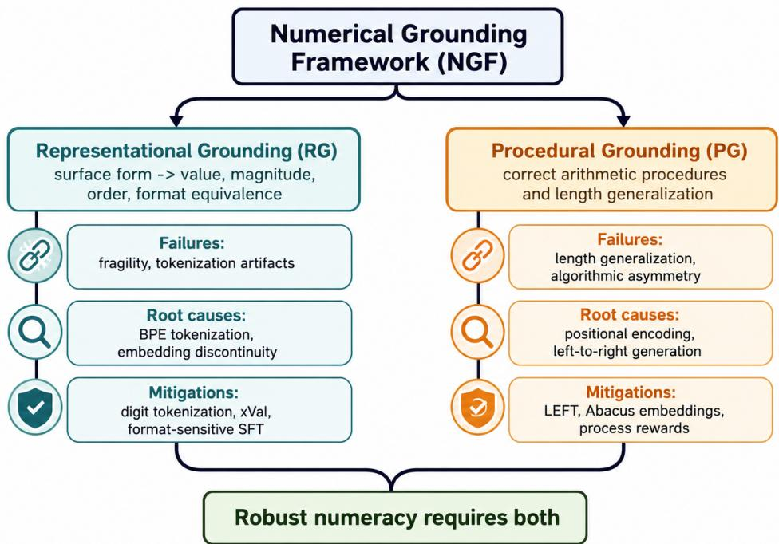  
Figure 1: Numerical Grounding Framework (NGF). The framework decomposes LLM numeracy into Representational Grounding (RG), which concerns surface-form-to-value mapping, and Procedural Grounding (PG), which concerns faithful execution of arithmetic procedures. This separation provides the organizing principle for the benchmark taxonomy, root-cause analysis, empirical results, and mitigation strategies in the remainder of the paper.

## 3.2 Survey Methodology

This survey follows a structured narrative review methodology appropriate for a rapidly evolving area where systematic meta-analytic protocols have not yet been standardized. Literature was identified through three complementary channels: (1) forward and backward citation tracing from the four primary 2024–2025 diagnostic benchmark papers (NumericBench, Number Cookbook, GSM-Symbolic, GSM-Ranges); (2) keyword search on arXiv (cs.CL, cs.LG); and (3) targeted review of NeurIPS, ICLR, ICML, ACL, and EMNLP proceedings from 2021–2025 for papers addressing arithmetic or numerical evaluation in autoregressive language models. Papers addressing purely symbolic mathematics, vision-language numeracy without a languagemodel component, or downstream reasoning tasks without numerical primitive analysis were excluded.

## 3.3 The New Evaluation Landscape

Traditional benchmarks such as GSM8K (Cobbe et al., 2021) and MATH (Hendrycks et al., 2021) have become saturated, with frontier models achieving > 95% accuracy on GSM8K. However, this high performance often masks underlying fragility: models may solve standard problems through memorized solution templates while failing on modest reformulations. To diagnose grounding failures specifically, a generation of targeted diagnostic benchmarks emerged in 2024–2025.

NumericBench (Li et al., 2025) is a comprehensive suite evaluating six fundamental numerical abilities across real-world data and synthetic lists. Its distinctive contribution is testing in-context numeracy: finding and operating on numbers embedded within natural language passages rather than in isolated equations. This makes NumericBench uniquely sensitive to RG.

Number Cookbook (Wang et al., 2024) is a diagnostic testbed isolating 17 atomic numerical tasks across four distinct numerical representations—integer, float, fraction, and scientific notation. Its fine-grained decomposition makes it especially useful for identifying which specific tokenizer-induced structural deficits produce which failure types.

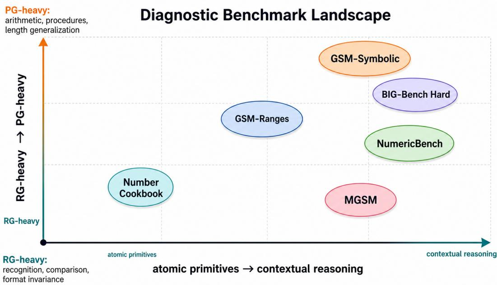  
Figure 2: Diagnostic benchmark landscape. Current numeracy benchmarks occupy diferent regions of the space from atomic numerical primitives to contextual word-problem reasoning, and from RG-heavy recognition/comparison tasks to PG-heavy procedural arithmetic. The spread is essential: no single benchmark is suficient to characterize numerical grounding.

GSM-Symbolic and GSM-NoOp (Mirzadeh et al., 2024) generate thousands of symbolic variations of GSM8K problems by substituting diferent numerical values (measuring fragility) and by inserting irrelevant numerical distractors (measuring distraction resistance).

GSM-Ranges extends the GSM8K framework by systematically varying the magnitude of numbers across several orders of magnitude, directly measuring length generalization—a PG failure documented in Section 3.5.

MGSM (Shi et al., 2023) extends GSM8K to ten languages, providing the only widely used multilingual probe of arithmetic word-problem reasoning. The English-to-other-language performance gap on MGSM exceeds that on non-numerical multilingual benchmarks.

BIG-Bench and BIG-Bench Hard (Srivastava et al., 2023) include numerous numerical primitive tasks that have proven resistant to scale and prompting; BIG-Bench Hard isolates the subset on which performance remains low even at frontier scale.

Limitations of the New Benchmarks. These benchmarks collectively advance grounding measurement but share several important gaps. They are primarily English-language; MGSM is the principal exception but covers only word problems. Performance on Number Cookbook atomic tasks does not reliably predict performance on NumericBench in-context tasks, suggesting that RG-primitive and RG-contextual capabilities are partially dissociated. Finally, no benchmark yet covers the full distributional range of numerical formats encountered in real deployments.

## 3.4 Taxonomy of Numerical Tasks

Synthesizing these benchmarks, we categorize the numeracy landscape into four primary task domains. Table 1 annotates each category with its primary grounding type (RG = Representational, PG = Procedural), which predicts which root causes (Section 4) and mitigation strategies (Section 6) are most relevant.

Table 1: Taxonomy of numerical reasoning task categories with grounding type annotation. $\mathrm { R G } = \mathrm { R e p r e } -$ sentational Grounding, PG = Procedural Grounding.
<table><tr><td>Domain</td><td>Task Category</td><td>NGF</td><td>Definition and Example</td></tr><tr><td rowspan="2">Representation</td><td>Recognition &amp; Extraction</td><td>RG</td><td>Identifying numerical entities in un- structured text.</td></tr><tr><td>Format Conversion</td><td>RG</td><td>&quot;Extract the Q3 revenue from the re- port.&quot; Converting between formats. “Con-</td></tr><tr><td rowspan="2">Arithmetic</td><td>Elementary Operations</td><td>PG</td><td>vert 3/4 to a decimal.&quot; The four basic operations (+, −, ×,</td></tr><tr><td>Length Generalization</td><td>PG</td><td>÷) and modulus. &quot;Calculate 1234 × 5678.&quot; Performing operations on inputs</td></tr><tr><td rowspan="2">Comparison</td><td>Magnitude Comparison</td><td>RG</td><td>longer than training examples. &quot;Add these two 50-digit integers.&#x27; 9 Determining ordering relationships by</td></tr><tr><td>Sorting</td><td>RG</td><td>value. &quot;Is 9.11 greater than 9.9?&quot; Ordering a list of values correctly.</td></tr><tr><td rowspan="2">Structural</td><td>Digit Manipulation</td><td>PG</td><td>Accessing or modifying specific digits.</td></tr><tr><td>Contextual Retrieval</td><td>RG</td><td>&quot;What is the 3rd digit of 3.1415?&quot; Locating specific values in long- context tables.</td></tr></table>

## 3.5 Analysis of Failure Modes

Evaluation on these benchmarks reveals that LLM numeracy failures are not random; they are systematic and structural. We identify four primary failure modes, each linked to its grounding type and root cause.

## 3.5.1 The Fragility Failure (Pattern Matching vs. Reasoning) — RG

The GSM-Symbolic study (Mirzadeh et al., 2024) revealed that model performance is highly sensitive to the specific numbers used in a problem. Simply changing the values in a question can cause significant accuracy drops, suggesting that models rely on memorized solution templates. Even more severe is the NoOp efect: adding irrelevant numerical information causes performance to drop by up to 65% in some models. Models struggle to filter numerical “noise” from “signal.” This is a Representational Grounding (RG) failure: the model lacks a semantic schema for which numbers are causally relevant.

## 3.5.2 The Tokenization Artifact Failure — RG

One of the most pervasive grounding failures is the inability to correctly compare decimal magnitudes, exemplified by models asserting 9.11 > 9.9.

Standard BPE tokenizers do not split numbers according to mathematical logic; they split according to co-occurrence frequency in the training corpus. The decimal 9.11 is often tokenized as $\left[ 9 , . , 1 1 \right]$ , while 9.9 tokenizes as $[ 9 , . , 9 ]$ . In token-id space, where no continuous magnitude is encoded, the model compares the final tokens and incorrectly concludes $9 . 1 1 > 9 . 9$ . The tokenization of any given number is also contextdependent. The result is a non-monotonic surface-to-value mapping—the canonical failure of RG.

## 3.5.3 The Length Generalization Failure — PG

LLMs exhibit a sharp performance clif as the length of number operands increases beyond the range seen during training. Both Number Cookbook (Wang et al., 2024) and studies of Abacus Embeddings (McLeish et al., 2024) show that models trained on addition of up to N digits fail catastrophically when presented with N+1 or more digits. Anil et al. (2022) document the same pattern across diverse compositional tasks. The mechanism is rooted in positional encoding: standard encodings such as RoPE (Su et al., 2024) struggle to extrapolate to token distances unseen during training. This is a pure Procedural Grounding (PG) failure.

## 3.5.4 The Algorithmic Asymmetry (Subtraction and Division Gap) — PG

For subtraction when A < B, models frequently produce the correct magnitude but omit the leading negative sign—a “sign blindness.” Division remains the hardest elementary operation, as it requires iterative estimation and multiplication that is dificult to simulate in a single forward pass without extensive Chainof-Thought scafolding. Both are PG failures: the algorithm is not faithfully internalized.

## 3.6 From Taxonomy to Evidence

The taxonomy above is not merely descriptive. It makes empirical predictions that can be checked across model families and benchmark ecologies. If RG and PG are genuinely distinct, then models should display diferent strength profiles across comparison, format-conversion, digit-access, arithmetic, and lengthgeneralization tasks. If tokenization is a structural RG bottleneck, diferent tokenizer implementations should create diferent “blind spots” even when the underlying mathematical task is identical. If reasoning primarily supplies procedural scafolding, then extended reasoning should help PG more than RG, especially out of domain.

Section 5 operationalizes these predictions through a coordinated evaluation on Number Cookbook, NumericBench, and GSM-Symbolic. The resulting figures are placed in the empirical section rather than here so that the conceptual story (framework, benchmarks, failure modes, root causes) remains cleanly separated from the evidence that tests it.

## 4 Root Causes of Innumeracy

The failures described above are not inexplicable; they are the predictable result of specific architectural and data-distribution choices in current LLMs. The literature, viewed through the NGF lens, identifies four primary structural sources of innumeracy: BPE tokenization (damaging RG), positional encoding (damaging PG), embedding discontinuity (damaging RG), and pretraining data distribution (damaging both).

## 4.1 The Tokenization Bottleneck: Byte-Pair Encoding (BPE) — Damages RG

The most significant barrier to RG is the Byte-Pair Encoding (BPE) algorithm used to tokenize text before processing. BPE compresses text by iteratively merging the most frequent adjacent byte pairs into single tokens. While highly eficient for natural language, this frequency-driven merging is mathematically destructive for numbers (Nogueira et al., 2021).

## 4.1.1 Mechanism of Failure

Inconsistent segmentation. A number such as 12345 may tokenize as a single token [12345] if it appears frequently enough in training data, while 12346 tokenizes as [123, 46] because that boundary happens to be the highest-frequency merge. The model sees these as completely diferent sequences of “words,” making it impossible to learn a consistent place-value rule. The same failure underlies the 9.11 > 9.9 error.

Right-to-left dependency with left-to-right generation. Standard arithmetic on integers proceeds from right to left; LLMs generate tokens left to right. BPE tokenization further obscures individual digit positions, contributing to PG breakdown on multi-digit addition and multiplication.

# Where Numerical Grounding Fails in the LLM Pipeline

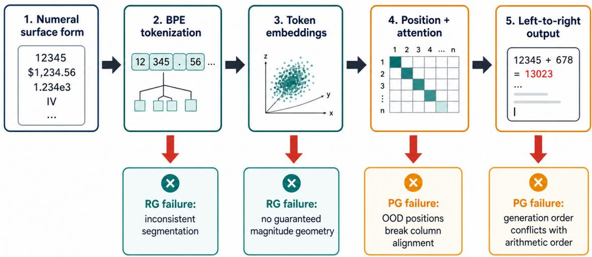  
Figure 3: Where numerical grounding fails in the LLM pipeline. Numeral strings pass through tokenizer segmentation, embedding lookup, positional attention, and left-to-right decoding. Each stage introduces a diferent failure channel: segmentation and embedding geometry primarily damage RG, while positional extrapolation and autoregressive generation order primarily damage PG.

Context-dependent tokenization. The same numeral may tokenize diferently depending on surrounding characters, compounding the inconsistency that prevents learning a stable numerical schema.

## 4.2 Positional Encoding and Length Generalization — Damages PG

Transformers process all tokens in parallel and rely on Positional Encodings to understand token order. The choice of positional encoding largely determines a model’s ability to generalize to longer number sequences than it was trained on, making positional encoding the principal driver of PG failure under length extension.

## 4.2.1 RoPE and Its Limitations

Rotary Positional Embeddings (RoPE), used in Llama and most modern LLMs (Su et al., 2024), encode position by rotating the query and key vectors in attention. RoPE works well within the training distribution but struggles on out-of-distribution lengths: rotation frequencies for larger positional distances were never encountered during training. Position Interpolation and YaRN (Peng et al., 2023) address context-window extension but their benefit for arithmetic length generalization is less well-studied.

## 4.2.2 ALiBi and Recency Bias

ALiBi (Press et al., 2022) adds a distance-proportional penalty to attention logits, biasing attention toward nearby tokens. While ALiBi generalizes better than sinusoidal embeddings for language, this recency bias is harmful for arithmetic: carry propagation requires long-range dependency between the least significant digit and every more significant digit. ALiBi’s distance penalty suppresses exactly this necessary dependency.

Decimal comparison artifact: token order is not value order

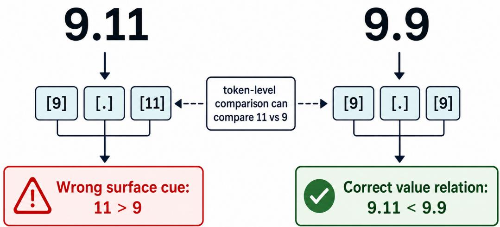  
Figure 4: Decimal comparison as a tokenization artifact. A mathematically simple comparison such as $9 . 1 1 < 9 . 9$ can be corrupted when tokenization exposes the sufix 11 as a token comparable to 9. The model is nudged toward an invalid surface-level cue rather than a value-preserving representation.

## 4.3 Embedding Space Discontinuity — Damages RG

Humans understand numbers as lying on a continuous ordered line; an LLM’s token embedding layer treats each number token as a discrete categorical entry. The token 10 is represented with no guaranteed geometric relationship to 11 or 9. There is no inherent inductive bias in the embedding layer that encodes 10 < 11.

The xVal framework (Golkar et al., 2023) provides empirical evidence for this discontinuity: when standard LLM number token embeddings are projected via PCA, the projections of successive integers do not form a monotonically ordered sequence. Probing studies (Stolfo et al., 2023; Gurnee & Tegmark, 2023) refine this picture, showing that magnitude is partially decodable from deeper hidden states but is not cleanly localized at the embedding layer.

## 4.4 Pretraining Data Distribution — Damages Both RG and PG

A fourth structural cause, largely overlooked in earlier analyses, is the distribution of numerical content in pretraining corpora. Numerical sequences are sparse in natural text compared to natural-language tokens, and the distribution that does exist is skewed: round numbers, common dates, and small integers dominate, while long multi-digit operands, irrational decimals, and scientific-notation forms are vastly underrepresented. Srivastava et al. (2023) provide empirical evidence that arithmetic accuracy correlates with operand frequency in pretraining data far more strongly than with model scale.

This distributional sparsity damages both grounding dimensions. RG sufers because rare numerical surface forms are under-trained: their tokenizations are inconsistent, their embeddings are noisy, and the model has fewer examples from which to learn a stable surface-to-value mapping. PG sufers because step-by-step demonstrations of arithmetic procedures are scarce in unstructured web text; synthetic data generation or process-reward training is needed to close the gap.

Table 2: Aggregate Number Cookbook accuracy. Exact-match accuracy collapses out of domain, while digitmatch accuracy reveals partial procedural structure even when final answers are wrong.
<table><tr><td>Model</td><td>Exact (in)</td><td>Exact (out)</td><td>Digit (in)</td><td>Digit (out)</td></tr><tr><td>GPT-5.4</td><td>76.6</td><td>40.2</td><td>89.5</td><td>65.2</td></tr><tr><td>Claude Opus 4.6</td><td>82.2</td><td>50.0</td><td>88.2</td><td>62.0</td></tr><tr><td>Gemini 3 MINIMAL</td><td>92.5</td><td>63.4</td><td></td><td></td></tr><tr><td>Gemini 3 HIGH</td><td>86.4</td><td>85.0</td><td></td><td></td></tr></table>

## 5 Empirical Evaluation

This section operationalizes NGF through a coordinated evaluation across three complementary benchmarks: Number Cookbook (atomic numerical primitives), NumericBench (contextual numerical reasoning), and GSM-Symbolic (parametric fragility). The goal is not simply to report another leaderboard, but to test whether the RG/PG decomposition predicts observed model behavior.

## 5.1 Motivation and Research Questions

The evaluation is structured around four questions derived from the framework:

• RQ1 (Dissociation). Are RG and PG empirically dissociable across models, and is RG consistently easier than PG?

• RQ2 (Reasoning compensation). Does extended reasoning close PG gaps more than RG gaps, especially on out-of-domain inputs?

• RQ3 (Tokenization contrast). Do models with diferent tokenizers exhibit systematically diferent RG profiles on matched tasks?

• RQ4 (Primitive–contextual transfer). Does atomic-task performance predict contextual numerical reasoning, or are primitive and contextual numeracy partially dissociated?

## 5.2 Experimental Setup

Model set. We evaluate three frontier model families: GPT-5.4, Claude Opus 4.6, and Gemini 3. Gemini is evaluated under two thinkingLevel settings—MINIMAL and HIGH—to isolate the efect of extended internal reasoning. All models are accessed through a unified API proxy with temperature 0.

Benchmark 1: Number Cookbook. All 44 task–representation combinations are evaluated and grouped into an RG battery (magnitude comparison, format conversion, significant-figure rounding, digit counting, and number length) and a PG battery (arithmetic operations, digit-wise operations, and digit extraction). Inputs are split into in-domain and out-of-domain operand lengths.

Benchmark 2: NumericBench. We sample contextual numerical tasks spanning arithmetic, context arithmetic, diferent-digit arithmetic, numerical list comprehension, and mixed number-string extraction. This benchmark tests whether isolated primitive competence transfers to naturalistic text and table contexts.

Benchmark 3: GSM-Symbolic. We evaluate the main split and added-clause variants, measuring both accuracy and per-template fragility under numerical substitution.

## 5.3 Aggregate Results and RG–PG Dissociation

The main dissociation result is robust: every model configuration shows higher RG than PG, with an average RG–PG gap of approximately 0.19 in domain and 0.27 out of domain. This is not merely a level shift. Model rankings vary by dimension: Claude is closer to GPT on RG than on PG, while Gemini MINIMAL leads

## RG-PG Dissociation Across Models

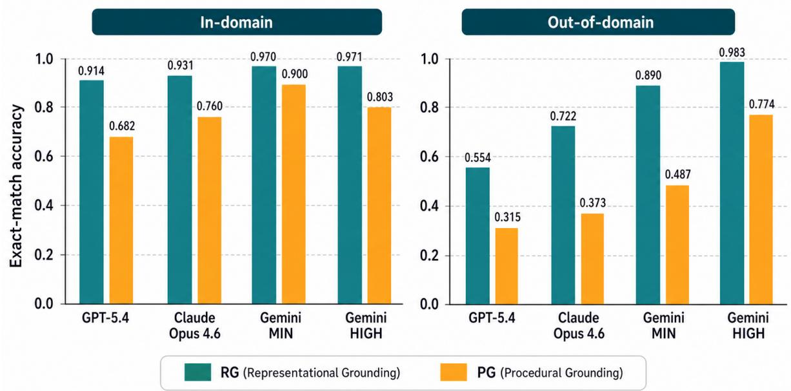  
Figure 5: RG–PG dissociation. Across all model configurations, RG accuracy exceeds PG accuracy in both in-domain and out-of-domain regimes. The gap is larger out of domain, consistent with NGF’s prediction that procedural execution is more fragile under length extension.

## Length Generalization Cliff

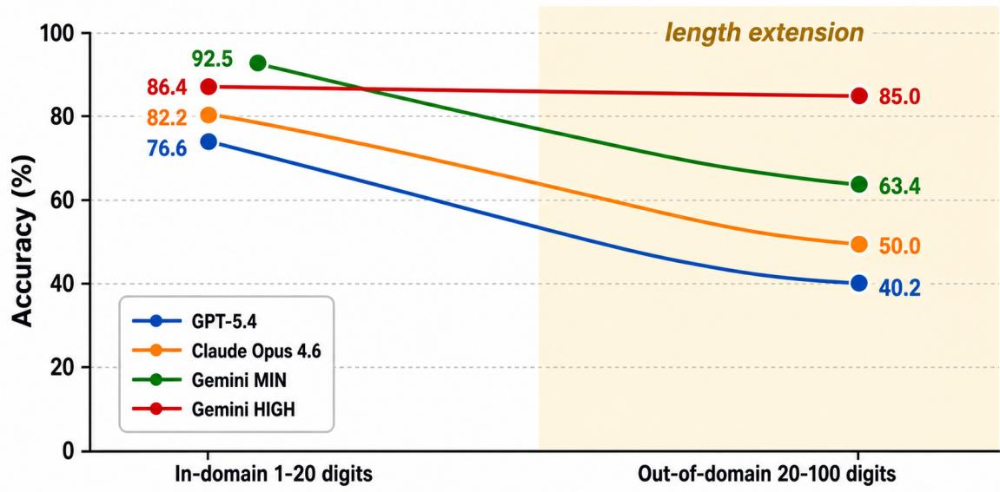  
Figure 6: Length generalization clif. Exact-match performance drops sharply when operand length exceeds the training distribution. Gemini HIGH is the notable exception, showing that extended reasoning can compensate for some PG failures at substantial inference cost.

on atomic primitives but does not transfer that advantage to all contextual tasks. These results support the central claim that numerical competence is not monolithic.

Table 3: Gemini 3 accuracy and per-request token usage under MINIMAL vs. HIGH thinking budget. HIGH improves out-of-domain accuracy but consumes 21.3× as many tokens per request.
<table><tr><td>Variant</td><td>Exact (in)</td><td>Exact (out)</td><td>Input</td><td>Thinking</td><td>Output</td><td>Total</td></tr><tr><td>Gemini MINIMAL</td><td>92.5</td><td>63.4</td><td>124</td><td>0</td><td>169</td><td>293</td></tr><tr><td>Gemini HIGH</td><td>86.4</td><td>85.0</td><td>125</td><td>6,084</td><td>38</td><td>6,247</td></tr></table>

Figure 6. Reasoning Budget Tradeoff  
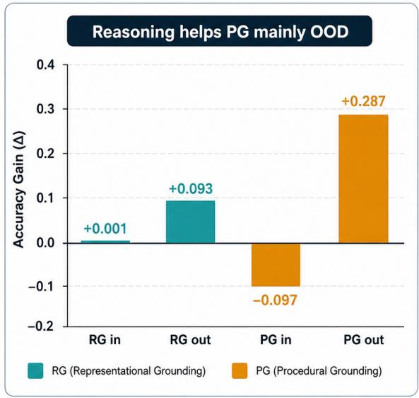

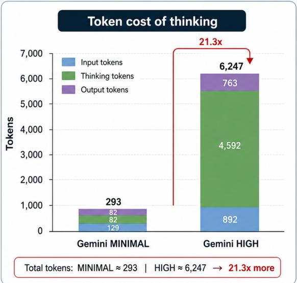  
RG = Representational Grounding (in-domain = "in", out-of-domain = "out"); PG = Procedural Grounding (in-domain = "in", out-of-domain = "out")  
Figure 7: Reasoning-budget tradeof. Extended reasoning disproportionately improves out-of-domain PG (+0.287) relative to RG (+0.093), while slightly hurting in-domain PG. This supports the interpretation of reasoning as procedural scafolding rather than as a structural fix for tokenization or embedding geometry.

## 5.4 Reasoning-Budget Tradeof

The out-of-domain PG improvement is almost three times the RG improvement, exactly the asymmetry predicted by NGF: Chain-of-Thought supplies external working memory for carry propagation, column alignment, and intermediate computation, but it cannot alter the input representation. The in-domain regression is equally important for deployment: on tasks already inside the well-learned region, extra reasoning can introduce new errors.

## 5.5 Tokenizer-Specific RG Blind Spots

Tokenizer diferences produce qualitatively diferent RG profiles. For example, Claude Opus 4.6 maintains high accuracy on float comparison to much longer lengths than GPT-5.4 or Gemini 3, whereas Gemini leads on counting and length tasks. This pattern supports the BPE-bottleneck hypothesis: diferent tokenizers create diferent visibility regimes for place value, decimal structure, and digit positions.

## 5.6 Contextual Numeracy and Fragility

NumericBench and GSM-Symbolic reveal that isolated numerical primitives do not fully predict numerical reasoning in prose. GPT-5.4 trails on Number Cookbook exact-match accuracy but leads on NumericBench arithmetic and GSM-Symbolic, suggesting stronger contextual parsing and instruction following. Gemin MINIMAL shows the opposite pattern: strong atomic performance but weak word-problem deployment. This motivates an extension of NGF with a third deployment axis: the ability to activate numerical grounding inside natural-language context and identify which quantities are relevant.

Tokenizer-Specific RG Blind Spots
<table><tr><td colspan="2">GPT-5.4</td><td>Model Claude Opus 4.6</td><td>Gemini 3</td><td colspan="2">-60</td></tr><tr><td>max_Float</td><td>8</td><td>51</td><td>5</td><td rowspan="9">-50 40 Wwel l-igit 30 -20 -10 0</td></tr><tr><td>max_Integer</td><td>52</td><td>52</td><td>10</td></tr><tr><td>max_hard_Float</td><td>8</td><td>51</td><td>0</td></tr><tr><td>max_hard_Integer</td><td>52</td><td>52</td><td>9</td></tr><tr><td>max_hard_Scientific</td><td>15</td><td>46</td><td>0</td></tr><tr><td>Task length_Float</td><td>0</td><td>5</td><td>35</td></tr><tr><td>length_Integer</td><td>52</td><td>52</td><td>52</td></tr><tr><td>count_Integer</td><td>11</td><td>25</td><td>51</td></tr><tr><td>to_float_Scientific</td><td>11</td><td>14</td><td>5</td></tr><tr><td>to_scient_Float</td><td>8</td><td>15</td><td>0</td></tr><tr><td>to_scient_Integer</td><td>17</td><td>17</td><td>0</td></tr></table>

Figure 8: Tokenizer-specific RG blind spots. The maximum digit length at which a model maintains at least 90% exact-match accuracy varies sharply by task and model. Claude is strong on float comparison, Gemini is strong on digit counting and length, and GPT remains strong on integer comparison. These contrasts are consistent with tokenizer-specific surface-form exposure rather than a single global numeracy score.

Table 4: Contextual numerical reasoning accuracy on selected NumericBench subsets. The ranking inverts relative to Number Cookbook: GPT-5.4 leads in contextual arithmetic despite weaker atomic Number Cookbook performance.
<table><tr><td>Subset</td><td>GPT-5.4</td><td>Claude Opus 4.6</td><td>Gemini MIN</td><td>Gemini HIGH</td></tr><tr><td>Arithmetic (PG)</td><td>84.2</td><td>71.0</td><td>77.0</td><td>77.2</td></tr><tr><td>Context arithmetic (PG+RG)</td><td>84.8</td><td>73.2</td><td>77.2</td><td>77.0</td></tr><tr><td>Different-digit arithmetic</td><td>78.8</td><td>68.5</td><td>71.2</td><td>70.6</td></tr><tr><td>Num list 100 (RG)</td><td>98.3</td><td>33.9</td><td>66.3</td><td>69.2</td></tr></table>

## 5.7 Cross-Benchmark Synthesis

Across the three benchmark families, four conclusions emerge. First, RG and PG are reliably dissociable. Second, reasoning compensates PG preferentially, but only when the bottleneck is procedural decomposition rather than surface parsing. Third, tokenizer design shapes RG in a model-specific manner. Fourth, primitive numerical competence and contextual numerical competence are only partially coupled. The final point marks the main boundary of the current NGF formulation and motivates future work on contextual deployment as a third dimension.

Table 5: GSM-Symbolic accuracy. Gemini MINIMAL collapses without extended reasoning, while GPT-5.4 is both accurate and comparatively robust to numerical substitution.
<table><tr><td>Split</td><td>GPT-5.4</td><td>Claude Opus 4.6</td><td>Gemini MIN</td><td>Gemini HIGH</td></tr><tr><td>Main</td><td>96.8</td><td>75.7</td><td>26.4</td><td>78.2</td></tr><tr><td>P1 added clause</td><td>94.3</td><td>85.5</td><td>10.5</td><td>56.3</td></tr></table>

## Primitive Numeracy Does Not Fully Predict Contextual Numeracy

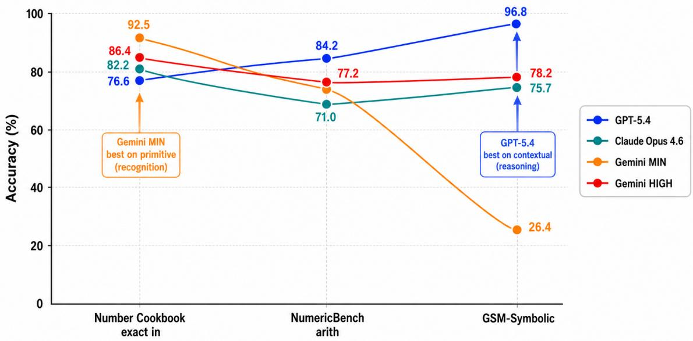  
Figure 9: Primitive numeracy does not fully predict contextual numeracy. Model ranking changes across Number Cookbook, NumericBench, and GSM-Symbolic. Atomic RG/PG competence is necessary but insuficient; contextual deployment mediates whether grounding is actually used in realistic tasks.

## 6 Mitigation Strategies and Paths to Improvement

Recognizing the fundamental limitations described above, the research community is pursuing a multi-layered approach to improving LLM numeracy. We organize the mitigation literature by the grounding dimension each strategy primarily addresses.

## 6.1 The Pretrained-Model Constraint

Before examining individual strategies, we highlight a critical cross-cutting finding: architectural and tokenization-level interventions that dramatically improve models trained from scratch are frequently inapplicable or inefective when applied to large, already-pretrained models. We call this the Pretrained-Model Constraint.

The evidence is consistent across the key 2024–2025 papers:

• LEFT and Abacus Embeddings (McLeish et al., 2024): Both methods require modifying the model’s training regime or architectural components from the start.

• xVal (Golkar et al., 2023): Adopting xVal for a pretrained model requires replacing the embedding and output head for all number tokens—a cost comparable to pretraining.

• Digit-level tokenization: Switching from BPE to character-level or digit-level tokenization for numbers (as done in Llama 3 (Dubey et al., 2024)) provides measurable RG benefits but must be done during initial vocabulary construction and pretraining.

• Synthetic fine-tuning (Wang et al., 2024; Tang et al., 2024): In contrast, supervised fine-tuning on diverse numerical examples is consistently efective for pretrained models and represents the most practically accessible intervention.

The practical implication is that the most structurally correct solutions are only available to those training models from scratch, while practitioners working with existing pretrained models must rely on fine-tuning and inference-time strategies. This creates a two-tier intervention landscape, which Table 6 makes explicit.

## 6.2 Addressing RG Failures

## 6.2.1 Digit-Level and Fixed-Span Tokenization

The clearest direct intervention is to abandon BPE for numerical tokens entirely. Character-level tokenization produces a strictly monotone, format-invariant surface representation. Llama 3 (Dubey et al., 2024) adopts a fixed three-digit tokenization. The tradeof is increased sequence length for long numerals, but the RG benefit for magnitude comparison and format conversion appears robust.

## 6.2.2 Continuous Embeddings: xVal

xVal (Golkar et al., 2023) replaces all number tokens with a single shared [NUM] embedding, then multiplies it element-wise by the number’s scalar value at the embedding layer. This enforces continuity and is highly efective for scientific data, but poorly suited for tasks requiring precise digit manipulation.

## 6.2.3 Format-Sensitive Fine-Tuning

For pretrained models where tokenizer replacement is not feasible, targeted fine-tuning on format-conversion and magnitude-comparison tasks provides a partial remedy, most successful within the trained format distribution rather than extrapolating across formats.

## 6.3 Addressing PG Failures

## 6.3.1 Little-Endian Fine-Tuning (LEFT)

The LEFT strategy (McLeish et al., 2024) addresses the right-to-left dependency problem by training models on reversed number strings. In the reversed (Little-Endian) format, the model generates the least significant digit first, naturally aligning the generation order with the causal direction of the arithmetic algorithm. LEFT achieves near-perfect accuracy on addition tasks when applied to models trained from scratch. Limitations: addition only, scratch-train required, and a post-processing reversal step is needed for deployment.

## 6.3.2 Abacus Embeddings

Abacus Embeddings (McLeish et al., 2024) introduce a specialized positional embedding for digit tokens that encodes place value relative to the number, injected at every transformer layer. Combined with a recurrent (looped) transformer architecture, Abacus Embeddings enable models trained on 20-digit arithmetic to generalize to 100-digit inputs—a 5× improvement in length generalization.

## 6.3.3 Curriculum Learning via GSM-Ranges

The GSM-Ranges dataset systematically varies the magnitude of numbers across several orders of magnitude, teaching the model that arithmetic is scale-invariant. This reduces but does not eliminate degradation at larger scales, as the underlying tokenization inconsistency persists.

## 6.3.4 Process Reward Models

Lightman et al. (2023) and Uesato et al. (2022) show that process-reward training yields substantially more reliable arithmetic execution than outcome-only training. Process-reward training is broadly compatible with pretrained models and is currently the most promising scalable approach to PG improvement without architectural changes.

## 6.3.5 BitTokens

BitTokens encodes numbers using their IEEE 754 binary floating-point representation. This teaches the model machine-level arithmetic structure but requires a specialized vocabulary and output decoding head, shifting the learning burden from decimal arithmetic to bitwise logic.

## 6.4 Inference-Time Strategies (Help Both RG and PG)

## 6.4.1 Chain of Thought and Reasoning Models

The most widely adopted numeracy mitigation is Chain-of-Thought (CoT) prompting (Wei et al., 2022b; Nye et al., 2021). By generating intermediate tokens before the final answer, CoT provides external working memory. Reasoning models such as o1 (OpenAI, 2024) and DeepSeek-R1 (DeepSeek-AI, 2025) are trained via reinforcement learning to generate extended CoT traces, yielding the single largest performance leap in the empirical results of Section 5.4.

The tradeof is eficiency. Our Gemini thinking-budget measurement (Table 3, Figure 7) quantifies the cost: HIGH thinking consumes 21.3× the tokens of MINIMAL while regressing on in-domain tasks—a controlled empirical signature of the “overthinking” pathology.

## 6.4.2 Tool Use (Program-Aided Language Models)

For high-reliability numerical applications, the emerging consensus favors Tool Use (Gao et al., 2023). The LLM acts as a semantic parser translating the query into executable code that is then run by a deterministic interpreter. The computed result is exact by construction—a PG guarantee delivered by externalization rather than by improving the model. The key limitation is that Tool Use does not eliminate RG requirements; it relocates them.

## 6.4.3 Self-Consistency

Self-consistency (Wang et al., 2023) draws multiple independent reasoning paths and aggregates the answers, suppressing single-trace stochastic errors at a cost of additional inference compute.

## 6.5 Comparison of Mitigation Strategies

Table 6 provides a structured comparison of the mitigation strategies discussed above, organized by the three dimensions most relevant to practitioners: pretrained-model compatibility, grounding dimension primarily addressed, and primary limitation.

## 6.6 Practical Deployment Recommendations

High-reliability numerical computation (finance, engineering, medicine). Default to Tool Use. Instruct the model to generate code rather than numeric answers directly, and execute the code in a sandboxed interpreter. Verify that the generated equation is correct before trusting the output.

Mixed reasoning and computation tasks. Use CoT prompting with a reasoning model. Insert an explicit verification step or tool call for any intermediate numerical result that drives subsequent reasoning.

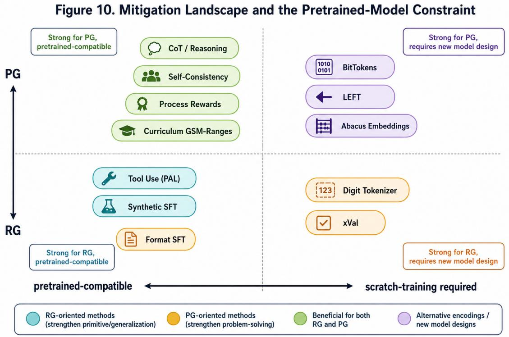  
Figure 10: Mitigation landscape and the Pretrained-Model Constraint. The most structural fixes for RG and PG lie on the scratch-training side of the matrix. Practitioners working with existing pretrained models mostly operate on the left side: supervised fine-tuning, process rewards, reasoning, self-consistency, and tool use.

Numerical understanding in natural language. RG tasks are better supported in reasoning models than in generalist models. For the highest reliability, extract all numbers as a preprocessing step and pass them as a structured list.

Fine-tuning for domain-specific numeracy. Supervised fine-tuning on domain-relevant synthetic examples provides reliable improvement within the trained range. Do not assume that fine-tuning generalizes beyond the numerical range represented in the fine-tuning data.

Benchmark scores as a floor, not a ceiling. Always evaluate grounding directly on data representative of the target deployment context before drawing conclusions from aggregate benchmark scores.

## 7 Conclusions and Future Directions

The investigation into numeracy in Large Language Models reveals a field in transition. The gains available from naive scaling are insuficient to fix the tokenization blindness or compensate for the absence of arithmetic working memory. The 9.11 > 9.9 error is not a random glitch; it is a structural artifact of processing numbers as linguistic tokens rather than as values on an ordered continuum—a failure of representational grounding in the precise sense of NGF.

## 7.1 Key Takeaways

Numerical grounding is architecturally distinct from mathematical reasoning. High scores on mathematical reasoning benchmarks measure a model’s ability to structure and follow a logical argument, not its ability to reliably execute the arithmetic primitives on which that argument depends. NGF predicts the direction of dissociation: reasoning training improves PG more than RG.

Table 6: Comparison of NGF mitigation strategies. Pretrained Compat.: whether the method can be applied to an existing pretrained model without retraining from scratch. Grounding: primary grounding dimension addressed (RG, PG, or Both). SFT = Supervised Fine-Tuning.
<table><tr><td>Method</td><td>Category</td><td>Pretrained Compat.</td><td>Grounding</td><td>Primary Limitation</td></tr><tr><td>Digit / fixed-span tokenization</td><td>Arch.</td><td>No</td><td>RG</td><td>Scratch-train required; longer sequences</td></tr><tr><td>xVal</td><td>Arch.</td><td>No</td><td>RG</td><td>Not for exact digit-level tasks</td></tr><tr><td>Format-sensitive SFT</td><td>Data</td><td>Yes</td><td>RG</td><td>Generalizes weakly across formats</td></tr><tr><td>LEFT</td><td>Arch.</td><td>No</td><td>PG</td><td>Addition only; scratch-train required</td></tr><tr><td>Abacus Embeddings</td><td>Arch.</td><td>No</td><td>PG</td><td>Scratch-train required; +5× length gen.</td></tr><tr><td>Curriculum (GSM-Ranges)</td><td>Data</td><td>Yes</td><td>PG</td><td>Doesn&#x27;t fix tokenization-induced RG</td></tr><tr><td>Process Reward Models</td><td>Train.</td><td>Yes</td><td>PG</td><td>Requires step-labeled training data</td></tr><tr><td>BitTokens</td><td>Arch.</td><td>No</td><td>PG</td><td>New vocabulary and decoding head required</td></tr><tr><td>SFT on Synthetic Data</td><td>Data</td><td>Yes</td><td>Both</td><td>Does not fix tokenization artifacts</td></tr><tr><td>CoT / Reasoning (o1, R1)</td><td>Inf.</td><td>Yes</td><td>Both</td><td>~18× token cost; overthinking</td></tr><tr><td>Tool Use (PAL)</td><td>Inf.</td><td>Yes</td><td>Both</td><td>Relies on correct equation formulation (RG)</td></tr><tr><td>Self-Consistency</td><td>Inf.</td><td>Yes</td><td>PG</td><td>Additional inference cost</td></tr></table>

Tokenization is the primary structural bottleneck for RG. BPE is fundamentally ill-suited for arithmetic. The most durable progress on RG requires digit-level tokenization, place-value-aware embeddings (Abacus), or number-specific representation schemes (xVal, BitTokens)—all integrated at the pretraining stage.

Reasoning is a powerful compensatory mechanism for PG, not a structural fix for RG. CoT and RL-trained reasoning models dramatically improve numerical performance but are ineficient and degrade on trivial computations. Our Gemini thinking-budget measurement provides a controlled empirical demonstration. CoT cannot fix surface-to-value mappings already mis-tokenized at the input layer.

Tool Use is the near-term reliability solution for PG. For any application where numerical correctness is safety-critical, delegate arithmetic to a deterministic external tool. The LLM’s role is semantic parsing (an RG task), not calculation.

The Pretrained-Model Constraint defines the practical landscape. The most structurally correct solutions are available only to those training new models from scratch. For the broader community, viable interventions are limited to fine-tuning, process-reward training, and inference-time strategies.

## 7.2 Future Directions

Algorithmic generalization across arbitrary lengths. Hybrid approaches that combine Abacus-style inductive biases with large-scale pretraining represent the most promising direction for PG, but integration at scale remains open.

Unified number representation. A “number-aware tokenizer” that segments numbers consistently into digits or representation-aware sub-units would eliminate the structural root cause of most RG failures.

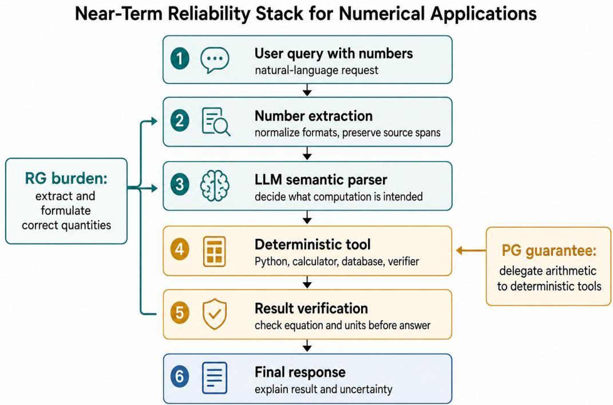  
Figure 11: Near-term reliability stack for numerical applications. Tool use solves PG by delegating calculation to deterministic machinery, but it does not remove RG: the model must still extract quantities, preserve formats and units, and formulate the correct equation.

Cross-lingual and cross-format numerical reasoning. Current diagnostic benchmarks are almost entirely English and decimal; MGSM (Shi et al., 2023) is the principal exception, but covers only word problems.

Process-level reward for arithmetic. Process reward models (Lightman et al., 2023; Uesato et al., 2022) provide a more targeted training signal for building reliable PG without the overthinking pathology of current reasoning models, and integrate cleanly into existing pretrained-model fine-tuning pipelines.

Bridging cognitive-science and machine grounding. NGF’s RG/PG decomposition mirrors human dual-system numerical cognition (Dehaene, 2011; Spelke & Kinzler, 2007). Future work that operationalizes the cognitive-science distinctions more precisely—approximate vs. exact, log-scaled vs. linear-scaled, perceptual vs. symbolic—could yield richer grounding tests and more targeted architectural prescriptions.

The path toward robust, human-like number sense in foundation models requires coordinated progress on tokenization, positional encoding, training objectives, and pretraining data composition. Until these structural issues are resolved—at both the representational and procedural levels of grounding—LLMs will remain powerful reasoning scafolds but unreliable calculators.

## AI Assistance Disclosure

AI-assisted tools were used during manuscript preparation for literature-search support, structure planning, language editing, figure design, review, and formatting. All content, arguments, and conclusions were directed and reviewed by the author, who takes full responsibility for the accuracy and integrity of this work.

## References

Janice Ahn, Rishu Verma, Renze Lou, Di Liu, Rui Zhang, and Wenpeng Yin. Large language models for mathematical reasoning: Progresses and challenges. arXiv preprint arXiv:2402.00157, 2024.

Cem Anil, Yuhuai Wu, Anders Andreassen, Aitor Lewkowycz, Vedant Misra, Vinay Ramasesh, Ambrose Slone, Guy Gur-Ari, Ethan Dyer, and Behnam Neyshabur. Exploring length generalization in large language models. Advances in Neural Information Processing Systems, 35:38546–38556, 2022.

Daniil A Boiko, Robert MacKnight, and Gabe Gomes. Emergent autonomous scientific research capabilities of large language models. arXiv preprint arXiv:2304.05332, 2023.

Davide Castelvecchi. Ai models solve maths problems at level of top students. Nature, 644:7, 2025.

Ching Chang, Wei-Yao Wang, Wen-Chih Peng, and Tien-Fu Chen. Llm4ts: Aligning pre-trained llms as data-eficient time-series forecasters. ACM Transactions on Intelligent Systems and Technology, 16(3): 1–20, 2025.

François Charton. Learning the greatest common divisor: explaining transformer predictions. arXiv preprint arXiv:2201.05624, 2022.

Karl Cobbe, Vineet Kosaraju, Mohammad Bavarian, Mark Chen, Heewoo Jun, Lukasz Kaiser, Matthias Plappert, Jerry Tworek, Jacob Hilton, Reiichiro Nakano, et al. Training verifiers to solve math word problems. arXiv preprint arXiv:2110.14168, 2021.

DeepSeek-AI. DeepSeek-R1: Incentivizing reasoning capability in LLMs via reinforcement learning. arXiv preprint arXiv:2501.12948, 2025.

Stanislas Dehaene. The Number Sense: How the Mind Creates Mathematics. Oxford University Press, revised and updated edition, 2011.

Abhimanyu Dubey, Abhinav Jauhri, Abhinav Pandey, Abhishek Kadian, Ahmad Al-Dahle, Aiesha Letman, Akhil Mathur, Alan Schelten, Amy Yang, Angela Fan, et al. The Llama 3 herd of models. arXiv preprint arXiv:2407.21783, 2024.

Nouha Dziri, Ximing Lu, Melanie Sclar, Xiang Lorraine Li, Liwei Jiang, Bill Yuchen Lin, Sean Welleck, Peter West, Chandra Bhagavatula, Ronan Le Bras, et al. Faith and fate: Limits of transformers on compositionality. Advances in Neural Information Processing Systems, 36:70293–70332, 2023.

Simon Frieder, Luca Pinchetti, Ryan-Rhys Grifiths, Tommaso Salvatori, Thomas Lukasiewicz, Philipp Christian Petersen, Alexis Chevalier, and Julius Berner. Mathematical capabilities of ChatGPT. Advances in Neural Information Processing Systems, 36, 2024.

Luyu Gao, Aman Madaan, Shuyan Zhou, Uri Alon, Pengfei Liu, Yiming Yang, Jamie Callan, and Graham Neubig. PAL: Program-aided language models. In International Conference on Machine Learning, pp. 10764–10799. PMLR, 2023.

Siavash Golkar, Mariel Pettee, Michael Eickenberg, Alberto Bietti, Miles Cranmer, Geraud Krawezik, Francois Lanusse, Michael McCabe, Ruben Ohana, Liam Parker, Enrico Riviere, Tiberiu Tesileanu, Kyle Cranmer, and Shirley Ho. xVal: A continuous number encoding for large language models. In NeurIPS 2023 Workshop on Machine Learning and the Physical Sciences, 2023.

Wes Gurnee and Max Tegmark. Language models represent space and time. arXiv preprint arXiv:2310.02207, 2023.

Stevan Harnad. The symbol grounding problem. Physica D: Nonlinear Phenomena, 42(1–3):335–346, 1990.

Dan Hendrycks, Colby Burns, Saurav Kadavath, Akul Arora, Steven Basart, Eric Tang, Dawn Song, and Jacob Steinhardt. Measuring mathematical problem solving with the MATH dataset. arXiv preprint arXiv:2103.03874, 2021.

Ming Jin, Shiyu Wang, Lintao Ma, Zhixuan Chu, James Y Zhang, Xiaoming Shi, Pin-Yu Chen, Yuxuan Liang, Yuan-Fang Li, Shirui Pan, et al. Time-llm: Time series forecasting by reprogramming large language models. arXiv preprint arXiv:2310.01728, 2023.

Chao Li et al. NumericBench: Towards measuring numerical reasoning capabilities of large language models. arXiv preprint, 2025. Verify authors and arXiv ID before final submission.

Hunter Lightman, Vineet Kosaraju, Yura Burda, Harri Edwards, Bowen Baker, Teddy Lee, Jan Leike, John Schulman, Ilya Sutskever, and Karl Cobbe. Let’s verify step by step. arXiv preprint arXiv:2305.20050, 2023.

Xiao-Yang Liu, Guoxuan Wang, Hongyang Yang, and Daochen Zha. Fingpt: Democratizing internet-scale data for financial large language models. arXiv preprint arXiv:2307.10485, 2023.

Andres M. Bran, Sam Cox, Oliver Schilter, Carlo Baldassari, Andrew D White, and Philippe Schwaller. Augmenting large language models with chemistry tools. Nature Machine Intelligence, 6(5):525–535, 2024.

Sean McLeish, Arpit Bansal, Alex Stein, Neel Jain, John Kirchenbauer, Brian R Bartoldson, Golnoosh Milani Fard, Avi Schwarzschild, Micah Goldblum, Jonas Geiping, and Tom Goldstein. Transformers can do arithmetic with the right embeddings. arXiv preprint arXiv:2405.17399, 2024.

Seyed Iman Mirzadeh, Keivan Alizadeh, Hooman Shahrokhi, Oncel Tuzel, Samy Bengio, and Mehrdad Farajtabar. GSM-Symbolic: Understanding the limitations of mathematical reasoning in large language models. arXiv preprint arXiv:2410.05229, 2024.

Rodrigo Nogueira, Zhiying Jiang, and Jimmy Lin. Investigating the limitations of transformers with simple arithmetic tasks. arXiv preprint arXiv:2102.13019, 2021.

Maxwell Nye, Anders Johan Andreassen, Guy Gur-Ari, Henryk Michalewski, Jacob Austin, David Bieber, David Dohan, Aitor Lewkowycz, Maarten Bosma, David Luan, et al. Show your work: Scratchpads for intermediate computation with language models. arXiv preprint arXiv:2112.00114, 2021.

OpenAI. Learning to reason with LLMs. OpenAI Blog, 2024. URL https://openai.com/index/ learning-to-reason-with-llms/.

Bowen Peng, Jefrey Quesnelle, Honglu Fan, and Enrico Shippole. YaRN: Eficient context window extension of large language models. arXiv preprint arXiv:2309.00071, 2023.

Ofir Press, Noah A Smith, and Mike Lewis. Train short, test long: Attention with linear biases enables input length extrapolation. In International Conference on Learning Representations, 2022.

Kashif Rasul, Arjun Ashok, Andrew Robert Williams, Arian Khorasani, George Adamopoulos, Rishika Bhagwatkar, Marin Biloš, Hena Ghonia, Nadhir Hassen, Anderson Schneider, et al. Lag-llama: Towards foundation models for time series forecasting. In R0-FoMo: Robustness of Few-shot and Zero-shot Learning in Large Foundation Models, 2023.

Zhihong Shao, Peiyi Wang, Qihao Zhu, Runxin Xu, Junxiao Song, Xiao Bi, Haowei Zhang, Mingchuan Zhang, YK Li, Yang Wu, et al. Deepseekmath: Pushing the limits of mathematical reasoning in open language models. arXiv preprint arXiv:2402.03300, 2024.

Freda Shi, Mirac Suzgun, Markus Freitag, Xuezhi Wang, Suraj Srivats, Soroush Vosoughi, Hyung Won Chung, Yi Tay, Sebastian Ruder, Denny Zhou, et al. Language models are multilingual chain-of-thought reasoners. In International Conference on Learning Representations, 2023.

Elizabeth S Spelke and Katherine D Kinzler. Core knowledge. Developmental Science, 10(1):89–96, 2007.

Aarohi Srivastava, Abhinav Rastogi, Abhishek Rao, Abu Awal Md Shoeb, Abubakar Abid, Adam Fisch, Adam R Brown, Adam Santoro, Aditya Gupta, Adrià Garriga-Alonso, et al. Beyond the imitation game: Quantifying and extrapolating the capabilities of language models. Transactions on Machine Learning Research, 2023.

Alessandro Stolfo, Zhijing Jin, Kumar Shridhar, Bernhard Schölkopf, and Mrinmaya Sachan. A mechanistic interpretation of arithmetic reasoning in language models using causal mediation analysis. In Conference on Empirical Methods in Natural Language Processing, pp. 7035–7052, 2023.

Jianlin Su, Murtadha Ahmed, Yu Lu, Shengfeng Pan, Wen Bo, and Yunfeng Liu. RoFormer: Enhanced transformer with rotary position embedding. Neurocomputing, 568:127063, 2024.

Zhengyang Tang, Xingxing Zhang, Benyou Wan, and Furu Wei. MathScale: Scaling instruction tuning for mathematical reasoning. arXiv preprint arXiv:2403.02884, 2024.

Ross Taylor, Marcin Kardas, Guillem Cucurull, Thomas Scialom, Anthony Hartshorn, Elvis Saravia, Andrew Poulton, Viktor Kerkez, and Robert Stojnic. Galactica: A large language model for science. arXiv preprint arXiv:2211.09085, 2022.

Trieu H Trinh, Yuhuai Wu, Quoc V Le, He He, and Thang Luong. Solving olympiad geometry without human demonstrations. Nature, 625(7995):476–482, 2024.

Jonathan Uesato, Nate Kushman, Ramana Kumar, Francis Song, Noah Siegel, Lisa Wang, Antonia Creswell, Geofrey Irving, and Irina Higgins. Solving math word problems with process- and outcome-based feedback. arXiv preprint arXiv:2211.14275, 2022.

Han Wang, Fei Liu, Qianwen Liu, Yanfang Shi, Yuzhang Zhu, et al. Number cookbook: Number understanding of language models and how to improve it. arXiv preprint arXiv:2411.03766, 2024.

Xuezhi Wang, Jason Wei, Dale Schuurmans, Quoc V Le, Ed H Chi, Sharan Narang, Aakanksha Chowdhery, and Denny Zhou. Self-consistency improves chain of thought reasoning in language models. In International Conference on Learning Representations, 2023.

Jason Wei, Yi Tay, Rishi Bommasani, Colin Rafel, Barret Zoph, Sebastian Borgeaud, Dani Yogatama, Maarten Bosma, Denny Zhou, Donald Metzler, et al. Emergent abilities of large language models. Transactions on Machine Learning Research, 2022a.

Jason Wei, Xuezhi Wang, Dale Schuurmans, Maarten Bosma, Fei Xia, Ed Chi, Quoc V Le, Denny Zhou, et al. Chain-of-thought prompting elicits reasoning in large language models. Advances in Neural Information Processing Systems, 35:24824–24837, 2022b.

Shijie Wu, Ozan Irsoy, Steven Lu, Vadim Dabravolski, Mark Dredze, Sebastian Gehrmann, Prabhanjan Kambadur, David Rosenberg, and Gideon Mann. Bloomberggpt: A large language model for finance. arXiv preprint arXiv:2303.17564, 2023.

Tian Zhou, Peisong Niu, Liang Sun, Rong Jin, et al. One fits all: Power general time series analysis by pretrained lm. Advances in Neural Information Processing Systems, 36:43322–43355, 2023.