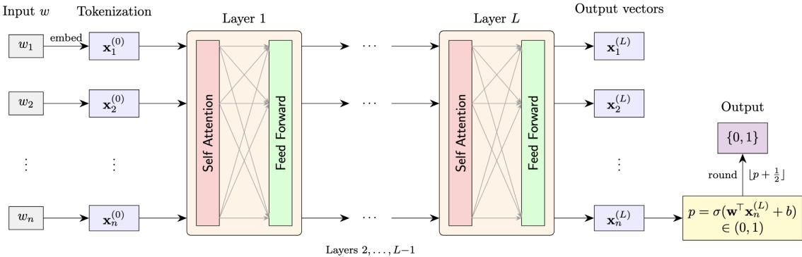
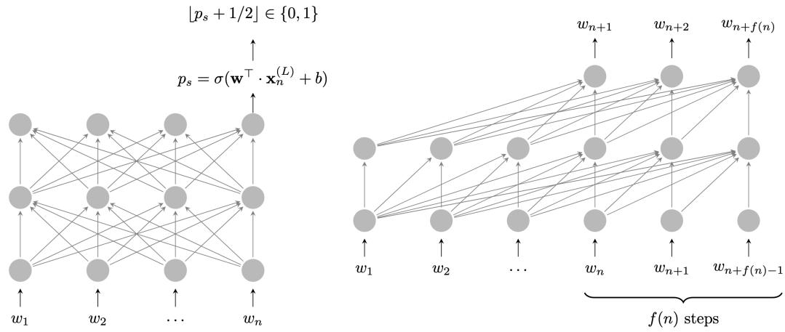

1 Introduction 2   
2 The Architecture 2   
2.1 Transformers as Language Recognizers 2   
2.2 Characteristics and Parameters of a Transformer . 3   
2.3 Encoder Computation . 4   
2.4 Decoder Computation . 6   
3 Classical and Circuit Complexity 7   
3.1 The “Right” Hierarchy 7   
3.2 Definitions . . 7   
3.3 Descriptive Complexity . . 8

# On the Expressive Power of Transformers

Phokion G. Kolaitis University of California Santa Cruz Santa Cruz, CA kolaitis@ucsc.edu

Rik Sengupta IBM Research Cambridge, MA rik@ibm.com

August 2026

## Abstract

Multi-layer transformers form the critical component of essentially all large language models (LLMs) in use today. Because of their ubiquity and computational capability, there is a rapidly growing body of work that aims to precisely calibrate the expressive power of transformers as language recognizers by comparing them against standard models of computation studied for decades by the theoretical computer science community. In this endeavor, circuit complexity has by and large emerged as the “correct” branch of computational complexity to analyze the expressive power of transformers; the reason is that parameterizing transformers by the various resources they use, such as attention and precision, leads to direct comparisons with diferent classes of circuits parameterized by resources such as type of gates, size, and depth. Here, we present an overview of selected results that delineate the expressive power of transformers using concepts and methods from circuit complexity.

Keywords: transformers; models of computation; circuit complexity.

## Contents

## 1 Introduction

Transformers have become the default computational substrate of modern large language models (LLMs), and yet their formal capabilities remain only partially understood at best. For researchers in logic and computational complexity, this presents a challenge and an opportunity: formalize an architecture that has extraordinary empirical success in order to study it as a family of resource-bounded computation models and to compare its power with classical hierarchies underlying standard models of computation. Indeed, a large body of recent literature has pursued this exact endeavor. By treating sequence length, depth, attention heads, numerical precision, positional encodings, and so on as explicit resources, one obtains variants of transformers whose expressive power can be related to that of automata and circuit classes.

This brief survey focuses on transformers as language recognizers and their connections to circuit complexity. The underlying principle is that attention layers behave like structured, parallel stages of computation, which makes them comparable to bounded-depth circuits with restrictions on gates, fan-in, size, and uniformity. This perspective clarifies both what transformers can simulate and where limitations arise. It also exposes how small choices in setting up the architecture — soft versus hard attention, fixed versus unbounded precision, and so on — can significantly afect the expressive power. Our aim is to set up the formal architecture carefully, highlight a few of the results established so far, and provide a flavor of some of the proof techniques.

For a more detailed overview, we refer the reader to several other extensive surveys of the field, including ones on neural networks and formal languages [1], RNNs and transformers [16], transformer expressivity [25], and the transformer cookbook [29].

## 2 The Architecture

## 2.1 Transformers as Language Recognizers

Before describing each of its components formally, we describe the transformer architecture informally, so that we establish how transformers can serve as language recognizers. A transformer can be viewed as a particular neural network consisting of an input layer, one or more hidden layers, and an output layer. The input to a transformer is a nonempty input string over some alphabet Σ, whose length � is called the context length. Each character of this input alphabet is called a token (in practice, tokens are often substrings rather than individual characters; input text is broken up into tokens using a highly nontrivial process called tokenization, which is beyond the scope of this survey). The input layer of the transformer embeds each token in a vector space by mapping it to a �-dimensional real vector, where � is a parameter of the transformer. Each hidden layer thereafter takes a sequence of length � of �-dimensional real vectors as its input, and applies a length-preserving function to this sequence, resulting in a sequence of length � of �-dimensional real vectors as the output of that layer. The output layer is diferent depending on the type of transformer considered.

• In a transformer encoder (the model adopted in viewing transformers as classifiers), the output layer converts the final sequence of �-dimensional vectors into a single probability $p _ { \mathrm { o u t } } \in [ 0 , 1 ]$ , and accepts the input string if and only if $p _ { \mathrm { o u t } } \ge 1 / 2$

• In a transformer decoder (the model adopted in viewing transformers as language models), the output layer outputs a new token1, appends it to the original input, and then continues to do this autoregressively, i.e., by sequentially generating new tokens by consuming all the ones generated in previous timesteps, for a pre-specified number of timesteps. This is the version of a transformer used for text generation. Furthermore, a decoder can be easily turned into a language recognizer as well: in the final timestep, it behaves similarly to an encoder, outputs a probability $p _ { \mathrm { o u t } }$ (instead of a new token), and accepts the original input string if and only if $p _ { \mathrm { o u t } } \ge 1 / 2$

## 2.2 Characteristics and Parameters of a Transformer

We are now ready to describe the transformer architecture formally. To begin with, every transformer has several characteristics.

Hard/Soft Attention. The richness of the language of transformers comes from a mechanism inside the hidden layers called attention [26], which is essentially a scaled dot-product that combines information across diferent vectors in the sequence. The breakthrough idea behind defining attention was the realization that a model did not need to process language only in a fixed order or compress everything into a single hidden state. Instead, each token could directly “look at” the other tokens in a long enough sequence and decide which ones were most relevant. This made models far better at capturing long-range relationships, easier to train in parallel, and scalable to much larger systems — essentially laying the foundation for modern transformers and large language models. The assumptions on the attention mechanism form a core distinguishing feature of the transformer’s behavior. Attention can be either hard or soft, of which the latter tends to have more expressive power than the former [9, 10, 20–22]. Standard choices for the attention include UHAT (“unique hard attention”), AHAT (“average hard attention”), and SMAT (“softmax attention”), of which, only the last is widely used in practice.

Masking/No Masking. In an encoder, we typically assume a model without masking, which means that every position can a priori attend to all other positions. By contrast, in a decoder, we typically assume an autoregressive model that usesfuture masking, where a position can only attend to positions before it.

The evolutions of LLMs has seen a shift from encoder models (e.g., BERT) to decoder models (e.g., GPT, Claude, Gemini, LLaMA), because of the autoregressive nature of the latter that can be leveraged for text generation. Furthermore, encoder models can be shown theoretically to be strictly more powerful than decoder models2 for language recognition; also, as shown in [5], lower bounds on encoder models imply lower bounds on constant-depth symmetric circuits; this would be a technical breakthrough, as techniques for circuit lower bound, such as the random restriction method, do not work on symmetric functions.

Chain-of-Thought. In autoregressive decoder models, the architecture can output intermediate tokens during its computation, which are then fed back to the architecture by appending them to the input. This process is called chain-of-thought (CoT); it is known that transformers with this ability are strictly more powerful than transformers without [5, 14, 19]. Most modern LLMs exploit CoT-style intermediate reasoning.

Parameters. In addition to the preceding characteristics, a transformer has the following parameters.

• Number of layers: the number of hidden layers in the transformer, denoted by �. We will always assume � to be a constant, and index the layers as $\ell \in [ L ]$

• Number of attention heads: the number of attention heads, typically denoted by �. We will again assume that � is a constant, and index the heads as $h \in [ H ]$

• Embedding dimension: the length of the embedded vectors, denoted by $d .$ There are often two additional dimensions, the key width $d _ { \mathrm { k e y } }$ and the hidden width $d _ { \mathrm { h i d d e n } }$ . Each of these parameters is allowed to depend on the context length $n ,$ though they are often fixed constants in practice.

• Level of precision: the number of bits of precision allowed to carry out all computations within the architecture, denoted by $p .$ This parameter is also, in general, a function of the input length �; in fact, we often assume $p$ to be Θ(log �) (see the discussion at the start of Section 4).

• Amount of chain-of-thought: for transformers with chain-of-thought, the number of intermediate tokens allowed to be generated, as a function $f ( n )$ of the input length �. In Section 4.2, we shall see the diference in expressivity resulting from diferent asymptotic choices for the function � (�).

Sometimes, the number � of layers is called the depth of the transformer, while the product ��� of the embedding dimension, number of attention heads, and number of precision bits used is called its width.

It should be emphasized that the context length � (i.e., the length � of an input) is not a parameter of a transformer. The reason is that a transformer can process arbitrarily long inputs, the same way a finite automaton can process arbitrarily long strings. This useful abstraction allows us to view transformers as language recognizers. In real-world transformers, the context length, also called the context window, is bounded by some large, but fixed, value (e.g., 256k).

## 2.3 Encoder Computation

  
Figure 1: A high-level view of the encoder architecture.

If � is a set, we will write $X ^ { * }$ to denote the set of all finite sequences with elements from �, while we will write $X ^ { + }$ to denote the set of all non-empty such sequences. The set of all real numbers will be denoted by R. Furthermore, if � is a natural number, we will write [�] to denote the set $\{ 1 , \ldots , m \}$

Input Layer. In the input layer, a string of length � is mapped to a sequence of � vectors over $\mathbb { R } ^ { d }$ via a length-preserving function embed : $\Sigma ^ { * }  ( \mathbb { R } ^ { d } ) ^ { * }$ . To obtain the result of applying the function embed on a string $w \in \Sigma ^ { * }$ , we take each input character $w _ { i }$ in turn, and take the sum of two functions: the word embedding function $\mathsf { W E } : \Sigma \to \mathbb { R } ^ { d }$ applied to the character $w _ { i }$ , and the positional encoding function $\mathsf { P } \mathsf { E } : [ n ] \to \mathbb { R } ^ { d }$ applied to the index �. The output of the input layer is the resulting sequence $( \mathbf { \bar { x } } _ { 1 } ^ { ( 0 ) } , \ldots , \mathbf { x } _ { n } ^ { ( 0 ) } ) \in \mathbf { \bar { ( } } \mathbf { \bar { R } } ^ { d } ) ^ { n }$ . In other words, we have:

$$
\mathbf { x } _ { i } ^ { ( 0 ) } = \mathsf { W E } ( w _ { i } ) + \mathsf { P E } ( i ) , \mathrm { ~ f o r ~ a l l ~ } i \in [ n ] .
$$

Hidden Layers. Each hidden layer $\ell \in \ \left[ L \right]$ of the transformer is a length-preserving function $\mathcal { L } ^ { ( \ell ) }$ $( \mathbb { R } ^ { d } ) ^ { * }  ( \mathbb { R } ^ { d } ) ^ { * }$ that takes a sequence $( \bar { \mathbf { x } _ { 1 } ^ { ( \ell - 1 ) } } , \ldots , \mathbf { x } _ { n } ^ { ( \ell - 1 ) } ) \ \in \ ( \mathbb { R } ^ { d } ) ^ { n }$ as input and outputs a sequence $( \mathbf { x } _ { 1 } ^ { ( \ell ) } , \ldots , \mathbf { x } _ { n } ^ { ( \ell ) } ) \in ( \mathbb { R } ^ { d } ) ^ { n }$ . To describe a hidden layer, we need the notions of a self-attention sublayer and a position-wise feed-forward sublayer.

A self-attention sublayer with width � and key-width $d _ { \mathrm { k e y } }$ is a length-preserving function sa : $( \mathbb { R } ^ { d } ) ^ { + } $ $( \mathbb { R } ^ { d } ) ^ { + }$ , in essence the weighted sums of value vectors in all � positions, where the weights are a function of query vectors and $k e y$ vectors. In other words, we have three matrices $\mathbf W ^ { ( Q ) } , \mathbf W ^ { ( K ) } , \mathbf W ^ { ( \bar { V } ) } \in \mathbb R ^ { d _ { \mathrm { k e y } } \times d }$ , together with a length-preserving weighting function $S : \mathbb { R } ^ { + }  \mathbb { R } ^ { + }$ and an output matrix $\mathbf { W } ^ { ( O ) } \in \mathbb { R } ^ { d \times d _ { \mathrm { k e y } } }$ , computing the following in an encoder model:

$$
\mathsf { s a } ( \mathbf { x } _ { 1 } , \ldots , \mathbf { x } _ { n } ) = ( \mathbf { y } _ { 1 } , \ldots , \mathbf { y } _ { n } ) , \mathrm { ~ w h e r e } \cdot \mathbf { z }
$$

$$
\mathbf { y } _ { i } = \mathbf { W } ^ { ( O ) } \left( \sum _ { j = 1 } ^ { n } \alpha _ { i , j } \mathbf { v } _ { j } \right) , \qquad \mathbf { v } _ { j } = \mathbf { W } ^ { ( V ) } \mathbf { x } _ { j } , \qquad \alpha _ { i , * } = S ( s _ { i , * } ) ,\tag{1}
$$

$$
s _ { i , j } = \frac { \mathbf { q } _ { i } ^ { \top } \mathbf { k } _ { j } } { \sqrt { d _ { \mathrm { k e y } } } } ,
$$

$$
\mathbf { q } _ { i } = \mathbf { W } ^ { ( Q ) } \mathbf { x } _ { i } , \qquad \mathbf { k } _ { j } = \mathbf { W } ^ { ( K ) } \mathbf { x } _ { j } .\tag{2}
$$

Here, $s _ { i , * } : = ( s _ { i , 1 } , \ldots , s _ { i , n } )$ is the vector of attention scores, while $\alpha _ { i , * } : = ( \alpha _ { i , 1 } , \ldots , \alpha _ { i , n } )$ is the vector of attention weights.

Note that the weights $\alpha _ { i , * }$ are obtained by applying a weighting function $s$ to the attention scores $s _ { i , * }$ The softmax function is the most common choice for a weighting function, where:

$$
[ \mathsf { s o f t m a x } ( a _ { 1 } , \ldots , a _ { n } ) ] _ { i } = \frac { \mathsf { e x p } ( a _ { i } ) } { \sum _ { j = 1 } ^ { n } \mathsf { e x p } ( a _ { j } ) } .
$$

In the literature, several alternatives to softmax have been considered, such as hard attention, where the attention only focuses on the position/s with the maximum score, and either takes one of them (in the UHAT model), or takes an average over those positions (in the AHAT model). Since most variants of hard attention can be simulated by softmax attention using positional encodings or other techniques [28], we focus on the SMAT model here.

A position-wisefeed-forward sublayer with width � and hidden width $d _ { \mathrm { h i d d e n } }$ is a function f $: \mathbb { R } ^ { d }  \mathbb { R } ^ { d }$ in essence a piecewise afine transformation on every position. Thus, we have matrices $\mathbf { W } _ { 1 } \in \mathbb { R } ^ { d _ { \mathrm { h i d d e n } } \times d }$ $\mathbf { W } _ { 2 } \in \mathbb { R } ^ { d \times d _ { \mathrm { h i d d e n } } }$ , and vectors $\mathbf b _ { 1 } \in \mathbb { R } ^ { d _ { \mathrm { h i d d e n } } } , \mathbf b _ { 2 } \in \mathbb { R } ^ { d }$ , so that:

$$
\begin{array} { r } { \mathbb { H } ( \mathbf { x } ) = \mathbf { y } \mathrm { , ~ w h e r e ~ \mathbf { y } : = \mathbf { W } _ { 2 } \mathbf { z } + \mathbf { b } _ { 2 } \mathrm { ~ a n d ~ \mathbf { z } : = \operatorname { R e L U } ( \mathbf { W } _ { 1 } \mathbf { x } + \mathbf { b } _ { 1 } ) . } } } \end{array}
$$

Here, the rectified linear unit function ReL $\mathrm { U } ( x ) = \operatorname* { m a x } ( 0 , x )$ is applied coordinatewise.

Now, for every layer $\ell \in [ L ]$ and every attention head $h \in [ H ]$ , let $\mathsf { s a } ^ { ( h , \ell ) }$ be a self-attention sublayer with width �. Similarly, for every layer $\ell \in \ [ L ]$ , let $\mu ^ { ( \ell ) }$ be a feed-forward sublayer with width $d .$ . The transformer layer for layer $\ell \in [ L ]$ is defined as:

$$
\begin{array} { r } { \boldsymbol { \mathcal { L } } ^ { ( \ell ) } ( \mathbf { x } _ { 1 } ^ { ( \ell - 1 ) } , \ldots , \mathbf { x } _ { n } ^ { ( \ell - 1 ) } ) = ( \mathbf { x } _ { 1 } ^ { ( \ell ) } , \ldots , \mathbf { x } _ { n } ^ { ( \ell ) } ) , \mathrm { ~ w h e r e } \mathrm { . ~ } } \end{array}
$$

$$
( \mathbf { y } _ { 1 } ^ { ( \ell ) } , \ldots , \mathbf { y } _ { n } ^ { ( \ell ) } ) : = \sum _ { h = 1 } ^ { H } \mathbf { s } \mathbf { a } ^ { ( h , \ell ) } ( \mathbf { x } _ { 1 } ^ { ( \ell - 1 ) } , \ldots , \mathbf { x } _ { n } ^ { ( \ell - 1 ) } ) + ( \mathbf { x } _ { 1 } ^ { ( \ell - 1 ) } , \ldots , \mathbf { x } _ { n } ^ { ( \ell - 1 ) } ) ,
$$

$$
( \mathbf { x } _ { 1 } ^ { ( \ell ) } , \ldots , \mathbf { x } _ { n } ^ { ( \ell ) } ) : = ( \mathbf { f } ^ { ( \ell ) } ( \mathbf { y } _ { 1 } ^ { ( \ell ) } ) , \ldots , \mathbf { f } ^ { ( \ell ) } ( \mathbf { y } _ { n } ^ { ( \ell ) } ) ) + ( \mathbf { y } _ { 1 } ^ { ( \ell ) } , \ldots , \mathbf { y } _ { n } ^ { ( \ell ) } ) .
$$

While carrying out its computations on an input string $w \in \Sigma ^ { * }$ , the hidden layers of the transformer apply the function $\mathcal { L } ^ { ( \ell ) }$ sequentially over the layers $\ell \in [ L ]$ , where the input to layer 1 is the sequence embed(�). In efect, therefore, the hidden layers compute the composition:

$$
\mathcal { L } ^ { ( L ) } \circ \cdots \circ \mathcal { L } ^ { ( 1 ) } ( \mathsf { e m b e d } ( w ) ) .
$$

Note that we have omitted the details of layer normalization (or layernorm for short), which is a commonly used normalization technique that reduces training time. Layer normalization can change the expressivity of the transformer architecture drastically, depending on how it is modeled; for details, we refer the reader to Yang et al. [29, Section 6].

Output Layer. The last layer � outputs a sequence of length-� vectors $( \mathbf { x } _ { 1 } ^ { ( L ) } , \ldots , \mathbf { x } _ { n } ^ { ( L ) } )$ . Then, the transformer takes a fixed one of these vectors (typically, $\mathbf { x } _ { n } ^ { ( L ) } ,$ ), linearly projects it into a scalar, applies a sigmoid function to it to obtain a real number in (0, 1), rounds this number to 0 or 1, and outputs the result (interpreted as rejection and acceptance respectively). Thus, we have a vector $\mathbf { w } \in \mathbb { R } ^ { d }$ and a scalar $b \in \mathbb { R }$ such that $p = \sigma ( \mathbf { \bar { w } } ^ { \top } \cdot \mathbf { x } _ { n } ^ { ( L ) } + b )$ , where $\sigma$ is the sigmoid function, i.e., $\sigma ( x ) = 1 / ( 1 + e ^ { - x } )$ ). The output of the transformer is $\lfloor p + 1 / 2 \rfloor \in \{ 0 , 1 \}$

Remark 2.1. In practice, the weight matrices and vectors throughout the architecture are learned during training and then held fixed at inference time. For expressivity results, it is often useful to impose boundedness assumptions (e.g., on the norm or Lipschitz constant), since such conditions control how the output can change under perturbations of the input and rule out pathological behavior. We do not concern ourselves with these considerations in this survey.

## 2.4 Decoder Computation

The decoder model is very similar to the encoder model, with the following two important distinctions.

Masking. In encoders, there is no restriction on which positions any particular position can attend to. In decoders, however, each position attends only to the current and previous positions. This is enforced by setting $s _ { i , j } = - \infty$ , for all $i < j$ in equations 1 and 2 (everything else remains the same). As a consequence of this, all terms with $i < j$ in the expressions vanish. This is calledfuture masking. Several other related variants of masking have also been considered in the literature.

Output Layer. In encoders, the output layer projects the vector $\mathbf { x } _ { n } ^ { ( L ) }$ into a scalar, and then converts this scalar into a probability. In decoders, the output layer uses $\mathbf { x } _ { n } ^ { ( L ) }$ to produce a token from the alphabet Σ, which can be thought of as the transformer drawing from an implicit probability distribution over the tokens in Σ. Thus, we have an output function $\gamma : \mathbb { R } ^ { d }  \Sigma$ parameterized as a linear transformation. The output of the transformer is simply $\gamma ( \mathbf { x } _ { n } ^ { ( L ) } )$ .

In decoders with chain-of-thought $f ( n )$ , the autoregressive nature is leveraged in order to output a sequence of intermediate tokens, for $f ( n )$ timesteps. Formally, for a fixed decoder $\mathcal { T }$ , let $F _ { \mathcal { T } } : \Sigma ^ { * } \to \Sigma$ be the function mapping an input string to a token (parameterized by $\mathcal { T } )$ . For every $w = w _ { 1 } \dots w _ { n } \in \Sigma ^ { * }$ , define:

$$
\begin{array} { r l } & { F _ { \mathcal { T } } ^ { 0 } ( w ) : = w } \\ & { F _ { \mathcal { T } } ^ { i } ( w ) : = F _ { \mathcal { T } } ^ { i - 1 } ( w ) \cdot F _ { \mathcal { T } } ( F _ { \mathcal { T } } ^ { i - 1 } ( w ) ) \mathrm { ~ f o r ~ } i \geq 1 , } \end{array}
$$

where · denotes concatenation. For $j \geq 1$ , let $w _ { n + j } : = F \mathcal { \tau } ( F _ { \mathcal { T } } ^ { j - 1 } ( w ) )$ be the output token in timestep �. Then, the output of the transformer is the sequence of tokens:

$$
\bigl ( w _ { n + 1 } , \ldots , w _ { n + f ( n ) } \bigr ) .
$$

This transformer can, of course, be easily converted to a language recognizer: instead of generating the final token $w _ { n + f ( n ) }$ , the output layer takes the �-dimensional vector $\mathbf { \bar { x } } _ { n + f ( n ) - 1 } ^ { ( L ) }$ and outputs a probability just as an encoder’s output layer does, rounding it up or down to represent acceptance or rejection respectively.

Pictorially, the diference between an encoder and a decoder (with CoT �(�)) can be visualized as follows:

  
Figure 2: An encoder (left) and a decoder (right).

## 3 Classical and Circuit Complexity

## 3.1 The “Right” Hierarchy

By and large, circuit complexity has emerged as a particularly well-aligned branch of computational complexity to calibrate the expressive power of transformers. The lens of circuit complexity is more efective than, say, the lens of the Chomsky hierarchy, mainly because the defining inductive bias for transformers is parallel, fixed-depth computation over continuous vectors, rather than discrete symbolic recursion over strings. The Chomsky hierarchy classifies formal languages by the power of grammars or automata, which would be well-suited for models with explicit sequential state transitions (e.g., RNNs). In contrast, transformers operate as layered compositions of attention and feedforward blocks that can be formalized as Boolean or threshold circuits with bounded depth and large fan-in. This alignment is reinforced by empirical and theoretical results.

## 3.2 Definitions

Formally, a circuit (on �-bit inputs) is a directed acyclic graph (DAG) $C _ { n }$ , whose vertices are called gates. A circuit $C _ { n }$ on �-bit inputs and size � (for � > �) is a DAG on � nodes with some topological ordering $\nu _ { 1 } , \dots , \nu _ { s }$ of the nodes, i.e., a linear ordering of the nodes such that every node � appears before every node � with an edge from � to �. The first � nodes $\nu _ { 1 } , \ldots , \nu _ { n }$ are sources (called the input gates), the node $\nu _ { s }$ is a sink (called the output gate), and there are no other sources or sinks. Each gate $\nu _ { i }$ for $n + 1 \leq i \leq s$ is labeled with a symbol $\sigma _ { i } \in \{ \neg , \land , \lor , \mathsf { M A J } \}$ . The in-degree of every gate labeled ¬ is 1, while the in-degree of the other gates can be bigger than 1. The labels represent standard connectives in Boolean logic with MAJ being the majority function, which evaluates to 1 if and only if a (strict) majority of its inputs are 1.

For any �-bit input $\mathbf { x } = ( x _ { 1 } , \ldots , x _ { n } )$ , the circuit $C _ { n }$ evaluates this input as follows: the value of $\nu _ { i }$ for $1 \leq i \leq n$ is defined to be $x _ { i } ;$ for each $i \geq n + 1$ , the value of $\nu _ { i }$ is the Boolean function corresponding to the label $\sigma _ { i }$ evaluated on the values of the in-neighbors of $\nu _ { i }$ (note that all Boolean functions considered here are commutative); the output of $C _ { n }$ on input x is defined as the value of $\nu _ { s }$ . Hence, the circuit $C _ { n }$ can be viewed as a language recognizer over {0, 1}�. Stated in other words, $C _ { n }$ accepts an �-bit input x if and only if the value of $\nu _ { s }$ on x is 1.

A circuit family C is a sequence $\{ C _ { n } \} _ { n \in \mathbb { N } } .$ , where each $C _ { n }$ is a circuit on �-bit inputs. Given any $\mathbf { x } \in \{ 0 , 1 \} ^ { * }$ we can choose $C _ { | \mathbf { x } | } \in C$ , and evaluate $C _ { | \mathbf { x } | }$ on input x to obtain an output in {0, 1}. Therefore, each circuit family computes a particular Boolean function $f : \{ 0 , 1 \} ^ { * }  \{ 0 , 1 \}$

Note that a priori, a circuit family has an arbitrary circuit $C _ { n }$ for each $n \in \mathbb { N } ,$ but typically we want this family to be presented efectively by some low-complexity function that generates $C _ { n }$ given the value of � in unary. This is the standard notion of circuit uniformity. We will only concern ourselves with uniform circuits.

The complexity measures of a circuit family are its size (the parameter $s ,$ which is the number of gates in $C _ { n } )$ , its depth (the length of the largest path from an input gate to an output gate in $C _ { n } )$ , its $f a n  – i n$ (the maximum number of inputs to any gate of $C _ { n } )$ , and its basis (the set of gate labels $\{ \sigma _ { i } \} )$ . The first three of these are functions of �. A circuit family is constant depth if its depth is a constant independent of �. It is boundedfan-in if its fan-in is a constant independent of �. All circuit families we consider are allowed to have size polynomial in �.

Circuit complexity classes are obtained by constraining how size and depth grow with �, and by deciding whether to include the MAJ label in the basis. We will focus on the following two circuit classes:

$\mathsf { A C } ^ { 0 }$ : constant-depth, unbounded fan-in, basis $\{ \neg , \land , \lor \}$

${ \mathsf { T C } } ^ { 0 }$ : constant-depth, unbounded fan-in, basis $\{ \neg , \land , \lor , \mathsf { M A J } \}$

It is well-known that:

$$
\mathsf { A C } ^ { 0 } \subsetneq \mathsf { T C } ^ { 0 } \subseteq \mathsf { L O G S P A C E } \subseteq \mathsf { P T I M E } ,\tag{3}
$$

where LOGSPACE is the class of languages recognized by a Turing machine with a logarithmic number of cells in its work tape and PTIME is the class of languages recognized by a Turing machine in polynomial time. The first inclusion is strict because the MAJ function is provably not in $\mathsf { A C } ^ { 0 }$ [8]; the next two inclusions are not known to be strict. In particular, it is open whether $\bar { \mathsf { T C } } ^ { 0 } = \bar { \mathsf { P T I M E } }$

## 3.3 Descriptive Complexity

It is known that the main computational complexity classes (such as PTIME and NP) and the main circuit complexity classes (such as $\mathsf { A C } ^ { 0 }$ and ${ \mathsf { T C } } ^ { 0 } )$ have the same expressive power as certain logical formalisms. In particular, $\mathsf { A C } ^ { 0 }$ is equivalent to first-order logic with the BIT predicate, where the $\mathsf { A C } ^ { 0 }$ -circuits are computed by a random access Turing machine in logarithmic time. Furthermore, ${ \mathsf { T C } } ^ { 0 }$ is equivalent to first-order logic with the BIT predicate and “majority” quantifiers, while PTIME is equivalent to least fixed-point logic LFP on ordered structures. For a detailed account of the research in this area, which is known as descriptive complexity, see the monograph by Immerman [12].

Results in descriptive complexity have been leveraged in studying the expressivity of transformers. For example, Chiang et al. [7] use an extension of first-order logic to show that ${ \mathsf { T C } } ^ { 0 }$ contains fixed-precision transformers with softmax attention (Chiang [6] shows that this holds for log-precision transformers as well).

## 4 Expressivity Results

In this section, we provide some known expressivity results about transformers, with the corresponding assumptions on the parameters.

However, before proceeding any further, we need to raise the issue of the precision � (see Section 2), which is an important parameter of the transformer architecture. Allowing this precision to arbitrary real numbers can increase the expressivity significantly, but has been widely characterized as unrealistic in practice. On the other hand, limiting the precision to $O ( 1 )$ bits prevents transformers from attending uniformly to length-� strings for growing � [17]; indeed, from a complexity point of view, �(1) bits of precision collapses the expressivity of transformers down to $\mathsf { A C } ^ { 0 } [ 1 4$ , Theorem 3.1] even with polynomial embedding dimension and �(log �) steps of chain-of-thought, and the model of computation becomes somewhat less informative for distinguishing transformer variants (see Section 3). A common choice of precision is Θ(log �), which is rich enough to allow for addition and rounding conventions.

## 4.1 Without Chain-of-Thought

Most expressivity results about transformers without chain-of-thought are based on simulation: one fixes a transformer architecture of constant depth and then shows that its computation on a given input can be simulated by an ad hoc circuit family in a low-level circuit class. The relevant circuit class depends strongly on two modeling choices: the type of attention and the amount of numerical precision available as a function of the input length �.

Thus, the majority of results in this realm take the form of upper bounds, i.e., they assert that the language recognized by the transformer under consideration is computable by a circuit family of low circuit complexity. The following theorem describes some of the essential containments known, although we encourage the reader to refer to the relevant work for the exact assumptions on the architecture.

Theorem 4.1. The following statements are true:

• UHAT encoders with arbitrary (rational) precision only recognize languages in $\mathsf { A C } ^ { 0 } \ I l O J .$

• SMAT and AHAT encoders with �(1) precision only recognize languages in ${ \mathsf { A C } } ^ { 0 } / 7 , I 4 , 2 I J .$

• SMAT and AHAT encoders with �(log �)-precision only recognize languages in ${ \sf T C } ^ { 0 } [ 6 , I 8 , 2 4 J .$

The basic simulation argument used to prove Theorem 4.1 is captured by, e.g., Hao et al. [10, Section 7], who take an arbitrary encoder with � layers, consider its computation on any fixed arbitrary input, construct small Boolean circuit gadgets to carry out each part of the computation within each transformer layer, and then stitch together these circuit gadgets from diferent layers. Since � is a constant, this still creates only a constant-depth circuit that simulates the computation of the transformer. UHAT is weak enough to be simulated only with ∧, ∨, and ¬ gates, and so this process gives rise to an $\mathsf { A C } ^ { 0 }$ circuit family. More sophisticated AHAT or SMAT machines require the computation of an average of � numbers with �(log �) precision, and this requires threshold gates to compute, resulting in ${ \mathsf { T C } } ^ { 0 }$ circuits.

At this juncture, it is reasonable to ask whether or not each containment in Theorem 4.1 is tight. Barceló et al. [2] show that the result in the first bullet point in Theorem 4.1 is not tight: there are $\mathsf { A C } ^ { \bar { 0 } }$ languages not recognized by any UHAT transformers. However, they show that UHAT transformers do recognize all languages definable in first-order logic with arbitrary unary numerical predicates, which is a rich fragment of $\mathsf { A C } ^ { 0 }$ . Furthermore, the same paper shows that AHAT transformers recognize all languages definable in first-order logic with unary numerical predicates and counting terms. The results in the second and third bullet points are essentially tight: Li et al. [14, Theorems 3.7-3.8] show that, when one allows poly(�) embedding dimension, transformers with �(1) precision and �(log �) precision capture all of $\mathsf { A C } ^ { 0 }$ and ${ \mathsf { T C } } ^ { 0 }$ , respectively.

There are also several results with a slightly diferent flavor, utilizing logical characterizations or the Chomsky hierarchy rather than circuit classes. For instance, using an intermediate logic called Boolean RASP (or B-RASP), Yang et al. [27] show that UHAT decoders (without positional encodings) have the same expressive power as first-order logic over the natural numbers with the < relation (equivalently, they recognize the class of star-free languages).

## 4.2 With Chain-of-Thought

Section 4.1 highlights that essentially all known results about the expressivity of transformers without chain-of thought tend to put them inside TC0. Chain-of-thought breaks that barrier by going into classical complexity classes beyond TC0, including LOGSPACE and PTIME, which are believed to be significantly more powerful than TC0 (see the hierarchy in (3)). This is achieved with appropriate bounds on the chain-of-thought; furthermore, transformers with unbounded chain-of-thought can simulate arbitrary Turing machines.

Some known key results are summarized as follows.

Theorem 4.2. Thefollowing statements are true:

• SMAT decoders with �(log �) CoT and �(1) precision only recognize languages in $\mathsf { A C } ^ { 0 } \ / I 4 J .$

• SMAT decoders with �(log �) CoT and �(log �) precision only recognize languages in TC0 [14, 19].

• AHAT decoders with �(�) CoT and �(log �) precision only recognize languages in DTIME[�2], i.e., deterministic quadratic time [19].

• AHAT decoders with poly(�) CoT and �(log �) precision recognize precisely the languages in PTIME [19].

• AHAT decoders with unbounded CoT and arbitrary precision can simulate arbitrary Turing machines [4, 15, 22, 23].

• SMAT decoders with unbounded CoT and �(log �) precision can simulate arbitrary Turing machines [13].

The arguments used to prove Theorem 4.2 typically involve simulating finite state machines and Turing machines by transformers with chain-of-thought, keeping track of the state and the tape contents by using the generated intermediate tokens, and carrying out each step of the machine computation. Since the contents of the (infinite) tape of the Turing machine cannot be stored in a transformer, the key idea is to encode the computation history by means of the generated tokens. Recognizing the current state of the Turing machine is straightforward to track using the decoder architecture. The dificulty arises in reconstructing the tape symbol being read currently. Roughly speaking, the basic idea leveraged for this is to use the following three steps:

1. Use autoregression to compute the sum of the previous head movements, to reconstruct the current head position (using nontrivial techniques such as layernorm hash from Merrill and Sabharwal [19]);

2. Find the most recent timestep � when the head was in the same position;

3. Read of the symbol written on the tape at timestep �.

Once again, it is reasonable to ask whether or not the inclusions in the statement of Theorem 4.2 are tight. We have already discussed in Section 4.1 about the first and second bullet points being near equivalences, for poly(�) embedding dimension. The third bullet point has a weak partial converse: Every linear-time function is computable by an AHAT decoder with �(�) chain-of-thought. The fourth and fifth bullet points are equivalences: every recursively enumerable language is computable by a UHAT decoder with an unbounded amount of chain-of-thought3. Bavandpour et al. [3] systematically compute lower bounds on the amount of chain-of-thought required by transformers for various natural algorithmic problems.

## 5 Concluding Remarks

We gave an overview of the expressive power of transformer models by relating them to circuit complexity classes and logic.

Overall, the complexity-theoretic study of transformer expressivity reveals a nuanced picture: self-attention endows these models with powerful mechanisms for context-dependent computation, yet their abilities depend critically on such resources as depth, width, precision, positional encoding, and input length. As the field matures, a central challenge is to relate these formal expressivity results to the behavior of real-life trained models, turning insights from worst-case complexity analysis into a sharper understanding of where and why transformers succeed, and where they encounter fundamental limitations.

## Acknowledgments

We would like to thank Subhash Khot and Andy Yang for very helpful comments on early drafts of this survey.

## References

[1] J. Ackerman and G. Cybenko. A survey of neural networks and formal languages, 2020. URL https://arxiv.org/abs/2006.01338.

[2] P. Barceló, A. Kozachinskiy, A. W. Lin, and V. Podolskii. Logical languages accepted by transformer encoders with hard attention. In The Twelfth International Conference on Learning Representations, 2024. URL https://openreview.net/forum?id=gbrHZq07mq.

[3] A. A. Bavandpour, X. Huang, M. Rofin, and M. Hahn. Lower bounds for chain-of-thought reasoning in hard-attention transformers. In Forty-second International Conference on Machine Learning, 2025. URL https://openreview.net/forum?id=Oh9sG5ae2b.

[4] S. Bhattamishra, A. Patel, and N. Goyal. On the computational power of transformers and its implications in sequence modeling. In R. Fernández and T. Linzen, editors, Proceedings of the 24th Conference on Computational Natural Language Learning, pages 455–475, Online, Nov. 2020. Association for Computational Linguistics. doi: 10.18653/v1/2020.conll-1.37. URL https://aclanthology.org/2020. conll-1.37/.

[5] L. Chen, B. Peng, and H. Wu. Theoretical limitations of multi-layer transformer. 2025 IEEE 66th Annual Symposium on Foundations of Computer Science (FOCS), pages 2631–2653, 2024. URL https://api.semanticscholar.org/CorpusID:274464787.

[6] D. Chiang. Transformers in uniform TC0. Transactions on Machine Learning Research, 2025. ISSN 2835-8856. URL https://openreview.net/forum?id=ZA7D4nQuQF.

[7] D. Chiang, P. Cholak, and A. Pillay. Tighter bounds on the expressivity of transformer encoders. In A. Krause, E. Brunskill, K. Cho, B. Engelhardt, S. Sabato, and J. Scarlett, editors, Proceedings of the 40th International Conference on Machine Learning, volume 202 of Proceedings ofMachine Learning Research, pages 5544–5562. PMLR, July 2023. URL https://proceedings.mlr.press/v202/chiang23a.html.

[8] M. L. Furst, J. B. Saxe, and M. Sipser. Parity, circuits, and the polynomial-time hierarchy. Math. Syst. Theory, 17(1):13–27, 1984. doi: 10.1007/BF01744431. URL https://doi.org/10.1007/BF01744431.

[9] M. Hahn. Theoretical limitations of self-attention in neural sequence models. Transactions of the Association for Computational Linguistics, 8:156–171, 2020. doi: 10.1162/tacl\_a\_00306. URL https://aclanthology.org/2020.tacl-1.11/.

[10] Y. Hao, D. Angluin, and R. Frank. Formal language recognition by hard attention transformers: Perspectives from circuit complexity. Transactions of the Association for Computational Linguistics, 10: 800–810, 2022. doi: 10.1162/tacl\_a\_00490. URL https://aclanthology.org/2022.tacl-1.46/.

[11] A. Holtzman, J. Buys, L. Du, M. Forbes, and Y. Choi. The curious case of neural text degeneration. In International Conference on Learning Representations, 2020. URL https://openreview.net/forum?id= rygGQyrFvH.

[12] N. Immerman. Descriptive complexity. Graduate texts in computer science. Springer, 1999. ISBN 978- 1-4612-6809-3. doi: 10.1007/978-1-4612-0539-5. URL https://doi.org/10.1007/978-1-4612-0539-5.

[13] H. Jiang, M. Hahn, G. Zetzsche, and A. W. Lin. Softmax transformers are Turing-complete. In The Fourteenth International Conference on Learning Representations, 2026. URL https://openreview.net/ forum?id=FdkPOHlChS.

[14] Z. Li, H. Liu, D. Zhou, and T. Ma. Chain of thought empowers transformers to solve inherently serial problems. In B. Kim, Y. Yue, S. Chaudhuri, K. Fragkiadaki, M. Khan, and Y. Sun, editors, International Conference on Learning Representations, volume 2024, pages 11911–11943, 2024. URL https://proceedings. iclr.cc/paper\_files/paper/2024/file/3309b4112c9f04a993f2bbdd0274bba1-Paper-Conference.pdf.

[15] E. Malach. Auto-regressive next-token predictors are universal learners. In Forty-first International Conference on Machine Learning, 2024. URL https://openreview.net/forum?id=i56plqPpEa.

[16] W. Merrill. Formal languages and the NLP black box. In Developments in Language Theory: 27th International Conference, DLT 2023, Umeå, Sweden, June 12–16, 2023, Proceedings, page 1–8, Berlin, Heidelberg, 2023. Springer-Verlag. ISBN 978-3-031-33263-0. doi: 10.1007/978-3-031-33264-7\_1. URL https://doi.org/10.1007/978-3-031-33264-7\_1.

[17] W. Merrill and A. Sabharwal. A logic for expressing log-precision transformers. In A. Oh, T. Naumann, A. Globerson, K. Saenko, M. Hardt, and S. Levine, editors, Advances in Neural Information Processing Systems, volume 36, pages 52453–52463. Curran Associates, Inc., 2023. URL https://proceedings. neurips.cc/paper\_files/paper/2023/file/a48e5877c7bf86a513950ab23b360498-Paper-Conference.pdf.

[18] W. Merrill and A. Sabharwal. The parallelism tradeof: Limitations of log-precision transformers. Transactions of the Association for Computational Linguistics, 11:531–545, 2023. doi: 10.1162/tacl\_a\_ 00562. URL https://aclanthology.org/2023.tacl-1.31/.

[19] W. Merrill and A. Sabharwal. The expressive power of transformers with chain of thought. In B. Kim, Y. Yue, S. Chaudhuri, K. Fragkiadaki, M. Khan, and Y. Sun, editors, International Conference on Learning Representations, volume 2024, pages 7690–7706, 2024. URL https://proceedings.iclr.cc/ paper\_files/paper/2024/file/1f59721c106ea80f613299039112f651-Paper-Conference.pdf.

[20] W. Merrill, V. Ramanujan, Y. Goldberg, R. Schwartz, and N. A. Smith. Efects of parameter norm growth during transformer training: Inductive bias from gradient descent. In M.-F. Moens, X. Huang, L. Specia, and S. W.-t. Yih, editors, Proceedings of the 2021 Conference on Empirical Methods in Natural Language Processing, pages 1766–1781, Online and Punta Cana, Dominican Republic, Nov. 2021. Association for Computational Linguistics. doi: 10.18653/v1/2021.emnlp-main.133. URL https://aclanthology.org/2021.emnlp-main.133/.

[21] W. Merrill, A. Sabharwal, and N. A. Smith. Saturated transformers are constant-depth threshold circuits. Transactions of the Association for Computational Linguistics, 10:843–856, 2022. doi: 10.1162/tacl\_a\_00493. URL https://aclanthology.org/2022.tacl-1.49/.

[22] J. Pérez, P. Barceló, and J. Marinkovic. Attention is Turing complete. J. Mach. Learn. Res., 22(1), Jan. 2021. ISSN 1532-4435.

[23] R. Qiu, Z. Xu, W. Bao, and H. Tong. Ask, and it shall be given: On the Turing completeness of prompting. In Y. Yue, A. Garg, N. Peng, F. Sha, and R. Yu, editors, International Conference on Learning Representations, volume 2025, pages 6286–6309, 2025. URL https://proceedings.iclr.cc/ paper\_files/paper/2025/file/123d3e814e257e0781e5d328232ead9b-Paper-Conference.pdf.

[24] L. Strobl. Average-hard attention transformers are constant-depth uniform threshold circuits, 2023. URL https://arxiv.org/abs/2308.03212.

[25] L. Strobl, W. Merrill, G. Weiss, D. Chiang, and D. Angluin. What formal languages can transformers express? A survey. Transactions ofthe Associationfor Computational Linguistics, 12:543–561, 2024. doi: 10.1162/tacl\_a\_00663. URL https://aclanthology.org/2024.tacl-1.30/.

[26] A. Vaswani, N. Shazeer, N. Parmar, J. Uszkoreit, L. Jones, A. N. Gomez, L. Kaiser, and I. Polosukhin. Attention is all you need. In I. Guyon, U. V. Luxburg, S. Bengio, H. Wallach, R. Fergus, S. Vishwanathan, and R. Garnett, editors, Advances in Neural Information Processing Systems, volume 30. Curran Associates, Inc., 2017. URL https://proceedings.neurips.cc/paper\_files/paper/2017/file/ 3f5ee243547dee91fbd053c1c4a845aa-Paper.pdf.

[27] A. Yang, D. Chiang, and D. Angluin. Masked hard-attention transformers recognize exactly the star-free languages. In The Thirty-eighth Annual Conference on Neural Information Processing Systems, 2024. URL https://openreview.net/forum?id=FBMsBdH0yz.

[28] A. Yang, L. Strobl, D. Chiang, and D. Angluin. Simulating hard attention using soft attention, 2025. URL https://arxiv.org/abs/2412.09925.

[29] A. Yang, C. Watson, A. Xue, S. Bhattamishra, J. Llarena, W. Merrill, E. D. S. Ferreira, A. Svete, and D. Chiang. The transformer cookbook. Transactions on Machine Learning Research, 2026. ISSN 2835-8856. URL https://openreview.net/forum?id=sPshCSvDrX.