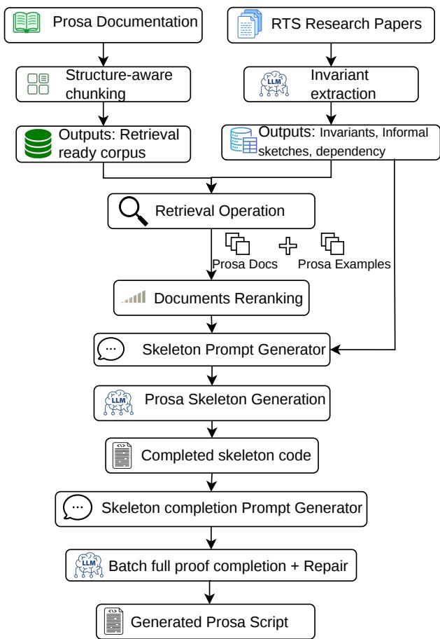
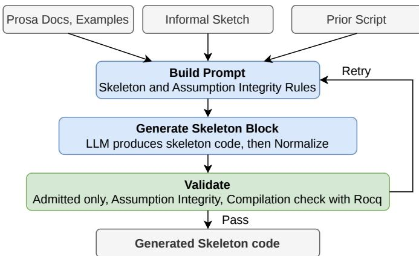
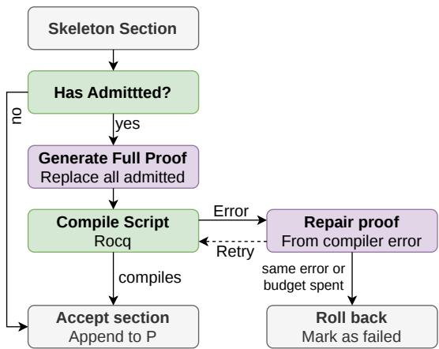
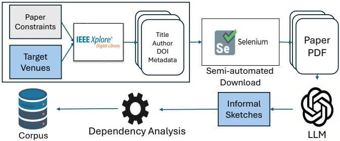
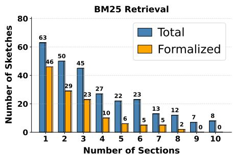
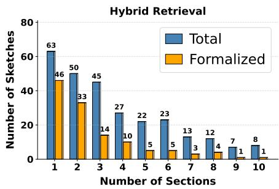
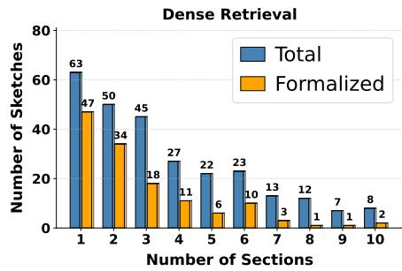
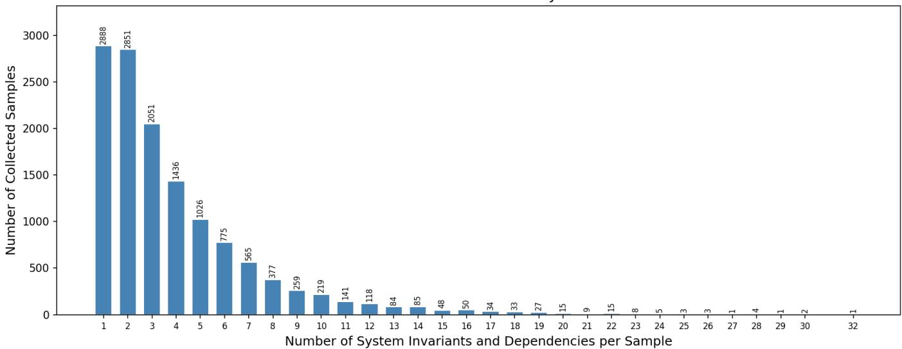

# PROVE-RT: Generating Mechanized Theorem Prover Scripts for Real-Time Systems using LLMs

Sadat Shahriyar<sup>∗</sup>, Shareef Ahmed<sup>†</sup>, Abdullah Al Arafat<sup>∗</sup> <sup>∗</sup>Florida International University, <sup>†</sup>University of South Florida Email: {sshahriy, aarafat}@fiu.edu, shareefahmed@usf.edu

Abstract—Schedulability analysis is essential for certifying real-time systems, but existing tests are often developed through pen-and-paper proofs that are difficult to scale, validate, and maintain. Mechanized verification in PROSA/ROCQ offers a rigorous alternative, yet manually constructing such proofs requires substantial domain expertise and proof-engineering effort. Recent successes of large language models (LLMs) across a wide range of tasks make them promising candidates for generating PROSA/ROCQ scripts for mechanized theorem provers. However, state-of-the-art LLMs often lack the PROSA-specific knowledge required to correctly use its modeling abstractions and proof patterns.

This paper introduces PROVE-RT, an LLM-assisted framework for generating PROSA/ROCQ scripts to mechanize schedulability analyses in real-time systems literature. PROVE-RT guides generation through dependency-aware informal sketches, retrieval from processed PROSA documentation, staged skeleton generation, and proof completion. We construct a mechanizationoriented corpus from 1, 191 real-time systems papers, containing 13, 134 informal sketches with dependency information. On a curated evaluation set, direct prompting of state-of-the-art LLMs fails to reliably generate valid PROSA mechanizations, whereas PROVE-RT achieves a success rate of 44.7%. These results show that retrieval-guided and staged LLM assistance can improve automated mechanization of schedulability analysis in PROSA/ROCQ.

## I. INTRODUCTION

Safety-critical real-time systems (RTS) must undergo an offline certification process (typically in the form of a schedulability analysis) to ensure timing correctness at runtime. Traditionally, schedulability analyses have been devised through pen-and-paper proofs. Although this approach has enabled a rich body of real-time scheduling theory, it is increasingly difficult to sustain as systems become more complex.

Moreover, manual proofs require careful validation, as subtle mistakes in intermediate lemmas or bounds can affect the final schedulability result and subsequent analyses that build upon it (e.g., [1, 2, 3, 4] are a few papers among many others that identify and address issues in earlier analyses).

An alternative approach is to verify correctness through mechanized proofs. Cerqueira et al. [5] developed the first mechanized theorem prover, PROSA, for real-time systems. PROSA provides a ROCQ [6]-based foundation for mechanized schedulability analysis, offering a more rigorous approach for verifying the correctness of pen-and-paper proofs. PROSA is a repository of definitions and proofs for machine-checkable real-time scheduling theory, including task models, schedules, workload functions, interference notions, and schedulability results. By building on ROCQ, PROSA enables schedulability analyses to be stated and checked with precision, thereby increasing confidence in the correctness of real-time systems theory.

Unfortunately, mechanized verification does not eliminate the human effort required to construct formal proofs. This is evident from previous works. For example, CertiCAN, a PROSA-based ROCQ tool for certifying CAN schedulabilityanalysis results, required 18,852 lines of ROCQ code, excluding the PROSA proofs that it reused [7]. Similarly, integrating PROSA’s verified schedulability analysis into the RT-CertiKOS verified operating-system kernel required 4,135 lines of ROCQ for the connection alone, including 1,900 lines for the translation interface to PROSA [8]. Beyond initial development costs, mechanized proofs also incur maintenance costs: for instance, Bozhko and Brandenburg [9] observed that even conceptually simple changes to the underlying model can invalidate existing mechanized proofs and require dozens of person-hours of proof maintenance. These examples suggest that although PROSA provides a reusable foundation for machine-checkable schedulability analysis, manual development and maintenance remain a substantial barrier to widespread adoption.

To reduce the burden of script preparation for mechanized theorem provers [6, 10, 11, 12] in general cases, a growing body of work has explored automated theorem proving and proof automation using machine learning [13, 14, 15, 16, 17, 18, 19]. However, to the best of our knowledge, there has been no prior work on the automated mechanization of schedulability analyses for real-time systems. In this work, we introduce PROVE-RT, a novel large-language-model (LLM)- assisted framework for generating mechanized PROSA proofs for schedulability analyses whose correctness can be verified mechanically. It is noteworthy that, beyond mechanizing existing schedulability analyses, PROVE-RT may also facilitate the trustworthy use of generative AI for developing new schedulability analyses. As generative AI has shown promise across many scientific disciplines [20, 21, 22], PROVE-RT can serve as a verification layer for validating AI-assisted or AI generated schedulability results through mechanized checking.

Challenges and Contributions. Although schedulability analyses are mathematically rigorous, they are typically expressed in a non-mechanized form that lacks the explicit structure required by theorem provers. Therefore, generating PROSA scripts for schedulability analyses differs fundamentally from conventional mathematical proof generation which is more widely studied in the literature. This introduces three key challenges: (i) limited mechanized RTS corpora, restricting LLM understanding of PROSA abstractions and proof patterns; (ii) a formalization gap between structurally non-mechanized schedulability analyses and PROSA’s explicit proof structure; and (iii) the complexity in the structure of schedulability lemmas/theorems compared to mathematical theorem-proving tasks. These challenges are elaborated in Section II. To overcome them, PROVE-RT incrementally mechanizes schedulability analyses through staged formalization, dependencyaware proof construction, and retrieval-augmented grounding using RTS knowledge and PROSA documentation.

In summary, this paper makes the following contributions:

• We introduce PROVE-RT, a framework for assisting the mechanization of schedulability analyses in PROSA/ROCQ. To the best of our knowledge, PROVE-RT is the first LLM-assisted framework targeting the PROSAbased mechanization of RTS analysis.

• We develop a benchmark from 1, 191 real-time systems papers, comprising 13, 134 mechanization-oriented informal sketches and corresponding PROSA/ROCQ script artifacts. The benchmark is intended to support future work on LLM-assisted theorem proving and formalization for real-time systems.

• We analyze the key challenges, recurring failure modes, and corner cases encountered when generating PROSA/ROCQ scripts with LLMs. This study provides practical insights for improving future automated mechanization tools for real-time systems analysis.

Paper Organization. The remainder of the paper is organized as follows. Section II elaborates on the core challenges while mechanizing schedulability analysis with PROSA. Section III provides background on PROSA and reviews related work. Section IV introduces the notation used throughout the paper and formalizes the problem statement. Section V presents the design of PROVE-RT. Section VII describes the construction of the system invariant dataset, the evaluation baselines and metrics, and the implementation details. Section VI provides an example on how the framework works. Section VIII presents the evaluation of PROVE-RT. Finally, Section IX concludes the paper by discussing the limitations of PROVE-RT and outlining directions for future work.

## II. CHALLENGES IN MECHANIZING SCHEDULABILITY ANALYSIS

Automated theorem proving for real-time schedulability analysis introduces challenges that differ from the more commonly studied setting of LLM-based theorem proving for pure mathematics. In particular, the difficulty is not only to generate a proof script for a given theorem, but also to recover the formal structure needed to express schedulability analyses in PROSA/ROCQ.

A key limitation is the scarcity of mechanized training data for real-time schedulability analysis. Recent LLM-based theorem-proving systems benefit from large formal corpora [23, 24, 25, 26, 27, 28], which provide many examples of theorem statements, proof scripts, and reusable mathematical libraries. In contrast, public data for mechanized schedulability analysis is very limited. The PROSA library is the main available resource, but its scale is much smaller than mature mathematical proof libraries. This data scarcity limits the ability of LLMs to learn PROSA-specific abstractions, scheduling terminology, type-class assumptions, and proof patterns.

Another challenge is the formalization gap between schedulability analyses as written in the real-time systems literature and the explicit proof structure required by PROSA. Schedulability analyses are usually presented through mathematical notation, prose explanations, assumptions, definitions, intermediate bounds, and proof sketches. Although these presentations are rigorous for human readers, they are not directly mechanizable. A PROSA/ROCQ development must explicitly declare variables, hypotheses, type-class instances, section contexts, dependencies, and proof obligations. Therefore, an automated system must first identify the mechanization-relevant constructs, recover their dependencies, normalize notation, and map the extracted concepts to existing PROSA abstractions before proof generation can even begin.

Schedulability-analysis lemmas are also structurally complex. They are often built on a hierarchy of task models, job parameters, arrival constraints, scheduling policies, workload definitions, interference bounds, and response-time properties. These definitions may depend on one another across multiple levels and are usually accompanied by many hypotheses. As a result, the complete formal context needed to state and prove a schedulability lemma in PROSA can span hundreds of lines. This creates a substantial burden on the LLM’s context handling and reasoning capabilities.

Beyond the complexity of individual lemmas, PROSA is designed around reusable abstractions and lemmas that apply across different task models and scheduling policies. Whether an existing lemma can be used to prove a target result depends on whether its preconditions hold in the current proof context. Thus, proof generation requires more than selecting tactics: it requires constructing the right context, preserving dependency order, and ensuring that all required assumptions are available. These factors make automated mechanization of schedulability analysis substantially more difficult than direct proof generation for an already formalized theorem statement.

## III. PRELIMINARIES AND RELATED WORK

In this section, we will discuss the necessary PROSA background and the related works on mechanized theorem provers and script generation.

## A. Background on PROSA

PROSA [5] is a ROCQ library for mechanized schedulability analysis of RTS. It formalizes real-time scheduling concepts as Gallina (i.e., ROCQ specification language) definitions and establishes schedulability results as machine-checked lemmas and theorems. Since PROSA is built in ROCQ, a PROSA script follows the standard ROCQ development model: required modules are imported, assumptions are introduced through sections and contexts, definitions are stated, and proof obligations are discharged using tactics.

A key feature of PROSA developments is their reliance on explicit proof context. A Section groups together variables, hypotheses, and type-class constraints that are shared by the definitions and lemmas inside it. PROSA uses ROCQ type classes to represent reusable modeling assumptions, such as task parameters, job parameters, scheduling policies, and system properties. Although these assumptions may be inferred automatically by ROCQ via type-class resolution, the required instances must be available in the current context or imported environment for the script to type-check.

ROCQ follows a forward-referencing discipline: every definition, hypothesis, lemma, theorem, and imported module must be introduced before it is used. Thus, a valid PROSA development must be ordered so that all prerequisites of a proof are already available when the proof is checked. This makes dependency ordering and context construction central to writing correct PROSA scripts.

We briefly summarize the ROCQ/PROSA notions that are needed to follow the rest of the paper.

• Proof script is the ROCQ source code used to express a formal development. In PROSA, a proof script contains imports, definitions, assumptions, lemmas, theorems, and tactic-based proofs for schedulability analysis.

• Proof environment refers to the collection of formal objects available during proof development. This includes imported libraries, previously defined concepts, declared assumptions, and already-proved lemmas or theorems.

• Proof context refers to the local information available at a particular point in a proof. In PROSA, this often includes variables, hypotheses, task and job parameters, scheduling assumptions, and type-class instances introduced inside a section.

• Proof goal is the proposition that remains to be proved. A schedulability theorem in PROSA may generate one or more proof goals involving task assumptions, workload bounds, interference bounds, or response-time guarantees.

• Proof tactic is a command used to advance a proof by transforming the current goal into simpler subgoals or by solving it directly. Common ROCQ tactics include intros, apply, rewrite, simpl, and lia.

• Proof step is one application of a proof tactic. Each proof step changes the current proof state and moves the proof closer to completion.

• Proof state is the complete status of an interactive proof at a given point, including the current goals and the local context. During proof construction, the proof state changes after each tactic is applied.

• Type-class resolution is ROCQ’s mechanism for automatically finding required instances of abstract interfaces. PROSA uses type classes to represent reusable modeling assumptions, such as job costs, task parameters, arrival information, and scheduling properties.

• Proof obligation is a statement that must be proved before a development is complete. Lemmas, theorems, and corollaries introduce proof obligations, whereas definitions mainly introduce formal objects.

• Compilation is the process of checking a ROCQ/PROSA file. A file compiles only if all referenced objects are available, all statements are well typed, all type-class requirements are resolved, and all proof obligations are completed or explicitly admitted. A compilation error occurs when any of these conditions is violated, for example, due to missing imports, undefined variables, unresolved type-class instances, type mismatches, or incomplete proofs. Such errors indicate that the script is not yet a valid mechanized development.

## B. Related Works

Mechanized verification provides a rigorous way to validate mathematical and software artifacts by encoding definitions, assumptions, lemmas, and theorems in an interactive theorem prover (ITP), where each proof is checked by a small trusted kernel. Several ITPs, such as ROCQ [6] (commonly known as Coq), Isabelle [10], Agda [12], and Lean [11], have been widely used in the verification community. These proof assistants have supported the verification of a broad range of software systems. For example, ROCQ has been used to verify the CompCert C compiler [29], a lightweight relational database management system [30], and distributed systems through the Verdi framework [31]. Isabelle/HOL has been used to verify the seL4 operating-system kernel [32]. More recently, Lean has been used to formalize and verify neural networks through TorchLean [33].

In real-time systems, PROSA provides a ROCQ-based foundation for mechanized schedulability analysis [5]. It formalizes core real-time scheduling concepts including task models, schedules, workload functions, interference notions, and schedulability results. Building on this foundation, prior work has used PROSA to mechanize and validate several schedulability-analysis results including response-time analysis, CAN schedulability certification, FIFO scheduling, busywindow reasoning, and connections between response-time analysis and network calculus [9, 7, 34, 35, 36]. These works demonstrate the value of mechanized verification for increasing confidence in real-time systems theory. However, they still require substantial manual proof engineering and domain expertise.

To reduce the burden of manual proof development, prior approaches have proposed various methods for generating proof tactics, selecting relevant premises, and guiding proof search using learned models [13, 14, 15, 16, 17, 18, 19]. More recently, large language models (LLMs) have shown promise in generating formal proofs and assisting interactive theorem proving [37, 38, 39, 40, 41, 42]. However, these efforts have largely focused on general-purpose theorem proving or domains such as mathematics and software verification. To the best of our knowledge, there has been no prior effort to automatically generate PROSA proofs for mechanized schedulability analysis from real-time systems papers.

## IV. FRAMEWORK MODEL AND PROBLEM STATEMENT

## A. Framework Model

We first define the main objects used throughout the PROVE-RT pipeline.

Schedulability Analysis (A). Let A be a schedulability analysis for an RTS scheduling problem. Such an analysis is typically presented using mathematical definitions, assumptions, lemmas, theorems, corollaries, and proof arguments. Unlike standard ROCQ tactic-generation tasks, A is not given as a proof goal inside an existing proof environment. Instead, it is a schedulability test whose formal constructs, dependency structure, and proof obligations must be recovered before mechanization.

System Invariant (I). We use the term system invariant to refer to any mechanization-relevant construct in A that must be represented in the final PROSA/ROCQ development. A system invariant may be a definition, hypothesis, assumption, lemma, theorem, corollary, fix-point, or other formal claim required to establish the correctness of the schedulability test. We denote the set of extracted system invariants by $I = \{ i _ { 1 } , i _ { 2 } , \ldots , i _ { n } \}$ Informal Sketch $( \{ K _ { j } \} )$ . An informal sketch $K _ { j }$ describes the statement of the invariant $i _ { j }$ , the intuition behind it, and the intended proof outline. These sketches serve as the intermediate representation between the natural-language schedulability analysis and the generated PROSA/ROCQ script. Each invariant $i _ { j } \in I$ is associated with an informal sketch $K _ { j }$

Dependency Structure $( G _ { D } )$ . The extracted invariants form a dependency structure. We represent this structure as a directed acyclic graph (DAG) $G _ { D } = ( I , D )$ , where each node corresponds to a system invariant and each directed edge represents a dependency, e.g., an edge $( i _ { p } , i _ { j } ) \in D$ means that invariant $i _ { j }$ depends on $i _ { p } .$ Thus, $i _ { p }$ must appear earlier than $i _ { j }$ in the generated PROSA/ROCQ script. The DAG, therefore, defines the order in which invariants should be formalized. This ordering is required because ROCQ is forward-referencing: all definitions, assumptions, lemmas, theorems, and imports must be introduced before they are used.

PROSA Documentation Corpus (P). Let $P$ be the processed PROSA documentation corpus. $P$ contains documentation fragments, definitions, assumptions, reusable lemmas, and example proof structures extracted from the PROSA library. For each invariant $i _ { j }$ , the retrieval module selects a relevant subset $R _ { j } \subseteq P$ to provide the library-specific context needed for script generation.

The generated script is built incrementally according to the dependency order induced by $G _ { D }$

## B. Problem Statement

Given a schedulability analysis A and a processed PROSA documentation corpus $P ,$ the goal of PROVE-RT is to generate a dependency-ordered PROSA/ROCQ script S that mech-

anizes the schedulability analysis and compiles under the PROSA/ROCQ environment as:

$$
M : ( A , P ) \to S ,
$$

where M denotes the PROVE-RT generation pipeline and $S =$ $\{ s _ { 1 } , s _ { 2 } , \ldots , s _ { n } \}$ is the generated PROSA/ROCQ script. Each code block $s _ { j } \in S$ is intended to formalize the corresponding system invariant $i _ { j } \in I$

A successful output must satisfy three requirements. First, each generated code block $s _ { j }$ must correctly represent the corresponding extracted invariant $i _ { j }$ . Second, the ordering of code blocks in S must respect the dependency graph $G _ { D } = ( I , D )$ , so that every prerequisite invariant is introduced before any invariant that depends on it. Third, the final script $S$ must compile under the PROSA/ROCQ environment.

We decompose this objective into two subproblems.

Skeleton Generation (via $M _ { \mathrm { s k e l } } )$ . The first subproblem is skeleton generation. For each invariant $i _ { j } .$ , the skeletongeneration module uses the informal sketch $K _ { j }$ , the retrieved PROSA context $R _ { j } .$ , the dependency graph $G _ { D } ,$ , and the partial PROSA/ROCQ script already generated for earlier invariants, denoted by $S _ { < j }$ , to produce a structurally valid PROSA/ROCQ code block:

$$
M _ { \mathrm { s k e l } } : ( K _ { j } , R _ { j } , G _ { D } , S _ { < j } )  s _ { j } .
$$

After the skeleton-generation stage, some generated PROSA/ROCQ fragments contain proof-bearing constructs, such as lemmas, theorems, or corollaries, whose proof bodies were intentionally left as Admitted. We refer to these unfinished proof bodies as deferred proof obligations. The proof-completion stage attempts to replace each Admitted. placeholder with a valid ROCQ proof.

For each deferred proof associated with $s _ { j } ,$ the proofcompletion module takes the current partial script $S _ { < j }$ , the corresponding informal sketch $K _ { j }$ , and the retrieved PROSA context as input $R _ { j }$ , and generates a proof fragment $\pi _ { j }$ intended to replace the Admitted. placeholder.

Proof Completion (via $M _ { \mathrm { p r o o f } } )$ . The second subproblem is proof completion. For each deferred proof in $s _ { j } ,$ the proofcompletion module uses the current partial script $S _ { < j }$ , the informal sketch $K _ { j }$ , and the retrieved PROSA context $R _ { j }$ to generate a proof fragment $\pi _ { j } { \ : } :$

$$
M _ { \mathrm { p r o o f } } : ( S _ { < j } , s _ { j } , K _ { j } , R _ { j } )  \pi _ { j } .
$$

The generated proof fragment $\pi _ { j }$ is intended to replace the corresponding Admitted placeholder. It is accepted only if the resulting PROSA/ROCQ script is checked successfully by the ROCQ compiler. If compilation fails, compiler feedback or proof-state information is used to guide repair.

Thus, the problem addressed by PROVE-RT is broader than next-tactic prediction. It requires transforming a real-time systems schedulability analysis into a dependency-ordered PROSA/ROCQ script that can be mechanically checked by the proof assistant.

  
Fig. 1: Overview of the proposed PROSA/ROCQ proofgeneration pipeline.

## V. PROVE-RT FRAMEWORK

PROVE-RT consists of five stages: (1) Extracting system invariants, informal sketches, and dependency graph from formally written schedulability analysis; (2) Processing the PROSA documentation into retrieval-ready fragments; (3) retrieving relevant documentation and examples, with dependency recovery for proof-oriented modules; (4) generating and validating a structurally correct proof skeleton with deferred obligations; and (5) completing the deferred proofs using iterative repair. We explain these stages in the following subsections. Fig. 1 illustrates an overview of the PROVE-RT.

## A. System Invariant Extraction

Extraction of Invariants and Sketches. The first stage of PROVE-RT transforms the input, schedulability analysis A, into the intermediate representation required for mechanization, consisting of a set of system invariants I, their corresponding informal sketches $\{ K _ { j } \}$ , and a dependency graph $G _ { D } = ( I , D )$ . This stage is necessary as schedulability analyses in the RTS literature are usually written for mathematical presentation rather than direct mechanization. As a result, the constructs needed for PROSA/ROCQ generation may appear in different forms, including prose explanations, equations, definitions, lemmas, theorems, claims, or corollaries.

To facilitate this process, PROVE-RT first prompts an LLM to identify candidate system invariants from schedulability test A. The LLM is guided using carefully designed prompts that include practical examples and detailed guardrails to ensure consistency and accuracy in the output.

For each extracted invariant $i _ { j } \in I ,$ , the LLM generates an informal sketch $K _ { j }$ . Informal sketches provide a structured, step-by-step description of each system invariant in plain text, capturing both the logical flow and the intended proof outline. An example informal sketch is outlined in Listing 4 in Appendix A1.

Construction of Dependency Graph. The extracted dependency information is used to construct the dependency graph $G _ { D } ~ = ~ ( I , D )$ . For each invariant $i _ { j } ,$ , the LLM identifies other invariants that must be established before $i _ { j }$ can be formalized. Each such relation is represented as an edge in D. The extracted invariants are then ordered according to this graph so that, when the PROSA/ROCQ script is generated, prerequisites are introduced before the constructs that depend on them. The resulting unit-level informal sketches, ordered by $G _ { D } ,$ , form the primary input to the subsequent stages of PROVE-RT.

## B. PROSA Documentation Processing

The second stage of PROVE-RT constructs the processed PROSA documentation corpus P used for retrieval. This stage is necessary because direct LLM-based generation of PROSA/ROCQ scripts is difficult without library-specific context. The PROSA library relies on domain-specific abstractions, type-class assumptions, reusable lemmas, and proof conventions that are often not available to a pretrained model. Thus, the PROSA documentation is processed into retrievalready fragments so that later stages can retrieve relevant proof constructs for each invariant $i _ { j }$

The PROSA documentation is organized into six main modules: Analysis, Behavior, Implementation, Model, Results, and Util. These modules are used to guide the construction of P. In particular, the Results module is used primarily as a source of complete proof examples, since it contains formally verified schedulability results. The remaining modules provide supporting context, including system definitions, modeling assumptions, formal definitions, reusable lemmas, and auxiliary proof components.

As the modules differ in both structure and purpose, they are processed using two chunking strategies.

Proof-Oriented Chunking. For the Analysis and Results modules, proof-oriented chunks are used which pairs each formal code block with its corresponding descriptive text. This preserves the connection between a proof component and the explanation that motivates it, allowing retrieval to operate over meaningful proof-level units such as definitions, lemmas, and theorems. During retrieval, the retrieved prooflevel units are augmented with their relevant dependencies, so that lemmas, theorems, and definitions are provided together with the supporting constructs required for script generation.

This dependency reconstruction step is described in the next section V-C.

Section-Level Chunking. For the remaining modules, sectionlevel chunks are used, since these modules are typically organized around smaller and more self-contained concepts, assumptions, or helper components.

The resulting set of documentation fragments forms the processed corpus $P .$ During retrieval, PROVE-RT selects a relevant subset $R _ { j } \subseteq P$ for each invariant $i _ { j } .$ , which provides the LLM with PROSA-specific context for generating the corresponding PROSA/ROCQ code block $s _ { j }$

## C. Retrieval Process

Query Construction. The retrieval stage constructs the context $R _ { j } \subseteq P$ for each invariant $i _ { j }$ . Given the informal sketch $K _ { j }$ , the goal is to retrieve the most relevant fragments from the processed PROSA documentation corpus $P$ so that the skeleton-generation module has access to library-specific definitions, assumptions, lemmas, and example proof structures.

Each informal sketch may contain information about multiple invariants, including a target invariant and the prerequisites on which it depends. To preserve the dependency order induced by $G _ { D }$ , we process the sketches one invariant at a time. For each invariant $i _ { j } ,$ its corresponding sketch $K _ { j }$ is used as the retrieval unit.

For each informal sketch unit $K _ { j }$ , three components are used as retrieval queries: the statement of the invariant, the intuition underlying it, and the conclusion it establishes. Together, these components capture both the formal objective and the supporting reasoning of the target proof step.

Retrieval is performed independently for the statement, intuition, and conclusion queries, producing a ranked top-k list for each component. The retrieved candidates are then merged, and the highest-scoring documentation sections are selected as the retrieval context $R _ { j }$

Dependency Recovery for Proof-Oriented Modules. For candidates retrieved from the Analysis or Results modules, an additional syntax-aware dependency recovery step is applied before adding them to $R _ { j }$ . These modules contain prooforiented files in which later sections often rely on earlier definitions, hypotheses, lemmas, or typeclass contexts. Since ROCQ follows a forward-referencing discipline, a section with index N can depend only on preceding sections with indices from 0 to $N - 1$ within the same file. PROVE-RT exploits this ordering to recover the earlier sections needed to make the retrieved proof fragment usable in downstream generation.

The dependency recovery step assigns different weights to occurrences of identifiers based on their syntactic context. Identifiers before the Proof. keyword are treated as the strongest signals because they appear in the type-level statement of the declaration. Explicit references following tactics such as apply and rewrite are treated as medium-strength signals, while other proof-level tokens receive lower weight because they are more likely to include tactic noise or externallibrary names. If an identifier appears in multiple contexts, its maximum weight is kept to preserve the strongest dependency signal without double counting.

After extracting candidate identifiers from the three zones, each identifier is assigned a weight

$$
w ( x ) = \operatorname* { m a x } \bigl ( \alpha \cdot \mathbf { F } [ x \in Z _ { A } ] , \beta \cdot \mathbf { F } [ x \in Z _ { B } ] , \gamma \cdot \mathbf { F } [ x \in Z _ { C } ] \bigr ) ,
$$

Here, $Z _ { A } , Z _ { B } ,$ , and $Z _ { C }$ denote the sets of identifiers extracted from the type-level zone, the explicit-reference zone, and the remaining proof-token zone, respectively. The parameters $\alpha , \beta ,$ and $\gamma$ are weighting coefficients assigned to these zones, with $\alpha > \beta > \gamma$ to reflect the relative strength of the dependency signal provided by each syntactic context. To improve robustness, tokens are filtered out that are unlikely to correspond to meaningful local dependencies, such as grammar keywords, logical connectives, single-character tokens, self-references, and proof-local names introduced during tactics.

After extracting identifiers, they are matched against declarations in earlier sections of the same file. A section receives a score when it defines a matched identifier, weighted by the identifier’s dependency score; sections with nonzero scores are treated as likely direct dependencies. Unmatched identifiers contribute a small score to the imports file to prevent external-library references from being ignored. Because direct dependencies may themselves depend on earlier constructs, the procedure is applied recursively and arranges the recovered sections in their original order so that each construct appears before it is used.

The recovered dependencies are assembled with the retrieved section before being included in $R _ { j }$ . Imports are placed at the top level, code fragments are ordered for compilation, and unicode operators are normalized when needed. A lean version is first compiled containing only the recovered dependencies to reduce context size and noise. If this fails, a fullcontext version is used that includes all predecessor sections from the same file, which helps capture implicit dependencies such as typeclass requirements.

For the remaining modules, the documentation is more naturally organized into self-contained sections. Therefore, each section is treated as a single retrieval unit, the topk matching sections are retrieved, and used directly without additional dependency recovery.

## D. Skeleton Code Generation

The skeleton-generation stage addresses the first subproblem defined in Section IV. For each invariant $i _ { j }$ , it generates a structurally valid PROSA/ROCQ code block $s _ { j }$ using the invariant’s informal sketch $K _ { j }$ , the retrieved context $R _ { j }$ , the dependency graph $G _ { D }$ , and the partial script $S _ { < j }$ generated for earlier invariants.

This stage deliberately separates structure generation from proof generation. Generating the correct type signature of a PROSA/ROCQ construct, including its name, variable bindings, typeclass constraints, and statement, is generally more tractable for a language model than simultaneously discovering a valid proof strategy. Therefore, the skeleton stage focuses on producing well-typed declarations and statements, while proof bodies are deferred to the proof-completion stage. This decomposition provides an intermediate artifact that can be checked by coqc, allowing PROVE-RT to detect structural errors before attempting proof synthesis.

Prompt Construction. For each invariant $i _ { j } ,$ we construct the skeleton-generation prompt from four inputs: the informal sketch $K _ { j } .$ , the retrieved PROSA context $R _ { j } .$ , the dependency graph $G _ { D } ,$ , and the partial script $S _ { < j }$ . These components provide the model with the relevant library context, examples of PROSA structure, and the current proof context. The informal sketch $K _ { j }$ for the target section is appended last so that it remains the immediate generation objective.

In addition to this contextual information, the prompt includes two generation rules to ensure that the generated block $s _ { j }$ is structurally meaningful. First, PROOF-SKELETON RULE is enforced where every proof-bearing construct must be generated with a deferred proof obligation using Admitted., and no proof tactics are allowed at this stage. Thus, the model may generate either of the following forms:

or

Lemma foo : <statement>.   
Proof.   
Admitted.   
Lemma foo : <statement>.   
Admitted.

Non-proof-bearing constructs, such as definitions, declarations, and type-level specifications, must instead be generated in full because they do not create deferred proof obligations and are required for the skeleton to type-check.

Second, ASSUMPTION-INTEGRITY RULES are enforced. In preliminary experiments, a common failure mode was that the model made the proof artificially easy by turning claims that should be proven into unsupported assumptions. To prevent this, the prompt explicitly prohibits introducing unsupported hypotheses, restating the target claim as an assumption, or encoding the proof obligation in a vacuous way. Claims from $K _ { j }$ must remain proof-bearing constructs, while genuine preconditions must be encoded as part of the corresponding formal statement.

These rules make skeleton checking more reliable. If the generated block $s _ { j }$ fails to compile, the error is more likely to indicate a structural problem, such as an incorrect type, undefined identifier, or missing import, rather than a failed or misleading proof attempt. They also prevent the model from producing speculative proof bodies that may appear syntactically valid but are semantically incorrect and difficult to repair later.

Validation and Retry. After each generation attempt, the produced skeleton $s _ { j }$ is validated in two steps. First, it is checked that all proof-bearing constructs follow the admittedonly rule and contain no completed or partial proof bodies. Second, $s _ { j }$ is appended to the current partial script $S _ { < j }$ and the resulting script is compiled with coqc. This verifies structural validity and type correctness.

Non-proof-bearing constructs are accepted directly because they do not open a Proof. block. If validation or compilation fails, the section is regenerated; sections that repeatedly fail are logged and skipped so that the pipeline can continue.

  
Fig. 2: Skeleton code generation

## E. Skeleton Code Completion

After skeleton generation, each code block $s _ { j }$ may contain proof-bearing constructs whose proof bodies are deferred using Admitted. The goal of the completion stage is to generate a proof fragment $\pi _ { j }$ that replaces each deferred proof and makes the resulting PROSA/ROCQ script compile. For each deferred proof, the completion module uses the current partial script $S _ { < j }$ , the corresponding informal sketch $K _ { j }$ , and the retrieved PROSA context $R _ { j }$ as input. In this way, the system builds directly on the previous stage: the skeleton provides the formal statement and context, while the completion stage focuses only on filling in the missing proofs.

Batch Completion with Iterative Repair. PROVE-RT prompts LLM to generate the full proof body for a deferred proof in one response. The generated proof fragment $\pi _ { j }$ replaces the corresponding Admitted. placeholder in $s _ { j } ,$ and the resulting partial script is then checked with the ROCQ compiler. Furthermore, to ensure that the generated script proves the intended target lemma rather than circumventing it, we include a proof-integrity checker. The checker validates the LLM-generated proof and detects whether the model has modified the original problem, introduced unsupported auxiliary facts, or shifted the main proof obligation into a separate construct. Edits outside the intended proof region are treated as invalid. Concretely, the checker flags constructs such as Axiom, Parameter, Parameters, Conjecture, Conjectures, Admitted, admit, and Abort. It also detects whether the LLM introduces new global lemmas or definitions outside the proof region that effectively carry the main proof burden. Such modifications are rejected because they may allow the script to compile without actually proving the original lemma. At the same time, the checker permits harmless changes that do not alter the meaning of the theorem, such as importing additional trusted libraries from PROSA or MathComp etc. If the script compiles successfully and the proof-integrity checker reports no violations, the script is accepted.

  
Fig. 3: Batch Completion with Iterative Repair

If compilation fails or any violation is reported by the proofintegrity checker, PROVE-RT enters an iterative repair loop in which compiler feedback guides corrections. At each iteration, the error message and its location are extracted from the compiler output and incorporated into a repair prompt together with the informal sketch $K _ { j }$ and the retrieved context $R _ { j }$ . The LLM then proposes a revised proof fragment, which is inserted into the section and checked again.

This process is attractive because it allows the model to generate an entire proof in one step, while still benefiting from compiler-guided repair when the initial attempt is incorrect.

## VI. ILLUSTRATIVE EXAMPLE

We illustrate the end-to-end workflow of PROVE-RT using a concrete schedulability analysis drawn from the RTS literature, starting with the extraction of intermediate representations and leading to the final machine-verified PROSA script.

## A. Source Material and Extraction

We consider the paper “Worst-Case Timing Requirements of Real-Time Tasks with Time Redundancy” [43] as a representative example. From this paper, we extract the following definition and claim, which characterize the worst-case timing requirements of a task under fault-tolerant execution. The formal notations introduced in the paper are as follows: WORST-CASE TIMING REQUIREMENT: Let $a _ { i } ( k _ { i } )$ denote the additional processing time and runtime overhead required to tolerate $k _ { i }$ faults during the mission time of a task $\tilde { \boldsymbol { T _ { i } } }$ . The worst-case timing requirement $W _ { i } ( k _ { i } )$ of $\tilde { \boldsymbol { T _ { i } } }$ is given by

$$
W _ { i } ( k _ { i } ) = W _ { i } ( 0 ) + A _ { i } ( k _ { i } ) ,\tag{1}
$$

where $A _ { i } ( k _ { i } )$ denotes the worst-case value of $a _ { i } ( k _ { i } )$ and $W _ { i } ( 0 )$ represents the failure-free worst-case execution time (WCET).

RETRY-BASED REDUNDANCY: Assume that a task restarts from the beginning after each fault, with no rollback recovery. Let $R ^ { * }$ denote the constant restart overhead. Then the worstcase timing requirement under the retry mechanism is

$$
W _ { i } ( k _ { i } ) = k _ { i } \cdot ( R ^ { * } + W _ { i } ( 0 ) ) + W _ { i } ( 0 ) .\tag{2}
$$

These results are automatically extracted and structured using LLM. The extraction process identifies the formal statement, variables, assumptions, and conclusions associated with each invariant. In addition, it also produced an informal sketch. We provide the complete JSON extraction and the corresponding informal sketch in Appendix A1.

A notable property of the extraction is that it is dependencyaware. For each invariant, we identify the previously introduced invariants on which it depends; this information is recorded explicitly in the extracted representation. These dependencies induce a partial order that governs the subsequent formalization pipeline: an invariant is formalized only after all of its dependencies have been processed. In this example, Claim 1 depends on Definition 1, so the definition must first be formalized. Since PROSA follows an interpreted execution model in ROCQ, all prerequisite definitions and constructs must be available before they are referenced, making dependency-aware ordering essential for correct compilation.

## B. Retrieval-Augmented Generation

Given the informal sketch of an invariant, the next step is to translate it into a PROSA script. To support this translation, we employ retrieval-augmented generation (RAG) over the PROSA codebase. We use the statement, conclusion, and intuition fields from the informal sketch as query, retrieve their independent results and keep the top-k results from two complementary sources: (i) example scripts that demonstrate similar constructs or proof patterns, and (ii) documentation fragments describing the syntax, semantics, and usage conventions of relevant PROSA modules. Together, these provide the LLM with sufficient context to generate correct and idiomatic PROSA script.

## C. Skeleton Code Generation

Using the retrieved context, we prompt the LLM to generate skeleton code—a structurally complete, type-checkable PROSA script in which all imports, section boundaries, typeclass contexts, variable declarations, and definition bodies are fully specified, while every proof obligation is replaced by Admitted. Listing 1 shows the skeleton code generated for the motivating example.

Listing 1: Skeleton code generated from the informal sketch. All structural elements are fully elaborated; the proof body is deferred via Admitted.

```verilog
Require Export prosa.util.all.
Require Export prosa.behavior.time.
Require Export prosa.model.task.concept.
Require Export prosa.model.aggregate.workload.
Section WorstCaseTimingRequirement.
Context {Task : TaskType}.
Context ‘{TaskCost Task}.
Context {Job : JobType}.
Context ‘{JobTask Job Task}.
Context ‘{JobCost Job}.
Variable W_i_0 : work.
```

```verilog
Variable k_i : nat.
Variable R_star : work.
Definition W_i_k_i (A_i_k_i : work) : work :=
W_i_0 + A_i_k_i.
Lemma W_i_k_i_retry :
W_i_k_i (k_i <sub>*</sub> (R_star + W_i_0))
= k_i <sub>*</sub> (R_star + W_i_0) + W_i_0.
Proof.
Admitted.
End WorstCaseTimingRequirement.
```

The skeleton faithfully encodes the structure of both invariants. Definition 1 is realized as the function $\mathbb { W } _ { - } \dot { \underline { { 1 } } } _ { - } \mathbb { k } _ { - } \dot { \underline { { 1 } } }$ which takes the fault-tolerance overhead $\mathbb { A } \mathrm { ~ \underline { ~ } \mathrm { ~ i ~ \underline { ~ } \mathrm { ~ k ~ \underline { ~ } \mathrm { ~ i ~ } ~ } ~ } ~ }$ as an argument and returns its sum with the failure-free WCET W\_i\_0. The PROSA type work, defined as nat, represents discrete units of processor service. Claim 1 is stated as Lemma $\mathtt { W \_ i \_ k \_ i \_ r e t r y }$ , which asserts that instantiating W\_i\_k\_i with the retry-specific overhead yields exactly Equation (2). The type-class contexts (TaskType, JobType, TaskCost, etc.) anchor the formalization within PROSA’s modeling framework and ensure that the definitions are compatible with the library’s broader infrastructure.

The Admitted. directive instructs ROCQ to accept the lemma statement without proof, allowing the entire file to type-check successfully. This confirms that the formalization structure—imports, scoping, type-class resolution, and the lemma statement itself—is sound before any proof synthesis is attempted.

## D. Proof Completion

In the final phase, we prompt the LLM a second time to discharge the Admitted obligations. This two-phase decomposition is deliberate: by supplying the complete skeleton as context, the LLM gains visibility into the surrounding definitions, type-class instances, and any auxiliary lemmas, enabling it to generate proof tactics that are consistent with the broader formalization. The prompt includes the retrieved context from the RAG step, the full skeleton code, and an instruction to complete a specific Admitted block. For this example, the LLM produces the following proof:

Listing 2: Completed proof of the retry-based worst-case timing requirement

```verilog
Lemma W_i_k_i_retry :
W_i_k_i (k_i (R_star + W_i_0))
= k_i (R_star + W_i_0) + W_i_0.
Proof.
unfold W_i_k_i.
lia.
Qed.
```

The proof proceeds in two steps. First, unfold W\_i\_k\_i δ-reduces the definition, exposing the underlying goal:

$$
\mathtt { W \_ i \_ o } + k _ { i } \mathtt { \Lambda } _ { - } 0 + k _ { i } \mathtt { \Lambda } _ { - } ( R ^ { * } + \mathtt { w \_ i \_ - } 0 ) = k _ { i } \mathtt { x } \left( R ^ { * } + \mathtt { w \_ i \_ - } 0 \right) + \mathtt { w \_ i \_ - } 0 .
$$

This is an equality over natural numbers that follows directly from the commutativity of addition. The lia tactic, which implements a decision procedure for linear integer arithmetic, discharges it automatically. The completed script compiles under ROCQ and confirms that the retry-based worst-case timing requirement is a valid instantiation of the general faulttolerant WCET model formalized in PROSA.

This example demonstrates how our pipeline systematically transforms informal real-time scheduling results into machineverified PROSA proofs through a structured sequence of extraction, retrieval-augmented skeleton generation, and targeted proof completion. A second illustrative example can also be found in Appendix F.

## VII. EXPERIMENTAL SETUP

We evaluate PROVE-RT by investigating the following research questions (RQs).

RQ1: To what extent can PROVE-RT formalize schedulability tests as PROSA/ROCQ scripts?

RQ2: How does the dependency depth of informal sketches influence the success of mechanization?

RQ3: How does the choice of retrieval method affect the effectiveness of PROVE-RT?

## A. System Invariant Dataset Construction

As one of the main artifacts of this work, PROVE-RT System Invariant Dataset is constructed, which is a large scale collection of schedulability-analysis invariants designed to support and evaluate LLM-assisted PROSA/ROCQ mechanization. The dataset provides instances of the framework objects introduced earlier: schedulability analyses A, extracted invariant sets I, informal sketches K<sub>j</sub>, and dependency graphs $G _ { D } = ( I , D )$ . Figure 4 presents a high-level overview of the system invariant corpus collection process.

To construct the source corpus for system-invariant extraction, schedulability-analysis papers were collected from established real-time systems and embedded systems venues. The IEEE Xplore API was used to retrieve paper metadata. The search was restricted to major venues, including RTSS, RTAS, ECRTS, EMSOFT, RTCSA, RTNS, RSS, and IROS. The full search query and venue list are provided in Appendix B.

The API returned 1,991 paper records. For each record, the metadata was extracted to locate the corresponding full-text PDF. Since the IEEE Xplore API does not directly support bulk full-text PDF downloads, a semi-automated browserassisted workflow was used with personal access credentials. For each paper, the PDF URL was extracted from the retrieved metadata and was opened in an authenticated browser session using Selenium. Then Selenium was used to interact with the Chrome PDF viewer and trigger the download action automatically. Because authenticated sessions may expire during long download runs, the workflow also included a sessionrecovery mechanism that restored access through automated browser interactions. After retrieval, duplicate files caused by overlapping searches or repeated download sessions were removed, resulting in approximately 1,870 unique papers.

Each collected PDF was then converted into a structured XML representation using GROBID. The XML format preserves document structure, making it more suitable for LLMbased extraction than raw PDF text. This structured representation was used as input to the invariant extraction stage of PROVE-RT. In our implementation, we used Gemini-2.5- Flash as the LLM and prompted it to identify candidate system invariants I from each schedulability analysis and to extract their summaries, informal sketches $K _ { j }$ , and dependency information for constructing $G _ { D }$ . The prompts included examples and guardrails to encourage consistent output and to distinguish mechanization-relevant constructs from general explanatory text.

After Gemini extraction, a deterministic validation pass was applied to filter structurally invalid outputs before constructing the final dataset. The validator constructed an inter-invariant dependency graph from the extracted identifier and dependencies fields, where each invariant is represented as a node, and each resolved dependency is represented as a directed edge from the dependent invariant to its prerequisite. To resolve dependency references, the validator uses a three-stage matching process: exact, normalized, and fuzzy matching. Exact matching requires the dependency string to match an extracted identifier character-for-character. Normalized matching canonicalizes both dependency strings and candidate identifiers by lowercasing text, replacing formatting artifacts such as backticks and underscores with spaces, removing nonalphanumeric punctuation, and collapsing repeated whitespace. If both exact and normalized matching fail, fuzzy matching compares the normalized dependency string against all normalized candidate identifiers using a character-level similarity score and links it only to the highest-scoring candidate when the score exceeds 0.88. This step is intended to recover nearduplicate identifiers with minor residual formatting differences while avoiding spurious dependency edges.

Using the resolved dependency graph, the validator checks for unresolved dependencies, self-dependencies, forward references, and dependency cycles. Papers are labeled as keep, review, or reject: papers with dependency cycles or an unresolved-dependency ratio above 0.15 are rejected, papers with weaker structural issues are marked for review, and structurally valid papers are retained. After this filtering step, the retained corpus contained 1, 191 papers and 13, 134 informal sketches.

Another important characteristic of the retained system invariant dataset is the distribution of extracted constructs by type. As discussed earlier, each unit-level informal sketch contains a target invariant together with the dependencies required to establish it. Consequently, a single sketch may include multiple system invariants that must be introduced and proved sequentially before the final target invariant can be mechanized. We therefore analyze the full set of system invariants appearing across all collected sketches.

This analysis reveals substantial variation in how authors formulate and name system invariants. Across the collected papers, 73 distinct raw invariant types were identified. To make these invariants compatible with ROCQ-based proof development, they were normalized into six broader categories corresponding to supported proof constructs: definitions, hypotheses, lemmas, theorems, corollaries, and fixpoints. The complete fine-grained mapping from raw sketch kinds to ROCQ keywords is provided in Appendix H. Overall, the extraction process produced 13,134 normalized system invariants, including their dependency information. Table I reports the distribution of invariants across the normalized categories.

  
Fig. 4: System Invariant Dataset Collection

We further analyze the number of invariants appearing in each unit-level informal sketch. Each sketch contains a target invariant together with the dependencies that must be established before the target can be mechanized.

The resulting corpus is both an input to PROVE-RT and a reusable artifact for studying LLM-assisted mechanization of real-time systems schedulability analyses. The distribution is described in Appendix G.

## B. Baselines

PROVE-RT is compared against direct LLM-based generation of PROSA/ROCQ scripts. Since recent LLMs have shown strong capability in proof synthesis and ROCQ code generation, and since PROSA is built on top of ROCQ, these baselines evaluate whether LLMs can mechanize real-time systems schedulability analyses without the additional guidance introduced by PROVE-RT.

We consider two baseline settings. First, the LLM is prompted to mechanize a target invariant using only the corresponding text from the original schedulability-analysis paper, without external PROSA documentation or skeletoncode generation. Second, the LLM is provided with the extracted informal sketch for the target invariant, but receives no retrieval support and does not use the skeleton-code generation stage. These baselines measure how far direct LLM generation can go without dependency-aware retrieval, skeleton generation, and proof-repair mechanisms.

## C. Evaluation Metrics

PROVE-RT counts a generated script as successful only if it is accepted by the ROCQ proof checker; that is, the completed proof must compile without errors, contain no remaining deferred proof obligations, and pass the proofintegrity checker without any reported violations. This follows the standard proof-assistant acceptance criterion used in prior ROCQ proof-generation work, where generated proofs are considered correct only when they lead the theorem prover to proof termination with Qed [19, 42].

TABLE I: Distribution of extracted elements by category
<table><tr><td>Category</td><td>Invariant Count</td><td>Percentage</td><td># Raw Kinds</td></tr><tr><td>Definition</td><td>6817</td><td>51.9%</td><td>17</td></tr><tr><td>Lemma</td><td>4144</td><td>31.6%</td><td>38</td></tr><tr><td>Theorem</td><td>1822</td><td>13.9%</td><td>1</td></tr><tr><td>Corollary</td><td>228</td><td>1.7%</td><td>1</td></tr><tr><td>Fixpoint</td><td>115</td><td>0.9%</td><td>14</td></tr><tr><td>Hypothesis</td><td>8</td><td>0.1%</td><td>2</td></tr><tr><td>TOTAL</td><td>13134</td><td>100.0%</td><td>73</td></tr></table>

To measure the effectiveness of PROVE-RT, we use success rate, a standard metric used in prior work to evaluate ROCQ code and proof generation [26, 44, 45].

Success rate is measured as the fraction of proof constructs for which the tool generates a successful proof script:

$$
\mathrm { S u c c e s s ~ R a t e } = \frac { N _ { S } } { N _ { T } } ,\tag{3}
$$

where $N _ { S }$ denotes the number of successfully mechanized sketches with successful proof scripts, and $N _ { T }$ denotes the total number of evaluated sketches.

## D. Implementation Details

For the system invariant extraction stage, GEMINI-2.5- FLASH was employed as the backbone large language model. The model is prompted with structured, guardrailed instructions alongside few-shot examples to ensure consistent XML parsing.

For the retrieval-augmented generation (RAG) component, the retrieval corpus was constructed from the CoqDocgenerated HTML documentation of PROSA, yielding 5, 097 documentation fragments from 356 source files. Three retrieval strategies were evaluated: BM25, dense retrieval, and hybrid retrieval. For dense retrieval, the nomic-embed-code-7b was used to generate vector embeddings and store them in a FAISS vector index. For each query, the top-K most relevant documentation chunks were selected, with $K = 5 ,$ and they were provided as context to the LLM during skeleton generation.

The proof completion pipeline uses Claude-Opus-4.6. It is executed in two phases. In the first phase, the skeleton code is synthesized with Admitted. directives to verify type-checking and type-class resolution. In the second phase, the LLM is prompted to discharge individual proof obligations using automation tactics for linear integer arithmetic. All interaction with the interactive theorem prover is managed via an automated script running ROCQ version 9.1.0.

The dataset construction and semi-automated PDF collection workflows are executed via Selenium driving an authenticated Chrome browser session. Text extraction and document structuring are processed using GROBID to convert raw PDFs into structured XML. The entire pipeline is implemented in Python 3.10 and evaluated on an Ubuntu 24.04 LTS server equipped with an Intel Xeon w5-3423 processor with 12 cores and 24 hardware threads, and 64GB of system RAM.

TABLE II: Overall mechanization success across generation modes.
<table><tr><td>Mode</td><td>Formalized</td><td>1 Success Rate</td></tr><tr><td>Paper Statements + GPT-5</td><td>0/300</td><td>0.0%</td></tr><tr><td>Informal Sketch + GPT-5</td><td>0/300</td><td>0.0%</td></tr><tr><td>Informal Sketch + Claude-Opus-4.6</td><td>1/300</td><td>0.33%</td></tr><tr><td>PROVE-RT-HYBRID</td><td>123/300</td><td>41.0%</td></tr><tr><td>PROVE-RT-BM25</td><td>126/300</td><td>42.0%</td></tr><tr><td>PROVE-RT-DENSE</td><td>134/300</td><td>44.7%</td></tr></table>

## VIII. EVALUATION

We evaluate PROVE-RT according to the three research questions introduced in Section VII.

Evaluation of RQ1. To evaluate the effectiveness of PROVE-RT, we compare it against direct PROSA/ROCQ script generation using state-of-the-art LLMs, including GPT and Claude. Although these models have demonstrated strong general capabilities in generating ROCQ code, their ability to generate PROSA scripts for mechanizing schedulability analyses remains unclear. We therefore conduct a pilot study to assess how well these models perform in this domain-specific setting. We then evaluate how PROVE-RT guides these models for producing mechanically checkable PROSA/ROCQ scripts.

For this evaluation, we performed a human-in-the-loop curation step to select a representative subset from the retained invariant corpus. The selection focused on scheduling-analysis categories that are well aligned with existing PROSA abstractions while still spanning different levels of mechanization difficulty. These categories include uniprocessor fixed-priority response-time analysis, uniprocessor EDF response-time or demand-bound analysis, FIFO/FCFS response-time analysis, non-preemptive and limited-preemptive analyses, blocking and resource-sharing analyses, self-suspending task analyses, multiprocessor global EDF/global fixed-priority analysis, and multiprocessor partitioned scheduling analysis. After curation, the final evaluation corpus contained 109 papers and 1, 904 unit-level informal sketches.

From this curated evaluation corpus, we further selected a smaller evaluation subset of 300 unit-level informal sketches using proportional stratified sampling over dependency-depth categories. Let $n _ { c }$ denote the number of sketches in category c, and let N denote the total number of sketches in the curated corpus. For each category, we computed the sampling quota as

$$
q _ { c } = 3 0 0 \cdot \frac { n _ { c } } { N } .
$$

We first selected $\lfloor q _ { c } \rfloor$ sketches from each category and then assigned the remaining slots to the categories with the largest fractional remainders. Within each category, sketches were sampled uniformly at random using a fixed seed of 42 for reproducibility.

PROVE-RT achieves the best performance among the evaluated approaches when used with dense RAG, mechanizing 134 informal sketches and achieving a success rate of 44.7%. This result is encouraging because automated formalization remains challenging even in more established proof-assistant settings; prior neural theorem-proving systems such as Rango and GPass report success rates of approximately 32% and 35%, respectively [42, 19]. Although these results are not directly comparable due to differences in benchmarks and proof domains, they provide useful context for interpreting the difficulty of the task. Given that PROVE-RT operates in the specialized and low-resource setting of PROSA-based realtime systems mechanization, a 44.7% success rate indicates substantial progress.

Other retrieval methods also perform competitively within PROVE-RT: BM25 mechanizes 126 sketches with a success rate of 42.0%, while hybrid retrieval mechanizes 123 sketches with a success rate of 41.0%. In contrast, direct generation with GPT fails to mechanize any construct, whether prompted with paper statements or informal sketches. Claude mechanizes only 1 sketch from the informal sketches, corresponding to a success rate of 0.33%. These results suggest that direct prompting, even with structured informal sketches, is insufficient for reliable PROSA/ROCQ generation. The detailed comparison is shown in Table II.

An interesting observation from the direct-generation baselines is that both GPT and Claude often produce compilable ROCQ scripts without actually using PROSA. In these cases, the generated scripts may type-check in ROCQ, but they do not rely on the definitions, abstractions, or verified results provided by the PROSA library. Since our goal is to mechanize real-time systems schedulability analyses within PROSA, we count such outputs as failures.

In our study, Claude produced compilable scripts for 39 of the 300 informal sketches. However, only 1 of these scripts used PROSA; the remaining 38 were generic compilable ROCQ scripts and were therefore discarded. The behavior was even more pronounced for GPT, it generated 148 compilable ROCQ scripts out of 300 attempts, but none of them used PROSA. These results further highlight the limitation of direct LLM prompting, even when the generated output is syntactically valid and type-correct in ROCQ, it may fail to mechanize the target schedulability analysis in the intended PROSA framework.

This confirms that decomposing the task into sketch-guided retrieval, skeleton generation, and proof completion improves the reliability of LLM-assisted PROSA mechanization.

Observation I. PROVE-RT is substantially more effective than direct LLM prompting for PROSA/ROCQ mechanization. On the 300 sampled informal sketches, PROVE-RT-DENSE achieves the best result, mechanizing 134 sketches with a success rate of 44.7%. By contrast, direct generation with GPT-5 produces no valid PROSA mechanizations, and Claude-Opus-4.6 succeeds on only 1 sketch (0.33%). This demonstrates that successful mechanization requires more than general ROCQ generation ability; it requires PROSA-aware retrieval, dependencyaware structuring, and staged proof generation.

Evaluation of RQ2. To evaluate how the structural complexity of an informal sketch affects mechanization, we group the 300 sampled informal sketches by the number of sections they contain. In our dataset, each sketch is decomposed into a sequence of sections, where later sections may depend on definitions, assumptions, or intermediate results introduced earlier in the sketch. Thus, the number of sections serves as a proxy for the dependency depth and mechanization complexity of the sketch. For each group, we compare the total number of sketches against the number of sketches that PROVE-RT successfully formalizes as compilable PROSA/ROCQ scripts.

Figure 5 shows the distribution of total and successfully formalized sketches across different section counts. Each pair of bars corresponds to sketches with the same number of sections: the first bar shows the total number of sketches in that group, while the second bar shows how many of them were successfully mechanized by PROVE-RT.

The trend suggests that section count is a useful indicator of mechanization difficulty. Sketches with fewer sections typically correspond to simpler formalization tasks, such as isolated definitions or short proof obligations, where the generated PROSA/ROCQ code depends on limited prior context. In contrast, sketches with many sections require PROVE-RT to preserve a longer chain of definitions, assumptions, and intermediate results. This increases the likelihood that an error in an earlier generated code block propagates to later blocks and causes the final script to fail compilation. Consequently, failures in high-section-count sketches often reflect compound challenges, such as missing or incorrect prerequisites, mismatched identifiers, or insufficient retrieved context. At the same time, successful cases among multi-section sketches show that PROVE-RT can mechanize nontrivial dependency structures rather than only isolated constructs or single-step proof obligations.

It is important to note that the number of sections is only an approximate measure of complexity. Some short sketches may contain difficult proof obligations, while some longer sketches may consist mostly of definitions or straightforward intermediate claims. Nevertheless, section count provides a useful aggregate view of how dependency depth affects endto-end mechanization success.

Observation II. The success of PROVE-RT decreases as sketches contain more sections, suggesting that deeper dependency chains make mechanization harder. Nevertheless, PROVE-RT succeeds on several multi-section sketches, indicating that its dependency-aware extraction, retrieval, and staged generation strategy can support nontrivial schedulability-analysis mechanization.

Evaluation of RQ3. Prior work such as [42] uses BM25- style sparse retrieval to retrieve relevant proof context. Sparse retrieval is a natural baseline because it is effective when the query and target documents share exact identifiers, theorem names, library symbols, or domain-specific terminology.

  
(a) BM25

  
(b) Hybrid

  
(c) Dense

Fig. 5: Mechanization success by dependency depth for different retrieval methods. For readability, the plot shows sketches with at most 10 sections. For each dependency depth, the blue bar shows the total number of sketches and the orange bar shows the number successfully formalized by PROVE-RT.  
TABLE III: Effect of retrieval method on PROVE-RT.
<table><tr><td>Retrieval</td><td>All Sections Proven</td><td>Sections Compiled</td></tr><tr><td>Hybrid</td><td>123/300 (41.0%)</td><td>608/1393 (43.6%)</td></tr><tr><td>BM25</td><td>126/300 (42.0%)</td><td>559/1393 (40.1%)</td></tr><tr><td>Dense</td><td>134/300 (44.7%)</td><td>597/1393 (42.9%)</td></tr></table>

However, the retrieval setting in PROVE-RT is different. The PROSA documentation contains both formal code blocks and descriptive text explaining the logical role of definitions, lemmas, assumptions, and proof patterns. Moreover, for each code block, we generate an additional LLM-based description so that the retrieval corpus captures not only the surface syntax of the code but also its intended semantic role.

This motivates our evaluation of different retrieval methods. In PROVE-RT, retrieval queries are derived from the informal sketch $K _ { j }$ , which describes the statement, intuition, and conclusion of a target invariant in natural language. These queries often do not share exact tokens with the corresponding PROSA documentation or code identifiers, even when they refer to the same concept. Dense retrieval is therefore useful because it maps both sketch-derived queries and documentation descriptions into a shared semantic embedding space. At the same time, sparse retrieval may still be useful for recovering exact PROSA identifiers, theorem names, and library-specific terminology.

Table III compares retrieval methods using two complementary metrics. The first metric, All Sections Proven, measures end-to-end mechanization success: a sketch is counted as successful only when all of its sections are formalized and compiled in dependency order. The second metric, Sections Compiled, measures local section-level success across all generated sections.

Dense retrieval achieves the best end-to-end mechanization performance, proving all sections for 134 out of 300 sketches (44.7%). BM25 and Hybrid also perform competitively, proving 126 and 123 sketches, respectively. At the section level, however, Hybrid compiles the largest number of individual sections, with 608 compiled sections out of 1393 (43.6%), slightly higher than Dense with 597/1393 (42.9%). This shows that local section-level compilation does not always translate into full-sketch mechanization, since a sketch is counted as fully mechanized only if all of its sections compile together in dependency order.

TABLE IV: Retrieval performance by target construct kind.
<table><tr><td>Kind</td><td>Hybrid</td><td>BM25</td><td>Dense</td></tr><tr><td>Definition</td><td>112/278 (40.3%)</td><td>114/278 (41.0%)</td><td>125/278 (45.0%)</td></tr><tr><td>Lemma</td><td>8/19 (42.1%)</td><td>9/19 (47.4%)</td><td>8/19 (42.1%)</td></tr><tr><td>Theorem</td><td>3/3 (100.0%)</td><td>3/3 (100.0%)</td><td>1/3 (33.3%)</td></tr></table>

Table IV further breaks down performance by target construct kind. Dense retrieval performs best on definition sketches, proving 125 out of 278 cases (45.0%), suggesting that semantic retrieval is effective for matching informal descriptions to PROSA definitions. However, for proof-bearing constructs, the trend is different. Combining lemmas and theorems, BM25 proves 12 out of 22 proof-bearing sketches (54.5%), Hybrid proves 11 out of 22 (50.0%), and Dense proves 9 out of 22 (40.9%). This suggests that sparse and hybrid retrieval are particularly useful when proof completion depends on exact lemma names, theorem identifiers, or libraryspecific proof patterns. Thus, while dense retrieval gives the strongest end-to-end performance overall, lexical retrieval remains important for proof-bearing constructs where exact PROSA references are often needed.

Overall, dense retrieval is most effective for semantic alignment, whereas sparse and hybrid retrieval remain valuable for proof-bearing constructs that depend on exact PROSA references.

Observation III. The choice of retrieval method affects both section-level compilation and end-to-end mechanization. Dense retrieval achieves the best overall result, fully mechanizing 134/300 sketches (44.7%), while Hybrid compiles the most individual sections, with 608/1393 compiled sections (43.6%). This suggests that semantic retrieval is especially useful for completing full dependency chains, while sparse retrieval remains useful for exact identifier and lemma-name matches.

## IX. CONCLUSION

This paper introduced PROVE-RT, an LLM-assisted framework for generating mechanized PROSA/ROCQ scripts for schedulability analyses in real-time systems literature. PROVE-RT combines dependency-aware informal sketch extraction, retrieval from processed PROSA documentation, staged skeleton generation, and proof completion to guide LLMs toward PROSA-aware mechanization. Our evaluation shows that direct prompting of state-of-the-art LLMs is insufficient for reliable PROSA generation, while PROVE-RT achieves a success rate of 44.7% with dense retrieval. We also construct a mechanization-oriented corpus of informal sketches with dependency information. The corpus can facilitate future research on LLM-assisted mechanization of schedulability analyses, as domain-specific datasets for PROSA/ROCQ-based schedulability analysis are currently lacking and remain a major bottleneck for automated script generation.

As a research prototype, PROVE-RT still faces challenges with deeper dependency chains and proof-bearing constructs that require precise PROSA context. Future work will improve retrieval, incorporate richer proof-state feedback, and extend the framework to broader classes of schedulability analyses. Moreover, we will study the capabilities of LLMs to generate schedulability constraints for new scheduling problems, for which PROVE-RT can be used to mechanically verify the correctness of LLM-generated schedulability results.

## REFERENCES

[1] R. Devillers and J. Goossens, “Liu and layland’s schedulability test revisited,” Inf. Process. Lett., vol. 73, no. 5–6, p. 157–161, Mar. 2000. [Online]. Available: https://doi.org/10. 1016/S0020-0190(00)00016-8

[2] R. J. Bril, J. J. Lukkien, R. I. Davis, and A. Burns, “Message response time analysis for ideal controller area network (can) refuted,” 2006. [Online]. Available: https: //api.semanticscholar.org/CorpusID:9850815

[3] G. Nelissen, J. Fonseca, G. Raravi, and V. Nelis, “Timing´ analysis of fixed priority self-suspending sporadic tasks,” in 2015 27th Euromicro Conference on Real-Time Systems, 2015, pp. 80–89.

[4] J.-J. Chen, G. Nelissen, W.-H. Huang, M. Yang, B. Brandenburg, K. Bletsas, C. Liu, P. Richard, F. Ridouard, N. Audsley, R. Rajkumar, D. Niz, and G. Bruggen,¨ “Many suspensions, many problems: a review of selfsuspending tasks in real-time systems,” Real-Time Syst., vol. 55, no. 1, p. 144–207, Jan. 2019. [Online]. Available: https://doi.org/10.1007/s11241-018-9316-9

[5] F. Cerqueira, F. Stutz, and B. B. Brandenburg, “Prosa: A case for readable mechanized schedulability analysis,” in 2016 28th Euromicro Conference on Real-Time Systems (ECRTS), 2016, pp. 273–284.

[6] The Rocq Prover, 2026, available at https://rocq-prover.org/doc/ V9.2.0/refman/index.html. Last accessed: 2026-05-21.

[7] P. Fradet, X. Guo, and S. Quinton, “Certican certifying can analyses and their results,” Real-Time Syst., vol. 59, no. 2, p. 160–198, Mar. 2023. [Online]. Available: https: //doi.org/10.1007/s11241-023-09393-2

[8] X. Guo, M. Lesourd, M. Liu, L. Rieg, and Z. Shao, “Integrating formal schedulability analysis into a verified os kernel,” in Computer Aided Verification, I. Dillig and S. Tasiran, Eds. Cham: Springer International Publishing, 2019, pp. 496–514.

[9] S. Bozhko and B. B. Brandenburg, “Abstract response-time analysis: A formal foundation for the busy-window principle (artifact),” Dagstuhl Artifacts Ser., vol. 6, pp. 03:1–03:2, 2020. [Online]. Available: https://api.semanticscholar.org/CorpusID: 220275236

[10] T. Nipkow, M. Wenzel, and L. C. Paulson, Isabelle/HOL: a proof assistant for higher-order logic. Berlin, Heidelberg: Springer-Verlag, 2002.

[11] L. de Moura, S. Kong, J. Avigad, F. van Doorn, and J. von Raumer, “The lean theorem prover (system description),” in Automated Deduction - CADE-25, A. P. Felty and A. Middeldorp, Eds. Cham: Springer International Publishing, 2015, pp. 378– 388.

[12] “Towards a practical programming language based on dependent type theory,” 2007. [Online]. Available: https://api.semanticscholar.org/CorpusID:118357515

[13] L. Blaauwbroek, M. Olsˇak, J. Rute, F. I. Schaposnik Massolo,´ J. Piepenbrock, and V. Pestun, “Graph2Tac: Online representation learning of formal math concepts,” in Proceedings of the 41st International Conference on Machine Learning, ser. Proceedings of Machine Learning Research, vol. 235. PMLR, 21–27 Jul 2024, pp. 4046–4076. [Online]. Available: https://proceedings.mlr.press/v235/blaauwbroek24a.html

[14] E. First and Y. Brun, “Diversity-driven automated formal verification,” in Proceedings of the 44th International Conference on Software Engineering, ser. ICSE ’22. New York, NY, USA: Association for Computing Machinery, 2022, p. 749–761. [Online]. Available: https://doi.org/10.1145/3510003.3510138

[15] L. Blaauwbroek, J. Urban, and H. Geuvers, “The tactician: A seamless, interactive tactic learner and prover for coq,” in Intelligent Computer Mathematics: 13th International Conference, CICM 2020, Bertinoro, Italy, July 26–31, 2020, Proceedings. Berlin, Heidelberg: Springer-Verlag, 2020, p. 271–277. [Online]. Available: https://doi.org/10.1007/978-3-030-53518-6 17

[16] E. First, Y. Brun, and A. Guha, “Tactok: semantics-aware proof synthesis,” vol. 4, no. OOPSLA, Nov. 2020. [Online]. Available: https://doi.org/10.1145/3428299

[17] A. Sanchez-Stern, Y. Alhessi, L. Saul, and S. Lerner, “Generating correctness proofs with neural networks,” in Proceedings of the 4th ACM SIGPLAN International Workshop on Machine Learning and Programming Languages, ser. MAPL 2020. New York, NY, USA: Association for Computing Machinery, 2020, p. 1–10. [Online]. Available: https://doi.org/10.1145/3394450.3397466

[18] A. Sanchez-Stern, E. First, T. Zhou, Z. Kaufman, Y. Brun, and T. Ringer, “Passport: Improving automated formal verification using identifiers,” ACM Trans. Program. Lang. Syst., vol. 45, no. 2, Jun. 2023. [Online]. Available: https://doi.org/10.1145/3593374

[19] Y. Chen, Z. Sun, G. Wang, and D. Hao, “Gpass: A goaladaptive neural theorem prover based on coq for automated formal verification,” in Proceedings of the IEEE/ACM 47th International Conference on Software Engineering, ser. ICSE ’25. IEEE Press, 2025, p. 29–41. [Online]. Available: https://doi.org/10.1109/ICSE55347.2025.00116

[20] R. Xin, C. Xi, J. Yang, F. Chen, H. Wu, X. Xiao, Y. Sun, S. Zheng, and K. Shen, “Bfs-prover: Scalable best-first tree search for llm-based automatic theorem proving,” 2025. [Online]. Available: https://arxiv.org/abs/2502.03438

[21] Z. Z. Ren, Z. Shao, J. Song, H. Xin, H. Wang, W. Zhao, L. Zhang, Z. Fu, Q. Zhu, D. Yang, Z. F. Wu, Z. Gou, S. Ma, H. Tang, Y. Liu, W. Gao, D. Guo, and C. Ruan, “Deepseekprover-v2: Advancing formal mathematical reasoning via reinforcement learning for subgoal decomposition,” 2025. [Online]. Available: https://arxiv.org/abs/2504.21801

[22] Z. Shen, N. Huang, F. Yang, Y. Wang, G. Gao, T. Xu, J. Jiang, W. He, P. Yang, M. Sun, H. Ju, P. Wu, B. Dai, and B. Dong, “Real-prover: Retrieval augmented lean prover for mathematical reasoning,” 2025. [Online]. Available: https://arxiv.org/abs/2505.20613

[23] “The lean mathematical library,” CoRR, vol. abs/1910.09336, 2019. [Online]. Available: http://arxiv.org/abs/1910.09336

[24] K. Zheng, J. M. Han, and S. Polu, “Minif2f: a cross-system benchmark for formal olympiad-level mathematics,” arXiv preprint arXiv:2109.00110, 2021.

[25] Z. Azerbayev, B. Piotrowski, H. Schoelkopf, E. W. Ayers, D. Radev, and J. Avigad, “Proofnet: Autoformalizing and formally proving undergraduate-level mathematics,” 2023. [Online]. Available: https://arxiv.org/abs/2302.12433

[26] K. Yang and J. Deng, “Learning to prove theorems via interacting with proof assistants,” CoRR, vol. abs/1905.09381, 2019. [Online]. Available: http://arxiv.org/abs/1905.09381

[27] K. Bansal, S. Loos, M. Rabe, C. Szegedy, and S. J. Wilcox, “Holist: An environment for machine learning of higher order logic theorem proving,” in Thirty-sixth International Conference on Machine Learning (ICML), 2019. [Online]. Available: https://arxiv.org/abs/1904.03241

[28] G. Tsoukalas, J. Lee, J. Jennings, J. Xin, M. Ding, M. Jennings, A. Thakur, and S. Chaudhuri, “Putnambench: Evaluating neural theorem-provers on the putnam mathematical competition,” 2024. [Online]. Available: https://arxiv.org/abs/2407.11214

[29] X. Leroy, “Formal verification of a realistic compiler,” Commun. ACM, vol. 52, no. 7, p. 107–115, Jul. 2009. [Online]. Available: https://doi.org/10.1145/1538788.1538814

[30] G. Malecha, G. Morrisett, A. Shinnar, and R. Wisnesky, “Toward a verified relational database management system,” in Proceedings of the 37th Annual ACM SIGPLAN-SIGACT Symposium on Principles of Programming Languages, ser. POPL ’10. New York, NY, USA: Association for Computing Machinery, 2010, p. 237–248. [Online]. Available: https: //doi.org/10.1145/1706299.1706329

[31] J. R. Wilcox, D. Woos, P. Panchekha, Z. Tatlock, X. Wang, M. D. Ernst, and T. Anderson, “Verdi: a framework for implementing and formally verifying distributed systems,” in Proceedings of the 36th ACM SIGPLAN Conference on Programming Language Design and Implementation, ser. PLDI ’15. New York, NY, USA: Association for Computing Machinery, 2015, p. 357–368. [Online]. Available: https://doi.org/10.1145/2737924.2737958

[32] G. Klein, K. Elphinstone, G. Heiser, J. Andronick, D. Cock, P. Derrin, D. Elkaduwe, K. Engelhardt, R. Kolanski, M. Norrish, T. Sewell, H. Tuch, and S. Winwood, “sel4: formal verification of an os kernel,” in Proceedings of the ACM SIGOPS 22nd Symposium on Operating Systems Principles, ser. SOSP ’09. New York, NY, USA: Association for Computing Machinery, 2009, p. 207–220. [Online]. Available: https://doi.org/10.1145/1629575.1629596

[33] R. J. George, J. Cruden, X. Zhong, H. Zhang, and A. Anandkumar, “Torchlean: Formalizing neural networks in lean,” 2026. [Online]. Available: https://arxiv.org/abs/2602. 22631

[34] K. Bedarkar, M. Vardishvili, S. Bozhko, M. Maida, and B. B. Brandenburg, “From intuition to coq: A case study in verified response-time analysis 1 of fifo scheduling,” in 2022 IEEE Real-Time Systems Symposium (RTSS), 2022, pp. 197–210.

[35] M. Maida, S. Bozhko, and B. B. Brandenburg, “Foundational Response-Time Analysis as Explainable Evidence of Timeliness (Artifact),” Dagstuhl Artifacts Series, vol. 8, no. 1, pp. 7:1–7:2, 2022. [Online]. Available: https://drops.dagstuhl.de/entities/ document/10.4230/DARTS.8.1.7

[36] P. Roux, S. Quinton, and M. Boyer, “A Formal Link Between Response Time Analysis and Network Calculus (Artifact),”

Dagstuhl Artifacts Series, vol. 8, no. 1, pp. 3:1–3:3, 2022. [Online]. Available: https://drops.dagstuhl.de/entities/document/ 10.4230/DARTS.8.1.3

[37] J. M. Han, J. Rute, Y. Wu, E. Ayers, and S. Polu, “Proof artifact co-training for theorem proving with language models,” in International Conference on Learning Representations, 2022. [Online]. Available: https://openreview.net/forum?id= rpxJc9j04U

[38] A. Q. Jiang, W. Li, S. Tworkowski, K. Czechowski, T. Odrzygo´zd´ z, P. Mił o´ s, Y. Wu, and M. Jamnik,´ “Thor: Wielding hammers to integrate language models and automated theorem provers,” in Advances in Neural Information Processing Systems, vol. 35. Curran Associates, Inc., 2022, pp. 8360–8373. [Online]. Available: https://proceedings.neurips.cc/paper files/paper/2022/file/ 377c25312668e48f2e531e2f2c422483-Paper-Conference.pdf

[39] K. Yang, A. Swope, A. Gu, R. Chalamala, P. Song, S. Yu, S. Godil, R. J. Prenger, and A. Anandkumar, “Leandojo: Theorem proving with retrieval-augmented language models,” in Advances in Neural Information Processing Systems, vol. 36. Curran Associates, Inc., 2023, pp. 21 573–21 612. [Online]. Available: https://proceedings.neurips.cc/paper files/paper/2023/file/ 4441469427094f8873d0fecb0c4e1cee-Paper-Datasets and Benchmarks.pdf

[40] A. Q. Jiang, W. Li, J. M. Han, and Y. Wu, “LISA: Language models of ISAbelle proofs,” in 6th Conference on Artificial Intelligence and Theorem Proving (AITP), Aussois, France, Sep. 2021, pp. 17:1–17:3. [Online]. Available: https://aitp-conference.org/2021/abstract/paper 17.pdf

[41] S. Polu and I. Sutskever, “Generative language modeling for automated theorem proving,” ArXiv, vol. abs/2009.03393, 2020. [Online]. Available: https://api.semanticscholar.org/CorpusID: 221535103

[42] K. Thompson, N. Saavedra, P. Carrott, K. Fisher, A. Sanchez-Stern, Y. Brun, J. a. F. Ferreira, S. Lerner, and E. First, “Rango: Adaptive retrieval-augmented proving for automated software verification,” in Proceedings of the IEEE/ACM 47th International Conference on Software Engineering, ser. ICSE ’25. IEEE Press, 2025, p. 347–359. [Online]. Available: https://doi.org/10.1109/ICSE55347.2025.00161

[43] H. Lee, H. Shin, and S.-L. Min, “Worst case timing requirement of real-time tasks with time redundancy,” in Proceedings Sixth International Conference on Real-Time Computing Systems and Applications. RTCSA’99 (Cat. No.PR00306), 1999, pp. 410– 414.

[44] E. First and Y. Brun, “Diversity-driven automated formal verification,” in Proceedings of the 44th International Conference on Software Engineering, ser. ICSE ’22. New York, NY, USA: Association for Computing Machinery, 2022, p. 749–761. [Online]. Available: https://doi.org/10.1145/3510003.3510138

[45] E. First, Y. Brun, and A. Guha, “Tactok: semantics-aware proof synthesis,” vol. 4, no. OOPSLA, Nov. 2020. [Online]. Available: https://doi.org/10.1145/3428299

[46] S. Baruah, A. Mok, and L. Rosier, “Preemptively scheduling hard-real-time sporadic tasks on one processor,” in [1990] Proceedings 11th Real-Time Systems Symposium, 1990, pp. 182–190.

## APPENDIX

A. Illustrative Example with WORST-CASE TIMING REQUIREMENTS OF REAL-TIME TASKS WITH TIME REDUNDANCY

1) Extracted JSON and Informal Sketch for Illustrative Example: Listing 3 presents the extracted json that is used for the Section VI.

## Listing 3: Structured extraction of Definition 1 and Claim 1

[   
{   
"type": "definition",   
"identifier": "Definition 1",   
"formal\_description": {   
"statement": "W\_i\_k\_i = W\_i\_0 + A\_i\_k\_i",   
"variables": {   
"W\_i\_k\_i": "Worst case timing requirement of task   
tau\_i in the presence of k\_i faults",   
"W\_i\_0": "Failure-free computational requirement   
(WCET) of task tau\_i",   
"A\_i\_k\_i": "Worst case value of additional   
reprocessing time and overhead to   
tolerate k\_i faults"   
},   
"assumptions": [   
"Faults are transient or intermittent",   
"Faults are detected immediately upon occurrence"   
],   
"conclusion": "Defines the total time a task requires   
to complete its execution and recovery   
actions."   
},   
"informal\_sketch": {   
"intuition": "The total time a task needs is its   
normal execution time plus the maximum   
possible time spent on fault detection,   
recovery, and re-execution.",   
"steps": [   
"Identify the base execution time without faults   
W\_i\_0",   
"Calculate the maximum overhead A\_i\_k\_i based on   
the specific redundancy technique used",   
"Sum them to find the total timing requirement"   
],   
"key\_insights": [   
"Separates the functional execution time from the   
fault-tolerance overhead"   
]   
},   
"dependencies": []   
},   
{   
"type": "claim",   
"identifier": "Claim 1",   
"formal\_description": {   
"statement": "W\_i\_k\_i = k\_i <sub>\*</sub> (R\_star + W\_i\_0)   
+ W\_i\_0",   
"variables": {   
"W\_i\_k\_i": "Worst case timing requirement for   
retry",   
"k\_i": "Number of faults",   
"R\_star": "Task restart overhead (constant)",   
"W\_i\_0": "Failure-free WCET"   
},   
"assumptions": [   
"Task must restart from the very beginning after   
every fault"   
],

"conclusion": "Calculates the WCTR for the Retry   
redundancy technique."   
},   
"informal\_sketch": {   
"intuition": "If a fault occurs, the task loses all   
progress and must restart. In the worst   
case, a fault occurs just before   
completion, requiring a full re-execution   
plus restart overhead for every fault.",   
"steps": [   
"For each of the k\_i faults, add the cost of a   
full restart (R\_star) and a full re-execution   
(W\_i\_0)",   
"Add the final successful execution time (W\_i\_0)"   
],   
"key\_insights": [   
"Retry is the most expensive technique because it   
discards all work done prior to the fault"   
]   
},   
"dependencies": ["Definition 1"]   
}   
]

Listing 4 presents the informal sketch that is used for the Section VI. This sketch is formatted as structured ROCQ comments and serves as the direct input to the skeleton code generation phase.

Listing 4: Informal sketch used as input to skeleton code generation

(\*   
====section====   
definition Definition 1   
Statement:   
W\_i\_k\_i = W\_i\_0 + A\_i\_k\_i   
Variables:   
W\_i\_k\_i: Worst case timing requirement of task   
tau\_i in the presence of k\_i faults   
W\_i\_0: Failure-free computational requirement   
(WCET) of task tau\_i   
A\_i\_k\_i: Worst case value of additional   
reprocessing time and overhead to   
tolerate k\_i faults   
Assumptions:   
1. Faults are transient or intermittent   
2. Faults are detected immediately upon occurrence   
Conclusion:   
Defines the total time a task requires to complete   
its execution and recovery actions.   
Intuition for generating code:   
The total time a task needs is its normal execution   
time plus the maximum possible time spent on fault   
detection, recovery, and re-execution.   
Steps for generating code:   
1. Identify the base execution time without faults   
W\_i\_0   
2. Calculate the maximum overhead A\_i\_k\_i based on   
the specific redundancy technique used   
3. Sum them to find the total timing requirement   
Key Insights:   
1. Separates the functional execution time from the   
fault-tolerance overhead

```csv
*)
(*
====section====
claim Claim 1
Statement:
W_i_k_i = k_i <sub>*</sub> (R_star + W_i_0) + W_i_0
Variables:
W_i_k_i: Worst case timing requirement for retry
k_i: Number of faults
R_star: Task restart overhead (constant)
W_i_0: Failure-free WCET
Assumptions:
1. Task must restart from the very beginning after
every fault
Conclusion:
Calculates the WCTR for the Retry redundancy
technique.
Intuition for generating code:
If a fault occurs, the task loses all progress and
must restart. In the worst case, a fault occurs
just before completion, requiring a full
re-execution plus restart overhead for every fault.
Steps for generating code:
1. For each of the k_i faults, add the cost of a
full restart (R_star) and a full re-execution
(W_i_0)
2. Add the final successful execution time (W_i_0)
Key Insights:
1. Retry is the most expensive technique because it
discards all work done prior to the fault
*)
B. IEEE Xplore API query
We queried IEEE Xplore using schedulability-analysis and real-time-systems keywords.
("schedulability analysis" OR "schedulability" OR "response time analysis" OR
"response-time analysis")
AND ("real-time system" OR "real-time systems" OR "real-time task" OR "real-time
scheduling" OR "worst-case execution time")
The API also allows us to restrict the search to specific conferences. For this purpose, we selected leading conferences in
real-time systems and system automation. The conferences specified in our search are as follows:
("Real-Time Systems Symposium", "RTSS"), ("Real-Time and Embedded Technology and
Applications Symposium", "RTAS"), ("Euromicro Conference on Real-Time Systems", "ECRTS"),
("Embedded Software", "EMSOFT"), ("Real-Time Computing Systems and Applications",
"RTCSA"), ("Real-Time Networks and Systems", "RTNS"), ("Robotics: Science and Systems",
"RSS"), ("Intelligent Robots and Systems", "IROS"),
C. Prosa Documentation Details
```

TABLE V: Role of major PROSA documentation modules.
<table><tr><td>Module</td><td>Role in Documentation Processing</td></tr><tr><td>Behavior</td><td>Core system semantics and basic concepts</td></tr><tr><td>Model</td><td>Task, processor, priority, and scheduler assumptions</td></tr><tr><td>Analysis</td><td>Reusable lemmas and intermediate proof developments</td></tr><tr><td>Results</td><td>Complete verified schedulability theorems and proof examples</td></tr><tr><td>Implementation</td><td>Executable instances and concrete schedulers</td></tr><tr><td>Util</td><td>Mathematical lemmas, helper functions, and tactics</td></tr></table>

## D. Pseudocode for skeleton code generation

The pseudocode is presented in Algorithm 1

Algorithm 1 Phase 1: Skeleton Code Generation   
Require: Sketch sections S, retry budget M<sub>s</sub>   
Ensure: Skeleton script P   
1: P ← ∅ ▷ accumulated script   
2: for each section $s _ { i } \in S$ do   
3: C<sub>i</sub> ← RETRIEVECONTEXT(s<sub>i</sub>)   
4: k<sub>i</sub> ← INFERKIND(s<sub>i</sub>)   
5: success ← false   
6: for a ← 1 to M<sub>s</sub> do   
7: π ← BUILDPROMPT(s , C , P, k )   
8: b<sub>i</sub> ← GENERATEBLOCK(π<sub>i</sub>)   
9: b<sub>i</sub> ← NORMALIZE(b<sub>i</sub>)   
10: if ¬CHECKSKELETONRULES(b<sub>i</sub>) then   
11: continue   
12: end if   
13: if ¬CHECKASSUMPTIONS(b<sub>i</sub>, s<sub>i</sub>) then   
14: continue   
15: end if   
16: P<sup>′</sup> ← CONCAT(P, b )   
17: if COMPILE(P<sup>′</sup>) then   
18: P ← P<sup>′</sup>   
19: UPDATECONTEXT(P, b )   
20: success ← true   
21: break   
22: end if   
23: end for   
24: if success = false then   
25: return FAILURE(s<sub>i</sub>)   
26: end if   
27: end for   
28: return P

E. Pseudocode for Batch Completion with Iterative Repair

The pseudocode is presented in Algorithm 2

F. Illustrative Example with “Preemptively Scheduling Hard-Real-Time Sporadic Tasks on One Processor” [46]

We illustrate another workflow of PROVE-RT using a concrete schedulability analysis drawn from the RTS literature, starting with the extraction of intermediate representations and leading to the final machine-verified PROSA script.

1) Source Material and Extraction: We consider the paper “Preemptively Scheduling Hard-Real-Time Sporadic Tasks on One Processor” [46] as a representative example. From this paper, we extract the following definitions and lemma. In particular, the lemma Optimality of the Deadline Algorithm. serves as the main target, as it establishes the optimality of the deadline algorithm for sporadic task systems. This lemma relies on several preceding modeling definitions.

Definition 1 (Sporadic Task Model). A sporadic task is defined as

$$
T _ { i } = ( e _ { i } , d _ { i } , p _ { i } ) ,
$$

where $e _ { i }$ is the execution time, $d _ { i }$ the relative deadline, and $p _ { i }$ the minimum separation between consecutive requests, with $e _ { i } \leq d _ { i }$ and $e _ { i } \leq p _ { i }$ . A task system is a finite set $\tau = \{ T _ { 1 } , \dots , T _ { n } \}$

Definition 2 (Request Model). A request of task $T _ { i }$ released at time $t _ { 0 }$ is represented as $( i , t _ { 0 } )$ . It requires $e _ { i }$ units of processor time in the interval

$$
[ t _ { 0 } , t _ { 0 } + d _ { i } ) ,
$$

so its absolute deadline is $t _ { 0 } + d _ { i }$

Definition 3 (Legal Request Sets and Feasibility). A request set is legal if two requests of the same task are separated by at least $p _ { i } \colon$

$$
| t _ { 1 } - t _ { 2 } | \geq p _ { i } .
$$

A task system is feasible if every legal request set can be scheduled without missing deadlines. Thus, feasibility is a universal property over all legal sporadic arrivals.

Algorithm 2 Phase 2a: Batch Completion with Compiler-Guided Repair   
Require: Skeleton sections B, retry budget $M _ { b }$   
Ensure: Completed script P   
1: P ← ∅ ▷ completed script   
2: for each section $B _ { i } \in B$ do   
3: if ¬HASADMITTED(B<sub>i</sub>) then   
4: P ← CONCAT(P, B<sub>i</sub>)   
5: continue   
6: end if   
7: C<sub>i</sub> ← RETRIEVECONTEXT(B<sub>i</sub>)   
8: π<sub>i</sub> ← BUILDCOMPLETIONPROMPT(B<sub>i</sub>, C<sub>i</sub>, P)   
9: p<sub>i</sub> ← GENERATEPROOF(π<sub>i</sub>)   
10: B<sup>′</sup><sub>i</sub> ← REPLACEADMITTED(B<sub>i</sub>, p<sub>i</sub>)   
11: P<sup>′</sup> ← CONCAT(P, B<sup>′</sup>)   
12: success ← COMPILE(P<sup>′</sup>)   
13: for a ← 1 to M<sub>b</sub> do   
14: if success then   
15: break   
16: end if   
17: e<sub>i</sub> ← EXTRACTERROR(P<sup>′</sup>)   
18: ρ<sub>i</sub> ← BUILDREPAIRPROMPT(B<sup>′</sup>, C<sub>i</sub>, e<sub>i</sub>)   
19: p<sub>i</sub> ← REPAIRPROOF(ρ<sub>i</sub>)   
20: B<sup>′</sup><sub>i</sub> ← APPLYREPAIR $( B _ { i } ^ { \prime } , p _ { i } )$   
21: P<sup>′</sup> ← CONCAT(P, B<sup>′</sup><sub>i</sub>)   
22: success ← COMPILE(P<sup>′</sup>)   
23: end for   
24: if success then   
25: P ← P<sup>′</sup>   
26: MARKCOMPLETED(B<sup>′</sup><sub>i</sub>)   
27: else   
28: P ← CONCAT(P, B<sub>i</sub>)   
29: MARKFAILED(B<sub>i</sub>)   
30: end if   
31: end for   
32: return P

Definition 4 (Online Scheduling and Failure). An online scheduler decides at each time which active request executes. A request $( i , t _ { 0 } )$ is active at time t if

$$
t _ { 0 } \leq t < t _ { 0 } + d _ { i }
$$

and it has not yet received $e _ { i }$ units of execution. The scheduler reports failure when a request reaches its deadline without receiving enough execution.

Definition 5 (Deadline Algorithm). The deadline algorithm selects, at each time, the active request with the earliest absolute deadline. For two active requests (i, t ) and $( j , t _ { 2 } )$ , it chooses (i, t ) if

$$
t _ { 1 } + d _ { i } < t _ { 2 } + d _ { j } .
$$

Ties are resolved using a fixed task-index order.

Lemma 1 (Optimality of the Deadline Algorithm). The lemma states that the deadline algorithm is optimal for sporadic task systems. For any request set, if some feasible schedule exists, then the deadline algorithm also constructs one; otherwise, it reports failure. Therefore,

$$
\begin{array} { r } { \begin{array} { r l } & { \tau \mathrm { ~ i s ~ f e a s i b l e ~ \Longleftrightarrow ~ t h e ~ d e a d l i n e ~ a l g o r i t h m ~ s u c c e e d s } } \\ & { \qquad \mathrm { ~ f o r ~ e v e r y ~ l e g a l ~ r e q u e s t ~ s e t . } } \end{array} } \end{array}
$$

These results are automatically extracted and structured using LLM. Besides identifying the formal statement, variables, assumptions, and conclusion of each invariant, the extraction also produces an informal sketch. The Informal Sketch 5 was extracted for this proof construct

Listing 5: Extracted Informal Sketch for Optimality of the Deadline Algorithm.

definition Definition 1   
Statement:   
A sporadic task task\_i is a triple task\_i = e\_i, d\_i, p\_i where e\_i, d\_i, and p\_i are positive   
integers, e\_i <= d\_i, and e\_i <= p\_i. A sporadic task system task\_system is a finite set   
task\_system = task\_1, task\_2, ..., task\_n.   
Variables:   
task\_i: sporadic task i   
task\_system: set of sporadic tasks   
e\_i: execution time of task\_i   
d\_i: relative deadline of task\_i   
p\_i: minimum separation between successive requests of task\_i   
n: number of tasks   
Assumptions:   
1. single processor   
2. preemptive scheduling   
3. discrete time model   
4. e\_i, d\_i, p\_i are positive integers   
5. e\_i <= d\_i   
6. e\_i <= p\_i   
Conclusion:   
Defines the sporadic task model and the task-system model.   
Intuition for generating code:   
Each sporadic task can release jobs at arbitrary times, but not too frequently. The parameter   
p\_i prevents infinitely dense releases, while e\_i and d\_i describe how much processor time   
each released job needs and when it must complete.   
Steps for generating code:   
1. Represent each task task\_i by execution time e\_i, deadline d\_i, and minimum separation p\_i.   
2. Require e\_i <= d\_i so that each individual job can fit inside its own deadline window.   
3. Require e\_i <= p\_i so that the task does not request more execution than its minimum   
inter-arrival spacing can plausibly support.   
4. Collect all tasks into task\_system.   
Key Insights:   
1. The minimum separation p\_i is the key distinction between sporadic and arbitrary aperiodic   
arrivals.   
2. The model allows d\_i > p\_i, so jobs of the same task may have overlapping deadline windows.   
\*)   
(\*   
====section====   
definition Definition 2   
Statement:   
Let P = lcm(p\_1, p\_2, ..., p\_n). A request of task\_i at time t\_0 is represented by   
request\_i\_t\_0 = i, t\_0. The request requires e\_i units of processor allocation in interval   
[t\_0, t\_0 + d\_i).   
Variables:   
P: least common multiple of all minimum separations p\_i   
request\_i\_t\_0: request of task\_i released at time t\_0   
t\_0: release time of a request   
e\_i: execution requirement of task\_i   
d\_i: relative deadline of task\_i   
p\_i: minimum separation of task\_i   
Assumptions:   
1. task\_i belongs to task\_system   
2. t\_0 >= 0   
3. time is discrete

```rst
Conclusion:
Defines task requests and their execution windows.
Intuition for generating code:
A sporadic task generates individual requests or jobs. A request released at t_0 must receive
e_i units of service before its absolute deadline t_0 + d_i.
Steps for generating code:
1. Take a task task_i and release time t_0.
2. Construct request_i_t_0.
3. Set the absolute deadline to t_0 + d_i.
4. Require the scheduler to allocate e_i time units inside [t_0, t_0 + d_i).
Key Insights:
1. Schedulability is checked over requests, not just over task parameters.
2. The absolute deadline is release_time plus relative deadline.
*)
(
====section====
definition Definition 3
Statement:
A set of requests request_set is schedulable iff there exists a processor schedule that
allocates e_i time units to every request request_i_t_0 in request_set within [t_0, t_0 +
d_i). A set request_set is legal iff for any two requests request_i_t_1 and request_i_t_2
of the same task, abs(t_1 - t_2) >= p_i. The task_system is feasible iff every legal
request_set is schedulable.
Variables:
request_set: set of task requests
request_i_t_0: request of task_i released at t_0
t_1: release time of one request
t_2: release time of another request
p_i: minimum separation of task_i
task_system: sporadic task system
Assumptions:
1. single processor
2. preemptive scheduling
3. all requests satisfy their task parameters
Conclusion:
Defines schedulability of a request set, legality of arrivals, and feasibility of a sporadic
task system.
Intuition for generating code:
A request set is legal if it respects the sporadic separation constraints. A task system is
feasible only if every possible legal arrival pattern can be scheduled without missing
deadlines.
Steps for generating code:
1. Check all pairs of requests of the same task.
2. If any two releases are closer than p_i, the request set is illegal.
3. If the request set is legal, ask whether a valid preemptive single-processor schedule
exists.
4. The task system is feasible only when every legal request set has such a schedule.
Key Insights:
1. Feasibility is a universal property over all legal arrival sequences.
2. The difficulty comes from the unbounded number of possible legal sporadic request sets.
*)
(*
====section====
```

definition Definition 4   
Statement:   
An online scheduling algorithm U maps each request\_set and time t to either a selected active   
request request\_i\_t\_0, an idle decision, and optionally failure. A request request\_i\_t\_0   
is active at time t iff t\_0 <= t < t\_0 + d\_i and the request has not yet received e\_i   
units of processor allocation in [t\_0, t). U reports failure at time t iff there exists   
request\_i\_t\_0 such that t\_0 + d\_i = t and the request has received less than e\_i units in   
[t\_0, t).   
Variables:   
U: online scheduling algorithm   
request\_set: set of requests presented to U   
t: current time   
request\_i\_t\_0: request of task\_i released at t\_0   
active: predicate indicating that a request is pending and before its deadline   
failure: event indicating a missed deadline   
Assumptions:   
1. requests are presented to U at their release times   
2. U is online and iterative   
3. preemption is allowed at integer time boundaries   
Conclusion:   
Defines online scheduling, active requests, and failure.   
Intuition for generating code:   
At each time, the scheduler either runs one active request or idles. Failure occurs exactly   
when a request reaches its deadline without having received enough execution.   
Steps for generating code:   
1. At each time t, identify all active requests.   
2. Choose one active request to execute or leave the processor idle.   
3. Update the amount of service received by the chosen request.   
4. If any request reaches its deadline without receiving e\_i service, report failure.   
Key Insights:   
1. Failure is defined at the deadline boundary.   
2. The active-request definition captures unfinished jobs that are still eligible to execute.   
\*)   
(\*   
====section====   
definition Definition 5   
Statement:   
The deadline algorithm U allocates the processor at time t to the active request with the   
nearest absolute deadline. For active requests request\_i\_t\_1 and request\_j\_t\_2, U chooses   
request\_i\_t\_1 over request\_j\_t\_2 if t\_1 + d\_i < t\_2 + d\_j, or if t\_1 + d\_i = t\_2 + d\_j and   
i < j.   
Variables:   
U: deadline algorithm   
request\_i\_t\_1: active request of task\_i released at t\_1   
request\_j\_t\_2: active request of task\_j released at t\_2   
t\_1\_plus\_d\_i: absolute deadline of request\_i\_t\_1   
t\_2\_plus\_d\_j: absolute deadline of request\_j\_t\_2   
Assumptions:   
1. preemptive scheduling   
2. single processor   
3. ties are broken by lower task index   
Conclusion:   
Defines the deadline-driven scheduling algorithm used throughout the paper.

Intuition for generating code:   
The deadline algorithm is earliest-deadline-first with a deterministic tie-breaking rule. The   
request whose deadline is closest gets the processor.   
Steps for generating code:   
1. At time t, collect all active requests.   
2. Compute each active request’s absolute deadline.   
3. Select the request with the smallest absolute deadline.   
4. If two requests have the same absolute deadline, choose the one with smaller task index.   
Key Insights:   
1. The algorithm is EDF specialized to the paper’s request model.   
2. Tie-breaking does not affect whether failure occurs, but makes the schedule deterministic.   
\*)   
(\*   
====section====   
lemma Lemma 1   
Statement:   
The deadline\_algorithm\_U is optimal for sporadic task systems. Given any request\_set, U   
constructs a schedule for request\_set if one exists; otherwise U reports failure at some   
time. Therefore task\_system is feasible iff U constructs a schedule for every legal   
request\_set.   
Variables:   
deadline\_algorithm\_U: earliest-deadline scheduling algorithm   
request\_set: set of requests   
task\_system: sporadic task system   
Assumptions:   
1. single processor   
2. preemptive scheduling   
3. sporadic request model   
4. legal request sets respect minimum separations   
Conclusion:   
EDF-style deadline scheduling is sufficient to decide feasibility over legal request sets.   
Intuition for generating code:   
For preemptive uniprocessor scheduling, always running the active job with the earliest   
deadline is optimal: if any schedule can meet all deadlines, the deadline algorithm can   
also meet them.   
Steps for generating code:   
1. Consider any legal request set.   
2. Run the deadline algorithm on that request set.   
3. If any feasible schedule exists, the deadline algorithm also succeeds.   
4. If the deadline algorithm fails, no feasible schedule exists for that request set.   
5. Thus task\_system is feasible exactly when the deadline algorithm never fails on any legal   
request set.   
Key Insights:   
1. This lemma lets the paper focus on one canonical scheduler rather than all possible   
schedules.   
2. It converts feasibility into absence of failure under the deadline algorithm.

The extraction is also dependency-aware. For each invariant, we record its dependencies on previously introduced invariants, inducing a partial order for formalization. An invariant is formalized only after all dependencies have been processed. For example, Lemma 1 depends on Definitions 1–5, which must therefore be formalized first. Since PROSA/ROCQ requires all referenced constructs to be defined before use, dependency-aware ordering is necessary for successful compilation.

2) Retrieval-Augmented Generation: Given the informal sketch of an invariant, the next step is to translate it into a PROSA script. To support this translation, we employ retrieval-augmented generation (RAG) over the PROSA codebase. We use the statement, conclusion, and intuition fields from the informal sketch as a joint query and retrieve the top-k results from two complementary sources: (i) example scripts that demonstrate similar constructs or proof patterns, and (ii) documentation fragments describing the syntax, semantics, and usage conventions of relevant PROSA modules. Together, these provide the LLM with sufficient context to generate correct and idiomatic code.

3) Skeleton Code Generation: Using the retrieved context, we prompt the LLM to generate skeleton code—a structurally complete, type-checkable PROSA script in which all imports, section boundaries, type-class contexts, variable declarations, and definition bodies are fully specified, while every proof obligation is replaced by Admitted. Listing 6 shows the skeleton code generated for the motivating example.

Listing 6: Skeleton code generated from the informal sketch. All structural elements are fully elaborated; the proof body i deferred via Admitted.

```verilog
From mathcomp Require Import all_ssreflect.
Require Import prosa.model.task.concept.
Require Import prosa.model.task.arrival.sporadic.
Require Import prosa.model.priority.edf.
Require Import prosa.model.processor.ideal.
Require Import prosa.model.readiness.basic.
Require Import prosa.analysis.definitions.schedulability.
Require Import prosa.analysis.facts.behavior.completion.
Require Export prosa.results.edf.optimality.
Section SporadicEDFOptimality.
Context {Task : TaskType} ‘{TaskCost Task} ‘{TaskDeadline Task} ‘{SporadicModel Task}.
Context {Job : JobType} ‘{JobTask Job Task} ‘{JobArrival Job} ‘{JobCost Job} ‘{JobDeadline Job}.
Variable ts : seq Task. (<sub>*</sub> the sporadic task system tau = {T_1,...,T_n} <sub>*</sub>)
Hypothesis H_job_deadline_def :
forall j, job_deadline j = job_arrival j + task_deadline (job_task j).
Definition valid_sporadic_task (tsk : Task) : Prop :=
[/\ 0 < task_cost tsk,
0 < task_deadline tsk,
0 < task_min_inter_arrival_time tsk,
task_cost tsk <= task_deadline tsk &
task_cost tsk <= task_min_inter_arrival_time tsk ].
Definition request_absolute_deadline (j : Job) : instant :=
job_arrival j + task_deadline (job_task j). (<sub>*</sub> = job_deadline j, by H_job_deadline_def <sub>*</sub>)
Definition feasible : Prop :=
forall arr_seq : arrival_sequence Job,
valid_arrival_sequence arr_seq ->
(forall tsk, tsk \in ts -> respects_sporadic_task_model arr_seq tsk) ->
exists sched : schedule (ideal.processor_state Job),
valid_schedule sched arr_seq /\ all_deadlines_of_arrivals_met arr_seq sched.
Definition online_failure_at
(arr_seq : arrival_sequence Job)
(sched : schedule (ideal.processor_state Job)) (t : instant) : Prop :=
exists j, arrives_in arr_seq j /\ job_deadline j = t /\ ˜˜ completed_by sched j t.
Definition deadline_algorithm_U (sched : schedule (ideal.processor_state Job)) : Prop :=
EDF_schedule sched.
Lemma deadline_algorithm_optimal :
feasible <->
(forall arr_seq : arrival_sequence Job,
valid_arrival_sequence arr_seq ->
(forall tsk, tsk \in ts -> respects_sporadic_task_model arr_seq tsk) ->
exists sched : schedule (ideal.processor_state Job),
valid_schedule sched arr_seq /\
all_deadlines_of_arrivals_met arr_seq sched /\
deadline_algorithm_U sched).
Proof. Admitted.
End SporadicEDFOptimality.
```

The skeleton maps each extracted section to a corresponding PROSA construct. Definition 1 is encoded as valid\_sporadic\_task, using task\_cost, task\_deadline, and task\_min\_inter\_arrival\_time for e<sub>i</sub>, d , and p . Definition 2 is encoded as request\_absolute\_deadline, representing the absolute deadline $t _ { 0 } + d _ { i } .$ Definition 3 is encoded as feasible, which quantifies over all legal arrival sequences. Definition 4 is encoded as online\_failure\_at, capturing missed deadlines, and Definition 5 is encoded as deadline\_algorithm\_U, identified with PROSA’s EDF\_schedule. Lemma 1 is encoded as deadline\_algorithm\_optimal, stating that feasibility is equivalent to success of the deadline algorithm on every legal request set.

The surrounding type-class context, including TaskType, JobType, and TaskCost, connects these constructs to PROSA’s scheduling framework. The Admitted. directive is used only as a temporary placeholder, allowing the skeleton to type-check before the proof is synthesized, with the final proof expected to rely on PROSA’s EDF\_optimality theorem.

4) Proof Completion: In the final phase, we prompt the LLM to discharge the Admitted obligations using the complete skeleton, retrieved RAG context, and an instruction to complete a specific proof block. Providing the full skeleton gives the model access to surrounding definitions, instances, and auxiliary lemmas, improving proof generation. For this example, the LLM produces the following proof in Listing 7:

## Listing 7: Completed proof for the Optimality of the Deadline Algorithm

```verilog
Lemma deadline_algorithm_optimal :
feasible <->
(forall arr_seq : arrival_sequence Job,
valid_arrival_sequence arr_seq ->
(forall tsk, tsk \in ts -> respects_sporadic_task_model arr_seq tsk) ->
exists sched : schedule (ideal.processor_state Job),
valid_schedule sched arr_seq /\
all_deadlines_of_arrivals_met arr_seq sched /\
deadline_algorithm_U sched).
Proof.
rewrite /feasible /deadline_algorithm_U.
split.
- move=> FEAS arr_seq VALID SPORADIC.
apply: EDF_optimality.
have [sched [VALID_SCHED DEADLINES_MET]] :=
FEAS arr_seq VALID SPORADIC.
by exists sched.
- move=> EDF_FEAS arr_seq VALID SPORADIC.
have [sched [VALID_SCHED [DEADLINES_MET EDF_SCHED]]] :=
EDF_FEAS arr_seq VALID SPORADIC.
by exists sched.
Qed.
```

The proof follows the two directions of the equivalence. First, rewrite /feasible /deadline\_algorithm\_U unfolds the extracted definitions, reducing the statement to the relationship between general feasibility and existence of an EDF schedule. In the forward direction, the assumption FEAS provides some valid schedule that meets all deadlines for any legal arrival sequence. The proof then applies EDF\_optimality, which states that if such a feasible schedule exists, then an EDF schedule also exists.

In the reverse direction, the assumption already provides a valid schedule that meets all deadlines and additionally satisfies EDF\_schedule. Since feasibility only requires the existence of some valid schedule meeting all deadlines, the EDF-specific condition is discarded. Thus, the completed proof shows that the extracted lemma deadline\_algorithm\_optimal is a valid PROSA formalization of the paper’s claim that the deadline algorithm is optimal for preemptive uniprocessor sporadic task systems. This example demonstrates how our pipeline systematically transforms informal real-time scheduling results

into machine-verified PROSA proofs through a structured sequence of extraction, retrieval-augmented skeleton generation, and targeted proof completion.

## G. Distribution of system invariants and their number of dependencies in the generated System Invariant Dataset

Figure 6 shows the distribution of the total number of invariants per sketch, defined as the target invariant plus its associated dependencies. The frequency decreases as the number of dependencies increases, indicating that highly dependent invariants are less common in the extracted corpus.

## H. Fine-Grained Mapping from Raw Sketch Kinds to ROCQ Keywords

Table VI presents the complete mapping from raw sketch kinds to their corresponding ROCQ keywords, along with the rationale used in our normalization process.

  
Fig. 6: Distribution of system invariants and their dependencies.

TABLE VI: Fine-grained mapping from raw sketch kinds to ROCQ keywords.
<table><tr><td>Raw Sketch Kind</td><td>RoCQ Keyword</td><td>Reason</td></tr><tr><td>Definition family</td><td></td><td></td></tr><tr><td>definition</td><td>Definition</td><td>Direct equivalent</td></tr><tr><td>formula</td><td>Definition</td><td>A named mathematical formula = constant definition</td></tr><tr><td>equation</td><td>Definition</td><td>A named equation = defined constant/relation</td></tr><tr><td>implicit_definition</td><td>Definition</td><td>Implicitly defined concept</td></tr><tr><td>derived_definition</td><td>Definition</td><td>Derived from other definitions</td></tr><tr><td>foundational_equation</td><td>Definition</td><td>Named base equation = constant</td></tr><tr><td>rta_equation</td><td>Definition</td><td>Response-time analysis equation = named bound constant</td></tr><tr><td>calculation_formula</td><td>Definition</td><td>A formula used in calculation = named constant</td></tr><tr><td>derived_formula</td><td>Definition</td><td>Derived formula = defined constant</td></tr><tr><td>resource_planning_formula</td><td>Definition</td><td>Formula for planning = named constant</td></tr><tr><td>objective_function</td><td>Definition</td><td>Optimization objective = a function definition</td></tr><tr><td>optimization_objective</td><td>Definition</td><td>Same as objective_function</td></tr><tr><td>derived_function</td><td>Definition</td><td>Derived non-recursively (not Fixpoint)</td></tr><tr><td>function</td><td>Definition</td><td>Non-recursive function</td></tr><tr><td>formulation</td><td>Definition</td><td>Mathematical formulation = a definition</td></tr><tr><td>task_set_definition</td><td>Definition</td><td>Explicit definition of a task set</td></tr><tr><td>informal_definition</td><td>Definition</td><td>Informal but definitional in nature</td></tr><tr><td>Fixpoint family</td><td></td><td></td></tr><tr><td>algorithm</td><td>Fixpoint</td><td>Algorithms are recursive = Fixpoint</td></tr><tr><td>algorithmic_sketch</td><td>Fixpoint</td><td>Sketch of a recursive algorithm</td></tr><tr><td>informal_algorithmic_sketch</td><td>Fixpoint</td><td>Informal version of algorithmic_sketch</td></tr><tr><td>algorithm_sketch</td><td>Fixpoint</td><td>Same as algorithmic_sketch</td></tr><tr><td>algorithm_component</td><td>Fixpoint</td><td>Part of a recursive algorithm</td></tr><tr><td>algorithm_definition</td><td>Fixpoint</td><td>Defines a recursive algorithm</td></tr><tr><td>algorithm_description</td><td>Fixpoint</td><td>Describes an algorithm</td></tr><tr><td>algorithmic_derivation</td><td>Fixpoint</td><td>Algorithmically derived result</td></tr><tr><td>algorithmic_definition</td><td>Fixpoint</td><td>Formally defined algorithm</td></tr><tr><td>transformation_algorithm</td><td>Fixpoint</td><td>An algorithm that transforms its input</td></tr><tr><td>method</td><td>Fixpoint</td><td>Computational method = procedure</td></tr><tr><td>procedure</td><td>Fixpoint</td><td>Explicit computational procedure</td></tr><tr><td>heuristic</td><td>Fixpoint</td><td>Iterative/recursive computational procedure</td></tr><tr><td>recurrence</td><td>Fixpoint</td><td>Recurrence relation = recursive definition</td></tr><tr><td>Lemma family</td><td></td><td></td></tr><tr><td>lemma</td><td>Lemma</td><td>Direct equivalent</td></tr><tr><td>claim</td><td>Lemma</td><td>A claim is an auxiliary provable fact</td></tr><tr><td>Raw Sketch Kind</td><td>RocQ Keyword</td><td>Reason</td></tr><tr><td>proposition</td><td>Lemma</td><td>Proposition = Lemma in RoCQ convention</td></tr><tr><td>observation</td><td>Lemma</td><td>An observation is an informal lemma</td></tr><tr><td>property</td><td>Lemma</td><td>A provable proposition</td></tr><tr><td>statement</td><td>Lemma</td><td>A mathematical statement to be proved</td></tr><tr><td>formal_statement</td><td>Lemma</td><td>Formal version of a statement</td></tr><tr><td>condition</td><td>Lemma</td><td>A provable condition/predicate</td></tr><tr><td>constraint</td><td>Lemma</td><td>Proved inequality or bound</td></tr><tr><td>calculation</td><td>Lemma</td><td>Result of a calculation = proved equality</td></tr><tr><td>schedulability_test</td><td>Lemma</td><td>Decidable test = proved as lemma</td></tr><tr><td>derived_test</td><td>Lemma</td><td>A test derived from other results</td></tr><tr><td>optimization_constraint</td><td>Lemma</td><td>Proved inequality/bound</td></tr><tr><td>optimization_claim</td><td>Lemma</td><td>Claim about an optimisation</td></tr><tr><td>application</td><td>Lemma</td><td>Instantiation of a result</td></tr><tr><td>invariant</td><td>Lemma</td><td>System/loop invariants proved as lemmas</td></tr><tr><td>remark</td><td>Lemma</td><td>Remarks are informal lemmas</td></tr><tr><td>fact</td><td>Lemma</td><td>A mathematical fact</td></tr><tr><td>result</td><td>Lemma</td><td>A proved result</td></tr><tr><td>restriction conjecture</td><td>Lemma</td><td>A restriction = conditional lemma</td></tr><tr><td></td><td>Lemma</td><td>Unproved; placeholder with Admitted</td></tr><tr><td>property/constraint</td><td>Lemma</td><td>Combined property/constraint</td></tr><tr><td>problem rule</td><td>Lemma</td><td>Decision/optimisation problem</td></tr><tr><td></td><td>Lemma</td><td>Inference rule = proved as lemma</td></tr><tr><td>optimization_problem</td><td>Lemma</td><td>Proved bound/property</td></tr><tr><td>schedulability_condition</td><td>Lemma</td><td>Schedulability condition = proved predicate</td></tr><tr><td>problem_statement</td><td>Lemma</td><td>Problem stated formally</td></tr><tr><td>inequality known_result</td><td>Lemma</td><td>A proved inequality</td></tr><tr><td></td><td>Lemma</td><td>Existing proved result</td></tr><tr><td>principle</td><td>Lemma</td><td>e.g. scheduling principle = proved property</td></tr><tr><td>derived_rta</td><td>Lemma</td><td>Response-time bounds are proved, not defined</td></tr><tr><td>extension</td><td>Lemma</td><td>Extends an existing lemma</td></tr><tr><td>transformation</td><td>Lemma</td><td>Proved equivalence under transformation</td></tr><tr><td>refinement</td><td>Lemma</td><td>Proved relationship between specifications</td></tr><tr><td>informal_sketch</td><td>Lemma</td><td>Informal sketch of a proof obligation</td></tr><tr><td>informal</td><td>Lemma</td><td>Generic informal mathematical statement</td></tr><tr><td>policy</td><td>Lemma</td><td>Scheduling policy property = provable proposition</td></tr><tr><td>incomplete_malformed_statement</td><td>Lemma</td><td>Safe fallback</td></tr><tr><td colspan="3">Theorem / Corollary / Hypothesis families</td></tr><tr><td>theorem</td><td>Theorem</td><td>Direct equivalent</td></tr><tr><td>corollary</td><td>Corollary</td><td>Direct equivalent</td></tr><tr><td>hypothesis</td><td>Hypothesis</td><td>Direct equivalent</td></tr><tr><td>assumption</td><td>Hypothesis</td><td>Explicit assumption in a RoCQ Section context</td></tr></table>