# Physics-informed distribution of relaxation times estimation and latent-space condition monitoring of solid oxide fuel and electrolysis cells from electrochemical impedance spectroscopy

Žan Gorenca,b,∗, Žiga Gradišara,b, Felix Mütterc, Vanja Subotićc, Pavle Boškoskia,d

aJožef Stefan Institute, Jamova cesta 39, Ljubljana, 1000, Slovenia bJožef Stefan International Postgraduate School, Jamova cesta 39, Ljubljana, 1000, Slovenia

cInstitute of Thermal Engineering, Graz University of Technology, Infeldgasse 25/B, Graz, 8010, Austria

dFaculty of Information Studies in Novo mesto, Ljubljanska cesta 30, Novo mesto, 8000, Slovenia

## Abstract

Estimating the distribution of relaxation times (DRT) from electrochemical impedance spectroscopy (EIS) is an ill-posed inverse problem that is highly sensitive to regularisation choices. We propose a physics-informed convolutional autoencoder that estimates DRTs directly from EIS data without spectrumspecific tuning. A discretised relation between impedance and the DRT is embedded in the training process, constraining the network to produce impedanceconsistent distributions. The model resolves overlapping relaxation processes in synthetic two-ZARC spectra and accurately reconstructs measurements from three independent solid oxide fuel and electrolysis cell datasets, with rangenormalised errors below 1.1%. Decoder-probe analysis shows that the learned latent representation is organised according to relaxation timescale. Distances in this latent space capture operating changes, hydrogen-shortage events, and long-term degradation. The same lightweight architecture is applied across all datasets without modification, providing consistent DRT estimation and an interpretable basis for condition monitoring.

Keywords: Electrochemical impedance spectroscopy, Distribution of relaxation times, Solid oxide cells, Physics-informed neural networks, Condition monitoring, Latent representation

## 1. Introduction

In electrochemistry, characterization of a device is often performed via electrochemical impedance spectroscopy (EIS), which provides the impedance or frequency response of the system. While EIS is a powerful diagnostic method, interpreting raw complex-valued impedance across many frequencies remains challenging.

To deconvolve the raw EIS spectrum, a widely known method is to fit an equivalent circuit model (ECM) to the data. ECMs require quite specific prior assumptions for the identification, which is a particularly acute problem for fractional-order systems where no systematic structural identification strategy exists. Moreover, as discussed by Žnidarič et al. [1], impedance based analysis is subject to uncertainty arising from measurement noise, operating variability, and modelling assumptions, which can further obscure parameter identifiability and interpretation.

To overcome these limitations, distribution of relaxation times (DRT) has emerged as a widely adopted method for analysing EIS data [2]. DRT decomposes the impedance spectrum into contributions associated with diferent relaxation time constants, ofering a physically interpretable representation that replaces discrete circuit selection with a continuous distribution over an implicit Voigt structure [3]. The relation between DRT and impedance $Z ( j \omega )$ is given by [4]

$$
Z ( j \omega ) = \int _ { - \infty } ^ { \infty } \frac { g ( \log \tau ) } { 1 + j \omega \tau } \mathrm { d } \log \tau ,\tag{1}
$$

where $Z ( j \omega )$ denotes the impedance, $\omega$ the angular frequency, log τ the logarithmic relaxation time, and $g ( \log \tau )$ the DRT function.

The motivation for using DRT is twofold. First, the kernel $1 / ( 1 + j \omega \tau )$ represents the impedance of a simple (parallel) RC element, which relaxes exponentially with time constant τ under an impulse perturbation. Thus, $g ( \log \tau )$ can be interpreted as a superposition of many such elementary processes, revealing the dominant relaxation modes of the system [3]. This is analogous to representing complex dielectric relaxation behaviour using a distribution of Debye relaxation times [3]. Second, unlike complex impedance, DRT maps each frequency to a single scalar value, simplifying visualisation and interpretation. Note that (1) omits explicit resistive and inductive terms to focus solely on the relaxation behaviour.

However, extracting the DRT from measured impedance data is an ill-posed inverse problem. Small variations or noise in the impedance measurements can produce significantly diferent DRTs that nonetheless yield similar Nyquist curves. To obtain physically meaningful results, regularisation is typically introduced [5]. The choice of regularisation strongly influences the resulting DRT, making the analysis sensitive to the selected method. Regularisation may be chosen based on self-consistency criteria [6] or cross-validation approaches [7]. To avoid hand-tuned regularisation, data-driven approaches ofer an attractive alternative [8, 9].

Physics-based neural networks provide a way of employing the powerful approximation mechanisms of neural networks while at the same time constraining the model output to satisfy known physical relationships [10, 11]. This concept is directly transferable to the estimation of the DRT. In this setting, the unknown function g(log τ) is represented by a neural network while being constrained such that its integral satisfies the impedance relation in (1).

A notable example is the approach proposed by Liu and Ciucci [9], which estimates DRTs directly from individual EIS spectra using a Deep Prior neural network. The method solves the integral in (1) through a Fredholm approximation and proves to be efective even in the presence of noise and overlapping relaxation processes. However, because a separate network is trained for each spectrum, the implicit regularisation, induced by the neural network, varies from measurement to measurement, making it perilous to attribute diferences in estimated DRTs to genuine electrochemical changes rather than fitting artefacts.

Recent studies have demonstrated the efectiveness of learning shared latent representations from EIS data. Autoencoder architectures have been successfully applied to battery diagnostics, where latent variables extracted from impedance spectra capture information related to degradation and improve state of health (SOH) estimation [12–14]. Several works have also shown that transforming impedance spectra into DRT representations via radial basis function (RBF) deconvolution prior to learning improves interpretability and predictive performance by separating overlapping electrochemical processes into distinct relaxation features [15, 16]. However, these approaches either treat the latent space as a black-box feature extractor or rely on a separate deconvolution step. None embed the DRT integral relation directly into the learning objective.

We propose a physics-constrained convolutional neural network (CNN) framework that estimates DRTs from multiple EIS spectra simultaneously. In contrast to approaches that fit a separate model to each spectrum, our method learns a shared latent representation across the entire dataset, enforcing consistent regularisation and enabling direct comparison of the resulting DRTs. The learned latent space provides a compact, interpretable basis for analysing temporal evolution and condition-dependent behaviour, while decoder probe analysis reveals that distinct latent channels correspond to specific relaxation time regions. We validate the framework on three independent solid oxide cell datasets, comprising steam electrolysis (603 spectra), co-electrolysis (150 spectra), and reversible operation (1248 spectra), demonstrating that predicted DRTs reproduce degradation trends established by classical analysis.

## 2. Convolutional formulation of the inverse problem

Solving for $g ( \log \tau )$ can be recast as a convolution, given in general by

$$
( h * f ) ( t ) = \int _ { - \infty } ^ { \infty } h ( \tau ) f ( t - \tau ) \mathrm { d } \tau .\tag{2}
$$

The relation between DRT and impedance can be thus written as a convolution

$$
\begin{array} { l } { \displaystyle { \hat { Z } ( \log \hat { \tau } ) = \int _ { - \infty } ^ { \infty } \frac { g ( \log \tau ) \mathrm { d } \log \tau } { 1 + j \exp [ - ( \log \hat { \tau } - \log \tau ) ] } } } \\ { \displaystyle { = ( g * f ) ( \log \hat { \tau } ) . } } \end{array}\tag{3}
$$

where $\hat { Z } ( \log \hat { \tau } ) = Z ( j \omega ) , \hat { \tau } = 1 / \omega$ and $f ( x ) = 1 / \left( 1 + j \exp \left( - x \right) \right)$

Convolution theorem states that Fourier transform of a convolution of two functions is the product of their Fourier transform [17], i.e. ${ \mathcal { F } } \{ { \hat { Z } } \} = { \mathcal { F } } \{ g \} { \mathcal { F } } \{ f \}$ Rearranging the equations we get $\begin{array} { r } { \mathcal { F } \{ g \} = \mathcal { F } \{ \hat { Z } \} \frac { \mathrm { ~ \hat { 1 } ~ } } { \mathcal { F } \{ f \} } } \end{array}$ , which we can again write out as a convolution

$$
g ( \log \tau ) = \left( \hat { Z } * h \right) ( \log \tau ) ,\tag{4}
$$

where $\begin{array} { r } { h \ = \ \mathcal { F } ^ { - 1 } \left\{ \frac { 1 } { \mathcal { F } \{ f \} } \right\} } \end{array}$ can be seen as a filter that filters out DRT from impedance.

Since filters can be decomposed to what is know as cascade form [18, p. 61]

$$
( { \hat { Z } } * h ) ( \log \tau ) \simeq \Big ( ( ( { \hat { Z } } * h _ { 1 } ) * h _ { 2 } ) * h _ { 3 } \cdot \cdot \cdot \Big ) ( \log \tau ) ,\tag{5}
$$

where filters $h _ { 1 } , h _ { 2 } , h _ { 3 } , . . .$ . can perform several diferent tasks such as denoising [19], compression-decompression [18] and in the end return a regularized solution [20, Chapter 6].

The cascade representation in (5) suggests that the inverse DRT problem can be approximated by a sequence of filtering operations. Since convolutional layers perform precisely such operations, CNNs are a natural choice for this task. This motivates the encoder-decoder architecture described in next section, where convolutional layers learn the cascade of filters directly from data.

## 3. Physics-informed convolutional neural network framework

The proposed framework employs a CNN to estimate DRTs from EIS data. CNNs exploit local correlations through trainable kernels that slide along the frequency axis, reducing the number of parameters while capturing frequencydependent features within a defined receptive field [21]. Each kernel operates within a defined receptive field (RF) and captures relevant spectral patterns while substantially reducing the number of trainable parameters compared to fully connected architectures. The feature extraction process is controlled by the kernel size, stride, and padding, which determine the output dimensionality and receptive field [21].

In this work, the real and imaginary components of the impedance are treated as two input channels (Figure 1). Each kernel spans both channels and slides along the frequency axis, allowing the network to jointly learn local patterns across both components of the complex impedance spectrum.

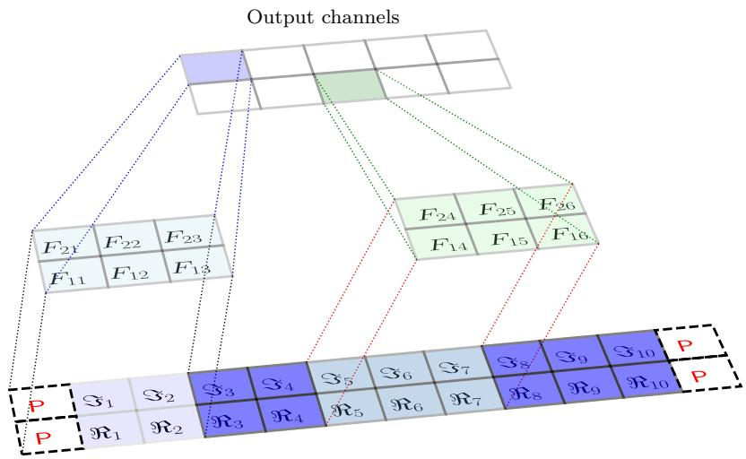  
Figure 1: CNN first layer schematic representation for kernel size $^ { 2 , }$ padding 1 and stride 1.

Within the proposed framework, the CNN does not predict impedance directly. Instead, it estimates the DRT, g(log τ ), which is subsequently inserted into a discretised form of (1). To compute the corresponding impedance, the continuous integral is numerically approximated over a grid of logarithmic relaxation times using the trapezoidal rule,

$$
\int _ { a } ^ { b } f ( x ) d x \approx \sum _ { k = 1 } ^ { N } { \frac { f ( x _ { k - 1 } ) + f ( x _ { k } ) } { 2 } } \Delta x _ { k } ,\tag{6}
$$

where $f ( x )$ corresponds to the integrand of (1) and $x _ { k }$ denotes sampled values of log τ .

The complete training procedure is illustrated in Figure 2. The measured real and imaginary components of the impedance spectrum are provided as input to the CNN, which predicts the corresponding DRT. In addition to the DRT, a separate neural network predicts the series resistance $R _ { s }$ , while the inductive contribution $L$ is represented by a trainable parameter. The predicted distribution is then inserted into the discretised electrochemical model and transformed back into the impedance domain using the trapezoidal approximation. The reconstructed impedance is compared with the measured spectrum to compute the training loss,

$$
\mathcal { L } = \mathrm { M S E } \Big ( \hat { Z } ^ { \prime } , Z ^ { \prime } \Big ) + \mathrm { M S E } \Big ( \hat { Z } ^ { \prime \prime } , Z ^ { \prime \prime } \Big ) + \lambda _ { L } L ^ { 2 } ,\tag{7}
$$

where primes denote the real components, double primes denote the imaginary components, and $\lambda _ { L } = 1 0 ^ { 6 }$ penalises large inductive contributions.

Because the impedance reconstruction layer consists entirely of diferentiable operations, gradients can be propagated through the numerical integration procedure during backpropagation. Consequently, the parameters of the CNN, the resistance model $R _ { s } ,$ , and the inductive parameter L are jointly optimised using the Adam optimiser.

As a result, the network is trained to produce DRTs that are consistent with the underlying electrochemical relationship rather than merely fitting the impedance spectrum. After training, the encoder additionally provides a compact latent representation of the impedance data. This latent space can be analysed independently of the reconstruction task and is used in the subsequent sections to investigate latent space organisation, condition monitoring, and long term system evolution.

By embedding the governing electrochemical relation directly into the optimisation procedure, the network is constrained to produce physically consistent DRTs while retaining the flexibility of a data driven model.

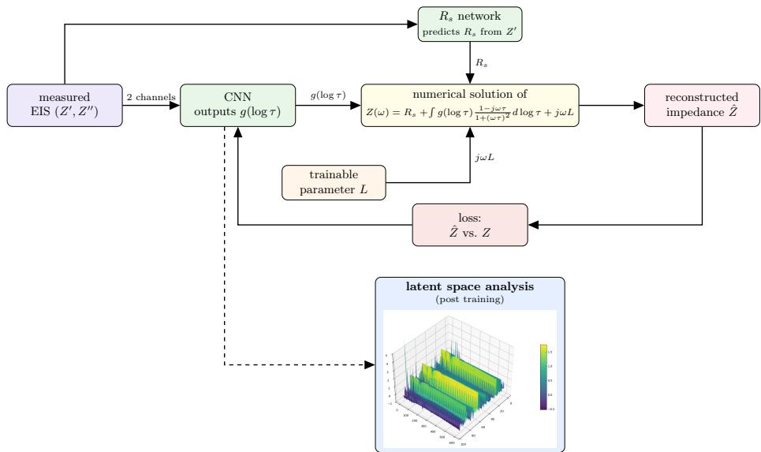  
Figure 2: Schematic representation of the proposed physics-informed CNN framework. Measured impedance spectra are provided as two input channels and mapped by the CNN to the corresponding DRT, g(log τ). In parallel, an auxiliary branch estimates the series resistance $R _ { s }$ from the real part of the impedance, while the inductive contribution L is represented by a trainable parameter. The predicted DRT, $R _ { s } ,$ and L are inserted into the physicsinformed reconstruction layer to obtain the reconstructed impedance ${ \hat { Z } } .$ The model is trained by comparing $\hat { Z }$ with the measured impedance $Z ,$ enabling physics-informed learning through impedance reconstruction error. After training, the learned latent representation is used for interpretability and condition monitoring analyses.

## 3.1. Mitigating checkerboard artifacts

Transposed convolution layers can produce checkerboard artifacts when kernel size, stride, and padding lead to uneven overlap during upsampling [22]. In DRT estimation, such artifacts manifest as spurious oscillations that may be misinterpreted as physical relaxation processes (Figure 3a). To eliminate this efect, each transposed convolution was replaced by an upsampling layer followed by a standard convolution, producing smooth reconstructions without artificial structures (Figure 3b). The checkerboard artifacts are efectively removed while preserving the overall shape and locations of the reconstructed relaxation processes.

Beyond improving reconstruction quality, this modification promotes smoother and more physically plausible DRT estimates, which is important for the reliable interpretation of the resulting distributions.

## 3.2. Architecture selection

In solving the inverse DRT problem, the primary challenge is not merely minimizing the reconstruction error but preventing the amplification of measurement noise. Models with excessive capacity tend to fit stochastic fluctuations in the impedance spectra, producing non-physical oscillations in the reconstructed DRTs. Conversely, models with insuficient capacity fail to resolve overlapping relaxation processes.

To determine an appropriate balance between reconstruction fidelity and model complexity, a grid search across 216 network architectures was performed.

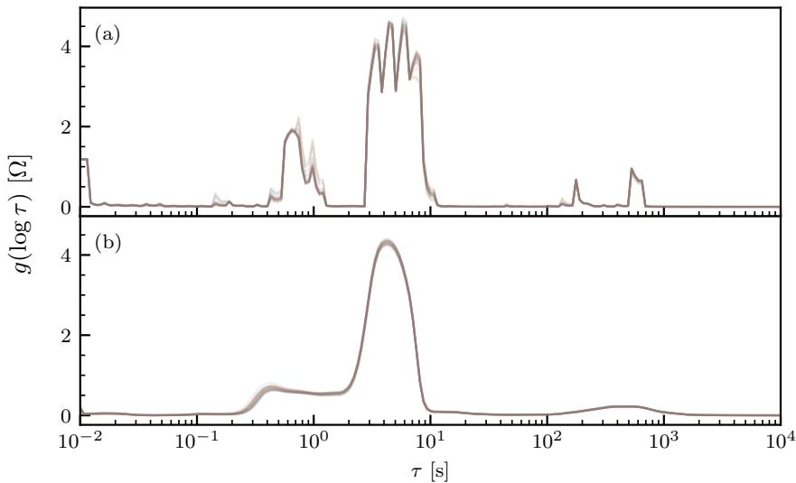  
Figure 3: Comparison of decoder architectures. (a) Reconstructions obtained using transposed convolutions exhibit characteristic checkerboard artifacts. (b) Replacing transposed convolutions with an upsampling layer followed by a standard convolution removes these artifacts and produces smoother DRT estimates.

The search space included variations in network depth, channel width, bottleneck size, pooling strategy, and receptive field.

The relationship between model complexity and validation loss is shown in Figure 4. A distinct elbow is observed at approximately $1 0 ^ { 4 }$ trainable parameters. Below this threshold, the model underfits the impedance spectra and exhibits elevated reconstruction error. Beyond approximately $1 . 5 \times 1 0 ^ { 4 }$ parameters, improvements become marginal, indicating diminishing returns and an increased risk of overfitting.

A more detailed analysis of the architectural search is provided in Section S1 of the Supplementary Material. Based on the complete study, a receptive field of 57 and a bottleneck size of 160 were selected as the best compromise between reconstruction accuracy, stability, and resistance to overfitting. The resulting architecture contains approximately 12,000 trainable parameters and was used throughout the remainder of this work.

Importantly, the selected architecture was not optimized for a specific experiment. Instead, the same network configuration was subsequently applied to all investigated datasets without any dataset-specific redesign or hyperparameter tuning. This provides a stringent test of the framework’s ability to generalize across diferent operating conditions, degradation mechanisms, and experimental campaigns.

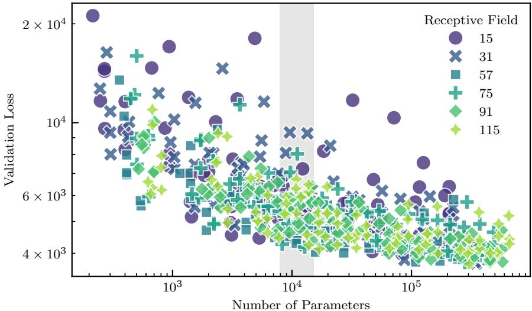  
Figure 4: Validation loss as a function of model complexity.

## 3.3. Experimental datasets

To evaluate the generalisation capability of the proposed framework, the selected architecture was applied to three independent experimental datasets covering diferent operating regimes, degradation mechanisms, and experimental objectives.

Solid-oxide fuel cell (SOFC) stack monitoring campaign. The first dataset consists of 603 EIS measurements acquired during a 3600-hour operation of a six-cell SOFC stack, including several fuel starvation events, emergency shutdowns due to H shortage, and an unplanned power loss [23–25]. This dataset was used to evaluate impedance reconstruction accuracy, latent space condition monitoring, and event detection.

Operating condition study. The second dataset corresponds to the experimental study presented in [26], where an industrial-scale solid-oxide electrolyser cell (SOEC) $( 1 0 0 \mathrm { c m } ^ { 2 } )$ was operated under three representative conditions: high hydrogen content at moderate current density (Condition 1, 700 mA $\mathrm { c m } ^ { - 2 }$ 20% H2, 60 h), low hydrogen content at the same current density (Condition 2, 700 mA cm−2, 10% $\mathrm { H } _ { 2 } , 8 5 \mathrm { h } )$ , and elevated current density with unstable steam supply (Condition 3, 900 mA $\mathrm { c m ^ { - 2 } }$ , 120 h). Changes were originally characterised using frequency-resolved Kullback–Leibler (KL) divergence analysis, and here the dataset is used to examine whether the learned latent representation captures the same operating-state transitions.

Multi-regime degradation campaign. The third dataset consists of 1248 EIS spectra collected during a 2650-hour experimental campaign on a commercial $4 { \times } 4 ~ \mathrm { c m ^ { 2 } }$ electrolyte-supported cell [27]. The campaign comprised six sequential degradation phases: steam electrolysis at 300 mA cm−2 (P1, 1000 h), co-electrolysis at 300 mA $\mathrm { c m } ^ { - 2 } \ ( \mathrm { P 2 } , \ 4 0 0 \ \mathrm { h } )$ , and 500 mA $\mathrm { c m } ^ { - 2 }$ (P3, 200 h), a return to steam electrolysis (P4, 300 h), reversible $\mathrm { E C / F C }$ operation at $3 0 0 / - 1 5 0$ mA $\mathrm { c m ^ { - 2 } }$ (P5, 264 h), and a final steam electrolysis phase (P6,

300 h). This dataset was used to investigate long term DRT evolution and to assess whether latent space trajectories capture transitions between diferent operating regimes and degradation processes.

## 4. Results and discussion

The results are presented in four stages. First, the framework is evaluated on experimental data to verify impedance reconstruction accuracy, physics consistency, and comparison with existing DRT estimation methods. Second, the proposed framework is validated on synthetic spectra with analytically known distributions to assess its ability to resolve overlapping relaxation processes. Third, the learned latent representation is analysed to investigate its physical organisation and suitability for condition monitoring. Finally, the framework is applied to independent experimental datasets to assess the generalisability of the complete analysis pipeline.

## 4.1. Core validation and physics consistency

The primary objective of the proposed physics-informed framework is to estimate DRTs that remain consistent with the governing electrochemical relation in (1). Since the predicted DRTs are transformed back into the impedance domain through the embedded physical model, accurate reconstruction of the measured impedance spectra provides direct evidence that the network satisfies the underlying electrochemical constraints.

Representative reconstruction results obtained for the SOFC stack monitoring dataset introduced in Section 3.3 are shown in Figure 5. The reconstructed Nyquist spectra closely follow the measured impedance response, while the residual errors remain small across the investigated frequency range.

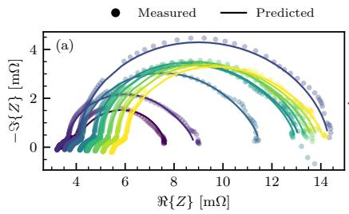

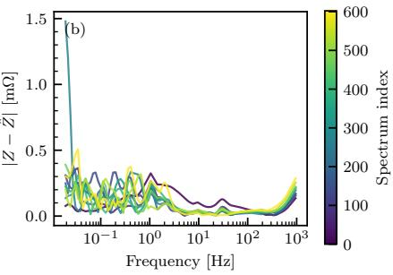  
Figure 5: Representative reconstruction results for the SOFC stack monitoring dataset. (a) Measured and reconstructed Nyquist spectra for selected measurements. (b) Frequencydependent reconstruction error, $| Z - \hat { Z } |$ . The low residuals confirm accurate impedance reconstruction from the predicted DRTs.

The corresponding Nyquist and residual plots for the operating condition study and the multi-regime degradation campaign are provided in Section S2 of the Supplementary Material.

Reconstruction accuracy across all three datasets was quantified using the root mean squared error (RMSE) between measured and reconstructed impedance

spectra, complemented by a range-normalised RMSE to enable comparison across datasets with diferent impedance magnitudes.
<table><tr><td>Dataset</td><td>RMSE (Re) [mΩ]</td><td>RMSE (Im) [mΩ]</td><td>RMSE (total) [mΩ]</td><td>R-RMSE [%]</td></tr><tr><td>SOFC stack monitoring</td><td>0.536</td><td>0.191</td><td>0.402</td><td>0.291</td></tr><tr><td>Operating condition study</td><td>1.461</td><td>1.741</td><td>1.607</td><td>1.062</td></tr><tr><td>Multi-regime degradation</td><td>0.504</td><td>0.453</td><td>0.479</td><td>0.451</td></tr></table>

Table 1: Impedance reconstruction accuracy for the investigated datasets. RMSE values are reported together with the range-normalised RMSE (R-RMSE), expressed relative to the impedance range of each dataset.

Despite substantial diferences in operating conditions, degradation mechanisms, and experiment duration, the reconstruction errors remain consistently low across all datasets. In all cases, the range-normalised RMSE remains below approximately 1.1%, demonstrating excellent agreement between the measured and reconstructed impedance spectra. These results provide empirical validation of the physics-informed nature of the proposed architecture.

To further assess the quality of the estimated DRTs, the proposed approach was compared with conventional Tikhonov regularisation and a previously reported neural network-based method.

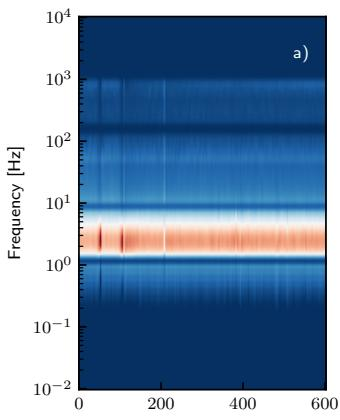

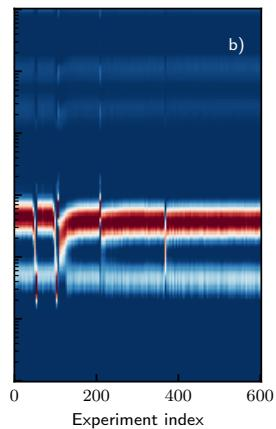

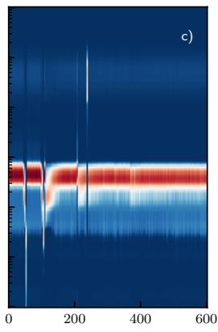  
Figure 6: Evolution of DRTs over time using (a) Tikhonov regularisation [28], (b) a feedforward neural network-based approach [9, 25], and (c) the proposed CNN framework.

Figure 6 compares DRT estimates obtained using Tikhonov regularisation [5], a feed-forward neural network approach [9], and the proposed CNN framework. All three methods identify the dominant relaxation process, visible as the pronounced band between approximately 1 and 10 Hz, but difer substantially in how they represent its temporal evolution. Tikhonov regularisation (Figure 6a) produces a smooth, nearly stationary distribution, suppressing much of the temporal variation observed throughout the experiment. The feed-forward neural network (Figure 6b) recovers considerably richer structure, including the gradual emergence of a secondary lower-frequency relaxation process, but at the cost of several abrupt transitions between neighbouring experiment indices, most notably early in the experiment and again around index 200. The proposed

CNN framework (Figure 6c) captures the same temporal features as the feedforward approach while evolving more continuously between successive measurements. Abrupt transitions still appear at a few experiment indices, but they are markedly less pronounced.

This continuity follows directly from training a single shared model across the entire dataset. Rather than fitting each spectrum with an independently chosen regularisation strength, as Tikhonov regularisation and per-spectrum neural networks both do, the proposed framework applies the same implicit regularisation to every measurement, allowing neighbouring spectra to be compared directly rather than through the lens of separately tuned fits. The value of this consistency lies not in superior point-wise accuracy, since all three methods agree closely on the dominant relaxation process, but in ensuring that diferences observed across the dataset reflect genuine electrochemical changes rather than fitting artefacts. This is confirmed quantitatively by the sub-1.1% reconstruction error achieved throughout, showing that the network has learned the governing electrochemical relationship rather than a statistical shortcut.

## 4.2. Validation on synthetic overlapping relaxation processes

The ability to distinguish closely spaced relaxation processes was further assessed using synthetic two-ZARC spectra with analytically known DRTs. A ZARC element, consisting of a resistor in parallel with a constant-phase element, is described by

$$
Z _ { \mathrm { Z A R C } } ( \omega ) = \frac { R } { 1 + ( \mathrm { j } \omega ) ^ { \phi } R Q } .\tag{8}
$$

The total impedance is given by $Z ( \omega ) = R _ { s } + Z _ { \mathrm { Z A R C , 1 } } ( \omega ) + Z _ { \mathrm { Z A R C , 2 } } ( \omega )$ , where R is the process resistance, $Q$ is the constant-phase-element parameter, ϕ is the dispersion parameter, and $R _ { \mathrm { s } }$ is the series resistance. For a known impedance transfer function, the corresponding analytical DRT was obtained by analytic continuation using the Fuoss–Kirkwood formulation [29],

$$
G ( u ) = - \frac { 1 } { \pi } \left[ \mathbb { S } \Big \lbrace Z \Big ( e ^ { - u - \mathrm { j } \pi / 2 } \Big ) \Big \rbrace + \mathbb { S } \Big \lbrace Z \Big ( e ^ { - u + \mathrm { j } \pi / 2 } \Big ) \Big \rbrace \right] ,\tag{9}
$$

where $u = \log \tau$ . This analytical solution provides an exact reference against which the recovered peak structure and relaxation-time positions can be compared. To evaluate the proposed framework, the architecture selected in Section 3.2 was trained on 1,000 synthetic two-ZARC spectra generated by varying the resistances, dispersion parameters $\phi ,$ and the logarithmic separation between the characteristic relaxation times. Peak separations spanning 0.2–2.5 decades were included to cover both strongly overlapping and well-separated relaxation processes. The complete parameter ranges and data generation procedure are provided in Appendix Appendix A. The validation spectra presented below were generated separately and were not included in the training dataset.

Following the validation protocol of Liu and Ciucci [9], two representative test cases were considered, with relaxation times separated by two decades and one decade, respectively. To evaluate the network under non-ideal conditions, independent Gaussian noise with a standard deviation of $\sigma = 0 . 5 \ \Omega$ was added to both the real and imaginary impedance components. This corresponds to the upper limit of the noise range used during training and therefore represents a more demanding validation than the noise-free spectra considered in the original study.

The results are shown in Figure 7. For the two-decade separation, the two relaxation processes are already reflected by partially separated arcs in the Nyquist spectrum (Figure 7a). The corresponding network-estimated DRT accurately reproduces the analytical two-peak structure, with both relaxation processes clearly identified (Figure 7b). Although the higher-τ peak is shifted by 0.241 decades, the two processes remain clearly resolved.

The one-decade case provides a considerably more challenging example. Here, the two ZARC contributions overlap strongly and appear as a single broad depressed arc in the Nyquist representation (Figure 7c), such that the presence of two underlying relaxation processes is not readily apparent from visual inspection of the impedance spectrum. Nevertheless, the network-estimated DRT reproduces the analytical two-peak structure with good agreement (Figure 7d), with peak-position errors of only 0.065 and 0.025 decades.

These results demonstrate that the proposed framework accurately recovers the analytical DRT for overlapping two-ZARC spectra. In the one-decade case, the network reproduces the correct two-peak structure even though the corresponding Nyquist spectrum appears as a single broad depressed arc. This indicates that the learned impedance-to-DRT mapping exploits subtle information contained across the full impedance spectrum rather than relying solely on features that are visually apparent in the Nyquist representation.

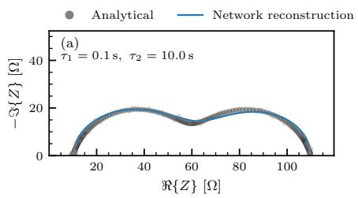

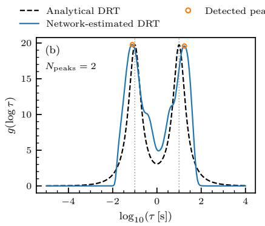

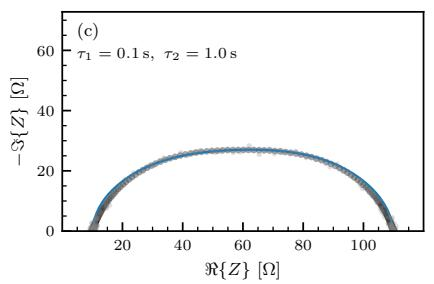

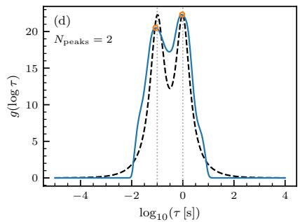  
Figure 7: Validation on synthetic two-ZARC spectra with additive Gaussian noise $( \sigma = 0 . 5 \Omega )$ using the test configurations considered by Liu and Ciucci [9]. (a)–(b) Two-decade separation with $\tau _ { 1 } = 0 . 1$ s and $\tau _ { 2 } = 1 0 \mathrm { ~ s . ~ } \left( \mathrm { c } \right) - \left( \mathrm { d } \right)$ One-decade separation with $\tau _ { 1 } = 0 . 1 \mathrm { ~ s ~ }$ and $\tau _ { 2 } = 1$ s. The left panels compare the analytical impedance spectra with the network reconstructions, while the right panels compare the analytical and network-estimated DRTs.

## 4.3. Interpretable latent space dynamics

The question is whether the learned latent representation goes further by containing interpretable information about the electrochemical system beyond what is needed for reconstruction. In particular, we examine whether the latent space exhibits a meaningful internal structure and whether its evolution can be used to monitor changes in system operation.

At time t, the encoder maps the input impedance spectrum to a latent tensor $\mathbf { Z } _ { t } \in \mathbb { R } ^ { C \times P }$ , where $C = 4 0$ denotes the number of output channels produced by the final convolutional layer and $P = 4$ the pooled positions retained after adaptive pooling. Each channel represents one learned component of the encoded impedance spectrum, while the pooled positions preserve coarse information about where that component originated along the frequency axis before pooling. Flattening $\mathbf { Z } _ { t }$ row-wise yields the latent vector $\mathbf { z } _ { t } \in \mathbb { R } ^ { \check { C } P }$ used throughout the remainder of this section.

To investigate the physical meaning of these latent components, a decoder probe analysis was performed. For every channel–position pair $( c , p )$ , an artificial latent tensor $\tilde { \mathbf { Z } } \in \mathbb { R } ^ { C \times P }$ was constructed with all entries set to zero except $\ddot { Z } _ { c , p } ,$ which was assigned a fixed activation. Passing this tensor through the decoder reveals the relaxation-time response associated with activating only that individual latent component. Repeating this procedure for all $4 0 \times 4$ channel– position pairs produces the activation maps shown in Figure 8, where each panel corresponds to one pooled position and each row to one latent channel. The channels are ordered according to the location of their peak response at pooled position 0, and this ordering is retained across all panels to facilitate comparison.

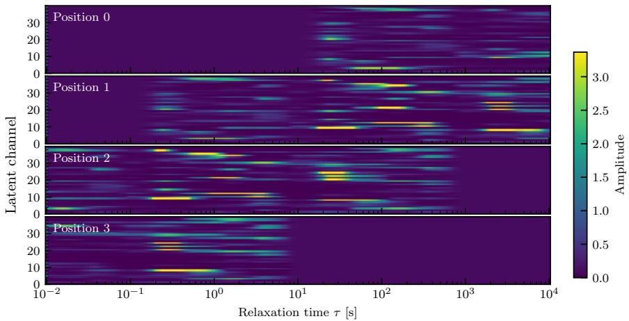  
Figure 8: Decoder probe analysis of the learned latent basis. For each pooled position, every latent channel was activated individually while all remaining latent entries were fixed to zero. Each row corresponds to one latent channel, ordered according to the location of its peak response at pooled position 0. This ordering is preserved across all panels. Colour indicates the amplitude of the reconstructed relaxation-time response produced by activating the corresponding channel–position pair.

The decoder associates the four pooled positions with progressively diferent regions of the relaxation-time axis. For each channel, the peak of the reconstructed response was identified, and the median peak location across all channels was computed for each pooled position (the median was used because relaxation times span several decades). Pooled positions 0 and 1 predominantly activate long-timescale processes, with median peak responses at approximately $\tau = 2 4 \mathrm { ~ s ~ }$ and $\tau = 8 3 \mathrm { ~ s ~ }$ , respectively, whereas positions 2 and 3 shift towards shorter timescales, with median peak responses near $\tau = 3 . 5$ s and $\tau = 0 . 3$ s.

Within each pooled position, diferent channels respond to diferent parts of the corresponding relaxation-time range, providing a finer subdivision of the represented electrochemical processes. The latent representation therefore exhibits a hierarchical organisation: the pooled position determines a coarse relaxationtime region, while the channel identity provides additional resolution within that region. Importantly, this organisation was not imposed during training. The network was optimised solely to reconstruct the measured impedance, without any supervision encouraging latent components to specialise by relaxation timescale. The emergence of this structure indicates that the learned latent space reflects the physical organisation of the underlying electrochemical processes rather than constituting an arbitrary compressed representation.

This physically organised latent representation also provides a natural space for quantifying changes in system behaviour over time. Rather than comparing impedance spectra directly, system evolution can be monitored by measuring distances between the corresponding latent representations. The Euclidean distance between the latent vector at time t and a chosen reference vector $\mathbf { z } _ { \mathrm { r e f } }$ is defined as

$$
D _ { \mathrm { r e f } } ( t ) = \left. \mathbf { z } _ { t } - \mathbf { z } _ { \mathrm { r e f } } \right. _ { 2 } .\tag{10}
$$

To demonstrate this, the SOFC stack monitoring dataset was analysed using $D _ { 1 0 } ( t )$ , where the 10th measurement serves as the nominal reference state.

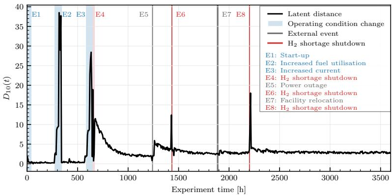  
Figure 9: Latent space condition monitoring for the SOFC stack monitoring dataset. $D _ { 1 0 } ( t )$ is used as an indicator of system evolution. Pronounced peaks correspond to major operational events during the campaign.

The resulting distance profile exhibits pronounced peaks that coincide with known operational events during the experimental campaign, summarised in Table 2.

<table><tr><td>Event number</td><td>Experiment time [h]</td><td>Description</td></tr><tr><td>E1</td><td>0-40</td><td>Start up</td></tr><tr><td>E2</td><td>270-342</td><td>Increased fuel utilisation (decreased fuel flow rate)</td></tr><tr><td>E3</td><td>582-648</td><td>Increased fuel utilisation (increased current)</td></tr><tr><td>E4</td><td>654-672</td><td>Emergency shutdown due to  $\mathrm { H _ { 2 } }$  shortage</td></tr><tr><td>E5</td><td>1242</td><td>Power loss due to thunderstorms</td></tr><tr><td>E6</td><td>1434</td><td>Emergency shutdown due to  $\mathrm { H _ { 2 } }$  shortage</td></tr><tr><td>E7</td><td>1884-1890</td><td>Moving into the new building</td></tr><tr><td>E8</td><td>2202</td><td>Emergency shutdown due to  $\mathrm { H _ { 2 } }$  shortage</td></tr></table>

Table 2: Operational events corresponding to the peaks observed in Figure 9 [23, same as Table 1].

Increases in $D _ { 1 0 } ( t )$ , seen as peaks in Figure 9, coincide with fuel starvation events, shutdowns, and other major perturbations, demonstrating that deviations from the nominal operating state are reflected directly and immediately in the latent representation. These observations are consistent with the conclusions of [25], where significant events were detected through comparisons of reconstructed DRTs using unbalanced optimal transport (UOT). While UOT provides a principled metric for comparing DRTs, the latent space distance (10) ofers a computationally eficient alternative obtained directly from the encoder output, avoiding ambiguous DRT curve comparisons.

The decoder probe analysis and the condition monitoring results confirm that the learned latent representation is both physically interpretable and operationally informative. The network not only reconstructs impedance spectra accurately, but also spontaneously organises electrochemical information into a structured latent space, a physically interpretable representation that was never explicitly supervised and yet reliably identifies degradation and operational events.

## 4.4. Pipeline generalisation

The previous sections established that the proposed framework produces physically consistent DRT estimates and learns an interpretable latent representation from a single experimental campaign. The critical remaining question is whether the same pipeline can extract equally meaningful information from fundamentally diferent experiments, without any modification to the architecture, hyperparameters, or analysis workflow.

To answer this, the framework was applied to two independent datasets that difer from the SOFC stack monitoring campaign in cell type, operating regime, degradation mechanism, and experimental objective. The results therefore constitute a direct test of architectural generalisation, as the same 12,000-parameter network, trained independently on each dataset, required no redesign, retuning, or workflow modification.

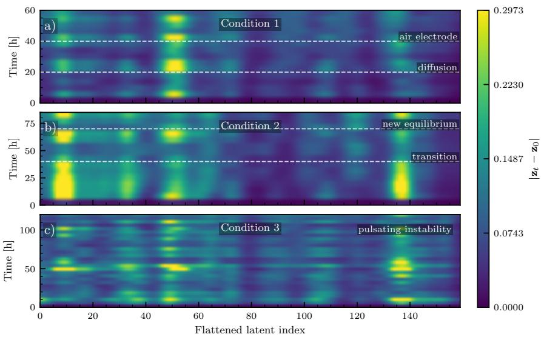  
Figure 10: Latent space evolution for the three operating conditions investigated in [26]. Heatmaps show the smoothed absolute diference between each latent representation and the initial spectrum, $| { \bf z } _ { t } - { \bf z } _ { 0 } |$ , where brighter regions indicate larger cumulative deviation from the initial operating state. Dashed lines denote characteristic time points reported in the original analysis.

Operating condition study [26]. This dataset (Section 3.3) comprised three operating conditions investigated over 60–125 h each on an industrial-scale SOEC.

In the original study, changes in system behaviour were identified using KL divergence computed frequency by frequency relative to an initial reference spectrum, identifying frequency bands where the impedance changed statistically significantly [26].

Here, the same intuition is applied in latent space. Recall from Section 4.3 that each spectrum’s latent tensor is flattened into a vector ${ \bf z } _ { t } \in \mathbb { R } ^ { C P }$ The scalar distance $D _ { \mathrm { r e f } } ( t )$ from (10) summarises the overall change between $\mathbf { z } _ { t }$ and a reference $\mathbf { z } _ { \mathrm { r e f } }$ as a single number, but does not indicate which part of the latent representation changed. To recover this information, we instead compute the element-wise absolute diference $| { \bf z } _ { t } - { \bf z } _ { 0 } |$ : rather than combining all $C P$ entries into one value, this keeps a separate diference for each entry, so that changes can be localised to specific channels and pooled positions, in the same way that the original study localises changes to specific frequency bands. This correspondence is temporal rather than spectral: the original study attributes each transition to a specific frequency band, whereas here we only identify the same transition times through changes in latent activation, without establishing which latent channels or positions correspond to which frequency band. Unlike the original approach, this requires neither frequency-band selection nor numerical integration over the impedance spectrum, since the diagnostic information is extracted directly from the encoder output as a byproduct, with no additional analysis required. The resulting activation maps are shown in Figure 10.

For Condition 1, difusion-related losses emerging after approximately 20 h (0.3–2 Hz) and air-electrode changes after approximately 40 h (10–40 Hz), originally identified through KL divergence [26], coincide in time with changes in latent activation visible in Figure 10a. The same holds for Condition 2, where the gradual convergence toward a new equilibrium, marked by spectral changes shifting from 200–800 Hz near 40 h to 800 Hz–4 kHz near 70 h [26], coincides with two distinct transitions in Figure 10b. Condition 3 difers in character: the persistent pulsating instability caused by inconsistent steam supply at 900 mA $\mathrm { c m ^ { - 2 } }$ [26] does not produce discrete transition events. Instead, Figure 10c shows sustained, recurring latent activity throughout the experiment, mirroring the continuous operational instability rather than isolated degradation onsets.

Multi-regime degradation campaign ${ \big . } { \big / } { \mathcal { Z } } 7 { \big | } .$ This dataset (Section 3.3) comprised 1248 EIS spectra collected on a commercial $4 \times 4 ~ \mathrm { c m ^ { 2 } }$ electrolyte-supported cell, with degradation characterised phase by phase through bi-hourly DRT diagnostics [27]. Table 3 summarises the six operating phases and their correspondence to the panels in Figure 11 and Figure 12.
<table><tr><td>Phase</td><td>Panels</td><td>Experiment time [h]</td><td>Operating regime</td></tr><tr><td>P1</td><td>a)</td><td>22-1022</td><td>Steam electrolysis, 300 mA  $\mathrm { c m } ^ { - 2 }$ </td></tr><tr><td>P2</td><td>b)</td><td>1055-1455</td><td>Co-electrolysis, 300 mA cm−2</td></tr><tr><td>P3</td><td>c)</td><td>1473-1673</td><td>Co-electrolysis, 500 mA  $\mathrm { c m } ^ { - 2 }$ </td></tr><tr><td>P4</td><td>d)</td><td>1701-2001</td><td>Steam electrolysis, 300 mA  $\mathrm { c m ^ { - 2 } }$ </td></tr><tr><td>P5</td><td>e)-f)</td><td>2048-2312</td><td>Reversible EC/FC operation</td></tr><tr><td>P6</td><td>g)</td><td>2335-2635</td><td>Final steam electrolysis, 300 mA  $\mathrm { c m } ^ { - 2 }$ </td></tr></table>

Table 3: Operating phases of the degradation campaign investigated in [27] and their correspondence to the panels in Figure 11 and Figure 12.

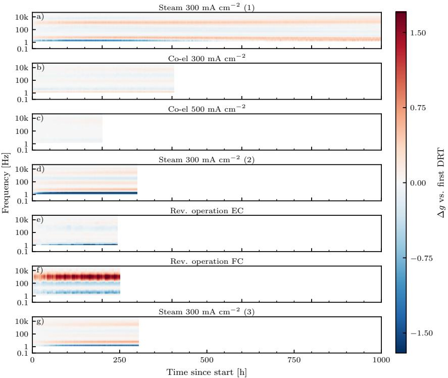  
Figure 11: Diference between the network-estimated DRTs and the first estimated DRT within each operating regime (∆gt(log τ), (11)). Horizontal axis shows elapsed experiment time within each phase.

To enable direct comparison with the phase by phase degradation trends reported in [27], temporal evolution within each phase is quantified using the same metric employed in the original study,

$$
\Delta g _ { t } ( \log \tau ) = g _ { t } ( \log \tau ) - g _ { 1 } ( \log \tau ) ,\tag{11}
$$

where $g _ { 1 } ( \log \tau )$ is the first network-estimated DRT of that phase, serving as the baseline specific to that phase. While the latent representation introduced in Section 4.3 ofers a better-conditioned basis for tracking system evolution, adopting the original study’s own metric here allows the estimated DRTs to be benchmarked directly against their published results. This comparison is further strengthened by the constant regularisation of the proposed framework, since all 1248 spectra share the same network weights and $\Delta g _ { t }$ therefore reflects genuine electrochemical change and nothing else. A method applied per spectrum would impose a diferent regularisation on each measurement, making it impossible to determine whether diferences in the estimated DRTs reflect genuine electrochemical changes or fitting artefacts.

The evolution of $\Delta g _ { t } ( \log \tau )$ tells a coherent degradation story. Through the first three phases, changes accumulate at the low-frequency end of the distribution: co-electrolysis (P2) adds a new contribution there, and the higher current density of P3 shifts it without amplifying it [27, Figure 5a–c], both captured in Figure 11a–c. Returning to steam electrolysis (P4) partially undoes this, with the low-frequency contribution retreating and confirming that not all coelectrolysis-induced losses are permanent [27, Figure 5d] (Figure 11d). The most pronounced behaviour occurs during reversible EC/FC operation (P5): the alternating modes leave a strongly periodic imprint on the DRT, with pronounced high-frequency modulation tied to FC segments [27, Figure 5e] (Figure 11e–f). P6 closes the campaign quietly, with only moderate evolution reflecting the slow pace of ohmic-dominated ageing [27, Figure 5f].

Importantly, the same degradation trajectory is independently recovered by the latent space, without any DRT computation. Just as in the SOFC stack monitoring campaign, $D _ { 1 0 } ( t )$ (10) reduces the entire 2650-hour campaign to a single scalar signal shown in Figure 12, where the slope steepens at the onset of co-electrolysis, relaxes upon recovery, oscillates through the EC/FC phase, and settles into a slow drift in P6, tracing every regime transition identified in the DRT analysis.

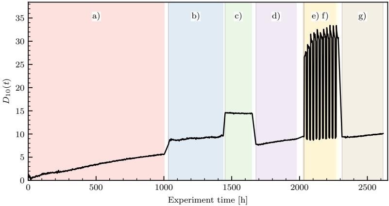  
Figure 12: Evolution of $D _ { 1 0 } ( t )$ during the 2650-hour campaign. Coloured regions denote the operating regimes in [27].

Summary. Table 4 places the key findings of the proposed framework alongside the original results to make the correspondence explicit and verifiable. Across all three experimental campaigns, spanning diferent cell types, operating regimes, degradation mechanisms, and campaign durations from 60 h to 3600 h, the proposed framework reproduces the key findings of the original studies without any dataset-specific tuning. Notably, the framework required neither manual regularisation parameter selection, frequency-band segmentation, equivalent circuit model assumptions, nor dataset-specific architectural modifications.

<table><tr><td>Original study This work SOFC stack monitoring campaign [23–25]</td></tr><tr><td>Fuel-starvation and shutdown events Peaks in  $D _ { 1 0 } ( t )$  (Figure 9) via UOT [25] No prior latent space analysis Distinct channels per relaxation re- gion (Figure 8) Operating condition study [26]</td></tr><tr><td>Diffusion onset ~20 h, 0.3-2 Hz Latent activation change at ~20 h (Cond. 1) (Figure 10a) Air-electrode changes ~40 h, 10- Latent activation change at ~40 h 40 Hz (Cond. 1) (Figure 10a) New equilibrium at ~40 h and ~70 h Two transitions in latent activation (Cond. 2) (Figure 10b) Pulsating instability throughout Sustained latent activity throughout (Cond. 3) (Figure 10c)</td></tr><tr><td>Multi-regime degradation campaign [27] Low-freq. DRT grows, case (P2) [27,  $\Delta g _ { t }$  increase at low frequencies Figure 5b] (Figure 11b) Low-freq. DRT retreats, case  $\Delta g _ { t }$  decrease at low frequencies (P4) [27, Figure 5d] (Figure 11d) Periodic high-freq. modulation, Periodic DRT pattern (Figure 11e-f) (P5) [27, Figure 5e]</td></tr></table>

Table 4: Correspondence between findings reported in the original studies and signatures identified by the proposed framework. All results in the This work column were obtained with the same 12,000-parameter architecture and zero dataset-specific tuning.

## 5. Conclusion

This work addressed the problem of estimating the DRT from EIS data, an ill-posed inverse task that traditionally relies on careful regularisation or strong modelling assumptions. We proposed a physics-informed CNN that directly predicts the DRT and reconstructs the corresponding impedance through a discretised formulation of the governing integral relation. By embedding the physical forward model into the training process, the network is constrained to produce impedance-consistent DRTs without imposing a fixed number or shape of relaxation peaks, allowing it, in principle, to represent overlapping relaxation processes.

A systematic architectural study showed that physically meaningful reconstructions depend strongly on the imposed inductive bias. Separating upsampling from convolution in the decoder eliminated checkerboard artifacts, while appropriate choices of bottleneck size and receptive field prevented both oversmoothing and noise amplification. The resulting 12,000-parameter architecture achieves a favourable balance between reconstruction accuracy and generalisation, with range-normalised reconstruction errors below 1.1% across all three datasets.

What distinguishes this framework from prior approaches is not reconstruction accuracy alone, but what emerges from the shared latent representation. Because all spectra in a dataset share the same network weights, diferences in estimated DRTs are constrained to reflect genuine electrochemical changes. This consistency, absent in per-spectrum methods, is what makes the latent space meaningful, as decoder probe analysis revealed that individual channels correspond to distinct relaxation-time regions. Such a structure emerged solely through optimisation of the physics-informed training objective, directly from the raw EIS data.

The resulting latent space enables condition monitoring as a direct byproduct. Euclidean distances in latent space reliably identified every major operational event in a 3600-hour SOFC campaign, matching conclusions previously obtained through explicit DRT comparison using UOT [25].

Most significantly, the same architecture was applied without modification to three independent experimental datasets spanning fundamentally diferent cell types, operating regimes, degradation mechanisms, and campaign durations from 60 h to 2650 h. In every case, the framework reproduced the key degradation signatures, operational transitions, and DRT peak evolutions previously established by dedicated per-dataset analyses, including manual regularisation tuning, frequency-band segmentation, expert interpretation, and the frequencyresolved KL divergence analysis of the operating condition study. None of those steps were required here.

Physics-informed learning can therefore replace the manual preprocessing pipeline that has long been the bottleneck in large-scale EIS diagnostics. A single, unified, and fully reproducible model is suficient to extract physically meaningful DRTs, monitor system health, and generalise across the diverse operating conditions encountered in electrochemical energy conversion research.

## CRediT authorship contribution statement

Žan Gorenc: Conceptualization, Methodology, Software, Validation, Formal analysis, Investigation, Visualization, Writing – original draft.

Žiga Gradišar: Methodology, Writing – review and editing.

Felix Mütter: Investigation, Resources.

Vanja Subotić: Supervision, Investigation, Resources, Funding acquisition.

Pavle Boškoski: Conceptualization, Methodology, Software, Resources, Supervision, Funding acquisition, Writing – review and editing.

## Data and code availability

The source code, pretrained models, reproducibility notebooks, and instructions for downloading the datasets required to reproduce the results presented in this work are publicly available at https://repo.ijs.si/e2pub/cnn\_drt.git.

## Declaration of competing interest

The authors declare that they have no known competing financial interests or personal relationships that could have appeared to influence the work reported in this paper.

<table><tr><td>Parameter</td><td>Range</td><td>Sampling</td></tr><tr><td> $R _ { \mathrm { s } } \ [ \Omega ]$ </td><td>5-15</td><td>Uniform</td></tr><tr><td> $R _ { k } \ [ \Omega ] , k = 1 , 2$ </td><td>30-70</td><td>Uniform</td></tr><tr><td> $\phi _ { k } , k = 1 , 2$ </td><td>0.70-1.00</td><td>Uniform</td></tr><tr><td> $\log _ { 1 0 } ( \tau _ { 1 } / \mathrm { s } )$ </td><td>-2-1</td><td>Uniform</td></tr><tr><td> $\Delta \log _ { 1 0 } \tau$ </td><td>0.2-2.5</td><td>Uniform</td></tr><tr><td> $\sigma \left[ \Omega \right]$ </td><td>0-0.5</td><td>Uniform</td></tr></table>

Table A.1: Parameter ranges and sampling distributions used to generate the synthetic two-ZARC training dataset.

## Acknowledgements

The authors gratefully acknowledge support for the project ”Probabilistic and explainable data-driven modelling of solid-oxide systems”, jointly financed by the Slovenian Research and Innovation Agency (ARIS), project number J2- 4452, and the Austrian Science Fund (FWF), project number I 6251-N. The authors alsoacknowledge financial support from the Slovenian Research and Innovation Agency through research programme P2-0001.

## Appendix A. Synthetic two-ZARC dataset

The synthetic dataset used for the overlapping-process validation in Section 4.2 comprised 1,000 two-ZARC impedance spectra. The ZARC parameters were sampled over the ranges summarised in Table A.1. The resistances and dispersion parameters were sampled independently from uniform distributions, while the first characteristic relaxation time was sampled uniformly in logarithmic space. For the ZARC formulation introduced in Section 4.2, the characteristic relaxation time is related to the constant-phase-element parameter by

$$
\tau _ { k } = \left( R _ { k } Q _ { k } \right) ^ { 1 / \phi _ { k } } .\tag{A.1}
$$

The second relaxation time was determined from a randomly sampled logarithmic separation according to

$$
\tau _ { 2 } = \tau _ { 1 } 1 0 ^ { \Delta \log _ { 1 0 } \tau } .\tag{A.2}
$$

Each spectrum was evaluated at 200 logarithmically spaced frequencies between $1 0 ^ { - 4 }$ and $1 0 ^ { 4 }$ Hz. Independent zero-mean Gaussian noise was added to the real and imaginary impedance components,

$$
Z _ { \mathrm { n o i s y } } = Z + \epsilon _ { \mathrm { r e } } + \mathrm { j } \epsilon _ { \mathrm { i m } } , \qquad \epsilon _ { \mathrm { r e } } , \epsilon _ { \mathrm { i m } } \sim \mathcal { N } ( 0 , \sigma ^ { 2 } ) ,\tag{A.3}
$$

with σ sampled independently for each spectrum from the range reported in Table A.1.

The relaxation-time grid used for physics-based impedance reconstruction comprised 200 logarithmically spaced points between $1 0 ^ { - 5 }$ and $1 0 ^ { 4 } \ \mathrm { s } .$ The dataset was divided into training and validation subsets using an 80:20 split with a fixed random seed. The two test configurations evaluated in Section 4.2 were generated separately and excluded from the training dataset.

Declaration of generative AI and AI-assisted technologies in the manuscript preparation process

During the preparation of this work, the authors used Claude to assist with selected coding tasks, code documentation, and streamlining the development workflow. Grammarly was subsequently used to review the manuscript for grammar, spelling, and writing style. All outputs generated with the assistance of these tools were critically reviewed, verified, and edited by the authors. The authors take full responsibility for the accuracy, integrity, and final content of the manuscript and the accompanying code.

## References

[1] L. Žnidarič, G. Nusev, B. Morel, J. Mougin, Ðani Juričić, P. Boškoski, Evaluating uncertainties in electrochemical impedance spectra of solid oxide fuel cells, Applied Energy 298 (2021) 117101. URL: https://www.sciencedirect.com/science/article/pii/ S030626192100547X. doi:https://doi.org/10.1016/j.apenergy.2021. 117101.

[2] Y. Barsukov, J. R. Macdonald, et al., Electrochemical impedance spectroscopy, Characterization of materials 2 (2012) 898–913.

[3] R. M. Fuoss, J. G. Kirkwood, Electrical properties of solids. viii. dipole moments in polyvinyl chloride-diphenyl systems\*, Journal of the American Chemical Society 63 (1941) 385–394. URL: http://dx.doi.org/10.1021/ ja01847a013. doi:10.1021/ja01847a013.

[4] C. Plank, T. Rüther, L. Jahn, M. Schamel, J. P. Schmidt, F. Ciucci, M. A. Danzer, A review on the distribution of relaxation times analysis: A powerful tool for process identification of electrochemical systems, Journal of Power Sources 594 (2024) 233845. URL: http://dx.doi.org/10.1016/j. jpowsour.2023.233845. doi:10.1016/j.jpowsour.2023.233845.

[5] A. L. Gavrilyuk, D. A. Osinkin, D. I. Bronin, The use of tikhonov regularization method for calculating the distribution function of relaxation times in impedance spectroscopy, Russian Journal of Electrochemistry 53 (2017) 575–588. URL: https://doi.org/10.1134/S1023193517060040. doi:10.1134/S1023193517060040.

[6] M. Saccoccio, T. H. Wan, C. Chen, F. Ciucci, Optimal regularization in distribution of relaxation times applied to electrochemical impedance spectroscopy: ridge and lasso regression methods-a theoretical and experimental study, Electrochimica Acta 147 (2014) 470–482.

[7] A. Maradesa, B. Py, T. H. Wan, M. B. Efat, F. Ciucci, Selecting the regularization parameter in the distribution of relaxation times, Journal of The Electrochemical Society 170 (2023) 030502.

[8] J. Liu, F. Ciucci, The gaussian process distribution of relaxation times: A machine learning tool for the analysis and prediction of electrochemical impedance spectroscopy data, Electrochimica Acta 331 (2020) 135316.

[9] J. Liu, F. Ciucci, The deep-prior distribution of relaxation times, Journal of The Electrochemical Society 167 (2020) 026506. doi:10.1149/1945-7111/ ab631a.

[10] M. Raissi, P. Perdikaris, G. Karniadakis, Physics-informed neural networks: A deep learning framework for solving forward and inverse problems involving nonlinear partial diferential equations, Journal of Computational Physics 378 (2019) 686–707. doi:10.1016/j.jcp.2018.10.045.

[11] S. Cuomo, V. S. di Cola, F. Giampaolo, G. Rozza, M. Raissi, F. Piccialli, Scientific machine learning through physics-informed neural networks: Where we are and what’s next, 2022. URL: https://arxiv.org/ abs/2201.05624. doi:10.48550/ARXIV.2201.05624.

[12] J. Obregon, Y.-R. Han, C. W. Ho, D. Mouraliraman, C. W. Lee, J.-Y. Jung, Convolutional autoencoder-based soh estimation of lithium-ion batteries using electrochemical impedance spectroscopy, Journal of Energy Storage 60 (2023) 106680. doi:10.1016/j.est.2023.106680.

[13] Y. Liu, Q. Li, K. Wang, Revealing the degradation patterns of lithiumion batteries from impedance spectroscopy using variational auto-encoders, Energy Storage Materials 69 (2024) 103394. URL: http://dx.doi.org/ 10.1016/j.ensm.2024.103394. doi:10.1016/j.ensm.2024.103394.

[14] C. Lou, S. Wang, Z. Li, K. Wang, Extract features from lithium-ion battery electrochemical impedance spectra and estimate state of health based on improved convolutional autoencoder-temporal convolutional network, Ionics 31 (2025) 4261–4279. URL: http://dx.doi.org/10.1007/ s11581-025-06226-z. doi:10.1007/s11581-025-06226-z.

[15] K. Kim, K. Park, K. Yoon, H. Moon, H. Pyeon, J. Kim, S. Han, A light-weight electrochemical impedance spectroscopy-based soh estimation method for lithium-ion batteries using the distribution of relaxation times with grad-cam analysis, Journal of Power Sources 631 (2025) 236169. doi:10.1016/j.jpowsour.2025.236169.

[16] Y. Li, Z. He, M. Ye, Q. Wang, G. Lian, Y. Sun, M. Wei, A semi-supervised learning strategy for lithium-ion battery capacity estimation with limited impedance data, Energy 319 (2025) 135129. URL: http://dx.doi.org/ 10.1016/j.energy.2025.135129. doi:10.1016/j.energy.2025.135129.

[17] A. Oppenheim, R. Schafer, Discrete-Time Signal Processing , Pearson Deutschland, 2013. URL: https://elibrary.pearson.de/book/99. 150005/9781292038155.

[18] L. Wanhammar, T. Saramaki, Digital Filters Using MATLAB, 2020. doi:10.1007/978-3-030-24063-9.

[19] N. Wiener, Extrapolation, Interpolation, and Smoothing of Stationary Time Series: With Engineering Applications, The MIT Press, 1949. doi:10.7551/mitpress/2946.001.0001.

[20] P. C. Hansen, J. G. Nagy, D. P. O’Leary, Deblurring Images: Matrices, Spectra, and Filtering, SIAM, 2006. doi:10.1137/1.9780898718877.

[21] K. O’Shea, R. Nash, An introduction to convolutional neural networks, 2015. URL: https://arxiv.org/abs/1511.08458. arXiv:1511.08458.

[22] A. Odena, V. Dumoulin, C. Olah, Deconvolution and checkerboard artifacts, Distill (2016). URL: http://distill.pub/2016/ deconv-checkerboard. doi:10.23915/distill.00003.

[23] G. Nusev, B. Morel, J. Mougin, Ðani Juričić, P. Boškoski, Condition monitoring of solid oxide fuel cells by fast electrochemical impedance spectroscopy: A case example of detecting deficiencies in fuel supply, Journal of Power Sources 489 (2021) 229491. URL: https://www.sciencedirect. com/science/article/pii/S0378775321000409. doi:https://doi.org/ 10.1016/j.jpowsour.2021.229491.

[24] P. Boškoski, L. Žnidarič, Žiga Gradišar, V. Subotić, Probabilistic deconvolution for electrochemical impedance through variational bayesian inference, Journal of Power Sources 622 (2024) 235359. URL: https://www.sciencedirect.com/science/article/pii/ S0378775324013119. doi:https://doi.org/10.1016/j.jpowsour.2024. 235359.

[25] Ž. Gradišar, Ž. Gorenc, V. Subotić, P. Boškoski, Towards robust comparison of distributions of relaxation times, Electrochimica Acta (2026) 148339. URL: https://www.sciencedirect. com/science/article/pii/S001346862600232X. doi:https://doi.org/ 10.1016/j.electacta.2026.148339.

[26] P. Boskoski, B. Königshofer, G. Nusev, A. Ostrež, V. Subotić, Extracting quantitative insights from electrochemical impedance spectra using statistical methods, in: 16th Annual Conference of the Prognostics and Health Management Society, PHM 2024, Prognostics and Health Management Society, 2024.

[27] F. Mütter, P. Boškoski, H. Schröttner, C. Hochenauer, V. Subotić, Bi-hourly eis-drt diagnostics over 2650 h benchmark degradation of a commercial soec under steam electrolysis, co-electrolysis and reversible operation, Journal of Power Sources 672 (2026) 239640. URL: https://www.sciencedirect.com/science/article/pii/ S0378775326003903. doi:https://doi.org/10.1016/j.jpowsour.2026. 239640.

[28] T. H. Wan, M. Saccoccio, C. Chen, F. Ciucci, Influence of the discretization methods on the distribution of relaxation times deconvolution: Implementing radial basis functions with drttools, Electrochimica Acta 184 (2015) 483–499. doi:10.1016/j.electacta.2015.09.097.

[29] R. M. Fuoss, J. G. Kirkwood, Electrical properties of solids. viii. dipole moments in polyvinyl chloride-diphenyl systems, Journal of the American Chemical Society 63 (1941) 385–394.