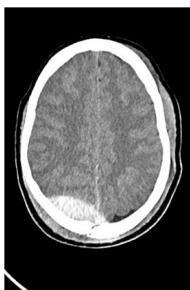
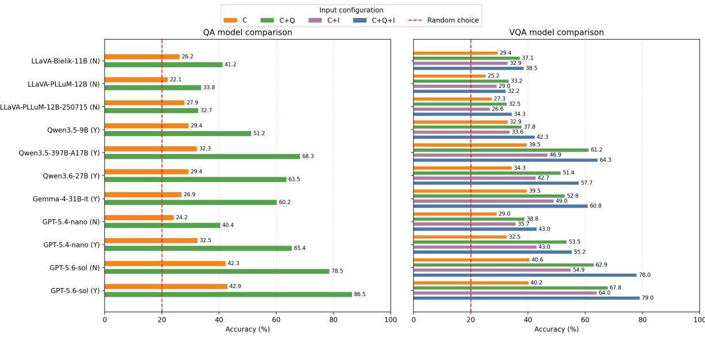

# Polish Medical Visual Question Answering: Vision-Language Models Underutilize Visual Evidence

Jakub Pokrywka1 Łukasz Grzybowski1,2 Antoni Lasik3

Marek Kubis1 Jeremi Ignacy Kaczmarek1,4,5 Wojciech Kusa3

1Adam Mickiewicz University 2ARAAI Poland 3NASK National Research Institute 4Poznan University of Medical Sciences ´ 5T. Marciniak Lower Silesian Specialist Hospital

## Abstract

We introduce a Polish-language medical visual question answering (VQA) benchmark, built from Polish Board Certification Examination questions for licensed physicians and dentists pursuing specialist certification. The benchmark comprises image-containing questions spanning diverse medical specialties and visual domains, together with a text-only question answering (QA) control set. We evaluate Polishoriented, general-purpose open-weight, and commercial vision-language models. The task remains challenging: the best model achieves 79.0% accuracy on the full VQA set, and only GPT-5.6 surpasses the approximate human reference on the subset with available candidate responses; all other evaluated models perform worse than humans. To assess visual grounding, we compare complete inputs with configurations omitting the image, the question, or both, and categorize questions by image importance. Models derive more useful information from the question text than from the image and perform worse on image-dominant questions. Across both QA and VQA, they nevertheless achieve above-chance accuracy from the answer choices alone, showing that non-trivial performance can persist even when key task components are missing.

## 1 Introduction

Large language models (LLMs) have recently been evaluated on several Polish medical examination benchmarks, including the Polish Board Certification Examination (pol. Pa´nstwowy Egzamin Specjalizacyjny, PES), the Medical Final Examination (pol. Lekarski Egzamin Ko´ncowy, LEK), the Dental Final Examination (pol. Lekarsko-Dentystyczny Egzamin Ko´ncowy, LDEK), and related medical test sets (Pokrywka et al., 2024; Grzybowski et al., 2025; Lasik et al., 2026). These studies showed that modern LLMs can achieve strong results on Polish medical multiple-choice questions and provided evidence on how well models handle specialized medical knowledge in a non-English setting. However, their evaluation protocols were limited to textonly questions. As a result, examination items containing images were excluded, even though visual information is an important component of many real medical tasks and of some PES questions.

This omission leaves an important gap in the evaluation of medical AI systems. While visual question answering (VQA) has been widely studied in English, non-English medical VQA remains relatively underexplored. Polish VQA resources are also limited, especially in specialized domains such as medicine. This is problematic because model performance in English cannot be assumed to transfer directly to Polish, and medical examination questions often require knowledge of domainspecific terminology, clinical conventions, and local examination formats. Consequently, there is a need for benchmarks that evaluate not only medical knowledge in Polish, but also the ability of models to combine Polish clinical text with medical images.

In this work, we evaluate vision-language models (VLMs) on image-containing questions from PES, the Polish Board Certification Examination. These questions are multiple-choice examination items intended for physicians and dentists pursuing specialist certification. They provide a challenging test bed for multimodal medical question answering, as they often require both domain knowledge and interpretation of visual evidence. Importantly, the dataset is not composed solely of classical VQA examples where the image is the central object of a direct visual query. In many cases, the image is only one component of a broader clinical scenario: the question may include a textual patient description, laboratory or diagnostic context, answer choices, and an image such as an electrocardiogram, radiological scan, or clinical photograph. Therefore, the task is better understood as multimodal medical examination question answering rather than simple image recognition or image-centered VQA.

Beyond measuring overall model accuracy, we study how much information models obtain from different parts of the input. Prior work has shown that models can exploit artifacts in multiple-choice answer options or rely disproportionately on textual cues instead of genuinely using visual evidence (Balepur et al., 2024, 2025; Asadi et al., 2025). To examine this issue in the Polish medical examination setting, we evaluate models under controlled input configurations: using only the answer choices, using choices together with the question text, using choices together with the image, and using the full input consisting of choices, question text, and image. This setup allows us to estimate the relative contribution of answer choices, textual context, and visual information.

We also compare performance on imagecontaining PES questions with performance on a text-only question answering (QA) control set composed of questions that originally did not include images. This comparison allows us to analyze differences between QA- and VQA-style evaluation within the same examination domain. Additionally, we conduct a data contamination analysis to assess whether model performance may have been influenced by prior exposure to the evaluation questions.

Our contributions are as follows:

• We create an image-containing question dataset from the Polish Board Certification Examination as a benchmark for Polish medical multimodal question answering.

• We evaluate vision-language models on PES questions under several input configurations that separate the effects of answer choices, question text, and images.

• We compare model performance on imagecontaining VQA questions with performance on a text-only QA control set from the same examination domain.

## 2 Related Work

## 2.1 Polish VQA

Statkiewicz et al. (2026) adapt the LLaVA framework to Polish and introduce LLaVA-Bielik and LLaVA-PLLuM. They show that translated and filtered multimodal data can effectively bootstrap Polish VLMs and provide Polish-oriented evaluation resources. reVISION (Ciesiółka and Gralinski´ , 2025) evaluates VLMs on Polish multimodal national examination data, extending the exam-based evaluation setting introduced in LLMzSzŁ (Jassem et al., 2025) from textonly LLMs to vision-language models. Po-VisLE (Anonymous, 2026) further moves toward Polish-specific vision-language evaluation with emphasis on Polish linguistic and cultural grounding.

Polish is also present in broader multilingual VQA resources. EXAMS-V (Das et al., 2024) includes Polish among multilingual multimodal examination questions, while Raj Khan et al. (2021) evaluate cross-lingual transfer to Polish on 500 machine-translated Polish questions.

Our work differs from the aforementioned resources by focusing on specialist-level Polish medical examination questions that require combining clinical text, answer options, and medical images.

## 2.2 Medical VQA

English medical VQA has been studied mainly in radiology, pathology, and biomedical image–text settings. VQA-RAD (Lau et al., 2018) introduced clinically generated questions and answers for radiology images, while the ImageCLEF VQA-Med shared tasks provided a series of radiology-focused medical VQA benchmarks (Hasan et al., 2018; Ben Abacha et al., 2019, 2020, 2021). PathVQA (He et al., 2021) introduces a new dataset and framework for visual question answering over pathology images. More recent datasets scale medical VQA through visual instruction tuning, including PMC-VQA (Zhang et al., 2023) and PubMedVision introduced with HuatuoGPT-Vision (Chen et al., 2024).

Non-English and multilingual medical VQA is more limited. SLAKE provides a bilingual English–Chinese medical VQA dataset with semantic labels and medical knowledge (Liu et al., 2021). WorldMedQA-V (Matos et al., 2025) and MMMED (Riccio et al., 2025) evaluate multimodal medical examination questions in multiple languages. Other recent resources address specific languages or domains, including multilingual woundcare VQA (Yim et al., 2025), Indonesian radiology VQA (Yudhistira et al., 2026), and multilingual hematology VQA (Malik et al., 2026).

## 2.3 Biases in VQA

VQA benchmarks often contain linguistic or answer-distribution shortcuts that allow models to answer correctly without sufficient visual grounding. Goyal et al. (2017) addressed this issue by introducing VQA v2, where similar images are paired with the same question but different answers, making the visual signal more important. Agrawal et al. (2018) further showed that VQA models rely heavily on question-answer priors by introducing VQA-CP, a split with different answer distributions between training and test data. Several works proposed methods to reduce such biases, including adversarial regularization with a question-only model (Ramakrishnan et al., 2018), RUBi, which downweights examples solvable without the image (Cadene et al., 2019), and visually grounded question encoding (Gouthaman and Mittal, 2020).

This issue is also relevant for modern VLMs and medical VQA. MIRAGE shows that frontier VLMs can generate detailed visual reasoning and obtain high scores on multimodal benchmarks even without image input (Asadi et al., 2025). Zhan et al. (2023) propose counterfactual training and a changing-priors medical VQA split to reduce reliance on linguistic shortcuts. Med-BiasX similarly targets medical language biases caused by imbalanced data and question shortcut dependence (Zhu et al., 2025). These findings motivate our controlled input configurations, which separately evaluate performance from answer choices, question text, images, and their combination.

## 3 Dataset

## 3.1 Examination background

The dataset used in this work is based on the Polish Board Certification Examination (PES), a national examination for physicians and dentists pursuing specialist certification in Poland. Candidates taking PES have already obtained a medical or dental license and completed the required specialist training, including clinical practice, courses, internships, and discipline-specific procedural requirements.

The examination consists of a written and an oral component. The written part is held separately for each medical or dental specialty and typically contains 120 single-choice questions. Each question has five answer options, exactly one of which is correct. Most questions are text-only, although some include an accompanying image. A score of at least

60% is required to pass the written examination. Since 2022, candidates who obtain at least 70% in the written part have been exempted from the oral examination. Unlike licensing examinations such as LEK and LDEK, PES questions are not publicly available before the exam, which makes them a suitable source of challenging specialist-level medical questions.

In this study, we focus on the written part of PES, as it provides standardized multiple-choice questions with unambiguous correct answers. This format enables automatic evaluation of model predictions while preserving the specialist-level medical character of the task.

## 3.2 Benchmark construction

We collected PES examination materials from the Medical Examination Center (Centrum Egzaminów Medycznych, CEM) website1, covering examination sessions from 2023 to 2026. In total, we processed 363 examination sheets. We removed questions marked by CEM as invalid or no longer aligned with current medical knowledge.

We then identified examination sheets containing at least one image. This yielded 116 examination sheets with visual material. From these sheets, we extracted all questions containing images and constructed the VQA subset, consisting of 286 imagecontaining questions. Each VQA item contains the question text, five answer choices, the correct answer, metadata describing the examination session and specialty, and the associated image.

For comparison with text-only question answering, we also constructed a QA control subset. This subset consists of PES questions that originally did not contain any images. To make the QA subset comparable to the VQA subset, we selected specialties for which we had at least 10 image-containing questions. For each examination sheet in these specialties, we sampled 10 text-only questions. This procedure resulted in 480 QA questions.

The distribution of VQA and QA questions across specialties is shown in Table 1. The distribution of image-containing questions is not uniform across medical specialties. Emergency medicine contributes the largest number of VQA questions, followed by maxillofacial surgery, orthopedics, and pediatric cardiology. Specialties with fewer than 10 image-containing questions are grouped into the “Other specialties” category. Since the QA subset was constructed only for specialties with at least 10 VQA questions, no QA items are assigned to this grouped category.

<table><tr><td>Specialty</td><td>VQA QA</td></tr><tr><td>Emergency medicine Maxillofacial surgery Orthopedics</td><td>62 70 37 70</td></tr><tr><td>Cardiology (pediatric) Conservative dentistry</td><td>28 70 28 60 13 70</td></tr><tr><td>Neurology (pediatric) Anesthesiology &amp; critical care Other specialties</td><td>13 70 10 70 95 0</td></tr></table>

Table 1: Number of VQA and QA questions by medical specialty. Specialties with fewer than 10 VQA questions are grouped as other specialties.

## 3.3 Example PES question

Figure 1 presents an example image from an emergency medicine PES question. The item illustrates the character of the dataset: the model must combine visual evidence from a head computed tomography (CT) scan with medical knowledge expressed in the answer options. The correct answer is the false statement about the presented pathology. The original question is in Polish; the question and answer choices shown below are an English translation.

  
Figure 1: Image

Question. The attached image shows a head CT scan of a patient after trauma. Indicate the false statement about the presented pathology.

## Choices:

A. It most commonly results from rupture of the middle meningeal artery.

B. In the classic clinical presentation, there is an initial loss of consciousness, followed by a relatively asymptomatic interval, the lucid interval.

C. In this type of hematoma, blood accumulates between the skull bone and the dura mater.

D. A characteristic feature is a lentiform collection of blood that does not cross the cranial sutures to which the dura mater is attached.

E. It most commonly results from injury to bridging veins between the surface of the brain and the dural venous sinuses.

## Correct answer: E

Metadata. Year: 2023, Quarter: Spring, Specialty: Emergency medicine

## 4 Evaluation Methodology

We evaluate nine open-weight and commercial vision-language models on the PES-VQA benchmark. The open-weight models comprise three Polish-oriented VLMs: LLaVA-Bielik-11b-v2.6- instruct, LLaVA-PLLuM-12b-nc-instruct-250715, and LLaVA-PLLuM-12b-nc-instruct (Statkiewicz et al., 2026); three Qwen models: Qwen3.5-397B-A17B, Qwen3.5-9B, and Qwen3.6-27B (Qwen Team, 2026); and Gemma-4-31B-it (Google Deep-Mind, 2026). The commercial models are GPT-5.4- nano-2026-03-17 and GPT-5.6-sol (OpenAI, 2026). Shortened model labels used in the result tables refer to these full model identifiers.

Among the open-weight models, only the LLaVA variants do not support reasoning; the others use reasoning by default. In the result tables, the R column marks reasoning as enabled (Y) or disabled or unavailable (N). Only the GPT models were evaluated in both configurations: none (N) and medium (Y).

## 4.1 Input configurations

The objective of our evaluation extends beyond measuring final accuracy to estimating the amount of information models obtain from different portions of the input.

We therefore evaluate models under several controlled input configurations. For image-containing questions, we use four settings:

• C: answer choices only,

• C+Q: answer choices and question text,

• C+I: answer choices and image,

• C+Q+I: answer choices, question text, and image.

The C setting measures whether a model can exploit artifacts, priors, or statistical regularities in the answer choices without access to the question itself. The C+Q setting evaluates text-only performance. The C+I setting tests whether the image provides useful information when the question text is removed. Finally, C+Q+I corresponds to the complete multimodal examination item as presented to candidates, whereas the remaining configurations are used only for our ablation studies.

For the text-only QA control subset, only two configurations are applicable: C and C+Q.

## 4.2 Prompting and evaluation metric

All experiments were conducted using Polish prompts. The prompt instructed the model to answer a single-choice medical examination question with options A–E and to return only a JSON object containing the selected answer. The full prompts, together with English translations and prompting details, are provided in Appendix A.

For configurations in which an image was omitted from an image-containing question, we did not explicitly inform the models that the image was unavailable. This design choice follows Asadi et al. (2025), who found that model performance declined markedly when models were explicitly instructed to guess without image access, compared with prompts that implicitly led them to assume that an image was present.

We report accuracy, defined as the percentage of questions for which the model’s predicted answer matches the official answer key. Since every question has five answer options and exactly one correct answer, random guessing corresponds to an expected accuracy of 20%.

## 4.3 Subset with human responses

Human responses were available for only a subset of the benchmark questions. We collected these responses and used them to construct a human results subset for comparing model performance with human performance. The data collection and alignment procedure is described in Appendix B.

## 4.4 Visual signal categories

## 4.4.1 Image importance

To characterize how strongly each question depends on its visual material, we assigned every VQA question to one of three image-importance categories:

0 – Image non-essential (text sufficient). The correct answer can be determined reliably from the question and answer choices without using the image. The image may illustrate, confirm, or repeat information already present in the text, but it is not required to solve the question. This category contains 15 questions (5.2%).

1 – Image and text complementary. Both textual and visual information are needed to determine the correct answer reliably. The text provides information independent of the image, such as symptoms, medical history, test results, or clinical context, which must be combined with the visual evidence. This category contains 131 questions (45.8%).

2 – Image dominant. The correct answer depends primarily on interpreting the image. The text contains no substantial clinical information independent of the image and serves mainly to provide instructions, identify the type of visual material, or state the task. This category contains 140 questions (49.0%).

## 4.4.2 Visual domains

We additionally categorized the visual material by content domain. Although the underlying taxonomy is hierarchical, we report only its top-level categories:

IMAGE (n = 102). Medical images, including radiological and other diagnostic imaging modalities, microscopy, ophthalmic imaging, and clinical photography. This category also includes images for which no more specific subtype was assigned.

WAVEFORM $\begin{array} { l l l } { ( n } & { = } & { 9 5 ) } \end{array}$ . Physiological signal traces, including cardiac, neurophysiological, evoked-potential, and hemodynamic recordings.

PLOT (n = 23). Plots presenting measurements, relationships, or analyses, including audiological, biomechanical, glucose-monitoring, pressure– volume, radiotherapy, spirometry, and statistical plots.

GRAPHIC (n = 32). Explanatory diagrams and schematics depicting anatomy, biomechanics, classifications, devices, mechanisms, or procedures.

TABLE (n = 20). Visual material organized in tabular form, including results, comparisons, and matching tables.

COMPOSITE (n = 14). Material combining multiple visual or textual elements, such as device printouts, documents, software screens, or composite test results.

OTHER (n = 3). Visual material that could not be assigned to any of the categories above.

## 5 Data Contamination Analysis

To detect contamination, we used the Data Contamination Quiz (DCQ) (Golchin and Surdeanu, 2025) framework. DCQ consists of two stages: quiz creation and examination. First, a frontier LLM generates altered versions of the questions by paraphrasing certain words to break memorization. The tested models are then asked to identify the original question among the paraphrased variants. We used DeepSeek-V4-Pro (DeepSeek-AI, 2026) for quiz creation. Due to computational and cost constraints, we tested one representative model from each evaluated model family for contamination. The results presented in Table 2 suggest negligible contamination, which should not influence the results of our evaluation. For each model, DCQ reports a closed interval where the lower bound is the bias-corrected minimum contamination level (via Cohen’s Kappa) and the upper bound is the maximum raw quiz accuracy across bias-compensated permutations. It is worth noting that the original DCQ prompt explicitly references the dataset name and split as part of the instruction. Since our dataset is not an established, named benchmark, this framing may carry less signal, and the resulting estimates should be interpreted with some caution.

<table><tr><td>Model</td><td>QA</td><td>VQA</td></tr><tr><td>LLaVA-Bielik-11B-v2.6</td><td>(16.86, 27.08)</td><td>(15.38, 29.02)</td></tr><tr><td>LLaVA-PLLuM-12B-250715</td><td>(14.39, 24.38)</td><td>(11.19, 22.38)</td></tr><tr><td>Qwen3.6-27B</td><td>(11.27, 11.46)</td><td>(10.88, 11.19)</td></tr><tr><td>Gemma-4-31B-it</td><td>(0.03, 16.67)</td><td>(0.07, 22.03)</td></tr><tr><td>GPT-5.4-nano</td><td>(17.41, 22.92)</td><td>(7.69, 18.53)</td></tr></table>

Table 2: Contamination level ranges reported using the DCQ methodology on the PES medical QA/VQA datasets (textual part), provided in the format (min contamination, max contamination).

## 6 Results

The overall results across input configurations are presented in Figure 2.

The evaluation conducted with respect to the full dataset shows a strong effect of model size, with larger models achieving higher accuracy. Among open-weight models small enough to fit on a single consumer-grade GPU, Qwen3.5-9B outperforms all LLaVA-based models.

For the GPT models we evaluated different reasoning-effort settings. Increasing reasoning effort substantially improves the performance of GPT-5.4-nano. For GPT-5.6-sol, it improves QA performance but provides only a small improvement on VQA.

<table><tr><td>Model</td><td>R</td><td>QA</td><td>VQA</td></tr><tr><td>LLaVA-Bielik-11B LLaVA-PLLuM-12B</td><td>N N</td><td>43.35 34.84</td><td>39.68 33.33</td></tr><tr><td>LLaVA-PLLuM-12B-250715 Qwen3.5-9B</td><td>N Y</td><td>34.04</td><td>35.32</td></tr><tr><td>Qwen3.5-397B-A17B</td><td>Y</td><td>52.39 68.88</td><td>41.27 63.10</td></tr><tr><td>Qwen3.6-27B Gemma-4-31B-it</td><td>Y Y</td><td>64.10</td><td>57.94</td></tr><tr><td>GPT-5.4-nano</td><td>N</td><td>60.37 41.22</td><td>61.51 41.67</td></tr><tr><td>GPT-5.4-nano GPT-5.6-sol</td><td>Y</td><td>64.36</td><td>54.76</td></tr><tr><td>GPT-5.6-sol</td><td>N Y</td><td>78.99</td><td>76.59</td></tr><tr><td>Human examinees</td><td></td><td>86.70 69.75</td><td>77.78</td></tr><tr><td>Subset statistics</td><td></td><td></td><td>70.14</td></tr><tr><td>Examinees</td><td></td><td>2,103</td><td></td></tr><tr><td></td><td></td><td></td><td>2,001</td></tr><tr><td>Exams</td><td></td><td>47</td><td>55</td></tr><tr><td></td><td></td><td></td><td></td></tr><tr><td>Questions</td><td></td><td>376</td><td></td></tr><tr><td>Answers</td><td></td><td>11,167</td><td>252 6,614</td></tr></table>

Table 3: Model and human accuracy on the QA and VQA subsets, together with subset statistics. Human accuracy is the percentage of examinee answers matching the answer key.

## 6.1 Comparison with human examinees

The comparison on the subset with human responses is presented in Table 3. QA and VQA have a similar level of difficulty for human examinees, as human accuracy is nearly identical on the two subsets. For the evaluated models, QA is generally easier than VQA.

Accuracy above 60% on both QA and VQA, which corresponds to a passing score for human examinees, is achieved by Qwen3.5-397B-A17B, Gemma-4-31B-it, and GPT-5.6. Among the evaluated models, only GPT-5.6-sol outperforms human examinees on average, under both the none and medium reasoning-effort settings. This finding indicates that the dataset is particularly challenging for models. The commercial GPT-5.6 model also substantially outperforms the open-source models.

## 6.2 Model performance with incomplete inputs

We analyze model performance under incompleteinput scenarios separately for QA and VQA.

## 6.2.1 QA

All models perform above the random-guessing baseline of 20% on QA when given only the answer choices, without the question (C configuration). One possible explanation is that the intended question can sometimes be inferred from the answer choices, for example when the task is to identify a true statement. Alternatively, some choices may contain an intrinsic error, such as an incorrect justification, that can be detected without knowing the question. The best-performing model configuration, GPT-5.6-sol, selects the correct answer in 42.9% of cases without access to the question.

  
Figure 2: Model comparison across input configurations. C+Q represents the complete configuration for QA, while C+Q+I represents the complete configuration for VQA.

## 6.2.2 VQA

In the choices-only configuration (C), performance is similar to that observed on QA. When the input is incomplete and either the question or the image is missing (C+I or C+Q), the models perform better than with the answer choices alone (C), but worse than with the complete input (C+Q+I). Moreover, removing the image (C+Q) is less detrimental than removing the question (C+I), which shows that the models make greater use of the question text. This pattern holds for every model except LLaVA-PLLuM, which performs relatively poorly overall. These results show that the models perform well under incomplete-information conditions, although their ability to identify the correct answer decreases as more information is removed.

## 6.3 Model performance by visual category

## 6.3.1 Image importance

Table 4 reports accuracy for the pooled textsufficient and complementary categories (0+1) and for the image-dominant category (2). Every evaluated model performs worse on image-dominant questions under both C+Q and C+Q+I. The difference under C+Q is expected because this configuration omits the image, which category 2 questions primarily require. More notably, the same ordering persists with the complete C+Q+I input. This pattern is consistent with the input-ablation results indicating that the models rely more heavily on textual cues than on visual evidence.

## 6.3.2 Visual domains

Table 5 shows accuracy across the seven toplevel visual domains. WAVEFORM tends to be among the best-performing well-represented domains. These comparisons should be interpreted cautiously because the domain sizes are unequal and the relative performance patterns across domains differ between models.

## 7 Conclusion

In this work, we introduce the first Polish-language medical VQA benchmark, accompanied by a textonly QA control subset. Human examinees achieve nearly identical accuracy on the two subsets, indicating that the tasks are comparable in difficulty.

We evaluate Polish-oriented and general-purpose open-weight models, as well as proprietary commercial systems. Although QA and VQA are similarly difficult for human examinees, most evaluated models perform worse on VQA. The input-ablation experiments further show that models derive more useful information from the question text than from the image: on VQA, they generally perform better without the image (C+Q) than without the question text (C+I). Moreover, accuracy is lower on imagedominant questions than on questions for which textual information is sufficient or complementary, even when the models receive the complete multimodal input. Together, these findings suggest that current models rely more heavily on textual cues than on visual evidence when answering Polish medical examination questions.

<table><tr><td colspan="2" rowspan="2">Model R Image importance category</td><td colspan="2">C+Q</td><td rowspan="2">C+Q+I  $\mathbf { 0 + 1 } \left( n = 1 4 6 \right) 2 \left( n = 1 4 0 \right)$ </td></tr><tr><td> ${ \bf 0 + 1 } \left( n = 1 4 6 \right)$ </td><td> $\pmb { 2 } \left( n = 1 4 0 \right)$ </td></tr><tr><td colspan="2">LLaVA-Bielik-11B N</td><td>44.52</td><td>29.29</td><td>47.95</td></tr><tr><td colspan="2">Qwen3.5-397B-A17B Y</td><td>76.71</td><td>45.00</td><td>28.57 76.03</td></tr><tr><td colspan="2">Gemma-4-31B-it Y</td><td>68.49</td><td>36.43</td><td>52.14 73.97 47.14</td></tr><tr><td colspan="2">GPT-5.4-nano N</td><td>47.26</td><td>30.00</td><td>52.05 33.57</td></tr><tr><td colspan="2">GPT-5.4-nano</td><td>67.81</td><td>38.57</td><td>64.38 45.71</td></tr><tr><td colspan="2">Y GPT-5.6-sol N</td><td>82.19</td><td>42.86</td><td>83.56 72.14</td></tr><tr><td colspan="2">GPT-5.6-sol</td><td>80.82</td><td>54.29</td><td>84.25 73.57</td></tr></table>

Table 4: VQA accuracy by image-importance category for the C+Q and C+Q+I input configurations. Categories 0 and 1 are pooled; category 2 contains image-dominant questions.
<table><tr><td>Model</td><td>R</td><td>IMAGE</td><td>WAVEFORM</td><td>PLOT</td><td>GRAPHIC</td><td>TABLE</td><td>COMPOSITE</td><td>OTHER</td></tr><tr><td>Domain size</td><td></td><td> $n = 1 0 2$ </td><td> $n = 9 5$ </td><td> $n = 2 3$ </td><td> $n = 3 2$ </td><td> $n = 2 0$ </td><td> $n = 1 4$ </td><td> $n = 3$ </td></tr><tr><td>LLaVA-Bielik-11B</td><td>N</td><td>35.29</td><td>50.53</td><td>34.78</td><td>28.12</td><td>25.00</td><td>42.86</td><td>0.00</td></tr><tr><td>Qwen3.5-397B-A17B</td><td>Y</td><td>59.80</td><td>71.58</td><td>69.57</td><td>62.50</td><td>60.00</td><td>57.14</td><td>66.67</td></tr><tr><td>Gemma-4-31B-it</td><td>Y N</td><td>58.82</td><td>71.58</td><td>69.57</td><td>34.38</td><td>70.00</td><td>35.71</td><td>66.67</td></tr><tr><td>GPT-5.4-nano GPT-5.4-nano</td><td>Y</td><td>40.20 56.86</td><td>54.74 62.11</td><td>43.48 60.87</td><td>31.25 37.50</td><td>30.00 55.00</td><td>28.57 14.29</td><td>33.33 100.00</td></tr><tr><td>GPT-5.6-sol</td><td>N</td><td>80.39</td><td>83.16</td><td>69.57</td><td>62.50</td><td>75.00</td><td>78.57</td><td>100.00</td></tr><tr><td>GPT-5.6-sol</td><td>Y</td><td>76.47</td><td>82.11</td><td>78.26</td><td>71.88</td><td>85.00</td><td>85.71</td><td>100.00</td></tr><tr><td></td><td></td><td></td><td></td><td></td><td></td><td></td><td></td><td></td></tr></table>

Table 5: VQA accuracy by visual domain. Questions containing panels from multiple domains contribute to each corresponding domain.

Across both QA and VQA, the models also achieve above-chance accuracy when given only the answer choices, suggesting that the options provide textual cues that support inference even when both the question and the image are unavailable. This result complements the image-free evaluation of Asadi et al. (2025), who show that VLMs can achieve high scores on multimodal benchmarks without visual input and identify textual cues as a source of non-visual inference. Our more restrictive choices-only setting further shows that some usable signal may reside in the answer options themselves. Together, these findings call for caution when interpreting benchmark performance: high accuracy does not necessarily reflect robust medical or multimodal competence when a task remains partially solvable from incomplete inputs. This consideration is especially important in medical settings, where model outputs may have significant consequences.

## Limitations

Our evaluation covers a selected set of models rather than the full space of currently available vision-language models. The number of openweight and commercial systems is growing rapidly, making an exhaustive comparison impractical. We therefore focused on models that we consider representative of different relevant categories, including Polish-oriented VLMs, general multilingual VLMs, and commercial systems.

We did not evaluate all possible inference settings. In particular, we did not systematically test all reasoning-effort levels, decoding configurations, or image-resolution variants. These factors may affect model performance, especially for visually demanding medical questions. Our results should therefore be interpreted as performance under the default prompting and inference setup used in this work, rather than as the maximum attainable performance of each model.

We did not include vision-language models specifically trained for medicine. Previous work on Polish medical examination benchmarks has shown that general purpose LLMs can outperform models adapted to the medical domain (Grzybowski et al., 2025). Nevertheless, this observation comes mainly from text-only evaluation and may not fully transfer to multimodal medical tasks.

The dataset is limited in size and specialty coverage. The VQA subset contains 286 imagecontaining questions, and the distribution across specialties is uneven. Some specialties are represented by many more items than others, while specialties with few image-containing questions provide only limited evidence about model performance. At the same time, the questions are highquality examination items prepared for specialist medical certification, which makes them a valuable resource despite their limited number.

The benchmark reflects the structure of Polish board certification examinations rather than the full range of clinical practice. The questions test specialist medical knowledge under a standardized written-exam format, but they do not capture interactive patient assessment, longitudinal decisionmaking, procedural skills, communication, or responsibility for real-world outcomes.

## Ethical Considerations

The questions used in this study originate from materials published by the Polish Medical Examination Center (Centrum Egzaminów Medycznych, CEM). We did not author the original examination questions; our contribution consists of collecting, processing, structuring, and evaluating them as a benchmark for multimodal medical question answering. We preserve the examination character of the items and use them only for research evaluation.

Performance on written medical examinations captures only a limited part of medical competence. Becoming a licensed physician or dentist in Poland requires extensive education, supervised clinical training, practical experience, and formal certification. A model that performs well on multiplechoice exam questions should therefore not be described as equivalent to a clinician, nor should such results be used to claim that models can replace medical professionals.

This limitation is particularly important for multimodal medical questions. Clinical work requires gathering information from patients, performing physical examinations, interpreting diagnostic tests in context, weighing contraindications and comorbidities, communicating uncertainty, and making decisions under incomplete information. A benchmark based on static examination items cannot evaluate these abilities comprehensively.

LLMs and VLMs may be useful in medical education, information retrieval, and decision-support workflows, but they can also generate incorrect, incomplete, or misleading outputs. In medical settings, such errors may create substantial risks if model responses are treated as authoritative. Any practical deployment of these systems should therefore include oversight by qualified healthcare professionals, clear communication of model limitations, and compliance with applicable ethical, clinical, and regulatory standards.

## References

Aishwarya Agrawal, Dhruv Batra, Devi Parikh, and Aniruddha Kembhavi. 2018. Don’t just assume; look and answer: Overcoming priors for visual question answering. In Proceedings ofthe IEEE Conference on Computer Vision and Pattern Recognition (CVPR), pages 4971–4980.

Anonymous. 2026. Jako tako or fluent? presenting povisle: A polish vision-language evaluation. OpenReview, ACL ARR 2026 May Submission. Accessed: 2026-07-08.

Mohammad Asadi, Jack W O’Sullivan, Fang Cao, Tahoura Nedaee, Kamyar Fardi, Fei-Fei Li, Ehsan Adeli, and Euan Ashley. 2025. Mirage: The illusion of visual understanding in vision-language models.

Nishant Balepur, Abhilasha Ravichander, and Rachel Rudinger. 2024. Artifacts or abduction: How do LLMs answer multiple-choice questions without the question? In Proceedings ofthe 62nd Annual Meeting of the Association for Computational Linguistics (Volume 1: Long Papers), pages 10308–10330, Bangkok, Thailand. Association for Computational Linguistics.

Nishant Balepur, Rachel Rudinger, and Jordan Lee Boyd-Graber. 2025. Which of these best describes multiple choice evaluation with LLMs? a) forced B) flawed C) fixable D) all of the above. In Proceedings of the 63rd Annual Meeting of the Association for Computational Linguistics (Volume 1: Long Papers), pages 3394–3418, Vienna, Austria. Association for Computational Linguistics.

Asma Ben Abacha, Vivek V. Datla, Sadid A. Hasan, Dina Demner-Fushman, and Henning Müller. 2020. Overview of the VQA-Med task at ImageCLEF 2020: Visual question answering and generation in the medical domain. In CLEF 2020 Working Notes, volume 2696 of CEUR Workshop Proceedings. CEUR-WS.org.

Asma Ben Abacha, Sadid A. Hasan, Vivek V. Datla, Joey Liu, Dina Demner-Fushman, and Henning Müller. 2019. VQA-Med: Overview of the medical visual question answering task at ImageCLEF 2019. In Working Notes ofCLEF 2019, volume 2380 of CEUR Workshop Proceedings. CEUR-WS.org.

Asma Ben Abacha, Mourad Sarrouti, Dina Demner-Fushman, Sadid A. Hasan, and Henning Müller. 2021. Overview of the VQA-Med task at ImageCLEF 2021: Visual question answering and generation in the medical domain. In CLEF 2021 Working Notes, volume 2936 of CEUR Workshop Proceedings, pages 1081– 1088. CEUR-WS.org.

Remi Cadene, Corentin Dancette, Hedi Ben-Younes, Matthieu Cord, and Devi Parikh. 2019. RUBi: Reducing unimodal biases in visual question answering. In Advances in Neural Information Processing Systems, volume 32.

Junying Chen, Chi Gui, Ruyi Ouyang, Anningzhe Gao, Shunian Chen, Guiming Hardy Chen, Xidong Wang, Zhenyang Cai, Ke Ji, Xiang Wan, and Benyou Wang. 2024. Towards injecting medical visual knowledge into multimodal LLMs at scale. In Proceedings of the 2024 Conference on Empirical Methods in Natural Language Processing, pages 7346–7370, Miami, Florida, USA. Association for Computational Linguistics.

Michał Ciesiółka and Filip Gralinski. 2025.´ revision: A polish benchmark for evaluating vision-language models on multimodal national exam data. In 2025 20th Conference on Computer Science and Intelligence Systems (FedCSIS), pages 665–673.

Rocktim Das, Simeon Hristov, Haonan Li, Dimitar Dimitrov, Ivan Koychev, and Preslav Nakov. 2024. EXAMS-V: A multi-discipline multilingual multimodal exam benchmark for evaluating vision language models. In Proceedings of the 62nd Annual Meeting of the Association for Computational Linguistics (Volume 1: Long Papers), pages 7768–7791, Bangkok, Thailand. Association for Computational Linguistics.

DeepSeek-AI. 2026. Deepseek-v4: Towards highly efficient million-token context intelligence.

Shahriar Golchin and Mihai Surdeanu. 2025. Data contamination quiz: A tool to detect and estimate contamination in large language models. Transactions ofthe Associationfor Computational Linguistics, 13:809–830.

Google DeepMind. 2026. Gemma 4 31b it. https: //huggingface.co/google/gemma-4-31B-it. Model card. Accessed: 2026-07-06.

K. V. Gouthaman and Anurag Mittal. 2020. Reducing language biases in visual question answering with visually-grounded question encoder. In Computer Vision – ECCV 2020, volume 12358 of Lecture Notes in Computer Science, pages 18–34. Springer.

Yash Goyal, Tejas Khot, Douglas Summers-Stay, Dhruv Batra, and Devi Parikh. 2017. Making the v in vqa matter: Elevating the role of image understanding in visual question answering. In Proceedings ofthe IEEE Conference on Computer Vision and Pattern Recognition (CVPR), pages 6904–6913.

Łukasz Grzybowski, Jakub Pokrywka, Michał Ciesiółka, Jeremi Ignacy Kaczmarek, and Marek Kubis. 2025. Polish-English medical knowledge transfer: A new benchmark and results. In Findings of the Association for Computational Linguistics: EMNLP 2025, pages 9042–9063, Suzhou, China. Association for Computational Linguistics.

Sadid A. Hasan, Yuan Ling, Oladimeji Farri, Joey Liu, Matthew Lungren, and Henning Müller. 2018. Overview of the ImageCLEF 2018 medical domain visual question answering task. In CLEF 2018 Working Notes, CEUR Workshop Proceedings, Avignon, France. CEUR-WS.org.

Xuehai He, Zhuo Cai, Wenlan Wei, Yichen Zhang, Luntian Mou, Eric Xing, and Pengtao Xie. 2021. Towards visual question answering on pathology images. In Proceedings ofthe 59th Annual Meeting of the Association for Computational Linguistics and the 11th International Joint Conference on Natural Language Processing (Volume 2: Short Papers), pages 708–718, Online. Association for Computational Linguistics.

Krzysztof Jassem, Michał Ciesiółka, Filip Gralinski,´ Piotr Jabłonski, Jakub Pokrywka, Marek Kubis,´ Monika Jabłonska, and Ryszard Staruch. 2025.´ LLMzSzŁ: a comprehensive llm benchmark for polish. arXiv preprint arXiv:2501.02266.

Antoni Lasik, Jakub Pokrywka, Łukasz Grzybowski, Jeremi Ignacy Kaczmarek, Gabriela Korzanska,´ Janusz Swieczkowski Feiz, Oskar Pastuszek, Paulina´ Hoffman, Jakub Tomasz D ˛abrowski, and Wojciech Kusa. 2026. Reassessing high-performing llms on polish medical exams: True competence or biasdriven performance? Preprint, arXiv:2606.12250.

Jason J. Lau, Soumya Gayen, Asma Ben Abacha, and Dina Demner-Fushman. 2018. A dataset of clinically generated visual questions and answers about radiology images. Scientific Data, 5:180251.

Bo Liu, Li-Ming Zhan, Li Xu, Lin Ma, Yan Yang, and Xiao-Ming Wu. 2021. Slake: A semantically-labeled knowledge-enhanced dataset for medical visual question answering. In 2021 IEEE 18th International Symposium on Biomedical Imaging (ISBI), pages 1650–1654.

Hajra Malik, Hafiza Tooba Aftab, Abdul Rehman, Mohsen Ali, and Waqas Sultani. 2026. Multilingual hematology visual question answering dataset. Preprint, arXiv:2606.25246.

João Matos, Shan Chen, Siena Kathleen V. Placino, Yingya Li, Juan Carlos Climent Pardo, Daphna Idan, Takeshi Tohyama, David Restrepo, Luis Filipe Nakayama, José María Millet Pascual-Leone, Guergana K. Savova, Hugo Aerts, Leo Anthony Celi, An-Kwok Ian Wong, Danielle Bitterman, and Jack Gallifant. 2025. WorldMedQA-V: a multilingual, multimodal medical examination dataset for multimodal language models evaluation. In Findings ofthe Associationfor Computational Linguistics: NAACL 2025, pages 7218–7231, Albuquerque, New Mexico. Association for Computational Linguistics.

OpenAI. 2026. GPT-5 Model. https://developers. openai.com/api/docs/models/gpt-5. API documentation. Accessed: 2026-07-06.

Jakub Pokrywka, Jeremi Kaczmarek, and Edward Gorzelanczyk. 2024. ´ Gpt-4 passes most of the 297 written polish board certification examinations. Preprint, arXiv:2405.01589.

Qwen Team. 2026. Qwen3.5: Towards native multimodal agents.

Humair Raj Khan, Deepak Gupta, and Asif Ekbal. 2021. Towards developing a multilingual and code-mixed visual question answering system by knowledge distillation. In Findings ofthe Associationfor Computational Linguistics: EMNLP 2021, pages 1753–1767, Punta Cana, Dominican Republic. Association for Computational Linguistics.

Sainandan Ramakrishnan, Aishwarya Agrawal, and Stefan Lee. 2018. Overcoming language priors in visual question answering with adversarial regularization. In Advances in Neural Information Processing Systems, volume 31.

G. Riccio, A. Romano, M. Barone, G. M. Orlando, D. Russo, M. Postiglione, V. L. Gatta, and V. Moscato. 2025. A multilingual multimodal medical examination dataset for visual question answering in healthcare. In 2025 IEEE 38th International Symposium on Computer-Based Medical Systems (CBMS), pages 435–440. IEEE.

Grzegorz Statkiewicz, Alicja Dobrzeniecka, Karolina Seweryn, Aleksandra Krasnod˛ebska, Karolina Piosek, Katarzyna Bogusz, Sebastian Cygert, and Wojciech Kusa. 2026. Annotation-efficient visionlanguage model adaptation to the Polish language using the LLaVA framework. In Proceedings ofthe 19th Conference ofthe European Chapter ofthe Associationfor Computational Linguistics (Volume 4: Student Research Workshop), pages 569–589, Rabat, Morocco. Association for Computational Linguistics.

Wen-wai Yim, Asma Ben Abacha, Robert Doerning, Chia-Yu Chen, Jiaying Xu, Anita Subbarao, Zixuan Yu, Fei Xia, M. Kennedy Hall, and Meliha Yetisgen. 2025. WoundcareVQA: A multilingual visual question answering benchmark dataset for wound care. Journal ofBiomedical Informatics, 170:104888.

Pieter Christy Yan Yudhistira, Dzaki Rafif Malik, and Novanto Yudistira. 2026. Does language shift break medical vision-language models? indonesian radiology visual question answering case study. Preprint, arXiv:2606.03693. Accepted to MMFM-BIOMED Workshop at CVPR 2026.

Chenlu Zhan, Peng Peng, Hanrong Zhang, Haiyue Sun, Chunnan Shang, Tao Chen, Hongsen Wang, Gaoang Wang, and Hongwei Wang. 2023. Debiasing medical visual question answering via counterfactual training. In Medical Image Computing and Computer Assisted Intervention – MICCAI 2023, volume 14221 of Lecture Notes in Computer Science, pages 382– 393. Springer.

Xiaoman Zhang, Chaoyi Wu, Ziheng Zhao, Weixiong Lin, Ya Zhang, Yanfeng Wang, and Weidi Xie.

2023. PMC-VQA: Visual instruction tuning for medical visual question answering. arXiv preprint arXiv:2305.10415.

Huanjia Zhu, Yishu Liu, Chengju Zhou, Guangming Lu, and Bingzhi Chen. 2025. Med-BiasX: Robust medical visual question answering with language biases. In Medical Image Computing and Computer Assisted Intervention – MICCAI 2025, volume 15973 of Lecture Notes in Computer Science, pages 369– 378. Springer Nature Switzerland.

## A Prompts and Output Format

We used only two versions of the system prompt. The first version was used when the question text was available, i.e., in the C+Q and C+Q+I configurations. The second version was used when the question text was removed, i.e., in the C and C+I configurations. The presence of an image did not change the textual prompt: in image-based configurations, the image was simply attached to the model input together with the same textual prompt used in the corresponding non-image configuration.

All experiments were conducted using Polish prompts. For readability, we also provide English translations below. The English versions were not used as separate experimental prompts; they are included only as translations of the Polish prompts.

## A.1 System prompt with question text

This prompt was used for configurations that included the question text, i.e., C+Q and C+Q+I.

## Polish prompt.

Odpowiadasz na pytania jednokrotnego wyboru A–E z testu medycznego dla lekarzy.

Wybierz dokładnie jedn ˛a odpowied´z sposród: A, ´ B, C, D, E.

Zwróc wył ˛acznie poprawny obiekt JSON w´ nast˛epuj ˛acej strukturze:

{"response": "<LETTER>"}

Zast ˛ap <LETTER> jedn ˛a wybran ˛a liter ˛a: A, B, C, D albo E. Pole "response" musi byc typu string.´ Bez wyjasnie´ n, bez komentarzy, bez dodatkowego´ tekstu.

## English translation.

You answer single-choice questions with options A–E from a medical examination for physicians. Select exactly one answer from: A, B, C, D, or E. Return only a valid JSON object with the following structure:

{"response": "<LETTER>"}

Replace <LETTER> with one selected letter: A, B, C, D, or E. The "response" field must be a string.

No explanations, comments, or additional text.

## A.2 System prompt without question text

This prompt was used for configurations without the question text, i.e., C and C+I. In these settings, the model received only the answer options and, depending on the configuration, optionally the image.

## Polish prompt.

Odpowiadasz na pytania jednokrotnego wyboru A–E z testu medycznego dla lekarzy. Nie otrzymujesz tresci pytania. Masz tylko odpowiedzi´ A–E.

Mimo braku tresci pytania spróbuj wskaza´ c na-´ jbardziej prawdopodobn ˛a poprawn ˛a odpowied´z. Wybierz dokładnie jedn ˛a odpowied´z sposród: A,´ B, C, D, E.

Zwróc wył ˛acznie poprawny obiekt JSON w´ nast˛epuj ˛acej strukturze:

{"response": "<LETTER>"}

Zast ˛ap <LETTER> jedn ˛a wybran ˛a liter ˛a: A, B, C, D albo E. Pole "response" musi byc typu string.´ Bez wyjasnie ´ n, bez komentarzy, bez dodatkowego´ tekstu.

## English translation.

You answer single-choice questions with options A–E from a medical examination for physicians. You do not receive the question text. You only have the answer options A–E.

Despite the absence of the question text, try to identify the most likely correct answer. Select exactly one answer from: A, B, C, D, or E.

Return only a valid JSON object with the following structure:

{"response": "<LETTER>"}

Replace <LETTER> with one selected letter: A, B, C, D, or E. The "response" field must be a string.

No explanations, comments, or additional text.

## A.3 Output schema

For models supporting structured outputs, the response was constrained to a JSON object containing exactly one required field, response. This field was required to be a string and could take only one of five values corresponding to the answer options: A, B, C, D, or E. No additional fields were allowed.

## B Subset with Human Responses

To place model performance in the context of human performance, we additionally collected anonymized candidate answers published by CEM. For each PES session, CEM publishes anonymized answer sheets of individual examinees, listing the option selected for each question, together with the official answer key. Linking these answers to our benchmark is not straightforward. Our analysis of the published materials revealed that each examination exists in two versions that differ in question numbering, while only one version of the examination sheet is published. As a consequence, a given question number in the answer statistics does not necessarily correspond to the same question in the published sheet.

To ensure correct alignment, we merged the candidate answers with our question set using the official correct answer as a consistency check. For every matched item, the expected correct answer in the published sheet had to agree with the correct answer reported in the answer statistics. Since a single question can match by chance, we further restricted the human answers subset to examinations for which more than one question from our benchmark was available, and required the expected correct answers to match for all available questions from that examination. We excluded examinations that did not satisfy this condition, as we could not reliably determine which version they corresponded to.

This procedure yielded a subset of questions with associated human answers, for which we computed the accuracy of examinees. Since this subset is smaller than the full benchmark, we treated the resulting value as an approximate human reference point rather than an item-level comparison with model accuracy.

## C Usage of GenAI in Research

We used ChatGPT and Codex to assist with manuscript writing, code development, and literature searches. All generated content and outputs were reviewed and verified by the authors, who remain fully responsible for the final manuscript.