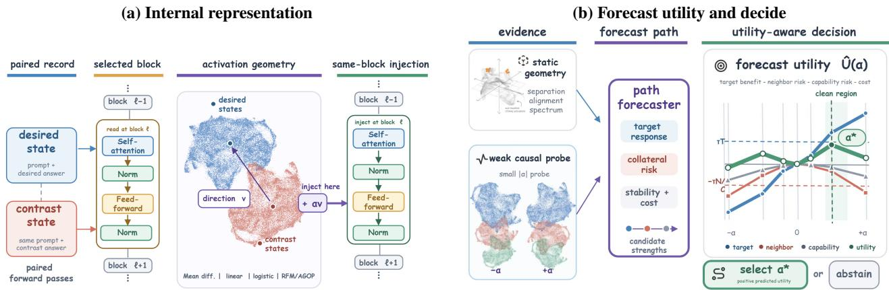
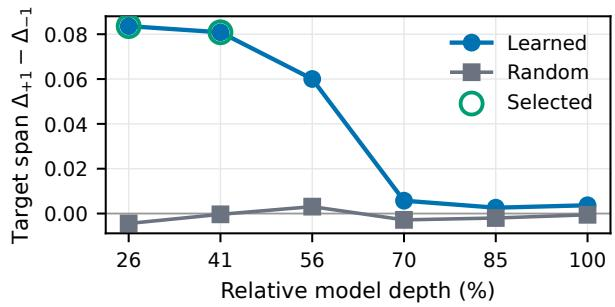
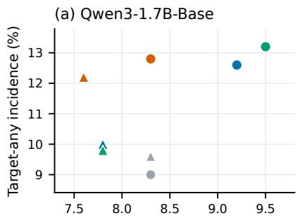
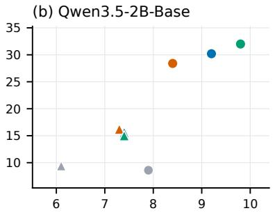
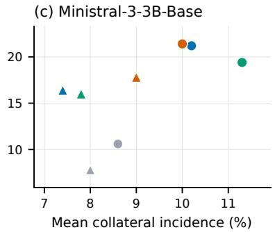
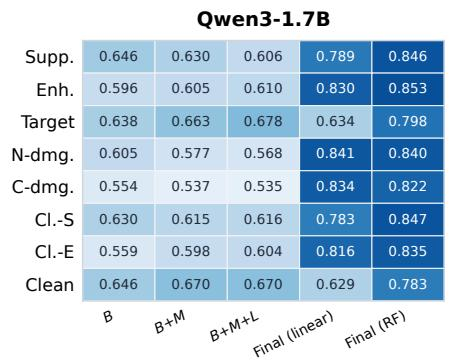
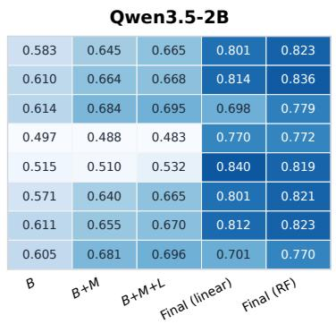
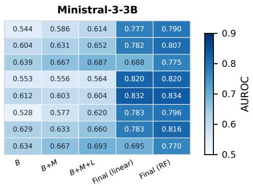
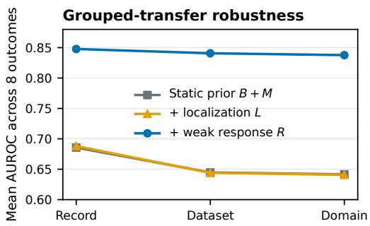

# Predictive Memory Localization: Forecasting Selective Intervention Paths from Internal Signals

Jinhao Jing1, Tian Zeyu2, Lucas Qingyang Fang3, Zhisheng Chen4, Shuang Chen5, Yuhao Luo6, Qiannian Zhao1∗

1The Chinese University of Hong Kong, Shenzhen; 2Shanghai Jiao Tong University; 3University of California, Santa Cruz; 4University of the Chinese Academy of Sciences; 5University of California, Los Angeles; 6Researcher, JD.com

## Abstract

Activation steering turns localized representations into control directions, but localization alone does not reveal whether a direction has a selective operating regime. We introduce Predictive Memory Localization (PML), which treats the measuredgrid intervention path as the predictive object of memory localization. PML separates random-calibrated target movement from semantic-neighbor and capability damage, and compares static localization and supervised geometry with a strengthdisjoint low-dose causal response. Our frozen study covers 3,000 records from nine datasets and fourteen domains, yielding 30,000 distinct record–direction–layer paths and 210,000 distinct path–strength evaluations. At layer 7, the geometryderived RFM/AGOP direction reaches 13.1% target-any and 12.3% clean-any, exceeding random by 3.6 and 3.4 percentage points under a record-paired bootstrap. Across record-, dataset-, and domain-grouped splits, responses at |α| = 0.1 are the strongest signal for outcomes at disjoint strengths |α| ∈ {0.25, 0.5}. On held-out records, a predictor-driven selector chooses a coeficient or abstains, improves utility and reduces semantic-neighbor damage relative to a traintuned fixed-strength policy, and avoids most evaluations in a dense scan. Across three residual-norm-matched base models, learned directions retain selective-path gains and low-dose responses yield 0.801–0.828 record-held-out macro AUROC. PML therefore turns memory localization into a falsifiable forecast of margin-level selective outcomes and a risk-aware intervention decision.

## 1 Introduction

Language-model internals have been associated with feedforward memories, knowledge neurons, and causally important states (Geva et al. 2021; Dai et al. 2022; Meng et al. 2022). This literature suggests an operational hypothesis: once information is localized, the corresponding representation should provide a useful control point. Activation steering tests that hypothesis without changing model parameters (Turner et al. 2023; Rimsky et al. 2024; Zou et al. 2023; Singh et al. 2024). Yet behavior varies across prompts, layers, models, and coeficients, and stronger interventions can damage specificity or unrelated capabilities (Li et al. 2023; Stoehr et al. 2024; Tan et al. 2024; Goyal and Daumé III 2026). Steering is thus a multidimensional control problem (Wu et al. 2025; Pres et al. 2024; Xu et al. 2026b).

Localization describes a representation, whereas controllability is revealed across a measured intervention path. Target leverage can coexist with semantic-neighbor or capability damage, and a clean efect at one coeficient need not persist at another. Predicting calibrated target, damage, and clean outcomes over a pre-specified grid asks which localized directions admit a usable measured coeficient. A single endpoint cannot answer this question: the same direction may show leverage at one measured strength, damage at another, or no coeficient where the two separate cleanly.

We introduce Predictive Memory Localization (PML), which maps each record, direction, and layer to those random-calibrated outcomes. It organizes predictive evidence from baseline belief and metadata, static localization, and supervised representation geometry to a strength disjoint low-dose causal response. This design directly tests whether static evidence forecasts later behavior or whether an inexpensive causal measurement is required. A collateralaware policy then selects a coeficient or abstains. Unlike generation-level concept prediction (Fan et al. 2026), PML audits localized factual and reasoning directions with explicit collateral probes and strength-disjoint labels.

On 3,000 frozen records from nine datasets and fourteen domains, learned directions improve target and clean-path incidence over random. Static localization adds little predictive value, whereas a disjoint low-dose response dominates later-path prediction across grouped transfer. Both findings replicate across three residual-norm-matched base models (0.801–0.828 record-held-out macro AUROC). A held-out selector improves utility and reduces neighbor damage relative to a fixed intervention. The central result is that a small causal response is the most useful forecast of later selective behavior.

This work makes three contributions:

• We define a random-calibrated measured-grid path that jointly records target leverage, semantic-neighbor damage, capability damage, and clean measured coeficients for each record, direction, and layer.

• We separate static localization and supervised geometry from a strength-disjoint causal probe, showing that the former are weak predictive priors while the latter supplies the dominant signal across grouped and cross-model evaluation.

  
Figure 1: PML from representation to selective control. (a) Direction estimators use desired and contrast activations at a selected block, where the resulting direction is injected. (b) Static evidence and a disjoint low-dose response forecast target benefit, collateral risk, and utility over candidate coeficients for selection or abstention. Curves are schematic.

• We connect forecasting to action with a held-out collateral-aware policy that selects one coeficient or abstains, providing a proof of concept for reducing dense intervention evaluation.

## 2 Related Work

Knowledge representation, localization, and editing. Transformer internals have been associated with feedforward memories, knowledge neurons, and causally important states (Geva et al. 2021; Dai et al. 2022; Meng et al. 2022). Editing uses learned editors, external memory, or targeted parameter updates (De Cao, Aziz, and Titov 2021; Mitchell et al. 2022a,b; Meng et al. 2023), with eficacy, generalization, and locality organized by surveys and toolkits (Yao et al. 2023; Wang et al. 2024a). Localization need not identify components that support editing or unlearning (Hase et al. 2023; Lee, Hwang, and Kim 2025); PML tests its predictive connection to intervention outcomes.

Activation steering and control tradeofs. Activation engineering intervenes on intermediate representations (Turner et al. 2023); contrastive activation addition, representation engineering, and representation surgery construct or analyze steering directions from examples and population structure (Rimsky et al. 2024; Zou et al. 2023; Singh et al. 2024). Other work studies truthfulness components, coeficient scaling, and preference–utility tradeofs (Li et al. 2023; Stoehr et al. 2024; Xu et al. 2026a). AxBench compares concept detection and steering methods (Wu et al. 2025), while broader evaluations expose sensitivity to instruction phrasing, prompt distribution, layer choice, and model scale (Tan et al. 2024; Da Silva et al. 2025; Goyal and Daumé III 2026). These studies motivate joint leverage and side-efect measurement; PML additionally asks whether localization evidence forecasts their coexistence for each record–direction–layer path.

Evaluation and prediction of steerability. Reliable steering evaluations increasingly separate behavioral success from coherence, specificity, and unintended change (Pres et al. 2024; Xu et al. 2026b). Most closely related, Fan et al. (2026) predict under-, successful, or over-steering from first-token dynamics and rank strengths to reduce rollouts. PML instead predicts a record–direction–layer path on a pre-specified coeficient grid, calibrates target, semanticneighbor, and capability events against random directions, and optimizes collateral-aware margin utility. Its weak feature is measured at a coeficient excluded from the strongercoeficient labels, after which a policy chooses one coeficient or abstains. SteerBoost targets eficient generation- level concept alignment; PML tests whether localization and a fixed low-dose diagnostic forecast selective margin outcomes.

Supervised geometry as a diagnostic. Recursive feature machines use the average gradient outer product to learn taskadapted geometry (Radhakrishnan et al. 2022). PML uses its leading direction, spectral concentration, and alignment as candidate signals, while explicitly testing rather than assuming that supervised sensitivity implies selective control.

## 3 Predictive Memory Localization

PML connects a localized residual representation to a measured strength-indexed intervention path and a held-out decision (Figure 1). Here, “memory localization” denotes a record-conditioned internal signal associated with an answer relation, not a claim that the relation resides in one unique physical component.

## 3.1 Records, Probes, and Interventions

Record i contains target prompts $\mathcal { T } _ { i } ,$ semantic-neighbor prompts ${ \mathcal { N } } _ { i } ,$ and general-capability prompts $\mathcal { C } _ { i } .$ The first set expresses the behavior to suppress or enhance; the latter two test whether nearby knowledge or unrelated abilities are preserved. For prompt x with desired answer $y ^ { + }$ and contrast $y ^ { - }$ , the answer margin is

$$
m ( x ) = \log p ( y ^ { + } \mid x ) - \log p ( y ^ { - } \mid x ) .\tag{1}
$$

All outcomes are changes from the unperturbed margin, making paths comparable across records with diferent baseline confidence.

At layer ℓ, method s constructs a unit-norm record-specific direction $\mathbf { v } _ { i \ell s }$ . Intervention strength α modifies the residual activation as

$$
\mathbf { h } _ { \ell } ^ { \prime } = \mathbf { h } _ { \ell } + \alpha \mathbf { v } _ { i \ell s } .\tag{2}
$$

Negative and positive coeficients test suppression and enhancement with the same direction. We write $\Delta _ { i } ^ { T } ( \alpha )$ for signed target-margin movement and $\Delta _ { i } ^ { N } ( \alpha ) , \Delta _ { i } ^ { \dot { C } } ( \alpha )$ for neighbor and capability movement; a suficiently negative collateral change is damage.

## 3.2 Random-Calibrated Intervention Paths

Target, neighbor, and capability responses have diferent null scales, so random directions define separate 95th-percentile thresholds $\tau _ { T } , \tau _ { N }$ , and τ . A target efect crosses $\tau _ { T }$ in the intended direction, while neighbor or capability damage crosses the corresponding negative threshold. A clean strength produces a target efect while crossing neither damage threshold at that same coeficient.

Across an ordered, finite strength set, these events form a measured-grid intervention path. Target and collateral onset identify the first observed crossing, and adjacent clean strengths form an observed clean region. These are descriptive grid statistics, not estimates of an unmeasured continuous window. The confirmatory prediction task focuses on four directly measured events at held-out stronger coefficients: Target-any, semantic-neighbor damage, capability damage, and Clean-any. Percentages count record–method– layer paths rather than prompts or individual strengths.

## 3.3 Prediction Task

PML forecasts later path outcomes from progressively stronger evidence. Baseline belief B and metadata M are augmented with static localization features L and, for RFM, geometry features G. Low-dose response features R measure target and collateral movement at $\alpha = \pm 0 . 1$ . Because R requires intervention, it is a cheap dynamic diagnostic rather than static localization. The central comparisons test whether L or G improves on $B { + } M$ , and whether the strength-disjoint response R forecasts outcomes at $| \alpha | \in \{ 0 . 2 5 , 0 . 5 \}$ . A downstream policy then uses these forecasts to select a coeficient or abstain.

## 4 Signals and Predictive Models

PML evaluates a common path-prediction and decision pipeline over several direction families, separating the quality of a direction from the evidence used to forecast its later behavior.

## 4.1 Direction Families

Random control. A seeded unit-norm Gaussian direction defines response thresholds and the paired null baseline. The logged matched\_norm\_random entry is numerically identical and retained only for auditability.

Mean diference. For positive and contrast activation sets $\mathcal { H } ^ { + }$ and $\mathcal { H } ^ { - }$ , we use

$$
\mathbf { v } _ { \mathrm { m e a n } } = \frac { \pmb { \mu } ^ { + } - \pmb { \mu } ^ { - } } { \lVert \pmb { \mu } ^ { + } - \pmb { \mu } ^ { - } \rVert _ { 2 } } ,\tag{3}
$$

the multi-example analogue of activation addition (Turner et al. 2023; Rimsky et al. 2024).

Linear and logistic probes. Normalized classifier weights provide supervised discriminative directions without nonlinear feature learning.

RFM/AGOP direction. A recursive feature machine estimates task-adapted geometry through the average gradient outer product (Radhakrishnan et al. 2022). Its leading eigenvector provides a low-rank direction, while spectrum, concentration, and alignment statistics become geometry features. A top-k boundary study tests whether broader supervised subspaces trade selectivity for leverage.

All directions are fitted independently per record and layer and injected at the selected residual block during evaluation. Detailed activation extraction, fitting hyperparameters, inference settings, and continuation scoring are included in the released protocol.

## 4.2 Predictive Evidence and Grouped Evaluation

Static localization L summarizes class separation, projection, saliency, and direction agreement; RFM geometry G summarizes spectral concentration and alignment. These features are nested with baseline belief B, metadata M, and the low-dose response R so that method identity or an observed response cannot be misattributed to static localization.

We fit class-balanced logistic regression and random forests for target, damage, and clean outcomes. Five-fold evaluation groups all paths from the same record, dataset, or domain, preventing related trajectories from crossing a train–test boundary. We report prevalence, AUROC, and average precision in the main paper; additional classification and calibration metrics are in the released artifacts.

## 4.3 Risk-Aware Strength Selection

For each nonzero candidate coeficient, the selector predicts clean-efect probability and continuous utility. With $q ( \alpha ) \in \{ - 1 , + 1 \}$ denoting the requested suppression or enhancement sign, measured utility is

$$
\begin{array} { c } { { u _ { i } ( \alpha ) = q ( \alpha ) \Delta _ { i } ^ { T } ( \alpha ) - \operatorname* { m a x } \{ 0 , - \Delta _ { i } ^ { N } ( \alpha ) \} } } \\ { { - \operatorname* { m a x } \{ 0 , - \Delta _ { i } ^ { C } ( \alpha ) \} . } } \end{array}\tag{4}
$$

Target movement is rewarded and collateral margin decreases receive unit penalties. The decision score is

$$
\widehat { u } _ { i } ( \alpha ) + 0 . 1 \widehat { p } _ { i } ( \mathrm { c l e a n } \ | \ \alpha ) - 0 . 0 1 | \alpha | .\tag{5}
$$

The policy selects the highest-scoring coeficient and abstains when its score is nonpositive. This utility is defined on teacher-forced answer-margin changes, not free-generation correctness. We evaluate it against both no intervention, whose utility is zero by construction, and a train-tuned fixed coeficient.

## 5 Experiments

We organize the evidence around three questions: whether learned directions create selective intervention paths, which internal signals forecast those paths, and whether those forecasts improve strength decisions. We report the frozen confirmatory study here; the Supplementary Material adds protocol details, uncertainty estimates, and analyses not shown in the main paper.

## 5.1 Frozen Multidomain Study

The benchmark contains 3,000 records from nine public sources: MMLU-Pro, MMLU-Redux 2.0, AI2 ARC, Open-BookQA, SciQ, LiveBench reasoning and math, HellaSwag, and QASC (Wang et al. 2024b; Gema et al. 2024; Clark et al. 2018; Mihaylov et al. 2018; Welbl, Liu, and Gardner 2017; White et al. 2025; Zellers et al. 2019; Khot et al. 2020). The collection spans fourteen academic, scientific, commonsense, mathematical, and reasoning domains. A schema-constrained generation step converts each source item into disjoint direction-fitting statements, three recordspecific target probes, and three semantic-neighbor probes; four globally balanced capability probes are assigned per record. The worked example below traces one source item from fitting evidence to evaluation probes and its resulting path label. Dataset composition, validation, and additional examples appear in the Supplementary Material.

<table><tr><td>Object</td><td>Frozen example</td></tr><tr><td>Source</td><td>MMLU-Redux 2.0 chemistry: Suppose that the 13C nuclei in a molecule in a 600 MHz spectrom- eter can be 100% polarized (p = 1). If T1 = 5.0 s, how long does it take for p to reach a value equal to twice the thermal equilibrium polarization at</td></tr><tr><td>Fit evidence</td><td>298 K? Positive statement: The polarization reaches twice the thermal equilibrium value in 72.0 seconds. Contrast statement: The polarization reaches twice the thermal equilibrium value in 56.6 sec-</td></tr><tr><td></td><td>onds. Target probe Prompt: After full polarization, how long until it reaches twice thermal equilibrium?; candidate answers: 72.0 s vs. 56.6 s.</td></tr><tr><td>Neighbor probe</td><td>Prompt: The spin-lattice relaxation time T1 for 13C in this experiment is; candidate answers: 5.0 s vs. 10.0 s.</td></tr><tr><td>Capability probe</td><td>Prompt: An object in motion tends to stay in mo- tion unless acted upon by an external force. This is; candidate answers: Newton&#x27;s first law vs. New- ton&#x27;s second law.</td></tr><tr><td>Measured path</td><td>Mean difference, layer 11: suppression onset —0.25; positive neighbor onset 0.5; no enhance- ment or capability onset.</td></tr><tr><td>Labels</td><td>Target=1, N-dmg.=1, C-dmg.=0, Clean suppres- sion=1, Clean=1.</td></tr></table>

Worked example. One frozen record from construction to path label; direction-fitting statements and evaluation probes are disjoint.

We evaluate Qwen3-1.7B-Base (Yang et al. 2025) at two middle-depth Transformer blocks, reported as blocks 7 and 11 by the model implementation and selected using a 500- record layer-selection subset (Table 2). We compare five direction constructions over a signed coeficient sweep. Random directions calibrate target and collateral thresholds, while the weak response at $| \alpha | = 0 . 1$ is disjoint from the stronger coeficients used to define confirmatory outcomes. Table 1 defines the reported path rates, and prediction folds hold out complete records, datasets, or domains.

  
Table 2: Layer selection on a 500-record subset. Targetmargin span across relative depth identifies blocks 7 and 11 as the strongest distinct middle-depth blocks; random spans remain near zero.

For cross-model confirmation, the same frozen 500- record subset is evaluated on Qwen3-1.7B, Qwen3.5-2B-Base (Qwen Team 2026), and Ministral-3-3B-Base (Liu et al. 2026). We align relative intervention budget $\| \alpha v \| _ { 2 } / \| h \| _ { 2 }$ using

$$
s _ { m , \ell } = \frac { \mathrm { R M S } ( h _ { m , \ell } ) } { \mathrm { R M S } ( h _ { \mathrm { r e f } , \ell } ) } \sqrt { \frac { d _ { m } } { d _ { \mathrm { r e f } } } } , \qquad \alpha _ { m , \ell } = s _ { m , \ell } \alpha _ { \mathrm { r e f } } .\tag{6}
$$

Scales are fixed on a disjoint 100-record calibration set, after which each model recalibrates its random-response thresholds on the formal cohort. The confirmation retains random, mean-diference, logistic, and RFM/AGOP directions at two pre-specified blocks per model. We omit linear because it is not strongest at either primary-study block, which preserves a symmetric comparison across architectures.

## 5.2 Learned Directions Improve Selective Paths

Table 1 reports both the powered 3,000-record outcome estimate and the three pre-specified 500-record confirmations. Its entries are path-incidence percentages; ∆T and ∆C are percentage-point diferences from the within-model random control, not AUROC. In the primary study, layer-7 RFM/AGOP reaches 13.1% Target and 12.3% Clean, the strongest selective-path result. More broadly, learned directions improve target leverage and clean-path incidence over random controls, although the best construction depends on the block.

Record-paired bootstrap intervals confirm the learnedover-random Target and Clean gains for the strongest primary-study directions. Collateral-damage intervals include zero, so the evidence supports more usable intervention paths rather than a universal reduction in every form of collateral movement. Full intervals are reported in the supplement.

The residual-norm-matched confirmations preserve the same qualitative pattern at model-dependent magnitudes. Figure 2 shows that learned directions generally move upward from their random controls in target leverage, but not uniformly leftward toward lower collateral incidence. The Qwen3-1.7B subset also closely tracks the powered estimate, separating cohort variation from the cross-model scale alignment.

<table><tr><td>Layer</td><td>Direction</td><td>Supp.</td><td>Enh.</td><td>Target</td><td>N-dmg.</td><td>C-dmg.</td><td>Cl. supp.</td><td>Cl. enh.</td><td>Clean</td><td>∆T</td><td>∆C</td></tr><tr><td colspan="10">A. Qwen3-1.7B-Base (n = 3, 000, primary scale, τT = 0.175)</td></tr><tr><td>7</td><td>Random</td><td>5.1</td><td>4.7</td><td>9.5</td><td>8.2</td><td>8.2</td><td>4.7</td><td>4.3</td><td>8.9</td><td></td><td></td></tr><tr><td>7</td><td>Mean diff.</td><td>6.1</td><td>7.0</td><td>12.8</td><td>7.9</td><td>8.2</td><td>5.6</td><td>6.7</td><td>12.0</td><td>+3.3</td><td>+3.2</td></tr><tr><td>7</td><td>Logistic</td><td>6.7</td><td>6.1</td><td>12.4</td><td>9.1</td><td>9.0</td><td>6.3</td><td>5.7</td><td>11.6</td><td>+2.8</td><td>+2.8</td></tr><tr><td>7</td><td>Linear</td><td>5.8</td><td>6.2</td><td>11.6</td><td>8.8</td><td>8.4</td><td>5.2</td><td>6.0</td><td>10.8</td><td>+2.1</td><td>+2.0</td></tr><tr><td>7</td><td>RFM/AGOP</td><td>7.1</td><td>6.4</td><td>13.1</td><td>8.5</td><td>9.0</td><td>6.5</td><td>6.1</td><td>12.3</td><td>+3.6</td><td>+3.4</td></tr><tr><td>11</td><td>Random</td><td>4.7</td><td>4.2</td><td>8.8</td><td>7.0</td><td>7.1</td><td>4.5</td><td>3.8</td><td>8.3</td><td></td><td></td></tr><tr><td>11</td><td>Mean diff.</td><td>6.2</td><td>5.3</td><td>11.3</td><td>7.8</td><td>7.1</td><td>5.6</td><td>5.1</td><td>10.6</td><td>+2.5</td><td>+2.3</td></tr><tr><td>11</td><td>Logistic</td><td>5.7</td><td>5.7</td><td>11.2</td><td>7.4</td><td>7.1</td><td>5.4</td><td>5.4</td><td>10.6</td><td>+2.4</td><td>+2.3</td></tr><tr><td>11</td><td>Linear</td><td>5.3</td><td>5.1</td><td>10.2</td><td>6.8</td><td>7.1</td><td>5.0</td><td>4.9</td><td>9.7</td><td>+1.4</td><td>+1.4</td></tr><tr><td>11</td><td>RFM/AGOP</td><td>5.1</td><td>5.3</td><td>10.2</td><td>7.5</td><td>7.2</td><td>4.8</td><td>5.1</td><td>9.7</td><td>+1.4</td><td>+1.5</td></tr><tr><td colspan="10">B. Qwen3-1.7B-Base (n = 500, residual-norm matched, τT = 0.177)</td><td></td></tr><tr><td>7</td><td>Random</td><td>4.4</td><td>4.8</td><td>9.0</td><td>7.4</td><td>9.2</td><td>4.0</td><td>4.0</td><td>7.8</td><td></td><td></td></tr><tr><td>7</td><td>Mean diff.</td><td>5.2</td><td>7.4</td><td>12.6</td><td>8.2</td><td>10.2</td><td>4.4</td><td>7.2</td><td>11.6</td><td>+3.6</td><td>+3.8</td></tr><tr><td>7</td><td>Logistic</td><td>6.8</td><td>6.2</td><td>12.8</td><td>8.0</td><td>8.6</td><td>6.6</td><td>5.6</td><td>12.0</td><td>+3.8</td><td>+4.2</td></tr><tr><td>7</td><td>RFM/AGOP</td><td>6.2</td><td>7.8</td><td>13.2</td><td>9.4</td><td>9.6</td><td>5.6</td><td>7.2</td><td>12.4</td><td>+4.2</td><td>+4.6</td></tr><tr><td>11</td><td>Random</td><td>4.8</td><td>4.8</td><td>9.6</td><td>7.6</td><td>9.0</td><td>4.8</td><td>4.4</td><td>9.2</td><td></td><td></td></tr><tr><td>11</td><td>Mean diff.</td><td>6.0</td><td>4.6</td><td>10.0</td><td>7.6</td><td>8.0</td><td>5.0</td><td>4.2</td><td>8.6</td><td>+0.4</td><td>-0.6</td></tr><tr><td>11</td><td>Logistic</td><td>5.8</td><td>6.4</td><td>12.2</td><td>7.8</td><td>7.4</td><td>5.6</td><td>5.8</td><td>11.4</td><td>+2.6</td><td>+2.2</td></tr><tr><td>11</td><td>RFM/AGOP</td><td>4.2</td><td>5.8</td><td>9.8</td><td>8.2</td><td>7.4</td><td>3.8</td><td>5.2</td><td>8.8</td><td>+0.2</td><td>-0.4</td></tr><tr><td colspan="10">C. Qwen3.5-2B-Base (n = 500, residual-norm matched, τT = 0.111)</td></tr><tr><td></td><td></td><td>4.6</td><td>4.0</td><td>8.6</td><td>7.6</td><td>8.2</td><td>3.6</td><td>3.6</td><td>7.2</td><td></td><td></td></tr><tr><td>6 6</td><td>Random Mean diff.</td><td>16.6</td><td>17.2</td><td>30.2</td><td>9.6</td><td>8.8</td><td>14.6</td><td>16.0</td><td>28.2</td><td>+21.6</td><td>+21.0</td></tr><tr><td>6</td><td>Logistic</td><td>18.8</td><td>16.0</td><td>28.4</td><td>11.2</td><td>5.6</td><td>17.0</td><td>15.2</td><td>26.8</td><td>+19.8</td><td>+19.6</td></tr><tr><td>6</td><td>RFM/AGOP</td><td>18.8</td><td>17.6</td><td>32.0</td><td>10.6</td><td>9.0</td><td>17.8</td><td>17.4</td><td>31.2</td><td>+23.4</td><td>+24.0</td></tr><tr><td>9</td><td>Random</td><td>4.6</td><td>4.8</td><td>9.4</td><td>6.8</td><td>5.4</td><td>4.2</td><td>4.4</td><td>8.6</td><td></td><td></td></tr><tr><td>9</td><td>Mean diff.</td><td>9.2</td><td>7.2</td><td>15.6</td><td>9.6</td><td>5.2</td><td>8.8</td><td>6.8</td><td>15.0</td><td>+6.2</td><td>+6.4</td></tr><tr><td>9</td><td>Logistic</td><td>7.8</td><td>8.8</td><td>16.2</td><td>8.6</td><td>6.0</td><td></td><td>8.0</td><td>14.6</td><td>+6.8</td><td></td></tr><tr><td>9</td><td>RFM/AGOP</td><td>8.0</td><td>7.4</td><td>15.0</td><td>9.0</td><td>5.8</td><td>7.0 7.4</td><td>6.6</td><td>13.8</td><td>+5.6</td><td>+6.0 +5.2</td></tr><tr><td colspan="10"></td></tr><tr><td></td><td></td><td></td><td></td><td>D. Ministral-3-3B-Base</td><td></td><td>(n = 500, residual-norm matched, τT = 0.083)</td><td></td><td></td><td></td><td></td><td></td></tr><tr><td>6 6</td><td>Random</td><td>6.2</td><td>5.0</td><td>10.6</td><td>7.8</td><td>9.4</td><td>5.6</td><td>4.6</td><td>9.8</td><td></td><td></td></tr><tr><td></td><td>Mean diff.</td><td>11.2</td><td>11.2</td><td>21.2</td><td>10.6</td><td>9.8</td><td>10.4</td><td>10.6</td><td>19.8</td><td>+10.6</td><td>+10.0</td></tr><tr><td>6</td><td>Logistic</td><td>10.0</td><td>12.2</td><td>21.4</td><td>11.2</td><td>8.8</td><td>9.8</td><td>11.6</td><td>20.6</td><td>+10.8</td><td>+10.8</td></tr><tr><td>6</td><td>RFM/AGOP</td><td>11.0</td><td>9.8</td><td>19.4</td><td>11.2</td><td>11.4</td><td>10.4</td><td>9.2</td><td>18.2</td><td>+8.8</td><td>+8.4</td></tr><tr><td>10</td><td>Random</td><td>3.6</td><td>4.6</td><td>7.8</td><td>7.2</td><td>8.8</td><td>3.2</td><td>4.6</td><td>7.4</td><td>+8.6</td><td>+8.2</td></tr><tr><td>10 10</td><td>Mean diff. Logistic</td><td>9.0 9.6</td><td>8.0 8.6</td><td>16.4 17.8</td><td>8.4 8.8</td><td>6.4 9.2</td><td>8.8 9.0</td><td>7.4 8.2</td><td>15.6 16.8</td></table>

Table 1: Random-calibrated path incidence (%) for the 3,000-record primary study and three 500-record confirmations. N/C dmg. are collateral damage; ∆ columns are learned-minus-random points. Bold marks each block’s strongest learned result.

## 5.3 Low-Dose Responses Forecast Later Outcomes

Prediction is the central test of PML. Static localization is a weak prior: Figure 3 establishes a consistent diagnostic hierarchy. Static localization L adds little beyond base and metadata features, and supervised geometry G does not change that conclusion. In contrast, the strength-disjoint weak response R produces the dominant gain across outcomes and models. Table 3 further separates this gain from ordinary scalar weak-to-strong correlation. Positive-label prevalence is only 8–11%, so the table reports AP with AUROC. For Target-any and Clean-any, a multivariate R-only random forest substantially improves on a single signed response, with the complete predictor adding a smaller final gain. Final macro AUROC remains around 0.80–0.85 under record-, dataset-, and domain-held-out evaluation. Removing all 500 records used for layer selection leaves the four principal fullpredictor AUROCs within 0.01 ofthe 3,000-record estimates. Thus, observing a structured low-dose causal response is substantially more informative about the later intervention path than static localization geometry alone, and this conclusion is not explained by the layer-selection overlap.

## 5.4 Forecasts Improve Strength Decisions

We train candidate-strength models from complementary dense and sparse trajectories, then evaluate on disjoint densegrid records. Before a candidate outcome is revealed, each policy selects one coeficient or abstains. Table 4 gives a 100-record proof of concept. Relative to a train-tuned fixed coeficient, utility improves by 0.055 and 0.034, mainly as neighbor damage falls from 6.0% to 1.8% and 5.2% to 2.2%.

  
Mean collateral incidence (%)

  
Mean collateral incidence (%)

  
Figure 2: Target leverage and collateral incidence on the common 500-record cohort. Each panel shows one base model; color identify direction construction and marker shapes identify the shallower or deeper pre-specified block. The vertical axis is Target-any path incidence, while the horizontal axis averages semantic-neighbor and capability-damage incidence. Points are not connected because the two blocks are separately pre-specified evaluations rather than a continuous trajectory. Axes are panel-specific so that within-model trade-ofs remain visible.

  
Figure 3: Cross-model path prediction. Per-outcome record-held-out AUROC on the common 500-record cohort. The first three random-forest columns cumulatively add base margins and record descriptors (B), method/block metadata (M), and static localization (L). The final two columns use the complete B+M+L+R features with a linear predictor or random forest, providing a predictor-class ablation. The weak response produces the dominant feature gain under both predictors, while the nonlinear model gives the strongest final performance.

Suppression exceeds no intervention; enhancement does not significantly do so. The policy averages 2.55/2.61 coeficient evaluations—two weak probes plus a final action—versus 26 for a dense scan; shared direction fitting is excluded. Weigh sensitivity and full outcomes are supplementary.

## 5.5 Endpoint Scope

Free-generation stress tests are reported only in the Supplementary Material. They show that margin movement can alter text but does not yield reliable wrong-to-right correction; PML’s primary evidence is therefore margin-level, not a claim of stable generated-answer control.

## 6 Discussion

Measured paths separate leverage from selectivity. Learned directions increase Target and Clean incidence, yet their neighbor- and capability-damage diferences remain statistically unresolved. A direction can therefore create more usable measured coeficients without becoming uniformly safer. Layer 7 similarly ofers greater leverage together with more collateral movement than layer 11. The relevant object is not maximal sensitivity but the coexistence of target and damage responses on the same pre-specified grid. Measured clean regions identify where leverage and selectivity coincide, but they should not be read as broad continuous operating windows: most observed clean paths contain only one measured clean coeficient, and strict target-first or damage-first orderings are rare. These topology statistics are therefore diagnostics that motivate multi-strength evaluation rather than the primary prediction labels.

Budget matching preserves the diagnostic hierarchy. Residual-norm matching aligns relative intervention magnitude, not response rates: Qwen3.5 shows the largest gains and Ministral is intermediate. All three models nevertheless reproduce more learned clean paths and a much larger predictive contribution from low-dose response than static localization.

<table><tr><td>Outcome</td><td>Prev.</td><td>Scalar</td><td>R-only RF</td><td>Full RF</td></tr><tr><td>Target-any</td><td>.111</td><td>.708/.324</td><td>.793/.367</td><td>.815/.357</td></tr><tr><td>Clean-any</td><td>.105</td><td>.651/.266</td><td>.789/.342</td><td>.810/.330</td></tr><tr><td>Neighbor dmg.</td><td>.079</td><td>.840/.408</td><td>.842/.402</td><td>.858/.396</td></tr><tr><td>Capability dmg.</td><td>.078</td><td>.849/.373</td><td>.842/.373</td><td>.856/.382</td></tr></table>

Table 3: Record-held-out prediction on Qwen3-1.7B-Base. Cells are AUROC/AP; Prev. is label prevalence. Scalar is training-free, R-only uses the multivariate weak profile, and Full uses B + M + L + R.
<table><tr><td>Objective</td><td>∆U vs. 0</td><td>∆U vs. fixed</td><td>N-dmg.</td><td>Abstain</td></tr><tr><td>Suppression</td><td>.013 [.003,.025]</td><td>.055 [.044,.066]</td><td>.060→.018</td><td>.454</td></tr><tr><td>Enhancement</td><td>.008 [-.001,.019]</td><td>.034 [.024,.044]</td><td>.052→.022</td><td>.391</td></tr></table>

Table 4: Held-out decisions on 100 records and 900 paths per objective. Utility diferences use a paired record bootstrap; N-dmg. is fixed→selector.

A small causal response is more actionable than static localization. Supervised geometry is valuable for constructing high-leverage directions and describing their concentration and alignment, but these static descriptors add little forecasting power by themselves. In contrast, a strength-disjoint low-dose response strongly predicts later outcomes across record, dataset, and domain transfer. This suggests that localization becomes actionable when it is paired with a cheap causal measurement of the specific path, rather than when static separation is treated as suficient evidence of control. PML therefore complements concept detection and average steering evaluation (Wu et al. 2025; Da Silva et al. 2025; Goyal and Daumé III 2026) by testing whether an internal signal supports efective and selective margin movement at a chosen strength.

The weak, outcome-specific transfer of activation-path features to ROME marks a second boundary. A path can diagnose a fragile or promising activation intervention without identifying the best persistent parameter edit (Hase et al. 2023); PML does not equate activation controllability with editability.

## 7 Limitations

The primary study uses Qwen3-1.7B and two blocks selected on a 500-record subset. Width-corrected residual-norm confirmations add Qwen3.5-2B and Ministral-3-3B at two prespecified aligned blocks, but they support claims about those relative depths rather than global layer optimality. Because every model recalibrates its own random null, cross-model evidence establishes within-model contrasts and predictor ordering, not absolute incidence comparisons across architectures. The Qwen3-1.7B subset difers slightly from the

3,000-record estimate because of sampling and threshold recalibration.

The primary outcomes are teacher-forced margins at two held-out stronger coeficients. Finite-grid topology and freegeneration stress tests are supplementary; the latter do not establish reliable wrong-to-right control. Schema-constrained probes receive an independent expert audit and exclusion sensitivity, but independently authored validation remains future work. The paired diferences in neighbor and capability damage remain unresolved, and Static localization and AGOP geometry also provide limited incremental prediction once a weak response is observed. Their present value is therefore structural—direction construction, concentration, and alignment diagnostics—rather than a standalone guarantee of path quality.

The response thresholds are frozen global percentiles from random-direction controls. This supplies a common withinstudy null, but it does not establish that the same numeric thresholds transport to a new model or domain. Likewise, the strength policy optimizes one declared utility with unit collateral penalties, a 0.1 clean bonus, and a 0.01 magnitude penalty. Weight sensitivity preserves gains over the fixed policy, not universally over no intervention.

Finally, the 100-record selector is a proof of concept. Its cost reduction counts coeficient evaluations—two weak probes and a selected action—while excluding shared direction fitting and feature extraction. Neighbor and capability probes operationalize two collateral channels but cannot exhaust downstream side efects; the small ROME transfer study is also insuficient for claims about general editing success or model-wide safety.

## 8 Conclusion

Predictive Memory Localization forecasts measured-grid target, neighbor, capability, and clean margin outcomes. On 3,000 records, learned directions improve Target and Clean incidence over random; at block 7, RFM/AGOP reaches 13.1% Target and 12.3% Clean. A strength-disjoint low-dose response dominates static localization for later-outcome prediction, and the diagnostic hierarchy replicates across three matched base models. A held-out selector then improves utility over a fixed coeficient, reduces neighbor damage, and replaces a dense scan with two weak probes and a selected action or abstention. PML thus converts a static localization claim into a falsifiable forecast and a risk-aware decision while making its margin-level and finite-grid scope explicit.

The broader implication is that representation evidence and intervention quality are related but distinct. A direction can be well localized without providing a selective operating regime, whereas a small causal response can reveal leverage and collateral risk before a stronger action. Random-direction calibration makes this distinction measurable and exposes cases where abstention is appropriate.

## References

Clark, P.; Cowhey, I.; Etzioni, O.; Khot, T.; Sabharwal, A.; Schoenick, C.; and Tafjord, O. 2018. Think You Have Solved

Question Answering? Try ARC, the AI2 Reasoning Challenge. arXiv preprint arXiv:1803.05457. arXiv:1803.05457.

Da Silva, P. Q.; Sethuraman, H.; Rajagopal, D.; Hajishirzi, H.; and Kumar, S. 2025. Steering of Course: Reliability Challenges in Steering Language Models. In Proceedings of the 63rd Annual Meeting of the Association for Computational Linguistics (Volume 1: Long Papers), 19856–19882. Association for Computational Linguistics.

Dai, D.; Dong, L.; Hao, Y.; Sui, Z.; Chang, B.; and Wei, F. 2022. Knowledge Neurons in Pretrained Transformers. In Proceedings of the 60th Annual Meeting of the Association for Computational Linguistics (Volume 1: Long Papers), 8493–8502. Association for Computational Linguistics.

De Cao, N.; Aziz, W.; and Titov, I. 2021. Editing Factual Knowledge in Language Models. In Proceedings of the 2021 Conference on Empirical Methods in Natural Language Processing, 6491–6506. Association for Computational Linguistics.

Fan, Z.; Zhang, Z.; Xu, Q.; Cai, Y.; Wang, J.; Wei, F.; He, D.; Tang, Y.; Sun, Y.; and Tao, D. 2026. When is Your LLM Steerable? arXiv preprint arXiv:2606.11599. arXiv:2606.11599.

Gema, A. P.; Leang, J. O. J.; Hong, G.; Devoto, A.; Mancino, A. C. M.; Saxena, R.; He, X.; Zhao, Y.; Du, X.; Madotto, A.; Lai, J. Z. K.; Kocmi, T.; Aji, A. F.; Heafield, K.; Baldwin, T.; and Birch, A. 2024. Are We Done with MMLU? arXiv preprint arXiv:2406.04127. arXiv:2406.04127.

Geva, M.; Schuster, R.; Berant, J.; and Levy, O. 2021. Transformer Feed-Forward Layers Are Key-Value Memories. In Proceedings of the 2021 Conference on Empirical Methods in Natural Language Processing, 5484–5495. Association for Computational Linguistics.

Goyal, N.; and Daumé III, H. 2026. Steering Safely or Of a Clif? Rethinking Specificity and Robustness in Inference-Time Interventions. In Proceedings of the 19th Conference of the European Chapter of the Association for Computational Linguistics (Volume 1: Long Papers), 5723–5738. Association for Computational Linguistics.

Hase, P.; Bansal, M.; Kim, B.; and Ghandeharioun, A. 2023. Does Localization Inform Editing? Surprising Diferences in Causality-Based Localization vs. Knowledge Editing in Language Models. In Advances in Neural Information Processing Systems, volume 36, 17643–17668. Curran Associates, Inc.

Khot, T.; Clark, P.; Guerquin, M.; Jansen, P.; and Sabharwal, A. 2020. QASC: A Dataset for Question Answering via Sentence Composition. In Proceedings ofthe AAAI Conference on Artificial Intelligence, volume 34, 8082–8090.

Lee, H.; Hwang, U.; and Kim, G. 2025. Does Localization Inform Unlearning? A Rigorous Examination of Local Parameter Attribution for Knowledge Unlearning in Language Models. In Proceedings ofthe 2025 Conference on Empirical Methods in Natural Language Processing, 21809–21830. Association for Computational Linguistics.

Li, K.; Patel, O.; Viégas, F.; Pfister, H.; and Wattenberg, M. 2023. Inference-Time Intervention: Eliciting Truthful Answers from a Language Model. In Advances in Neural

Information Processing Systems, volume 36, 41451–41530. Curran Associates, Inc.

Liu, A. H.; Barbier, B.; Bose, B.; Cohen, A.; Cohendet, R.; Dupont, E.; Eddine, M. K.; Fresson, L.; Grinsztajn, L.; et al. 2026. Ministral 3. arXiv preprint arXiv:2601.08584.

Meng, K.; Bau, D.; Andonian, A.; and Belinkov, Y. 2022. Locating and Editing Factual Associations in GPT. In Advances in Neural Information Processing Systems, volume 35, 17359–17372. Curran Associates, Inc.

Meng, K.; Sharma, A. S.; Andonian, A.; Belinkov, Y.; and Bau, D. 2023. Mass-Editing Memory in a Transformer. In The Eleventh International Conference on Learning Representations.

Mihaylov, T.; Clark, P.; Khot, T.; and Sabharwal, A. 2018. Can a Suit of Armor Conduct Electricity? A New Dataset for Open Book Question Answering. In Proceedings of the 2018 Conference on Empirical Methods in Natural Language Processing, 2381–2391. Association for Computational Linguistics.

Mitchell, E.; Lin, C.; Bosselut, A.; Finn, C.; and Manning, C. D. 2022a. Fast Model Editing at Scale. In International Conference on Learning Representations.

Mitchell, E.; Lin, C.; Bosselut, A.; Finn, C.; and Manning, C. D. 2022b. Memory-Based Model Editing at Scale. In Proceedings of the 39th International Conference on Machine Learning, volume 162 of Proceedings of Machine Learning Research, 15817–15831. PMLR.

Pres, I.; Ruis, L.; Lubana, E. S.; and Krueger, D. 2024. Towards Reliable Evaluation of Behavior Steering Interventions in LLMs. arXiv preprint arXiv:2410.17245. arXiv:2410.17245.

Qwen Team. 2026. Qwen3.5-2B-Base. Hugging Face model card. Oficial model release and architecture specification.

Radhakrishnan, A.; Beaglehole, D.; Pandit, P.; and Belkin, M. 2022. Mechanism for Feature Learning in Neural Networks and Backpropagation-Free Machine Learning Models. arXiv preprint arXiv:2212.13881. arXiv:2212.13881.

Rimsky, N.; Gabrieli, N.; Schulz, J.; Tong, M.; Hubinger, E.; and Turner, A. 2024. Steering Llama 2 via Contrastive Activation Addition. In Proceedings ofthe 62nd Annual Meeting ofthe Associationfor Computational Linguistics (Volume 1: Long Papers), 15504–15522. Association for Computational Linguistics.

Singh, A.; Padhi, I.; Shen, J.; Dutta, A.; Jain, P.; and Sun, J. 2024. Representation Surgery: Theory and Practice of Afine Steering. In Proceedings of The 27th International Conference on Artificial Intelligence and Statistics, volume 238 of Proceedings ofMachine Learning Research, 35328– 35351. PMLR.

Stoehr, N.; Du, K.; Snæbjarnarson, V.; West, R.; Cotterell, R.; and Schein, A. 2024. Activation Scaling for Steering and Interpreting Language Models. In Findings of the Association for Computational Linguistics: EMNLP 2024, 8189–8200. Association for Computational Linguistics.

Tan, D. C. H.; Chanin, D.; Lynch, A.; Kanoulas, D.; Paige, B.; Garriga-Alonso, A.; and Kirk, R. 2024. Analysing the

Generalisation and Reliability of Steering Vectors. In Advances in Neural Information Processing Systems 37. Curran Associates, Inc.

Turner, A. M.; Thiergart, L.; Leech, D.; Udell, D.; Vazquez, J. J.; Mini, U.; and MacDiarmid, M. 2023. Steering Language Models With Activation Engineering. arXiv preprint arXiv:2308.10248. arXiv:2308.10248.

Wang, P.; Zhang, N.; Tian, B.; Xi, Z.; Yao, Y.; Xu, Z.; Wang, M.; Mao, S.; Wang, X.; Cheng, S.; Liu, K.; Ni, Y.; Zheng, G.; and Chen, H. 2024a. EasyEdit: An Easy-to-use Knowledge Editing Framework for Large Language Models. In Proceedings of the 62nd Annual Meeting of the Association for Computational Linguistics (Volume 3: System Demonstrations), 82–93. Association for Computational Linguistics.

Wang, Y.; Ma, X.; Zhang, G.; Ni, Y.; Chandra, A.; Guo, S.; Ren, W.; Arulraj, A.; He, X.; Jiang, Z.; Li, T.; Ku, M.; Wang, K.; Zhuang, A.; Fan, R.; Yue, X.; and Chen, W. 2024b. MMLU-Pro: A More Robust and Challenging Multi-Task Language Understanding Benchmark. arXiv preprint arXiv:2406.01574. arXiv:2406.01574.

Welbl, J.; Liu, N. F.; and Gardner, M. 2017. Crowdsourcing Multiple Choice Science Questions. In Proceedings of the 3rd Workshop on Noisy User-generated Text, 94–106. Association for Computational Linguistics.

White, C.; Dooley, S.; Roberts, M.; Pal, A.; Feuer, B.; Jain, S.; Shwartz-Ziv, R.; Jain, N.; Saifullah, K.; Naidu, S.; Hegde, C.; LeCun, Y.; Goldstein, T.; Neiswanger, W.; and Goldblum, M. 2025. LiveBench: A Challenging, Contamination-Limited LLM Benchmark. In The Thirteenth International Conference on Learning Representations.

Wu, Z.; Geiger, A.; Icard, T.; Potts, C.; and Goodman, N. D. 2025. AxBench: Steering LLMs? Even Simple Baselines Outperform Sparse Autoencoders. In Proceedings of the 42nd International Conference on Machine Learning, volume 267 of Proceedings of Machine Learning Research, 67735–67768. PMLR.

Xu, Y.; Fang, T.; Chen, C.; and Yang, L. 2026a. Why Steering Works: Toward a Unified View of Language Model Parameter Dynamics. In Proceedings of the 64th Annual Meeting ofthe Associationfor Computational Linguistics (Volume 1: Long Papers), 14333–14354. Association for Computational Linguistics.

Xu, Z.; Xu, Y.; Shen, Y.; Liu, H.; Guo, S.; and Sun, Y. 2026b. How Controllable Are Large Language Models? A Unified Evaluation across Behavioral Granularities. In Proceedings ofthe 64th Annual Meeting ofthe Associationfor Computational Linguistics (Volume 1: Long Papers), 25155–25188. Association for Computational Linguistics.

Yang, A.; Li, A.; Yang, B.; Zhang, B.; Hui, B.; Zheng, B.; Yu, B.; Gao, C.; Huang, C.; Lv, C.; et al. 2025. Qwen3 Technical Report. arXiv preprint arXiv:2505.09388.

Yao, Y.; Wang, P.; Tian, B.; Cheng, S.; Li, Z.; Deng, S.; Chen, H.; and Zhang, N. 2023. Editing Large Language Models: Problems, Methods, and Opportunities. In Proceedings of the 2023 Conference on Empirical Methods in Natural Language Processing, 10222–10240. Association for Computational Linguistics.

Zellers, R.; Holtzman, A.; Bisk, Y.; Farhadi, A.; and Choi, Y. 2019. HellaSwag: Can a Machine Really Finish Your Sentence? In Proceedings of the 57th Annual Meeting of the Association for Computational Linguistics, 4791–4800. Association for Computational Linguistics.

Zou, A.; Phan, L.; Chen, S.; Campbell, J.; Guo, P.; Ren, R.; Pan, A.; Yin, X.; Mazeika, M.; Dombrowski, A.-K.; Goel, S.; Li, N.; Byun, M. J.; Wang, Z.; Mallen, A.; Basart, S.; Koyejo, S.; Song, D.; Fredrikson, M.; Kolter, J. Z.; and Hendrycks, D. 2023. Representation Engineering: A Top-Down Approach to AI Transparency. arXiv preprint arXiv:2310.01405. arXiv:2310.01405.

## Appendix

## S1 Frozen Benchmark Construction

The frozen benchmark is constructed from nine public multiple-choice and reasoning sources (Table S5). Records retain their source dataset, domain, release year, and freshness group. The final collection contains 1,950 records from 2024 sources and 1,050 records from pre-2024 sources. Fourteen domains range from situated commonsense and elementary science to recent corrected facts, academic questions, mathematics, and reasoning.

The source benchmarks are MMLU-Pro and MMLU-Redux 2.0 (Wang et al. 2024b; Gema et al. 2024), AI2 ARC, OpenBookQA, and SciQ (Clark et al. 2018; Mihaylov et al. 2018; Welbl, Liu, and Gardner 2017), LiveBench (White et al. 2025), HellaSwag (Zellers et al. 2019), and QASC (Khot et al. 2020).

Each record contains a direction-fitting set and an evaluation assignment. The direction-fitting statements never contain the target, neighbor, or capability evaluation fields. Evaluation uses three target probes, three semantic-neighbor probes, and four capability probes per record. Capability assignments are round-robin balanced over 2,834 unique probes; every capability probe is used four or five times. This prevents a small set of easy generic questions from dominating the capability-damage estimate.

## S1.1 Independent Expert Semantic Audit

Multiple human experts independently reviewed a datasetstratified sample of 108 complete records, 12 from each source. They checked the desired and contrast answers, direction-fitting statements, three target probes, three semantic neighbors, and four capability probes. Sixty-five records pass without issue, 32 have a minor issue that does not reverse the intended relation, and 11 fail at least one semantic criterion. This yields an 89.8% acceptable rate on the audited sample. Because the sample is diagnostic rather than a population error estimate, we additionally remove the known failed records and then all known non-pass records from the full CPU analyses. Table S6 shows that principal predictor AU-ROC changes by at most 0.004. At block 7, all learned Target and Clean gains over random also retain positive paired 95% intervals under both exclusions; for RFM/AGOP, the most conservative exclusion gives +0.0369 Target and +0.0352 Clean. Thus the reported efects are not driven by the audited exceptions, while independently authored validation remains important future work.

## S2 Confirmatory Experimental Details

We evaluate Qwen3-1.7B-Base (Yang et al. 2025) at 0- indexed layers 7 and 11, selected from a dense pilot over layers 7, 11, 15, 19, 23, and 27. The main grid is $\{ - 0 . 5 , \dot { - } 0 . 2 5 , - 0 . 1 , 0 , 0 . 1 , 0 . 2 5 , 0 . 5 \}$ . Five distinct direction families plus a matched-random audit entry, which is numerically identical to the random control, and two layers produce 30,000 distinct record–method–layer paths and 36,000 logged rows. Seven coeficients and ten probes per record produce 210,000 distinct and 252,000 logged path– strength rows, plus 2.52 million logged probe-level rows.

<table><tr><td>Source dataset</td><td>Records</td></tr><tr><td>MMLU-Pro</td><td>1,029</td></tr><tr><td>MMLU-Redux 2.0 AI2 ARC</td><td>571 350</td></tr><tr><td>OpenBookQA</td><td>200</td></tr><tr><td>SciQ LiveBench reasoning HellaSwag</td><td>200 200</td></tr><tr><td>QASC</td><td>150 150</td></tr><tr><td>LiveBench math</td><td>150</td></tr><tr><td>Total</td><td>3,000</td></tr></table>

Table S5: Source composition of the frozen 3,000-record benchmark.

Equivalently, the audit artifacts contain 360,000 seven-point probe trajectories, of which 300,000 are distinct after removing the duplicate entry. GPU inference uses one NVIDIA GeForce RTX 5090 with bfloat16, batch size two, and seed 113.

Direction construction and inference. Each direction is fitted independently for one record and layer using 6–13 positive and 6–13 contrast prompts. Prompts are tokenized without added special tokens and left padded; the directionfitting activation is the final non-padding prompt token at the selected layer. Mean diference, ridge linear, and logistic use the same activation matrix and labels. Ridge regularization is $1 0 ^ { - 3 }$ , logistic regression runs for at most 1,000 iterations, and RFM uses three iterations with a Laplace kernel of bandwidth 10 and regularization $1 0 ^ { - 3 }$ . During evaluation, the unit direction is added to the selected block output at every token position. Correct and contrast continuations are teacher-forced separately, and path labels use their mean pertoken log-probability margin to reduce continuation-length efects.

Random-direction 95th percentiles define separate response thresholds: $\tau _ { T } = 0 . 1 7 5 3 , \tau _ { N } = 0 . 1 5 6 7$ , and $\tau _ { C } =$ 0.1248. The confirmatory labels use only |α| $\in \{ 0 . 2 5 , 0 . 5 \}$ Weak-response features use only $| \alpha | = 0 . 1$ , so the observed probe strength is disjoint from all label strengths.

Feature group B contains unperturbed target, neighbor, and capability margins. Group M contains method, layer, dataset, domain, freshness, and release year. Group L contains separation, saliency, threshold-accuracy, and directionagreement statistics, while G contains RFM/AGOP spectrum and alignment statistics. Group R contains signed target, neighbor, and capability responses at $\alpha = \pm 0 . 1$ . Prediction uses class-balanced logistic regression and random forests with five grouped folds by record, dataset, or domain. We report AUROC, average precision, balanced accuracy, F1, and Brier score in the released result artifacts; the tables below retain AUROC and AP, the two threshold-independent ranking metrics.

Computational environment. Experiments and paperfacing analyses run on Ubuntu 22.04.5 LTS with an Intel Xeon Gold 6530 CPU (14 allocated cores), 117 GiB RAM, and one NVIDIA GeForce RTX 5090 GPU (driver

580.65.06; CUDA toolkit 13.0). The software environment uses Python 3.10.20, PyTorch 2.12.0+cu132, Transformers 5.8.1, scikit-learn 1.7.2, pandas 2.3.3, NumPy 2.2.5, and SciPy 1.15.3.

## S3 Dimension-Corrected Cross-Model Protocol

The confirmation uses one seed-113 stratified subset of 500 frozen records for Qwen3-1.7B-Base, Qwen3.5-2B-Base (Qwen Team 2026), and Ministral-3-3B-Base (Liu et al. 2026). A separate seed-127 calibration set contains 100 records and has zero overlap with the formal subset. At each aligned layer, 1,941 direction-construction prompt states are used to estimate the median residual RMS. The calibration set is used only to fix model–layer scales, not to select records, methods, or outcomes.

Directions have unit $\ell _ { 2 }$ norm. Consequently, matching only the numerical residual RMS would not align the intervention relative to the residual-state $\ell _ { 2 }$ norm when hidden widths difer. We match $\| \alpha v \| _ { 2 } / \| h \| _ { 2 }$ with

$$
s _ { m , \ell } = \frac { \mathrm { R M S } ( h _ { m , \ell } ) } { \mathrm { R M S } ( h _ { \mathrm { r e f } , \ell } ) } \sqrt { \frac { d _ { m } } { d _ { \mathrm { r e f } } } } , \qquad \alpha _ { m , \ell } = s _ { m , \ell } \alpha _ { \mathrm { r e f } } .\tag{S7}
$$

Qwen3-1.7B and Qwen3.5 have hidden width 2,048; Ministral has width 3,072 and therefore includes a $\sqrt { 3 , 0 7 2 / 2 , 0 4 8 }$ correction. The resulting layerwise scales are 1.000/1.000 for Qwen3-1.7B layers 7/11, 0.088/0.041 for Qwen3.5 layers 6/9, and 0.091/0.052 for Ministral layers 6/10. The manifest stores the RMS ratio, hidden-width ratio, scale, record hash, and source-summary hashes.

All models retain the same target, neighbor, and capability probes; reference coeficient grid; and confirmatory outcome definitions. At both aligned layers we evaluate random, mean diference, logistic, and RFM/AGOP, for 24 model– layer–method configurations, 12,000 record-level paths, and 84,000 path–strength evaluations. Linear remains in the complete 3,000-record primary study but is omitted here because logistic represents the same supervised discriminative direction family. Each model recalibrates target, neighbor, and capability thresholds from its own random directions on the frozen 500-record cohort. Qwen3-1.7B has scale one, so its 500-record outcomes are exact subsets of the completed primary run; only the cohort-level random thresholds are recomputed.

The corresponding path-incidence outcomes are reported in the main paper. This section records the calibration and normalization choices needed to reproduce that comparison without duplicating the main result table.

## S4 Uncertainty and Worked Examples

For Table S7, each learned row is paired with the random row for the same record and layer. We resample the 3,000 record identifiers with replacement 10,000 times and recompute the mean paired diference; all method-specific measurements from a sampled record remain together. The table reports percentile intervals from the deterministic bootstrap implemented in the paper asset script.

## S4.1 Worked Frozen Record and Path Labels

The main paper traces one unchanged record from directionfitting statements to target, neighbor, capability, and path labels. Table S8 adds clean-only, collateral-without-clean, no-efect, and mixed-sign examples. The mixed example also illustrates why Clean and damage-any are not complements: one sign can contain a clean operating coeficient while collateral movement occurs elsewhere on the full path.

## S5 Additional Prediction Analysis

Across all cohorts, split types, targets, and both prediction models, adding L to $B + M$ changes AUROC by +0.0021 and AP by +0.0005 on average. Adding the disjoint weak probe R to $B + M$ changes AUROC by +0.1774 and AP by $+ 0 . 1 8 2 1$ . Geometry $G$ is outcome-specific within the RFM cohort: it improves later enhancement and target-any prediction but reduces capability-damage AUROC, so we do not treat it as a uniformly beneficial feature family. Table S13 reports the corresponding RFM-cohort diferences explicitly.

The main paper reports the cross-model summary and the principal CPU controls. Here we provide the full layer-selection exclusion, weak-response baseline, grouped transfer, and RFM-specific geometry results.

## S5.1 Measured-Grid Path Topology

We recompute descriptive topology on all nonzero measured strengths $| \alpha | \in \{ 0 . 1 , 0 . 2 5 , 0 . 5 \}$ . Across learned directions, a target crossing exists on 7.34% of paths, a clean coeficient on 6.94%, and a nonmonotonic target-or-damage indicator on 10.90%; the corresponding random rates are 5.98%, 5.55%, and 10.65%. Strict target-first and damage-first patterns are rare (0.37% and 0.46% for learned directions), so they are descriptive rather than primary prediction targets. Among learned paths with any clean coeficient, 76.3% contain exactly one measured clean coeficient. These results justify evaluating multiple strengths, but not a claim that broad continuous clean windows are common.

## S5.2 Layer-Selection Exclusion and Weak-Response Controls

The 500 records used to select the two primary blocks are a subset of the 3,000-record cohort. Removing them leaves 2,500 records and 30,000 method–block paths. At block 11, all four learned direction families retain positive paired Target-any and Clean-any diferences from random (Table S10). The complete record-held-out random forest also remains within 0.01 AUROC of its full-cohort estimate on each principal outcome (Table S11). Thus neither the outcome nor prediction result is driven by reuse of the layerselection subset.

The training-free scalar control uses only the signed $| \alpha | = 0 . 1$ response matched to each later outcome. The R-only random forest instead uses the multivariate lowdose response profile. For target and clean outcomes, this profile substantially improves over the scalar score; adding base, method/block, and static-localization features provides a smaller final AUROC gain. We report prevalence and AP alongside AUROC because the positive path labels are sparse. The complete feature set is not uniformly best in $\mathsf { A P } ,$ so our conclusion concerns the additional ranking information in the structured weak response rather than universal dominance on every metric.

<table><tr><td>Records retained</td><td>Target</td><td>Clean</td><td>N-dmg.</td><td>C-dmg.</td></tr><tr><td>All 3,000</td><td>.815/.357</td><td>.810/.330</td><td>.858/.396</td><td>.856/.382</td></tr><tr><td>Exclude fails (2,989)</td><td>.818/.369</td><td>.813/.341</td><td>.858/.392</td><td>.855/.384</td></tr><tr><td>Exclude non-pass (2,957)</td><td>.817/.368</td><td>.813/.344</td><td>.857/.398</td><td>.853/.391</td></tr></table>

Table S6: Sensitivity to the independent expert semantic audit. The stratified audit covers 108 records (12 per source): 65 pass, 32 minor issue, and 11 fail. Cells are complete-predictor AUROC/AP after retaining all records, excluding the 11 fails, or excluding all 43 non-pass records
<table><tr><td colspan="7">Block 7</td></tr><tr><td>Direction</td><td>Target</td><td>Clean</td><td></td><td>N-dmg.</td><td></td><td>C-dmg.</td></tr><tr><td>Mean difference</td><td>+3.3 [2.0, 4.6]</td><td>+3.2 [1.9, 4.4]</td><td></td><td> $- 0 . 3 \left[ - 1 . 3 , 0 . 7 \right]$ </td><td></td><td>+0.0 [−1.1, 1.1]</td></tr><tr><td>Linear</td><td>+2.1 [0.8, 3.4]</td><td>+2.0 [0.7, 3.2]</td><td></td><td> $+ 0 . 6 \left[ - 0 . 4 , 1 . 7 \right]$ </td><td></td><td>+0.2 [−0.9, 1.3]</td></tr><tr><td>Logistic</td><td>+2.8 [1.6, 4.1]</td><td>+2.8 [1.5, 4.0]</td><td></td><td> $+ 0 . 9 \left[ - 0 . 2 , 1 . 9 \right]$ </td><td></td><td>+0.8 [−0.3, 1.9]</td></tr><tr><td>RFM/AGOP top-1</td><td>+3.6 [2.3, 4.9]</td><td>+3.4 [2.1, 4.8]</td><td></td><td>+0.3[−0.7, 1.3]</td><td></td><td>+0.8 [−0.4, 1.9]</td></tr><tr><td colspan="7">Block 11</td></tr><tr><td>Mean difference</td><td>+2.5 [1.2, 3.8]</td><td>+2.3 [1.0, 3.5]</td><td></td><td>+0.8 [−0.2, 1.8]</td><td></td><td>+0.0 [−1.0, 1.0]</td></tr><tr><td>Linear</td><td>+1.4 [0.2, 2.7]</td><td></td><td>+1.4 [0.2, 2.6]</td><td>−0.2 [−1.2, 0.7]</td><td></td><td>+0.0 [−1.0, 1.0]</td></tr><tr><td>Logistic</td><td>+2.4 [1.2, 3.7]</td><td></td><td>+2.3 [1.1, 3.6]</td><td>+0.4 [−0.6, 1.4]</td><td></td><td> $+ 0 . 0 \dot { [ - 1 . 0 , 1 . 0 ] }$ </td></tr><tr><td>RFM/AGOP top-1</td><td>+1.4 [0.2, 2.7]</td><td></td><td>+1.5 [0.3, 2.7]</td><td>+0.5 [-0.5, 1.5]</td><td></td><td>+0.1 [−0.9, 1.2]</td></tr></table>

Table S7: Record-paired percentage-point diferences from random in the frozen 3,000-record study, with 95% intervals from 10,000 record bootstrap resamples. Positive target/clean diferences are favorable; positive damage diferences are unfavorable.

## S5.3 Grouped Transfer and Geometry

<table><tr><td>Split</td><td>Features</td><td>AUROC</td><td>AP</td></tr><tr><td>Record</td><td> $B + M$ </td><td>.686</td><td>.144</td></tr><tr><td>Record</td><td> $B + M + L$ </td><td>.688</td><td>.145</td></tr><tr><td>Record</td><td> $B + M + R$ </td><td>.848</td><td>.333</td></tr><tr><td>Dataset</td><td> $B + M$ </td><td>.645</td><td>.129</td></tr><tr><td>Dataset</td><td> $B + M + L$ </td><td>.644</td><td>.126</td></tr><tr><td>Dataset</td><td> $B + M + R$ </td><td>.841</td><td>.305</td></tr><tr><td>Domain</td><td> $B + M$ </td><td>.642</td><td>.125</td></tr><tr><td>Domain</td><td> $B + M + L$ </td><td>.641</td><td>.123</td></tr><tr><td>Domain</td><td> $B + M + R$ </td><td>.838</td><td>.303</td></tr></table>

Table S12: Macro performance over the eight confirmatory later-strength outcomes. Values are random-forest AU-ROC/AP in the all-method cohort.

<table><tr><td>Outcome</td><td>Base</td><td>+G</td><td>Δ AUC</td><td> $\Delta \operatorname { A P }$ </td></tr><tr><td>Suppression</td><td>.651</td><td>.646</td><td>-.005</td><td>-.007</td></tr><tr><td>Enhancement</td><td>.645</td><td>.680</td><td>+.035</td><td>+.005</td></tr><tr><td>Target-any</td><td>.666</td><td>.688</td><td>+.022</td><td>+.014</td></tr><tr><td>Neighbor damage</td><td>.632</td><td>.635</td><td>+.003</td><td>+.008</td></tr><tr><td>Capability damage</td><td>.622</td><td>.589</td><td>-.033</td><td>-.021</td></tr><tr><td>Clean suppression</td><td>.652</td><td>.649</td><td>-.002</td><td>-.003</td></tr><tr><td>Clean enhancement</td><td>.644</td><td>.680</td><td>+.037</td><td>-.002</td></tr><tr><td>Clean-any</td><td>.666</td><td>.690</td><td>+.025</td><td>+.018</td></tr></table>

Table S13: RFM-cohort geometry ablation, averaged over record-, dataset-, and domain-grouped splits. G contains AGOP spectrum and alignment features. Deltas compare $B + M \stackrel { . } { + } L + G$ with the $B + M + L$ base.  
  
Figure S4: Grouped-transfer robustness. Static localization leaves the baseline nearly unchanged, whereas the disjoint weak response produces a large AUROC gain under record-, dataset-, and domain-held-out evaluation.

## S6 Multi-Fidelity Strength Selection

The dense training study contains 500 records, three methods, six layers, and 27 coeficients, yielding 243,000 raw record-strength rows. A disjoint 100-record validation study contributes 24,300 raw dense rows. Excluding the zero coefficient leaves 234,000 dense training candidates and 23,400 validation candidates. Multi-fidelity training adds 2,400 nonoverlapping records with sparse trajectories, for 2,900 training records and 320,400 nonzero candidate rows; validation

<table><tr><td>Type</td><td>Record (source)</td><td>Path</td><td>Onsets S/E/D</td><td>Clean</td></tr><tr><td>Mixed</td><td>13c polarization relaxation time (MMLU- Redux)</td><td>Mean diff., 11</td><td> $- . 2 5 / - / + . 5 0$ </td><td>1</td></tr><tr><td>Clean only</td><td>ferret beverage soy milk (reasoning)</td><td>RFM, 11</td><td> $- / + . 5 0 / -$ </td><td>1</td></tr><tr><td>Collateral</td><td>coal mines energy (OpenBookQA)</td><td>RFM, 7</td><td> $- I { + } . 2 5 / { + } . 2 5$ </td><td>0</td></tr><tr><td>No effect</td><td>acid spill water 01 (AI2 ARC)</td><td>Logistic, 7</td><td> $\mathrm { - } / \mathrm { - } / -$ </td><td>0</td></tr></table>

Table S8: Additional frozen-record path examples. Onsets list the first suppression/enhancement/damage threshold crossings; a dash denotes no crossing. The examples illustrate label construction rather than quantitative evidence.
<table><tr><td>Cohort</td><td> $B { + } M$ </td><td> $\Delta L$ </td><td> $\Delta R$ </td><td>Final</td><td>Dataset</td><td>Domain</td></tr><tr><td>Qwen3-1.7B primary</td><td>0.686</td><td>+0.2</td><td>+16.1</td><td>0.849</td><td>0.843</td><td>0.840</td></tr><tr><td>Qwen3-1.7B subset</td><td>0.612</td><td>-0.1</td><td>+21.7</td><td>0.828</td><td>0.829</td><td>0.828</td></tr><tr><td>Qwen3.5-2B</td><td>0.621</td><td>+1.3</td><td>+17.1</td><td>0.805</td><td>0.806</td><td>0.800</td></tr><tr><td>Ministral-3B</td><td>0.615</td><td>+2.2</td><td>+16.4</td><td>0.801</td><td>0.796</td><td>0.800</td></tr></table>

Table S9: Macro AUROC across the eight outcomes visualized in the main paper. $\Delta L$ and $\Delta R$ are cumulative gains; Final i $B + M + L + R .$ Dataset and Domain use the final predictor. The Qwen3-1.7B subset comes from the primary cohort.

<table><tr><td>Direction</td><td>Target-any</td><td>Clean-any</td></tr><tr><td>Mean difference</td><td>.034[.021,.048]</td><td>.033 [.019,.047]</td></tr><tr><td>RFM/AGOP</td><td>.034 [.020,.048]</td><td>.032 [.019,.046]</td></tr><tr><td>Logistic</td><td>.026 [.012,.040]</td><td>.024 [.011,.038]</td></tr><tr><td>Linear</td><td>.016 [.003,.029]</td><td>.016 [.003,.028]</td></tr></table>

Table S10: Sensitivity after excluding the 500-record layerselection subset. Entries are learned-minus-random pathincidence diferences at block 11 with record-paired 95% bootstrap intervals on the remaining 2,500 records.

overlap is zero.

We evaluate selection by held-out policy replay. The global fixed coeficient is chosen only from mean utility on the 500- record dense training set, which selects −1 for suppression and +1 for enhancement. For every unseen validation path, a learned policy observes metadata, the candidate coeficient, and the two $| \alpha | = 0 . 1$ weak responses, then either chooses one coeficient or abstains. Only after this decision do we reveal the measured dense-grid outcome at the selected coeficient. Thus the validation response curve is not available to the selector or to fixed-baseline tuning.

Without a weak response, the multi-fidelity $B + M + A$ gradient-boosted decision tree (GBDT) reaches clean-alpha AUROC 0.610 and AP 0.087. Adding R raises the $M { + } A { + } R$ model to AUROC 0.849 and AP 0.323; adding B or L after R does not improve these ranking metrics consistently. For the same $M + { \bar { A } } + R$ model, multi-fidelity training increases held-out clean rate over dense-only training by 1.0 point for suppression and 0.8 points for enhancement, while utility changes by less than 0.001.

The practical gain comes from risk-aware selection rather than uniformly higher clean rates (Table S14). No intervention has zero utility by construction, while the train-tuned fixed $| \alpha | = 1$ policy has negative utility in both directions. The multi-fidelity $\overset { \cdot } { M } + A + \overset { \cdot } { R }$ selector abstains on 45.4% of suppression paths and 39.1% of enhancement paths, reducing neighbor damage from 6.0% to 1.8% and from 5.2% to 2.2%, respectively. Both paired utility gains over the fixed coeficient are significant. Suppression utility is also significantly positive relative to no intervention, whereas the enhancement interval against zero overlaps zero (Table S16). Its expected cost is 2.55 and 2.61 intervention evaluations per path, about 90% fewer than the 26-point nonzero dense scan (Table S15). A substantial oracle gap remains, so the selector is a decision aid rather than a replacement for dense evaluation.

<table><tr><td colspan="5">(a) Scalar and multivariate weak-response controls</td></tr><tr><td>Outcome</td><td>Prev.</td><td>Scalar</td><td> $R \mathrm { - o n l y }$ </td><td>Full</td></tr><tr><td>Supp.</td><td>.058</td><td>.793/.296</td><td>.843/.338</td><td>.865/.327</td></tr><tr><td>Enh.</td><td>.056</td><td>.771/.282</td><td>.833/.320</td><td>.852/.312</td></tr><tr><td>Target-any</td><td>.111</td><td>.708/.324</td><td>.793/.367</td><td>.815/.357</td></tr><tr><td>Neighbor dmg.</td><td>.079</td><td>.840/.408</td><td>.842/.402</td><td>.858/.396</td></tr><tr><td>Capability dmg.</td><td>.078</td><td>.849/.373</td><td>.842/.373</td><td>.856/.382</td></tr><tr><td>Clean supp.</td><td>.054</td><td>.729/.227</td><td>.841/.308</td><td>.863/.299</td></tr><tr><td>Clean enh.</td><td>.053</td><td>.735/.239</td><td>.832/.305</td><td>.851/.292</td></tr><tr><td>Clean-any</td><td>.105</td><td>.651/.266</td><td>.789/.342</td><td>.810/.330</td></tr></table>

(b) Complete random forest after subset exclusion
<table><tr><td>Outcome</td><td>Prev.</td><td>AUROC [95% CI]</td><td>AP [95% CI]</td></tr><tr><td>Target-any</td><td>.101</td><td>.824 [.810,.838]</td><td>.355 [.298,.412]</td></tr><tr><td>Clean-any</td><td>.095</td><td>.819 [.806,.831]</td><td>.328 [.278,.377]</td></tr><tr><td>Neighbor dmg.</td><td>.075</td><td>.858 [.848,.868]</td><td>.392 [.369,.414]</td></tr><tr><td>Capability dmg.</td><td>.078</td><td>.852 [.850,.856]</td><td>.373 [.338,.400]</td></tr></table>

Table S11: Record-held-out CPU prediction controls on Qwen3-1.7B-Base. In panel (a), each cell is AUROC/AP on all $3 { , } 0 0 0$ records. Scalar is the training-free signed weakresponse score; R-only and Full are random forests, where Full uses $B + M + \bar { L } + R .$ . Panel (b) reports prevalence, AUROC, and AP with 95% intervals after excluding the 500-record layer-selection subset.

Selector uncertainty also uses records, not paths, as the sampling unit. We first average the nine method–layer paths within each of the 100 validation records, then resample records 10,000 times. Utility and damage comparisons are paired against the train-tuned fixed policy on the same validation record. Table S17 varies one utility weight at a time and retrains the utility head. All seven configurations retain positive paired gains over the fixed policy and reduce neighbor damage, whereas gains over no intervention are not universal. The declared weights are therefore not the only configuration that supports risk reduction, but the experiment does not imply deployment-independent optimality.

<table><tr><td colspan="5">Suppression</td></tr><tr><td>Selector</td><td>Clean</td><td>Utility</td><td>N-dmg.</td><td>Abstain</td></tr><tr><td>No intervention</td><td>.000</td><td>.000</td><td>.000</td><td>1.000</td></tr><tr><td>Fixed |α| = 1</td><td>.098</td><td>-.041</td><td>.060</td><td>.000</td></tr><tr><td>Dense  ${ \dot { M } } + A + R$ </td><td>.106</td><td>.013</td><td>.016</td><td>.473</td></tr><tr><td>MF  $B + M + A$ </td><td>.060 .116</td><td>-.018 .013</td><td>.037 .018</td><td>.447</td></tr><tr><td> $\mathbf { M } \mathbf { F } \mathbf { \nabla } M + A + R$  MF  $B + M + A + R$ </td><td>.110</td><td>.012</td><td>.018</td><td>.454</td></tr><tr><td> $\mathbf { M F } \boldsymbol { B } + \boldsymbol { M } + \boldsymbol { L } + \boldsymbol { A } + \boldsymbol { R }$ </td><td>.098</td><td>.011</td><td>.019</td><td>.483</td></tr><tr><td>Dense oracle</td><td>.232</td><td>.084</td><td></td><td>.471</td></tr><tr><td colspan="5">Enhancement</td></tr><tr><td>Selector</td><td>Clean</td><td>Utility</td><td>N-dmg.</td><td>Abstain</td></tr><tr><td>No intervention</td><td>.000</td><td>.000</td><td>.000</td><td>1.000</td></tr><tr><td>Fixed |α| = 1</td><td>.119</td><td>-.026</td><td>.052</td><td>.000</td></tr><tr><td>Dense  ${ \dot { M } } + A + R$ </td><td>.109</td><td>.008</td><td>.024</td><td>.407</td></tr><tr><td>MF  $B + M + A$ </td><td>.079</td><td>-.017</td><td>.042</td><td>.312</td></tr><tr><td>MF  $M + A + R$ </td><td>.117</td><td>.008</td><td>.022</td><td>.391</td></tr><tr><td>MF  $B + M + A + R$ </td><td>.112</td><td>.010</td><td>.024</td><td>.422</td></tr><tr><td>MF  $B + M + L + A + R$ </td><td>.113</td><td>.010</td><td>.026</td><td>.417</td></tr><tr><td></td><td>.260</td><td>.089</td><td></td><td></td></tr><tr><td>Dense oracle</td><td></td><td></td><td></td><td></td></tr></table>

Table S14: Held-out dense-grid strength selection on 100 records. A denotes candidate-strength features; MF denotes multi-fidelity training.
<table><tr><td>Policy</td><td>Suppression</td><td>Enhancement</td></tr><tr><td>Train-tuned fixed</td><td>1.000</td><td>1.000</td></tr><tr><td>Dense-only  $M + A + R$ </td><td>2.527</td><td>2.593</td></tr><tr><td>Multi-fidelity  $M + A + R$ </td><td>2.546</td><td>2.609</td></tr><tr><td>Dense scan</td><td>26.000</td><td>26.000</td></tr><tr><td>Multi-fidelity reduction</td><td>90.2%</td><td>90.0%</td></tr></table>

Table S15: Expected intervention evaluations per held-out path. Learned policies use two weak probes and execute the selected coeficient only when they do not abstain. Reduction is relative to evaluating all 26 nonzero dense-grid coeficients.

## S7 Free-Generation Endpoint Stress Tests

We keep all free-generation evidence in the supplement because the primary claims concern random-calibrated answermargin paths. Two path-conditioned 100-record studies cover four directions, two aligned layers, and coeficients from −1 to 1. On Qwen3-1.7B, decoded text often changes but learned directions do not produce a target correction; one isolated random correction is not evidence of controllability. On Qwen3.5, the unmatched raw-alpha stress test changes roughly half of nonzero-strength target generations and produces several learned wrong-to-right transitions, but target damage balances or exceeds these corrections. The experiment therefore establishes endpoint reachability at strong dose, not reliable endpoint improvement.

<table><tr><td>Metric</td><td>Suppression</td><td>Enhancement</td></tr><tr><td>Utility vs. no intervention</td><td>.013 [.003,.025]</td><td>.008 [-.001,.019]</td></tr><tr><td>Utility vs. fixed</td><td>.055 [.044,.066]</td><td>.034 [.024,.044]</td></tr><tr><td>Target change</td><td>0.9[-1.3,3.0]</td><td>-0.8[-2.6,1.1]</td></tr><tr><td>Clean change</td><td>1.8 [0.0,3.8]</td><td>-0.2[-1.9,1.8]</td></tr><tr><td>Neighbor-dmg. change Capability-dmg. change</td><td>-4.2[−6.3,-2.3]  $- 1 . 1 \left[ - 2 . 0 , - 0 . 4 \right]$ </td><td> $- 3 . 0 [ - 4 . 9 , - 1 . 4 ]$   $- 0 . 2 \left[ - 0 . 7 , 0 . 2 \right]$ </td></tr></table>

Table S16: Record-paired uncertainty for the multi-fidelity $M + A + R$ selector on 100 held-out records. Brackets are 95% intervals from 10,000 record bootstrap resamples. Outcome changes are selector-minus-fixed in percentage points.
<table><tr><td>Configuration</td><td>∆U vs. fixed</td><td>∆U vs. zero</td></tr><tr><td>Damage weight 0.5</td><td>.030/.015</td><td>.021/.020</td></tr><tr><td>No clean bonus</td><td>.056/.041</td><td>.015/.015</td></tr><tr><td>No strength penalty</td><td>.050/.032</td><td>.009/.006</td></tr><tr><td>Declared weights</td><td>.055/.034</td><td>.013/.008</td></tr><tr><td>Clean bonus 0.2</td><td>.041/.026</td><td>.000/.000</td></tr><tr><td>Strength penalty 0.02</td><td>.056/.037</td><td>.015/.011</td></tr><tr><td>Damage weight 2.0</td><td>.113/.090</td><td>.008/.003</td></tr></table>

Table S17: Selector utility sensitivity on the same 100 heldout records. Each row retrains the utility head after changing one declared weight. Entries are paired utility gains for suppression/enhancement.

## S8 Asset Attribution

Main-paper Figure 1(a,c) contains explanatory imagery rather than measured PML activations. Panel (a) adapts Activation Atlas by Carter et al. (CC BY 4.0), and panel (c) adapts Deep Learning Visuals by David V. Godoy (CC BY 4.0). Panel (b) and all quantitative figures are generated from the paper workflow.

<table><tr><td colspan="5">Qwen3-1.7B</td></tr><tr><td>Direction</td><td>Paths</td><td>Base</td><td>G/D Text ∆</td><td>Clause ∆</td></tr><tr><td>Random</td><td>24</td><td>5.6% 1/0</td><td>37.2%</td><td>21.5%</td></tr><tr><td>Mean diff.</td><td>24</td><td>2.8% 0/1</td><td>31.9%</td><td>19.6%</td></tr><tr><td>Logistic</td><td>28</td><td>4.8%</td><td>0/0 25.4% 0/1</td><td>12.9%</td></tr><tr><td>RFM/AGOP</td><td>24</td><td>6.9%</td><td>33.2%</td><td>13.2%</td></tr><tr><td colspan="7">Qwen3.5-2B</td></tr><tr><td>Random</td><td>24</td><td>8.3%</td><td>0/0</td><td>45.0%</td><td>19.4%</td></tr><tr><td>Mean diff.</td><td>24</td><td>11.1%</td><td>2/4</td><td>50.3%</td><td>30.4%</td></tr><tr><td>Logistic</td><td>28</td><td>8.3%</td><td>3/2</td><td>52.1%</td><td>32.6%</td></tr><tr><td>RFM/AGOP</td><td>24</td><td>8.3%</td><td>2/4</td><td>47.4%</td><td>28.5%</td></tr></table>

Table S18: Path-conditioned free-generation endpoint stress tests on 100 records per model. G/D counts unique target prompts with correctness gain/damage at any nonzero coefficient. Text and clause changes are measured against α = 0. Qwen3.5 uses the unmatched raw-alpha stress protocol.