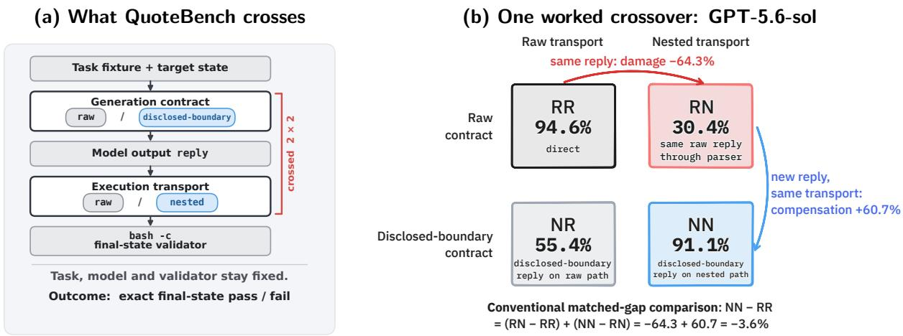
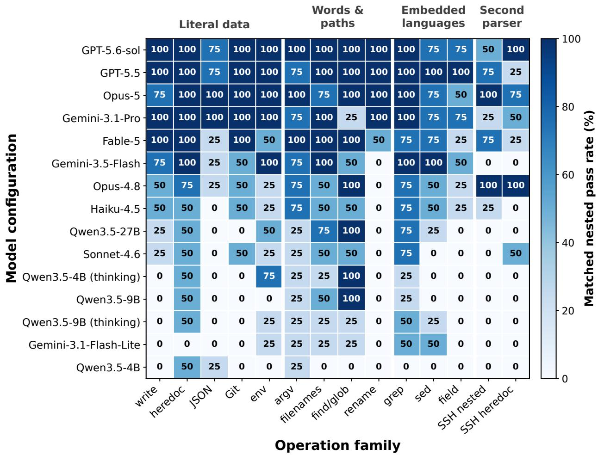
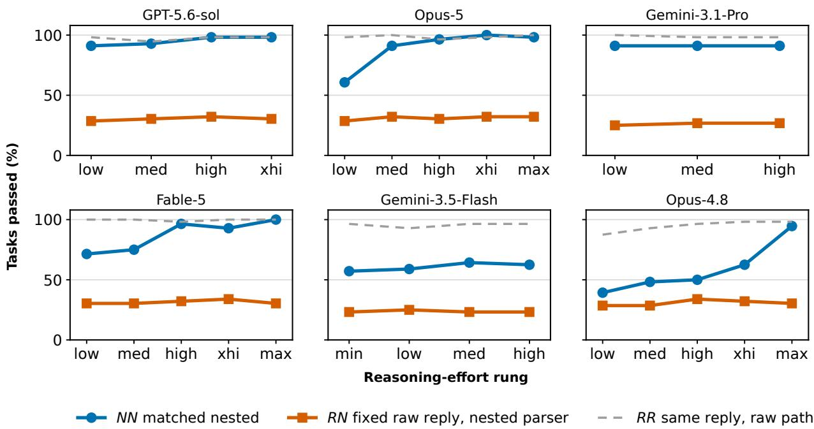
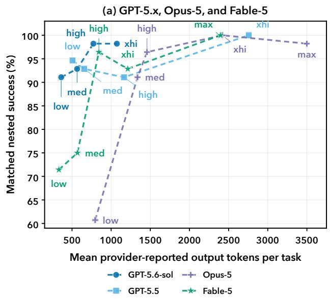
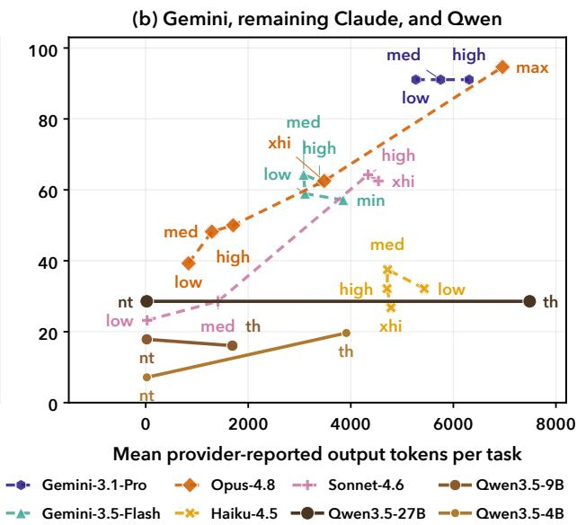
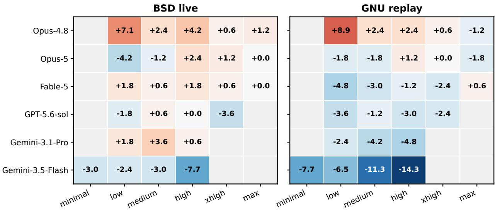

# QuoteBench: How Matched Scores Can Hide Command-Path Failures

Shangao Li1 Yao Zhang2,3∗ Volker Tresp2,3 Yuanyuan Yang1∗

1Stony Brook University 2LMU Munich 3Munich Center for Machine Learning shangao.li@stonybrook.edu yaoz720.ai@gmail.com tresp@dbs.ifi.lmu.de yuanyuan.yang@stonybrook.edu Project page: quotebench.lsamc.website

## Abstract

LLM coding agents issue Bash commands through interfaces that may serialize, wrap, and reparse model output. Matched execution scores alone cannot distinguish commandgeneration errors from failures introduced after generation. QuoteBench measures this boundary with exact final-state validation on 56 one-shot tasks from 14 incident-derived families, crossing the generation contract with the execution transport around one deliberately unescaped added parser. Escaping at the interpolation point reproduces each replayed reply’s raw-path outcome, so any recovery under a disclosed boundary must come from the model changing its generation. Across eight same-window configurations, replaying the same reply through the added parser lowers success by 55.4–73.2 points; disclosure recovers 30.4–60.7 points for six configurations, and zero or slightly negative for the other two. Raw generation is nearly saturated at the frontier; boundary adaptation is what still separates models: GPT-5.6-sol’s matched gap of −3.6 points hides −64.3 damage and +60.7 compensation. The deployment configuration reorders models: one reversal among 26 comparable pairs is unambiguous and four more sit on single-task margins. Evaluations of command-issuing agents should report the model configuration, generation contract, execution path, operating point, and final-state validator rather than treat a matched score as an intrinsic model property.

## 1 Introduction

Bash quoting failures can corrupt literals, break routine agent actions, and trigger repair loops. Even simple tasks such as writing exact bytes, passing a literal argument, editing JSON, or invoking a remote-like wrapper must preserve quotes, dollar signs, backticks, newlines, glob characters, and expansion timing (Free Software Foundation, 2025; Holen, 2012; Wheeler, 2010). Public issue trackers document broken heredocs (the shell’s inline multiline-string syntax), over-quoted operators, and repeated repair attempts (Anthropic Claude Code community, 2026b; OpenAI Codex community, 2026; Warp community, 2025). The full survey appears in Appendix A.

A failure also consumes a model generation and tool invocation, while diagnosis and retry remain in the trace. A common recovery is to write and execute a temporary script, adding actions and possibly workspace artifacts. The incident evidence guides family selection and mechanism coverage, not prevalence estimation.

Current benchmarks leave this failure mode entangled with other capabilities. Broad coding and terminal benchmarks combine command construction with planning, repository navigation, and recovery (Liu et al., 2024; Zhou et al., 2024; Xie et al., 2024; Yang et al., 2023; Jimenez et al., 2024; Merrill et al., 2026), whereas command-generation benchmarks score emitted programs under fixed transport (Lin et al., 2018; Agarwal et al., 2021; Westenfelder et al., 2025; Yu et al., 2026). Thus agent success does not reveal whether the first command preserved its payload, and command-generation success does not show whether it survives deployment. Bash quoting permits a focused test because parser rules are public and final state is exactly checkable (Free Software Foundation, 2025).

We introduce QuoteBench, a benchmark of one-shot LLM-generated Bash commands. Its 56 tasks cover 14 operation families, each with one benign control and three hazardous payload variants. The tasks exercise multiline text, hostile filenames, regular-expression and glob metacharacters, heredocs, literal argv and environment values, Git metadata, and two local SSH-like simulations. Validators inspect final bytes, argv, JSON, directory state, or Git history, so any command that reaches the correct state receives credit.

Agent interfaces range from direct shell actions to structured action languages (Yang et al., 2024; Wang et al., 2024; Kim et al., 2026). We call a reply that runs as the shell program raw, and a command field extracted from a structured tool call native. A fixed-commit survey of six public agent systems finds both in use (Appendix Table 8).

Commands targeting remote or containerized machines can cross another boundary and be reparsed inside double quotes, for example through ssh host "...", docker exec sh -c "...", or a CI run: step. QuoteBench uses this pattern as the nested condition, a controlled intervention that adds one downstream parser. Five of the seventeen retained public incidents contain such a boundary.

We ask how reliability varies across models, operation families, and command paths, how generation contract interacts with execution transport for fixed replies, and what provider-exposed efort ladders reveal about matched and replayed behavior. At the fixed configurations used for the same-window crossover, matched nested success spans 14.3–91.1%. Table 2 separately selects each model’s best observed measured operating point, where three models reach 100.0% and the remaining scores span 14.3–98.2%. Separately, six providerhosted models using native shell tools score 85.7–98.0%. Efort improves matched success for some models but not others, and the same efort label corresponds to diferent token budgets across models.

To separate generation errors from transport damage, we replay each fixed raw-conditioned reply with and without one added double-quoted parser. This intervention reduces success by 55.4–73.2 points in every same-window configuration. Under the same transport, contract-conditioned generations recover 30.4–60.7 points for six of eight configurations. This realized contrast is computed over the stored generations in the frozen benchmark. Across the observed trial-0 efort rungs, the unconditional nested-replay pass rate varies by at most 5.4 points within each measured ladder. The same mechanism persists on private payloads and across repeated draws.

Concurrent work already shows that changing the harness reorders model leaderboards (Zhang et al., 2026b), but because it swaps the whole scafold it measures variance without attributing a reversal to any one mechanism. By fixing the model output and changing a single parser, QuoteBench attributes the reorder to the command path and decomposes the matched score into transport damage and contract-conditioned compensation.

This paper makes three contributions:

1. A final-state benchmark of command-path reliability. QuoteBench turns recurring quoting and escaping failures into 56 exact-state tasks from 14 operation families. Controlled payload variants and audited validators isolate literal preservation from planning and recovery.

2. A crossed design for mechanism identification. Generation contract and execution transport are varied independently, and fixed-reply replay decomposes matched scores into transport damage and contract-conditioned compensation. This reveals when aggregate success masks large opposing efects along the command path.

3. Robustness and a measured, not novel, fix. The transport loss persists across efort settings, repeated draws, userlands (GNU versus BSD coreutils environments), and held-out payloads. Two obvious fixes, correct escaping and a temporary script, each remove the efect entirely; precisely because the fixes are trivial, the contribution is the measurement, not the repair. Both fixes require the caller to control the boundary, yet our harness survey (Table 8) records boundaries applied downstream of the stated contract. A matched score alone cannot tell an evaluator whether a fix is needed. Typed operations are an exploratory alternative.

These results motivate path-matched model and efort selection and require system builders to report both the generation contract and execution transport.

## 2 Related Work

Agent and terminal benchmarks. General agent benchmarks evaluate web navigation, desktop control, coding, and interactive execution in realistic environments (Liu et al., 2024; Zhou et al., 2024; Xie et al., 2024; Yang et al., 2023; Jimenez et al., 2024). Terminal-focused suites extend this line to command-line workflows and environment setup (Merrill et al., 2026; Eliseeva et al., 2025; Chu et al., 2026). Their realism supports end-to-end evaluation, while the contribution of the command interface remains unresolved. QuoteBench isolates that attribution question.

Shell-command generation and robustness. NL2Bash and NLC2CMD formulate natural-languageto-command translation as semantic parsing or competition-style command generation (Lin et al., 2018; Agarwal et al., 2021). NL2SH-ALFA adds manually verified data and execution-based functional-equivalence checks (Westenfelder et al., 2025). Concurrent work introduces BashBench, a 952-task benchmark of syntax, functionality, and robustness for generated Bash programs (Yu et al., 2026). Static shell analysis and long-standing guidance on hostile filenames document the underlying hazards (Holen, 2012; Wheeler, 2010); run on our replies, ShellCheck flags only 34.6% of the nested-only failures (versus 11.4% of the replies that survive nesting) and misses two-thirds, because each command is individually well-formed and the fault is in the downstream interpolation. These works score the generated program. QuoteBench fixes that program and changes the execution transport, separating an incorrect command from a correct command encoded for the wrong channel.

Action representations and boundaries. SWE-agent shows that the agent–computer interface can change coding performance, and OctoBench separates task completion from compliance with scafold constraints (Yang et al., 2024; Ding et al., 2026). Action Boundary Blindness likewise shows that conventional success can hide errors in action granularity, scope, and completion (Wang et al., 2026). Tool-use benchmarks emphasize tool selection and argument construction, while CodeAct and CODESTRUCT change the action language itself (Patil et al., 2024; Qin et al., 2023; Wang et al., 2024; Kim et al., 2026). QuoteBench makes the model-facing contract and downstream transport explicit and crosses them experimentally. A valid structured call guarantees the envelope, but shell correctness still depends on the bytes delivered to the executor.

Evaluation validity and deployment safeguards. Repeated-sampling studies distinguish one successful trajectory from reliable repeated execution (Yao et al., 2024; Brown et al., 2024). UTBoost shows that permissive validators can accept incorrect coding-agent patches (Yu et al., 2025). QuoteBench therefore audits every validator with initial states, oracles, naive probes, and targeted mutations. CARE studies shell-specific pre-execution verification, a complementary safeguard at the command dispatch boundary (Zhang et al., 2026a). A concurrent practitioner report further documents that shell escaping can reverse the cost and reliability tradeof between flag-based and JSON-based CLIs (Mastykarz, 2026). Closest in prescription, concurrent work argues that harness variance can exceed model variance and that leaderboards should disclose the harness, reporting rank reversals when the whole scafold is swapped (Zhang et al., 2026b). Because it replaces the harness wholesale, including context handling, retry, and verification, it measures variance but cannot attribute a reversal to a mechanism; QuoteBench fixes the model output and changes a single parser, so it decomposes the matched score into transport damage and contract-conditioned compensation. Related validity audits target reward hacking and protocol gaming rather than the execution channel (Shao et al., 2026). Input-side prompt-format sensitivity establishes that scores move with a nuisance channel variable (Sclar et al., 2024), but because each format is regenerated, the observed spread cannot be separated into what the channel destroyed and what the model produced diferently. Fixed-output replay is what makes that separation possible. Together, these results motivate measuring the command channel as part of the executed system.

Table 1: One worked QuoteBench task (write-file, tier 3). The ⟨⟨·⟩⟩ markers delimit the exact literal payload and are not part of it. The ←- symbol marks a newline that the payload itself contains. The validator compares exact final bytes, so any command that reaches the target state passes. Appendix Table 7 maps the full family set to the covered mechanisms. The artifact contains all 56 instructions, fixtures, oracles, and validators.
<table><tr><td>Instruction</td><td>Create a file named out.txt whose content is exactly the text«back\slash and `date here←</td></tr><tr><td>Hazards Naive command</td><td>&#x27;single’&quot;double&quot; $(pwd) 100% followed by a single trailing newline. backslash, backtick, command substitution, multiline, mixed quotes echo&quot;back\slash and `datehere ...&quot; &gt; out.txt; the backticks execute date, $(pwd)</td></tr><tr><td>Final-state gate One passing com-</td><td>expands locally, and the payload&#x27;s inner double quote terminates the string early exact bytes of out.txt, including one trailing newline, with no collateral files a single-quoted printf with an embedded-quote splice (the machine oracle). Any other</td></tr></table>

## 3 The QuoteBench Benchmark

## 3.1 Tasks, scope, and validity

QuoteBench contains 56 one-shot Bash tasks: 14 operation families, each with a benign control and three hazardous payload variants. The families cover literal file content, hostile filenames, regular expressions and globbing, heredocs, argument and environment passing, JSON and Git state, and two local simulations of a second shell parser. The hazardous tiers hold the operation fixed while adding quotes, expansion characters, multiline data, leading dashes, or parser-boundary conflicts. The same frozen core is used in every campaign reported here.

Each task provides a fixture, an instruction, and a final-state validator. Fixtures are created without invoking a shell. A model returns one Bash program, which runs in a fresh working directory with a trimmed environment and a 15-second timeout. Validators check exact file bytes, received argument vectors, parsed JSON, directory state, or Git history. They score only the resulting state, so any semantically correct implementation receives credit. Exit codes cannot substitute: across the failing executions, 23.4–47.0% exit zero while leaving the wrong final state (Appendix Table 18), so a benchmark that trusts return codes would silently miss up to half of these failures.

The task families were selected from a pre-release mechanism survey of 86 de-identified incidents in authorowned agent sessions and 412 screened public reports. This evidence supports coverage of repeatedly observed command-construction mechanisms. Prevalence estimation and complete shell coverage require a diferent study design. QuoteBench focuses on POSIX/Bash command construction. PowerShell, Windows CMD, authentication, network failures, interactive terminal state, and multi-turn recovery remain outside the benchmark. Appendix A reports the survey counts, inclusion rules, and mechanism-to-family mapping.

We validate both task solvability and scoring strictness. A machine-constructed oracle solves every task with one command. Benign naive probes pass, whereas their hazardous counterparts fail on the raw path. We then mutate oracle-produced states by deleting or altering required artifacts, adding collateral files, restoring files that should be removed, or changing Git-only state. The validators accept every oracle and benign probe, and reject every untouched fixture, hazardous probe, and all 197 applicable mutations. As a solvability control, three configurations pass all 56 tasks under the nested transport (Table 2), so every task has a feasible nested solution and the nested arm is not degenerate. These checks cover the specified invalid states. Other validator blind spots may remain.

## 3.2 Contracts and transports

Figure 1 previews the crossed design before the result notation: contract selects the stored reply, transport selects how that reply reaches Bash, and final-state validation scores the resulting state.

  
Figure 1: Crossing generation contract with execution transport. Task, model configuration, and validator are fixed across cells. The reply is fixed within each transport replay pair. Cell labels are contractthen-transport. On the generation axis, R denotes the raw contract and N the disclosed-boundary contract. On the transport axis, R denotes raw execution and N the nested transport. The RR and NN cells are matched. The RN cell measures fixed-reply damage, and NN − RN is the realized contract-conditioned contrast. Panel (b) works the decomposition for GPT-5.6-sol.

QuoteBench separates the generation contract, which tells the model how to express an action, from the execution transport, which determines how that action reaches a shell. It evaluates two observed model-facing contracts and adds one controlled transport intervention:

• Raw contract: the model emits one Bash program, executed verbatim as the script argument to bash -c.

• Native contract: the model fills a provider shell-tool call. QuoteBench extracts its required command field and executes that string on the same raw path, isolating the model-facing representation.

• Disclosed-boundary contract: the model is told that its reply R will be interpolated into bash -c "R". The corresponding nested transport then adds that parser. Crossing this contract with raw and nested transports isolates a boundary that can arise downstream in remote, container, or CI commands.

A fixed-commit survey of six public agent systems finds both raw and native model-facing contracts and several downstream transports (Appendix Table 8). We use nested as the name of a controlled stress condition: it adds the double-quoted parser boundary found in remote, container, and CI command paths. This boundary is not merely synthetic: replaying each stored raw reply through a real ssh localhost "R" remote command reproduces the nested damage to the decimal for seven of eight configurations and within one task for the eighth (Appendix Table 9), so the perturbation stands in for a deployment path a model-authored remote wrapper actually produces. Replaying the disclosed-boundary replies through the same real ssh path completes the 2×2. Real-ssh compensation matches synthetic nested compensation exactly for five of six replayed configurations; Gemini-3.1-Flash-Lite difers by one task (−1.8 versus −5.4 points; Appendix Table 21). The two non-adapting configurations show no positive compensation on either path. The raw and disclosed-boundary generation contracts difer by one sentence that states this boundary and gives no quoting advice. Appendix A.2 gives the prompts verbatim.

All reported primary executions use a pinned, network-disabled GNU/Linux container. Appendix C.1 repeats the analysis in a BSD/macOS userland. Commands run only in fresh fixtures with timeouts and collateral-file checks.

Table 2: Best-observed QuoteBench scorecard. Each base model contributes the measured setting with the highest matched-nested All-56 score. Ties prefer default, then lower mean provider-reported output tokens. default means that the request omitted the efort field. The number and names of measured settings difer by provider and appear in Figure 4 and Appendix B. This table is descriptive: each cell is one stored trial-0 generation and the selection is a within-model maximum over rungs; Appendix E.1.6 reports draw-to-draw spread. The Qwen rows expose only a think toggle rather than an efort ladder, so their best-observed setting is taken from the same-window sweep; for Qwen3.5-27B, the only Qwen size with a ladder row in Table 12, the resulting one-task diference is serving-window drift. Fixed same-window configurations support the mechanism analysis in Table 4.
<table><tr><td>Model</td><td>Best observed setting</td><td>Control</td><td>Hostile</td><td>All 56 (%)</td><td>Hostile LOFO range (%)</td></tr><tr><td>GPT-5.5</td><td>xhigh</td><td>14/14</td><td>42/42</td><td>100.0</td><td>[100.0, 100.0]</td></tr><tr><td>Opus-5</td><td>xhigh</td><td>14/14</td><td>42/42</td><td>100.0</td><td>[100.0, 100.0]</td></tr><tr><td>Fable-5</td><td>max</td><td>14/14</td><td>42/42</td><td>100.0</td><td>[100.0, 100.0]</td></tr><tr><td>GPT-5.6-sol</td><td>high</td><td>14/14</td><td>41/42</td><td>98.2</td><td>[97.4, 100.0]</td></tr><tr><td>Opus-4.8</td><td>max</td><td>12/14</td><td>41/42</td><td>94.6</td><td>[97.4, 100.0]</td></tr><tr><td>Gemini-3.1-Pro</td><td>low</td><td>14/14</td><td>37/42</td><td>91.1</td><td>[87.2, 89.7]</td></tr><tr><td>Sonnet-4.6</td><td>high</td><td>9/14</td><td>27/42</td><td>64.3</td><td>[61.5, 69.2]</td></tr><tr><td>Gemini-3.5-Flash</td><td>medium</td><td>10/14</td><td>26/42</td><td>64.3</td><td>[59.0, 66.7]</td></tr><tr><td>Haiku-4.5</td><td>medium</td><td>8/14</td><td>13/42</td><td>37.5</td><td>[28.2, 33.3]</td></tr><tr><td>Qwen3.5-27B</td><td>non-think</td><td>8/14</td><td>9/42</td><td>30.4</td><td>[15.4, 23.1]</td></tr><tr><td>Qwen3.5-4B</td><td>think</td><td>5/14</td><td>7/42</td><td>21.4</td><td>[10.3, 17.9]</td></tr><tr><td>Qwen3.5-9B</td><td>non-think</td><td>5/14</td><td>5/42</td><td>17.9</td><td>[5.1, 12.8]</td></tr><tr><td>Gemini-3.1-Flash-Lite</td><td>default</td><td>6/14</td><td>2/42</td><td>14.3</td><td>[2.6, 5.1]</td></tr></table>

## 4 Results

The mechanism analysis rests on eight same-window configurations collected under one randomized schedule with the efort field omitted (Study A). Broader efort ladders, a native-tool campaign replayed in both userlands (Study B), and two private-payload replays extend coverage (Appendix B). Table 2 collapses the ladders to one best-observed row per base model; model names are provider-public identifiers such as gpt-5.6-sol (Appendix Table 13).

## 4.1 Matched success varies across command paths

At their best observed settings, defined as a within-model maximum over single-trial rungs, three models pass all 56 tasks and the remaining scores range from 14.3% to 98.2% (Table 2). Complete measured ladders, including lower operating points and Qwen think toggles, appear in Figure 4 and Appendix B.

The native campaign provides a separate comparison for six evaluated provider-hosted models. Their providernative shell-tool success ranges from 85.7% to 98.0%, compared with 95.4–99.3% on the raw path (Table 3). These values average over every reported efort rung and three trials, whereas Table 2 selects one trial from the best observed setting. Native-tool performance is substantially closer to raw execution than performance under the controlled nested boundary, although the native efect remains model dependent.

Table 2 partitions matched-nested success into 14 benign Control tasks and 42 Hostile tasks. The Hostile LOFO column is a family-jackknife range (minimum–maximum hostile success over the 14 leave-one-family-out slices), not a confidence interval. Raw generation itself is close to saturated at the frontier: the six frontier configurations pass 91.1–100% of tasks on the direct path, so raw scores carry almost no discriminative signal. The entire signal lives on the nested side, which is also the precondition for masking. What stil separates models is how they handle the command path. Matched nested scores range from 14.3 to 91.1 at the fixed configurations, and realized compensation ranges from −5.4 to +60.7; the next two subsections isolate these efects. The complete ladders remain visible in Figure 4, and all mechanism estimates use the fixed same-window configurations in Table 4.

  
Figure 2: Matched-nested success varies by operation family across the frozen configuration sweep. Each cell is the percentage of a family’s four tasks passed by one stored generation. Rows retain the 15 frozen configurations used for broad coverage; Qwen rows marked (thinking) enable the think toggle and unmarked Qwen rows are non-thinking, and Appendix Table 13 lists the queried efort settings and request parameters. Table 2 separately summarizes the best observed setting per base model. Columns follow the mechanism groups in Appendix Table 7. SSH-like tasks use the local two-shell simulation. Rows are ordered by matched-nested score in this frozen sweep, which difers from the best-observed order in Table 2.

Measurements use provider-hosted model snapshots identified in Appendix B; the same-window mechanism sweep was queried on 2026-07-31 and the efort ladders earlier in July 2026. Hosted deployments may change under the same identifier, so the query date is part of the result. The frozen 56-task core is versioned as core-v1.

Controls help separate basic operation competence from literal preservation. At its best-observed medium setting, Gemini-3.5-Flash passes 10/14 controls and 26/42 hostile tasks. At the lower end, Gemini-3.1-Flash-Lite passes only two of 42 hostile payloads. Rows are ordered by best-observed matched-nested score. The three perfect rows remain perfect on every hostile leave-one-family-out slice. GPT-5.6-sol and Opus-4.8 each miss one hostile task at their selected settings. Lower-scoring models retain distinct family profiles rather than a single shared failure order.

Aggregate rank hides distinct failure profiles. Figure 2 shows that models with similar totals fail on diferent operation families, while some lower-scoring configurations retain isolated strengths. The heatmap presents the benchmark at the level users encounter in practice: concrete command families.

For each model, Table 3 pools Study B’s measured efort rungs and three trials per cell. The Attempts column is the per-arm denominator.

Table 3: Absolute GNU replay pass rates in the separate Study-B campaign, pooled over each model’s measured efort ladder and three trials per cell.
<table><tr><td>Model</td><td>Attempts</td><td>Raw (%)</td><td>Native (%)</td><td>∆(pp)</td></tr><tr><td>Opus-4.8</td><td>840</td><td>95.4</td><td>98.0</td><td>+2.6</td></tr><tr><td>Opus-5</td><td>840</td><td>98.2</td><td>97.4</td><td>-0.8</td></tr><tr><td>Fable-5</td><td>840</td><td>99.3</td><td>97.1</td><td>-2.1</td></tr><tr><td>Gemini-3.1-Pro</td><td>504</td><td>98.8</td><td>95.0</td><td>-3.8</td></tr><tr><td>GPT-5.6-sol</td><td>672</td><td>96.9</td><td>94.3</td><td>-2.5</td></tr><tr><td>Gemini-3.5-Flash</td><td>672</td><td>95.7</td><td>85.7</td><td>-10.0</td></tr></table>

Across pooled efort rungs, the native-minus-raw change ranges from +2.6 to −10.0 points and is smaller than the controlled nested loss for every model. Appendix Table 17 reports paired efects, leave-one-family-out ranges, transitions, BSD comparison, and the failure taxonomy.

## 4.2 Transport damage occurs after correct command generation

To identify the failure mechanism, we vary generation contract and execution transport independently. The task, model configuration, reply, and final-state validator remain fixed for each replay comparison.

Let $G \in \{ R , N \}$ denote the generation contract and $T \in \{ R , N \}$ the execution transport. On the generation axis, R is the raw contract and N is the disclosed-boundary contract. On the transport axis, R is raw execution and N is the nested transport (Section 3.2). The four cells are RR for a raw reply on raw transport, RN for a raw reply on nested transport, NR for a disclosed-boundary reply on raw transport, and NN for a disclosed-boundary reply on nested transport. For one task, $Y _ { G T }$ is the corresponding binary final-state outcome.

Fixed-reply transport damage compares $Y _ { R N }$ with $Y _ { R R }$ . Contract-conditioned compensation compares $Y _ { N N }$ with $Y _ { R N }$ . It is computed from the two stored generations for each task and describes cancellation in this finite benchmark. The two contrasts sum to the matched gap reported by a conventional matched evaluation:

$$
Y _ { N N } - Y _ { R R } = ( Y _ { R N } - Y _ { R R } ) + ( Y _ { N N } - Y _ { R N } ) .\tag{1}
$$

Figure 1 defines all four cells and works the decomposition for one configuration. All three quantities are averaged over tasks or operation families and given in percentage points, written points in prose and pp in tables.

The replay reuses stored replies and makes no new model calls. For each of the eight same-window configurations, the trial-0 reply for every task is executed through both paths. Efects are averaged over the 14 operation families. Appendix Table 15 reports enumerated family-sign sensitivity analyses with Holm correction. Their scope is the finite, purposively constructed family set. These intervals and p-values quantify variation across the 14 constructed families, not model-call randomness or a sampled task population.

Moving a fixed raw-generated reply from raw to nested transport costs every same-window configuration 55.4–73.2 points. The loss is not confined to adversarial payloads: the 14 benign control tasks alone lose 28.6–57.1 points, because models emit double-quote-active characters even for ordinary commands. Table 4 gives the signed efects for those fixed configurations. Its diagonal RR and NN cells are not the post-selected settings in Table 2. All eight efects are negative, and every leave-one-family-out estimate remains negative. Reparsing preserves 123 of the 415 direct-path successes, corresponding to configuration-level retention of 25.0–35.4%. The remaining 292 become failures, and the 33 commands that already fail remain failed. Because each pair reuses the same reply, the added parser accounts for the change in outcome.

The realized generation-by-transport interaction, $( N N - N R ) - ( R N - R R )$ , ranges from −7.1 to +119.6 points across the eight configurations (Table 4). The wide range shows that the boundary-aware contract changes command behavior in a transport-specific way. These values characterize the stored generations in this finite benchmark.

Table 4: All four crossover cells for the eight same-window configurations. Cell notation follows Figure 1: generation contract precedes transport. Cells are pass rates (%). Efects are percentage points. Damage is RN − RR, compensation is NN − RN, and the matched gap is NN − RR. Appendix Table 14 reports the interaction at every measured rung, and Table 15 gives the sensitivity tests.
<table><tr><td>Model</td><td>RR</td><td>RN</td><td>NR</td><td>NN</td><td>Damage</td><td>Comp.</td><td>Matched gap</td></tr><tr><td>GPT-5.6-sol</td><td>94.6</td><td>30.4</td><td>55.4</td><td>91.1</td><td>-64.3</td><td>+60.7</td><td>-3.6</td></tr><tr><td>GPT-5.5</td><td>100.0</td><td>28.6</td><td>50.0</td><td>89.3</td><td>-71.4</td><td>+60.7</td><td>-10.7</td></tr><tr><td>Opus-5</td><td>96.4</td><td>30.4</td><td>42.9</td><td>89.3</td><td>-66.1</td><td>+58.9</td><td>-7.1</td></tr><tr><td>Gemini-3.1-Pro</td><td>98.2</td><td>25.0</td><td>33.9</td><td>80.4</td><td>-73.2</td><td>+55.4</td><td>-17.9</td></tr><tr><td>Gemini-3.5-Flash</td><td>96.4</td><td>28.6</td><td>67.9</td><td>58.9</td><td>-67.9</td><td>+30.4</td><td>-37.5</td></tr><tr><td>Opus-4.8</td><td>91.1</td><td>26.8</td><td>62.5</td><td>57.1</td><td>-64.3</td><td>+30.4</td><td>-33.9</td></tr><tr><td>Qwen3.5-27B</td><td>85.7</td><td>30.4</td><td>83.9</td><td>30.4</td><td>-55.4</td><td>0.0</td><td>-55.4</td></tr><tr><td>Gemini-3.1-Flash-Lite</td><td>78.6</td><td>19.6</td><td>80.4</td><td>14.3</td><td>-58.9</td><td>-5.4</td><td>-64.3</td></tr></table>

At the fixed same-window setting used for this crossover, Gemini-3.5-Flash passes 54/56 tasks in RR but only 8/14 control tasks in NN. These counts describe the fixed mechanism configuration, not the best-observed medium setting in Table 2.

The damage disappears when the boundary is handled correctly. Escaping the reply at the interpolation point (bash -c ⟨quoted input⟩) reproduces the raw-path outcome exactly for all 448 public pairs. Replaying the reply as a temporary script does the same for all 448 public and 126 private-v1 pairs. Neither repair changes raw-path failures: 33 public and 15 private-v1 commands remain failed (Appendix E.1).

Matched comparisons can obscure cross-path sensitivity. GPT-5.6-sol’s matched gap is only −3.6 points, even though fixed-reply transport loses 64.3 points and the realized contract-conditioned contrast restores 60.7. The near-zero matched change is therefore the sum of two large opposing components. The matched NN score accurately describes its declared path, while of-diagonal replay reveals portability when that path changes or adds an undisclosed boundary. Appendix C.2 reports a descriptive cross-configuration threshold analysis.

The deployment configuration reorders models. The RR and NN orderings agree only partially: their Kendall rank correlation is 0.57 (task-cluster bootstrap 95% interval [0.32, 0.82], excluding perfect agreement), and 22 of the 28 pairwise orderings are stable in at least 95% of resamples, so the leaderboard is a bootstrapsupported partial order rather than a fixed ranking. The one reversal that is unambiguous at this resolution is GPT-5.6-sol versus Gemini-3.5-Flash (behind by one task under RR, ahead by eighteen under NN); the count of reversed pairs is itself uncertain (bootstrap mean 4.6, 95% interval [1, 8] of 28 pairs, Appendix E.1.6).

On a disjoint private set, both models retain negative transport damage and positive compensation, and three additional draws preserve that sign pattern (Appendix E.1).

## 4.3 Matched gains can come from contract-conditioned compensation

The NN − RN contrast fixes the nested transport and compares replies generated under two contracts that difer by one disclosure sentence. Six of the eight same-window configurations show 30.4 to 60.7 points of realized compensation, all with family-bootstrap intervals excluding zero (Appendix Table 15). Qwen3.5- 27B shows 0.0 and Gemini-3.1-Flash-Lite −5.4. Similar raw scores can accompany substantially diferent compensation: Gemini-3.5-Flash and Gemini-3.1-Pro difer by one raw task, yet Pro recovers 25.0 points more. The clause states where the command runs but prescribes no quoting strategy (Appendix A.2).

The compensation is genuine behavioral change, not generic robustness. The same disclosed-boundary replies that recover the nested path lose 28.6–64.3 points when replayed on the raw path (NR versus RR): the six compensating models rewrote their commands for the declared boundary and pay for it where the boundary is absent. The two non-compensating configurations change nothing in either direction (Qwen3.5-27B −1.8, Gemini-3.1-Flash-Lite +1.8). Compensation also concentrates where the hazard is explicit. Payload-quoting families such as json-write (+50.0) and sed-replace (+46.9) recover about half their damage, but implicit hazards remain dificult: find-glob (−12.5), grep-count (+15.6), and hostile-filenames (+18.8) stay broken even under disclosure.

Disclosure, not instruction, carries the efect for capable models. A paired arm regenerates the advice-free and advice-bearing disclosed contracts in one serving window, so the contrast has no window confound. At the top of the ladder, the added escaping advice barely moves matched nested success: GPT-5.6-sol −8.9, GPT-5.5 +7.1, and Opus-5 +3.6 points. Disclosure alone already elicits the adaptation. In the middle it makes the largest diference: Sonnet-4.6 gains +25.0, Haiku-4.5 +12.5, and Opus-4.8 +7.1 points from the advice. At the bottom neither contract helps (Qwen3.5-27B and Gemini-3.1-Flash-Lite +1.8). Boundary advice thus barely moves the top, changes middle-tier outcomes the most, and does not move the bottom (Appendix Table 19).

The adaptation is conditioned on the declared grammar rather than applying a fixed defense. A crossed arm discloses either a double-quote or a single-quote wrapper and replays each stored reply through both, forming a 2×2 of disclosed against executed grammar. Capable models pass far more on the grammar they were told than on the other: GPT-5.6-sol passes 53/56 of its single-disclosed replies on the single-quote wrapper but only 10/56 on the double-quote one, and its diagonal (matched) advantage over the anti-diagonal is +80.4 points. The advantage separates the same top, middle, and bottom groups as the matched-nested scores: +80.4, +77.7, and +65.2 at the top, +18.8 to +25.0 in the middle, and +0.0 (Qwen3.5-27B) to −19.6 (Gemini-3.1-Flash-Lite) at the bottom (Appendix Table 20). This is contract-conditioned behavioral adaptation to the declared grammar, not a memorized double-quote fix.

Six configurations provide raw and disclosed-boundary replies at every efort rung, yielding 26 crossover points from stored generations (Figure 3 and Appendix Table 14). The nested-replay pass rate of raw-conditioned replies stays between 23.2% and 33.9%, moves by at most 5.4 points within any one ladder, and accompanies damage of −58.9 to −75.0 points. These trajectories summarize one stored generation at each rung.

Most matched-score movement comes from the contract-conditioned contrast. It rises from +10.7 at low to +64.3 at max for Opus-4.8 and from +32.1 at low to +66.1 at max for Opus-5. Interior rungs are not monotone (Figure 3). Gemini-3.1-Flash-Lite returns byte-identical replies at all four settings and therefore contributes a single observed operating point.

Because RN varies little while NN sometimes climbs, the matched gap can narrow without an improved nested-replay pass rate. The pattern varies by model: Gemini-3.1-Pro remains at 91.1% across its three rungs, and Gemini-3.5-Flash moves only 7.1 points.

Opus-4.8 shows the masking efect when matched success does climb. Its matched gap moves from −48.2 points at low to −3.6 at max, while damage grows from −58.9 to −67.9. The raw arm also improves by 10.7 points, but the nested-replay pass rate ends near where it began. A matched evaluation would attribute the improvement to repair, whereas fixed-reply replay shows that cross-path portability remains essentially unchanged.

Each measured efort rung is a deployment-relevant operating point under the frozen benchmark, not an estimate of efort’s causal efect. Figure 4 shows that labels map to diferent token budgets across models and that several ladders are non-monotonic.

An unset efort field maps to diferent parts of each provider’s ladder. Across the seven same-window configurations with both measurements, Opus-4.8’s unset arm resembles xhigh, Opus-5’s resembles medium, and Gemini-3.1-Pro’s falls below its entire ladder. Users and evaluators should compare operating points through measured behavior. Appendix B.1 reports the exact rung values and calibration table.

## 4.4 The mechanism transfers across payloads and sampled replies

The mechanism is not a property of the published payloads. The private-v2 crossover repeats the design on 42 unpublished hostile payloads: raw- and disclosed-boundary-contract calls for GPT-5.6-sol and Opus-4.8 were interleaved within one serving window, and each stored reply was replayed through both transports with the public final-state validators.

  
Figure 3: Where efort raises matched success, the nested-replay pass rate changes little. Each point uses 56 tasks, trial 0, and the GNU replay. The RR value is raw success, RN is the nested-replay pass rate of raw-conditioned replies, and NN is matched nested success. The NN − RN gap is compensation. Appendix Table 14 reports every rung, including the byte-identical Gemini-3.1-Flash-Lite settings.

Table 5: Private-v2 crossover on 42 hostile payloads under the single-clause disclosed-boundary contract. The private set is hostile-only and not dificulty-matched to the public core, so absolute rates are interpreted within this set. Cells are pass rates. Efects are percentage points. Damage is RN − RR, compensation is NN − RN, interaction is $( N N - N R ) - ( R N - R R )$ , and the matched gap is NN − RR.
<table><tr><td>Model</td><td>RR</td><td>RN</td><td>NR</td><td>NN</td><td>Damage</td><td>Comp.</td><td>Interaction</td><td>Matched gap</td></tr><tr><td>GPT-5.6-sol</td><td>92.9</td><td>19.0</td><td>50.0</td><td>97.6</td><td>-73.8</td><td>+78.6</td><td>+121.4</td><td>+4.8</td></tr><tr><td>Opus-4.8</td><td>92.9</td><td>16.7</td><td>59.5</td><td>42.9</td><td>-76.2</td><td>+26.2</td><td>+59.5</td><td>-50.0</td></tr></table>

Both models pass 92.9% of the private tasks on the direct raw path, then lose 73.8 and 76.2 points when the same replies cross the added parser. Compensation remains model dependent: GPT-5.6-sol recovers 78.6 points under the boundary-aware contract, whereas Opus-4.8 recovers 26.2. Every leave-one-family-out slice preserves negative transport damage.

Additional sampling preserves the same interpretation. Three more generations for eight private tasks produce diferent reply text in 19 of 32 task–contract cells, yet all four draws retain negative damage and positive compensation for both models.

A separate private-v1 replay tests a practical bypass on 42 tasks and three models, executing each stored raw-contract reply through the raw path, the nested wrapper, and a temporary Bash script.

  
Figure 4: Efort settings are provider-specific operating points. Each point shows trial-0 matchednested success on the 56-task core against mean provider-reported output tokens per task, including reported hidden reasoning. Dashed segments follow the provider’s declared order. Backward or dominated segments show measured non-monotonicity. Panels group model families for legibility, and Qwen sizes contribute two-point think-toggle trajectories.

Table 6: Private-v1 fixed raw replies under three transports on 42 tasks. This campaign predates the private-v2 crossover in Table 5. The two tables therefore use diferent generations. The first three columns report tasks passed out of 42. Script gain is the temporary-script rate minus the nested-wrapper rate, in percentage points.
<table><tr><td>Model</td><td>Raw</td><td>Nested wrapper</td><td>Temporary script</td><td>Script gain (pp)</td></tr><tr><td>GPT-5.6-sol</td><td>41/42</td><td>8/42</td><td>41/42</td><td>+78.6</td></tr><tr><td>Opus-4.8</td><td>40/42</td><td>7/42</td><td>40/42</td><td>+78.6</td></tr><tr><td>Qwen3.5-27B</td><td>30/42</td><td>9/42</td><td>30/42</td><td>+50.0</td></tr></table>

Executing the replies from temporary scripts reproduces the raw-path outcome for every model–task pair. It recovers 87 commands that fail only under the wrapper. The 15 commands that fail directly remain unresolved. Appendix E reports the private design and validator checks, and Appendix E.1 reports the repeated draws, script-bypass records, and typed-operation pilot.

## 5 Discussion

The results support two reporting practices for command paths that wrap or reparse model output. First, report the generation contract together with the execution path. The crossed design shows that the generation contract can change the matched score, while of-diagonal replay reveals whether replies remain portable across paths. Second, structured actions remove one quoting boundary while leaving payload-level representation errors possible. In the typed pilot, eleven of 36 programs fail and ten leave the wrong final state, most often because the model copies instruction delimiters into the payload (Appendix E.1).

The command interface is part of the evaluated system, not neutral plumbing. Vendors should report the generation contract, deployed execution path, selected operating point, and family-level failures. Users should compare models and efort settings on that path because provider ladders are non-monotonic and defaults map to diferent operating points.

Ignoring the path changes which model wins: selecting by raw success picks GPT-5.5 (56/56 raw), which reaches 50/56 on the nested path, whereas the path-aware pick reaches 51/56. The regret is small at the saturated frontier, but the reversed top rank. The scorecard and crossover answer diferent questions. Table 2 supports operating-point selection, while Table 4 diagnoses path sensitivity for fixed configurations. Neither is a controlled compute ranking. Deployment reports should publish both the selected point and the measured ladder.

Userland changes are smaller than the added-parser efect, but they are not always negligible. In the current Study-A campaign, fixed-reply damage remains negative in both BSD/macOS and GNU/Linux. Corresponding crossover cells difer by at most 3.6 points for six evaluated provider-hosted configurations and by 7.1–12.5 points for the other two.

An earlier frozen BSD-live campaign reveals model-specific dialect afinity. The identical stored commands improve on GNU for both Qwen3.5-27B settings and Gemini-3.1-Pro, while Fable-5 and Gemini-3.5-Flash retain higher success on BSD. Opus-4.8 is higher on BSD in the raw arm and tied in the nested arm. Shifts reach 8.9 points and partially reorder the models under both generation contracts. Because all commands were elicited in BSD/macOS sessions, this analysis measures cross-userland transfer, not what a model would generate when explicitly targeting GNU. Study B hints at a contract-by-userland interaction. Gemini-3.1-Pro and Fable-5 flip from positive native-minus-raw changes on BSD to negative on GNU, though the shift does not survive the sensitivity analysis (Appendix D). Command benchmarks should therefore report their userland and replay stored commands across the environments they claim to support (Appendix C.1).

The decomposition should extend beyond shell, though we test only one boundary here. Any pipeline that transforms generated output before execution defines the same four cells. A JSON tool-call boundary is a second instance. Replaying each stored raw reply through a naive JSON string embedding causes losses from 51.8 to 66.1 points. The serializer re-parses the same double quotes and backslashes as the shell, while a correct round-trip serializer costs exactly zero (Appendix E.1.5). The mechanism is an unescaped transform, not any transform, and the decomposition transfers to a non-shell boundary.

Where a deployed path adds an interpolating shell layer, the first-line fix is harness-side: escaping the reply at the interpolation point restores every raw-path success in our replays. Where the boundary is not under the caller’s control, as in remote or CI patterns, a temporary script preserves the program boundary at the cost of a file lifecycle, and boundary disclosure lets capable models compensate (Appendix E.1).

## 6 Conclusion

QuoteBench shows that matched execution scores can hide post-generation failure. Replaying fixed replies through one added parser lowers success by 55.4–73.2 points across all same-window configurations, while contract-conditioned generation recovers 30.4–60.7 points for six configurations. At best observed settings, three models score 56/56 and others span 14.3%–98.2%. Trial-0 ladders shift nested-replay pass rates by at most 5.4 points.

## Limitations

QuoteBench isolates one mechanism: one-shot Bash generation under quotation and interpolation hazards. Its 14 constructed families support mechanism attribution, and the nested transport reproduces a real ssh remote-execution boundary (Table 9) rather than a claim about how often such boundaries occur; results characterize this benchmark and stored-reply portability, not deployment prevalence. Causal claims rest on fixed replies in the eight same-window configurations, while efort-ladder rungs rely on a single stored generation per task and efort labels are not comparable compute budgets. The native-tool campaign is observational. Held-out payloads test transfer to unseen literals without dificulty matching, the typedoperation study is limited to six naturally typeable families, and other shells and multi-turn recovery remain open.

## Broader Impact Statement

QuoteBench executes untrusted model output, so the released harness runs each attempt in a fresh fixture inside a timeout-bounded, network-disabled container, and incident evidence is released only as de-identified mechanism classifications. Publishing the frozen core creates a contamination risk; we treat it as a versioned audit set and hold out regenerated private variants. Each released task file also embeds a fixed canary GUID, recorded in the repository, so downstream contamination checks have a known token to search for. The benchmark introduces no shell capability beyond routine coding-agent operations.

## Acknowledgements

We gratefully acknowledge Jiafu Tang and Ziyu Zhou for providing access to the Gemini and GPT APIs, respectively. Their support enabled the experiments reported in this work.

## References

Mayank Agarwal, Tathagata Chakraborti, Quchen Fu, David Gros, Xi Victoria Lin, Jaron Maene, Kartik Talamadupula, Zhongwei Teng, and Jules White. NeurIPS 2020 NLC2CMD competition: Translating natural language to bash commands. arXiv preprint arXiv:2103.02523, 2021. URL https://arxiv.org/ abs/2103.02523.

Anthropic Claude Code community. Avoid shell quoting issues when passing markdown to cli tools like gh. GitHub issue anthropics/claude-code#29619, 2026a. URL https://github.com/anthropics/ claude-code/issues/29619. Accessed 2026-07-29.

Anthropic Claude Code community. Claude repeatedly fails heredoc/string escaping when writing files to remote servers, causing multi-attempt delays. GitHub issue anthropics/claude-code#48317, 2026b. URL https://github.com/anthropics/claude-code/issues/48317. Accessed 2026-07-29.

Bradley Brown, Jordan Juravsky, Ryan Ehrlich, Ronald Clark, Quoc V. Le, Christopher Ré, and Azalia Mirhoseini. Large language monkeys: Scaling inference compute with repeated sampling. arXiv preprint arXiv:2407.21787, 2024. URL https://arxiv.org/abs/2407.21787.

Zhaoyang Chu, Jiarui Hu, Xingyu Jiang, Pengyu Zou, Han Li, Chao Peng, Peter O’Hearn, Earl T. Barr, Mark Harman, Federica Sarro, and He Ye. TerminalWorld: Benchmarking agents on real-world terminal tasks. arXiv preprint arXiv:2605.22535, 2026. URL https://arxiv.org/abs/2605.22535.

Deming Ding, Shichun Liu, Enhui Yang, Jiahang Lin, Ziying Chen, Shihan Dou, Honglin Guo, Weiyu Cheng, Pengyu Zhao, Chengjun Xiao, Qunhong Zeng, Qi Zhang, Xuanjing Huang, Qidi Xu, and Tao Gui. OctoBench: Benchmarking scafold-aware instruction following in repository-grounded agentic coding. In Maria Liakata, Viviane P. Moreira, Jiajun Zhang, and David Jurgens (eds.), Proceedings of the 64th Annual Meeting of the Association for Computational Linguistics (Volume 1: Long Papers), pp. 5958–5978, San Diego, California, United States, July 2026. Association for Computational Linguistics. ISBN 979-8-89176- 390-6. doi: 10.18653/v1/2026.acl-long.269. URL https://aclanthology.org/2026.acl-long.269/.

Aleksandra Eliseeva, Alexander Kovrigin, Ilia Kholkin, Egor Bogomolov, and Yaroslav Zharov. EnvBench: A benchmark for automated environment setup. arXiv preprint arXiv:2503.14443, 2025. URL https: //arxiv.org/abs/2503.14443.

Free Software Foundation. Bash Reference Manual, Version 5.3, 2025. URL https://www.gnu.org/ software/bash/manual/bash.html.

Google Gemini CLI community. Running commands in cmd.exe shell has escaping issues. GitHub issue googlegemini/gemini-cli#1839, 2025. URL https://github.com/google-gemini/gemini-cli/issues/1839. Accessed 2026-07-29.

Vidar Holen. ShellCheck: A static analysis tool for shell scripts, 2012. https://www.shellcheck.net.

Carlos E. Jimenez, John Yang, Alexander Wettig, Shunyu Yao, Kexin Pei, Ofir Press, and Karthik Narasimhan. SWE-bench: Can language models resolve real-world GitHub issues? International Conference on Learning Representations (ICLR), 2024. URL https://openreview.net/forum?id=VTF8yNQM66.

Myeongsoo Kim, Chao-Chun Hsu, Dingmin Wang, Shweta Garg, Varun Kumar, and Murali Krishna Ramanathan. CODESTRUCT: Code agents over structured action spaces. In Maria Liakata, Viviane P. Moreira, Jiajun Zhang, and David Jurgens (eds.), Proceedings of the 64th Annual Meeting of the Association for Computational Linguistics (Volume 1: Long Papers), pp. 13290–13306, San Diego, California, United States, July 2026. Association for Computational Linguistics. ISBN 979-8-89176-390-6. doi: 10.18653/v1/ 2026.acl-long.607. URL https://aclanthology.org/2026.acl-long.607/.

LangChain contributors. Langchain shell tool source at commit b3a6d9a. GitHub source repository, 2026. URL https://github.com/langchain-ai/langchain/tree/b3a6d9a012681df8a8e33345c8255ca69ec0e437. Accessed 2026-07-29.

Xi Victoria Lin, Chenglong Wang, Luke Zettlemoyer, and Michael D. Ernst. NL2Bash: A corpus and semantic parser for natural language interface to the linux operating system. In Proceedings of LREC, 2018. URL https://arxiv.org/abs/1802.08979. arXiv:1802.08979.

Xiao Liu, Hao Yu, Hanchen Zhang, Yifan Xu, Xuanyu Lei, Hanyu Lai, Yu Gu, Hangliang Ding, Kaiwen Men, Kejuan Yang, Shudan Zhang, Xiang Deng, Aohan Zeng, Zhengxiao Du, Chenhui Zhang, Sheng Shen, Tianjun Zhang, Yu Su, Huan Sun, Minlie Huang, Yuxiao Dong, and Jie Tang. AgentBench: Evaluating LLMs as agents. International Conference on Learning Representations (ICLR), 2024. URL https://arxiv.org/abs/2308.03688. arXiv:2308.03688.

Waldek Mastykarz. Don’t rewrite your CLI for agents. Microsoft for Developers, July 2026. https: //developer.microsoft.com/blog/dont-rewrite-your-cli-for-agents.

Mike A. Merrill, Alexander G. Shaw, Nicholas Carlini, Boxuan Li, Harsh Raj, Ivan Bercovich, Lin Shi, Jeong Yeon Shin, Thomas Walshe, E. Kelly Buchanan, Junhong Shen, Guanghao Ye, Haowei Lin, Jason Poulos, Maoyu Wang, Marianna Nezhurina, Jenia Jitsev, Di Lu, Orfeas Menis Mastromichalakis, Zhiwei Xu, Zizhao Chen, Yue Liu, Robert Zhang, Leon Liangyu Chen, Anurag Kashyap, Jan-Lucas Uslu, Jefrey Li, Jianbo Wu, Minghao Yan, Song Bian, Vedang Sharma, Ke Sun, Steven Dillmann, Akshay Anand, Andrew Lanpouthakoun, Bardia Koopah, Changran Hu, Etash Guha, Gabriel H. S. Dreiman, Jiacheng Zhu, Karl Krauth, Li Zhong, Niklas Muennighof, Robert Amanfu, Shangyin Tan, Shreyas Pimpalgaonkar, Tushar Aggarwal, Xiangning Lin, Xin Lan, Xuandong Zhao, Yiqing Liang, Yuanli Wang, Zilong Wang, Changzhi Zhou, David Heineman, Hange Liu, Harsh Trivedi, John Yang, Junhong Lin, Manish Shetty, Michael Yang, Nabil Omi, Negin Raoof, Shanda Li, Terry Yue Zhuo, Wuwei Lin, Yiwei Dai, Yuxin Wang, Wenhao Chai, Shang Zhou, Dariush Wahdany, Ziyu She, Jiaming Hu, Zhikang Dong, Yuxuan Zhu, Sasha Cui, Ahson Saiyed, Arinbjörn Kolbeinsson, Jesse Hu, Christopher Michael Rytting, Ryan Marten, Yixin Wang, Alex Dimakis, Andy Konwinski, and Ludwig Schmidt. Terminal-bench: Benchmarking agents on hard, realistic tasks in command line interfaces. arXiv preprint arXiv:2601.11868, 2026. URL https://arxiv.org/abs/2601.11868. The released benchmark is Terminal-Bench 2.0.

Microsoft AutoGen contributors. Autogen docker code executor at commit 027ecf0. GitHub source repository, 2026. URL https://github.com/microsoft/autogen/tree/ 027ecf0a379bcc1d09956d46d12d44a3ad9cee14. Accessed 2026-07-29.

OpenAI. Codex shell execution source at commit fa1d4c4. GitHub source repository, 2026. URL https: //github.com/openai/codex/tree/fa1d4c40d0e63eef2e0ba8a9e004ccd0a80b77f5. Accessed 2026-07- 29.

OpenAI Codex community. Tool-contract ambiguity: exec-command cmd lets models over-quote shell operators. GitHub issue openai/codex#20875, 2026. URL https://github.com/openai/codex/issues/ 20875. Accessed 2026-07-29.

OpenHands community. Use language server protocol to re-implement code editing. GitHub issue Open-Hands/OpenHands#1934, 2024. URL https://github.com/OpenHands/OpenHands/issues/1934. Motivated partly by weird issues from heredoc-plus-Bash editing; accessed 2026-07-29.

OpenHands contributors. Openhands argv command parser at commit 850bd64. GitHub source repository, 2026. URL https://github.com/All-Hands-AI/OpenHands/tree/ 850bd647b64 9 6b5d2bbf25d4d9 16 3 6f685 . Accessed 2026-07-29.

Shishir G. Patil, Tianjun Zhang, Xin Wang, and Joseph E. Gonzalez. Gorilla: Large language model connected with massive APIs. In Advances in Neural Information Processing Systems, volume 37, 2024. doi: 10.52202/079017-4020. URL https://proceedings.neurips.cc/paper\_files/paper/2024/hash/ e4c61f578ff07830f5c37378dd3ecb0d-Abstract-Conference.html.

Yujia Qin, Shihao Liang, Yining Ye, Kunlun Zhu, Lan Yan, Yaxi Lu, Yankai Lin, Xin Cong, Xiangru Tang, Bill Qian, Sihan Zhao, Lauren Hong, Runchu Tian, Ruobing Xie, Jie Zhou, Mark Gerstein, Dahai Li, Zhiyuan Liu, and Maosong Sun. ToolLLM: Facilitating large language models to master 16000+ real-world APIs. arXiv preprint arXiv:2307.16789, 2023. URL https://arxiv.org/abs/2307.16789.

Melanie Sclar, Yejin Choi, Yulia Tsvetkov, and Alane Suhr. Quantifying language models’ sensitivity to spurious features in prompt design or: How I learned to start worrying about prompt formatting. In International Conference on Learning Representations (ICLR), 2024. URL https://arxiv.org/abs/2310.11324.

Jiaqi Shao, Hanck Chen, Wei Zhang, Maxm Pan, and Bing Luo. Do agent benchmarks measure capability? protocol validity in the age of agentic AI. arXiv preprint arXiv:2607.22368, 2026. URL https://arxiv. org/abs/2607.22368.

SWE-agent contributors. Swe-agent action execution source at commit 3ea751c. GitHub source repository, 2026. URL https://github.com/princeton-nlp/SWE-agent/tree/ 3ea751c087f32b16e039a2233dd6eefecef325d5. Accessed 2026-07-29.

Terminal-Bench contributors. Terminal-bench tmux execution source at commit d28711d. GitHub source repository, 2026. URL https://github.com/laude-institute/terminal-bench/tree/ d28711d0da2675d0bb1d56de45ae5df6082438a3. Accessed 2026-07-29.

Xingyao Wang, Yangyi Chen, Lifan Yuan, Yizhe Zhang, Yunzhu Li, Hao Peng, and Heng Ji. Executable code actions elicit better LLM agents. In Proceedings of the 41st International Conference on Machine Learning, volume 235 of Proceedings of Machine Learning Research, pp. 50208–50232. PMLR, 2024. URL https://proceedings.mlr.press/v235/wang24h.html.

Zhangyi Wang, Bingnan Yu, Jiexiang Xu, and Zongze Li. Action boundary blindness: When LLM agents cannot tell where one action ends and another begins. In Maria Liakata, Viviane P. Moreira, Jiajun Zhang, and David Jurgens (eds.), Proceedings of the 64th Annual Meeting of the Association for Computational Linguistics (Volume 1: Long Papers), pp. 36883–36899, San Diego, California, United States, July 2026. Association for Computational Linguistics. ISBN 979-8-89176-390-6. doi: 10.18653/v1/2026.acl-long.1711. URL https://aclanthology.org/2026.acl-long.1711/.

Warp community. Agent mode fails to create files with heredoc syntax—quote escaping issues. GitHub issue warpdotdev/Warp#7735, 2025. URL https://github.com/warpdotdev/Warp/issues/7735. Accessed 2026-07-29.

Finnian Westenfelder, Erik Hemberg, Stephen Moskal, Una-May O’Reilly, and Silviu Chiricescu. LLMsupported natural language to bash translation. In Proceedings of NAACL, pp. 11135–11147, 2025. doi: 10.18653/v1/2025.naacl-long.555. URL https://aclanthology.org/2025.naacl-long.555/.

David A. Wheeler. Fixing Unix/Linux/POSIX filenames, 2010. https://dwheeler.com/essays/ fixing-unix-linux-filenames.html.

Tianbao Xie, Danyang Zhang, Jixuan Chen, Xiaochuan Li, Siheng Zhao, Ruisheng Cao, Jing Hua Toh, Zhoujun Cheng, Dongchan Shin, Fangyu Lei, Yitao Liu, Yiheng Xu, Shuyan Zhou, Silvio Savarese, Caiming Xiong, Victor Zhong, and Tao Yu. OSWorld: Benchmarking multimodal agents for open-ended tasks in real computer environments. In Advances in Neural Information Processing Systems, volume 37, 2024. doi: 10.52202/079017-1650. URL https://proceedings.neurips.cc/paper\_files/paper/2024/hash/ 5d413e48f84dc61244b6be550f1cd8f5-Abstract-Datasets\_and\_Benchmarks\_Track.html.

John Yang, Akshara Prabhakar, Karthik Narasimhan, and Shunyu Yao. InterCode: Standardizing and benchmarking interactive coding with execution feedback. In Advances in Neural Information Processing Systems, volume 36, 2023. doi: 10.52202/075280-1035. URL https://proceedings.neurips.cc/paper\_files/ paper/2023/hash/4b175d846fb008d540d233c188379ff9-Abstract-Datasets\_and\_Benchmarks.html.

John Yang, Carlos E. Jimenez, Alexander Wettig, Kilian Lieret, Shunyu Yao, Karthik Narasimhan, and Ofir Press. SWE-agent: Agent-computer interfaces enable automated software engineering. In Advances in Neural Information Processing Systems, volume 37, 2024. doi: 10.52202/079017-1601. URL https://proceedings.neurips.cc/paper\_files/paper/2024/hash/ 5a7c947568c1b1328ccc5230172e1e7c-Abstract-Conference.html.

Shunyu Yao, Noah Shinn, Pedram Razavi, and Karthik Narasimhan. τ-bench: A benchmark for toolagent-user interaction in real-world domains. arXiv preprint arXiv:2406.12045, 2024. URL https: //arxiv.org/abs/2406.12045.

Boxi Yu, Yuxuan Zhu, Pinjia He, and Daniel Kang. UTBoost: Rigorous evaluation of coding agents on SWE-bench. In Wanxiang Che, Joyce Nabende, Ekaterina Shutova, and Mohammad Taher Pilehvar (eds.), Proceedings of the 63rd Annual Meeting of the Association for Computational Linguistics (Volume 1: Long Papers), pp. 3762–3774, Vienna, Austria, July 2025. Association for Computational Linguistics. ISBN 979-8-89176-251-0. doi: 10.18653/v1/2025.acl-long.189. URL https://aclanthology.org/2025. acl-long.189/.

Lei Yu, Peng Wang, Jia Xu, Jingyuan Zhang, Xin Wang, Jiajia Ma, Li Yang, Changzhi Deng, Zenghua Wang, and Fengjun Zhang. BashCoder-R1: Towards robust and explainable bash code generation with robustness-aware group relative policy optimization. arXiv preprint arXiv:2606.27733, 2026. URL https://arxiv.org/abs/2606.27733.

Wenxiao Zhang, Yu Liu, Zhiwei Yang, Zhongyi Zhang, Hanqi Feng, Xinyu Wang, Peng Qiu, Yanbing Liu, Barnabas Poczos, and Jin B. Hong. CARE: Pre-execution command verification for shell-executing LLM agents. arXiv preprint arXiv:2607.21642, 2026a. URL https://arxiv.org/abs/2607.21642.

Yunbei Zhang, Janet Wang, Yingqiang Ge, Weijie Xu, Jihun Hamm, and Chandan K. Reddy. Stop comparing LLM agents without disclosing the harness. arXiv preprint arXiv:2605.23950, 2026b. URL https://arxiv.org/abs/2605.23950.

Shuyan Zhou, Frank F. Xu, Hao Zhu, Xuhui Zhou, Robert Lo, Abishek Sridhar, Xianyi Cheng, Tianyue Ou, Yonatan Bisk, Daniel Fried, Uri Alon, and Graham Neubig. WebArena: A realistic web environment for building autonomous agents. International Conference on Learning Representations (ICLR), 2024. URL https://arxiv.org/abs/2307.13854. arXiv:2307.13854.

## A Benchmark Construction, Coverage, and Contracts

Two mechanism surveys guided the family design. The internal survey contains 86 de-identified incidents from author-owned coding-agent sessions: 50 Codex incidents and 36 Claude incidents. The public survey screened 412 candidates, read 34 in full, retained 17 model-level POSIX/Bash command-construction incidents, classified 10 harness failures separately, and excluded seven cases outside scope. Every retained model-level incident maps to a mechanism represented in the 14-family core. The surveys document mechanism coverage. Prevalence and complete shell coverage remain outside their purpose. Representative retained reports span Claude Code, Codex, Gemini CLI, Warp, and OpenHands (Anthropic Claude Code community, 2026b;a; OpenAI Codex community, 2026; Google Gemini CLI community, 2025; Warp community, 2025; OpenHands community, 2024).

The released survey record includes the tracker query, inclusion decision, and mechanism code for every candidate. We retain a report as model-level when the model constructs the POSIX command, the failure concerns literal or argument semantics, execution permits final-state scoring, and command-level evidence identifies the mechanism. Product-side rewrites are classified separately as harness regressions. Five of the seventeen retained incidents target a second parser, such as an SSH remote or inner shell -c, matching the nested boundary of §3.2.

Table 7: Mechanism groups used to construct the frozen core; the mapping documents coverage of the surveyed failure mechanisms. Benchmark analyses weight the 14 operation families equally.
<table><tr><td>Mechanism group</td><td>Representative failures</td><td>QuoteBench families</td></tr><tr><td>Literal quote and expansion</td><td>Apostrophes, double quotes, dollars, backticks, multiline payloads</td><td>write-file, JSON writing, Git commit, environ- ment passing, heredoc writing</td></tr><tr><td>Word splitting and path semantics</td><td>Spaces, globs, leading dashes, hostile file- names, argument boundaries</td><td>argv passing, hostile filenames, find/glob, bulk rename</td></tr><tr><td>Embedded-language escaping</td><td>Regex versus literal matching, sed re- placement, AWK string processing</td><td>grep count, sed replace, field lookup, JSON writ- ing</td></tr><tr><td>Second parser or remote-like ex- pansion</td><td>Local expansion before a second shell, ar- gument joining, heredoc transport</td><td>SSH-like nested execution, SSH-like heredoc</td></tr><tr><td>Command-boundary representa- tion</td><td>Command string, shell stdin, temporary file, argv, provider tool schema</td><td>raw/nested crossover, native-tool study, script bypass, typed pilot</td></tr></table>

## A.1 Surveyed command boundaries

The main text uses only the distinction needed for the intervention. Table 8 records the implementation evidence behind that classification. Contract denotes what the system asks the model to produce. Observed boundary denotes what the harness subsequently does with the reply.

Table 8: Command boundaries in six public agent systems, inspected at fixed commits. Contract is what the system asks the model to produce. A nested boundary arises on a separate axis from what the command targets. Observed boundary is what the harness then does with the reply. The classification concerns the parser boundary only. Sources: OpenAI (2026); SWE-agent contributors (2026); LangChain contributors (2026); Terminal-Bench contributors (2026); OpenHands contributors (2026); Microsoft AutoGen contributors (2026).
<table><tr><td>System</td><td>Contract</td><td>Source anchor</td><td>Observed boundary</td></tr><tr><td>Codex</td><td>native</td><td>core/src/shell.rs:20-30, commit fa1d4c4</td><td>command string becomes shel1 -c/-1c R</td></tr><tr><td>SWE-agent</td><td>raw</td><td>agents.py:936-967 and swe_env.py:197-222, commit 3ea751c</td><td>agent action enters a persistent Bash session</td></tr><tr><td>LangChain</td><td>native</td><td>shell_tool.py:217-232,491-515, commit b3a6d9a</td><td>structured command: string is written to shell stdin</td></tr><tr><td>Terminal- Bench</td><td>raw</td><td>tmux_session.py:26-33,75-173, commit d28711d</td><td>command/key strings enter an interactive shell through tmux</td></tr><tr><td>OpenHands</td><td>native</td><td>acp-command.ts:11-45,65-147, commit 850bd64</td><td>human-readable command is tokenized to argv, and spawn has no shell</td></tr><tr><td>AutoGen</td><td>native</td><td>_docker_code_executor.py:327-363, commit 027ecf0</td><td>generated code is written to a temporary file and invoked by argv</td></tr></table>

The nested transport is a synthetic stand-in for a real remote-execution boundary. Table 9 confirms it behaves like one: each stored raw reply, replayed through an actual ssh localhost "R" command in a loopback-sshd container (a zero-call execution, the frozen runner image plus a local sshd), loses the same points it loses under the synthetic nested transport.

The released tasks are generic programmatic distillations carrying no private commands and no personal data. The public core excludes PowerShell, Windows CMD, interactive terminal state, real SSH networking and authentication, and complete multi-turn recovery. Generated variants and future shell tracks are versioned separately so the 56-task core remains auditable.

## A.2 Generation contracts and command boundaries

The task instruction and the common shell rules are byte-identical across all Study-A source arms. The system prompts difer only in the execution-contract clause. Each contract difers from the next by a single clause, and that clause states the execution environment rather than explaining how to quote for it.

The raw clause is:

Table 9: Real-ssh grounding. Each stored raw reply is replayed through bash -c and through a real ssh localhost "R" remote command; ssh damage is the second minus the first. It matches the synthetic nested damage to the decimal for seven of eight configurations; the disclosed-reply cells are grounded in Appendix Table 21. Zero model calls.
<table><tr><td>Configuration</td><td>Raw</td><td>ssh</td><td>ssh damage</td><td>Nested damage</td></tr><tr><td>GPT-5.6-sol</td><td>94.6</td><td>30.4</td><td>-64.3</td><td>-64.3</td></tr><tr><td>GPT-5.5</td><td>100.0</td><td>28.6</td><td>-71.4</td><td>-71.4</td></tr><tr><td>Opus-5</td><td>96.4</td><td>30.4</td><td>-66.1</td><td>-66.1</td></tr><tr><td>Gemini-3.1-Pro</td><td>98.2</td><td>26.8</td><td>-71.4</td><td>-73.2</td></tr><tr><td>Gemini-3.5-Flash</td><td>96.4</td><td>28.6</td><td>-67.9</td><td>-67.9</td></tr><tr><td>Opus-4.8</td><td>91.1</td><td>26.8</td><td>-64.3</td><td>-64.3</td></tr><tr><td>Qwen3.5-27B</td><td>85.7</td><td>30.4</td><td>-55.4</td><td>-55.4</td></tr><tr><td>Gemini-3.1-Flash-Lite</td><td>78.6</td><td>19.6</td><td>-58.9</td><td>-58.9</td></tr></table>

Reply with exactly one bash command and nothing else --- no explanation, no markdown fences. Your reply is passed verbatim as the single argument to bash -c and executed in the task’s working directory.

The single-clause disclosed-boundary contract used for every matched nested result in this paper is:

Reply with exactly one bash command and nothing else --- no explanation, no markdown fences. Your reply R is not executed directly: it is interpolated inside double quotes into an outer command, producing the string bash -c "R", and that string is executed in the task’s working directory.

A character-level dif of the two full system prompts shows that the sentence beginning “Your reply” is the only text that changes. Both arms then continue with the same shared rules. The reply may use pipes, &&, ;, or quoted embedded newlines, but it must remain one bash -c payload. Interactive programs and helper script files are excluded, and text between the ⟨⟨·⟩⟩ markers is exact literal text. Compensation therefore measures the total efect of stating the parsing environment, with no format constraint and no escaping instruction attached.

Other evaluated contracts. The typed-operation pilot must state the interface semantics, but its request to preserve every literal character, including trailing newlines, provides mild coaching. The pilot is therefore exploratory. The native contract also mentions a Bash script payload, a diference included in Study B’s declared total-efect estimand. The marker note and shared rules are common to all arms.

Appendix F.2 lists the packaged evidence and includes the exact contract string literals used by the harness, allowing direct verification against the source.

## B Model Configurations and Efort Details

Table 10 lists every measurement campaign the paper draws on and which results it feeds.

Mechanism analysis is restricted to the eight same-window configurations. The broader matched-outcome ladders remain useful for descriptive operating-point comparison, but no of-diagonal cell is reconstructed across serving windows. Table 11 shows why an omitted efort field cannot be interpreted as a common neutral rung.

## B.1 Efort ladders and model configurations

Tables 12 and 13 document the measured operating points. The first reports each model’s exposed settings and outcomes; the second records exact model identifiers and request parameters. Provider labels are within-model

Table 10: Campaign map. All replays are zero-call executions of stored replies in the pinned container.
<table><tr><td>Campaign</td><td>Generations</td><td>Design</td><td>Feeds</td></tr><tr><td>Study A same-window sweep</td><td>8 configs × 56 × 2 contracts</td><td>one randomized window, effort unset</td><td>Tables 4, 15</td></tr><tr><td>Study A ladder sweep</td><td>44 rungs, 11 configs</td><td>per-provider windows</td><td>Tables 2, 12</td></tr><tr><td>Study A rung crossover</td><td>30 rungs, 7 configs, 26 crossover pts</td><td>replay both transports</td><td>Table 14, Fig. 3</td></tr><tr><td>Public three-draw repeat</td><td>8 configs × 56 × 2 × 2 draws</td><td>same design as the sweep</td><td>Appendix E.1.6</td></tr><tr><td>Study B native tool</td><td>8,736 generations, 17,472 replays</td><td>observational, both userlands</td><td>Tables 3, 17, 18</td></tr><tr><td>Private-v2 crossover</td><td>2 models × 42 hostile payloads</td><td>one serving window</td><td>Table 5</td></tr><tr><td>Private-v1 replay</td><td>3 models × 42 tasks</td><td>earlier generations; script bypass</td><td>Table 6</td></tr><tr><td>BSD-live legacy</td><td>6 configurations</td><td>BSD-elicited, GNU-replayed</td><td>Table 16</td></tr><tr><td>Real-ssh grounding</td><td>8 configs × 56</td><td>ssh localhost replay</td><td>Table 9</td></tr><tr><td>Advice arm</td><td>8 configs × 56 × 2</td><td>same-window paired advice contrast</td><td>Table 19</td></tr><tr><td>Grammar crossover</td><td>8 configs × 56 × 2 disclosed</td><td>replay-only wrapper 2×2</td><td>Table 20</td></tr><tr><td>Real-ssh full crossover</td><td>6 configs × 56 × 2</td><td>disclosed replies on real ssh</td><td>Table 21</td></tr><tr><td>JSON boundary</td><td>6 configs × 56</td><td>serializer replay</td><td>Table 22</td></tr></table>

Table 11: Calibration of the unset-efort sweep arm against each configuration’s labelled ladder. Distance is unset success minus the lowest-rung success, in percentage points. The two measurements come from diferent serving windows, so small diferences are descriptive only.
<table><tr><td>Model</td><td>Unset (%)</td><td>Nearest rung</td><td>Distance to lowest rung</td></tr><tr><td>GPT-5.6-sol</td><td>91.1</td><td>low</td><td>0.0</td></tr><tr><td>GPT-5.5</td><td>89.3</td><td>high</td><td>-5.4</td></tr><tr><td>Opus-5</td><td>89.3</td><td>medium</td><td>+28.6</td></tr><tr><td>Gemini-3.1-Pro</td><td>80.4</td><td>none within the ladder</td><td>-10.7</td></tr><tr><td>Gemini-3.5-Flash</td><td>58.9</td><td>low</td><td>+1.8</td></tr><tr><td>Opus-4.8</td><td>57.1</td><td>xhigh</td><td>+17.9</td></tr><tr><td>Gemini-3.1-Flash-Lite</td><td>14.3</td><td>all four rungs tie</td><td>0.0</td></tr></table>

controls, not common compute units. Qwen exposes a think toggle rather than a multi-rung efort parameter. For Haiku-4.5, the output-token means are strongly right-skewed; the corresponding medians are 1,206, 1,560, 936, and 1,283 tokens, so the non-monotonic budget ordering persists under a robust summary.

Table 12: Matched-nested efort ladders under the disclosed-boundary contract. Within each row, success rates and mean provider-reported output tokens follow the setting order in the second column. Each point uses trial 0 over 56 tasks.
<table><tr><td>Model</td><td>Settings (in order)</td><td>Success (%)</td><td>Mean output tokens</td></tr><tr><td>GPT-5.6-sol</td><td>low medium high xhigh</td><td>91.1 92.9 98.2 98.2</td><td>362 565 / 773 / 1,073</td></tr><tr><td>GPT-5.5</td><td>low medium high xhigh</td><td>94.6 92.9 91.1 100.0</td><td>507 655 1,164 / 2,757</td></tr><tr><td>Opus-5</td><td>low medium high / xhigh / max</td><td>60.7 91.1 96.4 100.0 / 98.2</td><td>796 1,336 / 1,458 / 2,421 / 3,499</td></tr><tr><td>Fable-5</td><td>low / medium / high / xhigh / max</td><td>71.4 75.0 96.4 92.9 / 100.0</td><td>332/ 569 / 843 / 1,212 / 2,396</td></tr><tr><td>Opus-4.8</td><td>low / medium / high / xhigh / max</td><td>39.3 48.2 / 50.0 / 62.5 / 94.6</td><td>835/ 1,291 / 1,706 / 3,481 / 6,960</td></tr><tr><td>Gemini-3.1-Pro</td><td>low / medium / high</td><td>91.1 91.1 / 91.1</td><td>5,267 / 5,753 / 6,308</td></tr><tr><td>Sonnet-4.6</td><td>low / medium / high / xhigh</td><td>23.2 28.6 64.3 /62.5 62.5</td><td>28 / 1,411 / 4,337 / 4,539</td></tr><tr><td>Gemini-3.5-Flash</td><td>minimal / low / medium / high</td><td>57.1 58.9 64.3</td><td>3,851 / 3,108 / 3,081 / 3,389</td></tr><tr><td>Haiku-4.5 Qwen3.5-27B</td><td>low / medium / high / xhigh</td><td>32.1 37.5 32.1</td><td>5,432 / 4,717 / 4,708 / 4,783</td></tr><tr><td></td><td>non-thinking / thinking</td><td>28.6 28.6</td><td>20  / 7,489</td></tr><tr><td>Gemini-3.1-Flash-Lite</td><td>minimal / low / medium / high</td><td>14.3 14.3 / 14.3 / 14.3</td><td>20 / 20 / 20  / 20</td></tr></table>

Table 13: Study-A model identifiers and request parameters. The efort column lists exactly the settings queried; sweep arms omitted the efort field. Temperature is reported only where the interface accepts it.
<table><tr><td>Display name</td><td>Model identifier</td><td>Effort settings queried</td><td>Decoding parameters</td></tr><tr><td>GPT-5.6-sol</td><td>gpt-5.6-sol</td><td>low, medium, high, xhigh</td><td>max output tokens 16,000, temperature not sent</td></tr><tr><td>GPT-5.5</td><td>gpt-5.5</td><td>low, medium, high, xhigh</td><td>max output tokens 16,000, temperature not sent</td></tr><tr><td>Opus-5</td><td>claude-opus-5</td><td>low, medium, high, xhigh, max</td><td>provider defaults, no sampling or length control sent</td></tr><tr><td>Opus-4.8</td><td>claude-opus-4-8</td><td>low, medium, high, xhigh, max</td><td>provider defaults, no sampling or length control sent</td></tr><tr><td>Fable-5</td><td>claude-fable-5</td><td>low, medium, high, xhigh, max</td><td>provider defaults, no sampling or length</td></tr><tr><td>Sonnet-4.6</td><td>claude-sonnet-4-6</td><td>low, medium, high, xhigh</td><td>control sent provider defaults, no sampling or length</td></tr><tr><td>Haiku-4.5</td><td>claude-haiku-4-5</td><td>low, medium, high, xhigh</td><td>control sent provider defaults, no sampling or length</td></tr><tr><td>Gemini-3.1-Pro</td><td>gemini-3.1-pro-preview</td><td>low, medium, high</td><td>control sent temperature 0, max tokens 4,096 in the</td></tr><tr><td>Gemini-3.5-Flash</td><td>gemini-3.5-flash</td><td>minimal, low, medium, high</td><td>sweep, omitted in the ladder temperature 0, max tokens 4,096 in the</td></tr><tr><td>Gemini-3.1-Flash- Lite</td><td>gemini-3.1-flash-lite-preview</td><td>minimal, low, medium, high</td><td>sweep, omitted in the ladder temperature 0, max tokens 4,096 in the</td></tr><tr><td>Qwen3.5-27B</td><td>Qwen/Qwen3.5-27B</td><td>non-thinking, thinking</td><td>sweep, omitted in the ladder temperature 0, max tokens 4,096 non-</td></tr><tr><td>Qwen3.5-9B</td><td>Qwen/Qwen3.5-9B</td><td>non-thinking, thinking</td><td>thinking, omitted thinking temperature 0, max tokens 4,096 non-</td></tr><tr><td>Qwen3.5-4B</td><td>Qwen/Qwen3.5-4B</td><td>non-thinking, thinking</td><td>thinking, omitted thinking temperature 0, max tokens 4,096 non- thinking, omitted thinking</td></tr></table>

## B.2 Crossover at every efort rung

For six configurations, stored raw and disclosed-boundary replies are available at every acted-on rung. Table 14 additionally lists Gemini-3.1-Flash-Lite, whose four byte-identical rungs are excluded from the six-configuration crossover count. Replaying each through both transports yields the cells plotted in Figure 3. No additional model call is made.

Table 14: Crossover at every measured rung. Cells are percentages and efects are percentage points, defined as in Table 4. An asterisk marks the descriptive masked-fragility rule. Gemini-3.1-Flash-Lite returns byte identical replies at all four settings and is retained only to document that the provider did not expose a usable ladder.
<table><tr><td>Configuration</td><td>Rung</td><td>RR</td><td>RN</td><td>NR</td><td>NN</td><td>Damage</td><td>Compensation</td><td>Matched gap</td></tr><tr><td>GPT-5.6-sol</td><td>low</td><td>98.2</td><td>28.6</td><td>53.6</td><td>91.1</td><td>-69.6</td><td>+62.5</td><td>-7.1</td></tr><tr><td>GPT-5.6-sol</td><td>medium</td><td>94.6</td><td>30.4</td><td>48.2</td><td>92.9</td><td>-64.3</td><td>+62.5</td><td>-1.8*</td></tr><tr><td>GPT-5.6-sol</td><td>high</td><td>98.2</td><td>32.1</td><td>48.2</td><td>98.2</td><td>-66.1</td><td>+66.1</td><td>+0.0*</td></tr><tr><td>GPT-5.6-sol</td><td>xhigh</td><td>98.2</td><td>30.4</td><td>51.8</td><td>98.2</td><td>-67.9</td><td>+67.9</td><td>+0.0*</td></tr><tr><td>Opus-5</td><td>low</td><td>98.2</td><td>28.6</td><td>57.1</td><td>60.7</td><td>-69.6</td><td>+32.1</td><td>-37.5</td></tr><tr><td>Opus-5</td><td>medium</td><td>100.0</td><td>32.1</td><td>41.1</td><td>91.1</td><td>-67.9</td><td>+58.9</td><td>-8.9</td></tr><tr><td>Opus-5</td><td>high</td><td>96.4</td><td>30.4</td><td>42.9</td><td>96.4</td><td>-66.1</td><td>+66.1</td><td>+0.0*</td></tr><tr><td>Opus-5</td><td>xhigh</td><td>98.2</td><td>32.1</td><td>42.9</td><td>100.0</td><td>-66.1</td><td>+67.9</td><td>+1.8*</td></tr><tr><td>Opus-5</td><td>max</td><td>100.0</td><td>32.1</td><td>46.4</td><td>98.2</td><td>-67.9</td><td>+66.1</td><td>-1.8*</td></tr><tr><td>Gemini-3.1-Pro</td><td>low</td><td>100.0</td><td>25.0</td><td>32.1</td><td>91.1</td><td>-75.0</td><td>+66.1</td><td>-8.9</td></tr><tr><td>Gemini-3.1-Pro</td><td>medium</td><td>98.2</td><td>26.8</td><td>41.1</td><td>91.1</td><td>-71.4</td><td>+64.3</td><td>-7.1</td></tr><tr><td>Gemini-3.1-Pro</td><td>high</td><td>98.2</td><td>26.8</td><td>35.7</td><td>91.1</td><td>-71.4</td><td>+64.3</td><td>-7.1</td></tr><tr><td>Fable-5</td><td>low</td><td>100.0</td><td>30.4</td><td>48.2</td><td>71.4</td><td>-69.6</td><td>+41.1</td><td>-28.6</td></tr><tr><td>Fable-5</td><td>medium</td><td>100.0</td><td>30.4</td><td>48.2</td><td>75.0</td><td>-69.6</td><td>+44.6</td><td>-25.0</td></tr><tr><td>Fable-5</td><td>high</td><td>98.2</td><td>32.1</td><td>42.9</td><td>96.4</td><td>-66.1</td><td>+64.3</td><td>-1.8*</td></tr><tr><td>Fable-5</td><td>xhigh</td><td>100.0</td><td>33.9</td><td>46.4</td><td>92.9</td><td>-66.1</td><td>+58.9</td><td>-7.1</td></tr></table>

Continued on next page

Table 14 continued from previous page
<table><tr><td>Configuration</td><td>Rung</td><td>RR</td><td>RN</td><td>NR</td><td>NN</td><td>Damage</td><td>Compensation</td><td>Matched gap</td></tr><tr><td>Fable-5</td><td>max</td><td>100.0</td><td>30.4</td><td>35.7</td><td>100.0</td><td>-69.6</td><td>+69.6</td><td>+0.0*</td></tr><tr><td>Gemini-3.5-Flash</td><td>minimal</td><td>96.4</td><td>23.2</td><td>75.0</td><td>57.1</td><td>-73.2</td><td>+33.9</td><td>-39.3</td></tr><tr><td>Gemini-3.5-Flash</td><td>low</td><td>92.9</td><td>25.0</td><td>67.9</td><td>58.9</td><td>-67.9</td><td>+33.9</td><td>-33.9</td></tr><tr><td>Gemini-3.5-Flash</td><td>medium</td><td>96.4</td><td>23.2</td><td>76.8</td><td>64.3</td><td>-73.2</td><td>+41.1</td><td>-32.1</td></tr><tr><td>Gemini-3.5-Flash</td><td>high</td><td>96.4</td><td>23.2</td><td>71.4</td><td>62.5</td><td>-73.2</td><td>+39.3</td><td>-33.9</td></tr><tr><td>Opus-4.8</td><td>low</td><td>87.5</td><td>28.6</td><td>69.6</td><td>39.3</td><td>-58.9</td><td>+10.7</td><td>-48.2</td></tr><tr><td>Opus-4.8</td><td>medium</td><td>92.9</td><td>28.6</td><td>67.9</td><td>48.2</td><td>-64.3</td><td>+19.6</td><td>-44.6</td></tr><tr><td>Opus-4.8</td><td>high</td><td>96.4</td><td>33.9</td><td>64.3</td><td>50.0</td><td>-62.5</td><td>+16.1</td><td>-46.4</td></tr><tr><td>Opus-4.8</td><td>xhigh</td><td>98.2</td><td>32.1</td><td>60.7</td><td>62.5</td><td>-66.1</td><td>+30.4</td><td>-35.7</td></tr><tr><td>Opus-4.8</td><td>max</td><td>98.2</td><td>30.4</td><td>44.6</td><td>94.6</td><td>-67.9</td><td>+64.3</td><td>-3.6*</td></tr><tr><td>Gemini-3.1-Flash-Lite</td><td>minimal</td><td>78.6</td><td>19.6</td><td>80.4</td><td>14.3</td><td>-58.9</td><td>-5.4</td><td>-64.3</td></tr><tr><td>Gemini-3.1-Flash-Lite</td><td>low</td><td>78.6</td><td>19.6</td><td>80.4</td><td>14.3</td><td>-58.9</td><td>-5.4</td><td>-64.3</td></tr><tr><td>Gemini-3.1-Flash-Lite</td><td>medium</td><td>78.6</td><td>19.6</td><td>80.4</td><td>14.3</td><td>-58.9</td><td>-5.4</td><td>-64.3</td></tr><tr><td>Gemini-3.1-Flash-Lite</td><td>high</td><td>78.6</td><td>19.6</td><td>80.4</td><td>14.3</td><td>-58.9</td><td>-5.4</td><td>-64.3</td></tr></table>

## C Statistical Details

The main text treats the 14 operation families as inferential units. For each of the two primary Study-A components reported here, we apply Holm’s step-down procedure across the eight model-specific enumerated sign-flip tests. Because the families are purposively constructed, the p values use a family-sign symmetry null: conditional on the observed efect magnitudes, positive and negative signs are exchangeable. Enumeration is exact for this finite family set. Table 15 reports the two primary components with 95% intervals from a scenario-family percentile bootstrap of the mean (10,000 replicates, families resampled as units). The transport-damage result also has a direct finite-benchmark reading: every model-specific efect is negative and every leave-one-family-out range remains negative. The largest adjusted p is .001465.

Table 15: Enumerated and Holm-adjusted two-sided family-sign p values for the two primary Study-A components under the single-clause disclosed-boundary contract. Efect sizes are percentage points.
<table><tr><td></td><td colspan="3">Fixed-reply transport</td><td colspan="5">Contract-conditioned compensation</td></tr><tr><td>Model</td><td></td><td>Effect [95% CI]</td><td>Enum. p</td><td>Holm p</td><td></td><td>Effect [95% CI]</td><td>Enum. p</td><td>Holm p</td></tr><tr><td>GPT-5.6-sol</td><td>-64.3</td><td>[−80.4, -46.4]</td><td>.000244</td><td>.001465</td><td></td><td>+60.7 [+46.4, +75.0]</td><td>.000244</td><td>.001953</td></tr><tr><td>GPT-5.5</td><td>-71.4</td><td>[-85.7, -55.4]</td><td>.000244</td><td>.001465</td><td></td><td>+60.7 [+44.6, +75.0]</td><td>.000244</td><td>.001953</td></tr><tr><td>Opus-5</td><td>-66.1</td><td>[−82.1, -50.0]</td><td>.000244</td><td>.001465</td><td></td><td>+58.9 [+41.1, +75.0]</td><td>.000488</td><td>.002930</td></tr><tr><td>Gemini-3.1-Pro</td><td>-73.2</td><td>[-87.5, -58.9]</td><td>.000122</td><td>.000977</td><td></td><td>+55.4 [+33.9, +73.2]</td><td>.001221</td><td>.006104</td></tr><tr><td>Gemini-3.5-Flash</td><td>-67.9</td><td>[−82.1, −51.8]</td><td>.000244</td><td>.001465</td><td></td><td>+30.4 [+12.5, +48.2]</td><td>.013672</td><td>.041016</td></tr><tr><td>Opus-4.8</td><td>-64.3</td><td>[−80.4, -46.4]</td><td>.000244</td><td>.001465</td><td></td><td>+30.4 [+14.3, +48.2]</td><td>.003906</td><td>.015625</td></tr><tr><td>Qwen3.5-27B</td><td>-55.4</td><td>[−69.6, -41.1]</td><td>.000244</td><td>.001465</td><td></td><td>0.0 [0.0, 0.0]</td><td>1.000000</td><td>1.000000</td></tr><tr><td>Gemini-3.1-Flash-Lite</td><td></td><td>−58.9 [−71.4, -48.2]</td><td>.000122</td><td>.000977</td><td></td><td>-5.4 [−10.7, 0.0]</td><td>.250000</td><td>.500000</td></tr></table>

A configuration joins the supported positive-compensation set when its efect is positive, its Holm-adjusted p is at most .05, and its leave-one-family-out estimates stay positive. Six qualify: GPT-5.6-sol, GPT-5.5, Opus-5, Gemini-3.1-Pro, Opus-4.8, and Gemini-3.5-Flash. The supported set is defined over the eight same-window rows alone.

## C.1 Userland robustness

We report the pinned GNU/Linux replay; the BSD/macOS execution changes only the utility environment, not the stored reply. For the six evaluated provider-hosted configurations, corresponding crossover cells difer by at most 3.6 points. The two remaining configurations difer by 7.1–12.5 points. Fixed-reply damage remains negative for all eight configurations in both userlands, with largest Holm-adjusted p values of .001465 (GNU) and .001709 (BSD), and the masked set is unchanged. Four of 48 ladder comparisons change their internal rung order, so we report one primary userland.

The earlier BSD-live campaign provides a separate cross-userland transfer analysis. Its raw and nested commands were elicited in BSD/macOS sessions and replayed unchanged in the pinned GNU container. Table 16 therefore measures how BSD-elicited commands transfer across utility dialects; it does not estimate what the same models would generate if explicitly prompted for GNU. The direction is model-specific, the largest shift is 8.9 points, and both raw and nested rankings change across userlands.

Table 16: Cross-userland transfer in the earlier BSD-live campaign. Each cell reports pass rate on BSD live execution and GNU replay of the identical stored command. Arms retain their original campaign multiplicity: raw cells contain 56 records, while nested cells contain 56 or 168 depending on the configuration. We interpret only the within-arm BSD→GNU change. The final column summarizes the higher-transfer userland; it is not a counterfactual GNU-targeted generation result.
<table><tr><td>Model</td><td>Raw BSD→GNU</td><td>Nested BSD→GNU</td><td>Transfers better to</td></tr><tr><td>Fable-5</td><td>96.4→91.1</td><td>92.9→87.5</td><td>BSD</td></tr><tr><td>Qwen3.5-27B (non-thinking)</td><td>78.6→87.5</td><td>25.0→32.1</td><td>GNU</td></tr><tr><td>Qwen3.5-27B (thinking)</td><td>73.2→82.1</td><td>44.6→50.0</td><td>GNU</td></tr><tr><td>Gemini-3.1-Pro</td><td>92.9→100.0</td><td>89.3→96.4</td><td>GNU</td></tr><tr><td>Gemini-3.5-Flash</td><td>100.0→96.4</td><td>69.6→67.9</td><td>BSD</td></tr><tr><td>Opus-4.8</td><td>91.1→87.5</td><td>73.8→73.8</td><td>BSD (raw); tie (nested)</td></tr></table>

The raw ordering changes from Gemini-3.5-Flash/Fable-5/Gemini-3.1-Pro on BSD to Gemini-3.1-Pro/Gemini-3.5-Flash/Fable-5 on GNU; the nested ordering likewise swaps Fable-5 and Gemini-3.1-Pro at the top. Utility dialect is therefore a second systems axis for measured shell competence, distinct from quoting reliability.

Study B contains the only efect-sign changes: Gemini-3.1-Pro and Fable-5 move from small positive nativeminus-raw efects on BSD to small negative efects under GNU (Table 17). This comparison also transfers the same BSD-elicited commands to GNU, keeping generation fixed.

## C.2 Masked fragility and the diagonal identity

As one illustrative reading aid (not a fitted criterion), a configuration may be called descriptively masked when the matched gap is small while both components are large, for instance

$$
\left| Y _ { N N } - Y _ { R R } \right| \leq 5 ~ \mathrm { p p } , \quad Y _ { R N } - Y _ { R R } \leq - 4 0 ~ \mathrm { p p } , \quad Y _ { N N } - Y _ { R N } \geq 3 0 ~ \mathrm { p p } .
$$

At the reported rungs GPT-5.6-sol meets this reading (−3.6 = −64.3 + 60.7), and ten of the 30 rung-level crossovers meet the same cut (asterisks in Table 14), all at ladder tops. Masking depends on the operating point and the chosen cut, not on a model-level invariant.

This descriptive threshold identifies cancellation between two large components. The decomposition is an identity verified for every task before aggregation:

$$
Y _ { N N } - Y _ { R R } = ( Y _ { R N } - Y _ { R R } ) + ( Y _ { N N } - Y _ { R N } ) .
$$

## D Native-Contract Diagnostics

Study B contains 8,736 generated arm records: 4,368 raw and 4,368 native. Each stored generation is replayed in both BSD and GNU userlands, yielding 17,472 execution outcomes. The main text reports aggregate GNU pass rates. This appendix adds the paired efects, robustness comparisons, and failure diagnostics.

Table 17 reports the paired contract efects. ∆ is the campaign-average native-minus-raw change in percentage points. LOFO gives the range when each operation family is omitted in turn. PF/FP counts paired pass→fail and fail→pass transitions. The BSD columns provide the userland robustness comparison of Appendix C.1.

Table 17: Exploratory native-minus-raw efects over each measured efort ladder, ordered by GNU replay efect.
<table><tr><td rowspan="2">Model</td><td colspan="3">BSD live</td><td colspan="3">GNU replay</td></tr><tr><td>∆</td><td>LOFO</td><td>PF/FP</td><td>∆</td><td>LOFO</td><td>PF/FP</td></tr><tr><td>Opus-4.8</td><td>+3.10</td><td>[+2.18, +3.46]</td><td>5/31</td><td>+2.62</td><td>[+1.67, +2.95]</td><td>11/33</td></tr><tr><td>Opus-5</td><td>-0.36</td><td>[−0.51, 0.00]</td><td>12/9</td><td>-0.83</td><td>[−1.03, −0.51]</td><td>16/9</td></tr><tr><td>Fable-5</td><td>+0.95</td><td>[0.00, +1.15]</td><td>3/11</td><td>-2.14</td><td>[−2.44, −0.64]</td><td>22/4</td></tr><tr><td>GPT-5.6-sol</td><td>-1.19</td><td>[−1.92, −0.48]</td><td>25/17</td><td>-2.53</td><td>[-3.37, −0.64]</td><td>26/9</td></tr><tr><td>Gemini-3.1-Pro</td><td>+1.98</td><td>[−0.64, +3.21]</td><td>8/18</td><td>-3.77</td><td>[-4.91, −0.64]</td><td>23/4</td></tr><tr><td>Gemini-3.5-Flash</td><td>-4.02</td><td>[−4.33, −3.04]</td><td>37/10</td><td>-9.97</td><td>[−10.74, -6.89]</td><td>77/10</td></tr></table>

Process exit status misses a substantial share of failures. Across the four contract–userland conditions, 41–62 executions exit zero while leaving the wrong state, accounting for 23.4–47.0% of that condition’s failures (Table 18). Native one-call schema adherence is 98.2–100%.

Table 18: Study-B execution outcomes, aggregated across six models. Each row partitions 4,368 executions. Adherence denotes an invalid one-call tool invocation. Syntax includes parser and command-usage errors. Exit-0 wrong is a silent final-state failure.
<table><tr><td>Userland</td><td>Contract</td><td>Pass</td><td>Adherence</td><td>Syntax</td><td>Nonzero</td><td>Exit-0 wrong</td></tr><tr><td>BSD</td><td>raw</td><td>4230</td><td>0</td><td>31</td><td>59</td><td>48</td></tr><tr><td>BSD</td><td>native</td><td>4236</td><td>20</td><td>9</td><td>41</td><td>62</td></tr><tr><td>GNU</td><td>raw</td><td>4252</td><td>0</td><td>39</td><td>36</td><td>41</td></tr><tr><td>GNU</td><td>native</td><td>4146</td><td>20</td><td>22</td><td>128</td><td>52</td></tr></table>

## D.1 Study-B robustness and failure analysis

The family-sign sensitivity analysis treats the 14 operation families as the inferential units and applies Holm adjustment across the six models separately in each userland. All twelve adjusted values exceed .05. The minimum is .18750 for Gemini-3.5-Flash in both userlands. Study B is therefore descriptive and exploratory. Table 17 reports the efect sizes, leave-one-family-out ranges, and paired transitions that support that interpretation.

## D.1.1 Efects by efort rung

Figure 5 decomposes the aggregate efects from the main text. Each cell compares raw and native arms within one provider-specific efort rung.

Wire integrity. Three model configurations from two providers retained raw native-tool arguments, allowing byte-level verification between the decoded command field and executor input: 660 records for Gemini-3.5-Flash, 497 for Gemini-3.1-Pro, and 672 for GPT-5.6-sol. Nineteen adherence failures contain no usable argument. For Opus-4.8, Opus-5, and Fable-5, the stored artifact begins at the decoded command string, so their analysis starts at that boundary.

## E Replication and Transport Robustness

Design. The private-v2 single-clause crossover uses 42 unpublished hostile payloads: three variants for each of the 14 operation families. The task manifest, contract order, and sample hash were fixed before inference. GPT-5.6-sol and Opus-4.8 each contribute one accepted reply per task under the raw and single-clause disclosed-boundary contracts, for 168 accepted generations. Raw- and disclosed-boundary-contract calls were interleaved within one serving window. Every stored reply was replayed through both transports and scored by the same final-state validators used for the public core. Table 5 reports the resulting efects.

  
Figure 5: Native-minus-raw pass-rate change by provider efort rung, in percentage points on a zero-centered scale. Blank cells mark rungs the provider does not expose. Models follow descending GNU replay campaign efect. Labels are not comparable compute budgets across providers.

Here and in the private-v1 campaign, an accepted reply is the first usable response returned for a scheduled model–task–contract cell. Semantic failure, truncation, refusal, malformed output, and contract error are retained as outcomes rather than retried or filtered. At the campaign-invocation level, private-v2 made 174 attempts: 168 returned replies were retained, six provider or transport errors that yielded no usable response were retried, and no returned replies were rejected. Private-v1 made 253 attempts across three configurations and two contracts: 252 returned replies were retained, one no-response error was retried, and no returned replies were rejected. Lower-level retries inside provider adapters are not separately observable.

Validator checks. The 42 private tasks accept their oracles under both transports and reject every untouched initial state. Naive probes produce no false accepts, and mutation testing rejects all 148 applicable corruptions. These checks cover the declared corruption classes.

Scope. The private set contains hostile payloads only and was designed to test whether the mechanism transfers to unseen literals. Its dificulty was not matched to the 56-task public core, so absolute rates should be read within the private set. The result establishes transfer of fixed-reply transport damage across payload samples. Repeated-generation stability, temporary-script bypass, and typed-operation evidence are reported in Appendix E.1.

## E.1 Bypass, repeated draws, and typed operations

## E.1.1 Temporary-script bypass

A public-core replication executes every stored trial-0 raw reply of the eight same-window configurations through raw bash -c, the nested wrapper, and a temporary Bash script. The script transport reproduces the raw-path outcome for all 448 configuration–task pairs, recovering all 292 nested-only failures and rescuing no raw-path failure. An escaped variant of the nested transport, which interpolates each stored reply with standard shell quoting instead of verbatim substitution, reproduces the raw-path outcome for the same 448 pairs: correct escaping at the boundary removes the entire efect. The released records reproduce both replays without private data.

Table 6 uses the earlier private-v1 raw-generation campaign, which includes Qwen3.5-27B and is distinct from the private-v2 generations in Table 5. Each accepted raw-contract reply runs through three paths: raw bash -c, the nested wrapper, and a temporary Bash script. The fixed reply makes the comparison a direct test of transport behavior. Table 6 reports the resulting pass counts.

## E.1.2 Advice arm

Table 19 reports matched nested success under the advice-free and advice-bearing disclosed contracts, collected for each configuration in one serving window and replayed with the public validators. ∆ is the paired same-window diference, free of the cross-window drift the repeated draws bound (Appendix E.1.6).

Table 19: Matched nested success (of 56) under the disclosed contract without and with escaping advice, paired within one serving window. Advice barely moves the top of the ladder, moves the middle of the ladder the most, and does not reach the bottom.
<table><tr><td>Configuration</td><td>Advice-free</td><td>With advice</td><td>∆(pp)</td></tr><tr><td>GPT-5.6-sol</td><td>54</td><td>49</td><td>-8.9</td></tr><tr><td>GPT-5.5</td><td>49</td><td>53</td><td>+7.1</td></tr><tr><td>Opus-5</td><td>52</td><td>54</td><td>+3.6</td></tr><tr><td>Sonnet-4.6</td><td>32</td><td>46</td><td>+25.0</td></tr><tr><td>Haiku-4.5</td><td>25</td><td>32</td><td>+12.5</td></tr><tr><td>Opus-4.8</td><td>30</td><td>34</td><td>+7.1</td></tr><tr><td>Qwen3.5-27B</td><td>17</td><td>18</td><td>+1.8</td></tr><tr><td>Gemini-3.1-Flash-Lite</td><td>7</td><td>8</td><td>+1.8</td></tr></table>

## E.1.3 Grammar crossover

Table 20 crosses the disclosed grammar (double- or single-quote wrapper) with the executed wrapper. Each disclosed reply is replayed on both the wrapper it was told about and the other one; a model that adapts to the stated grammar passes more on the matched diagonal than the mismatched anti-diagonal. All executions are zero-call replays.

Table 20: Grammar crossover (tasks passed of 56). Rows are the disclosed grammar, columns the executed wrapper; the diagonal is matched, the anti-diagonal mismatched. The diagonal advantage separates the same top, middle, and bottom groups as the matched-nested scores.
<table><tr><td></td><td colspan="2">Double disclosed</td><td colspan="2">Single disclosed</td><td rowspan="2">Diag-anti (pp)</td></tr><tr><td>Configuration</td><td>on double</td><td>on single</td><td>on single</td><td>on double</td></tr><tr><td>GPT-5.6-sol</td><td>54</td><td>7</td><td>53</td><td>10</td><td>+80.4</td></tr><tr><td>GPT-5.5</td><td>49</td><td>8</td><td>54</td><td>8</td><td>+77.7</td></tr><tr><td>Opus-5</td><td>52</td><td>8</td><td>45</td><td>16</td><td>+65.2</td></tr><tr><td>Sonnet-4.6</td><td>32</td><td>11</td><td>23</td><td>16</td><td>+25.0</td></tr><tr><td>Opus-4.8</td><td>30</td><td>11</td><td>23</td><td>18</td><td>+21.4</td></tr><tr><td>Haiku-4.5</td><td>25</td><td>13</td><td>20</td><td>11</td><td>+18.8</td></tr><tr><td>Qwen3.5-27B</td><td>17</td><td>11</td><td>11</td><td>17</td><td>+0.0</td></tr><tr><td>Gemini-3.1-Flash-Lite</td><td>7</td><td>19</td><td>9</td><td>19</td><td>-19.6</td></tr></table>

## E.1.4 Real-ssh full crossover

Table 21 completes the real-ssh 2×2 by replaying the disclosed-boundary replies as well, giving NR and NN on the real path. Compensation (NN − RN) on the real boundary matches the synthetic nested compensation exactly for five of six replayed configurations; Gemini-3.1-Flash-Lite difers by one task (−1.8 versus −5.4 points). The two non-adapting configurations show no positive compensation on either path. Zero model calls.

Table 21: Real-ssh full crossover (tasks passed of 56). Damage is RN − RR and compensation is NN − RN, both on the real ssh path. The final column repeats the synthetic nested compensation for comparison.
<table><tr><td>Configuration</td><td>RR</td><td>RN</td><td>NR</td><td>NN</td><td>ssh comp.</td><td>Nested comp.</td></tr><tr><td>GPT-5.6-sol</td><td>53</td><td>17</td><td>31</td><td>51</td><td>+60.7</td><td>+60.7</td></tr><tr><td>GPT-5.5</td><td>56</td><td>16</td><td>28</td><td>50</td><td>+60.7</td><td>+60.7</td></tr><tr><td>Opus-5</td><td>54</td><td>17</td><td>24</td><td>50</td><td>+58.9</td><td>+58.9</td></tr><tr><td>Opus-4.8</td><td>51</td><td>15</td><td>35</td><td>32</td><td>+30.4</td><td>+30.4</td></tr><tr><td>Qwen3.5-27B</td><td>48</td><td>17</td><td>47</td><td>17</td><td>+0.0</td><td>+0.0</td></tr><tr><td>Gemini-3.1-Flash-Lite</td><td>44</td><td>11</td><td>45</td><td>10</td><td>-1.8</td><td>-5.4</td></tr></table>

## E.1.5 JSON serializer boundary

Table 22 replays each stored raw reply through a JSON tool-call boundary two ways: a correct serializer (json.dumps then json.loads) that round-trips the reply, and a naive embedding that pastes the reply into a JSON string field without escaping. The naive boundary re-parses the reply’s double quotes and backslashes as JSON syntax and breaks on the same characters as the shell boundary. Many replies do not even parse, so its damage is comparable to the shell nested transport, while the correct serializer costs nothing. Zero model calls.

Table 22: JSON serializer boundary (tasks passed of 56). Correct-serializer damage is ≈ 0; naive-embedding damage is comparable to the shell nested transport. Unparseable counts replies whose naive JSON embedding fails to parse.
<table><tr><td>Configuration</td><td>Raw</td><td>Correct</td><td>Naive</td><td>Naive damage</td></tr><tr><td>GPT-5.6-sol</td><td>53</td><td>53</td><td>21</td><td>-57.1</td></tr><tr><td>GPT-5.5</td><td>56</td><td>56</td><td>19</td><td>-66.1</td></tr><tr><td>Opus-5</td><td>54</td><td>54</td><td>22</td><td>-57.1</td></tr><tr><td>Opus-4.8</td><td>51</td><td>51</td><td>18</td><td>-58.9</td></tr><tr><td>Qwen3.5-27B</td><td>48</td><td>48</td><td>19</td><td>-51.8</td></tr><tr><td>Gemini-3.1-Flash-Lite</td><td>44</td><td>44</td><td>8</td><td>-64.3</td></tr></table>

## E.1.6 Repeated generations

A public-core replication adds two generations per contract for all eight same-window configurations. Across the three draws, damage stays negative for every configuration and draw, with per-configuration ranges of 1.8–7.1 points. No compensation changes sign: the largest spread is 12.5 points (Opus-4.8), and Qwen3.5-27B realizes exactly zero compensation in every draw. Scoring each configuration by the tasks it passes in al three draws still yields five strict rank reversals between the matched contracts. In the trial-0 draws, 26 of 28 pairs are strictly comparable (non-tied under both matched contracts) and five reverse: GPT-5.6-sol versus Gemini-3.5-Flash, Gemini-3.1-Pro, GPT-5.5, and Opus-5, and Opus-5 versus Gemini-3.1-Pro. Consistent with the main text, the one reversal that is unambiguous at this resolution is GPT-5.6-sol versus Gemini-3.5-Flash (behind by one task under RR, ahead by eighteen under NN); the other four rest on a single-task margin on at least one side. The same five reverse under the all-draw criterion.

On the private payloads, we collect three additional generations for eight tasks under both generation contracts and both models. Across the four draws, GPT-5.6-sol shows mean damage of −78.1 points and mean compensation of +81.3. The corresponding values for Opus-4.8 are −84.4 and +46.9. Reply text varies in 9/16 task–contract cells for GPT-5.6-sol and 10/16 for Opus-4.8, yet every draw preserves negative damage and positive compensation. The mechanism therefore persists across distinct sampled replies.

## E.1.7 Typed operations

A representation study replaces shell-string construction with structured operations on 18 private tasks from six naturally typeable families. Across two models, typed operations pass 25/36 tasks (69.4%), compared with 35/36 (97.2%) for raw bash -c and temporary scripts. Of the eleven typed failures, ten reach the wrong final state and one fails during execution. Structured actions remove one quoting surface, while literal-preservation errors remain in arguments and payload fields. The two configurations probe representation sensitivity.

## F Validation and Reproduction

## F.1 Validator mutation audit

Validator checks begin from each oracle-produced valid state, apply every applicable mutation class, and rerun the validator:

<table><tr><td>Mutation class</td><td>Rejected</td></tr><tr><td>Delete a changed/required file Flip one byte in a changed file</td><td>60/60 60/60</td></tr><tr><td>Insert an unexpected collateral file Restore a file that should be removed</td><td>56/56 17/17</td></tr><tr><td>Amend a Git-only final state Total</td><td>4/4 197/197</td></tr></table>

The validators accept every oracle and benign tier-0 probe. They reject every untouched fixture, hostile probe, and all 197 mutated states. These checks cover the enumerated invalid states. Unenumerated false positives remain possible.

## F.2 Execution and reproduction

Each command runs in a fresh fixture with a trimmed environment and a 15-second timeout. The local runner invokes bash -c through execve. The reported GNU replay uses a pinned, network-disabled container. All 56 oracles must pass in that container before crossover replay, and replay never queries a model.

The public code artifact is available at https://github.com/LeonardNJU/quoteBench. It contains the provider-agnostic harness, all 56 public tasks, validators, contract prompts, and ofline rollout verification and descriptive-analysis commands. Together with the separately hosted rollout archive and its SHA-256 manifest, these files reproduce the released campaign/model/contract/efort/trial/toolchain rates and the public GNU crossover table. REPRODUCE.md documents the commands, package layout, and campaign-level count reconciliation. Serving-path, authentication, private-payload, and internal adapter metadata are excluded.

Private-payload records are withheld to preserve held-out evaluation and are not part of the public release. They are used only for the private replication and mitigation analyses reported in this paper; neither the payloads nor replies are included in the arXiv source package or ancillary files.

Rollout archive. The sanitized public rollout archive at https://huggingface.co/datasets/lsamc/ QuoteBench-Rollouts contains 12,999 records across 33 arm files in the quotebench-rollout-v1 schema; each record carries one generation with its replays, prompt, reply, identifiers, usage, and final-state outcomes.