# TRCA: Transition-wise Rubric Credit Assignment for Long-horizon LLM Agents

Huan Zhang1, Mingju Chen1, Dongxu Zhou1, Can Lv1, Heng Chang2, Sen Cui2, Faguo Wu1∗, Shiji Zhou1,2,3∗

1Beijing Advanced Innovation Center for Future Blockchain and Privacy Computing, School of Artificial Intelligence, Beihang University, 2Tsinghua University, 3Beijing Academy of Artificial Intelligence (BAAI), Project Lead: Heng Chang, Corresponding to: Shiji Zhou <zhoushiji25@buaa.edu.cn>

## Abstract

Long-horizon large language model (LLM) agents are typ ically optimized with sparse terminal outcomes, providing coarse-grained credit assignment across multi-step interac- tions. Existing approaches either introduce pretrained pro- cess evaluators, incurring substantial annotation and inference costs, or derive step-level credit using successful trajectories as anchors. However, successful trajectories are extremely scarce during early-stage reinforcement learning in our case study, substantially weakening the efectiveness of anchor- based methods. To address this success-scarce credit assign- ment problem, we propose Transition-wise Rubric Credit Assignment (TRCA), which derives step-level supervision directly from action-induced transitions without learned eval- uators or successful anchors. TRCA views interactive progress as requiring two complementary capabilities: acquiring task- relevant evidence from the environment and executing valid actions that meaningfully change it, while suppressing in- valid, redundant, or regressive behavior. It therefore evalu ates each transition using Evidence, Execution, and Inva- lidity rubrics. From the same rubric judgments, Foundational Rubric Reward aggregates signed scores across the three categories to assess local transition quality, whereas Breakthrough Rubric Reward tracks the cumulative cover age of positive Evidence and Execution conditions to re- ward newly established task progress. Together with terminal outcomes, these signals distinguish local step qualit , incre- mental progress, and final task completion, producing fine grained step-level advantages for policy optimization. Experi- ments on ALFWorld, WebShop, and seven search-augmented question-answering benchmarks show that TRCA consistently improves performance over the evaluated baselines. With Qwen2.5-7B-Instruct, TRCA improves the WebShop score by 6.0%–12.6% over competing baselines; with Qwen2.5-3B-Instruct, it improves the average SearchQA score by 1.9%– 18.3%. These results support the efectiveness of transition-wise rubric credit assignment for long-horizon interactive tasks in which successful anchors are scarce or absent.

## 1 Introduction

As large language model (LLM) agents become more capable, their applications are expanding from single-response generation to long-horizon interaction, including embodied planning (Shridhar et al. 2021), web navigation (Yao et al. 2022), search-augmented reasoning, and multi-turn planning (Xie et al. 2024; Shao et al. 2026). However, when paired with sparse outcome rewards, PPO (Schulman et al. 2017), GRPO (Shao et al. 2024), and RLOO (Ahmadian et al. 2024) provide only trajectory-level supervision for training on long-horizon tasks. Propagating the same outcome re- ward to all actions prevents them from distinguishing ben- eficial steps from harmful ones, obscuring the contribution of individual actions. This limitation motivates the use of fine-grained step-level supervision.

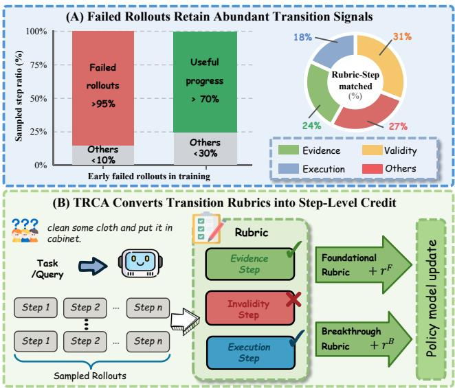  
Figure 1: (A) Failed rollouts dominate early training, yet over 70% of their actions retain useful rubric-grounded transition signals. (B) TRCA converts these step-level signals into foundational and breakthrough step credit without rely- ing on successful anchors or external evaluators.

To address the above challenges, a natural solution is to introduce Process Reward Models (PRMs), which evalu-ate each intermediate step during rollouts to enable step- level credit assignment (Yuan et al. 2025). However, existing process evaluation approaches based on supervised fine- tuning (Xi et al. 2026) or step-by-step assessment with large language model judges typically require extensive human an-notation or substantial additional inference. To avoid these labor and computational costs, another line of work derives step-level credit from structures constructed around success- ful trajectories (Feng et al. 2025; Tan et al. 2026; Cheng et al.

2026; Feng et al. 2026), thereby avoiding the overhead asso-ciated with step-wise evaluation. However, the efectiveness of these methods fundamentally depends on the availability of success anchors: reliable step-level credit propagation can only be established when suficient successful trajectories are obtained. Consequently, their applicability is limited in exploration stages where successful trajectories are scarce.

To quantify the practical severity of this issue, we sample a group of rollouts from Qwen2.5-1.5B-Instruct on multi-ple long-horizon tasks. As shown in Figure 1 (A), 96.5% of the sampled rollouts fail to achieve terminal success, leav- ing 85.6% of task-conditioned training groups without any successful trajectory in early training. Under such a success-scarce regime, methods that rely on successful outcomes or success-conditioned structures to propagate rewards can provide only limited step-level credit. To examine whether failed rollouts are entirely uninformative, we further ana- lyze their transitions using human annotations and a frontier LLM judge. Surprisingly, 72.2% of the actions in failed trajectories still exhibit diagnostically useful transition signals, such as valid execution or measurable task progress. These observations suggest that reliable step-level credit remains accessible from environmental feedback even when terminal success is extremely sparse. Hence, these observations raise a core question: How can we assign reliable fine-grained credit without successful anchors or external evaluators?

To answer this question, we propose Transition-wise Rubric Credit Assignment (TRCA), a step-level credit as-signment framework that derives supervision directly from action-induced transitions without relying on successful an- chors or learned process evaluators. TRCA evaluates each transition using three rubrics: Evidence captures newly re- vealed task-relevant information, Invalidity identifies mal- formed or unexecutable actions, and Execution recognizes completed task-required operations or intermediate condi- tions. Based on these judgments, Foundational Rubric Reward provides broad signed supervision, while Breakthrough Rubric Reward assigns additional credit to transitions that newly cover previously unsatisfied task-relevant conditions. TRCA combines the resulting step-level rewards with the sparse trajectory outcome to construct fine-grained advantages for training. In this way, TRCA extracts reliable step- level credit from both successful and failed rollouts under success-scarce training conditions, as illustrated in Figure 1 (B). Our contributions are as follows:

• We identify the success-scarce credit assignment problem in long-horizon agent training and quantify its severity through case studies. Our analysis shows that failed roll- outs dominate early training, while their action-induced transitions still contain diagnostically useful signals.

• We propose TRCA, a transition-wise step-level credit as-signment framework that evaluates action-induced transi- tions through Evidence, Invalidity, and Execution rubrics. TRCA constructs Foundational Rubric Reward for broad signed supervision and Breakthrough Rubric Reward for highlighting newly achieved task-relevant conditions, without successful anchors or external process evaluators.

• Extensive experiments on ALFWorld, WebShop, and seven search-augmented QA benchmarks demonstrate that TRCA consistently improves performance over the evaluated baselines across model scales. Ablation studies and hyperparameter analyses further validate the efec- tiveness and robustness of its components.

## 2 Related Work

## 2.1 Reinforcement Learning for LLM Agents

Reinforcement learning for LLMs largely inherits its op- timization machinery from RLHF. PPO stabilizes policy updates through a clipped surrogate objective and remains a widely used approach for LLM post-training (Schulman et al. 2017). More recent methods simplify this actor-critic pipeline. GRPO removes the learned value function by es- timating relative advantages within groups of sampled re- sponses (Shao et al. 2024), while RLOO employs leave-one-out baselines to obtain a simple critic-free policy-gradient estimator (Ahmadian et al. 2024). Although efective for single-response tasks, these methods provide limited guid- ance when a terminal outcome must be attributed to a long sequence of agent decisions. Recent work therefore extends group-relative optimization to multi-turn agents. GiGPO combines episode-level comparison with step-level grouping over recurrent anchor states, enabling finer-grained advan- tage estimation without additional rollouts (Feng et al. 2025). GraphGPO aggregates trajectories into a state-transition graph and estimates transition advantages using their struc- tural relation to successful terminal states (Cheng et al. 2026). These approaches substantially improve the granularity of advantage estimation by structure of success rollouts.

## 2.2 Process Supervision and Hindsight Credit Assignment

LLM agents couple a policy model with an execution harness to support multi-step interaction with external environments, making fine-grained credit assignment over intermediate de- cisions a central challenge in agent optimization (Chen et al. 2026a; Lv et al. 2026a; Lin et al. 2026; Chen et al. 2026b). Process supervision alleviates sparse feedback by assigning scores to intermediate steps. Human-supervised PRMs re- quire large-scale step-level annotations, whereas automatic variants often rely on repeated Monte Carlo rollouts or tree search to construct training labels. Both introduce additional supervision or inference overhead (Lightman et al. 2024; Luo et al. 2024). AgentPRM extends this paradigm to interactive agent trajectories (Xi et al. 2026). Hindsight-based methods instead estimate earlier contributions after observing com- pleted trajectories: HCAPO refines step-level values through hindsight reasoning, while AgentHER relabels failed or par- tially successful trajectories (Tan et al. 2026; Ding 2026). These methods reduce explicit process evaluation, but may still depend on post-hoc goals, success proximity, or success- ful anchors that are scarce during early exploration.

## 2.3 Rubric-Based Supervision and Reinforcement Learning

Rubrics provide structured and interpretable supervision by decomposing complex or open-ended objectives into explicit evaluation criteria. Recent work has increasingly incorpo- rated rubrics into LLM evaluation and post-training. Rubrics as Rewards (RaR) uses instance-specific rubric criteria as on-policy reward signals to extend reinforcement learning beyond domains with directly verifiable outcomes (Gunjal et al. 2026). GEAR further studies reward aggregation in rubric-based reinforcement learning by modeling prereq- uisite dependencies among rubric criteria, mitigating false credit propagation caused by treating interdependent criteria as independent reward signals (Lv et al. 2026b). Reinforce-ment Learning with Rubric Anchors further scales rubric- based rewards to open-ended tasks and uses structured cri- teria to provide fine-grained supervision over response qual- ity (Huang et al. 2025). RuscaRL employs checklist-style rubrics both as guidance during rollout exploration and as references for reward computation, improving exploration in general reasoning tasks (Zhou et al. 2026). AdvancedIF and its RIFL pipeline similarly leverage expert-curated rubrics, rubric verification, and reward shaping to improve complex instruction following (He et al. 2026). Together, these studies demonstrate that rubrics can provide more explicit and decomposable supervision than holistic scalar feedback.

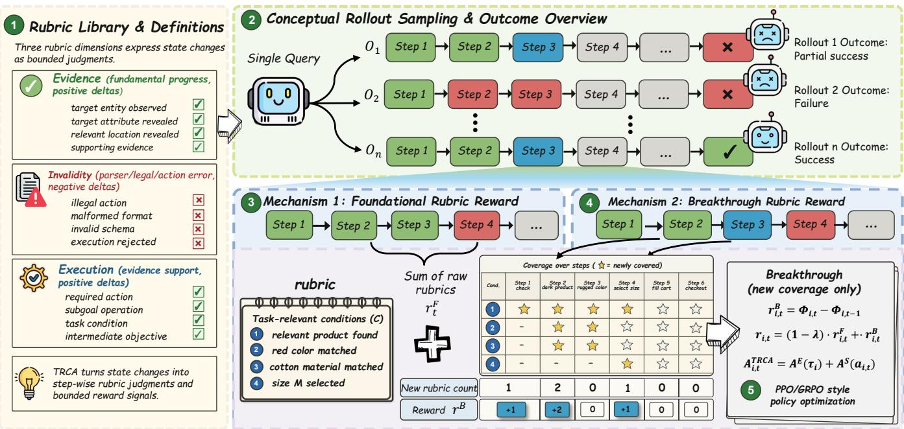  
Figure 2: Overview of TRCA. Foundational Rubric Reward converts step-level rubric judgments into step-aligned credit, while breakthrough step rubric reward rewards newly covered task-relevant rubric conditions. The combined TRCA reward augments the original sparse environment reward to construct normalized step advantages, which are fused with the episode-relative trajectory advantage and optimized using the underlying PPO-style clipped objective.

## 3 Methodology

## 3.1 Preliminaries

Long-Horizon Agentic Tasks Let x $\sim p ( \mathcal { X } )$ denote a task instance and πθ an LLM policy. At interaction step t, the agent observes state $s _ { i , t } .$ which summarizes the current observa- tion, interaction history, and relevant environment feedback, and samples an action $a _ { i , t } \sim \pi _ { \theta } ( \cdot \mid s _ { i , t } , x )$ . After executing the action, the environment transitions to $s _ { i , t + 1 }$ and returns an environment reward ${ \boldsymbol { r } } _ { i , t }$ . A complete rollout is repre- sented as the state-action trajector $\tau \tau _ { i } = \{ ( x ; s _ { i , t } , a _ { i , t } ) \} _ { t = 1 } ^ { T _ { i } }$ For each task $x ,$ the old policy $\pi _ { \theta _ { \mathrm { o l d } } }$ samples N trajectories from the same initial condition. A long-horizon agentic task can be formulated as a partially observable Markov decision process, where the probability of trajectory $\tau _ { i }$ is

$$
\pi _ { \boldsymbol { \theta } } ( \tau _ { i } \mid \boldsymbol { x } , s _ { 0 } ) = \prod _ { t = 1 } ^ { T _ { i } } \pi _ { \boldsymbol { \theta } } ( a _ { i , t } \mid \boldsymbol { x } , s _ { i , \le t } ) .\tag{1}
$$

The environment assigns a binary terminal outcome $R ( \tau _ { i } ) =$ $\textstyle \sum _ { t = 1 } ^ { T _ { i } } r _ { i , t }$ , where $R ( \tau _ { i } ) = 1$ indicates successful task com- pletion and $R ( \tau _ { i } ) = \mathrm { \dot { 0 } }$ otherwise. Although this terminal out- come provides a global measure of rollout quality, it cannot reliably distinguish the precise contributions of individual actions within the entire trajectory.

Episode-Relative Advantage Following the group- relative setting, the old policy samples a rollout group $G ( x ) = \{ \tau _ { i } \} _ { i = 1 } ^ { \overline { { N } } }$ for the same task and initial condition. We use the total return $R ( \tau _ { i } )$ as a trajectory-level measure of task completion. The episode-relative advantage compares each trajectory with the other trajectories in the same group:

$$
A ^ { E } ( \tau _ { i } ) = \frac { R ( \tau _ { i } ) - \mu \big ( \{ R ( \tau _ { j } ) \} _ { j = 1 } ^ { N } \big ) } { \sigma \big ( \{ R ( \tau _ { j } ) \} _ { j = 1 } ^ { N } \big ) } .\tag{2}
$$

Thus, $A ^ { E } ( \tau _ { i } )$ indicates whether rollout $\tau _ { i }$ performs better or worse than alternative rollouts sampled for the same task. When a rollout group contains no successful trajectories, we

set $A ^ { E } ( \tau _ { i } ) = 0$ . The step-level rewards become the primary source of learning signals for fine-grained credit assignment.

## 3.2 Transition-wise Rubric Design

To provide informative step-level reward when success- ful trajectories are sparse, we construct a rubric set $\mathcal { R } ( x )$ that evaluates the state transition induced by each agent action. For a long-horizon task instance x with rollout $\tau = ( s _ { 1 } , a _ { 1 } , \dots , s _ { T } , a _ { T } )$ , the rubric is defined as

$$
\mathcal { R } ( x ) = \left\{ \mathcal { R } ^ { \mathrm { E v i d e n c e } } ( x ) , \mathcal { R } ^ { \mathrm { I n v a l i d i t y } } ( x ) , \mathcal { R } ^ { \mathrm { E x e c u t i o n } } ( x ) \right\} ,\tag{3}
$$

where the three item types provide complementary credit signals for the action-induced transition $\xi _ { t } = ( s _ { t } , a _ { t } , s _ { t + 1 } )$ Evidence $\mathcal { R } ^ { \mathrm { E v i d e n c e } } ( x )$ items identify task-relevant entities, attributes, locations, relations, or supporting facts revealed or supported by the current transition, providing positive credit for information acquisition that supports subsequent plan- ning. Invalidity $\dot { \mathcal { R } } ^ { \mathrm { I n v a l i d i t y } } ( x )$ items specify malformed, inadmissible, or otherwise unexecutable actions that cannot be correctly parsed or executed by the environment, con- tributing negative credit. Execution $\mathcal { R } ^ { \mathrm { E x e c u t i o n } } ( x )$ items specify task requirements, subgoals, or intermediate ob- jectives satisfied by the action-induced transition, providing additional positive credit for substantive task execu- tion. This three-aspect schema separates information acqui- sition, invalid-action detection, and task-relevant execution. For each task type, all rubric items are instantiated ofline by an LLM before training. No additional judge model is invoked during subsequent policy optimization. For a task instance x belonging to task type b, we use the shared rubric library. Further details are provided in Appendix A.1.

## 3.3 Transition-wise Rubric Rewards

TRCA converts the step-level rubric judgments into two com-plementary reward signals: Foundational Rubric Reward and Breakthrough Rubric Reward.

Foundational Rubric Reward. Each judged rubric item is mapped to a signed item-level contribution according to its rubric category. Contributions associated with the same transition are then aggregated into a step-level reward and assigned only to the action tokens generated at the corre- sponding interaction step. We define the signed contribution of rubric item j at transition (i,t) as follows:

$$
q _ { t , j } ^ { i } = \left\{ \begin{array} { l l } { + r ^ { \mathrm { E v i } } / M _ { \mathrm { E v i } } , } & { j \in \mathcal { R } ^ { E v i } , \mathcal { O } _ { i , t , j } = 1 , } \\ { - | r ^ { \mathrm { I n v a l } } | / M _ { \mathrm { I n v a l } } , } & { j \in \mathcal { R } ^ { I n v a l } , \mathcal { O } _ { i , t , j } = 1 , } \\ { + r ^ { \mathrm { E x e c } } / M _ { \mathrm { E x e c } } , } & { j \in \mathcal { R } ^ { E x e c } , \mathcal { O } _ { i , t , j } = 1 , } \\ { 0 , } & { \mathrm { o t h e r w i s e } . } \end{array} \right.\tag{4}
$$

Here, $q _ { t , j } ^ { i }$ denotes the signed contribution of rubric item j to transition and $M _ { c } = \vert \mathcal { R } ^ { c } ( x )$ | is the number of corresponding rubric items for task x. Dividing the budget by M bounds the magnitude of each category’s aggregate contribution regard- less of rubric-list length. The Foundational Rubric Reward is then obtained by summing all item-level contributions at the same transition: $\begin{array} { r } { r _ { i , t } ^ { \mathrm { F } } = \breve { \sum } _ { j \in \mathcal { R } ( x ) } q _ { t , j } ^ { i } } \end{array}$ , which aggregates both positive and negative judgments and is assigned only to the action tokens of the corres ondin ste . For each rubric item j, we define a binary semantic judgment $\mathcal { O } _ { i , t , j } \in \{ 0 , 1 \}$ where $\mathcal { O } _ { i , t , j } = 1$ if transition (i, t) satisfies rubric item $j ,$ and 0 otherwise. The judgment is computed from the ob-servable semantic evidence associated with the transition. Further details are provided in Appendix A.3.

Breakthrough Rubric Reward. Foundational Rubric Re- ward evaluates each transition independently and may repeat- edly reward actions that satisfy the same rubric, reducing the relative advantage of truly critical steps after normalization. We introduce Breakthrough Rubric Reward to address this issue by rewarding only newly satisfied rubric conditions. We define $\begin{array} { r } { C _ { i , t , j } = \operatorname* { m a x } _ { 1 \leq k \leq t } \mathcal { O } _ { i , k , j } , } \end{array}$ where $\mathcal { O } _ { i , t , j } = 1$ if step t satisfies rubric item j, and 0 otherwise. Breakthrough Rubric Reward then constructs a cumulative rubric potential from the covered positive rubric items as follows:

$$
\Phi _ { i , t } = \sum _ { c \in \{ \mathrm { E v i } , \mathrm { E x e c } \} } \frac { r ^ { c } } { M _ { c } } \sum _ { j \in \mathcal { R } ^ { c } ( x ) } C _ { i , t , j } ,\tag{5}
$$

with $C _ { i , 0 , j } ~ = ~ 0$ . And $r ^ { c } > 0$ denotes the reward budget assigned to category c, and $M _ { c } ~ = ~ \vert \mathcal { R } ^ { c } ( x ) \vert$ is the num- ber of rubric items in that category. We exclude Invalidity items from the cumulative potential because they describe transition-local errors and are already penalized by Foun- dational Rubric Reward. The Breakthrough Rubric Reward assigned to transition t is defined as the temporal diference of the cumulative potential: $\boldsymbol { r } _ { i , t } ^ { \mathrm { B } } = \Phi _ { i , t } - \mathbf { \dot { \Phi } } _ { i , t - 1 } ^ { }$ . Equiva- lently, the temporal diference can be expanded as

$$
r _ { i , t } ^ { \mathrm { B } } = \sum _ { c \in \{ \mathrm { E v i } , \mathrm { E x e c } \} } \frac { r ^ { c } } { M _ { c } } \sum _ { j \in \mathcal { R } ^ { c } ( x ) } ( 1 - C _ { i , t - 1 , j } ) \mathcal { O } _ { i , t , j } .\tag{6}
$$

Consequently, rubric item $j$ contributes to Breakthrough Rubric Reward only when it is satisfied by the current step, $\mathcal { O } _ { i , t , j } = 1$ , and has not been covered by any earlier step, $C _ { i , t - 1 , j } ~ = ~ 0$ . Overall, TRCA consists of two com- plementary reward constructions: Foundational Rubric Re- ward, which evaluates the direct rubric evidence triggered by each action, and Breakthrough Rubric Reward, which measures transition-induced increases in cumulative task- relevant rubric coverage. The two rewards are combined as

$$
\boldsymbol { r } _ { i , t } ^ { \mathrm { T R C A } } = ( 1 - \lambda ) \cdot \boldsymbol { r } _ { i , t } ^ { \mathrm { F } } + \lambda \cdot \boldsymbol { r } _ { i , t } ^ { \mathrm { B } } ,\tag{7}
$$

Here, $\lambda \in [ 0 , 1 ]$ controls the contribution of Breakthrough Rubric Reward relative to Foundational Rubric Reward. Im- portantly, TRCA constructs step-level rewards without re- quiring successful anchor states.

## 3.4 Policy Optimization

Following the group-in-group framework, steps encountered under similar decision contexts are clustered according to environment-specific state information. For each similar state s˜, we define the corresponding step-level group as

$$
G ^ { S } ( \tilde { s } ) = \{ ( i , t ) \ | \ s _ { i , t } \simeq \tilde { s } , \ 1 \leq i \leq N , \ 1 \leq t \leq T _ { i } \} .\tag{8}
$$

where $s _ { i , t } \ \simeq \ \tilde { s }$ indicates that $s _ { i , t }$ belongs to the decision context represented by s˜. Rather than requiring exact textual matches, the grouping identifies semantically equivalent or structurally consistent states using environment-specific information, such as page type, product identity, selected options, task predicates, or interaction stage.

<table><tr><td rowspan="2">Type</td><td rowspan="2">Method</td><td colspan="6">ALFWorld</td><td colspan="2">WebShop</td></tr><tr><td>Clean</td><td>Pick</td><td>Cool</td><td>Heat</td><td>Pick2</td><td>All</td><td>Score</td><td>Succ.</td></tr><tr><td colspan="9">Closed-Source Model</td></tr><tr><td rowspan="2">Prompting</td><td>GPT-40</td><td>31.2</td><td>75.3</td><td>21.6</td><td>56.7</td><td>49.8</td><td>48.0</td><td>31.8</td><td>23.7</td></tr><tr><td>Gemini-2.5-Pro</td><td>62.1</td><td>92.8</td><td>26.6</td><td>69.0</td><td>58.7</td><td>60.3</td><td>42.5</td><td>35.9</td></tr><tr><td colspan="9">Qwen2.5-1.5B-Instruct</td></tr><tr><td rowspan="5">Prompting</td><td>Qwen2.5</td><td>3.3</td><td>5.9</td><td>4.2</td><td>9.7</td><td>0.0</td><td>4.1</td><td>23.1</td><td>5.2</td></tr><tr><td>ReAct</td><td>15.7</td><td>17.4</td><td>7.7</td><td>6.2</td><td>2.0</td><td>12.8</td><td>40.1</td><td>11.3</td></tr><tr><td>Reflexion</td><td>21.7</td><td>35.3</td><td>19.4</td><td>13.6</td><td>3.7</td><td>21.8</td><td>55.8</td><td>21.9</td></tr><tr><td>PPO</td><td> $5 7 . 1 _ { ( 4 . 9 ) }$ </td><td> $6 4 . 8 _ { ( 3 . 5 ) }$ </td><td> $4 6 . 4 _ { ( 4 . 0 ) }$ </td><td> $6 0 . 6 _ { ( 6 . 6 ) }$ </td><td> $4 7 . 4 _ { ( 1 . 9 ) }$ </td><td> $5 4 . 4 _ { ( 3 . 1 ) }$ </td><td> $7 3 . 8 _ { ( 3 . 0 ) }$ </td><td> $5 1 . 5 _ { ( 2 . 9 ) }$ </td></tr><tr><td>RLOO</td><td> $7 1 . 0 \dot { _ { ( 5 . 9 ) } }$ </td><td> $8 8 . 3 _ { ( 3 . 0 ) }$ </td><td> $6 6 . 4 _ { ( 5 . 5 ) }$ </td><td> $6 2 . 8 _ { ( 8 . 7 ) }$ </td><td> $5 6 . 9 _ { ( 4 . 7 ) }$ </td><td> $6 9 . 7 _ { ( 2 . 5 ) }$ </td><td> $7 3 . 9 _ { ( 5 . 6 ) }$ </td><td> $5 2 . 1 \dot { _ { ( 6 . 7 ) } }$ </td></tr><tr><td rowspan="6">RL Training</td><td>GRPO</td><td> $7 3 . 9 \dot { _ { ( 6 . 8 ) } }$ </td><td> $8 2 . 9 _ { ( 3 . 6 ) }$ </td><td> $7 7 . 8 \dot { _ { ( 4 . 5 ) } }$ </td><td> $7 8 . 6 _ { ( 0 . 0 ) }$ </td><td> $7 1 . 4 \dot { _ { ( 3 . 9 ) } }$ </td><td> $7 7 . 9 \dot { _ { ( 1 . 3 ) } }$ </td><td> $8 4 . 7 \dot { _ { ( 0 . 5 ) } }$ </td><td> $7 1 . 4 \dot { _ { ( 2 . 1 ) } }$ </td></tr><tr><td>GiGPO</td><td></td><td></td><td> $7 9 . 8 _ { ( 4 . 7 ) }$ </td><td></td><td> $7 6 . 4 _ { ( 5 . 4 ) }$ </td><td> $8 6 . 7 _ { ( 1 . 7 ) }$ </td><td> $8 3 . 1 _ { ( 1 . 6 ) }$ </td><td> $6 5 . 0 _ { ( 3 . 2 ) }$ </td></tr><tr><td>HCAPO</td><td> $9 4 . 8 _ { ( 3 . 8 ) }$ </td><td> $9 4 . 4 \dot { _ { ( 5 . 9 ) } }$ </td><td></td><td> $9 4 . 4 _ { ( 7 . 8 ) }$ </td><td></td><td></td><td></td><td></td></tr><tr><td></td><td> $\pmb { 9 7 . 6 } _ { ( 1 . 8 ) }$ </td><td> $8 8 . 6 _ { ( 7 . 0 ) }$ </td><td> $8 4 . 2 _ { ( 0 . 0 ) } ^ { \cdot }$ </td><td> $9 0 . 7 _ { ( 6 . 9 ) }$ </td><td> $7 4 . 2 _ { ( 6 . 9 ) }$ </td><td> $8 7 . 0 \dot { _ { ( 4 . 1 ) } }$ </td><td> $8 3 . 8 _ { ( 0 . 7 ) }$ </td><td> $6 8 . 5 _ { ( 1 . 0 ) }$ </td></tr><tr><td>GraphGPO Ours</td><td> $8 8 . 2 \dot { _ { ( 5 . 0 ) } }$ </td><td> $\mathbf { 9 7 . 8 } _ { ( 3 . 2 ) }$ </td><td> $9 1 . 3 \dot { _ { ( 1 . 8 ) } }$ </td><td> $8 0 . 2 _ { ( 1 1 . 1 ) }$ </td><td> $8 6 . 6 _ { ( 2 . 6 ) }$ </td><td> $9 1 . 7 _ { ( 0 . 4 ) } ^ { \cdot }$ </td><td> $8 6 . 7 \dot { _ { ( 1 . 6 ) } }$ </td><td> $7 5 . 5 _ { ( 1 . 2 ) }$ </td></tr><tr><td></td><td> $9 2 . 5 _ { ( 4 . 3 ) }$ </td><td> $9 5 . 9 _ { ( 2 . 2 ) }$ </td><td> $\mathbf { 9 6 . 6 } _ { ( 1 . 5 ) }$ </td><td> $\mathbf { 9 7 . 8 } _ { ( 0 . 9 ) }$ </td><td> ${ \bf 8 6 . 8 } _ { ( 6 . 9 ) }$ </td><td> $\mathbf { 9 2 . 0 } _ { ( 2 . 7 ) } ^ { \cdot }$ </td><td> $\mathbf { 9 0 . 5 } _ { ( 0 . 9 ) }$ </td><td> $7 8 . 4 \dot { _ { ( 1 . 6 ) } }$ </td></tr><tr><td colspan="9">Qwen2.5-7B-Instruct</td></tr><tr><td rowspan="3">Prompting</td><td>Qwen2.5</td><td>19.3</td><td>33.4</td><td>2.8</td><td>6.9</td><td>3.2</td><td>14.8</td><td>26.4</td><td>7.8</td></tr><tr><td>ReAct</td><td>34.3</td><td>48.5</td><td>18.2</td><td>13.2</td><td>17.6</td><td>31.2</td><td>46.2</td><td>19.5</td></tr><tr><td>Reflexion</td><td>44.9</td><td>62.0</td><td>36.3</td><td>30.9</td><td>23.8</td><td>42.7</td><td>58.1</td><td>28.8</td></tr><tr><td rowspan="8">RL Training</td><td>PPO</td><td> $9 2 . 5 _ { ( 2 . 4 ) }$ </td><td> $9 2 . 3 _ { ( 4 . 0 ) }$ </td><td> $8 0 . 3 _ { ( 2 . 0 ) }$ </td><td> $8 9 . 5 _ { ( 7 . 0 ) }$ </td><td> $6 8 . 8 _ { ( 8 . 3 ) }$ </td><td> $8 0 . 4 _ { ( 2 . 7 ) }$ </td><td> $8 1 . 4 _ { ( 3 . 1 ) }$ </td><td> $6 8 . 7 _ { ( 5 . 1 ) }$ </td></tr><tr><td>RLOO</td><td> $8 7 . 3 _ { ( 5 . 8 ) }$ </td><td> $8 7 . 6 _ { ( 4 . 3 ) }$ </td><td> $7 1 . 9 _ { ( 5 . 2 ) }$ </td><td> $8 1 . 3 _ { ( 7 . 6 ) }$ </td><td> $4 8 . 9 _ { ( 8 . 4 ) }$ </td><td> $7 5 . 5 _ { ( 4 . 6 ) }$ </td><td> $8 0 . 3 _ { ( 3 . 2 ) }$ </td><td> $6 5 . 7 _ { ( 4 . 0 ) }$ </td></tr><tr><td>GRPO</td><td> $7 7 . 9 \dot { _ { ( 4 . 6 ) } }$ </td><td> $8 9 . 0 \dot { _ { ( 5 . 3 ) } }$ </td><td> $9 0 . 7 \dot { _ { ( 5 . 2 ) } }$ </td><td> $7 8 . 6 _ { ( 0 . 0 ) }$ </td><td> $7 1 . 4 _ { ( 3 . 9 ) }$ </td><td> $8 3 . 3 _ { ( 2 . 1 ) }$ </td><td> $8 4 . 3 _ { ( 1 . 3 ) }$ </td><td> $7 5 . 0 \dot { _ { ( 2 . 8 ) } }$ </td></tr><tr><td>GiGPO</td><td> $\pmb { 9 8 . 8 } _ { ( 1 . 6 ) }$ </td><td> $9 7 . 7 \dot { _ { ( 1 . 6 ) } }$ </td><td> $8 9 . 3 _ { ( 8 . 2 ) }$ </td><td> $8 3 . 7 _ { ( 7 . 2 ) }$ </td><td> $7 9 . 2 _ { ( 6 . 6 ) }$ </td><td> $9 0 . 8 _ { ( 1 . 3 ) }$ </td><td> $8 4 . 4 _ { ( 2 . 9 ) }$ </td><td> $7 2 . 8 \dot { _ { ( 3 . 2 ) } }$ </td></tr><tr><td>HCAPO</td><td> $9 7 . 3 \dot { _ { ( 1 . 9 ) } }$ </td><td> $\mathbf { 9 9 . 1 } _ { ( 1 . 3 ) }$ </td><td> $9 0 . 8 _ { ( 6 . 6 ) }$ </td><td> $8 1 . 8 _ { ( 8 . 8 ) }$ </td><td> $8 1 . 9 _ { ( 1 0 . 0 ) }$ </td><td> $9 1 . 4 _ { ( 2 . 3 ) }$ </td><td> $8 5 . 1 _ { ( 1 . 3 ) }$ </td><td> $7 3 . 8 \dot { _ { ( 2 . 8 ) } }$ </td></tr><tr><td>GraphGPO</td><td> $8 9 . 6 _ { ( 1 . 7 ) }$ </td><td> $9 8 . 0 \dot { _ { ( 1 . 0 ) } }$ </td><td> $9 2 . 5 _ { ( 1 . 1 ) }$ </td><td> $9 0 . 9 _ { ( 5 . 3 ) }$ </td><td> $9 0 . 4 _ { ( 2 . 4 ) }$ </td><td> $9 3 . 3 _ { ( 1 . 2 ) }$ </td><td> $8 6 . 9 _ { ( 0 . 7 ) }$ </td><td> $8 0 . 3 _ { ( 2 . 3 ) }$ </td></tr><tr><td>Ours</td><td> $9 5 . 0 \dot { _ { ( 2 . 1 ) } }$ </td><td> $9 7 . 7 \dot { _ { ( 1 . 2 ) } }$ </td><td> $\mathbf { 1 0 0 . 0 } _ { ( 0 . 0 ) }$ </td><td> $\mathbf { 9 3 . 3 } _ { ( 3 . 1 ) }$ </td><td> $\mathbf { 9 4 . 1 } _ { ( 5 . 8 ) }$ </td><td> ${ \bf 9 4 . 5 } _ { ( 1 . 4 ) }$ </td><td> $\mathbf { 9 } 2 . 9 _ { ( 1 . 9 ) }$ </td><td> ${ \bf 8 3 . 8 } _ { ( 1 . 6 ) }$ </td></tr><tr><td></td><td></td><td></td><td></td><td></td><td></td><td></td><td></td><td></td></tr></table>

Table 1: Performance on ALFWorld and WebSho . Results are avera ed over 3 random seeds. For ALFWorld, we re ort the average success rate (%) for each subtask as well as the overall result. For WebShop, we report both the average score and the average success rate (%). We compare TRCA with other representative baselines. Best results are bolded.

The original environment reward ${ r } _ { i , t }$ is sparse and is typi- cally assigned only at the terminal transition, with $r _ { i , t } = 0 \mathrm { f o r }$ $t < T _ { i }$ and $r _ { i , T _ { i } } = R ( \tau _ { i } )$ . TRCA combines the sparse envi- ronment reward with the step-level rubric reward to compute the completion-aware return:

$$
R _ { i , t } = \sum _ { k = t } ^ { T _ { i } } \gamma ^ { k - t } \left( r _ { i , k } + r _ { i , k } ^ { \mathrm { T R C A } } \right) ,\tag{9}
$$

where $\gamma ~ \in ~ [ 0 , 1 ]$ is the discount factor. Analogous to the episode-relative advantage, the step-relative advantage is computed by normalizing the completion-aware return within the corresponding step-level group:

$$
A ^ { S } ( a _ { i , t } ) = \frac { R _ { i , t } - \mu \big ( \big \{ R _ { j , k } \mid ( j , k ) \in G ^ { S } ( \tilde { s } ) \big \} \big ) } { \sigma ( \{ R _ { j , k } \mid ( j , k ) \in G ^ { S } ( \tilde { s } ) \} ) } ,\tag{10}
$$

quality of the complete rollout, $A ^ { S } ( a _ { i , t } )$ estimates the long- term utility of the individual action. TRCA combines the episode-relative and step-relative signals to construct the fi- nal advantage: $A _ { i , t } ^ { \mathrm { T R C A } } { } ^ { * } { = } A ^ { E } ( \tau _ { i } ) \stackrel { \smile } { + } A ^ { S } ( a _ { i , t } )$ , the clipped policy optimization objective of TRCA is:

Here, the mean and standard deviation are computed over the completion-aware returns collected from the same com- parable decision context. While $A ^ { E } ( \tau _ { i } )$ evaluates the relative

$$
\begin{array} { r l } & { \mathcal { T } _ { \mathrm { T R C A } } ( \theta ) = \mathbb { E } \Big [ \frac { 1 } { N } \sum _ { i = 1 } ^ { N } \frac { 1 } { T _ { i } } \sum _ { t = 1 } ^ { T _ { i } } \operatorname* { m i n } \Big ( \rho _ { i , t } ( \theta ) A _ { i , t } ^ { \mathrm { T R C A } } , } \\ & { \mathrm { c l i p } ( \rho _ { i , t } ( \theta ) , 1 - \epsilon , 1 + \epsilon ) A _ { i , t } ^ { \mathrm { T R C A } } \Big ) \Big ] - \beta _ { \mathrm { K L } } \mathbb { D } _ { \mathrm { K L } } ( \pi _ { \theta } | | \pi _ { \mathrm { r e f } } ) } \end{array}\tag{11}
$$

Where $\begin{array} { r } { \rho _ { i , t } ( \theta ) = \frac { \pi _ { \theta } \left( a _ { i , t } | \ s _ { i , t } , x \right) } { \pi _ { \theta _ { \mathrm { o l d } } } \left( a _ { i , t } | \ s _ { i , t } , x \right) } } \end{array}$ is the action-level impor- tance ratio and $\beta _ { \mathrm { K L } }$ controls regularization toward the ref- erence policy. The KL term is omitted when explicit KL regularization is not used. The complete training procedure is provided in Appendix D.5.

## 4 Experiments

We evaluate TRCA on two long-horizon interactive envi- ronments and seven search-augmented question-answering benchmarks. Our experiments examine (1) the overall efectiveness of TRCA across task domains and model scales, (2) its performance on multi-turn search tasks, (3) the contributions of Foundational Rubric Reward and Breakthrough Rubric Reward, and (4) its sensitivity to the mixing coeficient λ between the two reward components.

<table><tr><td rowspan="2">Type</td><td rowspan="2">Method</td><td colspan="3">Single-Hop QA</td><td colspan="4">Multi-Hop QA</td><td rowspan="2">Avg.</td></tr><tr><td>NQ†</td><td>TriviaQA*</td><td>PopQA★</td><td>HotpotQA†</td><td>2Wiki*</td><td>MuSiQue*</td><td>Bamboogle*</td></tr><tr><td colspan="9">Base Model: Qwen2.5-3B-Instruct</td><td></td></tr><tr><td rowspan="8"></td><td>R1-Instruct</td><td>27.0</td><td>53.7</td><td>19.9</td><td>23.7</td><td>29.2</td><td>7.2</td><td>29.3</td><td>27.1</td></tr><tr><td>Search-R1</td><td>34.1</td><td>54.5</td><td>37.8</td><td>32.4</td><td>31.9</td><td>10.3</td><td>26.4</td><td>32.5</td></tr><tr><td>ZeroSearch</td><td>41.4</td><td>57.4</td><td>44.8</td><td>27.4</td><td>30.0</td><td>9.8</td><td>11.1</td><td>31.7</td></tr><tr><td>StepSearch</td><td></td><td></td><td>一</td><td>34.5</td><td>32.0</td><td>17.4</td><td></td><td>34.4</td></tr><tr><td>GiĠPO</td><td>42.0</td><td>59.5</td><td>42.4</td><td>36.9</td><td>37.0</td><td>12.6</td><td>64.1</td><td>42.1</td></tr><tr><td>HCAPO</td><td>44.4</td><td>60.5</td><td>45.5</td><td>38.6</td><td>36.3</td><td>14.8</td><td>64.5</td><td>43.5</td></tr><tr><td>IGPO</td><td>36.4</td><td>55.8</td><td>36.3</td><td>32.8</td><td>31.6</td><td>10.6</td><td>56.8</td><td>37.2</td></tr><tr><td>TRCA</td><td>46.7</td><td>62.4</td><td>45.7</td><td>40.5</td><td>40.0</td><td>18.0</td><td>64.8</td><td>45.4</td></tr><tr><td colspan="10">RL Training Base Model: Qwen2.5-7B-Instruct</td></tr><tr><td rowspan="8">RL Training</td><td>R1-Instruct</td><td>21.0</td><td>44.9</td><td>17.1</td><td>20.8</td><td>27.5</td><td>6.0</td><td>19.2</td><td>22.4</td></tr><tr><td>Search-R1</td><td>39.3</td><td>61.0</td><td>39.7</td><td>37.0</td><td>40.1</td><td>14.6</td><td>36.8</td><td>38.5</td></tr><tr><td>ZeroSearch</td><td>43.6</td><td>61.8</td><td>51.5</td><td>34.6</td><td>35.2</td><td>18.4</td><td>27.8</td><td>39.1</td></tr><tr><td>StepSearch</td><td></td><td></td><td></td><td>38.6</td><td>36.6</td><td>22.6</td><td></td><td>40.0</td></tr><tr><td>GiĠPO</td><td>46.4</td><td>64.7</td><td>46.1</td><td>41.6</td><td>43.6</td><td>18.9</td><td>68.9</td><td>47.2</td></tr><tr><td>HCAPO</td><td>46.1</td><td>65.5</td><td>47.6</td><td>42.1</td><td>43.1</td><td>17.7</td><td>69.0</td><td>47.3</td></tr><tr><td>IGPO</td><td>46.5</td><td>64.1</td><td>47.0</td><td>42.0</td><td>41.7</td><td>18.5</td><td>67.2</td><td>46.7</td></tr><tr><td>RL Training TRCA</td><td>47.9</td><td>65.8</td><td>48.2</td><td>42.3</td><td>43.6</td><td>20.9</td><td>70.4</td><td>48.4</td></tr></table>

Table 2: Performance on search-augmented QA tasks. † and ⋆ indicate in-domain and out-of-domain datasets, respectively. Bold indicates the best performance in each category.

## 4.1 Experimental Setup

Benchmarks and metrics. We first evaluate TRCA on ALFWorld (Shridhar et al. 2021) and WebShop (Yao et al. 2022). ALFWorld is a text-based embodied environment in which an agent must complete household tasks through multi-step interactions. We report the success rate for each category and the overall success rate. WebShop is an inter- active shopping environment in which an agent navigates a simulated e-commerce website to identify and purchase a product that satisfies a natural-language instruction. Follow- ing prior work, we report both the average task score, which reflects partial attribute satisfaction, and the success rate, which measures exact task completion. We further evalu- ate TRCA on search-augmented QA, including three singlehop datasets—Natural Questions (NQ) (Kwiatkowski et al. 2019), TriviaQA (Joshi et al. 2017), and PopQA (Mallen et al. 2023)—and four multi-hop datasets—HotpotQA (Yang et al. 2018), 2WikiMultiHopQA (2Wiki) (Ho et al. 2020), MuSiQue (Trivedi et al. 2022), and Bamboogle (Press et al. 2023). We treat NQ and HotpotQA as in-domain benchmarks and use the remaining datasets to assess out-of-domain gener- alization. We report task success rate under strict binary nor- malized Exact Match (EM), counting an example as successful only when the normalized final answer exactly matches a ground-truth alias.

Baselines. For LLMs, we compare TRCA with several competitive baselines, including: 1) Closed-source LLMs: GPT-4o and Gemini-2.5-Pro (Anil et al. 2023). 2) Prompting- based agents: ReAct (Yao et al. 2023), and Reflexion (Shinn et al. 2023), which are instantiated with the Qwen2.5 base policy (Qwen et al. 2025). 3) RL-based training methods: We choose models as follows, the actor-critic method PPO (Schulman et al. 2017), the critic-free methods RLOO (Kool, van Hoof, and Welling 2019; Ahmadian et al. 2024) and GRPO (Shao et al. 2024); and recent step- level credit-assignment methods GiGPO (Feng et al. 2025), HCAPO (Tan et al. 2026), and GraphGPO (Cheng et al. 2026). For search-augmented QA tasks, following the ex-perimental protocol in prior work (Feng et al. 2025), we compare with R1-Instruct, Search-R1 (Jin et al. 2025), ZeroSearch (Sun et al. 2026), StepSearch (Wang et al. 2025), GiGPO, HCAPO, and IGPO (Wang et al. 2026).

Implementation details. For ALFWorld and Web- Shop, we use Qwen2.5-1.5B-Instruct and Qwen2.5-7B-Instruct (Qwen et al. 2025) as the policy models. All group- based methods use a rollout group size of 8. The agent generates its reasoning within <think> tags and its executable action within <action> tags. Unless otherwise specified, we set the mixing coeficient between Founda- tional Rubric Reward and Breakthrough Rubric Reward to λ = 0.8. Results on ALFWorld and WebShop are averaged over three random seeds. For search-augmented QA, we use Qwen2.5-3B-Instruct and Qwen2.5-7B-Instruct, while keeping the training and evaluation settings identical to those of GiGPO. Full details are provided in Appendix F.

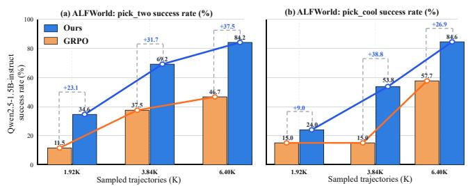

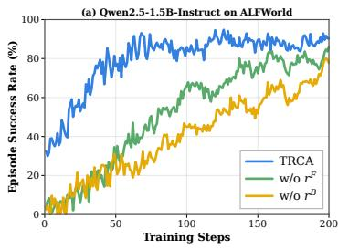

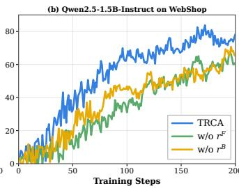

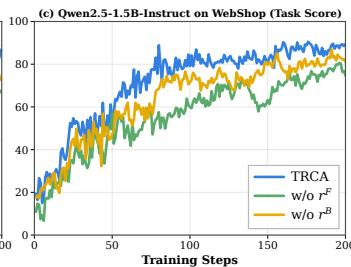

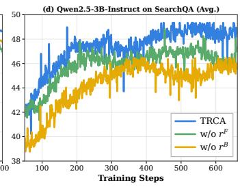  
Figure 3: Training dynamics of TRCA and its ablated variants on ALFWorld, WebShop, and SearchQA. Removing either Foundational Rubric Reward $( r ^ { \mathrm { F } } )$ or Breakthrough Rubric Reward $( r ^ { \mathrm { B } } )$ consistently degrades performance.  
Figure 4: Learning dynamics and sample eficiency of our method with Qwen2.5-1.5B-Instruct. (a) and (b) compare the best success rates achieved by our method and GRPO on the ALFWorld pick\_two and pick\_cool subtasks.

## 4.2 Performance on ALFWorld and WebShop

Table 1 shows that TRCA achieves the strongest overall performance at both model scales. With Qwen2.5-1.5B-Instruct, TRCA reaches 92.0% overall of ALFWorld success rate,90.5% of WebShop task score, and 78.4% WebShop success rate. These results represent 5.3%, 7.4%, and 13.4% improvements over GiGPO, respectively. With Qwen2.5-7B-Instruct, TRCA obtains 94.5%, 92.9%, and 83.8% on the same metrics, obtains 3.7%, 8.5%, and 11.0% improvements over GiGPO. TRCA also improves upon the strongest prior overall baseline, under Qwen2.5-1.5B-instruct setting, our method achieves 3.8% task score and 2.9% success-rate improvements on WebShop over GraphGPO. under Qwen2.5- 7B-instruct setting, the corresponding gains 6.0% and 3.5% improvements over GraphGPO.

## 4.3 Performance on Search-Augmented QA

As shown in Table 2, TRCA achieves the best average per- formance at both model scales. With Qwen2.5-3B-Instruct, TRCA obtains an average score of 45.4%, and it obtains 8.2% and 3.3% improvements over IGPO and GiGPO, re-spectively. It also achieves the best result on each of the seven individual datasets in the 3B setting. With Qwen2.5- 7B-Instruct, TRCA also reaches the best average score over other baselines, which shows that TRCA maintains com- petitive performance across heterogeneous search tasks and provides the strongest aggregate result without relying on ground truth labels on every dataset.

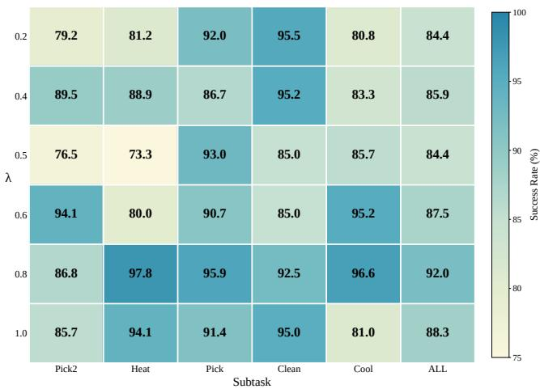  
Figure 5: Performance of TRCA under diferent settings of hyperparameter λ on ALFWorld success rate (%).

## 4.4 Learning Dynamics and Design Analysis

Learning Dynamics and Sample Eficiency. Figure 4 (a) and (b) show that TRCA converges substantially faster than GRPO on both Pick\_two and Pick\_cool under identical trajectory-sampling budgets. Notably, this advantage emerges from the earliest stage of training: with only 1.92K sampled trajectories, TRCA improves the success rate from 11.5% to 34.6% on Pick\_two and from 15.0% to 24.0% on Pick\_cool. On Pick\_two, TRCA reaches a 69.2% success rate with 3.84K trajectories, surpassing the 46.7% achieved by GRPO with 6.40K trajectories. On Pick\_cool, TRCA achieves 53.8% with 3.84K trajectories, approaching GRPO’s 57.7% while using 40% fewer samples. These results demonstrate that transition-wise rubric rewards im- prove the utilization of early-stage rollout experience, thereby accelerating convergence and enhancing overall sample efi- ciency. Experimental details are provided in Appendix F.

Ablation Study. We ablate the two reward components of TRCA while keeping all other training configurations un- changed. As shown in Figure 3, removing either component consistently degrades performance, confirming their comple- mentarity. Removing Breakthrough Rubric Reward causes a larger drop across all three benchmarks, indicating that newly covered rubric conditions provide particularly impor- tant credit for task-critical actions, while Foundational Rubric

Reward supplies broad step-level supervision.

Hyperparameter sensitivity analysis. On ALFWorld, we vary λ over {0.2, 0.4, 0.5, 0.6, 0.8, 1.0}, where larger val-ues place greater emphasis on Breakthrough Rubric Reward. Increasing λ generally benefits challenging subtasks such as Heat and Cool, but excessive emphasis on breakthrough progress reduces the overall success rate from 92.0% at λ = 0.8 to 88.3% at λ = 1.0. Thus, λ = 0.8 provides the best empirical balance between broad step-level supervision and breakthrough-focused credit.

## 5 Conclusion

Our central insight is that failure does not imply the ab- sence of supervision: even unsuccessful trajectories contain abundant and verifiable evidence in the state transitions they induce. TRCA leverages this evidence by grounding credit assignment in environment-observed changes rather than rare terminal successes, thereby converting otherwise discarded experience into reliable step-level supervision without suc- cessful anchors or learned process reward models. This ca- pability is particularly valuable during early exploration, when successful rollouts are scarce but informative tran- sitions remain plentiful. Across embodied interaction, web navigation, and search-augmented reasoning, TRCA consis- tently improves performance, convergence speed, and sam-ple eficiency, especially under limited rollout budgets. More broadly, our results establish transition-level environmental evidence as a general foundation for learning long-horizon behaviors from both successful and failed experience.

## Acknowledgments

This work was supported in part by the Beijing Major Science and Technology Project under Contract No. Z251100008125031 and the National Natural Science Foundation of China under Grant No. 62401327. This work was also supported by the Beijing Academy of Artificial Intelligence (BAAI).

## References

Ahmadian, A.; Cremer, C.; Gallé, M.; Fadaee, M.; Kreutzer, J.; Pietquin, O.; Üstün, A.; and Hooker, S. 2024. Back to Basics: Revisiting REINFORCE-Style Optimization for Learning from Human Feedback in LLMs. In Ku, L.-W.; Martins, A.; and Srikumar, V., eds., Proceedings of the 62nd Annual Meeting of the Association for Computational Linguistics (Volume 1: Long Papers), 12248–12267. Bangkok, Thailand: Association for Computational Linguistics.

Anil, R.; Borgeaud, S.; Alayrac, J.-B.; Yu, J.; Soricut, R.; Schalkwyk, J.; Dai, A.; Hauth, A.; Millican, K.; Silver, D.; Johnson, M.; Antonoglou, I.; Schrittwieser, J.; Glaese, A.; Chen, J.; Pitler, E.; Lillicrap, T.; Lazaridou, A.; Firat, O.; and Vinyals, O. 2023. Gemini: A Family of Highly Capable Multimodal Models.

Chen, M.; Lv, C.; Zhang, G.; Chang, H.; and Zhou, S. 2026a. HarnessForge: Joint Harness and Policy Evolution for Adap- tive Agent Systems. arXiv:2606.01779.

Chen, M.; Zhang, G.; Chang, H.; Guo, Y.; and Zhou, S. 2026b. A-MapReduce: Executing Wide Search via Agentic MapReduce. arXiv:2602.01331.

Cheng, X.; He, S.; Feng, L.; Xu, H.; Yan, M.; Feng, L.; and An, B. 2026. Beyond Trajectory-Level Attribution: Graph-Based Credit Assignment for Agentic Reinforcement Learn- ing. arXiv:2605.26684.

Ding, L. 2026. AgentHER: Hindsight Experience Replay for LLM Agent Trajectory Relabeling. arXiv:2603.21357.

Feng, L.; Xue, Z.; Liu, T.; and An, B. 2025. Group-in-Group Policy Optimization for LLM Agent Training. In Belgrave, D.; Zhang, C.; Lin, H.; Pascanu, R.; Koniusz, P.; Ghassemi, M.; and Chen, N., eds., Advances in Neural Information Processing Systems, volume 38, 46375–46408. Curran Asso-ciates, Inc.

Feng, X.; Han, B.; Zhou, Z.; Fan, J.; Yao, J.; Li, K. H.; Yu, D.; and Ng, M. K.-P. 2026. RewardFlow: Topology-Aware Reward Propagation on State Graphs for Agentic RL with Large Language Models. arXiv:2603.18859.

Gunjal, A.; Wang, A.; Lau, E.; Nath, V.; He, Y.; Liu, B.; and Hendryx, S. M. 2026. Rubrics as Rewards: Reinforcement Learning Beyond Verifiable Domains. In The Fourteenth International Conference on Learning Representations.

He, Y.; Li, W.; Zhang, H.; Li, S.; Mandyam, K.; Khosla, S.; Xiong, Y.; Wang, N.; Peng, X.; Li, B.; Bi, S.; Patil, S. G.; Qi, Q.; Feng, S.; Katz-Samuels, J.; Pang, R. Y.; Gonugondla, S. K.; Lang, H.; Yu, Y.; Qian, Y.; Fazel-Zarandi, M.; Yu, L.; Benhalloum, A.; Awadalla, H. H.; and Faruqui, M. 2026. AdvancedIF: Rubric-Based Benchmarking and Reinforce- ment Learning for Advancing LLM Instruction Following. In Liakata, M.; Moreira, V. P.; Zhang, J.; and Jurgens, D., eds., Proceedings of the 64th Annual Meeting of the Association for Computational Linguistics (Volume 1: Long Papers), 18003–18022. San Diego, California, United States: Asso- ciation for Computational Linguistics. ISBN 979-8-89176- 390-6.

Ho, X.; Duong Nguyen, A.-K.; Sugawara, S.; and Aizawa, A. 2020. Constructing A Multi-hop QA Dataset for Comprehen-sive Evaluation of Reasoning Steps. In Scott, D.; Bel, N.; and Zong, C., eds., Proceedings of the 28th International Conference on Computational Linguistics, 6609–6625. Barcelona, Spain (Online): International Committee on Computational Linguistics.

Huang, Z.; Zhuang, Y.; Lu, G.; Qin, Z.; Xu, H.; Zhao, T.;Peng, R.; Hu, J.; Shen, Z.; Hu, X.; Gu, X.; Tu, P.; Liu, J.;Chen, W.; Fu, Y.; Fan, Z.; Gu, Y.; Wang, Y.; Yang, Z.; Li,J.; and Zhao, J. 2025. Reinforcement Learning with RubricAnchors. arXiv:2508.12790.

Jin, B.; Zeng, H.; Yue, Z.; Yoon, J.; Arik, S.; Wang, D.; Zamani, H.; and Han, J. 2025. Search-R1: Training LLMs to Reason and Leverage Search Engines with Reinforcement Learning. arXiv:2503.09516.

Joshi, M.; Choi, E.; Weld, D.; and Zettlemoyer, L. 2017. TriviaQA: A Large Scale Distantly Supervised Challenge Dataset for Reading Comprehension. In Barzilay, R.; and Kan, M.-Y., eds., Proceedings of the 55th Annual Meeting ofthe Associationfor Computational Linguistics (Volume 1:

Long Papers), 1601–1611. Vancouver, Canada: Association for Computational Linguistics.

Kool, W.; van Hoof, H.; and Welling, M. 2019. Buy 4 RE- INFORCE Samples, Get a Baseline for Free!

Kwiatkowski, T.; Palomaki, J.; Redfield, O.; Collins, M.; Parikh, A.; Alberti, C.; Epstein, D.; Polosukhin, I.; Devlin, J.; Lee, K.; Toutanova, K.; Jones, L.; Kelcey, M.; Chang, M.-W.; Dai, A. M.; Uszkoreit, J.; Le, Q.; and Petrov, S. 2019. Natural Questions: A Benchmark for Question Answering Research. Transactions of the Association for Computational Linguistics, 7: 452–466.

Lightman, H.; Kosaraju, V.; Burda, Y.; Edwards, H.; Baker, B.; Lee, T.; Leike, J.; Schulman, J.; Sutskever, I.; and Cobbe, K. 2024. Let's Verify Step by Step. In Kim, B.; Yue, Y.; Chaudhuri, S.; Fragkiadaki, K.; Khan, M.; and Sun, Y., eds., International Conference on Learning Representations, vol-ume 2024, 39578–39601.

Lin, J.; Liu, S.; Pan, C.; Lin, L.; Dou, S.; Xi, Z.; Huang, X.; Yan, H.; Han, Z.; Gui, T.; and Jiang, Y.-G. 2026. Agentic Harness Engineering: Observability-Driven Automatic Evo- lution of Coding-Agent Harnesses. arXiv:2604.25850.

Luo, L.; Liu, Y.; Liu, R.; Phatale, S.; Guo, M.; Lara, H.; Li, Y.; Shu, L.; Zhu, Y.; Meng, L.; Sun, J.; and Rastogi, A. 2024. Improve Mathematical Reasoning in Language Models by Automated Process Supervision. arXiv:2406.06592.

Lv, C.; Chang, H.; Tao, S.; Chen, M.; Fan, Z.; Zhang, Z.; Guo, Y.; and Zhou, S. 2026a. All-Mem: Agentic Lifelong Memory via Dynamic Topology Evolution. arXiv:2603.19595.

Lv, C.; Chen, M.; Chang, H.; and Zhou, S. 2026b. Miti- gating False Credit Propagation: Probabilistic Graphical Re- ward Aggregation for Rubric-Based Reinforcement Learn- ing. arXiv:2606.03361.

Mallen, A.; Asai, A.; Zhong, V.; Das, R.; Khashabi, D.; and Hajishirzi, H. 2023. When Not to Trust Language Models: In-vestigating Efectiveness of Parametric and Non-Parametric Memories. In Rogers, A.; Boyd-Graber, J.; and Okazaki, N., eds., Proceedings of the 61st Annual Meeting of the Association for Computational Linguistics (Volume 1: Long Papers), 9802–9822. Toronto, Canada: Association for Com-putational Linguistics.

Press, O.; Zhang, M.; Min, S.; Schmidt, L.; Smith, N.; and Lewis, M. 2023. Measuring and Narrowing the Composi- tionality Gap in Language Models. In Bouamor, H.; Pino, J.; and Bali, K., eds., Findings of the Association for Computational Linguistics: EMNLP 2023, 5687–5711. Singapore: Association for Computational Linguistics.

Qwen; :; Yang, A.; Yang, B.; Zhang, B.; Hui, B.; Zheng, B.; Yu, B.; Li, C.; Liu, D.; Huang, F.; Wei, H.; Lin, H.; Yang, J.; Tu, J.; Zhang, J.; Yang, J.; Yang, J.; Zhou, J.; Lin, J.; Dang, K.; Lu, K.; Bao, K.; Yang, K.; Yu, L.; Li, M.; Xue, M.; Zhang, P.; Zhu, Q.; Men, R.; Lin, R.; Li, T.; Tang, T.; Xia, T.; Ren, X.; Ren, X.; Fan, Y.; Su, Y.; Zhang, Y.; Wan, Y.; Liu, Y.; Cui, Z.; Zhang, Z.; and Qiu, Z. 2025. Qwen2.5 Technical Report. arXiv:2412.15115.

Schulman, J.; Wolski, F.; Dhariwal, P.; Radford, A.; and Klimov, O. 2017. Proximal Policy Optimization Algorithms. arXiv:1707.06347.

Shao, J.-J.; Zhang, B.-W.; Yang, X.-W.; Chen, B.; Han, S.; Jinghao, P.; Wei, W.-D.; Cai, G.; Dong, Z.; Guo, L.-Z.; and Li, Y.-F. 2026. ChinaTravel: An Open-Ended Travel Plan- ning Benchmark with Compositional Constraint Validation for Language Agents. In The Fourteenth International Conference on Learning Representations.

Shao, Z.; Wang, P.; Zhu, Q.; Xu, R.; Song, J.; Bi, X.; Zhang, H.; Zhang, M.; Li, Y. K.; Wu, Y.; and Guo, D. 2024. DeepSeekMath: Pushing the Limits of Mathematical Rea- soning in Open Language Models. arXiv:2402.03300.

Shinn, N.; Cassano, F.; Berman, E.; Gopinath, A.; Narasimhan, K.; and Yao, S. 2023. Reflexion: Lan- guage Agents with Verbal Reinforcement Learning. arXiv:2303.11366.

Shridhar, M.; Yuan, X.; Cote, M.-A.; Bisk, Y.; Trischler, A.; and Hausknecht, M. 2021. {ALFW}orld: Aligning Text and Embodied Environments for Interactive Learning. In International Conference on Learning Representations.

Sun, H.; Qiao, Z.; Guo, J.; Fan, X.; Hou, Y.; Jiang, Y.; Xie, P.; Zhang, Y.; Huang, F.; and Zhou, J. 2026. ZeroSearch: In- centivize the Search Capability of LLMs without Searching. arXiv:2505.04588.

Tan, H.-Z.; Yang, X.-W.; Chen, H.; Shao, J.-J.; Wen, Y.; Shen, Y.; Luo, W.; Du, X.; Guo, L.-Z.; and Li, Y.-F. 2026. Hind- sight Credit Assignment for Long-Horizon LLM Agents. arXiv:2603.08754.

Trivedi, H.; Balasubramanian, N.; Khot, T.; and Sabharwal, A. 2022. MuSiQue: Multihop Questions via Single-hop Question Composition. arXiv:2108.00573.

Wang, G.; Dai, S.; Ye, G.; Gan, Z.; Yao, W.; Deng, Y.; Wu, X.; and Ying, Z. 2026. Information Gain-based Policy Op- timization: A Simple and Efective Approach for Multi-Turn Search Agents. arXiv:2510.14967.

Wang, Z.; Zheng, X.; An, K.; Ouyang, C.; Cai, J.; Wang, Y.; and Wu, Y. 2025. StepSearch: Igniting LLMs Search Ability via Step-Wise Proximal Policy Optimization. arXiv:2505.15107.

Xi, Z.; Liao, C.; Li, G.; Zhang, Z.; Chen, W.; Wang, B.; Jin,S.; Zhou, Y.; Guan, J.; Wu, W.; Ji, T.; Gui, T.; Zhang, Q.;and Huang, X. 2026. AgentPRM: Process Reward Modelsfor LLM Agents via Step-Wise Promise and Progress. InProceedings of the ACM Web Conference 2026, WWW ’26,4184–4195. New York, NY, USA: Association for Comput-ing Machinery. ISBN 9798400723070.

Xie, J.; Zhang, K.; Chen, J.; Zhu, T.; Lou, R.; Tian, Y.; Xiao, Y. and Su Y. 2024. TravelPlanner: A Benchmark for Real- World Planning with Language Agents. In Salakhutdinov, R.; Kolter, Z.; Heller, K.; Weller, A.; Oliver, N.; Scarlett, J.; and Berkenkamp, F., eds., Proceedings of the 41st International Conference on Machine Learning, volume 235 of Proceedings ofMachine Learning Research, 54590–54613. PMLR.

Yang, Z.; Qi, P.; Zhang, S.; Bengio, Y.; Cohen, W.; Salakhutdinov, R.; and Manning, C. D. 2018. HotpotQA: A Dataset for Diverse, Explainable Multi-hop Question Answering. In Rilof, E.; Chiang, D.; Hockenmaier, J.; and Tsujii, J., eds., Proceedings of the 2018 Conference on Empirical Method

in Natural Language Processing, 2369–2380. Brussels, Bel-gium: Association for Computational Linguistics.

Yao, S.; Chen, H.; Yang, J.; and Narasimhan, K. 2022. Web- Shop: Towards Scalable Real-World Web Interaction with Grounded Language Agents. In Koyejo, S.; Mohamed,

S.; Agarwal, A.; Belgrave, D.; Cho, K.; and Oh, A., eds., Advances in Neural Information Processing Systems, vol-ume 35, 20744–20757. Curran Associates, Inc.

Yao, S.; Zhao, J.; Yu, D.; Du, N.; Shafran, I.; Narasimhan, K.; and Cao, Y. 2023. ReAct: Synergizing Reasoning and Acting in Language Models. arXiv:2210.03629.

Yuan, S.; Chen, Z.; Xi, Z.; Ye, J.; Du, Z.; and Chen, J. 2025. Agent-R: Training Language Model Agents to Reflect via Iterative Self-Trainin . arXiv:2501.11425.

Zhou, Y.; Li, S.; Liu, S.; Fang, W.; Zhang, K.; Zhao, J.; Yang, J.; Zhou, Y.; Lv, J.; Zheng, T.; Lu, H.; Chen, W.; Xie, Y.; and Song, M. 2026. Breaking the Exploration Bottle- neck: Rubric-Scafolded Reinforcement Learning for Gen- eral LLM Reasoning. arXiv:2508.16949.

## A Task-Conditioned Rubric Construction and Evaluation

Overview of rubric construction and evaluation. $\mathsf { A p - }$ pendix A complements the rubric formulation in the main text by specifying how a shared rubric library is constructed, instantiated for a concrete task, and applied to an action- induced transition. At the beginning, we let

$$
b \in \{ \mathrm { A L F W o R L D } , \mathrm { W _ { E B } S _ { H O P } , S _ { E A R C H } Q A } \}
$$

index the benchmark-specific interaction type, and let $x \in \mathcal { X } _ { b }$ denote a task instance from benchmark b.

For rubric category $c \in \{ \mathrm { E v i }$ , Inval, Exec}, TRCA uses a benchmark-level operator $h _ { b , m } ^ { c } ,$ a task-conditioned bind- ing $\omega _ { b , m } ( x )$ , and a benchmark-specific transition adapter $g _ { b }$ Their composition produces the binary judgment

$$
\begin{array} { r } { \mathcal { O } _ { i , t , ( m , \omega ) } = h _ { b , m } ^ { c } \left( \omega _ { b , m } ( x ) , g _ { b } ( s _ { i , t } , a _ { i , t } , s _ { i , t + 1 } ) \right) \in \{ 0 , 1 \} . } \end{array}\tag{1}
$$

Here, $h _ { b , m } ^ { c }$ defines a reusable Boolean condition, $\omega _ { b , m } ( x )$ supplies the task-specific parameters required by that con- dition, and $g _ { b }$ maps the raw action-induced transition into canonical observable facts available at the current interac- tion step. The operator is active only when these observable facts satisfy its Boolean condition; missing, ambiguous, or unsupported evidence leaves the operator inactive.

## A.1 Shared Rubric Schema and Benchmark-Level Operator Libraries

At the level of rubric design, ALFWorld, WebShop, and SearchQA are treated as instances of a common long-horizon interaction family. They share the same three-category rubric schema and the same library-generation protocol: Evidence, Invalidity, and Execution. The schema fixes the semantic role of each category across benchmarks, while the concrete operators are instantiated according to the action grammar and observable feedback exposed by benchmark b.

Before policy training, an LLM is invoked only once for each benchmark-specific interaction type b to construct the corresponding reusable operator library.

$$
\mathcal { T } _ { b } = \{ \mathcal { T } _ { b } ^ { \mathrm { E v i } } , \mathcal { T } _ { b } ^ { \mathrm { I n v a l } } , \mathcal { T } _ { b } ^ { \mathrm { E x e c } } \} , \qquad \mathcal { T } _ { b } ^ { c } = \left\{ h _ { b , m } ^ { c } \right\} _ { m = 1 } ^ { M _ { c } } ,\tag{2}
$$

where $c \in \{ \mathrm { E v i } $ , Inval, Exec}. Each library therefore contains five operators per category and fifteen operators in total.

The three categories have complementary roles. Evidence operators identify newly revealed or newly supported task- relevant entities, attributes, locations, relations, or supporting facts. Invalidity operators identify malformed, unavailable, rejected, repeated, no-op, or precondition-violating actions. Execution operators clearly identify accepted task-relevant operations, successfully achieved subgoals, completed state transformations, or explicitly satisfied task conditions.

Each operator $h _ { b , m } ^ { c }$ specifies: (i) the canonical observable facts it reads, (ii) the task-binding fields it requires, and (iii) an exact Boolean activation condition. An operator returns one only when its required observable facts establish the condi- tion; Otherwise, it returns zero. This fully deterministic form efectively prevents unsupported or ambiguous transition ev- idence from producing positive rubric judgments.

The same generation prompt, category definitions, output schema, and Boolean-writing requirements are used for all three benchmarks. Benchmark-specific information is lim- ited to the interface description required to define executable operators, including the action grammar, admissible oper- ations, observable state fields, and environment feedback format. Consequently, the generated libraries adapt to dif- ferent interaction interfaces without changing the high-level rubric design. Library construction is performed once before training and does not use successful trajectories, terminal outcomes, future transitions, task-specific answers, bench- mark performance results, or ground-truth intermediate la- bels. The LLM constructs only the reusable benchmark-level operators. It is not invoked to generate a new library for an individual task and is not used as a transition judge during rollout collection or policy optimization. Once $\mathcal { T } _ { b }$ has been constructed, no further LLM calls are required. For each task, the deterministic binding procedure in Appendix $\mathrm { A } . 2$ fills the operator fields and produces the grounded rubric set $\mathcal { R } ( x )$ . The resulting task-grounded operators are evaluated on action-induced transitions as described in Appendix $\mathbf { A . } 3 ,$ using the environment-specific observable signals summa- rized in Appendix A.4. Their binary outputs are converted into Foundational and Breakthrough Rubric Rewards in Ap- pendix C. The shared generation prompt and benchmark- level libraries are provided in Appendix G.

## A.2 Task-Conditioned Binding across Task Instances

All task instances within benchmark-specific interaction type b reuse the same operator library $\mathcal { T } _ { b }$ . Each operator $h _ { b , m } ^ { c }$ is a parameterized Boolean template with predefined binding fields. For a concrete task instruction $x \in \mathcal { X } _ { b }$ , a deterministic task binder fills these fields with task-specific parameters:

$$
\omega _ { b , m } ( x ) = B _ { b , m } ( x ) .\tag{3}
$$

The binder is implemented through benchmark-specific pars- ing and field extraction and does not invoke an LLM or an- other learned model. This stage performs deterministic pa- rameter binding rather than generating a new rubric library.

The binding $\omega _ { b , m } ( x )$ may contain task-relevant entities, at- tributes, relations, locations, constraints, required operation types, target conditions, or output formats extracted from the task instruction and fixed benchmark metadata. For operators that depend only on benchmark-level interface properties, such as parser validity, the corresponding task binding may be empty. The grounded rubric set for task x is defined as

$$
\mathcal { R } ^ { c } ( x ) = \left\{ \left( h _ { b , m } ^ { c } , \omega _ { b , m } ( x ) \right) \right\} _ { m = 1 } ^ { M _ { c } } , \qquad x \in \mathcal { X } _ { b } ,\tag{4}
$$

where $c \in \{ \mathrm { E v i , I n v a l , E x e c } \}$ . The operator semantics $h _ { b , m } ^ { c }$ remain fixed across all task instances of benchmark b; only the task-conditioned bindings $\omega _ { b , m } ( x )$ vary with the specific instruction. Consequently, no new operator library is sepa- rately generated for any particular task instance.

Accordingly, the task-conditioned rubric set $\mathcal { R } ^ { c } ( x )$ con-sists of concrete rubric items instantiated from the shared operators through deterministic parameter binding; it is not an independently generated task-specific library.

For example, the ALFWorld binder extracts the target ob- ject, required state transformation, quantity, and destination receptacle. The WebShop binder extracts requested product attributes, options, and purchase constraints. The SearchQA binder extracts the target entity or subject, requested relation or information need, query constraints, and required answer format. Ground-truth answer aliases are not included in the SearchQA binding and are used only by the environment to compute the terminal Exact Match outcome.

The task binding remains fixed within a task instance, while the observable facts supplied to the bound operators vary across action-induced transitions.

## A.3 Rule-Based Transition Evaluation

For rollout i, the transition at step t is represented as

$$
\xi _ { i , t } = \left( s _ { i , t } , a _ { i , t } , s _ { i , t + 1 } \right) ,\tag{5}
$$

where $s _ { i , t }$ is the current interaction state, $a _ { i , t }$ is the complete environment-facing action, and $s _ { i , t + 1 }$ is the next interaction state containing the observable environment feedback pro- duced by executing the action.

During training, the deterministic benchmark adapter $g _ { b }$ maps the raw action-induced transition into canonical ob- servable facts. For a task-grounded rubric item

$$
j = \left( h _ { b , m } ^ { c } , \omega _ { b , m } ( x ) \right) \in \mathcal { R } ^ { c } ( x ) ,
$$

the transition-level judgment is computed as

$$
\mathcal { O } _ { i , t , j } = h _ { b , m } ^ { c } \left( \omega _ { b , m } ( x ) , g _ { b } ( s _ { i , t } , a _ { i , t } , s _ { i , t + 1 } ) \right) \in \{ 0 , 1 \} .\tag{6}
$$

The binding $\omega _ { b , m } ( x )$ supplies the task-specific require- ments, while $g _ { b }$ supplies the observable facts associated with the current pre-action state, action, and post-action environ- ment feedback. These facts may include the parsed action type and arguments, parser status, currently available oper-ations, visible entities and attributes, retrieved content, ac- tion acceptance or rejection feedback, and observable state changes caused by the action.

The evaluation does not access successful trajectories, ter-minal labels, future states, hidden environment states, bench- mark performance results, or ground-truth intermediate la- bels. If the observable evidence is insuficient to establish a rubric condition, the corresponding operator remains in- active and $\mathcal { O } _ { i , t , j } = 0$ . Here, zero denotes non-activation, rather than negative reward. Negative credit is introduced only when an Invalidity operator is activated and mapped to its signed contribution by Foundational Rubric Reward.

Evidence judgments are triggered by newly revealed or newly supported task-relevant information, such as an ob- ject location in ALFWorld, a product attribute in WebShop, or a supporting fact in SearchQA. Invalidity judgments are triggered by parser failure, malformed command format, environment rejection, inadmissible action, unavailable interface operation, repeated inefective execution, or another directly observable failure. Execution judgments are trig-gered when the transition satisfies a task-required operation, subgoal, or intermediate condition, such as acquiring an ob- ject, selecting an instruction-consistent option, or issuing an accepted retrieval step within the current interaction context.

A single transition can satisfy multiple rubric items within the same category or across diferent categories. For exam- ple, an action may both reveal a task-relevant object and com-plete a required exploration operation. The resulting Boolean judgments are evaluated independently and are subsequently aggregated by the reward construction in Appendix C.

Both task binding and transition evaluation are determin- istic. Neither stage invokes an LLM during rollout collection or policy optimization. Accordingly, the LLM is used ex- clusively for the one-time benchmark-level operator library construction process described in Appendix A.1.

## A.4 Environment-Specific Observable Signals

The following signals are the transition-dependent observ- able facts extracted by the benchmark adapter gb. They are evaluated together with the corresponding task-conditioned bindings formally defined in Appendix A.2.

ALFWorld. ALFWorld exposes textual feedback concern- ing action admissibility, object locations, inventory states, receptacles, and object-state transformations. Evidence items detect newly observed task-relevant objects, locations, receptacles, or object states. Invalidity items detect malformed commands, inadmissible actions, unavailable objects, unsatisfied preconditions, environment rejection, repeated inefective actions, or failed execution. Execution items identify task-relevant operations such as acquiring an object, applying a required transformation, or placing an object in a target receptacle throughout the current interaction process.

WebShop. WebShop provides structured page states, prod- uct attributes, available options, selected options, navigation feedback, cart state, and purchase status. Evidence items detect newly revealed products, attributes, or task-relevant options. Invalidity items identify malformed interface ac- tions, unavailable selections, rejected operations, repeated no-op actions, or premature purchases. Execution items identify substantive operations such as opening a candidate product, selecting an instruction-consistent option, adding a qualifying product to the cart, or reaching a purchase-ready state during the current navigation process.

SearchQA. SearchQA exposes search queries, retrieved results, document content, tool-execution feedback, retrieval- state changes, and answer-submission states. Evidence items detect newly retrieved task-relevant entities, relations, pas- sages, or supporting facts. Invalidity items detect mal- formed tool calls, unavailable result or passage identifiers, unsatisfied action preconditions, rejected queries, repeated no-op retrieval actions, or invalid interaction formats. Exe- cution items identify accepted operations such as issuing a valid search, opening a retrieved source, reading a relevant passage, extracting supporting evidence, or submitting an answer in the required format during the current process.

SearchQA operators may inspect retrieved text to deter-mine whether it expresses a relation relevant to the task in- struction. They do not compare the retrieved text or the sub- mitted answer against a ground-truth answer alias. Ground- truth answer aliases are used only by the benchmark to com- pute the terminal Exact Match reward and are not used to judge intermediate rubric items.

## A.5 Validity in the Diagnostic Study

Figure 1 reports Validity as a diagnostically useful tran- sition signal because successful parsing and execution are directly verifiable from environment feedback. Although a valid action may not immediately satisfy a task subgoal, it provides reliable evidence that the agent can interact with the environment in an executable way.

In the TRCA reward construction, we model the comple- mentary failure condition, Invalidity, and assign negative credit to malformed, inadmissible, rejected, repeated, or oth-erwise unexecutable actions. Thus, Validity in the diagnos- tic analysis and Invalidity in the reward construction are complementary views of action executability.

The absence of an Invalidity judgment does not itself produce positive reward. A valid and executable action receives positive rubric credit only when the same transition also activates an Evidence or Execution item. Thus, positive supervision remains tied to task-relevant information acqui- sition or substantive task execution rather than action validity alone. Together, Appendices A.1–A.5 specify the complete rubric instantiation and evaluation pipeline. Appendix A.1 constructs the shared benchmark-level operator library ${ \mathcal { T } } _ { b } .$ Appendix $\mathrm { A } . 2$ deterministically binds its parameterized op- erators to a task instruction, producing the concrete rubric set $\mathcal { R } ( x )$ . Appendix A.3 applies these task-grounded operators to observable action-induced transitions to obtain the binary judgments $\mathcal { O } _ { i , t , j }$ , while Appendices A.4 and A.5 specify their observable inputs and executability semantics. These judgments are subsequently converted into Foundational and Breakthrough Rubric Rewards in Appendix C.

## B Notation and TRCA Training Algorithm

## B.1 Notation Summary

For a task-grounded rubric item $j = ( h _ { b , m } ^ { c } , \omega _ { b , m } ( x ) )$ , its binary judgment is computed as

$$
\mathcal { O } _ { i , t , j } = h _ { b , m } ^ { c } \left( \omega _ { b , m } ( x ) , g _ { b } \left( s _ { i , t } , a _ { i , t } , s _ { i , t + 1 } \right) \right) \in \{ 0 , 1 \} ,\tag{7}
$$

where $h _ { b , m } ^ { c }$ is a shared operator in category $c \in$ {Evi, Inval, Exec}, $\omega _ { b , m } ( x )$ is its deterministic task- conditioned binding, and $g _ { b }$ is the benchmark-specific tran- sition adapter. Table 3 summarizes the main notation used in the rubric construction and transition-wise credit assignment of TRCA throughout the complete training pipeline; standard reinforcement-learning notation is omitted for brevity.

## B.2 Normalization and Numerical Conventions

TRCA uses normalization only when constructing relative advantages. Reward normalization and advantage normal- ization are therefore separate operations. The rubric rewards $r _ { i , t } ^ { \mathrm { F } } , r _ { i , t } ^ { \mathrm { B } }$ , and $r _ { i , t } ^ { \mathrm { T R C A } }$ are defined by the category budgets and the item-count normalization in Appendix C. The episode- relative and context-relative advantages are normalized over the corresponding rollout group or context group.

Table 3: Main notation used in TRCA.
<table><tr><td>Symbol</td><td>Definition</td></tr><tr><td> $x$ </td><td>A concrete task instruction or query. A benchmark-specific interaction type, where</td></tr><tr><td> $^ { b }$ </td><td> $b \in$  {ALFWORLD, WEBSHOP, SEARCHQA}.</td></tr><tr><td> $\mathcal { T } _ { b }$ </td><td>The benchmark-level operator library shared across all task instances of benchmark b, consisting of Evidence, Invalidity, and Execution operators.</td></tr><tr><td> $h _ { b , m } ^ { c }$ </td><td>The m-th deterministic Boolean operator in cate- gory c of library  ${ \mathcal { T } } _ { b } .$ </td></tr><tr><td> $\xi _ { i , t }$   $\omega _ { b , m } ( x )$ </td><td>The action-induced transition  $\begin{array} { r l } { \xi _ { i , t } } & { { } = } \end{array}$   $\left( { { s } _ { i , t } } , { { a } _ { i , t } } , { { s } _ { i , t + 1 } } \right)$  at interaction step t of rollout i. The task-conditioned parameters deterministically</td></tr><tr><td></td><td>bound to operator  $h _ { b , m } ^ { c } ,$  such as an entity, attribute, relation, constraint, target condition, or required output format. The benchmark-specific adapter that maps the raw</td></tr><tr><td> $g _ { b }$   $\mathcal { R } ^ { c } ( x )$ </td><td>transition  $\left( { { s _ { i , t } } , { a _ { i , t } } , { s _ { i , t + 1 } } } \right)$  into canonical observ- able facts. The grounded rubric-item set formed by pair-</td></tr><tr><td></td><td>ing the shared operators in  $\mathcal { T } _ { b } ^ { c }$  with their task- conditioned bindings for task x.</td></tr><tr><td> $\mathcal { O } _ { i , t , j }$   $r _ { i , t } ^ { \mathrm { F } }$ </td><td>The binary judgment  $\mathcal { O } _ { i , t , j } \in \{ 0 , 1 \}$  indicating whether transition ]  $\xi _ { i , t }$  satisfies rubric item  $j .$  The Foundational Rubric Reward obtained by ag-</td></tr><tr><td></td><td>gregating the signed rubric judgments at transition  $( i , t )$ </td></tr><tr><td> $C _ { i , t , j }$ </td><td>The cumulative coverage indicator specifying whether positive rubric item  $j$  has been satisfied by any transition up to step t.</td></tr><tr><td> $r _ { i , t } ^ { \mathrm { B } }$   $r _ { i , t } ^ { \mathrm { T R C A } }$ </td><td>The Breakthrough Rubric Reward assigned to newly covered Evidence and Execution items. The transition-level reward obtained by combining</td></tr><tr><td></td><td>Foundational Rubric Reward and Breakthrough Rubric Reward.</td></tr><tr><td> $\lambda$ </td><td>The mixing coefficient between Foundational Rubric Reward and Breakthrough Rubric Reward.</td></tr></table>

For a finite comparison group $\mathcal { G }$ of scalar values $\left\{ z _ { k } \right\}$ , we consistently use the following normalization convention

$$
\mathrm { N o r m } _ { \mathcal { G } } ( z _ { k } ) = \left\{ \begin{array} { l l } { \displaystyle z _ { k } - \mu _ { \mathcal { G } } } \\ { \displaystyle \sigma _ { \mathcal { G } } + \epsilon _ { \mathrm { n o r m } } } \\ { 0 , } & { \displaystyle \sigma _ { \mathcal { G } } = 0 . } \end{array} \right.\tag{8}
$$

Here, $\mu _ { \mathcal { G } }$ and $\sigma _ { \mathcal { G } }$ are computed exclusively within the corre- sponding comparison group for the current normalization.

For episode-relative normalization, the group is the roll- out group $\mathcal { G } ( x ) = \{ \tau _ { i } \} _ { i = 1 } ^ { N }$ , and the normalized values are terminal outcomes $R ( \tau _ { i } )$ . If all rollouts in the group have the same outcome, such as an all-failure group or an all-success group, then the standard deviation is zero and $A ^ { \mathrm { E } } ( \tau _ { i } ) = 0$ For context-relative normalization, the group is $\mathcal { G } ^ { \mathrm { S } } ( \acute { s } )$ , and the normalized values are completion-aware returns $R _ { i , t }$ from comparable decision contexts. If the context group has fewer than two usable transitions or has zero variance, then $A ^ { \mathrm { S } } ( a _ { i , t } ) = 0$ . These conventions avoid introducing artificial preference when the sampled group contains no distinguish- able outcome or return signal.

## B.3 Action and Token Conventions

An interaction step is an environment-facing decision point, whereas a token is an autoregressive generation unit. The variable $a _ { i , t }$ denotes the complete agent action emitted at interaction step t, not a single token. In the experiments, the model generates reasoning in <think> tags and the executable command in <action> tags. The environment transition $\xi _ { i , t }$ is induced by the executable action and the subsequent observable environment feedback.

For each interaction step, TRCA computes one scalar transition advantage for the complete environment action. During token-level policy optimization, this advantage is broadcast only to the generated executable tokens inside the <action>. . .</action> span. Reasoning tokens inside <think>. . .</think>, prompt tokens, observation tokens, retrieved-content tokens, padding tokens, and tokens belonging to other interaction steps are masked out.

## C Detailed TRCA Reward Construction

This section provides additional details for the two transition- level reward components introduced in the main paper. The construction follows the same notation and formulas.

## C.1 Foundational Rubric Reward

For rubric item j at transition (i, t), TRCA defines the signed item-level contribution

$$
\begin{array} { r } { q _ { t , j } ^ { i } = \left\{ \begin{array} { l l } { + \frac { { r } ^ { \mathrm { E v i } } } { M _ { \mathrm { E v i } } } , } & { j \in \mathcal { R } ^ { \mathrm { E v i } } ( x ) , \quad \mathcal { O } _ { i , t , j } = 1 , } \\ { - \frac { \left| { r } ^ { \mathrm { I n v a l } } \right| } { M _ { \mathrm { I n v a l } } } , } & { j \in \mathcal { R } ^ { \mathrm { I n v a l } } ( x ) , \quad \mathcal { O } _ { i , t , j } = 1 , } \\ { + \frac { { r } ^ { \mathrm { E x e c } } } { M _ { \mathrm { E x e c } } } , } & { j \in \mathcal { R } ^ { \mathrm { E x e c } } ( x ) , \quad \mathcal { O } _ { i , t , j } = 1 , } \\ { 0 , } & { \mathrm { o t h e r w i s e } , } \end{array} \right. } \end{array}\tag{9}
$$

where $M _ { c } = \left| \mathcal { R } ^ { c } ( x ) \right|$ is the number of rubric items in cat- egory c. Evidence and Execution contribute positive credit, while Invalidity contributes negative credit. If no rubric item is supported by observable transition evidence, then all cor- responding item contributions are zero.

The Foundational Rubric Reward aggregates all item-level contributions at the same transition:

$$
r _ { i , t } ^ { \mathrm { F } } = \sum _ { j \in \mathcal { R } ( x ) } q _ { t , j } ^ { i } .\tag{10}
$$

A transition may satisfy more than one rubric item, so Equa- tion (10) sums over all triggered Evidence, Invalidity, and Execution judgments. Dividing each category budget by $M _ { c }$ bounds the magnitude of that category’s aggregate contribu- tion at any transition by its predefined reward budget. Con- sequently, the reward scale does not grow simply because a benchmark uses a longer rubric list.

Foundational Rubric Reward evaluates the current tran- sition locally. The same rubric item can contribute at mul- tiple steps if distinct transitions repeatedly provide observ- able support for that item. This local behavior is intentional: Foundational Rubric Reward supplies broad transition-level supervision over informative, invalid, and task-relevant ac- tions, while Breakthrough Rubric Reward, defined next, sep- arately tracks newly covered positive conditions.

## C.2 Breakthrough Rubric Reward

To distinguish newly achieved progress from repeatedly ob- served evidence, TRCA defines the cumulative coverage of item j as

$$
C _ { i , t , j } = \operatorname* { m a x } _ { 1 \leq k \leq t } O _ { i , k , j } , \qquad C _ { i , 0 , j } = 0 .\tag{11}
$$

The cumulative potential over positive rubric items is

$$
\Phi _ { i , t } = \sum _ { c \in \{ \mathrm { E v i } , \mathrm { E x e c } \} } \frac { r ^ { c } } { M _ { c } } \sum _ { j \in \mathcal { R } ^ { c } ( x ) } C _ { i , t , j } .\tag{12}
$$

Invalidity items are excluded from this positive potential be- cause they describe transition-local errors and are already pe- nalized by Foundational Rubric Reward. Under the coverage definition in Equation (11), $\Phi _ { i , t }$ is monotone nondecreasing in t, assuming nonnegative Evidence and Execution budgets.

The Breakthrough Rubric Reward is the temporal difer ence of this cumulative potential:

$$
\boldsymbol { r } _ { i , t } ^ { \mathrm { B } } = \Phi _ { i , t } - \Phi _ { i , t - 1 } .\tag{13}
$$

Equivalently,

$$
r _ { i , t } ^ { \mathrm { B } } = \sum _ { c \in \{ \mathrm { E v i } , \mathrm { E x e c } \} } \frac { r ^ { c } } { M _ { c } } \sum _ { j \in \mathcal { R } ^ { c } ( x ) } \left( 1 - C _ { i , t - 1 , j } \right) \mathcal { O } _ { i , t , j } .\tag{14}
$$

Thus, rubric item j contributes to $r _ { i , t } ^ { \mathrm { B } }$ only when the cur- rent transition satisfies that item and no earlier transition in the same rollout has covered it. Already covered items do not receive repeated Breakthrough Rubric Reward. Since the potential is cumulative and uses a maximum over previous judgments, the current BRR definition does not introduce a coverage-regression penalty. When Evidence and Execution budgets are nonnegative, $r _ { i , t } ^ { \mathrm { { B } } } \geq 0 .$ , and the cumulative BRR over a rollout is bounded by $r ^ { \mathrm { E v i } } + r ^ { \mathrm { E x e c } }$

## C.3 Reward Fusion

The two reward components are combined as

$$
r _ { i , t } ^ { \mathrm { T R C A } } = ( 1 - \lambda ) r _ { i , t } ^ { \mathrm { F } } + \lambda r _ { i , t } ^ { \mathrm { B } } , \qquad \lambda \in [ 0 , 1 ] .\tag{15}
$$

Here, λ controls the trade-of between local broad super-vision and newly covered positive rubric progress. When λ = 0, TRCA uses only Foundational Rubric Reward. When λ = 1, it uses only Breakthrough Rubric Reward. We set $\lambda = 0 . 8$ in all experiments unless otherwise specified.

Foundational Rubric Reward provides both positive and negative local supervision, including penalties for Invalidity. Breakthrough Rubric Reward highlights transitions that in- troduce previously uncovered Evidence or Execution condi- tions. Their convex combination preserves the method’s two intended sources of transition-wise credit without requiring successful anchors or learned process evaluators.

## D Training Algorithm and Policy Optimization

## D.1 Completion-Aware Return

The environment reward is typically sparse in the paper’s long-horizon settings: $r _ { i , t } = 0$ for nonterminal steps and the

Table 4: Symbolic illustration of TRCA reward construction. The example uses symbolic budgets and does not report an experimental trajectory.
<table><tr><td>Step</td><td>Transition evidence</td><td>Triggered judgments</td><td>Reward computation</td></tr><tr><td>1</td><td>The agent inspects a receptacle and observes the apple.</td><td> $\mathcal { O } _ { 1 , e _ { \mathrm { l o c } } } = 1 .$ </td><td> $r _ { 1 } ^ { \mathrm { F } } = r ^ { \mathrm { E v i } } / M _ { \mathrm { E v i } }$  Coverage changes from 0 to  $\mid \mathrm { f o r } e _ { \mathrm { l o c } } , \mathrm { s o } r _ { 1 } ^ { \mathrm { B } } = r ^ { \mathrm { E v i } } / M _ { \mathrm { E v i } } .$ </td></tr><tr><td>2</td><td>The agent takes the apple.</td><td> $\mathcal { O } _ { 2 , u _ { \mathrm { t a k e } } } = 1 .$ </td><td> $r _ { 2 } ^ { \mathrm { F } } = r ^ { \mathrm { E x e c } } / \underline { { M } } _ { \mathrm { E x e c . } } \mathrm { T h e i t e m } u _ { \mathrm { t a k e } } \mathrm { i s n e w l y }$   $\mathrm { c o v e r e d } , \mathrm { s o } r _ { 2 } ^ { \mathrm { B } } = r ^ { \mathrm { E x e c } } / M _ { \mathrm { E x e c } } .$ </td></tr><tr><td>3</td><td>The agent repeats an observation that supports  $e _ { \mathrm { l o c } } .$ </td><td> $\ O _ { 3 , e _ { \mathrm { l o c } } } = 1 .$ </td><td> $r _ { 3 } ^ { \mathrm { F } } = r ^ { \mathrm { E v i } } / M _ { \mathrm { E v i } } .$  Since  $C _ { 2 , e _ { \mathrm { l o c } } } = 1$  , the repeated item gives  $r _ { 3 } ^ { \mathrm { B } } = 0 .$ </td></tr><tr><td>4</td><td>The environment rejects a mal- formed command.</td><td> $\mathcal { O } _ { 4 , v _ { \mathrm { b a d } } } = 1 .$ </td><td> $r _ { 4 } ^ { \mathrm { { F } } } ~ = ~ - | r ^ { \mathrm { { I n v a l } } } | / M _ { \mathrm { { I n v a l } } } .$  Invalidity is ex- cluded from  $\Phi , \mathrm { s o } r _ { 4 } ^ { \mathrm { B } } = 0 .$ </td></tr></table>

terminal transition receives the task outcome $R ( \tau _ { i } )$ . TRCA augments this sparse environment reward with the transition- level rubric signal for constructing the final reward:

$$
R _ { i , t } = \sum _ { k = t } ^ { T _ { i } } \gamma ^ { k - t } \left( r _ { i , k } + r _ { i , k } ^ { \mathrm { T R C A } } \right) .\tag{16}
$$

The return starts at the current interaction step and accumu- lates future terminal and transition-level signals. We use a discount factor of $\gamma = 0 . 9 5$ in all experiments.

The terminal outcome is included through the original en- vironment reward $r _ { i , k }$ , while TRCA adds separate transition- level supervision through $r _ { i , k } ^ { \mathrm { T R C A } }$ . The construction therefore does not duplicate the terminal reward; it combines the sparse completion signal with observable action-induced transition evidence before relative advantage normalization.

## D.2 Zero-Variance Rollout Groups

For a rollout group $\mathcal { G } ( \boldsymbol { x } ) = \{ \tau _ { i } \} _ { i = 1 } ^ { N }$ , the episode-relative advantage is computed from terminal outcomes:

$$
A ^ { \mathrm { E } } ( \tau _ { i } ) = \left\{ \begin{array} { l l } { \displaystyle \frac { R ( \tau _ { i } ) - \mu _ { \mathcal { G } } } { \sigma _ { \mathcal { G } } + \epsilon _ { \mathrm { n o r m } } } , } & { \sigma _ { \mathcal { G } } > 0 , } \\ { 0 , } & { \sigma _ { \mathcal { G } } = 0 , } \end{array} \right.\tag{17}
$$

where $\mu _ { \mathcal { G } }$ and $\sigma _ { \mathcal { G } }$ denote the mean and standard deviation of terminal outcomes within the rollout group.

Zero variance occurs when sampled rollouts in the group have indistinguishable terminal outcomes. This includes all- failure groups, where every rollout has $R ( \tau _ { i } ) = 0$ , and all- success groups, where every rollout has $R ( \tau _ { i } ) = 1$ . In either case, terminal outcomes provide no within-group preference, so TRCA sets $A ^ { \mathrm { E } } ( \tau _ { i } ) = 0$ instead of amplifying numerical noise. The step-level transition supervision then becomes the primary diferentiating signal. This convention does not imply that every failed rollout is identical in its intermediate behavior; it only states that terminal outcomes alone cannot rank rollouts inside a zero-variance group.

## D.3 Context-Based Step Grouping

Following the standard group-in-group formulation, transi- tions arising from comparable decision contexts are consis- tently assigned to the same step-level group:

$$
\begin{array} { r } { \mathcal { G } ^ { \mathrm { S } } ( \widetilde { s } ) = \left\{ ( i , t ) \ : | \ : s _ { i , t } \simeq \widetilde { s } , \ : 1 \le i \le N , \ : 1 \le t \le T _ { i } \right\} . } \end{array}\tag{18}
$$

The relation $s _ { i , t } \simeq \widetilde { s }$ indicates that the decision context is comparable under environment-specific state information. It is used exclusively for relative normalization of completion- aware returns, rather than as a successful anchor or any ad- ditional independent reward source.

The grouping need not be exact textual matching. It can use structural fields exposed by the environment, such as page type, product identity, selected options, task predicates, object state, inventory, tool type, query state, or retrieval stage. Appendix F.3 lists the benchmark-specific fields used at this level of description. Context grouping uses only ob- servable benchmark-specific state fields and does not require embedding models, learned state encoders, or additional on- line LLM inference. The context-relative step advantage is

$$
A ^ { \mathrm { S } } ( a _ { i , t } ) = \left\{ \begin{array} { l l } { \frac { R _ { i , t } - \mu _ { \mathcal { G } ^ { \mathrm { S } } } } { \sigma _ { \mathcal { G } ^ { \mathrm { S } } } + \epsilon _ { \mathrm { n o r m } } } , } & { \sigma _ { \mathcal { G } ^ { \mathrm { S } } } > 0 , } \\ { 0 , } & { \sigma _ { \mathcal { G } ^ { \mathrm { S } } } = 0 , } \end{array} \right.\tag{19}
$$

where the mean and standard deviation are computed over the completion-aware returns in the corresponding context group used for the current comparison. If a group is too small to support comparison or has zero variance, TRCA simply sets the corresponding step advantage to zero. The final combined advantage is

$$
\begin{array} { r } { \boldsymbol { A } _ { i , t } ^ { \mathrm { T R C A } } = \boldsymbol { A } ^ { \mathrm { E } } ( \tau _ { i } ) + \boldsymbol { A } ^ { \mathrm { S } } ( a _ { i , t } ) . } \end{array}\tag{20}
$$

## D.4 Action-Level Policy Optimization

TRCA treats the complete environment-facing action as the credit-assignment and policy-optimization unit. For rollout i at interaction step t, let $a _ { i , t }$ denote the complete executable action generated under state $s _ { i , t }$ and task instruction x. TRCA assigns one scalar transition advantage $A _ { i , t } ^ { \mathrm { T R C A } }$ to this action. The corresponding action-level importance ratio as follows.

$$
\rho _ { i , t } ( \theta ) = \frac { \pi _ { \theta } \left( a _ { i , t } \mid s _ { i , t } , x \right) } { \pi _ { \theta _ { \mathrm { o l d } } } \left( a _ { i , t } \mid s _ { i , t } , x \right) } .\tag{21}
$$

During optimization, the transition advantage is associated only with the executable action produced at the correspond- ing interaction step. Prompt tokens, environment observa- tions, retrieved content, padding tokens, and tokens belong- ing to other interaction steps are excluded from this action- level update to preserve precise step-wise credit assignment.

Using the rollout group $\mathcal { G } ( x ) ~ = ~ \{ \tau _ { i } \} _ { i = 1 } ^ { N }$ , the clipped action-level objective is

$$
\begin{array} { r l } & { \mathcal { T } _ { \mathrm { T R C A } } ( \theta ) = \mathbb { E } \Big [ \frac { 1 } { N } \sum _ { i = 1 } ^ { N } \frac { 1 } { T _ { i } } \sum _ { t = 1 } ^ { T _ { i } } \operatorname* { m i n } \Big ( \rho _ { i , t } ( \theta ) A _ { i , t } ^ { \mathrm { T R C A } } , } \\ & { \mathrm { c l i p } ( \rho _ { i , t } ( \theta ) , 1 - \epsilon , 1 + \epsilon ) A _ { i , t } ^ { \mathrm { T R C A } } \Big ) \Big ] - \beta _ { \mathrm { K L } } \mathbb { D } _ { \mathrm { K L } } ( \pi _ { \theta } | | \pi _ { \mathrm { r e f } } ) } \\ & { \mathcal { C } ^ { \mathrm { l i p } } ( \rho _ { i , t } ( \theta ) , 1 - \epsilon , 1 + \epsilon ) \lambda _ { i , t } ^ { \mathrm { T R C A } } \Big ) \Big ] - \beta _ { \mathrm { K L } } \mathbb { D } _ { \mathrm { K L } } ( \pi _ { \theta } | | \pi _ { \mathrm { r e f } } ) } \end{array}\tag{22}
$$

Here, T is the number of environment interaction steps in rollout i, ϵ is the PPO-style clipping coeficient, and $\beta _ { \mathrm { K L } }$ controls regularization toward the reference policy. Each term indexed by t corresponds to one complete action-induced transition and receives the trajectory-level outcome advantage and transition-wise rubric signals.

Although the underlying language model generates an ac- tion autoregressively, TRCA does not assign separate credit to individual tokens within the same environment action. Instead, all executable action tokens belonging to the same interaction step are treated as realizing the same action $a _ { i , t }$ and share the corresponding scalar transition advantage. This action-level formulation is consistent with the objective pre-sented in the main text.

## D.5 Training Procedure

Algorithm 1 summarizes the complete TRCA training proce- dure. For each rollout group, TRCA evaluates action-induced transitions using deterministic rubric operators, constructs Foundational and Breakthrough Rubric Rewards, and com- bines them with terminal outcomes to obtain action-level advantages for policy optimization.

We next analyze the resulting credit signals in terms of boundedness, novel-coverage preference, behavior in zero- success groups, and conditional variance.

## D.6 Theoretical Properties of TRCA Credit Assignment

This section establishes several theoretical properties of the transition-wise credit signals constructed by TRCA. We first show that the rubric rewards are bounded by the predefined category budgets and that Breakthrough Rubric Reward can- not accumulate through repeated satisfaction of the same rubric items. We then show that TRCA monotonically favors newly covered task-relevant conditions, retains discrimina- tive step-level credit in zero-success rollout groups, and pro- vides lower-variance local feedback than trajectory-outcome attribution throughout the policy optimization process.

Notation and assumptions. Let the positive rubric set be defined as

$$
\mathcal { R } ^ { + } ( x ) = \mathcal { R } ^ { \mathrm { E v i } } ( x ) \cup \mathcal { R } ^ { \mathrm { E x e c } } ( x ) ,\tag{23}
$$

which collects all Evidence and Execution items. For each $j ~ \in ~ \mathcal { R } ^ { c } ( x )$ , we define its normalized category-specific weight as the following context

$$
w _ { j } = \frac { r ^ { c } } { M _ { c } } , \qquad M _ { c } = | \mathcal { R } ^ { c } ( x ) | .\tag{24}
$$

We assume that each category contains at least one valid rubric item and that the transition evaluation operator is fully

Algorithm 1: Training TRCA   
Require: Policy $\pi _ { \theta } ,$ , old policy $\pi _ { \theta _ { \mathrm { o l d } } } ,$ task distribution $p ( \mathcal { X } )$   
benchmark-level operator libraries $\{ \mathcal { T } _ { b } \}$ , deterministic   
task binders $\{ B _ { b , m } \}$ , benchmark adapters $\left\{ g _ { b } \right\}$ , rollout   
group size $N ,$ , discount $\gamma ,$ and mixing coeficient λ.   
1: for each training iteration do   
2: Sample a batch of task instances $x \sim p ( \mathcal { X } )$   
3: Deterministically bind the operators in $\mathcal { T } _ { b }$ to each task   
x, constructing $\dot { \mathcal { R } } ( x )$   
4: For each task instance, sample a rollout group of N   
trajectories using $\pi _ { \theta _ { \mathrm { o l d } } } .$   
5: Collect terminal environment outcomes $R ( \tau _ { i } )$ for all   
rollouts.   
6: Initialize rubric coverage $C _ { i , 0 , j } = 0$ for all positive   
Evidence and Execution items.   
7: for each rollout $\tau _ { i }$ do   
8: for each transition $\xi _ { i , t }$ do   
9: Extract canonical observable facts using   
$g _ { b } ( s _ { i , t } , a _ { i , t } , s _ { i , t + 1 } ) .$   
10: Evaluate $\mathcal { O } _ { i , t , j }$ for all $j \in \mathcal { R } ( x )$ using the bound   
deterministic operators.   
11: Compute $r _ { i , t } ^ { \mathrm { F } }$ using Equation (10).   
12: Update coverage $\bar { C } _ { i , t , { j } }$ using Equation (11).   
13: Compute $r _ { i , t } ^ { \mathrm { B } }$ using Equation (14).   
14: Compute $r _ { i , t } ^ { \mathrm { T R C A } }$ using Equation (15).   
15: end for   
16: end for   
17: Construct comparable context groups $\mathcal { G } ^ { \mathrm { S } } ( \widetilde { s } )$   
18: Compute completion-aware returns $R _ { i , t }$ using Equa  
tion (16).   
19: Compute episode-relative advantages $A ^ { \mathrm { E } } ( \tau _ { i } ) .$   
20: Compute context-relative step advantages $\mathrm { ~ \cal ~ A ~ } ^ { \mathrm { S } } ( a _ { i , t } )$   
21: Construct final advantages $\dot { A _ { i , t } ^ { \mathrm { T R C A } } }$   
22: Optimize $\pi _ { \theta }$ with the clipped action-level objective.   
23: Update $\pi _ { \theta _ { \mathrm { o l d } } }  \pi _ { \theta }$ before the next rollout collection   
phase.   
24: end for

deterministic given the corresponding observable action- induced transition. These assumptions are fully consistent with the rule-based transition evaluation adopted by TRCA.

Proposition 1 (Rubric-budget boundedness and nonaccumulation). Let

$$
B _ { + } = r ^ { \mathrm { E v i } } + r ^ { \mathrm { E x e c } } , \qquad B _ { - } = \left| r ^ { \mathrm { I n v a l } } \right| .\tag{25}
$$

For every rollout i and transition t, the reward components of TRCA satisfy

$$
- B _ { - } \leq r _ { i , t } ^ { F } \leq B _ { + } , \qquad 0 \leq r _ { i , t } ^ { B } \leq B _ { + } ,\tag{26}
$$

and consequently

$$
- ( 1 - \lambda ) B _ { - } \leq r _ { i , t } ^ { \mathrm { T R C A } } \leq B _ { + } .\tag{27}
$$

Moreover, the cumulative Breakthrough Rubric Reward is bounded independently of the rollout horizon:

$$
\sum _ { t = 1 } ^ { T _ { i } } r _ { i , t } ^ { B } = \Phi _ { i , T _ { i } } \le B _ { + } .\tag{28}
$$

Proof of Proposition 1. For each positive category $c \in$ {Evi, Exec}, its aggregate contribution at transition (i, t) satisfies the following constraints

$$
0 \leq \frac { r ^ { c } } { M _ { c } } \sum _ { j \in \mathcal { R } ^ { c } ( x ) } \mathcal { O } _ { i , t , j } \leq r ^ { c } ,\tag{29}
$$

because $\mathcal { O } _ { i , t , j } \in \{ 0 , 1 \}$ and $M _ { c } = \left| \mathcal { R } ^ { c } ( x ) \right|$ . Similarly, the aggregate Invalidity contribution satisfies

$$
- B _ { - } \le - \frac { B _ { - } } { N _ { \mathrm { I n v a l } } } \sum _ { j \in \mathcal { R } ^ { \mathrm { I n v a l } } ( x ) } \mathcal { O } _ { i , t , j } \le 0 .\tag{30}
$$

Summing the category-wise contributions gives the bound on $r _ { i , t } ^ { F }$ . Breakthrough Rubric Reward contains only newly covered positive rubric items:

$$
r _ { i , t } ^ { B } = \sum _ { c \in \{ \mathrm { E v i } , \mathrm { E x e c } \} } \frac { r ^ { c } } { M _ { c } } \sum _ { j \in \mathcal { R } ^ { c } ( x ) } ( 1 - C _ { i , t - 1 , j } ) \mathcal { O } _ { i , t , j } .\tag{31}
$$

Every term in Equation (31) is non-negative, and the aggregate contribution of each category c is at most $r ^ { c }$ . Therefore, $\overline { { 0 } } \leq r _ { i . t } ^ { B } \leq B _ { + }$

Since

$$
r _ { i , t } ^ { \mathrm { T R C A } } = ( 1 - \lambda ) r _ { i , t } ^ { F } + \lambda r _ { i , t } ^ { B } , \qquad \lambda \in [ 0 , 1 ] ,\tag{32}
$$

the lower bound follows by combining the minimum possible Foundational Rubric Reward with zero breakthrough credit, while the upper bound follows because both $r _ { i , t } ^ { F }$ and $r _ { i , t } ^ { B }$ are upper bounded by $B _ { + }$ . Finally, since ${ r _ { i , t } ^ { B } } = { \Phi } _ { i , t } - { \Phi } _ { i , t - 1 }$ and $\Phi _ { i , 0 } = 0$ , the cumulative reward telescopes:

$$
\sum _ { t = 1 } ^ { T _ { i } } r _ { i , t } ^ { B } = \sum _ { t = 1 } ^ { T _ { i } } ( \Phi _ { i , t } - \Phi _ { i , t - 1 } ) = \Phi _ { i , T _ { i } } .\tag{33}
$$

Each positive rubric item contributes to $\Phi _ { i , T _ { i } }$ at most once, and the total contribution of category c is at most $r ^ { c }$ . Hence, $\Phi _ { i , T _ { i } } \leq B _ { + }$ . Thus, cumulative breakthrough credit is inde- pendent of rollout length and cannot grow through repeated satisfaction of previously covered rubric items.

Proposition 2 (Monotonicity with respect to novel rubric coverage). Consider two transition occurrences $u = ( i , t )$ and $v \stackrel { - } { = } ( i ^ { \prime } , t ^ { \prime } )$ evaluated under the same task instruction and grounded rubric set $\mathcal { R } ( x )$ . Let $\mathcal { O } _ { u , j }$ and $\mathcal { O } _ { v , j }$ denote their current rubric judgments, and define their prior coverage states as

$$
C _ { u , j } ^ { - } = C _ { i , t - 1 , j } , \qquad C _ { v , j } ^ { - } = C _ { i ^ { \prime } , t ^ { \prime } - 1 , j } .\tag{34}
$$

Suppose that the two transitions produce identical current rubric judgments:

$$
\mathcal { O } _ { u , j } = \mathcal { O } _ { v , j } , \qquad \forall j \in \mathcal { R } ( x ) .\tag{35}
$$

Assume further that

$$
C _ { u , j } ^ { - } \le C _ { v , j } ^ { - } , \qquad \forall j \in \mathcal { R } ^ { + } ( x ) ,\tag{36}
$$

and that there exists at least one currently satisfied positive item $j ^ { \star }$ such that

$$
\mathcal { O } _ { u , j ^ { \star } } = \mathcal { O } _ { v , j ^ { \star } } = 1 , \qquad C _ { u , j ^ { \star } } ^ { - } = 0 , \qquad C _ { v , j ^ { \star } } ^ { - } = 1 .\tag{37}
$$

Then

$$
\begin{array} { r } { r _ { u } ^ { B } > r _ { v } ^ { B } . } \end{array}\tag{38}
$$

Consequently, for every $\lambda > 0 ,$

$$
r _ { u } ^ { \mathrm { T R C A } } > r _ { v } ^ { \mathrm { T R C A } } .\tag{39}
$$

Proof of Proposition 2. Because the current rubric judg-ments are identical, their signed item-level contributions are identical, and therefore

$$
r _ { u } ^ { F } = r _ { v } ^ { F } .\tag{40}
$$

Using the expanded definition of Breakthrough Rubric Re- ward and $\bar { \mathcal { O } } _ { u , j } ^ { \phantom { - } } = \mathcal { O } _ { v , j }$ , we obtain

$$
r _ { u } ^ { B } - r _ { v } ^ { B } = \sum _ { c \in \{ \mathrm { E v i } , \mathrm { E x e c } \} } \frac { r ^ { c } } { M _ { c } } \sum _ { j \in \mathcal { R } ^ { c } ( x ) } \left( C _ { v , j } ^ { - } - C _ { u , j } ^ { - } \right) \mathcal { O } _ { u , j } .\tag{41}
$$

Every summand is non-negative by Equation (36). More-over, the summand associated with $j ^ { \star }$ is strictly positive by Equation (37). Hence, $r _ { u } ^ { B } - r _ { v } ^ { B } > 0 .$

The diference between the combined TRCA rewards is

$$
\begin{array} { r l } & { r _ { u } ^ { \mathrm { T R C A } } - r _ { v } ^ { \mathrm { T R C A } } = ( 1 - \lambda ) ( r _ { u } ^ { F } - r _ { v } ^ { F } ) + \lambda ( r _ { u } ^ { B } - r _ { v } ^ { B } ) } \\ & { \phantom { r _ { u } ^ { \mathrm { T R C A } } } = \lambda ( r _ { u } ^ { B } - r _ { v } ^ { B } ) > 0 . \phantom { \left( 1 - \lambda \right) } ( 4 . } \end{array}\tag{2}
$$

Thus, among transitions providing the same immediate rubric evidence, TRCA strictly prefers a transition that newly covers a task-relevant condition over one that merely repeats an already covered condition.

Proposition 3 (Non-degenerate credit in zero-success rollout groups). Consider a rollout group $\mathcal { G } ( \boldsymbol { x } ) ~ = ~ \{ \tau _ { i } \} _ { i = 1 } ^ { N }$ whose terminal outcomes are identical:

$$
R ( \tau _ { 1 } ) = R ( \tau _ { 2 } ) = { } \cdot \cdot \cdot = R ( \tau _ { N } ) .\tag{43}
$$

Then

$$
A ^ { E } ( \tau _ { i } ) = 0 , \qquad \forall i \in \{ 1 , \dots , N \} .
$$

In particular, this result holds when all sampled rollouts fail.

(44)

Now consider a context group $\mathcal { G } ^ { S } ( \widetilde { s } )$ containing at least two transitions. If the completion-aware returns in this group are not all identical, then the corresponding final TRCA ad- vantages are not all zero. More precisely, there exist transi- tions $\bar { u } , v \in \mathcal { G } ^ { S } ( \widetilde { s } )$ such that

$$
A _ { u } ^ { \mathrm { T R C A } } > 0 , \qquad A _ { v } ^ { \mathrm { T R C A } } < 0 .\tag{45}
$$

Proof of Proposition 3. Let $\mu _ { \mathcal { G } }$ and $\sigma _ { \mathcal { G } }$ denote the mean and standard deviation of the terminal outcomes. Under Equa- tion (43), every terminal outcome equals the group mean and $\sigma _ { \mathcal { G } } = 0 .$ . By the normalization convention in Equation (17),

$$
A ^ { E } ( \tau _ { i } ) = 0 .\tag{46}
$$

Let

$$
\mathcal { H } = \left\{ R _ { j , k } ~ | ~ ( j , k ) \in \mathcal { G } ^ { S } ( \widetilde { s } ) \right\}\tag{47}
$$

denote the set of completion-aware returns in the context group, and let $\mu _ { \mathcal { H } }$ and $\sigma _ { \mathcal { H } }$ denote its mean and standard deviation. Since the returns are not all identical,

$$
\operatorname* { m i n } \mathcal { H } < \mu _ { \mathcal { H } } < \operatorname* { m a x } \mathcal { H } .\tag{48}
$$

Hence, there exist transitions u and v satisfying $R _ { u } > \mu _ { \mathcal { H } }$ and $R _ { v } < \mu _ { \mathcal { H } }$ . Since $\sigma _ { \mathcal { H } } + \epsilon _ { \mathrm { n o r m } } > 0$ , normalization pre- serves their signs:

$$
A _ { u } ^ { S } = \frac { R _ { u } - \mu _ { \mathcal { H } } } { \sigma _ { \mathcal { H } } + \epsilon _ { \mathrm { n o r m } } } > 0 , \qquad A _ { v } ^ { S } = \frac { R _ { v } - \mu _ { \mathcal { H } } } { \sigma _ { \mathcal { H } } + \epsilon _ { \mathrm { n o r m } } } < 0 .\tag{49}
$$

The final TRCA advantage is $A _ { i , t } ^ { \mathrm { T R C A } } ~ = ~ A ^ { E } ( \tau _ { i } )$ + $A ^ { S } ( a _ { i , t } )$ . Since $A ^ { E } ( \tau _ { i } ) = 0$ for every rollout in the group,

$$
A _ { u } ^ { \mathrm { T R C A } } = A _ { u } ^ { S } > 0 , \qquad A _ { v } ^ { \mathrm { T R C A } } = A _ { v } ^ { S } < 0 .\tag{50}
$$

Therefore, whenever rubric-enhanced completion-aware re- turns distinguish actions arising from the same decision con- text, TRCA provides discriminative positive and negative credit even when the rollout group contains no successful trajectory throughout early-stage policy optimization and ex-ploration under otherwise success-sparse training conditions.

Proposition 4 (Conditional variance reduction of transition-wise feedback). Consider rollouts sampled from a fixed policy π. Define the augmented local transition information as

$$
Z _ { i , t } = \left( x , t , \xi _ { i , t } , \mathbf { C } _ { i , t - 1 } \right) ,\tag{51}
$$

where

$$
\begin{array} { r l } & { { \xi _ { i , t } } = ( s _ { i , t } , a _ { i , t } , s _ { i , t + 1 } ) , } \\ & { \mathbf { C } _ { i , t - 1 } = \{ C _ { i , t - 1 , j } \} _ { j \in \mathcal { R } ^ { + } ( x ) } . } \end{array}\tag{52}
$$

Let the local TRCA feedback be $X _ { i , t } ^ { \mathrm { T R C A } } = r _ { i , t } ^ { \mathrm { T R C A } }$ , and let the trajectory-outcome feedback be $X _ { i , t } ^ { E } = R ( \tau _ { i } )$ , where $R ( \tau _ { i } ) \ \in \ \{ 0 , 1 \}$ . Under deterministic rule-based transition evaluation, for every z visited with positive probability,

$$
\mathrm { V a r } \left( X _ { i , t } ^ { \mathrm { T R C A } } \mid Z _ { i , t } = z \right) \leq \mathrm { V a r } \left( X _ { i , t } ^ { E } \mid Z _ { i , t } = z \right) .\tag{53}
$$

The inequality is strict whenever both successful and failed continuations occur with positive probability conditioned on $Z _ { i , t } = z$

Proof of Proposition 4. Under deterministic transition evaluation, each rubric judgment is a deterministic function of the observable transition:

$$
\mathcal { O } _ { i , t , j } = h _ { b , m } ^ { c } \left( \omega _ { b , m } ( x ) , g _ { b } ( \xi _ { i , t } ) \right) , \qquad j = \big ( h _ { b , m } ^ { c } , \omega _ { b , m } ( x ) \big ) .\tag{54}
$$

Consequently, Foundational Rubric Reward $\begin{array} { r l } { r _ { i , t } ^ { F } } & { { } = } \end{array}$ $\textstyle \sum _ { j \in { \mathcal { R } } ( x ) } q _ { t , j } ^ { i }$ is fixed once $Z _ { i , t } ~ = ~ z$ is given. Since $Z _ { i , t }$ also contains the prior coverage state $\mathbf { C } _ { i , t - 1 }$ , Breakthrough Rubric Reward

$$
r _ { i , t } ^ { B } = \sum _ { c \in \{ \mathrm { E v i } , \mathrm { E x e c } \} } \frac { r ^ { c } } { M _ { c } } \sum _ { j \in \mathcal { R } ^ { c } ( x ) } ( 1 - C _ { i , t - 1 , j } ) \mathcal { O } _ { i , t , j }\tag{55}
$$

is also fixed conditioned on $Z _ { i , t } = z$ . Therefore, $r _ { i , t } ^ { \mathrm { T R C A } }$ is a deterministic function of $Z _ { i , t } ,$ yielding

$$
\mathrm { V a r } \left( X _ { i , t } ^ { \mathrm { T R C A } } \mid Z _ { i , t } = z \right) = 0 .\tag{56}
$$

Define the conditional success probability as

$$
p _ { z } = \mathrm { P r } \left( R ( \tau _ { i } ) = 1 \mid Z _ { i , t } = z \right) .\tag{57}
$$

Since $R ( \tau _ { i } )$ is binary, its conditional first and second mo- ments are both equal to $p _ { z }$ . Therefore,

$$
\operatorname { V a r } \left( X _ { i , t } ^ { E } \mid Z _ { i , t } = z \right) = p _ { z } - p _ { z } ^ { 2 } = p _ { z } ( 1 - p _ { z } ) \geq 0 .\tag{58}
$$

Combining Equations (56) and (58) proves Equation (53).

If both successful and failed continuations have positive conditional probability, then $0 < p _ { z } < 1$ and $p _ { z } ( 1 - p _ { z } ) > 0$ It follows that

$$
\mathrm { V a r } \left( X _ { i , t } ^ { \mathrm { T R C A } } \mid Z _ { i , t } = z \right) < \mathrm { V a r } \left( X _ { i , t } ^ { E } \mid Z _ { i , t } = z \right)\tag{59}
$$

Thus, after the observable transition and prior rubric cover- age are fixed, TRCA provides deterministic local feedback, whereas trajectory-outcome attribution remains afected by subsequent policy decisions.

Scope of the analysis. The above results characterize the boundedness, novel-coverage preference, non-degeneracy, and conditional variance of the transition-level credit sig- nals constructed by TRCA. Proposition 4 concerns the local transition feedback before context-relative normalization. It does not imply that the complete normalized advantage or the resulting policy-gradient estimator necessarily has zero or uniformly lower variance. The analysis also does not as- sume that TRCA is an unbiased estimator of an unknown optimal advantage function or claim policy invariance under reward shaping within the present theoretical scope.

## E Diagnostic Study Protocol

## E.1 Rollout Collection

The diagnostic study is conducted on ALFWorld and Web- Shop using Qwen2.5-1.5B-Instruct during the early stage of reinforcement learning. Each diagnostic batch contains 16 task instances with a rollout group size of 8, yielding 128 rollouts per batch. A failed rollout is defined as a rollout with terminal outcome $R ( \tau _ { i } ) = 0 .$ . A success-free group is a task-conditioned rollout group in which none of the sampled rollouts achieves terminal success. The reported percentages are aggregate averages across multiple diagnostic batches and benchmarks rather than counts computed from a single 128-rollout batch under one experimental configuration.

The diagnostic analysis reports three aggregate statistics: 96.5% of sampled rollouts fail to achieve terminal success, 85.6% of task-conditioned rollout groups contain no successful trajectory, and 72.2% of actions in failed rollouts retain diagnostically useful transition signals.

## E.2 Transition Annotation

The annotation unit is an action-induced transition $\xi _ { i , t } =$ $\left( { { s _ { i , t } } , { a _ { i , t } } , { s _ { i , t + 1 } } } \right)$ , rather than a complete trajectory. We an-notate the collected transitions using human assessment to- gether with GPT-4o as the frontier LLM judge.

The diagnostic labels distinguish Evidence, Execution, Validity, and Other. Evidence identifies transitions that reveal task-relevant information. Execution identifies tran- sitions that complete a substantive task-required operation or intermediate condition. Validity identifies transitions whose actions are successfully parsed and executed, even when they do not immediately complete a subgoal. Other denotes transitions without a useful signal under the diag- nostic annotation protocol.

This LLM-assisted annotation is used only for the diag- nostic analysis reported in Figure 1 and is never used to construct transition rewards during TRCA training. During policy optimization, all rubric judgments are computed by the deterministic benchmark-level operators described in $\mathsf { A p - }$ pendix A.3, without any additional online model inference.

## E.3 Calculation of Reported Ratios

The reported ratios use diferent denominators. We define

$$
\mathrm { F a i l u r e R a t e } = N _ { \mathrm { f a i l } } / N _ { \mathrm { r o l l o u t } } ,
$$

$$
\mathrm { S u c c e s s F r e e G r o u p R a t e } = N _ { \mathrm { s f \_ g r o u p } } / N _ { \mathrm { g r o u p } } ,\tag{60}
$$

$$
\mathrm { U s e f u l T r a n s i t i o n R a t e } = N _ { \mathrm { u s e f u l } } ^ { \mathrm { f a i l } } / N _ { \mathrm { a c t i o n } } ^ { \mathrm { f a i l } } .
$$

In the main text, these correspond to 96.5%, 85.6%, and 72.2%, respectively. The first two are rollout-level or grouplevel statistics. The third is an action-level statistic computed only over actions in failed rollouts. A useful action is one an- notated as providing Evidence, Execution, or Validity under the diagnostic annotation categories.

## E.4 Annotation Categories and Quality Control

Evidence, Execution, Validity, and Other serve only the di- agnostic study. Validity is complementary to the Invalidity rubric used during TRCA reward construction: a valid ac- tion is successfully parsed and executed, whereas Invalidity captures malformed, inadmissible, rejected, or otherwise un-executable actions and contributes negative reward.

Quality control requires separating diagnostic annotation from training-time reward evaluation. Human annotation and the frontier LLM judge are used to analyze the motivating failure-scarce regime, while TRCA training does not use an online LLM judge at any stage of policy optimization.

## F Experimental Details

## F.1 Models and Rollout Configuration

For ALFWorld and WebShop, the experiments use Qwen2.5- 1.5B-Instruct and Qwen2.5-7B-Instruct as policy models. For SearchQA, we use Qwen2.5-3B-Instruct and Qwen2.5- 7B-Instruct. All group-based methods use rollout group size $N = 8 .$ The agent emits reasoning within <think> tags and its executable action within <action> tags. Unless otherwise specified, the mixing coeficient between Founda- tional Rubric Reward and Breakthrough Rubric Reward is $\lambda = 0 . 8$ . For the ALFWorld training configuration, the max- imum number of interaction steps is 25, the rollout tempera- ture is 1.0, and the maximum response length is 512 tokens. To complement the numerical results reported in the main tables, Figure 6 provides an overall view of the performance profiles of TRCA and representative baselines across bench- marks and model scales. The first two panels summarize ALFWorld subtask performance together with the WebShop task score and success rate, while the last two panels sum- marize results on the seven SearchQA benchmarks and their average. TRCA maintains a consistently strong and balanced profile, indicating that its improvements are not concentrated on a single task category or model scale.

Table 5: Core reinforcement-learning hyperparameters used in the experiments.
<table><tr><td>Hyperparameter</td><td>Value</td></tr><tr><td>Learning rate</td><td> $8 \times 1 0 ^ { - 7 }$ </td></tr><tr><td>Rollout group size N</td><td>8</td></tr><tr><td>PPO mini-batch size</td><td>256</td></tr><tr><td>PPO micro-batch size per GPU</td><td>32</td></tr><tr><td>Discount factor γ</td><td>0.95</td></tr><tr><td>PPO clipping coefficient (lower)</td><td>0.20</td></tr><tr><td>PPO clipping coefficient (upper)</td><td>0.28</td></tr><tr><td>KL regularization coefficient</td><td>0.012</td></tr><tr><td>Entropy coefficient</td><td>0.001</td></tr><tr><td>Rollout temperature</td><td>1.0</td></tr><tr><td>Maximum response length</td><td>512</td></tr><tr><td>TRCA mixing coefficient λ</td><td>0.8</td></tr></table>

## F.2 Training Hyperparameters

Table 5 summarizes the core hyperparameters used for rein- forcement learning. Engineering parameters related to dis- tributed execution, logging, and checkpoint management are omitted for clarity.

## F.3 Benchmark-Specific Context Grouping

Context grouping uses observable, benchmark-specific state information to compare actions taken under similar decision contexts. It is used for computing the context-relative step advantage and does not depend on successful terminal states.

The grouping is structural rather than purely lexical: exact textual equality is not required when the environment ex- poses equivalent structured state fields. If a context group has fewer than two comparable transitions or has zero variance in completion-aware returns, the corresponding $A ^ { \mathrm { S } } ( a _ { i , t } )$ is set to zero. Context grouping is implemented using determin- istic structural fields exposed by each environment, without embedding-based clustering, learned state encoders, or ad- ditional LLM inference.

## F.4 Datasets and Evaluation Protocols

ALFWorld is evaluated with success rate. The main table reports the five ALFWorld task categories Clean, Pick, Cool, Heat, and Pick2, together with the overall success rate. Web- Shop is evaluated with both task score and success rate: task score captures partial attribute satisfaction, while success rate captures exact task completion.

SearchQA includes seven datasets: Natural Questions (NQ), TriviaQA, PopQA, HotpotQA, 2WikiMultiHopQA (2Wiki), MuSiQue, and Bamboogle. NQ and HotpotQA are treated as in-domain benchmarks; TriviaQA, PopQA, 2Wiki, MuSiQue, and Bamboogle are treated as out-ofdomain benchmarks. SearchQA reports performance using strict binary normalized Exact Match, counting an example as successful only when its normalized final answer exactly matches one of the provided ground-truth aliases.

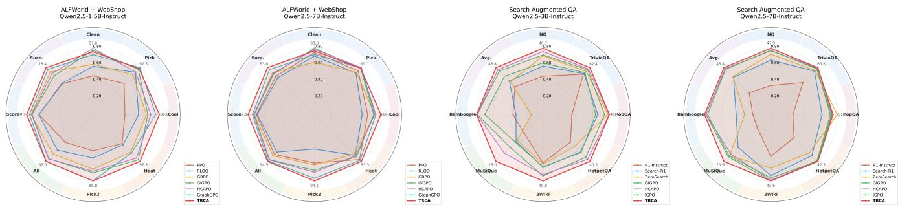  
Figure 6: Performance profiles of TRCA and representative baselines across model scales. The first two panels summarize ALFWorld subtask success rates and WebShop task score and success rate, while the last two panels summarize performance on seven search-augmented QA benchmarks and their average. Values are scaled to [0, 1] for visualization.

Table 6: Observable context information used to define comparable decision contexts.
<table><tr><td>Benchmark</td><td>Comparable-context information</td></tr><tr><td>ALFWorld</td><td>Task predicates, object state, inventory, object location, and interaction stage.</td></tr><tr><td>WebShop</td><td>Page type, product identity, selected options, product attributes, and navigation stage.</td></tr><tr><td>SearchQA</td><td>Tool type, retrieval stage, query state, evidence stage, and answer-submission stage.</td></tr></table>

## F.5 Baseline Configuration and Comparison Protocol

The main experiments compare TRCA with closed-source prompting baselines, prompting-based agents, and RL train- ing methods. The closed-source baselines are GPT-4o and Gemini-2.5-Pro. Prompting-based agents include Qwen2.5, ReAct, and Reflexion. RL baselines for ALFWorld and WebShop include PPO, RLOO, GRPO, GiGPO, HCAPO, and GraphGPO. For SearchQA, the compared methods are R1-Instruct, Search-R1, ZeroSearch, StepSearch, GiGPO, HCAPO, IGPO, and TRCA. For SearchQA, we follow the training and evaluation protocol of GiGPO. For ALFWorld and WebShop, we evaluate all methods under the Qwen2.5- 1.5B-Instruct and Qwen2.5-7B-Instruct settings.

## F.6 Sample-Eficiency Evaluation Protocol

Figure 4 reports sample eficiency on the ALFWorld Pick\_two and Pick\_cool subtasks using Qwen2.5-1.5B-Instruct. The counting unit is a sampled trajectory, i.e., a complete rollout. In general,

$$
N _ { \mathrm { t r a j } } = N _ { \mathrm { i t e r a t i o n s } } \times N _ { \mathrm { t a s k s / i t e r a t i o n } } \times N _ { \mathrm { r o l l o u t s / t a s k } } .\tag{61}
$$

We count each completed rollout as one sampled trajectory. The reported aggregate budgets are 1.92K, 3.84K, and 6.40K sampled trajectories over the complete evaluation process.

In addition to the subtask-level comparison reported in the main text, Figure 7 presents the aggregate sample-eficiency results on ALFWorld and WebShop under matched rollout budgets. TRCA consistently achieves higher success rates than GRPO across all reported budgets, with gains of up to 19.5 percentage points on ALFWorld and 18.8 percentage points on WebShop. The performance gap emerges early and remains visible as the sampling budget increases, show- ing that transition-wise rubric rewards extract more efective supervision from the same amount of agent–environment in- teraction. At 1.92K sampled trajectories, TRCA improves Pick\_two success rate from 11.5% to 34.6% and Pick\_cool success rate from 15.0% to 24.0% relative to GRPO un- der the same budget. On Pick\_two, TRCA reaches 69.2% success rate with 3.84K trajectories, exceeding the 46.7% achieved by GRPO with 6.40K trajectories. On Pick\_cool, TRCA reaches 53.8% with 3.84K trajectories, approaching the 57.7% GRPO result at 6.40K trajectories. The statement that TRCA uses 40% fewer samples follows from

$$
1 - { \frac { 3 . 8 4 \mathrm { K } } { 6 . 4 0 \mathrm { K } } } = 0 . 4 0 .
$$

## F.7 Random Seeds and Reporting

Results on ALFWorld and WebShop are averaged over three random seeds. Table 1 shows the standard deviation of the results from three runs. Figure 8 further reports the train- ing and validation success rates of TRCA on ALFWorld and WebShop. In both environments, the validation curves gen- erally follow the improvement of the corresponding training curves, without pronounced divergence during optimization. This agreement provides a qualitative check that observed training gains are reflected in evaluation performance.

Experiments are conducted on four NVIDIA A800 80GB GPUs. The method itself does not require online LLM- judge inference for rubric evaluation during policy training. Benchmark-level operator libraries are constructed once ofline; deterministic task binders then instantiate task- grounded rubric items, and transition judgments are com-puted from observable environment feedback without addi- tional LLM calls. This distinguishes TRCA training from the diagnostic study, where human annotation and a frontier LLM judge are used only to analyze the motivating regime.

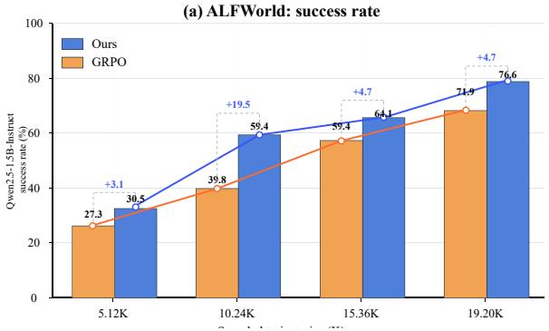

(b) WebShop: success rate  
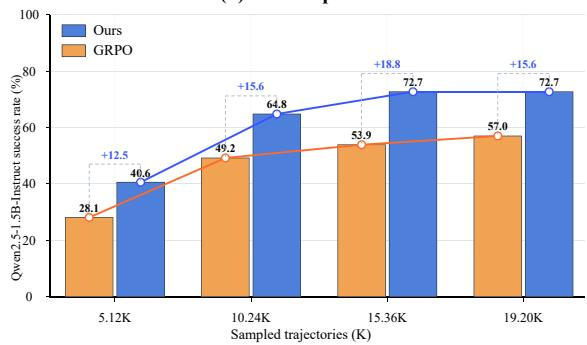  
Figure 7: Sample-eficiency comparison between TRCA and GRPO on ALFWorld and WebShop using Qwen2.5- 1.5B-Instruct. TRCA consistently outperforms GRPO across sampled-trajectory budgets, showing stronger sample efi-ciency under identical interaction and optimization settings.

To examine whether the optimization gains transfer from the sampled training tasks to held-out evaluation tasks, Fig- ure 9 compares the training and validation success-rate tra- jectories of TRCA and GRPO throughout optimization. In Figure 9(a), TRCA exhibits a pronounced early-stage advantage on ALFWorld. Its training and validation performance rises rapidly within the first several dozen updates, reaching a high-success regime substantially earlier than GRPO. By contrast, GRPO remains near the low-performance region during the initial stage and improves only gradually after- ward. Although the training curves of both methods contain stochastic fluctuations, the validation trajectory of TRCA re-mains consistently above that of GRPO over most of the training process, indicating both faster convergence and a higher held-out performance level. The gap persists into the later stage, where TRCA maintains success rates around the upper performance range, whereas GRPO continues to im- prove more slowly and converges at a lower level.

Figure 9(b) shows a similar, though more gradual, pattern on WebShop. The two methods begin from compa- rable low success rates and improve steadily during early optimization. After approximately the first third of training, however, TRCA begins to establish a persistent advantage in both the training and validation curves. This advantage be- comes clearer during the middle and late stages, where TRCA generally reaches higher success rates and retains a stronger validation trajectory despite occasional step-level fluctuations. In both panels, the validation curves closely follow the overall trends of their corresponding training curves without persistent divergence. These results suggest that TRCA not only learns more rapidly from the sampled rollouts, but also achieves stronger final success rates and more stable behav- ior than GRPO. The consistent ordering between training and held-out performance further indicates that the optimization gains are not confined to the sampled training instances, but transfer reliably to unseen evaluation tasks.

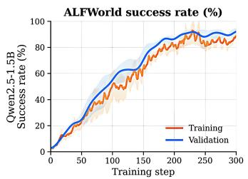

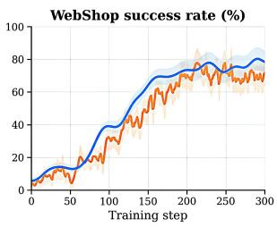

Figure 8: Training and validation success rates of TRCA on ALFWorld and WebShop.  
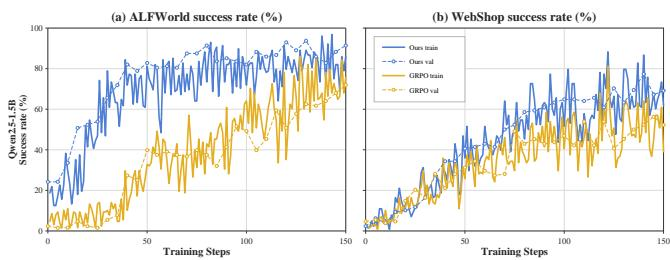  
Figure 9: Training and validation success rates of TRCA and GRPO on WebShop and ALFWorld. TRCA converges faster and achieves stronger performance, on ALFWorld.

## G Rubric Generation Prompt and Complete Libraries

Before policy training, an LLM is invoked once for each benchmark to construct a shared rubric operator library. The prompt specifies five deterministic Boolean operators for each of three categories: Evidence, which detects newly re- vealed task-relevant information; Invalidity, which detects malformed, rejected, repeated, or otherwise unexecutable actions; and Execution, which detects accepted task-required operations, achieved subgoals, or satisfied intermediate con- ditions. Each operator specifies the observable facts it reads and an exact Boolean activation condition based only on the task instruction and the action-induced transition. Miss- ing, ambiguous, or unsupported observable evidence pro- duces a zero judgment. Successful trajectories, terminal out-comes, future states, and ground-truth answers are not used to evaluate intermediate transitions. The resulting operator library is shared across all task instances within the same benchmark, while task-specific entities, attributes, relations, and constraints are supplied through deterministic parameter binding. Once these bindings are established, the grounded operators are applied deterministically to every transition during rollout collection and policy optimization without fur- ther LLM calls. This design also keeps the overall evaluation procedure consistent and reproducible across task instances.

  
Figure 10: Prompt templates used for ALFWorld, WebShop, and search-augmented QA agents.

# Case Study of ALFWorld

## Task. In ALFWorld, find two pencils and put them in a drawer.

## Success Condition. Two distinct pencils are placed in the same drawer.

## Rubrics

<EVIDENCE> A post-transition observation newly contains an object ID matching pencil [0-9]+ with a current-location field.   
<EVIDENCE> A post-transition observation newly contains a second pencil [0-9]+ ID different from the first discovered pencil ID.   
<EVIDENCE> The current observation or location string contains an available drawer [0-9]+ ID that can bind the target receptacle.   
<EVIDENCE> After the first placement, the selected drawer observation contains the first placed pencil ID.   
<EVIDENCE> A revisited searched location contains no uncollected object ID matching pencil [0-9]+ after excluding held or already placed pencils.   
<INVALIDITY> The action string fails the ALFWorld parser patterns go to <object>, take <object> from <receptacle>, move <object> to <receptacle>, open <object>, close <object>, heat <object> with <object>, cool <object> with <object>, clean <object> with <object>, or examine <object>.   
<INVALIDITY> At least one referenced object or receptacle ID is absent from the current observation object list or admissible-action set.   
<INVALIDITY> A rule precondition is false: go target not reachable; take object not at source; move object not in inventory; or destination receptacle unavailable.   
<INVALIDITY> The environment returns an explicit failure string, rejection status, or exception for the attempted operation.   
<INVALIDITY> The normalized action equals the previous action under the same normalized observation/inventory signature, or an action expected to change location/inventory/object placement leaves those fields unchanged.   
<EXECUTION> An accepted go to <location> changes current\_location to an ID in the bound candidate set {desk 1, sidetable 1, drawer 1}.   
<EXECUTION> An accepted take action adds the first discovered pencil ID to inventory.   
<EXECUTION> An accepted move action changes location(first\_pencil\_id) from inventory to selected\_drawer\_id.   
<EXECUTION> An accepted take action adds a second discovered pencil ID, different from the first, to inventory.   
<EXECUTION> An accepted move action changes location(second\_pencil\_id) from inventory to selected\_drawer\_id while first\_pencil\_id is also in selected\_drawer\_id.

## Environment (ALFWorld, Step 1)

-= Welcome to TextWorld, ALFRED! =-

You are in the middle of a room. Looking quickly around you, you see a bed 1, a desk 1, a drawer 2, a drawer 1, a garbagecan 1, a shelf 1, and a sidetable 1.

Your task is to: find two pencil and put them in drawer.

## Response (ALFWorld, Step 1)

Agent response recorded in rollout:

<action>go to desk 1</action>

## Transition Judgment (ALFWorld, Step 1)

Transition alignment. This judgment uses the navigation action and the next observation at desk 1.   
Evidence: +1, the post-transition observation newly contains pencil 2 with current location desk 1.   
Invalidity: 0, desk 1 is visible and the navigation action is parseable and accepted.   
Execution: +1, current\_location changes to desk 1, which is in the bound candidate set.   
Dimension score: +2

## Environment (ALFWorld, Step 2)

You arrive at desk 1. On the desk 1, you see a bowl 1, a cd 1, a desklamp 1, a houseplant 1, a laptop 1, and a pencil 2.

## Response (ALFWorld, Step 2)

Agent response recorded in rollout:

<action>take pencil 2 from desk 1</action>

## Transition Judgment (ALFWorld, Step 2)

Transition alignment. This judgment uses the take action and the resulting inventory/state update.

Evidence: +0, no new pencil [0-9]+ ID appears after the take transition.

Invalidity: 0, pencil 2 is available on desk 1 and the take action is accepted.

Execution: +1, inventory gains pencil 2.

Dimension score: +1

## Environment (ALFWorld, Step 3)

You pick up the pencil 2 from the desk 1.

## Response (ALFWorld, Step 3)

Agent response recorded in rollout: <action>go to drawer 1</action>

## Transition Judgment (ALFWorld, Step 3)

Transition alignment. This judgment uses the navigation action and the next observation at drawer 1.   
Evidence: +1, the observation/current location contains drawer 1 as an available receptacle ID.   
Invalidity: 0, drawer 1 is a known reachable object and the navigation action is accepted.   
Execution: +1, current\_location changes to drawer 1, which is in the bound candidate set.   
Dimension score: +2

## Environment (ALFWorld, Step 4)

You arrive at drawer 1. On the drawer 1, you see a creditcard 3, a creditcard 1, and a keychain 2.

## Response (ALFWorld, Step 4)

Agent response recorded in rollout: <action>move pencil 2 to drawer 1</action>

## Transition Judgment (ALFWorld, Step 4)

Transition alignment. This judgment uses the placement action and the resulting drawer state.   
Evidence: +0, no new pencil [0-9]+ ID or new drawer [0-9]+ ID appears.   
Invalidity: 0, the agent holds pencil 2, drawer 1 exists, and the move action is accepted.   
Execution: +1, location(pencil 2) changes from inventory to drawer 1.   
Dimension score: +1

## Environment (ALFWorld, Step 5)

You move the pencil 2 to the drawer 1.

## Response (ALFWorld, Step 5)

Agent response recorded in rollout: <action>go to desk 1</action>

## Transition Judgment (ALFWorld, Step 5)

Transition alignment. This judgment uses the return navigation and the desk observation.   
Evidence: +1, the desk 1 observation contains no uncollected pencil [0-9]+ after excluding pencil 2.   
Invalidity: 0, the navigation action is parseable and accepted.   
Execution: +0, current\_location changes but no inventory gain or placement for a second pencil occurs.   
Dimension score: +1

## Environment (ALFWorld, Step 6)

You arrive at desk 1. On the desk 1, you see a bowl 1, a cd 1, a desklamp 1, a houseplant 1, and a laptop 1.

## Response (ALFWorld, Step 6)

Agent response recorded in rollout: <action>go to sidetable 1</action>

## Transition Judgment (ALFWorld, Step 6)

Transition alignment. This judgment uses the navigation action and the next observation at sidetable 1.   
Evidence: +1, the post-transition observation newly contains pencil 4 and pencil 3 at sidetable 1.   
Invalidity: 0, sidetable 1 is visible and the navigation action is accepted.   
Execution: +1, current\_location changes to sidetable 1, which is in the bound candidate set.   
Dimension score: +2

## Environment (ALFWorld, Step 7)

You arrive at sidetable 1. On the sidetable 1, you see an alarmclock 1, a pen 1, a pencil 4, and a pencil 3.

## Response (ALFWorld, Step 7)

Agent response recorded in rollout: <action>take pencil 4 from sidetable 1</action>

## Transition Judgment (ALFWorld, Step 7)

Transition alignment. This judgment uses the take action and the resulting inventory/state update.   
Evidence: +0, no new pencil [0-9]+ ID appears after the take transition.   
Invalidity: 0, pencil 4 is available on sidetable 1 and can be taken.   
Execution: +1, inventory gains pencil 4, whose ID differs from pencil 2.   
Dimension score: +1

## Environment (ALFWorld, Step 8)

You pick up the pencil 4 from the sidetable 1.

## Response (ALFWorld, Step 8)

Agent response recorded in rollout: <action>go to drawer 1</action>

## Transition Judgment (ALFWorld, Step 8)

Transition alignment. This judgment uses the navigation action and the next observation at drawer 1.   
Evidence: +1, the drawer 1 observation contains pencil 2 after the first placement.   
Invalidity: 0, drawer 1 remains reachable and the navigation action is accepted.   
Execution: +1, current\_location changes to drawer 1, the selected\_drawer\_id.   
Dimension score: +2

## Environment (ALFWorld, Step 9)

You arrive at drawer 1. On the drawer 1, you see a creditcard 3, a creditcard 1, a keychain 2, and a pencil 2.

## Response (ALFWorld, Step 9)

Agent response recorded in rollout: <action>move pencil 4 to drawer 1</action>

## Transition Judgment (ALFWorld, Step 9)

Transition alignment. This judgment uses the final placement action and task-completion feedback.   
Evidence: +0, no new pencil [0-9]+ ID, drawer [0-9]+ ID, or eliminated location appears.   
Invalidity: 0, the agent holds pencil 4, drawer 1 exists, and the move action is accepted.   
Execution: +1, location(pencil 4) changes from inventory to drawer 1 while pencil 2 remains in drawer 1.   
Dimension score: +1

## Environment (Final)

You move the pencil 4 to the drawer 1. The task is completed: two distinct pencils are now in drawer 1.

## Case Summary

Evidence-positive transitions: 5 / 9   
Invalidity-triggered transitions: 0 / 9   
Execution-positive transitions: 8 / 9

# Case Study of SearchQA

Task. In SearchQA, answer the question: Who wrote the novel Pride and Prejudice?

Success Condition. The agent retrieves supporting evidence and submits a final answer that is evaluated separately by the environment using normalized Exact Match.

## Rubric

<EVIDENCE> A successful search reveals at least one previously unseen result ID.

<EVIDENCE> A returned result title or snippet contains the bound target entity or directly relevant query terms.

<EVIDENCE> Opening a result reveals a source or passage relevant to the bound target entity and requested relation.

<EVIDENCE> A read passage contains an explicit subject--relation--object statement relevant to the question.

<EVIDENCE> A newly observed passage provides additional supporting evidence or reduces ambiguity among candidate answers.

<INVALIDITY> The action fails the SearchQA parser patterns search[<query>], open[<result\_id>], read[<passage\_id>], or answer[<text>].

<INVALIDITY> The referenced result ID, passage ID, or tool is not available in the current observation or admissible-action set.

<INVALIDITY> An action precondition is not satisfied: open requires a visible result ID, read requires an opened result and a visible passage ID, and answer requires previously retrieved task-relevant evidence.

<INVALIDITY> The environment returns an explicit rejection, error, or exception for the attempted tool call.

<INVALIDITY> The action repeats the previous action under the same observable state, or an action expected to update the search, opened-result, passage, or answer state produces no observable change.

<EXECUTION> An accepted search action changes the result set from empty to non-empty.

<EXECUTION> An accepted open action selects an available result relevant to the bound target entity or relation.

<EXECUTION> An accepted read action exposes a task-relevant passage.

<EXECUTION> The retrieved passage establishes an explicit fact matching the bound target entity and requested relation.

<EXECUTION> A well-formed answer is submitted after task-relevant supporting evidence has been retrieved.

## Prompt (SearchQA, Step 1)

Question: Who wrote the novel Pride and Prejudice?

Current observation: SearchQA start page.

Available tools: search[<query>].

Your admissible actions are: search[<query>].

## Response (SearchQA, Step 1)

<think>I should search for the title and author relation.</think>

<action>search[Pride and Prejudice author]</action>

## Transition Judgment (SearchQA, Step 1)

Transition alignment. This judgment uses the search action and the resulting search-results page.

Evidence: +1, the post-search observation newly contains result IDs [1], [2], and [3].

Invalidity: 0, search[...] is parseable, admissible, and accepted.

Execution: +1, the search action changes the result set from empty to non-empty.

Newly covered operators: Evidence-search and Execution-search.

Activated dimensions: Evidence and Execution.

## Prompt (SearchQA, Step 2)

Search results for: Pride and Prejudice author

[1] Pride and Prejudice - encyclopedia entry. Snippet: Pride and Prejudice is an 1813 novel of manners by Jane Austen.

[2] Jane Austen bibliography. Snippet: Austen's novels include Pride and Prejudice.

[3] Pride and Prejudice film adaptation. Snippet: Film cast and release information.

Your admissible actions are: open[1], open[2], open[3], search[<query>].

## Response (SearchQA, Step 2)

<think>Result 1 directly names the work and appears to contain the author statement.</think> <action>open[1]</action>

## Transition Judgment (SearchQA, Step 2)

Transition alignment. This judgment uses the selected result ID and the resulting opened page.

Evidence: +1, the opened result contains the bound target entity Pride and Prejudice and is relevant to the requested authorship relation.

Invalidity: 0, result ID [1] is available in the current result list and open[1] is accepted.

Execution: +1, the action changes the state from the search-results page to an opened relevant result.

Newly covered operators: Evidence-relevant-result and Execution-open.

Activated dimensions: Evidence and Execution.

## Prompt (SearchQA, Step 3)

Opened result [1]: Pride and Prejudice.

Available passages:

[1] Pride and Prejudice is an 1813 novel of manners by Jane Austen.

[2] The story follows Elizabeth Bennet and Fitzwilliam Darcy.

Your admissible actions are: read[1], read[2], open[2], search[<query>].

## Response (SearchQA, Step 3)

<think>Passage 1 contains the author statement, so I should read it as supporting evidence.</think> <action>read[1]</action>

## Transition Judgment (SearchQA, Step 3)

Transition alignment. This judgment uses the read action and the retrieved passage content.   
Evidence: +1, the passage contains an explicit statement that connects the bound target entity Pride and Prejudice with the requested relation written by.   
Invalidity: 0, passage ID [1] is visible after opening result [1], and read[1] is accepted.   
Execution: +1, the read action exposes a task-relevant supporting fact that can be used to answer the question.   
Newly covered operators: Evidence-explicit-relation, Execution-read, and Execution-support.   
Activated dimensions: Evidence and Execution.

## Prompt (SearchQA, Step 4)

Current evidence passage: Pride and Prejudice is an 1813 novel of manners by Jane Austen.

Question: Who wrote the novel Pride and Prejudice?

Your admissible actions are: answer[<final answer>], read[2], open[2], search[<query>].

## Response (SearchQA, Step 4)

<think>The passage directly supports Jane Austen as the author.</think>

<action>answer[Jane Austen]</action>

## Transition Judgment (SearchQA, Step 4)

Transition alignment. This judgment uses the answer action and the resulting terminal environment feedback.

Evidence: 0, submitting an answer does not reveal additional external evidence.

Invalidity: 0, answer[...] is well formed, admissible, and issued after task-relevant supporting evidence has been retrieved.

Execution: +1, a well-formed answer is submitted after the supporting passage has been read.

Newly covered operators: Execution-answer.

Activated dimensions: Execution.

Terminal outcome: evaluated separately by the environment using normalized Exact Match.

## Terminal Outcome

Final environment feedback: correct.

The environment evaluates the submitted answer separately using normalized Exact Match.

## Case Summary

Evidence-positive transitions: 3 / 4

Invalidity-triggered transitions: 0 / 4

Execution-positive transitions: 4 / 4

# Case Study of WebShop

Task. Find me machine wash men's dress shirts with polyester heathers, heathers cotton, cotton heather, needle sleeve, classic fit, color: navy, fit type: men, size: x-large, and price lower than 50.00 dollars

Success Condition. The purchased product satisfies all bound product, option, and price constraints.

Rubrics   
<EVIDENCE> The current search-results page introduces at least one previously unseen product ID.   
<EVIDENCE> The current product page exposes structured product-type and fit-type fields equal to "men's dress shirt" and "men".   
<EVIDENCE> The current product page exposes a structured fabric or material value equal to one of {"polyester heathers", "heathers cotton", "cotton heather"}   
<EVIDENCE> The current product page or option set exposes sleeve="needle sleeve", fit="classic fit", color="navy", and size="x-large".   
<EVIDENCE> The displayed numeric price of the current product is lower than 50.00 dollars.   
<INVALIDITY> The action cannot be parsed under the WebShop action grammar for search[...] or click[...].   
<INVALIDITY> The referenced product ID, button, option value, or interface operation is absent from the current DOM or admissible-action set.   
<INVALIDITY> At least one observable precondition defined by the WebShop action schema is not satisfied in the current page state.   
<INVALIDITY> The environment returns an explicit rejection or failure signal for the attempted operation.   
<INVALIDITY> The normalized action repeats the previous action under the same page-state signature, or an operation expected to update the page leaves relevant   
state unchanged.   
<EXECUTION> The environment accepts a search action and the resulting page contains at least one product ID.   
<EXECUTION> The selected product ID changes from unset to a product whose structured product-type, fit-type, fabric, and price fields satisfy the bound task   
constraints.   
<EXECUTION> The selected color option changes to "navy".   
<EXECUTION> The selected size option changes to "x-large".   
<EXECUTION> The environment accepts click[Buy Now] while all bound product, option, and price constraints are satisfied.

## Scoring convention. Evidence and Execution contribute +1 when at least one corresponding item is satisfied at a transition and 0 otherwise. Invalidity contributes -1 when at least one invalidity item is triggered and 0 otherwise; it provides no positive reward. All per-transition 0/1 judgments below are deterministic operator outputs from WebShop canonical facts; no LLM judge is used for scoring.

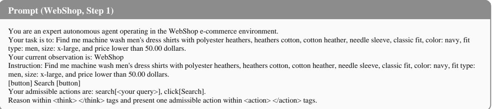

## Response (WebShop, Step 1)

<think>I should search using the strongest product, fabric, color, size, and price constraints.</think>

<action>search[men's dress shirt cotton heather navy x-large classic fit under 50]</action>

## Transition Judgment (WebShop, Step 1)

Transition alignment. This judgment uses the Step 1 search action and the resulting search-results page shown in Step 2.   
Evidence: +1, the resulting page introduces multiple product IDs not seen before.   
Invalidity: 0, search[...] is parseable and accepted.   
Execution: +1, the accepted search action returns a page containing product IDs.   
Dimension score: +2

## Prompt (WebShop, Step 2)

Your current observation is: Search results for men's dress shirt cotton heather navy x-large classic fit under 50. [B07CHNVYXL] Arrow 1851 Men's Classic Fit Cotton Heather Dress Shirt - Navy - \$39.99   
[B08GRAYREG] Van Heusen Men's Regular Fit Dress Shirt - Gray - \$45.50   
[B09BLACKL] Oxford Cotton Men's Dress Shirt - Black - \$32.99   
Your admissible actions are: click[B07CHNVYXL], click[B08GRAYREG], click[B09BLACKL], search[<your query>].

## Response (WebShop, Step 2)

<think>The first result already matches navy, cotton heather, classic fit, x-large availability, and the price limit.</think> <action>click[B07CHNVYXL]</action>

## Transition Judgment (WebShop, Step 2)

Transition alignment. This judgment uses the selected product action and the product-detail page exposed after the click.   
Evidence: +1, the product page exposes product type, fit type, fabric, option set, and price fields.   
Invalidity: 0, product ID B07CHNVYXL is present in the current result DOM.   
Execution: +1, the selected product changes from unset to a product satisfying the core product constraints.   
Dimension score: +2

## Prompt (WebShop, Step 3)

Your current observation is: Product page B07CHNVYXL.

Title: Arrow 1851 Men's Classic Fit Cotton Heather Dress Shirt.

Product type: men's dress shirt. Fit type: men. Fabric: cotton heather. Fit: classic fit. Sleeve: needle sleeve.

Color options: white, black, navy. Size options: medium, large, x-large.

Selected options: color unset, size unset.

Your admissible actions are: click[white], click[black], click[navy], click[medium], click[large], click[x-large], click[Back to Search].

## Response (WebShop, Step 3)

<think>The task requires navy, so I should select the navy color option before buying.</think> <action>click[navy]</action>

## Transition Judgment (WebShop, Step 3)

Transition alignment. This judgment uses the color-option action and the updated selected-options state.

Evidence: +1, the option set explicitly contains the required navy color.

Invalidity: 0, click[navy] refers to an available color option.

Execution: +1, the selected color changes from unset to navy.

Dimension score: +2

## Prompt (WebShop, Step 4)

Your current observation is: Product page B07CHNVYXL.

Selected options: color navy, size unset.

Available size options: medium, large, x-large.

The product remains priced at \$39.99 and satisfies men's dress shirt, men fit type, cotton heather, classic fit, and needle sleeve.   
Your admissible actions are: click[medium], click[large], click[x-large], click[Back to Search].

## Response (WebShop, Step 4)

<think>The required size is x-large, and it is available on the current page.</think>

<action>click[x-large]</action>

## Transition Judgment (WebShop, Step 4)

## Transition alignment. This judgment uses the size-option action and the updated selected-options state.

Evidence: +0, the required size option was already visible in the current observation.

Invalidity: 0, click[x-large] refers to an available size option.

Execution: +1, the selected size changes from unset to x-large.

Dimension score: +1

## Prompt (WebShop, Step 5)

Your current observation is: Product page B07CHNVYXL.

Selected options: color navy, size x-large.

Verified attributes: machine wash, men's dress shirt, fit type men, cotton heather fabric, needle sleeve, classic fit.

Displayed price: \$39.99, which is lower than 50.00 dollars.

[button] Buy Now [button]

Your admissible actions are: click[Buy Now], click[Back to Search], click[navy], click[x-large].

## Response (WebShop, Step 5)

<think>All product, option, and price constraints are satisfied, so I can purchase this item.</think>

<action>click[Buy Now]</action>

## Transition Judgment (WebShop, Step 5)

Transition alignment. This judgment uses the purchase action and the final success feedback.

Evidence: +1, the state confirms all bound attributes, selected options, and price before purchase.

Invalidity: 0, the Buy Now button is available and all observable preconditions are satisfied.

Execution: +1, the environment accepts the purchase while all constraints are satisfied.

Dimension score: +2

## Environment (Final)

Final environment feedback: Your score is 1.0. The purchased product satisfies all bound product, option, and price constraints.

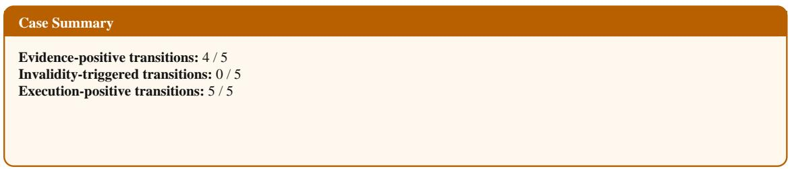

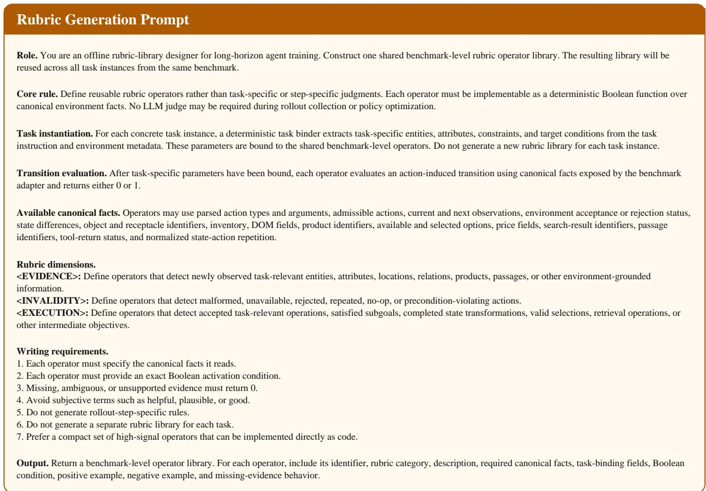  
Figure 11: Prompt used to construct the shared benchmark-level rubric operator library. The generated library defines reusable deterministic operators; task-specific entities and constraints are subsequently bound to these operators without additional LLM generation.