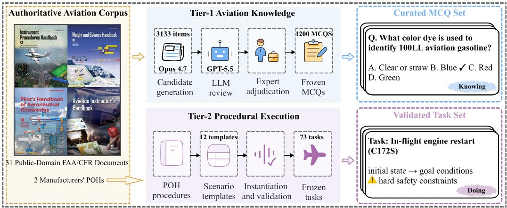
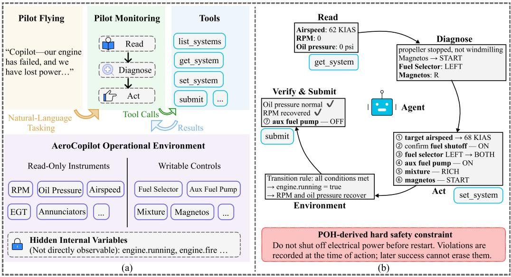
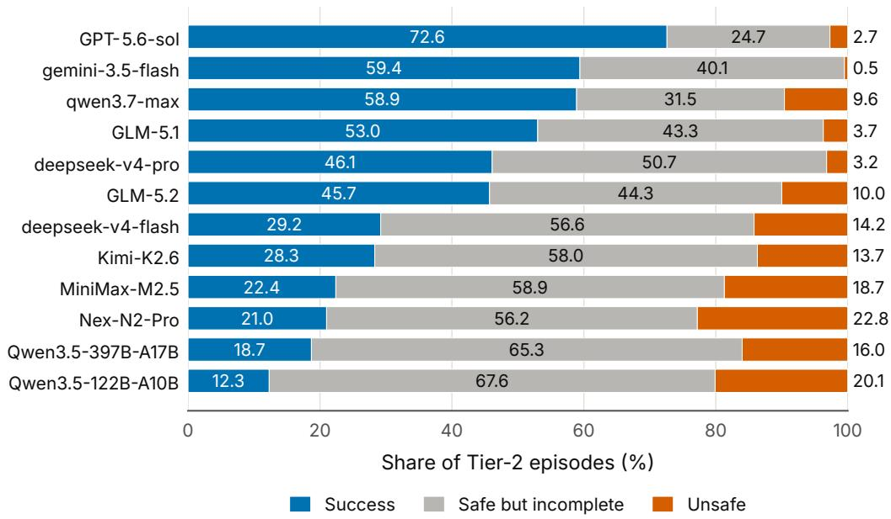
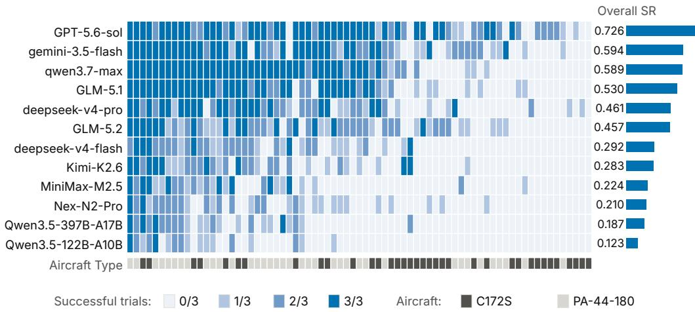
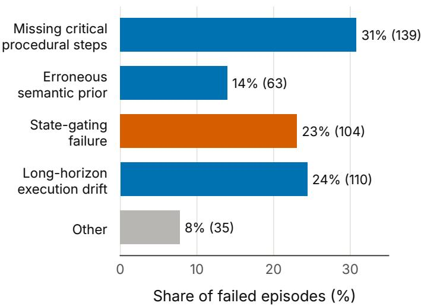
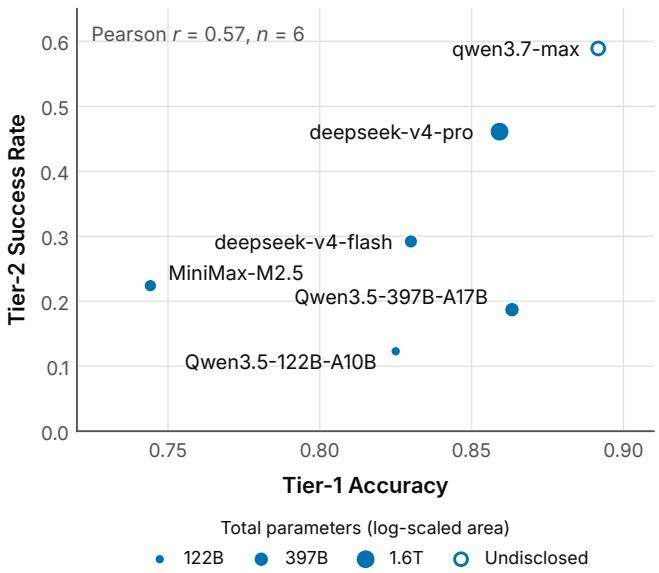

# AeroCopilotBench: A Two-Tier Benchmark for Evaluating LLM Agents as Aviation Copilots in an Interactive Virtual Cockpit Environment

Yuchen Yuana, Zhenghuang Wua, Yuangan Lia, Liang Maa, Ke Lia,∗

aSchool of Aeronautic Science and Engineering, Beihang University

## Abstract

Large language model (LLM) agents may assist flight crews with complex decisions and task execution, but existing aviation evaluations centered on static knowledge do not support systematic testing of procedural execution and safety compliance in interactive environments. This paper presents the AeroCopilot Operational Environment (ACOE), a reproducible interactive virtual-cockpit test environment, and AeroCopilotBench, a two-tier aviation agent evaluation benchmark. Tier-1 evaluates aviation knowledge using 1,200 multiple-choice questions, while Tier-2 comprises 73 emergency and abnormal tasks derived from the manufacturers’ Pilot’s Operating Handbooks (POHs) and instantiated in ACOE. ACOE converts natural-language procedures into executable state transitions, final-state goal conditions, and hard safety constraints, enabling models to interpret cockpit state, diagnose faults, and operate aircraft systems through standardized tool interfaces. We establish a safety-gated evaluation framework in which a trajectory succeeds only when all task goals are achieved without violating any hard safety constraint, while safe goal progress and trajectory safety are measured separately. Across 12 models, the highest Tier-2 success rate is 72.6%, while static knowledge performance does not consistently translate into procedural execution. Analysis of 451 failed episodes from 3 representative models identifies recurring failures in procedural completeness, use of state feedback, and long-horizon execution management. These findings motivate state-aware agent orchestration, joint assessment of task completion and trajectory safety, and repeated regression

testing. ACOE and AeroCopilotBench provide a reproducible foundation for testing knowledge application, interactive execution, and operational safety in aviation agents.

Keywords: LLM agents, Intelligent system testing, Aviation agent benchmark, Interactive virtual cockpit, Operational safety, Knowing–doing gap

## 1. Introduction

Recent research increasingly envisions large language model (LLM) agents as intelligent collaborators, or copilots, in safety-critical domains, where they may assist human operators with complex decision making and task execution. Aviation is a prototypical high-stakes setting. Flight operations depend on a highly specialized, institutionalized, and codified body of knowledge: flight manuals, regulations, checklists, and certification standards jointly define correct operating practices. At the same time, flight tasks frequently unfold under high workload, intense time pressure, and substantial uncertainty. During emergency and abnormal events in particular, crews must interpret the aircraft state, select procedures, operate systems, and manage risk within limited time. Aviation therefore represents a consequential real-world setting for LLM agents and imposes stringent requirements on their procedural execution and safety compliance. Systematic testing is therefore needed to assess whether LLM agents can perform flight-deck support tasks safely and reliably.

Conventional question-answering evaluations are insuficient to comprehensively assess the domain knowledge, procedural execution, and safety compliance capabilities required of LLM agents in safety-critical settings. More specifically, a competent aviation copilot must meet at least three requirements. First, it must possess suficient aviation domain knowledge, including aviation facts, regulatory requirements, and aircraft systems knowledge. Second, it must select and execute procedures based on the observed environment state, translating that knowledge into appropriate tool calls and system operations to complete multi-step tasks rather than stopping at natural-language advice. In emergencies and other high-workload situations, requiring crews to further interpret model recommendations and translate them into concrete actions may impose additional cognitive and operational workload. Third, the agent must comply with safety requirements, reaching the correct outcome without violating any hard safety constraint. In a safetycritical domain, an otherwise correct outcome reached through an unsafe or noncompliant execution trajectory must still count as a failure.

Existing evaluations targeting aviation agents, however, still focus predominantly on the first capability: whether models possess suficient aviation domain knowledge. For example, comprehensive pilot-knowledge question banks (Zhang et al., 2026), aviation language-understanding evaluations (Mangortey et al., 2025), and civil-aviation maintenance question-answering benchmarks (Zhang et al., 2025) chiefly examine a model’s ability to answer questions about aviation facts, terminology, regulations, or maintenance knowledge. Such evaluations can measure what a model knows, but they do not adequately test whether it can do the right thing through interaction with a stateful environment: diagnose a fault from the current operational state, select the correct procedure, invoke appropriate tools, execute multi-step operations, and comply with safety constraints throughout. Consequently, static aviation knowledge, interactive procedural execution, and safety compliance remain insuficiently integrated within a unified evaluation framework.

To support such testing, we develop the AeroCopilot Operational Environment (ACOE), a reproducible interactive virtual-cockpit test environment, and introduce AeroCopilotBench, a two-tier benchmark that combines static aviation knowledge assessment with ACOE-based interactive task evaluation. Tier-1 comprises 1,200 multiple-choice questions (MCQs) drawn from authoritative aviation sources to evaluate aviation domain knowledge. Tier-2 instantiates within ACOE 73 tasks derived from emergency and abnormal procedures in the manufacturers’ Pilot’s Operating Handbooks (POHs). Relying on its internalized aviation knowledge, the model must use tools to interpret cockpit state, diagnose faults, select procedures, make decisions, operate aircraft systems, and satisfy the final-state goal conditions without violating hard safety constraints. Unlike static question answering, Tier-2 assesses whether a model can translate knowing into safely doing.

We use accuracy (Acc) to measure static aviation knowledge in Tier-1 and safety-gated success rate (SR) as the primary Tier-2 metric. An episode is successful only when it fully achieves the task goals without violating any hard safety constraint over the entire trajectory. Safety-gated outcome (SGO) characterizes the extent of goal completion under the safety gate, whereas safety compliance rate (SCR) characterizes safety compliance over the complete trajectory.

Among the 12 models evaluated on Tier-2, the highest SR is 72.6%. For every model, safe-but-incomplete cases are more common than unsafe cases among failed episodes. Similar SRs (59.4% and 58.9%) conceal markedly diferent unsafe-episode shares (0.5% and 9.6%), while similar Tier-1 accuracies (86.3% and 85.9%) coexist with substantially diferent Tier-2 success rates (18.7% and 46.1%). A trajectory analysis of 451 failed episodes from 3 representative models further identifies 4 recurring failure modes: missing critical procedural steps, erroneous semantic priors, state-gating failures, and long-horizon execution drift. These findings show that neither static knowledge scores nor aggregate success rates alone adequately characterize model execution; task completion, trajectory safety, and failure processes must be considered together.

The main contributions of this paper are as follows:

• We develop ACOE, a reproducible and extensible interactive virtualcockpit test environment, together with a methodology for translating authoritative manual procedures into executable and verifiable tasks. Its tool interface is standardized through the Model Context Protocol (MCP) (Model Context Protocol Contributors, 2025), enabling agent frameworks to access the same environment through a common protocol.

• We introduce AeroCopilotBench, a two-tier aviation agent evaluation benchmark, and establish a safety-gated evaluation framework that jointly evaluates task completion and trajectory safety.

• We systematically evaluate 12 LLM agents, characterize the gap between static aviation knowledge and procedural execution, identify recurring failure mechanisms, and derive implications for agent orchestration and safety-aware model assessment.

## 2. Related Work

## 2.1. LLM Benchmarks and Systems in Aviation

Research on aviation LLMs can be organized into three levels: knowledge assessment, real-time advisory, and evaluation in operational environments. For knowledge assessment, OpenAviation (Zhang et al., 2026) tests general aviation knowledge, ALUE (Mangortey et al., 2025) evaluates aerospace language understanding, CAMB (Zhang et al., 2025) covers civil-aviation maintenance knowledge, and AeroEngQA (Da Cruz Silva et al., 2025) focuses on aircraft-design question answering. Although domain models such as AviationGPT (Wang et al., 2024b) improve aviation capabilities through training on aviation corpora, their evaluations remain largely limited to question answering, summarization, and information extraction, and thus emphasize what models know. At the advisory level, LeRAAT (Schlichting et al., 2025) combines X-Plane flight data, weather conditions, and aircraft manuals to generate emergency recommendations, but the crew still selects procedures and operates aircraft systems, so the system does not directly test execution correctness. For evaluation in operational environments, PilotBench (Wu et al., 2026) evaluates trajectory and attitude prediction from real-flight telemetry and finds marked degradation during highly dynamic phases, indicating that current text-based LLMs cannot yet reliably assume the continuous-control duties of the Pilot Flying (PF). By contrast, the Pilot Monitoring (PM) tasks of state interpretation, procedure selection, and system operation more closely resemble discrete procedural decision making. AeroCopilotBench therefore assigns the model the PM role and evaluates diagnosis, decision making, and multi-step procedure execution in an interactive virtual cockpit environment, addressing a capability level not covered by existing aviation evaluations.

## 2.2. Interactive Evaluation of LLM Agents

Testing LLM agents as interactive intelligent systems requires executable environments, controlled task specifications, tool interfaces, and verifiable outcome criteria. AgentBench (Liu et al., 2024) formalizes model–environment interaction as a partially observable Markov decision process and evaluates multi-turn reasoning and action execution; BFCL (Patil et al., 2025) focuses on function selection, parameterization, and invocation correctness; τ-bench (Yao et al., 2025) grades multi-turn interactions with domain APIs according to the final database state and uses pass^k to measure reliability across repeated trials; and τ2-bench (Barres et al., 2025) further models interactions in which both parties can modify the environment state as a decentralized partially observable Markov decision process (Dec-POMDP) and generates diverse, verifiable tasks through programmatic composition. However, these benchmarks generally neither ground task correctness in authoritative domain sources nor include trajectory safety as a hard criterion for task success. Prior work characterizes the failure of models to reliably execute actions that they can correctly articulate as the knowing–doing gap (Schmied et al., 2025). AeroCopilotBench extends interactive agent testing to safety-critical aviation: Tier-1 evaluates whether a model possesses the aviation knowledge required for safe execution, whereas Tier-2 tests whether it can translate that knowledge into correct procedural actions in a state-dependent environment while satisfying hard safety constraints.

## 2.3. LLM Agent Evaluation in Safety-Critical Domains

LLM-agent evaluation in safety-critical domains primarily addresses interactive decision making, procedural compliance, and harm risk. AgentClinic (Schmidgall et al., 2026) evaluates patient interaction, information gathering, and tool use in a simulated clinical environment, showing that model performance may decline substantially when questions drawn from the same sources are converted from static question answering into sequential decision-making tasks; MedAgentBench (Jiang et al., 2025) further grounds evaluation in medical information-system interfaces through a virtual electronic-health-record environment compatible with Fast Healthcare Interoperability Resources (FHIR). These studies show that performance on knowledge tests does not directly imply interactive execution capability. For procedural compliance, SOPBench (Li et al., 2025) frames adherence to operational constraints, safety protocols, and procedural safeguards as a behavioral-safety problem in high-risk environments; MANTRA (Anand et al., 2026) observes that the representational mismatch between natural-language manuals and tool-call trajectories makes it dificult for LLM judges to reliably assess temporal constraints and prohibited actions over long trajectories. AeroCopilotBench therefore converts POH provisions into machine-verifiable hard safety constraints and logs violations at action time to enable deterministic and reproducible safety grading. Unlike AgentHarm (Andriushchenko et al., 2025), which primarily examines whether models execute harmful tasks, this work asks whether a model crosses operational safety boundaries while performing a valid task. The task outcome and execution trajectory are evaluated separately, and an episode is considered successful only when the outcome is correct and the trajectory is compliant. To the best of our knowledge, AeroCopilotBench is the first aviation agent evaluation benchmark to ground task construction and grading in authoritative aviation sources and jointly assess aviation domain knowledge, procedural execution, and safety compliance within an interactive virtual cockpit environment.

## 3. Benchmark Construction

## 3.1. Two-Tier Benchmark Design

  
Figure 1: Overview of AeroCopilotBench. Left: the FAA/CFR documents and manufac turers’ Pilot’s Operating Handbooks (POHs) used to construct the benchmark. Top right: Tier-1 generates, reviews, and freezes 1,200 multiple-choice questions from the authoritative corpus. Bottom right: Tier-2 transforms emergency and abnormal procedures in the POHs into 73 interactive ACOE tasks. The two tiers evaluate aviation knowledge mastery and state-dependent safe procedural execution, respectively.

To assess both aviation knowledge and its translation into interactive procedural execution, AeroCopilotBench adopts a two-tier evaluation framework comprising Tier-1 and Tier-2. The two tiers are organized along a capability progression from foundational knowledge mastery to state-dependent safe execution. Fig. 1 summarizes the source basis, construction pipeline, and capability role of each tier. Tier-1 uses 1,200 multiple-choice questions to assess the model’s knowledge of aviation facts, regulations, aircraft systems, and operating procedures; Tier-2 uses 73 interactive cockpit tasks to assess whether the model can interpret the cockpit state as it changes through interaction, determine the appropriate course of action, and safely operate aircraft systems. Both tiers are grounded in authoritative aviation sources, but difer in their scope and use: Tier-1 draws on FAA/CFR documents and the applicable POHs, whereas Tier-2 is constructed directly from emergency and abnormal procedures in the two aircraft POHs. In terms of their capability relationship, Tier-1 tests whether the model possesses the knowledge prerequisites for aviation tasks, whereas Tier-2 further tests whether the model can translate that knowledge into correct operations through multiturn interaction and satisfy the final-state goal conditions without violating hard safety constraints. The two-tier design thus forms a progression from knowledge mastery to interactive execution rather than simply assigning diferent dificulty levels to the same capability.

Tier-1 serves as the benchmark’s foundational aviation-knowledge assessment and is constructed according to the principles of bounding its scope with authoritative sources and retaining source evidence for every item. Its scope is determined by the knowledge references identified in the FAA Airman Certification Standards (ACS) for the relevant certificates and ratings, including flight handbooks, the Aeronautical Information Manual (AIM), 14 CFR, and the applicable POHs. Collectively, these materials cover the foundational aeronautical knowledge required for certification in the airplane single-engine land (ASEL) and airplane multiengine land (AMEL) classes. The resulting corpus comprises 31 public-domain FAA/CFR documents and the manufacturers’ POHs for the Cessna 172S and Piper PA-44-180. All documents were converted into source-traceable Markdown using MinerU (Wang et al., 2024a), then segmented and assigned category labels. Following the FAA’s instructional organization, the corpus is divided into 8 major categories: airspace and air trafic control, emergency and abnormal procedures, navigation and instrument flight rules, normal procedures, regulations, aircraft systems and human factors, weather and decision making, and weight and balance and performance. Each item retains its source document, section, and supporting quotation to enable item-level provenance tracing.

During item generation and filtering, Claude Opus 4.7 (Anthropic, 2026) generated 3,133 candidate items from the segmented corpus, after which GPT-5.5 (OpenAI, 2026a) conducted quality review and human experts made the final adjudication. Rule-based checks and semantic deduplication removed items of inappropriate dificulty, items that failed quality review, and items that could not be reliably traced to the source corpus. Tier-1 ultimately freezes 1,200 multiple-choice questions; the correct answer keys are exactly balanced across A, B, C, and D, with 300 items each, to prevent answer-position distributions from providing a statistical shortcut unrelated to aviation knowledge. Tier-1 thereby combines authoritative scope, item-level evidential traceability, and reproducible grading.

Tier-2 does not ask the model merely to restate procedural knowledge. Instead, it converts emergency and abnormal procedures from the applicable POHs into interactive cockpit tasks and evaluates task outcomes and complete action trajectories using final-state goal conditions and hard safety constraints, respectively. Aircraft selection follows two principles: adjudicabil ity and system heterogeneity. Each aircraft should have a suficiently detailed, publicly available manufacturer POH so that grading conditions can be traced to explicit procedures, while the selected aircraft should complement one another in key systems such as the powerplant, landing gear, and propeller. Accordingly, we use the Cessna 172S and Piper PA-44-180 to cover representative emergency procedures from single-engine and multiengine training. Under limited observability, the model must interpret cockpit state, diagnose faults, determine the appropriate course of action, correct configurations, execute safely, and verify the resulting feedback. Tier-2 uses a closed-book setting and provides no procedure- or checklist-retrieval interface; its evaluation boundary and design rationale are detailed in Appendix A. Section 3.2 introduces the ACOE virtual cockpit and its runtime mechanism, Section 3.3 describes the tool interface and MCP standardization, and Section 3.4 presents the POH-anchored construction and validation of Tier-2 tasks.

## 3.2. ACOE Virtual Cockpit

To support scalable and reproducible interactive Tier-2 evaluation, we develop the AeroCopilot Operational Environment (ACOE) as a reusable virtual-cockpit test environment for LLM agents. It represents flight instruments, system switches, and cockpit controls together with hidden operating conditions in an evolving cockpit state and exposes interfaces for state queries and system operations. Through these interfaces, the model reads instruments, checks systems, and operates cockpit controls, while the environment updates its state in response and returns new observable feedback.

Architecturally, ACOE comprises four components: the world definition, task specifications, runtime execution and grading, and the global tool interface. The world definition describes cockpit components, access types, and legal values for the two aircraft, specifying which objects exist in the virtual cockpit and how the model may access them. A task specification instantiates a particular task on top of the shared world definition by providing its initial state, state-transition rules, final-state goal conditions, and hard safety constraints. The runtime receives model actions, updates the cockpit state, records the interaction trajectory, and performs grading according to the task specification. The global tool interface provides the model with a uniform entry point for observing and operating the environment. This declarative, specification-driven architecture separates the shared cockpit world, task-specific conditions, and generic execution mechanism, so that new aircraft types and scenarios can be introduced primarily by extending the world definition or task specifications while reusing the runtime and tool interface.

  
Figure 2: ACOE environment architecture and an illustrative Tier-2 task. (a) Left: interaction structure. The captain/PF role issues a natural-language task command, and the model/PM interacts with the ACOE cockpit through tool calls in a read–diagnose–act loop. Cockpit state comprises three categories: read-only instrument values, writable controls, and hidden internal variables. (b) Right: an in-flight engine-restart task instantiated in the shared environment architecture and discussed in Section 3.4.

Fig. 2(a) shows the agent–environment interaction formed by these components. At the start of each episode, the task prompt assigns the captain the Pilot Flying (PF) role, responsible for maneuvering the aircraft and maintaining the flight path, while the evaluated model serves as the Pilot Monitoring (PM), responsible for monitoring cockpit state, diagnosing abnormalities, and managing aircraft systems; the rationale for this role allocation is provided in Appendix A. The model can interact with the virtual cockpit only through the global tool interface. ACOE distinguishes three classes of cockpit state: read-only instrument values that the model can query, writable controls that it can operate, and hidden internal variables that can neither be read nor modified directly and are updated only by environment transition rules when their conditions are satisfied. The model must therefore continually revise its assessment based on limited observable feedback in a read–diagnose–act loop rather than directly manipulating the internal states that determine task outcomes.

Specifically, when the model issues a query or operation request through the tool interface, the ACOE runtime processes it using a uniform state-handling mechanism. For a query, the environment returns only component values that the access types in the world definition permit the model to observe. For an operation, the environment first checks whether the target component and requested value are legal, then updates the operated component and applies the current task’s state-transition rules to derive subsequent changes, including updates to hidden internal variables and related instrument indications. The runtime simultaneously monitors the hard safety constraints in the task specification; once a violation occurs, it is recorded and cannot be erased by subsequently restoring the correct state. Action validation, state updates, rule propagation, and grading are all deterministic, so the same task snapshot and action sequence produce the same interaction trajectory and evaluation result. ACOE thereby constitutes a partially observable and deterministic discrete virtual cockpit for evaluating state-dependent procedural execution.

## 3.3. MCP Standardization of the Tool Interface

ACOE’s tool interface both defines the operational boundary through which the evaluated model interacts with the environment and provides a standardized access layer for diferent agent frameworks. This section describes the tool set uniformly exposed to the evaluated model across all Tier-2 tasks and its standardization through MCP.

To prevent task-specific tool pruning from revealing the task type or applicable procedure, ACOE exposes the same 12-tool set to the evaluated model in every Tier-2 task. Of the 12 tools, 4 cockpit-interaction tools provide the model’s only channel for observing and operating the simulated cockpit, while the remaining 8 informational tools provide weather, airport, performance, weight-and-balance, and regulatory information. These informational tools have legitimate operational uses but are not all relevant to every task, thereby also evaluating whether the model selects tools according to task requirements. The categories and functions of the 12 tools are summarized in Table 1.

The 4 cockpit-interaction tools support panel discovery, state observation, system actuation, and task submission, respectively. Specifically, list systems returns all queryable components for the current aircraft and the legal positions or numerical ranges of writable components, but no current values. get system reads only one specified instrument or system component at a time and does not provide a complete cockpit-state dump, requiring the model to determine which information is needed for diagnosis. set system sets one writable component to a requested value; the environment rejects the call if the component does not apply to the current aircraft or the value is illegal, whereas legal but unsafe actions are executed and recorded so that their consequences are preserved. Finally, submit terminates the episode, freezes the final state, and triggers grading, after which no further action is possible.

The remaining 8 informational tools query METARs, TAFs, NOTAMs, airport information, winds aloft, weight and balance, aircraft performance, and regulatory provisions. They return results from data frozen with each task or from fixed corpora and do not access real-time external services. All are read-only and do not modify cockpit state. Their use is recorded and consumes the finite interaction budget. In particular, lookup regulation searches only regulatory information in 14 CFR and the AIM.

Table 1: The 12 tools exposed to the evaluated model in every Tier-2 task. Cockpitinteraction tools are listed individually; read-only informational tools are grouped by function.
<table><tr><td>Tool(s)</td><td>Function</td></tr><tr><td>Cockpit-interaction tools (4)</td><td></td></tr><tr><td>list_systems()</td><td>Lists queryable components and legal settings; returns no current values</td></tr><tr><td>get_system(component)</td><td>Reads one specified component</td></tr><tr><td>set_system(component, value)</td><td>Changes one writable component; rejects illegal values but executes and records legal but unsafe</td></tr><tr><td>submit()</td><td>actions Terminates and freezes the episode; triggers grading</td></tr><tr><td>Read-only informational tools (8) Weather and operations</td><td>Queries frozen weather, NOTAM, airport, and</td></tr><tr><td>get_metar, get_taf, get_notams get_airport_info, get_winds_aloft</td><td>winds-aloft data</td></tr><tr><td>Aircraft performance get_weight_balance, get_performance</td><td>Queries weight-and-balance and POH performance data</td></tr><tr><td>Regulations lookup_regulation</td><td>Searches relevant provisions in 14 CFR and the AIM</td></tr></table>

To enable diferent agent frameworks to access the same evaluation environment through a standard protocol, we implement ACOE as an MCP server. At the evaluation-interface level, the server wraps the native functioncalling tool interface as an MCP interface and shares the same tool registry, environment dispatcher, and grading mechanism with the native evaluation framework; the MCP wrapper itself implements no aircraft-, procedure-, or task-specific environment or grading logic. For each of the 73 frozen tasks, we executed the same reference tool-call sequence through both the native and MCP interfaces. The two interfaces produced identical tool responses, interaction trajectories, and grading results for every task, confirming that the MCP wrapper preserves ACOE’s execution and grading behavior. All formal experiments reported in this paper were conducted through the native function-calling interface.

## 3.4. Tier-2 Task Construction

Tier-2 task construction comprises three stages: procedure selection and encoding, template instantiation, and task validation. Its goal is to translate natural-language procedures in the Pilot’s Operating Handbooks (POHs) into task specifications that are executable, verifiable, and gradable within ACOE. During procedure selection and encoding, we use the manufacturers POHs as the normative basis for task construction, selecting Cessna 172S and Piper PA-44-180 emergency and abnormal procedures with clearly specified handling steps, intended outcomes, and safety requirements. For each selected procedure, we translate the relevant handbook provisions into initial states, observable information, executable actions, state-transition rules, final-state goal conditions, and hard safety constraints. States that cannot be read directly in a real cockpit but can be inferred from instrument feedback or the consequences of actions are represented as internal variables that are not directly exposed to the model.

On this basis, each procedure is first encoded as a parameterized scenario template that defines the procedural semantics, state-transition mechanism, and grading criteria shared by a class of tasks. Concrete task instances are then generated by introducing diferent procedural branches and injecting faults or configuration deviations. In total, the 12 scenario templates yield 73 Tier-2 tasks containing 259 task-specific hard safety constraints; their procedural coverage and principal instantiation dimensions are summarized in Table A.1. A single procedure can thus generate task instances with diferent procedural branches, initial states, and configurations while preserving consistent procedural logic and evaluation criteria.

Fig. 2(b) illustrates this construction process through an in-flight enginerestart task following a loss of power. The task initializes an airspeed of 62

KIAS, an engine speed of 0 RPM, and an oil pressure of 0 psi, from which the model must infer that the propeller has stopped rather than windmilling. The fuel selector at LEFT and the magnetos at R are configuration deviations injected into the task instance. The reference procedure targets an airspeed of 68 KIAS; within the executable task, the model must establish an acceptable restart airspeed and confirm or adjust the fuel shutof, fuel selector, auxiliary fuel pump, mixture, and magnetos. Once the restart conditions are jointly satisfied, a state-transition rule sets the hidden variable engine.running to true and restores engine speed and oil pressure. The model must then use the updated instrument feedback to confirm that the engine has started, turn of the auxiliary fuel pump, and only then submit the task. The task also includes POH-derived hard safety constraints, such as prohibiting the removal of electrical power before restart. Such violations are recorded when the relevant action occurs and remain in efect even if the final-state goal conditions are subsequently satisfied.

Candidate tasks undergo multistage validation before entering the oficial evaluation set. Automated checks verify consistency among the initial state, state-transition rules, and final-state goal conditions; reject invalid tasks that can be completed through immediate submission; and confirm that a reference handling trajectory can produce a final state that satisfies all goal conditions without violating the safety constraints. Construction-time probe models, manual trajectory audits, and task-by-task review against the applicable POH are then used to identify potential information leakage, non-executable states, grading loopholes, and unreasonable constraints. Any task that fails one of these stages is revised and revalidated. After all checks have been passed, the tasks and their grading specifications are frozen. During evaluation, they do not depend on real-time external data and, together with ACOE’s deterministic runtime mechanism, ensure the reproducibility of the evaluation process.

The key to this workflow is translating requirements grounded in explicit procedural sources into executable states and verifiable criteria; its applicability is therefore not limited to aviation. The same pathway from normative documents to executable environments and verifiable grading may apply to industrial process operations, emergency response, and other safety-critical domains in which correct behavior is defined by authoritative manuals, standard operating procedures, or regulations, provided that operations can be represented discretely and grading conditions can be traced to explicit sources.

## 4. Formal Evaluation Framework

This section establishes the formal evaluation framework for AeroCopilotBench. It first formulates Tier-2 as a partially observable interaction task with deterministic state transitions, then defines safety-gated task evaluation, the primary metrics and aggregation procedures for both tiers, and behavioral and eficiency diagnostics.

## 4.1. Interactive Task Formulation

We model each Tier-2 task as a partially observable interaction task with deterministic state transitions. All tasks operate under the state, action, and observation mechanisms defined by ACOE. The ith task is represented as

$$
\begin{array} { r } { \mathcal { Q } _ { i } = \left( s _ { 0 } ^ { ( i ) } , u _ { i } , \mathcal { T } _ { i } , \mathcal { G } _ { i } , \mathcal { P } _ { i } , \mathcal { C } _ { i } \right) . } \end{array}
$$

Here, $s _ { 0 } ^ { ( i ) }$ is the initial task state, $u _ { i }$ is the model-visible task instruction, $\mathcal { T } _ { i }$ is the task-specific state-transition function, $\mathcal { G } _ { i }$ is the set of goal conditions, $\mathcal { P } _ { i } \subseteq \mathcal { G } _ { i }$ is the designated subset of primary goals, and $\mathcal { C } _ { i }$ is the set of hard safety constraints. The goal conditions, primary-goal designation, and hard safety constraints belong to the grading specification and are not exposed to the evaluated model.

The tuple above contains task-specific elements, whereas all tasks share the state space $s$ and action space A defined by ACOE. A complete state $s _ { t } \in S$ comprises writable controls, read-only instrument values, and hidden internal variables. The action space $\mathcal { A }$ comprises parameterized calls to the 12 uniformly exposed tools, with each tool call corresponding to one action. Cockpit-operation actions can change writable controls and afect other state variables through the transition rules in $\mathcal { T } _ { i } .$ , whereas query actions and informational tools do not directly change the cockpit state. One model response cycle constitutes a decision turn and may contain multiple tool calls, which the environment executes sequentially in call order.

The model cannot directly access the complete state $s _ { t }$ and receives only the task instruction and the local observations returned by tool calls. Let $h _ { t }$ denote the interaction history before decision turn t, including all preceding model responses, tool calls, and tool returns. The model generates the tool-action sequence for the current turn according to

$$
\mathbf { a } _ { t } \sim \pi _ { \theta } ( \mathbf { \cdot } \mid u _ { i } , h _ { t } ) .
$$

ACOE’s shared observation mechanism and the task configuration jointly determine an observation function $Z _ { i }$ , which specifies the information returned to the model by each tool call. The observation space Ω is the set of all modelvisible tool-return payloads, including cockpit-state query results, operation feedback, panel structure, and returns produced by informational tools from data frozen with each task or from fixed corpora. Hidden internal variables, goal conditions, safety constraints, and grading feedback do not belong to Ω. Although safety violations are recorded by the environment when the corresponding actions occur, they are not returned to the model as immediate grading feedback. The model must therefore infer the environment state from successive local observations and select subsequent actions accordingly.

An episode terminates when the model invokes submit or exhausts the 48-decision-turn budget, producing a final state $s _ { T }$ and a complete toolinteraction trajectory $\tau$ as inputs to the subsequent evaluation. Given the same initial state and ordered sequence of tool calls, ACOE produces deterministic state transitions and tool returns.

## 4.2. Safety-Gated Task Evaluation

For episode e of task i, goal attainment is computed from the final state $s _ { T } ^ { ( i , e ) }$ , whereas safety compliance is determined from the complete tool interaction trajectory $\tau ^ { ( i , e ) }$ This distinction reflects that a POH specifies both the system state to be reached and the safety requirements governing the handling process: an unsafe action cannot be erased by subsequent recovery, whereas remaining safe without completing the procedure does not constitute success. We therefore model terminal goals and trajectory safety separately and treat safety compliance as a hard gate for success.

Let $\mathcal { G } _ { i }$ denote the set of goal conditions for task i, where each $g \in { \mathcal { G } } _ { i }$ is a binary predicate on the final state, and let $\mathcal { P } _ { i } \subseteq \mathcal { G } _ { i }$ denote the subset of primary goals. Goal attainment is defined as

$$
\mathrm { o u t c o m e } _ { i , e } = \left\{ \begin{array} { l l } { 0 , } & { \exists g \in \mathcal { P } _ { i } : g \Big ( s _ { T } ^ { ( i , e ) } \Big ) = 0 , } \\ { \displaystyle \frac { 1 } { | \mathcal { G } _ { i } | } \sum _ { g \in \mathcal { G } _ { i } } g \Big ( s _ { T } ^ { ( i , e ) } \Big ) , } & { \mathrm { o t h e r w i s e } . } \end{array} \right.
$$

Thus, outcom $\mathsf { s } _ { i , e } \in [ 0 , 1 ]$ is the fraction of goal conditions satisfied by the final state, subject to a primary-goal gate: if any primary goal is unsatisfied, goal attainment is set to 0. Primary goals typically include task-critical internal

variables produced by state-transition rules. The model can neither query nor write these variables directly and can bring them to their target values only by satisfying the corresponding transition conditions.

Let $\mathcal { C } _ { i }$ denote the set of hard safety constraints for task i, where each $c \in { \mathcal { C } } _ { i }$ is a binary predicate on the complete trajectory. Safety compliance is defined as

$$
{ \mathrm { s a f e t y } } _ { { \mathrm { o k } } , i , e } = \prod _ { c \in { \mathcal { C } } _ { i } } c ( \tau ^ { ( i , e ) } ) .
$$

Safety compliance equals 1 if and only if every hard safety constraint is satisfied, and 0 otherwise. Safety violations are recorded when the corresponding actions occur; consequently, a violation remains in the trajectory even if the model later restores the afected system to its correct state or satisfies the final-state goal conditions.

The episode-level success indicator is then defined as

$$
\mathrm { s u c c e s s } _ { i , e } = \mathbf { 1 } \left[ \mathrm { o u t c o m e } _ { i , e } = 1 \wedge \mathrm { s a f e t y } _ { \mathrm { o k } , i , e } = 1 \right] .
$$

## 4.3. Performance Metrics

AeroCopilotBench uses accuracy and safety-gated success rate as the primary performance metrics for Tier-1 and Tier-2, respectively, with equal weight assigned to each evaluation unit.

Tier-1 accuracy. Let $N _ { 1 }$ denote the number of Tier-1 questions, and let $y _ { j }$ and $\hat { y } _ { j }$ denote the correct answer and model answer for question $j ,$ respectively. Tier-1 accuracy is defined as

$$
\operatorname { A c c } = \frac { 1 } { N _ { 1 } } \sum _ { j = 1 } ^ { N _ { 1 } } \mathbf { 1 } [ \hat { y } _ { j } = y _ { j } ] .
$$

Model answers are graded by exact matching of the option letter; responses that cannot be parsed as a valid option letter are counted as incorrect.

Tier-2 success rate. Let N denote the number of Tier-2 tasks and n the number of independent trials per task. Here, $i \in \{ 1 , \ldots , N \}$ indexes tasks and $e \in \{ 1 , \ldots , n \}$ indexes episodes for task i. Using the episode-level success indicator defined in Section 4.2, the empirical success rate for task i is

$$
{ \widehat { p _ { i } } } = { \frac { 1 } { n } } \sum _ { e = 1 } ^ { n } \operatorname { s u c c e s s } _ { i , e } .
$$

The overall Tier-2 success rate is then defined as the equally weighted average of the empirical task success rates:

$$
\mathrm { S R } = \frac { 1 } { N } \sum _ { i = 1 } ^ { N } \widehat { p } _ { i } = \frac { 1 } { N } \sum _ { i = 1 } ^ { N } \frac { 1 } { n } \sum _ { e = 1 } ^ { n } \mathrm { s u c c e s s } _ { i , e } .
$$

Independent trials estimate the model’s success probability on the same task without changing that task’s weight in the overall metric. Thus, SR is a task-balanced macro-average and serves as the primary Tier-2 leaderboard metric.

Safety-gated outcome. Binary success does not distinguish the degree of goal completion among failed episodes. To characterize safe progress when a task is not fully completed, we further define the continuous auxiliary metric

$$
\mathrm { S G O } = \frac { 1 } { N } \sum _ { i = 1 } ^ { N } \frac { 1 } { n } \sum _ { e = 1 } ^ { n } \mathrm { o u t c o m e } _ { i , e } \mathrm { s a f e t y } _ { \mathrm { o k } , i , e } .
$$

SGO measures goal completion after safety gating: safety-compliant episodes are evaluated by their goal attainment, whereas episodes involving any safety violation are assigned zero. Compared with SR, which is based on a binary success indicator, SGO also captures partial goal progress in safe-but-incomplete episodes.

Safety compliance rate. To separately characterize safety compliance over complete execution trajectories, we define

$$
\mathrm { S C R } = \frac { 1 } { N } \sum _ { i = 1 } ^ { N } \frac { 1 } { n } \sum _ { e = 1 } ^ { n } \mathrm { s a f e t y } _ { \mathrm { o k } , i , e } .
$$

SCR is the proportion of episodes that violate no hard safety constraint.

## 4.4. Interaction Diagnostic Metrics

The primary performance metrics measure whether a model completes a task fully and safely, but do not capture its tool-use patterns, execution discipline, or resource consumption. We therefore report three diagnostic metrics: tool selection, inefective actions, and interaction cost.

Tool selection. The relevant-tool set for each task is declared during task construction according to the observations and operations required by that task and is frozen with the task. For episode e of task i, let $\mathit { L } _ { i , e }$ denote the number of tool calls considered after excluding the neutral termination tool submit, and let $D _ { i , e }$ denote the number of those calls that either select a tool outside the task-specific relevant-tool set or return a failure result. Because every formal evaluation episode satisfies $L _ { i , e } > 0$ , its tool-selection score is defined as

$$
\mathrm { T S } _ { i , e } = 1 - \frac { D _ { i , e } } { L _ { i , e } } .
$$

Its task-balanced aggregate is

$$
\mathrm { T S } = \frac { 1 } { N } \sum _ { i = 1 } ^ { N } \frac { 1 } { n } \sum _ { e = 1 } ^ { n } \mathrm { T S } _ { i , e } .
$$

This metric measures the proportion of actual tool calls that are relevant to the current task and do not return a failure result. Full model results are reported in Table B.1.

Inefective actions. For episode e of task i, let $W _ { i , e }$ denote the total number of system write attempts, defined as all set system calls including those rejected by the environment, and let $I _ { i , e }$ denote the number of harmless but operationally inefective write attempts identified through rule-based trajectory replay. The episode-level inefective-action rate $\boldsymbol { r } _ { i , e }$ and its taskbalanced aggregate IAR are defined as

$$
r _ { i , e } = \left\{ \begin{array} { l l } { I _ { i , e } / W _ { i , e } , } & { W _ { i , e } > 0 , } \\ { 0 , } & { W _ { i , e } = 0 , } \end{array} \right. \quad \mathrm { I A R } = \frac { 1 } { N } \sum _ { i = 1 } ^ { N } \frac { 1 } { n } \sum _ { e = 1 } ^ { n } r _ { i , e } .
$$

Inefective actions comprise three mutually exclusive categories: (i) no-op rewrites, which set a component to its current value when no procedural confirmation is required; (ii) unjustified reversals, which return a component to a previously held value without a procedural requirement; and (iii) rejected retries, which repeat a command with the same component and value after an earlier rejection, with the first rejected attempt not counted as inefective. The resulting IAR characterizes execution discipline in system write attempts.

Interaction cost. We additionally report the mean numbers of decision turns, tool calls, and tokens per episode. A decision turn corresponds to one model-response cycle and may contain multiple tool calls. Because tokenizers difer across models, token counts are descriptive resource-use statistics rather than a strictly normalized cross-model eficiency measure.

Table 2: Frozen experimental protocol for Tier-1 and Tier-2. Trials are counted per question and task, respectively; one decision turn denotes one model response cycle and may include multiple tool calls.
<table><tr><td>Protocol item</td><td>Tier-1</td><td>Tier-2</td></tr><tr><td>Evaluation unit</td><td>MCQ</td><td>Interactive episode</td></tr><tr><td>Frozen set size</td><td>1,200 questions</td><td>73 tasks</td></tr><tr><td>Trials per unit n</td><td>1</td><td>3</td></tr><tr><td>Temperature</td><td>0.0</td><td>0.2</td></tr><tr><td>Thinking mode</td><td>Enabled</td><td>Enabled</td></tr><tr><td>Reasoning effort</td><td>high</td><td>high</td></tr><tr><td>Output-token cap per response</td><td>8,192</td><td>16,384</td></tr><tr><td>Tool access</td><td>No tool calls</td><td>12 fixed tool interfaces</td></tr><tr><td>Decision-turn limit</td><td>1</td><td>48</td></tr><tr><td>Stop condition</td><td>After one response</td><td>submit or turn limit</td></tr></table>

## 5. Experimental Evaluation

## 5.1. Experimental Setup

We evaluate 12 models spanning multiple providers, parameter scales, and model generations. Six—qwen3.7-max (Alibaba Cloud, 2026), deepseek-v4-pro and deepseek-v4-flash (DeepSeek-AI, 2026), MiniMax-M2.5 (MiniMax, 2026), and Qwen3.5-397B-A17B and Qwen3.5-122B-A10B (Qwen Team, 2026)— participate in both Tier-1 and Tier-2 and are used for the cross-tier comparison in Section 5.3. The remaining six—GPT-5.6-sol (OpenAI, 2026b), gemini-3.5-flash (Google DeepMind, 2026), GLM-5.1 (Z.AI, 2026a), GLM-5.2 (Z.AI, 2026b), Kimi-K2.6 (Moonshot AI, 2026), and Nex-N2-Pro (Nex-AGI, 2026)— extend Tier-2 coverage to frontier API systems and recent open-weight models. At the time of evaluation, deepseek-v4-pro and deepseek-v4-flash were preview API models provided by DeepSeek. Based on whether the evaluated model weights are publicly available, we distinguish open-weight models from APIonly models.

All models are accessed through OpenAI-compatible APIs and evaluated under the common protocol summarized in Table 2. Tier-1 contains 1,200 multiple-choice questions, each answered once by each Tier-1 model; Tier-2 contains 73 interactive tasks, each run independently three times, yielding 219 complete episodes per model. Formal Tier-2 results are collected through the native function-calling evaluation path. Task snapshots, system prompts, tool definitions, and interaction budgets remain frozen throughout evaluation, so all models face consistent task content and interaction conditions.

## 5.2. Tier-2 Procedural Execution Analysis

## 5.2.1. Overall Performance

Table 3 summarizes the performance of all 12 models on the 73 Tier-2 tasks, with task-balanced success rate SR serving as the oficial leaderboard metric. Model-level SR ranges from 0.123 to 0.726, indicating substantial variation in procedural execution performance and no evidence of saturation. GPT-5.6-sol records the highest SR, at 0.726, yet 27.4% of its episodes still fail to meet the success criterion. Among open-weight models, GLM-5.1 records the highest SR, at 0.530.

Table 3: Tier-2 results over 73 tasks (n = 3, 219 episodes per model). Models are grouped by weight availability and ordered by SR in descending order within each group. SGO, SCR, and IAR denote safety-gated outcome, safety compliance rate, and inefective-action rate. Parameter counts follow the developers’ reported total/active convention; “–” indicates no public disclosure. Turns, calls, and tokens are per-episode means, with tokens in thousands. The best SR, SGO, SCR, and IAR within each group are bolded.
<table><tr><td>Model</td><td>Params.</td><td>SR↑</td><td>SGO ↑</td><td>SCR↑</td><td>IAR↓</td><td>Turns</td><td>Calls</td><td>Tokens (k)</td></tr><tr><td colspan="7">API-only models (3)</td><td></td><td></td></tr><tr><td>GPT-5.6-sol</td><td></td><td>0.726</td><td>0.911</td><td>0.973</td><td>0.168</td><td>13.4</td><td>51.4</td><td>53.8</td></tr><tr><td>gemini-3.5-flash</td><td></td><td>0.594</td><td>0.844</td><td>0.995</td><td>0.055</td><td>34.7</td><td>41.3</td><td>101.4</td></tr><tr><td>qwen3.7-max</td><td></td><td>0.589</td><td>0.805</td><td>0.904</td><td>0.068</td><td>13.3</td><td>45.9</td><td>70.0</td></tr><tr><td colspan="9">Open-weight models (9)</td></tr><tr><td>GLM-5.1</td><td>744B/40B</td><td>0.530</td><td>0.831</td><td>0.963</td><td>0.189</td><td>16.4</td><td>77.6</td><td>61.8</td></tr><tr><td>deepseek-v4-pro</td><td>1.6T/49B</td><td>0.461</td><td>0.766</td><td>0.968</td><td>0.057</td><td>10.5</td><td>41.9</td><td>53.8</td></tr><tr><td>GLM-5.2</td><td>744B/40B</td><td>0.457</td><td>0.784</td><td>0.900</td><td>0.150</td><td>17.5</td><td>72.4</td><td>72.3</td></tr><tr><td>deepseek-v4-flash</td><td>284B/13B</td><td>0.292</td><td>0.677</td><td>0.858</td><td>0.104</td><td>16.3</td><td>50.9</td><td>92.0</td></tr><tr><td>Kimi-K2.6</td><td>1T/32B</td><td>0.283</td><td>0.675</td><td>0.863</td><td>0.068</td><td>13.4</td><td>43.8</td><td>47.6</td></tr><tr><td>MiniMax-M2.5</td><td>230B/10B</td><td>0.224</td><td>0.475</td><td>0.813</td><td>0.110</td><td>19.4</td><td>32.6</td><td>63.2</td></tr><tr><td>Nex-N2-Pro</td><td>397B/17B</td><td>0.210</td><td>0.459</td><td>0.772</td><td>0.157</td><td>11.1</td><td>47.7</td><td>46.5</td></tr><tr><td>Qwen3.5-397B-A17B</td><td>397B/17B</td><td>0.187</td><td>0.547</td><td>0.840</td><td>0.110</td><td>11.7</td><td>30.2</td><td>41.2</td></tr><tr><td>Qwen3.5-122B-A10B</td><td>122B/10B</td><td>0.123</td><td>0.458</td><td>0.799</td><td>0.082</td><td>10.8</td><td>27.3</td><td>35.7</td></tr></table>

SR requires both complete goal attainment and compliance with all hard safety constraints; to distinguish diferent outcomes among unsuccessful episodes, we decompose the overall episode-outcome distribution into three mutually exclusive categories: success, safe but incomplete, and unsafe, with shares of SR, SCR−SR, and 1−SCR, respectively. Fig. 3 shows this outcome composition for each model.

  
Figure 3: Tier-2 episode-outcome distribution by model, comprising success (SR), safe but incomplete (SCR − SR), and unsafe (1 − SCR) outcomes. Models are ordered by SR in descending order, and values report the percentage of episodes in each category.

Across the 12 models, safe-but-incomplete episodes account for 24.7%– 67.6%, whereas unsafe episodes account for 0.5%–22.8%. For every model, the safe-but-incomplete share exceeds the unsafe share, indicating that safebut-incomplete outcomes constitute the majority of failed episodes. The decomposition also reveals diferences behind similar success rates: gemini-3.5-flash and qwen3.7-max achieve SR values of 0.594 and 0.589, but their unsafe shares are 0.5% and 9.6%, respectively. Similar aggregate success rates can therefore correspond to markedly diferent safety performance. SGO complements this categorical decomposition by characterizing average goal attainment under the hard safety gate, and the resulting model ordering need not coincide with that under SR. GLM-5.1 has a lower SR than qwen3.7-max (0.530 versus 0.589) but a higher SGO (0.831 versus 0.805). This comparison shows that a lower proportion of episodes receiving a success judgment does not necessarily imply lower average goal attainment after safety gating. Among the evaluated GLM endpoints, GLM-5.1 records higher SR, SGO, and SCR than GLM-5.2 (0.530, 0.831, and 0.963 versus 0.457, 0.784, and 0.900). This result shows that model version numbering cannot substitute for direct evaluation of state-dependent procedural execution. Because the experiment is not a controlled comparison of version changes, we do not further attribute the diference to any specific cause.

## 5.2.2. Execution Behavior Analysis

Beyond task outcomes and safety, we use the inefective-action rate (IAR) to examine execution discipline in system write attempts. Model-level IAR ranges from 0.055 to 0.189: gemini-3.5-flash and deepseek-v4-pro attain the lowest values, at 0.055 and 0.057, respectively, whereas GLM-5.1 has the highest value, at 0.189. Although GPT-5.6-sol achieves the highest SR, its IAR is 0.168, the second-highest among all models. Completing more tasks in full therefore does not necessarily imply fewer inefective write attempts.

Models also difer in how they organize tool interaction. They use 10.5– 34.7 decision turns and issue 27.3–77.6 tool calls per episode on average. Dividing the two means reported in Table 3, GLM-5.1 issues approximately 4.7 tool calls per turn, whereas gemini-3.5-flash issues approximately 1.2. The former tends to batch multiple tool calls within a response, while the latter distributes its tool calls across more response cycles. GLM-5.1’s high IAR indicates a comparatively high share of inefective write attempts, whereas total call volume also includes state queries and other non-write calls; the two statistics therefore characterize diferent aspects of interaction.

Across the model ordering, token consumption does not exhibit a consistent trend with task success. gemini-3.5-flash has the highest mean token consumption, at 101.4k; deepseek-v4-flash ranks second at 92.0k despite an SR of only 0.292. By comparison, the top-ranked GPT-5.6-sol consumes 53.8k tokens per episode on average. The coexistence of a low IAR with high decision-turn and token counts for gemini-3.5-flash further shows that execution discipline and interaction cost are distinct dimensions. Because tokenizers difer across models, token use is reported only as a descriptive measure of resource consumption and not as a basis for strict cross-model eficiency comparison.

## 5.2.3. Task Dificulty Structure

  
Figure 4: Heatmap of task dificulty. The 12 models are ordered by overall success rate in descending order, and the 73 tasks are ordered by mean success rate across the 12 models, also in descending order. Each cell reports the success count $c / 3$ across n = 3 trials. The bottom strip identifies the aircraft type for each task (C172S in dark shading; PA-44-180 in light shading).

Fig. 4 presents the per-task performance of 12 models on 73 tasks, with tasks ordered by cross-model mean success rate and models by overall success rate. Per-task mean success rates range from 0.00 to 0.97: 31 tasks have a mean success rate no greater than 0.25, whereas only 6 exceed 0.75, indicating broad coverage with a concentration toward the dificult end. No task is completed in all 36 trials, whereas only 1 task is unsuccessful in every trial. Thus, the task set contains neither a task that all models solve consistently nor a large number of tasks that no model completes in the current trials.

Overall, relative task dificulty is reasonably consistent across models: tasks that challenge higher-scoring models are typically also dificult for lower-scoring models. This consistency is not absolute; local reversals in the heatmap, where a higher-scoring model fails while a lower-scoring model succeeds, indicate model-specific relative strengths and weaknesses. Comparing the three independent trials for each model on each task shows that 268 of the 876 cases (30.6%) contain both successful and unsuccessful outcomes. Thus, even when a model completes a task in one trial, it may not reliably reproduce that success in repeated trials.

## 5.2.4. Failure Mode Analysis

To further analyze failure modes in procedural execution and inform the design of agent orchestration layers, or model harnesses, we selected 3 models with substantially diferent Tier-2 success rates for trajectory analysis: deepseek-v4-pro (0.461), deepseek-v4-flash (0.292), and Qwen3.5-397B-A17B (0.187). We individually reviewed all 451 failed episodes produced by these models, inductively identified 4 failure modes from recurrent behavioral patterns, and assigned episodes exclusively according to their dominant failure mechanism. Of these episodes, 416 fell into one of the 4 modes; the remaining 35 did not form stable recurrent patterns and were categorized as Other. Fig. 5 reports the episode count and proportion for each failure mode and the Other category.

  
Figure 5: Failure-mode distribution across all 451 failed episodes from 3 representative models (deepseek-v4-pro, deepseek-v4-flash, and Qwen3.5-397B-A17B). Bar-end labels report both the percentage and episode count for each category.

Missing critical procedural steps. In this failure mode, the model correctly identifies the abnormal condition but consistently omits critical aircraft-specific actions. For example, in the C172S forced-landing and enginefailure-after-takeof procedures, all 3 models omit the required standby-battery action in nearly identical ways. The recurrence of these omissions across models suggests possible limitations in acquiring or retrieving type-specific procedural knowledge, or in translating that knowledge into action.

Erroneous semantic prior. In this mode, the failure is not simply an absence of relevant knowledge. Instead, models persistently follow an incorrect procedure and fail to revise their judgments after receiving environmental feedback. For example, the engine-fire procedure requires the cowl flaps to be set to OPEN, but the models consistently omit this action in the corresponding failed episodes. Some instead justify closing the cowl flaps as a way to “cut of the oxygen supply.” Similarly, in failed episodes of the rejected-takeof task, some models follow the continue-takeof procedure despite observations supporting rejection or an explicit abort instruction from the captain/PF role. These behaviors suggest that models may prioritize general semantic priors over aircraft-specific procedures and continue to act on those priors despite subsequent evidence.

State-gating failure. In this mode, current state observations do not adequately constrain action selection, procedural progression, or final submission. For example, in one propeller-overspeed episode, the model restored the afected engine to the target RPM, yet still feathered its propeller and shut it down. In other episodes, models declared the fire extinguished and submitted the task even though the latest observation still read ELECTRICAL FIRE. These failures suggest that the dominant failure mechanism is not a complete absence of procedural knowledge, but weak closed-loop coupling between observations and actions. A trajectory-level walkthrough of this failure mode is provided in Appendix C.

Long-horizon execution drift. In this mode, the model typically diagnoses the abnormal condition correctly and completes the main procedural actions but omits required steps or reverses previously achieved states near the end of the episode. The omissions vary across trials rather than recurring at a fixed procedural step, indicating dificulty in continuously maintaining procedural state, tracking remaining actions, and verifying completeness before submission during long-horizon execution.

Overall, the four failure modes expose limitations in procedural knowledge access, knowledge calibration, state gating, and long-horizon execution management. Missing critical procedural steps indicate that applicable knowledge is not fully translated into actions; erroneous semantic priors persist when existing judgments are not revised in light of new evidence; state-gating failures arise when action selection and task submission are not suficiently constrained by the latest observations; and long-horizon execution drift reflects inadequate plan maintenance and remaining-step tracking across turns. Reliable execution therefore depends on both procedural knowledge and sustained use of environmental feedback. The implications of these findings for agent-system design and testing are discussed in Section 5.4.

## 5.3. The Knowing–Doing Gap in Aviation Knowledge

The preceding Tier-2 results show substantial diferences in proceduralexecution performance across models. To examine the extent to which these diferences are associated with static aviation knowledge, we compare the 6 models evaluated on both tiers. Table 4 shows that Tier-1 accuracy ranges from 0.7442 to 0.8917; except for MiniMax-M2.5, the other 5 models fall between 0.8250 and 0.8917. Overall, most models exhibit relatively similar levels of static aviation knowledge.

Table 4: Tier-1 results for the 6 models evaluated on both tiers over 1,200 multiple-choice questions. Responses are graded by exact answer-letter matching. Models are grouped by weight availability and ordered by accuracy within each group. Parameter counts follow the developers’ reported total/active convention; “–” indicates no public disclosure. The best accuracy within each group is bolded.
<table><tr><td>Model</td><td>Params.</td><td>Correct</td><td>Accuracy ↑</td></tr><tr><td>API-only models (1) qwen3.7-max</td><td></td><td>1,070</td><td>0.8917</td></tr><tr><td>Open-weight models (5)</td><td></td><td></td><td></td></tr><tr><td>Qwen3.5-397B-A17B</td><td>397B/17B</td><td>1,036</td><td>0.8633</td></tr><tr><td>deepseek-v4-pro</td><td>1.6T/49B</td><td>1,031</td><td>0.8592</td></tr><tr><td>deepseek-v4-flash</td><td>284B/13B</td><td>996</td><td>0.8300</td></tr><tr><td>Qwen3.5-122B-A10B</td><td>122B/10B</td><td>990</td><td>0.8250</td></tr><tr><td>MiniMax-M2.5</td><td>230B/10B</td><td>893</td><td>0.7442</td></tr></table>

Fig. 6 places these 6 models in the knowledge–execution plane, with Tier-1 accuracy on the horizontal axis and Tier-2 success rate on the vertical axis. Among these models, the model-level Pearson correlation between the two tiers is $r = 0 . 5 7 ;$ this association is interpreted descriptively for the evaluated model set. The relatively concentrated Tier-1 range of 0.744–0.892 corresponds to a much wider Tier-2 success-rate range of 0.123–0.589, showing that diferences in knowledge performance do not translate consistently into corresponding diferences in execution performance.

  
Figure 6: The 6 models evaluated on both tiers in the knowledge–execution plane. Marker area is log-scaled by the disclosed total parameter count; qwen3.7-max is shown with an open marker because its parameter count is undisclosed. The annotation reports the model-level Pearson correlation.

This divergence is particularly clear between models with similar knowledge scores. Qwen3.5-397B-A17B and deepseek-v4-pro achieve Tier-1 accuracies of 0.8633 and 0.8592, respectively, a diference of only 0.0041; their Tier-2 success rates are 0.187 and 0.461, a diference of 0.274. Qwen3.5-397B-A17B ranks second among the 6 models on Tier-1 but second from last on Tier-2, illustrating that knowledge and execution rankings need not coincide among the evaluated models. These results show that higher static aviation-knowledge scores do not necessarily correspond to stronger procedural-execution performance; knowledge tests therefore cannot replace direct evaluation of whether a model can execute procedures completely and safely in a partially observable, state-dependent environment.

## 5.4. Implications for Agent-System Design and Testing

The observed failure modes suggest that the agent orchestration layer can play a more active role in maintaining execution consistency. A model harness may maintain a structured procedural plan together with the latest observations, completed actions, and outstanding steps; request state readback after critical operations; and audit procedural completeness before submission. These mechanisms are aligned with the state-gating and long-horizon execution problems identified in the trajectories. Failures associated with missing or incorrectly applied procedural knowledge may additionally require model adaptation, knowledge calibration, or external procedural support.

Model assessment in safety-critical applications should distinguish task completion from trajectory safety. The similar success rates of gemini-3.5-flash and qwen3.7-max (59.4% and 58.9%) correspond to unsafeepisode shares of 0.5% and 9.6%, respectively. Model selection based only on aggregate success rate would obscure this diference. SR and SCR should therefore be examined jointly, while IAR can provide supplementary evidence about the discipline of system write attempts without being interpreted as a direct measure of task success or safety.

Repeated evaluation is also necessary to characterize execution stability. Across the 876 groups of three repeated trials, 30.6% contain both successful and unsuccessful episodes, indicating that a success observed in one trial may not be reproduced consistently. Because ACOE holds task specifications and environment transitions fixed, the same task set can be reused to compare model versions, orchestration mechanisms, or external procedural support under controlled conditions. In this role, AeroCopilotBench can serve not only as a model leaderboard but also as a regression-testing instrument for aviation agent systems.

## 6. Conclusion

This paper has presented ACOE, a reproducible interactive virtual-cockpit test environment, and AeroCopilotBench, a two-tier benchmark for evaluating the aviation knowledge, state-dependent procedural execution, and safety compliance of LLM agents. Tier-1 comprises 1,200 multiple-choice questions drawn from authoritative aviation sources. Tier-2 instantiates 73 emergency and abnormal tasks derived from the manufacturers’ POHs for the Cessna 172S and Piper PA-44-180 in ACOE under partial observability and deterministic state transitions. Tier-2 task specifications translate procedures into initial states, state-transition rules, final-state goal conditions, and trajectorylevel hard safety constraints, while a standardized tool interface supports reproducible multi-turn evaluation. The MCP server further provides agent frameworks with access that is semantically equivalent to the native interface.

Among the 12 models evaluated on Tier-2, the highest success rate is 72.6%, so even the strongest model in this evaluation fails in more than one-quarter of episodes. For every model, safe-but-incomplete episodes are more common than unsafe episodes, and similar success rates can conceal substantial diferences in safety. Among the 6 models evaluated on both tiers, Tier-1 accuracy occupies a relatively narrow range, whereas Tier-2 performance varies substantially; the model-level Pearson correlation between the two tiers is r = 0.57, and this association is interpreted descriptively for the evaluated model set. Of the 451 failed episodes reviewed for 3 representative models, 416 fall into 4 recurring modes: missing critical procedural steps, erroneous semantic prior, state-gating failure, and long-horizon execution drift. These results show that static aviation knowledge tests cannot substitute for direct evaluation of state-dependent procedural execution and trajectory safety. Beyond model comparison, the findings also provide practical guidance for agent orchestration, safety-aware model assessment, and regression testing.

Limitations and future work. The current task set covers two aircraft, 12 scenario templates, and 73 emergency and abnormal tasks. ACOE does not model continuous aerodynamics, sensor noise, system hysteresis, uncertain fault evolution, or the time pressure of real-world flight operations, and some action interfaces abstract real cockpit operations. The findings correspond to a closed-book condition in which models execute tasks from internalized knowledge. Systems supported by POH retrieval or electronic checklists would additionally involve document retrieval, procedure localization, and instruction following and should therefore be evaluated in a separate open-book track. The fixed PF–PM relationship also does not capture challenge-andresponse callouts, task handover, ambiguity resolution, or trust calibration. Future work can broaden aircraft and procedure coverage, introduce higherfidelity interactive environments, and investigate open-book settings and multi-agent crew coordination.

## Appendix A. Evaluation Scope

PF–PM role allocation. The FAA distinguishes the Pilot Flying (PF), responsible for flight-path control, from the Pilot Monitoring (PM), responsible for state monitoring and non-flying tasks. Existing models degrade markedly on continuous trajectory-prediction tasks during highly dynamic flight phases (Wu et al., 2026), and their measured inference latency is three to four orders of magnitude greater than that of conventional trajectory-prediction models (Luo and Zhou, 2025). They are therefore not yet suited to closing high-frequency continuous-control loops directly. ACOE consequently excludes flight-path control and restricts the model to lower-frequency, discretely representable PM functions, including state interpretation, anomaly diagnosis, long-horizon task execution, and system operation; the captain/PF role retains responsibility for continuous control.

Closed-book condition. ACOE provides no interface for retrieving procedures or checklists, keeping Tier-2 focused on whether a model can interpret cockpit state, diagnose faults, and execute procedures from internalized aviation knowledge. Because the final-state goal conditions and hard safety constraints are translated from the applicable POH procedures, providing the POH text in the same context would add document retrieval, procedure localization, and instruction following to the existing requirements for cockpit-state interpretation, fault diagnosis, and procedural execution. The current results therefore apply to the closed-book condition and do not directly represent systems supported by POH retrieval or electronic checklists; such systems should be evaluated in a separate open-book track.

Tier-2 task coverage. Table A.1 lists the 12 scenario templates, their source procedures, principal instantiation dimensions, and numbers of frozen task instances.

Table A.1: Tier-2 scenario templates and task-instantiation coverage. POH references identify the section and page in the applicable manufacturer’s handbook.
<table><tr><td>Template Aircraft</td><td></td><td>POH procedure</td><td>Principal instantiation dimensions</td><td>Tasks</td></tr><tr><td>C3-01</td><td>C172S</td><td>Engine failure during flight-restart (3-7)</td><td>Propeller state; fuel and ignition configuration</td><td>10</td></tr><tr><td>C3-02</td><td>C172S</td><td>Engine fire in flight (3-11)</td><td>Fuel-pump configuration</td><td>2</td></tr><tr><td>C3-03</td><td>C172S</td><td>Engine failure immediately</td><td>Flap configuration</td><td>2</td></tr><tr><td>C3-04</td><td>C172S</td><td>after takeoff (3-6) Emergency landing without</td><td>Flap and cabin configuration</td><td>8</td></tr><tr><td>C3-05</td><td>C172S</td><td>engine power (3-8) Electrical fire in flight</td><td>Power-restoration branch; electrical-load</td><td>10</td></tr><tr><td>C3-06</td><td>C172S</td><td>(3-11/3-12)</td><td>configuration High/low-voltage malfunction Voltage condition; IMC/VMC; reset</td><td>4</td></tr><tr><td>C3-07</td><td>PA-44-180</td><td>(3-17/3-19) Engine failure in flight and</td><td>outcome Affected engine; airspeed regime; engine</td><td>12</td></tr><tr><td>C3-08</td><td>PA-44-180</td><td>engine securing (3-26/3-21) Engine failure during takeoff</td><td>configuration Abort/continue branch; affected engine;</td><td>11</td></tr><tr><td>C3-09</td><td>PA-44-180</td><td>(3-22/3-23) Landing-gear emergency</td><td>takeoff configuration Recycle/manual-extension branch;</td><td>3</td></tr><tr><td>C3-10</td><td>PA-44-180</td><td>extension (3-14/3-15) Engine fire in flight (3-11)</td><td>gear-selector configuration Affected engine; fuel-pump configuration</td><td>4</td></tr><tr><td>C3-11</td><td>PA-44-180</td><td></td><td>Single/dual alternator failure Single/dual failure; reset outcome</td><td>5</td></tr><tr><td>C3-12</td><td></td><td>(3-16/3-17)</td><td>Affected engine</td><td></td></tr><tr><td></td><td>PA-44-180</td><td>Propeller overspeed (3-19)</td><td></td><td>2</td></tr></table>

## Appendix B. Tool-Selection Diagnostic

Table B.1: Tool-selection scores for Tier-2. The metric is defined in Section 4.4; models follow the grouping and within-group SR ordering used in Table 3.
<table><tr><td>Model TS↑</td></tr><tr><td>API-only models (3) GPT-5.6-sol 0.999 gemini-3.5-flash 0.998 qwen3.7-max 1.000</td></tr></table>

Table B.1 shows that tool-selection scores range from 0.936 to 1.000, with a mean of 0.986 and a median of 0.995; 9 of the 12 models score at least 0.990. Overall, task-irrelevant or failed calls constitute only a small share of the calls issued by most models.

## Appendix C. Failure Trajectory Case Study

To illustrate how an upstream procedural omission, environment state transitions, and subsequent state-gating failure jointly produce a cascading failure, Fig. C.1 compares a POH-anchored reference trajectory with a failed episode produced by deepseek-v4-pro during evaluation. The first critical deviation in this trajectory is the omission of the C172S-specific standbybattery shutdown step, which is one of the necessary conditions for triggering the environment state transition that clears the ELECTRICAL FIRE annunciation. Because this condition is never satisfied, all 5 post-fire-fighting reads of annunciators return ELECTRICAL FIRE, including the final read immediately before submit. Nevertheless, the model opens the cabin vents and restores master electrical power and both avionics buses, producing 5 violating writes involving 2 types of hard safety constraints. The omission of the standbybattery step initiates the failure cascade. However, the model still opens the cabin vents and restores electrical power after repeatedly observing that ELECTRICAL FIRE remains active. This behavior indicates that the latest state observations fail to constrain subsequent actions. Under our mutually exclusive classification rule based on the dominant failure mechanism, this episode is therefore assigned to the state-gating failure mode rather than the missing critical procedural steps mode.

<table><tr><td>REFERENCE TRAJECTORY</td><td></td><td>FAILED MODEL TRAJECTORY</td><td>MARK</td></tr><tr><td>1</td><td>set(stby_batt, OFF)</td><td>- never issued</td><td>X MISSING</td></tr><tr><td>2</td><td>set(master_bat/alt, OFF)</td><td>set(master_bat/alt, OFF)</td><td></td></tr><tr><td>3</td><td>set(vents, CLOSED)</td><td>set(vents, CLOSED)</td><td></td></tr><tr><td>4</td><td>set(heat/air, OFF)</td><td>set(heat/air, OFF)</td><td></td></tr><tr><td>5</td><td>set(fire_extinguisher, ACTIVATED)</td><td>set(fire_extinguisher, ACTIVATED)</td><td></td></tr><tr><td>6</td><td>set(avionics_bus1/2, OFF)</td><td>set(avionics_bus1/2, OFF)</td><td></td></tr><tr><td>7</td><td>set(8 remaining loads, OFF)</td><td>set(8 remaining loads, OFF)</td><td></td></tr><tr><td></td><td>⇒ fire out: annunciators = ⇒</td><td>get(annunciators) → [&quot;ELECTRICAL FIRE&quot;]</td><td>fire still burning</td></tr><tr><td>8</td><td>get(annunciators)# verify fire out</td><td>get(stby_batt)→ &quot;ARM&quot; # sees it, moves on</td><td>X</td></tr><tr><td>9</td><td>set(vents, OPEN)</td><td>set(vents, OPEN)</td><td>X VIOLATION</td></tr><tr><td>10</td><td>set(heat/air, ON)</td><td>- skipped</td><td>x</td></tr><tr><td>11</td><td>get(circuit_breakers)</td><td>get(circuit_breakers) → [&quot;CABIN PWR 12V&quot;]</td><td>V</td></tr><tr><td>12</td><td>set(master_bat/alt, ON)</td><td>set(master_bat/alt, ON)</td><td>X VIOLATION</td></tr><tr><td>13</td><td>set(stby_batt, ARM)</td><td>- skipped</td><td>x</td></tr><tr><td>14</td><td>set(avionics_bus1/2, ON)</td><td>set(avionics_bus1/2, ON)</td><td>X VIOLATION</td></tr><tr><td>15</td><td>submit()</td><td>get(annunciators) → [&quot;ELECTRICAL FIRE&quot;]; submit()</td><td>x</td></tr></table>

Figure C.1: Comparison between a POH-anchored reference trajectory and a single failed model trajectory. The left shows the reference trajectory, and the right shows a condensed representation of the model trajectory. The model omits stby batt=OFF and subsequently restores ventilation and electrical power while ELECTRICAL FIRE remains present, triggering hard safety constraints and causing the task to fail. Multi-component steps are merged, and initial diagnostic reads, repeated monitoring, and safety-irrelevant lighting restoration actions are omitted.

## References

Alibaba Cloud, 2026. Supported models and capabilities overview (Alibaba Cloud Model Studio). https://www.alibabacloud.com/help/en/ model-studio/models. Vendor documentation for the Qwen Max-tier models. Accessed: 2026-07-25.

Anand, A., Chatzi, I., Raha, R., Schmuck, A.K., 2026. MANTRA: Synthesizing SMT-validated compliance benchmarks for tool-using LLM agents. arXiv:2605.06334.

Andriushchenko, M., Souly, A., Dziemian, M., Duenas, D., Lin, M., Wang, J., Hendrycks, D., Zou, A., Kolter, Z., Fredrikson, M., Gal, Y., Davies,

X., 2025. AgentHarm: A benchmark for measuring harmfulness of LLM agents, in: Yue, Y., Garg, A., Peng, N., Sha, F., Yu, R. (Eds.), International Conference on Learning Representations, pp. 79185–79220. URL: https://proceedings.iclr.cc/paper\_files/paper/2025/file/ c493d23af93118975cdbc32cbe7323f5-Paper-Conference.pdf.

Anthropic, 2026. System card: Claude Opus 4.7. https://www.anthropic. com/claude-opus-4-7-system-card. System card. Accessed: 2026-07-25.

Barres, V., Dong, H., Ray, S., Si, X., Narasimhan, K., 2025. τ2-Bench: Evaluating conversational agents in a dual-control environment. URL: https://arxiv.org/abs/2506.07982, arXiv:2506.07982.

Da Cruz Silva, E.A., Marsh, R., Yong, H.K., Middleton, S.E., S´obester, A., 2025. Retrieval-augmented generation and in-context prompted large language models in aircraft engineering, in: AIAA SciTech 2025 Forum, American Institute of Aeronautics and Astronautics. doi:10.2514/6.2025-0700. AIAA Paper 2025-0700.

DeepSeek-AI, 2026. DeepSeek-V4: Towards highly eficient milliontoken context intelligence. URL: https://arxiv.org/abs/2606.19348, arXiv:2606.19348.

Google DeepMind, 2026. Gemini 3.5 Flash model card. https://deepmind. google/models/model-cards/gemini-3-5-flash/. Model card. Accessed: 2026-07-25.

Jiang, Y., Black, K.C., Geng, G., Park, D., Zou, J., Ng, A.Y., Chen, J.H., 2025. MedAgentBench: A virtual EHR environment to benchmark medical LLM agents. NEJM AI 2, AIdbp2500144. doi:10.1056/AIdbp2500144.

Li, Z., Huang, S., Wang, J., Zhang, N., Antoniades, A., Hua, W., Zhu, K., Zeng, S., Wang, C., Wang, W.Y., Yan, X., 2025. SOPBench: Evaluating language agents at following standard operating procedures and constraints. arXiv:2503.08669.

Liu, X., Yu, H., Zhang, H., Xu, Y., Lei, X., Lai, H., Gu, Y., Ding, H., Men, K., Yang, K., Zhang, S., Deng, X., Zeng, A., Du, Z., Zhang, C., Shen, S., Zhang, T., Su, Y., Sun, H., Huang, M., Dong, Y., Tang, J., 2024. AgentBench: Evaluating LLMs as agents, in: Kim, B., Yue,

Y., Chaudhuri, S., Fragkiadaki, K., Khan, M., Sun, Y. (Eds.), International Conference on Learning Representations, pp. 52989–53046. URL: https://proceedings.iclr.cc/paper\_files/paper/2024/file/ e9df36b21ff4ee211a8b71ee8b7e9f57-Paper-Conference.pdf.

Luo, K., Zhou, J., 2025. Large language models for single-step and multi-step flight trajectory prediction. arXiv:2501.17459.

Mangortey, E., Sarkhel, K., Singh, S., Chen, S., Ayhan, B., Kurdukar, S., 2025. Aerospace Language Understanding Evaluation (ALUE): Large language benchmark with aerospace datasets, in: AIAA Aviation Forum and ASCEND 2025, American Institute of Aeronautics and Astronautics. doi:10.2514/6.2025-3247. AIAA Paper 2025-3247.

MiniMax, 2026. The MiniMax-M2 series: Mini activations unleashing max real-world intelligence. URL: https://arxiv.org/abs/2605.26494, arXiv:2605.26494.

Model Context Protocol Contributors, 2025. Model context protocol specification. https://modelcontextprotocol.io/specification/2025-11-25. Revision 2025-11-25. Accessed: 2026-07-30.

Moonshot AI, 2026. Kimi K2.6. https://huggingface.co/moonshotai/ Kimi-K2.6. Model card. Accessed: 2026-07-25.

Nex-AGI, 2026. Nex-N2-Pro. https://huggingface.co/nex-agi/ Nex-N2-Pro. Model card. Accessed: 2026-07-25.

OpenAI, 2026a. GPT-5.5 system card. https://deploymentsafety.openai. com/gpt-5-5. System card. Accessed: 2026-07-25.

OpenAI, 2026b. GPT-5.6 system card. https://deploymentsafety.openai. com/gpt-5-6. System card. Accessed: 2026-07-25.

Patil, S.G., Mao, H., Yan, F., Ji, C.C.J., Suresh, V., Stoica, I., Gonzalez, J.E., 2025. The Berkeley Function Calling Leaderboard (BFCL): From tool use to agentic evaluation of large language models, in: Proceedings of the 42nd International Conference on Machine Learning, PMLR. pp. 48371–48392.

Qwen Team, 2026. Qwen3.5: Towards native multimodal agents. https: //qwen.ai/blog?id=qwen3.5. Accessed: 2026-07-25.

Schlichting, M.R., Rasmussen, V., Alazzeh, H., Liu, H., Jafari, K., Hardy, A.F., Asmar, D.M., Kochenderfer, M.J., 2025. LeRAAT: LLM-enabled realtime aviation advisory tool, in: ECAI 2025 – 28th European Conference on Artificial Intelligence, IOS Press. pp. 5167–5170. doi:10.3233/FAIA251446. demonstration paper; preprint arXiv:2503.16477.

Schmidgall, S., Ziaei, R., Harris, C., Kim, J.W., Reis, E.P., Jopling, J., Moor, M., 2026. AgentClinic: a multimodal benchmark for tool-using clinical AI agents. npj Digital Medicine 9, 499. doi:10.1038/s41746-026-02674-7.

Schmied, T., Bornschein, J., Grau-Moya, J., Wulfmeier, M., Pascanu, R., 2025. LLMs are greedy agents: Efects of RL fine-tuning on decision-making abilities. URL: https://arxiv.org/abs/2504.16078, arXiv:2504.16078.

Wang, B., Xu, C., Zhao, X., Ouyang, L., Wu, F., Zhao, Z., Xu, R., Liu, K., Qu, Y., Shang, F., Zhang, B., Wei, L., Sui, Z., Li, W., Shi, B., Qiao, Y., Lin, D., He, C., 2024a. MinerU: An open-source solution for precise document content extraction. URL: https://arxiv.org/abs/2409.18839, arXiv:2409.18839.

Wang, L., Chou, J., Tien, A., Zhou, X., Baumgartner, D.M., 2024b. AviationGPT: A large language model for the aviation domain, in: AIAA AVIATION FORUM AND ASCEND 2024, American Institute of Aeronautics and Astronautics, Las Vegas, Nevada. doi:10.2514/6.2024-4250. AIAA Paper 2024-4250; preprint arXiv:2311.17686.

Wu, Y., Liu, H., Li, Z., Wang, B., 2026. PilotBench: A benchmark for general aviation agents with safety constraints. URL: https://arxiv.org/abs/ 2604.08987, arXiv:2604.08987.

Yao, S., Shinn, N., Razavi, P., Narasimhan, K., 2025. τ-bench: A benchmark for tool-agent-user interaction in real-world domains, in: Yue, Y., Garg, A., Peng, N., Sha, F., Yu, R. (Eds.), International Conference on Learning Representations, pp. 9965–10017. URL: https://proceedings.iclr.cc/paper\_files/paper/2025/file/ 1b126cc38b8638e07bef37e7b2bb72bf-Paper-Conference.pdf.

Z.AI, 2026a. GLM-5.1. https://docs.z.ai/guides/llm/glm-5.1. Oficial model documentation. Accessed: 2026-07-25.

Z.AI, 2026b. GLM-5.2: Built for long-horizon tasks. https://z.ai/blog/ glm-5.2. Oficial model release. Accessed: 2026-07-25.

Zhang, F., Pang, C., Zhang, Y., Luo, C., 2025. CAMB: A comprehensive industrial LLM benchmark on civil aviation maintenance. arXiv:2508.20420.

Zhang, Z., Feng, S., Yang, T., Huang, R., Wang, H., Wang, F., Li, F., 2026. AviationCopilot: Building a reliable LLM-based aviation copilot inspired by human pilot training. Advanced Engineering Informatics 69, 103806. doi:10.1016/j.aei.2025.103806.