# BaT: Towards Self-Evolving Medical Research Agent with Stage Rubrics

Junqi Liu2, Yufan He1, Yexiao He1, Pengfei Guo1, Dong Yang1, Andriy Myronenko1, Can Zhao1, Hanrong Ye1, Tianhao Qi2, Yuyin Zhou2, Daguang Xu1 and Yucheng Tang1

1NVIDIA, 2University of California, Santa Cruz

## Abstract

Long-horizon agents are beginning to automate complete workflows that produce code, reports, and research artifacts. Medical imaging workflows are multi-stage and data-sensitive, while expert trajectories remain scarce and dificult to share. Structured benchmarks can localize failures through stage-level rubrics, but standard post-training discards these diagnostics before the next training round. We present Benchmark-as-Teacher (BaT), a recursive self-improvement system for agent post-training. BaT contains two linked components: the asynchronous Stage Bank data pipeline and BiCuRL (Bilevel Curriculum Reinforcement Learning), its self-improving post-training method. Stage Bank synthesizes content-isolated training states outside the policy-update loop. BiCuRL uses a fixed held-out evaluation to select the next stage curriculum, verifies rollouts with task rubrics, updates the policy with GRPO, and returns the candidate checkpoint to evaluation. On AutoMedBench-Lite, BaT-4B and BaT-9B more than double the Overall scores of their Qwen Instruct baselines. BaT-9B Agent reaches 79.6 Overall, exceeding Claude Opus 4.6 with Claude Code at 77.5. We release the code at https://github.com/AutoMedBench/Benchmark-as-Teacher.

a. Benchmark-as-Teacher Infrastructure  
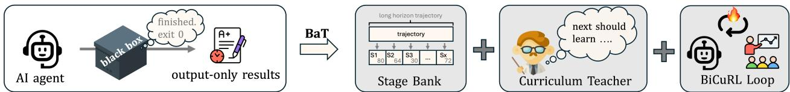

b. BiCuRL Loop  
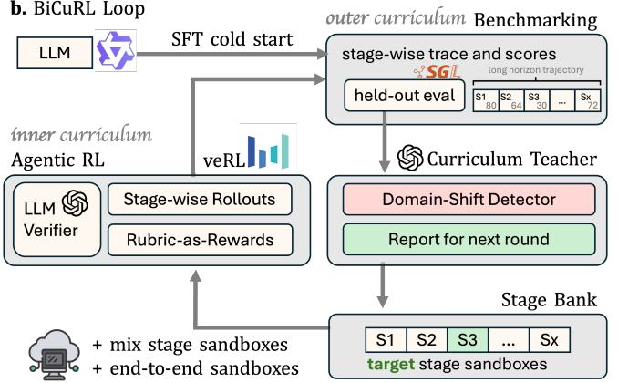

c. Self-evolving Post-Training  
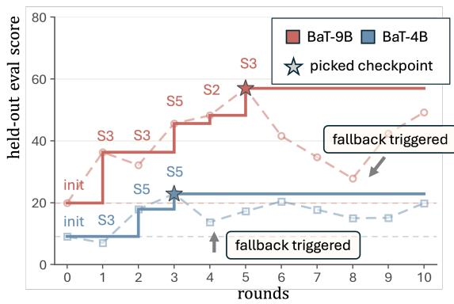  
Figure 1: Benchmark-as-Teacher turns an output-only benchmark into post-training infrastructure. (a) Top: conceptual overview. BaT turns the usual output-only benchmark into training infrastructure with the Stage Bank data-synthesis pipeline, Curriculum Teacher, and BiCuRL post-training method. (b) Lower left: BiCuRL loop. The system forms a closed loop with four operational phases. First, after an SFT cold start, benchmarking splits into stage-wise scores. Second, the aggregate scores feed the Curriculum Teacher, shown as the Domain-Shift Detector and Report for next round. Third, the environment sandbox pool selects targeted-stage (S-target) sandboxes together with mix-stage (S-mix) and end-to-end (E2E) sandboxes. Fourth, the agent executes rollouts in these sandboxes, an LLM verifier scores them with rubric-as-rewards (Gunjal et al., 2026), and GRPO (Shao et al., 2024) updates the policy. The updated checkpoint loops back to benchmarking and restarts the cycle. (c) Lower right: training rounds. Dashed curves show each round’s evaluation, solid step lines track the best checkpoint so far, stars mark the auto-selected best checkpoints.

## 1. Introduction

Long-horizon medical agents must plan, configure tools, validate data, run inference, and submit a checked artifact. A mistake in one stage can invalidate the work that follows, while expert trajectories remain scarce and dificult to share. Medical-agent benchmarks increasingly expose the structure of these workflows. MedAgentBench evaluates 300 physician-authored EHR tasks in a FHIR-compliant environment, HealthAgentBench covers 54 healthcare tasks across seven categories, and AutoMedBench scores planning, setup, validation, inference, and submission (Jiang et al., 2025b; Liu et al., 2026b,a). These benchmarks identify the stage where an agent fails.

Standard post-training discards most of that signal. Group-relative policy optimization (GRPO) commonly assigns one outcome reward to a complete trajectory (Shao et al., 2024). A single AutoMedBench-Lite run averages 33 interaction turns, so one score cannot identify which stage needs more practice. Iterative methods such as Self-Rewarding Language Models and SPIN improve a model over repeated updates, but their training schedules omit held-out stage diagnostics (Yuan et al., 2024; Chen et al., 2024). This paper asks one question: can a structured benchmark teach an agent while its task content stays outside training?

Benchmark-as-Teacher (BaT) turns the benchmark signal into a recursive post-training cycle. BaT contains an asynchronous data pipeline, called Stage Bank, and a self-improving post-training method, called Bilevel Curriculum Reinforcement Learning (BiCuRL). Stage Bank synthesizes fictional tasks, reconstructs executable stage states, and applies leakage checks outside the policy-update loop. It exposes three content-isolated training pools: S-target for the selected weak stage, S-mix for the remaining stages, and an end-to-end (E2E) surrogate for the complete workflow.

BiCuRL connects evaluation, training, and re-evaluation. Its outer loop reads stage scores from a fixed held-out evaluation, selects the next target stage, and retains or rejects candidate checkpoints. Its inner loop samples Stage Bank states, scores new rollouts with rubric items and artifact evidence, and updates the policy with GRPO. Only aggregate scores cross the evaluation boundary; task IDs, answers, paths, reports, and traces remain held out. Figure 1 summarizes this RSI cycle.

A trained policy becomes a BaT Agent when paired with a fixed execution environment that includes public stage skills. We keep this engineering layer fixed across BaT Agent comparisons so BiCuRL changes only the policy.

We evaluate medical performance on AutoMedBench-Lite, ABRA, and MedXpertQA-Text, and test transfer on eight external benchmarks (Liu et al., 2026a; Maksudov et al., 2026; Zuo et al., 2025). BaT-4B and BaT-9B more than double their Qwen Instruct Overall scores. The full Stage Bank mixture leads every evaluated partial mixture. BaT-9B Agent reaches 79.6 Overall, 2.1 points above Claude Opus 4.6 with Claude Code (Figure 2). On the external suite, the 9B policy remains within 3.4–5.8 points of its baseline on three reasoning tasks and improves �2-Bench, SWE-bench Verified, and Terminal Bench 2.0.

BaT makes the benchmark part of the training system while preserving a content boundary around held-out tasks. Our work makes four contributions:

• Benchmark-as-Teacher. BaT turns a structured benchmark into an RSI system that joins diagnosis, content-isolated practice, policy updates, and re-evaluation.

• Stage Bank. The asynchronous Stage Bank pipeline synthesizes leakage-checked tasks and exposes targeted, mixed-stage, and E2E surrogate training states.

• BiCuRL. BiCuRL couples an outer stage curriculum and checkpoint fallback with inner rubric-verified GRPO updates.

• BaT Agents. BaT-4B and BaT-9B more than double their Qwen Instruct baselines, and BaT-9B Agent reaches 79.6 Overall on AutoMedBench-Lite.

## 2. Benchmark-as-Teacher

Benchmark-as-Teacher is an RSI system with two coupled components. The asynchronous Stage Bank pipeline prepares content-isolated practice states. BiCuRL uses benchmark diagnostics to choose among those states, update the policy, retain checkpoints, and return the policy to evaluation. Figure 1 shows this closed loop, and Figure 3 shows the Stage Bank pools.

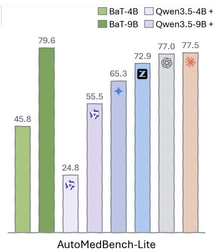

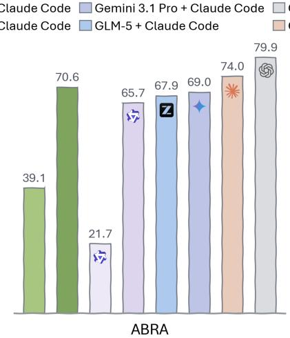

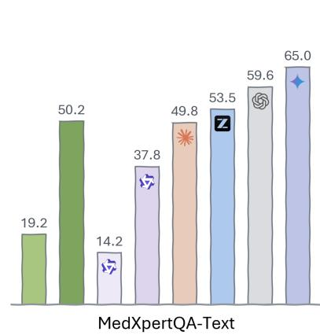  
Figure 2: BaT-9B Agent leads AutoMedBench-Lite and trails the leaders by 9.3 points on ABRA and 14.8 points on MedXpertQA-Text. It scores 79.6 on AutoMedBench-Lite, 70.6 on ABRA, and 50.2 on MedXpertQA-Text. The strongest non-BaT systems score 77.5, 79.9, and 65.0, respectively. The legend shortens BaT-4B Agent and BaT-9B Agent to BaT-4B and BaT-9B. Each panel uses its benchmark’s own protocol, and each system keeps the execution setting shown in the legend (Liu et al., 2026a; Maksudov et al., 2026; Zuo et al., 2025; Qwen Team, 2026b,c; Google DeepMind, 2026; GLM-5 Team, 2026; OpenAI, 2026; Anthropic, 2026).

## 2.1. Stage Bank

Data Factory. Stage Bank builds practice data from public workflow descriptions and benchmark stage contracts. We write a staged benchmark as

$$
\begin{array} { r } { \boldsymbol { B } = ( \boldsymbol { S } , \boldsymbol { \mathcal { C } } , \boldsymbol { \mathcal { V } } ) , } \end{array}\tag{1}
$$

where $s$ contains the ordered public stages and their boundaries, � contains rubric and evidence contracts, and � is a fixed held-out evaluation. For policy $\pi ,$ the evaluation returns $\mathcal { V } ( \pi ) = ( M , \mathbf { e } )$ , where � is Overall and e contains one score per stage. AutoMedBench-Lite defines five stages: Plan, Setup, Validate, Inference, and Submit (Liu et al., 2026a). Each stage and its rubric provide a shorter learning objective within the complete workflow.

The Data Factory synthesizes and validates all practice content outside the policy-update loop. It asks teacher models to write fictional medical-imaging tasks and complete them as multi-turn trajectories. Public workflow descriptions ground the task templates, while Self-Instruct and agent trajectory synthesis provide the data-generation pattern (Liu et al., 2026b; Wang et al., 2023; Xu et al., 2025). A leakage preflight rejects held-out identifiers, paths, reports, traces, answers, and evaluation-derived metadata before a row enters training. Aggregate recording statistics can guide synthesis, but raw evaluation content never enters a Stage Bank prompt or row.

SFT rows. Stage Bank turns each accepted teacher trajectory into single-response slices for the SFT cold start. One row contains the task, stage skill, prior agent turns, and tool observations as context, followed by one teacher response as the training target. This format keeps the multi-turn history while applying loss only to the selected response (Xu et al., 2025; Chen and Yuille, 2026). The resulting SFT data produce the initial policy $\theta _ { 0 }$

RL rows. Stage Bank builds RL data as executable sandboxes for full multi-turn rollouts (Pan et al., 2024; Luo et al., 2025). It reconstructs a fictional task at a public stage boundary and stores the resulting files, tools, and intermediate artifacts as the initial state. A stage sandbox begins at one workflow boundary and carries that stage’s goal, execution procedure, recovery steps, and rubric. An End-to-End (E2E) surrogate chains all five stages in a smaller workflow that supports repeated rollouts. We store SFT slices and RL sandbox rows separately; each RL row attaches an execution environment and a reward contract. Appendix A.1 gives the data construction and E2E surrogate details, and Appendix A.2 gives the multi-turn RL objective.

Each verified Stage Bank row has the form

$$
z _ { i } = ( p _ { i } , s _ { i } , c _ { i } , \mathcal { G } _ { i } , \kappa _ { i } , m _ { i } ) ,\tag{2}
$$

Table 1: SFT data (a) and RL Stage Bank data (b) across the five workflow stages and the E2E surrogate. SFT rows select one response from a multi-turn teacher trajectory, while RL rows initialize executable sandboxes for multi-turn rollouts (Xu et al., 2025; Chen and Yuille, 2026; Pan et al., 2024; Luo et al., 2025). We report average turns, average response tokens, and stored-row counts.  
(a) SFT
<table><tr><td colspan="5">S-target and S-mix</td><td colspan="2">End-to-End</td></tr><tr><td>Statistic</td><td>S1</td><td>S2 Plan Setup</td><td>S3</td><td>S4 Validate Infer Submit</td><td>S5</td><td>E2E surrogate</td></tr><tr><td>Turns</td><td>1.0</td><td>1.0</td><td>1.0</td><td>1.0</td><td>1.0</td><td>1.0</td></tr><tr><td>Tokens (K)</td><td>0.4</td><td>1.4</td><td>0.3</td><td>0.3</td><td>0.3</td><td>0.4</td></tr><tr><td>Count (K)</td><td>2.0</td><td>2.0</td><td>2.0</td><td>2.0</td><td>2.0</td><td>2.0</td></tr></table>

(b) RL
<table><tr><td colspan="5">S-target and S-mix</td><td rowspan="2">End-to-End</td></tr><tr><td>Statistic</td><td>S1 S2 Plan Setup</td><td>S3</td><td>S4</td><td>S5 Validate Infer Submit</td></tr><tr><td></td><td></td><td></td><td>37.8</td><td></td><td>surrogate 45.5</td></tr><tr><td>Turns Tokens (K)</td><td>25.6 40.5 8.4 11.0</td><td>36.7 10.4</td><td>10.8</td><td>28.5 8.5</td><td>12.1</td></tr><tr><td>Count (K)</td><td>3.7 6.9</td><td>5.5</td><td>2.9</td><td>1.4</td><td>1.2</td></tr></table>

where $p _ { i }$ is the sandbox state, $s _ { i }$ names a stage or $\mathrm { E 2 E } ,$ and $c _ { i }$ contains rubric items. $\mathcal { G } _ { i }$ contains evidence requirements, $\kappa _ { i }$ is the stage skill, and $m _ { i }$ records provenance. A stable state\_id links rollouts from the same row. The bank indexes rows by task type, stage, outcome label, and reward source.

BiCuRL draws each round from three Stage Bank pools. S-target contains states for the selected weak stage. S-mix contains states from the remaining stages and limits forgetting. E2E contains complete surrogate workflows and preserves cross-stage coordination. The ablation changes only which pools enter training.

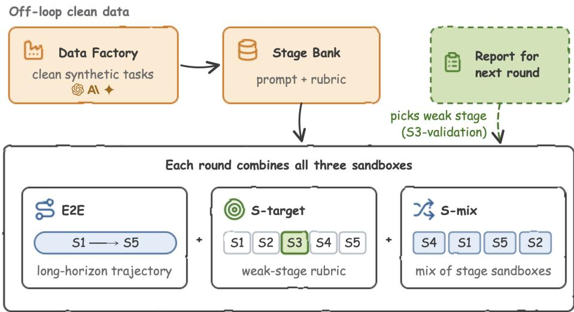  
Figure 3: Each BaT round combines all three sandboxes built from clean synthetic Stage Bank. The Data Factory fills the Stage Bank, and the report for the next round only picks the weak stage: E2E trains on the whole unsegmented trajectory, S-target applies the weak-stage rubric, and S-mix blends stage sandboxes from the other stages. No evaluation task content enters training rows.

## 2.2. Bilevel Curriculum Reinforcement Learning (BiCuRL)

BiCuRL is the self-improving post-training method inside BaT. Its outer loop chooses what to practice from held-out stage scores, and its inner loop updates the policy on that curriculum with GRPO (Shao et al., 2024). At round $r ,$ the fixed controller evaluation returns an Overall score $M _ { r }$ and stage scores $\mathbf { e } _ { r } = ( e _ { r , s } ) _ { s \in \mathcal { S } }$ . Over the Stage Bank mixture family ${ \mathcal { Q } } _ { \mathrm { S B } }$ , BiCuRL targets the bilevel objective

$$
\begin{array} { r l } { \underset { \mathbf { q } \in \mathcal { Q } _ { \mathrm { S B } } } { \operatorname* { m a x } } } & { \mathcal { M } \left( \hat { \boldsymbol { \theta } } ( \mathbf { q } ) \right) , } \\ { \mathrm { s . t . } } & { \hat { \boldsymbol { \theta } } ( \mathbf { q } ) \in \arg \underset { \boldsymbol { \theta } } { \operatorname* { m a x } } \mathcal { I } _ { \mathrm { G R P O } } ( \boldsymbol { \theta } ; \mathbf { q } ) . } \end{array}\tag{3}
$$

BiCuRL approximates this objective through alternating updates. Each round runs a finite GRPO block, evaluates the candidate, updates the curriculum, and starts the next block from the retained checkpoint. The controller

evaluation and final evaluation use disjoint runs. Only five stage scores and one Overall score leave the controller evaluation; the controller scores and discards its rollouts.

## 2.2.1. Inner Loop: Rubric-Verified Agentic RL

Given curriculum $\mathbf { q } _ { r } ,$ BiCuRL samples Stage Bank rows $z _ { i }$ and draws � rollouts from policy $\pi _ { \bar { \theta } _ { \tau } }$ in sandbox state $p _ { i }$ . An LLM rubric verifier scores rollout $y _ { i , k }$ against rubric items $c _ { i }$ using execution records and artifact evidence $x _ { i , k }$ (Zheng et al., 2023). The verifier also reports evidence completeness $\eta _ { i , k } \in [ 0 , 1 ]$ , the fraction of required evidence confirmed by the rollout and its artifacts:

$$
\begin{array} { r l } & { v _ { i , k , \ell } = \mathrm { V e r i f y } ( \ell ; p _ { i } , y _ { i , k } , x _ { i , k } ) \in \{ 0 , 1 \} , } \\ & { \quad r _ { i , k } = \eta _ { i , k } \frac { 1 } { \left| C _ { i } \right| } \displaystyle \sum _ { \ell \in c _ { i } } v _ { i , k , \ell } , } \\ & { \quad A _ { i , k } = \frac { r _ { i , k } - K ^ { - 1 } \sum _ { j = 1 } ^ { K } r _ { i , j } } { \mathrm { s t d } _ { j } \left( r _ { i , j } \right) + \epsilon _ { \mathrm { a d v } } } . } \end{array}\tag{4}
$$

Binary rubric decisions avoid free-form score calibration, while evidence completeness lowers rewards for unsupported success claims. Group normalization compares rollouts that share one state and reward contract. GRPO uses the resulting advantages to produce candidate checkpoint $\widetilde { \theta } _ { r + 1 }$

## 2.2.2. Outer Loop: Stage Routing and Checkpoint Fallback

The curriculum router reads $\mathbf { e } _ { r }$ and writes an auditable report that selects target stage $s _ { r } ^ { \star }$ . The round curriculum mixes three Stage Bank pools with fixed proportions $\rho \colon$

$$
\begin{array} { r l } & { q _ { r } ( z ) = \rho _ { \mathrm { t a r g e t } } q _ { \mathrm { t a r g e t } } ( z \mid s _ { r } ^ { \star } ) + \rho _ { \mathrm { m i x } } q _ { \mathrm { m i x } } ( z \mid s _ { r } ^ { \star } ) } \\ & { ~ + \rho _ { \mathrm { E 2 E } } q _ { \mathrm { E 2 E } } ( z ) . } \end{array}\tag{5}
$$

S-target changes with the selected stage, while S-mix and E2E preserve the rest of the workflow.

The router also controls fallback to the best retained checkpoint $\theta ^ { \star }$ . A counter $c _ { r }$ records consecutive score drops, and fallback fires after three drops or a policy shift above threshold �:

$$
\begin{array} { r l } & { c _ { r + 1 } = \left\{ c _ { r } + 1 , \frac { } { M _ { r + 1 } } < M _ { r } , \right. } \\ & { \mathrm { ~ o t h e r w i s e } , } \\ & { \bar { \theta } _ { r + 1 } = \left\{ \begin{array} { l l } { \theta ^ { \star } , } & { c _ { r + 1 } \geq 3 \mathrm { ~ o r ~ } D _ { \mathrm { K L } } \Big ( \pi _ { \widetilde { \theta } _ { r + 1 } } \| \pi _ { \theta ^ { \star } } \Big ) > \tau , } \\ { \widetilde { \theta } _ { r + 1 } , } & { \mathrm { o t h e r w i s e } . } \end{array} \right. } \end{array}\tag{6}
$$

BaT records each round’s Stage Bank states, pool mixture, reward version, controller scores, and retained checkpoint. The next round starts only after every selected state passes the leakage preflight.

## 2.3. Agent

A BaT Agent combines a BiCuRL-trained policy with a fixed OpenHands execution environment (Wang et al., 2025). This environment includes public stage skills distilled from the training-time LLM prescriptions. The skills restate each stage’s goal, checks, and recovery steps without carrying evaluation content. Inside OpenHands, the agent can edit files, run commands, inspect results, and submit artifacts. We keep this engineering layer fixed across BaT Agent comparisons and exclude it from BiCuRL: the policy is the only part that training changes.

## 3. Experimental Setting

## 3.1. Benchmark and Metrics

Medical benchmarks. AutoMedBench is a long-horizon benchmark for medical-AI research agents (Liu et al., 2026a). It scores five workflow stages across two dificulty tiers. We use the AutoMedBench-Lite tier, which provides more task-brief support while keeping the same workflow and scoring structure. Our diagnostic evaluation suite contains 7 long-horizon task tracks. For each track, we repeat the task 10 times, giving 70 runs per evaluated system. The tested agents average 33 interaction turns per run.

ABRA tests radiology agents inside an OHIF viewer and an Orthanc DICOM server (Maksudov et al., 2026). Its 655 tasks span three dificulty tiers and eight task types, and agents use 21 tools for image navigation, annotation, and reporting. MedXpertQA tests expert medical knowledge and reasoning across 17 specialties and 11 body systems (Zuo et al., 2025). We use its Text subset, which contains text-only medical questions. AutoMedBench-Lite and ABRA evaluate full agent systems, while MedXpertQA-Text evaluates text responses. Figure 2 keeps the system setting shown in its legend and supports comparisons within each benchmark panel. Its values are the recorded evaluation aggregates for those system settings under each benchmark’s native scorer. The cited benchmark papers define the tasks and scorers; our evaluations supply the plotted model scores.

AutoMedBench-Lite metrics. AutoMedBench-Lite measures both process and outcome. Task scores the submitted result. Agentic scores completion of Plan, Setup, Validate, Inference, and Submit. Overall gives Task and Agentic equal weight and uses their unrounded values. We use Overall as the main summary because a long-horizon agent must complete the workflow and produce a valid result. We report Task and Agentic separately to show whether a change comes from the process or the outcome. We report all three scores on a 0–100 scale with one decimal. We compute score diferences from unrounded values and then round each diference to one decimal. The statistical unit is the task track. We average the ten repeats within each track and then average the seven track means. This two-level aggregation avoids treating all 70 runs as independent. Table 2 carries over the source reported uncertainty half-widths across the seven track-level means.

## 3.2. Models and Baselines

We train the Instruct versions of Qwen3.5-4B and Qwen3.5-9B (Qwen Team, 2026b,c). At each size, Figure 4 compares the Qwen Instruct Baseline, supervised fine-tuning (SFT), GRPO, and BiCuRL inside the full BaT loop (Ouyang et al., 2022; Shao et al., 2024). Baseline always denotes the corresponding Qwen Instruct checkpoint before post-training. SFT reports the cold-start checkpoint alone, GRPO applies group-relative policy optimization with a single final task reward on E2E data, and BiCuRL applies stage-guided post-training after the same SFT cold start.

Figure 2 compares systems on AutoMedBench-Lite, ABRA, and MedXpertQA-Text (Liu et al., 2026a; Maksudov et al., 2026; Zuo et al., 2025). The comparison includes Qwen3.5-4B and Qwen3.5-9B with Claude Code, Gemini 3.1 Pro with Claude Code, and GLM-5 with Claude Code (Qwen Team, 2026b,c; Google DeepMind, 2026; GLM-5 Team, 2026). It also includes GPT-5.5 with Codex and Claude Opus 4.6 with Claude Code (OpenAI, 2026; Anthropic, 2026). Each system keeps the execution setting named in the figure. Figure 4 reports policy-level post-training runs, while Figure 2 reports full agent-system runs.

## 3.3. Training Data and Checks

Stage Bank contains 20,299 candidate prompt states that support rubric scoring. A separate content-isolated synthetic E2E source pool contains 1,008 rows. Stage Bank projects that source pool into E2E, S-target, and S-mix sandboxes without copying evaluation content. The 4B and 9B SFT starts use 4,608 and 4,608 rows. Each GRPO group samples 4 continuations from one state. We prepared a 275-row matched ablation pool. Generation-time rules normalize required fields and block known task and path markers. A hard preflight covers every training and validation file, and the rubric judge scores fresh continuations against each row’s rubric. We keep the diagnostic evaluation fixed across rounds and apply the leakage rules described above before every update. We will release the source manifests, synthesis prompts, checker settings, pool mixtures, optimizer settings, and leakage rules with the training data.

## 4. Results

The results connect the BaT system to three claims. The Overall scores of BaT-4B and BaT-9B more than double their Qwen Instruct baselines, BaT-9B Agent leads AutoMedBench-Lite and approaches the leaders on ABRA and MedXpertQA-Text, and external transfer depends on model size. Figure 4 scores trained policies, while Figure 2 compares medical benchmark results. We report these levels separately and avoid direct comparisons between them.

## 4.1. BiCuRL More Than Doubles Baselines

Table 2 and Figure 4 report the completed BaT-4B and BaT-9B policy runs. BaT-4B has 22.9 Overall, compared with 6.1 for the Instruct baseline. BaT-9B has 53.4 Overall, compared with 19.9 for the Instruct baseline. The

Table 2: BiCuRL more than doubles the Qwen Instruct AutoMedBench-Lite Overall score at both model sizes. Each score is the mean over the seven track-level means, with ± showing the source draft’s reported uncertainty half-width. Bold and underline mark the best and second-best result within each model size. Baseline denotes Qwen3.5 Instruct (Qwen Team, $2 0 2 6 \mathrm { b } , \mathrm { c } )$ . SFT follows supervised instruction tuning (Ouyang et al., 2022), and GRPO follows group-relative policy optimization (Shao et al., 2024). Ovl. denotes Overall, and Agt. denotes Agentic.
<table><tr><td rowspan="2">Training</td><td colspan="3">Qwen3.5-4B (Qwen Team, 2026b)</td><td colspan="3">Qwen3.5-9B (Qwen Team, 2026c)</td></tr><tr><td>Ovl.</td><td>Agt.</td><td>Task</td><td>Ovl.</td><td>Agt.</td><td>Task</td></tr><tr><td>Baseline</td><td> $6 . 1 \pm 1 . 7$ </td><td> $1 2 . 1 \pm 2 . 0$ </td><td> $0 . 0 \pm 1 . 1$ </td><td> $1 9 . 9 \pm 2 . 3$ </td><td> $1 1 . 3 \pm 2 . 0$ </td><td> $2 8 . 4 \pm 2 . 6$ </td></tr><tr><td>SFT (2022)</td><td> $\underline { { 1 8 . 1 \pm 2 . 3 } }$ </td><td> $1 0 . 8 \pm 1 . 9$ </td><td> ${ \bf 2 5 . 4 } \pm 2 . 5$ </td><td> $1 2 . 9 \pm 2 . 1$ </td><td> $2 1 . 6 \pm 2 . 4$ </td><td> $4 . 1 \pm 1 . 5$ </td></tr><tr><td>GRPO (2024)</td><td> $1 1 . 4 \pm 2 . 0$ </td><td> $\underline { { 1 5 . 9 \pm 2 . 2 } }$ </td><td> $6 . 9 \pm 1 . 7$ </td><td> $\underline { { 3 1 . 9 } } \pm 2 . 7$ </td><td> ${ \underline { { 3 9 . 2 \pm 2 . 8 } } }$ </td><td> $2 4 . 5 \pm 2 . 5$ </td></tr><tr><td>BiCuRL</td><td> $2 2 . 9 \pm 2 . 4$ </td><td> $2 8 . 8 \pm 2 . 6$ </td><td> $\underline { { 1 7 . 0 \pm 2 . 2 } }$ </td><td> $5 3 . 4 \pm 3 . 2 $  一</td><td> $6 4 . 7 \pm 3 . 1 $  –</td><td> $4 2 . 1 \pm 3 . 2 $ </td></tr></table>

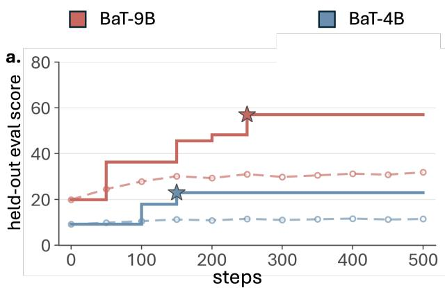

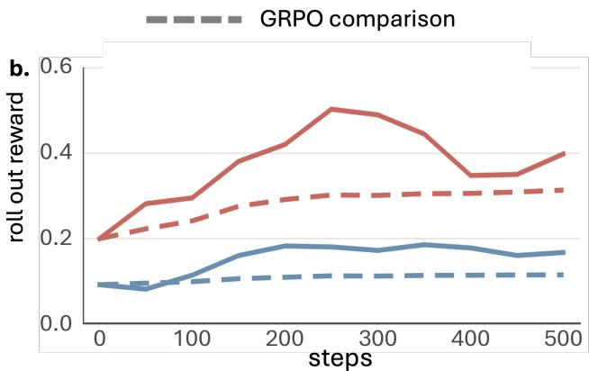  
Figure 4: BaT keeps improving across rounds, while GRPO with one final reward saturates early. Solid step lines track the best BaT checkpoint so far and stars mark the selected checkpoints; dashed curves show GRPO in the matching model color.

9B score is also 21.5 points above GRPO after rounding the displayed means. The figure keeps the recorded protocol for each completed run, so these diferences describe the observed scores instead of a matched training ablation.

Takeaway. BaT-4B and BaT-9B reach 22.9 and 53.4 Overall, more than twice their corresponding Instruct baselines.

## 4.2. BiCuRL Performance across Training Rounds

BiCuRL repeats evaluation, stage selection, and post-training over several rounds. Figure 1(c) reports how the Overall score changes across rounds for both model sizes. At both sizes, the retained BiCuRL checkpoint passes the corresponding GRPO score early in training. The best-so-far staircases preserve each accepted gain through round ten even when a later candidate scores lower. The raw round curves fluctuate, which motivates checkpoint retention and fallback in the outer loop.

Takeaway. Some candidates score lower than their predecessors; checkpoint retention preserves the best observed Overall score across later rounds.

## 4.3. BiCuRL Ablation Study

Figure 5 compares the S-target, S-mix, and E2E pools defined in Section 2.1. The full three-pool run leads with 53.4 Overall, matching the BaT-9B row in Figure 4. The strongest partial mix, E2E alone, reaches 31.9, a gap of 21.5 points. Among the three runs that each omit one pool, every point estimate trails the full mix by at least 26 points.

Takeaway. The full sandbox mix leads every partial mix by at least 21.5 Overall points and each drop-onepool run by at least 26 points.

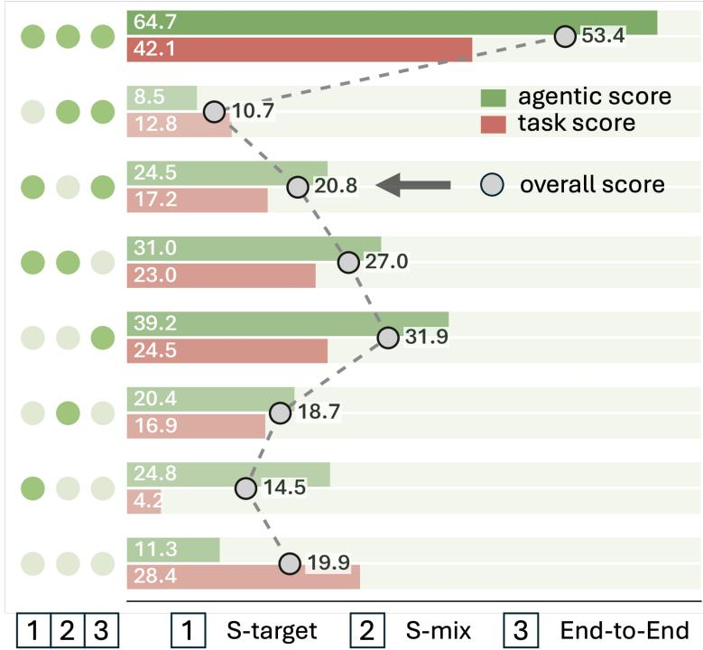  
Figure 5: The full S-target, S-mix, and E2E sandbox mix leads every partial mix. The dot matrix on the left marks which pools enter training (columns 1–3: S-target, S-mix, End-to-End; dark included, pale omitted). Green bars show Agentic, red bars show Task, and gray circles show Overall. Rows from top to bottom: full BaT, E2E+S-mix, E2E+S-target, S-target+S-mix, E2E, S-mix, S-target, and the Qwen3.5-9B Instruct baseline. All scores use a 0–100 scale and one decimal.

## 4.4. BaT-9B Ranks First among Local LLMs

Given the critical privacy requirements in medical research workflows, local deployment is highly desirable. Tiny models, defined as those with fewer than 12B parameters, ofer a cost-efective and performant alternative, prompting us to download and test a range of representative open-weight models. Figure 6 compares tiny local LLMs with the same default OpenHands runner and benchmark protocol (Wang et al., 2025). BaT-4B raises its Qwen3.5-4B backbone from 6.1 to 22.9 Overall. BaT-9B ranks first at 53.4 Overall, leading 2x compared to the second place Gemma 12B (Gemma Team, 2026). For further comparison with top-tier open-source local LLMs, see Table 6.

Takeaway. BaT moves both Qwen backbones upward, and the 4B policy trails only one larger-total-parameter LLM.

## 4.5. BaT-9B Leads One Medical Benchmark and Approaches Two Leaders

Figure 2 compares systems on three medical benchmarks (Liu et al., 2026a; Maksudov et al., 2026; Zuo et al., 2025). Each BaT Agent pairs its BiCuRL-trained policy with the fixed OpenHands environment described under Agent. On AutoMedBench-Lite, BaT-9B Agent reaches 79.6, 2.1 points above Claude Opus 4.6 with Claude Code at 77.5 (Anthropic, 2026). For AutoMedBench-Lite per-track details, Figure 7 in Appendix A.6 presents a preliminary per-track comparison of BaT-4B Agent, BaT-9B Agent, and Claude Opus 4.6 with Claude Code. On ABRA, it reaches 70.6, compared with 79.9 for GPT-5.5 with Codex, a 9.3-point gap (OpenAI, 2026). On MedXpertQA-Text, it reaches 50.2, compared with 65.0 for Gemini 3.1 Pro with Claude Code, a 14.8-point gap (Google DeepMind, 2026). The 4B BaT Agent scores 45.8, 39.1, and 19.2 on the same three benchmarks. At both sizes, each BaT Agent outperforms Qwen3.5 with Claude Code on all three benchmarks (Qwen Team, 2026b,c).

Takeaway. BaT-9B Agent leads AutoMedBench-Lite and trails the leaders by 9.3 points on ABRA and 14.8 points on MedXpertQA-Text.

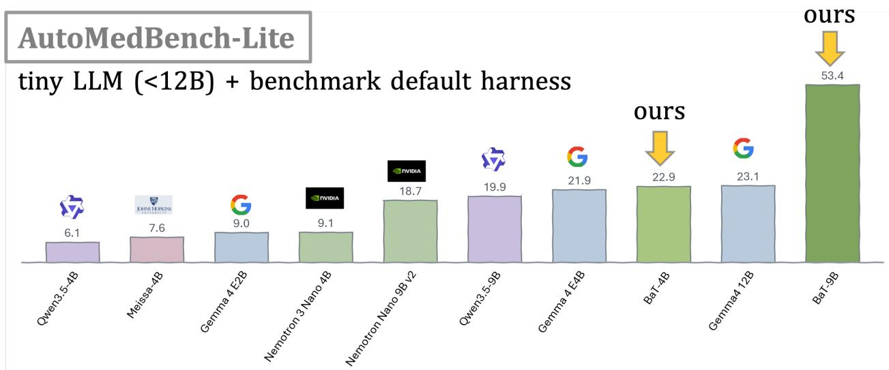  
Figure 6: BaT-9B ranks first, and BaT-4B ranks third among 10 tiny local LLMs under the same default runner. Here tiny local LLM is defined as parameter size no more than 12B. Bars report AutoMedBench-Lite Overall scores.

Table 3: BaT-9B retains most reasoning accuracy and improves three of five long-horizon scores, while BaT-4B declines on all eight benchmarks. Base denotes each Qwen3.5 Instruct checkpoint (Qwen Team, 2026b,c). Delta is BaT minus Base in percentage points; green marks gains and red marks drops. Each pair uses the same benchmark protocol.
<table><tr><td rowspan="2">Benchmark</td><td colspan="3">Qwen3.5-4B (Qwen Team, 2026b)</td><td colspan="3">Qwen3.5-9B (Qwen Team, 2026c)</td></tr><tr><td>Base</td><td>BaT</td><td>Δ</td><td>Base</td><td>BaT</td><td>Δ</td></tr><tr><td colspan="7">short-turn reasoning tasks</td></tr><tr><td>AIME 2025 (Mathematical Association of America, 2026)</td><td>85.0</td><td>56.7</td><td>-28.3</td><td>88.3</td><td>83.6</td><td>-4.7</td></tr><tr><td>AIME 2026 (Mathematical Association of America, 2026)</td><td>89.7</td><td>53.3</td><td>-36.4</td><td>92.5</td><td>86.7</td><td>-5.8</td></tr><tr><td>GPQA-Diamond (Rein et al., 2023)</td><td>76.2</td><td>58.1</td><td>-18.1</td><td>81.7</td><td>78.3</td><td>-3.4</td></tr><tr><td colspan="7">long-horizon tasks</td></tr><tr><td>τ2-Bench (Barres et al., 2025)</td><td>79.9</td><td>29.1</td><td>-50.8</td><td>79.1</td><td>84.5</td><td>+5.4</td></tr><tr><td>BFCL-Parity (Patil et al., 2025)</td><td>62.6</td><td>10.6</td><td>-52.0</td><td>79.4</td><td>68.3</td><td>-11.1</td></tr><tr><td>GAIA (Mialon et al., 2024)</td><td>15.2</td><td>2.4</td><td>-12.8</td><td>24.9</td><td>21.2</td><td>-3.7</td></tr><tr><td>SWE-bench Verified (OpenAI, 2024)</td><td>39.4</td><td>4.8</td><td>-34.6</td><td>49.0</td><td>51.8</td><td>+2.8</td></tr><tr><td>Terminal Bench 2.0 (Merrill et al., 2026)</td><td>11.2</td><td>1.1</td><td>-10.1</td><td>19.9</td><td>21.3</td><td>+1.4</td></tr></table>

## 4.6. External Benchmarks Show Scale-Dependent Retention

Strong medical results could come with weaker general reasoning or tool use. Table 3 compares each BaT policy with its Instruct baseline on three short-turn reasoning tasks and five long-horizon tasks (Mathematical Association of America, 2026; Rein et al., 2023; Barres et al., 2025; Patil et al., 2025; Mialon et al., 2024; OpenAI, 2024; Merrill et al., 2026). The 9B policy remains within 3.4–5.8 points of its baseline on the three reasoning benchmarks and improves �2-Bench by 5.4 points. It also improves SWE-bench Verified and Terminal Bench 2.0, while BFCL-Parity and GAIA remain below the baseline. The 4B policy scores below its baseline on all eight benchmarks. The pattern links transfer to model size and task type.

Takeaway. BaT-9B stays close to its short-turn reasoning baseline and improves three long-horizon scores; BaT-4B scores lower on all eight tests.

## 5. Discussion

## 5.1. Why the Loop Matters

BaT uses a benchmark in two linked roles. AutoMedBench-Lite measures the current agent, and its aggregate diagnostics control what the model practices next. Its task content stays outside training rows. Its scores set later training mixtures, which makes the suite a diagnostic evaluation and rules out treating it as an untouched final test. External benchmarks provide a separate transfer check, although their protocols difer. BaT requires benchmarks that expose stable stages, stage-level scores, and rubrics or checks that can score a continuation. The separation between Stage Bank and BiCuRL matters operationally: synthesis and validation can run asynchronously, while the policy-update loop reads only versioned, executable states.

## 5.2. Limits

The current evidence has six limits. First, AutoMedBench-Lite supplies aggregate diagnostic signals, so the suite participates in adaptation even though task content stays outside training rows. This setup provides content isolation, while a separate untouched final test and a measured semantic leakage audit remain future work. Second, the external table combines retained local runs with published baselines, and its local aggregates lack complete per-run manifests. Third, BaT-4B scores below its baseline on all eight external benchmarks, while BaT-9B gains on three of five long-horizon tasks. Fourth, the top-tier comparison evaluates complete agent systems with their named execution settings, so it supports only a system-level claim.

## 6. Related Work

## 6.1. Medical and Long-Horizon Agent Benchmarks

Long-horizon benchmarks test agents through tools, files, and many-step tasks. Terminal Bench 2.0 tests command-line work in isolated environments (Merrill et al., 2026). The Berkeley Function Calling Leaderboard (BFCL) focuses on function calling (Patil et al., 2025). IFBench tests unseen instruction rules (Pyatkin et al., 2025). In healthcare, MedAgentBench evaluates physician-authored EHR tasks in a FHIR environment, HealthAgentBench spans realistic agentic healthcare settings, and AutoMedBench adds stage scores for medical AI development (Jiang et al., 2025b; Liu et al., 2026b,a). These benchmarks measure agent performance, while the stage structure in AutoMedBench also supports diagnosis. BaT uses public stage structure to build content-isolated training sandboxes and choose the focus of the next round.

## 6.2. Agent Post-Training

GRPO compares samples from the same group and avoids a learned value model (Shao et al., 2024). ReAct joins reasoning with tool actions (Yao et al., 2023). Process supervision assigns feedback to intermediate reasoning steps, while curriculum learning schedules training examples by dificulty or structure (Lightman et al., 2023; Bengio et al., 2009). Self-Refine uses model feedback to revise outputs during inference (Madaan et al., 2023). Agent Lightning converts multi-step agent traces into RL transitions with credit assignment (Luo et al., 2025). Self-Rewarding Language Models and SPIN use iterative model-generated feedback or self-play to improve later checkpoints (Yuan et al., 2024; Chen et al., 2024). Frontis-MA1 develops recursive self-improvement for machine-learning engineering through OpenMLE-Gym, OpenMLE-RL, and OpenMLE-Evo (Yang et al., 2026). BaT instead centers a structured held-out benchmark in the control loop. Public stages define practice targets, public rubrics score rollouts, and aggregate diagnostics change the next round’s Stage Bank mixture.

## 6.3. Execution Environments and Synthetic Task Generation

OpenHands provides a workspace for agents that edit files, run programs, and inspect results (Wang et al., 2025). SWE-World studies software-agent training without full Docker execution (Sun et al., 2026). SWE-Gym supplies executable software-engineering environments for training agents and verifiers, while VerlTool provides modular tool-use RL infrastructure with asynchronous rollout support (Pan et al., 2024; Jiang et al., 2025a). On the data side, Self-Instruct bootstraps instruction data from model-written tasks, and later agent pipelines scale this recipe to tool-use trajectories (Wang et al., 2023). These lines supply the runtime and the raw material for agent training, but they leave open which experience the agent should practice next. BaT combines both: Stage Bank writes leakage-checked synthetic tasks in the Self-Instruct spirit, executable sandboxes support training, and a fixed OpenHands layer runs the trained policy.

## 7. Conclusion

Benchmark-as-Teacher turns public benchmark stages and checks into an RSI system. Its asynchronous Stage Bank pipeline builds content-isolated E2E, S-target, and S-mix states, while BiCuRL uses aggregate diagnostics to select a weak stage and update the policy. The data boundary keeps task-specific evaluation content outside training while aggregate scores guide routing. BaT-4B and BaT-9B more than double their corresponding Qwen Instruct Overall scores on AutoMedBench-Lite. BaT-9B Agent reaches 79.6 Overall and exceeds Claude Opus

4.6 with Claude Code by 2.1 points. On external benchmarks, the 9B policy stays within 3.4–5.8 points on AIME and GPQA-Diamond and gains on three of five long-horizon tasks; the 4B policy scores lower on all eight tests. Together, Stage Bank, BiCuRL, and the fixed BaT Agent execution layer show how a structured benchmark can serve as both evaluator and post-training teacher.

## A. Technical Details

## A.1. Stage Bank Construction

Row schema. Stage Bank is a versioned set $\mathcal { Z }$ of rows. Each row is a tuple

$$
z = ( p , s , c , \mathcal { G } , \kappa , m ) ,\tag{7}
$$

where $s \in { \mathcal { S } } \cup \{ \operatorname { E 2 E } \}$ keys the row to a stage or the end-to-end pool, and $p$ stores the executable sandbox state. The public benchmark rubric supplies item set $c ,$ and � lists the evidence requirements used to compute $\eta _ { i , k }$ (Liu et al., 2026a). � stores the attached stage skill, and � records row provenance. The three pools in Equation 5 are $\mathcal { Z } _ { \mathrm { t a r g e t } } ( \pmb { s } _ { r } ^ { \star } ) = \{ \boldsymbol { z } : \boldsymbol { s } = \pmb { s } _ { r } ^ { \star } \} , \mathcal { Z } _ { \mathrm { m i x } } ( \pmb { s } _ { r } ^ { \star } ) = \{ \boldsymbol { z } : \boldsymbol { s } \in \mathcal { S } \setminus \{ \pmb { s } _ { r } ^ { \star } \} \} , \mathrm { a n d } \mathcal { Z } _ { \mathrm { E 2 E } } = \{ \boldsymbol { z } : \boldsymbol { s } = \mathrm { E 2 E } \}$

Teacher trajectories and SFT slices. For fictional task $\xi _ { i }$ , a teacher model produces a checked multi-turn trajectory

$$
\tau _ { i } ^ { \mathrm { T } } = \big ( ( a _ { i , t } ^ { \mathrm { T } } , o _ { i , t } ^ { \mathrm { T } } , s _ { i , t } ) \big ) _ { t = 1 } ^ { T _ { i } } ,\tag{8}
$$

where $a _ { i , t } ^ { \mathrm { T } }$ is one teacher response, $o _ { i , t } ^ { \mathrm { T } }$ is the environment observation that follows $\operatorname { i t } ,$ and $s _ { i , t }$ is the public workflow stage. The history $h _ { i , t } ^ { \mathrm { T } }$ contains the task, stage skill, and all earlier responses and observations. Stage Bank converts the trajectory into single-response rows

$$
\mathcal { D } _ { \mathrm { S F T } } = \{ \left( h _ { i , t } ^ { \mathrm { T } } , a _ { i , t } ^ { \mathrm { T } } \right) : 1 \leq t \leq T _ { i } , \ \xi _ { i } \ \mathrm { a n d } \ \tau _ { i } ^ { \mathrm { T } } \ \mathrm { p a s s  v a l i d a t i o n } \} .\tag{9}
$$

Each row keeps the multi-turn history but applies loss only to the selected teacher response (Xu et al., 2025; Chen and Yuille, 2026):

$$
{ \mathcal { L } } _ { \mathrm { S F T } } ( \theta ) = - \mathbb { E } _ { ( h , a ) \sim \mathcal { D } _ { \mathrm { S F T } } } \left[ \sum _ { j = 1 } ^ { | a | } \log \pi _ { \theta } ( a _ { j } \mid h , a _ { < j } ) \right] .\tag{10}
$$

Stage Bank excludes tool observations and other environment text from the loss.

Stage sandbox construction. Let $b _ { i , s }$ denote the turn where stage � begins in $\tau _ { i } ^ { \mathrm { T } }$ . A stage sandbox for � replays the trajectory prefix inside the execution environment:

$$
p _ { i , s } = \Phi _ { \xi _ { i } } \bigl ( ( a _ { i , t } ^ { \mathrm { T } } , o _ { i , t } ^ { \mathrm { T } } ) _ { t < b _ { i , s } } \bigr ) ,\tag{11}
$$

where $\Phi _ { \xi _ { i } }$ executes the prefix and materializes the resulting files, environment, and intermediate artifacts as the row’s start state. Training therefore begins at the stage boundary with an upstream context, while the row rubric scores only the work of stage �.

E2E surrogate construction. Stage Bank first applies a reduction operator to the fictional task:

$$
\widetilde { \xi } _ { i } = R _ { \lambda } ( \xi _ { i } ) , \qquad \lambda = ( \lambda _ { \mathrm { c a s e } } , \lambda _ { \mathrm { i n p u t } } , \lambda _ { \mathrm { v a l i d a t e } } ) .\tag{12}
$$

$R _ { \lambda }$ retains $\lambda _ { \mathrm { c a s e } } \in \{ 1 , \ldots , N _ { i } \}$ of the task’s $N _ { i }$ cases, caps each input at a fraction $\lambda _ { \mathrm { i n p u t } } \in ( 0 , 1 ]$ of its source size, and permits at most $\lambda _ { \mathrm { v a l i d a t e } } \in \mathbb { N } _ { + }$ validation passes. The Data Factory chooses � from a versioned task-specific grid and records it in provenance $m _ { i }$ . The reduction keeps the five-stage order, task semantics, and output schema. The teacher then executes the reduced task and produces a checked trajectory

$$
\begin{array} { r } { \widetilde { \tau } _ { i } ^ { \mathrm { T } } = \left( ( \widetilde { u } _ { i , q } ^ { \mathrm { T } } , \widetilde { o } _ { i , q } ^ { \mathrm { T } } , \widetilde { s } _ { i , q } ) \right) _ { q = 1 } ^ { \widetilde { T } _ { i } } , } \end{array}\tag{13}
$$

where $\widetilde { T } _ { i }$ is the number of interaction turns after reduction. The E2E sandbox starts before the first stage, $p _ { i } ^ { \mathrm { E 2 E } } = \Phi _ { \widetilde { \xi } _ { i } } ( \emptyset )$ , and attaches the ordered skills $\left( \kappa _ { i , s } \right) _ { s \in { \cal S } }$ . Its rubric and evidence contracts combine the stage

$$
c _ { i } ^ { \mathrm { E 2 E } } = \bigcup _ { s \in S } c _ { i , s } , \qquad \mathcal { G } _ { i } ^ { \mathrm { E 2 E } } = \bigcup _ { s \in S } \mathcal { G } _ { i , s } .\tag{14}
$$

Stage Bank accepts the surrogate only when the sandbox star ${ \bf \delta } _ { \bf { \delta } }$ the checked teacher trajectory fits the rollout limit �, every stage contract passes, and the leakage scan returns zero:

$$
\begin{array} { r l } { \mathrm { A c c e p t } ( z _ { i } ^ { \mathrm { E 2 E } } ) = \mathbb { I } [ \mathrm { B o o t } ( p _ { i } ^ { \mathrm { E 2 E } } ) = 1 ] \mathbb { I } [ \widetilde { T } _ { i } \leq H ] } & { } \\ { \quad \times \prod _ { s \in \mathcal { S } } \mathbb { I } [ \mathrm { C h e c k } _ { s } ( \widetilde { \tau } _ { i } ^ { \mathrm { T } } ) = 1 ] } & { } \\ { \quad \times \mathbb { I } [ \mathrm { L e a k } ( z _ { i } ^ { \mathrm { E 2 E } } ) = 0 ] . } \end{array}\tag{15}
$$

The accepted row preserves the full workflow while keeping each rollout small enough for repeated training.

## A.2. Multi-Turn Supervision in BiCuRL

Each rollout $y _ { i , k }$ is a multi-turn interaction. At turn $q ,$ the policy emits response $u _ { i , k , q }$ conditioned on the sandbox state, stage skill, and interaction history, after which the sandbox returns observation $o _ { i , k , q } .$ . The rubric verifier scores the completed rollout, so one rollout-level reward must reach every token that produced it. For $Q _ { i , k }$ interaction turns, the policy and environment generate

$$
P _ { \theta } ( y _ { i , k } , o _ { i , k } \mid z _ { i } ) = \prod _ { q = 1 } ^ { Q _ { i , k } } \pi _ { \theta } ( u _ { i , k , q } \mid h _ { i , k , q } ) P _ { \mathcal { E } } ( o _ { i , k , q } \mid h _ { i , k , q } , u _ { i , k , q } ) .\tag{16}
$$

After tokenizing and joining the $Q _ { i , k }$ policy responses, we write $y _ { i , k } = ( a _ { i , k , 1 } , \dots , a _ { i , k , T _ { i , k } } )$ for the generated tokens and exclude observation tokens from the loss. Let $h _ { i , k , t } ^ { \mathrm { t o k } }$ be the full token context before $\boldsymbol { a } _ { i , k , t } ;$ it contains $p _ { i } , \kappa _ { i }$ , earlier generated tokens, and every observation returned before that token.

For each generated token, the importance ratio compares the updated policy with the policy that produced the rollout:

$$
w _ { i , k , t } = \frac { \pi _ { \theta } ( a _ { i , k , t } \mid h _ { i , k , t } ^ { \mathrm { t o k } } ) } { \pi _ { \bar { \theta } _ { r } } ( a _ { i , k , t } \mid h _ { i , k , t } ^ { \mathrm { t o k } } ) } .\tag{17}
$$

Each token receives rollout advantage $A _ { i , k }$ from Equation $^ { 4 , }$ clipped within $\epsilon :$

$$
g _ { i , k , t } = \operatorname* { m i n } \Bigl ( w _ { i , k , t } A _ { i , k } , \ \mathrm { c l i p } \left( w _ { i , k , t } , 1 - \epsilon , 1 + \epsilon \right) A _ { i , k } \Bigr ) .\tag{18}
$$

The inner objective of Equation 3 averages these token terms over each rollout and group, with a KL penalty toward the current policy (Shao et al., 2024):

$$
\begin{array} { c l r } { { \mathcal { I } _ { \mathrm { G R P O } } ( \boldsymbol { \theta } ; \mathbf { q } _ { r } ) = \mathbb { E } _ { z \sim \mathbf { q } _ { r } } \bigg [ \displaystyle \frac { 1 } { K } \sum _ { k = 1 } ^ { K } \frac { 1 } { T _ { i , k } } \sum _ { t = 1 } ^ { T _ { i , k } } g _ { i , k , t } \bigg ] } } \\ { { - \ : \beta D _ { \mathrm { K L } } \big ( \pi _ { \boldsymbol { \theta } } \parallel \pi _ { \bar { \boldsymbol { \theta } } _ { r } } \big ) . } } \end{array}\tag{19}
$$

Each generated token of rollout $y _ { i , k }$ receives $A _ { i , k . }$ , so one group-normalized and evidence-discounted rubric decision supervises every turn. The curriculum $\mathbf { q } _ { r }$ decides which stage those trajectories practice.

## A.3. Migration to Other Staged Benchmarks

BiCuRL uses the staged benchmark $\boldsymbol { B } = ( \boldsymbol { S } , \boldsymbol { \mathcal { C } } , \boldsymbol { \mathcal { V } } )$ defined in Section 2.1. A compatible benchmark supplies ordered stage boundaries in �, public rubric and evidence contracts in �, and fixed evaluation $\mathcal { V } ( \pi ) = ( M , \mathbf { e } )$

Proposition 1. Suppose Stage Bank can materialize executable states for every stage in �. If policy $\pi _ { \theta }$ exposes the token likelihoods required by GRPO and policy $K L ,$ the BiCuRL update is well-definedfor ℬ.

Argument. The router reads only $\mathbf { e } _ { r }$ and selects $s _ { r } ^ { \star } \in S .$ . Equation 5 partitions Stage Bank by stage key, with S-mix drawing the remaining stages. Stage Bank construction uses the assumed stage boundaries, executable states, and public rubric contracts. Equations 4 and 19 use rubric items and evidence requirements regardless of the number or meaning of stages. Equation 6 uses the scalar score sequence and the assumed policy KL. The likelihood assumption also defines the GRPO ratios in Equation 17. These inputs define every term in the update. □

This proposition establishes procedural compatibility. Whether a migrated BaT system improves a particular benchmark remains an empirical question, consistent with the bounded transfer results in the main text.

## A.4. Post-Training and Runtime Details

Cold-start SFT. We train the Qwen3.5-9B cold-start policy with full-parameter supervised fine-tuning on 4,608 SFT rows (Qwen Team, 2026c; Ouyang et al., 2022). Training uses eight GPUs with PyTorch Fully Sharded Data Parallel (FSDP) full\_shard and fused AdamW (Zhao et al., 2023; Loshchilov and Hutter, 2019). Table 4 reports the key configuration. BiCuRL uses the final archived SFT checkpoint as its initializer.

<table><tr><td>Parameter</td><td>Qwen3.5-9B cold SFT</td></tr><tr><td>Parameter update</td><td>Full parameters, without adapters</td></tr><tr><td>Parallelism</td><td>8 GPUs, FSDP full_shard</td></tr><tr><td>Per-GPU microbatch</td><td>1</td></tr><tr><td>Gradient accumulation</td><td>8</td></tr><tr><td>Effective global batch</td><td>64</td></tr><tr><td>Learning rate</td><td>2 × 10−5</td></tr><tr><td>Schedule / warmup</td><td>Cosine / 3%</td></tr><tr><td>Optimizer</td><td>Fused AdamW</td></tr><tr><td>Weight decay / max grad norm</td><td>0/1</td></tr><tr><td>Target training budget</td><td>200 steps</td></tr><tr><td>Checkpoint interval</td><td>5 steps</td></tr><tr><td>SFT rows / evaluation</td><td>4,608 / disabled</td></tr><tr><td>Seed</td><td>42</td></tr></table>

Table 4: Qwen3.5-9B cold-start SFT configuration. We use full-parameter training with PyTorch FSDP and AdamW (Qwen Team, 2026c; Zhao et al., 2023; Loshchilov and Hutter, 2019).

Pool weights and sampling. Each round draws rows from the three Stage Bank pools with proportions $\left( \rho _ { \mathrm { t a r g e t } } , \rho _ { \mathrm { m i x } } , \rho _ { \mathrm { E 2 E } } \right) = ( 1 / 2 , 1 / 4 , 1 / 4 )$ . Within E2E, Stage Bank draws surrogate rows uniformly. Sampling is without replacement inside one round and resets between rounds. Matched ablation runs draw from the 275-row pool described in Section 3 and renormalize proportions after omitting a pool.

Fallback KL threshold. The policy-shift trigger in Equation 6 uses threshold � = 0.1. We estimate it as the mean per-token KL divergence between candidate policy $\pi _ { \widetilde { \theta } _ { r + } }$ and retained policy ��⋆ over 256 Stage Bank prompts held out from training. The patience trigger uses three consecutive score drops.

Serving stack and throughput. We run training and agent rollouts on eight NVIDIA A100 GPUs with 80GB memory per GPU (NVIDIA, 2022). The serving layer supports SGLang and vLLM (Zheng et al., 2024; Kwon et al., 2023). We use SGLang by default for agentic tasks and set the serving context limit to 256K tokens. Matched ablations cap each training sequence at 12,288 tokens, as Table 8 records. The source run summary records one node-level throughput value per model on the eight-GPU node: 320 tokens/s for Qwen3.5-4B and 220 tokens/s for Qwen3.5-9B. The summary combines prefill and decoding and omits the remaining serving controls, so we treat both rates as descriptive measurements.

<table><tr><td>Runtime setting</td><td>Qwen3.5-4B Qwen3.5-9B</td></tr><tr><td>GPUs</td><td>8 × NVIDIA A100 80GB</td></tr><tr><td>Default engine</td><td>SGLang</td></tr><tr><td>Supported engine</td><td>vLLM</td></tr><tr><td>Context limit</td><td>256K tokens</td></tr><tr><td></td><td>Recorded throughput 320 tokens/s 220 tokens/s</td></tr></table>

Table 5: Serving configuration and recorded throughput. The stack supports SGLang and vLLM, with SGLang as the default engine for agentic tasks (Zheng et al., 2024; Kwon et al., 2023). Each recorded rate uses an eight-GPU NVIDIA A100 80GB node (NVIDIA, 2022). The source run summary reports an unsplit token rate and omits the remaining serving controls.

## A.5. Local LLM Comparison

Local deployment helps keep medical data within the research environment. We define local LLMs as models with fewer than 40B parameters that can run on a single NVIDIA A100. We downloaded and deployed 19 representative open-weight models, then evaluated them with the same default runner and benchmark protocol (Wang et al., 2025). The default runner alone produces these results; the BaT agent harness plays no

role. Table 6 shows that BaT-9B achieves 53.4 Overall and ranks third. The two higher-ranked models have 27B and 35B total parameters, which suggests that model scale contributes to the remaining gap. Future work will study how BaT scales to larger LLM backbones.
<table><tr><td>Model</td><td>Overall</td><td>Agentic</td><td>Task</td></tr><tr><td>Qwen3.5-4B (Qwen Team, 2026b)</td><td>6.1</td><td>12.1</td><td>0.0</td></tr><tr><td>Meissa-4B (Chen et al., 2026)</td><td>7.6</td><td>15.2</td><td>0.0</td></tr><tr><td>Gemma 4 E2B (Gemma Team, 2026)</td><td>9.0</td><td>18.0</td><td>0.0</td></tr><tr><td>Nemotron 3 Nano 4B (NVIDIA, 2026b)</td><td>9.1</td><td>18.2</td><td>0.0</td></tr><tr><td>GPT-OSS-20B (OpenAI, 2025)</td><td>17.6</td><td>25.3</td><td>9.9</td></tr><tr><td>Nemotron 3 Nano 30B-A3B (NVIDIA, 2025a)</td><td>18.0</td><td>22.5</td><td>13.5</td></tr><tr><td>Nemotron Nano 9B v2 (NVIDIA, 2025b)</td><td>18.7</td><td>24.6</td><td>12.8</td></tr><tr><td>Qwen3.5-9B (Qwen Team, 2026c)</td><td>19.9</td><td>11.3</td><td>28.4</td></tr><tr><td>Gemma 4 E4B (Gemma Team, 2026)</td><td>21.9</td><td>24.2</td><td>19.6</td></tr><tr><td>BaT-4B</td><td>22.9</td><td>28.8</td><td>17.0</td></tr><tr><td>Gemma 4 12B (Gemma Team, 2026)</td><td>23.1</td><td>20.2</td><td>26.0</td></tr><tr><td>ClinSeek-35B (Wu et al., 2026)</td><td>26.0</td><td>39.7</td><td>12.3</td></tr><tr><td>Gemma 4 31B (Gemma Team, 2026)</td><td>30.4</td><td>29.0</td><td>31.8</td></tr><tr><td>Gemma 4 26B-A4B (Gemma Team, 2026)</td><td>33.9</td><td>33.8</td><td>34.0</td></tr><tr><td>Muse-Glimmer-30B (Meta, 2026)</td><td>36.5</td><td>44.0</td><td>29.0</td></tr><tr><td>Nemotron 3.5 Lightning 30B-A3B (NVIDIA, 2026a)</td><td>39.7</td><td>47.0</td><td>32.4</td></tr><tr><td>BaT-9B</td><td>53.4</td><td>64.7</td><td>42.1</td></tr><tr><td>Qwen3.5-35B-A3B (Qwen Team, 2026a)</td><td>57.9</td><td>68.8</td><td>47.0</td></tr><tr><td>Qwen3.6-27B (Qwen Team, 2026d)</td><td>65.3</td><td>73.3</td><td>57.3</td></tr></table>

Table 6: Full local LLM comparison with the default runner. Scores use the AutoMedBench-Lite evaluation (Liu et al., 2026a) and a 0–100 scale, ranked by Overall score. The two shaded rows are BaT policies. Overall equals the arithmetic mean of Agentic and Task scores.

## A.6. AutoMedBench-Lite Protocol

AutoMedBench-Lite applies the five-stage workflow to seven held-out medical AI tracks (Liu et al., 2026a). Table 7 distinguishes each track’s public case pool from the ten separate agent executions used to evaluate a system on that track.
<table><tr><td>Track</td><td>Held-out task</td><td>Cases</td><td>Runs</td></tr><tr><td>Classification</td><td>Skin-lesion classification</td><td>100</td><td>10</td></tr><tr><td>Detection</td><td>Wrist radiograph detection</td><td>100</td><td>10</td></tr><tr><td></td><td>Enhancement Low-dose CT denoising</td><td>20</td><td>10</td></tr><tr><td>Report</td><td>Chest X-ray reporting</td><td>100</td><td>10</td></tr><tr><td></td><td>Segmentation Multi-organ CT segmentation</td><td>40</td><td>10</td></tr><tr><td>Synthesis</td><td>Pancreas CT synthesis</td><td>20</td><td>10</td></tr><tr><td>VQA</td><td>Multimodal medical VQA</td><td>2,005</td><td>10</td></tr></table>

Table 7: AutoMedBench-Lite spans seven held-out medical AI tracks and 70 runs per system. Cases report the public evaluation subsets, and each system runs every track ten times. Agentic weights Plan, Setup, Validate, Inference, and Submit by 0.25/0.15/0.35/0.15/0.10; Overall averages Task and Agentic (Liu et al., 2026a).

Each run yields a Task score for its submitted result and stage scores for Plan, Setup, Validate, Inference, and Submit. Agentic combines the five stage scores with the weights in the table caption, and Overall gives Task and Agentic equal weight.

Aggregation and uncertainty. The statistical unit is the track. For each system, we first average each metric over the ten repeats of a track and then report the mean of the seven track scores. We treat the seven track means as the independent units because runs within a track share task content. We pair comparisons between two systems at the track level. The controller evaluation during training and the final evaluation share these seven tracks but use disjoint runs; controller-round scores never enter the reported tables.

## A.7. Matched Ablation Contract

The matched pool-ablation contract changes one variable: which of S-target, S-mix, and E2E enters GRPO.   
Table 8 records the controls for the 275-row matched pool.

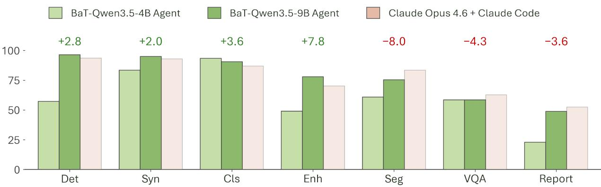

Figure 7: Per-track Overall comparison of the BaT Agents and Claude Opus 4.6 with Claude Code on AutoMedBench-Lite. Bars show the mean Overall score per track on a 0–100 scale. We order tracks left to right by ascending average output tokens per run, from the lightest question-answering tracks to the heaviest imaging pipelines. We estimate the Opus enhancement and report values from its published aggregate scores and measure the remaining values.
<table><tr><td>Parameter</td><td>Recorded setting</td></tr><tr><td>Initializer</td><td>Qwen3.5-9B SFT checkpoint</td></tr><tr><td>Train minibatch</td><td>8/8</td></tr><tr><td>Rollouts per prompt</td><td>4</td></tr><tr><td>Actor learning rate</td><td>1 × 10−6</td></tr><tr><td>Actor KL coefficient</td><td>1 × 10−3</td></tr><tr><td>Rollout temperature</td><td>0.7</td></tr><tr><td>Prompt / response limit</td><td>8,192 / 2,048 tokens</td></tr><tr><td>Model context / max sequences</td><td>12,288 / 16</td></tr><tr><td>Training seed</td><td>42</td></tr><tr><td>Optimizer between rounds</td><td>Reset</td></tr><tr><td>Adaptive schedule</td><td>10 rounds × 50 steps</td></tr><tr><td>Final evaluation</td><td>7 tracks × 10 repeats</td></tr></table>

Table 8: Recorded controls for the matched Qwen3.5-9B pool-ablation contract.

## A.8. External Benchmark Protocol

We evaluate the Instruct baselines and BiCuRL policies on eight external benchmarks. AIME 2025 and AIME 2026 test competition-math reasoning with integer-answer problems (Mathematical Association of America, 2026). GPQA-Diamond tests graduate-level biology, physics, and chemistry questions (Rein et al., 2023). �2-Bench tests multi-turn agents in environments where the agent and user can both take actions (Barres et al., 2025). BFCL-Parity tests function calling, GAIA tests general assistants, SWE-bench Verified tests software issue resolution, and Terminal Bench 2.0 tests command-line work (Patil et al., 2025; Mialon et al., 2024; OpenAI, 2024; Merrill et al., 2026). Within each row, Base and BiCuRL use the same evaluation setting. We compute deltas as BiCuRL minus Base in percentage points.

## References

Anthropic. Claude opus 4.6 system card. Oficial model system card, 2026. URL https://www.anthropic. com/claude-opus-4-6-system-card.

Victor Barres, Honghua Dong, Soham Ray, Xujie Si, and Karthik Narasimhan. �2-Bench: Evaluating conversational agents in a dual-control environment, 2025. URL https://arxiv.org/abs/2506.07982.

Yoshua Bengio, Jérôme Louradour, Ronan Collobert, and Jason Weston. Curriculum learning. In Proceedings of the 26th Annual International Conference on Machine Learning, pages 41–48, 2009. doi: 10.1145/1553374. 1553380.

Yixiong Chen and Alan Yuille. Agentic-DPO: From imitation to agentic policy optimization on expert trajectories, 2026. URL https://arxiv.org/abs/2607.10601.

Yixiong Chen, Xinyi Bai, Yue Pan, Zongwei Zhou, and Alan Yuille. Meissa: Multi-modal medical agentic intelligence. arXiv preprint arXiv:2603.09018, 2026. URL https://arxiv.org/abs/2603.09018.

Zixiang Chen, Yihe Deng, Huizhuo Yuan, Kaixuan Ji, and Quanquan Gu. Self-play fine-tuning converts weak language models to strong language models. In Proceedings of the 41st International Conference on Machine Learning, volume 235 of Proceedings of Machine Learning Research, pages 6621–6642. PMLR, 2024. URL https://proceedings.mlr.press/v235/chen24j.html.

Gemma Team. Gemma 4 Technical Report. arXiv preprint arXiv:2607.02770, 2026. URL https://arxiv.org/ abs/2607.02770.

GLM-5 Team. GLM-5: From vibe coding to agentic engineering, 2026. URL https://arxiv.org/abs/2602. 15763.

Google DeepMind. Gemini 3.1 Pro model card. Oficial model card, 2026. URL https://deepmind.google/ models/model-cards/gemini-3-1-pro/.

Anisha Gunjal, Anthony Wang, Elaine Lau, Vaskar Nath, Yunzhong He, Bing Liu, and Sean M. Hendryx. Rubrics as rewards: Reinforcement learning beyond verifiable domains. In The Fourteenth International Conference on Learning Representations, 2026. URL https://openreview.net/forum?id=c1bTcrDmt4.

Dongfu Jiang, Yi Lu, Zhuofeng Li, Zhiheng Lyu, Ping Nie, Haozhe Wang, Alex Su, Hui Chen, Kai Zou, Chao Du, et al. VerlTool: Towards holistic agentic reinforcement learning with tool use, 2025a. URL https: //arxiv.org/abs/2509.01055.

Yixing Jiang, Kameron C. Black, Gloria Geng, Danny Park, James Zou, Andrew Y. Ng, and Jonathan H. Chen. MedAgentBench: A realistic virtual EHR environment to benchmark medical LLM agents, 2025b. URL https://arxiv.org/abs/2501.14654.

Woosuk Kwon, Zhuohan Li, Siyuan Zhuang, Ying Sheng, Lianmin Zheng, Cody Hao Yu, Joseph E. Gonzalez, Hao Zhang, and Ion Stoica. Eficient memory management for large language model serving with PagedAttention. In Proceedings of the 29th Symposium on Operating Systems Principles, pages 611–626, 2023. doi: 10.1145/ 3600006.3613165. URL https://arxiv.org/abs/2309.06180.

Hunter Lightman, Vineet Kosaraju, Yura Burda, Harri Edwards, Bowen Baker, Teddy Lee, Jan Leike, John Schulman, Ilya Sutskever, and Karl Cobbe. Let’s verify step by step, 2023. URL https://arxiv.org/abs/ 2305.20050.

Junqi Liu, Salena Song, Yuhan Wang, Jiawei Mao, Hardy Chen, Xiaoke Huang, Tianhao Qi, Pengfei Guo, Yucheng Tang, Yufan He, Can Zhao, Andriy Myronenko, Dong Yang, Daguang Xu, and Yuyin Zhou. Automedbench: Towards medical autoresearch with agentic ai models, 2026a. URL https://arxiv.org/abs/2606.01961.

Qianchu Liu, Sheng Zhang, Guanghui Qin, Jeya Maria Jose Valanarasu, Maximilian Rokuss, Mingyu Lu, Timothy Ossowski, Juan Manuel Zambrano Chaves, Clif Wong, Peniel Argaw, Yashna Hasija, Mu Wei, Wen-wai Yim, Qin Liu, Zilin Jing, Jason Entenmann, Naoto Usuyama, Tristan Naumann, and Hoifung Poon. HealthAgentBench: A unified benchmark suite of realistic agentic healthcare environments for challenging frontier AI agents, 2026b. URL https://arxiv.org/abs/2606.31179.

Ilya Loshchilov and Frank Hutter. Decoupled weight decay regularization. In International Conference on Learning Representations, 2019. URL https://openreview.net/forum?id=Bkg6RiCqY7.

Xufang Luo, Yuge Zhang, Zhiyuan He, Zilong Wang, Siyun Zhao, Dongsheng Li, Luna K. Qiu, and Yuqing Yang. Agent lightning: Train ANY AI agents with reinforcement learning, 2025. URL https://arxiv.org/abs/ 2508.03680.

Aman Madaan, Niket Tandon, Prakhar Gupta, Skyler Hallinan, Luyu Gao, Sarah Wiegrefe, Uri Alon, Nouha Dziri, Shrimai Prabhumoye, Yiming Yang, Shashank Gupta, Bodhisattwa Prasad Majumder, Katherine Hermann, Sean Welleck, Amir Yazdanbakhsh, and Peter Clark. Self-refine: Iterative refinement with self-feedback. In Advances in Neural Information Processing Systems, volume 36, 2023. URL https://proceedings.neurips.cc/ paper\_files/paper/2023/hash/91edff07232fb1b55a505a9e9f6c0ff3-Abstract-Conference.html.

Bulat Maksudov, Vladislav Kurenkov, Kathleen M. Curran, and Alessandra Mileo. ABRA: Agent benchmark for radiology applications, 2026. URL https://arxiv.org/abs/2605.11224.

Mathematical Association of America. MAA invitational competitions: American invitational mathematics examination. Oficial competition documentation, 2026. URL https://maa.org/ maa-invitational-competitions/.

Mike A. Merrill, Alexander G. Shaw, Nicholas Carlini, Boxuan Li, Harsh Raj, Ivan Bercovich, Lin Shi, et al. Terminal-bench: Benchmarking agents on hard, realistic tasks in command line interfaces, 2026. URL https://arxiv.org/abs/2601.11868.

Meta. Muse-Glimmer-30B. Oficial model card, 2026. URL https://huggingface.co/meta-models/ Muse-Glimmer-30B.

Grégoire Mialon, Clémentine Fourrier, Craig Swift, Thomas Wolf, Yann LeCun, and Thomas Scialom. GAIA: A benchmark for general AI assistants. In International Conference on Learning Representations, 2024. URL https://proceedings.iclr.cc/paper\_files/paper/2024/hash/ 25ae35b5b1738d80f1f03a8713e405ec-Abstract-Conference.html.

NVIDIA. NVIDIA A100 Tensor Core GPU data sheet. Product data sheet, 2022. URL https://www.nvidia.com/content/dam/en-zz/Solutions/Data-Center/a100/pdf/ nvidia-a100-datasheet-nvidia-us-2188504-web.pdf.

NVIDIA. Nemotron 3 Nano: Open, eficient mixture-of-experts hybrid mamba-transformer model for agentic reasoning. Technical report, 2025a. URL https://research.nvidia.com/labs/nemotron/files/ NVIDIA-Nemotron-3-Nano-Technical-Report.pdf.

NVIDIA. NVIDIA-Nemotron-Nano-9B-v2. Oficial model card, 2025b. URL https://huggingface.co/nvidia/ NVIDIA-Nemotron-Nano-9B-v2.

NVIDIA. NVIDIA-Nemotron-3.5-Lightning-30B-A3B-BF16. Oficial model card, 2026a. URL https:// huggingface.co/nvidia/NVIDIA-Nemotron-3.5-Lightning-30B-A3B-BF16.

NVIDIA. NVIDIA-Nemotron-3-Nano-4B-BF16. Oficial model card, 2026b. URL https://huggingface.co/ nvidia/NVIDIA-Nemotron-3-Nano-4B-BF16.

OpenAI. Introducing SWE-bench Verified. Benchmark release, 2024. URL https://openai.com/index/ introducing-swe-bench-verified/.

OpenAI. gpt-oss-120b & gpt-oss-20b model card, 2025. URL https://arxiv.org/abs/2508.10925.

OpenAI. Introducing GPT-5.5. Oficial model release, 2026. URL https://openai.com/index/ introducing-gpt-5-5/.

Long Ouyang, Jef Wu, Xu Jiang, Diogo Almeida, Carroll L. Wainwright, Pamela Mishkin, Chong Zhang, Sandhini Agarwal, Katarina Slama, Alex Ray, John Schulman, Jacob Hilton, Fraser Kelton, Luke Miller, Maddie Simens, Amanda Askell, Peter Welinder, Paul Christiano, Jan Leike, and Ryan Lowe. Training language models to follow instructions with human feedback. In Advances in Neural Information Processing Systems, 2022. URL https://arxiv.org/abs/2203.02155.

Jiayi Pan, Xingyao Wang, Graham Neubig, Navdeep Jaitly, Heng Ji, Alane Suhr, and Yizhe Zhang. Training software engineering agents and verifiers with SWE-Gym, 2024. URL https://arxiv.org/abs/2412.21139.

Shishir G. Patil, Huanzhi Mao, Fanjia Yan, Charlie Cheng-Jie Ji, Vishnu Suresh, Ion Stoica, and Joseph E. Gonzalez. The berkeley function calling leaderboard (BFCL): From tool use to agentic evaluation of large language models. In Proceedings of the 42nd International Conference on Machine Learning, volume 267 of Proceedings of Machine Learning Research, pages 48371–48392. PMLR, 2025. URL https://proceedings. mlr.press/v267/patil25a.html.

Valentina Pyatkin, Saumya Malik, Victoria Graf, Hamish Ivison, Shengyi Huang, Pradeep Dasigi, Nathan Lambert, and Hannaneh Hajishirzi. Generalizing verifiable instruction following, 2025. URL https://arxiv. org/abs/2507.02833.

Qwen Team. Qwen3.5-35B-A3B. Oficial model card, 2026a. URL https://huggingface.co/Qwen/Qwen3. 5-35B-A3B.

Qwen Team. Qwen3.5-4B. Oficial model card, 2026b. URL https://huggingface.co/Qwen/Qwen3.5-4B.

Qwen Team. Qwen3.5-9B. Oficial model card, 2026c. URL https://huggingface.co/Qwen/Qwen3.5-9B.

Qwen Team. Qwen3.6-27B: Flagship-level coding in a 27b dense model. Oficial model card, 2026d. URL https://huggingface.co/Qwen/Qwen3.6-27B.

David Rein, Betty Li Hou, Asa Cooper Stickland, Jackson Petty, Richard Yuanzhe Pang, Julien Dirani, Julian Michael, and Samuel R. Bowman. GPQA: A graduate-level google-proof Q&A benchmark, 2023. URL

Zhihong Shao, Peiyi Wang, Qihao Zhu, Runxin Xu, Junxiao Song, Xiao Bi, Haowei Zhang, Mingchuan Zhang, Y. K. Li, Y. Wu, and Daya Guo. Deepseekmath: Pushing the limits of mathematical reasoning in open language models, 2024. URL https://arxiv.org/abs/2402.03300.

Shuang Sun, Huatong Song, Lisheng Huang, Jinhao Jiang, Ran Le, Zhihao Lv, Zongchao Chen, Yiwen Hu, Wenyang Luo, Wayne Xin Zhao, Yang Song, Hongteng Xu, Tao Zhang, and Ji-Rong Wen. Swe-world: Building software engineering agents in docker-free environments, 2026. URL https://arxiv.org/abs/2602.03419.

Xingyao Wang, Boxuan Li, Yufan Song, Frank F. Xu, Xiangru Tang, Mingchen Zhuge, Jiayi Pan, Yueqi Song, Bowen Li, Jaskirat Singh, Hoang H. Tran, Fuqiang Li, Ren Ma, Mingzhang Zheng, Bill Qian, Yanjun Shao, Niklas Muennighof, Yizhe Zhang, Binyuan Hui, Junyang Lin, Robert Brennan, Hao Peng, Heng Ji, and Graham Neubig. OpenHands: An open platform for AI software developers as generalist agents. In International Conference on Learning Representations, 2025. URL https://arxiv.org/abs/2407.16741.

Yizhong Wang, Yeganeh Kordi, Swaroop Mishra, Alisa Liu, Noah A. Smith, Daniel Khashabi, and Hannaneh Hajishirzi. Self-instruct: Aligning language models with self-generated instructions. In Proceedings of the 61st Annual Meeting of the Association for Computational Linguistics (Volume 1: Long Papers), pages 13484–13508. Association for Computational Linguistics, 2023. doi: 10.18653/v1/2023.acl-long.754. URL https://aclanthology.org/2023.acl-long.754/.

Juncheng Wu, Letian Zhang, Yuhan Wang, Haoqin Tu, Hardy Chen, Zijun Wang, Cihang Xie, and Yuyin Zhou. ClinSeekAgent: Automating multimodal evidence seeking for agentic clinical reasoning. arXiv preprint arXiv:2605.20176, 2026. URL https://arxiv.org/abs/2605.20176.

Yiheng Xu, Dunjie Lu, Zhennan Shen, Junli Wang, Zekun Wang, Yuchen Mao, Caiming Xiong, and Tao Yu. AgentTrek: Agent trajectory synthesis via guiding replay with web tutorials. In The Thirteenth International Conference on Learning Representations, 2025. URL https://proceedings.iclr.cc/paper\_files/paper/ 2025/hash/c681fb2bf1d785fbc766f3ea14758aab-Abstract-Conference.html.

Junlin Yang, Che Jiang, Yu Fu, Tianwei Luo, Can Ren, Weizhi Wang, Kaikai Zhao, Hongyi Liu, Yuxin Zuo, Yuru Wang, Yuchen Fan, Kai Tian, Zhenzhao Yuan, Xiaojian Lin, Li Sheng, Rushi Qiang, Guoli Jia, Xingtai Lv, Ermo Hua, Dianqiao Lei, Youbang Sun, Ning Ding, Bowen Zhou, and Kaiyan Zhang. Frontis-MA1: Training an AI4AI model towards recursive self-improvement in machine learning engineering, 2026. URL https://arxiv.org/abs/2607.28568.

Shunyu Yao, Jefrey Zhao, Dian Yu, Nan Du, Izhak Shafran, Karthik Narasimhan, and Yuan Cao. ReAct: Synergizing reasoning and acting in language models. In International Conference on Learning Representations, 2023. URL https://arxiv.org/abs/2210.03629.

Weizhe Yuan, Richard Yuanzhe Pang, Kyunghyun Cho, Xian Li, Sainbayar Sukhbaatar, Jing Xu, and Jason E. Weston. Self-rewarding language models. In Proceedings of the 41st International Conference on Machine Learning, volume 235 of Proceedings of Machine Learning Research, pages 57905–57923. PMLR, 2024. URL https://proceedings.mlr.press/v235/yuan24d.html.

Yanli Zhao, Andrew Gu, Rohan Varma, Liang Luo, Chien-Chin Huang, Min Xu, Less Wright, Hamid Shojanazeri, Myle Ott, Sam Shleifer, Alban Desmaison, Can Balioglu, Pritam Damania, Bernard Nguyen, Geeta Chauhan, Yuchen Hao, Ajit Mathews, and Shen Li. PyTorch FSDP: Experiences on scaling fully sharded data parallel.

Proceedings of the VLDB Endowment, 16(12):3848–3860, 2023. doi: 10.14778/3611540.3611569. URL https://arxiv.org/abs/2304.11277.

Lianmin Zheng, Wei-Lin Chiang, Ying Sheng, Siyuan Zhuang, Zhanghao Wu, Yonghao Zhuang, Zi Lin, Zhuohan Li, Dacheng Li, Eric P. Xing, Hao Zhang, Joseph E. Gonzalez, and Ion Stoica. Judging LLM-as-a-judge with MT-Bench and chatbot arena, 2023. URL https://arxiv.org/abs/2306.05685.

Lianmin Zheng, Liangsheng Yin, Zhiqiang Xie, Chuyue Sun, Jef Huang, Cody Hao Yu, Shiyi Cao, Christos Kozyrakis, Ion Stoica, Joseph E. Gonzalez, Clark Barrett, and Ying Sheng. SGLang: Eficient execution of structured language model programs. In Advances in Neural Information Processing Systems, volume 37, 2024. doi: 10.52202/079017-2000. URL https://proceedings.neurips.cc/paper\_files/paper/2024/hash/ 724be4472168f31ba1c9ac630f15dec8-Abstract-Conference.html.

Yuxin Zuo, Shang Qu, Yifei Li, Zhang-Ren Chen, Xuekai Zhu, Ermo Hua, Kaiyan Zhang, Ning Ding, and Bowen Zhou. MedXpertQA: Benchmarking expert-level medical reasoning and understanding. In Proceedings of the 42nd International Conference on Machine Learning, volume 267 of Proceedings of Machine Learning Research, pages 80961–80990. PMLR, 2025. URL https://proceedings.mlr.press/v267/zuo25a.html.