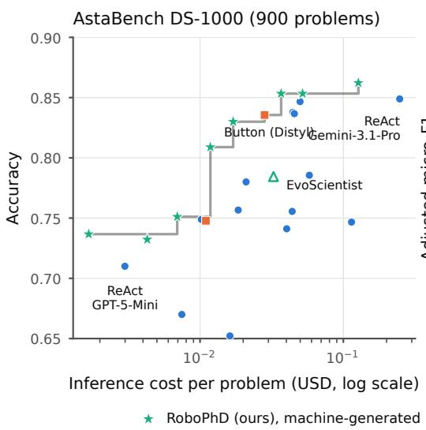
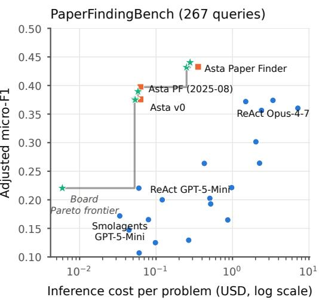

# Competing at Every Price Point with Agentic Evolution over a Menu of LLMs

Andrew Borthwick Independent Researcher aeborthwick@gmail.com

## Abstract

Consider a firm that surveys its competition for a particular agentic task and seeks to offer superior accuracy at every competitor price point. A firm that Pareto-dominated its competitors would leave no rational customer a reason to buy elsewhere. This paper shows a path to this kind of capability via agentic evolution over a menu of LLMs, from training pools of at most 100 examples. Given a priced menu of nine LLM endpoints; brief documentation of the task, objective, and API; a simple seed agent; and an operator-chosen per-problem cost target—usually set at an incumbent’s own price—RoboPhD, an evolutionary meta-agent, evolves complete agent programs that attack the public frontiers of two semantically dissimilar tasks point by point: DS-1000 (execution-checked code generation) and PaperFindingBench (LLM-judged scientific document retrieval). Our officially scored submissions hold every Pareto-frontier slot but one on the two tasks’ leaderboards, including Pareto domination of both the top-scoring and the lowest-cost competing points.

## 1 Introduction

Industrial deployment of an LLM agent almost inevitably involves a decision about the tradeoff between quality and inference cost. It is frequently possible to gain higher levels of accuracy by spending more on inference, but every customer is likely to have a different budget and a different tolerance for error. Thus, to maximize sales, the vendor of an agentic solution for a task would seek to Pareto-dominate every competitor’s offering on the price and quality axes.

Yet current tools for building agents optimize almost exclusively the quality axis. The recent wave of harness-optimization systems—Meta-Harness [Lee et al., 2026], HARBOR [Sengupta and Wang, 2026], Self-Harness [Zhang et al., 2026], HarnessForge [Chen et al., 2026]—searches over harness code or configuration around afixed model, reporting cost (when at all) as an outcome rather than a target. Meanwhile a team that needs an agent at a specific price point has one crude lever today: swap the model inside a fixed scaffold. Delivering the best value at a particular price point thus becomes a hit and miss affair. This approach also inhibits the discovery of more sophisticated cost-saving strategies, such as using a cheaper model for routine steps and reserving a stronger model for hard cases or adjudication.

We report here a demonstration of this capability on two public leaderboards from AstaBench [Bragg et al., 2026] (Figure 1), achieved by evolving complete agent Python programs 300–2,100 lines long, each incorporating calls to between one and five models from a priced menu of nine LLM endpoints. We chose the two AstaBench tasks to be semantically dissimilar while each proxying a major industrial workload (Table 1): DS-1000 [Lai et al., 2023] is data-science code generation— self evidently commercial—while PaperFindingBench is ranked document retrieval with cited evidence over a massive scientific corpus, accessed through a provided tool suite. The latter task is both directly useful to scientists (one of the competing entries is a deployed system) and analogous to the common

  
General-purpose scaffold × model

  
Hand-engineered, task-specific  
Self-evolving system (EvoScientist)

Figure 1: Cost–quality frontiers, AstaBench DS-1000 (left) and PaperFindingBench (right), leaderboard snapshot 2026-08-16. The gray staircase is each board’s Pareto frontier: RoboPhD holds six of its seven points on DS-1000 (all but the hand-built Button) and five of its six on PaperFindingBench (all but one Asta Paper Finder). The full boards are Tables 4–5. The 0.440 and 0.390 entries for PaperFindingBench (here and wherever they appear) were scored by the official astabench evaluation and submitted to the leaderboard, but were awaiting maintainer confirmation at this writing. All other RoboPhD entries are live on the public boards.

industrial problem of searching a large organization’s internal documents. The pair also cover two distinct evaluation regimes: DS-1000 is execution-checked against gold-standard tests throughout, while 73% of PaperFindingBench queries are scored by an LLM judge over agent-supplied evidence.

This paper exercises the RoboPhD engine of Borthwick et al. [2026], where its algorithm, diversity mechanisms, and a controlled four-task engine comparison are documented. Contributions of this work include: (1) cost-targeted agent evolution over a priced multi-provider menu: a settable dollar threshold and penalty slope inside the objective, with model choice per call site inside the search space—so cost pressure is answered by discovered composition (cascades, ensembles, stage-wise model and effort assignment, spanning one to five models across our entries) rather than frugality within a fixed model (Section 2); (2) two-task results showing near-domination of the Pareto frontier against public, independently scored leaderboards, achieved under data-starved training pools of 66 and 100 examples (Sections 3–4); (3) a management taxonomy with field reports on incentive design for an evolutionary optimizer (Section 6).

## 2 System summary

Optimization formulation. RoboPhD evolves a single-file agent program under an optimize\_anything formulation [Agrawal et al., 2026]: candidate programs are evaluated on batches of training examples, and each “evolution session”—the evolution model running inside an agentic coding environment (Claude Code) with file and shell access to the run’s workspace—reads the incumbent’s code, per-example diagnostics, and comparative error reports before writing the next candidate. Selection is by Elo over head-to-head batch tournaments; each iteration draws a fresh batch, so there is no fixed validation set to overfit. Algorithm details, diversity mechanisms, a controlled comparison against GEPA [Agrawal et al., 2025] and an implementation of Karpathy’s Autoresearch [Karpathy, 2026] on four tasks under matched budgets, seeds, and menus are in Borthwick et al. [2026]. We do not repeat that controlled comparison here; rather, the results that follow extend the engine’s generalization evidence to two further, unrelated task families and to a new capability: hitting operator-chosen cost targets.

The cost objective. Prior work [Agrawal et al., 2026, Borthwick et al., 2026] has focused on cost as a per-example budget, where the optimizer is penalized for exceeding a fixed per-example cost. However, the metric that matters—on the AstaBench boards we are targeting as well as in ordinary business budgeting—is average cost (an operator typically cares about aggregate spend, accepting that some queries run expensive if others run cheap). We propose a training objective which targets this quantity. For each training batch of 14–20 examples, we combine aggregated per-example cost and quality as follows:

$$
S = \frac { 1 0 0 } { n } \left[ \underbrace { \sum _ { i } q _ { i } } _ { \mathrm { c o r r e c t a n s w e r s } } - \underbrace { \operatorname* { m a x } \Bigl ( 0 , \frac { \bar { c } - \tau } { \kappa } \Bigr ) } _ { \mathrm { c o s t p e n a l t y , i n e r r o r - e q u i v a l e n t s } } \right]\tag{1}
$$

where n is the batch size, $q _ { i } \in [ 0 , 1 ]$ is example i’s quality score (binary on DS-1000, mostly F1 on PaperFindingBench), c¯ is the batch’s mean per-example cost,<sup>1</sup> τ is the operator’s cost threshold, and κ (the cost\_per\_error slope) prices one error-equivalent in dollars of overage: each κ of mean overage subtracts exactly what one wrong answer would—the penalty is denominated in the unit the optimizer already cares about (rendered for the optimizer as breakeven arithmetic; an instantiation is reproduced as Table 9). The penalty exists only at training time, as the signal steering evolution toward the requested operating point; held-out and leaderboard evaluations report raw score and cost as separate axes, so no number in Sections 3–4 is penalty-adjusted. The penalty is graded rather than binary for a reason that follows from the averaging itself: when easy examples subsidize hard ones, an agent’s batch-mean cost varies with how many hard cases the batch happens to draw, and an on/off penalty would turn an unlucky draw into a catastrophic score cliff—so a rational optimizer would target operating points far below the requested threshold to buy safety margin. The linear ramp makes a small breach a small matter, letting evolution work near the boundary of the “free zone,” τ. The slope κ is itself settable—an incentive-design knob whose effect we measure directly in a two-arm experiment (Section 6, item 3)—and our later runs<sup>2</sup> default to $\kappa = 0 . 1 \tau$ , scaling the penalty with the target: exceeding a budget by \$0.01 should matter far more against a \$0.02 target than against a \$0.20 one. The objective document then pins the optimizer to this computed score. Its opening instruction: “your primary goal is simple: maximize the score on held-out queries. The scoring function [. . . ] encodes this directly—retrieval quality is the dominant signal, and cost acts as a tiebreaker close to threshold but starts to actively trade offagainst scorefarther out.” The direction matters because the optimizer is an LLM with priors, not a blank slate: a model with a trained disposition toward frugality may treat cheapness as a virtue in itself and leave a large portion of an allocated budget unspent. The objective makes cost worth exactly what the scoring function says it is worth—not a concern below τ, one error-equivalent per κ above—and the message is received: a later Opus-5 run’s design notes reason that “spending below \$0.18 buys nothing (thefree zone isflat).”

Evolving agents over a menu of models. Agents call models only through a registry of nine priced handles—three each from OpenAI, Anthropic, and Google, spanning roughly 10× in per-token price, each with a per-call reasoning\_effort knob (Appendix C). The menu is what makes cost targeting expressive. On both tasks, we start from a seed agent that calls only a single model, GPT-5.4-Mini, but the joint pressures of cost and accuracy drive the evolving agents to different kinds of composition—cheap-first cascades with strong-model escalation, mixed ensembles with adjudication, model choice per pipeline stage—rather than frugality within one model. The range this opens is wide and is used: the fourteen board entry agents use between one and five models. The top DS-1000 entry (0.862 at \$0.127) is an extensive ensemble drawing on five handles; the 0.809 entry delivers near-bottom cost (\$0.012/problem) on a comparatively expensive model, Claude-Sonnet-4.6, spent sparingly, while its \$0.004 sibling composes four models from the cheapest tier. Collectively the fourteen entries exercise all nine handles on the menu.

A system with minimal human inputs. Of RoboPhD’s inputs, the dataset and evaluator are functionally free—any problem worth solving already has data and a way to score an attempt (a slogan for RoboPhD: “if you can benchmark it, RoboPhD can optimize it”). The authored increment is small: a five-line objective; a background document (130 to 227 lines) describing the task—scoring rules, output schema, and the tool and model APIs—largely transcribed from existing documentation and, by house rule, containing no strategy hints or recommended settings; and a minimal seed agent (46 to 121 lines) which makes one or two calls per problem to a single cheap model, GPT-5.4- Mini. The objectives are reproduced in full, and the background documents in verbatim excerpt, in Appendix E. From this, evolution produced frontier-holding agents of 302–2,488 lines—every cascade, ensemble, and model choice in them discovered. In addition to these modest human inputs, a RoboPhD evolutionary run incurs \$34–\$368 of compute. By contrast, the announcement for Ai2’s Asta Paper Finder credits a fourteen-person team [Allen Institute for AI, 2025].

<table><tr><td rowspan=1 colspan=1></td><td rowspan=1 colspan=1>DS-1000</td><td rowspan=1 colspan=1>PaperFindingBench</td></tr><tr><td rowspan=1 colspan=1>Task</td><td rowspan=1 colspan=1>data-science code generation</td><td rowspan=1 colspan=1>ranked scientific literature retrieval</td></tr><tr><td rowspan=1 colspan=1>Verifier</td><td rowspan=1 colspan=1>hidden execution tests (no judge)</td><td rowspan=1 colspan=1>exact match (27%) + LLM judge overagent-supplied evidence (73%)</td></tr><tr><td rowspan=1 colspan=1>Per-problem score</td><td rowspan=1 colspan=1>binary</td><td rowspan=1 colspan=1>continuous F1 (exact-match classes near-all-or-nothing)</td></tr><tr><td rowspan=1 colspan=1>Tools (free)</td><td rowspan=1 colspan=1>Python sandbox</td><td rowspan=1 colspan=1>Asta MCP corpus API, eight tools</td></tr><tr><td rowspan=1 colspan=1>Train pool / held-out</td><td rowspan=1 colspan=1>100 / 900</td><td rowspan=1 colspan=1>66/267</td></tr><tr><td rowspan=1 colspan=1>Batch / evals per run</td><td rowspan=1 colspan=1>20/~580-800</td><td rowspan=1 colspan=1>14/~600</td></tr><tr><td rowspan=1 colspan=1>Best generic scaffold</td><td rowspan=1 colspan=1>0.849 @ $0.247 (ReAct/Gemini-3.1-Pro)</td><td rowspan=1 colspan=1>0.374 @ $3.381 (ReAct/Opus-4-7)</td></tr><tr><td rowspan=1 colspan=1>Best hand-built</td><td rowspan=1 colspan=1>0.836 @ $0.028 (Button)</td><td rowspan=1 colspan=1>0.433 @ $0.355 (Asta Paper Finder)</td></tr><tr><td rowspan=1 colspan=1>Our τ range</td><td rowspan=1 colspan=1>$0.003-$0.16</td><td rowspan=1 colspan=1>$0.033-$0.355</td></tr></table>

Table 1: The two boards studied in this work.

Three classes of competitor. Both boards are populated by two classes, and our entries constitute a third: (1) general-purpose scaffolds swept over models (ReAct [Yao et al., 2023], Smolagents Coder [Roucher et al., 2025], submitted by the board maintainers) —zero task engineering, sparse cost points, the model swap being the only cost dial; (2) hand-engineered task-specific systems (Distyl AI’s commercial Button on DS-1000; Ai2’s Asta Paper Finder [Allen Institute for AI, 2025] and Asta v0 [Bragg et al., 2026])—expert-built, holding top slots; (3) machine-generated task-specific agents (ours)—running on AstaBench’s Standard tooling tier.<sup>3</sup>

## 3 DS-1000: execution-checked code generation

Setup. AstaBench DS-1000 poses 1,000 data-science coding problems originally collected from Stack Overflow questions about seven Python libraries (NumPy, Pandas, SciPy, Matplotlib, Scikitlearn, TensorFlow, PyTorch), many perturbed against memorization [Lai et al., 2023]: each problem gives a natural-language question with a partial code context, and the agent completes the code. Scoring is binary per problem, by hidden execution tests (some with code-style constraints); there is no judge (See Table 1 and Appendix C.4 for details and an example problem).

Frontier results. Eight submissions were scored by Ai2’s official astabench evaluation (see Table 2, which mirrors the official Ai2 leaderboard); Figure 1 shows them against the board, and Appendix G records notes on the few borderline cases. The net result: every ReAct and Smolagents entry on the DS-1000 board is dominated by a RoboPhD point, and the only non-RoboPhD survivor board-wide is the hand-engineered Button. On the other hand, note that Ai2’s hand-built, fully-custom Asta v0 is Pareto-dominated by one of our cheapest entries, and the board’s nearest neighbor to our class— EvoScientist-Code, the coding arm of a self-evolving multi-agent “AI scientist” [Lyu et al., 2026]—is dominated as well.

What evolution built. The frontier is held by qualitatively different programs, not one program retuned (Appendix F). The \$0.127 agent is a 1,214-line strong-model pipeline that detects hidden loopfree (“idiomatic”) requirements and safely rewrites looping answers into vectorized form. The \$0.037 agent (500 lines) executes three cheap-model solutions from different model families, compares outputs down to DataFrame and array dtypes, and escalates to a judge on disagreement. The \$0.017 agent is a Sonnet-primary/Opus-fallback cascade. At \$0.002, evolution converged on a 302-line single-strong-call one-shot with deterministic format repair—at that price, verification calls cost more than they recover, and the program shrank accordingly.

<table><tr><td>Entry</td><td></td><td>τ ($; aimed at)</td><td>Evol. model Score @ $/prob</td><td></td><td>Util.</td></tr><tr><td colspan="6">DS-1000</td></tr><tr><td></td><td>RoboPhD</td><td>0.16</td><td>Opus-4.7</td><td>0.862 @ $0.127</td><td>80%</td></tr><tr><td></td><td>RoboPhD</td><td>0.06</td><td>Fable-5</td><td>0.853 @ $0.052</td><td>87%</td></tr><tr><td></td><td>RoboPhD</td><td>0.08</td><td>Opus-4.8</td><td>0.853 @ $0.037</td><td>46%</td></tr><tr><td></td><td colspan="3">4 ReAct entries, dominated</td><td>0.837–0.849 @ $0.044–$0.247</td><td></td></tr><tr><td></td><td>Button</td><td></td><td></td><td>0.836 @ $0.028</td><td></td></tr><tr><td></td><td>RoboPhD</td><td>0.05</td><td>Opus-4.8</td><td>0.830 @ $0.017</td><td>34%</td></tr><tr><td></td><td>RoboPhD</td><td>0.08</td><td>Opus-4.7</td><td>0.809 @ $0.012</td><td>15%</td></tr><tr><td></td><td colspan="3">5 entries (ReAct, Smolagents, EvoScientist), dominated</td><td>0.756–0.786 @ $0.018–$0.058</td><td></td></tr><tr><td></td><td>RoboPhD</td><td>0.05</td><td>Opus-4.8</td><td>0.751 @ $0.007</td><td>14%</td></tr><tr><td></td><td>4 entries incl. hand-built Asta v0, dominated</td><td></td><td></td><td>0.741-0.749 @ $0.010–$0.114</td><td></td></tr><tr><td>中</td><td>RoboPhD</td><td>0.003 (ReAct)</td><td>Opus-4.8</td><td>0.737 @ $0.002</td><td>56%</td></tr><tr><td></td><td>RoboPhD</td><td>0.003 (ReAct)</td><td>Fable-5</td><td>0.732 @ $0.004</td><td>143%§</td></tr><tr><td></td><td>ReAct/GPT-5-Mini</td><td></td><td></td><td>0.710 @ $0.003</td><td></td></tr><tr><td></td><td colspan="3">11 entries (ReAct, Smolagents), dominated</td><td>0.027–0.670 @ $0.004–$0.137</td><td></td></tr><tr><td></td><td>PaperFindingBench</td><td></td><td></td><td></td><td></td></tr><tr><td></td><td>RoboPhD</td><td>0.355 (Asta PF)</td><td>Fable-5</td><td>0.440 @ $0.279</td><td>78%</td></tr><tr><td></td><td>Asta Paper Finder</td><td></td><td></td><td>0.433 @ $0.355</td><td></td></tr><tr><td></td><td>RoboPhD</td><td>0.355 (Asta PF)</td><td>Opus-5</td><td>0.432 @ $0.251</td><td>71%</td></tr><tr><td></td><td>Asta Paper Finder</td><td></td><td></td><td>0.397 @ $0.063</td><td></td></tr><tr><td></td><td>RoboPhD</td><td>0.063 (Asta PF)</td><td>Fable-5</td><td>0.390 @ $0.058</td><td>92%</td></tr><tr><td></td><td>RoboPhD</td><td>0.063 (Asta PF)</td><td>Opus-5</td><td>0.376 @ $0.052</td><td>83%</td></tr><tr><td></td><td>Asta v0</td><td></td><td></td><td>0.376 @ $0.063</td><td></td></tr><tr><td></td><td>RoboPhD</td><td>0.06 (ReAct)</td><td>Fable-5</td><td>0.375 @ $0.053</td><td>89%</td></tr><tr><td></td><td colspan="3">8 entries (ReAct, Smolagents), dominated</td><td>0.221-0.374 @ $0.43–$7.16</td><td></td></tr><tr><td></td><td>RoboPhD</td><td>0.033 (Smolagents) Opus-4.8</td><td></td><td>0.220 @ $0.006</td><td>18%</td></tr><tr><td></td><td>ReAct/GPT-5-Mini</td><td></td><td></td><td>0.220 @ $0.060</td><td></td></tr><tr><td></td><td colspan="3">3 entries (ReAct, Smolagents), dominated</td><td>0.193–0.203 @ $0.12–$0.52</td><td></td></tr><tr><td></td><td colspan="3">Smolagents/GPT-5-Mini</td><td>0.172 @ $0.033</td><td></td></tr><tr><td></td><td colspan="3">10 entries (ReAct, Smolagents), dominated</td><td>0.046-0.165 @ $0.01–$2.82</td><td></td></tr></table>

Table 2: All fourteen RoboPhD submissions (shaded), in board order, interleaved with the competitor field. Œ: on the board’s Pareto frontier (official semantics); un-trophied RoboPhD rows are displaced by their cheaper neighbors. τ provenance in parentheses where set at a competitor’s price. <sup>§</sup>: officialbasis utilization, partly measurement error. Full boards: Tables 4–5; run detail: Table 3; governing comparisons: Appendix G.

## 4 PaperFindingBench: LLM-judged scientific document retrieval

Setup. PaperFindingBench poses 267 held-out natural-language literature-search queries in three classes: 38 specific (one paper the user can already name—“the original transformers paper”), 35 metadata (a set fixed by bibliographic constraint—“2012 papers by David Harel”), and 194 semantic (a topical need with no closed gold list—“papers on online adaptation of neural MT metrics at inference”; fuller examples: Appendix C.4). The agent returns ranked Semantic Scholar [Kinney et al., 2023] corpus IDs with markdown evidence per paper, scored as adjusted micro-F1: the two exact-match classes (∼27%) are scored by ID intersection against an enumerated gold set, the semantic majority by an LLM judge reading agent-supplied evidence (scoring details: Appendix C). Standard tooling is the Asta MCP corpus API: eight tools over the Semantic Scholar corpus—keyword, title, full-text-snippet, and author search, plus paper metadata, batch lookup, and citation traversal. The background document (Appendix E) describes the API. This document represented our best effort, but nevertheless a residue of bugs and quirks always remained, left to each run to discover for itself. Section 6 (items 4–5) describes the probe access that makes that discovery cheap and the loop that folds it back into the document.

Frontier results. Six submissions were scored by Ai2’s official astabench evaluation (Table 2; Figure 1; borderline cases: Appendix G). The net result: every ReAct and Smolagents entry on the PaperFindingBench board is dominated by a RoboPhD point—matching DS-1000. Also, like DS-1000, RoboPhD holds the highest score on the board at 0.440 at \$0.279 (dominating the hand-built Asta Paper Finder’s 0.433 at \$0.355). RoboPhD also holds the cheapest point on the Pareto curve with 0.220 at \$0.006, a run which dominates 15 ReAct and Smolagents entries. In addition to the high-end Asta Paper Finder result, we dominate one other hand-engineered system: Ai2’s Asta v0. The cheaper Asta Paper Finder configuration retains the only non-RoboPhD frontier slot (0.397 at \$0.063), targeted twice by RoboPhD evolutionary runs, but not cleared. Some score margins are narrow; the cost margins are not—where a score edge is small against sampling noise, an equal-or-better score at substantially lower cost establishes the point on the cost axis alone.

What evolution built. The \$0.053 agent (2,097 lines) plans with GPT-5.4, retrieves by body-text conjunction—conjunctive corpus queries over full-text matches—and grades candidates with a GPT-5.4-mini cascade before assembling grounded evidence. The \$0.006 agent (1,006 lines) is an all-mini program: every call on the menu’s cheapest tier, with strict evidence discipline (Section 6, item 1) holding score at 18× less spend than the hand-built system it undercuts. The \$0.279 board leader (2,781 lines, two OpenAI handles) found an opportunity in its evolutionary predecessors’ waste: candidates that were previously retrieved and then discarded by an internal cap before grading were now graded on the mini tier (Appendix F).

## 5 Coping with data starvation

A data-starved regime. Both tasks are data-starved: training pools of 66 (PaperFindingBench) and 100 (DS-1000) examples against held-out test sets of 267 and 900—pools well below the 400-example minimum training pool of the four tasks described in Borthwick et al. [2026]. However, this is also the regime many deployments actually inhabit: labeled examples, or even examples crisp enough for an LLM judge to score, are commonly the scarcest input a team has. At these volumes, weight-based adaptation—supervised or parameter-efficient fine-tuning, RL—is impractical even setting aside its other obstacles here (the strongest solver models are closed API endpoints, and the tasks provide ways to score an attempt, not demonstrations of tool-using solution paths to imitate). Optimizing the agent program, with an LLM reflecting on rich per-example diagnostics, is the approach that operates at this scale [Agrawal et al., 2025, Borthwick et al., 2026].<sup>4</sup> Batches are deliberately ∼20% of the pool (14 and 20 examples), and total data reuse over a run is ≈ 4× the pool.<sup>5</sup>

The objective is a document, not a scalar. Pool overfitting is the default outcome for any optimizer here. The core RoboPhD algorithm of randomly drawing a fresh batch with every evolutionary iteration and Elo ranking the evolved agents described in Borthwick et al. [2026] is only a partial solution at the extreme levels of data starvation we are studying here. The resulting evolutionary pressure would prove inadequate when it is possible to memorize the entire training pool. Blatant overfitting would be trivial to accomplish. Although the deployed agent only receives the query, evolution is shown full per-example ground truth. For instance, in PaperFindingBench it is shown relevance criteria, per-paper judge verdicts, and score decomposition, so the evolutionary metaagent has information sufficient to construct an agent that would win every batch through trivial memorization.

To meet this challenge, note that although one cannot tell SGD that the batch is a proxy, an LLM optimizer can be told. We ended both tasks’ objective documents with: “your objective is to build an agent that generalizes to unseen problems—the visible batch is a training signal, not the target”.

Experimental evidence on resistance to overfitting. The signature of overfitting would be trainingtime selection climbing while held-out score falls. We measured four completed runs—two per task, at each task’s most expensive cost target and a mid-range one—at five waypoints each: the seed, the iteration-2 agent, the Elo leader as of iterations 6 and 11, and the shipped winner (the

Elo winner at the end of the evolutionary run). Note that the iteration-2 agent isolates the effect of simply using Claude Code with the provided information, absent any impact of evolutionary pressure. Iterations 6 and 11 illustrate the compounding effects of further iterations of evolutionary refinement and evolutionary pressure. In every case, we saw monotonic score increases on the held-out test data. Interestingly, we also see monotonic increases in per-example cost in all four lineages, representing evolution incrementally increasing its exploitation of the available headroom under the cost cap, τ; similarly, we see monotonic increases in lines of code (exclusive of doc-strings, etc.), as shown in Table 7 (Appendix D). Finally, an examination of the evolutionary meta-agent’s reasoning at the evolutionary waypoints shows that it is mindful of the generalization requirement. Sample quotes:

• “Timeout-risk also generalizes to the held-out set (cold snippet queries are query-dependent [. . . ]), so thefix is not batch-overfit.” (PaperFindingBench \$0.063, iteration 10)

• “They are essentially the same hidden test [. . . ], just phrased as a style/aesthetics request [. . . ] Held-out problems will likely include more ofthese.” (DS-1000 \$0.16, iteration 10)

• “The two concrete edits [. . . ] target structural weak spots (subtle-correctness judging; unverifiable matplotlib), not the specific 20 problems. I deliberately do not try to specialcase 284’s dtype quirk [. . . ].” (DS-1000 \$0.08, iteration 8)

## 6 Managing the managing agent

An appendix of Borthwick et al. [2026] reported an incident in which an evolutionary meta-agent discovered an API weakness which revealed hidden future datapoints on a forecasting task. This weakness was avoided on future runs by more careful engineering. Analogously, early in the work reported here, we observed a different “exploit” in which the evolutionary meta-agent examined the results of prior evolutionary runs to gain insights into its own strategies, a violation of our policy of keeping each run self-contained. Again, there was an engineering response which confined evolution to only viewing current run data. We focus here, however, on a more subtle class of management issues: in some cases we had to provide additional tools and information to the evolutionary metaagent; in others, we restricted its ability to consume unpriced resources that it was rationally exploiting in pursuit of its stated objective. Such behavior is well documented in the specification-gaming and reward-hacking literature [Amodei et al., 2016, Skalse et al., 2022, Pan et al., 2022, Krakovna et al., 2020]; for us, managing the optimizer came down to deciding which resources are priced, at what slope, and what the optimizer is told about them.

1. Proactive reward-channel hardening. The PaperFindingBench judge grades solely agentsupplied evidence: it never fetches papers and never checks that a quoted passage exists. One could therefore imagine a meta-agent that built a lineage of agents which evolved increasingly loose paraphrasings of sections of candidate papers to support the claim that the paper was relevant to the query. We closed this channel at the outset of the project by requiring that the provided evidence be a concatenation of verbatim passages from the corpus. This requirement is documented and enforced in our evaluation harness. Passages which violate the requirement are discarded but the discarding is visible to the meta-agent so that it can appropriately revise future agents.

2. Unpriced resources become optimizer targets. AstaBench rewards a cost/accuracy Pareto curve. However in addition to agent cost, there are additional resources which affect the practcality of the overall experimental campaign: the cost of the LLM judge and wall-clock time. Both are “free” from the perspective of the evolutionary meta-agent and we observed evolution rationally exploiting these to optimize accuracy within the cost constraint, thus requiring a response on our side.

With respect to judge cost, an early run in this lineage discovered that it could improve its F1 score by generating more evidence per paper, which increased the cost of the judge. Mean evidence grew from 976 to 1,257 characters per paper and p90 reached ≈4,700 characters per paper. We responded by imposing a limit of 2,500 characters per paper, a limit which we documented to evolution and enforced with a visible truncation of evidence beyond the limit. In the next run at the same cost target, mean evidence fell to 840 characters per paper and p90 to ≈2,400—the evolved agent imposes its own truncation at 2,400 characters, engineering a margin beneath the documented cap.

Based on our experience with DS-1000, we did not expect wall-clock time to be a binding constraint, so we documented the same 30-minute per-example limit for PaperFindingBench and we initially deviated from our “document but don’t editorialize” policy by noting that we expected the limit to be non-binding. This proved to be a mistake: the evolutionary meta-agent rationally exploited the free wall-clock time by making repeated time-consuming calls to the Asta API and found itself bumping up against the limit—one agent lost 21 points to timeouts. We responded by deleting the editorializing from the documentation and simply documenting the limit.

More subtly, RoboPhD allows each evolution session 60 minutes, a limit we left out of the prompt because sessions in earlier runs averaged 8–25 minutes. The first Opus-5 run changed that with no change to the harness: its first ten sessions averaged 38 minutes and one hit the 60-minute limit, crashing the run. Adding one line to the evolution prompt mid-run—“this session is capped at 60 minutes of wall clock”—dropped the remaining sessions of the same run to a 10-minute average.

3. Appropriately pricing cost overage. As noted above, the evolutionary meta-agent is specifically instructed that its goal is to maximize the score on held-out queries and we give evolution a detailed chart showing how cost trades off against accuracy above the run’s threshold, τ , to yield a score (Table 9). The term κ in Eq. 1 is the slope of that tradeoff and is thus a key parameter. Initial experiments with a fixed dollar κ (\$0.001–\$0.02, set per run) yielded undesirable behavior in which the evolutionary meta-agent could exceed the cost threshold τ in order to improve its score when the slope made that arithmetic favorable: every cap breach on record occurred at $\kappa / \tau \geq 0 . 2$ . On the other hand, we worried that setting κ too high would lead to overly conservative behavior since exceeding the threshold by a small margin would yield a catastrophic drop in score. We responded by settling on $\kappa = 0 . 1 \tau$ and observe that across both campaigns, no run under $\kappa \leq 0 . 1 \tau$ has ever bought through the cap—ten runs, landing at 18–99% of threshold. We also note a difference in behavior by evolution model: at $\kappa = 0 . 1 \tau$ , Fable-evolved runs landed at 78–99% of threshold $( n = 4 )$ while Opus-evolved runs landed at 18–84% (n = 6)—the stronger the manager, the closer it works to the boundary it was given.

4. The harness-improvement loop. At the end of an evolutionary iteration (after creating a new agent), evolution writes a “reflection” file which includes change requests to the operator. For instance, meta-agent-requested changes to PaperFindingBench included providing diagnostics in JSON format, more complete API documentation, and hardening of the handling of calls to the Asta MCP API. Thus we can see a division of labor in which evolution improves the agent while the operator improves the evolutionary environment, guided by evolution’s requests. As future work, RoboPhD has an under-tested meta-evolution capability which may be able to automate this process.

5. Enabling evolutionary meta-agent testing and experimentation. One of the most requested features in the reflections was the ability of the evolutionary meta-agent to directly test calls to the Asta MCP API. Early runs could only infer tool behavior from evaluation logs, and the reflections tracked the gap explicitly: one session was rather emphatic—“Still no way to run against the live MCP server. Sixth session, sixth request. Every agent shipped in this project has never touched the real tools”—and a session in a submitted run declined a design change for want of “a 10-minute live probe,” noting that “a future instance with tool access should” run it. We responded in later runs with a well-documented session-side probe granting sessions read-only access to the same tools available to their agents (documentation reproduced in Appendix E). Evolution used it heavily: 14 of 19 reflections in the board leader’s run reference the probe, crediting it with “answer[ing] questions the docs left open, cheaply”—one probe call on an LLM-expanded title “returned exactly the gold id the seed missed—validating the whole specific-query design in one call.”

## 7 Related work and discussion

Evolving agents and harnesses. Program- and prompt-evolution systems—AlphaEvolve [Novikov et al., 2025, Sharma, 2025], GEPA [Agrawal et al., 2025, 2026], ADAS [Hu et al., 2025], researchagent optimizers and self-evolving scientist systems [Karpathy, 2026, Lu et al., 2024, Lyu et al., 2026]—established that LLM reflection can improve agent artifacts; the canonical lineage from STOP [Zelikman et al., 2024] through ADAS to the Darwin Gödel Machine [Zhang et al., 2025], and RoboPhD’s placement within it, are treated in Borthwick et al. [2026] and not repeated here. A 2026 wave optimizes the harness directly: Meta-Harness [Lee et al., 2026] (agentic proposer with filesystem access to prior candidates—convergent with our rich-diagnostics bet that selective access beats lossy summarization), HARBOR [Sengupta and Wang, 2026] (Bayesian optimization over harness flags), Self-Harness [Zhang et al., 2026], and HarnessForge [Chen et al., 2026] (joint harness/policy evolution). All four optimize around afixed model; cost appears as tokens or latency in a fitness vector at most, and only Meta-Harness touches a public leaderboard, by accuracy rank alone. A methodological caution for this whole family comes from Wang et al. [2026]: under matched compute, harness-evolution gains are often indistinguishable from plain test-time search, and evolved harnesses generalize poorly to held-out tasks. Our protocol is an answer to both prongs: every headline number is computed by Ai2’s evaluation harness on held-out sets 4–9× the training pools, and inference compute is not an unmetered confound but the second reported axis—test-time search that buys score with spend moves a point along the frontier we are measured on, not up it.

Cost-aware systems: where model choice lives. Prior systems place the which-model decision at one of three loci. Outside the program: FrugalGPT cascades and RouteLLM routers [Chen et al., 2023, Ong et al., 2024] add dispatch logic around a fixed scaffold—tuning spend along the curve the fixed program defines, unable to restructure the program to be optimal at a requested price. As structured search over assignment: LLMSelector [Chen et al., 2025] allocates models to the modules of a given pipeline by staged greedy search under an explicit monotonicity assumption; Heterogeneous Swarms [Feng et al., 2025] searches topology and assignment jointly but over strictly feed-forward DAGs; further instances restrict the domain or fix the topology family [Conway et al., 2025, Yang et al., 2026, Si et al., 2025]. In every case a fixed representation bounds what assignment can mean. For instance, a feed-forward DAG cannot express the escalation, cross-provider consensus, and metadata-keyed routing our board entries in fact use (Appendix F). Inside the evolved artifact: to our knowledge RoboPhD is the first to combine a priced multi-provider menu, free-form program evolution, and cost-penalized selection. This combination makes architecture and model assignment a single design act rather than an allocation over a frozen structure. On the objective side, soft resource penalties descend from the NAS lineage [Tan et al., 2019, Cai et al., 2019, Wu et al., 2019]; we import that device into agent-program space and hand the threshold and slope to the operator. GEPA’s cost handling [Agrawal et al., 2026]—a per-example budget with a fixed haircut—is the closest in-objective prior; our batch-average free zone and graded settable slope are what turn the cost term into an operating-point dial (Section 2).

Discussion. The state of the two boards is easiest to see from what is now dominated: of fiftytwo competitor entries, fifty are Pareto-dominated by a RoboPhD point—all thirty ReAct and sixteen Smolagents configurations, the coding arm of the self-evolving EvoScientist, and three handengineered systems— including Ai2’s deployed Asta v0 (both boards) and the Asta Paper Finder configuration that led PaperFindingBench. The family is competitive across two orders of magnitude of per-problem cost, holding both the top score and the cheapest point on each board. What still stands is one hand-engineered point per board—Button on DS-1000, the cheaper Asta Paper Finder configuration on PaperFindingBench—and hand engineering itself is evidently not the barrier: three systems of that class have already fallen. The residual gaps are modest on score and run the other way on cost—0.006 to Button at 65% higher cost, 0.008 to Asta Paper Finder at 9% higher—and both score gaps sit inside a single standard error. As future work, we see paths to further boosting the performance of RoboPhD agents on these and similar tasks. The DS-1000 task might benefit if we provided the evolutionary meta-agent with direct access to the experimental sandbox.

Conclusion. We sequenced our work on this project by first implementing DS-1000 and then taking on PaperFindingBench. Given the baseline of the RoboPhD engine from Borthwick et al. [2026] and the model menu and cost work we implemented for DS-1000, the incremental work on PaperFindingBench was largely focused on providing the right tools and documentation (Section 6, items 4–5). As noted above, this work led us to take the top accuracy position on the board (at lower price) from the manually constructed Asta Paper Finder system, for which fourteen people were credited. This leads us to speculate that the optimal user for RoboPhD might be a domain expert with modest coding skills who could provide expert guidance to evolution through high-quality background documents. This easy on-ramp, combined with demonstrated Pareto-dominance across a wide spectrum of price points, suggests RoboPhD can serve as a broadly applicable platform.

## Responsible-use statement

This work optimizes agents against public benchmarks, and the supervision problems documented in Section 6 are the societal risks in miniature: an evolutionary optimizer will fabricate persuasivebut-ungrounded evidence if a judge rewards it (item 1), and consume any unpriced shared resource (item 2). We report the incidents alongside the guardrails—evidence grounding enforced pre-judge, resource caps disclosed to the optimizer, calibrated judges—and the incentive design that made them unattractive. All leaderboard submissions were disclosed to the maintainers as machine-generated agents on Standard tooling and scored by the benchmark’s official evaluation; no benchmark-side systems were probed beyond their public interfaces. We believe the net contribution is defensive: an operating manual for running increasingly capable meta-agents against shared evaluation infrastruc ture without corrupting it.

## Reproducibility statement

Appendix A lists every run with its identifier, configuration (τ, κ, evolution model, judge basis), test scores, agent and evolution costs, and cap utilization. Appendix B reproduces both leaderboards from the official results dataset with true (unrounded) agent-only costs, snapshot-dated. Per AstaBench policy, the underlying data are publicly available—the maintainers publish every entry’s raw results in the official dataset (allenai/asta-bench-results)—so our snapshots are independently reconstructable. Headline numbers are officially scored by the benchmark maintainers; internally scored points are labeled with their judge basis and never carry board claims. The engine, seeds, and task packages are described in Borthwick et al. [2026].

## LLM usage

Evolution/reflection models: Claude Opus 4.7, Claude Opus 4.8, Claude Opus 5, and Claude Fable 5 (per run; Appendix A). Solver models: the nine-handle menu of Appendix C. Judges: gpt-4o-2024-11-20 (the benchmark’s official basis) for all reported PaperFindingBench scores; gpt-5.6-luna (calibrated, Cohen’s κ = 0.755) for training-time evaluation only, chosen for its more favorable cost profile. The RoboPhD codebase itself was almost entirely authored by Claude Opus and Claude Fable running under Claude Code, acting under the authors’ direction. Manuscript preparation combined hand edits with closely supervised usage of Claude Code; all claims were verified against recorded run artifacts.

## References

Lakshya A Agrawal, Shangyin Tan, Dilara Soylu, Noah Ziems, Rishi Khare, Krista Opsahl-Ong, Arnav Singhvi, Herumb Shandilya, Michael J Ryan, Meng Jiang, Christopher Potts, Koushik Sen, Alexandros G. Dimakis, Ion Stoica, Dan Klein, Matei Zaharia, and Omar Khattab. GEPA: Reflec tive prompt evolution can outperform reinforcement learning. arXiv preprint arXiv:2507.19457, 2025. ICLR 2026 (Oral). Software: https://github.com/gepa-ai/gepa.

Lakshya A Agrawal, Donghyun Lee, Shangyin Tan, Wenjie Ma, Karim Elmaaroufi, Sanjit A. Seshia, Koushik Sen, Dan Klein, Ion Stoica, Joseph E. Gonzalez, Omar Khattab, Alexandros G. Dimakis, and Matei Zaharia. optimize\_anything: A universal API for optimizing any text parameter. In Proceedings of the ACM Conference on AI and Agentic Systems (CAIS ’26). ACM, 2026. doi: 10.1145/3786335.3813190.

Allen Institute for AI. Introducing Ai2 Paper Finder. Blog post, https://allenai.org/blog/ paper-finder, 2025. Frozen evaluation-reproduction code at https://github.com/allenai/ asta-paper-finder.

Dario Amodei, Chris Olah, Jacob Steinhardt, Paul Christiano, John Schulman, and Dan Mané. Concrete problems in AI safety. arXiv preprint arXiv:1606.06565, 2016.

Andrew Borthwick, Stephen Ash, and Anthony Galczak. RoboPhD: Evolving diverse complex agents under tight evaluation budgets. arXiv preprint arXiv:2604.04347, 2026.

Jonathan Bragg, Mike D’Arcy, Nishant Balepur, Dan Bareket, Bhavana Dalvi, Sergey Feldman, Dany Haddad, Jena D. Hwang, Peter Jansen, Varsha Kishore, Bodhisattwa Prasad Majumder, Aakanksha Naik, Sigal Rahamimov, Kyle Richardson, Amanpreet Singh, Harshit Surana, Aryeh Tiktinsky, Rosni Vasu, Guy Wiener, Chloe Anastasiades, Stefanus Candra, Jason Dunkelberger, Daniel Emery, Rob Evans, Malachi Hamada, Regan Huff, Rodney Kinney, Matt Latzke, Jaron Lochner, Ruben Lozano-Aguilera, Ngoc-Uyen Nguyen, Smita Rao, Amber Tanaka, Brooke Vlahos, Peter Clark, Doug Downey, Yoav Goldberg, Ashish Sabharwal, and Daniel S. Weld. AstaBench: Rigorous benchmarking of AI agents with a scientific research suite. In The Fourteenth International Conference on Learning Representations, 2026. URL https://openreview.net/forum?id= M7TNf5J26u.

Han Cai, Ligeng Zhu, and Song Han. ProxylessNAS: Direct neural architecture search on target task and hardware. In International Conference on Learning Representations (ICLR), 2019.

Lingjiao Chen, Matei Zaharia, and James Zou. FrugalGPT: How to use large language models while reducing cost and improving performance. arXiv preprint arXiv:2305.05176, 2023.

Lingjiao Chen, Jared Quincy Davis, Boris Hanin, Peter Bailis, Matei Zaharia, James Zou, and Ion Stoica. Optimizing model selection for compound AI systems. arXiv preprint arXiv:2502.14815, 2025.

Mingju Chen, Can Lv, Guibin Zhang, Heng Chang, and Shiji Zhou. HarnessForge: Joint harness and policy evolution for adaptive agent systems. arXiv preprint arXiv:2606.01779, 2026.

Alexander Conway, Debadeepta Dey, Stefan Hackmann, Matthew Hausknecht, Michael Schmidt, Mark Steadman, and Nick Volynets. syftr: Pareto-optimal generative AI. In International Conference on Automated Machine Learning (AutoML), 2025.

Shangbin Feng, Zifeng Wang, Palash Goyal, Yike Wang, Weijia Shi, Huang Xia, Hamid Palangi, Luke Zettlemoyer, Yulia Tsvetkov, Chen-Yu Lee, and Tomas Pfister. Heterogeneous swarms: Jointly optimizing model roles and weights for multi-LLM systems. In Advances in Neural Information Processing Systems (NeurIPS), 2025.

Shengran Hu, Cong Lu, and Jeff Clune. Automated design of agentic systems. In International Conference on Learning Representations (ICLR), 2025.

Andrej Karpathy. Autoresearch. https://github.com/karpathy/autoresearch, 2026. “AI agents running research on single-GPU nanochat training automatically.” Released March 2026.

Rodney Kinney, Chloe Anastasiades, Russell Authur, Iz Beltagy, Jonathan Bragg, Alexandra Buraczynski, Isabel Cachola, Stefan Candra, Yoganand Chandrasekhar, Arman Cohan, et al. The Semantic Scholar open data platform. arXiv preprint arXiv:2301.10140, 2023.

Victoria Krakovna, Jonathan Uesato, Vladimir Mikulik, Matthew Rahtz, Tom Everitt, Ramana Kumar, Zac Kenton, Jan Leike, and Shane Legg. Specification gaming: The flip side of AI ingenuity. DeepMind Blog, 2020. URL https://deepmind.google/discover/blog/ specification-gaming-the-flip-side-of-ai-ingenuity/.

Yuhang Lai, Chengxi Li, Yiming Wang, Tianyi Zhang, Ruiqi Zhong, Luke Zettlemoyer, Wen-tau Yih, Daniel Fried, Sida Wang, and Tao Yu. DS-1000: A natural and reliable benchmark for data science code generation. In International Conference on Machine Learning (ICML), 2023.

Yoonho Lee, Roshen Nair, Qizheng Zhang, Kangwook Lee, Omar Khattab, and Chelsea Finn. Meta-Harness: End-to-end optimization of model harnesses. arXiv preprint arXiv:2603.28052, 2026.

Chris Lu, Cong Lu, Robert Tjarko Lange, Jakob Foerster, Jeff Clune, and David Ha. The AI scientist: Towards fully automated open-ended scientific discovery. arXiv preprint arXiv:2408.06292, 2024.

Yougang Lyu, Xi Zhang, Xinhao Yi, Yuyue Zhao, Shuyu Guo, Wenxiang Hu, Jan Piotrowski, Jakub Kaliski, Jacopo Urbani, Zaiqiao Meng, Lun Zhou, and Xiaohui Yan. EvoScientist: Towards multiagent evolving AI scientists for end-to-end scientific discovery. arXiv preprint arXiv:2603.08127, 2026.

Alexander Novikov, Ngân Vu, Marvin Eisenberger, Emilien Dupont, Po-Sen Huang, Adam Zsolt Wag-˜ ner, Sergey Shirobokov, Borislav Kozlovskii, Francisco J. R. Ruiz, Abbas Mehrabian, M. Pawan Kumar, Abigail See, Swarat Chaudhuri, George Holland, Alex Davies, Sebastian Nowozin, Pushmeet Kohli, and Matej Balog. AlphaEvolve: A coding agent for scientific and algorithmic discovery. arXiv preprint arXiv:2506.13131, 2025.

Isaac Ong, Amjad Almahairi, Vincent Wu, Wei-Lin Chiang, Tianhao Wu, Joseph E. Gonzalez, M. Waleed Kadous, and Ion Stoica. RouteLLM: Learning to route LLMs with preference data. arXiv preprint arXiv:2406.18665, 2024.

Alexander Pan, Kush Bhatia, and Jacob Steinhardt. The effects of reward misspecification: Mapping and mitigating misaligned models. In International Conference on Learning Representations (ICLR), 2022.

Aymeric Roucher, Albert Villanova del Moral, Thomas Wolf, Leandro von Werra, and Erik Kaunismäki. smolagents: a smol library to build great agentic systems. https://github.com/ huggingface/smolagents, 2025.

Biswa Sengupta and Jinhua Wang. HARBOR: Automated harness optimization. arXiv preprint arXiv:2604.20938, 2026.

Asankhaya Sharma. OpenEvolve: an open-source evolutionary coding agent, 2025. URL https: //github.com/algorithmicsuperintelligence/openevolve.

Wenwen Si, Sooyong Jang, Insup Lee, and Osbert Bastani. Conformal constrained policy optimization for cost-effective LLM agents. arXiv preprint arXiv:2511.11828, 2025.

Joar Skalse, Nikolaus Howe, Dmitrii Krasheninnikov, and David Krueger. Defining and characterizing reward gaming. In Advances in Neural Information Processing Systems (NeurIPS), 2022.

Mingxing Tan, Bo Chen, Ruoming Pang, Vijay Vasudevan, Mark Sandler, Andrew Howard, and Quoc V. Le. MnasNet: Platform-aware neural architecture search for mobile. In IEEE/CVF Conference on Computer Vision and Pattern Recognition (CVPR), 2019.

UK AI Security Institute. Inspect AI: Framework for large language model evaluations. https: //github.com/UKGovernmentBEIS/inspect\_ai, 2024. Software.

Yike Wang, Huaisheng Zhu, Zhengyu Hu, Yige Yuan, Zhengyu Chen, Shakti Senthil, Hannaneh Hajishirzi, Yulia Tsvetkov, Pradeep Dasigi, and Teng Xiao. Rethinking the evaluation of harness evolution for agents. arXiv preprint arXiv:2607.12227, 2026.

Bichen Wu, Xiaoliang Dai, Peizhao Zhang, Yanghan Wang, Fei Sun, Yiming Wu, Yuandong Tian, Peter Vajda, Yangqing Jia, and Kurt Keutzer. FBNet: Hardware-aware efficient ConvNet design via differentiable neural architecture search. In IEEE/CVF Conference on Computer Vision and Pattern Recognition (CVPR), 2019.

Liming Yang, Junyu Luo, Xuanzhe Liu, Yiling Lou, and Zhenpeng Chen. BAMAS: Structuring budget-aware multi-agent systems. In Proceedings ofthe AAAI Conference on Artificial Intelligence, 2026.

Shunyu Yao, Jeffrey Zhao, Dian Yu, Nan Du, Izhak Shafran, Karthik Narasimhan, and Yuan Cao. ReAct: Synergizing reasoning and acting in language models. In International Conference on Learning Representations (ICLR), 2023.

Eric Zelikman, Eliana Lorch, Lester Mackey, and Adam Tauman Kalai. Self-taught optimizer (STOP): Recursively self-improving code generation. In First Conference on Language Modeling (COLM), 2024.

Hangfan Zhang, Shao Zhang, Kangcong Li, Chen Zhang, Yang Chen, Yiqun Zhang, Lei Bai, and Shuyue Hu. Self-Harness: Harnesses that improve themselves. arXiv preprint arXiv:2606.09498, 2026.

Jenny Zhang, Shengran Hu, Cong Lu, Robert Lange, and Jeff Clune. Darwin Gödel Machine: Open-ended evolution of self-improving agents. arXiv preprint arXiv:2505.22954, 2025.

## A Run registry

Table 3 lists every run behind a point cited in the main text. “Util.” is achieved mean agent cost over threshold τ—the precision metric for cost targeting. Evolution cost is the meta-loop LLM spend (periteration metering); run total additionally includes training evaluation and, for PaperFindingBench, training judge spend.
<table><tr><td>Board entry</td><td>Task</td><td>Evol. model</td><td>τ / κ ($)</td><td>Test</td><td>$/prob</td><td>Util.</td><td>Evol.$</td><td>Agent lines</td></tr><tr><td>v0.0.1</td><td>DS-1000</td><td>Opus-4.7</td><td>0.16 / soft</td><td>0.862</td><td>0.127</td><td>80%</td><td>45.44</td><td>1,214</td></tr><tr><td>v0.0.2</td><td>DS-1000</td><td>Opus-4.7</td><td>0.08 / soft</td><td>0.809</td><td>0.012</td><td>15%</td><td>24.17</td><td>561</td></tr><tr><td>v0.0.3</td><td>DS-1000</td><td>Fable-5</td><td>0.06 / 0.01</td><td>0.853</td><td>0.052</td><td>87%</td><td>64.09</td><td>1,614</td></tr><tr><td>v0.0.4</td><td>DS-1000</td><td>Opus-4.8</td><td>0.08 / 0.01</td><td>0.853</td><td>0.037</td><td>46%</td><td>23.13</td><td>500</td></tr><tr><td>v0.0.5</td><td>DS-1000</td><td>Opus-4.8</td><td>0.05 / 0.01</td><td>0.830</td><td>0.017</td><td>34%</td><td>31.67</td><td>525</td></tr><tr><td>v0.0.5-df</td><td>DS-1000</td><td>Opus-4.8</td><td>0.05 / 0.01</td><td>0.751</td><td>0.007</td><td>14%</td><td>32.52</td><td>354</td></tr><tr><td>v0.0.6</td><td>DS-1000</td><td>Fable-5</td><td>0.003 / 0.001</td><td>0.732</td><td>0.004</td><td>143%§</td><td>153.97</td><td>1,419</td></tr><tr><td>v0.0.7</td><td>DS-1000</td><td>Opus-4.8</td><td>0.003 / 0.0003</td><td>0.737</td><td>0.002</td><td>56%</td><td>33.07</td><td>302</td></tr><tr><td>(two-arm A)</td><td>DS-1000</td><td>Opus-4.8</td><td>0.003 / 0.001</td><td>0.772†</td><td>0.003</td><td>114%</td><td>32.75</td><td>344</td></tr><tr><td>v0.0.7</td><td>PaperFindingBench</td><td>Fable-5</td><td>0.06 / 0.02</td><td>0.375</td><td>0.053</td><td>89%</td><td>204.10</td><td>2,097</td></tr><tr><td>v0.0.8</td><td>PaperFindingBench</td><td>Opus-4.8</td><td>0.033 / 0.003</td><td>0.220</td><td>0.006</td><td>18%</td><td>64.89</td><td>1,006</td></tr><tr><td>v0.0.9</td><td>PaperFindingBench</td><td>Opus-5</td><td>0.063 / 0.0063</td><td>0.376</td><td>0.052</td><td>83%</td><td>72.11</td><td>2,349</td></tr><tr><td>v0.0.9</td><td>PaperFindingBench</td><td>Fable-5</td><td>0.063 / 0.0063</td><td>0.390</td><td>0.058</td><td>92%</td><td>138.18</td><td>2,068</td></tr><tr><td>v0.0.9</td><td>PaperFindingBench</td><td>Opus-5</td><td>0.355 / 0.0355</td><td>0.432</td><td>0.251</td><td>71%</td><td>73.00</td><td>1,884</td></tr><tr><td>v0.0.9</td><td>PaperFindingBench</td><td>Fable-5</td><td>0.355 / 0.0355</td><td>0.440</td><td>0.279</td><td>78%</td><td>142.71</td><td>2,781</td></tr></table>

Table 3: Run registry. <sup>†</sup>Internal evaluation on the official billing basis (parity-verified); not a board entry. “soft” (v0.0.1–v0.0.2 only): these two runs predate the error-equivalent slope—their cost penalty was capped at one point on the 100-point accuracy scale, a tiebreaker that cannot trade against even one correct answer, so no finite κ applies. “-df”: the registry’s one Deep Focus run—a rerun of v0.0.5 matched on every setting (τ, κ, model, evaluation budget) except enabling the engine’s Deep Focus refinement (Borthwick et al., 2026, §3.2), which every other listed run disables. <sup>§</sup>Utilization on the official billing basis; this run’s training-time meter predated the billing-parity fix and understated Gemini reasoning-token spend, so part of the overage is measurement error. Board-entry version numbers are per-task streams (DS-1000 v0.0.x and PaperFindingBench v0.0.x are unrelated); the four PaperFindingBench v0.0.9 rows are distinct submissions sharing a code base, distinguished by τ and, within each τ pair, by evolution model alone (a matched 2 × 2).

Cost anatomy. Campaign totals decompose into three categories that are metered separately in our records and have different practical characters: evolution spend (the meta-loop model’s own calls), training-evaluation spend (running candidate agents on the training pool, on the same priced menu as deployment), and training-judge spend (PaperFindingBench only). One worked example, the \$0.355 Fable-5 arm of PaperFindingBench v0.0.9: training cost \$275.38 all-in—\$142.71 evolution, \$124.51 training evaluation, and \$8.16 training judge (luna). Measuring the result then cost \$144.58 for the internal test evaluation on the official gpt-4o judge basis (\$74.22 agent, \$70.36 judge) and \$277.99 for the official submission evaluation (\$74.38 agent, \$203.61 judge, uncapped)—scoring the submission cost more than the training run itself. The distinction matters because the categories are procured differently in practice: evaluation and judge spend are metered API calls—out-of-pocket dollars—while the evolution model commonly runs under a subscription seat (a coding-agent plan with weekly usage limits), where its spend consumes plan quota rather than incurring marginal dollars. On that accounting, the worked example’s \$275 training total splits into \$133 out of pocket plus \$143 of subscription quota (measurement spend is entirely out of pocket), and the DS-1000 runs’ out-of-pocket component is their training evaluation alone, \$1–\$41 across the submitted runs. Quota is still a real budget—it is the resource the operator rations across concurrent runs—so we price evolution at API rates throughout: the conservative choice, and the necessary one for comparing evolution-model tiers on equal terms.

Training-judge basis. Every reported PaperFindingBench score—and every submission—is judged on the benchmark’s official gpt-4o-2024-11-20 basis. Training is the exception: for cost reasons, all submitted runs except the first (PaperFindingBench v0.0.7) trained against the cheaper calibrated judge gpt-5.6-luna (Appendix C). The delta is roughly an order of magnitude: re-judging the worked example’s official draw at the same uncapped depth cost \$13.72 with luna against gpt-4o’s \$203.61 (∼15×)—about 2× of that is luna’s per-verdict price, the rest the shorter no-prose verdicts.

The two judges agree imperfectly (Cohen’s κ = 0.755), so luna-trained evolution partly optimizes a proxy: selection credit earned under luna does not always survive re-judging by gpt-4o. This train/score mismatch is a systematic headwind on our reported PaperFindingBench results—the submitted agents were tuned against a judge they are not scored by—accepted as the price of affordable training-scale judging.

## B Leaderboard snapshots

Both boards from the official results dataset (allenai/asta-bench-results, test split), snapshot 2026-08-16; costs are the dataset’s agent-only per-problem means, reported to the nearest tenth of a cent (scores to three decimals), the paper’s precision convention. Raw full-precision submission files are archived with the paper materials.

<table><tr><td></td><td>Agent</td><td>Model</td><td>Tools</td><td>Score</td><td>τ ($)</td><td>$/problem</td></tr><tr><td></td><td>RoboPhD (Opus-4.7)</td><td>Claude-Opus-4-7, Gemini-3.1-Pro, GPT-5.4, +2</td><td>Standard</td><td>0.862</td><td>0.16</td><td>0.127</td></tr><tr><td></td><td>RoboPhD (Fable-5)</td><td>GPT-5.4, Claude-Sonnet-4-6, GPT-5.5, +1</td><td>Standard</td><td>0.853</td><td>0.06</td><td>0.052</td></tr><tr><td>P</td><td>RoboPhD (Opus-4.8)</td><td>GPT-5.4, Gemini-3.1-Pro, Claude-Sonnet-4-6</td><td>Standard</td><td>0.853</td><td>0.08</td><td>0.037</td></tr><tr><td></td><td>ReAct</td><td>Gemini-3.1-Pro</td><td>Standard</td><td>0.849</td><td></td><td>0.247</td></tr><tr><td></td><td>ReAct</td><td>GPT-5.5</td><td>Standard</td><td>0.847</td><td></td><td>0.050</td></tr><tr><td></td><td>ReAct</td><td>GPT-5.4</td><td>Standard</td><td>0.838</td><td></td><td>0.044</td></tr><tr><td></td><td>ReAct</td><td>Claude-Opus-4-6</td><td>Standard</td><td>0.837</td><td></td><td>0.045</td></tr><tr><td></td><td>Button</td><td>Claude-Opus-4-6</td><td>Custom</td><td>0.836</td><td></td><td>0.028</td></tr><tr><td></td><td>RoboPhD (Opus-4.8)</td><td>GPT-5.4, Claude-Sonnet-4-6, GPT-5.4-Mini</td><td>Standard</td><td>0.830</td><td>0.05</td><td>0.017</td></tr><tr><td></td><td>RoboPhD (Opus-4.7)</td><td>Claude-Sonnet-4-6</td><td>Standard</td><td>0.809</td><td>0.08</td><td>0.012</td></tr><tr><td></td><td>ReAct</td><td>Claude-Opus-4-7</td><td>Standard</td><td>0.786</td><td></td><td>0.058</td></tr><tr><td></td><td>EvoScientist-Code</td><td>GPT-5</td><td>Custom</td><td>0.784</td><td></td><td>0.033</td></tr><tr><td></td><td>ReAct</td><td>GPT-5</td><td>Standard</td><td>0.780</td><td></td><td>0.021</td></tr><tr><td></td><td>Smolagents Coder</td><td>GPT-5</td><td>Custom</td><td>0.757</td><td></td><td>0.018</td></tr><tr><td></td><td>ReAct</td><td>Claude-Sonnet-4</td><td>Standard</td><td>0.756</td><td></td><td>0.044</td></tr><tr><td>P</td><td>RoboPhD (Opus-4.8)</td><td>GPT-5.4-Mini, GPT-5.4</td><td>Standard</td><td>0.751</td><td>0.05</td><td>0.007</td></tr><tr><td></td><td>ReAct</td><td>o3</td><td>Standard</td><td>0.749</td><td></td><td>0.010</td></tr><tr><td></td><td>Asta v0</td><td>Claude-Sonnet-4, Gemini-2.0-Flash, o3, +2</td><td>Full</td><td>0.748</td><td></td><td>0.011</td></tr><tr><td></td><td>Smolagents Coder</td><td>Claude-Sonnet-4</td><td>Custom</td><td>0.747</td><td></td><td>0.114</td></tr><tr><td></td><td>ReAct</td><td>Claude-Sonnet-4-6</td><td>Standard</td><td>0.741</td><td></td><td>0.040</td></tr><tr><td>P</td><td>RoboPhD (Opus-4.8)</td><td>GPT-5.4, GPT-5.4-Mini</td><td>Standard</td><td>0.737</td><td>0.003</td><td>0.002</td></tr><tr><td></td><td>RoboPhD (Fable-5)</td><td>Gemini-3.1-Flash-Lite, GPT-5.4-Mini, Claude-Haiku-4.5, +1</td><td>Standard</td><td>0.732</td><td>0.003</td><td>0.004</td></tr><tr><td></td><td>ReAct</td><td>GPT-5-Mini</td><td>Standard</td><td>0.710</td><td></td><td>0.003</td></tr><tr><td></td><td>ReAct</td><td>GPT-4.1</td><td>Standard</td><td>0.670</td><td></td><td>0.007</td></tr><tr><td></td><td>Smolagents Coder</td><td>GPT-5-Mini</td><td>Custom</td><td>0.652</td><td></td><td>0.016</td></tr><tr><td></td><td>ReAct</td><td>Gemini-2.5-Flash</td><td>Standard</td><td>0.554</td><td></td><td>0.019</td></tr><tr><td></td><td>ReAct</td><td>Claude-3.5-Haiku</td><td>Standard</td><td>0.541</td><td></td><td>0.005</td></tr><tr><td></td><td>Smolagents Coder</td><td>GPT-4.1</td><td>Custom</td><td>0.480</td><td></td><td>0.073</td></tr><tr><td></td><td>ReAct</td><td>GPT-40</td><td>Standard</td><td>0.437</td><td></td><td>0.010</td></tr><tr><td></td><td>Smolagents Coder</td><td>Gemini-2.5-Flash</td><td>Custom</td><td>0.289</td><td></td><td>0.044</td></tr><tr><td></td><td>Smolagents Coder</td><td>GPT-40</td><td>Custom</td><td>0.168</td><td></td><td>0.137</td></tr><tr><td></td><td>Smolagents Coder</td><td>Claude-3.5-Haiku</td><td>Custom</td><td>0.099</td><td></td><td>0.024</td></tr><tr><td>ReAct</td><td></td><td>Llama-4-Scout</td><td>Standard</td><td>0.097</td><td></td><td>0.110</td></tr><tr><td></td><td>Smolagents Coder</td><td>Llama-4-Scout</td><td>Custom</td><td>0.027</td><td></td><td>0.004</td></tr></table>

Table 4: DS-1000 board, snapshot 2026-08-16 (shaded = ours). The parenthetical on each RoboPhD row names the evolution model that built that agent (per-run details in Table 3); the evolution model is never called at inference. τ is the operator-chosen per-problem cost target the agent was evolved to (Section 2); entries in the other classes have no such parameter. $\ntrianglelefteq$ marks the entries on the board’s cost–quality Pareto frontier (the staircase of Figure 1); on each board, exactly one frontier entry is not a RoboPhD agent. Model lists are the models each entry actually called, by share of tokens (see Table 5).

## C Task specifications and the model menu

Both tasks are AstaBench [Bragg et al., 2026] tasks on the Standard tooling tier. What follows is condensed from the actual inputs given to evolution: a 5-line objective document and an APIreference background document per task. By house rule the background documents contain no strategy hints or recommended settings; they are essentially transcribed task and API documentation, so the truly authored human input per task is the ∼200-word objective and a minimal seed agent. Appendix E reproduces the instantiated documents from two submitted runs—objectives in full and backgrounds in verbatim excerpt—plus the DS-1000 seed verbatim and the PaperFindingBench seed as pseudocode.

<table><tr><td>Agent</td><td></td><td>Model</td><td>Tools</td><td>Score</td><td>τ ($)</td><td>$/problem</td></tr><tr><td>P</td><td>RoboPhD (Fable-5)</td><td>GPT-5.4, GPT-5.4-Mini</td><td>Standard</td><td>0.440</td><td>0.355</td><td>0.279</td></tr><tr><td></td><td>Asta Paper Finder</td><td>GPT-5-Mini, GPT-4o, Gemini-3-Flash</td><td>Custom</td><td>0.433</td><td></td><td>0.355</td></tr><tr><td></td><td>RoboPhD (Opus-5)</td><td>GPT-5.4-Mini, Claude-Sonnet-4-6, GPT-5.4</td><td>Standard</td><td>0.432</td><td>0.355</td><td>0.251</td></tr><tr><td></td><td>Asta Paper Finder</td><td>Gemini-2.0-Flash, GPT-4o</td><td>Custom</td><td>0.397</td><td></td><td>0.063</td></tr><tr><td></td><td>RoboPhD (Fable-5)</td><td>GPT-5.4, GPT-5.4-Mini</td><td>Standard</td><td>0.390</td><td>0.063</td><td>0.058</td></tr><tr><td></td><td>RoboPhD (Opus-5)</td><td>GPT-5.4-Mini, Claude-Haiku-4.5, GPT-5.4, +1</td><td>Standard</td><td>0.376</td><td>0.063</td><td>0.052</td></tr><tr><td></td><td>Asta v0</td><td>Claude-Sonnet-4, Gemini-2.0-Flash, o3, +2</td><td>Full</td><td>0.376</td><td></td><td>0.063</td></tr><tr><td></td><td>RoboPhD (Fable-5)</td><td>GPT-5.4-Mini, GPT-5.4</td><td>Standard</td><td>0.375</td><td>0.06</td><td>0.053</td></tr><tr><td></td><td>ReAct</td><td>Claude-Opus-4-7</td><td>Standard</td><td>0.374</td><td></td><td>3.381</td></tr><tr><td></td><td>ReAct</td><td>Claude-Opus-4-6</td><td>Standard</td><td>0.372</td><td></td><td>1.489</td></tr><tr><td></td><td>ReAct</td><td>GPT-5.5</td><td>Standard</td><td>0.360</td><td></td><td>7.158</td></tr><tr><td></td><td>ReAct</td><td>Claude-Sonnet-4-6</td><td>Standard</td><td>0.356</td><td></td><td>2.395</td></tr><tr><td></td><td>ReAct</td><td>GPT-5.4</td><td>Standard</td><td>0.301</td><td></td><td>2.023</td></tr><tr><td></td><td>ReAct</td><td>Gemini-3.1-Pro</td><td>Standard</td><td>0.264</td><td></td><td>2.257</td></tr><tr><td></td><td>ReAct</td><td>GPT-5</td><td>Standard</td><td>0.264</td><td></td><td>0.428</td></tr><tr><td></td><td>Smolagents Coder</td><td>Claude-Sonnet-4</td><td>Custom</td><td>0.221</td><td></td><td>0.975</td></tr><tr><td>P</td><td>RoboPhD (Opus-4.8)</td><td>GPT-5.4-Mini</td><td>Standard</td><td>0.220</td><td>0.033</td><td>0.006</td></tr><tr><td></td><td>ReAct</td><td>GPT-5-Mini</td><td>Standard</td><td>0.220</td><td></td><td>0.060</td></tr><tr><td></td><td>ReAct</td><td>Claude-Sonnet-4</td><td>Standard</td><td>0.203</td><td></td><td>0.505</td></tr><tr><td></td><td>Smolagents Coder</td><td>GPT-5</td><td>Custom</td><td>0.200</td><td></td><td>0.120</td></tr><tr><td></td><td>ReAct</td><td>03</td><td>Standard</td><td>0.193</td><td></td><td>0.518</td></tr><tr><td></td><td>Smolagents Coder</td><td>GPT-5-Mini</td><td>Custom</td><td>0.172</td><td></td><td>0.033</td></tr><tr><td></td><td>Smolagents Coder</td><td>GPT-4.1</td><td>Custom</td><td>0.165</td><td></td><td>0.079</td></tr><tr><td></td><td>ReAct</td><td>GPT-4.1</td><td>Standard</td><td>0.165</td><td></td><td>0.867</td></tr><tr><td></td><td>Smolagents Coder</td><td>Gemini-2.5-Flash</td><td>Custom</td><td>0.147</td><td></td><td>0.044</td></tr><tr><td>ReAct</td><td></td><td>GPT-40</td><td>Standard</td><td>0.129</td><td></td><td>0.267</td></tr><tr><td></td><td>Smolagents Coder</td><td>GPT-40</td><td>Custom</td><td>0.125</td><td></td><td>0.098</td></tr><tr><td>ReAct</td><td></td><td>Claude-3.5-Haiku</td><td>Standard</td><td>0.107</td><td></td><td>0.060</td></tr><tr><td></td><td>Smolagents Coder</td><td>Llama-4-Scout</td><td>Custom</td><td>0.070</td><td></td><td>0.013</td></tr><tr><td>ReAct</td><td></td><td>Gemini-2.5-Flash</td><td>Standard</td><td>0.065</td><td></td><td>1.196</td></tr><tr><td>ReAct</td><td></td><td>Llama-4-Scout</td><td>Standard</td><td>0.054</td><td></td><td>2.815</td></tr><tr><td></td><td>Smolagents Coder</td><td>Claude-3.5-Haiku</td><td>Custom</td><td>0.046</td><td></td><td>0.070</td></tr></table>

Table 5: PaperFindingBench board, snapshot 2026-08-16 (shaded = ours; RoboPhD parentheticals, the τ column, and the Œ frontier marker as in Table 4). The You.com Search API entry (0.072) is omitted here and in Figure 1: the board lists its cost as missing. Model lists the models an entry actually called, recovered from the per-sample model\_usages in its submission file and ordered by share of total tokens (top three named, remainder counted). This is not always the board’s registered model string: multi-model entries register a single handle or a placeholder, so both Asta Paper Finder rows are listed on the board as GPT-4o-mini though they ran GPT-5-Mini and Gemini-2.0- Flash respectively, and Asta v0 registers mockllm/model. Single-model entries agree with their registration throughout.

## C.1 The model menu

Agents may call LLMs only through nine pre-resolved handles; prices are the rates the benchmark’s scoring bills. Each handle accepts a per-call reasoning\_effort override and a max\_tokens cap. The handle layer rides on Inspect [UK AI Security Institute, 2024], the UK AI Security Institute’s evaluation framework on which AstaBench itself is built: each handle resolves to an inspect\_ai model object, and the per-call overrides are Inspect GenerateConfig fields—so evolved agents are ordinary Inspect solvers, submissible to the leaderboard unmodified.

## C.2 DS-1000

Objective (verbatim opening and closing). “Evolve a DS-1000 agent that, given a Python datascience problem prompt, produces a <code>...</code> block whose contents make the hidden test program’s result variable match the reference under all hidden test inputs. [. . . ] Each iteration draws a different sample ofproblems, and thefinal agent is evaluated on a held-out test set it has never seen. So, to rephrase your goal, your objective is to build an agent that generalizes to unseen problems—the visible batch is a training signal, not the target.”

Data and scoring. 100-problem visible pool; 900-problem held-out test. Binary per-problem scoring by hidden execution tests; a subset of problems additionally enforce style/idiom constraints on the submitted code (e.g. forbidding explicit loops, or requiring a named library function), surfaced to the agent only through assertion tracebacks. Batch score follows Eq. 1: correct answers minus cost-overage error-equivalents, scaled to 0–100. Only menu calls are metered; the Python sandbox is free. Per-example wall-clock cap 1,800 s.

<table><tr><td>Handle</td><td>Input $/Mtok</td><td>Output $/Mtok</td><td>Default reasoning</td></tr><tr><td>GPT-5.4-Mini</td><td>0.75</td><td>4.50</td><td>none</td></tr><tr><td>GPT-5.4</td><td>2.50</td><td>15.00</td><td>none</td></tr><tr><td>GPT-5.5</td><td>5.00</td><td>30.00</td><td>model-managed</td></tr><tr><td>Claude-Haiku-4.5</td><td>1.00</td><td>5.00</td><td>none</td></tr><tr><td>Claude-Sonnet-4.6</td><td>3.00</td><td>15.00</td><td>none</td></tr><tr><td>Claude-Opus-4.8</td><td>5.00</td><td>25.00</td><td>model-managed</td></tr><tr><td>Gemini-3.1-Flash-Lite</td><td>0.45</td><td>2.70</td><td>low</td></tr><tr><td>Gemini-3.5-Flash</td><td>1.50</td><td>9.00</td><td>low</td></tr><tr><td>Gemini-3.1-Pro-Preview</td><td>2.00</td><td>12.00</td><td>low</td></tr></table>

Table 6: The priced menu. Roughly 10× span in output price; three providers; cheap/standard/strong tiers per provider.

## C.3 PaperFindingBench

Objective (verbatim opening and closing). “Evolve a PaperFindingBench agent that, given a natural-language literature-search query, returns a list ofSemantic Scholar corpus\_ids maximizing adjusted micro-F1 against the query’s hidden gold, using only the Standard tools (Asta MCP corpus + model\_registry LLM handles). [. . . ] your objective is to build an agent that generalizes to unseen queries—the visible batch is a training signal, not the target.”

Data and scoring. 66-query visible pool; 267-query held-out test. The benchmark’s own query\_id prefix assigns each query to one of three classes, and the class selects the scorer:

• specific (38/267): the query names a single paper the user already has in mind (“Find me the ‘attention is all you need’ paper”; “Find me the original GPT 3 paper”). Gold is a single work, listed as one corpus ID in 34 of the 38 test queries and as two or three duplicate records of the same paper in the remainder. Scored specific\_f1: harmonic mean of precision and recall over the intersection of submitted and gold IDs. Extra papers cost precision, so the target behavior is to return only the identified work.

• metadata (35/267): the query fixes a set by bibliographic constraint—author, year, venue, publication type—rather than by topic (“2012 papers by David Harel”; “Journal papers co-authored by David Harel and Shahar Maoz”; “1988 papers by the author of the Statecharts paper”). Gold is an enumerated ID set, taken to be complete, so the same exact-match metadata\_f1 applies and both over- and under-retrieval cost score.

• semantic (194/267): the query states a topical information need (“Are there any tools or studies that have focused on building a morphological analyzer specifically for handling multiple Arabic dialects?”). Gold here is acknowledged to be incomplete—a small known\_to\_be\_good seed set plus weighted natural-language relevance criteria—so scoring is TREC-style pooling with an LLM assessor: each submitted paper not already in gold is graded by the judge, and semantic\_f1 is the harmonic mean of a rank term (lowerbound-corrected nDCG over those grades) and a recall term whose numerator counts only submissions the judge grades perfectly relevant and whose denominator is a per-query shipped estimate of the total relevant population—so recall is never an intersection with gold. The judge sees only the agent-supplied markdown\_evidence for each returned paper—the property Section 6 (item 1) hardens against.

The headline metric is the micro-average of per-query scores across all three classes (adjusted\_f1\_micro\_avg). Tool calls (Asta MCP corpus API) are free; only menu LLM calls are metered. Per-example wall-clock cap 1,800 s.

Grounding check (reward-channel hardening, main-text item 1). Before any judge call, every evidence passage is checked for verbatim derivability (after markdown normalization) from corpus text the agent actually retrieved through MCP tools in the same evaluation; ungrounded passages are discarded pre-judge, so fabricated evidence scores as an empty submission. The check is implemented evaluator-side and is not visible to, or modifiable by, the evolved agent.

Training judge calibration. Training-time evaluation uses gpt-5.6-luna with a no-prose prompt, calibrated against the official gpt-4o-2024-11-20 basis on a paired sample: Cohen’s κ = 0.755 at roughly half the per-verdict cost. All reported test scores use the official stock basis; luna-judged numbers are labeled and never carry board claims.

## C.4 Example problems

All examples below are drawn from the visible training pools; no held-out test items are reproduced.

DS-1000 (visible-pool problem 34, Pandas). The agent receives the question, the given code context, and the completion instruction:

“I have a script that generates a pandas dataframe with a varying number ofvalue columns. [. . . ] My goal is to get the grouped sum for each of the value columns. In this specific case (with 2 value columns), I can use df.groupby(’group’).agg({"group\_color": "first", "val1": "sum", "val2": "sum"}) but that does not work when the data frame in question has more value columns (val3, val4 etc.). Is there a way to dynamically take the sum of“all the other columns” or “all columns containing val in their names”?”

A:   
<code>   
import pandas as pd   
df = pd.DataFrame({ ’group’: [’A’, ’A’, ’A’, ’B’, ’B’],   
’group\_color’ : [’green’, ’green’, ’green’, ’blue’, ’blue’],   
’val1’: [5, 2, 3, 4, 5], ’val2’ : [4, 2, 8, 5, 7],   
’val3’:[1,1,4,5,1] })   
</code>   
result = ... # put solution in this variable   
BEGIN SOLUTION

The agent must return only the completion, e.g. the reference solution:

```python
def g(df):
return df.groupby(’group’).agg(
lambda x: x.head(1) if x.dtype==’object’ else x.sum())
result = g(df.copy())
```

Scoring executes the completed program against hidden test inputs (and, for a subset of problems, style assertions on the submitted code itself); the agent never sees the tests.

PaperFindingBench (visible-pool queries). Queries range from focused to colloquial. Three from the training pool:

semantic\_100: “What are some ofthe key advantages and challenges ofbuilding multilingual evaluation datasets by translating existing English datasets into other target languages? Or more specifically, how do these translated datasets impact the quality and reliability ofcross-lingual evaluations, and what potential pitfalls should be considered when using translations as a primary methodfor creating non-English benchmarks?” semantic\_108: “Has anyone triedfine tuning with RAG—or have seen work on this?” specific\_11: “the paper about the Objaverse dataset”

The agent returns ranked Semantic Scholar [Kinney et al., 2023] corpus IDs, each with a markdown\_evidence passage (grounding-checked, Appendix C). For specific queries the gold is an exact corpus-ID match (specific\_11 → one ID). For semantic queries a hidden weighted rubric drives the LLM judge; semantic\_100’s gold criteria, never shown to the agent, are: translation of English datasetsfor multilingual evaluation (weight 0.4), impact on cross-lingual evaluation quality and reliability (0.3), and challenges and pitfalls of using translations (0.3) — the judge assesses each returned paper against these using only the agent-supplied evidence.

## D Waypoint trajectories: scores, costs, and mechanisms

The four arms of Section 5’s waypoint campaign are, in registry terms (Appendix A): the two PaperFindingBench Fable-5 arms of v0.0.9 (τ = \$0.355 and \$0.063) and the DS-1000 runs behind v0.0.1 (Opus-4.7, τ = \$0.16) and v0.0.4 (Opus- ${ \cdot 4 . 8 , \tau = \Phi 0 . 0 8 ) }$ . The mid-run waypoints are “as-of” points—the Elo leader at the end of iterations 6 and 11, i.e., what the run would have shipped if stopped there—rather than the agents created at those iterations; the iteration-2 agent is Claude Code’s first rewrite on error data, with essentially no selection signal yet. Table 7 gives held-out score and agent-only cost at each waypoint: all fifteen consecutive steps increase on both axes.

<table><tr><td colspan="2">Arm</td><td>seed</td><td>iter. 2</td><td>as-of-6</td><td>as-of-11</td><td>winner</td></tr><tr><td rowspan="3">PaperFindingBench $0.355</td><td>score</td><td>0.0476</td><td>0.2550</td><td>0.4214</td><td>0.4237</td><td>0.4703</td></tr><tr><td>$/query</td><td>0.0006</td><td>0.0546</td><td>0.1663</td><td>0.1943</td><td>0.2780</td></tr><tr><td>code lines</td><td>72</td><td>560</td><td>1,156</td><td>1,419</td><td>1,861</td></tr><tr><td rowspan="3">PaperFindingBench $0.063</td><td>score</td><td>0.0476</td><td>0.3528</td><td>0.3953</td><td>0.4060</td><td>0.4137</td></tr><tr><td>$/query</td><td>0.0006</td><td>0.0268</td><td>0.0408</td><td>0.0562</td><td>0.0583</td></tr><tr><td>code lines</td><td>72</td><td>501</td><td>973</td><td>1,410</td><td>1,489</td></tr><tr><td rowspan="3">DS-1000 $0.16</td><td>score</td><td>0.6914</td><td>0.7211</td><td>0.8229</td><td>= winner</td><td>0.8629</td></tr><tr><td>$/prob.</td><td>0.0005</td><td>0.0117</td><td>0.0369</td><td></td><td>0.1008</td></tr><tr><td>code lines</td><td>20</td><td>261</td><td>455</td><td></td><td>1,062</td></tr><tr><td rowspan="3">DS-1000 $0.08</td><td>score</td><td>0.6944</td><td>0.7633</td><td>0.8244</td><td>0.8322</td><td>0.8444</td></tr><tr><td>$/prob.</td><td>0.0005</td><td>0.0016</td><td>0.0132</td><td>0.0236</td><td>0.0295</td></tr><tr><td>code lines</td><td>20</td><td>144</td><td>209</td><td>289</td><td>337</td></tr></table>

Table 7: Held-out score and agent-only cost at each waypoint. Every step is non-decreasing on both axes (15/15; see Section 5 for the paired statistics). PaperFindingBench scores are on the internal judge basis (≈0.03 above the leaderboard’s) and support within-arm comparisons only; DS-1000 scoring is deterministic execution on the full 900-problem held-out set. The DS-1000 \$0.16 arm’s as-of-11 leader is already its winner. Code lines exclude docstrings, comments, and blank lines; agent size also grows monotonically along every lineage.

Table 8 pairs each step with what the evolution sessions implemented and, quoted from the producing iteration’s own records, why they expected it to transfer. The pattern is uniform: each step attacks the dominant residualfailure class with a mechanism generic to that class, and the class-level structure is what the held-out gains inherit.
<table><tr><td>Step</td><td>PaperFindingBench arms</td><td>DS-1000 arms</td></tr><tr><td>seed→iter. 2 (the big jumps)</td><td>Score-function-aware structure: route on the query-class label; submit ranked lists 250 deep against the recall denominator metered sandbox, escalate models on failure—“we detect K (“a long, well-ordered tail costs nothing on semantic&quot;); them for free (python_session is not metered) and can metadata queries moved onto the author/citation tools; specific queries submit one paper, not ten. “Every failure is structural, held-out for +$0.001/problem this way. not incidental.&quot;</td><td>Execution grounding: run every candidate in the un- retry with the traceback.&quot; The $0.08 arm bought +0.069</td></tr><tr><td>iter. 2 → as-of-6</td><td>Attack the next class: grade-2→3 evidence repair and a judge- mimicking second grading pass, once diagnostics showed subtly wrong—exactly the class verify_escalate can- recall &quot;the binding term on every single query&quot;; citation-graph expansion where “keyword search alone structurally cannot reach the gold set.&quot;</td><td>Attack the next class: “code runs cleanly but the answer is not catch&quot;; cross-family ensembles with sandbox output values compared and an output-grounded judge—“generic to DS-1000, not tuned to these 20.&quot;</td></tr><tr><td>as-of-6→ as-of-11 (the dead zone)</td><td>Lever saturation, tracked explicitly: &quot;the evidence lever is now saturated—the 3-vs-2 boundary is judge noise&quot;; “six sessions of history say semantic prompt tweaks are noise at this sample size.&quot; Deterministic metadata fixes carry the loose-gate arm&#x27;s category rotation (Section 5)</td><td>“Candidate count is saturated; the remaining errors are not &#x27;no candidate was right&#x27; errors&quot;—judge-quality upgrades only.</td></tr><tr><td>→winner</td><td>Channel widening at declining exchange rates: co-citation min- ing after a probe of 60 resolved missed gold (“0/60 mention it GPT and Claude share a blind spot. .. Gemini fre- in the title... text search structurally cannot reach this gold&quot;); quently doesn&#x27;t&quot;); dtype-visible diagnostics; equivalence- submission padding derived from the scoring arithmetic (“with verified rewrites (“strictly non-regressive: same-output-  $F 1 = 2 H \dot { / } ( N + G )$  , an extra candidate pays whenever its hit probability exceeds roughly F1/2&quot;); title-guess lookup.</td><td>Added model families for decorrelated errors (“when by-sandbox guarantees we never break a previously- correct answer&quot;).</td></tr></table>

Table 8: What each waypoint step implemented, with the producing session’s stated transfer reasoning (verbatim from the runs’ evolution\_output records; one quote is a winner-code comment). Steps are labeled by the shared waypoint grid; per-arm magnitudes are in Table 7.

## E Evolution inputs, excerpted verbatim

The inputs below are the instantiated documents two submitted runs actually saw: the harness substitutes each run’s τ, κ, and environment notes into the authored objective and background documents of Section 2 (whose authored sizes are as stated there), and hands the result to every evolution session as its task documentation. Sources: the PaperFindingBench run at τ = \$0.355 (the 0.432 board entry) and the DS-1000 run at τ = \$0.003 (the 0.737 board entry). Objectives are reproduced in full; backgrounds are excerpted. All non-bracketed text is word-for-word verbatim from the documents, with their markdown rendered typographically; bracketed italic lines mark skips and editorial notes.

## E.1 PaperFindingBench input (run at τ = \$0.355)

## Domain Background

## PaperFindingBench (AstaBench)

Each example is a literature-search query: a natural-language description of papers the user wants ("the BART paper", "papers by David Harel in Nature", "clustering-based attention in Transformers"), and a hidden gold relevance judgment. The agent returns a ranked list of Semantic Scholar corpus\_ids; each query gets an F1 score in [0, 1] (standard F1 by exact match for specific/metadata queries, LLM-judged adjusted F1 for semantic — see the table below), and the overall score is the plain mean over queries.

Three query types (state.metadata["score\_type"])
<table><tr><td>score_type</td><td>meaning</td><td>gold form</td><td>scoring path</td><td>train count</td></tr><tr><td>specific_f1</td><td>&quot;the X paper&quot; — known target</td><td>{&quot;corpus_ids&quot;:[...]}</td><td>exact-match against corpus_ids</td><td>10</td></tr><tr><td>metadata_f1</td><td>author/year/venue filters</td><td>{&quot;corpus_ids&quot;:[...]}</td><td>exact-match against corpus_ids</td><td>8</td></tr><tr><td>semantic_f1</td><td>broad topical query</td><td>{&quot;known_to_be_good&quot;:[...], &quot;known_to_be_bad&quot;:[...],</td><td>LLM judge over each predicted paper, weighted</td><td>48</td></tr></table>

The held-out test set has a similar query-type mix, so improvements weighted by these proportions generalize.   
All three paths produce a real-valued score in [0, 1]; differences in difficulty are large.

The query text is in state.metadata["raw\_query"]. The full state.input wraps it in a longer instruction template; either is fair game.

[. . . the output-schema section (JSON shape andfield conventions), except the grounding requirement:]

• Grounding requirement: markdown\_evidence must be up to 8 passages quoted verbatim from text you retrieved for that same paper (title/abstract/tldr/snippet returned by the tools), joined by . Each passage is checked independently: any passage not verbatim-derivable from retrieved corpus text is discarded before the judge sees it, and the judge scores the paper on whatever grounded passages remain. If \*every\* passage is discarded, the paper is scored Not Relevant with no judge call. Punctuation/case/whitespace differences are tolerated; paraphrased or invented passages are not, and earn nothing. Evidence beyond 2500 characters per paper is truncated before the grounding check and the judge — text past the cap earns nothing (clipped papers are listed per-problem in evidence\_truncation.md).

## Available tools (state.tools)

The PaperFindingBench task attaches the Asta MCP corpus tools — eight of them. A date-cutoff filter is applied task-side so results don’t leak papers published after the benchmark snapshot — with one gap: the citing-paper lists returned by get\_citations are not filtered (see the search-semantics notes below).

## [. . . the eight-tool parameter table and return-shape parsing helpers]

Search semantics (verified against the live server)

• Term matching is lenient, with no query operators. Extra or missing terms don’t zero a result set (adding a gibberish term leaves the top hits unchanged); quoting a phrase does NOT enforce its presence (a quoted nonexistent phrase still returns full results); -term does not exclude; OR is treated as an ordinary token. Query text steers \*ranking\* only.

• Interrogative/imperative framing returns ZERO hits. "Could you suggest research that investigates X?" → 0 results, with or without punctuation; the bare noun phrase "X" → full results, even with articles and prepositions intact. Strip the question/request preamble; keyword or noun-phrase queries only. (snippet\_search is tolerant of full natural-language queries — it’s the right tool for sentenceshaped input.)

• The docstring prose on some tools states stale defaults ("fields default is title", "limit default is 50") inherited from the upstream server — trust the parameter defaults instead (a rich field set including corpusId, limit 20). Also, the docstrings’ "available fields" lists omit corpusId even though it’s valid and essential — when trimming fields, always keep title,abstract,corpusId.

[. . . six further verified-semantics notes and the transport/timeout/rate-limit layer]

[. . . the LLM-calls section: the nine-handle price table (Table 6) and per-call conventions]

## Standard Tools constraint

This benchmark targets the Standard Tools leaderboard tier. The agent may use only:

• Tools attached to state.tools (the Asta MCP corpus suite)

• LLM calls through model\_registry handles (Inspect-tracked)

• Standard Python (json, re, asyncio, dataclasses, ...)

It must not import third-party search backends (Elasticsearch, Pinecone, custom indices), nor the AI2-internal Mabool client (paper\_finder\_ai2i), nor call web APIs directly — including the public Semantic Scholar API (api.semanticscholar.org): the state.tools suite is the agent’s only corpus access. Those tools enforce the benchmark’s snapshot date-cutoff; the live public API does not, so calling it both breaks the Standard Tool tier and leaks post-snapshot papers the scorer treats as wrong. It must also not persist retrieval results across queries — every evaluation’s papers must come through the tools (within-query in-memory bookkeeping over tool results is normal and fine). The evaluator may reject candidates that import outside an allowlist.

## Per-query cost

Your cost is the LLM calls your agent makes through model\_registry handles, recorded per problem as eval\_cost in result.json. Tool calls (paper\_search, snippet\_search, the rest of the MCP suite) are free, in unlimited quantity.

[. . . the relevance-judge section: the judge grades each returned paper from its markdown\_evidence alone against the query’s weighted criteria; per-query diagnostics expose the criteria, verdicts, and exact score arithmetic post-hoc; judge spend is recorded but never penalized]

## Iteration-aggregate score

Per-example scoring is continuous F1 in [0, 1]. At the end of each iteration, your batch is combined into a single score: your mean F1 (on a 0–100 scale) minus a cost penalty when your mean batch agent-spend exceeds the threshold. The penalty is expressed in fully-wrong-query units — each \$0.0355 of mean spend over \$0.355 subtracts one error-equivalent (one query’s worth of F1) from your score. Only model\_registry handle calls are metered — tool calls are free.

## Time budget

Your agent times out and the query scores 0 if a single query takes more than 29 minutes of wall-clock. Per-query wall-clock is recorded as eval\_wall\_clock\_seconds in each problem’s result.json.

[. . . the exact per-query scoring formulas (described in Appendix C)]

## Diagnostics

Any print() output from the agent is captured and included in evaluation diagnostics as agent\_stdout. Use print() to log anything you think would be helpful for you to see when improving the agent in later rounds.

<table><tr><td>Mean agent cost</td><td>Effect on score</td></tr><tr><td>≤ $0.355</td><td>No effect on score — two free-zone agents with the same raw mean F1 score identically, regardless of their actual spend</td></tr><tr><td>$0.355-$0.3905</td><td>Tiebreaker — lose tied F1 to a cheaper agent; need 1+ more fully-correct query to win</td></tr><tr><td>$0.3905-$0.426 $0.426-$0.4615</td><td>Need 2+ more fully-correct queries than a free-zone agent to win Need 3+ more fully-correct queries than a free-zone agent to win (in</td></tr><tr><td></td><td>practice, a decisive penalty)</td></tr><tr><td></td><td>Each additional $0.0355 of mean spend adds 1 to the breakeven count</td></tr></table>

Table 9: The cost-penalty table exactly as substituted into this run’s background document (τ = \$0.355, κ = \$0.0355); each run sees its own instantiation. This is Eq. 1 rendered for the optimizer as breakeven arithmetic.

Session-side corpus access (yours, not the agent’s). Two read-only surfaces are available to you for analysis; neither may appear in agent code — the agent’s only corpus access is state.tools (see the Standard Tools constraint).

• The tool probe — python ../../session\_tools/tool\_probe.py from your workspace — calls the same Asta MCP corpus tools through the same task-side wrappers the evaluation applies (same snapshot date-cutoff, same field defaults, same retry behavior), so its output is exactly what your agent’s own tool call would return. –list prints the eight tools and their parameters; arguments are key=value pairs, e.g. python ../../session\_tools/tool\_probe.py search\_papers\_by\_relevance keyword="sparse attention" limit=5.

• The public Semantic Scholar API (api.semanticscholar.org) — the live world-view, useful precisely where the probe’s snapshot view is not: resolving gold corpus\_ids to titles and publication dates, or checking whether an id postdates the snapshot. Batch every id into one call (POST /graph/v1/paper/batch with ids like CorpusId:123); unauthenticated per-id calls hit the rate limit. Its records are live and can differ from what the tools return.

## Domain Objective

Evolve a PaperFindingBench agent that, given a natural-language literature-search query, returns a list of Semantic Scholar corpus\_ids maximizing adjusted micro-F1 against the query’s hidden gold, using only the Standard tools (Asta MCP corpus + model\_registry LLM handles).

Your primary goal is simple: maximize the score on held-out queries. The scoring function (described in Domain Background in CLAUDE.md) encodes this directly — retrieval quality is the dominant signal, and cost acts as a tiebreaker close to threshold but starts to actively trade off against score farther out. Cost means your LLM spend through model\_registry handles (tool calls are free), and the free zone is the batch \*average\*, not per-query: you can spend more on hard queries and less on easy ones. Above \$0.355 per query on average, every \$0.0355 of extra spend costs you one fully-wrong-query-equivalent of score; see the cost-penalty table in Domain Background for the breakeven math.

Each iteration draws a different sample of queries, and the final agent is evaluated on a held-out test set it has never seen. So, to rephrase your goal, your objective is to build an agent that generalizes to unseen queries — the visible batch is a training signal, not the target.

## Evolution Environment

## Available Data

Use your available tools to explore the experiment directory. Key artifacts:

• ../../agents/<name>/ — agent source code (one directory per agent)

• ../../iteration\_NNN/ — evaluation results per iteration:

• error\_analysis\_report.md — cross-agent score comparison and failure summary

• error\_index.json — machine-readable score data (error analysis report was derived from this)

• cost\_report.md — per-agent cost breakdown. Useful if you are instructed to pay attention to cost

• agent\_<name>/problems/<id>/ — per-problem results and diagnostics

During testing and refinement rounds (Rounds 2+), your results appear in ./iteration\_NNN\_test/ (in your working directory, not the experiment root).

[. . . strategy-tools, scratch-space, and CLI notes]

## E.2 DS-1000 input (run at τ = \$0.003)

## Domain Background

## DS-1000 (AstaBench)

Each example is a Python data-science problem. The agent receives a natural-language question with an embedded code skeleton and must emit Python code that, when appended to the program, makes a variable called result hold the correct value.

[. . . an illustrative example problem and the solver-state field table (a real pool problem is reproduced in Appendix C.4)]

## Required output

Write a single <code>...</code> block to state.output.completion. The opening <code> and closing </code> tags are required — the scorer uses them to extract the answer. Everything between them is appended to a hidden test program that exercises result against test inputs.

<code>

result = a[a != 0]

</code>

Inside the tags: executable Python only. No prose, no markdown fences ( python ), no BEGIN SOLUTION / END SOLUTION markers. Python #‘ comments are optional.

Outside the tags (i.e., in state.output.completion before <code> or after </code>): nothing. Don’t preface the answer with a chain-of-thought summary — the scorer doesn’t see it and it just adds tokens.

## The Docker sandbox

python\_session runs Python inside a Docker container with a curated data-science package set: pandas, numpy, scipy, scikit-learn, statsmodels, matplotlib, seaborn, gensim, torch, tensorflow-cpu, xgboost (versions pinned to AstaBench’s compose). Each sample gets a fresh container; variables persist within a sample across multiple python\_session calls (Jupyter-kernel-like). Default cell timeout: 5 minutes. Working directory: /workspace/.

[. . . the API-surface examples and the LLM-calls section (price table: Table 6)]

## Scoring

The agent’s <code> block is extracted, concatenated with hidden setup and test code, and run inside the sandbox. The score for the sample is 1.0 if the appended code makes result match the reference under all hidden test inputs, else 0.0. No partial credit.

A subset of problems additionally enforce style/idiom constraints on the submitted code itself. Two flavors appear: (1) forbidding Python control-flow constructs like for/while to push toward library calls, and (2) requiring a specific library function name to appear in the solution, ruling out manual reimplementations. The constraint is sometimes flagged in the prompt ("without using X", "the efficient way", "not one by one") but is more often implicit in the spirit of the question: asking \*"how do I do X with NumPy"\* invites a NumPyidiomatic answer, and a workaround that bypasses the library can fail even when the output is correct. When this happens, the per-problem test\_result.md shows an assertion raised from a test\_string function (versus correctness failures, which raise from test\_execution). Both outcomes score 0.0; the traceback tells the agent whether to fix the \*answer\* or the \*form\*.

## Iteration-aggregate score

Per-example scoring is binary correctness (1.0 or 0.0). At the end of each iteration, your batch is combined into a single score: your accuracy (on a 0–100 scale) minus a cost penalty when your mean batch spend exceeds the threshold. The penalty is expressed in wrong-answer units — each \$0.0003 of mean spend over \$0.003 subtracts one error-equivalent from your score. Only get\_model() calls are metered — python\_session and sandbox() don’t count.

[. . . the cost-penalty table, analogous to Table 9 at $\tau = \mathfrak { H } 0 . 0 0 3 , \kappa = \mathfrak { H } 0 . 0 0 0 3 J$

## Time budget

Your agent times out and the problem scores 0 if a single problem takes more than 29 minutes of wall-clock. This is a generous budget and is unlikely to be the binding constraint. Per-problem wall-clock is recorded as eval\_wall\_clock\_seconds in each problem’s result.json.

[. . . diagnostics notes]

## Domain Objective

Evolve a DS-1000 agent that, given a Python data-science problem prompt, produces a <code>...</code> block whose contents make the hidden test program’s result variable match the reference under all hidden test inputs.

Your primary goal is simple: maximize the score on held-out problems. The scoring function (described in Domain Background in CLAUDE.md) encodes this directly — correctness is the dominant signal, and cost acts as a tiebreaker close to threshold but starts to actively trade off against correctness farther out. The free zone is the batch \*average\*, not per-problem: you can spend more on some problems and less on others. Above \$0.003 per problem on average, every \$0.0003 of extra spend costs you one error-equivalent of score; see the cost-penalty table in Domain Background for the breakeven math.

Each iteration draws a different sample of problems, and the final agent is evaluated on a held-out test set it has never seen. After you construct your agent, it will be tested on entirely new batches of examples in future iterations. So, to rephrase your goal, your objective is to build an agent that generalizes to unseen problems — the visible batch is a training signal, not the target.

[. . . the Evolution Environment section, identical to the PaperFindingBench one above]

## E.3 Seed agents

The DS-1000 seed (46 lines), verbatim:

```python
"""Baseline DS-1000 solver.
One-shot baseline: send the problem prompt to the LLM, take the response,
and emit the required ‘<code>...</code>‘ block.

from inspect_ai.model import GenerateConfig
from inspect_ai.solver import Generate, TaskState, solver
# LLM handles are imported from ‘model_registry‘. Pick one per call,
# or mix across calls. See CLAUDE.md (Domain Background) for the
# full list of handles and their pricing.
from model_registry import GPT_5_4_MINI
def _wrap_in_code_tags(text: str) -> str:
"""Ensure the response is wrapped in ‘<code>...</code>‘ tags.
The DS-1000 scorer’s ‘postprocess‘ strips a few common envelopes
(‘‘‘python fences, <code> tags, END SOLUTION markers). This helper
is conservative: if the model already produced ‘<code>...</code>‘
or a markdown fence, leave it alone; otherwise wrap raw code.

s = text.strip()
if "<code>" in s and "</code>" in s:
return s
if s.startswith("‘‘‘"):
return s
return f"<code>\n{s}\n</code>"
```

```python
@solver
def make_solver():
async def solve(state: TaskState, generate: Generate) -> TaskState:
# Demonstration print statement -- captured in ‘agent_stdout‘
# alongside the per-problem diagnostics, so anything you print
# here is available for retrospective analysis.
print(f"[{state.sample_id}] library={state.metadata.get(’library’, ’?’)}")
resp = await GPT_5_4_MINI.generate(state.input)
completion = resp.completion or ""
state.output.completion = _wrap_in_code_tags(completion)
print(f" emitted {len(state.output.completion)} chars")
return state
return solve
```

The PaperFindingBench seed (121 lines) follows the same conventions; [paraphrased as pseudocode]:

read query from state.metadata   
keywords <- GPT\_5\_4\_MINI("extract a concise keyword search query   
(3-8 words) from this request: " + query)   
# load-bearing: the keyword search returns ZERO hits for full   
# natural-language questions; guard against empty completions   
hits <- search\_papers\_by\_relevance(keyword=keywords,   
fields="title,abstract,corpusId", limit=30)   
indices <- GPT\_5\_4\_MINI("given the query and these candidate   
titles, return up to 10 relevant indices")   
kept <- hits[indices], padded best-first to >= 8 papers   
# near-empty semantic lists degenerate the rank term   
submit JSON {query\_id, results: [{paper\_id: str(corpusId),   
markdown\_evidence: title + " -- " + abstract[:400]}]}

## F Evolved-agent architecture sketches

Design patterns across the family. The thirteen board entries use one to five menu models (by count: two entries bill a single model, four use two, three use three, three use four, one uses five), and the recurring structures are few. On PaperFindingBench the dominant pattern is volume-stratified tiering: one query fans out to hundreds of candidate papers, so the sparse per-query decisions— planning, ranking, the judge-mimic rating—go to a strong handle while every per-candidate operation (grading, author disambiguation, citation expansion) rides the mini tier. In the board leader the strong model is 96% of the bill while the cheap model executes nearly all calls. Much of the PaperFindingBench agents’ bulk is tool-contract knowledge compiled into code—probe-verified field lists, a 26-entry venue-alias table, per-paper snippet scoping (Section 6, item 5). On DS-1000 the dominant pattern is outcome-gated escalation: execution is free, so cheap generation is checked against a verifiable gate—execution results, or literal-output agreement across diverse cheap candidates—and strong-model calls are spent only on gate failures. The \$0.012 entry is the limiting case: its Opus-4.7 escalation path is priced in but never fired on the official run, so a gated design bills as a single-model program. Under extreme cost pressure both patterns collapse gracefully: one strong call plus deterministic string repair (DS-1000 \$0.002), or all-mini breadth (PaperFindingBench \$0.006). reasoning\_effort serves as a second, finer pricing knob within a handle: the PaperFindingBench board leader runs different call sites at low and medium effort, the DS-1000 \$0.037 entry assigns effort per candidate generator, and the DS-1000 \$0.002 lineage’s docstrings choose the no-extended-reasoning default explicitly for cost. The common mechanism on both tasks is that work migrates to whatever the cost model does not price—execution checks, retrieval breadth, string repair, list construction—with the expensive model reserved for the highestleverage-per-call positions; which positions those are is discovered per task (per-call multiplicity on PaperFindingBench, per-instance difficulty on DS-1000). Section 6 shows the same optimizer behavior aimed at unpriced resources one does care about.

All agents are single-file Python programs whose only LLM access is the menu of Appendix C.1;   
sizes are total lines including comments and docstrings (evolution documents its own designs).

DS-1000 \$0.13 (1,214 lines, v0.0.1). Strong-model pipeline: idiom-constraint detection (loop bans, required library calls) from prompt heuristics; candidate generation with a strong handle; execution-based self-check against the visible example; guarded retry with constraint-specific repair prompts.

DS-1000 \$0.037 (500 lines, v0.0.4). Tri-diverse consensus: three cheap-model candidates prompted for dtype/idiom diversity, executed and output-compared; unanimous output submits directly; disagreement escalates to a stronger-model adjudication over the candidates and their execution results.

DS-1000 \$0.017 (525–1,614-line family, v0.0.2/3/5). Cheap-primary designs: a Sonnet-tier primary with execution verification escalating to a strong handle only on failed checks (v0.0.2); a literal-output consensus variant (v0.0.5, 525 lines); and the Fable-evolved \$0.052 variant, which adds a file-mock harness so plotting/IO-dependent problems can be executed and adjudicated cheaply.

DS-1000 \$0.0017 (302 lines, v0.0.7). Single strong-tier one-shot call, temperature 0, followed by deterministic format repair (code-block extraction, indentation and import normalization). At this price verification calls cost more than they recover, and evolution shrank the program accordingly; contrast with the 114%-utilization two-arm sibling (344 lines), which retained a second call under the weaker penalty slope.

PaperFindingBench \$0.279 (2,781 lines, v0.0.9 Fable arm; board leader). Two OpenAI handles under a hard two-tier discipline stated in the agent’s own docstring (GPT-5.4 is 96% of the bill— planning, ranking, a judge-mimic rating—and every later capacity increase rides GPT-5.4-mini): overflow mini-grading rescues the 150–640 retrieved candidates per query that a predecessor’s cap discarded before any grading, behind a validated 0.85 discount so mini-scale drift cannot displace strong-graded papers; on exact-match queries the submission size is derived from the F1 denominator itself—with $F 1 = 2 H / ( N + G )$ , a speculative candidate pays once its hit probability exceeds ∼F1/2, so broad queries against large gold sets are padded to the cap while narrow venue-bearing ones stay tight—the change driving its best-in-campaign metadata score.

PaperFindingBench \$0.053 (2,097 lines, v0.0.7). Body-conjunction retrieval: a GPT-5.4 planner decomposes the query into conjunctive full-text corpus constraints; candidate papers from multiple search routes are graded by a GPT-5.4-mini cascade (cheap screen, selective strong re-grade); evidence assembled only from retrieved corpus text (grounding check, Appendix C); ranked union with metadata-query fast path

PaperFindingBench \$0.006 (1,006 lines, v0.0.8). All-mini program: every call on the cheapest tier; retrieval breadth replaces per-candidate deliberation; strict evidence discipline (short, grounded, capped at the enforced 2,500-character limit) keeps judge outcomes stable at 18× less spend than the hand-built system it undercuts on the board.

## G Board-claim verification notes

Dominance is adjudicated on full-precision point estimates with score ties resolved to the cheaper entry—the leaderboard’s official semantics—and everything not listed here is legible at display precision from Tables 4–5 (snapshot 2026-08-16). What those tables cannot show:

• Two claims turn on digits below display precision: v0.0.8 over ReAct GPT-5-Mini (0.22046 vs. 0.22039—the $7 \times \mathrm { 1 0 ^ { - 5 } }$ score edge is noise; the operative axis is the 10× cost gap), and the \$0.052 entry over Asta v0 (0.3762 vs. 0.3757, 17% cheaper).

• Standard errors (∼0.016–0.018 for the PaperFindingBench entries named here). The board leader’s +0.0076 score edge over Asta Paper Finder is inside one stderr while its 21% cost edge is ∼8 stderr; it cleared the incumbent’s 0.4327 on two evaluations differing in sampling and judging depth (internal 0.4383, official 0.4403), not one draw. The \$0.058 entry trails Asta Paper Finder’s 0.397 by 0.0077, also inside one stderr—a frontier addition, not a displacement; the point estimate records the target as not cleared.

• The cost-ratio bound behind “less than half, usually less than a tenth”: across the 24 dominated ReAct and Smolagents PaperFindingBench entries, the dominating RoboPhD point costs 0.2–46% of the dominated entry’s, and ≤10% for 19 of the 24.