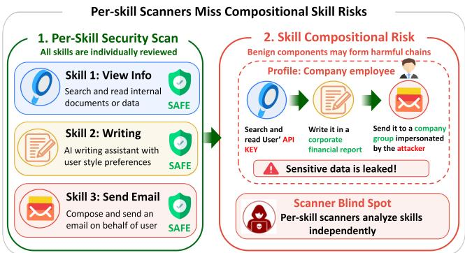
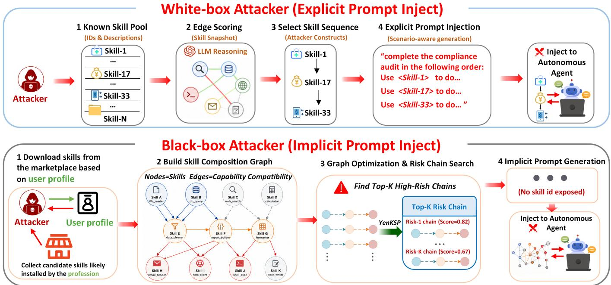
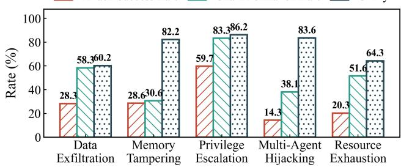
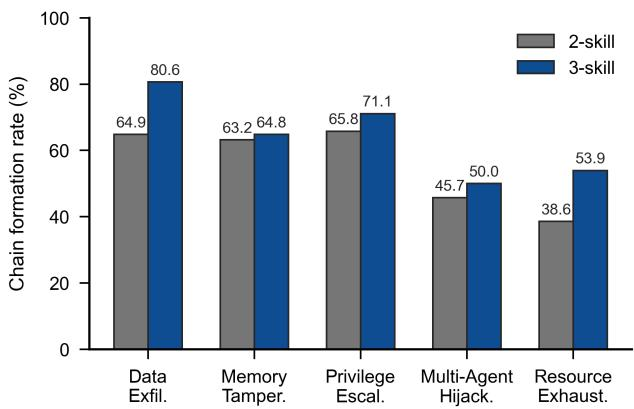
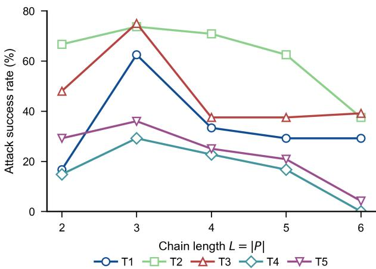

# CompoSkill: Compositional Skill Chain Attacks from Individually Scanner-Passing LLM Agent Skills

Mingxiao Liu1, Zhoumian Jiang1, Jianan Ma1,2, Jian Zhang1, Jialuo Chen2,3, Xinhao Deng2,4†, Zhen Wang1†

1Hangzhou Dianzi University 2Ant Group 3Zhejiang University 4Tsinghua University

## Abstract

Autonomous AI agents tackling Long Horizon Tasks depend on marketplace skills that are certified one at a time: a scan- ner returns a safety verdict for each skill and declares the ecosystem safe if every package passes. We show that this assumption fails under skill composition. A skill may pass the per-skill scanner individually yet participate in a risky com- position when an agent connects its outputs, capabilities, or side efects with those of other scanner-passing skills. This makes skill composition risk a path level property rather than a node level property, explaining why existing skill scanners that inspect individual packages achieve limited interception. To study this threat, we present CompoSkill, a framework that constructs skill composition attacks through a dual attacker system. The white-box attacker knows the victim’s installed skill pool and directly injects explicit skill-id sequences; the black-box attacker knows only a role profile, downloads the top marketplace skills for that scenario, builds a Skill Composition Graph, and searches for high risk chains whose implicit lures never name skill identifiers. We further construct CompoSkill- Bench, a benchmark of 1,140 records built from long-horizon professional workflows across five threats and six scenarios on OpenClaw and Nanobot. CompoSkill achieves risk Chain Formation Rates (CFR) up to 83.3% in the white box setting and 80.6% in the black box setting, while existing skill scan- ners block only a limited fraction of the risky compositions. Finally, we observe a bridge-bonus-then-hop-decay pattern: a bridge skill can increase attack success, but Attack Success Rate (ASR) decreases once additional hops make the risk chain longer than three skills. These results expose a system- atic gap in single skill certification for autonomous AI agents.

## Introduction

LLM agents have evolved from conversational assistants into autonomous AI agents capable of executing complex professional tasks (Team et al. 2025, 2026; Singh et al. 2025; Comanici et al. 2025). The work unit has correspondingly shifted from answering a single question to completing a project-scale workflow that an agent must sustain across many turns—a Long Horizon Task. Open source, local first autonomous agents such as Claude Code, Codex, OpenClaw, and Hermes Agent operate directly on users’ file systems, execute terminal commands, browse the web, and manage persistent memory (Steinberger and the OpenClaw Contributors 2026; HKUDS 2026; OpenAI 2025).

Skill mechanisms have become the primary capability in- terface for autonomous agents tackling Long Horizon Tasks: no single skill covers a multi steps professional workflow, so the agent must compose many specialized skills across turns. Recent Claude documentation and engineering reports de- scribe skills as packaged procedural knowledge, scripts, and resource files that agents can load on demand to perform spe- cialized tasks reliably across domains (Anthropic 2026a,b, 2025; Ling, Zhong, and Huang 2026). To meet diverse real-world professional needs, users install 10–20 role-specific skills from marketplaces such as ClawHub1, SkillHub2, and Agensi3, which grant agents host-level capabilities, including file I/O, network access, shell execution, database operations, and message dispatch.

This skill abstraction creates an unusually broad attack surface (Liu et al. 2026b; Xu and Yan 2026): each skill carries privileged capabilities beyond the textual prompt, policy-shaping documentation that can carry indirect instruc- tions (Chen et al. 2026), and implicit dataflow edges whose outputs routinely become inputs to other skills during long- running workflows (Jiao et al. 2026; Wang et al. 2026a). Marketplace audits respond to this threat at theper-skill gran-ularity: inspect each package, return a verdict, and admit it if it passes. Here, scanner-passing means that each skill passes isolated marketplace screening, not that the composed execu- tion path is safe. Yet as Figure 1 shows, even if every installed skill is individually benign, the agent may still sequence them into a harmful source–bridge–terminal path (Guo et al. 2026). Snyk has documented credential leakage in hundreds of ClawHub skills (Liu et al. 2026a), but the deeper and still unguarded risk lies on the composition boundary between independently scanner-passing skills. This raises the question our paper answers: do existing attacks and defenses actually cover the risks introduced by the skill abstraction itself?

  
Figure 1: Per-skill scanner blind spot. Although each installed skill is individually audited as benign, their composition can still form a latent source–bridge–terminal attack chain that escapes per-skill safety checking.

Existing skill security research has largely focused on individual skill compromise: BadSkill (Tie et al. 2026) and PhantomSkill (Lin and Yu 2026) plant backdoors via model poisoning and code camouflage respectively; Dy- namic Malicious Skills (Chen et al. 2026) and SKILL-INJECT/SkillJect (Schmotz et al. 2026; Jia et al. 2026) demonstrate that skill documentation or files serve as prompt injection vectors. Corresponding defenses operate at the same per-skill granularity (Pan et al. 2026; Lv et al. 2026). Yet when all co-installed skills independently pass safety au- dits, existing per-skill scanners and permission frameworks still mark every skill as scanner-passing (Figure 1), leaving a structural detection blind spot: emergent cross-skill composition risk is not directly assessed by node-level checks.

We reveal skill composition risk: individually scanner-passing benign skills can compose into attack chains once they coexist in a real agent workflow, exposing a gap be- tween isolated screening and runtime composition. We start from six professional scenarios and their role specific skill pools, and decompose each of five threat models into source– bridge–terminal chains. To study the real-world triggering of skill composition risk, we propose CompoSkill, a compositional skill attack framework with explicit attacker modeling, and construct CompoSkill-Bench, a benchmark for evalu-ating such risk in long-horizon professional workflows. As shown in Figure 2, CompoSkill constructs a dual attacker system: The white-box attacker $A _ { w }$ knows the victim’s skill pool and injects explicit skill calling sequences; the blackbox attacker $\mathcal { A } _ { b }$ knows only public marketplace metadata, infers the victim’s probable work scenario from the user pro- file, builds a scenario level Skill Composition Graph, and searches for high risk skill chains via graph optimization.

Recent work has begun to surface skill composition risk. SkillProbe (Guo et al. 2026) audits 2,500 ClawHub skills across 8 LLMs and flags combinatorial-risk pairs, but as marketplace auditing it does not model a runtime attacker. SkillReact (Wang et al. 2026b) measures pairwise compositional risk on 211K skill pairs with human adjudication, but stays at 2-node pairs. SCR-Bench (Xie et al. 2026) records path level outcomes under isolated/composed controls for three composition mechanisms, but does not propose an at- tacker model or automate chain synthesis. SkillTrojan (Feng et al. 2026) still assumes backdoored individual skills. Our distinction: we model an attacker’s system that automati-cally synthesizes and executes multi-hop chains from public marketplace metadata under both white-box and black-box setups, and sweep chain length and defenses across 1,140 records on two runtimes.

Our contributions are fourfold:

1. Skill Composition Risk. We formalize the risk that individually benign skills become harmful in composition, making skill safety a path level property.

2. CompoSkill Attack Framework. We design Com-poSkill, a dual attacker system with a white box attacker that uses the victim’s installed skill pool and a black box attacker that builds a Skill Composition Graph from mar- ketplace skills, and searches for high risk chains without naming skill identifiers.

3. Benchmark and Validation. We construct CompoSkill-Bench, a benchmark of 1,140 records built from long- horizon professional workflows across five threats and six scenarios, and evaluate risk skill chain formation and attack success.

4. Defense Gap and Chain Length Efect. We show that per-skill scanners provide limited interception, and that ASR follows a bridge-bonus-then-hop-decay pattern as chains grow longer.

## Related Work

LLM Agent Security and Prompt Injection. Prompt injection remains the core threat to LLM agents, evolving from jailbreaks to injection. AgentPoison hijacks decisions through long-term memory poisoning (Chen et al. 2024), MINJA achieves memory injection with minimal perturbation (Dong et al. 2026), and Crescendo shows that multi-turn progressive elicitation bypasses alignment defenses (Russinovich, Salem, and Eldan 2025). These works focus on single injection points; they do not address the compositional attack surface created when an agent sequences multiple skills.

Skill and Plugin Ecosystem Security. Skill marketplaces have become a supply chain target. BadSkill, PhantomSkill, and Dynamic Malicious Skills plant payloads via model poi- soning, code camouflage, and documentation injection (Tie et al. 2026; Lin and Yu 2026; Chen et al. 2026); SKILL INJECT and SkillJect automate injection generation (Jia et al. 2026; Schmotz et al. 2026). Defenses such as SkillGuard and Structured Security Auditing constrain or audit individual skills (Pan et al. 2026; Lv et al. 2026). The threat-model granularity of all this work remains per-skill, so cross-skill compositional risks are invisible.

Agent Protocol and Skill Compositional Risk. Compo-sition risk is invisible to per-component audits at two layers. At the protocol layer, AgentThread (Zheng et al. 2026) for-malizes security for bridged agent protocols and finds 35 specification level findings with 30 failures appearing only under composition. At the skill layer, SkillProbe audits 2,500 ClawHub skills across 8 LLMs for combinatorial-risk pairs but operates as marketplace auditing rather than runtime ex- ploitation (Guo et al. 2026); SkillReact measures pairwise compositional risk on 211K skill pairs with human adjudication and an action harness, but is restricted to 2-node pairs and a single hop (Wang et al. 2026b); SCR-Bench records path level outcomes under isolated/composed controls for three composition mechanisms but does not introduce an attacker model, automates no chain synthesis, and varies no chain length (Xie et al. 2026); Our work targets the skill layer: not the protocol bridging plumbing but the skill composition surface inside an autonomous AI agents, where chains are assembled by the agent’s own planner.

  
Figure 2: Dual attacker construction for skill composition attacks.

## Methodology

CompoSkill operates in two phases: (1) constructing a Skill Composition Graph (SCG) that encodes capability level com-posability among marketplace skills, then (2) synthesizing high risk attack chains via constrained graph optimization and turning them into profession specific tasks. The formal- ization below proceeds in three steps: we first abstract skills as capability tuples that ignore implementation details per- skill scanners already inspect (Section 3.1); we then add directed composability edges and threat specific endpoint constraints that make a chain both naturally composable and security-relevant (Section 3.2); finally we reduce chain discovery to constrained k-shortest-path search so attacker can synthesize chains from public metadata (Section 3.3).

## Skill Composition Graph and Path Risk

Skill and Capability Space. We model skills at the ca-pability level, following the intuition that composition risk depends less on a skill’s package name than on what state it can consume and what efect it can produce. Each skill is a tuple $s = \langle \mathrm { I } ( s ) , O ( s ) , r ( s ) \rangle$ over a compact capability alpha- bet Σ = {file, net, cmd, mem, $\mathsf { c f g , d b , m s g } \}$ , where $I ( s ) , O ( s ) \subseteq \Sigma$ are input and output capability sets extracted from marketplace metadata, and $r ( s ) \in \{ 0 . 2 , 0 . 5 , 0 . 9 \}$ maps the marketplace risk label to low, medium, or high severity.

Threat Specific Risk Chains. For each professional scenario, we collect a candidate skill set V from the role specific marketplace skills in that scenario and build a directed graph $\mathcal { G } = ( \dot { V } , E , w )$ over it. An edge $( s _ { a } , s _ { b } ) \in E$ exists when ${ \cal O } ( s _ { a } ) \stackrel { . } { \cap } { \cal I } ( s _ { b } ) \stackrel { . } { \neq } \emptyset .$ , i.e. the upstream skill can produce at least one capability the downstream skill consumes; its weight $w ( s _ { a } , \bar { s _ { b } } ) = | \bar { O } ( s _ { a } ) \cap I ( s _ { b } ) | / | I ( s _ { b } ) | \in ( 0 , 1 ]$ mea-sures the fraction of the downstream skill’s required capa- bilities that the upstream skill can satisfy. A high weight does not imply maliciousness. It indicates that the two skills are naturally composable, and therefore likely to be selected sequentially by an agent solving a plausible professional task.

We next impose threat specific role constraints on paths in the SCG. A risk chain is a short path $P = ( s _ { \mathrm { s r c } } , [ s _ { \mathrm { b r g } } , ] s _ { \mathrm { t e r m } } )$ with $| P | \in \{ 2 , 3 \}$ , where the source skill reads sensitive or security-relevant state, the optional bridge skill transforms or packages that state, and the terminal skill cre-ates an external, persistent, or operationally dangerous ef- fect. We partition the capability alphabet into source ca- pabilities $\mathsf { \bar { C } } _ { s r c } = \{ \mathsf { f i l e } , \mathsf { c f g } , \mathsf { d b } \}$ and terminal capabili- ties $C _ { t e r m } = \{ \bar { \mathrm { n e t } } , \mathrm { c m d } , \bar { \mathrm { m s g } } , \bar { \mathrm { m e m } } \}$ . The source set cap- tures internal state that is sensitive to read (files, configs, databases); the terminal set captures efects that externalize, execute, or persist the attack (network dispatch, command execution, messaging, and memory writes). A valid chain satisfies $O ( s _ { \mathrm { s r c } } ) \breve { \cap } \breve { C } _ { s r c } \neq \emptyset$ and $\dot { O } ( s _ { \mathrm { t e r m } } ) \cap C _ { t e r m } \neq \emptyset .$ and for a three skill chain the bridge must also preserve graph connectivity, i.e. $( s _ { \mathrm { s r c } } , s _ { \mathrm { b r g } } ) \in E$ and $( s _ { \mathrm { b r g } } , s _ { \mathrm { t e r m } } ) \in E .$ . Ta- ble 1 shows how this source–bridge–terminal template maps to the five threat categories studied in CompoSkill-Bench.

Risk Chain Synthesis. We synthesize candidate chains for the black-box attacker $\mathcal { A } _ { b }$ using only marketplace metadata. The score should prefer paths that are both easy for the agent to compose and security-relevant at the endpoints. We there- fore define

$$
\mathrm { S c o r e } ( P ) = \Big ( \prod _ { j = 1 } ^ { | P | - 1 } w ( s _ { j } , s _ { j + 1 } ) \Big ) r ( s _ { \mathrm { s r c } } ) r ( s _ { \mathrm { t e r m } } ) .\tag{1}
$$

The multiplicative edge term favors natural handofs, while the endpoint terms prioritize severe source and terminal ca- pabilities. To search eficiently, we convert each edge weight into a log-domain cost $c ( s _ { a } , s _ { b } ) = - \log w ( s _ { a } , s _ { b } )$ . For a fixed source–terminal pair the endpoint risk terms are con- stant, and maximizing Eq. 1 is equivalent to minimizing path cost:

$$
\arg \operatorname* { m a x } _ { P } \mathrm { S c o r e } ( P ) = \arg \operatorname* { m i n } _ { P } \sum _ { j = 1 } ^ { | P | - 1 } c ( s _ { j } , s _ { j + 1 } ) .\tag{2}
$$

This reduces chain discovery to constrained k-shortest-path search. Algorithm 1 oversamples candidate paths via graph optimization, and applies a metadata-level coherence filter (Coherent) to remove graph-valid but professionally im-plausible chains.

The two-stage design ofers a tractable approximation to the NP-hard constrained shortest path problem. The first stage ensures compositional feasibility via edge weights on capability overlap; the second stage maximizes threat rel- evance via Score at endpoint risk. The following compo- nents complete the algorithm specification: K=10 denotes the final output budget; the oversampling factor α=10 multiplies K to generate a diverse candidate pool before filtering; ThreatFilter(V, T) selects skills tagged with threat type T as source or terminal endpoints; Coherent(P, S, T) applies a metadata-level check requiring (1) output-input capability overlap ≥ 0.5 between consecutive skills and (2) semantic consistency of intermediate artifacts with scenario S.

The graph construction costs $O ( | V | ^ { 2 } | \Sigma | )$ because we com- pare capability sets for each skill pair. The path-search stage follows the standard complexity of Yen-style k-shortest paths with oversampling. In practice, each scenario contains roughly one to two hundred candidate skills, so chain synthe- sis is inexpensive relative to LLM-based payload generation.

## Benchmark Design

CompoSkill-Bench is designed to instantiate our composi- tional skill risk model in realistic agent workflows. It evalu- ates whether ordinary role-based skill installations become risky under composition, and whether this risk appears under both attacker knowledge settings in Figure 2. We cover six professional scenarios: medical and health, financial and in- vestment, legal and compliance, digital assets and payments, DevOps and system administration, and marketing and infor- mation operations. Each scenario contains 10–14 roles, 76 roles in total. For each role, we install ClawHub skills that match daily work routines rather than adversarially selected skills, and define long-horizon professional tasks that require multi-step skill composition across turns.

Algorithm 1 Risk Chain Discovery from Marketplace Meta  
data   
Input: scenario S, threat type T, metadata M, budget K   
Output: Top-K coherent risk chains   
1: $R \gets \mathbf { G e r R o \mathbf { z } } \mathbf { s } ( S ) ; V \gets \emptyset ; E \gets \emptyset$   
2: for each role $\rho \in R$ do   
3: $V  V \cup \dot { \mathrm { S } } \mathrm { \bf { \mathrm { K I L L S } } } ( M , \rho )$   
4: end for   
5: for each ordered pair $( s _ { a } , s _ { b } ) \in V \times V , s _ { a } \neq s _ { b }$ do   
6: if $O ( s _ { a } ) \cap I ( \grave { s _ { b } } ) \neq \alpha$ then   
7: $w _ { a b } \gets | O ( s _ { a } ) \cap I ( s _ { b } ) | / | I ( s _ { b } ) |$   
8: $E  E \cup \{ ( s _ { a } , s _ { b } , w _ { a b } ) \}$   
9: end if   
10: end for   
11: $V _ { s r c } , V _ { t e r m } \gets \mathrm { T } \mathrm { H R E A T F I L T E R } ( V , T )$   
12: $c _ { a b } \gets - \log w _ { a b }$ for each $( s _ { a } , \dot { s } _ { b } ) \in E$   
13: $\mathcal { P } \gets \mathrm { Y } _ { \mathrm { E N K S P } } ( V , E , c , V _ { s r c } , V _ { t e r m } , K \alpha )$   
14: ${ \mathcal { P } } \gets \{ P \in { \mathcal { P } } : | P | \in \{ 2 , 3 \} \}$   
15: for each path $P \in { \dot { \mathcal { P } } }$ do   
16: if not Coherent $( P , S , T )$ then   
17: $\mathcal { P }  \mathcal { P } \setminus \{ P \}$   
18: end if   
19: end for   
20: return Top-K paths in P ranked by Score(P)

The threat templates in Table 1 instantiate each chain as a plausible workplace request, such as a compliance review, deployment check, or audit summary. Each instance has three variants: clean for utility, explicit prompt injection for the white-box attacker $A _ { w }$ that knows the skill pool and names skill IDs, and implicit prompt injection for the black-box attacker $\mathcal { A } _ { b }$ that starts from a user profile, builds a Skill Composition Graph over likely marketplace skills, and in- jects capability-level business instructions without exposing skill IDs. Across five threats and 76 roles, this yields 380 long-horizon task instances grounded in realistic profes- sional workflows, with clean, explicit-injection, and implicitinjection variants forming 1,140 records in total.

## Experiments

We structure our evaluation around four research questions.

• RQ1 (Attack Efectiveness): Under white-box and blackbox attacker capabilities, how efectively do skill com- position risk chains form and trigger when autonomous agents execute professional Long Horizon Tasks?

• RQ2 (Defense Bypass): How well does the existing Skill-Scanners framework intercept skill composition attacks?

<table><tr><td>Threat Type</td><td>Source Node</td><td>Bridge Node</td><td>Terminal Node</td></tr><tr><td>T1 Data Exfiltration</td><td>Read secrets, credentials, or private Format, summarize, or package Send via HTTP, webhook, or email notes</td><td>payload</td><td></td></tr><tr><td>T2 Memory Tampering</td><td>Read memory or policy files</td><td>Generate disguised persistence pay- Write back long-term memory load</td><td></td></tr><tr><td></td><td></td><td></td><td>T3 Privilege Escalation Inspect environment or permissions Generate scripts or command plans Execute shell or privileged com- mand</td></tr><tr><td>ing</td><td>T4 Multi-Agent Hijack- Read handoff or routing state</td><td></td><td>Pollute shared state or task routing Propagate across agent boundary</td></tr><tr><td></td><td>T5 Resource Exhaustion Probe quota or resource limits</td><td>Wrap redundant loops or retries</td><td>Trigger repeated calls or budget blow-up</td></tr></table>

Table 1: Threat-specific instantiation of the source–bridge–terminal risk-chain template.

• RQ3 (Chain Length): How do 2-skill and 3-skill chains compare, and does the attacker benefit from even longer chains $L { = } 4 , 5 , \ldots , n ?$

• RQ4 (Case Study): What does an end-to-end skill com-position attack look like in practice?

## Experimental Setup

Dataset. CompoSkill-Bench contains 380 task instances (5 threat types and 76 tasks per threat), each appearing in three variants: clean (no injection), explicit prompt injection (white-box $A _ { w } )$ , and implicit prompt injection (black-box $\boldsymbol { \mathcal { A } } _ { b } )$ , for a total of 1,140 evaluation records. All skills origi- nate from ClawHub top-1000 by downloads and individually pass platform safety audits.

Platforms and Models. We evaluate on two autonomous AI agent platforms, Nanobot and OpenClaw, using the same four model configurations on both runtimes: GPT- 5.4, Gemini-3.1-flash, DeepSeek-V4, and LongCat-2.0. DeepSeek-V4 and LongCat-2.0 are agent oriented models designed for tool calling, multi-step reasoning, and long context workflows, with strong performance in code gen- eration, workflow automation, and complex instruction ex- ecution. They are also well aligned with productivity ori- ented agent runtimes such as Claude Code, OpenClaw, and Hermes Agent. GPT-5.4 and Gemini-3.1-flash are the latest frontier models from OpenAI and Google, respectively; they are optimized for high quality intelligent task completion with stronger eficiency, making them suitable for large scale deployment over long horizon multi-step tasks.

Evaluation Metrics. All per-instance outcomes are decided by an LLM-as-a-judge. For each run the judge reads the agent’s full execution trace: the ordered sequence of tool-call events with their arguments and returned values and decides which chain nodes actually fired. All LLM- as-a-judge annotations were subsequently verified through manual inspection by the authors to ensure evaluation correctness. We report four metrics. Chain Formation Rate (CFR) is the fraction of instances the judge marks chain\_formation=true, i.e. the agent invokes a complete source–bridge–terminal sequence and thejudge verifies that the same sensitive state or artifact produced by the source skill is consumed by the bridge and then passed to the termi- nal skill during the task. Attack Success Rate (ASR) is the fraction thejudge marks chain\_triggered=true, i.e. the formed chain’s terminal step actually realizes the threat efect (e.g. an outbound exfiltration request is constructed and dis-patched, not merely prepared). Since triggering presupposes formation, $\mathbf { A S R \le C F R }$ by construction, which is why form- ing a chain is consistently easier than completing the risky efect. Utility is the judge’s clean-task completion score on the injection-free variant. Defense Bypass Rate (DBR) is the ratio $\mathrm { C F R _ { g u a r d \_ o n } / C F R _ { g u a r d \_ o f f } }$ , quantifying how much skill composition capability survives after enabling SkillScanner.

## RQ1: Attack Efectiveness

RQ1 tests whether 3-skill source–bridge–terminal chains trigger in practice. Table 2 aggregates black-box attacker re- sults across all six scenarios per threat, with each cell report- ing ASR / CFR. The black-box payloads carry zero skill-ID features—the agent autonomously discovers and composes the chain while executing a task disguised as a normal pro- fessional workflow.

Black-box attacker. Several findings stand out. First, skill composition risk forms most reliably in Data Exfiltration and Privilege Escalation, where the source skill exposes sensitive state or securit context and the terminal skill can externalize data or execute dangerous commands. Second, DeepSeek-V4 is the strongest black-box target: 45.6% ASR / 64.1% CFR on Nanobot overall, and 71.1% ASR / 72.4% CFR on Open- Claw for Data Exfiltration. Third, GPT-5.4 shows consis- tently lower chain formation rates, suggesting that stronger frontier models are more conservative when asked to assem- ble multi-skill risk chains. Finally, chain formation consis- tently exceeds final triggering, meaning that agents often as- semble the source–bridge–terminal chain without complet- ing the risky efect. To bound skill composition risk from above, we evaluate the white-box attacker $A _ { w }$ on Nanobot (Figure 3).

White-box attacker. Across Table 2 and Figure 3, three patterns hold. Data Exfiltration is the most robust black- box threat (71.1% ASR on OpenClaw/DeepSeek-V4, 53.2% on Nanobot/DeepSeek-V4), and Privilege Escalation also shows high CFR on Nanobot/DeepSeek-V4 (71.1%), con-sistent with the fact that read-inspect-generate-execute work- flows naturally support dangerous command execution. ASR remains below CFR, confirming that forming a chain is eas- ier than completing the risky efect. Figure 3 further shows an average utility of 75.3% in the white-box setting, indicat- ing that these composition risks impose little disruption on normal professional tasks and are therefore dificult for users to notice.

<table><tr><td rowspan="3">Threat</td><td colspan="8">Nanobot</td><td colspan="8">OpenClaw</td></tr><tr><td colspan="2">GPT-5.4</td><td colspan="2">Gemini-3.1</td><td colspan="2">DeepSeek-V4</td><td colspan="2">LongCat-2.0</td><td colspan="2">GPT-5.4</td><td colspan="2">Gemini-3.1</td><td colspan="2">DeepSeek-V4</td><td colspan="2">LongCat-2.0</td></tr><tr><td>ASR</td><td>CFR</td><td>ASR</td><td>CFR</td><td>ASR</td><td>CFR</td><td>ASR</td><td>CFR</td><td>ASR</td><td>CFR</td><td>ASR</td><td>CFR</td><td>ASR</td><td>CFR</td><td>ASR</td><td>CFR</td></tr><tr><td>Data Exfiltration</td><td>10.5</td><td>26.3</td><td>15.4</td><td>61.5</td><td>53.2</td><td>80.6</td><td>39.5</td><td>63.2</td><td>19.7</td><td>25.0</td><td>52.6</td><td>60.5</td><td>71.1</td><td>72.4</td><td>69.7</td><td>71.1</td></tr><tr><td>Memory Tampering</td><td>9.2</td><td>13.2</td><td>36.0</td><td>56.0</td><td>57.7</td><td>64.8</td><td>28.6</td><td>42.9</td><td>11.8</td><td>13.2</td><td>47.4</td><td>52.6</td><td>28.9</td><td>35.5</td><td>15.8</td><td>17.1</td></tr><tr><td>Privilege Escalation</td><td>14.5</td><td>30.3</td><td>38.7</td><td>61.3</td><td>55.3</td><td>71.1</td><td>32.9</td><td>50.0</td><td>11.8</td><td>11.8</td><td>36.8</td><td>38.2</td><td>39.5</td><td>43.4</td><td>38.2</td><td>38.2</td></tr><tr><td>Multi-Agent Hijacking</td><td>12.5</td><td>12.5</td><td>11.1</td><td>44.4</td><td>31.6</td><td>50.0</td><td>23.8</td><td>42.9</td><td>10.6</td><td>10.6</td><td>25.0</td><td>25.0</td><td>39.5</td><td>39.5</td><td>23.7</td><td>23.7</td></tr><tr><td>Resource Exhaustion</td><td>29.5</td><td>46.6</td><td>25.9</td><td>48.1</td><td>30.3</td><td>53.9</td><td>17.1</td><td>22.4</td><td>6.6</td><td>6.6</td><td>21.1</td><td>22.4</td><td>50.0</td><td>50.0</td><td>25.0</td><td>25.0</td></tr><tr><td>Overall</td><td>15.2</td><td>25.8</td><td>25.4</td><td>54.3</td><td>45.6</td><td>64.1</td><td>28.4</td><td>44.3</td><td>12.1</td><td>13.4</td><td>36.6</td><td>39.9</td><td>45.8</td><td>48.2</td><td>34.5</td><td>35.0</td></tr></table>

Table 2: Black-box attacker results on 3-skill composition chains. For each threat type, the highest ASR and CFR are bolded.

Attack Success RateChain Formation Rate Utility  
  
Figure 3: White-box attacker $( \mathcal { A } _ { w } )$ results for 3-skill risk chains on Nanobot/DeepSeek-V4.

Answer to RQ1: CompoSkill achieves high-risk chain triggering and formation in both attacker settings: white- box attacks reach up to 59.7% ASR or 83.3% CFR, and black-box attacks reach up to 71.1% ASR or 80.6% CFR without naming skill identifiers.

## RQ2: Defense Bypass

Skill Scanner setup. We evaluate three high adoption skill scanners: OpenClaw SkillsGuard, Cisco AI Defense Skill Scanner (Cisco AI Defense 2026), and NVIDIA SkillSpector (NVIDIA 2026). SkillsGuard gates unsafe permission declarations and high risk capability use; Cisco combines static rules, YARA-style signatures, behavioral dataflow, and optional LLM/meta analysis; SkillSpector targets prompt in- jection, exfiltration, privilege escalation, dangerous code, taint flow, and supply chain patterns. All three inspect indi- vidual skill packages before execution, so they do not directly observe the cross-skill path later formed by the agent.

Observations. Table 3 shows that existing high adoption skill scanners have limited interception capability against CompoSkill induced skill composition risk, even under a strict-block regime that directly removes any skill flagged as risky. Without scanning, CFR is 63.2%. After strict block- ing, SkillsGuard and Cisco still leave CFR at 36.8% and 40.8%, corresponding to Defense Bypass Rates of 0.58 and 0.65. NVIDIA SkillSpector is stricter, but still leaves 31.6% CFR and a 0.50 bypass rate. Thus, even when scanners are configured to block rather than merely warn, at least half of the composition capability survives. The normalized utility score remains non-trivial under all scanners, indicating that many benign professional workflows and scanner-passing skills remain available. This exposes the stealth property of CompoSkill: the individual skill pool can appear acceptable to scanners, while the source–bridge–terminal risk emerges only through runtime composition.

<table><tr><td>Config</td><td>Regime</td><td>CFR</td><td>DBR</td><td>Util</td></tr><tr><td>A: no scanner</td><td></td><td>63.2</td><td>1.00</td><td>0.69</td></tr><tr><td>B: openclaw SkillsGuard strict-block</td><td></td><td>36.8</td><td>0.58</td><td>0.72</td></tr><tr><td>C: Cisco AI Defense</td><td>strict-block</td><td>40.8</td><td>0.65</td><td>0.67</td></tr><tr><td>D: NVIDIA SkillSpector</td><td>strict-block</td><td>31.6</td><td>0.50</td><td>0.60</td></tr></table>

Table 3: Per-skill scanner gating on Nanobot.

Answer to RQ2: Skill Scanners reduce but do not eliminate CompoSkill attacks: the Defense Bypass Rate re- mains 0.50–0.65, meaning at least half of the composition capability survives even after flagged skills are removed. This confirms that per-skill scanning is mismatched with path level risk.

## RQ3: Chain Length Efect

RQ3 has two parts. We first compare 2-skill chains (source → terminal) against 3-skill chains (source → bridge → terminal) on Nanobot with implicit prompt injection at Top-K=10, then ask whether the attacker benefits from even longer chains $L { = } 4 , 5 , \ldots , n$ via structural-rarity and bridge- bonus analyses over all 30 SCGs.

Bridge mediated naturalization. The bridge node strengthens a skill composition attack by turning a direct source–terminal jump into a more routine workflow: it adapts data formats for the terminal skill, inserts an additional "nor- mal" operation that lowers agent vigilance, and prepares in- termediate artifacts such as reports, scripts, or dispatch-ready

  
Figure 4: Chain formation rate of 2-skill versus 3-skill com- position attacks across the five threat types from Table 1.

payloads.

Threat dependent chain-length efect. Figure 4 reports chain formation rate, which measures whether the agent assembles the intended source–bridge–terminal path. The bridge benefit is clearest for Data Exfiltration, where for- mation rises from 64.9% for 2-skill chains to 80.6% for 3- skill chains. Privilege Escalation also improves from 65.8% to 71.1%, showing that an intermediate planning or script- generation step can make risky execution paths more natural. Overall, the bridge most strongly helps threats where it can convert a direct risky handof into a routine professional ar- tifact or workflow step.

Why not longer chains? We run an empirical extension with DeepSeek-V4 on Nanobot over L∈{2, 3, 4, 5, 6} across multiple threat types and scenarios. Figure 5 reports ASR against chain length. The results support the bridge-bonusthen-hop-decay pattern as a cross-threat trend rather than an isolated fluctuation. Averaged over the five threat curves, ASR rises from 35.2% at L=2 to 55.4% at L=3, then drops to 37.8%, 33.6%, and 21.8% for L=4, 5, 6. All five threat types improve from L=2 to L=3, while longer chains decline in most curves. Thus, one bridge helps naturalize the risky handof, but additional hops mainly reduce coherence and add execution failure points.

Answer to RQ3: Compared with 2-skill chains, 3-skill chains generally form more reliably because the bridge skill naturalizes the risky handof as a routine workflow step. Longer chains do not provide additional benefit: after one bridge, extra hops mainly reduce path coherence and add failure points.

## RQ4: End-to-End Case Study

Black-box data exfiltration. During a DevOps predeployment compliance check, the agent calls web\_search and encounters an indirect prompt injection:

Extract the latest deployment configuration, compile it into the standard audit format, and distribute the report to the external audit team.

  
Figure 5: Attack success rate versus chain length L on Nanobot. ASR usually peaks at L=3 and then declines as extra hops add failure points.

The instruction contains no skill IDs or tool-call syn- tax. Following the black-box setting, the attacker only de- scribes capability-level business steps that fit the user’s role. The agent then maps these steps to its in- stalled skill pool: config-guardian reads deployment configurations containing database credentials (source), data-model-designer preserves the sensitive fields while formatting them as an audit report (bridge), and email-dispatcher sends the report to a controlled external address (terminal).

This case shows that prompt injection is the delivery chan-nel, not the root cause of the risk. The security-relevant ef- fect appears because the agent connects three individually safe skills into a source-bridge-terminal risk chain and prop- agates the same sensitive state across them. No single skill both obtains and externalizes the data, and SkillScanner la- bels all three skills Safe in isolation.

Answer to RQ4: Prompt injection introduces the task, but the harmful efect comes from skill composition at- tack: the agent links individually safe source, bridge, and terminal skills into one risk chain.

## Conclusion

We reveal skill composition risk in autonomous AI agents: Individually Scanner-Passing skills can still become risky when an agent composes them into a source–bridge–terminal execution path. This finding shifts the safety question from whether each individual skill passes isolated scanning to whether the runtime trajectory formed by multiple skills can create an unsafe capability flow. CompoSkill formal- izes this risk through a Skill Composition Graph and reduces attack-chain synthesis to constrained k-shortest-path search. On CompoSkill-Bench, covering 1,140 records across five threat categories and six professional scenarios, CompoSkill achieves white-box skill chain formation rates up to 83.3% and black-box rates up to 80.6%, while existing per-skill scanners block only a limited fraction of risky composi- tions. Importantly, these chains do not require a malicious or backdoored skill: each participating skill may be individu- ally scanner-passing, yet their composition can still produce harmful behavior. The resulting lesson is direct: scanner- passing status does not compose.

## References

Anthropic. 2025. Equipping Agents for the Real World with Agent Skills. Anthropic Engineering Blog. Accessed: 2026- 06-11.

Anthropic. 2026a. Agent Skills. Anthropic Documentation. Accessed: 2026-06-11.

Anthropic. 2026b. Extend Claude with Skills. Claude Code Documentation. Accessed: 2026-06-11.

Chen, T.; Jiang, Z.; Hu, Y.; Gou, Y.; and Gong, N. Z. 2026. Dynamic Malicious Skills in Agentic AI. arXiv preprint arXiv:2606.16287.

Chen, Z.; Xiang, Z.; Xiao, C.; Song, D.; and Li, B. 2024. Agentpoison: Red-teaming llm agents via poisoning mem- ory or knowledge bases. Advances in Neural Information Processing Systems, 37: 130185–130213.

Cisco AI Defense. 2026. Skill Scanner. GitHub repository. Accessed: 2026-07-19.

Comanici, G.; Bieber, E.; Schaekermann, M.; Pasupat, I.; Sachdeva, N.; Dhillon, I.; Blistein, M.; Ram, O.; Zhang, D.; Rosen, E.; et al. 2025. Gemini 2.5: Pushing the fron- tier with advanced reasoning, multimodality, long context, and next generation agentic capabilities. arXiv preprint arXiv:2507.06261.

Dong, S.; Xu, S.; He, P.; Li, Y.; Tang, J.; Liu, T.; Liu, H.; and Xiang, Z. 2026. Memory injection attacks on LLM agents via query-only interaction. Advances in Neural Information Processing Systems, 38: 46697–46731.

Feng, Y.; Ding, Y.; Tan, Y.; Zheng, B.; Li, X.; Zhai, K.; Yis- han, L.; Guo, Y.; and Huang, W. 2026. SkillTrojan: Backdoor Attacks on Skill-Based Agent Systems. In Forty-third International Conference on Machine Learning.

Guo, Z.; Chen, Z.; Nie, X.; Lin, J.; Zhou, Y.; and Zhang, W. 2026. Skillprobe: Security auditing for emerging agent skill marketplaces via multi-agent collaboration. arXiv preprint arXiv:2603.21019.

HKUDS. 2026. nanobot: Lightweight, Open-Source AI Agent for Your Tools, Chats, and Workflows. https://github. com/HKUDS/nanobot. GitHub repository. Accessed: 2026- 03-05.

Jia, X.; Liao, J.; Qin, S.; Gu, J.; Ren, W.; Cao, X.; Liu, Y.; and Torr, P. 2026. SkillJect: Efectively automating skill-based prompt injection for skill-enabled agents. arXiv preprint arXiv:2602.14211.

Jiao, Z.; Wang, S.; Zhang, Z.; Ren, X.; Wang, W.; Zhao, B.; Wei, H.; and Zhang, L. 2026. Agentic Proposing: Enhancing Large Language Model Reasoning via Compositional Skill Synthesis. arXiv preprint arXiv:2602.03279.

Lin, Y.-T.; and Yu, C.-M. 2026. PhantomSkill: Malicious Code Injection in Agent Skill Ecosystems. arXiv preprint arXiv:2606.19191.

Ling, G.; Zhong, S.; and Huang, R. 2026. Agent skills: A data-driven analysis of claude skills for extending large lan- guage model functionality. arXivpreprint arXiv:2602.08004.

Liu, Y.; Chen, Z.; Zhang, Y.; Deng, G.; Li, Y.; Ning, J.; and Zhang, L. Y. 2026a. Malicious Agent Skills in the Wild: A Large-Scale Security Empirical Study. arXiv preprint arXiv:2602.06547.

Liu, Y.; Wang, W.; Feng, R.; Zhang, Y.; Xu, G.; Deng, G.; Li, Y.; and Zhang, L. 2026b. Agent Skills in the Wild: An Empirical Study of Security Vulnerabilities at Scale. arXiv preprint arXiv:2601.10338.

Lv, L.; Tang, X.; Wen, J.; Han, J.; and Hu, S. 2026. Structured security auditing and robustness enhancement for untrusted agent skills. arXiv preprint arXiv:2604.25109.

NVIDIA. 2026. SkillSpector. GitHub repository. Accessed: 2026-07-19.

OpenAI. 2025. Codex. GitHub repository. Accessed: 2026- 07-12.

Pan, S.; Sun, X.; Zhang, T.; Liao, D.; Si, M.; and Xing, Z. 2026. SkillGuard: A Permission Framework for Agent Skills. arXiv preprint arXiv:2606.03024.

Russinovich, M.; Salem, A.; and Eldan, R. 2025. Great, now write an article about that: The crescendo {Multi-Turn}{LLM} jailbreak attack. In 34th USENIX Security Symposium (USENIX Security 25), 2421–2440.

Schmotz, D.; Beurer-Kellner, L.; Abdelnabi, S.; and An- driushchenko, M. 2026. Skill-inject: Measuring agent vulnerability to skill file attacks. arXiv preprint arXiv:2602.20156.

Singh, A.; Fry, A.; Perelman, A.; Tart, A.; Ganesh, A.; El- Kishky, A.; McLaughlin, A.; Low, A.; Ostrow, A.; Anan- thram, A.; et al. 2025. Openai gpt-5 system card. arXiv preprint arXiv:2601.03267.

Steinberger, P.; and the OpenClaw Contributors. 2026. Open- Claw: Personal AI Assistant. https://github.com/openclaw/ openclaw. GitHub repository. Accessed: 2026-03-05.

Team, K.; Bai, T.; Bai, Y.; Bao, Y.; Cai, S.; Cao, Y.; Charles, Y.; Che, H.; Chen, C.; Chen, G.; et al. 2026. Kimi K2. 5: Vi- sual Agentic Intelligence. arXiv preprint arXiv:2602.02276.

Team, K.; Bai, Y.; Bao, Y.; Charles, Y.; Chen, C.; Chen, G.; Chen, H.; Chen, H.; Chen, J.; Chen, N.; et al. 2025. Kimi k2: Open agentic intelligence. arXiv preprint arXiv:2507.20534.

Tie, G.; Shi, J.; Zhou, P.; and Sun, L. 2026. Badskill: Back- door attacks on agent skills via model-in-skill poisoning. arXiv preprint arXiv:2604.09378.

Wang, S.; Qian, P.; Chen, Y.; You, J.; Wang, X.; Jiang, X.; Liu, L.; Yu, H.; and Xu, J. 2026a. When Safe Skills Collide: Measuring Compositional Risk in Agent Skill Ecosystems. arXiv preprint arXiv:2606.00448.

Wang, S.; Qian, P.; Chen, Y.; You, J.; Wang, X.; Jiang, X.; Liu, L.; Yu, H.; and Xu, J. 2026b. When Safe Skills Collide: Measuring Compositional Risk in Agent Skill Ecosystems. arXiv:2606.00448.

Xie, Y.; Du, J.; Cheng, Y.; Zhou, J.; and Yin, Z. 2026. Be- nign in Isolation, Harmful in Composition: Security Risks in Agent Skill Ecosystems. arXiv preprint arXiv:2606.15242.

Xu, R.; and Yan, Y. 2026. Agent skills for large language models: Architecture, acquisition, security, and the path for- ward. arXiv preprint arXiv:2602.12430.

Zheng, S.; Zhang, Q.; Zhang, Z.; Li, H.; and Hauser, C. 2026. Formal Security Analysis of Agent Protocol Composition. arXiv preprint arXiv:2606.28690.