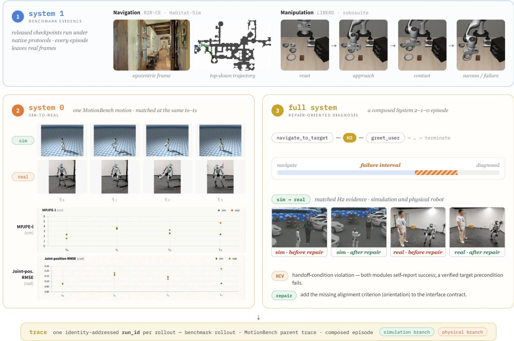
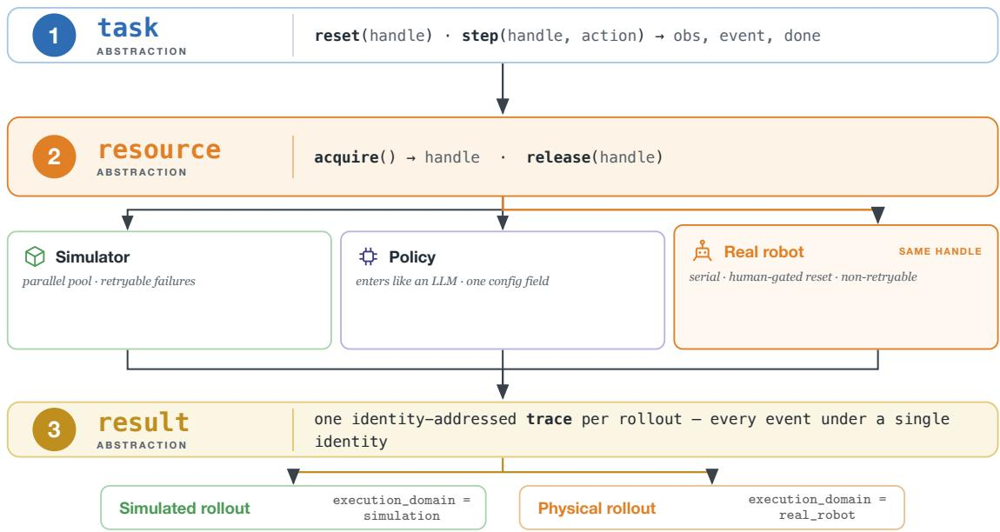
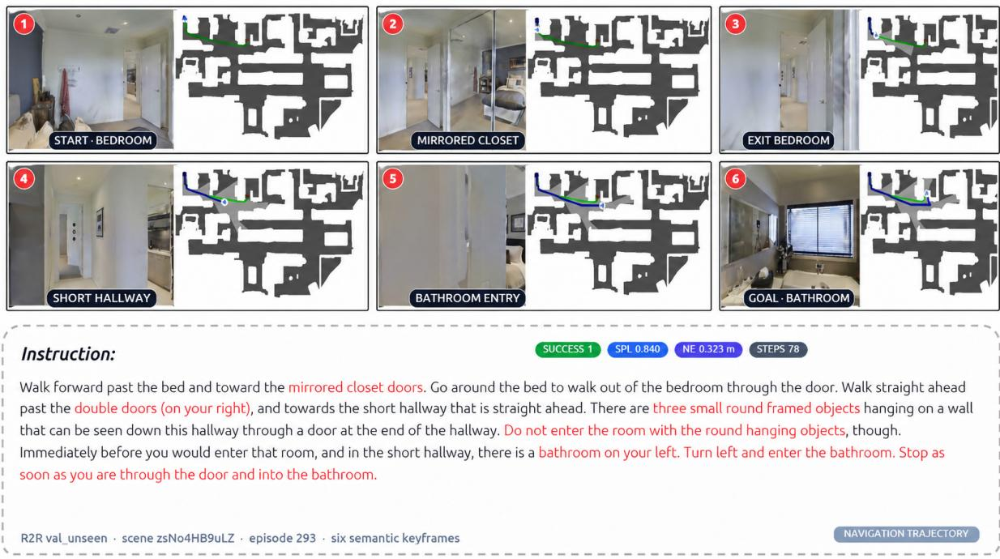
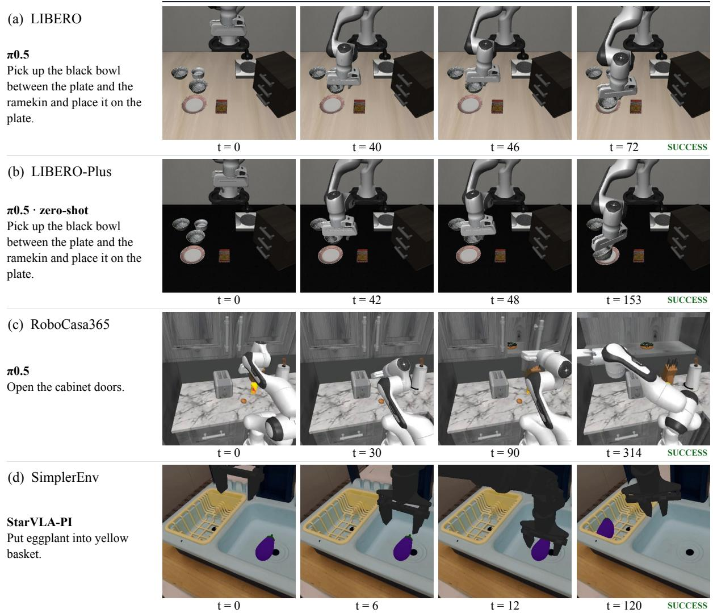
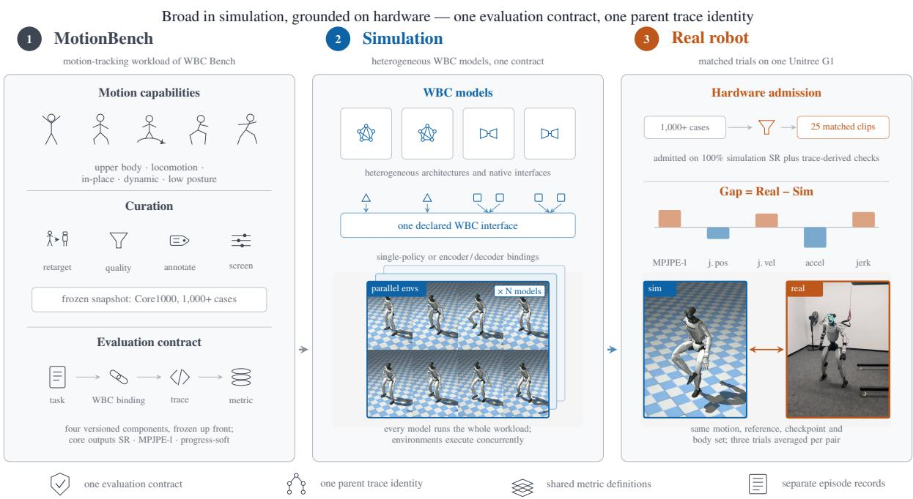
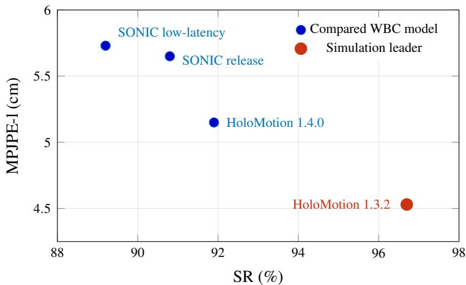
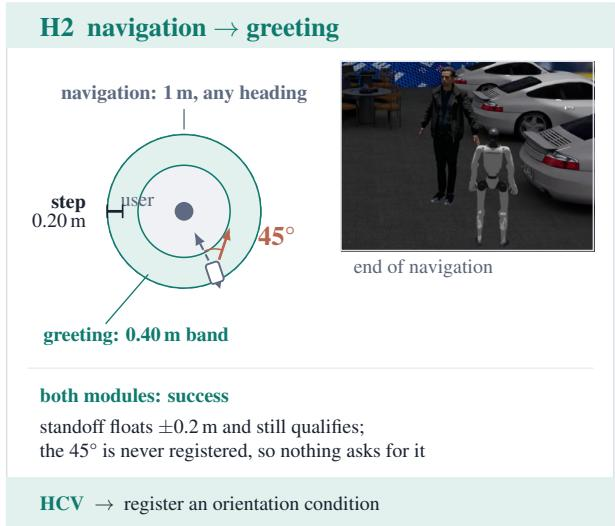
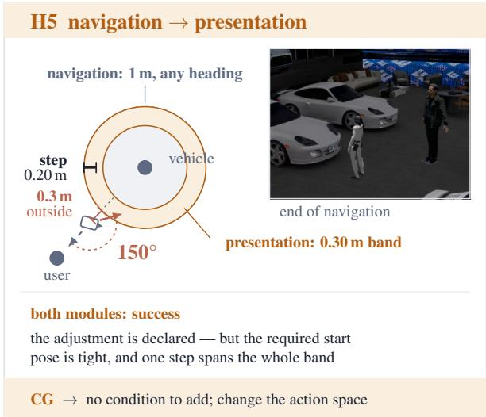
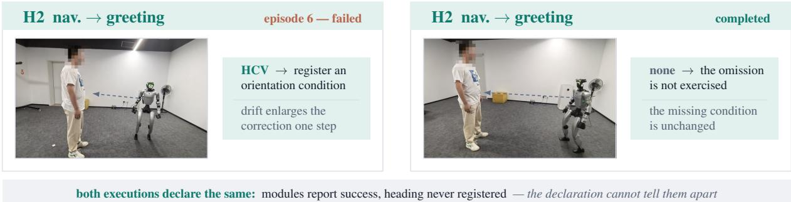

# DeepInsight II: One Trace from Benchmark to Robot

Siyi Li, Yuchen Kang, Wuliang Wang, Zhengjie Zhang, Jiangpin Liu, Jianhao Yao, Jie Chen† XPENG Robotics

## Abstract

Across a Physical AI stack, evaluation maturity is inversely aligned with deployment risk: foundation models enjoy mature, standardized harnesses, while the embodied layers on which deployment actually turns remain fragmented across benchmark-specific simulators, embodiments, and interfaces. The first DeepInsight report (v1) unified evaluation across this stack behind three abstractions— task, resource, and result—but its quantitative evidence centered on the foundation-model layer; navigation and manipulation (System 1) and whole-body control (System 0) remained simulation case studies, and physical execution was outside its empirical scope. DeepInsight II keeps that substrate fixed and quantifies the embodied half. First, it reproduces released-checkpoint references across two navigation and four manipulation benchmarks under their native protocols. Second, MotionBench places four released whole-body controllers under one workload and metric contract, then carries a qualified within-family cohort from parallel simulation to matched real-robot trials in which simulated and physical rollouts share a parent trace identity while retaining executiondomain-specific records, making the sim-to-real gap a native reduction rather than a reconciliation across toolchains. Third, a composed System 2–1–0 study extends trace localization into five evidence-grounded handoff labels, each mapped to a concrete repair action, with a measured repairability criterion and physical episodes testing the same attribution under hardware-observable state. The contribution is therefore not a new evaluation architecture, but empirical continuity from benchmark execution to matched robot evidence and repair-oriented diagnosis.

## 1 Introduction

A policy headed for hardware is evaluated most rigorously where the stakes are lowest. Its semantic reasoning (System 2)—the layer farthest from physical execution, increasingly packaged as a dedicated robot brain [1]—runs through mature harnesses: standardized datasets, shared inference backends, published protocols. Its navigation and manipulation skills (System 1) are scored by whichever benchmark each was trained against, each binding its own simulator, embodiment, and policy interface. And its whole-body controller (System 0)—the layer whose failures are physical—is evaluated through per-lab harnesses whose readings rarely transfer. The layers on which deployment actually turns are the ones evaluated with the least shared infrastructure. Figure 1 previews the response this report develops.

The difficulty is structural rather than a matter of packaging. Embodied episodes are closed-loop: every action changes the observation presented at the next step, so evaluation is a stateful rollout against a live simulator or robot rather than a batched pass over a static dataset [2–4]. The resulting heterogeneity has three coupled forms: workloads differ in task and metric semantics; systems under test differ in architecture, checkpoint, controlled DoF, and native input–output interface; and execution substrates range from parallel simulators to serial, safety constrained physical robots. Changing any one of these typically changes the harness and the record against which the result is interpreted: readings produced by separate harnesses do not automatically share episode identity, execution semantics, or reduction rules, and aggregate success hides the local failures and simulation–reality discrepancies that govern deployment. Recent infrastructure efforts isolate dependencies and federate benchmark servers [5], but typically leave each benchmark’s episode loop and result representation intact; real-robot evaluation is then joined post hoc, if at all. The objective, therefore, is not to erase this fragmentation with one universal benchmark or embodiment, but to make the heterogeneity explicit while preserving comparable evaluation semantics.

The first DeepInsight report [6] (v1) established the substrate for this purpose: one reset/step episode driver, one acquire/release resource protocol, and one identity-addressed trace across the System 2–1–0 stack. Its quantitative evidence, however, centered on System 2; the embodied layers remained simulation-only case studies, and physical execution was left outside the empirical scope. DeepInsight II keeps that substrate fixed and closes the empirical gap. Table 1 states the delta.

  
Figure 1. The embodied evidence of this report, on one runtime: System 1 checkpoints under native benchmark protocols, a System 0 motion matched between simulation and the physical robot, and a composed System 2–1–0 episode diagnosed down to a concrete repair and re-tested in simulation and on the physical robot. Representative H2 frames show the state before and after the orientation repair. Every rollout writes into one identity-addressed trace, so all three kinds of evidence share a single result representation.

Contributions. This paper contributes evaluation infrastructure and empirical evidence, not new navigation, manipulation, or control policies: native benchmark protocols remain intact behind adapters, while execution, resource management, trace identity, and cross-domain reduction are shared. The rest of the paper follows the three empirical extensions in Table 1. Section 4 tests native-protocol fidelity across six System 1 benchmarks with released checkpoints. Section 5 freezes a common System 0 contract, compares four released WBC models in simulation, and carries a qualified cohort into matched real-robot trials. Section 6 extends shared-trace localization into handoff-specific attribution, a measured repairability criterion separating interface-repairable boundary errors from action-space limitations, and physical episodes that test the same attribution under hardware-observable state.

## 2 Related Work

Embodied benchmarks. The benchmarks this paper brings onto one runtime are drawn from three ecosystems, and we survey them as the workload to be carried rather than as alternatives to compete with. In navigation, the instruction-following line (R2R [7], extended to continuous environments by VLN-CE [8] and to path-fidelity metrics by RxR [9]) supplies the workloads and metric suites this paper carries within the Habitat simulator family. In manipulation, LIBERO’s clean suites [3] are extended by perturbation and generalization variants such as LIBERO Plus [10] and LIBERO-PRO [11]. Other benchmarks cover real-to-sim transfer, dual-arm control, mobile household tasks, long-horizon evaluation, and scene-rich environments [12–17]. At whole-body control, HumanoidBench [18] and the Isaac Lab ecosystem [4] anchor GPU-parallel locomotion evaluation. The motion-tracking controllers this paper actually evaluates descend from the motion-imitation line [19, 20]: each released tracker—SONIC [21], HoloMotion [22]—ships its own evaluation protocol, with success predicates, tracking-error conventions, and reference-motion sets that do not interchange across releases; on the training side, Athena-WBC [23] argues that long-tail tracking failures reflect a mismatch between motion demands and learned capability rather than raw exposure. MotionBench (Section 5) freezes one such contract across trackers, with capability-grouped reporting aimed at the same axis. DeepInsight preserves each benchmark’s protocol—suites, splits, embodiment, success criteria—and unifies the runtime, resource layer, and trace beneath them; the fragmentation documented above is, in effect, this paper’s workload specification.

Table 1. Scope delta from DeepInsight v1 [6] to DeepInsight II. The core substrate is inherited unchanged; DeepInsight II is an empirical and execution-domain extension of v1, not a replacement of its architecture.
<table><tr><td>Dimension</td><td>DeepInsight v1 established</td><td>DeepInsight II adds</td></tr><tr><td>Core substrate</td><td>one acquire/release protocol, one identity-addressed cal robot bind to the same substrate. trace.</td><td>Task, resource, and result: one reset/step driver, No new abstraction; embodied benchmarks and a physi-</td></tr><tr><td>System 2</td><td>Quantitative fidelity, throughput, ablations, and multi- Inherited; not re-benchmarked here. node scaling.</td><td></td></tr><tr><td>System 1</td><td>Simulation-only coverage case studies.</td><td>Native-protocol fidelity: released checkpoints on two navigation and four manipulation benchmarks.</td></tr><tr><td>System 0</td><td>Trace-backed screening of internal policies, in simulation only.</td><td>MotionBench: four released WBC models under one frozen contract.</td></tr><tr><td>Simulation to hardware Outside the empirical scope.</td><td></td><td>Matched sim and real-robot trials under one parent trace identity, with domain-specific records.</td></tr><tr><td>Full-system diagnosis</td><td>Task-, subgoal-, and subsystem-level failure localization, in simulation.</td><td>Five handoff labels, each mapped to a repair; measured repairability; tested on physical episodes.</td></tr></table>

Running embodied benchmarks. Most of these benchmarks are run through the native harness each one ships. The closest infrastructure effort to ours at System 1 is the VLA evaluation harness of Allen Institute for AI [5], which decouples models from benchmarks by running each benchmark in its own container against a GPU-resident model server over a WebSocket message protocol. Batched inference, task sharding, and result aggregation ride on that separation, dissolving the dependency conflicts that make embodied benchmarks notoriously non-co-installable. We adopt the same model-server view of the policy under test in our resource binding (Section 3); beyond such a federation, the shared runtime adds one episode driver, one result identity across benchmarks, and a real robot attached behind the same resource protocol—the distinction between coordination and a shared runtime remains, as in v1 [6], structural rather than nominal. Isaac Lab [4] supplies parallel-physics infrastructure that our System 0 workloads build on, and RoboArena [24] makes distributed real-world evaluation a first-class venue; neither, by design, joins matched simulated and physical rollouts under one trace identity, which is the property our sim-to-real study depends on.

Measuring the sim-to-real relation. A recent line establishes the predictive validity of simulation for real-robot evaluation—pairing simulated and physical rollouts, comparing model orderings and matched errors, and arguing that simulation-based estimators suffice for checkpoint selection [12, 25–28]. A complementary construction line narrows the gap rather than measuring it, rebuilding simulator scenes from sparse real captures around a robot-executable proxy [29]. We inherit from the measurement line rather than compete with it: the correspondence analysis of Section 5 descends from its metric families, and its qualification logic shapes our hardware admission gate. What changes is the domain and the substrate: the line has centered on manipulation policies and locomotion checkpoints, whereas Section 5 asks its question for whole-body motion-tracking controllers—and matched simulation and hardware branches share one trace identity and evaluation contract, so the correspondence evidence is produced by the runtime rather than reconstructed in a bespoke pipeline beside it.

## 3 Same Abstractions, New Backends

Bringing embodied evaluation onto the DeepInsight substrate—up to and including a physical robot—is a change of backends, not of architecture. The three v1 invariants enter unchanged: every episode, whatever its shape, is driven through one reset/step interface with all transient state on a per-episode handle; every expensive backend is reached only through acquire/release, its deployment, scaling, and failure handling staying inside a control plane behind the handle; and every event any subsystem produces is written into one append-only trace, addressed by a hierarchical identity that carries causal lineage [6]. Nothing in these invariants says what sits behind a handle. Three new backend classes exploit that property; Figure 2 sketches how each attaches.

Simulators enter as sandboxed backends. The simulators behind the embodied benchmarks—Habitat, Mu-JoCo/robosuite, SAPIEN/ManiSkill—are third-party stacks with mutually conflicting dependencies. Each ships as a container image behind the sandbox handle, adopting the containerized view of Allen Institute for AI [5], so benchmarks stay dependency-isolated while the plane’s lease lifecycle, parallelism, and accounting apply to them unchanged.

Embodied evaluation is expressed through the same three abstractions as v1 — task, resource, and result. A simulator, a policy, and a real robot all attach as resources behind one handle, and a single rollout leaves one identity-addressed trace.

  
Figure 2. The embodied evaluation substrate. Task contracts define the episode and benchmark semantics; simulators, policies under test, and the real robot attach through resource bindings; and every rollout writes into an identity-addressed result trace. Matched simulated and physical episodes share a parent trace identity while retaining execution-domain-specific records.

The policy under test enters as an inference backend. A model server exposes an observation-in, action-out interface and registers into the same service catalog as a language model, so substituting the policy under test is a configuration change, not an integration. Each benchmark binding declares the observation and action interface it expects from the policy server; the declaration is validated when benchmark and policy are bound, so an interface mismatch fails at configuration time rather than mid-rollout.

The real robot enters as one more backend—asymmetric, but a backend nonetheless. The invariants extend unchanged: the robot is leased per episode, the lease is bound to the episode identity, and every event it produces writes into the shared trace. The physical backend’s asymmetries—serial capacity where a simulator pool is parallel, resets that may be human-gated, and interventions and emergency stops that are physical outcomes rather than retryable infrastructure errors—are absorbed as backend machinery behind the handle. Concretely: a safety interlock sits in front of the command stream; human-gated resets are logged as trace events; interventions and emergency stops are recorded as first-class outcomes rather than out-of-band incidents; and binding each episode to a specific robot unit keeps hardware variance decomposable. Above the handle, a real-robot episode is acquired, driven, and released like any other.

One trace, two execution domains. On the trace, a matched pair of rollouts is organized under a single parent trace identity: the simulated and physical episodes hang as sibling branches beneath it, each retaining its own executiondomain-specific record and discriminated by an execution\_domain field (simulation or real\_robot). What makes the pair comparable is recorded rather than assumed: the pairing key refers to a measured initial-state calibration—the robot’s starting configuration is measured, the simulator is initialized from those measurements, and any residual misalignment is retained as a covariate of the pair. The matched rollouts share the same task and metric contract while retaining execution-domain-specific episode records, so cross-domain reduction is a join on the parent identity rather than a reconciliation across result formats.

The result is that “the same evaluation, in simulation and on hardware” is a well-defined phrase on this substrate: one driver, one evaluation contract, and one hierarchical trace.

## 4 System 1: Benchmark Fidelity and Common-Protocol Evaluation

This section evaluates released System 1 checkpoints through the shared DeepInsight runtime. Benchmark-fidelity experiments retain the source task split, reset distribution, success predicate, observation/action interface, and aggregation rule. Where a controlled cross-model comparison requires an aligned setting, the shared configuration and its differences from the source protocols are stated explicitly. A published value is used as a reference (Ref.) only when it can be tied to an identified checkpoint and protocol revision; DI denotes our execution. When a source publishes only aggregate values, the comparison is aggregate rather than episode-paired. Models without a verifiable reference are reported as DI-only.

Table 2 maps the coverage: two navigation benchmarks (Section 4.1) and four manipulation benchmarks (Section 4.2), each entering through the shared driver and resource bindings of Section 3, with released checkpoints as the systems under test. The remainder of the section reports the resulting reference comparisons.

## 4.1 Navigation

Unified evaluation configuration. We evaluate R2R-CE and the English RxR-CE val-unseen split in Habitat-Sim using 1,839 and 3,669 episodes, respectively. Every DI run uses the same episode list, an egocentric monocular camera as the policy input, and a maximum horizon of 500 navigation steps. Privileged simulator state is used only by the environment and metric implementation and is never exposed to the policy. The models share the same DeepInsight episode driver, resource binding, and trace schema; only checkpoint-specific preprocessing and action decoding remain inside the model adapter. R2R-CE emphasizes English instruction following and stopping in continuous scenes, whereas RxR-CE contains longer routes and denser instruction–trajectory grounding [8, 9, 30]. Figure 3 illustrates one R2R-CE episode under this configuration.

The evaluated cohort consists of the released StreamVLN, RynnBrain-Nav, and JanusVLN checkpoints [31–33]. The Ref. columns provide the values reported by the source publications, while all DI columns use the same aligned 500-step configuration and form the controlled cross-model comparison.

  
Figure 3. Example R2R-CE episode from the unified navigation evaluation. Six semantic keyframes show the egocentric monocular observations used for policy inference alongside the trace-derived trajectory visualization, instruction, and terminal metrics. The top-down map is used only for visualization and is not exposed to the policy.

Metrics. Success rate (SR) measures correct task completion, while success weighted by path length (SPL) discounts successful but inefficient trajectories [34]. Navigation error (NE) is the final geodesic distance to the goal. R2R-CE additionally reports oracle success rate (OSR), which credits an episode if any visited state enters the success region. RxR-CE instead reports normalized Dynamic Time Warping (nDTW), which measures alignment between the executed and reference trajectories [35]. Bounded metrics are reported on a 0–100 scale; NE is in meters.

Reproduction fidelity and residual differences. Overall, the DI results remain close to the published references and preserve their metric scale and qualitative behavior. On R2R-CE, StreamVLN differs by at most 0.55 percentage points across the bounded metrics, RynnBrain-Nav by 2.05 points, and JanusVLN by 3.81 points; their NE differences are 0.18, 0.10, and 0.14 meters, respectively. The RxR-CE reproduction is similarly close: StreamVLN matches the reported SR exactly, while the bounded-metric differences for all three checkpoints are at most 1.27 points and the NE differences are at most 0.63 meters. These results indicate that the shared runtime largely preserves the readings of the original evaluation stacks.

Table 2. System 1 coverage: six benchmarks, two domains, one substrate. Models are released checkpoints; reported metrics combine benchmark scores and trace-derived execution diagnostics and are reported in Table 3–Table 7.
<table><tr><td>Domain</td><td>Benchmark</td><td>Simulator</td><td>Models (released checkpoints)</td><td>Reported metrics</td></tr><tr><td rowspan="2">Navigation</td><td>R2R-CE</td><td>Habitat-Sim</td><td>StreamVLN, RynnBrain-Nav, JanusVLN</td><td>SR, SPL, OSR, NE</td></tr><tr><td>RxR-CE</td><td>Habitat-Sim</td><td>StreamVLN, RynnBrain-Nav, JanusVLN</td><td>NE, SR, SPL, nDTW</td></tr><tr><td rowspan="4">Manipulation</td><td>LIBERO</td><td>MuJoCo/robosuite</td><td>π0, π0.5, π0-FAST, OpenVLA, OpenVLA- per-suite SR OFT</td><td></td></tr><tr><td>LIBERO-Plus</td><td>MuJoCo/robosuite</td><td>same checkpoints as LIBERO</td><td>per-perturbation SR</td></tr><tr><td>SimplerEnv (WidowX/Bridge)</td><td>SAPIEN/ManiSkill</td><td>StarVLA (3 heads)</td><td>SR</td></tr><tr><td>RoboCasa365</td><td>MuJoCo/robosuite</td><td>Diffusion Policy, π0, π0.5, GR00T N1.5</td><td>split-level SR</td></tr></table>

Table 3. Navigation results on val-unseen splits. All runs use egocentric monocular input, and all DI values use a maximum of 500 steps. For each metric, Ref. (gray) is the value reported by the corresponding source publication and DI is our unified execution. Bounded metrics are percentages; NE is in meters.

(a) R2R-CE, 1,839 episodes.
<table><tr><td rowspan="2">Model</td><td colspan="2">SR↑</td><td colspan="2">SPL↑</td><td colspan="2">OSR↑</td><td colspan="2">NE↓</td></tr><tr><td>Ref.</td><td>DI</td><td>Ref.</td><td>DI</td><td>Ref.</td><td>DI</td><td>Ref.</td><td>DI</td></tr><tr><td>StreamVLN [31]</td><td>56.40</td><td>55.85</td><td>50.20</td><td>49.97</td><td>63.60</td><td>63.13</td><td>4.90</td><td>5.08</td></tr><tr><td>RynnBrain-Nav [32]</td><td>58.60</td><td>57.31</td><td>49.60</td><td>48.01</td><td>71.60</td><td>69.55</td><td>4.92</td><td>5.02</td></tr><tr><td>JanusVLN [33]</td><td>60.50</td><td>57.26</td><td>56.80</td><td>52.99</td><td>65.20</td><td>62.91</td><td>4.78</td><td>4.92</td></tr><tr><td colspan="9">(b) RxR-CE English, 3,669 episodes.</td></tr><tr><td rowspan="2">Model</td><td colspan="2">SR↑</td><td colspan="2">SPL↑</td><td colspan="2">nDTW↑</td><td colspan="2">NE↓</td></tr><tr><td>Ref.</td><td>DI</td><td>Ref.</td><td>DI</td><td>Ref.</td><td>DI</td><td>Ref.</td><td>DI</td></tr><tr><td>StreamVLN [31]</td><td>54.40</td><td>54.40</td><td>45.40</td><td>45.81</td><td>63.70</td><td>64.76</td><td>5.65</td><td>5.60</td></tr><tr><td>RynnBrain-Nav [32]</td><td>56.10</td><td>56.85</td><td>42.70</td><td>43.97</td><td>59.60</td><td>59.20</td><td>6.20</td><td>5.57</td></tr><tr><td>JanusVLN [33]</td><td>56.20</td><td>55.36</td><td>47.50</td><td>46.56</td><td>62.10</td><td>61.62</td><td>6.06</td><td>5.69</td></tr></table>

The remaining gaps are consistent with several protocol- and implementation-level effects. First, the source publications provide aggregate results rather than episode-level outputs with matched random seeds, so Ref.–DI comparisons cannot control simulator stochasticity and episode ordering exactly. Second, residual differences in software revisions and at the adapter boundary—including image preprocessing, action decoding, collision handling, and stopping implementation—can change an early motion and then compound through closed-loop execution. This accumulation is especially visible on the longer RxR-CE trajectories, where modest per-step deviations can alter both endpoint metrics and nDTW without indicating a systematic failure of the reproduced policy. All DI results nevertheless use the same episode lists, monocular observations, and 500-step limit, so these residual gaps are not caused by unequal evaluation budgets.

## 4.2 Manipulation

Benchmark coverage. We ask whether one evaluation substrate can retain native benchmark behavior across changes in simulator, embodiment, and task structure. The selected benchmarks provide complementary tests: LIBERO supplies a clean-suite baseline for single-arm manipulation; LIBERO-Plus adds seven controlled pertur bation families; SimplerEnv moves the evaluation to SAPIEN/ManiSkill and the WidowX/Bridge embodiment; and RoboCasa365 introduces mobile manipulation and compositional household tasks [3, 10, 12, 14]. Together, they separate clean-suite execution, perturbation sensitivity, cross-backend and cross-embodiment portability, and compositional task evaluation.

Evaluation setup. We evaluate identifiable, author-released or benchmark-distributed checkpoints from the π, OpenVLA, StarVLA, Diffusion Policy, and GR00T families [36–43]. Each DI run retains the benchmark’s task split, reset distribution, observation and action interfaces, success criterion, and aggregation rule. LIBERO references come from the corresponding model releases, with OpenVLA-OFT using the official 4-in-1 checkpoint [44]. LIBERO-Plus reuses these checkpoints without post-training; because it provides no π0 5 reference, we use an independent study of the official checkpoint [45]. SimplerEnv references are the StarVLA model-zoo aggregates.

StarVLA-OFT is excluded because the released Bridge checkpoint was confirmed to be incorrect and no corrected artifact was available [46]. RoboCasa365 uses official leaderboard references; all DI runs use v1.0.1, and an effective-step audit verifies that the official 1.5× horizon is applied once and aligned with the reference evaluations [47, 48].

Evaluation scale. LIBERO runs 4 suites × 10 tasks × 50 episodes, totaling 2,000 episodes per model; LIBERO-Plus evaluates 10,030 test instances once each. SimplerEnv runs four sweeps over the 24 official object-pose configurations for each of four WidowX tasks, totaling 384 episodes per model [12, 41]; its reported average is the unweighted mean of the four task rates. RoboCasa365 runs 50 episodes on each of 50 tasks, totaling 2,500 episodes per model, split into 900 atomic-seen, 800 composite-seen, and 800 composite-unseen episodes.

Table 4. LIBERO success rates across the four standard suites. For each suite, Ref. (gray) is the published value and DI is our execution.
<table><tr><td rowspan="3">Model</td><td colspan="2">Spatial↑</td><td colspan="2">Object↑</td><td colspan="2">Goal↑</td><td colspan="2">LIBERO-10↑</td><td colspan="2">Avg.↑</td></tr><tr><td>Ref.</td><td>DI</td><td>Ref.</td><td>DI</td><td>Ref.</td><td>DI</td><td>Ref.</td><td>DI</td><td>Ref.</td><td>DI</td></tr><tr><td>π0</td><td>96.80</td><td>97.80</td><td>98.80</td><td>97.40</td><td>95.80</td><td>92.80</td><td>85.20</td><td>81.40</td><td>94.15</td><td>92.35</td></tr><tr><td> $\pi _ { 0 . 5 }$ </td><td>98.80</td><td>98.80</td><td>98.20</td><td>98.40</td><td>98.00</td><td>97.20</td><td>92.40</td><td>91.80</td><td>96.85</td><td>96.55</td></tr><tr><td>π0-FAST</td><td>96.40</td><td>97.00</td><td>96.80</td><td>97.20</td><td>88.60</td><td>87.20</td><td>60.20</td><td>62.20</td><td>85.50</td><td>85.90</td></tr><tr><td>OpenVLA</td><td>84.70</td><td>86.20</td><td>88.40</td><td>86.80</td><td>79.20</td><td>77.80</td><td>53.70</td><td>54.00</td><td>76.50</td><td>76.20</td></tr><tr><td>OpenVLA-OFT (comb.)</td><td>96.80</td><td>98.00</td><td>97.00</td><td>97.80</td><td>95.40</td><td>96.40</td><td>98.00</td><td>95.40</td><td>96.80</td><td>96.90</td></tr></table>

Table 5. LIBERO-Plus success rates by perturbation family. Total is episode-weighted; Ref. (gray) is the published value and DI is our execution. †: the published $\pi _ { 0 }$ Sensor-Noise reference is an unresolved benchmark-reference issue (see text).
<table><tr><td rowspan="2">Model</td><td colspan="2">Camera</td><td colspan="2">Robot init.</td><td colspan="2">Lang.</td><td colspan="2">Light</td><td colspan="2">Backgr.</td><td colspan="2">Noise</td><td colspan="2">Layout</td><td colspan="2">Total↑</td></tr><tr><td>Ref.</td><td>DI</td><td>Ref.</td><td>DI</td><td>Ref.</td><td>DI</td><td>Ref.</td><td>DI</td><td>Ref.</td><td>DI</td><td>Ref.</td><td>DI</td><td>Ref.</td><td>DI</td><td>Ref.</td><td>DI</td></tr><tr><td>π0</td><td>13.8</td><td>17.0</td><td>6.0</td><td>7.5</td><td>58.8</td><td>64.9</td><td>85.0</td><td>86.9</td><td>81.4</td><td>83.3</td><td>79.0†</td><td>18.7</td><td>68.9</td><td>73.3</td><td>53.6</td><td>46.8</td></tr><tr><td>π0.5</td><td>75.4</td><td>71.9</td><td>77.5</td><td>74.0</td><td>85.6</td><td>85.6</td><td>96.9</td><td>96.7</td><td>94.6</td><td>95.0</td><td>89.7</td><td>86.8</td><td>85.7</td><td>86.7</td><td>85.7</td><td>84.3</td></tr><tr><td>π0-FAST</td><td>65.1</td><td>63.1</td><td>21.6</td><td>22.8</td><td>61.0</td><td>69.5</td><td>73.2</td><td>75.6</td><td>73.2</td><td>74.5</td><td>74.4</td><td>72.0</td><td>68.8</td><td>73.8</td><td>61.6</td><td>63.6</td></tr><tr><td>OpenVLA</td><td>0.8</td><td>0.5</td><td>3.5</td><td>3.7</td><td>23.0</td><td>37.5</td><td>8.1</td><td>13.7</td><td>34.8</td><td>36.3</td><td>15.2</td><td>5.9</td><td>28.5</td><td>42.2</td><td>15.6</td><td>19.2</td></tr><tr><td>OpenVLA-OFT (comb.)</td><td>55.6</td><td>55.9</td><td>21.7</td><td>24.1</td><td>81.0</td><td>85.2</td><td>92.7</td><td>93.3</td><td>91.0</td><td>87.4</td><td>78.6</td><td>73.8</td><td>68.7</td><td>74.0</td><td>67.9</td><td>68.7</td></tr></table>

Table 6. SimplerEnv WidowX/Bridge Visual-Matching success rates. The model zoo publishes only the four-task average, so per-task values are DI-only; for the average, Ref. (gray) is the published value and DI is our execution.
<table><tr><td rowspan="2">Model</td><td colspan="4">Per-task success (DI)</td><td colspan="2">Avg.↑</td></tr><tr><td>Stack cube</td><td>Carrot/Plate</td><td>Spoon/Towel</td><td>Eggplant/Basket</td><td>Ref.</td><td>DI</td></tr><tr><td>StarVLA-FAST</td><td>41.7</td><td>45.8</td><td>75.0</td><td>87.5</td><td>58.6</td><td>62.5</td></tr><tr><td>StarVLA-π</td><td>34.4</td><td>69.8</td><td>82.3</td><td>76.0</td><td>62.5</td><td>65.6</td></tr><tr><td>StarVLA-GR00T</td><td>40.6</td><td>55.2</td><td>81.3</td><td>77.1</td><td>63.6</td><td>63.5</td></tr></table>

Table 7. RoboCasa365 multi-task-learning success rates by task split. For each split, Ref. (gray) is the official leaderboard value and DI is our execution.
<table><tr><td rowspan="2">Model</td><td colspan="2">Atomic seen↑</td><td colspan="2">Comp. seen↑</td><td colspan="2">Comp. unseen↑</td><td colspan="2">Overall↑</td></tr><tr><td>Ref.</td><td>DI</td><td>Ref.</td><td>DI</td><td>Ref.</td><td>DI</td><td>Ref.</td><td>DI</td></tr><tr><td>Diffusion Policy</td><td>15.70</td><td>16.56</td><td>0.20</td><td>0.13</td><td>1.25</td><td>0.13</td><td>6.10</td><td>6.04</td></tr><tr><td>π0</td><td>34.60</td><td>34.67</td><td>6.10</td><td>5.88</td><td>1.10</td><td>1.63</td><td>14.80</td><td>14.88</td></tr><tr><td>π0.5</td><td>39.60</td><td>41.67</td><td>7.10</td><td>6.13</td><td>1.20</td><td>2.13</td><td>16.90</td><td>17.64</td></tr><tr><td>GR00T N1.5</td><td>50.70</td><td>49.00</td><td>14.80</td><td>16.25</td><td>2.70</td><td>4.13</td><td>23.90</td><td>24.16</td></tr></table>

Qualitative rollout evidence. The aggregate scores above reduce each episode to a terminal success value, whereas Figure 4 exposes the trajectory-level interaction that produces that outcome. Across four representative successful cases, the observations evolve as policy actions modify the scene over benchmark-specific horizons. This dependence distinguishes VLA evaluation from single-turn VLM scoring: later policy inputs are consequences of earlier actions within the same environment-coupled rollout. The displayed frames are sparse samples and do not imply a shared phase structure across tasks.

SAMPLED ROLLOUT FRAMES (time →)  
  
Figure 4. Representative successful closed-loop rollouts from LIBERO, LIBERO-Plus, RoboCasa365, and SimplerEnv (top to bottom). Each row identifies the evaluated checkpoint and task and shows the reset observation (t = 0), two intermediate observations, and the final sampled observation at the indicated saved-rollout frame indices. Intervening observation–action steps are omitted; all four episodes satisfy their benchmark’s native success predicate.

Overall results. Across standard LIBERO, SimplerEnv, and RoboCasa365, the DI aggregates track their published references without a systematic upward or downward shift across model families. Most LIBERO-Plus model– perturbation pairs follow the same pattern. The material exception is $\pi _ { 0 }$ under Sensor Noise: DI obtains 18.7, compared with the published reference of 79.0. This category accounts for most of the $\pi _ { 0 }$ Total difference. Independent evaluations using the public OpenPI checkpoint report the same 16–20% range, while the maintainers are auditing the provenance of the original reference result [49]. We therefore treat this entry (marked † in Table 5) as an unresolved benchmark-reference issue and exclude it from behavioral and model-ranking claims. Taken together, the quantitative comparisons and trajectory examples support the intended benchmark-level fidelity claim: the shared runtime does not introduce a systematic shift across the evaluated simulators, embodiments, and checkpoints, while localized discrepancies remain attributable to specific benchmark–reference pairs.

## 5 System 0: Scalable WBC Evaluation from Simulation to Real-Robot Evidence

V1 used trace-backed simulation to screen and diagnose internal System 0 policies [6, §5.2]. This section turns that case study into a standardized evaluation and extends it in two directions: MotionBench freezes a common workload and metric contract across released WBC models, and matched real-robot execution turns simulation-only evidence into measured simulation–real correspondence. The frozen contract matters because WBC evaluation varies along three coupled axes—the motion workload, the WBC interface, and the execution domain—so evaluating each model through its own harness confounds model behavior with task semantics, interface conversion, and reduction rules. Here, each released model instead attaches through a versioned binding, scaling the same evaluation across architectures, checkpoints, and runtime interfaces while the workload, trace schema, and metric reducers stay fixed. Section 5.1 fixes the workload and metrics; Section 5.2 compares four released WBC models and qualifies hardware cases; and Section 5.3 evaluates the two SONIC variants in matched real-robot trials.

  
Figure 5. System 0 evaluation overview. MotionBench fixes the versioned workload and measurement semantics; heterogeneous WBC models are compared in a common simulation space; and trace-qualified WBC–motion pairs enter matched real-robot trials for simulation–reality analysis. SR is used only in simulation; hardware correspondence uses matched root-relative and joint-space measurements.

## 5.1 Standardized WBC Evaluation

MotionBench is the motion-tracking workload of our internally developed WBC Bench. Here it provides a curated, versioned System 0 workload for evaluating released WBC models. Candidate references are retargeted to the evaluation robot profile, quality-assessed, manually annotated, and screened by difficulty and motion type. Each frozen snapshot assigns a stable identity and metadata to every case. For report-level aggregation, cases are grouped into five capabilities—upper body, locomotion, in-place, dynamic, and low posture—and can also be decomposed by duration and motion.

The common evaluation contract is instantiated through four versioned components: the task component fixes the case and reference; the WBC binding component declares the model interface; the trace component specifies retained evidence; and the metric component fixes its interpretation. Replacing a WBC model changes only its registry record and binding; the workload, failure semantics, trace schema, and reduction remain fixed.

The headline simulation metrics separate executability from fidelity. Throughout this section, SR is the fraction of motions that avoid a hard failure: root-height or end-effector-height error above 0.25 m, or root-orientation error above 1.0 rad [21]. MPJPE-l is root-translation-subtracted mean per-body position error without rotational alignment; it is stored in millimeters and reported in centimeters. Progress-soft is the macro-average of each motion’s completion ratio before a hard failure or global position/heading drift. Together with the workload and versioned contracts above, these metrics define the System 0 evaluation specification summarized in Table 8.

Table 8. MotionBench specification. The benchmark fixes the workload and evaluation semantics before modelspecific execution.
<table><tr><td>Component</td><td>Specification</td><td>Evaluation role</td></tr><tr><td>Snapshot</td><td>Frozen MotionBench snapshot (Core1000; 1,000+ cases)</td><td>Stable case-level comparison</td></tr><tr><td>Curation</td><td>Robot-profile retargeting, quality assessment, manual annotation, Controlled motion workload and difficulty/type screening</td><td></td></tr><tr><td>Coverage</td><td>Upper-body, locomotion, in-place, dynamic, and low-posture mo- Capability and duration decomposition tion across multiple durations</td><td></td></tr><tr><td>WBC binding</td><td>Versioned checkpoint and declared WBC interface under the com- Comparable execution across WBC models mon evaluation contract</td><td></td></tr><tr><td>Core outputs</td><td>SR, MPJPE-1, and progress-soft</td><td>Executability, local fidelity, and usable com- pletion</td></tr></table>

## 5.2 Unified Simulation Evaluation of Heterogeneous WBC Models

We evaluate four released WBC models with heterogeneous architectures and runtime interfaces on the same MotionBench snapshot. HoloMotion uses a causal decoder-only Transformer with sparsely activated MoE layers, whereas SONIC uses an MLP encoder–decoder architecture with an FSQ token representation [21, 22]. In our evaluation, HoloMotion enters through a single-policy binding, whereas SONIC uses separate encoder and decoder bindings. All models share the workload, failure semantics, trace schema, and reducers.

Figure 6 presents SR and MPJPE-l as complementary measures of executability and local fidelity, with exact aggregates reported in Table 9. HoloMotion 1.3.2 leads the full benchmark on both measures, with 96.7% SR and 4.53 cm MPJPE-l; it also achieves the highest progress-soft value (93.1%).

  
Figure 6. Simulation SR–MPJPE-l plane on MotionBench. Each point is one released WBC model evaluated under the same task and metric contract.

Table 9. MotionBench simulation results. SR and progress-soft are percentages; MPJPE-l is the macro average over motions.
<table><tr><td>WBC</td><td>Architecture</td><td>SR↑</td><td>Progress-soft↑</td><td>MPJPE-1 (cm)↓</td></tr><tr><td>HoloMotion 1.3.2</td><td>Sparse-MoE causal Transformer</td><td>96.7</td><td>93.1</td><td>4.53</td></tr><tr><td>HoloMotion 1.4.0</td><td>Sparse-MoE causal Transformer</td><td>91.9</td><td>77.9</td><td>5.15</td></tr><tr><td>SONIC release</td><td>MLP encoder-decoder + FSQ</td><td>90.8</td><td>72.7</td><td>5.65</td></tr><tr><td>SONIC low-latency</td><td>MLP encoder-decoder + FSQ</td><td>89.2</td><td>67.4</td><td>5.73</td></tr></table>

The capability decomposition in Table 10 localizes the aggregate differences. Upper-body progress-soft is nearly saturated across models, whereas locomotion, dynamic motion, and low-posture motion produce larger separation. The SONIC variants achieve hard-failure SRs of 90.8% and 89.2%, while their progress-soft values are 72.7% and 67.4%, respectively, revealing a larger separation under a metric that accounts for partial completion and global drift. HoloMotion 1.4.0 shows its largest deficits on locomotion and dynamic motion.

For the matched real-robot study, we predeclare SONIC release and SONIC low-latency as the hardware cohort.   
They share the same architecture and WBC interface, enabling a release-level comparison under the same protocol.

Table 10. MotionBench progress-soft (%) by capability. The decomposition localizes losses in usable tracking behind aggregate SR.
<table><tr><td>WBC</td><td>Upper body</td><td>Locomotion</td><td>In-place</td><td>Dynamic</td><td>Low posture</td></tr><tr><td>HoloMotion 1.3.2</td><td>97.7</td><td>95.1</td><td>91.4</td><td>90.4</td><td>82.5</td></tr><tr><td>HoloMotion 1.4.0</td><td>95.2</td><td>71.0</td><td>83.1</td><td>54.3</td><td>68.0</td></tr><tr><td>SONIC release</td><td>93.8</td><td>63.4</td><td>74.7</td><td>55.7</td><td>55.6</td></tr><tr><td>SONIC low-latency</td><td>93.8</td><td>52.5</td><td>70.5</td><td>48.4</td><td>50.8</td></tr></table>

## 5.3 Grounding Simulation Findings in Real-Robot Evidence

Hardware qualification. Before hardware execution, we freeze a shared subset of 25 motion clips for the two SONIC variants. A WBC–motion pair is admitted after achieving 100% simulation SR and passing trace-derived checks of trajectory completion, local tracking, root and end-effector posture, and actuator/contact behavior. Qualified pairs are executed three times on one Unitree G1 from the same initialization protocol. Simulation SR serves as the qualification metric; hardware evaluation uses root-relative pose and proprioceptive joint-space measurements.

Matched protocol. Each simulation rollout and its three hardware trials share a parent trace identity and bind the same motion, reference, checkpoint, adapter version, body set, and metric definitions, while retaining separate episode records. Hardware MPJPE-l is computed from synchronized robot-state estimates and forward kinematics using the same root-translation subtraction as in simulation. Joint-position and joint-velocity RMSE use the matched reference trajectory; acceleration and jerk statistics use the executed joint trajectories. The three hardware trials are averaged for each WBC–motion pair, followed by an average over matched motions.

Simulation–real correspondence. Table 11 reports the matched kinematic and dynamic profile of both SONIC variants. MPJPE-l measures root-relative pose fidelity; joint-position and joint-velocity RMSE measure reference tracking; and acceleration and jerk RMS/P95 summarize sustained and upper-tail joint dynamics. The simulation entries are recomputed on the same 25-clip subset and therefore differ from the full-MotionBench aggregates in Table 9.

Table 11. Matched simulation–real kinematic and dynamic profile for the qualified SONIC cohort over 25 matched motion clips. For each variant, Sim. (gray) and Real give the paired aggregates and Gap is (Real−Sim)/Sim×100%. Hardware values average three trials per WBC–motion pair before aggregation across motions.
<table><tr><td rowspan="2">Metric</td><td colspan="3">SONIC release</td><td colspan="3">SONIC low-latency</td><td rowspan="2">Diagnostic role</td></tr><tr><td>Sim.</td><td>Real</td><td>Gap (%)</td><td>Sim.</td><td>Real</td><td>Gap (%)</td></tr><tr><td>MPJPE-1 (cm)</td><td>3.08</td><td>3.41</td><td>+10.83</td><td>3.28</td><td>3.89</td><td>+18.65</td><td>Root-local whole-body tracking</td></tr><tr><td>Joint-position RMSE (rad)</td><td>0.13</td><td>0.16</td><td>+22.15</td><td>0.15</td><td>0.18</td><td>+22.53</td><td>Joint pose tracking and steady bias</td></tr><tr><td>Joint-velocity RMSE (rad/s)</td><td>0.74</td><td>0.75</td><td>+1.58</td><td>0.80</td><td>0.88</td><td>+10.46</td><td>Dynamic tracking, latency, and damping</td></tr><tr><td>Joint-acceleration RMS (rad/s2)</td><td>18.40</td><td>14.16</td><td>-23.05</td><td>22.32</td><td>20.39</td><td>-8.66</td><td>Sustained high-frequency activity</td></tr><tr><td>Joint-jerk RMS (rad/s³)</td><td>1181.51</td><td>941.36</td><td>-20.33</td><td>1442.24</td><td>1375.07</td><td>-4.66</td><td>Sustained command discontinuity</td></tr><tr><td>Joint-acceleration P95 (rad/s²)</td><td>27.01</td><td>27.69</td><td>+2.52</td><td>32.95</td><td>39.07</td><td>+18.58</td><td>Transient acceleration peaks</td></tr><tr><td>Joint-jerk P95 (rad/s³)</td><td>1518.76</td><td>1770.80</td><td>+16.60</td><td>1854.33</td><td>2517.01</td><td>+35.74</td><td>Sharp spikes and actuator stress</td></tr></table>

SONIC release remains lower than SONIC low-latency across all seven readings in both domains. Their jointposition gaps are similar, whereas low-latency shows larger MPJPE-l (+18.65% versus +10.83%), joint-velocity (+10.46% versus +1.58%), acceleration-P95 (+18.58% versus +2.52%), and jerk-P95 (+35.74% versus +16.60%) gaps. For both variants, hardware increases tracking errors and tail peaks while reducing acceleration/jerk RMS. Acceleration and jerk gaps characterize motion dynamics rather than independent success criteria.

## 6 Full-System: Handoff Attribution and Repairability in Physical Execution

V1 localized composed System 2–1–0 failures to the task, subgoal, and subsystem levels over the shared trace [6]. DeepInsight II adds a second automatic stage: when the localized failure falls on a system handoff, attribution identifies the specific cross-module assumption, interface convention, or coordination design that broke, and maps it to a repair action. Every decision must be supported by a concrete trace interval. We evaluate the mechanism in simulation and on a real robot. Attribution sorts handoff failures into two causes whose repairs cannot substitute for each other:

• Boundary-definition problem. The upstream termination criterion and the downstream precondition are not defined over the same state space, the two criteria evaluate different quantities, or a necessary condition was never registered in the interface. Adding the missing interface convention repairs it.

• Executability problem. The boundary is correct, but the downstream feasible entry region is comparable in width to the minimum executable step, so corrections cannot land inside it reliably—and cannot at all once the region is narrower than one step. No interface convention repairs this; the action space must change.

Separating the two converts handofffailure from an undifferentiated label into an actionable repair direction.

## 6.1 Automatic Attribution of Handoff Failures

We reuse the object-introduction task of the first report—find and greet the user, resolve a referential introduction request, take up a pose from which the object (here a vehicle) can be presented, present it, and terminate— whose chain contains six handoffs, H1–H6 (Table 14). Each skill is first run from controlled initial states to register its contract—termination signal, start condition, observable postcondition—making implicit handoff assumptions testable. Analysis concentrates on the alignment handoffs H2 (navigation → greeting) and H5 (navigation → presentation), whose geometric preconditions admit a quantitative repairability judgment.

Attribution checks each state declared at the localized boundary against an independently reconstructed one—rules evaluate geometric and controller predicates, a multimodal judge the semantic and visual ones—and yields five labels, each mapped to one repair action (Table 12); when evidence is insufficient, attribution abstains rather than forcing a label. The declared–reconstructed split is not redundancy: embodied agents’ terminal self-reports are known to diverge from their verified world state [50], and a termination error is that divergence surfacing at a handoff boundary. Simulation additionally records privileged pose, collision state, and multi-view video around each handoff, used only to supervise and audit the diagnosis.

Table 12. The five attribution labels: each verified evidence pattern maps to one repair action. The first three apply at the handoff boundary, the last two inside the downstream skill’s execution; abbreviations are used in Table 14.
<table><tr><td>Evidence pattern</td><td>Label</td><td>Repair</td></tr><tr><td>Source reports success; its verified postcondition fails Source postcondition holds; a verified target precondition fails (readiness error if the target also signaled ready) Both modules report success and all registered conditions pass; the composed step still fails</td><td>Termination error (TE) Handoff-condition violation (HCV) Contract gap (CG)</td><td>change the termination criterion add the missing precondition or alignment criterion register the omitted condition, unless the geometry check shows the entry region is</td></tr><tr><td>Entry handoff verified, preconditions hold throughout; failure inside the skill&#x27;s execution interval</td><td>Skill-internal execution (SIE)</td><td>improve the invoked skill; interface untouched</td></tr><tr><td>A condition that held at entry lapses mid-execution (user walks away, occlusion appears)</td><td>Execution-time invariant lapse (EIL)</td><td>promote the condition to continuous monitoring</td></tr></table>

Two causes and a repairability criterion. Regrouped by repair action, the labels give the main result of this section. H2 is the representative boundary-definition problem: navigate\_to\_target terminates on position alone while the greeting requires facing the user, so the handoff breaks by construction—8 of 10 isolated attempts failed before the orientation criterion was added1—and the repair is to add the missing interface convention. H5 is the representative executability problem: every condition is registered and passes, yet entry keeps failing, because geometry binds against actuation.

The criterion measures the feasible entry region in units of the minimum executable step. If the region is narrower than one step, no correction can stop inside it and the handoff is structurally unrepairable in the current action space; if wider, correction is reliable only when the leftover slack clearly exceeds execution error. Both quantities are measured—the step from the actuator, the region from the downstream skill’s rollout success surface—so the criterion is decidable before execution. It also disambiguates a contract gap, whose evidence pattern admits both causes: ample slack means a condition was omitted, slack on the order of the execution error means the entry region is execution-limited. Both handoffs share the same 0.20 m step: H2’s 0.40 m region leaves 0.20 m of slack and the orientation criterion repairs it, whereas field of view and occlusion squeeze H5’s to 0.30 m and the remaining 0.10 m is the same order as the execution error. Table 13 confirms this with a local adjustment budget (corrective steps allowed after upstream termination to reach the downstream start pose): at H2 a single step nearly saturates readiness, whereas H5 starts far lower and needs the full five-step budget to catch up, each extra step re-rolling the same error against the same slack. Figure 7 draws the two states at the end of navigation.

  
Figure 7. The two causes at the end of navigation. At H2 the heading error is never registered; at H5 the required start pose is declared but sits 150◦ away, in a band one step wide. Angles and offsets are representative; band widths and the step are measured (Table 13).

Table 13. Repairability criterion and readiness under a local adjustment budget. The entry region (rollout success surface) and the minimum step (actuator) are measured, and hence so is their ratio; Ready counts episodes whose handoff state lands inside the calibrated entry region, not those whose registered preconditions merely pass—at a contract gap the two differ.
<table><tr><td rowspan="2">Handoff</td><td rowspan="2">Axis</td><td rowspan="2">Region (m)</td><td rowspan="2">Step (m)</td><td rowspan="2">Steps wide</td><td colspan="3">Ready at budget</td></tr><tr><td>0</td><td>1</td><td>5</td></tr><tr><td>H2 navigation → greeting</td><td>approach</td><td>0.40</td><td>0.20</td><td>2.0</td><td>12/20</td><td>16/20</td><td>17/20</td></tr><tr><td>H5 navigation → presentation</td><td>approach</td><td>0.30</td><td>0.20</td><td>1.5</td><td>6/15</td><td>11/15</td><td>13/15</td></tr></table>

Simulation study. We execute 20 composed episodes under varied start poses, approach directions, referent ambiguity, occlusion, and user-confirmation behavior, at an adjustment budget of one step (the budget-1 column of Table 13), and compare automated attribution against human reference labels informed by privileged simulator state. Table 14 resolves the chain handoff by handoff: the failure mass and the hidden subset—failures in which both adjacent modules self-report success—concentrate on the two alignment handoffs.

Table 14. Per-handoff breakdown of the composed episodes: episodes arriving at each handoff (Reached), breaking there (Failed), and failures with both adjacent modules self-reporting success (Both OK). Label abbreviations follow Table 12; Abst is abstention; dashes denote zero.
<table><tr><td rowspan="2">Handoff</td><td rowspan="2">Reached</td><td rowspan="2">Failed</td><td rowspan="2">Both OK</td><td colspan="5">Attributed label</td></tr><tr><td>TE</td><td>HCV</td><td>CG</td><td>SIE</td><td>EIL Abst</td></tr><tr><td>H1 retrieval → nav. (person)</td><td>20</td><td></td><td></td><td></td><td></td><td></td><td></td><td></td></tr><tr><td>H2 nav. → greeting</td><td>20</td><td>4</td><td>2</td><td>1</td><td>3</td><td></td><td></td><td></td></tr><tr><td>H3 greeting → request</td><td>16</td><td>1</td><td>0</td><td></td><td></td><td></td><td>1</td><td></td></tr><tr><td>H4 resolution → nav. (viewpoint)</td><td>15</td><td></td><td></td><td></td><td></td><td></td><td></td><td></td></tr><tr><td>H5 nav. → presentation</td><td>15</td><td>4</td><td>3</td><td></td><td></td><td>3 1</td><td></td><td></td></tr><tr><td>H6 presentation → termination</td><td>11</td><td>1</td><td>1</td><td></td><td></td><td></td><td></td><td>1</td></tr><tr><td>Total (20 episodes, 10 completed)</td><td></td><td>10</td><td>6</td><td>1</td><td>3</td><td>3 1</td><td>1</td><td>1</td></tr></table>

A negative control confirms discrimination: one H5 failure passes the entry check like the contract gaps around it, but the trace shows the break occurring mid-execution on the safety axis rather than pose, and attribution assigns it to skill-internal execution, not a boundary.

## 6.2 Real-Robot Evidence

We run the same task on the physical robot, with the diagnostic restricted to hardware-observable inputs—module and tool status, estimated robot state, controller events, onboard video, and odometry pose—and human reference labels from the aligned trace, onboard video, and on-site observation. Across 8 episodes, automated labels agree with the reference on task outcome in every episode and on handoff attribution in 2 of the 3 failed-or-partial ones, and every failure cause maps onto a class already identified in simulation. Separately, in one episode the user interrupted mid-skill without causing failure: control transfers outside all declared handoffs, for which the interface defines no preemption semantics, and responding would require duplex interaction—left to future work.

One case shows the diagnostic resolving what module status alone cannot: episode 6 fails at H2 with both modules self-reporting success, and attribution returns a handoff-condition violation, citing [t=39.3 s, t=49.1 s]. Odometry drift, which hardware permits us to bound only to 0.10–0.20 m, enlarges the correction the robot must actually apply, leaving at most 0.10 m of the 0.20 m slack that the one-step adjustment relies on in simulation—no more than the margin at which H5 already fails. Figure 8 shows the state this resolves: the declared evidence is the same whether the handoff breaks or completes.

  
Figure 8. H2 on hardware at the end of navigation. The dashed line marks the heading the greeting requires. Frames are representative; the entry region and step of Table 13 are calibrated in simulation, not re-measured on hardware.

## 7 Conclusion

We extended DeepInsight from a simulation-only substrate that quantified only the foundation-model layer into one that quantifies the embodied layers—navigation and manipulation (System 1) and whole-body control (System 0)— and carries a real robot behind the same handle. The same three abstractions absorbed embodied heterogeneity without a fourth. The distinctive return is that matched simulated and physical rollouts share a parent trace identity while retaining execution-domain-specific evidence. In System 0, this carries a standardized WBC comparison from scalable simulation to matched physical evidence: the two SONIC variants preserve their numerical ordering across seven matched readings, while hardware increases tracking error and shifts joint dynamics from lower RMS activity to larger upper-tail peaks. At the full-system level, aligned trace evidence also turns implicit skill-boundary assumptions into inspectable contracts. In the simulated case study, five-way attribution maps failures to concrete repair actions, and the measured ratio between a feasible entry region and the minimum executable step separates interface-repairable boundary errors from action-space limitations; on the physical robot, the same diagnosis reproduces the failure classes identified in simulation and shows odometry drift consuming the slack that the criterion budgets.

## References

[1] Jialian Li, Junhong Liu, Yuchen Cao, Weiran Guo, Jiaming Song, Xutao Wang, Yi Zhao, Jiangpin Liu, and Jie Chen. Athena-Brain technical report: An efficient robot brain for general intelligence and embodied interaction. arXiv preprint arXiv:2607.18985, 2026.

[2] Manolis Savva, Abhishek Kadian, Oleksandr Maksymets, et al. Habitat: A platform for embodied ai research. In ICCV, 2019.

[3] Bo Liu, Yifeng Zhu, Chongkai Gao, Yihao Feng, Qiang Liu, Yuke Zhu, and Peter Stone. Libero: Benchmarking knowledge transfer for lifelong robot learning. In NeurIPS Datasets and Benchmarks, 2023.

[4] Mayank Mittal et al. Orbit / isaac lab: A unified simulation framework for interactive robot learning. In IEEE RA-L, 2023.

[5] Allen Institute for AI. Vla evaluation harness: Unified evaluation for vision-language-action models. https: //github.com/allenai/vla-evaluation-harness, 2025.

[6] Siyi Li, Chunyu Sun, Jiahao Zhang, Yuchen Kang, Wuliang Wang, Yu Qiu, Rui Jiang, Haitao Cui, and Jie Chen. Deepinsight: A unified evaluation infrastructure across the physical ai stack. arXiv preprint arXiv:2606.17574, 2026.

[7] Peter Anderson, Qi Wu, Damien Teney, Jake Bruce, Mark Johnson, Niko Sünderhauf, Ian Reid, Stephen Gould, and Anton van den Hengel. Vision-and-language navigation: Interpreting visually-grounded navigation instructions in real environments. In CVPR, 2018.

[8] Jacob Krantz, Erik Wijmans, Arjun Majumdar, Dhruv Batra, and Stefan Lee. Beyond the nav-graph: Visionand-language navigation in continuous environments. In ECCV, 2020.

[9] Alexander Ku, Peter Anderson, Roma Patel, Eugene Ie, and Jason Baldridge. Room-across-room: Multilingual vision-and-language navigation with dense spatiotemporal grounding. In EMNLP, 2020.

[10] Senyu Fei, Siyin Wang, Junhao Shi, Zihao Dai, Jikun Cai, Pengfang Qian, Li Ji, Xinzhe He, Shiduo Zhang, Zhaoye Fei, Jinlan Fu, Jingjing Gong, and Xipeng Qiu. LIBERO-Plus: A progressive robustness benchmark for vision-language-action models. In IEEE/CVF Conference on Computer Vision and Pattern Recognition, 2026.

[11] Xueyang Zhou, Yangming Xu, Guiyao Tie, Yongchao Chen, Guowen Zhang, Duanfeng Chu, Pan Zhou, and Lichao Sun. Libero-pro: Towards robust and fair evaluation of vision-language-action models beyond memorization. arXiv preprint arXiv:2510.03827, 2025.

[12] Xuanlin Li, Kyle Hsu, Jiayuan Gu, et al. Evaluating real-world robot manipulation policies in simulation. In CoRL, 2024.

[13] Tianxing Chen et al. Robotwin 2.0: A scalable data generator and benchmark with strong domain randomization for robust bimanual robotic manipulation. arXiv preprint arXiv:2506.18088, 2025.

[14] Soroush Nasiriany, Sepehr Nasiriany, Abhiram Maddukuri, and Yuke Zhu. RoboCasa365: A large-scale simulation framework for training and benchmarking generalist robots. In International Conference on Learning Representations, 2026.

[15] Oier Mees, Lukas Hermann, Erick Rosete-Beas, and Wolfram Burgard. Calvin: A benchmark for languageconditioned policy learning for long-horizon robot manipulation tasks. IEEE Robotics and Automation Letters, 2022.

[16] Stephen James, Zicong Ma, David Rovick Arrojo, and Andrew J. Davison. Rlbench: The robot learning benchmark & learning environment. IEEE Robotics and Automation Letters, 2020.

[17] Soroush Nasiriany, Abhiram Maddukuri, Lance Zhang, Adeet Parikh, Aaron Lo, Abhishek Joshi, Ajay Mandlekar, and Yuke Zhu. Robocasa: Large-scale simulation of everyday tasks for generalist robots. In RSS, 2024.

[18] Carmelo Sferrazza, Dun-Ming Huang, Xingyu Lin, Youngwoon Lee, and Pieter Abbeel. Humanoidbench: Simulated humanoid benchmark for whole-body locomotion and manipulation. In RSS, 2024.

[19] Zhengyi Luo, Jinkun Cao, Alexander Winkler, Kris Kitani, and Weipeng Xu. Perpetual humanoid control for real-time simulated avatars. In ICCV, 2023.

[20] Chen Tessler, Yunrong Guo, Ofir Nabati, Gal Chechik, and Xue Bin Peng. Maskedmimic: Unified physicsbased character control through masked motion inpainting. ACM Transactions on Graphics (SIGGRAPH Asia), 2024.

[21] Zhengyi Luo, Ye Yuan, Tingwu Wang, Chenran Li, Fernando Castañeda, Sirui Chen, Zi-Ang Cao, Jiefeng Li, et al. SONIC: Supersizing motion tracking for natural humanoid whole-body control. arXiv preprint arXiv:2511.07820, 2026.

[22] Maiyue Chen, Kaihui Wang, Bo Zhang, Xihan Ma, Zhiyuan Yang, Yi Ren, Qijun Huang, Zihao Zhu, Yucheng Wang, and Zhizhong Su. HoloMotion-1 technical report. arXiv preprint arXiv:2605.15336, 2026.

[23] Yuan Jiang, Ningyuan Zhang, Xicun Yang, Yuzhi Jiang, and Jie Chen. Athena-WBC: Capability-aligned policy experts for long-tail humanoid whole-body control. arXiv preprint arXiv:2607.04837, 2026.

[24] Pranav Atreya, Karl Pertsch, Tony Lee, Moo Jin Kim, Arhan Jain, et al. Roboarena: Distributed real-world evaluation of generalist robot policies. arXiv preprint arXiv:2506.18123, 2025.

[25] Guangqi Jiang, Haoran Chang, Ri-Zhao Qiu, Yutong Liang, Mazeyu Ji, Jiyue Zhu, Zhao Dong, Xueyan Zou, and Xiaolong Wang. Gsworld: Closed-loop photo-realistic simulation suite for robotic manipulation. arXiv preprint arXiv:2510.20813, 2025.

[26] Dylan Khor and Bowen Weng. Post-convergence sim-to-real policy transfer: A principled alternative to cherry-picking. arXiv preprint arXiv:2504.15414, 2025.

[27] Jad Abou-Chakra, Lingfeng Sun, Krishan Rana, Brandon May, Karl Schmeckpeper, Niko Suenderhauf, Maria Vittoria Minniti, and Laura Herlant. Real-is-sim: Bridging the sim-to-real gap with a dynamic digital twin. arXiv preprint arXiv:2504.03597, 2025.

[28] Filip Bjelonic, Fabian Tischhauser, and Marco Hutter. Towards bridging the gap: Systematic sim-to-real transfer for diverse legged robots. arXiv preprint arXiv:2509.06342, 2025.

[29] Shuai Fang, Xin Deng, Yuchen Kang, Zhenjiang Li, and Jie Chen. R2S-EGO: Dual-proxy refinement for sparse-capture real-to-sim. arXiv preprint arXiv:2608.06827, 2026.

[30] Yicong Hong, Zun Wang, Qi Wu, and Stephen Gould. Bridging the gap between learning in discrete and continuous environments for vision-and-language navigation. In CVPR, pages 15439–15449, 2022.

[31] Meng Wei, Chenyang Wan, Xiqian Yu, Tai Wang, Yuqiang Yang, Xiaohan Mao, Chenming Zhu, Wenzhe Cai, Hanqing Wang, Yilun Chen, Xihui Liu, and Jiangmiao Pang. Streamvln: Streaming vision-and-language navigation via slowfast context modeling. In ICRA, 2026.

[32] Ronghao Dang, Jiayan Guo, Bohan Hou, Sicong Leng, Kehan Li, Xin Li, Jiangpin Liu, Yunxuan Mao, Zhikai Wang, Yuqian Yuan, Minghao Zhu, et al. Rynnbrain: Open embodied foundation models. arXiv preprint arXiv:2602.14979, 2026.

[33] Shuang Zeng, Dekang Qi, Xinyuan Chang, Feng Xiong, Shichao Xie, Xiaolong Wu, Shiyi Liang, Mu Xu, and Xing Wei. Janusvln: Decoupling semantics and spatiality with dual implicit memory for vision-language navigation. In International Conference on Learning Representations, 2026.

[34] Peter Anderson, Angel Chang, Devendra Singh Chaplot, Alexey Dosovitskiy, Saurabh Gupta, Vladlen Koltun, Jana Kosecka, Jitendra Malik, Roozbeh Mottaghi, Manolis Savva, and Amir R. Zamir. On evaluation of embodied navigation agents. arXiv preprint arXiv:1807.06757, 2018.

[35] Gabriel Ilharco, Vihan Jain, Alexander Ku, Eugene Ie, and Jason Baldridge. General evaluation for instruction conditioned navigation using dynamic time warping. In NeurIPS Visually Grounded Interaction and Language Workshop, 2019.

[36] Kevin Black, Noah Brown, Danny Driess, Adnan Esmail, Michael Equi, Chelsea Finn, et al. π0: A visionlanguage-action flow model for general robot control. arXiv preprint arXiv:2410.24164, 2024.

[37] Physical Intelligence, Kevin Black, Noah Brown, James Darpinian, Karan Dhabalia, Danny Driess, et al. π0.5: A vision-language-action model with open-world generalization. arXiv preprint arXiv:2504.16054, 2025.

[38] Karl Pertsch, Kyle Stachowicz, Brian Ichter, Danny Driess, Suraj Nair, Quan Vuong, Oier Mees, Chelsea Finn, and Sergey Levine. FAST: Efficient action tokenization for vision-language-action models. arXiv preprint arXiv:2501.09747, 2025.

[39] Moo Jin Kim, Karl Pertsch, Siddharth Karamcheti, Ted Xiao, Ashwin Balakrishna, Suraj Nair, et al. OpenVLA: An open-source vision-language-action model. In Conference on Robot Learning, 2024.

[40] Moo Jin Kim, Chelsea Finn, and Percy Liang. Fine-tuning vision-language-action models: Optimizing speed and success. arXiv preprint arXiv:2502.19645, 2025.

[41] StarVLA Community. StarVLA: A lego-like codebase for vision-language-action model developing. arXiv preprint arXiv:2604.05014, 2026.

[42] Cheng Chi, Siyuan Feng, Yilun Du, Zhenjia Xu, Eric Cousineau, Benjamin Burchfiel, and Shuran Song. Diffusion policy: Visuomotor policy learning via action diffusion. In Robotics: Science and Systems, 2023.

[43] NVIDIA. GR00T N1.5: An improved open foundation model for generalist humanoid robots. Official model release, 2025. URL https://huggingface.co/nvidia/GR00T-N1.5-3B.

[44] Moo Jin Kim. OpenVLA-OFT: Combined libero checkpoint. Official OpenVLA-OFT repository release, 2025. URL https://github.com/moojink/openvla-oft/issues/21.

[45] Zhanguang Zhang, Zhiyuan Li, Behnam Rahmati, Rui Heng Yang, Yintao Ma, Amir Rasouli, Sajjad Pakdamansavoji, Yangzheng Wu, Lingfeng Zhang, Tongtong Cao, Feng Wen, Xingyue Quan, and Yingxue Zhang. Do world action models generalize better than VLAs? a robustness study. arXiv preprint arXiv:2603.22078, 2026.

[46] Xiaoxi Sun. Qwen3-VL-Bridge-RT-1 checkpoint issues. GitHub issue #324 in the official StarVLA repository, 2026. URL https://github.com/starVLA/starVLA/issues/324.

[47] RoboCasa Team. RoboCasa365 codebase and release notes. Official repository, 2026. URL https:// github.com/robocasa/robocasa.

[48] RoboCasa Team. RoboCasa365 leaderboard. Official benchmark leaderboard, 2026. URL https:// robocasa.ai/leaderboard.html.

[49] Skywalker-yqz. Reproducibility of the official OpenPI π0 sensor noise result on LIBERO-Plus. GitHub issue #61 in the official LIBERO-Plus repository, 2026. URL https://github.com/sylvestf/LIBERO-plus/ issues/61.

[50] Ying Chen, Rui Jiang, Lihuang Fang, Mingxu Wang, Zhifeng Gu, Lei Yi, and Jie Chen. Done, but not sure: Disentangling world completion from self-termination in embodied agents. arXiv preprint arXiv:2605.08747, 2026.