# FabriMAE I Trust Myself? Self-Evaluating VLA Action Generation with Markov Attention Entropy

Aniri2,3, Chen Yilin5, Jinhe Bi1,2,3, Junfei Guo6,7, Donglai Ran6,7, Xu Bian6,7, Zengjie Jin2, Yujun Wang2,3, Yijun Tian4, Volker Tresp2,3, Fei Shen1, Tat-Seng Chua1, Yunpu Ma2,3

1National University of Singapore, 2Ludwig Maximilian University of Munich, 3Munich Center for Machine Learning, 4Amazon, 5East China University of Science and Technology, 6Mese Technology Limited Co., Ltd., 7FabriX team at Youibot Robotics Co., Ltd. § GitHub

Vision-Language-Action models (VLAs) integrate visual perception, language instruction, and action generation into end-to-end policies across heterogeneous architectures. However, enabling VLAs to self-evaluate their action generation reliability without external supervision remains a major challenge. Existing methods either rely on expert annotations or estimate uncertainty only from output statistics, largely ignoring internal signals. In this work, we observe that internal visual modality entropy exhibits consistent distinctions between successful and failed tasks across heterogeneous VLAs. Although VLAs’ architectures difer in their action generation, we show that they share a common latent action generation abstraction evolving under visual perception, language instruction, and state input, which we formulate as a Conditional Generative Markov Chain. Based on this formulation, we propose MAE (Markov Attention Entropy), a self-evaluation framework that directly converts internal attention signals into architecture-aware reliability scores, and introduce LIBERO-Reflect, a 4,000-episode benchmark combining 2,000 standard episodes and 2,000 challenging episodes across four subsets. Extensive experiments across heterogeneous VLA architectures and diverse scenarios show that MAE consistently outperforms state-of-the-art baselines on AUPR, AUROC, and FPR@95. We further instantiate FabriMAE for verifier-free test-time action selection, showing that MAE-guided multiple sampling improves PI-family robustness on LIBERO-Plus with small observed runtime overhead.

Correspondence: bijinhe@outlook.com, cognitive.yunpu@gmail.com

## 1 Introduction

Vision-Language-Action models (VLAs) [37, 22, 23] translate visual observations and language instructions into executable robot actions by adapting pretrained Vision-Language Models to embodied control as illustrated in Figure 1. Their action-generation mechanisms, however, are heterogeneous. In this work, we distinguish two broad action-generation families: Latent-Readout VLAs and Latent-Refinement VLAs. The former evolves latent action representations and maps the final latent state to executable actions through a readout head; OpenVLA uses autoregressive discrete readout [22], while OpenVLA-OFT uses continuous readout [23]. The latter maintains an evolving action or action-trajectory representation and refines it iteratively under learned flow- or difusion-style dynamics, as in PI-family policies [35]. As VLAs generalize across robotic tasks [30], they also require reliable estimates of when their generated actions are likely to fail [43].

The first line of reliability work relies on External Supervision. Early studies introduced output-level uncertainty and quality metrics, often calibrated by expert annotations [40]. Later work moved beyond passive evaluation by using auxiliary models to detect, explain, verify, and recover from failures [12, 36, 29, 26, 10, 31, 7]. These methods can improve VLA reliability, but their evaluation signal is supplied outside the policy. This can increase deployment cost, introduce sensitivity to evaluator or annotation shift, and give limited access to the internal state transitions that produced a failed action [6].

A second line studies Internal Self-evaluation, where reliability is inferred from the VLA’s own signals. Existing internal methods can be grouped into black-box and white-box approaches. Black-box methods rely on output statistics, such as multi-sample disagreement or self-uncertainty scores, to select actions without external supervision [2, 21, 42]. However, they can be over-confident and provide limited interpretability [2]. White-box self-evaluation has been studied more systematically in Large Language Models (LLMs), where internal signals such as softmax confidence, temperature scaling, or activation patterns are used to estimate generation reliability without external supervision [2, 38, 16, 32]. For VLAs, related evidence remains limited and fragmented. Existing studies show that internal signals can reflect path deviation, execution horizon, pathway specialization, or latent action bottlenecks [18, 41, 15, 17, 5, 27]. What is still missing is a unified way to convert such internal signals into self-evaluation metrics that remain meaningful across heterogeneous VLA action-generation architectures. This gap motivates the following question:

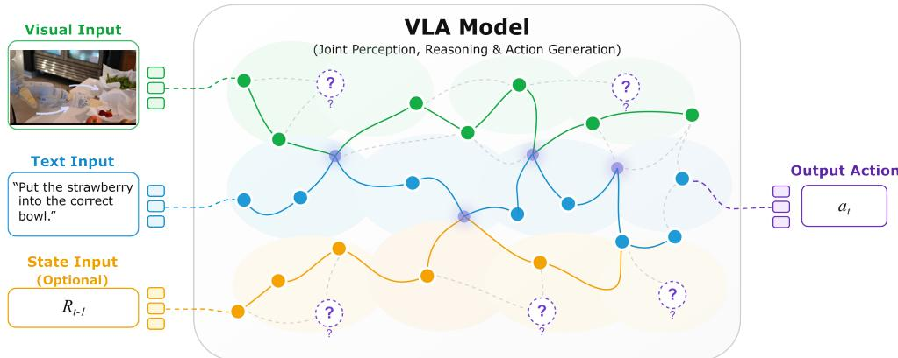  
Figure 1 From multimodal conditioning to action generation in VLAs. We view VLA action generation as a conditional generative Markov chain: visual observations, language instructions, and state input jointly condition a sequence of latent action states that evolves toward final action. Attention exposes how these latent states route information across modalities, and its entropy serves as a white-box signal for self-evaluating action-generation reliability.

Can VLA internal signals be transformed into self-evaluation metrics for action-generation reliability under a unified account of heterogeneous action-generation mechanisms, without relying on external supervision?

The Present Work. We propose MAE (Markov Attention Entropy), a white-box self-evaluation framework that converts a VLA’s internal attention dynamics into reliability scores. Heterogeneous VLA architectures share a common action-generation structure: visual observations, language instructions, and state input form the conditioning context, while latent action states evolve under this context toward the executable action. The architectural diference lies in how this evolution is implemented. In Latent-Readout VLAs, the policy evolves latent action representations and maps the final latent state to an executable action through a readout head, covering autoregressive discrete readout and continuous readout. In Latent-Refinement VLAs, the policy maintains an action or action-trajectory representation and refines it through repeated update steps, covering flow-style refinement and difusion-style generation.

This conditioned state evolution is captured by the Conditional Generative Markov Chain view illustrated in Figure 3. The latent action state is the Markov state of the internal generation process. Conditioned on the current state and the conditioning context, the transition kernel determines how the next latent action state is formed, whether the update is implemented by autoregressive discrete readout, continuous readout, or flow-style refinement. Attention records which visual and language tokens the current latent action state consults during this transition process. Attention entropy measures this information routing and yields architecture-aware reliability scores.

In Figure 2, the paired attention maps show that successful and failed queries difer in how the latent action state addresses visual evidence, while the episode-level distributions show that visual-entropy scores separate reliable and unreliable executions more clearly than text-entropy scores on the same Reflect-Goal episodes. In the Markov formulation, visual attention entropy therefore measures how the transition kernel accesses visual perception when updating the latent action state. For Latent-Readout VLAs, failed episodes show more difuse visual addressing, and MAE-D scores the corresponding loss of concentration. For Latent-Refinement VLAs, failed episodes show overly concentrated visual addressing at the final refinement step, and MAE-C

A Focused visual query

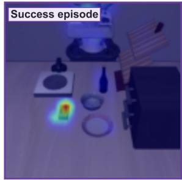  
B Dispersed visual query

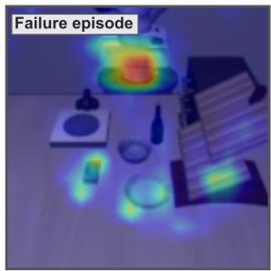  
C Visual entropy separates

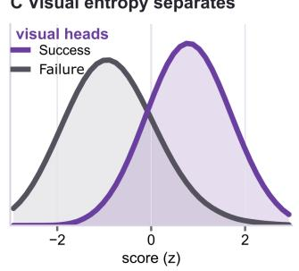

D Text entropy overlaps  
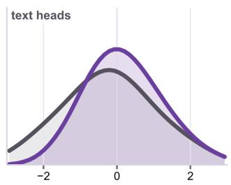  
score (z)  
Figure 2 Attention entropy as an internal self-evaluation signal. Panels A–B show a successful visual query concentrated on the task-relevant object and a failed visual query dispersed across distractor regions. Panels C–D compare oriented episode-level score distributions from visual and text attention entropy on the same Reflect-Goal episodes. Visual entropy yields a much clearer separation between successful and failed episodes than text entropy, supporting visual attention entropy as the action-relevant self-evaluation signal.

scores the resulting loss of visual coverage before the action trajectory is returned. Both metrics are oriented so that larger values indicate higher estimated reliability.

We evaluate MAE on three open-source VLAs spanning the two action-generation families: OpenVLA and OpenVLA-OFT as Latent-Readout VLAs, and QwenPI-Flow as a Latent-Refinement VLA. The evaluation uses LIBERO-Reflect, a 4,000-episode benchmark combining 2,000 standard episodes and 2,000 challenging episodes across four subsets. The benchmark covers four capability axes, Goal Semantics, Object Binding, Spatial Grounding, and Composite Generalization, and evaluates whether a self-evaluation score ranks successful episodes above failed episodes. Across AUROC, AUPR, and FPR@95, MAE improves reliability ranking over all baselines without an external evaluator, repeated rollouts, or auxiliary model passes. Our key contributions can be summarized as follows:

1. We formulate heterogeneous VLA action generation as a Conditional Generative Markov Chain, making the transition kernel the common object that links Latent-Readout VLAs and Latent-Refinement VLAs.

2. We introduce MAE, a white-box self-evaluation framework that scores the visual-attention entropy of these transitions with architecture-aware orientations, MAE-D for Latent-Readout VLAs and MAE-C for Latent-Refinement VLAs.

3. We construct LIBERO-Reflect, a 4,000-episode benchmark combining 2,000 standard episodes and 2,000 challenging episodes across four subsets.

4. We show across three open-source VLAs that MAE improves reliability ranking over black-box and white-box baselines without an external evaluator, repeated rollouts, or auxiliary model passes.

5. We instantiate FabriMAE, a verifier-free test-time action selection procedure for PI-family Latent-Refinement VLAs, and show that MAE-guided branch sampling improves the unseen benchmark LIBERO-Plus success rate with small observed runtime overhead.

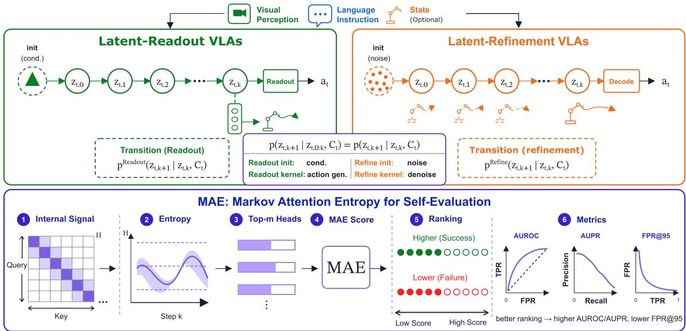  
Figure 3 Unified Conditional Generative Markov Chain view of heterogeneous VLAs. Visual observations, language instructions, and state input form the conditioning context, while latent action states evolve through architecturespecific transition kernels before the executable action is produced. MAE reads attention entropy from this internal transition process and converts it into architecture-aware self-evaluation scores.

## 2 Preliminary

## The Conditional Generative Markov Chain

We use a Conditional Generative Markov Chain to formalize the action-generation process of a VLA. The chain describes the model’s latent state evolution during action generation, not the physical robot-environment dynamics. At timestep t, the VLA evolves a sequence of latent action states $z _ { t , 0 : K } \in \mathcal { Z }$ . These states are hidden representations used for action generation and are not directly executed by the robot; the executable action $a _ { t } \in A .$ , represented either as a single action or as an action chunk depending on the policy action head, is produced from the final latent action state, $a _ { t } = g _ { \theta } ( z _ { t , K } )$ . The chain is conditioned on the conditioning context $C _ { t } = ( V _ { t } , X , R _ { t } ) \in \mathcal { C }$ , where $V _ { t }$ denotes visual representations, X denotes the language instruction, and $R _ { t }$ denotes optional state input when used by the policy. During the internal generation of $a _ { t } , C _ { t }$ is fixed, while $z _ { t , k }$ stores the complete action-generation state at internal generation step k: the generated action-token prefix for autoregressive discrete readout, the latent action representation for continuous readout, or the current action trajectory for flow-style refinement.

Formal definition. We define the internal action-generation process as a conditional generative Markov chain $\mathcal { M } = ( \mathcal { Z } , \mathcal { C } , K , \mathcal { P } _ { \theta } )$ , where $\mathcal { Z }$ is the latent action-state space, C is the conditioning space, K is the number of internal generation steps, and ${ \mathcal { P } } _ { \theta }$ is the model’s neural transition kernel. At timestep $t ,$ the internal process is $z _ { t , 0 }  z _ { t , 1 }  \cdot \cdot \cdot  z _ { t , K }  a _ { t }$ , where $z _ { t , k }$ is the latent action state at internal step k, and $a _ { t }$ is the executable action. The chain is specified by an initial distribution and an architecture-dependent transition kernel:

$$
\begin{array} { r l } & { z _ { t , 0 } \sim \rho _ { 0 } ( \cdot \mid C _ { t } ) , } \\ & { z _ { t , k + 1 } \sim \mathcal { P } _ { \theta } ( \cdot \mid z _ { t , k } , C _ { t } ) , \quad k = 0 , \ldots , K - 1 . } \end{array}\tag{1}
$$

Here $\rho _ { 0 }$ is the initial latent action-state distribution, and ${ \mathcal { P } } _ { \theta }$ is the neural transition kernel induced by the VLA architecture, such as autoregressive action-token updates, continuous readout, or flow-style refinement. The probabilistic notation also covers deterministic updates as degenerate kernels. Equivalently, the conditional

joint distribution factorizes as

$$
\begin{array} { r l } { P _ { \theta } ( z _ { t , 0 : K } \mid C _ { t } ) } \\ { = \rho _ { 0 } ( z _ { t , 0 } \mid C _ { t } ) } & { \displaystyle \prod _ { k = 0 } ^ { K - 1 } \mathcal { P } _ { \theta } ( z _ { t , k + 1 } \mid z _ { t , k } , C _ { t } ) , } \end{array}\tag{2}
$$

The final action is $a _ { t } = g _ { \theta } ( z _ { t , K } )$ , where $g _ { \theta }$ denotes the architecture-specific action head.

Markov property. The Markov property holds at the level of the complete latent action state: given the current latent action state $z _ { t , k }$ and the conditioning context $C _ { t } .$ , the next latent action state $z _ { t , k + 1 }$ does not depend additionally on earlier states $z _ { t , 0 : k - 1 }$ . That is, $P ( z _ { t , k + 1 } \mid z _ { t , 0 : k } , C _ { t } ) = P ( z _ { t , k + 1 } \mid z _ { t , k } , C _ { t } )$ . Because $z _ { t , k }$ denotes the complete action-generation state, this formulation identifies the transition kernel as the common object shared by heterogeneous VLA action-generation mechanisms.

## 3 Methodology

## Markov Attention Entropy

Under the Conditional Generative Markov Chain interpretation, each transition $z _ { t , k - 1 } \to z _ { t , k }$ is an informationrouting step. The transition kernel updates the latent action state by querying the conditioning context. We use transformer attention to measure this routing behavior. For internal generation step k, layer $\ell ,$ and head $h ,$ let $\mathbf { A } ^ { ( t , k , \ell , h ) } \in \mathbb { R } ^ { S _ { a } \times S _ { c } }$ be the attention matrix from action-query tokens to conditioning context tokens, where $S _ { a }$ is the number of action-query tokens, and $S _ { \mathrm { c } }$ is the number of conditioning context tokens. MAE evaluates attention at $k = K$ , the final internal generation step before $a _ { t }$ is produced. We decompose the key side into modality-specific token sets $\mathcal { T } _ { v }$ and $\mathcal { T } _ { x }$ , corresponding to vision and language tokens. For the visual modality, the normalized visual addressing distribution is

$$
p _ { v } ^ { ( t , k , \ell , h ) } ( j \mid i ) = \frac { A _ { i j } ^ { ( t , k , \ell , h ) } } { \sum _ { r \in \mathcal { T } _ { v } } A _ { i r } ^ { ( t , k , \ell , h ) } + \epsilon } , \qquad j \in \mathcal { T } _ { v } .\tag{3}
$$

The visual attention entropy is

$$
H _ { v } ^ { ( t , k , \ell , h ) } ( i ) = - \sum _ { j \in \mathcal { Z } _ { v } } p _ { v } ^ { ( t , k , \ell , h ) } ( j \mid i ) \log p _ { v } ^ { ( t , k , \ell , h ) } ( j \mid i ) .\tag{4}
$$

This entropy measures the uncertainty of visual addressing. A high value indicates that the action state distributes its visual attention broadly across many patches, while a low value indicates concentrated visual addressing over fewer patches. In the Conditional Generative Markov Chain view, $H _ { v }$ measures how the transition kernel ${ \mathcal { P } } _ { \theta }$ accesses visual perception when updating the action state.

Episode MAE score We convert the token-level visual entropy into an episode-level score by first averaging over execution steps and action queries:

$$
E _ { \ell , h } = \frac { 1 } { N } \sum _ { t = 1 } ^ { N } \frac { 1 } { S _ { a } } \sum _ { i = 1 } ^ { S _ { a } } H _ { v } ^ { ( t , K , \ell , h ) } ( i ) ,\tag{5}
$$

where N is the number of execution steps in the episode, and $E _ { \ell , h }$ denotes the averaged visual entropy of head h in layer ℓ. Let $m$ be the number of selected heads per layer. We write the episode-level MAE score with a single entropy orientation $\omega \in \{ - 1 , + 1 \}$ :

$$
\mathbf { M A E } _ { \omega } ^ { ( m ) } ( E ) = \frac { 1 } { L } \sum _ { \ell = 1 } ^ { L } \frac { 1 } { m } \sum _ { h \in \mathrm { T o p M } _ { m } ( \omega E _ { \ell , : } ) } \omega E _ { \ell , h } .\tag{6}
$$

Here Top $\mathrm { M } _ { m } ( \omega E _ { \ell , : } )$ returns the m heads with the largest oriented entropy in layer ℓ. Larger $\mathbf { M A E } _ { \omega } ^ { ( m ) } ( E )$ indicates a more reliable episode. The two MAE metrics used in the experiments are $\mathbf { M A E - D } ^ { ( m ) } \ =$ $\mathbf { M A E } _ { - 1 } ^ { ( m ) } ( E )$ and $\mathbf { M A E - C } ^ { ( m ) } = \mathbf { M A E } _ { + 1 } ^ { ( m ) } ( E )$ . MAE-D is used for Latent-Readout VLAs such as OpenVLA and $\mathrm { O p e n V L A  – O F T }$ , where reliable executions concentrate visual addressing before readout. MAE-C is used for Latent-Refinement VLAs such as QwenPI-Flow, where reliable executions retain broader visual addressing at the final refinement step.

## 4 LIBERO-Reflect Benchmark

We construct LIBERO-Reflect as a benchmark for VLA self-evaluation. The standard side is sampled from the original LIBERO benchmark. For each of the four standard suites, LIBERO-Goal, LIBERO-Spatial, LIBERO-10, and LIBERO-Object, we use all 10 tasks and execute each task under 50 non-identical initializations with small scene-state diferences. This gives 500 standard episodes per suite and 2,000 standard episodes in total. The challenging side is sampled from LIBERO-PRO. We retain the same task count and initialization count for each suite, producing 500 challenging episodes per suite and 2,000 challenging episodes overall. The challenging episodes keep the task language fixed while swapping the placements of target objects and surrounding objects. Each LIBERO-Reflect subset contains 1,000 episodes, and the full benchmark contains 4,000 episodes.

Capability subsets. LIBERO-Reflect is organized into four capability-oriented subsets:

• Goal Semantics (Reflect-Goal) stresses goal-conditioned task understanding and action-type selection. It contains 500 standard LIBERO-Goal episodes and 500 challenging episodes, for 1,000 episodes in total.

• Object Binding (Reflect-Object) stresses target-object grounding and object-action binding. It contains 500 standard LIBERO-Object episodes and 500 challenging episodes, for 1,000 episodes in total.

• Spatial Grounding (Reflect-Spatial) stresses spatial relation reasoning and layout-sensitive action adaptation. It contains 500 standard LIBERO-Spatial episodes and 500 challenging episodes, for 1,000 episodes in total.

• Composite Generalization (Reflect-10) follows the LIBERO-10 suite, where diverse goals, objects, and spatial layouts are mixed within one evaluation split. It contains 500 standard LIBERO-10 episodes and 500 challenging episodes, for 1,000 episodes in total.

Assessment protocol. Each episode receives a scalar reliability score computed from the method under evaluation. The benchmark is designed as an episode-level ranking problem: stronger self-evaluation methods should assign higher scores to successful episodes and lower scores to failed episodes. The ground-truth label for all metric computations is strictly the actual simulator success flag of each rollout, rather than the nominal dataset split. We report supporting construction statistics and nominal-to-actual label mapping in Appendix C, with dataset-source considerations in Appendix H.

Evaluation metrics. We report three ranking metrics throughout the experiments:

1. AUROC measures global ranking quality. Higher values indicate that the score more consistently ranks successful episodes above failed episodes.

2. AUPR emphasizes precision under class imbalance. Higher values indicate stronger isolation of successful episodes when successful and failed episodes are unevenly distributed.

3. FPR@95 measures over-confidence under high recall. It reports the false positive rate when 95% of successful episodes are recalled; lower values indicate fewer failed episodes being ranked as reliable.

This matched construction mitigates first-order dataset-source shortcuts: the nominal standard and challenging pools follow the same suite-level organization, task count, initialization count, simulator, and rollout protocol, while all metrics are computed from realized simulator success rather than nominal source membership. Thus, LIBERO-Reflect evaluates whether a score ranks successful episodes above failed episodes within a matched mixed-dificulty pool.

<table><tr><td rowspan="2">Model</td><td rowspan="2">Method</td><td colspan="3">Goal Semantics Reflect-Goal</td><td colspan="3">Object Binding Reflect-Object</td><td colspan="3">Spatial Grounding Reflect-Spatial</td><td colspan="3">Composite Generalization Reflect-10</td></tr><tr><td>AUROC ↑ AUPR ↑FPR@95 ↓ AUROC ↑ AUPR ↑FPR@95 ↓ AUROC ↑AUPR ↑FPR@95 ↓ AUROC ↑ AUPR ↑ FPR@95 ↓</td><td></td><td></td><td></td><td></td><td></td><td></td><td></td><td></td><td></td><td></td><td></td></tr><tr><td></td><td colspan="10">0 Latent-Readout VLAs</td><td></td><td></td><td></td></tr><tr><td rowspan="10"></td><td>Black-box baselines</td><td></td><td></td><td></td><td></td><td></td><td></td><td></td><td></td><td></td><td></td><td></td><td>93.92</td></tr><tr><td>Random</td><td>48.55</td><td>39.27</td><td>95.36</td><td>47.85</td><td>35.98</td><td>95.87</td><td>48.97</td><td>39.49</td><td>94.82 92.47</td><td>52.51 53.69</td><td>28.88 30.04</td><td>91.86</td></tr><tr><td>Verbal. Conf Self-Consistency†</td><td>50.36 56.82</td><td>40.82 41.28</td><td>92.91 84.90</td><td>49.74</td><td>37.21 42.76</td><td>93.64 82.35</td><td>50.88 57.94</td><td>41.03 44.15</td><td>87.80</td><td>53.64</td><td>27.20</td><td>90.64</td></tr><tr><td></td><td></td><td></td><td></td><td>58.41</td><td></td><td></td><td></td><td></td><td></td><td></td><td></td><td></td></tr><tr><td>White-box baselines</td><td></td><td></td><td></td><td></td><td></td><td></td><td></td><td></td><td></td><td></td><td></td><td>91.48</td></tr><tr><td>MaxProb†</td><td>54.72 55.04</td><td>40.58 40.73</td><td>88.62 87.95</td><td>55.83 56.12</td><td>40.28 40.71</td><td>86.74 86.20</td><td>55.61 56.02</td><td>42.37 42.59</td><td>90.10 89.44</td><td>53.28 53.36</td><td>27.05 27.12</td><td>91.10</td></tr><tr><td>Perplexity† Entropy†</td><td>56.10</td><td>41.05</td><td>86.80</td><td>57.48</td><td>41.64</td><td>84.75</td><td>57.17</td><td>43.26</td><td>88.37</td><td>53.82</td><td>27.30</td><td>90.38</td></tr><tr><td>Length-norm Ent.†</td><td>56.38</td><td>41.19</td><td>86.32</td><td>58.02</td><td>42.05</td><td>84.12</td><td>57.52</td><td>43.58</td><td>87.90</td><td>54.02</td><td>27.38</td><td>89.96</td></tr><tr><td></td><td>59.56</td><td>40.67</td><td>71.52</td><td>79.64</td><td>58.98</td><td></td><td></td><td></td><td>84.81</td><td>53.21</td><td>26.56</td><td>87.43</td></tr><tr><td>MAE-D (Top-16)</td><td>+22.7% 63.94</td><td>+3.6%</td><td>↓25.0%</td><td>+66.4%</td><td>+63.9%</td><td>48.81 ↓49.1%</td><td>63.99 +30.7%</td><td>49.67 +25.8%</td><td>↓10.6%</td><td>+1.3%</td><td>-8.0%</td><td>↓6.9%</td></tr><tr><td>MAE-D (Top-1)</td><td></td><td>43.23 +31.7% +10.1%</td><td>61.92 ↓35.1%</td><td>90.97 +90.1%</td><td>75.88 +110.9%</td><td>28.30 ↓70.5%</td><td>66.86 +36.5%</td><td>50.74 +28.5%</td><td>75.79 ↓20.1%</td><td>54.74 +4.2%</td><td>30.45 +5.4%</td><td>86.46 ↓7.9%</td></tr><tr><td rowspan="10"></td><td>Black-box baselines</td><td></td><td></td><td></td><td></td><td></td><td></td><td></td><td></td><td></td><td></td><td></td><td></td></tr><tr><td>Random</td><td>47.41</td><td>50.24</td><td>95.51</td><td>48.87</td><td>49.86</td><td>95.56</td><td>47.97</td><td>48.74</td><td>94.96</td><td>51.01</td><td>48.44</td><td>96.58</td></tr><tr><td>Verbal. Conf</td><td>49.12</td><td>51.73</td><td>92.84</td><td>50.68</td><td>51.08</td><td>93.11</td><td>49.63</td><td>50.26</td><td>92.75</td><td>52.45</td><td>50.01</td><td>93.89</td></tr><tr><td>Self-Consistency*</td><td></td><td></td><td>Not applicable: continuous actions do not define discrete action-token samples</td><td></td><td></td><td></td><td></td><td></td><td></td><td></td><td></td><td></td></tr><tr><td colspan="10">OpenVLA-OFT White-box baselines</td><td></td><td></td><td></td></tr><tr><td colspan="10"></td></tr><tr><td></td><td>Token statistics*</td><td></td><td></td><td></td><td></td><td></td><td></td><td></td><td></td><td>Not applicable: continuous actions do not define autoregressive action-token logits</td><td></td><td></td></tr><tr><td>MAE-D (Top-16)</td><td>91.84</td><td>94.50</td><td>7.94</td><td>75.96</td><td>82.86</td><td>64.03</td><td>91.71</td><td>89.85</td><td>42.74</td><td>77.13</td><td>62.10</td><td>45.06</td></tr><tr><td>MAE-D (Top-1)</td><td>+93.7% 97.34</td><td>+88.1% 96.14</td><td>↓91.7% 7.14</td><td>+55.4% 80.56</td><td>+66.2% 81.10</td><td>↓33.0% 63.71</td><td>+91.2% 92.63</td><td>+84.3% 93.15</td><td>↓55.0% 39.31</td><td>+51.2% 78.57</td><td>+28.2%</td><td>↓53.3% 45.06</td></tr><tr><td colspan="10">+105.3% +91.4% ↓92.5% +64.8%</td><td>64.08 +54.0% ↓53.3%</td><td>+32.3%</td></tr><tr><td colspan="10">Θ Latent-Refinement VLAs</td><td></td><td></td><td></td></tr><tr><td rowspan="9"></td><td>Black-box baselines</td><td></td><td></td><td></td><td></td><td></td><td></td><td></td><td></td><td></td><td></td><td></td></tr><tr><td>Random</td><td>47.58</td><td>47.93</td><td>95.91</td><td>48.75 48.40</td><td>95.10</td><td>48.11</td><td>50.15</td><td>94.82</td><td>50.81</td><td>48.95</td><td>96.53</td></tr><tr><td>Verbal. Conf</td><td>49.44</td><td>49.51 93.42</td><td>50.31</td><td>49.82</td><td>92.68</td><td>49.96</td><td>51.62</td><td>92.31</td><td>52.18</td><td>50.47</td><td>93.77</td></tr><tr><td>Self-Consistency*</td><td></td><td></td><td>Not applicable: flow matching does not define discrete action-token samples</td><td></td><td></td><td></td><td></td><td></td><td></td><td></td><td></td></tr><tr><td colspan="10">White-box baselines</td></tr><tr><td>Token statistics*</td><td></td><td></td><td>Not applicable: flow matching does not define autoregressive action-token logits</td><td></td><td></td><td></td><td></td><td></td><td></td><td></td><td></td></tr><tr><td>MAE-C (Top-20)</td><td>62.63 +31.6%</td><td>59.16 +23.4%</td><td>80.93 ↓15.6%</td><td>65.92 +35.2%</td><td>63.43 81.59 +31.1% ↓14.2%</td><td>66.89 +39.0%</td><td>64.70 +29.0%</td><td>73.50 ↓22.5%</td><td>68.91 +35.6%</td><td>61.92 +26.5%</td><td>74.52 ↓22.8%</td></tr><tr><td>MAE-C (Top-1)</td><td>80.57</td><td>80.01</td><td>60.12</td><td>75.94</td><td>76.48 81.18</td><td>84.80</td><td>85.46 +70.4%</td><td>68.53 ↓27.7%</td><td>79.52 +56.5%</td><td>76.24 +55.8%</td><td>55.60 ↓42.4%</td></tr><tr><td></td><td>+69.3%</td><td>+66.9%</td><td>↓37.3%</td><td>+55.8%</td><td>+58.0%</td><td>↓14.6%</td><td>+76.3%</td><td></td><td></td><td></td><td></td></tr></table>

Table 1 Main self-evaluation results on LIBERO-Reflect. Baselines are grouped into black-box and white-box methods within each VLA block. Purple rules highlight MAE rows, which report the score and relative change against Random; for FPR@95, the relative value is the reduction rate. Bold Top-1 values and underlined half-head values improve over Random within the same model, subset, and metric. †OpenVLA is the only model block with token-statistic baselines because the standard OpenVLA policy exposes autoregressive discrete action-token probabilities; OpenVLA-OFT and QwenPI-Flow execute continuous action heads, so token statistics would score a diferent random variable from the executed action. OpenVLA is also the only block with the reported Self-Consistency baseline because token-level sampled action-token agreement is defined for its discrete action-token interface. Additional protocol details are provided in Appendix F. This interface mismatch highlights why MAE uses internal attention entropy rather than output-token statistics, allowing one architecture-aware scoring framework to cover both Latent-Readout VLAs and Latent-Refinement VLAs.

## 5 Experiments

In this section, we conduct extensive experiments to answer the following research questions: (RQ1) Can MAE provide reliable self-evaluation across heterogeneous VLA architectures and various scenarios? (RQ2) Does MAE introduce significant computational overhead? (RQ3) How sensitive is MAE to its key components

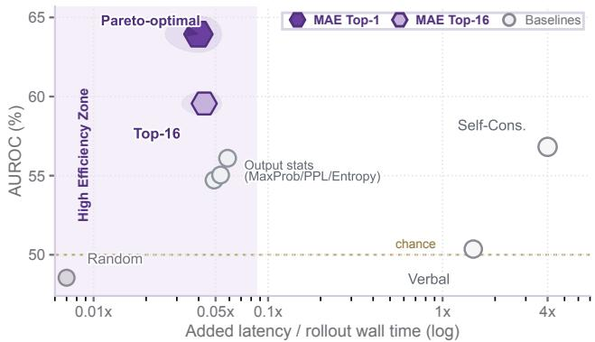  
Figure 4 Eficiency–reliability Pareto. The x-axis reports added evaluation latency normalized by one rollout wall time.

and hyperparameters? (RQ4) Can MAE guide verifier-free test-time action selection?

## Experimental Setup

VLA Backbones. We evaluate three representative open-source VLA policies on LIBERO-Reflect: Open-VLA, OpenVLA-OFT, and QwenPI-Flow. OpenVLA denotes the standard OpenVLA policy in Latent-Readout VLAs, with autoregressive discrete readout. OpenVLA-OFT keeps the same OpenVLA backbone family and uses the OFT adaptation recipe with continuous readout. QwenPI-Flow denotes a Qwen3-VL-based policy in Latent-Refinement VLAs, with a flow-style action module. Together, these policies pair two VLM backbone families with diferent action-generation mechanisms and training or adaptation regimes. This design tests whether MAE transfers across action-generation architectures, VLM backbone families, and training sources. Detailed checkpoint names, vision-language backbones, action heads, and training sources are provided in Appendix B.

Baselines. We compare against seven baselines covering black-box and white-box self-evaluation. The black-box group includes Random [2], Verbal Confidence [21], and Self-Consistency [42]. The white-box group includes Maximum Softmax Probability [38], Perplexity [38], Entropy [16], and Length-normalized Entropy [32]. For all methods, we compute AUROC, AUPR, and FPR@95 under the same episode labels. Random serves as a uniform-ranking lower bound. Because the evaluated VLAs use diferent action-generation interfaces, some baselines are technically not applicable to specific action heads; baseline definitions, applicability, OpenVLA-specific protocols, and the Verbal Confidence prompt are detailed in Appendix F. The shared evaluation protocol is summarized in Appendix E.

Parameter Settings. We obtain attention from the same policy forward pass used to generate actions, then compute the visual-entropy matrix E defined in the Markov Attention Entropy subsection. The main results use all layers and Top-1 head selection, selecting one oriented-entropy head per layer. We report MAE-D for Latent-Readout VLAs and MAE-C for Latent-Refinement VLAs according to the entropy orientations above. Appendices D, E, and G summarize exact ablation values, the common scoring protocol and model-specific layer/head settings, and policy input templates.

## Main Results (RQ1)

Takeaway 1. MAE improves over black-box and white-box self-evaluation baselines. Table 1 provides a comprehensive analysis of MAE under the full black-box and white-box baseline protocol across three VLA backbones and four LIBERO-Reflect subsets. MAE directly scores the internal visual-attention entropy of latent action generation. Against the Random lower bound, MAE-D improves OpenVLA by up to 90.1% AUROC on Object Binding and reduces FPR@95 by 70.5%; MAE-D improves OpenVLA-OFT by 105.3% AUROC on Goal Semantics; and MAE-C improves QwenPI-Flow by 76.3% AUROC on Spatial Grounding. For the discrete OpenVLA policy, the output-statistic and Self-Consistency rows instantiate baselines that depend on action-token probabilities or sampled action-token agreement, while the continuousaction and flow-action policies cannot expose the same random variables without changing the estimator. The OpenVLA-specific baseline protocols are detailed in Appendix F.

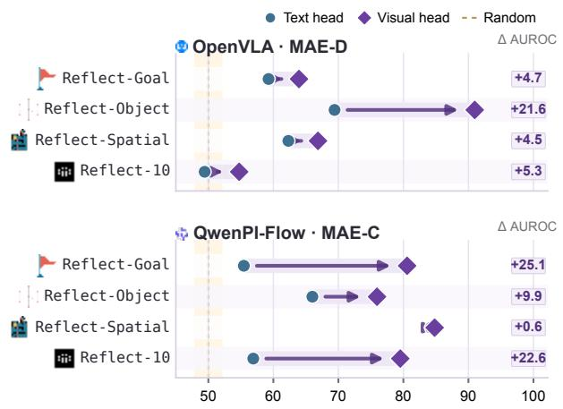  
Figure 5 Text-head versus visual-head self-evaluation signals. OpenVLA uses MAE-D and QwenPI-Flow uses MAE-C Each connector reports ∆AUROC = V - T. Positive gaps across all subsets indicate that text-side entropy is not a stable substitute for visual information.

Takeaway 2. MAE transfers across model architectures, initialization families, and task families. The three evaluated policies difer in base VLMs, perception stacks, training data, and action-generation mechanisms. OpenVLA and OpenVLA-OFT instantiate Latent-Readout VLAs with diferent readout recipes. QwenPI-Flow instantiates Latent-Refinement VLAs with a flow-style action module. The gains on Goal Semantics, Object Binding, and Spatial Grounding show that the signal follows the action-condition coupling structure across distinct capability axes.

Takeaway 3. MAE yields a shared execution-correctness signal across heterogeneous tasks. Reflect-10 pools diverse goals, objects, and layouts from LIBERO-10 into a single evaluation split. On this heterogeneous task mixture, OpenVLA-OFT reaches 78.57 AUROC and QwenPI-Flow reaches 79.52 AUROC. The entropy signal thus functions as a cross-task execution monitor, discriminating successful from failed rollouts as task semantics and scene configurations vary jointly.

## Cost Analysis (RQ2)

Takeaway 4. MAE achieves the highest performance in the high-eficiency zone, establishing itself as the Pareto-optimal solution. Figure 4 visualizes the eficiency-reliability Pareto view. While baselines like Self-Consistency or Verbal Confidence require multiple sampled action-token generations or external models (incurring ≥ 1× latency overhead), MAE reuses internal attention maps and adds minimal computation (< 0.1× overhead; detailed hardware profiling on NVIDIA H100 is provided in Appendix J).

## Framework Analysis (RQ3)

Ablation study. We ablate the key design choices in MAE from the following perspectives:

Text-head versus visual-head signals. We first test whether the reliability signal can be recovered from the language side alone. Figure 5 compares the text-head MAE Top-1 score against the visual-attention MAE Top-1 score used in Table 1; exact values are reported in Appendix D. The visual head consistently improves AUROC, with especially large gains on OpenVLA Object Binding and QwenPI-Flow Goal Semantics and Reflect-10. This shows that language-head entropy can reflect text-side decisiveness, but it does not reliably capture whether the action latent has gathered the visual evidence needed for manipulation. The visual head is therefore the appropriate signal for self-evaluating action generation.

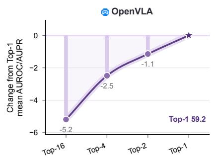

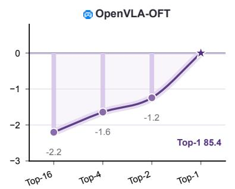

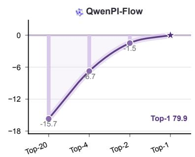  
Figure 6 Top-m head selection ablation. Panels order selected-head settings from many heads to Top-1 and use independent y-axis scales. Values are percentage-point changes from the Top-1 ranking score, computed as the mean of AUROC and AUPR over the four LIBERO-Reflect subsets. Exact values are reported in Appendix D.

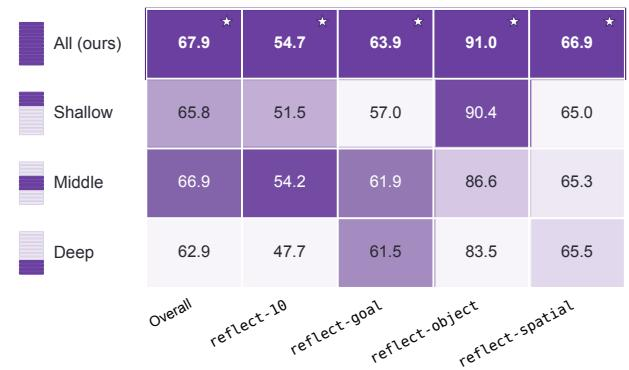  
Figure 7 Layer-band ablation for MAE-D with Top-1. Cells report absolute AUROC; colors are normalized within each column by closeness to the all-layer result, stars mark the best layer band, and the left schematic indicates the layer region used by each row.

Impact of head selection. We evaluate how the number of selected heads afects MAE by varying Top-m. Figure 6 summarizes the full results by plotting each setting’s drop from Top-1 in mean ranking quality, averaged over AUROC and AUPR across the four subsets; exact values are reported in Appendix D. Top-1 gives the most consistent ranking performance across all three models. It also uses the smallest selected-head set, reducing entropy aggregation cost and limiting the contribution of low-signal heads. This supports Top-1 as the default head-selection setting.

Impact of layer selection. To assess the efect of model depth, we compare the default all-layer aggregation with three layer-restricted variants: shallow, middle, and deep. The experiment keeps the same MAE-D score with Top-1 and changes only the layer band used to aggregate $E _ { \ell , h }$ . Figure 7 reports absolute AUROC values while coloring each column by closeness to the all-layer result, showing that all-layer aggregation gives the best overall AUROC and remains competitive across task families. This result is consistent with the layered function of transformer VLAs: earlier layers encode visual grounding and token-level perception, middle layers support cross-modal binding, and deeper layers are closer to action readout. Combining all layers provides a fuller internal signal and avoids introducing task- or architecture-specific layer-band hyperparameters.

## Test-Time Sampling with FabriMAE (RQ4)

Takeaway 5. FabriMAE turns internal MAE scores into a verifier-free test-time action selector. Beyond post-hoc reliability ranking, the same internal signal can choose among multiple candidate action chunks at inference time. We instantiate this use case as FabriMAE, a test-time sampling procedure for PI-family Latent-Refinement VLAs. At each control step, FabriMAE samples n candidate action chunks, computes a candidate-level MAE score from the visual-attention entropy at the final refinement step of each candidate, and executes the highest-scoring candidate:

<table><tr><td>Sampling Strategy</td><td>Branch Ratio Noise Scale Overall SR (%)</td><td></td><td> $\pmb { \Delta }$ </td></tr><tr><td>Normal</td><td></td><td></td><td>85.70</td></tr><tr><td>Independent</td><td></td><td></td><td>86.20 +0.50</td></tr><tr><td>Branch</td><td>20%</td><td>0.20</td><td>86.35 +0.65</td></tr><tr><td>Branch</td><td>40%</td><td>0.30</td><td>86.35 +0.65</td></tr><tr><td>Branch</td><td>60%</td><td>0.20</td><td>86.48 +0.78</td></tr><tr><td>Branch</td><td>80%</td><td>0.10</td><td>86.62 +0.92</td></tr><tr><td>Branch</td><td>70%</td><td>0.15</td><td>86.80 +1.10</td></tr></table>

Table 2 FabriMAE sampling ablation on the PI0.5 LIBERO-Plus sweep. All values are success rates in percentages, and ∆ is measured in percentage points relative to Normal. Sampling rows use 10 candidates and the same candidatelevel MAE selector. The table reports representative branch settings from earlier and fine-grid sweeps; the FabriMAE setting uses a 70% branch ratio with noise scale 0.15, outperforming both Normal and independent sampling.
<table><tr><td>Method</td><td>Camera</td><td>Robot</td><td>Language</td><td>Light</td><td>Background</td><td>Noise</td><td>Layout</td><td>Total</td></tr><tr><td>Normal FabriMAE</td><td>75.80</td><td>79.40</td><td>83.30</td><td>95.50</td><td>95.00</td><td>89.60</td><td>87.00</td><td>85.70</td></tr><tr><td>(Branch 70% / 0.15)</td><td>78.42</td><td>78.45</td><td>87.12</td><td>96.76</td><td>96.28</td><td>89.07</td><td>87.21</td><td>86.80</td></tr></table>

Table 3 LIBERO-Plus perturbation breakdown for the measured PI0.5 policy with and without branch FabriMAE. All values are success rates in percentages.

$$
i ^ { \star } = \arg \operatorname* { m a x } _ { i \in \{ 1 , \ldots , n \} } \mathbf { M A E } ^ { ( i ) } , \qquad a _ { t } ^ { \star } = a _ { t } ^ { ( i ^ { \star } ) } .\tag{7}
$$

For PI0.5, we use n = 10 candidates and the Latent-Refinement orientation MAE-C. For branch FabriMAE, the branch ratio is expressed as a percentage of the total refinement process. With the selected 70% setting, the shared refinement prefix covers the first 70% of refinement steps; the resulting latent state is copied into 10 candidates, Gaussian branch noise with scale $0 . 1 5 \cdot \mathrm { s t d } ( x _ { \mathrm { s h a r e d } } )$ is added, and the remaining sufix is refined independently for each candidate. The policy remains frozen and the selector uses no external verifier or reward model.

Takeaway 6. Late branch sampling improves robustness while adding small runtime overhead. This experiment compares two ways of injecting stochasticity into the PI-family refinement process. Independent sampling gives each candidate a separate initial noise tensor and runs the full refinement trajectory independently. Branch sampling shares the refinement prefix across candidates: the branch ratio specifies where this shared prefix ends, larger ratios branch later, and the noise scale sets the magnitude of the Gaussian perturbation injected after copying the shared latent state into n candidates. After the branch point, candidates refine only the remaining sufix independently and are selected by the same candidate-level MAE selector. Table 2 traces this branch-ratio/noise-scale trade-of. A smaller branch ratio, such as 20% or 40%, copies and perturbs the latent state early in the refinement trajectory, giving candidates more independent sufix steps. Larger ratios, such as 60% and 80%, keep more of the trajectory shared before the candidates split. Under the strongest setting, FabriMAE shares the first 70% of the refinement process and compares 10 final action chunks after their independent sufix refinement. The candidate-level MAE-C score is computed from the visual-attention entropy at each candidate’s final refinement step, so the selector evaluates the completed branch outputs rather than the shared prefix state. This setting gives the best balance in the sweep: the shared prefix reaches a refined latent state, the remaining sufix still supports independent refinement, and the 0.15 noise scale provides candidate diversity through Gaussian perturbations without replacing the shared trajectory. This branch FabriMAE configuration reaches 86.80% overall success, improving Normal by 1.10 percentage points and independent sampling by 0.60 percentage points. The runtime overhead is small: branch FabriMAE with 10 candidates increases aggregate episode time by 7.20%, mean episode time by 1.43 seconds, and seconds per executed environment step by 8.94%.

On the full LIBERO-Plus evaluation, as shown in Table 3, the measured PI0.5 policy with branch FabriMAE reaches 86.80% overall success rate, improving Normal by 1.10 percentage points, with gains on Camera, Language, Light, Background, and Layout perturbations. Following the LIBERO-Plus reporting convention, the Total column is the micro success rate over all evaluation episodes.

## 6 Conclusion

We presented MAE (Markov Attention Entropy), a white-box framework for VLA self-evaluation from internal attention dynamics. Experiments on LIBERO-Reflect show that MAE improves reliability ranking without external evaluators, and FabriMAE demonstrates that the same internal signal can guide verifier-free test-time action selection for PI-family Latent-Refinement VLAs.

## References

[1] Amos Azaria and Tom Mitchell. The internal state of an llm knows when it’s lying, 2023. URL https://arxiv.org/ abs/2304.13734.

[2] Jinhe Bi, Danqi Yan, Yifan Wang, Wenke Huang, Haokun Chen, Guancheng Wan, Mang Ye, Xun Xiao, Hinrich Schuetze, Volker Tresp, and Yunpu Ma. Cot-kinetics: A theoretical modeling assessing lrm reasoning process. ArXiv, abs/2505.13408, 2025. URL https://api.semanticscholar.org/CorpusID:278769227.

[3] Konstantinos Bousmalis, Giulia Vezzani, Dushyant Rao, Coline Devin, Alex X. Lee, Maria Bauza, Todor Davchev, Yuxiang Zhou, Agrim Gupta, Akhil Raju, Antoine Laurens, Claudio Fantacci, Valentin Dalibard, Martina Zambelli, Murilo Martins, Rugile Pevceviciute, Michiel Blokzijl, Misha Denil, Nathan Batchelor, Thomas Lampe, Emilio Parisotto, Konrad Żołna, Scott Reed, Sergio Gómez Colmenarejo, Jon Scholz, Abbas Abdolmaleki, Oliver Groth, Jean-Baptiste Regli, Oleg Sushkov, Tom Rothörl, José Enrique Chen, Yusuf Aytar, Dave Barker, Joy Ortiz, Martin Riedmiller, Jost Tobias Springenberg, Raia Hadsell, Francesco Nori, and Nicolas Heess. Robocat: A self-improving generalist agent for robotic manipulation, 2023. URL https://arxiv.org/abs/2306.11706.

[4] Anthony Brohan, Noah Brown, Justice Carbajal, Yevgen Chebotar, Joseph Dabis, Chelsea Finn, Keerthana Gopalakrishnan, Karol Hausman, Alex Herzog, Jasmine Hsu, Julian Ibarz, Brian Ichter, Alex Irpan, Tomas Jackson, Sally Jesmonth, Nikhil J Joshi, Ryan Julian, Dmitry Kalashnikov, Yuheng Kuang, Isabel Leal, Kuang-Huei Lee, Sergey Levine, Yao Lu, Utsav Malla, Deeksha Manjunath, Igor Mordatch, Ofir Nachum, Carolina Parada, Jodilyn Peralta, Emily Perez, Karl Pertsch, Jornell Quiambao, Kanishka Rao, Michael Ryoo, Grecia Salazar, Pannag Sanketi, Kevin Sayed, Jaspiar Singh, Sumedh Sontakke, Austin Stone, Clayton Tan, Huong Tran, Vincent Vanhoucke, Steve Vega, Quan Vuong, Fei Xia, Ted Xiao, Peng Xu, Sichun Xu, Tianhe Yu, and Brianna Zitkovich. Rt-1: Robotics transformer for real-world control at scale, 2023. URL https://arxiv.org/abs/2212.06817.

[5] Hugo Buurmeijer, Carmen Amo Alonso, Aiden Swann, and Marco Pavone. Observing and controlling features in vision-language-action models, 2026. URL https://arxiv.org/abs/2603.05487.

[6] Stephen Casper, Xander Davies, Claudia Shi, Thomas Krendl Gilbert, Jérémy Scheurer, Javier Rando, Rachel Freedman, Tomasz Korbak, David Lindner, Pedro Freire, Tony Wang, Samuel Marks, Charbel-Raphaël Segerie, Micah Carroll, Andi Peng, Phillip Christofersen, Mehul Damani, Stewart Slocum, Usman Anwar, Anand Siththaranjan, Max Nadeau, Eric J. Michaud, Jacob Pfau, Dmitrii Krasheninnikov, Xin Chen, Lauro Langosco, Peter Hase, Erdem Bıyık, Anca Dragan, David Krueger, Dorsa Sadigh, and Dylan Hadfield-Menell. Open problems and fundamental limitations of reinforcement learning from human feedback, 2023. URL https: //arxiv.org/abs/2307.15217.

[7] Lingling Chen, Zongyao Lyu, and William J. Beksi. Reconvla: An uncertainty-guided and failure-aware visionlanguage-action framework for robotic control, 2026. URL https://arxiv.org/abs/2604.16677.

[8] Cheng Chi, Zhenjia Xu, Siyuan Feng, Eric Cousineau, Yilun Du, Benjamin Burchfiel, Russ Tedrake, and Shuran Song. Difusion policy: Visuomotor policy learning via action difusion, 2024. URL https://arxiv.org/abs/2303. 04137.

[9] Embodiment Collaboration, Abby O’Neill, Abdul Rehman, Abhinav Gupta, Abhiram Maddukuri, Abhishek Gupta, Abhishek Padalkar, Abraham Lee, Acorn Pooley, Agrim Gupta, Ajay Mandlekar, Ajinkya Jain, Albert Tung, Alex Bewley, Alex Herzog, Alex Irpan, Alexander Khazatsky, Anant Rai, Anchit Gupta, Andrew Wang, Andrey Kolobov, Anikait Singh, Animesh Garg, Aniruddha Kembhavi, Annie Xie, Anthony Brohan, Antonin Rafin, Archit

Sharma, Arefeh Yavary, Arhan Jain, Ashwin Balakrishna, Ayzaan Wahid, Ben Burgess-Limerick, Beomjoon Kim, Bernhard Schölkopf, Blake Wulfe, Brian Ichter, Cewu Lu, Charles Xu, Charlotte Le, Chelsea Finn, Chen Wang, Chenfeng Xu, Cheng Chi, Chenguang Huang, Christine Chan, Christopher Agia, Chuer Pan, Chuyuan Fu, Coline Devin, Danfei Xu, Daniel Morton, Danny Driess, Daphne Chen, Deepak Pathak, Dhruv Shah, Dieter Büchler, Dinesh Jayaraman, Dmitry Kalashnikov, Dorsa Sadigh, Edward Johns, Ethan Foster, Fangchen Liu, Federico Ceola, Fei Xia, Feiyu Zhao, Felipe Vieira Frujeri, Freek Stulp, Gaoyue Zhou, Gaurav S. Sukhatme, Gautam Salhotra, Ge Yan, Gilbert Feng, Giulio Schiavi, Glen Berseth, Gregory Kahn, Guangwen Yang, Guanzhi Wang, Hao Su, Hao-Shu Fang, Haochen Shi, Henghui Bao, Heni Ben Amor, Henrik I Christensen, Hiroki Furuta, Homanga Bharadhwaj, Homer Walke, Hongjie Fang, Huy Ha, Igor Mordatch, Ilija Radosavovic, Isabel Leal, Jacky Liang, Jad Abou-Chakra, Jaehyung Kim, Jaimyn Drake, Jan Peters, Jan Schneider, Jasmine Hsu, Jay Vakil, Jeannette Bohg, Jefrey Bingham, Jefrey Wu, Jensen Gao, Jiaheng Hu, Jiajun Wu, Jialin Wu, Jiankai Sun, Jianlan Luo, Jiayuan Gu, Jie Tan, Jihoon Oh, Jimmy Wu, Jingpei Lu, Jingyun Yang, Jitendra Malik, João Silvério, Joey Hejna, Jonathan Booher, Jonathan Tompson, Jonathan Yang, Jordi Salvador, Joseph J. Lim, Junhyek Han, Kaiyuan Wang, Kanishka Rao, Karl Pertsch, Karol Hausman, Keegan Go, Keerthana Gopalakrishnan, Ken Goldberg, Kendra Byrne, Kenneth Oslund, Kento Kawaharazuka, Kevin Black, Kevin Lin, Kevin Zhang, Kiana Ehsani, Kiran Lekkala, Kirsty Ellis, Krishan Rana, Krishnan Srinivasan, Kuan Fang, Kunal Pratap Singh, Kuo-Hao Zeng, Kyle Hatch, Kyle Hsu, Laurent Itti, Lawrence Yunliang Chen, Lerrel Pinto, Li Fei-Fei, Liam Tan, Linxi "Jim" Fan, Lionel Ott, Lisa Lee, Luca Weihs, Magnum Chen, Marion Lepert, Marius Memmel, Masayoshi Tomizuka, Masha Itkina, Mateo Guaman Castro, Max Spero, Maximilian Du, Michael Ahn, Michael C. Yip, Mingtong Zhang, Mingyu Ding, Minho Heo, Mohan Kumar Srirama, Mohit Sharma, Moo Jin Kim, Muhammad Zubair Irshad, Naoaki Kanazawa, Nicklas Hansen, Nicolas Heess, Nikhil J Joshi, Niko Suenderhauf, Ning Liu, Norman Di Palo, Nur Muhammad Mahi Shafiullah, Oier Mees, Oliver Kroemer, Osbert Bastani, Pannag R Sanketi, Patrick "Tree" Miller, Patrick Yin, Paul Wohlhart, Peng Xu, Peter David Fagan, Peter Mitrano, Pierre Sermanet, Pieter Abbeel, Priya Sundaresan, Qiuyu Chen, Quan Vuong, Rafael Rafailov, Ran Tian, Ria Doshi, Roberto Martín-Martín, Rohan Baijal, Rosario Scalise, Rose Hendrix, Roy Lin, Runjia Qian, Ruohan Zhang, Russell Mendonca, Rutav Shah, Ryan Hoque, Ryan Julian, Samuel Bustamante, Sean Kirmani, Sergey Levine, Shan Lin, Sherry Moore, Shikhar Bahl, Shivin Dass, Shubham Sonawani, Shubham Tulsiani, Shuran Song, Sichun Xu, Siddhant Haldar, Siddharth Karamcheti, Simeon Adebola, Simon Guist, Soroush Nasiriany, Stefan Schaal, Stefan Welker, Stephen Tian, Subramanian Ramamoorthy, Sudeep Dasari, Suneel Belkhale, Sungjae Park, Suraj Nair, Suvir Mirchandani, Takayuki Osa, Tanmay Gupta, Tatsuya Harada, Tatsuya Matsushima, Ted Xiao, Thomas Kollar, Tianhe Yu, Tianli Ding, Todor Davchev, Tony Z. Zhao, Travis Armstrong, Trevor Darrell, Trinity Chung, Vidhi Jain, Vikash Kumar, Vincent Vanhoucke, Vitor Guizilini, Wei Zhan, Wenxuan Zhou, Wolfram Burgard, Xi Chen, Xiangyu Chen, Xiaolong Wang, Xinghao Zhu, Xinyang Geng, Xiyuan Liu, Xu Liangwei, Xuanlin Li, Yansong Pang, Yao Lu, Yecheng Jason Ma, Yejin Kim, Yevgen Chebotar, Yifan Zhou, Yifeng Zhu, Yilin Wu, Ying Xu, Yixuan Wang, Yonatan Bisk, Yongqiang Dou, Yoonyoung Cho, Youngwoon Lee, Yuchen Cui, Yue Cao, Yueh-Hua Wu, Yujin Tang, Yuke Zhu, Yunchu Zhang, Yunfan Jiang, Yunshuang Li, Yunzhu Li, Yusuke Iwasawa, Yutaka Matsuo, Zehan Ma, Zhuo Xu, Zichen Jef Cui, Zichen Zhang, Zipeng Fu, and Zipeng Lin. Open x-embodiment: Robotic learning datasets and rt-x models, 2025. URL https://arxiv.org/abs/2310.08864.

[10] Mingtong Dai, Lingbo Liu, Yongjie Bai, Yang Liu, Zhouxia Wang, Rui SU, Chunjie Chen, Liang Lin, and Xinyu Wu. Rover: Robot reward model as test-time verifier for vision-language-action model, 2025. URL https://arxiv.org/abs/2510.10975.

[11] Danny Driess, Fei Xia, Mehdi S. M. Sajjadi, Corey Lynch, Aakanksha Chowdhery, Brian Ichter, Ayzaan Wahid, Jonathan Tompson, Quan Vuong, Tianhe Yu, Wenlong Huang, Yevgen Chebotar, Pierre Sermanet, Danie Duckworth, Sergey Levine, Vincent Vanhoucke, Karol Hausman, Marc Toussaint, Klaus Gref, Andy Zeng, Igor Mordatch, and Pete Florence. PaLM-e: An embodied multimodal language model. In Andreas Krause, Emma Brunskill, Kyunghyun Cho, Barbara Engelhardt, Sivan Sabato, and Jonathan Scarlett, editors, Proceedings of the 40th International Conference on Machine Learning, volume 202 of Proceedings of Machine Learning Research, pages 8469–8488. PMLR, 23–29 Jul 2023. URL https://proceedings.mlr.press/v202/driess23a.html.

[12] Jiafei Duan, Wilbert Pumacay, Nishanth Kumar, Yi Ru Wang, Shulin Tian, Wentao Yuan, Ranjay Krishna, Dieter Fox, Ajay Mandlekar, and Yijie Guo. Aha: A vision-language-model for detecting and reasoning over failures in robotic manipulation, 2024. URL https://arxiv.org/abs/2410.00371.

[13] Sebastian Farquhar, Jannik Kossen, Lorenz Kuhn, and Yarin Gal. Detecting hallucinations in large language models using semantic entropy. Nature, 630:625–630, 06 2024. doi: 10.1038/s41586-024-07421-0.

[14] Dibya Ghosh, Homer Rich Walke, Karl Pertsch, Kevin Black, Oier Mees, Sudeep Dasari, Joey Hejna, Tobias Kreiman, Charles Xu, Jianlan Luo, You Liang Tan, Lawrence Yunliang Chen, Quan Vuong, Ted Xiao, Pannag R Sanketi, Dorsa Sadigh, Chelsea Finn, and Sergey Levine. Octo: An Open-Source Generalist Robot Policy. In Proceedings of Robotics: Science and Systems, Delft, Netherlands, July 2024. doi: 10.15607/RSS.2024.XX.090.

[15] Bryce Grant, Xijia Zhao, and Peng Wang. Not all features are created equal: A mechanistic study of visionlanguage-action models, 2026. URL https://arxiv.org/abs/2603.19233.

[16] Yuheng Huang, Jiayang Song, Zhijie Wang, Shengming Zhao, Huaming Chen, Felix Juefei-Xu, and Lei Ma. Look before you leap: An exploratory study of uncertainty measurement for large language models. arXiv preprint arXiv:2307.10236, 2023.

[17] Bear Häon, Kaylene Stocking, Ian Chuang, and Claire Tomlin. Mechanistic interpretability for steering visionlanguage-action models, 2025. URL https://arxiv.org/abs/2509.00328

[18] Jaehwan Jeong, Evelyn Zhu, Jinying Lin, Emmanuel Jaimes, Tuan-Anh Vu, Jungseock Joo, Sangpil Kim, and M. Khalid Jawed. Your vision-language-action model already has attention heads for path deviation detection, 2026. URL https://arxiv.org/abs/2603.13782.

[19] Yunfan Jiang, Agrim Gupta, Zichen Zhang, Guanzhi Wang, Yongqiang Dou, Yanjun Chen, Li Fei-Fei, Anima Anandkumar, Yuke Zhu, and Linxi Fan. Vima: General robot manipulation with multimodal prompts, 2023. URL https://arxiv.org/abs/2210.03094.

[20] Zhengbao Jiang, Jun Araki, Haibo Ding, and Graham Neubig. How can we know when language models know? on the calibration of language models for question answering. Transactions of the Association for Computational Linguistics, 9:962–977, 2021. doi: 10.1162/tacl\_a\_00407. URL https://aclanthology.org/2021.tacl-1.57/.

[21] Saurav Kadavath, Tom Conerly, Amanda Askell, Tom Henighan, Dawn Drain, Ethan Perez, Nicholas Schiefer, Zac Hatfield-Dodds, Nova DasSarma, Eli Tran-Johnson, Scott Johnston, Sheer El-Showk, Andy Jones, Nelson Elhage, Tristan Hume, Anna Chen, Yuntao Bai, Sam Bowman, Stanislav Fort, Deep Ganguli, Danny Hernandez, Josh Jacobson, Jackson Kernion, Shauna Kravec, Liane Lovitt, Kamal Ndousse, Catherine Olsson, Sam Ringer, Dario Amodei, Tom Brown, Jack Clark, Nicholas Joseph, Ben Mann, Sam McCandlish, Chris Olah, and Jared Kaplan. Language models (mostly) know what they know, 2022. URL https://arxiv.org/abs/2207.05221.

[22] Moo Jin Kim, Karl Pertsch, Siddharth Karamcheti, Ted Xiao, Ashwin Balakrishna, Suraj Nair, Rafael Rafailov, Ethan Foster, Grace Lam, Pannag Sanketi, Quan Vuong, Thomas Kollar, Benjamin Burchfiel, Russ Tedrake, Dorsa Sadigh, Sergey Levine, Percy Liang, and Chelsea Finn. Openvla: An open-source vision-language-action model, 2024. URL https://arxiv.org/abs/2406.09246.

[23] Moo Jin Kim, Chelsea Finn, and Percy Liang. Fine-tuning vision-language-action models: Optimizing speed and success, 2025. URL https://arxiv.org/abs/2502.19645.

[24] Jannik Kossen, Jiatong Han, Muhammed Razzak, Lisa Schut, Shreshth Malik, and Yarin Gal. Semantic entropy probes: Robust and cheap hallucination detection in llms, 2024. URL https://arxiv.org/abs/2406.15927.

[25] Lorenz Kuhn, Yarin Gal, and Sebastian Farquhar. Semantic uncertainty: Linguistic invariances for uncertainty estimation in natural language generation, 2023. URL https://arxiv.org/abs/2302.09664.

[26] Jacky Kwok, Christopher Agia, Rohan Sinha, Matt Foutter, Shulu Li, Ion Stoica, Azalia Mirhoseini, and Marco Pavone. Robomonkey: Scaling test-time sampling and verification for vision-language-action models, 2025. URL https://arxiv.org/abs/2506.17811.

[27] Shijie Lian, Bin Yu, Xiaopeng Lin, Laurence T. Yang, Zhaolong Shen, Changti Wu, Yuzhuo Miao, Cong Huang, and Kai Chen. Langforce: Bayesian decomposition of vision language action models via latent action queries, 2026. URL https://arxiv.org/abs/2601.15197.

[28] Stephanie Lin, Jacob Hilton, and Owain Evans. Teaching models to express their uncertainty in words, 2022. URL https://arxiv.org/abs/2205.14334.

[29] Zijun Lin, Jiafei Duan, Haoquan Fang, Dieter Fox, Ranjay Krishna, Cheston Tan, and Bihan Wen. Failsafe: Reasoning and recovery from failures in vision-language-action models, 2025. URL https://arxiv.org/abs/2510. 01642.

[30] Bo Liu, Yifeng Zhu, Chongkai Gao, Yihao Feng, Qiang Liu, Yuke Zhu, and Peter Stone. Libero: Benchmarking knowledge transfer for lifelong robot learning, 2023. URL https://arxiv.org/abs/2306.03310.

[31] Zeting Liu, Zida Yang, Zeyu Zhang, and Hao Tang. Evovla: Self-evolving vision-language-action model, 2025. URL https://arxiv.org/abs/2511.16166.

[32] Andrey Malinin and Mark Gales. Uncertainty estimation in autoregressive structured prediction. In International Conference on Learning Representations, 2021. URL https://openreview.net/forum?id=jN5y-zb5Q7m.

[33] Potsawee Manakul, Adian Liusie, and Mark Gales. SelfCheckGPT: Zero-resource black-box hallucination detection for generative large language models. In Houda Bouamor, Juan Pino, and Kalika Bali, editors, Proceedings of the 2023 Conference on Empirical Methods in Natural Language Processing, pages 9004–9017, Singapore, December 2023. Association for Computational Linguistics. doi: 10.18653/v1/2023.emnlp-main.557. URL https://aclanthology.org/2023.emnlp-main.557/.

[34] Karl Pertsch, Kyle Stachowicz, Brian Ichter, Danny Driess, Suraj Nair, Quan Vuong, Oier Mees, Chelsea Finn, and Sergey Levine. Fast: Eficient action tokenization for vision-language-action models, 2025. URL https://arxiv.org/abs/2501.09747.

[35] Physical Intelligence, Kevin Black, Noah Brown, James Darpinian, Karan Dhabalia, Danny Driess, Adnan Esmail, Michael Equi, Chelsea Finn, Niccolo Fusai, Manuel Y. Galliker, Dibya Ghosh, Lachy Groom, Karol Hausman, Brian Ichter, Szymon Jakubczak, Tim Jones, Liyiming Ke, Devin LeBlanc, Sergey Levine, Adrian Li-Bell, Mohith Mothukuri, Suraj Nair, Karl Pertsch, Allen Z. Ren, Lucy Xiaoyang Shi, Laura Smith, Jost Tobias Springenberg, Kyle Stachowicz, James Tanner, Quan Vuong, Homer Walke, Anna Walling, Haohuan Wang, Lili Yu, and Ury Zhilinsky. π0.5: a vision-language-action model with open-world generalization, 2025. URL https://arxiv.org/abs/2504.16054.

[36] Carl Qi, Xiaojie Wang, Silong Yong, Stephen Sheng, Huitan Mao, Sriram Srinivasan, Manikantan Nambi, Amy Zhang, and Yesh Dattatreya. Self-refining vision language model for robotic failure detection and reasoning, 2026. URL https://arxiv.org/abs/2602.12405.

[37] Ranjan Sapkota, Yang Cao, Konstantinos I. Roumeliotis, and Manoj Karkee. Vision-language-action (vla) models: Concepts, progress, applications and challenges, 2026. URL https://arxiv.org/abs/2505.04769.

[38] Chenglei Si, Zhe Gan, Zhengyuan Yang, Shuohang Wang, Jianfeng Wang, Jordan Lee Boyd-Graber, and Lijuan Wang. Prompting GPT-3 to be reliable. In The Eleventh International Conference on Learning Representations, 2023. URL https://openreview.net/forum?id=98p5x51L5af.

[39] Katherine Tian, Eric Mitchell, Allan Zhou, Archit Sharma, Rafael Rafailov, Huaxiu Yao, Chelsea Finn, and Christopher D. Manning. Just ask for calibration: Strategies for eliciting calibrated confidence scores from language models fine-tuned with human feedback, 2023. URL https://arxiv.org/abs/2305.14975.

[40] Pablo Valle, Chengjie Lu, Shaukat Ali, and Aitor Arrieta. Evaluating uncertainty and quality of visual language action-enabled robots, 2025. URL https://arxiv.org/abs/2507.17049.

[41] Haoxuan Wang, Gengyu Zhang, Yan Yan, Ramana Rao Kompella, and Gaowen Liu. Vla knows its limits, 2026. URL https://arxiv.org/abs/2602.21445.

[42] Xuezhi Wang, Jason Wei, Dale Schuurmans, Quoc Le, Ed H. Chi, and Denny Zhou. Self-consistency improves chain of thought reasoning in language models. ArXiv, abs/2203.11171, 2022. URL https://api.semanticscholar. org/CorpusID:247595263.

[43] Xueyang Zhou, Yangming Xu, Guiyao Tie, Yongchao Chen, Guowen Zhang, Duanfeng Chu, Pan Zhou, and Lichao Sun. Libero-pro: Towards robust and fair evaluation of vision-language-action models beyond memorization, 2025. URL https://arxiv.org/abs/2510.03827.

[44] Brianna Zitkovich, Tianhe Yu, Sichun Xu, Peng Xu, Ted Xiao, Fei Xia, Jialin Wu, Paul Wohlhart, Stefan Welker, Ayzaan Wahid, Quan Vuong, Vincent Vanhoucke, Huong Tran, Radu Soricut, Anikait Singh, Jaspiar Singh, Pierre Sermanet, Pannag R. Sanketi, Grecia Salazar, Michael S. Ryoo, Krista Reymann, Kanishka Rao, Karl Pertsch, Igor Mordatch, Henryk Michalewski, Yao Lu, Sergey Levine, Lisa Lee, Tsang-Wei Edward Lee, Isabel Leal, Yuheng Kuang, Dmitry Kalashnikov, Ryan Julian, Nikhil J. Joshi, Alex Irpan, Brian Ichter, Jasmine Hsu, Alexander Herzog, Karol Hausman, Keerthana Gopalakrishnan, Chuyuan Fu, Pete Florence, Chelsea Finn, Kumar Avinava Dubey, Danny Driess, Tianli Ding, Krzysztof Marcin Choromanski, Xi Chen, Yevgen Chebotar, Justice Carbajal, Noah Brown, Anthony Brohan, Montserrat Gonzalez Arenas, and Kehang Han. Rt-2: Vision-language-action models transfer web knowledge to robotic control. In Jie Tan, Marc Toussaint, and Kourosh Darvish, editors, Proceedings of The 7th Conference on Robot Learning, volume 229 of Proceedings of Machine Learning Research, pages 2165–2183. PMLR, 06–09 Nov 2023. URL https://proceedings.mlr.press/v229/zitkovich23a.html.

[45] Thomas P Zollo and Richard Zemel. Confidence calibration in vision-language-action models, 2025. URL https://arxiv.org/abs/2507.17383.

## Appendix

## A Related Work

Vision-Language-Action Models. VLAs translate visual observations and language instructions into output actions, building on progress in large-scale robot learning and multimodal modeling. Early generalist policies such as RT-1 demonstrate scalable transformer-based control from real-world robot trajectories, while VIMA studies robot manipulation conditioned on multimodal task specifications [4, 19]. PaLM-E incorporates visual observations into a pretrained Large Language Model (LLM), and RT-2 connects web-scale vision-language pretraining with action generation through action-token prediction [11, 44]. Large-scale datasets and open policies further support generalization across tasks and robot embodiments, including Open X-Embodiment, RoboCat, and Octo [9, 3, 14]. Beyond these policy-scale developments, continuous generative policies such as Difusion Policy and eficient action representations such as FAST expand the available designs for action generation [8, 34]. Together, these studies establish a broad family of policies that share visual observations and language instructions as conditions, but difer in how actions are generated.

Self-Evaluation in Large Language Models. Self-evaluation in LLMs studies whether a model can estimate the reliability of its own generated outputs. Calibration-based work evaluates whether model confidence is aligned with answer correctness, including probability-based calibration and uncertainty expressed through natural-language confidence statements [20, 28, 39]. A second line of work uses repeated generation to measure agreement among candidate responses: self-consistency improves reasoning by aggregating multiple sampled outputs, while SelfCheckGPT detects hallucinations from inconsistencies among sampled passages [42, 33]. Moving beyond surface-level agreement, semantic uncertainty groups generations according to their meanings, and semantic entropy uses this semantic-level uncertainty to identify unreliable generations and confabulations [25, 13]. Recent probing studies additionally indicate that internal hidden representations can expose reliability-related signals without requiring full repeated sampling [1, 24]. These works provide important foundations for self-evaluation, but their outputs are language generations rather than VLAs’ output actions conditioned on visual observations.

Self-Evaluation in Vision-Language-Action Models. Self-evaluation for VLAs must assess the reliability of action generation under visual observations and language instructions. Recent studies evaluate VLA uncertainty or confidence from generated output actions, including uncertainty-quality evaluation and calibration methods for VLA policies [40, 45]. Other work detects or reasons over failures through additional learned components: AHA uses a VLM to identify and explain robotic manipulation failures, and RoboMonkey introduces test-time sampling and verification for VLA action generation [12, 26]. Complementary studies begin to examine reliability-related signals already present inside VLAs, showing that internal signals can reflect controllable behavior, path deviation, or model limitations [17, 18, 41]. Diferent from methods based on external evaluators, supervised failure detectors, or repeated action sampling, MAE directly converts internal visual attention entropy into episode-level reliability scores for heterogeneous VLA action-generation mechanisms.

## B Model Configuration Details

Table 4 maps the model names used in the experiments to the concrete evaluated checkpoints and training configurations. The selected policies deliberately pair two VLM backbone families with diferent actiongeneration mechanisms and training or adaptation regimes. This design supports the claim that MAE is efective across action-generation architectures, VLM backbone families, and training sources.

## C LIBERO-Reflect Construction Details

This appendix documents the construction evidence for LIBERO-Reflect. Table 5 fixes the benchmark composition: each subset contains 500 standard episodes and 500 challenging episodes, yielding 1,000 episodes per subset and 4,000 episodes in total. The same table reports policy success rates on the standard side. Table 6 reports diagnostic success rates for the challenging episodes sampled from LIBERO-PRO. Figure 8 complements the tables with 16 visual case-study panels from all four subsets. The challenging episodes preserve the original task language while swapping the placements of target objects and surrounding objects.

<table><tr><td>Policy</td><td>Action- Generation Family</td><td>VLM and Perception Training / Adaptation Diversity Axis Stack Signal</td><td></td></tr><tr><td>OpenVLA</td><td>Latent-Readout VLAs</td><td>OpenVLA-7B VLM with official openvla/openvla-7b; Llama/OpenVLA family; visual encoder; Llama 2 Embodiment 7B language backbone</td><td>prism-dinosiglip-224px; tokenized action predic- large-scale action-token fused DINOv2 + SigLIP tion trained on Open X- training; tests autore- gressive discrete readout behavior OpenVLA-OFT Same backbone family as</td></tr><tr><td>OpenVLA-OFTVLAs</td><td>Latent-Readout</td><td>OpenVLA-7B VLM with official backbone sion</td><td>the same DINOv2 + checkpoints/code; efficient OpenVLA with a contin- SigLIP visual base and OFT adaptation with uous readout recipe; tests Llama 2 7B language continuous actions, action adaptation robustness chunking, and L1 regres-</td></tr><tr><td>QwenPI-Flow Latent-</td><td>Refinement VLAs</td><td></td><td>Qwen3-VL-4B-Instruct StarVLA/Qwen3-VL-PI- Qwen3-VL family; flow- with Qwen3-VL vision LIBERO-4in1; QwenPI style refinement; LIBERO- stack plus dinov2_vits14 policy with DiT-B, 7-DoF specific training mix; tests in the StarVLA config actions, horizon 8, and cross-family and cross- data_mix=libero_all generation generality</td></tr></table>

Table 4 Detailed configurations for the three VLA policies evaluated in the main experiments. The table highlights architectural, family-level, and training-source diversity.
<table><tr><td>Component</td><td colspan="5">LIBERO-Goal LIBERO-Spatial LIBERO-10 LIBERO-Object Overall</td></tr><tr><td>Task count</td><td>10</td><td>10</td><td>10</td><td>10</td><td>40</td></tr><tr><td>Standard episodes</td><td>500</td><td>500</td><td>500</td><td>500</td><td>2,000</td></tr><tr><td>Challenging episodes</td><td>500</td><td>500</td><td>500</td><td>500</td><td>2,000</td></tr><tr><td>Total episodes</td><td>1,000</td><td>1,000</td><td>1,000</td><td>1,000</td><td>4,000</td></tr><tr><td colspan="6">Standard-side policy success rate (%)</td></tr><tr><td>QwenPI-Flow</td><td>96.8</td><td>93.8</td><td>94.4</td><td>98.0</td><td>95.8</td></tr><tr><td>OpenVLA-OFT</td><td>97.2</td><td>93.6</td><td>94.8</td><td>99.6</td><td>96.3</td></tr><tr><td>OpenVLA</td><td>79.2</td><td>79.8</td><td>55.2</td><td>74.2</td><td>72.1</td></tr></table>

Table 5 LIBERO-Reflect composition and standard-side policy success rates. The upper block reports the number of tasks and episodes used to form the benchmark. The lower block reports policy success rates on the standard side. Overall success is the mean over four equally sized suites. QwenPI-Flow corresponds to the Qwen3-VL-PI-LIBERO-4in1 checkpoint described in Table 4.

Nominal splits versus actual evaluation labels. The 2,000 standard and 2,000 challenging episodes define the nominal composition of LIBERO-Reflect, designed to ensure suficient exposure to both solvable standard scenes and dificult PRO scenes. However, depending on the evaluated policy’s capability, nominal standard episodes may occasionally fail (as shown in Table 5), and nominal challenging episodes may occasionally succeed (as shown in Table 6). Because self-evaluation must assess whether the policy actually succeeded or failed on a given execution, we do not use the nominal dataset split as the ground-truth label for evaluation. Instead, the ground-truth label for computing all self-evaluation metrics (AUROC, AUPR, FPR@95) is strictly defined by the actual simulator success flag of that specific rollout. This ensures that our evaluation rigorously reflects the true correctness of the generated actions, avoiding any label noise introduced by policy capability variations.

## LIBERO-Reflect case studies

Each row shows two nominal LIBERO examples paired with their LIBERO-PRO position-swap counterparts.

## Reflect-Goal

500 nominal   
episodes + 500 swap   
episodes

## Nominal LIBERO

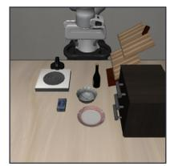  
Instruction: open the middle drawer of the cabinet

## LIBERO-PRO swap

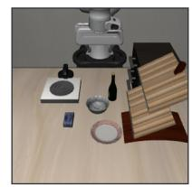  
Instruction: Open the middle laver of the drawe

## Nominal LIBERO

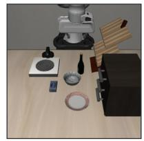  
Instruction put the bowl on top of the cabinet

## LIBERO-PRO swap

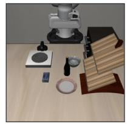  
Instruction Put the bowl on the top of the drawer

## Reflect-Object

500 nominal   
episodes + 500 swap   
episodes

## Nominal LIBERO

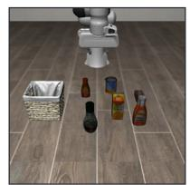  
Instruction: pick up the chocolate pudding and place it in the basket

## LIBERO-PRO swap

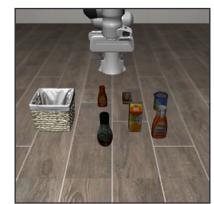  
Instruction pick up the chocolate pudding and place it in the basket

## Nominal LIBERO

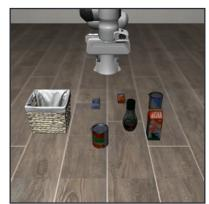  
Instruction pick up the alphabet soup and place it in the basket

## LIBERO-PRO swap

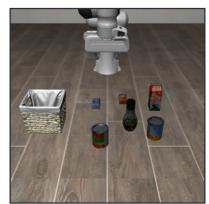  
Instruction pick up the alphabet soup and place it in the basket

## Reflect-Spatial

500 nominal   
episodes + 500 swap   
episodes

## Nominal LIBERO

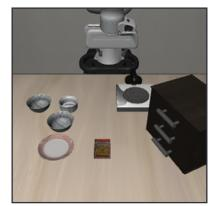  
Instruction pick up the black bowl between the plate and the ramekin and place it on the plate

## LIBERO-PRO swap

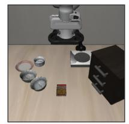  
Instruction: pick up the black bowl between the plate and the ramekin and place it on the plate

## Nominal LIBERO

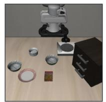  
Instruction pick up the black bowl from table center and place it on the plate

## LIBERO-PRO swap

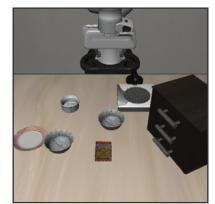  
Instruction pick up the black bowl from table center and place it on the plate

## Reflect-10

500 nominal   
episodes + 500 swap   
episodes

## Nominal LIBERO

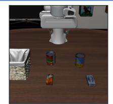  
Instruction put both the alphabet soup and the tomato sauce in the basket

## LIBERO-PRO swap

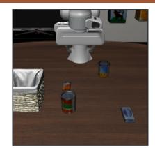  
Instruction put both the alphabet soup and the tomato sauce ir the basket

## Nominal LIBERO

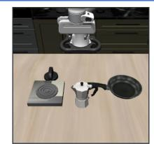  
Instruction tur on the stove and put the moka pot on i

## LIBERO-PRO swap

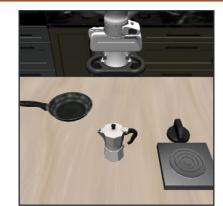  
Instruction tur on the stove and put the moka pot on i

Figure 8 Case studies from the LIBERO-Reflect construction. Each row corresponds to one subset and shows representative standard episodes paired with challenging episodes. The instruction is printed below each panel, yielding 16 data points across the four subsets.

<table><tr><td>Policy</td><td>Reflect-Goal Reflect-Spatial Reflect-10 Reflect-Object Mean</td><td></td><td></td><td></td><td></td></tr><tr><td>QwenPI-Flow</td><td>0.0</td><td>7.2</td><td>1.8</td><td>0.0</td><td>2.25</td></tr><tr><td>OpenVLA-OFT</td><td>4.6</td><td>7.2</td><td>0.0</td><td>1.2</td><td>3.25</td></tr><tr><td>OpenVLA</td><td>0.0</td><td>0.4</td><td>0.0</td><td>0.0</td><td>0.10</td></tr></table>

Table 6 Diagnostic success rates for the challenging episodes sampled from LIBERO-PRO and retained in LIBERO-Reflect. Values are percentages and summarize the challenging side used by the benchmark.
<table><tr><td rowspan="2">Model</td><td rowspan="2">Subset</td><td rowspan="2">Text Head</td><td rowspan="2">Text AUROC</td><td rowspan="2">Visual Head</td><td rowspan="2">Visual AUROC</td><td rowspan="2">∆AUROC</td></tr><tr><td></td></tr><tr><td rowspan="4">OpenVLA</td><td>Reflect-Goal</td><td>MAE-D Top-1</td><td>59.26</td><td>MAE-D Top-1</td><td>63.94</td><td>+4.68</td></tr><tr><td>Reflect-Object</td><td>MAE-D Top-1</td><td>69.41</td><td>MAE-D Top-1</td><td>90.97</td><td>+21.56</td></tr><tr><td>Reflect-Spatial</td><td>MAE-D Top-1</td><td>62.31</td><td>MAE-D Top-1</td><td>66.86</td><td>+4.55</td></tr><tr><td>Reflect-10</td><td>MAE-D Top-1</td><td>49.43</td><td>MAE-D Top-1</td><td>54.74</td><td>+5.31</td></tr><tr><td rowspan="4">QwenPI-Flow</td><td>Reflect-Goal</td><td>MAE-C Top-1</td><td>55.46</td><td>MAE-C Top-1</td><td>80.57</td><td>+25.11</td></tr><tr><td>Reflect-Object</td><td>MAE-C Top-1</td><td>66.00</td><td>MAE-C Top-1</td><td>75.94</td><td>+9.94</td></tr><tr><td>Reflect-Spatial</td><td>MAE-C Top-1</td><td>84.25</td><td>MAE-C Top-1</td><td>84.80</td><td>+0.55</td></tr><tr><td>Reflect-10</td><td>MAE-C Top-1</td><td>56.91</td><td>MAE-C Top-1</td><td>79.52</td><td>+22.61</td></tr></table>

Table 7 Exact AUROC values for the text-head versus visual-head comparison in the main paper. Deltas are visual-head MAE minus text-head MAE under the same Top-1 setting. Subset names use the LIBERO-Reflect split identifiers.

## D Ablation Details and Exact Values

This appendix provides the exact values for the ablation figures and explains how to read the trends. The ablations are not additional methods; they test whether MAE depends on broad head averaging or manually selected layer ranges. The main configuration deliberately uses all layers with Top-1 head selection, because this setting preserves the strongest and most stable architecture-aware signal while adding the least aggregation overhead.

Text versus visual heads. Table 7 reports the exact values for the text-head versus visual-head comparison in the main paper. We keep only the text-head Top-1 counterpart and use the same orientation terminology as the main method: MAE-D for OpenVLA and MAE-C for QwenPI-Flow. The comparison shows why text-side entropy is insuficient: it can be high on subsets where language-side uncertainty is predictive, but the large visual advantages on OpenVLA Object Binding and QwenPI-Flow Goal Semantics/Reflect-10 show that it misses visually grounded action failures.

Head selection. Table 8 reports the full Top-m head-selection sweep used in the main paper. Across all three models, Top-1 is the most reliable default when considering both AUROC and AUPR. Increasing m admits more heads, but the additional heads are not guaranteed to be action-relevant; in practice they often dilute the oriented entropy signal. The half-head setting remains competitive in some subsets, yet it is less consistent and costs more aggregation, so we use Top-1 in the main protocol.

<table><tr><td rowspan="2">Model</td><td rowspan="2">Top-m Setting</td><td colspan="2">Goal Reflect-Goal</td><td colspan="2">Object Reflect-Object</td><td colspan="2"></td><td colspan="2">Spatial Reflect-Spatial</td><td colspan="2">Composite Reflect-10</td></tr><tr><td>AUROC AUPR</td><td></td><td>FPR @95</td><td>AUROC AUPR</td><td>FPR @95</td><td>AUROC AUPR</td><td></td><td>FPR @95</td><td>AUROC AUPR</td><td>FPR @95</td></tr><tr><td colspan="10">Latent-Readout VLAs</td></tr><tr><td rowspan="3">OpenVLA</td><td>MAE-D Top-1</td><td>63.94 43.23</td><td>61.92</td><td>90.97</td><td>75.88</td><td>28.30</td><td>66.86 50.74</td><td>75.79</td><td>54.74</td><td>30.45</td><td>86.46</td></tr><tr><td>MAE-D</td><td>62.41</td><td>42.33</td><td>68.21</td><td>89.14 72.76</td><td>30.05</td><td>64.72</td><td>52.29</td><td>77.13</td><td>54.01 26.97</td><td>85.91</td></tr><tr><td>Top-2 MAE-D</td><td>60.36</td><td>41.01</td><td>70.03 87.13</td><td>69.26</td><td>34.18</td><td>64.25</td><td>52.14 78.80</td><td>53.20</td><td>26.55</td><td>86.88</td></tr><tr><td></td><td>Top-4 MAE-D Top-16</td><td>59.56 40.67</td><td>71.52</td><td>79.64</td><td>58.98</td><td>48.81</td><td>63.99 49.67</td><td>84.81</td><td>53.21</td><td>26.56</td><td>87.43</td></tr><tr><td rowspan="4">OpenVLA-OFT</td><td>MAE-D Top-1</td><td>97.34</td><td>96.14</td><td>7.14 80.56</td><td>81.10</td><td>63.71</td><td>92.63</td><td>93.15</td><td>39.31</td><td>78.57 64.08</td><td>45.06</td></tr><tr><td>MAE-D Top-2</td><td>96.86</td><td>95.26</td><td>7.76 76.74</td><td>77.29</td><td>65.32</td><td>93.10</td><td>93.59</td><td>38.10</td><td>77.86 62.92</td><td>43.73</td></tr><tr><td>MAE-D Top-4</td><td>94.63</td><td>94.38 8.37</td><td>78.42</td><td>79.10</td><td>63.71</td><td>90.25</td><td>93.01</td><td>35.48 77.79</td><td>62.85</td><td>46.39</td></tr><tr><td>MAE-D Top-16</td><td>91.84 94.50</td><td>7.94</td><td>75.96</td><td>82.86</td><td>64.03</td><td>91.71 89.85</td><td>42.74</td><td>77.13</td><td>62.10</td><td>45.06</td></tr><tr><td colspan="10">Latent-Refinement VLAs</td></tr><tr><td rowspan="3">QwenPI-Flow</td><td>MAE-C</td><td>80.57</td><td>80.01</td><td>60.12 75.94</td><td>76.48</td><td>81.18</td><td>84.80</td><td>85.46</td><td>68.53</td><td>79.52</td><td>76.24</td><td>55.60</td></tr><tr><td>Top-1 MAE-C</td><td>78.75</td><td>84.28</td><td>55.45</td><td>73.01</td><td>72.27</td><td>82.35</td><td>85.73 82.67</td><td>53.00</td><td>77.75</td><td>72.72</td><td>56.18</td></tr><tr><td>Top-2 MAE-C</td><td>74.16</td><td>81.17</td><td>64.79</td><td>63.42 59.80</td><td>86.27</td><td>79.63</td><td>79.03</td><td>68.12</td><td>77.47</td><td>70.39</td><td>59.27</td></tr><tr><td>Top-4 MAE-C Top-20</td><td>62.63</td><td>59.16</td><td>80.93</td><td>65.92</td><td>63.43</td><td>81.59</td><td>66.89</td><td>64.70</td><td>73.50</td><td>68.91</td><td>61.92</td><td>74.52</td></tr></table>

Table 8 Top-m head-selection ablation values for the main paper. The half-head setting corresponds to Top-16 for 32-head OpenVLA-family models and Top-20 for the 40-head QwenPI-Flow model. Top-1 is used in the main results because it gives the most stable ranking quality while avoiding noisy aggregation over many heads.
<table><tr><td>Layer Band</td><td>Overall All subsets</td><td>Composite reflect-10</td><td>Goal</td><td>Object reflect-goal reflect-object reflect-spatial</td><td>Spatial</td></tr><tr><td>All layers</td><td>67.88</td><td>54.74</td><td>63.94</td><td>90.97</td><td>66.86</td></tr><tr><td>Shallow</td><td>65.82</td><td>51.49</td><td>57.00</td><td>90.43</td><td>64.97</td></tr><tr><td>Middle</td><td>66.88</td><td>54.25</td><td>61.93</td><td>86.59</td><td>65.28</td></tr><tr><td>Deep</td><td>62.91</td><td>47.71</td><td>61.49</td><td>83.50</td><td>65.55</td></tr></table>

Table 9 OpenVLA layer-band ablation values for the main paper. Values are MAE-D with Top-1 AUROC percentages. The all-layer setting is the default configuration because it is strongest overall and avoids task-specific layer tuning.

Layer bands. Table 9 reports the exact values for the layer-band ablation in the main paper. Restricting the score to shallow, middle, or deep layers can preserve parts of the signal, especially on subsets where object grounding is already strongly localized. However, no restricted band dominates across task families. The all-layer score gives the best overall AUROC and avoids tuning a layer range per architecture or per task, which is important for a self-evaluation method intended to transfer across VLA backbones.

<table><tr><td>Policy</td><td>Action- generation family depth</td><td>Attention Main score</td><td>Head-selection set- Evaluation role tings</td></tr><tr><td>OpenVLA</td><td>Latent-Readout VLAs</td><td>heads</td><td>32 layers / 32 MAE-D Top-1 Top-1, Top-2, Top-4, Autoregressive discrete Top-16 readout; supports token- statistic baselines</td></tr><tr><td>OpenVLA-OFTVLAs</td><td>Latent-Readout</td><td>heads</td><td>32 layers / 32 MAE-D Top-1 Top-1, Top-2, Top-4, Same VLA family with Top-16 continuous readout</td></tr><tr><td></td><td>VLAs</td><td>heads</td><td>QwenPI-Flow Latent-Refinement 36 layers / 40 MAE-C Top-1 Top-1, Top-2, Top-4, Cross-family flow-style Top-20 refinement policy</td></tr></table>

Table 10 Evaluation settings for MAE across the three VLA policies. The main score uses all layers with Top-1 head selection. Larger Top-m settings are reported only for the head-selection ablation; the half-head setting is Top-16 for 32-head OpenVLA-family policies and Top-20 for the 40-head QwenPI-Flow policy.
<table><tr><td>Policy</td><td></td><td>Internal generation step k Final internal step K used by K in our implementa- MAE</td><td>tion</td></tr><tr><td>OpenVLA</td><td>token generation step</td><td>One autoregressive action- The last action-token generation Total number of gener- step</td><td>ated action tokens</td></tr><tr><td></td><td></td><td>OpenVLA-OFT One continuous-readout step The continuous-readout step be- 1 fore the action head produces the action chunk</td><td></td></tr><tr><td>QwenPI-Flow</td><td></td><td>One flow-style refinement step The last refinement step before Total number of infer- the action trajectory is returned ence refinement steps</td><td></td></tr></table>

Table 11 Model-specific meaning of the internal generation step k and the final internal step K used by MAE.

## E Evaluation Protocol

All self-evaluation methods are compared under the same episode-level protocol. A policy first executes a LIBERO-Reflect episode, and the simulator success flag defines the binary label. The self-evaluation method then assigns a scalar reliability score to that episode without using the label. We evaluate whether the score ranks successful executions above failed executions using AUROC, AUPR, and FPR@95. For MAE, attention maps are taken from the same policy forward passes that generate the robot actions; no auxiliary model, additional rollout, or external verifier is required. Table 10 summarizes the model-specific attention dimensions and the score orientation used for each policy.

The transformer layer index is denoted by ℓ, while k denotes the internal action-generation step. Table 11 summarizes the model-specific correspondence between k and the final internal step K used by MAE.

Layer-band analysis. The main protocol aggregates visual attention entropy over all layers. For the layer-band ablation, we additionally divide the network depth into shallow, middle, and deep regions and recompute the same MAE-D or MAE-C score within each region. This isolates whether the reliability signal is concentrated at a particular depth or benefits from integrating the full action-generation process. The corresponding exact values are reported in Appendix D.

Random baseline. The random baseline assigns an independent uniform score to every episode under the same labels over successful and failed episodes. It is used only as a ranking lower bound and is not tuned per subset or per model.

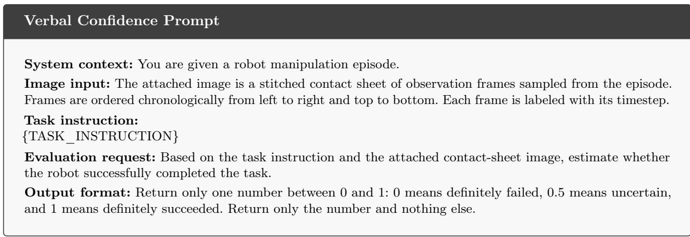  
Figure 9 Prompt used for the Verbal Confidence baseline. The stitched contact sheet is provided as an image input in the same multimodal API request.

## F Baseline Protocols and Applicability

This appendix defines the baselines used in the main results table and clarifies their applicability to heterogeneous VLA action heads. We only discuss baselines that are part of the reported protocol. The main compatibility issue is whether a policy exposes autoregressive discrete action-token logits or sampled actiontoken sequences. Token-statistic baselines are meaningful for discrete OpenVLA, but they are not defined for OpenVLA-OFT’s continuous action head or QwenPI-Flow’s flow-matching action head without adding a separate likelihood model over executed actions. Token-level Self-Consistency has the same interface requirement because it measures sampled action-token agreement. The main results table omits technically not-applicable rows for continuous-action and flow-action policies, while this appendix documents the interface mismatch behind those omissions.

Random. Random assigns an i.i.d. uniform score to each episode and serves as a lower-bound ranking baseline under the same labels over successful and failed episodes.

Verbal Confidence. Verbal Confidence adapts p(True)-style verbal self-checking to VLA evaluation. Since most VLA policies do not naturally output a calibrated verbal probability during action generation, we use an external multimodal evaluator as a proxy. For each episode, we query gpt-4.1 with the task instruction and a stitched contact-sheet image of sampled observations. The model returns a scalar confidence in [0, 1], which is used directly as the episode-level reliability score. The evaluator is not given the ground-truth success label, simulator success state, object poses, perturbation metadata, robot state trajectories, generated action vectors, or oracle information.

Self-Consistency. Self-Consistency is implemented as token-level sampled action-token agreement for discrete OpenVLA. At each execution step, we sample n action-token sequences from the same observation and task condition. For each action-token dimension, the score is the frequency of the most common sampled token divided by n; the step score averages this value over action-token dimensions, and the episode score averages over execution steps. The first sampled action is executed, while the additional samples are used only to compute the self-evaluation score.

This baseline requires discrete sampled action tokens. OpenVLA-OFT predicts executed actions through a continuous action head, and QwenPI-Flow produces continuous action trajectories through flow-matching refinement. Their action heads do not expose sampled categorical action-token sequences for the executed action, so token-level Self-Consistency is not defined for these two policies in the reported protocol.

Maximum Softmax Probability. Maximum Softmax Probability measures the sharpness of autoregressive action-token predictions. For a generated action-token sequence of length T, with categorical distribution yt over the vocabulary at generation step t, the episode score is

$$
\frac { 1 } { T } \sum _ { t = 1 } ^ { T } \operatorname* { m a x } _ { i } y _ { t , i } .
$$

This requires a vocabulary-level distribution for each generated action token, so it applies to discrete OpenVLA but not to continuous OFT or flow-matching PI action heads.

Perplexity. Perplexity-style confidence uses the negative log confidence of the selected action-token distribution:

$$
{ \frac { 1 } { T } } \sum _ { t = 1 } ^ { T } - \log \left( \operatorname* { m a x } _ { i } y _ { t , i } \right) .
$$

We invert the direction when necessary so that larger reported scores indicate higher estimated reliability. As with Maximum Softmax Probability, this score is only defined when action generation exposes token-level categorical probabilities.

Entropy. Entropy measures the uncertainty of the full output distribution:

$$
{ \frac { 1 } { T } } \sum _ { t = 1 } ^ { T } \sum _ { i } - y _ { t , i } \log y _ { t , i } .
$$

Lower entropy indicates a sharper token distribution, so the reliability score uses the sign convention that larger is better. This is a token-distribution baseline and is not comparable for continuous action regression or flow integration without an additional probabilistic action model.

Length-normalized Entropy. Length-normalized entropy generates n candidate outputs ${ \mathcal { Y } } = \{ Y _ { 1 } , \ldots , Y _ { n } \}$ 2 then averages token entropy across the sampled outputs:

$$
\frac { 1 } { n } \sum _ { Y \in \mathcal { Y } } \frac { 1 } { T _ { Y } } \sum _ { t = 1 } ^ { T _ { Y } } \sum _ { i } - y _ { t , i } \log y _ { t , i } .
$$

We set $n = 5 .$

OpenVLA output-statistic values. We report reliability-oriented scores: Perplexity is represented by inverse PPL, Entropy by inverse token entropy, and Length-normalized Entropy by inverse length-normalized entropy, so larger values always indicate higher estimated reliability. These baselines can be computed for OpenVLA because it generates discrete action tokens with vocabulary-level probabilities; applying them to OpenVLA-OFT or QwenPI-Flow would require adding a separate likelihood model over continuous executed actions.

Applicability to heterogeneous VLAs. Discrete OpenVLA exposes autoregressive action-token distributions, so token-probability baselines such as Maximum Softmax Probability, Perplexity, Entropy, and Length-normalized Entropy are conceptually defined for that model family. OpenVLA-OFT changes the action interface: it keeps the OpenVLA backbone but predicts continuous actions through a regression head, so the placeholder action slots are not generated action tokens and their logits do not define the executed action. QwenPI-Flow uses a flow-matching action head that maps visual-language hidden states and noise through iterative velocity prediction; its output is a continuous action trajectory rather than a categorical token sequence. Applying token-probability baselines to these models would evaluate a diferent random variable from the executed action. By contrast, MAE reads internal attention entropy during the same policy forward process and then uses architecture-aware aggregation, MAE-D for Latent-Readout VLAs and MAE-C for Latent-Refinement VLAs, which is why it remains comparable across the heterogeneous action heads in the main results table.

<table><tr><td>Policy</td><td>Input convention</td><td>Episode payload</td><td>Rendered prompt form</td></tr><tr><td>OpenVLA</td><td>Pure action-prompt format used by the OpenVLA policy.</td><td>One RGB observation image In: What action should the robot and the lower-cased LIBERO task instruction. Out:</td><td>take to {instruction.lower()}?</td></tr><tr><td></td><td>OpenVLA-OFT OpenVLA-family action prompt with the OFT continuous readout.</td><td>Primary image, wrist image, In: What action should the robot proprioceptive State Input, take to {task_label.lower()}? and the lower-cased task Out: label.</td><td></td></tr><tr><td>QwenPI-Flow</td><td>Qwen3-VL multimodal by the StarVLA grounding request.</td><td>One or more image message format followed placeholders followed by the&lt;|vision_start|&gt;&lt;|image_pad|&gt;&lt; LIBERO instruction and |vision end|&gt; object-localization request. Your task is {instruction}. To identify</td><td>&lt;|im_start|&gt;user the key objects for your task. Locate their bounding boxes in [x1,y1,x2,y2] format. &lt;|im_end|&gt; &lt;|im_start|&gt;assistant</td></tr></table>

Table 12 Model input templates used for policy conditioning. The table records the prompt forms and non-text policy inputs needed to reproduce the action-generation inputs; benchmark construction and experimental results are reported in Appendices C–D.

## G Model Input Templates

Table 12 reports the policy input formats used to condition the three evaluated VLA backbones. The OpenVLA-family policies use the same action-query prompt form with lower-cased LIBERO instructions, while OpenVLA-OFT additionally uses proprioceptive State Input for continuous readout. QwenPI-Flow uses a Qwen3-VL-style multimodal message and appends the grounding text expected by the StarVLA policy. We place these templates after the experimental tables because they are protocol details rather than additional results.

## H Dataset-Source Considerations

A potential concern is that a reliability score may separate standard LIBERO episodes from LIBERO-PRO episodes rather than estimate episode-level action reliability. LIBERO-Reflect is designed to reduce this first-order source shortcut at both the construction and evaluation levels. First, the two nominal pools are matched by suite organization, task count, number of initializations, simulator, policy interface, and rollout protocol. Thus, diferences in evaluation code, control horizon, observation logging, and metric computation are not available as cues to the scoring function. Second, the benchmark does not inherit labels from dataset membership. The nominal source is used only to assemble a mixed-dificulty evaluation pool; all reported metrics are computed using the realized simulator success flag of each rollout. As a result, failures from the standard LIBERO side and successes from the LIBERO-PRO side are retained and evaluated according to their actual outcomes.

This distinction is important for interpreting MAE. A source-level shortcut would assign nearly uniform reliability to all standard LIBERO episodes and uniformly low reliability to all LIBERO-PRO episodes. Such a rule is penalized whenever nominal source and realized outcome disagree, and it does not capture within-source variation among episodes with the same dataset origin but diferent execution outcomes. In contrast, MAE is computed from the policy’s internal attention dynamics during the same forward passes that generate actions under the current conditioning context. The score therefore has no access to split identifiers or nominal source labels; it can only exploit how the latent action state routes information under the current episode condition.

We use LIBERO-PRO as a controlled source of challenging rollouts to increase the density of failures needed for reliability ranking, while actual simulator success remains the evaluation label. The resulting benchmark is an episode-level reliability test under a matched mixed-dificulty pool. Diagnostic success rates for both nominal pools report the remaining source-level diferences, and all metrics are interpreted as reliability ranking over realized executions rather than as source-invariant classification.

<table><tr><td>Component</td><td>Detail</td></tr><tr><td>GPU Hardware</td><td>NVIDIA H100</td></tr><tr><td>Model Evaluated</td><td>QwenPI-Flow</td></tr><tr><td>Avg. Rollout Time</td><td>~14.0 s / episode</td></tr><tr><td>Avg. MAE Extra Time 0.57 s / episode</td><td></td></tr><tr><td>MAE Latency Overhead4.09%</td><td> $( < 0 . 1 \times )$ </td></tr><tr><td>Memory Overhead</td><td>Negligible (Reuses internal attention)</td></tr></table>

Table 13 Empirical cost analysis of MAE. The overhead strictly satisfies the $< 0 . 1 \times$ boundary highlighted in the Pareto-optimal zone of the main paper.

## I Architecture-Determined Entropy Orientation

The opposite entropy orientations used by MAE-D and MAE-C are determined by the action-generation interface of the evaluated policy before any episode-level reliability metric is computed. The distinction follows from the role played by the visual-attention distribution in the transition kernel of the conditional generative Markov chain.

For Latent-Readout VLAs, the internal generation process first builds a latent action representation and then maps the final latent state to an executable action through a readout head. In this family, the transition kernel must progressively consolidate task-relevant visual evidence into the latent state before the final readout. A reliable transition therefore tends to concentrate action-query attention on the relevant object, region, or spatial relation needed for the action. Conversely, difuse visual addressing indicates that the latent action state has not localized the necessary visual evidence, which often corresponds to ambiguous grounding or incorrect object-action binding. For this reason, lower visual entropy is assigned higher reliability, yielding the decreasing-entropy orientation MAE-D.

For Latent-Refinement VLAs, the policy maintains an explicit action or trajectory variable and repeatedly refines it under visual-language conditioning, as in flow- or denoising-style generation. Here the transition kernel corrects an evolving action trajectory by re-querying the condition across refinement steps. MAE uses the attention at the final internal generation step k = K, before the action trajectory is returned. Reliable executions retain broader visual addressing at this final refinement step, especially when the correct action depends on object relations, spatial constraints, or multi-step manipulation context. Overly low visual entropy indicates that the final action trajectory is determined with too narrow a visual context. Thus, in this family, higher visual entropy at the final refinement step is assigned higher reliability, yielding the increasing-entropy orientation MAE-C.

This orientation rule is architecture-level rather than data-fitted. A model is assigned to Latent-Readout VLAs if its action is produced by reading out a final latent state without iterative refinement of an explicit action variable. It is assigned to Latent-Refinement VLAs if it maintains an action or trajectory representation that is updated across multiple refinement or denoising steps under repeated conditioning. This decision can be made from the model’s inference computation graph alone and does not require labels over successful and failed episodes, external supervision, or validation-set optimization. Accordingly, MAE-D is fixed for Latent-Readout VLAs and MAE-C is fixed for Latent-Refinement VLAs before evaluating AUROC, AUPR, or FPR@95.

The same principle also separates orientation from head and layer aggregation. The Top-1 operation used in the main protocol is a deterministic per-episode reduction over oriented entropy values, not a fixed attention head selected by test labels. Likewise, all-layer aggregation is used as the default rule to avoid selecting a task-specific or model-specific layer band. The Top-m and layer-band experiments are therefore sensitivity analyses of a frozen scoring rule rather than procedures for choosing the reported orientation.

## J Cost Analysis Details

To substantiate the eficiency claims in the main experiments, we profile the wall-clock latency of MAE during evaluation. Table 13 reports the average execution time per episode and the extra latency incurred by MAE. The overhead is strictly bounded because MAE reuses the internal attention matrices from the same forward pass and only performs entropy computation and head aggregation.