# FeatureHospital: A Skill-Driven Multi-Agent Framework for Automated Algorithm Customization in Multi-View Multi-Label Feature Selection

Junxuan Li1 Zhiqi Chen1 Yuzhou Liu1\* Peng Zhang1 Huaxiao Liu1

1College of Computer Science and Technology, Jilin University, Jilin, China \*Corresponding author.

## Abstract

Multi-view multi-label feature selection aims to identify a compact and informative feature subset from heterogeneous views while preserving discriminative information for multiple labels. Existing methods are generally developed from specific modeling perspectives and incorporate mechanisms tailored to particular data characteristics. Designing suitable feature selection algorithms across datasets with diverse and heterogeneous characteristics still relies heavily on expert knowledge and substantial manual efort, imposing considerable time and labor costs that severely hinder the practical adoption of feature selection. To address this problem, we propose FeatureHospital, a Skill-driven multi-agent framework for automated multi-view multi-label feature selection algorithm design. FeatureHospital first diagnoses the target dataset to identify its feature selection issues. Based on the diagnosis, specialist agents equipped with domain Skills then prescribe corresponding optimization strategies and Loss terms for diferent issues. After that, the resulting prescriptions are reconciled to remove overlaps and resolve conflicts before being integrated into a compact dataset-specific objective. Finally, the constructed objective is optimized to select the final feature subset. Experimental results demonstrate that Feature-Hospital can construct efective feature selection algorithms for diferent datasets based on their individual characteristics.

## Introduction

In real-world scientific applications, data instances are frequently described by multiple heterogeneous feature sets from distinct views and associated with multiple semantic labels (Yan et al. 2022). Data with this form are commonly referred to as Multi-View Multi-Label (MVML) data. However, such data also introduce complex challenges, including view-quality imbalance (Liu et al. 2023b), feature redundancy (Han, Hu, and Gao 2024), missing labels (Wen et al. 2023), label imbalance (Charte et al. 2015), and label dependency (Liu et al. 2023a). To reduce data complexity and enhance representation quality, multi-view multi-label feature selection aims to select a compact and informative feature subset from multiple views while preserving discriminative information for multiple labels. Existing multi-view multilabel feature selection methods typically address these challenges from specific perspectives, such as exploiting view complementarity, label correlations, or feature redundancy structures, and have achieved promising performance (Hao,

Liu, and Gao 2024b,a; Zhang et al. 2020; Gonzalez-Lopez, Ventura, and Cano 2020).

Despite these advances, current feature selection methods still face practical challenges in real-world research applications. As illustrated in Figure 1(A), researchers often use feature selection as a practical tool rather than study it as their primary research topic. This leaves them with a recurring algorithm-design burden: (1) selecting or designing a suitable feature selection method is dificult because it requires both an understanding of the dataset characteristics and specialized knowledge of feature selection algorithms. (2) This dificulty is not a one-time burden. When a new dataset has underlying characteristics that do not align with the assumptions of the previously adopted algorithm, the researcher must repeat the same unfamiliar process of method selection and algorithm design. These challenges consume substantial time and efort that could otherwise be devoted to the primary scientific work of researcher.

Recent advances in LLM-based agents provide a promising foundation for automated algorithm design (Jeong, Lipton, and Ravikumar 2024). Once equipped with reusable procedural Skills that encapsulate domain knowledge and structured tool-use procedures, general-purpose agents can act as domain experts (Pan et al. 2026). This raises a natural question: can a Skill-driven multi-agent system automatically design a feature selection algorithm tailored to the target dataset in the manner of a human expert?

In this work, we propose FeatureHospital, a Skill-driven multi-agent framework for automated modeling in multiview multi-label feature selection. Figure 1(B) provides an overview of the motivation and workflow of FeatureHospital. Instead of relying on researchers to manually analyze each dataset, design optimization objectives, FeatureHospital aims to automate the entire process from dataset diagnosis to algorithm construction, thereby generating dataset-specific feature selection strategies without repeated human intervention. Specifically, we treat each dataset as a “patient” and its intrinsic data characteristics as “symptoms”, such as label imbalance, feature redundancy, view-quality imbalance, and feature-budget pressure. The system first diagnoses the dataset to identify its major issues. Then, specialist doctors equipped with domain Skills prescribe corresponding optimization strategies and loss terms for diferent problems. These local treatments are combined into a unified prescription for the entire dataset. Finally, the system automatically constructs the optimization objective from this prescription and performs training and feature selection.

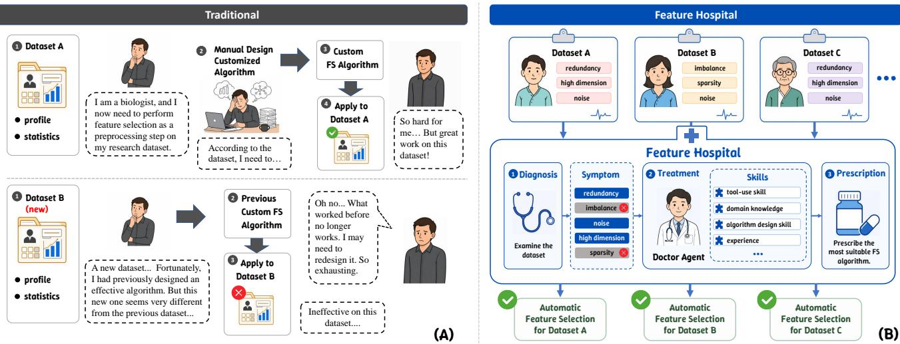  
Figure 1: Conceptual comparison between conventional feature selection algorithm design and FeatureHospital. (A) In the conventional workflow, researchers manually design a feature selection algorithm for a particular dataset, and the same algorithm may become inefective when applied to a new dataset, requiring repeated analysis and redesign. (B) FeatureHospital treats each dataset as a patient, diagnoses its feature selection issues, and employs Skill-equipped agents to automatically construct a dataset-specific feature selection algorithm.

In summary, our main contributions are as follows:

• We propose FeatureHospital, a Skill-driven multi-agent framework for automated multi-view multi-label feature selection algorithm design. Equipped with reusable domain Skills, specialized agents collaboratively analyze the target dataset and design a feature selection algorithm tailored to its characteristics.

• We develop an automated feature selection algorithm design paradigm that connects dataset analysis with objective construction. FeatureHospital identifies potential dataset problems, formulates a problem-specific optimization term for each identified problem, and integrates these terms into a unified dataset-specific feature selection objective.

• We conduct experiments on seven multi-view multi-label datasets and compare FeatureHospital with seven representative multi-view multi-label feature selection methods. The results show that the algorithms automatically generated by FeatureHospital achieve competitive performance.

## Related Work

## Multi-View Multi-Label Feature Selection

Multi-view multi-label learning exploits multiple heterogeneous views and multiple labels to capture rich and complementary semantic information (Yan et al. 2022). However, the resulting representations also increase data complexity, making efective data analysis more challenging (Hao, Liu, and

Gao 2024b). Multi-view multi-label feature selection therefore aims to retain a compact and discriminative feature subset from such data. Existing methods address diferent data structures from specific modeling perspectives. Some methods exploit view-specific or hybrid label information (Hao et al. 2024; Hao, Liu, and Gao 2024b), while others construct informative cross-view representations through global-view reconstruction or embedded feature fusion (Hao, Liu, and Gao 2024a; Hao, Gao, and Hu 2025). Sparse learning has also been used to identify informative features (Zhang et al. 2020).

Although these methods have achieved promising performance, their objective structures are generally fixed once designed. Since diferent datasets may present diferent combinations of feature selection problems, determining which characteristics should be modeled and translating them into a suitable objective still require substantial domain knowledge and manual algorithm-design efort.

## Skill-Driven Multi-Agent Systems

LLM-based multi-agent systems have been increasingly applied to complex tasks by assigning agents complementary roles and coordinating their interactions (Fourney et al. 2024; Hong et al. 2024; Su et al. 2025). However, general-purpose agents may lack the specialized knowledge and procedural experience required in diferent domains. Skill-based approaches provide a lightweight means of specialization by encapsulating reusable capabilities that can be retrieved and composed without retraining the underlying model (Wang et al. 2023; Zheng et al. 2025). Existing studies generally define a Skill as a callable module that packages domain or procedural knowledge, executable tools or code, and operating rules (Jiang et al. 2026; Xu and Yan 2026). Such Skills enable general-purpose agents to acquire domain-specific capabilities and perform tasks in a manner similar to human experts. Nevertheless, the use of Skill-driven multi-agent systems for feature selection remains largely unexplored.

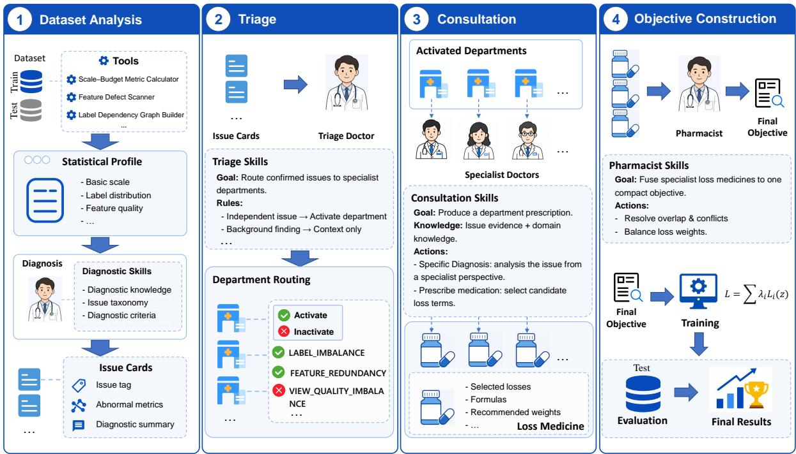  
Figure 2: Overview of FeatureHospital. The framework proceeds in four stages: (1) analyze the target dataset and identify potential problems afecting feature selection; (2) categorize the identified problems and assign them to suitable specialist agents; (3) select corresponding loss functions for each problem; (4) remove redundant or conflicting loss functions, balance their contributions, and combine them into a dataset-specific objective; and finally optimize the constructed objective to select features and evaluate the resulting feature subset.

Our work bridges these two research directions by proposing FeatureHospital, a Skill-driven multi-agent framework for MVML feature selection. FeatureHospital equips specialized agents with feature selection Skills to diagnose datasetspecific issues, translate them into corresponding optimization strategies, and collaboratively design feature selection algorithms for diferent datasets. In this way, it reduces the dependence of MVML feature selection algorithm design on specialized expertise and extensive manual efort.

## Methodology

Figure 2 illustrates the overall workflow of FeatureHospital.

## Problem Formulation

Let D = (X , Y ) denote a MVML dataset, where

$$
\begin{array} { r l } & { \mathcal { X } = \left\{ \boldsymbol { X } ^ { \left( v \right) } \right\} _ { v = 1 } ^ { V } , \quad \boldsymbol { X } ^ { \left( v \right) } \in \mathbb { R } ^ { n \times d _ { v } } , } \\ & { \boldsymbol { Y } \in \{ 0 , 1 \} ^ { n \times l } . } \end{array}\tag{1}
$$

Here, V is the number of views, n is the number of instances, $d _ { v }$ is the number of features in the v-th view, and l is the number of labels. The total number of features is $\begin{array} { r } { d = \sum _ { v = 1 } ^ { V } d _ { v } } \end{array}$

For each experimental run, D is divided into two disjoint subsets:

$$
\mathcal { D } = \mathcal { D } _ { \mathrm { t r } } \cup \mathcal { D } _ { \mathrm { t e } } , \qquad \mathcal { D } _ { \mathrm { t r } } \cap \mathcal { D } _ { \mathrm { t e } } = \emptyset ,\tag{2}
$$

where $\mathcal { D } _ { \mathrm { t r } } ~ = ~ ( \mathcal { X } _ { \mathrm { t r } } , Y _ { \mathrm { t r } } )$ and $\mathcal { D } _ { \mathrm { t e } } = ( \mathcal { X } _ { \mathrm { t e } } , Y _ { \mathrm { t e } } )$ denote the training and test partitions, respectively.

Conventional embedded feature selection methods generally optimize a predefined objective:

$$
\omega ^ { * } = \arg \operatorname* { m i n } _ { \omega } \mathcal { L } _ { \mathrm { f i x e d } } \left( \mathcal { X } _ { t r } , Y _ { t r } ; \omega , \theta \right) ,\tag{3}
$$

where ω denotes the trainable model parameters, and θ denotes the hyperparameters. During training, ω is optimized according to the input data. However, the functional form and objective-term composition of $\mathcal { L } _ { \mathrm { f i x e d } }$ are predefined during algorithm design and remain unchanged across datasets.

In contrast, FeatureHospital does not apply the same predefined objective to all datasets. Instead, it constructs a dataset-specific feature selection objective according to the characteristics of the target dataset without requiring manual objective design:

$$
\begin{array} { r } { \mathcal { L } _ { \mathcal { D } } = F _ { \mathrm { h o s p i t a l } } \left( \mathcal { D } _ { t r } \right) . } \end{array}\tag{4}
$$

The trainable parameters are then optimized with respect to the constructed objective:

$$
\omega ^ { * } = \arg \operatorname* { m i n } _ { \omega } \mathcal { L } _ { \mathcal { D } } \left( \mathcal { X } _ { t r } , Y _ { t r } ; \omega , \theta \right) .\tag{5}
$$

Therefore, diferent datasets may receive diferent objective structures and configurations according to their respective characteristics.

## Dataset Analysis

Given a target dataset $\mathcal { D } = ( \mathcal { X } , Y )$ , we first partition the target dataset D into two disjoint subsets: train subset $\mathcal { D } _ { t r } =$ $( \mathcal { X } _ { t r } , Y _ { t r } )$ and test subset $\mathcal { D } _ { t e } = ( \mathcal { X } _ { t e } , Y _ { t e } )$ . FeatureHospital has access only to ${ \mathcal { D } } _ { \mathrm { t r } }$ before final algorithm evaluation. FeatureHospital first employs a set of executable analysis tools to construct its Statistical Profile:

$$
P _ { \mathcal { D } } = F _ { \mathrm { a n a l y s i s } } \left( \chi _ { t r } , Y _ { t r } ; \mathcal { T } _ { \mathrm { a n a l y s i s } } \right) ,\tag{6}
$$

where $\tau _ { \mathrm { a n a l y s i s } }$ denotes the tools used for dataset analysis. The resulting Statistical Profile $P _ { D }$ describes general characteristics relevant to feature selection, including data scale and feature budget, label distribution, feature quality, feature redundancy, label dependency, view heterogeneity, etc. The complete specification of $\tau _ { \mathrm { a n a l y s i s } }$ and the construction of $P _ { \mathcal { D } }$ are provided in Appendix C.

The Diagnosis Agent subsequently interprets the Statistical Profile using Diagnostic Skills:

$$
\begin{array} { r } { \mathcal { T } _ { \mathcal { D } } = F _ { \mathrm { d i a g n o s i s } } \left( P _ { \mathcal { D } } ; \mathcal { K } _ { \mathrm { d i a g n o s i s } } \right) , } \end{array}\tag{7}
$$

where $ { K _ { \mathrm { d i a g n o s i s } } }$ contains diagnostic knowledge, an issue taxonomy, and diagnostic criteria. The output $\mathcal { T } _ { \mathcal { D } }$ is a collection of structured Issue Cards. Each Issue Card records an identified issue, the abnormal metrics that support it, and a diagnostic summary.

## Triage

The triage stage assigns the issues recorded in the Issue Cards to one or more predefined problem categories, termed specialist Departments in FeatureHospital. Each Department specifies the scope of feature selection problems it handles and provides a specialized context for subsequent algorithm design. Guided by the Triage Skill $\kappa _ { \mathrm { t r i a g e } } .$ , the Triage Doctor compares each issue with the responsibility scopes of the Departments, activates the relevant Departments, and routes the issue accordingly. Unmatched issues are retained as contextual information.

Formally, the triage process is defined as

$$
\left( \mathcal { H } _ { \mathcal { D } } ^ { + } , \mathcal { R } _ { \mathcal { D } } \right) = F _ { \mathrm { t r i a g e } } \left( \mathcal { T } _ { \mathcal { D } } , \mathcal { H } ; \mathcal { K } _ { \mathrm { t r i a g e } } \right) ,\tag{8}
$$

where H is the predefined Department set, $\begin{array} { r l } { \mathcal { H } _ { \mathcal { D } } ^ { + } } & { { } = } \end{array}$ $\{ H _ { i } ^ { + } \} _ { i = 1 } ^ { N _ { D } } \subseteq \mathcal { H }$ contains the $N _ { \mathcal { D } }$ Departments activated for dataset D, and $\mathcal { R } _ { \mathcal { D } } = \{ \mathcal { R } _ { i } \} _ { i = 1 } ^ { N _ { \mathcal { D } } }$ is the complete routing result, with $\mathcal { R } _ { i } \subseteq \mathcal { T } _ { D }$ denoting the issues assigned to $H _ { i } ^ { + }$

## Consultation

The consultation stage performs problem-specific objective design for each activated Department. Each activated Department $H _ { i } ^ { + }$ maintains a catalog $\mathcal { C } _ { i } = \{ m _ { i j } \} _ { j = 1 } ^ { J _ { i } }$ of Loss Medicines. Each medicine contains an implemented loss term, its intended efect, and its applicability conditions. Guided by the Consultation Skill $\hat { \mathcal { K } } _ { i } ^ { \mathrm { c o n s u l t } }$ , the Specialist Doctor selects medicines that match the assigned issues $\mathcal { R } _ { i } \mathrm { : }$

$$
\mathcal { M } _ { i } = F _ { \mathrm { c o n s u l t } } \left( \mathcal { R } _ { i } , H _ { i } ^ { + } , \mathcal { C } _ { i } ; { \mathcal { K } } _ { i } ^ { \mathrm { c o n s u l t } } \right) , \qquad \mathcal { M } _ { i } \subseteq \mathcal { C } _ { i } .\tag{9}
$$

The selections from all activated Departments are collected as $\mathcal { M } _ { \mathcal { D } } = \{ \mathcal { M } _ { i } \} _ { i = 1 } ^ { N _ { \mathcal { D } } }$ for subsequent objective construction.

<table><tr><td>Dataset</td><td>Domain</td><td>V/nld/l</td><td>Views (dimensionality)</td></tr><tr><td>SCENE</td><td>Image</td><td>5/4400/634/33</td><td>CH(64), CM(225), CORR(144), EDH(73), WT(128)</td></tr><tr><td>yeast</td><td>Biology</td><td>2/2417/103/14</td><td>GE(79), PP(24)</td></tr><tr><td>VOC07</td><td>Image</td><td>3/3817/712/20</td><td>DH(100), GIST(512), HH(100)</td></tr><tr><td>MIRFlickr</td><td>Image</td><td>3/4053/712/38</td><td>DH(100), GIST(512), HH(100)</td></tr><tr><td>mfeat</td><td>Digits</td><td>6/2000/649/10</td><td>FOU(76), FAC(216), KAR(64), PIX(240), ZER(47), MOR(6)</td></tr><tr><td>emotions</td><td>Music</td><td>2/593/72/6</td><td>RHY(8), TIM(64)</td></tr><tr><td>3Sources</td><td>News</td><td>3/169/3000/6</td><td>BBC(1000), Reuters(1000), Guardian(1000)</td></tr></table>

Table 1: Detailed information of the datasets used in our experiments. The statistics column reports the number of views, instances, features, and labels, respectively.

## Objective Construction

After the Specialist Doctors prescribe the Loss Medicines for the activated Departments, the objective construction stage integrates these medicines into a unified feature selection objective. Similar to real-world medications, diferent Loss Medicines may exhibit conflicting efects and require appropriate dosage control. To address this issue, we design a Pharmacist Agent that reconciles the medicines prescribed by diferent Departments, removes redundant or conflicting terms, balances the weights ofmedicines, and integrates them into the final feature selection objective.

The Pharmacist coordinates the selected Loss Medicines according to the Pharmacist Skill. Specifically, each medicine is assigned one of four functional roles or a disabled status: (1) Backbone loss provides the main feature–label relevance signal; (2) Supporting loss refines or supplements the backbone signal; (3) Regularizer loss captures additional structures such as feature redundancy, label coverage, feature quality, local structures, or view allocation; (4) Guardrail loss provides budget control or other defensive constraints; and (5) Disabled denotes medicines that are redundant, conflicting, or unnecessary from the final objective. The Pharmacist then balances the weights of the retained medicines and integrates them into a compact final objective.

Formally, the objective construction process is defined as

$$
\begin{array} { r } { \mathcal { L } _ { \mathcal { D } } = F _ { \mathrm { c o n s t r u c t } } \left( \mathcal { M } _ { \mathcal { D } } , P _ { \mathcal { D } } ; \mathcal { K } _ { \mathrm { p h a r m } } \right) , } \end{array}\tag{10}
$$

where $\mathcal { M } _ { \mathcal { D } }$ contains the Loss Medicines selected by all activated Departments, $P _ { \mathcal { D } }$ denotes the Statistical Profile of dataset $\mathcal { D } ,$ and $\kappa _ { \mathrm { p h a r m } }$ denotes the Pharmacist Skill.

The resulting objective is expressed as

$$
\begin{array} { l } { \displaystyle \mathcal { L } _ { \mathcal { D } } ( z ) = \lambda _ { \mathrm { b a c k } } \mathcal { L } _ { \mathrm { b a c k } } ( z ) + \sum _ { r = 1 } ^ { N _ { r } } \alpha _ { r } \mathcal { L } _ { r } ^ { \mathrm { r e g } } ( z ) } \\ { \displaystyle \qquad + \sum _ { s = 1 } ^ { N _ { s } } \delta _ { s } \mathcal { L } _ { s } ^ { \mathrm { s u p } } ( z ) + \sum _ { g = 1 } ^ { N _ { g } } \gamma _ { g } \mathcal { L } _ { g } ^ { \mathrm { g u a r d } } ( z ) , } \end{array}\tag{11}
$$

where $\mathcal { L } _ { \mathrm { b a c k } }$ denotes the backbone loss, while $\mathcal { L } _ { r } ^ { \mathrm { r e g } } , \mathcal { L } _ { s } ^ { \mathrm { s u p } }$ and $\mathcal { L } _ { g } ^ { \mathrm { g u a r d } }$ denote the retained regularization, supporting, and guardrail losses, respectively. Here, $N _ { r } , N _ { s }$ , and $N _ { g }$ are the numbers of retained losses in the corresponding categories, where $N _ { r } , N _ { s } , N _ { q } \in \mathbb { Z } _ { > 0 }$ . Therefore, the final objective contains $1 + N _ { r } + N _ { s } + \top N _ { g }$ loss terms. The weights $\lambda _ { \mathrm { b a c k } } , \{ \alpha _ { r } \} _ { r = 1 } ^ { N _ { r } } , \{ \delta _ { s } \} _ { s = 1 } ^ { N _ { s } }$ , and $\{ \gamma _ { g } \} _ { g = 1 } ^ { N _ { g } }$ are assigned by the Pharmacist.

<table><tr><td>Dataset</td><td>DHLI</td><td> $\mathrm { E F ^ { 2 } F S }$ </td><td>ENM</td><td>GRAFS</td><td>I²VSLC</td><td>MSFS</td><td>LLM-Select</td><td>FeatureHospital</td></tr><tr><td colspan="7">AP↑</td><td></td><td></td></tr><tr><td>SCENE</td><td> $0 . 7 9 5 8 \pm 0 . 0 0 4 2$ </td><td> $0 . 7 6 7 8 \pm 0 . 0 0 3 3$ </td><td> $0 . 7 8 3 7 \pm 0 . 0 0 4 4$ </td><td> $0 . 8 0 5 8 \pm 0 . 0 0 4 3$ </td><td> $0 . 8 0 6 4 \pm 0 . 0 0 4 7$ </td><td> $0 . 7 6 8 1 \pm 0 . 0 2 4 0$ </td><td> $\mathbf { 0 . 8 0 6 9 \pm 0 . 0 0 4 1 }$ </td><td> $0 . 8 0 1 1 \pm 0 . 0 0 4 1$ </td></tr><tr><td>yeast</td><td> $0 . 6 8 9 3 \pm 0 . 0 0 5 4$ </td><td> $0 . 6 7 8 8 \pm 0 . 0 0 9 0$ </td><td> $0 . 6 8 7 0 { \scriptstyle \pm 0 . 0 0 8 5 }$ </td><td> $0 . 6 8 9 5 { \scriptstyle \pm 0 . 0 0 3 6 }$ </td><td> $0 . 6 9 1 7 { \scriptstyle \pm 0 . 0 0 6 3 }$ </td><td> $0 . 6 4 6 8 \pm 0 . 0 1 1 2$ </td><td> $\mathbf { 0 . 7 0 1 6 \pm 0 . 0 0 4 7 }$ </td><td> $\underline { { 0 . 6 9 7 6 \pm 0 . 0 0 8 1 } }$ </td></tr><tr><td>VOC07</td><td> $0 . 5 8 8 5 \pm 0 . 0 0 8 1$ </td><td> $0 . 5 0 6 7 \pm 0 . 0 1 1 6$ </td><td> $0 . 5 9 4 1 \pm 0 . 0 0 7 0$ </td><td> $0 . 5 8 5 8 \pm 0 . 0 0 5 2$ </td><td> $0 . 6 0 0 3 \pm 0 . 0 0 3 2$ </td><td> $0 . 5 0 8 2 \pm 0 . 0 1 0 3$ </td><td> $\underline { { 0 . 6 0 7 0 \pm 0 . 0 0 4 9 } }$ </td><td> $\mathbf { 0 . 6 0 7 3 \pm 0 . 0 0 4 2 }$ </td></tr><tr><td>MIRFlickr</td><td> $0 . 6 6 2 1 \pm 0 . 0 0 6 0$ </td><td> $0 . 6 7 0 6 \pm 0 . 0 0 5 8$ </td><td> $0 . 7 0 2 5 \pm 0 . 0 0 4 8$ </td><td> $0 . 6 7 4 1 \pm 0 . 0 0 3 8$ </td><td> $0 . 6 6 3 4 \pm 0 . 0 0 5 9$ </td><td> $0 . 5 6 0 6 \pm 0 . 0 4 6 5$ </td><td> $\mathbf { 0 . 7 0 2 7 \pm 0 . 0 0 3 9 }$ </td><td> $0 . 7 0 1 1 \pm 0 . 0 0 4 8$ </td></tr><tr><td>mfeat</td><td> $0 . 6 7 2 0 { \scriptstyle \pm 0 . 0 0 9 3 }$ </td><td> $0 . 4 3 9 7 \pm 0 . 1 3 1 1$ </td><td> $0 . 8 3 5 5 \pm 0 . 0 3 8 4$ </td><td> $0 . 8 9 2 5 \pm 0 . 0 1 0 9$ </td><td> $0 . 9 1 8 7 \pm 0 . 0 0 8 4$ </td><td> $0 . 7 4 6 1 \pm 0 . 0 9 7 8$ </td><td> $0 . 8 4 9 2 { \scriptstyle \pm 0 . 0 0 6 5 }$ </td><td> $\mathbf { 0 . 9 3 6 0 { \pm 0 . 0 0 5 6 } }$ </td></tr><tr><td>emotions</td><td> $0 . 5 9 0 5 \pm 0 . 0 2 8 3$ </td><td> $0 . 6 4 6 3 \pm 0 . 0 1 5 9$ </td><td> $\mathbf { 0 . 6 9 1 7 \pm 0 . 0 1 1 5 }$ </td><td> $0 . 6 1 1 8 \pm 0 . 0 1 8 4$ </td><td> $0 . 6 2 1 5 \pm 0 . 0 1 5 1$ </td><td> $0 . 5 6 8 1 \pm 0 . 0 3 8 9$ </td><td> $0 . 6 1 4 2 \pm 0 . 0 0 9 1$ </td><td> $\underline { { 0 . 6 7 8 3 \pm 0 . 0 1 5 6 } }$ </td></tr><tr><td>3sources</td><td> $0 . 3 8 1 8 \pm 0 . 0 2 8 7$ </td><td> $0 . 3 5 1 9 \pm 0 . 0 3 7 0$ </td><td> $0 . 3 9 9 9 \pm 0 . 0 2 0 5$ </td><td> $0 . 3 6 7 0 \pm 0 . 0 2 4 7$ </td><td> $0 . 3 7 2 0 \pm 0 . 0 2 0 1$ </td><td> $0 . 4 0 4 1 \pm 0 . 0 3 4 7$ </td><td> $0 . 3 6 3 0 \pm 0 . 0 2 5 1$ </td><td> $\mathbf { 0 . 4 3 5 4 \pm 0 . 0 3 0 4 }$ </td></tr><tr><td colspan="7">AUC↑</td><td colspan="2"></td></tr><tr><td>SCENE</td><td>0.6637 ± 0.0041</td><td> $0 . 6 1 1 9 \pm 0 . 0 0 5 2$ </td><td> $0 . 6 4 7 6 \pm 0 . 0 0 7 1$ </td><td> $0 . 6 9 5 4 \pm 0 . 0 0 4 8$ </td><td>0.6975 ± 0.0049</td><td> $0 . 6 2 3 6 \pm 0 . 0 4 2 3$ </td><td> $0 . 6 9 6 5 \pm 0 . 0 0 5 1$ </td><td> $\underline { { 0 . 6 9 7 0 \pm 0 . 0 0 5 0 } }$ </td></tr><tr><td>yeast</td><td> $0 . 5 9 1 1 \pm 0 . 0 0 9 0$ </td><td> $0 . 5 7 8 0 \pm 0 . 0 0 7 7$ </td><td> $0 . 5 9 7 5 \pm 0 . 0 0 8 3$ </td><td> $0 . 5 8 6 6 \pm 0 . 0 0 5 6$ </td><td> $0 . 5 9 2 1 \pm 0 . 0 0 6 3$ </td><td> $0 . 5 3 3 5 \pm 0 . 0 0 7 7$ </td><td> $0 . 6 1 1 1 \pm 0 . 0 0 3 5$ </td><td> $\mathbf { 0 . 6 1 9 6 \pm 0 . 0 0 8 3 }$ </td></tr><tr><td>VOC07</td><td> $0 . 6 1 1 0 { \scriptstyle \pm 0 . 0 1 2 0 }$ </td><td> $0 . 5 0 9 5 { \scriptstyle \pm 0 . 0 0 3 0 }$ </td><td> $0 . 6 3 1 2 { \scriptstyle \pm 0 . 0 1 2 8 }$ </td><td> $0 . 6 1 9 6 \pm 0 . 0 0 5 5$ </td><td> $0 . 6 3 1 9 { \scriptstyle \pm 0 . 0 0 7 3 }$ </td><td> $0 . 4 9 9 7 { \scriptstyle \pm 0 . 0 0 1 9 }$ </td><td> $\underline { { 0 . 6 5 2 2 \pm 0 . 0 0 5 3 } }$ </td><td> $\mathbf { 0 . 6 5 4 8 \pm 0 . 0 0 8 9 }$ </td></tr><tr><td>MIRFlickr</td><td> $0 . 5 8 4 2 \pm 0 . 0 0 6 6$ </td><td> $0 . 6 1 5 5 { \scriptstyle \pm 0 . 0 0 3 5 }$ </td><td> $0 . 6 4 9 1 \pm 0 . 0 1 0 0$ </td><td> $0 . 6 0 9 2 { \scriptstyle \pm 0 . 0 0 5 4 }$ </td><td> $0 . 5 8 9 1 \pm 0 . 0 0 4 8$ </td><td> $0 . 5 1 4 8 \pm 0 . 0 4 0 1$ </td><td> $\mathbf { 0 . 6 5 1 7 \pm 0 . 0 0 6 8 }$ </td><td> $0 . 6 4 7 4 \pm 0 . 0 0 6 8$ </td></tr><tr><td>mfeat</td><td> $0 . 8 9 5 4 \pm 0 . 0 0 6 3$ </td><td> $0 . 7 0 7 6 \pm 0 . 0 9 4 5$ </td><td> $0 . 9 5 6 8 \pm 0 . 0 1 9 0$ </td><td> $0 . 9 7 1 4 \pm 0 . 0 0 4 6$ </td><td> $0 . 9 8 0 7 \pm 0 . 0 0 3 2$ </td><td> $0 . 9 0 6 0 \pm 0 . 0 5 9 1$ </td><td> $0 . 9 5 8 1 \pm 0 . 0 0 2 4$ </td><td> $\mathbf { 0 . 9 8 7 1 \pm 0 . 0 0 2 4 }$ </td></tr><tr><td>emotions</td><td> $0 . 6 1 6 0 \pm 0 . 0 2 6 3$ </td><td> $0 . 7 2 7 1 \pm 0 . 0 1 3 6$ </td><td> $\mathbf { 0 . 7 5 8 2 \pm 0 . 0 1 2 0 }$ </td><td> $0 . 6 5 8 0 \pm 0 . 0 1 3 3$ </td><td> $0 . 6 6 2 8 \pm 0 . 0 2 2 2$ </td><td> $0 . 6 1 6 7 \pm 0 . 0 4 1 2$ </td><td> $0 . 6 5 7 2 { \scriptstyle \pm 0 . 0 0 9 1 }$ </td><td> $\underline { { 0 . 7 3 2 6 \pm 0 . 0 1 6 9 } }$ </td></tr><tr><td>3sources</td><td> $0 . 4 8 9 8 \pm 0 . 0 2 3 6$ </td><td> $0 . 4 9 9 3 \pm 0 . 0 0 4 0$ </td><td> $0 . 4 9 9 4 \pm 0 . 0 2 0 9$ </td><td> $0 . 4 9 8 3 \pm 0 . 0 2 5 5$ </td><td> $0 . 4 8 9 3 \pm 0 . 0 3 1 2$ </td><td> $0 . 5 0 1 0 { \scriptstyle \pm 0 . 0 0 3 1 }$ </td><td> $0 . 4 8 9 1 \pm 0 . 0 2 4 2$ </td><td> $\mathbf { 0 . 5 1 0 9 \pm 0 . 0 1 7 7 }$ </td></tr></table>

Table 2: Comparison results in terms of AP and AUC (mean ± standard deviation). Higher values indicate better performance. The best and second-best results are highlighted in bold and underlined, respectively.

After the final objective is constructed, FeatureHospital optimizes it on the training data to learn the importance of each feature. Specifically, the trainable parameter ω is instantiated as a logit vector $\bar { a } \in \mathbb { R } ^ { d }$ , from which a continuous feature-selection vector is obtained:

$$
z _ { j } = \sigma \left( { \frac { a _ { j } } { \tau } } \right) , \qquad j = 1 , \ldots , d ,\tag{12}
$$

where $\sigma ( \cdot )$ is the sigmoid function, $\tau$ is the temperature parameter, and $z _ { j } \in ( 0 , 1 )$ denotes the selection strength of the j-th feature.

The logit vector is optimized with respect to the constructed dataset-specific objective:

$$
a ^ { * } = \arg \operatorname* { m i n } _ { a \in \mathbb { R } ^ { d } } \mathcal { L } _ { \mathcal { D } } \left( z ( a ) \right) .\tag{13}
$$

After convergence, the optimized feature-selection vector is $z ^ { * } = z ( a ^ { * } )$ . Features are ranked according to their selection strengths, and the top-k subset is obtained as

$$
\pi = \operatorname { a r g s o r t } \left( - z ^ { * } \right) , \qquad S _ { k } = \left\{ \pi _ { 1 } , \dots , \pi _ { k } \right\} ,\tag{14}
$$

where $\pi = ( \pi _ { 1 } , \ldots , \pi _ { d } ) $ denotes the indices of all features sorted in descending order of their selection strengths. $S _ { k }$ denotes the final selected feature subset containing the first k features in this ranking.

Finally, the selected feature subset is evaluated on the test set. Detailed settings are provided in Appendix D.

## General Skill Construction

Throughout the workflow, each Agent is equipped with a dedicated Skill that provides the knowledge and procedures required for its specialized role. In our framework, all Skills are constructed from general-purpose data-analysis procedures or reusable algorithmic components, rather than being designed or optimized for any particular dataset. For example, the Skill library includes general mechanisms such as inverse-frequency label weighting, correlation-based redundancy suppression, and quadratic budget regularization. The underlying knowledge, formulas, applicability conditions, and operating rules are defined in advance and shared across datasets. Dataset-specific algorithms arise only when the Agents select and combine suitable components from this fixed Skill library during the workflow.

Complete Agent prompts, Skills, Department, medicine catalogs, and validation rules are provided in Appendix C.

## Experiments

## Experiments Setup

Datasets. We conduct experiments on seven benchmark datasets: SCENE (Boutell et al. 2004), yeast (Elisseef and Weston 2001), VOC07 (Everingham et al. 2007), MIR-Flickr(Huiskes and Lew 2008), mfeat (Duin 1998), emotions (Trohidis et al. 2008) and 3Sources (Li et al. 2021). These datasets cover five application domains, including handwritten digits, images, news, biology, and music. Detailed dataset statistics are summarized in Table 1.

Compared Methods. We compare FeatureHospital with six representative feature selection methods, including DHLI (Hao, Liu, and Gao 2024b), EF2FS (Hao, Gao, and Hu 2025), ENM (Gonzalez-Lopez, Ventura, and Cano 2020), GRAFS (Hao, Liu, and Gao 2024a), I2VSLC (Hao et al. 2024), and MSFS (Zhang et al. 2020), as well as the LLMbased method LLM-Select (Jeong, Lipton, and Ravikumar 2024).

Evaluation Metrics. We adopt four widely used metrics for multi-label evaluation: Average Precision (AP), Area Under the ROC Curve (AUC), Ranking Loss (RL), and Zero–

<table><tr><td>Dataset</td><td>DHLI</td><td> $\mathrm { E F ^ { 2 } F S }$ </td><td>ENM</td><td>GRAFS</td><td> $\mathrm { I } ^ { 2 } \mathrm { V S L C }$ </td><td>MSFS</td><td> $\mathbf { L L M - S e l e c t }$ </td><td>FeatureHospital</td></tr><tr><td colspan="7">RL↓</td><td></td><td></td></tr><tr><td>SCENE</td><td> $\big | 0 . 1 1 7 5 \pm 0 . 0 0 3 1$ </td><td> $0 . 1 5 5 2 \pm 0 . 0 0 3 7$ </td><td> $0 . 1 2 6 2 { \scriptstyle \pm 0 . 0 0 4 5 }$ </td><td> $\mathbf { 0 . 1 0 8 2 \pm 0 . 0 0 3 4 }$ </td><td> $0 . 1 0 8 5 \pm 0 . 0 0 3 4$ </td><td> $0 . 1 4 5 1 \pm 0 . 0 2 6 0$ </td><td> $0 . 1 0 8 9 \pm 0 . 0 0 3 7$ </td><td> $0 . 1 1 1 3 \pm 0 . 0 0 3 3$ </td></tr><tr><td>yeast</td><td> $0 . 2 5 5 7 { \scriptstyle \pm 0 . 0 0 4 4 }$ </td><td> $0 . 2 6 3 9 \pm 0 . 0 0 5 8$ </td><td> $0 . 2 5 8 6 \pm 0 . 0 0 7 4$ </td><td> $0 . 2 5 6 3 \pm 0 . 0 0 3 4$ </td><td> $0 . 2 5 3 9 \pm 0 . 0 0 5 6$ </td><td> $0 . 2 8 8 1 \pm 0 . 0 0 7 4$ </td><td> $\mathbf { 0 . 2 4 4 4 \pm 0 . 0 0 4 3 }$ </td><td> $\underline { { 0 . 2 5 0 1 \pm 0 . 0 0 7 0 } }$ </td></tr><tr><td>VOC07</td><td> $0 . 2 7 9 6 \pm 0 . 0 0 8 7$ </td><td> $0 . 3 9 1 7 { \scriptstyle \pm 0 . 0 2 1 2 }$ </td><td> $0 . 2 7 3 8 \pm 0 . 0 0 8 6$ </td><td> $0 . 2 7 9 8 \pm 0 . 0 0 5 1$ </td><td> $0 . 2 6 5 5 { \scriptstyle \pm 0 . 0 0 3 5 }$ </td><td> $0 . 4 0 0 7 \pm 0 . 0 1 6 6$ </td><td> $0 . 2 5 6 7 \pm 0 . 0 0 4 8$ </td><td> $\mathbf { 0 . 2 5 4 4 \pm 0 . 0 0 5 9 }$ </td></tr><tr><td>MIRFlickr</td><td> $0 . 1 9 4 4 \pm 0 . 0 0 4 7$ </td><td> $0 . 1 9 5 6 \pm 0 . 0 0 4 6$ </td><td> $0 . 1 6 8 9 \pm 0 . 0 0 3 5$ </td><td> $0 . 1 8 7 4 \pm 0 . 0 0 3 0$ </td><td> $0 . 1 9 3 9 \pm 0 . 0 0 4 5$ </td><td> $0 . 2 5 6 7 \pm 0 . 0 2 5 4$ </td><td> $\mathbf { 0 . 1 6 8 1 \pm 0 . 0 0 2 9 }$ </td><td> $0 . 1 7 1 6 \pm 0 . 0 0 4 0$ </td></tr><tr><td>mfeat</td><td> $0 . 1 4 9 8 \pm 0 . 0 0 8 1$ </td><td> $0 . 5 1 3 1 \pm 0 . 1 5 8 6$ </td><td> $0 . 0 7 2 4 \pm 0 . 0 2 6 4$ </td><td> $0 . 0 5 0 8 \pm 0 . 0 0 6 4$ </td><td> $0 . 0 3 7 7 \pm 0 . 0 0 4 2$ </td><td> $0 . 1 7 5 4 { \pm } 0 . 1 0 2 6$ </td><td> $0 . 0 7 1 5 { \scriptstyle \pm 0 . 0 0 4 5 }$ </td><td> $\mathbf { 0 . 0 2 8 3 \pm 0 . 0 0 3 8 }$ </td></tr><tr><td>emotions</td><td> $0 . 4 2 1 3 \pm 0 . 0 3 5 1$ </td><td> $0 . 3 3 7 8 \pm 0 . 0 1 4 3$ </td><td> $\mathbf { 0 . 2 8 0 4 \pm 0 . 0 1 0 9 }$ </td><td> $0 . 3 9 6 0 { \scriptstyle \pm 0 . 0 2 7 5 }$ </td><td> $0 . 3 8 1 6 \pm 0 . 0 2 1 6$ </td><td> $0 . 4 6 4 7 \pm 0 . 0 4 5 9$ </td><td> $0 . 3 9 1 0 { \scriptstyle \pm 0 . 0 0 8 2 }$ </td><td> $0 . 2 9 4 0 { \scriptstyle \pm 0 . 0 1 6 9 }$ </td></tr><tr><td>3sources</td><td> $0 . 5 7 2 3 \pm 0 . 0 2 9 8$ </td><td> $0 . 6 2 2 7 \pm 0 . 0 4 6 6$ </td><td> $0 . 5 4 3 5 \pm 0 . 0 2 2 8$ </td><td> $0 . 5 7 8 7 { \scriptstyle \pm 0 . 0 2 1 8 }$ </td><td> $0 . 5 8 7 5 \pm 0 . 0 3 1 5$ </td><td> $\underline { { 0 . 5 3 5 1 \pm 0 . 0 3 8 8 } }$ </td><td> $0 . 5 9 8 4 \pm 0 . 0 3 0 5$ </td><td> $\mathbf { 0 . 5 0 5 7 \pm 0 . 0 3 5 8 }$ </td></tr><tr><td colspan="7">ZL↓</td><td></td><td></td></tr><tr><td>SCENE</td><td>0.9488 ± 0.0034</td><td> $\mathbf { 0 . 9 2 5 5 \pm 0 . 0 0 4 8 }$ </td><td> $0 . 9 6 2 6 \pm 0 . 0 0 2 3$ </td><td> $0 . 9 3 7 2 { \scriptstyle \pm 0 . 0 0 3 9 }$ </td><td> $0 . 9 3 4 1 \pm 0 . 0 0 3 9$ </td><td> $0 . 9 5 4 0 { \scriptstyle \pm 0 . 0 1 3 4 }$ </td><td> $0 . 9 3 6 1 \pm 0 . 0 0 3 1$ </td><td> $0 . 9 3 9 9 \pm 0 . 0 0 3 3$ </td></tr><tr><td>yeast</td><td> $0 . 9 2 3 0 \pm 0 . 0 0 5 0$ </td><td> $0 . 9 1 4 3 \pm 0 . 0 0 8 9$ </td><td> $0 . 9 0 1 0 { \scriptstyle \pm 0 . 0 0 8 5 }$ </td><td> $0 . 9 2 3 1 \pm 0 . 0 0 8 2$ </td><td> $0 . 9 2 4 8 \pm 0 . 0 0 4 5$ </td><td> $0 . 9 6 6 5 \pm 0 . 0 0 6 5$ </td><td> $\underline { { 0 . 8 9 1 9 \pm 0 . 0 0 9 8 } }$ </td><td> $\mathbf { 0 . 8 7 9 0 { \pm 0 . 0 1 2 2 } }$ </td></tr><tr><td>VOC07</td><td> $0 . 9 5 4 1 \pm 0 . 0 1 2 7$ </td><td> $0 . 9 9 9 3 \pm 0 . 0 0 1 3$ </td><td> $0 . 9 5 9 3 \pm 0 . 0 0 5 8$ </td><td> $0 . 9 6 3 7 { \scriptstyle \pm 0 . 0 0 3 4 }$ </td><td> $0 . 9 5 5 2 \pm 0 . 0 0 3 8$ </td><td> $0 . 9 9 9 9 \pm 0 . 0 0 0 1$ </td><td> $\mathbf { 0 . 9 4 7 4 \pm 0 . 0 0 4 4 }$ </td><td> $\underline { { 0 . 9 5 1 4 } } \pm 0 . 0 0 2 9$ </td></tr><tr><td>MIRFlickr</td><td> $0 . 9 9 7 6 \pm 0 . 0 0 0 5$ </td><td> $0 . 9 9 7 2 { \scriptstyle \pm 0 . 0 0 1 6 }$ </td><td> $0 . 9 9 6 8 \pm 0 . 0 0 0 6$ </td><td> $0 . 9 9 8 0 { \scriptstyle \pm 0 . 0 0 0 3 }$ </td><td> $0 . 9 9 7 6 \pm 0 . 0 0 0 8$ </td><td> $0 . 9 9 9 4 \pm 0 . 0 0 1 7$ </td><td> $0 . 9 9 7 0 { \scriptstyle \pm 0 . 0 0 0 7 }$ </td><td> $\mathbf { 0 . 9 9 6 2 \pm 0 . 0 0 0 4 }$ </td></tr><tr><td>mfeat</td><td> $0 . 6 6 8 7 \pm 0 . 0 0 9 0$ </td><td> $0 . 7 4 3 8 \pm 0 . 1 2 2 4$ </td><td> $0 . 3 4 7 4 \pm 0 . 0 7 2 6$ </td><td> $0 . 2 2 0 6 \pm 0 . 0 1 9 1$ </td><td> $0 . 1 8 0 7 \pm 0 . 0 2 0 9$ </td><td> $0 . 4 2 6 3 \pm 0 . 1 1 4 0$ </td><td> $0 . 3 0 7 2 { \scriptstyle \pm 0 . 0 0 9 8 }$ </td><td> $\mathbf { 0 . 1 3 6 4 \pm 0 . 0 0 9 9 }$ </td></tr><tr><td>emotions</td><td> $0 . 9 1 7 9 \pm 0 . 0 2 5 8$ </td><td> $0 . 8 5 8 8 \pm 0 . 0 1 6 1$ </td><td> $\mathbf { 0 . 8 1 4 7 \pm 0 . 0 1 8 4 }$ </td><td> $0 . 8 9 0 4 \pm 0 . 0 2 3 6$ </td><td> $0 . 8 9 0 1 \pm 0 . 0 1 3 6$ </td><td> $0 . 8 8 4 9 \pm 0 . 0 3 2 3$ </td><td> $0 . 9 0 0 0 { \scriptstyle \pm 0 . 0 0 9 8 }$ </td><td> $0 . 8 4 5 2 \pm 0 . 0 1 9 7$ </td></tr><tr><td>3sources</td><td> $0 . 9 9 2 9 \pm 0 . 0 1 4 6$ </td><td> $0 . 9 9 5 3 \pm 0 . 0 0 9 9$ </td><td> $0 . 9 9 5 7 { \scriptstyle \pm 0 . 0 0 6 3 }$ </td><td> $0 . 9 9 8 8 \pm 0 . 0 0 1 4$ </td><td> $0 . 9 9 8 8 \pm 0 . 0 0 2 5$ </td><td> $\underline { { 0 . 9 8 1 6 \pm 0 . 0 2 9 3 } }$ </td><td> $0 . 9 9 8 2 \pm 0 . 0 0 2 5$ </td><td> $\mathbf { 0 . 9 5 2 2 \pm 0 . 0 2 2 1 }$ </td></tr></table>

Table 3: Comparison results in terms of RL and ZL (mean ± standard deviation). Lower values indicate better performance. The best and second-best results are highlighted in bold and underlined, respectively. Rankings are determined using the unrounded results.

## Main Results

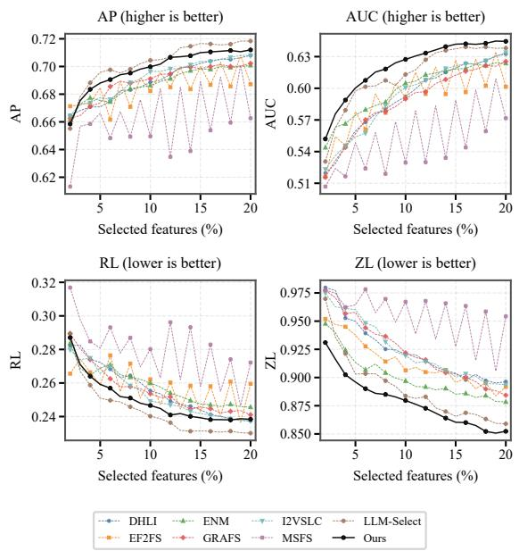

Comparison Results. Tables 2 and 3 compare FeatureHospital with seven methods on seven datasets. Two main observations can be observed. (1) FeatureHospital achieves strong overall performance across the four evaluation metrics. It obtains the best or second-best results on multiple datasets, while remaining close to the best-performing method in the other cases. In particular, on mfeat and 3sources, FeatureHospital consistently outperforms all compared methods across AP, AUC, RL, and ZL. These results demonstrate that FeatureHospital can automatically design efective feature selection algorithms for diferent datasets. (2) FeatureHospital demonstrates more consistent performance across diferent datasets. For example, LLM-Select performs strongly on several datasets, including SCENE, yeast, VOC07, and MIR-Flickr, but exhibits substantial performance degradation on mfeat, emotions, and 3Sources. In contrast, FeatureHospital remains competitive across all seven datasets without suffering a performance collapse on any particular dataset. In addition, Figure 3 presents the results on yeast with selected feature ratios ranging from 2% to 20%. The corresponding results on the remaining datasets are provided in Appendix B.

Figure 3: Performance comparison on yeast under diferent selected feature ratios ranging from 2% to 20%.

Overall, these results demonstrate that FeatureHospital achieves strong performance while maintaining consistent efectiveness across dataset changes.

one Loss (ZL). Higher values indicate better performance for AP and AUC, whereas lower values are preferred for RL and ZL. For each dataset, we randomly split the samples into 70% for training and 30% for testing. Within each split, the results are averaged over feature selection ratios from 2% to 20% at 2% intervals. This process is repeated ten times, and the results are reported as the mean ± standard deviation.

LLM Setup. Unless otherwise specified, all LLM-based agents in FeatureHospital use GPT-5.5 (OpenAI 2026a) as the backbone model, with the temperature set to 0.1.

Parameter Analysis We perform a parameter sensitivity analysis on yeast, using AP as the evaluation metric. The objective constructed for yeast contains Label-Weighted Relevance as the backbone loss, Positive Dependency Co-Coverage as the supporting loss, Label-Aware Pairwise Redundancy as the regularization loss, and Negative Dependency Separation and Budget Penalty as the guardrail losses. For each term, its weight is varied over {0.001, 0.01, 0.1, 1, 10, 100, 1000} while all other weights remain fixed. As shown in Figure 4, several terms remain efective across broad weight ranges, whereas Negative Dependency Separation is more sensitive to excessively large values. The weights selected by FeatureHospital lie within stable regions.

<table><tr><td>Dataset</td><td>Metric</td><td>Full FeatureHospital</td><td>Backbone Only</td><td>Random Triage</td><td>Random Consultation</td><td>All Rule-Based Decisions</td><td>Single LLM Agent</td><td>Without Pharmacist</td></tr><tr><td rowspan="4">SCENE</td><td>AP↑</td><td>0.8011</td><td>0.7892</td><td>0.7956</td><td>0.7893</td><td>0.7994</td><td>0.7963</td><td>0.8003</td></tr><tr><td>AUC↑</td><td>0.6970</td><td>0.6784</td><td>0.6891</td><td>0.6768</td><td>0.6954</td><td>0.6905</td><td>0.6962</td></tr><tr><td>RL↓</td><td>0.1113</td><td>0.1187</td><td>0.1145</td><td>0.1187</td><td>0.1122</td><td>0.1142</td><td>0.1118</td></tr><tr><td>ZL↓</td><td>0.9399</td><td>0.9543</td><td>0.9468</td><td>0.9538</td><td>0.9400</td><td>0.9438</td><td>0.9418</td></tr><tr><td rowspan="4">mfeat</td><td>AP↑</td><td>0.9360</td><td>0.9071</td><td>0.8700</td><td>0.9217</td><td>0.8867</td><td>0.9217</td><td>0.9235</td></tr><tr><td>AUC↑</td><td>0.9871</td><td>0.9801</td><td>0.9617</td><td>0.9831</td><td>0.9716</td><td>0.9830</td><td>0.9836</td></tr><tr><td>RL↓</td><td>0.0283</td><td>0.0412</td><td>0.0660</td><td>0.0351</td><td>0.0534</td><td>0.0347</td><td>0.0342</td></tr><tr><td>ZL↓</td><td>0.1364</td><td>0.1898</td><td>0.2625</td><td>0.1595</td><td>0.2319</td><td>0.1661</td><td>0.1599</td></tr><tr><td rowspan="4">3Sources</td><td>AP↑</td><td>0.4354</td><td>0.4135</td><td>0.4175</td><td>0.4010</td><td>0.3920</td><td>0.4179</td><td>0.4364</td></tr><tr><td>AUC↑</td><td>0.5109</td><td>0.4932</td><td>0.5009</td><td>0.4975</td><td>0.5042</td><td>0.4919</td><td>0.5079</td></tr><tr><td>RL↓</td><td>0.5057</td><td>0.5224</td><td>0.5270</td><td>0.5383</td><td>0.5420</td><td>0.5276</td><td>0.5128</td></tr><tr><td>ZL↓</td><td>0.9522</td><td>0.9776</td><td>0.9731</td><td>0.9785</td><td>0.9927</td><td>0.9690</td><td>0.9555</td></tr></table>

Table 4: Ablation results in terms of AP, AUC, RL, and ZL. The best and second-best results are highlighted in bold and underlined, respectively.

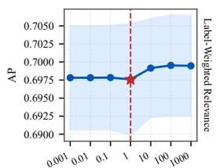

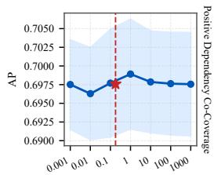

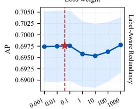

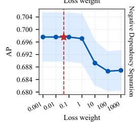

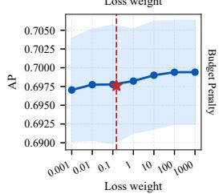  
Figure 4: Parameter sensitivity of the objective constructed for yeast.

## Ablation Study

Table 4 evaluates FeatureHospital from four perspectives. Results on the remaining datasets are provided in Appendix B.

(1) Algorithm efectiveness. Backbone Only removes all non-backbone terms from the final objective. Its performance degradation confirms that the additional loss terms provide efective complementary constraints.

(2) Efectiveness of individual pipeline stages. Random

Triage activates three random Departments and averages up to ten configurations; Random Consultation selects two random Loss Medicines per activated Department and averages up to six configurations; and Without Pharmacist directly combines the default medicines and weights recommended by the Specialist Doctors. When fewer configurations are available, all possible configurations are used. The full method generally outperforms these variants, demonstrating the efectiveness of each stage. The smaller gap without the Pharmacist suggests that the Specialist Doctors already provide reasonable initial configurations, which are further coordinated and refined by the Pharmacist.

(3) Efectiveness of LLM-based decisions. All Rule-Based Decisions replaces all LLM decisions with predefined rules extracted from the corresponding Skills. Its lower performance, particularly on mfeat and 3Sources, demonstrates the importance of involving LLMs in decisions throughout the algorithm-design process. Additional LLM replacement experiments are reported in Appendix B, while Appendix E presents case studies with manual inspection of agent outputs to further examine the validity of LLM decisions.

(4) Efectiveness of the overall multi-agent pipeline. Single LLM Agent collapses the entire staged decision process into a single LLM call. Given the Statistical Profile of the target dataset and the complete catalog of candidate Loss Medicines, one agent directly selects and combines the medicines into a final dataset-specific objective. Its consistently lower performance supports the efectiveness of the role specialization and staged collaboration in FeatureHospital.

## Conclusion

We presented FeatureHospital, a Skill-driven multi-agent framework for automated MVML feature selection algorithm customization. By diagnosing dataset issues, selecting problem-specific Loss Medicines, and reconciling them into a compact objective, FeatureHospital constructs diferent feature selection algorithms for diferent datasets. Experiments on seven datasets demonstrate competitive and consistent performance, while the ablation study validate the contributions of the objective components and multi-agent workflow.

## References

Anthropic. 2026. Introducing Claude Sonnet 5. https:// www.anthropic.com/news/claude-sonnet-5. Published June 30, 2026.

Boutell, M. R.; Luo, J.; Shen, X.; and Brown, C. M. 2004. Learning multi-label scene classification. Pattern recognition, 37(9): 1757–1771.

Charte, F.; Rivera, A. J.; Del Jesus, M. J.; and Herrera, F. 2015. Addressing imbalance in multilabel classification: Measures and random resampling algorithms. Neurocomputing, 163: 3–16.

Demšar, J. 2006. Statistical comparisons of classifiers over multiple data sets. Journal of Machine learning research, 7(Jan): 1–30.

Duin, R. 1998. Multiple Features. UCI Machine Learning Repository. DOI: https://doi.org/10.24432/C5HC70.

Elisseef, A.; and Weston, J. 2001. A kernel method for multi-labelled classification. Advances in neural information processing systems, 14.

Everingham, M.; Van Gool, L.; Williams, C. K. I.; Winn, J.; and Zisserman, A. 2007. The PASCAL Visual Object Classes Challenge 2007 (VOC2007) Results. http://www.pascalnetwork.org/challenges/VOC/voc2007/workshop/index.html.

Fourney, A.; Bansal, G.; Mozannar, H.; Tan, C.; Salinas, E.; Niedtner, F.; Proebsting, G.; Bassman, G.; Gerrits, J.; Alber, J.; et al. 2024. Magentic-one: A generalist multi-agent system for solving complex tasks. arXiv preprint arXiv:2411.04468.

Gonzalez-Lopez, J.; Ventura, S.; and Cano, A. 2020. Distributed multi-label feature selection using individual mutual information measures. Knowledge-Based Systems, 188: 105052.

Google DeepMind. 2026. Gemini 3.1 Pro. https://deepmind. google/models/model-cards/gemini-3-1-pro/. Published February 19, 2026.

Han, Q.; Hu, L.; and Gao, W. 2024. Feature relevance and redundancy coeficients for multi-view multi-label feature selection. Information Sciences, 652: 119747.

Hao, P.; Ding, W.; Gao, W.; and He, J. 2024. Exploring view-specific label relationships for multi-view multi-label feature selection. Information Sciences, 681: 121215.

Hao, P.; Gao, W.; and Hu, L. 2025. Embedded feature fusion for multi-view multi-label feature selection. Pattern Recognition, 157: 110888.

Hao, P.; Liu, K.; and Gao, W. 2024a. Anchor-guided global view reconstruction for multi-view multi-label feature selection. Information Sciences, 679: 121124.

Hao, P.; Liu, K.; and Gao, W. 2024b. Double-layer hybridlabel identification feature selection for multi-view multilabel learning. In Proceedings of the AAAI conference on artificial intelligence, volume 38, 12295–12303.

He, X.; Zhao, K.; and Chu, X. 2021. AutoML: A survey of the state-of-the-art. Knowledge-based systems, 212: 106622.

Hong, S.; Zhuge, M.; Chen, J.; Zheng, X.; Cheng, Y.; Wang, J.; Zhang, C.; Yau, S.; Lin, Z.; Zhou, L.; et al. 2024.

MetaGPT: Meta programming for a multi-agent collaborative framework. In International Conference on Learning Representations, volume 2024, 23247–23275.

Huiskes, M. J.; and Lew, M. S. 2008. The mir flickr retrieval evaluation. In Proceedings of the 1st ACM international conference on Multimedia information retrieval, 39–43.

Jeong, D. P.; Lipton, Z. C.; and Ravikumar, P. K. 2024. LLM-Select: Feature Selection with Large Language Models. Transactions on Machine Learning Research.

Jiang, Y.; Li, D.; Deng, H.; Ma, B.; Wang, X.; Wang, Q.; and Yu, G. 2026. SoK: Agentic Skills–Beyond Tool Use in LLM Agents. arXiv preprint arXiv:2602.20867.

Lazebnik, T.; and Rosenfeld, A. 2023. FSPL: A metalearning approach for a filter and embedded feature selection pipeline. International Journal of Applied Mathematics and Computer Science, 33(1).

Li, S.; Liu, Q.; Dai, J.; Wang, W.; Gui, X.; and Yi, Y. 2021. Adaptive-Weighted Multiview Deep Basis Matrix Factorization for Multimedia Data Analysis. Wireless Communications and Mobile Computing, 2021(1): 5526479.

Liu, B.; Li, W.; Xiao, Y.; Chen, X.; Liu, L.; Liu, C.; Wang, K.; and Sun, P. 2023a. Multi-view multi-label learning with highorder label correlation. Information Sciences, 624: 165–184.

Liu, C.; Wen, J.; Luo, X.; and Xu, Y. 2023b. Incomplete multi-view multi-label learning via label-guided masked view-and category-aware transformers. In Proceedings of the AAAI conference on artificial intelligence, volume 37, 8816–8824.

OpenAI. 2026a. GPT-5.5 System Card. https://openai.com/ index/gpt-5-5-system-card/. Published April 24, 2026.

OpenAI. 2026b. Introducing GPT-5.4 mini and nano. https://openai.com/index/introducing-gpt-5-4-miniand-nano/. Published March 17, 2026.

Pan, Q.; Yang, Y.; Li, J.; Zhou, J.; Chen, K.; Li, X.; Chen, Q.; and He, L. 2026. Anything2Skill: Compiling External Knowledge into Reusable Skills for Agents. arXiv preprint arXiv:2606.09316.

Parmezan, A. R. S.; Lee, H. D.; Spolaôr, N.; and Wu, F. C. 2021. Automatic recommendation of feature selection algorithms based on dataset characteristics. Expert Systems with Applications, 185: 115589.

Parmezan, A. R. S.; Lee, H. D.; and Wu, F. C. 2017. Metalearning for choosing feature selection algorithms in data mining: Proposal of a new framework. Expert Systems with Applications, 75: 1–24.

Qwen Team. 2026. Qwen3.5: Towards Native Multimodal Agents.

Su, H.; Chen, R.; Tang, S.; Yin, Z.; Zheng, X.; Li, J.; Qi, B.; Wu, Q.; Li, H.; Ouyang, W.; et al. 2025. Many heads are better than one: Improved scientific idea generation by a llmbased multi-agent system. In Proceedings ofthe 63rdAnnual Meeting of the Association for Computational Linguistics (Volume 1: Long Papers), 28201–28240.

Trohidis, K.; Tsoumakas, G.; Kalliris, G.; Vlahavas, I. P.; et al. 2008. Multi-label classification of music into emotions. In ISMIR, volume 8, 325–330.

Wang, G.; Song, Q.; Sun, H.; Zhang, X.; Xu, B.; and Zhou, Y. 2013. A feature subset selection algorithm automatic recommendation method. Journal of Artificial Intelligence Research, 47: 1–34.

Wang, G.; Xie, Y.; Jiang, Y.; Mandlekar, A.; Xiao, C.; Zhu, Y.; Fan, L.; and Anandkumar, A. 2023. Voyager: An Open-Ended Embodied Agent with Large Language Models. Transactions on Machine Learning Research.

Wen, J.; Liu, C.; Deng, S.; Liu, Y.; Fei, L.; Yan, K.; and Xu, Y. 2023. Deep double incomplete multi-view multi-label learning with incomplete labels and missing views. IEEE transactions on neural networks and learning systems, 35(8): 11396–11408.

Xu, A.; Lin, B.; Xue, B.; Wang, B.; Xu, B.; Wu, B.; Zhang, B.; Lin, C.; Dong, C.; Ling, C.; et al. 2026. Deepseek-v4: Towards highly eficient million-token context intelligence. arXiv preprint arXiv:2606.19348.

Xu, R.; and Yan, Y. 2026. Agent skills for large language models: Architecture, acquisition, security, and the path forward. arXiv preprint arXiv:2602.12430.

Yan, S.; Xiong, X.; Arnab, A.; Lu, Z.; Zhang, M.; Sun, C.; and Schmid, C. 2022. Multiview transformers for video recognition. In Proceedings ofthe IEEE/CVF conference on computer vision and pattern recognition, 3333–3343.

Zhang, Y.; Wu, J.; Cai, Z.; and Yu, P. S. 2020. Multi-view multi-label learning with sparse feature selection for image annotation. IEEE Transactions on Multimedia, 22(11): 2844–2857.

Zheng, B.; Fatemi, M. Y.; Jin, X.; Wang, Z. Z.; Gandhi, A.; Song, Y.; Gu, Y.; Srinivasa, J.; Liu, G.; Neubig, G.; et al. 2025. Skillweaver: Web agents can self-improve by discovering and honing skills. arXiv preprint arXiv:2504.07079.

## A Threats & Discussion

## A.1 Threats

Dependence on a Static, Human-Curated Skill Library. FeatureHospital currently relies on a collection of predefined Skills constructed by human experts. These Skills specify the domain knowledge, applicability conditions, operating procedures, and candidate Loss Medicines used by the agents throughout diagnosis, triage, consultation, and objective construction. Although this design provides a controllable and interpretable foundation for automated algorithm customization, the capability of FeatureHospital is inevitably bounded by the coverage and quality of the existing Skill library. In particular, when a dataset exhibits an issue that is not adequately represented by the available Skills, the framework may fail to identify an appropriate treatment or construct a suficiently expressive objective. An important future direction is therefore to investigate automatic Skill acquisition and refinement. For example, new Skills may be extracted from research papers, existing implementations, and accumulated experimental results, followed by systematic validation, deduplication, and integration into the existing Skill library. Such mechanisms would reduce the dependence on manual Skill engineering and continuously expand the range of problems that FeatureHospital can address.

Lack of Experience-Driven Self-Evolution. FeatureHospital is designed to construct a dataset-specific feature selection algorithm for each input dataset, but it does not yet accumulate experience across repeated runs. The diagnostic decisions, Department routing results, selected Loss Medicines, constructed objectives, and their empirical outcomes are not persistently retained to improve subsequent algorithm-design processes. Consequently, even when the framework encounters datasets with similar characteristics, it cannot directly reuse previously successful prescriptions or learn systematically from unsuccessful ones. Future work will explore an experience-driven self-evolution mechanism that records dataset profiles, agent decisions, constructed objectives, and evaluation feedback in a persistent experience memory. When processing a new dataset, relevant prior cases could be retrieved to support diagnosis and prescription, while performance feedback could be used to refine decision rules, Skill applicability conditions, and medicine configurations. This would enable FeatureHospital to evolve from a framework that only applies predefined expertise into one that progressively improves through accumulated algorithm design experience.

## A.2 Discussion: Automatic Feature Selection

Automated machine learning (AutoML) aims to automate the construction of machine learning solutions, thereby reducing the expert efort required in algorithm design, selection, and configuration (He, Zhao, and Chu 2021). When applied to feature selection, this idea leads to automatic feature selection, which aims to automatically construct a feature selection algorithm tailored to the characteristics of the target dataset.

Existing studies have primarily approached this problem through algorithm recommendation and pipeline search. Early work characterizes a target dataset using meta-features, identifies similar historical datasets, and ranks a predefined collection of feature selection algorithms according to their previous performance (Wang et al. 2013). Subsequent metalearning frameworks learn the relationship between dataset characteristics and the relative performance of candidate feature selection algorithms, thereby recommending a suitable algorithm or configuration for a new dataset (Parmezan, Lee, and Wu 2017; Parmezan et al. 2021). More recent work further considers combinations of predefined components. For example, FSPL jointly recommends a filter method and an embedded method as a feature selection pipeline rather than selecting the two stages independently (Lazebnik and Rosenfeld 2023). Although these approaches difer in their dataset representations and recommendation mechanisms, they generally operate over a predefined search space whose candidates are complete feature selection algorithms, algorithm configurations, or pipelines assembled from predefined stages.

FeatureHospital difers from these approaches in the granularity and organization of algorithm construction. Rather than directly selecting a complete algorithm or pipeline from predefined candidates, FeatureHospital first decomposes the feature selection requirements of the target dataset into individual issues, such as label imbalance, feature redundancy, and view-quality imbalance. It then addresses these issues one by one by selecting a corresponding optimization component for each identified problem. Finally, the selected components are reconciled to remove overlaps and conflicts, their contributions are balanced, and they are progressively assembled into a unified dataset-specific objective. Existing approaches can therefore be viewed as performing coarse-grained recommendation or search at the algorithm or pipeline level, whereas FeatureHospital performs fine-grained, problem-driven construction at the objectivecomponent level. The former asks which predefined feature selection solution should be applied to the target dataset, while the latter asks which problems are present, how each problem should be modeled, and how the resulting treatments should be integrated into a coherent feature selection algorithm.

## B Additional Experiments

## B.1 Backbone LLM Replacement

To examine whether FeatureHospital depends on a particular backbone LLM, we replace the GPT-5.5 (OpenAI 2026a) backbone used in the main experiments with models covering diferent capability levels and accessibility settings. These include two proprietary high-capability models, Claude Sonnet 5 (Anthropic 2026) and Gemini 3.1 Pro Preview (Google DeepMind 2026); one open-source flagship model, DeepSeek V4-Pro (Xu et al. 2026); one proprietary compact model, GPT-5.4 mini (OpenAI 2026b); and one compact open-source model, Qwen3.5-27B (Qwen Team 2026). The Skills, agent prompts, available tools, and all subsequent training and evaluation settings are kept unchanged. Tables 5 and 6 report the resulting performance.

The overall performance of FeatureHospital is relatively insensitive to the choice ofbackbone LLM. All six backbones achieve competitive results across the seven datasets, and replacing GPT-5.5 does not cause a substantial performance degradation or failure on any evaluation metric. Across the six backbones, the diferences between the best and worst average results are only 0.0091 for AP, 0.0078 for AUC, 0.0066 for RL, and 0.0143 for ZL. This consistency suggests that the structured workflow provided by the Skills and specialized agents constrains the algorithm-design process suficiently well for diferent LLMs to construct efective feature selection objectives.

Relatively lightweight backbones also retain competitive performance. For example, GPT-5.4-mini achieves average AP, AUC, RL, and ZL values of 0.6903, 0.6874, 0.2344, and 0.8177, respectively, which remain close to those obtained with GPT-5.5. Qwen3.5-27B similarly achieves competitive average results and performs best on SCENE under several metrics. These results indicate that FeatureHospital can potentially use smaller or lower-cost backbone models to reduce LLM inference expenses while preserving most of its feature selection efectiveness, providing flexibility for deployments with diferent computational and budget constraints.

GPT-5.5 nevertheless provides the most stable and balanced overall performance. It achieves the best average results for AP, AUC, and RL, with values of 0.6938, 0.6928, and 0.2308, respectively, and obtains the second-best average ZL of 0.8143. Other backbones occasionally perform better on individual datasets, such as DeepSeek-V4-Pro on yeast and Gemini-3.1-Pro-Preview on mfeat, but none consistently dominates across datasets and metrics. Therefore, GPT-5.5 remains a suitable default backbone for the main experiments, while the results with alternative LLMs demonstrate that the efectiveness of FeatureHospital is not tightly coupled to this particular model.

Cost of a Single Pipeline Execution. To evaluate the practical cost of using FeatureHospital, we record the average number of LLM calls and token consumption required by one complete pipeline execution. Based on the standard online API prices available at the time of evaluation, we further estimate the corresponding monetary cost, as reported in Table 7. The estimation uses regular real-time inference prices without applying prompt caching, batch processing, or other promotional discounts.

Although a complete pipeline execution involves multiple interactions among the specialized agents, it only needs to be performed once to construct a complete dataset-specific feature selection objective and its corresponding algorithm configuration. The resulting algorithm can then be optimized and applied to the target dataset without repeating the LLMbased algorithm-design process. As shown in Table 7, the average cost of one complete execution ranges from approximately \$0.08 to \$1.31. In particular, Qwen3.5-27B and GPT-5.4 mini require only approximately \$0.09 and \$0.34, respectively, while retaining competitive feature selection performance. Considering that a single execution replaces the manual process of dataset diagnosis, objective design, and component coordination, this one-time cost is modest and practically acceptable for constructing a customized feature selection algorithm.

<table><tr><td>Dataset</td><td>GPT-5.5†</td><td>Qwen3.5 27B</td><td>GPT-5.4 mini</td><td>DeepSeek V4-Pro</td><td>Claude Sonnet 5</td><td>Gemini 3.1 Pro Preview</td></tr><tr><td colspan="7">AP↑</td></tr><tr><td>SCENE</td><td> $0 . 8 0 1 1 { \scriptstyle \pm 0 . 0 0 4 1 }$ </td><td> $\mathbf { 0 . 8 0 3 9 \pm 0 . 0 0 4 0 }$ </td><td> $0 . 7 8 7 2 \pm 0 . 0 0 3 7$ </td><td> $0 . 7 8 7 5 \pm 0 . 0 0 4 1$ </td><td> $0 . 7 9 5 2 \pm 0 . 0 0 3 4$ </td><td> $0 . 7 9 5 1 \pm 0 . 0 0 4 1$ </td></tr><tr><td>yeast</td><td> $\underline { { 0 . 6 9 7 6 \pm 0 . 0 0 8 1 } }$ </td><td> $0 . 6 9 0 8 \pm 0 . 0 0 6 5$ </td><td> $0 . 6 9 1 5 \pm 0 . 0 0 6 9$ </td><td> $\mathbf { 0 . 6 9 8 9 \pm 0 . 0 0 8 2 }$ </td><td> $0 . 6 9 3 4 \pm 0 . 0 0 7 9$ </td><td> $0 . 6 9 1 0 \pm 0 . 0 0 7 4$ </td></tr><tr><td>VOC07</td><td> $0 . 6 0 7 3 \pm 0 . 0 0 4 2$ </td><td> $0 . 6 0 6 4 \pm 0 . 0 0 4 2$ </td><td> $0 . 6 0 7 4 \pm 0 . 0 0 4 2$ </td><td> $0 . 5 9 6 4 \pm 0 . 0 0 5 0$ </td><td> $\mathbf { 0 . 6 0 7 8 \pm 0 . 0 0 5 1 }$ </td><td> $0 . 6 0 6 8 \pm 0 . 0 0 4 3$ </td></tr><tr><td>MIRFlickr</td><td> $0 . 7 0 1 1 \pm 0 . 0 0 4 8$ </td><td> $0 . 7 0 0 8 \pm 0 . 0 0 4 6$ </td><td> $0 . 7 0 0 8 \pm 0 . 0 0 4 5$ </td><td> $0 . 6 9 9 1 \pm 0 . 0 0 4 5$ </td><td> $0 . 7 0 1 9 \pm 0 . 0 0 4 8$ </td><td> $\mathbf { 0 . 7 0 1 9 \pm 0 . 0 0 4 4 }$ </td></tr><tr><td>mfeat</td><td> $0 . 9 3 6 0 { \scriptstyle \pm 0 . 0 0 5 6 }$ </td><td> $0 . 9 2 3 5 \pm 0 . 0 0 8 0$ </td><td> $0 . 9 3 2 8 \pm 0 . 0 0 7 0$ </td><td> $0 . 9 2 1 3 \pm 0 . 0 0 9 8$ </td><td> $0 . 9 2 4 2 \pm 0 . 0 0 9 3$ </td><td> $\mathbf { 0 . 9 5 3 4 \pm 0 . 0 0 5 4 }$ </td></tr><tr><td>emotions</td><td> $0 . 6 7 8 3 \pm 0 . 0 1 5 6$ </td><td> $0 . 6 7 8 1 \pm 0 . 0 1 6 6$ </td><td> $0 . 6 7 8 3 \pm 0 . 0 1 4 8$ </td><td> $\mathbf { 0 . 6 8 0 7 \pm 0 . 0 1 8 0 }$ </td><td> $\underline { { 0 . 6 7 9 7 \pm 0 . 0 1 6 8 } }$ </td><td> $0 . 6 7 6 9 \pm 0 . 0 1 4 8$ </td></tr><tr><td>3Sources</td><td> $\mathbf { 0 . 4 3 5 4 \pm 0 . 0 3 0 4 }$ </td><td> $0 . 4 1 0 6 \pm 0 . 0 3 5 0$ </td><td> $0 . 4 3 4 2 \pm 0 . 0 2 6 3$ </td><td> $0 . 4 0 8 9 \pm 0 . 0 2 5 6$ </td><td> $\underline { { 0 . 4 3 4 3 \pm 0 . 0 3 6 5 } }$ </td><td> $0 . 4 3 0 8 \pm 0 . 0 3 1 6$ </td></tr><tr><td>Average</td><td>0.6938</td><td>0.6877</td><td>0.6903</td><td>0.6847</td><td>0.6909</td><td>0.6937</td></tr><tr><td colspan="7">AUC↑</td></tr><tr><td>SCENE</td><td> $\overline { { 0 . 6 9 7 0 { \pm } 0 . 0 0 5 0 } }$ </td><td> $\overline { { { \bf 0 . 6 9 9 3 \pm 0 . 0 0 5 4 } } }$ </td><td> $\overline { { 0 . 6 7 3 5 \pm 0 . 0 0 6 1 } }$ </td><td> $\overline { { 0 . 6 7 4 2 \pm 0 . 0 0 6 2 } }$ </td><td> $\overline { { 0 . 6 8 7 3 \pm 0 . 0 0 6 5 } }$ </td><td> $\overline { { 0 . 6 8 8 0 \pm 0 . 0 0 6 6 } }$ </td></tr><tr><td>yeast</td><td> $\underline { { 0 . 6 1 9 6 \pm 0 . 0 0 8 3 } }$ </td><td> $0 . 6 0 6 7 \pm 0 . 0 0 4 8$ </td><td> $0 . 6 1 0 0 \pm 0 . 0 0 4 7$ </td><td> $\mathbf { 0 . 6 2 1 6 \pm 0 . 0 0 6 8 }$ </td><td> $0 . 6 1 1 8 \pm 0 . 0 0 8 6$ </td><td> $0 . 6 0 8 7 \pm 0 . 0 0 5 1$ </td></tr><tr><td>VOC07</td><td> $0 . 6 5 4 8 \pm 0 . 0 0 8 9$ </td><td> $0 . 6 5 3 0 \pm 0 . 0 0 8 4$ </td><td> $\mathbf { 0 . 6 5 5 1 \pm 0 . 0 0 8 7 }$ </td><td> $0 . 6 3 1 2 \pm 0 . 0 0 9 6$ </td><td> $0 . 6 5 2 8 \pm 0 . 0 0 6 5$ </td><td> $0 . 6 4 9 4 \pm 0 . 0 0 9 6$ </td></tr><tr><td>MIRFlickr</td><td> $0 . 6 4 7 4 \pm 0 . 0 0 6 8$ </td><td> $0 . 6 4 6 4 \pm 0 . 0 0 6 5$ </td><td> $0 . 6 4 7 2 \pm 0 . 0 0 6 5$ </td><td> $0 . 6 4 3 2 \pm 0 . 0 0 6 7$ </td><td> $\mathbf { 0 . 6 4 8 9 \pm 0 . 0 0 6 7 }$ </td><td> $0 . 6 4 8 7 \pm 0 . 0 0 6 2$ </td></tr><tr><td>mfeat</td><td> $0 . 9 8 7 1 \pm 0 . 0 0 2 4$ </td><td> $0 . 9 8 2 8 \pm 0 . 0 0 4 1$ </td><td> $0 . 9 8 7 2 { \scriptstyle \pm 0 . 0 0 2 4 }$ </td><td> $0 . 9 8 1 8 \pm 0 . 0 0 4 5$ </td><td> $0 . 9 8 3 4 \pm 0 . 0 0 3 2$ </td><td> $\mathbf { 0 . 9 9 1 7 \pm 0 . 0 0 2 2 }$ </td></tr><tr><td>emotions</td><td> $0 . 7 3 2 6 \pm 0 . 0 1 6 9$ </td><td> $0 . 7 3 3 3 \pm 0 . 0 1 7 3$ </td><td> $0 . 7 3 3 3 \pm 0 . 0 1 6 5$ </td><td> $\mathbf { 0 . 7 3 6 3 \pm 0 . 0 1 7 9 }$ </td><td> $\underline { { 0 . 7 3 3 7 } } \pm 0 . 0 1 7 2$ </td><td> $0 . 7 3 2 4 \pm 0 . 0 1 6 0$ </td></tr><tr><td>3Sources</td><td> $\mathbf { 0 . 5 1 0 9 \pm 0 . 0 1 7 7 }$ </td><td> $0 . 5 1 0 2 \pm 0 . 0 2 2 8$ </td><td> $0 . 5 0 5 5 \pm 0 . 0 2 2 2$ </td><td> $0 . 5 0 6 9 \pm 0 . 0 3 0 7$ </td><td> $0 . 5 0 8 1 \pm 0 . 0 2 1 7$ </td><td> $0 . 5 0 4 0 \pm 0 . 0 1 8 8$ </td></tr><tr><td>Average</td><td>0.6928</td><td>0.6902</td><td>0.6874</td><td>0.6850</td><td>0.6894</td><td>0.6890</td></tr></table>

Table 5: Robustness of FeatureHospital across diferent LLM backbones in terms of AP and AUC (mean ± standard deviation). GPT-5.5† denotes the reference backbone used in the main experiments. Higher values indicate better performance. The best and second-best results are highlighted in bold and underlined, respectively. Rankings are determined using the unrounded results.

## B.2 Statistical Significance Analysis

To further examine whether the performance diferences among the compared methods are statistically significant across datasets, we follow the standard procedure proposed by Demšar (Demšar 2006). Specifically, we first conduct the Friedman test for each evaluation metric and then apply the Nemenyi post-hoc test for pairwise comparisons. For each dataset, the compared methods are ranked according to their performance, where rank 1 is assigned to the bestperforming method. AP and AUC are ranked in descending order, whereas RL and ZL are ranked in ascending order. The average rank of each method is then computed over the seven datasets.

For the eight compared methods and seven datasets, the critical diference at the significance level $\alpha = 0 . 0 5$ is calculated as

$$
\mathrm { C D } = q _ { \alpha } { \sqrt { \frac { k ( k + 1 ) } { 6 N } } } = 3 . 9 6 8 ,\tag{15}
$$

where $k \ = \ 8$ is the number of methods and $N \mathrm { ~ = ~ } 7$ is the number of datasets. In the critical diference diagrams, methods connected by the same thick horizontal line do not exhibit statistically significant diferences under the Nemenyi test.

As shown in Figure 5, FeatureHospital achieves the best average rank under all four evaluation metrics. Its average ranks are 2.000, 1.571, 2.000, and 1.857 for AP, AUC, RL, and ZL, respectively. The Friedman tests reject the null hypothesis that all methods have equivalent performance for AP $( p = 0 . 0 0 1 2 )$ , AUC $\mathit { \Omega } ( p = \mathrm { 0 . \bar { 0 } 0 1 4 } )$ , RL $( p = 0 . 0 0 1 0 )$

and ZL $( p = 0 . 0 4 0 7 )$ , indicating that statistically significant performance diferences exist among the compared methods.

The subsequent Nemenyi tests provide more detailed pairwise comparisons. FeatureHospital significantly outperforms EF2FS and MSFS in terms of AP and RL. For AUC, it significantly outperforms DHLI, EF2FS, and MSFS, while for ZL, it significantly outperforms MSFS. The diferences between FeatureHospital and several strong baselines, such as LLM-Select, I2VSLC, ENM, and GRAFS, do not exceed the critical diference on all metrics and are therefore not statistically significant under the Nemenyi test.

Overall, the statistical analysis shows that FeatureHospital consistently obtains the best overall ranking across diferent datasets and evaluation metrics. Although the relatively small number of datasets results in a large critical diference and limits the statistical power of some pairwise comparisons, FeatureHospital maintains consistently competitive performance without exhibiting a substantial degradation on any particular metric.

## B.3 Performance across Feature Selection Ratios

The main text reports the performance curves on yeast as a representative example. To provide a more complete comparison, Figures 6–8 present the results on the remaining six datasets under feature selection ratios ranging from 2% to 20%. For each ratio, all methods are evaluated using AP, AUC, RL, and ZL.

Across diferent feature selection ratios, FeatureHospital generally maintains leading or competitive performance rather than performing well only under a particular feaapproaches a stable region, suggesting that the most useful information has already been retained.

<table><tr><td>Dataset</td><td>GPT-5.5†</td><td>Qwen3.5 27B</td><td>GPT-5.4 mini</td><td>DeepSeek V4-Pro</td><td>Claude Sonnet 5</td><td>Gemini 3.1 Pro Preview</td></tr><tr><td colspan="7">RL↓</td></tr><tr><td>SCENE</td><td> $\underline { { 0 . 1 1 1 3 \pm 0 . 0 0 3 3 } }$ </td><td> $\mathbf { 0 . 1 1 0 0 \pm 0 . 0 0 2 8 }$ </td><td> $0 . 1 2 0 0 \pm 0 . 0 0 3 3$ </td><td> $0 . 1 1 9 6 \pm 0 . 0 0 3 6$ </td><td> $0 . 1 1 5 5 \pm 0 . 0 0 3 3$ </td><td> $0 . 1 1 5 0 \pm 0 . 0 0 3 7$ </td></tr><tr><td>yeast</td><td> $\underline { { 0 . 2 5 0 1 \pm 0 . 0 0 7 0 } }$ </td><td> $0 . 2 5 9 1 \pm 0 . 0 0 6 0$ </td><td> $0 . 2 5 7 4 \pm 0 . 0 0 6 2$ </td><td> $\mathbf { 0 . 2 4 9 0 \pm 0 . 0 0 6 3 }$ </td><td> $0 . 2 5 5 4 \pm 0 . 0 0 7 6$ </td><td> $0 . 2 5 8 6 \pm 0 . 0 0 6 1$ </td></tr><tr><td>VOC07</td><td> $\mathbf { 0 . 2 5 4 4 \pm 0 . 0 0 5 9 }$ </td><td> $0 . 2 5 5 2 \pm 0 . 0 0 5 8$ </td><td> $\underline { { 0 . 2 5 4 4 } } \pm 0 . 0 0 5 9$ </td><td> $0 . 2 6 7 2 \pm 0 . 0 0 6 7$ </td><td> $0 . 2 5 4 7 \pm 0 . 0 0 5 5$ </td><td> $0 . 2 5 6 5 \pm 0 . 0 0 6 8$ </td></tr><tr><td>MIRFlickr</td><td> $0 . 1 7 1 6 \pm 0 . 0 0 4 0$ </td><td> $0 . 1 7 2 0 \pm 0 . 0 0 4 2$ </td><td> $0 . 1 7 1 6 \pm 0 . 0 0 4 0$ </td><td> $0 . 1 7 3 1 \pm 0 . 0 0 4 1$ </td><td> $0 . 1 7 0 9 \pm 0 . 0 0 4 0$ </td><td> $\mathbf { 0 . 1 7 0 0 { \pm } 0 . 0 0 3 6 }$ </td></tr><tr><td>mfeat</td><td> $0 . 0 2 8 3 \pm 0 . 0 0 3 8$ </td><td> $0 . 0 3 5 3 \pm 0 . 0 0 6 4$ </td><td> $0 . 0 2 8 3 \pm 0 . 0 0 4 6$ </td><td> $0 . 0 3 6 7 \pm 0 . 0 0 7 0$ </td><td> $0 . 0 3 4 0 \pm 0 . 0 0 5 4$ </td><td> $\mathbf { 0 . 0 2 1 4 \pm 0 . 0 0 3 6 }$ </td></tr><tr><td>emotions</td><td> $0 . 2 9 4 0 \pm 0 . 0 1 6 9$ </td><td> $0 . 2 9 2 9 \pm 0 . 0 1 8 3$ </td><td> $0 . 2 9 3 8 \pm 0 . 0 1 6 2$ </td><td> $\mathbf { 0 . 2 9 0 2 \pm 0 . 0 1 9 6 }$ </td><td> $\underline { { 0 . 2 9 2 1 \pm 0 . 0 1 8 1 } }$ </td><td> $0 . 2 9 4 1 \pm 0 . 0 1 6 7$ </td></tr><tr><td>3Sources</td><td> $\mathbf { 0 . 5 0 5 7 \pm 0 . 0 3 5 8 }$ </td><td> $0 . 5 2 3 2 \pm 0 . 0 3 6 5$ </td><td> $0 . 5 1 5 3 \pm 0 . 0 2 8 1$ </td><td> $0 . 5 2 5 7 \pm 0 . 0 3 9 1$ </td><td> $0 . 5 0 7 9 \pm 0 . 0 4 2 3$ </td><td> $\underline { { 0 . 5 0 7 8 \pm 0 . 0 3 7 3 } }$ </td></tr><tr><td>Average</td><td>0.2308</td><td>0.2354</td><td>0.2344</td><td>0.2374</td><td>0.2329</td><td>0.2319</td></tr><tr><td colspan="7">ZL↓</td></tr><tr><td>SCENE</td><td> $\overline { { 0 . 9 3 9 9 \pm 0 . 0 0 3 3 } }$ </td><td> $\overline { { { \bf 0 . 9 3 4 6 \pm 0 . 0 0 2 9 } } }$ </td><td> $\overline { { 0 . 9 5 6 2 \pm 0 . 0 0 1 8 } }$ </td><td> $\overline { { 0 . 9 5 6 6 \pm 0 . 0 0 1 6 } }$ </td><td> $\overline { { 0 . 9 4 4 5 \pm 0 . 0 0 3 4 } }$ </td><td> $\overline { { 0 . 9 4 4 2 \pm 0 . 0 0 2 6 } }$ </td></tr><tr><td>yeast</td><td> $0 . 8 7 9 0 \pm 0 . 0 1 2 2$ </td><td> $0 . 8 7 7 8 \pm 0 . 0 0 9 5$ </td><td> $0 . 8 7 9 4 \pm 0 . 0 1 0 8$ </td><td> $\mathbf { 0 . 8 7 6 9 \pm 0 . 0 1 1 5 }$ </td><td> $0 . 8 7 9 7 \pm 0 . 0 1 1 0$ </td><td> $\underline { { 0 . 8 7 7 6 \pm 0 . 0 0 9 7 } }$ </td></tr><tr><td>VOC07</td><td> $0 . 9 5 1 4 \pm 0 . 0 0 2 9$ </td><td> $0 . 9 5 0 5 { \scriptstyle \pm 0 . 0 0 3 0 }$ </td><td> $0 . 9 5 1 6 \pm 0 . 0 0 3 0$ </td><td> $0 . 9 6 0 5 \pm 0 . 0 0 2 6$ </td><td> $\mathbf { 0 . 9 5 0 5 \pm 0 . 0 0 3 7 }$ </td><td> $0 . 9 5 1 2 \pm 0 . 0 0 3 0$ </td></tr><tr><td>MIRFlickr</td><td> $0 . 9 9 6 2 { \scriptstyle \pm 0 . 0 0 0 4 }$ </td><td> $0 . 9 9 6 2 \pm 0 . 0 0 0 7$ </td><td> $0 . 9 9 6 5 \pm 0 . 0 0 0 8$ </td><td> $0 . 9 9 6 8 \pm 0 . 0 0 0 6$ </td><td> $\mathbf { 0 . 9 9 6 1 \pm 0 . 0 0 0 9 }$ </td><td> $0 . 9 9 6 2 \pm 0 . 0 0 1 0$ </td></tr><tr><td>mfeat</td><td> $0 . 1 3 6 4 \pm 0 . 0 0 9 9$ </td><td> $0 . 1 5 5 5 \pm 0 . 0 1 0 8$ </td><td> $0 . 1 4 4 4 \pm 0 . 0 1 2 0$ </td><td> $0 . 1 6 0 8 \pm 0 . 0 1 3 3$ </td><td> $0 . 1 6 0 4 \pm 0 . 0 1 5 1$ </td><td> $\mathbf { 0 . 1 0 2 7 \pm 0 . 0 1 0 8 }$ </td></tr><tr><td>emotions</td><td> $0 . 8 4 5 2 \pm 0 . 0 1 9 7$ </td><td> $0 . 8 4 6 7 \pm 0 . 0 2 0 6$ </td><td> $\mathbf { 0 . 8 4 4 8 \pm 0 . 0 1 9 3 }$ </td><td> $0 . 8 4 4 8 \pm 0 . 0 2 1 4$ </td><td> $0 . 8 4 6 0 \pm 0 . 0 2 0 8$ </td><td> $0 . 8 4 6 0 \pm 0 . 0 2 0 6$ </td></tr><tr><td>3Sources</td><td> $0 . 9 5 2 2 \pm 0 . 0 2 2 1$ </td><td> $0 . 9 8 6 3 \pm 0 . 0 0 8 8$ </td><td> $\mathbf { 0 . 9 5 1 2 \pm 0 . 0 3 5 4 }$ </td><td> $0 . 9 8 0 8 \pm 0 . 0 2 2 0$ </td><td> $0 . 9 6 0 4 \pm 0 . 0 2 6 7$ </td><td> $0 . 9 5 9 4 \pm 0 . 0 3 1 0$ </td></tr><tr><td>Average</td><td>0.8143</td><td>0.8211</td><td>0.8177</td><td>0.8253</td><td>0.8197</td><td>0.8110</td></tr></table>

Table 6: Robustness of FeatureHospital across diferent LLM backbones in terms of RL and ZL (mean ± standard deviation). GPT-5.5† denotes the reference backbone used in the main experiments. Lower values indicate better performance. The best and second-best results are highlighted in bold and underlined, respectively. Rankings are determined using the unrounded results.

<table><tr><td>Model</td><td>Calls</td><td>Input (K)</td><td>Output (K)</td><td>Total (K)</td><td>Cost (USD)</td></tr><tr><td>Qwen3.5-27B</td><td>9.0</td><td>132.7</td><td>21.0</td><td>153.8</td><td>$0.090</td></tr><tr><td>DeepSeek-V4-Pro</td><td>9.1</td><td>136.7</td><td>20.6</td><td>157.4</td><td>$0.079</td></tr><tr><td>GPT-5.4 mini</td><td>10.3</td><td>159.8</td><td>49.0</td><td>208.8</td><td>$0.340</td></tr><tr><td>Gemini 3.1 Pro Preview</td><td>8.9</td><td>166.0</td><td>36.6</td><td>202.6</td><td>$0.771</td></tr><tr><td>Claude Sonnet 5</td><td>10.3</td><td>243.9</td><td>82.1</td><td>326.1</td><td>$1.309</td></tr></table>

FeatureHospital also exhibits relatively smooth performance curves across consecutive feature selection ratios. In contrast, several competing methods show substantial fluctuations when the number of selected features changes slightly. This indicates that the feature rankings produced by Feature-Hospital are less sensitive to the exact feature budget and provide more consistent subsets across diferent selection ratios. Together with the yeast results reported in the main text, these observations demonstrate that the efectiveness of FeatureHospital is robust across both datasets and feature selection ratios.

Table 7: Average LLM usage and estimated API cost of one complete FeatureHospital pipeline execution. K denotes one thousand tokens. Costs are calculated using the standard realtime API prices available at the time of evaluation without prompt-caching or batch-processing discounts.

## B.4 Complete Ablation Results

ture budget. Its advantage is especially clear on mfeat and 3Sources, while it also remains close to the best-performing methods on the other datasets. Although individual baselines may achieve better results at isolated ratios or on particular metrics, no consistent degradation of FeatureHospital is observed as the feature budget changes.

The main text reports ablation results on SCENE, mfeat, and 3Sources as representative cases. Tables 8 and 9 provide the complete results on all seven datasets. Although individual variants may occasionally achieve the best result on a particular dataset or metric, the complete FeatureHospital consistently obtains the best average performance across all four metrics. It achieves average AP, AUC, RL, and ZL values of 0.6938, 0.6928, 0.2308, and 0.8143, respectively, demonstrating that the full design provides the most reliable overall performance across datasets.

The performance of FeatureHospital generally improves or remains stable as more features are selected. More importantly, it already achieves strong results at relatively small feature selection ratios, indicating that the constructed objectives assign high importance to informative features and can produce efective compact subsets. After a moderate number of features has been selected, the performance often

The Backbone Only variant removes all supporting, regularization, and guardrail terms from the constructed objective. Its average performance decreases to 0.6847 AP and 0.6861 AUC, while RL and ZL increase to 0.2363 and 0.8275. The degradation is particularly evident on mfeat and 3Sources, showing that the additional Loss Medicines selected for dataset-specific issues provide important constraints beyond the basic feature–label relevance signal. Although the backbone objective alone can remain efective on some datasets, it cannot consistently address the diverse combinations of feature selection problems encountered across datasets.

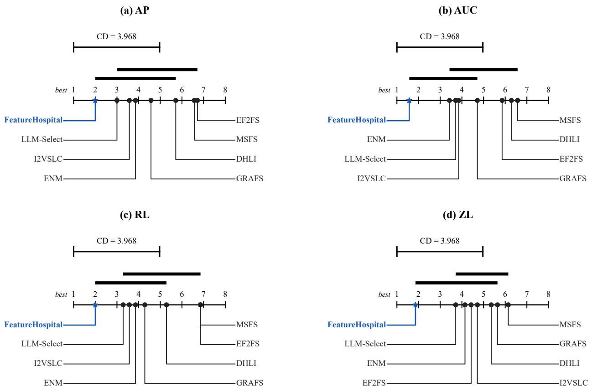  
Figure 5: Critical diference diagrams for AP, AUC, RL, and ZL over the seven datasets. Lower average ranks indicate better overall performance. Methods connected by the same thick horizontal line are not significantly diferent according to the Nemenyi post-hoc test at α = 0.05 (CD = 3.968).

Randomizing either the triage or consultation stage also leads to clear performance degradation. Random Triage may activate Departments that are unrelated to the diagnosed issues, whereas Random Consultation may select Loss Medicines that do not match the assigned problems. Both variants obtain worse average results than the complete method under all four metrics. Their degradation and, in some cases, substantially larger standard deviations on mfeat and MIRFlickr indicate that appropriate issue routing and problem-specific medicine selection are important not only for efectiveness but also for the stability of the constructed objectives.

Replacing all LLM-based decisions with predefined rules produces the weakest or nearly weakest average performance on most metrics. The All Rule-Based Decisions variant achieves only 0.6781 AP and 0.6843 AUC, together with 0.2429 RL and 0.8354 ZL. This result suggests that fixed rules extracted from the Skills cannot fully capture the context-dependent interactions among dataset characteristics, diagnostic evidence, and candidate Loss Medicines. LLM-based reasoning is therefore useful for adapting the general knowledge encoded in the Skills to the specific conditions of each dataset.

The Single LLM Agent variant also performs consistently worse than the complete framework on average, despite occasionally obtaining strong results on individual datasets such as MIRFlickr. Collapsing diagnosis, routing, consultation, and objective reconciliation into one decision removes the explicit intermediate structure and role-specific context provided by the multi-agent workflow. Its lower average performance supports the use of specialized agents and staged collaboration rather than a single monolithic LLM call.

Among all ablations, Without Pharmacist is the strongest variant, achieving average results close to those of the complete framework. This indicates that the Specialist Doctors already provide generally reasonable initial medicines and weights. Nevertheless, the complete method remains better on average for every metric, showing that the Pharmacist provides a consistent additional benefit by removing overlaps, resolving conflicts, and balancing the contributions of independently prescribed objective terms. Overall, the complete

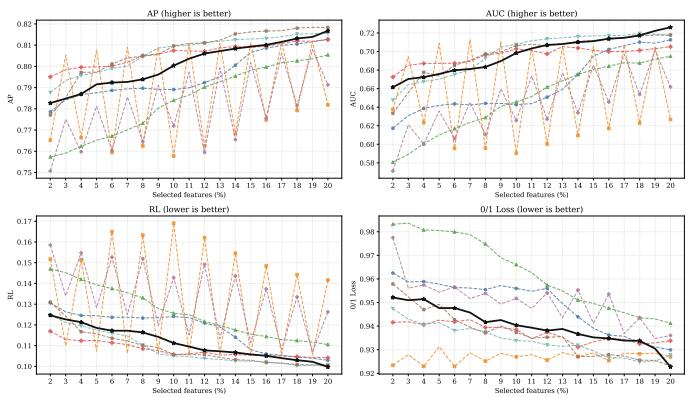

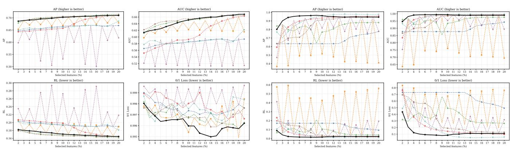  
MIRFlickr: Feature-Selection Ratio Comparison  
Figure 7: Performance under diferent feature selection ratios on MIRFlickr and mfeat. Higher values are preferred for AP and AUC, whereas lower values are preferred for RL and ZL.

DHLI EF2FS ENM GRAFS I2VSLC MSFS LLM-Select Our  
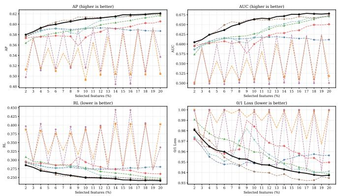  
DHLI EF2FS ENM GRAFS I2VSLC MSFS LLM-Select Our  
mfeat: Feature-Selection Ratio Comparison

# Figure 6: Performance under diferent feature selection ratios on SCENE and VOC07. Higher values are preferred for AP and AUC, whereas lower values are preferred for RL and ZL.

DHLI EF2FS ENM GRAFS I2VSLC MSFS LLM-Select Ours

DHLI EF2FS ENM GRAFS I2VSLC MSFS LLM-Select Ours

ablation results confirm that the efectiveness of Feature-Hospital arises from the combined contributions of datasetspecific objective components, structured triage and consultation, LLM-based decisions, multi-agent specialization, and final objective reconciliation.

## C Skills & Prompt

This appendix specifies the prompts and reusable procedural skills used by FeatureHospital. A runtime request at stage s is assembled as

$$
P _ { s } = \bigl [ I _ { s } ; K _ { s } ; C _ { s } ( \mathcal { D } ) ; O _ { s } \bigr ] ,\tag{16}
$$

where $I _ { s }$ is the stage instruction, $K _ { s }$ is static skill knowledge, $C _ { s } ( \mathcal { D } )$ is dataset-specific runtime context, and $O _ { s }$ is the output contract. The boxes below report the static instructions and skills. Large dataset-specific JSON payloads are represented by named input slots, because their values change with the dataset but their schemas do not.

We use prompt for the role, task, constraints and output schema sent to the LLM. We use skill for a reusable procedural capability with an applicability condition, an execution procedure, tool interactions, a stopping condition, and validation rules. All six specialist skills use dataset-independent loss catalogs; the LLM selects only among implemented entries and cannot synthesize a new loss.

## C.1 Dataset Analysis

Dataset analysis first computes deterministic statistics from $( \mathcal { X } _ { t r } , Y _ { t r } )$ . Rule-confirmed findings are then passed to the LLM only for concise diagnostic wording. Thus, the LLM does not decide whether an abnormality exists at this stage.

## Dataset Issue-Card Prompt

User-message opening. “You are generating category-level dataset issue cards for a multi-label feature selection triage system.” The message states that the supplied findings are already rule-confirmed and grouped by category, with fixed finding\_role, metrics, triggered rules, afected items, and explanations.

Exact runtime payload fields. After the static instruction, the prompt appends an Input JSON object containing dataset\_name, outer-training basic\_info, and the full deterministic issue\_cards. Each card includes its identifiers, category, abnormality summary, confirmed issue tags, and complete protected finding evidence.

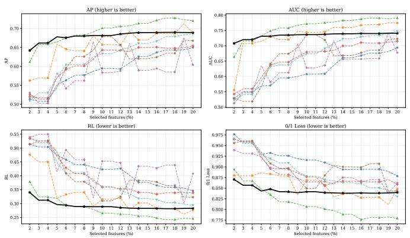  
DHLI EF2FS ENM GRAFS I2VSLC MSFS LLM-Select Our

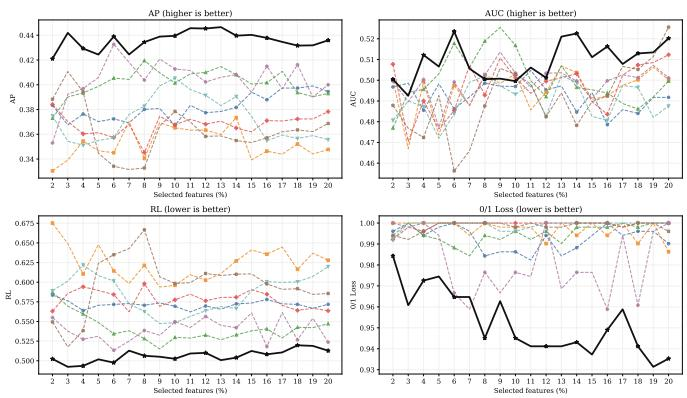  
DHLI EF2FS ENM GRAFS I2VSLC MSFS LLM-Select Ours  
Figure 8: Performance under diferent feature selection ratios on emotions and 3Sources. Higher values are preferred for AP and AUC, whereas lower values are preferred for RL and ZL.

Task.

1. Write one short diagnosis\_sentence for every confirmed finding.

2. Write one category\_diagnostic\_summary for each card.

3. Write handoff\_notes indicating which canonical problem department may need the card.

Constraints. The prompt explicitly says: do not decide whether an issue exists; remove an issue; add an issue tag; change finding\_role, level, severity, confidence, afected items, triggered rules, evidence, or metric dictionaries; or recommend modules, losses, or weights. It also prohibits selected features, rankings, training, baselines, classifiers, and test metrics. Only concise diagnostic text may change.

Output. Return JSON only. The top-level field is issue\_cards; each item contains card\_id, category\_diagnostic\_summary, handoff\_notes, and a list of {issue\_tag, diagnosis\_sentence} pairs.

Repair and failure behavior. A schema or protected-field violation causes a bounded retry whose user message includes the previous validation error. Under the public protocol’s default fail policy, exhausted retries terminate that seed. An explicit fallback mode exists only for diagnostic runs and is not used for reported LLM results.

## Deterministic Statistical Profiling Skill

Applicability. Run for every input dataset before any LLM decision. All statistics are computed from the currently available analysis partition.

## Procedure and tools.

1. Basic-scale profiler: compute sample, feature, label, and view counts; feature-to-sample ratio; label-to-sample ratio; and top-k budget indicators.

2. Label-distribution profiler: compute per-label frequency, positive counts, imbalance ratio, Gini coeficient, label cardinality, label density, and rare-label statistics.

3. Feature-quality profiler: compute missing and non-finite rates, zero rates, variance, unique-value ratios, scale heterogeneity, and outlier indicators.

4. Feature-redundancy profiler: compute absolute feature correlations, high-correlation edge density, maximum local correlation, duplicate rate, efective rank, and redundant-cluster statistics.

5. Label-dependency profiler: compute label correlations, Jaccard overlap, positive and negative dependency edges, components, clusters, and near-duplicate label groups.

6. Multi-view profiler: compute view sizes, sparsity, missingness, scale heterogeneity, relevance, and reliability differences.

7. Local-structure profiler: construct a fixed neighborhood graph and compute local label disagreement, consistency, hubness, and feature-label neighborhood alignment.

8. Feature-label profilers: compute relevance strength, specificity, concentration, weak-signal indicators, subspace alignment, and optional MI/CMI complementarity statistics.

The resulting measurements are evaluated by the fixed diagnostic rule catalog. A triggered rule produces a finding with a fixed issue tag, finding role, severity, confidence, evidence metrics, and afected items. Nine category cards organize these findings: basic scale, label distribution, feature quality, feature redundancy, label dependency, multi-view structure, local structure, feature-label relevance, and feature-label space structure.

Termination. Stop after every applicable profiler has either produced its statistics or explicitly recorded that the required data structure is unavailable.

Validation. Array dimensions must agree with (n, d, L); view slices must cover valid feature indices; statistics used by a triggered rule must be present and finite when defined; and no LLM-generated issue may enter the confirmed finding set.

<table><tr><td>Dataset</td><td>Full FeatureHospital</td><td>Backbone Only</td><td>Random Triage</td><td>Random Consultation</td><td>Without Pharmacist</td><td>All Rule-Based Decisions</td><td>Single LLM Agent</td></tr><tr><td colspan="8">AP↑</td></tr><tr><td>SCENE</td><td> $\mathbf { 0 . 8 0 1 1 \pm 0 . 0 0 4 1 }$ </td><td> $0 . 7 8 9 2 \pm 0 . 0 0 3 9$ </td><td> $0 . 7 9 5 6 \pm 0 . 0 0 6 2$ </td><td> $0 . 7 8 9 3 \pm 0 . 0 0 4 2$ </td><td> $0 . 8 0 0 3 \pm 0 . 0 0 4 2$ </td><td> $0 . 7 9 9 4 \pm 0 . 0 0 4 4$ </td><td> $0 . 7 9 6 3 \pm 0 . 0 0 4 3$ </td></tr><tr><td>yeast</td><td> $0 . 6 9 7 6 \pm 0 . 0 0 8 1$ </td><td> $\mathbf { 0 . 6 9 9 5 \pm 0 . 0 0 7 3 }$ </td><td> $0 . 6 9 4 9 \pm 0 . 0 0 9 7$ </td><td> $0 . 6 9 1 0 \pm 0 . 0 0 8 4$ </td><td> $0 . 6 9 7 5 \pm 0 . 0 0 7 8$ </td><td> $0 . 6 9 7 3 \pm 0 . 0 0 8 0$ </td><td> $0 . 6 9 7 7 { \scriptstyle \pm 0 . 0 0 8 3 }$ </td></tr><tr><td>VOC07</td><td> $\mathbf { 0 . 6 0 7 3 \pm 0 . 0 0 4 2 }$ </td><td> $0 . 6 0 5 1 \pm 0 . 0 0 3 9$ </td><td> $0 . 6 0 1 9 \pm 0 . 0 0 9 4$ </td><td> $0 . 6 0 5 3 \pm 0 . 0 0 4 8$ </td><td> $\underline { { 0 . 6 0 7 3 \pm 0 . 0 0 4 5 } }$ </td><td> $0 . 5 9 3 6 \pm 0 . 0 0 4 5$ </td><td> $0 . 6 0 1 4 \pm 0 . 0 0 4 2$ </td></tr><tr><td>MIRFlickr</td><td> $0 . 7 0 1 1 \pm 0 . 0 0 4 8$ </td><td> $0 . 7 0 0 3 \pm 0 . 0 0 4 4$ </td><td> $0 . 7 0 1 5 { \scriptstyle \pm 0 . 0 0 4 5 }$ </td><td> $0 . 6 8 8 7 \pm 0 . 0 1 6 7$ </td><td> $0 . 7 0 1 1 \pm 0 . 0 0 4 7$ </td><td> $0 . 6 9 8 5 \pm 0 . 0 0 4 3$ </td><td> $\mathbf { 0 . 7 0 1 7 \pm 0 . 0 0 4 1 }$ </td></tr><tr><td>mfeat</td><td> $\mathbf { 0 . 9 3 6 0 { \pm 0 . 0 0 5 6 } }$ </td><td> $0 . 9 0 7 1 \pm 0 . 0 0 5 6$ </td><td> $0 . 8 7 0 0 \pm 0 . 0 9 0 5$ </td><td> $0 . 9 2 1 7 \pm 0 . 0 2 1 3$ </td><td> $0 . 9 2 3 5 { \scriptstyle \pm 0 . 0 0 7 7 }$ </td><td> $0 . 8 8 6 7 \pm 0 . 0 0 5 6$ </td><td> $0 . 9 2 1 7 \pm 0 . 0 0 7 4$ </td></tr><tr><td>emotions</td><td> $0 . 6 7 8 3 \pm 0 . 0 1 5 6$ </td><td> $0 . 6 7 8 3 \pm 0 . 0 1 5 6$ </td><td> $0 . 6 7 9 3 \pm 0 . 0 1 5 5$ </td><td> $0 . 6 7 8 7 \pm 0 . 0 1 4 2$ </td><td> $0 . 6 7 8 3 \pm 0 . 0 1 3 9$ </td><td> $\mathbf { 0 . 6 7 9 6 \pm 0 . 0 1 3 7 }$ </td><td> $0 . 6 7 7 2 \pm 0 . 0 1 1 7$ </td></tr><tr><td>3Sources</td><td> $0 . 4 3 5 4 \pm 0 . 0 3 0 4$ </td><td> $0 . 4 1 3 5 \pm 0 . 0 2 7 7$ </td><td> $0 . 4 1 7 5 \pm 0 . 0 3 2 0$ </td><td> $0 . 4 0 1 0 \pm 0 . 0 3 0 7$ </td><td> $\mathbf { 0 . 4 3 6 4 \pm 0 . 0 2 9 4 }$ </td><td> $0 . 3 9 2 0 \pm 0 . 0 2 8 6$ </td><td> $0 . 4 1 7 9 \pm 0 . 0 3 4 4$ </td></tr><tr><td>Average</td><td>0.6938</td><td>0.6847</td><td>0.6801</td><td>0.6823</td><td>0.6921</td><td>0.6781</td><td>0.6877</td></tr><tr><td colspan="8">AUC↑</td></tr><tr><td>SCENE</td><td> $\mathbf { 0 . 6 9 7 0 { \pm } 0 . 0 0 5 0 }$ </td><td> $0 . 6 7 8 4 \pm 0 . 0 0 5 8$ </td><td> $0 . 6 8 9 1 \pm 0 . 0 1 0 5$ </td><td> $0 . 6 7 6 8 \pm 0 . 0 0 6 9$ </td><td> $0 . 6 9 6 2 \pm 0 . 0 0 5 3$ </td><td> $0 . 6 9 5 4 \pm 0 . 0 0 7 1$ </td><td> $0 . 6 9 0 5 \pm 0 . 0 0 7 5$ </td></tr><tr><td>yeast</td><td> $\underline { { 0 . 6 1 9 6 \pm 0 . 0 0 8 3 } }$ </td><td> $\mathbf { 0 . 6 2 1 7 \pm 0 . 0 0 5 8 }$ </td><td> $0 . 6 1 4 9 \pm 0 . 0 1 3 6$ </td><td> $0 . 6 0 7 5 \pm 0 . 0 0 9 9$ </td><td> $0 . 6 1 9 6 \pm 0 . 0 0 7 6$ </td><td> $0 . 6 1 9 2 \pm 0 . 0 0 6 4$ </td><td> $0 . 6 1 8 0 \pm 0 . 0 0 8 7$ </td></tr><tr><td>VOC07</td><td>0.6548 ± 0.0089</td><td> $0 . 6 5 1 1 \pm 0 . 0 0 9 3$ </td><td> $0 . 6 4 4 3 \pm 0 . 0 1 8 7$ </td><td> $0 . 6 5 0 3 \pm 0 . 0 1 2 0$ </td><td> $\mathbf { 0 . 6 5 6 1 \pm 0 . 0 0 9 5 }$ </td><td> $0 . 6 2 2 6 \pm 0 . 0 0 7 7$ </td><td> $0 . 6 4 0 0 \pm 0 . 0 1 0 5$ </td></tr><tr><td>MIRFlickr</td><td> $0 . 6 4 7 4 { \scriptstyle \pm 0 . 0 0 6 8 }$ </td><td> $0 . 6 4 5 6 \pm 0 . 0 0 6 6$ </td><td> $0 . 6 4 7 3 \pm 0 . 0 0 6 1$ </td><td> $0 . 6 2 8 1 \pm 0 . 0 2 4 8$ </td><td> $0 . 6 4 7 1 \pm 0 . 0 0 6 7$ </td><td> $0 . 6 4 2 3 \pm 0 . 0 0 6 5$ </td><td> $\mathbf { 0 . 6 4 7 6 \pm 0 . 0 0 7 1 }$ </td></tr><tr><td>mfeat</td><td> $\mathbf { 0 . 9 8 7 1 \pm 0 . 0 0 2 4 }$ </td><td> $0 . 9 8 0 1 \pm 0 . 0 0 2 2$ </td><td> $0 . 9 6 1 7 \pm 0 . 0 4 0 3$ </td><td> $0 . 9 8 3 1 \pm 0 . 0 0 8 3$ </td><td> $0 . 9 8 3 6 \pm 0 . 0 0 3 0$ </td><td> $0 . 9 7 1 6 \pm 0 . 0 0 2 0$ </td><td> $0 . 9 8 3 0 \pm 0 . 0 0 3 0$ </td></tr><tr><td>emotions</td><td> $0 . 7 3 2 6 \pm 0 . 0 1 6 9$ </td><td> $0 . 7 3 2 6 \pm 0 . 0 1 6 9$ </td><td> $0 . 7 3 3 8 \pm 0 . 0 1 6 4$ </td><td> $0 . 7 3 3 4 \pm 0 . 0 1 5 5$ </td><td> $\mathbf { 0 . 7 3 5 0 \pm 0 . 0 1 6 4 }$ </td><td> $\underline { { 0 . 7 3 4 7 \pm 0 . 0 1 7 4 } }$ </td><td> $0 . 7 3 4 4 \pm 0 . 0 1 6 1$ </td></tr><tr><td>3Sources</td><td> $\mathbf { 0 . 5 1 0 9 \pm 0 . 0 1 7 7 }$ </td><td> $0 . 4 9 3 2 \pm 0 . 0 1 7 5$ </td><td> $0 . 5 0 0 9 \pm 0 . 0 2 2 5$ </td><td> $0 . 4 9 7 5 \pm 0 . 0 2 0 4$ </td><td> $\underline { { 0 . 5 0 7 9 \pm 0 . 0 2 5 0 } }$ </td><td> $0 . 5 0 4 2 \pm 0 . 0 3 1 0$ </td><td> $0 . 4 9 1 9 \pm 0 . 0 2 3 2$ </td></tr><tr><td></td><td></td><td>0.6861</td><td>0.6846</td><td>0.6824</td><td>0.6922</td><td>0.6843</td><td>0.6865</td></tr><tr><td>Average</td><td>0.6928</td><td></td><td></td><td></td><td></td><td></td><td></td></tr></table>

Table 8: Ablation results of FeatureHospital in terms of AP and AUC (mean ± standard deviation). Higher values indicate better performance. The Average row reports the arithmetic mean across the seven datasets. The best and second-best results are highlighted in bold and underlined, respectively. Rankings are determined using the unrounded results.

## Issue-Card Rendering Skill

Applicability. Apply after deterministic profiling has produced grouped, rule-confirmed findings.

Procedure. Preserve every protected field, ask the LLM only for diagnostic sentences, category summaries, and handof notes, parse the returned JSON, and merge only those textual fields into the deterministic cards.

Tool interaction. The skill consumes the statistical profile and confirmed-finding catalog. It does not call an optimizer, classifier, feature selector, or evaluation tool.

3. Activate a department only when it represents an independent downstream problem.

context\_only, or inactive.

4. If another activated department suficiently explains a problem, record absorbed\_by; retain background findings in context\_only.

Termination and validation. Accept the response only if all returned card and issue identifiers already exist and all protected evidence fields are unchanged. Invalid JSON or a semantic mismatch triggers a bounded repair attempt. The deterministic card may replace the LLM result only when explicit diagnostic fallback mode is enabled; under the reported FH-Codefail policy, exhausted retries terminate the seed.

5. Copy only relevant core metrics and explain every routing decision.

Allowed departments. LABEL\_IMBALANCE, FEATURE\_REDUNDANCY,

VIEW\_QUALITY\_IMBALANCE, LABEL\_DEPENDENCY, FEATURE\_QUALITY\_DEFECT, and IARET

## C.2 Triage

## Triage-Doctor Prompt

User-message opening. “You are a department-routing triage agent for a dataset-intrinsic diagnosis system.” The prompt states that every issue-card finding is already marked abnormal, context, or beneficial and carries its metrics, afected items, and diagnostic summary. Task.

1. Map confirmed problems to the allowed specialist departments.

LOCAL\_LABEL\_INCONSISTENCY.

2. Assign one of activate, absorbed, supporting,

Exact runtime payload fields. The appended JSON contains dataset\_name, outer-training basic\_info, all issue\_cards, department\_responsibilities, and routing\_status\_values. No precomputed routing answer is included. The model must infer each disposition from the cards, the fixed six-department responsibility catalog, and the routing rules.

Constraints. Do not invent a department, issue tag, metric, module, loss, or weight. Do not prescribe an objective or use primary/secondary priority. Source issues and metrics must be copied from the issue cards. The prompt additionally states that FEATURE\_BUDGET\_PRESSURE is emitted deterministically as a global constraint and must not be assigned to a department. Return JSON only.

Absorption instructions. Minor-label signal weakness and label-signal imbalance are routed to LABEL\_IMBALANCE; conditional relevance dependence is routed to LABEL\_DEPENDENCY; generic weak signal, predictability weakness, or noncompactness is routed only through a confirmed root cause owned by an implemented department, otherwise it remains context. The prompt also treats MULTI\_VIEW\_STRUCTURE as context unless a view abnormality exists, LABEL\_SUBSPACE\_NONCOMPACTNESS as context unless directly usable by an implemented department, and LOCAL\_LABEL\_CONSISTENCY as context/beneficial rather than local inconsistency.

<table><tr><td>Dataset</td><td>Full FeatureHospital</td><td>Backbone Only</td><td>Random Triage</td><td>Random Consultation</td><td>Without Pharmacist</td><td>All Rule-Based Decisions</td><td>Single LLM Agent</td></tr><tr><td colspan="8">RL↓</td></tr><tr><td>SCENE</td><td> $\mathbf { 0 . 1 1 1 3 \pm 0 . 0 0 3 3 }$ </td><td> $0 . 1 1 8 7 \pm 0 . 0 0 3 4$ </td><td> $0 . 1 1 4 5 \pm 0 . 0 0 4 6$ </td><td> $0 . 1 1 8 7 \pm 0 . 0 0 3 7$ </td><td> $\underline { { 0 . 1 1 1 8 \pm 0 . 0 0 3 6 } }$ </td><td> $0 . 1 1 2 2 \pm 0 . 0 0 3 6$ </td><td> $0 . 1 1 4 2 \pm 0 . 0 0 3 9$ </td></tr><tr><td>yeast</td><td> $0 . 2 5 0 1 \pm 0 . 0 0 7 0$ </td><td> $\mathbf { 0 . 2 4 9 2 \pm 0 . 0 0 5 6 }$ </td><td> $0 . 2 5 3 7 \pm 0 . 0 1 0 0$ </td><td> $0 . 2 5 7 3 \pm 0 . 0 0 8 7$ </td><td> $0 . 2 5 0 0 { \scriptstyle \pm 0 . 0 0 6 5 }$ </td><td> $0 . 2 5 1 5 \pm 0 . 0 0 6 8$ </td><td> $0 . 2 5 0 7 \pm 0 . 0 0 6 9$ </td></tr><tr><td>VOC07</td><td> $0 . 2 5 4 4 \pm 0 . 0 0 5 9$ </td><td> $0 . 2 5 6 7 \pm 0 . 0 0 5 6$ </td><td> $0 . 2 6 0 9 \pm 0 . 0 1 1 6$ </td><td> $0 . 2 5 7 2 \pm 0 . 0 0 7 1$ </td><td> $\mathbf { 0 . 2 5 4 2 \pm 0 . 0 0 6 2 }$ </td><td> $0 . 2 7 4 1 \pm 0 . 0 0 5 3$ </td><td> $0 . 2 6 2 8 \pm 0 . 0 0 5 9$ </td></tr><tr><td>MIRFlickr</td><td> $\underline { { 0 . 1 7 1 6 \pm 0 . 0 0 4 0 } }$ </td><td> $0 . 1 7 2 4 \pm 0 . 0 0 4 1$ </td><td> $0 . 1 7 1 7 \pm 0 . 0 0 3 9$ </td><td> $0 . 1 7 8 5 \pm 0 . 0 0 9 3$ </td><td> $0 . 1 7 1 6 \pm 0 . 0 0 4 0$ </td><td> $0 . 1 7 3 7 \pm 0 . 0 0 4 0$ </td><td> $\mathbf { 0 . 1 7 0 4 \pm 0 . 0 0 4 0 }$ </td></tr><tr><td>mfeat</td><td> $\mathbf { 0 . 0 2 8 3 \pm 0 . 0 0 3 8 }$ </td><td> $0 . 0 4 1 2 \pm 0 . 0 0 3 6$ </td><td> $0 . 0 6 6 0 \pm 0 . 0 5 5 9$ </td><td> $0 . 0 3 5 1 \pm 0 . 0 1 1 7$ </td><td> $0 . 0 3 4 2 \pm 0 . 0 0 4 7$ </td><td> $0 . 0 5 3 5 \pm 0 . 0 0 3 1$ </td><td> $0 . 0 3 4 7 \pm 0 . 0 0 4 7$ </td></tr><tr><td>emotions</td><td> $0 . 2 9 4 0 \pm 0 . 0 1 6 9$ </td><td> $0 . 2 9 3 9 \pm 0 . 0 1 6 9$ </td><td> $\mathbf { 0 . 2 9 2 5 \pm 0 . 0 1 6 9 }$ </td><td> $0 . 2 9 3 4 \pm 0 . 0 1 5 3$ </td><td> $0 . 2 9 4 3 \pm 0 . 0 1 4 3$ </td><td> $\underline { { 0 . 2 9 3 4 } } \pm 0 . 0 1 4 5$ </td><td> $0 . 2 9 4 8 \pm 0 . 0 1 3 6$ </td></tr><tr><td>3Sources</td><td> $\mathbf { 0 . 5 0 5 7 \pm 0 . 0 3 5 8 }$ </td><td> $0 . 5 2 2 4 \pm 0 . 0 2 9 8$ </td><td> $0 . 5 2 7 0 \pm 0 . 0 3 8 9$ </td><td> $0 . 5 3 8 3 \pm 0 . 0 3 0 2$ </td><td> $0 . 5 1 2 8 \pm 0 . 0 3 5 1$ </td><td> $0 . 5 4 2 0 \pm 0 . 0 2 9 2$ </td><td> $0 . 5 2 7 6 \pm 0 . 0 3 3 1$ </td></tr><tr><td>Average</td><td>0.2308</td><td>0.2363</td><td>0.2409</td><td>0.2398</td><td>0.2327</td><td>0.2429</td><td>0.2364</td></tr><tr><td colspan="8">ZL↓</td></tr><tr><td>SCENE</td><td> $\mathbf { 0 . 9 3 9 9 } \pm \mathbf { 0 . 0 0 3 3 }$ </td><td> $0 . 9 5 4 3 \pm 0 . 0 0 1 5$ </td><td> $0 . 9 4 6 8 \pm 0 . 0 0 6 4$ </td><td> $0 . 9 5 3 8 \pm 0 . 0 0 3 9$ </td><td> $0 . 9 4 1 8 \pm 0 . 0 0 3 6$ </td><td> $0 . 9 4 0 0 { \scriptstyle \pm 0 . 0 0 2 7 }$ </td><td> $0 . 9 4 3 8 \pm 0 . 0 0 2 8$ </td></tr><tr><td>yeast</td><td> $0 . 8 7 9 0 \pm 0 . 0 1 2 2$ </td><td> $\mathbf { 0 . 8 7 5 2 \pm 0 . 0 1 1 4 }$ </td><td> $0 . 8 7 6 5 \pm 0 . 0 1 0 9$ </td><td> $0 . 8 8 0 8 \pm 0 . 0 1 0 9$ </td><td> $0 . 8 7 9 8 \pm 0 . 0 1 1 8$ </td><td> $0 . 8 7 8 1 \pm 0 . 0 1 0 5$ </td><td> $0 . 8 7 8 1 \pm 0 . 0 1 1 9$ </td></tr><tr><td>VOC07</td><td> $\mathbf { 0 . 9 5 1 4 \pm 0 . 0 0 2 9 }$ </td><td> $0 . 9 5 3 8 \pm 0 . 0 0 3 4$ </td><td> $0 . 9 5 7 1 \pm 0 . 0 0 8 7$ </td><td> $0 . 9 5 3 9 \pm 0 . 0 0 4 6$ </td><td> $\underline { { 0 . 9 5 1 6 \pm 0 . 0 0 3 2 } }$ </td><td> $0 . 9 6 5 7 \pm 0 . 0 0 3 4$ </td><td> $0 . 9 5 4 8 \pm 0 . 0 0 2 5$ </td></tr><tr><td>MIRFlickr</td><td> $\mathbf { 0 . 9 9 6 2 \pm 0 . 0 0 0 4 }$ </td><td> $0 . 9 9 6 4 \pm 0 . 0 0 0 5$ </td><td> $0 . 9 9 6 2 \pm 0 . 0 0 0 8$ </td><td> $0 . 9 9 7 1 \pm 0 . 0 0 1 1$ </td><td> $0 . 9 9 6 5 \pm 0 . 0 0 0 4$ </td><td> $0 . 9 9 6 9 \pm 0 . 0 0 0 8$ </td><td> $0 . 9 9 6 8 \pm 0 . 0 0 0 8$ </td></tr><tr><td>mfeat</td><td> $\mathbf { 0 . 1 3 6 4 \pm 0 . 0 0 9 9 }$ </td><td> $0 . 1 8 9 8 \pm 0 . 0 1 1 4$ </td><td> $0 . 2 6 2 5 \pm 0 . 1 7 8 5$ </td><td> $0 . 1 5 9 5 { \scriptstyle \pm 0 . 0 4 1 5 }$ </td><td> $0 . 1 5 9 9 \pm 0 . 0 1 2 4$ </td><td> $0 . 2 3 2 0 \pm 0 . 0 1 1 0$ </td><td> $0 . 1 6 6 1 \pm 0 . 0 1 0 9$ </td></tr><tr><td>emotions</td><td> $0 . 8 4 5 2 \pm 0 . 0 1 9 7$ </td><td> $0 . 8 4 5 2 \pm 0 . 0 1 9 7$ </td><td> $0 . 8 4 5 1 \pm 0 . 0 1 9 3$ </td><td> $0 . 8 4 4 5 \pm 0 . 0 1 8 9$ </td><td> $0 . 8 4 3 5 \pm 0 . 0 1 8 0$ </td><td> $\mathbf { 0 . 8 4 2 1 \pm 0 . 0 1 8 3 }$ </td><td> $0 . 8 4 2 5 \pm 0 . 0 1 9 1$ </td></tr><tr><td>3Sources</td><td> $\mathbf { 0 . 9 5 2 2 \pm 0 . 0 2 2 1 }$ </td><td> $0 . 9 7 7 6 \pm 0 . 0 2 3 6$ </td><td> $0 . 9 7 3 1 \pm 0 . 0 2 5 8$ </td><td> $0 . 9 7 8 5 \pm 0 . 0 2 6 0$ </td><td> $0 . 9 5 5 5 { \scriptstyle \pm 0 . 0 2 6 9 }$ </td><td> $0 . 9 9 2 7 \pm 0 . 0 0 8 5$ </td><td> $0 . 9 6 9 0 \pm 0 . 0 3 1 2$ </td></tr><tr><td>Average</td><td>0.8143</td><td>0.8275</td><td>0.8368</td><td>0.8240</td><td>0.8184</td><td>0.8354</td><td>0.8216</td></tr><tr><td></td><td></td><td></td><td></td><td></td><td></td><td></td><td></td></tr></table>

Table 9: Ablation results of FeatureHospital in terms of RL and ZL (mean ± standard deviation). Lower values indicate better performance. The Average row reports the arithmetic mean across the seven datasets. The best and second-best results are highlighted in bold and underlined, respectively. Rankings are determined using the unrounded results.

Output. The LLM is explicitly asked for department\_cases, activated\_departments, absorbed\_departments, and context\_only. Each department case records department, routing\_status, source\_cards, source\_issues, absorbed\_by, absorbed\_issues, supporting\_context\_issues,   
beneficial\_context\_issues,

problem\_strength, confidence, core\_metrics, affected\_items\_summary, and routing\_reason.

Validation, repair, and deterministic augmentation. The response is checked against the issue cards and registry. A rejected response is retried with the prior validation error and a JSON-only repair instruction. After acceptance, the runtime deterministically attaches global\_constraints and routing\_coverage. Under the public protocol’s default fail policy, exhausted retries terminate that seed. The independent deterministic router is used only when a diagnostic run explicitly requests deterministic mode or fallback behavior.

## Evidence-to-Department Routing Skill

Applicability. Apply once the issue-card set is complete.   
Canonical department registry.

## LABEL\_IMBALANCE

– Treatment: Uneven label frequency or signal and insufficient rare-label protection.

## FEATURE\_REDUNDANCY

– Treatment: Duplicated feature information and dominant local redundant groups.

VIEW\_QUALITY\_IMBALANCE

– Treatment: Cross-view diferences in quality, sparsity, scale, size, or allocation.

## LABEL\_DEPENDENCY

– Treatment: Positive, negative, clustered, or nearduplicate label relations.

FEATURE\_QUALITY\_DEFECT

– Treatment: Missing, non-finite, near-constant, outlierdriven, or unstable features.

LOCAL\_LABEL\_INCONSISTENCY

– Treatment: Misalignment between feature-space neighborhoods and label-set similarity.

## Procedure.

1. Separate abnormal findings from contextual and beneficial findings.

2. Send the original issue cards, outer-training basic information, Department responsibilities, and allowed statuses to the LLM without a precomputed routing answer.

3. Let the LLM construct a disposition within the sixdepartment registry using the stated independence and absorption logic.

4. Validate every returned source issue, context item, metric, status, and absorption reference against the issue cards and registry.

5. Treat top-k feature-budget pressure as a deterministic global constraint rather than a specialist department, and attach routing coverage after the LLM response is accepted.

6. If all LLM repairs fail under the reported protocol, fail that seed rather than changing the decision source silently.

Absorption knowledge. Weak feature-label signal or budget pressure concentrated on rare labels may support LABEL\_IMBALANCE; MULTI\_VIEW\_STRUCTURE alone is context; LOCAL\_LABEL\_CONSISTENCY is beneficial context rather than local inconsistency; and generic alignment or subspace findings remain context unless an implemented department can directly use them.

Termination and validation. Stop when every finding is activated, absorbed, supporting, a global constraint, or explicit context. An activated case must contain at least one abnormal source issue. Every department identifier must belong to the canonical registry, every absorbed\_by reference must point to an activated department, and all referenced metrics must exist in the source cards. The derived activated\_departments and absorbed\_departments lists must agree with the corresponding case statuses.

## C.3 Consultation

In the strict runner, each Doctor prompt is regenerated from the outer-training partition. Its dataset summary uses the 20% consultation budget with max $( 1 , \operatorname { f 1 0 0 } \Upsilon ( 0 . 2 0 { \star } \mathrm { d } )$ ) features. Before constructing Doctor inputs only, yeast.mat and emotions.mat are transformed featurewise by threebin equal-width discretization; the other datasets retain their loaded feature values. This as-run preprocessing therefore afects the Specialist Consultation payload but is not applied to the earlier Dataset Analysis payload or the later Pharmacist mechanics probe.

For notation, let $\boldsymbol { X } \in \mathbb { R } ^ { n \times d }$ be the feature matrix, $Y \in \{ 0 , 1 \} ^ { n \times L }$ the label matrix, $R \in \mathbb { R } ^ { d \times L }$ the featurelabel relevance matrix, and $z \in [ 0 , 1 ] ^ { d }$ the continuous selection mask. Most structural losses use the budget-comparable mask

$$
z _ { j } ^ { \mathrm { e f f } } = \frac { z _ { j } } { \sum _ { r = 1 } ^ { d } z _ { r } + \epsilon } k ,\tag{17}
$$

where k is the requested number of selected features.

## Shared Department-Doctor Prompt

User-message opening. The shared template says: “You are an expert in ⟨department domain⟩. You are acting as the doctor for the ⟨department name⟩ department.” It then appends that department’s task description.

Exact runtime sections. The user message contains, in order:

• full Domain knowledge;

• outer-training Dataset summary;

• the Activated department case, including its source cards, issues, strength, confidence, metrics, and routing reason;

• the Implemented capability catalog, containing the available losses and tools;

• Allowed parameter ranges;

• the Required JSON schema; and

• Previous validation error, if any.

General rules exactly conveyed. Return JSON only; do not invent losses, metrics, modules, formulas, departments, or parameters; and use only implemented catalog capabilities. The strict run set max\_candidates=3, so the prompt explicitly asked for one to three compact candidate objectives. It instructs the Doctor to order candidate\_objectives from most to least recommended and states that candidate\_objectives[0] must be the final recommended Department prescription because the pipeline selects it directly. Alternatives are included only for genuine evidence-supported mechanism trade-ofs.

Output. Return candidate\_objectives; each candidate contains a unique ID, rationale, enabled\_loss\_names, and parameter values within the catalog bounds.

Actual candidate-selection behavior. After schema validation, the runner selects the explicitly ranked first candidate and records policy=first\_ranked\_candidate, the decision source, and candidate count. It then converts that candidate into the Department prescription. No hidden candidate scoring, predictive validation, or automatic search is performed.

Failure behavior. All six Doctor selectors use bounded schema-repair attempts. On exhausted retries, the selector raises an error; the public protocol’s default fail policy terminates that seed. A deterministic replacement is available only through an explicitly selected diagnostic mode or fallback policy.

## Shared Specialist-Consultation Skill

Applicability. Instantiate this skill independently for every activated department.

## Procedure.

1. Read only the routing evidence assigned to the department.

2. Perform a department-specific diferential diagnosis and reject explanations that belong to peer departments.

3. Match confirmed symptoms to implemented loss mechanisms, considering benefit, side efect, degeneracy, and interaction risk.

4. Produce one to three schema-valid candidate prescriptions and valid parameters in descending recommendation order; the runtime selects the declared first choice without empirically evaluating alternatives.

5. Attach the exact formula, required tools, required inputs, intended efect, risks, and tuning bounds to every selected loss.

Termination and validation. Stop after one to three schemavalid candidates are produced. Every enabled loss and parameter must occur in the department catalog; all values must lie inside the declared ranges; and no peer-department loss may be introduced. On a validation failure, the same template is resent with the error populated in Previous validation error, if any.

## LABEL\_IMBALANCE Skill

Goal. Prevent frequent labels from dominating supervised feature relevance and protect rare labels under a limited top-k budget.

Applicability and diferential diagnosis. Use labelfrequency skew, rare-label counts, weak minor-label relevance, and label-wise contribution imbalance. Do not treat view allocation, feature duplication, or global label-graph structure as this department’s primary problem.

## Loss catalog.

1. label\_weighted\_relevance\_loss:

$$
\mathcal { L } _ { \mathrm { l w r } } = - \frac { 1 } { d L } \sum _ { j = 1 } ^ { d } z _ { j } \sum _ { \ell = 1 } ^ { L } w _ { \ell } R _ { j \ell } .
$$

It is the first-line response to head-label domination. Rarelabel weights are clipped by w\_max to avoid amplifying estimates based on very few positives.

2. rare\_label\_coverage\_loss:

$$
\mathcal { L } _ { \mathrm { r a r e } } = \frac { 1 } { \left| \mathcal { R } \right| } \sum _ { \ell \in \mathcal { R } } \left[ \rho \sum _ { j \in \mathrm { T o p } _ { m } ( R _ { : \ell } ) } R _ { j \ell } - \sum _ { j } z _ { j } ^ { \mathrm { e f f } } R _ { j \ell } \right] _ { + } .
$$

Use it when rare labels and budget pressure are both supported. A persistently zero loss is treated as nonbinding rather than evidence of a solved problem.

3. label\_contribution\_balance\_loss:

$$
\mathcal { L } _ { \mathrm { b a l } } = \mathrm { V a r } _ { \ell } \left( \frac { w _ { \ell } \sum _ { j } z _ { j } R _ { j \ell } } { \mathrm { m e a n } _ { q } ( w _ { q } \sum _ { j } z _ { j } R _ { j q } ) + \epsilon } \right) .
$$

Use a conservative dose when selected-feature contribution is strongly concentrated; excessive equalization may suppress genuinely strong labels.

4. budget\_penalty:

$$
{ \mathcal { L } } _ { \mathrm { b u d g e t } } = { \frac { ( \sum _ { j } z _ { j } - k ) ^ { 2 } } { k ^ { 2 } } } .
$$

This controls continuous mask mass when top-k pressure is present.

Tools. The losses consume label frequencies, $R , z ,$ and $k ;$ no additional department-specific tool is required.

Validation. Check that rare-label protection does not collapse overall relevance, that a coverage term is active when credited, and that the prescription does not attempt to solve view concentration or redundancy directly.

## FEATURE\_REDUNDANCY Skill

Goal. Prevent correlated or near-duplicate features from wasting the top-k budget while retaining correlated features that support diferent labels.

Applicability. Use high local maximum correlations, selected high-correlation pair fractions, or large redundant clusters. Broad edge density favors pairwise control; sparse but large local clusters favor cluster quota control.

Tool. sparse\_feature\_redundancy\_graph\_builder constructs a sparse feature-feature graph, label-profile-aware edge weights, redundant clusters, internal-correlation statistics, and selected-subset diagnostics. Its output is cached and

## shared by both losses.

## Loss catalog.

1. label\_aware\_pairwise\_redundancy\_loss:

$$
A _ { i j } = | \operatorname { c o r r } ( x _ { i } , x _ { j } ) | ^ { p _ { f } } \left[ \cos ( w \odot R _ { i : } , w \odot R _ { j : } ) \right] _ { + } ^ { p _ { \ell } } ,
$$

$$
\mathcal { L } _ { \mathrm { p a i r } } = \frac { \sum _ { ( i , j ) \in E } A _ { i j } z _ { i } ^ { \mathrm { e f f } } z _ { j } ^ { \mathrm { e f f } } } { \sum _ { ( i , j ) \in E } A _ { i j } + \epsilon } .
$$

It is applicable when highly correlated selected pairs also have similar label-relevance profiles.

2. redundant\_cluster\_quota\_loss:

$$
m _ { c } = \sum _ { j \in C _ { c } } z _ { j } ^ { \mathrm { e f f } } , \quad q _ { c } = \mathrm { c l i p } ( \lceil \rho _ { c } ^ { q } k \rceil C _ { c } \lvert / d \rceil , q _ { \operatorname* { m i n } } , q _ { \operatorname* { m a x } } ) ,
$$

$$
\mathcal { L } _ { \mathrm { q u o t a } } = \frac { \sum _ { c } \log ( 1 + | C _ { c } | ) \bar { r } _ { c } [ m _ { c } - q _ { c } ] _ { + } ^ { 2 } } { \sum _ { c } \log ( 1 + | C _ { c } | ) \bar { r } _ { c } + \epsilon } .
$$

It is preferred when a few large local redundant clusters can dominate selection.

Validation. The graph must remain sparse, penalties must be label-profile aware when available, and quotas must not remove correlated features merely because they serve rare labels or distinct views.

## VIEW\_QUALITY\_IMBALANCE Skill

Goal. Make relevance comparable across views and prevent harmful allocation caused by view size, sparsity, scale, or reliability diferences without enforcing uniform quotas.

Applicability. Use confirmed view-level quality heterogeneity, view-specific sparsity, feature-count imbalance, or selected-feature concentration. Feature-level defects remain the responsibility of FEATURE\_QUALITY\_DEFECT.

Tool. view\_quality\_profiler computes view IDs and slices, sizes, zero and missing rates, scale heterogeneity, relevance, reliability, quality, quality-aware target allocation, and selected-view diagnostics. One profile is reused by all view losses.

## Loss catalog.

1. view\_normalized\_relevance\_loss. Define $\begin{array} { r } { s _ { j } = \sum _ { \ell } u _ { \ell } R _ { j \ell } , a _ { v } = \mathrm { m e a n T o p } _ { m } \{ s _ { j } : j \in v \} + \epsilon , } \end{array}$ $\tilde { s } _ { j } = \mathrm { c l i p } \bar { ( } s _ { j } / a _ { v ( j ) } , 0 , c )$ , and $q _ { v } = ( \mathbin { \bar { \eta } } Q _ { v } + ( 1 - \eta ) U _ { v } ) ^ { p }$ Then

$$
\mathcal { L } _ { \mathrm { v n r } } = - \frac { \sum _ { j } z _ { j } ^ { \mathrm { e f f } } q _ { v ( j ) } \tilde { s } _ { j } } { k \ \mathrm { m e a n } _ { j } \left( q _ { v ( j ) } \tilde { s } _ { j } \right) + \epsilon } .
$$

Use it when raw relevance scores are not comparable across views.

2. adaptive\_view\_allocation\_loss. Let the normalized target πv mix quality, relevance, square-root view size, and a uniform prior; $t _ { v } = k \pi _ { v }$ , with tolerance interval $[ l _ { v } , u _ { v } ]$ . For $\begin{array} { r } { m _ { v } = \sum _ { j \in v } z _ { j } ^ { \mathrm { e f f } } , } \end{array}$

$$
\mathcal { L } _ { \mathrm { a l l o c } } = \frac { \sum _ { v } \alpha _ { u } [ m _ { v } - u _ { v } ] _ { + } ^ { 2 } + \alpha _ { l } [ l _ { v } - m _ { v } ] _ { + } ^ { 2 } } { k ^ { 2 } + \epsilon } .
$$

Use only for harmful concentration and retain a nonuniform, quality-aware target.

3. view\_coverage\_floor\_loss:

$$
\mathcal { L } _ { \mathrm { f l o o r } } = \frac { \sum _ { v : e _ { v } = 1 } [ f _ { v } - m _ { v } ] _ { + } ^ { 2 } } { \sum _ { v : e _ { v } = 1 } f _ { v } ^ { 2 } + \epsilon } ,
$$

where eligibility $e _ { v }$ requires suficient view quality, relevance, and budget, and $f _ { v }$ is a bounded fraction of the target. Use only when eligible views are excluded and k can support multi-view coverage.

Validation. Do not credit an inactive floor, do not force equal view counts, and check that normalization does not amplify a low-quality sparse view.

## LABEL\_DEPENDENCY Skill

Goal. Preserve useful positive, negative, clustered, and nearduplicate label relations without replacing feature selection with a heavy label predictor.

Applicability. Use confirmed dependency edges, label communities, mutually exclusive labels, or near-duplicate labels. Global label relations are distinct from sample-neighborhood inconsistency.

Tools. label\_dependency\_graph\_builder constructs positive and negative edges, edge weights, near-duplicate groups, and graph components. near\_duplicate\_label\_deweighting softly reduces repeated label counting and is not a standalone loss. Loss catalog.

1. label\_graph\_smoothed\_relevance\_loss. With $P ^ { + } = \operatorname { r o w N o r m } ( A ^ { + } )$

$$
R _ { j \ell } ^ { g } = ( 1 - \alpha ) R _ { j \ell } + \alpha \sum _ { m } P _ { \ell m } ^ { + } R _ { j m } ,
$$

$$
\mathcal { L } _ { \mathrm { g r a p h } } = - \frac { \sum _ { j } z _ { j } ^ { \mathrm { e f f } } \sum _ { \ell } u _ { \ell } R _ { j \ell } ^ { g } } { k \sum _ { \ell } u _ { \ell } + \epsilon } .
$$

Conservative smoothing lets weak labels borrow signal while limiting head-label propagation.

2. positive\_dependency\_cocoverage\_loss:

$$
\mathcal { L } _ { \mathrm { c o } } = - \frac { \sum _ { ( \ell , m ) \in E ^ { + } } A _ { \ell m } ^ { + } \sum _ { j } z _ { j } ^ { \mathrm { e f f } } R _ { j \ell } R _ { j m } } { \sum _ { ( \ell , m ) \in E ^ { + } } A _ { \ell m } ^ { + } + \epsilon } .
$$

Use when reliable positive edges should bejointly covered.

3. label\_cluster\_coverage\_loss. For $\begin{array} { r l } { R _ { j c } ^ { c } } & { { } = } \end{array}$ $\begin{array} { r } { | C _ { c } | ^ { - 1 } \sum _ { \ell \in C _ { c } } R _ { j \ell } ^ { g } , a _ { c } = \sum _ { j } z _ { j } ^ { \mathrm { e f f } } R _ { j c } ^ { c } , } \end{array}$ , and a top-m target τc,

$$
\mathcal { L } _ { \mathrm { c l u s t e r } } = \frac { \sum _ { c } \rho _ { c } [ \tau _ { c } - a _ { c } ] _ { + } } { \sum _ { c } \rho _ { c } + \epsilon } .
$$

It protects smaller label communities but competes for top-k capacity.

4. negative\_dependency\_separation\_loss:

$$
\mathcal { L } _ { \mathrm { n e g } } = \frac { \sum _ { ( \ell , m ) \in E ^ { - } } A _ { \ell m } ^ { - } \sum _ { j } z _ { j } ^ { \mathrm { e f f } } [ R _ { j \ell } ^ { \pm } R _ { j m } ^ { \pm } - \delta ] _ { + } } { \sum _ { ( \ell , m ) \in E ^ { - } } A _ { \ell m } ^ { - } + \epsilon } .
$$

This is a low-dose guard against same-direction support for mutually exclusive labels.

Validation. Positive smoothing must not propagate head-label dominance, negative edges must have adequate support, and overlapping relevance rewards must be exposed to the pharmacist for de-duplication.

## FEATURE\_QUALITY\_DEFECT Skill

Goal. Keep missing-heavy, non-finite, near-constant, outlierdriven, or statistically unstable features from occupying the selected subset.

Applicability and boundary. Use feature-level defects and relevance unreliability. Redundancy concerns relationships between features, while view-quality imbalance concerns aggregate view behavior. High zero rate alone is not a hardinvalid condition.

Tools. The catalog presents invalid\_feature\_filter as a conservative pre-optimization capability for identifying all-missing, unusably non-finite, constant, or singleunique-value features and exposing a valid-feature mask. The feature\_quality\_profiler computes per-feature missingness, non-finite rate, zero rate, variance, unique ratio, outlier rate, bootstrap relevance stability, robust-relevance consistency, defect score, and quality score. The resulting arrays are reusable across candidate losses.

## Loss catalog.

1. defective\_feature\_suppression\_loss:

$$
\mathcal { L } _ { \mathrm { d e f e c t } } = \frac { 1 } { k + \epsilon } \sum _ { j } z _ { j } ^ { \mathrm { e f f } } \mathrm { c l i p } ( d _ { j } , 0 , 1 ) ^ { p } .
$$

This is the safest first-line soft prior when a high feature defect score is confirmed.

2. unstable\_relevance\_penalty\_loss. With bootstrap aggregate score $\begin{array} { r } { s _ { b j } = \sum _ { \ell } u _ { \ell } R _ { j \ell } ^ { ( b ) } } \end{array}$

$$
h _ { j } = \mathrm { c l i p } \bigg ( \frac { \mathrm { s t d } _ { b } \big ( s _ { b j } \big ) } { \vert \mathrm { m e a n } _ { b } \big ( s _ { b j } \big ) \vert + \epsilon } , 0 , c \bigg ) ,
$$

$$
{ \mathcal { L } } _ { \mathrm { u n s t a b l e } } = { \frac { 1 } { k + \epsilon } } \sum _ { j } z _ { j } ^ { \mathrm { e f f } } ( h _ { j } / c ) ^ { p } .
$$

Use a small dose when relevance instability is confirmed;   
bootstrap labels with insuficient positives are excluded.

3. robust\_relevance\_consistency\_loss. Let $\begin{array} { r } { \boldsymbol { a } _ { j } = \sum _ { \ell } \boldsymbol { u } _ { \ell } | R _ { j \ell } ^ { \mathrm { r a w } } | } \end{array}$ and $\begin{array} { r } { \boldsymbol { b } _ { j } = \sum _ { \ell } \boldsymbol { u } _ { \ell } | R _ { j \ell } ^ { \mathrm { r o } \hat { \mathrm { b } } } | } \end{array}$ . Then

$$
q _ { j } = \left[ \frac { a _ { j } - b _ { j } } { a _ { j } + \epsilon } - \tau \right] _ { + } , \qquad \mathcal { L } _ { \mathrm { r o b u s t } } = \frac { 1 } { k + \epsilon } \sum _ { j } z _ { j } ^ { \mathrm { e f f } } q _ { j } ^ { p } .
$$

Use only when outlier-driven or robust-inconsistent relevance is supported.

Validation. The Doctor knowledge states that hard-invalid selected count should be zero and that soft penalties must not treat sparsity alone as a defect or erase rare-label event features merely because their relevance estimates are noisier. In the historical strict executor, however, the hard-invalid mask was recorded and assigned maximal defect risk but was not imposed as a hard constraint on the final argsort. Zero hardinvalid selections was therefore a requested diagnostic target, not a mechanical guarantee of the as-run optimizer.

## LOCAL\_LABEL\_INCONSISTENCY Skill

Goal. Prefer features that make feature-space neighborhoods label-consistent or locally discriminative when nearby samples have substantially diferent label sets.

Applicability and boundary. The triage evidence, rather than a single hard-coded issue tag, determines activation. The mismatch must be an independent sample-neighborhood problem, not merely a graph that can be constructed, global label dependency, a feature-quality artifact, or a view-scale artifact. Tool. local\_label\_consistency\_profiler robustly scales training features, builds one fixed training-only k-NN graph, separates reliable label-consistent and labelinconsistent edges, and computes edge reliability, local disagreement, rare-label dilution, neighborhood alignment, and per-feature local discriminative scores. The graph is not rebuilt during mask optimization.

## Loss catalog.

1. local\_discriminative\_relevance\_loss. With inconsistent edges $E _ { \mathrm { i n c } } ,$ consistent edges $E _ { \mathrm { { c o n } } } .$ , and reliability $a _ { u v }$

$$
\begin{array} { r l } & { s _ { j } ^ { \mathrm { l o c } } = \operatorname* { m e a n } _ { ( i , n ) \in E _ { \mathrm { i n c } } } a _ { i n } \big | x _ { i j } - x _ { n j } \big | } \\ & { ~ - \beta \operatorname* { m e a n } _ { ( i , p ) \in E _ { \mathrm { c o n } } } a _ { i p } \big | x _ { i j } - x _ { p j } \big | , } \end{array}
$$

$$
\mathcal { L } _ { \mathrm { l o c a l } } = - \frac { 1 } { k + \epsilon } \sum _ { j } z _ { j } ^ { \mathrm { e f f } } \widetilde { s } _ { j } ^ { \mathrm { l o c } } .
$$

This precomputed feature-level score is the first-line local treatment.

2. local\_inconsistent\_neighbor\_separation\_ loss. For the selected-space distance

$$
d _ { z } ( i , n ) = \frac { 1 } { k + \epsilon } \sum _ { j } z _ { j } ^ { \mathrm { e f f } } \mathrm { N o r m D i s t } ( x _ { i j } , x _ { n j } ) ,
$$

$$
\begin{array} { r } { \mathcal { L } _ { \mathrm { s e p } } = \operatorname * { m e a n } _ { ( i , n ) \in E _ { \mathrm { i n c } } } a _ { i n } \left[ \gamma - \left. d _ { z } ( i , n ) \right] \right| _ { + } ^ { 2 } . } \end{array}
$$

This direct separation term is optional and low-dose because an inconsistent edge may reflect ambiguity or label noise.

Validation. All graph construction uses training samples only; edge count is bounded; unreliable edges are filtered or downweighted; and local compactness must not collapse samples that share only a frequent label.

## C.4 Objective Construction

## Pharmacist Objective-Construction Prompt

Base user-message role. The message identifies the model as the Pharmacist for a multi-view multi-label feature-selection system. Department Doctors have examined activated Department cases and produced prescriptions; the Pharmacist must merge them into one compact, conflict-aware global objective without re-diagnosing the dataset or empirically validating prediction.

Base role boundary. The Pharmacist may use only confirmed dataset context, Doctor-selected losses, implemented formulas, tools, inputs, bounds, and mandatory global guardrails. It must not invent an issue, loss, formula, module, tool, metric, dataset, or department; run training, testing, KNN/classifier evaluation, or automatic tuning; reconsider a Doctor-disabled loss; or emit a loss absent from department\_prescriptions[\*].selected\_

losses. Every Doctor-selected loss must occur exactly once as enabled or disabled. Global guardrails must be copied unchanged and must not be duplicated among department losses. Base fusion rules. The prompt asks for one main relevance backbone, complementary treatments for distinct confirmed problems, conservative handling of top-k competition, deduplication of similar relevance rewards, preservation of tool dependencies and Doctor parameter bounds, fresh global roles, and a shared tool-execution plan. It permits keep, downweight, upweight, merge, and disable.

Exact runtime sections and order. The rendered user prompt contains:

1. [general description], [role boundary], [domain knowledge], [operating rules], and [reasoning checklist];

2. full outer-training [dataset\_pharmacist\_context]

3. [required\_global\_guardrails];

4. all [department\_prescriptions];

5. the inserted [final-dose contract];

6. a [doctor-derived provisional probe objective] containing every Doctor-selected loss at the first candidate’s initial settings;

7. [low-cost pharmacodynamic evidence], including term activity, loss values, gradient norms, efective pressure, cosine and top-k overlap, mechanism sensitivity, counterfactual micro-probes, cache information, and compact\_decision\_clues;

8. the fourteen-step [evidence-guided decision procedure]; and

9. [required JSON schema].

Final-dose contract. The base prompt and inserted evidence instructions agree that there is no later automatic tuning. The retained schema names initial\_weight and initial\_parameters denote the final operational dose consumed by the deterministic optimizer. Doctor-provided ranges are preserved only as catalog provenance; the output schema contains no executable search space.

Evidence-guided instructions. The inserted procedure tells the LLM to select exactly one primary relevance backbone when available; use problem strength and Doctor rationale; avoid mapping absolute gradient size directly to dose under Adam; inspect duplicate and opposing pressure; read compact clues before detailed probes; obey mechanical\_preferred\_status and conservative\_weight\_ceiling subject to stated exceptions; inspect mechanism sensitivity before a large dose change; retain distinct severe structural treatment when justified; and account for every Doctor-selected loss exactly once. Probe endpoint changes are explicitly described as objectivemechanics evidence, not predictive evidence.

Output and runtime normalization. The required JSON contains global\_loss\_blueprint, resolved\_conflicts, operational\_weight\_plan,

tool\_execution\_plan, and pharmacist\_summary. The blueprint contains global\_guardrail\_terms, selected\_terms, and disabled\_terms. Before validation, the runner injects the required global guardrails into the parsed response. A failed response is retried with the previous validation error and up to the first 6000 characters of the invalid response; no deterministic Pharmacist fallback is used by this strict runner.

## Low-Cost Pharmacodynamic Evidence Skill

Applicability. Run once after department prescriptions are available and before the pharmacist LLM call. The strict runner creates one additional 70/30 diagnostic split inside the outertraining partition with diagnostic seed zero, then uses only that inner-training part for the mechanics probe. It never uses the outer-test partition, a classifier, or a predictive metric.

Reusable tool preparation. Construct the shared relevance and label-weight profiles, then construct and cache each structural artifact only when a prescribed probe term requires it. This includes the label graph, feature-redundancy graph and clusters, view profile, feature-quality profile, and fixed local graph. Compatible artifacts are reused across all probe configurations. Label-graph construction and near-duplicate deweighting are skipped when no enabled label-dependency term requests them.

## Procedure.

1. Build a provisional objective containing all doctor-selected terms at doctor-proposed doses.

2. Run a short primary-backbone-only optimization probe.

3. At the initial mask and probed mask, compute each term’s unit loss, activity state, raw gradient norm, efective pressure relative to the primary term, gradient cosine with the primary, and promoted top-k overlap.

4. Flag near-duplicate pressure when pairwise gradient cosine is high and opposing pressure when it is substantially negative.

5. Probe core mechanism parameters at representative low and high values while reusing cached artifacts.

6. Run short objective-only counterfactuals: halve or increase a term’s dose, remove each non-primary term, vary core mechanism parameters, and add a doctor-selected term omitted by the provisional reference.

7. Summarize target-loss change, primary-loss change, top-k overlap, and budget-mass error into compact\_decision\_clues.

Interpretation boundary. These probes measure local objective mechanics, not predictive eficacy. Absolute gradient magnitude is not a direct dosage rule under Adam; negative cosine is a review flag rather than proof of harm; and an inactive floor can become active later.

Termination and validation. Stop after the bounded intervention list is exhausted. Verify that every probe uses training data only, cached artifacts have compatible signatures, no predictive metric was computed, and each clue can be traced to a doctor-selected term.

## Evidence-Guided Prescription-Fusion Skill

Applicability. Apply after low-cost evidence has been attached to the confirmed dataset context and doctor catalog. Decision procedure.

1. Select exactly one global primary relevance backbone unless no doctor prescribed a relevance term.

2. Use problem strength and doctor rationale to determine therapeutic necessity.

3. Prefer one representative when relevance terms exert nearduplicate pressure.

4. Read compact\_decision\_clues before detailed micro-probe records. A positive endpoint change means that the short intervention reduced that objective term, not that it improved prediction.

5. Follow mechanical\_preferred\_status for a nonbinding term unless it is the sole treatment for a severe confirmed issue; any exception must be justified and conservatively dosed.

6. Treat conservative\_weight\_ceiling as a hard ceiling unless a safe local intervention changes the topk set, improves the target endpoint by at least 0.02, and degrades the primary endpoint by no more than 0.01.

7. Do not regard a dose increase that lowers only its own loss while leaving top-k unchanged as useful dosage evidence.

8. Inspect mechanism sensitivity before making a large weight change.

9. Retain distinct structural treatments for severe problems even when they oppose the primary relevance gradient, but remove unnecessary duplicate pressure and excessive top-k competition.

10. If probes are neutral or mixed, use the confirmed diagnosis and a conservative doctor dose rather than retaining every provisional term.

Global role classes. Enabled terms are assigned one of primary, regularizer, supporting, or guardrail. Loss classes include relevance backbone, coverage/floor, redundancy/diversity, feature quality, local structure, allocation, defensive separation, and budget guardrail. These roles organize the final objective; they do not require a fixed number of auxiliary terms.

Termination. Stop when the objective is compact, every doctor-selected loss has exactly one status, all mandatory guardrails are copied, final weights and mechanism parameters are set, and the reusable-tool order is complete.

## Objective Blueprint Validation Skill

Schema validation. Every enabled term must copy its department, loss name, formula, required inputs, tools, and parameter bounds from one doctor-selected entry. Every disabled term must likewise refer to one doctor-selected entry and state whether it was disabled or merged. No loss may occur twice. Semantic validation. The primary role is unique when a relevance backbone exists; disabled doctor losses are not reconsidered; global guardrails are unchanged; final values lie within catalog bounds and respect evidence-derived ceilings; and all conflicts and exceptions have explicit reasons.

Execution validation. The tool plan must topologically precede every dependent loss and build each shareable artifact once. The accepted blueprint is then passed directly to deterministic mask optimization, where the final ranking is obtained from the learned feature scores z; no further LLM call or automatic tuning modifies the prescription.

## D Implementation Details

Given the constructed objective, we optimize a continuous feature mask $\mathbf { z } \in [ 0 , 1 ] ^ { d }$ on each training partition. The mask is parameterized as $\dot { { \bf z } } = \mathrm { s i g m o i d } ( { \bf a } / \bar { T } )$ , where a denotes the trainable logits and $T = 1 . 0$ . The logits are initialized using the relevance-based feature scores and optimized with Adam for 300 iterations. The learning rate is set to 0.03, with $\beta _ { 1 } = 0 . 9 , \beta _ { 2 } = 0 . 9 9 9$ , and $\epsilon = 1 0 ^ { - 8 }$ . No additional hyperparameter tuning is performed after objective construction.

For each random split, the objective is optimized once using a maximum feature budget of 20% of the original features. Features are ranked according to their learned mask values $z _ { j }$ . The feature subsets at selection ratios {2%, 4%, 6%, 8%, 10%, 12%, 14%, 16%, 18%, 20%} are obtained by taking prefixes of this ranking, where the number of selected features is max(1, ⌊rd⌋) for selection ratio r.

We randomly divide each dataset into 70% training data and 30% test data using ten fixed random seeds from 0 to 9. Following the evaluation protocol of the compared methods, we employ a multi-output 10-nearest-neighbor classifier for prediction. Training samples whose label vectors contain no positive label are removed, and labels without positive training examples are excluded from the corresponding split.

We report Average Precision (AP), macro-averaged AUC, Ranking Loss (RL), and exact-match zero-one loss (ZL). For each random split, a metric is first averaged over the ten feature-selection ratios. We then report the mean and sample standard deviation over the ten random splits. Higher values indicate better performance for AP and AUC, whereas lower values are preferred for RL and ZL.

## E Case Study

This section presents a traceable example from SCENE. SCENE is useful for this purpose because it contains several independently confirmed conditions, allowing the outputs of dataset analysis, triage, specialist consultation, and objective construction to be followed as one continuous chain. Numeric values are rounded for presentation, while issue names, decisions, and weights are copied from the persisted main-experiment artifacts.

## E.1 Dataset Analysis Trace

The first case examines whether the generated issue card faithfully summarizes the deterministic statistics. The input contains both extremely rare and extremely frequent labels, so the diagnosis can be checked directly against observed counts rather than judged only from natural-language plausibility.

## Case 1: SCENE Label-Distribution Analysis

Analysis boundary. Only the 3,080 outer-training samples were profiled; none of the 1,320 held-out samples contributed to the following statistics.

Observed evidence.

• Number of analyzed samples: 3,080; number of features: 634; number of labels: 33.

• Minimum label frequency: 0.000649, corresponding to 2 positive samples.

• Maximum label frequency: 0.968182, corresponding to 2,982 positive samples.

• Label-imbalance ratio: 1,491.0; label-frequency Gini: 0.6526.

• Rare labels: 13/33 = 39.39%; minimum positive count: 2.

Triggered findings.

• EXTREME\_LABEL\_FREQUENCY, severe;

• LABEL\_IMBALANCE, severe; and

• RARE\_LABELS, severe.

Generated diagnosis. “Label distribution is severely skewed, with extreme rare/common labels, a very large imbalance ratio, and many rare labels.” The card further states that positive frequencies vary severely and that the minimum positive count is only two.

Analysis. The diagnosis is supported by several independent statistics: the frequency extremes identify both tails, the imbalance ratio and Gini quantify global skew, and the rare-label count measures how widespread the low-frequency problem is. The afected labels are also explicitly identified, including a label with only two positives and a label present in more than 96% of samples. Consequently, the generated text neither invents an abnormality nor exaggerates a weak signal; it is a concise rendering of the confirmed training-only measurements. The split manifest independently records the training and test hashes, making the provenance ofthis profile auditable.

## E.2 Department Triage Trace

The second case tests whether related findings are routed to a coherent owner without activating a separate specialist for every issue tag. It also tests whether a beneficial observation is kept as context instead of being treated as a problem.

## Case 2: SCENE Evidence-to-Department Routing

Activated department. LABEL\_IMBALANCE, with problem strength 0.90 and confidence 1.00.   
Independent source issues.

• EXTREME\_LABEL\_FREQUENCY;

• LABEL\_IMBALANCE; and

• RARE\_LABELS and LOW\_SAMPLE\_PER\_LABEL.

## Absorbed findings.

• FEATURE\_BUDGET\_PRESSURE;

WEAK\_FEATURE\_LABEL\_SIGNAL\_FOR\_MINOR\_ LABELS; and

• LABEL\_SIGNAL\_IMBALANCE.

Supporting context. LARGE\_LABEL\_SPACE, FEATURE\_LABEL\_SPECIFICITY\_WEAKNESS, DIFFUSE\_RELEVANCE\_SIGNAL, and WEAK\_FEATURE\_LABEL\_SIGNAL.

Boundary decisions.

• FEATURE\_QUALITY\_DEFECT is absorbed by VIEW\_QUALITY\_IMBALANCE, because the observed sparsity and quality defects are explicitly view-specific.

• LOCAL\_LABEL\_INCONSISTENCY is contextonly because the profile confirms beneficial LOCAL\_LABEL\_CONSISTENCY, not local neighborhood-label conflict.

Routing reason. The extreme label-frequency skew is an independent treatment target. Budget pressure and weak minorlabel signal compound rare-label handling and are therefore assigned to the same owner instead of creating unrelated treatments.

Analysis. Analysis. This routing preserves the distinction between independent treatment targets and supporting evidence. The extreme label-frequency skew is an independent problem, while feature-budget pressure and weak minorlabel signals describe its consequences in the context of limited selection capacity. Absorbing these related findings into LABEL\_IMBALANCE avoids introducing duplicated objectives while preserving their evidence for the downstream Doctor.

For the quality-related findings, the triage decision reflects the hierarchical relationship between view-level and feature-level issues. Although quality degradation is observed, the evidence indicates that the degradation originates from specific view characteristics, such as view-level sparsity and heterogeneity, rather than isolated defective features. Therefore, assigning these findings to VIEW\_QUALITY\_IMBALANCE allows the downstream Doctor to address the underlying cause without activating a separate feature-level treatment. Equally importantly, the triage result does not activate LO-CAL\_LABEL\_INCONSISTENCY from a finding that confirms beneficial local consistency. The final routing is therefore complete and non-redundant, and it was produced entirely from issue cards computed on the outer-training partition.

## E.3 Specialist Diagnosis Trace

The third case illustrates the Department Doctor’s diferential diagnosis. The relevant question is not merely whether SCENE is multi-view, but which implemented treatment matches the observed form of view heterogeneity.

## Case 3: SCENE View-Quality Consultation

Department evidence.

• View zero rates: [0.00026,0.00231,0.41651,0.01198, 0.00029].

• Zero-rate gap: 0.4163.

• View scale-heterogeneity gap: 1.1055.

• View feature counts: [64, 225, 144, 73, 128].

Doctor diagnosis. Raw relevance scores are not directly comparable across views because the views difer in sparsity, scale, and size.

Selected treatment. view\_normalized\_relevance\_ loss, with recommended weight 0.30, moderate quality weighting, and score clipping.

Treatments not selected.

• adaptive\_view\_allocation\_loss; and

• view\_coverage\_floor\_loss.

Doctor rationale. Normalize relevance before cross-view competition, but do not force uniform allocation or a hard view floor without evidence that such constraints are needed.

Analysis. The selected loss directly addresses score comparability, which is the mechanism indicated by the large sparsity and scale gaps. A uniform allocation term would answer a diferent question and could reserve features for a weak view regardless of relevance. Likewise, a floor would consume top-k capacity without evidence of complete view exclusion. Selecting one calibration loss while rejecting the two stronger allocation treatments shows that the Doctor used both positive and negative evidence rather than mechanically enabling the entire Department catalog. Both its profile and prescription were derived from the same 3,080-sample outertraining partition.

## E.4 Pharmacist Fusion Trace

The final case examines whether the Pharmacist turns overlapping local prescriptions into a compact global objective. In addition to the Doctors’ rationales, this decision used lowcost, training-only objective probes; no classifier metric was provided to the Pharmacist.

## Case 4: SCENE Global Objective Construction

## Final enabled terms.

• label\_weighted\_relevance\_loss: primary, weight 1.20;

• redundant\_cluster\_quota\_loss: regularizer, weight 0.12;

• view\_normalized\_relevance\_loss: supporting, weight 0.30;

• negative\_dependency\_separation\_loss: guardrail, weight 0.05; and

• budget\_penalty: guardrail, weight 0.2625.

Key disabled or merged terms.

• Graph-smoothed relevance was removed as a duplicate relevance reward and covered by the primary relevance backbone plus view calibration.

• Label-contribution balance was removed because its role was already covered by label-weighted relevance and its measured mechanical efect was weak.

Low-cost decision clues.

• Removing cluster-quota redundancy damaged its target endpoint by 0.5874 and changed 28.57% of the top-k set.

• Removing label-contribution balance changed none of the top-k set and changed its target endpoint by only 2.19 × 10−5.

• Graph-smoothed and view-normalized relevance had gradient cosine 0.9699, indicating near-duplicate pressure.

• Raising the budget weight from 0.15 to 0.2625 improved its target endpoint by 0.0237, retained 98.43% top-k overlap, and incurred only a 0.0052 primary-endpoint cost.

Fusion decision. Keep one label-balanced relevance backbone, retain the attributable cluster-level redundancy treatment, preserve view normalization as the sole secondary relevance-calibration term, and use separation and budget control as guardrails.

Analysis. The final objective is smaller than the union of all Doctor prescriptions and each retained term has a distinct role. The Pharmacist keeps the redundancy term whose removal materially changes both its endpoint and the selected subset, while dropping label-contribution balance because it adds negligible distinct pressure. It also resolves duplicate relevance pressure by retaining one primary backbone, keeping view normalization only as a supporting term, and merging graph smoothing. The budget dose is the only upweighted term and is supported by an explicit local intervention rather than a predictive test. The mechanical probes used 2,156 samples drawn solely from the outer-training partition and exposed no held-out labels or classifier metric. These actions are consistent with both the diagnosed conditions and the local objective mechanics. They support the reasonableness of the fusion decision, although the probes themselves are not claims of predictive optimality.