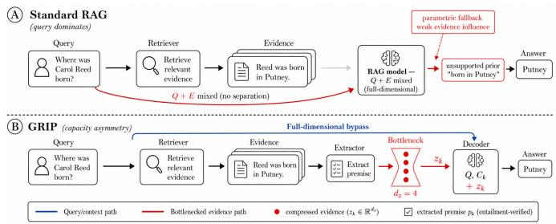
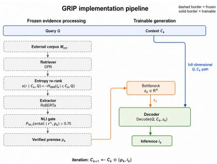
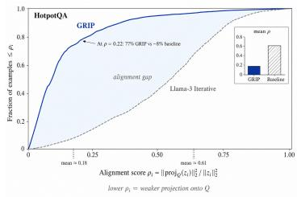

# GRIP: Grounded Reasoning via Information-Restricted Premises

Lirui Teng

University of Waterloo, Waterloo, ON, Canada

Abstract. High-capacity encoders in retrieval-augmented generation (RAG) can let the query dominate the latent state, leaving retrieved evidence functionally irrelevant. We call this failure mode query dominance. To address it, we introduce GRIP (Grounded Reasoning via Information-Restricted Premises), which imposes capacity asymmetry: the decoder keeps full-dimensional access to the query, while retrieved evidence passes through a severe stochastic bottleneck. This forces the evidence channel to encode only the residual information unavailable from the query. Across five reasoning benchmarks, GRIP outperforms strong iterative baselines, cuts a query–latent mutual-information diagnostic by roughly 30× (14.8 → 0.47 bits), and reduces hallucination by 73%. Residual-alignment analysis further shows that the bottleneck output occupies subspaces less aligned with the query than baseline representations.

Keywords: Retrieval-augmented generation · Information bottleneck · Grounded reasoning · Query dominance · Mutual information

## 1 Introduction

Retrieval-augmented generation (RAG) is intended to condition language models on external evidence, approximating $P ( Y \mid Q , E )$ . In practice, LLMs often under-use retrieved text and fall back on parametric knowledge, even when it conflicts with the evidence [14]. The failure is representational: Q enters the decoder through a high-capacity path while evidence shares the same latent space, so optimization—already finding a low-loss solution under $P ( Y \mid Q )$ treats evidence as a marginal correction. We call the resulting regime query dominance.

Existing methods intervene at decoding or supervision time but leave the latent geometry of query–evidence fusion largely unchanged. Self-RAG adds reflection tokens for retrieval critique [2]; context-aware decoding reweights token probabilities toward retrieved content [17]; $\mathrm { R A F T - s t y }$ le training teaches models to ignore distractors [23]. High-dimensional representations can therefore still allocate most capacity to query-aligned features and parametric shortcuts [6,7], leaving retrieval under-utilisation as a capacity-allocation problem rather than only a content-selection one.

We address this gap through deliberate capacity asymmetry rather than richer fusion. GRIP (Grounded Reasoning via Information-Restricted Premises;

  
Fig. 1. (A) Standard RAG mixes Q and E into a full-dimensional latent dominated by the query. (B) GRIP routes Q through a full-dimensional bypass and forces evidence through a low-dimensional bottleneck, so the latent encodes only the information residual.

Fig. 1) routes Q through a full-dimensional bypass while forcing retrieved evidence through an aggressively low-dimensional, stochastic bottleneck $( d _ { z } \approx 4 )$ Because the decoder retains high-bandwidth access to Q, query-correlated bits in the bottleneck are redundant under a tight capacity budget; gradients pressure the channel to transmit only the information residual—the signal the query does not already provide. In the Fig. 1 example, GRIP operates on roughly 25 entailment-verified evidence tokens against the baseline’s ∼4,000-token retrieved context.

Contributions. First, we formalise query dominance as a failure of conditional independence and introduce Query–Latent (QL) Dependence, the mutual information $I ( Q ; z _ { k } )$ between the query and the evidence representation, as a modelagnostic diagnostic: elevated QL dependence indicates that $z _ { k }$ has collapsed into a compressed copy of the query and predicts hallucination more reliably than attention-based heuristics. Second, we introduce GRIP, which enforces lowcapacity, noise-regularised evidence representations that we argue are consistent with an information-residual mechanism. Third, GRIP outperforms strong baselines on HotpotQA, StrategyQA, 2Wiki, ProofWriter, and SQuAD 2.0, reducing QL dependence by roughly 20–37×, suppressing hallucination by 73%, and producing residuals more orthogonal to the query than unconstrained baselines.

## 2 Query Dominance in Latent States

Although RAG is intended to approximate $P ( Y \mid Q , E )$ , language models in practice often behave closer to $P ( Y \mid Q )$ : they generate from parametric knowledge while showing limited sensitivity to the retrieved context [14,17,23,10,3], a phenomenon that recent analyses show worsens with model capacity. We refer to the representational form of this failure as query dominance: the latent state used by the decoder remains highly predictable from the query and only weakly responsive to evidence variation, so retrieval is present in the input pipeline but functionally marginal in the generation process.

## 2.1 The Parametric Prior Pathology

This failure is encouraged by the geometry of pretrained transformer representations: contextual embeddings are anisotropic, with a few high-variance directions carrying broad semantic and frequency information [6]. Query features tend to occupy these dominant directions, so retrieved evidence—even when relevant—is treated as a perturbation to an already strong query-conditioned trajectory, a form of shortcut learning in which a dominant signal suppresses genuinely joint representations [7].

## 2.2 Diagnosing Query Dominance

We model an evidence-conditioned system as

$$
\hat { Y } = G ( z , Q ) , \qquad z = \phi ( Q , E ) ,\tag{1}
$$

where $z$ is the internal evidence representation passed to the decoder. Let $F ( Q , E ) = G ( \phi ( Q , E ) , Q )$ denote the end-to-end output map. We assume that, for fixed Q, the efect of evidence on the output is mediated through $z ;$ that $G ( \cdot , Q )$ is locally Lipschitz under the chosen output discrepancy metric $d ;$ and that representations are bounded. Under these assumptions, when contrastive evidence produces little separation in latent space, the decoder cannot produce large output separation either: query dominance can arise from collapse or redundancy in $\phi ( Q , E )$ itself.

For a fixed query $q ,$ let $E _ { q } ^ { + }$ and $E _ { q } ^ { - }$ denote contrastive evidence distributions that support diferent task-level answers. We define contrastive evidence sensitivity as

$$
S _ { E } ( q ) = \mathbb { E } _ { e ^ { + } \sim E _ { q } ^ { + } , e ^ { - } \sim E _ { q } ^ { - } } \left[ d \big ( F ( q , e ^ { + } ) , F ( q , e ^ { - } ) \big ) \right] .\tag{2}
$$

A model is behaviourally query-dominant at $q$ when $S _ { E } ( q )$ is small while the model remains sensitive to changes in the query. To rule out trivial constant-output collapse, we define query-swap sensitivity $\begin{array} { r l } { S _ { Q } ( q ) } & { { } = } \end{array}$ $\mathbb { E } _ { q ^ { \prime } \sim \mathcal { Q } , e \sim E _ { q } ^ { + } } [ d ( F ( q , e ) , F ( q ^ { \prime } , e ) ) ]$ ] and say that query dominance occurs when $S _ { E } ( q ) \le \tau _ { E }$ and $S _ { Q } ( q ) \ge \tau _ { Q }$ for thresholds $\tau _ { E } \ll \tau _ { Q }$

At the representation level, we measure Query–Latent (QL) Dependence:

$$
D _ { \mathrm { Q L } } = I ( Q ; z _ { k } ) .\tag{3}
$$

High $D _ { \mathrm { Q I } }$ indicates that the evidence-channel state $z _ { k }$ is strongly predictable from the query, suggesting that it carries query-aligned information rather than evidence-specific content. In a well-conditioned retrieval system, $z _ { k }$ should instead encode conditional innovation: information supplied by evidence that is not already available from Q. We estimate $I ( Q ; z _ { k } )$ using the Contrastive Logratio Upper Bound (CLUB) estimator [4]. Because neural MI estimators exhibit dimension-dependent bias [5] and can violate basic self-consistency properties [18], we rely on relative comparisons across conditions rather than absolute values. A complementary shufle control—breaking query–evidence correspondence and verifying that the estimate collapses toward zero—can further validate the estimator. QL dependence is treated as a necessary but not suficient diagnostic. Low mutual information alone does not prove that evidence is being used, since randomization, collapse, or decoder null-space efects can also reduce $I ( Q ; z _ { k } )$ . We therefore pair this diagnostic with behavioural sensitivity tests, including randomization of $z _ { k }$ , and with residual-alignment measurements in Section 5.

## 3 Design Principle: Capacity-Asymmetric Evidence

Given the query-dominant regime described above, the central design question is not only which evidence to retrieve, but how much representational capacity the evidence pathway should receive. GRIP adopts a capacity-asymmetric principle: the query and reasoning context retain full-dimensional access to the decoder, while evidence is routed through a deliberately restricted channel. The goal is not to remove the query signal, but to prevent the evidence representation from cheaply duplicating information already available through the query path. GRIP thus difers from evidence-compression methods such as xRAG, CO-COM, PISCO, and gist tokens, which compress context to maximise retention and eficiency, whereas GRIP restricts evidence capacity to counteract query dominance.

## 3.1 Capacity-Limited Evidence Representations

Abstractly, GRIP maps an extracted, verified premise $p _ { k }$ to a low-dimensional noisy state

$$
z _ { k } = B _ { \theta } ( p _ { k } ) + \varepsilon _ { k } , \qquad \varepsilon _ { k } \sim \mathcal { N } ( 0 , \sigma ^ { 2 } I _ { d _ { z } } ) , \qquad d _ { z } \ll d _ { \mathrm { m o d e l } } ,\tag{4}
$$

where $B _ { \theta }$ denotes the evidence compressor. Under the standard Gaussian channel approximation, $z _ { k }$ cannot transmit unrestricted premise information; Section 4.3 gives the explicit capacity bound at the implementation level. Low dimensionality limits transmittable features, premise-level compression reduces passage verbosity, and additive noise discourages deterministic copying of brittle correlations—together making it ineficient for $z _ { k }$ to serve as a second query representation.

## 3.2 Residualization Pressure

Under a tight evidence capacity budget, query-correlated information in $z _ { k }$ has an opportunity cost: capacity spent on query-predictable features is ineficient unless those features also help predict $Y$ given Q—exactly the trade-of captured by the Conditional Information Bottleneck objective:

$$
\mathcal { L } _ { \mathrm { C I B } } = - I ( Z _ { k } ; Y \mid Q ) + \beta I ( Z _ { k } ; Q ) .\tag{5}
$$

GRIP does not optimize Eq. (5) explicitly; the capacity asymmetry creates a similar pressure—preserve evidence information predictive of $Y$ while discouraging redundant query information—which we treat as a mechanism-level interpretation, not a formal equivalence.

## 3.3 Expected Diagnostic Efects

The capacity-asymmetry hypothesis yields three empirical predictions. First, query–latent dependence should decrease: $I ( Q ; z _ { k } ) _ { \mathrm { G R I P } } \ll I ( Q ; z _ { k } ) _ { \mathrm { R A G } }$ . Second, if the decoder genuinely relies on the restricted evidence channel, randomizing $z _ { k }$ should cause a larger performance drop than the analogous intervention on baselines: $\Delta _ { \mathrm { r a n d } } ^ { \mathrm { G R I P } } > \bar { \Delta } _ { \mathrm { r a n d } } ^ { \mathrm { b a s e l i n e } }$ , where $\varDelta _ { \mathrm { r a n d } } = \mathrm { A c c } ( z _ { k } ) - \mathrm { A c c } ( \tilde { z } _ { k } )$ and $\tilde { z } _ { k }$ is a randomized bottleneck state. Third, residual-alignment measurements should show that $z _ { k }$ occupies subspaces less aligned with query-dominant directions than baseline representations.

Section 5 tests all three predictions: QL dependence and $\varDelta _ { \mathrm { r a n d } }$ across the five benchmarks, with the architecture-matched Llama-3 Iterative control on HotpotQA, and $\rho$ in Fig. 3 and Table 3. Convergence of the three diagnostics, together with the ablation pattern of Section 5.3, supports the capacity-asymmetry account.

Information-bottleneck approaches to RAG. Zhu et al. [24] filter retrieval noise by maximising mutual information between a compressed representation and the output while minimising it with the passage—a largely deterministic noise filter. Swin-VIB [21] integrates variational IB models that adaptively regulate evidence compression to guide an LLM under knowledge conflicts. GRIP difers in three respects: (i) deliberate capacity asymmetry (full-dimensional query access versus a severely restricted evidence channel) rather than an adaptive conflict adapter; (ii) a fixed, severe stochastic bottleneck $( d _ { z } { = } 4$ , additive Gaussian noise, ≈2–4 bits per step) as a first-class design principle rather than a learned compression ratio; and (iii) a motivation of counteracting query dominance rather than arbitrating knowledge conflicts.

## 4 Architecture

The capacity-asymmetric principle of Section 3 is realised as a four-stage pipeline (Fig. 2): iterative retrieval, predictive span extraction, stochastic compression, and asymmetric decoding. The retriever, extractor, and verifier are frozen; gradients flow only through the bottleneck and decoder.

## 4.1 Retrieval via Entropy-Guided Re-ranking

A dense passage retriever [11] returns top-m candidates, which are re-ranked by the conditional entropy of the next-step prediction:

$$
s ( r \mid C _ { k } , Q ) = - H _ { \Theta } { \big ( } i _ { k } \mid r , C _ { k } , Q { \big ) } .\tag{6}
$$

Fig. 2. GRIP implementation pipeline: at each step, candidate passages are retrieved and entropy-ranked, reduced to a predictive span, filtered by an NLI verifier, compressed to $z _ { k }$ , and passed to the decoder alongside the full-dimensional query and context.  
  
Fig. 3. Empirical CDFs of evidence–query alignment on HotpotQA (alignment score $\rho _ { i }$ as defined in Section $5 . 4 ;$ lower ⇒ weaker alignment with the query subspace). The GRIP distribution (solid, deep blue) dominates the Llama-3 Iterative baseline (dashed, gray) at every threshold: at $\rho = 0 . 2 2$ , 77% of GRIP samples fall below this threshold versus ∼8% of baseline samples, so the reduction is systematic rather than outlier-driven. Inset: mean $\rho$ per method (ρ column of Table 3).

Passages making the next step more predictable score higher; entropy is computed under teacher-forced decoding through the candidate. A curriculum defers the entropy criterion until the decoder is calibrated (Section 4.6).

## 4.2 Predictive Span Extraction

The selected passage $r ^ { * ( k ) }$ is reduced to a minimal predictive span before it reaches the bottleneck. A frozen RoBERTa-based extractor $\Theta _ { \mathrm { e x t } }$ produces $p _ { k } \subset r ^ { * ( k ) }$ by KL-matching the next-step distribution conditioned on the span versus the full passage, with a length-sparsity penalty (full objective in the supplement). A frozen DeBERTa-v3-large NLI verifier admits only spans satisfying $P _ { \mathrm { N L I } }$ (entailment $\mid r ^ { * ( k ) } , p _ { k } ) > 0 . 7 5$ . To prevent premise representations from becoming query-dependent, query tokens are masked in the extractor’s crossattention, isolating $\Theta _ { \mathrm { e x t } } \mathrm { { ' s } }$ gradients from query embeddings.

## 4.3 Stochastic Bottleneck

The verified span is then mapped to a low-dimensional latent through a noisy projection:

$$
z _ { k } = W _ { 2 } \sigma \big ( W _ { 1 } \cdot \mathrm { p o o l } ( p _ { k } ) \big ) + \varepsilon _ { k } , \quad \varepsilon _ { k } \sim \mathcal { N } ( 0 , \sigma ^ { 2 } I _ { d _ { z } } ) ,\tag{7}
$$

with $d _ { z } = 4 , \sigma ^ { 2 } = 1 . 0$ , mean pooling, and ReLU activation. For a $d _ { z }$ -dimensional channel with additive Gaussian noise, the Gaussian channel capacity gives

$$
I ( \mathrm { p o o l } ( p _ { k } ) ; z _ { k } ) \ \leq \ { \frac { d _ { z } } { 2 } } \log ( 1 + P / \sigma ^ { 2 } ) ,\tag{8}
$$

where $P$ is the average power of the projected pre-noise vector. With $P \approx 1$ after normalisation, the per-step budget is approximately 2–4 bits—the explicit form of the capacity asymmetry argued for in Section 3.

## 4.4 Asymmetric Decoding

The decoder conditions on $\left( Q , C _ { k } , z _ { k } \right)$ : the query enters as a high-bandwidth prefix, the context $C _ { k }$ carries prior reasoning steps, and $z _ { k }$ is injected as a single special token with a learned positional embedding. Because $Q$ and $C _ { k }$ enter at full dimensionality while $z _ { k }$ is constrained to four dimensions with additive noise, the two pathways difer in capacity by roughly three orders of magnitude.

## 4.5 Forward-Pass Procedure

Algorithm 1 composes the four stages into a step-wise inference loop; entropyguided selection (Eq. (6)) is a non-diferentiable inference-time decision based on the decoder’s state.

The context update ${ C _ { k + 1 } } \gets { C _ { k } } \oplus ( { p _ { k } } , { i _ { k } } )$ retains the verified span as text, so the decoder keeps a full-dimensional semantic pathway alongside the bottleneck. This is deliberate rather than a leak: ablating the raw-span pathway costs 8.2 accuracy points (Section 5.3), while at step k the decoder commits to inference $i _ { k }$ before $p _ { k }$ becomes contextually available, and randomising $z _ { k }$ still costs 35.3 points with a 71.6:1 ratio of correct-to-wrong versus wrong-to-correct transitions (Section 5.4). The bottleneck thus regulates the evidence signal governing each inference step; the persistent span text carries sentence-level semantics but cannot substitute for the bottleneck state. What persists is the minimal entailment-verified span, not the retrieved passage.

## 4.6 Training Objective and Schedule

The trainable parameters $\theta _ { \mathrm { g e n } } = \{ W _ { 1 } , W _ { 2 } , \theta _ { \mathrm { d e c } } \}$ maximise the likelihood of the target reasoning steps,

$$
\mathcal { L } _ { \mathrm { t a s k } } ~ = ~ - \sum _ { k = 1 } ^ { K } \log P _ { \Theta _ { \mathrm { g e n } } } ( i _ { k } \mid z _ { k } , C _ { k } , Q ) ,\tag{9}
$$

Algorithm 1 GRIP Step-Wise Inference   
Require: Query $Q ;$ corpus $M _ { \mathrm { e x t } } ;$ frozen modules (retriever, $\Theta _ { \mathrm { e x t } } , \mathrm { N L I } ) ;$ trained mod  
ules (Bottleneck, Decode); max steps $K ;$ entailment threshold τ   
Ensure: Final answer aˆ   
1: $C _ { 1 } \gets \emptyset$ ▷ empty reasoning context   
2: for $k = 1 , \dots , K$ do   
3: $R _ { m } ^ { ( k ) }$ ← DenseRetrieve $( Q , C _ { k } )$   
4: $r ^ { * ( k ) } \gets \arg \operatorname* { m i n } _ { \substack { r \in R _ { m } ^ { ( k ) } } } H _ { \Theta } ( i _ { k } \ | \ r , C _ { k } , Q )$   
5: $p _ { k }  \theta _ { \mathrm { e x t } } ( r ^ { * ( k ) } , C _ { k } )$   
6: if $\mathrm { N L I } ( p _ { k } , r ^ { * ( k ) } ) < \tau$ then   
7: continue ▷ discard step $k ;$ advance with context unchanged   
8: end if   
9: $z _ { k } \gets$ Bottleneck $\tau ( p _ { k } ) + \varepsilon _ { k }$ $\varepsilon _ { k } \sim { \mathcal N } ( 0 , \sigma ^ { 2 } I _ { d _ { z } } )$   
10: ik ← Decode $( Q , C _ { k } , z _ { k } )$   
11: ${ C _ { k + 1 } } \gets { C _ { k } } \oplus ( { p _ { k } } , { i _ { k } } )$   
12: if $i _ { k }$ emits [answer] then   
13: return $i _ { k }$ ▷ early termination   
14: end if   
15: end for   
16: return $i _ { K }$ ▷ fallthrough: no [answer] within K steps

under a two-phase curriculum. In Phase 1 (epochs 1–5) the entropy re-ranker is bypassed and top passages are selected by dense retrieval alone, allowing the bottleneck and decoder to stabilise before the entropy signal becomes load-bearing. In Phase 2 (epochs 6–20), entropy-guided selection (Eq. (6)) is enabled while the retriever, extractor, and NLI verifier remain frozen throughout. Because Q reaches the decoder at full dimensionality through the bypass, query-redundant features in $z _ { k }$ do not reduce the conditional likelihood and are pruned by gradient descent [1].

## 5 Experiments

We evaluate GRIP on five reasoning benchmarks to test whether capacityasymmetric evidence processing improves task performance and evidence use.

## 5.1 Experimental Configuration

Baselines. We compare GRIP against three baselines spanning the matchedcontrol and prior-art axes. Standard RAG uses DPR retrieval [11] with passage concatenation and Llama-3-8B decoding [12]. Self-Ask [15] uses iterative sub-question prompting without modifying the evidence pathway. Llama-3-8B Iterative is the architecture-matched control: it follows GRIP’s two-step reasoning schedule (K=2, same retriever, entropy re-ranking, span extraction, and NLI gate) but injects the verified premise $p _ { k }$ into the decoder as ordinary fulldimensional text rather than through the stochastic bottleneck, isolating the contribution of capacity asymmetry from that of iterative reasoning. Decoding hyperparameters match GRIP.

All systems share the same frozen DPR-Wiki index, tokenization, and compute budget. GRIP performs $K = 2$ reasoning steps with m = 10 retrieved passages per step. The shared component is the retrieval substrate (retriever and index); the evidence reaching each decoder still difers after re-ranking, extraction, and NLI filtering, so the comparison isolates how each method processes evidence. Descriptive statistics of the retrieval–verification pipeline are reported in the supplement.

Datasets. We evaluate on five benchmarks covering diferent reasoning regimes: HotpotQA [22] for distractor multi-hop QA, StrategyQA [8] for implicit multi-step reasoning, 2WikiMultihopQA [9] for explicit two-hop reasoning, ProofWriter [19] for symbolic Horn-clause deduction, and SQuAD 2.0 [16] for single-hop extractive QA. Primary metrics are exact match (EM) or task accuracy, with F1 where applicable (Table 1). Hallucination is the percentage of generated claims not entailed by retrieved evidence. The in-pipeline DeBERTav3 verifier that scores entailment is also the training-time selection signal; an independent verifier provides an evaluation check on this circularity (Section 5.2). Atomicity of extracted premises is reported in the appendix.

Optimization. Trainable components are optimized with AdamW [13] (learning rate $1 0 ^ { - 4 }$ , weight decay 0.01, linear warmup over 1,000 steps, cosine decay, gradient clipping at norm 1.0). Per-device batch size is 32 (global 128). Decoding uses nucleus sampling $( p = 0 . 9 , T = 0 . 7 )$ . Models are trained for 20 epochs on 4×A100 80GB GPUs. Reported results are averaged over three random seeds; on HotpotQA the standard deviation over seeds is ±0.45 EM, ±0.38 F1, ±0.72 hallucination, and ±0.04 bits QL dependence.

## 5.2 Main Results

Table 1 reports task performance across all five datasets. GRIP improves over the strongest non-GRIP baseline on every dataset, and outperforms the architecture-matched Llama-3 Iterative control on all five benchmarks—by +7.2 EM on HotpotQA and +4.1 accuracy points on StrategyQA—indicating that capacity asymmetry contributes beyond the iterative reasoning schedule. Paired bootstrap comparisons are significant at $p ~ < ~ 0 . 0 1$ on HotpotQA (+7.2) and SQuAD 2.0 (+3.7). Self-Ask is competitive on the multi-hop settings but trails Standard RAG on single-hop SQuAD 2.0 (76.5 vs. 78.4 EM), consistent with decomposition overhead when explicit multi-hop decomposition is unnecessary. Hallucination drops substantially in every condition—from 31.7% to 8.6% on HotpotQA, from 31.2% to 9.8% on 2Wiki, and from 28.7% (Llama-3 Iterative) to 8.6% (GRIP) under the matched control. This grounding result is robust to the choice of verifier: rescoring with MiniCheck [20] yields 89.0% agreement with the in-pipeline verifier (Cohen’s κ = 0.77), and the HotpotQA hallucination rate rises only from 8.6% to 10.1%, remaining well below every baseline—supporting the narrower claim that the gains are not specific to the original verifier, without establishing model-agnosticism.

Table 1. Task performance across five reasoning benchmarks. EM/F1 follow standard conventions for HotpotQA, 2Wiki, and SQuAD 2.0; StrategyQA reports accuracy only (yes/no); ProofWriter reports proof accuracy. Em dashes denote metrics not applicable to a task or not recorded for a given run.
<table><tr><td>Dataset</td><td>Model</td><td>EM/Acc</td><td>F1</td><td>Hall. (%)↓</td></tr><tr><td rowspan="5">HotpotQA</td><td>Standard RAG</td><td>68.2</td><td>72.5</td><td>31.7</td></tr><tr><td>Self-Ask</td><td>71.3</td><td>75.8</td><td>19.8</td></tr><tr><td>Llama-3 Iterative</td><td>69.3</td><td>73.6</td><td>28.7</td></tr><tr><td>GRIP</td><td>76.5</td><td>80.3</td><td>8.6</td></tr><tr><td>Standard RAG</td><td>65.2</td><td></td><td>33.4</td></tr><tr><td rowspan="4">StrategyQA</td><td>Self-Ask</td><td>67.5</td><td></td><td>32.1</td></tr><tr><td>Llama-3 Iterative</td><td>69.3</td><td></td><td>28.7</td></tr><tr><td>GRIP</td><td>73.4</td><td></td><td>10.1</td></tr><tr><td>Standard RAG</td><td>62.8</td><td>68.4</td><td>31.2</td></tr><tr><td rowspan="4">2Wiki</td><td>Self-Ask</td><td>66.3</td><td></td><td></td></tr><tr><td>Llama-3 Iterative</td><td>64.8</td><td></td><td></td></tr><tr><td>GRIP</td><td>71.2</td><td>76.1</td><td>9.8</td></tr><tr><td>Standard RAG</td><td>74.3</td><td></td><td>26.1</td></tr><tr><td rowspan="4">ProofWriter</td><td>Self-Ask</td><td>78.5</td><td></td><td></td></tr><tr><td>Llama-3 Iterative</td><td>77.0</td><td></td><td></td></tr><tr><td>GRIP</td><td>85.6</td><td></td><td>6.8</td></tr><tr><td>Standard RAG</td><td>78.4</td><td>82.1</td><td></td></tr><tr><td rowspan="4">SQuAD 2.0</td><td>Self-Ask</td><td>76.5</td><td></td><td>18.2</td></tr><tr><td>Llama-3 Iterative</td><td></td><td></td><td>一</td></tr><tr><td>GRIP</td><td>78.0</td><td></td><td></td></tr><tr><td></td><td>82.1</td><td>85.7</td><td>6.4</td></tr></table>

## 5.3 Ablation Studies

Table 2 reports component and capacity ablations on HotpotQA. The bottleneck is the most load-bearing component: removing it raises QL dependence from 0.47 to 14.20 bits and reduces accuracy by 5.3 points. Removing extraction or NLI verification degrades performance through diferent failure modes: without extraction, verbose passage content enters the bottleneck and hallucination rises; without NLI verification, unsupported spans are admitted, raising hallucination while leaving QL dependence low.

The capacity sweep is non-monotonic. A very narrow bottleneck $( d _ { z } = 2 )$ suppresses QL dependence most strongly but loses task-relevant evidence; a wider one $( d _ { z } = 1 6 )$ restores capacity but allows query-redundant information to re-enter. The best configuration is therefore not the smallest channel, but the channel that balances residual evidence transmission against query redundancy.

The mechanism controls in Table 2 follow the deterministic-versus-stochastic pairing of information-bottleneck designs in prior RAG work [24,21]. Neither dimensional restriction nor stochastic corruption alone is suficient: at fixed $d _ { z } = 4 .$

Table 2. Component and capacity ablations on HotpotQA. ∆ reports accuracy change relative to full GRIP. Component ablations isolate individual modules; capacity ablations vary the bottleneck width $d _ { z }$ at fixed noise $\sigma ^ { 2 } = 1 . 0$ . For “No bottleneck”, $I ( Q ; z _ { k } )$ is measured on the pooled premise embedding that replaces $z _ { k }$ (no low-rank projection or noise).
<table><tr><td>Configuration</td><td> $I ( Q ; z _ { k } )$  (bits) ↓</td><td>Hall. (%)↓</td><td>Acc.</td><td>Δ</td></tr><tr><td>Full GRIP  $( d _ { z } = 4 )$ </td><td>0.47</td><td>8.6</td><td>76.5</td><td></td></tr><tr><td>Component ablations</td><td></td><td></td><td></td><td></td></tr><tr><td>No bottleneck</td><td>14.20</td><td>24.3</td><td>71.2</td><td>-5.3</td></tr><tr><td>No extraction</td><td>3.10</td><td>18.7</td><td>73.4</td><td>-3.1</td></tr><tr><td>No NLI verification</td><td>0.52</td><td>12.1</td><td>75.1</td><td>-1.4</td></tr><tr><td>Capacity ablations</td><td></td><td></td><td></td><td></td></tr><tr><td> $d _ { z } = 2$ </td><td>0.31</td><td>9.2</td><td>74.2</td><td>-2.3</td></tr><tr><td> $d _ { z } = 8$ </td><td>1.82</td><td>8.9</td><td>75.1</td><td>-1.4</td></tr><tr><td> $d _ { z } = 1 6$ </td><td>4.73</td><td>11.5</td><td>72.8</td><td>-3.7</td></tr><tr><td>Mechanism controls</td><td></td><td></td><td></td><td></td></tr><tr><td>Deterministic  $( d _ { z } = 4 , \sigma ^ { 2 } { = } 0 )$ </td><td>2.38</td><td>13.2</td><td>74.0</td><td>-2.5</td></tr><tr><td>Noise-only (d=4096, stochastic)</td><td>10.85</td><td>24.7</td><td>72.1</td><td>-4.4</td></tr></table>

removing stochasticity increases QL dependence from 0.47 to 2.38 bits and hallucination by 4.6 points, while retaining stochasticity at full dimension $( d = 4 0 9 6 )$ raises QL dependence to 10.85 bits and hallucination to 24.7%. The combination of restricted capacity and stochastic encoding is therefore critical to GRIP’s information-control behaviour.

Two bypass ablations complete the picture. Removing the query bypass (the decoder receives $z _ { k }$ and $C _ { k }$ but no full-dimensional access to Q) causes severe generation degradation of 23–33 accuracy points across the five datasets even though QL dependence stays at 0.45 bits: the 4D stochastic channel alone is too narrow to carry the semantic burden of generation. Removing the raw-text bypass instead (the decoder receives Q, the inference history, and $z _ { k } ,$ , but no persisted span text) costs 8.2 points on HotpotQA/2Wiki and raises hallucination to 18.4%. The architecture thus requires both restricted evidence flow and high-capacity semantic access.

## 5.4 Mechanism Diagnostics

Aggregate accuracy does not reveal whether the bottleneck changes evidence use. We report three diagnostics: QL dependence $I ( Q ; z _ { k } )$ , estimated using the CLUB upper bound [4], measures predictability of the evidence state from the query; randomization drop $\varDelta _ { \mathrm { r a n d } } = \operatorname { A c c } ( z _ { k } ) - \operatorname { A c c } ( \tilde { z } _ { k } )$ , where $\tilde { z } _ { k }$ is sampled from the empirical marginal of bottleneck states, measures decoder dependence on that state’s content; and residual alignment $\rho ( z _ { k } , \mathcal { Q } ) = \| \mathrm { p r o j } _ { \mathcal { Q } } ( z _ { k } ) \| _ { 2 } ^ { 2 } / \| z _ { k } \| _ { 2 } ^ { 2 }$ , where Q is the top principal-component subspace of query embeddings (capturing 90% of variance, estimated on a 10K-sample validation pool), measures whether the state lies in the query-dominant subspace. Table 3 consolidates results: all three diagnostics for GRIP across the five datasets, with the matched-control baseline evaluated on HotpotQA.

Table 3. Mechanism diagnostics across datasets, as defined in Section 5.4: lower $I ( Q ; z _ { k } ) \Rightarrow$ less query-redundant representation; higher $\varDelta _ { \mathrm { r a n d } }$ ⇒ stronger decoder dependence on evidence; lower $\rho \Rightarrow$ weaker geometric query alignment. For baselines, $\varDelta _ { \mathrm { r a n d } }$ and ρ are reported on $_ \mathrm { H o t p o t Q A ; }$ em dashes denote diagnostics not run.
<table><tr><td>Dataset</td><td>Model</td><td> $I ( Q ; z _ { k } )$  (bits) ↓</td><td> $\pmb { \varDelta } _ { \mathbf { r a n d } }$  ↑</td><td>ρ↓</td></tr><tr><td rowspan="3">HotpotQA</td><td>Standard RAG</td><td>14.8</td><td></td><td>0.72</td></tr><tr><td>Llama-3 Iterative</td><td>11.2</td><td>7.5</td><td>0.61</td></tr><tr><td>GRIP</td><td>0.47</td><td>35.3</td><td>0.18</td></tr><tr><td rowspan="2">StrategyQA</td><td>Standard RAG</td><td>13.2</td><td></td><td></td></tr><tr><td>GRIP</td><td>0.52</td><td>30.5</td><td>0.19</td></tr><tr><td rowspan="2">2Wiki</td><td>Standard RAG</td><td>15.1</td><td></td><td></td></tr><tr><td>GRIP</td><td>0.41</td><td>35.0</td><td>0.17</td></tr><tr><td rowspan="2">ProofWriter</td><td>Standard RAG</td><td>11.8</td><td></td><td></td></tr><tr><td>GRIP</td><td>0.38</td><td>42.5</td><td>0.13</td></tr><tr><td rowspan="2">SQuAD 2.0</td><td>Standard RAG</td><td>12.4</td><td></td><td></td></tr><tr><td>GRIP</td><td>0.61</td><td>22.5</td><td>0.24</td></tr></table>

GRIP reduces QL dependence by 20×–37× across all five benchmarks, tracking the capacity constraint rather than dataset-specific properties. Low QL dependence alone, however, does not prove evidence use—a collapsed state would also have low mutual information with the query. The randomization test resolves this: replacing $z _ { k }$ with samples from its empirical marginal drops GRIP accuracy by 35.3 points on HotpotQA against only 7.5 for the matched-control Llama-3 Iterative baseline, so the decoder cannot recover from corrupted GRIP evidence using the query/context path alone, ruling out the iterative schedule as the source of evidence dependence. Both diagnostics generalise across all five datasets: $\varDelta _ { \mathrm { r a n d } }$ ranges from 42.5 points on ProofWriter, where the efect is strongest, to a weakest but still substantial 22.5 points on SQuAD 2.0, with ρ correspondingly low (0.13–0.24). Decomposing the HotpotQA randomization drop at the sample level, 35.8% of predictions flip from correct to wrong against only 0.5% from wrong to correct (40.7% remain correct, 23.0% remain wrong)— a 71.6:1 destructive-to-corrective ratio consistent with $\Delta _ { \mathrm { r a n d } } = 3 5 . 3$ . Randomization thus overwhelmingly destroys correct predictions rather than causing symmetric churn—direct sample-level evidence of decoder reliance—though it does not by itself separate marginal failure from complete collapse. Geometrically, GRIP retains 18% of its bottleneck energy in the query subspace versus 61% for Llama-3 Iterative and 72% for Standard RAG: the representation is not merely smaller, but less aligned with the query. The three diagnostics converge, and with the ablation and control pattern in Table 2 are consistent with the capacity-asymmetry account; counterfactual, unanswerable, and inconsistentcontext evaluations are reported in the supplement.

## 6 Limitations

Mechanism ambiguity. We do not prove that the bottleneck enforces conditional residualisation. The deterministic and noise-only controls (Section 5.3) establish that neither dimensional restriction nor stochasticity alone reproduces GRIP’s information-control behaviour, and the residual-alignment evidence shows the bottleneck output occupying subspaces weakly aligned with the query. What remains open is a formalised counterfactual evaluation protocol, generalisation beyond the single Llama-3-8B backbone, and reliable CLUB estimation below roughly $N = 5 0 0$ samples.

MI estimator. CLUB is a loose upper bound with dimension-dependent bias [5], and variational MI estimators can violate basic self-consistency properties [18]; we assume the bias is approximately consistent across models so that relative comparisons remain meaningful.

Dataset dependence. SQuAD 2.0 and StrategyQA may overlap with Llama-3-8B’s parametric knowledge, so hallucination reductions on these benchmarks cannot be cleanly attributed to improved evidence use versus better elicitation of stored knowledge. HotpotQA and 2WikiMultihopQA more cleanly probe low-coverage evidence dependence and carry greater diagnostic weight.

Scope and failure modes. GRIP assumes explicit separation between query and evidence pathways; architectures that fuse them earlier may not admit the same mechanism. Severe compression at $d _ { z } = 4$ also trades rare-entity fidelity for redundancy suppression: rare entities with strong parametric priors can be lost when their distinguishing features fall outside the retained subspace, leading the model to substitute a frequent near-neighbour. Implicit reasoning that requires high-bandwidth intermediate representations may be similarly limited.

## 7 Conclusion

GRIP routes evidence through a low-dimensional, noisy bottleneck while retaining a high-capacity query bypass; across five benchmarks it reduces estimated query–bottleneck mutual information by roughly 30×, decreases hallucination by 73%, and improves accuracy by 8.0 points on average over Standard RAG. Residual-alignment analysis shows that the bottleneck output occupies subspaces weakly aligned with the query, and mechanism controls show that neither dimensional restriction nor stochasticity alone reproduces this behaviour: their combination is the operative design principle.

## Supplementary Material

Full appendices and additional diagnostics are provided in an online supplement.

## References

1. Achille, A., Soatto, S.: Emergence of invariance and disentanglement in deep representations. Journal of Machine Learning Research 19(50), 1–34 (2018)

2. Asai, A., Wu, Z., Wang, Y., Sil, A., Hajishirzi, H.: Self-RAG: Learning to retrieve, generate, and critique through self-reflection. In: The Twelfth International Conference on Learning Representations (ICLR) (2024)

3. Bi, B., Huang, S., Wang, Y., Yang, T., Zhang, Z., Huang, H., Mei, L., Fang, J., Li, Z., Wei, F., Deng, W., Sun, F., Zhang, Q., Liu, S.: Context-DPO: Aligning language models for context-faithfulness. In: Findings of the Association for Computational Linguistics: ACL 2025. pp. 10280–10300. Association for Computational Linguistics (2025)

4. Cheng, P., Hao, W., Dai, S., Liu, J., Gan, Z., Carin, L.: CLUB: A contrastive log-ratio upper bound of mutual information. In: Proceedings of the 37th International Conference on Machine Learning (ICML). Proceedings of Machine Learning Research, vol. 119, pp. 1779–1788. PMLR (2020)

5. Czyż, P., Grabowski, F., Vogt, J.E., Beerenwinkel, N., Marx, A.: Beyond normal: On the evaluation of mutual information estimators. In: Advances in Neural Information Processing Systems (NeurIPS). vol. 36 (2023)

6. Ethayarajh, K.: How contextual are contextualized word representations? comparing the geometry of BERT, ELMo, and GPT-2 embeddings. In: Proceedings of the 2019 Conference on Empirical Methods in Natural Language Processing (EMNLP). pp. 55–65. Association for Computational Linguistics (2019). https://doi.org/10.18653/v1/D19-1006

7. Geirhos, R., Jacobsen, J.H., Michaelis, C., Zemel, R., Brendel, W., Bethge, M., Wichmann, F.A.: Shortcut learning in deep neural networks. Nature Machine Intelligence 2, 665–673 (2020). https://doi.org/10.1038/s42256-020-00257-z

8. Geva, M., Khashabi, D., Segal, E., Khot, T., Roth, D., Berant, J.: Did Aristotle use a laptop? a question answering benchmark with implicit reasoning strategies. Transactions of the Association for Computational Linguistics 9, 346–361 (2021). https://doi.org/10.1162/tacl\_a\_00370

9. Ho, X., Nguyen, A.K.D., Sugawara, S., Aizawa, A.: Constructing a multi-hop QA dataset for comprehensive evaluation of reasoning steps. In: Proceedings of the 28th International Conference on Computational Linguistics (COLING). pp. 6609–6625. International Committee on Computational Linguistics, Barcelona, Spain (Online) (2020)

10. Joren, H., Zhang, J., Ferng, C.S., Juan, D.C., Taly, A., Rashtchian, C.: Suficient context: A new lens on retrieval augmented generation systems. In: The Thirteenth International Conference on Learning Representations (ICLR) (2025)

11. Karpukhin, V., Oğuz, B., Min, S., Lewis, P., Wu, L., Edunov, S., Chen, D., tau Yih, W.: Dense passage retrieval for open-domain question answering. In: Proceedings of the 2020 Conference on Empirical Methods in Natural Language Processing (EMNLP). pp. 6769–6781. Association for Computational Linguistics (2020)

12. Lewis, P., Perez, E., Piktus, A., Petroni, F., Karpukhin, V., Goyal, N., Küttler, H., Lewis, M., tau Yih, W., Rocktäschel, T., Riedel, S., Kiela, D.: Retrieval-augmented generation for knowledge-intensive NLP tasks. In: Advances in Neural Information Processing Systems (NeurIPS). vol. 33, pp. 9459–9474 (2020)

13. Loshchilov, I., Hutter, F.: Decoupled weight decay regularization. In: International Conference on Learning Representations (ICLR) (2019)

14. Mallen, A., Asai, A., Zhong, V., Das, R., Khashabi, D., Hajishirzi, H.: When not to trust language models: Investigating efectiveness of parametric and nonparametric memories. In: Proceedings of the 61st Annual Meeting of the Association for Computational Linguistics (Volume 1: Long Papers). pp. 9802– 9822. Association for Computational Linguistics, Toronto, Canada (2023). https: //doi.org/10.18653/v1/2023.acl-long.546

15. Press, O., Zhang, M., Min, S., Schmidt, L., Smith, N.A., Lewis, M.: Measuring and narrowing the compositionality gap in language models. In: Findings of the Association for Computational Linguistics: EMNLP 2023. pp. 5687–5711. Association for Computational Linguistics, Singapore (2023). https://doi.org/10.18653/ v1/2023.findings-emnlp.378

16. Rajpurkar, P., Jia, R., Liang, P.: Know what you don’t know: Unanswerable questions for SQuAD. In: Proceedings of the 56th Annual Meeting of the Association for Computational Linguistics (Volume 2: Short Papers). pp. 784–789. Association for Computational Linguistics, Melbourne, Australia (2018). https: //doi.org/10.18653/v1/P18-2124

17. Shi, W., Han, X., Lewis, M., Tsvetkov, Y., Zettlemoyer, L., tau Yih, W.: Trusting your evidence: Hallucinate less with context-aware decoding. In: Proceedings of the 2024 Conference of the North American Chapter of the Association for Computational Linguistics: Human Language Technologies (Volume 2: Short Papers). pp. 783–791. Association for Computational Linguistics, Mexico City, Mexico (2024). https://doi.org/10.18653/v1/2024.naacl-short.69

18. Song, J., Ermon, S.: Understanding the limitations of variational mutual information estimators. In: International Conference on Learning Representations (ICLR) (2020)

19. Tafjord, O., Mishra, B.D., Clark, P.: ProofWriter: Generating implications, proofs, and abductive statements over natural language. In: Findings of the Association for Computational Linguistics: ACL-IJCNLP 2021. pp. 3621–3634. Association for Computational Linguistics (2021). https://doi.org/10.18653/v1/2021.findings-acl. 317

20. Tang, L., Laban, P., Durrett, G.: MiniCheck: Eficient fact-checking of LLMs on grounding documents. In: Proceedings of the 2024 Conference on Empirical Methods in Natural Language Processing (EMNLP). pp. 8818–8847. Association for Computational Linguistics (2024)

21. Wang, J., Xu, Z., Jin, D., Yang, X., Li, T.: Accommodate knowledge conflicts in retrieval-augmented LLMs: Towards robust response generation in the wild (2025)

22. Yang, Z., Qi, P., Zhang, S., Bengio, Y., Cohen, W.W., Salakhutdinov, R., Manning, C.D.: HotpotQA: A dataset for diverse, explainable multi-hop question answering. In: Proceedings of the 2018 Conference on Empirical Methods in Natural Language Processing (EMNLP). pp. 2369–2380. Association for Computational Linguistics (2018)

23. Yoran, O., Wolfson, T., Ram, O., Berant, J.: Making retrieval-augmented language models robust to irrelevant context. In: The Twelfth International Conference on Learning Representations (ICLR) (2024)

24. Zhu, K., Feng, X., Du, X., Gu, Y., Yu, W., Wang, H., Chen, Q., Chu, Z., Chen, J., Qin, B.: An information bottleneck perspective for efective noise filtering on retrieval-augmented generation. In: Proceedings of the 62nd Annual Meeting of the Association for Computational Linguistics (Volume 1: Long Papers). pp. 1044– 1069. Association for Computational Linguistics (2024)