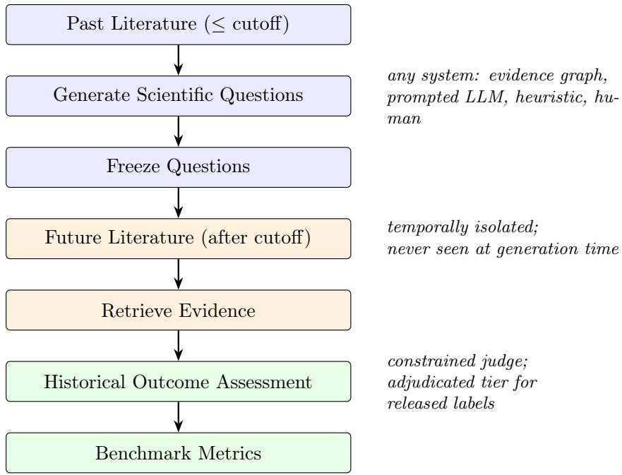
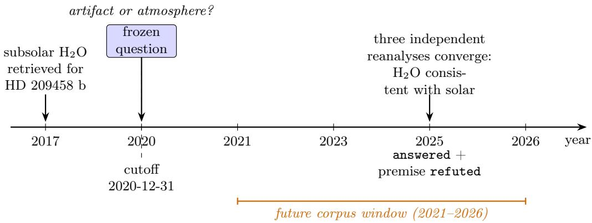

# Historical Backtesting for Scientific Question Discovery: A Protocol and Astronomy Pilot

Evaluating AI-Generated Scientific Questions Against Future Scientific Progress

Hui Mao Independent Researcher hui.mao@alumni.upenn.edu

August 17, 2026

## Abstract

Systems that generate scientific research questions are currently evaluated by expert scores, LLM-as-judge ratings, or curated case studies—all subjective, none falsifiable. We propose a diferent standard: future scientific engagement as an observable, falsifiable proxy for one important dimension of a question’s value. We formalize historical backtesting as an evaluation protocol for scientific question discovery: a system generates questions from a corpus frozen at a historical cutof, the questions are frozen before any access to later literature, and a tempo rally isolated future corpus determines—via fixed retrieval, a citation-constrained judge, and a declared adjudication tier—whether each question was subsequently answered, partially addressed, independently posed, or ignored, and whether its underlying premise was supported or refuted. The protocol is model-agnostic: any system that emits frozen questions can be scored, and all metrics are defined independently of how questions are produced. We release a reproducible astronomy benchmark instance (cutof 2020-12-31): a 2,512-paper past corpus, a temporally isolated 1,891-paper future corpus (2021–2026), frozen questions, retrieval records, adjudicated outcome labels, and one-command metric computation, plus a submission interface and four reference baselines evaluated through the identical pipeline. In an initial set of ten questions generated by an evidence-graph system from pre-cutof literature only, all ten were substantively engaged by later literature: two were answered, seven partially addressed, one independently posed and still open—and one question’s underlying premise (a strongly subsolar water abundance for HD 209458 b) was subsequently refuted by three independent analyses, the exact convergence the question called for. A scaled second instance (astronomy v1L: 424 frozen baseline questions against a 5,754-paper future corpus) then stress-tests the small-sample conclusions and revises two of them: engagement rates do discriminate at n = 125 (random 73% vs. direct-LLM 96%, $p < 1 0 ^ { - 4 } )$ , and premise refutation is rare but not unique—chasing highly cited results catches refutations on 3.2% of questions, while random templates stay at zero and acquire a measurable 11%-answered floor. Finally, we turn the benchmark’s deepest threat— LLM weights that have read the future—into its subject: a generator decomposition (LLM-only vs. deterministic evidence-structure vs. structure-plus-LLM verbalization) crossed with a fourcutof temporal stress test (2010–2024, 798 judged questions) whose last window postdates the model’s training. LLM-only generation shows memorized relevance without specific foresight: near-ceiling engagement and the closest phrasing to future literature at every cutof, but an answered rate flat across the training boundary, indistinguishable from random templates, and zero premise refutations outside the deepest-history era. A weight-free structural generator finds engaged questions at every cutof, and adding the LLM back as a pure verbalizer refutes premises in every era including the post-training one—locating the foresight signal in pre-cutof evidence structure, with the LLM as a separable realization layer. We then validate the measurement

instrument itself with a seven-rater agreement study (two independent blinded human annota tors, five judge models, 90 items) and report what it shows: two careful humans agree with each other at only $\kappa = 0 . 1 7$ , every judge model agrees with the professional annotator as well as or better than the humans agree with each other $( \kappa = 0 . 1 7 – 0 . 2 6 )$ , and frontier models agree with one another at $\kappa = 0 . 6 0 \mathrm { \ - \ } \mathrm { s o }$ the common practice of certifying an LLM judge by model–model agreement would have overstated its reliability threefold here. The outcome taxonomy, not the judge, fails validation; absolute rates are therefore rater-relative throughout, while the paper’s comparative claims are checked under three judges and survive with no reversals. Two findings result: evidence-structure-first generation outperforms LLM-only prompting at scale, and outcome taxonomies for scientific-question evaluation need a measured human–human reliability gate before any judge, human or model, is scored against them. A prospective instance—200 questions from four generators, frozen 2026-08-17 with a 2027–2030 scoring window—is released so the central claims become contamination-free tests that time itself will grade.

## 1 Introduction

A growing family of systems claims to generate scientific research questions, hypotheses, or ideas (Lu et al., 2024; Wang et al., 2024; Baek et al., 2024). How do we know whether any of them is good at it? Today, essentially every evaluation falls into one of three patterns: an expert score (a panel rates novelty and significance on a Likert scale), an LLM score (a language model rates the same properties), or a case study (a handful of generated ideas is narrated persuasively). All three share the same defect: they are subjective. Expert panels disagree with each other and with themselves (Si et al., 2024); LLM judges inherit the biases of their training distribution and can be steered by phrasing; case studies are selected by the authors. None of these evaluations can be wrong in a way that data could demonstrate. We hold our own instrument to that standard too: Section 10 subjects it to a seven-rater reliability study and reports the result, which is not flattering, in full.

Science itself ofers a harder criterion. Research questions are bets about where inquiry should go next, and the scientific community eventually settles those bets: it invests observing time, funds follow-ups, writes papers that answer some questions, poses others independently, and refutes the premises of a few. This suggests a measurement standard—deliberately a proxy, not a definition:

Future scientific engagement provides an observable, falsifiable proxy for one important dimension of a question’s value.

We do not claim engagement defines value: community attention carries popularity bias (Section 12), and a question can be excellent yet ignored for want of an instrument. The claim is narrower and stronger where it counts—engagement is the one dimension of value that is observable from frozen public data, and therefore the one on which systems can be compared without asking anyone’s opinion.

The standard becomes an evaluation protocol the moment we rewind the clock. Fix a historica cutof. Give a system only the literature available before the cutof. Freeze the questions it generates. Then let the literature published after the cutof—which the system never saw—grade the bet: Was the question answered? Substantially advanced? Independently posed by working scientists? Ignored? Was its underlying premise confirmed, or refuted? We call this procedure historical backtesting, by analogy with the evaluation of trading strategies on held-out past data (Bailey et al., 2014), and with recent forecasting benchmarks that score models against events occurring after training (Zou et al., 2022).

Crucially, the protocol contains no question generator (Figure 1). It takes a frozen list of questions as input and returns outcome labels and metrics as output. Any system—an evidencegraph pipeline, a prompted LLM, a citation heuristic, a human scientist—can be evaluated under identical conditions. This is what makes it a benchmark rather than a validation appendix for one particular architecture.

  
Figure 1: The historical backtesting protocol. No question generator, evidence graph, or particular LLM appears in the loop: the protocol evaluates frozen question lists, whatever produced them.

Contributions. We make five contributions; the first two are claims ordered by strength, the remaining three are measurements and artifacts:

1. Protocol (strong). We formalize historical backtesting as an evaluation protocol for scientific question discovery: temporal isolation rules, a question-freezing requirement, fixed future-evidence retrieval, a two-dimensional outcome taxonomy that separates a question’s fate (answered, partially\_addressed, posed\_but\_open, not\_addressed) from its premise’s fate (supported, refuted, weakened, still\_plausible, not\_applicable), and metrics defined over those labels (Sections 3 and 4).

2. Benchmark instance (medium). We release a reproducible astronomy instance with temporally isolated past and future corpora (2,512 and 1,891 papers; cutof 2020-12-31), frozen questions, released retrieval records, adjudicated labels, one-command metric computation with CI-enforced reproducibility, a submission format, and four reference baselines evaluated through the identical pipeline (Sections 5 and 6).

3. Empirical findings (cautious, and separated by sample size). Our statistically supported claim concerns a class of methods, not a single system: across 125-question submissions, evidence-structure-first generation resolves and refutes far more than direct LLM prompting (39% vs. 15% answered; 13% vs. 0% premise refutation, $p = 3 \times 1 0 ^ { - 5 } )$ , and this holds at four historical cutofs including one whose future postdates the model’s training data (Section 9). A weight-free structural generator—no LLM anywhere—outperforms LLM-only prompting on resolution, locating the foresight signal in pre-cutof evidence structure rather than in model weights. Separately, and as an illustrative case rather than a statistical claim, a ten-question evidence-graph submission had every question engaged by later literature, one of them by refuting the premise it challenged (Section 7). At n = 10 that submission cannot be ranked against baselines—detecting its apparent advantage would require n ≈ 209 per arm—and we make no such ranking claim. We do not claim that AI reliably identifies the most valuable future scientific questions; we claim the protocol can tell us, eventually, whether it can, and that it already discriminates between generator families.

4. Measurement validity (adverse, and general). We validate the measurement instrument itself with a seven-rater agreement study: two independent blinded human annotators and five judge models on 90 items. Humans agree with each other at $\kappa = 0 . 1 7 ;$ every model matches the professional annotator as well as the humans match each other; frontier models agree with one another at $\kappa = 0 . 6 0$ . The outcome taxonomy, not the judge, fails validation—and certifying an LLM judge by model–model agreement, the field’s common shortcut, would have overstated reliability threefold here (Section 10).

5. Prospective instance (frozen, unscoreable until 2031). Two hundred questions from four generators, frozen at cutof 2026-08-17 with a pre-registered 2027–2030 scoring window and published corpus manifests and hashes—the contamination-free test that time itself will grade (Section 14).

What we believe is ultimately most useful here is not any single result but the change of category: scientific question quality moves from a matter of taste (“this question seems interesting”) to a measured, comparable quantity (“under historical backtesting, 100% of this system’s questions were engaged by later literature; 10% led to a premise refutation”). Every artifact needed to run the protocol—data, code, labels, and checks—is public, and Astronomy v1 is ofered as the first instance of the benchmark, not as its definition.

## 2 Related Work

Automated scientific discovery and question generation. Computational discovery has a long lineage, from rule-based rediscovery of physical laws (Langley et al., 1987) through closed-loop robot scientists (King et al., 2009) to the Nobel Turing Challenge’s call for AI scientists (Kitano, 2021). Recent LLM-based systems generate research ideas, hypotheses, or full papers: literaturebased generation (Wang et al., 2024), agentic idea refinement (Baek et al., 2024), and end-to-end automated research (Lu et al., 2024). Literature-based discovery pioneered the underlying intuition that recombining published evidence can anticipate findings later verified empirically (Swanson, 1986). Our work is orthogonal to all of these: we do not propose a better generator; we propose the missing evaluation.

Evaluating generated ideas. Existing evaluations are dominated by human preference and LLM scoring. Si et al. (2024) ran a large expert study comparing human and LLM research ideas on rated novelty and excitement—the most rigorous instance of the expert-score paradigm, and stil a measurement of opinion at generation time rather than of what the ideas turned out to be worth. LLM-as-judge scoring inherits known biases (position, verbosity, self-preference) and, for questions about the future, cannot be validated against ground truth at all. Historical backtesting replaces both with an outcome variable that exists independently of any rater: the subsequent behavior of the scientific community.

Backtesting and forecasting benchmarks. Scoring a strategy on held-out history is standard in quantitative finance, along with well-documented failure modes—overfitting to the backtest itself (Bailey et al., 2014)—that motivate our freezing and no-overwrite rules. Forecasting benchmarks score models on events that resolve after training (Zou et al., 2022); retrodictive evaluation with temporal holdouts is likewise used to test whether models anticipate later discoveries (Swanson, 1986; King et al., 2009). We transplant this design to a harder target: not whether a stated event occurs, but whether an open-ended research question earns the community’s future investment. Code benchmarks such as SWE-bench (Jimenez et al., 2024) demonstrated how a well-specified task format plus frozen data can reorganize a research area around measurable progress; we aim the same mechanism at question discovery.

Data contamination. Temporal splits are increasingly used to control LLM memorization in evaluation. Our protocol controls the retrieval channel completely (corpus manifests, isolation rules, CI checks) and treats the weights channel—models whose training data postdates the cutof—as a declared, audited threat rather than a solved problem (Section 12).

## 3 The Historical Backtesting Protocol

The protocol evaluates a set of frozen questions $Q = \{ q _ { 1 } , . . . , q _ { n } \}$ against a future corpus. It has six steps; each is fully specified so that two groups running the same instance obtain the same measurement.

## 3.1 Step 1: Choose a cutof

A historical date T (Astronomy v1: 2020-12-31) splits the literature into a past corpus Corpus A (everything available up to T) and a future window realized as an isolated corpus Corpus B (strictly after T). The cutof must be far enough in the past for the community to have had time to act—we recommend ≥ 4 years—and recent enough that the past corpus reflects a modern research frontier.

## 3.2 Step 2: Generate questions

Any method may generate questions: an evidence-graph pipeline, a prompted LLM, a heuristic over citation statistics, a human expert. The only requirements are (i) the generator consumes only Corpus A evidence, and (ii) every question records the pre-cutof evidence it is grounded in (source\_evidence\_ids). A submission whose source evidence postdates T is invalid, mechanically (scripts/validate\_cutoff.py).

## 3.3 Step 3: Freeze

Questions are serialized—identifier, text, cutof, generating system, source evidence, system-assigned rank—with frozen: true before any access to post-cutof literature, and are never edited afterwards. Freezing is the protocol’s load-bearing rule: without it, question text drifts toward what the evaluator has meanwhile learned the future contains, and the backtest silently becomes a description of the future rather than a prediction of it (Bailey et al., 2014). In the released implementation frozen files are append-only and guarded by CI; editing a released question mints a new versioned instance rather than overwriting the old one.

Table 1: Outcome taxonomy v1.0. The two dimensions are labeled independently.
<table><tr><td>Dimension</td><td>Label</td><td>Meaning</td></tr><tr><td rowspan="3">outcome</td><td>answered</td><td>Future evidence substantially answers the question (including by refuting its premise)</td></tr><tr><td>partially_addressed</td><td>Important, directly relevant progress; core question unresolved</td></tr><tr><td>posed_but_open</td><td>The community independently poses essentially the same question without resolving it</td></tr><tr><td rowspan="5">premise_status</td><td>not_addressed</td><td>No meaningful follow-up in the future corpus</td></tr><tr><td>supported</td><td>Future evidence confirms the underlying premise</td></tr><tr><td>refuted weakened</td><td>Future evidence falsifies the underlying premise</td></tr><tr><td>still_plausible</td><td>Substantial doubt cast without falsification</td></tr><tr><td>not_applicable</td><td>The premise was not directly tested after the cutoff The question rests on no contestable premise</td></tr></table>

## 3.4 Step 4: Define the future window

Corpus B is collected under its own frozen manifest (query set, date window, deduplication rules) and stored separately from Corpus A; records from Corpus B must never enter the generation pipeline. The Astronomy v1 window is 2021–2026. Bounding the window matters for comparability: “eventually engaged” is not a fixed target, but “engaged within k years” is.

## 3.5 Step 5: Retrieve future evidence

For each frozen question, the question text and every Corpus B document (title + abstract) are embedded (text-embedding-3-small); the top-k documents by cosine similarity (k = 8) become the candidate evidence. Retrieval is deliberately fixed and deliberately simple: systems are compared on their questions, not their retrievers, and reviewers can inspect exactly which documents the judge saw because retrieval records are part of the release.

## 3.6 Step 6: Assess outcomes

A judge reads the question and its retrieved candidates and assigns two independent labels (Table 1): the fate of the question and the fate of its premise.

Two design decisions deserve emphasis. First, the dimensions are separated because the single most informative outcome a backtest can surface—the community answered this question by refuting its premise—is inexpressible in a flat label set: it is simultaneously a resolution (answered) and a falsification (refuted). Our pilot’s headline case (Section 7.1) is exactly of this type. Second, premise refutation is scored as a success of the question, not a failure: a question that provokes the community into overturning one of its own published conclusions has done the most a question can do.

The judge operates under hard constraints enforced outside the model: it may cite only bibcodes from the retrieved candidates (violations are errors, never silently dropped); topical similarity is explicitly insuficient—the cited paper must bear on the question’s actual test or premise; unknown labels fall back to the most conservative value and are flagged. Labels then occupy one of two declared tiers. Adjudicated labels have passed human review under written guidelines (citation validity, the engagement bar, the outcome/premise split), with the adjudication log released; the headline labels of a released instance are required to be of this tier (Astronomy v1’s are). Judge-only labels have not, are marked as such wherever reported, and are the tier at which this paper’s largen comparative studies run (Sections 8–9). The tier is part of every result’s provenance; conflating them is a protocol violation.

Table 2: Benchmark metrics v1.0. All are computed by benchmark/metrics.py from the released annotation records.
<table><tr><td>Metric</td><td>Definition</td></tr><tr><td>Coverage (future attention rate)</td><td> ${ \frac { 1 } { n } } \left| \left\{ q : o ( q ) \right. \right. \neq$  not_addressed}| — did future science engage the question at all?</td></tr><tr><td>Answer rate</td><td> ${ \begin{array} { l } { { \frac { 1 } { n } } \left| \left\{ q : o ( q ) = { \mathsf { a n s w e r e d } } \right\} \right| } \end{array} }$ </td></tr><tr><td>Partial rate</td><td> ${ \frac { \mathrm { i } } { n } } \left| \left\{ q : o ( q ) = \mathrm { p a r t i a l l y \_ a d d r e s s e d } \right\} \right|$ </td></tr><tr><td>Open rate</td><td> ${ \frac { \mathrm { 1 } } { n } } \left| \{ q : o ( q ) = { \mathrm { p o s e d } } _ { - } { \mathrm { b u t } } _ { - } { \mathrm { o p e n } } \} \right|$  — the community indepen- dently recognized the question</td></tr><tr><td>Premise refutation rate</td><td> ${ \begin{array} { l } { { \frac { 1 } { n } } \left| \left\{ q : p ( q ) = { \mathrm { r e f u t e d } } \right\} \right| } \end{array} }$  questions that led to an established conclusion being overturned</td></tr><tr><td>Evidence strength</td><td>mean  $| E ( q ) |$  over engaged questions, and the multi-source rate  ${ \begin{array} { l } { { \frac { 1 } { n } } | \{ q : | E ( q ) | \geq 2 \} | } \end{array} } $  — is the label supported by multiple inde- pendent papers?</td></tr><tr><td>Lead time</td><td>years between question submission and the first time the com- munity independently poses the same question</td></tr><tr><td>Community attention</td><td>volume of future investment engaging the question: papers, citations, review mentions, and major observing programs (e.g. JWST/HST proposals)</td></tr></table>

## 3.7 Submissions

A system is evaluated by submitting a directory containing questions.jsonl (the frozen questions) and metadata.json (system description, including a mandatory declaration of any LLM components and their versions, for contamination auditing). The benchmark pipeline—isolation checks, retrieval, judging, adjudication where the tier requires it, metrics, report—is identical for every submission; the system whose questions we evaluate in Section 7 interacts with the benchmark only through this interface.

## 4 Benchmark Metrics

Let Q be the n frozen questions of a submission, with outcome labels $o ( q )$ and premise labels $p ( q )$ as in Table 1, and let $E ( q )$ be the set of independent post-cutof papers cited as supporting evidence for $q \mathrm { ^ s }$ label. All rates are over n, so the four outcome rates sum to one.

Coverage vs. answer rate. Coverage asks whether the question pointed anywhere the community went at all; the answer/partial/ open decomposition asks what happened when it got there. A system can maximize coverage with fashionable-topic questions, which is why coverage is never reported alone (Section 12 discusses the popularity confound).

Premise refutation rate. This is the metric we most want the field to adopt. Questions that trigger refutations are the rarest and arguably most valuable output of question discovery—they mark places where the literature’s accepted conclusions were wrong and where a well-aimed question preceded the correction. Under the two-dimensional taxonomy the refutation is recorded without erasing the fact that the question was thereby answered.

Table 3: Astronomy v1 at a glance. Corpus manifests, frozen questions, retrieval records, and adjudicated labels are all released.
<table><tr><td>Historical cutoff Domain scope</td><td>2020-12-31 atmospheric composition in transmission spectra; cloud/haze degeneracies; instrument systematics</td></tr><tr><td>CoRPUs A (past)</td><td>2,512 deduplicated papers, 2015–2020 (NASA ADS; 500-paper full-text core)</td></tr><tr><td>CORPUS B (future)</td><td>1,891 unique papers, 2021–2026, temporally isolated</td></tr><tr><td>Questions</td><td>10, frozen, ranked, with pre-cutoff source evidence</td></tr><tr><td>Retrieval</td><td>text-embedding-3-smal1, cosine, top-8; records released</td></tr><tr><td>Judge</td><td>gpt-4.1, temperature 0, citation-constrained; human-adjudicated</td></tr></table>

Lead time. If a system poses a question at the cutof and the community first independently poses it in year T+ℓ, the system led the field by ℓ years; averaged over questions this yields a comparable earliness score. Measuring ℓ requires identifying community first-posed dates, which demands careful review-literature annotation we do not yet have. Astronomy v1 therefore reports mean\_lead\_time\_years: null rather than a number we cannot defend; the released records do include a weaker, well-defined lower bound—first-engagement lag, the years from cutof to the earliest judge-cited supporting paper (pilot mean 2.9, range 1–5)— which should not be confused with lead time.

Community attention. Beyond binary engagement, the volume of future investment (paper counts, citations to engaging papers, review mentions, dedicated observing programs) reflects how much the community cared. v1 records the ingredients (supporting bibcodes, their venues and years) and reports evidence strength; a calibrated attention index is future work, and Section 12 explains why raw attention must never be the headline metric.

Reporting requirements. A benchmark report must state: the instance and protocol versions, n, all outcome and premise rates, the evidence-strength pair, and either lead time or an explicit null. The released implementation produces exactly this (results/astronomy\_v1/metrics.json) with one command, and CI fails if the committed numbers do not reproduce from the raw annotations.

## 5 The Astronomy v1 Instance

Astronomy v1 instantiates the protocol in exoplanet atmospheres—a domain chosen because it uniquely combines a fast-moving literature, structured catalogs, and space-telescope archives, and because the 2021–2026 window contains a natural experiment: JWST began delivering data midwindow, resolving questions that were unanswerable at the cutof. Table 3 summarizes the instance.

Corpora. Both corpora are defined by frozen manifests—ADS query sets, date windows, deduplication and filtering rules (records without abstracts are dropped)—rather than by bulk data dumps: the manifests are committed, and a script rebuilds either corpus from its manifest via the ADS API. Corpus B’s manifest adds targeted follow-up queries for the questions’ objects (HD 189733, HD 209458, WASP-12, WASP-121, TRAPPIST-1) so that engagement is measured against the relevant future literature rather than against whatever a generic query happens to return.

Leakage controls. Temporal isolation is enforced mechanically, not editorially: (1) nothing dated after the cutof may enter Corpus A, including catalog rows updated post-cutof; (2) every question’s source evidence must predate the cutof; (3) every retrieved document must postdate it; (4) the judge may cite only retrieved candidates; (5) question/retrieval/annotation records must align one-to-one; (6) Corpus B’s window must start strictly after the cutof. All six checks run in continuous integration on every change to the released data, together with a check that the released metrics.json reproduces bit-identically from the raw annotations.

Questions. The ten frozen questions were generated by an evidence-graph system (Scientific Question Discovery project, 2026) from Corpus A only: claims with provenance are extracted from the full-text core, cross-paper tensions are detected and typed (observational tensions, methodological challenges, single-dataset conclusions, independent qualifications), and surviving signals are refined into ranked, falsifiable questions. For the benchmark, that system is submission evidence\_graph\_v1— evaluated through the same interface as any future submission. Each released record carries the question text, system rank, signal type, target objects, and pre-cutof source bibcodes; a curation log documenting human edits made before freezing (including a near-duplicate merge and presupposition fixes, Section 11) is released for audit.

What is released. Frozen questions; corpus manifests; per- question retrieval records (model, window, top-k, judge-cited documents, top-1 similarity; full ranked lists with scores are scheduled for v1.1); adjudicated outcome annotations with rationales and supporting bibcodes; the adjudication log; computed metrics and per-question results; four frozen baseline submissions with their full retrieval records (per-document scores included), judge annotations, and reports (Section 6); the scaled v1L instance (manifests, configs, 424 frozen baseline questions, retrieval records with perdocument scores, judge annotations, per-system reports, and the statistical comparison script of Section 8); the tension-pair generators, the four-cutof stress-test corpora manifests, all 798 stresstest judgments, and the deterministic specificity rubric of Section 9; and the complete pipeline code with tests. The data format is deliberately plain (JSONL + JSON manifests) so that other groups can mint new instances—diferent domain, diferent cutof—by writing two manifests and one config file.

## 6 Baselines

A benchmark that only ever scored one system would be a validation appendix. Astronomy v1 ships four reference baselines, chosen to bracket the interesting comparisons; each consumes only Corpus A records, freezes its output before any future-corpus access, and is evaluated through the identical pipeline.

B1: Random claims. Sample random pre-cutof papers and template their headline result into a robustness question. The floor: any system must beat chance-directed attention.

B2: Direct LLM. Give an LLM (gpt-4.1, 60 sampled pre-cutof abstracts) a request for the most valuable open questions. The “why not just ask GPT?” comparison. Because a modern LLM’s weights postdate the cutof, this baseline is also a contamination probe: performance that vanishes for post-training-cutof instances indicates memorized hindsight rather than generation ability (Section 12).

Table 4: Astronomy v1 leaderboard (n = 10 questions per system). Adjud. = human-adjudicated labels; judge-only rows are directly comparable to each other. Cov. = future-attention rate; Ans. = answered; Part. = partially addressed; Open = posed but open; Ref. = premise refuted; $s _ { 1 } =$ mean top-1 retrieval similarity. Lead time is null for all systems until community first-posed dates are annotated (Section 4).
<table><tr><td>System</td><td>Eval</td><td>Cov.</td><td>Ans.</td><td>Part.</td><td>Open</td><td>Ref.</td><td> $s _ { 1 }$ </td></tr><tr><td>evidence_graph_v1 (Scientific Question Discovery project, 2026)</td><td>adjud.</td><td>100%</td><td>20%</td><td>70%</td><td>10%</td><td>10%</td><td>0.666</td></tr><tr><td>evidence_graph_v1 (rerun)</td><td>judge</td><td>90%</td><td>10%</td><td>80%</td><td>0%</td><td>10%</td><td>0.668</td></tr><tr><td>B4 citation leaders</td><td>judge</td><td>100%</td><td>30%</td><td>70%</td><td>0%</td><td>0%</td><td>0.632</td></tr><tr><td>B3 review future work</td><td>judge</td><td>100%</td><td>10%</td><td>70%</td><td>20%</td><td>0%</td><td>0.593</td></tr><tr><td>B2 direct LLM</td><td>judge</td><td>90%</td><td>0%</td><td>90%</td><td>0%</td><td>0%</td><td>0.732</td></tr><tr><td>B1 random claims</td><td>judge</td><td>70%</td><td>0%</td><td>70%</td><td>0%</td><td>0%</td><td>0.611</td></tr></table>

B3: Review future work. Extract explicitly posed open questions from pre-cutof review papers. The strongest natural reference: a discovery system is interesting only if it adds value over questions the community had already written down. Note this baseline should score highly on coverage by construction—these questions are known community priorities—so the discriminating metrics are premise refutation and lead time, where a copied question can never lead the field.

B4: Citation leaders. Template follow-up questions from the most-cited pre-cutof papers. Tests whether chasing prominence matches structured evidence analysis. One caveat is built in: ADS citation counts are fetched at corpus-rebuild time and therefore include post-cutof citations, so this baseline selects papers with hindsight knowledge of which pre-2021 work the future found important—a bias in its favor that a cutof-dated citation snapshot would remove.

Evaluation conditions. All four baselines were run through the released pipeline: top-8 retrieval with text-embedding-3-small against the manifest-rebuilt future corpus restricted to the frozen window (2,384 records, a superset of the frozen 1,891 due to retroactive ADS indexing, containing all 22 citations in the released annotations), then gpt-4.1 judging at temperature 0 under the citation constraints of Section 3. Baseline labels are judge-only: they have not received the human adjudication that the released evidence\_graph\_v1 labels did. To make that comparison honest, Table 4 also reports a judge-only rerun of the evidence-graph submission under exactly the baseline conditions. The rerun doubles as a replication check: it reproduces the released mean top-1 retrieval similarity (0.668 vs. 0.666) and lands within one label of the adjudicated results (coverage 90% vs. 100%, answered 10% vs. 20%, refutation 10% = 10%)—the deltas are exactly the two labels adjudication had strengthened, so judge-only scoring reads as the conservative floor of the adjudicated score.

Reading the leaderboard. Three observations, ofered with the n = 10 caution of Section 7 applying to every row.

Coverage saturates. Every non-random system scores 90–100% on future attention: in a field this active, any fluent, topical question attracts partial engagement within five years. Coverage separates the floor (random claims, 70%, the only system with three not\_addressed labels) from everything else, and nothing else—which is why the protocol never reports it alone (Section 12).

Answered-rate comparisons need reading, not just ranking. The citation-leader baseline posts the highest judge-only answered rate (30%). Two mechanisms inflate it: its hindsight-biased paper selection (above), and its template—“does the conclusion of highly cited paper X hold?”—which pattern-matches the replication studies that prominent results reliably attract, so the judge can mark it answered whenever the community re-examined a famous result for any reason. What the template cannot do is risk anything: B4 refuted no premise, and by construction a question of the form “is the famous result right?” poses nothing the community was not already testing. The evidence-graph submission’s answered questions, by contrast, specified particular tests (Section 7.1) and include the leaderboard’s only refuted premise—on both adjudicated and judge-only rows.

Table 5: Per-question outcomes for evidence\_graph\_v1 on Astronomy v1 (system rank order; |E| = independent supporting papers; year = earliest cited engagement).
<table><tr><td>Rank</td><td>ID</td><td>Outcome</td><td>Premise</td><td>|E|</td><td>Year</td></tr><tr><td>1</td><td>q_002</td><td>posed_but_open</td><td>still_plausible</td><td>1</td><td>2022</td></tr><tr><td>2</td><td>q_001</td><td>partially_addressed</td><td>supported</td><td>3</td><td>2021</td></tr><tr><td>3</td><td>q_004</td><td>partially_addressed</td><td>supported</td><td>1</td><td>2021</td></tr><tr><td>4</td><td>q_008</td><td>answered</td><td>refuted</td><td>3</td><td>2025</td></tr><tr><td>5</td><td>q_007</td><td>partially_addressed</td><td>still_plausible</td><td>3</td><td>2024</td></tr><tr><td>6</td><td>q_010</td><td>partially_addressed</td><td>still_plausible</td><td>1</td><td>2022</td></tr><tr><td>7</td><td>q_005</td><td>answered</td><td>supported</td><td>2</td><td>2024</td></tr><tr><td>8</td><td>q_009</td><td>partially_addressed</td><td>supported</td><td>5</td><td>2021</td></tr><tr><td>9</td><td>q_006</td><td>partially_addressed</td><td>still_plausible</td><td>1</td><td>2025</td></tr><tr><td>10</td><td>q_011</td><td>partially_addressed</td><td>still_plausible</td><td>4</td><td>2024</td></tr></table>

The contamination probe registers a signal. The direct-LLM baseline has by far the highest retrieval similarity to future literature (s = 0.732 vs. 0.593–0.668 for every other system) and the highest mean support count (4.6 cited papers per question)—its questions are phrased in the way the 2021–2026 literature would come to phrase them, consistent with weights that have read that literature. Yet it resolves nothing: 0% answered, 0% refuted, 90% partial. The pattern suggests phrasing-level contamination without commitment to falsifiable specifics—broad, well-aimed questions that everything engages and nothing settles. Prospective instances (Section 14) will separate the two channels definitively.

Baseline generators, frozen submissions, retrieval records with full per-document scores, judge annotations, and per-system reports are all released; the leaderboard file is designed for external submissions to append to. All three observations above are drawn from ten questions per system; Section 8 re-examines them on a scaled instance with 424 baseline questions, and two of the three require revision there.

## 7 Pilot Results: Historical Validation

We ran the full protocol on the ten frozen evidence\_graph\_v1 questions. Headline numbers: every question was substantively engaged by the 2021–2026 literature (coverage 100%); two were answered, seven partially addressed, one independently posed and still open; one premise was refuted. Evidence strength: 2.4 supporting papers per question on average, with 60% of labels supported by ≥ 2 independent papers. The earliest judge-cited engagement came 1–5 years after the cutof (mean 2.9). Table 5 gives the per-question picture.

  
Figure 2: Timeline of q\_008. The question was frozen from pre-2021 evidence; by 2025 three independent analyses had performed the test it specified and refuted its premise—the strongly subsolar water abundance was a retrieval artifact.

## 7.1 Case study: a premise refuted (q\_008, HD 209458 b)

From pre-2021 evidence, the system flagged a single-dataset conclusion: the influential retrieval of a strongly subsolar water abundance at the terminator of HD 209458 b (MacDonald and Madhusudhan, 2017). The frozen question asked, in 2020 terms:

Is the strongly subsolar terminator water abundance retrieved for HD 209458 b a property of the atmosphere or an artifact of retrieval assumptions, as tested by comparing independent retrieval frameworks on the same and on independent datasets?

The 2021–2026 literature then performed exactly the test the question specified (Figure 2): a reanalysis of HST and JWST spectra with improved systematics treatment and Bayesian model averaging, an independent retrieval framework demonstrating that free-vs-equilibrium chemistry assumptions span the subsolar-to-solar range, and ground-based high-resolution spectroscopy constraining the abundance independently of space-based data. All three converge: the terminator water abundance is consistent with solar, and the strongly subsolar value was an artifact of earlier retrieval assumptions and data systematics. Under the taxonomy this is answered + refuted: the question was resolved by the community overturning the premise the question challenged—an outcome that no expert score assigned in 2020 could have certified, and precisely what backtesting exists to detect.

## 7.2 Secondary observations

The top-ranked question is independently posed and open. The system’s rank-1 question (q\_002: how terminator heterogeneity biases the WASP-12 b water abundance and $\mathrm { C } / \mathrm { O }$ ratio) tracks a methodological concern the community has since engaged in general form — inhomogeneousterminator biases in retrievals — without resolving it for WASP-12 b specifically: posed\_but\_open. A question the field poses but has not answered is a live research target; that the system’s top pick lands there is the behavior a ranking is supposed to produce, though n = 1 at rank 1 proves nothing by itself.

An answered null result. q\_005 asked whether HST transmission data independently support $\mathrm { N H _ { 3 } }$ or HCN in HD 209458 b — a molecular-detection claim from the same single-dataset analysis as q\_008 (MacDonald and Madhusudhan, 2017). By 2024–2025, high-resolution spectroscopy had placed stringent upper limits on both species: answered, premise supported (the data indeed do not independently support the detection). Backtesting counts a cleanly resolved null exactly as it counts a positive.

Table 6: Astronomy v1L results (judge-only). Brackets are exact 95% Clopper–Pearson intervals. Eng. = future-attention rate; Ans. = answered; Ref. = premise refuted; $s _ { 1 }$ = mean top-1 retrieval similarity; lag = mean years to earliest cited engagement. The evidence-graph row is the ten v1 questions re-evaluated on the v1L corpus (anchor), not a scaled submission.
<table><tr><td>System</td><td>n</td><td>Eng.</td><td></td><td>Ans.</td><td></td><td>Ref.</td><td> $s _ { 1 }$ </td><td>lag</td></tr><tr><td>evidence_graph (anchor)</td><td>10</td><td></td><td>80% [44,97]</td><td>30% [7,65]</td><td></td><td>10% [0,45]</td><td>0.682</td><td>3.5</td></tr><tr><td>B2 direct LLM</td><td>125</td><td></td><td>96% [91,99]</td><td></td><td>15% [9,23]</td><td>0% [0,3]</td><td>0.722</td><td>1.9</td></tr><tr><td>B4 citation leaders</td><td>125</td><td></td><td>87% [80,93]</td><td></td><td>26% [18,34]</td><td>3.2% [1,8]</td><td>0.632</td><td>2.5</td></tr><tr><td>B3 review future work</td><td>49</td><td></td><td>92% [80,98]</td><td></td><td>22% [12,37]</td><td>0% [0,7]</td><td>0.567</td><td>2.4</td></tr><tr><td>B1 random claims</td><td>125</td><td></td><td>73% [64,80]</td><td></td><td>11% [6,18]</td><td>0% [0,3]</td><td>0.622</td><td>2.8</td></tr></table>

Instrument-gated engagement. q\_011 (whether JWST validated pre-launch predictions of TRAPPIST-1 $\mathrm { C O _ { 2 } }$ detectability, Lustig-Yaeger et al., 2019) could not have been engaged before JWST flew; its first cited engagement is 2024 and stellar contamination has so far prevented a definitive test. Engagement timing is partly an instrument schedule, not purely a question-quality signal—a confound Section 12 treats explicitly.

What these ten questions do not show. With ten questions from one system in one domain, rates carry wide intervals (the exact 95% Clopper–Pearson interval for 10/10 coverage is [0.69, 1.0]), the baseline rows are judge-only rather than adjudicated (Section 6), and the generating system’s LLM components postdate the cutof (Section 12). Moreover, Section 10 shows all absolute rates are rater-relative: “10/10 engaged” is this instance’s adjudicated reading, made by the authors, not a rater-free fact. The pilot demonstrates that the protocol runs end-to-end, yields auditable, reproducible labels, and prices its baselines; it does not establish that any system reliably anticipates future science.

## 8 Scaling the Baselines: Astronomy v1L

Every baseline conclusion in Section 6 rests on ten questions per system. To test which of them survive a larger sample, we minted a second instance, astronomy v1L: same cutof, same retrieval and judge settings, but corpora rebuilt from broadened manifests (12 past-corpus and 18 futurecorpus ADS query sets covering clouds and hazes, atmospheric escape, phase curves, high-resolution spectroscopy, and JWST; 4,040 past and 5,754 frozen-window future records—1.8× and 2.4× the v1 corpora) and baselines scaled to 125 questions each. The review–future-work extractor is the exception by necessity: it exhausts the supply of explicitly posed questions in all 4,040 pre-cutof abstracts at 49—itself a finding; the community’s already-written-down questions are a finite resource. In total v1L evaluates 424 frozen baseline questions plus the ten evidence-graph questions re-run as a cross-instance anchor, all judge-only. The v1 instance and its released data are untouched.

Table 6 gives the scaled results. Sample size changes two of Section 6’s three conclusions and sharpens the third—which is the point of running the experiment.

Revised: coverage does discriminate at scale. At $n = 1 0$ every non-random system sat at 90–100% engagement and we concluded coverage separates only the floor. $\mathrm { A t } \ n = 1 2 5$ the rates pull apart: random claims 72.8% [64,80], citation leaders 87.2%, direct LLM 96.0% [91,99]; random vs. direct-LLM engagement difers at $p < 1 0 ^ { - 4 }$ and random vs. citation leaders at $p = 0 . 0 0 7$ (two-sided Fisher). The v1 reading was a small-sample artifact. What survives is the ceiling: fluent, topical LLM questions still approach saturation, so coverage separates the bottom and middle of the range while compressing the top—it remains unusable as a sole metric.

Revised: premise refutation is not unique to the evidence-graph system. At $n = 1 0$ no baseline refuted a premise; at $n = 1 2 5$ the citation-leader baseline catches four refutations (3.2% [1,8]): the subsolar-water conclusion for HD 209458 b (the same MacDonald and Madhusudhan, 2017 result behind $\mathrm { ~ q ~ \_ ~ } 0 0 8 )$ , the methane-depleted atmosphere of K2-18 b overturned by JWST, TiO in WASP-121 b unconfirmed by later data, and systematic bias found in benchmark ultracooldwarf retrievals. Asking “is the famous result right?” of enough famous results does eventually catch the ones that fall—note its hindsight-biased selection (Section 6) works in its favor here, since post-cutof citation counts are inflated by exactly the controversies that produce reversals. Three things remain true. Refutation is the rarest outcome for every system (random templates: 0/125, upper bound 2.9%—refutations are not free; a question must aim at a contestable claim). The evidence-graph submission’s nominal rate stays highest (10% vs. 3.2%), but $n = 1 0$ cannot establish superiority $( p = 0 . 3 2$ ; the comparison needs $n \approx 2 0 9$ per arm for 80% power, Section 12). And the two routes to a refutation difer qualitatively: prominence-chasing rediscovers that famous claims attract scrutiny, while the evidence-graph question specified the decisive test from pre-cutof evidence tensions (Section 7.1). The scaled data cannot yet separate those routes quantitatively; a scaled evidence-graph submission could.

Sharpened: there is a nonzero answered floor. Random robustness templates get answered 11.2% [6,18] of the time—the field re-examines even arbitrarily chosen results at a measurable base rate. The v1 estimate of that floor (0/10) was too flattering to every other system: an answered rate is meaningful only against ∼11%, not zero. Citation leaders (25.6%) clear the floor $( p = 0 . 0 0 5 )$ ; direct LLM (15.2%) does not $( p = 0 . 4 2 )$

Persistent: the contamination signature. The direct-LLM baseline keeps the highest similarity to future literature at scale $( s _ { 1 } = 0 . 7 2 2 \ \mathrm { v s . } \ 0 . 5 6 7 \mathrm { - 0 . 6 8 2 }$ for all others), the broadest engagement (96%, multi-source rate 94%), and the earliest mean engagement (1.9 years—its cited evidence concentrates in 2021–2022, the years closest to its training distribution). Scaling revises one part of the v1 reading: it does convert engagement into answers (15.2% vs. 0/10 at $n = 1 0 )$ , but at a rate statistically indistinguishable from random templates, despite engaging twice as much of the literature. Breadth without resolution remains the signature.

Cross-instance anchor: metrics are corpus-relative. Re-judging the ten v1 questions on the 2.4× larger corpus flips four labels in both directions: two questions gain answered (richer evidence pools), one drops to not\_addressed (its engaging papers pushed out of a top-8 that a larger corpus makes more competitive), and one premise moves weakened→ still\_plausible. $\mathrm { q \_ 0 0 8 } ^ { \prime }$ s answered + refuted reproduces. The lesson is structural: rates are functions of the (corpus, retriever, judge) triple, so rows are comparable only within an instance—v1 and v1L rows must never be ranked against each other, and the frozen-instance design exists precisely to make the triple explicit.

What scaling did and did not change. The scaled study strengthens the benchmark’s discriminative claims (coverage now separates three tiers; answered rates have a measurable floor) and weakens one system-level claim (refutation exclusivity). It does not change the evidence-graph submission’s standing—its rates are unchanged and its refutation reproduces—but it narrows what that standing demonstrates: at current sample sizes, the defensible statement is that structured evidence analysis found a refutation by specifying its test in advance, not that it finds refutations at a higher rate than strong heuristics. Settling the rate question requires scaling the submission, not just the baselines—the first item on the revised roadmap.

## 9 Separating Hindsight Memorization from Foresight

The deepest objection to any backtest run with a modern LLM anywhere in the loop (Section 12) is that its apparent performance decomposes into three terms:

$$
{ \mathrm { P e r f o r m a n c e } } ~ = ~ { \underbrace { \mathrm { r e a s o n i n g ~ o v e r ~ p r e - c u t o f f ~ e v i d e n c e } } _ { \mathrm { w h a t ~ w e ~ w a n t } } } + ~ { \underbrace { \mathrm { m e m o r i z e d ~ f u t u r e } } _ { \mathrm { c o n t a m i n a t i o n } } } + ~ { \underbrace { \mathrm { t o p i c ~ p r i o r } } _ { \mathrm { f a s h i o n } } }
$$

and a single retrospective instance cannot tell the terms apart. A question that 2024 answered may have been predicted from 2020 evidence—or remembered from the model’s training data. This section reports two experiments designed to pry the terms apart: holding the cutof fixed while varying which component generates the question, and holding the generators fixed while moving the cutof across the judge-model’s training boundary.

## 9.1 Same cutof, diferent generators: where does the signal live?

Three generation pipelines share the 2020 cutof and the v1L evaluation conditions but difer in what produces the question:

A — LLM only. The direct-LLM baseline: gpt-4.1 reads sampled pre-cutof abstracts and proposes questions. Weights fully exposed to post-2020 literature.

B — structure → LLM. A deterministic, LLM-free detector finds pairs of pre-cutof abstracts about the same catalogued object with opposing stances on the same species (detection vs. non-detection / upper limit); gpt-4.1’s only job is to verbalize each detected tension as one falsifiable question. The evidence structure is fixed before any LLM sees anything.

C — structure only. The same detected pairs rendered by a fixed template. No LLM anywhere: this generator has no weights to contaminate.

B and C share identical evidence structures, so their gap isolates the language-realization layer; A and B share the same LLM, so their gap isolates evidence structure. (B/C are an evidencestructure-lite probe—object co-mention plus stance cues—not a reimplementation of the evidencegraph system.) Table 7 gives the n = 125 results.

Three readings. First, the contamination-free pipeline C beats the fully exposed pipeline A on answered rate (24.8% vs. 15.2%, p = 0.08) and on refutations (3 vs. 0)—evidence that a foresight signal exists in pre-cutof evidence structure alone, extractable with zero model weights. Second, adding the LLM back as a pure verbalizer (B) roughly doubles resolution over the same structure (39.2% vs. 24.8% answered, p = 0.02—suggestive only; this contrast does not survive the multiplecomparison correction of Section 12—and 12.8% vs. 2.4% refuted, p = 0.003, which does): phrasing a tension as a crisp either/or question makes it judgeable, and B ends with five times pipeline A’s refutation count while citing the same model. Third, A’s questions are structurally diferent, not just weaker: only 5% name a specific object (vs. 95–100% for $\mathrm { B / C ) }$ , and its engagement is the highest of any system—broad questions that everything touches and little settles.

Table 7: The $\mathrm { A / B / C }$ decomposition on astronomy v1L (judge-only, $n = 1 2 5$ each; brackets are 95% Clopper–Pearson intervals). $s _ { \mathrm { o b j } }$ = share of questions naming a specific catalogued object (deterministic rubric, Section 9.3).
<table><tr><td>Pipeline</td><td>Eng.</td><td></td><td> ${ \mathrm { A n s . } }$ </td><td>Ref.</td><td> $s _ { 1 }$ </td><td> $s _ { \mathrm { o b j } }$ </td></tr><tr><td>A: LLM only</td><td>96% [91,99]</td><td></td><td>15% [9,23]</td><td>0% [0,3]</td><td>0.722</td><td>5%</td></tr><tr><td>B: structure → LLM</td><td>74% [65,81]</td><td></td><td>39% [31,48]</td><td>13% [8,20]</td><td>0.694</td><td>95%</td></tr><tr><td>C: structure only</td><td>77% [68,84]</td><td></td><td>25% [17,33]</td><td></td><td>2.4% [0,7]</td><td>0.721 100%</td></tr></table>

Table 8: Temporal contamination stress test (judge-only, $n = 5 0$ per cell; c2010 tension cells have $n = 4 8 –$ —the 855-paper 2005–2010 corpus yields only 48 detectable tension pairs). Cutofs 2010– 2020 lie inside the LLM’s training data; the 2024 cutof’s future window (2025–2026-06, censored) postdates it. Ans. = answered; Ref. = refuted count.
<table><tr><td></td><td></td><td>c2010</td><td>c2015</td><td>c2020</td><td>c2024</td></tr><tr><td>A: LLM only</td><td>Ans.</td><td>22%</td><td>12%</td><td>10%</td><td>16%</td></tr><tr><td rowspan="2">B: structure → LLM</td><td>Ref.</td><td>2</td><td>0</td><td>0</td><td>0</td></tr><tr><td>Ans.</td><td>31%</td><td>26%</td><td>34%</td><td>32%</td></tr><tr><td rowspan="2">C: structure only</td><td>Ref.</td><td>6</td><td>3</td><td>6</td><td>5</td></tr><tr><td>Ans.</td><td>10%</td><td>6%</td><td>16%</td><td>4%</td></tr><tr><td rowspan="2">Random claims</td><td>Ref.</td><td>0</td><td>0</td><td>0</td><td>0</td></tr><tr><td>Ans.</td><td>12%</td><td>6%</td><td>4%</td><td>6%</td></tr><tr><td></td><td>Ref.</td><td>1</td><td>1</td><td>0</td><td>0</td></tr></table>

## 9.2 Same generators, moving cutof: the temporal stress test

If pipeline A’s performance were substantially the memorized-future term, it should degrade as the cutof crosses the model’s training boundary (June 2024 for gpt-4.1). We ran four generators (A, B, C, and random claims as an era control) at four cutofs—2010, 2015, 2020, 2024—with uniform four-year future windows $( n = 5 0$ per cell; the 2024 window is censored at 2026-06 and flagged; corpora per era rebuilt from released manifests). Table 8 reports the grid.

The naive collapse does not happen. Pipeline A’s answered rate is statistically flat across the training boundary (14.7% pooled in-training vs. 16.0% post-training, $p = 0 . 8 2 )$ , as is every other generator’s. At the outcome level, the memorized-future term is not where A’s performance comes from—because, as the decomposition shows, A’s performance never rested on specifics that memorization could supply. Its engagement sits at 92–98% at every cutof, its specificity at the floor (≈1.1 of 3) at every cutof: broad questions about each era’s active topics, engaged everywhere, resolving little, in any era. That is the topic-prior term at work, and a topic prior does not need to remember the future—the present is enough.

Where a memorization trace does appear. Two places, both in the channels the topic prior cannot supply. Pipeline A’s only premise refutations in the entire stress test (2 of 200) occur at the deepest-contamination cutof, 2010—the one era whose reversals the model has certainly read about—and never after (0 of 150; too few for significance, CI [0.5%, 13.7%] at c2010). And A’s phrasing similarity to future literature is highest inside its training window (0.717–0.724) with a mild post-training dip (0.703)—directionally consistent with phrasing-level memorization, though era confounds keep this suggestive rather than conclusive.

The structural signal is era-robust. Pipeline B refutes premises at every cutof—6, 3, 6, 5—including the one whose future the model cannot have seen (10.0% post-training vs. 10.1% intraining). Across all cutofs B refutes at 10.1% vs. A’s 1.0% $( p = 4 \times 1 0 ^ { - 5 } )$ , and B’s answered margin over C persists post-training (+28 points at c2024). One residual channel remains open and is worth stating precisely: c2024 tension pairs are drawn from 2019–2024 abstracts, and a tension resolved in early-2024 literature the model saw could steer B’s phrasing even though the evaluation window postdates training. C is immune by construction, which is why C finding any future engagement at every cutof (70–83%) is the cleanest single fact in the grid.

## 9.3 Specificity-adjusted foresight

Coverage can be farmed by asking broad questions—“How can we better understand exoplanet atmospheres?” will be engaged with probability 1 in any active field. We therefore score every question with a deterministic, released rubric: +1 for naming a specific catalogued object, +1 for naming a measurable claim (species, quantity with units, abundance comparative), +1 for an explicit discriminative construction (“. . . or an artifact of. . . ”, “as tested by”); and define specificityadjusted foresight $\operatorname { S A F } = \mathbb { E } [$ w(outcome) · specificity/3 ] with $w = 1 / 0 . 5 / 0 . 2 5 / 0$ for answered / partial / posed-open / not addressed. (Template pipelines inherit the test-construction point from their template—the rubric’s components are reported separately for exactly that reason; a novelty term awaits first-posed dates, Section 14.) Two facts survive every era and instance: pipeline A’s anchoring is an order of magnitude below the structure pipelines’ $( s _ { \mathrm { o b j } } 5 \% \ \mathrm { v s . 9 5 \mathrm { - 1 0 0 \% \ o n \ v 1 L ) } }$ , and its SAF never exceeds the random-template floor by more than a few points (0.18–0.23 vs. 0.24– 0.26), while structure pipelines reach 0.34–0.43. The evidence-graph submission’s ten questions score $s _ { \mathrm { o b j } } = 9 0 \%$ , SAF 0.40.

## 9.4 What this section establishes

## Memorized relevance is not scientific foresight.

The LLM-only pipeline exhibits relevance everywhere—near-ceiling engagement, the closest phrasing to the future literature at every cutof—and specific foresight nowhere: no refutation outside the era it could have memorized, an answered rate indistinguishable from random templates, specificity at the floor. The structure-first pipelines invert the picture: lower engagement, higher resolution, refutations in every era including the one that postdates the model’s training. On this evidence, the foresight signal measured by historical backtesting lives chiefly in pre-cutof evidence structure; the LLM contributes a real but separable service—turning a detected tension into a question sharp enough to be judged. Contamination, meanwhile, turns out to be measurable rather than merely confessable: the stress test bounds its outcome-level efect (small for this task family) and localizes its traces (phrasing proximity; refutations only in deep history). All 798 stress-test judgments, the $\mathrm { A / B / C }$ submissions, and the per-cell corpora manifests are released; every number in this section is judge-only and carries $n = 4 8 – 1 2 5$ intervals—the qualitative pattern, not any single rate, is the finding.

## 10 Judge Validation

Replacing expert scores with an LLM judge only helps if the judge is itself accountable. This section reports four validation experiments on a frozen 90-question sample, stratified across systems and outcome labels (results/judge\_validation/), plus a seven-rater agreement study built on the released blinded annotation apparatus. The internal checks pass, or fail in ways the data explain; the external one — two independent human annotators against five judge models — does not, and it reframes what an LLM judge can even be validated against (Section 10.4).

## 10.1 Does the judge discriminate, or merely detect topic?

The sharpest failure mode for an engagement metric is that it measures topical similarity and calls it engagement. We test this directly: re-judge every sampled question after swapping in another question’s retrieved evidence. A discriminating judge must collapse to not\_addressed.

Engagement falls from 74% (67/90) on true pairings to 20% (18/90) on mismatched ones $( p <$ $1 0 ^ { - 4 }$ , two-sided Fisher), and the drop is individually significant for five of six systems. Two further readings matter. The 20% residual is a generosity bound: on evidence that cannot possibly bear on the question, this judge still reports engagement one time in five, so every engagement rate in this paper should be read against that floor rather than against zero. And the drop tracks question specificity—cleanest for the most anchored questions (tension-LLM $1 2 / 1 6 \to 1 / 1 6 , p = 0 . 0 0 0 2 ;$ evidence-graph $8 / 1 0  1 / 1 0 )$ and weakest for the generic citation-leader template $( 1 1 / 1 6 \to 5 / 1 6 ,$ $p = 0 . 0 7 6$ , the only non-significant cell). A question vague enough to accept unrelated evidence is vague enough to fool the judge, which is independent support for the specificity rubric of Section 9.3.

## 10.2 Judge stochasticity and prompt sensitivity

Temperature 0 is not determinism. Re-running the identical configuration twice gives outcome agreement 96.7% and 93.3% $( \kappa = 0 . 9 5 , 0 . 9 1 )$ and premise agreement 95.6% and 94.4% $( \kappa = 0 . 9 2$ 0.90): roughly 3–7 points of label noise, small relative to the efects the paper reports but not zero, and it should be assumed present in every rate.

Prompt sensitivity is larger. A semantically equivalent rewrite of the judge prompt agrees at $\kappa = 0 . 6 8$ (outcome) and 0.72 (premise). A harder variant, replacing the label names with neutral codes (L1–L4, P1–P5) while keeping the definitions verbatim, drops to $\kappa = 0 . 5 7$ and 0.55, and never once uses the code corresponding to posed\_but\_open. Part of the judge’s behaviour therefore rests on the connotations of the label names, not on their stated definitions. We report this as a real limitation: label naming is part of the protocol and must be frozen along with everything else.

## 10.3 Cross-model agreement, and what low agreement means here

Re-judging with gpt-4o and gpt-4-turbo gives low nominal agreement with gpt-4.1: pairwise Cohen’s $\kappa = 0 . 3 4$ and 0.20 on outcome, 0.19 and 0.05 on premise status; three-way Fleiss $\kappa =$ 0.38 and 0.03. Taken alone these numbers say the instrument is unreliable, and we report them unadorned.

The label distributions complicate that reading. On 90 items gpt-4-turbo assigns still\_plausible 87 times and never once uses refuted or weakened; gpt-4o assigns it 78 times. On the outcome dimension both almost never use answered (2 and 4 times of 90, against 25 for gpt-4.1), collapsing a four-way judgement into a two-way one. Their comparatively high mutual agreement $( \kappa = 0 . 7 1$ on outcome) is therefore consistent with a shared conservative default rather than with shared judgement, and κ is in any case depressed when one rater’s marginals are near-degenerate.

Table 9: Conclusion robustness under three judges, unstratified sample (n = 40 per system). ✓ = the stated ordering holds; × = it does not. Every × is a tie at zero, where the judge assigns the label to no system; no judge reverses any conclusion.
<table><tr><td>Conclusion</td><td></td><td></td><td>gpt-4.1gpt-4ogpt-4-turbo</td></tr><tr><td>structure→LLM answers more than LLM-only</td><td>√</td><td>√</td><td>√</td></tr><tr><td>LLM-only engages more than random templates</td><td>√</td><td>√</td><td>√</td></tr><tr><td>structure→LLM refutes more than LLM-only</td><td>√</td><td>√</td><td>×</td></tr><tr><td>structure-only answers more than LLM-only</td><td>√</td><td>X</td><td>×</td></tr></table>

We flag plainly that this reading is self-serving—“the judges who disagree with ours are the incompetent ones” is exactly what a motivated author would say—and that only human annotation can arbitrate it. Section 10.4 reports that arbitration; it part-vindicates the reading (the human sides with the non-degenerate judge) while overturning the larger assumption that any of the judges tracks human judgement well.

What can be settled without humans is whether the paper’s conclusions depend on the judge. Because the stratified sample equalises label mixes across systems and so erases between-system rate diferences, this requires a second, unstratified draw (40 random questions from each of four systems); we note the distinction because computing conclusion robustness on a label-stratified sample is a mistake that is easy to make and that we made first.

Table 9 gives the result. The paper’s headline claim—evidence-structure-first generation resolves more than LLM-only prompting—holds under all three judges. So does the engagement ordering. The two conclusions that fail do so in a specific and benign way: gpt-4-turbo reports 0% refutation for every system, and both weaker judges report 0% answered for both compared systems, so the comparison has no resolution rather than the opposite sign. Across all twelve judge–conclusion cells, no judge ever orders the systems the other way.

The practical implication is a requirement, not a reassurance: this benchmark has a judge capability floor. The premise dimension in particular is unmeasurable with models that default to still\_plausible, so an instance is only reproducible on a judge that demonstrably uses the full label space. We recommend reporting the judge’s label distribution alongside any submission, and treating a near-degenerate distribution as a failed run.

## 10.4 Human annotation, and a seven-rater agreement study

The decisive experiment is agreement with human readers. Two annotators labelled all 90 blinded items independently from the abstracts alone: a non-expert (the first author of the submission under test, blinded to system identity and model labels) and a commissioned professional annotation team. We then added two frontier judge models — claude-fable-5 (judged in an agent harness rather than a temperature-0 API call; records are marked accordingly) and gpt-5.6-sol — to the three already run, giving a seven-rater matrix (Table 10).

Four facts, in decreasing order of comfort.

1. Humans do not agree with each other. Human–human agreement is κ = 0.17 on outcome and 0.17 on premise status (41–44% raw). This is the study’s most consequential number, because it caps everything: no judge, human or model, can be validated against a reference that does not exist. The taxonomy, as specified — even with ordered decision procedures and worked examples does not produce convergent labels from independent careful readers. The professional team’s own confidence does not rescue it: on the 31 items they marked highest-confidence, their agreement with the judge is no better $( \kappa = 0 . 1 1 )$ ).

Table 10: Pairwise Cohen’s κ on outcome, all seven raters, $n = 9 0$ . H1 = non-expert human; H2 = professional annotation team. Read against the human–human cell (0.17): no model reaches agreement with a human that could pass for reliability, and every model–model pair agrees more strongly than any human–model pair.
<table><tr><td></td><td>H2</td><td>4.1</td><td>40</td><td>4-t</td><td> $\mathtt { f a b l e } { - } 5$ </td><td> $5 . 6 \mathrm { - } \mathsf { s o l }$ </td></tr><tr><td>H1 (non-expert)</td><td>0.17</td><td>0.10</td><td>-0.03</td><td>-0.00</td><td>0.02</td><td>0.02</td></tr><tr><td>H2 (professional)</td><td></td><td>0.26</td><td>0.17</td><td>0.20</td><td>0.21</td><td>0.21</td></tr><tr><td>gpt-4.1</td><td></td><td></td><td>0.34</td><td>0.20</td><td>0.47</td><td>0.31</td></tr><tr><td>gpt-4o</td><td></td><td></td><td></td><td>0.71</td><td>0.47</td><td>0.58</td></tr><tr><td>gpt-4-turbo</td><td></td><td></td><td></td><td></td><td>0.32</td><td>0.51</td></tr><tr><td>claude-fable-5</td><td></td><td></td><td></td><td></td><td></td><td>0.60</td></tr></table>

2. Every model clears the human–human bar with the expert — and none clears it by much. Against the professional team, the five models span $\kappa = 0 . 1 7 – 0 . 2 6$ , with the original gpt-4.1 judge highest (0.26), and the two frontier models at 0.21 despite two additional model generations. In this specific sense the LLM judge is vindicated: it agrees with the expert about as well as another human does, and slightly better. In every other sense it is not: $\kappa = 0 . 2 6$ is far below any conventional reliability threshold, and newer, stronger models do not close the gap. One narrower check does lean the deployed judge’s way: on the 42 items where gpt-4.1 and gpt-4o disagree, both humans side with gpt-4.1 more often (19–9 for the non-expert, uncorrected $p = 0 . 0 1 5$ and suggestive only; 18–13 for the professional team, not significant), consistent with the degeneracy reading above.

3. Models agree with each other far more than with any human. Model–model agreement runs 0.20–0.71, with the two frontier models — diferent vendors, diferent harnesses — at $\kappa = 0 . 6 0$ (67/90 identical labels), triple the human–human figure. Some of the high model–model cells are degeneracy artifacts (gpt-4o/gpt-4-turbo at 0.71 share a two-label collapse), but fable-5 and gpt-5.6-sol both use the full label space and still converge. The models constitute an internal consensus that correlates only weakly with either human reader. For LLM-as-judge practice generally, this is the sharpest caution in the paper: measuring judge reliability by model–model agreement — the cheap and common method — would have reported $\kappa \approx 0 . 6$ here, three times what validation against humans supports.

4. The non-expert is the outlier, informatively. The first annotator agrees with nobody $( \kappa \leq$ 0.17 with every other rater), labelling far more items answered (33) and far fewer not\_addressed (9) than the professional team (33/24) or any model. The expert’s marginal distribution closely tracks the strict judges’. This ordering — expert closest to models, non-expert loosest — suggests the disagreement is partly about how much domain scepticism a reader brings to “substantially resolved,” which is a calibration norm the codebook failed to pin down, not a fact about either rater’s diligence.

What this settles. Of the three readings left open after the first pass, the evidence now favours the third: the taxonomy is underdetermined. The judge is not distinguishably worse than a human rater — it sits at the top of the observed agreement range with the expert — but nothing, human or model, converges on these labels reliably. Three consequences follow for this benchmark and for the genre. Absolute rates (any system’s “answered 39%”) are rater-relative and should never be quoted without the rater attached. Comparative claims measured under a fixed judge remain defensible — Section 10 showed the paper’s headline orderings survive three judges with all failures being ties — and they are the only currency this instrument currently supports. And the v2 protocol must redesign the outcome taxonomy itself: fewer labels, hard decision criteria phrased as checkable conditions, and a measured human–human κ as a release gate before any judge, human or model, is scored against it. We release all seven label sets, the annotation apparatus, and the agreement matrix; the professional team’s labels were commissioned for a fixed fee with a published undertaking that no entry would be adjusted to improve agreement with any model, and none was.

## 11 Error Analysis

The released curation log records every human intervention made before freezing; the failure modes below are taken from it and from the adjudication log, and each motivates a benchmark rule.

Question duplication. The generator produced near-duplicate questions (q\_002/q\_003) from the same claim pair, difering mainly in emphasis; they were merged during curation into one question with two sub-questions. Left unmerged, duplicates would double-count a single insight in every rate. Rule: submissions are screened for near-duplicates, and instances should report a deduplication note; a mechanical similarity screen is a v1.1 roadmap item.

Leading questions (presupposition). Several generated questions presupposed their own answer. q\_001 originally asserted that vertical wind shear exists rather than asking what causes the wind-speed discrepancy; q\_008 originally presupposed the subsolar water abundance rather than framing artifact-vs-atmosphere attribution. A question that presupposes its answer cannot be cleanly refuted—and q\_008’s later refutation was only expressible because curation reframed it as attribution. Rule: the quality gate flags presupposing phrasings before freezing; the reframing is logged.

Self-contradictory quantifiers. q\_003’s original phrasing asked whether a detection was “robust to biases exceeding an order of magnitude”—a bias that large is non-robustness. Templated quantifier language can silently produce unanswerable questions; the clarity gate exists for this.

Conflated statistical and physical framing. q\_010 originally asked what “temperature and pressure conditions” produce a 5.4σ water detection, conflating atmospheric state with the detection pipeline (significance depends on noise model, priors, null hypothesis—not on the atmosphere). It was reframed as a sensitivity analysis; its score on the generator’s internal 0–10 clarity gate (6.0) was the lowest of the set, and its outcome (partially\_addressed on one supporting paper) remains among the weakest-evidenced labels.

Premise bias in generation. The generator inherits the premises of the papers it reads: singledataset conclusions taken at face value can produce questions that merely restate a claim rather than test it. The tension-typing stage (which explicitly marks single-dataset conclusion as a signal type) partially controls this—q\_008 and q\_005 are that control working—but the benchmark’s premise dimension is the systematic check: a healthy portfolio should show a mix of supported and refuted, not uniform support of its sources.

Retrieval near-misses. Judged evidence for q\_007 (HD 189733 b / HAT-P-11 b patchy clouds) leans partly on a three-retrieval-framework study of HAT-P-18 b—directly relevant methodologically, but not the named targets. The adjudication log records the engagement-bar judgment; releasing full top-8 lists (v1.1) will let others re-litigate such calls, which is the point of releasing them.

## 12 Threats to Validity

Historical backtesting removes rater subjectivity; it does not remove every confound. We enumerate the serious ones and what the protocol does—and cannot do—about each.

Future inattention is not question badness. A question can be ignored because the enabling instrument never flew, the community’s funding shifted, or the subfield is small—not because the question was poor. q\_011 was unanswerable before JWST delivered TRAPPIST-1 spectra; had JWST slipped five years, an excellent question would have scored not\_addressed. Mitigations: bounded windows make the censoring explicit; posed\_but\_open separates “recognized but unresolved” from “ignored”; instances should be read as engagement within k years given the era’s instruments, not as timeless value.

Future attention is not question goodness. Symmetrically, a question on a fashionable topic collects engagement for reasons other than merit; coverage alone can be gamed by asking about whatever is popular. Mitigations: coverage is never reported alone; premise refutation and (future) lead time cannot be earned by fashion-chasing; baseline B4 (citation leaders) exists precisely to price in prominence; and the engagement bar requires the cited paper to bear on the question’s actual test, not its topic.

LLM training contamination. The generating system and the judge both use models whose training data postdates the cutof. The protocol seals the retrieval channel, not the weights channel: a model may “know” the 2025 refutation while drafting a 2020-framed question. This is the deepest threat to any backtest run with modern models. Mitigations, none complete: source-evidence audit forces every question to be grounded in cited pre-cutof evidence; submission metadata must declare all LLM components and versions; baseline B2 doubles as a contamination probe—and registers one: its questions sit measurably closer to the future literature’s phrasing than any other system’s (s1 = 0.732 at n = 10, 0.722 at n = 125; Tables 4 and 6), with its cited engagement concentrated in the years nearest its training distribution, while its answered rate stays indistinguishable from random templates—the signature of phrasing-level memorization without specific foresight. Section 9 upgrades this confession to a measurement: a generator decomposition plus a four-cutof stress test bound the contamination’s outcome-level efect and localize its traces; and the decisive test is prospective instances—questions frozen today and scored in 2030 cannot be contaminated. The protocol is explicitly designed so its instances convert from retrospective to prospective by just letting time pass.

Judge and adjudicator reliability. A single LLM judge, even citation-constrained, is one reading of the evidence, and abstracts (not full texts) bound what it can see. Section 10 measures rather than asserts what this costs: the judge discriminates real evidence from topical similarity (engagement 74% → 20% under mismatched evidence) but with a 20% generosity floor; it is stable under resampling $( \kappa \approx 0 . 9 )$ and moderately sensitive to prompt wording $( \kappa = 0 . 5 7 – 0 . 7 2 )$ ; and every headline conclusion survives a judge swap, with all failures being ties at zero rather than reversals. The most serious question is now answered, and the answer indicts the taxonomy rather than the judge: two independent human annotators agree with each other at $\kappa = 0 . 1 7 $ , every judge model agrees with the professional annotator at $\kappa = 0 . 1 7 – 0 . 2 6$ (the deployed judge highest), and frontier models agree with each other at up to $\kappa = 0 . 6 0 \mathrm { - }$ far above their agreement with any human (Section 10.4). Absolute rates are therefore rater-relative throughout this paper; only comparisons under a fixed judge carry weight, and the v2 protocol owes the field a taxonomy with a measured human–human κ before any judge is scored against it. Blinded adjudication is now built into the released annotation apparatus rather than promised.

Retrieval as a bottleneck. Top-8 abstract-embedding retrieval can miss engaging papers (undercounting engagement) or surface topically similar non-engagement (which the judge must reject). Fixed retrieval is a deliberate trade: it makes comparisons across systems fair and auditable at the cost of an engagement floor. Sensitivity of labels to k and to the retriever is measurable within the released data schema and belongs in v1.1.

Small n where it matters most, one domain, self-evaluation. The scaled instance lifts the baseline side to $n = 1 2 5 \mathrm { ~ p e r }$ system, and Section 8 shows how much that matters: two of three small-sample conclusions did not survive. The submission under test, however, still has ten questions, and we can now say exactly what that costs. At the observed efect size (10% vs. 3.2% premise refutation), detecting the diference at 80% power and $\alpha = 0 . 0 5$ requires $n \approx 2 0 9$ per arm; the ten-question instance has a power of roughly 12%. The comparison is therefore not merely unresolved, it was never resolvable at this sample size, and $n \geq 2 0 9$ is the design specification we adopt for the next instance rather than an aspiration.

That specification collides with a structural fact worth reporting, because it constrains anyone building a high-precision question generator. The evidence-graph system’s strongest signals (confirmed observational tensions, method challenges, qualifications between independent datasets) are gated on human-reviewed claim relations: its released instance rests on 37 annotated claims and 16 reviewed relation edges. Its question supply is bounded by annotation labour, not by compute or API budget—which is precisely why it ships ten questions while the automatic baselines ship 125 each. The benchmark thus measures a real precision/scale trade-of rather than mere efort: automatic generators reach n easily and mostly produce questions no one can settle, while the human-gated generator produces few questions with high anchoring (90% naming a specific object). Closing the gap requires either scaled annotation or an automatic tension detector of comparable precision—the latter is what Section 9’s B5/B6 probe begins, at visibly lower precision.

One domain, evaluated by the group that built the leading system, judge-only baseline labels: all still true. We report priced reference points, not rankings; the protocol’s value grows with adversarial use by systems we did not build.

Multiple comparisons. This paper reports roughly twenty significance tests. Under a conservative Bonferroni correction at that count, the headline contrasts survive comfortably: the structure-vs-LLM refutation gap $( p = 4 \times 1 0 ^ { - 5 } )$ , the engagement orderings at scale $( p < 1 0 ^ { - 4 } )$ , the mismatched-evidence control $( p < 1 0 ^ { - 4 } )$ , and the $\mathrm { B / C }$ refutation gap $( p = 0 . 0 0 3 )$ . Contrasts reported at $p \approx 0 . 0 1 – 0 . 0 5$ (the B/C answered gap, the citation-leader engagement gap, the humans arbitration splits) do not, and are labelled suggestive where they appear. No headline claim rests on a contrast that fails correction.

Curation hindsight. Humans who edited questions before freezing know the post-2020 literature. The curation log is released so every edit is auditable $( \mathrm { e . g . ~ q \_ 0 0 8 ^ { \circ } s }$ reframing strengthened falsifiability without smuggling in the answer), but retrospective instances cannot fully exclude this channel; prospective ones can.

## 13 Outlook: Discovery as Search, Language as Realization

A scope statement first. Nothing in this paper shows that large language models cannot originate scientific questions in principle; a single prompting strategy against a single model family in a single domain cannot support that claim, and we do not make it. What the data do support is narrower and more useful: bare prompting does not reliably perform problem discovery, and the components of the systems that do perform better can be named.

Three capabilities the experiments separate. Read together, the decomposition (Section 9.1), the anchoring rubric (Section 9.3), and the temporal stress test (Section 9.2) distinguish three things that “asking good questions” conflates. First, a topic prior: knowing what a field is likely to work on next. This is what LLM-only generation exhibits—near-ceiling engagement in every era (92– 98%), questions that name object classes rather than objects (5% anchoring against 95–100% for the structural pipelines), and specificity-adjusted foresight within a few points of the random-template floor. A topic prior is genuinely predictive of where attention flows, and genuinely cheap: it requires no memory of the future, which is why it survives the training boundary unchanged. Second, structural problem discovery: locating specific, contestable configurations of existing evidence—a claim, a counter-claim, a method dependency, an untested premise. The weight-free pipeline C is the clean witness that this capability does not reside in model weights: with no language model anywhere, it finds questions the future substantively engages at every cutof, and it beats LLM-only prompting on resolution. Third, articulation: turning a detected configuration into a question a scientist would recognize as askable. This is where the LLM earns its place—over identical evidence structures, LLM verbalization roughly doubles resolution and quintuples refutations relative to a fixed template—and it is a capability the stress test shows to be era-robust rather than memorized.

The architecture this implies. These results point away from “make the model smarter and ask it for a hundred ideas” and toward a division of labour:

machine-scale structural search over the evidence space → candidate scientific tensions → LLM articulation → testable questions.

The asymmetry that motivates it is quantitative. A literature of thousands of papers yields tens of thousands of claims and a combinatorially larger space of claim pairs, evidence paths, and method dependencies—far beyond what any single reader, human or prompted model, holds in attention at once, but squarely within what a machine can sweep in parallel. Under this framing the LLM is never asked to conjure novelty from nothing; it is asked to do what it demonstrably does well— local semantic understanding, claim extraction, relation judgment, and finally phrasing—while the search system carries the burden of combinatorial exploration. Scientific question discovery becomes a computable search problem over an explicit representation of what the literature claims, and the interesting engineering question shifts from prompting to representation and search: what to index, which configurations to enumerate, and how to rank them.

The next measurable question. Ranking is where this benchmark and that architecture meet. Every question in the released instances carries its generating signal—tension type, object, methoddependency, source claims—and its measured fate. That pairing makes a new question answerable: which structural patterns most often lead to questions the future answers, advances, or refutes? Our own probe is deliberately crude—object co-mention plus stance cues, visibly below the human-gated graph in precision—so the headroom is real: contradiction typing, dataset-dependency detection, and archival-data availability are all candidate features for a learned prior over the tension space. We flag the honest status of all of this: an interpretation consistent with our data, not an established causal account—and the frozen prospective instance (Section 14) is the experiment that will test it without any of this paper’s retrospective caveats. Learning that prior from backtested outcomes, and validating it prospectively, is the natural next paper.

## 14 Roadmap and Conclusion

A prospective instance, frozen now. The one experiment no retrospective design can deliver is the one this release starts: 200 questions — 50 each from the four automatic generators of Sections 6 and 9 — generated from a 2015–2026 corpus, frozen at cutof 2026-08-17, and committed to the public repository with per-file SHA-256 digests (combined digest f1c61a5107e55e7a7e47e2bc ab35ae35e484270d892c98ec9c63f18f2c17994d over the per-file list in submissions/prospective\_2026/SHA256SU The generation corpus is 9,133 papers, 2015 through freeze day. The scoring window is pre-registered as 2027-01-01 to 2030-12-31, with a 4.5-month bufer between cutof and window so papers already in flight at freeze time do not contaminate the future corpus, whose ADS query manifest is likewise frozen now and may be executed no earlier than 2031. Evaluation is pre-registered to the released pipeline (frozen retrieval settings, judge protocol sqb-v1, judge label distributions reported alongside results), with one explicitly permitted amendment: if a reliability-gated v2 taxonomy exists before the window closes, results are to be reported under both taxonomies. No model that exists today has seen 2027; whatever these 200 questions score in 2031 is foresight or its absence, untouched by memorization, hindsight, or curation.

Roadmap. Beyond waiting: (1) a reliability-gated v2 outcome taxonomy—fewer labels, checkable conditions, and a measured human–human κ as a release gate before any judge is scored against it (Section 10); (2) scale the submission side—a 100+ question evidence-graph run on v1L—to resolve the refutation-rate comparison that n = 10 leaves open; (3) release full top-8 retrieval lists for v1 (v1.1; the v1L records already ship with full scores); (4) annotate community first-posed dates to activate lead time, and calibrate a community-attention index against the popularity confound; (5) mint instances in additional domains.

Conclusion. We formalized historical backtesting as an evaluation protocol for scientific question discovery, released two retrospective astronomy instances and one prospective one, with temporally isolated corpora and fully auditable labels, and ran a ten-question pilot in which every frozen question was substantively engaged by literature the generating system never saw—including one whose premise the community subsequently refuted, the exact convergence test the question had specified. Scaling the baselines to 424 questions then did what a benchmark is supposed to do:

it overturned two of our own small-sample conclusions, put a measurable floor under a third, and left the qualitative distinction—a refutation reached by specifying its test in advance—standing but explicitly unresolved at current sample sizes. Finally, the generator decomposition and temporal stress test turned the benchmark’s deepest limitation into its sharpest result: memorized relevance is not scientific foresight, and the foresight signal that historical backtesting measures survives in a generator with no weights at all. The individual numbers matter less than the category they inhabit: for the first time, “this system asks good scientific questions” is a claim with a denominator—falsifiable, comparable across systems, and computable by anyone from frozen public data. Question-asking has been argued to be a core capability on the path to more general scientific intelligence (Kitano, 2021; Scientific Question Discovery project, 2026); if that is so, the field will need to measure it. This protocol, and this first instance, are ofered as the place to start—not as the definition of the benchmark, but as its initial version, built to be superseded by instances with more questions, more systems, more domains, and cutofs whose futures have not yet happened.

## References

Jinheon Baek, Sujay Kumar Jauhar, Silviu Cucerzan, and Sung Ju Hwang. ResearchAgent: Iterative Research Idea Generation over Scientific Literature with Large Language Models, 2024. arXiv:2404.07738.

David H. Bailey, Jonathan M. Borwein, Marcos López de Prado, and Qiji Jim Zhu. Pseudo-Mathematics and Financial Charlatanism: The Efects of Backtest Overfitting on Out-of-Sample Performance. Notices of the American Mathematical Society, 61(5):458–471, 2014.

Carlos E. Jimenez, John Yang, Alexander Wettig, Shunyu Yao, Kexin Pei, Ofir Press, and Karthik Narasimhan. SWE-bench: Can Language Models Resolve Real-World GitHub Issues? In International Conference on Learning Representations, 2024.

Ross D. King, Jem Rowland, Stephen G. Oliver, Michael Young, Wayne Aubrey, Emma Byrne, Maria Liakata, Magdalena Markham, Pinar Pir, Larisa N. Soldatova, Andrew Sparkes, Kenneth E. Whelan, and Amanda Clare. The Automation of Science. Science, 324(5923):85–89, 2009.

Hiroaki Kitano. Nobel Turing Challenge: creating the engine for scientific discovery. npj Systems Biology and Applications, 7:29, 2021.

Pat Langley, Herbert A. Simon, Gary L. Bradshaw, and Jan M. Zytkow. Scientific Discovery: Computational Explorations of the Creative Processes. MIT Press, 1987.

Chris Lu, Cong Lu, Robert Tjarko Lange, Jakob Foerster, Jef Clune, and David Ha. The AI Scientist: Towards Fully Automated Open-Ended Scientific Discovery, 2024. arXiv:2408.06292.

Jacob Lustig-Yaeger, Victoria S. Meadows, and Andrew P. Lincowski. The Detectability and Characterization of the TRAPPIST-1 Exoplanet Atmospheres with JWST. The Astronomical Journal, 2019. doi: 10.3847/1538-3881/ab21e0. ADS bibcode: 2019AJ....158...27L.

Ryan J. MacDonald and Nikku Madhusudhan. HD 209458b in new light: evidence of nitrogen chemistry, patchy clouds and sub-solar water. Monthly Notices of the Royal Astronomical Society, 2017. doi: 10.1093/mnras/stx804. ADS bibcode: 2017MNRAS.469.1979M.

Scientific Question Discovery project. Scientific Question Discovery: Toward Question-Asking as a Core Capability of AGI, 2026. Manuscript and code: https://github.com/nonameisready/ scientific-question-discovery.

Chenglei Si, Diyi Yang, and Tatsunori Hashimoto. Can LLMs Generate Novel Research Ideas? A Large-Scale Human Study with 100+ NLP Researchers, 2024. arXiv:2409.04109.

Don R. Swanson. Fish Oil, Raynaud’s Syndrome, and Undiscovered Public Knowledge. Perspectives in Biology and Medicine, 30(1):7–18, 1986.

Qingyun Wang, Doug Downey, Heng Ji, and Tom Hope. SciMON: Scientific Inspiration Machines Optimized for Novelty. In Proceedings of the 62nd Annual Meeting of the Association for Computational Linguistics, 2024.

Andy Zou, Tristan Xiao, Ryan Jia, Joe Kwon, Mantas Mazeika, Richard Li, Dawn Song, Jacob Steinhardt, Owain Evans, and Dan Hendrycks. Forecasting Future World Events with Neural Networks. In Advances in Neural Information Processing Systems, 2022.