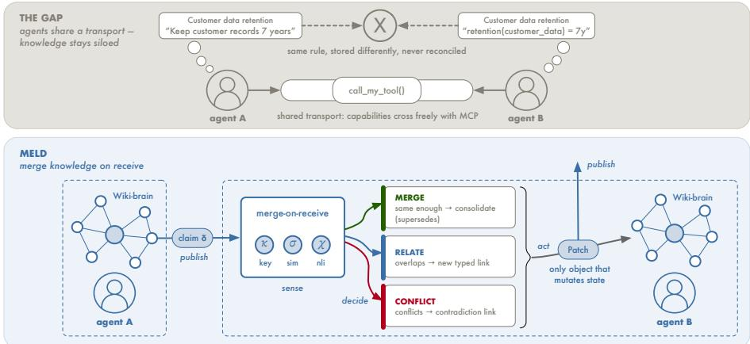
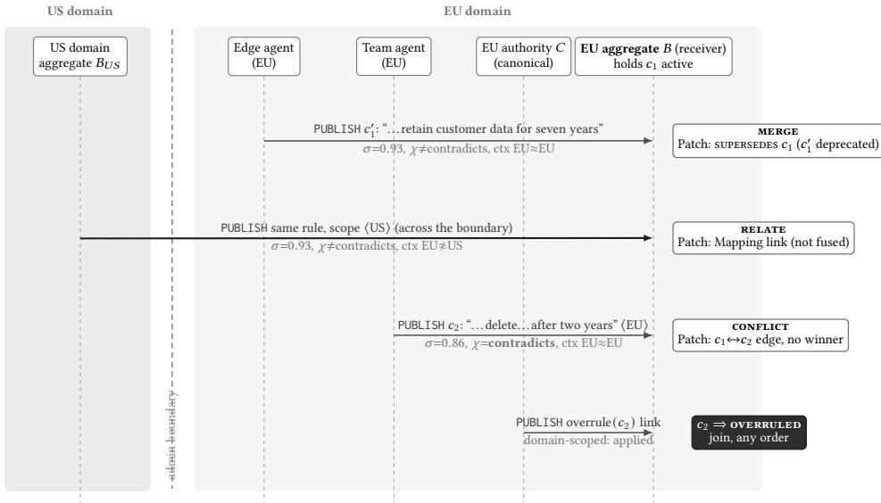
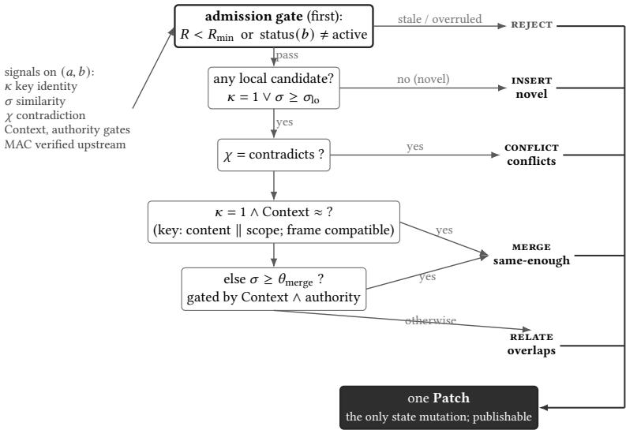
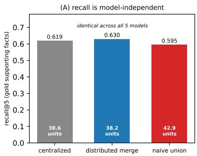
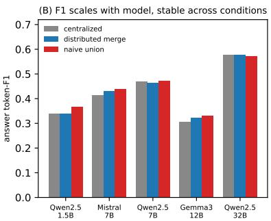
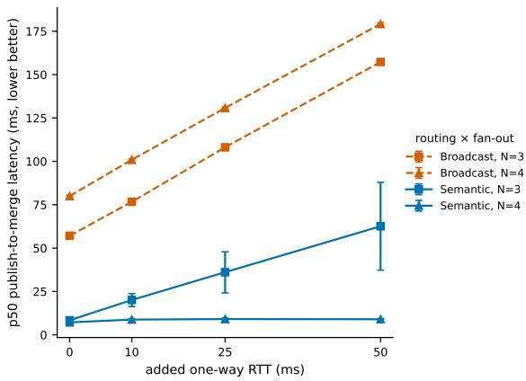
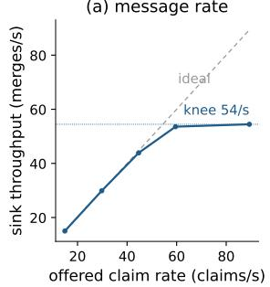
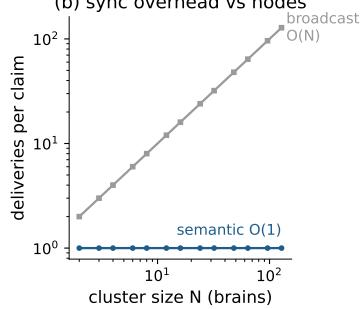
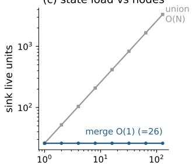
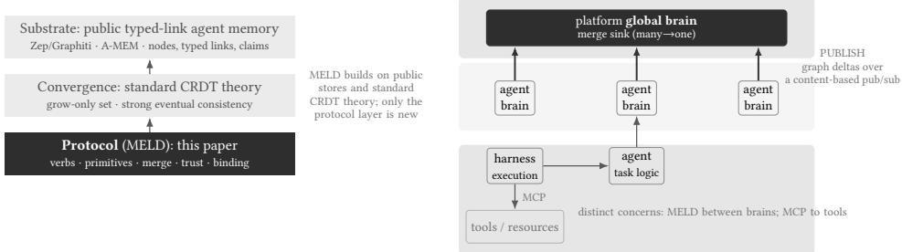

# MELD: A Protocol for Merging Knowledge Across Distributed Agentic Memories

LAURI LOVÉN∗, Future Computing Group, University of Oulu, Finland

JAAKKO SAUVOLA, University of Oulu, Finland

JUKKA RIEKKI, University of Oulu, Finland

SASU TARKOMA, University of Helsinki and University of Oulu, Finland

Autonomous agents share a transport and can call each other’s tools, but they cannot share what they know: no protocol lets two agents’ memories reconcile a fact phrased two ways, link related facts held apart, or reconcile contradictory knowledge without silently discarding either claim. We present MELD, a self-managing coherence mechanism for a federation of agent memories whose run-time model is the knowledge graph itself. Each brain admits every incoming claim through a five-outcome procedure (insert, merge, relate, conflict, or reject), decided from three signals (scoped claim-key identity, embedding similarity, and a natural-language inference verdict) under context and freshness gates, and acting through exactly one auditable, authenticated Patch, the only object that mutates state. A binding onto standard publish/subscribe transport with a per-claim status CRDT keeps sovereign brains coherent in claim status without a coordinator: self-healing after partitions and under lossy routing, and self-protecting against silent rewrite by a peer, under a benign-fault model. MELD does not adjudicate truth; a detected contradiction is preserved for later adjudication, never silently resolved On HotpotQA distractor, distributed merge is recall-non-inferior to a centralized store under a pre-specified equivalence test and recall-superior to naive union at about 11% less live storage; the merge classifier separates at AUC 0.968 with a 0.013 false-merge rate on adjudicated candidate pairs; the status CRDT reconverges in 30/30 real partition-heal trials where last-writer-wins manages 11/30; and semantic routing delivers about 3× fewer messages at matched recall. We evaluate on a real computing continuum spanning an operator-grade 5G edge, national HPC, and a local tier, with empirically calibrated thresholds.

CCS Concepts: • Computer systems organization → Self-organizing autonomic computing; • Theory of computation → Distributed computing models; • Computing methodologies → Natural language processing; • Networks → Middleware for databases.

Additional Key Words and Phrases: Knowledge merging, distributed agent memory, autonomic systems, self management, conflict-free replicated data types, eventual consistency, semantic publish/subscribe, multi-agent systems, agentic AI, computing continuum

## 1 Introduction

## 1.1 The missing knowledge-merge layer

Multi-agent infrastructure now provides connectivity, content-based and learned routing, and, with tool-invocation protocols such as the Model Context Protocol (MCP) [Anthropic 2024], a standardized way for agents to expose and call one another’s tools and resources. It does not provide a way for them to share what they know (Figure 1).

Each non-trivial agent accumulates a private, evolving memory: a knowledge store of concepts and claims, the evidence grounding them, the contexts in which they hold, and the typed relations among them (associations, entity coreference, supersession, contradiction, precedent). Recent agent-memory systems have converged on this shape (a versioned, typed-link knowledge graph rather than a flat document store) in Zep/Graphiti’s bi-temporal knowledge graph [Rasmussen et al. 2025], A-MEM’s linked atomic notes [Xu et al. 2025], GraphRAG’s entity graph [Edge et al.

  
Fig. 1. MELD at a glance. Top: a shared transport lets capabilities cross (e.g. via MCP), but the same fact stored two ways stays unreconciled. Botom: each brain merges on receive: it senses three signals (� scoped claim-key, � similarity, � inference), decides among same-enough, overlaps, conflicts, or insert (novel), and acts by one auditable Patch, the only object that mutates state (tabulated in the electronic supplement, Appendix N).

2024], HippoRAG [Gutiérrez et al. 2024], and Mem0 [Chhikara et al. 2025]. We call one agent’s such store its wiki brain, after the distributed wiki-brain vision that motivates this work. Two agents working in the same domain will, over time, hold overlapping, complementary, and sometimes incompatible knowledge, a divergence recent multi-agent memory systems observe but address with access control rather than a merge protocol [Rezazadeh et al. 2025]. There is today no protocol that lets two wiki brains reconcile a fact they both hold but phrase or scope diferently, record a relation between facts that neither holds in isolation, or reconcile contradictory knowledge without silently discarding either claim. Knowledge stays siloed in each agent, is re-derived redundantly, or is flattened by ad-hoc last-writer-wins overwrites that silently discard information and lose provenance.

The gap is not the interchange of knowledge, which is now being standardized: the Open Knowledge Format [Google Cloud 2026] gives curated knowledge a vendor-neutral representation an agent can consume, but it leaves reconciliation open. A format fixes how a claim is written down but does not say what a brain should do when a peer’s claim arrives that says the same thing in other words, says something adjacent, or says the opposite. Knowledge is merged, related, surfaced as a contradiction, or silently lost at that moment of arrival rather than at parse time.

A tool-invocation protocol cannot fill this gap, because it is the wrong kind of object. MCP moves capability (“here is a tool you may invoke”): its verbs are call and read, and its state is the tool surface. It has no notion of two parties holding the same fact diferently, and hence none of merging them. The missing protocol must move and reconcile knowledge (“here is a claim you may merge into your brain”), and its central operation is reconciliation of two replicas that may hold the same surface term with the same, a related, or an incompatible meaning, which is the gap this paper addresses.

The pieces such a protocol needs have only recently become deployable components: cheap inference and high-quality embeddings make semantic similarity a practical online primitive, routable over a federated publish/subscribe transport [Lovén et al. 2026a,b]; agentic memories have converged on versioned, typed-link knowledge graphs [Edge et al. 2024; Rasmussen et al. 2025; Xu et al. 2025]; and natural-language inference is now reliable enough to flag contradictions between claims at scale. The missing piece is the protocol that composes them into merge.

## 1.2 MELD in outline

We present MELD (a name for the semantic meld, or merge, of knowledge): a state-synchronization protocol for many sovereign agent wiki brains. Where MCP exposes tools and resources and agentto-agent protocols expose tasks [Google and Linux Foundation 2025], MELD exposes meanings, claims, and merges. MELD is built around one operation that no tool protocol has: when a brain receives knowledge from a peer, it does not apply that knowledge directly; it runs a merge decision procedure that classifies the incoming knowledge against what it already holds and emits an auditable record of the outcome (Figure 1): same-enough (the same fact, merged), overlaps (related but distinct, linked rather than collapsed), or conflicts (incompatible, the contradiction kept as a first-class object rather than silently resolved). A single operation, PUBLISH of a graph delta, carries the knowledge; the merge-on-receive decision supplies the semantics and is the load-bearing new idea.

In autonomic-computing terms, this merge-on-receive loop makes MELD a self-managing coherence mechanism for a federation of agent memories, and the adapted run-time model is the knowledge graph itself. Each brain runs a per-delta admission loop: it senses three signals (claimkey identity over content and scope, embedding similarity, and an inference verdict), decides via the five-outcome admission procedure gated by Context, authority, and freshness, and acts by emitting and applying a Patch that mutates its own memory (Section 4); the electronic supplement (Appendix N) tabulates this loop element by element. The loop closes on knowledge admission (the inference verdict drives the sole object that mutates state), but it is not a self-optimizing controller, as the decision thresholds are calibrated ofline and held fixed, with no run-time feedback that re-tunes them. Two self-\* properties rest on it: self-healing, the status CRDT reconverging a partitioned, reordered federation to one per-claim status without a coordinator (Section 7.4); and self-protection, authority-gated admission keeping a canonical brain from being silently rewritten by a peer (Section 5.3). Section 5 states how each is bounded: the digest that frees self-healing from rely- ing on the semantic-routing path for complete delivery, and the benign-fault (non-Byzantine) threat model self-protection assumes. We adopt neither a MAPE-K vocabulary nor a central manager: MELD realizes adaptation as a wire protocol and a per-brain decision procedure, in the lineage of autonomic computing [Kephart and Chess 2003] and self-adaptive software [Salehie and Tahvildari 2009], and of recent self-adaptive LLM-based multi-agent systems [Nascimento et al. 2023], but as a protocol for knowledge merge rather than a managed-element framework.

MELD stands on a deliberately minimal substrate that public agent-memory systems largely provide: each wiki brain need only be a typed-link agent memory, a set of content-addressed nodes with typed links among them, exposing per-node claims as individually addressable assertions. Such stores are now standard (Section 2.1 surveys Zep/Graphiti, GraphRAG, HippoRAG, Mem0, and A-MEM); MELD additionally relies on per-claim status and validity intervals to make supersession non-lossy, first-class today only in Zep/Graphiti’s bi-temporal model [Rasmussen et al. 2025], and supplies them at the protocol layer for stores that track only current state. MELD defines its data model self-contained against this shape (Section 2.2) and depends on no particular memory implementation. MELD’s own contribution is the wire protocol, the merge decision procedure, and the Patch object; we evaluate distributed agents merging into a shared brain against a centralized memory store, with MCP as the contrast object and the public agent-memory stores treated as the substrate MELD synchronizes. We do not re-derive their results.

## 1.3 Contributions

This paper makes four contributions, all at the protocol/systems layer and all self-standing over a public, versioned typed-link agent memory as substrate:

(1) A wire protocol for knowledge merge. A single wire operation, PUBLISH (contribute a graph delta of concepts, claims, and typed links), under a content-based delivery contract; status changes (supersession, overrule, revocation) ride as append-only status links, and the only new wire object is the Patch. Prior framings name “subscribe/publish/update is the protocol” as a slogan; MELD specifies the message types, the graph-delta payload, and the merge-result semantics that make it an actual protocol (Section 3).

(2) An operational merge decision procedure. An executable procedure that, for each incoming claim, decides insert (novel), same-enough, overlaps, conflicts, or reject (an admission-gate drop) from three standard signals (claim-key identity over content and scope, embedding similarity, and natural-language inference) gated by context compatibility, authority, and freshness. The procedure first adjudicates whether an incoming claim has any candidate at all; candidate selection is an exhaustive scan within the receiving brain, whose cost we measure directly (Section 7). The novelty is the combining procedure rather than the borrowed signals. Once a candidate pair exists, the pair-adjudication core is a hierarchy (exact claim-key match in a compatible frame first, scoped to content and discrete scope so a match cannot cross a jurisdiction boundary, then embedding-plus-gates) rather than a bare similarity threshold, and it never silently resolves a detected contradiction (Section 4).

(3) The Patch as a first-class, auditable wire object. The result of a merge is reified as an authenticated, versioned Patch: it records the decision, the target, the emitted deltas, and which gates fired, so that a merge is itself replayable and auditable across the federation. The Patch, not the raw incoming delta, is the only thing that mutates local state, and it is itself publishable (Sections 3 and 4).

(4) A binding of merge semantics onto a standard publish/subscribe transport, with status convergence. A mapping of graph deltas (node, link, and claim-version sets) onto a standard content-based publish/subscribe fabric (Apache Kafka in our deployment), with semantic routing as an optional content-matching layer; an append-only wire discipline that preserves the premises of a status conflict-free replicated data type end-to-end; and an authority-gated merge-admission policy over a trust hierarchy of canonical brains. The result keeps many sovereign brains coherent in real time: per-claim status converges via a self-contained status conflict-free replicated data type built on standard CRDT theory, while the semantic graph structure each claim sits in is adjudicated locally, per delivery (Sections 5 and 6).

We evaluate MELD by having � agents sync knowledge into a shared global brain, an aggregate built by decentralized merge, and answer queries against the merged result, measured against a centralized single-store baseline, on the real three-tier computing continuum the protocol targets (a 5G test-network edge, national HPC, and a local host), with MELD additionally deployed live across all three (Section 7). The main result is that decentralized merge is recall-non-inferior to a centralized store and recall-superior to naive union at lower live storage; we report a separate experiment for the merge classifier, the status CRDT’s partition-heal convergence, semantic routing, and fan-out latency. Numbers and baselines are deferred to Section 7.

Five limits frame these contributions: merge is evaluated relative to a centralized baseline; consistency converges on claim status without addressing truth; the merge graph itself is ordersensitive, unlike per-claim status; first-class relational structure rests on an open empirical premise; and the merge thresholds are calibrated rather than derived. Section 9.1 states and develops each.

## 2 Background

This section fixes two things the rest ofthe paper relies on: the minimal substrate MELD assumes and where that substrate already exists in public systems (Section 2.1); and a self-contained statement of the data model MELD synchronizes (Section 2.2). The contrast with tool- and task-level agent protocols is drawn in Section 8.

## 2.1 The substrate MELD assumes

MELD is a protocol above an agent-memory store, and it is deliberately undemanding about that store. The only substrate it requires is a versioned, typed-link agent memory: a store of content-addressed nodes, typed and versioned links among them, and per-node claims with a status and a validity interval. This shape is approximated, to difering degrees, by the public stores introduced in Section 1: Zep/Graphiti realizes it most fully, with typed links and validity intervals first class on every edge [Rasmussen et al. 2025]; A-MEM’s associative links are untyped [Xu et al. 2025]; and GraphRAG [Edge et al. 2024], HippoRAG [Gutiérrez et al. 2024], and Mem0’s graph variant [Chhikara et al. 2025] type their links but leave per-claim versioning and status derivable rather than first-class. The emerging Open Knowledge Format [Google Cloud 2026] sits at the same layer as an interchange encoding: it carries provenance, trust, and lifecycle fields, but its links are untyped and its lifecycle is per concept rather than per claim. MELD supplies typed links, status, and validity intervals at the protocol layer for stores that track only current state, treating any such store as a wiki brain it synchronizes rather than mandates or reinvents. The new objects (the wire protocol, the merge decision procedure, and the trust-hierarchy admission policy) live at MELD’s own protocol/systems layer.

## 2.2 The wiki-brain data model MELD synchronizes

An agent’s knowledge is a versioned, typed-link knowledge graph, which we call its wiki brain. We state the model self-contained, recapping only what the protocol touches. The model is the shape the stores above approximate; it restates no single system.

A brain holds nodes (content-addressed, carrying an owner identity, an origin tag, an authority level, a confidence, an access-control scope, and a retention state) and first-class links (typed, versioned, authenticated, weighted relations such as association, entity coreference, supersession, partial overrule, grounding, and contradiction). A node carries one or more claims: addressable assertions, each with a claim key derived from its canonical content together with its discrete scope, a confidence, a validity interval, and a status drawn from a monotone lifecycle (active, deprecated, overruled, revoked). Assertions are appended, not overwritten: a new version supersedes an old one through a link rather than by mutation, so provenance and history are preserved. Each node carries a staleness state (a content hash, a fetch time, a freshness budget, and a latest flag) that governs whether it should be re-fetched or allowed to decay.

Two properties of this model matter for the protocol. First, the natural unit of exchange is a graph delta (a version-set of nodes, claims, and links), not a flat document. Second, because links are first class and typed, the result of reconciling two brains can itself be represented in the graph (as an association, a coreference, or a contradiction link) rather than collapsed into a single overwritten value. MELD exploits both.

## 3 The MELD protocol

MELD is a state-synchronization protocol for sovereign agent wiki brains. Its transport surface is a single operation (PUBLISH of a graph delta under a content-based delivery contract), and its semantics describe what a brain does when a delta is delivered to it. This section specifies the wire

surface (Section 3.1) and the typed objects it carries (Section 3.2), including the Patch, the protocol’s distinctive new wire object. The decision procedure that a delivered delta triggers is the subject of Section 4.

## 3.1 A single wire operation

MELD reduces prior “subscribe, publish, update” framings to one wire operation, PUBLISH(graph-delta), whose payload is a graph delta (a version-set of nodes, claims, and typed links), the unit of ex-change throughout MELD. The slogan’s “subscribe” and “update” are not separate verbs: a delta is delivered by content-based interest match (a transport concern, scoped by cell and authority, under the at-least-once / idempotent / eventually-complete contract of Section 5), and a status change (supersession, overrule, revocation) is itself a PUBLISH of an append-only status link, never an in-place edit. The append-only form preserves the status-CRDT premises end to end.

A receiving brain does not apply an incoming delta as delivered; the delta is decomposed by type. Each incoming claim runs the merge decision procedure (Section 4); status links (supersede, overrule, revoke) are admitted append-only into the status CRDT after MAC verification, through a Patch of the status kind, and filtered at materialization-read (Section 5); node metadata and other typed links follow the store’s own append rule. In every case, local state is mutated by a Patch and by nothing else.

## 3.2 Typed objects as concrete message and state types

MELD names typed objects over the wiki-brain data model; only the Patch is new. The node, claim, and typed-link types map directly onto the data model (Section 2.2); Evidence and Context are roles over those types, not new wire objects: a Claim’s grounding attribute (its provenance; an evidence-overlap signal and an evidence-weighted tie-break are future work, Section 9.2) and the derived validity/scope frame the merge gate reads (Section 4). The typed-link form is first-class in Zep/Graphiti [Rasmussen et al. 2025] and present in the graph-based public stores [Chhikara et al. 2025; Edge et al. 2024; Gutiérrez et al. 2024]; A-MEM supplies the node-and-link core through untyped associative links [Xu et al. 2025]. We adopt this shape and do not re-specify it.

Concept a node: a named meaning or entity the brain holds, content addressed and carrying owner, authority, confidence, access scope. The candidate merge node at the entity or topic level.   
Claim an addressable assertion inside a node, with a claim key derived from canonical content and discrete scope, confidence, validity interval, and status. The claim is the merge key: same-enough is decided at claim granularity, not at whole-node granularity.

Mapping a typed, authenticated, versioned, weighted link asserting a relation between two mean- ings or claims across brains (association, entity coreference, supersession, partial overrule). A Mapping is the relate-don’t-merge output: a typed link recording a cross-brain association or coreference.

Patch the reified result of running the decision procedure on an incoming delta.

The Patch is the new wire object. A Patch’s decision field carries a claim-admission outcome or the status kind for an already-authored status-link append (Section 3.1). A Patch is an authenticated, versioned record

$$
\begin{array} { r } { \mathsf { P a t c h } = \langle \mathrm { d e c i s i o n } , \mathrm { t a r g e t } , \mathrm { e m i t t e d } - \mathrm { d e l t a s } , } \\ { \mathrm { g a t e s } { \cdot } \mathrm { t h a t } { - } \mathrm { f i r e d } , \mathrm { v e r s i o n } \rangle , \qquad } \end{array}
$$

where decision ∈ {insert, merge, relate, conflict, reject}, target is the afected endpoint, and gates-that-fired records which signals drove the decision (claim-key match, embedding score, inference outcome, freshness gate). The Patch is the only object that mutates local state, and it is itself publishable, so a global brain can audit and replay merges across the federation. Replay re-runs the decision procedure against the consumer’s own held state, so a replayed decision can difer from the one recorded in the Patch if the consumer’s state has since changed. The Patch preserves the original decision and the gates that produced it for audit, and does not guarantee that replay reproduces it. The five decisions emit, respectively: an active claim-status link for a novel insert; a claim-status link for a merge (active for an exact-key match; deprecated under a supersedes link for a consolidated paraphrase); a Mapping link for a relate; a first-class contradiction link for a conflict (with no silently chosen winner); and a recorded no-op for a reject (the admission gate alone: a stale or overruled delta). Reifying the merge result as a first-class, auditable, replayable wire object, rather than letting a brain mutate silently on receipt, is a contribution of MELD.

Running example: governance agents across the continuum. We thread one example through this section and the next two (Figure 2). A multinational runs data-governance agents across two administrative domains, EU and US, each operating its own domain aggregate (a perdomain global brain) that peers with the other across the boundary, the hybrid deployment of Section 9.3. The EU domain holds an edge agent �, a team agent, the EU domain aggregate � (our receiver), and the EU canonical authority � of regulator-grade authority; the US domain runs its own aggregate $B _ { U S }$ . Their brains hold diferent knowledge, and the reasons are the continuum’s own drivers, each of which the protocol must answer: locality (each tier and domain ingests its own policy source), data sovereignty (a rule is scoped to a jurisdiction and may not be silently fused across a domain boundary), latency and partition (edge tiers run intermittently disconnected and cannot consult � synchronously on each receive), and data minimization (a privacy-relevant property, not a privacy guarantee). Data minimization is part of why MELD exists in this form: the domains may not pool the underlying customer records, so a claim and a Patch cross the wire, and the boundary, rather than the underlying data. Brain � already holds the claim $c _ { 1 } = { } ^ { \ast }$ Customer data must be retained for seven years,” with Context ⟨jurisdiction: EU⟩ and status active, its Evidence the governing handbook clause. When the EU edge agent � now PUBLISHes a paraphrase of the same requirement, � does not apply it directly: it runs the decision procedure of Section 4 and emits one Patch. Section 4 resolves that delta and two more (the US domain aggregate peering its rule across the boundary, and a contradicting publish from an EU team agent); Section 5 converges the status after � overrules within the EU domain.

## 4 Merge semantics

The procedure returns one of five outcomes for an incoming claim: insert (novel, no matching candidate), same-enough, overlaps, conflicts, or reject (an admission-gate drop). Once a candidate exists, a four-verdict pair-adjudication classifier decides among merge, relate, conflict, and no-relation (no actionable relation), which maps to insert at the protocol level (Section 4.2). MELD’s contribution is the decision procedure that computes which outcome holds for an incoming claim, and the Patch it emits. The procedure runs per incoming claim � against the claims the receiving brain already holds, delivered by a PUBLISH, within a candidate-matched Concept.

## 4.1 Three signals

The decision procedure reads three signals over the pair (�, �). The signals themselves are standard, drawn from prior art, and MELD’s contribution is not the signals but the safety-preserving decision procedure that combines them (Section 4.2):

$\kappa = [ { \mathrm { c l a i m - k e y } } ( a ) = { \mathrm { c l a i m - k e y } } ( b ) ]$ , with claim-key(�) = �canon(�) ∥ scope(�): the key hashes a claim’s canonical content together with its discrete scope (its cell), so � = 1 if two assertions are byte-identical after canonicalization and carry the same scope (standard content addressing, extended to the frame). Only the discrete scope enters the key; the validity interval and freshness stay in the Context gate, because hashing a continuous field would break key identity on any timestamp diference. Binding scope into identity makes data sovereignty structural: the same sentence published under a diferent jurisdiction is a diferent claim, so the exact-key fast path cannot fuse across an administrative boundary and the guarantee of Section 4.3 does not depend on a downstream gate. Exact and cheap, with no model call. Because independently authored brains rarely produce byte-identical keys for the same fact (canonicalization is local and key assignment is decentralized), � is an opportunistic fast path, not a load-bearing identity test: when keys diverge (the common case), same-enough falls through to the semantic gate (� with the $\chi$ guard, Section 4.3), so a mis-canonicalized key degrades to a re-decided relate/merge, never a permanent split. The ablation confirms the semantic path carries paraphrase matching (� alone scores merge-recall 0, Section 7.2), so scoping the key costs the evaluated procedure nothing.

  
Fi . 2. Runnin exam le as a se uence trace (threaded throu h Sections 3–5); it instantiates the h brid cross-administrative-boundary deployment of Section 9.3. Two admin domains (US, EU) each run a domain aggregate and peer across the dashed boundary. Four reasons make the brains difer, each driving one mechanism: locality (each tier ingests its own source), data minimization (a privacy-relevant property, not a guarantee: only a claim crosses the wire, never the customer data, message 1), sovereignty (the Context gate keeps the US rule related, not fused when the US aggregate peers across the boundary, even at identica similarit ; the sco e is art of the claim ke , so the two are not even ke -identical, Section 4.1; messa e 2 the one arrow that crosses), and latency/partition (the status CRDT converges $c _ { 2 }$ to overruled regardless of delivery order, message 4). Receiver � runs the decision procedure on each delta and emits exactly one Patch. The overrule (accent) is applied because it carries a MAC under the federation group key (asserted origin: EU authority �) and stays within the domain; a US-origin overrule of an EU claim would append but never materialize (the authorization predicate, Section 5). All signal values reproduce from the reference implementation.

• � = cosemb(�), emb(�), the dense semantic similarity of the claim texts under a sentence encoder [Reimers and Gurevych 2019].

$\chi = \mathrm { N L I } ( a , b )$ , a natural-language-inference verdict [Bowman et al. 2015] used as a contradiction detector: reads only whether � contradicts $^ { a , }$ not the finer entails/neutral distinction.

A fourth signal, grounding-evidence overlap (Jaccard overlap of two claims’ provenance), applies where claims carry grounding; we find a fixed rule for it inherits the inference signal’s contradiction- miss rate, so safe use needs a learned, inference-quality-aware combination. The core procedure here keeps to the three deployment-universal signals; the grounding signal and the learned combination are future work (Section 9.2). The embedding similarity and the inference verdict are online primitives; MELD composes them into a five-outcome admission procedure (Section 4.2) whose pair-adjudication core is a four-way classifier, gated by Context, authority, and freshness, that emits a Patch.

## 4.2 The decision procedure

Let $\theta _ { \mathrm { { m e r g e } } }$ be a calibrated merge threshold and $\sigma _ { \mathrm { l o } } \leq \theta _ { \mathrm { m e r g e } }$ a relatedness floor. Write Context(�) ≈ Context(�) when the two claims share a compatible frame (same cell, overlapping validity interval, compatible freshness), $R _ { \mathrm { m i n } }$ for the minimum retention below which a node is treated as stale, and auth $( b  a )$ for the authority-admission predicate of Section 5.3, which fails exactly when the incoming source is strictly less authoritative than the local target. The procedure runs on an incoming claim � against the claims the receiving brain already holds, and returns exactly one of five outcomes. It is a first-match cascade: the rules are evaluated in the order written and the first rule whose guard holds returns, so the outcomes are mutually exclusive by construction, and rule R6 carries no guard, so the procedure is total.

R1 reject if �(�) < �min ∨ status(�) ≠ active;

R2 insert (novel) if no local � has $\kappa ( a , b ) = 1 \vee \sigma ( a , b ) \geq \sigma _ { \mathrm { l o } } ;$

otherwise let $a ^ { \star }$ be the best such candidate, and read

$\kappa , \sigma , \chi$ on the pair $( a ^ { \star } , b )$

R3 conflict if � = contradicts;

R4 merge (same-enough) if � = 1 ∧ Context(�★) ≈ Context(�);

R5 merge (same-enough) if $\sigma \geq \theta _ { \mathrm { { m e r g e } } }$ ∧ Context(�★) ≈ Context(�)

$$
\scriptstyle \bigwedge \ \mathrm { a u t h } ( b \to a ^ { \star } ) ;
$$

R6 relate (overlaps) otherwise.

The candidate $a ^ { \star }$ is deterministic given the store state, and selection is gate-aware. Candidates are the receiving brain’s active claims only (a deprecated or overruled claim is never a merge target); an exact-key match, which under the scoped key implies the same content in the same scope, is selected first; otherwise $a ^ { \star }$ is the active claim of maximum similarity $\sigma ,$ ties resolved to the earliest-admitted claim. When the provisional candidate (the exact-key hit if one exists, otherwise the maximum-similarity claim) does not contradict � but fails a merge-admission gate, and another active claim satisfies all the gates at $\sigma \geq \theta _ { \mathrm { { m e r g e } } }$ , the procedure adjudicates that claim instead, with its own inference check, so a contradiction there still surfaces; an ineligible candidate, exact-key or semantic, cannot shadow an admissible merge. A contradicting provisional candidate is always the adjudication target. Selection is an exhaustive scan of the local store; its measured cost is in Section 7.2 and the electronic supplement (Appendix M). Admission adjudicates a single relationship, reading at most two candidate pairs when the gate-aware fallback fires: MELD performs single- target admission, and it does not attempt exhaustive relational reconciliation. A contradiction is therefore discovered when the contradicting claim is the admission target; a second-best candidate that also contradicts the incoming claim is not tested at admission, and completeness of the semantic link set is out of scope.

MAC verification precedes the procedure: a delta whose MAC does not verify against the shared group key is dropped before any signal is read (Section 5.4). That drop is not a reject. It happens before R1, and an unverifiable delta never reaches adjudication.

reject (R1) is the admission gate, and nothing else. A stale or overruled delta is rejected before any semantic signal is consulted, so such deltas never propagate. reject never means “no match found”: that case is R2. When the receiving brain holds no claim at or above the relatedness floor there is nothing to adjudicate against, so the incoming claim is admitted as a new node with status active and no link. A federation whose receivers dropped unmatched claims could not acquire knowledge at all, which is why novelty is an outcome of the procedure rather than a failure of it.

R3 precedes the merge rules, and it is gated on the relatedness floor $\sigma _ { \mathrm { l o } }$ rather than on the high merge threshold $\theta _ { \mathrm { { m e r g e } } } ;$ : a contradiction need not be near-identical in surface form to be a contradiction, so a lexically divergent contradiction (similarity in $[ \sigma _ { \mathrm { l o } } , \theta _ { \mathrm { m e r g e } } ) )$ is surfaced rather than dropped, while merge keeps the high bar. Because R3 is evaluated first, a contradicting pair in that band is a conflict and not a relate; the two rules cannot both fire. The evaluation (Section 7.2) measures the efect: this placement raises conflict recall without changing the false-merge rate, because it only re-routes contradictions toward the contradiction link, never toward a merge.

R4 and R5 are the two same-enough paths, and they are gated diferently. The exact-key path R4 is exem t from the authorit redicate because the claim ke hashes canonical content to ether with the claim’s discrete scope (Section 4.1): $\kappa = 1$ means the peer already holds the byte-identical assertion in the same scope, so there is no cross-boundary rewrite to guard against. The key does not carry the validity interval or freshness, so R4 still requires a compatible frame; an exact-key pair whose Contexts are incompatible, for example identical scoped assertions with disjoint validity intervals, falls through to R6 and relates. The similarity path R5 carries no such guarantee, so it carries both gates: Context compatibility, and the authority admission of Section 5.3, which withholds an automatic merge from a source strictly less authoritative than the local target and lets R6 admit it as a candidate instead.

The non-contradiction gate is only as strong as the contradiction signal �: a missed contradiction (an inference false negative) is not caught here, so the guarantee is that MELD never silently resolves a detected contradiction (Section 5.4 treats the adversarial evasion of this gate), and the residual false-merge rate is measured by the evaluation (Section 7). Figure 3 renders this control flow: the signals read once, the admission gate first, the novelty test, the same-enough hierarchy, and the single Patch that every path emits.

## 4.3 The same-enough predicate

Same-enough is a hierarchy, not a bare similarity threshold. The primary test is claim-key identity in a compatible frame (� = 1, Context ≈): exact, cheap, and decisive absent a detected contradiction. Only when keys difer does the procedure fall back to embedding similarity over $\theta _ { \mathrm { { m e r g e } } } .$ , and even then the merge is gated by two conditions: non-contradiction $( \chi \neq$ contradicts) and Context compatibility. Continuing the running example (Figure 2), the edge agent’s paraphrase “We are required to retain customer data for seven years” shares no claim key with $c _ { 1 } \left( \kappa = 0 \right)$ , but embeds at $\sigma = 0 . 9 3$ and does not contradict $c _ { 1 }$ in a matching EU Context, so it clears the gate and merges. The merge is a status consolidation, not a node rewrite: the Patch retains the paraphrase, marks it deprecated under an append-only supersedes link to $c _ { 1 }$ , and leaves $c _ { 1 }$ canonical and active, so a status-aware recall surfaces the single representative $c _ { 1 }$ while the duplicate is kept for audit. The merge adds one append-only link and makes no destructive edit, so it is monotone on the status CRDT (Section 5) and does not mutate content. The Context gate then stops a high-similarity false merge across an administrative boundary. When the US domain aggregate $B _ { U S }$ peers its retention rule into the EU domain, it peers the very same sentence, scoped ⟨jurisdiction: US⟩ and therefore carrying a diferent claim key (Section 4.1). The pair still embeds at $\sigma = 0 . 9 3$ and does not contradict, but the frames difer (EU0US), so it relates rather than merges. The US rule enters the EU view as a related, distinct claim. It is not collapsed into $c _ { 1 } { \mathrm { : } }$ , and data sovereignty is preserved across the boundary by construction. The same gate stops the textbook frame error (“Paris” the city versus the mythological figure); here it keeps an EU and a US retention rule distinct. The dangerous error a merge protocol must avoid is the false merge (two distinct facts collapsed into one), and the gate hierarchy drives its rate down without sacrificing recall on genuine paraphrases.

  
Fig. 3. The merge decision procedure, a first-match cascade over five outcomes. The signals $\kappa , \sigma , \chi$ are read on the adjudicated candidate pair (a second pair is read only when the gate-aware fallback of Section 4.2 fires); a delta whose MAC fails verification, or is stale or overruled, is dropped before any semantic test. A claim with no candidate at or above the relatedness floor is novel and inserted; reject is the admission gate alone, never “no match found”. Contradiction is tested next, so a contradicting pair is conflict, not relate. Same-enough is then a hierarchy: claim-key identity in a compatible frame $( \kappa = 1 \wedge$ Context ≈) decides first, else similarity $\sigma \geq \theta _ { \mathrm { m e r g e } }$ gated by Context and authority. Anything remaining relates; every path emits exactly one Patch, the only object that mutates local state.

## 4.4 Overlaps and conflicts as first-class graph structure

Overlaps emit a Mapping. A relate decision emits a typed, weighted Mapping link (weighted by �). The two claims stay distinct, and a later graph walk can traverse the relation. This is the principled handling of the same meaning in a diferent Context: the protocol records the relationship instead of collapsing the frames.

Conflicts emit a contradiction link. R3 fires on the inference verdict alone, before any Context test: a conflict is a semantic contradiction irrespective of scope. The contradiction link records both claims’ Contexts, so a cross-frame contradiction is preserved as information (two frames may legitimately disagree) rather than treated as an operational fault, and whether a contradiction binds within a compatible frame is part of the deferred adjudication (Section 5). A conflict decision represents the conflict as a first-class contradiction link and does not pick a winner. In the running example, an EU team agent publishes, within the EU domain, $c _ { 2 } = { } ^ { \mathrm { { s } } } \mathrm { { C } }$ ustomer data must be deleted after two years” $( \sigma = 0 . 8 6$ against $c _ { 1 } , \chi = c o n t r a d i c t s ,$ same EU Context): MELD records a first-class $c _ { 1 }  c _ { 2 }$ contradiction link and chooses no winner. The pair is a genuine policy tension (a retention duty against a right-to-erasure rule) and not a surface typo. Note that $\sigma = 0 . 8 6$ sits below $\theta _ { \mathrm { m e r g e } } = 0 . 9 0$ , so the two would not have merged in any case, and MELD surfaces the contradiction only because the conflict gate keys on the relatedness floor $\sigma _ { \mathrm { l o } }$ rather than the merge bar (Section 4.2). Resolution is deferred to the trust hierarchy or a deterministic tie-break (authority, then recency, then evidence weight; Section 5). MELD states explicitly that the normatively correct tie-break is an open question: it represents and converges the status of a conflict, but does not claim to settle the conflict-of-law problem.

## 4.5 The Patch as the merge output

Every run of the procedure emits exactly one Patch (Section 3.2), recording the decision, the target endpoint, the emitted deltas, and which gates fired. The Patch is the only thing that mutates local state and is itself publishable, so the federation can audit and replay any merge.

The thresholds $\theta _ { \mathrm { { m e r g e } } }$ and $\sigma _ { \mathrm { l o } }$ are calibrated on held-out claim-pair data, not derived; Section 7 reports their sensitivity rather than claiming derived optima.

## 5 Consistency and trust

MELD keeps many sovereign brains coherent in the sense it controls: per-claim status reaches a strong-eventually-consistent agreement without a coordinator, while the merge graph itself, decided per pair by the procedure of Section 4, is adjudicated locally at each brain and is not itself claimed coherent in that same sense. MELD achieves the status guarantee by defining a self-contained status conflict-free replicated data type (CRDT) over per-claim status, grounded in standard CRDT theory (Section 5.1); preserving that CRDT’s premises end to end through an append-only wire discipline that is MELD’s own contribution (Section 5.2); and admitting merges through an authority-gated trust hierarchy (Section 5.3).

## 5.1 Status convergence versus truth

MELD’s controlled variable is the per-claim status. Epistemic truth (which of two contradictory claims is correct) is deliberately outside the loop, a world-model concern that sits above MELD (Section 9.2). This is a design boundary, not a shortfall: the mechanism converges the status it controls and represents, rather than silently resolves, the truth it does not.

Each claim carries a status on the totally ordered status chain

## active ⊑ deprecated ⊑ overruled ⊑ revoked.

A brain’s local status state is a grow-only set (G-Set) of incoming, append-only overrule and supersede links, and merge is set union of these link sets. Set union is commutative, associative, and idempotent, so the link set is a state-based CRDT and reaches strong eventual consistency [Klepp- mann and Beresford 2017; Shapiro et al. 2011]: any two brains that have received the same set of links hold the identical link set, independent of delivery order. The per-claim status is then a deterministic function of that converged set, the join (the maximum along the status chain above) of the status efects its links carry; because the function is deterministic, brains that agree on the link set agree on every status. The links are only ever added, never removed, so this is the grow-only instance of the standard state-based-CRDT construction [Shapiro et al. 2011]: convergence rests on the union, and the status chain supplies the deterministic materialization on top. This orderindependence is a property of the per-claim status; the merge graph itself (built by the per-pair decision procedure, Section 4, against already-held state) is not claimed order-independent, and the protocol’s guarantees rest only on status convergence. The electronic supplement (Appendix M)

measures this directly: under randomized delivery orders the status layer converges while link structure and retrieval-visible state can difer across orders.

Strong eventual consistency guarantees that all brains agree on which claims are active, depre-cated, or overruled. It does not guarantee that any overrule was correct, and it does not resolve a conflict between two mutually contradictory active claims. That conflict-of-law problem (which of two contradictory active claims should govern) is open: MELD represents the conflict (as a first-class contradiction link, Section 4.4) and converges its status, but defers the normative resolution rule.

Running example concluded. The EU canonical authority $C$ resolves the standing $c _ { 1 }  c _ { 2 }$ contradiction by publishing an authority overrules status link on $c _ { 2 } \ ( { \mathrm { F i g u r e } } \ 2 )$ . Because the edge tiers reconnect at diferent times, the two status links on $c _ { 2 }$ (an earlier deprecate from brain � and $C \boldsymbol { s }$ overrule) reach brains in either order, yet the status CRDT joins them identically on every brain, join(deprecated, overruled) = overruled, with no coordinator. That $C \boldsymbol { s }$ overrule is applied follows the domain-scoped authority hierarchy of Section 5.3: � holds regulator-grade EU authority, which a peer EU agent or any US-domain brain does not, so the two domains stay coherent without either rewriting the other. The federation settles on $c _ { 1 }$ active (the paraphrase deprecated beneath it under a supersedes link), the US rule related but distinct, and $c _ { 2 }$ overruled. The result is the same on every tier, and no customer record ever crosses a domain boundary.

## 5.2 An append-only wire discipline that preserves the CRDT premises

A CRDT’s convergence rests on premises that hold for local state but can be violated by a careless transport: a destructive overwrite on the wire, or the propagation of a stale or overruled delta, breaks them. MELD’s contribution here is the wire-level discipline that preserves the premises end to end:

• Append-only status links. A status change on the wire is always an appended status link, never a destructive overwrite (Section 3.1). The automatic merge emits only active and deprecated efects; the overruled and revoked efects are authority-authored links (Section 5.3). This append-only form is the premise that makes the grow-only link set monotone across the federation and not only within one brain.

• A staleness and overrule gate at materialization-read. A brain admits every received overrule and supersede link into its grow-only set unconditionally, and applies the stal- eness/overrule gate, dropping a link whose retention is below threshold or whose own carried status is no longer active, only when it computes a claim’s efective status. The same placement carries the authorization predicate: authorized(ℓ) holds when the link’s immutable origin metadata (asserted cell and authority level; benign-fault, Section 5.4) places its author inside the claim’s scope with suficient authority; an unauthorized link, like a stale one, is appended and auditable but never materializes. The gate reads only fields the link carries, so it is a pure function of the converged set and order-independent; an admission-time gate keyed on receipt-time local status would instead make the admitted set order-dependent and diverge, which the evaluation demonstrates directly (Section 7.4). Applying the gate at read prevents stale or overruled links from inflating a status. This status-link gate is distinct from the merge-decision reject of Section 4.2: the two apply to diferent objects (status links versus incoming claims), and only the latter, firing on a stale or overruled delta, ever drops an input.

Delivery contract. The convergence above asks little of the transport, by design: MELD assumes at-least-once, idempotent, eventually-complete delivery and requires no ordering or exactly-once guarantee. Re-adding a link id is idempotent (the grow-only set absorbs duplicates) and materialization is order-free, so a log-based fabric’s cheap default mode (Apache Kafka’s at-least-once, per-partition ordering) sufices. The premise that does bite is eventual completeness: a link a brain never receives is missing state, so semantic routing, which delivers only to interested peers at a recall below one (Section 7.5), is backstopped by a periodic anti-entropy digest [Demers et al. 1987]. Each brain summarizes its grow-only status-link set as a per-claim, order-independent digest (the sorted link ids and a set-hash); two brains exchange digests, take the per-claim symmetric diference, and each pulls and applies (idempotent union) the links it lacks, so both reach the same link set (and the same per-claim status) regardless of routing recall. This makes per-claim status convergence independent of the completeness of the semantic-routing path: MELD achieves the eventually-complete delivery its CRDT needs rather than assuming it of the transport. We evaluate the digest under injected routing loss (Section 7.4); self-healing thus holds for partition-and-reconnect and under lossy routing, provided each link survives on at least one reachable peer (a link lost by every brain is the disconnection case, recovered by log re-consumption).

The convergence guarantee follows from standard CRDT theory; the wire discipline that keeps its premises true across a real transport is new in MELD.

## 5.3 Trust hierarchy and canonical brains

Brains difer in authority. Each node and link carries an authority level, and a precedent sub-graph records which claims supersede or overrule which. A canonical brain is one whose nodes carry high authority (for example an institution-public brain holding a founding or precedent record). MELD uses this authority field (part of the wiki-brain data model of Section 2.2) through two new protocol-level policies:

• Conflict tie-break (deferred resolution). When a contradiction must be resolved, the intended order consults authority first (a canonical brain’s active claim dominates a peer’s), then recency, then evidence weight. MELD specifies this order but defers automatic resolu- tion (Section 4.4); it does not claim the order is normatively settled (Section 5.1).

• Authority-gated merge admission. A similarity merge from a low-authority brain into a canonical brain is admitted as a candidate (a relate) rather than an automatic merge. An exact-key match in a compatible frame still merges, and that exemption is structural rather than a convenience: the claim key binds canonical content to the claim’s discrete scope (Section 4.1), so an exact-key match is the same assertion in the same scope and consolidating it rewrites nothing the peer does not already hold byte-identically. The exemption then leans on candidate selection, so the rule is stated there too: a local claim whose efective status is no longer active is not an admission target. A deprecated or overruled local claim cannot be revived by an exact-key match from a peer, and the status lifecycle stays monotone (Section 5.1). Together these keep a canonical brain from being silently rewritten by an arbitrary peer.

The authority field and the precedent sub-graph are part of the wiki-brain data model (Section 2.2);   
the authority-gated admission policy and the tie-break order are MELD’s contribution.

## 5.4 Threat model and security scope

We state the trust assumptions explicitly. MELD MAC-authenticates every published delta over a shared group key, and a receiving brain verifies the MAC before admission. This authenticates a delta as originating within the keyed group and defeats transport tampering: the (keyless) transport cannot silently forge a delta, and the MAC attests authorship of the authenticated content, not the receiver-computed merge decision (a re-published Patch is re-adjudicated by each consuming brain, since the decision procedure re-runs on the underlying delta, so a benign-but-misconfigured brain cannot propagate a wrong merge decision on its MAC alone). A keyed message-authentication code (HMAC) does not, however, attribute a delta to a specific member of the group: any key holder can produce the same tag, so the audit trail is attributable to the keyed group as a whole, not to an individual sender. Per-sender attribution requires either per-brain keys or an asymmetric suite (e.g. Ed25519, likewise sub-millisecond); both are deployment upgrades we do not evaluate. The evaluated HMAC primitive authenticates a delta within the keyed group at sub-millisecond cost (Section 7.8). Key distribution is out-of-band; authority levels are provisioned out-of-band by an administrator and bound to keys in the same directory. The trusted computing base is each brain and its key; the transport (brokers, routing) is trusted for availability, not content integrity, which the MACs protect. Under this model the consistency and trust mechanisms defend against benign faults (crashes, partitions, reordered and delayed delivery, and stale or overruled deltas) and detect, via the group-attributable Patch trail (though not prevent), authority misconfiguration: the gate protects a canonical brain from low-authority peers, not the federation from a wrongly-provisioned authority. This is the regime the evaluation exercises (Section 7.4). The mechanisms do not defend against a Byzantine participant: a valid-key holder can publish well-formed false claims; the authority field is asserted, so without a trust root binding keys to authority levels a malicious brain can claim to be canonical; and an encoder-aware adversary can craft a contradiction below $\sigma _ { \mathrm { l o } }$ to evade the conflict gate (Section 4.2). Hardening these (a PKI binding keys to authority, per-sender attribution, and an adversarially robust contradiction gate) is a self-contained security extension, with Byzantine eventual consistency [Kleppmann and Howard 2020] the natural starting point, that we scope out; here the guarantees are stated for benign faults.

## 5.5 Error model and correction

The decision procedure makes two error types, a false merge (two distinct claims consolidated) and a contradiction miss (a real conflict merged silently), bounded empirically at false-merge 0.013 and contradiction-miss $0 / 8$ on a naturalistic sample (Section 7.2). Neither is destructive, so both are correctable: a merge only appends a supersedes status link and retains the consolidated claim, and every decision is a replayable Patch, so a surfaced error is corrected in place by appending a corrective link (a later contradiction, an authority overrule, or a re-publication) that the status CRDT converges like any other (Section 5.1), and nothing needs to be reconstructed because nothing was overwritten. MELD cannot detect a silent error alone: detection is bounded by the embedding and inference signals, and systematic re-checking by an ofline curation pass over the Patch trail is future work (Section 9.2).

## 6 Implementation

MELD is mostly a merge engine plus binding glue over mature components rather than a system built from scratch. The remainder of this section gives the deployment model (Section 6.1), the binding of MELD onto a learned publish/subscribe transport (Section 6.2), the brain store (Section 6.3), a led er of what is reused versus new (Section 6.4), and the re roducibilit setu , includin the numeric operating point (Section 6.5).

## 6.1 Deployment model

The electronic supplement (Appendix N) illustrates the three-layer stack and the deployment topology. The deployment frame is a premise rather than a contribution: harnesses (execution) are kept distinct from agents (capability and task logic), which are kept distinct from agent brains (the evolving knowledge a brain accumulates from both harness and agent experience). Above many agent brains sits a platform-level global brain, created, merged, and tracked on demand under a trust hierarchy (Section 5.3). On one harness, the agent speaks MCP to tools and MELD to brains (Section 8).

A brain is one versioned, typed-link agent-memory store (Section 2.2): an instance holding nodes and first-class links, as Zep/Graphiti provides first-class and other public stores approxi- mate [Rasmussen et al. 2025; Xu et al. 2025]. Each brain PUBLISHes graph deltas, content-routed to interested brains; the global brain is the many-to-one aggregation target, with the merge procedure as the sink. “Global” names its scope rather than centralized control: it is an aggregation role, not a coordinator. It runs the same merge-on-receive procedure as any brain, holds no special authority, and is reproducible at any subscriber, so a deployment may run several. MELD stays peer-to-peer: the status CRDT converges the sovereign brains with no coordinator (Section 5.1). This separates the global brain, an optional aggregate of decentralized merge, from the centralized single-store baseline it is measured against (Section 7.1), the sole required store.

## 6.2 Sync over a standard publish/subscribe transport

MELD rides a standard content-based publish/subscribe fabric and is agnostic to the specific broker; our deployment uses Apache Kafka, the federated messaging substrate also used by the companion federated-pub/sub work [Lovén et al. 2026b]. The binding is the fourth contribution: a PUBLISH(graph-delta) becomes a transport event keyed by the delta’s interest, and an arriving event becomes a merge-on-receive call. Routing a delta to the interested brains uses the fabric’s native topic/subject matching by default, with an optional content-based semantic matching layer (embed, threshold, cluster; pre-calibrated, frozen, embedding-based in our deployment) that improves selectivity where interests are not cleanly separable by topic; the LLM-matching variant of the same layer, and its cost–accuracy envelope, are characterised separately [Lovén et al. 2026a]. The federated brokers tolerate broker death and partition, and MELD maps the transport’s bounded- staleness propagation directly onto the graph-delta layer.

The binding is deliberately modest in scope. The transport routes opaque events; mapping merge-protocol semantics onto it is new, and the integration is evidenced by a binding plus a routing ablation (Section 7) against broadcast, random, and round-robin baselines, rather than by a validated optimality claim. Section 7.5 states what that ablation does and does not establish.

## 6.3 The brain store: a versioned typed-link memory

A brain store is a thin MELD facade over a versioned, typed-link agent-memory store such as those public systems provide (a versioned, typed-link memory as in Zep/Graphiti [Rasmussen et al. 2025], with A-MEM [Xu et al. 2025] supplying the untyped node-and-link core), which supplies contentaddressed, append-only persistence, scope- and authority-aware routing, retention computation, and access checks. MELD builds on such a store wholesale and does not reinvent the data model or its persistence. The only MELD-new code over the store is the graph-delta apply and extract path (applying a Patch’s emitted deltas; extracting a delta for PUBLISH) and the graph-walk read path the evaluation uses for retrieval.

For wire types, MELD defines a links-first-class schema (node, claim, and typed-link types, with freshness derived from a claim’s status) as the on-wire representation of the adopted data-model types, with the Patch the only new type; the schema is carried in MELD’s own tree.

## 6.4 What is reused versus new

The net new code is small and bounded: (1) the protocol layer (the PUBLISH wire operation, the typed message types, the Patch); (2) the merge engine (three-signal classifier, Context gate, status CRDT recompute, reject gate); (3) the binding from a PUBLISH to a transport event and an arriving event to a merge-on-receive; and (4) the evaluation drivers. Reused wholesale are the transport (brokers, semantic routing, federation, the fault-injection harness), the memory store (persistence, routing, retention, capabilities), and the embedding/encoder plumbing. The status enum and precedent lifecycle are reused and extended with the grow-only-set merge and deterministic recompute (Section 5.1), whose convergence follows from the standard state-based-CRDT conditions [Shapiro et al. 2011].

## 6.5 Reproducibility

The decision-procedure thresholds are calibrated rather than derived, and we state them nu- merically: at the operating point used throughout, $\theta _ { \mathrm { { m e r g e } } } { = } 0 . 9 0$ and $\sigma _ { \mathrm { l o } } { = } 0 . 1 2$ , with retention floor $R _ { \mathrm { m i n } } { = } 0 . 1 0 ;$ ; the similarity � is all-MiniLM-L6-v2 cosine and the inference verdict � is a cross- encoder NLI, specifically cross-encoder/nli-deberta-v3-small (a DeBERTa-v3-small crossencoder fine-tuned on MNLI). Every reported number comes from a seeded run, deterministic given its seed, and the model-family runs record their model tags, library versions, and commit. The protocol implementation, the merge decision procedure and status CRDT, the gold set, the experiment and cross-tier deployment drivers, and the testbed harness are released as an open repository (https://github.com/Future-Computing-Group/meld-experiments, archived at Zenodo, DOI 10.5281/zenodo.21878274). The deterministic results (including the merge classifier, the gate and conflict ablations, the order-independence demonstrations, and the cross-tier protocol drivers) reproduce end-to-end from the repository; the model-family numbers of the headline experiment and the 5G-testbed numbers require external GPU and edge infrastructure, and the repository carries the drivers, model tags, and run configurations needed to reproduce them there.

## 7 Evaluation

This section asks four questions about MELD as an adaptive coherence mechanism, in the order that matters for a self-adaptive system, each answered by a controlled experiment on real computing- continuum infrastructure:

(1) Does MELD adapt safely under conflicting knowledge? The merge decision procedure’s classification quality, in particular its false-merge rate, the dangerous error (Section 7.2).

(2) Does it recover from partitions and message loss? The status CRDT’s order-independent reconvergence after a real partition heal and under lossy routing (Section 7.4).

(3) Does authority gating prevent unsafe state change? A canonical brain is not silently rewritten by a peer (Sections 5.3 and 7.7).

(4) What adaptation errors remain? The residual false-merge and contradiction-miss rates, threshold non-transfer across encoders, and the Byzantine case left out of scope (Sections 7.2 and 9.1).

Two further axes establish that this coherence costs little: utility (whether decentralizing memory preserves what agents can recall, Section 7.1) and eficiency (sync latency, routing selectivity, node-scaling; Sections 7.3, 7.5, and 7.6). The reported accuracy is not, and need not be, cutting- edge. The contribution is a new distributed protocol and mechanism: the question is whether it keeps sovereign brains coherent in per-claim status, with the semantic graph structure locally adjudicated, preserving recall where a centralized store needs neither property. The substrate must supply a competence floor: the harness must give the agent non-trivial competence on the task (non-zero, non-saturated accuracy), so the measured delta is a real comparison. Two near-zero scores would not distinguish the conditions, and HotpotQA distractor avoids that failure mode. An at-a-glance inventory of all experiments (dataset, tier, headline result) is in the electronic supplement (Appendix I).

Four easily-conflated properties stay distinct: merge correctness and operational convergence (Sections 7.2 and 7.4) are the contribution; retrieval quality (recall@�, Section 7.1) is the utility check; answer correctness sits at merge-vs-centralized parity. The measurable delta is in coherence, retrieval, and storage. Reasoning quality is out of scope.

Shared topology. In every experiment, � agent processes each own a brain store and consume a disjoint (or configurably overlapping) slice of conversation histories, from which they extract Concepts, Claims, and Evidence and PUBLISH graph deltas; the global brain is the funnel sink. The centralized baseline is a single brain store ingesting all conversations with no merge protocol.

Testbed: a three-tier computing continuum. The evaluation runs across the same computing continuum MELD is designed to keep coherent, on operational University of Oulu and Finnish national infrastructure. The distributed protocol experiments (sync latency, Section 7.3; routing, Section 7.5; partition-heal convergence, Section 7.4) run on the edge tier: the University of Oulu 5G Test Network (5GTN) [Piri et al. 2016], an operator-grade 5G test network whose edge-computing capacity we use directly, as four nodes (one broker and the peer brains, $N \in \{ 2 , 3 , 4 \} )$ , 4 CPU cores and 8 GB RAM each, Docker CE on Ubuntu 24.04, on the same 5GTN substrate used by prior federated publish/subscribe work [Lovén et al. 2026b]. The headline merge-quality experiment (Section 7.1) runs five open-weight models (three families spanning a ∼ 20× size range) on the HPC tier, CSC (the Finnish national supercomputing centre). The deterministic logic experiments (merge classification, the order-independence demonstration, and the gate/conflict ablations) run locally on a single host. Within the 5GTN edge, intra-site latency is under 1 ms (shared LAN); the wide-area latency regimes are emulated on the edge nodes via tc qdisc netem (below). Beyond these per-tier experiments, MELD is additionally deployed live end-to-end across all three tiers at once, over the standard Apache Kafka publish/subscribe fabric, as the cross-tier feasibility deployment of Section 7.8.

Datasets. Three datasets serve distinct roles, all verified at source. HotpotQA distractor (open) is the primary memory substrate for the recall headline and the systems experiments. Long- MemEval [Wu et al. 2025] is a second, long-horizon substrate that independently corroborates the recall headline (Appendix E). A balanced, constructed 104-pair gold is the diagnostic instrument for merge classification. (GAIA level-2 is named only as a deferred harder mem-delta, Section 9.2.)

## 7.1 Recall under decentralized merge

This is the utility check: whether a global brain populated by distributed agents that sync and semantically merge their knowledge matches a centralized single store on recall, at acceptable cost, i.e. whether memory can be decentralized without losing recall. Recall parity is only a precondition for the contribution, since coherence is worth having only if it costs no recall. We evaluate it on HotpotQA distractor multi-hop QA as the memory substrate, splitting the supporting paragraphs of each item across �=3 sovereign brains with overlap fraction 0.5 (paraphrased duplicates, so the same-enough gate fires), and the global brain then answers under each memory condition. Each run delivers claims in one fixed, seeded order per condition; the sensitivity of the resulting graph structure, though not of the converged per-claim status, to delivery order is measured directly in the electronic supplement (Appendix M). The primary observable is recall@� (�=5) of the gold supporting facts in the status-live read (the layer the protocol acts on), with answer token-F1 secondary. Thresholds are calibrated, the encoder is all-MiniLM-L6-v2, and the run is repeated across five open-weight models spanning a ∼ 20× size range and three architecturally distinct families (Qwen2.5-Instruct at 1.5B, 7B, and 32B; Mistral-7B-Instruct-v0.3; Gemma-3-12B-it), �=200 questions per condition per model, each served as a Q4-quantized local checkpoint under an identical decode configuration. Two baselines isolate the merge’s contribution: the centralized single store, and an ablated MELD using naive last-writer-wins/set-union with no merge procedure. Simulation (multi-process agents, single-host broker) sufices for the recall claim; real multi-host infrastructure carries the latency and scale numbers (Section 7.3). This experiment tests merge correctness relative to centralized operation only; it does not by itself validate the transport integration, which the routing ablation treats (Section 7.5).

Result. The distributed merge is recall-non-inferior to the centralized store: recall@5 is 0.630 (merge) versus 0.619 (centralized), with a two one-sided-test of equivalence at a pre-specified margin $\Delta { = } 0 . 0 5$ (one recall@5 band, set before the run as the smallest efect the study treats as material) satisfied (diference +0.011, 90% CI $[ - 0 . 0 0 1 , + 0 . 0 2 4 ] \subset [ - \Delta , + \Delta ] )$ . Decentralizing memory therefore does not cost recall (Figure 4). Against the naive-union ablation the merge is recallsuperior: +0.035 (95% CI [+0.017, +0.053], excluding zero) while holding a smaller live store (38.2 vs 42.9 recallable units, ≈ 11% fewer, against 40.5 stored). By consolidating paraphrased duplicates the merge stops them crowding the gold facts out of the fixed top-� read, so it recalls more at lower live storage. Because recall@� is computed on the status-live store upstream of the answering LLM, it is model-independent by construction. The five-model run checks this model-independence across models. It does not constitute five independent replications of the merge result. The result is identical across all five models (0.619/0.630/0.595 centralized/merge/union, across Qwen2.5 1.5/7/32B, Mistral-7B, Gemma-3-12B): retrieval quality is a property of the store and encoder, not the LLM. Residual model-dependence is confined to the secondary answer-F1, which scales with size (token-F1 0.34 → 0.58) and shows a large competence floor (full-context over no-memory, every 95% CI excluding zero, +0.289 to +0.445); confining matching to a fixed encoder rather than the LLM trades the latter’s discrimination-capacity crossover [Lovén et al. 2026a] for a model-independent, edge-deployable result. The procedure raised 117 contradiction flags across the 200 items (claims the inference signal classified as conflicting, without manual validation), none silently merged. Restricting merge candidacy to active local claims lets these reach adjudication instead of being absorbed into retired duplicates.

Against the centralized store the live footprints are near-identical (38.2 vs 38.6): the merge recalls more at lower live storage without a decentralization premium, and since the per-query walk ranks over the status-live set, the smaller live store is proportionally cheaper retrieval. The remaining data-management cost term, bytes synced, is bounded by routing, with semantic delivering 195 deltas/cell against broadcast’s 585 (Section 7.5), while absolute wire bytes and wall-clock re-fetch under sustained load remain future work.

Overlap and � sensitivity. A matched overlap × � sweep with an exact-dedup baseline confirms the win is semantic consolidation, not store-size reduction: at the tight �=5 read distributed merge holds recall flat across overlaps while naive union degrades, the gap widening with overlap and vanishing by �=20, and exact-dedup tracks union rather than merge (full sweep in the electronic supplement, Appendix K).

The recall result reproduces on a second, long-horizon substrate, the LongMemEval chat-memory benchmark [Wu et al. 2025] $\scriptstyle ( n = 4 0 , \approx 5 5 0$ turns each): distributed merge’s recall@5 is at least centralized’s (0.675 vs 0.575) and matches or exceeds naive union at ≈26% fewer live units, with exact-dedup again tracking union, so the win is semantic and not store-size. This is a descriptive corroboration at modest � (no powered equivalence test claimed) on the LLM-independent recall metric (full sweep in the electronic supplement, Appendix E). Sync latency and throughput are reported on real multi-host infrastructure (Section 7.3).

## 7.2 Merge classification quality

This experiment measures whether the decision procedure (Section 4) classifies claim pairs correctly into the four decision classes: same-enough (merge), overlaps (relate), conflicts (conflict), and unrelated (no-relation). We report per-class precision, recall, and F1, the macro-F1, and the falsemerge rate (the dangerous error), together with a receiver-operating sweep over $\theta _ { \mathrm { { m e r g e } } }$ and two ablation baselines, run in simulation. M-2 evaluates the pair-adjudication classifier, the part of the procedure that runs once a candidate pair exists. Its fourth verdict, no-relation, maps to insert at the protocol level, since a claim with no candidate at or above the relatedness floor is novel rather than rejected (Section 4.2). insert has no pair to score and is therefore out of this experiment’s scope by construction; the admission-gate reject is exercised separately in the gate ablation.

  
Fig. 4. Recall under decentralized merge (HotpotQA distractor; �=200/condition/model; �=5, overlap 0.5, �=3 brains, all-MiniLM-L6-v2). Distributed merge matches the centralized store on recall@5 (two one-sided-test equivalence, Δ=0.05) and exceeds naive union (+0.035, CI excluding zero) at ≈ 11% fewer live units. recall@� is a store/encoder property, hence identical across all five models (text).

Gold set. We use a reproducible, balanced 104-pair gold set built from a curated 26-seed fact bank: each seed contributes one pair to each class (a paraphrase for merge, an overlapping fact for relate, a contradiction for conflict, an unrelated fact for no-relation), giving 26 pairs per class with distinct claim keys so the $\sigma / \chi$ path is exercised (all pairs are same-frame, so distinct keys follow from distinct content). Nine seeds are tagged hard: their paraphrases and contradictions are lexically divergent (e.g. “the Sun is mostly hydrogen and helium” vs “most of the Sun’s mass is carbon”), the regime a surface-similarity gate is most likely to miss. The set is a controlled diagnostic instrument, with ground truth established by construction. It is not a naturalistic claim distribution. The operating point $( \theta _ { \mathrm { { m e r g e } } } , \sigma _ { \mathrm { { l o } } } )$ is calibrated on a small separate 9-pair development set (Section 4), which draws on the same fact vocabulary as the gold and shares one of its pairs; because the calibrated thresholds are mildly set-dependent, the scores at this operating point are best read as in-distribution, and the threshold-independent evidence is the receiver-operating sweep below (AUC 0.968, separation across all thresholds) rather than any single point.

Result. With � from all-MiniLM-L6-v2 and � from the cross-encoder/nli-deberta-v3-small cross-encoder NLI, at the calibrated operating point $( \theta _ { \mathrm { m e r g e } } { = } 0 . 9 0 , \sigma _ { \mathrm { l o } } { = } 0 . 1 2 )$ the procedure attains macro-F1 0.845 (95% CI [0.766, 0.912]) and a false-merge rate of 0.013 (1 of 78 non-mergeable pairs; exact Clopper–Pearson 95% upper bound 0.069, percentile-bootstrap 95% CI [0.000, 0.042]) with per-class merge P/R/F1 0.95/0.77/0.85, relate 0.78/0.96/0.86, conflict 0.76/0.96/0.85, and no-relation 1.00/0.69/0.82. The receiver-operating sweep over $\theta _ { \mathrm { { m e r g e } } }$ (the open interval above $\sigma _ { \mathrm { l o } } )$ gives AUC 0.968 for merge-versus-rest: the same-enough decision is well separated across thresholds, so the false-merge rate is a choice of operating point, not a separability limit.

Surfacing lexically divergent contradictions. Gating conflict on $\theta _ { \mathrm { { m e r g e } } }$ (the high merge threshold) routed contradictions carried by divergent surface forms (� in $[ \sigma _ { \mathrm { l o } } , \theta _ { \mathrm { m e r g e } } ) )$ past both the conflict and the relate branch, silently to no-relation; on this set that placement scores conflict recall 0.23 (easy 0.29, hard 0.11). We gate conflict on $\sigma _ { \mathrm { l o } }$ instead (a contradiction need not be near-identical to be a contradiction, Section 4.2): conflict recall rises to 0.96 (easy 1.00, hard 0.89) and macro-F1 from 0.69 to 0.845 with the false-merge rate unchanged (0.013). The change re-routes contradictions from no-relation to conflict, never to merge. A false conflict is the error that is fail-safe with respect to the false-merge invariant: it is surfaced for authority adjudication (Section 5.3) instead of merged silently, at the cost of spurious graph structure and adjudication work. conflict precision falls to 0.76.

Signal ablation (additive ladder). Building the signal set up confirms the value is in the combination, not any one signal. Key only (�) reaches macro-F1 0.100 at merge recall 0: � alone cannot match distinct-key paraphrases (it is inactive on this distinct-key gold by construction). Key+embedding $( \sigma \geq \theta _ { \mathrm { m e r g e } }$ , no contradiction guard) lifts macro-F1 to 0.315 but at a false-merge rate of 0.090 (7 merges): similarity finds paraphrases yet silently merges high-similarity contradictions. Key+embedding+inference, the full �+�+� procedure, reaches macro-F1 0.845 at false-merge 0.013 (1): the inference gate keeps contradictions from merging. The freshness and Context gates are ablated separately and each shown individually necessary (Section 7.7).

Robustness and signal generality. The macro-F1 and false-merge results are neither a clean- input nor a one-backbone artefact. Under heavy embedding noise or 50% NLI corruption macro-F1 degrades gracefully (to 0.684 / 0.653) with false-merge staying $\leq 0 . 0 4 9 ;$ and across three encoders × two NLI cross-encoders macro-F1 stays 0.765–0.845, with the two learned signals doing distinct jobs: the encoder sets discrimination (macro-F1 0.845 vs 0.784 for MiniLM vs mpnet at a fixed NLI) while the inference model sets the safety floor (false-merge $\leq 0 . 0 1 3$ under deberta-v3 for every encoder, 0.026–0.038 under RoBERTa). The inference gate, not the embedding, is the contradiction guard. The operating point transfers across the MiniLM encoders but not to mpnet, the per-encoder calibration burden of Section 9.1 (full sweep in the electronic supplement, Appendix L). Because recall@� is read upstream of the LLM (Section 7.1), it is immune by construction to any model’s empty or unparseable outputs; those touch only the secondary answer-F1.

Field contradiction-miss rate. The complementary deployment risk is the NLI missing a real contradiction and merging silently. On a naturalistic HotpotQA sample (48 pairs, 8 value-swapped contradictions), the deployed NLI misses 0 of 8 (recall 1.000); its errors are safe-direction over-flags of neutrals (precision 0.381). Small-� bounds rather than pins the field rate, but the dangerous error does not appear on naturalistic pairs at this scale.

Candidate-selection cost. The classifier above scores an already-selected candidate pair; candi- date selection itself is an exhaustive scan of the receiving brain’s live claims, and it costs a median 0.23 ms (p95 0.30 ms) with a candidate set of at most 7 claims at the 95th percentile on the 16-claim gold-derived workload, and it scales linearly in the store: 3.8 ms per 1,000 active claims, crossing the NLI signal’s cost only near 3,500–6,200 claims in one cell (electronic supplement, Appendix M).

## 7.3 Sync latency, throughput, and fan-out scaling

This experiment measures whether MELD reaches global status consistency in bounded time and how that latency scales with cluster fan-out. We report time-to-convergence (last status update until all brains agree on status) and p50 and p95 publish-to-merge latency against centralized write latency and broadcast-all baselines, varying the number of agents, brains, and claims (the three scale axes). The numbers are taken on real multi-host infrastructure: a federated-broker testbed with broker-death and partition injection. We measure saturation throughput (claims merged per second at the single global merge sink, the serialization point) directly below, since the sink’s embedding+NLI pipeline is the bottleneck resource: this converts the analytic sink bound (Section 9.2) into an evidenced knee.

Result (latency). On the multi-host testbed we measure publish-to-merge p50 latency across a 4×3 grid of added one-way $\mathrm { R T T } \in \{ 0 , 1 0 , 2 5 , 5 0 \}$ ms and fan-out $N \in \{ 2 , 3 , 4 \}$ brains (15 seeds per cell, HotpotQA workload, 360 cells, zero failures); Figure 5 gives the surface (exact per-cell p50 with 95% CIs in the electronic supplement, Appendix H). Semantic routing confirms the nearflat-in-� direction: p50 is flat-to-falling in � at every RTT tier (it delivers to only the ∼ 1 needed peer regardless of cluster size), whereas broadcast grows with fan-out as every brain receives every delta. The four added-one-way-RTT tiers map onto continuum hops: 0 ms is co-located edge (intra-site LAN), 10 ms edge-to-near-edge, 25 ms edge-to-regional, and 50 ms edge-to-core (midhaul/backhaul), anchored to the Neural Pub/Sub testbed’s within-site (< 1 ms) and cross-site (∼ 50 ms) boundary [Lovén et al. 2026b]. Read this way, broadcast’s growth with fan-out is the deployment-relevant point: selective routing matters most at the scarce wide-area/backhaul edge.

  
Fig. 5. Sync-latency surface: p50 publish-to-merge latency vs added one-way RTT, one line per (routing × fanout �), $N \in \{ 3 , 4 \}$ ; error bars are 95% bootstrap CIs (HotpotQA, 15 seeds/cell). Semantic routing (solid) stays low and falls as � grows, where broadcast (dashed) rises with �. The �=2 cells are omited from this figure: they spike under WAN in both modes, an emulation artifact (netem queueing on the low-fan-out replication-2 workload, without the replication-factor control that would isolate it) rather than an MELD property, and no claim rests on them. They are reported, with this confound named, in the electronic supplement’s exact-values table (Appendix H) for completeness only.

Result (sink saturation). The single global sink saturates at a knee of ≈ 54 merges/s: the per-delta embed+NLI merge cost (tens of ms/delta, Section 7.8) is the bottleneck, so the sink is compute-bound and the knee scales with its hardware; p95 climbs 137 → 407 ms past the knee. The full throughput curve and the node-scaling axes are in Section 7.6 and the electronic supplement (Appendices F and G).

## 7.4 Convergence under concurrent edits and partition heal

This experiment demonstrates that under concurrent conflicting status updates with reordered and delayed delivery, all brains converge to the same per-claim statuses, and a partition heals back to a single status set, as $\mathrm { M E L D ^ { \prime } }$ s status CRDT guarantee requires (Section 5.1). We report the fraction of brains agreeing on per-claim status over time, and divergence followed by reconvergence after a partition heals, against last-writer-wins (diverges and loses overrules) and no-CRDT union baselines, varying concurrency degree, message-reorder rate, and partition duration. The strong version uses real fault injection on the multi-host testbed. This demonstrates convergence of claim status (Section 5.1).

Result (in-process CRDT demonstration). A fixed contested-lifecycle event set (four claims, each overruled or superseded by several peers issuing a diferent status efect, with idempotent re-delivery of one link id) applied in 200 random delivery orderings yields a status-agreement fraction of 1.000 under the status CRDT: all 200 orderings compute one and the same per-claim status map (e.g. a claim deprecated by one peer and overruled by another converges to overruled under every order), which demonstrates empirically the order-independence the lattice-join provides by construction (Section 5.1). The agreement fraction here is the largest set of orderings sharing one full per-claim status map, divided by all orderings. The last-writer-wins baseline on the same event set scores only 0.085: delivery order picks the surviving status, fragmenting the outcome into 24 distinct status maps across the orderings (one per last-writer assignment) and losing overrules, the divergence the CRDT removes. This is an in-process demonstration (single host, reordered application); we additionally ran the multi-host version live across real tiers (Section 7.8): on a real edge-link partition the tiers diverge and then reconverge to a single status after heal, order-independent, over wall-clock time.

Result (robustness sweeps, summarized). Two further in-process sweeps confirm the orderindependence is not an artefact of the single setting. Sweeping partition duration {2, 4, 8, 16} against reorder rate {0, 0.25, 0.5, 0.75, 1.0} (200 orderings/cell), the status CRDT holds modal agreement 1.000 in all 20 cells while last-writer-wins matches it only in-order and otherwise collapses to as low as 0.020. On a reject-race scenario (competing overrule and revoke links plus a stale link), MELD’s materialization-read gate admits every link unconditionally and applies the staleness/overrule gate at read time, as a pure function of the converged set. This reconverges on all 200/200 orderings where a naive admission-time gate splits ≈ 50/50 between overruled and revoked: the gate placement, not the gate itself, preserves strong eventual consistency. Full per-cell results are in the electronic supplement (Appendices A and B).

Result (completeness under lossy routing). The anti-entropy digest (Section 5.2) makes per-claim convergence hold without assuming complete delivery. Delivering the contested-lifecycle link set to 12 brains under independent per-delivery loss: without the digest, agreement degrades with loss (0.967 at the protocol’s ≈ 0.3% rate, 0.117 at 10%, fragmenting into up to 12 distinct status maps); with periodic reconciliation it returns to 1.000 at every rate, in a single round at ≈ 34 KB/round, so the federation reconverges under lossy routing and not only after a partition heals (sweep and the link-survival caveat in the electronic supplement, Appendix J).

Result (multi-host testbed). On the real multi-host testbed (three brain nodes on separate hosts, with a control plane that applies status updates and reads per-claim status over HTTP) we run 30 seeded partition–heal trials (Table 1, bottom). While partitioned each side applies only its own overrule link, so the per-claim status diverges (the 1 | 2 split, on every seed); after the partition heals and both links are delivered to every node in a per-node seed-randomized order, MELD’s status CRDT reconverges to a single status on all 30/30 trials at full healed agreement, order-independently (exact Clopper–Pearson one-sided 95% lower bound on the reconvergence rate 0.905). The last-writer-wins baseline, read of the same delivery order, reconverges on only 11/30 trials: when the two sides’ last-applied efects difer it keeps diferent survivors and stays partly split, the divergence the lattice-join removes. We model the partition as the absence of cross-side link delivery, which is faithful because MELD status reconciliation is delivery-driven (brains do not gossip status, so a partition is precisely no cross-side propagation); the network-level isolation primitive (per-peer tc loss between host groups) is implemented and unit-tested, and confirmed to install a real 100%-loss partition on the testbed.

## 7.5 Routing ablation: semantic routing versus broadcast

This ablation measures whether learned semantic routing makes MELD sync eficient, addressing the transport-integration question raised in Section 6.2. We report deltas delivered per useful merge (routing precision), wasted-delivery rate, latency, and throughput against naive broadcast (every PUBLISH to every brain) and random/flooding gossip, varying the number of brains, interest selectivity, and the embedding-match threshold. The strong version runs on real infrastructure. A positive result supports the transport binding; it does not by itself prove the transport optimal, and the integration remains promising and to be hardened.

Table 1. Distributed-protocol results: routing and convergence. Top: routing ablation (�=180 cells per arm): semantic routing delivers ∼3× fewer deltas per cell at matched merge recall, for a measured wasted-delivery rate of 0.003; a routing-free broadcast wastes ${ \approx } 2 / 3$ by construction on this workload (Section 7.5). Botom: partition-heal convergence (�=30 seeds): the status CRDT reconverges on all trials to full healed agreement, while last-writer-wins reconverges on a minority and stays split. Bracketed values are 95% bootstrap CIs.
<table><tr><td colspan="4">Routing (n=180/arm)</td></tr><tr><td>Mode</td><td>Wasted-delivery</td><td>Recall</td><td>Deltas/cell</td></tr><tr><td>Broadcast</td><td>≈2/3 (by constr.)</td><td>1.000</td><td>585</td></tr><tr><td>Semantic</td><td>0.003 [0.003, 0.004]</td><td>0.997</td><td>195</td></tr><tr><td colspan="4">Convergence (partition heal, n=30 seeds)</td></tr><tr><td>Baseline</td><td>Reconverges</td><td>Healed agreement</td><td></td></tr><tr><td>Status-CRDT</td><td> $3 0 / 3 0 = 1 . 0 0 0$ </td><td></td><td>1.000 [1.000, 1.000]</td></tr><tr><td>Last-writer-wins</td><td> $1 1 / 3 0 = 0 . 3 6 7$ </td><td>0.789 [0.733, 0.844]</td><td></td></tr></table>

Result. On the multi-host testbed (HotpotQA workload, � = 180 cells per arm across the RTT × fan-out grid, 15 seeds each), semantic routing delivers a status update to the needed brains and almost no others (Table 1, top). The experiment’s premise is the workload’s interest structure, a property of the setup that the experiment does not measure: each published delta is needed by only about a third of the brains. A routing-free broadcast, which sends every delta to every brain, therefore wastes about two-thirds of its deliveries. That two-thirds follows from the workload’s construction and is not itself a measured result. The measured question is how close content-aware routing comes to delivering only where needed. Semantic routing delivers ∼3× fewer messages than broadcast (195 vs 585 deltas per cell) at matched merge recall (0.997 vs 1.000), for a measured wasted-delivery rate of 0.003: it recovers nearly all of the structurally-wasted deliveries at no recall cost. Two standard non-semantic lacement baselines [Lovén et al. 2026b], random and round-robin, confirm the mechanism: content-awareness, not merely a smaller delivery budget, recovers this waste. On a separable three-domain probe (in-process, ground-truth targets by construction) both baselines spend a budget matched to the needed-peer count without regard to content, reaching only a third of the needed brains (recall 0.33) at the same two-thirds waste, whereas routing on the merge signal reaches every needed brain at zero waste. The advantage widens with the number of brains: broadcast’s delivery cost (and its p50 sync latency, Figure 5) grows with fan-out, while semantic routing’s stays flat-to-falling, tracking only the needed peers, whose count does not grow with the cluster. A dense sweep to �=128 quantifies this (Section $7 . 6 ;$ electronic supplement, Appendix F). Formally, delivery cost per published claim is $O ( r )$ in the number � of interested recipients. The observed flat-in-� behavior holds because this workload’s interest structure keeps � roughly constant as � grows. This does not show that routing cost is �(1) in � generally. Semantic routing is therefore a sound and eficient sync substrate for MELD, the property the transport binding of Section 6.2 claims.

## 7.6 Node-scaling

MELD’s overhead scales with the rate of novel content. Per-claim s nc overhead is flat in � under semantic routing where broadcast is �(�) (128× at �=128, routing recall 1.000); and when � brains re-publish a fixed corpus, merge-on-receive consolidates the copies so the sink’s live store stays corpus-sized (26 units, flat to $N { = } 1 2 8 )$ where naive union grows to 26�. Both the per-claim sync cost and the per-sink state are thus �(1) in cluster size, the empirical form of “load grows with the rate of novel claims, not the number of brains”, leaving the single sink’s per-delta compute (the saturation knee of Section 7.3) as the one serialization limit. This �(1)-in-� figure is the $O ( r )$ routing cost of Section 7.5 evaluated under this sweep’s separable-domain interest structure, where each claim interests exactly one brain (�=1 regardless of �); it is not a claim that routing cost is independent of � under an arbitrary interest distribution. These node-count sweeps run in-process to reach $N { = } 1 2 8$ on separable domains, so �(1)-in-� is a scaling property of the protocol logic, not a multi-host wall-clock claim (the live latency surface of Section 7.3 is measured at $N \leq 4 )$ ; routing quality on realistic domains is the Section 7.5 ablation. The full sweeps, with the side-by-side small-multiples figure, are in the electronic supplement (Appendices F and G).

## 7.7 Additional ablations

Four further ablations isolate individual design choices as deterministic, model-free checks on small constructed probes: necessity and invariant demonstrations. They do not report rates over a distribution; the measured false-merge rate is the merge-classification result (Section 7.2). Two bear on safe adaptation: the authority tie-break picks the canonical brain’s claim by construction (the basis for “authority gating prevents unsafe state change”), and the gate-necessity probe shows each of the Context, inference, and staleness gates individually necessary. Dropping any one flips exactly its own distinct-key probe to a false MERGE. The contradiction-representation and signature-verification probes, and the consolidated probe-by-probe table, are in the electronic supplement (Appendix C).

## 7.8 Cross-tier deployment and per-delta cost

The deterministic claims (accuracy, classification, overhead, gate ablations) reproduce on a multi-process single host. Latency, throughput, and convergence-under-partition need real infrastructure and run on the multi-host testbed, each controlled experiment on its representative tier: merge delta on national HPC, latency, routing and partition on the 5G edge, classification and ablations locally. The 5GTN deployment is genuine operator-grade 5G edge infrastructure; the sync-latency wide-area RTT tiers $( 1 0 / 2 5 / 5 0 \mathrm { m s } )$ are emulated on those nodes via tc qdisc netem rather than over-the-air, and the model-family runs use CSC GPU nodes. The partition experiment (Section 7.4) models a partition as the absence of cross-side delivery, faithful because MELD status reconciliation is delivery-driven. Beyond these, we deployed MELD live end-to-end across all three real tiers (local host + 5GTN edge + CSC HPC, brains over real WAN): the merge procedure and status CRDT ran at every tier, the running-example decisions reproduced identically, and per-claim status converged to one value, at real publish-to-merge round-trips of ≈ 11–13 ms p50 (the well-provisioned Oulu– CSC research network, below the 50 ms tier the sync-latency experiment emulates). This singlesession feasibility deployment (dense signals on the hub, characterized in the merge-classification experiment) ran over two transports: a minimal relay and, to confirm operation over the standard published fabric, Apache Kafka (Section 6.2, KRaft, �=3, all converging to the OVERRULED join); the partition-heal is quantified over 10 trials below. It is an existence proof of cross-tier operation and convergence; saturation throughput and larger-� scale are open (Section 9.2).

Per-delta admission cost, and what the sync-latency measurement includes. The de- ployment computed dense signals at the hub, so we characterize the per-delta admission cost separately. On edge-class CPU the common one-pair admission path costs 23.5 ms per delta (±13.3, �=200: 4.0 embed + 19.4 NLI; HMAC verify sub-ms); on a CSC V100 GPU 9.8 ms (1.8 embed + 8.0 NLI), a ≈2.4× speedup. The gate-aware fallback of Section 4.2 adds one inference check when it fires. NLI is 83% of cost and the dominant term at the evaluated store sizes; it bounds the ≈ 54 merges/s sink knee (Section 7.3). At stores beyond a few thousand active claims the linear candidate scan overtakes it (Appendix M), where indexed or approximate-nearest-neighbour retrieval is the natural extension. The sync latencies are thus transport plus merge with hub-precomputed signals; an edge node running the full admission path per receive adds the 23.5 ms above, so “edge- deployable” covers embed+NLI+verify at tens of ms/delta on commodity CPU, not only transport. Quantitative cross-tier partition-heal (real Kafka WAN). Beyond the single existence-proof session, a seeded multi-trial partition-heal over the real Kafka WAN (laptop + CSC HPC + 5GTN edge brains) reconverged on all 10/10 trials (success fraction 1.000, every trial diverging first; Clopper–Pearson one-sided 95% lower bound 0.741) at heal latency p50 ≈3.0 s / p95 ≈3.4 s (WAN reconnection and missed-ofset re-consumption, not the merge step; method and per-trial data in the electronic supplement, Appendix D).

The evaluation therefore runs on a real computing continuum [Beckman et al. 2020; Parashar 2025]: per-tier experiments and the seeded cross-tier partition-heal are the quantitative evidence, the live deployment is a feasibility existence proof, and the latency regimes are representative mobile-edge emulation rather than live radio. Section 9.1 bounds these claims.

## 8 Related work

MELD composes mature ingredients; the novelty is the composition, a wire-level semantic-merge discipline for sovereign agent brains. Eight threads position it.

Agent communication and context protocols. Knowledge-sharing agent languages (KQML [Finin et al. 1994], FIPA-ACL [Foundation for Intelligent Physical Agents (FIPA) 2002]) carried an ontology field but assumed it already shared, with no alignment or merge step; the contemporary protocols are orthogonal in payload: the Model Context Protocol exposes tools and resources [Anthropic 2024] and Agent2Agent exposes tasks and capabilities [Google and Linux Foundation 2025], neither merged knowledge state. The Open Knowledge Format (OKF) [Google Cloud 2026] is the closest recent entrant and the sharpest contrast. It standardizes the representation of curated knowledge for agents, a bundle of markdown concepts with typed-by-prose links and frontmatter carrying prove- nance, trust, and a concept-level lifecycle (status, stale\_after), and is explicitly non-prescriptive about storage, serving, and query infrastructure. It therefore defines no reconciliation across sov-ereign writers: two bundles asserting the same fact diferently, or contradicting one another, are reconciled by git review workflows, with a human as the merge procedure. Representation is being standardized, but reconciliation is not. MELD occupies that empty slot: MCP exposes tools, A2A exposes tasks, OKF standardizes how knowledge is written down, and MELD exposes meanings, claims, and merges. These are complementary rather than competing: an MCP tool call yields an observation MELD can publish as Evidence, an MELD-merged Claim can parameterize a later MCP call, and an OKF bundle is a representation MELD can carry. A harness speaks MCP to tools and MELD to brains; MCP governs an agent’s available actions, and MELD keeps every brain’s knowledge coherent.

Conflict-free replication and eventual consistency. CRDTs give deterministic convergence for lattice-mergeable state [Shapiro et al. 2011], extended to delta eficiency [Almeida et al. 2018], nested JSON [Kleppmann and Beresford 2017], local-first operation [Kleppmann et al. 2019], and Byzantine peers [Kleppmann and Howard 2020], but a CRDT converges to a value by a fixed algebraic rule, with no notion of whether two nodes mean the same thing. MELD runs a semantic verdict above the lattice, reusing a status CRDT only for per-claim convergence (Section 5).

Ontology alignment, schema matching, entity resolution. Deciding whether two symbols are equivalent, related, or disjoint is mature (canonical theory [Euzenat and Shvaiko 2013], surveys and a standing benchmark [Pour et al. 2023; Shvaiko and Euzenat 2013], record linkage [Christen 2012; Elmagarmid et al. 2007], an LLM-driven turn [Chen et al. 2024]), but produces correspondences ofline, batch, and pairwise. MELD runs the same verdict as a runtime primitive on live, multi-owner state, and can plug such matchers in as its same-enough engine.

Knowledge fusion, truth discovery, and shared memory. Web-scale fusion assigns correct- ness probabilities and resolves conflicts by estimating source dependence [Dong et al. 2014, 2009], but for a centralized integrator that owns all sources and emits one truth; shared-memory coordi- nation recurs from blackboards [Hayes-Roth 1985; Nii 1986] through federated linked data [Sambra et al. 2016] to multi-agent LLM memory, closest in Collaborative Memory [Rezazadeh et al. 2025], which names the divergent-belief problem but gives no merge verdicts, trust hierarchy, or wire pro- tocol. MELD is the decentralized, sovereign-peer inversion of both: pairwise semantic merges over a protocol, a declared trust hierarchy in place of inferred source reliability, and overlaps/conflicts kept first-class rather than collapsed to one fused value.

Sync transports: gossip and publish/subscribe. Anti-entropy replication converges replicas by content-agnostic pairwise exchange [Demers et al. 1987]; publish/subscribe decouples producers and consumers [Eugster et al. 2003] with content-based routing [Carzaniga et al. 2001]. Both route bytes and events; a subscription is a filter, not a merge. MELD makes publish/subscribe/merge the protocol, on a learned-semantic fabric [Lovén et al. 2026a,b].

Versioned structured knowledge and provenance. “Git for data/knowledge” (Dolt [DoltHub [n. d.]], TerminusDB [TerminusDB [n. d.]]) provides branch/merge/dif but only syntactic three way merge within one repository, no semantic verdict; W3C PROV [Moreau and Missier 2013] standardizes the provenance vocabulary but not a merge protocol or trust model consuming it. MELD combines PROV-style Evidence on every Claim, semantic (not textual) merge, and a canonical-brain trust hierarchy, promoting git-for-knowledge from a repository feature to an inter-brain protocol.

Agent-memory stores. MELD synchronizes the versioned, typed-link agent-memory stores of Zep/Graphiti [Rasmussen et al. 2025], A-MEM [Xu et al. 2025], GraphRAG [Edge et al. 2024], HippoRAG [Gutiérrez et al. 2024], and Mem0 [Chhikara et al. 2025], which make typed links (and, in Zep/Graphiti, validity intervals) first class within a single store but define no merge protocol across sovereign stores, MELD’s slot.

Autonomic and self-adaptive systems. MELD’s per-brain merge loop (observe a delta, decide a verdict, reconfigure local knowledge, self-healing and self-protecting; Section 1.3) is a MAPE-style loop in the autonomic-computing [Kephart and Chess 2003] and self-adaptive-software [de Lemos et al. 2013; Salehie and Tahvildari 2009] traditions, difering on two axes that keep it within that tradition. Where most self-adaptive systems centralize the loop under a single or hierarchical manager (e.g. Rainbow [Garlan et al. 2004]), MELD is decentralized control [Weyns et al. 2013]: every brain runs the full loop, coordinating on the wire with no central manager. The artefact it adapts is also a model (the shared knowledge graph as a model@run.time [Blair et al. 2009]), so MELD ada ts knowled e where self-ada tive LLM multi-a ent s stems [Nascimento et al. 2023] adapt behaviour or configuration. The same two axes separate MELD from the federated-broker substrate it rides [Lovén et al. 2026b], which closes a MAPE-K loop per broker over health, load, and clearing prices, and whose partition result is transport availability; MELD closes its loop per brain over the knowledge graph, and its partition result is per-claim status convergence. The two are complementary layers of one federation, not competing designs.

## 9 Discussion and limitations

## 9.1 Limitations

• Merge is evaluated relative to a centralized baseline. Distributed merge matches centralized memory and beats naive union (Section 7.1); the routing ablation evidences the transport binding without establishing it optimal (Section 7.5).

• Status convergence does not adjudicate truth. The CRDT guarantees order-independent agreement on claim status (30/30 after a real partition heal, against 11/30 for last-writerwins; Section 7.4), not the correctness of any overrule. The conflict-of-law problem, which of two contradictory active claims governs, remains open. MELD records the contradiction as a first-class link and converges its status; the normative resolution is deferred to adjudication rather than settled by a protocol default.

• The merge graph is order-sensitive. Only the status layer is order-independent. The graph the per-pair procedure builds against already-held state is not, and the electronic supplement (Appendix M) quantifies it: under randomized delivery orders, 91/200 orderings reproduce the running example’s depicted graph, a 16-claim workload yields 177 distinct joint graph fingerprints across 200 orderings, and top-� retrieval difers across orderings on every probe query. Two brains fed the same deltas in diferent orders thus agree on every status while holding diferent link structure and representatives; converging the graph itself, e.g. by deterministic re-adjudication over the converged claim set, is an open extension.

• First-class relational structure rests on an open empirical premise: that link structure carries information beyond node contents $( H ( X _ { L } \mid X _ { N } ) > 0 )$ on the graphs that matter; a negative finding would weaken typed links as a primitive, not the rest of the protocol.

• Merge thresholds are empirically calibrated. The thresholds (Section 4) come from a small separate set, not from the embedding geometry, and are mildly set-dependent; we report the ROC over $\theta _ { \mathrm { { m e r g e } } }$ (AUC 0.968) and a degradation sweep rather than claiming derived optima. A tuned threshold drifts with encoder and domain (the operating point fails to transfer to mpnet, Section 7.2), a calibration burden the deployer inherits.

## 9.2 Future work

Several evaluation points are realized only in part. A LongMemEval answer-accuracy run is confirmatory (answer-F1 already sits at merge-versus-centralized parity, Section 7.1); a harder GAIA level-2 delta needs a tool-using agent loop, out of scope here. Open on the systems side: absolute bytes synced under sustained load and the latency surface beyond $N \leq 4$ (Sections 7.1 and 7.6). A contradiction-tuned inference model would lift recall on lexically divergent contradictions (Section 7.2). Finally, learning the signal combination within the hard safety constraints (a detected contradiction is never merged), plus a grounding-evidence signal where provenance exists, is the natural next step, both sensitive to the inference signal’s reliability.

## 9.3 Deployment outlook

Because the merge procedure and status CRDT run identically at every brain, MELD is topology- agnostic: the same guarantees hold under a global-brain star (Section 7.1), a peer-to-peer mesh (Section 7.4), or a hybrid per-domain deployment peering across boundaries under the Context and authority gates (Figure 2); the global brain is optional.

## 10 Conclusion

Autonomous agents need to merge what they know as well as exchange tools, and a tool-invocation protocol cannot provide this, because it moves capability while leaving two brains that hold the same fact diferently unreconciled. MELD fills that gap with an operational merge decision procedure, an auditable Patch, and a publish/subscribe binding kept coherent by a per-claim status CRDT. In the evaluation (Section 7), distributed merge matches a centralized store on recall and exceeds naive union at less live storage; the status CRDT reconverges 30/30 after a real partition heal against 11/30 for last-writer-wins; and semantic routing delivers ≈ 3× fewer messages at matched recall. MELD therefore keeps sovereign brains coherent in per-claim status across the computing continuum, while each brain adjudicates its semantic graph structure locally; the limitations that future work should harden are stated in Section 9.1.

## Acknowledgments

This work was supported by the Research Council of Finland through the 6G Flagship program (grant 318927), as well as the CO2CREATION Strategic Research Council project (grant 372355), by the EC through HEU NEUROCLIMA project (GA 101137711) and the HEU ARGENTIC project (GA 101298599), the Interreg Aurora ResilientEdge project (Grant Number: 20373282), the ERDF (project numbers A81568, A91867), by the Business Finland through the Neural pub/sub research project (diary number 8754/31/2022).

## References

Paulo Sérgio Almeida, Ali Shoker, and Carlos Baquero. 2018. Delta State Replicated Data Types. J. Parallel and Distrib Comput. 111 (2018), 162–173. doi:10.1016/j.jpdc.2017.08.003 arXiv:1603.01529.

Anthropic. 2024. Introducing the Model Context Protocol. Anthropic (announced 2024-11-25; spec version 2024-11-05). https://www.anthropic.com/news/model-context-protocol

Pete Beckman et al. 2020. Harnessing the Computing Continuum for Programming Our World. John Wiley & Sons, Ltd, Chapter 7, 215–230. doi:10.1002/9781119551713.ch7

Gordon Blair et al. 2009. Models@run.time. Computer 42, 10 (2009), 22–27. doi:10.1109/MC.2009.326

Samuel R. Bowman et al. 2015. A large annotated corpus for learning natural language inference. In Proc. Conf. Empirical Methods in Natural Language Processing (EMNLP). 632–642.

Antonio Carzaniga, David S. Rosenblum, and Alexander L. Wolf. 2001. Design and Evaluation of a Wide-Area Event Notification Service. ACM Transactions on Computer Systems 19, 3 (2001), 332–383. doi:10.1145/380749.380767

Xuan Chen, Tong Lu, and Zhichun Wang. 2024. LLM-Align: Utilizing Large Language Models for Entity Alignment in Knowled e Gra hs. arXiv:2412.04690 [cs.CL] arXiv:2412.04690.

Prateek Chhikara et al. 2025. Mem0: Building Production-Ready AI Agents with Scalable Long-Term Memory. arXiv:2504.19413 [cs.AI] arXiv:2504.19413.

Peter Christen. 2012. Data Matching: Concepts and Techniques for Record Linkage, Entity Resolution, and Duplicate Detection. Springer. doi:10.1007/978-3-642-31164-2

Rogério de Lemos et al. 2013. Software Engineering for Self-Adaptive Systems: A Second Research Roadmap. In Software Engineering for Self-Adaptive Systems II. Vol. 7475. S rin er, 1–32. doi:10.1007/978-3-642-35813-5\_1

Alan Demers et al. 1987. Epidemic Algorithms for Replicated Database Maintenance. In Proc. ACM Symp. Principles of Distributed Computing (PODC). 1–12. doi:10.1145/41840.4184

DoltHub. [n. d.]. Dolt: Git for Data. Software, https://github.com/dolthub/dolt.

Xin Luna Dong et al. 2014. Knowledge Vault: A Web-Scale Approach to Probabilistic Knowledge Fusion. In Proc. ACM SIGKDD Conf. Knowledge Discovery and Data Mining (KDD). 601–610. doi:10.1145/2623330.2623623

Xin Luna Dong, Laure Berti-Équille, and Divesh Srivastava. 2009. Integrating Conflicting Data: The Role of Source Dependence. Proceedings ofthe VLDB Endowment 2, 1 (2009), 550–561. doi:10.14778/1687627.1687690

Darren Edge et al. 2024. From Local to Global: A Graph RAG Approach to Query-Focused Summarization. arXiv:2404.16130 [cs.CL] arXiv:2404.16130 (Microsoft GraphRAG).

Ahmed K. Elmagarmid, Panagiotis G. Ipeirotis, and Vassilios S. Verykios. 2007. Duplicate Record Detection: A Survey. IEEE Transactions on Knowledge and Data Engineering 19, 1 (2007), 1–16. doi:10.1109/TKDE.2007.250581

Patrick Th. Eugster et al. 2003. The Many Faces of Publish/Subscribe. Comput. Surveys 35, 2 (2003), 114–131. doi:10.1145/ 857076.857078

Jérôme Euzenat and Pavel Shvaiko. 2013. Ontology Matching (2nd ed.). Springer. doi:10.1007/978-3-642-38721-0

Tim Finin et al. 1994. KQML as an Agent Communication Language. In Proc. Int. Conf. Information and Knowledge Management (CIKM). 456–463. doi:10.1145/191246.191322

Foundation for Intelligent Physical Agents (FIPA). 2002. FIPA ACL Message Structure Specification (SC00061) and FIPA Communicative Act Library. FIPA Specification SC00061.

David Garlan et al. 2004. Rainbow: Architecture-Based Self-Adaptation with Reusable Infrastructure. Computer 37, 10 (2004), 46–54.

Google and Linux Foundation. 2025. Agent2Agent (A2A) Protocol. Open protocol announced 2025-04-09; Apache-2.0; governed by the Linux Foundation. https://a2a-protocol.org

Google Cloud. 2026. Open Knowledge Format (OKF) Specification, Version 0.2. Vendor-neutral open specification; announced 2026-06-12; accessed 2026-07-26. https://github.com/GoogleCloudPlatform/knowledge-catalog/tree/main/okf

Bernal Jiménez Gutiérrez et al. 2024. HippoRAG: Neurobiologically Inspired Long-Term Memory for Large Language Models In Advances in Neural Information Processing Systems (NeurIPS). arXiv:2405.14831.

Barbara Hayes-Roth. 1985. A Blackboard Architecture for Control. Artificial Intelligence 26, 3 (1985), 251–321. doi:10.1016 0004-3702(85)90063-3

Jefrey O. Kephart and David M. Chess. 2003. The Vision of Autonomic Computing. Computer 36, 1 (2003), 41–50. doi:10.1109/MC.2003.1160055

Martin Kleppmann et al. 2019. Local-First Software: You Own Your Data, in spite of the Cloud. In Proc. ACM SIGPLAN Int. Symp. New Ideas, New Paradigms, and Reflections on Programming and Software (Onward!). 154–178. doi:10.1145/3359591.3359737

Martin Kleppmann and Alastair R. Beresford. 2017. A Conflict-Free Replicated JSON Datatype. IEEE Transactions on Parallel and Distributed Systems 28, 10 (2017), 2733–2746. doi:10.1109/TPDS.2017.2697382 arXiv:1608.03960.

Martin Kleppmann and Heidi Howard. 2020. Byzantine Eventual Consistency and the Fundamental Limits of Peer-to-Peer Databases. arXiv:2012.00472 [cs.DC] arXiv:2012.00472.

Lauri Lovén, Alexander Engelhardt, Abhishek Kumar, Alaa Saleh, Roberto Morabito, Xiaoli Liu, Naser Hossein Motlagh, and Sasu Tarkoma. 2026a. Neural Router: Semantic Content Matching for Agentic AI. arXiv:2605.25701 [cs.DC]

Lauri Lovén, Roberto Morabito, Abhishek Kumar, Susanna Pirttikangas, Jukka Riekki, and Sasu Tarkoma. 2026b. Autonomic Federated-Market Orchestration for the Edge–Cloud Continuum. arXiv:2605.27106 [cs.DC]

Luc Moreau and Paolo (eds.) Missier. 2013. PROV-DM: The PROV Data Model. W3C Recommendation. W3C. https: //www.w3.org/TR/2013/REC-prov-dm-20130430/ 30 April 2013.

Nathalia Nascimento et al. 2023. Self-Adaptive Large Language Model (LLM)-Based Multiagent Systems. In IEEE Int. Conf. Autonomic Comp. and Self-Organizing Systems Companion (ACSOS-C). 104–109. doi:10.1109/ACSOS-C58168.2023.00048

H. Penny Nii. 1986. Blackboard Systems. AI Magazine 7, 2–3 (1986). Part 1: vol. 7(2); Part 2: vol. 7(3).

Manish Parashar. 2025. Everywhere and Nowhere: Envisioning a Computing Continuum for Science. Computing in Science & Engineering 27, 1 (2025), 51–56. doi:10.1109/MCSE.2025.3543924

Esa Piri et al. 2016. 5GTN: A test network for 5G application development and testing. In 2016 European Conference on Networks and Communications (EuCNC). IEEE, 313–318. doi:10.1109/EuCNC.2016.7561054

Mina Abd Nikooie Pour, Alsayed Algergawy, et al. 2023. Results of the Ontology Alignment Evaluation Initiative 2023. In Proc. Int. Workshop on Ontology Matching (OM @ ISWC 2023), Vol. 3591. 97–139.

Preston Rasmussen et al. 2025. Zep: A Temporal Knowledge Graph Architecture for Agent Memory. arXiv:2501.13956 [cs.AI] arXiv:2501.13956.

Nils Reimers and Iryna Gurevych. 2019. Sentence-BERT: Sentence Embeddings using Siamese BERT-Networks. In Proc. Conf. Empirical Methods in Natural Language Processing (EMNLP-IJCNLP). 3982–3992.

Alireza Rezazadeh et al. 2025. Collaborative Memory: Multi-User Memory Sharing in LLM Agents with Dynamic Access Control. arXiv:2505.18279 [cs.AI] arXiv:2505.18279.

Mazeiar Salehie and Ladan Tahvildari. 2009. Self-Adaptive Software: Landscape and Research Challenges. ACM Transactions on Autonomous and Adaptive Systems (TAAS) 4, 2 (2009), Article 14. doi:10.1145/1516533.1516538

Andrei V. Sambra et al. 2016. Solid: A Platform for Decentralized Social Applications Based on Linked Data. Technical Report. MIT CSAIL and Qatar Computing Research Institute.

Marc Shapiro et al. 2011. Conflict-Free Replicated Data Types. In Stabilization, Safety, and Security of Distributed Systems (SSS 2011), Vol. 6976. Springer, 386–400. doi:10.1007/978-3-642-24550-3\_29

Pavel Shvaiko and Jérôme Euzenat. 2013. Ontology Matching: State of the Art and Future Challenges. IEEE Transactions on Knowledge and Data Engineering 25, 1 (2013), 158–176. doi:10.1109/TKDE.2011.253

TerminusDB. [n. d.]. TerminusDB: A Git-like Knowledge Graph Database. Software, https://terminusdb.com/.

Danny Weyns et al. 2013. On Patterns for Decentralized Control in Self-Adaptive Systems. In Software Engineering fo Self-Adaptive Systems II. Vol. 7475. Springer, 76–107. doi:10.1007/978-3-642-35813-5\_4

Di Wu et al. 2025. LongMemEval: Benchmarking Chat Assistants on Long-Term Interactive Memory. In International Conference on Learning Representations (ICLR). arXiv:2410.10813.

Wujiang Xu et al. 2025. A-MEM: Agentic Memory for LLM Agents. In Advances in Neural Information Processing Systems (NeurIPS).

These appendices collect extended results that the main text states in summary form: the two con- vergence robustness sweeps that exercise the partition axes (Appendices A and B), the consolidated

constructed-probe ablations (Appendix C), the cross-tier and second-substrate results (Appendices D, E), the node-scaling and latency surfaces (Appendices F–H), an experiment inventory (Appendix I), the anti-entropy digest that makes convergence independent of the semantic-routing path’s delivery completeness (Appendix J), the recall and merge-classifier sensitivity sweeps (Ap- pendices K, L), the order-sensitivity of the merge graph under randomized delivery orderings (Appendix M), and an architecture and control-loop reference (Appendix N).

Notation (as in the main paper). The merge decision procedure (main paper, Section 4, “Merge semantics”) returns one of five outcomes for an incoming claim: insert, merge, relate, conflict, or reject (the admission-gate drop). Its pair-adjudication core classifies a candidate claim pair as merge, relate, conflict, or no-relation from three signals (claim-key identity �, over canonical content and discrete scope; a similarity signal $\sigma ;$ and an inference (NLI) signal $\chi )$ at the calibrated operating point $\theta _ { \mathrm { m e r g e } } { = } 0 . 9 0 , \sigma _ { \mathrm { l o } } { = } 0 . 1 2$ . The status-CRDT (main paper, Section 5, “Consistency and trust”) is a grow-only set of status links whose per-claim status is a lattice-join read over the active ⊑ deprecated ⊑ overruled ⊑ revoked order. These supplement the experiments of the main paper’s Section 7 (“Evaluation”).

## A Convergence: partition-duration × reorder-rate sweep

The main paper’s in-process CRDT demonstration (Section 7.4, “Convergence under concurrent edits and partition heal”) reports a single contested-lifecycle setting; here we exercise the two axes that experiment names. We sweep partition duration (queued status updates per claim before heal, {2, 4, 8, 16}) against reorder rate (the fraction of the heal delivery that is permuted, {0, 0.25, 0.5, 0.75, 1.0}), 200 orderings per cell, six claims. The status-CRDT holds modal agreement 1.000 in every one of the 20 cells (a single distinct outcome) regardless of how long the partition ran or how reordered the heal is; last-writer-wins matches it only in the in-order column (1.000 at reorder 0) and otherwise collapses to as low as 0.020, fragmenting into up to 155 distinct status maps. Order-independence is invariant to both axes for the CRDT and to neither for the baseline. This demonstrates, across both axes, the order-independence the lattice-join provides by construction (main paper, Section 5).

## B Convergence: reject-gate placement

MELD’s wire discipline gates stale and overruled deltas (main paper, Section 5, “Consistency and trust”). The gate must not become an order-dependent admission filter: were a brain to drop an incoming link based on the claim’s local status at receipt time, two brains receiving the same links in diferent orders would admit diferent subsets and diverge. MELD therefore admits every link into the grow-only set unconditionally and applies the gate at materialization-read, a pure function of the converged set. On a reject-race scenario (a claim with competing overrule and revoke links plus one stale link, where the stale/overrule gate races the status transition), the materialization-read gate reconverges to a single status on all 200/200 orderings (one outcome, revoked); the naive admission-time gate diverges, splitting ≈50/50 between overruled and revoked (101 vs 99 of 200, two distinct outcomes). Read-time placement preserves strong eventual consistency.

## C Additional ablations (constructed probes)

Four further ablations isolate individual design choices, all as deterministic, model-free checks on small constructed probes (hashing encoder, lexical inference; thresholds as calibrated). These are necessity and invariant demonstrations, not error rates over a distribution: each probe is built to need exactly one mechanism, so the figures in Table 2 are properties of the construction, reproducible by inspection, not measurements of a population (the measured false-merge rate over a populated benchmark is the main paper’s merge-classification result, Section 7.2, “Merge classification ualit ”). The conflict-and-authorit ablation checks that contradictions become first-class CONTRADICTS edges and that the authority tie-break selects the canonical brain. The gate-necessity ablation drops the Context, inference, and staleness gates in turn over three distinctkey probes, each constructed so that exactly one gate’s input blocks an otherwise high-similarity merge. The echo-safety probe checks that the wire discipline never re-publishes a received claim. The MAC-admission probe grounds the one cryptographic claim (main paper, Section 5.4, threat model). The token-cost instance is a single motivating data point on memory economics, not a contribution.

Table 2. Consolidated ablations: deterministic, model-free checks on small constructed probes. Each row reports what a mechanism does on a probe built to need it, against the ablated or baseline alternative. These are necessity and invariant demonstrations, not error rates over a distribution (the measured false-merge rate is the main paper’s merge-classification result, Section 7.2).
<table><tr><td>Probe (size)</td><td>MELD</td><td>Ablated / baseline</td></tr><tr><td>Conflict representation and authority</td><td></td><td></td></tr><tr><td>contradiction flagging</td><td>100% CONTRADICTS</td><td>auto-merge: 0%</td></tr><tr><td>authority tie-break</td><td>picks canonical†</td><td>recency-only</td></tr><tr><td>Gate necessity: each gate necessary (distinct-key, same-scope probes)</td><td></td><td></td></tr><tr><td>Context, cross-frame (1)</td><td>RELATE</td><td>drop → false MERGE</td></tr><tr><td>inference, contradiction (1)</td><td>CONFLICT</td><td>drop → false MERGE</td></tr><tr><td>staleness, stale delta (1)</td><td>REJECT (admission)</td><td>drop → MERGE + stale-promote</td></tr><tr><td>Wire discipline / MAC verification / memory economics</td><td></td><td></td></tr><tr><td>echo-safety (1 claim, 3 peers)</td><td>0 re-publishes</td><td>invariant holds</td></tr><tr><td>MAC admission (forged, tampered) both dropped</td><td></td><td>valid: admitted</td></tr><tr><td>token cost (k=20 query)</td><td>32 tok</td><td>union 49 (−34.7%)</td></tr></table>

†resolves status, not truth: correct if the canonical brain holds ground truth.

Result (Table 2). Contradiction representation and authority. MELD represents every injected contradiction as a CONTRADICTS edge rather than silently merging it, where an auto-merge baseline represents none; the authority tie-break then selects the canonical brain’s claim by con struction, which is correct exactly when the canonical brain holds ground truth and wrong when a peer does; authority settles precedence, not correctness. Gate necessity. With all gates active no probe false-merges or stale-promotes; dropping each gate flips exactly its own probe to a (semantic, distinct-key) MERGE and no other, so each gate is individually necessary and the three guard disjoint failures, none redundant. The Context gate guards the cross-frame RELATE merge, the inference gate the contradiction merge, and the staleness gate both a false merge and the promotion of a deprecated node. This is a logic-necessity check on one probe per gate, not an empirical rate. Wire discipline. A received claim is re-published zero times, so the echo-safety invariant holds. MAC verification. A delta carrying a forged MAC and a Patch tampered after MAC computation are each dropped before any signal is read, while a correctly MAC-authenticated delta is admitted, a deterministic HMAC probe, the verification step preceding the decision procedure. Memory economics. Against a cleaned, linked brain the recalled-context token cost is 32 versus 49 tokens per query at �=20 (−34.7%); the ratio is constant because it is the same query repeated, an economics data point, not a scaling result.

Table 3. Per-trial cross-tier partition-heal over the real Kafka WAN (laptop + CSC HPC + 5GTN edge). Every trial diverged under the partition and reconverged after the heal; heal latency is the link-restoration-to- reconvergence time.
<table><tr><td>Trial</td><td>Diverged first</td><td>Reconverged</td><td>Heal (ms)</td></tr><tr><td>1</td><td>yes</td><td>yes</td><td>2147.1</td></tr><tr><td>2</td><td>yes</td><td>yes</td><td>3007.5</td></tr><tr><td>3</td><td>yes</td><td>yes</td><td>2135.4</td></tr><tr><td>4</td><td>yes</td><td>yes</td><td>2989.9</td></tr><tr><td>5</td><td>yes</td><td>yes</td><td>2145.7</td></tr><tr><td>6</td><td>yes</td><td>yes</td><td>2993.1</td></tr><tr><td>7</td><td>yes</td><td>yes</td><td>3363.7</td></tr><tr><td>8</td><td>yes</td><td>yes</td><td>2161.6</td></tr><tr><td>9</td><td>yes</td><td>yes</td><td>3182.4</td></tr><tr><td>10</td><td>yes</td><td>yes</td><td>2991.2</td></tr><tr><td>success 1.000 (10/10)</td><td></td><td>p50 2990</td><td>p95 3364</td></tr></table>

## D Quantitative cross-tier partition-heal over the real Kafka WAN

The main paper (Section 7.8, “Cross-tier deployment and per-delta cost”) reports a seeded multi-trial partition-heal run directly over the real Apache Kafka WAN, upgrading the single-session cross-tier existence proof to a reconvergence distribution. This section gives the method and the per-trial data.

Topology and partition model. A laptop hub runs the Kafka broker (KRaft mode) and a local brain; a CSC HPC brain and a 5GTN ed e brain each reach the broker over a real wide-area network through an ssh -R reverse tunnel. Following the main paper’s delivery-driven partition model (Section 5, “Consistency and trust”), each trial (i) deprecates a fresh claim and waits until all three tiers converge to deprecated; (ii) partitions the edge brain by dropping its broker link; (iii) overrules the claim, which the two connected tiers apply (diverging from the cut-of edge, which still reads deprecated); (iv) heals by restoring the link, whereupon the edge brain re-consumes the missed overrule from its grow-only set and recomputes the lattice-join. We record, per trial, whether the partition produced a genuine divergence first, whether the edge reconverged, and the heal latency (from link restoration to the edge reading overruled).

Result. Over 10 seeded trials, every trial diverged first and then reconverged to a single status: reconvergence-success fraction 1.000 (10/10), with heal latency p50 = 2990 ms, p95 = 3364 ms, mean 2712 ms (Table 3). The heal latency is dominated by WAN reconnection and missed-ofset re-consumption, not the merge step (the per-delta merge cost is tens of milliseconds; main paper, Section 7.2). The success fraction carries the status-CRDT’s strong-eventual-consistency guarantee onto the real continuum, now as a distribution over independent trials rather than a single session.

## E Second-substrate recall: LongMemEval

The main paper (Section 7.1) reports that the headline distributed-versus-centralized recall result reproduces on a second, long-horizon substrate. This section gives the method and the full sweep.

Method. LongMemEval (Wu et al., ICLR 2025; arXiv 2410.10813) pairs each question with a haystack of chat sessions (distractors plus the gold session) in which the evidence turns are flagged has\_answer. We map each question to a retrieval task (one context paragraph per haystack session, with its turns as units, and each has\_answer turn as a gold item) and run the same recall machinery as the HotpotQA headline (main paper, Section 7.1): recall@� of the gold evidence turns in the status-live store, upstream of any LLM, under the centralized, distributed-merge, naive-union, and exact-dedup conditions. We use 40 questions (≈ 550 turns each), the all-MiniLM-L6-v2 encoder, overlap fractions {0, 0.5}, and $k \in \{ 5 , 1 0 , 2 0 \}$ . As on HotpotQA, recall@� is computed on the store and encoder and is LLM-independent. We report recall@� rather than end-task accuracy by design: the headline run established that the merge-vs-centralized answer-F1 is at parity and model-independent (the merge delta is in recall and storage, not answer quality), so an LLM answer-accuracy run on this substrate would re-confirm parity rather than test a distinct claim; we leave that (billable) confirmation for future work.

Table 4. Second-substrate recall on LongMemEval (�=40, overlap 0, all-MiniLM-L6-v2; mean recall@� / mean live units). Distributed merge is recall-non-inferior to centralized at every � and holds ≈26% fewer live units than union; exact-dedup tracks union, so the compaction is semantic.
<table><tr><td>Condition</td><td>recall@5</td><td>recall@10</td><td>recall@20</td></tr><tr><td>Centralized</td><td>0.575</td><td>0.731</td><td>0.794</td></tr><tr><td>Distributed merge</td><td>0.675</td><td>0.806</td><td>0.881</td></tr><tr><td>Naive union</td><td>0.650</td><td>0.806</td><td>0.894</td></tr><tr><td>Exact-dedup</td><td>0.650</td><td>0.806</td><td>0.894</td></tr><tr><td>live units: merge 363</td><td>central 375</td><td colspan="2">union/dedup 488</td></tr></table>

Result (Table 4, overlap 0; overlap 0.5 is within $\leq 0 . 0 1 3$ at every cell). Distributed merge is recall-non-inferior to centralized at every �, and in fact superior (recall@5 0.675 vs 0.575; @10 0.806 vs 0.731; @20 0.881 vs 0.794), because the centralized store keeps near-duplicate turns that crowd the gold out of a fixed top-�, the consolidation efect the main paper reports on HotpotQA. Against naive union, merge leads at the tight �=5 read (0.675 vs 0.650), ties at �=10, and trails by 0.013 at the generous �=20, but at ≈26% fewer live units (363 vs 488) throughout. Exact-dedup tracks union, not merge, at every cell: dropping byte-identical turns recovers none of the storage gap, so the compaction is semantic, as on HotpotQA. The sample is modest (�=40) and the metric is retrieval recall, not end-task accuracy; within those bounds the headline holds on a second, structurally diferent substrate.

## F Node-scaling of sync overhead

The main paper (Section 7.5) reports that the semantic-routing advantage widens with the number of brains, and Section 7.3 sweeps fan-out only to �=4. This section sweeps cluster size over a wide, dense range and measures how per-claim delivery overhead scales.

Method. For each � we instantiate � brains, each owning one distinct interest domain, and a workload of claims each needed by exactly the brain owning its domain (ground truth by construction). Per published claim we count the brains each policy delivers to: broadcast delivers to all $N ;$ semantic routing (top-1 over the merge signal, the Section 7.5 router) delivers only to the brain that needs it. We report routing recall (needed brain reached), deliveries per claim, and the broadcast-to-semantic overhead ratio. The domains are constructed to be cleanly separable so the sweep isolates the delivery-count scaling of the routing policy; the encoder’s discrimination on realistic, overlapping domains is the separate concern addressed by the Section 7.5 ablation (real domains, with random and round-robin baselines) and the merge-classification experiment.

Result (Table 5). Across � ∈ {2, 3, 4, 6, 8, 12, 16, 24, 32, 48, 64, 96, 128}, routing recall is 1.000 throughout: semantic routing reaches the needed brain even among 127 distractors. Semantic deliveries per claim stay flat at 1.0 (the needed-count, independent of �), while broadcast grows as �; the broadcast-to-semantic overhead ratio is therefore linear in �, reaching 128× at �=128 (99.2% of broadcast deliveries wasted). MELD’s transport overhead per claim is thus constant in cluster size where a routing-free fabric’s is linear. This extends the Section 7.5 result across cluster size and gives the empirical form of “sink load grows with the rate of novel claims, not the number of brains.”

Table 5. Node-scaling of sync overhead (representative �; full set {2, 3, 4, 6, 8, 12, 16, 24, 32, 48, 64, 96, 128} in scale-sweep.json). Semantic deliveries per claim are flat in � at routing recall 1.000; broadcast grows as �, so the overhead ratio is linear in cluster size.
<table><tr><td>N</td><td>recall</td><td>semantic deliv/claim</td><td>broadcast deliv/claim</td><td>broadcast/semantic</td></tr><tr><td>2</td><td>1.000</td><td>1.0</td><td>2</td><td>2×</td></tr><tr><td>4</td><td>1.000</td><td>1.0</td><td>4</td><td>4X</td></tr><tr><td>8</td><td>1.000</td><td>1.0</td><td>8</td><td>8×</td></tr><tr><td>16</td><td>1.000</td><td>1.0</td><td>16</td><td>16×</td></tr><tr><td>32</td><td>1.000</td><td>1.0</td><td>32</td><td>32×</td></tr><tr><td>64</td><td>1.000</td><td>1.0</td><td>64</td><td>64×</td></tr><tr><td>128</td><td>1.000</td><td>1.0</td><td>128</td><td>128×</td></tr></table>

(a) message rate  

(c) state load vs nodes  
  
Fig. 6. MELD scaling, side by side. (a) sink throughput vs ofered claim rate: achieved throughput tracks the ideal (grey dashed) to a knee at ≈54 merges/s, then saturates. (b) per-claim sync overhead vs cluster size � (log–log): semantic routing is �(1) (flat) where broadcast is �(�) (unit slope; the sweep of this appendix). (c) sink live-store vs � (log–log): merge-on-receive is �(1) (flat at the 26-fact corpus) where naive union is �(�) (Appendix G).

## G Node-scaling of sink state-load

Companion to the node-scaling of sync overhead (Section F): where that experiment measures the per-claim sync overhead as the cluster grows, this measures the sink’s state load. The single global merge sink is a serialization point; the main paper (Sections 7.6, 9) argues its load tracks the rate of novel claims and is not driven by cluster size � alone. We test the state side directly: � brains re-publish a fixed novel corpus (replication factor �, the redundant-rediscovery case), and the merge-on-receive sink consolidates the re-publications.

Method. A fixed corpus of 26 distinct facts (the curated merge-classification fact bank) is written into one merge sink � times; we report the sink’s status-live unit count against the naive-union baseline (�× the corpus). The merge engine and encoder are the merge-classification setup.

Result (Table 6). The merge sink’s live store stays at the 26-fact corpus size for every � from 1 to 128 (�(1) in cluster size), because merge-on-receive consolidates each re-publication; naive union grows as � (to $2 6 \times 1 2 8 = 3 3 2 8$ units at �=128). The sink’s state footprint is therefore set by novel content and does not change with the number of brains feeding it. This is the storage-side complement of the constant per-claim sync overhead measured above, and of the per-delta compute knee of the saturation-throughput experiment (Section 7.3), which is the sole serialization limit.

Table 6. Sink state-load vs cluster size (corpus = 26 novel facts; full set in sink-load.json). The merge sink stays corpus-sized for all �; naive union grows as �.
<table><tr><td>N</td><td>merge live units</td><td>union live units</td></tr><tr><td>1</td><td>26</td><td>26</td></tr><tr><td>2</td><td>26</td><td>52</td></tr><tr><td>8</td><td>26</td><td>208</td></tr><tr><td>32</td><td>26</td><td>832</td></tr><tr><td>128</td><td>26</td><td>3328</td></tr></table>

Table 7. Sync-latency surface: p50 publish-to-merge latency (ms) by added one-way RTT and fan-out �, per routing mode (95% bootstrap CIs in brackets).
<table><tr><td>Routing</td><td>RTT (ms)</td><td>N=2</td><td>N=3</td><td></td><td>N=4</td></tr><tr><td rowspan="4">Broadcast</td><td>0</td><td>36.0 [32.8, 42.2]</td><td>57.1 [56.7, 57.7]</td><td></td><td>80.0 [79.5, 80.5]</td></tr><tr><td>10</td><td>74.6 [74.3, 75.0]</td><td>76.7 [76.4, 77.1]</td><td></td><td>100.9 [100.3, 101.5]</td></tr><tr><td>25</td><td>134.8 [134.5, 135.1]</td><td>108.1 [107.4, 108.8]</td><td></td><td>130.8 [130.2, 131.4]</td></tr><tr><td>50</td><td>234.7 [234.5, 235.0]</td><td>157.3 [156.7, 158.0]</td><td></td><td>179.2 [178.6, 179.9]</td></tr><tr><td rowspan="4">Semantic</td><td>0</td><td>10.4 [10.3, 10.6]</td><td></td><td>8.4 [8.2, 8.7]</td><td>7.2 [7.1, 7.4]</td><td></td></tr><tr><td>10</td><td></td><td>52.4 [52.2, 52.6]</td><td>20.1 [16.3, 23.8]</td><td></td><td>8.8 [8.6, 9.1]</td></tr><tr><td>25</td><td></td><td>111.8 [111.7, 111.9]</td><td>36.1 [24.2, 47.9]</td><td></td><td>9.1 [8.8, 9.6]</td></tr><tr><td>50</td><td></td><td>212.4 [212.2, 212.7]</td><td>62.6 [37.3, 87.9]</td><td></td><td>9.0 [8.8, 9.2]</td></tr></table>

## H Sync-latency surface (exact values)

The main paper (Section 7.3, “Sync latency, throughput, and fan-out scaling”) plots the publishto-merge latency surface (Figure 5 there); Table 7 gives the exact per-cell values with confidence intervals. p50 publish-to-merge latency (ms) by added one-way RTT (continuum hop: 0 co-located edge, 10 near-edge, 25 regional, 50 edge-to-core) and fan-out �, per routing mode (HotpotQA workload, 15 seeds/cell, 360 cells, 0 failures; each cell is the across-seed mean of the per-seed p50, 95% bootstrap CIs in brackets). Semantic p50 is flat-to-falling in � at every RTT tier (each publish reaches the ∼ 1 needed peer); broadcast grows with � and is non-monotone under WAN (�=2 worst at 50 ms), an emulation-confounded artifact of the replication-2 workload (scoped out in the main paper), not an MELD property.

## I Experiment inventory

Table 8 inventories every experiment in the main paper at a glance: its question, dataset(s), the infrastructure tier it ran on, and its headline result. Per-experiment detail is in the main paper’s Evaluation and in Appendices A–M.

## J Completeness under lossy routing: the anti-entropy digest

Per-claim status convergence (main paper, Section 5) is a strong-eventual-consistency guarantee given eventually-complete delivery. Under semantic routing at a recall below one, a status link delivered to no brain is missing state. The anti-entropy digest closes this gap. A brain summarizes its grow-only status-link set as a per-claim, order-independent digest: for each claim key, the sorted tuple of its link ids and a 16-hex set-hash over them, serialized as canonical sorted-key JSON. Because the digest is a pure function of the converged link set, two brains with the same links emit byte-identical digests, so a mismatch is exactly a missing link. An anti-entropy round between two brains exchanges digests, computes the per-claim symmetric diference of link ids, and each side pulls and applies the links it lacks; re-applying is safe (the set is a join-semilattice, idempotent under union), so a round drives both brains to the same link set and the same efective per-claim status, independent of routing recall.

Table 8. Experiment inventory for MELD. Datasets and tiers as used here; “sim” = multi-process single host; “5GTN” = University of Oulu 5G test-network edge; “CSC” = Finnish national HPC.
<table><tr><td>Experiment</td><td>Dataset(s)</td><td>Tier</td><td>Headline result</td></tr><tr><td>Distributed-vs- centralized merge (headline)</td><td>HotpotQA distractor; Long- MemEval</td><td>CSC / sim</td><td>Recall non-inferior to centralized (0.630 vs 0.619); +0.035 vs naive union at ≈ 11% less live storage</td></tr><tr><td>Merge classification</td><td>104-pair gold</td><td>local</td><td>Macro-F1 0.845; false-merge 0.013; ROC AUC 0.968</td></tr><tr><td>Overlap × k sensitivity</td><td>HotpotQA tractor</td><td>dis- sim</td><td>Merge holds recall flat as overlap rises where union degrades; exact-dedup tracks union, so the win is semantic</td></tr><tr><td>Classifier robustness &amp; 104-pair gold signal generality</td><td></td><td>local</td><td>Macro-F1 0.845 → 0.684 (embedding noise) / 0.653 (50% NLI corruption), false- merge ≤ 0.049 throughout; across six encoder × NLI pairings macro-F1 0.765– 0.845, with the NLI (not the encoder) set-</td></tr><tr><td>Sync latency &amp; fan-out HotpotQA work- 5GTN</td><td>load</td><td>host)</td><td>(multi- p50 flat-to-falling in N (semantic) vs O(N) broadcast</td></tr><tr><td>Saturation throughput</td><td>load</td><td>HotpotQA work- edge / local</td><td>Single-sink knee ≈ 54 merges/s (compute- bound)</td></tr><tr><td>Convergence + parti- constructed tion heal</td><td>events; potQA</td><td>5GTN Hot- host)</td><td>(multi- 30/30 reconverge after heal vs 11/30 for last-writer-wins</td></tr><tr><td>Overhead vs centralized HotpotQA</td><td></td><td>sim / edge</td><td>≈11% fewer live units; ≈3× fewer deltas synced</td></tr><tr><td>Routing ablation</td><td>HotpotQA work- 5GTN load</td><td>host)</td><td>(multi- Semantic 0.003 wasted delivery at matched recall (broadcast ≈ 2/3 by constr.)</td></tr><tr><td>Node-scaling (sync + separable sink state)</td><td>mains</td><td>do- in-process (N ≤ 128)</td><td>O(1) in cluster size vs O(N) broadcast / naive union</td></tr><tr><td>Cross-tier feasibility + running example Kafka-WAN heal</td><td></td><td>CSC</td><td>laptop + 5GTN + Single-session converges end-to-end; 10/10 WAN reconverge</td></tr><tr><td>Additional ablations constructed (four probes)</td><td>probes</td><td>local</td><td>Each design choice shown individually necessary Running example: 45.5% of 200 reorder-</td></tr><tr><td>Order-sensitivity of the running example; local merge graph</td><td>16-claim gold- derived</td><td></td><td>ings reproduce the depicted graph; 16- claim workload: 2.0% joint-fingerprint agreement; retrieval-visible in both</td></tr><tr><td>Completeness under constructed lossy routing</td><td>events</td><td>in-process</td><td>Anti-entropy digest restores agreement 0.117→ 1.000 at 10% loss</td></tr></table>

Loss-injection experiment. We deliver the contested-lifecycle link set (Appendix A) to 12 brains, dropping each delivery independently with probability loss (the lossy semantic routing). Table 9 reports per-claim status agreement without the digest (lost links are permanent) and with periodic anti-entropy reconciliation, over a loss sweep with seeds 0–4. Without the digest, agreement degrades monotonically with loss and the federation fragments into up to 12 distinct status maps; with the digest it returns to 1.000 at every rate (including the protocol’s own ≈ 0.3% rate) in a single round, at ≈34 KB of digest exchanged per round.

Table 9. Anti-entropy under independent per-delivery loss (12 brains, 24 claims, 168 links; seeds 0–4). Without the digest, per-claim agreement falls and the federation fragments; with periodic reconciliation it is 1.000 throughout, in one round.
<table><tr><td>Loss</td><td>No-digest agree.</td><td>(distinct maps)</td><td>With-digest agree.</td><td>Links repaired</td></tr><tr><td>0.000</td><td>1.000</td><td>1</td><td>1.000</td><td>0.0</td></tr><tr><td>0.003</td><td>0.967</td><td>3</td><td>1.000</td><td>1.4</td></tr><tr><td>0.010</td><td>0.850</td><td>4</td><td>1.000</td><td>4.2</td></tr><tr><td>0.050</td><td>0.433</td><td>9</td><td>1.000</td><td>21.6</td></tr><tr><td>0.100</td><td>0.117</td><td>12</td><td>1.000</td><td>45.6</td></tr></table>

Scope. The loss model drops each delivery independently per brain, so at these rates (≤ 10% over 12 brains) each link survives on at least one brain with overwhelming probability, and a single ring-gossip pass reconciles the federation; the table reports rounds-to-converge (one, throughout) so this is transparent rather than assumed. A link lost by every brain (a full disconnection rather than independent routing loss) is recovered instead by log re-consumption on reconnect (the cross-tier partition-heal of the main paper, Section 7), not by anti-entropy. The experiment is in-process and deterministic in its seed.

## K Overlap and � sensitivity (recall)

This sweep isolates why distributed merge exceeds naive union on recall: semantic consolidation of paraphrases, not store-size reduction. We sweep overlap fraction {0, 0.25, 0.5, 0.75} against read depth $k \in \{ 5 , 1 0 , 2 0 \}$ with a matched exact-dedup baseline (byte-identical duplicates removed, paraphrases kept). This is a separate matched-setup sweep, so its absolute level difers from the recall experiment of the main paper (Section 7, at overlap 0.5, �=5).

At the tight �=5 read, distributed merge holds recall flat at 0.714 across all overlap fractions, while naive union falls from 0.714 to 0.644 as overlap rises (its live store growing 45 → 47 recallable units against merge’s 43). The gap thus widens with overlap: a fixed-top-� budget efect, in which unconsolidated paraphrases crowd gold facts out ofthe read, and which vanishes by �=20 (recall ≈ 0.97 for all conditions, the budget no longer binding). Exact-dedup tracks union, not merge (removing byte-identical copies does not recover the gap), so the advantage is the semantic consolidation of paraphrased duplicates, which only the merge procedure performs.

## L Merge-classifier robustness and signal generality

Two sweeps establish that the merge-classification result (Section 7) is neither a clean-input nor a single-backbone artefact.

Robustness to degraded signals. Stressing the upstream signals, macro-F1 degrades gracefully from 0.845 to 0.684 under heavy embedding noise (additive � perturbation, standard deviation 0.30) and to 0.653 under 50% NLI corruption, while the false-merge rate stays below 0.05 throughout: the safety property survives degraded inputs rather than being a clean-input artefact.

Signal generality (encoder × NLI sweep). Sweeping both signals over three encoders (all-MiniLM-L6-v2, all-MiniLM-L12-v2, all-mpnet-base-v2) and two NLI cross-encoders (nli-deberta-v3-small, RoBERTa-MNLI) at the fixed operating point, macro-F1 stays 0.765–0.845 and false-merge 0.000– 0.038 across all six pairings: not a one-backbone artefact. The two signals separate cleanly by role.

Discrimination tracks the encoder: swapping it at a fixed NLI moves macro-F1 by up to 0.061 (0.845 MiniLM vs 0.784 mpnet), where swapping the NLI at a fixed encoder moves it by 0.018–0.019. Safety tracks the NLI: deberta-v3 holds false-merge $\leq 0 . 0 1 3$ for every encoder, RoBERTa raises it to 0.026–0.038, and the encoder barely moves it, confirming the inference gate, not the embedding, is the contradiction guard. The operating point transfers across the two MiniLM encoders (both reproduce 0.845/0.013) but not to mpnet, whose diferent cosine scale shifts the optimum (macro-F1 0.784): the per-encoder calibration burden noted in the main paper.

## M Order-sensitivity of the merge graph

Section 5 (“Consistency and trust”) states the scope of MELD’s order-independence claim: the per-claim status converges regardless of delivery order because it is a state-based CRDT join over a grow-only link set, but the merge graph itself, built by the per-pair decision procedure (Section 4) against already-held state, is not claimed order-independent. Appendices $\mathrm { A }$ and B demonstrate the status half of that sentence for a fixed link set. This appendix measures the second half: when the same incoming claims are delivered in diferent orders, how much of the resulting graph structure difers, and whether a caller can see it.

We deliver a workload of claim deltas to a fresh sink brain in �=200 random orders (one seeded, reproducible shufle per ordering) through the real merge-on-receive path (dense rung: minilm encoder, a cross-encoder NLI, the calibrated operating point $\theta _ { \mathrm { m e r g e } } { = } 0 . 9 0 , \sigma _ { \mathrm { l o } } { = } 0 . 1 2 )$ , and compare a canonical fingerprint of the resulting graph across orderings: the live claim set, the efective per-claim status map, the typed link multiset, and which claim is the surfaced canonical representative within each supersedes-consolidated group. Two workloads: the paper’s own four-message running example (Figure 2, the running example, main paper Section 3), delivered against a receiver that already holds $c _ { 1 }$ active as the figure states; and a 16-claim workload built from four gold seeds (main paper Section 7.2), each contributing a canonical, paraphrase, related, and contradicting claim, ingested from three synthetic source brains and funnelled to one sink.

On the running example, only one outcome ever varies across the 200 orderings: whether message 1 (the EU paraphrase) merges into $c _ { 1 } { \mathrm { : } }$ , as depicted, or instead relates against message $2 \mathit { \ ' } _ { s }$ claim. This happens because \_best\_candidate returns the single highest-similarity local candidate, not every candidate above the floor: message 1’s text is a paraphrase of $c _ { 1 } \left( \sigma \approx 0 . 9 \right)$ but byte-identical to message $2 \mathit { \ ' } _ { s }$ text (�=1.0). If message 2 has already been delivered (a relate keeps the incoming claim status-live, so it remains a candidate), it outranks $c _ { 1 }$ on similarity alone; message 2 is scoped ⟨US⟩, message 1 is scoped ⟨EU⟩, the Context gate fails, and the pair falls to relate instead of merging. The figure’s own linear delivery order reproduces the depicted graph exactly, but only 91/200 (45.5%) of random reorderings do; the remaining 109/200 (54.5%) relate message 1 rather than merging it, a near coin flip in the paper’s own three-claim illustration. Both probe queries used for retrieval agreement (recall by graph-walk read, the method the main paper’s evaluation, Section 7, uses) show this two-way split: message 1’s claim appears as a third retrieved item only in the relate branch.

On the 16-claim gold-derived workload the divergence is far larger. 177/200 (88.5%) of orderings produce a joint fingerprint seen nowhere else in the run; the largest identical-fingerprint cluster is 4/200 (2.0%). The live claim set itself difers across 112/200 orderings, not only the link structure: delivery order changes which claims survive as the store’s content. The status map tracks this (131/200 distinct) because it is a function of which claim got deprecated under which supersedes choice, not an independent signal; this is not a counterexample to the status-CRDT theorem of Section 5, which concerns a fixed link set’s join, because here the orderings produce diferent link sets to begin with. The representative choice (which claim a consolidated group surfaces as canonical) is the least scattered component but still far from order-independent (65/200 distinct).

Every probe query (the four seeds’ canonical texts) shows retrieval disagreement across orderings under the same status-aware top-� read the main paper’s recall evaluation uses: divergence is visible to a caller, not confined to internal bookkeeping.

Candidate-cost instrumentation on the same 200-ordering gold-derived run (pooled over 3,200 \_best\_candidate calls, warm embedding cache) shows the per-call mechanism is cheap: candidateset size (local claims scanned) has median 4, 95th percentile 7; scan latency has median 0.23 ms, 95th percentile 0.30 ms. Novel rate (the insert fraction of the Patch stream) has median 0.19 per ordering. The order-sensitivity above is therefore a structural property of comparing against the single best local candidate seen so far, not a performance pathology: every individual decision remains a deterministic, correct, cheap application of the classifier to whichever candidate the delivery order happened to present.

The measurement above holds for the store size it was drawn from: a median of only 4 (p95 7) simultaneously ACTIVE local claims. A separate sweep makes candidate-set size the controlled vari-able: a store fixed at $N _ { \mathrm { l o c a l } } \in \{ 1 6 , 6 4 , 2 5 6 , 1 0 2 4 , 4 0 9 6 \}$ ACTIVE claims, scored against �=200 incoming claims per size (a seeded paraphrase/novel mix) through the same instrumented \_best\_candidate; paraphrases reword rather than repeat a held claim verbatim, so the exact-key shortcut never fires and candidate-set size scanned equals $N _ { \mathrm { l o c a l } }$ exactly. Scan latency is linear (Table 10; median-latency fit $r ^ { 2 } { = } 0 . 9 9 9 9 9 9 8 )$ : 3.80 ms per 1,000 claims scanned on a near-zero intercept. Through 1,024 claims the scan (3.9 ms) stays a minority of the NLI step’s per-delta cost (19.4 of 23.5 ms edge-CPU total, main paper Section 7.8); only past roughly 3,500–6,200 simultaneously ACTIVE claims, bracketed directly by the sizes swept, does the scan reach parity with the NLI step.

Table 10. Claim-count scaling of candidate selection (�=200 incoming claims per store size, seed 0, dense rung). Candidate-set size scanned equals $N _ { \mathrm { l o c a l } }$ by construction; scan latency grows linearly (3.80 ms/1k claims); the NLI-dominated residual (matched deltas, the rest of the per-delta call) stays flat, so the two curves cross once the scan reaches the residual’s scale.
<table><tr><td> $N _ { \mathrm { l o c a l } }$ </td><td>Scan median (ms)</td><td>Scan p95 (ms)</td><td>NLI residual, matched (ms)</td></tr><tr><td>16</td><td>0.089</td><td>0.101</td><td>11.99</td></tr><tr><td>64</td><td>0.282</td><td>0.323</td><td>11.72</td></tr><tr><td>256</td><td>1.024</td><td>1.176</td><td>12.15</td></tr><tr><td>1,024</td><td>3.925</td><td>4.269</td><td>13.24</td></tr><tr><td>4,096</td><td>15.591</td><td>17.550</td><td>16.63</td></tr></table>

## N Architecture and control-loop reference

Figure 7 shows the three-layer stack and the deployment topology described in the main paper’s Section 6.1: harnesses, agents, and brains as distinct layers, with the protocol layer new and everything beneath it reused, and the global-brain funnel as an aggregation role over sovereign peers.

  
Fig. 7. The layer stack and the deployment topology. Left: MELD is the new protocol layer over a public typed-link agent-memory substrate (Zep/Graphiti, A-MEM), with its status convergence resting on standard CRDT theory; both foundations are public/standard, and only the protocol layer, drawn dark, is new. Right: harnesses (execution), agents (task logic), and agent brains (knowledge) are kept distinct; many agent brains PUBLISH graph deltas, content-routed over a pub/sub fabric, into a platform global brain, whose sink is the merge procedure, not an opaque aggregator. It runs the same procedure as any brain and holds no special authority; the federation converges without it. On a harness, the agent speaks MCP to tools and MELD to brains.

Table 11. MELD as a self-managing control loop: one authenticated Patch is the only state mutation. Selfmanaging, not self-optimizing (thresholds calibrated ofline).
<table><tr><td>Control element</td><td>In MELD</td></tr><tr><td>Monitored state</td><td>an incoming graph delta versus the held claim it candidate-matches embedding similarity σ and an NLI contradiction verdict  $\chi$  (reliability-</td></tr><tr><td>Uncertainty</td><td>bounded) five-outcome procedure INSERT/MERGE/RELATE/CONFLICT/REJECT under</td></tr><tr><td>Decision policy</td><td>Context, authority, and freshness gates (main paper, Section 4)</td></tr><tr><td>Adaptation action</td><td>one authenticated Patch, the sole object that mutates local state a detected contradiction is never silently merged; per-claim status is</td></tr><tr><td>Invariant</td><td>strong-eventually-consistent; a canonical brain is not silently rewritten</td></tr><tr><td>Failure model</td><td>benign-fault (crash, partition, reorder, loss, stale/overruled deltas); not Byzantine</td></tr></table>