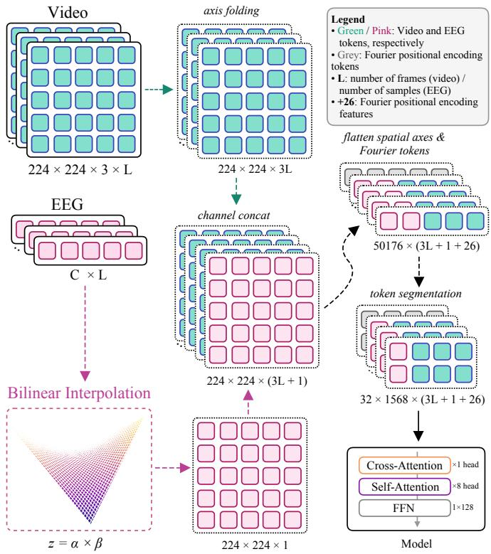
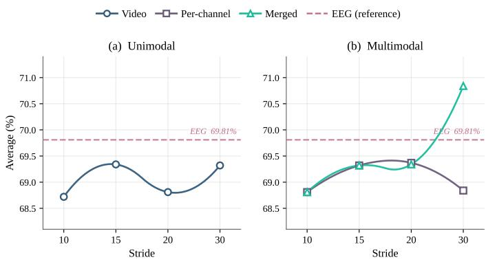

# MUPA2E: Multimodal Unified Perception with Asymmetric Attention for Emotion Assessment

Stefanos Gkikas, Eric Nichols, Christian Arzate Cruz, and Randy Gomez

Honda Research Institute Japan, Wako City, Japan

{stefanos.gkikas, e.nichols, christian.arzate, r.gomez}@jp.honda-ri.com

Abstract. Automatic emotion assessment can benefit from combining neural and behavioral signals, but many multimodal approaches rely on separate, modality-specific feature-extraction pipelines before fusion. This paper presents MUPA2E, a unified perception framework that processes facial video and electroencephalography (EEG) through a single shared asymmetric-attention backbone. Facial video is represented through axisfolded frame tokens, while EEG is processed either as a raw multichannel waveform or projected into the spatial domain for multimodal fusion. The framework is evaluated on the DMER dataset under a stratified subject-independent protocol, comparing unimodal video, unimodal EEG, and fused video–EEG configurations with per-channel and merged EEG projections. Using the original recordings, with shorter trials zero-padded to match the longest duration, merged fusion at stride 30 achieves the highest validation performance and a test accuracy of 70.07%. Further analysis revealed that recording duration is unevenly distributed across the afective classes, making the padding pattern a potential classification cue. Controlling for this factor by cropping all recordings to a common duration of 20 seconds yielded a test accuracy of 62.71%, providing a stricter duration-controlled assessment of the framework in which diferences in recording length are removed as a potential classification cue. These findings demonstrate the feasibility of processing structurally diferent neural and visual signals within a compact unified architecture while highlighting the importance of controlling duration-related cues in afective datasets.

Keywords: Electroencephalogram, emotion assessment, afective computing, attention

## Introduction

Automatic recognition of human emotional states is a core challenge in afectivev computing, underpinning systems designed to sense, interpret, and respond toi users’ afective states [1]. Emotional experience is most commonly represented along two independent dimensions: valence, reflecting the positive-to-negativea quality of an afective state, and arousal, reflecting its level of activation [2]. Standardized self-report instruments, such as the Positive and Negative Afect Schedule, capture positive and negative afect and have been widely adopted for ground-truth data collection in afective computing studies [3]. The Self-Assessment Manikin provides a direct measure of valence, arousal, and dominance and has been applied extensively for afective labeling in laboratory settings [4]. These self-report methods depend on explicit user participation, motivating the development of automatic recognition systems that passively infer emotional states from physiological and behavioral signals, with applications ranging from human-computer interaction to social robotics platforms that generate emotionaware co-speech gestures [5] to body-based emotion recognition systems [6].

Physiological biosignals have been studied extensively as passive channels for monitoring stress-related afective responses without relying on explicit selfreport [7]. Deep learning has driven substantial progress in stress detection from heterogeneous data sources, including physiological signals, facial expressions, speech, gestures, and other behavioral data [8]. Among physiological modalities, EEG provides direct access to central nervous system correlates of emotional states, encoding neural dynamics that peripheral biosignals, such as electrodermal activity or heart rate, cannot capture directly [9]. Early approaches represented EEG using hand-crafted spectral features, with diferential entropy computed across frequency bands, establishing a widely adopted representation for emotion classification [10]. Subsequent work identified critical frequency bands and electrode channels as primary carriers of emotion-relevant information, motivating spatially and spectrally selective architectures [11]. Graph convolutional networks advanced this direction by modeling multichannel EEG features as graphs and learning dynamic inter-channel relationships for emotion recognition [12]. Convolutional transformer architectures have further improved EEG decoding by jointly modeling local temporal structure and global sequential dependencies [13]. Multimodal afective datasets pairing EEG recordings, peripheral physiological signals, afective stimuli, and subjective ratings have provided important benchmarks for EEG-based emotion recognition research [14].

Facial data provide a complementary and non-intrusive channel for afective sensing, with large-scale in-the-wild databases demonstrating the feasibility of recognizing facial expressions, valence, and arousal from unconstrained facial images [15]. Deep learning architectures for facial expression recognition have advanced substantially, with spatiotemporal models learning to capture both spatial appearance and temporal dynamics across sequences of frames [16]. Continuous valence and arousal estimation from facial video in naturalistic conditions has further confirmed the viability of video as a scalable afective sensing modality [17]. The face encodes afect-related cues through observable dynamics, including eye activity, mouth movements, head motion, and facial appearance changes, which have been studied for stress and anxiety recognition from video [18]. Joint analysis of EEG and facial expressions has demonstrated the added value of combining neural and behavioral information for continuous emotion detection [19].

EEG and facial video are complementary modalities for emotion recognition: neural signals reflect internal cortical processing, while facial behavior encodes its external expression; combining the two has been shown to provide nonredundant discriminative information [19]. Feature-level fusion of EEG trials and facial video sequences has improved upon unimodal baselines in multiclass emotion classification [20]. Multimodal learning frameworks have been extended to afective categories requiring the joint representation of co-occurring emotional components [21]. Recent work combining facial video and physiological biosignals illustrates this pattern, using modality-specific facial and physiological representations before applying fusion strategies [22]. This design introduces choices that are dificult to generalize and prevents both signals from being processed within a unified computational framework.

In this work, we propose MUPA2E, a framework for multimodal emotion assessment that processes facial video and EEG through a single shared asymmetric attention backbone. Three configurations are evaluated within a common architecture: unimodal facial video, unimodal EEG as a raw multichannel waveform, and multimodal fusion of both, all assessed using a stratified, subject-independent evaluation protocol.

## 2 Related Work

Automatic emotion recognition from physiological and behavioral signals has been studied across multiple modalities, including EEG recordings, peripheral physiological signals, and facial video paired with subjective afective ratings [14]. EEG occupies a distinct position among physiological modalities, capturing central nervous system correlates of afective states with high temporal resolution and encoding neural dynamics that peripheral biosignals cannot directly reflect [9]. EEG-based emotion recognition pipelines have combined hand-crafted spectral representations with deep neural architectures, with diferential entropy computed across the delta, theta, alpha, beta, and gamma frequency bands establishing an early and widely adopted feature extraction approach [10]. Deep networks trained on spectral EEG representations further demonstrated the efectiveness of frequency-band and channel-specific information for EEG-based emotion recognition across subjects [11]. Graph convolutional networks subsequently improved on static feature approaches by modeling dynamic inter-channel relationships in EEG-based emotion recognition [12], while convolutional transformer architectures have further advanced the modeling of local and global structure in EEG decoding [13]. More recently, multi-scale temporal modeling combined with a dynamic fusion strategy has been employed for EEG-based emotion recognition, on the dataset also used in this work [23].

Facial video provides a behavioral complement to EEG-based approaches, encoding afect-related cues through facial muscle activity, eye movements, head motion, and dynamic changes in appearance [18]. Graph attention networks operating on diferential facial action units have further demonstrated that the relational structure between facial muscle activations carries discriminative information for afective state recognition [24]. Visual afect prediction from facial video has also been studied in the wild, with deep architectures that combine convolutional and recurrent layers demonstrating continuous estimation of valence and arousal from spontaneous facial behavior [17]. Joint analysis of

EEG and facial expressions has further demonstrated the value of combining neural and facial information for continuous emotion detection [19], motivating the investigation of architectures that process both channels within a unified framework.

Multimodal fusion of EEG and facial video has been explored to capture complementary aspects of afective responses, motivated by the idea that neural and behavioral signals reflect diferent components of emotional processing. Featurelevel fusion of EEG trials and facial video sequences has produced improvements over unimodal baselines in multi-class emotion classification [20], while broader multimodal afect-recognition research has extended learning frameworks to mixed-emotion settings that require the joint representation of co-occurring afective components [21]. Existing fusion pipelines apply modality-specific preprocessing and feature extraction before combining representations at the feature or decision level, introducing design choices that are dificult to generalize across tasks and modality combinations. A unified architecture that processes EEG and facial video through a shared backbone, without modality-specific inductive biases in the core model, has not been systematically explored for valence-based emotion classification. Modality-agnostic architectures have been investigated in related human state assessment tasks, processing facial videos alongside functional near-infrared spectroscopy data within a single transformer framework [25], and recognizing human states from diverse modalities using a single model [26–28]. These studies indicate that a shared backbone can accommodate behavioral and neural inputs without modality-specific feature extractors, although they target pain rather than valence.

## 3 Methodology

## 3.1 Signal Representation

The framework maps facial video and EEG recordings into token sequences, which are processed by a shared asymmetric-attention backbone, enabling evaluation of unimodal and multimodal configurations under a common architecture. Each trial consists of multiple stored segments, which are temporally sorted and concatenated into a complete recording; trials with fewer segments than the maximum are zero-padded to a fixed length.

Facial video For a video of $L _ { v }$ retained frames, each a 224 × 224 RGB image, the temporal dimension is folded into the channel dimension, a step referred to as axis folding:

$$
\mathbf { X } _ { v } \in \mathbb { R } ^ { B \times H \times W \times 3 L _ { v } } ,\tag{1}
$$

where B is the batch size and $H = W = 2 2 4$ . Projecting a one-dimensional biosignal into a visual representation prior to classification has been shown to outperform processing the raw waveform directly in stress detection from electrodermal activity [29]. Geometric information is incorporated by encoding each spatial position $\bar { \bf p \in [ - 1 , 1 ] \cdot }$ with Fourier features, using $K = 6$ frequency bands and a maximum frequency $f _ { \mathrm { m a x } } = 1 0$ . Since the input has $D = 2$ spatial axes, the encoding adds $D ( 2 K + 1 ) = 2 6$ positional features per token:

$$
\begin{array} { r } { \gamma ( { \bf p } ) = [ \sin ( \pi s _ { 1 } { \bf p } ) , \cos ( \pi s _ { 1 } { \bf p } ) , \ \cdot \cdot \cdot , } \\ { \sin ( \pi s _ { K } { \bf p } ) , \ \cos ( \pi s _ { K } { \bf p } ) , \ { \bf p } ] , } \end{array}\tag{2}
$$

where $\{ s _ { k } \} _ { k = 1 } ^ { K }$ spans $[ 1 , f _ { \mathrm { m a x } } / 2 ]$ . The spatial axes are flattened into $N = H \times W =$ 50176 tokens, with data channels and positional features concatenated per token to form the token matrix:

$$
\mathbf { T } _ { v } \in \mathbb { R } ^ { B \times N \times C _ { v } ^ { \prime } } , \qquad C _ { v } ^ { \prime } = 3 L _ { v } + 2 6 .\tag{3}
$$

The token sequence is partitioned into $S = 3 2$ contiguous spatial segments of length $n _ { s } = N / S = 1 5 6 8$

EEG waveform For unimodal EEG processing, the raw multichannel waveform is used directly without hand-crafted feature extraction. All temporal segments of a trial are concatenated along the time axis, yielding:

$$
\mathbf { X } _ { e } \in \mathbb { R } ^ { B \times C _ { e } \times L _ { e } } ,\tag{4}
$$

where $C _ { e }$ is the number of selected EEG channels and $L _ { e }$ is the total concatenated waveform length. Each normalized time position $t \in [ - 1 , 1 ]$ is encoded using Fourier features with $K = 6$ bands $( D = 1 )$ , adding $2 K + 1 = 1 3$ positional features per token. The time axis is flattened into $L _ { e }$ tokens, with waveform channels and positional features concatenated at each step to form the token matrix:

$$
\mathbf { T } _ { e } \in \mathbb { R } ^ { B \times L _ { e } \times C _ { e } ^ { \prime } } , \qquad C _ { e } ^ { \prime } = C _ { e } + 1 3 .\tag{5}
$$

The token sequence is partitioned into $S = 3 2$ contiguous temporal segments of length $n _ { s } = \lceil L _ { e } / S \rceil$ , with the final segment zero-padded if necessary.

## 3.2 Multimodal Channel Fusion

In the multimodal configuration, the EEG waveform is projected into the 2D spatial domain and fused with the video tensor along the channel dimension, enabling joint processing of both modalities by a shared 2D backbone. Before projection, the EEG waveform is standardized via z-score normalization followed by min-max rescaling to [0, 1]. In the merged configuration, this normalization is applied jointly over the full $C _ { e } \times L _ { e }$ amplitude grid; in the per-channel configuration, it is applied independently to each channel prior to stacking. Two projection variants are evaluated.

Merged All $C _ { e }$ channels are treated jointly as a $C _ { e } \times L _ { e }$ amplitude grid and projected to a single image via bilinear interpolation:

$$
\mathbf { X } _ { e } ^ { \mathrm { m e r g e d } } \in \mathbb { R } ^ { B \times H \times W \times 1 } .\tag{6}
$$

Per-channel Each channel is projected independently to a $2 2 4 \times 2 2 4$ image via bilinear interpolation, and the results are stacked along the channel dimension:

$$
\mathbf { X } _ { e } ^ { \mathrm { p e r } } \in \mathbb { R } ^ { B \times H \times W \times C _ { e } } .\tag{7}
$$

In both cases, the EEG image is concatenated with the axis-folded video tensor along the channel dimension:

$$
\mathbf { X } _ { m } = \left[ \mathbf { X } _ { v } \parallel \mathbf { X } _ { e } \right] \in \mathbb { R } ^ { B \times H \times W \times ( 3 L _ { v } + n _ { e } ) } ,\tag{8}
$$

where $n _ { e } = 1$ for merged and $n _ { e } = C _ { e }$ for per-channel. The fused tensor is tokenized identically to the unimodal video case: flattened into $N \mathrm { ~ = ~ } 5 0 1 7 6$ spatial tokens, augmented with 26 Fourier positional features, and partitioned into $S = 3 2$ segments of $n _ { s } = 1 5 6 8$ tokens each.

## 3.3 Asymmetric Attention

All configurations share a common asymmetric-attention backbone of depth 1, comprising a single cross-attention block with a feed-forward sublayer, followed by $R = 8$ self-attention rounds, each with a feed-forward sublayer. A single cross-attention module operating over a shared latent state has previously been employed for physiological signal classification, yielding competitive performance at a low parameter count [30]. A latent state $\mathbf { e } ^ { ( 0 ) } \in \mathbb { R } ^ { d _ { 0 } }$ , with $d _ { 0 } = 1 2 8$ , is shared across all $S = 3 2$ segments and instantiated at runtime from a set of $M _ { 0 } = 6 4$ learnable latent vectors $\{ \ell _ { m } \} _ { m = 1 } ^ { M _ { 0 } }$

$$
\ell _ { \mathrm { i n i t } } = \frac { 1 } { M _ { 0 } } \sum _ { m = 1 } ^ { M _ { 0 } } \ell _ { m } \in \mathbb { R } ^ { d _ { 0 } } .\tag{9}
$$

Cross-attention Each segment state aggregates information exclusively from its corresponding token subset:

$$
{ \bf e } _ { s } = { \bf e } ^ { ( 0 ) } + \mathrm { A t t n } \big ( { \bf e } ^ { ( 0 ) } , \ \tilde { \bf T } _ { s } \big ) ,\tag{10}
$$

where $\mathbf { e } ^ { ( 0 ) } \in \mathbb { R } ^ { B \times 1 \times d _ { 0 } }$ provides the queries and $\tilde { \mathbf { T } } _ { s } \in \mathbb { R } ^ { B \times n _ { s } \times C ^ { \prime } }$ provides the keys and values. The operation is asymmetric: the query is a single vector while the key-value side spans $n _ { s } \gg 1$ tokens. All S segments are processed in parallel. Cross-attention uses 8 heads, each with a head dimension of 16.

Self-attention After cross-attention, all segment states are stacked to form $\mathbf { E } \in \mathbb { R } ^ { B \times S \times d _ { 0 } }$ and processed through $R = 8$ self-attention rounds, enabling global information exchange across all segments:

$$
\mathbf { E }  \mathbf { E } + \mathrm { A t t n } ( \mathbf { E } , \ \mathbf { E } ) .\tag{11}
$$

Self-attention also uses 8 heads, each with a head dimension of 16. All attention and feed-forward sublayers use pre-layer normalization and residual connections, with attention and feed-forward dropout of 0.10 applied uniformly. After the final round, segment states are averaged over S and passed through a linear classification head to predict binary valence (positive vs. negative).

## 3.4 Augmentation & Regularization

Several augmentation strategies were applied independently to each modality. Video frames were augmented using TrivialAugment [31], AugMix [32], additive noise, center cropping, and spatial masking. A shared random seed was applied across all frames of a video sample to ensure temporal consistency. EEG waveforms were augmented per channel using additive noise and temporal masking, applied prior to 2D projection in the multimodal configuration. Regularization included label smoothing, attention dropout, and feed-forward dropout. Table 1 summarizes the complete augmentation, regularization, and training configuration used across all experiments.

Table 1: Augmentation, regularization, and training configuration.
<table><tr><td rowspan=1 colspan=1>Method/Parameter                  Value</td></tr><tr><td rowspan=1 colspan=1>Video augmentations</td></tr><tr><td rowspan=1 colspan=1>AugMix                    $p \in [ 0 . 2 0 , 0 . 4 0 ]$ </td></tr><tr><td rowspan=1 colspan=1>TrivialAugment                $p \in [ 0 . 2 0 , 0 . 4 0 ]$ </td></tr><tr><td rowspan=1 colspan=1>Center Crop            $p \in [ 0 . 2 0 , 0 . 4 0 ] , 2 0 0 \times 2 0 0$ </td></tr><tr><td rowspan=1 colspan=1>Noise                $p \in [ 0 . 2 0 , 0 . 4 0 ] , \sigma = 1 0 0$ </td></tr><tr><td rowspan=1 colspan=1>Masking-1              $p \in [ 0 . 2 0 , 0 . 8 0 ] , 3 \mathrm { ~ b l o c k s }$ </td></tr><tr><td rowspan=1 colspan=1> $M a s k i n g – \mathcal { Q }$              $p \in [ 0 . 2 0 , 0 . 4 0 ] ,$ 20 blocks</td></tr><tr><td rowspan=1 colspan=1>EEG augmentations</td></tr><tr><td rowspan=1 colspan=1>Add Noise                  $p \in [ 0 . 1 0 , 0 . 8 0 ]$ Temporal Masking      $p \in [ 0 . 1 0 , 0 . 8 0 ] , \mathrm { { s i z e } \in [ 0 . 1 5 , 0 . 3 0 ] }$ </td></tr><tr><td rowspan=1 colspan=1>Regularization</td></tr><tr><td rowspan=1 colspan=1>Label Smoothing                    0.15</td></tr><tr><td rowspan=1 colspan=1>Att-Dropout                     0.10</td></tr><tr><td rowspan=1 colspan=1>FF-Dropout                      0.10</td></tr><tr><td rowspan=1 colspan=1>Training</td></tr><tr><td rowspan=1 colspan=1>Optimizer                     Adam W</td></tr><tr><td rowspan=1 colspan=1>Learning rate                      $1 0 ^ { - 4 }$ </td></tr><tr><td rowspan=1 colspan=1>LR decay                      cosine</td></tr><tr><td rowspan=1 colspan=1>Weight decay                     0.05</td></tr><tr><td rowspan=1 colspan=1>Epochs                        200</td></tr><tr><td rowspan=1 colspan=1>Warmup epochs                     20</td></tr><tr><td rowspan=1 colspan=1>Cooldown epochs                    10</td></tr><tr><td rowspan=1 colspan=1>Batch size                        32</td></tr></table>

Att-Dropout/FF-Dropout: dropout probability in attention/feedforward sublayers Masking-1/2: Cutout on video frames, square $3 2 \times 3 2 ;$ value after | = number of blocks Temporal Masking: applied per EEG channel prior to 2D projection; size = fraction of total waveform length masked at the beginning, end, or center of the waveform Notes: x –x means we sample $p \sim \mathcal { U } ( x _ { 1 } , x _ { 2 } )$ per sample and apply the transform with probability p.

  
Fig. 1: Overview of $\mathrm { M U P A ^ { 2 } E }$ . Facial video is axis-folded into a $2 2 4 \times 2 2 4 \times 3 L$ tensor; the EEG waveform $( C \times L )$ is projected to a $2 2 4 \times 2 2 4 \times 1$ grid via bilinear interpolation $( z = \alpha \times \beta )$ . The two representations are channel-concatenated, flattened into 50176 Fourier-augmented spatial tokens, and segmented into 32 groups of 1568 tokens, processed by the asymmetric attention backbone.

## 4 Experimental Evaluation & Results

This section presents the experimental evaluation of a binary classification task that distinguishes positive from negative afective states. Validation performance is reported using macro-averaged accuracy, precision, and F1 score. Test performance is reported using macro-averaged accuracy.

## 4.1 Data Collection

This study uses the DMER dataset [33], comprising 73 participants aged 18 to 35 (mean 23.06, SD 3.37); 7 of the original 80 participants were excluded due to physiological signal quality issues. Participants viewed 32 short video clips drawn from the Stanford film library, selected through a rule-based filtering procedure and expert evaluation to elicit positive, negative, and mixed emotional states: 8 clips for positive, 8 for negative, and 16 for mixed. This work focuses on binary valence classification, distinguishing positive from negative afective states; trials corresponding to mixed emotional content are excluded from all experiments. EEG was recorded using the DSI-24 wireless dry-electrode system at 300 Hz across 21 channels following the international 10-20 system. The time-aligned preprocessed EEG signals provided by DMER are used directly without additional processing; preprocessing steps applied by the dataset authors include independent component analysis, bandpass filtering from 1 to 50 Hz, 50 Hz notch filtering, baseline removal, and re-referencing to Pz with ear electrodes excluded, yielding 18 channels per trial. Participants are partitioned into training, validation, and testing sets at the subject level, ensuring no participant appears in more than one split. To avoid performance inflation due to subject-dificulty imbalance, a stratified split protocol is used. Leave-one-subject-out cross-validation is conducted to estimate per-subject classification dificulty, and subjects are ranked by their combined z-score and assigned to four dificulty groups. The final partition comprises 48 training, 12 validation, and 13 testing subjects, with each set drawing from all four groups in proportion. The exact subject-level partition is reported in Table 2 to support reproducibility and direct comparison with future work.

## 4.2 Unimodal

Table 3 reports the validation performance of the unimodal video and EEG configurations. For the video modality, the average score varies only slightly across temporal stride settings, spanning 0.62 percentage points from 68.72 at stride 10 to 69.34 at stride 15. Strides 20 and 30 achieve average scores of 68.81 and 69.32, respectively. Accuracy, precision, and F1 remain closely aligned across all video settings, indicating that no temporal stride produces a clear and consistent advantage. The best video configuration uses a stride of 15, achieving an average score of 69.34. The unimodal EEG configuration achieves the highest unimodal performance, with an average score of 69.81. This result exceeds the best video configuration by 0.47 percentage points in average score and by 0.52 percentage points in accuracy. The EEG accuracy, precision, and F1 scores are

Table 2: Subject-level split by dificulty group. Subjects are ranked by combined z-score and assigned to four quartile-based groups (Q1 = hardest, Q4 = easiest).
<table><tr><td rowspan="2">Split</td><td colspan="4">Difficulty Group</td></tr><tr><td>Q1 – Hard</td><td>Q2 – Med-Hard</td><td>Q3 – Med-Easy</td><td>Q4 – Easy</td></tr><tr><td>Training (48)</td><td>8, 12, 20, 25, 36, 37, 43, 45, 56, 60, 66,</td><td>14, 30, 33, 35, 39, 50, 51, 53, 55, 65,</td><td>5, 6, 9, 10, 15, 23, 32, 52, 54, 59, 70,</td><td>11, 24, 26, 34, 40, 42, 49, 61, 63, 64,</td></tr><tr><td>Validation (12)</td><td>71 19, 48, 58</td><td>72, 73 22, 41, 79</td><td>78 29,47, 77</td><td>68, 76 62, 67, 69</td></tr><tr><td>Testing (13)</td><td>28, 74, 75, 80</td><td>21, 38, 57</td><td>1, 2, 7</td><td>18, 44, 46</td></tr></table>

Q1: z < −0.36; Q2: −0.36 ≤ z < −0.08; Q3: −0.08 ≤ z < 0.17; $\mathrm { Q 4 } \colon z \geq 0 . 1 7 .$

69.79, 69.87, and 69.76, respectively, showing balanced performance across the reported validation metrics.

Table 3: Unimodal performance across stride settings. Average: arithmetic mean of Accuracy, Precision, and F1, used as the primary performance criterion throughout. Bold marks the highest Average; underline marks the second-highest.
<table><tr><td rowspan="2">Modality</td><td rowspan="2">Stride</td><td colspan="4">Performance</td></tr><tr><td>Accuracy</td><td>Precision</td><td>F1</td><td>Average</td></tr><tr><td>Video</td><td>10</td><td>68.75</td><td>69.05</td><td>68.36</td><td>68.72</td></tr><tr><td>Video</td><td>15</td><td>69.27</td><td>69.63</td><td>69.13</td><td>69.34</td></tr><tr><td>Video</td><td>20</td><td>68.75</td><td>69.05</td><td>68.63</td><td>68.81</td></tr><tr><td>Video</td><td>30</td><td>69.27</td><td>69.53</td><td>69.17</td><td>69.32</td></tr><tr><td>EEG</td><td>1</td><td>69.79</td><td>69.87</td><td>69.76</td><td>69.81</td></tr></table>

## 4.3 Multimodal

Table 4 reports the validation performance of the multimodal fusion configurations across temporal stride settings. For per-channel fusion, the average score ranges from 68.81 at stride 10 to 69.37 at stride 20, with strides 15 and 30 yielding 69.32 and 68.84, respectively. Performance peaks at stride 20 and then declines at stride 30. The best per-channel result, with an average score of 69.37, marginally exceeds the best unimodal video result by 0.03 percentage points but remains 0.44 percentage points below the unimodal EEG average of 69.81.

Merged fusion follows a diferent pattern. The average scores at strides 10, 15, and 20 remain clustered between 68.81 and 69.34, consistent with the range observed for per-channel fusion and unimodal video. However, a stride of 30 yields a clear improvement. At this setting, merged fusion achieves an accuracy of 70.31, a precision of 72.68, and an F1 score of 69.52, yielding an average score of 70.84. This is the highest validation result across all unimodal and multimodal configurations. The precision at a merged stride of 30 also exceeds accuracy and F1 by a wider margin than in the other fusion settings. Overall, the merged stride 30 configuration surpasses the best per-channel result by 1.47 percentage points in average score and the unimodal EEG configuration by 1.03 percentage points.

Table 4: Multimodal fusion performance using Videos and EEG across stride settings.
<table><tr><td rowspan="2">Fusion</td><td rowspan="2">Stride</td><td colspan="4">Performance</td></tr><tr><td>Accuracy</td><td>Precision</td><td>F1</td><td>Average</td></tr><tr><td>Per-channel</td><td>10</td><td>68.75</td><td>69.05</td><td>68.63</td><td>68.81</td></tr><tr><td>Per-channel</td><td>15</td><td>69.27</td><td>69.53</td><td>69.17</td><td>69.32</td></tr><tr><td>Per-channel</td><td>20</td><td>69.27</td><td>69.75</td><td>69.08</td><td>69.37</td></tr><tr><td>Per-channel</td><td>30</td><td>68.85</td><td>69.05</td><td>68.63</td><td>68.84</td></tr><tr><td>Merged</td><td>10</td><td>68.75</td><td>69.05</td><td>68.63</td><td>68.81</td></tr><tr><td>Merged</td><td>15</td><td>69.27</td><td>69.53</td><td>69.17</td><td>69.32</td></tr><tr><td>Merged</td><td>20</td><td>69.27</td><td>69.63</td><td>69.13</td><td>69.34</td></tr><tr><td>Merged</td><td>30</td><td>70.31</td><td>72.68</td><td>69.52</td><td>70.84</td></tr></table>

Stride refers to the video temporal stride; the EEG waveform stride is fixed at 1 in all multimodal experiments

Table 5: Test accuracy, computational cost, and inference eficiency of the best validation-selected merged-fusion configuration.
<table><tr><td rowspan="2">Fusion</td><td rowspan="2">Stride</td><td colspan="2">Computational Cost</td><td colspan="2">Inference Cost</td><td rowspan="2">Accuracy</td></tr><tr><td>Params (M) GFLOPs</td><td></td><td>Latency (ms) GPU↓</td><td>Samples/s  $\mathrm { G } \bar { \mathrm { P U } } \uparrow$ </td></tr><tr><td>Merged</td><td>30</td><td>1.89</td><td>3.13</td><td>6.55</td><td>152.65</td><td>70.07</td></tr></table>

Computational and inference cost measured on a single unified sample (Video & EEG) at inference time on an NVIDIA A100 GPU.

## 4.4 The Efect of Recording Duration

The experiments reported above initially used the original DMER recordings, preserving their full duration and zero-padding shorter trials as described in

  
Fig. 2: Average validation performance (arithmetic mean of Accuracy, Precision, and F1) as a function of video temporal stride for unimodal (a) and multimodal (b) configurations. Unimodal EEG at stride 1 is shown as a dashed reference in both panels.

Section 3. After completing these experiments, we examined the distribution of trial durations and identified a potential confounding factor: 62.16% of the positive trials last 30 seconds, compared with only 25.04% of the negative trials. Consequently, the amount of padding may itself provide class information. Indeed, a simple duration-based rule achieves 68.56% accuracy, close to the 70.07% obtained by the proposed model. We therefore performed an additional controlled experiment using the best validation-selected merged-fusion configuration, cropping all recordings to the first 20 seconds for both modalities. This follow-up experiment removes recording duration as an available cue while retaining the original evaluation for completeness. Under the same training setup, the cropped configuration achieved 62.71% accuracy, suggesting that recording duration contributed to performance on the original samples. To further assess subject-independent generalization under the duration-controlled setting, we evaluated the cropped configuration using leave-one-subject-out (LOSO) validation. The framework achieved a mean accuracy of 76.37%, providing complementary evidence of its performance across participants.

Finally, [23] reported 65.22% accuracy using the same stratified hold-out protocol and 20-second cropped EEG signals, exceeding our cropped multimodal result by 2.51 percentage points. Their multi-scale temporal windowing strategy may partly explain this diference, consistent with previous findings on physiological-signal analysis [30].

## 4.5 Overall Analysis & Discussion

Across the unimodal configurations, EEG provides the strongest reference, achieving an average score of 69.81%, while video performance remains relatively stable across stride settings. In the multimodal experiments, per-channel fusion remains below the EEG reference, whereas merged fusion at stride 30 achieves the highest validation performance, with an average score of 70.84%. The corresponding configuration reaches 70.07% accuracy on the held-out test set while remaining compact, with 1.89M parameters and 3.13 GFLOPs.

Table 6: Accuracy comparison across sample preprocessing and validation protocols.
<table><tr><td>Study</td><td>Modality</td><td>Validation Protocol</td><td>Samples</td><td>Accuracy</td></tr><tr><td>Ours</td><td>Video+EEG</td><td>Hold-out</td><td>Original</td><td>70.07</td></tr><tr><td>Ours</td><td>Video+EEG</td><td>Hold-out</td><td>Cropped</td><td>62.71</td></tr><tr><td>Ours</td><td>Video+EEG</td><td>LOSO</td><td>Cropped</td><td>76.37</td></tr><tr><td>[23]</td><td>EEG</td><td>Hold-out</td><td>Cropped</td><td>65.22</td></tr></table>

Hold-out: is the same stratified hold-out protocol described in this study Cropped: is the same cropped approach of 20 sec described in this study

Further analysis showed that recording duration is unevenly distributed between the positive and negative classes, introducing a potential durationrelated cue in the original padded samples. When all recordings were cropped to 20 seconds, and the same merged-fusion configuration was retrained, test accuracy decreased to 62.71%. This suggests that recording duration contributed to the performance obtained with the original samples and provides a more controlled estimate when this cue is removed. The cropped configuration also achieved 76.37% mean accuracy under LOSO evaluation, although this result is not directly comparable with the stratified hold-out protocol because of the diferent training and evaluation partitions.

## 5 Conclusion

This paper presented MUPA2E, a unified perception framework for multimodal emotion assessment in which facial video and EEG are processed through a single shared asymmetric-attention backbone. The framework supports videoonly, EEG-only, and fused video–EEG configurations without requiring separate modality-specific feature-extraction backbones.

Under the original padded-sample setting, EEG provides the strongest unimodal performance, while merged multimodal fusion at stride 30 achieves the highest validation performance and a test accuracy of 70.07%. Additional experiments with all recordings cropped to 20 seconds reduced the hold-out accuracy to 62.71%, suggesting that recording duration contributed to the original performance. These findings demonstrate the feasibility of processing structurally diferent neural and visual signals within a compact unified architecture while highlighting the importance of controlling duration-related cues in emotionrecognition datasets.

## Acknowledgments

The authors used large language model (LLM)-based tools for language editing and improvement. All scientific content, results, and conclusions are solely the work of the authors.

## References

1. Picard, R.W.: Afective Computing. MIT Press, Cambridge, MA (1997)

2. Russell, J.A.: A circumplex model of afect. Journal of Personality and Social Psychology 39(6) (1980) 1161–1178

3. Watson, D., Clark, L.A., Tellegen, A.: Development and validation of brief measures of positive and negative afect: The PANAS scales. Journal of Personality and Social Psychology 54(6) (1988) 1063–1070

4. Bradley, M.M., Lang, P.J.: Measuring emotion: The self-assessment manikin and the semantic diferential. Journal of Behavior Therapy and Experimental Psychiatry 25(1) (1994) 49–59

5. Montiel-Vazquez, E.C., Cruz, C.A., Gkikas, S., Kassiotis, T., Giannakakis, G., Gomez, R.: Eficient emotion-aware iconic gesture prediction for robot co-speech (2026)

6. Cruz, C.A., Gkikas, S., Asadi, H.: Eficient and interpretable body-based emotion recognition with lightweight temporal convolutional networks. https://arxiv.org/ abs/2607.20820 (2026) Accepted at the 2026 14th International Conference on Afective Computing and Intelligent Interaction (ACII 2026).

7. Giannakakis, G., Grigoriadis, D., Giannakaki, K., Simantiraki, O., Roniotis, A., Tsiknakis, M.: Review on psychological stress detection using biosignals. IEEE Transactions on Afective Computing 13(1) (2022) 440–460

8. Kyrou, M., Kompatsiaris, I., Petrantonakis, P.C.: Deep learning approaches for stress detection: a survey. IEEE Transactions on Afective Computing 16(2) (2025) 499–517

9. Alarc˜ao, S.M., Fonseca, M.J.: Emotions recognition using EEG signals: A survey. IEEE Transactions on Afective Computing 10(3) (2019) 374–393

10. Duan, R.N., Zhu, J.Y., Lu, B.L.: Diferential entropy feature for EEG-based emotion classification. In: 2013 6th International IEEE/EMBS Conference on Neural Engineering (NER). (2013) 81–84

11. Zheng, W.L., Lu, B.L.: Investigating critical frequency bands and channels for EEG-based emotion recognition with deep neural networks. IEEE Transactions on Autonomous Mental Development 7(3) (2015) 162–175

12. Song, T., Zheng, W., Song, P., Cui, Z.: EEG emotion recognition using dynamical graph convolutional neural networks. IEEE Transactions on Afective Computing 11(3) (2020) 532–541

13. Song, Y., Zheng, Q., Liu, B., Gao, X.: EEG conformer: Convolutional transformer for EEG decoding and visualization. IEEE Transactions on Neural Systems and Rehabilitation Engineering 31 (2023) 710–719

14. Koelstra, S., M¨uhl, C., Soleymani, M., Lee, J.S., Yazdani, A., Ebrahimi, T., Pun, T., Nijholt, A., Patras, I.: DEAP: A database for emotion analysis using physiological signals. IEEE Transactions on Afective Computing 3(1) (2012) 18–31

15. Mollahosseini, A., Hasani, B., Mahoor, M.H.: AfectNet: A database for facial expression, valence, and arousal computing in the wild. IEEE Transactions on Afective Computing 10(1) (2019) 18–31

16. Li, S., Deng, W.: Deep facial expression recognition: A survey. IEEE Transactions on Afective Computing 13(3) (2022) 1195–1215

17. Kollias, D., Tzirakis, P., Nicolaou, M.A., Papaioannou, A., Zhao, G., Schuller, B., Kotsia, I., Zafeiriou, S.: Deep afect prediction in-the-wild: Af-Wild database and challenge, deep architectures, and beyond. International Journal of Computer Vision 127(6–7) (2019) 907–929

18. Giannakakis, G., Pediaditis, M., Manousos, D., Kazantzaki, E., Chiarugi, F., Simos, P.G., Marias, K., Tsiknakis, M.: Stress and anxiety detection using facial cues from videos. Biomedical Signal Processing and Control 31 (2017) 89–101

19. Soleymani, M., Asghari-Esfeden, S., Fu, Y., Pantic, M.: Analysis of EEG signals and facial expressions for continuous emotion detection. IEEE Transactions on Afective Computing 7(1) (2016) 17–28

20. Muhammad, F., Hussain, M., Aboalsamh, H.: A bimodal emotion recognition approach through the fusion of electroencephalography and facial sequences. Diagnostics 13(5) (2023) 977

21. Li, M., Liu, Y.J., Liu, F., Sheng, H., Fan, Y., Wei, Y., Luo, M., Zhang, W., Wang, W.: Memory-guided prototypical co-occurrence learning for mixed emotion recognition (2026)

22. Valergaki, P., Nicodemou, V.C., Oikonomidis, I., Argyros, A., Roussos, A.: Combining facial videos and biosignals for stress estimation during driving (2026)

23. Gkikas, S., Guo, Y., Li, G., Rojas, R.F., Giannakakis, G., Gomez, R.: A multiscale temporal framework with dynamic fusion for eeg-based emotion recognition. https://arxiv.org/abs/2608.09088 (2026) Accepted at the 2026 9th International Conference on Pattern Recognition and Artificial Intelligence (PRAI 2026).

24. Kassiotis, T., Gkikas, S., Smyrnis, N., Giannakakis, G.: Explainable graph attention network for stress recognition (stressgat) via diferential action units. https: //arxiv.org/abs/2607.20819 (2026) Accepted at the 2026 14th International Conference on Afective Computing and Intelligent Interaction (ACII 2026).

25. Gkikas, S., Tsiknakis, M.: Twins-painvit: Towards a modality-agnostic vision transformer framework for multimodal automatic pain assessment using facial videos and fnirs. In: 2024 12th International Conference on Afective Computing and Intelligent Interaction Workshops and Demos (ACIIW). (2024) 13–21

26. Gkikas, S., Cruz, C.A., Fang, Y., Cao, L., Khan, M.U., Kassiotis, T., Giannakakis, G., Rojas, R.F., Gomez, R.: A lightweight transformer for pain recognition from brain activity. https://arxiv.org/abs/2604.16491 (2026) Accepted at the 2026 International Conference on Electronic Engineering, Information Technology & Education (EEITE 2026).

27. Gkikas, S., Cruz, C.A., Joseph, C., Giannakakis, G., Rojas, R.F.: Towards a unified modality-agnostic multimodal framework for cognitive workload assessment (2026) Accepted at the 2026 14th International Conference on Afective Computing and Intelligent Interaction (ACII 2026).

28. Gkikas, S., Cruz, C.A., Becchetti, V., Khan, M.U., Giuseppi, A., Rojas, R.F.: A unified tokenization framework for pain recognition using heterogeneous 3d modalities. https://arxiv.org/abs/2607.19716 (2026) Accepted at the 28th ACM International Conference on Multimodal Interaction (ICMI 2026).

29. Gkikas, S., Kassiotis, T., Guo, Y., Li, G., Nichols, E., Asadi, H., Smyrnis, N., Giannakakis, G.: Beyond the raw waveform: Fusing visual representations of eda for stress detection (2026) Accepted at the 2026 9th International Conference on Pattern Recognition and Artificial Intelligence (PRAI 2026).

30. Gkikas, S., Kyprakis, I., Tsiknakis, M.: Eficient pain recognition via respiration signals: A single cross-attention transformer multi-window fusion pipeline. In: Companion Proceedings of the 27th International Conference on Multimodal Interaction. ICMI Companion ’25, New York, NY, USA, Association for Computing Machinery (2025) 70–79

31. M¨uller, S.G., Hutter, F.: Trivialaugment: Tuning-free yet state-of-the-art data augmentation. In: 2021 IEEE/CVF International Conference on Computer Vision (ICCV). (2021) 754–762

32. Hendrycks, D., Mu, N., Cubuk, E.D., Zoph, B., Gilmer, J., Lakshminarayanan, B.: Augmix: A simple data processing method to improve robustness and uncertainty. arXiv preprint arXiv:1912.02781 (2019)

33. Yang, P., Liu, N., Liu, X., Shu, Y., Ji, W., Ren, Z., Sheng, J., Yu, M., Yi, R., Zhang, D., Liu, Y.J.: A multimodal dataset for mixed emotion recognition. Scientific Data 11(1) (2024) 847