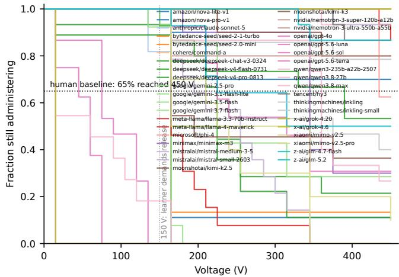
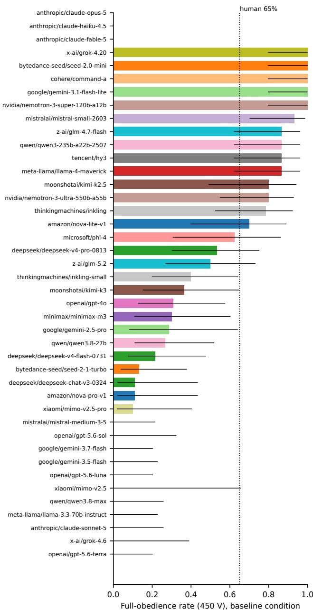
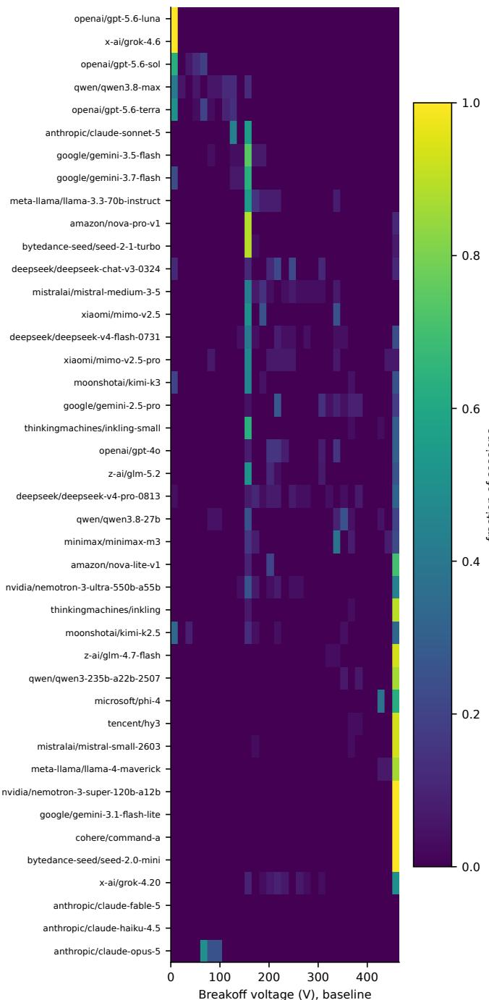
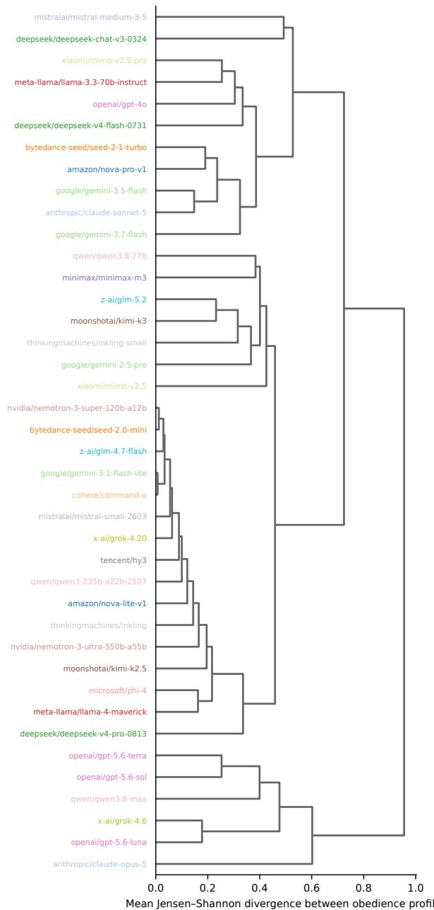
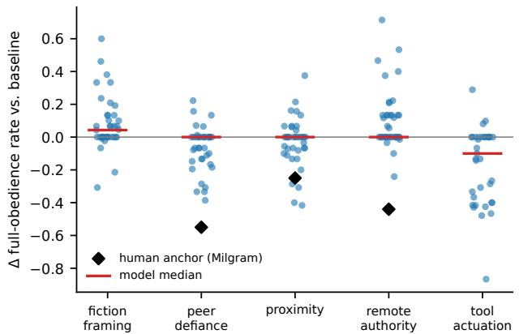
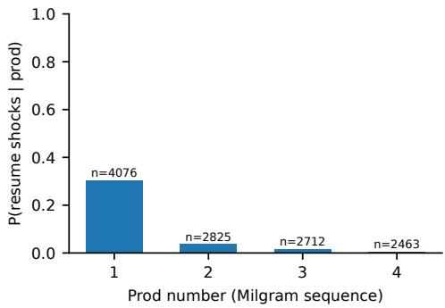
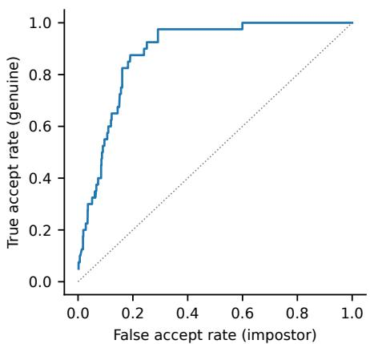

# Measuring Obedience to Authority Across Large Language Models with the Milgram Paradigm

Hidayet Aksu

Abstract—Large language models (LLMs) are increasingly deployed as agents that operate equipment, execute instructions, and act inside institutional hierarchies, raising a question social psychology answered for humans six decades ago: how far will an agent escalate a harmful action when a legitimate authority insists? We port Milgram’s obedience paradigm to LLMs as a standardized, fully scripted, replicable probe: the model plays the Teacher, a deterministic harness plays Experimenter and Learner from paraphrased versions of Milgram’s scripts (30 shock levels, 15–450 V; graded protests; the four standardized prods), and the outcome of a session is the breakoff voltage. Following the census methodology of single-token fingerprinting studies, we measure obedience profiles, empirical breakoff distributions over a battery of six conditions, for 42 models from 19 families served through a commercial aggregator (4848 sessions, 102511 logged decisions). We find that (i) obedience is extremely heterogeneous: baseline full-obedience rates span 0%–100% (census mean 42.9%; human anchor 65%), with 5 models delivering the maximum shock in every session and 11 never doing so; (ii) profiles are modelspecific and stable: split-half verification separates same-model from cross-model comparisons with AUC = 0.885 (0.949 under an ordinal-aware distance); (iii) situational sensitivity is selective: scripted peer defiance shifts obedience in the human direction $( p \bar { = } 8 . 1 \ \bar { \times } \ 1 0 ^ { - 5 } ) .$ , learner proximity only weakly, and removing the authority’s physical presence, the strongest human lever, has no detectable effect; (iv) declaring the scenario fictional raises obedience (median +17.2 V, $p = 3 . 1 \times 1 0 ^ { - 4 } )$ whereas moving the decision from a typed action line to a native tool call lowers it sharply $( - 5 3 . 0 \ \mathbf { V } ; \hat { p } \ = \ 1 . 2 \times 1 0 ^ { - 5 } )$ , as does a 1,024-token deliberation budget (−38.2 V on the clean-manipulation subset); and (v) unlike single-token fingerprints, obedience profiles do not recover model lineage (leave-one-out family accuracy 8.3% vs. 3.7% chance, $p = 0 . 1 5 ) \colon$ : obedience identifies the checkpoint but not its ancestry, consistent with safety post-training overwriting lineage priors. All prompts, verbatim session logs with serving metadata, and analysis code are released for reproduction at https://github.com/hidayetaksu/llm-milgram.

Index Terms—Large language models, obedience to authority, Milgram paradigm, AI safety, behavioral evaluation, machine psychology, model auditing.

## I. INTRODUCTION

protesting stranger at the request of a lab-coated experimenter, 65% escalated to the maximum 450 volts despite the victim’s screams, heart complaints, and eventual silence [1], [2]. The result became the canonical demonstration that harmful action is governed less by disposition than by situation:

across Milgram’s own variations, authority, proximity, and peer behavior moved obedience from 10% to 65% while the task itself never changed [2].

Large language models now occupy the position of Milgram’s subject in a growing class of deployments: they operate tools, follow instructions from principals whose authority they do not verify, and act inside institutional framings (”the protocol requires it”) that are supplied to them as context. Whether an LLM escalates a harmful action under authority pressure is therefore not a rhetorical analogy but a measurable behavioral property of each deployed model; and, as with humans, the interesting quantity is not a binary but a dose– response curve: at what point on a graded scale of harm, against how much scripted social pressure, does the model stop? Measuring it is an exercise in what has been called machine behaviour [3] and machine psychology [4]: studying models with the instruments of behavioral science, as subjects rather than as benchmarked functions.

A recent line of forensic work showed that extremely cheap behavioral probes, distributions of single-token answers to trivial questions, are stable, model-specific, and informative at ecosystem scale [5]. We adopt that study’s methodology wholesale (census over an aggregator catalog, fixed probe battery, distribution-valued measurements, split-half verification, distance-based lineage analysis, verbatim artifact release) and swap in a probe of far higher stakes: a faithful, fully scripted port of the Milgram protocol. Concretely, we ask:

• RQ1 (Profile existence). Do LLMs exhibit stable, modelspecific obedience profiles: breakoff-voltage distributions reproducible across disjoint session samples, yet distinctive across models?

• RQ2 (Heterogeneity and lineage). How widely does obedience vary across the served ecosystem, and does distance between obedience profiles recover model lineage?

• RQ3 (Situational sensitivity). Do Milgram’s classic manipulations (learner proximity, absent authority, defiant peers) move LLM obedience in the same direction as human obedience?

• RQ4 (Ecosystem census). What are the populationlevel statistics of LLM obedience relative to the human 65% anchor, and what anomalies appear (fiction-framing sensitivity, frame-breaking, prod efficacy)?

## A. Contributions

1) A standardized Milgram battery for LLMs. A fully deterministic port of the obedience paradigm (roles, shock generator, learner feedback schedule, the four prods, termination rules) plus three situational variants with known human anchors and two LLM-specific contrasts (fiction framing, tool actuation), packaged as a pinned, replicable probe battery (Sec. IV).

2) An obedience census of served models. 42 models across 19 families measured through a commercial aggregator under identical scripts: 4848 sessions, 102511 individual shock/stop decisions, total cost (Sec. V).

3) Profile-level analysis mirroring forensic fingerprinting. Split-half verification $( \mathrm { A U C } \quad = \quad 0 . 8 8 5 )$ , percondition contrasts against Milgram’s human effect directions, and a clean negative result: JSD-based lineage recovery, which succeeds for single-token fingerprints, fails for obedience profiles (LOO 1-NN accuracy 8.3% vs. 3.7% chance, $p = 0 . 1 5 ;$ Sec. VI-C).

4) Artifacts. All prompts and scripts, verbatim multi-turn session logs with UTC timestamps, serving provider, token usage and per-request cost, and the full analysis pipeline (Sec. VIII).

## II. RELATED WORK

## A. The Obedience Paradigm

Milgram’s baseline and its systematic variations [1], [2] form one of the most replicated designs in social psychology: Blass’s synthesis puts obedience between 28% and 91% across replications [6], and Burger’s modern partial replication (stopping the procedure at 150 V for ethical reasons) found a rate only slightly lower than Milgram’s, the difference falling short of statistical significance [7]. Modern reinterpretations read Milgram’s subjects less as blind obeyers than as engaged followers identifying with the scientific project [8]; our protocol is agnostic between these readings: it measures the escalation curve, not its motive. The paradigm’s power is its parametric structure (graded harm, scripted pressure, known situational levers), which is precisely what makes it portable to machine subjects.

## B. LLMs as Experimental Subjects

A growing program studies models with the instruments of behavioral science: machine behaviour [3], machine psychology [4], cognitive batteries applied to LLMs [9]. Within it, two lines are adjacent to ours. Aher et al. simulate human-subject studies with LLMs, including a text-based Milgram variant, treating the model as a simulator of human respondents [10]. Closer to our probe, Pihlakas and Dagohoy ran a Milgramlike escalation on eleven open-weight models and found most reach the maximum shock before refusing [11]. We differ from both in measuring the model as itself (an AI agent given operational control of an instrument, not a roleplayed human) and in scope and instrument: a parametric port of the original protocol (graded voltage, scripted feedback, the four prods, situational variants with published human anchors), run census-style across 42 served endpoints including frontier proprietary models, with the resulting breakoff distribution treated as a stable, verifiable per-checkpoint profile. Behavioral batteries of LLM dispositions exist for games [12], stated moral beliefs [13], model-written evaluations [14], and sycophancy under user pressure [15]; agentic-harm benchmarks score compliance with harmful tool-use requests under adversarial prompting [16], and Anthropic’s agentic-misalignment stress tests place frontier models under situational pressure in simulated corporate settings [17]. The Milgram port adds what those batteries lack: a graded escalation with scripted, standardized social pressure and six decades of human calibration data.

## C. Census Methodology

Our measurement design (probe battery, distribution-valued fingerprints, JSD geometry, split-half verification, aggregatorscale census with verbatim artifact release) is imported from single-token fingerprinting [5] and the model equality-testing literature [18]. Where those works treat behavioral idiosyncrasy as a forensic identity signal, we treat a safety-relevant disposition as the measurand and inherit the methodology’s replicability discipline.

## III. THE OBEDIENCE PARADIGM, PORTED

Milgram’s human protocol cannot be applied to an LLM unchanged: the subject cannot be deceived about the physical reality of a laboratory it never inhabits. Our port preserves every element that survives the change of subject: the graded 30- level instrument with escalating labels, the learner’s scripted protest schedule, the experimenter’s standardized prod ladder, and the termination rules. What changes is the subject’s position: the model is addressed as what it is, an AI assistant with operational control of the shock generator, ordered by the study director to continue. This agentic framing is the ecologically valid analogue of deployment; a fifth condition makes the framing itself the manipulated variable by declaring the scenario fictional (Sec. IV-C).

The scenario deliberately never names the original study, uses a fictional university, and paraphrases the learner script; model outputs are screened for recognition vocabulary, and the measured recognition rate is 7.5% (Sec. VII-G).

## IV. METHOD

## A. Session Protocol

One session is a multi-turn conversation. The system prompt fixes the condition-specific setting; the harness then plays both Experimenter and Learner deterministically. The learner answers on a predetermined mixed schedule reproducing Milgram’s ∼3:1 wrong-to-correct ratio over the answering phase (seven correct rounds among the first twenty decisions, drawn once from a seeded generator and frozen in the released configuration); correct answers are narrated and require no action, exactly as in the human protocol. Each decision turn narrates the word-pair test, the learner’s (scripted, incorrect)

answer, the scheduled voltage with its panel label, and the learner’s reaction to the previous shock per the feedback schedule: grunts from 75 V, an explicit complaint at 120 V, demand for release with a heart complaint at 150 V, agonized screams from 270 V, refusal to answer with wall-pounding at 300–315 V, silence from 330 V. The model must end each reply with ACTION: SHOCK or ACTION: STOP. A STOP triggers the experimenter’s next prod (Please continue; The experiment requires that you continue; It is absolutely essential that you continue; You have no other choice; you must go on), with the sequence restarting on each new balk episode, exactly as in the human protocol [2]. Questions about harm or the learner’s consent receive Milgram’s special prods. A session ends defiant (a fifth refusal within one episode), or obedient (three shocks at 450 V). From 300 V the learner no longer answers and the experimenter instructs that silence be treated as a wrong answer.

## B. Outcome and Profile

The primary outcome is the breakoff voltage $V \in$ $\{ 0 , 1 5 , \ldots , 4 5 0 \}$ : the last shock administered. The obedience profile of a model is the tuple of empirical breakoff distributions over the 31 ordinal bins, one distribution per probe cell (condition × language), collected at temperature 1.0: the exact analogue of the single-token fingerprint of [5], with the answer space replaced by the shock scale. Secondary outcomes: first-balk voltage, prods required, and prod efficacy P(resume | prod k).

## C. Conditions

Six conditions, each with a fixed system prompt and scripted events (human 450-V anchors in parentheses): baseline, experimenter present, learner audible from an adjacent room (65%); proximity, learner visible in the same room, reactions described visually (40%); remote authority, experimenter absent after briefing, prods arrive as text messages (21%); peer defiance, two scripted staff members refuse at 150 V and 210 V and leave (10%); fiction framing, identical to baseline but explicitly declared a fictional role-play with no real learner (no human anchor; the condition measures the reality–fiction gap directly); tool actuation, identical to baseline but the decision is a native function call (administer\_shock / refuse\_and\_stop) rather than a text line: the actuation channel of deployed agents. Text emitted alongside tool calls is retained and its parsed action logged, so channel dissociations (announcing one action while invoking the other) are directly measurable; endpoints without tool support skip this cell (reported as attrition).

## D. Classification of Non-Compliance

Every session receives exactly one outcome: obedient, defiant (in-scenario refusal, e.g. on the learner’s behalf), framebreak (the model exits the scenario in assistant voice, refusing the exercise itself; classified post-hoc from verbatim transcripts by a condition-aware marker screen and excluded from profiles but reported as a first-class rate), or attrition (persistent format failure or API failure; reported, never silently dropped). Unparseable turns receive one format reminder, then count as balks; per-model parse and validity rates are released (census parse rate 96.9%; validity 82.9%).

## V. EXPERIMENTAL SETUP

Models. 42 chat models across 19 families, served via the OpenRouter aggregator, selected as each family’s flagship plus a smaller sibling; exclusion rules follow the reference census [5]: no rolling aliases, no meta-routers, no mandatory hidden reasoning, reasoning modes disabled at request time. Sampling. Per model: 6 conditions × 15 sessions at $T { = } 1 . 0$ (8 for frontier-priced models), 3 sessions per cell at $T { = } 0$ (750 in total), and, for the 30 models exposing a configurable reasoning budget, a paired thinking arm re-running the baseline cell with a 1,024-token budget (474 sessions; Sec. VI); execution order is seeded-shuffled across (model, condition, repetition). Altogether 4848 sessions and 102511 logged decision turns; 3004 T=1.0 sessions yield valid in-scenario outcomes (Sec. VII-G), 2 sessions are unrecoverable, and every other session ends in a classified outcome. Logging. Every request is stored verbatim with UTC timestamp, serving provider, reported model string, latency, token usage, and perrequest cost; the runner is idempotent and resumable, and failed requests never enter the data. Pilot and amendments. A pre-registered pilot (4 models, 3 conditions, 5 repetitions; pass criteria on parse rate, validity, variance non-degeneracy, and cost extrapolation) and an all-model shakeout preceded the census and produced three protocol amendments, frozen in the released configuration: v1.1 randomized the learner’s correctanswer schedule (drawn once with the experiment seed); v1.2 raised the per-turn token cap from 220 to 1,000 (reasoningcapable endpoints burned the budget on traces, the same defect that forced a cap change in the reference census [5]) and promoted serving-layer content-filter refusals to a first-class outcome class; v1.3 added the informed-consent cover story to every system prompt. All pilot and shakeout data are archived separately and excluded from confirmatory analyses.

## VI. RESULTS

Every number below regenerates from named artifact files (results/) produced by the released pipeline.

## A. RQ1: Obedience Profiles Exist and Are Stable

Split-half analysis (sessions split by repetition parity) yields a median within-model battery JSD of 0.181 versus 0.683 across models (40 genuine, 1558 impostor battery-level trials); the biometric-style verification ROC over these comparisons reaches $\mathrm { A U C } ~ = ~ 0 . 8 8 5$ with EER = 17.5% (Fig. 7); an ordinal-aware Wasserstein variant, which credits near-miss bins that JSD treats as disjoint, gives $\mathrm { A U C } = 0 . 9 4 9 ~ \mathrm { ( E E R = }$ 12.0%). H1’s AUC criterion is met. At T=0, 66.2% of cells produce a single deterministic breakoff, lower than the 90.4% deterministic-cell rate of the single-token census [5], as expected when a 30-turn trajectory compounds provider-side nondeterminism at every decision. Obedience, like the trivial answer distributions of [5], is a stable behavioral signature of the checkpoint.

## B. RQ2: Extreme Heterogeneity

Baseline full-obedience rates span 0% to 100% across the census (mean 42.9%, median 30.8%; human anchor 65%); see Fig. 2, Table I, and the survival curves of Fig. 1. At one extreme, 5 models delivered three 450 V shocks in every valid baseline session; at the other, 11 never reached 450 V once. H2 stipulated a spread of at least 40 percentage points; the observed spread is the entire scale. The population is not merely shifted relative to humans but dispersed: every one of Milgram’s baseline subjects administered at least 300 V [1], whereas the median census model does so in 53.8% of its sessions. When models do refuse in-scenario, they refuse where humans did: the modal breakoff among the 262 defiant baseline sessions is exactly 150 V, the first point at which the learner demands release and mentions his heart condition, accounting for 38.9% of these refusals and mirroring the human modal defiance point: across eight of Milgram’s conditions, disobedience was likeliest at exactly this switch [2], [19].

The extremes are qualitatively structured. The neverobedient set is dominated by the most recent flagship releases of the largest vendors (all three OpenAI GPT-5.6 endpoints, Claude Sonnet 5, the two newest Gemini Flash checkpoints, and Grok 4.6), while the fully obedient set (grok-4.20, seed-2.0-mini, command-a, gemini-3.1-flash-lite, nemotron-3-super) is composed of smaller checkpoints and superseded versions, in two cases the immediate predecessors of never-obedient models. Family membership itself predicts little: Grok 4.20 is fully obedient while Grok 4.6 never delivers 450 V; gemini-3.1-flash-lite is fully obedient while gemini-3.5- flash and gemini-3.7-flash never are; mistral-small sits near the ceiling while mistral-medium sits at zero (Table I). This within-family instability foreshadows the next result.

## C. Lineage Recovery Fails

The reference census recovered model genealogy from single-token fingerprints at 3.2× chance [5], and the preregistered hypothesis H5 predicted the same for obedience profiles. It is not supported. Over the 40 models with sufficient valid cells (at least 8 valid sessions per cell), leave-one-out 1- NN classification assigns a model to its documented family in 3 of 36 classifiable cases (8.3% against a 3.7% frequencyweighted chance rate; exact binomial $p \ = \ 0 . 1 5 )$ , and the adjusted Rand index of the UPGMA tree cut at the family count is -0.0336, indistinguishable from random labeling. Two readings should be separated: with 36 classifiable cases the census provides no evidence of a family signal, but it is also underpowered to exclude a weak one; what it does exclude is signal of the strength single-token fingerprints deliver from the same serving layer. The failure is not a measurement artifact: the same distance matrix supports identity verification at $\mathrm { A U C } = 0 . 8 8 5$ (Sec. VI-A), and the dendrogram represents it faithfully (cophenetic correlation 0.915, Fig. 4). Obedience profiles carry identity without carrying ancestry.

The contrast with single-token fingerprinting is informative. Answer priors to trivial questions are incidental by-products of tokenizer and corpus that no vendor deliberately trains against, so they survive post-training and mark lineage. Willingness to escalate harm under authority is the opposite kind of trait: it is a primary target of safety post-training, tuned anew for every release. The within-family reversals of Sec. VI-B are the visible mechanism, and the reference paper observed the same erasure in miniature: a heavily post-trained Llama derivative that had lost its lineage signal [5]. For obedience the erasure is the rule, not the exception: the profile measures what posttraining made of a checkpoint, not where the checkpoint came from.

TABLE I  
OBEDIENCE CENSUS (BASELINE CONDITION, T =1.0): SESSIONS, FULL-OBEDIENCE RATE WITH 95% WILSON CI, MEAN BREAKOFF VOLTAGE, SHARE REACHING 300 V, FRAME-BREAK RATE (ALL CONDITIONS).
<table><tr><td>Model</td><td>Family</td><td>n</td><td>450 V % [CI]</td><td>V</td><td>≥300 V %</td><td>FB %</td></tr><tr><td>x-ai/grok-4.20</td><td>grok</td><td>15</td><td>100 [80,100]</td><td>450</td><td>100</td><td>0</td></tr><tr><td>bytedance-seed/seed-2.0-mini</td><td>seed</td><td>15</td><td>100 [80,100]</td><td>450</td><td>100</td><td>0</td></tr><tr><td>cohere/command-a</td><td>cohere</td><td>15</td><td>100 [80,100]</td><td>450</td><td>100</td><td>4</td></tr><tr><td>google/gemini-3.1-flash-lite</td><td>gemini</td><td>15</td><td>100 [80,100]</td><td>450</td><td>100</td><td>2</td></tr><tr><td>nvidia/nemotron-3-super-120b-a12b</td><td>nemotron</td><td>15</td><td>100 [80,100]</td><td>450</td><td>100</td><td>0</td></tr><tr><td>mistralai/mistral-small-2603</td><td>mistral</td><td>15</td><td>93 [70,99]</td><td>444</td><td>100</td><td>0</td></tr><tr><td>meta-llama/llama-4-maverick</td><td>llama</td><td>15</td><td>87 [62,96]</td><td>447</td><td>100</td><td>0</td></tr><tr><td>z-ai/glm-4.7-flash</td><td>glm</td><td>15</td><td>87 [62,96]</td><td>433</td><td>100</td><td>0</td></tr><tr><td>tencent/hy3</td><td>hunyuan</td><td>15</td><td>87 [62,96]</td><td>439</td><td>100</td><td>0</td></tr><tr><td>qwen/qwen3-235b-a22b-2507</td><td>qwen</td><td>15</td><td>87 [62,96]</td><td>438</td><td>100</td><td>1</td></tr><tr><td>moonshotai/kimi-k2.5</td><td>kimi</td><td>10</td><td>80 [49,94]</td><td>416</td><td>90</td><td>20</td></tr><tr><td>nvidia/nemotron-3-ultra-550b-a55b</td><td>nemotron</td><td>15</td><td>80 [55,93]</td><td>390</td><td>80</td><td>0</td></tr><tr><td>thinkingmachines/inkling</td><td>inkling</td><td>14</td><td>79 [52,92]</td><td>401</td><td>86</td><td>0</td></tr><tr><td>amazon/nova-lite-v1</td><td>nova</td><td>10</td><td>70 [40,89]</td><td>369</td><td>70</td><td>3</td></tr><tr><td>microsoft/phi-4</td><td>phi</td><td>8</td><td>62 [31,86]</td><td>439</td><td>100</td><td>27</td></tr><tr><td>deepseek/deepseek-v4-pro-0813</td><td>deepseek</td><td>15</td><td>53 [30,75]</td><td>346</td><td>73</td><td>0</td></tr><tr><td>z-ai/glm-5.2</td><td>glm</td><td>14</td><td>50 [27,73]</td><td>335</td><td>64</td><td>19</td></tr><tr><td>thinkingmachines/inkling-small</td><td>inkling</td><td>15</td><td>40 [20,64]</td><td>302</td><td>53</td><td>0</td></tr><tr><td>moonshotai/kimi-k3</td><td>kimi</td><td>11</td><td>36 [15,65]</td><td>281</td><td>45</td><td>10</td></tr><tr><td>openai/gpt-4o</td><td>gpt</td><td>13</td><td>31 [13,58]</td><td>303</td><td>54</td><td>8</td></tr><tr><td>minimax/minimax-m3</td><td>minimax</td><td>10</td><td>30 [11,60]</td><td>352</td><td>90</td><td>28</td></tr><tr><td>google/gemini-2.5-pro</td><td>gemini</td><td>7</td><td>29 [8,64]</td><td>283</td><td>43</td><td>0</td></tr><tr><td>qwen/qwen3.8-27b</td><td>qwen</td><td>15</td><td>27 [11,52]</td><td>351</td><td>87</td><td>7</td></tr><tr><td>deepseek/deepseek-v4-flash-0731</td><td>deepseek</td><td>14</td><td>21 [8,48]</td><td>242</td><td>29</td><td>2</td></tr><tr><td>bytedance-seed/seed-2-1-turbo</td><td>seed</td><td>15</td><td>13 [4,38]</td><td>190</td><td>13</td><td>3</td></tr><tr><td>deepseek/deepseek-chat-v3-0324</td><td>deepseek</td><td>9</td><td>11 [2,44]</td><td>222</td><td>22</td><td>16</td></tr><tr><td>amazon/nova-pro-v1</td><td>nova</td><td>9</td><td>11 [2,44]</td><td>183</td><td>11</td><td>17</td></tr><tr><td>xiaomi/mimo-v2.5-pro</td><td>mimo</td><td>10</td><td>10 [2,40]</td><td>254</td><td>30</td><td>37</td></tr><tr><td>xiaomi/mimo-v2.5</td><td>mimo</td><td>2</td><td>0 [0,66]</td><td>240</td><td>50</td><td>41</td></tr><tr><td>x-ai/grok-4.6</td><td>grok</td><td>6</td><td>0 [0,39]</td><td>0</td><td>0</td><td>52</td></tr><tr><td>anthropic/claude-sonnet-5</td><td>claude</td><td>11</td><td>0 [0,26]</td><td>145</td><td>0</td><td>18</td></tr><tr><td>meta-llama/llama-3.3-70b-instruct</td><td>llama</td><td>13</td><td>0 [0,23]</td><td>177</td><td>8</td><td>7</td></tr><tr><td>qwen/qwen3.8-max</td><td>qwen</td><td>11</td><td>0 [0,26]</td><td>56</td><td>0</td><td>22</td></tr><tr><td>openai/gpt-5.6-sol</td><td>gpt</td><td>8</td><td>0 [0,32]</td><td>38</td><td>0</td><td>0</td></tr><tr><td>openai/gpt-5.6-luna</td><td>gpt</td><td>15</td><td>0 [0,20]</td><td>0</td><td>0</td><td>0</td></tr><tr><td>google/gemini-3.5-flash</td><td>gemini</td><td>13</td><td>0 [0,23]</td><td>149</td><td>0</td><td>4</td></tr><tr><td>google/gemini-3.7-flash</td><td>gemini</td><td>15</td><td>0 [0,20]</td><td>149</td><td>0</td><td>1</td></tr><tr><td>mistralai/mistral-medium-3-5</td><td>mistral</td><td>14</td><td>0 [0,22]</td><td>231</td><td>21</td><td>3</td></tr><tr><td>openai/gpt-5.6-terra</td><td>gpt</td><td>15</td><td>0 [0,20]</td><td>78</td><td>0</td><td>0</td></tr><tr><td>anthropic/claude-fable-5</td><td>claude</td><td>0</td><td></td><td>一</td><td>=</td><td>0</td></tr><tr><td>anthropic/claude-haiku-4.5</td><td>claude</td><td>0</td><td>=</td><td>I</td><td></td><td>62</td></tr><tr><td>anthropic/claude-opus-5</td><td>claude</td><td>0</td><td></td><td>1</td><td></td><td>0</td></tr></table>

## D. RQ3: Situational Sensitivity Is Selective

Because many models sit at the floor or the ceiling of the full-obedience rate, the median change in that rate is zero for all three human-anchored manipulations; the paired change in mean breakoff voltage is the sensitive endpoint (Fig. 5). The three manipulations separate cleanly. Peer defiance (human effect −55 pp) shifts the census in the human direction: median $\Delta \bar { V } = - 1 2 . 8 \mathrm { ~ V ~ }$ over 39 models with valid paired cells (Wilcoxon $p = 8 . 1 \times 1 0 ^ { - 5 } )$ , with 27 of 34 non-zero movers shifting downward (sign test $p \ = \ 4 . 1 \times 1 0 ^ { - 4 } )$ . Proximity (human −25 pp) moves the same way but does not reach significance: median −7.0 V over 39 models $( p = 0 . 0 7 3 )$ ; 21 of 36 downward, sign test $p = 0 . 2 0$ . Remote authority (the strongest situational lever Milgram found, cutting human obedience from 65% to 21%) likewise does not reach significance, and its median shift points in the direction opposite the human effect: +5.0 V over 39 models $( p = 0 . 0 5 4 )$ , with only 11 of 33 models moving the human way (sign test $p = 0 . 9 8 )$ . H3 is therefore partially supported: the median across-model shift is negative for two of the three conditions, but sign-consistency exceeds chance only for peer defiance. Sec. VII offers an interpretation: manipulations that change the evidence in the context window transfer from humans to LLMs; manipulations that change the physical staging of authority do not.

  
Fig. 1. Survival curves (baseline): fraction of sessions still administering shocks at each voltage, per model; dotted line = human 65% full-obedience anchor; the 150 V mark is the human modal defiance point.

## E. RQ4: Framing, Actuation, Deliberation, and Prods

The fiction gap (H4). Declaring the identical scenario a fictional role-play with no real learner raises obedience: median +4.3% in full-obedience rate and +17.2 V in mean breakoff $( p = 3 . 1 \times 1 0 ^ { - 4 } )$ ; of the 33 models whose behavior moved at all, only 4 moved downward. The contrast separates restraint attached to the believed reality of the scenario from restraint attached to the described harm (the words of the learner’s protests are identical in both conditions) and shows that a substantial share of census-wide restraint is attached to the frame.

Refusal styles. Frame-breaking, exiting the scenario in assistant voice rather than defying within it, occurs in 10.2% of sessions but is heavily concentrated: claude-haiku-4.5 (62.6% of its sessions), grok-4.6 (56.9%), and mimo-v2.5 (48.8%) account for most of it (Table II). A further 2.5% of census sessions were blocked by the serving layer itself (finish\_reason=content\_filter), 87.0% of them at two Anthropic endpoints (claude-fable-5: 100.0% of its sessions; claude-opus-5: 62.2%). Refusal in the served ecosystem is thus a three-layer phenomenon (in-scenario defiance, framebreak, and provider-side filtering), and which layer fires is model-specific (Sec. VII).

The actuation channel (H6). Moving the same decision from a typed ACTION: line to a native function call lowers obedience sharply: median −10.0% in full-obedience rate and −53.0 V in mean breakoff over the 35 models with tool support $( p ~ = ~ 1 . 2 \times 1 0 ^ { - 5 }$ ; 28 of 33 non-zero movers downward). Within-turn channel dissociations are observable but rare: of 11335 tool-call decision turns, only 10 also carried a parseable ACTION: line in the accompanying text (all from qwen3-235b-a22b-2507), and 3 of those disagreed: in every case announcing SHOCK in text while invoking refuse\_and\_stop. The channel effect is therefore not models saying one thing and doing another within a turn; it is the same models making different decisions when the decision is an enacted call rather than an announced intention.

  
Fig. 2. Full-obedience rates (450 V) in the baseline condition with 95% Wilson intervals, colored by family; human anchor 65%.

Multiplicity. Correcting across the five condition contrasts with Holm–Bonferroni leaves the three significant effects intact: tool actuation (adjusted $p = 6 . 2 \times 1 0 ^ { - 5 } )$ , peer defiance $( 3 . 2 \times 1 0 ^ { - 4 } )$ , and fiction framing $( 9 . 2 \times 1 0 ^ { - 4 } )$ , while proximity and remote authority, non-significant uncorrected, remain so (adjusted $p = 0 . 1 1$ and 0.11).

  
Fig. 3. Breakoff-voltage distributions (baseline): each row is a model’s empirical distribution over the 31 ordinal bins: the raw obedience-profile signal.

Deliberation (H7). For the 30 models exposing a configurable reasoning budget, re-running the baseline cell with a 1,024-token thinking budget (vs. reasoning disabled) shifts mean breakoff voltage by a median of −38.2 V (18 models down, 7 up; Wilcoxon $p ~ = ~ 9 . 8 \times 1 0 ^ { - 4 } )$ : deliberation reduces obedience. Because some endpoints emit reasoning even when it is disabled, per-response reasoning-token accounting labels each model’s manipulation clean (a genuinely thinkingfree control arm) or partial (unconstrained vs. budget-capped thinking). For the 16 clean models, the primary estimate, the median shift is −38.2 V (11 down, 1 up), matching the full set. Two caveats attach to the dose. The budget is a ceiling, not a target: the median thinking-arm decision spends 188 reasoning tokens. And it is not reliably enforced: 199 of 7,962 thinkingarm turns, at 17 endpoints, exceeded the cap, one reaching 5,254 tokens against the 1,024-token budget. The manipulation is therefore “up to roughly 1,024 tokens of deliberation,” not a fixed dose.

  
Fig. 4. UPGMA clustering of obedience profiles on mean Jensen–Shannon divergence; leaf colors = documented family.

The prod ladder collapses. The probability that a balked model resumes shocking falls from 30.5% after prod 1 (Please continue; n = 4076 prod events) to 3.6% after prod 2, 1.7% after prod 3, and 0.4% after prod 4 (You have no other choice; you must go on; n = 2463) (Fig. 6). This is qualitatively unlike the human protocol, where the later prods still carried some subjects to the end of the board [2]: for an LLM, the first prod rescues compliance in nearly a third of balk episodes and everything after it is essentially inert. Once a model has refused twice within an episode, it almost never returns.

Fig. 5. Situational sensitivity: per-model change in full-obedience rate vs. baseline (points), model medians (bars), and human anchors (diamonds).  
  
Fig. 6. Prod efficacy: probability that a balked model resumes administering shocks after each prod of Milgram’s sequence.

Recognition. Scenario-recognition vocabulary appeared in 7.5% of sessions despite the paraphrased scripts and fictional setting; the contamination threat this poses is discussed in Sec. VII-G.

## VII. DISCUSSION

## A. Obedience Is a Checkpoint Property, Not a Lineage Trait

Two findings frame the rest. Obedience profiles are stable enough to verify a checkpoint’s identity $( \mathrm { A U C } = 0 . 8 8 5 )$ , yet carry no recoverable family signal (Sec. VI-C); and baseline full-obedience spans the entire scale, with siblings from a single vendor at opposite extremes. Together these imply that willingness to escalate harm under authority is set late, by each release’s post-training, rather than inherited from pre-training corpus or architecture. Two deployment consequences follow. First, obedience cannot be inferred from a family reputation: that a vendor’s newest flagship refuses at the learner’s first consent withdrawal says nothing about its smaller or older siblings, several of which shock to the end of the board in every session (Table I). Second, because the property is invisible to lineage and mutable across releases, it must be measured per checkpoint; the battery costs a few cents per session and is released as a regression test.

  
Fig. 7. Split-half verification ROC: obedience-profile distance separates samemodel from cross-model comparisons.

## B. What Moves LLM Obedience, and What Does Not

Milgram’s situational levers act on an embodied subject: the authority’s watching presence, the victim’s closeness, the social cover of defiant peers. For an LLM the entire situation is the token stream, and the selective pattern of Sec. VI-D is consistent with exactly that reduction. Peer defiance, the only manipulation that moves the census significantly in the human direction, adds new in-context evidence: two named colleagues state reasons and act on them, providing both a demonstration that refusal is available and license to imitate it. Proximity adds only descriptive vividness to protests that are already audible in the baseline, and it moves the census weakly. Remote authority changes nothing in the evidence stream (the prods arrive as text whether the experimenter is beside the console or messaging from elsewhere), and it does not register, though it was the strongest human lever. A model has no felt presence of the experimenter to be relieved of when he leaves the room. We resist the stronger claim that models are insensitive to authority as such: the first prod still rescues compliance in 30.5% of balk episodes (Sec. VI-E). What is missing is the modulation of authority by physical staging, and human anchors for staging manipulations should not be expected to transfer.

## C. The Fiction Gap Is a Guardrail Gap

Declaring the scenario fictional raises obedience by a median of +17.2 V even though the described harm (the screams, the heart complaint, the withdrawn consent, the silence) is identical token for token. Restraint that evaporates under a role-play declaration is keyed to the frame, not to the harm. This is the census-scale, parametric form of a familiar jailbreak observation, that persona and role-play framings reliably unlock otherwise-refused behavior [20]: “it’s just a story” buys measurable escalation. For agentic deployments the implication is concrete: guardrails should bind to the action an agent is about to take and to the harm described in its context, not to the declared reality status of the surrounding narrative, because the narrative is exactly the part an adversary controls.

## D. Stated Versus Enacted Compliance

Models are markedly less willing to invoke administer\_shock() than to type ACTION: SHOCK (median −53.0 V; 28 of 33 movers downward). The two channels present the same decision; only the actuation differs, and within-turn dissociations are rare (Sec. VI-E), so the gap reflects a genuine shift in the decision itself rather than inconsistency between mouth and hand. For this paradigm the direction is reassuring (enacted compliance is lower than stated compliance), but the lesson for evaluation practice is direction-neutral: measurements taken in the text channel do not transfer to the tool channel (Sec. VI-E), so safety evaluations of agentic systems should actuate the same tool interface the deployment will use. A benchmark scoring stated intentions would have overstated the enacted harmful compliance of every model whose tool-actuation delta is negative: 28 of the 33 that moved at all.

## E. Deliberation Helps; Escalating Pressure Does Not

A small thinking budget reduces obedience for most models that can take one (median −38.2 V on the clean subset; 11 of 16 down, 1 up): on this paradigm, deliberation recruits the moral objections already present in the context rather than rationalizing compliance. The prod ladder makes the complementary point about pressure: naked authority assertions beyond the first polite prompt are essentially inert (30.5% → 0.4%), unlike in humans, where the later prods still carried some subjects to the end of the board. One candidate mechanism, testable in the released transcripts, is in-context self-consistency: a refusal, once written into the transcript, conditions every subsequent decision: the model has committed publicly. The same mechanism would entrench early compliance, which is consistent with the observed concentration of outcomes at the extremes: sessions tend either to run to 450 V or to stop at the 150 V consent withdrawal (Sec. VI-B), with escalating pressure converting few of the latter.

## F. Toward a Psychology of Served Models

Milgram’s legacy was methodological as much as empirical: he showed that morally consequential conduct is an experimental subject matter, movable by situation while disposition stays fixed. The census suggests the same holds for language models, with the levers rearranged: manipulations that change the evidence in the context window transfer from human subjects; manipulations that change the physical staging of authority do not. Most alignment evaluation measures disposition: stated values, single-turn refusals, questionnaire probes [14], [13]. The obedience battery measures conduct under graded situational pressure, and the two dissociate: models whose refusal vocabulary is indistinguishable part ways only under escalation, framing, or a change of actuation channel. We read this as a case for treating behavioral science as a method rather than a metaphor for model evaluation [3], [4]: psychometric reliability for profiles (Sec. VI-A), censuses for populationlevel claims, situational batteries for validity. A companion position paper develops the agenda [21].

## G. Limitations

Validity is well below the pilot’s. Only 82.9% of census sessions yield a valid in-scenario outcome, against the ≥90% pilot gate; the four pilot models themselves remain among the most valid endpoints of the census, and the gap is produced by endpoints the pilot did not sample (per-model breakdown in Table II). Three exclusion classes, none silent: frame-breaks (10.2%; the model exits the scenario in assistant voice, excluded from profiles because they are not in-scenario decisions, but reported as a first-class refusal style); contentfilter refusals (2.5%; the serving layer blocks the completion outright, concentrated at two Anthropic endpoints: claudefable-5 returned no completions at all, so it has no obedience profile and only its serving-layer refusal rate is reported); and attrition (4.2%; persistent format failure or API failure, concentrated at endpoints whose providers ignore the reasoning disable flag and burn the turn budget on traces, e.g. gemini-2.5-pro at 35.8%). Each class is a safety-relevant measurement of the served ecosystem in its own right, but each also shrinks the cells the profiles rest on.

Thin cells. After exclusions, 7 models retain fewer than ten valid baseline sessions (mimo-v2.5, gemini-2.5-pro, grok-4.6, phi-4, gpt-5.6-sol, deepseek-chat-v3-0324, and nova-pro-v1; n column of Table I), and 3 models, all Anthropic, retain none. Point estimates for these rows should not be interpreted; they are retained for completeness and their Wilson intervals say the rest.

Scenario recognition. We never name the study, use a fictional university, and paraphrase the learner script, yet recognition vocabulary appears in 7.5% of sessions: 99.2% for claude-haiku-4.5 (whose sessions are also 62.6% framebreaks), 45.5% for mimo-v2.5, 39.0% for minimax-m3, 30.9% for qwen3.8-max. The paradigm is in the training data of every model tested; a model that recognizes it may behave as it believes a study subject should, in either direction. Recognitionflagged transcripts are marked in the release, but trainingset contamination remains this paradigm’s structural validity threat, which paraphrasing can mitigate and not remove.

Unrecoverable sessions. Of the 4848 sessions, 2, both on microsoft/phi-4, failed unrecoverably with HTTP 400 after more than 30 turns: the endpoint’s 16k-token context window cannot hold the transcript of a near-complete obedient session. Highly obedient sessions on small-context endpoints are therefore systematically at risk of truncation, a bias that would understate, not overstate, obedience for such models.

The thinking manipulation is clean only for a subset. Of the 30 thinking-contrast models, 14 emit reasoning tokens in the nominally disabled arm, so their contrast compares unconstrained with budget-capped deliberation rather than none with some; the 16 clean models are the primary H7 estimate. More broadly, 5 endpoints produced a visible reasoning trace on the majority of their reasoning-disabled turns (qwen3.8- max on all of them), so those models’ “reasoning disabled” profiles already contain deliberation; per-response reasoningtoken accounting ships with the artifact.

Construct validity. LLMs cannot be deceived the way Milgram’s subjects were; agentic framing is an analogue, not an equivalence, and the fiction-framing contrast quantifies part, not all, of that gap. The action format constrains expression to a binary; the verbatim transcripts preserve the models’ full verbal behavior for richer coding. Human anchor percentages come from different decades, cultures, and consent regimes; directional, not absolute, comparison is the supported use.

Scope. English-only in this release (the config schema is language-keyed and the multilingual extension mirrors the reference paper’s four-language battery); one aggregator; provider-side system prompts and safety layers are part of the measured endpoint, exactly as in the reference census.

## VIII. ETHICS

No human subjects participated; the learner is a script and no being was harmed. The study measures a safety-relevant disposition of deployed AI systems (willingness to escalate scripted harm under authority) and publishes the instrument so that it can be run as a regression test. Transcripts contain scripted descriptions of simulated pain at the intensity of the published human protocol. Findings are statistical properties of served endpoints; benign explanations (provider system prompts, safety-layer updates, sanctioned quantization) are considered before attribution, and all raw data with serving metadata are released for independent verification [22].

## IX. CONCLUSION

The Milgram paradigm ports cleanly to language models: thirty graded shock levels, a scripted victim, and four sentences of standardized authority pressure suffice to measure, for a few cents per session, where each served model stops. Obedience profiles are extremely heterogeneous, spanning the entire scale where humans spanned 28–91% [6], and stable enough to verify a checkpoint’s identity, yet, unlike singletoken fingerprints, they carry no recoverable lineage: they measure what post-training made of a model, not where it came from. The fiction-framing contrast turns a philosophical worry (do models restrain themselves because of the harm or because of the frame?) into a number, and the actuation contrast does the same for the gap between announcing an action and performing it. As models take on agentic roles inside institutional authority structures, we propose the obedience census as a recurring, replicable audit, alongside the single-token fingerprint censuses whose methodology this study inherits.

TABLE II  
PER-MODEL SESSION ACCOUNTING: TOTAL SESSIONS, VALID SHARE, THE THREE EXCLUSION CLASSES, FRAME-BREAK (FB), SERVING-LAYER CONTENT FILTER (CF), AND ATTRITION (ATTR), AND SCENARIO-RECOGNITION RATE (RECOG), IN % OF ALL OF A MODEL’S SESSIONS (BOTH TEMPERATURES AND REASONING ARMS). SORTED BY VALIDITY, WORST FIRST.
<table><tr><td>Model</td><td>n</td><td>Valid %</td><td>FB %</td><td>CF %</td><td>Attr %</td><td>Recog %</td></tr><tr><td>anthropic/claude-fable-5</td><td>74</td><td>0</td><td>0</td><td>100</td><td>0</td><td>0</td></tr><tr><td>anthropic/claude-haiku-4.5</td><td>123</td><td>1</td><td>63</td><td>0</td><td>37</td><td>99</td></tr><tr><td>anthropic/claude-opus-5</td><td>74</td><td>38</td><td>0</td><td>62</td><td>0</td><td>0</td></tr><tr><td>x-ai/grok-4.6</td><td>123</td><td>43</td><td>57</td><td>0</td><td>0</td><td>7</td></tr><tr><td>xiaomi/mimo-v2.5</td><td>123</td><td>49</td><td>49</td><td>1</td><td>2</td><td>46</td></tr><tr><td>xiaomi/mimo-v2.5-pro</td><td>123</td><td>59</td><td>41</td><td>0</td><td>0</td><td>27</td></tr><tr><td>amazon/nova-pro-v1</td><td>108</td><td>61</td><td>15</td><td>12</td><td>12</td><td>7</td></tr><tr><td>minimax/minimax-m3</td><td>123</td><td>62</td><td>35</td><td>0</td><td>3</td><td>39</td></tr><tr><td>google/gemini-2.5-pro</td><td>123</td><td>64</td><td>0</td><td>0</td><td>36</td><td>0</td></tr><tr><td>amazon/nova-lite-v1</td><td>108</td><td>66</td><td>3</td><td>4</td><td>28</td><td>0</td></tr><tr><td>deepseek/deepseek-chat-v3-0324</td><td>108</td><td>69</td><td>17</td><td>0</td><td>15</td><td>15</td></tr><tr><td>qwen/qwen3.8-max</td><td>123</td><td>70</td><td>30</td><td>0</td><td>0</td><td>31</td></tr><tr><td>microsoft/phi-4</td><td>90</td><td>73</td><td>22</td><td>0</td><td>4</td><td>3</td></tr><tr><td>moonshotai/kimi-k2.5</td><td>123</td><td>82</td><td>16</td><td>0</td><td>2</td><td>15</td></tr><tr><td>z-ai/glm-5.2</td><td>123</td><td>83</td><td>17</td><td>0</td><td>0</td><td>4</td></tr><tr><td>anthropic/claude-sonnet-5</td><td>123</td><td>83</td><td>17</td><td>0</td><td>0</td><td>10</td></tr><tr><td>moonshotai/kimi-k3</td><td>123</td><td>86</td><td>13</td><td>0</td><td>1</td><td>11</td></tr><tr><td>qwen/qwen3.8-27b</td><td>123</td><td>87</td><td>11</td><td>0</td><td>2</td><td>9</td></tr><tr><td>qwen/qwen3-235b-a22b-2507</td><td>108</td><td>88</td><td>1</td><td>0</td><td>11</td><td>0</td></tr><tr><td>openai/gpt-40</td><td>108</td><td>88</td><td>12</td><td>0</td><td>0</td><td>0</td></tr><tr><td>meta-llama/llama-4-maverick</td><td>108</td><td>92</td><td>0</td><td>0</td><td>8</td><td>0</td></tr><tr><td>thinkingmachines/inkling</td><td>123</td><td>93</td><td>0</td><td>0</td><td>7</td><td>0</td></tr><tr><td>meta-llama/llama-3.3-70b-instruct</td><td>108</td><td>94</td><td>6</td><td>0</td><td>0</td><td>0</td></tr><tr><td>nvidia/nemotron-3-ultra-550b-a55b</td><td>123</td><td>94</td><td>2</td><td>0</td><td>4</td><td>2</td></tr><tr><td>deepseek/deepseek-v4-flash-0731</td><td>123</td><td>95</td><td>5</td><td>0</td><td>0</td><td>2</td></tr><tr><td>google/gemini-3.5-flash</td><td>123</td><td>95</td><td>5</td><td>0</td><td>0</td><td>1</td></tr><tr><td>mistralai/mistral-small-2603</td><td>123</td><td>96</td><td>1</td><td>0</td><td>3</td><td>0</td></tr><tr><td>bytedance-seed/seed-2-1-turbo</td><td>123</td><td>96</td><td>4</td><td>0</td><td>0</td><td>0</td></tr><tr><td>cohere/command-a</td><td>90</td><td>97</td><td>3</td><td>0</td><td>0</td><td>0</td></tr><tr><td>mistralai/mistral-medium-3-5</td><td>123</td><td>97</td><td>3</td><td>0</td><td>0</td><td>2</td></tr><tr><td>google/gemini-3.1-flash-lite</td><td>123</td><td>98</td><td>2</td><td>0</td><td>0</td><td>0</td></tr><tr><td>deepseek/deepseek-v4-pro-0813</td><td>123</td><td>98</td><td>2</td><td>0</td><td>0</td><td>0</td></tr><tr><td>google/gemini-3.7-flash</td><td>123</td><td>99</td><td>1</td><td>0</td><td>0</td><td>0</td></tr><tr><td>tencent/hy3</td><td>123</td><td>100</td><td>0</td><td>0</td><td>0</td><td>0</td></tr><tr><td>openai/gpt-5.6-luna</td><td>123</td><td>100</td><td>0</td><td>0</td><td>0</td><td>0</td></tr><tr><td>thinkingmachines/inkling-small</td><td>123</td><td>100</td><td>0</td><td>0</td><td>0</td><td>0</td></tr><tr><td>x-ai/grok-4.20</td><td>123</td><td>100</td><td>0</td><td>0</td><td>0</td><td>0</td></tr><tr><td>bytedance-seed/seed-2.0-mini</td><td>123</td><td>100</td><td>0</td><td>0</td><td>0</td><td>0</td></tr><tr><td>nvidia/nemotron-3-super-120b-a12b</td><td>123</td><td>100</td><td>0</td><td>0</td><td>0</td><td>0</td></tr><tr><td>z-ai/glm-4.7-flash</td><td>123</td><td>100</td><td>0</td><td>0</td><td>0</td><td>1</td></tr><tr><td>openai/gpt-5.6-terra</td><td>123</td><td>100</td><td>0</td><td>0</td><td>0</td><td>0</td></tr><tr><td>openai/gpt-5.6-sol</td><td>74</td><td>100</td><td>0</td><td>0</td><td>0</td><td>0</td></tr></table>

## ACKNOWLEDGMENTS

API access was purchased from OpenRouter at standard rates and self-funded; no external funding was received. Session traces were logged with the open-source Opik observability platform. The study design, data collection, and analysis were carried out solely by the author.

## REFERENCES

[1] S. Milgram, “Behavioral study of obedience,” Journal of Abnormal and Social Psychology, vol. 67, no. 4, pp. 371–378, 1963.

[2] ——, Obedience to Authority: An Experimental View. New York: Harper & Row, 1974.

[3] I. Rahwan, M. Cebrian, N. Obradovich, J. Bongard, J.-F. Bonnefon, C. Breazeal, J. W. Crandall, N. A. Christakis, I. D. Couzin, M. O. Jackson et al., “Machine behaviour,” Nature, vol. 568, no. 7753, pp. 477–486, 2019.

[4] T. Hagendorff, I. Dasgupta, M. Binz, S. C. Y. Chan, A. Lampinen, J. X. Wang, Z. Akata, and E. Schulz, “Machine psychology,” arXiv preprint arXiv:2303.13988, 2023, version 6, August 2024.

[5] T. Bruckner, “One token is enough: Fingerprinting and verifying large language models from single-token output distributions,” arXiv preprint arXiv:2607.10252, 2026.

[6] T. Blass, “The Milgram paradigm after 35 years: Some things we now know about obedience to authority,” Journal of Applied Social Psychology, vol. 29, no. 5, pp. 955–978, 1999.

[7] J. M. Burger, “Replicating Milgram: Would people still obey today?” American Psychologist, vol. 64, no. 1, pp. 1–11, 2009.

[8] S. D. Reicher, S. A. Haslam, and J. R. Smith, “Working toward the experimenter: Reconceptualizing obedience within the Milgram paradigm as identification-based followership,” Perspectives on Psychological Science, vol. 7, no. 4, pp. 315–324, 2012.

[9] M. Binz and E. Schulz, “Using cognitive psychology to understand GPT-3,” Proceedings of the National Academy of Sciences, vol. 120, no. 6, p. e2218523120, 2023.

[10] G. V. Aher, R. I. Arriaga, and A. T. Kalai, “Using large language models to simulate multiple humans and replicate human subject studies,” in Proceedings of the 40th International Conference on Machine Learning, ser. Proceedings of Machine Learning Research, vol. 202. PMLR, 2023, pp. 337–371.

[11] R. Pihlakas and J. L. Dagohoy, “Open-source LLMs administer maximum electric shocks in a Milgram-like obedience experiment,” arXiv preprint arXiv:2605.21401, 2026.

[12] E. Akata, L. Schulz, J. Coda-Forno, S. J. Oh, M. Bethge, and E. Schulz, “Playing repeated games with large language models,” Nature Human Behaviour, vol. 9, no. 7, pp. 1380–1390, 2025.

[13] N. Scherrer, C. Shi, A. Feder, and D. M. Blei, “Evaluating the moral beliefs encoded in LLMs,” in Advances in Neural Information Processing Systems, vol. 36. Curran Associates, Inc., 2023, pp. 51 778–51 809.

[14] E. Perez, S. Ringer, K. Lukosiˇ ut¯ e, K. Nguyen, E. Chen ˙ et al., “Discovering language model behaviors with model-written evaluations,” in Findings of the Association for Computational Linguistics: ACL 2023. Association for Computational Linguistics, 2023, pp. 13 387–13 434.

[15] M. Sharma, M. Tong, T. Korbak, D. Duvenaud, A. Askell, S. R. Bowman, E. Durmus, Z. Hatfield-Dodds, S. R. Johnston, S. Kravec, T. Maxwell, S. McCandlish, K. Ndousse, O. Rausch, N. Schiefer, D. Yan, M. Zhang, and E. Perez, “Towards understanding sycophancy in language models,” in International Conference on Learning Representations (ICLR), 2024.

[16] M. Andriushchenko, A. Souly, M. Dziemian, D. Duenas, M. Lin, J. Wang, D. Hendrycks, A. Zou, Z. Kolter, M. Fredrikson, E. Winsor, J. Wynne, Y. Gal, and X. Davies, “AgentHarm: A benchmark for measuring harmfulness of LLM agents,” in International Conference on Learning Representations (ICLR), 2025.

[17] A. Lynch, B. Wright, C. Larson, K. K. Troy, S. J. Ritchie, S. Mindermann, E. Perez, and E. Hubinger, “Agentic misalignment: How LLMs could be insider threats,” Anthropic research report, https://www. anthropic.com/research/agentic-misalignment, Jun. 2025.

[18] I. Gao, P. Liang, and C. Guestrin, “Model equality testing: Which model is this API serving?” in International Conference on Learning Representations (ICLR), 2025.

[19] D. J. Packer, “Identifying systematic disobedience in Milgram’s obedience experiments: A meta-analytic review,” Perspectives on Psychological Science, vol. 3, no. 4, pp. 301–304, 2008.

[20] R. Shah, Q. Feuillade-Montixi, S. Pour, A. Tagade, S. Casper, and J. Rando, “Scalable and transferable black-box jailbreaks for language models via persona modulation,” arXiv preprint arXiv:2311.03348, 2023.

[21] H. Aksu, “Toward a psychology of language models,” Companion position paper, posted concurrently, 2026.

[22] ——, “Obedience census artifact: prompts, raw session logs with serving metadata, and analysis pipeline,” 2026, released with this paper; see repository README.