# ARASH: Adaptive Retrieval And Shot Selection for Tabular Prediction

Samirasadat Jamalidinan, Yue Xu, and Kazem Cheshmi

Department of Electrical and Computer Engineering

McMaster University

Hamilton, ON, Canada

Email: {jamalids, xuy280, cheshmi}@mcmaster.ca

Abstract—Tabular prediction is a critical task across numerous applications. The recent success of large language models has sparked various approaches for adapting them to the tabular domain. A prevalent strategy involves training or fine-tuning specialized Tabular Foundation Models (TFMs) such as TabPFN. However, TFMs require substantial computational resources, and frequent model retraining is often impractical. In-context learning (ICL), specifically, few-shot prompting, offers a resourceefficient alternative to enhance performance. Yet, identifying the most relevant rows to serve as shots remains a challenge for tabular data. This paper introduces ARASH (Adaptive, queryspecific Retrieval And Shot selection), a method that improves TFM efficiency by selecting optimal shots based on local neighborhood analysis within the training set. Our results demonstrate that ARASH reduces the prompt length and memory usage of TabPFN by 1261.5× and 2.56×, respectively, while providing comparable accuracy.

## I. INTRODUCTION

Tabular prediction is a critical task involving the estimation of missing information in structured datasets. This task is foundational to various domains, including finance and healthcare, where individual records with missing features or labels are provided as input for inference. While deep learning has revolutionized many fields, neural models [1] often struggle with the inherent heterogeneity and mixed modalities of tabular data, creating significant architectural challenges. The traditional approach to this task relies on classical tree-based ensemble methods, such as XGBoost [2], which efficiently predict tabular data.

The success of language models (LMs) across diverse domains has introduced a flexible alternative through incontext learning (ICL) [3]. Large LMs (LLMs) can perform supervised prediction in a few-shot manner by conditioning on interleaved input-label demonstrations. In this paradigm, model parameters remain fixed, and task adaptation occurs entirely through the content and structure of the prompt [3]. Empirical studies in non-tabular domains indicate that ICL performance is highly sensitive to the selected demonstrations, the method of textualization, and the number of shots allocated [4]. Retrieval-based prompting has consequently emerged to automate demonstration selection by identifying labeled instances similar to the query within an embedding space [5, 6].

Tabular foundation models (TFMs), such as TabPFN [7], TabDPT [8], and TabLLM [9], have demonstrated strong performance by enabling ICL tailored to tabular data; these models are typically either pre-trained on large-scale tabular collections [7, 8] or fine-tuned using downstream data [9], and rely on carefully constructed prompts that aggregate relevant contextual information for each query. A common strategy is to use the full training set as context, which provides comprehensive coverage but incurs substantial computational cost, with models such as TabPFN exhibiting quadratic memory scaling with respect to the number of shots [7]. To mitigate this, prior work has explored few-shot selection using either fixed numbers of examples [10] or locality-aware retrieval methods such as k-Nearest Neighbors (kNN) [6], aiming to balance efficiency and accuracy.

However, while locality-based approaches exploit the observation that predictive patterns are often stronger within local regions of the feature space [11, 12], they introduce new challenges: the appropriate value of k is unclear and datasetdependent, and local neighborhoods may suffer from label impurity, especially when class imbalance makes minorityclass examples sparse [13], resulting in noisy or unrepresentative context. Consequently, despite leveraging locality, ICL performance often remains below that of full-data training, highlighting the need for query-specific strategies that jointly account for locality and label purity.

This paper introduces Adaptive, query-specific Retrieval And Shot selection (ARASH), a novel ICL technique that selects and retrieves shots based on a specific query for tabular prediction. ARASH finds local regions with pure labels to select the minimum number of representative shots. ARASH first identifies local regions relative to the query within the training set using a clustering technique. It then employs a difficulty-aware shot selection process to determine the optimal number of shots based on locality and purity of the query’s neighborhood. Finally, shot retrieval is performed from the selected clusters based on locality and purity. The retrieved shots are subsequently passed to a pre-trained TFM. ARASH, when combined with TabPFN, provides accuracy competitive with TabPFN while reducing the memory usage by 2.56×.

## II. MOTIVATION

To explain locality and purity, and to show that locality alone is insufficient for reliable local prediction in TFMs, we use four synthetic data patterns (Figure 1). Each dataset has two features, two labels, and 3280 demonstrations, with feature space (top) and label distribution (bottom) visualizations. Classes are color-coded. We evaluate three shotselection strategies: (i) Full-context, which uses all N = 3280 demonstrations; (ii) kNN (locality-aware), which selects fixed $k = 3 2$ nearest demonstrations; and (iii) ARASH (localityand purity-aware), which adaptively selects both the k value and samples based on region characteristics. The outputs of all methods, combined with a query, are passed as a prompt to TabPFN. We only report accuracy and the number of selected demonstrations. To ensure reproducibility, 80 queries are generated for each data region, and the average accuracy is reported. The query is “read the demonstration and output exactly one label from the true/false list”.

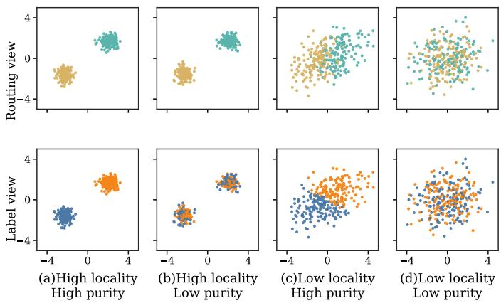  
Fig. 1: Motivation example for ARASH. Four synthetic regions are shown. Each point represents one demonstration with two features, shown on the horizontal and vertical axes. The colors in the top row denote routed local regions. The bottom row shows the same points, where colors denote class labels.

<table><tr><td rowspan="2">Method</td><td colspan="2">Figure 1a</td><td colspan="2">Figure 1b</td><td colspan="2">Figure 1c</td><td colspan="2">Figure 1d</td></tr><tr><td>Acc.</td><td>Demos.</td><td>Acc.</td><td>Demos.</td><td>Acc.</td><td>Demos.</td><td>Acc.</td><td>Demos.</td></tr><tr><td>Full context</td><td>0.9625</td><td>3280</td><td>0.9500</td><td>3280</td><td>0.9250</td><td>3280</td><td>0.5125</td><td>3280</td></tr><tr><td>kNN</td><td>0.9625</td><td>32</td><td>0.9300</td><td>32</td><td>0.9260</td><td>32</td><td>0.4400</td><td>32</td></tr><tr><td>ARASH</td><td>0.9625</td><td>6</td><td>0.9500</td><td>19</td><td>0.9300</td><td>13</td><td>0.5050</td><td>58</td></tr></table>

TABLE I: Accuracy (Acc) and number of demonstrations (Demos) for the methods across regions shown in Figure 1.

Full-context TabPFN uses the entire training set without adapting to local query structure. This increases computational and token costs, scaling quadratically and linearly, respectively. kNN reduces this cost by 103 times by selecting local demonstrations from compact geometric regions. However, locality alone is insufficient because such regions may have different purity levels. For example, Figures 1a and 1b both show local regions, but the former is pure while the latter contains mixed labels. In high-locality, low-purity settings, nearby samples provide unreliable label evidence, reducing the accuracy by about 2–3% compared to when high locality and purity or full-context.

ARASH addresses this limitation by selecting shots based on both locality and purity. Unlike kNN, which implicitly assumes high purity and thus degrades in low-purity cases,

ARASH adapts to such conditions and improves accuracy (by approximately 2–6% in low-purity cases, Figure 1b and 1d). Furthermore, in highly pure regions, ARASH enables direct label estimation without invoking the tabular foundation model, as shown in Figure 1a. Thus, purity not only measures the reliability of local evidence but also identifies cases where expensive model inference can be avoided.

## III. ARASH

The goal of ARASH is to adaptively select a compact, query-specific set of informative demonstrations for tabular prediction with TFMs and LLMs. Unlike fixed local retrieval, ARASH jointly considers feature-space locality and label purity to determine when local demonstrations are reliable. This section first formalizes the problem setting and then presents the three stages of the ARASH algorithm.

## A. Problem Definition and Overview

Few-shot prompting enables TFMs and large language models to predict a query label by conditioning on a set of taskspecific demonstrations. Given a classification task $\tau$ and an input query $x _ { q } ,$ the model predicts a class label $y _ { q }$ conditioned on a shot set $S h o t s _ { x _ { q } } = \{ s _ { 1 } , s _ { 2 } , . . . , s _ { n } \}$

$$
y _ { q } = \mathrm { T F M } ( x _ { q } \mid S h o t s _ { x _ { q } } ) ,\tag{1}
$$

where each demonstration $s _ { i } = ( x _ { i } , y _ { i } )$ consists of a tabular instance and its ground-truth label. Let $\mathcal { D } _ { t r } = \{ ( x _ { i } , y _ { i } ) \} _ { i = 1 } ^ { N }$ denote the training set with feature set $\mathcal { F } = \{ f _ { j } \} _ { j = 1 } ^ { D }$ . Each demonstration $x _ { i } = ( r _ { i 1 } , \ldots , r _ { i D } )$ contains numerical, categorical, or textual feature values. The objective is to construct, for each query $x _ { q } ,$ a compact demonstration in $S h o t s _ { x _ { q } }$ that maximizes the accuracy of the prediction while reducing the number of demonstrations passed to the TFM.

As shown in Algorithm 1, ARASH computes $S h o t s _ { x _ { q } }$ for the input query $x _ { q }$ and $\mathcal { D } _ { t r }$ in three stages. ARASH also takes bounds for the number of shots, $k _ { m i n }$ and $k _ { m a x } ,$ as well as thresholds for locality and purity, i.e., $\tau _ { \mathrm { l o c } }$ and $\tau _ { \mathrm { p u r } } .$ ARASH first profiles the training data and partitions it into a set of clusters C, where each cluster represents a local region of the feature space. Second, it assigns a shot budget $k _ { c }$ to each cluster $c \in { \mathcal { C } }$ using a difficulty score based on local uncertainty and label impurity; clusters with greater estimated difficulty receive larger shot budgets. Third, given a test query $x _ { q } ,$ ARASH routes the query to a cluster $c _ { q }$ and selects demonstrations according to two complementary reliability diagnostics: dataset-level locality and cluster-level purity.

## B. Step I. Locality-aware Clustering

The primary objective of the first step is to partition the training dataset $X _ { \mathrm { t r } }$ into meaningful local regions to be used in Step II. Recognizing that tabular datasets exhibit heterogeneous geometric and statistical characteristics, ARASH avoids a fixed clustering strategy. Instead, it dynamically fits a clustering model based on a selected normalized feature space to create the clustering set $\mathcal { C } = \{ c _ { 1 } , \ldots , c _ { t } \}$ where each cluster is a local region. Lines 4–6 in Algorithm 1 show the step I of ARASH.

Algorithm 1 ARASH Algorithm   
Inputs: Labeled training set $( X _ { \mathrm { t r } } , y _ { \mathrm { t r } } )$ with $N$ rows;   
1: Query $x _ { q } ;$ shot bounds $k _ { \operatorname* { m i n } } , k _ { \operatorname* { m a x } } ;$   
2: Locality threshold $\scriptstyle { \bar { \tau _ { \mathrm { l o c } } } } ;$ purity threshold $\tau _ { \mathrm { p u r } }$   
Outputs: Shot set $S h o t s _ { x _ { q } }$   
3: Step I: Locality-aware clustering   
4: $( Z , \mathrm { L } _ { \mathcal { D } } , D P ) \gets \mathrm { D a t a P r o f l i n g } ( X _ { \mathrm { t r } } , y _ { \mathrm { t r } } )$   
5: clustering method ← auto selection $\bar { \boldsymbol { Z } } , \operatorname { L } _ { \mathcal { D } } , \boldsymbol { D P } )$   
6: C ← clustering $( Z , y _ { \mathrm { t r } } ,$ clustering method)   
7: Step II: Per-cluster profiling and shot assignment   
8: for $c \in { \mathcal { C } }$ do   
9: $\mathcal { Y } _ { c }  \{ y _ { i } \mid x _ { i } \in c \}$   
10: $H _ { c } \gets \mathrm { \check { N } }$ ormEntropy(Yc)   
11: $P _ { c } \gets \mathrm { P u r i t y } ( \mathcal { Y } _ { c } )$   
12: $\begin{array} { r } { d _ { c } \gets \frac { 1 } { 2 } \big ( H _ { c } \dot { + } ( 1 \dot { - } P _ { c } ) \big ) } \end{array}$   
13: end for   
14: $d _ { \operatorname* { m i n } } \left. \operatorname* { m i n } _ { \substack { \right. } } d _ { c }$   
15: $d _ { \operatorname* { m a x } } \gets \operatorname* { m a x } _ { \substack {  } } d _ { c }$   
16: for $c \in \mathcal { C } \ \breve { \mathbf { d o } }$   
17: if $d _ { \operatorname* { m a x } } > d _ { \operatorname* { m i n } }$ then   
18: $\begin{array} { r } { d _ { c } \gets \frac { d _ { c } - d _ { \mathrm { m i n } } } { d _ { \mathrm { m a x } } - d _ { \mathrm { m i n } } } } \end{array}$   
19: else   
20: $\tilde { d } _ { c } \gets 0 . 5$   
21: end if   
22: $k _ { c } \gets \mathrm { r o u n d } \Big ( k _ { \mathrm { m i n } } + \tilde { d } _ { c } ( k _ { \mathrm { m a x } } - k _ { \mathrm { m i n } } ) \Big )$   
23: $k _ { c } \gets \operatorname* { m i n } \Bigl ( | c | ,$ maxkc, |unique(Yc)|   
24: end for   
25: Step III: Query routing and retrieval   
26: $c _ { q } \gets$ assign $( x _ { q } , \mathcal { C } )$   
27: $\mathbf { \dot { f } } \mathrm { L } _ { \mathcal { D } } \geq \tau _ { \mathrm { l o c } }$ and $\dot { P } _ { c _ { q } } \geq \tau _ { \mathrm { p u r } }$ then ▷ local & pure   
28: $S h o t s _ { x _ { q } } \gets \mathrm { ~ C ~ }$ lusterShotSelection $( x _ { q } , c _ { q } , k _ { c _ { q } } )$   
29: else if LD $\geq \tau _ { \mathrm { l o c } }$ and $P _ { c _ { q } } < \tau _ { \mathrm { p u r } }$ then ▷ local, not pure   
30: Shots $_ { x _ { q } } \gets$ DiverseClusterShotSelection $( x _ { q } , c _ { q } , k _ { c _ { q } } )$   
31: else if $\mathrm { L } _ { \mathcal { D } } \doteq \tau _ { \mathrm { l o c } }$ and $P _ { c _ { q } } \geq \tau _ { \mathrm { p u r } }$ then ▷ not local, pure   
32: Shotsx ← HybridShotSelection ${ \mathrm { ( } } x _ { q } , c _ { q } , k _ { c _ { q } } , k _ { \operatorname* { m a x } } { \mathrm { ) } }$   
33: else ▷ not local, not pure   
34: $S h o t s _ { x _ { q } }$ ← GlobalShotSelection $( x _ { q } , k _ { \operatorname* { m a x } } )$   
35: end if   
36: return $S h o t s _ { x _ { q } }$

The DataProfiling function in line 4 in Algorithm 1 is applied once to the training set before clustering. The profiling computes a compact summary of structural properties, including dataset size N, feature dimensionality $D ,$ a normalized feature-space representation $Z ,$ anisotropy measured via PCA eigenvalue ratios, the Hopkins statistic, and some statistics of the above items collectively shown with $D P ,$ . We use the Hopkins statistic as the dataset-level locality score $\mathrm { L } _ { D }$ because it quantifies whether the normalized feature space exhibits meaningful neighborhood structure. Let $u _ { i }$ denote the nearest-neighbor distance from a uniformly sampled point to the training set, and let $w _ { i }$ denote the nearest-neighbor distance from a sampled training point to its nearest neighboring training point. We compute the locality score as:

$$
\mathrm { L } _ { \mathcal { D } } = H ( X _ { \mathrm { t r } } ) = \frac { \sum _ { i = 1 } ^ { m } u _ { i } ^ { D } } { \sum _ { i = 1 } ^ { m } u _ { i } ^ { D } + \sum _ { i = 1 } ^ { m } w _ { i } ^ { D } } .\tag{2}
$$

where D is the feature dimensionality and m is the number of sampled points. Values near 0.5 indicate weak locality, while larger values indicate stronger clustering tendency and stronger support for neighborhood-based retrieval. This locality score is stored in $D P$ and reused during query routing in Step III; it is not recomputed for each query or each cluster. These profiling signals are then used to apply heuristic rules that balance scalability and modeling flexibility.

The final choice of the clustering algorithm is governed by an automatic clustering selector that evaluates a candidate pool consisting of KMeans, MiniBatchKMeans, GMM, Birch, HDBSCAN, and AgglomerativeClustering. Line 5 in Algorithm 1 shows the automatic clustering selector that selects a clustering method to be used in line 6. The selector makes a single dataset-level decision based on meta-features extracted by the DataP rof iling function—such as dataset size, dimensionality, anisotropy, and locality—to choose a clustering method before inference. The thresholds for these metrics are determined via hyperparameter optimization.

## C. Step II. Difficulty-aware Shot Assignment

ARASH determines the shot budget for each local region rather than using a fixed number of shots for all queries. Here, the shot budget denotes the number of in-context demonstrations selected from the training data and included in the queryspecific shot set $S h o t s _ { x _ { q } }$ . The goal is to allocate a larger context to clusters whose labels are harder to resolve, while assigning fewer shots to clusters that already provide a reliable local signal. This step is implemented by a difficulty-aware controller, shown in lines 8–24 of Algorithm 1, which maps each cluster to an adaptive shot budget $k _ { c }$ within the admissible range $[ k _ { \operatorname* { m i n } } , k _ { \operatorname* { m a x } } ]$ . Bounds $k _ { \operatorname* { m i n } } , k _ { \operatorname* { m a x } }$ are determined based on the model token length.

The ARASH algorithm first, in lines 8–13, computes a difficulty score $d _ { c } \in [ 0 , 1 ]$ for each cluster $c \in { \mathcal { C } }$ . The difficulty score is calculated based on normalized label entropy $H _ { c }$ and label impurity $1 - P _ { c }$ . The purity $P _ { c }$ is defined as the fraction of shots in cluster c that belong to its majority class:

$$
P _ { c } = \operatorname* { m a x } _ { y \in \mathcal { V } } \frac { | \{ i : x _ { i } \in c , y _ { i } = y \} | } { | \{ i : x _ { i } \in c \} | } .\tag{3}
$$

A pure cluster has $P _ { c } = 1$ , whereas smaller values indicate stronger label mixing. The difficulty score is then defined as $d _ { c } = { \textstyle { \frac { 1 } { 2 } } } \left( H _ { c } + ( 1 - P _ { c } ) \right)$ . Here, $H _ { c }$ captures uncertainty in the cluster label distribution, while $1 - P _ { c }$ measures the absence of a dominant label direction. This choice avoids the ambiguity of class imbalance: a cluster dominated by one class may be highly imbalanced, but it can still be reliable for local prediction. In contrast, impurity reflects the type of label conflict that should increase the number of demonstrations.

After computing $d _ { c }$ for all clusters, ARASH normalizes the difficulty values per cluster in lines 16–24. The normalized score is calculated as: $\begin{array} { r } { \tilde { d } _ { c } = \frac { d _ { c } - d _ { \mathrm { m i n } } } { d _ { \mathrm { m a x } } - d _ { \mathrm { m i n } } } } \end{array}$ where $d _ { \mathrm { m i n } }$ and $d _ { \mathrm { m a x } }$ denote the minimum and maximum difficulty scores over C. If all clusters have the same difficulty, $\tilde { d } _ { c }$ is set to 0.5, giving each cluster a midpoint allocation. The normalized score is then mapped to an integer shot budget by linear interpolation:

$k _ { c } = \mathrm { r o u n d } \Big ( k _ { \mathrm { m i n } } + \tilde { d } _ { c } ( k _ { \mathrm { m a x } } - k _ { \mathrm { m i n } } ) \Big )$ . Thus, clusters with low difficulty receive budgets closer to $k _ { \mathrm { m i n } }$ , whereas labelmixed clusters receive budgets closer to $k _ { \operatorname* { m a x } } .$ Finally, ARASH applies two constraints: $k _ { c }$ must be at least the number of distinct labels observed in cluster $c ,$ and it cannot exceed the cluster size. These two constraints, shown in lines 22–23, ensure that the selected context is large enough to represent the local label set while remaining feasible for the model.

## D. Step III. Query routing and retrieval

The third step of ARASH uses purity and locality metrics to retrieve shots for the input query, as shown in lines 26–35 in Algorithm 1. ARASH first assigns a given query $x _ { q }$ to a cluster $c _ { q } \in \mathcal { C }$ , line 26. Then it retrieves $k _ { c }$ demonstrations using one of the four retrieval strategies, which are selected based on dataset-level locality score $\mathrm { L } _ { \mathcal { D } }$ and the purity $P _ { c _ { q } }$ as shown in lines 27–35 in Algorithm 1. The locality score shows whether the feature space supports meaningful neighborhoodbased retrieval. Cluster purity shows whether the assigned local region provides consistent label evidence.

Based on locality and purity scores, ARASH has four different strategies: 1 local and pure: the assigned cluster is considered reliable. In this case, ARASH retrieves $k _ { c _ { q } }$ demonstrations from the assigned cluster using a kNN strategy. This case is the most favorable for local prompt construction because the selected demonstrations are both close to the query and likely to provide a consistent label signal. 2 local and impure: the assigned cluster is geometrically meaningful, but its labels are mixed. In this case, local retrieval is still useful, but selecting only the nearest or redundant examples may give an unstable prompt. Therefore, ARASH uses a diversityaware local retrieval policy, i.e., DPP, within the assigned cluster. This allows the selected shots to better represent the ambiguous local label structure. 3 Not local but pure: the assigned cluster has a dominant label, but the feature space does not provide strong support for stable local routing. In this case, using only the assigned cluster may be too restrictive. Therefore, ARASH uses hybrid retrieval, which combines examples from the assigned cluster (local kNN) with globally retrieved examples (global kNN). This keeps the useful label signal from the cluster while reducing dependence on an uncertain local partition. 4 Not local and impure: the assigned cluster is not reliable for local prompt construction. In this case, ARASH falls back to global shot selection with budget $k _ { \mathrm { m a x } }$ using global DPP.

## IV. ARASH IMPLEMENTATION

This section details the efficient and portable implementation techniques of ARASH. To minimize overhead, ARASH uses a two-stage approach where preprocessing is performed once for all queries, and the foundation model is called only when essential to reduce inference latency. Additionally, its portable architecture seamlessly supports various LMs.

## A. Efficient Processing and Inference

ARASH is implemented as a two-stage pipeline that cleanly separates dataset-level preprocessing from query-time inference. In the preprocessing stage, all computations that depend solely on the training data are performed once, including feature normalization, data profiling, clustering, cluster statistics, and allocation of cluster-level shot budgets. The outputs of this stage form reusable artifacts that are leveraged during inference. Specifically, ARASH stores (1) the feature schema and normalization parameters, such as categorical levels and scaling statistics, to ensure that test queries are encoded consistently with the training data; (2) the cluster assignment function along with cluster-level label statistics; and (3) a shot-budget table that maps each cluster c to an integer budget $k _ { c }$ . During the inference stage, these cached artifacts are reused to efficiently process each query by determining its cluster, loading relevant demonstrations, and producing a direct prediction or invoking a frozen foundation model. This separation is crucial in tabular prediction tasks, where many queries are typically evaluated on the same dataset, allowing ARASH to amortize the one-time cost of profiling and clustering instead of repeating it for every test instance.

In addition to reducing the number of shots to reduce the computational overhead of inference, ARASH also performs a post-processing to skip calling the model when unnecessary. After the shots are retrieved, ARASH applies a lightweight post-processing step. If all retrieved demonstrations have the same label, the query is assigned to DIRECT mode, and the unique label is returned without calling the TFM. Otherwise, the query is assigned to TFM mode, and the selected demonstrations are passed to the foundation model. This step keeps ARASH as a retrieval and prompt-construction method: it directly predicts only when the retrieved evidence is already label-consistent, and otherwise leaves prediction to the TFM.

## B. Language-model Serialization

To test whether the retrieval policy transfers beyond tablenative foundational models, we also evaluate ARASH with pretrained language models. We consider LLaMA 3.2 and Qwen 2.5, which are decoder-only models, and FLAN-T5, which follows an encoder–decoder architecture. These experiments require an additional serialization step because language models consume text rather than native tabular tensors.

Each row is converted into a key–value representation $\boldsymbol { z } ( \boldsymbol { x } _ { i } ) = \{ f _ { 1 } : r _ { i 1 } , f _ { 2 } : r _ { i 2 } , \ldots , f _ { D } : r _ { i D } \}$ where $f _ { j }$ denotes the $j \cdot$ -th feature and $r _ { i j }$ denotes the corresponding value for row i. Retrieved demonstrations are serialized as input–label pairs, and concatenated with the serialized query. A short taskspecific instruction is then appended to form the final prompt. Thus, for language-model backbones, ARASH controls which demonstrations are included in the prompt, while the serialization layer converts the selected tabular context into a text format accepted by the model.

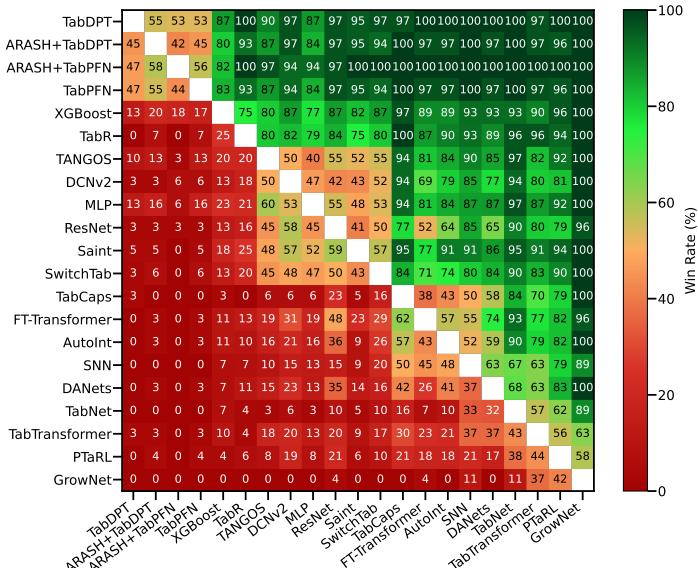  
Fig. 2: Pairwise win-rate comparison across baseline models and datasets. A win is defined as achieving higher classification accuracy on a given dataset.

## V. EXPERIMENTAL RESULTS

This section evaluates ARASH and provides a comprehensive comparison with prior work. It examines the integration of ARASH with language models and concludes with a detailed technical breakdown of the ARASH algorithm.

## A. Setup

Datasets and environment: We evaluate ARASH on a combined benchmark consisting of OpenML-CC18 [14] and Combo [15] datasets. The Combo dataset collection provides a compact yet diverse benchmark for tabular classification, enabling controlled comparisons while keeping computational cost manageable. We use OpenML-CC18 and Combo for the overall performance evaluation, while most analysis and ablation studies are conducted on the Combo datasets to keep the evaluation time bounded. For datasets, we use an 80/20 train–test split with random seed 42, and the same split is used consistently across all compared methods. All experiments are conducted on a NVIDIA GeForce RTX 4090 GPU.

Baselines: We compare ARASH against representative tabular learning baselines from the TALENT benchmark [16]. TALENT provides a unified evaluation suite for tabular classification and includes standardized implementations and hyperparameter settings for a broad set of deep tabular models. We use the latest TALENT release and report results on the datasets for which the corresponding methods are successfully executed. TALENT has covered several baseline models, such as I) FT-Transformer [17], TabTransformer [18], SAINT [19], and AutoInt [20] utilize self-attention mechanisms to explicitly model the contextual relationships between different columns in a table. II) MLP [17], ResNet [17], and SNN [21] from the classical foundation, using basic multi-layer structures and skip connections to process flattened tabular features. III)

DCNv2 [1] and DANets [22] are engineered to capture highorder feature overlaps, which are designed to capture higherorder feature interactions. IV) TabNet [23], GrowNet [24], and TabCaps [25] mimic the logic of decision trees or use special ized “capsules” to provide structured, often more interpretable, deep learning pathways. V) TANGOS [26], PTaRL [27], and SwitchTab [28] apply advanced training techniques like gradient orthogonalization and asymmetric encoding to help standard neural nets generalize better on noisy tables. VI) TabPFN [7] and TabDPT [8] are the TFM that support ICL. VII) TabR [29] leverages learned neighbour relationships in an embedding space to improve prediction performance.

Evaluation Metrics: To provide a consistent view of model behavior, we report both average accuracy and Macro-F1. Macro-F1 complements accuracy by reflecting performance across classes with varying frequencies. For ARASH, we define a tuning set as random 10% of datasets (seed=42) never appearing in training, evaluation, or test and perform a grid search for locality, purity, and auto-clustering thresholds to avoid bias. For DPP, we use the standard quality-diversity decomposition of an L-ensemble kernel and apply a fixed-size greedy MAP approximation to obtain the final subset [30].

## B. Tabular baselines

We present a pairwise win-rate comparison of accuracy between ARASH with TabDPT and TabPFN and the baseline models in Figure 2. Each entry reports the percentage of datasets on which the model in the row achieves higher prediction accuracy than the model in the column across datasets. The heatmap shows that the TabDPT- and TabPFN-based methods obtain the strongest overall pairwise performance. In particular, ARASH+TabPFN and TabDPT achieve the highest average pairwise win rates, while ARASH+TabDPT and TabPFN remain highly competitive. Across the remaining baselines, the ARASH variants consistently outperform most non-foundation-model methods, indicating that adaptive retrieval preserves the accuracy of tabular foundation models while reducing the number of demonstrations.

In terms of average accuracy, ARASH+TabDPT obtains the highest accuracy, with an average accuracy of 0.9017 and Macro-F1 of 0.800. This is slightly higher than full-context TabDPT, which achieves 0.9009 accuracy and 0.795 Macro-F1. Similarly, ARASH+TabPFN achieves 0.895 accuracy and 0.800 Macro-F1, closely matching full-context TabPFN, which obtains 0.8948 accuracy and 0.799 Macro-F1. Among the nonfoundation-model baselines, XGBoost is the strongest competitor, with 0.879 accuracy and 0.785 Macro-F1, followed by TabR with 0.879 accuracy but a lower Macro-F1 of 0.449. Other neural tabular baselines, including TANGOS, DCNv2, MLP, SAINT, and SwitchTab, obtain lower average accuracy and substantially lower Macro-F1.

## C. ICL Demonstration-Selection Baselines

This section compares the accuracy and VRAM usage of ARASH with existing ICL techniques, kNN, DPP, random, and full context on two TFMs, TabPFN and TabDPT, shown in Figure 3-4. k in the three baselines, kNN-k, DPP-k, and Random-k, shows the selected demonstrations per query used in the baseline. The selected values of k={8, 16, 32} are below and above the average number of demonstrations used by ARASH, i.e., 24–30, for representative comparison.

1) Accuracy: Both kNN and DPP improve accuracy as k increases, which suggests that local retrieval is useful for tabular ICL. However, their best fixed-budget results remain below ARASH. For TabDPT, ARASH achieves an accuracy of 0.9017 with 29.38 demonstrations per query on average, while kNN-32 and DPP-32 achieve an accuracy of 0.8603 and 0.8489, respectively. For TabPFN, ARASH’s accuracy is 0.8955 with an average of 24.42 demonstrations per query, while kNN-32 and DPP-32 achieve an accuracy of 0.8716 and 0.8505, respectively. Random selection is consistently weaker, indicating that selecting relevant demonstrations to the query is as important as the number of demonstrations. Full-context inference remains a high-cost baseline, achieving an average accuracy of 0.9009 for TabDPT and 0.8948 for TabPFN while using 30805 demonstrations per query. In contrast, ARASH reaches a similar accuracy range with only a few dozen demonstrations per query, indicating the efficiency of ARASH.

We also include a LoCalPFN-style large-budget retrieval setting for TabPFN as an additional reference point. Following the TabPFN-kNN inference rule used in LoCalPFN, we set $k _ { \mathrm { L o C a l P F N } } = \mathrm { m i n } ( 1 0 \sqrt { N _ { \mathrm { t r } } } , 1 0 0 0 )$ where $N _ { \mathrm { t r } }$ is the number of training demonstrations [12]. This rule makes the k datasetdependent; larger training sets use a larger retrieval budget. This makes the k value often large, thus some runs did not complete within our 20 min time limit. We therefore report this comparison only on the datasets for which both LoCalPFNstyle kNN and DPP runs completed successfully. On these datasets, $k _ { \mathrm { L o C a l P F N } }$ corresponds to 311.11 demonstrations per query on average. With this larger budget, LoCalPFNstyle kNN and DPP obtain accuracies of 0.8821 and 0.8862, respectively. These results show that increasing k can improve fixed-budget retrieval, but the resulting accuracies remain below ARASH in this comparison. In contrast, ARASH uses a smaller adaptive k for each query with a higher accuracy.

2) VRAM measurement: To isolate memory usage induced specifically by the retrieved context at inference, we measure the predict-only peak ∆VRAM. For each method, we first invoke $\pm \mathrm { i t } \mathrm { ~ ( ~ ) ~ }$ and record the GPU memory allocation immediately afterward. We then reset CUDA peak-memory statistics and execute predict() on the test set, logging the maximum allocated memory during prediction. ∆VRAM is defined as the difference between this prediction-time peak and the post-fit baseline, thereby capturing only the additional allocations caused by the retrieved demonstrations. This protocol explicitly excludes model parameters, one-time initialization overhead, and persistent allocator state shared across methods.

Figure 4 shows that ARASH consistently incurs lower ∆VRAM than full context (TabPFN) across datasets, reflecting reduced memory pressure under adaptive retrieval. As expected, the fixed-k baselines, only kNN is shown for brevity, exhibit a monotonic increase in ∆VRAM with k, consistent with linear growth in context length and activation memory. Overall, these results show that ARASH decreases VRAM usage, enabling running larger datasets on the same device.

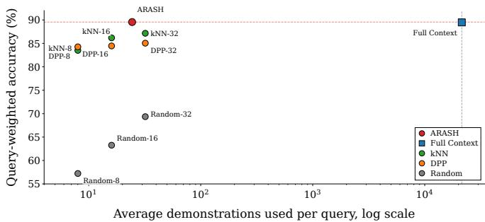

(a) TabPFN  
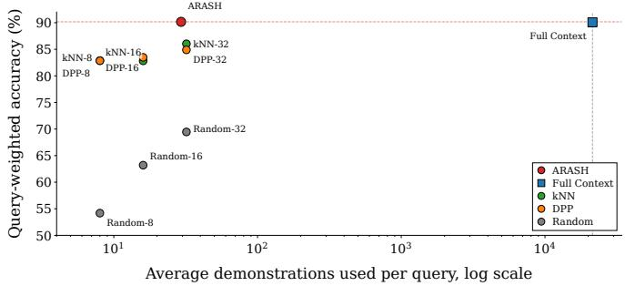  
(b) TabDPT

Fig. 3: Accuracy-efficiency comparison between ARASH and ICL demonstration-selection baselines across (a)TabPFN and (b)TabDPT models. Lower number of demonstrations and higher accuracy are better.  
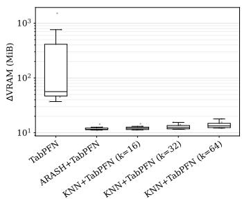  
Fig. 4: Inference-only peak ∆VRAM in log scale measured during inference, aggregated across multiple datasets.

## D. ARASH for Serialized-Table Language Models

We further evaluate whether ARASH generalizes beyond tabular foundation models by applying it to language-model backbones that operate on serialized tabular rows. As described in Section IV, each tabular instance is converted into a textual representation, and demonstrations are provided to the model through an in-context prompt. We evaluate three LM backbones: FLAN-T5, LLaMA-3.2, and Qwen-2.5. We compare ARASH against three baselines that differ only in their demonstration-selection strategy, random selection, kNN across feature sets, and text. For each method, the number of demonstrations is constrained by the same prompt-token budget, so that the comparison reflects the quality of the selected demonstrations.

PCA-1  
PCA-1  
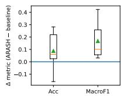  
(a) LLaMA-3.2

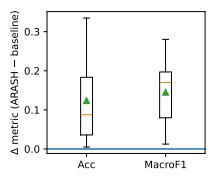  
(b) Qwen-2.5

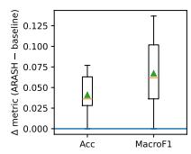  
(c) FLAN-T5  
Fig. 5: Accuracy improvement of ARASH over the strongest retrieval baseline across datasets for three language-model backbones.

Figure 5 reports the distribution of performance gains achieved by ARASH over the strongest retrieval baseline, shown separately for FLAN-T5, LLaMA-3.2, and Qwen-2.5. For each dataset, the baseline is defined as the best-performing method among random selection, kNN-feature retrieval, and kNN-text retrieval. The plotted values correspond to the perdataset difference ∆ = ARASH − baseline. Across all three models, ARASH achieves positive median gains over the strongest fixed retrieval baseline in both accuracy and Macro-F1. The median accuracy improvements are 3.62, 5.99, and 8.77 percentage points for FLAN-T5, LLaMA-3.2, and Qwen-2.5, respectively. The corresponding Macro-F1 improvements are 6.20, 10.07, and 17.00 percentage points. These results show the portability of ARASH across LMs as well as TFMs.

## E. Analysis: When Does ARASH Work?

In Section II, the key data patterns underlying the ARASH principles are demonstrated using synthetic data. These four synthetic regions are commonly found in real-world datasets. Specifically, across all queried datasets, we find that 43.2%, 44.2%, 9.7%, and 2.9% of queries belong to the high-locality/high-purity, high-locality/low-purity, lowlocality/high-purity, and low-locality/low-purity groups, respectively. This distribution underscores the importance of the four distinct retrieval techniques. To further emphasize this point, this section extends the argument to two real-world datasets, Jungle and WDBC, as shown in Figure 6, and then shows the applicability of the argument for other datasets.

1) Representative cases.: Jungle represents a difficult case for purely local retrieval. The routed clusters overlap substantially in the PCA projection, and the label projection shows strong class mixing within the same regions. The per-cluster diagnostics also show high entropy for some clusters. This indicates that locality alone is not sufficient: a cluster may contain nearby points, but if its label purity is weak, local nearestneighbor retrieval can return demonstrations with conflicting labels. This behavior motivates the retrieval decision in Step III of ARASH, which is a diversity-aware, hybrid, or global retrieval that may be discarded by a strictly local prompt. The ARASH accuracy for Jungle supports this interpretation, where it matches the accuracy of full-context inference, which is 0.965. However, ARASH uses only 124 demonstrations per query on average, compared with 35,855 training rows in the Full-context setting. In contrast, fixed-budget retrieval with k = 128 does not reach the same accuracy; the best DPP result reaches 0.950, and the corresponding kNN result remains below the Full-context and ARASH accuracy.

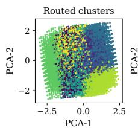

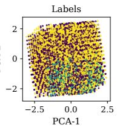

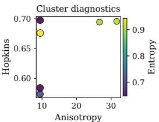

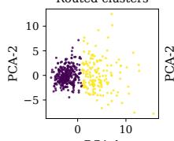

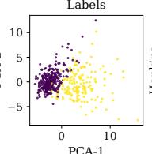

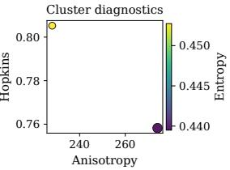  
Fig. 6: Representative analysis cases for ARASH. Top: Jungle. Bottom: WDBC. In each row, the left panel shows routed clusters in a two-dimensional PCA projection, the middle panel shows class labels in the same projection, and the right panel reports per-cluster diagnostics, including Hopkins locality, anisotropy, label entropy, and cluster size.

The WDBC dataset represents a favorable regime for local retrieval, characterized by clear local structures, consistent label projections, and low per-cluster label entropy. These properties provide stable neighborhood evidence, reducing conflicting labels and allowing a compact retrieved prompt to preserve predictive information. Empirical results support this analysis. On WDBC, ARASH matches full-context inference with 0.982 accuracy with only k = 12 demonstrations. Out of 167 test queries, ARASH routes 67 through the directestimate path, achieving 100% accuracy on those predictions. Furthermore, fixed-budget kNN retrieval matches this 0.982 accuracy using only k = 213 demonstrations out of the 455 available. This confirms that the dataset’s label signal is sufficiently concentrated to allow accurate resolution from a localized context without sacrificing overall performance.

2) Diagnostic association model.: We next examine whether the qualitative behavior observed in the two case studies holds more broadly across datasets. ARASH is based on the following mechanism: compact cluster-local prompts should be reliable when the feature space contains meaningful local neighborhoods and when the retrieved local regions provide consistent label evidence. If either condition is weak, local retrieval may discard useful global evidence or return conflicting demonstrations. We therefore study whether two mechanism-aligned diagnostics, dataset-level locality and final cluster purity, are associated with the accuracy gap between ARASH and the Full-context setting.

For each dataset D and foundation model M, where M ∈ {TabPFN, TabDPT}, we define the accuracy gap as $\Delta _ { \mathcal { D } , \mathcal { M } } = \mathrm { A c c } _ { \mathcal { D } , \mathcal { M } } ^ { \mathrm { A R A S H } } - \mathrm { A c c } _ { \mathcal { D } , \mathcal { M } } ^ { \mathrm { F u l l } }$ A negative value indicates that ARASH is below Full-context accuracy, a value close to zero indicates comparable accuracy, and a positive value indicates that ARASH exceeds Full-context accuracy while using fewer demonstrations. We fit the following additive diagnostic model: $\Delta _ { \mathcal { D } , \mathcal { M } } = \beta _ { 0 } + \beta _ { L } \mathrm { L } _ { \mathcal { D } } + \beta _ { P } P _ { \mathcal { D } } + \epsilon _ { \mathcal { D } , \mathcal { M } }$ where $\mathrm { L } _ { \mathcal { D } }$ is the dataset-level locality score computed from the Hopkins statistic in Eq. (2), and $P _ { \mathcal { D } }$ is the average cluster purity for dataset D. This model formalizes the same locality and purity conditions used by the Algorithm1. Since the observations are drawn from heterogeneous tabular datasets and two foundation-model backbones, we report heteroskedasticity-robust standard errors [31]. Using the current TabPFN and TabDPT results, the fitted model is $\Delta _ { \mathcal { D } , \mathcal { M } } = - 0 . 1 5 9 + 0 . 0 8 8 \mathrm { L } _ { \mathcal { D } } + 0 . 0 9 0 P _ { \mathcal { D } }$

TABLE II: Diagnostic regression for the ARASH accuracy gap $\Delta _ { \mathcal { D } , \mathcal { M } } = \bar { \mathrm { A c c } } _ { \mathcal { D } , \mathcal { M } } ^ { \mathrm { A R A S H } } - \mathrm { A c c } _ { \mathcal { D } , \mathcal { M } } ^ { \mathrm { F u l l } }$ . Robust standard errors are reported over $n = 1 2 9$ observations.
<table><tr><td>Predictor</td><td>Coef.</td><td>SE</td><td>p</td></tr><tr><td>Dataset-level locality  $\mathrm { L } _ { \mathcal { D } }$ </td><td>0.088</td><td>0.027</td><td> $0 . 0 0 1 4$ </td></tr><tr><td>Final purity  $P _ { \mathcal { D } }$ </td><td>0.090</td><td>0.019</td><td> $2 . 7 \times 1 0 ^ { - 6 }$ </td></tr></table>

Table II reports the coefficient estimates, robust standard errors, and p-values over n = 129 observations. Both coefficients are positive. After accounting for the other diagnostic, stronger dataset-level locality and higher final cluster purity are each associated with a smaller gap between ARASH and the Full-context setting. This result supports the intended operating regime of ARASH: local prompting is most reliable when local neighborhoods are meaningful and label-consistent.

The diagnostic association model provides empirical support for the Step III thresholding strategy in Algorithm 1. Step III uses $\pi _ { \mathrm { l o c } }$ and $\tau _ { \mathrm { p u r } }$ to decide whether retrieval should remain compact and cluster-local or switch to diversity-aware, hybrid, or global retrieval. The positive coefficients for $\mathrm { L } _ { \mathcal { D } }$ and $P _ { D }$ indicate that stronger locality and higher purity are associated with smaller ARASH–Full-context accuracy gaps, which is consistent with the reliability assumptions used in Step III.

## F. ARASH Implication on Inference Time

As discussed in Section IV-A, the ARASH implementation uses a two-phase framework as well as a direct mode to reduce query execution time. This section discusses the impact of these techniques on overall prediction time. The preprocessing phase of ARASH is performed once its results are cached in a lookup table for reuse across subsequent queries. This design makes the overhead of table lookups negligible during inference, meaning that the total execution time is primarily dominated by the inference latency of the underlying model.

The inference cost of the underlying tabular foundation model increases with the number of demonstrations, although the exact scaling depends on the attention mechanism and model implementation details. ARASH reduces this cost by using a smaller adaptive context. In the warm-query setting on the Combo dataset, full-context TabPFN uses an average of 600.25 demonstrations per query and requires 0.598 seconds per query, whereas ARASH uses 13.69 demonstrations on average and requires 0.436 seconds per query, including amortized clustering, routing, retrieval, and local TFM inference. ARASH gives a 1.37× latency reduction while reducing the average context size by 43.9×. The absolute ARASH preprocessing time per query is less than 0.02 seconds. Most of the ARASH query time is due to local TFM inference, which takes 0.422 seconds.

TABLE III: The effect of the three steps of ARASH + TabpFN on the accuracy of the CREDIT dataset
<table><tr><td>Method</td><td>Accuracy</td><td>Macro-F1</td></tr><tr><td>ARASH</td><td>0.750</td><td>0.657</td></tr><tr><td>ARASH Without Step I (No clustering)</td><td>0.700</td><td>0.592</td></tr><tr><td>ARASH Without Step II (Fixed shots per cluster)</td><td>0.720</td><td>0.627</td></tr><tr><td>ARASH Without Step III (Random retrieval)</td><td>0.645</td><td>0.495</td></tr></table>

ARASH further reduces inference cost through a direct path that bypasses model execution when the retrieved demonstrations are label-consistent. Across all evaluated queries, this direct path is used for 0.22 of the queries and achieves 0.989 accuracy. It is most frequent in the high-locality/high-purity regime, where it applies to 0.479 of the queries, compared with 0.156 when either diagnostic is low and 0.025 when both are low. This shows that coherent local structure can sometimes eliminate the need for a model inference, yielding near-zero model-inference cost for 22% of queries.

## G. Ablation Study

We ablate the main design choices in ARASH and particularly focus on two internal questions: whether the main components of ARASH are necessary, and whether both terms in the difficulty score contribute to shot allocation. We conduct the ablation study across the Combo dataset, while using the CREDIT dataset for detailed diagnostic illustration. CREDIT is selected because it provides a representative case with nontrivial local structure and mixed-label regions, and the same trend is observed across the other Combo datasets.

1) Component ablation: Table III reports the accuracy of ARASH after removing one of its three steps. Removing Step I, locality-aware clustering, reduces accuracy from 0.750 to 0.700 and Macro-F1 from 0.657 to 0.592, showing that a global retrieval policy is less effective than constructing prompts from local regions. Replacing Step II, difficultyaware allocation, with a fixed number of shots per cluster also reduces the accuracy by 2%, indicating that cluster-level difficulty is useful for determining the amount of context. The largest degradation is observed when informed retrieval is replaced with random retrieval, which reduces Macro-F1 to 0.495. These results support the design of ARASH as a coupled pipeline. Clustering defines the candidate local regions, and difficulty-aware allocation determines how much evidence each region requires, and retrieval selects demonstrations that are relevant to the routed query. Removing any of these components weakens the quality of the constructed prompt.

TABLE IV: The effect of difficulty-score component on ARASH + TabPFN accuracy for the CREDIT dataset
<table><tr><td>Variant</td><td>Accuracy</td><td>Macro-F1</td></tr><tr><td>ARASH with Entropy only score</td><td> $0 . 7 1 0 \pm 0 . 0 2 4$ </td><td> $0 . 6 3 0 \pm 0 . 0 3 8$ </td></tr><tr><td>ARASH with Impurity only score</td><td> $0 . 7 2 0 \pm 0 . 0 2 0$ </td><td> $0 . 6 4 0 \pm 0 . 0 2 6$ </td></tr><tr><td>ARASH with Entropy + impurity</td><td> $0 . 7 5 3 \pm 0 . 0 1 0$ </td><td> $0 . 6 7 1 \pm 0 . 0 2 9$ </td></tr></table>

2) Difficulty-score ablation: Finally, we examine the two terms used in the cluster difficulty score. For a cluster $c ,$ ARASH computes $d _ { c } = \alpha H _ { c } + ( 1 - \alpha ) I _ { c }$ where $H _ { c }$ is the normalized label entropy and $I _ { c } ~ = ~ 1 - P _ { c }$ is the cluster impurity. Entropy measures uncertainty over the full label distribution, whereas impurity measures the absence of a dominant local label. These two quantities are related but not identical: Two clusters may have the same majorityclass fraction while differing in how the remaining labels are distributed. Table IV compares entropy-only, impurityonly, and combined difficulty scores under identical train– test splits across five seeds. Using either term alone reduces both Accuracy and Macro-F1. The combined score gives the best result, suggesting that entropy and impurity provide complementary information for adaptive shot allocation. This supports the use of both terms in ARASH: entropy captures distributional uncertainty, while impurity captures local label conflict relative to the dominant class.

## VI. RELATED WORK

Classical tree-based and neural methods train models for a given tabular data. Tabular prediction is dominated by tree ensembles, especially gradient-boosted decision trees, such as XGBoost [2]. These models handle heterogeneous features, missing values, small data, and non-smooth boundaries well.

Neural models for tabular data include attention-based architectures such as TabTransformer [18], FT-Transformer [17], SAINT [19], and AutoInt [20], which model feature interactions, and methods like TabNet [23], DANets [22], TAN-GOS [26], and SwitchTab [28], which introduce structured biases or self-supervision. These approaches train model parameters for a target dataset. In contrast, ARASH studies inference with a frozen model, focusing on selecting labeled rows, their regions, and query-specific shot budgets.

Large language models introduced ICL, in which task adaptation is performed through demonstrations provided in the prompt rather than through parameter updates [3]. Prior work has shown that ICL performance is sensitive to the choice of demonstrations [4]. This observation has motivated retrievalbased ICL methods, which select query-relevant examples instead of relying on fixed or random prompts, including nearest-neighbor prompting [5, 6]. Diversity-aware methods further improve selection: determinantal point processes provide a principled way to select diverse subsets [30] and have been applied to representative in-context examples [32], while clustering-based approaches select demonstrations that are both similar to the query and diverse [33]. These techniques are primarily designed for non-tabular data with natural geometric locality, whereas tabular data has arbitrary row order, making locality and purity harder to define.

Recent work extends foundation-model approaches to tabular prediction along two directions. The first serializes tabular rows into text and applies LMs to prompts. TabLLM [9] converts rows into textual descriptions for classification; this is flexible due to the language interface, but becomes expensive when many rows are included. The second develops tablenative foundation models. TabPFN [7] formulates classification as prior-data-fitted inference using labeled context examples, TabDPT [8] studies scalable tabular foundation modeling, and TabICL [34] scales tabular ICL via fixed-dimensional embeddings followed by transformer-based prediction. These approaches directly target tabular prediction and cross-table transfer. While effective, building a new model is expensive and needs huge computational resources.

A closely related line studies retrieval and context construction for tabular prompting. Black-box prompting techniques such as full-context methods [7] include all demonstrations regardless of the query or training set. While simple, this approach incurs unnecessary computation and memory costs and can introduce irrelevant information into the prompt, potentially degrading performance. Another category constructs prompts conditioned on the query. These methods use a fixed budget [35] and select demonstrations either randomly or via fixed-k nearest-neighbor prompting [5, 6, 35]. Although they reduce prompt length by focusing on local demonstrations, their accuracy may degrade when local regions exhibit impure label distributions. ARASH constructs prompts based on both locality and purity, enabling more effective context selection tailored to tabular data.

## VII. CONCLUSION

This work introduces ARASH, an adaptive retrieval and shot selection method for tabular prediction tasks using TFMs and LMs. ARASH extracts statistical features from datasets to establish locality and purity for demonstrations, subsequently augmenting the context provided to the query. This is achieved through a three-stage process: locality-aware clustering, difficulty-aware shot selection, and a retrieval technique. We evaluated ARASH using TabPFN, TabDPT, and several LMs; experimental results demonstrate that ARASH achieves comparable accuracy to full context while significantly reducing token length. Consequently, prompt length and VRAM usage are reduced by 1261.5× and 2.56× across the datasets.

## REFERENCES

[1] R. Wang, R. Shivanna, D. Cheng, S. Jain, D. Lin, L. Hong, and E. Chi, “Dcn v2: Improved deep & cross network and practical lessons for web-scale learning to rank systems,” in WWW 2021, ser. WWW ’21. New York, NY, USA: ACM, 2021, p. 1785–1797.

[2] T. Chen and C. Guestrin, “Xgboost: A scalable tree boosting system,” in ACM SIGKDD, ser. KDD ’16. New York, NY, USA: ACM, 2016, p. 785–794.

[3] T. Brown, B. Mann, N. Ryder, M. Subbiah, J. D. Kaplan, P. Dhariwal, A. Neelakantan, P. Shyam, G. Sastry, A. Askell et al., “Language models are few-shot learners,” Neurips, vol. 33, pp. 1877–1901, 2020.

[4] J. Liu, D. Shen, Y. Zhang, B. Dolan, L. Carin, and W. Chen, “What makes good in-context examples for GPT-3?” in Proceedings of Deep Learning Inside Out (DeeLIO 2022): The 3rd Workshop on Knowledge Extraction and Integrationfor Deep Learning Architectures. Dublin, Ireland and Online: ACL, 2022, pp. 100–114.

[5] W. Shi, J. Michael, S. Gururangan, and L. Zettlemoyer, “knn-prompt: Nearest neighbor zero-shot inference,” arXiv preprint arXiv:2205.13792, 2022.

[6] B. Xu, Q. Wang, Z. Mao, Y. Lyu, Q. She, and Y. Zhang, “k nn prompting: Beyond-context learning with calibration-free nearest neighbor inference,” arXiv preprint arXiv:2303.13824, 2023.

[7] N. Hollmann, S. Muller, K. Eggensperger, and F. Hutter,¨ “TabPFN: A transformer that solves small tabular classification problems in a second,” in ICLR, 2023.

[8] J. Ma, V. Thomas, R. Hosseinzadeh, A. Labach, H. Kamkari, J. C. Cresswell, K. Golestan, G. Yu, A. L. Caterini, and M. Volkovs, “TabDPT: Scaling tabular foundation models on real data,” in Neurips, 2025.

[9] S. Hegselmann, A. Buendia, H. Lang, M. Agrawal, X. Jiang, and D. Sontag, “Tabllm: Few-shot classification of tabular data with large language models,” in AISTATS. PMLR, 2023, pp. 5549–5581.

[10] A. Narayan, I. Chami, L. Orr, and C. Re, “Can foundation´ models wrangle your data?” vol. 16, no. 4, p. 738–746, Dec. 2022.

[11] S. Basu, A. S. Rawat, and M. Zaheer, “A statistical perspective on retrieval-based models,” in ICML, ser. PMLR, vol. 202. PMLR, 23–29 Jul 2023, pp. 1852– 1886.

[12] V. Thomas, J. Ma, R. Hosseinzadeh, K. Golestan, G. Yu, M. Volkovs, and A. Caterini, “Retrieval & fine-tuning for in-context tabular models,” 2024.

[13] H. He and E. A. Garcia, “Learning from imbalanced data,” IEEE Trans on KDE, vol. 21, no. 9, pp. 1263– 1284, 2009.

[14] B. Bischl, G. Casalicchio, M. Feurer, P. Gijsbers, F. Hutter, M. Lang, R. G. Mantovani, J. N. van Rijn, and J. Vanschoren, “OpenML benchmarking suites,” in Thirty-fifth Conference on Neural Information Processing Systems Datasets and Benchmarks Track (Round 2), 2021.

[15] X. Fang, W. Xu, F. A. Tan, J. Zhang, Z. Hu, Y. Qi, S. Nickleach, D. Socolinsky, S. H. Sengamedu, and C. Faloutsos, “Large language models(llms) on tabular data: Prediction, generation, and understanding - a survey,” ArXiv, vol. abs/2402.17944, 2024.

[16] S.-Y. Liu, H.-R. Cai, Q.-L. Zhou, H.-H. Yin, T. Zhou, J.-P. Jiang, and H.-J. Ye, “Talent: A tabular analytics and learning toolbox,” Journal of Machine Learning Research, vol. 26, no. 226, pp. 1–16, 2025.

[17] Y. Gorishniy, I. Rubachev, V. Khrulkov, and A. Babenko,

“Revisiting deep learning models for tabular data,” Neurips, vol. 34, pp. 18 932–18 943, 2021.

[18] X. Huang, A. Khetan, M. Cvitkovic, and Z. Karnin, “Tabtransformer: Tabular data modeling using contextual embeddings,” 2020.

[19] G. Somepalli, M. Goldblum, A. Schwarzschild, C. B. Bruss, and T. Goldstein, “Saint: Improved neural networks for tabular data via row attention and contrastive pre-training,” 2021.

[20] W. Song, C. Shi, Z. Xiao, Z. Duan, Y. Xu, M. Zhang, and J. Tang, “Autoint: Automatic feature interaction learning via self-attentive neural networks,” ser. CIKM ’19. New York, NY, USA: ACM, 2019, p. 1161–1170.

[21] G. Klambauer, T. Unterthiner, A. Mayr, and S. Hochreiter, “Self-normalizing neural networks,” Neurips, vol. 30, 2017.

[22] J. Chen, K. Liao, Y. Wan, D. Z. Chen, and J. Wu, “Danets: Deep abstract networks for tabular data classification and regression,” in AAAI, vol. 36, no. 4, 2022, pp. 3930–3938.

[23] S. O. Arik and T. Pfister, “Tabnet: Attentive interpretable¨ tabular learning,” in AAAI, vol. 35, no. 8, 2021, pp. 6679– 6687.

[24] S. Badirli, X. Liu, Z. Xing, A. Bhowmik, K. Doan, and S. S. Keerthi, “Gradient boosting neural networks: Grownet,” arXiv preprint arXiv:2002.07971, 2020.

[25] J. Chen, K. Liao, Y. Fang, D. Chen, and J. Wu, “Tabcaps: A capsule neural network for tabular data classification with bow routing,” in ICLR, 2023.

[26] A. Jeffares, T. Liu, J. Crabbe, F. Imrie, and M. van der´ Schaar, “TANGOS: Regularizing tabular neural networks through gradient orthogonalization and specialization,” in ICLR, 2023. [Online]. Available: https://openreview. net/forum?id=n6H86gW8u0d

[27] H. Ye, W. Fan, X. Song, S. Zheng, H. Zhao, D. dan Guo, and Y. Chang, “PTaRL: Prototype-based tabular representation learning via space calibration,” in ICLR, 2024.

[28] J. Wu, S. Chen, Q. Zhao, R. Sergazinov, C. Li, S. Liu, C. Zhao, T. Xie, H. Guo, C. Ji et al., “Switchtab: Switched autoencoders are effective tabular learners,” in AAAI, vol. 38, no. 14, 2024, pp. 15 924–15 933.

[29] Y. Gorishniy, I. Rubachev, N. Kartashev, D. Shlenskii, A. Kotelnikov, and A. Babenko, “Tabr: Tabular deep learning meets nearest neighbors,” in ICLR, 2024.

[30] A. Kulesza and B. Taskar, “Determinantal point processes for machine learning,” Foundations and Trends in Machine Learning, vol. 5, no. 2-3, pp. 123–286, 12 2012.

[31] H. White, “A heteroskedasticity-consistent covariance matrix estimator and a direct test for heteroskedasticity,” Econometrica, vol. 48, no. 4, pp. 817–838, 1980.

[32] Z. Yang, Y. Zhang, D. Sui, C. Liu, J. Zhao, and K. Liu, “Representative demonstration selection for in-context learning with two-stage determinantal point process,” in EMNLP. Singapore: Association for Computational

Linguistics, Dec. 2023, pp. 5443–5456.

[33] Y. Li, J. Yang, L. Jiang, S. Liu, and N. An, “How to quickly select good in-context examples in large language models for data-to-text tasks?” Natural Language Processing, pp. 1–35, 2025.

[34] J. Qu, D. Holzmuller, G. Varoquaux, and M. Le Morvan,¨ “Tabicl: A tabular foundation model for in-context learning on large data,” in ICML, vol. 267. PMLR, 2025, pp. 50 817–50 847.

[35] J. Wu and M. Hou, “An efficient retrieval-based method for tabular prediction with LLM,” in Proceedings of the 31st International Conference on Computational Linguistics. Abu Dhabi, UAE: ACL, Jan. 2025, pp. 9917–9925.