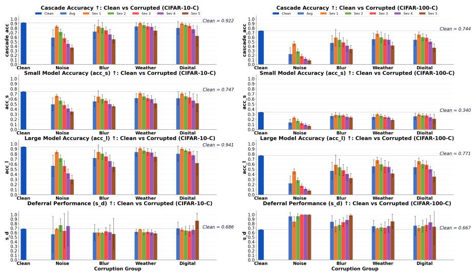
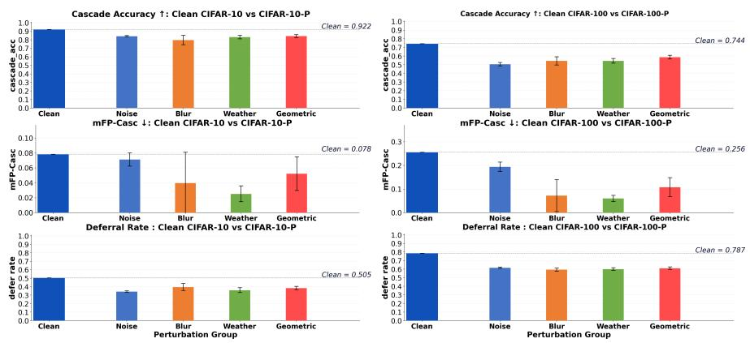

# Accuracy and Robustness of Model Cascades Under Data Perturbations

Pallavi Mitra1,2, Jai Kushwaha2, and Felix Bießmann2

1 AUMOVIO AI Lab, Berlin, Germany

pallavi.mitra@aumovio.com

Berliner Hochschule für Technik, Berlin, Germany felix.biessmann@bht-berlin.de

Abstract. Prediction cascades significantly reduce energy consumption of Artificial Intelligence (AI) models while maintaining high predictive performance. The idea is that easy inputs are routed through a lightweight small model, and dificult uncertain cases are deferred to a larger model. While this design can improve computational eficiency on clean data, its efectiveness depends on the reliability of confidencebased routing. Input degradations, such as static corruptions and sequential perturbations, can shift model confidence and routing decisions. In this paper, we study confidence-based cascade frameworks for image classification and investigate how such degradations afect their confidence-based deferral behavior. We select a model cascade at the pareto-optimum of accuracy, routing quality, and energy consumption that achieves competitive predictive performance with an up to 10-fold decrease in CO emissions. We study the behavior of that model cascade under input corruptions and analyze how the cascade’s routing decisions change when the input distribution shifts. Our analysis identifies three failure modes. Static corruptions either (1) break the routing signal while the large model remains useful, or (2) degrade both models so deferral no longer recovers accuracy. Sequential perturbations reveal a third mode: predictions stabilize but deferral suppresses, yielding stable but unreliable predictions. These findings demonstrate that energy eficient model cascades require evaluation beyond clean accuracy, with explicit attention to routing reliability under distribution shift.

Keywords: Eficient inference, confidence-based deferral, corruption robustness, distribution shift, cascade model

## 1 Introduction

The computational cost and energy consumption of the implementation of AI models pose significant environmental challenges [10,9]. As the scale of the model continues to grow, reducing inference costs has become critical to sustainable AI deployment. Among various eficiency techniques—including pruning [2], knowledge distillation [4], quantization [5], and early-exit architectures [11]—prediction cascades ofer a particularly promising approach by adaptively routing inputs across models of varying complexity. The core idea is intuitive: not all inputs require the same computational efort. Easy samples can be handled by lightweight models, while only dificult cases need expensive large models. The Gatekeeper framework [8] implements this through confidence-based deferral, where a small model $( M _ { S } )$ first attempts each prediction and defers uncertain cases to a large model $( M _ { L } )$ . When a small model $M _ { S }$ is confident, the cascade saves computation; when uncertain, it invests in the capacity of the large model $M _ { L }$ . On clean data, this design achieves substantial eficiency gains.

However, real-world deployment rarely matches clean training assumptions. In computer vision applications, for instance, images may sufer from compression artifacts, sensor noise, motion blur, or weather-related degradations. Even small perturbations can shift model predictions and confidence estimates. Although prior work has studied cascade performance on clean data or examined the robustness of individual models, the interaction between cascade routing decisions and input degradations remains underexplored.

This is critical for sustainable AI: cascade eficiency depends entirely on reliable confidence-based routing under distribution shift. Input degradations trigger opposing failures: excessive deferral raises computational cost; suppressed deferral sacrifices accuracy. Therefore, a critical practical question remains unanswered: at what level of input degradation does a cascade’s eficiency advantage disappear, and can we identify which corruption types pose the greatest threat to routing reliability?

Accurately characterizing this interaction is essential for estimating the true computational and environmental cost of cascade-based inference in production settings. In this work, we investigate how input degradation – both static corruptions and sequences of data perturbations – afects confidence-based deferral in model cascades. Our contributions are:

– We quantify how severity, type, and temporal structure of input degradation afect model cascades, identifying which static corruption groups and sequential perturbation types most strongly disrupt accuracy, routing reliability, and deferral quality across datasets.

We disentangle routing failure from fallback-model degradation, showing that cascade failure can arise from either unreliable confidence-based routing or from collapse of the large model $M _ { L }$ under severe corruption.

– We show that the relative importance of these failure modes depends on problem complexity: routing calibration becomes the bottleneck in lowercomplexity settings, while base-model robustness dominates in highercomplexity settings.

## 2 Related Work

In the following sections, we review recent work in model cascades as well as methods focusing on distributional shifts.

## 2.1 Prediction Cascades and Eficient Inference

Prediction cascades reduce computational cost by processing inputs through a sequence of models with increasing capacity, allowing early termination when confidence is suficient. Classical examples include boosting methods such as the Viola-Jones face detector [12], which uses a cascade of increasingly complex classifiers to reject non-face regions quickly. Modern approaches extend this concept to deep learning with learned routing strategies [13,11]. In this study we chose a recent model cascading approach, referred to as Gatekeeper [8] which routes each input x using the confidence of the small model $M _ { S }$ . If the maximum softmax confidence exceeds an inference threshold $\tau ,$ the prediction of $M _ { S }$ is accepted; otherwise, the input is deferred to the large model $M _ { L } ;$

$$
\hat { y } = \left\{ \begin{array} { l l } { f _ { M _ { S } } ( x ) , } & { \operatorname* { m a x } _ { c } \sigma ( f _ { M _ { S } } ( x ) ) _ { c } \ge \tau , } \\ { f _ { M _ { L } } ( x ) , } & { \mathrm { o t h e r w i s e } . } \end{array} \right.\tag{1}
$$

Here, $\tau \in [ 0 , 1 ]$ controls the accept–defer decision at inference time. Gatekeeper fine-tunes $M _ { S }$ with correctness-aware loss $\mathcal { L } _ { \mathrm { G K } } = \alpha \mathcal { L } _ { \mathrm { c o r r } } + ( 1 - \alpha ) \mathcal { L } _ { \mathrm { i n c o r r } } ,$ where $\alpha \in [ 0 , 1 ]$ controls the emphasis between correct and incorrect predictions, $\mathcal { L } _ { \mathrm { c o r r } }$ is cross-entropy on correctly predicted samples, and ${ \mathcal { L } } _ { \mathrm { i n c o r r } }$ is KL divergence to a uniform distribution on incorrectly predicted samples.

The framework uses two key metrics to characterize cascade behavior: Cascade accuracy and Deferral performance. Cascade accuracy simply measures accuracy of the model cascade: $\begin{array} { r } { \mathrm { A c c } _ { \mathrm { c a s c } } \ : = \ : \frac { 1 } { N } \sum _ { i = 1 } ^ { N } \mathcal { k } [ \hat { y } _ { i } \ : = \ : y _ { i } ] } \end{array}$ . Deferral performance $( s _ { d } )$ quantifies routing efectiveness by measuring the normalized area between realized and ideal deferral curves:

$$
s _ { d } = { \frac { \int _ { 0 } ^ { 1 } ( \mathrm { a c c } _ { \mathrm { r e a l } } ( r ) - \mathrm { a c c } _ { \mathrm { r a n d } } ( r ) ) d r } { \int _ { 0 } ^ { 1 } ( \mathrm { a c c } _ { \mathrm { i d e a l } } ( r ) - \mathrm { a c c } _ { \mathrm { r a n d } } ( r ) ) d r } }\tag{2}
$$

Higher $s _ { d }$ indicates more efective deferral. Prior work on cascades has $\mathrm { f o - }$ cused primarily on clean, in-distribution data. While eficiency gains are welldocumented under these conditions [13,11], the reliability of confidence-based routing under distribution shift remains largely unexplored. Specifically, whether the calibration induced by model cascades, such as Gatekeeper’s training loss, remains efective when inputs are corrupted or perturbed is an open question that our work addresses.

## 2.2 Distribution Shift, Calibration, and Cascade Routing

Perturbations of input data can degrade model accuracy and confidence calibration [3,7]. Hendrycks and Dietterich [3] introduced standardized static corruption and sequential perturbation benchmarks to measure robustness to common input degradations such as noise, blur, weather efects, and digital artifacts. These benchmarks show that DNNs can sufer substantial performance drops under corrupted inputs, even at moderate severity levels. Beyond accuracy, distribution shift also afects uncertainty estimates: models trained on clean data often become miscalibrated under corrupted inputs [7], while post-hoc calibration methods may not reliably transfer to shifted distributions [6].

While prior work extensively studies robustness and calibration for individual models, cascade systems introduce an additional failure point: routing reliability. In Gatekeeper cascades, confidence estimates determine whether a sample is accepted by the small model $M _ { S }$ or deferred to the large model $M _ { L }$ . Under distribution shift, corrupted confidence signals can therefore alter the accept/defer behavior even when model accuracy alone does not fully explain the failure. Two cascade-specific failure modes can arise: overconfident acceptance, where $M _ { S }$ accepts degraded samples that should have been deferred, and underconfident deferral, where $M _ { S }$ defers excessively, reducing the eficiency benefit of the cascade. Our work addresses this gap by evaluating how static corruptions and sequential perturbations afect not only cascade accuracy but also deferral performance.

## 3 Experimental Setup

## 3.1 Datasets

We evaluate robustness on two complementary CIFAR benchmarks [3] to test distinct failure modes: Static corruptions (CIFAR-10-C/100-C) apply singlestep corruption at fixed severity levels, testing cascade robustness to 19 corruption types at five severity levels, grouped into Noise (Gaussian, shot, impulse), Blur (defocus, glass, motion, zoom), Weather (snow, frost, fog, brightness), and Digital (contrast, elastic, pixelate, JPEG). Sequential perturbations (CIFAR-10-P/CIFAR-100-P) present progressive 30-frame degradation sequences, testing cascade stability under sequential gradual input perturbation sequences (motion blur, snow, zoom blur, brightness, $\deg ,$ Gaussian noise). Each corruption benchmark contains 10,000 test images per corruption type and severity level.

## 3.2 Models and Training

Following the Gatekeeper formulation [8], for both CIFAR-10/100, we instantiate $M _ { S }$ as a custom SmallCNN and $M _ { L }$ as ResNet-18. Both models are trained on clean data with standard augmentation. $M _ { S }$ is trained for 50 epochs using Adam with learning rate $1 0 ^ { - 3 }$ and weight decay $1 0 ^ { - 4 } , \ M _ { L }$ is trained for 200 epochs using SGD with learning rate 0.1, momentum 0.9, Nesterov acceleration, weight decay $5 \times 1 0 ^ { - 4 }$ , and cosine annealing. We then keep $M _ { L }$ fixed and fine-tune $M _ { S }$ using the Gatekeeper correctness-aware loss for 30 epochs with Adam, learning rate $3 \times 1 0 ^ { - 4 }$ , weight decay $1 0 ^ { - 4 }$ , and cosine annealing. Following the original Gatekeeper design [8], the confidence-based routing threshold τ is fixed at 0.7. Separate Gatekeeper models are fine-tuned for $\alpha \in \{ 0 . 1 , 0 . 3 , 0 . 5 , 0 . 7 , 0 . 9 \}$

## 3.3 Evaluation Pipeline and Metrics

After training the Gatekeeper cascade on clean CIFAR-10/100 data, we evaluate it under both clean and corrupted data. We report energy consumption or $C O _ { 2 }$ emissions as estimated with the codecarbon library [1]. For evaluation of performance under corruptions, we apply all corruptions at inference time before the confidence-based routing decision. We report accuracy of the small model $M _ { S }$ , the large model $M _ { L }$ and the model cascade $G K ,$ as well as deferral performance $\left( { { s _ { d } } } \right)$ to diagnose failure modes. In addition for the evaluation of sequential perturbations,we report cascade accuracy, deferral rate, and mean cascade flip rate, defined as m $\begin{array} { r } { \mathrm { F P - C a s c } = \frac { 1 } { T - 1 } \sum _ { t = 2 } ^ { T } \mathcal { Y } [ \hat { y } _ { t } \neq \hat { y } _ { t - 1 } ] } \end{array}$ , where T is the sequence length and $\hat { y } _ { t }$ is the cascade prediction at frame t. Since sequential perturbations present consecutive frames with progressive degradation, we measure prediction stability by mFP-Casc.

For grouped results, bars show the mean across corruption or perturbation types within each group, and error bars denote the corresponding standard deviation. These error bars capture variability across degradation types, not variability across independent training seeds.

## 4 Result & Analysis

## 4.1 Model Cascade Performance on Clean Data

In Table 1, we report clean-data performance for the Gatekeeper (GK) model cascade on the CIFAR-10 and CIFAR-100 data sets and compare the performance in terms of accuracy, deferral performance $s _ { d }$ and energy consumption for cascades and the large or small models used in the cascade. We observe that for CIFAR-10, the best model cascade with $\alpha = 0 . 9$ yields a competitive accuracy compared to the large model $M _ { L }$ while requiring only 60% of the energy. For the CIFAR-100 data set we also observe a slight reduction in accuracy but a 10-fold reduction in energy consumption for the model cascade. All subsequent evaluations use this fixed threshold across all corruption conditions.

## 4.2 Model Cascade Performance on Corrupted Data

The results in Figure 1 demonstrate that the small model $M _ { S }$ , the large model $M _ { L }$ as well as the model cascade perform less accurately when data is corrupted. Increasing levels of corruption severity lead to decreasing levels of accuracy. On CIFAR-10-C, cascade accuracy drops from 0.922 on clean data to ≈ 0.38–0.58 under Noise across severity levels, while Weather remains comparatively robust, staying around 0.75–0.90. In contrast, CIFAR-100-C shows a much sharper degradation: cascade accuracy drops from 0.744 on clean data to approximately 0.46 under Noise at severity 1 and to ≈ 0.10 at severity 5. Even the most robust Weather group remains only around 0.42–0.68 across severities. Overall the impact of corruptions on the 10-class problem CIFAR-10 is much less pronounced than on the task with larger label-set cardinality CIFAR-100.

Table 1: Clean-data accuracy, deferral performance, and estimated $\mathrm { C O _ { 2 } }$ emissions for GK evaluation on CIFAR-10/100. Pareto-optimal settings are shown in bold face.
<table><tr><td rowspan="2">Config.</td><td colspan="3">CIFAR-10</td><td colspan="3">CIFAR-100</td></tr><tr><td> $\operatorname { C a s c A c c } \uparrow$ </td><td> $s _ { d } ~ \cdot ~$  个</td><td> $\mathrm { C O _ { 2 } \downarrow }$ </td><td> $\operatorname { C a s c A c c } \uparrow$ </td><td> $s _ { d } \uparrow$ </td><td> $\mathrm { C O _ { 2 } \downarrow }$ </td></tr><tr><td> $M _ { S } { \mathrm { ~ o n l y } }$ </td><td>0.752</td><td>0.674</td><td>0.029</td><td>0.357</td><td>0.496</td><td>0.042</td></tr><tr><td> $\mathrm { G K \ } \alpha { = } 0 . 1$ </td><td>0.584</td><td>0.861</td><td>0.039</td><td>0.687</td><td>0.986</td><td>0.030</td></tr><tr><td> $\mathrm { G K \ } \alpha { = } 0 . 3$ </td><td>0.878</td><td>0.788</td><td>0.042</td><td>0.708</td><td>0.804</td><td>0.029</td></tr><tr><td> $\mathrm { G K \ } \alpha { = } 0 . 5$ </td><td>0.900</td><td>0.743</td><td>0.041</td><td>0.729</td><td>0.748</td><td>0.029</td></tr><tr><td>GK  $\alpha { = } 0 . 7$ </td><td>0.910</td><td>0.731</td><td>0.029</td><td>0.737</td><td>0.714</td><td>0.029</td></tr><tr><td> $\mathbf { G K \alpha } \alpha \mathrm { { = } } 0 . 9$ </td><td>0.922</td><td>0.686</td><td>0.029</td><td>0.744</td><td>0.667</td><td>0.029</td></tr><tr><td> $M _ { L }$  only</td><td>0.941</td><td></td><td>0.0476</td><td>0.771</td><td></td><td>0.295</td></tr></table>

Note: $s _ { d }$ is undefined for $\overline { { M _ { L } \mathrm { - o n l y } } }$ since there is no deferral.

The clean-to-worst-severity drop is larger on CIFAR-100-C: under Noise, accuracy decreases by ≈ 0.64 (0.744 → 0.10) compared with ≈ 0.54 on CIFAR-10-C $( 0 . 9 2 2  0 . 3 8 )$ ; under Weather, the drop is ≈ 0.32 (CIFAR-100) versus ≈ 0.17 (CIFAR-10). Comparing the impact of diferent corruptions on model cascade accuracy we observe a consistent ranking across datasets: Noise≫ Blur $>$ Weather ≈ Digital. Weather corruptions have the least impact on accuracy. Interestingly, the severity level at which the cascade loses its eficiency advantage is dataset-dependent. On CIFAR-10-C, Weather and Digital remain above 0.75 accuracy through severity 3, whereas on CIFAR-100-C no corruption group remains above 0.60 beyond severity 3.

In order to investigate whether this diference in corruption impact on model cascade performance is due to the model cascade’s deferral performance or due to the task dificulty itself we inspect the deferral ratios $s _ { d }$ ( Figure 1, bottom row). On CIFAR-10-C, the large model $M _ { L }$ retains a clear accuracy advantage over $M _ { S }$ under corruption, enabling deferral to recover useful accuracy when routing remains reliable. For example, under Noise at severity 1: acc $_ L = 0 . 8 4$ vs. acc = 0.67 (27 pp gap). In contrast, on CIFAR-100-C, severe Noise corruption degrades both the large model $M _ { L }$ and the small model $M _ { S }$ to similarly low accuracy (< 0.10), eliminating the utility of the large model as a fallback.

These results suggest that corruptions impact the performance of the model cascade in diferent ways: For CIFAR-10-C we observe that the large model $M _ { L }$ remains substantially more accurate than the small model $M _ { S }$ under corruptions (e.g. 0.84 vs 0.67 under Noise-1), but the degraded confidence signals (sd: $0 . 6 8 6 {  } 0 . 3 5$ for Noise) prevent the cascade from exploiting this high accuracy of the large model $M _ { L }$ . Due to poor deferral performance, the cascade loses ≈19pp of recoverable accuracy.

In contrast for CIFAR-100-C especially high severity corruptions degrade both the accuracy of the small model $M _ { S }$ as well as the large model $M _ { L }$ , eliminating the large model’s advantage. These results suggest that it is rather the task dificulty than the deferral performance of the model cascade that leads to the lower cascade accuracy. If the large model $M _ { L }$ is not able to correctly identify samples, the model cascade will not be able to compensate for that.

  
Fig. 1: Corruption robustness on CIFAR-10-C (left) and CIFAR-100-C (right). For the CIFAR-10-C data the large model $M _ { L }$ remains accurate but the lower deferral score $s _ { d }$ indicates routing failure. For the CIFAR-100-C data even the large model $M _ { L }$ performs poorly under Noise, limiting the model cascade performance.

## 4.3 Model Cascade Performance on Sequential Corruptions

Evaluating the impact of sequential data perturbations in Figure 2 we observe that progressive perturbations in the CIFAR-10-P and CIFAR-100-P tasks reduce the cascade accuracy, but less severely than static corruptions. On CIFAR-10-P, accuracy drops from 0.922 to 0.80–0.85; on CIFAR-100-P, from 0.744 to 0.51–0.59. Unlike static corruptions where Noise dominates, Blur emerges as the most damaging perturbation on CIFAR-10-P, indicating that gradual, frame-byframe degradation afects confidence-based routing diferently than single-step corruptions.

Examining the mean cascade flip rate (mFP-Casc), measuring how often the deferral decision flips with progressive perturbations, reveals a counterintuitive pattern: perturbations reduce prediction instability across all groups. Weather yields the largest reduction (67% on CIFAR-10-P; 76% on CIFAR-100-P), while Noise yields the smallest (9% and 24%, respectively). However, this apparent stability is deceptive. The deferral rate also decreases under perturbation, from 0.505 to 0.34–0.39 on CIFAR-10-P and from 0.787 to 0.59–0.62 on CIFAR-100-P. Fewer samples are routed to the large model $M _ { L }$ , and the cascade relies more heavily on the degraded small model $M _ { S }$ . Combined with the observed accuracy drop, the lower flip rate does not indicate improved robustness, but rather reflects a suppressed fallback to the large model $M _ { L }$ . These results suggest that perturbations expose a distinct cascade failure mode: progressive degradation suppresses deferral decisions, producing stable but less reliable cascade predictions. For cascaded systems under temporal degradation, robustness must be evaluated jointly through accuracy, prediction stability, and deferral behavior.

  
Fig. 2: Robustness under perturbation sequences on CIFAR-10-P (left) and CIFAR-100-P (right). Perturbations reduce cascade accuracy and mean flip rate, but also suppress deferral to the large model $M _ { L }$ . Thus, lower prediction instability can be misleading: the cascade appears stable while relying more on the degraded small model $M _ { S }$

## 5 Conclusion and Future Work

We investigated the impact of data corruptions on the performance of model cascades. In line with previous work we find that on clean data model cascades can achieve competitive predictive performance while obtaining an up to 10-fold reduction in energy consumption. However, our results demonstrate that input degradation afects not only cascade accuracy but also the confidence-based routing decisions that determine whether eficient inference remains reliable. The failure mode of model cascades difers across datasets: In the CIFAR-10-C task we observe mainly routing failures, where the large model $M _ { L }$ retains its high accuracy under data corruptions but the corrupted confidence signals of the smaller models limit efective deferral. In the case of the CIFAR-100-C task we see that also the larger model exhibits decreased performance under data corruptions, limiting its utility as a fallback option for deferral of dificult samples.

Overall our results indicate that model cascades can be a viable alternative to large or small models as they ofer a convenient per-sample tradeof between predictive performance and energy consumption. Using them responsibly requires better understanding of their behaviour under data set shifts. We observe that model cascades can fail under corruption through either routing breakdown (when the large model remains accurate but confidence signals corrupt) or model collapse (when distribution shift degrades both models). In our experiments, the label set cardinality is indicative of the failure mode: CIFAR-10’s lower number of classes preserves $M _ { L }$ robustness, exposing routing fragility; CIFAR-100’s higher label set cardinality breaks both models, revealing fundamental model brittleness.

Future work will investigate shift-aware Gatekeeper mechanisms that adapt the inference threshold under degraded inputs, rather than using a fixed cleandata configuration. Another direction is to incorporate uncertainty calibration or corruption-aware confidence correction into the routing decision, so that degraded samples are not incorrectly accepted by $M _ { S }$ . Finally, extending this analysis to larger-scale datasets, additional model families, and real deployment measurements of latency, energy, and $\mathrm { C O _ { 2 } }$ emissions would provide a more complete picture of the robustness–eficiency trade-of in cascade-based inference.

## 6 Acknowledgement

This work was funded by the German Federal Ministry for Economic Afairs and Energy within the project “Safe AI Engineering – Sicherheitsargumentation befähigendes AI Engineering über den gesamten Lebenszyklus einer KI-Funktion”. This research was also supported by the German Research Foundation (DFG), project number 528483508 – FIP 12. The authors thank the project partners for the successful cooperation.

## References

1. Courty, B., Schmidt, V., Goyal-Kamal, MarionCoutarel, Feld, B., Lecourt, J., LiamConnell, SabAmine, inimaz, supatomic, Léval, M., Blanche, L., Cruveiller, A., ouminasara, Zhao, F., Joshi, A., Bogrof, A., Saboni, A., de Lavoreille, H., Laskaris, N., Abati, E., Blank, D., Wang, Z., Catovic, A., alencon, Stęchły, M., Bauer, C., Lucas-Otavio, JPW, MinervaBooks: mlco2/codecarbon: v2.4.1 (May 2024). https://doi.org/10.5281/zenodo.11171501, https://doi.org/10.5281/ zenodo.11171501

2. Han, S., Pool, J., Tran, J., Dally, W.J.: Learning both weights and connections for eficient neural networks. In: Advances in Neural Information Processing Systems (NeurIPS). pp. 1135–1143 (2015)

3. Hendrycks, D., Dietterich, T.: Benchmarking neural network robustness to common corruptions and perturbations. In: International Conference on Learning Representations (ICLR) (2019)

4. Hinton, G., Vinyals, O., Dean, J.: Distilling the knowledge in a neural network. arXiv preprint arXiv:1503.02531 (2015)

5. Jacob, B., Kligys, S., Chen, B., Zhu, M., Tang, M., Howard, A., Adam, H., Kalenichenko, D.: Quantization and training of neural networks for eficient integerarithmetic-only inference. In: Proceedings of the IEEE Conference on Computer Vision and Pattern Recognition (CVPR). pp. 2704–2713 (2018)

6. Minderer, M., Djolonga, J., Romijnders, R., Hubis, F., Zhai, X., Houlsby, N., Tran, D., Lucic, M.: Revisiting the calibration of modern neural networks. In: Advances in Neural Information Processing Systems (NeurIPS). pp. 15682–15694 (2021)

7. Ovadia, Y., Fertig, E., Ren, J., Nado, Z., Sculley, D., Nowozin, S., Dillon, J.V., Lakshminarayanan, B., Snoek, J.: Can you trust your model’s uncertainty? evaluating predictive uncertainty under dataset shift. In: Advances in Neural Information Processing Systems (NeurIPS). pp. 13991–14002 (2019)

8. Rabanser, S., Rauschmayr, N., Kulshrestha, A., Poklukar, P., Jitkrittum, W., Augenstein, S., Wang, C., Tombari, F.: Gatekeeper: Improving model cascades through confidence tuning. Advances in Neural Information Processing Systems 38, 19518–19547 (2026)

9. Schwartz, R., Dodge, J., Smith, N.A., Etzioni, O.: Green ai. Communications of the ACM 63(12), 54–63 (2020)

10. Strubell, E., Ganesh, A., McCallum, A.: Energy and policy considerations for deep learning in nlp. Proceedings of ACL pp. 3645–3650 (2019)

11. Teerapittayanon, S., McDanel, B., Kung, H.T.: Branchynet: Fast inference via early exiting from deep neural networks. In: International Conference on Pattern Recognition (ICPR). pp. 2464–2469 (2016)

12. Viola, P., Jones, M.: Rapid object detection using a boosted cascade of simple features. In: Proceedings of the IEEE Conference on Computer Vision and Pattern Recognition (CVPR). vol. 1, pp. I–I (2001)

13. Wang, X., Yu, F., Dou, Z.Y., Darrell, T., Gonzalez, J.E.: Skipnet: Learning dynamic routing in convolutional networks. In: European Conference on Computer Vision (ECCV). pp. 409–424 (2018)