# Adaptive Policy Portfolios for Robust Markov Decision Processes

Kasper Engelen1, Sebastian Junges2, Guillermo A. Pérez1, Marnix Suilen1

1University of Antwerp, Belgium

2Radboud University, Nijmegen, The Netherlands

{kasper.engelen,guillermo.perez,marnix.suilen}@uantwerpen.be, sebastian.junges@ru.nl

## Abstract

Robust Markov decision processes optimize one policy against a set of plausible transition functions. This can be conserva- tive when the unknown dynamics are fixed and become par- tially identifiable after deployment. We study adaptive policy portfolios: finite sets of memoryless randomized policies synthesized ofline and paired with a lightweight online selector. Robust regret is a natural measure of portfolio quality: for each plausible environment, it measures the loss of the best portfolio member relative to the policy that would have been optimal had that environment been known. Related regret ob- jectives were studied by Ghavamzadeh et al. (2016) with an emphasis on approximations and relaxations for safe policy improvement. We give a complexity-theoretic account of port- folio certification and synthesis. Certifying a given portfolio is ∀R-complete already for deterministic portfolios in acyclic (s, a)-rectangular RMDPs. Synthesizing a portfolio of unarybounded size is ∃∀R-complete for general rational polytopes, even with fixed discount and acyclic dynamics. The single- policy case is already hard, both combinatorially and alge- braically. Finally, we present an ofline portfolio construction that is amenable to runtime specialization.

## 1 Introduction

Markov decision rocesses (MDPs) are the standard formalism for sequential decision-making under uncertainty, but they require precise knowledge of transition probabilities. Robust MDPs (RMDPs, for short) (Wiesemann, Kuhn, and Rustem 2013) relax this requirement by optimizing against an uncertainty set of possible transition functions. A robust policy is optimized against the worst transition dynamics in that set. Consequently, robust policies can be overly conser- vative because their behavior is dominated by the hardest environments, even when those environments are unlikely or quickly ruled out by observation.

Robust regret (Ahmed et al. 2013; Rigter, Lacerda, and Hawes 2021) ofers an alternative. Instead of maximizing value under the worst transition function, it minimizes the largest value shortfall relative to the policy that would have been optimal had the true transition function been known. This yields a policy with uniformly small relative loss. It still commits, however, to one policy for every possible transition function and cannot exploit evidence gathered online about which model governs the environment.

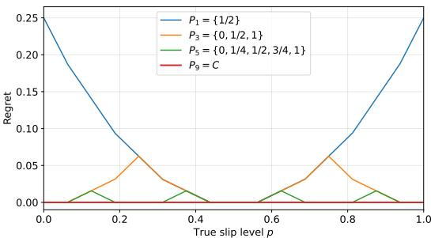  
Figure 1: Portfolio regret in the actuator example.

We propose adaptive policy portfolios. Ofline, we com-pute a set of policies tailored to diferent regions of the un- certainty set. Online, accumulated evidence is used to select among these already validated policies. The portfolio is syn- thesized by minimizing robust regret. We focus on portfolios of memoryless policies, the simplest practically interesting policies for sequential decision making.

As a motivating example, consider an actuator whose true slip level is an unknown parameter $p \in [ 0 , 1 ]$ . Viewed as a single-state RMDP, each action is a calibration $c \in C =$ $\{ 0 , ^ { \infty } \mathrm { { \bar { \alpha } } ^ { } \mathrm { { s } , } \{ \dots \mathrm { { } , 1 \} } } $ , and the unknown $p$ sets the success probabil- ity $1 - ( p - \dot { c } ) ^ { 2 }$ of reaching an absorbing success state. The regret of a calibration is its excess squared distance to p over the closest calibration in C. A single robust-regret policy chooses $c = 1 / 2$ and has worst-case regret $^ 1 / _ { 4 }$ . The portfo- lio $\{ 0 , { } ^ { 1 } / 2 , { } 1 \}$ reduces this to $^ { 1 / 1 6 } \mathrm { ; }$ , while $\{ 0 , { ^ { 1 } \mathrm { / 4 } } , { ^ { 1 } \mathrm { / 2 } } , { ^ { 3 } \mathrm { / 4 } } , 1 \}$ reduces it to $^ 1 / 6 4$ . Increasing the portfolio size provides a controlled form of adaptation while online selection remains over a finite set. Figure 1 plots these regret curves.

In this work, we study the computational complexity of synthesizing minimal-regret policy portfolios and the cer- tification and comparison subproblems that arise along the way. Table 1 summarizes our main results: the robust-regret problems are hard for diferent levels of the hierarchy of the theory of the reals (Schaefer and Stefankovic 2024). The coNP lower bound was stated by Ghavamzadeh, Petrik, and Chow (2016) under a policy restriction removed here. Our square-root-sum and theory-of-the-reals bounds are new, and neither the Boolean nor the square-root-sum bound is known to be comparable with the theory-of-the-reals bounds. This rules out eficient general-purpose algorithms under standard complexity assumptions. These worst-case bounds still leave room for the practical ofline construction developed later.

<table><tr><td>Task</td><td>Nonrect. uncertainty</td><td> $( s , a )$  -rectangular uncertainty</td><td>Hardness already holds for</td></tr><tr><td>Certify one given policy</td><td>∀R-complete</td><td>coNP-hard and coSQRS-hard; in ∀R</td><td>deterministic policies; acyclic models whose uncer- tain choices are two-Dirac, for coNP</td></tr><tr><td>Certify a given portfolio</td><td>∀R-complete</td><td>∀R-complete</td><td>deterministic portfolios with acyclic graphs and two- successor choices</td></tr><tr><td>Synthesize one random- ized policy</td><td>∀R-hard and in ∃∀R</td><td>NP-hard, coNP-hard, and SQRS⊥-hard; in ∃VR</td><td>two-Dirac models for the Boolean bounds</td></tr><tr><td>Synthesize at most k poli- cies</td><td>VR-complete</td><td>hard already for  $k = 1 ;$  exact complexity open</td><td>regret threshold 2, fixed discount, acyclic dynamics, two-successor uncertain choices</td></tr></table>

Table 1: Complexity of regret certification and synthesis. Certification is established by Theorems 1 to 4. Synthesis i established by Theorems 5 to 9.

The lower bounds persist even under structural assump- tions that usually simplify RMDPs. Rectangularity is the independence assumption that transition uncertainty at one state-action pair does not constrain uncertainty at another, and it commonly lowers complexity and underlies much of the RMDP literature (Iyengar 2005; Wiesemann, Kuhn, and Rustem 2013; Suilen et al. 2024). Here it does not rescue portfolio certification: although rectangularity removes the real quantifier alternation from comparison between two acyclic policies, the pointwise maximum over portfolio members re- stores it (Theorem 3). Consequently, checking a given portfolio is ∀R-complete already for deterministic portfolios in acyclic (s, a)-rectangular RMDPs. Choosing a portfolio under a unary size budget adds one existential real block and is ∃∀R-complete for general rational polytopic uncertainty. The reduction couples choices, so it does not establish ∃∀Rcompleteness under rectangular uncertainty (Theorem 9).

Despite these worst-case lower bounds, we give a practical construction that discretizes the uncertainty into cells, com- putes a candidate policy for each cell, and evaluates every candidate against all cells. It then clusters the resulting re- gret profiles to the desired portfolio budget. At runtime, UCB (Cesa-Bianchi and Lugosi 2006) selects among the portfolio members as observations accumulate.

## Contributions. Our contributions are as follows.

1. We introduce adaptive policy portfolios as a finite and certifiable form of adaptation for RMDPs.

2. We prove the two exact portfolio classifications sum- marized in Table 1: given-portfolio certification is ∀R-complete and bounded-portfolio synthesis is ∃∀Rcomplete (Theorems 3 and 9).

3. We identify the structural sources of hardness: uncertain transitions used by both policies yield Boolean hardness, their recurrence on cycles yields hardness from sums of square roots, and choosing a policy adds further Boolean and signed-square-root-sum hardness.

4. We present an ofline portfolio construction that is amenable to runtime specialization.

The main text gives the principal arguments. Complete proofs and supporting comparison results appear in the appendix.

## Related Work

Several approaches reduce the conservativeness of worst- case robust policies by optimizing over less conservative uncertainty sets (Wiesemann, Kuhn, and Rustem 2013; Benyamine et al. 2026). When multiple optimal robust poli-cies exist, best-efort approaches can select among them with- out sacrificing worst-case value (Abate et al. 2026).

A more adaptive response to fixed but initially un- known transition dynamics is provided by Bayes-adaptive MDPs (Guez, Silver, and Dayan 2012), hidden-model MDPs (Chades et al. 2012), and hidden-parameter MDPs (Doshi-Velez and Konidaris 2016). These models plan over a belief on the unknown dynamics and update it as evi- dence accumulates. This formulation is expressive, but plan- ning becomes intractable outside narrow special cases. Its belief representation can be continuous or high-dimensional, and online belief-space planning can itself be expensive.

Adaptive policy portfolios occupy an intermediate po- sition. Their expensive computation is performed ofline, while online adaptation reduces to selecting among a fixed set of policies. Regret is natural in this setting because the portfolio should contain a policy that performs near- optimally for whichever environment turns out to be true (cf. Ghavamzadeh, Petrik, and Chow (2016)).

## 2 Problem Statement

For a finite set X, we write |X| for its cardinality, and ${ \mathcal { D } } ( X )$ for the set of discrete probability distributions over X, i.e., functions $\mu \colon X \to [ 0 , { \bar { 1 } } ]$ with $\begin{array} { r } { \sum _ { x \in X } \mu ( x ) = 1 } \end{array}$ . Vectors and matrices are boldface. For $\pmb { x } \in \mathbb { R } ^ { n } , \pmb { x } ( i )$ denotes its i-th entry. Throughout, S and A denote finite sets of states and actions of a decision process, and we call a pair $( s , a ) \in$ $S \times A$ a choice. We fix an arbitrary ordering of the triples $( s , a , s ^ { \prime } ) \in S \times A \times S$ , so that a vector u $\in \mathbb { R } ^ { \widecheck { S } \times A \times S }$ assigns a value $\mathbf { \boldsymbol { u } } ( s , a , s ^ { \prime } )$ to each triple. We call u a transition vector if $\pmb { u } ( s , a , \cdot ) \in \mathcal { D } ( S )$ for every choice (s, a).

Definition 1 (RMDP). A robust Markov decision process (RMDP) is a tuple $( S , A , \mathcal { U } , R , s _ { \iota } , \gamma )$ , where $R \colon S \times { \mathsf { \bar { A } } } \to \mathbb { R }$ is the rewardfunction, $s _ { \iota } \in S$ is the initial state, $\gamma \in ( 0 , 1 )$

is a discount factor, and

$$
\mathcal { U } = \{ \pmb { u } \in \mathbb { R } ^ { S \times A \times S } \ | \ F \pmb { u } \leq \pmb { g } \}
$$

is a convex polytope of transition vectors, for $\pmb { F } \in \mathbb { R } ^ { m \times n }$ $\pmb { \mathscr { g } } \in \mathbb { R } ^ { m } ( n = | S | | \bar { A } | | \bar { S } | )$ ). The inequalities F u ≤ g include the constraints defining a transition vector, so every $\mathbf { \boldsymbol { u } } \in \mathcal { U }$ is a valid transitionfunction.

A policy maps paths to distributions over actions, $\pi \colon ( { \bar { S A } } ) ^ { * } { \bar { S } } \  \ { \bar { \mathcal { D } } } ( { \bar { A } } )$ . A memoryless randomized policy $\pi \colon S \to D ( A )$ depends only on the current state. The set of such policies is $\dot { \Pi } ^ { \mathrm { M R } }$ . A memoryless deterministic policy $\pi \colon S  A$ further selects a single action per state. The set of such policies is $\Pi ^ { \mathrm { M D } } \subseteq \Pi ^ { \mathrm { M R } }$ . Unless stated otherwise, candidate policies range over $\Pi ^ { \mathrm { M R } }$

Each $\textbf { \textit { u } } \in \textbf { \textit { u } }$ induces a classical MDP $\begin{array} { r l } { M _ { u } } & { { } = } \end{array}$ $( S , A , P _ { \pmb { u } } , R , s _ { \iota } , \gamma )$ with $P _ { \bf u } ( s , a ) ( s ^ { \prime } ) = { \bf u } ( s , a , s ^ { \prime } )$ . For a policy π, its value $V _ { \mathbf { \eta u } } ^ { \pi } \colon S \to \operatorname { \mathbb { R } }$ in $M _ { u }$ is the expected dis- counted cumulative reward,

$$
V _ { \pmb { u } } ^ { \pi } ( s ) = \mathbb { E } _ { \pi } \Big [ \sum _ { t = 0 } ^ { \infty } \gamma ^ { t } R ( s _ { t } , a _ { t } ) \ \Big | \ s _ { 0 } = s \Big ] ,
$$

and $V _ { u } ^ { * } ( s ) = \operatorname* { s u p } _ { \pi } V _ { u } ^ { \pi } ( s )$ is the optimal value. This supre- mum is attained by a policy in $\Pi ^ { \mathrm { M D } }$ and $V _ { \pmb { u } } ^ { * }$ is computable in polynomial time for fixed u (Puterman 1994).

Types of uncertainty. By default, U places no further structure on how uncertainty interacts across choices. We call this the general (non-rectangular, convex-polytopic) case. The special case where U decomposes into independent per-choice uncertainty sets is $( s , a )$ -rectangular:

$$
\mathcal { U } = \bigcup _ { ( s , a ) \in S \times A } \mathcal { U } _ { ( s , a ) } , \qquad \mathcal { U } _ { ( s , a ) } \subseteq \mathbb { R } ^ { \{ s \} \times \{ a \} \times S } .
$$

We call $\mathcal { U } _ { ( s , a ) }$ the uncertainty set of choice $( s , a )$ , and the choice uncertain $\mathrm { i f } \mathcal { U } _ { ( s , a ) }$ is not a singleton. Intuitively, $( s , a )$ rectangularity is an independence assumption across choices. The general case allows U to couple choices, whereas $( s , a )$ rectangularity prohibits this.

Subclasses of RMDPs. An uncertain choice is twosuccessor if every distribution in its uncertainty set is supported on the same two states, and two-Dirac if that set is the line segment between two Dirac distributions. An RMDP has either property when all its uncertain choices do. An RMDP is acyclic when its possible-transition graph has no directed cycle except self-loops at absorbing final states. A policy graph is acyclic under the analogous restriction to choices used by that policy. Constructions that describe only their intended choices are completed on every other state-action pair by the ruinous-sink convention of Section A.1.

Robust Value & Regret. For a policy π, its robust value is

$$
V ^ { \pi , \mathrm { r o b } } ( s ) = \operatorname* { i n f } _ { { \pmb u } \in \mathcal { U } } V _ { \pmb u } ^ { \pi } ( s ) ,
$$

the worst-case value π can guarantee against any realization in U. The robust optimal value is $V ^ { \mathrm { r o b } } ( \breve { s } ) = \mathrm { s u p } _ { \pi } ^ { \cdot } V ^ { \pi , \mathrm { r o b } } ( s )$ and a policy attaining it is robust optimal. Robust value com-pares policies in absolute terms, but it does not distinguish a policy performing poorly from a realization that is simply hard for every policy: even the best policy for a fixed u may attain a low value there. We therefore turn to a comparative notion, measuring a policy’s shortfall against the best policy for each particular realization, rather than its raw worst-case value. That is, for $\pi \in \Pi ^ { \mathrm { M R } }$ , its robust regret (at s ) is

$$
\operatorname { R r e g } ( \pi ) = \operatorname* { s u p } _ { \boldsymbol { u } \in \mathcal { U } } \bigl ( V _ { \boldsymbol { u } } ^ { * } ( s _ { \iota } ) - V _ { \boldsymbol { u } } ^ { \pi } ( s _ { \iota } ) \bigr ) ,
$$

the largest shortfall of π from the policy optimal at u, over every realization of the uncertainty. We call the choice of realization u nature’s move.

Definition 2 (Adaptive policy portfolio). An adaptive policy portfolio is a finite set $\dot { \boldsymbol { \Pi } } \subseteq \mathbf { \check { \Pi } } ^ { \mathrm { M R } }$ of candidate policies synthesized ofline and paired with a runtime mechanism that selects among its members as evidence accumulates.

Robust regret lifts to portfolios by comparing against the best memberfor that realization:

$$
\mathrm { R r e g } ( \Pi ) = \operatorname* { s u p } _ { \pmb { u } \in \mathcal { U } } \Big ( V _ { \pmb { u } } ^ { * } \big ( s _ { \iota } \big ) - \operatorname* { m a x } _ { \pi \in \Pi } V _ { \pmb { u } } ^ { \pi } \big ( s _ { \iota } \big ) \Big ) .\tag{1}
$$

This is an ofline coverage guarantee: it idealizes away the cost of identifying the best member and assumes that mem- ber is selected. The online identification cost is evaluated separately in Section 4. This quantity cannot in general be recovered from the single-policy regret values $\{ { \bar { \mathrm { R r e g } } } ( \pi )$ $\pi \in \Pi \}$ . Portfolio regret evaluates all members under the same realization before taking the worst case, whereas each singleton regret has already taken its own supremum. Note that the bound $\begin{array} { r } { \operatorname { R r e g } ( \Pi ) \leq \operatorname* { m i n } _ { \pi \in \Pi } \operatorname { R r e g } ( \pi ) } \end{array}$ follows.

We seek the best guarantee achievable by a portfolio of bounded size $k \geq 1 { : }$

$$
\rho _ { k } = \operatorname* { i n f } _ { \Pi \subseteq \Pi ^ { \mathrm { M R } } : | \Pi | \leq k } { \mathrm { R r e g } } ( \Pi ) .
$$

Note $\begin{array} { r } { \rho _ { 1 } = \operatorname* { i n f } _ { \pi \in \Pi ^ { \mathrm { M R } } } \operatorname { R r e g } ( \pi ) \colon } \end{array}$ : minimal single-policy regret is the $k = 1$ case of minimal portfolio regret.

## 3 Computational Complexity

We first recall the required classes, then turn to the certifica- tion and synthesis of portfolios. We note that the results yield a rich landscape, but all studied problems lie in PSPACE.

## 3.1 Complexity Preliminaries

We assume basic familiarity with standard complexity classes such as NP, coNP, and PSPACE (Papadimitriou 1994; Arora and Barak 2009).

Input conventions. The rewards, γ, threshold t, polytope data F, g, and policy matrices in $\mathbb { Q } ^ { S \times A }$ are binary-encoded rationals. The portfolio budget k is encoded in unary.

Theory of the reals. We use the first-order theory of the reals over $( \mathbb { R } , 0 , 1 , + , \cdot , < )$ . In this logic, we can ask whether a system of polynomial equations and inequalities has a real solution, or holds for every real assignment. We consider three fragments, given a quantifier-free formula $\varphi \colon$

• existential sentences $\exists x _ { 1 } , \dots , x _ { n } \ \varphi ( x _ { 1 } , \dots , x _ { n } ) ;$

• universal sentences $\forall x _ { 1 } , \ldots , x _ { n } \ \varphi ( x _ { 1 } , \ldots , x _ { n } )$

• existential-universal sentences

$$
\exists x _ { 1 } , \dots , x _ { n } \forall y _ { 1 } , \dots , y _ { m } \varphi ( x _ { 1 } , \dots , x _ { n } , y _ { 1 } , \dots , y _ { m } ) .
$$

The truth problem of each fragment defines a complex- ity class, denoted ∃R, ∀R, and ∃∀R respectively (Schaefer and Stefankovic 2024). These classes sit between ${ \mathsf { N P } }$ and PSPACE (Canny 1988; Basu, Pollack, and Roy 2006), and $\forall \mathbb { R } = { \mathsf { c o } } \exists \mathbb { R }$ and $\exists \mathbb { R } = { \mathsf { c o } } \forall \mathbb { R }$

Square-root-sum. We also consider variants of the wellknown square-root-sum (SQRS) decision problem and their associated complexity classes. For the variants be- low, assume finite lists of positive integers $a _ { 1 } , \ldots , a _ { m }$ and $b _ { 1 } , \ldots , b _ { n }$ , and an integer $k ,$ all encoded in binary.

• SQRS. Decide whether $\textstyle \sum _ { i = 1 } ^ { m } { \sqrt { a _ { i } } } \leq k .$ . coSQRS is the complement class.

${ \mathsf { S Q R S } } \pm$ . Given an operator ▷◁∈ $\{ \leq , \geq \}$ , decide whether $\begin{array} { r } { \sum _ { i = 1 } ^ { m } \sqrt { a _ { i } } \boxtimes \sum _ { j = 1 } ^ { n } \sqrt { b _ { j } } . } \end{array}$

Both SQRS and coSQRS reduce to ${ \mathsf { S Q R S } } _ { \pm }$ : SQRS uses $\begin{array} { r } { \boldsymbol { b } \ = \ \left( \boldsymbol { k } ^ { 2 } \right) } \end{array}$ ; for ${ \mathsf { c o S Q R S } } .$ , test equality in polynomial time $( \sum _ { i } \sqrt { a _ { i } } \overset { \cdot } { \in } \mathbb { Q }$ if every $a _ { i }$ is a perfect square), then use $\geq$

Polynomial hierarchy and common upper bound. The polynomial hierarchy PH is the union of the classes obtained by alternating polynomially bounded existential and universal Boolean quantifiers in front of a polynomial-time predicate. In particular, $\Sigma _ { 2 } ^ { p }$ begins with an existential block followed by a universal block (Papadimitriou 1994; Arora and Barak 2009). Every level of PH, every fixed level of the real hierarchy considered above, and $S \mathsf { Q } \mathsf { R } S _ { \pm }$ lie in PSPACE (Canny 1988; Allender et al. 2009). Thus all classes used in this paper share a PSPACE upper bound.

## 3.2 Policy and Portfolio Comparison

Policy comparison. We call the following problem policy comparison: given two policies $\pi _ { 1 } , \pi _ { 2 } \in \Pi ^ { \mathrm { \breve { M R } } }$ and a thresh- old $t ,$ decide whether

$$
\Delta _ { \mathscr { U } } ( \pi _ { 1 } , \pi _ { 2 } ) = \operatorname* { s u p } _ { \pmb { u } \in \mathscr { U } } \bigl ( V _ { \pmb { u } } ^ { \pi _ { 1 } } ( s _ { \iota } ) - V _ { \pmb { u } } ^ { \pi _ { 2 } } ( s _ { \iota } ) \bigr ) \leq t .
$$

Policy comparison is tractable when $\pi _ { 1 }$ and $\pi _ { 2 }$ share no un- certain choice (Appendix B.1): in this case the robust value of each policy can be evaluated individually and this is known to be feasible in polynomial time (Iyengar 2005; Suilen and Pérez 2026). Otherwise, it is coNP-hard1 already in acyclic $( s , a )$ -rectangular RMDPs, and coNP-complete when no un-certain choice used by both policies lies on a cycle of either policy graph (Appendices B.2 and B.3). In this cycle-free regime the supremum defining $\Delta _ { { \scriptscriptstyle M } }$ is attained at a rational vertex of the uncertainty polytope, so a witness realization can be written down exactly.

Sketch ofcoNP-hardness. Reduce from UNSAT. For a $3 \mathrm { - }$ CNF formula $\varphi ,$ the RMDP keeps two local bits per literal occurrence, one certifying each value for the bits, and lets nature fix them independently through separate two-Dirac choices. Both policies read the same copies but ask diferent questions of them. The clause policy $\pi _ { C }$ accepts when every clause has a locally true literal. The consistency policy πK uniformly selects a variable and accepts when all its copies agree with one global value. Thus $\pi _ { C }$ contributes either 0 or 1 to $\Delta _ { { \scriptscriptstyle M } }$ , while $\pi _ { K }$ contributes the fraction of variables whose audits pass. Nature attains $2$ exactly when $\varphi$ is satisfiable; otherwise the diference is at most $\dot { 2 } - 1 / n$ □

Even in the rectangular case, optimality at the vertices no longer holds once a shared choice lies on a cycle: the supremum can then be attained in the interior, at an irra- tional value, a sum of square roots, which is exactly the phenomenon coSQRS-hardness captures (see Appendix B.4 and the example below). Membership in ∀R follows from a known adaptation of the Bellman equations for the value functions to the parametric setting (Junges et al. 2021).

Example 1. Consider this RMDP with discount $\gamma = 1 / 2 .$

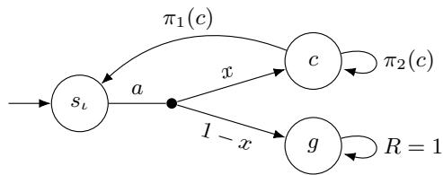

Fix the realization $\mathbf { \boldsymbol { u } } \in \mathcal { U }$ corresponding to x. The value of g is 2. Under $\pi _ { 1 }$ , reaching c gives one zero-reward step back to $s _ { \iota }$ . Hence

$$
V _ { \pmb { u } } ^ { \pi _ { 1 } } ( s _ { \iota } ) = \frac { 1 } { 2 } \left( x \frac { 1 } { 2 } V _ { \pmb { u } } ^ { \pi _ { 1 } } ( s _ { \iota } ) + ( 1 - x ) 2 \right) ,
$$

hence $\begin{array} { r } { V _ { \pmb { u } } ^ { \pi _ { 1 } } ( s _ { \iota } ) = \frac { 1 - x } { 1 - x / 4 } } \end{array}$ . Under $\pi _ { 2 } ,$ , the state c has value zero, so $V _ { u } ^ { \pi _ { 2 } } ( s _ { \iota } ) = 1 - x$ . Thus $\begin{array} { r } { V _ { \pmb { u } } ^ { \pi _ { 1 } } ( s _ { \iota } ) - V _ { \pmb { u } } ^ { \pi _ { 2 } } ( s _ { \iota } ) = \frac { x ( 1 - x ) } { 4 - x } } \end{array}$ . This diference is zero at $x = 0$ and $x = 1 ,$ , but positive between them. Its maximum over $[ 0 , 1 ]$ is attained at $x ^ { * } = 4 - 2 { \sqrt { 3 } }$ Substitution gives $\Delta _ { \cal { U } } ( \pi _ { 1 } , \pi _ { 2 } ) = 7 - 4 \sqrt { 3 } .$ . The square root appears because $\pi _ { 1 }$ can revisit the same uncertain choice, so its value is a rational function of x whose maximum lies inside the interval.

Nonrectangularity makes things harder. Without rect-angularity, coupling lets one parameter recur at difer- ent choices. Then comparison is even ∀R-complete $( \mathsf { A p } \cdot$ pendix B.5). To obtain hardness, we encode polynomial non-positivity and build an RMDP whose value at each realization equals a given polynomial. A monomial $p _ { i _ { 1 } } \cdots p _ { i _ { d } }$ becomes a chain of d uncertain choices that survives with probability equal to the monomial. A certain splitter is a state whose sole action draws among these monomial branches with fixed rational probabilities. On each branch, a terminal payof can- cels its certain splitter probability and discount, so the branch contributes its signed monomial. Comparing this polynomial evaluator with a policy that goes to a zero-reward sink de- cides whether a given polynomial $f$ is nonpositive at every point in the uncertainty domain (Appendix B.5).

Portfolio comparison. Portfolio comparison remains ∀R-com lete even under $( s , a )$ -rectangular uncertainty. The pointwise maximum maxπ∈Π $V _ { \pmb { u } } ^ { \pi }$ over the explicit portfo- lio, rather than parameter reuse or recurrence, supplies the real quantifier alternation (Section B.6).

## 3.3 Regret Certification

Certification asks whether a given policy or portfolio meets a target regret value.

Problem 1 (Robust-regret certification). Given an RMDP, a policy $\pi \in \Pi ^ { \mathrm { M R } } ;$ , and a threshold $t \in \mathbb { Q }$ , decide whether $\mathrm { R r e g } ( \pi ) \leq t .$

Problem 2 (Portfolio-regret certification). Given an RMDP, aportfolio ${ \dot { \mathrm { ~ I ~ } } } \subseteq \Pi ^ { \mathrm { M R } }$ , and a threshold $t \in \mathbb { Q } ,$ decide whether $\mathrm { R r e g } ( \Pi ) \leq t .$

We show ∀R-membership for both problems:

Theorem 1 (Membership). Regret certification is in ∀R.

The idea is to universally quantify the realization, an op- timal policy at that realization, and one Bellman system per portfolio member, comparing the optimal value against the best of them. See Appendix C.

From comparison to regret. The obstacle to transferring comparison lower bounds is that it fixes both policies. Regret measures a candidate against the best policy at the fixed realization. For a policy π and portfolio Π, write

$$
\Delta _ { \mathcal { U } } ( \pi , \Pi ) = \operatorname* { s u p } _ { \boldsymbol { u } \in \mathcal { U } } \left( V _ { \boldsymbol { u } } ^ { \pi } ( s _ { \iota } ) - \operatorname* { m a x } _ { \pi ^ { \prime } \in \Pi } V _ { \boldsymbol { u } } ^ { \pi ^ { \prime } } ( s _ { \iota } ) \right) .
$$

For a source RMDP N and reference policy $\pi _ { 0 } , ~ \widehat { N } ~ =$ $\mathrm { L i f t } ( N , \pi _ { 0 } )$ makes $\pi _ { 0 }$ optimal at every realization $( \mathsf { A p - }$ pendix D). Each source choice becomes a tag state that selects an action and a selector state that carries its transition uncer- tainty. For a source portfolio Π, let Πb be its image under Lift. Certification in $\widehat { N }$ then becomes comparison against $\pi _ { 0 } ,$ up to a known constant $\Lambda \colon { \mathrm { R r e g } } ( \widehat { \Pi } ) = \Lambda + \Delta _ { \mathcal { U } } ( \pi _ { 0 } , \Pi )$

Lower bounds. The following lower bounds combine com-parison hardness with the lift construction.

Theorem 2. Given-policy robust regret is coNP-hard and coSQRS-hard under $( s , a )$ -rectangular uncertainty. coNPhardness already holds when every uncertain choice is two-Dirac and the only other stochastic rows are certain uniform splitters.

Proofsketch. Apply Lift to $\mathrm { C m p } ( \varphi )$ and to the shared-cycle square-root-sum construction, respectively. The transforma- tion converts each comparison threshold by one known ad- ditive constant. See Appendix E.1. □

The pointwise maximum over members makes portfolio comparison ∀R-hard even when rectangularity removes the corresponding alternation for one acyclic policy pair. The transformation Lift transfers this hardness to certification:

Theorem 3. Portfolio-regret certification is ∀R-hard, already for deterministic portfolios and acyclic $( s , a ) .$ rectangular RMDPs with two-successor uncertain choices.

Proof sketch. Apply Lift to the portfolio-comparison con-struction in Section 3.2. See Appendix E.2. □

Theorem 4. Given-policy robust regret is ∀R-complete under general rational polytopic uncertainty, even for deterministic policies.

Proofsketch. Membership is the singleton-portfolio case of Theorem 1. For hardness, reduce from the ∀R-complete problem of deciding whether a polynomial is nonpositive throughout a bounded domain, introduced in Section 3.2. At each realization, we first force the given policy to take a zero-valued branch, while an optimal policy at that real- ization may choose either that branch or one evaluating a polynomial function. Up to the fixed initial discount, the re- gret is therefore the positive part of the polynomial’s value. Consequently, the policy has regret at most zero exactly when the polynomial is nonpositive. See Appendix E.3. □

## 3.4 Minimal Robust Regret & Bounded Synthesis

Certification fixes the candidate set whereas in the minimiza- tion and synthesis problems we need to choose it.

Problem 3 (Minimal robust regret). Given an RMDP and a threshold $t \in \mathbb { Q } ,$ decide whether in $\mathrm { f } _ { \pi \in \Pi ^ { \mathrm { M R } } } \operatorname { R r e g } ( \pi ) \leq t .$

Problem 4 (Bounded portfolio synthesis). Given an RMDP, a budget k encoded in unary, and a threshold $t \in \mathbb { Q }$ , decide whether $\rho _ { k } \leq t .$

Portfolio regret is monotone under inclusion, and $\mathrm { R r e g } ( \{ \pi \} ) = { \bar { \mathrm { R r e g } } } ( \pi )$ . Thus minimal robust regret is the special case of bounded portfolio synthesis with $\overset { \vartriangle } { \boldsymbol { k } } = 1$

Theorem 5 (Membership). Minimal robust regret and bounded portfolio synthesis belong to $\exists \forall \mathbb { R }$

For single-policy minimization, we existentially quantify the candidate policy table. For bounded synthesis, we quan- tify the $k$ portfolio tables. We then universally quantify the realization, an optimal policy at that realization, and the cor- responding Bellman systems. Since k is encoded in unary, both formulas have polynomial size. See Appendix C.

Restricting the synthesized policy. Synthesis chooses its candidate, so a reduction must keep the synthesized policy in the role assigned by its encoding, either naming a valuation or following the consistency policy, rather than letting it escape to an unintended lower-regret policy. The policy-restriction transformation Restrict makes disallowed actions so costly that minimizing over all policies comes within any rational $\varepsilon > 0$ of minimizing over the allowed policies (Appendix F).

## Combinatorial hardness under rectangular uncertainty.

Theorem 6. Minimal robust regret is NP-hard and coNPhard on $( s , a )$ )-rectangular RMDPs in which every uncertain choice is two-Dirac and the only other stochastic rows are certain uniform splitters.

Proofsketch. For coNP-hardness, lift $\mathrm { C m p } ( \varphi )$ with the clause policy as reference and restrict the synthesized pol- icy to the lifted consistency policy. The resulting threshold separates satisfiable from unsatisfiable formulas. For NPhardness, the fixed reference finds a falsified clause and the synthesized policy names a valuation whose local copies na- ture can audit. The most probable randomized choices still name a valuation with probability at least $2 ^ { - n }$ , which sup- plies the required gap. The transformations Lift and Restrict preserve both gaps. Both reductions retain independent two- Dirac choices. See Appendix F. □

Square-root-sum hardness under rectangular uncertainty. Beyond the combinatorial hardness, irrational re-gret values let us encode problems with signed sums of roots.

Theorem 7. Minimal robust regret is ${ \mathsf { S Q R S } } _ { \pm }$ -hard under (s, a)-rectangular uncertainty.

Proofsketch. The reduction uses local RMDPs in which the policy chooses a mixing probability x between two actions. For suitable rational $A , B , q > 0$ , its regret is

$$
\operatorname* { m a x } \left\{ { \frac { A ( 1 - x ) } { 1 - ( 1 - q ) x } } , { \frac { B x } { q + ( 1 - q ) x } } \right\} .
$$

As x increases the first term decreases while the second increases, so their maximum is minimized at an interior bal- ance point, producing a square root. Reward signs realize the two forms $D _ { b } - \sqrt { b }$ and $\sqrt { b } - C _ { b }$ . A certain uniform splitter adds the local minima, which realizes a signed sum. See Appendix H. □

Hardness under general polytopic uncertainty. Under general rational polytopic uncertainty, policy comparison re- duces to single-policy regret minimization.

Theorem 8. Single-policy minimal robust regret is ∀R-hard for arbitrary rational polytopic uncertainty.

Proof sketch. Reduce from the ∀R-complete general-polytope comparison problem described in Section 3.2. The construction leaves the synthesized policy one decision: a mixing probability x between forced copies of the two source policies. Two absorbing states of values $\pm Z$ anchor the branches so that only this mixing probability matters. They make its regret max $\{ ( 1 - x ) D , x \bar { E } \}$ , where E is a fixed positive rational and $D$ is an afine, strictly increasing function of the source comparison value $\Delta .$ . The minimizing policy balances the two terms, giving $D E / ( D + E )$ , again strictly increasing in $\Delta ,$ , so the comparison threshold transfers by a rational transformation. See Appendix I. □

Together with the upper bound above, this places single- policy minimal robust regret between ∀R-hardness and ∃∀R-membership under general rational polytopic uncertainty. The current bounds do not establish completeness.

Restricting the search to memoryless deterministic poli- cies on acyclic $( s , a )$ -rectangular RMDPs makes minimal robust regret $\Sigma _ { 2 } ^ { p }$ -complete (Appendix G). This is a diferent problem from Problem 3, which minimizes over $\Pi ^ { \mathrm { M R } }$ , and neither classification implies the other. In particular, the $\Sigma _ { 2 ^ { - } } ^ { p }$ hardness construction leaves the synthesized policy a free choice at every existential variable state, so a randomized policy may mix there and undercut every deterministic candi- date. The NP-hardness of Theorem 6 thus rests on a separate construction, whose $2 ^ { - n }$ gap randomization cannot close.

Algorithm 1: Experimental pipeline   
Input: RMDP M, parameter box ${ \overline { { D , } } }$ portfolio size   
$K ,$ and evaluation seeds   
Construct: split D into cells and compute an optimal   
midpoint policy for each cell;   
Robustly evaluate every candidate on every cell,   
giving one regret profile per policy;   
Cluster the profiles and select the policy nearest each   
of the K centers;   
Evaluate: for 3 seeded samples of $D ,$ estimate min   
regret in portfolio, maximized over samples;   
Deploy: treat members as bandit arms and run UCB   
in each fixed sampled environment;

Bounded portfolio synthesis. For bounded portfolios, the general upper bound is tight.

Theorem 9. Bounded portfolio synthesis is ∃∀R-complete under general rationalpolytopic uncertainty, with k encoded in unary. Hardness holds alreadyfor regret threshold two, the fixed discount $\begin{array} { r } { \gamma = \frac { 1 } { 2 } } \end{array}$ , RMDPs acyclic apart from absorbing final states, and uncertain choices with two successors.

Proofsketch. Membership is the encoding above. For hard-ness, normalize $\exists x \forall y \ : \ { F } ( x , y ) \ \geq \ 0$ into tests $g _ { i } ( x , \eta )$ afine in x, and use one portfolio member per test. A case distribution lets nature audit roles, witness agreement, and tests through fixed-reward polynomial evaluators. The regret threshold is met exactly when some x passes every test for every $\eta .$ See Appendix J. □

The equality ties couple choices at diferent state-action pairs, so the reduction does not settle the rectangular case. Under rectangular uncertainty, bounded synthesis is hard al- ready for the fixed budget $k = 1$

## 4 Portfolio Construction and Evaluation

We show that even a simple ofline pipeline yields portfo- lios with substantially lower empirical regret, despite the intractability of portfolio construction. To this end, we im- plemented the three-phase prototype summarized in Al- gorithm 1. Two research questions guide the experiments: whether portfolios reduce empirical robust regret as the bud- get grows (RQ1), and whether the best member can be identified online in a fixed but unknown environment (RQ2). All details on the benchmarks, experiment protocol, and results can be found in Appendix K.

Benchmarks. We introduce two new benchmarks: datacenter climate control and UAV control. The datacenter benchmark contains two uncertain parameters, cooling ef- fectiveness and ambient pressure, both ranging over a box domain. The rewards combine a per-action energy cost with penalties activating near the temperature, humidity, and queue ceilings, giving $\bar { V } _ { \mathrm { m a x } } = 2 0 8 0$ . The UAV benchmark is a planning problem through a three-dimensional grid un- der uncertain wind intensity $p$ and actuator-drop probability $q ,$ again over a box domain. Reaching the goal is the only rewarded event; thus, the value is the discounted landing probability, and $V _ { \mathrm { m a x } } ~ = ~ 1 0 0$ . We consider three diferent instances of this benchmark, uav-small, uav-medium, and $\mathtt { u a v - l a r g e }$ . Every grid position ofers seven actions, so even uav-small admits $\dot { 7 } ^ { 9 5 }$ memoryless deterministic policies, ruling out exhaustive search.

Portfolio construction. The benchmarks are nonrectan-gular RMDPs whose transition probabilities are afine in a parameter vector ranging over a box D. Hence, every valu-ation $\theta \in D$ induces a realization $\mathbf { \pmb { u } } \in { \mathcal { U } }$ . Discretizing each parameter into 10 bins gives a set $\mathcal { C }$ of 100 cells c for our two-parameter benchmarks, and the optimal policy at each cell midpoint mid(c) becomes a candidate $\pi \in \Pi ( { \bar { C } } )$ in the candidate set. Robust polic evaluation then assigns each candidate π a midpoint-based approximate regret vector $L _ { \pi }$ with one entry per cell: $L _ { \pi , c } = \dot { V } _ { \mathrm { m i d } ( c ) } ^ { * } ( s _ { \iota } ) - \operatorname* { i n f } _ { \theta \in c } V _ { \theta } ^ { \pi } ( s _ { \iota } )$ We then use K-means over these vectors to select the policy nearest each center, resulting in a set $\Pi _ { K } \subseteq \Pi ( { \mathcal { C } } )$ of poli- cies. Clustering is a computationally cheap approximation for obtaining portfolios of deterministic policies.

Portfolio evaluation. A uniform parameter sample $\widehat { D } \subset D$ with $| \widehat { D } | = 1 0 0 0$ is drawn to estimate portfolio regret by

$$
\widehat { \mathrm { R r e g } } _ { \widehat { D } } ( \Pi ) = \operatorname* { m a x } _ { \theta \in \widehat { D } } \Big ( V _ { \theta } ^ { \ast } \big ( s _ { \iota } \big ) - \operatorname* { m a x } _ { \pi \in \Pi } V _ { \theta } ^ { \pi } \big ( s _ { \iota } \big ) \Big ) ,
$$

which measures coverage without charging for online iden- tification and under-approximates the true regret, since it maximizes over finitely many samples (cf. Equation (1)). For deployment, UCB (Cesa-Bianchi and Lugosi 2006) treats portfolio members as bandit arms whose returns come from fixed-length trajectories in a fixed but unknown environment. We use it with error $\varepsilon ~ = ~ 0 . 0 0 1$ (as a fraction of the return bound), confidence $\delta = 0 . 1$ , and empirical-Bernstein bounds (Mnih, Szepesvári, and Audibert 2008) to speed up convergence. For the UCB-based deployment, we uniformly draw 30 valuations and run UCB once per valuation with a trajectory of length $H = 1 0 0$ sampled on each iteration. We plot, per iteration, the fraction of UCB runs where the final recommended arm is the best portfolio member and the diference between the best and recommended policy, normalized between 0 (best) and 1 (worst).

Setup. The Python prototype uses Stormvogel (Volk et al. 2026), robust value iteration (Iyengar 2005), and scikit-learn K-means. Experiments were run on a 2022 MacBook Pro M1 under macOS Tahoe 26.5.2, using 6 threads for robust policy evaluation, regret approximation, and UCB evaluation. All experiments are done for three diferent seeds. For the plots in Figure 2, we merged all 90 samples across the three seeds.

RQ1: Portfolios reduce robust regret. Table 2 shows empirical robust regret decreasing with K on every benchmark, with the largest single drop at $K = 2 ,$ , and further gains as K increases. The $K = 1$ row is a singleton rather than an adap- tive portfolio. Seed-level values and K-means inertia appear in Table 5 in Appendix K. For reference, the mini-max regret $\mathrm { m i n } _ { \pi \in \Pi ( C ) }$ maxc∈C $L _ { \pi , c }$ is 0.039, 0.118, 0.146, and 41.502 by column. Policy portfolios beat it for all K on the three largest benchmarks.

<table><tr><td>K</td><td>UAV-S UAV-M (98) (358)</td><td>UAV-L (1813)</td><td>datacenter (330)</td></tr><tr><td>1</td><td>0.053 0.091</td><td>0.126</td><td>14.28</td></tr><tr><td>2</td><td>0.032 0.019</td><td>0.017</td><td>3.86</td></tr><tr><td>3</td><td>0.018 0.010</td><td>0.016</td><td>2.82</td></tr><tr><td>5</td><td>0.002 0.003</td><td>0.015</td><td>2.79</td></tr><tr><td>7</td><td>0.002 0.003</td><td>0.008</td><td>1.79</td></tr><tr><td>10</td><td>0.002</td><td>0.003 0.003</td><td>0.80</td></tr><tr><td>Construction time</td><td>43.8s</td><td>384.1s 2357.8s</td><td>2732.7s</td></tr></table>

Table 2: Empirical robust regret, averaged over three seeds. Parentheses give the number of states. Bottom row indicates wall-clock time.

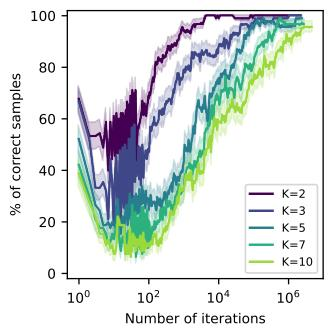

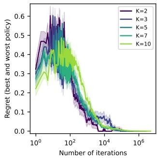  
(a) Runs with the correct arm (b) Regret of recommended arm. recommended.  
Figure 2: Reported UCB deployment results on the datacenter across all tested values of K.

RQ2: Portfolio members can be identified online. At each iteration of the UCB algorithm, we measure which arm was pulled (maximal UCB) and which arm was recommended (maximal LCB). Figure 2a gives the fraction of UCB runs recommending the best portfolio policy at each iteration. Identification slows as the portfolio grows: after $1 0 ^ { 4 }$ iterations, about half the runs recover the best member at $K = 1 0$ . Since this ignores how well the remaining members perform, Figure 2b instead reports the regret of the recom- mended policy relative to the best portfolio policy, and there the value diference after $1 0 ^ { 4 }$ iterations is minimal.

## 5 Conclusion

Adaptive policy portfolios sit between committing to a single robust policy and planning over a full belief state, ofering fi- nite and certifiable adaptation. Certification is ∀R-complete and bounded synthesis ∃∀R-complete under rational poly- topic uncertainty; certification stays hard under rectangular- ity, since the pointwise maximum over members reintroduces the quantifier alternation that rectangularity eliminates. Our prototype empirically shows portfolios whose regret falls sharply with the first few members, at an identification cost that grows with K. Bounded synthesis under rectangular uncertainty, and the gap between ∀R-hardness and ∃∀R-membership for single-policy minimal robust regret, remain open.

## References

Abate, A.; Badings, T.; Giacomo, G. D.; and Fabiano, F. 2026. Best-Efort Policies for Robust Markov Decision Pro- cesses. In AAAI, 36120–36128. AAAI Press.

Ahmed, A.; Varakantham, P.; Adulyasak, Y.; and Jaillet, P. 2013. Regret based Robust Solutions for Uncertain Markov Decision Processes. In NIPS, 881–889.

Allender, E.; Bürgisser, P.; Kjeldgaard-Pedersen, J.; and Miltersen, P. B. 2009. On the Complexity of Numerical Analysis. SIAM J. Comput., 38(5): 1987–2006.

Arora, S.; and Barak, B. 2009. Computational Complexity - A Modern Approach. Cambridge University Press.

Basu, S.; Pollack, R.; and Roy, M.-F. 2006. Algorithms in real algebraic geometry. Springer.

Benyamine, A.; Grand-Clément, J.; Petrik, M.; Jordan, M. I.; and Durmus, A. 2026. Dynamic Programming for Epis- temic Uncertainty in Markov Decision Processes. CoRR, abs/2602.03381.

Canny, J. F. 1988. Some Algebraic and Geometric Compu- tations in PSPACE. In STOC, 460–467. ACM.

Cesa-Bianchi, N.; and Lugosi, G. 2006. Prediction, learning, and games. Cambridge University Press. ISBN 978-0-521- 84108-5.

Chades, I.; Carwardine, J.; Martin, T. G.; Nicol, S.; Sabbadin, R.; and Bufet, O. 2012. MOMDPs: A Solution for Modelling Adaptive Management Problems. In AAAI, 267–273. AAAI Press.

Doshi-Velez, F.; and Konidaris, G. D. 2016. Hidden Param- eter Markov Decision Processes: A Semiparametric Regres- sion Approach for Discovering Latent Task Parametrizations. In IJCAI, 1432–1440. IJCAI/AAAI Press.

Ghavamzadeh, M.; Petrik, M.; and Chow, Y. 2016. Safe Policy Improvement by Minimizing Robust Baseline Regret. In NIPS, 2298–2306.

Guez, A.; Silver, D.; and Dayan, P. 2012. Eficient Bayes-Adaptive Reinforcement Learning using Sample- Based Search. In NIPS, 1034–1042.

Iyengar, G. N. 2005. Robust Dynamic Programming. Math. Oper. Res., 30(2): 257–280.

Junges, S.; Katoen, J.; Pérez, G. A.; and Winkler, T. 2021. The complexity of reachability in parametric Markov deci- sion processes. J. Comput. Syst. Sci., 119: 183–210.

Mnih, V.; Szepesvári, C.; and Audibert, J.-Y. 2008. Em- pirical Bernstein stopping. In Proceedings of the 25th International Conference on Machine Learning, ICML ’08, 672–679. New York, NY, USA: Association for Computing Machinery. ISBN 9781605582054.

Papadimitriou, C. H. 1994. Computational complexity. Addison-Wesley.

Puterman, M. L. 1994. Markov Decision Processes: Discrete Stochastic Dynamic Programming. Wiley Series in Probability and Statistics. Wiley.

Rigter, M.; Lacerda, B.; and Hawes, N. 2021. Minimax Re- gret Optimisation for Robust Planning in Uncertain Markov Decision Processes. In AAAI, 11930–11938. AAAI Press.

Schaefer, M.; and Stefankovic, D. 2024. Beyond the Exis- tential Theory of the Reals. Theory Comput. Syst., 68(2): 195–226.

Suilen, M.; Badings, T.; Bovy, E. M.; Parker, D.; and Jansen, N. 2024. Robust Markov Decision Processes: A Place Where AI and Formal Methods Meet. In Principles of Verification (3), volume 15262 of Lecture Notes in Computer Science, 126–154. Springer.

Suilen, M.; and Pérez, G. A. 2026. On the Complexity of Ro- bust Markov Decision Processes and Bisimulation Metrics. In CONCUR. To appear; arXiv:2604.26748.

Volk, M.; Heck, L.; Junges, S.; Katoen, J.; and Quatmann, T. 2026. Probabilistic Model Checking Taken by Storm: A Tutorial on the Probabilistic Model Checker Storm. In FM, volume 16557 of Lecture Notes in Computer Science, 524–549. Springer.

Wiesemann, W.; Kuhn, D.; and Rustem, B. 2013. Robust Markov Decision Processes. Math. Oper. Res., 38(1): 153– 183.

## Appendix Contents

A Conventions and primitives 10   
B On Policy and Portfolio Comparison 12   
C Proofs of Theorems 1 and 5: Membership for Certification and Synthesis 21   
D Exact Transfer from Policy Comparison to Robust Regret 21   
E Proofs of Theorems 2 to 4: Transferring Comparison Bounds to Certification 24   
F Proof of Theorem 6: Combinatorial Minimal-Regret Hardness 25   
G Deterministic Minimal-Regret Complexity 29   
H Proof of Theorem 7: Signed Square-Root-Sum Hardness 32   
I Proof of Theorem 8: General-Polytope Minimal-Regret Hardness 36   
J Proof of Theorem 9: Bounded Portfolio Synthesis 38   
K Experimental setup 44   
L Experimental data 48

## A Conventions and primitives

This a endix collects the conventions and buildin blocks that the later reductions share. Three rou s follow. First, two numerical conventions: a discount $\gamma _ { 0 }$ chosen so that the comparison-to-regret lift composes exactly, and one inequality about it that the normalized square-root gadget needs. Second, reduction primitives: how a state is given a prescribed value, how uncertainty enters a single choice, the two-Dirac gadgets by which nature encodes a Boolean assignment and a verifier reads it back, and ruinous-sink completion, which makes every choice we did not describe so costly that no policy gains by taking it. Third, encodings: a degree-four normal form that turns a polynomial constraint into small residuals, and the Bellman formulas behind the membership proofs. A reader may skip ahead and return here when a later construction cites one of these by name.

We first fix two conventions used throughout the appendix. Set

$$
\beta = \frac { 1 9 } { 2 0 } , \qquad \gamma _ { 0 } = \beta ^ { 2 } = \frac { 3 6 1 } { 4 0 0 } .
$$

The identity $\beta ^ { 2 } = \gamma _ { 0 }$ is needed by the exact comparison-to-regret lift, while

$$
\left( \frac { 1 + \gamma _ { 0 } + \gamma _ { 0 } ^ { 2 } } { 1 + \gamma _ { 0 } } \right) ^ { 2 } > 2
$$

is the numerical inequality used by the normalized square-root gadget. All appendix constructions use $\gamma _ { 0 }$ unless stated otherwise. The bounded-synthesis reduction uses $\begin{array} { r } { \gamma = \frac { 1 } { 2 } } \end{array}$ because it does not invoke the lift and hence does not require $\beta ^ { 2 } = \gamma _ { 0 }$

## A.1 Reduction primitives

A state is an absorbing final when every described action has a Dirac self-loop. A terminal with payof c is an absorbing final whose described action has reward $( 1 - \gamma ) c$ , so its value is exactly c. Every action not separately described at such a terminal is assi ned the same reward and Dirac self-loo . Reachin such a terminal after d transitions with robabilit w contributes $w \gamma ^ { d } c$ to the value at the initial state.

For a choice $( s , a )$ , call the distribution $\mathbf { \Omega } _ { \pmb { \mathscr { L } } } ( s , a , \cdot )$ its row; the choice is uncertain exactl when its row is not fixed. A selector is a state whose described action has a row carrying one uncertainty coordinate. A splitter is a state whose described action has a fixed row, inde endent of both the realization and the olic ; such a row is certain. A s litter is uniform when its row i uniform over its successors. We reserve ⊥ for an absorbing zero-reward sink, that is, the terminal with payof zero, and ⊥ for a ruinous sink.

Definition 3 (Local-bit verifier primitives). For an occurrence o and Boolean value $c _ { \mathrm { * } }$ a local-bit selector ${ { q } _ { o , c } }$ has outcomes $q _ { o , c } ^ { 0 } , q _ { o , c } ^ { 1 }$ and row

$$
\{ ( 1 - p ) \delta _ { q _ { o , c } ^ { 0 } } + p \delta _ { q _ { o , c } ^ { 1 } } : p \in [ 0 , 1 ] \} .\tag{2}
$$

Its vertices encode the bit $b _ { o , c } = p \in \{ 0 , 1 \}$ . A pair testfor an occurrence with designated satisfying value val(o) reads $q _ { o , \mathrm { v a l } ( o ) }$ and then $q _ { o , 1 - \mathrm { v a l } ( o ) }$ . Outcomes $( 1 , 0 )$ certify local truth and $( 0 , 1 )$ certify localfalsity. An audit committed to value c visits ${ { q } _ { o , c } }$ for the relevant occurrences in afixed order, advancing on outcome one and rejecting on outcome zero.

Lemma 10 (Acceptance-diference verifier). Suppose reference and candidate verifier paths are padded to depth H, all nonaccepting payofs are zero, and their accepting terminals have payofs $\gamma ^ { - H }$ and $- \gamma ^ { - \hat { H } }$ . Then their value diference is the sum oftheir acceptance probabilities.

Proof. Every accepting run contributes $\gamma ^ { H } \gamma ^ { - H } = 1$ to the corresponding signed value, while every rejecting run contributes zero. □

A construction’s ruinous-sink completion adds a fresh absorbing state $\perp _ { \mathrm { r } }$ and a rational $Z > 0$ . Every action at $\perp _ { \mathrm { r } }$ has reward $- ( 1 - \gamma ) Z$ and the singleton row $\{ \delta _ { \perp _ { \mathrm { r } } } \}$ , so $V ( \bot _ { \mathrm { r } } ) = - Z$ . Every otherwise undescribed choice at a nonterminal state has reward zero and the singleton row $\{ \delta _ { \perp _ { \mathrm { r } } } \}$ . Write $\begin{array} { r } { \dot { V } ^ { \mathrm { b d } ^ { \prime } } = \operatorname* { m a x } _ { s , a } | \dot { R ( s , a ) } | / ( 1 - \gamma ) } \end{array}$ for the standard bound on values, the maximum ranging over the choices described before completion. Unless stated otherwise, Z is fixed after those rewards, has polynomial encoding length, and satisfies $\gamma Z > V ^ { \mathrm { b d } } + 1$ . We invoke this convention by saying that the remaining choices use ruinous-sink completion. The added state is an absorbing final and all added rows are singletons, so the completion preserves acyclicity, rectangularity, and every two-successor or two-Dirac restriction on uncertain choices. Call a choice ruinous when its row is $\{ \bar { \delta } _ { \perp _ { \mathrm { r } } } \}$ and its reward is zero whether the com letion su lied it or a later transformation described it ex licitl . Call a policy compliant when it plays a nonruinous action at every state, and write π¯ for the policy obtained from π by conditioning on the nonruinous actions at every state, using an arbitrary nonruinous action where that conditioning has zero mass.

Lemma 11 (Ruinous dominance). Suppose $| V _ { u } ^ { \bar { \rho } } ( s ) | \leq M$ for every compliant policy $\bar { \rho } ,$ every state s other than $\perp _ { \mathrm { r } } ,$ , and every realization $u ,$ and suppose $\gamma Z > M + 1$ . Then $\dot { V _ { u } ^ { \pi } } ( s ) \le V _ { u } ^ { \bar { \pi } } ( s )$ for every stationary randomized policy π, every state, and every realization.

Proof. Both policies have value $- Z { \mathrm { ~ a t ~ } } \bot _ { \mathrm { r } } ,$ so fix any other state s. The action value of a nonruinous choice $( s , a )$ under $V _ { u } ^ { \bar { \pi } }$ is the value at s of the compliant policy that plays a once and follows π¯ afterwards, hence at least −M. A ruinous choice has action value $\gamma V ( \perp _ { \mathrm { r } } ) = - \bar { \gamma } Z < - M - 1 .$ , strictly smaller. Writing $T _ { \pi }$ for the Bellman operator of π at $u ,$ evaluating both policies at $V _ { u } ^ { \bar { \pi } }$ therefore gives $T _ { \pi } V _ { u } ^ { \bar { \pi } } \leq T _ { \bar { \pi } } V _ { u } ^ { \bar { \pi } } = \dot { V } _ { u } ^ { \bar { \pi } }$ , since π¯ redistributes $\pi ^ { \prime } s$ ruinous mass onto strictl larger action values. Monotonicity and contraction of $T _ { \pi }$ give $V _ { u } ^ { \pi } \leq V _ { u } ^ { \bar { \pi } }$ □

Under the default rule, $M = V ^ { \mathrm { b d } }$ by the standard bound on discounted values, so the hypothesis holds. A construction that fixes its own constant instead, such as $Z _ { \mathrm { r } }$ in Definition 19, exhibits a bound on its own compliant values and checks the inequality against that. Definition 12 is the exception: it chooses $Z _ { \varepsilon }$ to meet a quantitative requirement of its own and establishes dominance directly in the proof of Lemma 32. Value identities below are stated for compliant policies and hold as upper bounds in general by Lemma 11.

We use function-like notation for the four transformations that recur below. For a 3-CNF formula $\varphi$ on n variables, $\mathrm { C m p } ( \varphi )$ denotes the Boolean comparison RMDP of Definition $^ { 6 , }$ together with its clause and consistency policies and threshold $\begin{array} { r } { 2 { \bar { \bf \Delta } } - \frac { { \bar { \bf \Delta } } { \bar { \bf \Delta } } } { 2 n } . } \end{array}$ For a source RMDP N and reference policy $\pi _ { 0 } , \mathrm { L i f t } ( N , \pi _ { 0 } )$ denotes the exact re ret lift of Definition 10, with its allowed action family specified by context. $\mathrm { R e s t r i c t } ( N , A _ { \mathrm { a l l o w } } , \varepsilon )$ denotes the policy-restriction transformation of Definition 12. Finally, $\mathrm { R u i n } ( N , Z )$ denotes ruinous-sink completion of $N$ with constant $Z .$

All constructions below run in polynomial time, and all the rational constants above have polynomial encoding length. Ruinous-sink completion adds one state and $O ( | S | | A | )$ singleton rows, so it preserves polynomial size. We mention size bounds only where they are not immediate from the construction.

## A.2 Degree-Four Residual Normal Form

The bounded-domain equivalence of Schaefer and Stefankovic (2024, Proposition 2.13) and the degree-four normal form quoted in their proof of Lemma 2.8 allow bounded real sentences to use an explicitly represented rational polynomial of degree at most four over $[ 0 , 1 ] ^ { N }$ . Write such a polynomial as

$$
F ( w ) = \sum _ { \nu = 1 } ^ { N _ { \mathrm { m o n } } } c _ { \nu } \prod _ { j = 1 } ^ { d _ { \nu } } w _ { \nu , j } , \qquad d _ { \nu } \leq 4 , \qquad B = \operatorname* { m a x } \left\{ 1 , \sum _ { \nu = 1 } ^ { N _ { \mathrm { m o n } } } | c _ { \nu } | \right\} .
$$

Thus $| F | \le B$ on the box, and B has polynomial encoding length.

Definition 4 (Degree-four residual normal form). For every occurrence $w _ { \nu , j } ,$ introduce a copy $z _ { \nu , j } ~ \in ~ [ 0 , 1 ]$ and residual $h _ { \nu , j } ^ { \mathrm { c p } } = z _ { \nu , j } - w _ { \nu , j }$ . Compute each monomial with auxiliary coordinates in $[ 0 , \dot { 1 } ] .$

$f o r d _ { \nu } = 0 ,$ , set $p _ { \nu } = 1$ , and for $d _ { \nu } = 1 $ , set $p _ { \nu } = z _ { \nu , 1 } ,$

• for dν = 2, use $h _ { \nu } = p _ { \nu } - z _ { \nu , 1 } z _ { \nu , 2 } ;$

• for dν = 3, use tν − zν,1zν,2 and $p _ { \nu } - t _ { \nu } z _ { \nu , 3 } ;$

• for dν = 4, use tν,12 − zν,1zν,2, tν,34 − zν,3zν,4, and $p _ { \nu } - t _ { \nu , 1 2 } t _ { \nu , 3 4 }$

These copy and product residuals lie in $[ - 1 , 1 ]$ , are afine or afine plus one product ofdistinct variables, and have a common zero exactly at correct copies and products. The decoded polynomial is $\widehat { F } = \textstyle \sum _ { \nu } c _ { \nu } p _ { \nu }$ . When an explicit output is needed, introduce $\bar { o } \in [ 0 , 1 ] , p u t o = B ( 2 \bar { o } - 1 )$ , and append $h ^ { \mathrm { o u t } } = ( o - \widehat { F } ) / ( 2 B )$ ; this residual also lies in $[ - 1 , 1 ]$

Lemma 12 (Degree-four residual error). For any assignment to the inputs and auxiliary coordinates, let δ be the largest absolute copy or product residual. Then

$$
\begin{array} { r } { | p _ { \nu } - \prod _ { j } w _ { \nu , j } | \leq 7 \delta \quad \ a n d \quad | \widehat { F } - F | \leq 7 B \delta . } \end{array}
$$

If the output residual is present and $\delta ^ { \prime }$ also includes $| h ^ { \mathrm { o u t } } |$ , then $| o - F | \le 9 B \delta ^ { \prime }$

Proof. For $a , b , a ^ { \prime } , b ^ { \prime } \in [ 0 , 1 ] , | a b - a ^ { \prime } b ^ { \prime } | \leq | a - a ^ { \prime } | + | b - b ^ { \prime } | ,$ , because a $\ - \ a ^ { \prime } b ^ { \prime } = b ( a - a ^ { \prime } ) + a ^ { \prime } ( b - b ^ { \prime } )$ . The errors in degrees zero and one are zero and at most δ. For degree two the error is at most $\delta + \delta + \delta = 3 \delta$ . For degree three it is at most $\delta + 3 \delta + \delta = 5 \delta$ , and for de ree four it is at most $\delta + 3 \delta + 3 \delta = 7 \delta$ . Therefore $\begin{array} { r } { | \widehat { F } - F | \le 7 \delta \sum _ { \nu } | c _ { \nu } | \le 7 B \delta } \end{array}$ . With the output residual, $| o - \widehat { F } | = 2 B | h ^ { \mathrm { o u t } } | \leq 2 B \delta ^ { \prime }$ , and the triangle inequality gives the last claim. □

## A.3 Encoding primitives

For an uncertainty vector u, policy table $\sigma ,$ values $v _ { s }$ , and action values $q _ { s , a }$ , define

$$
\mathrm { B e l l } ( \sigma , u , v , q ) = \bigwedge _ { s } \left( v _ { s } = \sum _ { a } \sigma _ { s , a } q _ { s , a } \right) \wedge \bigwedge _ { s , a } \left( q _ { s , a } = R ( s , a ) + \gamma \sum _ { s ^ { \prime } } u ( s , a , s ^ { \prime } ) v _ { s ^ { \prime } } \right) .
$$

Let $\Phi _ { \mathcal { U } } ( { \boldsymbol { u } } )$ be the rational linear description of the uncertainty polytope, including nonnegativity and normalization, and let

$$
\mathrm { P o l i c y } ( \sigma ) = \bigwedge _ { s } \left( \sum _ { a } \sigma _ { s , a } = 1 \right) \wedge \bigwedge _ { s , a } \sigma _ { s , a } \geq 0 .
$$

Lemma 13 (Universal Bellman encoding). For an explicit family $\Pi = \{ \pi _ { 1 } , \ldots , \pi _ { r } \}$ and a universally quantified policy τ , the assertion

$$
V _ { u } ^ { \tau } ( s _ { \iota } ) - \operatorname* { m a x } _ { i \leq r } V _ { u } ^ { \pi _ { i } } ( s _ { \iota } ) \leq t \quad f o r e \nu e r y u \in \mathcal { U }
$$

has a polynomial-size universalformula over the reals. The policy τ may instead befixed, and prefixing an existential blockfor r valid policy tables gives an existential-universalformula when r is unary-bounded.

Proof. Use the universal implication

$$
\forall \tau , u , v ^ { \tau } , q ^ { \tau } , ( v ^ { i } , q ^ { i } ) _ { i = 1 } ^ { r } : \ \left( \mathrm { P o l i c y } ( \tau ) \wedge \Phi _ { u } ( u ) \wedge \mathrm { B e l l } ( \tau , u , v ^ { \tau } , q ^ { \tau } ) \wedge \bigwedge _ { i = 1 } ^ { r } \mathrm { B e l l } ( \pi _ { i } , u , v ^ { i } , q ^ { i } ) \right) \Longrightarrow \stackrel { \gamma } { \underset { i = 1 } { \overset { r } { \prod } } } ( v _ { s _ { i } } ^ { \tau } - v _ { s _ { i } } ^ { i } \leq t ) .
$$

Discountin makes each valid Bellman s stem uni ue. Invalid olic , realization, or Bellman assi nments falsif the antecedent. Fixing τ removes its policy variables, while existentially quantified family members require their simplex constraints outside the universal implication. Compactness of the policy simplexes and uncertainty polytope ensures that the relevant extrema are attained. □

## B On Policy and Portfolio Comparison

We collect the comparison problems and constructions used by the regret lower bounds.

## B.1 Comparison Preliminaries

Problem 5 (Robust policy comparison). Given an RMDP M, policies $\pi _ { 1 } , \pi _ { 2 } \in \Pi ^ { \mathrm { M R } }$ , and a rational threshold t, decide whether

$$
\Delta _ { \mathscr { U } } ( \pi _ { 1 } , \pi _ { 2 } ) = \operatorname* { s u p } _ { \pmb { u } \in \mathscr { U } } \bigl ( V _ { \pmb { u } } ^ { \pi _ { 1 } } ( s _ { \iota } ) - V _ { \pmb { u } } ^ { \pi _ { 2 } } ( s _ { \iota } ) \bigr ) \leq t .
$$

A choice $( s , a )$ is used by $\pi$ if s is reachable with positive probability under some realization and $\pi ( s , a ) > 0$ . It is shared by $\pi _ { 1 }$ and $\pi _ { 2 }$ if both use it. The set of shared choices is denoted $\mathrm { S h } ( \pi _ { 1 } , \pi _ { 2 } )$ . Call s absorbing under π when every choice used by $\pi$ at s has row $\{ \delta _ { s } \}$ . Let $G _ { \pi }$ contain $s \to s ^ { \prime }$ when a choice used by π at s can reach $s ^ { \prime }$ under some realization, except that the self-loop at a state absorbing under π is omitted. This exception matches the convention for RMDP acyclicity, which likewise permits self-loops only at absorbing final states. Self-loops at other states remain one-edge cycles. A used choice $( s , a )$ is cycle-free under π if s lies on no directed c cle of $G _ { \pi }$ . We write $\operatorname { C F } ( \pi )$ for these choices.

Definition 5 (Cycle-free on shared choices). The pair $( \pi _ { 1 } , \pi _ { 2 } )$ is cycle-free on shared choices $i f \mathrm { S h } ( \pi _ { 1 } , \pi _ { 2 } ) \subseteq \mathrm { C F } ( \pi _ { 1 } ) \cap \mathrm { C F } ( \pi _ { 2 } )$

$$
\pi _ { 1 } , \pi _ { 2 }
$$

$$
\in { \mathcal { U } } ,
$$

$$
( P )
$$

$$
D _ { \pi _ { 1 } , \pi _ { 2 } } ( \pmb { u } ) : = V _ { \pmb { u } } ^ { \pi _ { 1 } } ( s _ { \iota } ) - V _ { \pmb { u } } ^ { \pi _ { 2 } } ( s _ { \iota } )
$$

$$
\begin{array} { r } { \Delta _ { \mathcal { U } } ( \pi _ { 1 } , \pi _ { 2 } ) = \operatorname* { s u p } _ { { \pmb u } \in \mathcal { U } } D _ { \pi _ { 1 } , \pi _ { 2 } } ( \pmb u ) } \end{array}
$$

$$
( s , a )
$$

$$
P ,
$$

$$
\begin{array} { r } { \left( \mathcal { U } \right) : = \prod _ { s , a } { \mathrm { v e r t } } ( \mathcal { U } _ { s , a } ) } \end{array}
$$

Separated choices. If $\pi _ { 1 }$ and $\pi _ { 2 }$ share no uncertain choice, rectangularity lets nature optimize their used rows independently, so

$$
\Delta _ { { \mathcal U } } ( \pi _ { 1 } , \pi _ { 2 } ) = \operatorname* { s u p } _ { u _ { 1 } } V _ { u _ { 1 } } ^ { \pi _ { 1 } } ( s _ { \iota } ) - \operatorname* { i n f } _ { u _ { 2 } } V _ { u _ { 2 } } ^ { \pi _ { 2 } } ( s _ { \iota } ) .
$$

This is a direct consequence of the standard optimistic and robust fixed-policy linear programs and is computable in polynomial time (Iyengar 2005; Suilen and Pérez 2026).

## B.2 Combinatorial Hardness of Robust Policy Comparison

The reduction makes one local copy of every variable in every clause. One policy scans the clauses, and the other audits a uniformly selected variable against one valuation.

Theorem 14 (Shared-choice Boolean hardness). Robust policy comparison is coNP-hard even for deterministic policies in acyclic $( s , a )$ -rectangular RMDPs in which every uncertain choice is a two-Dirac segment and the only other stochastic row is a certain uniform splitter.

Fix a 3-CNF formula $\varphi = { \textstyle \bigwedge } _ { i = 1 } ^ { m } C _ { i }$ over variables $x _ { 1 } , \ldots , x _ { n }$ . We may remove tautological clauses, repeated literals, and variables with no occurrence; the constant case is decided directly, so assume $n \geq 1$ . For a literal occurrence $^ { O , }$ let var(o) be its variable, let $\mathrm { v a l } ( o ) \in \{ 0 , 1 \}$ be the value that makes its literal true, and order the occurrences $O _ { x }$ of each variable x by clause and then by position within the clause.

Definition (Clause-local encoding). For every occurrence o, introduce two local bits $b _ { o , 1 }$ 1 and $b _ { o , 0 }$ , indexed by the values they certify. The equation $b _ { o , c } = 1$ says that occurrence o is locally consistent with value c. Occurrence o is locall true when $b _ { o , \mathrm { v a l } ( o ) } = 1$ and $b _ { o , 1 - \mathrm { v a l } ( o ) } = 0$ . Write $\Phi _ { C }$ for the clause condition

$$
\Phi _ { C } : = \bigwedge _ { i = 1 } ^ { m } \left( \bigvee _ { o \in C _ { i } } \left( b _ { o , \mathrm { v a l } ( o ) } \wedge \neg b _ { o , \mathrm { 1 - v a l } ( o ) } \right) \right) .\tag{3}
$$

The local bits of diferent clauses are disjoint.

For every original variable x, introduce a global bit $X _ { x } .$ . For each variable write

$$
\Phi _ { K } ^ { x } : = \bigwedge _ { o \in O _ { x } } b _ { o , X _ { x } } , \qquad \Phi _ { K } : = \bigwedge _ { x } \Phi _ { K } ^ { x } .\tag{4}
$$

Lemma (Clause-local equivalence). Formula φ is satisfiable if its global and local bits have an assignment satisfying $\Phi _ { C } \wedge \Phi _ { K }$

Proof. If a valuation v satisfies φ, set $X _ { x } = v ( x )$ and set $b _ { o , c } = 1$ exactly when $c = v ( \mathrm { v a r } ( o ) )$ . Every $\Phi _ { K } ^ { x }$ holds. Every clause has an occurrence o with $\mathrm { v a l } ( o ) = v ( \mathrm { v a r } ( o ) )$ , so that occurrence has the locally true pattern and $\Phi _ { C }$ holds.

Conversely, suppose $\Phi _ { C } \wedge \Phi _ { K }$ holds and define $v ( x ) : = X _ { x }$ . Each clause has a locally true occurrence o with $b _ { o , 1 - \mathrm { v a l } ( o ) } = 0$ Since $\Phi _ { K } ^ { \mathrm { v a r } ( o ) }$ forces $b _ { o , X _ { \mathrm { v a r } ( o ) } } = 1$ , we have $X _ { \mathrm { v a r } ( o ) } ~ = ~ \mathrm { v a l } ( o )$ . Thus the literal at o is true under $v ,$ and every clause is satisfied. □

$\Phi _ { K }$ does not force an occurrence’s two bits to be complementary. The pair test is part of $\Phi _ { C }$

Example (A clause-local encoding). Consider

$$
\varphi = ( x _ { 1 } \vee \neg x _ { 2 } \vee x _ { 3 } ) \wedge ( \neg x _ { 1 } \vee x _ { 2 } \vee x _ { 3 } ) .
$$

Take the valuation:

$$
x _ { 1 } = x _ { 2 } = 1 , x _ { 3 } = 0 ,
$$

so

$$
X _ { x _ { 1 } } = X _ { x _ { 2 } } = 1 a n d X _ { x _ { 3 } } = 0 .
$$

Following the encoding in the proof above, set $b _ { o , c } = 1$ exactly when $c = X _ { \operatorname { v a r } ( o ) } ,$ , for every occurrence o.

<table><tr><td>Clause</td><td>literal</td><td>var(o)</td><td>val(o)</td><td> $X _ { \mathrm { v a r } ( o ) }$ </td><td> $\left( \boldsymbol { b } _ { o , 1 } , \boldsymbol { b } _ { o , 0 } \right)$ </td><td>locally true?</td></tr><tr><td rowspan="3"> $C _ { 1 }$ </td><td> $x _ { 1 }$ </td><td>x1</td><td>1</td><td>1</td><td>(1,0)</td><td>yes</td></tr><tr><td> $\neg x _ { 2 }$ </td><td>x2</td><td>0</td><td>1</td><td>(1,0)</td><td>no</td></tr><tr><td> $x _ { 3 }$ </td><td>x3</td><td>1</td><td>0</td><td>(0,1)</td><td>no</td></tr><tr><td rowspan="3"> $C _ { 2 }$ </td><td> $\neg x _ { 1 }$ </td><td>x1</td><td>0</td><td>1</td><td>(1,0)</td><td>no</td></tr><tr><td> $x _ { 2 }$ </td><td>x2</td><td>1</td><td>1</td><td>(1,0)</td><td>yes</td></tr><tr><td> $x _ { 3 }$ </td><td>x3</td><td>1</td><td>0</td><td>(0, 1)</td><td>no</td></tr></table>

A literal is locally true exactly when $b _ { o , \mathrm { v a l } ( o ) } = 1 _ { \mathrm { : } }$ , i.e., when va $. ( o ) = X _ { \operatorname { v a r } ( o ) } .$ : this holds for $x _ { 1 }$ in $C _ { 1 }$ and $x _ { 2 }$ in $C _ { 2 }$ , matching the fact that these are the literals true under the valuation. Using the labels $O _ { 1 } , \ldots , O _ { 6 }$ , the clause and consistency conditions instantiate to

$$
\Phi _ { C } = \left[ \left( b _ { o _ { 1 } , 1 } \wedge - b _ { o _ { 1 } , 0 } \right) \vee \left( b _ { o _ { 2 } , 0 } \wedge - b _ { o _ { 2 } , 1 } \right) \vee \left( b _ { o _ { 3 } , 1 } \wedge - b _ { o _ { 3 } , 0 } \right) \right] \wedge \left[ \left( b _ { o _ { 4 } , 0 } \wedge - b _ { o _ { 4 } , 1 } \right) \vee \left( b _ { o _ { 5 } , 1 } \wedge - b _ { o _ { 5 } , 0 } \right) \vee \left( b _ { o _ { 6 } , 1 } \wedge - b _ { o _ { 6 } , 0 } \right) \right] ,
$$

$$
\Phi _ { K } ^ { x _ { 1 } } = b _ { o _ { 1 } , 1 } \wedge b _ { o _ { 4 } , 1 } , \qquad \Phi _ { K } ^ { x _ { 2 } } = b _ { o _ { 2 } , 1 } \wedge b _ { o _ { 5 } , 1 } , \qquad \Phi _ { K } ^ { x _ { 3 } } = b _ { o _ { 3 } , 0 } \wedge b _ { o _ { 6 } , 0 } , \qquad \Phi _ { K } = \Phi _ { K } ^ { x _ { 1 } } \wedge \Phi _ { K } ^ { x _ { 2 } } \wedge \Phi _ { K } ^ { x _ { 3 } } .
$$

Substituting the values from the table: in $\Phi _ { C } \mathbf { \ ' } _ { s }$ first bracket, o1 gives $( 1 \land 1 ) = 1$ while $o _ { 2 } , o _ { 3 } \ g i \nu e \ 0 ,$ so the bracket is 1; in the second, o5 gives $( 1 \land \dot { 1 } ) = 1$ while $O _ { 4 } , O _ { 6 }$ give 0, so that bracket is also 1; hence $\Phi _ { C } = 1$ . Each $\Phi _ { K } ^ { x }$ is a conjunction of two matching bits $( e . g . \Phi _ { K } ^ { x _ { 1 } } = 1 \wedge 1 = 1 )$ , so $\Phi _ { K } = 1$ as well.

The reduction realizes $\Phi _ { C }$ as a clause scan and each $\Phi _ { K } ^ { x }$ as one audit branch in the same RMDP. Nature selects the global and local bits. The two paths share every local-bit choice, so they evaluate the same assignment.

Definition 6 (Boolean comparison RMDP). For a 3-CNF formula $\varphi = { \textstyle \bigwedge } _ { i = 1 } ^ { m } C _ { i }$ over variables $x _ { 1 } , \ldots , x _ { n }$ with $n \geq 1$ , no tautological clause, no repeated literal within a clause, and no variable absent from every clause, the Boolean comparison RMDP is $M _ { \varphi } = ( S , A , \mathcal { U } , R , s _ { \iota } , \gamma _ { 0 } )$ , with thefollowing components.

• S is the disjoint union of the following groups.

– The initial state $s _ { \iota } .$

– Clause-scan states: a control state $f _ { i , j }$ for each literal occurrence $o = ( i , j )$ , together with the terminals acc and $\mathrm { r e j } _ { C } .$

– Audit states: global selectors qX with outcomes $q _ { X _ { x } } ^ { 0 } , q _ { X _ { x } } ^ { 1 }$ , controls $k _ { x , c , \ell }$ that inspect the ℓth occurrence of x after committing to $c \in \{ 0 , 1 \}$ , together with the terminals accK and $\mathrm { r e j } _ { K }$

– Shared local-bit selectors:for each occurrence o and $c \in \{ 0 , 1 \}$ , the selector ofDefinition 3, used by both policies.

– Padding states $S _ { \mathrm { p a d } }$ , reward-free,fixed once the transitions below are defined.

– A ruinous sink $\perp _ { \mathrm { r } } .$

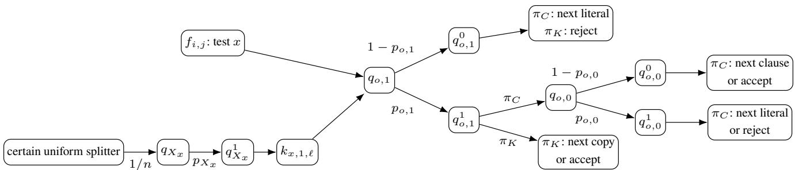  
Figure 3: The shared fragment for a positive occurrence $o = ( i , j )$ and the audit branch $X _ { x } = 1$ . The clause scan tests the pair $\left( \boldsymbol { b } _ { o , 1 } , \boldsymbol { b } _ { o , 0 } \right)$ , whereas this audit branch needs only $b _ { o , 1 }$ . The branch $X _ { x } = 0$ analo ousl audits ${ { q } _ { o , 0 } }$ . Selector arrows are uncertain; arrows from outcome states are the certain, role-specific actions of the two policies.

• At $\boldsymbol { s } _ { t } ,$ , action $a _ { C }$ enters $f _ { 1 , 1 } ,$ , whereas action $a _ { K }$ has the fixed uniform transition to $q _ { X _ { x } } , x \in \{ x _ { 1 } , \ldots , x _ { n } \}$ . Every selector has one action. Outcome $q _ { X _ { x } } ^ { c }$ leads to $k _ { x , c , 1 }$ , each $f _ { i , j }$ leads to the first local selector for its occurrence, and each $k _ { x , c , \ell }$ leads to the corresponding ${ q _ { o , c } } .$ . From a shared outcome $q _ { o , c } ^ { b } ,$ , the clause-scan action and audit action have their respective deterministic continuations, ending in ac $\mathrm { c }_ { C } / \mathrm { r e j } _ { C }$ or acc $\kappa / \mathrm { r e j } _ { K }$ as described below. All other control states have the indicated unique deterministic continuation. Fix H at least as long as the longest ofthese paths. $S _ { \mathrm { p a d } }$ consists offresh states inserted along every shorter path so it also reaches its terminal after exactly H transitions, each with a single reward-free action continuing toward that terminal. This common depth is necessary because a shared accepting terminal can be reached at realization-dependent depths, so one terminal payof cannot otherwise cancel every discount factor.

• U is the product of the two-Dirac segments in Equation (2), one for every global bit $X _ { x }$ and local bit $( o , c )$ . All remaining described choices are singletons, including the certain uniform splitter at $\boldsymbol { s } _ { \iota }$ . Its vertices are exactly the Boolean realizations $p _ { z } \in \{ 0 , 1 \}$ .

• acc is the terminal with payof $\gamma _ { 0 } ^ { - H }$ and acc the terminal with $p a y o f f - \gamma _ { 0 } ^ { - H }$ , while every other described reward, including at $\mathrm { r e j } _ { C } , \mathrm { r e j } _ { K }$ and at padding states, is zero.

• All remaining choices use ruinous-sink completion.

• The initial state is $\boldsymbol { s } _ { \iota }$ and the discount is γ0.

Fix a realization $u \in \mathcal { U }$ and a stationary policy $\pi .$ Since π prescribes one action at every state and u fixes one outcome at every two-Dirac selector, the only randomness left in π’s run under u comes from any fixed-probability transitions π itself uses, such as the certain uniform splitter. Because the graph is acyclic and S is finite, this run reaches a terminal with probability one. Say π accepts under u with probability equal to the chance of reaching an accepting terminal; $\mathrm { i f } \ \pi$ never uses such a transition – as is the case for $\pi _ { C } -$ this probability is always 0 or 1, and we speak of π accepting or rejecting outright.

The clause policy. Policy $\pi _ { C }$ processes clauses and their literals in order. At occurrence $o = ( i , j )$ , it uses the pair test of Definition $^ { 3 , }$ accepting the locally true outcome pair. A true literal advances to the next clause, a false literal advances to the next literal, and an entirely false clause rejects. Satisfying the last clause accepts. Thus $\pi _ { C }$ checks exactly $\Phi _ { C }$

The consistency policy. Policy $\pi _ { K }$ first takes the certain uniform splitter, which selects a variable x. It reads $X _ { x }$ and thereby commits to $c \in \{ 0 , 1 \}$ . It then uses the audit chain of Definition 3 over $O _ { x }$ in clause-major order. Conditioned on the certain uniform splitter selecting x, $\pi _ { K }$ therefore checks exactly $\Phi _ { K } ^ { x }$

Lemma (Unambiguous prescriptions). Both policies above are stationary deterministic policies.

Proof. The clause scan encounters each $f _ { i , j }$ once and reaches the two selectors of an occurrence in the fixed order prescribed above. An audit branch commits at $q _ { X _ { a } } ^ { c }$ before reaching any $k _ { x , c , \ell }$ . Thus each policy prescribes a single continuation at every outcome state it can reach. At a shared outcome $q _ { o , c } ^ { b } ,$ the two roles use distinct actions, so their continuations need not agree. Complete each policy at its unreachable states with a fixed default action, using ruinous-sink completion when no role action was described there. □

By Lemma 10, their value diference is the sum of their acceptance probabilities.

The shared fragment for a positive occurrence is shown in Figure 3. The audit path shown is the branch that committed to $X _ { x } = 1$

Lemma (Policy semantics). At a vertex u of the uncertainty polytope, $\pi _ { C }$ accepts under u exactly when $\Phi _ { C }$ holds under u. Conditioned on the certain uniform splitter selecting x, πK accepts under u exactly when $\Phi _ { K } ^ { x }$ holds under u; unconditionally, this makes $\pi _ { K } \dot { s }$ probability of accepting under u equal $t o \ { \frac { 1 } { n } } | \{ x : \Phi _ { K } ^ { x }$ holds under $\mathbf { \delta } _ { \mathbf { \pmb { u } } } \}$ |, the fraction of variables whose audit would pass. Moreover,

$$
D _ { \pi _ { C } , \pi _ { K } } ( \pmb { u } ) = \mathbf { 1 } _ { \left\{ \pi _ { C } ~ a c c e p t s ~ u n d e r ~ \pmb { u } \right\} } + \mathrm { P r } [ \pi _ { K } ~ a c c e p t s ~ u n d e r ~ \pmb { u } ] .
$$

Proof. At a vertex, each transition in (2) selects one Boolean value. The clause path implements (3), and the audit branch for x implements its conjunct in (4). Padding places every final state at depth H, so the accepting rewards contribute 1 and −1 to the two policy values. The certain uniform splitter averages the audit contribution over the n variables, and rejecting paths contribute zero. □

Example. For the satisfying assignment in the encoding table, πC confirms $x _ { 1 }$ in $C _ { 1 }$ and $x _ { 2 }$ in $C _ { 2 }$ , and every variable audit passes, giving diference 2. Now take the unsatisfying valuation $x _ { 1 } = 0 , x _ { 2 } = 1 , x _ { 3 } = 0$ and its canonical local pairs. The clause scan rejects $C _ { 1 }$ , although every audit passes. If only the copy of $x _ { 1 }$ in $C _ { 1 }$ is changed from (0, 1) to (1, 0), the clause scan accepts, but the $x _ { 1 }$ audit, committed to 0, reads $b _ { o , 0 } = 0$ and rejects. The malformed pairs (0, 0) and (1, 1) cannot make a literal locally true because the clause scan tests both bits.

Lemma 15. There is a vertex under which πC accepts and every variable audit passes ifand only $i f \varphi$ is satisfiable.

Proof. This is the clause-local equivalence, together with the policy semantics established above.

□

The uncertain choices are inde endent line se ments between two Dirac distributions. Hence the RMDP is $( s , a )$ -rectangular and every uncertain choice is two-Dirac. The only other stochastic row is the certain uniform splitter. After deleting terminal self-loops, the full transition graph is a DAG: after the initial state, order the global-selector blocks first, then the occurrence blocks in clause-major order, placing within each occurrence the selector for val(o) before the other selector, and finally the padding and terminal states. Every control and outcome state can be placed immediately before or after its associated selector. In particular, no run under either policy uses the same uncertain choice twice, and every terminal that both policies reach is absorbin under each of them so ever shared choice is c cle-free under both olicies in the sense of Definition 5. B Lemma 17 $\pi _ { C }$ and $\pi _ { K } { \bf \ ' } _ { \bf S }$ value diference attains its maximum at a tuple of choice vertices. By this and the two lemmas above,

$$
\varphi \in \mathrm { S A T } \Longrightarrow \Delta _ { \cal U } ( \pi _ { \cal C } , \pi _ { \cal K } ) = 2 ,
$$

$$
\varphi \in { \mathrm { U N S A T } } \Longrightarrow \Delta _ { { \boldsymbol { u } } } ( \pi _ { C } , \pi _ { K } ) \leq 2 - { \frac { 1 } { n } } .
$$

In the first case, nature chooses the canonical vertex of a satisfying valuation. In the second, a vertex satisfying $\Phi _ { C }$ has at least one failin variable audit b Lemma 15, and therefore has diference at most $1 + ( n - 1 ) / n ;$ a vertex violating $\Phi _ { C }$ has diference at most 1. Vertex suficiency shows that an interior realization cannot do better.

ProofofTheorem 14. Use threshold $\textstyle 2 - { \frac { 1 } { 2 n } }$ . The construction satisfies

$$
\varphi \in { \mathrm { U N S A T } } \iff \Delta _ { \mathcal { U } } ( \pi _ { C } , \pi _ { K } ) \leq 2 - \frac { 1 } { 2 n } .
$$

Indeed,

$$
2 - \frac { 1 } { n } < 2 - \frac { 1 } { 2 n } < 2 .
$$

The construction has polynomial size, $\gamma _ { 0 } ^ { - H } = ( 4 0 0 / 3 6 1 ) ^ { H }$ has $O ( H )$ bits, and all uncertain choices are independent two-Dirac choices. This is a polynomial reduction from UNSAT. □

## B.3 Vertex-Extremal Membership

Theorem 16 (Vertex-extremal membership). Robust policy comparison is in coNP for $( s , a )$ -rectangular polytopes when both policies are cycle-free on shared choices (Definition 5).

Definition 7 (Vertex-extremal pair). The pair $( \pi _ { 1 } , \pi _ { 2 } )$ is vertex-extremal $i f$

$$
\operatorname* { s u p } _ { { \pmb u } \in \mathcal { U } } D _ { \pi _ { 1 } , \pi _ { 2 } } ( { \pmb u } ) = \operatorname* { m a x } _ { { \pmb v } \in \mathrm { V e r t } ( \mathcal { U } ) } D _ { \pi _ { 1 } , \pi _ { 2 } } ( { \pmb v } ) .
$$

Lemma 17 (Cycle-freeness on shared choices implies vertex-extremality). $I f \left( \pi _ { 1 } , \pi _ { 2 } \right)$ is cycle-free on shared choices $( D e f i n i -$ tion 5), then it is vertex-extremal (Definition 7).

The main-body example Example 1 shows why the hypothesis is necessary: one shared choice on a policy cycle can create an irrational interior maximum, so endpoint evaluation is no longer sound. We use two standard facts. A separately afine function on a product of polytopes is extremized at a tuple of vertices by optimizing one block at a time. A finite linear-fractional function on a polytope is extremized at a vertex because its value on a segment lies between its endpoint values.

ProofofLemma 17. Fix a single block $\mathcal { U } _ { s _ { 0 } , a _ { 0 } }$ , hold every other block fixed, and consider two cases according to whether $( s _ { 0 } , a _ { 0 } ) \in \mathrm { S h } ( \pi _ { 1 } , \pi _ { 2 } )$ . Then iterate over the blocks.

$( s _ { 0 } , a _ { 0 } ) \not \in \mathrm { S h } ( \pi _ { 1 } , \pi _ { 2 } )$ , say only $\pi _ { 1 }$ uses it. Then $V _ { \pmb { u } } ^ { \pi _ { 2 } } ( s _ { t } )$ is constant in this block, and $D _ { \pi _ { 1 } , \pi _ { 2 } }$ difers from $V _ { \pmb { u } } ^ { \pi _ { 1 } } ( s _ { \iota } )$ by a constant. By Cramer’s rule applied to the one equation of $\pi _ { 1 } \mathrm { ^ { * } s }$ Bellman system that this block enters, $V _ { \pmb { u } } ^ { \pi _ { 1 } }$ is linear-fractional in this block, a ratio of two functions each afine in it regardless of cycles elsewhere in the graph, so the standard fact above makes it, and hence $D _ { \pi _ { 1 } , \pi _ { 2 } }$ , extremal at a vertex.

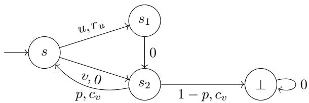  
Figure 4: The shared-cycle gadget realizing one normalized square-root term.

$( s _ { 0 } , a _ { 0 } ) \in \mathrm { S h } ( \pi _ { 1 } , \pi _ { 2 } )$ (hence, by hypothesis, cycle-free under both $\pi _ { 1 }$ and $\pi _ { 2 } )$ . If $s _ { 0 }$ is absorbing under one of the two policies, then that policy uses $( s _ { 0 } , a _ { 0 } )$ and the choice has row $\{ \delta _ { s _ { 0 } } \}$ , so the block is the singleton $\{ \delta _ { s _ { 0 } } \}$ and $D _ { \pi _ { 1 } , \pi _ { 2 } }$ is constant in it. Otherwise no self-loop was omitted at $s _ { 0 } ,$ so cycle-freeness is the literal graph condition. Under either policy, a run then uses the choice $( s _ { 0 } , a _ { 0 } )$ at most once. The probability of reaching $s _ { 0 }$ is independent of its outgoing row, and the continuation value after leaving $s _ { 0 }$ cannot depend on that row because the run never returns. Conditioning on reaching and selecting $( s _ { 0 } , a _ { 0 } )$ therefore makes each policy value afine in the free block. Their diference is afine as well and i extremized at a vertex.

Every block falls under one of the two cases, so $D _ { \pi _ { 1 } , \pi _ { 2 } }$ is extremal at a vertex in every block, giving vertex-tuple extremality.

ProofofTheorem 16. By Lemma 17, the pair is vertex-extremal. For the strict complement, guess a vertex tuple v with $D _ { \pi _ { 1 } , \pi _ { 2 } } ( \pmb { v } ) > t .$ . Such a tuple has polynomial encoding length because each component vertex solves a full-rank subsystem of tight rational constraints. The verifier checks $v \in { \mathcal { U } } ,$ solves the two rational Bellman systems, and compares their initial values in ol nomial time. Thus the com lement is in NP. □

## B.4 Shared Cycles and Square-Root-Sum Hardness

Theorem 18 (Shared-cycle algebraic hardness). Robust policy comparison is coSQRS-hardfor deterministic policies on $( s , a ) .$ rectangular RMDPs in which every uncertain choice is two-Dirac and the only other stochastic rows are certain uniform splitters.

We construct a gadget with a shared choice on a cycle, which creates one normalized square-root term. An exact derivative calculation locates its interior maximum, and a certain splitter combines independently chosen local maxima into the target sum of square roots. The delicate point is sign control at the critical point. All choices stay $( s , a )$ -rectangular and use the appendix-wide discount $\gamma _ { 0 }$ required by the exact lift.

Fix

$$
b \geq 2 , \qquad m = \lceil { \sqrt { b } } \rceil .
$$

We round ${ \sqrt { b } } \mathbf { u p }$ to the nearest integer $m ,$ , so that $b \leq m ^ { 2 }$ (needed below), while m stays close enough to $\sqrt { b }$ for the final identity to come out exactly right. The local gadget in Figure 4 has entry state $s ,$ intermediate states $s _ { 1 } , s _ { 2 }$ , and a zero-reward sink. Policy $\pi _ { u }$ chooses u at s and moves to $s _ { 1 }$ with reward $r _ { u } .$ . Policy $\pi _ { v }$ chooses v and moves to $s _ { 2 }$ directly, with reward zero. The forced edge $s _ { 1 } \to s _ { 2 }$ has reward zero: its only purpose is to give $\pi _ { u }$ one extra step before reaching $s _ { 2 } .$ , so that its eventual return to s is discounted one extra factor of $\gamma _ { 0 }$ compared to $\pi _ { v } \mathrm { ^ { * } s . }$ This asymmetry in cycle length is essential: without it, $Q _ { u } - Q _ { \ i }$ below would be a ratio of two afine functions, which is monotone and has no interior maximum. The same mechanism appears in Example 1, where one policy closes the cycle and the other exits immediately. $\mathrm { A t } \ s _ { 2 } ,$ the unique shared uncertain choice returns to s with probability $p$ and enters the sink with probability $1 - p ,$ , paying reward $c _ { v }$ either way. Our goal is to choose $U , V , c _ { v } , r _ { u }$ so that $\begin{array} { r } { \operatorname* { s u p } _ { p \in [ 0 , 1 ] } \bigl ( Q _ { u } ( p ) - Q _ { v } ( p ) \bigr ) } \end{array}$  takes the form $C _ { b } - \sqrt { b }$ , for a constant $C _ { b }$ depending only on b. Lemma 19 establishes this. Set

$$
\begin{array} { c } { { U = \displaystyle \frac { m ( 1 - \gamma _ { 0 } ) } { 2 \gamma _ { 0 } } , } } \\ { { V = \displaystyle \frac { b ( 1 - \gamma _ { 0 } ) } { 2 m } , } } \\ { { c _ { v } = \displaystyle \frac { V } { \gamma _ { 0 } } , } } \\ { { r _ { u } = U - \gamma _ { 0 } V = \displaystyle \frac { ( 1 - \gamma _ { 0 } ) ( m ^ { 2 } - \gamma _ { 0 } ^ { 2 } b ) } { 2 \gamma _ { 0 } m } . } } \end{array}
$$

All constants are nonnegative: $U , V , c _ { v } \ > \ 0$ , while $m ^ { 2 } \ge b > \gamma _ { 0 } ^ { 2 } b$ gives $r _ { u } ~ > ~ 0$ . The Bellman equations give, writing $Q _ { i } ( p ) : = V _ { u } ^ { \pi _ { i } } ( s )$ for the value of $\pi _ { i }$ at the entry state as a function of the shared return probability $p ,$

$$
Q _ { u } ( p ) = r _ { u } + \gamma _ { 0 } ^ { 2 } c _ { v } + \gamma _ { 0 } ^ { 3 } p Q _ { u } ( p ) = \frac { U } { 1 - \gamma _ { 0 } ^ { 3 } p } ,
$$

$$
Q _ { v } ( p ) = \gamma _ { 0 } c _ { v } + \gamma _ { 0 } ^ { 2 } p Q _ { v } ( p ) = \frac { V } { 1 - \gamma _ { 0 } ^ { 2 } p } .
$$

Lemma 19 (Rational-fraction maximum). With the constants above,

$$
\operatorname* { s u p } _ { p \in [ 0 , 1 ] } \bigl ( Q _ { u } ( p ) - Q _ { v } ( p ) \bigr ) = C _ { b } - \sqrt { b } , \qquad C _ { b } = \frac { m } { 2 \gamma _ { 0 } } + \frac { \gamma _ { 0 } b } { 2 m } .
$$

Proof. Put $x = 1 - \gamma _ { 0 } ^ { 2 } p$ . Then $x \in [ 1 - \gamma _ { 0 } ^ { 2 } , 1 ]$ and

$$
f ( x ) = \frac { U } { 1 - \gamma _ { 0 } + \gamma _ { 0 } x } - \frac { V } { x } .
$$

After multiplying by the positive denominators, the sign of $f ^ { \prime } ( x )$ is the sign of

$$
\sqrt { V } ( 1 - \gamma _ { 0 } + \gamma _ { 0 } x ) - \sqrt { \gamma _ { 0 } U } x .
$$

Since $V \leq \gamma _ { 0 } U ,$ , the afine sign factor has negative slope. It is positive before its unique zero and negative after it, so the zero is a maximum. It lies in the interval provided

$$
V \leq \gamma _ { 0 } U \quad \mathrm { a n d } \quad \gamma _ { 0 } U \leq h _ { \gamma _ { 0 } } ^ { 2 } V , \qquad h _ { \gamma _ { 0 } } = \frac { 1 - \gamma _ { 0 } ^ { 3 } } { 1 - \gamma _ { 0 } ^ { 2 } } = \frac { 4 3 4 7 2 1 } { 3 0 4 4 0 0 } .
$$

The first inequality is $b \leq m ^ { 2 }$ . The second follows from $m ^ { 2 } / b \leq 2$ and the exact rational comparison $h _ { \gamma _ { 0 } } ^ { 2 } > 2$ . At the critical point, direct substitution yields

$$
\operatorname* { m a x } f = { \frac { ( { \sqrt { U } } - { \sqrt { \gamma _ { 0 } V } } ) ^ { 2 } } { 1 - \gamma _ { 0 } } } = { \frac { m } { 2 \gamma _ { 0 } } } + { \frac { \gamma _ { 0 } b } { 2 m } } - { \sqrt { b } } .
$$

This value is nonnegative by the arithmetic-geometric mean inequality applied to $m / \gamma _ { 0 }$ and $\gamma _ { 0 } b / m$

Combining independent copies. For inputs $b _ { 1 } , \ldots , b _ { n }$ , take disjoint copies of the gadget. A fresh certain uniform splitter enters each copy with probability $1 / n .$ . Scaling all rewards in every copy by $n / \gamma _ { 0 }$ cancels the splitter probability and first discount. After this scaling, every remaining choice uses ruinous-sink completion. Rectangularity makes the local parameters independent, so

$$
\Delta _ { { \mathcal U } } ( \pi _ { u } , \pi _ { v } ) = \sum _ { i = 1 } ^ { n } C _ { b _ { i } } - \sum _ { i = 1 } ^ { n } { \sqrt { b _ { i } } } .
$$

ProofofTheorem 18. Reduce from the coSQRS variant asking whether $\textstyle \sum _ { i } { \sqrt { b _ { i } } } \geq k$ . Set

$$
t = \sum _ { i } C _ { b _ { i } } - k .
$$

Then $\Delta _ { \mathcal { U } } ( \pi _ { u } , \pi _ { v } ) \le t$ exactly when the coSQRS instance is positive. Every uncertain choice is two-Dirac.

## B.5 Real-Hierarchy Completeness of Policy Comparison

Theorem 20 (General policy comparison). Robust policy comparison is $\forall \mathbb { R } .$ -complete for deterministic policies under general rational polytopic uncertainty.

Lemma 21 (∀R membership for policy comparison). Robust policy comparison is in $\forall \mathbb { R } .$ for deterministic policies under general rational polytopic uncertainty.

Proof. Apply Lemma 13 with τ fixed to $\pi _ { 1 }$ and the singleton family $\{ \pi _ { 2 } \}$

Definition 8 (Polynomial-evaluation RMDP). Fix an explicit sparse polynomial

$$
f ( \boldsymbol { p } ) = \sum _ { \ell = 1 } ^ { N } c _ { \ell } \prod _ { j = 1 } ^ { d _ { \ell } } p _ { i _ { \ell , j } } , \qquad \boldsymbol { p } \in [ 0 , 1 ] ^ { m } ,
$$

and a rational discount $\gamma \in ( 0 , 1 )$ . The component $\operatorname { P o l y } _ { \gamma } ( f )$ is defined as follows.

• A reward-zero certain uniform splitter at $s _ { f }$ enters branch ℓ with probability $1 / N .$ . That branch has states $b _ { \ell } ^ { 0 } , \ldots , b _ { \ell } ^ { d _ { \ell } }$ and a common zero-reward sink ⊥.

$A t \ b _ { \ell } ^ { j - 1 }$ , the unique action continues to $b _ { \ell } ^ { j }$ with probability $u _ { \ell , j }$ and enters ⊥ otherwise. State $b _ { \ell } ^ { d _ { \ell } }$ is absorbing with value $r _ { \ell } = N \gamma ^ { - ( d _ { \ell } + 1 ) } c _ { \ell } .$

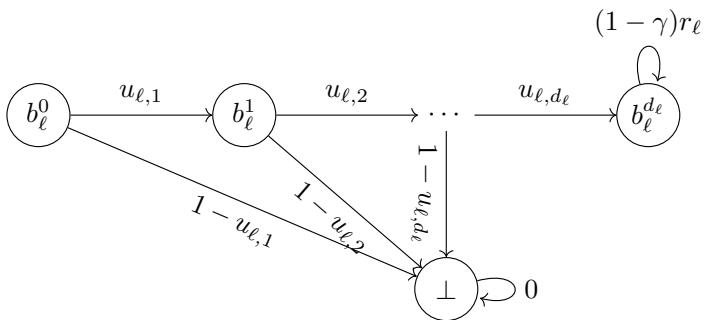  
Figure 5: One branch of the polynomial-evaluation RMDP. Equalities in U tie repeated parameter occurrences across branches.

• Each $u _ { \ell , j }$ is a coordinate of a two-successor row in [0, 1]. Occurrences representing the same logical coordinate may be tied by rational linear equalities.

• At each state the action described above is intended, every other described reward is zero, and $R ( b _ { \ell } ^ { d _ { \ell } } ) = ( 1 - \gamma ) r _ { \ell }$

• All remaining choices use ruinous-sink completion.

Forpolicy comparison, choose a representative $u _ { i } ^ { \mathrm { r e p } }$ for everyparameter and impose $u _ { \ell , j } = u _ { i } ^ { \mathrm { r e p } }$ whenever $i _ { \ell , j } = i ;$ occurrences of $1 - p _ { i } ,$ when present, instead satisfy $u _ { \ell , j } = 1 - u _ { i } ^ { \mathrm { r e p } }$ . Together with stochasticity and box constraints, these equalities define U and the resulting RMDP $M _ { f } = ( S , A , \bar { \mathcal { U } } , R , s _ { f } , \dot { \gamma } )$ . Repeated indices in a monomial represent powers and are realized by distinct rows tied to the same representative

Figure 5 shows one monomial branch of this construction.

Lemma 22 (Polynomial evaluation). For every realization of the occurrence rows, the compliant value of $\operatorname { P o l y } _ { \gamma } ( f )$ is $\textstyle \sum _ { \ell } c _ { \ell } \prod _ { j } u _ { \ell , j }$ . In particular, when the representative coordinates equal $p ,$ the unique compliant policy of $M _ { f }$ has value $f ( p ) a t s _ { f }$ . The component is acyclic apart from absorbing terminals, every uncertain row has two successors, and its only other stochastic row is a certain uniform splitter. It has size $O ( N$ max d ) and rewards ofpolynomial encoding length. Moreover, U is one rational polytope ofpolynomial description size.

Proof. Branch ℓ is reached with probability $1 / N _ { : }$ , survives with probability $\Pi _ { j } u _ { \ell , j }$ , and reaches its terminal after $d _ { \ell } + 1$ transitions. Its discounted contribution is therefore

$$
\frac { 1 } { N } \gamma ^ { d _ { \ell } + 1 } \left( N \gamma ^ { - ( d _ { \ell } + 1 ) } c _ { \ell } \right) \prod _ { j } u _ { \ell , j } ,
$$

and summing gives the first identity. The representative equalities then give $f ( \boldsymbol p )$ . Each occurrence contributes one row. Every branch is a directed chain, and the payof exponent is at most the polynomial input size. The tying, complement, stochasticity, and interval constraints are rational linear constraints, so their intersection is a polynomial-size rational polytope. □

Lemma 23 (∀R hardness for policy comparison). Robustpolicy comparison is ∀R-hardfor deterministic policies under general rational polytopic uncertainty.

Proof. By the strict degree-six normal form of Schaefer and Stefankovic (2024, Lemma 2.8) and their bounded-open equivalence (Schaefer and Stefankovic 2024 Pro osition 2.12) $\exists p \in [ 0 , 1 ] ^ { m } : f ( p ) > 0$ is ∃R-complete for an explicitly represented degree-six polynomial. Indeed, the afine image of the source box is $( 0 , 1 ) ^ { m }$ , and strict positivity there is equivalent to strict positivity on its closure by continuity. Its complement is $\forall p : f ( p ) \leq 0 .$ Construct $M _ { f }$ by Definition 8, add a fresh initial choice between $s _ { f }$ and a zero-reward sink, and let deterministic policies $\pi _ { f } , \pi _ { \perp }$ choose the two actions. By Lemma 22,

$$
\Delta _ { \mathcal { U } } ( \pi _ { f } , \pi _ { \perp } ) \le 0 \iff \forall p \in [ 0 , 1 ] ^ { m } : f ( p ) \le 0 .
$$

This proves hardness.

ProofofTheorem 20. Immediate from Lemmas 21 and 23.

## B.6 Portfolio Comparison and the Shared-Selector Evaluator

Problem 6 (Portfolio comparison). Given an RMDP M, a policy $\pi _ { 0 } \in \Pi ^ { \mathrm { M R } }$ , an input portfolio $\Pi \subset \Pi ^ { \mathrm { M R } }$ , and rational t, decide whether

$$
\Delta _ { \mathscr { U } } ( \pi _ { 0 } , \Pi ) = \operatorname* { s u p } _ { \pm \mathscr { U } } \biggl ( V _ { \pmb { u } } ^ { \pi _ { 0 } } ( s _ { \iota } ) - \operatorname* { m a x } _ { \pi \in \Pi } V _ { \pmb { u } } ^ { \pi } ( s _ { \iota } ) \biggr ) \leq t .
$$

Theorem 24. Portfolio comparison is ∀R-complete, withportfolio sizepart ofthe input. Hardness already holdsfor deterministic policies and acyclic $( s , a )$ -rectangular RMDPs with two-successor uncertain choices.

Lemma 25 (Membership). Portfolio comparison is in ∀R.

Proof. Apply Lemma 13 with τ fixed to $\pi _ { 0 }$ and the explicit family Π.

Problem 7 (Strict elementary feasibility). Given rational expressions $g _ { 1 } , \ldots , g _ { r }$ over variables x $\in [ 0 , 1 ] ^ { n }$ , each afine or afine plus one bilinear term, with no variable occurring twice in the same expression, decide whether

$$
g _ { 1 } ( x ) > 0 , \ldots , g _ { r } ( x ) > 0
$$

has a solution $x \in [ 0 , 1 ] ^ { n }$

Lemma 26. Problem 7 is ∃R-complete.

Proof. Membership is immediate. For hardness, use the bounded degree-four equality normal form underlying Definition 4. It is ∃R-complete to decide

$$
\exists y \in [ - 1 , 1 ] ^ { n } : \quad f ( y ) = 0 ,
$$

and substituting $y _ { i } = 2 x _ { i } - 1$ changes the domain to $[ 0 , 1 ] ^ { n }$ . Apply Definition 4 without its optional output coordinate and append the afine residual ${ \widehat { f } } / B .$ , which sets the decoded polynomial to zero. Denote all residuals by $h _ { 1 } , \ldots , h _ { t }$ . If they have no common zero on the compact box, then

$$
\eta = \operatorname* { m i n } _ { x } \operatorname* { m a x } _ { j } | h _ { j } ( x ) | > 0 .
$$

Clear denominators and put $\begin{array} { r } { F = \sum _ { j } h _ { j } ^ { 2 } } \end{array}$ . This is a nonnegative integer polynomial of degree at most four, with polynomial coeficient bit length. If there is no common zero, apply the efective Łojasiewicz bound of Schaefer and Stefankovic (2024,

Theorem 2.2) on the compact box to $F$ and the constant polynomial one. It gives a lower bound $2 ^ { - \ell D ^ { c N ^ { 2 } } }$ in terms of the number $N$ of variables, degree $\dot { D } \leq 4 ,$ and coeficient length ℓ. Consequently an explicit polynomial $p$ in the input length satisfies $\eta > 2 ^ { - 2 ^ { \varepsilon } }$ . Introduce positive variables $a _ { 0 } , b _ { 0 } , \dotsc , a _ { p } , b _ { p }$ with

$$
0 < a _ { 0 } < \frac { 1 } { 2 } , \qquad 0 < b _ { 0 } < \frac { 1 } { 2 } ,
$$

$$
0 < a _ { j + 1 } < \frac { a _ { j } b _ { j } } { 4 } , \qquad 0 < b _ { j + 1 } < \frac { a _ { j } b _ { j } } { 4 } \quad ( j < p ) .
$$

The exponent recurrence gives $a _ { p } < 2 ^ { - 2 ^ { p } }$ . Replace $h _ { j } = 0$ by

$$
a _ { p } + h _ { j } > 0 , \qquad a _ { p } - h _ { j } > 0 .
$$

An exact normal-form solution satisfies the strict system. Conversely, a strict solution would have $| h _ { j } | < a _ { p } < \eta$ for every $j ,$ contradicting the definition of $\eta$ when the residual system is infeasible. Each constraint is afine or afine plus one product of distinct variables. Input copies ensure that an input variable occurs only in afine copy residuals. □

Lemma 27 (Hardness). Portfolio comparison is ∀R-hard already for deterministic policies and acyclic $( s , a )$ -rectangular RMDPs with two-successor uncertain choices.

Definition 9 (Shared-selector evaluator). Fix a strict elementary feasibility instance $g _ { 1 } , \ldots , g _ { r }$ over $x \in [ 0 , 1 ] ^ { n }$ (Problem 7) and a discount $\gamma .$ . For each i, treat $- g _ { i }$ as its constant term plus a list of monomials, each either linear or bilinear in two distinct variables, and order the variables of every monomial by increasing index. The shared-selector evaluator is the RMDP $M = ( S , A , \mathcal { U } , R , s _ { \iota } , \gamma )$ , where

$S = \{ s _ { 0 } , \bot \} \cup \{ q _ { j } , q _ { j } ^ { 0 } , q _ { j } ^ { 1 } : 1 \leq j \leq n \} \cup \{ \tau _ { i , \ell } \}$ : the initial state $s _ { 0 } ;$ afresh absorbing zero-reward state ⊥; one selector $q _ { j }$ and its two successors $q _ { j } ^ { 0 } , q _ { j } ^ { 1 }$ per variable $x _ { j } ,$ , shared by every branch that mentions $x _ { j } , \cdot$ and one terminal $\tau _ { i , \ell } p e r$ branch $\ell$ $o f { - } g _ { i }$ (its constant term counts as one branch);

$A = \{ a _ { 0 } , a _ { 1 } , \ldots , a _ { r } \} \cup \{ d _ { i , j , b } \} .$ : at s , action $a _ { 0 }$ leads deterministically to ⊥, and action $a _ { i }$ enters a rational certain splitter with one branch per term $o f - g _ { i } ; a t q _ { j } ^ { b } ;$ , the decoder action $d _ { i , j , b }$ is enabledfor every policy i whose current branch visits $x _ { j } ,$ it leads to ⊥ when $b = 0 ,$ and otherwise to the next selector or to the branch’s terminal $i f x _ { j }$ was its last variable;

• U is (s, a)-rectangular: the certain splitter at a and every decoder are deterministic; the one uncertain choice at q has $a _ { i }$ $q _ { j }$ distribution $( 1 - x _ { j } ) \delta _ { q _ { i } ^ { 0 } } + x _ { j } \delta _ { q _ { i } ^ { 1 } }$ , the same distribution regardless ofwhich branch or which $g _ { i }$ is passing through;

• branch ℓ, selected with splitter probability w $> 0$ and reaching its terminal $\tau _ { i , \ell }$ after d transitions, has terminal payof $w ^ { - 1 } \gamma ^ { - d }$ times its coeficient (including its sign); every other described choice pays reward $0 ,$ and no common branch depth is needed because each payofcancels its own depth;

• all remaining choices use ruinous-sink completion;

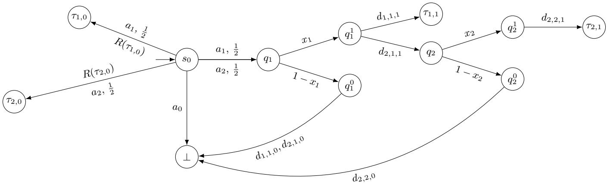  
Figure 6: The shared-selector evaluator of Example 2. Each branch payof cancels that branch’s own probability and depth. Each absorbing terminal uses the payof convention of Appendix A.

$\boldsymbol { s } _ { t } = \boldsymbol { s } _ { 0 } .$

Lemma 28 (Evaluator policies). In the shared-selector evaluator of Definition 9, the following are well-defined deterministic (stationary) policies.

$\pi _ { 0 }$ chooses a0 at $s _ { 0 }$ and a fixed ruinous-completed default choice at every other nonterminal state, which is unreachable under π0.

• For each $i \in \{ 1 , \ldots , r \}$ $\pi _ { i }$ chooses $a _ { i }$ at $s _ { 0 } ;$ and for every variable $x _ { j }$ occurring in $g _ { i }$ and every outcome $b \in \{ 0 , 1 \}$ $\pi _ { i }$ chooses $d _ { i , j , b } a t q _ { j } ^ { b } .$

This assignment is well-defined because a stationary policy fixes a single action per state and no variable occurs twice in one expression $g _ { i } .$

ProofofLemma 28. No prescription is repeated within one policy because no variable occurs twice in one expression. Pre scriptions made by diferent policies need not agree. □

Example ${ \displaystyle \mathbf { 2 } \left( \mathbf { A } \right. }$ worked evaluator). Take $\begin{array} { r } { n = 2 , r = 2 , \gamma = \frac { 1 } { 2 } , g _ { 1 } ( x ) = x _ { 1 } - \frac { 1 } { 2 } , } \end{array}$ , and $\begin{array} { r } { g _ { 2 } ( x ) = x _ { 1 } x _ { 2 } - \frac { 1 } { 4 } } \end{array}$ , so that $\begin{array} { r } { - g _ { 1 } ( x ) = \frac { 1 } { 2 } - x _ { 1 } } \end{array}$ and $\begin{array} { r } { - g _ { 2 } ( x ) = \frac { 1 } { 4 } - x _ { 1 } x _ { 2 } } \end{array}$ . Figure 6 shows the resulting RMDP. By Lemma 28, $\pi _ { 0 }$ (always $a _ { 0 } ) , \pi _ { 1 }$ (choosing $a _ { 1 }$ at $s _ { 0 }$ and $d _ { 1 , 1 , 1 }$ at $q _ { 1 } ^ { 1 } )$ , and π2 (choosing a2 at s0, $d _ { 2 , 1 , 1 } a t q _ { 1 } ^ { 1 }$ , and $d _ { 2 , 2 , 1 }$ at $q _ { 2 } ^ { 1 } )$ are all well-defined.

Each constant branch reaches $\tau _ { i , 0 }$ in one step withprobability 1/2. The monomial branch ofπ follows $s _ { 0 }  q _ { 1 }  q _ { 1 } ^ { 1 }  \tau _ { 1 , 1 } ,$ with total branch probability $x _ { 1 } / 2$ and depth three. That of π2 follows $s _ { 0 }  q _ { 1 }  q _ { 1 } ^ { 1 }  q _ { 2 }  q _ { 2 } ^ { 1 }  \tau _ { 2 , 1 } ,$ , with probability $x _ { 1 } x _ { 2 } / 2$ and depthfive. The policies share the selector $q _ { 1 }$ and diverge only through their decoder actions at $q _ { 1 } ^ { 1 }$

The monomial branches reach their terminals after depths three and five, while each constant branch has depth one. With $\begin{array} { r } { w = \frac { 1 } { 2 } a n d \gamma = \frac { 1 } { 2 } , } \end{array}$ , the rule $\boldsymbol { R } = \boldsymbol { w } ^ { - 1 } \gamma ^ { - d } \times $ (coeficient) applies at each branch’s own depth and gives

$$
R ( \tau _ { 1 , 0 } ) = 2 , \qquad R ( \tau _ { 1 , 1 } ) = - 1 6 , \qquad R ( \tau _ { 2 , 0 } ) = 1 , \qquad R ( \tau _ { 2 , 1 } ) = - 6 4 .
$$

The first policy consequently has value

$$
\begin{array} { r } { V _ { x } ^ { \pi _ { 1 } } ( s _ { 0 } ) = \gamma \cdot \frac { 1 } { 2 } \cdot 2 + \gamma ^ { 3 } \cdot \frac { 1 } { 2 } x _ { 1 } ( - 1 6 ) = \frac { 1 } { 2 } - x _ { 1 } , } \end{array}
$$

and similarly

$$
\begin{array} { r } { V _ { x } ^ { \pi _ { 2 } } ( s _ { 0 } ) = \gamma \cdot \frac { 1 } { 2 } \cdot 1 + \gamma ^ { 5 } \cdot \frac { 1 } { 2 } x _ { 1 } x _ { 2 } ( - 6 4 ) = \frac { 1 } { 4 } - x _ { 1 } x _ { 2 } , } \end{array}
$$

as required $b y - g _ { 1 }$ and $- g _ { 2 } .$ . Since π0 always reaches ⊥, $V _ { x } ^ { \pi _ { 0 } } ( s _ { 0 } ) = 0 f o r$ every x. Hence

$$
\Delta _ { \mathcal { U } } ( \pi _ { 0 } , \{ \pi _ { 1 } , \pi _ { 2 } \} ) = \operatorname* { s u p } _ { x \in [ 0 , 1 ] ^ { 2 } } \operatorname* { m i n } \bigl ( g _ { 1 } ( x ) , g _ { 2 } ( x ) \bigr ) ,
$$

which is maximized at $x = ( 1 , 1 )$ , giving min $\begin{array} { r } { ( \frac { 1 } { 2 } , \frac { 3 } { 4 } ) = \frac { 1 } { 2 } } \end{array}$

ProofofLemma 27. We reduce from strict elementary feasibility (Lemma 26) using the shared-selector evaluator of Definition 9 at discount $\gamma = \gamma _ { 0 }$ . Its policies $\pi _ { 0 } , \pi _ { 1 } , \ldots , \pi _ { r }$ are well-defined by Lemma 28. Every uncertain choice is at a selector $q _ { j }$ and has two successors, and the selectors’ choices are independent, so the construction is $( s , a )$ -rectangular with two-successor choices. Ordering every monomial’s selectors by increasing variable index makes the full transition graph acyclic apart from its absorbing finals. There are polynomially many selectors, decoders, and terminals, and every branch depth is polynomial, so the terminal payofs have polynomial bit length. By construction, π reaches only ⊥, so $V _ { x } ^ { \pi _ { 0 } } ( s _ { \iota } ) = 0$ . Policy π realizes exactly the discounted sum of $- g _ { i }$ ’s terms, so $V _ { x } ^ { \pi _ { i } } ( { \bar { s } } _ { \iota } ) = { \dot { - } } g _ { i } ( x )$ . Hence, with $\Pi = \{ \pi _ { 1 } , \ldots , \pi _ { r } \}$

$$
\Delta _ { \mathscr { U } } ( \pi _ { 0 } , \Pi ) = \operatorname* { s u p } _ { x \in [ 0 , 1 ] ^ { n } } \Bigl ( 0 - \operatorname* { m a x } _ { i } \bigl ( - g _ { i } ( x ) \bigr ) \Bigr ) = \operatorname* { s u p } _ { x \in [ 0 , 1 ] ^ { n } } \operatorname* { m i n } _ { i } g _ { i } ( x ) .
$$

The right side is positive exactl when the strict s stem is feasible and is at most zero otherwise. Hence its upper-threshold language at threshold zero is the complement of an ∃R-complete problem, proving hardness. □

Proof of Theorem 24. Immediate from Lemmas 25 and 27.

## C Proofs of Theorems 1 and 5: Membership for Certification and Synthesis

Bellman equations encode explicit or existentially quantified portfolio members together with a universally quantified policy. Theorem 1 (Membership). Regret certification is in ∀R.

Proof. Apply Lemma 13 to the explicit input portfolio. Quantifying all memoryless randomized policies is sound because every realized discounted MDP has an optimal deterministic policy, so the encoded assertion is exactly Rreg(Π) ≤ t. The given-policy problem is the case $r = 1$ □

Theorem 5 (Membership). Minimal robust regret and bounded portfolio synthesis belong to ∃∀R.

Proof. Existentially quantify the k policy tables before the universal encoding of Lemma 13. Their policy-simplex constraints remain outside the universal implication, and unary k keeps the formula polynomial. The single-policy problem is the case $k = 1$

The resulting formula asserts that some portfolio of at most k members has regret at most t, whereas $\rho _ { k }$ is an infimum, so the two agree only when that infimum is attained. It is: the input uncertainty set is a rational polytope, hence compact, and Lemma 29 applies. □

Lemma 29 (Portfolio attainment). In a finite discounted RMDP with compact U, the infimum

$$
\rho _ { r } = \operatorname* { i n f } _ { | \Pi | \leq r } { \mathrm { R r e g } ( \Pi ) }
$$

is attained.

Proof. Represent a portfolio by an ordered r-tuple, repeating members when the set is smaller. This does not change its pointwise maximum, so the two infima agree. Three facts give the claim. The space of ordered r-tuples of memoryless randomized policie is a finite product of simplexes, hence compact, and U is compact by hypothesis. For a fixed discount, the Bellman system of a policy has a unique solution that depends continuously on the policy probabilities and the realization jointly, and $V _ { u } ^ { * } ( s _ { \iota } )$ is the maximum of finitely many such solutions, one per memoryless deterministic policy, hence also jointly continuous. Therefore

$$
f ( \pi , u ) = V _ { u } ^ { * } ( s _ { \iota } ) - \operatorname* { m a x } _ { i } V _ { u } ^ { \pi _ { i } } \big ( s _ { \iota } \big )
$$

is jointly continuous, $\pi \mapsto \operatorname* { m a x } _ { u \in \mathcal { U } } f ( \pi , u )$ is continuous, and it attains its minimum on the compact policy-tuple space.

No acyclicity is needed, so the lemma applies to every input of Problem 4 and to the synthesis RMDP of Appendix J alike.

## D Exact Transfer from Policy Comparison to Robust Regret

Regret uses a realization-dependent best response, whereas comparison fixes both policies. The lift below makes one fixed reference optimal at every realization: it factors each source choice through a separate routing state and gives only the reference an additional bonus. We state it for an allowed-action family $A _ { \mathrm { a l l o w } }$ . For a finite portfolio, take the union of its supports.

Definition 10 (Lifted RMDP). Fix an $( s , a )$ -rectangular source RMDP $M = ( S , A , \mathcal { U } , R , s _ { \iota } , \gamma _ { 0 } )$ , a deterministic reference policy $\pi _ { 0 } ,$ , and a nonempty allowed-action family $A _ { \mathrm { a l l o w } } ( s ) \subseteq A$ at each $s \in S ,$ , not necessarily containing $\pi _ { 0 } ( s )$ . Let ${ \dot { F } } \subseteq S$ be its absorbing final states, and let $c _ { f }$ be the payof of $f \in F$ . Fix

$$
V _ { \mathrm { m a x } } = \frac { \operatorname* { m a x } _ { s , a \in A _ { \mathrm { a l l o w } } ( s ) \cup \{ \pi _ { 0 } ( s ) \} } \left| R ( s , a ) \right| } { 1 - \gamma _ { 0 } } , \qquad K = 2 V _ { \mathrm { m a x } } + 1 , \qquad \Lambda = \frac { K } { 1 - \gamma _ { 0 } } .
$$

Choose a rational Z of polynomial encoding length such that $\beta Z > \Lambda + V _ { \mathrm { m a x } } .$ . The lifted RMDP is the tuple $\widehat { M } =$ $( \widehat { S } , \widehat { A } , \widehat { \mathcal { U } } , \widehat { R } , \widehat { s _ { \iota } } , \beta )$ , where

$\bullet \widehat { S } = \{ x _ { s } : s \in S \} \cup \{ y _ { s , a } : s \in S \setminus F , a \in A _ { \mathrm { a l l o w } } ( s ) \cup \{ \pi _ { 0 } ( s ) \} \} \cup \{ \bot _ { \mathrm { r } } \}$ . There is one tag state $x _ { s }$ per source state, one selector state $y _ { s , a } f o r$ every allowed or reference action at a nonfinal source state, and one ruinous sink.

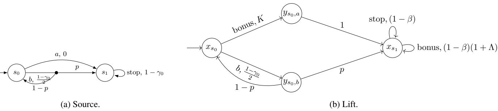  
Figure 7: The source and its lifted RMDP in Example 3.

${ \widehat { A } } = A \cup$ {bonus, route} adds twofresh action symbols to the source action set.

• Ub is (s, a)-rectangular. At a nonfinal tag state, an allowed action a sends $x _ { s } t o y _ { s , a }$ and the bonus action sends it to $y _ { s , \pi _ { 0 } ( s ) }$ The route action at $y _ { s , a }$ carries exactly the original uncertainty set $\mathcal { U } _ { ( s , a ) }$ , redirectedfrom successors s′ to tag states $x _ { s ^ { \prime } } . A t$ afinal tag xf, every allowed action self-loops, as does the bonus action.

• At a nonfinal tag, $\widehat { R } ( x _ { s } , a ) = R ( s , a )$ for $a \in A _ { \mathrm { a l l o w } } ( s )$ and $\widehat { R } ( x _ { s } , \mathrm { b o n u s } ) = R ( s , \pi _ { 0 } ( s ) ) + K$ . Every route action has reward zero. At a final tag xf, every allowed action has reward $( 1 - \beta ) c _ { f } ,$ , while the bonus action has reward $( 1 - \beta ) ( c _ { f } + \Lambda )$

• Every action at ⊥ has reward $- ( 1 - \beta ) Z$ and self-loops. Every action at $x _ { f }$ not already described also self-loops with reward $- ( 1 - \beta ) Z .$ . All remaining choices use ruinous-sink completion with this Z.

$$
\widehat { s _ { \iota } } = x _ { s _ { \iota } }
$$

Write $\widehat { \pi } _ { 0 }$ for the policy always choosing the bonus action. The lift πb of any memoryless randomized policy π supported on $A _ { \mathrm { a l l o w } }$ uses the same action distribution as π at each tag state and the route action at every selector state. For afinite portfolio $\Pi = \{ \pi _ { 1 } , \ldots , \pi _ { r } \}$ , write $\widehat { \Pi } = \{ \widehat { \pi } _ { 1 } , \ldots , \widehat { \pi } _ { r } \}$

Example 3 (A worked lift). Take a source RMDP with states $S = \{ s _ { 0 } , s _ { 1 } \} , s _ { \iota } = s _ { 0 } ,$ , actions $A = \{ a , b , \mathrm { s t o p } \}$ , and discount $\gamma _ { 0 } . A t s _ { 0 } ,$ , action a moves deterministically to $s _ { 1 }$ with reward $R ( s _ { 0 } , a ) = 0 .$ . Action b is uncertain, moving to $s _ { 1 }$ with probability p and back to $s _ { 0 }$ with probability $1 - p f o r$ any $p \in [ 0 , 1 ] ,$ , with reward $\begin{array} { r } { R ( s _ { 0 } , b ) = \frac { 1 - \gamma _ { 0 } } { 2 } } \end{array}$ regardless of outcome. $A t ~ s _ { 1 }$ , the only action stop self-loops deterministically with reward $R ( s _ { 1 } , \mathrm { s t o p } ) = 1 - \gamma _ { 0 } ,$ so $\tilde { V ( s _ { 1 } ) } \doteq 1$ (Figure 7a). Fix reference $\pi _ { 0 } ( s _ { 0 } ) = a , \pi _ { 0 } ( s _ { 1 } ) =$ stop and a single candidate $\pi _ { 1 } ( s _ { 0 } ) = b , \pi _ { 1 } ( s _ { 1 } ) = \mathrm { s t o p }$ , so $\Pi = \left\{ \pi _ { 1 } \right\}$ and $A _ { \mathrm { a l l o w } } ( s _ { 0 } ) = \{ b \}$ $\boldsymbol { A } _ { \mathrm { a l l o w } } ( s _ { 1 } ) = \{ \mathrm { s t o p } \}$ . Note $A _ { \mathrm { a l l o w } } ( s _ { 0 } )$ does not contain $\pi _ { 0 } ( s _ { 0 } ) = a ,$ while $A _ { \mathrm { a l l o w } } ( s _ { 1 } )$ happens to coincide with $\pi _ { 0 } ( s _ { 1 } )$ . The Bellman equations give

$$
V _ { u } ^ { \pi _ { 0 } } ( s _ { 0 } ) = \gamma _ { 0 } , \qquad V _ { u } ^ { \pi _ { 1 } } ( s _ { 0 } ) = \frac { \frac { 1 - \gamma _ { 0 } } { 2 } + \gamma _ { 0 } p } { ( 1 - \gamma _ { 0 } ) + \gamma _ { 0 } p } ,
$$

and the second value is increasing in p. Hence

$$
\begin{array} { r } { \Delta _ { \mathcal { U } } ( \pi _ { 0 } , \{ \pi _ { 1 } \} ) = \gamma _ { 0 } - \frac { 1 } { 2 } = \frac { 1 6 1 } { 4 0 0 } . } \end{array}
$$

Definition 10 gives tag states $x _ { s _ { 0 } } , x _ { s _ { 1 } }$ , selectors $y _ { s _ { 0 } , a } , y _ { s _ { 0 } , b } ,$ a ruinous sink, and $\beta = 1 9 / 2 0$ (Figure 7b). Because $s _ { 1 }$ is an absorbing final of payof one, the allowed and bonus actions at $\boldsymbol { x } _ { s _ { 1 } }$ self-loop with rewards $1 - \beta$ and $( 1 - \beta ) ( 1 + \Lambda )$ . The selector $y _ { s _ { 0 } , b }$ inherits the source intervalfor p. The relevant rewards are $\begin{array} { r } { R ( s _ { 0 } , a ) = 0 , R ( s _ { 0 } , b ) = \frac { 1 - \gamma _ { 0 } } { 2 } , R ( s _ { 1 } , \mathrm { s t o p } ) = 1 - \gamma _ { 0 } , } \end{array}$ so Definition 10 gives

$$
V _ { \mathrm { m a x } } = \frac { 1 - \gamma _ { 0 } } { 1 - \gamma _ { 0 } } = 1 , \qquad K = 2 V _ { \mathrm { m a x } } + 1 = 3 , \qquad \Lambda = \frac { K } { 1 - \gamma _ { 0 } } = \frac { 4 0 0 } { 1 3 } ,
$$

and $\begin{array} { r } { \mathrm { R r e g } ( \{ \widehat \pi _ { 1 } \} ) = \Lambda + \Delta _ { \mathcal { U } } ( \pi _ { 0 } , \{ \pi _ { 1 } \} ) = \frac { 4 0 0 } { 1 3 } + \frac { 1 6 1 } { 4 0 0 } . } \end{array}$

The margin in $K = 2 V _ { \mathrm { m a x } } + 1$ is what makes the bonus action uniquely optimal at every tag state. Lemma 30 formalizes thi point.

Lemma 30 (Exact comparison-to-regret lift). Consider the construction of Definition 10 for a deterministic reference $\pi _ { 0 }$ and an allowed-action family $A _ { \mathrm { a l l o w } }$ . For every memoryless randomized policy π supported on this family and every realization $u ,$ its lift satisfies

$$
V _ { \widehat { u } } ^ { \widehat { \pi } } ( x _ { s } ) = V _ { u } ^ { \pi } ( s ) \qquad ( s \in S ) .
$$

This construction preserves $( s , a )$ -rectangularity. It preserves determinism when the lifted policy is deterministic. It preserves acyclicity of the RMDP and of policy graphs, with every source absorbing final remaining an absorbing final. Each non-singleton source choice is copied unchanged to one selector state. In particular, two-successor and two-Dirac restrictions on uncertain

choices are preserved. The bonus policy $\widehat { \pi } _ { 0 }$ is pointwise optimal in every realization, and the bonus action is the unique optimal action at every tag state. Consequently,for everyfinite portfolio Π ofpolicies supported on $A _ { \mathrm { a l l o w } }$

$$
\operatorname { R r e g } ( \widehat { \Pi } ) = \Lambda + \Delta _ { \mathcal { U } } ( \pi _ { 0 } , \Pi ) .
$$

ProofofLemma $3 0 .$ We first show that the bonus policy is optimal in the target RMDP at every realization, together with its value. Fix a realization u of the source RMDP, inducing a realization u of the target RMDP via the redirected transitions of Definition 10. Define $W ( s ) : = \Lambda + V _ { u } ^ { \pi _ { 0 } } ( s )$ for every source state $s ,$ and read it as a candidate value for the tag state $x _ { s }$ . For a nonfinal source state, $\beta ^ { 2 } = \gamma _ { 0 }$ means that going from $x _ { s }$ through its selector to the next tag state contributes the source discount overall. We may therefore compare $W$ against this two-step Bellman backup directly. For the bonus action at $x _ { s }$ , the backup is

$$
R ( s , \pi _ { 0 } ( s ) ) + K + \gamma _ { 0 } \sum _ { s ^ { \prime } } u ( s , \pi _ { 0 } ( s ) , s ^ { \prime } ) W ( s ^ { \prime } ) .
$$

Substituting $\pi _ { 0 } \mathrm { ^ { \circ } s }$ own Bellman equation $\begin{array} { r } { V _ { u } ^ { \pi _ { 0 } } ( s ) = R ( s , \pi _ { 0 } ( s ) ) + \gamma _ { 0 } \sum _ { s ^ { \prime } } u ( s , \pi _ { 0 } ( s ) , s ^ { \prime } ) V _ { u } ^ { \pi _ { 0 } } ( s ^ { \prime } ) } \end{array}$ for $R ( s , \pi _ { 0 } ( s ) )$ , this simplifies to

$$
\begin{array} { r } { V _ { u } ^ { \pi _ { 0 } } ( s ) + K + \gamma _ { 0 } \Lambda , } \end{array}
$$

which equals $W ( s ) = \Lambda + V _ { u } ^ { \pi _ { 0 } } ( s )$ exactly, since $K = \Lambda ( 1 - \gamma _ { 0 } )$ by definition of $\Lambda .$ For any allowed action $a \in A _ { \mathrm { a l l o w } } ( s )$ , the same two-step backup is

$$
R ( s , a ) + \gamma _ { 0 } \sum _ { s ^ { \prime } } u ( s , a , s ^ { \prime } ) W ( s ^ { \prime } ) = \underbrace { R ( s , a ) + \gamma _ { 0 } \sum _ { s ^ { \prime } } u ( s , a , s ^ { \prime } ) V _ { u } ^ { \pi _ { 0 } } ( s ^ { \prime } ) - V _ { u } ^ { \pi _ { 0 } } ( s ) } _ { \mathrm { a t m o s t 2 } V _ { \mathrm { m a x } } \mathrm { i n a b s o l u t e v a l u c } } + V _ { u } ^ { \pi _ { 0 } } ( s ) + \gamma _ { 0 } \Lambda .
$$

The bracketed term is at most $2 V _ { \mathrm { m a x } }$ because the reward is at most $( 1 - \gamma _ { 0 } ) V _ { \mathrm { m a x } }$ and both value terms are at most $V _ { \mathrm { m a x } }$ in absolute value. Combined with $( 1 - \gamma _ { 0 } ) \Lambda = K = 2 V _ { \operatorname* { m a x } } + 1$ , the whole backup is at most $W ( s ) - 1 < W ( s )$ . At an absorbing final $f$ of payof $c _ { f }$ , the bonus backup is

$$
( 1 - \beta ) ( c _ { f } + \Lambda ) + \beta W ( f ) = W ( f ) ,
$$

while every allowed-action backup is

$$
( 1 - \beta ) c _ { f } + \beta W ( f ) = c _ { f } + \beta \Lambda = W ( f ) - ( 1 - \beta ) \Lambda < W ( f ) .
$$

Every other action at $x _ { f }$ has value below $W ( f )$ because its self-loop payof is $- Z ,$ , and every undescribed choice at a nonfinal state has backup $- \beta Z \overset { \cdot } { < } W ( s )$ by the choice of $Z .$ . At selector states, the route action is likewise better than entering the ruinous sink. Thus $W$ satisfies the Bellman optimality equation at every tag state, with the bonus action as the unique maximizer. Since the discounted Bellman optimality equation has a unique solution, $W$ is exactly the optimal value function on tag states and the bonus policy is pointwise optimal. In particular,

$$
V _ { \widehat { u } } ^ { \widehat { \pi } _ { 0 } } ( x _ { s } ) = \Lambda + V _ { u } ^ { \pi _ { 0 } } ( s )
$$

for every source state s.

For any policy π supported on $A _ { \mathrm { a l l o w } }$ , its lift πb replays $\pi ^ { \prime } \boldsymbol { \mathrm { s } }$ Bellman equation over two lifted steps at nonfinal states and uses the payof-preserving self-loop at final states. Direct substitution using $\beta ^ { \dot { 2 } } = \gamma _ { 0 }$ therefore gives

$$
V _ { \widehat { u } } ^ { \widehat { \pi } } ( x _ { s } ) = V _ { u } ^ { \pi } ( s )
$$

for every s. No optimality claim is needed here, only that $\widehat { \pi } \mathrm { { ^ { s } } }$ value matches $\pi ^ { \prime } \boldsymbol { \mathrm { s } }$ under the same discount-matching substitution used above.

Combining the two identities at $\boldsymbol { s } _ { t } .$

$$
\begin{array} { r l } & { \mathrm { R r e g } ( \widehat { \Pi } ) = \underset { \widehat { u } } { \operatorname* { s u p } } \Big ( V _ { \widehat { u } } ^ { * } \big ( \widehat { s _ { \iota } } \big ) - \underset { 1 \leq i \leq r } { \operatorname* { m a x } } V _ { \widehat { u } } ^ { \widehat { \pi } _ { i } } \big ( \widehat { s _ { \iota } } \big ) \Big ) } \\ & { \quad \quad \quad \quad = \underset { u } { \operatorname* { s u p } } \Big ( \Lambda + V _ { u } ^ { \pi _ { 0 } } \big ( s _ { \iota } \big ) - \underset { 1 \leq i \leq r } { \operatorname* { m a x } } V _ { u } ^ { \pi _ { i } } \big ( s _ { \iota } \big ) \Big ) } \\ & { \quad \quad \quad = \Lambda + \Delta _ { \mathcal { U } } \big ( \pi _ { 0 } , \Pi \big ) , } \end{array}
$$

using pointwise optimality of the bonus policy, so $V _ { \widehat { u } } ^ { * } ( \widehat { s } _ { \iota } ) = V _ { \widehat { u } } ^ { \widehat { \pi } _ { 0 } } ( \widehat { s } _ { \iota } )$ . Every uncertain source choice occurs at one selector state, so shared choices are not copied. Products of source choice uncertainty sets remain products, which preserves $( s , a ) -$ rectangularity. Replacing each nonfinal source edge by its two-edge tag-selector path preserves a topological order, while each final tag and the ruinous sink remains absorbing. For policy graphs the reachability qualifier in the definition of a used choice is load-bearing rather than incidental: route actions are installed at every selector state, including selectors for source actions the lifted olic never chooses, and those states are unreachable under it. Readin $G _ { \widehat { \pi } }$ as containin ever transition the olic gives positive probability, instead of only its used choices, would therefore add edges that no run traverses and break the claim. This proves the stated acyclicity preservation for the full RMDP and for its policy graphs. □

# E Proofs of Theorems 2 to 4: Transferring Comparison Bounds to Certification

## E.1 Rectangular Given-Policy Hardness

The exact lift transfers the Boolean and square-root-sum comparison bounds.

Theorem 2. Given-policy robust regret is coNP-hard and coSQRS-hard under $( s , a )$ -rectangular uncertainty. coNP-hardness already holds when every uncertain choice is two-Dirac and the only other stochastic rows are certain uniform splitters.

Proof. For the coNP lower bound, start with $\mathrm { C m p } ( \varphi )$ and apply $\mathrm { L i f t } ( \mathrm { C m p } ( \varphi ) , \pi _ { C } )$ with singleton portfolio $\{ \pi _ { K } \}$ . The source consists of deterministic policies $\pi _ { C } , \pi _ { K }$ in an acyclic $( s , a )$ -rectangular RMDP with independent two-Dirac uncertain choices, one certain uniform splitter, and discount $\gamma _ { 0 }$ , and it satisfies

$$
\varphi \in \mathrm { U N S A T } \quad \Longleftrightarrow \quad \Delta { u } ( \pi _ { C } , \pi _ { K } ) \leq 2 - { \frac { 1 } { 2 n } } .
$$

For the lifted candidate $\widehat { \pi } _ { K }$ the lemma gives

$$
\operatorname { R r e g } ( \widehat { \pi } _ { K } ) = \Lambda + \Delta _ { { \mathcal { U } } } ( \pi _ { C } , \pi _ { K } ) .
$$

Thus, with the rational target threshold $\begin{array} { r } { \widehat { t } = \Lambda + 2 - \frac { 1 } { 2 n } . } \end{array}$ , the lifted regret instance is a yes-instance exactly when $\varphi \in \mathrm { U N S A T }$ The structural restrictions follow from Lemma 30, proving coNP-hardness.

For the coSQRS lower bound, use the deterministic policies $\pi _ { u } , \pi _ { v }$ and threshold t produced by Theorem 18. That construction uses the same discount $\gamma _ { 0 } .$ , is $( s , a )$ -rectangular, and has two-Dirac uncertain choices. Apply $\mathrm { L i f t } \dot { (} N , \pi _ { u } )$ with singleton candidate $\{ \pi _ { v } \}$ . Then

$$
\Delta _ { \mathcal { U } } ( \pi _ { u } , \pi _ { v } ) \leq t \quad \Longleftrightarrow \quad \operatorname { R r e g } ( \widehat { \pi } _ { v } ) \leq \Lambda + t .
$$

Hence given-policy robust regret is coSQRS-hard. Together the two reductions prove the theorem.

## E.2 Rectangular Portfolio Certification

The family form of the exact lift transfers the rectangular portfolio-comparison bound.

Theorem 3. Portfolio-regret certification is ∀R-hard, alreadyfor deterministicportfolios and acyclic $( s , a )$ -rectangular RMDPs with two-successor uncertain choices.

Proof. The evaluator above was instantiated at $\gamma _ { 0 }$ , so apply Lemma 30 to its reference policy and explicit portfolio. The exact identity

$$
\operatorname { R r e g } ( \widehat { \Pi } ) = \Lambda + \Delta _ { \mathcal { U } } ( \pi _ { 0 } , \Pi )
$$

translates the zero comparison threshold to the rational regret threshold Λ. The structural conclusions are those of Lemma 30. Therefore portfolio-regret certification is ∀R-hard under all restrictions stated in the theorem. □

## E.3 General-Polytope Regret Certification

Membership is the singleton case of Theorem 1. For hardness, a choice between the polynomial evaluator and zero makes regret compute the polynomial’s positive part.

Theorem 4. Given-policy robust regret is ∀R-complete under general rational polytopic uncertainty, even for deterministic policies.

The membership half of Theorem 4 is the singleton-family case of Lemma 13.

## Polynomial-evaluation hardness.

Definition 11 (Positive-part gadget). Given $M _ { f }$ from Definition 8, add a fresh initial state $s ^ { + }$ with two reward-zero actions: $a _ { f }$ enters $M _ { f }$ at $s _ { f } ,$ , and $a _ { \perp }$ enters a zero-reward sink. Let π⊥ choose $a _ { \perp }$ at $s ^ { + }$ . All choices left undescribed after enlarging the global action set use the same ruinous-sink completion as $M _ { f }$

Lemma 31 (Positive-part regret). The fixed policy in Definition 11 satisfies

$$
\operatorname { R r e g } ( \pi _ { \perp } ) = \operatorname* { s u p } _ { p \in [ 0 , 1 ] ^ { m } } \operatorname* { m a x } \{ \gamma _ { 0 } f ( p ) , 0 \} .
$$

Consequently $\mathrm { R r e g } ( \pi _ { \perp } ) \le 0$ exactly when $\forall p \in [ 0 , 1 ] ^ { m } : f ( p ) \leq 0 .$

Proof. At realization $p ,$ the two initial actions have values $\gamma _ { 0 } f ( \boldsymbol { p } )$ and zero by Lemma 22. Their positive part is precisely the shortfall of $\pi _ { \perp }$ . Taking the supremum proves the identity. Regret is nonnegative, so threshold zero is tight. □

Example 4 illustrates the zero-threshold case.

Example 4. For $f ( p ) = p - p ^ { 2 }$ , the unique compliant policy inside $M _ { f }$ has value $p - p ^ { 2 }$ and

$$
\mathrm { R r e g } ( \pi _ { \perp } ) = \gamma _ { 0 } \operatorname* { m a x } _ { p \in [ 0 , 1 ] } ( p - p ^ { 2 } ) = \gamma _ { 0 } / 4 > 0 .
$$

Thus this instance is a no-instance at threshold zero.

Proof of Theorem 4. Apply Lemma 31 to the bounded universal-polynomial instances used in Lemma 23. Together with the membership encoding above, this proves the theorem. □

## F Proof of Theorem 6: Combinatorial Minimal-Regret Hardness

We prove the Boolean lower bounds for minimal robust regret.

Theorem 6. Minimal robust regret is NP-hard and coNP-hard on $( s , a )$ -rectangular RMDPs in which every uncertain choice is two-Dirac and the only other stochastic rows are certain uniform splitters.

Both reductions first constrain the candidate to allowed actions. Lemma 32 makes disallowed actions ruinous and thereby transfers this restricted minimum to unrestricted synthesis within an arbitrarily small ε.

## F.1 Policy Restriction

Fix an RMDP N, nonempty allowed action sets, and rational $\varepsilon > 0$ . The construction below turns restricted synthesis into ordinary unrestricted synthesis: every disallowed choice is handed to the adversary as an extra option that can collapse straight into a state so bad that no min-regret policy will ever choose to use it. For $\mathcal { P } \in \{ \Pi ^ { \mathrm { \check { M R } } } , \Pi ^ { \mathrm { M D } } \}$ , write $\mathcal { P } _ { \mathrm { a l l o w } }$ for the policies in $\mathcal { P }$ supported on the allowed actions.

Definition 12 (ε-restricted RMDP). Let $N = ( S , A , \mathcal { U } , R , s _ { \iota } , \gamma )$ be an RMDP and let $A _ { \mathrm { a l l o w } } ( s ) \subseteq A$ be a nonempty set of allowed actions for every $s \in S .$ . Suppose every disallowed choice has a fixed transition distribution, i.e., $\mathcal { U } _ { ( s , a ) } = \bar { \{ p _ { s , a } \} } \bar { f o r }$ every $s \in S$ and $a \in A \setminus A _ { \mathrm { a l l o w } } ( s )$ . Choices supplied by ruinous-sink completion satisfy this hypothesis. The construction proceeds in two steps.

First it unfolds the absorbing finals of $N ,$ so that no state both self-loops and can leave. Add afresh zero-reward absorbing sink $\perp _ { 0 } ,$ , every action ofwhich has reward zero and row $\{ \delta _ { \perp _ { 0 } } \}$ , and let every action be allowed there. At every absorbing final $f$ ofN, replace the reward $R ( f , a )$ by $R ( f , a ) / ( 1 - \gamma )$ and the row by $\{ \delta _ { \perp _ { 0 } } \}$ , keeping $A _ { \mathrm { a l l o w } } ( f )$ as it is. An action a at f had value $R ( { \bar { f } } , a ) / ( 1 - \gamma )$ before the step, since it self-looped forever, and it collects exactly that reward once and then nothing after the step. The unfolding therefore leaves the value of every choice at $f$ unchanged. Every state therefore keeps its value under every stationary randomized policy and every realization, so the optimal value and every robust regret are unchanged as well. The unfolding adds no uncertain choice, preserves rectangularity and acyclicity, and leaves $\perp _ { 0 }$ as the only absorbing final. It raises the largest reward magnitude to at most the largest value magnitude of N, hence multiplies $V _ { \mathrm { m a x } }$ below by at most $1 / ( 1 - \gamma )$ and keeps every constant ofpolynomial encoding length. Write N for the unfolded RMDPfrom here on.

Second, let $\varepsilon > 0$ be rational, and set

$$
V _ { \mathrm { m a x } } = \operatorname* { m a x } \left\{ 1 , \frac { \operatorname* { m a x } _ { s , a } \left| R ( s , a ) \right| } { 1 - \gamma } \right\} , \qquad Z _ { \varepsilon } = \frac { ( 2 - \gamma ) V _ { \mathrm { m a x } } + 4 V _ { \mathrm { m a x } } ^ { 2 } / \varepsilon } { \gamma } .
$$

The ε-restricted RMDP is the tuple $N _ { \varepsilon } = ( S _ { \varepsilon } , A _ { \varepsilon } , \mathcal { U } _ { \varepsilon } , R _ { \varepsilon } , s _ { \iota \varepsilon } , \gamma _ { \varepsilon } ) ,$ , where:

$S _ { \varepsilon } = S \cup \{ \bot _ { \mathrm { r } } \}$ , adding onefresh ruinous sink $\perp _ { \mathrm { r } } ;$

$A _ { \varepsilon } = A , \gamma _ { \varepsilon } = \gamma$ , and $s _ { \iota \varepsilon } = s _ { \iota } ;$

$R _ { \varepsilon } ( s , a ) = R ( s , a )$ for every $s \in S$ and $a \in A ,$ while every action at $\perp$ r has reward $- ( 1 - \gamma ) Z _ { \varepsilon }$

$\mathcal { U } _ { \varepsilon } ( s , a ) = \mathcal { U } ( s , a )$ for every allowed choice, $a \in A _ { \mathrm { a l l o w } } ( s ) ;$

$\mathcal { U } _ { \varepsilon } ( s , a ) = \big \{ \theta p _ { s , a } + ( 1 - \theta ) \delta _ { \perp _ { \mathrm { r } } } : \theta \in [ 0 , 1 ] \big \}$ for every disallowed choice, $a \in A \setminus A _ { \mathrm { a l l o w } } ( s ) ;$

• every action at $\perp _ { \mathrm { r } }$ has row $\{ \delta _ { \perp _ { \mathrm { r } } } \}$

The self-loop reward at $\perp _ { \mathrm { r } }$ gives it value $- Z _ { \varepsilon }$ under every realization: $V ( \perp _ { \mathrm { r } } ) = - ( 1 - \gamma ) Z _ { \varepsilon } + \gamma V ( \perp _ { \mathrm { r } } )$ forces $V ( \bot _ { \mathrm { r } } ) = - Z _ { \varepsilon }$ At the endpoint $\theta = 1 , \mathcal { U } _ { \varepsilon } ( s , a )$ reduces to $\{ p _ { s , a } \}$ , exactly $N \mathbf { \bar { s } }$ original choice. $\mathbf { A } \mathbf { t } \theta = 0$ , it collapses to $\{ \delta _ { \perp _ { \mathrm { r } } } \}$ , routing straight into the sink. The unfolding is what makes the interpolation safe. When N is acyclic its only self-loops sit at absorbing finals, so after the unfolding the only self-looping state is $\perp _ { 0 } ,$ where nothing is disallowed. Every interpolated row therefore lies between two distributions that both leave their state, and no state acquires a self-loop it did not already have.

Lemma 32 (Policy restriction). For either $\mathcal { P } = \Pi ^ { \mathrm { M R } } o r \mathcal { P } = \Pi ^ { \mathrm { M D } }$

$$
\operatorname* { i n f } _ { \rho \in \mathcal { P } } \operatorname { R r e g } ^ { N _ { \varepsilon } } ( \rho ) \leq \operatorname* { i n f } _ { \pi \in \mathcal { P } _ { \mathrm { a l l o w } } } \operatorname { R r e g } ^ { N } ( \pi ) ,
$$

$$
\operatorname* { i n f } _ { \rho \in \mathcal { P } } \operatorname { R r e g } ^ { N _ { \varepsilon } } ( \rho ) \geq \operatorname* { i n f } _ { \pi \in \mathcal { P } _ { \mathrm { a l l o w } } } \operatorname { R r e g } ^ { N } ( \pi ) - \varepsilon .
$$

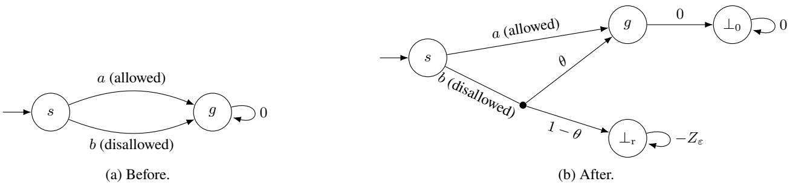  
Figure 8: Policy restriction before and after the transformation. The allowed action remains unchanged, while nature can route the disallowed action to the ruinous sink.

Example 5 illustrates the transformation on two states.

Example 5 (A two-state restriction). Let the source RMDP have states s and $^ { g , }$ with s initial and g an absorbing zero-payof terminal. $A t \ s ,$ both the allowed action a and the disallowed action b move deterministically to $^ { g , }$ and $A _ { \mathrm { a l l o w } } ( s ) = \{ a \}$ . In Restrict $( N , A _ { \mathrm { a l l o w } } , \varepsilon )$ , the unfolding first sends g to the fresh zero sink $\perp _ { 0 }$ in one step, leaving its value at zero. Action a is then unchanged, while b reaches g with probability θ and $\perp _ { \mathrm { r } }$ with probability $1 - \theta ,$ as shown in Figure 8. The allowed policy reproduces the restricted source optimum, and Lemma 32 places the unrestricted optimum in the intervalfrom that value minu ε to that value. Thus the transformation introduces at most the promised ε gap, which is zero in this symmetric example because choosing a has regret zero.

ProofofLemma 32. The unfolding step changes no state’s value under any stationary policy or realization, so it changes neither $\mathrm { R r e g } ^ { N }$ nor the set of allowed policies, and N below denotes the unfolded RMDP. Fix a source realization u and let $W = V _ { u , \theta \equiv 1 } ^ { * }$ in $N _ { \varepsilon } . \mathrm { A t }$ the all-normal realization, the ori inal states re roduce $N _ { u } , V ( \bot _ { \mathrm { r } } ) = - Z _ { \varepsilon }$ , and no sink-routed action improves on an original action. Thus $W ( s ) = V _ { u } ^ { * } ( s )$ for $s \in S$ and $W ( \bar { \perp _ { \mathrm { r } } } ) = - Z _ { \varepsilon }$ . For a disallowed choice and arbitrary $\theta \in [ 0 , 1 ]$ , its backup at W is

$$
R ( s , a ) + \gamma \left( \theta \sum _ { s ^ { \prime } } p _ { s , a } ( s ^ { \prime } ) W ( s ^ { \prime } ) + ( 1 - \theta ) ( - Z _ { \varepsilon } ) \right) \leq R ( s , a ) + \gamma \sum _ { s ^ { \prime } } p _ { s , a } ( s ^ { \prime } ) W ( s ^ { \prime } ) ,
$$

because $- Z _ { \varepsilon } \leq - V _ { \mathrm { m a x } } \leq \mathrm { m i n } _ { s \in S } W ( s )$ . Allowed backups are unchanged, so the optimal Bellman operator satisfies $T _ { u , \theta } W \leq$ W. Monotonicity and contraction give $\dot { V } _ { u . \theta } ^ { * } \le W$ . An allowed policy never uses a modified choice, hence its value is independent of θ and agrees with its value in $N _ { u }$ . Its regret is therefore maximized at $\theta \equiv 1$ , and every allowed policy has the same robust regret in $\bar { N }$ and $N _ { \varepsilon }$ . This proves the upper inequality.

Fix an arbitrary policy ρ and condition it on allowed actions at every state, using an arbitrary allowed action if the conditioning probability is zero. Call the result ${ \bar { \rho } } .$ The conditioning is total because $A _ { \mathrm { a l l o w } } ( s )$ is nonempty at every state. It preserves membership in $\Pi ^ { \mathrm { M R } }$ , and it preserves determinism when $\mathcal { P } = \Pi ^ { \mathrm { M D } }$

The weight below depends on the realization, so fix a source realization $u \in \mathcal { U }$ and argue pointwise in it, taking the supremum over u only at the end. Couple the two trajectories by reusing the same transition draw and, while an allowed action is selected, the same normalized action draw. The two trajectories then agree until $\rho$ first chooses a nonallowed action at time τ. Put

$$
d = \mathbb { E } [ \gamma ^ { \tau } \mathbf { 1 } _ { \{ \tau < \infty \} } ] .
$$

At the joint realization $( u , \theta \equiv 1 )$ , every action value, including its immediate reward and discounted continuation, lies in $[ - V _ { \mathrm { m a x } } , V _ { \mathrm { m a x } } ]$ . Conditional on the first difering choice, $\rho$ therefore gains at most $2 V _ { \mathrm { m a x } }$ over ${ \bar { \rho } } ,$ so

$$
V _ { u , \theta \equiv 1 } ^ { \rho } ( s _ { \iota } ) \leq V _ { u } ^ { \bar { \rho } } ( s _ { \iota } ) + 2 V _ { \operatorname* { m a x } } d , \qquad \mathrm { R r e g } ^ { N _ { c } } ( \rho ) \geq V _ { u } ^ { * } ( s _ { \iota } ) - V _ { u } ^ { \bar { \rho } } ( s _ { \iota } ) - 2 V _ { \operatorname* { m a x } } d .
$$

At the joint realization extending the same u with $\theta = 0$ at every nonallowed choice, the first such choice incurs loss at least

$$
\gamma Z _ { \varepsilon } - ( 2 - \gamma ) V _ { \mathrm { m a x } } = \frac { 4 V _ { \mathrm { m a x } } ^ { 2 } } { \varepsilon } ,
$$

and therefore

$$
\mathrm { R r e g } ^ { N _ { \varepsilon } } ( \rho ) \geq \frac { 4 V _ { \mathrm { m a x } } ^ { 2 } } { \varepsilon } d .
$$

Both endpoints are valid joint realizations extending this same $u ,$ because the modified choices are independent. $\mathrm { I f } 2 V _ { \mathrm { m a x } } d \leq \varepsilon .$ the first bound loses at most ε. Otherwise the second exceeds $2 V _ { \mathrm { m a x } }$ and hence dominates every possible regret in $N$ . Either way

$$
\mathrm { R r e g } ^ { N _ { \varepsilon } } ( \rho ) \geq V _ { u } ^ { * } ( s _ { \iota } ) - V _ { u } ^ { \bar { \rho } } ( s _ { \iota } ) - \varepsilon .
$$

The left side does not depend on u, so taking the supremum over $u \in \mathcal { U }$ gives

$$
\mathrm { R r e g } ^ { N _ { \varepsilon } } ( \rho ) \ge \mathrm { R r e g } ^ { N } ( \bar { \rho } ) - \varepsilon \ge \operatorname* { i n f } _ { \pi \in \mathcal { P } _ { \mathrm { a l l o w } } } \mathrm { R r e g } ^ { N } ( \pi ) - \varepsilon .
$$

Taking the infimum over $\rho$ proves the lower inequality. For B-bit rational inputs $V _ { \mathrm { m a x } }$ and $\varepsilon ,$ the formula above ives $Z _ { \varepsilon }$ polynomial bit length in B and the model size. Each modified choice is independent, so rectangularity is preserved, and a Dirac $p _ { s , a }$ yields a two-Dirac segment. Acyclicity is preserved as well: after the unfolding, $\perp _ { 0 }$ is the only self-looping state of N and nothing is disallowed there, so every interpolated row leaves its state, and the two added sinks are absorbing finals. □

## F.2 coNP-Hardness

Apply the exact lift (Definition 10) to the comparison instance of Theorem 14, which builds from $\varphi$ a Boolean comparison RMDP with a clause policy $\pi _ { C }$ and a consistency policy $\pi _ { K }$ such that

$$
\Delta _ { { \boldsymbol u } } ( \pi _ { C } , \pi _ { K } ) \leq 2 - { \frac { 1 } { n } } { \mathrm { i f ~ } } \varphi \in \mathrm { U N S A T } , \qquad \Delta _ { { \boldsymbol u } } ( \pi _ { C } , \pi _ { K } ) = 2 { \mathrm { i f ~ } } \varphi \in \mathrm { S A T } .
$$

Take $\pi _ { 0 } = \pi _ { C }$ as the lift’s reference policy. No optimality property of $\pi _ { C }$ is needed, only that it is the fixed policy the lift compares against. Restrict the candidates admitted by the lift to $\pi _ { K }$ alone: at every tag state $x _ { s } .$ , set $A _ { \mathrm { a l l o w } } ( x _ { s } ) = \{ \pi _ { K } ( s ) \}$ while every selector state has only its allowed route action. Recall from Definition 10 that a tag state’s available actions are $A _ { \mathrm { a l l o w } } ( s ) \cup .$ {bonus}, never the reference’s own action directly. The action $\pi _ { C } ( s )$ is reachable only through bonus and $y _ { s , \pi _ { C } ( s ) }$ Thus policy restriction keeps a candidate from taking the bonus route meant only for the reference.

Because $A _ { \mathrm { a l l o w } }$ is a singleton at every tag state and selector states ofer no choice at all, $\Pi _ { \mathrm { a l l o w } } ^ { \mathrm { M R } }$ contains exactly one policy, the lift $\widehat { \pi } _ { K }$ of $\pi _ { K }$ . So there is no actual minimization left to do: writing N for this lifted RMDP,

$$
\operatorname * { i n f } _ { \pi \in \Pi _ { \mathrm { { a l l o w } } } ^ { \mathrm { M R } } } \mathrm { R r e g } ^ { N } ( \pi ) = \mathrm { R r e g } ^ { N } ( \widehat { \pi } _ { K } ) \overset { L e m m a ~ 3 0 } { = } \Lambda + \Delta _ { { \mathcal U } } ( \pi _ { C } , \pi _ { K } ) ,
$$

which is exactly Theorem 14’s gap plus the lift’s constant Λ. The certification gap transfers verbatim, with no separate minimization argument needed.

The complete chained construction is

$$
\begin{array} { r } { N _ { \varepsilon } = \mathrm { R e s t r i c t } \big ( \mathrm { L i f t } ( \mathrm { C m p } ( \varphi ) , \pi _ { C } ) , A _ { \mathrm { a l l o w } } , \frac { 1 } { 4 n } \big ) . } \end{array}
$$

From here on write $\mathrm { R r e g } ( \pi )$ for $\mathrm { R r e g } ^ { N _ { \varepsilon } } ( \pi )$ , matching Theorem 6’s notation. Lemma 32 with $\mathcal { P } = \Pi ^ { \mathrm { M R } }$ then converts the two cases above into

$$
\varphi \in \mathrm { U N S A T } \Longrightarrow \operatorname* { i n f } _ { \pi } \mathrm { R r e g } ( \pi ) \leq \operatorname* { i n f } _ { \pi \in \Pi _ { \mathrm { a l l o w } } ^ { \mathrm { M R } } } \mathrm { R r e g } ^ { N } ( \pi ) \leq \Lambda + 2 - \frac { 1 } { n } ,
$$

$$
\varphi \in \mathrm { S A T } \Longrightarrow \operatorname* { i n f } _ { \pi } \mathrm { R r e g } ( \pi ) \geq \operatorname* { i n f } _ { \pi \in \Pi _ { \mathrm { a l l o w } } ^ { \mathrm { M R } } } \mathrm { R r e g } ^ { N } ( \pi ) - \frac { 1 } { 4 n } = \Lambda + 2 - \frac { 1 } { 4 n } ,
$$

using the lemma’s upper inequality (no slack) in the first line and its lower inequality (losing $\begin{array} { r } { \varepsilon = \frac { 1 } { 4 n } ) } \end{array}$ in the second. Since

$$
\Lambda + 2 - \frac { 1 } { n } < \Lambda + 2 - \frac { 1 } { 2 n } < \Lambda + 2 - \frac { 1 } { 4 n } ,
$$

the threshold $\textstyle \Lambda + 2 - { \frac { 1 } { 2 n } }$ gives the coNP-hard part of Theorem 6.

## F.3 NP-Hardness

The NP reduction swaps the roles of the two policies. The fixed reference now looks for a falsified clause, while the synthesized policy names a valuation whose local occurrences nature can audit.

Definition 13 (Falsification and valuation verifier RMDP). For a 3-CNF formula $\varphi = { \textstyle \bigwedge } _ { i = 1 } ^ { m } C _ { i }$ over variables $x _ { 1 } , \ldots , x _ { n } ,$ , the verifier RMDP is

$$
N _ { \varphi } = ( S _ { \varphi } , A _ { \varphi } , { \mathcal { U } } _ { \varphi } , R _ { \varphi } , s _ { \iota } , \gamma _ { 0 } ) ,
$$

with the following components.

$S _ { \varphi } = \{ s _ { \iota } \} \cup S _ { \mathrm { s c a n } } \cup S _ { \mathrm { a u d } } \cup S _ { \mathrm { s e l } } \cup \{ \perp _ { \mathrm { r } } \}$ , consisting of four verifier groups and a ruinous sink:

$S _ { \mathrm { s c a n } } ,$ visited only by the falsification (scanner) policy: $S _ { F } = \{ f _ { i , j } : i \in [ m ] , j \in \{ 1 , 2 , 3 \} \}$ , for clause $C _ { i }$ and literal $j ,$ together with acc , rej , and scanner-side padding states,fixed once the transitions below are defined.

$S _ { \mathrm { a u d } }$ , visited only by the valuation (audit) policy: {v : x occurs in $\varphi \}$ and, for every x, $S _ { x , T } = \{ s _ { x , T , \ell } \} _ { \ell = 1 } ^ { | O _ { x } | } , S _ { x , F } =$ $\{ s _ { x , F , \ell } \} _ { \ell = 1 } ^ { | O _ { x } | }$ , where x is assigned b and occurrence $\ell o f O _ { x }$ is audited (occurrences of x, fixed order), together with ac $\dot { } _ { ; K }$ $\mathrm { r e j } _ { K } ,$ , and audit-side padding states

$\ - \ S _ { \mathrm { s e l } } = \{ q _ { o , t } , q _ { o , t } ^ { 0 } , q _ { o , t } ^ { 1 } : \epsilon$ an occurrence, $t \in \{ T , F \} \}$ , the local-bit selectors of Definition 3, with T, F in place of 1, 0. These are the only states either policy’s transitions can lead intofrom the other’s territory.

Let val(o) = Tfor a positive occurrence and val(o) = Ffor a negative occurrence, and write ¬ val(o)for the other Boolean value.

• s has actions • sι has actions $a _ { F } ^ { \mathrm { i n i t } }$ , leading into , leading into $S _ { \mathrm { s c a n } }$ at at $f _ { 1 , 1 }$ , and , and $a _ { K } ^ { \mathrm { i n i t } }$ , leading into , leading into $S _ { \mathrm { a u d } }$ at at $v _ { x _ { 1 } }$ .

Within $S _ { \mathrm { s c a n } } { \cdot }$ every $q _ { o , t } \in S _ { \mathrm { s e l } }$ has a single action, whose outcome $q _ { o , t } ^ { 0 }$ or $q _ { o , t } ^ { 1 }$ is governed by $\mathcal { U } _ { \varphi }$ below. Each selector outcome ofers a scanner action $a _ { F }$ and an audit action $a _ { K }$ with the role-specific continuations described next. For $o = ( i , j )$ action a at $f _ { i , j }$ uses the pair test ofDefinition $^ { 3 , }$ and its locallyfalse outcome advances to $f _ { i , j + 1 }$ or acc when $j = 3 . A l l$ other outcomes abandon the current clause, continuing to $f _ { i + 1 , 1 } ,$ or to rej $_ { F } \dot { \imath } f \dot { \imath } = m$   
Within $S _ { \mathrm { a u d } } \colon e \nu e r y v _ { x }$ ofers actions T, F leading to $s _ { x , T , 1 } , s _ { x , F , 1 }$ . The controls $s _ { x , b , \ell }$ implement the audit chain ofDefinition 3; after its last occurrence, the chain continues to the next variable or to acc .

Fix H at least as long as the longest path in either graph just described. The scanner-side and audit-side padding states each consist of fresh states inserted along every shorter path in their own graph so it also reaches its terminal after exactly H transitions, each with a single reward-free action continuing toward that terminal.

$\mathcal { U } _ { \varphi }$ is the product of the local-bit segments in Equation (2), with T, F in place of 1, 0. All remaining described choices are singletons.

• accF is the terminal with payof $\gamma _ { 0 } ^ { - H }$ and accK the terminal with payof $- \gamma _ { 0 } ^ { - H }$ , while every other described reward, including at rej and $\mathrm { r e j } _ { K } ,$ , is zero.

• All remaining choices use ruinous-sink completion.

• The initial state is $\boldsymbol { s } _ { \iota }$ and the discount is the appendix-wide $\gamma _ { 0 } .$

Variables with no occurrence are removed.

Since $\mathcal { U } _ { \varphi }$ is a product of two-Dirac segments, its vertices are exactly the Boolean assignments to the local bits $\{ b _ { o , t } \}$ . Figure 9 and example 6 illustrate the verifier RMDP and the two policy paths through its shared selectors.

Definition 14 (Falsification and valuation policies). For the verifier RMDP of Definition 13, define

$$
\begin{array} { r l r } & { \pi _ { F } ( s _ { \iota } ) = a _ { F } ^ { \mathrm { i n i t } } , } & { \pi _ { F } ( s ) = a _ { F } ( s ) \qquad ( s \in S _ { F } ) , } \\ & { \pi _ { F } ( q _ { o , t } ^ { b } ) = a _ { F } ( q _ { o , t } ^ { b } ) , } \\ & { K _ { \sigma } ( s _ { \iota } ) = a _ { K } ^ { \mathrm { i n i t } } , } & { K _ { \sigma } ( v _ { x } ) ( b ) = \sigma _ { x } ( b ) , } \\ & { K _ { \sigma } ( s ) = a _ { x , b } ( s ) \qquad } & { ( s \in S _ { x , b } ) , } \\ & { K _ { \sigma } ( q _ { o , t } ^ { b } ) = a _ { K } ( q _ { o , t } ^ { b } ) . } \end{array}
$$

On decision states outside their reachable verifier graphs,fix default actions whose otherwise undescribed choices use ruinous sink completion. For a valuation α, the deterministic policy $K _ { \alpha }$ is obtainedfrom $\sigma _ { x } ( T ) = \alpha ( x )$ and $\sigma _ { x } ( F ) = 1 - \alpha ( x )$ . At a Boolean realization, a vertex of $\mathrm { \Delta } \mathcal { U } _ { \varphi } ,$ , every selector sends its unique action to a fixed outcome, so a deterministic policy follows a single path. We say the policy accepts that realization when this path reaches its accepting terminal, accF for πF or accK for $K _ { \alpha } .$ . Thus π accepts exactly when some clause is locallyfalse, while $K _ { \sigma }$ audits the value selected at each $v _ { x } .$

The common depth and terminal payofs satisfy Lemma 10, so the comparison value is the sum of the two acceptance probabilities.

Example 6. For $\varphi = ( x _ { 1 } \vee \neg x _ { 2 } \vee x _ { 3 } ) \wedge ( \neg x _ { 1 } \vee x _ { 2 } \vee x _ { 3 } )$ , the valuation $( x _ { 1 } , x _ { 2 } , x _ { 3 } ) = ( 1 , 1 , 0 )$ satisfies $\varphi ,$ so an accepting valuation audit precludes falsification. By contrast, (0, 1, 0) falsifies the first clause, and its canonical local pairs make both verifiers accept.

Lemma 33 (Verifier separation). Consider the verifier RMDP andpolicies ofDefinitions 13 and 14. At every Boolean realization at which $\pi _ { F }$ and $K _ { \alpha }$ both accept, α falsifies a clause of φ. Conversely, if α falsifies a clause of φ, then there exists a Boolean realization at which both accept. In particular, ifα satisfies φ, the two acceptance events are disjoint at every realization.

Proof. Fix a Boolean realization and suppose $K _ { \alpha }$ accepts at it. Then every variable set true by α has $b _ { o , T } = 1$ at each occurrence, and every variable set false has $b _ { o , F } = 1$ . In every clause satisfied by α, a true positive literal therefore cannot have the false air (0, 1), and a true ne ative literal cannot have (1, 0). Hence no clause satisfied b α is locall false in all three ositions. This also covers malformed pairs (0, 0) and (1, 1). Since π accepts only by finding a clause that is locally false in all three positions, its acceptance at the same realization exhibits a clause that α falsifies. The same argument read contrapositively gives the disjointness claim for satisfying α.

For the converse, let α falsify a clause and let nature use the canonical pair (1, 0) for true variables and $( 0 , 1 )$ for false variables. At that realization $K _ { \alpha }$ accepts all of its audits and every literal of the falsified clause is locally false, so $\pi _ { F }$ accepts as well. Only existence is claimed here, since another realization may make some audit fail. □

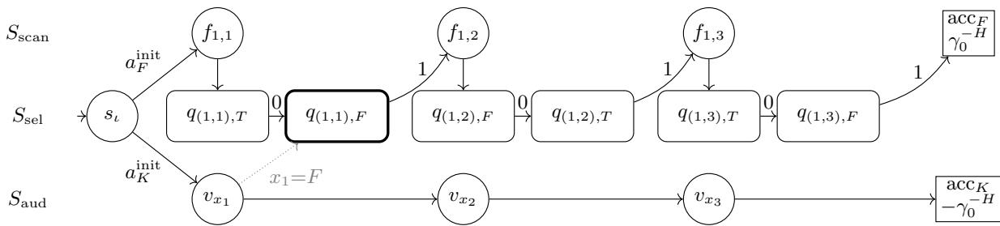  
Figure 9: The verifier RMDP of Definition 13 for $\varphi = ( x _ { 1 } \vee \neg x _ { 2 } \vee x _ { 3 } ) \wedge ( \neg x _ { 1 } \vee x _ { 2 } \vee x _ { 3 } )$ , showing the four state groups. For each literal of $C _ { 1 }$ , the scanner first reads the value that would make it true; only outcome 0 followed by outcome 1 at the opposite-value selector confirms that it is locally false. The displayed 0, 1 paths advance through the three literals and then accept; every other outcome abandons $C _ { 1 }$ . The auditor policy $\bar { K } _ { \alpha }$ walks $v _ { x _ { 1 } } , v _ { x _ { 2 } } , v _ { x _ { 3 } }$ and, having assigned a value to each variable, checks its occurrences. Dotted edges summarize audit reads of the shared selectors: the scanner and the auditor of $x _ { 1 } = F$ read the same $q _ { ( 1 , 1 ) , F } ,$ coupling their acceptances. The remaining occurrences, both clauses, and the depth-H padding follow the same pattern.

For a randomized valuation policy, put

$$
G _ { \varphi } ( \sigma ) = \operatorname* { s u p } _ { u } \bigl ( V _ { u } ^ { \pi _ { F } } ( s _ { \iota } ) - V _ { u } ^ { K _ { \sigma } } ( s _ { \iota } ) \bigr ) .
$$

At a vertex, acceptance by $\pi _ { F }$ contributes one and acceptance by $K _ { \sigma }$ contributes another one to this diference.

Lemma 34 (Verifier gap). For the verifier RMDP andpolicies ofDefinitions 13 and 14, thefollowing gap holds. $I f \varphi$ is satisfiable, some deterministic valuation policy has $G _ { \varphi } \leq 1 . \ : I f \varphi$ is unsatisfiable, every randomized valuation policy has $G _ { \varphi } \geq 1 + 2 ^ { - n }$

Proof. For a satisfying α, Lemma 33 bounds the diference by one at every vertex. Both policy graphs are acyclic and visit each local selector at most once, so Lemma 17 extends the bound to the entire product polytope.

Now fix σ for an unsatisfiable formula. At each of the n variable states, choose a most probable action. These actions form a valuation α. Since every such state is visited exactly once, $K _ { \sigma }$ follows that complete valuation with probability at least $\delta = 2 ^ { - n }$ Use the canonical realization for $\alpha .$ . The formula has a clause falsified by $\alpha , { \bf s o } \ \pi _ { F }$ accepts with probability one and $K _ { \sigma }$ with probability at least δ. Thus $G _ { \varphi } ( \sigma ) \geq 1 + \delta$ □

We now transfer the verifier gap to minimal robust regret while preventing the synthesized policy from leaving the valuation graph. Apply Lemma 30 with $\pi _ { F }$ as reference. At variable states allow $\{ T , { \bar { F } } \}$ , at verifier states allow the unique action of $K _ { \sigma } .$ and at source states used only by $\pi _ { F }$ allow their unique action. The lifted allowed policies are precisely the valuation policies and

$$
\mathrm { R r e g } ^ { N } ( K _ { \sigma } ) = \Lambda + G _ { \varphi } ( \sigma ) .
$$

Equivalently, the target is Restrict $( \mathrm { L i f t } ( N _ { \varphi } , \pi _ { F } ) , A _ { \mathrm { a l l o w } } , 2 ^ { - n } / 4 )$ , where $N _ { \varphi }$ is the verifier RMDP of Definition 13. The disallowed bonus choices are singletons, so Lemma 32 applies with $\mathcal { P } = \Pi ^ { \mathrm { M R } }$ . The gap of Lemma 34 becomes

$$
\varphi \in \mathrm { S A T } \Longrightarrow \operatorname* { i n f } _ { \pi } \mathrm { R r e g } ( \pi ) \leq \Lambda + 1 , \qquad \varphi \in \mathrm { U N S A T } \Longrightarrow \operatorname* { i n f } _ { \pi } \mathrm { R r e g } ( \pi ) \geq \Lambda + 1 + \frac { 3 } { 4 } 2 ^ { - n } .
$$

Threshold $\Lambda + 1 + 2 ^ { - n - 1 }$ proves NP-hardness.

Proof. The construction in the coNP subsection is a polynomial reduction from UNSAT, and the construction in the NP subsection is a ol nomial reduction from SAT. Their structural restrictions follow from the source verifiers, Lemma 30, and Lemma 32. The rational gaps above leave a valid separating threshold after the restriction loss. Minimal robust regret is therefore both NP-hard and coNP-hard under the restrictions stated in the theorem. □

## G Deterministic Minimal-Regret Complexity

We first establish membership and then give the matching hardness construction.

## G.1 Acyclic Deterministic Membership

Lemma 35. Minimal robust regret over memoryless deterministic policies is in $\Sigma _ { 2 } ^ { p }$ on acyclic $( s , a )$ -rectangular polytopic RMDPs.

Proof. Fix an acyclic RMDP. For any uncertainty realization, ordinary finite discounted-MDP optimality gives

$$
V _ { u } ^ { * } ( s ) = \operatorname* { m a x } _ { \pi ^ { \prime } \in \Pi ^ { \mathrm { M D } } } V _ { u } ^ { \pi ^ { \prime } } ( s ) .
$$

Indeed, process decision states in reverse topological order and select a maximizing action. No history-dependent or randomized policy can improve the resulting backward-induction value.

For every deterministic candidate π,

$$
\begin{array} { r } {  { \mathrm { R r e g } } ( \pi ) = \underset { u } { \operatorname* { s u p } } \ \underset { \pi ^ { \prime } \in \Pi ^ { \mathrm { M D } } } { \operatorname* { m a x } } \left( V _ { u } ^ { \pi ^ { \prime } } ( s _ { \iota } ) - V _ { u } ^ { \pi } ( s _ { \iota } ) \right) } \\ { = \underset { \pi ^ { \prime } \in \Pi ^ { \mathrm { M D } } } { \operatorname* { m a x } } \ \underset { u } { \operatorname* { s u p } } \left( V _ { u } ^ { \pi ^ { \prime } } ( s _ { \iota } ) - V _ { u } ^ { \pi } ( s _ { \iota } ) \right) . } \end{array}
$$

Acyclicity makes every policy pair cycle-free on its shared choices, the only self-loops being those at absorbing finals, which Definition 5 omits. By Lemma 17, the remaining supremum is attained at one vertex of every choice uncertainty set. Therefore

$$
{ \mathrm { R r e g } } ( \pi ) \leq t \iff \forall \pi ^ { \prime } \in \Pi ^ { \mathrm { M D } } \forall v \in \prod _ { s , a } \mathrm { v e r t } ( \mathcal { U } _ { s , a } ) : V _ { v } ^ { \pi ^ { \prime } } ( s _ { \iota } ) - V _ { v } ^ { \pi } ( s _ { \iota } ) \leq t .
$$

The existential certificate is the action table of π. The universal certificate contains the action table of $\pi ^ { \prime }$ and, for every choice uncertainty set, a vertex represented by linearly independent tight input facets plus its rational coordinates. Cramer’s rule gives ol nomial bit len th. The redicate verifies the facets and evaluates both olicies b exact backward induction in ol nomia time. Thus the decision problem has an existential polynomial certificate followed by a universal polynomial certificate with a polynomial-time predicate, placing it in $\Sigma _ { 2 } ^ { p }$ □

## G.2 Σp-Hardness over Deterministic Policies

Reduce from the canonical $\Sigma _ { 2 } ^ { p }$ -complete problem (Papadimitriou 1994) of deciding whether

$$
\exists x \in \{ 0 , 1 \} ^ { n } \forall y \in \{ 0 , 1 \} ^ { m } : \quad \psi ( x , y ) ,
$$

where ψ is a 3-DNF.

Definition 15 (Universal falsification reference). Write $\textstyle \psi = \bigvee _ { i = 1 } ^ { r } D _ { i }$ , where every $D _ { i }$ is a conjunction ofthree literals. Decide constant cases directly, remove universal variables with no occurrence, and order every variable’s occurrences by term and then position. Ifnecessary, add one unused existential variable so that $n \geq 1$ . For an occurrence $^ { O , }$ let $\mathrm { v a l } ( o ) \in \{ T , F \}$ be the value making its literal true. The universal falsification RMDP is

$$
N _ { \psi } = ( S _ { \psi } , A _ { \psi } , \mathcal { U } _ { \psi } , R _ { \psi } , s _ { \iota } , \gamma _ { 0 } ) ,
$$

with the following components.

$S _ { \psi }$ contains the initial state and one candidate branch-entry state per variable,

$$
\{ r _ { 1 } ^ { K } , \ldots , r _ { n } ^ { K } \} \cup \{ r _ { 1 } ^ { Y } , \ldots , r _ { m } ^ { Y } \} .
$$

It contains a global selector $q _ { Y _ { j } }$ with outcomes $q _ { Y _ { j } } ^ { T } , q _ { Y _ { j } } ^ { F }$ for every universal variable, and the shared local-bit selector of Definition 3for every occurrence o and $c \in \{ T , F \}$

• The reference-side controls are the term-scan states $f _ { i , h } .$ The candidate-side controls are the decision states ${ \boldsymbol { v } } _ { x _ { i } }$ , the existential audit states $k _ { i , c , \ell } ^ { x } ,$ , and the universal audit states $k _ { j , c , \ell } ^ { y } .$ . There are also accepting, rejecting, padding, and zero-reward terminal states, together with the ruinous sink supplied below.

• At $s _ { \iota } ,$ , action $a _ { F } ^ { \mathrm { i n i t } }$ leads deterministically to the scanner entry $f _ { 1 , 1 }$ , and action $a _ { K } ^ { \mathrm { i n i t } }$ has the certain uniform distribution over the n + m branch-entry states.

• State $r _ { j } ^ { Y }$ leads to $q _ { Y _ { j } }$ . Outcome $q _ { Y _ { i } } ^ { c }$ leads to $k _ { j , c , 1 } ^ { y }$ , which implements the audit chain of Definition 3 for the occurrences of $y _ { j }$ in term-major order. A universal branch therefore ofers the candidate no choice, the committed value being nature’s.

• State $r _ { i } ^ { K }$ leads to $v _ { x _ { i } } . A t ~ v _ { x _ { i } }$ , actions T and F enter the corresponding chain $k _ { i , c , 1 } ^ { x }$ . That control implements the same audit chainfor the occurrences ofxi in term-major order. $H x _ { i }$ has no occurrence, both actions at $v _ { x } ,$ accept immediately.

• At occurrence $o = \left( i , h \right)$ , the term scanner uses the pair test ofDefinition 3; its locallyfalse outcome advances to $f _ { i + 1 , 1 } ,$ , or accepts $i f i = r .$ . Every other outcome advances to $f _ { i , h + 1 }$ , or rejects $i f h = 3$

• Every selector has one described action. At a shared local outcome, one described action takes the scanner continuation and another takes the audit continuation. Since the two auditfamilies lie behind $a _ { K } ^ { \mathrm { i n i t } }$ and the scanner behind $a _ { F } ^ { \mathrm { i n i t } }$ , a policy that plays one of those initial actions needs only one of the two continuations, and each continuation is determined by the outcome state itself. All paths are padded so that acceptance or rejection occurs after a common depth H.

$\mathcal { U } _ { \psi }$ is the product of the local-bit segments in Equation (2) and analogous segments for the global selectors $q _ { Y _ { j } }$ . The initial splitter o $f a _ { K } ^ { \mathrm { i n i t } }$ is certain and uniform, and all remaining described choices are singletons.

• Before ruinous-sink completion, $R _ { \psi }$ is zero except at padded acceptance terminals. Every reference-side accepting terminal has $p a y o f f \gamma _ { 0 } ^ { - H }$ , every candidate-side accepting terminal has payof $- \gamma _ { 0 } ^ { - H }$ , and every rejecting terminal has payofzero.

• All remaining choices use ruinous-sink completion.

• The initial state is $\boldsymbol { s } _ { \iota }$ and the discount is the appendix-wide $\gamma _ { 0 } .$

Definition 16 (Universal falsification policies). For the RMDP ofDefinition 15, thefixed deterministic reference $\pi _ { F }$ takes $a _ { F } ^ { \mathrm { i n i t } }$ and then uses the pair-test scanner action throughout. The synthesized deterministic policy $K _ { \alpha }$ takes $a _ { K } ^ { \mathrm { i n i t } } .$ , chooses $\alpha ( x _ { i } )$ at every $v _ { x _ { i } , }$ , and follows the audit action for the committed value at every audit state, that value being $\alpha ( x _ { i } )$ on an existential branch and nature’s selection at $q _ { Y _ { j } }$ on a universal one. Each policy therefore carries one role: the reference scans and the candidate audits. At states outside a policy’s reachable graph, fix default actions whose undescribed choices use ruinous-sink completion.

By Lemma 10, the value diference is the sum of the reference and candidate acceptance probabilities.

Lemma (Unambiguous verifier policies). The policies in Definition 16 are stationary and deterministic, and no run of either policy visits a local selector twice.

Proof. The candidate’s certain uniform splitter chooses one branch. An audit commits to one value before visiting one variable’s occurrences in term-major order, while the term scanner visits the two selectors of each occurrence in their fixed pair-test order. Every occurrence belongs to one variable, so the audit reaching a given selector is unique, and the scanner reaches each selector once. Since every audit belongs to $K _ { \alpha }$ and every scan to $\pi _ { F }$ , no state asks either policy to distinguish the branch by which it was reached, and one action per state sufices. □

Ignoring final self-loops, the full RMDP is acyclic. A topological order places $\boldsymbol { s } _ { \iota }$ first, then the branch-entry states, the global selectors $Y _ { 1 } , \dots , { \bar { Y } } _ { m }$ , the decision states $v _ { x _ { 1 } } , \ldots , v _ { x _ { n } }$ , the occurrence selectors in term-major order with their associated controls and outcomes, and finally the padding, terminal, and ruinous-sink states.

For a valuation α of $x ,$ write

$$
G _ { \psi } ( \alpha ) = \operatorname* { s u p } _ { u } \bigl ( V _ { u } ^ { \pi _ { F } } ( s _ { \iota } ) - V _ { u } ^ { K _ { \alpha } } ( s _ { \iota } ) \bigr ) .
$$

Lemma 36 (DNF dichotomy). Let $M = n + m$ . For every α, $i f \forall y : \psi ( \alpha , y )$ then $\begin{array} { r } { G _ { \psi } ( \alpha ) \le 2 - \frac { 1 } { M } } \end{array}$ , while $i f \exists y : \lnot \psi ( \alpha , y )$ then $G _ { \psi } ( \alpha ) = 2$

Proof. At a Boolean vertex, let $A _ { j }$ be the event that the $y _ { j }$ audit passes, let $B$ be the event that the term scanner passes, and let $C _ { i }$ be the event that the $x _ { i }$ audit against $\alpha ( x _ { i } )$ passes. The reference reaches its single scanner branch with probability one, while the candidate’s splitter gives each of the $n + m$ audit branches weight $\textstyle { \frac { 1 } { n + m } }$ , so the padding and terminal rewards give

$$
{ \cal D } _ { \pi _ { F } , K _ { \alpha } } = \mathbf { 1 } _ { \{ B \} } + { \frac { | \{ j : A _ { j } \} | + | \{ i : C _ { i } \} | } { n + m } } .
$$

$\mathrm { I f } \exists y : \lnot \psi ( \alpha , y )$ , the canonical local pairs for $( \alpha , y )$ and the global choices $Y _ { j } = y _ { j }$ make every event hold. This gives value two, which is also the largest possible value.

Now suppose $\forall y : \psi ( \alpha , y )$ . All events cannot hold at once. Indeed, if every audit passes, set $y _ { j } = Y _ { j }$ . Whenever the pair test declares an occurrence locally false, its value-certifying bit is zero, while the passing audit forces the bit indexed by the committed variable value to one. The committed value therefore makes that literal false. Event $B$ would then ive a false litera in every DNF term, contradicting $\psi ( \alpha , y )$ . At least one event fails, and its weight is at least

$$
\operatorname* { m i n } \left\{ 1 , \frac { 1 } { n + m } \right\} = \frac { 1 } { M } .
$$

Thus every vertex has value at most $\textstyle { 2 - { \frac { 1 } { M } } }$ . No run repeats an uncertain choice, so Lemma 17 extends the bound to the full product polytope. □

Lemma 37. Minimal robust regret over $\Pi ^ { \mathrm { M D } } i s \Sigma _ { 2 } ^ { p }$ -hard on acyclic $( s , a )$ -rectangular RMDPs in which every uncertain choice is two-Dirac and the only other stochastic rows are certain uniform splitters.

Proof. Set $M = n + m$ . By Lemma 36, a yes-instance has some $K _ { \alpha }$ with $\begin{array} { r } { G _ { \psi } ( \alpha ) \le 2 - \frac { 1 } { M } } \end{array}$ , while every $K _ { \alpha }$ in a no-instance has $G _ { \psi } ( \alpha ) = 2$ . Apply the exact lift with reference $\pi _ { F }$ . At existential variable states allow $\{ T , F \}$ . At every other state allow the unique action used by the synthesized verifier, and at internal states used only by $\pi _ { F }$ take $\bar { A } _ { \mathrm { a l l o w } } ( s ) = \{ \pi _ { F } ( s ) \}$ . Thus every allowed set is nonempty. At a shared local outcome this allows the audit action and not the scanner action, which costs the reference nothing: by Definition 10 the lift replays $\pi _ { F }$ through the bonus action rather than through $A _ { \mathrm { a l l o w } }$ . The allowed deterministic policies therefore have minimal regret at most $\Lambda + \textstyle { \overline { { 2 } } } - { \frac { 1 } { M } }$ in yes-instances and exactly $\Lambda + 2$ in no-instances.

The composed target is

$$
\mathrm { R e s t r i c t } \left( \mathrm { L i f t } ( N _ { \psi } , \pi _ { F } ) , A _ { \mathrm { a l l o w } } , \frac { 1 } { 4 M } \right) .
$$

Apply Lemma 32 with $\mathcal { P } = \Pi ^ { \mathrm { M D } }$ . The disallowed bonus choices are singletons. In yes-instances the unrestricted minimum is at most $\textstyle \Lambda + 2 - { \frac { 1 } { M } }$ , while in no-instances it is at least $\Lambda + 2 - \textstyle { \frac { 1 } { 4 M } }$ . Since

$$
\Lambda + 2 - \frac { 1 } { M } < \Lambda + 2 - \frac { 1 } { 2 M } < \Lambda + 2 - \frac { 1 } { 4 M } ,
$$

threshold $\textstyle \Lambda + 2 - { \frac { 1 } { 2 M } }$ separates the cases. The structural restrictions follow from Lemmas 30 and 32, whose unfolding step is what keeps the composed target acyclic. □

Theorem 38. Minimal robust regret over memoryless deterministic policies is $\Sigma _ { 2 } ^ { p }$ -complete on acyclic $( s , a )$ -rectangular polytopic RMDPs. Hardness already holds when every uncertain choice is two-Dirac and the only other stochastic rows are certain uniform splitters.

Proof of Theorem 38. Membership is Lemma 35. Hardness is Lemma 37.

## H Proof of Theorem 7: Signed Square-Root-Sum Hardness

The source problem ${ \mathsf { S Q R S } } _ { \pm }$ gives two lists of positive integers and asks, in its non-strict forward direction, whether

$$
\sum _ { i } { \sqrt { a _ { i } } } \leq \sum _ { j } { \sqrt { b _ { j } } } .
$$

The reduction represents each square root by a one-state gadget whose regret balances a decreasing term against an increasing term in the policy’s mixing probability. The optimum is therefore the solution of a quadratic equation and is generally irrational. Theorem 7. Minimal robust regret is ${ \mathsf { S Q R S } } _ { \pm }$ -hard under $( s , a )$ -rectangular uncertainty.

## H.1 One-State Balancing

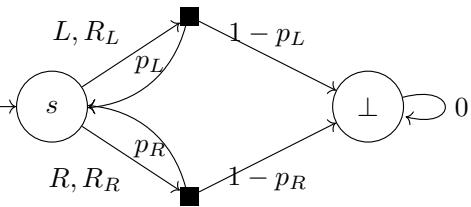  
Figure 10: The one-state balancing gadget has independent choices $p _ { L } , p _ { R } \in [ 0 , h ]$ and a zero-reward sink.

Definition 17 (One-state balancing gadget). Fix $q \in ( 0 , 1 )$ and $\gamma \in ( 1 - q , 1 )$ , and put $h = ( 1 - q ) / \gamma$ . The one-state balancing RMDP shown in Figure 10 is

$$
G = ( S , A , \mathcal { U } , R , s , \gamma ) ,
$$

with the following components.

$S = \{ s , \bot \}$ , where ⊥ is a zero-reward sink.

• The global action set is $\{ L , R \} . A t \perp$ , both actions have a zero-reward Dirac self-loop.

• U is the product of the independent uncertainty sets

$$
\mathcal { U } _ { ( s , L ) } = \left\{ p _ { L } \delta _ { s } + ( 1 - p _ { L } ) \delta _ { \perp } : p _ { L } \in [ 0 , h ] \right\} , \qquad \mathcal { U } _ { ( s , R ) } = \left\{ p _ { R } \delta _ { s } + ( 1 - p _ { R } ) \delta _ { \perp } : p _ { R } \in [ 0 , h ] \right\} .
$$

• R assigns rewards $R _ { L }$ and $R _ { R }$ to actions L and R at s, respectively, and assigns zero reward at ⊥.

• The initial state is s and the discount is the local parameter γ.

The condition $\gamma > 1 - q$ is exactly $h < 1$ , so these are valid transition probabilities. Write $d _ { L } = 1 - \gamma p _ { L }$ and $d _ { R } = 1 - \gamma p _ { R }$ Both range over [q, 1].

For the gadget of Definition 17, the two parametrizations below choose $( R _ { L } , R _ { R } )$ so that its minimal robust regret realizes the signed square-root forms $m _ { + }$ and $m _ { - }$ summed by the ${ \mathsf { S Q R S } } _ { \pm }$ reduction. For $A , B > 0$ , put $D = A + B$ . The positive-reward parametrization is

$$
r _ { L } = \frac { q ( A + q B ) } { 1 - q ^ { 2 } } , \qquad r _ { R } = \frac { q ( B + q A ) } { 1 - q ^ { 2 } } , \qquad ( R _ { L } , R _ { R } ) = ( r _ { L } , r _ { R } ) ,
$$

and define

$$
m _ { + } ( A , B ) = \frac { D - \sqrt { D ^ { 2 } - 4 ( 1 - q ^ { 2 } ) A B } } { 2 ( 1 - q ^ { 2 } ) } .
$$

The negative-reward parametrization is

$$
\ell = \frac { B + q A } { 1 - q ^ { 2 } } , \qquad r = \frac { A + q B } { 1 - q ^ { 2 } } , \qquad ( R _ { L } , R _ { R } ) = ( - \ell , - r ) ,
$$

and define

$$
m _ { - } ( A , B ) = \frac { \sqrt { q ^ { 2 } D ^ { 2 } + 4 ( 1 - q ^ { 2 } ) A B } - q D } { 2 ( 1 - q ^ { 2 } ) } .
$$

Lemma 39 (One-state balancing gadgets). The positive-reward parametrization has minimal robust regret $m _ { + } ( A , B )$ . If $q ^ { 2 } \geq 1 / 2 ,$ , the negative-reward parametrization has minimal robust regret $m _ { - } ( A , B )$

Proof. A memoryless randomized policy in this gadget is determined by one number $x \in [ 0 , 1 ]$ , the probability of playing L at $s .$

First, consider the positive-reward form. For fixed $d _ { L } , d _ { R } \in [ q , 1 ]$

$$
V _ { L } = \frac { r _ { L } } { d _ { L } } , \qquad V _ { R } = \frac { r _ { R } } { d _ { R } } , \qquad V _ { x } = \frac { x r _ { L } + ( 1 - x ) r _ { R } } { x d _ { L } + ( 1 - x ) d _ { R } } .
$$

A direct calculation gives

$$
V _ { L } - V _ { x } = \frac { ( 1 - x ) ( r _ { L } d _ { R } - r _ { R } d _ { L } ) } { d _ { L } ( x d _ { L } + ( 1 - x ) d _ { R } ) }
$$

and

$$
V _ { R } - V _ { x } = \frac { x ( r _ { R } d _ { L } - r _ { L } d _ { R } ) } { d _ { R } ( x d _ { L } + ( 1 - x ) d _ { R } ) } .
$$

On the region $V _ { L } \ \ge \ V _ { R }$ , the first expression is decreasing in $d _ { L }$ and increasing in $d _ { R } ,$ , so its maximum is attained at $d _ { L } = q , d _ { R } = 1$ . Since

$$
\frac { r _ { L } } { q } - r _ { R } = A ,
$$

this maximum is

$$
{ \frac { A ( 1 - x ) } { 1 - ( 1 - q ) x } } .
$$

Similarly, on the region $V _ { R } \geq V _ { L }$ , the second expression is maximized at $d _ { L } = 1 , d _ { R } = q$ . Since

$$
\frac { r _ { R } } { q } - r _ { L } = B ,
$$

this maximum is

$$
{ \frac { B x } { q + ( 1 - q ) x } } .
$$

Thus

$$
\operatorname { R r e g } ( x ) = \operatorname* { m a x } \left\{ { \frac { A ( 1 - x ) } { 1 - ( 1 - q ) x } } , { \frac { B x } { q + ( 1 - q ) x } } \right\} .
$$

The first term is strictl decreasin in x and the second is strictl increasin in x. Hence the minimum is attained when the two terms are equal. If the common value is $y ,$ then

$$
( 1 - q ^ { 2 } ) y ^ { 2 } - D y + A B = 0 , \qquad D = A + B .
$$

The smaller root gives the claimed value.

For the negative-reward form the same two-region split applies, now with $V _ { L } = - \ell / d _ { L }$ and $V _ { R } = - r / d _ { R }$ . The conditions $A , B > 0$ are equivalent to

$$
r - q \ell = A > 0 , \ell - q r = B > 0 ,
$$

and imply $q < r / \ell < 1 / q$ . For $V _ { L } - V _ { x } , \mathrm { s e t } z = d _ { R } / d _ { L } \in [ q , 1 / q ] . \mathrm { O n } z \in [ q , 1 ]$ , minimizing the feasible $d _ { L }$ gives $\frac { ( 1 - x ) z ( r - \ell z ) } { q ( x + ( 1 - x ) z ) }$ whose derivative has numerator $x ( r - 2 \ell z ) - ( 1 - x ) \ell z ^ { 2 } \leq 0$ because $z \geq q , r / \ell < 1 / q ,$ and $q ^ { 2 } \geq 1 / 2 . \mathrm { O n } z \in \overline { { [ 1 , 1 / q ] } }$ , the corresponding expression $\frac { ( 1 - x ) ( r - \ell z ) } { q ( x + ( 1 - x ) z ) }$ is strictly decreasing. Thus the maximum occurs at $z = q$ , namely $d _ { L } = 1 , d _ { R } = q .$ , and equals $A ( 1 - x ) / ( q + ( 1 - q ) \dot { x } )$ ). By symmetry the other region contributes $B x / ( 1 - ( 1 - q ) x )$ . Hence

$$
\operatorname { R r e g } ( x ) = \operatorname* { m a x } \left\{ { \frac { A ( 1 - x ) } { q + ( 1 - q ) x } } , { \frac { B x } { 1 - ( 1 - q ) x } } \right\} .
$$

Balancing the decreasing and increasing terms gives $( 1 - q ^ { 2 } ) y ^ { 2 } + q D y - A B = 0$ . Its positive root is $m _ { - } ( A , B )$

## H.2 Rational Square-Root Gadgets

Lemma 40 (Local gadget for a negative square-root coeficient). For every integer $b \geq 2 ,$ , one can compute in polynomial time rational numbers $q _ { b } , D _ { b } , A _ { b } , B _ { b }$ such that, for any $\gamma \in ( 1 - q _ { b } , 1 )$ , the positive-reward balancing gadget ofLemma 39, after a rational reward scaling, has minimal robust regret of

$$
D _ { b } - { \sqrt { b } } .
$$

Proof. Choose a rational number $\eta \in ( \sqrt { b } - 1 , \sqrt { b - 1 } )$ . The interval has length greater than $1 / 2$ for $b \geq 2 .$ , so scanning a constant-denominator dyadic grid finds such an η. Both endpoint tests use exact rational square comparisons. Thus η has $O ( \log b )$ bits and is found in polynomial time. Define

$$
q _ { b } = \frac { b - 1 - \eta ^ { 2 } } { 2 \eta } , N _ { b } = \frac { \eta + \frac { b - 1 } { \eta } } { 2 } , D _ { b } = \frac { N _ { b } } { q _ { b } } .
$$

The upper bound on η gives $q _ { b } > 0$ , while $\eta > \sqrt { b } - 1$ is equivalent to $q _ { b } < 1$ . Direct expansion gives $N _ { b } ^ { 2 } - q _ { b } ^ { 2 } = b - 1$ . Hence $N _ { b } > q _ { b } ,$ so $D _ { b } > 1$ . Hence, $\dot { q } _ { b } ^ { 2 } D _ { b } ^ { 2 } + 1 - \dot { q } _ { b } ^ { 2 } = b$

Now set

$$
A _ { b } = \frac { D _ { b } + 1 } { 2 } , \qquad B _ { b } = \frac { D _ { b } - 1 } { 2 } .
$$

Then $A _ { b } , B _ { b } > 0 , A _ { b } + B _ { b } = D _ { b }$ , and

$$
\begin{array} { r l } & { D _ { b } ^ { 2 } - 4 ( 1 - q _ { b } ^ { 2 } ) A _ { b } B _ { b } = D _ { b } ^ { 2 } - ( 1 - q _ { b } ^ { 2 } ) ( D _ { b } ^ { 2 } - 1 ) } \\ & { \phantom { D _ { b } ^ { 2 } - } = q _ { b } ^ { 2 } D _ { b } ^ { 2 } + 1 - q _ { b } ^ { 2 } } \\ & { \phantom { D _ { b } ^ { 2 } - } = b . } \end{array}
$$

By Lemma 39, the unscaled positive-reward gadget has minimal robust regret

$$
{ \frac { D _ { b } - { \sqrt { b } } } { 2 ( 1 - q _ { b } ^ { 2 } ) } } .
$$

Scaling all rewards by $2 ( 1 - q _ { b } ^ { 2 } )$ gives the value $D _ { b } - { \sqrt { b } } .$ . Moreover $D _ { b } ^ { 2 } = 1 + ( b - 1 ) / q _ { b } ^ { 2 } > b ,$ , so this local regret is positive. All rational operations preserve polynomial bit length. □

Example 7 instantiates the construction at $b = 2$

Example 7 (The gadget for $b = 2 )$ . Take $\eta = 1 / 2$ . Then $q _ { 2 } = 3 / 4 , N _ { 2 } = 5 / 4 ,$ , and $D _ { 2 } = 5 / 3$ , with $N _ { 2 } ^ { 2 } - q _ { 2 } ^ { 2 } = 1 = b - 1$ After the prescribed reward scaling, the local minimal regret is $5 / 3 - { \sqrt { 2 } } .$

Lemma 41 (Local gadget for a positive square-root coeficient). For every integer $b \geq 2 ,$ , one can compute in polynomial time a rational constant $C _ { b }$ and a negative-reward $( s , a )$ -rectangular gadget such that,for any $\gamma \in \left( \textstyle { \frac { 1 } { 5 } } , 1 \right)$ , its minimal robust regret is

$$
{ \sqrt { b } } - C _ { b } .
$$

Proof. Choose a rational number m such that

$$
\frac { 2 b } { 3 } < m ^ { 2 } < b .
$$

The interval $( { \sqrt { 2 b / 3 } } , { \sqrt { b } } )$ has width at least ${ \sqrt { 2 } } ( 1 - { \sqrt { 2 / 3 } } )$ . Scanning dyadics of polynomial bit length with rational square comparisons therefore finds m in polynomial time. Define

$$
D = { \frac { m + { \frac { b } { m } } } { 2 } } , \qquad c = { \frac { { \frac { b } { m } } - m } { 2 } } .
$$

Then $D , c \in \mathbb { Q } , c > 0$ , and $D ^ { 2 } - c ^ { 2 } = b$ . Moreover,

$$
\frac { c } { D } = \frac { b - m ^ { 2 } } { b + m ^ { 2 } } < \frac { 1 } { 5 } .
$$

Set

$$
q = \frac { 4 } { 5 } , \quad E = \frac { 5 } { 3 } c , \quad A = \frac { D + E } { 2 } , \quad B = \frac { D - E } { 2 } .
$$

Since $\begin{array} { r } { \frac { E } { D } < \frac { 1 } { 3 } } \end{array}$ , we have A, $B > 0$ . Also $A + B = D$ , and because $\textstyle 1 - q ^ { 2 } = { \frac { 9 } { 2 5 } }$ , we have

$$
\begin{array} { r l } { q ^ { 2 } D ^ { 2 } + 4 ( 1 - q ^ { 2 } ) A B = q ^ { 2 } D ^ { 2 } + ( 1 - q ^ { 2 } ) ( D ^ { 2 } - E ^ { 2 } ) } \\ { = D ^ { 2 } - ( 1 - q ^ { 2 } ) E ^ { 2 } } \\ { = D ^ { 2 } - c ^ { 2 } } \\ { = b . } \end{array}
$$

Finally, $\frac { c } { D } < \frac { 1 } { 5 }$ implies $\begin{array} { r } { D ^ { 2 } = b + c ^ { 2 } < \frac { 2 5 b } { \mathcal { D } 4 } } \end{array}$ , and therefore $q ^ { 2 } D ^ { 2 } < b .$ Thus $q D < { \sqrt { b } } .$

Now use the negative-reward form of Lemma 39 with these $q , A , B , D$ . Its unscaled minimal robust regret is

$$
{ \frac { { \sqrt { b } } - q D } { 2 ( 1 - q ^ { 2 } ) } } .
$$

Scaling all rewards by $2 ( 1 - q ^ { 2 } )$ gives minimal robust regret ${ \sqrt { b } } - q D$ . Set $C _ { b } = q D$ . The strict inequality $q D < { \sqrt { b } }$ proved above makes this local regret positive, and all parameters have polynomial binary length. □

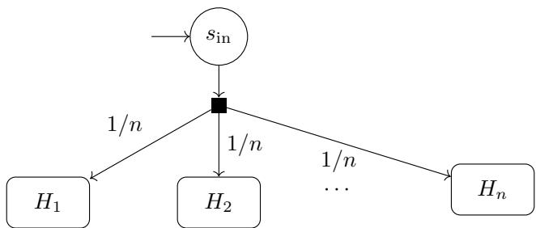  
Figure 11: Additive splitter for minimal regret.

## H.3 Additive Composition

Definition 18 (Additive s litter). Let $H _ { 1 } , \ldots , H _ { n }$ be disjoint $( s , a )$ -rectangular gadgets with common discount $\gamma ,$ entry states $s _ { i } ,$ local regrets R $\cdot \mathrm { e g } _ { H _ { i } }$ , and mutually independent uncertainty sets. Add a zero-reward initial certain uniform splitter $s _ { \mathrm { i n } }$ whose only action enters each $s _ { i }$ with probability $1 / n ,$ and scale every reward in every $H _ { i }$ by $n / \gamma$ (Figure 11). After scaling, every remaining choice uses ruinous-sink completion. Denote the resulting RMDP, whose uncertainty set is the product of the local sets, by H.

Lemma 42 (Additive composition for minimal regret). $\begin{array} { r } { I f m _ { i } = \operatorname* { i n f } _ { \pi _ { i } \in \Pi ^ { \mathrm { M R } } } } \end{array}$ $\mathrm { R r e g } _ { H _ { i } } ( \pi _ { i } )$ , then the additive splitter of Definition 18 satisfies

$$
\operatorname* { i n f } _ { \pi \in \Pi ^ { \mathrm { M R } } } \mathrm { R r e g } _ { H } ( \pi ) = \sum _ { i = 1 } ^ { n } m _ { i } .
$$

Proof. For a global policy π, let $\pi _ { i }$ be its restriction to $H _ { i } .$ For any competing policy $\pi ^ { * }$ and any rectangular uncertainty realization $\pmb { u } = ( \pmb { u } _ { 1 } , \dots , \pmb { u } _ { n } )$ , the Bellman equation at the certain uniform splitter has value

$$
V _ { u } ^ { \pi ^ { * } } ( s _ { \mathrm { i n } } ) - V _ { u } ^ { \pi } ( s _ { \mathrm { i n } } ) = \gamma \sum _ { i = 1 } ^ { n } \frac { 1 } { n } \frac { n } { \gamma } \left( V _ { u _ { i } } ^ { \pi _ { i } ^ { * } } ( s _ { i } ) - V _ { u _ { i } } ^ { \pi _ { i } } ( s _ { i } ) \right) = \sum _ { i = 1 } ^ { n } \left( V _ { u _ { i } } ^ { \pi _ { i } ^ { * } } ( s _ { i } ) - V _ { u _ { i } } ^ { \pi _ { i } } ( s _ { i } ) \right) .
$$

The local uncertainty sets are independent and the competing policy can be chosen independently inside the disjoint gadgets. Hence

$$
\operatorname { R r e g } _ { H } ( \pi ) = \sum _ { i = 1 } ^ { n } \operatorname { R r e g } _ { H _ { i } } ( \pi _ { i } ) .
$$

Taking the infimum over the product of the local policy simplexes proves the claim. By Lemma 11, every ruinous choice is strictly worse than a described local one, so adding the global action alphabet creates no further minimizer or comparator. The construction preserves (s, a)-rectangularity. □

## H.4 Proof of Theorem 7

ProofofTheorem 7. Reduce from the non-strict ≤ direction of ${ \mathsf { S Q R S } } _ { \pm }$ . Given two lists $a _ { 1 } , \ldots , a _ { m }$ and $b _ { 1 } , \ldots , b _ { n }$ , we construct in polynomial time an $( s , a )$ )-rectangular RMDP M and a rational threshold t such that

$$
\operatorname* { i n f } _ { \pi \in \Pi ^ { \mathrm { M R } } } \mathrm { R r e g } _ { M } ( \pi ) \leq t
$$

if and only if

$$
\sum _ { i = 1 } ^ { m } { \sqrt { a _ { i } } } \leq \sum _ { j = 1 } ^ { n } { \sqrt { b _ { j } } } .
$$

The reversed non-strict comparison uses the same construction after swapping the two lists. Let $I = \{ i \mid a _ { i } \geq 2 \} , J = \{ j \mid$ $b _ { j } \geq 2 \}$ , and let $r _ { 0 } = | \{ i \mid { \bar { a } } _ { i } = 1 \} | - | \{ j \mid b _ { j } = 1 \}$ be the rational contribution of unit roots. If $I \cup J = \emptyset$ , we output a single-state zero-reward RMDP with threshold $- r _ { 0 }$ , which is a yes-instance exactly when $r _ { 0 } \le 0$

In the following, assume that at least one non-unit root is present. Put $N = | \boldsymbol { I } | + | \boldsymbol { J } |$ for the number of local gadgets. Fo every $i \in I .$ , apply Lemma 41. This gives a local gadget with minimal robust regret

$$
\sqrt { a _ { i } } - C _ { i } ^ { + }
$$

for a rational constant $C _ { i } ^ { + }$ . For every $j \in J ,$ , apply Lemma 40 to obtain rational parameters $q _ { j } , D _ { j } ^ { - } , A _ { j } ^ { - } , B _ { j } ^ { - }$ . After the reward scaling from that lemma, gadget j has local minimal robust regret

$$
{ \cal D } _ { j } ^ { - } - \sqrt { b _ { j } } .
$$

Choose one common discount factor

$$
q _ { \operatorname* { m i n } } = \operatorname* { m i n } \left( \left\{ { \frac { 4 } { 5 } } \right\} \cup \{ q _ { j } \mid j \in J \} \right) , \qquad \gamma = 1 - { \frac { q _ { \operatorname* { m i n } } } { 2 } } .
$$

Then $\begin{array} { r } { \gamma \in ( \frac { 1 } { 5 } , 1 ) } \end{array}$ , so the positive-coeficient gadgets are valid, and $\gamma > 1 - q _ { j }$ for every $j \in J ,$ , so the negative-coeficient gadgets are valid as well. Compose all local gadgets using Lemma 42. The resulting RMDP has

$$
\begin{array} { l } { \underset { \pi \in \Pi ^ { \mathrm { M R } } } { \operatorname* { i n f } } \mathrm { R r e g } ( \pi ) = \displaystyle \sum _ { i \in I } ( \sqrt { a _ { i } } - C _ { i } ^ { + } ) + \displaystyle \sum _ { j \in J } ( D _ { j } ^ { - } - \sqrt { b _ { j } } ) } \\ { = C + \displaystyle \sum _ { i \in I } \sqrt { a _ { i } } - \displaystyle \sum _ { j \in J } \sqrt { b _ { j } } , } \end{array}
$$

where

$$
C = \sum _ { j \in J } D _ { j } ^ { - } - \sum _ { i \in I } C _ { i } ^ { + } .
$$

Set the threshold $t = C - r _ { 0 }$ . Then

$$
\begin{array} { r c l } { { \displaystyle \operatorname* { i n f } _ { \pi \in \Pi ^ { \mathrm { M R } } } \mathrm { R r e g } ( \pi ) \leq t \iff \sum _ { i \in I } \sqrt { a _ { i } } - \sum _ { j \in J } \sqrt { b _ { j } } \leq - r _ { 0 } } }  \\ { { \iff \displaystyle \sum _ { i = 1 } ^ { m } \sqrt { a _ { i } } \leq \sum _ { j = 1 } ^ { n } \sqrt { b _ { j } } . } } \end{array}
$$

The uncertainty set is a product of choice uncertainty sets, so the reduction preserves $( s , a )$ -rectangularity.

## I Proof of Theorem 8: General-Polytope Minimal-Regret Hardness

We first prove the existential-universal upper bound, then use two-action anchoring to turn general policy comparison into a strictly monotone minimal-regret objective.

Theorem 8. Single-policy minimal robust regret is ∀R-hard for arbitrary rational polytopic uncertainty.

## I.1 Existential-Universal Membership

The membership claim is proved with its certification counterpart in Appendix C.

## I.2 Two-Action Anchoring

Start with a deterministic comparison instance $( M , \pi _ { 1 } , \pi _ { 2 } , t )$ (Problem 5) and write

$$
\Delta = \operatorname* { s u p } _ { p } \bigl ( V _ { p } ^ { \pi _ { 1 } } ( s _ { \iota } ) - V _ { p } ^ { \pi _ { 2 } } ( s _ { \iota } ) \bigr ) , \qquad V _ { \mathrm { m a x } } = \frac { \operatorname* { m a x } _ { s , a } | R ( s , a ) | } { 1 - \gamma } .
$$

Choose

$$
L = 2 \gamma V _ { \mathrm { m a x } } + | \gamma t | + 1 , \qquad Z = L / \gamma + 2 V _ { \mathrm { m a x } } + 1 .
$$

Every compliant value of the construction below is bounded in absolute value by $M _ { \widehat { M } } = L + \gamma ( Z + V _ { \operatorname* { m a x } } ) + Z ,$ , since the copies contribute at most $V _ { \mathrm { m a x } }$ , the anchors $\pm Z _ { i }$ , and the initial action at most L on top of those. Choose a rational $Z _ { \mathrm { r } }$ of polynomial encoding length such that

$$
\gamma Z _ { \mathrm { r } } > M _ { \widehat { M } } + 1 ,
$$

which is the hypothesis of Lemma 11.

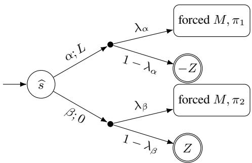  
Figure 12: The two-action anchoring RMDP. The two copies share the realization $p ,$ whereas $\lambda _ { \alpha }$ and $\lambda _ { \beta }$ are fresh coordinates.

Definition 19 (Two-action anchoring RMDP). Given $( M , \pi _ { 1 } , \pi _ { 2 } , t )$ , the two-action anchoring RMDP is

$$
\widehat { M } = ( \widehat { S } , \widehat { A } , \widehat { \mathcal { U } } , \widehat { R } , \widehat { s } , \gamma ) ,
$$

with the following components.

• $\widehat { S }$ contains a fresh initial state ${ \widehat { s } } ,$ two disjointforced copies of M, absorbing states z− and $z _ { + }$ of values −Z and $Z ,$ and a ruinous sink ⊥r of value $- Z _ { \mathrm { r } }$

• At each state in copy i, the action prescribed by $\pi _ { i }$ is the described action. The initial state ofers actions α and $\beta .$ Every action $a t z _ { - }$ and $z _ { + }$ self-loops with the reward realizing its displayed payof.

• Ub ties corresponding transition coordinates of the forced copies to one realization p of U. It also contains mutually independent coordinates $\lambda _ { \alpha } , \lambda _ { \beta } \in [ 0 , 1 ]$ that are unconstrained by the equalities tying the copies. Action α enters the first copy with probability $\lambda _ { \alpha }$ and z otherwise. Action $\beta$ enters the second copy with probability $\lambda _ { \beta }$ and $z _ { + }$ otherwise.

• Rewards inside the forced copies agree with M. Action α pays L, action β pays zero, and the self-loop rewards at z− and $z _ { + }$ are $- ( 1 - \gamma ) Z$ and $( 1 - \gamma ) \bar { Z } ,$ , respectively. Every action at $\perp _ { \mathrm { r } }$ self-loops with reward $- ( 1 - \gamma ) Z _ { \mathrm { r } }$ . All remaining choices use ruinous-sink completion with $\bar { Z } _ { \mathrm { r } }$

• The initial state is sb and the discount is γ.

Figure 12 illustrates the construction.

Lemma 43 (Anchored action values). At a realization $\left( p , \lambda _ { \alpha } , \lambda _ { \beta } \right)$ of Definition 19, the values of α and β at sb are

$$
A = L + \gamma \big ( \lambda _ { \alpha } V _ { p } ^ { \pi _ { 1 } } ( s _ { \iota } ) - ( 1 - \lambda _ { \alpha } ) Z \big ) , \qquad B = \gamma \big ( \lambda _ { \beta } V _ { p } ^ { \pi _ { 2 } } ( s _ { \iota } ) + ( 1 - \lambda _ { \beta } ) Z \big ) .
$$

Proof. The choice of Z makes every ruinous-completed action strictly worse than the prescribed continuation at a copied state, for both the comparator and the candidate. Thus the two copies have values $V _ { p } ^ { \pi _ { 1 } } ( s _ { \iota } )$ and $V _ { p } ^ { \pi _ { 2 } } ( s _ { \iota } )$ . One-step conditioning on the two successors of each initial action gives the formulas. □

Set $D = L + \gamma \Delta$ and $E = 2 \gamma Z - L$

Lemma 44 (Two-action anchoring). The constants D and E are positive. A policy choosing α with probability x has robust regret max $\{ ( 1 - x ) D , x E \}$

Proof. By Lemma 43, the action-value diference is afine in each fresh coordinate, so its extrema occur at their four endpoin pairs. For $A - B$ these values are

$$
\begin{array} { r } { \frac { \big ( \lambda _ { \alpha } , \lambda _ { \beta } \big ) } { ( 1 , 1 ) } \left. \begin{array} { c } { A - B } \\ { L + \gamma \big ( V _ { p } ^ { \pi _ { 1 } } - V _ { p } ^ { \pi _ { 2 } } \big ) } \\ { L + \gamma \big ( V _ { p } ^ { \pi _ { 1 } } - Z \big ) } \\ { L - \gamma \big ( Z + V _ { p } ^ { \pi _ { 2 } } \big ) } \\ { \big ( 0 , 0 \big ) } \end{array} \right. } \end{array}
$$

The definition of $Z$ and $| V _ { p } ^ { \pi _ { i } } | \le V _ { \mathrm { m a x } }$ make the first endpoint strictly largest after optimizing over $p ,$ so its supremum is $D .$ For $B - A$ the four values are respectively

$$
\gamma ( V _ { p } ^ { \pi _ { 2 } } - V _ { p } ^ { \pi _ { 1 } } ) - L , \quad \gamma Z - L - \gamma V _ { p } ^ { \pi _ { 1 } } , \quad \gamma ( Z + V _ { p } ^ { \pi _ { 2 } } ) - L , \quad 2 \gamma Z - L .
$$

The last is strictly largest and equals $E > 0 .$ . Moreover, $\gamma \Delta \ge - 2 \gamma V _ { \mathrm { m a x } }$ , and hence $D \geq | \gamma t | + 1 > 0$ . At any realization the loss of the x-mixture is $( 1 - x ) ( A - B )$ ) when $A \geq B$ and $x ( B - A )$ otherwise. Taking the supremum, using $D , E > 0 .$ , gives the claimed maximum. □

Lemma 44 covers the policies that play α or $\beta$ and then the prescribed continuation, whereas the infimum ranges over every stationary policy of the completed RMDP, so the two must first be identified. For an arbitrary policy $\pi ,$ , its compliant projection π¯ has value at least $\pi ^ { \prime } \mathbf { s }$ at every realization by Lemma 11, hence regret at most $\pi ^ { \prime } \mathbf { s } .$ . Each copied state leaves π¯ only the prescribed action, so π¯ is determined by the single probability $x = \bar { \pi } ( \widehat { s } , \alpha )$ , and the two infima coincide. Balancing the two branches therefore gives minimum $\tilde { D E } / ( D + \check { E } )$ . Let

$$
T = L + \gamma t , \qquad t ^ { \prime } = { \frac { E T } { E + T } } .
$$

Since $z \mapsto E z / ( E + z )$ is strictly increasing for $z > 0 ,$

$$
\operatorname* { i n f } _ { \pi } \operatorname { R r e g } ( \pi ) \leq t ^ { \prime } \iff \Delta \leq t .
$$

Example 8 shows that the threshold remains rational for an irrational comparison gap.

Example 8 (Anchoring an irrational comparison gap). For the RMDP of Example $I , \gamma = 1 / 2 , V _ { \mathrm { m a x } } = 2 ,$ , and $\Delta = 7 - 4 { \sqrt { 3 } } .$ Taking $t = 0$ gives $L = 3 , Z = 1 1 , D = 1 3 / 2 - 2 { \sqrt { 3 } } , E = 8 , T = 3 ,$ , and $t ^ { \prime } = 2 4 / 1 1$ . Thus the anchoring constants and threshold remain rational even though the balanced regret $D E / ( D + E )$ depends on the irrational source gap.

ProofofTheorem 8. The equivalence above is a reduction from Theorem 20’s ∀R-hard comparison problem.

## J Proof of Theorem 9: Bounded Portfolio Synthesis

The reduction reads the two quantifiers of a bounded real sentence as the two players in synthesis. The portfolio plays the existential witness and nature plays the universal block. Three obstacles have to be handled: a reward may not depend on a policy or a realization, a stationary policy fixes one continuation per state, and diferent members must agree on the witness. The construction below resolves all three by normalizing the matrix into tests that are afine in the witness, and by making nature’s choice of audit a coeficient inside one polynomial per member rather than a branch in the model.

Theorem 9. Bounded portfolio synthesis is ∃∀R-complete under general rational polytopic uncertainty, with k encoded in unary. Hardness holds already for regret threshold two, the fixed discount $\begin{array} { r } { \gamma = \frac { 1 } { 2 } } \end{array}$ , RMDPs acyclic apart from absorbing final states, and uncertain choices with two successors.

## J.1 Existential-Universal Membership

Membership is proved in Appendix C.

## J.2 A Policy-Afine Max Normal Form

Using the bounded degree-four normal form of Definition 4, it is ∃∀R-complete to decide

$$
\exists x \in [ 0 , 1 ] ^ { n } \forall y \in [ 0 , 1 ] ^ { m } : \quad F ( x , y ) \geq 0
$$

after the afine substitution that moves the source box from $[ - 1 , 1 ] \ \mathrm { t o } \ [ 0 , 1 ]$ . Write

$$
F ( x , y ) = \sum _ { \nu = 1 } ^ { N _ { \mathrm { m o n } } } c _ { \nu } \prod _ { j = 1 } ^ { d _ { \nu } } w _ { \nu , j } , \qquad d _ { \nu } \leq 4 ,
$$

where every $w _ { \nu , j }$ is a variable of $x \cup y$ , and put

$$
B = \operatorname* { m a x } \left\{ 1 , \sum _ { \nu = 1 } ^ { N _ { \mathrm { m o n } } } | c _ { \nu } | \right\} .
$$

Thus $| F | \le B$ on the box, and B has polynomial encoding length. Apply Definition 4 with its optional output coordinate to the input vector $( x , y )$ . Let η consist of y and every copy, product, and output coordinate, and list all residuals as $h _ { 1 } , \ldots , h _ { s }$ . Only copy residuals for occurrences of x contain an existential coordinate; each does so afinely and contains exactly one.

Definition 20 (Elementary tests). For every residual $h _ { j }$ and every $\sigma \in \{ - 1 , 1 \}$ , put

$$
g _ { j , \sigma } ( x , \eta ) = \frac { o + \sigma 9 B h _ { j } } { 1 0 B } ,
$$

and enumerate the resulting $r = 2 s$ expressions as $g _ { 1 } , \ldots , g _ { r } .$

Lemma 45 (Elementary-test shape). Each test of Definition 20 satisfies:

$I . ~ g _ { i } ( x , \eta ) \in [ - 1 , 1 ]$ on the box;

2. $\begin{array} { r } { g _ { i } ( x , \eta ) = c _ { i } ( \eta ) + \sum _ { \ell } d _ { i , \ell } x _ { \ell } , } \end{array}$ , where at most one $d _ { i , \ell }$ is nonzero and that coeficient $i s \pm \frac { 9 } { 1 0 }$ ; and

## 3. $c _ { i }$ has degree at most two in η.

Proof. The first claim follows from $| o | \le B$ and $| h _ { j } | \leq 1$ . Only copy residuals contain an existential variable, each contains exactly one with coeficient −1, so its two tests have coeficient $\mp \frac { 9 } { 1 0 }$ . Every other residual and o are free of x. Copy and output residuals are afine, product residuals are quadratic in η, and o is afine in o¯. □

Lemma 46 (Policy-afine max form).

$$
\exists x \forall y : F ( x , y ) \geq 0 \quad \Longleftrightarrow \quad \exists x \forall \eta : \operatorname* { m a x } _ { i \in [ r ] } g _ { i } ( x , \eta ) \geq 0 .
$$

Proof. For the forward direction, fix a witness x and any $\eta ,$ retain its y-part, and let $\delta = \operatorname* { m a x } _ { j } | h _ { j } |$ . Choose j with $| h _ { j } | = \delta$ and σ with $\sigma h _ { j } = \delta$ . By Lemma 12,

$$
o \ge F ( x , y ) - 9 B \delta \ge - 9 B \delta ,
$$

and therefore $g _ { j , \sigma } \geq 0$ . This also covers $\delta = 0$

Conversely, if x is not a witness, choose y with $F ( x , y ) < 0$ . Give every copy and product variable its correct value and set

$$
\bar { o } = \frac { F ( x , y ) + B } { 2 B } \in [ 0 , 1 ] .
$$

Then $o = F ( x , y )$ and every residual vanishes, so every test equals $F ( x , y ) / ( 1 0 B ) < 0$

Example 9 makes all constants in the normalization explicit.

Example 9 (A policy-afine normal form). Let $n = m = 1$ and $\begin{array} { r } { F ( x , y ) = x - \frac { 1 } { 2 } y , } \end{array}$ whose sentence is true exactly for $\begin{array} { r } { x \ge \frac { 1 } { 2 } . } \end{array}$ Here $\begin{array} { r } { N _ { \mathrm { m o n } } = 2 , c _ { 1 } = 1 , c _ { 2 } = - \frac { 1 } { 2 } } \end{array}$ , and $\begin{array} { r } { B = \frac { 3 } { 2 } } \end{array}$ . The copies are $z _ { 1 } , z _ { 2 } ,$ , with $p _ { 1 } = z _ { 1 } , p _ { 2 } = z _ { 2 }$ and no product residuals:

$$
h _ { 1 } = z _ { 1 } - x , \qquad h _ { 2 } = z _ { 2 } - y , \qquad h _ { 3 } = \frac { 1 } { 3 } \left( o - z _ { 1 } + \frac { 1 } { 2 } z _ { 2 } \right) , \qquad o = 3 \bar { o } - \frac { 3 } { 2 } .
$$

Thus $\begin{array} { r } { s = 3 , r = 6 , 9 B = \frac { 2 7 } { 2 } } \end{array}$ , and $1 0 B = 1 5$ . Only $g _ { 1 , \pm }$ mention x, with coeficients $\mp \frac { 9 } { 1 0 }$ . For $\begin{array} { r } { x = \frac { 1 } { 3 } } \end{array}$ , the reverse construction takes $\begin{array} { r } { y = 1 , z _ { 1 } = \frac { 1 } { 3 } , z _ { 2 } = 1 } \end{array}$ , and $\begin{array} { r } { \bar { o } = \frac { 4 } { 9 } . } \end{array}$ . Every residual then vanishes and every test equals $( x - { \textstyle \frac { 1 } { 2 } } ) / 1 5 < 0 .$

## J.3 Exact Evaluators

Both components use the terminal-payof convention of Appendix A. Throughout this section, $\begin{array} { r } { \gamma = \frac { 1 } { 2 } } \end{array}$ . For a sparse polynomial $P ,$ , write ${ \bar { \mathrm { P o l y } } } ( P )$ for the component of Definition 8 at this discount, with repeated logical coordinates tied later by Definition 24, and write $e _ { P }$ for its entry. Lemma 22 gives its exact compliant value and its structural bounds.

Definition 21 (Afine-policy evaluator). For

$$
G ( x , u ) = P _ { 0 } ( u ) + \sum _ { \ell = 1 } ^ { n } x _ { \ell } P _ { \ell } ( u ) ,
$$

with every $P _ { \ell }$ explicit, sparse, and ofconstant degree, the component $\operatorname { A f f } ( G )$ has:

• an entry eG; coordinate states $s _ { 1 } , \ldots , s _ { n } ,$ , each with actions on and of; a zero-payof terminal zr; and copies of

$$
\mathrm { P o l y } \left( \frac { n + 1 } { \gamma } P _ { 0 } \right) \quad a n d \quad \mathrm { P o l y } \left( \frac { n + 1 } { \gamma ^ { 2 } } P _ { \ell } \right) \quad ( \ell \in [ n ] ) ;
$$

• at $e _ { G } ,$ one action with the certain uniform splitter over the $n + 1$ successors $e _ { P _ { 0 } } , s _ { 1 } , \ldots , s _ { n } ;$ at $s _ { \ell } ,$ a reward-zero singleton transition from on to $e _ { P _ { \ell } }$ and from of to zr;

• the rewards and completion of its Poly copies; every other choice of this component uses ruinous-sink completion.

Lemma 47 (Afine-policy evaluation). For every realization u and every compliant $\pi \in \Pi ^ { \mathrm { M R } }$

$$
V _ { u } ^ { \pi } ( e _ { G } ) = P _ { 0 } ( u ) + \sum _ { \ell = 1 } ^ { n } x _ { \ell } P _ { \ell } ( u ) , \qquad x _ { \ell } = \pi ( s _ { \ell } , \mathsf { o n } ) .
$$

Proof. The constant branch contributes

$$
\frac { 1 } { n + 1 } \gamma \frac { n + 1 } { \gamma } P _ { 0 } ( u ) = P _ { 0 } ( u ) .
$$

At $s _ { \ell } ,$

$$
V _ { u } ^ { \pi } ( s _ { \ell } ) = x _ { \ell } \gamma \frac { n + 1 } { \gamma ^ { 2 } } P _ { \ell } ( u ) + ( 1 - x _ { \ell } ) \gamma \cdot 0 = x _ { \ell } \frac { n + 1 } { \gamma } P _ { \ell } ( u ) ,
$$

so branch ℓ contributes $\begin{array} { r } { \frac { \gamma } { n + 1 } x _ { \ell } \frac { n + 1 } { \gamma } P _ { \ell } ( u ) = x _ { \ell } P _ { \ell } ( u ) } \end{array}$ . Summing proves the identity.

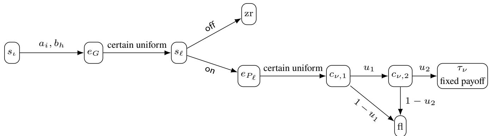  
Figure 13: The synthesis RMDP and its evaluator components. The only policy choices are at $\boldsymbol { s } _ { \iota }$ and the coordinate states; every reward shown is a fixed rational.

Lemma 48 (One predecessor per coordinate). In $\operatorname { A f f } ( G )$ every coordinate state $s _ { \ell }$ has exactly one predecessor, namely $e _ { G } ,$ and each ofits two actions has onefixed continuation. Thus a stationary policy’s behavior at $s _ { \ell }$ has a single interpretation, and no continuation depends on the contextfrom which $s _ { \ell }$ was reached.

Proof. The certain uniform splitter at $_ { e _ { G } }$ is the only transition into $s _ { \ell } ,$ while on and of always lead to $e _ { P _ { \ell } }$ and zr, respectively.

Every occurrence gets a fresh row, and the only policy choices are at the coordinate states. Thus the evaluator has neither shared selector decoder actions nor context-dependent continuations. Figure 13 shows the nested evaluator structure.

## J.4 Roles, Cases, and Scores

Definition 22 (Portfolio case scores). Let r be the number of tests and also the portfolio budget. Put

$$
\begin{array} { r } { \mathcal { H } = \{ \mathrm { e v } \} \cup \{ ( i , \ell , \right. ) , ( i , \ell , \left. ) : 2 \leq i \leq r , \ell \in [ n ] \} \cup \{ ( i , t ) : i \in [ r ] , t \in [ 3 r + 1 ] \} . } \end{array}
$$

Nature’s coordinates are a case distribution $\lambda \in { \mathcal { D } } ( { \mathcal { H } } )$ , the evaluation vector $\eta ,$ and one coordinate $q _ { h } \in [ 0 , 1 ]$ for every oriented equality case. Write $\xi _ { h }$ for the coordinates local to case $h .$ For role i, define the pure-case score $A _ { h , i } ( x _ { i } , \xi _ { h } )$ asfollows.

• In the evaluation case, $A _ { \mathrm { e v } , i } ( x _ { i } , \eta ) = g _ { i } ( x _ { i } , \eta )$

• For $h = ( i , \ell ,  ) ,$

$$
A _ { h , 1 } = x _ { 1 , \ell } - q _ { h } , \quad \quad A _ { h , i } = q _ { h } - x _ { i , \ell } ,
$$

and $A _ { h , j } = - 1 f o r j \notin \{ 1 , i \}$

• For $h = ( i , \ell ,  ) ,$

$$
A _ { h , 1 } = q _ { h } - x _ { 1 , \ell } , \qquad A _ { h , i } = x _ { i , \ell } - q _ { h } ,
$$

and $A _ { h , j } = - 1 f o r j \notin \{ 1 , i \} .$

• For $h = ( i , t ) , s e t A _ { h , i } = 0 a n d A _ { h , j } = - 1 f o r j \neq i .$

Lemma 49 (Pure-score shape). Every pure-case score of Definition 22 lies in $[ - 1 , 1 ]$ and has the form

$$
A _ { h , i } ( x _ { i } , \xi _ { h } ) = c _ { h , i } ( \xi _ { h } ) + \sum _ { \ell } d _ { h , i , \ell } x _ { i , \ell } ,
$$

where $c _ { h , i }$ has degree at most two in nature’s coordinates and every $d _ { h , i , \ell }$ is rational.

Proof. The evaluation scores have the claimed range and shape by Lemma 45. Equality scores are diferences of two numbers in [0, 1], with $c _ { h , \cdot } = \mp q _ { h }$ and $d _ { h , \cdot } = \pm 1$ . Forcing scores are constants. □

Define the mixed score of role i by

$$
W _ { i } = \sum _ { h \in \mathcal { H } } \lambda _ { h } A _ { h , i } ( x _ { i } , \xi _ { h } ) + 1 - \sum _ { h \in \mathcal { H } } \lambda _ { h } ^ { 2 } .\tag{5}
$$

Lemma 50 (Mixed-score polynomial). The score $W _ { i }$ has the form

$$
W _ { i } = P _ { i , 0 } ( \lambda , \eta , q ) + \sum _ { \ell } x _ { i , \ell } P _ { i , \ell } ( \lambda ) ,
$$

where

$$
P _ { i , 0 } = 1 - \sum _ { h } \lambda _ { h } ^ { 2 } + \sum _ { h } \lambda _ { h } c _ { h , i } ( \xi _ { h } ) , \qquad P _ { i , \ell } = \sum _ { h } \lambda _ { h } d _ { h , i , \ell } .
$$

The first polynomial has degree at most three, the second has degree one, and both have polynomially many monomials. Consequently, Lemma 47 applies to $W _ { i }$

Proof. Substitute Lemma 49 into (5) and collect coeficients. The largest degree is $1 + 2 ,$ , from $\lambda _ { h }$ multiplying a quadratic $c _ { h , i } .$ The number of monomials is bounded by the sum of the explicit monomial counts of the pure scores plus $\dot { 1 } + | \mathcal { H } |$ 口

The cases are coordinates of nature inside these polynomials, not branches in the model. This lets one evaluator compute all of $W _ { i }$ while every coordinate state retains the single predecessor guaranteed by Lemma 48.

## J.5 The Synthesis RMDP

Definition 23 (Portfolio-synthesis RMDP). Let $M _ { \mathrm { s y n } } = ( S , A , \mathcal { U } , R , s _ { \iota } , \frac { 1 } { 2 } )$ be defined as follows.

• Its states are $s _ { \iota } ;$ for every role $i \in [ r ]$ , a copy $E _ { i } o f \mathrm { A f f } \left( \gamma ^ { - 1 } W _ { i } \right)$ with coordinate states $s _ { i , 1 } , \ldots , s _ { i , n } ; f o r$ every $h \in \mathcal { H } ,$ a copy $U _ { h } o f \mathrm { P o l y } ( \gamma ^ { - 1 } ( 3 \lambda _ { h } - 1 ) ) ;$ ; and a ruinous sink.

• At $s _ { \iota } ,$ , the role action $a _ { i }$ has reward zero and its singleton row enters $E _ { i } .$ . The auxiliary action $b _ { h }$ has reward zero and its singleton row enters $U _ { h } .$ . All other described transitions are those ofthe two componentfamilies.

• The uncertainty set is given in Definition 24.

• Rewards are those of the components. Every choice still undescribed after the global action set has been installed uses ruinous-sink completion.

• The initial state is $\boldsymbol { s } _ { \iota }$ and $\begin{array} { r } { \gamma = \frac { 1 } { 2 } . } \end{array}$

Definition 24 (Portfolio uncertainty). Every occurrence of a logical nature coordinate inside a component is represented by a fresh two-successor row. For every $\lambda _ { h } ,$ every coordinate of η, and every $q _ { h } ,$ , designate one occurrence as its representative and impose a rational linear equality setting every other occurrence’s success probability equal to that representative. On the λ representatives add $\lambda _ { h } \geq 0$ and $\dot { \Sigma _ { h } } \lambda _ { h } = 1$ , together with the usual stochasticity constraints on all rows.

Lemma 51 (Uncertainty shape). The set U is a nonempty rational polytope. Every uncertain row has two successors, and the only other stochastic rows are the certain uniform splitters at component entries. The uncertainty is nonrectangular only through the tying equalities and the simplex constraint.

Proof. Choose any λ in the simplex and arbitrary values in [0, 1] for the other representatives, then propagate them through the tying equalities, which witnesses nonemptiness. Its half-space description consists of exactly four families, all listed in Definition 24: one equality per nonrepresentative occurrence tying it to its representative, the bounds $\lambda _ { h } \geq 0$ , the equality $\textstyle \sum _ { h } \lambda _ { h } = 1$ , and nonnegativity with normalization on every row. Every coeficient is $0 ~ \mathrm { o r } \pm 1$ , and the number of constraints is linear in the number of rows, so the description has polynomial encoding length and the reduction can write it down. The remaining claims follow from Definitions 8, 21 and 24. □

## J.6 Action Values and the Optimal-Value Bound

Lemma 52 (Role-action values). In the RMDP of Definition 23, for every realization and every compliant $\pi \in \Pi ^ { \mathrm { M R } }$

$$
Q _ { u } ^ { \pi } ( s _ { \iota } , a _ { i } ) = W _ { i } ( x _ { i } , \lambda , \eta , q ) , \qquad x _ { i , \ell } = \pi ( s _ { i , \ell } , \mathsf { o n } ) .
$$

Proof. The initial action makes one reward-zero transition into $E _ { i }$ , whose value is $\gamma ^ { - 1 } W _ { i }$ by Lemmas 47 and 50.

Lemma 53 (Auxiliary-action values). For every realization and every compliant policy,

$$
Q _ { u } ( s _ { \iota } , b _ { h } ) = 3 \lambda _ { h } - 1 .
$$

At a pure case $\lambda = \delta _ { h ^ { * } }$ , this value is two for $h = h ^ { * }$ and −1 otherwise.

Proof. Apply Lemma 22 to $\cdot \gamma ^ { - 1 } ( 3 \lambda _ { h } - 1 )$ and include the initial discount.

Lemma 54 (Optimal-value bound). For every realization, $V _ { u } ^ { * } ( s _ { \iota } ) \leq 2 ,$ , with equality whenever $\lambda = \delta _ { h }$ is a pure case.

Proof. The only policy choices at described states are at $s _ { \iota }$ and at coordinate states. The action values are those of Lemmas 52 and 53. Since every pure score is at most one,

$$
W _ { i } \leq \sum _ { h } \lambda _ { h } + 1 - \sum _ { h } \lambda _ { h } ^ { 2 } = 2 - \sum _ { h } \lambda _ { h } ^ { 2 } \leq 2 ,
$$

and $3 \lambda _ { h } - 1 \le 2$ . B Lemma 11, these u er bounds extend from com liant olicies to all olicies. A randomized action at $s _ { \iota }$ gives a convex combination of these values, so it cannot exceed two. $\mathrm { A t } \lambda = \delta _ { h }$ , action $b _ { h }$ attains two. □

Lemma 55 (Combining pure cases). For fixed coordinate vectors $x _ { 1 } , \ldots , x _ { r } ,$ , the following are equivalent:

1. for every pure case h and every valuation $o f \xi _ { h } ,$ , some role has $A _ { h , i } \geq 0 ,$

2. for every $\lambda \in { \mathcal { D } } ( { \mathcal { H } } )$ and every valuation ofall coordinates, some role has $W _ { i } \geq 0 .$

Proof. The second claim implies the first by taking $\lambda = \delta _ { h }$ , when $W _ { i } = A _ { h , i }$ . For the converse, fix a realization and take $h ^ { * } \in \arg \operatorname* { m a x } _ { h } \lambda _ { h }$ . Apply the pure-case hypothesis at $h ^ { * }$ with the realization’s own $\xi _ { h } .$ ∗ to obtain a role i with $A _ { h ^ { * } , i } \geq 0$ . All other pure scores are at least −1, so

$$
\sum _ { h } { \lambda _ { h } A _ { h , i } } \ge - ( 1 - { \lambda _ { h ^ { * } } } ) .
$$

Moreover,

$$
\sum _ { h } \lambda _ { h } ^ { 2 } \leq \lambda _ { h ^ { * } } \sum _ { h } \lambda _ { h } = \lambda _ { h ^ { * } } .
$$

Substitution in (5) gives

$$
W _ { i } \geq - ( 1 - \lambda _ { h ^ { * } } ) + 1 - \lambda _ { h ^ { * } } = 0 .
$$

Each oriented equality case needs its own coordinate $q _ { h } \colon$ the role selected for $h ^ { * }$ depends on $\xi _ { h ^ { * } }$ , which must remain free of every other case’s coordinates. Example 10 shows that the correction bound can be tight.

Example 10 (The mixing correction). $I f \lambda$ is uniform on two cases, then $\begin{array} { r } { 1 - \sum _ { h } \lambda _ { h } ^ { 2 } = \frac { 1 } { 2 } } \end{array}$ . If a role has score zero at one of those cases and −1 at the other, its mixed score is

$$
{ \frac { 1 } { 2 } } \cdot 0 + { \frac { 1 } { 2 } } \cdot ( - 1 ) + { \frac { 1 } { 2 } } = 0 .
$$

Thus the combining bound is tight.

## J.7 Correctness

Lemma 56 (Forward direction). If the source sentence holds with witness $x ,$ then the portfolio $\Pi = \{ \pi _ { 1 } , \ldots , \pi _ { r } \}$ defined by

$$
\pi _ { i } ( s _ { \iota } ) = a _ { i } , \qquad \pi _ { i } ( s _ { j , \ell } , \mathsf { o n } ) = x _ { \ell } \quad f o r e \nu e r y j , \ell
$$

and completed compliantly at every other state satisfies $\mathrm { R r e g } ( \Pi ) \leq 2 .$

Proof. Every $\pi _ { i }$ is stationary and $V _ { u } ^ { \pi _ { i } } ( s _ { \iota } ) = W _ { i } ( x )$ by Lemma 52. We verify pure-case coverage. $\mathbf { A t \thinspace e v . }$ , Lemma 46 gives maxi $g _ { i } ( x , \eta ) \geq 0$ for every η. At an oriented equality case, the two nonconstant scores have maximum

$$
\operatorname* { m a x } \{ x _ { \ell } - q _ { h } , q _ { h } - x _ { \ell } \} = | x _ { \ell } - q _ { h } | \geq 0 .
$$

At a forcing case $( i , t )$ , role i scores zero. By Lemma 55, every realization has some $W _ { i } \geq 0$ . Combining this with Lemma 54 bounds regret by two. □

Lemma 29 is needed here because the reverse direction turns $\rho _ { r } \leq 2$ into a concrete portfolio. Its hypotheses hold: U is a compact rational polytope by Lemma 51. The other synthesis reductions compute their infimum in closed form.

Lemma $^ { 5 7 }$ (Role forcing). If Π has at most r members and $\mathrm { R r e g } ( \Pi ) \leq 2 ,$ , then it has exactly r members, exactly one member chooses each $a _ { i }$ with probability one, and no member chooses an auxiliary action at $s _ { \iota }$

Proof. At a pure case, Lemma 54 gives $V _ { u } ^ { * } ( s _ { \iota } ) = 2$ . Thus the regret bound implies

$$
\operatorname* { m a x } _ { \pi \in \Pi } V _ { u } ^ { \pi } ( s _ { \iota } ) \geq 0
$$

at every pure case and every valuation of its coordinates.

A member need not be compliant: besides its initial choice it may play a globally installed action inside a component, where the action values below do not apply. Replace each member π by ${ \bar { \pi } } ,$ which Lemma 11 shows has value at least π’s $\pi ^ { \prime } \boldsymbol { \mathrm { s } }$ at every state and realization, so the displayed bound is only strengthened. The projection keeps the initial distribution over $\{ a _ { i } , b _ { h } \}$ and renormalizes at each coordinate state, which leaves $\pi ( s _ { i , \ell } , \mathsf { o n } )$ in [0, 1], so π¯ still encodes a witness and the count below is unafected.

Fix a role i and a forcing case $h = ( i , t ) . \mathrm { A t } \lambda = \delta _ { h }$ , action $a _ { i }$ has value zero, every other role action has value −1, action $b _ { h }$ has value two, every other auxiliary action has value −1, and every completed action has value at most −1. For a policy with initial distribution $p ,$ collect the mass outside $\{ a _ { i } , b _ { h } \}$ to obtain

$$
V _ { u } ^ { \pi } ( s _ { \iota } ) \leq p ( a _ { i } ) + 3 p ( b _ { h } ) - 1 .
$$

Suppose $p ( a _ { i } ) < 1$ and put $\delta _ { \pi } = 1 - p ( a _ { i } ) > 0$ . Covering h forces $p ( b _ { h } ) \ge \delta _ { \pi } / 3$ . The actions $b _ { ( i , t ) }$ are distinct and outside $a _ { i } .$ so

$$
\sum _ { t = 1 } ^ { 3 r + 1 } p ( b _ { ( i , t ) } ) \leq \delta _ { \pi } .
$$

This policy can therefore cover at most three of the $3 r + 1$ forcing cases for role i. If every portfolio member had $p ( a _ { i } ) < 1$ , the at most r members would cover at most 3r such cases, a contradiction. Thus some member has $p ( a _ { i } ) = 1$

No policy can put probability one on both $a _ { i }$ and $a _ { j }$ for $i \neq j .$ . The r roles therefore require r distinct members, exhausting the budget. Every member is pure on its role action at $s _ { \iota }$ , leaving none on an auxiliary action. □

Lemma 58 (Equality cases). Under the hypotheses ofLemma $^ { 5 7 , }$ let $x _ { i }$ be the vector encoded by the member assigned to role i. Then $x _ { 1 } = \cdot \cdot \cdot = x _ { r }$

Proof. Fix $i \geq 2$ and ℓ. At pure case $( i , \ell , \to )$ , coverage for a given $q \in [ 0 , 1 ]$ is

$$
\operatorname* { m a x } \{ x _ { 1 , \ell } - q , q - x _ { i , \ell } , - 1 \} \geq 0 ,
$$

equivalently

$$
\operatorname* { m a x } \{ x _ { 1 , \ell } - q , q - x _ { i , \ell } \} \geq 0 .
$$

If $x _ { 1 , \ell } < x _ { i , \ell } ,$ the legal midpoint $\begin{array} { r } { q = \frac { 1 } { 2 } ( x _ { 1 , \ell } + x _ { i , \ell } ) } \end{array}$ makes both terms negative. Conversely, if $x _ { 1 , \ell } \geq x _ { i , \ell } .$ , every q satisfies $q \leq x _ { 1 , \ell } \mathrm { o r } q \geq x _ { i , \ell } ,$ so one term is nonnegative. Coverage for every q is therefore equivalent to $x _ { 1 , \ell } \geq x _ { i , \ell } .$ The reverse oriented case gives $x _ { i , \ell } \geq x _ { 1 , \ell }$ □

Lemma 59 (Evaluation case). Under the same hypotheses, with x the common vector,

$$
\operatorname* { m a x } _ { i } { g _ { i } ( x , \eta ) \geq 0 } \qquad f o r e \nu e r y \eta .
$$

Proof. At the pure case ev, role i has value $A _ { \mathrm { e v } , i } ( x _ { i } , \eta ) = g _ { i } ( x _ { i } , \eta )$ . Pure-case coverage gives maxi $g _ { i } ( x _ { i } , \eta ) \geq 0$ . Apply Lemma 58. □

ProofofTheorem 9. Membership is the existential-universal encoding in the first subsection. For hardness, Lemma 56 gives $\rho _ { r } \leq 2$ whenever the source sentence holds. Conversel , if $\rho _ { r } \leq 2 ,$ , then Lemma 29 supplies a portfolio of at most r members with re ret at most two. Lemmas 57 to 59, followed b Lemma 46, ives the source sentence. Thus

$$
\rho _ { r } \leq 2 \quad \Longleftrightarrow \quad \exists x \forall y \colon F ( x , y ) \geq 0 .
$$

The reduction is polynomial and satisfies the stated restrictions by Lemmas 60 and 61.

Example 11 illustrates both equality auditing and role forcing.

Example 11 (A two-role synthesis instance). Take $r = 2$ and $n = 1$ . Then $3 r + 1 = 7$ and $| \mathcal { H } | = 1 + 2 + 1 4 = 1 7 .$ . At the pure case $( { \bar { 2 } } , 1 ,  )$ with $\textstyle q = { \frac { 2 } { 5 } }$ , role one scores $\textstyle { x _ { 1 , 1 } - { \frac { 2 } { 5 } } }$ and role two scores $\begin{array} { r } { \frac { 2 } { 5 } - x _ { 2 , 1 } . { F o r } x _ { 1 , 1 } = \frac { 3 } { 1 0 } } \end{array}$ and $\begin{array} { r } { x _ { 2 , 1 } = \frac { 1 } { 2 } } \end{array}$ , both are ${ \dot { - } } { \frac { 1 } { 1 0 } } .$ No member is nonnegative, and the regret is $2 + { \frac { 1 } { 1 0 } }$ , exposing $x _ { 1 , 1 } < x _ { 2 , 1 }$ . If both coordinates are $\scriptstyle { \frac { 1 } { 2 } } ;$ , role one scores $\frac { 1 } { 1 0 }$ and covers the case.

At forcing case (1, 3), a member with $p ( a _ { 1 } ) = 1$ scores zero. A member with $\begin{array} { r } { p ( a _ { 1 } ) = p ( b _ { ( 1 , 3 ) } ) = \frac { 1 } { 2 } } \end{array}$ scores

$$
3 \cdot { \frac { 1 } { 2 } } + { \frac { 1 } { 2 } } - 1 = 1
$$

and also covers that case, but its remaining mass $\textstyle { \frac { 1 } { 2 } }$ can place the required $\frac { 1 } { 6 }$ on at most three of role one’s seven forcing actions.

## J.8 Size and Structural Restrictions

Lemma 60 (Synthesis size). The reduction runs in polynomial time.

Proof. There is one co variable er occurrence, at most three roduct variables er monomial, and one out ut coordinate. Thus s and $r = 2 s$ are polynomial, and

$$
| \mathcal { H } | = 1 + 2 ( r - 1 ) n + r ( 3 r + 1 ) .
$$

Every $W _ { i }$ has degree at most three and polynomially many monomials. Each Poly component has one branch per monomial and at most three factor rows per branch. The budget r is written in unary and is polynomial. Every constant comes from rational arithmetic on input coeficients, B, polynomially bounded integers, and powers $2 ^ { e _ { \nu } + 1 }$ , so every encoding length is polynomial. □

Lemma 61 (Synthesis structure). The RMDP $M _ { \mathrm { s y n } }$ has fixed discount ${ \frac { 1 } { 2 } } ,$ , threshold two, and is acyclic apart from absorbing terminals. Every uncertain row has two successors, and the only other stochastic rows are certain uniform splitters. Every reward is afixed rational independent ofthe policy and realization. Nonrectangularity arises onlyfrom the tying equalities and simplex constraint ofDefinition 24.

Proof. Every described path goes from $s _ { \iota }$ to a component entry, through a certain uniform splitter, an optional coordinate state and a chain of factor selectors, and then to a terminal. No transition returns to an earlier state, and the only self-loops are at terminal states and named ruinous sinks. The factor selectors are precisely the fresh two-successor uncertain rows. Policy probabilities enter only through coordinate-state actions, and realization coordinates only through factor rows; all terminal payofs and rewards were fixed before the realization and policy are chosen. The remaining claims follow from Lemma 51.

Folding the cases into the coeficients of one polynomial per role ensures that each role’s entire mixed score is computed by one evaluator and every coordinate state has one predecessor.

## K Experimental setup

This appendix gives the details behind Section 4. We first fix the class of models the benchmarks belong to and the uncertainty set each one induces, then describe the ofline construction of a portfolio, and then the two evaluations answering the research uestions: whether ortfolios reduce em irical robust re ret as the bud et rows (RQ1), and whether the best member can be identified online in a fixed but unknown environment (RQ2). Al orithm 2 summarizes the whole rocedure. Detailed descriptions of the two benchmarks close the appendix, and the tables and figures themselves appear in Appendix L.

## K.1 Parametric MDPs and their uncertainty sets

A parametric MDP (pMDP) is a tuple $( S , A , P , R , s _ { \iota } , \gamma , X )$ in which X is a finite set of parameters and every transition probability $P ( s , a , s ^ { \prime } )$ is a polynomial in $\mathbb { Q } [ X ] . \mathbf { A }$ valuation $\theta \colon X  \mathbb { R }$ is well defined when it turns every choice row into a probability distribution, and graph preserving when no transition polynomial that is not identically zero evaluates to zero under it. Both benchmarks below are afine pMDPs: every transition polynomial has degree one, and the admissible valuations form a compact box $D \subseteq \mathbb { R } ^ { X }$ on which well-definedness holds by construction, so no clamping or renormalization is ever needed.

Such a benchmark is an RMDP in the sense of Section 2: each $\theta \in D$ instantiates a transition vector $\mathbf { \Delta } \mathbf { u } _ { \theta }$ , and

$$
\mathcal { U } _ { D } = \{ \boldsymbol { u } _ { \theta } : \boldsymbol { \theta } \in D \}
$$

is the induced uncertainty set. This set is not $( s , a )$ -rectangular. A single parameter occurs in the rows of many diferent choices — the wind intensity p governs every grid cell of the UAV benchmark, and the cooling efectiveness $p _ { c }$ every state of the datacenter benchmark — so fixing nature’s move at one choice fixes it everywhere else.

Robust policy evaluation, however, is performed by robust value iteration (Iyengar 2005), which requires a rectangular uncertainty set. We therefore relax each parameter region $c \subseteq D$ to the interval MDP whose per-choice uncertainty sets are the coordinatewise ranges of the transition polynomials over c. Writing $\mathcal { U } _ { c } ^ { \boxed { \Pi } }$ for the resulting rectangular set, this relaxation only ever adds transition vectors,

$$
\mathcal { U } _ { c } = \{ \boldsymbol { \mathscr { u } } _ { \boldsymbol { \theta } } : \boldsymbol { \theta } \in c \} \subseteq \mathcal { U } _ { c } ^ { \boxed { \mathrm { Z } } } ,
$$

because it drops the equalities tying repeated occurrences of a parameter to a common value.

## K.2 Ofline portfolio construction

Candidates. We split the parameter box D into a uniform grid of cells by dividing each parameter’s interval into 10 equal-width bins, so a two-parameter benchmark yields $| \mathcal { C } | = 1 0 ^ { 2 } \overset { \cdot } { = } 1 0 0 \mathrm { c e l l s }$ . For every cell $c \in { \mathcal { C } }$ we instantiate the pMDP at the cell midpoint mid(c) and solve the resulting ordinary MDP by value iteration at tolerance $1 0 ^ { - 8 }$ , which gives an optimal policy $\pi _ { \mathrm { m i d } ( c ) } ^ { * }$ and its value $V _ { \mathrm { m i d } ( c ) } ^ { * } ( s _ { \iota } )$ . The candidate set Π(C) collects one such memoryless deterministic policy per cell.

Scoring candidates. Every candidate is then evaluated robustly against every cell. For a candidate π and a cell $c ^ { \prime } ,$ , robust value iteration on the interval relaxation $\mathcal { U } _ { c ^ { \prime } } ^ { \boxed { \Pi } }$ returns

$$
\underline { { V } } _ { c ^ { \prime } } ^ { \pi } = \operatorname* { i n f } _ { \pmb { u } \in \mathcal { U } _ { c ^ { \prime } } ^ { \bigstar } } V _ { \pmb { u } } ^ { \pi } ( s _ { \iota } ) ,
$$

and the score recorded in the loss matrix is the midpoint-anchored diference

$$
\begin{array} { r } { L _ { \pi , c ^ { \prime } } = V _ { \mathrm { m i d } ( c ^ { \prime } ) } ^ { * } ( s _ { \iota } ) - \underline { { V } } _ { c ^ { \prime } } ^ { \pi } . } \end{array}\tag{6}
$$

Two approximations separate $L _ { \pi , c ^ { \prime } }$ from the exact cellwise robust regret ${ \mathrm { s u p } } _ { \theta \in c ^ { \prime } } \left( V _ { \theta } ^ { * } ( s _ { \iota } ) - V _ { \theta } ^ { \pi } ( s _ { \iota } ) \right)$ . First, the optimal value is taken at the single point mid $\left( c ^ { \prime } \right)$ rather than at the maximizing $\theta ,$ which may err in either direction. Second, by the inclusion above, the infimum over $\mathcal { U } _ { c ^ { \prime } } ^ { \boxed { \Pi } }$ is at most the infimum over $\mathcal { U } _ { c ^ { \prime } }$ , so this term alone makes $L _ { \pi , c ^ { \prime } }$ an over-estimate of the loss it stands in for. The matrix $L$ is a clustering score, not a certificate; the guarantees reported in Section 4 come from the sampled evaluation of the next subsection, which uses no relaxation at all.

Selecting the portfolio. Each candidate π thus carries a profile $L _ { \pi } \in \mathbb { R } ^ { c }$ , one entry per cell, describing where in the parameter s ace it does well. For a bud et K we run K-means on these rofiles and kee , from each of the K clusters, the candidate whose profile is nearest that cluster’s center, yielding a portfolio $\bar { \Pi _ { K } } \subseteq \Pi ( { \mathcal { C } } )$ of $K$ memoryless deterministic policies. Clustering is a cheap stand-in for the intractable s nthesis problem of Problem 4: it never leaves the candidate set, and it optimizes profile similarity rather than portfolio regret.

A single-policy reference point. The same loss matrix also yields an exact reference for $K = 1$ . Minimizing each candidate’s worst cell,

$$
\operatorname* { m i n } _ { \pi \in \Pi ( { \mathcal { C } } ) } \operatorname* { m a x } _ { c \in { \mathcal { C } } } L _ { \pi , c } ,
$$

is the best worst-case score attainable by any single member of the candidate set, computed directly from L without sampling or clustering. It is the mini-max regret figure quoted in Section 4.

Implementation. The prototype is written in Python. Models are built and instantiated with Stormvogel (Volk et al. 2026) on top of Storm, which also provides the parameter regions and the conversion of a region into the interval MDP used for the relaxation above. Value iteration, robust value iteration, and fixed-policy evaluation are our own NumPy implementations, in dense and sparse variants; the larger benchmarks use the sparse path throughout. Clustering uses scikit-learn’s K-means with automatic restart selection and the seed as its random state. Each stage of the pipeline caches its output in HDF5, so a stage can be resumed or re-run without repeating its predecessors.

## K.3 RQ1: measuring portfolio regret

The portfolios are scored against valuations drawn directly from D, with no cells and no rectangular relaxation involved. For a seed we draw $\widehat { D } \subset D$ uniformly at random with $| \widehat { D } | = 1 0 0 0$ , and at every $\theta \in \widehat { D }$ we instantiate the pMDP and compute two exact quantities: the optimal value $V _ { \theta } ^ { * } ( s _ { \iota } )$ by value iteration, and the value $V _ { \theta } ^ { \pi } ( s _ { \iota } )$ of each portfolio member by fixed-policy evaluation. The reported estimate is

$$
\widehat { \mathrm { R r e g } } _ { \widehat { D } } ( \Pi ) = \operatorname* { m a x } _ { \theta \in \widehat { D } } \Bigl ( V _ { \theta } ^ { \ast } ( s _ { \iota } ) - \operatorname* { m a x } _ { \pi \in \Pi } V _ { \theta } ^ { \pi } ( s _ { \iota } ) \Bigr ) .
$$

Each valuation is thus charged the shortfall of the best member at that valuation, matching the ofline coverage quantity of (1) and charging nothing for identifying that member online; RQ2 measures the identification cost separately. Because the supremum in (1) is replaced by a maximum over finitely many samples, $\widehat { \mathrm { R r e g } } _ { \widehat { D } } ( \Pi )$ under-approximates Rreg(Π). The whole construction-and-evaluation procedure is repeated for the three seeds 0, 1, 2, which reseed both the K-means initialization and the sample $\widehat { D } \smash { \mathrm { : } }$ ; Table 5 reports the individual seeds and Table 2 their mean.

## K.4 RQ2: online portfolio selection

Setting. A fixed but hidden valuation θ defines a generative model $G _ { \theta }$ from which trajectories of the instantiated MDP can be sampled starting at $s _ { \iota }$ . The portfolio members are treated as the arms of a bandit: pulling arm π rolls out one trajectory of horizon $H = 1 0 0$ under π and returns its discounted return. Nothing but these sampled returns is observed, neither θ nor any value function, so a run must discriminate between members from rollouts alone. Returns lie in $[ - B _ { H } , B _ { H } ]$ for

$$
B _ { H } = R _ { \mathrm { m a x } } \frac { 1 - \gamma ^ { H } } { 1 - \gamma } ,
$$

with $R _ { \mathrm { m a x } }$ the benchmark’s largest reward magnitude.

The selection rule. We use UCB (Cesa-Bianchi and Lugosi 2006) in its best-arm-identification form. After one warm-up pull of every arm, round t computes for each arm i still in contention a confidence radius: the empirical-Bernstein radius (Mnih, Szepesvári, and Audibert 2008), whose leading term shrinks with the empirical variance rather than with the worst-case range; on these benchmarks the returns are far less variable than $B _ { H }$ su ests, so it conver es considerabl faster than a Hoefdin radius. Writing $i _ { \mathrm { s a f e } }$ for the arm of greatest lower confidence bound, the run stops as soon as

$$
\mathrm { l c b } ( i _ { \mathrm { s a f e } } ) \geq \operatorname* { m a x } _ { j \neq i _ { \mathrm { s a f e } } } \mathrm { u c b } ( j ) - \varepsilon _ { \mathrm { a b s } } ,
$$

that is, as soon as no other arm can be more than $\varepsilon _ { \mathrm { a b s } }$ better. Otherwise every arm whose upper bound has fallen below $\mathrm { l c b } ( i _ { \mathrm { s a f e } } ) - \varepsilon _ { \mathrm { a b s } }$ is eliminated, and the arm of greatest upper confidence bound is pulled next. A run therefore has no fixed iteration budget: it stops when its own stopping test fires, and the number of pulls varies from run to run and grows with K.

We use confidence $\delta = 0 . 1$ and tolerance $\varepsilon = 1 0 ^ { - 3 }$ , the latter expressed as a fraction of the return bound, so the absolute tolerance is $\varepsilon _ { \mathrm { a b s } } = \varepsilon \cdot B _ { H } = 1 0 ^ { - 3 } B _ { H }$ . Since the empirical-Bernstein radius does the work of separating the arms, ε acts only as a cap that keeps near-ties from running indefinitely, and is kept small.

What is measured. At each iteration, a run has both a pulled arm, the exploratory one of greatest upper confidence bound, and a recommended arm, the one of greatest lower confidence bound — the member it would deploy if forced to stop right then. We report the recommended arm, the pulled arm being exploratory by design.

A recommendation is scored against the best portfolio member at the hidden valuation, that is, arg $\operatorname* { m a x } _ { \pi \in \Pi } V _ { \theta } ^ { \pi } ( s _ { \iota } )$ computed exactly by fixed-policy evaluation, and not against the unrestricted optimum $V _ { \theta } ^ { * }$ . The question is whether online selection find the best olic the ortfolio actuall contains. Two uantities are recorded er iteration. The first is the fraction of runs whose recommendation is that best member. The second is the shortfall of the recommended member, normalized b the spread of the portfolio at that valuation,

$$
L _ { \theta } ^ { \pi } = \frac { V _ { \theta } ^ { \mathrm { b e s t } } ( \iota ) - V _ { \theta } ^ { \pi } ( \iota ) } { V _ { \theta } ^ { \mathrm { b e s t } } ( \iota ) - V _ { \theta } ^ { \mathrm { w o r s t } } ( \iota ) } ,
$$

so that recommendin the best member scores 0 and recommendin the worst scores 1 (with $L _ { \theta } ^ { \pi } = 0$ by convention when every member ties). The second measure is the more informative of the two: the first counts a near-tie between two almost equally good members as an outright failure, whereas the second charges only what that confusion actually costs.

Sampling and aggregation. For each portfolio size K and each seed, we draw 30 valuations uniformly from D and run the selection rule once er valuation, all from one seeded random stream. Poolin the three seeds ives the 90 runs behind each curve. Because runs stop at diferent iterations, a curve at iteration t averages over runs still active at t together with runs that have already committed, each of the latter contributing its own deployed outcome from its stopping time onward. Curves are drawn on a logarithmic iteration axis with values binned accordingly, and are shown with standard-error bands.

## K.5 Datacenter benchmark

This benchmark models a controller regulating a server room’s temperature and humidity while working of a job queue, uncertain about how strongly its actions and the ambient environment actually move the system.

State space. A state $s = ( T , H , L ) \in S$ records a discretized temperature level $T \in \{ 0 , \ldots , 1 0 \}$ , a humidity level $H \in$ $\{ 0 , \ldots , 5 \}$ , and a queue length $L \in \{ 0 , \dots , 4 \} , \mathrm { s o } | S | = 1 1 \cdot 6 \cdot 5 = 3 3 0$ . Episodes start at $s _ { 0 } = ( 5 , 2 , 2 )$ , a comfortable middle of every range.

Action space. At every state, the controller picks one of five actions,

$$
A = \left\{ \mathrm { c o o L \mathrm { - } H I G H , C O O L \mathrm { - } L O W , H O L D , H E A T , D E H U M I D I F Y } \right\} .
$$

They trade energy against comfort: cool-high pushes hardest on temperature and costs the most, cool-low is its cheaper and weaker counterpart, hold spends almost nothing and lets the room drift, heat moves temperature the other way, and dehumidify targets humidity instead of temperature.

Parameter space. Two parameters are unknown, $\theta = ( p _ { c } , p _ { e } ) \in \Theta = [ 0 . 5 , 0 . 9 ] \times [ 0 . 1 , 0 . 8 ]$ . The coolin efectiveness p is $p _ { c }$ how reliably an action moves the room as intended, and the environmental pressure $p _ { e }$ is how strongly workload and ambient conditions ush back. A hi h $p _ { c }$ makes the controller’s actions de endable a hi h p means the room heats humidifies and $p _ { e }$ accumulates work regardless of what the controller does.

Transitions. Every state-action pair has four successor branches, split evenly between a control outcome governed by $p _ { c }$ and an environment outcome governed by $p _ { e } \colon$

$$
\begin{array} { r l } & { { \mathbb P } _ { \theta } ( s ^ { \prime } \mid s , a ) \in \big \{ \frac { p _ { c } } { 2 } , \frac { 1 - p _ { c } } { 2 } , \frac { p _ { c } } { 2 } , \frac { 1 - p _ { c } } { 2 } \big \} , \qquad \frac { p _ { c } } { 2 } + \frac { 1 - p _ { c } } { 2 } + \frac { p _ { c } } { 2 } + \frac { 1 - p _ { c } } { 2 } = 1 , } \end{array}
$$

so the four branches sum to one at every $\theta$ and every transition probability is afine in θ. Writing $[ x ] _ { l o } ^ { h i } : = \operatorname* { m i n } ( h i , \operatorname* { m a x } ( l o , x ) )$ for clamping a coordinate to its range, and abbreviating $T ^ { \pm } : \stackrel { \cdot \cdot } { = } [ T \pm 1 ] _ { 0 } ^ { 1 0 } , H ^ { \pm } : = [ H \pm 1 ] _ { 0 } ^ { 5 } , L ^ { \bar { \pm } } : \stackrel { \cdot \cdot \cdot \cdot } { = } [ L \pm 1 ] _ { 0 } ^ { 4 } ,$ Table 3 gives the successor reached by each branch. At a boundary state, two branches can land on the same successor, in which case their probabilities are added.

<table><tr><td>Action</td><td> $p _ { c } / 2$ </td><td> $( 1 - p _ { c } ) / 2$ </td><td> $p _ { e } / 2$ </td><td> $( 1 - p _ { e } ) / 2$ </td></tr><tr><td>COOL-HIGH</td><td> $( T ^ { - } , H , L )$ </td><td> $( T ^ { + } , H , L )$ </td><td> $( T , H , L ^ { - } )$ </td><td> $( T , H ^ { + } , L ^ { + } )$ </td></tr><tr><td>COOL-LOW</td><td> $( T ^ { - } , H , L )$ </td><td> $( T , H , L )$ </td><td> $( T , H , L ^ { - } )$ </td><td> $\check { ( } T ^ { + } , H , L ^ { + } \check { ) }$ </td></tr><tr><td>HOLD</td><td> $( T , H , L )$ </td><td> $( \dot { T } ^ { + } , H , \dot { L } )$ </td><td> $( \dot { T } , H ^ { - } , L ^ { - } )$ </td><td> $( \dot { T } ^ { + } , H ^ { + } , L ^ { + } )$ </td></tr><tr><td>HEAT</td><td> $( T ^ { + } , H , \dot { L } )$ </td><td> $( T ^ { - } , H , L )$ </td><td> $( T , H , L ^ { - } )$ </td><td> $\dot { ( } T ^ { + } , H ^ { + } , L ^ { + } \dot { ) }$ </td></tr><tr><td>DEHUMIDIFY</td><td> $( T , H ^ { - } , L )$ </td><td> $( T , H ^ { + } , L )$ </td><td> $( \dot { T } ^ { - } , H , L ^ { - } )$ </td><td> $\dot { ( } T ^ { + } , H ^ { + } , L ^ { + } \dot { ) }$ </td></tr></table>

Table 3: Successor state reached by each of the four branches of $\mathbb { P } _ { \theta } ( \cdot \mid s , a )$ , for $s = ( T , H , L )$ , in the datacenter benchmark.

Rewards and discount. The reward is deterministic and independent of θ:

$$
r ( s , a ) = r _ { E } ( a ) + r _ { T } ( T ) + r _ { H } ( H ) + r _ { L } ( L ) ,
$$

combining a per-action energy cost

$$
r _ { E } ( \mathrm { c o o L - H G H } ) = - 4 , \quad r _ { E } ( \mathrm { c o o L - L o w } ) = - 2 , \quad r _ { E } ( \mathrm { \mathrm { H o L D } } ) = - 1 , \quad r _ { E } ( \mathrm { \mathrm { H E A T } } ) = - 2 , \quad r _ { E } ( \mathrm { p E H U M I P F Y } ) = - 3 ,
$$

with penalties that activate as each dimension approaches its ceiling:

$$
r _ { T } ( T ) = \left\{ \begin{array} { l l } { 0 } & { T \leq 7 } \\ { - 2 0 } & { T \in \{ 8 , 9 \} } \\ { - 5 0 } & { T = 1 0 } \end{array} \right. \quad \quad r _ { H } ( H ) = \left\{ \begin{array} { l l } { 0 } & { H \leq 3 } \\ { - 1 5 } & { H = 4 } \\ { - 4 0 } & { H = 5 } \end{array} \right. \quad \quad r _ { L } ( L ) = \left\{ \begin{array} { l l } { 0 } & { L \neq 4 } \\ { - 1 0 } & { L = 4 } \end{array} \right.
$$

The controller therefore pays continuously for energy and catastrophically for letting any dimension reach its ceiling, and the parameters decide how expensive it is to keep away from those ceilings. The largest reward magnitude is $R _ { \mathrm { m a x } } ~ =$ $\mathrm { m a x } _ { s , a } | r ( s , a ) | \ = \ 1 0 4$ , attained at $T = 1 0 , H = 5 , \dot { L } = 4$ under cool-high, and the discount is $\gamma \ : = \ : 0 . 9 5$ , giving $V _ { \mathrm { m a x } } ~ =$ $R _ { \mathrm { { m a x } } } / ( 1 - \gamma ) = 2 0 8 0$

## K.6 UAV benchmark

This benchmark models a UAV flying through a cluttered three-dimensional grid from a fixed start to a landing pad, under wind drift and actuator-failure risk.

State space. A grid state $s = ( x , y , z )$ ranges over $\{ 0 , \ldots , L _ { x } { - } 1 \} \times \{ 0 , \ldots , L _ { y } { - } 1 \} \times \{ 0 , \ldots , L _ { z } { - } 1 \}$ , where x is the direction of travel, y the lateral axis the wind blows across, and z the altitude with $z = 0$ at ground level. Three further states complete the space: an absorbing Crash state, a Goal state, and the terminal sink done that Goal moves to. The start is $s _ { 0 } = ( 0 , \lfloor L _ { y } / 2 \rfloor , 1 )$

Action space. In every grid cell, the UAV chooses one of seven actions,

$$
\begin{array} { r } { \mathcal { A } = \{ \mathrm { E } , \mathrm { W } , \mathrm { N } , \mathrm { S } , \mathrm { U P } , \mathrm { D O W N } , \mathrm { H O V E R } \} , } \end{array}
$$

the six unit moves along $\pm x , \pm y , \pm z$ to ether with a no-o . E advances toward the oal N and S steer laterall UP and DOWN trade altitude against exposure to the two hazards, and HOVER holds position while the disturbances still act. Goal ofers the single forced action collect leading to done, and Crash and done ofer only a self-loop.

Parameter space. Two parameters are unknown, $\theta = ( p , q ) \in \Theta = [ 0 , p _ { \operatorname* { m a x } } ] \times [ 0 , q _ { \operatorname* { m a x } } ]$ . The wind intensity p is the chance that a step is overridden by a one-cell lateral drift, and the actuator-drop probability q is the probability that it is overridden by losing a level of altitude. The generator requires $p _ { \operatorname* { m a x } } + q _ { \operatorname* { m a x } } < 1 , \mathrm { s o } ~ 1 - p - q > 0$ at every admissible valuation and every branch below is a probability with no clamping or renormalization. The two parameters penalize opposite routes, which is what makes the benchmark interesting: wind hurts the low corridor, altitude drops hurt the high crossing.

Transitions. Writing clip(·) for componentwise clamping into the grid bounds, every grid action has the same three-branch form

$$
\mathbb { P } _ { \theta } \left( s ^ { \prime } \mid s , a \right) = \left( 1 - p - q \right) \mathbf { 1 } \left[ s ^ { \prime } = \mathrm { r e d i r e c t } ( s _ { \mathrm { i n t } } ) \right] + p \mathbf { 1 } \left[ s ^ { \prime } = \mathrm { r e d i r e c t } ( s _ { \mathrm { w i n d } } ) \right] + q \mathbf { 1 } \left[ s ^ { \prime } = \mathrm { r e d i r e c t } ( s _ { \mathrm { d r o p } } ) \right] ,
$$

where $s _ { \mathrm { i n t } } = \mathrm { c l i p } ( s + \mathrm { m o v e } ( a ) )$ is the intended move, the only branch that depends on a; $s _ { \mathrm { w i n d } } = \mathrm { c l i p } ( s + ( 0 , 1 , 0 ) )$ is the lateral drift; and $s _ { \mathrm { d r o p } } = ( x , y , z - 1 ) { \mathrm { ~ i f ~ } } z > 0 ,$ , else s itself, a ground-level skid. Coincident branches are summed, as in the datacenter benchmark. The ma redirect $( x , y , z )$ sends a candidate cell to Crash if it lies in the obstacle set O, to Goal if it lies in the target region T, and to the grid state $( x , y , z )$ otherwise.

The layout is procedural in the grid extents. With $y _ { c } = \lfloor L _ { y } / 2 \rfloor , w _ { x } = \operatorname* { m a x } ( 1 , \lfloor L _ { x } / 6 \rfloor ) , x _ { w } = \lfloor L _ { x } / 2 \rfloor - \lfloor w _ { x } / 2 \rfloor$ $x _ { p } = \lfloor 3 \bar { L } _ { x } / 4 \rfloor$ , and $x _ { c } = L _ { x } - \mathrm { m a x } ( 2 , \lfloor L _ { x } / 8 \rfloor )$ , the obstacle set $\mathcal { O } \stackrel { = } { = } \mathcal { O } _ { \mathrm { s l a b } } \cup \mathcal { O } _ { \mathrm { p i l l a r } } \cup \mathcal { O } _ { \mathrm { c a n o p y } }$ consists of a wall spanning $x ^ { \prime } \in \left[ x _ { w } , x _ { w } \mathrm { + } w _ { x } \right)$ at every altitude $z \leq L _ { z } { - } \bar { 2 }$ except a two-level corridor on the centerline $\hat { ( \boldsymbol { y } ) } = \boldsymbol { y } _ { c } , z \le 1 )$ a two-wide pillar at $x = x _ { p } , y \in \{ y _ { c } , y _ { c } + 1 \} , z \leq L _ { z } - 2 ;$ ; and a canopy at the top altitude $z = L _ { z } - 1$ restricted to $x \geq x _ { c } .$ . The target region $\mathcal T = \{ ( \dot { L } _ { x } - 1 , \dot { y _ { , } } 0 ) : y \in \{ y _ { c } - 1 , y _ { c } , y _ { c } + 1 \} \}$ is a three-cell landing pad on the far wall. The generator checks that the start is not an obstacle and that $\tau \cap \mathcal { O } = \emptyset$ . Together the slab, passable only through a corridor exposed to the wind, and the canopy, blocking the high route just before the goal, force a trade-of between a short low-altitude route hurt by p and a longer high-altitude route hurt by q, so the optimal route switches with $( p , q )$

Rewards and discount. The reward is deterministic and parameter-independent: $r ( s , a ) = 1$ for (Goal, collect) and 0 for every other reachable state-action pair, so $R _ { \operatorname* { m a x } } = 1$ . The optimal discounted value at s is therefore exactly the discounted probability of eventually landing. The discount is $\gamma = 0 . 9 9$ , kept close to 1 because routes take on the order of $L _ { x }$ steps and a smaller discount would wash out the reachability signal over that horizon; this gives $V _ { \mathrm { m a x } } = R _ { \mathrm { m a x } } / ( 1 - \gamma ) = 1 0 0$

Scalability. The grid extents $\left( L _ { x } , L _ { y } , L _ { z } \right)$ are free parameters of the generator, subject to $L _ { x } \geq 8 , L _ { z } \geq 3$ , and odd $L _ { y } \geq 5$ so that the centerline $y _ { c }$ is a single column. Every obstacle and goal formula above depends only on $\left( L _ { x } , L _ { y } , L _ { z } \right)$ , so the low-versus-high trade-of survives at every size, and

$$
| S | = 3 + \left| \{ ( x , y , z ) \in \mathrm { g r i d } : ( x , y , z ) \notin \mathcal { O } \cup \mathcal { T } \} \right| = O ( L _ { x } L _ { y } L _ { z } ) .
$$

The benchmark comes in three sizes, listed in Table 4, and all share $( p _ { \mathrm { m a x } } , q _ { \mathrm { m a x } } , \gamma ) = ( 0 . 2 5 , 0 . 2 0 , 0 . 9 9 )$ and the layout above, difering only in $( L _ { x } , L _ { y } , L _ { z } )$

<table><tr><td>Name</td><td> $\left( L _ { x } , L _ { y } , L _ { z } \right)$ </td><td>|S|</td></tr><tr><td>uav-small</td><td>(8, 5, 3)</td><td>98</td></tr><tr><td>uav-medium</td><td>(12,9,4)</td><td>358</td></tr><tr><td>uav-large</td><td>(24, 15, 6)</td><td>1,813</td></tr></table>

Table 4: Sizes of the uav benchmark family used in the experiments.

Every grid cell ofers the same seven actions, so the family admits $\gamma ^ { | { \cal S } | - 3 }$ memoryless deterministic policies. Even uav-small therefore rules out exhaustive search over policies.

## L Experimental data

Regret results (RQ1). Table 5 ives the seed-level results summarized in Table 2. For each ortfolio size K and each benchmark, it reports two quantities. The “max-regret” column is $\widehat { \mathrm { R r e g } _ { \widehat { D } } } ( \Pi _ { K } )$ , the largest portfolio regret over that seed’s 1000 sampled valuations; these are the numbers averaged into Table 2, and they should be read against the benchmark’s $V _ { \mathrm { m a x } } .$ listed in the header, since the datacenter values live on a scale over twenty times larger than the UAV ones. The “inertia” column is the K-means objective, the within-cluster sum of squared distances from each profile to its assigned center. It measures how tightly the loss profiles cluster, not how well the portfolio performs, and is included only as a diagnostic: it falls steeply with K on every benchmark, confirming that the candidate profiles do separate into distinguishable groups.

Online selection results (RQ2). Figure 2 in the main text shows the two datacenter measures. Figures 14 and 15 show the same pair of measures for all four benchmarks, one benchmark per row, with all values of K overlaid within each panel. The left column is the fraction of the 90 ooled runs whose recommended member is the best ortfolio member at their hidden valuation; the ri ht column is that recommendation’s normalized shortfall $L _ { \theta } ^ { \pi }$ , which is 0 when the best member is recommended and 1 when the worst is. Reading the two columns together is what the discussion in Section 4 relies on: the left column degrades visibl as K rows, since more members mean more near-ties to resolve, while the ri ht column sta s low throu hout, showin that the members confused for one another are close in value and the cost of the confusion is small.

<table><tr><td rowspan="5"></td><td rowspan="5"></td><td colspan="2">uav-small</td><td colspan="2">uav-medium</td><td colspan="2">uav-large</td><td colspan="2">data-center-climate</td></tr><tr><td colspan="2">|S| = 98</td><td colspan="2"> $\vert { S } \vert = 3 5 8$ </td><td colspan="2"> $\vert S \vert = 1 8 1 3$ </td><td colspan="2"> $| S | = 3 3 0$ </td></tr><tr><td colspan="2"> $V _ { \mathrm { m a x } } ^ { \cdot } = 1 0 0$ </td><td colspan="2"> $\dot { V } _ { \mathrm { m a x } } = 1 0 0$ </td><td colspan="2"> $\dot { V } _ { \mathrm { m a x } } = 1 0 0$ </td><td colspan="2"> $V _ { \mathrm { m a x } } = 2 0 8 0$ </td></tr><tr><td>max-regret</td><td>inertia</td><td>max-regret</td><td>inertia</td><td>max-regret</td><td>inertia</td><td>max-regret</td><td>inertia</td></tr><tr><td>1</td><td>0</td><td>0.053</td><td>23.239</td><td>0.091</td><td>42.668</td><td>0.125</td><td>59.498</td><td>14.649</td><td>1313595.187</td></tr><tr><td>1</td><td>1</td><td>0.053</td><td>23.239</td><td>0.091</td><td>42.668</td><td>0.124</td><td>59.498</td><td>13.404</td><td>1313595.187</td></tr><tr><td>1</td><td>2</td><td>0.053</td><td>23.239</td><td>0.091</td><td>42.668</td><td>0.129</td><td>59.498</td><td>14.771</td><td>1313595.187</td></tr><tr><td>1</td><td>avg</td><td>0.053</td><td>23.239</td><td>0.091</td><td>42.668</td><td>0.126</td><td>59.498</td><td>14.275</td><td>1313595.187</td></tr><tr><td>2</td><td>0</td><td></td><td></td><td></td><td></td><td></td><td></td><td>4.127</td><td>215193.617</td></tr><tr><td>2</td><td>1</td><td>0.032 0.032</td><td>1.935 1.935</td><td>0.019 0.019</td><td>3.974 3.974</td><td>0.016 0.016</td><td>1.629 1.629</td><td>3.413</td><td>220731.474</td></tr><tr><td>2</td><td>2</td><td>0.032</td><td>1.935</td><td>0.020</td><td>3.974</td><td>0.018</td><td>1.629</td><td>4.053</td><td>215193.617</td></tr><tr><td>2</td><td>avg</td><td>0.032</td><td>1.935</td><td>0.019</td><td>3.974</td><td>0.017</td><td>1.629</td><td>3.864</td><td>217039.569</td></tr><tr><td>3</td><td>0</td><td>0.014</td><td>0.697</td><td>0.005</td><td>1.951</td><td>0.016</td><td>0.638</td><td>2.813</td><td>72737.797</td></tr><tr><td>3</td><td>1</td><td>0.027</td><td>1.157</td><td>0.005</td><td>1.951</td><td>0.014</td><td>1.317</td><td>2.836</td><td>72737.797</td></tr><tr><td>3</td><td>2</td><td>0.014</td><td>0.697</td><td>0.020</td><td>2.152</td><td>0.018</td><td>0.638</td><td>2.809</td><td>72737.797</td></tr><tr><td>3</td><td>avg</td><td>0.018</td><td>0.850</td><td>0.010</td><td>2.018</td><td>0.016</td><td>0.865</td><td>2.820</td><td>72737.797</td></tr><tr><td>5</td><td>0</td><td>0.002</td><td>0.094</td><td></td><td></td><td></td><td></td><td>2.809</td><td></td></tr><tr><td>5</td><td>1</td><td>0.002</td><td>0.093</td><td>0.003 0.003</td><td>0.193 0.183</td><td>0.016 0.014</td><td>0.107 0.107</td><td>2.836</td><td>37639.989 40156.574</td></tr><tr><td>5</td><td>2</td><td>0.002</td><td>0.093</td><td>0.003</td><td>0.183</td><td>0.015</td><td>0.107</td><td>2.730</td><td>39166.131</td></tr><tr><td>5</td><td>avg</td><td>0.002</td><td>0.093</td><td>0.003</td><td>0.186</td><td>0.015</td><td>0.107</td><td>2.792</td><td>38987.564</td></tr><tr><td>7</td><td>0</td><td>0.002</td><td>0.015</td><td>0.003</td><td>0.032</td><td>0.004</td><td>0.044</td><td>2.809</td><td>19076.922</td></tr><tr><td>7</td><td>1</td><td>0.002</td><td>0.012</td><td>0.003</td><td>0.032</td><td>0.003</td><td>0.044</td><td>1.170</td><td>20262.995</td></tr><tr><td>7</td><td>2</td><td>0.002</td><td>0.012</td><td>0.003</td><td>0.032</td><td>0.015</td><td>0.048</td><td>1.392</td><td>19462.184</td></tr><tr><td>7</td><td>avg</td><td>0.002</td><td>0.013</td><td>0.003</td><td>0.032</td><td>0.008</td><td>0.045</td><td>1.790</td><td>19600.700</td></tr><tr><td>10</td><td>0</td><td>0.002</td><td>0.002</td><td>0.003</td><td>0.007</td><td>0.004</td><td>0.010</td><td>0.817</td><td>8950.955</td></tr><tr><td>10</td><td>1</td><td>0.002</td><td>0.002</td><td>0.003</td><td>0.007</td><td>0.003</td><td>0.011</td><td>0.824</td><td>9239.430</td></tr><tr><td>10</td><td>2</td><td>0.002</td><td>0.002</td><td>0.003</td><td>0.009</td><td>0.002</td><td>0.010</td><td>0.759</td><td>8610.714</td></tr><tr><td>10</td><td>avg</td><td>0.002</td><td>0.002</td><td>0.003</td><td>0.008</td><td>0.003</td><td>0.011</td><td>0.800</td><td>8933.700</td></tr><tr><td></td><td></td><td></td><td></td><td></td><td></td><td></td><td></td><td></td><td></td></tr></table>

Table 5: Full regret results (RQ1). For each portfolio size K, rows 0–2 report the three clustering seeds and “avg” their arithmetic mean. “max-regret” is the largest sampled portfolio regret. “Inertia” is the K-means within-cluster sum of squared distances between data points and the cluster centroid, not a regret measure.

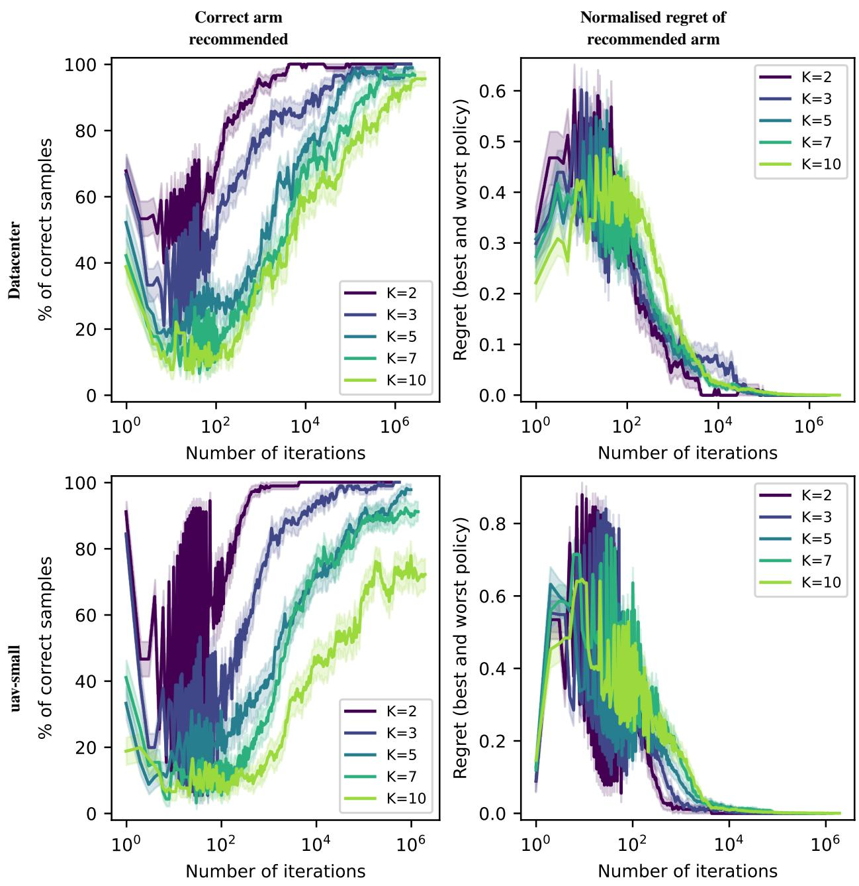  
Figure 14: Reported UCB deployment results across all tested values of K, for the datacenter and uav-small benchmark (RQ2). Each row corresponds to a benchmark; columns show, left to right, the reported correct-arm rate for the recommended arm and the regret of the recommended arm.

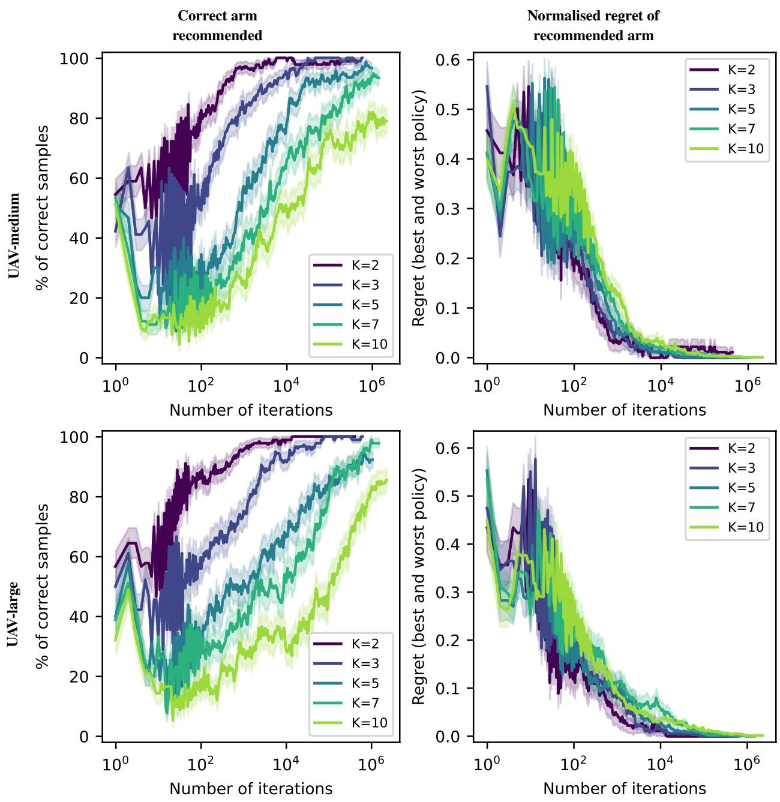  
Figure 15: Reported UCB deployment results across all tested values of K, for the UAV-medium and UAV-large benchmarks (RQ2). Each row corresponds to a benchmark; columns show, left to right, the reported correct-arm rate for the recommended arm and the regret of the recommended arm.

Algorithm 2: Paired portfolio synthesis and evaluation protocol   
Input: benchmark pMDP M, domain D, portfolio budgets K, seeds S, empirical robust regret sample size n, UCB   
sample size m, UCB parameters (H, ε, δ)   
foreach K ∈ K do   
// Offline candidate construction.   
Cells ← DiscretizeDomain(D);   
Candidates ← ComputeCandidatePolicies(M, Cells);   
// Offline robust candidate evaluation.   
Scores ← RobustPolicyEvaluation(M, Cells, Candidates);   
// Offline mini-max regret evaluation.   
ComputeMinimaxRegret(Scores, Cells, Candidates);   
foreach s ∈ S do   
// Offline construction of portfolio.   
Π ← ReduceAndCluster(Candidates, Scores, K, s);   
// Offline empirical robust regret evaluation of portfolio.   
Db ← SampleDomain(D, n, s);   
foreach θ ∈ Db do   
V∗ ← OptimalValue(M, θ);   
VΠ ← maxπ∈Π EvaluatePolicy(M, θ, π);   
r ← V∗ − V ;   
Store(K, s, θ, r);   
Maximise empirical robust regret within one seed;   
// Online UCB-based deployment.   
Db ← SampleDomain(D, m, s);   
foreach θ ∈ Db do   
Create generative model Gθ;   
z ← RunUCB(Gθ, Π, H, ε, δ);   
Store(K, s, θ, z);   
Average empirical robust regret over seeds;   
Pool UCB samples across seeds;   
GenerateReport();