# Agent Lightning v1.0: Towards Harnessed Agentic RL

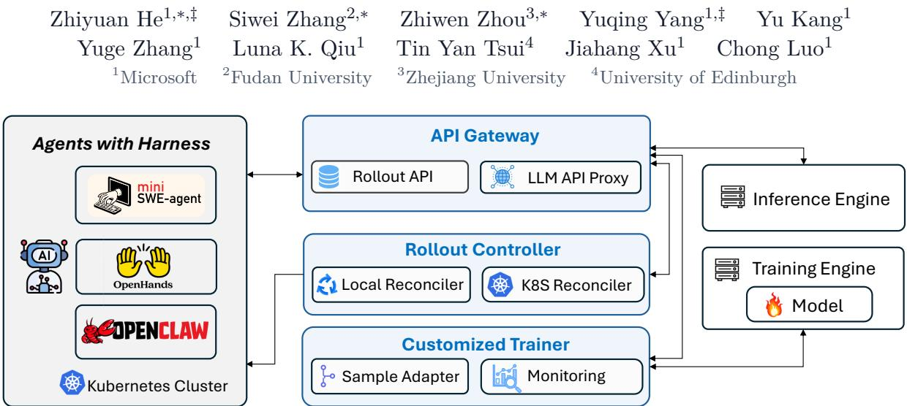  
Figure 1 The overall framework of Agent Lightning v1.0.

Abstract. Modern agents do not operate as standalone LLMs. They run inside agent harnesses that manage tools, context, and control flow, which makes the harness a critical component. Our original Agent Lightning work introduced a disaggregated architecture that connects arbitrary agents to reinforcement learning (RL) training through an LLM endpoint proxy. Recent frameworks such as verl Uni-Agent, AReaL 2.0, slime v0.3.0, and Polar have followed this proxy-based approach. Such a proxy-based training approach enables RL training with the harness. In this work, we use the term harnessed agentic RL to describe this paradigm, in which the deploy-time harness is directly involved in model post-training, thereby narrowing the gap between training and actual use.

We find that harnessed agentic RL difers fundamentally from traditional agentic RL and introduces a new set of challenges. In traditional agentic RL, the training engine owns the environment interaction loop. In harnessed agentic RL, the harness owns this loop, while the training engine observes only a sequence of LLM request-response pairs. How to model and assemble these calls into training samples remains an open question. Through a careful study, we identify several challenges of harnessed agentic RL, including retokenization, sample merging, advantage calculation, loss normalization, and training backend scheduling. We find that, if not properly addressed, these challenges can lead to inefective or unstable training. Existing frameworks generally leave these issues underspecified. In this paper, we provide the first comprehensive elaboration of them.

We further present Agent Lightning v1.0, a lightweight framework for harnessed agentic RL. We treat simplicity as a first principle, implementing the framework in only approximately 3,500 lines of code. Its compact design supports arbitrary agent harnesses and provides a practical testbed for studying these challenges. We validate Agent Lightning v1.0 on general instruction-following agent, search agent, and coding agent. For coding agent, we find that existing RL frameworks provide limited support, including a lack of data and complete training scripts, as well as a reliance on large-scale computational resources. To address this gap, we provide a complete data-cleaning pipeline and reproducible training scripts based on open-source dataset and models. Using only 6K training examples and modest compute, RL improves Qwen3.5-9B on SWE-bench Verified from 41.8% to 56.4%, an absolute 14.6% gain. We release the complete workflow and scripts to facilitate reproducible harnessed agentic RL in Agent Lightning v1.0.

Project Page: github.com/microsoft/agent-lightning Correspondence: {zhiyuhe, yuqyang}@microsoft.com Equal contribution. ‡Corresponding authors.

## 1 Introduction

Modern agents do not operate as standalone LLMs. They run inside agent harnesses that manage tools, execution environments, context, and control flow. The harness therefore determines how an agent observes its environment, acts over long horizons, and recovers from failures, making it a central part of the agent’s capabilities. Prominent examples include coding-agent harnesses such as mini-SWE-agent [1], OpenHands [2], OpenCode [3], Claude Code [4], and Codex [5], as well as general-purpose harnesses such as OpenClaw [6] and Hermes [7].

Early reinforcement learning (RL) frameworks, including verl [8], AReaL [9], and slime [10], generally require users to implement the agent loop directly inside the training framework. Integrating existing agent harnesses is therefore dificult because they often have complex implementations and their own dependencies, making them hard to integrate directly into RL frameworks. Our original Agent Lightning work [11] introduced a disaggregated architecture for training and agent execution. It connects arbitrary agents to RL training through an LLM endpoint, with almost no changes to the agent. More recently, such proxy-based approach has become more common in frameworks such as verl Uni-Agent [12], AReaL 2.0 [13], slime v0.3.0 [10], and Polar [14], which naturally enables enables RL training with agent harnesses.

We use the term harnessed agentic RL for RL training conducted through the same agent harness used at deployment. The harness, rather than the trainer, owns context construction, tool execution, and the agent–environment interaction loop, while the training system observes and optimizes the resulting model calls across a service boundary. This formulation preserves the harness’s deployment-time context policy, tool protocols, and execution semantics without requiring its agent loop to be reimplemented inside the RL framework.

Both traditional agentic RL and harnessed agentic RL can be modeled as partially observable Markov decision processes, but they difer in their latent state and in the observations presented to the policy model. In traditional agentic RL, the latent state is primarily the environment state. The policy model interacts almost directly with the environment through a transparent layer. The model produces action tokens, the environment returns an observation, and the tokenized observation extends the existing history as $p _ { t } = ( p _ { t - 1 } , a _ { t - 1 } , o _ { t } )$ . Here, $p _ { t }$ is the token history presented to the model at step $t , a _ { t - 1 }$ is the action generated at the previous step, and $o _ { t }$ is the latest environment observation. Consequently, the policy observes one continuously extended token history, and a rollout naturally forms one linear token trajectory.

In harnessed agentic RL, the policy model no longer interacts directly with the environment. The latent state contains both the harness state and the environment state. The harness owns context construction, control flow, tool execution, and agent orchestration, and independently constructs the request prompt for each model call. The policy observes only the exact prompt delivered through an LLM API and generates a response conditioned on that prompt. A rollout is therefore exposed at the model boundary as a sequence of request–response pairs,

$$
( p _ { 1 } , a _ { 1 } ) , ( p _ { 2 } , a _ { 2 } ) , . . . ,
$$

where $p _ { i }$ is the prompt sent in the i-th LLM call and $a _ { i }$ is the corresponding model response. The intervening harness and environment state transitions remain latent. Figure 2 summarizes this diference. It also gives rise to the implementation challenges below, for which existing frameworks make diferent choices that can afect algorithmic correctness and training stability.

The first challenge is retokenization and sample merging. Agent harnesses usually communicate with model APIs through text messages, while RL training operates on tokens. Most frameworks merge two consecutive calls when $p _ { i + 1 }$ contains $( p _ { i } , a _ { i } )$ as a complete prefix at the token level. However, after retokenization, even when the text is unchanged, the token IDs of $a _ { i }$ in $p _ { i + 1 }$ can difer from those originally sampled by the model. This breaks token-level continuity and prevents the two calls from being safely merged.

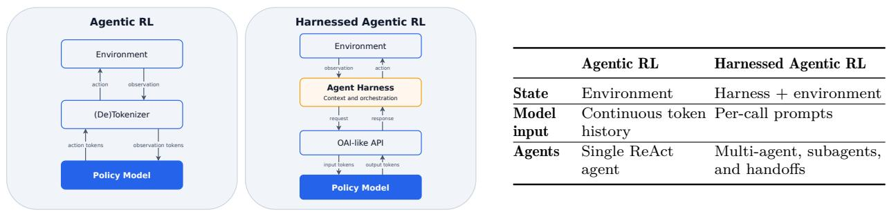

<table><tr><td></td><td>Agentic RL</td><td>Harnessed Agentic RL</td></tr><tr><td>State</td><td>Environment</td><td>Harness + environment</td></tr><tr><td>Model input</td><td>Continuous token Per-call prompts history</td><td></td></tr><tr><td>Agents</td><td>Single ReAct agent</td><td>Multi-agent, subagents, and handoffs</td></tr></table>

Figure 2 Comparison of traditional agentic RL and harnessed agentic RL. Both admit a POMDP formulation, but harnessed agentic RL adds harness state to the latent execution state and exposes the policy model to separately constructed model-call prompts. This change also shifts control and orchestration into the harness and makes the number of training samples more dynamic.

Second, advantage calculation. In traditional agentic RL, each rollout is a Markov process that maps to a unique training sample. In harnessed agentic RL, one rollout may instead produce a dynamic number of training samples. This can result not only from the retokenization issue described above, but also from harness operations such as spawning subagents and summarizing context. These dynamic samples challenge how rewards and advantages should be assigned to training samples.

The third challenge is loss normalization. In harnessed agentic RL, a rollout may map to multiple training samples, making the number of samples in each training batch dynamic. Loss normalization therefore becomes nontrivial. For example, some existing frameworks still normalize losses at the sample level, giving greater optimization weight to rollouts that produce more samples, which may make the training unstable.

The fourth challenge is training backend scheduling under dynamic sample counts. The number of samples produced by a rollout batch is known only after harness execution and sample construction, while the number of training GPUs and their parallel configuration remain fixed. The backend must partition this variable sample set into training steps and mini-batches while balancing the workload across fixed GPU workers.

In this work, we provide the first systematic characterization of these challenges, and further present Agent Lightning v1.0, a complete refactoring of the original Agent Lightning. It is a lightweight framework for RL training with arbitrary agent harnesses. Our design principle is to keep the system as simple as possible, implemented in approximately 3,500 lines of code. Its training pipeline also embeds our own design choices for the challenges described above, providing a practical testbed for studying them.

We use Agent Lightning v1.0 to train general instruction-following agent, search agent, and coding agent. In particular, existing agent frameworks provide limited support for coding agent, including a lack of data and complete training scripts, possibly because of the complexity of data cleaning, the dificulty of environment setup, and the substantial computing resources required. To address this gap, we build on the open-source SWE-smith dataset and Qwen3.5-9B [15] to provide a complete data-cleaning pipeline and reproducible training scripts. Our final RL run uses only 6K training samples and modest computing resources. Using RL alone, our trained model improves on SWE-bench Verified from 41.8% to 56.4%, an absolute 14.6% gain. We release the complete workflow and scripts to the community to facilitate reproducibility.

## 2 Challenges

Harnessed agentic RL changes how a rollout is observed and modeled by the training engine. In traditional agentic RL, the training engine owns the environment interaction loop and maintains the complete token history. Here, pt denotes the prompt tokens at step t, at denotes the action

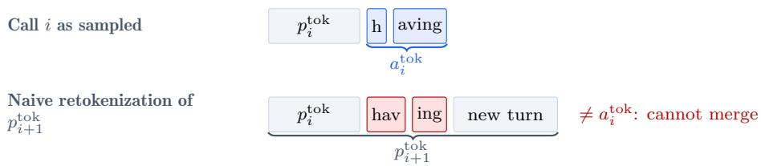  
Figure 3 A retokenization example. The word having sampled as the two tokens h and aving in call i (top) can be retokenized into diferent token boundaries, hav and ing, when the updated message history is retokenized for call i+1 (bottom). Although the underlying text is identical, the token boundaries difer. This breaks the token-level prefix condition in Equation 9 even though the text-level prefix condition in Equation 8 still holds.

corresponding to the response tokens, and $o _ { t }$ is the tokenized environment observation. The next prompt is constructed as

$$
p _ { t } = ( p _ { t - 1 } , a _ { t - 1 } , o _ { t } ) .\tag{1}
$$

The overall rollout follows the sequence $( p _ { 1 } , a _ { 1 } , o _ { 1 } , a _ { 2 } , o _ { 2 } , a _ { 3 } , . . . )$ . This forms a well-defined Markov process and maps naturally to one linear training sample.

In harnessed agentic RL, the harness owns the environment interaction loop and the message state. The training engine can only observe calls made through the LLM endpoint. For a rollout $\rho ,$ it records a sequence

$$
\mathcal { C } ( \rho ) = \big ( ( p _ { 1 } , a _ { 1 } ) , ( p _ { 2 } , a _ { 2 } ) , \ldots , ( p _ { T _ { \rho } } , a _ { T _ { \rho } } ) \big ) ,\tag{2}
$$

where $p _ { i }$ is the prompt tokens and $a _ { i }$ is the exact response tokens sampled by the model. The environment interactions and harness state transitions between these calls are not directly visible. Consequently, assembling the observed call sequence into training samples becomes a modeling problem. This diference introduces several implementation challenges. Existing frameworks make diferent choices when addressing them, which can afect algorithmic correctness and training stability.

More formally, both traditional agentic RL and harnessed agentic RL admit a partially observable Markov decision process formulation. Their distinction lies in the latent state and the observation presented to the policy model. In harnessed agentic RL, let

$$
s _ { t } = ( s _ { t } ^ { \mathrm { h a r n e s s } } , s _ { t } ^ { \mathrm { e n v } } )\tag{3}
$$

denote the latent execution state maintained jointly by the harness and the environment. The model does not observe $s _ { t }$ directly. Instead, the harness constructs a message-level context and renders it into the exact token-level prompt used for generation:

$$
C _ { t } ^ { \mathrm { m s g } } = \mathrm { C o n t e x t } _ { H } \big ( s _ { t } ^ { \mathrm { h a r n e s s } } \big ) ,\tag{4}
$$

$$
p _ { t } ^ { \mathrm { t o k } } = \mathrm { T o k } \big ( \mathrm { T e m p l a t e } ( C _ { t } ^ { \mathrm { m s g } } ) \big ) .\tag{5}
$$

Each policy decision is therefore recorded as a call-level transition

$$
z _ { t } = \big ( p _ { t } ^ { \mathrm { t o k } } , a _ { t } ^ { \mathrm { t o k } } \big ) , \qquad a _ { t } ^ { \mathrm { t o k } } \sim \pi _ { \theta } \big ( \cdot \mid p _ { t } ^ { \mathrm { t o k } } \big ) .\tag{6}
$$

A rollout yields a variable-length collection of such transitions, and no exact token-prefix relation between consecutive prompts is assumed. Any sequence construction performed for training must preserve the prompt under which each recorded action was actually sampled. We next describe several new challenges specific to harnessed agentic RL.

## 2.1 Retokenization and Sample Merging

Why Token-Prefix Continuity Breaks. Agent harness typically communicates with model APIs through text messages. From the harness perspective, a rollout usually consists of turn-level calls

$$
\mathcal { C } ^ { \mathrm { t e x t } } ( \rho ) = ( ( p _ { 1 } ^ { \mathrm { t e x t } } , a _ { 1 } ^ { \mathrm { t e x t } } ) , ( p _ { 2 } ^ { \mathrm { t e x t } } , a _ { 2 } ^ { \mathrm { t e x t } } ) , \dots ) ,\tag{7}
$$

where the harness sends $p _ { i } ^ { \mathrm { t e x t } }$ and receives $a _ { i } ^ { \mathrm { t e x t } }$ . Typically, for a multi-turn ReAct-style [16] agent, the previous call forms a complete text-level prefix of the next prompt, e.g.

$$
( p _ { i } ^ { \mathrm { t e x t } } , a _ { i } ^ { \mathrm { t e x t } } ) \preceq p _ { i + 1 } ^ { \mathrm { t e x t } } .\tag{8}
$$

Besides, when the harness spawns subagents or summarizes its context, the training engine may receive subsequent calls with diferent prompt histories that do not satisfy this relation.

RL training operates on exact token IDs and rollout log probabilities. The RL system represents each call using the token sequences ${ p } _ { i } ^ { \mathrm { t o k } }$ and $a _ { i } ^ { \mathrm { t o k } }$ , where $a _ { i } ^ { \mathrm { t o k } } \sim \pi _ { \theta } ( \cdot \mid p _ { i } ^ { \mathrm { t o k } } )$ . The response returned to the harness is $a _ { i } ^ { \mathrm { t e x t } } = \mathrm { D e c o d e } ( a _ { i } ^ { \mathrm { t o k } } )$ ). Training therefore observes the token-level sequence $\mathcal { C } ^ { \mathrm { t o k } } ( \rho ) = ( ( p _ { 1 } ^ { \mathrm { t o k } } , a _ { 1 } ^ { \mathrm { t o k } } ) , ( p _ { 2 } ^ { \mathrm { t o k } } , a _ { 2 } ^ { \mathrm { t o k } } ) , \dots )$

Token-prefix continuity between consecutive calls requires

$$
( p _ { i } ^ { \mathrm { t o k } } , a _ { i } ^ { \mathrm { t o k } } ) \preceq p _ { i + 1 } ^ { \mathrm { t o k } } ,\tag{9}
$$

where $\preceq$ denotes an exact token-level prefix.

In practice, Equation 8 holding does not guarantee that Equation 9 holds. The next request is obtained by applying a chat template and tokenizer to the updated message history. After retokenization, the token IDs corresponding to $a _ { i } ^ { \mathrm { t e x t } }$ inside $p _ { i + 1 } ^ { \mathrm { t o k } }$ can difer from the originally sampled IDs in $a _ { i } ^ { \mathrm { t o k } }$

This mismatch can arise through at least three mechanisms that we observe in our study:

(1) Chat-template non-compositionality. Rendering a complete message history is not necessarily equivalent to concatenating the renderings of its parts:

$$
\mathrm { T e m p l a t e } ( A \parallel B ) \neq \mathrm { T e m p l a t e } ( A ) \parallel \mathrm { T e m p l a t e } ( B ) .\tag{10}
$$

A template may insert delimiters or connecting newlines at message boundaries, or omit markers that appeared in the original generation. In practice, for example, we find that Qwen’s chat template can remove an earlier <think> marker, breaking token-prefix continuity.

(2) Decode–retokenize drift. Token decoding is not injective, so converting sampled tokens to text and tokenizing that text again need not recover the original token IDs:

$$
\mathrm { T o k } \big ( \mathrm { D e c o d e } ( a _ { i } ^ { \mathrm { t o k } } ) \big ) \ne a _ { i } ^ { \mathrm { t o k } } .\tag{11}
$$

Figure 3 gives a concrete example: the word having is sampled as the two tokens h and aving, but retokenizing the same text inside a later prompt may instead produce hav and ing. Although the decoded text is unchanged, the token boundaries difer and break token-level continuity between the two calls.

(3) Inference-time output transformation. Tool-call and structured-output handlers may parse, normalize, repair, and reserialize a sampled response before returning it to the harness. Such processing can change whitespace, delimiters, JSON structure, or invalid syntax, so the response incorporated into a later prompt may difer even at the text level from the response represented by the sampled token IDs.

Mitigating Broken Token-Prefix Continuity. The most direct strategy is to train every model call independently. Each generated token is treated as part of its call’s action, and the loss is computed on $( p _ { i } ^ { \mathrm { t o k } } , a _ { i } ^ { \mathrm { t o k } } )$ without assuming any relation to adjacent calls. This guarantees token-level correctness, but is computationally ineficient because long prompt prefixes shared across calls are repeatedly computed. Diferent frameworks handle it with diferent strategies.

AReaL [13] and verl Uni-Agent [12] maintain a request bufer in the LLM proxy that stores the historical text and tokens of each call. When a new request arrives and its text matches the bufered history exactly, the framework replaces the segment of the new prompt tokens that corresponds to the previous response text with the bufered response tokens, which guarantees that the token-prefix condition always holds. slime [10] and Polar [14] do not perform this replacement.

This replacement does more than recover computational reuse: when the bufered token IDs difer from those in the actual next request, it changes the prompt under which the next response is evaluated. Suppose the actual next prompt contains a reconstructed version $\widehat { a } _ { i } ^ { \mathrm { t o k } }$ of the previous response:

$$
p _ { i + 1 } ^ { \mathrm { t o k } } = p _ { i } ^ { \mathrm { t o k } } \parallel \hat { a } _ { i } ^ { \mathrm { t o k } } \parallel \Delta _ { i + 1 } .\tag{12}
$$

Replacing this segment with the originally sampled $a _ { i } ^ { \mathrm { t o k } }$ produces a stitched prompt

$$
\begin{array} { r } { \widetilde { p } _ { i + 1 } ^ { \mathrm { t o k } } = p _ { i } ^ { \mathrm { t o k } } \parallel a _ { i } ^ { \mathrm { t o k } } \parallel \Delta _ { i + 1 } , \qquad \widetilde { p } _ { i + 1 } ^ { \mathrm { t o k } } \neq p _ { i + 1 } ^ { \mathrm { t o k } } . } \end{array}\tag{13}
$$

The response $a _ { i + 1 } ^ { \mathrm { t o k } }$ was sampled from the policy conditioned on $p _ { i + 1 } ^ { \mathrm { t o k } }$ , not on $\widetilde { p } _ { i + 1 } ^ { \mathrm { t o k } }$ . Training it under the stitched prompt therefore introduces an of-policy discrepancy. Exact token-prefix overlap should be used for merging only when it preserves the prompt actually consumed during rollout.

A second approach is prefix-shared or tree-structured training. Exact common token prefixes are represented once, while a branch-aware causal attention mask ensures that tokens attend only to their ancestors and earlier tokens on the same branch. This can reproduce the result of training independent causal sequences while reusing prefix computation. However, tree packing, custom attention masks or kernels, partitioning, and distributed gradient handling require substantial training backend support.

A third practical approach is best-efort sequence merging. Two consecutive calls are merged only when their observed token IDs satisfy Equation 9. When the condition holds, only the unmatched sufix and next action are appended. When it fails, the current sequence is closed and a new one begins. This preserves the prompts consumed during rollout and works with standard dense causal kernels, while retokenization drift merely lowers the merge ratio. Agent Lightning v1.0 adopts this strategy as a middle ground between independent-call recomputation and backend-intensive tree training.

These approaches have diferent trade-ofs. Bufered token replacement can increase the merge ratio, but becomes of-policy stitching when it changes the prompt actually consumed during rollout. Independent-call training and best-efort merging guarantee token-level correctness but may leave redundant prefix computation, whereas tree-structured training can recover more reuse at the cost of a substantially more complex backend.

## 2.2 Advantage Calculation

After LLM calls are merged, one rollout ρ can produce a diferent number of training samples $N _ { \rho } ,$ known only after execution and sample construction. Retokenization is one source of this dynamic sample count. The harness can also spawn subagents, creating branches that do not share one linear history, or summarize its context, replacing the previous token prefix with a new one. These operations can split one task-level rollout into multiple training samples. This is not an edge case in practice: in our coding-agent training runs (Figure 10), only 36% of rollouts on average remain as a single training sample, and each rollout yields 2.4 training samples on average.

In practice, reward is still outcome-based and is assigned to every sample within the rollout that produced it. This raises a natural question: when computing advantage, should the group statistics be computed at the rollout level or the sample level? We find that existing frameworks make diferent choices. verl Uni-Agent [12] and Polar [14] compute advantage at the rollout level, while slime [10] and AReaL [13] compute it at the sample level.

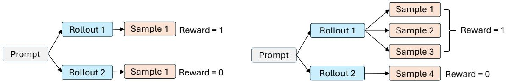  
Figure 4 Traditional agentic RL, where each rollout is one training sample $( l e f t )$ , versus harnessed agentic RL, where a rollout can expand into a dynamic number of samples that inherit its reward (right).

Figure 4 gives a concrete example. Suppose Rollout 1 and Rollout 2 are generated from the same prompt in one GRPO [17] group, with Rollout 1 receiving reward 1 and Rollout 2 receiving reward 0. In traditional RL (left), each rollout maps to exactly one training sample, and computing the baseline as $\bar { r } = ( 1 + 0 ) / 2 = 1 / 2$ is uncontroversial. In harnessed agentic RL (right), Rollout 1 has three samples (Sample 1, Sample 2, and Sample 3) while Rollout 2 remains a single sample (Sample 4): rollout-level advantage calculation still gives baseline $\bar { r } _ { \mathrm { r o l l o u t } } = ( 1 + 0 ) / 2 = 1 / 2$ whereas sample-level advantage calculation instead gives $\bar { r } _ { \mathrm { s a m p l e } } = ( 1 + 1 + 1 + 0 ) / 4 = 3 / 4$

We believe rollout-level advantage is the more principled choice, for the following reasons. Retokenization is an incidental phenomenon, and advantage assignment should not change simply because retokenization happened to split a rollout into more samples. Likewise, subagent spawning and context summarization are internal operations of the harness and should not be allowed to change the baseline of the entire group. Future work may still be needed to design better credit assignment across the samples within a rollout.

## 2.3 Loss Normalization

Dynamic sample counts also make loss normalization a nontrivial choice. Consider a training batch of R rollouts, where rollout $\rho$ produces $N _ { \rho }$ samples, and sample $j$ of rollout $\rho$ has $\boldsymbol { L _ { \rho , j } }$ response tokens with per-token loss $\ell _ { \rho , j , t }$ for $t = 1 , \ldots , L _ { \rho , j }$ . Most frameworks directly reuse a sample-level normalization inherited from traditional agentic RL. The first is the token-mean loss used by DAPO [18], which sums the loss over every token in the batch and normalizes by the total number of response tokens:

$$
\mathcal { L } _ { \mathrm { t o k e n - m e a n } } = \frac { \sum _ { \rho = 1 } ^ { R } \sum _ { j = 1 } ^ { N _ { \rho } } \sum _ { t = 1 } ^ { L _ { \rho , j } } \ell _ { \rho , j , t } } { \sum _ { \rho = 1 } ^ { R } \sum _ { j = 1 } ^ { N _ { \rho } } L _ { \rho , j } } .\tag{14}
$$

The second is the seq-mean-token-mean loss used by GRPO [17], which first averages the loss within each sample and then averages these sample means uniformly over all samples in the batch:

$$
\mathcal { L } _ { \mathrm { s e q - m e a n } } = \frac { 1 } { \sum _ { \rho = 1 } ^ { R } N _ { \rho } } \sum _ { \rho = 1 } ^ { R } \sum _ { j = 1 } ^ { N _ { \rho } } \frac { 1 } { L _ { \rho , j } } \sum _ { t = 1 } ^ { L _ { \rho , j } } \ell _ { \rho , j , t } .\tag{15}
$$

slime [10] implements a rollout-level token-mean loss, which first pools all response tokens of a rollout together and then averages uniformly over rollouts:

$$
\mathcal { L } _ { \mathrm { r o l l o u t - m e a n } } = \frac { 1 } { R } \sum _ { \rho = 1 } ^ { R } \frac { \sum _ { j = 1 } ^ { N _ { \rho } } \sum _ { t = 1 } ^ { L _ { \rho , j } } \ell _ { \rho , j , t } } { \sum _ { j = 1 } ^ { N _ { \rho } } L _ { \rho , j } } .\tag{16}
$$

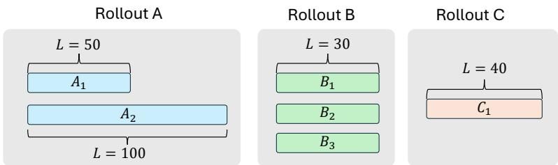  
Figure 5 An example batch with three rollouts of diferent sample counts and response lengths.

We provide a more concrete example in Figure 5. Suppose a batch contains three rollouts: Rollout A produces two samples $A _ { 1 }$ and $A _ { 2 }$ with response lengths 50 and 100; Rollout B produces three samples $B _ { 1 } , B _ { 2 }$ , and $B _ { 3 }$ , each with response length 30; Rollout C produces a single sample $C _ { 1 }$ with response length 40. Let $A _ { 1 } , A _ { 2 } , B _ { 1 } , B _ { 2 } , B _ { 3 } , C _ { 1 }$ also denote the sum of per-token losses within each sample, i.e. $\begin{array} { r } { A _ { 1 } = \sum _ { t } \ell _ { A , 1 , t } , } \end{array}$ and so on. Then:

$$
\bullet \mathcal { L } _ { \mathrm { t o k e n - m e a n } } = ( A _ { 1 } + A _ { 2 } + B _ { 1 } + B _ { 2 } + B _ { 3 } + C _ { 1 } ) / ( 5 0 + 1 0 0 + 3 0 + 3 0 + 3 0 + 4 0 ) .
$$

$$
\bullet \ \mathcal { L } _ { \mathrm { s e q - m e a n } } = \frac { 1 } { 6 } ( A _ { 1 } / 5 0 + A _ { 2 } / 1 0 0 + B _ { 1 } / 3 0 + B _ { 2 } / 3 0 + B _ { 3 } / 3 0 + C _ { 1 } / 4 0 ) .
$$

$$
\begin{array} { r } { \bullet \mathcal { L } _ { \mathrm { r o l l o u t - m e a n } } = \frac { 1 } { 3 } \big ( ( A _ { 1 } + A _ { 2 } ) / ( 5 0 + 1 0 0 ) + ( B _ { 1 } + B _ { 2 } + B _ { 3 } ) / ( 3 0 + 3 0 + 3 0 ) + C _ { 1 } / 4 0 \big ) . } \end{array}
$$

For loss normalization, we hold the same view as for advantage calculation: sample count should not be allowed to afect gradient normalization, because it is often driven by incidental factors such as retokenization. Under this view, the seq-mean-token-mean loss in Equation 15 is problematic because it varies with how many samples a single rollout happens to produce, and in general gives disproportionately more weight to rollouts with more samples. We therefore believe the token-mean loss in Equation 14 and the rollout-level token-mean loss in Equation 16 are more principled in theory. In practice, however, we find that the token-mean loss is sensitive to long sequences: when many long negative samples appear in a batch, it can cause instability later in training. We therefore prefer the rollout-level token-mean loss in Equation 16.

## 2.4 Training Backend Complexity

Dynamic sample counts also complicate the interface with the training backend. The number and lengths of samples in a rollout batch are known only after harness execution and sample construction. In contrast, the number of training GPUs and the data-, tensor-, and pipeline-parallel configuration are typically fixed throughout training. The backend must therefore map a variable workload onto a fixed set of workers at every iteration.

After sample construction, the backend may flatten the resulting sequences into a physical tensor batch, but this transformation must preserve their statistical provenance. In particular, every sequence should retain its rollout identifier and prompt-group identifier:

$$
\mathcal { B } _ { \mathrm { t r a i n } } = \bigcup _ { \rho \in \mathcal { B } _ { \mathrm { r o l l o u t } } } \left\{ \left( S _ { \rho , j } , \rho , g _ { \rho } \right) \vert 1 \leq j \leq N _ { \rho } \right\} ,\tag{17}
$$

where $S _ { \rho , j }$ is the j-th sequence constructed from rollout $\rho$ and $g _ { \rho }$ identifies the group of rollouts sampled from the same prompt. Flattening changes only the physical representation; it must not change rollout membership or cause a rollout to receive additional statistical weight merely because it produced more sequences.

Rollout boundaries also constrain batch scheduling. Row-based tensor batches, data-parallel partitions, and micro-batch schedules cannot be planned from the prompt or rollout count alone because $N _ { \rho }$ is known only after execution. Moreover, sequences from one rollout should remain in the same optimizer update. Splitting them across updates would evaluate diferent parts of one rollout under diferent policy versions, introducing within-rollout policy skew. A backend must therefore balance token workload across fixed workers while preserving these rollout-level statistical and update boundaries.

## 3 System Design

When the trainer and agent harness are disaggregated, no single process owns the complete rollout lifecycle. The trainer owns model inference and optimization, while the harness owns context construction, control flow, tool use, and environment interaction. Agent execution may run remotely, persist beyond any single API request or worker process, and fail independently of the training process. Operationalizing this architecture therefore requires a lightweight control plane that coordinates durable rollout state, external execution, partial failures, and resource usage without pulling harness logic back into the trainer.

Agent Lightning v1.0 builds this control plane around a declarative rollout abstraction and a reconciliation loop. The trainer declares rollouts through the API Gateway, which serves as the source of truth for lifecycle state and append-only events. The Rollout Controller continuously reconciles this state with agent executions running as Kubernetes Jobs or local processes. This separation makes Kubernetes an interchangeable execution backend rather than part of the rollout abstraction itself.

The same control plane provides explicit reliability and observability semantics across the service boundary. Control-plane operations are idempotent, generation attempts are recorded and resolved explicitly, and a rollout identifier links model requests, rewards, custom events, and execution logs into one diagnostic record. Finally, the API Gateway coordinates inference admission during collocated asynchronous RL, allowing rollout and weight update to time-share one GPU pool without exposing phase switches to the external harness.

As shown in Figure 1, Agent Lightning v1.0 bridges the training cluster (a GPU cluster running model inference and training) and the agent execution cluster through three components. The API Gateway is an API service that stores rollouts, models, and events, and forwards LLM calls from agent harnesses to the model endpoints the trainer has registered. The Rollout Controller manages agent execution on top of a Kubernetes cluster (or a local process pool), polling rollouts from the API Gateway and launching the corresponding agent tasks. The Customized Trainer, built on top of VERL [8], registers rollouts with the API Gateway, waits for the Rollout Controller to drive them to completion, and then retrieves their recorded events to assemble training samples. Through this chain, the trainer only creates rollouts and collects trajectories, any harness can connect by switching its LLM endpoint to the proxy, and training and execution resources can be provisioned independently and even run in diferent locations.

Agent Lightning v1.0 is designed to be as simple as possible: the whole system is implemented in approximately 3,500 lines of code, with each component having a clear responsibility. Agent Lightning v1.0 also incorporates our own design choices for the challenges discussed in Section 2, such as rollout-level reward and advantage calculation and rollout-level loss normalization.

We describe each component in detail in Appendix A, and highlight several features in the following sections.

## 3.1 Collocated Async RL

In agentic RL, the synchronous RL setup is slow: all rollouts in a batch must finish before the training step can update the model, so the training step must wait for the slowest rollout in the batch, leaving many GPUs idle. Asynchronous RL, proposed by AReaL [9], solves the GPU idling problem by splitting rollout and update onto two separate pools of machines, each occupying diferent GPUs, so the rollout GPUs can keep working while the update is running. However, we find that this requires more GPUs overall, which demands more resources than smaller teams may be able to aford. It also requires separately managing a rollout queue and an update queue, which is more complex because the two queues can progress at diferent rates in practice.

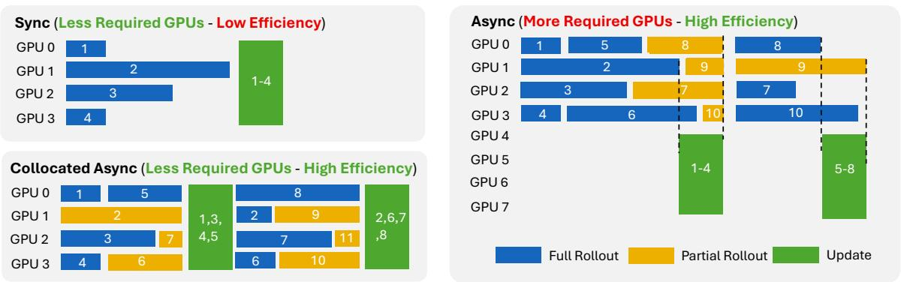  
Figure 6 Sync RL, async RL, and our collocated async RL. Collocated async RL shares the same GPUs between rollout and update while still avoiding the need to wait for the slowest rollout.

We instead propose collocated async, illustrated in Figure 6. In collocated async RL, rollout and weight update share the same pool of GPUs. Once enough rollout data has been collected, the update step begins. The API Gateway simultaneously stops accepting new requests and waits for the current ones to complete. If a new request arrives afterward, the Gateway pauses it until the system re-enters the rollout phase. As a result, the switch is invisible to the agent harness.

Collocated async lets the same GPUs be time-shared between rollout and training, so we use fewer GPUs than async RL, while also avoiding the wait for the slowest rollout. In our experiments, collocated async RL achieves roughly a 2x end-to-end speedup over synchronous RL while also using fewer GPUs.

## 3.2 Network Issues

In harnessed agentic RL, agents are separate from the training engine, which causes network issues: calls between the two sides travel over the network and are not always reliable. Two kinds of calls are afected: calls from the Trainer or the Rollout Controller to the API Gateway, and calls from the agent harness to the LLM inference endpoint through the proxy. Both can experience network interruptions, and the calling side commonly retries after such a failure. We address this with two measures.

Idempotent API Gateway endpoints. We design every rollout API Gateway endpoint to be idempotent, so that repeating the same call any number of times has the same efect as calling it once. This lets a caller retry freely after a network failure without worrying that the retry itself will corrupt state.

Deduplication of repeated LLM API calls. A retried LLM API call cannot be made idempotent in the same way, since each retry is a new generation request and may return a diferent response. Instead, when the Customized Trainer assembles training samples, it deduplicates model\_request events that share the same prompt: if a rollout recorded multiple calls with an identical prompt, only the last (most recent) call is kept, and the earlier ones, which correspond to retried or superseded calls, are discarded.

## 3.3 Kubernetes Integration

During the rollout phase of RL training, many agents must run concurrently, which requires substantial compute resources. Existing harnessed agentic RL frameworks commonly turn to commercial sandbox services to meet this demand. For example, verl Uni-Agent [12] launches agent execution on managed sandbox oferings such as Modal Sandbox and Volcano veFaas, while slime [10] relies on E2B. These services provide convenient, ready-to-use sandboxing, but they can be expensive at the scale of RL training.

Agent Lightning v1.0 instead runs agents directly on a Kubernetes cluster through its Rollout Controller. Each agent execution is scheduled as a standard Kubernetes Job, so users can rely entirely on self-hosted or on-premise compute rather than a commercial sandbox provider. This avoids the recurring cost of commercial sandbox services and keeps the entire training stack open-source.

## 3.4 Monitoring

During training, we find that agents themselves can run into problems such as reward hacking, bad agent behavior, and network connectivity issues. Manually inspecting rollouts to catch these problems is inconvenient, so the Customized Trainer includes a monitoring system that records training and validation rollouts, together with pod-level logs from Kubernetes, described further in Appendix A. This system lets us use AI agents to automatically identify such issues, and we have indeed found several reward-hacking examples this way, as shown in Section 4.3.2.

## 4 Experiments

We evaluate Agent Lightning v1.0 in three practical agent training settings: search, general instruction following, and coding. We follow the experimental setup of Search-R1 [19] to train search agents and the setup of LLM-in-Sandbox [20] to train general instruction-following agents. For coding agents, we build our training data from SWE-smith [21].

We find that existing frameworks rarely provide a complete, reproducible coding-agent training example, possibly because of the complexity of data cleaning, the dificulty of environment setup, and the substantial computing resources required. We therefore focus on the coding agent and describe its training process in detail, aiming to provide a complete and reproducible example that requires only modest resources.

## 4.1 Search Agent

We follow the experimental setting of Search-R1 [19] to train a search agent that interleaves reasoning with search-engine queries and uses retrieved passages to answer knowledge-intensive questions. We use Llama-3.2-3B-Instruct [22] as the policy model and optimize it with GRPO [17]. We train on the training split of HotpotQA [23]. For evaluation, we sample 50 examples from each of HotpotQA, 2WikiMultiHopQA [24], MuSiQue [25], Bamboogle [26], TriviaQA [27], and Natural Questions [28]. We set the training batch size to 512, sample 4 rollouts per prompt, and evaluate the model every 10 training steps. We use exact match (EM) as the reward metric.

Figure 7 summarizes the training dynamics. The mean training reward increases steadily. On the validation set, the reward improves from 25.1% to 41.7%, an absolute 16.6% gain.

## 4.2 General Instruction-Following Agent

We follow the experimental setting of LLM-in-Sandbox [20] to train a general instruction-following agent. The agent solves diverse non-coding tasks by using a computer sandbox to access external resources, manage files, and execute code. We use the agent harness provided by the original authors. We use Qwen3-4B-Instruct-2507 [29] as the policy model and optimize it with RLOO [30]. We use the dataset released by Instruction Pre-Training [31] and split it into 80% for training and 20% for evaluation. We set the training batch size to 8, sample 8 rollouts per prompt, and evaluate the model every 20 training steps.

Figure 8 shows that the batch-level training reward is noisy, whereas the validation reward

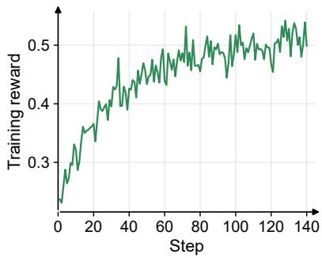

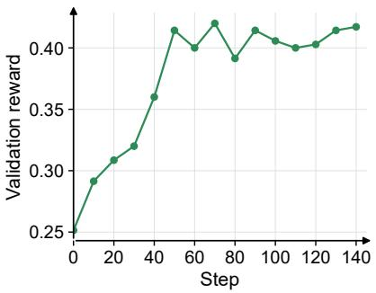  
Figure 7 Search-agent training dynamics. From left to right: mean training reward and mean validation reward.

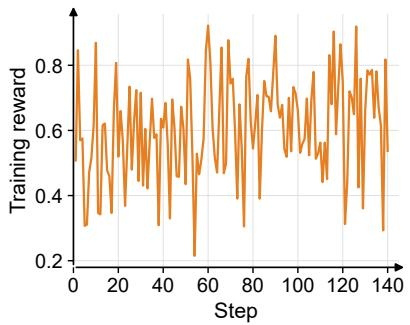

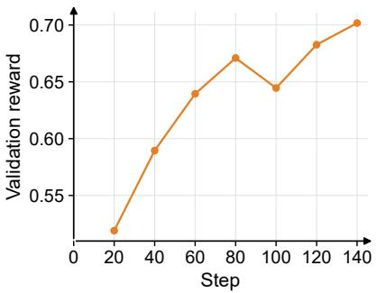  
Figure 8 General instruction-following agent training dynamics. From left to right: mean training reward and mean validation reward.

exhibits a clear upward trend. It improves from 51.9% to 70.2%, an absolute 18.3% improvement.

## 4.3 Coding Agent

We train a coding agent based on Qwen3.5-9B [15] using tasks derived from the SWE-smith dataset [21]. We use mini-SWE-agent [1] as the agent harness for interacting with repository environments, executing commands, and producing code changes. To obtain reliable training signals, we apply a detailed data-filtering pipeline, introduce safeguards against reward hacking, and implement the additional measures required for robust coding-agent training. The following sections describe these implementation details.

## 4.3.1 Dataset Preprocessing and Filtering

SWE-smith is a large-scale dataset of executable software-engineering tasks constructed by introducing bugs into real Python repositories. It contains 59,136 tasks from 128 repositories, with problem statements, code patches, and tests for verifying solutions [21]. Its Docker images occupy only 295 GB [21], substantially less than the 4 TB required by R2E-Gym [32] and the 6 TB required by SWE-Gym [33].

For each task, SWE-smith first switches the repository to the corresponding problem branch and asks the coding agent to modify the codebase. It then runs a task-specific test suite to determine whether the submitted changes resolve the problem.

We identify the following issues in the released data:

• Among the 59,136 records, 18,033 have an empty problem statement.

• For 1,265 records, the corresponding problem branch is missing from the provided Docker image.

• Some tasks require large test suites. For example, python-jsonschema requires executing more than 7,000 tests, consuming substantial CPU and memory.

Sample-level Advantage Rollout-level Advantage Rollout-level Advantage + Rollout-level Norm  
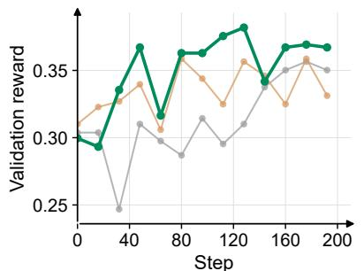

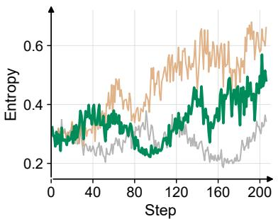  
Figure 9 Coding-agent training dynamics for Sample-level Advantage, Rollout-level Advantage, and Rollout-level Advantage + Rollout-level Norm. Left: validation reward. Right: policy entropy.

We therefore remove tasks with an empty problem statement, a missing problem branch, or more than 200 tests. The remaining tasks still have a highly skewed dificulty distribution and provide limited training signal, so we apply an additional model-based dificulty filter. We run Qwen3.5-9B four times on every candidate: tasks solved in all four rollouts are removed, while tasks with both successful and failed rollouts are retained, yielding approximately 5,000 examples. To avoid making the resulting set overly easy, we additionally sample 1,000 tasks that fail in all four rollouts. The final split contains approximately 6,000 training examples and 400 test examples.

## 4.3.2 Preventing Reward Hacking

During training, we observe several reward-hacking behaviors in which the agent bypasses the intended problem-solving process and obtains the reference source code directly:

1. Using Git history to locate the gold commit.

2. Using wget or curl to retrieve upstream source code from GitHub.

3. Using pip to download a package’s source code.

4. Using Python networking libraries, such as urllib, to download source code.

We introduce two safeguards. First, we disable Git commands and hide the .git directory from the agent, preventing it from inspecting commit history. Second, we enforce a Kubernetes network policy that blocks general outbound network access and permits connections only to explicitly whitelisted services. Together, these measures require the agent to solve each task using only the provided problem statement and local information.

## 4.3.3 Training Dynamics

As discussed in Section 2, because a rollout’s sample count is often driven by incidental factors such as retokenization, both the advantage calculation (Section 2.2) and the loss normalization (Section 2.3) should be computed at the rollout level rather than the sample level. We validate this design choice on our coding-agent training run by comparing three settings, all using the same underlying GRPO objective:

• Sample-level Advantage, which combines sample-level advantage with the token-mean loss in Equation 14;

• Rollout-level Advantage, which switches only the advantage calculation to the rollout level while keeping the token-mean loss; and

• Rollout-level Advantage + Rollout-level Norm, which additionally replaces the token-mean loss with the rollout-level token-mean loss in Equation 16.

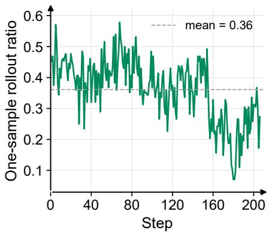

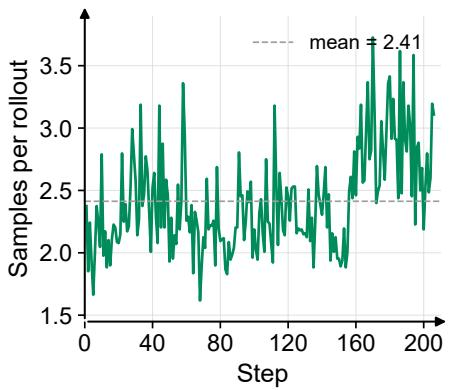  
Figure 10 Rollout-merging behavior for the Rollout-level Advantage + Rollout-level Norm run. Left: fraction of rollouts that yield exactly one training sample. Right: average number of training samples produced per rollout. Dashed lines mark the mean over training.

Figure 9 compares the three settings. The last variant produces the highest observed validation reward, reaching 38.2% at step 128, compared with 35.0% for the baseline and 33.1% when only the rollout-advantage fix is applied. Its policy entropy also grows more slowly and stays more stable over training than the variant with only the rollout-advantage fix. These results suggest that loss normalization controls the entropy increase introduced by the corrected rollout advantages while improving validation reward. We also evaluate the Rollout-level Advantage + Rollout-level Norm checkpoint on SWE-bench Verified [34], where it improves from 41.8% to 56.4% at step 208. Because coding-agent trajectories vary widely in length, the rollout-level advantage variants merge trajectories into training rows wherever possible to reduce padding waste, which produces a dynamic number of training samples per rollout: on average, only 36% of rollouts remain as a single, fully merged row, and each rollout yields 2.41 training samples on average (Figure 10).

## 5 Related Work

Traditional RL frameworks such as verl [8], AReaL [9], and slime [10] originally required the agent loop to be implemented directly inside the training framework, following the classic ReAct-style [16] Markov formulation in which the training engine owns the environment interaction loop. This makes it dificult to reuse independently maintained agent harnesses, such as mini-SWE-agent [1], OpenHands [2], OpenCode [3], Claude Code [4], Codex [5], OpenClaw [6], and Hermes [7], since each would need to be reimplemented inside the training stack. Our original Agent Lightning [11] work introduced a disaggregated architecture that instead connects arbitrary agent harnesses to RL training through an LLM endpoint, and this proxy-based approach has since been adopted by verl Uni-Agent [12], AReaL 2.0 [13], slime v0.3.0 [10], and Polar [14]. As discussed in Section 2, these frameworks make diferent, sometimes conflicting, design choices when handling retokenization, advantage calculation, and loss normalization under a dynamic number of training samples per rollout, and they commonly rely on commercial sandbox services, such as Modal Sandbox, Volcano veFaas, and E2B, to execute agents at scale. Agent Lightning v1.0 instead runs entirely on a self-hosted Kubernetes cluster and implements the whole system in approximately 3,500 lines of code, providing a compact and transparent testbed for studying these design choices, which we validate on the search-agent, instruction-following, and coding-agent settings of Search-R1 [19], LLM-in-Sandbox [20], and SWE-smith [21], respectively.

## 6 Conclusion

We characterize harnessed agentic RL, a paradigm in which the deploy-time agent harness, not the training engine, owns the environment interaction loop, and identify the resulting challenges in retokenization, advantage calculation, loss normalization, and training backend scheduling. We present Agent Lightning v1.0, an approximately 3,500-line framework that supports arbitrary agent harnesses and embeds our rollout-level design choices for these challenges. We validate it on search, instruction-following, and coding agents, and release a complete data pipeline and reward-hacking safeguards that let RL alone improve Qwen3.5-9B on SWE-bench Verified from 41.8% to 56.4%, a gain of 14.6 percentage points, using only about 6K training examples. We release the full codebase and scripts to facilitate reproducible harnessed agentic RL research.

## References

[1] SWE-agent Team. mini-swe-agent: The minimal ai software engineering agent. https: //github.com/SWE-agent/mini-swe-agent, 2026. Accessed: 2026-07-22.

[2] OpenHands. Openhands. https://github.com/OpenHands/OpenHands, 2026. Accessed: 2026-07-22.

[3] OpenCode. Opencode: The open source ai coding agent. https://github.com/anomalyco/ opencode, 2026. Accessed: 2026-07-22.

[4] Anthropic. Claude code overview. https://code.claude.com/docs/en/overview, 2026. Accessed: 2026-07-22.

[5] OpenAI. Codex cli. https://github.com/openai/codex, 2026. Accessed: 2026-07-22.

[6] OpenClaw Foundation. Openclaw: Personal ai assistant. https://github.com/openclaw/ openclaw, 2026. Accessed: 2026-07-22.

[7] Nous Research. Hermes agent. https://github.com/NousResearch/hermes-agent, 2026. Accessed: 2026-07-22.

[8] Guangming Sheng, Chi Zhang, Zilingfeng Ye, Xibin Wu, Wang Zhang, Ru Zhang, Yanghua Peng, Haibin Lin, and Chuan Wu. HybridFlow: A flexible and eficient RLHF framework. In Proceedings of the Twentieth European Conference on Computer Systems, pages 1279–1297. ACM, 2025. doi: 10.1145/3689031.3696075. URL https://doi.org/10.1145/3689031. 3696075.

[9] Wei Fu, Jiaxuan Gao, Xujie Shen, Chen Zhu, Zhiyu Mei, Chuyi He, Shusheng Xu, Guo Wei, Jun Mei, Jiashu Wang, Tongkai Yang, Binhang Yuan, and Yi Wu. AReaL: A largescale asynchronous reinforcement learning system for language reasoning. arXiv preprint arXiv:2505.24298, 2025. doi: 10.48550/arXiv.2505.24298. URL https://arxiv.org/abs/ 2505.24298.

[10] Zilin Zhu, Chengxing Xie, Xin Lv, and slime Contributors. slime: An LLM post-training framework for RL scaling. https://github.com/THUDM/slime, 2025. Accessed: 2026-07-29.

[11] Xufang Luo, Yuge Zhang, Zhiyuan He, Zilong Wang, Siyun Zhao, Dongsheng Li, Luna K. Qiu, and Yuqing Yang. Agent lightning: Train ANY AI agents with reinforcement learning. arXiv preprint arXiv:2508.03680, 2025. doi: 10.48550/arXiv.2508.03680. URL https: //arxiv.org/abs/2508.03680.

[12] Yuyang Ding, Bo Wen, Xubo Cao, Zhiqiang Zhai, Guangming Sheng, Xibin Wu, Juntao Li, Min Zhang, and Uni-Agent Contributors. Uni-Agent: Build, run, and train agents at scale. https://github.com/verl-project/uni-agent, 2026. Accessed: 2026-07-29.

[13] Ran Yan, Wei Fu, Jiale Li, Shusheng Xu, Zhiyu Mei, Jiaxuan Gao, Jiarui Zhang, Wentai Zhang, Hao Dai, Xujie Shen, Chuyi He, Zhen Pu, Jun Mei, Zhiyao Lin, Haitao Wang, Zhiqiang Ding, Jiawei Zhang, Huaijie Wang, Ruida Xu, Honghua Dong, Youhe Jiang, Yi Wu, Tongkai Yang, and Binhang Yuan. Next-generation agentic reinforcement learning systems enable self-evolving agents. arXiv preprint arXiv:2607.01120, 2026. URL https://arxiv.org/abs/ 2607.01120.

[14] Binfeng Xu, Hao Zhang, Shaokun Zhang, Songyang Han, Mingjie Liu, Jian Hu, Shizhe Diao, Zhenghui Jin, Yunheng Zou, Michael Demoret, Jan Kautz, and Yi Dong. Polar: Agentic RL on

any harness at scale. arXiv preprint arXiv:2605.24220, 2026. doi: 10.48550/arXiv.2605.24220. URL https://arxiv.org/abs/2605.24220.

[15] Qwen Team. Qwen3.5: Towards native multimodal agents, February 2026. URL https: //qwen.ai/blog?id=qwen3.5.

[16] Shunyu Yao, Jefrey Zhao, Dian Yu, Nan Du, Izhak Shafran, Karthik Narasimhan, and Yuan Cao. React: Synergizing reasoning and acting in language models. In International Conference on Learning Representations (ICLR), 2023.

[17] Zhihong Shao, Peiyi Wang, Qihao Zhu, Runxin Xu, Junxiao Song, Xiao Bi, Haowei Zhang, Mingchuan Zhang, Y. K. Li, Y. Wu, and Daya Guo. DeepSeekMath: Pushing the limits of mathematical reasoning in open language models. arXiv preprint arXiv:2402.03300, 2024. doi: 10.48550/arXiv.2402.03300. URL https://arxiv.org/abs/2402.03300.

[18] Qiying Yu et al. DAPO: An open-source LLM reinforcement learning system at scale. arXiv preprint arXiv:2503.14476, 2025. doi: 10.48550/arXiv.2503.14476. URL https: //arxiv.org/abs/2503.14476.

[19] Bowen Jin, Hansi Zeng, Zhenrui Yue, Jinsung Yoon, Sercan Arik, Dong Wang, Hamed Zamani, and Jiawei Han. Search-R1: Training LLMs to reason and leverage search engines with reinforcement learning. arXiv preprint arXiv:2503.09516, 2025. doi: 10.48550/arXiv. 2503.09516. URL https://arxiv.org/abs/2503.09516.

[20] Daixuan Cheng, Shaohan Huang, Yuxian Gu, Huatong Song, Guoxin Chen, Li Dong, Wayne Xin Zhao, Ji-Rong Wen, and Furu Wei. Computer environments elicit general agentic intelligence in LLMs. arXiv preprint arXiv:2601.16206, 2026. doi: 10.48550/arXiv.2601.16206. URL https://arxiv.org/abs/2601.16206.

[21] John Yang, Kilian Lieret, Carlos E. Jimenez, Alexander Wettig, Kabir Khandpur, Yanzhe Zhang, Binyuan Hui, Ofir Press, Ludwig Schmidt, and Diyi Yang. SWEsmith: Scaling data for software engineering agents. In D. Belgrave, C. Zhang, H. Lin, R. Pascanu, P. Koniusz, M. Ghassemi, and N. Chen, editors, Advances in Neural Information Processing Systems, volume 38. Curran Associates, Inc., 2025. URL https://proceedings.neurips.cc/paper\_files/paper/2025/file/ 8b86cf5ace600c48fd188efbb8dedec8-Paper-Datasets\_and\_Benchmarks\_Track.pdf.

[22] Aaron Grattafiori et al. The Llama 3 herd of models. arXiv preprint arXiv:2407.21783, 2024. doi: 10.48550/arXiv.2407.21783. URL https://arxiv.org/abs/2407.21783.

[23] Zhilin Yang, Peng Qi, Saizheng Zhang, Yoshua Bengio, William Cohen, Ruslan Salakhutdinov, and Christopher D. Manning. HotpotQA: A dataset for diverse, explainable multi-hop question answering. In Proceedings of the 2018 Conference on Empirical Methods in Natural Language Processing, pages 2369–2380. Association for Computational Linguistics, 2018. doi: 10.18653/v1/D18-1259. URL https://aclanthology.org/D18-1259/.

[24] Xanh Ho, Anh-Khoa Duong Nguyen, Saku Sugawara, and Akiko Aizawa. Constructing a multi-hop QA dataset for comprehensive evaluation of reasoning steps. In Proceedings of the 28th International Conference on Computational Linguistics, pages 6609–6625. International Committee on Computational Linguistics, 2020. doi: 10.18653/v1/2020.coling-main.580. URL https://aclanthology.org/2020.coling-main.580/.

[25] Harsh Trivedi, Niranjan Balasubramanian, Tushar Khot, and Ashish Sabharwal. MuSiQue: Multihop questions via single-hop question composition. Transactions of the Association

for Computational Linguistics, 10:539–554, 2022. doi: 10.1162/tacl\_a\_00475. URL https: //aclanthology.org/2022.tacl-1.31/.

[26] Ofir Press, Muru Zhang, Sewon Min, Ludwig Schmidt, Noah A. Smith, and Mike Lewis. Measuring and narrowing the compositionality gap in language models. In Findings of the Association for Computational Linguistics: EMNLP 2023, pages 5687–5711. Association for Computational Linguistics, 2023. doi: 10.18653/v1/2023.findings-emnlp.378. URL https://aclanthology.org/2023.findings-emnlp.378/.

[27] Mandar Joshi, Eunsol Choi, Daniel Weld, and Luke Zettlemoyer. TriviaQA: A large scale distantly supervised challenge dataset for reading comprehension. In Proceedings of the 55th Annual Meeting of the Association for Computational Linguistics (Volume 1: Long Papers), pages 1601–1611. Association for Computational Linguistics, 2017. doi: 10.18653/v1/P17-1147. URL https://aclanthology.org/P17-1147/.

[28] Tom Kwiatkowski, Jennimaria Palomaki, Olivia Redfield, Michael Collins, Ankur Parikh, Chris Alberti, Danielle Epstein, Illia Polosukhin, Jacob Devlin, Kenton Lee, Kristina Toutanova, Llion Jones, Matthew Kelcey, Ming-Wei Chang, Andrew M. Dai, Jakob Uszkoreit, Quoc Le, and Slav Petrov. Natural questions: A benchmark for question answering research. Transactions of the Association for Computational Linguistics, 7:452–466, 2019. doi: 10.1162/ tacl\_a\_00276. URL https://aclanthology.org/Q19-1026/.

[29] An Yang et al. Qwen3 technical report. arXiv preprint arXiv:2505.09388, 2025. doi: 10.48550/arXiv.2505.09388. URL https://arxiv.org/abs/2505.09388.

[30] Arash Ahmadian, Chris Cremer, Matthias Gallé, Marzieh Fadaee, Julia Kreutzer, Olivier Pietquin, Ahmet Üstün, and Sara Hooker. Back to basics: Revisiting REINFORCE style optimization for learning from human feedback in LLMs. arXiv preprint arXiv:2402.14740, 2024. doi: 10.48550/arXiv.2402.14740. URL https://arxiv.org/abs/2402.14740.

[31] Daixuan Cheng, Yuxian Gu, Shaohan Huang, Junyu Bi, Minlie Huang, and Furu Wei. Instruction pre-training: Language models are supervised multitask learners. In Proceedings of the 2024 Conference on Empirical Methods in Natural Language Processing, pages 2529–2550. Association for Computational Linguistics, 2024. doi: 10.18653/v1/2024.emnlp-main.148. URL https://aclanthology.org/2024.emnlp-main.148/.

[32] Naman Jain, Jaskirat Singh, Manish Shetty, Liang Zheng, Koushik Sen, and Ion Stoica. R2E-Gym: Procedural environments and hybrid verifiers for scaling open-weights SWE agents. arXiv preprint arXiv:2504.07164, 2025. doi: 10.48550/arXiv.2504.07164. URL https://arxiv.org/abs/2504.07164.

[33] Jiayi Pan, Xingyao Wang, Graham Neubig, Navdeep Jaitly, Heng Ji, Alane Suhr, and Yizhe Zhang. Training software engineering agents and verifiers with SWE-Gym. arXiv preprint arXiv:2412.21139, 2024. doi: 10.48550/arXiv.2412.21139. URL https://arxiv.org/abs/ 2412.21139.

[34] Carlos E. Jimenez, John Yang, Alexander Wettig, Shunyu Yao, Kexin Pei, Ofir Press, and Karthik Narasimhan. SWE-bench: Can language models resolve real-world github issues? In International Conference on Learning Representations, 2024. URL https: //arxiv.org/abs/2310.06770.

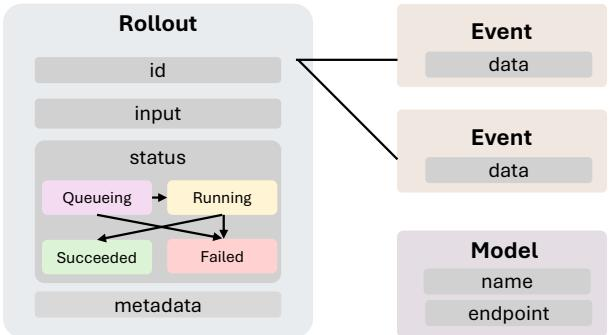  
Figure 11 The objects stored by the API Gateway.

## A Detailed System Design

This appendix provides a detailed description of Agent Lightning v1.0’s three components introduced in Section 3: the API Gateway, the Rollout Controller, and the Customized Trainer.

## A.1 API Gateway

The API Gateway is the central component of Agent Lightning v1.0, kept deliberately lightweight: a single stateful service that stores rollouts, models, and events, and exposes them through a minimal API. Figure 11 summarizes these objects and their relationships.

Rollout. A rollout is one agent execution, identified by a unique rollout ID. It stores an input (derived from a training example), a status, and user-defined metadata. The status follows the state machine in Figure 11: queuing, running, and the terminal states succeeded and failed. Rollouts are not one-to-one with training examples: GRPO [17], for instance, generates multiple independent rollouts, each with its own ID and trajectory, from the same example.

Model. A model identifies an LLM inference endpoint by its name and address. The trainer registers models with the API Gateway, which then routes agent harness requests to the corresponding inference server.

Event. An event attaches arbitrary data to a rollout. By default, Agent Lightning v1.0 records a model\_request event (prompt token IDs, response token IDs, and response log probabilities) for every LLM interaction, and a reward event that the agent typically reports once at the end of the rollout with a scalar reward. Users can also define custom event types.

Table 1 lists the API Gateway’s endpoints, which fall into two APIs: the rollout API and the proxy API.

Rollout API. The trainer creates rollouts through this API. The Rollout Controller polls queued rollouts, launches agents, and updates their status as execution progresses. Rewards and other user-defined events are uploaded the same way.

Proxy API. This API forwards LLM calls from agent harnesses to the model endpoints the trainer has registered. An agent harness only needs to point its OpenAI-compatible client at the proxy. Since the proxy path embeds the rollout ID, every call can be attributed to its rollout automatically. Each call’s prompt token IDs, response token IDs, and log probabilities are recorded as a model\_request event, which the trainer later exports for training.

This simple API fully decouples RL training from agent execution: the trainer only creates rollouts and collects trajectories, any harness can connect by switching its LLM endpoint to the proxy, and training and execution resources can be provisioned independently and even run in diferent locations.

<table><tr><td>Method</td><td>Endpoint</td><td>Comment</td></tr><tr><td>POST</td><td>/api/rollouts</td><td>Create a batch of rollouts.</td></tr><tr><td>GET</td><td>/api/rollouts</td><td>List rollouts, optionally filtered by state.</td></tr><tr><td>GET</td><td>/api/rollouts/{rollout_id}</td><td>Get one rollout.</td></tr><tr><td>PATCH</td><td>/api/rollouts/{rollout_id}</td><td>Update rollout status.</td></tr><tr><td>POST</td><td>/api/rollouts/{rollout_id}/attempt/ {attempt_id}/events</td><td>Append an event to a rollout attempt.</td></tr><tr><td>GET</td><td>/api/rollouts/{rollout_id}/events</td><td>Read rollout events.</td></tr><tr><td>POST</td><td>/api/models</td><td>Register model endpoints.</td></tr><tr><td>DELETE</td><td>/api/models</td><td>Remove all registered model endpoints.</td></tr><tr><td>POST</td><td>/proxy/rollout/{rollout_id}/attempt/ {attempt_id}/mode/{mode}/openai/v1/</td><td>Forward an OpenAI-compatible model call</td></tr></table>

Table 1 API Gateway endpoints.

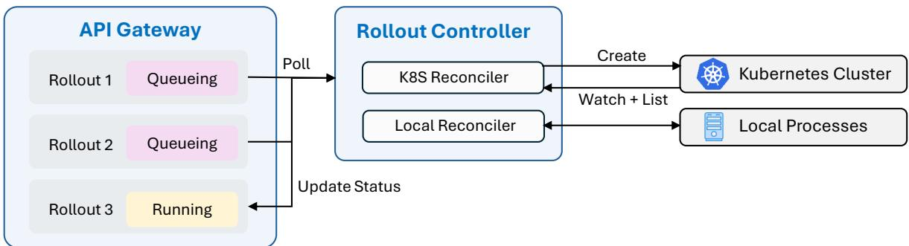  
Figure 12 The Rollout Controller reconciles rollout status in the API Gateway with agent executions running as Kubernetes Jobs or local processes.

## A.2 Rollout Controller

The Rollout Controller manages agent execution on top of Kubernetes. As shown in Figure 12, it periodically fetches active rollouts from the API Gateway, launches the corresponding agent tasks, monitors them, and reports status back through the Gateway API. Its primary backend is the K8s Reconciler, which targets an open-source Kubernetes cluster. For debugging purposes, it also provides a Local Reconciler, which targets a local process pool.

K8s Reconciler. For each queuing rollout without an existing Kubernetes Job, it creates one from a user-provided template. It watches the Kubernetes API for Job updates so terminal states propagate with low latency, and periodically lists all managed Jobs to recover any watch events that were missed – the standard Kubernetes controller pattern.

Local Reconciler. It launches agents in a local process pool instead. Since it owns the process handles directly, periodic polling alone is enough, and no separate watch mechanism is needed.

State Consistency. The API Gateway’s rollout status is the ground truth. The execution state observed from Kubernetes may lag behind it because of network failures or delayed updates. The K8s Reconciler simply retries synchronization on its next cycle, so the two sides converge once communication resumes. This design guarantees only best-efort eventual consistency.

## A.3 Customized Trainer

Built on top of VERL [8], the Customized Trainer keeps a lightweight design while connecting the training backend to the API Gateway: at each step it registers rollouts for the current batch, waits for them to reach a terminal state, then retrieves their model\_request and reward events and assembles them into training samples. It consists of the following two components.

Dedicated Sample Adapter. The adapter reflects our design choices for the challenges described in Section 2.

• Sample merging. We keep the API Gateway as simple as possible: it does not maintain a server-side request bufer, which keeps training consistent with deployment. The adapter merges two consecutive model requests into one training sample only when the later prompt is an exact token-level prefix match of the earlier request and response.

• Advantage calculation. The adapter computes baselines and advantages at the rollout level, which we believe is the more principled choice.

• Loss normalization. The adapter implements the rollout-level token-mean loss discussed in Section 2, normalizing so every rollout carries equal weight regardless of its sample count.

Trajectory Monitoring. Because agentic training can produce reward hacking, runaway trajectories, or silent failures, the trainer exposes every training and validation rollout’s input, status, model requests, rewards, token/turn statistics, and custom events, with execution logs kept in Kubernetes, so we can inspect them manually or with AI agents to diagnose unusual behavior.