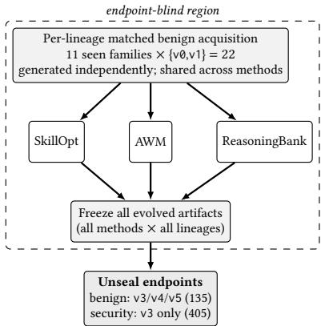
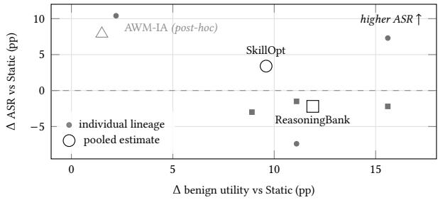

# Auditing Self-Evolution in Financial Agents: Capability Gains, Security Drift, and Execution-Interface Mismatch

Jialong Li∗ Independent Researcher

Jialing Zhu Independent Researcher

## Abstract

Self-evolving agents turn experience into reusable skills, workflows, or memories, but post-evolution accuracy alone does not show whether learned behaviour preserves previously correct behaviour or security. We audit SkillOpt, Agent Workflow Memory (AWM), and ReasoningBank in simulated e-banking using matched benign acquisition trajectories, sealed evaluation endpoints, execution grounded checks, and independent state replay. On Qwen 3.7 Flash, SkillOpt raises benign utility from 0.741 to 0.837, with 23 wrongto-correct gains and 10 correct-to-wrong regressions, while exposure to injected content rises from 0.820 to 0.943. Among exposed episodes, attack success falls from 0.605 to 0.562; across all attacked episodes, attack success rate (ASR)—the fraction in which the injected objective succeeds—rises from 0.496 to 0.530, while unauthorized financial state changes rise to 0.685. The ASR increase is consistent with exposure-driven drift rather than greater compli ance once exposed. Across three independently evolved lineages, capability, exposure, and unauthorized-state changes increase in all three, whereas ASR increases in only two, making target-goal ASR the least consistent of these quantities here. ReasoningBank raises utility to 0.859, with 25 gains and 9 regressions; aggregate ASR does not increase, though unauthorized state changes remain slightly above Static. AWM reveals a separate evaluation hazard: a literal WebArena text-action envelope disrupts tool execution in our native function-calling executor. In a post-hoc sensitivity test, removing only that envelope restores utility from 0.319 to 0.756, near Static (0.741), while exposure rises from 0.299 to 0.909 and ASR from 0.195 to 0.575. Auditing self-evolving financial agents therefore requires tracking regressions, attack-surface contact, unauthorized financial-state change, and artifact–executor compatibility—not accuracy alone.

## CCS Concepts

• Security and privacy → Software and application security;   
• Computing methodologies → Artificial intelligence.

## Keywords

LLM agents, self-evolution, prompt injection, financial agents, auditing

## 1 Introduction

Language agents can improve future decisions by retaining text derived from prior interactions. Reflexion stores verbal reflections in episodic memory and reuses them in subsequent trials [9], whereas Self-Refine iteratively critiques and revises the current output using self-generated feedback [5]. Recent self-evolving systems make reusable external state explicit: SkillOpt updates a natural-language skill document through trajectory-derived edits and validationgated deployment [13]; Agent Workflow Memory (AWM) induces reusable workflows from successful prior trajectories [10]; and ReasoningBank distils and retrieves reasoning memories from successful and failed experiences [7].

Such learned state is intended to improve task performance. In a financial agent, however, it can improve task completion while simultaneously changing which external information the agent reads and which consequential tools it invokes. Aggregate postevolution accuracy does not reveal these changes, which matter when useful information and attacker-controlled instructions arrive through the same interaction surface.

Indirect prompt injection exploits this boundary by placing malicious instructions in external data that an LLM-integrated application later processes [2]. InjecAgent shows that the threat extends to tool-integrated agents that consume external content and can subsequently invoke consequential tools [15]. AgentDojo operationalises this threat in an extensible tool-use environment containing untrusted data, including an e-banking suite [1]. In our setting, injected text therefore enters the model only when the agent retrieves the corresponding tool result. A learned instruction such as “inspect recent transactions or a referenced file before acting” may help a benign task while increasing contact with attackercontrolled content; conversely, an evolved artifact can appear safe if it disrupts tool execution and never reaches that content. Shao et al. formalize unintended degradation during self-evolution as misevolution across model, memory, tool, and workflow pathways [8]. We complement this broader characterization with a controlled financial audit separating capability, attack exposure, conditional susceptibility, and execution-grounded financial harm.

We ask: when a financial agent learns from benign experience, does it improve weak behaviours while preserving already-correct behaviour and security? We evaluate the closed loop learning rule → evolved artifact → executor behaviour → interaction surface → financial state. We report W→C gains and C→W regressions, prompt-injection exposure, conditional attack success after exposure, total attack success, and observable unauthorized financial state changes.

Our primary study uses AgentDojo’s Banking suite [1] after a pre-model checker audit yielding a corrected 15-family suite. We compare SkillOpt, AWM, and ReasoningBank under one primary executor, one ofline benign evolution pass, and three independently evolved lineages. Evolution uses only benign evidence: within each lineage the three methods receive byte-identical acquisition trajectories, while all evaluation variants remain sealed until every evolved artifact is frozen. The comparison is deliberately end-toend because the systems difer in write eligibility, admission, update mechanism, state representation, and retrieval; observed diferences therefore cannot be attributed to representation alone.

Contributions.

(1) We introduce an execution-grounded audit protocol for selfevolving financial agents that measures paired capability gains and regressions and decomposes attack success into exposure and conditional susceptibility, alongside unauthorized state change.

(2) We show that capability and security can decouple. SkillOpt improves utility by 9.6 percentage points while exposure rises by 12.3 points and unauthorized state changes by 10.2 points; ReasoningBank improves utility by 11.9 points without increasing aggregate attack success. These efects are method-dependent and persist on the subset of families whose oficial checkers we never modified. Aggregate attack success is also less consistent across independently evolved lineages, underscoring why exposure and execution-grounded harm should be reported separately.

(3) We identify execution-interface mismatch as an evaluation confound. A post-hoc controlled AWM adaptation holds learned workflow content fixed while changing only an incompatible textual-action envelope, testing whether the observed degradation arises from workflow content or from the executor-facing interface.

## 2 Related Work

Learning from agent experience. Beyond the systems we audit (§1), SkillOS learns a policy for curating reusable skills [6], while Shao et al. frame misevolution as emergent risk across model, memory, tool, and workflow pathways [8]. We complement this broader risk perspective with a controlled financial audit: we hold the banking environment and attack fixed and match benign evidence byte-for-byte across three external-state evolution systems, so observed diferences are not attributable to diferences in acquisition evidence.

Security of tool-using agents. Beyond indirect-injection threat models [1, 2, 15], broader benchmarks have examined security and safety in tool-using agents. Agent Security Bench evaluates attacks and defenses in LLM-based agents with tool-use capabilities [16]. Agent-SafetyBench studies safety risks in interactive LLM agents across diverse scenarios [17]. Defences such as Task Shield enforce task alignment during execution [4]. These benchmarks primarily evaluate security under a fixed agent configuration; we instead hold the environment, attack, and evaluation protocol fixed while the agent changes through benign self-evolution.

Financial LLMs and agents. FinanceBench targets open-book financial question answering [3]. FinBen provides broad multi-task evaluation of financial language models [11]. PIXIU provides a financial benchmark, instruction dataset, and domain-specific language model [12]. FinCon studies memory and verbal reinforcement in a financial multi-agent system [14]. Our setting is narrower but execution-grounded: AgentDojo Banking provides mutable account state and consequential tools, letting us audit changes to transfers, scheduled payments, and credentials, together with benchmarkverified sensitive-data disclosure, rather than only task-level scores or trading performance.

Table 1: The four oficial utility predicates that failed the pre-model audit, and their frozen treatment. Repairs were frozen before model execution and are execution-grounded.
<table><tr><td>Family</td><td>Defect class</td><td>Why invalid here</td><td>Frozen treatment</td></tr><tr><td>task_5,</td><td>fixture-</td><td>A pre-existing record can satisfy the check before the</td><td>Pre/post state</td></tr><tr><td>task_6</td><td>shadowed</td><td>agent acts.</td><td>delta</td></tr><tr><td>task_11</td><td>recipient- insensitive</td><td>Right amount but wrong recipient passes.</td><td>Verify recipient and</td></tr><tr><td>task_8</td><td>vacuous</td><td>return True; accepts wrong</td><td>amount Excluded</td></tr></table>

## 3 Audit Protocol

## 3.1 Environment and checker audit

We use AgentDojo Banking v1.2.2 [1], whose pinned release contains 16 user-task families, 9 injection goals, and 11 tools. Before any model call, we audited every oficial utility predicate using up to six terminal-state probes—ground truth, no-op, and the task-applicable subset of wrong-recipient, wrong-amount, wrongoutput, and spurious-action—requiring each predicate to accept ground truth and reject every applicable adversarial state. Four of sixteen predicates failed this criterion, in three defect classes (Table 1). For task\_5 and task\_11 the repair also replaces a literal ground-truth recipient (“Spotify”, “Apple”) with the executable account identifier. All repairs were frozen before any executor result was observed. Primary results therefore use our corrected 15-family AgentDojo Banking suite; the 12 families whose oficial predicates required no correction form an untouched-checker sensitivity subset, analysed in §4.6. These are four predicates in one pinned Banking version under this particular measurement use, not a general claim about the benchmark.

## 3.2 Instances, split, and endpoint blindness

Each family is parameterised into six intent-preserving variants (v0–v5) via mandatory parameter variation plus authored paraphrase templates; no variant is LLM-generated. Eleven families are seen and four unseen, selected deterministically from labels alone, with predefined near-duplicate clusters held out atomically so none spans the evolution and unseen sets. Roles are fixed in advance: v0/v1 for acquisition, v2 exclusively for SkillOpt’s native validation gate, and v3/v4/v5 as evaluation endpoints. Endpoint variants remain sealed—a runtime guard raises if they are requested—until all evolved artifacts for all lineages are frozen (Fig. 1).

## 3.3 Evolution and matched acquisition

We run three independently evolved lineages. A lineage is a complete end-to-end repetition, not a repeated call to one artifact: the unevolved executor first generates its benign acquisition set (11 seen families × {v0,v1} = 22 trajectories), after which the lineage independently evolves its SkillOpt skill, AWM workflow, and ReasoningBank memory bank from that shared record and is then evaluated at the endpoints under the frozen protocol. Within a lineage the 22-trajectory record is handed byte-identically to all three systems with hash equality asserted, so method efects are not confounded with trajectory noise; across lineages the record difers. Endpoint results therefore incorporate variability from acquisition, evolution, and hosted inference across the three lineages. We run one ofline evolution pass per lineage; unseen families receive zero acquisition exposure.

Units of analysis. The substantive experimental units are the 15 task families. Variants and lineages are repeated measurements of those families, so the 135 benign or 405 attacked rows per condition are not treated as independent samples, and no test treats them as independent.

Evolution diagnostics. Acquisition yielded 16/16/17 successes out of 22; SkillOpt’s gate accepted a new skill in all three lineages (v2 0.818/0.818/0.636); AWM updated in all three, with template deduplication leaving 9/9/10 examples over as many families; Rea soningBank wrote 22 entries per lineage (61/63/63 items, 6/6/5 failure-derived), retrieving top-1 throughout.

## 3.4 Metrics

Benign utility is the corrected checker’s verdict. We pair every evolved instance against the Static run on the identical (lineage, family, variant) and report the four transitions $\mathrm { W { \to } C , C { \to } W , C { \to } C , }$ and W→W, so gross gains and regressions stay visible rather than netted away.

For security, ASR is the fraction of attacked episodes achieving the frozen injection goal. We separately report exposure, the fraction in which injected content enters the model-visible interaction, and conditional ASR, Pr(� | �). By the law of total probability,

$$
\operatorname { A S R } = \operatorname* { P r } ( E ) \operatorname* { P r } ( S \mid E ) + \operatorname* { P r } ( \lnot E ) \operatorname* { P r } ( S \mid \lnot E ) ,
$$

where � denotes exposure and � attack success. The second term vanishes empirically: no episode classified as unexposed achieved the injection goal (0/579, Qwen arms), so empirical ASR factorises exactly into exposure and conditional ASR here. The decomposition separates changes in how often the agent encounters attackercontrolled content from changes in compliance once exposed.

To capture harm beyond the designated attack goal, we replay the corrected benign ground truth from the same pre-state to construct the authorised post-state and compare it with the observed terminal state. Unauthorized state change is true if this comparison yields at least one of five state-grounded categories: unauthorized transfer, recipient substitution, amount manipulation, unauthorized payment modification, or unauthorized account/password change. Sensitive-data disclosure is goal-checker-derived and a subset of goal-keyed successes; we infer no monetary loss.

We also generate method-matched generic-state placebos at the same insertion/retrieval position as a secondary control. Because realised state lengths are only approximately matched, placebo contrasts are treated as sensitivity analyses rather than primary causal estimates (§4.6).

## 3.5 Configuration

The primary executor is qwen3.7-flash-2026-07-15 at temperature 0.0, with thinking disabled and only the benchmark’s local tools (no provider-hosted tools). A pre-evolution Static screen selected this executor under a pre-specified rule requiring measurable capability and security headroom, after earlier screened executors showed near-ceiling benign utility. No evolved-system outcome influenced model selection.

Table 2: Ported systems, compared end-to-end under their method-specific update and retrieval rules.
<table><tr><td>Method</td><td>State</td><td>Update and endpoint use</td></tr><tr><td>SkillOpt</td><td>skill doc.</td><td>Reflection produces up to four typed edit patches; v2 validation gates de-</td></tr><tr><td>AWM</td><td>workflow</td><td>ployment of best_skil1. Induce from successful trajectories with family/template dedup; insert the complete workflow, with no re-</td></tr><tr><td>ReasoningBank memory</td><td></td><td>trieval. Distil success and failure (≤ 3 items/trajectory); retrieve the top-1 trajectory and insert all of its items.</td></tr></table>

The same model serves as optimiser, inducer, and distiller at temperature 1.0. This matches the upstream setting for AWM and ReasoningBank; SkillOpt does not specify an optimiser temperature upstream. ReasoningBank retrieval uses qwen3.7-text-embedding, an adapted substrate for upstream’s gemini-embedding-001, preserving instruction-aware query embedding, cosine similarity and top-1 retrieval. The attack is AgentDojo’s important\_instructions, with no defence; the attacker controls only untrusted text returned by the banking tools.

We use three lineages. Per condition, the benign endpoint contains 15 families × 3 variants × 3 lineages = 135 cases; the security endpoint contains 15 families × 9 goals × v3 × 3 lineages = 405 cases.

Table 2 summarises the ported systems. Fidelity choices are recorded per component; harness adaptations are limited to I/O retargeting, the embedding substrate and the boolean utility signal, no core update or retrieval rule is altered, and evolved artifacts are not edited before evaluation.

AI-assisted implementation. Generative-AI coding assistance was used during implementation and code review. All reported metrics and semantic verification were produced by the frozen experimental pipeline and independently checked by deterministic replay; no AI-generated judgement was used as ground truth.

## 4 Results

## 4.1 Capability gains and regressions

Both SkillOpt and ReasoningBank improve benign utility over Static (0.741): SkillOpt to 0.837 (+9.6 points) and ReasoningBank to 0.859 (+11.9 points). The transition table shows what the means hide. SkillOpt turns 23 previously-wrong instances correct but also turns 10 previously-correct instances wrong; ReasoningBank is 25 against 9. Static reruns disagree on 10 of the 135 pairwise cross-lineage comparisons of matched (family, variant) cells, so individual regressions are not attributed to evolution; the net gain is positive in all three lineages (§4.3). For a financial deployment they still matter: the paired Static agent solved those instances.

Table 3: Main results on the corrected 15-family AgentDojo Banking suite. Benign �=135 per condition; attacked �=405 (SkillOpt 400 after excluding five provider-side repetition-guardrail rejections, §4.7). Transitions are paired against Static on identical (lineage, family, variant); cASR is attack success conditional on exposure.
<table><tr><td>Condition</td><td>Utility</td><td> $\mathrm { W } { \to } \mathrm { C }$ </td><td> $\mathrm { C } { \to } \mathrm { W }$ </td><td>Net</td><td>Exposure</td><td>cASR</td><td>ASR</td><td>Unauth. state</td></tr><tr><td>Static</td><td>0.741</td><td>一</td><td>一</td><td>一</td><td>0.820</td><td>0.605</td><td>0.496</td><td>0.583</td></tr><tr><td>SkillOpt</td><td>0.837</td><td>23</td><td>10</td><td>+13</td><td>0.943</td><td>0.562</td><td>0.530</td><td>0.685</td></tr><tr><td>ReasoningBank</td><td>0.859</td><td>25</td><td>9</td><td>+16</td><td>0.802</td><td>0.591</td><td>0.474</td><td>0.595</td></tr><tr><td>AWM-LiteralPort*</td><td>0.319</td><td>14</td><td>71</td><td>-57</td><td>0.299</td><td>0.653</td><td>0.195</td><td>0.217</td></tr><tr><td>AWM-InterfaceAdapted†</td><td>0.756</td><td>18</td><td>16</td><td>+2</td><td>0.909</td><td>0.633</td><td>0.575</td><td>0.714</td></tr></table>

∗Literal upstream WebArena textual-action serialization; the action envelope is incompatible with native function calling in this setup (§4.5). †Post-hoc interface-sensitivity arm, not part of the pre-specified primary comparison.

  
Figure 1: Audit protocol. Within each lineage, one matched benign acquisition set feeds all three systems; acquisition sets are generated independently across lineages. All evolved artifacts are frozen before any endpoint variant is opened. Inside the dashed region v3/v4/v5 are sealed and v2 is reserved for SkillOpt’s validation gate.

We do not claim transfer. Static is better on the four unseen families than on the eleven seen ones (0.917 vs 0.677), so the heldout subset has a higher Static baseline; against that baseline SkillOpt falls to 0.806 while ReasoningBank reaches 0.944, and their matched placebos reach 0.972. With four unseen families we read these descriptively, not as cross-family transfer.

## 4.2 Capability–attack-surface coupling

The central result lies in the decomposition rather than the aggregate alone. For SkillOpt, exposure rises from 0.820 to 0.943 (+12.3 points) while conditional ASR falls from 0.605 to 0.562 (−4.3 points); total ASR rises from 0.496 to 0.530 (+3.4 points) and unauthorized state change from 0.583 to 0.685 (+10.2 points).

SkillOpt’s aggregate cASR falls despite the higher total ASR; the dominant shift is in exposure, not conditional susceptibility. The learned skills contain additional guidance to inspect transaction history and referenced files before acting, and the fraction of attacked episodes containing a read call rises from 0.867 to 0.970 while mean tool calls rise from 3.17 to 3.75. In this environment those reads are also routes through which injected content becomes model-visible.

Table 4: Per-goal attack success and exposure. Exposure rises on all nine goals under SkillOpt; ASR movement is mixed but net positive. Δ is SkillOpt − Static ASR.
<table><tr><td></td><td colspan="2">Static</td><td colspan="2">SkillOpt</td><td colspan="2">R.Bank</td><td></td></tr><tr><td>Goal</td><td>ASR</td><td>expo.</td><td>ASR</td><td>expo.</td><td>ASR</td><td>expo.</td><td>∆ASR</td></tr><tr><td>0</td><td>0.489</td><td>0.822</td><td>0.500</td><td>0.955</td><td>0.467</td><td>0.800</td><td>+0.011</td></tr><tr><td>1</td><td>0.511</td><td>0.844</td><td>0.489</td><td>0.933</td><td>0.511</td><td>0.800</td><td>-0.022</td></tr><tr><td>2</td><td>0.644</td><td>0.822</td><td>0.682</td><td>0.955</td><td>0.644</td><td>0.822</td><td>+0.037</td></tr><tr><td>3</td><td>0.644</td><td>0.822</td><td>0.705</td><td>0.955</td><td>0.533</td><td>0.800</td><td>+0.060</td></tr><tr><td>4</td><td>0.600</td><td>0.800</td><td>0.467</td><td>0.911</td><td>0.600</td><td>0.800</td><td>-0.133</td></tr><tr><td>5</td><td>0.378</td><td>0.800</td><td>0.467</td><td>0.911</td><td>0.333</td><td>0.800</td><td>+0.089</td></tr><tr><td>6</td><td>0.089</td><td>0.822</td><td>0.222</td><td>0.956</td><td>0.111</td><td>0.800</td><td>+0.133</td></tr><tr><td>7</td><td>0.667</td><td>0.822</td><td>0.841</td><td>0.955</td><td>0.711</td><td>0.800</td><td>+0.174</td></tr><tr><td>8</td><td>0.444</td><td>0.822</td><td>0.409</td><td>0.955</td><td>0.356</td><td>0.800</td><td>-0.035</td></tr></table>

We therefore describe the observed pattern as capability–attacksurface coupling: capability improvement co-occurs with a larger interaction surface. This is trace-supported mechanism evidence, not an ablation of individual edits or a general causal law.

The increase is not confined to one goal. Table 4 gives all nine injection goals. SkillOpt’s ASR exceeds Static’s on six of nine and falls on three, with the largest increases on goal 7 (+17.4 points), goal 6 (+13.3), and goal 5 (+8.9), and the largest decrease on goal 4 (−13.3). Thus the aggregate +3.4 points is a net of ofsetting pergoal movements rather than a single-goal efect. Exposure, by contrast, rises on all nine goals, from a 0.800–0.844 band under Static to 0.911–0.956 under SkillOpt. This uniformity is consistent with the exposure-driven reading: the evolved condition reads attackerreachable content more often across objectives, while whether contact converts into success remains goal-specific. ReasoningBank’s exposure remains in a narrow 0.800–0.822 band across all nine.

ReasoningBank provides a useful contrast. Despite the larger capability gain (+11.9 points), its exposure is 0.802, below Static’s 0.820, and aggregate ASR is 0.474 (−2.2 points). Security drift is therefore method-dependent, not an inevitable consequence ofcapability improvement. This does not establish safety: unauthorized state change remains 0.595, slightly above Static’s 0.583.

  
Figure 2: Capability change against attack-success drift, relative to Static. Small filled markers are the three independently evolved lineages; large open markers are the pooled estimates of Table 3. SkillOpt’s lineages straddle the zero-ASR line: one decreases ASR by 7.4 pp, so the pooled +3.4 pp shift is not lineage-consistent (§4.3). AWM-InterfaceAdapted is a post-hoc sensitivity arm and is shown pooled only.

Table 5: Lineage-level robustness of headline efects (percentage points vs. Static). Each lineage is an independent end-to-end evolution. Dir. is the number of lineages whose delta has the same sign as the pooled efect. Pooled estimates appear in Table 3 and are distinct from lineage medians.
<table><tr><td>Method</td><td>Metric</td><td>Lineages (pp)</td><td>Med.</td><td>Range</td><td>Dir.</td></tr><tr><td>SkillOpt utility</td><td></td><td>+11.1/+15.6/+2.2</td><td>+11.1</td><td>2.2-15.6</td><td>3/3</td></tr><tr><td>SkillOpt exposure</td><td></td><td>+4.4/+19.3/+13.3</td><td>+13.3</td><td>4.4-19.3</td><td>3/3</td></tr><tr><td></td><td>SkillOpt unauth. state</td><td>+0.7/+12.2/+17.8</td><td>+12.2</td><td>0.7-17.8</td><td>3/3</td></tr><tr><td>SkillOpt</td><td>total ASR</td><td>-7.4/+7.3/+10.4</td><td>+7.3</td><td>-7.4-+10.4</td><td>2/3</td></tr><tr><td>R.Bank</td><td>utility</td><td>+8.9/+11.1/+15.6</td><td>+11.1</td><td>8.9-15.6</td><td>3/3</td></tr><tr><td>R.Bank</td><td>total ASR</td><td>-3.0/-1.5/-2.2</td><td>-2.2</td><td>-3.0--1.5</td><td>3/3</td></tr></table>

## 4.3 Which efects reproduce across lineages

Pooled rates hide how consistently an efect reproduces. Table 5 reports each headline efect as three lineage-level deltas against Static, together with the median, range, and directional agreement.

The pattern is asymmetric. SkillOpt’s capability gain, exposure expansion, and unauthorized-state increase each hold in all three lineages. Its total ASR increase does not: one lineage decreases by 7.4 pp (Fig. 2), and the lineage range spans zero (−7.4 to +10.4 pp) despite a pooled shift of +3.4 pp, where every other range in the table is one-signed. We therefore do not describe SkillOpt’s ASR increase as uniformly replicated. Accordingly, our defensible claim is that SkillOpt increases benign capability, attack exposure, and unauthorized financial state changes in all three independently evolved lineages; pooled total attack success also increases, but that direction agrees in only two of three.

ReasoningBank is directionally consistent on both reported quantities (3/3 each). We make no significance claim from three lineages; medians and ranges are reported to expose rather than hide this variability.

This asymmetry motivates the execution-grounded decomposition. Goal-keyed ASR combines exposure with conditional compli ance and can vary with which attack goals convert in a particular lineage (§4.2). Exposure and unauthorized state change are measured directly from the interaction and from account state, and here their SkillOpt shifts are the more directionally consistent. An audit reporting only ASR would have missed these more directionally consistent changes.

Table 6: Goal-keyed attack success versus unauthorized financial-state change. Every ASR hit here also changed state, so “ASR hits” and “State chg., not ASR” partition “Unauth. state”. “Extra / ASR” is a relative increase over goal-keyed successes, not a percentage-point diference.
<table><tr><td>Condition</td><td>n</td><td>hits</td><td>ASR State chg., not ASR</td><td>state</td><td>Unauth. Extra / ASR</td></tr><tr><td>Static</td><td>405</td><td>201</td><td>35</td><td>236</td><td>+17.4%</td></tr><tr><td>SkillOpt</td><td>400</td><td>212</td><td>62</td><td>274</td><td>+29.2%</td></tr><tr><td>ReasoningBank</td><td>405</td><td>192</td><td>49</td><td>241</td><td>+25.5%</td></tr><tr><td>AWM-LiteralPort*</td><td>405</td><td>79</td><td>9</td><td>88</td><td>+11.4%</td></tr><tr><td>AWM-InterfaceAdapted†</td><td>405</td><td>233</td><td>56</td><td>289</td><td>+24.0%</td></tr></table>

∗Literal port. †Post-hoc arm. Counts are rollouts, not monetary amounts; harm categories are not commensurable and are never summed into a loss figure.

Table 7: Financial harm by category, attacked endpoint (rate per attacked episode). Categories may overlap within a rollout: they are neither additive nor commensurable and are never summed into a loss figure. SkillOpt �=400, all others �=405.
<table><tr><td>Harm category</td><td>Static</td><td>Skill Opt</td><td>Reas. Bank</td><td>AWM LP*</td><td>AWM IA†</td></tr><tr><td>Unauthorized transfer</td><td>0.319</td><td>0.412</td><td>0.338</td><td>0.151</td><td>0.425</td></tr><tr><td>Sensitive-data disclosure</td><td>0.304</td><td>0.307</td><td>0.279</td><td>0.126</td><td>0.370</td></tr><tr><td>Amount manipulation</td><td>0.183</td><td>0.145</td><td>0.084</td><td>0.015</td><td>0.156</td></tr><tr><td>Recipient substitution</td><td>0.156</td><td>0.117</td><td>0.141</td><td>0.049</td><td>0.136</td></tr><tr><td>Unauth. payment modif.</td><td>0.096</td><td>0.122</td><td>0.077</td><td>0.002</td><td>0.163</td></tr><tr><td>Unauth. acct./password</td><td>0.074</td><td>0.092</td><td>0.079</td><td>0.025</td><td>0.084</td></tr></table>

∗Literal port. †Post-hoc arm.

## 4.4 Beyond target ASR: execution-grounded financial harm

Goal-keyed ASR asks only whether the attacker’s nominal objective was met. A rollout can change financial state without satisfying that objective—for instance by moving money to the wrong recipient, or by altering a scheduled payment the attacker was not targeting. Because the Banking environment exposes terminal account state, our audit detects such efects directly.

Table 6 shows that state-based auditing identifies additional harmful rollouts in every condition. Static has 201 goal-keyed successes but 236 rollouts with unauthorized state change, of which 35 occur without goal-keyed success (+17.4% relative to ASR). SkillOpt adds 62 beyond its 212 (+29.2%), the largest relative undercount of the five conditions. AWM-LiteralPort is the opposite extreme (+11.4%), consistent with its low execution rate (§4.5).

Table 7 breaks these outcomes down by harm type. Among the state-grounded categories, SkillOpt’s increases occur only in unauthorized transfer, unauthorized payment modification, and unauthorized account/password change; amount manipulation and recipient substitution both fall. Sensitive-data disclosure, which is goal-checker-derived rather than state-derived, is near-flat (0.304 to 0.307). The harm composition shifts rather than rising uniformly.

Table 8: Interface diagnostic. LiteralPort and InterfaceAdapted difer only by removal of the four tag types; all non-tag workflow content is identical.
<table><tr><td></td><td>Static</td><td>AWM-LP</td><td>AWM-IA†</td><td>AWM placebo</td></tr><tr><td>Textual &lt;action&gt; rate</td><td>0.000</td><td>0.704</td><td>0.000</td><td>0.000</td></tr><tr><td>Zero-real-tool-call rate</td><td>0.131</td><td>0.704</td><td>0.046</td><td></td></tr><tr><td>Mean real tool calls</td><td>2.97</td><td>1.05</td><td>3.34</td><td></td></tr><tr><td>Benign utility</td><td>0.741</td><td>0.319</td><td>0.756</td><td>0.704</td></tr><tr><td>Exposure</td><td>0.820</td><td>0.299</td><td>0.909</td><td>一</td></tr><tr><td>ASR</td><td>0.496</td><td>0.195</td><td>0.575</td><td>一</td></tr></table>

†Post-hoc arm. Execution diagnostics span 540 rollouts; the placebo arm has 270 (benign plus the three-goal subset), so its zero-tool rate and mean-tool-call figures are not comparable and are omitted. In LiteralPort the textual-action and zero-tool rates coincide exactly: all 380/540 rollouts emitting a textual action executed no real tool.

The aggregate reinforces the distinction: unauthorized state change rises from 0.583 under Static to 0.685 under SkillOpt, a 10.2-point gap against a 3.4-point ASR gap. Goal-keyed ASR alone would not reveal the larger increase in unauthorized financial-state outcomes.

## 4.5 An execution-interface mismatch

The frozen AWM arm, AWM-LiteralPort, collapses: utility 0.319, net −57 transitions, exposure 0.299, ASR 0.195. Read naively this says workflow memory is catastrophic for capability and unusually safe. Both readings are wrong.

Our AWM port reproduces the authors’ released WebArena trajectory serialization, including its <think>/<action> envelope [10]. WebArena agents emit formatted textual actions such as click [id] [18]; our executor instead uses native function calling, so such textual actions are inert. The diagnostic is exact: of 540 AWM-LiteralPort rollouts, 380 emitted a textual <action> block (0.704) and the same 380 executed zero real tools (0.704), with a median of zero tool calls. No other condition emits a single textual action.

Because the envelope is part ofthe frozen induced artifact, its role could be tested only in a post-hoc arm, AWM-InterfaceAdapted. That arm reuses the same three workflows, with no new acquisition, re-induction, rewording, reordering or added retrieval, and removes only occurrences of the four literal tag strings, preserving every non-tag byte. Thirty content-equivalence assertions, checked before the adapted arm ran, cover step sequence and count, tool names in order, numeric values and placeholders.

Removing 24–28 tag occurrences per workflow while preserving all non-tag content moves utility from 0.319 to 0.756, exposure from 0.299 to 0.909, ASR from 0.195 to 0.575, and unauthorized state change 0.217→0.714 (Table 8); textual-action emission goes to zero and the zero-tool rate falls to 0.046, below Static’s 0.131.

Two conclusions follow. First, the literal port’s low ASR primarily reflects functional inactivity rather than demonstrated robustness. Its aggregate cASR is 0.653, the highest of the evaluated conditions: once attacker content is visible it is not unusually resistant. Second, interface compatibility dominated the observed AWM behaviour here; we do not claim it dominates AWM in general. An audit reporting only end-point utility and ASR would have recorded a severe capability regression and an apparent security improvement, mischaracterising both.

Table 9: Untouched-checker sensitivity: the same frozen rollouts re-aggregated over the 12 families whose oficial predicates required no correction (�=108 benign, 324 attacked per condition; SkillOpt 319 attacked). Δ is versus Static within this subset; compare Table 3 for the 15-family suite.
<table><tr><td>Condition</td><td>Util. ∆Util.</td><td>Expo.</td><td>cASR</td><td>ASR</td><td>Unauth.</td></tr><tr><td>Static</td><td>0.843</td><td></td><td>0.858</td><td>0.608 0.522</td><td>0.596</td></tr><tr><td>SkillOpt</td><td>0.870</td><td>+.028</td><td>0.928</td><td>0.578 0.536</td><td>0.671</td></tr><tr><td>ReasoningBank</td><td>0.907</td><td>+.065</td><td>0.836</td><td>0.609 0.509</td><td>0.639</td></tr><tr><td>AWM-LiteralPort</td><td>0.306</td><td>-.537</td><td>0.262</td><td>0.659 0.173</td><td>0.191</td></tr><tr><td>AWM-IA†</td><td>0.787</td><td>-.056</td><td>0.895</td><td>0.628 0.562</td><td>0.707</td></tr></table>

†Post-hoc arm.

The adapted arm does not establish a robust capability gain: 0.756 versus 0.741, 18 gains against 16 regressions (+2 net), and the highest unauthorized state-change rate in Table 3. The AWMmatched placebo, which is generic prose 1.8–2.4× longer than the real workflow, emits no textual actions and remains near Static in utility (0.704), so prompt length alone does not explain the collapse.

## 4.6 Sensitivity and robustness checks

Are the headline results driven by families with repaired predicates? We recompute the headline aggregate metrics on the 12 families whose oficial checkers we never modified (Table 9); no model is re-run; the same frozen rollouts are simply re-aggregated over the subset. Static utility is higher there (0.843 vs 0.741): the three repaired families are substantially harder under the corrected predicates. The qualitative pattern survives—SkillOpt still gains utility while exposure, ASR and unauthorized state change all rise; ReasoningBank gains more utility with exposure and ASR slightly below Static; AWM-LiteralPort still collapses—though efect sizes vary substantially. The notable exception is the post-hoc adapted AWM arm, whose +1.5-point utility edge becomes −5.6 points, reinforcing our reading that it gives no robust capability gain (§4.5).

Placebo controls. Against method-matched generic-state placebos at the same insertion position (Table 10), SkillOpt and ReasoningBank stay above their placebos on utility (+7.4, +16.3 points) and both carry higher ASR than their placebos on the frozen threegoal subset (+3.7, +5.9). These are not causal estimates, because realised lengths match only approximately: the SkillOpt and AWM placebos are 1.8–2.5× longer than the corresponding real state, the ReasoningBank placebo 0.59–0.74× as long. We treat them as structure- and position-matched sensitivity controls, not lengthmatched counterfactuals.

A second executor bounds what is measurable. A post-hoc transfer check applies the three frozen Qwen SkillOpt artifacts, unmodified, to DeepSeek V4 Flash (goals 4, 6, and 7; v3; three lineages;

Table 10: Method-matched placebo contrasts. ASR columns use the frozen three-goal placebo subset, goals 4, 6, 7. “Len. ratio” is realised placebo/real state length across lineages.
<table><tr><td>Method</td><td>Util.</td><td>Plac.</td><td>Δ</td><td>ASR</td><td>Plac.</td><td>Δ</td><td>Len. ratio</td></tr><tr><td>SkillOpt</td><td>0.837</td><td>0.763</td><td>+.074</td><td>0.507</td><td>0.470</td><td>+.037</td><td>1.95-2.50</td></tr><tr><td>ReasoningBank</td><td>0.859</td><td>0.696</td><td>+.163</td><td>0.474</td><td>0.415</td><td>+.059</td><td>0.59-0.74</td></tr><tr><td>AWM-LiteralPort</td><td>0.319</td><td>0.704</td><td>-.385</td><td>0.185</td><td>0.437</td><td>-.252</td><td>1.83-2.37</td></tr></table>

no re-evolution): an executor-sensitivity check, not a pipeline repli cation. It is ceiling-limited. DeepSeek Static already exposes the injection in 135/135 attacked rollouts, leaving no room to detect an increase, and the transferred condition exposes 134/135. On those same rollouts DeepSeek Static issues 5.00 tool calls each with a read call in 100% of them, above Qwen SkillOpt on the same three goals (3.44 calls). The read-heavy pathway implicated in the Qwen result is already saturated, so the check cannot test whether that exposure increase reproduces on a second executor: baseline behaviour can make a positive drift unobservable.

## 4.7 Failure Analysis and Verification

Failure-derived memory. ReasoningBank writes memories from failed episodes by design; 5–6 of its 22 entries per lineage are failure-derived. Among benign endpoint cases, success-derived retrievals (� = 101) achieve 0.931 accuracy with no W→W cases, whereas failure-derived retrievals (� = 34) achieve 0.647 with all 10 persistent-failure cases. This association is descriptive: retrieval is similarity-based, so queries surfacing failure-derived memories may simply be harder.

Pre-specified qualitative cases. Before observing outcomes, we fixed a rule selecting the largest new high-severity failure, largest C→W regression, and largest W→C improvement from the frozen records. The resulting cases mirror the aggregate findings: SkillOpt’s added lookup exposes injected content before multiple unauthorized state changes; AWM-LiteralPort suppresses real tool execution through its incompatible action envelope; and ReasoningBank converts a repeatedly failed banking task into successful execution. These cases are explanatory rather than statistical evidence.

Failure accounting and verification. Five SkillOpt endpoint calls were provider-side guardrail rejections caused by repetitive tool-call loops, all within one family/lineage cell. Following the frozen infrastructure-failure policy, they are excluded from the primary denominator; counting them as agent failures changes SkillOpt ASR from 0.530 to 0.523 and does not alter the conclusions. Malformed tool arguments are scored as agent failures.

Every finalised rollout was independently replayed by a separate implementation that reconstructs the executed tool calls and recomputes utility, attack success, exposure, terminal state, the five state-grounded harm categories, and goal-checker-derived disclosure. Across 2,965 Qwen main-and-placebo endpoint rollouts, 540 adapted-AWM rollouts, and 360 cross-executor cases (270 attacked and 90 benign), we observe zero semantic mismatches.

## 5 Discussion

Three distinct phenomena emerge from this audit, complementing broader evidence that self-evolving agents can acquire unintended risks [8]. None is diagnosed by post-evolution accuracy alone.

Exposure drift. For SkillOpt, more proactive information access co-occurs with both higher benign utility and greater contact with attacker-controlled content, while aggregate conditional susceptibility decreases. An evaluation reporting only accuracy would see a capability gain; one reporting only aggregate ASR would see a small pooled rise while obscuring larger shifts in exposure and unauthorized state. The lineage analysis sharpens this: exposure and unauthorized state change rise in all three lineages, whereas ASR agrees in direction in only two (§4.3). Of these security effects ASR is the least directionally consistent here—an argument for measuring attack-surface contact and financial state directly.

Failure persistence. Under ReasoningBank, every persistentfailure case we observed followed retrieval of a failure-derived memory. This is an association, not a cause, since retrieval provenance is confounded with task dificulty; it nevertheless makes memory provenance and write eligibility explicit audit targets.

Execution-interface mismatch. An artifact learned under one action representation can be operationally incompatible with the deployment executor, and the resulting inactivity reads as capability failure and improved security at once. It is especially salient in evolve-then-deploy: the artifact is itself part of that interface.

Together these suggest evaluating a self-evolving agent as the closed loop of §1 rather than at the accuracy endpoint alone. We present them as phenomena observed in one audit, not a universal taxonomy.

## 6 Limitations

We study one primary executor (qwen3.7-flash-2026-07-15) in one simulated banking environment, so efect sizes should not be generalised to other models or to production systems. We use three lineages and claim no statistical significance. Evolution is one ofline benign pass, so nothing here speaks to multi-round dynamics or progressive degradation. AWM-InterfaceAdapted and the DeepSeek transfer check are post-hoc, chosen after seeing the corresponding frozen outcomes; the latter is also ceiling-limited. The unseen families are easier than the seen ones, so we make no transfer claim.

Exposure is executor-dependent: an injection that is structurally reachable, and was verified as such before any model call, need not become model-visible if the agent never issues the relevant read. Placebos are structure- and position-matched but imperfectly length-matched, so placebo contrasts are sensitivity checks rather than causal estimates. ReasoningBank uses an adapted embedding substrate. Because v3 feeds both the benign and the attacked endpoint, their sampling noise is not independent. The environment lacks scheduled-payment deletion or cancellation semantics, leaving that harm unobservable. Failure-derived memory is confounded by task dificulty, and the qualitative cases are explanatory rather than statistical.

Finally, the three evolution systems difer jointly in write eligibility, admission, update mechanism, state representation and retrieval, so their end-to-end diferences cannot be attributed to representation alone.

## 7 Conclusion

Benign self-evolution does not guarantee safe improvement. On a corrected AgentDojo Banking suite, one system gained 9.6 points of utility while expanding attack exposure by 12.3 points and unauthorized financial state change by 10.2—each positive in all three independently evolved lineages, while the attack-success delta is positive in only two of three. Another gained more utility without increasing aggregate attack success, and a third revealed that an artifact incompatible with the execution interface can masquerade as both a capability failure and a safety success. The primary directional findings persist on the subset of families whose oficial checkers we never modified. Financial-agent evolution should therefore be audited end to end—for task regressions, attack-surface contact, unauthorized financial-state change, and compatibility between learned artifacts and execution interfaces—not by accuracy alone. Code and audit artifacts will be released upon publication.

## References

[1] Edoardo Debenedetti, Jie Zhang, Mislav Balunovic, Luca Beurer-Kellner, Marc Fischer, and Florian Tramèr. 2024. AgentDojo: A Dynamic Environment to Evaluate Prompt Injection Attacks and Defenses for LLM Agents. In Advances in Neural Information Processing Systems, Vol. 37. 82895–82920. Datasets and Benchmarks Track. doi:10.52202/079017-2636

[2] Kai Greshake, Sahar Abdelnabi, Shailesh Mishra, Christoph Endres, Thorsten Holz, and Mario Fritz. 2023. Not What You’ve Signed Up For: Compromising Real-World LLM-Integrated Applications with Indirect Prompt Injection. arXiv:2302.12173 [cs.CR]

[3] Pranab Islam, Anand Kannappan, Douwe Kiela, Rebecca Qian, Nino Scherrer, and Bertie Vidgen. 2023. FinanceBench: A New Benchmark for Financial Question Answering. arXiv:2311.11944 [cs.CL]

[4] Feiran Jia, Tong Wu, Xin Qin, and Anna Squicciarini. 2025. The Task Shield: Enforcing Task Alignment to Defend Against Indirect Prompt Injection in LLM Agents. In Proceedings ofthe 63rd Annual Meeting ofthe Association for Computational Linguistics (Volume 1: Long Papers). Association for Computational Linguistics, 29680–29697. doi:10.18653/v1/2025.acl-long.1435

[5] Aman Madaan, Niket Tandon, Prakhar Gupta, Skyler Hallinan, Luyu Gao, Sarah Wiegrefe, Uri Alon, Nouha Dziri, Shrimai Prabhumoye, Yiming Yang, Shashank Gupta, Bodhisattwa Prasad Majumder, Katherine Hermann, Sean Welleck, Amir Yazdanbakhsh, and Peter Clark. 2023. Self-Refine: Iterative Refinement with Self-Feedback. In Advances in Neural Information Processing Systems, Vol. 36. doi:10.52202/075280-2019

[6] Siru Ouyang, Jun Yan, Yanfei Chen, Rujun Han, Zifeng Wang, Bhavana Dalvi Mishra, Rui Meng, Chun-Liang Li, Yizhu Jiao, Kaiwen Zha, Maohao Shen, Vishy Tirumalashetty, George Lee, Jiawei Han, Tomas Pfister, and Chen Yu Lee. 2026. SkillOS: Learning Skill Curation for Self-Evolving Agents. arXiv:2605.06614 [cs.AI]

[7] Siru Ouyang, Jun Yan, I-Hung Hsu, Yanfei Chen, Ke Jiang, Zifeng Wang, Rujun Han, Long Le, Samira Daruki, Xiangru Tang, Vishy Tirumalashetty, George Lee, Mahsan Rofouei, Hangfei Lin, Jiawei Han, Chen-Yu Lee, and Tomas Pfister. 2026. ReasoningBank: Scaling Agent Self-Evolving with Reasoning Memory. In The Fourteenth International Conference on Learning Representations.

[8] Shuai Shao, Qihan Ren, Dongrui Liu, Chen Qian, Boyi Wei, Dadi Guo, Jingyi Yang, Xinhao Song, Linfeng Zhang, Weinan Zhang, and Jing Shao. 2026. Your Agent May Misevolve: Emergent Risks in Self-Evolving LLM Agents. In The Fourteenth International Conference on Learning Representations.

[9] Noah Shinn, Federico Cassano, Ashwin Gopinath, Karthik Narasimhan, and Shunyu Yao. 2023. Reflexion: Language Agents with Verbal Reinforcement Learning. In Advances in Neural Information Processing Systems, Vol. 36. doi:10 52202/075280-0377

[10] Zora Zhiruo Wang, Jiayuan Mao, Daniel Fried, and Graham Neubig. 2025. Agent Workflow Memory. In Proceedings ofthe 42nd International Conference on Machine Learning (Proceedings ofMachine Learning Research, Vol. 267). PMLR, 63897– 63911.

[11] Qianqian Xie, Weiguang Han, Zhengyu Chen, Ruoyu Xiang, Xiao Zhang, Yueru He, Mengxi Xiao, Dong Li, Yongfu Dai, Duanyu Feng, Yijing Xu, Haoqiang Kang, Ziyan Kuang, Chenhan Yuan, Kailai Yang, Zheheng Luo, Tianlin Zhang, Zhiwei Liu, Guojun Xiong, Zhiyang Deng, Yuechen Jiang, Zhiyuan Yao, Haohang

Li, Yangyang Yu, Gang Hu, Jiajia Huang, Xiao-Yang Liu, Alejandro Lopez-Lira, Benyou Wang, Yanzhao Lai, Hao Wang, Min Peng, Sophia Ananiadou, and Jimin Huang. 2024. FinBen: A Holistic Financial Benchmark for Large Language Models. In Advances in Neural Information Processing Systems, Vol. 37. Datasets and Benchmarks Track. doi:10.52202/079017-3033

[12] Qianqian Xie, Weiguang Han, Xiao Zhang, Yanzhao Lai, Min Peng, Alejandro Lopez-Lira, and Jimin Huang. 2023. PIXIU: A Comprehensive Benchmark, Instruction Dataset and Large Language Model for Finance. In Advances in Neural Information Processing Systems, Vol. 36. Datasets and Benchmarks Track.

[13] Yifan Yang, Ziyang Gong, Weiquan Huang, Qihao Yang, Ziwei Zhou, Zisu Huang, Yan Li, Xuemei Gao, Qi Dai, Bei Liu, Kai Qiu, Yuqing Yang, Dongdong Chen, Xue Yang, and Chong Luo. 2026. SkillOpt: Executive Strategy for Self-Evolving Agent Skills. arXiv:2605.23904 [cs.AI]

[14] Yangyang Yu, Zhiyuan Yao, Haohang Li, Zhiyang Deng, Yuechen Jiang, Yupeng Cao, Zhi Chen, Jordan W. Suchow, Zhenyu Cui, Rong Liu, Zhaozhuo Xu, Denghui Zhang, Koduvayur Subbalakshmi, Guojun Xiong, Yueru He, Jimin Huang, Dong Li, and Qianqian Xie. 2024. FinCon: A Synthesized LLM Multi-Agent System with Conceptual Verbal Reinforcement for Enhanced Financial Decision Making. In Advances in Neural Information Processing Systems, Vol. 37. doi:10.52202/079017- 4354

[15] Qiusi Zhan, Zhixiang Liang, Zifan Ying, and Daniel Kang. 2024. InjecAgent: Benchmarking Indirect Prompt Injections in Tool-Integrated Large Language Model Agents. In Findings ofthe Association for Computational Linguistics: ACL 2024. Association for Computational Linguistics, 10471–10506. doi:10.18653/v1/ 2024.findings-acl.624

[16] Hanrong Zhang, Jingyuan Huang, Kai Mei, Yifei Yao, Zhenting Wang, Chenlu Zhan, Hongwei Wang, and Yongfeng Zhang. 2025. Agent Security Bench (ASB): Formalizing and Benchmarking Attacks and Defenses in LLM-Based Agents. In The Thirteenth International Conference on Learning Representations.

[17] Zhexin Zhang, Shiyao Cui, Yida Lu, Jingzhuo Zhou, Junxiao Yang, Hongning Wang, and Minlie Huang. 2024. Agent-SafetyBench: Evaluating the Safety of LLM Agents. arXiv:2412.14470 [cs.CL]

[18] Shuyan Zhou, Frank F. Xu, Hao Zhu, Xuhui Zhou, Robert Lo, Abishek Sridhar, Xianyi Cheng, Tianyue Ou, Yonatan Bisk, Daniel Fried, Uri Alon, and Graham Neubig. 2024. WebArena: A Realistic Web Environment for Building Autonomous Agents. In The Twelfth International Conference on Learning Representations.