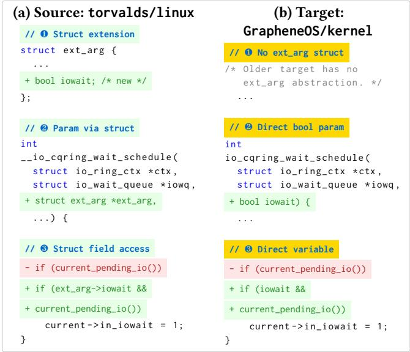
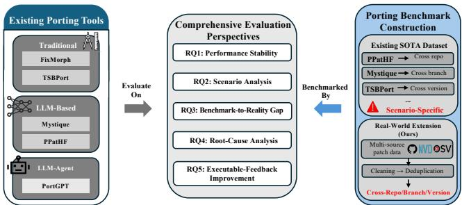
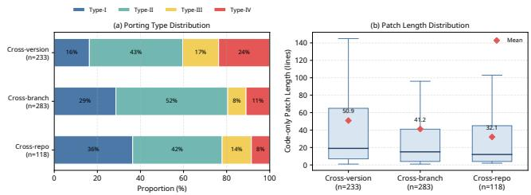
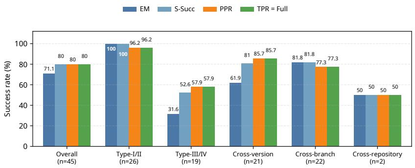
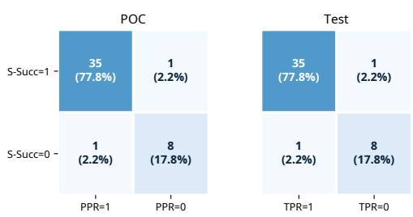

# Benchmarking Automated Security Patch Backporting: How Far Are We?

Jincheng Yang   
Xidian University   
School of Cyber Engineering   
Xi’an, Shaanxi, China   
yangjc@stu.xidian.edu.cn   
Lyuye Zhang   
Nankai University   
College of Cryptology and Cyber   
Science   
Tianjin, China   
Nanyang Technological University   
Singapore, Singapore   
zh0004ye@e.ntu.edu.sg   
Yulong Fu✉∗   
Xidian University   
School of Cyber Engineering and State   
Key Laboratory of ISN   
Xi’an, Shaanxi, China   
ylfu@xidian.edu.cn   
Fangyuan Zhang   
Nankai University   
College of Cryptology and Cyber   
Science   
Tianjin, China   
fangyuanzhang@mail.nankai.edu.cn

Yang Liu Nanyang Technological University Singapore, Singapore yangliu@ntu.edu.sg

Chengwei Liu✉∗   
Nankai University   
College of Cryptology and Cyber   
Science   
Tianjin, China   
chengwei.liu@nankai.edu.cn   
Bingyang Ren   
Xidian University   
School of Cyber Engineering   
Xi’an, Shaanxi, China   
24151213637@stu.xidian.edu.cn   
Hui Li   
Xidian University   
School of Cyber Engineering and State   
Key Laboratory of ISN   
Xi’an, Shaanxi, China   
lihui@mail.xidian.edu.cn

## Abstract

Automated security patch backporting is critical for mitigating Nday vulnerabilities. Recent tools report success rates above 80% on their respective datasets. However, these evaluations are often confined to homogeneous environments, such as one repository or specific project versions. Consequently, it remains unclear how well these tools generalize beyond their originally targeted scenarios.

We present Porting Benchmark, a curated dataset of 1,234 security patch backporting cases spanning cross-version, cross-branch, and cross-repository scenarios, paired with a common evaluation framework. Using this benchmark, we evaluate five tools spanning program analysis, LLM prompting, and LLM agents under aligned settings. Our results show that aligned evaluation changes the apparent performance landscape: PortGPT and TSBPort remain comparatively strong on the Replication Dataset, while FixMorph and Mystique degrade substantially under the common protocol. Performance degrades sharply on structurally complex patches: the best commit-level success rate falls from 85.2% on Type-I patches to 24.0% on Type-IV. We identify four root-cause categories (missing target API awareness, cross-version semantic mismatch, non-local

∗Yulong Fu and Chengwei Liu are the corresponding authors.

dependency propagation failure, and patch construction or localization failure) and derive concrete directions for next-generation tool design. On a 45-case dynamically validated subset with verified test cases and constructed POCs, we further observe that referencebased benchmark scores do not fully capture real-world remediation: exact match sharply under-credits harder target adaptations, while executable validation reveals residual integration failures in the target that static reference agreement misses. Executablefeedback refinement provides limited but measurable recovery on the hardest executable cases.

## CCS Concepts

• Software and its engineering → Software testing and debugging; Software maintenance tools; • Security and privacy → Software security engineering.

## Keywords

patch backporting, vulnerability propagation, benchmark, empirical study

## ACM Reference Format:

Jincheng Yang, Yulong Fu, Chengwei Liu, Lyuye Zhang, Fangyuan Zhang, Bingyang Ren, Yang Liu, and Hui Li. 2026. Benchmarking Automated Security Patch Backporting: How Far Are We?. In Proceedings of the 41st IEEE/ACM International Conference on Automated Software Engineering (ASE ’26), October 12–16, 2026, Munich, Germany. ACM, New York, NY, USA, 13 pages. https://doi.org/10.1145/3832783.3837542

## 1 Introduction

Automated security patch backporting is critical for mitigating Nday vulnerabilities [27]. When a vulnerability is patched in one version, the fix must propagate to other maintained versions, long term support (LTS) branches, or downstream forks. This process is known as patch backporting [24]. The Linux kernel alone maintains dozens of active stable branches simultaneously, and empirical stud ies have documented significant delays and inconsistencies in how patches propagate across this ecosystem [32]. Manual backporting is time-consuming, error-prone, and demands deep understanding of both the vulnerability and the target codebase, motivating a growing line of research on automated tools.

Automated patch backporting tools span three paradigms. Traditional program-analysis methods include FixMorph [45], TSB-Port [57], and PatchWeave [46]; LLM-based prompting includes Mystique [54], PPatHF [42], and MigGPT [7]; and PortGPT [26] uses an LLM agent. These tools have reported promising results on their respective datasets, with success rates ranging from 42% to 95%.

However, these results are not directly comparable. Each tool uses its own dataset, evaluation setting, success criterion, and input assumption. For instance, FixMorph uses compilation-filtered equivalence analysis, TSBPort uses PDG matching, Mystique uses edit distance, and PPatHF reports syntactic equivalence together with AED/RED-style edit-distance metrics. A tool reporting 80% compilation success and another reporting an edit-similarity score cannot be meaningfully compared. Moreover, each tool has naturally been evaluated on its originally targeted scenario: FixMorph and TS-BPort on Linux cross-version data, Mystique on same-repository branches, PPatHF on a single fork pair (Vim→Neovim). Whether the reported performance generalizes to other backporting contexts (e.g., cross-repository backporting, long multi-file patches, or structurally divergent codebases) remains an open question. Finally, even under a unified benchmark, it remains unclear whether a single static metric such as reference-based agreement adequately captures whether the generated patch actually blocks exploitation and preserves intended behavior under execution.

These observations expose four gaps in our understanding of automated patch backporting. Comparability gap. Incompatible metrics and input assumptions prevent fair cross-tool comparison. Generalization gap. Evaluation within originally targeted scenarios leaves capability boundaries unknown. Coverage gap. Datasets concentrated in specific projects or narrow settings may inflate reported performance. Failure-explanation gap. Without systematic failure analysis, why tools fail and which capabilities are missing remain unclear.

In this paper, we address these gaps through Porting Benchmark, a comprehensive benchmark designed for systematic cross-tool evaluation of patch backporting tools. We integrate and curate existing public datasets into a unified format, construct new evaluation data from recent vulnerability sources (post-2023) to minimize LLM data leakage, define evaluation criteria across multiple dimen sions (cross scenario, porting type, patch scale, and information level), and evaluate five state-of-the-art tools under aligned settings.

  
Listing 1: Motivating example of cross-repository backporting from Linux to GrapheneOS (IORING\_ENTER\_NO\_IOWAIT)

Our evaluation shows that aligned evaluation changes the apparent performance landscape: PortGPT and TSBPort remain comparatively strong on the Replication Dataset, whereas FixMorph and Mystique degrade substantially under the common protocol (RQ1). Structural complexity is the dominant bottleneck, with the best commit-level success falling from 85.2% on Type-I patches to 24.0% on Type-IV (RQ2). On the 45-case executable subset, PortGPT reaches 80.0% for both S-Succ and Full validation but exhibits two case-level mismatches (RQ3). Root-cause analysis identifies patch construction or localization failure and non-local dependency propagation failure as the two most frequent categories (RQ4), while executable-feedback refinement provides limited but measurable recovery on eligible hard cases (RQ5).

This paper makes the following contributions:

(1) We construct and publicly release Porting Benchmark, a curated dataset of 1,234 patch backporting cases (600 for replication and 634 for evaluation under the common static scope that excludes tests and non-target files) spanning cross-version, cross-branch, and cross-repository scenarios, with rich metadata and a reproducible evaluation methodology.

(2) We conduct the first comprehensive comparison across five state-of-the-art patch backporting tools under aligned evaluation settings, exposing significant performance gaps and previously unknown generalization boundaries.

(3) We augment 45 cases from the Evaluation Dataset with verified test cases and constructed POC scripts, and evaluate four patch backporting tools and SWE-agent (GPT-4o) under a common file-level input setting.

(4) We provide a root cause analysis that identifies four recurring capability deficits: missing target API awareness, cross-version semantic mismatch, non-local dependency propagation failure, and patch construction or localization failure.

(5) We conduct a targeted executable-feedback refinement study on 29 hard PortGPT cases (Type-III/IV or cross-version) among the 45 cases with executable validation assets.

## 2 Background

## 2.1 Patch Backporting

Security patch backporting adapts a known-correct fix from one code context to another whose surrounding implementation may have diverged substantially. Unlike a direct cherry-pick, the target codebase may require the fix to be relocated, rewritten, or revalidated under diferent interfaces and control-flow structures. These diferences commonly include (1) syntactic drift such as variable or function renaming, (2) structural drift such as changed control flow or refactored code blocks, (3) API evolution where function signatures or parameters difer, and (4) context dependencies where surrounding code afects how the patch should be applied. Viewed end-to-end, patch backporting involves three coupled stages: Local ization (finding where the fix should be applied), Transformation (adapting the fix to the target context), and Validation (assessing whether the adapted patch preserves the fix intent).

## 2.2 Existing Tools

Existing patch backporting tools span traditional program analysis, LLM-based prompting, and LLM agents. Despite this variety, their reported results are dificult to compare directly because they target diferent backporting scenarios, operate at diferent ex ecution granularities, assume diferent amounts of target-location information, and validate outputs with incompatible criteria. We briefly review representative tools below with emphasis on these evaluation-relevant diferences.

Traditional Program Analysis. FixMorph [45] was among the first tools for Linux kernel backporting. It employs anti-unification and AST-level transformations. Its original evaluation follows a layered pipeline: compilation serves as an initial filter, followed by equivalence analysis on the resulting subset. TSBPort [57] introduces semantic-aware backporting based on program dependence graphs (PDGs). It evaluates via PDG matching, which captures structural correctness but requires compilation infrastructure. Both tools primarily target Linux kernel backporting and operate at statement-level granularity. PatchWeave [46] uses symbolic execution for cross-program transplantation but requires test cases as input. SKYPORT [47] targets web application injection vulnerabilities via static analysis.

LLM-based Prompting. Mystique [54] combines semantic and syntactic slicing signatures with LLMs. It evaluates via edit distance. PPatHF [42] addresses hard-fork scenarios using code reduction. It reports syntactic equivalence together with AED/RED-style editdistance metrics. MigGPT [7] introduces code fingerprints for outof-tree Linux patch migration. Its implementation is not publicly available.

LLM Agent. PortGPT [26] introduces an agentic approach with tool use and iterative workflows. It operates at hunk-level granularity and relies on manual verification.

These diferences are methodological rather than cosmetic: a tool reporting compilation success, another reporting similarity-style scores, and another relying on manual review are not operating under a shared notion of success.

  
Figure 1: Overview of the unified benchmark evaluation workflow

Technical Pipeline Decomposition. Figure 1 outlines the study workflow, and Table 1 decomposes tool pipelines into Localization, Transformation, and Validation. Tools difer in every pipeline stage, not only in their overall paradigm. Traditional tools emphasize program-analysis-based localization and transformation, whereas LLM-based tools rely more heavily on context selection and generation. Validation remains entirely tool-specific, which is a key driver of the comparability gap we address. This decomposition informs our tool selection (Section 3.2) and highlights why a common evaluation framework is needed.

## 2.3 Evaluation Gaps

A concrete cross-repository case illustrates why the central empirical questions remain unresolved. Listing 1 shows a real crossrepository case. The source patch extends an existing struct (❶), passes it through function parameters (❷), and accesses it via struct field dereference (❸). The target codebase lacks this struct entirely. The implementation must be restructured with direct parameter passing through a 4-function call chain. Such cases demand nonlocal structural adaptation rather than simple syntactic transfer. As in Section 4.4, even the best-performing tool fails on this case.

This example also exposes why existing evidence remains incomplete. Current evaluations vary substantially in scenario coverage, validation criteria, granularity, and dataset composition, making it dificult to tell how far current automation actually generalizes. We highlight four gaps:

• Scenario-coverage gap. Most tools are designed for and validated in a single setting (cross-version, cross-branch, or crossrepository). It is unclear whether their reported efectiveness transfers to other backporting contexts.

• Validation-criteria gap. Tools adopt diferent success criteria (e.g., compilation, similarity scores, PDG equivalence, or manual judgment), so results are dificult to compare even when datasets partially overlap and often stop short of a common end-to-end notion of success.

• Granularity-assumption gap. Tools operate at diferent execution granularities (file, function, or hunk) and rely on diferent degrees of localization assistance. Without controlling these assumptions, comparisons conflate localization capability with transformation quality.

Table 1: Patch backporting tool pipeline: stages and strategies (✓=used, †=excluded)
<table><tr><td></td><td></td><td></td><td></td><td>FixMorph [45] TSBPort [57] PatchWeave† [46]</td><td>Mystique [54]</td><td>PPatHF [42]</td><td>MigGPT† [7]</td><td>PortGPT [26]</td><td></td><td></td><td>SKYPORT† [47]</td></tr><tr><td>Stage</td><td>Gran.</td><td>ID</td><td></td><td>Strategy</td><td></td><td></td><td></td><td></td><td></td><td></td><td>√</td></tr><tr><td></td><td>Repo Function</td><td>S1-1: S1-2:</td><td></td><td>File-level path matching</td><td>√ √</td><td>√ √</td><td></td><td></td><td></td><td></td><td></td></tr><tr><td>Stage 1:</td><td>Function</td><td>S1-3:</td><td></td><td>AST/PDG-based function mapping LLM-based function identification</td><td></td><td></td><td></td><td>√</td><td>V</td><td></td><td>√</td></tr><tr><td>Localization</td><td>Statement</td><td>S1-4:</td><td></td><td>Hunk-level offset matching</td><td></td><td>√ √</td><td></td><td></td><td></td><td></td><td></td></tr><tr><td></td><td>Statement</td><td></td><td>S1-5:</td><td>LLM-based hunk/line localization</td><td></td><td></td><td></td><td></td><td></td><td></td><td>√</td></tr><tr><td></td><td>Function</td><td></td><td>S1-6:</td><td>Code fingerprint-based migration point identification</td><td></td><td></td><td></td><td></td><td></td><td>√</td><td></td></tr><tr><td></td><td>Statement</td><td>S2-1:</td><td></td><td>AST edit script (anti-unification)</td><td>√</td><td></td><td></td><td></td><td></td><td></td><td></td></tr><tr><td></td><td>Statement</td><td>S2-2:</td><td></td><td>PDG-guided semantic transplant</td><td></td><td>√</td><td></td><td></td><td></td><td></td><td></td></tr><tr><td>Stage 2:</td><td>Function</td><td>S2-3:</td><td></td><td>Single-round LLM prompting</td><td></td><td></td><td>√</td><td>√</td><td></td><td>√</td><td></td></tr><tr><td>Transform.</td><td>Hunk</td><td>S2-4:</td><td></td><td>Iterative LLM agent with tool use</td><td></td><td></td><td></td><td>√</td><td></td><td>√</td><td>√</td></tr><tr><td></td><td>Function</td><td>S2-5: S2-6:</td><td></td><td>Signature-guided context slicing for LLM</td><td></td><td>√</td><td>√</td><td></td><td></td><td></td><td></td></tr><tr><td></td><td>Function Statement</td><td>S2-7:</td><td></td><td>Symbolic-execution-based patch transplantation (requires tests) Vulnerability-type-specific static analysis backporting</td><td></td><td></td><td>√</td><td></td><td></td><td></td><td></td></tr><tr><td></td><td></td><td>S3-1:</td><td></td><td></td><td>√</td><td></td><td></td><td></td><td></td><td></td><td></td></tr><tr><td></td><td>Binary Structural</td><td>S3-2:</td><td></td><td>Compilation success</td><td></td><td></td><td></td><td></td><td></td><td></td><td></td></tr><tr><td></td><td></td><td></td><td>S3-3:</td><td>PDG equivalence matching</td><td></td><td>√</td><td></td><td></td><td></td><td></td><td></td></tr><tr><td>Stage 3:</td><td>Textual</td><td>S3-4:</td><td></td><td>Edit distance / diff similarity</td><td></td><td></td><td>√</td><td>V</td><td></td><td></td><td></td></tr><tr><td>Validation</td><td>Semantic</td><td>S3-5:</td><td></td><td>Syn. Eq. + AED/RED-style metrics</td><td></td><td></td><td></td><td></td><td></td><td></td><td>√</td></tr><tr><td></td><td>Manual</td><td>S3-6:</td><td></td><td>Human expert review</td><td></td><td>√</td><td></td><td></td><td></td><td></td><td></td></tr><tr><td></td><td>Dynamic</td><td></td><td></td><td>Test-suite validation</td><td></td><td></td><td></td><td></td><td>√</td><td></td><td></td></tr><tr><td></td><td>Textual</td><td>S3-7:</td><td></td><td>Completion rate against reference patches</td><td></td><td></td><td></td><td></td><td></td><td></td><td></td></tr></table>

• Dataset-representativeness gap. Public evaluations are dominated by a few ecosystems (e.g., the Linux kernel) or narrow fork scenarios. This can over-represent easy cases and mask failure modes in diverse, structurally divergent patches.

Together, these issues prevent the literature from answering a basic empirical question: how far current patch backporting tools generalize under aligned assumptions and common evaluation metrics. They motivate our study design in Section 3, where we construct a benchmark with diverse scenarios, controlled localization assumptions, and a common evaluation framework.

## 3 Study Design

We address the gaps identified in Section 2 through a common evaluation methodology covering benchmark dimensions, tool selection, data construction, evaluation metrics, and research questions.

## 3.1 Benchmark Dimensions

We first establish a unified taxonomy for categorizing patch backporting cases. We define two orthogonal dimensions following prior work: Cross Scenario (source–target relationship) and Porting Type (complexity).

3.1.1 Cross Scenario. We distinguish three source–target relation ships:

• Cross-version: Backporting between diferent version lines of the same software (e.g., from Linux kernel v6.1 mainline to v5.15 stable). This is the primary scenario targeted by FixMorph and TSBPort.

• Cross-branch: Backporting between branches within the same repository that do not represent distinct version lines (e.g., cherrypicks across development or feature branches). This is the scenario targeted by Mystique and PortGPT.

• Cross-repository: Backporting between diferent repositories, such as forks (e.g., Vim to Neovim) or upstream-to-downstream distributions. This is the scenario targeted by PPatHF.

Linux Kernel Classification. Linux stable/LTS lines use separate Git branches (e.g., linux-4.19.y). However, they represent distinct release lines with strict backporting rules [28, 48]. We therefore classify mainline-to-stable/LTS backports as cross-version rather than cross-branch.

3.1.2 Porting Type and Path Change. We characterize backporting complexity along two orthogonal dimensions: code adaptation complexity and path change.

Code Adaptation Complexity. Following TSBPort [57] and FixMorph [45], we classify code adaptation complexity into four types. Type-I (Identical): the patch can be applied without any code modifications. Type-II (Location Change): the patch requires only location adjustments (e.g., line numbers) but no code transformation. Type-III (Syntactic Adaptation): the patch requires syntactic modifications (e.g., renaming variables or functions) to fit the target context. Type-IV (Structural Change): the patch requires logical or structural modifications (e.g., adding or removing statements) while preserving the fix semantics. The motivating example in Listing 1 is a Type-IV case. The source uses a struct-mediated parameter, but the target requires restructuring to direct parameter passing.

Path Change. We also track whether the target file path difers from the source. Prior work typically assumes patches apply to the same file path. However, real-world backporting often involves file renaming or directory restructuring. A patch may be Type-I in code adaptation yet still require localization efort due to path change. We analyze path change as a separate dimension in our evaluation (Section 3.4.2).

  
Figure 2: Evaluation Dataset by cross scenario under the common static evaluation scope: (a) porting type distribution; (b) patch length distribution

## 3.2 Tool Selection

From the eight tools reviewed in Section 2.2, we select five that cover all three paradigms. Table 2 summarizes the selected tools and their original evaluation setups. We apply three selection criteria: (1) the tool must be publicly available; (2) it must support C/C++ programs; (3) it must handle general patch backporting rather than specific vulnerability types only. Three tools are excluded (marked † in Table 1). PatchWeave [46] requires test exploits that are unavailable for most vulnerability patches. SKYPORT [47] targets only web injection vulnerabilities. MigGPT [7] lacks a public implementation.

## 3.3 Benchmark Construction

We construct Porting Benchmark to improve cross-tool comparability while covering a representative range of real-world scenarios.

3.3.1 Data Collection. We use a two-tier design: a Replication Dataset for reproducibility-oriented evaluation and an Evaluation Dataset for broader capability assessment. This split maps directly to our goals: RQ1 isolates comparability efects under aligned met rics, whereas RQ2–RQ4 probe generalization on newer, scenariodiverse cases.

1. Replication Dataset. Replication evaluation must respect the constraints of each tool. PPatHF [42] and Mystique [54] use LLM prompting and therefore require temporal controls to mitigate leakage, whereas the released FixMorph artifact provides validated build and analysis configurations only for the Linux kernel [45]. TSBPort [57] and PortGPT [26] can in principle use the full published pool. We therefore merge the five released datasets, normalize records, and remove duplicates to form a phase-1 pool of 3,340 valid commit-level records. Because this pool is imbalanced across cross scenarios and the prompting tools must be evaluated according to model training dates, we stratify by cross scenario (cross-version vs. cross-branch) and era (before vs. after July 1, 2022). Mystique’s later cutof of August 23, 2023 is used only to derive its subset. Following standard references on stratified sampling and disproportionate allocation [36, 49], we then draw a disproportionate 600-case sample with fixed seed 42, balancing cross-version and cross-branch while emphasizing post-cutof cases. The resulting replication tier expands to 917 file-level pairs and 2,020 functions. A separate RQ1 subset is then derived for each tool from this shared pool: 367 cases for PPatHF, 224 for Mystique, 285 for FixMorph, and 600 each for TSBPort and PortGPT. This is why RQ1 reports per-tool denominators rather than a single shared �: forcing one denominator would either violate tool constraints or discard valid replication data.

Table 2: Selected tools for evaluation: original setups
<table><tr><td>Tool</td><td>Exec. Gran.</td><td>Target Scenario</td><td>Data Source</td><td>Metric</td><td>Scale</td></tr><tr><td>FixMorph</td><td>Statement</td><td>Linux mainline→stable</td><td>Linux kernel</td><td>Layered eval.</td><td>350</td></tr><tr><td>TSBPort</td><td>Statement</td><td>Linux mainline→stable</td><td>NVD + Linux</td><td>PDG match</td><td>1,815</td></tr><tr><td>Mystique</td><td>Function</td><td>Same-repo branches</td><td>33 repositories</td><td>Edit dist.</td><td>1,359</td></tr><tr><td>PPatHF</td><td>Function</td><td>Vim→Neovim fork</td><td>Vim/Neovim</td><td>Syn. Eq./AED/RED</td><td>310</td></tr><tr><td>PortGPT</td><td>Hunk</td><td>Same-repo branches</td><td>6 repositories</td><td>Manual</td><td>537</td></tr></table>

2. Evaluation Dataset. We build a separate Evaluation Dataset to assess generalization beyond the data used in the original tool papers. To reduce leakage for LLM-based tools, we collect only 2024+ cases, well after the training cutofs of the models used by the evaluated systems [23, 39, 44]. No single source covers all scenarios reliably, so we use two complementary collection routes. For cross-version and cross-branch cases, we collect vulnerabilitylinked commits from NVD [35], GitHub Security Advisories [9], and OSV [11], then expand candidate pairs with Mystique-style CVE-equivalent matching logic. For cross-repository cases, we mine explicit downstream backport/cherry-pick commits via the GitHub Search Commits API [10] and verify the referenced upstream commits. Under the common static evaluation scope used in RQ2–RQ4, which excludes tests, documentation, configuration files, and other non-target files, this process yields 634 evaluation commits spanning 192 CVEs and 80 target repositories (233 cross-version, 283 cross-branch, and 118 cross-repository), expanding to 1,299 files and 2,515 functions. The artifact records per-case metadata and, for the 45-case executable subset (18 CVEs and 11 target repositories), executable assets and validation commands.

3.3.2 Ground-Truth Validation. For each collected record, we extract source and target difs via git show -M, treat the target dif as ground truth, and parse C/C++ source files with tree-sitter [3]. We map each dif hunk, via interval intersection, to every function whose source span overlaps the hunk; hunks outside function bodies are retained under their enclosing file. This establishes a hierarchical commit→file→function representation in which hunks remain the atomic changed regions: no hunk is discarded by the mapping. Each hunk contributes to evaluation through its overlapping function(s), or through file-level comparison for non-function hunks. The hierarchy is used only as a unified aggregation coordinate system across tools with diferent native granularities (hunk, function, or file); it does not alter what any tool consumes at execution time. Hunk boundaries themselves vary with the dif algorithm and context size, so they are a fragile shared denominator; aggregating through overlapping functions or files keeps every edit while remaining comparable across tools. We preserve repository-, file-, and function-level context to support the I0–I2 settings studied later, and annotate each case with cross scenario, porting type, patch scale, and path change. To validate the reliability of these manual labels, two authors with over five years of software-security experience independently annotated cross-scenario and portingtype labels for a stratified random sample of 100 cases from the Evaluation Dataset. Agreement was high (Cohen’s � = 1.000 for cross-scenario and 0.972 for porting type), and the few disagreements were resolved by a third author. Figure 2 summarizes the main characteristics of the Evaluation Dataset: cross-version cases contain a larger share of Type-III/IV patches and generally larger edits, foreshadowing the harder results in RQ2.

Algorithm 1 Five-Level Hierarchical Patch Matching   
Require: Pre-fix target code �, tool output code $C _ { t o o l } ,$ reference code   
$C _ { r e f }$ , tolerances � and �   
Ensure: Exact Match ��, Semantic Success �-Succ   
1: �′ ← Normalize(�); $C _ { t o o l } ^ { \prime }$ ← Normalize(�����); $C _ { r e f } ^ { \prime }$ ← Normal-  
$\scriptstyle { \mathrm { I Z E } } ( C _ { r e f } )$   
L1: Identity (Exact Match)   
2: $L 1 \gets ( C _ { t o o l } ^ { \prime } \equiv C _ { r e f } ^ { \prime } )$   
3: $E M \gets L 1$   
L2–L5: Segment/Function/Precision/Completeness   
4: $D _ { t o o l } \gets \mathrm { D I F F } ( B ^ { \prime } , C _ { t o o l } ^ { \prime } ) ; D _ { r e f } \gets$ Diff $( B ^ { \prime } , C _ { r e f } ^ { \prime } )$   
5: ���� � ← ExtractSegments $( D _ { t o o l } )$   
6: ��� ← ExtractSegments $\left( D _ { r e f } \right)$   
7: �2 ← SegmentMatch $( S e g _ { t o o l } , S e \bar { g } _ { r e f } , \delta , \tau )$ ⊲ one-to-one; normalized   
similarity   
8: $F _ { t o o l }$ ← GetTargetFunctions $( D _ { t o o l } ) ; F _ { r e f }$ ← GetTargetFunc  
tions $_ { ( D _ { r e f } ) }$   
9: �3 ← FunctionOverlap $( F _ { t o o l } , F _ { r e f } , \delta )$   
10: $P o s _ { t o o l } $ ModifiedPositions $( D _ { t o o l } ) ;$ $P o s _ { r e f }$ ← ModifiedPosi  
tions $( D _ { r e f } )$   
11: �4 ← Precision(�������, $P o s _ { r e f } , \delta )$ ⊲ no spurious modifications   
12: �5 ← Completeness $P o s _ { t o o l } , P o s _ { r e f } , \delta )$ ⊲ no missing modifications   
13: �-Succ ← ��   
14: if ¬�� ∧ �2 ∧ �3 ∧ �4 ∧ �5 then   
15: �-Succ ← ManualVerify(�, �����, ����, �����, $D _ { r e f } )$   
16: end if   
17: return ��, �-Succ

## 3.4 Evaluation Framework

Because the selected tools use incompatible native metrics, we align their released outputs to common denominators, aggregation levels, and validation metrics as closely as available evidence permits, improving cross-tool comparability.

3.4.1 Validation Hierarchy. We adopt a five-level validation hierarchy inspired by TSBPort [57]. Each level checks one aspect of agreement with the reference code after patching. Each benchmark case contains the target code immediately before the security fix and the known patch that developers used to fix the target version. We call this vulnerable target version the pre-fix target. An evaluated tool produces an adapted fix for the pre-fix target; applying this output gives the tool output code. Applying the known target patch to a separate copy of the same pre-fix target produces the reference code after patching, which serves as the ground truth. We normalize both versions by removing comments and standardizing whitespace. L1 requires the normalized tool output code and reference code to be identical. For non-identical cases, we compute both difs against the pre-fix target and check structural consistency with tolerance � = 3 lines. L2 requires every added or deleted block produced by the tool to be paired one-to-one with a distinct block in the reference patch. A pair is accepted only when both blocks modify the same file, represent the same operation (addition or deletion), their starting lines difer by at most �, and their normalized contents satisfy the fixed similarity threshold $\tau = 0 . 8$ . The similarity is computed after the same comment removal and whitespace normalization applied above. L3 requires each paired block to afect the same target function. L4 enforces precision: every toolmodified position must match a ground-truth modified position. L5 enforces completeness: every ground-truth modified position must be covered by the tool output. We apply exactly these rules to every evaluated tool: all outputs undergo the same normalization, and L2 uses the same � and pairing conditions. Algorithm 1 summarizes the evaluation procedure.

Because native metrics are incompatible and executable evidence is unavailable for most cases, we report EM and S-Succ as common reference-based assessments. EM (L1) checks normalized identity and cannot recognize non-exact adaptations. For non-exact outputs, Semantic Success (S-Succ) requires L2–L5 structural consistency followed by ManualVerify. S-Succ measures reference consistency, not executable correctness; PPR, TPR, and Full provide separate executable evidence where available. For tools that emit patches, functions, or files, we reconstruct the corresponding tool output code before evaluation; missing outputs, application failures, and extraction failures remain in the denominator and count as failures.

Manual Verification Protocol. ManualVerify reviews only nonexact function-level items that pass L2–L5; functions failing any L2–L5 check are not manually promoted. Grounded in securitypatch validation principles and evidence ofincomplete or regressive fixes [21, 25], reviewers apply seven checks: MV1 Syntax flags malformed or corrupted code; MV2 Safety/Cleanup checks guard ordering, resource release, and error paths; MV3 Missing/Weakened Fix checks whether security-relevant reference edits are absent, misplaced, or weakened; MV4 Spurious Behavior rejects unrelated behavior changes; MV5 Target Adaptation accepts targetversion API, macro, field, or helper changes that preserve the fix intent; MV6 Cosmetic Diference accepts formatting, comments, or whitespace-only changes; and MV7 Insuficient Evidence is used only when the missing evidence is identified. Two independent blinded verification passes label identical packages containing the pre-fix function, the tool output function, the reference function, their difs, and local context as correct, incorrect, or uncertain; each pass is conducted without tool identity or the other pass’s label. MV1–MV4 imply incorrect, MV5–MV6 justify correct, and a separate adjudication pass resolves every disagreement or uncertain label by reapplying the same checks to the shared evidence package and recording the rationale. On the 315 retained function-level review items, the independent labels achieved Cohen’s � = 0.5357 with 76.5% observed agreement; file-level success requires all reviewed functions in the file to pass, and commit-level success requires all files in the commit to pass.

Non-exact breakdown. At commit level, we analyze all $E M =$ ����� entries by L2–L5, their conjunction, and the result after ManualVerify; entries without comparable tool output remain in the denominator and are treated as failures (Table 8).

Table 3: Replication-dataset performance under the common static protocol
<table><tr><td rowspan="3">Tool</td><td colspan="2">Function</td><td colspan="2">File</td><td colspan="2">Commit</td></tr><tr><td>EM</td><td>S-Succ</td><td>EM</td><td>S-Succ</td><td>EM</td><td>S-Succ</td></tr><tr><td>FixMorph (n=1217/466/285)</td><td>19.3%</td><td>19.6%</td><td>19.7%</td><td>20.4%</td><td>27.0%</td><td>28.1%</td></tr><tr><td>TSBPort (n=2020/917/600)</td><td>67.7%</td><td>68.8%</td><td>70.9%</td><td>72.0%</td><td>74.5%</td><td>75.8%</td></tr><tr><td>Mystique* (n=619/309/224)</td><td>28.4%</td><td>30.0%</td><td>13.9%</td><td>14.9%</td><td>13.4%</td><td>14.7%</td></tr><tr><td>PPatHF* (n=1440/570/367)</td><td>22.3%</td><td>23.0%</td><td>21.9%</td><td>22.3%</td><td>29.4%</td><td>30.0%</td></tr><tr><td>PortGPT* (n=2020/917/600)</td><td>67.7%</td><td>68.6%</td><td>73.6%</td><td>75.0%</td><td>78.5%</td><td>80.5%</td></tr></table>

Note: Static EM/S-Succ under the common protocol. � gives the function/file/commit denominator for each tool; ★ uses the subset aligned with the tool’s released evaluation.

3.4.2 Evaluation Setings and Alignment. Following PortGPT [26], we separate Localization (identifying where to apply the patch) from Transformation (generating the adapted patch code) to avoid conflating target identification with patch adaptation.

We adopt an End-to-End (E2E) evaluation protocol that jointly evaluates localization and transformation. The denominator is the ground-truth (GT) baseline. Any pipeline failure (missing outputs, parsing failures, patch-apply failures, or localization failures) counts as 0. We report EM and S-Succ against GT.

To analyze the impact of available information, we define three information levels. I0 (repository-level): only the source commit and target repository are provided. The tool must locate the target file and function. I1 (file-level): the target file path is given. I2 (function-level): the target function is given.

Because tools operate at diferent native execution granularities (Table 2), we run each tool in its native mode and align all outputs back to the same ground-truth coordinate space. For LLM-based tools that support variable context (Mystique and PPatHF), we additionally scale the provided context (file-level vs. function-level) to analyze sensitivity to localization information. For the primary stratified analyses, each tool is evaluated at its highest supported information level: I2 for Mystique, PPatHF, and PortGPT, and I1 for TSBPort. We normalize all outputs back to ground-truth file/- line coordinates, and a generated patch counts as a valid candidate only if it modifies the correct file and function scope. This normalization mirrors the hunk-to-function mapping used in ground truth construction: tool outputs produced at hunk, function, or file granularity are projected onto the same commit→file→function coordinate system. Consequently, function-, file-, and commit-level results are aggregated against the same ground-truth hunk-derived denominator for every tool.

Table 7 examines how E2E performance changes under I0–I2. Using this framework, we evaluate the selected tools under the experimental settings described next.

## 3.5 Experimental Setup

All experiments were conducted on a server with 2× Intel Xeon Gold 6226R CPUs and 4× NVIDIA A100 (80GB) GPUs. Each LLMbased tool was run with its originally recommended model and inference settings. Mystique uses a locally deployed CodeLlama-13B-Instruct [44] with LoRA [14] fine-tuning. PPatHF uses a locally deployed StarCoder [23] with LoRA fine-tuning (temperature 0.1). PortGPT invokes GPT-4o [39] via the OpenAI API [41] (temperature 0.5). FixMorph and TSBPort are traditional program-analysis tools with no LLM component. For FixMorph, following Mystique [54], which evaluates FixMorph only on Linux repositories, we used the released package and also attempted the standalone release. The standalone release requires compilable Pa/Pb/Pc versions and build and configuration commands for each project to construct complete ASTs. Because validated configurations were available only for the original Linux kernel experiments, we evaluate FixMorph there in RQ1 and omit it from RQ2. On the 634-case Evaluation Dataset, mean generation time is 4.0 min/case for TSBPort, 2.2 min/case for PortGPT (\$0.38/case), and 69.9 s/request and 34.2 s/request for local Mystique and PPatHF, respectively, with no API charge. The pri mary eight-worker SWE-agent (GPT-4o) 45-case timestamp batch took 7.2 min and cost \$21.04 (\$0.47/case).

Table 4: Static E2E performance by porting type after ManualVerify
<table><tr><td rowspan="2">Tool</td><td rowspan="2">Agg.</td><td colspan="3">Type-I</td><td colspan="3">Type-II</td><td colspan="3">Type-III</td><td colspan="3">Type-IV</td></tr><tr><td>n</td><td>EM</td><td>S-Succ |</td><td>n</td><td>EM</td><td>S-Succ</td><td>n</td><td>EM</td><td>S-Succ |</td><td>n</td><td>EM</td><td>S-Succ</td></tr><tr><td rowspan="3">TSBPort</td><td>func</td><td>437</td><td>34.1%</td><td>34.1%</td><td>1067</td><td>41.0%</td><td>41.3%</td><td>440</td><td>37.0%</td><td>37.3%</td><td>571</td><td>20.1%</td><td>20.5%</td></tr><tr><td>file</td><td>230</td><td>42.6%</td><td>42.6%</td><td>539</td><td>31.2%</td><td>31.7%</td><td>206</td><td>22.3%</td><td>23.8%</td><td>324</td><td>15.4%</td><td>15.4%</td></tr><tr><td>commit</td><td>162</td><td>35.8%</td><td>35.8%</td><td>297</td><td>21.2%</td><td>21.2%</td><td>79</td><td>6.3%</td><td>7.6%</td><td>96</td><td>10.4%</td><td>10.4%</td></tr><tr><td rowspan="3">Mystique</td><td>func</td><td>437</td><td>39.1%</td><td>39.4%</td><td>1067</td><td>36.4%</td><td>36.5%</td><td>440</td><td>31.6%</td><td>31.6%</td><td>571</td><td>17.5%</td><td>17.5%</td></tr><tr><td>file</td><td>230</td><td>30.4%</td><td>30.9%</td><td>539</td><td>23.0%</td><td>23.2%</td><td>206</td><td>8.3%</td><td>8.3%</td><td>324</td><td>4.3%</td><td>4.3%</td></tr><tr><td>commit</td><td>162</td><td>32.1%</td><td>32.7%</td><td>297</td><td>20.9%</td><td>21.2%</td><td>79</td><td>5.1%</td><td>5.1%</td><td>96</td><td>4.2%</td><td>4.2%</td></tr><tr><td rowspan="3">PPatHF</td><td>func</td><td>437</td><td>32.7%</td><td>33.6%</td><td>1067</td><td>20.1%</td><td>20.1%</td><td>440</td><td>14.3%</td><td>14.8%</td><td>571</td><td>8.9%</td><td>9.1%</td></tr><tr><td>file</td><td>230</td><td>25.7%</td><td>26.5%</td><td>539</td><td>16.3%</td><td>16.3%</td><td>206</td><td>3.4%</td><td>3.9%</td><td>324</td><td>3.1%</td><td>3.1%</td></tr><tr><td>commit</td><td>162</td><td>27.8%</td><td>29.0%</td><td>297</td><td>15.2%</td><td>15.2%</td><td>79</td><td>3.8%</td><td>3.8%</td><td>96</td><td>2.1%</td><td>2.1%</td></tr><tr><td rowspan="3">PortGPT</td><td>func</td><td>437</td><td>87.0%</td><td>87.0%</td><td>1067</td><td>84.9%</td><td>84.9%</td><td>440</td><td>70.2%</td><td>72.0%</td><td>571</td><td>30.3%</td><td>31.2%</td></tr><tr><td>file</td><td>230</td><td>88.3%</td><td>88.7%</td><td>539</td><td>82.2%</td><td>83.5%</td><td>206</td><td>61.2%</td><td>69.9%</td><td>324</td><td>32.1%</td><td>34.6%</td></tr><tr><td>commit</td><td>162</td><td>84.6%</td><td>85.2%</td><td>297</td><td>73.1%</td><td>74.4%</td><td>79</td><td>35.4%</td><td>49.4%</td><td>96</td><td>22.9%</td><td>24.0%</td></tr></table>

Note: Static E2E EM/S-Succ under the common protocol after ManualVerify. Type-I/II/III/IV denote identical, location-only, syntactic, and structural adaptation. � is the denominator for the corresponding aggregation level.

## 3.6 Research Questions

We organize the paper around five research questions spanning tool performance, scenario-specific behavior, the gap between benchmark scores and real-world security efectiveness, root-cause explanation, and executable-feedback improvement:

• RQ1 (Performance Stability): How do existing tools perform under a common evaluation protocol compared with the results reported in their original papers?

• RQ2 (Scenario Analysis): How do tools perform across diferent backporting scenarios and complexity dimensions (porting type, cross scenario, information level, and patch scale)?

• RQ3 (Benchmark-to-Reality Gap): Does reference agreement predict executable vulnerability remediation?

• RQ4 (Root-Cause Analysis): What root causes explain the failure patterns and benchmark-to-reality mismatches observed above?

• RQ5 (Executable-Feedback Improvement): Can executable feedback help improve the hardest cases identified above, especially Type-III/IV and cross-version patches?

## 4 Evaluation Results

## 4.1 RQ1: Performance Stability

Existing tools report performance on their own datasets with toolspecific success criteria, making comparison across tools dificult. RQ1 therefore asks whether reported results remain stable after aligning the evaluation protocol while keeping tool usage conditions unchanged. We evaluate all five tools on the 600-case Replication Dataset under the common evaluation metrics. For fairness, each tool keeps its native input format and recommended setup (e.g., repository-level for FixMorph, function-level for Mystique), and we report outcomes at function-, file-, and commit-level aggregation. As detailed in Section 3.3.1, tool-specific replication subsets are uneven (Mystique: 224/600, PPatHF: 367/600, FixMorph: 285/600, TSBPort/PortGPT: 600/600), so the per-tool denominator � in Table 3 difers accordingly.

Table 5: Static E2E performance by cross scenario after ManualVerify
<table><tr><td rowspan="2">Tool</td><td rowspan="2">Agg.</td><td colspan="3">Cross-version</td><td colspan="3">Cross-branch</td><td colspan="3">Cross-repository</td></tr><tr><td>n</td><td>EM</td><td>S-Succ</td><td>n</td><td>EM</td><td>S-Succ</td><td>n</td><td>EM</td><td>S-Succ</td></tr><tr><td rowspan="3">TSBPort</td><td>func</td><td>1260</td><td>34.4%</td><td>34.8%</td><td>908</td><td>36.3%</td><td>36.3%</td><td>347</td><td>29.1%</td><td>29.4%</td></tr><tr><td>file</td><td>558</td><td>22.2%</td><td>22.6%</td><td>547</td><td>34.4%</td><td>34.4%</td><td>194</td><td>25.8%</td><td>27.8%</td></tr><tr><td>commit</td><td>233</td><td>12.4%</td><td>12.4%</td><td>283</td><td>27.2%</td><td>27.2%</td><td>118</td><td>25.4%</td><td>26.3%</td></tr><tr><td rowspan="3">Mystique</td><td>func</td><td>1260</td><td>33.0%</td><td>33.0%</td><td>908</td><td>31.8%</td><td>31.8%</td><td>347</td><td>26.8%</td><td>27.4%</td></tr><tr><td>file</td><td>558</td><td>18.3%</td><td>18.3%</td><td>547</td><td>16.3%</td><td>16.3%</td><td>194</td><td>17.5%</td><td>18.6%</td></tr><tr><td>commit</td><td>233</td><td>18.9%</td><td>18.9%</td><td>283</td><td>20.1%</td><td>20.1%</td><td>118</td><td>17.8%</td><td>19.5%</td></tr><tr><td rowspan="3">PPatHF</td><td>func</td><td>1260</td><td>12.8%</td><td>12.9%</td><td>908</td><td>20.4%</td><td>20.9%</td><td>347</td><td>36.0%</td><td>36.3%</td></tr><tr><td>file</td><td>558</td><td>9.3%</td><td>9.3%</td><td>547</td><td>12.1%</td><td>12.4%</td><td>194</td><td>23.7%</td><td>24.2%</td></tr><tr><td>commit</td><td>233</td><td>10.3%</td><td>10.3%</td><td>283</td><td>14.1%</td><td>14.8%</td><td>118</td><td>26.3%</td><td>26.3%</td></tr><tr><td rowspan="3">PortGPT</td><td>func</td><td>1260</td><td>69.1%</td><td>69.5%</td><td>908</td><td>74.1%</td><td>74.9%</td><td>347</td><td>64.6%</td><td>64.8%</td></tr><tr><td>file</td><td>558</td><td>64.3%</td><td>67.7%</td><td>547</td><td>70.4%</td><td>72.2%</td><td>194</td><td>68.0%</td><td>70.6%</td></tr><tr><td>commit</td><td>233</td><td>59.2%</td><td>63.1%</td><td>283</td><td>68.9%</td><td>70.7%</td><td>118</td><td>60.2%</td><td>62.7%</td></tr></table>

Note: Static E2E EM/S-Succ under the common protocol after ManualVerify. Agg. = aggregation granularity; � is the denominator for the corresponding aggregation level.

Under the common protocol, commit-level performance separates into two groups. PortGPT and TSBPort remain comparatively high, reaching 80.5% and 75.8% S-Succ respectively, although both are still below their originally reported results (89.2% [26] and 87.6% [57]). The remaining tools lose much more: Mystique drops from 92.4% [54] to 14.7%, FixMorph from 75.1% [45] to 28.1%, and PPatHF from 42.3% [42] to 30.0%. These gaps may reflect incompatible native metrics (PDG matching, compilation-filtered equivalence, edit-distance thresholds), diferences in original dataset dificulty, and the stricter func→file→commit ALL aggregation under the common protocol.

Finding 1. Under the common protocol, all tools drop relative to their original reports; PortGPT and TSBPort remain high at commit level, while FixMorph and Mystique sufer the largest losses.

## 4.2 RQ2: Scenario Analysis

We evaluate all tools on our Evaluation Dataset under the unified static evaluation scope defined above. The oficial aligned denominator is therefore 634 commits / 1,299 files / 2,515 functions for the static results. The Evaluation Dataset contains real-world cases, and we impose no target scenario ratios. Its observed distribution describes the composition of this benchmark and may difer from the proportions across all backporting activity. Unless otherwise noted, all tables report function-, file-, and commit-level results under the common evaluation protocol, using the same denominators and aggregation rules described above.

Table 6: Macro-averaged commit-level S-Succ across RQ2 groups after ManualVerify
<table><tr><td>Tool</td><td>By porting type</td><td>By cross scenario</td></tr><tr><td>TSBPort</td><td>18.8%</td><td>22.0%</td></tr><tr><td>Mystique</td><td>15.8%</td><td>19.5%</td></tr><tr><td>PPatHF</td><td>12.5%</td><td>17.1%</td></tr><tr><td>PortGPT</td><td>58.2%</td><td>65.5%</td></tr></table>

Note: Each porting type in Table 4 or cross scenario in Table 5 contributes equally to the corresponding average.

4.2.1 Results by Porting Type. Table 4 stratifies performance by porting type.

Performance generally decreases as adaptation requirements become more complex. PortGPT remains the strongest tool across all four porting types, but its commit-level S-Succ still falls from 85.2% on Type-I to 24.0% on Type-IV. The same pattern appears for the other tools at lower absolute rates: Type-IV reaches 10.4% for TSBPort, 4.2% for Mystique, and 2.1% for PPatHF. Thus, even when a tool remains comparatively strong on simpler or location-only ports, structural adaptation remains dificult under the common protocol.

Finding 2. Porting type is a major dificulty driver: performance drops sharply on Type-III/IV patches, and the best Type-IV commit-level S-Succ remains only 24.0%.

4.2.2 Results by Cross Scenario. Table 5 shows that scenario difficulty is tool-dependent under the common protocol after ManualVerify. PortGPT remains strongest in all three scenarios, reaching 70.7%, 63.1%, and 62.7% commit-level S-Succ on cross-branch, crossversion, and cross-repository cases, respectively. The other tools remain much lower: their best scenario-level commit S-Succ ranges from 19.5% to 27.2%, and cross-version remains especially dificult for TSBPort and PPatHF. This ordering is consistent with dataset characteristics (Figure 2). Cross-version cases have the largest share of complex adaptations (Type-III+IV = 40.3%, versus 19.4% and 22.0%) and more evaluated files per commit (2.4 vs. 1.9 and 1.6). Thus, scenario labels expose generalization diferences, but the structural composition within each scenario determines how sharply each tool degrades. The Evaluation Dataset was not collected under Fix-Morph’s original Linux kernel setting. Using FixMorph beyond that setting requires build and analysis configurations for each project, which were unavailable for the Evaluation Dataset. We therefore omit FixMorph from the remaining breakdowns.

Table 6 complements the aggregate denominator with macroaveraged commit-level S-Succ across porting types and cross scenarios. These summaries reduce dependence on group sizes but are not context-independent tool rankings.

Finding 3. Cross-scenario generalization is tool-dependent: PortGPT leads across all scenarios, while cross-version remains dificult for the other tools.

4.2.3 Results by Information Level (I0–I2). Only PortGPT supports autonomous repository-level localization (I0); the other evaluated settings require supplied file paths (I1) or function code (I2). Additional localization information does not uniformly improve commitlevel S-Succ: Mystique improves at I2, PPatHF remains essentially unchanged, and PortGPT stays stable across I0–I2 (Table 7).

Table 7: Static E2E performance by information level
<table><tr><td rowspan="2">Tool</td><td colspan="2">I0 (repository)</td><td>I1 (file)</td><td>I2 (function)</td></tr><tr><td>Localization Coverage</td><td>EM/S-Succ</td><td>EM/S-Succ</td><td>EM/S-Succ</td></tr><tr><td>TSBPort</td><td></td><td>-/-</td><td>21.5%/21.6%</td><td>-/-</td></tr><tr><td>Mystique</td><td></td><td>-/-</td><td>17.7%/17.7%</td><td>19.2%/19.6%</td></tr><tr><td>PPatHF</td><td></td><td>-/-</td><td>15.3%/15.6%</td><td>15.0%/15.3%</td></tr><tr><td>PortGPT</td><td>86.5%</td><td>63.7%/66.1%</td><td>62.8%/65.8%</td><td>63.7%/66.4%</td></tr></table>

Note: Commit-level static EM/S-Succ (%). Localization coverage is reported only for PortGPT’s autonomous target-file localization at I0; I1 supplies file paths and I2 supplies function context.

A finer-grained analysis of PortGPT under I0 (phase-2 subset, �=526) shows that 86.3% of cases produce analyzable localization outputs, but only 60.6% hit the target function. Among the targetfunction hits, S-Succ reaches 79.3%, indicating that substantial endto-end loss occurs during localization.

Finding 4. Additional localization information is not uniformly beneficial: Mystique improves at I2, PPatHF remains essentially unchanged, and PortGPT stays stable across I0–I2, while its separate I0 stage analysis still shows substantial loss before function alignment.

4.2.4 Results by Patch Length and File Count. Patch scale reinforces the same picture after ManualVerify. Once patches exceed 100 changed lines, only PortGPT remains above 40% commit-level S-Succ in the 101–300-line bucket (44.2%); in the 301–500-line bucket, PortGPT reaches 38.5% while the other tools are at most 7.7%, and all tools fall to 0.0% beyond 500 changed lines. Multi-file changes are also brittle: PortGPT drops from 74.1% on single-file commits to 26.3% on commits touching more than five files, while TSBPort, Mystique, and PPatHF drop from 34.2%, 30.2%, and 24.9% to 0.0%. Detailed patch-scale tables and the replay script are included in the artifact.

Tolerance Sensitivity. We empirically evaluate $\delta \in \{ 1 , . . . , 5 \}$ on both datasets and retain � = 3 as the smallest stable value. Across these settings, commit-level S-Succ varies by at most 1.7 pp per dataset, and tool ordering is unchanged.

4.2.5 Non-ExactL2–L5 Breakdown. Table 8 reports L2–L5 and Man ualVerify results for all �� = � ���� commits.

The table shows that joint structural agreement is substantially stricter than any individual L2–L5 check: on the Evaluation Dataset, only 0.2%–12.3% of non-exact commits pass all four gates, and the result after ManualVerify is 0.0%–8.1%.

## 4.3 RQ3: Benchmark-to-Reality Gap

The preceding results measure agreement with the reference patch, but such agreement does not establish executable remediation. We therefore report POC Pass Rate (PPR), for which the POC triggers on the vulnerable target but is blocked after applying the tool patch, and Test Pass Rate (TPR), for which the configured developer test passes. Full validation requires both; PPR and TPR remain separate because either can succeed without the other.

Table 8: Commit-level L2–L5 breakdown for non-exact commits under �=3
<table><tr><td>Dataset</td><td>Tool</td><td>n¬EM</td><td>L2</td><td>L3</td><td>L4</td><td>L5</td><td>L2-L5</td><td>+MV</td></tr><tr><td rowspan="5">Replication</td><td>FixMorph</td><td>208</td><td>58.2%</td><td>25.0%</td><td>73.1%</td><td>24.5%</td><td>6.7%</td><td>1.4%</td></tr><tr><td>TSBPort</td><td>153</td><td>20.9%</td><td>39.9%</td><td>35.3%</td><td>34.6%</td><td>16.3%</td><td>5.2%</td></tr><tr><td>Mystique</td><td>194</td><td>28.9%</td><td>24.2%</td><td>42.3%</td><td>23.2%</td><td>5.2%</td><td>1.5%</td></tr><tr><td>PPatHF</td><td>259</td><td>15.8%</td><td>23.6%</td><td>25.1%</td><td>25.5%</td><td>2.3%</td><td>0.8%</td></tr><tr><td>PortGPT</td><td>129</td><td>23.3%</td><td>41.9%</td><td>41.9%</td><td>34.1%</td><td>18.6%</td><td>9.3%</td></tr><tr><td rowspan="4">Evaluation</td><td>TSBPort</td><td>498</td><td>13.9%</td><td>25.7%</td><td>27.5%</td><td>13.5%</td><td>0.4%</td><td>0.2%</td></tr><tr><td>Mystique</td><td>522</td><td>2.3%</td><td>10.5%</td><td>3.3%</td><td>21.3%</td><td>0.2%</td><td>0.0%</td></tr><tr><td>PPatHF</td><td>537</td><td>8.0%</td><td>7.4%</td><td>10.1%</td><td>9.3%</td><td>1.3%</td><td>0.4%</td></tr><tr><td>PortGPT</td><td>236</td><td>17.4%</td><td>18.2%</td><td>19.1%</td><td>16.5%</td><td>12.3%</td><td>8.1%</td></tr></table>

Note: �¬EM is the number of non-exact commits; L2–L5 columns are independent pass rates, L2–L5 is their conjunction, and +MV additionally applies ManualVerify. Replication rows use native replication settings; Evaluation rows use the common file-level setting where available (Mystique/PPatHF/PortGPT/TSBPort I1).

From the 634-case Evaluation Dataset, we identify 179 candidates whose source or target reference patch modifies at least one test-related file. We retain 45 satisfying the executable-evidence gate: a reproducibly buildable target, a runnable developer test, a behavioral POC that triggers on the vulnerable target, and a GT patch that applies and builds, blocks the POC, and passes the test. Because these assets were iteratively curated rather than applied as independent sequential filters, we report the actual 634 → 179 → 45 transition. All metrics retain 45 as the denominator; cases without a candidate patch and apply/build failures count as failures. Because selection depends on the availability of executable evidence, results on these 45 cases are exploratory rather than representative of the full 634-case Evaluation Dataset [13, 34]. To test whether executable failures are specific to PortGPT, we extend RQ3 to TSBPort, Mystique, and PPatHF from the RQ1/RQ2 baseline suite and include SWE-agent as a general coding agent. All systems receive the common file-level (I1) input without build, test, or POC feedback. For PortGPT, I1 supplies the target file while preserving iterative hunk adaptation through tool use; its autonomous localization from repository to file is evaluated separately under I0 in RQ2. FixMorph is omitted because its released configuration cannot be aligned with this executable subset.

Table 9 compares executable outcomes across tools; Table 10 and Figure 3 relate PortGPT’s static and executable outcomes by group and case. Although PortGPT’s aggregate S-Succ and Full rates coincide at 36/45, two cases difer: one passes only S-Succ and one passes only executable validation.

Finding 5. SWE-agent outperforms three specialized baselines on Full validation but remains below PortGPT on the 45-case executable subset.

## 4.4 RQ4: Root-Cause Analysis

We focus on the 175 Type-III/IV commits, which remain the most dificult porting-type group under the common protocol. A stratified random sample of 120 failed tool–commit attempts with candidate and reference function evidence covers 92 unique commits and yields four primary root-cause categories:

Table 9: Executable evaluation under the common I1 setting (�=45)
<table><tr><td>Tool</td><td>PPR</td><td>TPR</td><td>Full</td></tr><tr><td>TSBPort</td><td>15.6% (7/45)</td><td>17.8% (8/45)</td><td>15.6% (7/45)</td></tr><tr><td>Mystique</td><td>28.9% (13/45)</td><td>28.9% (13/45)</td><td>28.9% (13/45)</td></tr><tr><td>PPatHF</td><td>28.9% (13/45)</td><td>28.9% (13/45)</td><td>28.9% (13/45)</td></tr><tr><td>SWE-agent (GPT-4o)</td><td>37.8% (17/45)</td><td>42.2% (19/45)</td><td>37.8% (17/45)</td></tr><tr><td>PortGPT</td><td>80.0% (36/45)</td><td>80.0% (36/45)</td><td>80.0% (36/45)</td></tr></table>

• F1: Missing target API awareness (8.3%). The generated patch references APIs or type definitions absent from the target. For example, several Fast-DDS cases retained logError instead of the target’s EPROSIMA\_LOG\_ERROR.

• F2: Cross-version semantic mismatch (6.7%). The same concept exists in both codebases but with diferent names or behavior; the generated patch uses the source form, which compiles but is functionally wrong. Unlike F1, compilation-based validation cannot catch such errors.

• F3: Non-local dependency propagation failure (39.2%). The patch requires coordinated multi-function or multi-file edits, but the tool generates only partial changes. In the io\_uring case (Listing 1), PortGPT produced only 2 header-level hunks with an incorrect bit position and omitted all 8 implementation-side hunks needed to thread the iowait parameter through a fourfunction call chain.

• F4: Patch construction or localization failure (45.0%). The generated patch is empty at the required local site, malformed, placed in the wrong scope, or expanded with unrelated edits. This category captures failures where a narrower API or semantic diagnosis is blocked by the patch shape itself. One remaining sampled attempt (0.8%) is a structural scoring anomaly and is not forced into F1–F4.

Finding 6. In the 120-attempt coding sample, patch construction or localization failure (F4, 45.0%) and non-local dependency propagation failure (F3, 39.2%) are the two most frequent categories, while missing target API awareness (F1, 8.3%) and cross-version semantic mismatch (F2, 6.7%) occur less frequently.

## 4.5 RQ5: Executable-Feedback Improvement

The findings above motivate whether executable feedback can improve the hardest target adaptations identified in RQ2 and analyzed in RQ4, especially Type-III/IV and cross-version cases. We select PortGPT because it achieves the strongest Full validation in RQ3 and its released workflow supports iterative refinement from execution feedback, whereas the other evaluated patch-porting tools do not provide the same mechanism. Refinement covers only the 29-case hard scope (Type-III/IV or cross-version) within the 45-case executable subset, so the observed gains are not generalized to other tools or to the full 634-case Evaluation Dataset. Using corrected RQ3 as the frozen baseline, refinement is attempted only on non-Full cases with PortGPT I1 patches. For each such patch, git apply --check only checks whether the patch applies cleanly, after which we run the same apply, build, POC, and developer-test order as RQ3. On failure, the refinement loop generates up to three SEARCH/REPLACE repair candidates per round for at most four rounds, using the observed validation failure and patch context as feedback. Within each round, repair candidates are evaluated in their fixed generation order against the current patch. A candidate replaces the current patch only under an ordered, no-regression rule: it either reaches a later stage in the apply, build, POC, and developer-test sequence, or, at the same stage, preserves every previously passed check and passes a strict superset of developer tests. If neither condition is met, the current patch is retained. The loop stops immediately at Full validation; otherwise, it ends after four rounds. Thus the loop tests whether executable feedback can mitigate F1–F3 without using GT-derived scoring during generation or selection.

Table 10: PortGPT static and executable outcomes under the common I1 setting
<table><tr><td>Stratum</td><td>Sub-group</td><td>n</td><td>EM</td><td>S-Succ</td><td>PPR</td><td>TPR</td><td>S-Succ-PPR</td><td>TPR-S-Succ</td></tr><tr><td rowspan="4">Porting type</td><td>Type-I</td><td>12</td><td>100.0%</td><td>100.0%</td><td>91.7%</td><td>91.7%</td><td>8.3</td><td>-8.3</td></tr><tr><td>Type-II</td><td>14</td><td>100.0%</td><td>100.0%</td><td>100.0%</td><td>100.0%</td><td>0.0</td><td>0.0</td></tr><tr><td>Type-III</td><td>7</td><td>57.1%</td><td>57.1%</td><td>71.4%</td><td>71.4%</td><td>-14.3</td><td>14.3</td></tr><tr><td>Type-IV</td><td>12</td><td>16.7%</td><td>50.0%</td><td>50.0%</td><td>50.0%</td><td>0.0</td><td>0.0</td></tr><tr><td rowspan="3">Cross scenario</td><td>Cross-version</td><td>21</td><td>61.9%</td><td>81.0%</td><td>85.7%</td><td>85.7%</td><td>-4.7</td><td>4.7</td></tr><tr><td>Cross-branch</td><td>22</td><td>81.8%</td><td>81.8%</td><td>77.3%</td><td>77.3%</td><td>4.5</td><td>-4.5</td></tr><tr><td>Cross-repository</td><td>2</td><td>50.0%</td><td>50.0%</td><td>50.0%</td><td>50.0%</td><td>0.0</td><td>0.0</td></tr><tr><td>Overall</td><td>一</td><td>45</td><td>71.1%</td><td>80.0%</td><td>80.0%</td><td>80.0%</td><td>0.0</td><td>0.0</td></tr></table>

Note: Commit-level results on the 45-case executable subset. Missing outputs and apply/build failures count as 0. PPR = exploit blocked; TPR = developer test passed; deltas are percentage points. Full requires both PPR and TPR and equals TPR in every row of this batch.

Answer to RQ5. Table 11 shows that refinement raises Port-GPT’s Full validation from 36/45 to 37/45 (+2.2 pp). Before refinement, the five eligible cases reached one Apply, three Build, and one POC as their highest validation stages; afterward, they reached one Build, three POC, and one Full.

## 5 Discussion

## 5.1 Threats to Validity and Limitations

Threats to validity. Root-cause categorization involves subjective judgment, and the reported proportions may depend on category boundaries. EM and S-Succ compare against a reference patch and may under-credit structurally divergent correct fixes; ManualVerify only reviews non-exact functions that already pass L2–L5, so we report the non-exact breakdown and use PPR/TPR only as complementary executable evidence. Executable findings and feedback gains are limited to 45 cases with reproducible POCs, developer tests, and build environments; small subgroup sizes prevent generalization to the complete benchmark [13, 34, 40].

Limitations. The results may not generalize beyond the C/C++ security patches drawn from over 50 projects [27]. One oracleblocked and one incomplete case count as failures among the 45 cases but cannot be refined; FixMorph is excluded from the executable comparison because it did not run on newer kernels in our setup. A temporal cutof cannot rule out LLM training-data contamination.

  
(a) Grouped static and executable outcomes

  
(b) Case-level mismatch matrices  
Figure 3: PortGPT under the common I1 setting. Panel (a) reports EM and S-Succ separately across groups; TPR and Full coincide in every group. Panel (b) reports case-level agreement and mismatch; cases without a candidate patch count as failures.

Table 11: RQ5 executable-feedback gains on the 45-case executable subset
<table><tr><td>Slice</td><td>n</td><td>Base Full</td><td>Eligible</td><td>Stage +</td><td>Final Full</td><td>Δ Full</td></tr><tr><td>Type-III</td><td>7</td><td>71.4% (5/7)</td><td>2</td><td>2</td><td>85.7% (6/7)</td><td>+1</td></tr><tr><td>Type-IV</td><td>12</td><td>50.0% (6/12)</td><td>2</td><td>1</td><td>50.0% (6/12)</td><td>+0</td></tr><tr><td>Cross-version</td><td>21</td><td>85.7% (18/21)</td><td>2</td><td>1</td><td>85.7% (18/21)</td><td>+0</td></tr><tr><td>Hard scope</td><td>29</td><td>72.4% (21/29)</td><td>4</td><td>3</td><td>75.9% (22/29)</td><td>+1</td></tr><tr><td>Overall</td><td>45</td><td>80.0% (36/45)</td><td>5</td><td>3</td><td>82.2% (37/45)</td><td>+1</td></tr></table>

Note: Base Full uses corrected RQ3; runner/materialization corrections are not RQ5 gains. Eligible counts corrected-RQ3 non-Full cases with PortGPT I1 patches. Stage+ may overlap with Δ Full. Rows may overlap.

## 6 Related Work

## 6.1 Automated Patch Backporting

Automated patch backporting has been studied with program analysis, LLM-based prompting, and LLM agents [5, 26, 42, 45, 54, 57]. PatchWeave, SKYPORT, and MigGPT address narrower tasks: transplantation guided by exploits, backporting injection fixes, and migration ofLinux patches maintained outside the main tree [7, 46, 47]. These tools use diferent datasets and scenarios, which makes direct comparison dificult [24, 32]. We did not evaluate LLMPort because its implementation was not public when we conducted the study. PatchFinder, ReBack, and PatchScope trace security fixes, recommend backports, or predict merge targets rather than transform patches [4, 22, 31]. Our benchmark evaluates transformation tools under a common static protocol and uses executable validation for dificult cases.

## 6.2 Benchmarks for Software Engineering

Software engineering benchmarks cover defects, vulnerable code, patch assessment, and secure code generation [1, 6, 8, 15, 18, 29, 50, 51, 53]. Defects4J and ManyBugs provide reproducible defects and test suites, whereas Big-Vul and CVEfixes organize vulnerability-fix data for mining tasks [1, 8, 15, 18]. BackportBench also uses execution outcomes, but it studies multilingual backporting at the pack age level rather than security patch backporting for C/C++ [60]. It does not report results by backporting scenario or study refinement with execution feedback, both of which our benchmark evaluates.

## 6.3 Automated Program Repair

Automated program repair (APR) creates a fix from tests or other fault evidence; patch backporting starts from a known fix and adapts it to a target that has changed [16, 19, 30, 33, 37]. Recent APR and patch validation systems use patch context and execution results to guide repair [2, 12, 17, 20, 38, 43, 52, 55, 56, 58, 59]. Unlike APR, our task receives the source patch as repair intent and must preserve it across target-side syntactic, structural, and dependency changes.

## 7 Conclusion

Porting Benchmark shows that automated security patch backporting breaks mainly on structurally hard target adaptations: Type-III/IV and cross-version cases sharply reduce performance, static agreement can diverge from executable remediation, and executable feedback yields a small Full-validation gain plus stage-level progress.

## Acknowledgments

Tencent Cloud Computing (Beijing) Co., Ltd. supported this research under Grant No. HX01202203011. Additional support was provided by the National Research Foundation Singapore, Prime Minister’s Ofice, Singapore, and the Cyber Security Agency under the National Cybersecurity R&D Programme (NCRP25-P04- TAICeN) and its Campus for Research Excellence and Technological Enterprise (CREATE) programme. The China Scholarship Council (CSC) also supported this work under Grant No. 202506960011.

## Data Availability Statement

Artifact metadata and available scripts are at https://doi.org/10.   
5281/zenodo.21785770.

## References

[1] Guru Prasad Bhandari, Amara Naseer, and Leon Moonen. 2021. CVEfixes: Automated Collection of Vulnerabilities and Their Fixes from Open-Source Software. In Proceedings ofthe 17th International Conference on Predictive Models and Data Analytics in Software Engineering (PROMISE). 30–39. doi:10.1145/3475960.3475985

[2] Islem Bouzenia, Premkumar Devanbu, and Michael Pradel. 2025. RepairAgent: An Autonomous, LLM-Based Agent for Program Repair. In Proceedings ofthe 47th

IEEE/ACM International Conference on Software Engineering (ICSE). IEEE/ACM, 2188–2200. doi:10.1109/ICSE55347.2025.00157

[3] Max Brunsfeld. 2024. Tree-sitter: An Incremental Parsing System for Program ming Tools. https://tree-sitter.github.io/tree-sitter/. Accessed: 2026-01-20.

[4] Debasish Chakroborti, Kevin A. Schneider, and Chanchal K. Roy. 2024. ReBack: Recommending Backports in Social Coding Environments. Automated Software Engineering 31, 1 (2024), 18. doi:10.1007/s10515-024-00416-1

[5] Bofei Chen, Lei Zhang, Peng Deng, Nan Wang, Haoyu Xu, Mingda Guo, Yuan Zhang, and Min Yang. 2025. LLMPort: Cross-file Patch Porting via Task Decom position and Self-correction. In 2025 40th IEEE/ACM International Conference on Automated Software Engineering (ASE). IEEE, 2870–2881. doi:10.1109/ASE63991. 2025.00236

[6] Junkai Chen, Huihui Huang, Yunbo Lyu, Junwen An, Jieke Shi, Chengran Yang, Ting Zhang, Haoye Tian, Yikun Li, Zhenhao Li, et al. 2026. Securevibebench: Benchmarking secure vibe coding of ai agents via reconstructing vulnerability introducing scenarios. In Proceedings ofthe 64th Annual Meeting ofthe Association for Computational Linguistics (Volume 1: Long Papers). 24144–24168. doi:10.18653 v1/2026.acl-long.1107

[7] Peng Dang, Dong Huang, Dong Li, Kai Chen, Yao Wen, Qian Guo, Xing Hu, and Ninghui Sun. 2025. MigGPT: Harnessing Large Language Models for Automated Migration of Out-of-Tree Linux Kernel Patches Across Versions. arXiv preprint arXiv:2504.09474 (2025). doi:10.48550/arXiv.2504.09474

[8] Jiahao Fan, Yi Li, Shaohua Wang, and Tien N. Nguyen. 2020. A C/C++ Code Vulnerability Dataset with Code Changes and CVE Summaries. In Proceedings of the 17th International Conference on Mining Software Repositories (MSR). ACM, 508–512. doi:10.1145/3379597.3387501

[9] GitHub. 2026. GitHub Advisory Database. https://github.com/advisories. Accessed: 2026-02-06.

[10] GitHub. 2026. GitHub Search Commits API. https://docs.github.com/en/rest/ search/search?apiVersion=2022-11-28#search-commits. Accessed: 2026-02-06.

[11] Google. 2026. OSV: Open Source Vulnerabilities. https://osv.dev/. Accessed: 2026-02-06.

[12] Seungheon Han, YoungJae Kim, Yeseung Lee, and Jooyong Yi. 2026. SymRadar: PoC-Centered Bounded Verification for Vulnerability Repair. In Proceedings ofthe 48th IEEE/ACM International Conference on Software Engineering (ICSE). ACM. DOI assigned in the author version but not yet registered at submission time. https://conf.researchr.org/details/icse-2026/icse-2026-research-track/297 SymRadar-PoC-Centered-Bounded-Verification-for-Vulnerability-Repair

[13] Ahmad Hazimeh, Adrian Herrera, and Mathias Payer. 2020. Magma: A ground truth fuzzing benchmark. Proceedings ofthe ACM on Measurement and Analysis ofComputing Systems 4, 3 (2020), 1–29. doi:10.1145/3428334

[14] Edward J. Hu, Yelong Shen, Phillip Wallis, Zeyuan Allen-Zhu, Yuanzhi Li, Shean Wang, Lu Wang, and Weizhu Chen. 2022. LoRA: Low-Rank Adaptation of Large Language Models. Proceedings of the International Conference on Learning Representations (ICLR) (2022). doi:10.48550/arXiv.2106.09685

[15] René Just, Darioush Jalali, and Michael D. Ernst. 2014. Defects4J: A Database of Existing Faults to Enable Controlled Testing Studies for Java Programs. In Proceedings of the 2014 International Symposium on Software Testing and Analysis (ISSTA). ACM, 437–440. doi:10.1145/2610384.2628055

[16] Dongsun Kim, Jaechang Nam, Jaewoo Song, and Sunghun Kim. 2013. Automatic Patch Generation Learned from Human-Written Patches. In 2013 35th international conference on software engineering (ICSE). 802–811. doi:10.1109/ICSE.2013. 6606626

[17] Youngjoon Kim, Sunguk Shin, Hyoungshick Kim, and Jiwon Yoon. 2025. Logs In, Patches Out: Automated Vulnerability Repair via Tree-of-Thought LLM Analysis. In Proceedings of the 34th USENIX Security Symposium. USENIX Association.

[18] Claire Le Goues, Neal Holtschulte, Edward K. Smith, Yuriy Brun, Premkumar Devanbu, Stephanie Forrest, and Westley Weimer. 2015. The ManyBugs and IntroClass Benchmarks for Automated Repair of C Programs. IEEE Transactions on Software Engineering 41, 12 (2015), 1236–1256. doi:10.1109/TSE.2015.2454513

[19] Claire Le Goues, ThanhVu Nguyen, Stephanie Forrest, and Westley Weimer. 2011. GenProg: A Generic Method for Automatic Software Repair. In IEEE Transactions on Software Engineering, Vol. 38. 54–72. doi:10.1109/TSE.2011.104

[20] Fengjie Li, Jiajun Jiang, Jun Sun, and Hongyu Zhang. 2025. Hybrid Automated Program Repair by Combining Large Language Models and Program Analysis. ACM Transactions on Software Engineering and Methodology 34, 7 (2025), 1–28. Article No. 202. doi:10.1145/3715004

[21] Frank Li and Vern Paxson. 2017. A large-scale empirical study of security patches. In Proceedings ofthe 2017 ACM SIGSAC Conference on Computer and Communications Security. 2201–2215. doi:10.1145/3133956.3134072

[22] Kaixuan Li, Jian Zhang, Sen Chen, Han Liu, Yang Liu, and Yixiang Chen. 2024. PatchFinder: A Two-Phase Approach to Security Patch Tracing for Disclosed Vulnerabilities in Open-Source Software. In Proceedings ofthe 33rd ACM SIGSOFT International Symposium on Software Testing and Analysis (ISSTA). ACM. doi:10. 1145/3650212.3680305

[23] Raymond Li, Loubna Ben Allal, Yangtian Zi, Niklas Muennighof, Denis Kocetkov, Chenghao Mou, Marc Marone, Christopher Akiki, Jia Li, Jenny Chim, et al. 2023. StarCoder: may the source be with you! arXiv preprint arXiv:2305.06161 (2023).

doi:10.48550/arXiv.2305.06161

[24] Xingyu Li, Zhiyun Zhang, Zhongshu Qian, Trent Jaeger, and Chengyu Song. 2024. An Investigation of Patch Porting Practices of the Linux Kernel Ecosystem. (2024), 63–74. doi:10.1145/3643991.3644902

[25] Ying Li, Faysal Hossain Shezan, Bomin Wei, Gang Wang, and Yuan Tian. 2025. {SoK}: Towards Efective Automated Vulnerability Repair. In 34th USENIX Security Symposium (USENIX Security 25). 4441–4462.

[26] Zhaoyang Li, Zheng Yu, Jingyi Song, Meng Xu, Yuxuan Luo, and Dongliang Mu. 2025. PortGPT: Towards Automated Backporting Using Large Language Models. arXiv preprint arXiv:2510.22396. doi:10.48550/arXiv.2510.22396

[27] Ruyan Lin, Yulong Fu, Wei Yi, Jincheng Yang, Jin Cao, Zhiqiang Dong, Fei Xie, and Hui Li. 2024. Vulnerabilities and Security Patches Detection in OSS: A Survey. Comput. Surveys 57, 1 (2024), 1–37. doi:10.1145/3694782

[28] Linux Kernel Documentation Project. 2025. Everything You Ever Wanted to Know About Linux -stable Releases. https://docs.kernel.org/process/stable-kernelrules.html. Accessed: 2026-01-20.

[29] Eric T. S. Liu, Alex Wang, Samuel Mateega, Cristian Georgescu, et al. 2025. VADER: A Human-Evaluated Benchmark for Vulnerability Assessment, Detection, Explanation, and Remediation. arXiv preprint arXiv:2505.19395 (2025). doi:10.48550/arXiv.2505.19395

[30] Kui Liu, Anil Koyuncu, Dongsun Kim, and Tegawendé F. Bissyandé. 2019. TBar: Revisiting Template-based Automated Program Repair. In Proceedings ofthe 28th ACM SIGSOFT International Symposium on Software Testing and Analysis (ISSTA). 31–42. doi:10.1145/3293882.3330577

[31] Rongkai Liu, Heyuan Shi, Shuning Liu, Chao Hu, Sisheng Li, Yuheng Shen, Runzhe Wang, Xiaohai Shi, and Yu Jiang. 2025. PatchScope: LLM-Enhanced Fine-Grained Stable Patch Classification for Linux Kernel. In Proceedings ofthe ACM on Software Engineering (PACMSE), Vol. 2. ACM, 1513–1535. doi:10.1145/3728944

[32] Zhen Liu, Xing Hu, Jie Zhou, and Xin Xia. 2025. From Industrial Practices to Academia: Uncovering the Gap in Vulnerability Research and Practice. In Proceedings ofthe 22nd IEEE/ACM International Conference on Mining Software Repositories (MSR). IEEE/ACM. doi:10.1109/MSR66628.2025.00030

[33] Sergey Mechtaev, Jooyong Yi, and Abhik Roychoudhury. 2016. Angelix: Scalable Multiline Program Patch Synthesis via Symbolic Analysis. In Proceedings ofthe 38th International Conference on Software Engineering (ICSE). 691–701. doi:10. 1145/2884781.2884807

[34] Dongliang Mu, Alejandro Cuevas, Limin Yang, Hang Hu, Xinyu Xing, Bing Mao, and Gang Wang. 2018. Understanding the reproducibility of crowd-reported security vulnerabilities. In 27th USENIX Security Symposium (USENIX Security 18). 919–936.

[35] National Institute of Standards and Technology (NIST). 2026. National Vulnerability Database (NVD). https://nvd.nist.gov/. Accessed: 2026-02-06.

[36] Jerzy Neyman. 1992. On the two diferent aspects of the representative method: the method of stratified sampling and the method of purposive selection. (1992), 123–150. doi:10.1007/978-1-4612-4380-9\_12

[37] Hoang Duong Thien Nguyen, Dawei Qi, Abhik Roychoudhury, and Satish Chandra. 2013. SemFix: Program Repair via Semantic Analysis. In 2013 35th International Conference on Software Engineering (ICSE). 772–781. doi:10.1109/ICSE.2013. 6606623

[38] Yu Nong, Haoran Yang, Long Cheng, Hongxin Hu, and Haipeng Cai. 2025. AP-PATCH: Automated Adaptive Prompting Large Language Models for Real-World Software Vulnerability Patching. In 34th USENIX Security Symposium (USENIX Security 25). USENIX Association.

[39] OpenAI. 2024. GPT-4o. https://openai.com/index/hello-gpt-4o/. Accessed: 2026- 01-20.

[40] OpenAI. 2024. Introducing SWE-bench Verified. https://openai.com/index introducing-swe-bench-verified/. Accessed: 2026-07-06.

[41] OpenAI. 2026. OpenAI API Documentation. https://platform.openai.com/docs. Accessed: 2026-02-06.

[42] Shengyi Pan, You Wang, Zhongxin Liu, Xing Hu, Xin Xia, and Shanping Li. 2024. Automating Zero-Shot Patch Porting for Hard Forks. In Proceedings ofthe 33rd ACM SIGSOFT International Symposium on Software Testing and Analysis (ISSTA). ACM, 363–375. doi:10.1145/3650212.3652134

[43] Juefei Pu, Xingyu Li, Haonan Li, Zhengchuan Liang, Jonathan Cox, Yifan Wu, Kareem Shehada, Arrdya Srivastav, and Zhiyun Qian. 2026. Patch-to-PoC: A Systematic Study of Agentic LLM Systems for Linux Kernel N-Day Reproduction. arXiv preprint arXiv:2602.07287 (2026). doi:10.48550/arXiv.2602.07287

[44] Baptiste Rozière, Jonas Gehring, Fabian Gloeckle, Sten Sootla, Itai Gat, Xiaoqing Ellen Tan, Yossi Adi, Jingyu Liu, Romain Sauvestre, Tal Remez, Jérémy Rapin, Artyom Kozhevnikov, Ivan Evtimov, Joanna Bitton, Manish Bhatt, Cristian Canton Ferrer, Aaron Grattafiori, Wenhan Xiong, Alexandre Défossez, Jade Copet, Faisal Azhar, Hugo Touvron, Louis Martin, Nicolas Usunier, Thomas Scialom, and Gabriel Synnaeve. 2023. Code Llama: Open Foundation Models for Code. arXiv preprint arXiv:2308.12950 (2023). doi:10.48550/arXiv.2308.12950

[45] Ridwan Sharifdeen, Xiang Gao, Gregory J. Duck, Shin Hwei Tan, Julia Lawall, and Abhik Roychoudhury. 2021. Automated Patch Backporting in Linux (Experience Paper). In Proceedings ofthe 30th ACM SIGSOFT International Symposium on Software Testing and Analysis (ISSTA). ACM, 633–645. doi:10.1145/3460319.3464821

[46] Ridwan Salihin Sharifdeen, Shin Hwei Tan, Mingyuan Gao, and Abhik Roychoud hury. 2020. Automated Patch Transplantation. ACM Transactions on Software Engineering and Methodology (TOSEM) 30, 1 (2020), 1–36. doi:10.1145/3412376

[47] Yuan Shi, Yuqing Zhang, Tongxin Luo, Xiaobing Mao, Yinzhi Cao, Ziwen Wang, Yue Zhao, Zhenkai Huang, and Min Yang. 2022. Backporting Security Patches of Web Applications: A Prototype Design and Implementation on Injection Vulnerability Patches. In 31st USENIX Security Symposium (USENIX Security 22). USENIX Association, 1993–2010.

[48] The Linux Kernel Organization. 2025. Active Kernel Releases. https://www. kernel.org/releases.html. Accessed: 2026-01-20.

[49] Steven K Thompson. 2012. Sampling. Vol. 755. John Wiley & Sons, Hoboken, NJ, USA. doi:10.1002/9781118162934

[50] Jian Wang, Xiaofei Xie, Qiang Hu, Shangqing Liu, Jiongchi Yu, Jiaolong Kong, and Yi Li. 2025. Defects4C: Benchmarking Large Language Model Repair Capability with C/C++ Bugs. In Proceedings ofthe 40th IEEE/ACM International Conference on Automated Software Engineering (ASE). IEEE/ACM. doi:10.1109/ASE63991. 2025.00029

[51] Peiran Wang, Xiaogeng Liu, and Chaowei Xiao. 2025. CVE-Bench: Benchmarking LLM-based Software Engineering Agent’s Ability to Repair Real-World CVE Vulnerabilities. In Proceedings ofthe 2025 Conference ofthe North American Chapter ofthe Association for Computational Linguistics (NAACL). ACL, 4207–4224. doi:10. 18653/v1/2025.naacl-long.212

[52] Yuxiang Wei, Chunqiu Steven Xia, and Lingming Zhang. 2023. Copiloting the Copilots: Fusing Large Language Models with Completion Engines for Automated Program Repair. In Proceedings ofthe 31st ACM Joint European Software Engineering Conference and Symposium on the Foundations ofSoftware Engineering (ESEC/FSE). ACM, 172–184. doi:10.1145/3611643.3616271

[53] Zhen Wei, Jie Zeng, Ming Wen, Zheng Yu, Kai Cheng, Yue Zhu, et al. 2025. PATCHEVAL: A New Benchmark for Evaluating LLMs on Patching Real-World

Vulnerabilities. arXiv preprint arXiv:2511.11019 (2025). doi:10.48550/arXiv.2511. 11019

[54] Susheng Wu, Ruisi Wang, Yiheng Cao, Bihuan Chen, Zhuotong Zhou, Yiheng Huang, Junpeng Zhao, and Xin Peng. 2025. Mystique: Automated Vulnerability Patch Porting with Semantic and Syntactic-Enhanced LLM. Proceedings of the ACM on Software Engineering 2, FSE (2025), 130–152. doi:10.1145/3715718

[55] Chunqiu Steven Xia and Lingming Zhang. 2023. Keep the Conversation Going: Fixing 162 out of 337 Bugs for \$0.42 Each Using ChatGPT. arXiv preprint arXiv:2304.00385. doi:10.48550/arXiv.2304.00385

[56] Bo Yang, Zheng Cai, Fang Liu, Bach Le, Lingming Zhang, et al. 2025. A Survey of LLM-based Automated Program Repair: Taxonomies, Design Paradigms, and Applications. arXiv preprint arXiv:2506.23749 (2025). doi:10.48550/arXiv.2506. 23749

[57] Su Yang, Yang Xiao, Zhengzi Xu, Chengyi Sun, Chen Ji, and Yuqing Zhang. 2023. Enhancing OSS Patch Backporting with Semantics. In Proceedings ofthe 2023 ACM SIGSAC Conference on Computer and Communications Security (CCS). ACM, 2366–2380. doi:10.1145/3576915.3623188

[58] Zheng Yu, Wenxuan Shi, Xinqian Sun, Zheyun Feng, Meng Xu, and Xinyu Xing. 2026. Patch Validation in Automated Vulnerability Repair. arXiv preprint arXiv:2603.06858 (2026). doi:10.48550/arXiv.2603.06858

[59] Jiayi Zhang, Kai Huang, Jian Zhang, Yang Liu, and Chunyang Chen. 2025. Repair Ingredients Are All You Need: Improving Large Language Model-Based Program Repair via Repair Ingredients Search. arXiv preprint arXiv:2506.23100. doi:10. 48550/arXiv.2506.23100

[60] Zhiqing Zhong, Jiaming Huang, and Pinjia He. 2025. BackportBench: A Mul tilingual Benchmark for Automated Backporting of Patches. arXiv preprint arXiv:2512.01396 (2025). doi:10.48550/arXiv.2512.01396

Received 2026-03-27; accepted 2026-06-18