# Beyond the Trace: Coupling an Interpretable Reasoning-State Readout to Native MoE Routing

Kang Chen1∗, Sihan Zhao1∗, Yixin Cao1,2†, Yugang Jiang1

1Fudan University, 2Shanghai Innovation Institute

## Abstract

What a reasoning model writes is only a partial record of the process that produces it. We introduce a two-level internal readout for mixture-of-experts reasoning. We first distill vocabulary-scale J-space into J64, a 64-axis semantic frame learned from the model’s own reasoning states. J64 reveals readable process state that the emitted trace does not show: it separates inference efort from problem-induced strain. It also adds 0.096 to 0.135 held-out AUC over a baseline that reads the same rollout as token occupancy and aggregates it in exactly the same way. We then reconstruct J64 from native expert-routing statistics. The result is R64, a low-overhead proxy: its median per-axis correlation with J64 is 0.69 to 0.86 across three models and two families, and on gpt-oss-20b it preserves 95 to 100% of J64’s predictive gain. The readout supports test-time decisions at two temporal resolutions. Over completed candidate sets, J64 and R64 improve single-branch selection, and R64-weighted voting improves plain majority voting in seven of eight settings. During generation, rolling readout windows drive a cumulative stop-and-resample policy whose operating point is fixed on training questions alone. J64 improves accuracy by 1.1 to 5.9 points over a sibling-permuted control, and the routing-only R64 proxy retains 0.9 to 3.2 of those points. Finally, router edits aimed at the mechanism J64 names induce the predicted reasoning behaviors and shift a diagnosed stall from numerical guessing toward exact symbolic execution. Together, J64 makes latent process state readable, while routing makes it deployable and actionable.

Email: kchen24@m.fudan.edu.cn, yxcao@fudan.edu.cn† Project: cckfdu.com/jar

## 1 Introduction

Reasoning traces are the primary interface for inspecting and controlling reasoning models, but they record what a model chooses to emit rather than the full process state that produces it. They do not directly reveal which constraints and alternatives remain active, whether a long derivation reflects greater allotted efort or genuine dificulty, or whether the current branch is becoming unproductive. Figure 1a makes this gap concrete: two rollouts on the same problem emit the same local 15-token span, yet a semantic readout already separates them along named reasoning dimensions. Their continuations then diverge, and only one succeeds. For test-time selection and compute allocation, such distinctions matter earlier than the final answer can reveal them.

The Jacobian lens maps an intermediate hidden state onto vocabulary-aligned directions that represent what the model could later put into words [7]. Reading a state against them yields J-space. A high reading for a word such as constraint does not mean that the model has emitted it, but that the current state supports a

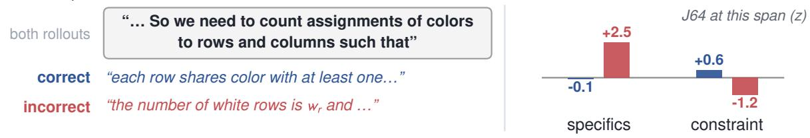

## a same tokens, different state

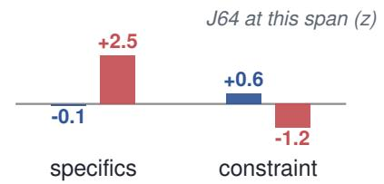

b never written, still moving

the model never emits a word of this axis’s family, yet the reading keeps moving

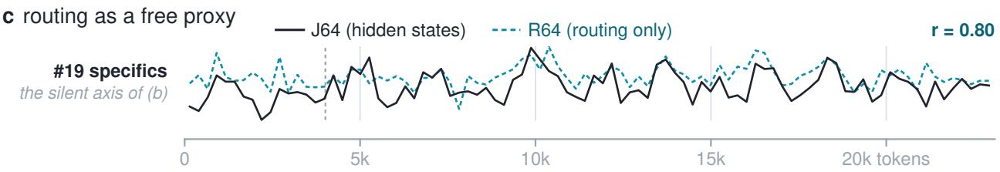  
Figure 1 The internal readout at a glance, on one gpt-oss-20b High rollout of AIME-24 problem 29. (a) A pair matched on the emitted text: rollout 1898 and a sibling rollout on the same problem emit an identical 15-token span, yet their J64 readings over that span separate along named axes (bars, standardized within the problem). The continuations diverge accordingly, and only one rollout is correct. (b) The same rollout end to end on the specifics axis of (a) (1024-token centered average). An axis’s token family is its nearest 20 vocabulary directions. Not one of this axis’s family words is written in the 23k tokens, and the same holds for 31 of the 64 axes, yet the reading keeps moving. (c) The silent axis of (b), reconstructed from native routing alone and plotted on the same token axis. A ridge map, fitted with question-held-out folds, recovers it from the layer-20 expert usage spectrum of 256-token windows. Median per-axis r is 0.69 over the 64 axes with 30 above 0.7 (0.00 for shufled routing). The axis shown ranks 12th.

verbalizable representation of the concept. J-space can therefore expose considerations that remain silent in the generated trace. Its raw form, however, carries one coordinate per vocabulary item, which makes it too large and too redundant for trajectory monitoring.

We turn this vocabulary-scale readout into J64, a compact semantic frame constructed without outcome, efort, or dificulty labels. From the model’s own reasoning states, we identify vocabulary directions that receive consistently high J-space readings, merge near-duplicates into 64 semantic families, and use each family’s weighted mean direction as one axis. Axis names are assigned only after construction and do not afect the readout. J64 maps each hidden state to a 64-value reasoning dashboard, with readable axes such as caution, arithmetic, constraint, and optionality (Figure 2b). Window and trajectory averages describe how the process evolves. J64 is therefore a coordinate system for latent reasoning state, rather than a correctness classifier or a list of predicted tokens. Its axes stay active even when their anchor words are absent from the nearby trace. They separate inference posture from problem-induced strain, and they add 0.096–0.135 held-out AUC beyond a token-occupancy baseline that is aggregated in the same way.

J64 makes latent state readable, but it requires hidden-state access. MoE inference already emits expert assignments and gate weights at every token, although raw routing carries no obvious meaning on its own. We therefore learn R64, reconstructing the same 64 semantic coordinates from native routing statistics (Figure 1c). Across three models and two families, R64 reaches median per-axis correlations of 0.69–0.86 and preserves 95–100% of J64’s predictive gain on gpt-oss-20b. R64 thus turns native routing into low-overhead, semantically grounded reasoning-state telemetry.

Our contributions are threefold. First, J64 provides a compact, readable account of process state left implicit by the trace. Second, R64 reconstructs that state from native MoE routing as a low-overhead deployment form. Third, this telemetry acts at test time: it improves completed-rollout selection, majority-vote weighting in seven of eight settings, and online stop-and-resample decisions, and router edits aimed at the named mechanism change reasoning in the direction the readout predicts.

## 2 Related Work

Reading internal states. Vocabulary-aligned lenses and linear probes show that intermediate activations can expose information that model outputs do not directly show [1, 2, 12, 13, 15, 22]. Most closely, Gurnee et al. [7] introduce the Jacobian lens and identify J-space as a vocabulary-aligned set of verbalizable representations that can carry silent intermediate reasoning. We use this readout operationally rather than testing its global workspace properties. Our contribution is to distill its vocabulary-scale output into a compact trajectory-level frame, recover that frame from native MoE routing, and use the resulting telemetry for test-time selection and control.

Test-time compute and selection. Repeated sampling widens the reachable solution set [3, 19]. Majority voting aggregates the resulting candidates [21], and process reward models score them from the text [10]. A separate line lengthens reasoning without touching the weights [14]. Text-only self-correction remains hard [4, 8]. Our selector difers from these in what it reads: internal state, or its routing-only proxy, instead of the trace. The same telemetry also supports stopping and resampling during generation, at a point where answer-level consensus does not yet exist.

MoE routing. Routing is normally studied for capacity, load balancing and expert specialization [5, 18], while behavioral control is pursued by writing directions into the residual stream [9, 20]. Closest to our online experiments, DeepConf [6] filters or early-stops reasoning traces on token-level confidence: it needs no training, but reads only the output distribution. We use it as the confidence baseline throughout, and treat routing instead as a semantic sensor. After a one-time calibration against the lens, the usage spectrum reconstructs an interpretable readout and inherits its downstream value. That turns a load-balancing by-product into deployable telemetry.

## 3 Method and Protocol

Figure 2 summarizes the instrument specified in this section: a vocabulary-aligned readout of the hidden state, a reconstruction of it from native expert routing, and the temporal resolutions at which the reconstruction is then read.

Models and data. Our primary model is gpt-oss-20b [16], a mixture-of-experts reasoning model whose discrete inference-efort setting (Low / Medium / High) lengthens reasoning traces without changing weights. Replication runs on gpt-oss-120b for scale and on Qwen3-30B-A3B (Thinking and Instruct) for a second family. The dataset is competition mathematics: AIME-24, AIME-25, HMMT-25 and BRUMO-25 with 30 questions each, sampled at up to 64 rollouts per question per setting. Architecture details, lens layer ranges and bank sizes are given in Appendix B.1 and B.3. The research questions act at diferent points: RQ3 chooses among completed rollouts, RQ4 scores 256-token windows to decide whether to stop and resample, and RQ5 edits routing during live generation. RQ1 and RQ4 count a run as successful only when it naturally terminates with the correct answer, whereas RQ3 scores any extractable answer (Appendix B.2).

The J64 readout. A state is described by 64 concept readings, and a trajectory $\tau = ( y _ { 1 } , \dots , y _ { T } )$ by their mean, $\begin{array} { r } { \phi _ { \mathrm { J } } ( \tau ) = \frac { 1 } { T } \sum _ { t } J 6 4 ( h _ { t } ) } \end{array}$ . In implementation the lens is fitted per model and read at one layer. The candidate directions are seeded either by sparse-coding mass or by lens-decode frequency, whichever passes two construction-pool diagnostics for that model; every later construction step is identical under both. The reading itself is $J 6 4 ( h ) = A ^ { + } ( h - \mu )$ , where the frame is $A = [ a _ { 1 } \cdot \cdot \cdot a _ { 6 4 } ]$ and $A ^ { + }$ is a pseudo-inverse rather than a transpose, because the axes are not orthogonal. Algorithm 1 in Appendix B.1 gives the full construction: the two seeders and how each model’s seeder was chosen, the per-model layers, the units in which readings are reported, and the axis names. The frame’s axes are of two kinds: some name a reasoning concept, and the rest mark what kind of text the model is currently producing, such as digits, non-English tokens, or a change in writing style. Appendix A.1 lists every axis and how its name was assigned. On the readability audit reported there, 51 of the 64 axes are highly readable and 85% of the axes’ nearest-neighbor vocabulary is content words, against 32/64 and 74% for a capacity-matched PCA basis of the same states.

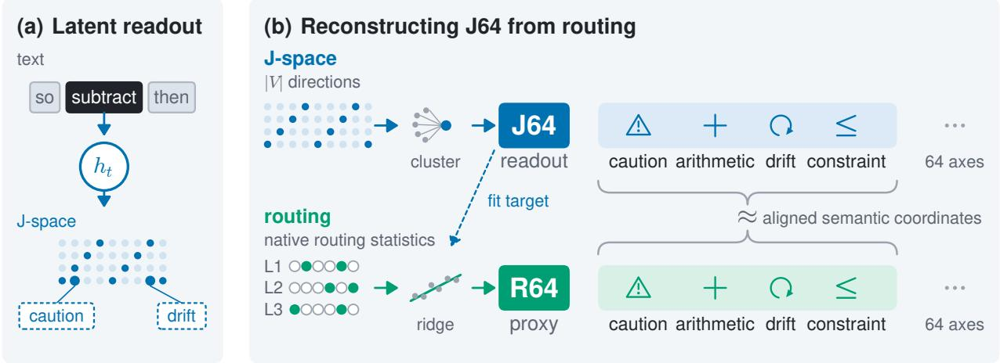

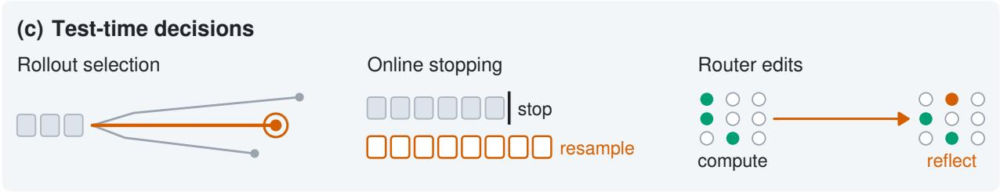  
Figure 2 The instrument: a named readout, a routing proxy, three test-time decisions. (a) At a single token position we read the hidden state $h _ { t }$ against vocabulary-aligned directions, bringing out concepts the state supports whether or not the rollout ever writes them; two of the high readings are named in dashed callouts, and the rollout wrote neither word. A high reading for caution does not mean the model emitted the word. (b) Those directions are merged into the 64 named axes of the J64 frame, built once per model and named only after construction (§4.1). The same reading is reachable in two ways, at very diferent cost: from hidden states, which means replaying the rollout through the model, or from native expert routing, which generation already emits. The braces mark the two routes as reaching the same 64 coordinates, not two readouts that happen to resemble each other: a ridge map is fitted once, on J64 as its target, to reproduce J64 from routing without outcome labels, and recovers it at a median per-axis agreement of $r = 0 . 6 9 \ – 0 . 8 6$ (§4.2), which is what the ≈ records. (c) Routing statistics are emitted by generation itself, so reading R64 costs one ridge projection rather than a second forward pass. R64 is therefore the only copy available at serve time, and the one that acts: rollout selection among completed rollouts (§5.1), online stopping on a rolling window during generation (§5.2), and router edits that move a named axis to test the readout’s causal semantics (§5.3).

The R64 proxy. We summarize three MoE layers per model as a usage spectrum: per expert, the gate weight accumulated over the model’s own routed assignments and normalized by the run’s token count, plus one gate entropy per layer. That is 99 features for gpt-oss-20b and 387 for the two 128-expert models. On that spectrum we learn a ridge map $\mathrm { R 6 4 } ( \tau ) = g _ { \boldsymbol { \theta } } ( \mathrm { r o u t i n g } ( \tau ) )$ onto the 64 J64 axes, using no outcome labels: the map is calibrated against J64 alone. RQ2 measures reconstruction fidelity with question-held-out folds over a setting’s whole pool. The deployment experiments of RQ3 instead fit the map on the source benchmark alone

and freeze it before it sees any target.

What the proxy saves. The frame already contains the lens, so the J64 projection is one 64 × d matrix product. The cost is in obtaining the state it reads. Our generation stack emits expert assignments and gate weights as a by-product of routing, but not activations, so a J64 reading means replaying the trajectory through the model in a second forward pass. R64 reads what generation already produced and adds feature aggregation and one light regression head. Fitting that map is a one-time calibration, and it is the one step that does need the lens, since it requires trajectories with paired routing and J64 readouts. We fit it once per model and efort setting for RQ2, and once per source benchmark within each transfer fold for RQ3; the map is frozen thereafter, and deployment reads routing only. Measured on gpt-oss-20b, decoding runs at 38.4 ms per token. Capturing gate weights adds 0.07 ms and a J64-projection hook 0.09 ms, both within run-to-run noise. The sparse coding that seeds the frame costs 43 ms per state and is paid once, at construction.

Routing is read at two temporal resolutions, trajectory-aggregated in RQ2–RQ3 and rolling-window in RQ4. The two share no parameters: the prefix failure score is a separate head, not the trajectory-mean R64 vector. Three routing-level quantities recur below and are distinct. R64 predicts the readout from the full spectrum, and the module analysis of RQ2 describes how routing is organized. The intervention targets of RQ5 are identified from J64 geometry or outcome-linked usage, not from R64’s largest coeficients.

Statistical protocol. The statistical unit is the question: model selection uses question-grouped folds, and confidence intervals are question-level cluster bootstraps, with a star (∗) marking an interval that excludes zero. Cross-benchmark results use frozen transfer: every fitted component is trained on one benchmark, frozen, then tested on the other three. Supervision difers by component. The J64 frame uses no labels of any kind. The selection and online-control heads are trained with correctness or failure labels on source questions, and the posture and strain coordinates of RQ1 are selected on half the problems and confirmed on the other half. On the 96 evaluation questions that contribute no construction state, the principal RQ1 diagnostics and J64’s selection advantage persist in the five gpt-oss-20b and Qwen settings tested (Appendices A.1 and B.4). All labels use a verified answer parser, and every technical term is defined in Appendix B.6.

## 4 Building an Interpretable Routing Readout

This part builds the instrument and asks two questions of it. The first is whether J64 captures readable, outcome-relevant process state beyond a summary of the emitted trace built the same way, over the whole rollout and without token order (RQ1). The second is whether that state can be read cheaply from the model’s own routing, and located within it (RQ2).

## 4.1 RQ1: J64 Reveals Process State Beyond the Trace

RQ1 asks whether a reasoning trace leaves out process state that remains readable inside the model. Figure 1a makes that gap concrete with a pair of rollouts matched on the emitted text. We establish the claim in three steps: J64 is not a direct lexical echo; its readings organize into interpretable process coordinates; and it adds outcome-relevant information beyond a representation of the emitted rollout that is aggregated in the same way.

The readout is not a lexical echo. We call an axis’s nearest vocabulary neighbors its token family. Consider the positions where an axis reads above two standard deviations. On average 99.6% of those positions have no member of that axis’s own token family within eight tokens, and for 50 of the 64 axes the figure is exactly 100%. The family words themselves appear at most 0.7 times per thousand tokens. When a family word does appear the reading rises sharply, by up to +3.9z, and it does not rise at other axes’ family words, where the mean is $z = - 0 . 0 7$ . The frame is lexically grounded where the text allows a check, and it stays active where the text is silent. That combination is what a readout of internal state can ofer over a representation of the emitted tokens.

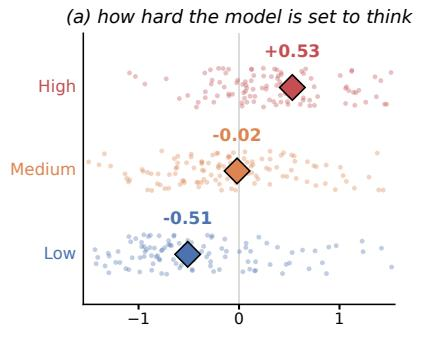

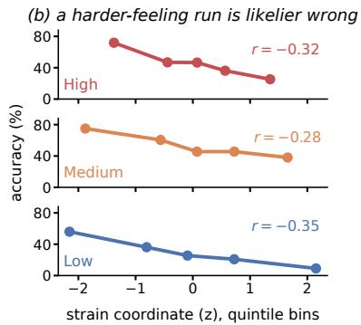

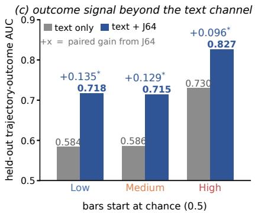  
Figure 3 J64 exposes readable latent process state and outcome signal beyond the matched text channel. (a) The posture coordinate separates the three efort settings. Dots are question means. (b) Pooled rollout-level accuracy across quintiles of the strain coordinate, one row per efort with High at the top and Low at the bottom, as in panel (a). Each row’s r is the rollout-level correlation with correctness: −0.32 at High, −0.28 at Medium and −0.35 at Low. It is not the problem-level correlation with dificulty, which is $+ 0 . 4 1 / + 0 . 4 6 / + 0 . 4 1$ at Low/Medium/High. (c) Adding J64 to the matched text representation raises held-out trajectory-outcome AUC at every efort. The bars are the two channels’ AUC; the + value above each pair is the paired increment, estimated per question and question-clustered, with ∗ marking an interval that excludes zero. It is therefore not exactly the diference of the two rounded bar labels.

Two readable process coordinates. Having established that J64 is not a direct copy of the emitted words, we next ask what latent process distinctions its axes organize. The frame’s structure appears in two fixed contrasts of the form $z = w ^ { \top } \phi _ { \mathrm { J } } ( \tau )$ . In each, w weights one group of axes positively and a second group negatively, so z is high when the first group reads high relative to the second. The posture coordinate contrasts a three-axis case-splitting bundle against a six-axis arithmetic core. That bundle covers optional cases, case-by-case transitions and one-by-one processing. It steps monotonically with the efort dial at $- 0 . 5 1 / - 0 . 0 2 / + 0 . 5 3 z$ , consistently across all four benchmarks (Figure 3a), and carries no within-problem outcome signal, so it reads how long the model has been set to think. The strain coordinate contrasts the problem-perception axis against the constraint-requirement axis, $w = e _ { 3 0 } - e _ { 1 }$ , where $e _ { k }$ selects axis k of the frame. Readings are standardized over the analysis sample before either contrast is taken, so z is in units of a standard deviation. Appendix B.1 gives the axis sets, the group-size normalization that posture uses, and the half-split that selected them. Strain is efort-blind: its tier means lie within 0.04z of zero. What it tracks instead is problem dificulty, at $r = 0 . 4 1 / 0 . 4 6 / 0 . 4 1 ;$ on 60 held-out problems the same correlations are $0 . 2 8 ^ { * } / 0 . 3 5 ^ { * } / 0 . 2 8 ^ { * }$ . Rollout accuracy falls monotonically across its quintiles at every efort (Figure 3b). The two coordinates are near-orthogonal. How hard the model has been asked to work and how hard the problem itself is are therefore two separate coordinates of the readout, not one shared axis of general activation.

The outcome increment over matched text. Both channels summarize the rollout the same way: each collapses all T positions into a single vector without using token order. Only the source difers, so a diference in AUC is attributable to what is read rather than to how the sequence is summarized. The text channel is the occupancy of emitted tokens over a 3,000-token vocabulary, compressed and scaled in the way count features usually are. Let $c ( \tau ) \in \mathbb { R } ^ { 3 0 0 0 }$ hold the token counts of the rollout; then $\phi _ { \mathrm { t e x t } } ( \tau ) = \log ( 1 { + } c ( \tau ) ) / \| \log ( 1 { + } c ( \tau ) ) \| _ { 2 }$ The internal channel is $\phi _ { \mathrm { J } } ( \tau )$ of §3. The two also share question splits, classifier family and regularization, and the text side is handed 47× more features than J64. AUC is a within-problem paired comparison pooled over problems (Appendix B.2), so problem identity does not enter the score. Adding J64 to the matched text model raises it at every efort setting, from 0.584 to 0.718 at Low (+0.135∗), from 0.586 to 0.715 at Medium (+0.129∗) and from 0.730 to 0.827 at High (+0.096∗). At 120b scale the readout alone remains far stronger than the matched text model $( 0 . 7 9 4 / 0 . 7 6 1 / 0 . 8 6 5$ against 0.585/0.613/0.722). We report the two channels separately at that scale because a stacked fit there is dominated by the 3,000-feature text block (Appendix A.2). Instrument details and additional analyses are in Appendix A.1.

J64 therefore exposes a compact, semantically readable process state that is not directly shown by the emitted trace and that carries outcome information beyond the matched text channel. The remaining question is whether the same hidden state can be recovered from a signal that generation already emits, without the second forward pass the lens requires.

## 4.2 RQ2: Routing Reads Out and Localizes J64

RQ2 asks whether the same readable state can be recovered from routing records already produced during generation, without replaying hidden activations.

Fidelity. A ridge model maps the routing usage spectrum onto the 64 J64 axes with question-held-out folds. Integrated over a run, median per-axis reconstruction is 0.692–0.864 across the eight model–efort settings of Table 1, and it rises with model scale (Figure 4a; per-axis distributions in Figure 7). The two Qwen variants reconstruct at 0.864 and 0.833. Reconstruction from a single token’s routing still reaches $r = 0 . 4 2 – 0 . 4 8$ . Three robustness checks support this. Shufling routing against the readouts collapses every model–efort setting to $r \approx 0 ;$ a single MoE layer sufices; and, $f o r$ the instantaneous token-level map, transferring across efort settings costs at most 0.04 (Figure 6). The correspondence is therefore a structural property of MoE reasoning rather than an artifact of one model: each family is read through its own model-specific frame under identical folds and regularization. The 120b replication is in Appendix A.2.

Specificity. Routing could reconstruct J64 merely because both echo the prompt, the emitted words or the trace length. We residualize J64 against a 300-dimensional PCA of full-trace token occupancy plus quadratic log-length. Routing still explains additional held-out $R ^ { 2 }$ on that residual: 0.082 [0.072, 0.093] at Low efort and 0.085 [0.072, 0.098] at Medium. When routing traces are permuted among sibling rollouts of the same question, the same quantity falls to 0.015 and 0.011, five to eight times smaller. The correspondence therefore tracks the individual rollout, not the question: it disappears when the pairing between a rollout and its own routing is broken. It also replicates at 120b scale, where reconstruction after removing each question’s mean still reaches $r = 0 . 7 2 / 0 . 7 6 / 0 . 8 0$

Utility. The proxy recovers the predictive content as well as the geometry. Against the same matched text baseline R64 adds $+ 0 . 1 2 8 ^ { * } / + 0 . 1 2 9 ^ { * } / + 0 . 0 9 3 ^ { * }$ outcome AUC at Low/Medium/High, which is 95–100% of J64’s increment (Figure 4b). A plain ridge therefore preserves nearly all of J64’s predictive content, while routing needs no additional forward pass and the lens is queried only once, at calibration.

What the proxy is reading. The routing features the ridge reads inherit interpretable semantics from J64. We factorize per-token expert usage at 347k positions into eight nonnegative modules and correlate each module against the mean-removed axis readouts. Every module locks onto an axis that RQ1 had already named from the lens vocabulary, before any routing analysis, so each arrives with a semantic hypothesis attached rather than a label we chose. One module tracks the drift-and-reconsideration axis and is enriched on But, Now, Wait and Alternatively, the vocabulary of abandoning the current line. A second tracks symbolic algebra and peaks inside mathematical expressions; a third tracks optionality and is enriched on the modal verbs might, will, cannot and should. Shufling the readouts collapses the largest correlation to 0.005.

The correspondence holds token by token, not only in aggregate. Figure 5 follows the first two modules along a single High-efort trace. Expert usage and the matched axis rise and fall together across a ±72-token window. Within that window the drift module correlates with its axis at $r = + 0 . 7 9$ and the symbol module with its axis at $r = + 0 . 5 9$ . The position-wide values are +0.59 and +0.48. Each peak also lands where the named state should be active: the drift module peaks on a paragraph break before $B u t ,$ , and the symbol module inside an expression. Table 4 names all eight modules and the axis each one matches. Routing therefore does not merely predict a trajectory-mean readout; it follows the process state from token to token. The full eight-module analysis, the enrichment procedure and the two limits on this reading are in Appendix A.3.

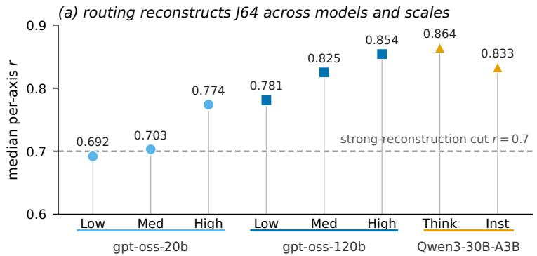

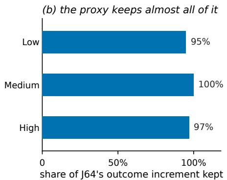  
Figure 4 Routing is a faithful, rollout-specific proxy for J64. (a) Median per-axis held-out reconstruction in the eight model–efort settings, each read through its own frame. The dashed line is the strong-reconstruction cut at r=0.7, which 28 to 59 of a setting’s 64 axes clear (shufled routing: r ≈ 0). Marker shape and color give the model family. (b) The share of J64’s outcome increment over matched token occupancy that the routing-only reconstruction keeps.  
expert module usage matched J64 axis readout

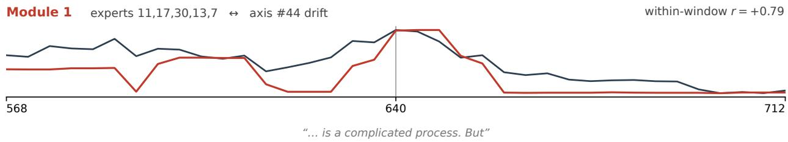

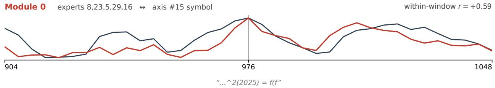  
Figure 5 Routing indicates which stage the reasoning is in. Two of the eight expert modules and the J64 axes they lock onto, along one High-efort trace: module usage in red, matched axis readout in grey, both curves min–max scaled within the window. Each panel is a ±72-token window centered where the two curves are jointly highest. Module 1 tracks the drift-and-reconsideration axis and peaks on the paragraph break of “. . . a complicated process. But”; Module 0 tracks the symbol axis and peaks inside a symbolic expression. All eight modules, their enriched vocabulary and the matched axes are in Appendix A.3.

Reconstruction and module structure give routing two complementary roles. R64 makes the J64 state observable from native expert usage, with semantics inherited from the frame, and it supports the selection and online policies of RQ3–RQ4. The module analysis localizes named process states to compact expert groups, and provides the mechanism hypotheses that RQ5 tests: there, the same decomposition places the causally efective experts in compact layer-specific modules.

## 5 Acting on the Readout at Test Time

This part uses the routing signal in two ways. As telemetry, it chooses among finished trajectories and reallocates compute during generation (RQ3–RQ4). As a mechanism, it supports targeted intervention on the

computation that the readout names (RQ5).

## 5.1 RQ3: Completed-Rollout Selection and Voting

RQ3 tests the ofline use case: after 64 sibling rollouts are available, can the readout choose a stronger branch or improve their aggregation? Table 1 is the deployment test under frozen cross-benchmark transfer: every fitted component is trained on a single source benchmark, frozen, and applied unchanged to the other three. Every number averages over all four choices of training benchmark. Two components are shared globally. The first is the unlabeled J64 frame, built once per model from a calibration pool spanning the four benchmarks (§3). The second is a single regularization strength $C { = } 3 .$ , chosen once by question-held-out cross-validation inside one benchmark. Appendix B.4 reports a stricter source-only control. Baselines are trace length, a matched token-occupancy selector, random choice, and a training-free confidence method [DeepConf; 6]. The majority-vote family forms a separate class, because it consults all N branches at once.

Single-branch selection. J64 and R64 both improve single-branch selection over a random candidate, in every model group. J64 is the most consistent single-trace method, with the highest efort-averaged accuracy at both gpt-oss scales, +5.0 and +4.9 points over a random pick, and it leads four of the eight individual settings. R64 stays positive in all four model groups, at +2.6, +2.5, +8.4 and +3.8 points, so the routing form of the readout is deployable here without reading hidden states. Trace length illustrates what a single-signal selector buys: it wins in the settings where truncation is the dominant failure mode and collapses in the settings where it is not (Appendix A.4).

A second task domain. We next test the same selection objective on GPQA [17], 198 graduate-level science questions at 64 rollouts per setting, using question-held-out, question-residualized folds where no crossbenchmark transfer is possible (Table 5 in Appendix A.4). Pooled over all 990 question–setting units, only the two internal channels clear zero, J64 at $+ 4 . 6 ^ { * }$ and R64 at $+ 4 . 3 ^ { * }$ , while token occupancy, length and DeepConf show no consistent positive gain.

Vote weighting and rescue. Consensus remains the strongest aggregate rule, and routing is most useful as a weight on it rather than as a replacement. We weight each branch’s vote by the frozen selector’s predicted correctness probability. This improves plain majority voting in seven of the eight settings and in all four model-group averages $( + 0 . 4 / + 1 . 6 / + 0 . 3 / + 2 . 3 $ for the routing-weighted variant). The sharpest test comes from the 223 questions, across the eight settings, on which plain majority voting scores zero (Table 2). We run the identical frozen-transfer protocol on those questions. J64 selects a correct branch on 17.0% of them and R64 on 14.1%, against 8.7% for a random pick, and the ordering is the same in all three models. That slice is picked with hindsight; it shows that the selectors and majority voting fail on diferent questions. Appendix A.4 reports the pool composition and the recoverable ceiling.

Completed-rollout telemetry improves the decision, but it cannot recover compute already spent on weak branches.

## 5.2 RQ4: Online Compute Allocation

RQ4 tests the online use case: before a rollout finishes, can the readout identify an unproductive attempt early enough to stop and resample? Every 256 generated tokens, a window-level head scores failure risk from J64, R64 or DeepConf. A CUSUM controller accumulates that evidence as $S _ { t } = \operatorname* { m a x } ( 0 , S _ { t - 1 } + s _ { t } - \kappa )$ , where κ is the median window score. It stops an attempt once the statistic crosses a threshold τ , and generation then restarts from a fresh sample. After at most K cuts, the next attempt runs to its natural stop. Decisions are causally masked, restarts are drawn from a fixed independent pool, and tokens are charged exactly. Every signal runs inside this same controller, with only the window score swapped. The primary control exchanges whole score sequences between sibling rollouts of the same question, which removes branch identity while preserving the marginal, the autocorrelation and everything the score knows about the question. Every constant is in Appendix B.5.

<table><tr><td colspan="5">gpt-oss-20b</td><td colspan="4">gpt-oss-120b</td><td colspan="2">Qwen3-30B-A3B</td></tr><tr><td></td><td>Low</td><td>Med</td><td>High</td><td>avg</td><td>Low</td><td>Med</td><td>High</td><td>avg</td><td>Think</td><td>Inst</td></tr><tr><td>Avg@64 (random pick)</td><td>35.1</td><td>66.5</td><td>70.9</td><td>57.5</td><td>48.8</td><td>73.3</td><td>83.1</td><td>68.4</td><td>78.8</td><td>60.9</td></tr></table>

$$
\mathbf { 4 1 . 9 \ : ( + 6 . 9 ) }
$$

$$
6 8 . 1 \ : ( + 1 . 6 ) 
$$

$$
7 7 . 5 \ : ( + 6 . 6 )
$$

$$
3 5 . 8 \ : ( + 0 . 8 )
$$

$$
{ \bf 6 8 . 3 _ { \left( + 1 . 9 \right) } }
$$

$$
{ \bf 6 2 . 5 \ ( + 5 . 0 ) }
$$

$$
7 6 . 1 \ : ( + 5 . 2 )
$$

$$
6 0 . 1 \ : ( + 2 . 6 )
$$

$$
{ \bf 5 4 . 4 } \left( + 5 . 6 \right)
$$

$$
5 1 . 1 \left( + 2 . 3 \right)
$$

$$
7 6 . 9 \ : ( + 3 . 7 )
$$

$$
8 8 . 6 \ : ( + 5 . 5 ) 
$$

$$
7 5 . 6 \ : ( + 2 . 3 )
$$

$$
{ \bf 7 3 . 3 \ ( + 4 . 9 ) }
$$

$$
8 5 . 3 \ : ( + 6 . 5 )
$$

$$
7 4 . 7 \ : ( + 3 . 8 )
$$

$$
5 8 . 2 \ : ( + 0 . 7 ) 
$$

$$
8 6 . 1 \left( + 3 . 0 \right)
$$

$$
6 5 . 6 \left( + 4 . 7 \right)
$$

$$
5 3 . 9 \ : ( + 5 . 1 )
$$

$$
6 4 . 2 \ : ( - 2 . 3 )
$$

$$
3 5 . 6 \ : ( + 0 . 5 )
$$

$$
7 0 . 9 \ : ( + 2 . 5 )
$$

$$
{ \bf 8 7 . 2 } \left( + 8 . 4 \right)
$$

$$
7 5 . 6 \ : ( + 2 . 3 )
$$

$$
6 4 . 7 \ : ( + 3 . 8 ) 
$$

$$
8 6 . 9 \left( + 3 . 8 \right)
$$

$$
7 2 . 1 \ : ( + 3 . 7 )
$$

$$
5 1 . 4 \ : ( - 6 . 1 )
$$

$$
{ \bf 8 7 . 2 } \left( + 8 . 4 \right)
$$

$$
2 0 . 8 \ : ( - 1 4 . 2 )
$$

$$
3 5 . 0 \left( - 1 3 . 8 \right)
$$

$$
7 3 . 3 \ : ( + 2 . 4 )
$$

$$
6 0 . 0 \ : ( - 6 . 5 )
$$

$$
6 5 . 6 \left( + 4 . 7 \right)
$$

$$
6 5 . 0 \ : ( - 8 . 3 )
$$

$$
{ \bf 8 9 . 2 } \left( + 6 . 1 \right)
$$

$$
6 3 . 1 \ : ( - 5 . 3 )
$$

$$
5 5 . 0 \left( - 2 . 5 \right)
$$

$$
8 4 . 2 \ : ( + 5 . 4 ) 
$$

$$
4 1 . 7 \ : ( + 6 . 6 )
$$

$$
5 1 . 7 \ : ( + 2 . 9 )
$$

$$
6 0 . 8 \left( - 1 0 . 1 \right)
$$

$$
6 2 . 5 \ : ( - 4 . 0 )
$$

$$
6 1 . 7 \left( + 0 . 8 \right)
$$

$$
7 6 . 7 \ : ( + 3 . 4 )
$$

$$
8 2 . 5 \ : ( - 0 . 6 )
$$

$$
7 0 . 3 \ : ( + 1 . 9 ) 
$$

$$
8 0 . 8 \left( + 2 . 0 \right)
$$

$$
{ \bf 6 5 . 8 ( + 4 . 9 ) }
$$

consensus family — vote weights from the same frozen selectors majority vote 46.7 (+11.6) $8 3 . 3 \ : ( + 1 6 . 9 )$ 85.0 (+14.1) $7 1 . 7 \left( + 1 4 . 2 \right)$ $5 8 . 3 \ : ( + 9 . 5 ) $ $8 4 . 2 \ : ( + 1 0 . 9 ) $ $9 5 . 0 \left( + 1 1 . 9 \right)$ $7 9 . 2 \ : ( + 1 0 . 8 ) $ $9 0 . 8 \left( + 1 2 . 0 \right)$ $7 0 . 8 \ : ( + 9 . 9 )$ $\mathrm { v o t e } + \mathrm { D e e p C o n f }$ 50.0 (+14.9) 80.8 (+14.3) 85.0 (+14.1) $7 1 . 9 \ : ( + 1 4 . 4 ) $ $5 8 . 3 \ : ( + 9 . 5 ) $ $8 5 . 0 \left( + 1 1 . 7 \right)$ $\mathbf { 9 5 . 8 \ : ( + 1 2 . 7 ) }$ $7 9 . 7 \left( + 1 1 . 3 \right)$ $9 0 . 0 \left( + 1 1 . 2 \right)$ $7 1 . 7 \left( + 1 0 . 8 \right)$ $\mathrm { v o t e } + \mathrm { J 6 4 }$ $4 8 . 1 \ : ( + 1 3 . 0 ) \ : 8 4 . 4 \ : ( + 1 8 . 0 )$ 83.9 (+13.0) 72.1 (+14.6) $5 8 . 1 \left( + 9 . 3 \right)$ $8 6 . 7 \left( + 1 3 . 4 \right)$ $9 5 . 0 \left( + 1 1 . 9 \right)$ $7 9 . 9 \left( + 1 1 . 5 \right)$ $8 9 . 4 \left( + 1 0 . 6 \right)$ $7 1 . 4 \ : ( + 1 0 . 5 )$ $\mathrm { v o t e } + \mathrm { R 6 4 }$ 47.8 (+12.7) 83.1 (+16.6) 85.3 (+14.4) 72.1 (+14.6) 59.2 (+10.4) 87.8 (+14.5) 95.6 (+12.5) 80.8 (+12.4) 91.1 (+12.3) ${ \bf 7 3 . 1 } \left( + 1 2 . 2 \right)$

Table 1 Cross-benchmark frozen transfer, best-of-64 (%), across eight deployment settings. Every learned method, including R64’s reconstruction ridge and the token-occupancy vocabulary, is trained on one benchmark and applied unchanged to the other three. Each cell averages that setting’s 12 of-diagonal transfer pairs (deterministic single pick, all 30 questions per test set). Branches are scored by extracted answer (Appendix B.2). Parenthesized values are the gain over the Avg@64 reference of the same column, i.e. over a random pick. The avg columns average a model’s three efort settings. Bold = best per column within each block.
<table><tr><td>failed questions</td><td>oss-20b 102</td><td> $\mathrm { { o s s - 1 2 0 b } }$  75</td><td>Qwen 46</td><td>pooled 223</td></tr><tr><td>random pick</td><td>8.5</td><td>10.6</td><td>5.3</td><td>8.7</td></tr><tr><td>J64</td><td></td><td></td><td>14.3 (+5.8) 23.2 (+12.6) 19.2 (+13.9)</td><td> $\mathbf { 1 7 . 0 } \left( + 8 . 3 \right) ^ { * }$ </td></tr><tr><td>R64 (routing)</td><td>12.3 (+3.8)</td><td> $2 0 . 0 \left( + 9 . 3 \right)$ </td><td> $1 6 . 1 \ : ( + 1 0 . 8 )$ </td><td> $1 4 . 1 \ : ( + 5 . 3 ) \ : ^ { * }$ </td></tr><tr><td>token occupancy</td><td> $8 . 1 \ : ( - 0 . 4 )$ </td><td> $1 4 . 6 \ : ( + 3 . 9 )$ </td><td> $1 5 . 1 \left( + 9 . 8 \right)$ </td><td> $1 2 . 3 \ : ( + 3 . 5 ) ^ { * }$ </td></tr><tr><td>length</td><td> $3 . 3 \ : ( - 5 . 2 )$ </td><td> $1 4 . 6 \ : ( + 4 . 0 ) $ </td><td> $1 1 . 7 \ : ( + 6 . 4 )$ </td><td> $5 . 4 \left( - 3 . 4 \right) ^ { * }$ </td></tr><tr><td>DeepConf</td><td> $9 . 4 \left( + 0 . 8 \right)$ </td><td> $2 0 . 5 \ : ( + 9 . 9 )$ </td><td> $1 1 . 7 \ : ( + 6 . 4 )$ </td><td> $1 3 . 0 \left( + 4 . 3 \right) ^ { * }$ </td></tr></table>

Table 2 Rescue on the questions where plain majority voting scores zero (%), by model. Protocol identical to Table 1, restricted to the failed questions. Model columns average that model’s efort settings, and pooled is the rate over all 223. Question-paired clustered CIs: J64 +8.3∗[+5.3, +11.3], R64 $+ 5 . 3 ^ { * } [ + 2 . 3 , + 8 . 5 ]$ , length $- 3 . 4 ^ { * } [ - 6 . 4 , - 0 . 1 ]$ . Per-setting detail is in Appendix A.4.
<table><tr><td>Target cost</td><td>J64</td><td>R64</td><td>DeepConf</td><td>permSib</td></tr><tr><td>gpt-oss-20b High</td><td></td><td>— one uninterrupted rollout: 56.8</td><td></td><td rowspan="4"></td></tr><tr><td>1.2×</td><td>58.3/1.21</td><td>59.2 /1.2158.7/1.22</td><td> $5 7 . 0 / 1 . 2 0$ </td></tr><tr><td>1.4×</td><td>62.2 /1.42</td><td>60.8 /1.41 60.0 /1.44</td><td> $5 7 . 8 / 1 . 4 5$ </td></tr><tr><td>1.6×</td><td>62.9 /1.59 60.8</td><td>/1.50 59.8/1.54</td><td>57.7/1.57</td></tr><tr><td>2.0×</td><td>63.5 /1.65</td><td>60.8 /1.50</td><td>59.4/1.76</td><td> $5 7 . 6 / 1 . 6 7$ </td></tr><tr><td></td><td>Qwen3-30B-A3B Thinking</td><td></td><td>one uninterrupted rollout: 78.1</td><td></td></tr><tr><td>1.4×</td><td>79.6 /1.43</td><td>79.5 /1.43</td><td>379.2/1.36</td><td> $7 8 . 6 / 1 . 4 2$ </td></tr><tr><td>1.6×</td><td>80.0/1.63</td><td>79.9 /1.65</td><td>79.2/1.36</td><td> $7 8 . 5 / 1 . 5 6$ </td></tr><tr><td>2.0×</td><td>80.1 / 1.9280.1 /1.88</td><td></td><td>379.2/1.36</td><td> $7 8 . 4 / 1 . 7 9$ </td></tr></table>

Table 3 Cumulative stop-and-resample accuracy under the nested protocol. Each cell reports accuracy (%) / realized test cost, the latter as a multiple of one uninterrupted rollout. Outcomes count delivered answers only, hence the reference level sits below Table 1’s random pick (Appendix B.2). Question-paired diferences against permSib are in the text. Bold = best per row.

Choosing the operating point without the test questions. A threshold that fires earlier spends less, so the methods cannot be compared at a nominal budget. Nor can we simply pick each method’s best configuration at a given cost: that would let every method profit from the questions it is scored on. We therefore nest the selection. In each of four outer question folds we build an accuracy–cost frontier on the training questions alone. We then take the two configurations just below and just above the target cost, and freeze a randomized mixture of them, with the mixture weights set so that its expected training cost equals the target (Appendix B.5). Table 3 reports its accuracy and realized cost on the held-out questions. Nothing is selected on the questions being scored, so the absolute levels are not optimistically biased.

What the comparison shows. The controller works on branch-level information. J64 beats the siblingpermuted control at every target cost: by $+ 1 . 3 ^ { * } , + 4 . 4 ^ { * } , + 5 . 2 ^ { * }$ and +5.9∗ points at 1.2, 1.4, 1.6 and 2.0× on gpt-oss-20b High, and by +1.1∗, +1.5∗ and +1.7∗ on Qwen. The gain comes from knowing which attempt will fail, not from the freedom to restart or from the shape of the score. Routing carries most of that information on its own: R64 clears the same control by $+ 2 . 2 \ \mathrm { t o } \ + 3 . 2 ^ { * }$ points on High and $+ 0 . 9 \ \mathrm { t o \ t i . } 7 ^ { * }$ on Qwen. The deployable form of the readout therefore retains most of the benefit, which matters because it is the form a serving system would actually run. The direct J64–R64 contrast is in Appendix A.5. DeepConf is the weakest of the three inside the same controller. It clears the control on High, but J64 leads it by 2.2 to 4.2∗ points at 1.4–2×. It matches J64 at 1.2×, and on Qwen it does not separate from the control at all. Branch-specific telemetry remains useful even under tight compute, where it is what makes restarting worth the tokens it costs. Routing serves here as a process sensor, reallocating compute by stopping and resampling.

## 5.3 RQ5: From Semantic Readout to Routing Mechanism

RQ5 asks whether the named states correspond to routing mechanisms whose editing changes reasoning in the predicted direction. We study two complementary cases. The first starts from a J64 diagnosis and ranks experts by write-vector advantage; the second starts from an outcome-linked routing group and interprets it through J64. We edit router logits only. Appendix A.6 gives the full targets, edit strengths and conditions.

Amplifying the diagnosed failure. Non-terminating trajectories load on the case-splitting bundle. Raising the logits of experts that advance this bundle drives accuracy from 0.381 to 0.000 (−0.381∗) and sends 0.98 of runs to the generation limit. A sham edit of equal strength, aimed at unrelated experts, is equally damaging in accuracy, but only the targeted condition shows the predicted behavior: sustained “Case n” enumeration, reaching 100 headers in one run, versus none in 160 sham runs. The edit therefore changes the form of failure in the direction named by J64, beyond generic disruption.

Suppressing the diagnosed stall. A compact expert group is overused during the middle fifth of incorrect trajectories (0.085 versus 0.021), and the expert-wise efects persist after controlling for trace length. Read through J64, the group’s layer-20 member corresponds to a state that remains on the problem’s requirements instead of executing the operation they call for. The targets also occupy compact unsupervised routing modules, so the group is one the model’s own routing already forms. Suppressing the group shortens generations by 45.9 tokens∗, whereas the equal-strength sham lengthens them by 47.6∗. On the focal tetrahedron problem, the intervention replaces early numerical guessing with an exact symbolic derivation and recovers the correct answer. Across both samples in this second study, every treatment condition is at or above the do-nothing control, and the sham is the only one below it (Appendix A.6).

Together, these edits link J64 semantics to routing mechanisms whose manipulation produces the named reasoning change.

## 6 Limitations and Conclusion

Our analysis centers on competition mathematics and gpt-oss-20b. Reconstruction and selection replicate on gpt-oss-120b and Qwen3-30B-A3B, but each model’s frame is built independently, so its axes are not aligned with any other model’s. Online control is evaluated mainly by causally masked replay, and the interventions remain small. The readout tracks process state, and before an answer is committed it does not predict the eventual outcome; its activity on reflective vocabulary is also largely shared with the emitted distribution. Sequence-aware text baselines, live serving and broader domains are left to future work.

J64 makes readable the process state left implicit by the trace; R64 reconstructs it from native routing without activation replay. The same telemetry supports completed-rollout selection and online stop-and-resample control, while edits aimed at the named mechanism provide causal case studies. J64 supplies semantics, routing supplies deployment, and test-time policies make the signal actionable.

## References

[1] Amos Azaria and Tom Mitchell. The internal state of an LLM knows when it’s lying. In Findings of the Association for Computational Linguistics: EMNLP 2023, pages 967–976, 2023.

[2] Nora Belrose, Zach Furman, Logan Smith, Danny Halawi, Igor Ostrovsky, Lev McKinney, Stella Biderman, and Jacob Steinhardt. Eliciting latent predictions from transformers with the tuned lens, 2023.

[3] Bradley Brown, Jordan Juravsky, Ryan Ehrlich, Ronald Clark, Quoc V. Le, Christopher Ré, and Azalia Mirhoseini. Large language monkeys: Scaling inference compute with repeated sampling, 2024.

[4] Xingyu Chen, Jiahao Xu, Tian Liang, Zhiwei He, Jianhui Pang, Dian Yu, Linfeng Song, Qiuzhi Liu, Mengfei Zhou, Zhuosheng Zhang, Rui Wang, Zhaopeng Tu, Haitao Mi, and Dong Yu. Do NOT think that much for 2+3=? on the overthinking of long reasoning models. In Proceedings of the 42nd International Conference on Machine Learning (ICML), pages 9487–9499, 2025.

[5] William Fedus, Barret Zoph, and Noam Shazeer. Switch transformers: Scaling to trillion parameter models with simple and eficient sparsity. Journal of Machine Learning Research, 23(120):1–39, 2022.

[6] Yichao Fu, Xuewei Wang, Yuandong Tian, and Jiawei Zhao. Deep think with confidence, 2025.

[7] Wes Gurnee, Nicholas Sofroniew, Adam Pearce, Mateusz Piotrowski, Isaac Kauvar, Runjin Chen, Anna Soligo, Paul Bogdan, Euan Ong, Rowan Wang, T. Ben Thompson, David Abrahams, Subhash Kantamneni, Emmanuel Ameisen, Joshua Batson, and Jack Lindsey. Verbalizable representations form a global workspace in language models, 2026. Transformer Circuits Thread.

[8] Jie Huang, Xinyun Chen, Swaroop Mishra, Huaixiu Steven Zheng, Adams Wei Yu, Xinying Song, and Denny Zhou. Large language models cannot self-correct reasoning yet. In Proceedings of the 12th International Conference on Learning Representations (ICLR), 2024.

[9] Kenneth Li, Oam Patel, Fernanda Viégas, Hanspeter Pfister, and Martin Wattenberg. Inference-time intervention: Eliciting truthful answers from a language model. In Advances in Neural Information Processing Systems 36 (NeurIPS), 2023.

[10] Hunter Lightman, Vineet Kosaraju, Yura Burda, Harri Edwards, Bowen Baker, Teddy Lee, Jan Leike, John Schulman, Ilya Sutskever, and Karl Cobbe. Let’s verify step by step. In Proceedings of the 12th International Conference on Learning Representations (ICLR), 2024.

[11] Johnny Lin. Neuronpedia: Interactive reference and tooling for analyzing neural networks. https://www. neuronpedia.org, 2023. Accessed: 2026-07-22.

[12] Jack Lindsey. Emergent introspective awareness in large language models. https://transformer-circuits. pub/2025/introspection/index.html, 2025. Transformer Circuits Thread. Accessed: 2026-07-22.

[13] Samuel Marks and Max Tegmark. The geometry of truth: Emergent linear structure in large language model representations of true/false datasets. In Proceedings of the First Conference on Language Modeling (COLM), 2024.

[14] Niklas Muennighof, Zitong Yang, Weijia Shi, Xiang Lisa Li, Li Fei-Fei, Hannaneh Hajishirzi, Luke Zettlemoyer, Percy Liang, Emmanuel Candès, and Tatsunori Hashimoto. s1: Simple test-time scaling. In Proceedings of the 2025 Conference on Empirical Methods in Natural Language Processing (EMNLP), pages 20275–20321, 2025. doi: 10.18653/v1/2025.emnlp-main.1025.

[15] nostalgebraist. Interpreting GPT: The logit lens. https://www.lesswrong.com/posts/AcKRB8wDpdaN6v6ru/ interpreting-gpt-the-logit-lens, 2020. Accessed: 2026-07-22.

[16] OpenAI. gpt-oss-120b & gpt-oss-20b model card, 2025.

[17] David Rein, Betty Li Hou, Asa Cooper Stickland, Jackson Petty, Richard Yuanzhe Pang, Julien Dirani, Julian Michael, and Samuel R. Bowman. GPQA: A graduate-level google-proof q&a benchmark. In Proceedings of the First Conference on Language Modeling (COLM), 2024.

[18] Noam Shazeer, Azalia Mirhoseini, Krzysztof Maziarz, Andy Davis, Quoc Le, Geofrey Hinton, and Jef Dean. Outrageously large neural networks: The sparsely-gated mixture-of-experts layer. In Proceedings of the 5th International Conference on Learning Representations (ICLR), 2017.

[19] Charlie Snell, Jaehoon Lee, Kelvin Xu, and Aviral Kumar. Scaling LLM test-time compute optimally can be more efective than scaling parameters for reasoning. In Proceedings of the 13th International Conference on Learning Representations (ICLR), 2025.

[20] Alexander Matt Turner, Lisa Thiergart, Gavin Leech, David Udell, Juan J. Vazquez, Ulisse Mini, and Monte MacDiarmid. Activation addition: Steering language models without optimization, 2023.

[21] Xuezhi Wang, Jason Wei, Dale Schuurmans, Quoc Le, Ed Chi, Sharan Narang, Aakanksha Chowdhery, and Denny Zhou. Self-consistency improves chain of thought reasoning in language models. In Proceedings of the 11th International Conference on Learning Representations (ICLR), 2023.

[22] Andy Zou, Long Phan, Sarah Chen, James Campbell, Phillip Guo, Richard Ren, Alexander Pan, Xuwang Yin, Mantas Mazeika, Ann-Kathrin Dombrowski, Shashwat Goel, Nathaniel Li, Michael J. Byun, Zifan Wang, Alex Mallen, Steven Basart, Sanmi Koyejo, Dawn Song, Matt Fredrikson, J. Zico Kolter, and Dan Hendrycks. Representation engineering: A top-down approach to AI transparency, 2023.

## A Supplementary Analyses

This appendix is grouped by research question and follows the order of the main text. Appendix B then specifies every construction, protocol and constant the main text uses.

## A.1 RQ1: The Readout and Where Its Increment Sits

Instrument details. Naming scheme. Each axis carries a name and a responsibility tier: sixteen are earned (at text positions where an axis’s family words appear, its reading rises sharply — accumulate +3.93, hover +3.40, geometry +2.74z); nineteen are lens-named from a coherent neighbor family whose words scarcely appear in the text (itself evidence the axis is subverbal); three are renamed because grounding rejects the surface name (the efort-sorting “Unique” axis is really a title-register marker); twenty-six are state markers (digit, multilingual, and register directions, read for position on the manifold rather than literally). Validation: a family word lifts its own axis by z = +1.30 but other axes by only −0.07; the caution axis tracks written checking at run-level +0.45; and 99% of an axis’s high-activation positions carry no family word within eight tokens. Compactness. Correctness signal is compact (an eight-axis panel transfers 85–95% of the increment across eforts), but efort classification and best-of-N selection need the whole dashboard (an eight-axis frame loses 9pp∗ on selection).

Frame-disjoint stability check. We repeat the principal RQ1 diagnostics on the 96 questions that contribute no states to frame construction. The qualitative findings persist: efort classification reaches 0.938 AUC against 0.935 on the full pool; dificulty AUC is 0.694/0.794/0.668 against 0.659/0.779/0.744 at Low/Medium/High; and the strain–dificulty correlations are 0.434/0.500/0.445 against 0.410/0.460/0.405. The central frame-level efects are therefore not concentrated on the 24 construction questions — the High-efort dificulty estimate is lower on the disjoint subset but stays well above chance, and the remaining audited efects are comparable or stronger. Rerunning the Table 1 protocol on the same 96 questions, J64’s advantage over a random pick persists in all five settings rerun, +9.7/ + 1.9/ + 5.2 on gpt-oss-20b Low/Medium/High and +9.2/ + 6.1 on Qwen Thinking/Instruct. On the construction questions alone, efort classification reads 0.894 on 1,156 runs, below both full-set values.

A capacity-matched PCA basis of the same states. The capacity control replaces the curated frame with PC64, the top 64 principal components of the same pooled states (51.3% of variance, orthonormal). The two readouts span nearly the same subspace: the top five canonical correlations lie at 0.986–0.999 at every efort, 19–23 of the 64 directions correlate above 0.9, and selectors trained on either basis score the same rollouts alike $( r = 0 . 7 4 – 0 . 8 8 )$ . Used for selection under the same frozen evaluation, the question-paired diference between the two i $\mathrm { ~ s ~ } - 3 . 3 ~ [ - 7 . 8 , + 1 . 1 ] , ~ - 2 . 2 ~ [ - 6 . 7 , + 2 . 5 ] ~ \mathrm { a n d } ~ - 1 . 7 ~ [ - 4 . 0 , + 0 . 3 ]$ points at Low/Medium/High, and concatenating the two readouts improves neither arm (+0.6 to +2.8 over J64, every interval crossing zero), so the second basis carries no additional information. The small PC64 edge is an estimation property of an orthonormal basis — condition number 1, against an efective rank of 33.8 and a pseudo-inverse readout for the non-orthogonal frame — rather than additional signal. What the principal components lack is names. Individually they are poorly aligned with the frame (median $| \cos | = 0 . 0 4 )$ and spend their dimensions on register and punctuation, so data-driven directions do not land on reasoning concepts: 0.85 of J64’s axes nearest-neighbor vocabulary is clean content words and 51/64 axes are highly readable, against 0.74 and 32/64 for PC64. The analyses that carry this paper’s mechanism content, the module–axis correspondences of RQ2 and the target selection of RQ5, consume named axes. The NMF-module selector of Appendix A.3 fails for the complementary reason: there the unsupervised step changes the subspace and loses the predictive direction before any supervised step runs; here only the basis changes and nothing is lost.

## A.2 Replication at 120b Scale

RQ1–RQ2 at 120b scale. On gpt-oss-120b (three efort settings, 7,680 rollouts each) the standalone readout replicates and strengthens, while the stacked increment does not (below): J64 alone reads trajectory outcome at 0.794/0.761/0.865 versus 0.585/0.613/0.722 for the matched full-trace text model, and dificulty at 0.670/0.715/0.596 versus 0.362/0.456/0.492. Within-question residual correctness — the strict test that freezes the problem — excludes zero at all three eforts from the readout $( 0 . 6 6 5 ^ { * } / 0 . 6 7 2 ^ { * } / 0 . 7 0 4 ^ { * } )$ and from routing alone (0.648/0.632/0.706), and within-question residual truncation reaches 0.935 at High. First, the stacked estimator (text + J64 in one 3,064-dimensional model) adds nothing over text at this scale $( + 0 . 0 0 4 / + 0 . 0 0 1 / - 0 . 0 0 1$ , CIs crossing zero) even though the readout alone is far stronger: with 3,000 occupancy features the regularized fit is dominated by the text block, so at 120b we report the single-arm duel rather than the stacked increment. Second, the 120b frame is extracted independently at that model’s own layer, so its axes are not aligned one-to-one with the 20b axes; scale comparisons are made at the level of frame-wide statistics, never axis by axis. Scale also changes the failure mode: truncation falls from 41% to 18% at High and to zero at Low and Medium, which is what makes trace length harmful at low efort and dominant at high efort in the 120b block of Table 1.

## A.3 RQ2: The Routing Proxy and What It Reads

Qwen-Instruct reconstruction. The archived Qwen reconstruction covers the Thinking variant. For Instruct we replayed the identical protocol — three-layer gate-weighted usage spectrum → run-mean J64, questionheld-out four-fold ridge, per-axis Pearson r, row-permutation control — on that model’s own bank and frame, obtaining median $r = 0 . 8 3 3$ with 58/64 axes above 0.7 and a permuted control at −0.019. The same code reproduces the archived Thinking values exactly (0.864, 59/64, permuted −0.022), so the two variants are on the same footing in Figure 4a.

The proxy inherits the readout’s label structure. The main text reports R64’s outcome-AUC increment over matched token occupancy under the RQ1 label convention. Under the finished-answer convention of Appendix B.2 the High-efort increment crosses zero for R64 exactly as it does for the lens itself, at Low and Medium both remain positive: the proxy tracks J64 where J64 is informative and where it is not, which is what a faithful reconstruction should do.

Predicting from raw routing without the bottleneck. R64 is a deterministic linear function of the routing spectrum, so an unconstrained predictor on the raw spectrum can never have a lower attainable ceiling: by the data-processing inequality the direct arm’s supremum accuracy is at least R64’s, with equality only if the reconstruction is a suficient statistic. That ordering is structural. How much outcome-relevant routing information the bottleneck actually discards is then a measurable quantity, and under the deployment conditions of Table 1 — frozen cross-benchmark transfer, one shared regularizer, finite training sets — it measures approximately zero: the question-paired gap (direct minus R64) averages −0.1 points over the eight settings, the direct arm leads in three of eight, every interval except one crosses zero, and the one exception favors R64, −3.9 [−7.5, −0.3] on Qwen-Instruct. The mechanism is a ceiling–variance trade: the direct arm estimates one outcome direction in 99 or 387 dimensions, while R64’s first stage fits routing to 64 dense J64 targets — an auxiliary task that explains state-related routing variation before any outcome label is seen — and its second stage estimates one direction in 64; Qwen-Instruct, the cell with the largest variance pressure, is where the stabilization shows. Routing through the J64 bottleneck therefore costs nothing in deployment accuracy, and its coordinates carry names, which the raw spectrum does not: the module–axis correspondences below and the intervention hypotheses of RQ5 both consume named axes. The three compressions studied in this paper difer only in the direction they compress along: supervised by J64, the bottleneck loses nothing measurable; chosen by variance (the PCA basis of Appendix A.1), it difers from the frame by estimation eficiency alone; chosen by reconstruction under nonnegativity (the module selector below), it drops the predictive direction before any supervised step runs.

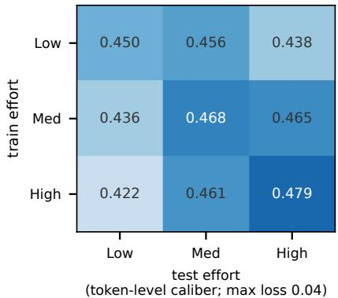

Figure 6 Cross-efort transfer of the instantaneous routing→J64 map (the token-level version): training the map at one efort setting and testing at another loses at most 0.04 reconstruction correlation.  
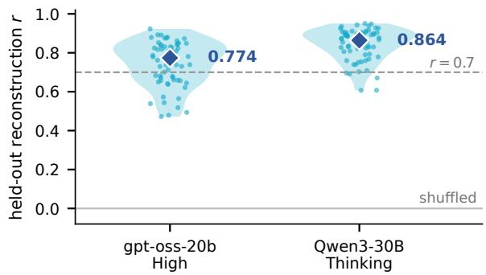  
Figure 7 Per-axis held-out reconstruction for the two settings whose 64-axis vectors are archived: the main figure reports medians and counts for all eight model–efort cells, this one shows the underlying distributions (dashed line r=0.7; the shufled-routing control sits at zero).

What the axes mean. Single-token axis names are unreliable, so each axis is characterized by its bipolar vocabulary neighbor family: the token neighborhoods of its positive and negative poles. Families are semantically coherent across languages (stays→remains/keeps; pursuit→quest/commitment; caution→careful/warning). That the unit of meaning is the direction rather than the word is visible in a minimal pair: axes #8 (Intersection) and #26 (intersection) anchor on the same surface word yet carry opposite outcome loadings. Screening marks axes that are read as state markers rather than literally: axis #44 is a drift-of-the-Englishmanifold axis (its poles are non-English script versus English function words); a cluster of digit axes is an echo hazard; and most axes have garbled negative poles, i.e. they are unidirectional features. Where axes track correctness, the sign structure is systematic — keep/advance/continuation families load positive, and alternatives/meta-planning/complexity families load negative — a resolution-like configuration (settled goal-pursuit versus unresolved deliberation) rather than reflection intensity alone.

The eight routing modules. Table 4 names all eight modules of the token-level factorization by enrichment. For each module we take the positions in its top activation decile, compare the token distribution there against the distribution over all positions, and list the tokens with the highest ratio subject to a minimum count of 40 in the high-activation set. The statistic is bounded above by 10, the inverse of the decile, so ×10 means every occurrence of that token in the sample lies inside the module’s top decile. Ratios are used rather than the most frequent tokens at peak activation, because raw frequency is dominated by common tokens regardless of the module. The matched axis is the one of the 64 with the largest absolute correlation to the module’s activation across positions; two modules (4 and 6) select the same axis with opposite signs, so the modules are distinct in vocabulary rather than in nearest axis. Modules 0, 1 and 7, in bold, are the three discussed in RQ2; the first two are the ones traced in Figure 5.

Reading the modules, and what that reading assumes. At the top of the enrichment scale the ratio saturates: might, will, cannot and should reach ×10 for Module 7, with must at ×9.9. An independent resample (168k positions against the 347k of the main text) returns the same eight modules, with identical top-five expert sets in seven of them and one difering in its fifth expert, and reproduces every axis correlation to within 0.01.

The axis paired with a module is the one of the 64 with the largest absolute correlation, so the pairing is selected by the data even though the axis’s name is not. Finally, axis #44’s word family is non-English (Bengali, transliterated t¯ahale/¯amr¯a, “so”/“we”), so by our naming discipline it is read as a drift-of-the-Englishmanifold state marker rather than literally; the enriched vocabulary of the module that tracks it — But, Wait, Alternatively — is what makes that reading specific.

Why the modules are not used as the selector’s features. The modules of Figure 5 are interpretable, so it is natural to ask why the deployment arms use the 99-dimensional usage spectrum instead. The reason is that the factorization optimizes a diferent objective from the one selection needs. Nonnegative factorization solves $\begin{array} { r } { \operatorname* { m i n } _ { U , Z \geq 0 } \| X - Z U ^ { \top } \| _ { F } ^ { 2 } } \end{array}$ , which spends its K components on directions of large routing variance, whereas a selector needs the direction of covariance with the outcome y. ${ \mathrm { O n c e ~ } } z = U ^ { \top } z$ x is fixed, the supervised stage sees only the projection of x onto span(U), so $R ^ { 2 } \leq \mathrm { c o r r } ^ { 2 } \big ( y , P _ { \mathrm { s p a n } ( U ) } x \big )$ : any predictive direction lying in span $( U ) ^ { \perp }$ is discarded before supervision begins, and a dense ridge has no such bottleneck. Routing makes the bottleneck worse in two ways. It is compositional, since each token dispatches to four of 32 experts with gate weights that nearly sum to one, so the informative quantities are contrasts of the form “ A rather than $B ^ { \ast } ;$ a nonnegative basis cannot express a contrast in one component and must form it as a diference of two components that the sum-to-one constraint makes highly correlated. And nonnegative components are themselves positively correlated by construction, which leaves the downstream design matrix collinear and its coeficients high-variance, so a direction fitted on one benchmark points inconsistently on the next.

The sweep bears this out. Replacing the spectrum by a K-module bottleneck and refitting both stages, the supervised nonnegative bottleneck, which chooses U to explain J64, reconstructs better than the unsupervised one at all twelve (setting, K) pairs (0.529–0.668 against 0.468–0.580), which is what the bound predicts once $P _ { U }$ is aimed at the target. On the downstream selection task the unsupervised bottleneck at K=8 falls below a random pick at Low (34.2 against 35.3) and at Medium (65.8 against 66.3), the signature of an unstable rather than an absent direction, and recovers only as K grows enough to readmit the predictive direction (35.0 and 69.4 at K=16). We therefore read the modules as an account of how routing is organized, and keep the full spectrum as the feature set.

<table><tr><td>Mod.</td><td>experts</td><td>most enriched tokens (× ratio)</td><td>what it fires on</td><td>matched axis</td><td>r</td></tr><tr><td>0</td><td>8,23,5,29,16</td><td>+b×7.9, θ×7.8, (a×7.2, R×7.2, d×7.1</td><td>algebraic symbols: variables #15 symbol and expression pieces</td><td></td><td>+0.48</td></tr><tr><td>1</td><td>11,17,30,13,7</td><td>But×10.0, Now×9.7, ). ×9.6, Wait×9.6, Alternatively×9.6</td><td>turn markers and paragraph #44 drift ends</td><td></td><td>+0.59</td></tr><tr><td>2</td><td>16,31,25,0,8</td><td>ings×9.8, 1etters×9.8, path×9.8, solutions×9.8, blocks×9.8</td><td>combinatorial objects: discrete #7 alternation structure nouns</td><td></td><td>-0.45</td></tr><tr><td>3</td><td>7,29,8,12,18</td><td>&gt;=×9.5, .. ×8.9, &gt;×8.9, &lt;×8.8, )/(×8.4</td><td>inequalities, fractions and ex- #54 numeral ponents</td><td></td><td>+0.33</td></tr><tr><td>4</td><td>13,17,6,20,3</td><td>The×10.0, find×10.0, using×10.0,</td><td>method statements (“use ... #29 named-object to find . . . &quot;)</td><td></td><td>+0.45</td></tr><tr><td>5</td><td>2,17,15,5,1</td><td>use×9.8, on×9.6 bis×10.0, equ×10.0, quadr×9.8,</td><td>geometric word roots (bisect, #30 difficulty quadr-, hex-)</td><td></td><td>-0.21</td></tr><tr><td>6</td><td>22,12,2,16,10</td><td>.e×9.8, non×9.6 ≈×9.3, 202×6.9, 000×6.4, *×5.3,</td><td>numeric approximation and #29 named-object round numbers</td><td></td><td>-0.30</td></tr><tr><td>7</td><td>0,21,25,17,30</td><td>=×5.1 We×10.0, might×10.0, they×10.0, wil1×10.0, cannot×10.0</td><td>modal judgement: what is pos- #20 optionality sible or required</td><td></td><td>+0.38</td></tr></table>

Table 4 The eight expert modules of the token-level factorization (gpt-oss-20b, layer 20, 168k token positions from 420 rollouts across the twelve tier × benchmark banks; NMF with eight components, run means removed). Enrichment ratios are capped by the top-decile construction at 10. Subword fragments are shown as tokenized. The correlations are from this 168k-position run; the main text quotes the independent 347k-position run, which agrees with it to within 0.01 on every module.

Routing specializes in process state. Routing is substantially more informative about trajectory quality and completion dynamics than about exact answer content. Predicting which answer string a trace will commit to from routing alone performs at chance (0.493, and coarse top-k expert selections show no stable answer-commitment fingerprint), whereas predicting whether a trajectory will be correct — the task used throughout RQ2–RQ4 — is where routing matches the lens. This specialization matches routing’s downstream role as a process monitor for confidence estimation and compute allocation.

## A.4 RQ3: Branch Selection and Vote Weighting

GPQA: protocol and boundaries. GPQA is a single benchmark, so the cross-benchmark frozen-transfer protocol of Table 1 does not apply; every learned arm in Table 5 is instead fitted with question-held-out folds within the setting, under the same regularizer, on question-residualized features, each feature minus its own question’s pool mean. Residualization is what makes the comparison meaningful on science questions: token occupancy otherwise encodes which question this is, and a selector scores by learning that hard questions fail more often; what remains after residualizing is how a rollout difers from its siblings, which is what selection actually needs. oss-20b High is the only column where the behavioral arms clear zero as well, with trace length among its strongest arms, the signature of the unfinished-rollout failure mode established for the mathematics benchmarks. In the remaining columns only the internal arms ever clear zero, J64 and R64 at Med and R64 at Inst, and at Low and Think no arm clears zero in the positive direction. The paired contrast between J64 and token occupancy crosses zero in every individual setting, so on this domain the readout’s advantage is that it is the only channel positive throughout rather than a margin in any single column.

A selector tracks the dominant failure mode. Where a behavioral baseline beats the internal arms in Table 1, the reversal is legible from the failure mode of the setting. At 120b the Low and Medium settings have zero truncation, so failures are pure capability errors and trace length is actively harmful, at −13.8 and −8.3 points. At High, truncation returns at 18% and length becomes the strongest single-trace arm. The reversal that separates model families in the Qwen block of the main table therefore reappears inside a single model across its efort dial, which is why we read length as a mode-specific baseline rather than a competitor.

Consensus on the rescue slice, and the recoverable ceiling. On the oracle-conditioned rescue slice the consensus family stops helping. The weighted-vote variants do not improve over random single-branch selection on average there — they straddle zero, and DeepConf-weighted voting falls 4.3 points below it — so the internal score contributes something consensus does not, rather than a better way of counting votes; trace length is actively harmful on the same slice $( 5 . 4 \% , - 3 . 4 ^ { * } )$ ), because on failed questions the extreme-length branches are mostly degenerate. The rescue headroom is real rather than saturated. Only 45–75% of those pools contain any correct branch at all, and against that ceiling J64 converts about a quarter of what is recoverable.

<table><tr><td></td><td colspan="3">gpt-oss-20b</td><td colspan="2">Qwen3-30B-A3B</td><td>pooled</td></tr><tr><td></td><td>Low</td><td>Med</td><td>High</td><td>Think</td><td>Inst</td><td></td></tr><tr><td>questions</td><td>198</td><td>198</td><td>198</td><td>198</td><td>198</td><td>990</td></tr><tr><td>random pick</td><td>56.3</td><td>64.4</td><td>59.3</td><td>71.1</td><td>66.3</td><td>63.5</td></tr><tr><td>J64</td><td>59.6 (+3.3)</td><td> ${ \bf 7 1 . 7 } \left( + 7 . 4 \right) ^ { * }$ </td><td> $6 7 . 2 \left( + 7 . 9 \right) ^ { * }$ </td><td> $7 2 . 7 \ : ( + 1 . 7 )$ </td><td> $6 9 . 2 \ : ( + 2 . 9 )$ </td><td> ${ \bf 6 8 . 1 } \left( + 4 . 6 \right) ^ { * }$ </td></tr><tr><td>R64 (routing)</td><td> ${ \bf 5 9 . 6 } \left( + 3 . 3 \right)$ </td><td> $6 9 . 7 \left( + 5 . 3 \right) ^ { * }$ </td><td> $6 5 . 2 \left( + 5 . 8 \right) ^ { * }$ </td><td> $7 0 . 7 \ : ( - 0 . 4 )$ </td><td> ${ \bf 7 3 . 7 ( + 7 . 4 ) } ^ { * }$ </td><td> $6 7 . 8 \left( + 4 . 3 \right) ^ { * }$ </td></tr><tr><td>token occupancy</td><td> $5 5 . 1 \left( - 1 . 2 \right)$ </td><td> $6 6 . 7 \ : ( + 2 . 3 )$ </td><td> ${ \bf 6 7 . 7 } \left( + 8 . 4 \right) ^ { * }$ </td><td> $7 2 . 2 \ : ( + 1 . 2 ) $ </td><td> $6 4 . 6 \ : ( - 1 . 7 ) $ </td><td> $6 5 . 3 \left( + 1 . 8 \right)$ </td></tr><tr><td>length</td><td> $5 0 . 5 \left( - 5 . 8 \right) ^ { \ast }$ </td><td> $6 4 . 1 \ : ( - 0 . 2 )$ </td><td> ${ \bf 6 7 . 7 } \left( + 8 . 4 \right) ^ { * }$ </td><td> $7 0 . 7 \ : ( - 0 . 4 )$ </td><td> $6 3 . 6 ( - 2 . 7 ) $ </td><td> $6 3 . 3 \ : ( - 0 . 1 )$ </td></tr><tr><td> $\mathrm { D e e p C o n f }$ </td><td> $5 4 . 5 \ : ( - 1 . 7 )$ </td><td> $6 3 . 1 \ : ( - 1 . 2 )$ </td><td> $6 0 . 6 \left( + 1 . 3 \right)$ </td><td> $7 0 . 2 ( - 0 . 9 )$ </td><td> $6 4 . 1 \ : ( - 2 . 2 ) $ </td><td> $6 2 . 5 \ : ( - 0 . 9 )$ </td></tr><tr><td>(oracle)</td><td>97.0</td><td>97.0</td><td>89.9</td><td>91.4</td><td>92.9</td><td>93.6</td></tr></table>

Table 5 Single-branch selection on GPQA (%), best-of-64: a second task domain, 198 graduate-level science questions × 64 rollouts per setting, question-held-out folds and question-residualized features (Appendix A.4). Parenthesized values are the gain over the random-pick reference of the same column; pooled is the single rate over all 990 question– setting units. Bold = best per column.

Pool composition and the unconditional protocol. All selection numbers in the paper are unconditional — every question of every test set enters, including pools that no selector can lose and pools that none can win. Out of 30 questions per benchmark, the counts of all-correct / all-wrong / mixed pools at N=64 are $0 { - } 1 / 4 { - } 9 / 2 1 { - }$ –26 at Low efort, 2–7 / 0–2 / 23–26 at Medium, and 3– $- 1 0 / 1 \mathrm { { - } 3 / 1 8 \mathrm { { - } 2 5 } }$ at High. The two protocols therefore difer in opposite directions by efort: at Low the all-wrong pools pull the unconditional average down relative to a mixed-pool recomputation (e.g. HMMT-25 at N=16: J64 0.245 unconditional vs 0.350 on mixed pools), while at High the all-correct pools pull it up (BRUMO-25: 0.813 vs 0.757). Recomputing every arm on mixed pools only leaves the arm ordering unchanged at all three eforts and makes DeepConf’s high-efort collapse deeper (0.44–0.61 at N=64). What the composition does bound is the headroom: an oracle that always picks a correct branch when one exists reaches only 0.56–0.76 at Low (N=16), and at High J64 already captures about six-tenths of the available oracle-minus-random gap.

Rescue by setting. Table 6 breaks the main-text rescue result — J64 17.0% versus 8.7% for a random pick over the 223 vote-failure questions — down by individual setting.

## A.5 RQ4: Online Compute Allocation

The two readout forms against each other. Table 3 compares both readout forms against the sibling-permuted control, which is the comparison the online claim rests on. Against the lens directly, R64 trails on gpt-oss-20b High by $+ 1 . 4 ^ { * } \ \mathrm { t o } \ + 2 . 7 ^ { * }$ points, on Qwen the two are equivalent, and at the cheapest target the ordering inverts, with R64 leading J64 by 0.9∗ at 1.2×. Reading hidden states therefore buys a margin only at the higher budgets of one model group.

## A.6 RQ5: Mechanism-Matched Routing Interventions

Target selection, its relation to R64, and scope. Table 7 lays the two interventions out end to end. The cases enter the routing substrate from opposite sides: Case 1 selects experts geometrically from a J64 direction: at each layer $l \in [ 8 , 1 9 ]$ experts are ranked by the advantage of their write vector along the bundle direction, $\begin{array} { r } { a _ { e } = \left( w _ { e } ( h ) - \sum _ { j } p _ { j } w _ { j } ( h ) \right) \cdot \hat { w } _ { \mathrm { b u n d l e } } } \end{array}$ with the second term the currently gated mixture, and the top two per layer are edited, state-dependently. Case 2 selects them statistically from routing usage — L12-E23, L12-E12,

<table><tr><td></td><td colspan="4">gpt-oss-20b</td><td colspan="4">gpt-oss-120b</td><td colspan="2">Qwen3-30B-A3B</td><td>all</td></tr><tr><td>failed qs</td><td>Low 64</td><td>Med 20</td><td>High 18</td><td>avg 102</td><td>Low 50</td><td>Med 19</td><td>High 6</td><td>avg 75</td><td>Think 11</td><td>Inst 35</td><td>pooled 223</td></tr><tr><td>random pick</td><td>9.0</td><td>12.3</td><td>4.2</td><td>8.5</td><td>8.4</td><td>16.8</td><td>6.8</td><td>10.6</td><td>4.1</td><td>6.5</td><td>8.7</td></tr><tr><td>J64</td><td>14.1 (+5.1)*</td><td> $\mathbf { 2 3 . 3 } \left( + 1 1 . 0 \right)$ </td><td> ${ \bf 5 . 6 } \left( + 1 . 4 \right)$ </td><td> $\mathbf { 1 4 . 3 \ : ( + 5 . 8 ) }$ </td><td> $\mathbf { 1 7 . 3 \left( + 9 . 0 \right) ^ { * } }$ </td><td> $2 4 . 6 \ : ( + 7 . 8 )$ </td><td>27.8 (+21.0)</td><td> ${ \bf 2 3 . 2 } \left( + 1 2 . 6 \right)$ </td><td>21.2 (+17.1)*</td><td> $1 7 . 1 \ : ( + 1 0 . 6 ) ^ { * }$ </td><td> $\mathbf { 1 7 . 0 \ ( + 8 . 3 ) ^ { * } }$ </td></tr><tr><td>R64</td><td> $9 . 9 \ : ( + 0 . 9 ) $ </td><td> $2 3 . 3 \ : \mathring { ( + 1 1 . 0 ) }$ </td><td> $3 . 7 \left( - 0 . 5 \right)$ </td><td> $1 2 . 3 \ : ( + 3 . 8 ) $ </td><td> $1 1 . 3 \overset { \cdot } { ( } + 3 . 0 \overset { \cdot } { ) }$ </td><td> $2 6 . 3 \ : ( + 9 . 5 )$ </td><td> $2 2 . 2 \ : ( + 1 5 . 5 )$ </td><td> $2 0 . 0 \stackrel { \cdot } { ( } + 9 . 3 )$ </td><td> $1 5 . 2 \dot { ( } + 1 1 . 0 \dot { ) }$ </td><td> $1 7 . 1 \stackrel { ! } { ( } + 1 0 . 6 ) ^ { * }$ </td><td> $1 4 . 1 \ : ( + 5 . 3 ) ^ { * }$ </td></tr><tr><td>token occupancy</td><td> $8 . 9 \ : ( - 0 . 2 ) $ </td><td> $1 0 . 0 \dot { ( } - 2 . 3 )$ </td><td> $5 . 6 \ : ( + 1 . 4 )$ </td><td> $8 . 1 \ : ( - 0 . 4 )$ </td><td> $1 3 . 3 \ : ( + 5 . 0 ) $ </td><td> $1 9 . 3 \ : \dot { ( } + 2 . 5 ) $ </td><td> $1 1 . 1 \dot { ( } + 4 . 3 \dot { ) }$ </td><td> $1 4 . 6 \ : ( + 3 . 9 )$ </td><td> $1 2 . 1 \dot { ( } + 8 . 0 )$ </td><td> $\mathbf { 1 8 . 1 \dot { ( } + 1 1 . 6 ) ^ { * } }$ </td><td> $1 2 . 3 ( + 3 . 5 ) ^ { * }$ </td></tr><tr><td>length</td><td> $0 . 0 \ ( - 9 . 0 ) ^ { * }$ </td><td> $1 0 . 0 \ : ( - 2 . 3 )$ </td><td> $0 . 0 \left( - 4 . 2 \right) ^ { * }$ </td><td> $3 . 3 \ : ( - 5 . 2 )$ </td><td> $0 . 0 \ : ( - 8 . 4 ) ^ { \ast }$ </td><td> $1 0 . 5 \ : ( - 6 . 2 )$ </td><td> ${ \bf 3 3 . 3 } \left( + 2 6 . 6 \right)$ </td><td> $1 4 . 6 \left( + 4 . 0 \right)$ </td><td> $9 . 1 \left( + 5 . 0 \right)$ </td><td> $1 4 . 3 \ : ( + 7 . 8 )$ </td><td> $5 . 4 ( - 3 . 4 ) ^ { * }$ </td></tr><tr><td>DeepConf</td><td> $1 2 . 5 \ : ( + 3 . 5 )$ </td><td> $1 0 . 0 \ : ( - 2 . 3 )$ </td><td> $5 . 6 \dot { ( + 1 . 4 ) }$ </td><td> $9 . 4 \ : ( + 0 . 8 ) $ </td><td> $8 . 0 \dot { ( } - 0 . \dot { 4 } )$ </td><td> ${ \bf 3 6 . 8 } \left( + 2 0 . 1 \right) ^ { * }$ </td><td> $1 6 . 7 \dot { ( } + 9 . 9 )$ </td><td> $2 0 . 5 \ : ( + 9 . 9 )$ </td><td> $9 . 1 \left( + 5 . 0 \right)$ </td><td> $1 4 . 3 \ : \dot { ( } + 7 . 8 ) $ </td><td> $1 3 . 0 \dot { ( } + 4 . \dot { 3 ) } ^ { * }$ </td></tr></table>

Table 6 Rescue on the questions where plain majority voting scores zero, by setting (%). The protocol is identical to Table 1 — frozen cross-benchmark transfer, one uniform regularizer, deterministic single pick from the full pool of 64, averaged over the same 12 transfer cells per setting — restricted to the failed questions of each test set. Parenthesized values are question-paired gains over a random pick in the same column, a star marks a clustered CI excluding zero, and avg columns are unweighted means over a model’s three efort settings. Individual settings hold only 6–64 failed questions, so single cells indicate direction; pooled over all 223 failed questions J64 rescues 17.0% against 8.7% for a random pick $( + 8 . 3 ^ { * } [ + 5 . 3 , + 1 1 . 3 ] )$ and R64 reaches 14.1% $( + 5 . 3 ^ { * } [ + 2 . 3 , + 8 . 5 ] )$ , while length falls to 5.4% $( - 3 . 4 ^ { * } [ - 6 . 4 , - 0 . 1 ] )$
<table><tr><td>Diagnosed process</td><td>J64 axes</td><td>Routing component</td><td>Intervention experts</td><td>Predicted change</td><td>Observed change</td></tr><tr><td>Excessive case splitting, failure to commit</td><td>case-splitting bundle #20/#7/#16</td><td>experts ranked by write-vector advantage on the bundle direction, layers 8–19</td><td>top two per layer, state-dependent</td><td>more splitting, less commitment</td><td>“Case n&quot; enumeration (100 headers in one run; 0 of 160 sham runs), non-termination (cap 0.98), accuracy → 0.000</td></tr><tr><td>Hovering and probing instead of operating</td><td>hover #22, requirement #1, probe #8 vs</td><td>expert group whose gated usage separates incorrect from correct trajectories</td><td>L12-E23, L12-E12, L12-E24, L16-E11, L20-E0;</td><td>less probing, faster exact execution</td><td>shorter generations (−45.9*; sham +47.6*), symbolic derivation replaces numerical guessing, answer</td></tr></table>

Table 7 The two mechanism-matched interventions of RQ5, from the diagnosed process to the observed change.

L12-E24, L16-E11 and L20-E0, together 1.2% of the gated mass across the three recorded layers — and then reads their J64 profile. The Case 2 group also coincides with the unsupervised structure of RQ2. Factorizing per-token gate usage into eight modules separately at each recorded layer, with no correctness label anywhere in the procedure, places all three layer-12 targets in one module, experts {7, 9, 12, 22, 23, 24, 26, 28, 29}, two of them with all of their loading on it and the third with 43%; three experts drawn at random land in a common module with probability 0.040, or 0.027 if drawn distinct. The layer-16 target carries 100% of its loading on its module and the layer-20 target 88%. The causally efective group is therefore a coalition the routing substrate already contains, not a set assembled by the outcome statistics that selected it.

Neither selection rule is a ranking of R64’s reconstruction coeficients, and the three readings measure diferent quantities: fitting the same ridge and ranking the 96 expert features by their weight on an axis puts the experts we intervene on well down the list. On the hover axis the expert whose write vector loads on it in five of five reference sets ranks 80th of 96 by reconstruction weight, and none of that axis’s five largest reconstruction contributors is an intervention target; on Case 1’s three axes the targets rank between 14th and 93rd. The three questions difer: reconstruction weight asks which experts predict the readout and is dominated by high-usage experts that carry variance, module membership asks which experts are used together, and the advantage rule asks which experts move the readout. A target can rank 80th of 96 on the first and be a core member on the second without contradiction.

In the Case 1 push (ten AIME-24 problems × 16 rollouts per arm, paired by question and seed) the unmodified model does produce occasional “Case n” headers — one to five in 7 of 160 runs — so the specificity claim is about the targeted arm against the 160 equal-dose sham runs, in which no header occurs at all. In Case 2 the profile is stable per expert across five independent reference sets, but only the layer-20 member has the hover/probe/requirement reading quoted in the main text; the other four separate the outcome classes statistically without that profile, and the probing direction $( \# 8 )$ is an axis whose lens label grounding rejected, so we read it as a state marker rather than literally. The dose window is narrow — expert-level constants of 0.3–0.8 work and larger doses return to baseline — and the arena throughout is gpt-oss-20b at Low efort on competition mathematics.

Arm-level accuracies. Table 8 gives every arm on the two samples we ran. On twelve problems $( 1 2 \times 1 6$ rollouts × seven arms, 1,344 trajectories) promoting the outcome-positive experts at dose 0.3 reaches 0.411 and suppressing the negative group at 0.8 reaches 0.406, against 0.380 for no-op and 0.359 for the equal-dose sham; every treatment arm is at or above no-op and the sham is the only arm below it; among the single-direction treatment arms the treatment–sham separation is +3.6 to +5.2 points. On the three case-study problems suppression reaches 0.625 against 0.542 for no-op and 0.500 for the sham, a +12.5-point separation. The per-problem breakdown shows where the gain comes from: on the rescued problem the sham also recovers 2 of 16, and what separates the arms is that suppression leaves the problems the model already solves intact or improves them (12/16 and 14/16 becoming $1 2 / 1 6$ and $1 6 / 1 6 )$ while the sham degrades both (10/16, 12/16).

Expert-level target selection and the intervention arms. The targets of the second study are chosen before any intervention, from usage statistics alone. On 5,834 finished Low-efort runs we standardize each expert’s usage rate within question and compare correct against incorrect rollouts. The five most negative are L12-E23 $( d = - 0 . 2 8 5 ^ { * } )$ , L12-E12 (−0.255∗), L12-E24 (−0.248∗), L16-E11 (−0.233∗) and $\mathrm { L 2 0 – E 0 \ ( - 0 . 2 2 9 ^ { \ast } ) }$ ; the three most positive are L12-E19 (+0.192∗), L16-E29 (+0.149∗) and L12-E14 (+0.147∗). Controlling for trace length leaves the five negative efects essentially unchanged $( - 0 . 2 9 0 / - 0 . 2 5 0 / - 0 . 2 4 0 / - 0 . 2 2 7 / - 0 . 2 2 9 )$ , and the two strongest positive efects likewise $( + 0 . 1 8 5 / + 0 . 1 4 8 ;$ the control was not recomputed for L12-E14), so these are not length artifacts. The suppression arms act on the five negative experts; the promotion arms act on the four experts L12-E19, L16-E29, L12-E14 and L16-E19, the fourth fixed in the arm at construction time with an efect size outside the archived top-three ranking. Splitting each run into fifths, correct rollouts use the negative group at 0.070/0.023/0.021/0.039/0.093 and incorrect ones at 0.116/0.085/0.085/0.097/0.138: the gap is concentrated in the middle of the run, the core computation. The write-vector profiles are complementary L20-E0 loads on keep hovering and probe a direction and against intersection, intersect verb and case split, while the positive L16-E29 loads on intersection (+14,750) — which is the basis for reading the intervention as “stop hovering, do the operation”. The arm-by-arm outcome on the three case-study problems is the second column of Table 8.

Rollout transcripts and efect intervals. In the case-amplification study, on AIME-24 P6 the targeted arm proceeds through “Case $\ 7 2 \ldots$ . Case $8 6 ^ { \circ }$ while the equal-dose sham repeats a single sentence with no case structure: both arms lose the same accuracy, and only the targeted one loses it in the shape the diagnosis names. In the suppression study the length change is −45.9 tokens $[ - 7 5 . 7 , - 1 7 . 3 ] ^ { * }$ under treatment against $+ 4 7 . 6 \ [ + 1 3 . 5 , + 8 2 . 9 ] ^ { * }$ under the equal-dose sham. On AIME-24 P5, the inradius of a tetrahedron with equal opposite edges, the unmodified trajectory converts to decimals early and then guesses at a radical, $^ { 6 6 } \cdot \cdot \cdot$ $r = 1 . 1 6 2 \dots$ Suppose exact $r = \sqrt { 5 } / ? \ldots$ . Not nice . . . Given time, guess answer $1 2 \ell ^ { , 9 }$ , whereas with the diagnosed experts suppressed the same problem is carried in exact symbolic form throughout, “an isosceles tetrahedron with opposite edges equal . . . $V = 1 6 0 / 3 \ \ldots \ r = 2 0 \sqrt { 2 1 } / 6 3 \ \ldots \ m + n + p = 1 0 4 ^ { \mathfrak { p } }$

## B Reproducibility: Constructions and Protocols

This section specifies every construction the main text uses. Values are the ones in the code that produced the reported artifacts.

## B.1 The J64 Frame and the Two Needles

Per-model atom seeding. The seeder is chosen per model by two construction-pool diagnostics, applied in order and before any downstream analysis. First, the seeder must be non-degenerate: its atoms must reconstruct held-out states and cluster into multi-token families. Second, among non-degenerate seeders, the 64 axes should vary within a question across sibling rollouts rather than between questions, a comparison that uses question identity and nothing else. Neither diagnostic consults an outcome, efort or dificulty label. On gpt-oss-20b the sparse-coding seeder passes: its axes place 0.173 of their variance within questions against 0.164 for the frequency seeder, and only 5 of 64 axes are question-locked against 9. On gpt-oss-120b the same seeder drifts onto question topic, with the within-question share at 0.132 and 15 of 64 axes locked onto axes reading Permutation, Quaternion, gcd; the frequency seeder is chosen there. On Qwen3-30B-A3B the sparse coder degenerates in a diferent way, onto of-manifold code fragments: a state’s 25 atoms reconstruct only 0.036 of its energy, the lowest of the three models, and the median group size after clustering is 1, whereas the frequency seeder yields coherent process families (maybe/perhaps, calculation, measurement) and reconstructs held-out states at 0.049 against 0.035. The choice only moves the seed: on gpt-oss-120b, where both frames were carried through the full selection and rescue protocols, every arm keeps its sign and ordering under either seeder, with the single-branch J64 arm 2.7 points $[ + 0 . 3 , + 5 . 1 ] ^ { * }$ stronger under the chosen frame (+7.1 $[ + 1 . 3 , + 1 2 . 9 ] ^ { * }$ on the rescue slice) and the R64 and vote-weighted arms essentially unchanged. Signal-bearing axis counts (28 against 22 at 120b) are reported for context only and did not enter the selection.

<table><tr><td>Arm</td><td>twelve problems</td><td>three case studies</td></tr><tr><td>no-op</td><td>0.380</td><td>0.542</td></tr><tr><td>promote pos. (0.3)</td><td>0.411 (+3.1)</td><td></td></tr><tr><td>suppress neg. (0.8)</td><td>0.406 (+2.6)</td><td>0.625 (+8.3)</td></tr><tr><td>suppress neg. (0.3)</td><td>0.396 (+1.6)</td><td></td></tr><tr><td>promote pos. (0.8)</td><td>0.396 (+1.6)</td><td>0.604 (+6.2)</td></tr><tr><td>both (0.8)</td><td>0.380 (0.0)</td><td>0.583 (+4.2)</td></tr><tr><td>sham (0.8, random)</td><td>0.359 (−2.1)</td><td>0.500 (−4.2)</td></tr></table>

Table 8 Accuracy of every intervention arm on the two samples (gpt-oss-20b, Low efort, 16 rollouts per problem per arm; 1,344 and 240 trajectories). Parenthesized values are points over no-op, green above it and red below. Every treatment arm evaluated on a given sample is at or above no-op; the sham is the only arm below it. A constant is subtracted from, or added to, the router logits of the selected experts at every token; on the three case studies accuracies are multiples of $1 / 4 8 .$ , so the arm-level intervals there are too coarse to separate the arms and only the direction is read. A trigger-gated variant that suppresses only at tokens where a targeted expert is naturally selected reproduces the twelve-problem result (0.401 against 0.406).

Frame overlap and what is supervised. Frame construction consumes 24 of the 120 evaluation questions. All headline evaluations use all 120 questions; construction-disjoint controls on the remaining 96 are additionally reported for the RQ1 diagnostics (Appendix A.1) and for the RQ3 transfer grid (below), because the frame is a data-dependent representation even though it is outcome-label-free. Everything built on top of the frame is supervised and is trained only on source questions: the RQ3 selectors and vote weights (correctness labels), the RQ4 prefix score (failure labels), and the R64 reconstruction map (J64 targets, no outcome labels).

The two coordinates. Let Z be the readings column-standardized over the analysis sample (480 runs, stratified over three efort settings × four benchmarks, seed 0), and write $\overline { { Z } } _ { S }$ for the mean of Z over an index set S. With $B = \{ 2 0 , 7 , 1 6 \}$ (the case-splitting bundle) and $A = \{ 4 5 , 5 2 , 5 0 , 0 , 2 6 , 3 5 \}$ (the arithmetic core),

$$
\mathrm { p o s t u r e } = { \overline { { Z } } } _ { B } - { \overline { { Z } } } _ { A } , \qquad \mathrm { s t r a i n } = Z _ { 3 0 } - { Z _ { 1 } } ,
$$

where axis 30 is the problem-perception axis and axis 1 the constraint-requirement axis. The axis sets were chosen on a random half of the problems (seed 1); the 60 problems of the other half are the held-out confirmation quoted in RQ1.

Algorithm 1 J64 frame construction (once per model; no outcome, efort or dificulty labels)

1. Lens. Fit a per-source-layer Jacobian lens [7]: for source layer ℓ, a linear map $J _ { \ell }$ carrying the residual stream at ℓ into the final-layer basis, estimated by regression with one-hot cotangent injection at every token position from index 16 onward. Read the frame at one layer L per model: L=20 of 24 for gpt-oss-20b, L=23 of 36 for gpt-oss-120b, L=34 of 48 for Qwen3-30B-A3B (both variants). This is a fitted lens, not a bare unembedding logit lens; for gpt-oss-20b we use the published checkpoint of Gurnee et al. [7] hosted on Neuronpedia [11], and the gpt-oss-120b and Qwen lenses are fitted with the same estimator.

2. Dictionary. D ← rows of $W _ { U } J _ { L }$ , each row $\ell _ { 2 ^ { - } }$ -normalized; rows of special tokens are zeroed. Every non-special vocabulary item is a candidate direction; there is no hand-built word list.

3. State pool. Replay the first 6 problems × first 2 rollouts of each of the four benchmarks and collect hidden states at L from token 16 onward; sample 400 states with seed 0.

4. Atom seeding (one of two simple statistics; every other step is identical). $( a )$ Sparse-coding mass: code each sampled state over D with non-negative orthogonal matching pursuit, k=25 atoms per state, accumulate each atom’s non-negative coeficient mass over the 400 states, and keep the $5 1 2 = 6 4 \times 8$ atoms of highest mass. (b) Lens-decode frequency: count each token’s appearances among the top-20 lens decodings of the sampled states and keep the 400 most frequent. The seeder is fixed per model at construction time from the construction-pool diagnostics described below, which use no outcome, efor or dificulty label: gpt-oss-20b uses (a); gpt-oss-120b and Qwen3-30B-A3B use (b).

5. Grouping. Walk the candidates in decreasing seeder score and greedily open a new group whenever an atom’s cosine to every existing group representative is $\leq 0 . 7$ , otherwise add it to the group it exceeds 0.7 with; keep the first 64 groups.

6. Axes. Each axis is the seeder-score-weighted mean of its members’ dictionary rows, $\ell _ { 2 } \cdot$ -normalized, giving the frame $A = [ a _ { 1 } \cdot \cdot \cdot a _ { 6 4 } ] \in \mathbb { R } ^ { d \times 6 4 }$ whose columns are the axes.

7. Readings. $J 6 4 ( h ) = A ^ { + } ( h - \mu )$ with $A ^ { + }$ the Moore–Penrose pseudo-inverse and $\mu$ the mean state over a fixed four-sentence neutral corpus. Readings are raw projection coeficients, and each axis points toward its own token family because both the sparse code and the group weights are non-negative, so a reading may take either sign. The “units” quoted in RQ5 are these coeficients: the case-splitting bundle’s reading rises by 66.3 units from Low to High efort, which is 1.08 standard deviations of that reading (sd = 61.3) — the conversion between the raw units of RQ5 and the standardized readings plotted elsewhere.

No step uses an outcome, dificulty or efort label, and no axis is manually selected or edited: the 64 axes are whatever the chosen seeding statistic and the 0.7 threshold produce. The state pool, the grouping procedure and its threshold are shared by all three models; the seeder and its candidate-bank size (512 atoms under sparse coding, 400 under decode frequency) are model-specific. Axis names and responsibility tiers are assigned afterwards and change no number. Each frame is built independently in its own model’s space, so axes are not aligned index-by-index across models.

## B.2 Labels, the Matched Text Channel and the RQ1 Estimator

Labels. Two outcome conventions appear in the paper, one per use. The outcome label of RQ1 and RQ4 is 1 if the extracted answer matches the gold answer and the run terminated on its own: an attempt that hits the generation limit delivers nothing, so the label is “a correct answer was delivered”. Selection over completed pools (RQ3) scores a branch by its extracted answer alone, because an answer recovered from a truncated trace is still a usable pick. On gpt-oss-20b High the two conventions read the same pool as follows: 59.0% of rollouts finish and score 96.2% when they do, and truncated rollouts still carry an extractable correct answer 34.3% of the time, which gives the random pick of Table 1 its 70.9 and one uninterrupted rollout in Table 3 its 56.8. Problem dificulty is 1 minus the solve rate over that problem’s rollouts at the same efort setting. That estimate uses the same rollouts as the strain–dificulty correlation, so the correlation is not cross-fitted and shares sampling noise with its target; this is why we report the held-out-problem replication $\left( + 0 . 2 8 / + 0 . 3 5 / + 0 . 2 8 \right)$ alongside the pooled value.

The matched text channel. Within each training fold we count tokens over that fold’s rollouts only and keep the 3,000 most frequent, so the vocabulary never sees held-out questions; it is rebuilt per model and per efort setting. Out-of-vocabulary tokens are dropped; punctuation and subword pieces are kept exactly as tokenized. Counts are log(1+x) transformed and each rollout’s vector is $\ell _ { 2 } \cdot$ -normalized, after which the classifier standardizes features using training-fold statistics.

Estimator. Logistic regression (lbfgs, 2,000 iterations, no class weighting, no post-hoc calibration) with inverse regularization $C \in \{ 1 / 3 , 1 / 3 0 \}$ chosen by mean AUC and then held fixed for both channels; four question-level folds; features standardized per fold. AUC is computed as a within-problem paired comparison pooled over problems, and intervals are problem-level cluster bootstraps (2,000–4,000 resamples).

## B.3 R64: Routing Features and the Reconstruction Map

How each channel is captured. Routing is recorded by the generation stack itself: expert assignments and gate weights are written out as the trajectory is sampled, so the routing features cost nothing beyond generation. Activations are not exposed there, so J64 readings are obtained by replaying each finished trajectory through the model under teacher forcing, with a hook on the residual stream at layer L; this is a second forward pass over every token of the trajectory. That replay also re-records the router outputs, which is how the two channels are aligned token by token, but the routing used in the paper is the generation-time record. In-process instrumentation costs, measured on gpt-oss-20b over 256 decoded tokens, median of three runs: bare decode 38.37 ms per token, 38.44 with the gate-capture hook, 38.47 with the J64-projection hook, and 38.42 with both, so each hook sits within run-to-run noise. One NN-OMP decomposition over the 201k-atom dictionary, used only when seeding the frame, costs 43.3 ms per state.

R64 features and map. The usage spectrum reads three MoE layers (12, 16, 20 for gpt-oss-20b), all top-4 assignments kept: per expert, the summed gate weight divided by the number of tokens in the run (32 experts per layer), plus one gate entropy per layer, computed per token and averaged over the run $- \ 3 \times 3 2 + 3 = 9 9$ features, and $3 \times 1 2 8 + 3 = 3 8 7$ for gpt-oss-120b and Qwen3-30B-A3B. The map is fitted diferently for its two uses: RQ2 evaluates a model–efort-specific map with question-held-out folds over that setting’s whole reconstruction corpus (Figure 4a, eight such cells), whereas for RQ3 both the reconstruction map and the selector on top of it are fitted on the source benchmark alone and frozen together before transfer: in the code the ridge is solved on the source benchmark’s routing and J64 matrices and then applied unchanged to each target, so no target rollout contributes to either stage. The cross-efort experiment shows a single token-level map transferring between settings at a cost of at most 0.04, which suggests but does not establish that one map per model would sufice. The window-level map of RQ4 shares no parameters with the trajectory-level map. The map is a single multi-output ridge solved in closed form with a fixed λ=50 (the “one uniform regularizer”), inputs standardized, targets raw, over four question-grouped folds. Per-axis Pearson r is computed on pooled out-of-fold predictions, and axes with negative r are kept in both the median and the count above 0.7. The permutation control permutes routing rows across all runs.

## B.4 RQ3: Selection, Transfer and Voting Protocols

Selection, transfer and vote weighting. Pools are 64 rollouts per question. A selector is a logistic regression (500 iterations) fitted on one source benchmark and frozen, with the inverse regularization shared by every learned arm and every setting at C=3, the one hyperparameter of Table 1 not selected per source. It was fixed once, by four-fold question-level cross-validation inside a single benchmark, and applied unchanged to every arm, setting and target. Selecting inside AIME-24 or AIME-25 at High efort returns C=3 under all three criteria we tried (mean held-out best-of-64 accuracy over the learned arms, over the two internal arms, or for J64 alone); selecting inside HMMT-25 or BRUMO-25 returns values between $1 0 ^ { - 3 }$ and $1 0 ^ { - 1 }$ and the selecting benchmark’s questions also appear as transfer targets elsewhere in the grid. Across the global grid $C \in [ 1 0 ^ { - 3 } , 3 ]$ , J64’s efort-averaged best-of-64 at Low moves between 35.0 and 41.9. A stricter protocol removes the shared value entirely: selecting C per (setting, source, arm) by four-fold question-level cross-validation inside the source benchmark alone, then refitting and freezing, changes the five efort-setting averages by at most 2.5 points (J64 41.7/68.6/75.0/83.6/66.1 against $4 1 . 9 / 6 8 . 1 / 7 7 . 5 / 8 5 . 3 / 6 5 . 6$ at C=3; R64 $3 4 . 7 / 6 7 . 5 / 7 5 . 8 / 8 7 . 5 / 6 5 . 3$ against 35.8/68.3/76.1/87.2/64.7) and moves the vote-weighted arms by at most half a point. J64 stays above the random reference in all five settings; the one sign change anywhere is R64 at

Low, +0.8 to −0.4. The main table keeps C=3. For R64, the reconstruction ridge is frozen with the selector Single-branch selection takes the argmax of the score over the pool. Vote weighting sums the frozen selector’s probability over branches that agree on an answer and takes the argmax; only terminated branches with a parseable answer take part. Each cell is the macro-average over the 12 source→target pairs (4 sources × 3 held-out targets), so a test question is evaluated once per source head and the reported number is not a single prediction per question; intervals are problem-level bootstraps computed within each target set and then averaged, which does not model the correlation induced by re-using a test question across the three source heads — they should be read as within-target intervals.

Construction-disjoint check. We ran the control. Frame construction consumes problems 0–5 of each benchmark, so we repeated the five gpt-oss-20b and Qwen transfer settings of Table 1 with those 24 questions removed from both selector fitting and evaluation, leaving 24 questions per target set; the unrestricted rerun reproduces each of those settings’ cells exactly. On the construction-disjoint subset every arm loses 2–4 points of absolute accuracy including the random-pick reference (35.1→32.0, 66.5→63.4, 70.9→67.0, 78.8→75.5, 60.9 → 57.1 across the five settings), i.e. the removed questions are easier, not leaked. The quantity the table actually reports — the gain over a random pick — does not shrink: averaged over the five settings it is +5.2 for J64 on all 120 questions and +6.4 on the disjoint 96, and +4.0 versus +3.9 for R64. Per setting, J64’s advantage is preserved or larger in four of five (+6.9→+9.7 at Low, +1.6→+1.9 at Medium, $+ 6 . 5  + 9 . 2$ on Qwen-Thinking, +4.7 → +6.1 on Qwen-Instruct) and smaller at High (+6.6 → +5.2); the one arm that turns negative is R64 at Low efort (+0.8→−1.4), which is the setting where Table 1 already shows it barely clearing the reference.

## B.5 RQ4: Prefix Score, Controller and Baselines

Prefix score. Windows are 256 tokens with stride 256. The target is 1 − outcome, i.e. the run will fail to deliver a correct answer (wrong answer or no answer), and the predictor is a histogram gradient-boosted classifier (150 iterations, learning rate 0.1, at most 15 leaves, minimum 200 samples per leaf, $\ell _ { 2 }$ regularization 1.0, seed 0), trained separately for each model and efort setting over four question-level folds. The J64 arm scores the window-mean readout (64 features). The R64 arm first fits a least-squares map (ridge 102) from that window’s model-specific routing spectrum (99 dimensions for gpt-oss-20b, 387 for Qwen3-30B-A3B) onto the window-mean readout inside the training fold, then scores the reconstruction — so nothing but routing is read at deployment.

Controller and replay. Cut when $S _ { t } = \operatorname* { m a x } ( 0 , S _ { t - 1 } + s _ { t } - \kappa )$ exceeds τ and at least 512 tokens have been generated, with κ the median training-fold window score and $S _ { 0 } = 0 ; \tau \in \{ 0 . 2 5 , 0 . 5 , 1 , 2 , 4 \}$ and the restart budget $K \in \{ 2 , 3 , 4 , 6 \}$ . After K cuts the next sample is allowed to run to completion. Generation caps are 32,768 tokens for gpt-oss and 32,000 for Qwen. Replay draws attempts from a per-question random permutation of that question’s pool without replacement — 50 permutations per training question, 200 per test question — and if an attempt’s natural length is within its cut time it completes and is scored, otherwise the cut time is charged and the next attempt begins. One unit of cost is the mean cost of the first run of each permutation, i.e. letting one rollout finish. This paper uses two reporting protocols. The nested protocol of Table 3 runs four outer question folds; within each fold it evaluates every $( \tau , K )$ on the training questions only, brackets the target cost c with the two adjacent points A, B of the training Pareto front and forms the randomized mixture that plays B with probability $( c - c _ { A } ) / ( c _ { B } - c _ { A } )$ , so the expected training cost equals $c ;$ that fixed mixture is then executed on the held-out questions with no maximum taken, and both the test accuracy and the realized test cost are reported. Because nothing is selected on the questions being scored, the absolute levels are not optimistic, and the realized costs stay close to their target and close to each other (across both models, 1.42–1.92× for J64 against 1.42–1.79× for permSib at targets 1.4–2×); the exception is permAll, whose configurations saturate at 1.18–1.31×, which is why we attribute against permSib and not against it. If no training configuration is that cheap the fold falls back to an uninterrupted rollout. Intervals throughout are 2,000-resample bootstraps over questions of the paired diference; they cluster questions but not permutations.

Baseline arms. Three zero-information controls pass through the identical CUSUM machinery, and permSib is the one every attribution uses, because it alone matches the score’s distribution and dynamics: it permutes whole score sequences between sibling rollouts of the same question $( s d = 0 . 2 2 1 , a c _ { 1 } = 0 . 4 2$ , window AUC 0.679 against the readout’s 0.720), preserving marginal, autocorrelation and question-level information and destroying only branch-level information. The i.i.d. score is U[0, 1) per window (seed 5), with within-run $s d = 0 . 2 8 8$ and lag-one autocorrelation −0.01 against 0.202 and 0.37 for the readout; permAll permutes globally (window AUC 0.48) and its selected configurations saturate below the cost targets. The confidence baseline follows DeepConf [6], which filters reasoning traces on model-internal confidence and needs no extra training. We implement its windowed confidence signal, the negative mean of the top-20 token log-probabilities the sampler already stores over the trailing 256-token window, and none of the method’s other components. In Table 3 that scalar is read by the same trained head and the same CUSUM as every other arm, which is what makes the comparison a comparison of signals. It needs token log-probabilities but no internal state.

## B.6 Glossary

Terms used above. Vocabulary direction: a row of D, i.e. one token’s direction in the lens-projected space. Semantic frame: the matrix $A = [ a _ { 1 } \cdot \cdot \cdot a _ { 6 4 } ] \in \mathbb { R } ^ { d \times 6 4 }$ whose columns are the axes. State marker: an axis whose neighbours are digits, script fragments or register cues rather than content words; read as a position on the manifold rather than literally. Echo hazard: for digit axes, the risk that a reading merely reflects digits present in the emitted text, which is why digit axes are never named for content. Write-vector advantage: an expert’s projection onto a target direction minus the mean projection of the experts it displaces.