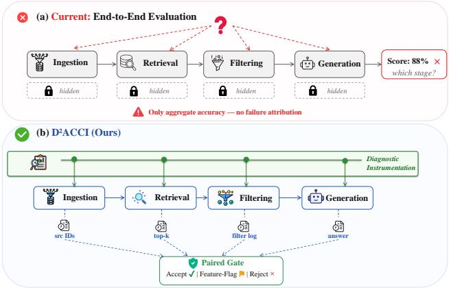
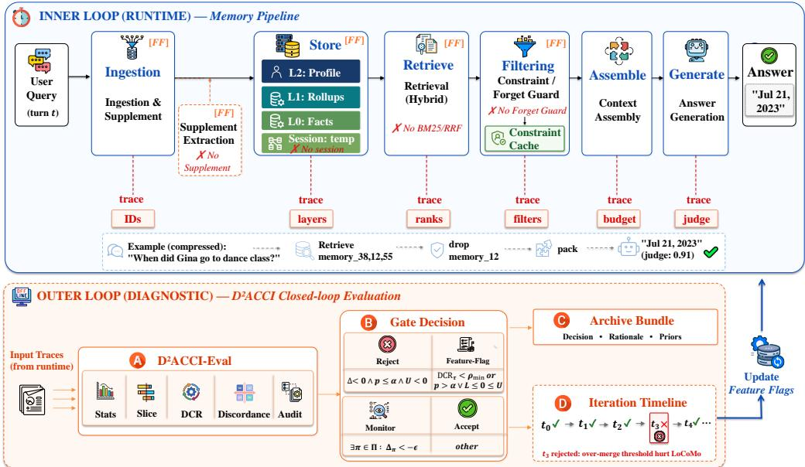
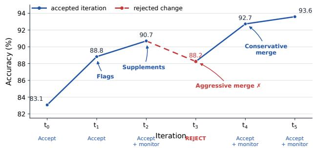

# D2ACCI: A Dual-Loop Diagnostic Protocol for Evidence-Preserving Agent Memory

Xule Liu, Yijun Liu, Chao Li, Shao Kun∗

MiLM Plus, Xiaomi Inc. liuxule@xiaomi.com, liuyijun3@xiaomi.com, lichao75@xiaomi.com, shaokun@xiaomi.com

## Abstract

Memory is a key capability of LLM agents. Persistent mem- ory extends this across sessions—enabling recall, revision, and personalization. Yet its multi-stage pipeline (ingestion, retrieval, filtering, generation) makes failures dificult to lo-calize: end-to-end evaluation reveals that an error occurred, but not which stage caused it. Existing evaluations often re- port aggregate performance without paired statistical com- parisons, slice-level non-regression checks, or stage-level di- agnostic traces. We propose D2ACCI (Diagnostic-Driven Artifact-based Closed-loop Controlled Iteration), a dual-loop protocol whose outer diagnostic gate promotes, feature-flags, or rejects memory interventions based on paired evidence, protected-slice monitoring, and trace-level localizability. We further introduce DCR, a graded observability metric that measures whether failures remain localizable, and D2ACCI- Eval, a reusable artifact for gate replay. We instantiate the protocol in MemStack and evaluate on three public bench- marks, achieving 93.59% on LoCoMo, 90.93% on Long- MemEval, and 57.20% on PersonaMem-V2. Five paired ablations show that supplement extraction, session-memory retrieval, and Forget Guard yield statistically significant gains (+1.9 to +3.7pp, all p ≤ .003). In contrast, BM25/RRF is retained as a monitored feature flag—a distinction invisible to aggregate-only evaluation. A diagnostic audit shows enriched traces substantially improve root-cause agreement over result- only relabeling. Diagnostic artifacts reach 98–100% DCR@3 versus 0% for results-only logs. These results establish that robust memory-system iteration demands traceable, statisti- cally grounded, and regression-aware evidence—exactly the gap D ACCI fills.

## Introduction

LLM agents are increasingly expected to operate over long time horizons, where the information needed for a later in- teraction may no longer fit within a limited context window. Persistent memory addresses this limitation by storing, or- ganizing, and reusing information across interactions, and is becoming a first-class component of LLM agents (Packer et al. 2023; Chhikara et al. 2025; Patel et al. 2026). A de-ployed assistant must recall facts across months of interac- tion, distinguish stable preferences from transient context, respect revised information, and avoid using memories that users ask to forget (Maharana et al. 2024; Wu et al. 2025;

  
Figure 1: (a) Current end-to-end evaluation reports only aggregate accuracy; internal pipeline states are hidden and failures cannot be attributed to a specific stage. (b) D2ACCI emits per-stage traces, enabling paired gates to localize failures and drive targeted repairs.

Jiang et al. 2025). These requirements are dificult to satisfy reliably because persistent-memory systems involve multi- ple processing stages. When a memory-augmented answer is incorrect, the reason may lie in failed extraction, incor- rect consolidation with another memory, irrelevant retrieval, over-aggressive filtering, or omission of a critical update from the final prompt. End-to-end evaluation reveals that an error occurred, but not which stage caused it or what im- provements should be applied.

We therefore argue that agent memory should be evalu- ated as an evolvable runtime system. A long-lived agent is repeatedly updated as developers revise retrieval policies, consolidation rules, deduplication thresholds, and memory management logics (Gao et al. 2026). Without explicit re-gression controls, these updates can silently degrade the user experience or performance of task slices, such as temporal inference or preference fidelity. This risk is especially pro- nounced for personalized memory because improvements are often non-monotonic: broader retrieval may recover tempo- rally relevant evidence while introducing conflicting pref- erences, whereas stronger deduplication may reduce redun- dancy while deleting rare but crucial facts.

For agent builders, this makes memory iteration a deploy- ment problem rather than only a benchmark problem. Ideal iteration requires more than aggregate component ablations. Prior evaluations of agent memory rarely combine paired comparisons, protected slice non-regression checks, null re- sult preservation, and stage-level diagnostics (Chhikara et al. 2025; Patel et al. 2026; Rasmussen, Frisoni et al. 2025). Thus, an aggregate improvement may obscure trade ofs or regressions under specific benchmarks. Reliable memory system evolution requires a reproducible procedure that links each intervention to a testable failure hypothesis, statistically supported paired evidence, protected slice monitoring, and traces capable of preserving stage-level failure localization.

To address this gap, we introduce D2ACCI (Diagnostic-Driven Artifact-based Closed-loop Controlled Iteration), a dual-loop protocol that separates an inner runtime loop from an outer diagnostic-evolution loop. The inner loop executes the memory-augmented agent, whereas the outer loop evalu- ates candidate changes and determines whether they should be promoted, feature flagged, or rejected. D2ACCI defines a decision contract that ties these decisions to paired sta- tistical evidence, protected slice non-regression checks, and trace-level localizability.

Additionally, we introduce DCR, a graded trace-coverage metric for measuring whether failures remain localizable at the relevant stage, and D2ACCI-Eval, a reusable evaluation artifact supporting paired statistical analysis, protected-slice gates, discordance export, and deterministic gate replay. The artifact preserves both positive and null findings, allowing later iterations to reuse prior evidence.

We instantiate D2ACCI in MemStack, a diagnosable memory kernel with multi-granularity storage and feature- flagged retrieval. We evaluate on three public bench- marks, achieving 93.59% on LoCoMo, 90.93% on Long- MemEval, and 57.20% on PersonaMem-V2. Across five paired feature-gated configurations, supplement extraction, session-memory retrieval, and Forget Guard yield statisti- cally significant gains of +2.71, +3.67, and +1.92 percentage points, respectively, whereas BM25/RRF yields no statisti- cally significant improvement. Diagnostic artifacts achieve 98–100% DCR@3, compared with 0% for results-only logs. On an external Mem0-compatible slice, trace-adapted and results-only outputs achieve the same task accuracy (43.33%) but difer substantially in diagnostic coverage, demonstrating artifact portability beyond task performance.

## Our contributions are as follows:

1. D2ACCI protocol and decision contract. We introduce a dual-loop diagnostic protocol that promotes, feature-flags, or rejects memory interventions based on paired statistical evidence, protected-slice non-regression checks, and stage-level trace suficiency. The individual primitives (paired runs, traces, feature flags) are familiar; the contribution is the decision contract that binds them into acceptance criteria—changing outcomes that aggregate-only reasoning cannot (e.g., issuing contradictory BM25/RRF verdicts across benchmarks, or promot- ing components without slice monitors).

2. D2ACCI-Eval artifact and DCR metric. We provide a reusable evaluation artifact for paired comparisons, pro- tected slice gates, discordance export, and deterministic gate replay, together with a graded metric for measuring failure localizability.

Algorithm 1 $\mathsf { D } ^ { 2 }$ ACCI dual-loop memory-system iteration   
1: Inner loop: run ${ \mathcal { P } } _ { \theta }$ to ingest, update, retrieve, constrain,   
assemble, and answer while emitting $d _ { i }$   
2: Specify outer-loop hypothesis $H _ { t }$ , target slice, and ex-   
pected failure mechanism.   
3: Implement candidate $\theta ^ { \prime }$ in the shared core or behind a   
feature flag.   
4: Run baseline/candidate and collect details JSONL plus   
diagnostics.   
5: Compute paired outcomes: $I , R , B _ { w } , B _ { c } .$   
6: Label root causes in $R \cup B _ { w }$ using the evidence-loss   
ladder.   
7: Run paired gate: McNemar/bootstrap statistics, slice   
checks, and DCR.   
8: Outer loop: accept, rollback, or gate the feature; archive   
artifacts and rejected priors.

3. MemStack case study. We instantiate D2ACCI in a di-agnosable memory kernel with multi-granularity storage and feature-gated retrieval, and evaluate it on three pub- lic benchmarks with distinct failure profiles. A separate Mem0-compatible slice demonstrates artifact portability beyond the primary system.

## D2ACCI Framework

## Problem Formulation

Let ${ \cal { S } } = \{ s _ { i } \} _ { i = { . } } ^ { N }$ denote an evaluation set, where each sample $s _ { i } = ( q _ { i } , h _ { i } , y _ { i } ^ { * } )$ contains a query, interaction history, and tar- get answer. A memory configuration θ defines a pipeline ${ \mathcal { P } } _ { \theta }$ that produces $\hat { y } _ { i } = \mathcal { P } _ { \theta } \big ( q _ { i } , h _ { i } \big )$ . An evaluator J yields a score $\boldsymbol { m } _ { i } = \boldsymbol { J } ( \hat { y } _ { i } , y _ { i } ^ { * } )$ and aggregate metric $\begin{array} { r } { \mathcal { M } ( \theta ) = \mathrm { \bar { \Omega } } N ^ { - 1 } \sum _ { i } m _ { i } . } \end{array}$

Aggregate performance alone does not reveal why a memory-augmented answer fails. D2ACCI therefore records a diagnostic state for each sample:

$$
\begin{array} { r } { d _ { i } = ( e _ { i } ^ { r a w } , e _ { i } ^ { s t o r e } , r _ { i } ^ { t o p - k } , f _ { i } ^ { f i l t e r } , c _ { i } ^ { c t x } , g _ { i } ^ { g e n } , j _ { i } ) , } \end{array}\tag{1}
$$

where $e _ { i } ^ { r a w }$ denotes evidence in the history, $e _ { i } ^ { s t o r e }$ denotes stored memory, $r _ { i } ^ { t o p - k }$ denotes retrieved items, $f _ { i } ^ { f i l t e r }$ de- notes filtering or reranking decisions, $c _ { i } ^ { c t x }$ denotes assembled context, $g _ { i } ^ { g e { \breve { n } } }$ denotes the generated answer, and $j _ { i }$ denotes the final judgment.

A candidate $\theta ^ { \prime }$ is compared against a baseline θ on paired samples, partitioning them into I (improved), R (regressed), $B _ { w }$ (both wrong), and $B _ { c }$ (both correct). For each material regression or persistent error, the earliest actionable failure stage is labeled as ingestion miss, retrieval miss, context- assembly error, constraint error, generation error, compo- nent hurt, or unresolved ambiguity. Algorithm 2 first flags incomplete reports, then applies five ordered checks: reject significant harm, feature-flag low DCR(Diagnostic Coverage Rate), feature-flag inconclusive statistics, accept-with-monitor protected-slice regressions, or accept otherwise. The DCR check precedes the inconclusive fallback, so positive but poorly observable candidates are still flagged. Protected slices Π are pre-specified from benchmark category structure (e.g., multi-hop, temporal, sensitive-preference) before any gate is evaluated.

  
Figure 2: MemStack under the $\mathrm { D } ^ { 2 } \mathrm { A C C I }$ dual-loop protocol. Top: the inner memory loop processes queries through feature-flagged stages (FF; independently togglable by the outer gate): ingestion, multi-layer storage, retrieval, constraint filtering, context assembly, and generation; each emits a t ed dia nostic trace (IDs, la ers, ranks, filters, bud et, jud e). Ablation tar ets (✗) mark aired ablations in Table 3. Bottom: the outer diagnostic loop feeds traces into D2ACCI-Eval (paired stats, slice deltas, DCR, discordance, audit), producing a gate decision that updates inner-loop feature flags for iteration t+1. The iteration timeline shows automatic gate replay including the $t _ { 3 }$ rejection.

## Dual-loop decomposition

The key design choice is to separate two coupled but diferent loops. The inner memory loop runs at inference or ingestion time: it extracts candidate memories from user interactions, writes or updates multi-granularity stores, retrieves evidence for a query, applies update/forget constraints, assembles con- text, and generates an answer. The outer diagnostic loop runs over paired artifacts: it compares a feature-bearing run against an ablation, checks statistical and slice gates, inspects traces for the earliest evidence-loss stage, and then accepts, rolls back, or keeps a feature behind a flag.

From an agent-architecture perspective, the outer loop is a metacognitive self-regulation layer: the agent monitors its own competence boundaries, detects protected-slice regres- sions, and gates modifications to its own harness before they propagate. This difers from a single metric-driven develop- ment loop because the outer loop can reject a component that raises a raw dashboard number but lacks a trace-supported mechanism or regresses a protected slice. It also difers from pure prompt/program optimization: the outer loop does not search only over prompts, but controls architectural features such as supplement extraction, deduplication thresholds, re- trieval channels, and forget-guard injection.

Once instrumented, the gate can be triggered automatically after each candidate run, enabling automatic gate replay for candidate memory-policy changes with statistical regression controls. Algorithm 1 summarizes the complete dual-loop iteration from candidate construction to gated promotion, rollback, or feature-flagging. Gate replay is deterministic un- der fixed thresholds and pre-specified protected slices.

Algorithm 2 D2ACCI-Eval gate-replay decision contract   
Require: R = (∆, p, [L, U], {∆π}π∈Π, DCRτ); IDs,   
traces, Π, α, ρmin, ϵ   
Ensure: Decision D, rationale r, archive A   
1: if R incomplete then   
2: (D, r) ← (Feature-Flag, incomplete report)   
3: else if ∆ < 0 ∧ p ≤ α ∧ U < 0 then   
4: (D, r) ← (Reject, significant harm)   
5: else if DCR < ρ then   
6: (D, r) ← (Feature-Flag, insuficient trace)   
7: else if p > α ∨ L ≤ 0 ≤ U then   
8: (D, r) ← (Feature-Flag, inconclusive evidence)   
9: else if ∃π ∈ Π : ∆π < −ϵ then   
10: (D, r) ← (Accept-with-Monitor, slice guard)   
11: else   
12: (D, r) ← (Accept, positive paired evidence)   
13: end if   
14: A ← Archive(R, Π, D, r, checks, monitors, priors)   
15: return D, r, A

## MemStack System Instantiation

MemStack instantiates D2ACCI as a shared memory kernel with thin benchmark adapters (Figure 2). We retain only the design choices needed to interpret the ablations: L0 atomic facts, L1 topic rollups, L2 user profiles, and session memory are separate because each layer isolates a diferent failure mode. No Supplement disables the long-session supplement stage and conservative deduplication; No Session disables answer-time session-memory retrieval; No Forget Guard dis- ables constraint-cache filtering.

Design lessons. Three choices enable stage-level failure localization: (1) layer separation—each ablation maps onto a distinct failure family; (2) feature flags—retrieval channels, supplement extraction, and constraint injection are toggled per-run for cheap paired ablation; (3) trace emission at every stage boundary—without all three, a pipeline may improve accuracy while hiding whether the gain came from better evidence or lucky prompt formatting.

Diagnosable ingestion, retrieval, and constraints. L0 facts are extracted from raw turns with source-turn IDs; L1 rollups aggregate session-level patterns; L2 profiles dis- till stable preferences from L1. Session memory is flushed at session boundaries as a structured record (raw turns, summary, keywords, timestamps, multi-granularity embed- dings); long-session repair is handled by supplement extraction, which writes additional source-grounded L0 facts. At answer time, vector/BM25/RRF/session retrieval produces candidates; constraint-cache filtering removes forgotten or superseded memories; context assembly packs constraints before ordinary evidence under a token budget. Traces record source IDs, memory IDs, top-k scores, filtered items, packed/dropped context, and the final prompt at each stage boundary; these are exactly the fields consumed by DCR and gate replay.

## D2ACCI-Eval and Diagnostic Coverage

Ordinary A/B testing answers whether a candidate is bet- ter on average; it does not say whether the pipeline pre- served enough evidence to debug the errors it still makes. D2ACCI-Eval is the artifact layer for this distinction. Given paired details files, it joins examples by stable IDs, com-putes aggregate and slice-level deltas, exports Full-only and Ablated-only discordances, runs McNemar tests and boot- strap confidence intervals, and creates a root-cause audit queue. Its additional observability metric is Diagnostic Cov- erage Rate (DCR). For a failure or discordance set $F ,$ stage set S, trace $d _ { i }$ , and a per-stage actionability predicate $A ( d _ { i } , s )$ let $\begin{array} { r } { C ( d _ { i } ) = \sum _ { s \in \bar { S } } \mathcal { W } [ A ( \bar { d } _ { i } , s ) ] } \end{array}$ ] be the number of actionable stages. We define

$$
\mathrm { D C R } _ { \tau } ( F ; S ) = \frac { 1 } { | F | } \sum _ { i \in F } \mathcal { H } \left[ C ( d _ { i } ) \geq \tau \right] .\tag{2}
$$

Here A is true when the trace contains the minimum fields needed to inspect a stage: source-turn or memory IDs for in- gestion, top-k items and scores for retrieval, filter decisions for reranking, final packed context for assembly, constraint IDs for forget/update guards, and output plus judge metadata for generation. In the artifact, $A ( d _ { i } , s )$ is schema-validated rather than free-form: a stage is actionable only when the required IDs, scores, decisions, and metadata are present. DCR therefore measures observability rather than accuracy.

A high-accuracy system with low DCR may be hard to repair; a lower-accuracy but high-DCR run can still be valuable if it localizes missing evidence. Unless otherwise stated, gate re- play uses DCR@3, requiring at least three actionable stages, and a fixed minimum coverage threshold of 0.90 set before inspecting paired results; sensitivity is reported at DCR@1, @5, and @6. To make the number interpretable, D2ACCI- Eval includes a results-only contrast that retains the answer and score but removes stage traces; this contrast receives zero coverage under the default three-stage predicate.

Design properties of DCR. Three properties distinguish DCR from an ad-hoc coverage count and justify its use as a gate criterion: (1) Stage monotonicity—adding instrumentation stages can only increase $C ( d _ { i } )$ , so DCR never penalizes a more observable system (DCRτ $( F ; S ^ { \prime } ) \ge \mathrm { D C } \dot { \mathrm { R } } _ { \tau } ( F ; S )$ for $S ^ { \prime } ~ \supset ~ S )$ . (2) Accuracy-orthogonal separation—DCR captures information that accuracy cannot: the Mem0- compatible slice achieves 43.33% accuracy under both trace- adapted and result-only configurations, yet DCR@3 is 100% vs. 0%. (3) Gate soundness—under Algorithm 2, a null component (true ∆=0) is promoted with probability at most $\alpha ,$ because promotion requires McNemar $p \leq \alpha$ with CI ex- cluding zero; the false-promotion rate is bounded by the test’s Type-I control. Together, these ensure DCR is well-behaved and non-redundant, and that the outer-loop gate provides a statistical guarantee against adopting inert components— distinguishing it from metric-only dashboard decisions.

## Experiments

## Experimental Setup

We evaluate the same shared core across three public regimes. LoCoMo tests long-term conversational QA over multi-session dialogues (Maharana et al. 2024). We report non-adversarial judge accuracy on 1540 questions from 10 conversations. LongMemEval evaluates chat assistants on long-term interactive memory and contains 500 curated questions in the LongMemEval-S setting (Wu et al. 2025). PersonaMem-V2 evaluates implicit persona memory with 5000 multiple-choice questions over 200 personas (Jiang et al. 2025).

Unless otherwise stated, the answer model is GPT-4.1- mini, the open-ended judge is GPT-4o-mini with three deterministic runs per question (majority vote), and embeddings use BGE-M3 (Chen et al. 2024). PersonaMem-V2 uses exact-match multiple-choice accuracy. Paired confidence in- tervals use BCa bootstrap with 10,000 resamples; McNemar tests use the exact two-sided binomial form. External rows are reference points from published papers or public summaries; our strongest claims rely on internal paired comparisons us- ing the same artifacts, prompts, and model settings.

MemBrain is our primary public reference point on all three benchmarks; its numbers are taken from its maintained evaluation summary under the same splits (FeelingAI Team 2026). We treat published external numbers as reference context, not controlled baselines; the controlled evidence comes exclusively from internal paired ablations where the only variable is one feature flag. Concurrent systems (Mem0 Platform 92.5%/94.4% on LoCoMo/LongMemEval (Chhikara et al. 2025); EverMemOS 92.3%/83.0% (Patel et al. 2026)) are not directly comparable due to diferences in answer mod- els, judge prompts, and retrieval budgets. We retain Mem-Brain as the primary reference point because it documents conditions closest to ours across all three benchmarks.

<table><tr><td>Benchmark</td><td>Eval set</td><td>Ours</td><td>MemBrain</td><td>∆</td><td colspan="4">Representative slices (category / (count, accuracy))</td></tr><tr><td>LoCoMo</td><td>1540 non-adv QA</td><td>93.59%</td><td>93.25%</td><td>+0.34pp</td><td>Single-hop (841, 96.2)</td><td>Multi-hop (282, 89.5)</td><td>Temporal (321, 92.4)</td><td>Open (96, 86.8)</td></tr><tr><td>LONGMEMEVAL</td><td>500/500 questions</td><td>90.93%</td><td>85.60%</td><td>+5.33pp</td><td>Single-user (70, 99.5)</td><td>Knowledge-update (78, 93.6)</td><td>Multi-session (133, 85.0)</td><td>Temporal (133, 89.0)</td></tr><tr><td>PERSONAMEM-V2</td><td>200 personas, 5000 MCQ</td><td>57.20%</td><td>55.72%</td><td>+1.48pp</td><td>Sensitive (511, 86.3)</td><td>Forget (1048, 66.9)</td><td>Neutral (858, 51.2)</td><td>Therapy (627, 44.5)</td></tr></table>

Table 1: Main results and representative slice breakdowns. External rows are reference points, not fully normalized same-stack baselines. Slice-level reporting is required because memory interventions are frequently non-monotonic.

<table><tr><td>Condition vs. Human A</td><td>Fine κ</td><td>Coarse κ</td></tr><tr><td>Enriched GPT-4o trace relabel</td><td>0.571</td><td>0.619</td></tr><tr><td>Result-only GPT-4o relabel</td><td>0.258</td><td>0.272</td></tr><tr><td>Human B</td><td>0.674</td><td>0.711</td></tr></table>

Table 2: Audit-label contrast on the 60-case packet. Human B is an independent annotator; all rows are pre-adjudication.

Each run produces per-question JSONL and summary metadata; $\mathrm { D ^ { 2 } \vec { A } C C I - E v a \vec { \rvert } }$ l consumes to produce paired statis- tics, slice deltas, discordance lists, DCR reports, and audit templates. We report results in terms of these artifacts below.

## Main Results and Paired Ablations

Table 1 summarizes the evaluated configuration and repre- sentative slice breakdowns. The LoCoMo margin over the reference point is within noise (+0.34pp) and is not claimed as a contribution; the paper’s value comes from the abla- tion, diagnostic-coverage, and audit analyses below. The sys- tem is strongest on single-hop LoCoMo and single-session- user LongMemEval questions, but weaker on open-domain LoCoMo, multi-session LongMemEval, and therapy/back- ground PersonaMem-V2 cases. These weaknesses define protected-slice monitors and motivate the root-cause audit.

Table 3 reports completed paired ablations only. The sign convention is Full minus Ablated, so a positive delta means the evaluated component helps. Negative/null results are in- tentionally retained—they are central to D2ACCI: a com- ponent should not be promoted unless paired evidence sup- ports its mechanism. The No-Session replay disables session- memory retrieval and session-context injection at answer time while retaining all stored memories, BM25/RRF, agen- tic retrieval, model settings, and judge settings; it isolates whether cross-session state contributes to multi-session and temporal questions without a re-ingestion confound.

The completed ablations change the interpretation of the system. Each ablation targets the benchmark whose cate- gory structure most directly stresses the removed compo- nent: supplement extraction addresses long-session evidence gaps central to LoCoMo’s multi-hop questions; session re- trieval addresses cross-session temporal reasoning in Long-

MemEval; Forget Guard addresses preference revision cen- tral to PersonaMem-V2. BM25/RRF is tested on both open- ended benchmarks and is null on both, retained only as a monitored feature flag. The three accepted components are validated with slice monitoring for the small non-monotonic regressions in Table 3; cross-benchmark replication (e.g., No Session on LoCoMo) is supported identically by the protocol but not yet complete. The audit-label contrast in Table 2 provides the key validation; supplementary material includes per-queue details and a separate 110-example Lo- CoMo run. This supports our central claim: useful memory changes require paired, slice-level diagnostics, not aggregate wins alone.

BH correction over the five tests preserves the accepted rows at q=0.01 (adjusted $p \leq . 0 0 5 0 )$ and leaves BM25/RRF null; we therefore read BM25/RRF as not promotable, not as zero-efect proof. An alternate GPT-4.1-mini replay over all 267 original open-ended discordances preserves the four open-ended gate outcomes (BM25/RRF feature-flag $p =$ .175/.115; Supplement/Session accept $p = . 0 0 1 4 / . 0 0 0 9 )$ , with concordant examples left unrescored.

## Diagnostic Coverage and Gate Validation

Trace availability and root cause agreement. Table 2 compares root-cause labeling under two conditions on the 60-case packet: full enriched traces (retrieval results, assembly context, constraint records) versus result-only information (answer and score). Human–human pre-adjudication agreement across the 60 labeled cases is 44/60 exact matches (κ=0.674 fine, 0.711 coarse; bootstrap 95% CIs [0.534, 0.797] and [0.564, 0.841]). The trace efect remains large: enriched-trace GPT-4o relabeling reaches κ=0.571 fine (0.619 coarse; CIs [0.418, 0.715] and [0.464, 0.764]) versus κ=0.258 (0.272; CIs [0.159, 0.355] and [0.175, 0.376]) for result-only. Under the result-only GPT-4o relabeling con- dition, 36/60 cases are assigned to “unresolved”, because answer-level evidence alone does not identify failing stage. This validates the core premise: trace availability transforms root-cause labeling from guesswork into an auditable task.

The following LoCoMo discordance illustrates that result- only outputs show only a date flip, whereas traces reveal that supplement extraction preserved the decisive temporal evidence. At the aggregate level, the gate accepts Supplement with a multi-hop monitor over 1540 pairs (+2.71pp, p=.0009, DCR@3=99.47%).

<table><tr><td rowspan="2">Benchmark</td><td rowspan="2">Comparison</td><td rowspan="2">n</td><td rowspan="2">Ablated</td><td rowspan="2">∆</td><td colspan="3">Paired evidence</td><td colspan="2">Gate decision</td></tr><tr><td>p</td><td>95% CI</td><td>Full wins / Ablated wins</td><td>Metric-only</td><td>D²ACCI gate</td></tr><tr><td>LoCoMo</td><td>No BM25/RRF</td><td>1,540</td><td>94.00%</td><td>-0.41 pp</td><td>.4426</td><td>[-1.36,0.56]</td><td>27/34</td><td>Demote</td><td>Feature-flag</td></tr><tr><td>LoCoMo</td><td>No Supplement</td><td>1,540</td><td>90.89%</td><td>+2.71 pp</td><td>.0009</td><td>[1.26, 4.20]</td><td>90/50</td><td>Promote</td><td>Accept; MH monitor</td></tr><tr><td>LME</td><td>No BM25/RRF</td><td>500</td><td>89.93%</td><td>+1.00 pp</td><td>.4583</td><td>[-1.13,3.13]</td><td>17/12</td><td>Promote</td><td>Feature-flag</td></tr><tr><td>LME</td><td>No Session</td><td>500</td><td>87.27%</td><td>+3.67 pp</td><td>.0026</td><td>[1.33, 6.00]</td><td>28/9</td><td>Promote</td><td>Accept; KU monitor</td></tr><tr><td>PMem</td><td>No Forget Guard</td><td>5,000</td><td>55.28%</td><td>+1.92 pp</td><td>.0030</td><td>[0.64, 3.18]</td><td>560/464</td><td>Promote</td><td>Accept; slice monitor</td></tr></table>

Table 3: Com leted aired dia nostic ablations with metric-onl vs. D2ACCI ate decisions. CI is bootstra 95% for Full−Ablated; Full wins / Ablated wins count correct examples. Metric-only: accept if ∆>0, demote if $\Delta { < } 0 ; \mathrm { D } ^ { 2 } \mathrm { A C C I }$ adds statistical and slice-level checks.

## Case Study (LoCoMo conv1:q038)

Question: When did Gina go to a dance class with friends?

Gold Response: 21 Jul 2023.

Ablated Response(No Supplement): Jul 14. Final context carries a wrong 2023-07-14 temporal memory. ×

Full Response(Supplement enabled): Jul 21. Trace keeps source-backed 2023-07-21 evidence. ✓

D2ACCI Diagnosis: Result-only outputs show a date flip but not its cause; traces show the supplement stage preserves the decisive temporal evidence.

Diagnostic coverage and trace masking. The audit contrast above establishes that trace availability materially im- proves diagnostic consistency in the 60-case packet (κ jumps from 0.258 to 0.571). DCR formalizes this as a measurable proxy: it tracks whether each failure retains enough stage ev- idence for inspection, not whether the trace itself is a correct root-cause label. Crucially, DCR is graded, not binary. Counterfactual trace masking produces monotonic degradation across the five paired ablations without requiring additional model runs. Result-only records achieve 100.0% at DCR@1 but 0.0% at @3, @5, and @6. Retrieval-only traces achieve 98.4–100.0% at @1 and @3 but 0.0% at @5 and @6. Adding stored-memory, retrieval, and assembled-context traces ex- tends the 98.4–100.0% coverage through @5, whereas only full traces maintain 98.4–100.0% coverage at @6. The 98.4% vs. 100% variation across ablations is the most informa- tive signal—it identifies samples that bypass a given stage (e.g., short conversations that never trigger supplement extraction) and are therefore only partially diagnosable. These partial-observability blind spots would be invisible under a binary “logged vs. not-logged” check; DCR surfaces them as concrete instrumentation targets for the next iteration. Pair- level DCR@3 is 99.21% over 127 LoCoMo No-BM25/RRF discordances, 99.47% over 190 LoCoMo No-Supplement cases, 98.63% over 73 LongMemEval No-Session cases, and 100.00% over 2700 PersonaMem-V2 No-Forget-Guard cases; the separate 110-example LoCoMo result-only check is 0/110, confirming that scalar outcomes alone provide no localizable evidence.

Beyond diagnostic coverage, we validate that the gate it- self produces meaningful decisions. The last two columns of

Table 3 contrast the dual-loop gate against a metric-only pol- icy. The metric-only policy issues contradictory BM25/RRF verdicts across benchmarks (demote on LoCoMo, promote on LongMemEval); the dual-loop gate identifies both as null and retains a monitored feature-flag. For the three ac- cepted components, metric-only promotes unconditionally, while the dual-loop gate attaches explicit slice monitors (MH −2.6pp, KU −1.3pp, multi-slice non-monotonicity in PersonaMem-V2) that prevent silent regressions from prop- agating. A threshold sweep confirms that the accept/feature- flag split is stable for $\alpha \geq 0 . 0 0 5 ;$ ; only monitoring annotations change as ϵ varies.

## Trace-Guided Failure Analysis and Iteration

The preceding sections validate the gate statistically; we now show how traces guide specific failure localization and repair.

Failure boundary analysis. A rule-based trace pass over 2,140 wrong PersonaMem-V2 cases localizes the perfor- mance boundary: generation/option-scoring accounts for 1,223 cases (57.1%), constraint handling for 637 (29.8%), retrieval misses for 278 (13.0%), and ingestion misses for 2 (0.1%). PersonaMem-V2 is included precisely because it stress-tests the protocol under conditions where memory- only improvements hit diminishing returns. This diagnosis is itself a protocol output: without per-question retrieval and assembly traces, one cannot distinguish “never stored” from “stored but model picked the wrong option.” The practical payof is preventing wasted optimization: D2ACCI localizes the boundary between memory-addressable and generation- addressable errors (87% lie beyond retrieval), a conclusion invisible under aggregate-only evaluation and one that redi- rects engineering efort toward the actual bottleneck.

Ingestion stage over-merge. Traces for afected questions (e.g., “What breed is James’s second dog?”) revealed that L0 contained a single merged memory “James has dogs” in- stead ofthree separate records. Retrieval returned this merged record (rank 1, score 0.71) but lacked breed information. Failure localized to ingestion-stage over-merge; the repair (threshold 0.92) recovered 4.48pp.

Constraint stage filtering. In the PersonaMem follow-up audit (e.g., persona136:q7), the full trace’s forget scan preserves the Diwali option and the model selects the gold an- swer, while the no-guard variant drifts to a diferent cultural- event option. This localizes the gain to the constraint stage rather than retrieval: the evidence was already present, bu the guard prevented a forgotten-topic spillover.

<table><tr><td>AP*</td><td>Trigger</td><td>Observed Behavior</td><td>Resolution</td></tr><tr><td>OM</td><td>Threshold (0.75)</td><td>Facts collapse into a single memory representation</td><td>Reverted</td></tr><tr><td>DA</td><td>Option-aware filter</td><td>Retrieval surfaces distractor evidence</td><td>Rejected</td></tr><tr><td>NME</td><td>Gated expansion</td><td>Recovers some targets, introduces off- target noise (57.34% → 57.24%)</td><td>Slice-gated</td></tr></table>

∗ AP: Anti-pattern  
Table 4: Representative archived anti-patterns (OM: Over-merge, DA: Distractor amplification, NME: Non-monotonic expansion) ex-posed by D2ACCI traces.

  
Figure 3: LoCoMo iteration trajectory with automatic gate-replay decisions. Each transition is produced by the replay script (<1 s per candidate); all five decisions match the human-in-the-loop outcome. The dashed red segment marks $t _ { 3 } { \mathrm { : } }$ traces localized over-merging, triggering automatic rejection.

Figure 3 shows the LoCoMo trajectory; the $t _ { 3 }$ rejection (detailed in the case study above) is the trace-guided outerloop example. The No-Supplement row in Table 3 is its paired statistical counterpart $( + \dot { 2 } . 7 1 \mathrm { p p } , p \mathrm { = } . 0 0 0 9 )$ .

To verify the outer loop requires no human intervention, we replay the gate-decision script over LoCoMo iterations $\left( { { t } _ { 0 } } \mathrm { - } { { t } _ { 5 } } \right)$ using only paired reports (deltas, p-values, slice vectors, DCR) as input. The script produces decisions matching human judgment in <1 s. Figure 3 annotates each transition with its automatic gate-replay outcome; all five decisions match the human-in-the-loop process, including the critical $t _ { 3 }$ rejection. Once instrumented, the gate script reproduces human decisions without per-candidate manual review. Ta- ble 4 catalogs rejected interventions as reusable anti-patterns.

## Related Work

Agent memory benchmarks and systems. Long-term memory benchmarks evaluate agents’ ability to retain, re- trieve, and update information across extended interac- tions (Maharana et al. 2024; Wu et al. 2025; Jiang et al. 2025). Corresponding systems explore virtual context hier-archies, add/search/update APIs, dynamically linked notes, temporal or graph stores, and multi-granular representa- tions (Packer et al. 2023; Zhong et al. 2023; Rasmussen et al. 2025; Chhikara et al. 2025; Xu et al. 2025; Kang et al. 2025; Hu et al. 2026; Wang et al. 2026b; Xu et al. 2026;

Xia et al. 2026). RL-based work further optimizes memory management, utility estimation, retrieval, answer generation, and proactive querying (Zhang et al. 2026c; Yan et al. 2026; Zhang et al. 2026b; Yu et al. 2026a; Wang et al. 2026a). These systems make memory decisions adaptive, but task-level re- wards and aggregate scores can conflate ingestion, retrieval, constraint, and generation failures; $\mathrm { D } ^ { 2 } \mathrm { A C C I }$ is complemen- tary because it supplies paired, slice-level, trace-preserving acceptance criteria.

Self-evolving memory architectures and LM programs. Recent agents evolve memories, reusable skills, or the mem- ory mechanism itself from interaction feedback, reflective search, accumulated experience, and failure signals (Shinn et al. 2023; Wang et al. 2023; Zhao et al. 2024; Wei et al. 2026; Zhang et al. 2026a; Cheng et al. 2026; Xiong, Hu, and Clune 2026; Zhang et al. 2025; Pan et al. 2026; Liu et al. 2026). Similarly, DSPy, MIPRO, and TextGrad op- timize language-model programs or instructions under task objectives (Khattab et al. 2024; Opsahl-Ong et al. 2024; Yuksekgonul et al. 2024). D2ACCI difers by making paired statistical testing, protected-slice monitoring, null-result preser- vation, and trace coverage explicit promotion criteria rather than prescribing a search space.

Observability and regression-controlled evolution. Ob-servability tools and self-evolving-agent research highlight the need for reliable evaluation and capability preserva- tion (Gao et al. 2026; Yu et al. 2026b). MemTrace performs post-hoc attribution of failures to memory operations (Deng et al. 2026). D2ACCI complements such tools by combining stage-level traces with paired gates, protected-slice checks, archived null results, and DCR to test whether a modification is reproducible, non-regressive, and diagnostically auditable.

## Conclusion

We introduce D2ACCI in this paper, a dual-loop protocol that turns memory-system changes into auditable decisions grounded in paired statistics, slice monitors, and stage traces. Across three public agent memory benchmarks, the protocol distinguishes statistically validated improvements from null changes. When instantiated in MemStack, D2ACCI achieves 93.59% accuracy on LoCoMo, 90.93% on LongMemEval, and 57.20% on PersonaMem-V2. The three accepted com- ponents yield statistically significant gains of 1.92–3.67 per- centage points, while the corresponding diagnostic artifacts achieve 98–100% DCR@3, preserving suficient stage-level evidence to localize failures and support trace-guided repair rather than blind tuning. The protocol is portable to any mem- ory stack that emits stable sample IDs and comparable stage traces. In the future, the protocol will be extended to online settings and cross-stack comparisons. In addition, we will develop automated trace verification to complement manual audits.

## References

Chen, J.; Xiao, S.; Zhang, P.; Luo, K.; Lian, D.; and Liu, Z. 2024. BGE M3-Embedding: Multi-Linguality, Multi-Functionality, Multi-Granularity Text Embeddings Through Self-Knowledge Dis-

tillation. In Findings of the Association for Computational Linguistics: ACL.

Cheng, Z.; Liu, Z.; Shan, Y.; Wang, X.; Zhu, X.; Ma, Y.; Wang, H.; Guo, Y.; Lin, W.; and Wan , Y. 2026. Mem2Evolve: Towards Self-Evolving Agents via Co-Evolutionary Capability Expansion and Experience Distillation. arXiv:2604.10923.

Chhikara, P.; Khant, D.; Aryan, S.; Singh, T.; and Yadav, D. 2025. Mem0: Building Production-Ready AI Agents with Scalable Long- Term Memory. arXiv preprint arXiv:2504.19413.

Deng, X.; Zhong, R.; Peng, H.; Lu, X.; Wu, Y.; Li, G.; Xu, B.; Yao, Y.; Fang, J.; Cao, H.; Guo, J.; Yuan, Y.; Ma, Z.; Yu, Y.; Hu, R.; Dong, B.; Zhu, H.; and Zhang, N. 2026. MemTrace: Tracing and Attributing Errors in Large Language Model Memory Systems. arXiv preprint arXiv:2605.28732.

FeelingAI Team. 2026. MemBrain: Agent-Native Memory for AI Agents. https://github.com/feelingai-team/MemBrain. Software and maintained evaluation summary.

Gao, H.-a.; Geng, J.; Hua, W.; Hu, M.; Juan, X.; Liu, H.; Liu, S.; Qiu, J.; Qi, X.; Wu, Y.; Wang, H.; Xiao, H.; Zhou, Y.; Zhang, S.; Zhang, J.; Xiang, J.; Fang, Y.; Zhao, Q.; Liu, D.; Ren, Q.; Qian, C.; Wang, Z.; Hu, M.; Wang, H.; Wu, Q.; Ji, H.; and Wang, M. 2026. A Survey of Self-Evolving Agents: What, When, How, and Where to Evolve on the Path to Artificial Super Intelligence. arXiv:2507.21046.

Hu, C.; Gao, X.; Zhou, Z.; Xu, D.; Bai, Y.; Li, X.; Zhang, H.; Li, T.; Zhang, C.; Bing, L.; and Deng, Y. 2026. EverMemOS: A Self-Organizing Memory Operating System for Structured Long- Horizon Reasoning. arXiv:2601.02163.

Jiang, B.; Yuan, Y.; Shen, M.; Hao, Z.; Xu, Z.; Chen, Z.; Liu, Z.; Vijjini, A. R.; He, J.; Yu, H.; Poovendran, R.; Wornell, G.; Ungar, L.; Roth, D.; Chen, S.; and Taylor, C. J. 2025. PersonaMem- v2: Towards Personalized Intelligence via Learning Implicit User Personas and Agentic Memory. arXiv preprint arXiv:2512.06688.

Kang, J.; Ji, M.; Zhao, Z.; and Bai, T. 2025. Memory OS of AI Agent. arXiv:2506.06326.

Khattab, O.; Singhvi, A.; Maheshwari, P.; Zhang, Z.; Santhanam, K.; Vardhamanan, S.; Haq, S.; Sharma, A.; Joshi, T. T.; Moazam, H.; Miller, H.; Zaharia, M.; and Potts, C. 2024. DSPy: Compiling Declarative Language Model Calls into State-of-the-Art Pipelines. In International Conference on Learning Representations.

Liu, J.; Ye, X.; Xia, P.; Zheng, Z.; Xie, C.; Ding, M.; and Yao, H. 2026. EvolveMem:Self-Evolving Memory Architecture via Au- toResearch for LLM Agents. arXiv:2605.13941.

Maharana, A.; Lee, D.-H.; Tulyakov, S.; Bansal, M.; Barbieri, F.; and Fang, Y. 2024. Evaluating Very Long-Term Conversational Memory of LLM Agents. In Proceedings of the 62nd Annual Meeting of the Association for Computational Linguistics. LoCoMo benchmark.

Opsahl-Ong, K.; Ryan, M. J.; Purtell, J.; Broman, D.; Potts, C.; Zaharia, M.; and Khattab, O. 2024. Optimizing Instructions and Demonstrations for Multi-Stage Language Model Programs. In Proceedings of the 2024 Conference on Empirical Methods in Natural Language Processing, 9340–9366. Association for Computational Linguistics.

Packer, C.; Wooders, S.; Lin, K.; Fang, V.; Patil, S. G.; Stoica, I.; and Gonzalez, J. E. 2023. MemGPT: Towards LLMs as Operating Systems. arXiv preprint arXiv:2310.08560.

Pan, W.; Liu, S.; Zhou, X.; Zhang, S.; Shi, W.; Xu, M.; and Jia, X. 2026. M⋆: Every Task Deserves Its Own Memory Harness. arXiv:2604.11811.

Patel, A.; Chen, M.; Zhang, K.; Wang, Y.; and Liu, J. 2026. Ever- MemOS: A Self-Organizing Memory Operating System for LLM Agents. In Proceedings of the 64th Annual Meeting of the Associationfor Computational Linguistics.

Rasmussen, D.; Frisoni, G.; et al. 2025. Zep: A Temporal Knowl- edge Graph Architecture for Agent Memory. arXiv preprint arXiv:2501.13956.

Rasmussen, P.; Paliychuk, P.; Beauvais, T.; Ryan, J.; and Chalef, D. 2025. Zep: A Temporal Knowledge Graph Architecture for Agent Memory. arXiv:2501.13956.

Shinn, N.; Cassano, F.; Berman, E.; Gopinath, A.; Narasimhan, K.; and Yao, S. 2023. Reflexion: Language Agents with Verbal Reinforcement Learning. arXiv:2303.11366.

Wang, G.; Xie, Y.; Jiang, Y.; Mandlekar, A.; Xiao, C.; Zhu, Y.; Fan, L.; and Anandkumar, A. 2023. Voyager: An Open-Ended Embodied Agent with Large Language Models. arXiv:2305.16291.

Wang, S.; Liu, B.; Gao, Z.; Ma, L.; Wang, X.; Xie, Y.; and Tan, X. 2026a. Explore with Long-term Memory: A Benchmark and Multimodal LLM-based Reinforcement Learning Framework for Embodied Exploration. arXiv:2601.10744.

Wang, S.; Yu, E.; Love, O.; Zhang, T.; Wong, T.; Scargall, S.; and Fan, C. 2026b. MemMachine: A Ground-Truth-Preserving Memory System for Personalized AI Agents. arXiv preprint arXiv:2604.04853.

Wei, T.; Sachdeva, N.; Coleman, B.; He, Z.; Bei, Y.; Ning, X.; Ai, M.; Li, Y.; He, J.; Chi, E. H.; Wang, C.; Chen, S.; Pereira, F.; Kang, W.-C.; and Cheng, D. Z. 2026. Evo-Memory: Benchmark- ing LLM Agent Test-time Learning with Self-Evolving Memory. arXiv:2511.20857.

Wu, D.; Wang, H.; Yu, W.; Zhang, Y.; Chang, K.-W.; and Yu, D. 2025. LongMemEval: Benchmarking Chat Assistants on Long- Term Interactive Memory. In International Conference on Learning Representations. ArXiv:2410.10813.

Xia, M.; Zhang, X.; Dixit, S.; Harimurugan, P.; Wang, R.; Ruhle, V.; Sim, R.; Bansal, C.; and Rajmohan, S. 2026. Memora: A Har-monic Memory Representation Balancing Abstraction and Speci- ficity. arXiv preprint arXiv:2602.03315.

Xiong, Y.; Hu, S.; and Clune, J. 2026. Learning to Continually Learn via Meta-learning Agentic Memory Designs. arXiv:2602.07755.

Xu, W.; Liang, Z.; Mei, K.; Gao, H.; Tan, J.; and Zhang, Y. 2025.A-MEM: Agentic Memory for LLM Agents. arXiv:2502.12110.

Xu, Y.; Sun, Y.; Liu, Y.; Zhou, M.; Qiao, J.; Ma, L.; Tang, K.; Wang, W.; Jiang, X.; and Jiang, G. 2026. From Passive Retrieval to Ac- tive Memory Navigation: Learning to Use Memory as a Structured Action Space. arXiv preprint arXiv:2607.05794.

Yan, S.; Yang, X.; Huang, Z.; Nie, E.; Ding, Z.; Li, Z.; Ma, X.; Bi, J.; Kersting, K.; Pan, J. Z.; Schütze, H.; Tresp, V.; and Ma, Y. 2026. Memory-R1: Enhancing Large Language Model Agents to Manage and Utilize Memories via Reinforcement Learning. arXiv:2508.19828.

Yu, Y.; Yao, L.; Xie, Y.; Tan, Q.; Feng, J.; Li, Y.; and Wu, L. 2026a. Agentic Memory: Learning Unified Long-Term and Short- Term Memory Management for Large Language Model Agents. arXiv:2601.01885.

Yu, Y.; Yuan, X.; Jin, H.; Liu, H.; Yu, Y.; and Wang, H. 2026b. Do Self-Evolving Agents Forget? Capability Degradation and Preser- vation in Lifelong LLM Agent Adaptation. arXiv:2605.09315.

Yuksekgonul, M.; Bianchi, F.; Boen, J.; Liu, S.; Huang, Z.; Guestrin, C.; and Zou, J. 2024. TextGrad: Automatic “Diferentiation” via Text. arXiv preprint arXiv:2406.07496.

Zhang, G.; Ren, H.; Zhan, C.; Zhou, Z.; Wang, J.; Zhu, H.; Zhou, W.; and Yan, S. 2025. MemEvolve: Meta-Evolution of Agent Memory Systems. arXiv:2512.18746.

Zhang, H.; Long, Q.; Bao, J.; Feng, T.; Zhang, W.; Yue, H.; and Wang, W. 2026a. MemSkill: Learning and Evolving Memory Skills for Self-Evolving Agents. arXiv:2602.02474.

Zhang, K.; Gui, S.; Yang, S.; Chen, W.; and Feng, Y. 2026b. Learn- ing to Remember: End-to-End Training of Memory Agents for Long-Context Reasoning. arXiv:2602.18493.

Zhang, S.; Wang, J.; Zhou, R.; Liao, J.; Feng, Y.; Li, Z.; Zheng, Y.; Zhang, W.; Wen, Y.; Li, Z.; Xiong, F.; Qi, Y.; Tang, B.; and Wen, M. 2026c. MemRL: Self-Evolving Agents via Runtime Reinforcement Learning on Episodic Memory. arXiv:2601.03192.

Zhao, A.; Huang, D.; Xu, Q.; Lin, M.; Liu, Y.-J.; and Huang, G. 2024. ExpeL: LLM Agents Are Experiential Learners. arXiv:2308.10144.

Zhong, W.; Guo, L.; Gao, Q.; Ye, H.; and Wang, Y. 2023. Memory- Bank: Enhancing Large Language Models with Long-Term Mem- ory. arXiv:2305.10250.