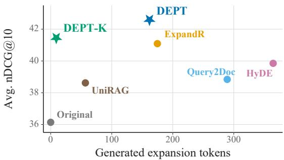
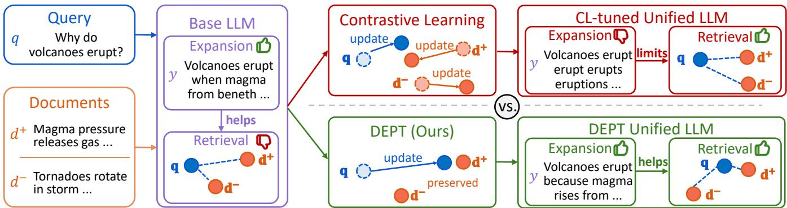
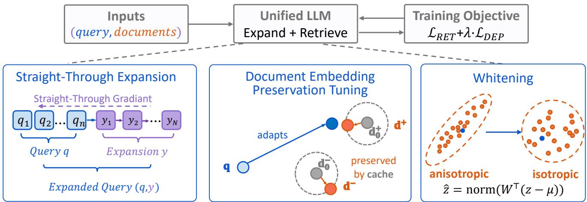
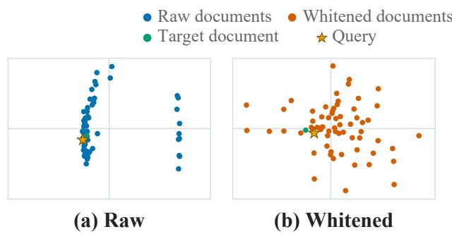
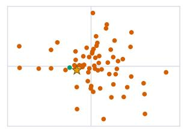
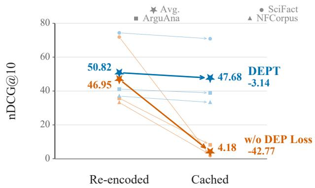
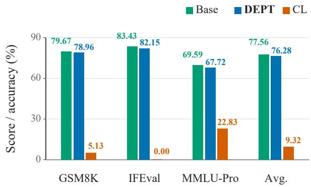

# DEPT: Document Embedding Preservation Tuning for Unified Query Expansion and Retrieval

Jingyuan Wang1, Richong Zhang1∗, Zhijie Nie1,

Mingxin Li, Yanzhao Zhang

1Beihang University, China

wangjy25@buaa.edu.cn, zhangrc@act.buaa.edu.cn

## Abstract

Large language models (LLMs) can both expand underspecified queries and encode text as dense representations, sug- gesting a unified model for query expansion and retrieval. Existing systems usually rely on prompted expansions, in- dependently trained modules, or staged optimization, leav- ing generated expansions only indirectly aligned with the re- trieval loss that judges them. We train a single decoder-only LLM end to end, where the same model generates the ex- pansion and encodes both the expanded query and candidate documents. This unified setting creates a moving-target prob- lem: retrieval supervision should improve query-side expan- sion, but the same update also shifts the document embed- dings that serve as retrieval targets. We introduce Document Embedding Preservation Tuning (DEPT), which keeps tuned document embeddings close to cached initial embeddings while allowing retrieval gradients to pass through straight- through decoding into the generator. DEPT converts joint query–document movement into query-side adaptation against approximately stable, whitened document embeddings that support index reuse and online hard-negative mining. Exper- iments with Qwen3-4B-Instruct-2507 and LLaMA-3.2-3B-Instruct on five datasets in BEIR benchmark show that DEPT improves average retrieval quality over training-free, indepen- dently trained, and staged unified baselines, while ablations isolate the efects of preservation, whitening, end-to-end ex- pansion training, and online negatives. Code is available at https://github.com/ILSparkle/DEPT.

## Introduction

Query expansion and dense retrieval solve two complementary parts of retrieval (Carpineto and Romano 2012; Karpukhin et al. 2020; Lin, Nogueira, and Yates 2021). Expansion rewrites an underspecified query into text that exposes missing entities, constraints, or topical cues, while dense retrieval maps the expanded query and documents into a vector space where relevant evidence can be found ef- ficiently. The combination is attractive because expansion makes the query more explicit and the dense retriever gives the expanded query a scalable search mechanism. The main obstacle is that these two parts are often optimized through diferent signals: expansion is judged by textual plausibility or indirect retrieval feedback, whereas the final system is judged by whether the resulting representation ranks the right documents.

  
Figure 1: Qwen3-4B-Instruct-2507 retrieval quality versus expansion length. Stars mark our methods: DEPT has the best average nDCG@10, while DEPT-K gives the short-expansion trade-of.

LLMs make this mismatch more visible and more promis- ing to address. The same model family can produce fluent expansion text and provide dense representations, so one might expect a single decoder-only LLM to learn expansions directly from the retrieval loss that evaluates them. Such a unified model would have two practical advantages. First, expansion would become a trainable retrieval action rather than a prompted preprocessing step. Second, the generated text would remain inspectable, so the retrieval decision could still be examined through the model’s textual output rather than only through an opaque vector.

Existing LLM-based expansion systems move toward this goal but stop short of the end-to-end objective. Trainingfree methods prompt an LLM to produce pseudo-documents or query augmentations, leaving the generator unchanged even when the downstream retriever fails (Gao et al. 2023; Wang, Yang, and Wei 2023). Independent-training methods such as InPars (Bonifacio et al. 2022) and Promptagator (Dai et al. 2023) improve the training signal, but the generator and retriever are still optimized through separate interfaces. Sequential systems use retrieval feedback or preference-style supervision, as in ExpandR (Yao et al. 2025), yet the gen-erator is not optimized by the final contrastive loss of the deployed retriever. Staged unified methods such as UniRAG (Li et al. 2025) reduce architectural separation, but augmentation and representation remain separate training phases. The common limitation is therefore not that generated text is useless; it is that the text-producing component is not contin- uously shaped by the same retrieval objective and embedding geometry that determine final ranking.

  
Figure 2: Alternative routes for adapting a generative LLM to unified expansion and retrieval. The base model produces useful expansions but weak retrieval representations. Conventional contrastive learning updates both query and document representations, so retrieval improves substantially but degraded expansions can limit the final gain. DEPT instead adapts the query side while preserving document representations, retaining expansion quality and yielding stronger retrieval.

Directly training the unified model, however, creates a dif- ferent failure mode. Figure 2 illustrates the choice. Before retrieval training, a base LLM can already produce useful expansions, but its dense retrieval representations are weak. Conventional contrastive learning fixes the representation problem by moving expanded queries toward relevant docu- ments and away from irrelevant ones. Because the same pa- rameters also define document embeddings and generation behavior, the update can improve ranking while changing the retrieval targets and the expansion policy at the same time. The outcome is a bottleneck rather than a complete failure: retrieval still improves, but the final gain is limited when expansion drifts away from the fluent explanatory behavior that made LLM augmentation useful in the first place.

This failure mode suggests that unified expansion and re- trieval should be asymmetric. The query side should remain plastic because the generated tokens and expanded-query representation are the parts that need to learn from retrieval feedback. The document side should instead serve as a stable target because it defines the contrastive comparison during training. As a practical benefit, the same stability can also support cached indexing at inference. With relatively fixed document targets, the retrieval objective places clearer pres-sure on the query path and expansion behavior. Without that stability, the same objective can be satisfied by moving doc-uments rather than by improving the generated query.

We introduce Document Embedding Preservation Tuning (DEPT) to implement this asymmetric training principle. DEPT keeps current document embeddings close to cached embeddings from the initial model, while allowing retrieval gradients to update expansion and the expanded-query rep- resentation. This preservation makes two additional design choices useful rather than fragile. Since raw LLM embed- dings can be anisotropic and poorly calibrated for cosine re- trieval (Ethayarajh 2019), we fit a fixed whitening transform on cached document embeddings and train in the resulting coordinate system. Because document embeddings remain close to this reference, the same cached index can support online hard-negative mining during training and index reuse at inference. Figure 1 previews the resulting trade-of: the long-expansion model reaches the best average retrieval qual- ity, while the keyword-style variant remains competitive with very short expansions.

The main contributions of this work can be summarized as follows. First, we formulate query expansion and dense re- trieval as a unified decoder-only LLM training problem, and identify document-embedding drift as the stability obstacle that prevents ordinary contrastive learning from fully ex- ploiting expansion. Second, we propose Document Embed- ding Preservation Tuning (DEPT), which uses a Document Embedding Preservation (DEP) loss, fixed whitening, online hard-negative mining, and straight-through expansion train- ing to make retrieval gradients act primarily on the query side. Third, experiments on two LLM backbones and five retrieval tasks show that DEPT achieves state-of-the-art av- erage retrieval quality among the compared query-expansion paradigms while preserving generation ability and cached- index compatibility.

## Related Work

LLM-Based Query Expansion. HyDE encodes a gener-ated hypothetical document to bridge a zero-shot query– document gap (Gao et al. 2023), while Query2Doc prompts an LLM to generate a pseudo-document that augments the original query (Wang, Yang, and Wei 2023). ExpandR uses LLM guidance to train a retriever beyond the literal query and aligns generated augmentations with retrieval prefer- ences (Yao et al. 2025). UniRAG is the closest staged unified framework: it uses a decoder-only LLM for both query aug- mentation and representation, but optimizes augmentation and encoding through separate stages (Li et al. 2025). These methods show that generated text can improve retrieval, but generation is usually optimized outside the final contrastive retrieval loss or through indirect feedback. They leave open how to stabilize retrieval targets when one shared model han- dles generation and encoding.

  
Figure 3: Overview of DEPT training. A single decoder-only LLM handles expansion and retrieval under an end-to-end retrieval objective. The lower panels detail the three mechanisms: straight-through expansion passes retrieval gradients to generated tokens, the DEP loss preserves current document embeddings near cached document embeddings from the initial model, and a fixed whitenin transform ma s embeddin s into a better-conditioned retrieval s ace.

Generative and Representational LLMs. Instructiontuned LLM embeddings show that generative models can produce strong text representations (Wang et al. 2024a). GritLM jointly trains generative and embedding objectives in a single model (Muennighof et al. 2025), establishing the broader feasibility of unifying generation and representation. Our setting adds a retrieval-specific constraint that is less vis- ible in generic multitask formulations: corpus embeddings are retrieval targets during training and can be expensive to refresh in deployment. With one model for generation and embedding, shared updates can change both query behavior and document embeddings, so end-to-end expansion train- ing must control target drift rather than treating document movement as harmless.

Representation Geometry and Stability. Transformer representations are known to be anisotropic (Ethayarajh 2019), and whitening can improve semantic similarity and retrieval by centering and decorrelating sentence embed- dings (Su et al. 2021). Whitening is commonly used as a post-processing transform for a fixed embedding model. In trainable retrieval systems, the transformed space remains valid only if embeddings stay close to the distribution used to estimate the transform.

## Method

## Preliminary

We first describe the ordinary expansion-and-retrieval pipeline before introducing training. Given a query qi, an expansion module generates a text sequence $y _ { i } =$ $( y _ { i , 1 } , \dots , y _ { i , T } )$ , where $\check { T }$ is the expansion length. The re- triever then encodes the concatenated text $[ q _ { i } ; y _ { i } ]$ and each document d from a corpus D into a shared vector space, and ranks documents by similarity to the expanded query.

Let θ denote the parameters of the encoder used by the retriever. For any token sequence x, the model produces final-layer hidden states $H ( \bar { x } ) = ( h _ { 1 } ( x ) , \ldots , h _ { | x | } \bar { ( } x ) )$ . We use one raw embedding function for both sides, defined by mean pooling followed by $\ell _ { 2 }$ normalization:

$$
\begin{array} { l } { \displaystyle \bar { h } ( \boldsymbol { x } ) = \frac { 1 } { | \boldsymbol { x } | } \sum _ { t = 1 } ^ { | \boldsymbol { x } | } h _ { t } ( \boldsymbol { x } ) , } \\ { \displaystyle f _ { \theta } ( \boldsymbol { x } ) = \frac { \bar { h } ( \boldsymbol { x } ) } { \| \bar { h } ( \boldsymbol { x } ) \| _ { 2 } } . } \end{array}\tag{1}
$$

Given a generated expansion $y _ { i } ,$ , we abbreviate the raw expanded-query embedding and the raw embedding of doc- ument d as

$$
\begin{array} { r } { \mathbf q _ { i } = f _ { \theta } ( [ q _ { i } ; y _ { i } ] ) , \qquad \mathbf d = f _ { \theta } ( d ) , } \end{array}\tag{2}
$$

where $[ q _ { i } ; y _ { i } ]$ denotes concatenation of the original query and its expansion. At inference, retrieval uses a score such as $\mathbf { q } _ { i } ^ { \top } \mathbf { d }$ to rank documents. Existing methods difer mainly in how the expansion module and retriever are obtained: the expansion may be prompted, trained separately, or trained in a stage before the final retriever. In all cases, the basic interface is the same: generated text changes the query rep- resentation, and the retriever scores it against document em- beddings. Figure 3 summarizes the resulting training graph and highlights the three mechanisms used by DEPT: straight- through expansion, document embedding preservation, and fixed whitening.

## Document Embedding Preservation Tuning

DEPT uses one decoder-only LLM for both abilities in the pipeline: it generates the expansion and also encodes ex- panded queries and documents. This single-model formula- tion is important because the expansion and representation are expressed by the same parameters, but it also creates a conflict between two roles of the model. The query side should change so that generated expansions become better retrieval actions. The document side should remain stable because it defines the retrieval targets used by the contrastive loss; cached-index reuse is a downstream benefit.

This conflict is asymmetric rather than a generic prefer- ence for small updates. The query-side generator is condi- tioned on a retrieval instruction and the input query, and the query representation is computed from the expanded in- put $[ q _ { i } ; y _ { i } ]$ . This path should be allowed to adapt, because retrieval supervision must teach the model what kind of ex- pansion improves document ranking. In contrast, documents are fed to the same model as plain document text, and their embeddings serve as the retrieval targets against which al expanded queries are judged.

This asymmetry also helps preserve generation: plain- document encoding shares the same token embeddings and transformer blocks used by document-conditioned language modeling, so keeping document embeddings close to their cached initial embeddings acts as lightweight functional re- hearsal while the instruction-conditioned query path remains free to adapt.

The conflict appears directly in the raw query–document score $r ( q _ { i } , y _ { i } , d ) = \mathbf { q } _ { i } ^ { \top }$ d. Because query and document embeddings share parameters, this score has the gradient

$$
\begin{array} { r } { \nabla _ { \theta } r ( q _ { i } , y _ { i } , d ) = \left( \nabla _ { \theta } \mathbf { q } _ { i } \right) ^ { \top } \mathbf { d } } \\ { + \mathbf { q } _ { i } ^ { \top } \left( \nabla _ { \theta } \mathbf { d } \right) . } \end{array}\tag{3}
$$

The first term is the desired query-side update: it teaches the expansion and expanded-query representation to align with relevant documents. The second term moves the document representation, creating query–document gradient interfer- ence. If both sides are left unconstrained, the model can reduce retrieval loss by reorganizing document embeddings around the current minibatch rather than learning expansions that transfer to a stable retrieval target. DEPT resolves this single-model, dual-ability conflict by keeping document em- beddings close to their cached references while leaving the query path trainable. This makes query optimization more consistent across steps: target document embeddings change slowly, so retrieval gradients are directed toward improving the expansion and query representation instead of chasing a moving corpus representation.

Freezing a separate document encoder would stabilize tar- gets but break the unified formulation. We instead regularize the quantity that matters to retrieval: the raw document em- bedding d produced from each document $d .$ Let $\theta _ { 0 }$ denote the initial model before DEPT tuning. Before training, we precompute a cached reference embedding for each training document:

$$
\begin{array} { r } { \mathbf { d } ^ { 0 } = f _ { \theta _ { 0 } } ( d ) . } \end{array}\tag{4}
$$

These cached embeddings are not updated during training.

For any training document $d ,$ define its angular drift from the cached reference embedding as

$$
\begin{array} { r } { \delta ( d ) = 1 - \cos \left( \mathbf { d } , \mathbf { d } ^ { 0 } \right) . } \end{array}\tag{5}
$$

Figure 4: Schematic illustration of whitening, visualized by projecting embeddings onto the top two principal compo-nents via PCA. Raw cached document embeddings can con- centrate along dominant directions; the fixed whitening trans- form maps them into a better-conditioned retrieval space.

Controlling this drift keeps retrieval feedback tied to an adapting expanded query rather than to arbitrarily moving tar- get document embeddings. In a training step with B queries, let $\mathcal { C } _ { i }$ be the candidate documents for query $q _ { i }$ , and let $\bar { \boldsymbol { S } } _ { i } \subseteq \mathcal { C } _ { i }$ be the documents whose current embeddings are computed, including the positive document and sampled negatives. For scale $s > 0$ and exponent $p > 1$ , we define the DEP loss as

$$
\mathcal { L } _ { \mathrm { D E P } } = \frac { 1 } { B } \sum _ { i = 1 } ^ { B } \frac { 1 } { \left| S _ { i } \right| } \sum _ { d \in S _ { i } } \left( s \delta ( d ) \right) ^ { p } .\tag{6}
$$

Here $\lambda > 0$ will control the preservation strength in the final objective. The scale s keeps small cosine deviations nu-merically visible, while $p > 1$ emphasizes large departures. Reference document embeddings $\mathbf { \dot { d } } ^ { 0 }$ receive no gradient.

Whitening Preserved Document Embeddings. The DEP loss preserves raw document embeddings, but retrieval still benefits from a better-conditioned coordinate system. Be- cause decoder-only LLM embeddings can be anisotropic, using the raw embedding geometry inherits its defects. Fig- ure 4 illustrates how whitening reduces dominant directional variance before cosine retrieval.

We therefore estimate a fixed whitening transform from cached reference document embeddings and keep this trans- form fixed throughout tuning. This design is tied to preserva- tion: whitening improves the structure of the initial document embedding distribution, and the DEP loss keeps later doc- ument embeddings close enough for the same coordinate system to remain useful. For independently trained baselines whose document embeddings continue to move, a whitening transform fitted before training would gradually cease to de- scribe the current embedding distribution and would behave mainly as an extra fixed linear map. Let $\mu$ be the empirical mean of cached document embeddings $\dot { \mathbf { d } } ^ { 0 }$ , and let $\dot { U } \Lambda U ^ { \top }$ be the eigendecomposition of their covariance matrix. With small constant $\varepsilon > 0$ and whitening strength $\alpha \in [ 0 , 1 ]$ , we define

$$
W = U ( \Lambda + \varepsilon I ) ^ { - \alpha } .\tag{7}
$$

Here I is the identity matrix, and ε prevents unstable inversion of small eigenvalues. Any raw embedding z is mapped

into the fixed whitened coordinate system by

$$
\hat { z } = \mathrm { n o r m } \big ( W ^ { \top } ( z - \mu ) \big ) .\tag{8}
$$

We write $\hat { \mathbf { q } } _ { i }$ for the whitened version of $\mathbf { q } _ { i }$ , and $\hat { \mathbf { d } }$ for the whitened version of d. Since $( \mu , W )$ is fitted from cached documents before tuning, whitening remains meaningful only if the DEP loss keeps current document embeddings close to their cached references.

## End-to-End Expansion and Retrieval Training

With stable document embeddings in place, the retrieval ob- jective can be used to train expansion and representation jointly. The role of DEPT is to make this end-to-end sig-nal selective: retrieval gradients may update expansion log- its and the expanded-query representation, while the DEP loss prevents the same updates from turning retrieval into a moving-target problem on the document side. The training set contains triples $( q _ { i } , d _ { i } ^ { + } , \mathcal { D } _ { i } ^ { - } )$ , where $q _ { i }$ is the input query, $d _ { i } ^ { + }$ is a relevant document, and $\mathcal { D } _ { i } ^ { - }$ is a pool of non-relevant or mined negative documents. For a minibatch of size $B ,$ the candidate set $\mathcal { C } _ { i }$ contains $d _ { i } ^ { + }$ , in-batch documents, and sampled negatives. The shared model first generates $y _ { i }$ from the retrieval instruction and query, then encodes $[ q _ { i } ; y _ { i } ]$ and every document in $\mathcal { C } _ { i }$

Hard token selection would sever the path between the retrieval loss and the expansion logits. We retain discrete expansions in the forward pass while using a diferentiable approximation in the backward pass. For one generation step, let $\dot { \ell } ( v )$ be the logit of vocabulary token $v \in \mathcal V$ , let K be the top-k tokens under that logit vector, and let $E ( v )$ be the embedding of token v. We compute

$$
\pi ( v ) = \frac { \exp ( \ell ( v ) ) } { \sum _ { u \in \mathcal { K } } \exp ( \ell ( u ) ) } , \qquad v \in \mathcal { K } ,\tag{9}
$$

$$
{ \widetilde { e } } = \sum _ { v \in { \mathcal { K } } } \pi ( v ) E ( v ) ,\tag{10}
$$

$$
e ^ { \mathrm { S T } } = \widetilde { e } + \mathrm { s g } ( E ( \widehat { y } ) - \widetilde { e } ) ,\tag{11}
$$

where ${ \widehat { y } } = \arg \operatorname* { m a x } _ { v \in \mathcal { V } } \ell ( v )$ is the greedy token and $\operatorname { s g } ( \cdot )$ stops gradients. Thus, $e ^ { \mathrm { S T } }$ equals the greedy token embed- ding in the forward computation, while its gradient is that of the top-k soft embedding. Applying this step at each generation position gives $( e _ { i , 1 } ^ { \mathrm { S T } } , \ldots , e _ { i , T } ^ { \mathrm { S T } } )$ . The query encoder con- sumes these expansion embeddings together with the original query, allowing retrieval gradients to update both the repre- sentation and the logits that produced the expansion. This path trains the unified generator–encoder interface: an ex- pansion is useful only if its embedding ranks the relevant document above candidates in $\mathcal { C } _ { i }$

The retrieval loss is the InfoNCE objective in this whitened space:

$$
\mathcal { L } _ { \mathrm { { R E T } } } = - \frac { 1 } { B } \sum _ { i = 1 } ^ { B } \log \frac { \exp \left( \hat { \mathbf { q } } _ { i } ^ { \intercal } \hat { \mathbf { d } } _ { i } ^ { + } / \tau \right) } { \sum _ { d \in \mathcal { C } _ { i } } \exp \left( \hat { \mathbf { q } } _ { i } ^ { \intercal } \hat { \mathbf { d } } / \tau \right) } ,\tag{12}
$$

where $\hat { \mathbf { d } } _ { i } ^ { + }$ is the whitened embedding of the positive docu- ment $d _ { i } ^ { + }$ . The final DEPT objective is

$$
\begin{array} { r } { \mathcal { L } _ { \mathrm { D E P T } } = \mathcal { L } _ { \mathrm { R E T } } + \lambda \mathcal { L } _ { \mathrm { D E P } } . } \end{array}\tag{13}
$$

Here L supplies the end-to-end learning signal, while L keeps that signal focused on query-side expansion and representation learning rather than arbitrary corpus move- ment. The loss does not match query embeddings to their initialization or freeze parameters; retrieval gradients still tra- verse query encoding, expansion, and any parameters whose updates keep document embeddings close to their cached references.

## Leveraging Stable Document Embeddings

Index Reuse. Dense retrieval normally encodes the cor-pus once and stores its vectors in a nearest-neighbor index (Karpukhin et al. 2020; Xiong et al. 2021). End-to-end tuning without preservation breaks this serving assumption: even if the tuned model improves retrieval after re-encoding all doc- uments, the index built before tuning may no longer con- tain vectors compatible with the tuned queries. DEPT is designed to avoid this mismatch. Since document embed- dings are kept close to their cached references and whiten- ing is fitted on the same cached document embeddings, the tuned expanded-query embedding can be searched against the reference document index without rebuilding the corpus. This gives a direct deployment benefit for large collections, where document encoding and index construction are often much more expensive than updating the query-side model. We evaluate this compatibility by comparing retrieval with the cached reference index against retrieval after re-encoding documents with the final model.

Online Hard-Negative Mining. The stable index also sup-ports training-time hard-negative mining. At each step, the current model produces an expansion and a whitened query embedding $\hat { \mathbf { q } } _ { i }$ . We use this query to search a fixed FAISS index built from cached whitened document embeddings, remove the positive document, and sample negatives from a high-ranking interval. The selected negative documents are then re-encoded by the current model before entering the InfoNCE denominator and the DEP loss. This procedure gives the retrieval loss query-conditioned negatives that track the current expansion behavior, while the expensive corpus index remains fixed. The sampling interval also avoids re- lying only on the nearest retrieved items, which can include mislabeled positives or overly ambiguous documents, and provides a controlled source of dificult but usable negatives throughout training.

## Experiments

## Experimental Setup

Training Data. We train on an ECHO retrieval mixture constructed from eight sources: ELI5 question answer- ing (Fan et al. 2019), FEVER (Thorne et al. 2018), Hot-potQA (Yang et al. 2018), MS MARCO document retrieval, MS MARCO passage retrieval (Nguyen et al. 2016), Natural Questions (Kwiatkowski et al. 2019), SQuAD (Rajpurkar et al. 2016), and TriviaQA (Joshi et al. 2017). Each example is converted to an instruction, query, positive document, and negative document in an E5-style format (Wang et al. 2022). The expansion prompt contains the retrieval instruction and original query; we use a keyword-style prompt for DEPT-K and a longer explanatory prompt for DEPT.

<table><tr><td>Backbone</td><td>Method</td><td>Exp. Tok.</td><td>SciFact</td><td>ArguAna</td><td>NFCorpus</td><td>FiQA</td><td>SCIDOCS</td><td>Avg.</td></tr><tr><td rowspan="6">Qwen3-4B Instruct-2507</td><td>Original Query Query2Doc</td><td>0.00 289.18</td><td>66.26 72.28</td><td>32.68</td><td>31.34</td><td>32.92</td><td>17.48</td><td>36.14</td></tr><tr><td></td><td></td><td></td><td>31.04</td><td>34.28</td><td>37.09</td><td>19.51</td><td>38.84</td></tr><tr><td>HyDE</td><td>364.50</td><td>72.16</td><td>38.91</td><td>34.16</td><td>35.16</td><td>18.86</td><td>39.85</td></tr><tr><td>ExpandR</td><td>174.82</td><td>72.66</td><td>40.74</td><td>35.62</td><td>37.41</td><td>19.02</td><td>41.09</td></tr><tr><td>UniRAG</td><td>56.86</td><td>67.28</td><td>39.08</td><td>33.54</td><td>35.35</td><td>17.83</td><td>38.62</td></tr><tr><td>DEPT-K (Ours)</td><td>9.15</td><td>73.62</td><td>40.30</td><td>35.81</td><td>37.36</td><td>20.14</td><td>41.45</td></tr><tr><td rowspan="7"></td><td>DEPT (Ours)</td><td>161.87</td><td>74.35</td><td>41.12</td><td>36.99</td><td>41.66</td><td>18.82</td><td>42.59</td></tr><tr><td>Original Query</td><td>0.00</td><td>65.85</td><td>33.98</td><td>32.55</td><td>31.94</td><td>16.60</td><td>36.18</td></tr><tr><td>Query2Doc</td><td>262.51</td><td>69.48</td><td>34.01</td><td>31.22</td><td>34.75</td><td>19.21</td><td>37.73</td></tr><tr><td>HyDE</td><td>307.38</td><td>65.30</td><td>34.84</td><td>26.89</td><td>26.15</td><td>15.61</td><td>33.76</td></tr><tr><td>ExpandR</td><td>164.86</td><td>69.28</td><td>38.02</td><td>32.40</td><td>34.17</td><td>16.96</td><td>38.17</td></tr><tr><td>UniRAG</td><td>59.18</td><td>67.73</td><td>35.61</td><td>30.29</td><td>33.57</td><td>16.35</td><td>36.71</td></tr><tr><td>DEPT-K (Ours) DEPT (Ours)</td><td>8.98 148.82</td><td>69.83 71.36</td><td>37.14 38.56</td><td>34.45 35.22</td><td>34.62 35.53</td><td>17.63 17.31</td><td>38.73 39.60</td></tr></table>

Table 1: Main retrieval results on five BEIR tasks, reported as nDCG@10. Exp. Tok. is the average number of generated expansion tokens. UniRAG denotes our reimplementation under the same backbone family and retrieval protocol. Within each backbone, the best result is bold and the second-best is underlined.

Evaluation Tasks and Metric. We evaluate zero-shot retrieval on five datasets in BEIR benchmark (Thakur et al. 2021): SciFact (Wadden et al. 2020), ArguAna (Wachsmuth, Syed, and Stein 2018), NFCorpus (Boteva et al. 2016), FiQA (Maia et al. 2018), and SCIDOCS (Cohan et al. 2020). We report nDCG@10 (Järvelin and Kekäläinen 2002) for every task and the unweighted average across tasks.

Backbones and Baselines. We instantiate every method with Qwen3-4B-Instruct-2507 and LLaMA-3.2-3B-Instruct. Training-free baselines include the original query, HyDE (Gao et al. 2023), and Query2Doc (Wang, Yang, and Wei 2023); HyDE and Query2Doc use the untrained instruction model only for expansion and the corresponding contrastive- tuned LLM retriever for encoding. ExpandR (Yao et al. 2025) represents independent expansion-and-retrieval training with separate same-backbone decoder and encoder instances. We also include UniRAG as a staged unified baseline, using our same-backbone reimplementation in which a distilled augmenter supplies text to a subsequently trained retriever but receives no final retrieval gradient. All methods use the same evaluation collections and metric.

Implementation Details. We use mean pooling and $\ell _ { 2 }$ nor-malization for all raw embeddings. DEPT-K uses a keywords- style prompt with a max-32 output limit, while DEPT uses a passage-style prompt with a 128–512-token output range; realized expansion lengths are in Table 1. Table 2 summa- rizes the main hyperparameters. Unless stated otherwise, all reported results are from a single run, and preprocessing, sampling, and training use seed 42. Training uses LoRA adaptation (Hu et al. 2022) and is conducted on four NVIDIA RTX PRO 6000 GPUs with 96GB memory per GPU.

## Results and Analysis

The experiments examine five aspects: main retrieval qual- ity, component causality, cached-index compatibility, general generation behavior, and qualitative expansion behavior. We distinguish DEPT-K, which generates short keyword-style expansions, from long-expansion DEPT.

<table><tr><td>Hyperparameter</td><td>DEPT-K</td><td>DEPT</td></tr><tr><td>Expansion prompt Keywords-style</td><td></td><td>Passage-style</td></tr><tr><td>Output limit Input length</td><td>Max 32 tokens 128–512 tokens 1,024 tokens</td><td></td></tr><tr><td>ST decoding</td><td>Top-64</td><td></td></tr><tr><td>LoRA</td><td> $r = 1 6 , \alpha = 3 2 ,$ </td><td>dropout 0.05</td></tr><tr><td>Training</td><td>1k steps, lr  $1 0 ^ { - 4 }$ </td><td>, batch 256</td></tr><tr><td>Retrieval temp.</td><td> $0 . 0 2$ </td><td></td></tr><tr><td>DEP loss</td><td></td><td></td></tr><tr><td></td><td></td><td> $\lambda = 0 . 1 , s = 1 0 0 , p = 2$ </td></tr><tr><td>Whitening</td><td>1,024 cached docs, α = 0.5</td><td></td></tr><tr><td>Online mining</td><td>Rank-5 negative</td><td></td></tr></table>

Table 2: Main hyperparameters for DEPT variants. Shared values use merged cells.

Main Results. Table 1 evaluates whether expansion im-proves when retrieval supervision trains the generator and encoder in one unified objective rather than through prompting, independent objectives, or staged unification. Long-expansion DEPT obtains the best average score with both backbones, while DEPT-K remains competitive using roughly nine generated tokens. Figure 1 shows the same trade-of on Qwen: DEPT is the highest-quality point, and DEPT-K lies on the short-expansion frontier.

The gains are not a simple length efect. Training-free methods generate longer text, but it is not optimized for the embedding-based scorer that ranks it. DEPT lets the final retrieval loss update the expansion path inside the shared model; SCIDOCS remains the boundary case, where concise topical cues can be stronger than long semantic expansions.

Ablation Study. Table 3 isolates DEPT components on Qwen. Removing the DEP loss hurts even when documents are re-encoded, showing that preservation improves opti- mization beyond cached-index reuse. Whitening is the largest individual factor, and removing expansion or detaching it as an ofline input loses the benefit of straight-through training. Overall, the DEP loss and whitening stabilize document em- beddings, while expansion training and hard negatives teach the query side to use those stable targets.

  
Figure 5: Cached-index compatibility on Qwen3-4B-Instruct-2507. Arrows show movement from re-encoded to cached-index retrieval; thick arrows are averages and pale arrows are individual datasets.

<table><tr><td>Variant</td><td>SciFact</td><td>ArguAna</td><td>NFCorpus</td><td>Avg.</td></tr><tr><td>DEPT (Ours)</td><td>74.35</td><td>41.12</td><td>36.99</td><td>50.82</td></tr><tr><td>w/o DEP Loss</td><td>71.88</td><td>35.75</td><td>33.21</td><td>46.95</td></tr><tr><td>w/o Whitening</td><td>66.31</td><td>30.58</td><td>29.37</td><td>42.09</td></tr><tr><td>w/o Online Neg.</td><td>72.79</td><td>37.81</td><td>34.20</td><td>48.27</td></tr><tr><td>w/ Detached Expansion</td><td>72.33</td><td>37.25</td><td>32.37</td><td>47.32</td></tr><tr><td>w/o Expansion</td><td>65.35</td><td>31.94</td><td>31.03</td><td>42.77</td></tr></table>

Table 3: Ablations on three BEIR tasks with Qwen3-4B-Instruct-2507, reported as nDCG@10.

Index Reuse. Figure 5 tests whether a pre-tuning docu-ment index remains usable after end-to-end training. With DEPT, cached-index retrieval stays close to re-encoding all documents with the final model. Without the DEP loss, the original index no longer contains valid keys for the tuned document encoder; preservation prevents this failure mode while allowing the query path and LoRA parameters to adapt.

Generation Ability. Figure 6 checks generation on three benchmarks (Cobbe et al. 2021; Zhou et al. 2023; Wang et al. 2024b). DEPT stays close to the base model, decreasing from 77.56 to 76.28 on average, whereas standard contrastive learning (CL) collapses to 9.32. Thus preservation improves retrieval without turning the same decoder into a narrow embedding-only model.

Case Study. Table 4 illustrates the expansion behavior behind the aggregate trends. The base model mentions relevant biomedical mechanisms but does not select them as retrieval cues, whereas standard CL and UniRAG produce degraded or repetitive strings. DEPT-K compresses the query into high- value cues, and full DEPT preserves the same mechanism in a readable explanatory form. This pattern matches the quantitative results: preservation lets the model improve re- trieval without discarding the expansion behavior that makes LLM-based retrieval inspectable.

  
Figure 6: General generation evaluation on GSM8K, IFEval, MMLU-Pro, and their average. CL denotes standard con trastive learning on the unified model.

<table><tr><td colspan="2">Query: Starving Tumors of Their Blood Supply</td></tr><tr><td>Method</td><td>Generated expansion excerpt</td></tr><tr><td>Base</td><td>... cutting off the nutrients and oxygen that tumors need ... anti-angiogenic drugs ... vascular endothelial growth factor ...</td></tr><tr><td>CL</td><td>keywords, Starving Task, Task, Starvation, StarvStarving</td></tr><tr><td>UniRAG</td><td>... Starving tumors Starving Starving tumor Star Star Star tumors ...</td></tr><tr><td>DEPT-K</td><td>Starving tumors blood supply; tumor hypoxia mechanism; angiogenesis inhibition</td></tr><tr><td>DEPT</td><td>... deprive tumors of the oxygen and nutrients they need ... anti-angiogenic drugs ... angiogenesis ...</td></tr></table>

Table 4: Expansion excerpts on one NFCorpus query; three periods mark omitted text.

## Conclusion

We studied unified LLM-based query expansion and dense retrieval, where the same decoder-only model generates retrieval-oriented expansions and encodes the candidate doc- uments that judge them. The central issue is a moving-target training dynamic: ordinary contrastive updates can improve local retrieval scores while drifting document embeddings and degrading the generator that produces the expansion. DEPT addresses this problem with document embedding preservation, fixed whitening, online hard negatives, and straight-through expansion training. Across two LLM back- bones and five BEIR tasks, it improves retrieval while pre- serving generation and cached-index compatibility, showing that unified generative and representational retrieval bene- fits from explicitly stabilizing document embeddings. This points to a simple design principle: train the query behavior aggressively, but keep document embeddings reusable.

## References

Bonifacio, L. H.; Abonizio, H.; Fadaee, M.; and Nogueira, R. 2022. InPars: Unsupervised Dataset Generation for Infor- mation Retrieval. In Proceedings of the 45th International ACM SIGIR Conference on Research and Development in Information Retrieval, 2387–2392. ACM.

Boteva, V.; Gholipour, D.; Sokolov, A.; and Riezler, S. 2016. A Full-Text Learning to Rank Dataset for Medical Informa- tion Retrieval. In Proceedings ofthe 38th European Conference on Information Retrieval. Springer.

Carpineto, C.; and Romano, G. 2012. A Survey of Automatic Query Expansion in Information Retrieval. ACM Computing Surveys, 44(1): 1:1–1:50.

Cobbe, K.; Kosaraju, V.; Bavarian, M.; Chen, M.; Jun, H.; Kaiser, L.; Plappert, M.; Tworek, J.; Hilton, J.; Nakano, R.; Hesse, C.; and Schulman, J. 2021. Training Verifiers to Solve Math Word Problems. arXiv preprint arXiv:2110.14168.

Cohan, A.; Feldman, S.; Beltagy, I.; Downey, D.; and Weld, D. 2020. SPECTER: Document-level Representation Learn- ing using Citation-informed Transformers. In Proceedings of the 58th Annual Meeting of the Association for Computational Linguistics, 2270–2282.

Dai, Z.; Zhao, V. Y.; Ma, J.; Luan, Y.; Ni, J.; Lu, J.; Bakalov, A.; Guu, K.; Hall, K. B.; and Chang, M.-W. 2023. Promp- tagator: Few-Shot Dense Retrieval From 8 Examples. In International Conference on Learning Representations.

Ethayarajh, K. 2019. How Contextual are Contextualized Word Representations? Comparing the Geometry of BERT, ELMo, and GPT-2 Embeddings. In Proceedings of the 2019 Conference on Empirical Methods in Natural Language Processing and the 9th International Joint Conference on Natural Language Processing, 55–65.

Fan, A.; Jernite, Y.; Perez, E.; Grangier, D.; Weston, J.; and Auli, M. 2019. ELI5: Long Form Question Answering. In Proceedings of the 57th Annual Meeting of the Association for Computational Linguistics, 3558–3567.

Gao, L.; Ma, X.; Lin, J.; and Callan, J. 2023. Precise Zero- Shot Dense Retrieval without Relevance Labels. In Proceedings of the 61st Annual Meeting of the Association for Computational Linguistics (Volume 1: Long Papers), 1762– 1777.

Hu, E. J.; Shen, Y.; Wallis, P.; Allen-Zhu, Z.; Li, Y.; Wang, S.; Wang, L.; and Chen, W. 2022. LoRA: Low-Rank Adaptation of Large Language Models. In International Conference on Learning Representations.

Järvelin, K.; and Kekäläinen, J. 2002. Cumulated Gain- Based Evaluation of IR Techniques. ACM Transactions on Information Systems, 20(4): 422–446.

Joshi, M.; Choi, E.; Weld, D.; and Zettlemoyer, L. 2017. TriviaQA: A Large Scale Distantly Supervised Challenge Dataset for Reading Comprehension. In Proceedings of the 55th Annual Meeting of the Association for Computational Linguistics (Volume 1: Long Papers), 1601–1611.

Karpukhin, V.; Oguz, B.; Min, S.; Lewis, P.; Wu, L.; Edunov, S.; Chen, D.; and Yih, W.-t. 2020. Dense Passage Retrieval for Open-Domain Question Answering. In Proceedings of

the 2020 Conference on Empirical Methods in Natural Language Processing, 6769–6781.

Kwiatkowski, T.; Palomaki, J.; Redfield, O.; Collins, M.; Parikh, A.; Alberti, C.; Epstein, D.; Polosukhin, I.; Devlin, J.; Lee, K.; Toutanova, K.; Jones, L.; Kelcey, M.; Chang, M.-W.; Dai, A. M.; Uszkoreit, J.; Le, Q.; and Petrov, S. 2019. Natural Questions: A Benchmark for Question Answering Research. Transactions ofthe Associationfor Computational Linguistics, 7: 452–466.

Li, R.; He, L.; Liu, Q.; Zhang, Z.; Yu, H.; Ye, Y.; Zhu, L.; and Su, Y. 2025. UniRAG: Unified Query Understanding Method for Retrieval Augmented Generation. In Proceedings of the 63rd Annual Meeting of the Association for Computational Linguistics (Volume 1: Long Papers), 14163–14178.

Lin, J.; Nogueira, R.; and Yates, A. 2021. Pretrained Transformersfor Text Ranking: BERTand Beyond. Synthesis Lectures on Human Language Technologies. Morgan & Clay- pool.

Maia, M.; Handschuh, S.; Freitas, A.; Davis, B.; McDer- mott, R.; Zarrouk, M.; and Balahur, A. 2018. WWW’18 Open Challenge: Financial Opinion Mining and Question Answering. In The Web Conference 2018. Association for Computing Machinery.

Muennighof, N.; Su, H.; Wang, L.; Yang, N.; Wei, F.; Yu, T.; Singh, A.; and Kiela, D. 2025. Generative Representational Instruction Tuning. In International Conference on Learning Representations.

Nguyen, T.; Rosenberg, M.; Song, X.; Gao, J.; Tiwary, S.; Majumder, R.; and Deng, L. 2016. MS MARCO: A Hu-man Generated Machine Reading Comprehension Dataset. In NIPS Workshop on Cognitive Computation: Integrating Neural and Symbolic Approaches.

Rajpurkar, P.; Zhang, J.; Lopyrev, K.; and Liang, P. 2016. SQuAD: 100,000+ Questions for Machine Comprehension of Text. In Proceedings ofthe 2016 Conference on Empirical Methods in Natural Language Processing, 2383–2392.

Su, J.; Cao, J.; Liu, W.; and Ou, Y. 2021. Whitening Sentence Representations for Better Semantics and Faster Retrieval. arXiv:2103.15316.

Thakur, N.; Reimers, N.; Rucklé, A.; Srivastava, A.; and Gurevych, I. 2021. BEIR: A Heterogeneous Benchmark for Zero-shot Evaluation of Information Retrieval Models. In Advances in Neural Information Processing Systems, vol-ume 34, 26804–26817.

Thorne, J.; Vlachos, A.; Christodoulopoulos, C.; and Mittal, A. 2018. FEVER: a Large-scale Dataset for Fact Extraction and VERification. In Proceedings ofthe 2018 Conference of the North American Chapter ofthe Associationfor Computational Linguistics: Human Language Technologies, Volume 1 (Long Papers), 809–819.

Wachsmuth, H.; Syed, S.; and Stein, B. 2018. Retrieval of the Best Counterargument without Prior Topic Knowledge. In Proceedings of the 56th Annual Meeting of the Association for Computational Linguistics (Volume 1: Long Papers), 241–251.

Wadden, D.; Lin, S.; Lo, K.; Wang, L. L.; van Zuylen, M.; Cohan, A.; and Hajishirzi, H. 2020. Fact or Fiction: Verifying

Scientific Claims. In Proceedings ofthe 2020 Conference on Empirical Methods in Natural Language Processing, 7534– 7550.

Wang, L.; Yang, N.; Huang, X.; Jiao, B.; Yang, L.; Jiang, D.; Majumder, R.; and Wei, F. 2022. Text Embeddings by Weakly-Supervised Contrastive Pre-training. arXiv preprint arXiv:2212.03533.

Wang, L.; Yang, N.; Huang, X.; Yang, L.; Majumder, R.; and Wei, F. 2024a. Improving Text Embeddings with Large Lan- guage Models. In Proceedings of the 62nd Annual Meeting ofthe Associationfor Computational Linguistics (Volume 1: Long Papers), 11897–11916.

Wang, L.; Yang, N.; and Wei, F. 2023. Query2doc: Query Expansion with Large Language Models. In Proceedings of the 2023 Conference on Empirical Methods in Natural Language Processing, 9414–9423.

Wang, Y.; Ma, X.; Zhang, G.; Ni, Y.; Chandra, A.; Guo, S.; Ren, W.; Arulraj, A.; He, X.; Jiang, Z.; Li, T.; Ku, M.; Wang, K.; Zhuang, A.; Fan, R.; Yue, X.; and Chen, W. 2024b. MMLU-Pro: A More Robust and Challenging Multi- Task Language Understanding Benchmark. arXiv preprint arXiv:2406.01574.

Xiong, L.; Xiong, C.; Li, Y.; Tang, K.-F.; Liu, J.; Bennett, P. N.; Ahmed, J.; and Overwijk, A. 2021. Approximate Nearest Neighbor Negative Contrastive Learning for Dense Text Retrieval. In International Conference on Learning Representations.

Yang, Z.; Qi, P.; Zhang, S.; Bengio, Y.; Cohen, W.; Salakhutdinov, R.; and Manning, C. D. 2018. HotpotQA: A Dataset for Diverse, Explainable Multi-hop Question Answering. In Proceedings of the 2018 Conference on Empirical Methods in Natural Language Processing, 2369–2380.

Yao, S.; Huang, P.; Liu, Z.; Gu, Y.; Yan, Y.; Yu, S.; and Yu, G. 2025. ExpandR: Teaching Dense Retrievers Beyond Queries with LLM Guidance. In Proceedings of the 2025 Conference on Empirical Methods in Natural Language Processing, 19036–19054.

Zhou, J.; Lu, T.; Mishra, S.; Brahma, S.; Basu, S.; Luan, Y.; Zhou, D.; and Hou, L. 2023. Instruction-Following Evalua- tion for Large Language Models. arXiv:2311.07911.