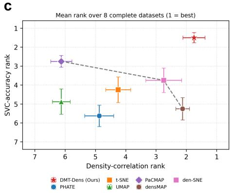
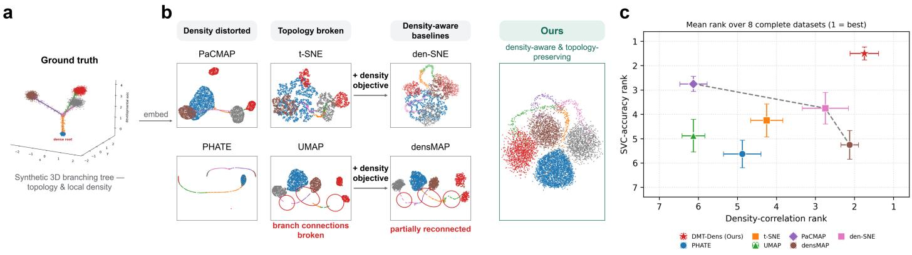
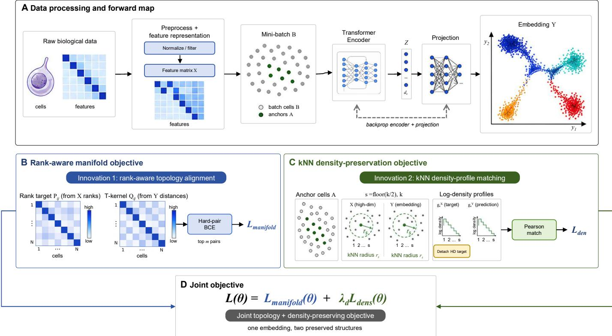
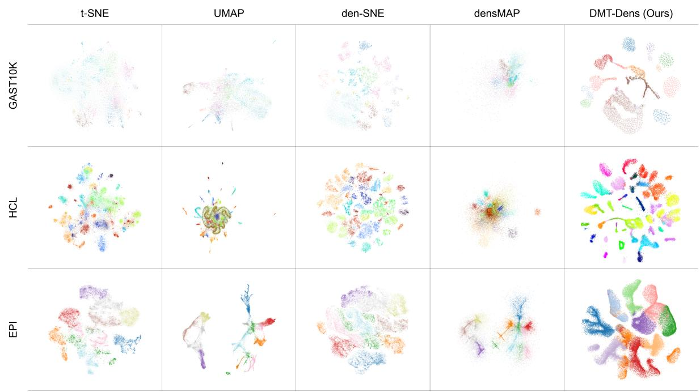
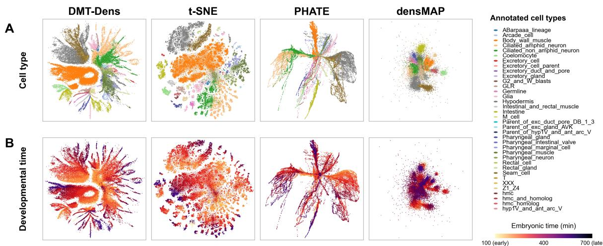
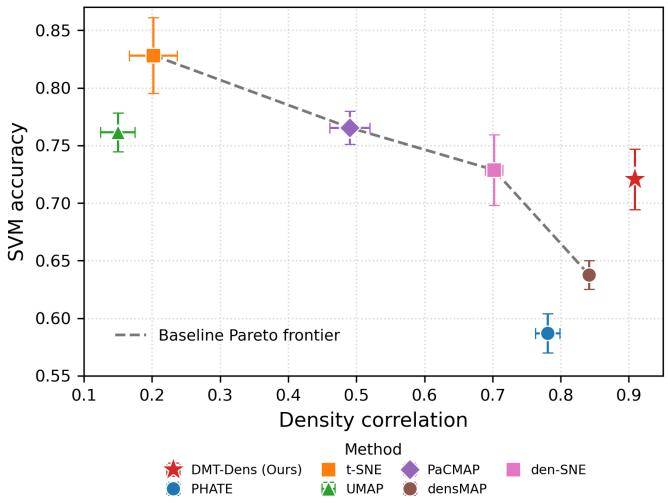
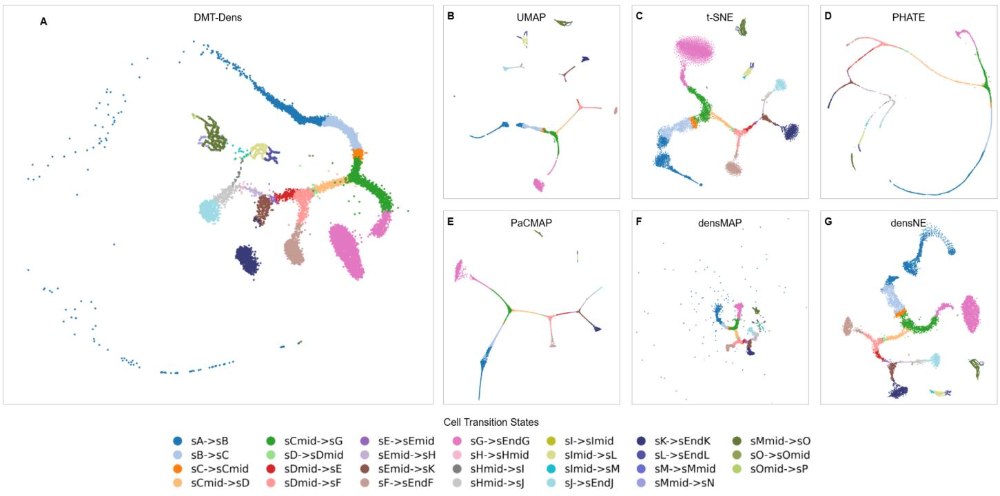
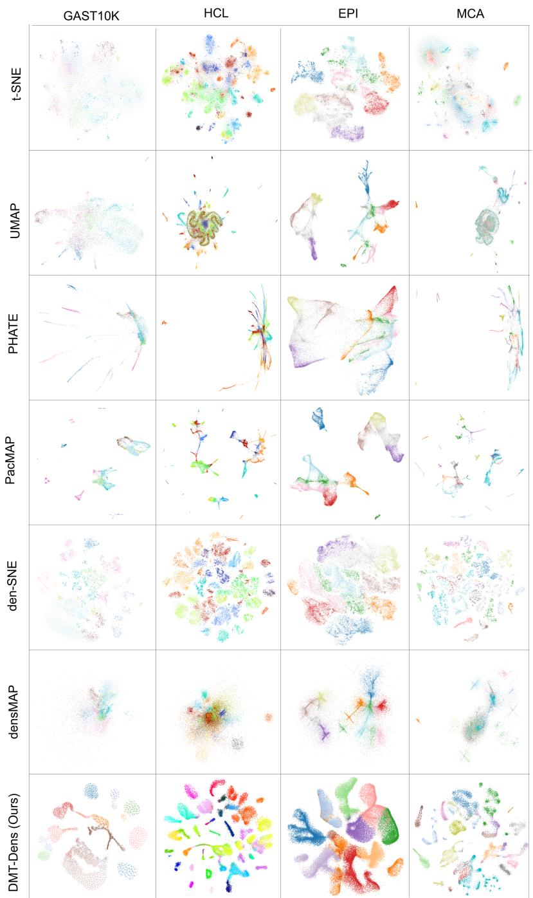
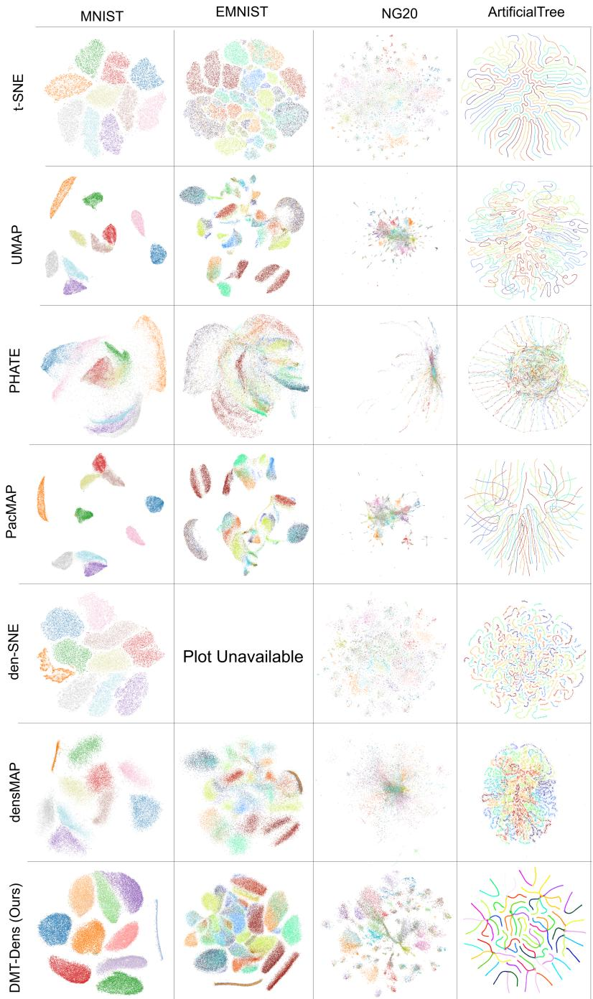

# DMT-Dens: Density-preserving manifold visualization for biological data

Ruizhe Wang,1 Yixuan Dong,1 Bolin Yang,1 Bingo Wing-Kuen Ling,1 Fuji Yang1 and Zelin Zang1,∗

1Tsientang Institute for Advanced Study, Hangzhou, Zhejiang, China

∗Corresponding author. zangzelin@gmail.com

## Abstract

Motivation: Low-dimensional embeddings are widely used to explore cell-state heterogeneity in single-cell and other high-dimensional biologicalu data. Although many methods preserve local neighborhoods, they may distort the apparent sampling density of processed observations, alteringA the visual contrast between dense and sparse regions and complicating the interpretation of rare, transitional, or continuous cell-state populations. Results: We present DMT-Dens, a parametric manifold-visualization method built on a latent-token Transformer encoder. The model integrates rank-based manifold alignment with hard-pair aggregation. To preserve density, it optimizes a loss based on the Pearson correlation between k-nearest-neighbor log-radius estimates in the processed input and two-dimensional embedding spaces. Benchmark evaluations demonstrate] strong density preservation, particularly on biological datasets, while retaining competitive label separability. Availability: Source code, data-processing scripts, and resolved experiment configurations are available at https://github.com/Ruizhe-wang/ DMT-Dens.

Contact: zangzelin@gmail.como

Supplementary information: Supplementary data are included after the main article in this arXiv version.bi

Key Messages[

• DMT-Dens targets biological visualization settings in which density fidelity and label separability are evaluated together.

• The method combines a parametric mapping and rank-based manifold alignment with an explicit kNN density-preservation loss.

• The evaluation focuses on density correlation and local density correlation; SVC accuracy is reported as a descriptive label-separability diagnostic, with neighborhood and trajectory diagnostics provided as Supplementary Material.

## Introduction

Low-dimensional visualization is widely used to explore highdimensional data. In single-cell RNA sequencing (scRNA-seq),: two-dimensional embeddings support cell-type annotation, quality control, and exploratory analysis of developmental continua andX heterogeneous cell states (Becht et al., 2019; Kobak and Berens,r for structure-preserving visualization and data integration in singlecell and spatial transcriptomics (Xu et al., 2023, 2025; Zang et al., 2025). These methods map sparse, noisy gene-expression profiles from high-dimensional space to two or three dimensions for visual inspection.

Common visualization methods do not preserve every property relevant to biological interpretation. Principal Component Analysis (PCA) provides a linear view of global variation. Nonlinear neighborembedding methods such as t-Distributed Stochastic Neighbor Embedding (t-SNE) and Uniform Manifold Approximation and Projection (UMAP) instead emphasize local structure and often produce clearly separated groups (van der Maaten and Hinton, 2008; McInnes et al., 2018; Becht et al., 2019). However, cluster area and spread in these embeddings do not reliably reflect cellstate abundance or transcriptional variability (Nguyen and Holmes, 2019; Chari and Pachter, 2023; Kobak and Berens, 2019). t-SNE may expand densely sampled regions and contract sparse parts of continuous trajectories (Narayan et al., 2021; Kobak and Berens, 2019), whereas UMAP may exaggerate population separation and alter local density (Chari and Pachter, 2023; Kobak and Linderman, 2021). Here, density refers specifically to the sample density of the processed input representation. Experimental sampling determines which cells enter that representation, and tissue dissociation can induce transcriptional changes before density is calculated (van den Brink et al., 2017). Feature selection, normalization, and dimensionality-reduction steps such as PCA further define the geometry in which density is measured. Although processed-input density is not a calibrated measure of biological abundance, it is an empirical structural property presented to the visualization method. Preserving this relative density prevents the projection from introducing additional distortion and allows concentration and dispersion in the embedding to reflect the analyzed representation more faithfully (Narayan et al., 2021).

  
Figure 1 Motivation for density-preserving biological visualization. a, Ground-truth synthetic three-dimensional branching tree with a dense root, sparse transitions, and multiple branch points, colored by branch identity. b, Two-dimensional embeddings of the same data. The displayed baseline embeddings difer in local density, apparent continuity, and adjacency. Adding a density objective to t-SNE and UMAP yields the density-aware baselines den-SNE and densMAP. The red outlines mark apparent disconnections in this representative UMAP embedding and their partial reconnection in densMAP. In the displayed DMT-Dens embedding, density variation and continuous paths are visually retained. c, Density preservation versus label separability across the benchmark datasets. Each point shows the mean rank of one method over the eight datasets with complete baseline coverage (density-correlation rank versus SVC-accuracy rank), and whiskers show the standard error across datasets. The dashed curve marks the Pareto frontier of the baseline methods.

den-SNE and densMAP address density distortion by adding density-preservation terms to the t-SNE and UMAP objectives, respectively (Narayan et al., 2021). These methods improve density fidelity, but remain non-parametric and inherit the neighborhood-afinity objectives of their parent methods: pairwise probabilistic afinities in t-SNE/den-SNE and a fuzzy neighbor graph in UMAP/densMAP. Consequently, manifold organization is still governed by the corresponding parent attraction–repulsion formulation, with density preservation added to the inherited structural objective. This leaves a more specific methodological gap: an explicit parametric model that jointly learns neighborhoodrank structure and the relative density profile of the processed observations. Such joint optimization is relevant because biological data are often modeled as lying on a low-dimensional, nonlinear manifold whose observation density is nonuniform (Bunne et al., 2023; Biondo et al., 2025; Narayan et al., 2021). Within this scope, faithful sample-density visualization provides a controlled basis for examining heterogeneous and transitional regions while distinguishing projection-induced distortion from variation already present in the analyzed data.

We developed DMT-Dens to address this gap. Its primary contribution is an explicit density loss that aligns k-nearestneighbor log-radius profiles between the processed input and the two-dimensional embedding. This loss is optimized within a parametric deep manifold-transformation model (Xu et al., 2023). The accompanying manifold objective represents neighborhood relations by rank afinity and emphasizes hard pairs during optimization. These mechanisms support neighborhood organization while the density term targets relative concentration and dispersion. Bidirectional afinity construction and two-scale density aggregation are additional refinements of the full objective.

To determine whether DMT-Dens improves density fidelity while retaining useful label and neighborhood structure, we compare its two-dimensional representations with those produced by t-SNE (van der Maaten and Hinton, 2008), UMAP (McInnes et al., 2018), den-SNE and densMAP (Narayan et al., 2021), PaCMAP (Wang et al., 2021), and PHATE (Moon et al., 2019). The evaluation metrics, baseline settings, and hyperparameter-search protocol are described in the Methods and Supplementary Material. Under this common protocol, DMT-Dens achieves the highest density correlation on all four biological datasets and on six of the nine datasets overall, while its linear SVC accuracy ranks among the top two methods on seven datasets. Ablation experiments identify the density loss as the main source of improved density fidelity. Supplementary analyses of synthetic dyngen trajectories (Cannoodt et al., 2021) and a Caenorhabditis elegans developmental time course (Packer et al., 2019) provide an exploratory assessment of topology- and time-related diagnostics.

## 2 Material and methods

## 2.1 Problem definition

Let $\mathbf { X } = [ \mathbf { x } _ { 1 } ^ { \top } , \ldots , \mathbf { x } _ { N } ^ { \top } ] ^ { \top } \in \mathbb { R } ^ { N \times D }$ denote an input matrix with N observations and D features, where $\mathbf { x } _ { i } \in \mathbb { R } ^ { D }$ is observation i. For single-cell data, an observation is a cell represented by processed geneexpression measurements or a derived feature vector. The formulation also covers the image, text, and sensor data used in our experiments. The encoder $e _ { \phi } : \mathbb { R } ^ { D } \to \mathbb { R } ^ { 4 0 }$ maps $\mathbf { x } _ { i }$ to a 40-dimensional latent representation $\mathbf { z } _ { i } = e _ { \phi } ( \mathbf { x } _ { i } )$ . The projection module $p _ { \psi } : \mathbb { R } ^ { 4 0 }  \mathbb { R } ^ { 2 }$ maps z to a two-dimensional coordinate $\mathbf { y } _ { i } = p _ { \psi } ( \mathbf { z } _ { i } )$ . We denote the full mapping by $f _ { \theta } = p _ { \psi } \circ e _ { \phi }$ , with $\theta = ( \phi , \psi )$ , and collect the coordinates in $\mathbf { Y } = [ \mathbf { y } _ { 1 } ^ { \top } , \ldots , \mathbf { y } _ { N } ^ { \top } ] ^ { \top } \in \mathbb { R } ^ { N \times 2 }$

We optimize the map toward two objectives. (i) Manifold preservation: the manifold-alignment loss encourages the embedding to retain relative neighborhood orderings from feature space. If x is closer to $\mathbf { x } _ { j }$ than to $\mathbf { x } _ { k }$ , the loss favors the corresponding ordering between ${ \bf y } _ { i } , { \bf y } _ { j }$ , and $\mathbf { y } _ { k }$ . (ii) Density preservation: the density loss encourages agreement between local-density profiles in feature and embedding spaces, helping to maintain the visual contrast between dense and sparse regions.

  
Figure 2 DMT-Dens architecture and training objective. (A) A latent-token Transformer encoder and projection module map the input matrix X to the embedding Y. For each observation, the encoder forms a fixed set of latent tokens, applies self-attention within the token set, and pools the result into a 40-dimensional representation for two-dimensional projection. (B) The manifold-preservation loss derives bidirectional rank afinities $P _ { i j }$ from paired inputspace views. Binary cross-entropy matches these targets to cross-view Student t-kernel afinities $Q _ { i j }$ over selected hard pairs. (C) The density-preservation loss compares kNN log-density profiles $g _ { s } ^ { X }$ and $g _ { s } ^ { Y }$ across anchor observations at scales $s \in \{ \lfloor k / 2 \rfloor , k \}$ . Stop-gradient is applied to the input-space profile. (D) The final objective is $\mathcal { L } ( \boldsymbol { \theta } ) = \mathcal { L } _ { \mathrm { m a n i f o l d } } ( \boldsymbol { \theta } ) \bar { + } \lambda _ { d } \mathcal { L } _ { \mathrm { d e n s } } ( \boldsymbol { \theta } )$ ; its gradients update the encoder and projection module.

We express these objectives through a manifold-preservation loss $\mathcal { L } _ { \mathrm { m a n i f o l d } }$ and a density-preservation loss ${ \mathcal { L } } _ { \mathrm { d e n s } }$ . The model parameters are estimated by minimizing their weighted sum,

$$
\begin{array} { r } { \mathcal { L } ( \theta ) = \mathcal { L } _ { \mathrm { m a n i f o l d } } ( \theta ) + \lambda _ { d } \mathcal { L } _ { \mathrm { d e n s } } ( \theta ) , } \end{array}\tag{1}
$$

where $\lambda _ { d } \geq 0$ controls the contribution of the density term.

## 2.2 Latent-token Transformer encoder

The encoder $e _ { \phi }$ represents each observation with a fixed number of latent tokens. Self-attention operates within this token set and is not applied directly across input features or observations. The attention sequence length is independent of the input dimension $D ,$ and the embedding of an observation does not depend on other observations in its inference batch. We first normalize each input using

$$
\begin{array} { r } { \overline { { \bf x } } _ { i } = \mathrm { B N } _ { \mathrm { i n } } ( \bf x _ { i } ) . } \end{array}\tag{2}
$$

A learned linear map compresses the normalized feature vector into M latent vectors of width $r ,$

$$
\mathbf { S } _ { i } = \mathrm { r e s h a p e } ( \mathbf { W } _ { c } \overline { { \mathbf { x } } } _ { i } , M , r ) \in \mathbb { R } ^ { M \times r } ,\tag{3}
$$

where $\mathbf { W } _ { c } \in \mathbb { R } ^ { M r \times D }$ . Each vector is independently expanded to the token width $d _ { t }$ and assigned a learned latent-identity embedding,

$$
\mathbf T _ { i , m } ^ { ( 0 ) } = \mathbf S _ { i , m } \mathbf E _ { m } + \mathbf a _ { m } , \qquad m = 1 , \ldots , M ,\tag{4}
$$

where $\mathbf { E } _ { m } ~ \in ~ \mathbb { R } ^ { r \times d _ { t } }$ and $\mathbf { a } _ { m } ~ \in ~ \mathbb { R } ^ { d _ { t } }$ . The resulting token matrix $\mathbf { T } _ { i } ^ { ( 0 ) } \in \mathbb { R } ^ { M \times d _ { t } }$ has the same size for datasets with diferent feature dimensions.

The tokens are processed by L pre-normalized Transformer blocks (Vaswani et al., 2017). For block ℓ, the updates are

$$
\mathbf { U } _ { i } ^ { ( \ell ) } = \mathbf { T } _ { i } ^ { ( \ell - 1 ) } + \mathrm { M S A } _ { \ell } \left( \mathrm { L N } _ { \ell , 1 } ( \mathbf { T } _ { i } ^ { ( \ell - 1 ) } ) \right) ,\tag{5}
$$

$$
\mathbf { T } _ { i } ^ { ( \ell ) } = \mathbf { U } _ { i } ^ { ( \ell ) } + \mathrm { F F N } _ { \ell } \left( \mathrm { L N } _ { \ell , 2 } ( \mathbf { U } _ { i } ^ { ( \ell ) } ) \right) ,\tag{6}
$$

where MSA denotes multi-head self-attention over the M tokens of one observation, and FFN is a two-layer feed-forward network with GELU activation. The encoder uses neither labels nor crossobservation attention. After the final block, we average the layernormalized tokens and map the pooled vector to 40 dimensions,

$$
\mathbf { h } _ { i } = \frac { 1 } { M } \sum _ { m = 1 } ^ { M } \mathrm { L N } _ { \mathrm { o u t } } \left( \mathbf { T } _ { i , m } ^ { ( L ) } \right) ,\tag{7}
$$

$$
\mathbf { z } _ { i } = \mathrm { B N } _ { \mathrm { o u t } } ( \mathbf { W } _ { o } \mathbf { h } _ { i } + \mathbf { b } _ { o } ) .\tag{8}
$$

The projection module produces $\mathbf { y } _ { i } = p _ { \psi } ( \mathbf { z } _ { i } )$ . Our final configuration uses $M = 3 2 , r = 1 6 , d _ { t } = 2 2 4 , L = 2 .$ and four attention heads. The feed-forward hidden width is $4 d _ { t } ;$ attention and residual dropout are set to zero. Attention cost is determined by the fixed token count M and does not scale quadratically with the original feature dimension $D .$

## 2.3 Manifold-preservation loss

Each mini-batch yields two paired views,

$$
\boldsymbol { \mathcal { B } } ^ { ( a ) } = \{ \mathbf { x } _ { i } ^ { ( a ) } \} _ { i = 1 } ^ { B } , \qquad \boldsymbol { \mathcal { B } } ^ { ( b ) } = \{ \mathbf { x } _ { i } ^ { ( b ) } \} _ { i = 1 } ^ { B } ,\tag{9}
$$

where $\begin{array} { r l r } { { \bf x } _ { i } ^ { ( a ) } } & { { } = } & { { \bf x } _ { i } } \end{array}$ is the original observation and $\mathbf { x } _ { i } ^ { ( b ) }$ is a neighborhood-augmented version. To form the augmented view, we project the full preprocessed dataset onto $D _ { \mathrm { p c a } }$ principal components and build an approximate $K _ { \mathrm { a u g } } .$ -nearest-neighbor graph after excluding self-matches. These PCA coordinates are used only for neighbor search. For each sampled observation, we draw an index $j _ { i } ^ { \mathrm { a u g } }$ uniformly from its $K _ { \mathrm { a u g } }$ graph neighbors and interpolate in the original preprocessed feature space,

$$
\mathbf { x } _ { i } ^ { ( b ) } = \alpha _ { i } \mathbf { x } _ { i } + \left( 1 - \alpha _ { i } \right) \mathbf { x } _ { j _ { i } ^ { \mathrm { a u g } } } , \qquad \alpha _ { i } \sim \mathrm { U n i f o r m } ( \alpha _ { \mathrm { m i n } } , \alpha _ { \mathrm { m a x } } ) .\tag{10}
$$

The vectors ${ \bf x } _ { i } ^ { ( a ) } , { \bf x } _ { j _ { i } ^ { \mathrm { a u g } } }$ , and $\mathbf { x } _ { i } ^ { ( b ) }$ all lie in the original D-dimensional preprocessed feature space. PCA does not alter the vectors used in the distance calculations below. Each observation contributes one augmented vector, giving B vectors in each view. For the nine-dataset benchmark, $K _ { \mathrm { a u g } } = 2 0 0 , D _ { \mathrm { p c a } } = 6 4 , \alpha _ { \mathrm { m i n } } = 0 . 0 5$ , and $\alpha _ { \operatorname* { m a x } } = 1$ Parameter settings that difer in the case studies are reported in the Supplementary Material. The shared mapping fθ processes both views to produce paired two-dimensional embeddings,

$$
\mathbf { y } _ { i } ^ { ( a ) } = f _ { \theta } ( \mathbf { x } _ { i } ^ { ( a ) } ) , \qquad \mathbf { y } _ { i } ^ { ( b ) } = f _ { \theta } ( \mathbf { x } _ { i } ^ { ( b ) } ) .\tag{11}
$$

Before computing embedding-space afinities, we standardize each coordinate within each view. For view $v ~ \in ~ \{ a , b \}$ and coordinate $r \in \{ 1 , 2 \}$ , let ${ \widetilde { y } } _ { i , r } ^ { ( v ) } = ( y _ { i , r } ^ { ( v ) } - \mu _ { r } ^ { ( v ) } ) / \sigma _ { r } ^ { ( v ) }$ , where $\mu _ { r } ^ { ( v ) }$ and $\sigma _ { r } ^ { ( v ) }$ are the mini-batch mean and standard deviation. These statistics are held constant during backpropagation. We write the standardized embedding as $\widetilde { \mathbf { y } } _ { i } ^ { ( v ) } = ( \widetilde { y } _ { i , 1 } ^ { ( v ) } , \widetilde { y } _ { i , 2 } ^ { ( v ) } ) ^ { \top }$

We define the raw cross-view squared Euclidean distance in the input space as

$$
\Delta _ { i j } ^ { a b } = \left\| \mathbf { x } _ { i } ^ { ( a ) } - \mathbf { x } _ { j } ^ { ( b ) } \right\| _ { 2 } ^ { 2 } .\tag{12}
$$

The augmentation generally makes $\Delta _ { i i } ^ { a b }$ nonzero. To treat matched observations as nearest across views, we floor of-diagonal squared distances at $\varepsilon _ { \mathrm { d i s t } } > 0$ and set the paired diagonal to zero:

$$
d _ { i j } ^ { a b } = \left\{ \begin{array} { l l } { \operatorname* { m a x } ( \Delta _ { i j } ^ { a b } , \varepsilon _ { \mathrm { d i s t } } ) , } & { i \neq j , } \\ { 0 , } & { i = j . } \end{array} \right.\tag{13}
$$

For each ${ \bf x } _ { i } ^ { ( a ) }$ , let $\pi _ { i } ^ { a  b } ( j )$ be the ordinal rank of $\mathbf { x } _ { j } ^ { ( b ) }$ after sorting $\{ d _ { i j } ^ { a b } \} _ { j = 1 } ^ { B }$ in ascending order. For a fixed i, the index j ranges over the B augmented vectors in the mini-batch. The $K _ { \mathrm { a u g } }$ candidates used to construct $\mathbf { x } _ { i } ^ { ( b ) }$ are not part of this ranking. Ranks are zerobased, so $\pi _ { i } ^ { a  b } ( j ) \in \{ 0 , \ldots , B - 1 \}$ . For tied of-diagonal distances, torch.argsort assigns distinct consecutive ranks in its returned order; average ranks are not used. Since $d _ { i i } ^ { a b } = 0$ and all of-diagonal entries are positive, the paired diagonal has rank 0. The reverse rank $\pi _ { j } ^ { b  a } ( i )$ is defined in the same way by sorting distances from $\mathbf { x } _ { j } ^ { ( b ) }$ to the observations in the first view.

The directional rank afinities are defined as

$$
P _ { i j } ^ { a  b } = \eta ^ { \pi _ { i } ^ { a  b } ( j ) } , \qquad P _ { i j } ^ { b  a } = \eta ^ { \pi _ { j } ^ { b  a } ( i ) } ,\tag{14}
$$

where $\eta \in ( 0 , 1 )$ controls afinity decay with rank. The paired diagonal has rank 0 in both directions, giving $P _ { i i } ^ { a  b } = P _ { i i } ^ { b  a } = 1$ . We combine

the two directional afinities using their geometric mean,

$$
P _ { i j } = \operatorname* { m a x } \Bigl ( \sqrt { P _ { i j } ^ { a  b } P _ { i j } ^ { b  a } } , \varepsilon _ { \mathrm { a f f } } \Bigr ) ,\tag{15}
$$

where $\varepsilon _ { \mathrm { a f f } } > 0$ is a numerical floor. This construction gives $P _ { i i } = 1$ and encodes the bidirectional neighborhood ranks of cross-view pairs. The afinity matrix P is held fixed during optimization.

Let

$$
\delta _ { i j } ^ { a b } = \left\| \widetilde { \mathbf { y } } _ { i } ^ { ( a ) } - \widetilde { \mathbf { y } } _ { j } ^ { ( b ) } \right\| _ { 2 }\tag{16}
$$

denote the distance between the standardized embeddings of the two views. The corresponding Student t-kernel value is

$$
\widetilde { Q } _ { i j } = \left( 1 + \frac { ( \delta _ { i j } ^ { a b } ) ^ { 2 } } { \nu } \right) ^ { - ( \nu + 1 ) / 2 } ,\tag{17}
$$

where $\nu > 0$ controls the tail weight of the kernel. The embeddingspace afinity is obtained by row normalization,

$$
Q _ { i j } = { \frac { { \widetilde { Q } } _ { i j } } { \sum _ { \ell \neq i } { \widetilde { Q } } _ { i \ell } } } .\tag{18}
$$

Pairwise binary cross-entropy matches the input-space targets to the embedding-space afinities,

$$
\ell _ { i j } = - \left[ P _ { i j } \log ( Q _ { i j } + \varepsilon _ { \mathrm { B C E } } ) + ( 1 - P _ { i j } ) \log ( 1 - Q _ { i j } + \varepsilon _ { \mathrm { B C E } } ) \right] ,\tag{19}
$$

where $\varepsilon _ { \mathrm { B C E } } ~ > ~ 0$ stabilizes the logarithms. The pointwise loss measures the mismatch between an input-space rank afinity and its embedding-space counterpart.

Hard-pair selection retains the cross-view pairs with the largest pointwise losses. For each i, let $\tau _ { i }$ be the m-th largest value in $\{ \ell _ { i j } \} _ { j = 1 } ^ { B }$ , where $m = \operatorname* { m i n } ( m _ { 0 } , B )$ , and define $\mathcal { M } _ { i } = \left\{ j : \ell _ { i j } \geq \tau _ { i } \right\}$ We use |·| for set cardinality, so |M | is the number of indices retained for observation i. The threshold gives $| { \mathcal { M } } _ { i } | \geq m$ , with equality when no losses are tied at $\tau _ { i } .$ . The full set of retained pairs is

$$
\mathcal { M } = \{ ( i , j ) : j \in \mathcal { M } _ { i } \} .\tag{20}
$$

The manifold-preservation loss is then defined as

$$
\mathcal { L } _ { \mathrm { m a n i f o l d } } = \frac { 1 } { \left| \mathcal { M } \right| } \sum _ { ( i , j ) \in \mathcal { M } } \ell _ { i j } .\tag{21}
$$

The mini-batch loss is consequently concentrated on cross-view relationships with the largest current mismatch between $P _ { i j }$ and $Q _ { i j } .$

The manifold-preservation loss integrates bidirectional rank targets, Student t-kernel similarities, and hard-pair aggregation. It is optimized jointly with the density-preservation loss in Eq. (1).

## 2.4 Density-preservation loss

We estimate local density using k-nearest-neighbor (kNN) radii. For a reference index set R and a query $a \in \mathcal { R }$ , define the input- and embedding-space radii as

$$
\begin{array} { r l } & { r _ { s } ^ { X } ( a , \mathcal { R } ) = \mathrm { O S } _ { s } \left( \{ \| \mathbf { x } _ { a } - \mathbf { x } _ { j } \| _ { 2 } : j \in \mathcal { R } \setminus \{ a \} \} \right) , } \\ & { } \\ & { r _ { s } ^ { Y } ( a , \mathcal { R } ) = \mathrm { O S } _ { s } \left( \{ \| \mathbf { y } _ { a } - \mathbf { y } _ { j } \| _ { 2 } : j \in \mathcal { R } \setminus \{ a \} \} \right) , } \end{array}\tag{22}
$$

where $\mathrm { O S } _ { s }$ denotes the s-th smallest value. The query is excluded from both reference neighborhoods. In a space of ambient dimension $d ,$ let $n _ { \mathcal { R } } = | \mathcal { R } | - 1$ be the number of eligible reference observations and $V _ { d } ~ = ~ \pi ^ { d / 2 } / \Gamma ( d / 2 + 1 )$ the volume of the unit d-ball. The classical estimator is $\hat { f } _ { k } ( { \bf x } _ { a } ) = k / [ n \mathcal { R } V _ { d } r _ { k } ( { \bf x } _ { a } , \mathcal { R } ) ^ { d } ] ;$ in the input space, $r _ { k } ( \mathbf { x } _ { a } , \mathcal { R } ) ~ = ~ r _ { k } ^ { X } ( a , \mathcal { R } )$ . Supplementary Section S2 gives the derivation. Our density loss uses the Pearson correlation between input- and embedding-space log-density vectors. Under this correlation, the terms for sample size, neighbor count, and ambient dimension contribute only an additive constant and a positive scale factor. We use the resulting dimension-free quantity

$$
\log \hat { f } _ { k } ( \mathbf { x } _ { a } ) \propto - \log r _ { k } ^ { X } ( a , \mathcal { R } ) .\tag{23}
$$

In the implementation, the zero self-distance occupies the first position in each query-to-reference distance row, so the radius is the (s+1)-th smallest entry.

## 2.5 Training objective and optimization

The dimension-free log-density in Eq. (23) increases from sparse to dense regions. We compare the input- and embedding-space profiles using Pearson correlation. Within a mini-batch of B observations, the correlation is evaluated on a random anchor subset $A \subseteq \{ 1 , \ldots , B \}$ of size $A \ = \ \operatorname* { m i n } ( A _ { 0 } , B )$ . We use two neighborhood scales, $s =$ $\{ \lfloor k / 2 \rfloor , k \}$

Let $\mathcal { R } _ { B } = \{ 1 , \ldots , B \}$ be the common reference index set for the original observations and their current embeddings. For each anchor $a \in { \mathcal { A } }$ and scale $s \in S ,$ , define

$$
g _ { s , a } ^ { X } = \mathrm { s g } \big [ - \log \big ( r _ { s } ^ { X } ( a , \mathcal { R } _ { B } ) + \varepsilon _ { \log } \big ) \big ] ,\tag{24}
$$

$$
g _ { s , a } ^ { Y } = - \log \left( r _ { s } ^ { Y } ( a , \mathcal { R } _ { B } ) + \varepsilon _ { \log } \right) .\tag{25}
$$

Here, $\varepsilon _ { \mathrm { l o g } } > 0$ stabilizes the logarithm. The stop-gradient operator satisfies sg[ $\mathbf { \psi } _ { t } ] ~ = ~ \mathbf { \psi } _ { u }$ in the forward pass and $\partial \mathrm { s g } [ u ] / \partial u = 0 .$ . Let $\mathbf { g } _ { s } ^ { X } = ( g _ { s , a } ^ { X } ) _ { a \in \mathcal { A } }$ and $\mathbf { g } _ { s } ^ { Y } = ( g _ { s , a } ^ { Y } ) _ { a \in \mathcal { A } }$ be the anchor-indexed logdensity vectors at scale s, and let $\rho ( \mathbf { u } , \mathbf { v } )$ denote their Pearson correlation. The density-preservation loss averages one minus this correlation across scales,

$$
\mathcal { L } _ { \mathrm { d e n s } } = \frac { 1 } { | \cal { S } | } \sum _ { s \in \cal { S } } \left[ 1 - \rho \big ( \mathbf { g } _ { s } ^ { Y } , \mathbf { g } _ { s } ^ { X } \big ) \right] .\tag{26}
$$

We compute the correlation by centering each vector and normalizing by its $\ell _ { 2 }$ norm: $\rho ( \mathbf { u } , \mathbf { v } ) = \langle \mathbf { u } - { \bar { u } } , \mathbf { v } - { \bar { v } } \rangle / \big ( \| \mathbf { u } - { \bar { u } } \| \| \mathbf { v } - { \bar { v } } \| + \varepsilon _ { \rho } \big )$ . A single-scale version retains only $s = k ;$ the ablation study evaluates the contribution of using both scales in ${ \boldsymbol { s } } .$

We jointly optimize the manifold- and density-preservation losses using Eq. (1), with density weight $\lambda _ { d } \geq 0$

## 2.6 Model implementation

Unless noted otherwise, we train each model for 1000 epochs with AdamW, an initial learning rate of $1 \times 1 0 ^ { - 3 }$ , cosine learning-rate annealing, mixed precision, and a batch size of 4096. The benchmark configuration uses $A _ { 0 } ~ = ~ 5 1 2 , ~ \lambda _ { d } ~ = ~ 1 . 8 ~ \times ~ 1 0 ^ { - 3 }$ , and $k \ = \ 1 2$ Complete implementation settings and computational measurements are reported in the Supplementary Material.

## 2.7 Datasets

The main benchmark contains nine datasets: a synthetic branching dataset, four scRNA-seq datasets, two image datasets, a text dataset, and a sensor dataset. Supplementary Table S1 summarizes these datasets together with the C. elegans (CELEGAN) developmental case study. The biological data comprise HCL (Han et al., 2020), MCA (Han et al., 2018), GAST10K (Zhang et al., 2019), EPI, and CELEGAN (Packer et al., 2019); they cover cell-type atlases, lesion-associated epithelial states, and developmental trajectories. We reserve CELEGAN for the developmental case study because it includes both cell-type and embryonic-time annotations. A separately generated synthetic dyngen trajectory appears only in Supplementary Section S7.1.

## 2.8 Baselines and evaluation metrics

We compare DMT-Dens with six dimensionality-reduction methods: t-SNE (van der Maaten and Hinton, 2008), UMAP (McInnes et al., 2018; Becht et al., 2019), PaCMAP (Wang et al., 2021), PHATE (Moon et al., 2019), den-SNE, and densMAP (Narayan et al., 2021). Baseline settings and hyperparameter search grids are reported in the Supplementary Material.

The main evaluation considers density preservation and label separability. Following the convention used for den-SNE and densMAP (Narayan et al., 2021), density correlation is the Spearman correlation between local radii in the high-dimensional space and the embedding. Each radius is the mean distance to the k nearest neighbors. The evaluation is computed on the full dataset. The training loss uses k-th-neighbor log-radii and Pearson correlation evaluated on mini-batch anchors at two scales. Label separability is measured by the stratified five-fold cross-validated accuracy of a linear support-vector classifier (SVC) fitted to the two-dimensional embedding. The Supplementary Material reports additional measures of local fidelity, global distance, runtime, and biological trajectory structure.

## 2.9 Ablation design

We conducted single-factor ablations on EPI, HCL, and MNIST. Relative to the full model, four variants use distance afinity, unidirectional matching, all-pair averaging, or only the density scale s = k. A fifth variant removes density regularization. All other settings, including the architecture, augmentation, optimizer, batch size, 1000-epoch schedule, and dataset-specific hyperparameters, are held fixed. Each variant uses the same three seeds. We report density correlation, kNN preservation, and SVC accuracy.

## 3 Results

## 3.1 Quantitative results

Table 1 compares the density correlation and SVC accuracy of DMT-Dens and six baseline methods across nine benchmark datasets. Results are reported over five seeds, and den-SNE is marked OOT on EMNIST because its runtime was 24 h+. Local density correlation and additional embedding-quality metrics are provided in the Supplementary Material.

Based on the reported means, DMT-Dens had the highest density correlation on ArtificialTree, HCL, GAST10K, EPI, MCA, and EMNIST. den-SNE had the highest value on MNIST and ACT, and densMAP had the highest value on NG20. DMT-Dens ranked first or second in mean SVC accuracy on seven datasets and third on MNIST and EMNIST.

A. Density correlation

Table 1 Main comparison on density preservation and label separability. Higher is better for both metrics, and the best (highest) value in each row is shown in bold. Entries report mean±standard deviation over available seeds. The final row of each panel reports the unweighted mean over all nine datasets; this mean is omitted for den-SNE because its EMNIST run did not complete. OOT (out of time) denotes a runtime of 24 h+; this applies to den-SNE on the full EMNIST (byclass, ≈698K points) benchmark.
<table><tr><td rowspan="2">Type</td><td rowspan="2">Dataset</td><td rowspan="2">t-SNE</td><td rowspan="2">UMAP</td><td rowspan="2">A. Density correlation</td><td rowspan="2">densMAP</td><td rowspan="2">PaCMAP</td><td rowspan="2">PHATE</td><td rowspan="2">DMT-Dens</td></tr><tr><td>den-SNE</td></tr><tr><td>Synthetic</td><td>ArtificialTree</td><td> $0 . 8 1 2 \pm 0 . 0 1 0$ </td><td> $0 . 6 2 6 \pm 0 . 0 3 4$ </td><td> $0 . 5 7 5 \pm 0 . 0 3 1$ </td><td> $0 . 7 4 6 \pm 0 . 0 3 1$ </td><td> $0 . 6 5 3 \pm 0 . 0 2 8$ </td><td> $- 0 . 1 8 8 \pm 0 . 0 9 8$ </td><td> $\mathbf { 0 . 9 5 4 \pm 0 . 0 0 4 }$ </td></tr><tr><td rowspan="4">Biological</td><td>HCL</td><td> $0 . 1 1 0 \pm 0 . 0 2 0$ </td><td> $0 . 0 3 6 \pm 0 . 0 3 1$ </td><td> $0 . 7 1 8 \pm 0 . 0 1 7$ </td><td> $0 . 5 3 1 \pm 0 . 0 1 5$ </td><td> $0 . 0 8 3 \pm 0 . 0 3 1$ </td><td> $0 . 3 8 2 \pm 0 . 0 0 9$ </td><td> $\mathbf { 0 . 8 7 0 \pm 0 . 0 0 3 }$ </td></tr><tr><td>GAST10K</td><td> $0 . 0 6 1 \pm 0 . 0 3 8$ </td><td> $- 0 . 1 5 6 \pm 0 . 0 1 7$ </td><td> $0 . 7 8 6 \pm 0 . 0 1 1$ </td><td> $0 . 7 9 8 \pm 0 . 0 1 5$ </td><td> $- 0 . 5 3 0 \pm 0 . 0 1 9$ </td><td> $0 . 1 6 9 \pm 0 . 0 2 0$ </td><td> $\mathbf { 0 . 8 7 2 \pm 0 . 0 0 8 }$ </td></tr><tr><td>EPI</td><td> $0 . 2 2 2 \pm 0 . 0 3 5$ </td><td> $0 . 0 8 6 \pm 0 . 0 2 9$ </td><td> $0 . 7 0 5 \pm 0 . 0 1 1$ </td><td> $0 . 7 1 2 \pm 0 . 0 1 2$ </td><td> $0 . 1 2 4 \pm 0 . 0 2 5$ </td><td> $0 . 2 4 3 \pm 0 . 0 1 6$ </td><td> $\mathbf { 0 . 7 9 2 \pm 0 . 0 1 4 }$ </td></tr><tr><td>MCA</td><td> $0 . 4 1 6 \pm 0 . 0 2 5$ </td><td> $0 . 1 1 2 \pm 0 . 0 1 2$ </td><td> $0 . 3 2 7 \pm 0 . 0 1 5$ </td><td> $0 . 4 6 6 \pm 0 . 0 1 9$ </td><td> $- 0 . 0 0 1 \pm 0 . 0 3 2$ </td><td> $- 0 . 0 2 8 \pm 0 . 0 3 1$ </td><td> $\mathbf { 0 . 6 4 4 \pm 0 . 0 6 8 }$ </td></tr><tr><td></td><td>MNIST</td><td> $0 . 2 9 6 \pm 0 . 0 4 8$ </td><td> $- 0 . 0 8 1 \pm 0 . 0 2 0$ </td><td> $\mathbf { 0 . 7 6 8 \pm 0 . 0 1 4 }$ </td><td> $0 . 7 5 6 \pm 0 . 0 2 0$ </td><td> $- 0 . 0 2 0 \pm 0 . 0 4 0$ </td><td> $0 . 1 5 2 \pm 0 . 0 2 2$ </td><td> $0 . 7 0 0 \pm 0 . 0 2 8$ </td></tr><tr><td rowspan="4">Non-biological</td><td>EMNIST</td><td> $0 . 2 4 1 \pm 0 . 0 2 5$ </td><td> $0 . 0 2 5 \pm 0 . 0 2 5$ </td><td>OOT</td><td> $0 . 6 0 0 \pm 0 . 0 2 2$ </td><td> $0 . 0 9 4 \pm 0 . 0 1 8$ </td><td> $0 . 1 6 6 \pm 0 . 0 4 3$ </td><td> $\mathbf { 0 . 6 7 8 \pm 0 . 0 1 5 }$ </td></tr><tr><td>NG20</td><td> $0 . 3 8 6 \pm 0 . 0 2 9$ </td><td> $0 . 2 8 1 \pm 0 . 0 2 1$ </td><td> $0 . 7 5 8 \pm 0 . 0 0 7$ </td><td> $\mathbf { 0 . 7 9 7 \pm 0 . 0 1 0 }$ </td><td> $0 . 1 9 0 \pm 0 . 0 3 7$ </td><td> $0 . 6 0 9 \pm 0 . 0 1 5$ </td><td></td></tr><tr><td>ACT</td><td> $0 . 3 5 5 \pm 0 . 0 5 1$ </td><td> $0 . 1 4 7 \pm 0 . 0 3 7$ </td><td> $\mathbf { 0 . 9 0 2 \pm 0 . 0 0 7 }$ </td><td> $0 . 8 4 0 \pm 0 . 0 1 1$ </td><td> $0 . 1 3 5 \pm 0 . 0 4 3$ </td><td> $0 . 3 9 4 \pm 0 . 0 9 3$ </td><td> $0 . 6 7 4 \pm 0 . 0 1 7$   $0 . 8 3 2 \pm 0 . 0 0 7$ </td></tr><tr><td></td><td></td><td></td><td></td><td></td><td></td><td></td><td>0.780</td></tr><tr><td>Mean</td><td colspan="8">0.322 0.120 0.694 0.081 0.211</td></tr><tr><td>Type</td><td></td><td></td><td></td><td>B. SVC accuracy</td><td></td><td></td><td></td><td></td></tr><tr><td></td><td>Dataset</td><td>t-SNE</td><td>UMAP</td><td>den-SNE</td><td>densMAP</td><td>PaCMAP</td><td>PHATE</td><td>DMT-Dens</td></tr><tr><td>Synthetic</td><td>ArtificialTree</td><td> $\mathbf { 0 . 8 4 8 \pm 0 . 0 1 9 }$ </td><td> $0 . 5 4 8 \pm 0 . 0 2 2$ </td><td> $0 . 5 8 9 \pm 0 . 0 3 5$ </td><td> $0 . 6 1 0 \pm 0 . 0 2 0$ </td><td> $0 . 6 7 2 \pm 0 . 0 2 6$ </td><td> $0 . 2 2 7 \pm 0 . 0 6 4$ </td><td> $0 . 7 9 6 \pm 0 . 0 2 2$ </td></tr><tr><td rowspan="4">Biological</td><td>HCL</td><td> $0 . 6 0 1 \pm 0 . 0 2 0$ </td><td> $0 . 3 0 4 \pm 0 . 0 1 9$ </td><td> $0 . 7 5 2 \pm 0 . 0 3 2$ </td><td> $0 . 2 8 2 \pm 0 . 0 0 4$ </td><td> $0 . 7 5 5 \pm 0 . 0 1 4$ </td><td> $0 . 3 3 7 \pm 0 . 0 2 9$ </td><td> $\mathbf { 0 . 7 8 1 \pm 0 . 0 1 5 }$ </td></tr><tr><td>GAST10K</td><td> $0 . 6 5 4 \pm 0 . 0 1 4$ </td><td> $0 . 5 9 7 \pm 0 . 0 2 6$ </td><td> $0 . 7 7 0 \pm 0 . 0 5 1$ </td><td> $0 . 5 9 3 \pm 0 . 0 1 3$ </td><td> $0 . 7 7 2 \pm 0 . 0 2 4$ </td><td> $0 . 7 3 6 \pm 0 . 0 1 6$ </td><td> $\mathbf { 0 . 7 9 2 \pm 0 . 0 3 1 }$ </td></tr><tr><td>EPI</td><td> $0 . 8 3 9 \pm 0 . 0 1 2$ </td><td> $0 . 8 4 8 \pm 0 . 0 1 0$ </td><td> $0 . 8 3 1 \pm 0 . 0 2 6$ </td><td> $0 . 8 4 3 \pm 0 . 0 1 0$ </td><td> $0 . 8 5 8 \pm 0 . 0 1 2$ </td><td> $0 . 7 8 8 \pm 0 . 0 0 4$ </td><td> $\mathbf { 0 . 8 8 4 \pm 0 . 0 2 2 }$ </td></tr><tr><td>MCA</td><td> $0 . 4 3 5 \pm 0 . 0 1 8$ </td><td> $0 . 3 2 6 \pm 0 . 0 2 5$ </td><td> $\mathbf { 0 . 8 0 7 \pm 0 . 0 2 3 }$ </td><td> $0 . 2 9 0 \pm 0 . 0 1 4$ </td><td> $0 . 6 0 3 \pm 0 . 0 3 1$ </td><td></td><td></td></tr><tr><td></td><td></td><td></td><td></td><td></td><td></td><td></td><td> $0 . 7 1 3 \pm 0 . 0 1 6$ </td><td> $0 . 7 7 4 \pm 0 . 0 5 9$ </td></tr><tr><td rowspan="4">Non-biological</td><td>MNIST</td><td></td><td> $\mathbf { 0 . 9 6 2 \pm 0 . 0 0 3 }$ </td><td></td><td> $0 . 9 4 5 \pm 0 . 0 0 4$ </td><td> $0 . 9 5 9 \pm 0 . 0 0 2$ </td><td> $0 . 7 0 6 \pm 0 . 0 3 2$ </td><td> $0 . 9 5 0 \pm 0 . 0 0 7$ </td></tr><tr><td>EMNIST</td><td> $0 . 9 3 1 \pm 0 . 0 0 6$ </td><td></td><td> $0 . 9 2 2 \pm 0 . 0 0 7$ </td><td></td><td> $0 . 6 2 6 \pm 0 . 0 1 2$ </td><td></td><td></td></tr><tr><td>NG20</td><td> $0 . 6 0 1 \pm 0 . 0 2 0$ </td><td> $\mathbf { 0 . 6 5 5 \pm 0 . 0 0 8 }$ </td><td>OOT</td><td> $0 . 6 4 6 \pm 0 . 0 1 2$ </td><td> $0 . 2 4 5 \pm 0 . 0 2 1$ </td><td> $0 . 4 6 8 \pm 0 . 0 0 5$ </td><td> $0 . 6 3 9 \pm 0 . 0 0 8$ </td></tr><tr><td></td><td> $0 . 1 9 8 \pm 0 . 0 3 3$ </td><td> $0 . 2 1 9 \pm 0 . 0 0 8$ </td><td> $0 . 2 9 4 \pm 0 . 0 2 1$ </td><td> $0 . 2 6 4 \pm 0 . 0 1 7$ </td><td></td><td> $0 . 2 3 9 \pm 0 . 0 1 9$ </td><td> $\mathbf { 0 . 2 9 7 \pm 0 . 0 3 4 }$ </td></tr><tr><td></td><td>ACT</td><td> $0 . 8 5 9 \pm 0 . 0 0 7$ </td><td> $0 . 8 2 3 \pm 0 . 0 1 9$ </td><td> $0 . 8 3 1 \pm 0 . 0 1 6$ </td><td> $0 . 8 1 1 \pm 0 . 0 3 2$ </td><td> $0 . 8 4 2 \pm 0 . 0 1 5$ </td><td> $0 . 7 8 3 \pm 0 . 0 2 1$ </td><td> $\mathbf { 0 . 8 7 6 \pm 0 . 0 0 3 }$ </td></tr><tr><td></td><td></td><td></td><td></td><td></td><td>0.587</td><td>0.704</td><td></td><td></td></tr><tr><td></td><td></td><td>0.663</td><td>0.587</td><td></td><td></td><td></td><td></td><td>0.754</td></tr><tr><td></td><td></td><td></td><td></td><td></td><td></td><td></td><td></td><td></td></tr><tr><td></td><td></td><td></td><td></td><td></td><td></td><td></td><td></td><td></td></tr><tr><td>Mean</td><td></td><td></td><td></td><td></td><td></td><td></td><td></td><td></td></tr><tr><td></td><td></td><td></td><td></td><td></td><td></td><td></td><td></td><td></td></tr><tr><td></td><td></td><td></td><td></td><td></td><td></td><td></td><td></td><td></td></tr><tr><td></td><td></td><td></td><td></td><td></td><td></td><td></td><td>0.555</td><td></td></tr><tr><td></td><td></td><td></td><td></td><td></td><td></td><td></td><td></td><td></td></tr><tr><td></td><td></td><td></td><td></td><td></td><td></td><td></td><td></td><td></td></tr><tr><td></td><td></td><td></td><td></td><td></td><td></td><td></td><td></td><td></td></tr><tr><td></td><td></td><td></td><td></td><td></td><td></td><td></td><td></td><td></td></tr><tr><td></td><td></td><td></td><td></td><td></td><td></td><td></td><td></td><td></td></tr><tr><td></td><td></td><td></td><td></td><td></td><td></td><td></td><td></td><td></td></tr><tr><td></td><td></td><td></td><td></td><td></td><td></td><td></td><td></td><td></td></tr><tr><td></td><td></td><td></td><td></td><td></td><td></td><td></td><td></td><td></td></tr><tr><td></td><td></td><td></td><td></td><td></td><td></td><td></td><td></td><td></td></tr><tr><td></td><td></td><td></td><td></td><td></td><td></td><td></td><td></td><td></td></tr><tr></table>

Figure 1c reports the mean density-correlation and SVC-accuracy ranks over the eight datasets with complete results for all methods. EMNIST was excluded because the den-SNE runtime was 24 h+. DMT-Dens had the lowest mean rank for both metrics and lay on the Pareto frontier when all seven methods were considered. Among the baselines, densMAP and den-SNE had the two lowest mean densitycorrelation ranks, while PaCMAP and den-SNE had the two lowest mean SVC-accuracy ranks.

## 3.2 Biological embedding visualizations

than those of the full model. This variant attained the highest kNN preservation on MNIST and the highest SVC accuracy on HCL and MNIST. Replacing rank afinity with distance afinity lowered all three metrics relative to the full model. The unidirectional variant increased kNN preservation on every dataset and attained the highest values on EPI and HCL, while its density correlation remained below that of the full model. The single-scale-density variant also had lower density correlation than the full model and its SVC accuracy increased on EPI and decreased slightly on HCL and MNIST.

Figure 3 displays the two-dimensional embeddings produced by DMT-Dens, t-SNE, UMAP, den-SNE, and densMAP for GAST10K, HCL, and EPI. Points are colored by the cell-type annotations used for evaluation. Within the DMT-Dens panels, local point density difers across annotated populations, with both compact and difuse regions visible in GAST10K, HCL, and EPI. The full seven-method comparison for all datasets is provided in Supplementary Figure S2.

Using the mean of density correlation and SVC accuracy, the full model obtained the highest value among the six settings on EPI, HCL, and MNIST. No ablation variant exceeded the full model on all three reported metrics for any dataset.

## 3.4 Biological case study

## 3.3 Ablation results

Table 2 reports the ablations described in Section 2.9. Across the three datasets, all-pair averaging produced the highest mean density correlation, together with the lowest mean kNN preservation and SVC accuracy. Removing density regularization produced the opposite pattern: density correlation was the lowest among the six settings, whereas kNN preservation and SVC accuracy were higher

We evaluated DMT-Dens on the C. elegans embryonic time course (CELEGAN) (Packer et al., 2019). Each cell has a celltype annotation and an embryonic-time annotation recorded as a discrete interval in minutes after fertilization. Figure 4 displays the embeddings colored separately by these two annotations. Figure 5 reports density correlation and SVC accuracy. Supplementary Section S7.2 and Supplementary Table S11 report pseudotime correlation, ordering accuracy, time continuity, DEMaP, and the reachable fraction of cells. Pseudotime correlation and ordering accuracy are computed on the reachable subset when an embedding graph is fragmented, and the corresponding reachable fractions are reported in the same table.

Figure 3 Two-dimensional embeddings of three single-cell datasets. Rows correspond to GAST10K, HCL, and EPI, and columns correspond to t-SNE, UMAP, den-SNE, densMAP, and DMT-Dens. Points are colored by cell type, and axis limits are matched across methods within each dataset. DMT-Dens is shown in the rightmost column. Supplementary Figure S2 includes MCA, PHATE, and PaCMAP.  
  
Figure 4 Two-dimensional embeddings of the C. elegans embryonic time-course data produced by DMT-Dens, t-SNE, PHATE, and densMAP. (A) Embeddings colored by annotated cell type. (B) The same embeddings colored by observed developmental time. Quantitative developmental-time metrics are reported in Supplementary Table S11.

Table 2 Ablation results on EPI, HCL, and MNIST. Each row changes one component of the full model at a time, as defined in Section 2.9. Dens., kNN, and SVC denote density correlation, kNN preservation, and SVC accuracy, respectively. Entries report mean±sample standard deviation over three matched seeds (42–44). Higher is better, and the highest value in each dataset–metric column is shown in bold.
<table><tr><td>Setting</td><td colspan="3">EPI</td><td colspan="3">HCL</td><td colspan="3">MNIST</td></tr><tr><td></td><td>Dens.</td><td>kNN</td><td>SVC</td><td>Dens.</td><td>kNN</td><td>SVC</td><td>Dens.</td><td>kNN</td><td>SVC</td></tr><tr><td colspan="10">Remove or replace one component of Full</td></tr><tr><td>Full</td><td> $0 . 8 1 7 \pm 0 . 0 0 1$ </td><td> $0 . 1 5 5 \pm 0 . 0 0 2$ </td><td> $0 . 8 8 5 \pm 0 . 0 1 9$ </td><td> $0 . 8 6 3 \pm 0 . 0 0 3$ </td><td> $0 . 0 9 2 \pm 0 . 0 0 1$ </td><td> $0 . 7 9 0 \pm 0 . 0 3 0$ </td><td> $0 . 6 9 7 \pm 0 . 0 0 3$ </td><td> $0 . 3 1 0 \pm 0 . 0 0 2$ </td><td> $0 . 9 5 0 \pm 0 . 0 0 1$ </td></tr><tr><td>Distance affinity</td><td> $0 . 6 7 4 \pm 0 . 0 0 2$ </td><td> $0 . 1 0 8 \pm 0 . 0 0 0$ </td><td> $0 . 7 3 6 \pm 0 . 0 0 4$ </td><td> $0 . 8 1 8 \pm 0 . 0 0 4$ </td><td> $0 . 0 6 2 \pm 0 . 0 0 3$ </td><td> $0 . 4 8 5 \pm 0 . 0 1 0$ </td><td> $0 . 6 0 7 \pm 0 . 0 4 3$ </td><td> $0 . 2 5 0 \pm 0 . 0 0 3$ </td><td> $0 . 7 4 5 \pm 0 . 0 1 2$ </td></tr><tr><td>Unidirectional</td><td> $0 . 7 6 5 \pm 0 . 0 1 7$ </td><td> $\mathbf { 0 . 1 6 6 \pm 0 . 0 0 2 }$ </td><td> $0 . 8 7 0 \pm 0 . 0 4 8$ </td><td> $0 . 8 4 4 \pm 0 . 0 0 5$ </td><td> $\mathbf { 0 . 1 0 1 \pm 0 . 0 0 1 }$ </td><td> $0 . 8 0 1 \pm 0 . 0 0 2$ </td><td> $0 . 6 7 3 \pm 0 . 0 0 6$ </td><td> $0 . 3 1 3 \pm 0 . 0 0 1$ </td><td> $0 . 9 5 2 \pm 0 . 0 0 3$ </td></tr><tr><td>All-pair</td><td> $\mathbf { 0 . 9 0 5 \pm 0 . 0 0 2 }$ </td><td> $0 . 0 3 5 \pm 0 . 0 0 5$ </td><td>0.447 ± 0.011 0.960 ± 0.002</td><td></td><td> $0 . 0 2 8 \pm 0 . 0 0 1$ </td><td> $0 . 3 8 0 \pm 0 . 0 2 6$ </td><td> $\mathbf { 0 . 8 9 6 \pm 0 . 0 1 1 }$ </td><td> $0 . 1 1 7 \pm 0 . 0 2 0$ </td><td> $0 . 6 9 1 \pm 0 . 0 6 7$ </td></tr><tr><td>Single-scale density</td><td> $0 . 7 9 1 \pm 0 . 0 1 1$ </td><td> $0 . 1 5 3 \pm 0 . 0 0 3$ </td><td> $\mathbf { 0 . 9 0 6 \pm 0 . 0 0 8 }$ </td><td> $0 . 8 6 0 \pm 0 . 0 0 4$ </td><td> $0 . 0 9 2 \pm 0 . 0 0 1$ </td><td> $0 . 7 8 8 \pm 0 . 0 0 6$ </td><td> $0 . 6 8 3 \pm 0 . 0 1 0$ </td><td> $0 . 3 0 9 \pm 0 . 0 0 1$ </td><td> $0 . 9 4 3 \pm 0 . 0 0 4$ </td></tr><tr><td>No density</td><td> $0 . 2 1 1 \pm 0 . 0 0 7$ </td><td> $0 . 1 6 2 \pm 0 . 0 0 1$ </td><td> $0 . 9 0 4 \pm 0 . 0 0 8$ </td><td> $0 . 0 6 8 \pm 0 . 0 3 4$ </td><td> $0 . 0 9 7 \pm 0 . 0 0 2$ </td><td> $\mathbf { 0 . 8 4 2 \pm 0 . 0 0 3 }$ </td><td> $- 0 . 0 5 4 \pm 0 . 0 4 1$ </td><td> $\mathbf { 0 . 3 4 0 \pm 0 . 0 0 1 }$ </td><td> $\mathbf { 0 . 9 5 5 \pm 0 . 0 0 1 }$ </td></tr></table>

  
Figure 5 Density correlation versus SVC accuracy on the C. elegans case study $( \mathsf { m e a n } \pm \mathsf { s . d . }$ over five seeds). The dashed line marks the baseline Pareto frontier. DMT-Dens had a mean density correlation of 0.909 and a mean SVC accuracy of 0.721; the highest baseline values for these metrics were 0.841 for densMAP and 0.828 for t-SNE, respectively.

## 3.5 Supplementary results

Supplementary Table S9 reports additional embedding metrics, and Supplementary Figures S2 and S3 show the full seven-method embedding comparisons. Supplementary Tables S3–S5 report the analyses of the density weight λd, neighborhood scale k, and number of density anchors. Runtime and peak GPU memory for DMT-Dens are reported in Supplementary Tables S6 and S7.

Supplementary Section S7.1 reports results for all methods on synthetic single-cell data generated with dyngen (Cannoodt et al., 2021). The simulation provides the trajectory topology, branch assignments, and simulation time.

## 4 Discussion

DMT-Dens integrates rank-afinity manifold alignment, hard-pair optimization, and an explicit density-consistency regularizer. Across the benchmark datasets, the resulting embeddings showed high density correlation, particularly on the biological datasets, while remaining competitive in SVC accuracy. The ablation results distinguish the roles of the objective components. Removing density regularization markedly reduced density correlation, whereas all-pair averaging increased density correlation but lowered kNN preservation and SVC accuracy. Unidirectional matching and single-scale density estimation produced dataset-dependent changes. No ablation improved all three metrics within any dataset, indicating that density fidelity, neighborhood preservation, and label separability are related but distinct objectives.

Nonlinear projections can alter local point density and the apparent extent of cell populations (Narayan et al., 2021; Chari and Pachter, 2023). The density-consistency term penalizes disagreement between density estimates in the processed input and the embedding, encouraging compact and difuse regions in two dimensions to follow the corresponding input-space variation. For rare transition cells (Zhou et al., 2021) and continuous diferentiation processes (Setty et al., 2019), this information complements neighborhood structure and annotation-based views of the embedding.

The meaning of the retained density requires care. DMT-Dens operates on the processed input data, whose density reflects experimental sampling and preprocessing. Tissue dissociation can also induce transcriptional changes (van den Brink et al., 2017). The area occupied by a population should therefore be interpreted as observed sample density, not as a calibrated estimate of biological abundance. This distinction is especially important for rare and transitional states, which are sensitive to sampling variation. Continuous cell-state density estimators such as Mellon (Otto et al., 2024) ofer a basis for evaluating alternative density definitions.

The current formulation retains two user-specified choices: the neighborhood scale and the density-loss weight. Their efects varied across datasets in the sensitivity analyses, motivating further study of adaptive neighborhood selection and data-dependent loss calibration. The dyngen evaluation also shows that density fidelity and trajectory recovery need not align: DMT-Dens led the density metrics, while t-SNE and den-SNE attained the highest Branch SVC and topology fidelity, respectively. Density-aware projections should therefore be evaluated alongside topology-specific criteria when trajectory structure is central to the analysis. The parametric mapping supports projection of new samples, and the density regularizer could be evaluated in other parametric projection models (Xu et al., 2023). Further work should also test its interaction with trajectory-inference (Saelens et al., 2019; Wolf et al., 2019) and RNA-velocity-based fate-mapping workflows (Bergen et al., 2020; Lange et al., 2022).

DMT-Dens provides a parametric approach for retaining relative density patterns while balancing neighborhood structure and label separability. Its embeddings remain representations of sampled and preprocessed data, and their biological interpretation should explicitly account for technical and sampling efects. Evaluation on larger datasets and in downstream tasks is needed to establish when improved density fidelity changes biological analyses.

## Conflicts of interest

The authors declare no competing interests.

## Funding

Funding information will be added in the final version.

## Data availability

All datasets used in this work are publicly available. Source code and reproducible scripts are available at https://github.com/ Ruizhe-wang/DMT-Dens.

## Author contributions statement

Author contributions will be completed after the author list is finalized.

## Acknowledgments

Acknowledgments will be added in the final version.

## References

E. Becht, L. McInnes, J. Healy, C.-A. Dutertre, I. W. H. Kwok, L. G. Ng, F. Ginhoux, and E. W. Newell. Dimensionality reduction for visualizing single-cell data using UMAP. Nature Biotechnology, 37(1):38–44, 2019. doi: 10.1038/nbt.4314.

V. Bergen, M. Lange, S. Peidli, F. A. Wolf, and F. J. Theis. Generalizing rna velocity to transient cell states through dynamical modeling. Nature Biotechnology, 38(12):1408–1414, 2020. doi: 10.1038/s41587-020-0591-3.

M. Biondo, N. Cirone, F. Valle, S. Lazzardi, M. Caselle, and M. Osella. The intrinsic dimension of gene expression during cell diferentiation. Nucleic Acids Research, 53(16):gkaf805, 2025. doi: 10.1093/nar/gkaf805.

C. Bunne, S. G. Stark, G. Gut, J. Sarabia del Castillo, M. Levesque, K.-V. Lehmann, L. Pelkmans, A. Krause, and G. R¨atsch. Learning single-cell perturbation responses using neural optimal transport. Nature Methods, 20(11):1759–1768, 2023. doi: 10.1038/s41592-023-01969-x.

R. Cannoodt, W. Saelens, L. Deconinck, and Y. Saeys. Spearheading future omics analyses using dyngen, a multimodal simulator of single cells. Nature Communications, 12 (1):3942, 2021. doi: 10.1038/s41467-021-24152-2.

T. Chari and L. Pachter. The specious art of single-cell genomics. PLOS Computational Biology, 19(8):e1011288, 2023. doi: 10. 1371/journal.pcbi.1011288.

X. Han, R. Wang, Y. Zhou, L. Fei, H. Sun, S. Lai, A. Saadatpour, Z. Zhou, H. Chen, F. Ye, D. Huang, Y. Xu, W. Huang, M. Jiang, X. Jiang, J. Mao, Y. Chen, C. Lu, J. Xie, Q. Fang, Y. Wang, R. Yue, T. Li, H. Huang, S. H. Orkin, G.-C. Yuan, M. Chen, and G. Guo. Mapping the mouse cell atlas by Microwell-Seq. Cell, 172(5):1091–1107, 2018. doi: 10.1016/ j.cell.2018.02.001.

X. Han, Z. Zhou, L. Fei, H. Sun, R. Wang, Y. Chen, H. Chen, J. Wang, H. Tang, W. Ge, Y. Zhou, F. Ye, M. Jiang, J. Wu, Y. Xiao, X. Jia, T. Zhang, X. Ma, Q. Zhang, X. Bai, S. Lai, C. Yu, L. Zhu, R. Lin, Y. Gao, M. Wang, Y. Wu, J. Zhang, R. Zhan, S. Zhu, H. Hu, C. Wang, M. Chen, H. Huang, T. Liang, J. Chen, W. Wang, D. Zhang, and G. Guo. Construction of a human cell landscape at singlecell level. Nature, 581(7808):303–309, 2020. doi: 10.1038/ s41586-020-2157-4.

D. Kobak and P. Berens. The art of using t-sne for single-cell transcriptomics. Nature Communications, 10(1):5416, 2019. doi: 10.1038/s41467-019-13056-x.

D. Kobak and G. C. Linderman. Initialization is critical for preserving global data structure in both t-SNE and UMAP. Nature Biotechnology, 39(2):156–157, 2021. doi: 10.1038/ s41587-020-00809-z.

M. Lange, V. Bergen, M. Klein, M. Setty, B. Reuter, M. Bakhti, S. L¨uck, M. Ansari, J. Schniering, H. B. Schiller, S. Peidli, F. A. Wolf, and F. J. Theis. Cellrank for directed single-cell fate mapping. Nature Methods, 19(2):159–170, 2022. doi: 10. 1038/s41592-021-01346-6.

L. McInnes, J. Healy, and J. Melville. UMAP: Uniform manifold approximation and projection for dimension reduction. arXiv preprint arXiv:1802.03426, 2018. doi: 10.48550/arXiv.1802. 03426.

K. R. Moon, D. van Dijk, Z. Wang, D. B. Burkhardt, W. S. Chen, A. van den Elzen, M. J. Hirn, R. R. Coifman, N. B. Ivanova, G. Wolf, and S. Krishnaswamy. Visualizing structure and transitions in high-dimensional biological data.

Nature Biotechnology, 37(12):1482–1492, 2019. doi: 10.1038/ s41587-019-0336-3.

A. Narayan, B. Berger, and H. Cho. Assessing singlecell transcriptomic variability through density-preserving data visualization. Nature Biotechnology, 39(6):765–774, 2021. doi: 10.1038/s41587-020-00801-7.

L. H. Nguyen and S. Holmes. Difusion t-sne for multiscale data visualization. In Proceedings of the Machine Learning for Computational Biology Conference, 2019. URL https: //mlcb.github.io/mlcb2019\_proceedings/papers/paper\_45.pdf.

D. J. Otto, C. Jordan, B. Dury, C. Dien, and M. Setty. Quantifying cell-state densities in single-cell phenotypic landscapes using Mellon. Nature Methods, 21(7):1185–1195, 2024. doi: 10.1038/ s41592-024-02302-w.

J. S. Packer, Q. Zhu, C. Huynh, P. Sivaramakrishnan, E. Preston, H. Dueck, D. Stefanik, K. Tan, C. Trapnell, J. Kim, R. H. Waterston, and J. I. Murray. A lineage-resolved molecular atlas of C. elegans embryogenesis at single-cell resolution. Science, 365(6459):eaax1971, 2019. doi: 10.1126/science.aax1971.

W. Saelens, R. Cannoodt, H. Todorov, and Y. Saeys. A comparison of single-cell trajectory inference methods. Nature Biotechnology, 37(5):547–554, 2019. doi: 10.1038/ s41587-019-0071-9.

M. Setty, V. Kiseliovas, J. Levine, A. Gayoso, L. Mazutis, and D. Pe’er. Characterization of cell fate probabilities in singlecell data with Palantir. Nature Biotechnology, 37(4):451–460, 2019. doi: 10.1038/s41587-019-0068-4.

S. C. van den Brink, F. Sage, A. V´ertesy, B. Spanjaard,´ J. Peterson-Maduro, C. S. Baron, C. Robin, and A. van Oudenaarden. Single-cell sequencing reveals dissociationinduced gene expression in tissue subpopulations. Nature Methods, 14(10):935–936, 2017. doi: 10.1038/nmeth.4437.

L. van der Maaten and G. Hinton. Visualizing data using t-SNE. Journal of Machine Learning Research, 9(86):2579–2605, 2008. URL https://www.jmlr.org/papers/v9/vandermaaten08a. html.

A. Vaswani, N. Shazeer, N. Parmar, J. Uszkoreit, L. Jones, A. N. Gomez, L. Kaiser, and I. Polosukhin. Attention is all you need. In Advances in Neural Information Processing Systems, volume 30, 2017. URL https://papers.neurips.cc/paper\_files/paper/2017/hash/ 3f5ee243547dee91fbd053c1c4a845aa-Abstract.html.

Y. Wang, H. Huang, C. Rudin, and Y. Shaposhnik. Understanding how dimension reduction tools work: An empirical approach to deciphering t-SNE, UMAP, TriMap, and PaCMAP for data visualization. Journal of Machine Learning Research, 22(201): 1–73, 2021. URL https://www.jmlr.org/papers/v22/20-1061. html.

F. A. Wolf, F. K. Hamey, M. Plass, J. Solana, J. S. Dahlin, B. G¨ottgens, N. Rajewsky, L. Simon, and F. J. Theis. PAGA: graph abstraction reconciles clustering with trajectory inference through a topology preserving map of single cells. Genome Biology, 20(1):59, 2019. doi: 10.1186/ s13059-019-1663-x.

Y. Xu, Z. Zang, J. Xia, C. Tan, Y. Geng, and S. Z. Li. Structure-preserving visualization for single-cell RNAseq profiles using deep manifold transformation with batchcorrection. Communications Biology, 6(1):369, 2023. doi: 10.1038/s42003-023-04662-z.

Y. Xu, Z. Zang, B. Hu, Y. Yuan, C. Tan, J. Xia, and S. Z. Li. Complex hierarchical structures analysis in single-cell

data with Poincar´e deep manifold transformation. Briefings in Bioinformatics, 26(1):bbae687, 2025. doi: 10.1093/bib/ bbae687.

Z. Zang, L. Li, Y. Xu, C. Duan, Y. Shen, Y. Sun, Z. Lei, and S. Z. Li. MuST: multiple-modality structure transformation for single-cell spatial transcriptomics. Briefings in Bioinformatics, 26(4):bbaf405, 2025. doi: 10.1093/bib/ bbaf405.

P. Zhang, M. Yang, Y. Zhang, S. Xiao, X. Lai, A. Tan, S. Du, and S. Li. Dissecting the single-cell transcriptome network underlying gastric premalignant lesions and early gastric cancer. Cell Reports, 27(6):1934–1947.e5, 2019. doi: 10.1016/j.celrep.2019.04.052.

P. Zhou, S. Wang, T. Li, and Q. Nie. Dissecting transition cells from single-cell transcriptome data through multiscale stochastic dynamics. Nature Communications, 12(1):5609, 2021. doi: 10.1038/s41467-021-25548-w.

# Supplementary Material

# DMT-Dens: Density-preserving manifold visualization for biological data

## S1 Datasets

Table S1 summarizes the nine benchmark datasets and the C. elegans (CELEGAN) case-study dataset described in the main-text Methods. The separately generated dyngen simulation is described in Section S7.1. The table reports the modality, sample size $^ { n , }$ feature dimension $D ,$ number of class labels, and evaluation annotation for each listed dataset. Labels are excluded from representation training but are used in the combined hyperparameter-selection criterion and in downstream evaluation and visualization. The $K _ { \mathrm { a u g } ^ { * } }$ -nearest-neighbor graph used for data augmentation is computed once in a 64-dimensional principal-component space. We use $K _ { \mathrm { a u g } } = 2 0 0$ for the main nine-dataset benchmark, $K _ { \mathrm { a u g } } = 5 0$ for the CELEGAN case study, and $K _ { \mathrm { a u g } } = 5 0 0$ for the dyngen case study. ArtificialTree is generated with the synthetic tree simulator in the PHATE package, which samples points from a branching hierarchy with Gaussian noise. The implementation is documented under phate.tree.gen dla.

Table S1 Datasets used in the nine-dataset benchmark and the C. elegans case study. The separately generated dyngen simulation is described in Section S7.1. The table reports modality, sample size n, feature dimension D, number of class labels, and the annotation used for evaluation.
<table><tr><td>Dataset</td><td>Modality</td><td>n</td><td>D</td><td>Classes</td><td>Evaluation annotation</td></tr><tr><td>ArtificialTree</td><td>synthetic</td><td>80,000</td><td>1,000</td><td>80</td><td>Synthetic branch labels</td></tr><tr><td>MNIST</td><td>image</td><td>60,000</td><td>784</td><td>10</td><td>Digit class (0–9)</td></tr><tr><td>EMNIST</td><td>image</td><td>697,932</td><td>784</td><td>62</td><td>Character class</td></tr><tr><td>NG20</td><td>text</td><td>18,846</td><td>100</td><td>20</td><td>Newsgroup topic</td></tr><tr><td>ACT</td><td>sensor</td><td>10,299</td><td>561</td><td>6</td><td>Activity type</td></tr><tr><td>HCL</td><td>scRNA-seq</td><td>49,551</td><td>3,038</td><td>57</td><td>Human cell types across tissues</td></tr><tr><td>MCA</td><td>scRNA-seq</td><td>23,341</td><td>9,120</td><td>19</td><td>Mouse cell types</td></tr><tr><td>GAST10K</td><td>scRNA-seq</td><td>10,638</td><td>1,458</td><td>12</td><td>Human gastric-mucosa cell types</td></tr><tr><td>CELEGAN</td><td>scRNA-seq</td><td>54,649</td><td>2,766</td><td>36</td><td>C. elegans embryonic cell types; developmental time</td></tr><tr><td>EPI</td><td>scRNA-seq</td><td>100,000</td><td>500</td><td>10</td><td>Epithelial cell/state</td></tr></table>

## S2 Derivation of the dimension-free kNN log-density

Let r (x) $r _ { k } ( { \bf x } )$ denote the distance from a query observation x to its k-th nearest neighbor among n reference observations in d dimensions, excluding the query itself when it belongs to the reference sample. Assuming that the density f is approximately constant within this neighborhood gives

$$
\frac { k } { n } \approx f ( \mathbf { x } ) V _ { d } r _ { k } ( \mathbf { x } ) ^ { d } , \quad \quad V _ { d } = \frac { \pi ^ { d / 2 } } { \Gamma \big ( \frac { d } { 2 } + 1 \big ) } ,\tag{S1}
$$

where $V _ { d }$ is the volume of the unit d-ball. The corresponding kNN density estimator and its logarithm are

$$
\hat { f } _ { k } ( \mathbf { x } ) = \frac { k } { n V _ { d } r _ { k } ( \mathbf { x } ) ^ { d } } , \qquad \log \hat { f } _ { k } ( \mathbf { x } ) = C - d \log r _ { k } ( \mathbf { x } ) , \qquad C = \log k - \log n - \log V _ { d } .\tag{S2}
$$

For fixed $n , k ,$ and $d ,$ the term $C$ is constant across points and d is a positive scale factor. Because Pearson correlation is invariant to positive afine transformations of either density vector, neither term afects the density-preservation objective. We therefore use the dimension-free quantity log $\hat { f } _ { k } ( \mathbf { x } ) \propto - \log r _ { k } ( \mathbf { x } )$

## S3 Model setup

The architecture and training settings reported here are the efective configurations used in the final five-seed benchmark. Input features are normalized with BatchNorm1d and compressed by a learned low-rank map into $M = 3 2$ latent tokens with rank $r = 1 6$ . Each latent is independently expanded to token width $d _ { t } = 2 2 4$ and augmented with a learned latent-identity embedding. Two pre-LayerNorm Transformer blocks with four attention heads and feed-forward width $4 d _ { t }$ operate within the latent-token set of each observation. Both residual and attention dropout are zero. A final LayerNorm and mean pooling aggregate the tokens, after which a linear layer followed by batch normalization produces the 40-dimensional representation $\mathbf { z } _ { i } = e _ { \phi } ( \mathbf { x } _ { i } )$

## S3.1 Training and hyperparameter settings

For the main benchmark, we set the density-loss weight to $\lambda _ { d } = 1 . 8 \times 1 0 ^ { - 3 }$ , the neighborhood scale to $k = 1 2 ,$ the maximum number of density anchors to $A _ { 0 } = 5 1 2$ , the rank-kernel base to $\eta = 0 . 4 ,$ , the degrees of freedom of the embedding-space t kernel to $\nu = 0 . 0 1$ , and the hard-pair threshold rank to $m _ { 0 } = 1 0 0$ . We use $\varepsilon _ { \mathrm { d i s t } } = 1 0 ^ { - 1 2 } , \varepsilon _ { \mathrm { a f f } } = 1 0 ^ { - 6 } , \varepsilon _ { \mathrm { B C E } } = 1 0 ^ { - 7 } , \varepsilon _ { \mathrm { l o g } } = 1 0 ^ { - 8 } $ and $\varepsilon _ { \rho } = 1 0 ^ { - 8 }$ for numerical stability. Neighborhood augmentation uses $K _ { \mathrm { a u g } } = 2 0 0$ and $D _ { \mathrm { p c a } } = 6 4$ , with independent interpolation weights $\alpha _ { i } \sim$ Uniform(0.05, 1). We train the model for 1000 epochs using AdamW with a learning rate of $1 \times 1 0 ^ { - 3 }$ , cosine annealing, a five-epoch warmup, mixed precision on one GPU, and a batch size of 4096. Sensitivity to $\lambda _ { d } , k ,$ , and $A _ { 0 }$ is reported in Section S4.

## S3.2 Baseline hyperparameter search

We perform hyperparameter selection in two stages. First, each baseline is evaluated on the two-axis structural grid in Table S2, yielding $5 \times 5 = 2 5$ configurations per method. Second, the selected structural configuration for den-SNE and densMAP is held fixed while the density strength parameter is varied over $\lambda \in \{ 0 . 1 , 0 . 2 5 , 0 . 5 , 1 , 2 , 4 \}$ . At both stages, configurations are ranked by the arithmetic mean of density correlation and $\mathrm { S V C }$ accuracy. Each selected configuration is then evaluated over five seeds for final reporting. Thus, class labels contribute to hyperparameter selection and evaluation but not to representation training. DMT-Dens settings are selected using the same combined criterion; sensitivity to its density-estimation parameters is reported in Section S4.

Table S2 Hyperparameter search grids for the baseline methods.
<table><tr><td>Method Hyperparameter</td></tr><tr><td></td></tr><tr><td>t-SNE perplexity 15, 30, 50, 80, 120 early exaggeration 4, 8, 12, 18, 24</td></tr><tr><td>UMAP n_neighbors 10, 15, 20, 40, 80</td></tr><tr><td>min_dist 0.001, 0.01, 0.05, 0.08, 0.15</td></tr><tr><td>den-SNE perplexity 15, 30, 50, 80, 120</td></tr><tr><td>early exaggeration 4, 8, 12, 18, 24</td></tr><tr><td>density strength λ (stage 2) 0.1, 0.25, 0.5, 1, 2, 4</td></tr><tr><td>densMAP n_neighbors 10, 15, 20, 40, 80</td></tr><tr><td>min_dist 0.001, 0.01, 0.05, 0.08, 0.15</td></tr><tr><td>density strength λ (stage 2) 0.1, 0.25, 0.5, 1, 2, 4</td></tr><tr><td>PaCMAP n_neighbors 10, 15, 20, 40, 80</td></tr><tr><td>(MN_ratio, FP_ratio) (0.3, 1), (0.5, 1), (0.5, 2), (1, 2), (2, 5)</td></tr><tr><td>PHATE knn 5, 10, 15, 20, 40</td></tr><tr><td>decay 10, 20, 40, 80, 120</td></tr></table>

## S4 Parameter sensitivity

We assess one-at-a-time sensitivity to three density-estimation hyperparameters: the maximum number of density anchors A , the neighborhood scale k, and the density-loss weight $\lambda _ { d }$ . In each table, the other two parameters are held at the main-benchmark setting $( A _ { 0 } = 5 1 2 , k = 1 2$ and $\lambda _ { d } = 1 . 8 \times 1 0 ^ { - 3 } )$ . The central setting is represented by the same five baseline runs with seeds 42–46 in all three tables.

Table S3 Sensitivity to the maximum number of density anchors $A _ { 0 }$ on GAST10K, MCA, HCL, and NG20. Entries are mean±standard deviation over five seeds; higher is better for all three reported metrics.
<table><tr><td>Dataset</td><td>Setting</td><td>Density</td><td>Local dens.</td><td>SVC</td></tr><tr><td>GAST10K</td><td> $A _ { 0 } = 1 2 8$ </td><td> $0 . 8 2 1 \pm 0 . 0 2 2$ </td><td> $0 . 8 2 4 \pm 0 . 0 2 1$ </td><td> $0 . 7 9 4 \pm 0 . 0 4 5$ </td></tr><tr><td></td><td> $A _ { 0 } = 2 5 6$ </td><td> $0 . 8 5 3 \pm 0 . 0 1 3$ </td><td> $0 . 8 4 8 \pm 0 . 0 1 3$ </td><td> $0 . 7 6 8 \pm 0 . 0 5 4$ </td></tr><tr><td></td><td> $A _ { 0 } = 5 1 2$ </td><td> $0 . 8 7 3 \pm 0 . 0 0 9$ </td><td> $0 . 8 5 6 \pm 0 . 0 1 1$ </td><td> $0 . 7 8 7 \pm 0 . 0 5 1$ </td></tr><tr><td></td><td> $A _ { 0 } = 7 6 8$ </td><td> $0 . 8 7 1 \pm 0 . 0 1 3$ </td><td> $0 . 8 4 8 \pm 0 . 0 1 4$ </td><td> $0 . 7 6 5 \pm 0 . 0 3 7$ </td></tr><tr><td></td><td> $A _ { 0 } = 1 0 2 4$ </td><td> $0 . 8 7 8 \pm 0 . 0 1 2$ </td><td> $0 . 8 5 0 \pm 0 . 0 1 5$ </td><td> $0 . 7 2 7 \pm 0 . 0 6 7$ </td></tr><tr><td>MCA</td><td> $A _ { 0 } = 1 5 3 6$ </td><td> $0 . 8 8 4 \pm 0 . 0 1 0$ </td><td> $0 . 8 5 2 \pm 0 . 0 1 5$ </td><td> $0 . 7 8 9 \pm 0 . 0 4 3$ </td></tr><tr><td></td><td> $A _ { 0 } = 1 2 8$ </td><td> $0 . 6 6 1 \pm 0 . 0 4 0$ </td><td> $0 . 6 1 2 \pm 0 . 0 4 3$ </td><td> $0 . 7 3 9 \pm 0 . 0 8 3$ </td></tr><tr><td></td><td> $A _ { 0 } = 2 5 6$ </td><td> $0 . 6 4 8 \pm 0 . 0 4 4$ </td><td> $0 . 5 8 1 \pm 0 . 0 4 0$ </td><td> $0 . 8 0 4 \pm 0 . 0 2 9$ </td></tr><tr><td></td><td> $A _ { 0 } = 5 1 2$ </td><td> $0 . 6 4 2 \pm 0 . 0 6 3$ </td><td> $0 . 5 5 1 \pm 0 . 0 8 6$ </td><td> $0 . 7 8 8 \pm 0 . 0 2 6$ </td></tr><tr><td></td><td> $A _ { 0 } = 7 6 8$ </td><td> $0 . 6 1 2 \pm 0 . 0 7 1$ </td><td> $0 . 5 2 9 \pm 0 . 0 6 9$ </td><td></td></tr><tr><td></td><td> $A _ { 0 } = 1 0 2 4$ </td><td> $0 . 6 0 8 \pm 0 . 0 3 0$ </td><td></td><td> $0 . 7 5 2 \pm 0 . 0 4 5$ </td></tr><tr><td></td><td> $A _ { 0 } = 1 5 3 6$ </td><td> $0 . 5 9 7 \pm 0 . 0 1 4$ </td><td> $0 . 5 1 6 \pm 0 . 0 4 5$   $0 . 5 0 4 \pm 0 . 0 3 1$ </td><td> $0 . 7 5 0 \pm 0 . 0 4 2$   $0 . 7 8 3 \pm 0 . 0 8 4$ </td></tr><tr><td>HCL</td><td></td><td></td><td></td><td></td></tr><tr><td></td><td> $A _ { 0 } = 1 2 8$ </td><td> $0 . 8 3 7 \pm 0 . 0 1 1$ </td><td> $0 . 8 1 8 \pm 0 . 0 1 8$ </td><td> $0 . 7 7 4 \pm 0 . 0 1 3$ </td></tr><tr><td></td><td> $A _ { 0 } = 2 5 6$ </td><td> $0 . 8 4 7 \pm 0 . 0 1 0$ </td><td> $0 . 8 1 9 \pm 0 . 0 1 9$ </td><td> $0 . 7 7 8 \pm 0 . 0 0 8$ </td></tr><tr><td></td><td> $A _ { 0 } = 5 1 2$ </td><td> $0 . 8 6 4 \pm 0 . 0 0 5$ </td><td> $0 . 8 2 9 \pm 0 . 0 1 1$ </td><td> $0 . 7 6 3 \pm 0 . 0 0 8$ </td></tr><tr><td></td><td> $A _ { 0 } = 7 6 8$ </td><td> $0 . 8 6 7 \pm 0 . 0 1 1$ </td><td> $0 . 8 2 6 \pm 0 . 0 1 8$ </td><td> $0 . 7 7 4 \pm 0 . 0 1 6$ </td></tr><tr><td></td><td> $A _ { 0 } = 1 0 2 4$ </td><td> $0 . 8 7 1 \pm 0 . 0 1 1$ </td><td> $0 . 8 3 1 \pm 0 . 0 1 8$ </td><td> $0 . 7 6 4 \pm 0 . 0 2 0$ </td></tr><tr><td></td><td> $A _ { 0 } = 1 5 3 6$ </td><td> $0 . 8 7 1 \pm 0 . 0 1 5$ </td><td> $0 . 8 2 1 \pm 0 . 0 1 9$ </td><td> $0 . 7 6 9 \pm 0 . 0 3 1$ </td></tr><tr><td>NG20</td><td> $A _ { 0 } = 1 2 8$ </td><td></td><td></td><td></td></tr><tr><td></td><td></td><td> $0 . 5 7 8 \pm 0 . 0 1 1$ </td><td> $0 . 5 8 9 \pm 0 . 0 0 5$ </td><td> $0 . 3 3 5 \pm 0 . 0 1 0$ </td></tr><tr><td></td><td> $A _ { 0 } = 2 5 6$ </td><td> $0 . 6 4 9 \pm 0 . 0 2 0$ </td><td> $0 . 6 5 0 \pm 0 . 0 1 8$ </td><td> $0 . 3 4 5 \pm 0 . 0 2 6$ </td></tr><tr><td></td><td> $A _ { 0 } = 5 1 2$ </td><td> $0 . 6 7 8 \pm 0 . 0 2 3$   $0 . 7 1 4 \pm 0 . 0 3 5$ </td><td> $0 . 6 7 6 \pm 0 . 0 2 3$ </td><td> $0 . 3 3 4 \pm 0 . 0 2 7$ </td></tr><tr><td> $A _ { 0 } = 1 0 2 4$ </td><td> $A _ { 0 } = 7 6 8$ </td><td> $0 . 7 2 3 \pm 0 . 0 3 1$ </td><td> $0 . 7 0 0 \pm 0 . 0 2 6$ </td><td> $0 . 3 3 1 \pm 0 . 0 3 7$ </td></tr><tr><td></td><td></td><td></td><td> $0 . 7 0 2 \pm 0 . 0 2 4$ </td><td> $0 . 3 3 4 \pm 0 . 0 4 4$ </td></tr><tr><td></td><td> $A _ { 0 } = 1 5 3 6$ </td><td> $0 . 7 5 9 \pm 0 . 0 2 6$ </td><td> $0 . 7 2 8 \pm 0 . 0 2 1$ </td><td> $0 . 3 0 7 \pm 0 . 0 1 9$ </td></tr></table>

Table S4 Sensitivity to the density neighborhood scale k on GAST10K, MCA, HCL, and NG20. Entries are mean±standard deviation over five seeds; higher is better for all three reported metrics.
<table><tr><td>Dataset GAST10K</td><td>Setting</td><td>Density</td><td>Local dens.</td><td>SVC</td></tr><tr><td></td><td> $k = 5$   $0 . 8 0 9 \pm 0 . 0 2 1$ </td><td></td><td> $0 . 7 9 6 \pm 0 . 0 2 4$ </td><td> $0 . 7 9 2 \pm 0 . 0 4 5$ </td></tr><tr><td rowspan="13">HCL</td><td> $k = 1 0$ </td><td> $0 . 8 5 9 \pm 0 . 0 1 2$ </td><td> $0 . 8 3 8 \pm 0 . 0 1 0$ </td><td> $0 . 7 4 9 \pm 0 . 0 3 3$ </td></tr><tr><td> $k = 1 2$ </td><td> $0 . 8 7 3 \pm 0 . 0 0 9$ </td><td> $0 . 8 5 6 \pm 0 . 0 1 1$ </td><td> $0 . 7 8 7 \pm 0 . 0 5 1$ </td></tr><tr><td> $k = 1 5$ </td><td> $0 . 8 6 8 \pm 0 . 0 0 9$ </td><td></td><td> $0 . 7 2 8 \pm 0 . 0 5 4$ </td></tr><tr><td></td><td></td><td> $0 . 8 6 0 \pm 0 . 0 1 3$ </td><td></td></tr><tr><td> $k = 2 0$ </td><td> $0 . 8 7 1 \pm 0 . 0 1 1$ </td><td> $0 . 8 7 6 \pm 0 . 0 1 0$ </td><td> $0 . 7 8 2 \pm 0 . 0 5 8$ </td></tr><tr><td> $k = 2 5$ </td><td> $0 . 8 6 3 \pm 0 . 0 0 5$ </td><td> $0 . 8 8 1 \pm 0 . 0 0 5$ </td><td> $0 . 7 6 0 \pm 0 . 0 7 2$ </td></tr><tr><td> $k = 3 0$ </td><td> $0 . 8 5 2 \pm 0 . 0 0 8$ </td><td> $0 . 8 8 5 \pm 0 . 0 1 0$ </td><td> $0 . 7 8 1 \pm 0 . 0 2 8$ </td></tr><tr><td> $k = 4 0$ </td><td> $0 . 8 0 0 \pm 0 . 0 1 3$ </td><td> $0 . 8 7 4 \pm 0 . 0 1 0$ </td><td> $0 . 7 6 5 \pm 0 . 0 5 0$ </td></tr><tr><td>MCA</td><td></td><td></td><td></td><td> $0 . 7 4 7 \pm 0 . 0 7 9$ </td></tr><tr><td rowspan="11"></td><td> $k = 5$ </td><td> $0 . 5 6 6 \pm 0 . 0 6 5$ </td><td> $0 . 4 9 6 \pm 0 . 0 7 6$ </td><td></td></tr><tr><td> $k = 1 0$ </td><td> $0 . 6 3 9 \pm 0 . 0 6 2$ </td><td> $0 . 5 3 5 \pm 0 . 0 6 9$ </td><td> $0 . 7 9 3 \pm 0 . 0 2 6$ </td></tr><tr><td> $k = 1 2$ </td><td> $0 . 6 4 2 \pm 0 . 0 6 3$ </td><td> $0 . 5 5 1 \pm 0 . 0 8 6$ </td><td> $0 . 7 8 8 \pm 0 . 0 2 6$ </td></tr><tr><td> $k = 1 5$ </td><td> $0 . 6 1 2 \pm 0 . 0 3 7$ </td><td> $0 . 5 5 9 \pm 0 . 0 3 3$ </td><td> $0 . 7 6 4 \pm 0 . 0 4 5$ </td></tr><tr><td> $k = 2 0$ </td><td> $0 . 6 4 7 \pm 0 . 0 8 4$ </td><td> $0 . 6 2 1 \pm 0 . 0 8 2$ </td><td> $0 . 7 9 2 \pm 0 . 0 1 0$ </td></tr><tr><td> $k = 2 5$ </td><td> $0 . 6 6 6 \pm 0 . 0 4 4$ </td><td> $0 . 6 4 7 \pm 0 . 0 4 2$ </td><td> $0 . 7 8 6 \pm 0 . 0 4 4$ </td></tr><tr><td> $k = 3 0$ </td><td> $0 . 5 9 6 \pm 0 . 0 5 6$ </td><td> $0 . 5 9 2 \pm 0 . 0 5 9$ </td><td> $0 . 7 4 9 \pm 0 . 0 7 0$ </td></tr><tr><td> $k = 4 0$ </td><td> $0 . 5 1 4 \pm 0 . 0 6 0$ </td><td> $0 . 5 1 6 \pm 0 . 0 6 2$ </td><td> $0 . 7 7 0 \pm 0 . 0 3 0$ </td></tr><tr><td></td><td> $0 . 7 9 7 \pm 0 . 0 6 1$ </td><td> $0 . 7 6 7 \pm 0 . 0 6 8$ </td><td> $0 . 7 5 5 \pm 0 . 0 1 9$ </td></tr><tr><td> $k = 5$   $k = 1 0$ </td><td> $0 . 8 5 3 \pm 0 . 0 1 1$ </td><td> $0 . 8 1 7 \pm 0 . 0 1 9$ </td><td></td></tr><tr><td> $k = 1 2$ </td><td> $0 . 8 6 4 \pm 0 . 0 0 5$ </td><td> $0 . 8 2 9 \pm 0 . 0 1 1$ </td><td> $0 . 7 6 8 \pm 0 . 0 2 1$   $0 . 7 6 3 \pm 0 . 0 0 8$ </td></tr><tr><td></td><td> $k = 1 5$ </td><td> $0 . 8 6 5 \pm 0 . 0 0 9$ </td><td> $0 . 8 3 8 \pm 0 . 0 1 5$ </td><td> $0 . 7 6 1 \pm 0 . 0 1 4$ </td></tr><tr><td></td><td> $k = 2 0$ </td><td> $0 . 8 6 9 \pm 0 . 0 0 5$ </td><td> $0 . 8 6 0 \pm 0 . 0 0 9$ </td><td> $0 . 7 8 1 \pm 0 . 0 2 1$ </td></tr><tr><td> $k = 2 5$ </td><td></td><td> $0 . 8 5 9 \pm 0 . 0 0 9$ </td><td> $0 . 8 5 9 \pm 0 . 0 1 4$ </td><td></td></tr><tr><td> $k = 3 0$ </td><td></td><td> $0 . 8 4 1 \pm 0 . 0 1 2$ </td><td> $0 . 8 5 4 \pm 0 . 0 1 0$ </td><td> $0 . 7 9 1 \pm 0 . 0 1 6$ </td></tr><tr><td> $k = 4 0$ </td><td></td><td> $0 . 7 9 2 \pm 0 . 0 1 1$ </td><td> $0 . 8 3 3 \pm 0 . 0 1 2$ </td><td> $0 . 7 7 9 \pm 0 . 0 2 6$ </td></tr><tr><td>NG20</td><td></td><td></td><td></td><td> $0 . 7 9 1 \pm 0 . 0 1 7$ </td></tr><tr><td></td><td> $k = 5$ </td><td> $0 . 5 2 6 \pm 0 . 0 1 9$ </td><td> $0 . 5 2 6 \pm 0 . 0 1 7$ </td><td> $0 . 3 2 7 \pm 0 . 0 3 4$ </td></tr><tr><td></td><td> $k = 1 0$ </td><td> $0 . 6 7 1 \pm 0 . 0 3 6$ </td><td> $0 . 6 6 6 \pm 0 . 0 3 5$ </td><td> $0 . 2 9 7 \pm 0 . 0 3 5$ </td></tr><tr><td></td><td> $k = 1 2$ </td><td> $0 . 6 7 8 \pm 0 . 0 2 3$ </td><td> $0 . 6 7 6 \pm 0 . 0 2 3$ </td><td> $0 . 3 3 4 \pm 0 . 0 2 7$ </td></tr><tr><td></td><td> $k = 1 5$ </td><td> $0 . 6 8 0 \pm 0 . 0 2 0$ </td><td> $0 . 6 8 3 \pm 0 . 0 1 8$ </td><td> $0 . 3 1 8 \pm 0 . 0 4 1$ </td></tr><tr><td></td><td> $k = 2 0$ </td><td> $0 . 7 0 9 \pm 0 . 0 1 7$ </td><td> $0 . 7 1 8 \pm 0 . 0 1 8$ </td><td> $0 . 3 2 0 \pm 0 . 0 2 4$ </td></tr><tr><td></td><td> $k = 2 5$ </td><td> $0 . 6 9 4 \pm 0 . 0 1 1$ </td><td> $0 . 7 1 3 \pm 0 . 0 1 4$ </td><td> $0 . 3 0 8 \pm 0 . 0 3 6$ </td></tr><tr><td></td><td> $k = 3 0$ </td><td> $0 . 6 8 9 \pm 0 . 0 1 1$ </td><td> $0 . 7 2 7 \pm 0 . 0 1 0$ </td><td> $0 . 3 1 5 \pm 0 . 0 4 0$ </td></tr><tr><td></td><td> $k = 4 0$ </td><td> $0 . 6 6 0 \pm 0 . 0 0 9$ </td><td> $0 . 7 2 6 \pm 0 . 0 1 3$ </td><td> $0 . 3 2 9 \pm 0 . 0 1 0$ </td></tr><tr><td></td><td></td><td></td><td></td><td></td></tr></table>

Table S5 Sensitivity to the density loss weight $\lambda _ { d }$ on GAST10K, MCA, HCL, and NG20. Entries are mean±standard deviation over five seeds; higher is better for all three reported metrics.
<table><tr><td>SVC</td></tr><tr><td>Dataset Setting Density Local dens.</td></tr><tr><td>GAST10K  $\lambda _ { d } = 0 . 0 0 0 1$   $0 . 2 2 3 \pm 0 . 0 6 3$ </td></tr><tr><td> $\lambda _ { d } = 0 . 0 0 0 5$   $0 . 7 4 2 \pm 0 . 0 2 0$   $0 . 6 6 5 \pm 0 . 0 3 0$   $0 . 7 5 2 \pm 0 . 0 4 9$   $\lambda _ { d } = 0 . 0 0 1$   $0 . 8 3 7 \pm 0 . 0 0 7$   $0 . 8 0 3 \pm 0 . 0 1 4$   $0 . 7 5 3 \pm 0 . 0 6 9$   $0 . 7 8 7 \pm 0 . 0 5 1$ </td></tr><tr><td> $\lambda _ { d } = 0 . 0 0 1 8$   $0 . 8 7 3 \pm 0 . 0 0 9$   $0 . 8 5 6 \pm 0 . 0 1 1$ </td></tr><tr><td> $\lambda _ { d } = 0 . 0 0 3$   $0 . 8 8 3 \pm 0 . 0 0 2$   $0 . 8 7 6 \pm 0 . 0 0 6$ </td></tr><tr><td> $0 . 7 6 0 \pm 0 . 0 4 2$   $\lambda _ { d } = 0 . 0 0 6$   $0 . 9 0 7 \pm 0 . 0 0 4$   $0 . 9 0 4 \pm 0 . 0 0 7$   $0 . 7 6 7 \pm 0 . 0 4 5$ </td></tr><tr><td> $\lambda _ { d } = 0 . 0 1$   $0 . 9 2 0 \pm 0 . 0 0 7$   $0 . 9 2 0 \pm 0 . 0 0 8$   $0 . 7 4 6 \pm 0 . 0 4 4$   $\lambda _ { d } = 0 . 0 2$ </td></tr><tr><td> $0 . 9 3 6 \pm 0 . 0 0 6$   $0 . 9 3 7 \pm 0 . 0 0 5$   $0 . 7 2 4 \pm 0 . 0 5 0$ </td></tr><tr><td></td></tr><tr><td>MCA  $\lambda _ { d } = 0 . 0 0 0 1$   $0 . 3 2 3 \pm 0 . 0 5 1$   $0 . 2 3 9 \pm 0 . 0 6 1$   $0 . 7 9 0 \pm 0 . 0 6 5$ </td></tr><tr><td> $\lambda _ { d } = 0 . 0 0 0 5$   $0 . 4 3 4 \pm 0 . 0 4 0$   $0 . 3 5 9 \pm 0 . 0 4 0$   $0 . 8 2 1 \pm 0 . 0 3 0$ </td></tr><tr><td> $\lambda _ { d } = 0 . 0 0 1$   $0 . 5 6 4 \pm 0 . 0 6 0$   $0 . 4 8 9 \pm 0 . 0 5 7$   $0 . 8 1 3 \pm 0 . 0 1 7$ </td></tr><tr><td> $\lambda _ { d } = 0 . 0 0 1 8$   $0 . 6 4 2 \pm 0 . 0 6 3$   $0 . 5 5 1 \pm 0 . 0 8 6$   $0 . 7 8 8 \pm 0 . 0 2 6$ </td></tr><tr><td> $\lambda _ { d } = 0 . 0 0 3$   $0 . 7 1 9 \pm 0 . 0 7 8$   $0 . 6 4 6 \pm 0 . 0 8 3$   $0 . 7 8 6 \pm 0 . 0 4 4$ </td></tr><tr><td> $\lambda _ { d } = 0 . 0 0 6$   $0 . 7 7 8 \pm 0 . 0 1 9$   $0 . 7 2 8 \pm 0 . 0 3 1$   $0 . 7 5 8 \pm 0 . 0 5 2$   $\lambda _ { d } = 0 . 0 1$   $0 . 8 3 4 \pm 0 . 0 1 9$   $0 . 8 0 2 \pm 0 . 0 2 6$   $0 . 6 8 9 \pm 0 . 0 2 7$ </td></tr><tr><td></td></tr><tr><td> $\lambda _ { d } = 0 . 0 2$   $0 . 8 3 1 \pm 0 . 0 2 4$   $0 . 8 0 9 \pm 0 . 0 2 9$   $0 . 6 5 7 \pm 0 . 0 3 8$ </td></tr><tr><td>HCL  $\lambda _ { d } = 0 . 0 0 0 1$   $0 . 4 4 1 \pm 0 . 0 2 5$   $0 . 4 2 0 \pm 0 . 0 2 4$   $0 . 8 2 5 \pm 0 . 0 1 6$   $\lambda _ { d } = 0 . 0 0 0 5$   $0 . 8 0 4 \pm 0 . 0 1 8$ </td></tr><tr><td> $0 . 7 5 0 \pm 0 . 0 2 0$ </td></tr><tr><td></td><td> $0 . 7 5 1 \pm 0 . 0 0 7$   $0 . 7 0 3 \pm 0 . 0 1 4$   $0 . 8 1 9 \pm 0 . 0 1 0$   $0 . 7 6 9 \pm 0 . 0 2 3$   $0 . 7 9 6 \pm 0 . 0 1 4$   $0 . 8 2 9 \pm 0 . 0 1 1$   $0 . 7 6 3 \pm 0 . 0 0 8$ </td></tr><tr><td> $\lambda _ { d } = 0 . 0 0 1$   $\lambda _ { d } = 0 . 0 0 1 8$   $0 . 8 6 4 \pm 0 . 0 0 5$   $\lambda _ { d } = 0 . 0 0 3$   $0 . 8 8 6 \pm 0 . 0 0 8$ </td></tr><tr><td></td></tr><tr><td> $0 . 8 6 1 \pm 0 . 0 1 4$   $\lambda _ { d } = 0 . 0 0 6$   $0 . 9 1 4 \pm 0 . 0 0 4$   $0 . 8 9 8 \pm 0 . 0 0 4$ </td></tr><tr><td> $0 . 7 1 1 \pm 0 . 0 2 8$ </td></tr><tr><td> $\lambda _ { d } = 0 . 0 1$   $0 . 9 2 4 \pm 0 . 0 0 3$   $0 . 9 1 5 \pm 0 . 0 0 5$   $0 . 6 9 5 \pm 0 . 0 1 5$ </td></tr><tr><td> $\lambda _ { d } = 0 . 0 2$   $0 . 9 3 4 \pm 0 . 0 0 3$   $0 . 9 3 0 \pm 0 . 0 0 2$   $0 . 6 2 5 \pm 0 . 0 1 5$ </td></tr><tr><td></td></tr><tr><td>NG20  $\lambda _ { d } = 0 . 0 0 0 1$   $0 . 1 9 6 \pm 0 . 0 2 6$   $0 . 2 2 9 \pm 0 . 0 2 1$   $0 . 3 3 1 \pm 0 . 0 2 2$ </td></tr><tr><td> $\lambda _ { d } = 0 . 0 0 0 5$   $0 . 5 6 5 \pm 0 . 0 3 8$   $0 . 5 3 9 \pm 0 . 0 3 0$   $0 . 3 2 2 \pm 0 . 0 0 8$ </td></tr><tr><td></td></tr><tr><td> $\lambda _ { d } = 0 . 0 0 1$   $\lambda _ { d } = 0 . 0 0 1 8$ </td><td> $0 . 6 4 6 \pm 0 . 0 2 2$   $0 . 6 2 5 \pm 0 . 0 2 1$   $0 . 3 1 9 \pm 0 . 0 3 6$ </td></tr><tr><td> $0 . 6 7 8 \pm 0 . 0 2 3$ </td><td> $0 . 6 7 6 \pm 0 . 0 2 3$   $0 . 3 3 4 \pm 0 . 0 2 7$ </td></tr><tr><td> $\lambda _ { d } = 0 . 0 0 3$   $0 . 7 1 2 \pm 0 . 0 1 9$   $0 . 7 6 6 \pm 0 . 0 1 2$ </td><td> $0 . 3 0 1 \pm 0 . 0 5 4$ </td></tr><tr><td></td><td> $0 . 7 1 0 \pm 0 . 0 2 0$ </td></tr><tr><td> $\lambda _ { d } = 0 . 0 0 6$   $0 . 7 6 2 \pm 0 . 0 1 6$   $\lambda _ { d } = 0 . 0 1$   $0 . 8 1 2 \pm 0 . 0 0 8$ </td><td> $0 . 2 8 6 \pm 0 . 0 3 5$ </td></tr><tr><td></td><td> $0 . 8 1 9 \pm 0 . 0 0 9$   $0 . 2 5 9 \pm 0 . 0 1 3$ </td></tr><tr><td> $\lambda _ { d } = 0 . 0 2$   $0 . 8 9 5 \pm 0 . 0 1 5$ </td><td> $0 . 1 8 3 \pm 0 . 0 2 2$ </td></tr><tr><td> $0 . 8 9 9 \pm 0 . 0 1 7$ </td><td></td></tr></table>

## S5 Runtime, peak GPU memory, and hardware

Matched runtime and peak-memory measurements were collected on a workstation with two Intel Xeon Gold 5118 CPUs at 2.30 GHz (24 physical cores and 48 threads in total), 376 GiB of system memory, and eight NVIDIA GeForce RTX 2080 Ti GPUs with 11 GB of GDDR6 memory each. The system ran Ubuntu 22.04.5 LTS with NVIDIA driver 545.23.08, for which nvidia-smi reported CUDA 12.3 compatibility. DMT-Dens was implemented in Python 3.10.19 using PyTorch 2.5.1+cu121, Lightning 2.5.4, and cuDNN $9 . 1 . 0 ;$ the PyTorch build used CUDA 12.1. Baselines were implemented with openTSNE 1.0.4 for t-SNE, umap-learn 0.5.9.post2 for UMAP and densMAP, PaCMAP 0.8.0, PHATE 2.0.0, and the repository-bundled 2020 implementation of den-SNE. Evaluation used 1.7.2. Each DMT-Dens run used one RTX 2080 Ti GPU, whereas the non-parametric baselines (t-SNE, UMAP, den-SNE, densMAP, PHATE, and PaCMAP) were run on CPU.

The runtime analysis reports wall-clock fitting time from the matched runtime sweep. Values are the mean±standard deviation over three seeds, measured in seconds. Peak GPU memory under the full training configuration is reported in Table S7.

Table S6 Runtime scaling with dataset size. Entries are wall-clock fitting times in seconds, reported as mean±standard deviation over three seeds.
<table><tr><td rowspan="2">Dataset</td><td rowspan="2">n</td><td rowspan="2">t-SNE</td><td rowspan="2">UMAP</td><td rowspan="2">den-SNE</td><td rowspan="2">densMAP</td><td rowspan="2">PHATE</td><td rowspan="2">DMT-Dens</td></tr><tr><td></td></tr><tr><td>MNIST</td><td>2,000</td><td> $1 2 . 9 \pm 0 . 2$ </td><td> $3 5 . 6 \pm 0 . 3$ </td><td> $2 1 . 8 \pm 0 . 4$ </td><td> $2 9 . 8 \pm 0 . 2$ </td><td> $1 6 . 5 \pm 0 . 5$ </td><td></td><td> $1 1 9 . 2 \pm 1 2 . 4$ </td></tr><tr><td rowspan="6"></td><td>5,000</td><td> $2 5 . 9 \pm 0 . 5$ </td><td> $5 6 . 4 \pm 0 . 8$ </td><td> $6 1 . 8 \pm 0 . 9$ </td><td> $4 7 . 7 \pm 8 . 5$ </td><td> $3 0 . 5 \pm 0 . 6$ </td><td> $1 5 2 . 7 \pm 6 . 4$ </td><td></td></tr><tr><td>10,000</td><td> $8 2 . 7 \pm 1 . 6$ </td><td> $7 1 . 7 \pm 1 . 2$ </td><td> $1 4 1 . 8 \pm 9 . 8$ </td><td> $7 2 . 2 \pm 8 . 5$ </td><td> $3 5 . 1 \pm 1 . 0$ </td><td></td><td> $2 3 2 . 9 \pm 6 4 . 7$ </td></tr><tr><td>20,000</td><td> $1 0 8 . 2 \pm 1 . 2$ </td><td> $7 1 . 9 \pm 1 . 3$ </td><td> $3 7 6 . 9 \pm 1 4 . 2$ </td><td> $7 8 . 7 \pm 1 . 3$ </td><td> $4 8 . 1 \pm 0 . 7$ </td><td></td><td> $3 2 1 . 0 \pm 3 . 9$ </td></tr><tr><td>40,000</td><td> $1 4 6 . 3 \pm 5 . 8$ </td><td> $1 0 5 . 6 \pm 1 . 4$ </td><td> $8 9 1 . 7 \pm 4 2 . 2$ </td><td> $1 5 2 . 4 \pm 5 . 3$ </td><td> $7 0 . 4 \pm 0 . 2$ </td><td></td><td> $4 2 7 . 2 \pm 3 9 . 6$ </td></tr><tr><td>60,000</td><td></td><td></td><td> $1 6 3 5 . 9 \pm 2 7 . 8$ </td><td> $2 1 3 . 4 \pm 7 . 4$ </td><td> $1 0 2 . 7 \pm 4 . 1$ </td><td></td><td></td></tr><tr><td></td><td> $1 7 6 . 9 \pm 3 . 4$ </td><td> $1 3 8 . 2 \pm 1 . 9$ </td><td></td><td></td><td></td><td></td><td> $5 0 8 . 5 \pm { 1 2 . 7 }$ </td></tr><tr><td rowspan="6">EMNIST</td><td>2,000</td><td> $1 2 . 7 \pm 0 . 2$ </td><td> $3 5 . 0 \pm 0 . 2$ </td><td> $2 6 . 7 \pm 0 . 0$ </td><td> $2 9 . 9 \pm 0 . 2$ </td><td> $1 5 . 8 \pm 0 . 0$ </td><td></td><td> $4 0 . 4 \pm 1 . 1$ </td></tr><tr><td>5,000</td><td> $2 7 . 3 \pm 1 . 1$ </td><td> $5 6 . 8 \pm 0 . 9$ </td><td> $7 5 . 7 \pm 1 . 4$ </td><td> $5 6 . 0 \pm 0 . 3$ </td><td> $2 9 . 6 \pm 0 . 6$ </td><td></td><td> $7 3 . 0 \pm 3 . 0$ </td></tr><tr><td>10,000</td><td> $8 2 . 2 \pm 0 . 7$ </td><td> $7 2 . 0 \pm 1 . 5$ </td><td> $1 3 4 . 0 \pm 0 . 7$ </td><td> $7 8 . 9 \pm 2 . 0$ </td><td> $3 4 . 8 \pm 1 . 4$ </td><td></td><td> $9 8 . 5 \pm 1 . 9$ </td></tr><tr><td>20,000</td><td> $1 1 2 . 6 \pm 3 . 8$ </td><td> $7 3 . 2 \pm 0 . 5$ </td><td> $3 1 9 . 1 \pm 1 . 4$ </td><td> $9 6 . 2 \pm 0 . 8$ </td><td> $4 5 . 1 \pm 0 . 7$ </td><td></td><td> $1 5 5 . 3 \pm 4 . 8$ </td></tr><tr><td>40,000</td><td> $1 4 8 . 3 \pm 1 . 5$ </td><td> $1 0 4 . 2 \pm 0 . 9$ </td><td> $9 7 6 . 5 \pm 7 . 2$ </td><td> $1 5 9 . 9 \pm 1 . 8$ </td><td> $7 0 . 1 \pm 0 . 6$ </td><td></td><td> $3 0 7 . 8 \pm 2 . 5$ </td></tr><tr><td>60,000</td><td> $1 7 9 . 1 \pm 3 . 4$ </td><td> $1 3 9 . 1 \pm 0 . 5$ </td><td> $1 7 4 6 . 3 \pm 1 . 5$ </td><td> $2 3 3 . 7 \pm 2 . 1$ </td><td> $1 0 4 . 0 \pm 1 . 0$ </td><td></td><td> $4 6 0 . 4 \pm 2 . 1$ </td></tr><tr><td rowspan="4">GAST10K</td><td></td><td></td><td> $4 2 . 9 \pm 1 . 5$ </td><td> $2 9 . 4 \pm 0 . 4$ </td><td> $3 7 . 6 \pm 1 . 0$ </td><td> $2 0 . 8 \pm 1 . 0$ </td><td></td><td></td></tr><tr><td>2,000 5,000</td><td> $1 9 . 2 \pm 0 . 5$   $3 8 . 1 \pm 2 . 2$ </td><td> $7 2 . 3 \pm 1 . 7$ </td><td> $7 3 . 9 \pm 1 . 7$ </td><td> $7 1 . 8 \pm 0 . 3$ </td><td> $3 9 . 5 \pm 1 . 0$ </td><td></td><td> $8 9 . 1 \pm 7 . 6$   $1 2 7 . 4 \pm 5 . 0$ </td></tr><tr><td>10,000</td><td> $5 2 . 3 \pm 1 . 6$ </td><td> $9 7 . 9 \pm 1 . 2$ </td><td> $1 3 8 . 9 \pm 1 2 . 5$ </td><td> $9 7 . 8 \pm 0 . 5$ </td><td> $4 6 . 2 \pm 1 . 4$ </td><td></td><td> $1 6 9 . 3 \pm { 1 1 . 1 }$ </td></tr><tr><td>10,638</td><td> $5 3 . 7 \pm 1 . 7$ </td><td> $8 7 . 7 \pm 0 . 2$ </td><td> $1 5 7 . 6 \pm 8 . 0$ </td><td> $8 5 . 8 \pm 0 . 8$ </td><td> $4 5 . 9 \pm 0 . 7$ </td><td></td><td> $1 8 5 . 0 \pm 9 . 7$ </td></tr><tr><td rowspan="6">HCL</td><td>2,000</td><td></td><td></td><td></td><td></td><td></td><td></td><td></td></tr><tr><td></td><td> $3 1 . 7 \pm 1 . 2$ </td><td> $6 0 . 5 \pm 2 . 5$ </td><td> $5 0 . 6 \pm 1 . 7$ </td><td> $5 1 . 5 \pm 1 . 5$ </td><td> $3 3 . 2 \pm 1 . 4$ </td><td></td><td> $1 0 7 . 6 \pm 6 . 6$ </td></tr><tr><td>5,000</td><td> $6 5 . 1 \pm 3 . 3$ </td><td> $9 6 . 5 \pm 1 . 8$ </td><td> $1 0 5 . 1 \pm 3 . 7$ </td><td> $9 3 . 1 \pm 2 . 4$ </td><td> $6 0 . 1 \pm 1 . 7$ </td><td></td><td> $1 7 3 . 9 \pm 1 2 . 0$ </td></tr><tr><td>10,000 20,000</td><td> $8 7 . 9 \pm 3 . 1$ </td><td> $1 2 3 . 9 \pm 3 . 2$ </td><td> $1 9 1 . 9 \pm 7 . 4$   $4 0 3 . 7 \pm 2 4 . 5$ </td><td> $1 2 4 . 1 \pm 1 . 9$   $1 5 6 . 5 \pm 1 . 3$ </td><td> $6 5 . 1 \pm 1 . 6$   $7 9 . 9 \pm 0 . 7$ </td><td></td><td> $2 1 7 . 2 \pm 4 9 . 8$ </td></tr><tr><td>40,000</td><td> $1 2 8 . 6 \pm 0 . 2$   $1 8 4 . 5 \pm 6 . 9$ </td><td> $1 7 0 . 1 \pm 5 . 3$   $3 2 8 . 4 \pm 6 . 5$ </td><td> $1 0 0 4 . 4 \pm 4 3 . 6$ </td><td> $2 6 1 . 1 \pm 3 . 4$ </td><td> $1 1 9 . 9 \pm 1 . 0$ </td><td></td><td> $3 9 9 . 4 \pm 7 8 . 5$ </td></tr><tr><td>49,551</td><td> $2 1 5 . 3 \pm 8 . 6$ </td><td> $4 3 0 . 8 \pm 1 5 . 7$ </td><td> $1 3 7 1 . 0 \pm 8 4 . 6$ </td><td> $3 1 2 . 5 \pm 8 . 5$ </td><td> $1 3 9 . 0 \pm 1 . 9$ </td><td></td><td> $6 3 6 . 0 \pm 8 . 3$   $8 5 2 . 7 \pm 1 4 9 . 7$ </td></tr><tr><td rowspan="5">MCA</td><td></td><td></td><td></td><td></td><td></td><td></td><td></td><td></td></tr><tr><td>2,000 5,000</td><td> $7 9 . 2 \pm 1 . 3$ </td><td> $1 2 3 . 7 \pm 2 . 9$ </td><td> $3 5 8 . 2 \pm { 1 0 . 8 }$ </td><td> $1 0 1 . 2 \pm 2 . 2$ </td><td> $7 6 . 8 \pm 2 . 5$ </td><td></td><td> $2 1 0 . 3 \pm 1 0 3 . 6$ </td></tr><tr><td>10,000</td><td> $1 6 3 . 8 \pm { 0 . 5 }$   $1 9 9 . 8 \pm 4 . 0$ </td><td> $1 8 9 . 4 \pm 4 . 1$   $2 5 1 . 7 \pm 5 . 1$ </td><td> $4 5 1 . 4 \pm 1 3 . 0$   $5 7 9 . 2 \pm 2 5 . 1$ </td><td> $1 7 7 . 1 \pm 2 . 9$   $2 1 4 . 8 \pm 0 . 9$ </td><td> $1 3 2 . 1 \pm 3 . 1$   $1 4 1 . 7 \pm 3 . 1$ </td><td></td><td> $2 9 3 . 0 \pm 4 8 . 9$   $3 9 2 . 6 \pm 2 1 . 1$ </td></tr><tr><td>20,000</td><td> $3 6 2 . 5 \pm 2 . 9$ </td><td> $3 6 9 . 3 \pm 7 . 8$ </td><td> $8 0 4 . 6 \pm 3 7 . 1$ </td><td> $2 7 4 . 3 \pm 3 . 1$ </td><td> $1 5 8 . 2 \pm 2 . 6$ </td><td></td><td> $4 5 9 . 4 \pm 3 1 . 2$ </td></tr><tr><td>23,341</td><td> $3 2 0 . 9 \pm 5 . 1$ </td><td> $4 2 4 . 6 \pm 1 0 . 9$ </td><td> $9 1 5 . 6 \pm 5 0 . 1$ </td><td> $3 0 1 . 8 \pm 6 . 9$ </td><td> $1 6 3 . 3 \pm 2 . 3$ </td><td></td><td> $5 1 1 . 4 \pm 1 3 . 2$ </td></tr></table>

Table S7 reports peak GPU memory for the nine benchmark datasets, defined as the maximum CUDA memory allocated during training. Peak usage does not exceed approximately 6.7 GB.

Table S7 Peak GPU memory of DMT-Dens under the full training configuration for the nine benchmark datasets. Values are the maximum CUDA memory allocated during training.

<table><tr><td>Dataset</td><td>Peak GPU mem. (MB)</td></tr><tr><td>ACT</td><td>6032.2</td></tr><tr><td>EMNIST</td><td>5923.4</td></tr><tr><td>EPI</td><td>5898.7</td></tr><tr><td>GAST10K</td><td>5982.4</td></tr><tr><td>HCL</td><td>6120.4</td></tr><tr><td>MCA</td><td>6649.8</td></tr><tr><td>MNIST</td><td>5923.4</td></tr><tr><td>NG20</td><td>5864.8</td></tr><tr><td>ArtificialTree</td><td>5943.2</td></tr><tr><td colspan="2"></td></tr></table>

## S6 Full quantitative metrics

This section reports local-structure metrics that complement the main-text summaries of density correlation and SVC accuracy (Table 1).   
Table S8 reports local density correlation and scattered point intrusion rate (SPIR), and Table S9 reports continuity and kNN preservation.

Density correlation compares pointwise kNN-radius estimates over the full dataset and thus summarizes the overall ordering of dense and sparse regions. Local density correlation evaluates density agreement within local neighborhoods, making it more sensitive to short-range density variation. SPIR quantifies spurious neighborhood intrusions in the embedding, in which points that are distant in the input space become locally close after projection; lower values indicate fewer such intrusions.

Table S8 Density-preservation metrics for DMT-Dens and six baselines across the benchmark datasets. Higher local density correlation and lower scattered point intrusion rate (SPIR) are better. The best value in each row is shown in bold. Entries are mean±standard deviation over the available seeds. The final row of each panel reports the unweighted mean over all nine datasets; this mean is omitted for den-SNE because its EMNIST run did not complete. OOT (out of time) denotes a runtime of 24 h+ for den-SNE on the full EMNIST dataset.

Density-preservation metrics

$$
0 . 7 9 1 \pm 0 . 0 1 5
$$

$$
0 . 5 6 6 \pm 0 . 0 4 7
$$

$$
0 . 4 0 8 \pm 0 . 0 6 1
$$

$$
0 . 5 3 5 \pm 0 . 0 3 4
$$

$$
0 . 2 2 0 \pm 0 . 0 5 2
$$

$$
\mathbf { 0 . 9 0 8 \pm 0 . 0 0 9 }
$$

$$
0 . 6 3 8 \pm 0 . 0 5 8
$$

$$
0 . 8 6 6 \pm 0 . 0 1 1
$$

$$
- 0 . 4 2 1 \pm 0 . 0 8 2
$$

$$
0 . 6 8 5 \pm 0 . 0 3 1
$$

$$
\mathbf { 0 . 9 0 4 \pm 0 . 0 1 1 }
$$

$$
0 . 0 4 5 \pm 0 . 0 2 4
$$

$$
0 . 2 2 8 \pm 0 . 0 3 5
$$

$$
\scriptstyle { \mathsf { O O T } }
$$

$$
0 . 4 4 9 \pm 0 . 0 9 8
$$

$$
0 . 1 5 9 \pm 0 . 0 4 2
$$

$$
0 . 8 3 9 \pm 0 . 0 0 6
$$

$$
0 . 6 0 5 \pm 0 . 0 2 5
$$

$$
- 0 . 1 1 0 \pm 0 . 0 2 8
$$

$$
0 . 2 6 2 \pm 0 . 0 4 6
$$

$$
\mathbf { 0 . 7 9 6 \pm 0 . 0 1 5 }
$$

$$
0 . 1 6 7 \pm 0 . 0 5 5
$$

$$
0 . 0 9 7 \pm 0 . 0 2 0
$$

$$
0 . 7 8 1 \pm 0 . 0 2 1
$$

$$
\mathbf { 0 . 6 7 3 \pm 0 . 0 2 0 }
$$

$$
0 . 3 5 0 \pm 0 . 0 2 2
$$

$$
0 . 4 4 6 \pm 0 . 0 3 2
$$

$$
0 . 7 3 7 \pm 0 . 0 0 8
$$

$$
0 . 1 6 9 \pm 0 . 0 2 1
$$

$$
\mathbf { 0 . 8 3 0 \pm 0 . 0 0 8 }
$$

$$
- 0 . 0 4 2 \pm 0 . 0 4 4
$$

$$
0 . 7 1 2 \pm 0 . 0 3 5
$$

$$
0 . 1 0 3 \pm 0 . 0 3 2
$$

$$
0 . 2 2 6 \pm 0 . 0 3 3
$$

$$
0 . 6 9 7 \pm 0 . 0 1 2
$$

$$
0 . 6 6 5 \pm 0 . 0 1 3
$$

$$
0 . 2 5 9 \pm 0 . 0 4 4
$$

$$
0 . 6 6 6 \pm 0 . 0 1 9
$$

$$
0 . 7 1 6 \pm 0 . 0 1 0
$$

$$
0 . 2 5 1 \pm 0 . 0 1 5
$$

$$
0 . 0 5 9 \pm 0 . 0 4 0
$$

$$
- 0 . 1 6 4 \pm 0 . 0 2 1
$$

$$
0 . 7 9 3 \pm 0 . 0 1 6
$$

$$
\mathbf { 0 . 7 7 4 \pm 0 . 0 1 8 }
$$

$$
0 . 0 4 1 \pm 0 . 0 3 9
$$

$$
0 . 1 2 0 \pm 0 . 0 2 5
$$

$$
0 . 8 1 0 \pm 0 . 0 1 5
$$

$$
0 . 1 8 7 \pm 0 . 0 1 7
$$

$$
0 . 7 1 6 \pm 0 . 0 1 6
$$

$$
- 0 . 5 2 6 \pm 0 . 0 2 8
$$

$$
0 . 3 8 9 \pm 0 . 0 2 2
$$

$$
0 . 0 9 6 \pm 0 . 0 1 6
$$

$$
\mathbf { 0 . 8 5 8 \pm 0 . 0 1 0 }
$$

$$
0 . 5 4 2 \pm 0 . 0 2 0
$$

$$
0 . 3 0 1 \pm 0 . 0 1 5
$$

$$
0 . 4 0 7 \pm 0 . 0 1 0
$$

$$
0 . 4 9 3 \pm 0 . 0 2 2
$$

$$
0 . 1 4 2 \pm 0 . 0 3 8
$$

$$
- 0 . 0 2 9 \pm 0 . 0 3 2
$$

$$
\mathbf { 0 . 8 3 8 \pm 0 . 0 0 4 }
$$

$$
0 . 0 0 4 \pm 0 . 0 3 3
$$

$$
\mathbf { 0 . 5 5 7 \pm 0 . 0 6 8 }
$$

$$
0 . 6 1 5 \pm 0 . 0 3 1
$$

$$
0 . 4 4 8 \pm 0 . 0 1 6
$$

$$
0 . 6 3 7 \pm 0 . 0 3 2
$$

$$
0 . 6 3 4 \pm 0 . 0 3 0
$$

$$
0 . 4 7 2 \pm 0 . 0 2 4
$$

$$
0 . 6 3 9 \pm 0 . 0 2 1
$$

$$
0 . 4 3 5 \pm 0 . 0 0 5
$$

$$
\mathbf { 0 . 6 0 4 \pm 0 . 0 3 6 }
$$

$$
0 . 4 9 4 \pm 0 . 0 1 9
$$

$$
0 . 7 3 3 \pm 0 . 0 1 9
$$

$$
0 . 6 2 6 \pm 0 . 0 1 6
$$

$$
0 . 4 6 3 \pm 0 . 0 5 2
$$

$$
0 . 7 4 4 \pm 0 . 0 2 4
$$

$$
0 . 6 1 9 \pm 0 . 0 2 6
$$

$$
0 . 3 7 8 \pm 0 . 0 1 3
$$

$$
0 . 7 6 8 \pm 0 . 0 2 0
$$

$$
0 . 8 0 2 \pm 0 . 0 0 0
$$

$$
0 . 6 7 0 \pm 0 . 0 1 9
$$

$$
\mathbf { 0 . 3 6 2 \pm 0 . 0 1 1 }
$$

$$
0 . 7 0 2 \pm 0 . 0 0 7
$$

$$
0 . 6 4 9 \pm 0 . 0 2 8
$$

$$
0 . 7 0 3 \pm 0 . 0 2 0
$$

$$
0 . 7 0 5 \pm 0 . 0 1 5
$$

$$
0 . 6 0 8 \pm 0 . 0 2 8
$$

$$
0 . 7 4 8 \pm 0 . 0 1 1
$$

$$
\mathbf { 0 . 6 7 4 \pm 0 . 0 1 9 }
$$

$$
0 . 5 6 4 \pm 0 . 0 1 6
$$

$$
0 . 6 2 1 \pm 0 . 0 2 6
$$

$$
\mathbf { 0 . 5 0 5 \pm 0 . 0 1 3 }
$$

$$
0 . 6 4 7 \pm 0 . 0 1 8
$$

$$
0 . 5 6 0 \pm 0 . 0 2 0
$$

$$
\mathbf { 0 . 6 2 4 \pm 0 . 0 3 2 }
$$

$$
0 . 7 7 8 \pm 0 . 0 1 5
$$

$$
0 . 8 2 9 \pm 0 . 0 1 7
$$

$$
0 . 5 8 4 \pm 0 . 0 1 2
$$

$$
0 . 6 8 8 \pm 0 . 0 1 7
$$

$$
0 . 6 6 8 \pm 0 . 0 2 0
$$

$$
0 . 3 4 1 \pm 0 . 0 2 0
$$

$$
0 . 7 9 4 \pm 0 . 0 1 4
$$

$$
0 . 3 9 3 \pm 0 . 0 2 3
$$

$$
0 . 6 6 0 \pm 0 . 0 3 2
$$

$$
0 . 2 0 7 \pm 0 . 0 2 6
$$

$$
0 . 6 3 2 \pm 0 . 0 2 7
$$

$$
\mathbf { 0 . 1 6 2 \pm 0 . 0 2 5 }
$$

$$
0 . 6 9 1 \pm 0 . 0 0 6
$$

$$
0 . 2 1 4 \pm 0 . 0 2 2
$$

$$
0 . 7 2 0 \pm 0 . 0 2 6
$$

$$
0 . 5 9 0 \pm 0 . 0 2 2
$$

$$
\mathbf { 0 . 6 1 2 \pm 0 . 0 3 3 }
$$

$$
0 . 7 4 0 \pm 0 . 0 2 4
$$

$$
0 . 6 8 1 \pm 0 . 0 2 7
$$

$$
0 . 1 8 0 \pm 0 . 0 1 3
$$

$$
0 . 7 6 4 \pm 0 . 0 1 9
$$

$$
0 . 6 5 0 \pm 0 . 0 1 7
$$

$$
0 . 6 9 5 \pm 0 . 0 2 4
$$

$$
0 . 5 9 0 \pm 0 . 0 1 6
$$

$$
0 . 2 1 5 \pm 0 . 0 2 2
$$

$$
\mathbf { 0 . 5 7 3 \pm 0 . 0 1 6 }
$$

$$
0 . 6 5 8 \pm 0 . 0 1 2
$$

Table S9 Neighbor-ranking metrics for DMT-Dens and six baselines across the benchmark datasets. Higher continuity and kNN preservation are better, and the best value in each row is shown in bold. Seed averaging, unweighted means, and the OOT marker follow Table S8.  
Neighbor-ranking metrics
<table><tr><td>Dataset</td><td>t-SNE</td><td>UMAP</td><td>den-SNE</td><td>densMAP</td><td>PHATE</td><td>PaCMAP</td><td>DMT-Dens</td></tr><tr><td></td><td> $0 . 9 9 7 \pm 0 . 0 0 0$ </td><td>0.997 ± 0.000</td><td>0.986 ± 0.001</td><td> $\mathbf { 0 . 9 9 8 \pm 0 . 0 0 0 }$ </td><td> $0 . 9 5 8 \pm 0 . 0 3 5$ </td><td>0.992 ± 0.001</td><td> $0 . 9 9 6 \pm 0 . 0 0 1$ </td></tr><tr><td>ArtificialTree ACT</td><td> $0 . 9 7 2 \pm 0 . 0 0 0$ </td><td> $0 . 9 6 9 \pm 0 . 0 0 2$ </td><td> $0 . 9 7 1 \pm 0 . 0 0 1$ </td><td>0.970 ± 0.001</td><td>0.967 ± 0.002</td><td> $\mathbf { 0 . 9 7 5 \pm 0 . 0 0 1 }$ </td><td>0.973 ± 0.001</td></tr><tr><td>EMNIST</td><td> $0 . 8 9 8 \pm 0 . 0 0 3$ </td><td></td><td>OOT</td><td> $0 . 8 9 2 \pm 0 . 0 0 3$ </td><td> $\mathbf { 0 . 9 1 0 \pm 0 . 0 0 1 }$ </td><td> $0 . 8 8 9 \pm 0 . 0 0 2$ </td><td> $0 . 8 8 2 \pm 0 . 0 0 9$ </td></tr><tr><td>MNIST</td><td> $0 . 9 4 8 \pm 0 . 0 0 2$ </td><td> $\begin{array} { l } { 0 . 8 8 7 \pm 0 . 0 0 4 } \\ { 0 . 0 1 7 \pm \sim 0 . 0 0 9 } \end{array}$   $0 . 9 4 7 \pm 0 . 0 0 2$ </td><td> $\mathbf { 0 . 9 4 9 \pm 0 . 0 0 2 }$ </td><td> $0 . 9 4 9 \pm 0 . 0 0 2$ </td><td> $0 . 9 4 9 \pm 0 . 0 0 3$ </td><td> $0 . 9 3 9 \pm 0 . 0 0 3$ </td><td> $0 . 9 4 1 \pm 0 . 0 0 3$ </td></tr><tr><td>NG20</td><td> $0 . 8 7 9 \pm 0 . 0 0 9$ </td><td> $0 . 8 8 4 \pm 0 . 0 0 6$ </td><td> $0 . 8 9 1 \pm 0 . 0 0 2$ </td><td> $\mathbf { 0 . 9 1 2 \pm 0 . 0 0 2 }$ </td><td> $0 . 8 9 2 \pm 0 . 0 0 7$ </td><td> $0 . 8 8 8 \pm 0 . 0 0 3$ </td><td> $0 . 8 6 4 \pm 0 . 0 0 4$ </td></tr><tr><td>EPI</td><td> $0 . 9 2 9 \pm 0 . 0 0 6$ </td><td> $0 . 9 2 9 \pm 0 . 0 0 6$ </td><td> $0 . 9 1 7 \pm 0 . 0 0 8$ </td><td> $\mathbf { 0 . 9 3 2 \pm 0 . 0 0 6 }$ </td><td> $0 . 9 3 1 \pm 0 . 0 0 5$ </td><td> $0 . 9 2 0 \pm 0 . 0 0 4$ </td><td> $0 . 9 2 1 \pm 0 . 0 0 7$ </td></tr><tr><td>GAST10K</td><td>0.831 ± 0.011</td><td> $0 . 8 2 6 \pm 0 . 0 0 6$ </td><td>0.762 ± 0.006</td><td>0.827 ± 0.006</td><td> $0 . 8 0 4 \pm 0 . 0 0 6$ </td><td> $0 . 7 3 9 \pm 0 . 0 0 3$ </td><td> $0 . 7 6 1 \pm 0 . 0 0 9$ </td></tr><tr><td>HCL</td><td> $\mathbf { 0 . 7 9 7 \pm 0 . 0 1 1 }$ </td><td> $0 . 6 9 7 \pm 0 . 0 2 1$ </td><td> $0 . 7 3 7 \pm 0 . 0 1 6$ </td><td> $0 . 7 1 0 \pm 0 . 0 0 8$ </td><td> $0 . 7 9 2 \pm 0 . 0 0 2$ </td><td> $0 . 7 5 3 \pm 0 . 0 0 4$ </td><td> $0 . 7 5 9 \pm 0 . 0 0 8$ </td></tr><tr><td>MCA</td><td> $0 . 7 4 0 \pm 0 . 0 2 3$ </td><td> $0 . 7 9 9 \pm 0 . 0 1 5$ </td><td> $0 . 6 0 7 \pm 0 . 0 2 5$ </td><td> $\mathbf { 0 . 8 2 5 \pm 0 . 0 0 6 }$ </td><td> $0 . 6 1 7 \pm 0 . 0 2 7$ </td><td> $0 . 6 6 6 \pm 0 . 0 2 7$ </td><td> $0 . 7 5 1 \pm 0 . 0 5 6$ </td></tr><tr><td></td><td></td><td></td><td></td><td></td><td></td><td></td><td></td></tr></table>

$$
\mathbf { 0 . 9 1 3 \pm 0 . 0 0 3 }
$$

$$
\mathbf { 0 . 4 2 3 \pm 0 . 0 0 3 }
$$

$$
0 . 7 8 3 \pm 0 . 0 0 8
$$

$$
0 . 3 7 0 \pm 0 . 0 0 4
$$

$$
0 . 7 5 2 \pm 0 . 0 0 5
$$

$$
0 . 8 3 3 \pm 0 . 0 0 6
$$

$$
0 . 3 9 2 \pm 0 . 0 0 4
$$

$$
\mathbf { 0 . 3 4 7 \pm 0 . 0 0 5 }
$$

$$
0 . 2 9 8 \pm 0 . 0 0 4
$$

$$
0 . 2 5 0 \pm 0 . 0 1 4
$$

$$
0 . 3 2 0 \pm 0 . 0 0 5
$$

$$
0 . 3 0 0 \pm 0 . 0 0 5
$$

$$
0 . 9 0 0 \pm 0 . 0 0 5
$$

$$
0 . 3 0 2 \pm 0 . 0 0 8
$$

$$
\mathbf { 0 . 3 7 1 \pm 0 . 0 0 2 }
$$

$$
0 . 1 6 8 \pm 0 . 0 0 3
$$

$$
0 . 3 2 8 \pm 0 . 0 0 5
$$

$$
0 . 3 1 8 \pm 0 . 0 0 4
$$

$$
0 . 2 9 7 \pm 0 . 0 0 7
$$

$$
0 . 3 2 2 \pm 0 . 0 0 2
$$

$$
0 . 1 7 8 \pm 0 . 0 0 7
$$

$$
0 . 2 4 6 \pm 0 . 0 0 6
$$

$$
0 . 3 2 5 \pm 0 . 0 0 5
$$

$$
\mathbf { 0 . 3 3 7 \pm 0 . 0 1 0 }
$$

$$
0 . 3 1 2 \pm 0 . 0 0 4
$$

$$
0 . 2 9 7 \pm 0 . 0 0 5
$$

$$
0 . 2 7 4 \pm 0 . 0 0 5
$$

$$
0 . 2 1 0 \pm 0 . 0 0 7
$$

$$
0 . 1 4 2 \pm 0 . 0 0 8
$$

$$
0 . 3 0 3 \pm 0 . 0 0 9
$$

$$
0 . 3 1 5 \pm 0 . 0 0 3
$$

$$
\mathbf { 0 . 1 8 1 \pm 0 . 0 0 4 }
$$

$$
0 . 1 4 0 \pm 0 . 0 0 3
$$

$$
0 . 1 5 7 \pm 0 . 0 0 4
$$

$$
0 . 2 5 7 \pm 0 . 0 0 4
$$

$$
0 . 1 1 5 \pm 0 . 0 0 4
$$

$$
0 . 1 2 8 \pm 0 . 0 0 3
$$

$$
0 . 1 4 6 \pm 0 . 0 0 4
$$

$$
\mathbf { 0 . 0 8 3 \pm 0 . 0 0 3 }
$$

$$
0 . 1 5 4 \pm 0 . 0 0 7
$$

$$
0 . 0 6 8 \pm 0 . 0 0 4
$$

$$
0 . 0 7 6 \pm 0 . 0 0 3
$$

$$
\mathbf { 0 . 1 1 7 \pm 0 . 0 0 5 }
$$

$$
0 . 0 8 4 \pm 0 . 0 0 4
$$

$$
0 . 0 8 0 \pm 0 . 0 0 3
$$

$$
0 . 0 5 6 \pm 0 . 0 0 1
$$

$$
0 . 0 9 8 \pm 0 . 0 0 5
$$

$$
0 . 0 6 2 \pm 0 . 0 0 3
$$

$$
\mathbf { 0 . 0 9 7 \pm 0 . 0 0 5 }
$$

$$
0 . 0 7 7 \pm 0 . 0 0 3
$$

$$
0 . 0 9 0 \pm 0 . 0 0 5
$$

$$
0 . 0 5 5 \pm 0 . 0 0 2
$$

$$
0 . 0 9 2 \pm 0 . 0 0 7
$$

$$
0 . 0 6 7 \pm 0 . 0 0 4
$$

$$
0 . 0 6 4 \pm 0 . 0 0 4
$$

$$
0 . 0 8 0 \pm 0 . 0 0 6
$$

$$
0 . 0 8 8 \pm 0 . 0 0 7
$$

## S7 Additional evidence

We complement the main benchmark with two evaluations based on external reference information: synthetic dyngen trajectories with a known backbone and a C. elegans embryonic time course with observed developmental-time annotations.

## S7.1 Synthetic trajectories (dyngen)

We evaluate DMT-Dens on synthetic single-cell data generated with (Cannoodt et al., 2021), which simulates cells along a prescribed trajectory backbone governed by a controlled gene-regulatory network. The resulting topology, branch assignments, and simulation times provide reference information for evaluating the recovered branching structure.

Simulation setup. We generate single-cell data along a tree-structured, multifurcating trajectory backbone. Each simulated cell has a reference branch assignment and simulation time.

Evaluation. We report the high-dimensional-to-embedding density correlation and local density correlation used in the main benchmark. Separately, the dyngen branch assignments and trajectory backbone are used to assess branch-label separability with a support-vector classifier (Branch SVC) and topology fidelity, defined as the $F _ { 1 }$ agreement between the embedding neighborhood graph and the reference backbone. We compare DMT-Dens with the same six baselines used in the main text. Each method is subsequently evaluated over five seeds using its selected configuration.

Table S10 Quantitative comparison on synthetic dyngen trajectories with a known reference topology. Higher values are better, and the best value in each column is shown in bold. Each reported configuration maximizes (density correlation+Branch SVC)/2 over the corresponding hyperparameter sweep. Entries are mean±standard deviation over five seeds.
<table><tr><td>Method</td><td>Density corr.</td><td>Local density corr.</td><td>Branch SVC</td><td>Topology fidelity</td></tr><tr><td></td><td> $0 . 0 6 4 \pm 0 . 0 2 2$ </td><td> $0 . 0 5 7 \pm 0 . 0 1 9$ </td><td> $\mathbf { 0 . 9 2 2 \pm 0 . 0 0 3 }$ </td><td> $0 . 8 8 5 \pm 0 . 0 0 0$ </td></tr><tr><td>t-SNE UMAP</td><td> $0 . 2 6 7 \pm 0 . 0 1 8$ </td><td> $0 . 4 4 2 \pm 0 . 0 1 5$ </td><td> $0 . 8 8 8 \pm 0 . 0 3 3$ </td><td> $0 . 8 5 4 \pm 0 . 0 4 2$ </td></tr><tr><td>den-SNE</td><td> $0 . 2 2 2 \pm 0 . 0 2 7$ </td><td> $0 . 2 5 9 \pm 0 . 0 2 1$ </td><td> $0 . 9 1 5 \pm 0 . 0 1 8$ </td><td> $\mathbf { 0 . 9 2 3 \pm 0 . 0 0 0 }$ </td></tr><tr><td>densMAP</td><td> $0 . 7 5 4 \pm 0 . 0 0 9$ </td><td> $0 . 8 0 1 \pm 0 . 0 0 3$ </td><td> $0 . 8 8 1 \pm 0 . 0 0 9$ </td><td> $0 . 8 7 7 \pm 0 . 0 3 2$ </td></tr><tr><td>PaCMAP</td><td> $0 . 0 4 4 \pm 0 . 0 2 8$ </td><td> $0 . 1 6 0 \pm 0 . 0 2 0$ </td><td> $0 . 8 7 4 \pm 0 . 0 0 6$ </td><td> $0 . 9 0 0 \pm 0 . 0 2 1$ </td></tr><tr><td>PHATE</td><td> $0 . 2 6 9 \pm 0 . 0 3 3$ </td><td> $0 . 3 3 8 \pm 0 . 0 3 5$ </td><td> $0 . 8 9 6 \pm 0 . 0 3 5$ </td><td> $0 . 7 5 4 \pm 0 . 0 3 4$ </td></tr><tr><td>DMT-Dens</td><td> $\mathbf { 0 . 8 1 1 \pm 0 . 0 1 1 }$ </td><td> $\mathbf { 0 . 8 8 0 \pm 0 . 0 0 8 }$ </td><td> $0 . 8 5 3 \pm 0 . 0 4 3$ </td><td> $0 . 8 4 6 \pm 0 . 0 3 8$ </td></tr><tr><td></td><td></td><td></td><td></td><td></td></tr></table>

Across five seeds, DMT-Dens records the highest density correlation $( 0 . 8 1 1 \pm 0 . 0 1 1 )$ and local density correlation $( 0 . 8 8 0 \pm 0 . 0 0 8 ) $ , compared with $0 . 7 5 4 \pm 0 . 0 0 9$ and $0 . 8 0 1 \pm 0 . 0 0 3 .$ , respectively, for densMAP. Its Branch SVC is $0 . 8 5 3 \pm 0 . 0 4 3$ , while t-SNE records the highest value of $0 . 9 2 2 \pm 0 . 0 0 3$ . Its topology fidelity is $0 . 8 4 6 \pm 0 . 0 3 8$ , while den-SNE records the highest value of $0 . 9 2 3 \pm 0 . 0 0 0$ . Figure S1 shows the embeddings colored by reference branch assignment.

  
Figure S1 Embeddings of synthetic dyngen data with a known branching topology. Colors denote the reference branch assignment.

## S7.2 Developmental-time preservation (C. elegans)

We next assess how each embedding represents developmental time in the C. elegans embryonic time course (Packer et al., 2019). Each cell has a binned embryonic-time annotation, which we map to a numeric value. Because the dataset does not provide a lineage backbone, the evaluation is based on the observed time annotation and the two-dimensional embedding.

Pseudotime correlation is the Spearman correlation between observed embryonic time and embedding pseudotime. Embedding pseudotime is defined as geodesic distance from the earliest-time cells on the embedding k-nearest-neighbor graph $( k = 1 5 )$ . Ordering accuracy is the tie-aware fraction of cell pairs with diferent observed times whose embedding-pseudotime order agrees with their observed-time order. Time continuity is one minus the mean absolute observed-time diference across embedding kNN edges, normalized by the corresponding mean for random pairs; higher values indicate greater temporal similarity between neighboring cells. $D E M a P$ is the Spearman correlation between ambient-space geodesic distances and embedding-space Euclidean distances.

We also report reach, the fraction of cells reachable from the earliest-time root on the embedding graph. For fragmented graphs, pseudotime correlation and ordering accuracy are computed only on the reachable subset and must therefore be interpreted together with reach. Entries are mean±sample standard deviation over five seeds. Unmarked den-SNE and densMAP rows use their default density weights (0.1 and 2.0, respectively); rows marked $^ { 6 6 } ( \lambda ) ^ { 3 }$ use the density weight selected in the second-stage search while holding the structural hyperparameters fixed.

Table S11 Developmental-time preservation relative to observed embryonic-time annotations in the C. elegans time course. Entries are mean±sample s.d. over five seeds; higher values are better. For fragmented embeddings, pseudotime correlation and ordering accuracy are computed on the reachable subset and must be interpreted together with reach. No rank-based highlighting is applied. Rows marked $" ( \lambda ) "$ use the density weight selected in the second-stage search; unmarked rows use the default weight.
<table><tr><td>Method</td><td>Reach</td><td>Pseudotime corr.</td><td>Ordering acc.</td><td>Time continuity</td><td>DEMaP</td></tr><tr><td colspan="5">t-SNE</td><td></td></tr><tr><td>UMAP</td><td> $0 . 9 2 1 \pm 0 . 0 1 1$   $0 . 6 3 0 \pm 0 . 0 4 3$ </td><td> $0 . 2 8 5 \pm 0 . 0 8 9$   $- 0 . 1 3 3 \pm 0 . 1 1 3$ </td><td> $0 . 6 1 5 \pm 0 . 0 3 6$   $0 . 4 4 6 \pm 0 . 0 4 6$ </td><td> $0 . 7 7 6 \pm 0 . 0 0 1$   $0 . 7 1 6 \pm 0 . 0 0 2$ </td><td> $0 . 4 2 8 \pm 0 . 0 1 8$   $0 . 3 5 4 \pm 0 . 0 2 0$ </td></tr><tr><td>den-SNE</td><td> $0 . 6 2 4 \pm 0 . 0 0 0$ </td><td> $0 . 1 8 4 \pm 0 . 0 0 0$ </td><td> $0 . 5 6 8 \pm 0 . 0 0 0$ </td><td> $0 . 7 7 1 \pm 0 . 0 0 0$ </td><td> $0 . 4 8 4 \pm 0 . 0 0 0$ </td></tr><tr><td>densMAP</td><td> $1 . 0 0 0 \pm 0 . 0 0 0$ </td><td> $0 . 2 1 2 \pm 0 . 0 4 8$ </td><td> $0 . 5 8 5 \pm 0 . 0 1 9$ </td><td> $0 . 4 4 8 \pm 0 . 0 0 5$ </td><td> $0 . 5 6 5 \pm 0 . 0 1 3$ </td></tr><tr><td>PaCMAP</td><td> $0 . 4 3 0 \pm 0 . 0 8 5$ </td><td> $0 . 5 1 8 \pm 0 . 0 8 9$ </td><td> $0 . 7 1 3 \pm 0 . 0 4 2$ </td><td> $0 . 7 8 3 \pm 0 . 0 0 3$ </td><td> $0 . 5 0 2 \pm 0 . 0 0 7$ </td></tr><tr><td>PHATE</td><td> $1 . 0 0 0 \pm 0 . 0 0 0$ </td><td> $0 . 3 9 2 \pm 0 . 0 5 0$ </td><td> $0 . 6 5 7 \pm 0 . 0 2 0$ </td><td> $0 . 5 5 7 \pm 0 . 0 1 2$ </td><td> $0 . 8 1 7 \pm 0 . 0 1 4$ </td></tr><tr><td>den-SNE (λ)</td><td> $1 . 0 0 0 \pm 0 . 0 0 0$ </td><td> $0 . 2 3 4 \pm 0 . 0 0 0$ </td><td> $0 . 5 9 3 \pm 0 . 0 0 0$ </td><td> $0 . 6 4 9 \pm 0 . 0 0 0$ </td><td> $0 . 6 2 9 \pm 0 . 0 0 0$ </td></tr><tr><td>densMAP (λ)</td><td> $1 . 0 0 0 \pm 0 . 0 0 0$ </td><td> $0 . 2 6 3 \pm 0 . 0 4 9$ </td><td> $0 . 6 0 4 \pm 0 . 0 2 0$ </td><td> $0 . 4 0 1 \pm 0 . 0 0 6$ </td><td> $0 . 6 1 5 \pm 0 . 0 0 5$ </td></tr><tr><td>DMT-Dens</td><td> $0 . 9 9 7 \pm 0 . 0 0 1$ </td><td> $0 . 5 5 6 \pm 0 . 0 5 2$ </td><td> $0 . 7 3 2 \pm 0 . 0 2 7$ </td><td> $0 . 7 3 9 \pm 0 . 0 0 5$ </td><td> $0 . 6 4 3 \pm 0 . 0 1 1$ </td></tr><tr><td></td><td></td><td></td><td></td><td></td><td></td></tr></table>

DMT-Dens obtains a reach of $0 . 9 9 7 \pm 0 . 0 0 1$ , a pseudotime correlation of $0 . 5 5 6 \pm 0 . 0 5 2 .$ , and an ordering accuracy of $0 . 7 3 2 \pm 0 . 0 2 7 .$ . The corresponding PaCMAP values are 0.430±0.085, 0.518±0.089, and 0.713±0.042, respectively. Time continuity is 0.739±0.005 for DMT-Dens, $0 . 7 7 6 \pm 0 . 0 0 1$ for t-SNE, and $0 . 7 8 3 \pm 0 . 0 0 3$ for PaCMAP. DEMaP is $0 . 6 4 3 \pm 0 . 0 1 1$ for DMT-Dens and $0 . 8 1 7 \pm 0 . 0 1 4$ for PHATE.

## S8 Full embedding comparisons

Figures S2 and S3 extend the representative embedding comparison in main-text Figure 3 to all seven methods. Dataset columns, color scales, and point styling match those in the main text.

  
Figure S2 Full embedding comparison across seven methods on the four single-cell datasets (GAST10K, HCL, EPI, and MCA). Points are colored by cell-type label. This figure extends main-text Figure 3.

  
Figure S3 Full embedding comparison across seven methods on MNIST, EMNIST, 20 Newsgroups, and ArtificialTree. Points are colored by class label. The panels illustrate qualitative diferences in density variation, overlap, and fragmentation; quantitative density and label-separability results are reported separately.