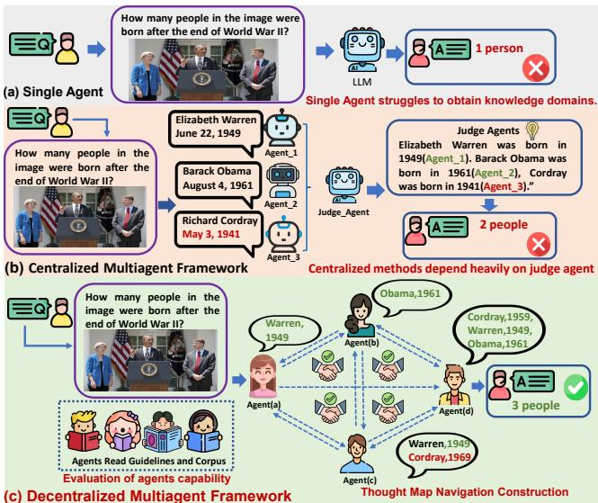
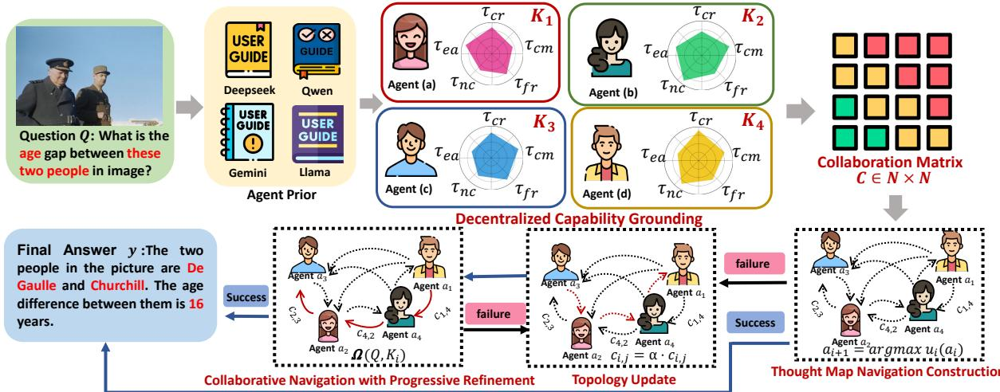
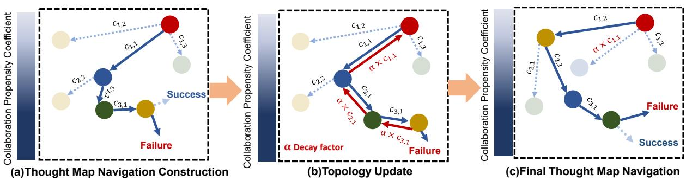
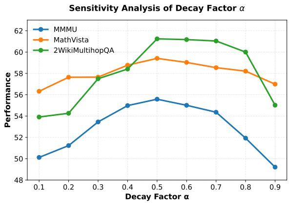
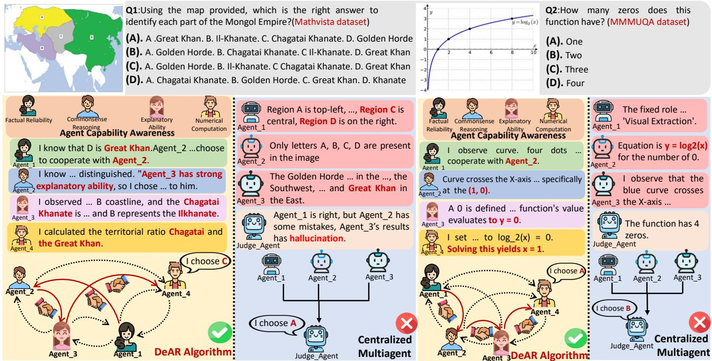

# DeAR: Decentralized Agentic Reasoning via Capability Grounding and Collaborative Thought Navigation

Wei Xing1, Zheng Changmeng2, Wei Xiaoyong2, Ye Xiufen1, Li Qing2

1College of Intelligent Systems Science and Engineering, Harbin Engineering University

2Department of Computing, The Hong Kong Polytechnic University

m18324618517@163.com, yexiufen@hrbeu.edu.cn, changmeng.zheng@polyu.edu.hk, cs007.wei@polyu.edu.hk, qing-prof.li@polyu.edu.hk

## Abstract

Existing agentic reasoning systems typically rely on centralized protocols. This design introduces routing bottlenecks and static role allocations that often fail when handling complex multimodal queries. We propose DeAR (Decentralized Agentic Reasoning), a framework that shifts from central control to autonomous peer-to-peer collaboration. DeAR is built on three mechanisms: (1) decentralized capability grounding for query-dependent agent specialization, (2) thought map navigation for targeted peer interactions, and (3) topology update for adaptive error correction. Evaluations across 9 diverse multimodal reasoning and text-based QA benchmarks indicate that DeAR consistently outperforms recent baseline methods, validating that decentralized and adaptive collaboration among agents enhances accuracy in knowledgeintensive reasoning tasks. The source code will be available at https://open\_upon\_acceptance.

## Introduction

Complex reasoning represents the frontier of Large Language Model (LLM) applications, demanding capabilities that extend far beyond simple pattern matching. To address this, Agentic Reasoning has emerged as a proven and efective paradigm (Zheng et al. 2023). By decomposing intricate problems into manageable sub-tasks handled by specialized agents, agentic workflows have achieved remarkable proficiency in multi-step problem solving (Zheng et al. 2024).

Despite these successes, current agentic reasoning systems (Zhou et al. 2025) frequently encounter significant stumbling blocks, particularly when handling complex multimodal queries. Consider the task in Figure 1, which asks how many people in a specific image were born after World War II. A standard single agent often fails here because it cannot simultaneously manage fine-grained visual recognition and historical knowledge retrieval. Furthermore, in a centralized multi-agent framework, a planner rigidly assigns visual extraction to one agent and factual querying to another. If an agent misidentifies a person or hallucinates a birth year, the central "Judge" node becomes a severe bottleneck. It blindly aggregates these flawed intermediate results without peer verification, resulting in an incorrect final answer.

We argue that these failures stem from structural flaws within the Centralized Collaboration Protocol rather than deficient model capabilities. In these topologies, a central coordinator monopolizes routing and aggregation (Wang et al.

  
Figure 1: Framework comparison on a multimodal query ("How many people in the image were born after World War II?"). (a) Single agent fails due to restricted knowledge domains. (b) Centralized framework fails as the judge bottleneck propagates incorrect inputs. (c) DeAR (Ours) succeeds by grounding capabilities and navigating an adaptive thought map to collaboratively verify facts and yield the correct answer.

2024b), inducing severe information loss and strict singlepoint bottlenecks (Owens et al. 2025). Consequently, this rigid role allocation (Jia et al. 2024) fails to adapt to fluid, query-dependent reasoning, forcing dynamic problems into static workflows that misroute tasks and propagate unverified errors downstream.

In the real world, complex problem-solving follows a different topology. It is inherently decentralized. Interdisciplinary experts do not wait for a single omniscient manager to dictate every micro-interaction; they engage in peer-topeer discourse, negotiate boundaries, and self-organize to bridge knowledge gaps.

However, this decentralized paradigm remains largely unexplored in the context of agentic reasoning.To bridge this gap, we propose DeAR (Decentralized Agentic Reasoning), a framework designed to bypass the bottlenecks of centralization by enabling agents to reason and collaborate autonomously. The evolving reasoning context is maintained not by a hidden system layer, but as a dynamic message payload passed directly through peer-to-peer token streams. Realizing robust decentralized reasoning requires addressing three challenges, which we tackle by restructuring role allocation, collaboration mechanisms, and reasoning paths:

• Dynamic capability vs. Static role: Centralized systems often rely on pre-defined roles (Fang et al. 2025), allowing the coordinator to route requests by labels. But role labels are a weak proxy for real competence and are precisely what causes coordinators to hallucinate capabilities in open-ended scenarios. We address this by replacing static labels with a dynamic capability grounding mechanism. Agents actively assess their own suitability for a specific query fragment based on verifiable linguistic benchmarks, ensuring that role allocation is query-dependent and driven by actual competence rather than rigid titles.

• Local graph navigation vs. Central routing: In centralized pipelines (Wu et al. 2025a), the coordinator acts as a global router that dictates a linear execution path. To eliminate this central bottleneck while maintaining selective collaboration, we propose a collaboration propensity matrix, which intuitively functions as a dynamic adjacency matrix defining the edges of our reasoning graph. Analogous to sociolinguistic alignment, this matrix establishes a decision boundary. Instead of a central judge computing a global sequential route, the currently active agent performs a local graph traversal, independently selecting its optimal downstream peer based on the current context.

• Progressive reasoning vs. Restarting: In centralized systems, if a reasoning chain breaks, the “Judge” often has to discard the entire trajectory and restart, which is highly ineficient. We propose that decentralized reasoning should be viewed as collaborative navigation over an agentic thought map. Rather than fragile linear chains, our agents maintain a shared topological map of the reasoning space. This allows for progressive reasoning: if a path proves invalid, agents do not retreat to the starting line. Instead, they eficiently pivot from the current node, utilizing the thought map to explore alternative efective chains without losing the progress made thus far.

More details are provided in Section .

## Related work

Recent studies show that multi-agent systems improve the robustness and interpretability of Large Language Models (LLMs) and Multimodal Large Language Models (MLLMs) by coordinating agents with complementary capabilities. These frameworks facilitate complex task decomposition, intermediate state sharing, and dynamic workflow management (Hong et al. 2023). Consequently, multi-agent collaboration has been applied successfully across diverse domains, including mathematical reasoning (Xie et al. 2024) and visual question answering, where iterative planning and reversible reasoning enhance overall performance (Xinjie et al. 2025).

To address complex multi-step reasoning tasks, recent frameworks explore distributing cognitive loads across specialized agents (Jiang et al. 2025a; Liu et al. 2025). While debate-based approaches(Zheng et al. 2024; Liang, Wei, and Zheng 2026; Liang et al. 2026) and linear reasoning paths allow for the refinement of intermediate states (Hu et al. 2025), they heavily rely on rigid, centralized coordination protocols. For instance, AutoGen (Wu et al. 2024) depends on static topologies governed by central managers, Agent-Verse (Chen et al. 2024a) dictates synchronous pipelines under central evaluators, and DyLAN (Liu et al. 2024b) requires a global ranker for layer-wise filtering. Even dynamic routing frameworks like AgentNet (Yang et al. 2025b) lack query-dependent capability grounding and adaptive error correction. This persistent centralized bottleneck limits adaptability, incurs redundant computational overhead, and leaves systems vulnerable to hallucinated competencies and compounding reasoning errors, highlighting the critical need for a decentralized collaborative architecture.

## DeAR Framework

In this section, we present Decentralized Agentic Reasoning framework in which agents autonomously decide when and with whom to collaborate during question answering. The execution of DeAR proceeds in three phases, corresponding to the three challenges identified in the introduction.

## Overview

The core of DeAR is to navigate an Agentic Thought Map, where nodes represent reasoning states and edges represent collaboration probabilities. This navigation is governed by a dynamic Collaboration Propensity Matrix $\breve { \boldsymbol { \mathcal { C } } } \in \mathbb { R } ^ { N \times N }$ which encodes the likelihood of beneficial interaction between agent pairs based on their grounded capabilities. As agents traverse the map, they generate a sequence of knowledge states K. If a path leads to a dead end (i.e., fails to generate a valid answer y), the system employs a progressive refinement strategy, updating the matrix C to prune invalid edges and steer the navigation toward efective reasoning chains. The system S is defined as:

$$
\begin{array} { r } { { \cal S } = ( Q , { \cal A } , { \cal C } , { \cal K } ) . } \end{array}\tag{1}
$$

As illustrated in Figure 2, the algorithm consists of three parts.

## Decentralized Capability Grounding

To address the limitations of static role pre-definition, DeAR implements Decentralized Capability Grounding. At initialization, agents are not assigned rigid labels (e.g., “Math Agent”). Instead, each agent ai grounds its identity in verifiable linguistic benchmarks derived from its underlying oficial technical reports or model cards, denoted as $\mathcal { P } _ { i }$

Rather than relying on externally assigned task labels or groundless self-assessments, we characterize each agent’s capability along a set of fundamental cognitive dimensions commonly required in question answering. Specifically, each agent maintains an intrinsic capability profile:

$$
{ \boldsymbol \tau } _ { i } = \left[ \tau _ { i } ^ { \mathrm { c r } } , \tau _ { i } ^ { \mathrm { e a } } , \tau _ { i } ^ { \mathrm { n c } } , \tau _ { i } ^ { \mathrm { f r } } , \tau _ { i } ^ { \mathrm { c m } } \right] ,\tag{2}
$$

  
Figure 2: An overview of the Decentralized Agentic Reasoning framework.

where $\tau _ { i } ^ { \mathrm { c r } } , \tau _ { i } ^ { \mathrm { e a } } , \tau _ { i } ^ { \mathrm { n c } } , \tau _ { i } ^ { \mathrm { c m } }$ ,and $\tau _ { i } ^ { \mathrm { { f r } } }$ denote the agent’s proficiency in commonsense reasoning, explanatory ability, numerical computation, natural language comprehension ,and factual reliability, respectively. The detailed prompt templates and alignment protocols employed for this calibration mechanism are provided in Appendix.

Crucially, these continuous values do not originate from arbitrary text reading. They are based on explicit mappings of quantitative benchmark data extracted from $\mathcal { P } _ { i }$ . Let $\bar { s } _ { i } ^ { d }$ represent the raw accuracy score of agent $a _ { i }$ on a standard dataset corresponding to dimension $d .$ For instance, $s _ { i } ^ { \mathrm { n c } }$ is derived from the GSM8K benchmark, $s _ { i } ^ { \mathrm { c r } }$ from MMLU, and $s _ { i } ^ { \mathrm { f r } }$ from TruthfulQA. To resolve the inconsistency of reporting standards across diferent foundational models, we apply a calibration mechanism during the system initialization phase. The raw scores are projected into the [0, 1] interval and normalized across all N agents using a Softmax operation:

$$
\tau _ { i } ^ { d } = \frac { \exp ( s _ { i } ^ { d } ) } { \sum _ { k = 1 } ^ { N } \exp ( s _ { k } ^ { d } ) } , \quad d \in \{ \mathrm { c r } , \mathrm { e a } , \mathrm { n c } , \mathrm { f r } , \mathrm { c m } \} .\tag{3}
$$

This mapping mechanism ensures that the capability values $\tau _ { i }$ of all agents are rigorously quantified and strictly comparable on the same scale.

Upon receiving a query $q ,$ agent $a _ { i }$ dynamically contextualizes its profile based on the query requirements and its technical report $\mathcal { P } _ { i } .$ , producing a Query-Dependent Capability State:

$$
\pmb { \tau } _ { i } ( q ) = \Phi _ { i } \left( q , \mathcal { P } _ { i } , \pmb { \tau } _ { i } \right) ,\tag{4}
$$

where $\Phi _ { i } ( \cdot )$ denotes the agent’s internal reasoning operator, implemented via prompting, which evaluates the task context against the agent’s calibrated benchmark profile.

Finally, the knowledge or intermediate reasoning generated by agent $a _ { i }$ is conditioned on the query and this capability state:

$$
\begin{array} { r } { K _ { i } = \Theta _ { i } \left( q  { \left| \right. } \tau _ { i } ( q ) \right) . } \end{array}\tag{5}
$$

Here, $\Theta _ { i } ( \cdot )$ denotes the LLM’s generative reasoning process driven by its parametric knowledge, yielding the intermediate results ${ \dot { \kappa } } _ { i }$ . By evaluating peer benchmark reports, agent $a _ { i }$

quantitatively estimates their strengths, forming the basis to compute the collaboration propensity $c _ { i , j }$ and construct the decentralized thought map.

## Self-Organized Collaboration

To replace centralized routing with local consensus, we introduce a mechanism for Self-Organized Collaboration. Each agent $a _ { i }$ autonomously evaluates the potential utility of peering with every other agent $a _ { j }$ under the current query context.To initiate the decentralized reasoning trajectory, the first active agent is selected uniformly at random from the agent pool. This evaluation forms a Collaboration Propensity Vector $c _ { i } { : }$

$$
\boldsymbol { c } _ { i } = [ c _ { i , 1 } , c _ { i , 2 } , . . . , c _ { i , N } ] ,\tag{6}
$$

where $c _ { i , j } \in [ 0 , 1 ]$ is the collaboration preference towards agent $a _ { j }$ . Given a query mapping to a cognitive dimension $d ,$ $c _ { i , j }$ is calculated via a temperature-scaled Softmax over the calibrated proficiency $\tau _ { j } ^ { d }$ defined in Equation 3:

$$
c _ { i , j } = \frac { \exp ( \tau _ { j } ^ { d } / T ) } { \sum _ { k = 1 , k \neq i } ^ { N } \exp ( \tau _ { k } ^ { d } / T ) } , \quad \forall j \neq i\tag{7}
$$

where $T > 0$ controls routing sharpness. Since $\tau _ { j } ^ { d } \in [ 0 , 1 ]$ is bounded, this formulation inherently prevents exponential overflow, guaranteeing absolute numerical stability. By definition, self-collaboration is disallowed:

$$
c _ { i , i } = 0 , \quad \forall i \in \{ 1 , 2 , \ldots , N \} .\tag{8}
$$

Aggregating the collaboration preference vectors from all agents yields a collaboration matrix $\mathcal { C } \mathrm { : }$

$$
\mathcal { C } = \left( \begin{array} { c c c c } { 0 } & { c _ { 1 , 2 } } & { \cdot \cdot \cdot } & { c _ { 1 , N } } \\ { c _ { 2 , 1 } } & { 0 } & { \cdot \cdot \cdot } & { c _ { 2 , N } } \\ { \vdots } & { \vdots } & { \ddots } & { \vdots } \\ { c _ { N , 1 } } & { c _ { N , 2 } } & { \cdot \cdot } & { 0 } \end{array} \right)\tag{9}
$$

This matrix encodes pairwise and directed collaboration preferences among agents, reflecting both agent heterogeneity and task-specific requirements. Unlike static routing strategies or centralized coordination mechanisms, the collaboration structure here is dynamically shaped by each agent’s local assessment under the current query. Although the base ranking of $c _ { i , j }$ reflects target capabilities, it avoids global ranking degeneration by activating agents on an asneeded basis. The cumulative context $\bar { \kappa } _ { i }$ from operator $\Theta _ { i }$ imbues the payload with source-specificity, achieving context-dependent collaboration.

  
Figure 3: Thought Map Navigation Construction among Agents

Thought Map Navigation construction Based on the collaboration matrix C, agents construct a collaboration path in a sequential manner. The objective of this process is to determine an ordered sequence of agents such that the knowledge generated by each selected agent is incrementally propagated and refined through interaction.

The navigation begins with a randomly selected seed agent (or the most relevant initial agent). At step i, the current agent $a _ { i }$ acts as a local navigator, selecting the next node (agent $a _ { j } )$ that maximizes the collaboration propensity. The incremental utility of transitioning to an unvisited agent $a _ { j }$ is:

$$
u _ { i } ( a _ { j } ) = \left\{ { \begin{array} { l l } { c _ { i , j } , } & { a _ { j } \notin \mathcal { V } _ { i } , } \\ { 0 , } & { a _ { j } \in \mathcal { V } _ { i } . } \end{array} } \right.\tag{10}
$$

The next agent $a _ { i + 1 }$ is chosen by

$$
a _ { i + 1 } = \arg \operatorname* { m a x } _ { a _ { j } \in \mathcal { A } } u _ { i } ( a _ { j } )\tag{11}
$$

The selected agent then generates its knowledge conditioned on the input query and the accumulated context formed by the union of knowledge generated by previously selected agents, i.e., $\textstyle \bigcup _ { k = 1 } ^ { i } \mathcal { K } _ { k }$ . This creates a chain of thought that exploits the strongest collaborative edges in the map.

Through sequential selection and knowledge propagation, agents autonomously construct a thought map that progressively integrates complementary reasoning capabilities. Independent of any centralized judge or predefined topology, the terminal agent generates the final answer y directly from the fully accumulated knowledge $\kappa _ { N }$ .Dynamic Termination. This decentralized trajectory terminates dynamically based on real-time capability assessments rather than a fixed step limit. Navigation halts if the evaluated propensities of all unvisited peers (outside $\nu _ { i } )$ fall below a minimal operational threshold, or if all agents have been exhausted. Upon halting, the active agent serves as the terminal node, outputting its accumulated context as the final answer.

## Collaborative Navigation with Progressive Refinement

Upon reaching the terminal state, the system attempts to generate a final answer $y .$ If the accumulated context KN is insuficient (a “dead end” on the map), we do not simply discard the efort. Instead, we perform a Topology Update $\Psi ( \cdot )$ to refine the thought map.

$$
y = \Omega \left( q , { \cal K } _ { N } \right) ,\tag{12}
$$

where $\Omega ( \cdot )$ denotes the answer generation function of the terminal agent $a _ { N }$ conditioned on the full accumulated context.

Specifically,DeAR leverages the terminal agent rather than an external judge to verify the final context $\kappa _ { N }$ . If the final context fails to match the initial query and its requirements, a refusal is triggered. To prune the target edge set ${ \mathcal E } _ { \mathrm { f a i l } }$ without over-penalizing valid upstream transitions, DeAR employs a localized, progressive backtracking strategy instead of fullpath mitigation. Initially, ${ \mathcal E } _ { \mathrm { f a i l } }$ contains only the immediate terminal edge, prompting alternative routing at the current depth. If local choices are exhausted, $\mathcal { E } _ { \mathrm { f a i l } }$ expands step-bystep to preceding edges in the reasoning path. Finally, these active edges are penalized in the Collaboration Propensity Matrix:

$$
{ \mathcal { C } } \gets \Psi ( { \mathcal { C } } ) ,\tag{13}
$$

where the transformation applies a decay factor α (e.g., 0.5) to the failed connections:

$$
c _ { i , j } = \{ \begin{array} { l l } { \alpha \cdot c _ { i , j } , } & { ( a _ { i }  a _ { j } ) \in \mathcal { E } _ { \mathrm { f a i l } } , } \\ { c _ { i , j } , } & { \mathrm { o t h e r w i s e } . } \end{array}\tag{14}
$$

This update prunes failing edges, backtracking to preceding layers step-by-step if local routes fail. The agents then renavigate the adjusted topology. This process of exploration, sequential backtracking, and refinement allows DeAR to progressively converge on a valid reasoning path, bypassing the single-point vulnerabilities typical of centralized systems.

## Experimental Setup

## Datasets

We evaluate our method on four widely used multimodal reasoning datasets: MMMU (Yue et al. 2024), MathVista (Lu et al. 2024b), ChartQA (Hegde, Fazli, and Seifi 2025), and ScienceQA (Lu et al. 2022). We adopt Accuracy (ACC) as the primary evaluation metric and conduct experiments on the full test splits for all benchmarks. Specifically, beyond the overall accuracy for MMMU and ChartQA, we report detailed fine-grained metrics for MathVista across diferent question types (e.g., FQA, GPS, MWP) and reasoning skills (e.g., ALG, ARI, GEO). For ScienceQA, we report the accuracy across various subjects (NAT, SOC, LAN), modalities (TXT, IMG, NO), and grade levels (G1-6, G7-12), alongside the average score.

Furthermore, to demonstrate the generalizability of DeAR, we additionally conduct experiments on 5 textbased QA benchmarks, encompassing both single-hop (e.g., NQ(Kwiatkowski et al. 2019), TriviaQA(Joshi et al. 2017), PopQA(Mallen et al. 2023)) and multi-hop (e.g., WikiMultihopQA(Ho et al. 2020), and HotpotQA(Yang et al. 2018)) datasets. For these pure text tasks, we employ Exact Match (EM) and F1 as evaluation metrics, with 1,000 examples randomly sampled for the multi-hop evaluations.

## Implementation Details

In our implementation, the thought map uses a dynamic multi-agent design where up to four agents can participate depending on the query’s complexity. For multimodal reasoning tasks, we assign a diferent Multimodal Large Language Model (MLLM) to each agent: DeepSeek-VL-7B-Chat (Lu et al. 2024a), LLaVA-1.5-7B (Liu et al. 2023), Qwen2-VL-7B-Instruct (Wang et al. 2024a), and MiniCPM-V-2.6 (Yao et al. 2024). Using diferent models provides diverse visual reasoning perspectives. For text-based QA evaluations, the agents are powered by four distinct LLMs (Qwen3-8B (Yang et al. 2025a), Gemma-3-1B-IT (Team et al. 2025), Llama-3.2-3B (Dubey et al. 2024), and DeepSeek-LLM-7B-Chat (Liu et al. 2024a)). We integrate these text models with the FlashRAG toolkit (Jin et al. 2025), using E5-base-v2 as the dense retriever to fetch the top k = 10 passages from a shared Wikipedia corpus. We keep all generation and system hyperparameters consistent across the multimodal and QA experiments. Finally, all models are evaluated in a zero-shot setting without any task-specific fine-tuning.

## Experimental Results

## Comparison with Baselines

Evaluating DeAR against large single models shows that improvements come from the structured architecture instead of parameter scaling. Despite relying on a cooperative system of four base models, DeAR maintains a smaller total parameter count than 72B or 78B models while showing higher accuracy. Specifically, the score of DeAR is 18.07 points higher than Qwen2-VL-72B on MathVista (59.41 vs. 41.34), as shown in Table 1.

Compared to recent chain of thought and multi agent frameworks such as MAD-Vote(Liang et al. 2024), MUG(Liang, Wei, and Zheng 2025), C2R(Jang et al. 2025), Cache of Thought(Wu et al. 2025b), Corvid(Jiang et al. 2025b), and Insight-V(Dong et al. 2025), DeAR reports the highest overall scores on MathVista (59.41), ChartQA (89.43), and ScienceQA (62.45) in Table 1.It also consistently outperforms established multi agent platforms including AutoGen(Wu et al. 2024), AgentVerse(Chen et al. 2024a), and DyLAN(Liu et al. 2024b) across all four benchmarks. For instance, DeAR surpasses these three baselines on ChartQA by over 2.3 and achieves a higher score on MMMU (55.58), showing the advantage of a decentralized topology over conventional centralized routing.

Evaluations on five text QA benchmarks show the performance of DeAR beyond multimodal tasks, with detailed metrics provided in Table 2. The framework ranks first on NQ and obtains the highest F1 score on TriviaQA for single hop tasks. For multi hop queries, it obtains the highest score on HotpotQA and maintains stable precision and completeness on 2Wiki (Table 2), showing that decentralized thought navigation applies to pure NLP domains.

Table 1 decouples architectural gains from ensemble effects using identical backbones. DeAR (Fixed Role), serving as the centralized routing baseline, drops sharply (-5.76 on MMMU). DeAR (w/o Topology Update), acting as the ensemble control without backtracking, also degrades (-2.37 on MMMU). These margins mathematically prove our superiority stems from decentralized navigation rather than vanilla model aggregation.

## Analysis of the Thought Map Navigation

This section evaluates the efectiveness of the proposed thought map navigation by comparing it against a variant without (w/o) the thought map navigation. To provide deeper insights beyond aggregate metrics, we conduct a fine-grained analysis of the performance across diverse question types and reasoning skills within the MathVista dataset. The results demonstrate that dynamic agent routing consistently outperforms static setups across all sub-categories, confirming that adaptive collaboration is essential for complex visual reasoning.

Overall, the thought map navigation increases the comprehensive MathVista accuracy from 51.68 to 59.41. The detailed breakdown reveals that the most substantial gains occur in tasks demanding intricate multi-step logic and specialized visual processing. For example, accuracy on Statistical Reasoning (STA) improves significantly from 62.9 to 80.9. Similarly, Logical Reasoning (LOG) sees a major boost from 19.6 to 31.0, and Figure Question Answering (FQA) rises from 69.1 to 80.3. These consistent enhancements validate that allowing agents to autonomously navigate the reasoning space is far more efective than forcing a predefined execution order.

## Analysis of Topology Update

This section evaluates the proposed topology update on multimodal benchmarks, including MMMU, MathVista, ChartQA, and ScienceQA. By correcting intermediate errors, the topology update consistently improves accuracy across datasets with varying visual complexities. On MMMU, the score increases from 53.21 to 55.58, mitigating errors in college level academic tasks, while MathVista accuracy rises from 55.65 to 59.41 in intricate mathematical settings. Similar gains are observed on ChartQA (88.01 to 89.43) and ScienceQA (59.92 to 62.45), reflecting a reduced accumulation of multiple step reasoning errors.

<table><tr><td rowspan="2"></td><td rowspan="2">MMMU</td><td colspan="6">MathVista</td><td rowspan="2">ChartQA</td><td colspan="4">ScienceQA</td></tr><tr><td>FQA</td><td>GPS</td><td>MWP</td><td>TQA</td><td>VQA</td><td>ALL</td><td>NAT</td><td>SOC</td><td>LAN</td><td>ALL</td></tr><tr><td></td><td>Baseline Models (Single Agent)</td><td></td><td></td><td></td><td></td><td></td><td></td><td></td><td></td><td></td><td></td><td></td></tr><tr><td>LLaMA-2-13B (Liu et al. 2023)</td><td></td><td>26.8</td><td>29.3</td><td>16.1</td><td>32.3</td><td>26.3</td><td>26.10</td><td></td><td>44.1</td><td>41.2</td><td>43.9</td><td>43.08</td></tr><tr><td>InternVL2.5-26B (Chen et al. 2024b)</td><td>51.80</td><td>38.0</td><td>35.0</td><td>30.0</td><td>40.0</td><td>37.0</td><td>36.03</td><td></td><td></td><td></td><td></td><td></td></tr><tr><td>MiniCPM-V-2.6 (Yao et al. 2024)</td><td>45.11</td><td>51.7</td><td>27.4</td><td>39.8</td><td>42.5</td><td>34.7</td><td>39.89</td><td></td><td>59.5</td><td>57.0</td><td>59.6</td><td>58.70</td></tr><tr><td>Qwen2-VL-72B (Wang et al. 2024a)</td><td>46.21</td><td>55.9</td><td>34.7</td><td>29.7</td><td>58.8</td><td>42.4</td><td>41.34</td><td>88.30</td><td></td><td></td><td>–</td><td></td></tr><tr><td>NVLM-H 1.0 78B (Dai et al. 2024)</td><td>53.08</td><td>65.0</td><td>48.0 Baseline Models (Multi-Agent Frameworks)</td><td>45.0</td><td>68.0</td><td>53.0</td><td>55.91</td><td></td><td></td><td></td><td></td><td></td></tr><tr> colspan="12">MAD-Vote (EMNLP 2024) (Liang et al. 2024)</td></tr><tr><td>44.70</td><td>49.0</td><td>38.0</td><td>35.0</td><td>51.0</td><td>42.0</td><td>43.12</td><td>81.02</td><td>55.0</td><td>52.1</td><td>54.0</td><td>53.70</td><td>MUG (AAAI 2025) (Liang, Wei, and Zheng 2025)</td></tr><tr><td>50.30</td><td>55.0</td><td>40.0</td><td>39.0</td><td>56.0</td><td>46.0</td><td>47.32</td><td></td><td>56.5</td><td>53.8</td><td>55.5</td><td>55.27</td><td>C2R (EMNLP 2025) (Jang et al. 2025)</td></tr><tr><td>51.92</td><td>60.1</td><td>38.2</td><td>45.4</td><td>62.0</td><td>49.3</td><td>51.01</td><td>85.08</td><td></td><td></td><td></td><td></td><td>Cache-of-Thought (EMNLP 2025) (Wu et al. 2025b)</td></tr><tr><td>37.92</td><td>54.2</td><td>35.4</td><td>30.0</td><td>58.3</td><td>44.6</td><td>44.51</td><td></td><td>59.0</td><td>56.5</td><td>59.8</td><td>58.44</td><td>Corvid (ICCV 2025) (Jiang et al. 2025b)</td></tr><tr><td>52.20</td><td>65.0</td><td>40.8</td><td>35.7</td><td>70.6</td><td>50.0</td><td>52.43</td><td></td><td></td><td></td><td></td><td></td><td>Insight-V (CVPR 2025) (Dong et al. 2025)</td></tr><tr><td>53.70</td><td>78.0</td><td>48.5</td><td>42.1</td><td>70.3</td><td>53.1</td><td>58.40</td><td>83.00</td><td>63.5</td><td>59.2</td><td>63.0</td><td>61.93</td><td>AutoGen (Wu et al. 2024)</td></tr><tr><td>54.31</td><td>77.6</td><td>49.2</td><td>42.7</td><td>68.7</td><td>54.5</td><td>59.01</td><td>86.79</td><td>62.7</td><td>58.7</td><td>62.1</td><td>60.24</td><td>AgentVerse (Chen et al. 2024a)</td></tr><tr><td>55.10</td><td>76.4</td><td>47.1</td><td>41.6</td><td>69.1</td><td>54.4</td><td>58.79</td><td>87.12</td><td>61.9</td><td>58.4</td><td>62.9</td><td>61.45</td><td>DyLAN (Liu et al. 2024b)</td></tr><tr><td>54.39</td><td>77.2</td><td>48.9</td><td>42.9</td><td>67.1</td><td>53.9</td><td>59.16</td><td>86.46</td><td>62.4</td><td>59.1</td><td>61.3</td><td>60.52</td><td>Our Proposed Method</td></tr><tr><td colspan="9"></td><td></td><td></td><td>DeAR (Fixed Role)</td></tr><tr><td>49.82</td><td>68.1</td><td>41.2</td><td>38.9</td><td>60.1</td><td>49.7</td><td>51.60</td><td>85.72</td><td>61.0</td><td>57.5</td><td>60.6</td><td>59.70</td><td>DeAR (w/o Thought Map)</td></tr><tr><td>47.20 53.21</td><td>68.2</td><td>41.3</td><td>39.0</td><td>60.2</td><td>49.7</td><td>51.68</td><td>83.12</td><td>55.5</td><td>51.2</td><td>55.5</td><td>54.07</td><td>DeAR (w/o Topology Update)</td></tr><tr><td>55.58</td><td>75.0</td><td>45.0</td><td>41.0</td><td>70.5</td><td>46.7</td><td>55.65</td><td>88.01</td><td>61.2</td><td>57.5</td><td>61.0</td><td>59.92</td><td>DeAR (Ours)</td></tr><tr><td></td><td>80.3</td><td>49.9</td><td>42.7</td><td>84.5</td><td>60.9</td><td>59.41</td><td>89.43</td><td>64.8</td><td>60.3</td><td>62.2</td><td>62.45</td><td></td></tr></table>

Table 1: Zero-shot evaluation on four multimodal benchmarks (fine-grained metrics reported for MathVista and ScienceQA). ’-’ denotes unreported data. Agent counts: Cache-of-Thought (2); MUG, C2R (3); MAD-Vote, Corvid, Insight-V, AutoGen, AgentVerse, DyLAN, ReConcile, and DeAR (4). Best results in bold.
<table><tr><td rowspan="2">Method</td><td colspan="3"></td><td colspan="3"></td><td colspan="3">TriviaQA</td><td colspan="3">PopQA</td><td></td><td></td><td>2Wiki</td><td></td><td></td><td colspan="3">HotpotQA</td></tr><tr><td>EM</td><td>∆EM</td><td>F1</td><td>∆F1</td><td>EM</td><td>∆EM</td><td>F1</td><td>∆F1 Single Agent Framework</td><td>EM</td><td>∆EM</td><td>F1</td><td>∆F1</td><td>EM</td><td>∆EM</td><td>F1</td><td>∆F1</td><td>EM</td><td>∆EM</td><td>F1</td><td>∆F1</td></tr><tr><td>Vanilla Gen</td><td></td><td colspan="3">26.27</td><td colspan="9"></td><td colspan="7"></td></tr><tr><td></td><td>17.40</td><td>+29.79</td><td></td><td>+27.86</td><td>56.60</td><td>+4.87</td><td>65.50</td><td>+7.54</td><td>19.20</td><td>+20.54</td><td>23.33</td><td>+23.87</td><td>8.60</td><td>+42.53</td><td>16.50</td><td>+44.74</td><td>16.80</td><td>+31.51</td><td>23.88</td><td>+29.86</td></tr><tr><td></td><td></td><td></td><td></td><td></td><td></td><td></td><td>Multi-Agent Frameworks</td><td></td><td></td><td></td><td></td><td>+18.92</td><td>18.20</td><td>+32.93</td><td>25.13</td><td></td><td></td><td></td><td></td><td></td></tr><tr><td>MAD(Du et al. 2023)(ICML 2024)</td><td>21.80 28.60</td><td>+25.39 +18.59</td><td>33.11 37.36</td><td>+21.02</td><td>56.40</td><td>+5.07</td><td>66.39</td><td>+6.65 +18.48</td><td>21.40 27.00</td><td>+18.34 +12.74</td><td>28.28 33.02</td><td>+14.18</td><td></td><td>+18.33</td><td></td><td>+36.11</td><td>23.00</td><td>+25.31 +23.11</td><td>32.79 34.40</td><td>+20.95 +19.34</td></tr><tr><td>IRCoT(Trivedi et al. 2023)(ACL 2023)</td><td></td><td>+6.39</td><td>52.31</td><td>+16.77 +1.82</td><td>47.20 63.00</td><td>+14.27</td><td>54.56</td><td>+0.81</td><td>39.60</td><td>+0.14</td><td></td><td>+0.79</td><td>32.80</td><td></td><td>31.19</td><td>+30.05</td><td>25.20</td><td>+20.51</td><td>38.93</td><td>+14.81</td></tr><tr><td>Iter-RetGen(Shao et al. 2023)(Arxiv 2023)</td><td>40.80 19.40</td><td>+27.79</td><td>27.68</td><td></td><td></td><td>-1.53</td><td>72.23</td><td></td><td></td><td></td><td>46.41 24.35</td><td></td><td>15.00</td><td>+36.13</td><td>24.75</td><td>+36.49</td><td>27.80 16.60</td><td>+31.71</td><td>23.74</td><td>+30.00</td></tr><tr><td>FLARE(Jiang et al. 2023)(EMNLP 2023) Self-RAG(Asai et al. 2024)(Arxiv 2024)</td><td>44.00</td><td>+3.19</td><td>52.20</td><td>+26.45 +1.93</td><td>53.60 46.40</td><td>+7.87 +15.07</td><td>63.05 58.37</td><td>+9.99 +14.67</td><td>21.60 22.00</td><td>+18.14 +17.74</td><td>34.38</td><td>+22.85 +12.82</td><td>9.20 13.00</td><td>+41.93 +38.13</td><td>20.13 26.63</td><td>+41.11 +34.61</td><td>14.80</td><td>+33.51</td><td>28.81</td><td>+24.93</td></tr><tr><td>DRAG(Hu et al. 2025)(ACL 2025)</td><td>36.80</td><td>+10.39</td><td>50.38</td><td>+3.75</td><td>60.80</td><td>+0.67</td><td>69.93</td><td>+3.11</td><td>38.60</td><td>+1.14</td><td>46.50</td><td>+0.70</td><td>28.80</td><td>+22.33</td><td>36.97</td><td>+24.27</td><td>30.80</td><td>+17.51</td><td>41.74</td><td>+12.00</td></tr><tr><td>DeAR (Ours)</td><td>47.19</td><td></td><td>54.13</td><td></td><td>61.47</td><td></td><td>73.04</td><td></td><td>39.74</td><td></td><td>47.20</td><td></td><td>51.13</td><td></td><td>61.24</td><td></td><td>48.31</td><td></td><td>53.74</td><td></td></tr><tr><td></td><td></td><td></td><td></td><td></td><td></td><td></td><td></td><td></td><td></td><td></td><td></td><td></td><td></td><td></td><td></td><td></td><td></td><td></td><td></td><td></td></tr></table>

Table 2: Overall evaluation results of the proposed DeAR framework and other baselines on five text-only QA benchmarks. ∆EM and ∆F1 denote the performance gap between DeAR and each baseline $( \Delta = \mathrm { D e A R }$ score − baseline score). Darker gray cells mark the best performance, and lighter gray cells mark the second-best performance among all methods.

  
Figure 4: Analysis of the topology update’s decay factor α.

Efect of Decay Factor α Figure 4 investigates the topology update’s decay factor $\alpha \in [ 0 . 1 , 0 . 9 ]$ , which controls the penalty for failed paths. Small values $( \alpha = 0 . 1 )$ cause overcorrection and unstable thought map paths, dropping the 2Wiki F1 score to 53.91. Conversely, large values $( \alpha = 0 . 9 )$ insuficiently suppress inefective paths, causing repeated invalid computations and a 2Wiki F1 of 55.02. DeAR performs optimally in the [0.5, 0.8]. Specifically, a moderate $\alpha = 0 . 5$ achieves peak performance on MMMU (55.58) and Math-Vista (59.41) by efectively selecting new paths without discarding previously successful interactions.

## Dynamic Agent Activation and Usage Frequency

DeAR constructs reasoning paths dynamically based on query requirements and agent confidence. The framework does not mandate the participation of all N = 4 agents; unselected agents remain inactive if a smaller subset can resolve the query, which avoids unnecessary compute consumption. Table 3 presents the activation frequency of diferent agent subset sizes on MathVista. The results show that while complex problems require all 4 agents (37.5%), a majority of queries (62.5%) are resolved by fewer agents, confirming the adaptability and resource eficiency of the algorithm.

  
Figure 5: Case Study of the Reasoning with Centralized and Decentralized Multi-Agent Collaboration on Q&A.

Table 3: Frequency of activation for varying numbers of agents on the MathVista dataset.
<table><tr><td>Number of Agents Activated</td><td>Frequency (%)</td></tr><tr><td>1 Agent</td><td>14.3</td></tr><tr><td>2 Agents</td><td>21.8</td></tr><tr><td>3 Agents</td><td>26.4</td></tr><tr><td>4 Agents</td><td>37.5</td></tr></table>

## Case Study

Figure 5 compares DeAR and a centralized multi-agent baseline on historical map identification (Q1) and chart reasoning (Q2).DeAR resolves visual and logical ambiguities through dynamic, capability-driven hand-ofs. In Q1, agents progressively determine map assignments by combining factual knowledge, spatial commonsense, and historical geographic constraints, such as identifying landlocked regions. They finalize the boundaries via numerical verification of area ratios. In Q2, rather than being misled by the four plotted dots, the agents translate the mathematical "zero" into a geometric target on the x-axis and perform an algebraic check $( \log _ { 2 } ( x ) = 0 \Rightarrow x = 1 )$ to confirm the single root.The centralized framework restricts agents to isolated, static roles like visual extraction or text reading. All intermediate findings are forced through a single Judge Agent, creating an information bottleneck. Without peer-to-peer verification, the Judge blindly aggregates fragmented reports. As a result, it hallucinates an incorrect map configuration in Q1 by forcibly merging vague hints. In Q2, the Judge directly misattributes the visual worker’s observation of "four prominent dots" to the mathematical query and incorrectly outputs "Four".These results confirm that decentralized navigation efectively resolves complex logical dependencies and prevents the aggregation errors typical of centralized pipelines.

## Conclusion

We propose DeAR, a decentralized framework replacing centralized multi-agent coordination with autonomous, capability-aware collaboration. DeAR integrates three core mechanisms: Decentralized Capability Grounding for querydependent agent specialization, Thought Map Navigation for selective peer interaction, and Topology Update for adaptive error correction. These components allow agents to progressively refine reasoning trajectories without a central judge. Evaluations across 9 diverse multimodal and text-based QA benchmarks show DeAR consistently outperforms recent baselines, validating that decentralized, adaptive collaboration among agents enhances performance in complex tasks.

## References

Asai, A.; Wu, Z.; Wang, Y.; Sil, A.; and Hajishirzi, H. 2024. Self-rag: Learning to retrieve, generate, and critique through self-reflection.

Chen, W.; Su, Y.; Zuo, J.; Yang, C.; Yuan, C.; Chan, C.-M.; Yu, H.; Lu, Y.; Hung, Y.-H.; Qian, C.; et al. 2024a. Agentverse: Facilitating multi-agent collaboration and exploring

emergent behaviors. In International Conference on Learning Representations, volume 2024, 20094–20136.

Chen, Z.; Wu, J.; Wang, W.; Su, W.; Chen, G.; Xing, S.; Zhong, M.; Zhang, Q.; Zhu, X.; Lu, L.; et al. 2024b. Internvl: Scaling up vision foundation models and aligning for generic visual-linguistic tasks. In Proceedings of the IEEE/CVF Conference on Computer Vision and Pattern Recognition, 24185–24198.

Dai, W.; Lee, N.; Wang, B.; Yang, Z.; Liu, Z.; Barker, J.; Rintamaki, T.; Shoeybi, M.; Catanzaro, B.; and Ping, W. 2024. NVLM: Open Frontier-Class Multimodal LLMs. arXiv preprint.

Dong, Y.; Liu, Z.; Sun, H.-L.; Yang, J.; Hu, W.; Rao, Y.; and Liu, Z. 2025. Insight-v: Exploring long-chain visual reasoning with multimodal large language models. In Proceedings ofthe Computer Vision and Pattern Recognition Conference, 9062–9072.

Du, Y.; Li, S.; Torralba, A.; Tenenbaum, J. B.; and Mordatch, I. 2023. Improving factuality and reasoning in language models through multiagent debate. In Forty-first International Conference on Machine Learning.

Dubey, A.; Jauhri, A.; Pandey, A.; Kadian, A.; Al-Dahle, A.; Letman, A.; Mathur, A.; Schelten, A.; Yang, A.; Fan, A.; et al. 2024. The llama 3 herd of models. arXiv preprint arXiv:2407.21783.

Fang, J.; Peng, Y.; Zhang, X.; Wang, Y.; Yi, X.; Zhang, G.; Xu, Y.; Wu, B.; Liu, S.; Li, Z.; et al. 2025. A comprehensive survey of self-evolving ai agents: A new paradigm bridging foundation models and lifelong agentic systems. arXiv preprint arXiv:2508.07407.

Hegde, S.; Fazli, P.; and Seifi, H. 2025. Chartqa-x: Generating explanations for charts. arXiv e-prints, arXiv–2504.

Ho, X.; Nguyen, A.-K. D.; Sugawara, S.; and Aizawa, A. 2020. Constructing a multi-hop qa dataset for comprehensive evaluation of reasoning steps. arXiv preprint arXiv:2011.01060.

Hong, S.; Zhuge, M.; Chen, J.; Zheng, X.; Cheng, Y.; Wang, J.; Zhang, C.; Wang, Z.; Yau, S. K. S.; Lin, Z.; et al. 2023. MetaGPT: Meta programming for a multi-agent collaborative framework. In The Twelfth International Conference on Learning Representations.

Hu, W.; Zhang, W.; Jiang, Y.; Zhang, C. J.; Wei, X.; and Qing, L. 2025. Removal of hallucination on hallucination: Debate-augmented RAG. In Proceedings of the 63rd Annual Meeting of the Association for Computational Linguistics (Volume 1: Long Papers), 15839–15853.

Jang, Y.; Choi, W. S.; Jung, M.; Lee, M.; and Zhang, B.-T. 2025. Confidence-guided Refinement Reasoning for Zeroshot Question Answering. In Proceedings ofthe 2025 Conference on Empirical Methods in Natural Language Processing, 6944–6961.

Jia, C.; Luo, M.; Dang, Z.; Sun, Q.; Xu, F.; Hu, J.; Xie, T.; and Wu, Z. 2024. Agentstore: Scalable integration of heterogeneous agents as specialized generalist computer assistant. arXiv preprint arXiv:2410.18603.

Jiang, B.; Xie, Y.; Wang, X.; Yuan, Y.; Hao, Z.; Bai, X.; Su, W. J.; Taylor, C. J.; and Mallick, T. 2025a. Towards rationality in language and multimodal agents: a survey. In Proceedings of the 2025 Conference of the Nations of the Americas Chapter ofthe Associationfor Computational Linguistics: Human Language Technologies (Volume 1: Long Papers), 3656–3675.

Jiang, J.; Ma, C.; Song, X.; Zhang, H.; and Luo, J. 2025b. Corvid: Improving multimodal large language models towards chain-of-thought reasoning. In Proceedings of the IEEE/CVF International Conference on Computer Vision, 3034–3046.

Jiang, Z.; Xu, F. F.; Gao, L.; Sun, Z.; Liu, Q.; Dwivedi-Yu, J.; Yang, Y.; Callan, J.; and Neubig, G. 2023. Active retrieval augmented generation. In Proceedings of the 2023 Conference on Empirical Methods in Natural Language Processing, 7969–7992.

Jin, J.; Zhu, Y.; Dou, Z.; Dong, G.; Yang, X.; Zhang, C.; Zhao, T.; Yang, Z.; and Wen, J.-R. 2025. Flashrag: A modular toolkit for eficient retrieval-augmented generation research. In Companion Proceedings ofthe ACM on Web Conference 2025, 737–740.

Joshi, M.; Choi, E.; Weld, D. S.; and Zettlemoyer, L. 2017. Triviaqa: A large scale distantly supervised challenge dataset for reading comprehension. arXiv preprint arXiv:1705.03551.

Kwiatkowski, T.; Palomaki, J.; Redfield, O.; Collins, M.; Parikh, A.; Alberti, C.; Epstein, D.; Polosukhin, I.; Devlin, J.; Lee, K.; et al. 2019. Natural questions: a benchmark for question answering research. Transactions ofthe Association for Computational Linguistics, 7: 453–466.

Liang, D.; Gong, K.; Cai, Y.; Zheng, C.; and Wei, X.-Y. 2026. Mixture of Debaters: Learn to Debate at Architectural Level in Multi-Agent Reasoning. arXivpreprint arXiv:2606.29425.

Liang, D.; Wei, X.-Y.; and Zheng, C. 2025. Multi-agent Undercover Gaming: Hallucination Removal via Counterfactual Test for Multimodal Reasoning. arXiv preprint arXiv:2511.11182.

Liang, D.; Wei, X.-Y.; and Zheng, C. 2026. Multi-agent undercover gaming: Hallucination removal through counterfactual test for multimodal reasoning. In Proceedings of the AAAI Conference on Artificial Intelligence, volume 40, 6807–6815.

Liang, T.; He, Z.; Jiao, W.; Wang, X.; Wang, Y.; Wang, R.; Yang, Y.; Shi, S.; and Tu, Z. 2024. Encouraging divergent thinking in large language models through multi-agent debate. In Proceedings of the 2024 conference on empirical methods in natural language processing, 17889–17904.

Liu, A.; Feng, B.; Xue, B.; Wang, B.; Wu, B.; Lu, C.; Zhao, C.; Deng, C.; Zhang, C.; Ruan, C.; et al. 2024a. Deepseek-v3 technical report. arXiv preprint arXiv:2412.19437.

Liu, H.; Li, C.; Wu, Q.; and Lee, Y. J. 2023. Visual Instruction Tuning. In NeurIPS.

Liu, P.; Liu, X.; Yao, R.; Liu, J.; Meng, S.; Wang, D.; and Ma, J. 2025. Hm-rag: Hierarchical multi-agent multimodal retrieval augmented generation. arXiv preprint arXiv:2504.12330.

Liu, Z.; Zhang, Y.; Li, P.; Liu, Y.; and Yang, D. 2024b. A dynamic LLM-powered agent network for task-oriented agent collaboration. In First Conference on Language Modeling.

Lu, H.; Liu, W.; Zhang, B.; Wang, B.; Dong, K.; Liu, B.; Sun, J.; Ren, T.; Li, Z.; Sun, Y.; Deng, C.; Xu, H.; Xie, Z.; and Ruan, C. 2024a. DeepSeek-VL: Towards Real-World Vision-Language Understanding. arXiv:2403.05525.

Lu, P.; Bansal, H.; Xia, T.; Liu, J.; Li, C.; Hajishirzi, H.; Cheng, H.; Chang, K.-W.; Galley, M.; and Gao, J. 2024b. MathVista: Evaluating Mathematical Reasoning of Foundation Models in Visual Contexts. In International Conference on Learning Representations (ICLR).

Lu, P.; Mishra, S.; Xia, T.; Qiu, L.; Chang, K.-W.; Zhu, S.-C.; Tafjord, O.; Clark, P.; and Kalyan, A. 2022. Learn to Explain: Multimodal Reasoning via Thought Chains for Science Question Answering. In The 36th Conference on Neural Information Processing Systems (NeurIPS).

Mallen, A.; Asai, A.; Zhong, V.; Das, R.; Khashabi, D.; and Hajishirzi, H. 2023. When not to trust language models: Investigating efectiveness of parametric and non-parametric memories. In Proceedings ofthe 61st Annual Meeting ofthe Association for Computational Linguistics (Volume 1: Long Papers), 9802–9822.

Owens, D. M.; Rossi, R.; Kim, S.; Yu, T.; Dernoncourt, F.; Chen, X.; Zhang, R.; Gu, J.; Deilamsalehy, H.; and Lipka, N. 2025. Multi-LLM Debiasing Framework. In Proceedings ofthe 15th International Conference on Recent Advances in Natural Language Processing-Natural Language Processing in the Generative AI Era, 843–853.

Shao, Z.; Gong, Y.; Shen, Y.; Huang, M.; Duan, N.; and Chen, W. 2023. Enhancing retrieval-augmented large language models with iterative retrieval-generation synergy. arXiv preprint arXiv:2305.15294.

Team, G.; Kamath, A.; Ferret, J.; Pathak, S.; Vieillard, N.; Merhej, R.; Perrin, S.; Matejovicova, T.; Ramé, A.; Rivière, M.; et al. 2025. Gemma 3 technical report. arXiv preprint arXiv:2503.19786.

Trivedi, H.; Balasubramanian, N.; Khot, T.; and Sabharwal, A. 2023. Interleaving retrieval with chain-of-thought reasoning for knowledge-intensive multi-step questions. In Proceedings of the 61st annual meeting of the association for computational linguistics (volume 1: long papers), 10014– 10037.

Wang, P.; Bai, S.; Tan, S.; Wang, S.; Fan, Z.; Bai, J.; Chen, K.; Liu, X.; Wang, J.; Ge, W.; Fan, Y.; Dang, K.; Du, M.; Ren, X.; Men, R.; Liu, D.; Zhou, C.; Zhou, J.; and Lin, J. 2024a. Qwen2-VL: Enhancing Vision-Language Model’s Perception of the World at Any Resolution. arXiv preprint arXiv:2409.12191.

Wang, Q.; Wang, T.; Li, Q.; Liang, J.; and He, B. 2024b. Megaagent: A practical framework for autonomous cooperation in large-scale llm agent systems. arXiv e-prints, arXiv– 2408.

Wu, F.; Li, Z.; Wei, F.; Li, Y.; Ding, B.; and Gao, J. 2025a. Talk to right specialists: Routing and planning in multi-agent system for question answering. arXiv preprint arXiv:2501.07813.

Wu, M.; Jiang, J.; Zheng, H.; Li, M.; Li, Z.; Tian, B.; Chen, B.; Park, Y.; Zhang, M.; Zhai, C.; et al. 2025b. Cacheof-thought: Master-apprentice framework for cost-efective vision language model inference. arXiv e-prints, arXiv– 2502.

Wu, Q.; Bansal, G.; Zhang, J.; Wu, Y.; Li, B.; Zhu, E.; Jiang, L.; Zhang, X.; Zhang, S.; Liu, J.; et al. 2024. Autogen: Enabling next-gen LLM applications via multi-agent conversations. In First conference on language modeling.

Xie, W.; Liu, D.; Yan, H.; Wu, W.; and Liu, Z. 2024. Mathlearner: A large language model agent framework for learning to solve mathematical problems. arXiv preprint arXiv:2408.01779.

Xinjie, Z.; Gao, F.; Song, X.; Chen, Y.; Yang, R.; Fu, Y.; Wang, Y.; Iwasawa, Y.; Matsuo, Y.; and Li, I. 2025. Reagent: Reversible multi-agent reasoning for knowledge-enhanced multi-hop qa. In Proceedings of the 2025 Conference on Empirical Methods in Natural Language Processing, 4067– 4089.

Yang, A.; Li, A.; Yang, B.; Zhang, B.; Hui, B.; Zheng, B.; Yu, B.; Gao, C.; Huang, C.; Lv, C.; et al. 2025a. Qwen3 technical report. arXiv preprint arXiv:2505.09388.

Yang, Y.; Chai, H.; Shao, S.; Song, Y.; Qi, S.; Rui, R.; and Zhang, W. 2025b. Agentnet: Decentralized evolutionary coordination for llm-based multi-agent systems. arXiv preprint arXiv:2504.00587.

Yang, Z.; Qi, P.; Zhang, S.; Bengio, Y.; Cohen, W.; Salakhutdinov, R.; and Manning, C. D. 2018. HotpotQA: A dataset for diverse, explainable multi-hop question answering. In Proceedings ofthe 2018 conference on empirical methods in natural language processing, 2369–2380.

Yao, Y.; Yu, T.; Zhang, A.; Wang, C.; Cui, J.; Zhu, H.; Cai, T.; Li, H.; Zhao, W.; He, Z.; et al. 2024. MiniCPM-V: A GPT-4V Level MLLM on Your Phone. arXiv preprint arXiv:2408.01800.

Yue, X.; Ni, Y.; Zhang, K.; Zheng, T.; Liu, R.; Zhang, G.; Stevens, S.; Jiang, D.; Ren, W.; Sun, Y.; Wei, C.; Yu, B.; Yuan, R.; Sun, R.; Yin, M.; Zheng, B.; Yang, Z.; Liu, Y.; Huang, W.; Sun, H.; Su, Y.; and Chen, W. 2024. MMMU: A Massive Multi-discipline Multimodal Understanding and Reasoning Benchmark for Expert AGI. In Proceedings of CVPR.

Zheng, C.; Feng, J.; Cai, Y.; Wei, X.; and Li, Q. 2023. Rethinking multimodal entity and relation extraction from a translation point of view. In Proceedings ofthe 61st Annual Meeting of the Association for Computational Linguistics (Volume 1: Long Papers), 6810–6824.

Zheng, C.; Liang, D.; Zhang, W.; Wei, X.-Y.; Chua, T.-S.; and Li, Q. 2024. A picture is worth a graph: A blueprint debate paradigm for multimodal reasoning. In Proceedings of the 32nd ACM International Conference on Multimedia, 419–428.

Zhou, J.; Chen, J.; Lu, Q.; Zhao, D.; and Zhu, L. 2025. Shielda: Structured handling of exceptions in llm-driven agentic workflows. arXiv preprint arXiv:2508.07935.