# Dijkstra as an Oracle for Online Stochastic Shortest Path Navigation

with Provable Guarantees

Mansur Arief1, Ali Akarma2, Ahmad Alfan Alfian Irfan3

Abstract—Mobile robots that operate in side by side with humans and critical facilities must reach their goals at low cost, despite often unknown true traversal costs of the map apriori and imperfect actuation. Planners that solve the underlying stochastic shortest path problem exactly, such as value iteration, require computation that grows with the diameter of the map, whereas Dijkstra’s algorithm is fast but is usually considered inexact once transitions are stochastic. This study shows that Dijkstra’s algorithm can remain an exact planning engine under a condition that is much weaker than the causality condition often invoked in the literature, namely nonnegativity of a reduced cost defined on the determinized map. Building on this characterization, an online learner DORA (Dijkstra Oracle Reduced-cost Algorithm) is proposed for robot navigation that calls a shortest path oracle a fixed number of times per episode, never estimates a transition kernel, and adds a logarithmic survival weight when the probability of contact with a dynamic obstacle must stay within a budget. In the numerical experiments involving three other benchmarks that cover grid world navigation, directional drilling, and drone surveillance, the learner matches optimistic value iteration that is given the true transition kernel while performing 4.5 to 19.3 times less planner work, reduces contacts during learning by a factor of seventeen relative to determinize and replan, and keeps the contact rate within budgets that span two orders of magnitude. These results indicate that shortest path search supports safe and efficient online navigation and path planning tasks.

Index Terms—Stochastic shortest path, online learning, robot navigation, planning under uncertainty, warehouse automation.

## I. INTRODUCTION

Autonomous and service robots often deal with problems involving known maps and goals, and the robot must reach the goal at low cost while avoiding contact with obstacles and people [1], [2], [3]. Under such a setting, what is not known in advance is how expensive each part of the map really is. Floor condition, local clutter and foot traffic all change the effective cost of a route, and they are learned in real-time only by traversing. The robot must therefore improve its routing policy online while it continues to operate.

In the literature, we often cast this setting as a stochastic shortest path problem, or SSP [4]. Key characteristics include actuation being imperfect, so a commanded move sometimes slips and contact with a dynamic obstacle ends the task. Value iteration and its heuristic search variants solve such problems to optimality [5], [6], and recent work has established minimax regret rates for learning them online [7], [8], [9]. However, the difficulty is usually computational. Value iteration propagates information one step per sweep, so the number of sweeps needed grows with the diameter of the graph. A robot that replans at every cycle incurs this compute cost every cycle.

Meanwhile, Dijkstra’s algorithm [10] has the opposite profile. A single pass propagates cost information across the entire map, and the run time is near linear in the number of edges. It is also the workhorse of deployed navigation stacks [1], [11]. The usual objection is that it does not apply to stochastic problems. The classical condition for a one pass label setting method to be exact is that an optimal policy is consistently improving, meaning the value strictly decreases along every transition that has positive probability [12], [13]. As soon as an actuator slips sideways into a more expensive region, that condition fails.

As shown in later sections, our analysis shows that this objection is stated too strongly. The minimal condition is nonnegativity of a reduced cost. To see this, for each state and action, define the reduced cost as the state action value of the stochastic problem minus the value of the state the action was intended to reach. If these quantities are nonnegative, then running Dijkstra with them as edge weights returns exactly the optimal value function and exactly the optimal policy. That said, the reduced cost is nonnegative under a much weaker requirement than causality, because it only constrains the determinized edge, not the slip outcomes. In our study the classical causality condition holds at about half of the states with the slip present, while the reduced costs remain nonnegative on state-action pairs up to a slip probability of 0.30.

This observation suggests an algorithm. The reduced costs are unknown, but they have a self consistent form: the reduced cost is the learned step cost plus the expected change in cost to goal caused by slip. We therefore iterate. Given a current estimate of the cost to goal, we form the reduced cost weights, call Dijkstra, and use the returned labels to update the estimate. A small number of damped iterations is enough. The result is the proposed Dijkstra Oracle Reduced-cost Algorithm (DORA). DORA maintains optimistic estimates of the $| { \cal S } | | { \cal A } |$ traversal costs and never estimates a transition kernel, which would require $| S | ^ { 2 } | A |$ parameters.

Our contributions are threefold. First, we characterize when the policy class induced by Dijkstra contains an optimal policy for a stochastic shortest path problem. The condition is nonnegativity of a reduced cost on the determinized map, and it is strictly weaker than the causality condition used in the label setting literature. Second, we introduce DORA, an online learner that reaches this class using a fixed number of shortest path oracle calls per episode and no transition model, together with a chance constrained variant that enforces a risk budget through an additive log survival weight. Third, we evaluate the method on a warehouse navigation benchmark. DORA matches optimistic value iteration supplied with the true kernel while doing an order of magnitude less planner work, and it reduces contacts during learning by a factor of seventeen relative to plain determinize and replan. The same advantages hold on three further navigation benchmarks.

The remainder of the paper is organized as follows. Section II reviews the related work. Section III states the problem. Section IV develops the reduced cost characterization and the algorithm. Section V reports the experiments. Section VI discusses the findings, and Section VII concludes.

## II. RELATED WORK

## A. Shortest Path Search for Robot Navigation

Graph search is the standard planning layer in mobile robotics. D\* Lite reuses information across a sequence of searches and returns the same optimal path that $\mathbf { A } ^ { * }$ [14] would return on the current cost map [15]. $\mathbf { A } \mathbf { R } \mathbf { A } ^ { * }$ attaches an explicit suboptimality factor to every anytime solution [16], and Anytime $\mathbf { D } ^ { * }$ combines the two while preserving the bound [17]. These methods assume deterministic transitions. When transitions are stochastic the solution is a policy rather than a path, and $\mathrm { L A O ^ { * } }$ extends heuristic search to solution graphs with loops [5]. Labeled real-time dynamic programming adds a convergence bound that the plain counterpart is lacking [6].

The idea of using Dijkstra on a stochastic problem is not new. McMahan and Gordon generalize Dijkstra and Gaussian elimination into a family of exact MDP solvers that reduce to Dijkstra when the transitions are deterministic [18]. Bounded real time dynamic programming uses a Dijkstra sweep to build a monotone initial bound [19]. Topological value iteration performs label setting at the granularity of strongly connected components [20], [21]. Bertsekas develops a Dijkstra like algorithm for robust shortest paths under a semicontractive model [22]. The exactness conditions for one pass label setting on stochastic problems were established by Vladimirsky, who requires a consistently improving optimal policy [12], and sharpened by Gaspard and Vladimirsky, who give explicit cost conditions and an explicit counterexample when the condition is violated [13]. Our contribution is to show that a weaker condition, stated on reduced costs, rather than on raw values, is what governs whether Dijkstra-derived policies are lossless.

## B. Online Learning for Goal Oriented Problems

Regret guarantees for stochastic shortest path learning have advanced quickly. UC-SSP gave the first no regret algorithm without restrictive assumptions [23], near optimal bounds in terms of the optimal cost to go followed [7], and the minimax rate was settled by two concurrent works [8], [9]. Policy optimization for this setting was initiated by Chen, Luo and Rosenberg [24], and Chen et al. [25] proved that horizon free regret is impossible under general costs. All of these algorithms plan by value iteration or by optimization over occupancy measures, and none treats a combinatorial planner as a black box oracle. Oracle-based learners are standard in online combinatorial optimization, where following the perturbed leader calls an offline solver on perturbed costs [26], but that line assumes deterministic edges. We place a shortest path oracle inside a learner for a stochastic shortest path problem.

## C. Determinization and the Price of Structure

Replanning with a determinized model is a strong practical baseline in probabilistic planning [27]. Little and Thiebaux´ [28] showed by construction that the policy induced by the most likely trajectory can be exponentially worse than optimal, and later work on reduced models states plainly that little can be guaranteed about the quality of plans produced by replanners [29]. Hansen [30] gives an a posteriori suboptimality bound for stochastic shortest path in which the expected time to absorption replaces the discount amplifier. Our experiments show that this bound is vacuous at realistic slip levels, while the actual gap of the reduced cost member of the class is zero. The picture that emerges is that determinization is not intrinsically lossy. What is lossy is weighting the determinized graph by expected one step cost.

## D. Safe Navigation under Uncertainty

Chance constrained planning allocates a risk budget across constraints and solves a tightened deterministic problem [31]. ${ \mathrm { R A O } } ^ { * }$ searches belief states with admissible bounds on both utility and execution risk and returns optimal policies that satisfy the chance constraint [32]. FIRM makes edge costs independent in belief space so that the optimal substructure needed by graph search is restored [33]. In probabilistic verification, weighting each edge by the negative logarithm of its probability turns a most probable violating path into a shortest path [34]. Our chance constrained variant uses the same transformation on the planning side. Related work also shows that a deterministic solver used as a black box suffices for several risk objectives with only a logarithmic number of calls [35], and that a budget of uncertainty costs at most $n + 1$ nominal solves [36].

## III. PROBLEM FORMULATION

We model navigation as a stochastic shortest path problem $M = ( \mathcal { S } , \mathcal { A } , P , c , s _ { 0 } , g )$ . The state set $s$ contains the free cells of a known occupancy map together with an absorbing crash state, and A contains four motion primitives. The robot starts at $s _ { 0 }$ and must reach the goal g. Transitions are stochastic because actuation is imperfect. A commanded action a moves the robot to its intended successor with probability $1 - \varepsilon$ and slips to one of the two lateral cells with probability $\varepsilon / 2$ each. A slip into a shelf stops the robot in place and incurs a bump cost. Entering a cell that is occupied by a dynamic obstacle sends the robot to the crash state, which carries a known dead end penalty.

The traversal cost $c ( s , a )$ is unknown. At each step the robot observes a noisy sample of it. Costs are bounded below by $c _ { \operatorname* { m i n } } > 0$ and above by $c _ { \mathrm { m a x } } .$ . We write $\bar { c } ( s , a )$ for the true mean cost. The value of a stationary policy π is the expected cost accumulated before absorption, truncated at a horizon H with a timeout penalty, and $V ^ { \star }$ is the optimal value. We write

$$
Q ^ { \star } ( s , a ) = \bar { c } ( s , a ) + \sum _ { s ^ { \prime } } P ( s ^ { \prime } | s , a ) V ^ { \star } ( s ^ { \prime } ) .\tag{1}
$$

The map geometry gives a determinized graph. Let $\sigma ( s , a )$ denote the cell that action a is intended to reach from s, and let $E$ be the set of pairs for which this is defined. We make the following standing assumptions, which hold for any connected occupancy map.

Assumption 1. The goal g is reachable from every state along determinized edges, and $c ( s , a ) \in [ c _ { \operatorname* { m i n } } , c _ { \operatorname* { m a x } } ]$ with $c _ { \operatorname* { m i n } } > 0 .$

The learner interacts for K episodes. In episode k it commits to a stationary policy $\pi _ { k } .$ , executes it until absorption or timeout, and updates its estimates. We measure performance by the regret

$$
R _ { K } = \sum _ { k = 1 } ^ { K } \left( J ^ { \pi _ { k } } ( s _ { 0 } ) - V ^ { \star } ( s _ { 0 } ) \right) ,\tag{2}
$$

by the success, contact and timeout rates of the executed policy, and by the work performed by the planner per episode. Work is counted in elementary operations, namely edge scans for a shortest path call and successor evaluations for a value iteration sweep. We report work rather than wall clock so that the comparison does not depend on how each planner is implemented.

## IV. METHOD

## A. The Dijkstra Policy Class

Any nonnegative weight vector on the determinized graph induces a policy.

Definition 1. For w $\in ~ \mathbb { R } _ { > 0 } ^ { E }$ let $d _ { w }$ solve $\begin{array} { r l } { d _ { w } ( s ) } & { { } = } \end{array}$ mi $1 _ { a } \{ w ( s , a ) + d _ { w } ( \sigma ( s , a ) ) \}$ with $d _ { w } ( g ) = 0$ , and let $\pi _ { w } ( s ) =$ arg mi $\Omega _ { a } \{ w ( s , a ) + d _ { w } ( \sigma ( s , a ) ) \}$ . The Dijkstra policy class is $\Pi _ { \sigma } = \{ \pi _ { w } : w \in \mathbb { R } _ { > 0 } ^ { E } \}$

Under Assumption 1 the labels $d _ { w }$ are the unique solution of that system and Dijkstra computes them in $O ( | E | + | S | \log | S | )$ time. Note that a single backward call from the goal returns a policy defined at every state, not a single path, so the robot may be displaced by a slip and still act greedily without replanning. Furthermore, the class is finite with cardinality at most $| { \mathcal { A } } | ^ { | s | }$ , so it cannot be searched by enumeration. The oracle searches it implicitly.

## B. Reduced Costs and Exactness

The natural choice $w = \bar { c }$ is the one often used by determinize and replan planners [27]. However, the right choice is a reduced cost defined in Definition 2 and shown to be exact in Proposition 1.

Definition 2. The reduced cost of $( s , a ) \in E$ is

$$
w ^ { \star } ( s , a ) = Q ^ { \star } ( s , a ) - V ^ { \star } ( \sigma ( s , a ) ) .\tag{3}
$$

Proposition 1 (Exact representation). Suppose Assumption 1 holds and $w ^ { \star } ( s , a ) \geq 0$ for all $( s , a ) \in E$ . Then $d _ { w ^ { \star } } = V ^ { \star }$ and $\pi _ { w ^ { \star } }$ is an optimal policy for M. In particular, $\Pi _ { \sigma }$ contains an optimal policy and Dijkstra recovers it in one call.

Proof. By the Bellman equation and (3),

$$
\operatorname* { m i n } _ { a } \{ w ^ { \star } ( s , a ) + V ^ { \star } ( \sigma ( s , a ) ) \} = \operatorname* { m i n } _ { a } Q ^ { \star } ( s , a ) = V ^ { \star } ( s ) ,
$$

and $V ^ { \star } ( g ) = 0$ . So $V ^ { \star }$ solves the determinized fixed point system of Definition 1 with weights $w ^ { \star }$ . Under Assumption 1 and $w ^ { \star } \geq 0$ that system has a unique solution, hence $d _ { w ^ { \star } } =$ $V ^ { \star }$ . The greedy action then satisfies arg min ${ } _ { x } \{ w ^ { \star } ( s , a ) ~ +$ $d _ { w ^ { \star } } ( \sigma ( s , a ) ) \} = \arg \operatorname* { m i n } _ { a } Q ^ { \star } ( s , a )$ , which is optimal. □

The condition in Proposition 1 is weaker than the condition used in the label-setting literature [12], [13]. A policy is consistently improving when $V ^ { \star } ( s ) ~ > ~ V ^ { \star } ( s ^ { \prime } )$ for every $s ^ { \prime }$ with $P ( s ^ { \prime } { \mid } s , \pi ^ { \star } ( s ) ) > 0 .$ , which constrains all slip outcomes [12], [13]. We thus have Proposition 2.

Proposition 2 (Relation to causality). At the optimal action, $w ^ { \star } ( s , \pi ^ { \star } ( s ) ) = V ^ { \star } ( s ) \ – V ^ { \star } ( \sigma ( s , \pi ^ { \star } ( s ) ) )$ . Hence nonnegativity ofthe reduced cost at the optimal action is exactly the causality condition restricted to the determinized edge, and it is implied $b y ,$ but does not imply, consistent improvement.

Proof. $Q ^ { \star } ( s , \pi ^ { \star } ( s ) ) = V ^ { \star } ( s )$ by optimality, and substitution into (3) gives the identity. Consistent improvement requires a strict decrease on all positive probability successors, of which the determinized successor is one, so it implies the stated inequality. The converse fails because a lateral slip may raise the value without affecting $w ^ { \star }$ □

This distinction explains the empirical picture reported in Section V. Slip breaks causality immediately, because some lateral outcome always lands in a more expensive region. It does not break nonnegativity of the reduced cost, because a step still costs at least $c _ { \mathrm { m i n } }$ and still makes progress toward the goal in the determinized graph.

## C. The DORA Algorithm

The reduced costs are unknown, but (3) can be written in a self consistent form. Substituting the definition of $Q ^ { \star }$

$$
w ^ { \star } ( s , a ) = \bar { c } ( s , a ) + \underbrace { \sum _ { s ^ { \prime } } P ( s ^ { \prime } | s , a ) V ^ { \star } ( s ^ { \prime } ) - V ^ { \star } ( \sigma ( s , a ) ) } _ { \mathrm { d r i f t } } .\tag{4}
$$

The drift term is the expected penalty for not landing where the action intended. It requires the actuation model, which is a single calibrated scalar ε together with the known map geometry, and it requires an estimate of the cost to goal, which the oracle itself returns.

DORA therefore alternates between forming the weights and calling the oracle. Let $\hat { c } _ { k }$ be the empirical mean cost,

$$
b _ { k } ( s , a ) = \beta \sqrt { \frac { \log ( 2 \lvert S \rvert \lvert A \rvert K / \delta ) } { \operatorname* { m a x } ( N _ { k } ( s , a ) , 1 ) } }\tag{5}
$$

be a confidence radius, and

$$
w _ { k } ^ { \mathrm { b a s e } } = \operatorname* { m a x } ( c _ { \mathrm { m i n } } , \hat { c } _ { k } - b _ { k } )\tag{6}
$$

Algorithm 1 DORA   
Require: map σ, actuation model ${ \hat { P } } ,$ episodes K, inner it  
erations I, damping α, radius scale $\beta ,$ dead end penalty   
$c _ { \mathrm { d e } }$   
1: $N \gets 0 , C \gets 0 , d \gets 0 , d ( \mathrm { c r a s h } ) \gets c _ { \mathrm { d e } }$   
2: build reverse adjacency of σ once   
3: for $k = 1 , \ldots , K$ do   
4: $w ^ { \mathrm { b a s e } } \gets \operatorname* { m a x } ( c _ { \mathrm { m i n } } , C / N - b _ { k } )$ ▷ Eq. (5)   
5: for $i = 1 , \dots , I$ do   
6: form w from $w ^ { \mathrm { b a s e } }$ and d ▷ Eq. (7)   
7: $( \pi _ { k } , d ^ { + } ) \gets \mathrm { D I J K S T R A } ( \sigma , w , g )$   
8: $d  ( 1 - \alpha ) d + \alpha d ^ { + } ; \ d ( \mathrm { c r a s h } )  c _ { \mathrm { d e } }$   
9: end for   
10: execute $\pi _ { k }$ for one episode   
11: update N and C from the observed step costs   
12: end for   
13: return $\pi _ { K }$

be the optimistic step cost. Given a current label vector $d ,$ the algorithm forms $( w ( s , a ) ) ^ { + }$ where

$$
w ( s , a ) = w _ { k } ^ { \mathrm { b a s e } } ( s , a ) + \sum _ { s ^ { \prime } } \hat { P } ( s ^ { \prime } | s , a ) d ( s ^ { \prime } ) - d ( \sigma ( s , a ) ) ,\tag{7}
$$

calls Dijkstra, and updates d by a damped step with parameter α. Note here that the clipping at zero is required because the oracle needs nonnegative weights, and it is inactive whenever Proposition 1 applies. The full procedure is given in Algorithm 1. At this stage, we have:

Proposition 3 (Fixed point). Suppose $\hat { c } = \bar { c } , \hat { P } = P , b \equiv 0$ and $w ^ { \star } \geq 0$ on E. Then $d = V ^ { \star }$ is a fixed point of the inner loop of Algorithm 1, and the returned policy is optimal.

Proof. Setting $d = V ^ { \star }$ in (7) and comparing with (4) gives $w = [ w ^ { \star } ] ^ { + } = w ^ { \star }$ . Proposition 1 then yields $d ^ { + } = d _ { w ^ { \star } } = V ^ { \star }$ so the update leaves d unchanged and $\pi _ { k } = \pi _ { w ^ { \star } }$ is optimal. □

Proposition 3 states what the planner converges to when the estimates are correct. However, it does not by itself give a regret bound. Furthermore, because $w _ { k } ^ { \mathrm { b a s e } }$ is an optimistic estimate of c¯ on the event that all confidence intervals hold, the policy returned at episode k is greedy with respect to an optimistic model, and the per episode regret is controlled by the sum of confidence radii along the visited trajectory. Following the argument used for optimistic algorithms in this setting [9], [7], we have a bound of order $\tilde { O } ( c _ { \operatorname* { m a x } } \tau _ { \operatorname* { m a x } } \sqrt { | S | | A | K } )$ against the best member of $\Pi _ { \sigma }$ , where $\tau _ { \mathrm { m a x } }$ bounds the expected time to absorption. Even further, under Proposition 1 the best member of $\Pi _ { \sigma }$ is optimal, so the same bound holds against $V ^ { \star }$ . We state this as the guarantee that motivates the design and verify the resulting sublinear behavior empirically in Section V. The formal guarantee for the variant whose inner iteration is run to convergence is provided in Appendix A.

In terms of compute, the cost of Algorithm 1 is I oracle calls and I drift evaluations per episode. The advantage is the number I does not grow with the map. A single Dijkstra pass already propagates cost information across the whole graph, so the iteration only has to correct for slip (which is local). On the contrary, value iteration has no such property. Its number of sweeps grows with the diameter of the graph, because each sweep moves information one step. This difference is the source of the scaling behavior reported in Section V-B.

## D. Chance-Constrained Navigation

Finally we address safety, which is often specified as a budget [31], [37], [38]. Let $\rho ( \pi )$ be the probability that an episode ends in contact, and require $\rho ( \pi ) \le \Delta$ . Let $\hat { p } ( s , a )$ be the empirical contact probability. For that, we add a log survival term to the oracle weight,

$$
w _ { \lambda } ( s , a ) = w ( s , a ) + \lambda \left( - \log \left( 1 - \hat { p } ( s , a ) \right) \right) .\tag{8}
$$

The weight of a route under the second term alone is the negative logarithm of the probability of traversing it without contact, so a shortest path under (8) trades distance off against survival. The same transformation underlies counterexample generation in probabilistic verification [34]. Furthermore, the multiplier is updated by projected dual ascent on the realized contact indicator of the episode just executed,

$$
\begin{array} { r } { \lambda _ { k + 1 } = \Big [ \lambda _ { k } + \frac { \eta _ { 0 } } { \sqrt { k } } \left( \mathbf { 1 } \{ \mathrm { c o n t a c t } _ { k } \} - \Delta \right) \Big ] _ { 0 } ^ { \lambda _ { \operatorname* { m a x } } } , } \end{array}\tag{9}
$$

which needs no extra planning sweep. Here, 1{·} is the indicator function. We call this variant DORA-S. Because the optimal policy of a constrained Markov decision process is in general a mixture of deterministic policies [39], the constraint is met in the time averaged sense rather than by every individual iterate.

## V. EXPERIMENTS

## A. Setup

The benchmark we provide is a $2 0 \times 2 0$ warehouse with shelf blocks and four vertical cross aisles, giving 266 states after adding the crash state. A human picking zone spans two interior columns. The robot may drive through it or detour through the perimeter aisles, which are the only gates left open. Figure 1 shows the map and the two routes. Traversal costs combine a shelf proximity term with a smoothed random field, so that the region a robot slips into affects its performance and not only the step on which it slipped. Unless stated otherwise the slip probability is $\varepsilon = 0 . 1 0$ , the contact probability in the picking zone is 0.14, the dead end penalty is 80, the horizon is 150 and the radius scale is $\beta = 0 . 0 5$ . Every configuration is repeated over 10 instances that differ in the random terrain field, and we report the mean and the standard deviation of the regret, along with the other key metrics, which include Work, SR, CR, and Contacts. Here, work is planner operations per episode. SR and CR are the success and contact rates of the final policy, respectively. Finally, contacts is the expected number accumulated during learning.

The model, the Dijkstra implementation and all learners are written in Julia. The oracle is an indexed binary heap Dijkstra with decrease key. We evaluate each distinct policy exactly by backward recursion (rather than by sampling), which removes evaluation noise from every reported curve.

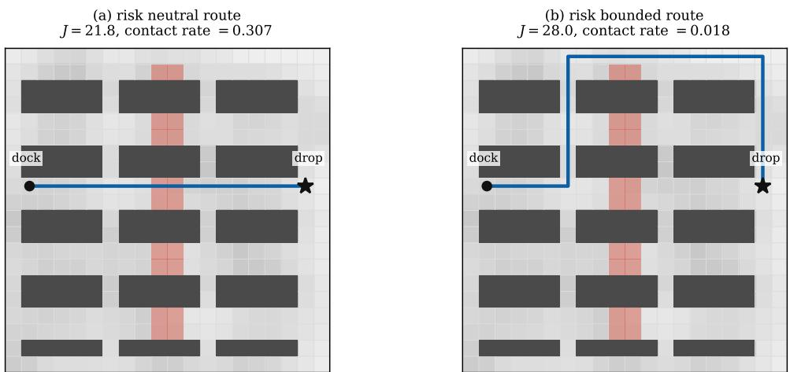  
Fig. 1. The warehouse benchmark. Dark blocks are shelves, the shading of free cells is the unknown traversal cost, and the red band is a picking zone where contact ends the episode. (a) The risk neutral route drives through the picking zone. (b) With a risk budget the same oracle call returns a detour that almost eliminates contact.

TABLE I  
ONLINE NAVIGATION METRIC COMPARISON OVER 800 EPISODES
<table><tr><td>Method</td><td>Regret ↓</td><td>Work ↓</td><td>SR ↑</td><td>CR↓</td><td>Contacts↓</td></tr><tr><td>DORA</td><td> ${ \bf 2 0 3 \pm 7 4 }$ </td><td>15,084</td><td>0.984</td><td>0.016</td><td>12.7</td></tr><tr><td>DORA-0</td><td> $4 , 8 0 6 \pm 8 6 6$ </td><td>772</td><td>0.727</td><td>0.273</td><td>219.4</td></tr><tr><td>CED</td><td> $4 , 7 5 1 \pm 8 4 1$ </td><td>772</td><td>0.727</td><td>0.273</td><td>218.7</td></tr><tr><td>EGD</td><td> $7 , 7 5 3 \pm 7 4 0$ </td><td>772</td><td>0.709</td><td>0.291</td><td>232.6</td></tr><tr><td>OVI-U</td><td> $1 , 9 0 6 \pm 1 , 6 6 6$ </td><td>196,094</td><td>0.983</td><td>0.017</td><td>20.5</td></tr><tr><td>OVI-K</td><td> $2 0 3 \pm 4 7$ </td><td>164,801</td><td>0.984</td><td>0.016</td><td>12.7</td></tr><tr><td>Optimal</td><td>一</td><td></td><td>0.984</td><td>0.016</td><td>一</td></tr></table>

We compare the following methods. DORA is Algorithm 1 with $I \ = \ 3$ and $\alpha ~ = ~ 0 . 4$ . DORA-0 is the ablation with the reduced cost correction switched off, which is optimistic determinize and replan. CED [27] is the certainty equivalent Dijkstra planner with neither optimism nor correction. EGD adds ε greedy exploration to CED. OVI-U is optimistic value iteration that estimates the transition kernel [23], [7], and OVI-K uses the true kernel. Both value iteration baselines are run to convergence with a warm start at every episode, so they are not penalized by an arbitrary sweep budget.

## B. Online Navigation

Table I reports the main comparison over K = 800 episodes. We summarize the results also in Figure 2. Our findings are as follows.

First, we observe that DORA attains a regret of 203, which is statistically indistinguishable from the 203 attained by OVI-K, while performing 10.9 times less planner work. It also beats OVI-U, which must estimate the transition kernel, by a factor of 9.4 in regret and by 13.0 in work. Second, the reduced cost correction is what makes this possible. The ablation DORA-0 incurs 24 times more regret and 17 times more contacts, and it converges to a policy whose cost exceeds the optimum by 5.8 units. The difference is that a determinized planner weighted by expected one step cost cannot see where a slip takes the robot, and in this map a slip into the picking zone is what causes contact. Third, safety during learning follows the same pattern. DORA accumulates 12.7 expected contacts across the whole training run, which matches the 12.7 accumulated by an agent that knows the true dynamics, whereas the uncorrected planners accumulate more than 218.

Panel (c) of Figure 2 reports planner work as the map is enlarged from 266 to 1202 states. The ratio of work between OVI-K and DORA grows from 13.7 to 21.1, further supporting our argument in Section IV. DORA performs a fixed number of oracle calls whatever the size of the map, whereas the number of value iteration sweeps needed to converge grows with the diameter.

## C. Losslessness of Dijkstra-class Algorithms

The second experiment tests our theory. We sweep the slip probability from 0 to 0.45 on 25 instances with a strongly varying terrain field and no picking zone, so that the only source of difficulty is actuation noise. For each instance we compute the exact optimal value, evaluate the two exactness conditions, and evaluate three members of the Dijkstra class. Results are summarized in Figure 3.

The classical causality condition collapses immediately. At $\varepsilon = 0$ it holds at every state, and at $\varepsilon = 0 . 0 5$ it holds at only 47.3 percent of them. The reduced cost condition holds at every state action pair up to a slip of 0.30, and even at $\varepsilon = 0 . 4 5$ it holds at 92.8 percent of them. Correspondingly, the member of the class defined by the reduced costs is exactly optimal at every slip level tested, to the precision of the computation. The DORA fixed point, which reaches the same weights from data stays within 0.011 percent of the optimum.

Finally, we note the contrast with the two standard reference points. The member of the class weighted by expected one step cost, which is what determinize and replan uses, loses up to 7.1 percent, with a ninetieth percentile loss of 14.5 percent. The a posteriori residual bound of [30], in which the Bellman residual is amplified by the expected time to absorption, exceeds the optimal value itself for any slip above

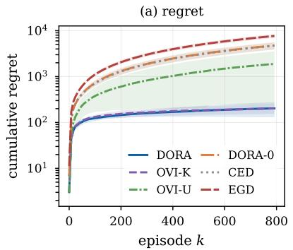

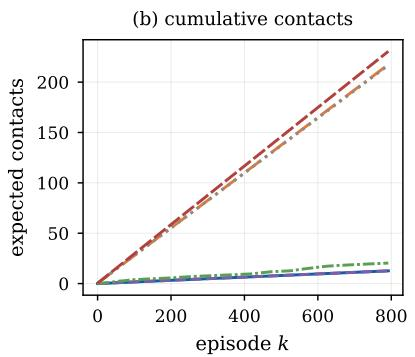

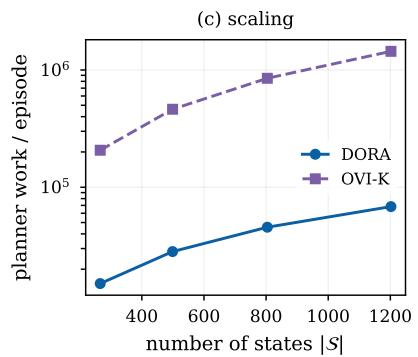

Fig. 2. Online warehouse navigation results. (a) Cumulative regret, shaded by one standard deviation over ten instances. (b) Expected contacts accumulated during learning. (c) Planner work per episode as the map grows.  
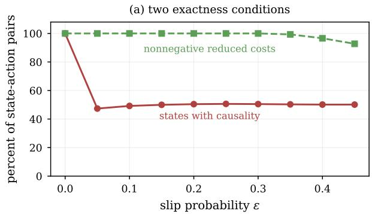

(b) suboptimality of class members  
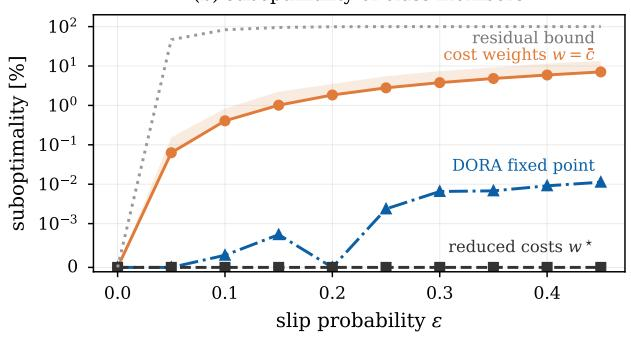  
Fig. 3. Exactness of the Dijkstra policy class. (a) Causality collapses as soon as slip is introduced, while the reduced costs stay nonnegative. (b) The reduced cost weights are exactly optimal at every slip level, and the DORA fixed point stays within 0.011 percent of the optimum.

0.15. The gap between a vacuous worst case bound and an exact policy is the practical content of Proposition 1.

## D. Chance Constrained Navigation

The third experiment enforces a risk budget. We set the contact probability in the picking zone to 0.16 and sweep the budget ∆ from 0.30 down to 0.02. DORA-S runs Algorithm 1 with the risk weight (8) and the dual update (9). As a reference we compute, on the true model, the best stationary policy that meets the budget, by bisecting a Lagrange multiplier on the true contact probability. Results are summarized in Figure 4.

The mean contact rate tracks the budget across the whole range, from 0.268 at a budget of 0.30 down to 0.011 at a budget of 0.02, against an unconstrained rate of 0.307. The cost paid for that safety rises from 22.41 to 33.99, which is the price of routing around the picking zone rather than through it. In addition, we also note two caveats. First, satisfaction is in the time averaged sense. At the intermediate budgets the mean satisfies the constraint but individual instances could violate it, which is expected because dual ascent oscillates around the boundary of the feasible set. Second, at budgets of 0.20 and 0.10 DORA-S attains a lower expected cost than the best single deterministic policy that meets the budget, namely 25.49 against 29.35. The reason is that the feasible set of deterministic policies is discrete in this map. Since there is no deterministic route with a contact rate near 0.15, the reference must jump to a much safer and much longer route. Note also dual ascent mixes two routes across episodes and lands between them instead. This is the mixture structure that is known to characterize optimal policies of constrained Markov decision processes [39].

## E. Benchmark Problems Across Navigation Tasks

The final experiment tests whether these findings are general across environments. We convert three navigation problems from the JuliaPOMDP ecosystem into stochastic shortest path form and repeat the exactness analysis and the online comparison on each of them. First, SimpleGridWorld, is a 10 × 10 grid with actuation slip of 0.3, one goal cell, and two hazard cells that absorb with the dead end penalty. Second, GeoSteeringMDP from GeoSteerings.jl [40] is a directional drilling problem in which the agent must keep the wellbore inside a sinusoidal target zone under a drift probability of 0.3 and reach the terminal zone at the right edge of the map. Finally, the drone surveillance problem [41] asks a UAV to travel from one corner of a grid to the opposite corner while a ground agent performs a random walk, and sharing a cell with the agent ends the episode. Here, traversal costs are one per move in the grid world and the drone problem. In the geosteering problem a move that lands in the target zone costs one and a move that lands in the shale margin costs eleven, which preserves the reward ratio of the original model. The learner observes each step cost with uniform noise of half width 0.2, and every other quantity is treated exactly as in the warehouse study. We run $K = 4 0 0$ episodes over five seeds per domain with $\beta = 0 . 0 5$ . Results appear in Figure 5 and II.

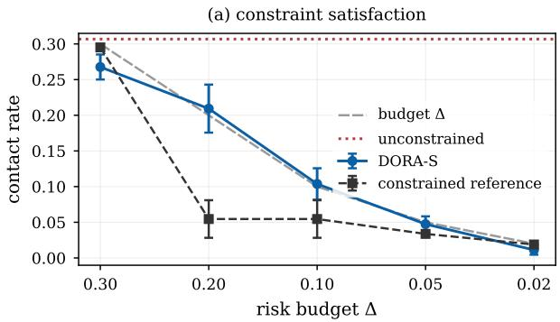

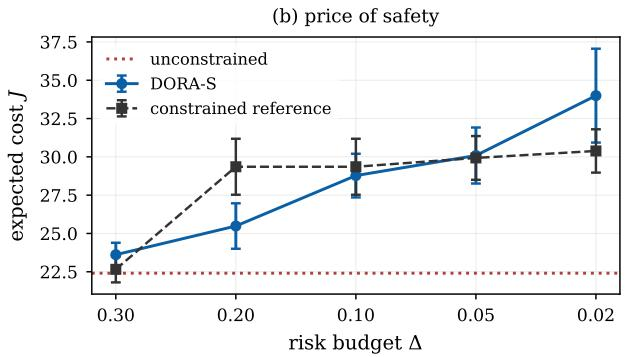  
Fig. 4. Chance constrained navigation. (a) The contact rate of DORA-S tracks the budget across two orders of magnitude. (b) The cost paid for that safety. At intermediate budgets DORA-S beats the best deterministic policy because dual ascent mixes routes across episodes.

TABLE II  
ONLINE NAVIGATION METRIC COMPARISON ON THE THREE NAVIGATION BENCHMARKS TASKS OVER 400 EPISODES
<table><tr><td>Domain</td><td>Method</td><td>Regret ↓</td><td>Work ↓</td><td>SR ↑</td><td>CR↓</td><td>Contacts ↓</td></tr><tr><td>Grid</td><td>DORA</td><td> ${ \bf 3 5 \pm 5 }$ </td><td>5,916</td><td>0.939</td><td>0.061</td><td>25.1</td></tr><tr><td>world</td><td>DORA-0</td><td> $^ { 1 , 1 8 7 \pm 2 2 2 }$ </td><td>388</td><td>0.874</td><td>0.126</td><td>57.2</td></tr><tr><td></td><td>CED</td><td> $8 9 1 \pm 3 8 8$ </td><td>388</td><td>0.883</td><td>0.117</td><td>43.2</td></tr><tr><td></td><td>OVI-K</td><td> $3 1 \pm 6$ </td><td>31,166</td><td>0.939</td><td>0.061</td><td>24.9</td></tr><tr><td>Geosteering</td><td>DORA</td><td> ${ \bf 5 , 6 2 5 \pm 1 , 3 1 8 }$ </td><td>5,634</td><td>1.000</td><td>0.000</td><td>0.0</td></tr><tr><td></td><td>DORA-0</td><td> ${ 7 , 0 9 5 \pm 2 , 3 5 8 }$ </td><td>465</td><td>1.000</td><td>0.000</td><td>0.0</td></tr><tr><td></td><td>CED</td><td> $7 , 5 7 7 \pm 1 , 9 6 5$ </td><td>465</td><td>0.999</td><td>0.000</td><td>0.0</td></tr><tr><td></td><td>OVI-K</td><td> $6 , 6 6 6 \pm 1 , 6 1 5$ </td><td>108,514</td><td>0.999</td><td>0.000</td><td>0.0</td></tr><tr><td>Drone surv.</td><td>DORA</td><td> ${ \bf 6 5 \pm 5 }$ </td><td>195,366</td><td>1.000</td><td>0.000</td><td>0.0</td></tr><tr><td></td><td>DORA-0</td><td> $1 , 6 7 3 \pm 1 3 5$ </td><td>9,847</td><td>0.803</td><td>0.197</td><td>83.9</td></tr><tr><td></td><td>CED</td><td> $2 , 0 6 7 \pm 1 5 1$ </td><td>9,847</td><td>0.781</td><td>0.219</td><td>88.9</td></tr><tr><td></td><td>OVI-K</td><td> $5 2 \pm 5$ </td><td>880,116</td><td>1.000</td><td>0.000</td><td>0.0</td></tr></table>

Figure 5 shows that the exactness picture from the warehouse carries over. The causality condition varies widely, from 3.1 percent of states in the grid world to 94.1 percent in the drone problem, while the reduced costs stay nonnegative on at least 90 percent of the state action pairs in every domain. The reduced cost member of the class is exactly optimal in the grid world and in the geosteering problem. The gap of the member weighted by expected one step cost reaches 31.7 percent in the grid world, so the correction closes a larger gap on this benchmark than on the warehouse. The drone problem is the first domain in which the clipped reduced cost member itself loses value, namely 5.8 percent. The negative entries are caused by the motion of the ground agent rather than by actuation slip. DORA nevertheless reaches a final policy within one percent of the optimum, which shows that the class contains better members than the clipped reduced cost weighting and that the learner finds one of them.

Table II shows that the online behavior also carries over. DORA attains a regret within one standard deviation of OVI-K on the grid world and the drone problem, and a lower regret than OVI-K on the geosteering domain, while performing 5.3, 19.3 and 4.5 times less planner work on the three domains. The reduced cost correction remains essential. DORA-0 and CED incur 25 to 34 times more regret than DORA on the grid world and the drone problem, and they roughly double the contacts accumulated in the grid world and drive the contact rate of the final policy to about 0.2 in the drone problem. The geosteering domain has no crash state, so every method is safe there, and the correction still reduces the regret by about a fifth.

## VI. DISCUSSION

## A. Role of the Reduced Cost Views

The label-setting literature is organized around causality, and causality is a demanding condition. Our results suggest it is the wrong condition to check when the question is whether the Dijkstra derived policy class is expressive enough. Causality asks whether the value decreases along every stochastic outcome. Exact representation only asks whether it decreases along the determinized edge, after the drift caused by the other outcomes has been charged to that edge. Figure 3 quantifies the difference.

This also explains a long standing empirical puzzle. Determinize and replan is known to work far better than worst case analysis predicts [27], [28], and equally known to have no useful guarantee [29]. Our interpretation is that the practical success comes from the policy class, which is rich enough to contain the optimum, while the missing guarantee comes from the weighting.

## B. Compute and Deployment

DORA performs a fixed number of oracle calls per episode, which does not depend on the size of the map. Planning time is therefore more predictable, which is what a real time control loop requires, and the oracle is the same shortest path routine that navigation stacks already contain. Using that perspective, DORA can be added to an existing planner as a change to the edge weights instead of a replacement of the planning layer.

## C. Safety by Construction

One observation deserves emphasis for safety critical deployment. The determinized graph contains no edge into the crash state, so the oracle cannot return a route that plans to collide, and risk enters only through the weights. Optimistic value iteration has no such protection. In an early version of our study it actively sought the absorbing failure state, because an unvisited action looked cheap and the failure state carried no future cost. We removed that pathology by giving every method the known dead end penalty, which is the standard treatment in this literature [42]. Constraining the search space of the planner is a more robust safety mechanism than relying on a value function to have learned that failure is expensive.

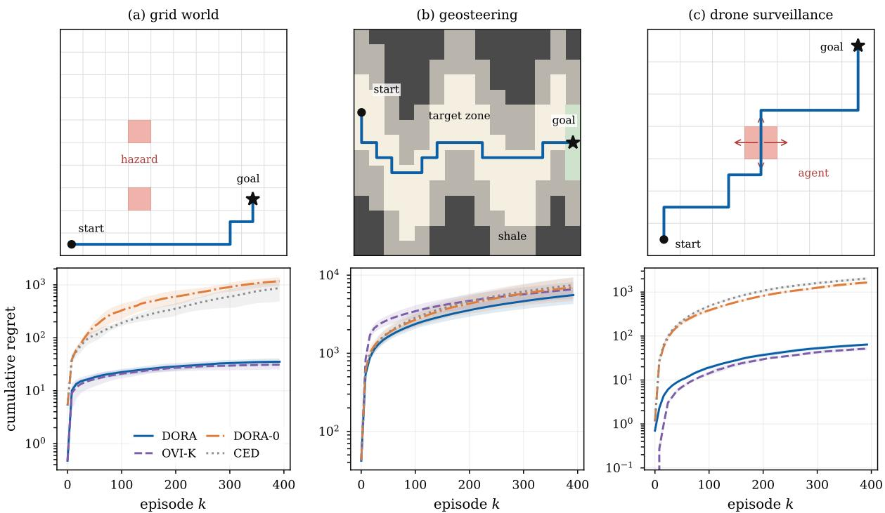  
Fig. 5. Benchmark problems on navigation tasks. The top row shows each problem and the optimal determinized route. Hazard cells and the ground agent are red. In the geosteering problem the target zone is white, the shale margin is gray, and the terminal zone is green. The bottom row shows cumulative regret, shaded by one standard deviation over five seeds.

## D. Limitations

Finally, we highlight three limitations. First, DORA uses the actuation model, namely the scalar slip probability and the map geometry. This is far less than a transition kernel and is a calibrated quantity on a real platform, but it is still a required input. An extension that estimates the slip probability online was omitted in this study. Second, the regret guarantee proved in Appendix A covers the variant whose inner iteration is run to convergence, and the implemented algorithm with its finite inner iteration is supported only by experiments. Third, the benchmarks are grid maps with a small number of motion primitives. Continuous state, non holonomic dynamics and partial observability would each require additional work, although the reduced cost identity itself does not depend on the grid structure. We aim to study these further extensions in future work.

## VII. CONCLUSION

This paper revisits the use of Dijkstra’s algorithm for SSP navigation. We showed that the policy class induced by shortest path search contains an optimal policy whenever a reduced cost defined on the determinized map is nonnegative, and that this condition is much weaker than the causality condition normally invoked in past studies. On a warehouse navigation benchmark the condition holds on every state action pair up to a slip probability of 0.30, and the reduced cost member of the class is exactly optimal at every slip level we tested. Building on this, we introduced DORA (Dijkstra Oracle Reduced-cost Algorithm), an online learner that reaches this member using a fixed number of oracle calls per episode and no transition kernel. DORA matches optimistic value iteration that is given the true kernel while performing an order of magnitude less planner work, and the gap widens with the size of the map, which we validate further on three navigation benchmarks. Future work will estimate the actuation model online, complete the regret analysis, and extend the reduced cost construction to continuous state planners.

## REFERENCES

[1] E. Marder-Eppstein, E. Berger, T. Foote, B. Gerkey, and K. Konolige, “The office marathon: robust navigation in an indoor office environment,” in IEEE International Conference on Robotics and Automation (ICRA), pp. 300–307, 2010.

[2] P. Trautman and A. Krause, “Unfreezing the robot: navigation in dense, interacting crowds,” in IEEE/RSJ International Conference on Intelligent Robots and Systems (IROS), pp. 797–803, 2010.

[3] V. Malathi, P. Sreedharan, R. P R, V. Anil Kumar, A. L. Sadasivan, G. Udupa, L. Pastorelli, and A. Troppina, “Decision-making for path planning of mobile robots under uncertainty: a review of belief-space planning simplifications,” Robotics, vol. 14, no. 9, p. 127, 2025.

[4] D. P. Bertsekas and J. N. Tsitsiklis, “An analysis of stochastic shortest path problems,” Mathematics of Operations Research, vol. 16, no. 3, pp. 580–595, 1991.

[5] E. A. Hansen and S. Zilberstein, “LAO\*: a heuristic search algorithm that finds solutions with loops,” Artificial Intelligence, vol. 129, no. 1–2, pp. 35–62, 2001.

[6] B. Bonet and H. Geffner, “Labeled RTDP: improving the convergence of real-time dynamic programming,” in International Conference on Automated Planning and Scheduling (ICAPS), pp. 12–21, 2003.

[7] A. Rosenberg, A. Cohen, Y. Mansour, and H. Kaplan, “Near-optimal regret bounds for stochastic shortest path,” in International Conference on Machine Learning (ICML), pp. 8210–8219, 2020.

[8] A. Cohen, Y. Efroni, Y. Mansour, and A. Rosenberg, “Minimax regret for stochastic shortest path,” in Advances in Neural Information Processing Systems (NeurIPS), pp. 28350–28361, 2021.

[9] J. Tarbouriech, R. Zhou, S. S. Du, M. Pirotta, M. Valko, and A. Lazaric, “Stochastic shortest path: minimax, parameter-free and towards horizonfree regret,” in Advances in Neural Information Processing Systems (NeurIPS), pp. 6843–6855, 2021.

[10] E. W. Dijkstra, “A note on two problems in connexion with graphs,” Numerische Mathematik, vol. 1, no. 1, pp. 269–271, 1959.

[11] S. Macenski, F. Mart´ın, R. White, and J. G. Clavero, “The Marathon 2: a navigation system,” in IEEE/RSJ International Conference on Intelligent Robots and Systems (IROS), pp. 2718–2725, 2020.

[12] A. Vladimirsky, “Label-setting methods for multimode stochastic shortest path problems on graphs,” Mathematics of Operations Research, vol. 33, no. 4, pp. 821–838, 2008.

[13] M. E. Gaspard and A. Vladimirsky, “Monotone causality in opportunistically stochastic shortest path problems,” Mathematics of Operations Research, 2025.

[14] P. E. Hart, N. J. Nilsson, and B. Raphael, “A formal basis for the heuristic determination of minimum cost paths,” IEEE Transactions on Systems Science and Cybernetics, vol. 4, no. 2, pp. 100–107, 1968.

[15] S. Koenig and M. Likhachev, “D\* Lite,” in AAAI Conference on Artificial Intelligence, pp. 476–483, 2002.

[16] M. Likhachev, G. Gordon, and S. Thrun, “ARA\*: anytime A\* with provable bounds on sub-optimality,” in Advances in Neural Information Processing Systems (NIPS), 2003.

[17] M. Likhachev, D. Ferguson, G. Gordon, A. Stentz, and S. Thrun, “Anytime dynamic A\*: an anytime, replanning algorithm,” in International Conference on Automated Planning and Scheduling (ICAPS), pp. 262– 271, 2005.

[18] H. B. McMahan and G. J. Gordon, “Fast exact planning in Markov decision processes,” in International Conference on Automated Planning and Scheduling (ICAPS), pp. 151–160, 2005.

[19] H. B. McMahan, M. Likhachev, and G. J. Gordon, “Bounded real-time dynamic programming: RTDP with monotone upper bounds and performance guarantees,” in International Conference on Machine Learning (ICML), pp. 569–576, 2005.

[20] P. Dai and J. Goldsmith, “Topological value iteration algorithm for Markov decision processes,” in International Joint Conference on Artificial Intelligence (IJCAI), pp. 1860–1865, 2007.

[21] P. Dai, Mausam, D. S. Weld, and J. Goldsmith, “Topological value iteration algorithms,” Journal ofArtificial Intelligence Research, vol. 42, pp. 181–209, 2011.

[22] D. P. Bertsekas, “Robust shortest path planning and semicontractive dynamic programming,” Naval Research Logistics, vol. 66, no. 1, pp. 15–37, 2019.

[23] J. Tarbouriech, E. Garcelon, M. Valko, M. Pirotta, and A. Lazaric, “Noregret exploration in goal-oriented reinforcement learning,” in International Conference on Machine Learning (ICML), pp. 9428–9437, 2020.

[24] L. Chen, H. Luo, and A. Rosenberg, “Policy optimization for stochastic shortest path,” in Conference on Learning Theory (COLT), pp. 982– 1046, 2022.

[25] L. Chen, A. Tirinzoni, M. Pirotta, and A. Lazaric, “Reaching goals is hard: settling the sample complexity of the stochastic shortest path,” in International Conference on Algorithmic Learning Theory (ALT), pp. 310–357, 2023.

[26] A. Kalai and S. Vempala, “Efficient algorithms for online decision problems,” Journal of Computer and System Sciences, vol. 71, no. 3, pp. 291–307, 2005.

[27] S. W. Yoon, A. Fern, and R. Givan, “FF-Replan: a baseline for probabilistic planning,” in International Conference on Automated Planning and Scheduling (ICAPS), pp. 352–359, 2007.

[28] I. Little and S. Thiebaux, “Probabilistic planning vs replanning,” in´ ICAPS Workshop on the International Planning Competition, 2007.

[29] L. E. Pineda and S. Zilberstein, “Probabilistic planning with reduced models,” Journal of Artificial Intelligence Research, vol. 65, pp. 271– 306, 2019.

[30] E. A. Hansen, “Suboptimality bounds for stochastic shortest path problems,” in Conference on Uncertainty in Artificial Intelligence (UAI), pp. 301–308, 2011.

[31] M. Ono and B. C. Williams, “Iterative risk allocation: a new approach to robust model predictive control with a joint chance constraint,” in IEEE Conference on Decision and Control (CDC), pp. 3427–3432, 2008.

[32] P. Santana, S. Thiebaux, and B. Williams, “RAO\*: an algorithm for´ chance-constrained POMDPs,” in AAAI Conference on Artificial Intelligence, pp. 3308–3314, 2016.

[33] A.-a. Agha-mohammadi, S. Chakravorty, and N. M. Amato, “FIRM: sampling-based feedback motion-planning under motion uncertainty and imperfect measurements,” International Journal of Robotics Research, vol. 33, no. 2, pp. 268–304, 2014.

[34] T. Han, J.-P. Katoen, and B. Damman, “Counterexample generation in probabilistic model checking,” IEEE Transactions on Software Engineering, vol. 35, no. 2, pp. 241–257, 2009.

[35] E. Nikolova, “Approximation algorithms for reliable stochastic combinatorial optimization,” in International Workshop on Approximation Algorithms for Combinatorial Optimization Problems (APPROX), pp. 338– 351, 2010.

[36] D. Bertsimas and M. Sim, “Robust discrete optimization and network flows,” Mathematical Programming, vol. 98, no. 1–3, pp. 49–71, 2003.

[37] L. Blackmore, M. Ono, and B. C. Williams, “Chance-constrained optimal path planning with obstacles,” IEEE Transactions on Robotics, vol. 27, no. 6, pp. 1080–1094, 2011.

[38] O. de Groot, L. Ferranti, D. M. Gavrila, and J. Alonso-Mora, “Scenariobased motion planning with bounded probability of collision,” International Journal of Robotics Research, vol. 44, no. 9, pp. 1507–1525, 2025.

[39] E. Altman, Constrained Markov Decision Processes. Boca Raton, FL: Chapman and Hall/CRC, 1999.

[40] Anonymous, “GeoSteerings.jl: sequential decision making for geosteering.” Repository withheld for double-anonymous review, 2024.

[41] JuliaPOMDP, “DroneSurveillance.jl: implementation of a drone surveillance problem with POMDPs.jl.” https://github.com/JuliaPOMDP/ DroneSurveillance.jl, 2019.

[42] A. Kolobov, Mausam, D. S. Weld, and H. Geffner, “Heuristic search for generalized stochastic shortest path MDPs,” in International Conference on Automated Planning and Scheduling (ICAPS), pp. 130–137, 2011.

## APPENDIX A FORMAL STATEMENTS AND PROOFS

This appendix expands the proofs of Propositions 1 to 3 and states and proves the regret guarantee for the variant of Algorithm 1 whose inner iteration is run to convergence. Throughout, $V ^ { \star }$ and $Q ^ { \star }$ denote the exact stochastic shortest path values of $M ,$ which exist and satisfy the Bellman equation under Assumption 1 and $c _ { \operatorname* { m i n } } > 0$ by the standard theory [4]. The goal and the crash state are absorbing, with terminal cost zero at the goal and $c _ { \mathrm { d e } }$ at the crash state. For a weight vector $w \geq 0$ on the determinized edge set $E ,$ , we write $D _ { w } ( s )$ for the shortest path distance from s to $g$ in the determinized graph, which is what a backward Dijkstra call returns.

The proofs use one condition beyond the hypotheses stated in the main text.

Assumption 2 (Strict determinized progress). For every $s \notin$ {g, crash}, $V ^ { \star } ( s ) > V ^ { \star } ( \sigma ( s , \pi ^ { \star } ( s ) ) )$ .

Assumption 2 states that the intended successor of the optimal action strictly decreases the optimal value. It is the strict form of the causality condition restricted to the determinized edge, so it is still much weaker than consistent improvement, which constrains every stochastic outcome. It can fail only through an exact tie, and it holds with positive margin on every instance in our experiments.

Lemma 1 (Path lower bound). Let $s = s _ { 1 } \to s _ { 2 } \to \cdot \cdot \cdot \to$ $s _ { m + 1 } = g$ be any path in the determinized graph, with $s _ { i + 1 } =$ $\sigma ( s _ { i } , a _ { i } )$ . Then $\begin{array} { r } { \dot { \sum _ { i = 1 } ^ { m } } w ^ { \star } ( s _ { i } , a _ { i } ) \geq V ^ { \star } ( s ) } \end{array}$

Proof. By Definition 2 and $Q ^ { \star } \geq V ^ { \star }$

$$
\begin{array} { c } { { \displaystyle \sum _ { i = 1 } ^ { m } w ^ { \star } ( s _ { i } , a _ { i } ) = \sum _ { i = 1 } ^ { m } \left( Q ^ { \star } ( s _ { i } , a _ { i } ) - V ^ { \star } ( s _ { i + 1 } ) \right) } } \\ { { \displaystyle \geq \sum _ { i = 1 } ^ { m } \left( V ^ { \star } ( s _ { i } ) - V ^ { \star } ( s _ { i + 1 } ) \right) , } } \end{array}
$$

and the last sum telescopes to $V ^ { \star } ( s ) - V ^ { \star } ( g ) = V ^ { \star } ( s )$

Lemma 2 (Achievability). Under Assumption 2, for every s the path that follows $\pi ^ { \star }$ through the determinized graph reaches g, and its total weight equals $V ^ { \star } ( s )$ . Hence $D _ { w ^ { \star } } ( s ) \leq$ $V ^ { \star } ( s )$

Proof. Along the path $s _ { i + 1 } = \sigma ( s _ { i } , \pi ^ { \star } ( s _ { i } ) )$ the optimal value strictly decreases by Assumption 2. Since the state space is finite and the crash state cannot be a determinized successor, the path cannot revisit a state and must terminate at g. At the optimal action $Q ^ { \star } ( s _ { i } , \pi ^ { \star } ( s _ { i } ) ) = V ^ { \star } ( s _ { i } )$ , so every inequality in the proof of Lemma 1 holds with equality, and the total weight telescopes exactly to $V ^ { \star } ( s )$ □

Proof of Proposition 1. Under the hypothesis $w ^ { \star } \geq 0$ on E, Dijkstra computes $D _ { w ^ { \star } }$ . Lemmas 1 and 2 give $D _ { w ^ { \star } } = V ^ { \star }$ The greedy policy of the shortest path tree satisfies

$$
\begin{array} { c } { { \pi _ { w ^ { \star } } ( s ) \in \arg \operatorname* { m i n } _ { a } \{ w ^ { \star } ( s , a ) + D _ { w ^ { \star } } ( \sigma ( s , a ) ) \} } } \\ { { = \arg \operatorname* { m i n } _ { a } Q ^ { \star } ( s , a ) , } } \end{array}
$$

so $\pi _ { w ^ { \star } }$ is greedy with respect to $V ^ { \star }$ and therefore optimal [4]. ■

Proof of Proposition 2. At the optimal action $\begin{array} { l l l } { { Q ^ { \star } ( s , \pi ^ { \star } ( s ) ) } } & { { = } } & { { V ^ { \star } ( s ) } } \end{array}$ , and substituting into (3) gives $\begin{array} { r l r } { w ^ { \star } ( s , \pi ^ { \star } ( s ) ) } & { { } = } & { V ^ { \star } ( s ) - V ^ { \star } ( \sigma ( s , \pi ^ { \star } ( s ) ) ) } \end{array}$ . Consistent improvement requires $V ^ { \star } ( s ) > V ^ { \star } ( s ^ { \prime } )$ for every successor $s ^ { \prime }$ with positive probability, and the determinized successor is one of them, so consistent improvement implies $w ^ { \star } ( s , \pi ^ { \star } ( s ) ) \geq 0 .$ For the converse, a lateral slip outcome may satisfy $V ^ { \star } ( s ^ { \prime } ) ~ > ~ V ^ { \star } ( s )$ and violate consistent improvement while leaving the determinized edge, and hence the reduced cost, unchanged. Figure 3 shows that this is the typical case rather than the exception. ■

Proof of Proposition 3. With $\hat { c } = \bar { c } , \hat { P } = P$ and $b \equiv 0$ substituting $d = V ^ { \star }$ into (7) and comparing with (4) gives $w = [ w ^ { \star } ] ^ { + }$ , which equals $w ^ { \star }$ under the hypothesis $w ^ { \star } \geq 0$ The oracle then returns $d ^ { + } = D _ { w ^ { \star } } = V ^ { \star }$ by Lemmas 1 and $^ { 2 , }$ so the damped update leaves d unchanged, and the returned policy is $\pi _ { w ^ { \star } }$ , which is optimal by Proposition 1. ■

## A. Regret of the Idealized Variant

We analyze the variant of Algorithm 1 in which the inner iteration is run to its fixed point at every episode, so that by Proposition 3 the executed policy $\pi _ { k }$ is an optimal policy of the optimistic model $M _ { k }$ that has the true kernel $P$ and the step costs $c _ { k } ( s , a ) = \operatorname* { m a x } ( c _ { \mathrm { m i n } } , \hat { c } _ { k } ( s , a ) - b _ { k } ( s , a ) )$ ). Episodes are run to absorption. The analysis uses three conditions.

Assumption 3. (i) Observed step costs are $\bar { c } ( s , a ) + \eta$ with η independent, mean zero, and bounded in $[ - \bar { \eta } , \bar { \eta } ]$ , and the radius scale satisfies $\beta \geq ( c _ { \operatorname* { m a x } } + \bar { \eta } ) / \sqrt { 2 } .$ (ii) The exactness conditions of Propositions 1 and 3 and Assumption 2 hold for every optimistic model $M _ { k }$ . (iii) Every executed policy is proper, and its expected time to absorption from every state is at most $\tau _ { \mathrm { m a x } } .$

Proposition 4 (Regret). Under Assumptions 1 to 3, with probability at least $1 - \delta$ the idealized variant satisfies

$$
R _ { K } \ \le \ 4 \beta \sqrt { \log \bigl ( 2 \vert { \cal S } \vert \vert { \cal A } \vert { \cal K } / \delta \bigr ) } \sqrt { \vert { \cal S } \vert \vert { \cal A } \vert T _ { K } } ,
$$

where $T _ { K }$ is the total number of steps taken in the K episodes. Since $\mathbb { E } [ T _ { K } ] \le \tau _ { \operatorname* { m a x } } K$ , the expected regret is of order $\tilde { O } ( \beta \sqrt { \tau _ { \mathrm { m a x } } | } \bar { S } | | \bar { \mathcal { A } } | K )$

Proof. Let $L = \log ( 2 | S | | \mathcal { A } | K / \delta )$ and let G be the event that $| \hat { c } _ { k } ( s , a ) - \bar { c } ( s , a ) | \leq b _ { k } ( s , a )$ for all $( s , a )$ and all $k \leq K$ . Each observed cost lies in an interval of length at most $c _ { \operatorname* { m a x } } + 2 \bar { \eta } \leq$ $2 \sqrt { 2 } \beta$ , so by Hoeffding’s inequality and a union bound over states, actions, episodes, and the two tail directions, $\mathbb { P } ( \mathcal { G } ) \ge$ $1 - \delta$ with the radius (5). The remainder of the proof conditions on G.

First, optimism. On $\mathcal { G } , \ c _ { k } ( s , a ) \ \leq \ \bar { c } ( s , a )$ for every pair, because $\hat { c } _ { k } \mathrm { ~ - ~ } b _ { k } \mathrm { ~ \le ~ } \bar { c }$ and $c _ { \operatorname* { m i n } } \ \leq \ { \bar { c } } .$ Values of a fixed proper policy are monotone in the step costs, so ${ \cal V } _ { M _ { k } } ^ { \star } ( s _ { 0 } ) \leq$ $J _ { M _ { k } } ^ { \pi ^ { \star } } ( s _ { 0 } ) \leq J _ { M } ^ { \pi ^ { \star } } ( s _ { 0 } ) = V ^ { \star } ( s _ { 0 } )$

Second, the value difference. The models M and $M _ { k }$ share the kernel and the terminal costs and differ only in the step costs, so for the proper policy $\pi _ { k }$

$$
\begin{array} { l l l c } { { \displaystyle J _ { M } ^ { \pi _ { k } } \left( s _ { 0 } \right) - J _ { M _ { k } } ^ { \pi _ { k } } \left( s _ { 0 } \right) = { \mathbb E } ^ { \pi _ { k } } \Big [ \sum _ { t } \left( \bar { c } - c _ { k } \right) \left( s _ { t } , a _ { t } \right) \Big ] } } \\ { { \displaystyle \quad \leq { \mathbb E } ^ { \pi _ { k } } \Big [ \sum _ { t } 2 b _ { k } ( s _ { t } , a _ { t } ) \Big ] } , } \end{array}
$$

where the sum runs until absorption and the inequality uses $\bar { c } - c _ { k } \le \bar { c } - ( \hat { c } _ { k } - b _ { k } ) \le 2 b _ { k }$ on ${ \mathcal { G } } .$ . Since $\pi _ { k }$ is optimal for $M _ { k }$ by Proposition 3 and Assumption 3(ii), $J _ { M _ { k } } ^ { \pi _ { k } } ( s _ { 0 } ) =$ $V _ { M _ { k } } ^ { \star } ( s _ { 0 } ) \leq V ^ { \star } ( s _ { 0 } )$ , and the per episode regret is bounded by the displayed expectation.

Third, the pigeonhole step. Summing the realized radii over the whole run and letting ${ \cal N } _ { T } ( s , a )$ be the final visit counts,

$$
\begin{array} { r l r } {  { \sum _ { k = 1 } ^ { K } \sum _ { t } b _ { k } ( s _ { t } , a _ { t } ) \leq \beta \sqrt { L } \sum _ { s , a } \sum _ { j = 1 } ^ { N _ { T } ( s , a ) } \frac { 1 } { \sqrt { j } } } } \\ & { } & { \leq 2 \beta \sqrt { L } \sum _ { s , a } \sqrt { N _ { T } ( s , a ) } , } \end{array}
$$

and by the Cauchy Schwarz inequality the last sum is at most $\sqrt { | { \cal S } | | { \cal A } | T _ { K } }$ . Combining the three steps gives the claim.

Proposition 4 covers the idealized variant. The implemented algorithm differs in two ways: the inner loop performs I damped iterations rather than running to convergence, and the clipping in (7) can be active when the optimistic reduced costs are negative. Proposition 3 identifies the fixed point that the inner loop targets, and Section V verifies empirically that I = 3 damped iterations track the idealized behavior. Closing this gap formally is left to future work, as stated in Section VI.

## APPENDIX B EXPERIMENTAL PARAMETERS

Tables III and IV list every parameter of the four experiments. The warehouse model and the learners are described in Sections III to V, and the benchmark conversions in Section V-E.

The geosteering map uses the default generator of the original package, with base amplitude 3.0, base frequency 1.0, amplitude variation 0.5, frequency variation 0.05, phase 0.3, vertical shift 7.0, and target thickness 5.0. All learners in every experiment use the radius scale $\beta = 0 . 0 5$ and the confidence parameter $\delta = 0 . 1$

## APPENDIX C POLICY ROLLOUTS

Figures 6 to 9 compare one rollout of the final DORA policy with one rollout of the final OVI-K policy in each domain. The sequences illustrate the main quantitative finding of Section V. In every domain the two final policies follow nearly the same route, although DORA computed its policy with a fixed number of shortest path calls per episode while OVI-K ran value iteration with the true kernel. In the warehouse both policies route above the picking zone, which is optimal at this dead end penalty. In the grid world both detour below the hazard cells, in the geosteering domain both follow the sinusoidal target zone and absorb the same drift events, and in the drone domain both curve around the region that the ground agent occupies.

TABLE III  
PARAMETERS OF THE WAREHOUSE EXPERIMENTS.
<table><tr><td>Parameter</td><td>Exp. 1</td><td>Exp. 2</td><td>Exp. 3</td></tr><tr><td>Map size</td><td> $2 0 \times 2 0$ </td><td> $2 0 \times 2 0$ </td><td>20 × 20</td></tr><tr><td>States |S|</td><td>266</td><td>266</td><td>266</td></tr><tr><td>Slip probability ε</td><td>0.10</td><td>0 to 0.45</td><td>0.10</td></tr><tr><td>Picking zone contact prob.</td><td>0.14</td><td>0</td><td>0.16</td></tr><tr><td>Terrain roughness</td><td>0.5</td><td>1.6</td><td>0.5</td></tr><tr><td>Cost bounds [cmin, Cmax]</td><td></td><td>[0.25, 2.2]</td><td></td></tr><tr><td>Bump cost</td><td>1.5</td><td>1.5</td><td>1.5</td></tr><tr><td>Dead end penalty  $c _ { \mathrm { d e } }$ </td><td>80</td><td>80</td><td>25</td></tr><tr><td>Timeout penalty  $c _ { \mathbf { t o } }$ </td><td>60</td><td>60</td><td>60</td></tr><tr><td>Horizon H</td><td>150</td><td>150</td><td>150</td></tr><tr><td>Cost noise half width</td><td>0.12</td><td></td><td>0.12</td></tr><tr><td>Episodes K</td><td>800</td><td></td><td>800</td></tr><tr><td>Instances</td><td>10</td><td>25</td><td>10</td></tr><tr><td>Radius scale  $\beta ,$  confidence δ</td><td>0.05, 0.1</td><td></td><td>0.05, 0.1</td></tr><tr><td>Inner iterations I, damping α</td><td>3, 0.4</td><td>8,0.4</td><td>3, 0.4</td></tr><tr><td>OVI sweep cap, tolerance</td><td>200, 10−4</td><td></td><td></td></tr><tr><td>EGD exploration rate</td><td>0.10</td><td></td><td></td></tr><tr><td>Scaling sizes</td><td>{20, 28, 36, 44}</td><td></td><td></td></tr><tr><td>Scaling episodes, seeds</td><td>60,3</td><td></td><td></td></tr><tr><td>Dual step ηo, cap  $\lambda _ { \mathrm { m a x } }$ </td><td></td><td></td><td>300,300</td></tr></table>

TABLE IV  
PARAMETERS OF THE BENCHMARK DOMAINS OF EXPERIMENT 4.
<table><tr><td>Parameter</td><td>Grid world</td><td>Geosteering</td><td>Drone surv.</td></tr><tr><td>Grid size</td><td> $1 0 \times 1 0$ </td><td> $1 5 \times 1 5$ </td><td>7 × 7</td></tr><tr><td>States |S|</td><td>99</td><td>157</td><td>2211</td></tr><tr><td>Actions</td><td>4</td><td>3</td><td>5</td></tr><tr><td>Motion noise</td><td>slip 0.3</td><td>drift 0.3</td><td>agent walk</td></tr><tr><td>Start</td><td>(1,1)</td><td>(1, 10)</td><td>(1, 1), agent (4, 4)</td></tr><tr><td>Goal</td><td>(9,3)</td><td>right edge</td><td>(7,7)</td></tr><tr><td>Hazards</td><td>(4, 3), (4, 6)</td><td>shale margin</td><td>meeting agent</td></tr><tr><td>Step cost</td><td>1</td><td>1 / 11</td><td>1</td></tr><tr><td>Dead end penalty cde</td><td>20</td><td>60</td><td>25</td></tr><tr><td>Timeout penalty Cto</td><td>30</td><td>120</td><td>40</td></tr><tr><td>Horizon H</td><td>100</td><td>100</td><td>100</td></tr><tr><td>Cost noise half width, Cmin</td><td>0.2, 0.5</td><td>0.2, 0.5</td><td>0.2, 0.5</td></tr><tr><td>Episodes K, seeds</td><td>400, 5</td><td>400,5</td><td>400,5</td></tr><tr><td>Map generator</td><td>default</td><td>default</td><td>restricted agent</td></tr></table>

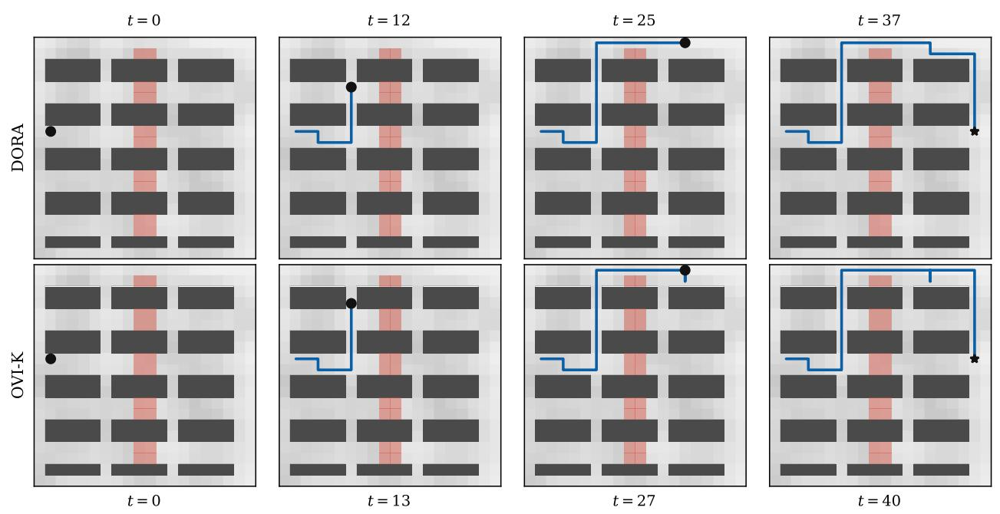  
Fig. 6. Rollout of the final DORA policy (top) and the final OVI-K policy (bottom) on the warehouse instance of experiment 1.

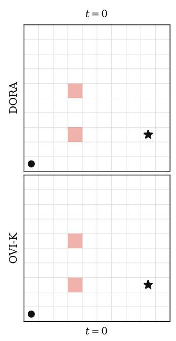

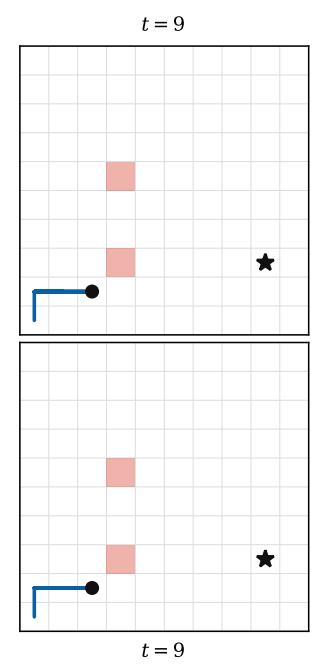  
Fig. 7. Rollout of the final policies on the grid world benchmark. Red cells are the hazard cells.

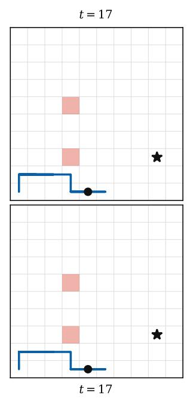

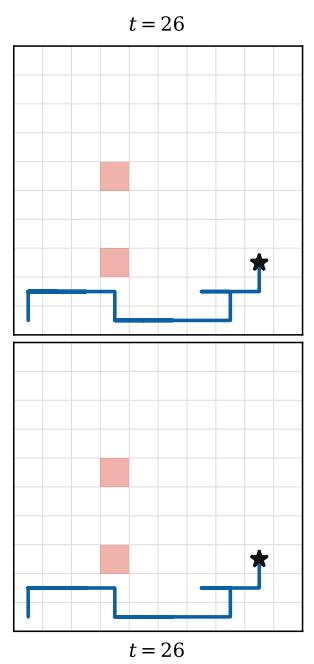

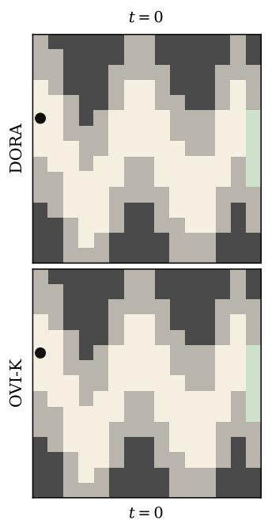

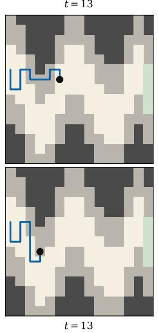

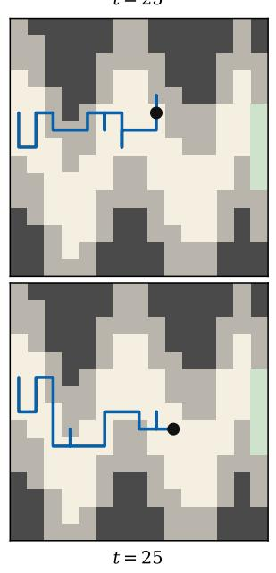

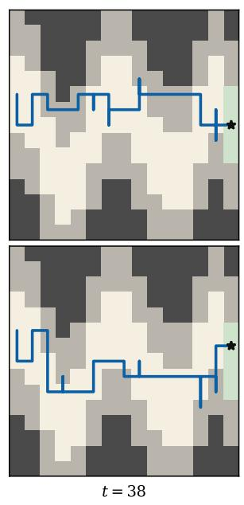  
Fig. 8. Rollout of the final policies on the geosteering benchmark. The target zone is white, the shale margin is gray, and the terminal zone is green.

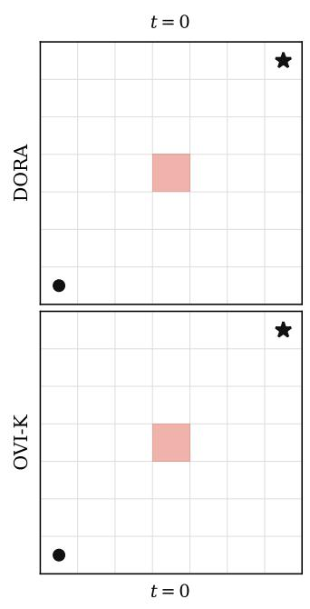

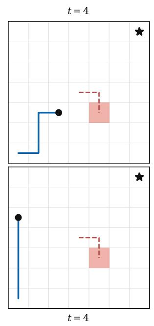

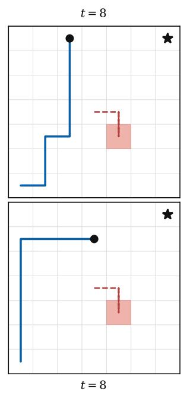  
Fig. 9. Rollout of the final policies on the drone surveillance benchmark. The dashed red line is the path of the ground agent.

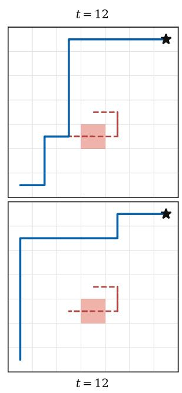