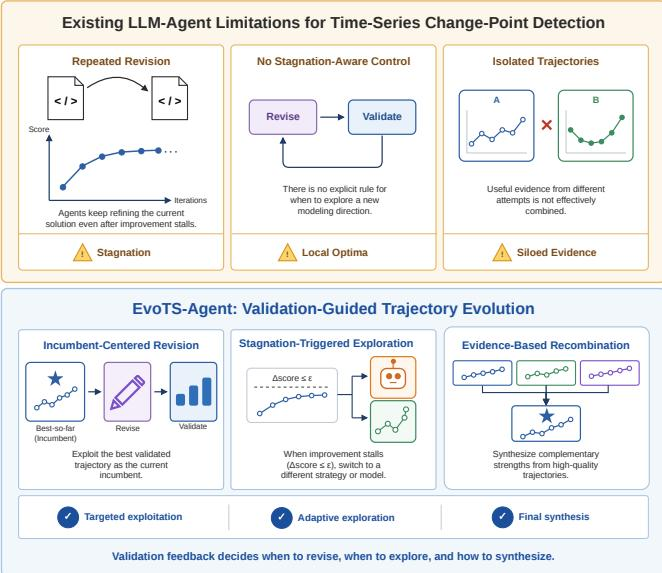
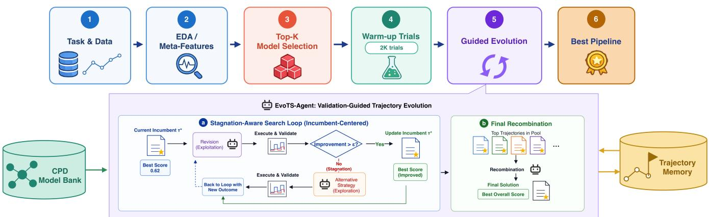
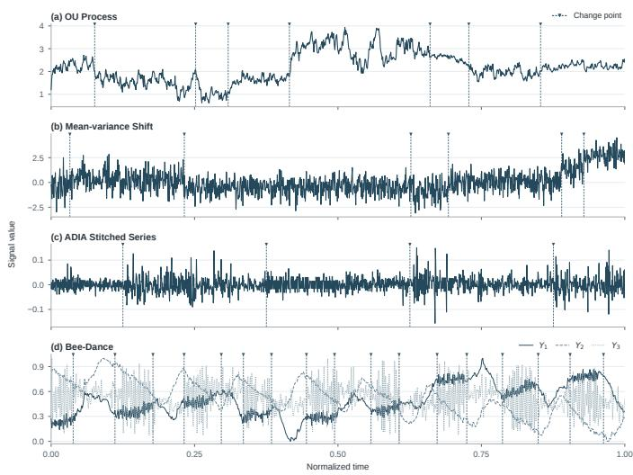
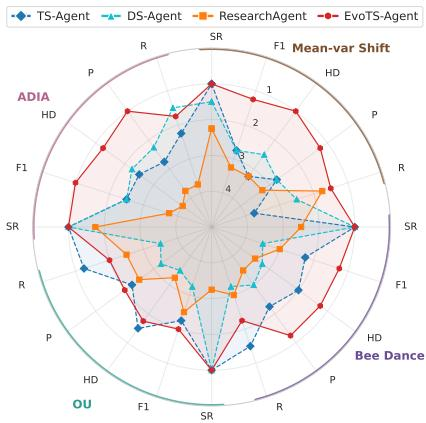
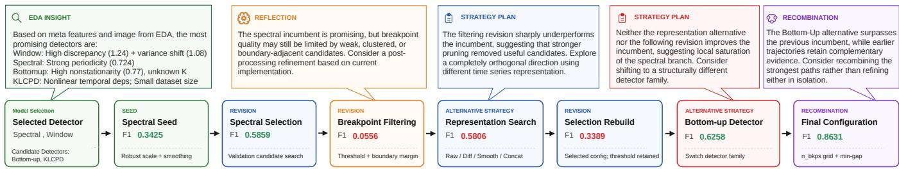

# EvoTS-Agent: A Self-Evolving LLM Agent for Financial Time Series Change Point Detection

Lei Jiang∗ Alan Turing Institute ljiang@turing.ac.uk

Jordan Langham-Lopez Alan Turing Institute jlanghamlopez@turing.ac.uk

Yihao Ang† National University of Singapore yihao\_ang@comp.nus.edu.sg

Ye Wei∗ University of Oxford ye.wei@imm.ox.ac.uk

Yifan Bao National University of Singapore yifan\_bao@comp.nus.edu.sg

Anthony K. H. Tung† National University of Singapore atung@comp.nus.edu.sg

Hao Ni† University College London h.ni@ucl.ac.uk

Xinyu Xi∗ National University of Singapore xinyu\_xi@u.nus.edu

Raad Khraishi NatWest AI Research Raad.Khraishi@natwest.com

Lukasz Szpruch† University of Edinburgh l.szpruch@ed.ac.uk

## Abstract

Financial time series exhibit non-stationary and heterogeneous statistical properties, making change-point detection challenging because no single unsupervised algorithm performs consistently across assets and market regimes. Conventional workflows conse- quently depend heavily on expert-driven model selection, feature design, and hyperparameter tuning, limiting their scalability and adaptability. We propose EvoTS-Agent, a validation-guided selfevolving LLM agent for autonomous financial time-series change-point detection. EvoTS-Agent first performs curated exploratory data analysis to characterize dataset properties and initialize candidate detection models. It then evolves executable experiment trajectories through three complementary operators: Revision exploits the current best solution, Alternative Strategy explores fundamentally diferent modeling directions when progress stagnates, and Recombination synthesizes complementary evidence from highperforming trajectories. Validation feedback guides trajectory evolution throughout the search, enabling the agent to adapt its detection pipeline to the statistical characteristics of each dataset while preserving reliable optimization. Experiments across four benchmark datasets demonstrate that EvoTS-Agent consistently outperforms existing LLM-based agents while maintaining a 100% execution success rate across all evaluated backbone LLMs.

## CCS Concepts

• Computing methodologies → Machine learning; Artificial intelligence; • Mathematics of computing → Time series analysis; • Information systems → Data mining.

## Keywords

Financial Time Series; Change Point Detection; LLM; Agents

## 1 Introduction

Financial markets are dynamic systems whose statistical properties evolve over time in response to changing macroeconomic conditions, investor behavior, liquidity, policy interventions, and un-expected external events. These changes can manifest as shifts in return distributions, volatility, correlation structures, trading activity, or other market characteristics [4]. Identifying such structural transitions is important for risk management, portfolio allocation, fraud and market-manipulation detection, and quantitative decision-making. Change-point detection provides a principled ap- proach for locating moments at which the data-generating process changes, enabling analysts to segment financial time series into statistically distinct regimes and identify potentially significant market events [3].

Despite substantial progress in change-point detection [12, 17, 21, 30], its application to financial data remains challenging. Financial time series are typically noisy, non-stationary, heavy-tailed, and characterized by time-varying volatility and dependence structures. The nature and magnitude of structural changes might also vary considerably across assets, sampling frequencies, and market regimes. Consequently, no single change-point detection algorithm performs consistently well under all conditions [29]. A method efective for abrupt mean shifts in a univariate series may be unsuit-able for gradual covariance changes in multivariate data, while an algorithm that performs well on synthetic benchmarks may degrade substantially when applied to real-world financial observations.

Selecting an appropriate detection pipeline therefore requires decisions at several levels, including the choice of algorithm, signal representation, preprocessing procedure, hyperparameters, detec- tion thresholds, and post-processing rules. These decisions are often interdependent. For example, the usefulness of a kernel-based de- tector may depend on the scaling and dimensionality of the input, while the performance of a probabilistic method may be sensitive to assumptions about noise distributions or regime duration. In conventional workflows, these choices are made manually through domain expertise, repeated experimentation, and extensive parameter tuning, with model performance also being sensitive to the quality of the underlying data [22]. Such workflows are dificult to scale across large collections of assets and datasets, and they may fail to adapt eficiently when the statistical characteristics of the observed market change.

  
Figure 1: Motivation of EvoTS-Agent.

Large language models (LLMs) have recently shown promise as reasoning and coding components within autonomous agents [5, 10, 15, 34]. By combining natural-language planning, tool use, code generation, and environmental feedback, LLM agents can perform multi-step tasks that extend beyond a single model invocation. However, as shown in Figure 1, existing LLM-agent paradigms re- main limited when applied to autonomous change-point detection. A predefined workflow may restrict the agent to a fixed sequence of operations even when validation evidence suggests that a dif ferent search strategy would be more appropriate. Retrieval-based systems [6, 15, 31] can reuse previously successful solutions, but retrieved experiences may transfer poorly to datasets with diferent statistical properties. Moreover, simple iterative refinement [9, 15] typically improves a single solution through successive revisions, but lacks explicit optimization mechanisms for deciding when to exploit the current approach and when to explore fundamentally diferent alternatives. It also provides limited support for synthesizing complementary evidence from multiple successful experiments. Consequently, once local refinement ceases to produce meaningful improvement, the search may remain confined to a suboptimal modeling direction.

To address these challenges, we propose EvoTS-Agent, a self evolving LLM agent for autonomous financial time-series change-point detection. EvoTS-Agent combines curated exploratory data analysis, model selection, executable experimentation, and validation guided trajectory evolution within a closed-loop framework. The EDA stage characterizes dataset-specific properties and uses them to initialize a diverse set ofcandidate change-point detectors. EvoTS-Agent then improves executable experiment trajectories through three complementary operators. Revision exploits the current in-cumbent by refining the best validated pipeline. When revision stagnates, Alternative Strategy explores a fundamentally diferent modeling direction or an untried EDA-recommended detector. In the final stage, Recombination synthesizes complementary evidence from high-performing trajectories. An incumbent-preserving selection rule ensures that unsuccessful experiments do not degrade the best validated solution.

We use the term self-evolution to describe this inference-time transformation and selection of experiment trajectories rather than any update to the underlying language model. Each trajectory records the experimental plan, executable implementation, vali- dation outcome, and evolutionary lineage, allowing subsequent decisions to be guided by accumulated empirical evidence.

The principal contributions of this work are as follows:

• To the best of our knowledge, EvoTS-Agent is the first selfevolving agent to automate financial time series change point detection.

• We build a comprehensive model bank, containing a di-verse collection of change-point detection methods with fundamentally diferent assumptions, enabling the agent to handle a broad spectrum of change-point scenarios.

• We design a curated EDA process for time-series change-point detection that characterizes dataset properties and leverages them to guide the LLM in selecting candidate detection models.

• We propose an adaptive evolutionary policy that performs incumbent-based revision by default, activates alternative strategies when revision stagnates, and reserves recombi-nation for final evidence-based synthesis.

Through these contributions, EvoTS-Agent reframes autonomous change-point detection as an empirical search over executable scientific experiments. Rather than relying on a fixed algorithm or a static agent workflow, the framework adapts its detection pipeline to the characteristics of each dataset and to the evidence accumulated dur- ing execution. This provides a foundation for scalable, transparent, and validation-driven financial change point detection.

## 2 Related Work

## 2.1 Change Point Detection

Change-point detection methods difer fundamentally in what they assume to be stable within a regime. The choice of assumption largely determines which types of structural changes can be de- tected efectively and, consequently, which application scenarios a method is best suited for [29]. Classical statistical methods assume that observations within each segment share constant distributional parameters, such as the mean, variance, or likelihood, and iden- tify change points through optimal segmentation [18, 19, 27] or Bayesian inference [13]. More general nonparametric approaches instead assume that the entire data distribution remains unchanged within a regime, detecting changes using measures such as maximum mean discrepancy [14] or ensemble-based statistics, enabling greater flexibility for multivariate data [21]. For high-dimensional and complex time series, recent deep learning methods assume that regime changes are more distinguishable in a learned latent representation than in the original observation space, with approaches such as KL-CPD leveraging representation learning to capture subtle structural changes [11]. Other methods characterize regimes through spectral properties, detecting changes in frequency-domain behavior that may not be evident in the time domain [26].

## 2.2 LLM-based Agents

LLM-based agents increasingly automate data-science workflows by combining planning, code generation, tool use, and execution feedback [2, 32]. ReAct [33] establishes a general agentic paradigm by interleaving reasoning and acting, enabling LLMs to iteratively interact with external environments. Building on this paradigm, DS-Agent [15] uses case-based reasoning to retrieve and adapt prior solutions, while ResearchAgent [9] iteratively develops research ideas and experimental plans using literature retrieval and reviewer feedback. TS-Agent [6] structures financial time-series modelling into model selection, code refinement, and fine-tuning, whereas MOSAIC [10] grounds workflow construction in retrieved cases and reusable modelling modules through an intermediate blueprint rep resentation. These methods improve automation through retrieval, modular orchestration, or repeated refinement, but generally follow a predefined workflow or continue revising the current solution without explicitly adapting the search policy.

SE-Agent [16] is most closely related to our work, as it evolves agent trajectories through revision, recombination, and refinement. However, SE-Agent primarily optimizes reasoning trajectories for software-engineering problem solving. EvoTS-Agent instead maintains validated executable experiment trajectories that jointly record the experimental plan, model and transformation choices, imple- mentation changes, execution feedback, validation performance, and lineage. More importantly, EvoTS-Agent uses validation outcomes to control the evolutionary process: it revises the incumbent by default, activates an alternative strategy when revision stagnates, and performs evidence-based recombination for final synthesis. Thus, empirical feedback determines not only which solution is retained, but also how the subsequent search is conducted.

## 3 Preliminaries and Problem Setup

Financial Time-Series Change-Point Detection Environment. We formulate autonomous financial change-point detection as an em- pirical optimization problem, in which an LLM agent iteratively proposes, executes, and validates candidate detection pipelines to maximize validation performance. Given a financial time series

$$
X = ( \pmb { x } _ { 1 } , \pmb { x } _ { 2 } , . . . , \pmb { x } _ { N } ) , \qquad \pmb { x } _ { i } \in \mathbb { R } ^ { d } ,\tag{1}
$$

the objective is to identify a set of structural-change locations

$$
\widehat { \mathcal { B } } = \{ \hat { b } _ { 1 } , \hat { b } _ { 2 } , . . . , \hat { b } _ { m } \} , \qquad \hat { b } _ { j } \in \{ 1 , . . . , N \} ,\tag{2}
$$

that approximates the reference boundary set B. Here, � is the sequence length and � is the number of observed variables.

Although the underlying change-point detectors operate in an unsupervised manner, EvoTS-Agent performs model selection and trajectory evolution using validation feedback. Consequently, ref- erence boundaries are available only on the validation split for evaluating experimental configurations, while test-set annotations and metrics remain hidden throughout the optimization process.

To formalize the optimization process performed by EvoTS-Agent, we model the interaction between the agent and the ex- perimentation environment as

$$
\mathcal { E } = ( \mathcal { U } , \mathcal { X } , \mathcal { A } , F , Q ) ,\tag{3}
$$

where U is the space of financial change-point detection tasks, X is the experimental state space, and A is the set of actions available to the agent. An experimental state $x \in \chi$ contains the dataset pro- file, available and previously attempted models, executable scripts, validation observations, trajectory pool, and current incumbent.

The action space includes exploratory data analysis, candidatemodel selection, experiment planning, script modification, execution, validation, trajectory revision, alternative-strategy generation, and trajectory recombination. The transition function

$$
F : X \times \mathcal { A }  X\tag{4}
$$

maps the current experimental state and an agent action to a new state. The evaluation function

$$
Q : X \times \mathcal { U }  \mathbb { R }\tag{5}
$$

assigns a validation score to an executed experiment. For change-point detection, the primary score is boundary-aware validation F1:

$$
q _ { k } = Q ( \tau _ { k } , u ) = \operatorname { F } 1 _ { \mathrm { v a l } } ( \tau _ { k } , u ) .\tag{6}
$$

Additional measures, such as Hausdorf distance, are retained as diagnostic evidence. In the current implementation, however, incumbent selection is determined by the primary scalar score ��.

Experiment Trajectories. The central object in EvoTS-Agent is an executable experiment trajectory. Rather than storing only an LLM reasoning trace, each trajectory records the experimental evidence generated during one executable experiment, including its implementation, validation outcome, and evolutionary context.

The trajectory generated at optimization step � is

$$
\tau _ { k } = \left( P , o p , \pi _ { k } , h _ { k } , M _ { k } , S _ { k } , q _ { k } , L _ { k } , D _ { k } , a _ { k } , z _ { k } \right) ,\tag{7}
$$

where � is the parent-trajectory set; �� is the selected self-evolution operation; $\pi _ { k }$ is the evolved single-trial experiment plan; $h _ { k }$ is an LLM-generated summary of the implemented experiment; $M _ { k }$ is the executed model; $S _ { k }$ is the resulting executable script; �� is the validation score; $L _ { k }$ is the sanitized execution log; $D _ { k }$ is the implemented code diference; $a _ { k } ~ \in$ {Accept, Reject} is the incumbent-selection decision; and $z _ { k } \in \{ \mathrm { T R U E } , \mathrm { F A L S E } \}$ indicates whether a revision has stagnated.

All recorded trajectories are maintained in the trajectory pool

$$
\mathcal { T } = \{ \tau _ { 1 } , \tau _ { 2 } , \ldots , \tau _ { k } \} .\tag{8}
$$

The parent set � gives each trajectory an explicit lineage. Conse-quently, T represents a directed experimental search graph rather than an unstructured conversational history.

## 4 EvoTS-Agent

Figure 2 illustrates the overall orchestration of EvoTS-Agent. Given a financial change-point detection task, the agent first performs a curated exploratory data analysis (EDA) to characterize the structural properties of the time series and extract dataset meta-features. Together with the raw time-series visualization, these meta-features

Lei Jiang, Ye Wei, Xinyu Xi, Jordan Langham-Lopez, Yifan Bao, Raad Khraishi, Yihao Ang, Anthony K. H. Tung, Lukasz Szpruch, and Hao Ni

  
Figure 2: Orchestration of EvoTS-Agent.

are provided to the LLM, which selects the top-� candidate change- point detection models from the model bank that are most suitable for the current task. During the warm-up stage, each selected model undergoes an initial implementation followed by a single revision, producing two executable experiment trajectories per model. Consequently, a total of 2 × � validated trajectories are generated and stored in the experiment trajectory memory. The trajectory achieving the highest validation score becomes the incumbent and serves as the starting point for subsequent optimization.

During the optimization stage, EvoTS-Agent iteratively improves the incumbent trajectory through three trajectory-level evolution operators. Under normal circumstances, the agent performs Revision, which refines the incumbent based on recent successful trajectories stored in memory. If the revision fails to produce meaningful validation improvement, the agent switches to Alternative Strategy, encouraging exploration of a substantially diferent modeling direction or an untried EDA-recommended model while retain- ing knowledge from previous attempts. At the final optimization step, the agent performs Recombination, synthesizing complementary strengths from multiple high-performing trajectories to generate the final experiment. Every executed experiment, including its implementation, validation result, code modifications, and sum- marized rationale, is recorded in the trajectory memory, allowing future decisions to leverage accumulated experimental evidence while preserving the best validated solution throughout the search.

## 4.1 EDA-based Model Selection

Before optimization, the agent performs lightweight EDA to guide baseline model selection. A reproducibly sampled time series is summarized using temporal, spectral, and change-sensitive features, including lag-1 autocorrelation, trend strength, nonstationarity, spectral concentration, periodicity, and local mean and variance discrepancies. Local mean and variance discrepancies are designed to characterize the type and magnitude of possible structural changes by scanning adjacent windows around candidate boundaries. Specifically, for a window width �, the local mean- and variance-discrepancy statistics at position � are defined as:

$$
\Delta _ { \mu } ( t ) = \frac { | \mu ( X _ { t : t + w } ) - \mu ( X _ { t - w : t } ) | } { \sigma _ { x } + \epsilon } ,\tag{9}
$$

and

$$
\Delta _ { \sigma } ( t ) = \frac { | \sigma ( X _ { t : t + w } ) - \sigma ( X _ { t - w : t } ) | } { \sigma _ { x } + \epsilon } .\tag{10}
$$

The maximum values over all valid positions summarize the strengths of abrupt mean and variance changes:

$$
S _ { \mu } = \operatorname* { m a x } _ { t } \Delta _ { \mu } ( t ) , \qquad S _ { \sigma } = \operatorname* { m a x } _ { t } \Delta _ { \sigma } ( t ) .\tag{11}
$$

Dataset properties such as sequence length, dimensionality, and missing-value ratio are also recorded. Ground-truth change points and test-set metrics are excluded to prevent information leakage.

The resulting meta features, an unlabeled time-series visualiza- tion, task metadata, and candidate model descriptions are provided to an LLM-based selector. The selector chooses � primary models for warm-up experiments and up to two alternatives. Primary models initialize independent optimization trajectories, while alter-natives may be considered later if validation performance stagnates. Thus, EDA eficiently narrows the model search space while leaving final model selection to validation-based evaluation.

## 4.2 Trajectory-guided Evolution

At the beginning of each optimization step, the agent retrieves the incumbent trajectory together with several recent relevant trajectories. These trajectories and the incumbent executable script form the planning context. Depending on the optimization state, the agent selects one of three trajectory-level operators—Revision, Alternative Strategy, or Recombination—and generates the next executable experiment plan using the current context and evolutionary evidence. The detailed control flow is given in Algorithm 1.

Revision. During ordinary optimization, the incumbent trajectory serves as the parent of the next experiment. The agent reflects on the incumbent script together with recent successful trajectories to produce exactly one executable modification. Revisions may alter the time-series representation, detector configuration, hyperparameters, or post-processing procedure, while preserving the overall experimental objective.

Alternative Strategy. After each revision, the agent compares the resulting validation score with that of the incumbent. When the improvement is smaller than a predefined threshold (or the experiment fails to produce a valid score), the revision is marked as stagnant. At the next non-final iteration, the agent performs Alter- native Strategy instead of another Revision. The stagnant trajectory is treated as negative evidence that discourages repeating the same search direction, while the incumbent script remains as the starting point for implementation. This encourages exploration of orthog onal modeling choices or previously untried EDA-recommended models.

Algorithm 1: Trajectory-Guided Self-Evolution   
Input: Incumbent $( M ^ { * } , S ^ { * } , q ^ { * } )$ , trajectory pool $\mathcal { T } ,$ , budget $\lambda ,$   
threshold �   
Output: Best validated model and script $( M ^ { * } , S ^ { * } )$   
1 for � ← 1 to � do   
2 $\tau ^ { * }$ ← Incumbent(T); $q _ { \mathrm { p r e v } }  q ^ { * }$ ;   
3 � ←   
CurrentContext $\left( S ^ { * } ; \right.$ , RecentRelevant $( \mathcal { T } , M ^ { * } , 4 ) )$   
4 if $k = \lambda$ then   
5 �� ← Recombine;   
6 � ← SelectStrongTrajectories $( \mathcal { T } , M ^ { * } ) \cup \{ \tau ^ { * } \}$   
7 $E  C \cup P ;$   
8 else if ∃ unused stagnated revision $\tau _ { s }$ for $M ^ { * }$ then   
9 �� ← AlternativeStrategy;   
10 $P \gets \{ \tau ^ { * } , \tau _ { s } \} ; E \gets C \cup \{ \tau _ { s } \} ;$   
11 else   
12 $o p \gets$ Revision;   
13 $P  \{ \tau ^ { * } \} ; E  C \cup P ;$   
14 $\pi _ { k } $ EvolvePlan(��, $E , M ^ { * } , S ^ { * } ) ;$   
15 $( M _ { k } , S _ { k } , q _ { k } , L _ { k } , D _ { k } ) \gets$ ExecuteAndValidate $( \pi _ { k } , S ^ { * } ) ;$   
16 if $q _ { k }$ is valid and $q _ { k } > q _ { \mathrm { p r e v } }$ then   
17 $( M ^ { \ast } , S ^ { \ast } , q ^ { \ast } ) \gets ( M _ { k } , S _ { k } , q _ { k } ) ; a _ { k } \gets { \cal I }$ Accept;   
18 else   
19 �� ← Reject;   
20 �� ← (�� = Revision) $\wedge \left( q _ { k } \right.$ is invalid $\langle q _ { k } - q _ { \mathrm { p r e v } } \leq \epsilon \rangle { } ;$   
21 $h _ { k }$ ← SummarizeExperimen $\cdot ( \pi _ { k } , D _ { k } )$   
22 $\tau _ { k }$ ←   
RecordTrajectory $( P , o p , \pi _ { k } , h _ { k } , M _ { k } , S _ { k } , q _ { k } , L _ { k } , D _ { k } , a _ { k } , z _ { k } ) ;$   
23 ${ \mathcal { T } } \gets { \mathcal { T } } \cup \{ \tau _ { k } \} ;$   
24 return $( M ^ { * } , S ^ { * } ) ;$

Recombination. During the final optimization iteration, Recombination replaces both Revision and Alternative Strategy. Rather than extending a single trajectory, the agent synthesizes complementary components from multiple high-performing trajectories while retaining the incumbent script as the executable starting point. This allows the final experiment to integrate successful ideas discovered throughout the search.

Incumbent Selection. Every generated experiment is executed and evaluated on the validation set. The incumbent is updated only when the new experiment produces a valid validation score that is strictly better than the current incumbent. Otherwise, the in- cumbent is preserved. Acceptance and stagnation are intentionally independent: a small positive improvement is accepted because it improves the incumbent, yet it is still marked as stagnant if the im-provement does not exceed the meaningful-improvement threshold. Consequently, the improved experiment becomes the new incumbent while simultaneously triggering Alternative Strategy in the following non-final iteration.

  
Figure 3: Visualization of raw input data. One representative sample from each dataset: (a) OU process, (b) Mean-variance Shift, (c) ADIA, and (d) Bee-Dance.

## 5 Experiment

Datasets. We evaluate EvoTS-Agent on four complementary bench-marks designed to assess both controlled and real-world change- point detection capabilities. Figure 3 shows a representative sample from each dataset. The first is a synthetic Piecewise Ornstein Uhlenbeck (OU) dataset that models regime shifts in mean-reverting financial processes through changes in the underlying OU parameters, providing a realistic approximation of assets such as credit spreads. The second is a synthetic Mean+Variance Shift dataset, where each regime is generated from a Gaussian distribution with segment-specific mean and variance, enabling evaluation under si-multaneous changes in level and volatility that resemble transitions between calm and stressed market conditions. The third dataset is derived from the ADIA Lab Structural Break Challenge [1], which consists of univariate time series annotated with a single structural break separating pre- and post-break regimes. Since each ADIA se-quence contains only a single structural break, we construct longer evaluation streams by extracting fixed-width windows surrounding each annotated break and grouping windows with similar mean- shift magnitudes and volatility transitions. Windows within each group are then concatenated to produce multi-break sequences that emulate a continuous stream of market regime changes, in which periods of low and high volatility alternate across diferent assets or historical episodes. Although the stitched sequences are not chrono- logical histories of individual financial instruments, they preserve realistic local dynamics around structural breaks and provide a challenging benchmark for autonomous change-point detection under successive volatility regime transitions. Finally, we include the Bee-Dance [23] dataset, a widely used real-world benchmark in change-point detection, in which the objective is to identify tran sitions between behavioral stages of a honey bee’s waggle dance from motion trajectories. Together, these datasets cover controlled parameterized regime changes, compound distributional shifts, and noisy real-world signals, providing a comprehensive evaluation of the robustness and generalization ability of our agent. Following [11, 20], each dataset is split chronologically into training (60%), validation (20%), and test (20%) sets.

Table 1: Time series change point detection performance on four benchmark datasets. Each metric is averaged over three runs. The best result for each LLM (per column) across diferent agents is bolded.
<table><tr><td rowspan="2">Dataset</td><td rowspan="2">Model</td><td colspan="4"></td><td colspan="4">Hausdorff Distance ↓</td><td colspan="4">Precision ↑</td><td colspan="4">Recall ↑</td><td colspan="4">Success Rate (%) ↑</td></tr><tr><td>GPT-40</td><td>GPT-5.4</td><td>Sonnet-4.6</td><td>Sonnet-5</td><td>GPT-40</td><td>GPT-5.4</td><td>Sonnet-4.6</td><td>Sonnet-5</td><td>GPT-40</td><td>GPT-5.4</td><td>Sonnet-4.6</td><td>Sonnet-5</td><td>GPT-4o</td><td>GPT-5.4</td><td>Sonnet-4.6</td><td>Sonnet-5</td><td>GPT-4o</td><td>GPT-5.4</td><td>Sonnet-4.6</td><td>Sonnet-5</td></tr><tr><td rowspan="4">OU-based Dataset</td><td>TS-Agent DS-Agent</td><td>0.728±0.02 0.696±0.04 0.631±0.28</td><td></td><td>0.633±0.08</td><td>0.680±0.05 0.583±0.09</td><td>47.67±0.58</td><td>48.94±1.99 53.89±3.52</td><td>46.44±1.54</td><td>0.708±0.01</td><td>0.666±0.05</td><td>0.570±0.12</td><td></td><td>0.676±0.03 0.889±0.00</td><td>0.889±0.00</td><td>0.889±0.00</td><td>0.815±0.13</td><td>100</td><td>100</td><td></td><td>100 100</td></tr><tr><td></td><td>0.671±0.11</td><td>0.502±0.12</td><td></td><td>57.83±17.03 80.22±24.81</td><td>64.67±20.30</td><td>58.00±12.60 48.17±0.00</td><td>64.28±8.77 47.83±0.00</td><td>0.620±0.32 0.484±0.33</td><td>0.658±0.14</td><td>0.431±0.11</td><td>0.671±0.01 0.806±0.00</td><td>0.741±0.26 0.574±0.37</td><td>0.815±0.08</td><td>0.833±0.00 0.889±0.00</td><td>0.648±0.20</td><td>100</td><td>100</td><td>100</td><td>100</td></tr><tr><td>ResearchAgent</td><td>0.473±0.31</td><td>N/A</td><td>0.794±0.00</td><td>0.794±0.00</td><td></td><td>N/A</td><td></td><td></td><td>N/A</td><td>0.806±0.00</td><td></td><td></td><td>N/A</td><td></td><td>0.889±0.00</td><td>100</td><td>0</td><td></td><td>33.3</td></tr><tr><td>EvoTS-Agent</td><td>0.767±0.05</td><td>0.626±0.18</td><td>0.671±0.11</td><td>0.717±0.13</td><td>47.89±0.48</td><td>57.56±13.88</td><td>47.78±4.10 47.33±1.17</td><td>0.769±0.06</td><td>0.552±0.24</td><td>0.625±0.16</td><td>0.731±0.13</td><td>0.889±0.00</td><td>0.889±0.06</td><td>0.852±0.03</td><td>0.796±0.16</td><td>100</td><td>100</td><td>33.3 100</td><td>100</td></tr><tr><td rowspan="7">Mean-variance Shift</td><td>TS-Agent</td><td>0.355±0.18</td><td>0.568±0.13</td><td>0.608±0.04</td><td>0.789±0.13</td><td>128.11±5.91</td><td>79.11±10.78 74.22±9.33</td><td>33.83±30.31</td><td>0.537±0.38</td><td>0.634±0.13</td><td>0.620±0.08</td><td>0.833±0.14</td><td>0.315±0.07</td><td>0.556±0.10</td><td>0.611±0.00</td><td>0.759±0.13</td><td>100</td><td>100</td><td>100</td><td>100</td></tr><tr><td>DS-Agent</td><td>0.731±0.14 0.562±0.22</td><td>0.748±0.06</td><td>0.686±0.06</td><td>41.06±37.05</td><td>58.89±41.17</td><td>54.28±19.89</td><td>41.42±27.22</td><td>0.796±0.11</td><td>0.568±0.20</td><td>0.806±0.10</td><td>0.685±0.01</td><td>0.704±0.13</td><td>0.630±0.26</td><td>0.722±0.06</td><td>0.736±0.14</td><td>100</td><td>100</td><td>100</td><td>66.7</td></tr><tr><td>ResearchAgent</td><td>0.181±0.08</td><td>0.282±0.00</td><td>0.794±0.13</td><td>0.598±0.31</td><td>82.94±31.27</td><td>90.83±0.00 37.61±36.85</td><td>59.67±40.07</td><td>0.118±0.06</td><td>0.183±0.00</td><td>0.861±0.10</td><td>0.577±0.48</td><td>0.704±0.42</td><td>0.611±0.00</td><td>0.759±0.13</td><td>0.889±0.16</td><td>100</td><td>33.3</td><td>100</td><td>66.7</td></tr><tr><td>EvoTS-Agent</td><td>0.770±0.12</td><td>0.833±0.06</td><td>0.759±0.09</td><td>0.856±0.02</td><td>38.89±25.93</td><td>17.11±1.35 32.22±13.31</td><td>18.17±3.18</td><td>0.815±0.14</td><td>0.889±0.05</td><td>0.843±0.07</td><td>0.917±0.00</td><td>0.741±0.12</td><td>0.796±0.06</td><td>0.722±0.10</td><td>0.815±0.03</td><td>100</td><td>100</td><td>100</td><td>100</td></tr><tr><td>TS-Agent</td><td>0.235±0.09</td><td>0.398±0.03</td><td>0.417±0.00</td><td>0.370±0.16</td><td>212.00±1.74</td><td>36.78±3.66</td><td>83.33±101.95</td><td></td><td></td><td></td><td></td><td>0.333±0.00</td><td>0.500±0.00</td><td></td><td></td><td></td><td></td><td></td><td></td></tr><tr><td>DS-Agent</td><td>0.461±0.49</td><td>0.389±0.19</td><td></td><td>0.153±0.01</td><td></td><td>34.67±0.00</td><td>152.22±26.17</td><td>0.199±0.12 0.409±0.52</td><td>0.361±0.05 0.389±0.19</td><td>0.389±0.00 0.667±0.29</td><td>0.343±0.18 0.087±0.01</td><td>0.889±0.19</td><td>0.389±0.19</td><td>0.500±0.00 0.667±0.29</td><td>0.444±0.10 0.722±0.25</td><td>100 100</td><td>100 100</td><td>100 100</td><td>100 100</td></tr><tr><td>ADIA Dataset ResearchAgent</td><td>0.074±0.08</td><td>N/A</td><td>0.667±0.29 0.309±0.20</td><td>0.278±0.19</td><td>130.56±104.41 238.39±139.%6</td><td>101.67±150.11 N/A</td><td>10.00±0.00 68.89±93.92</td><td>188.56±149.73</td><td>0.044±0.05 N/A</td><td>0.295±0.23</td><td>0.278±0.19</td><td>0.222±0.25</td><td>N/A</td><td>0.500±0.17</td><td>0.278±0.19</td><td>100</td><td>0</td><td>100</td><td>100</td></tr><tr><td rowspan="3"></td><td>EvoTS-Agent</td><td>0.500±0.00</td><td>0.444±0.10</td><td>0.667±0.29</td><td>0.444±0.10</td><td>14.83±0.00</td><td>16.17±2.31</td><td>14.72±4.17</td><td>0.500±0.00</td><td>0.444±0.10</td><td>0.667±0.29</td><td>0.444±0.10</td><td>0.500±0.00</td><td>0.444±0.10</td><td>0.667±0.29</td><td>0.444±0.10</td><td>100</td><td>100</td><td>100</td><td>100</td></tr><tr><td>TS-Agent</td><td>0.561±0.10 0.576±0.13</td><td>0.546±0.10</td><td>0.520±0.05</td><td>26.83±7.25</td><td>40.06±11.72</td><td>12.94±3.42 33.72±3.91</td><td>24.44±2.08</td><td>0.498±0.11</td><td>0.544±0.15</td><td>0.564±0.10</td><td>0.404±0.07</td><td>0.699±0.20</td><td>0.685±0.29</td><td>0.556±0.10</td><td>0.792±0.15</td><td>100</td><td>100</td><td>100</td><td>100</td></tr><tr><td>DS-Agent</td><td>0.383±0.18</td><td>0.271±0.13</td><td>0.522±0.06</td><td>73.78±70.88</td><td>51.61±45.23</td><td>72.94±27.41</td><td>24.11±1.99</td><td>0.116±0.07</td><td>0.346±0.03</td><td>0.454±0.11</td><td>0.442±0.02</td><td>0.519±0.42</td><td>0.681±0.48</td><td>0.208±0.13</td><td>0.681±0.19</td><td>100</td><td>100</td><td>100</td><td>100</td></tr><tr><td rowspan="2">Bee Dance</td><td>ResearchAgent</td><td>0.127±0.10 0.225±0.00 0.496±0.06</td><td>N/A</td><td>0.369±0.29 0.576±0.05</td><td>0.526±0.11 0.543±0.02</td><td>52.17±0.00 29.67±6.29</td><td>N/A 37.67±11.05</td><td>56.11±55.92</td><td>24.67±1.50</td><td>0.306±0.00 N/A</td><td>0.300±0.20</td><td>0.427±0.15</td><td>0.181±0.00</td><td>N/A</td><td>0.560±0.47</td><td>0.778±0.09</td><td>33.3</td><td>。</td><td>100</td><td>100</td></tr><tr><td>EvoTS-Agent</td><td></td><td>0.635±0.04</td><td></td><td></td><td></td><td>31.06±5.10</td><td>23.67±2.24</td><td>0.509±0.08</td><td>0.660±0.16</td><td>0.560±0.15</td><td>0.461±0.06</td><td>0.532±0.14</td><td>0.671±0.13</td><td>0.736±0.18</td><td>0.713±0.17</td><td>100</td><td>100</td><td>100</td><td>100</td></tr></table>

Model Bank. Our model bank integrates eight complementary change-point detection methods. PELT, Bottom-up, and Window are implemented using the corresponding estimators provided by the ruptures library [28]1: PELT performs exact penalized segmentation with pruning [19], Bottom-up greedily merges neighboring segments [18], and Window detects changes through local sliding-window discrepancies. The remaining methods include ChangeForest-RF and ChangeForest-KNN [21], Bayesian of fline change-point detection [13], KL-CPD [11], and our windowed spectral-discrepancy baseline motivated by frequency-domain structural break detection [26].

Baselines. We compare our agents with TS-Agent [6], DS-Agent [15] and ResearchAgent [9]. We use GPT-4o [24], GPT-5.4 [25], Claude Sonnet-4.6 [7] and Sonnet-5 [8] for comprehensive compari-son. Note that we disable the thinking mode of Sonnet-5 to ensure a fair comparison with models that do not support explicit reasoning modes.

Evaluation Metrics. We evaluate detection quality using four complementary metrics. F1 is the primary metric and is computed using boundary-aware matching between predicted and ground- truth change points within a predefined ±10-sample tolerance window, balancing precision and recall. Precision measures the pro-portion of detected change points that correspond to true change points, while Recall measures the proportion of ground-truth change points that are successfully detected. To evaluate local- ization accuracy, we additionally report the Hausdorf Distance, which measures the maximum temporal deviation between the sets of detected and ground-truth change points; lower values indicate more accurate boundary localization. Finally, Success Rate reports the percentage of runs that complete successfully without execution or runtime failures, reflecting the reliability of each autonomous agent in producing executable solutions.

## 5.1 Change Point Detection

Table 1 compares EvoTS-Agent with three representative LLMbased agents across four change-point detection benchmarks using four backbone LLMs. Overall, EvoTS-Agent consistently achieves the strongest or highly competitive performance across datasets while maintaining a 100% execution success rate for all backbone models. Figure 4 further summarizes the results by reporting the average rank of each agent across all backbone LLMs for every dataset–metric pair. Across all four benchmarks, EvoTS-Agent con-sistently achieves the best or near-best overall ranks, demonstrating strong performance across multiple evaluation metrics rather than on F1 alone.

  
Figure 4: Average agent ranks across four LLM backbones for each dataset–metric pair. Lower average ranks, plotted farther outward, indicate better performance.

For the OU-based financial benchmark, EvoTS-Agent obtains the best GPT-4o performance and remains competitive across other backbone LLMs. Notably, ResearchAgent occasionally achieves high F1 under Sonnet models but sufers from severe execution failures, with success rates dropping to only 33.3% for Sonnet-4.6 and Sonnet-5. In contrast, EvoTS-Agent consistently completes every run successfully, demonstrating that using the model bank and explicit search strategy substantially improves reliability.

On the synthetic Mean-Variance Shift dataset, EvoTS-Agent achieves the highest F1 score for GPT-4o, GPT-5.4, and Sonnet-5, while remaining competitive for Sonnet-4.6. The improvements are accompanied by substantially lower Hausdorf distances and consis- tently higher precision, indicating that the proposed evolutionary search improves not only detection accuracy but also boundary localization. The performance gains are particularly pronounced for GPT-5.4, where the F1 score increases from 0.568 (TS-Agent) and 0.562 (DS-Agent) to 0.833.

Table 2: Direct results of models in Model Bank on the Bee Dance dataset.
<table><tr><td>Model</td><td>F1↑</td><td>Hausdorff Distance ↓</td><td>Precision ↑</td><td>Recall ↑</td></tr><tr><td>PELT</td><td>0.539</td><td>26.50</td><td>0.393</td><td>0.875</td></tr><tr><td>BottomUp</td><td>0.565</td><td>26.67</td><td>0.408</td><td>0.931</td></tr><tr><td>Window</td><td>0.523</td><td>36.50</td><td>0.519</td><td>0.750</td></tr><tr><td>ChangeForest-RF</td><td>0.275</td><td>31.28</td><td>0.160</td><td>1.000</td></tr><tr><td>ChangeForest-KNN</td><td>0.310</td><td>28.89</td><td>0.187</td><td>0.944</td></tr><tr><td>BOCD</td><td>0.501</td><td>24.33</td><td>0.351</td><td>0.903</td></tr><tr><td>KLCPD</td><td>0.570</td><td>43.11</td><td>0.694</td><td>0.532</td></tr><tr><td>Spectral</td><td>0.483</td><td>64.00</td><td>0.917</td><td>0.333</td></tr></table>

The largest improvements occur on the ADIA benchmark. EvoTS-Agent achieves the highest F1 score across all four backbone LLMs while substantially reducing the Hausdorf distance. For exam- ple, under GPT-4o, the Hausdorf distance decreases from 212.0 (TS-Agent) and 130.6 (DS-Agent) to 14.8, while the F1 score im-proves from 0.235 and 0.461 to 0.500. These results indicate that EvoTS-Agent efectively adapts to challenging multi-break scenarios involving successive volatility regime changes, where the search strategy benefits from exploring alternative detection models rather than repeatedly refining a single solution.

On the real-world Bee Dance benchmark, the performance dif- ferences among the agents are more modest than on the synthetic datasets. TS-Agent achieves the higher F1 score and the lower Haus- dorf distance under GPT-4o, while EvoTS-Agent achieves the better F1 score and Hausdorf under GPT-5.4, Sonnet-4.6, and Sonnet-5. These results suggest that the proposed trajectory evolution strat-egy generalizes well across diferent backbone LLMs, although its advantage is less pronounced on this challenging real-world dataset.

Although EvoTS-Agent does not attain the highest mean F1 under every backbone LLM, it achieves the best observed individual run F1 on each benchmark. While Table 1 reports the mean and standard deviation over three runs, EvoTS-Agent reaches peak F1 scores of0.877 on Mean-Variance Shift, 0.682 on Bee Dance, 0.794 on OU, and 1.000 on ADIA. This suggests that the proposed trajectory evolution strategy is more capable of discovering highly efective detection pipelines than competing agentic workflows.

## 5.2 Comparison with Individual Detectors

Table 2 reports the performance of individual detectors from our model bank using manually specified configurations on the Bee- Dance dataset. The results demonstrate that diferent detectors exhibit distinct strengths and weaknesses, reflecting the fundamen- tally diferent assumptions they make about regime stability. For example, KL-CPD achieves the highest F1 score (0.570), followed closely by Bottom-Up (0.565) and PELT (0.539), while several other detectors perform substantially worse. These observations indicate that no single detector is universally optimal, and that the efective- ness of a method depends on the characteristics of the underlying structural changes. The substantial performance variation further highlights the importance of selecting an appropriate detector and optimizing it for the target dataset.

Table 3: Ablation study on the Bee-Dance dataset using GPT-5.4. Results are reported as mean ± standard deviation over three runs. The best result in each column is bolded.
<table><tr><td>Model</td><td>F1↑</td><td>Hausdorff Distance ↓ Precision ↑ Recall ↑</td><td></td><td></td></tr><tr><td>EvoTS-Agent</td><td> $0 . 6 3 5 ^ { \pm 0 . 0 4 }$ </td><td> $3 7 . 6 7 ^ { \pm 1 1 . 0 5 }$ </td><td> $\overline { { 0 . 6 6 0 ^ { \pm 0 . 1 6 } } }$ </td><td> $0 . 6 7 1 ^ { \pm 0 . 1 3 }$ </td></tr><tr><td>EvoTS-Agent w/o Alternative</td><td> $0 . 5 7 8 ^ { \pm 0 . 0 6 }$ </td><td> $2 9 . 6 7 ^ { \pm 4 . 7 7 }$ </td><td> $0 . 5 8 7 ^ { \pm 0 . 1 2 }$ </td><td> $0 . 6 3 9 ^ { \pm 0 . 1 8 }$ </td></tr><tr><td>EvoTS-Agent w/o Recombination</td><td> $0 . 5 7 5 ^ { \pm 0 . 1 2 }$ </td><td> $2 8 . 6 1 ^ { \pm 3 . 0 8 }$ </td><td> $0 . 6 1 6 ^ { \pm 0 . 1 0 }$ </td><td> $0 . 6 0 2 ^ { \pm 0 . 1 3 }$ </td></tr></table>

Starting from the same model bank, EvoTS-Agent with GPT-5.4 improves the F1 score to 0.635. Unlike selecting a fixed de- tector a priori, EvoTS-Agent adaptively chooses candidate models guided by curated EDA and iteratively refines the detection pipeline through validation-guided evolution, including modifications to data representation, detector configuration, hyperparameters, and post-processing. The improvement therefore arises not simply from having access to multiple detection algorithms, but from the agent’s ability to identify and evolve the detector configuration that best matches the statistical characteristics of the target dataset.

## 5.3 Ablation Studies

Table 3 evaluates the contributions of Alternative Strategy and Re- combination on the Bee-Dance dataset using GPT-5.4. The complete EvoTS-Agent achieves the highest F1 score of 0.635, compared with 0.578 without Alternative Strategy and 0.575 without Recombination. Removing Alternative Strategy reduces both precision and recall, indicating that repeatedly refining the incumbent can restrict the search to a suboptimal modeling direction. Removing Recombi-nation causes a particularly clear reduction in recall, from 0.671 to 0.602, suggesting that the final synthesis step helps consolidate com- plementary evidence discovered by diferent trajectories. Although the variant without Recombination obtains a lower Hausdorf dis- tance, its lower F1 and recall indicate weaker overall change-point coverage. Taken together, these results show that the two operators both improve the precision–recall balance and that combining them produces the strongest overall detection performance.

## 5.4 Case Study

Figure 5 illustrates a representative evolutionary trajectory produced by EvoTS-Agent on the Bee-Dance dataset. Starting from an EDA-selected spectral detector, the Revision operator substantially improves the validation F1 score through iterative refinement. Once further revisions no longer yield meaningful gains, EvoTS-Agent detects stagnation and activates Alternative Strategy, finally switching to the Bottom-Up detector family. This transition produces another significant improvement, demonstrating the benefit of exploring detectors with diferent assumptions about change- point structure rather than repeatedly refining a single approach. In the final iteration, Recombination integrates complementary improvements accumulated from the two best-performing trajecto-ries to produce the best validation F1 score of 0.8631. Overall, this example illustrates how EvoTS-Agent balances exploitation and exploration throughout the evolutionary process.

  
Figure 5: A case study of our EvoTS-Agent on the Bee Dance dataset. The F1 scores shown are evaluated on the validation set.

## 6 Conclusion & Limitation

We presented EvoTS-Agent, a self-evolving LLM agent for finan-cial time-series change-point detection. Unlike conventional LLM agents that repeatedly refine a single solution or follow a fixed work- flow, EvoTS-Agent performs validation-guided trajectory evolution by maintaining executable experiment trajectories and adapting its search strategy according to empirical feedback. Through curated exploratory data analysis, a diverse change-point detection model bank, and validation-guided trajectory evolution, the agent automatically selects, refines, and synthesizes detection pipelines. Experiments on four benchmark datasets demonstrate that EvoTS- Agent consistently achieves strong change-point detection performance across multiple backbone LLMs while maintaining a 100% execution success rate. Further analysis shows that the gain arises not only from access to diverse detection algorithms, but also from the ability to adaptively select and evolve the most appropriate detection pipeline for the statistical characteristics of each dataset.

One limitation of EvoTS-Agent is its dependence on labeled validation data. While the underlying change-point detectors are unsu- pervised, the agent requires validation annotations to determine which experimental trajectories should be retained during evolution. In practical deployments, obtaining such labels may require expert annotation or historical ground-truth events. Developing reliable label-eficient or label-free optimization strategies is therefore an important avenue for future research.

## Acknowledgments

LJ, JL and LS acknowledge the support of the UKRI Prosperity Partnership Scheme (FAIR) under the EPSRC Grant EP/V056883/1 and The Alan Turing Institute. XX, YB, YA, and AT are supported by the National Research Foundation, Singapore, under its CyberSG R&D Programme (CRPO Award No: CRPO-GC5-NUS-006), the Ministry of Education, Singapore, under its MOE AcRF TIER 1 Grant (T1 251RES2517), and the National University of Singapore, School of Computing Seed Fund. HN is supported in part by the EPSRC Program Grant [Grant No. UKRI1010] entitled “High order math-ematical and computational infrastructure for streamed data that enhance contemporary generative and large language models” and by the SURE-AI Centre grant 357482, Research Council of Norway.

## References

[1] ADIA Lab and CrunchDAO. 2025. ADIA Lab Structural Break Challenge. https://docs.crunchdao.com/competitions/competitions/adia-lab-structuralbreak-challenge. Machine learning competition. Accessed: 2026-08-03.

[2] Vikram Aggarwal, Jay Kulkarni, Aditi Mascarenhas, Aakriti Narang, Siddarth Raman, Ajay Shah, and Susan Thomas. 2025. Information extraction from fiscal documents using llms. In ICAIF.

[3] Samaneh Aminikhanghahi and Diane J Cook. 2017. A survey of methods for time series change point detection. Knowledge and information systems 51, 2 (2017), 339–367.

[4] Andrew Ang and Allan Timmermann. 2012. Regime changes and financial markets. Annu. Rev. Financ. Econ. 4, 1 (2012), 313–337.

[5] Yihao Ang, Yifan Bao, Qiang Huang, Anthony KH Tung, and Zhiyong Huang. 2024. TSGAssist: An interactive assistant harnessing LLMs and RAG for time series generation recommendations and benchmarking. Proceedings ofthe VLDB Endowment (2024), 4309–4312.

[6] Yihao Ang, Yifan Bao, Lei Jiang, Jiajie Tao, Anthony K. H. Tung, Lukasz Szpruch, and Hao Ni. 2025. Structured Agentic Workflows for Financial Time-Series Modeling with LLMs and Reflective Feedback. In ICAIF.

[7] Anthropic. 2025. System Card: Claude Opus 4 & Claude Sonnet 4. https://www. anthropic.com/.

[8] Anthropic. 2026. Introducing Claude Sonnet 5. https://www.anthropic.com/ news/claude-sonnet-5. Accessed: 2026-07-31.

[9] Jinheon Baek, Sujay Kumar Jauhar, Silviu Cucerzan, and Sung Ju Hwang. 2025. Researchagent: Iterative research idea generation over scientific literature with large language models. In NAACL. 6709–6738.

[10] Yifan Bao, Xinyu Xi, Xinyu Liu, Wen Ge, Lei Jiang, Kevin Zhang, Raad Khraishi, Yihao Ang, Anthony KH Tung, Lukasz Szpruch, et al. 2026. MOSAIC: Modu- lar Orchestration for Structured Agentic Intelligence and Composition. arXiv preprint arXiv:2606.00708 (2026).

[11] Wei-Cheng Chang, Chun-Liang Li, Yiming Yang, and Barnabás Póczos. 2019. Kernel Change-point Detection with Auxiliary Deep Generative Models. In ICLR. https://openreview.net/forum?id=r1GbfhRqF7

[12] Yousef El-Laham, Zhongchang Sun, Haibei Zhu, Tucker Balch, and Svitlana Vyetrenko. 2025. Variational neural stochastic diferential equations with change points. TMLR (2025).

[13] Paul Fearnhead. 2006. Exact and Eficient Ba esian Inference for Multiple Changepoint Problems. Statistics and Computing 16, 2 (2006), 203–213. doi:10.1007/s11222-006-8450-8

[14] Arthur Gretton, Karsten M Borgwardt, Malte J Rasch, Bernhard Schölkopf, and Alexander Smola. 2012. A kernel two-sample test. JMLR 13 (2012), 723–773.

[15] Siyuan Guo, Cheng Deng, Ying Wen, Hechang Chen, Yi Chang, and Jun Wang. 2024. DS-Agent: Automated Data Science by Empowering Large Language Models with Case-Based Reasoning. In ICML. 16813–16848.

[16] Yifu Guo, Jiaye Lin, Huacan Wang, Yuzhen Han, Sen Hu, Ziyi Ni, Licheng Wang, and Mingguang Chen. 2025. SE-agent: Self-evolution trajectory optimization in multi-step reasoning with LLM-based agents. In NeurIPS. 116314–116341.

[17] Rohit Kanrar, Feiyu Jiang, and Zhanrui Cai. 2025. Model-free change-point detection usin AUC of a classifier. JMLR 26 190 (2025) 1–50.

[18] Eamonn Keogh, Selina Chu, David Hart, and Michael Pazzani. 2001. An Online Algorithm for Segmenting Time Series. In Proceedings ofthe 2001 IEEE International Conference on Data Mining. 289–296. doi:10.1109/ICDM.2001.989531

[19] Rebecca Killick, Paul Fearnhead, and Idris A. Eckley. 2012. Optimal Detection of Changepoints with a Linear Computational Cost. J. Amer. Statist. Assoc. 107, 500 (2012), 1590–1598. doi:10.1080/01621459.2012.737745

[20] Guokun Lai, Wei-Cheng Chang, Yiming Yang, and Hanxiao Liu. 2018. Modeling Long- and Short-Term Temporal Patterns with Deep Neural Networks. In Proceedings ofthe 41st International ACM SIGIR Conference on Research & Development in Information Retrieval. ACM, 95–104. doi:10.1145/3209978.3210006

[21] Malte Londschien, Peter Bühlmann, and Solt Kovács. 2023. Random Forests for Change Point Detection. JMLR 24, 216 (2023), 1–45. https://www.jmlr.org/ papers/v24/22-0512.html

[22] Andrea Maurino. 2025. How Data Quality Afects Machine Learning Models for Credit Risk Assessment. arXiv preprint arXiv:2511.10964 (2025).

[23] Sang Min Oh, James M Rehg, Tucker Balch, and Frank Dellaert. 2008. Learning and inferring motion patterns using parametric segmental switching linear dynamic systems. IJCV 77, 1 (2008), 103–124.

[24] OpenAI. 2023. GPT-4 Technical Report. https://arxiv.org/abs/2303.08774.

[25] OpenAI. 2026. GPT-5 System Card. https://arxiv.org/abs/2601.03267.

[26] Philip Preuss, Ruprecht Puchstein, and Holger Dette. 2015. Detection of Multiple Structural Breaks in Multivariate Time Series. J. Amer. Statist. Assoc. 110, 510 (2015) 654–668. doi:10.1080/01621459.2014.920613

[27] Andrew Jhon Scott and Martin Knott. 1974. A cluster analysis method for grouping means in the analysis of variance. Biometrics (1974), 507–512.

[28] Charles Truong, Laurent Oudre, and Nicolas Vayatis. 2018. ruptures: change point detection in Python. arXiv preprint arXiv:1801.00826 (2018).

[29] Charles Truong, Laurent Oudre, and Nicolas Vayatis. 2020. Selective review of ofline change point detection methods. Signal processing 167 (2020), 107299.

[30] Daoping Wu, Suhas Gundimeda, Shaoshuai Mou, and Christopher Quinn. 2024. Unsupervised Change Point Detection in Multivariate Time Series. In International Conference on Artificial Intelligence and Statistics. PMLR, 3844–3852.

[31] Xinyu Xi, Yihao Ang, Yifan Bao, Ye Xu, Ruiyao Ma, and Anthony KH Tung. 2026. TSAutoBox: A Localized Multi-Agent System for Industrial Time-Series Task Automation. In Agentic Data Systems Workshop, VLDB 2026

[32] Yiyuan Yang, Zichuan Liu, Lei Song, Kai Ying, Stephen Wang, Joshua Thomas Bamford, Svitlana Vyetrenko, Jiang Bian, and Qingsong Wen. 2026. Time-ra: Towards time series reasoning for anomaly diagnosis with llm feedback. In ACL Findings. 11591–11616.

[33] Shunyu Yao, Jefrey Zhao, Dian Yu, Nan Du, Izhak Shafran, Karthik Narasimhan, and Yuan Cao. 2022. React: Synergizing reasoning and acting in language models. arXiv preprint arXiv:2210.03629 (2022).

[34] Kaicheng Zhang, Wen Ge, Lei Jiang, Weixin Yang, Jordan Langham-Lopez, Jialin Yu, Lukasz Szpruch, and Hao Ni. 2026. OpenFinGym: A Verifiable Multi-Task Gym Environment for Evaluating Quant Agents. arXiv preprint arXiv:2606.26350 (2026).