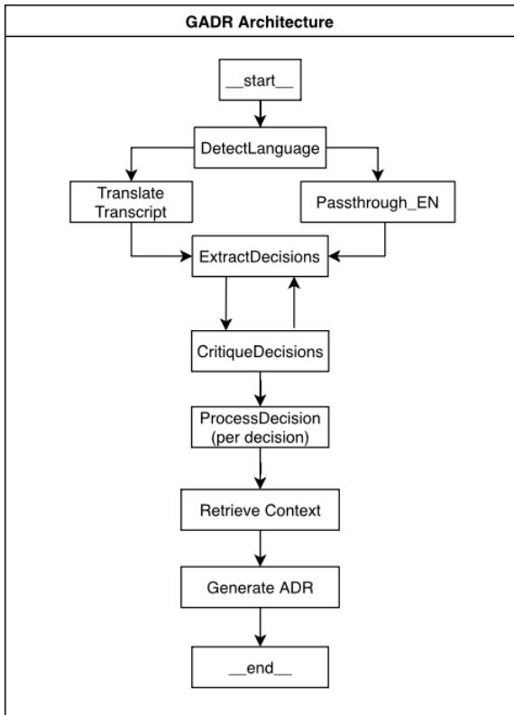
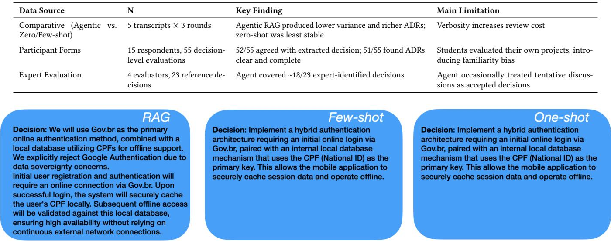

# GADR: Gathering Architecture Decision Records from Meeting Transcriptions

Lucas Daniel Costa da Silva

Universidade Federal de Pernambuco (UFPE)

Recife, Brasil

ldcs@cin.ufpe.br

## Abstract

Existing LLM-based approaches to Architecture Decision Record (ADR) generation share a critical and largely unexamined assumption: that input is already reasonably structured. In practice, architectural decisions emerge from informal, noisy meetings where choices are implicit, fragmented, and entangled with of-topic dialogue, precisely the conditions under which single-pass prompting degrades. This paper presents GADR, a multi-agent, self-correcting workflow that extracts architectural decisions from raw meeting transcriptions and generates Nygard-formatted ADR drafts. A feasi bility study comprising five real project meeting transcripts, expert review by four senior architects, and evaluation by fifteen students provides initial evidence that the agentic workflow captures most expert-identified decisions and produces drafts participants found clear and useful, outperforming zero-shot and few-shot baselines in stability and structural adherence. The study also addresses the underexplored trade-of of RAG-based enrichment improving ADR depth while simultaneously risking transcript-unfaithful content, raising open questions about traceability in automated architectural documentation that we believe is worth the community’s attention.

## Keywords

Prompt Engineering, Retrieval-Augmented Generation, Software Architecture

## 1 Introduction

Software Architecture is increasingly defined not just by structural elements but by the decisions that shape them [1, 9]. Architecture Decision Records (ADRs) were proposed as a lightweight mechanism to document those decisions [10–12], that emerge as a means to enhance Architectural Knowledge Management (AKM) within projects, ensuring that decisions made by various stakeholders over time can be understood within their historical context.

The barriers to successful adoption of ADR are multifaceted: no tably, the primary obstacles include the significant efort required to capture Architectural Knowledge (AK) and a lack of clarity regarding which specific AK elements warrant documentation [3]. Recent studies have explored the use of LLM-based approaches to automate ADR generation. There is evidence in literature about the feasibility of generating architectural decisions from textual context, while newer approaches combining Retrieval-Augmented Generation (RAG), few-shot learning, and fine-tuning improved both accuracy and practical viability for industrial use [5, 6]. How ever, these approaches share a critical assumption that the input is already reasonably structured (e.g., a written document, a curated context, a codebase artifact). None of them were designed to handle raw, unstructured conversational data, where decisions are implicit,

Kiev Gama

Universidade Federal de Pernambuco (UFPE)

Recife, Brasil

kiev@cin.ufpe.br

fragmented, and entangled with of-topic dialogue. Single-pass prompting (e.g., zero-shot, few-shot) struggles with noisy inputs, leading to attention degradation, unorganized outputs, and reduced accuracy due to irrelevant or excessive information [7].

To our knowledge, this is the first work to address ADR generation from raw, unstructured meeting transcriptions through an agentic, self-correcting workflow. We propose GADR, a multi-agent system that extracts, critiques, and refines architectural decisions from meeting transcripts, generating Nygard-formatted ADR drafts validated by both expert architects and the development teams themselves. If any recorded meeting can be turned into a reviewable ADR draft, with humans in the loop to validate the output, the primary adoption barrier for AKM lowers, and architectural knowledge can be captured at the moment it is created rather than reconstructed from memory. We present GADR as a proof of concept of an idea we believe is worth the research community’s attention.

## 2 Background And Related Work

## 2.1 Dificulties In Identifying Design Decisions

When conducted by students or novice architects, the architectural decision-making process is often highly fragmented and non-linear. Less experienced developers frequently face the complex challenge of transitioning from the problem to the solution space [4, 17]. This dificulty stems from challenges in identifying suitable concepts, comparing technological alternatives, or building consensus [4]. Architectural decisions are critical to system structure and behavior, yet decision-making is often ad-hoc and intuition-driven, highlighting the need for methods and tools that support systematic reasoning and explicit decision documentation [17].

Empirical studies reveal that unexperienced software engineers are heavily influenced by human and operational factors. For instance, it is highly common for them to select a technology, process, or approach with which they already have previous experience, rather than exploring new alternatives [2]. When this prior knowledge does not align with the optimal solution for a specific problem, it can lead to misguided choices: as a result, the project meetings, and their transcriptions, become inherently unstructured and noisy, where concepts become entangled and ideas are easily lost. In such scenarios, the underlying decisions ultimately remain implicit, even to the participants engaged in the discussion.

As a way to address that gap, Architecture Decision Records (ADRs) emerged as lightweight artifacts for documenting decisions, context, rationale, and consequences [10, 12]. However, their adoption still faces practical barriers, motivating recent LLM-based approaches for ADR generation. Zero-shot, few-shot, and fine-tuning strategies can synthesize ADR content from textual context [6]. This process can be improved through RAG, few-shot learning, and fine-tuning [5]. Nevertheless, these approaches remain challenged by long and noisy conversational inputs: excessive or poorly selected context can distract the model and reduce generation accuracy [7], which motivates investigating a multi-agent approach for extracting architectural decisions from meeting transcriptions.

## 2.2 Knowledge Extraction Process From Text

To bypass limitations in processing large, unstructured inputs, LLM orchestration has shifted from single-pass linear calls toward graph based architectures and multi-agent systems. Prior work such as MetaGPT demonstrates that complex software engineering tasks can be decomposed into specialized agent roles coordinated through a structured workflow, improving the consistency of intermediate artifacts and reducing ambiguity in collaborative generation tasks [8]. The use of traditional models often relies on linear workflows or simple recursive loops, which are limited when handling com plex scenarios that require parallel execution, decision revision, or dynamic task routing [13]. A graph-based orchestration approach, such as LangGraph, operationalizes this multi-agent decomposition by allowing developers to model the workflow as a finite-state machine (FSM), rather than submitting an entire transcription within a single prompt and expecting the model to extract and format decisions all at once. Within this framework, each node represents a specific step, edges determine the next node to be executed, and the state acts as a shared memory updated as execution progresses, thereby modularizing a large, complex problem.

Wang et al. explain that precise execution control derived from a unified state object enables the creation of fully adaptable work flows, whether sequential, hierarchical, or involving multiple col laborative agents [18]. In the literature, multi-agent design patterns such as Planner-Executor (where one agent decomposes the task and another executes it) or Critic-Reviewer (where the output is validated step-by-step) demonstrate how modularization reduces hallucinations and improves factual accuracy in generated content [13]. Therefore, adopting this architecture mitigates model atten tion degradation when processing large noisy inputs while ensures greater processing control by providing an auditable tool.

## 3 Proposed Approach

This section details the architecture of GADR (pronounced gather), a tool that automatically extracts architectural decisions from meeting transcriptions and generates structured ADR drafts. GADR moves away from linear single-pass pipelines by adopting an agentic architecture structured as a finite-state machine, augmented with Retrieval-Augmented Generation (RAG).

## 3.1 Graph-State Formalization

The control flow across the multi-agent framework is coordinated by a centralized, mutable state (S). Within the LangGraph framework, using a shared state allows the system to dynamically update the context as node logic increases in complexity, enabling advanced routing and conditional looping capabilities. Rather than chaining sequential prompt calls, GADR coordinates its agents through a shared mutable state, making each reasoning step auditable and each transition explicit, which is a property that single-pass approaches cannot ofer. Formally, this state is defined as a tuple that accumulates contextual variables generated across the graph nodes:

$$
S = ( \tau _ { o r i g } , \tau _ { e n } , \lambda , \Delta , \Gamma , \iota , \alpha )
$$

Each component plays a specific role in orchestrating the processed data stream:

transcript\_orig $( \tau _ { o r i g } ) { : }$ The noisy, unstructured input representing the raw transcript of the meeting where the architecture was discussed.

transcript\_en $( \tau _ { e n } ) \colon$ The normalized representation of the transcript in English. This reduces tokenization biases and performance asymmetries across Large Language Models, ensuring that semantic processing occurs entirely in English.

language (�): A categorical control variable produced by the language detection module. The value of this variable dictates conditional routing to a translation node prior to information extraction. decisions (Δ): A set of candidate values containing tuples structured as ⟨��, �������, �������\_�������⟩. These represent preliminary ADR intentions extracted from the dialogue, which can be iteratively refined.

critique (Γ): A qualitative feedback vector identifying extraction or architectural deficiencies (e.g., hallucinations, lack of justification, or omitted trade-ofs). This vector functions as the grounding mechanism that drives the refinement node.

iteration (�): A scalar counter that tracks the execution cycles ofthe self-reflection loop. It ensures algorithmic convergence, prevents infinite execution loops, and guarantees that the system reaches a terminal state within an acceptable time boundary.

adrs (�): Stores the final generated artifacts, formatted strictly according to Nygard’s ADR template.

## 3.2 Nodes Specification

The workflow is decomposed into nodes that read and update the shared state �. Each node performs a bounded operation, such as an LLM call, critique step, retrieval operation, or formatting routine. The local architecture is shown in Figure 1, combining local modules and external services used by the agent.

At runtime, GADR coordinates local components with external services. Local modules manage transcript preprocessing, state transitions, prompt orchestration, ADR persistence, and retrieval over ChromaDB. External calls are used when the workflow requires LLM reasoning through the Gemini API, configured with the Gemini 3.1 Pro model, and web search through the Tavily API. This separation keeps project-specific artifacts and vector retrieval local while delegating generation and current technical search to specialized services.

Input Language Alignment Module. Because LLM reasoning and tokenization are often more eficient in English, especially when compared with non-English inputs [16], and prior evaluations report better factual accuracy when prompting in English [15], the workflow first normalizes the transcript language. The DetectLanguage node classifies a representative sample of the transcript, formalized as $T _ { o r i q }$ [����� : ����� + 1000]. If the transcript is classified as non-English $\bar { ( \lambda = } \ ' _ { o t h e r } \ " )$ , the Translate node produces an English version; otherwise, Passthrough\_EN copies the original text to the normalized transcript field. This keeps downstream extraction consistent while avoiding unnecessary translation.

  
Figure 1: Informal overview of GADR’s processing workflow and state transitions.

Table 1: Decision critique categories.
<table><tr><td>Category</td><td>Description</td></tr><tr><td>Overlap</td><td>Merges decisions that represent the same architectural strategy.</td></tr><tr><td>Fragmentation</td><td>Detects decisions that are too small to justify a separate ADR.</td></tr><tr><td>Missing</td><td>Finds relevant choices or trade-offs omitted from extraction.</td></tr><tr><td>Noise</td><td>Removes procedural decisions without architectural impact.</td></tr><tr><td>Scope Duplicate</td><td>Removes items that only repeat broader decisions.</td></tr></table>

Architectural Decision Extraction Node (ExtractDecisions.) This node extracts candidate architectural decisions from the normalized transcript. In the first iteration (� = 1), the prompt asks the model to act as a senior software architect and identify decisions, rationale, and rejected alternatives that afect the project architecture. In later iterations (� > 1), the node uses the critique vector to refine the previous output by merging overlapping decisions, splitting tangled concerns, and removing noise.

Critical Evaluation Module (CritiqueDecisions). This node reviews the provisional decisions before ADR generation, reducing hallucinations, overlaps, and inconsistent granularity. Its feedback is organized in categories ( Table 1) that guide the refinement loop. RAG Enrichment and Final Formatting Node (ProcessDecision). It enriches each accepted decision, formatting it as a Nygardstyle ADR. It performs hybrid retrieval in a local ChromaDB knowledge base and web search results, re-ranks the retrieved content to keep only the most relevant technical facts, and generates a Markdown ADR with Context, Decision, Considered Options, and

Consequences. This step improves architectural explanation, but its retrieved content remains subject to human review.

## 4 Methodology And Setup

Our primary goal is to analyze the efectiveness of the proposed multi-agent system in extracting and documenting Architectural Decision Records (ADRs) from raw meeting transcripts.

## 4.1 Engineering Research

This study follows an Engineering Research methodology, which, according to SIGSOFT’s SE Empirical Standards [14], consists of “research that invents and evaluates technological artifacts”. In this case, a novel software engineering artifact was designed, implemented, and empirically evaluated in an educational software architecture setting. The evaluation adopts an exploratory mixedmethod design combining: (i) comparative analysis against traditional prompting strategies (zero-shot and few-shot), (ii) expert review conducted by senior software architecture evaluators, and (iii) participant-centered evaluation using questionnaires and qualitative feedback from students. Given the early stage of this research, the evaluation is intentionally scoped as a feasibility probe rather than a definitive comparison.

This research was reviewed and approved by the university’s Research Ethics Committee1. All procedures followed national ethical guidelines, with informed consent obtained prior to data collection. Students were informed that participation in this study would not interfere in their grades.

To systematically achieve this goal and evaluate the proposed approach against traditional prompting techniques, this study addresses the following Research Questions (RQs):

RQ1 (Extraction Efectiveness): To what extent does the agent identify and extract plausible architectural decisions discussed in meetings?

RQ2 (Artifact Quality): Do the generated ADRs possess suficient clarity and completeness to be utilized as practical documentation artifacts?

RQ3 (Recall Utility): To what extent do generated ADRs help users recall architectural decisions discussed in previous meetings? RQ4 (Comparative Analysis): What diferences can be observed in comparison to traditional zero-shot and few-shot prompting strategies when extracting ADRs from noisy conversational data?

## 4.2 Study Context And Participants

The evaluation combines curated baseline of existing ADRs with real-world conversational data:

Reference Dataset (MSR Study): To establish a ground truth for formatting and technical validation, this study uses the dataset provided by Buchgeher et al., comprising ADRs extracted from open-source repositories available at the time of writing [3]. This dataset serves two functions: it acts as the primary knowledge base for the RAG module and provides the "gold standard" semantic examples utilized in the few-shot baseline evaluation.

Transcription Dataset: The primary input data consists of raw audio transcripts recorded during software design meetings of four teams ofundergraduate students and one team ofsenior researchers in an architecture kick-of meeting of an R&D project (Table 2). These transcripts represent unstructured and noisy environments, characterized by informal language, transcription errors, overlapping dialogue, and fragmented rationale, providing a robust stress test for the extraction method.

Table 2: Characterization of the five groups (G) meetings.
<table><tr><td>G</td><td>Team</td><td>Context</td><td>Decision Themes</td></tr><tr><td>1</td><td>6 Students</td><td>Online FPS game</td><td>Networking model, server authority, latency handling, event broker, object pooling</td></tr><tr><td>2</td><td>7 Students</td><td>Urban mobility/logistics</td><td>Event-drivenarchitecture, message broker, external- event simulation, integration facade</td></tr><tr><td>3</td><td>7 Students</td><td>Smart gym platform</td><td>AWS/EKS deployment, autoscaling, brokers, Re- dis/BullMQ, offline synchro-</td></tr><tr><td>4</td><td>4 Students</td><td>AI/multi-agent system</td><td>nization Layered architecture, hexago- nal variant, event-driven trade-</td></tr><tr><td>5</td><td>searchers</td><td>4 Senior Re- Health R&amp;D platform</td><td>offs, future microservices Offline support, Gov.br au- thentication, RNDS integra- tion, C4/ADR documentation</td></tr></table>

## 4.3 Evaluation Procedure

To evaluate the efectiveness of the proposed solution, this study conducts a comparative analysis between the multi-agent system and two established prompting approaches. The transcripts were processed uniformly across three diferent setups, as follows.

\- Zero-shot Prompting: The raw transcript is submitted to the LLM accompanied by a direct system prompt to generate the ADR following the Nygard standard. This scenario tests the model’s raw inference capability over noisy data without contextual examples. - Few-shot Prompting: The prompt context is enriched with static examples of Architectural Decisions extracted from the reference MSR dataset. This evaluates whether static examples are suficient to guide the model’s extraction and formatting logic.

\- Multi-agent Workflow: The transcript is processed through the multi-node directed graph detailed in Section 3.

This comparison is key because traditional single-pass approaches, such as zero-shot and few-shot, often sufer from attention degradation when processing lengthy, unstructured texts. This limitation frequently leads the model to hallucinate or ignore crucial rationale. The agentic approach aims to quantify the gains in cohesion and accuracy provided by a step-by-step resolution.

## 4.4 Evaluation Strategy

Because automatic Natural Language Processing metrics primarily capture textual similarity rather than the practical quality of architectural documentation, this study prioritizes human-centered evaluation [5, 7]. The generated ADRs were assessed through an anonymous online questionnaire distributed to the five teams that provided meeting transcripts, restricted to participants who gave informed consent. The students had varying levels of software development experience and evaluated ADRs generated for the projects they developed in the software architecture course.

The questionnaire collected contextual information using fivepoint Likert scales to assess agreement with extracted decisions, clarity, completeness, and perceived educational value, with an open-ended field for justification. To complement participant feedback, four senior software architecture reviewed the five transcripts to identify core decisions discussed by each team. The expertidentified decisions are a ground-truth approximation against which the agent’s ADRs were compared in number and content.

## 5 Results

## 5.1 Agentic Versus Prompt-Based Generation

We report preliminary results from a multi-round evaluation of three ADR generation strategies: zero-shot prompting, few-shot prompting, and the proposed Agentic RAG workflow. Five real software architecture meeting transcripts were independently processed three times for each approach. Because LLM outputs are nondeterministic, the comparison focuses on variance in the number of generated ADRs, adherence to naming and formatting conventions, output length, and evidence of hallucination or contextual noise.

The static prompting baselines were more sensitive to round-toround variation. Zero-shot outputs were the least stable, sometimes merging unrelated decisions or extracting passing comments as ADRs. Few-shot prompting improved structure and formatting by following the provided examples, but still varied in how it grouped decisions. In contrast, the Agentic RAG produced more stable sets of ADRs (e.g., Figure 2). Its critique stage reviewed candidate decisions before document generation, reducing overlaps and fragmentation.

The main advantage of the Agentic RAG approach was not only structural consistency, but also the production of richer architectural explanations. This verbosity is useful in the educational context of this study, since novice students often discuss decisions informally and do not explicitly articulate trade-ofs, alternatives, or long-term consequences. By enriching ADRs with architectural terminology and external context, the agent can transform a sparse meeting transcript into a more informative learning artifact.

However, this enrichment also creates a risk of contextual contamination. In the FPS game case, the agent added to the ADR context that the network architecture should support “500 concurrent connections and 5000+ Daily Active Users (DAU)”, although these metrics were not present in the transcript. Traceability inspection showed that this fragment came from a retrieved external ADR, 0005-discovery-protocol.md, rather than from the meeting itself. This illustrates how retrieval can lead to hallucinations or unsupported statements when semantically similar ADRs come from unrelated projects. At the same time, it also shows the potential value of using a project’s own historical ADRs as retrieval context: previous decisions, constraints, insights, or metrics can be brought back into new ADRs and revisited during architectural reasoning. Therefore, the current results indicate a trade-of: Agentic RAG improves determinism, formatting, and pedagogical depth, but its outputs require human review to distinguish faithful extraction from retrieved-but-unrelated context.

Table 3: Summary of evaluation results across three complementary perspectives.
<table><tr><td>Data Source</td><td>N</td><td>Key Finding</td><td>Main Limitation</td></tr><tr><td>Comparative (Agentic vs. Zero/Few-shot)</td><td>5 transcripts × 3 rounds</td><td>Agentic RAG produced lower variance and richer ADRs; Verbosity increases review cost zero-shot was least stable</td><td></td></tr><tr><td>Participant Forms</td><td>15 respondents, 55 decision- level evaluations</td><td>52/55 agreed with extracted decision; 51/55 found ADRs Students evaluated their own projects, intro- clear and complete</td><td>ducing familiarity bias</td></tr><tr><td>Expert Evaluation</td><td>cisions</td><td>4 evaluators, 23 reference de-Agent covered ~18/23 expert-identified decisions</td><td>Agent occasionally treated tentative discus- sions as accepted decisions</td></tr></table>

  
Figure 2: Excerpts of an ADR generated from the same transcription (Group 5) but in diferent approaches.

## 5.2 Participant Evaluation Through Forms

The participant evaluation included 15 respondents from the five student groups, producing 55 decision-level evaluations because each participant assessed multiple generated ADRs. Overall, the responses indicate a positive perception of the agentic ADRs: 52 of 55 evaluations agreed or strongly agreed with the extracted decision, 51 of 55 indicated that the suggestions helped participants remember previous decisions, 51 of 55 considered the ADRs clear and complete, and 49 of 55 agreed that the artifacts contributed to learning. The open-ended responses reinforce this result, with recurring comments that the ADRs captured the discussion, reflected industry-like reasoning, and helped participants recover the context and rationale behind previous decisions. At the same time, these qualitative answers reveal important limitations: in Group 2, one participant noted that a Python script was discussed as a possibility but not definitively decided; in Group 1, disagreement around the MVC and Event Broker ADR suggests that the agent may impose a stronger architectural framing than the group explicitly adopted; and in the Group 5 case, neutral feedback indicated that some decisions required clearer contextualization. Thus, the form results support the usefulness and perceived clarity of the generated ADRs, while also showing the need for human review before treating them as final documentation.

## 5.3 Senior Developers Evaluation

The expert evaluation was conducted not to certify the agent’s output as correct, but to assess whether the agentic workflow approximates the decisions a trained architect would identify from the same transcript. Across the five transcripts, the seniors listed 23 reference architectural decisions, while the agent generated 17 ADRs. Using a decision-level mapping, approximately 18 of the 23 senior decisions were covered by at least one generated ADR, suggesting that the agent captured most of the central architectural concerns discussed in the meetings. The strongest alignments occurred when decisions were explicit in the transcripts, such as event-driven architecture and message brokers in Group 2, AWS/EKS/BullMQ/Redis in Group 3, and ofline support, Gov.br authentication, and integration concerns in the Group 5 project.

The comparison also exposed relevant failure modes. First, the agent sometimes transformed tentative discussions into accepted decisions, as observed with the MVC and Event Broker ADR in Group 1 and the treatment of Lambda as a rejected alternative in Group 3. Second, it occasionally introduced unsupported quantitative or statistical claims, such as “5000+ Daily Active Users” and “93% industry adoption”, which were not present in the transcripts. Third, some lower-granularity decisions identified by seniors, such as object pooling in Group 1 or load balancing and auto-scaling in Group 3, were omitted or only mentioned indirectly. Finally, the analysis showed that the expert baseline itself may be incomplete in some cases: for Group 4 and Group 5, the transcripts contained evidence supporting decisions generated by the agent but not listed by the senior evaluator. Overall, the expert comparison indicates that the agentic approach approximates the number and content of human-identified decisions reasonably well, but still requires expert review to correct overstatements, unsupported details, and mismatches in decision status.

## 6 Discussion

The results indicate that the proposed agentic workflow is better understood as a decision-support mechanism than as a fully autonomous replacement for human architectural documentation. Compared with zero-shot or few-shot prompting, the agentic approach produced more stable outputs and stronger adherence to the ADR structure, suggesting that decomposing the task into extraction, critique, refinement, retrieval, and formatting reduces some of the instability caused by processing noisy transcripts in a single prompt. This backs our main assumption: the extraction of architectural decisions from meetings benefits from explicit orchestration.

Considering the research questions, the results provide preliminary answers to all four. For RQ1, the agent covered approximately 18 of the 23 expert-identified decisions, suggesting efective extraction of central concerns; however, omissions and confusion between tentative and accepted decisions prevent interpreting this result as full accuracy. For RQ2, 51 of 55 evaluations considered the ADRs clear and complete, supporting their use as reviewable drafts rather than final records because retrieved details were not always transcript-grounded. For RQ3, 51 of 55 evaluations indicated that the ADRs helped participants recall prior decisions. This supports recall utility in the studied setting, although participants’ involvement in the projects may have influenced this perception; their reported learning benefit is therefore treated as a complementary finding rather than part of RQ3. For RQ4, the three-round comparison showed lower variation and stronger structural adherence for the agentic workflow than for zero-shot and few-shot prompting. These gains came with greater verbosity and review efort, indicating a trade-of rather than an unconditional advantage.

The participant evaluation reinforces the value of this approach in an educational setting. Students not only recognized most extracted decisions, but also reported that the ADRs helped them remember previous discussions and better understand architectural documentation. This pedagogical benefit is relevant because novice architects often discuss decisions informally, without clearly separating context, alternatives, consequences, and rationale. By converting these discussions into structured ADRs, the tool can help students revisit their own reasoning and learn how architectural trade-ofs are documented in practice.

However, the results also show that richer documentation is not necessarily more faithful documentation. The Agentic RAG workflow generated more detailed ADRs, but some details came from retrieved external context rather than from the transcript itself. Unsupported metrics, statistical claims, and stronger-than-intended architectural framing illustrate how retrieval can improve explanation while also introducing contextual contamination. Therefore, enrichment should be treated as useful but provisional, requiring traceability and human validation.

Expert review complemented student feedback by checking transcript grounding. GADR captured most senior-identified decisions and central architectural concerns, but sometimes promoted tentative ideas to accepted decisions, omitted fine-grained concerns, or grouped related choices into broader ADRs. Future versions should expose decision status and granularity, enabling users to inspect, split, merge, or reclassify candidates before documentation.

Overall, GADR appears most useful as a semi-automated documentation assistant. It reduces the efort required to transform informal meetings into readable ADR drafts and provides educational value for students learning architectural reasoning. Nevertheless, the generated artifacts should remain reviewable drafts: project stakeholders must still correct unsupported extrapolations, confirm decision status, and decide which ADRs should become part of the oficial architectural record.

## 7 Threats To Validity

Threats arise from the use of LLM-based and RAG-based generation. Although the agentic workflow improved structure and stability when compared with single-pass prompting, it sometimes transformed tentative discussions into accepted decisions, omitted fine-grained concerns, or introduced unsupported details from retrieved external context. In addition, verbose ADRs may be useful as learning artifacts for novice architects, but verbosity can also obscure which information was actually discussed in the meeting and increase the review efort. Therefore, the generated ADRs should be interpreted as reviewable drafts rather than authoritative documentation, and unsupported additions should be treated as potential hallucinations instead of automatic improvements. This study is also subject to threats related to its exploratory and mostly educational setting. The evaluation was conducted with five student groups and a limited number of transcripts, which restricts the generalization of the findings to industrial contexts. Moreover, students evaluated ADRs from projects in which they participated, so their perception may include implicit knowledge not fully present in the transcripts. This is especially relevant for the reported pedagogical gain: students perceived the ADRs as useful for remembering decisions and learning architectural documentation, but this benefit may also be influenced by their prior involvement in the projects and by the explanatory richness of the generated texts.

## 8 Conclusion

This paper presented an agentic approach for extracting architectural decisions from meeting transcriptions and generating ADR drafts. Building on the role of architectural decisions in software architecture [9] and on ADRs as lightweight documentation artifacts [11, 12], the approach addresses a known adoption barrier: the efort required to capture architectural knowledge in practice [3]. The preliminary evaluation indicates that, compared with zero-shot and few-shot prompting, the agentic workflow produced more stable and structured ADRs, captured most expert-identified decisions, and supported students in remembering and learning from their own architectural discussions.

At the same time, the results reinforce that LLM-based ADR generation should remain human-in-the-loop. Although prior work shows the promise of LLMs and RAG for architectural decision generation [5, 6], this study suggests that if any recorded meeting can become a reviewable ADR draft, then the primary adoption barrier for AKM shifts in nature: from the efort required to write documentation to the lighter efort of reviewing it. We believe this shift is worth pursuing, and present GADR as a concrete first step.

## Artifact Availability

The research artifacts supporting this study are archived on Zenodo at https://doi.org/10.5281/zenodo.21501559. The project repository is also available at https://github.com/ldcss/GADR.

## Acknowledgments

For partially supporting this work, we would like to thank INES.IA (National Institute of Science and Technology for Software Engineering Based on and for Artificial Intelligence) www.ines.org.br, CNPq grant 408817/2024-0.

## References

[1] L. Bass, P. Clements, and R. Kazman. 2003. Software Architecture in Practice (2nd ed.). Addison-Wesley.

[2] Klara Borowa, Rafał Lewanczyk, Klaudia Stpiczyńska, Patryk Stradomski, and Andrzej Zalewski. 2023. What Rationales Drive Architectural Decisions? An Empirical Inquiry. In Software Architecture. Springer Nature Switzerland, 303– 318.

[3] Georg Buchgeher, Stefan Schöberl, Verena Geist, Bernhard Dorninger, Philipp Haindl, and Rainer Weinreich. 2023. Using Architecture Decision Records in Open Source Projects—An MSR Study on GitHub. IEEE Access 11 (2023), 63725–63740. doi:10.1109/ACCESS.2023.3287654

[4] Rafael Capilla, Olaf Zimmermann, Carlos Carrillo Sánchez, and Hernán Astudillo. 2020. Teaching Students Software Architecture Decision Making. Springer, 231–246. doi:10.1007/978-3-030-58923-3\_16

[5] Rudra Dhar, Adyansh Kakran, Amey Karan, Karthik Vaidhyanathan, and Vasudeva Varma. 2025. DRAFT-ing Architectural Design Decisions using LLMs. arXiv:2504.08207 [cs.SE] https://arxiv.org/abs/2504.08207 arXiv preprint arXiv:2504.08207.

[6] Rudra Dhar, Karthik Vaidhyanathan, and Vasudeva Varma. 2024. Can LLMs Generate Architectural Design Decisions? - An Exploratory Empirical Study. In 2024 IEEE 21st International Conference on Software Architecture (ICSA). 79–89. doi:10.1109/ICSA59870.2024.00016

[7] Aviral Gupta, Rudra Dhar, Daniel Feitosa, and Karthik Vaidhyanathan. 2026. Context Matters: Evaluating Context Strategies for Automated ADR Generation Using LLMs. In Proceedings of the 30th International Conference on Evaluation and Assessment in Software Engineering (EASE). ACM.

[8] Sirui Hong, Mingchen Zhuge, Jonathan Chen, Xiawu Zheng, Yuheng Cheng, Jinlin Wang, Ceyao Zhang, Zili Wang, Steven Ka Shing Yau, Zijuan Lin, Liyang Zhou, Chenyu Ran, Lingfeng Xiao, Chenglin Wu, and Jürgen Schmidhuber. 2024. MetaGPT: Meta Programming for a Multi-Agent Collaborative Framework. In The

Twelfth International Conference on Learning Representations. https://openreview. net/forum?id=VtmBAGCN7o

[9] A. Jansen and J. Bosch. 2005. Software Architecture as a Set of Architectural Design Decisions. In 5th Working IEEE/IFIP Conference on Software Architecture (WICSA’05). 109–120. doi:10.1109/WICSA.2005.61

[10] Michael Keeling. 2017. Design It!: From Programmer to Software Architect. (2017).

[11] Fernando Neves Nogueira, Nabson Silva, and Tayana Conte. 2026. One Size Fits All? An Empirical Comparison of ADR Templates regarding Comprehension, Usability, and Ease ofAdoption. In Proceedings ofthe 30th International Conference on Evaluation and Assessment in Software Engineering (EASE). ACM.

[12] Michael Nygard. 2011. Documenting Architecture Decisions. https://www. cognitect.com/blog/2011/11/15/documenting-architecture-decisions

[13] Karthik Pelluru. 2025. LangChain & LangGraph in Production: Architectures for Multi-Agent LLM Systems. Journal ofData and Digital Innovation (JDDI) 2, 3 (2025), 1–9. https://datalensjourna.com/index.php/JDDI/article/view/35

[14] Paul Ralph. 2021. ACM SIGSOFT empirical standards released. ACM SIGSOFT Software Engineering Notes 46, 1 (2021), 19–19.

[15] Pritika Rohera, Chaitrali Ginimav, Gayatri Sawant, and Raviraj Joshi. 2025. Better To Ask in English? Evaluating Factual Accuracy of Multilingual LLMs in English and Low-Resource Languages. arXiv:2504.20022 [cs.CL] https://arxiv.org/abs/ 2504.20022 arXiv preprint arXiv:2504.20022.

[16] Lisa Schut, Yarin Gal, and Sebastian Farquhar. 2025. Do Multilingual LLMs Think In English?. In ICLR 2025 Workshop on Building Trust in Language Models and Applications. https://openreview.net/forum?id=I8BOtOPcOv

[17] Uwe van Heesch and Paris Avgeriou. 2010. Naive architecting-understanding the reasoning process of students: a descriptive survey. In European Conference on Software Architecture. Springer, 24–37.

[18] Jialin Wang and Zhihua Duan. 2025. Empirical Research on Utilizing LLM-based Agents for Automated Bug Fixing via LangGraph. doi:10.33774/coe-2025-jbpg6 Cambridge Open Engage Preprint.