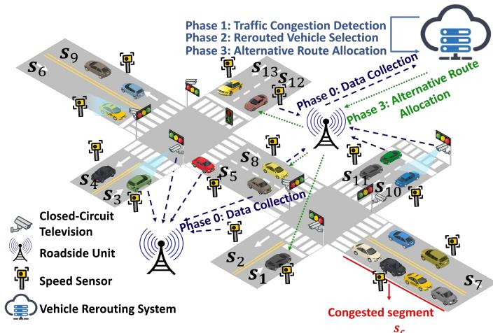
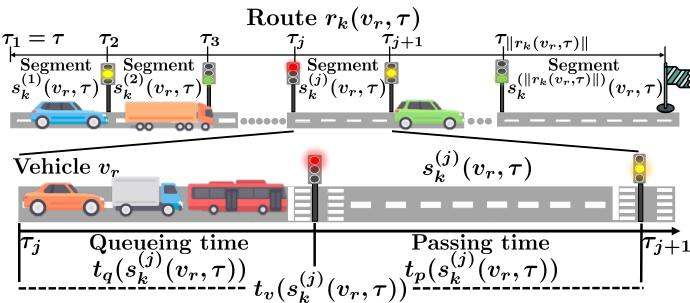
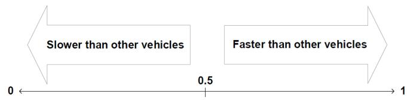
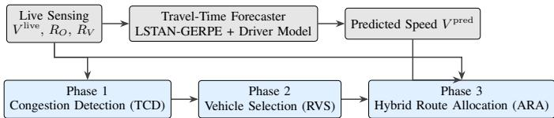
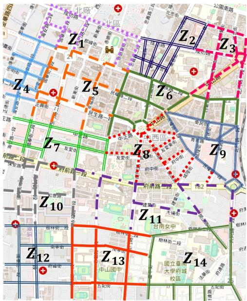
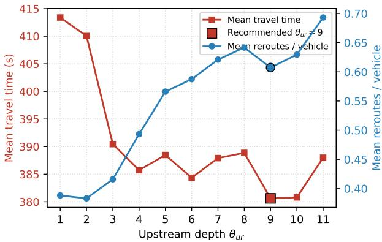
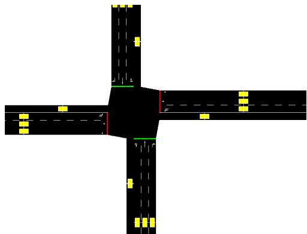
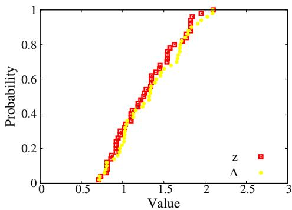

# HLSR: Hybrid Live–Forecast Selective Dynamic Vehicle Rerouting for Real-Time Congestion Avoidance

Xiao Wang, Shun-Ren Yang, Member, IEEE, and Hui-Nien Hung

Abstract—Urban traffic congestion reduces productivity and increases travel cost and emissions. Network-wide live traveltime shortest-path rerouting can be highly effective in simulation, but assumes that essentially every on-road vehicle is replanned every decision period. We propose HLSR, a selective hybrid live–forecast vehicle rerouting framework that fuses live edge speeds with short-horizon forecasts under limited intervention scope. Building on dual-threshold congestion detection, calibrated upstream selection, and driver-tailored travel-time prediction, HLSR further introduces approaching-vehicle expansion, travel-time-weighted k-shortest-path generation, and a horizondependent hybrid live–forecast segment speed used in multicost route allocation. On a reproduced Tainan SUMO scenario (seed 42), HLSR reduces mean travel time to 380.6 s at 8000 vehicles, outperforming same-scope live-only controls (438.1 s selective live; 391.6 s scoped live Dijkstra) and remaining competitive with network-wide live travel-time Dijkstra (408.1 s), while intervening on far fewer vehicles than a full-network policy; under the same protocol at 16000 and 20000 vehicles, HLSR remains best at 895.7 s and 971.7 s.

Index Terms—Traffic congestion detection, selective vehicle rerouting, hybrid live–forecast routing, travel-time prediction, SUMO

## I. INTRODUCTION

The population gradually moves from rural areas to cities. A United Nations report [1] estimates that two-thirds of the world’s population will live in urban areas by 2050. Population growth increases traffic pressure, and road-capacity expansion alone is difficult to sustain because of cost and spatial constraints.

Current route navigation systems such as TomTom [2] and Google Maps [3] plan routes from infrastructure-based traffic information, but they cannot reliably replan vehicles that are already en route. Navigation without dynamic network-wide monitoring can even worsen congestion by funneling demand onto links with insufficient capacity. Intelligent transportation systems therefore combine connected sensing, edge/cloud computing, and data-driven control to mitigate congestion in real time.

Vehicle rerouting is a validated approach in this setting: when a segment becomes congested, the platform assigns alternative routes so that affected vehicles avoid the bottleneck and reduce travel time. Typical rerouting proceeds in three steps—congestion detection, rerouted-vehicle selection, and alternative-route allocation—yet existing methods leave recurring limitations in each step. Single-indicator or locally scoped detectors often miss heterogeneous congestion patterns and network-wide coupling. Fixed spatial windows and greedy congestion-weighted selection tend to over-reroute distant vehicles or under-react to upstream traffic approaching a bottleneck. Route-allocation policies based only on current live traffic omit short-horizon forecast information needed for segments that will be traversed in later decision periods. Section II reviews representative prior work along these three dimensions.

To address these gaps, we introduce HLSR (Hybrid Live–Forecast Selective Rerouting), a selective congestionalleviation framework. HLSR retains the three-phase structure above and strengthens it with hybrid live–forecast costing so that only congestion-related vehicles are replanned, while near-term decisions still react to observed speeds. The contributions of our work can be summarized as:

• Proactive selective rerouting under bounded intervention: HLSR integrates dual-threshold congestion detection, a calibrated upstream hop depth, and approachingvehicle expansion so that rerouting remains limited to congestion-related vehicles. In the primary setting at 8000 vehicles, this selective stack reduces mean travel time from 664.2 s (BC) to 438.1 s (HLSR-LIVE).

• Hybrid live–forecast route costing: For each candidate route, HLSR blends live and predicted segment speeds with a horizon-dependent weight and applies travel-timeweighted k-shortest-path generation plus multi-cost allocation. Under matched selective candidate scope, this hybrid costing further improves travel time from 438.1 s (HLSR-LIVE) to 380.6 s (HLSR).

• Driver-aware travel-time prediction module: A network-level spatial–temporal forecaster (LSTAN\_- GERPE, optionally ranking-fine-tuned) supplies the forecast branch of the hybrid cost, with driver-behavior and footprint adjustments for personalization, rather than serving as a stand-alone end-to-end rerouter.

• Fair-scope evaluation: On the primary Tainan evaluation setting (SUMO seed 42) at 8000, 16000, and 20000 vehicles, we compare HLSR against classical selective baselines (NRR, ReFOCUS+), the reimplemented Du-GAQ method, a prior HLSR-Rank checkpoint, samescope live-only controls, and network-wide live traveltime Dijkstra, reporting travel time, time loss, waiting time, route length, and reroute count.

The remainder of this paper is organized as follows. Section II reviews prior rerouting methods by phase. Section III formalizes the system model and sensing quantities. Section IV details the travel-time prediction module that supplies multihorizon predicted segment speeds V<sup>pred</sup>. Section V assembles the HLSR selective rerouting loop, including hybrid live– forecast costing and the proactive extensions. Section VI reports the experimental settings and results. The paper concludes with limitations and future work.

## II. RELATED WORK

Vehicle rerouting alleviates congestion by detecting bottlenecks, selecting vehicles to replan, and assigning alternative routes. The literature is organized below along these three phases, which also structure HLSR.

## A. Congestion Detection

Proactive rerouting systems must declare congestion before downstream queues fully form. [4] couples detection with rerouting but relies on a single traffic-density indicator, which is insufficient when occupancy and speed diverge. [5] performs distributed detection through V2V cooperation, yet its singlevehicle velocity assumption and local neighborhood scope limit network-wide consistency. [6] combines segment-level and zone-level real-time scores, but aggregated indicators can still misclassify localized or transient congestion. Dualthreshold designs that jointly monitor occupancy and velocity, together with severity-aware triggers, are therefore preferable for selective intervention.

## B. Rerouted-Vehicle Selection

Once congestion is detected, the controller must decide which vehicles to replan without flooding the network with unnecessary route changes. [7] weights all segments by congestion degree and greedily steers vehicles toward locally minimal-cost edges, which can inflate path length and shift congestion elsewhere. [8] randomly selects a fixed number of vehicles near a forecast congestion footprint, yet vehicles far from the bottleneck may be included while nearer upstream traffic is missed. A common alternative frames a spatial window around the congested segment and reroutes all vehicles inside it. [9] jointly optimizes rerouting and signal control but fixes the window size a priori; [10] broadcasts alarms through intelligent traffic lights with a fixed-level range; and [11] applies breadth-first search with a maximum depth, again using a static range. Fixed windows tend to over-reroute in mild congestion and under-reroute when severity grows, motivating a calibrated upstream hop depth together with approachingvehicle expansion.

## C. Alternative Route Allocation

The final phase assigns one or more candidate routes to each selected vehicle. Single-path policies risk shifting congestion from one area to another, so multi-path and multi-cost schemes are widely adopted. [10] scores routes from current real-time network states, whereas [6] combines roadside-unit and trafficmanagement-center data through a Shannon-entropy router. Learning-based alternatives similarly emphasize live or regionlevel indices. For example, [12] couples fog-cloud GAQ with entropy-balanced k-shortest paths. Both families, however, rely primarily on present traffic conditions and do not explicitly fuse short-horizon forecasts with live sensing for segments that will be entered in future decision windows. Because road conditions evolve within each aggregation period, costing that blends near-term live speed with horizon-indexed predictions is needed for routes whose traversal extends beyond the current observation instant.

Collectively, prior selective rerouting methods improve individual phases but rarely integrate (i) dual-threshold detection, (ii) calibrated upstream and approaching-vehicle selection under bounded intervention, and (iii) hybrid live–forecast multi-cost allocation supported by a network-level forecaster. HLSR targets this integration gap while keeping forecasting as a supporting module rather than a stand-alone end-to-end rerouter.

## III. SYSTEM MODEL

This section first introduces the road-network representation and the zone partition under which HLSR operates. Second, the platform architecture and the sensing quantities maintained at each decision instant are presented. Third, we define the live and predicted speed values together with the travel-time components that later modules compose into route costs.

## A. Road Network and Zone Partition

We consider a directed urban road network whose atomic elements are road segments (edges); let S denote the full set of segments. The network is partitioned into $N _ { z }$ city zones $\{ z _ { 1 } , z _ { 2 } , \dots , z _ { N _ { z } } \}$ . Without loss of generality, zone $z _ { p }$ contains $N _ { r s }$ road segments denoted $\{ s _ { p } ^ { ( 1 ) } , \ldots , s _ { p } ^ { ( N _ { r s } ) } \}$ . Each segment s is characterized by length $L _ { r s } ( s )$ , lane count $N _ { l } ( s )$ , and speed limit $V ^ { l i m } ( s )$ . Vehicles v report locations and destinations to the platform. τ denotes wall-clock time at a decision instant. The candidate-route budget $N _ { c r }$ is the maximum number of alternative paths retained for each replanned vehicle (default $N _ { c r } { = } 7$ in our deployment). In our scenario, vehicle arrivals and destinations are treated as an exogenous demand process independent of the selective controller, whereas congestion detection, vehicle selection, and hybrid route allocation constitute the joint controllable decision space optimized by HLSR.

## B. Platform Architecture and Sensing

In Fig. 1, we demonstrate the cloud-hosted vehicle rerouting architecture that integrates roadside sensing with centralized selective control, wherein the transportation authority maintains a consistent view of segment occupancy and mean speed under periodic detector exports and vehicle location reports. In this architecture, roadside units periodically collect vehicle locations and destinations, while closed-circuit televisions and velocity / loop detectors export per-segment occupancy and mean-speed traces. Location and destination reports allow the platform to maintain the vehicle count $N _ { v } ( s , \tau )$ on each segment and to push updated routes to selected vehicles. Detector exports supervise the travel-time prediction module of Sec. IV and, at runtime, provide the live edge speeds consumed by hybrid costing in Sec. V.

  
Fig. 1: Activity diagram of the traffic rerouting system.

## C. Occupancy and Velocity Observables

From the maintained counts and speeds, the platform computes two normalized indicators that later enter congestion detection. Let $N _ { v } ( s , \tau )$ denote the number of vehicles on segment s at time τ. The road occupancy ratio is defined as

$$
R _ { O } ( s , \tau ) = \frac { N _ { v } ( s , \tau ) } { N _ { v } ^ { m a x } ( s ) } ,\tag{1}
$$

where the segment capacity is

$$
N _ { v } ^ { m a x } ( s ) = \frac { L _ { r s } ( s ) } { \bar { L } _ { v } + L _ { s d } } \times N _ { l } ( s ) ,\tag{2}
$$

with average vehicle length $\bar { L } _ { v }$ and safe spacing $L _ { s d }$ . The road velocity ratio is likewise defined as

$$
R _ { V } ( s , \tau ) = \frac { \bar { V } ( s , \tau ) } { V ^ { l i m } ( s ) } ,\tag{3}
$$

where $\bar { V } ( s , \tau )$ is the mean speed on s at τ. We model a discrete decision structure in which each aggregation window comprises an interval of length $T$ (default ${ T } \mathrm { { = } 3 0 0 { s } ) }$ , indexed at successive window boundaries. Occupancy and speed statistics are accumulated over each window, and the selective control loop of Sec. V is invoked at those boundaries. Consequently, $R _ { O }$ and $R _ { V }$ furnish the measurable congestion state against which threshold-based detection operates, whereas route allocation itself is driven by the speed values introduced next.

## D. Live and Predicted Speed Values

At decision time τ , live and predicted speed values are available for costing candidate routes. The live speed value $V ^ { \mathrm { l i v e } } ( s , \tau )$ is the current mean speed on segment s obtained from live sensing (TraCI / detectors). The predicted speed values ${ V ^ { \mathrm { p r e d } } ( s , \tau , h ) }$ are a multi-horizon forecast on s at horizon index $h { = } 1 , \ldots , T _ { \mathrm { o u t } }$ , where $T _ { \mathrm { o u t } }$ is the forecast horizon length, produced by the travel-time prediction module of Sec. IV. HLSR never treats the predicted speed values as a stand-alone rerouter: Phase 3 of Sec. V blends $V ^ { \mathrm { l i v e } }$ and V<sup>pred</sup> with a horizon-dependent weight, wherein near-term edges place greater trust in live sensing while farther edges rely more on forecast foresight. Thus, live observations remain the authoritative near-horizon reference, whereas predicted speeds extend costing beyond the immediate sensing horizon without replacing selective control.

## E. Travel-Time Components

When a vehicle v is scored on a candidate route $r _ { k } ( v _ { r } , \tau ) ~ = ~ \{ s _ { k } ^ { ( 1 ) } \to \cdots \to s _ { k } ^ { ( \parallel r _ { k } \parallel ) } \}$ , where $\| r _ { k } \|$ denotes the number of segments on $r _ { k } .$ , the segment travel time $t _ { v } ( s _ { k } ^ { ( j ) } ( v _ { r } , \tau ) )$ decomposes into traffic-light queueing delay $t _ { q }$ and road-segment passing time $t _ { p } .$ . The queueing model follows our earlier traffic-light formulation [13]. The passing time is obtained from a (hybrid) segment speed and, when enabled, a driver-tailored correction. Sec. IV specifies how V<sup>pred</sup> and the driver factor are computed and illustrates the component breakdown. Sec. V specifies how those speeds are blended and embedded in multi-cost route allocation.

## IV. TRAVEL TIME PREDICTION

This section specifies the travel-time prediction module that supplies multi-horizon predicted speed values ${ V ^ { \mathrm { p r e d } } ( s , \tau , h ) }$ for hybrid live–forecast route costing. It is not a stand-alone rerouting policy: the forecast is later blended with live speeds under a horizon-dependent weight, while selective vehicle selection remains separate. Building on the sensing metrics and travel-time components of Sec. III, we adopt our previously published spatio-temporal forecaster LSTAN\_GERPE [14] to emit network-wide speed values. For the recommended HLSR configuration, the model is initialized from pretrained Huber weights and optionally fine-tuned by freezing the encoder and adapting only the output head with an additional path-ranking loss, so that candidate-route order is better preserved under route allocation. Driver-behavior personalization further maps the network-level forecast into vehicle-specific segment speeds for the selected candidates.

## A. Forecasting Design

On forecasting $v _ { r } \mathrm { { ' s } }$ travel time $t _ { v } ( s _ { k } ^ { ( j ) } ( v _ { r } , \tau ) )$ over segment $s _ { k } ^ { ( j ) } ( v _ { r } , \tau )$ at a desired instant $\tau _ { j } ,$ , a common practice is to predict edge speeds from recent local observations and convert those speeds into segment travel times. For selective hybrid rerouting, two issues matter more than edge-level regression accuracy alone. First, because HLSR scores full candidate routes rather than isolated sensors, forecast errors that preserve edge-level RMSE may still invert path rankings; the forecaster must therefore be trained and evaluated with route-level discrimination in mind. Second, since HLSR predicts $t _ { v }$ for a specific vehicle $v _ { r } .$ , the driver’s tendency to travel faster or slower than average also influences personalization accuracy. Taking these observations into account, we use a two-stage prediction stack:

  
Fig. 2: Travel time component elements

1) Network-level speed-value prediction: A spatial– temporal forecaster (LSTAN\_GERPE) consumes a short history of network-wide mean speed and occupancy and emits multi-horizon predicted speed values ${ V ^ { \mathrm { p r e d } } ( s , \tau , h ) }$ for every segment s and horizon index h. Daily recurring patterns are captured by GERPE pattern keys rather than by fitting a separate model per edge.

2) Driver-tailored segment average velocity: Given the network-level prediction for segment $s _ { k } ^ { ( j ) } ( v _ { r } , \tau )$ , a driverbehavior model maps the predicted speed into a vehiclespecific average velocity $V _ { A } ( \cdot )$ using the driver’s behavior parameter $B d ( v _ { r } , s )$ and a calibrated factor $\Delta$ . Together with a traffic-light delay model, this yields $t _ { v } ( s _ { k } ^ { ( j ) } ( \bar { v _ { r } } , \tau ) )$ . The resulting personalized speed is consumed as the forecast branch of hybrid costing and does not replace live sensing for near-horizon segments.

## B. The Prediction Framework

Given the current time $\tau$ as the entering time into the candidate shortest route $r _ { k } ( v _ { r } , \tau )$ , our framework operates iteratively as follows: provided with the estimated entering time $\tau _ { j }$ into the road segment $s _ { k } ^ { ( j ) } ( v _ { r } , \tau )$ obtained in the $( j - 1 )$ )-th iteration, our framework predicts the travel time $t _ { v } ( s _ { k } ^ { ( j ) } ( v _ { r } , \tau ) )$ over $s _ { k } ^ { ( j ) } ( v _ { r } , \tau )$ and the entering time $\tau _ { j + 1 }$ into the next road segment $s _ { k } ^ { ( j + 1 ) } ( v _ { r } , \tau )$ in the j-th iteration. Fig. 2 illustrates the component elements of $t _ { v } ( s _ { k } ^ { ( j ) } ( v _ { r } , \tau ) )$ , which are further explained below.

1) Traffic light queueing time $t _ { q } ( s _ { k } ^ { ( j ) } ( v _ { r } , \tau ) )$ : This represents the delay that vehicle $v _ { r }$ should face at the entrance intersection of $s _ { k } ^ { ( j ) } ( v _ { r } , \tau )$ due to a red traffic light upon the estimated entering time $\tau _ { j } .$ , which consists of 1) the remaining red-light time and 2) the transient residence time at the entrance intersection after the traffic light changes to green. Our framework applies the traffic light model we developed in [13] to estimate the two time segments, based on the predefined traffic-light signal timing plans (from the government transportation department) and a probabilistic model, respectively. The readers are referred to [13] for the details.

2) Road segment passing time $t _ { p } \big ( s _ { k } ^ { ( j ) } ( v _ { r } , \tau ) \big ) .$ : Let $\tau _ { ( j ) }$ be $\tau _ { j } + t _ { q } ( s _ { k } ^ { ( j ) } ( v _ { r } , \tau ) )$ ), representing the instant when $v _ { r }$ leaves the traffic light and starts to cross $s _ { k } ^ { ( j ) } ( v _ { r } , \tau )$ . Let the horizon index aligned with $\tau _ { ( j ) }$ be

$$
h _ { j } = \left\lfloor { \frac { \tau _ { ( j ) } - \tau } { T } } \right\rfloor _ { + } ,\tag{4}
$$

where $T$ is the aggregation period of Sec. III and $[ \cdot ] _ { + }$ clips negative values to zero. Our framework forecasts $t _ { p } ( s _ { k } ^ { ( j ) } ( v _ { r } , \tau ) )$ as follows: 1) the network-level forecaster supplies V<sup>pred</sup> $( s _ { k } ^ { ( j ) } , \tau , h _ { j } ) ;$ 2) the drivertailored model maps this speed to $v _ { r } \mathrm { ^ { * } s }$ average velocity $V _ { A } ( s _ { k } ^ { ( j ) } ( v _ { r } , \tau ) , \tau _ { ( j ) } , \bar { B } d ( v _ { r } , s _ { k } ^ { ( j ) } ) )$ using the behavior parameter Bd introduced above; 3) finally,

$$
t _ { p } ( s _ { k } ^ { ( j ) } ( v _ { r } , \tau ) ) = \frac { L _ { r s } ( s _ { k } ^ { ( j ) } ( v _ { r } , \tau ) ) } { V _ { A } ( s _ { k } ^ { ( j ) } ( v _ { r } , \tau ) , \tau _ { ( j ) } , B d ( v _ { r } , s _ { k } ^ { ( j ) } ) ) } .
$$

The network-level forecaster and the driver-tailored model are elaborated in the following subsections.

## C. Network-Level Spatio-Temporal Forecaster

This subsection details the forecasting module deployed within the HLSR framework. A per-edge LSTM stack is retained solely as an ablation baseline for comparative evaluation under the proposed HLSR pipeline and is not incorporated into our final recommended approach.

1) Network-Wide Speed-Value Formulation: Let $s$ denote the set of road segments as in Sec. III, corresponding to nodes in the directed road graph, and $N = | S |$ be its cardinality. At decision instant $\tau ,$ measurements collected from loop detectors construct a historical input tensor

$$
\mathbf { X } _ { \tau } = \left\{ x ( s , \tau - i ) \right\} _ { s \in { \mathcal { S } } , i = 0 , \dots , T _ { \mathrm { i n } } - 1 } \in \mathbb { R } ^ { T _ { \mathrm { i n } } \times N \times F } ,\tag{5}
$$

where the input time window $T _ { \mathrm { i n } } ~ = ~ 1 2$ (one-minute time steps), and feature dimension $F \ = \ 2$ stacks mean speed and occupancy. The forecasting model $f _ { \theta }$ projects X toward multi-horizon segment-wise speed predictions:

$$
V ^ { \mathrm { p r e d } } ( s , \tau , h ) = f _ { \boldsymbol { \theta } } \bigl ( \mathbf { X } _ { \tau } ; L _ { \mathrm { l a p } } \bigr ) _ { s , h } , \qquad h = 1 , \ldots , T _ { \mathrm { o u t } } ,\tag{6}
$$

in which $T _ { \mathrm { o u t } } = 6$ defines the prediction horizon length, and $L _ { \mathrm { l a p } }$ denotes Laplacian positional encoding derived from the road graph.

During route assignment, ${ V ^ { \mathrm { p r e d } } ( s , \tau , h ) }$ is fused with real-time observed speeds in a horizon-adaptive manner. Near-future horizons prioritize live sensor measurements, whereas segments further ahead rely more heavily on model-predicted speed values. Different from per-edge sequential predictors that maintain an independent model instance for each detector, one single model forward pass produces globally consistent network-wide speed estimates shared by all candidate routing alternatives within the same decision cycle.

2) LSTAN-GERPE Architecture: The network-level forecaster adopts our previously published LSTAN\_GERPE model [14], which we reuse as the speed-prediction backbone for HLSR. Briefly, it implements a graph-aware encoder– decoder architecture. Laplacian graph embedding, rotary positional encoding, and stacked spatio-temporal attention blocks jointly model geographic adjacency, semantic correlation among road segments, and temporal traffic evolution. The multi-horizon decoder outputs ${ V ^ { \mathrm { p r e d } } ( s , \tau , h ) }$ for $h \ =$ $1 , \ldots , T _ { \mathrm { o u t } }$

Pretraining follows the same Huber regression objective as in our prior work [14]. Consequently, the edge-level Huber loss ${ \mathcal { L } } _ { \mathrm { H u b e r } }$ adopted herein inherits from that backbone and does not constitute a novel contribution of this paper. Table I summarizes hyperparameter settings when integrating this backbone into HLSR. Comprehensive architectural descriptions can be found in [14].

TABLE I: Default hyperparameters of LSTAN\_GERPE for speed–occupancy inputs, adopted from our prior work [14].
<table><tr><td>Parameter</td><td>Value</td></tr><tr><td>Input / output window  $( T _ { \mathrm { i n } } , T _ { \mathrm { o u t } } )$ </td><td>12,6</td></tr><tr><td>Features  $\dot { F }$ </td><td>speed, occupancy</td></tr><tr><td>Embed / skip dimension</td><td>64 /  256</td></tr><tr><td>Encoder depth D</td><td>6</td></tr><tr><td>Geo / sem / temporal attention heads</td><td> $_ \mathrm { ~ 4 ~ / ~ 2 ~ / ~ 2 ~ }$ </td></tr><tr><td>Geographic hop mask  $\Delta _ { \mathrm { f a r } }$ </td><td>7</td></tr><tr><td>Training loss</td><td>Huber  $( \delta = 2 ) ~ [ 1 4 ]$ </td></tr></table>

3) Reroute-Aligned Fine-Tuning: Pure edge-level regression accuracy cannot guarantee correct ranking of candidate routes under multi-objective route allocation. Even forecasts yielding acceptable Huber residuals may invert the relative travel-time ordering between complete paths, which consequently leads to sub-optimal route selections.

To mitigate this issue, we optionally fine-tune a rankingaware variant denoted LSTAN\_GERPE\_rank. During finetuning, the encoder of our pretrained LSTAN\_GERPE [14] is kept frozen; only the prediction output head is adapted via an OD-based k-shortest-path ranking loss. The composite training objective reads

$$
\mathcal { L } = \mathcal { L } _ { \mathrm { H u b e r } } + \lambda _ { \mathrm { r a n k } } \mathcal { L } _ { \mathrm { o d \_ k s p } } ,\tag{7}
$$

where ${ \mathcal { L } } _ { \mathrm { H u b e r } }$ denotes the original backbone Huber loss for speed-value regression inherited from our prior work [14], and $\lambda _ { \mathrm { { r a n k } } }$ is a small weighting coefficient. It softly regularizes route-order consistency without overriding the pretrained speed representations.

The ranking loss term is constructed to mimic the candidate-path comparison procedure within route allocation. For each origin-destination (OD) pair o encountered in selective rerouting demands from the SUMO simulator, we precompute a set $\mathcal { P } _ { o } = \{ P _ { o , 1 } , \dots , P _ { o , K } \}$ of K loop-free k-shortest paths [15] over the directed road graph, with $K ~ = ~ N _ { \mathrm { c r } }$ matching the candidate-route budget defined in Sec. III.

Given segment-wise speed values V , the travel time of a path $P$ is computed by aggregating edge travel times:

$$
T ( P ; V ) = \sum _ { e \in P } \frac { L _ { \mathrm { r s } } ( e ) } { \operatorname* { m a x } ( V ( e ) , \varepsilon ) } ,\tag{8}
$$

where $\varepsilon \ > \ 0$ is a small positive constant for numerical stability. By substituting the predicted speed values V<sup>pred</sup> and ground-truth detector-measured speeds $V ^ { * }$ into (8), we obtain predicted path travel times ${ \hat { T } } ( P )$ and ground-truth path travel times $T ^ { * } ( P )$ , respectively.

Within each OD candidate set ${ \mathcal { P } } _ { o } ,$ we sample path pairs $( P _ { i } , P _ { j } )$ . Only pairs whose ground-truth time difference exceeds a threshold $t _ { \mathrm { m i n } }$ are retained, such that near-tie samples do not dominate gradient updates. Let $\Delta T ^ { * } ~ = ~ T ^ { * } ( P _ { i } )$ $T ^ { * } ( P _ { j } )$ denote the ground-truth travel-time difference and $\Delta \hat { T } = \hat { T } ( P _ { i } ) - \hat { T } ( P _ { j } )$ denote its predicted counterpart. The pairwise logistic ranking penalty is formulated as

$$
\ell ( i , j ) = \log \Bigl ( 1 + \exp \bigl ( - \mathrm { s i g n } ( \Delta T ^ { * } ) \Delta \hat { T } \bigr ) \Bigr ) ,\tag{9}
$$

which approaches zero when predicted path ordering aligns with ground truth and increases as ranking inversion occurs.

Averaging (9) across sampled mini-batch OD pairs, valid filtered path pairs, and all prediction horizons yields the final ranking loss:

$$
\mathcal { L } _ { \mathrm { o d \_ k s p } } = \frac { 1 } { \left| \mathcal { H } \right| \left| \mathcal { O } \right| } \sum _ { h \in \mathcal { H } } \sum _ { o \in \mathcal { O } } \frac { 1 } { \left| \mathscr { Q } _ { o } \right| } \sum _ { ( i , j ) \in \mathscr { Q } _ { o } } \ell _ { h } ( i , j ) ,\tag{10}
$$

where O is the collection of OD pairs within one mini-batch, $\mathcal { Q } _ { o }$ stands for the filtered valid path subset of ${ \mathcal { P } } _ { o } ,$ and H represents the set of prediction horizons for $V ^ { \mathrm { p r e d } }$ . Since pairwise comparisons are constrained to k-shortest candidate paths sharing identical origin-destination pairs, $\mathcal { L } _ { \mathrm { o d \_ k s p } }$ directly regularizes the path-discrimination task faced by route allocation, instead of performing arbitrary pairwise comparisons over isolated road segments or random graph walks.

Fine-tuning is performed in a closed loop with the selective rerouting simulator: updated forecasts are redeployed in HLSR, and the resulting traffic measurements supervise the next ranking update of the output head under a reduced learning rate. This refinement improves path-ranking discrimination while keeping the overall HLSR rerouting pipeline unchanged. Quantitative closed-loop comparisons among HLSR-LSTM, HLSR-Huber, and Rank-backed HLSR are reported in the experimental evaluation.

## D. Driver-Tailored Segment Average Velocity

1) Assumption and definition: We take the assumption that we can get road segment s monitoring velocity and each vehicle $v _ { r }$ historical traffic information like velocity, entry time and exit time. Single vehicle average velocity $\bar { V } ( s , \tau , v _ { r } )$ is calculated as equation 11, where $t _ { r } ^ { v _ { r } } ( \tau _ { x } )$ and $t _ { r } ^ { v _ { r } } ( \tau _ { y } )$ are the measured exit time and entry time of vehicle $v _ { r }$ on road segment r from detailed traffic data, respectively. $L _ { r s } ( s )$ is the length of road segment s.

$$
\bar { V } ( s , \tau , v _ { r } ) = \frac { L _ { r s } ( s ) } { t _ { r } ^ { v _ { r } } ( \tau _ { x } ) - t _ { r } ^ { v _ { r } } ( \tau _ { y } ) }\tag{11}
$$

We consider driver’s pattern which depends on many factors, such as automobile performance, driver’s physiological condition and personal emotion, and express the complicated driver pattern as a simple driver behavior parameter $B d ( v , s )$ (Fig. 3). Behavior parameter $B d ( v _ { r } , s )$ is calculated as equa-

  
Fig. 3: Definition of the driver behavior parameter

tion 12.

$$
B d ( v _ { r } , s ) = \frac { \bar { V _ { h i s } } ( s , v _ { r } ) - \bar { V _ { h i s } } ( s , v _ { N } ) } { \bar { V _ { h i s } } ( s , v _ { M } ) - \bar { V _ { h i s } } ( s , v _ { N } ) }\tag{12}
$$

which is a Min-Max-Scaler normalization, where $\bar { V _ { h i s } } ( s , v _ { r } )$ is historical average velocity of $v _ { r } , \bar { V _ { h i s } } ( s , v _ { M } )$ is historical average velocity of vehicle $v _ { M }$ with the maximum historical average velocity of all vehicles, $\bar { V _ { h i s } } ( s , v _ { N } )$ is historical average velocity of vehicle $v _ { N }$ with the minimum historical average velocity of all vehicles.

The relationship between single vehicle average velocity $\bar { V } ( s , \tau , v _ { r } )$ and the network-level (predicted or live) segment speed $V ( s , \tau )$ is expressed in equation 13.

$$
\bar { V } ( s , \tau , v _ { r } ) = V ( s , \tau ) \times \Delta\tag{13}
$$

We define ∆ as driver-tailored factor which is correlated to per driver behavior parameter $B d ( v _ { r } , s )$

2) Determination of ∆: Data acquisition and normalization. Based on traffic data and equation (11), the vehicles’ average velocity is $\begin{array} { r l r l } { \bar { V } _ { s e t } } & { { } = } & { } & { { } } \end{array}$ $\{ \bar { V } ( s , \tau , v _ { r } ^ { 0 } ) , \bar { V } ( s , \tau , v _ { r } ^ { 1 } ) , . . . . , \bar { V } ( s , \tau , v _ { r } ^ { n _ { s } - 1 } ) \}$ where $n _ { s }$ corresponds to the data size which stands for number of vehicles. Next, based on road detector information, we get the road instantaneous velocity named as $V _ { s e t } ~ = ~ \{ V ( s , \tau , v _ { r } ^ { 0 } ) , V ( s , \tau , v _ { r } ^ { 1 } ) , . . . . , V ( s , \tau , v _ { r } ^ { n _ { s } - 1 } ) \}$ , where $V ( s , \tau , v _ { r } ^ { n _ { s } - 1 } )$ is the instantaneous velocity at time τ for road segment s where vehicle $v _ { r } ^ { n _ { s } - 1 }$ is exactly on. we use $z _ { n _ { s } - 1 } ^ { s }$ stands for $\frac { \bar { V } ( s , \tau , v _ { r } ^ { n _ { s } - 1 } ) } { V ( s , \tau , v _ { r } ^ { n _ { s } - 1 } ) }$ , Next, we divide parallel elements in set $\bar { V } _ { s e t }$ and $\dot { V } _ { s e t } .$ , gaining $Z _ { s e t } ^ { r a t i o } = \{ z _ { 0 } ^ { s } , z _ { 1 } ^ { s } , . . . . , z _ { n _ { s } - 1 } ^ { s } \}$ . Then, we normalize $z _ { j } ^ { s } ( j \in [ 0 , n _ { s - 1 } ] ) \mathrm { ~ t o ~ } z _ { j } ^ { * s } \in ( 0 , 1 )$ by linear transformation shown in equation 14, improving prediction efficiency. The prediction performance works better for cases in which $n _ { s }$ is large enough.

$$
\begin{array} { c } { { z _ { j } ^ { * s } = \displaystyle \frac { z _ { j } ^ { s } - z _ { m i n } ^ { s } } { z _ { m a x } ^ { s } - z _ { m i n } ^ { s } } \times \displaystyle \frac { n _ { s } - 1 } { n _ { s } } + \displaystyle \frac { 1 } { 2 \times n _ { s } } , } } \\ { { z _ { m a x } ^ { s } = \displaystyle \operatorname* { m a x } _ { j = 0 , \ldots { n _ { s } } - 1 } z _ { j } ^ { s } } , } \\ { { z _ { m i n } ^ { s } = \displaystyle \operatorname* { m i n } _ { j = 0 , \ldots { n _ { s } } - 1 } z _ { j } ^ { s } } } \end{array}\tag{14}
$$

Next, we describe how we estimate $\Delta .$ We select fifty vehicles on each road segment and derive the related $z _ { j } ^ { s } ( j \in$ [0, 49]). The observation layout and empirical CDFs used in calibration are reported with the prediction-module checks in the experimental evaluation. Let z denote one of the $z _ { j } ^ { s }$ values and $n _ { z }$ the number of occurrences of that value, so that $p ( z ^ { s } ) \ = \ n _ { z } / 5 0$ . Because $z ^ { s }$ is discrete, its cumulative distribution function is

$$
F ( z ^ { s } ) = \sum _ { Z \leq z ^ { s } } p ( z ^ { s } ) .\tag{15}
$$

Empirical CDFs of $z ^ { s }$ on detector segments are close to a power function. We therefore approximate $F ( z ^ { s } )$ by a parametric CDF of $\Delta$ and estimate the power via maximum likelihood [16]:

$$
\eta _ { s } = - \frac { n _ { s } } { \sum _ { j = 0 } ^ { j = n _ { s } - 1 } l n z _ { j } ^ { * } } .\tag{16}
$$

Calculate $( B d ) ^ { \eta _ { s } }$ and compress it in the x-direction by multiplying $\left( z _ { \operatorname* { m a x } } - z _ { \operatorname* { m i n } } \right)$ to match the shape of $F ( z ^ { s } )$ , then shift right by adding $z _ { \mathrm { m i n } } .$ . As mentioned above, let $\hat { V } ( s , \tau , v _ { r } )$ (equivalently $V _ { A } )$ be the predicted average velocity of vehicle $v _ { r }$ on segment s at time τ, Bd the driver behavior parameter, and $V ( s , \tau )$ the network-level segment speed (predicted speed values or live observation). The relationship between average velocity and segment speed is then

$$
\begin{array} { c } { { \hat { V } ( s , \tau , v _ { r } ) = V ( s , \tau ) \times [ ( z _ { m a x } ^ { s } - z _ { m i n } ^ { s } ) \times ( B d ) ^ { \eta _ { s } } + z _ { m i n } ^ { s } ] } } \\ { { = V ( s , \tau ) \times \Delta } } \end{array}
$$

with

(17)

$$
\Delta = [ ( z _ { m a x } ^ { s } - z _ { m i n } ^ { s } ) \times ( B d ) ^ { \eta _ { s } } + z _ { m i n } ^ { s } ] .\tag{18}
$$

Empirical agreement between $F ( z )$ and $F ( \Delta )$ , together with the calibrated $( z _ { \operatorname* { m i n } } , z _ { \operatorname* { m a x } } , \eta )$ values, is verified in the experimental evaluation.

3) Time Cost Calculation: Given the predicted segment speeds from Sec. IV-C and the driver factor $\Delta$ from (18), Algorithm 1 accumulates route travel time for candidate $r _ { k } ( v _ { r } , \tau )$ . For each segment $s _ { k } ^ { ( j ) }$ on the route, the forecaster supplies V<sup>pred</sup> $( s _ { k } ^ { ( j ) } , \tau , h _ { j } )$ , the driver-tailored model yields $\hat { V } ( s _ { k } ^ { ( j ) } ( v _ { r } , \tau ) , \tau )$ via (17), and the segment time $L _ { r s } / \hat { V }$ is added to the route cost.

Algorithm 1: $T C ( f _ { \theta } , { \bf X } _ { \tau } , \{ B d , \eta , z _ { \mathrm { m a x } } , z _ { \mathrm { m i n } } , L _ { r s } \} )$   
Input :   
Forecaster $f _ { \theta }$ and history tensor $\mathbf { X } _ { \tau } ;$   
Per-segment parameters $\ ' \eta ( s _ { k } ^ { ( j ) } ) , z _ { \mathrm { m a x } } ( s _ { k } ^ { ( j ) } ) , z _ { \mathrm { m i n } } ( s _ { k } ^ { ( j ) } )$   
$B d ( v _ { r } , s _ { k } ^ { ( j ) } ) , L _ { r s } ( s _ { k } ^ { ( j ) } ) \mathrm { ~ f o r ~ } j \in [ 1 , \| r _ { k } ( v _ { r } , \tau ) \| ] ;$   
Output   
time cost $C _ { r } ^ { V } ( r _ { k } ( v _ { r } , \tau ) ) ;$   
Procedure :   
1 Compute the network-wide predicted speed values   
$\begin{array} { r } { V ^ { \mathrm { p r e d } } ( \cdot , \tau , \cdot )  f _ { \theta } ( \mathbf { X } _ { \tau } ; L _ { \mathrm { l a p } } ) ; } \end{array}$   
2 $C _ { r } ^ { V } ( r _ { k } ( v _ { r } , \tau ) ) = 0 ;$   
3 for $j = 1 ; j < = \| r _ { k } ( v _ { r } , \tau ) \| ; j + +$ do   
4 $V ( s _ { k } ^ { ( j ) } , \tau )  V ^ { \mathrm { p r e d } } ( s _ { k } ^ { ( j ) } , \tau , h _ { j } ) ;$   
5 compute $\hat { V } ( s _ { k } ^ { ( j ) } ( v _ { r } , \tau ) , \tau )$ using (17);   
6 $\begin{array} { r } { \begin{array} { l l } { C _ { r } ^ { V } ( r _ { k } ( v _ { r } , \tau ) ) = C _ { r } ^ { V } ( r _ { k } ( v _ { r } , \tau ) ) + \frac { L _ { r s } ( s _ { k } ^ { ( j ) } ( v _ { r } , \tau ) ) } { \hat { V } ( s _ { k } ^ { ( j ) } ( v _ { r } , \tau ) , \tau ) } ; } \end{array} } \end{array}$   
7 return $C _ { r } ^ { V } ( r _ { k } ( v _ { r } , \tau ) ) ;$

## V. THE PROPOSED HLSR FRAMEWORK

Built upon the system model and travel-time forecaster from previous sections, this section details HLSR’s selective real-time rerouting loop. Instead of recalculating paths for all vehicles per cycle, HLSR only replans vehicles impacted by congestion. We present its three-phase pipeline in order— congestion detection, vehicle selection, then route allocation— and finally assemble them into the main runtime loop. Core extensions include hybrid live–forecast costing, travel-time weighted k-shortest paths, and approaching-vehicle expansion. Fig. 4 visualizes data flow among live sensing, the prediction module, and the three functional phases.

  
Fig. 4: HLSR runtime pipeline. Roadside sensing data feeds both the three-phase rerouting workflow and forecasting module. Phase 3 fuses live and predicted speeds to compute travel costs for candidate paths.

## A. Phase 1: Traffic Congestion Detection

The core congestion detection logic is encapsulated in Algorithm 2. This module is structurally split into four standardized functional blocks: input specification, output definition, variable initialization, and execution procedure.

1) Input Parameters: The detection function accepts five mandatory arguments: 1) Target road segment s for congestion assessment; 2) Current decision timestamp $\tau ; 3 )$ Threshold of occupancy ratio $\delta _ { O } ; 4 )$ Threshold of velocity ratio $\delta _ { V } ; 5 )$ Weight factor for occupancy-based congestion indicator $\Psi _ { r o } .$

2) Output Results: Two outputs are returned after execution: a binary flag isCongested indicating whether segment s is congested at time τ, and a continuous congestion severity metric $R _ { S } ( s , \tau )$ .

3) Initialization Stage: Two internal variables are initialized before computation: isCongested is set to False, and the severity score $R _ { S } ( s , \tau )$ is initialized to 0.

4) Execution Procedure: First, the module calculates normalized occupancy $R _ { O } ( s , \tau )$ and normalized velocity ratio $R _ { V } ( s , \tau )$ using the formulas derived in Sec. III. Congestion is triggered only when both traffic metrics exceed their respective thresholds, i.e., $R _ { O } ( s , \tau ) ~ > ~ \delta _ { O }$ and $1 - R _ { V } ( s , \tau ) ~ > ~ \delta _ { V }$ Once the dual-threshold condition is satisfied, isCongested is assigned to True, and the composite congestion severity index is computed via:

$$
\begin{array} { c } { { R _ { S } ( s , \tau ) = R _ { O } ( s , \tau ) \cdot \Psi _ { r o } } } \\ { { + \left( 1 - R _ { V } ( s , \tau ) \right) \cdot \left( 1 - \Psi _ { r o } \right) . } } \end{array}\tag{19}
$$

Finally, the flag isCongested and severity value $R _ { S } ( s , \tau )$ are returned as function outputs. Collecting all congested segments at decision time τ yields the congested set

$$
\mathcal { C } ( \tau ) = \{ ( s , R _ { S } ( s , \tau ) ) \ | \ s \in S , \ i s C o n g e s t e d ( s , \tau ) \} .\tag{20}
$$

## B. Phase 2: Rerouted Vehicle Selection

The vehicle screening logic is encapsulated in function RVS, as summarized in Algorithm 3. We break down its inputs, outputs, and computational workflow as follows.

1) Input Parameters: Three inputs are required for the selection module: 1) Congested target segment $s _ { c } ; 2 )$ Current decision timestamp $\tau ; 3 )$ Upstream hop depth $\theta _ { u r }$

2) Output Results: The module outputs a vehicle set $S _ { r v } ^ { T } ( s _ { c } , \bar { \tau } )$ , which collects all vehicles assigned to rerouting for mitigating congestion on $s _ { c } .$

```perl
Algorithm 2: TCD: Dual-Threshold Traffic Conges
tion Detection Function
Input : Target road segment $s ;$
Current timestamp τ;
Occupancy threshold $\delta _ { O } ;$
Velocity ratio threshold $\delta _ { V } ;$
Occupancy weight $\Psi _ { r o } ;$
Output : Congestion flag isCongested;
Congestion severity $R _ { S } ( s , \tau ) ;$
Initialization: isCongested ← False;
$R _ { S } ( s , \tau )  0 ;$
Procedure : Compute occupancy ratio $R _ { O } ( s , \tau )$ via
(1) and (2);
Compute velocity ratio $R _ { V } ( s , \tau )$ via
(3);
if
$R _ { O } ( s , \tau ) > \delta _ { O } \land ( 1 - R _ { V } ( s , \tau ) ) > \delta _ { V }$ then
isCongested ← True;
Calculate $R _ { S } ( s , \tau )$ using (19);
return isCongested, $R _ { S } ( s , \tau ) ;$
```

3) Execution Procedure: We first define $S _ { u r } ^ { ( i ) } ( s _ { c } , \tau )$ as the set of i-hop upstream segments of $s _ { c }$ at timestamp τ . These edges carry traffic flows that will enter $s _ { c }$ in subsequent aggregation cycles. For illustrative purposes, Fig. 1 gives an example: the 1-hop upstream set $\bar { S } _ { u r } ^ { ( 1 ) } ( s _ { c } , \tau ) ~ = ~ \{ s _ { 1 } , s _ { 5 } , s _ { 8 } \}$ and the 2-hop upstream set $S _ { u r } ^ { ( 2 ) } ( s _ { c } , \tau ) = \{ s _ { 3 } , s _ { 6 } , \bar { s _ { 1 2 } } , s _ { 1 3 } \}$

Let $\theta _ { u r }$ denote the upstream hop depth, i.e., the maximum upstream layer considered for vehicle selection. A larger $\theta _ { u r }$ expands the intervention range but also raises the risk of overrerouting; the recommended deployment uses $\theta _ { u r } { = } 9$

The full upstream segment pool is the union of hop layers $1 , \ldots , \theta _ { u r } \colon$

$$
S _ { u r } ^ { T } ( s _ { c } , \tau ) = \bigcup _ { i = 1 } ^ { \theta _ { u r } } S _ { u r } ^ { ( i ) } ( s _ { c } , \tau ) .\tag{21}
$$

The base candidate vehicle set consists of all vehicles residing within $S _ { u r } ^ { T } ( s _ { c } , \tau )$ at timestamp τ :

$$
S _ { r v } ^ { T } ( s _ { c } , \tau ) = \left\{ v _ { r } \ : \vert \ : v _ { r } \ : \mathrm { ~ i s ~ l o c a t e d ~ o n ~ a n y ~ s e g m e n t } \ : s \in S _ { u r } ^ { T } ( s _ { c } , \tau ) \ : \mathrm { ~ a t ~ } \tau \right\}
$$

a) Approaching-Vehicle Expansion Mechanism: Upstream selection and approaching expansion play complementary roles. The hop budget $\theta _ { u r }$ sets a topology window $S _ { u r } ^ { T } ( s _ { c } , \tau )$ : vehicles currently located on those upstream segments form the base intervention set. Approaching expansion then supplements vehicles that lie outside this window yet will enter $s _ { c }$ shortly along their planned routes. Concretely, a vehicle is added if $( \mathrm { i } ) \ s _ { c }$ remains on its pre-planned route and (ii) the number of remaining route hops from its current edge to $s _ { c }$ is at most two (a fixed near-horizon budget). The final rerouting set for $s _ { c }$ is the union of the upstream base set and this approaching supplement; when a vehicle appears in both, the smaller hop index is kept for priority sorting.

Algorithm 3: RVS: Rerouted Vehicle Selection Func  
tion   
Input : Congested road segment $s _ { c } ;$   
Current decision timestamp τ;   
Upstream hop depth $\theta _ { u r } ;$   
Output : Aggregated rerouting vehicle set   
$S _ { r v } ^ { T } ( s _ { c } , \tau )$ for segment $s _ { c } ;$   
Procedure: Aggregate full upstream segment pool   
$S _ { u r } ^ { T } ( s _ { c } , \tau )$ using (21);   
Generate the base vehicle set from   
$S _ { u r } ^ { T } ( s _ { c } , \tau )$ via (22);   
Expand with approaching vehicles outside   
that window whose remaining route hops to $s _ { c }$ are in   
{1, 2};   
Return the union, keeping the smaller hop   
index per vehicle for later sorting;   
1 return $S _ { r v } ^ { T } ( s _ { c } , \tau )$

## C. Phase 3: Alternative Route Allocation

The route assignment logic is encapsulated in function ARA, whose full workflow is summarized in Algorithm 4. The input definitions, sorting strategy, hybrid live–forecast costing, candidate path generation, and multi-objective scoring are elaborated sequentially below.

1) Input Parameters: The allocation module accepts three mandatory inputs: 1. Current decision timestamp τ; 2. Aggregated rerouting vehicle set $\begin{array} { r } { S _ { r v } ^ { T } ( \tau ) = \bigcup _ { ( s _ { c } , R _ { S } ) \in \mathcal { C } ( \tau ) } S _ { r v } ^ { T } ( s _ { c } , \tau ) } \end{array}$ merged from Phase 2 outputs over the congested set $ { \mathcal { C } } ( \tau )$ in (20); 3. Maximum number of candidate paths $N _ { c r }$ reserved for each individual vehicle.

2) Execution Procedure: For every vehicle requiring rerouting within $S _ { r v } ^ { T } ( \tau )$ , the module generates $N _ { c r }$ feasible candidate paths and selects the optimal route via multi-objective cost minimization based on horizon-adaptive fused travel speeds.

a) Horizon-Adaptive Live–Forecast Speed Fusion: Let $V ^ { \mathrm { l i v e } } ( s , \tau )$ denote real-time segment speed from roadside detectors, and ${ V ^ { \mathrm { p r e d } } ( s , \tau , h ) }$ denote personalized predicted speed output by the LSTAN-GERPE forecaster (integrated with driver-behavior calibration from Sec. IV). The proposed fusion strategy avoids over-reliance on pure prediction or raw sensing by assigning horizon-dependent blending coefficients: near-future segments trust live measurements, while far-ahead segments adopt forecasted traffic states:

$$
\tilde { V } ( s , \tau , h ) = \alpha ( h ) V ^ { \mathrm { l i v e } } ( s , \tau ) + \left( 1 - \alpha ( h ) \right) V ^ { \mathrm { p r e d } } ( s , \tau , h ) .\tag{23}
$$

The live-data weight $\alpha ( h )$ decays linearly with prediction horizon index h, with intercept α<sub>0</sub> and per-horizon decay $\alpha _ { \Delta } \colon$

$$
\alpha ( h ) = \operatorname* { m a x } \big ( 0 , \alpha _ { 0 } - h \cdot \alpha _ { \Delta } \big ) .\tag{24}
$$

For sufficiently large horizons satisfying $h \geq \lceil \alpha _ { 0 } / \alpha _ { \Delta } \rceil$ , α(h) drops to zero, and the fused speed fully relies on forecasting outputs. Real-time sensing acts as the authoritative reference for near-term traffic, while spatio-temporal forecasts extend cost calculation beyond the single aggregation window without triggering full-network vehicle replanning.

Notably, horizon index h does not equal the segment’s sequential position on a route. Instead, h quantifies how many complete aggregation windows will elapse between the decision time τ and the vehicle’s estimated entry instant $t _ { \mathrm { i n } }$ of the target segment:

$$
h = \left\lfloor { \frac { t _ { \mathrm { i n } } - \tau } { T } } \right\rfloor _ { + } ,\tag{25}
$$

where $T$ is the aggregation cycle of Sec. III, and $[ \cdot ] _ { + }$ clips negative values to zero. The same physical road segment yields distinct h values for different vehicles due to divergent arrival timestamps, leading to unique fused speed weights per individual trajectory.

When evaluating a candidate path $r _ { k } ( v _ { r } , \tau ) ~ = ~ \{ s _ { k } ^ { ( 1 ) } ~ $ $s _ { k } ^ { ( 2 ) } \to \cdots \to s _ { k } ^ { \parallel r _ { k } \parallel } \}$ , we iteratively compute entry time and horizon for each segment along the path: 1. Initialize entry time of the first segment $t _ { \mathrm { i n } } ^ { ( 1 ) }  \tau ; 2$ . For subsequent segment $s _ { k } ^ { ( j ) }$ , update arrival timestamp:

$$
t _ { \mathrm { i n } } ^ { ( j ) } = t _ { \mathrm { i n } } ^ { ( j - 1 ) } + t _ { v } \big ( s _ { k } ^ { ( j - 1 ) } \big ) ,\tag{26}
$$

where $t _ { v } \big ( s _ { k } ^ { ( j - 1 ) } \big )$ stands for the fused segment travel time (including optional traffic-light queue delay introduced in the travel-time prediction module). The corresponding horizon $h _ { j }$ for segment $s _ { k } ^ { ( j ) }$ is obtained by substituting $t _ { \mathrm { i n } } ^ { ( \bar { j } ) }$ into (25), which matches (4) when $t _ { \mathrm { i n } } ^ { ( j ) } = \tau _ { ( j ) }$ . Early route segments carry small $h _ { j }$ with dominant live-speed weight, whereas downstream long-distance segments use forecast-heavy fused speeds, matching the “near real-time, far predictive” design principle.

b) Travel-Time Weighted Candidate Generation: The raw vehicle set $S _ { r v } ^ { T } ( \tau )$ is first reordered into prioritized sequence $\check { S } _ { r v } ^ { T } ( \tau )$ by (i) ascending upstream hop index and (ii) descending residual destination distance, so that vehicles near bottlenecks with long residual trips are updated first. We then process each $v _ { r } \in \bar { S } _ { r v } ^ { T } ( \tau )$ sequentially and construct the candidate path set

$$
\begin{array} { r } { S _ { c r } ( v _ { r } , \tau ) = \{ r _ { k } ( v _ { r } , \tau ) \mid k = 1 , 2 , \ldots , N _ { c r } \} . } \end{array}
$$

The urban road network is abstracted as a directed graph where vertices represent road segments and directed edges denote legal segment connections. To prioritize time-efficient corridors during candidate generation, we adopt Yen’s Kshortest path algorithm [15] with dynamic travel-time edge weight

$$
w ( s , \tau ) = \frac { L _ { r s } ( s ) } { \tilde { V } ( s , \tau , 0 ) } ,\tag{27}
$$

using the fused speed $\tilde { V }$ from (23) at the immediate horizon $h { = } 0$ . Unlike traditional length-weighted K-SP, this timeaware weighting scheme pushes fast, low-congestion corridors into the candidate pool before final multi-cost ranking.

c) Multi-Objective Cost Allocation: Given candidate path $r _ { k } ( v _ { r } , \tau )$ with per-segment horizon $h _ { j }$ , the fused traveltime cost is accumulated as:

$$
C _ { r } ^ { t t } ( r _ { k } ) = \sum _ { j = 1 } ^ { \| r _ { k } \| } \frac { L _ { r s } ( s _ { k } ^ { ( j ) } ) } { \tilde { V } ( s _ { k } ^ { ( j ) } , \tau , h _ { j } ) } ,\tag{28}
$$

Algorithm 4: ARA: Adaptive Multi-Cost Alternative   
Route Allocation Function   
Input : Current decision timestamp τ ;   
Aggregated rerouting vehicle set $S _ { r v } ^ { T } ( \tau ) ;$   
Maximum candidate route count $N _ { c r } ;$   
Procedure: $\check { S } _ { r v } ^ { T } ( \tau ) \gets \mathrm { S o r t } ~ S _ { r v } ^ { T } ( \tau )$ by ascending   
upstream hop index, then descending   
residual destination distance;   
foreach $v _ { r } \in \check { S } _ { r v } ^ { T } ( \tau )$ in sorted order do   
Generate candidate set $S _ { c r } ( v _ { r } , \tau )$ via   
travel-time weighted Yen $K { \cdot } \mathrm { S P }$ using $( 2 7 ) ;$   
Compute normalized multi-cost scores   
and select optimal path $\hat { r } ( v _ { r } , \tau )$ via (23)–(29);   
Send rerouting command to $v _ { r }$ for   
route $\hat { r } ( v _ { r } , \tau ) ;$

with optional additive traffic light waiting delay. HLSR jointly optimizes four normalized cost dimensions: travel time $C ^ { t t } .$ path length $C ^ { d }$ , route similarity penalty $C ^ { s }$ , and network occupancy balance term $C ^ { o }$ . All four metrics are min–max normalized over the candidate set $S _ { c r } ( v _ { r } , \tau )$ to eliminate magnitude bias (denoted $\hat { C } ^ { t t } , \hat { C } ^ { d } , \hat { C } ^ { s } , \hat { C } ^ { \dot { o } } )$ , and the optimal route is selected via weighted minimization with nonnegative weights $w _ { t } , w _ { d } , w _ { s } , w _ { o } \colon$

$$
\boldsymbol { \hat { r } } ( v _ { r } , \tau ) = \arg \operatorname* { m i n } _ { r _ { k } \in S _ { c r } } \big ( w _ { t } \boldsymbol { \hat { C } ^ { t t } } + w _ { d } \boldsymbol { \hat { C } ^ { d } } + w _ { s } \boldsymbol { \hat { C } ^ { s } } + w _ { o } \boldsymbol { \hat { C } ^ { o } } \big ) .\tag{29}
$$

The recommended weight combination $( w _ { t } , w _ { d } , w _ { s } , w _ { o } )$ (0.45, 0.20, 0.15, 0.20) prioritizes travel efficiency and short paths while introducing mild load balancing to disperse traffic pressure. Vehicles are rerouted sequentially; after each assignment, the platform updates predicted road occupancy footprints such that subsequent route selections account for newly diverted traffic flows. Finally, the platform issues route update instructions for vehicle $v _ { r }$ to switch to the optimal path $\hat { r } ( v _ { r } , \tau )$ .

## D. Main Runtime Loop

HLSR runs on a centralized cloud platform illustrated in Fig. 1 and co-simulates with the microscopic traffic simulator SUMO via the TraCI interface. During each fixed-length aggregation window, the platform continuously aggregates realtime segment speed and occupancy measurements collected from roadside detectors. Selective rerouting is triggered at each aggregation-window boundary of duration T (Sec. III). Algorithm 5 assembles Phases $1 - 3 \colon$ at $\tau = n T$ , TCD builds $\mathcal { C } ( \tau )$ via (20); if nonempty, RVS unions per-bottleneck sets into $S _ { r v } ^ { T } ( \tau )$ , and ARA assigns hybrid live–forecast routes using V<sup>pred</sup> from Sec. IV.

The algorithm takes inputs S, thresholds $\delta _ { O } , \delta _ { V } .$ , severity weight $\Psi _ { r o } ,$ upstream depth $\theta _ { u r }$ , candidate budget $N _ { c r }$ , and period T. After initialization, the main loop advances simulation time step-by-step. When $\tau = n T$ , window-level statistics are aggregated and every $s \in \mathcal { S }$ is scanned by TCD. If $\mathcal { C } ( \tau ) \neq \emptyset$ , Phase 2 merges upstream and approaching vehicles and Phase 3 performs one-shot hybrid route assignment.

Algorithm 5: Main Runtime Loop of the Proposed   
HLSR Framework   
Input : The full set of road segments $s ;$   
Occupancy threshold $\delta _ { O }$ and velocity ratio   
threshold $\delta _ { V } ;$   
Congestion severity weighting factor $\Psi _ { r o } ;$   
Upstream hop depth $\theta _ { u r } ;$   
Maximum number of candidate routes   
$N _ { c r } ;$   
Aggregation cycle length $T ;$   
Procedure: while Unfinished trips remain in SUMO   
simulation do   
Advance simulation one time step and aggregate   
live segment speed / occupancy data; if τ aligns   
with window boundary $\tau = n T$ then   
Aggregate window-wise traffic statistics over   
all $s \in { \mathcal { S } } ; { \mathcal { C } } ( \tau ) \gets \emptyset ;$ foreach $s \in S$ do   
isCongested, $R _ { S } ( s , \tau ) $   
$\mathrm { T C D } ( s , \tau , \delta _ { \cal O } , \delta _ { \cal V } ) ;$ ; if isCongested then   
$\mathcal { C } ( \tau )  \mathcal { C } ( \tau ) \cup \{ ( s , R _ { S } ( { \bar { s } } , \tau ) ) \}$   
if $\mathcal { C } ( \tau ) \neq \emptyset$ then   
$\begin{array} { r } { \dot { S } _ { r v } ^ { \dot { T } } ( \tau )  \bigcup _ { ( s _ { c } , R _ { S } ) \in \mathcal { C } ( \tau ) } \mathrm { R V S } ( s _ { c } , \tau , \theta _ { u r } ) ; } \end{array}$   
$\mathrm { A R A } ( \tau , \dot { S } _ { r v } ^ { T } ( \acute { \tau } ) , \dot { N } _ { c r } ^ { ' } ) ~ / \star ~ \mathrm { T r i g g e r }$   
forecast inference \*/   
1

## VI. PERFORMANCE EVALUATION

This section evaluates the proposed HLSR framework. We first ablate individual components and forecasters on the 8000- vehicle Tainan scenario, then compare HLSR with competing rerouting methods under 8000, 16000, and 20000 vehicles.

## A. Simulation Settings

1) Simulation Platform and Road Network: HLSR is implemented in Python and co-simulated with Eclipse SUMO 1.18 [17], [18] via the TraCI interface, where the models presented in Secs. III–V are executed atop a microscopic traffic simulation engine. Deep-learning forecasting modules are trained using PyTorch 1.13.1.

Our simulation testbed covers the West Central District of Tainan. The road network is imported from OpenStreetMap and preprocessed with the Netconvert tool, yielding a topology consisting of 204 intersections, 561 road segments, and 77.3 km of total roadway length. The network is further divided into 14 traffic-analysis zones (TAZs). Among them, five zones serve as traffic origins $( Z _ { 4 } , Z _ { 1 0 } , Z _ { 1 2 } , Z _ { 1 3 } , Z _ { 1 4 } )$ and four act as destinations $( Z _ { 2 } , Z _ { 3 } , Z _ { 6 } , Z _ { 9 } )$ , which together construct 20 unique origin–destination (OD) pairs, as visualized in Fig. 5.

Vehicle travel demand is injected within a 7200 s simulation window and uniformly partitioned into four successive 1800 s intervals. Specifically, 25% of total vehicles are released in each time slot: [0, 1800), [1800, 3600), [3600, 5400), and [5400, 7200) s. Three traffic-demand scales, namely 8000,

16000, and 20000 vehicles, are evaluated on this fixed network topology. Each simulation trial runs until all generated vehicle trips are fully completed.

  
Fig. 5: Fourteen TAZs on the Tainan testbed (origins $Z _ { 4 } , Z _ { 1 0 } , Z _ { 1 2 } , Z _ { 1 3 } , Z _ { 1 4 } ;$ destinations $Z _ { 2 } , Z _ { 3 } , Z _ { 6 } , Z _ { 9 } )$ .

2) Evaluation Parameters: All experiments use SUMO seed 42 and aggregation period ${ \cal T } { = } 3 0 0 \mathrm { s } .$ . The candidateroute budget is $N _ { c r } { = } 7 ;$ thirty reduced-demand pilots showed that a larger budget does not further reduce mean travel time. On this protocol, recommended HLSR uses dual-threshold detection $( \delta _ { O } , \delta _ { V } ) { = } ( 0 . 5 5 , 0 . 4 5 )$ , hybrid blending $( \alpha _ { 0 } , \alpha _ { \Delta } ) { = } ( 0 . 7 5 , 0 . 1 2 )$ , multi-cost weights $( w _ { t } , w _ { d } , w _ { s } , w _ { o } ) { = } ( 0 . 4 5 , 0 . 2 0 , 0 . 1 5 , 0 . 2 0 )$ , and approaching expansion with two remaining route hops. Average vehicle length and safe spacing follow the SUMO defaults $\bar { L } _ { v } = 5$ m and $L _ { s d } { = } 2 . 5 \mathrm { m }$

The remaining stack parameter is the upstream hop depth $\theta _ { u r } \colon$ a shallow window localizes intervention, whereas a deep window can over-reroute. Holding the settings above fixed, we sweep $\theta _ { u r } \in \{ 1 , \ldots , 1 1 \}$ at 8000 vehicles (Fig. 6). Mean travel time is high at $\theta _ { u r } { = } 1$ and 2, then nearly flat for $\theta _ { u r } \in$ [3, 8] (384.4–390.5 s), while mean reroutes per vehicle increase almost monotonically. The minimum is at $\theta _ { u r } { = } 9 \ ( 3 8 0 . 6 \mathrm { s } )$ with $\theta _ { u r } { = } 1 0$ essentially tied (380.8 s); $\theta _ { u r } { = } 1 1$ rises to 388.0 s and the highest reroute rate (0.69). Subsequent HLSR rows in TABLES II–III therefore use $\theta _ { u r } { = } 9$ . TABLE II also reports a shallower setting $\theta _ { u r } { = } 4$ , which lies in the flat mid-range of Fig. 6 and is slightly worse.

3) Travel-Time Prediction Setup: The travel-time prediction module generates multi-horizon predicted speed outputs $V ^ { \mathrm { p r e d } }$ , which serve as the forecast inputs for hybrid cost computation in Phase 3. Loop detectors deployed across the Tainan road network (Fig. 7) output per-minute measurements of link-level speed and occupancy. These time-series observations are assembled into the historical input tensor $\mathbf { X } _ { \tau }$ and drive the closed-loop fine-tuning procedure for the ranking-enhanced LSTAN GERPE model.

  
Fig. 6: Upstream-depth sweep on the recommended HLSR stack (8000 vehicles, SUMO seed 42). The highlighted marker is $\theta _ { u r } { = } 9$

  
Fig. 7: Loop-detector placement on the Tainan SUMO network for per-minute edge-speed and occupancy export.

The network-wide forecasting backbone is pre-trained following the protocol described in our prior work [14]. For the recommended HLSR configuration, the encoder weights are frozen, and only the prediction head is fine-tuned with the OD-aware k-shortest-path ranking loss. The fine-tuning hyperparameters are set as: $\lambda _ { \mathrm { { r a n k } } } { = } 0 . 0 1 5$ minimum path travel-time threshold $t _ { \mathrm { m i n } } \mathrm { = } 1 0 \mathrm { s } .$ , mini-batch size containing eight OD pairs (up to 32 candidate paths per OD pair), and learning rate $5 \times 1 0 ^ { - 5 }$ . A prototype per-edge LSTM model is preserved solely as an ablation baseline, corresponding to the HLSR-LSTM entry in TABLE II.

Driver-behavior parameters defined in (17) are calibrated using traffic traces collected from SUMO simulation and real-world detector records in Taipei. Empirical cumulative distribution functions (CDFs) of $z _ { j } ^ { s }$ validate the power-law formulation adopted for the driver-tailored factor ∆ in (18). Fig. 8 provides a representative CDF comparison between empirical $F ( z )$ and model-fitted $F ( \Delta )$ for Nanjing Road; Civic Street and Xinyi Street exhibit consistent fitting performance.

## B. Ablation Study

We quantitatively evaluate the individual contribution of each functional module within HLSR under the 8000-vehicle traffic scenario with SUMO seed 42. TABLE II summarizes the mean travel-time and average reroutes-per-vehicle metrics, with all results reported relative to the full recommended HLSR configuration $( \theta _ { u r } { = } 9 ,$ Rank-enhanced forecasting). Block I performs leave-one-component-out ablation, where one controller module is removed or modified in each trial. Block II keeps the full HLSR control pipeline intact and only replaces the Phase-3 travel-time forecaster V<sup>pred</sup>. A positive value of ∆ indicates degraded performance, i.e., a higher mean travel time compared with the baseline HLSR.

  
Fig. 8: Representative fit of model $F ( \Delta )$ to empirical $F ( z )$ (Nanjing Road; Civic and Xinyi show the same pattern).

1) HLSR Component Ablation: Disabling the hybrid live–forecast costing mechanism yields the largest performance degradation in Block I, corresponding to the HLSR-LIVE case with a +57.5 s travel-time penalty. Since the set of candidate rerouting vehicles remains identical across this comparison, this performance gap originates from the Phase-3 speed fusion logic rather than the upstream vehicle-selection module. Time-exclusive cost scoring (HLSR-time) and occupancy-only congestion detection (HLSR w/o $R _ { V } )$ increase mean travel time by 25.0 s and 19.7 s, respectively. These observations demonstrate that both multi-objective cost allocation and the velocity-ratio congestion threshold bring tangible benefits once hybrid costing is enabled. Removing driver-behavior personalization (HLSR-noDB) incurs a moderate yet consistent penalty of 12.4 s. Reducing the upstream hop depth from $\theta _ { u r } { = } 9 \tan \theta _ { u r } { = } 4$ (HLSR-fixed θ) raises the mean travel time to 385.7 s (+5.1 s), which aligns with the flat performance plateau observed in Fig. 6.

2) Forecaster Comparison: Block II isolates the impact of different Phase-3 prediction backbones while preserving the complete HLSR control framework. HLSR-LSTM adopts a per-edge LSTM predictor. HLSR-Huber utilizes the network-level LSTAN GERPE backbone introduced in Sec. IV-C, but omits path-ranking fine-tuning. By contrast, the recommended HLSR employs the identical backbone enhanced with OD-aware k-shortest-path ranking loss described in Sec. IV-C3. Compared against the baseline HLSR (380.6 s), HLSR-LSTM and HLSR-Huber degrade by 7.6 s and 20.2 s, respectively. This result validates that ranking-aware fine-tuning constitutes the preferred output-head configuration for the network-level forecaster; meanwhile, the per-edge LSTM achieves substantially better performance than the Huber-only variant. Nevertheless, the performance gaps introduced by different forecasting backbones are smaller than the large penalty observed for HLSR-LIVE. This confirms that hybrid live-forecast costing serves as the primary source of overall performance improvement.

## C. Baseline Routing Comparison

We compare recommended HLSR with competing rerouting methods under the same seed 42 protocol, extending the 8000- vehicle setting of TABLE II to 16000 and 20000 vehicles. TABLE III reports mean travel duration and reroutes per vehicle; each cell is one complete trial on a fixed demand file. The compared methods are partially reimplemented on our TraCI platform while preserving the core selection and costing mechanisms documented in the source papers.

1) NRR [10]: congestion is indicated by road occupancy, upstream depth is fixed at $\theta _ { u r } \ = \ 1$ , and multi-factor next-edge costs determine the immediate successor segment.

2) ReFOCUS+ [6]: congestion is declared from averaged occupancy and velocity scores, upstream depth is fixed at $\theta _ { u r } \ = \ 3 $ , and Shannon-entropy routing is executed under traffic-management-center control.

3) Du-GAQ [12]: fog-cloud GAQ region indices with entropy-balanced k-shortest-path (EBkSP) assignment (Priority-Near; Tainan-adapted GAQ checkpoint).

4) HLSR-Rank (classic selective): an earlier selective checkpoint that uses Rank forecasts without the full recommended OPT control stack.

5) HLSR-LIVE: the candidate vehicle set of HLSR is retained, whereas Phase-3 costing uses live speeds only.

6) CAIE-TT-Scoped [19]: live travel-time Dijkstra is applied exclusively to the same selective candidate set.

7) CAIE-TT [19]: live travel-time Dijkstra is applied to essentially all on-road vehicles every decision period, thereby embodying a stronger network-wide deployment assumption.

These baselines therefore span classical and region-based selective rerouting (NRR, ReFOCUS+, Du-GAQ, HLSR-Rank), live-only control on the HLSR candidate set (HLSR-LIVE, CAIE-TT-Scoped), and network-wide live travel-time Dijkstra (CAIE-TT). HLSR-LIVE is both the Block I ablation of hybrid costing and the fair-scope live baseline in this comparison.

a) Travel-Time and Scope Analysis.: At 8000 vehicles, we first hold the OPT candidate set fixed. HLSR attains 380.6 s, improving upon HLSR-LIVE (438.1 s) by 57.5 s and upon CAIE-TT-Scoped (391.6 s) by 11.0 s. Hybrid forecast information is therefore beneficial when vehicle selection and live sensing are aligned. Network-wide CAIE-TT remains slower (408.1 s) despite replanning far more vehicles, so a larger intervention set does not replace hybrid costing. Among the remaining selective methods, Du-GAQ is the strongest at this demand (425.5 s) yet still trails HLSR by 44.9 s, while NRR, ReFOCUS+, and HLSR-Rank remain above 525 s. HLSR also attains the lowest time loss (215.5 s) and waiting time (150.1 s) among the compared methods.

b) Multi-Demand Comparison.: Mean travel times increase with demand, yet HLSR remains best at every level in

TABLE II: Ablation study on the 8000-vehicle Tainan scenario under SUMO seed 42. Block I varies one controller component; Block II varies only the Phase-3 forecaster. Differences are relative to recommended HLSR (Rank forecasting; positive = worse).
<table><tr><td></td><td colspan="2">Travel time</td><td colspan="2">Reroutes per vehicle</td></tr><tr><td>Configuration</td><td>mean (s)</td><td>∆ vs HLSR</td><td>mean</td><td>∆ vs HLSR</td></tr><tr><td colspan="5">Block I: HLSR-anchored component ablation</td></tr><tr><td>HLSR</td><td>380.6</td><td></td><td>0.61</td><td></td></tr><tr><td>HLSR w/o  $R _ { V }$  (EC1)</td><td>400.3</td><td>+19.7</td><td>0.45</td><td>-0.16</td></tr><tr><td>HLSR-fixed θ (EC2)</td><td>385.7</td><td>+5.1</td><td>0.49</td><td>-0.12</td></tr><tr><td>HLSR-LIVE (EC3)</td><td>438.1</td><td>+57.5</td><td>0.80</td><td>+0.19</td></tr><tr><td>HLSR-time (EC4)</td><td>405.6</td><td>+25.0</td><td>0.56</td><td>-0.05</td></tr><tr><td>HLSR-noDB</td><td>393.0</td><td>+12.4</td><td>0.51</td><td>-0.10</td></tr><tr><td colspan="5">Block II: forecaster ablation on the HLSR stack</td></tr><tr><td>HLSR-LSTM (per-edge)</td><td>388.2</td><td>+7.6</td><td>0.49</td><td>-0.12</td></tr><tr><td>HLSR-Huber</td><td>400.8</td><td>+20.2</td><td>0.56</td><td>-0.05</td></tr></table>

TABLE III: Baseline comparison across demand levels (SUMO seed 42). Entries report mean travel duration (s) and mean reroutes per vehicle (RR). HLSR denotes the recommended hybrid selective configuration. At 8000 vehicles, HLSR also attains time loss 215.5 s and waiting time 150.1 s (lowest among compared methods).
<table><tr><td rowspan="2">Method</td><td rowspan="2">Scope</td><td colspan="2">8000</td><td colspan="2">16000</td><td colspan="2">20000</td></tr><tr><td>Dur.</td><td>RR</td><td>Dur.</td><td>RR</td><td>Dur.</td><td>RR</td></tr><tr><td>NRR</td><td> $\overline { { \theta _ { u r } { = } 1 } }$ </td><td>525.5</td><td>0.36</td><td>1211.5</td><td>1.36</td><td>1276.9</td><td>1.42</td></tr><tr><td>ReFOCUS+</td><td> $\theta _ { u r } { = } 3$ </td><td>632.1</td><td>0.84</td><td>1079.8</td><td>1.96</td><td>1151.5</td><td>2.20</td></tr><tr><td>HLSR-Rank (classic selective)</td><td>selective</td><td>609.7</td><td>0.68</td><td>1113.7</td><td>1.57</td><td>1102.4</td><td>1.58</td></tr><tr><td>Du-GAQ</td><td>GAQ+EBkSP</td><td>425.5</td><td>0.64</td><td>1384.4</td><td>3.84</td><td>1463.1</td><td>4.09</td></tr><tr><td>HLSR-LIVE</td><td>OPT selection</td><td>438.1</td><td>0.80</td><td>1281.3</td><td>6.36</td><td>1410.0</td><td>7.26</td></tr><tr><td>CAIE-TT</td><td>all vehicles</td><td>408.1</td><td>0.48</td><td>1013.9</td><td>2.30</td><td>1180.0</td><td>2.74</td></tr><tr><td>CAIE-TT-Scoped</td><td>OPT selection</td><td>391.6</td><td>0.35</td><td>1011.6</td><td>2.53</td><td>1120.3</td><td>2.84</td></tr><tr><td>HLSR</td><td>OPT selection</td><td>380.6</td><td>0.61</td><td>895.7</td><td>3.62</td><td>971.7</td><td>4.06</td></tr></table>

TABLE III (895.7 s / 971.7 s at 16000 / 20000 vehicles). The same-scope gaps widen: CAIE-TT-Scoped trails by 115.9 s and 148.6 s, and HLSR-LIVE degrades to 1281.3 s / 1410.0 s with reroute rates of 6.36 / 7.26. Du-GAQ, which was competitive at 8000 vehicles, likewise degrades to 1384.4 s / 1463.1 s (gaps of 488.7 s / 491.4 s). NRR, ReFOCUS+, and HLSR-Rank remain substantially slower at both higher demands, and network-wide CAIE-TT still trails HLSR (1013.9 s / 1180.0 s). Relative to the 8000-vehicle no-reroute floor (NONE, 1387.1 s), HLSR reduces mean travel time by 72.6% while keeping mean reroutes well below the LIVE extreme.

## D. Discussion

Results in TABLES II and III indicate that HLSR’s travel-time reduction arises from coupled multi-module contributions instead of one dominant component. Fixing the OPT candidate set, disabling hybrid live–forecast costing (HLSR-LIVE) produces the largest penalty (+57.5 s) and yields inferior performance across all demand levels. HLSR outperforms CAIE-TT-Scoped by 11.0 s at 8000 vehicles and surpasses network-wide CAIE-TT despite operating with a much smaller rerouting set, verifying that Phase-3 live-forecast fusion serves as the primary performance driver.

Under hybrid costing, other components contribute in descending order: time-only scoring (+25.0 s), occupancy-only detection (+19.7 s), disabled driver personalization (+12.4 s), and shallower upstream depth $\theta _ { u r } { = } 4 \ : \ : \ : ( + 5 . 1 \ : \mathrm { s } )$ . Block II demonstrates that ranking-aware forecasting is preferred;

the performance gaps from HLSR-LSTM (+7.6 s) and HLSR-Huber (+20.2 s) are both smaller than the HLSR-LIVE penalty. Therefore, the forecaster supports hybrid-cost calculation rather than replacing the rerouting controller.

HLSR retains state-of-the-art performance at 16000 and 20000 vehicles (895.7 s, 971.7 s). Baseline gaps widen under heavy congestion, where HLSR-LIVE suffers severe over-rerouting. Classical selective approaches remain slower, and Du-GAQ does not scale well to high-demand cases. In summary, HLSR $( \theta _ { u r } { = } 9$ , Rank forecasting) yields consistent travel-time gains over competing baselines without excessive replanning overhead.

## VII. CONCLUSION

This paper presents HLSR, a selective hybrid live–forecast vehicle rerouting framework designed for real-time urban congestion mitigation. In contrast to network-wide live shortest-path rerouting schemes that recompute routes for nearly all in-traffic vehicles at every decision step, HLSR constrains rerouting interventions to only congestion-affected vehicles. It computes alternative routes by fusing real-time link-level speed observations with short-horizon traffic forecasts.

The proposed framework integrates four key functional components: dual-threshold occupancy-velocity congestion detection, calibrated upstream hop depth together with approaching-vehicle expansion, travel-time-weighted k-shortest-path candidate generation, and horizon-adaptive hybrid costing for multi-objective route allocation. A network-level spatio-temporal forecaster provides the predicted speed outputs $V ^ { \mathrm { p r e d } }$ for the hybrid-cost computation; importantly, this forecasting module serves purely as a supporting component rather than functioning as a standalone end-to-end rerouting solution.

Evaluated on the reproduced Tainan SUMO simulation testbed, the recommended HLSR configuration achieves lower mean travel time compared with fair-scope live-only baselines, and outperforms network-wide live Dijkstra while operating with a considerably smaller set of rerouted vehicles. Ablation-study results demonstrate that hybrid live–forecast costing contributes the major portion of performance improvement, while the specific choice of the prediction backbone for V<sup>pred</sup> plays a secondary supporting role. This performance hierarchy holds consistently under elevated traffic demand: HLSR maintains the best overall performance across all evaluated load levels, with growing performance margins against same-scope live-only approaches, which suffer from severe over-rerouting under heavy congestion.

## REFERENCES

[1] U. Nations, World Urbanization Prospects. United Nations, 2014.

[2] “Tomtom [online].” Available at https://www.tomtom.com/.

[3] “Google maps [online].” Available at https://www.google.com/mobile/ maps/.

[4] J. Pan, M. A. Khan, I. S. Popa, K. Zeitouni, and C. Borcea, “Proactive vehicle re-routing strategies for congestion avoidance,” in 2012 IEEE 8th International Conference on Distributed Computing in Sensor Systems, pp. 265–272, IEEE, 2012.

[5] M. Milojevic and V. Rakocevic, “Short paper: Distributed vehicular traffic congestion detection algorithm for urban environments,” in 2013 IEEE Vehicular Networking Conference, pp. 182–185, 2013.

[6] M. Rezaei, H. Noori, M. Mohammadkhani Razlighi, and M. Nickray, “Refocus+: Multi-layers real-time intelligent route guidance system with congestion detection and avoidance,” IEEE Transactions on Intelligent Transportation Systems, vol. 22, no. 1, pp. 50–63, 2021.

[7] A. M. de Souza, R. S. Yokoyama, L. C. Botega, R. I. Meneguette, and L. A. Villas, “Scorpion: A solution using cooperative rerouting to prevent congestion and improve traffic condition,” in 2015 IEEE International Conference on Computer and Information Technology; Ubiquitous Computing and Communications; Dependable, Autonomic and Secure Computing; Pervasive Intelligence and Computing, pp. 497– 503, 2015.

[8] C. Backfrieder, G. Ostermayer, and C. F. Mecklenbrauker, “Increased¨ traffic flow through node-based bottleneck prediction and v2x communication,” IEEE Transactions on Intelligent Transportation Systems, vol. 18, no. 2, pp. 349–363, 2017.

[9] Z. Cao, S. Jiang, J. Zhang, and H. Guo, “A unified framework for vehicle rerouting and traffic light control to reduce traffic congestion,” IEEE Transactions on Intelligent Transportation Systems, vol. 18, no. 7, pp. 1958–1973, 2017.

[10] S. Wang, S. Djahel, Z. Zhang, and J. McManis, “Next road rerouting: A multiagent system for mitigating unexpected urban traffic congestion,” IEEE Transactions on Intelligent Transportation Systems, vol. 17, no. 10, pp. 2888–2899, 2016.

[11] M. Rezaei, H. Noori, D. Rahbari, and M. Nickray, “Refocus: A hybrid fog-cloud based intelligent traffic re-routing system,” in 2017 IEEE 4th International Conference on Knowledge-Based Engineering and Innovation (KBEI), pp. 0992–0998, 2017.

[12] R. Du, S. Chen, J. Dong, T. Chen, X. Fu, and S. Labi, “Dynamic urban traffic rerouting with fog-cloud reinforcement learning,” Computer-Aided Civil and Infrastructure Engineering, vol. 39, no. 6, pp. 793–813, 2024.

[13] S.-R. Yang, Y.-J. Su, Y.-Y. Chang, and H.-N. Hung, “Short-term traffic prediction for edge computing-enhanced autonomous and connected cars,” IEEE Transactions on Vehicular Technology, vol. 68, no. 4, pp. 3140–3153, 2019.

[14] X. Wang and S.-R. Yang, “Lightweight spatio-temporal attention network with graph embedding and rotational position encoding for traffic forecasting,” in 2025 IEEE International Conference on Service Operations and Logistics, and Informatics (SOLI), pp. 1–6, 2025.

[15] J. Y. Yen, “Finding the k shortest loopless paths in a network,” Management Science, vol. 17, no. 11, pp. 712–716, 1971.

[16] H. Akaike, “Information theory and an extension of the maximum likelihood principle,” in Selected papers of hirotugu akaike, pp. 199– 213, Springer, 1998.

[17] M. Behrisch, L. Bieker, J. Erdmann, and D. Krajzewicz, “Sumo – simulation of urban mobility: An overview,” in SIMUL 2011 (S. . U. of Oslo Aida Omerovic, R. I. R. T. P. D. A. Simoni, and R. I. R. T. P. G. Bobashev, eds.), ThinkMind, Oktober 2011.

[18] D. Krajzewicz, J. Erdmann, M. Behrisch, and L. Bieker, “Recent development and applications of sumo-simulation of urban mobility,” International journal on advances in systems and measurements, vol. 5, no. 3&4, 2012.

[19] D. Wlodarczyk and T. Saber, “Uav-assisted traffic rerouting in disaster scenarios via grammar-guided genetic programming: Effects of limited smart-vehicle adoption and cross-segment generalization,” Computers & Industrial Engineering, vol. 215, p. 111839, 2026.

## A. Notation List

TABLE IV: Notations (editing reference; remove before submission) (Continued)
<table><tr><td rowspan=1 colspan=4>TABLE IV: Notations (editing reference; remove before sub-mission)</td><td rowspan=1 colspan=1> $\delta o , \delta _ { V }$ </td><td rowspan=1 colspan=1>Occupancy / velocity-ratio thresholdsfor dual-threshold TCD.</td></tr><tr><td rowspan=1 colspan=1>Symbol</td><td rowspan=1 colspan=1>Description</td><td rowspan=1 colspan=2></td><td rowspan=1 colspan=1></td><td rowspan=1 colspan=1> $\Psi _ { r o }$ </td></tr><tr><td rowspan=1 colspan=1> $L _ { s d }$ </td><td rowspan=1 colspan=1>Safe distance between two consecutivevehicles.</td><td rowspan=1 colspan=2></td><td rowspan=1 colspan=1> $\theta _ { u r }$ </td><td rowspan=1 colspan=1>Upstream hop depth for vehicleselection (recommended $\theta _ { u r } { = } 9 )$ </td></tr><tr><td rowspan=1 colspan=1> $L _ { r s } ( s )$ </td><td rowspan=1 colspan=1>Length of road segment s.</td><td rowspan=2 colspan=2></td><td rowspan=2 colspan=1> $\tilde { V } ( s , \tau , h )$ </td><td rowspan=2 colspan=1>Hybrid live-forecast speed at horizonh (23).</td></tr><tr><td rowspan=2 colspan=1> $\bar { L } _ { v }$ </td><td rowspan=2 colspan=1>Average vehicle length.</td><td rowspan=2 colspan=2></td></tr><tr><td rowspan=4 colspan=2></td><td rowspan=4 colspan=1> $V ^ { \mathrm { l i v e } } ( s , \tau ) ,$  ${ V ^ { \mathrm { p r e d } } ( s , \tau , h ) }$ </td><td></td></tr><tr><td rowspan=3 colspan=1> $N _ { c r }$ </td><td></td><td></td></tr><tr><td></td><td rowspan=2 colspan=1>Live and predicted segment speeds in(23).</td></tr><tr><td rowspan=1 colspan=1>Maximum number of candidateshortest routes per replanned vehicle.</td></tr><tr><td rowspan=3 colspan=1> $N _ { r s }$ </td><td rowspan=3 colspan=1>Number of road segments in city zone $z _ { p }$ (equal-count WLOG).</td><td></td><td></td><td></td><td></td></tr><tr><td rowspan=2 colspan=2></td><td rowspan=1 colspan=1> $\alpha ( h )$ </td><td rowspan=1 colspan=1>Live-speed blending weight at horizonh (24).</td></tr><tr><td rowspan=3 colspan=2></td><td rowspan=2 colspan=1> $\alpha _ { 0 } , \alpha _ { \Delta }$ </td><td rowspan=2 colspan=1>Intercept and per-horizon decay of $\alpha ( h )$ </td></tr><tr><td rowspan=2 colspan=1> $N _ { v } ( s , \tau )$ </td><td rowspan=2 colspan=1>Number of vehicles on segment s attime τ.</td></tr><tr><td rowspan=4 colspan=2></td><td rowspan=4 colspan=1> $t _ { \mathrm { i n } } ^ { ( j ) }$ </td><td></td></tr><tr><td rowspan=2 colspan=1> $N _ { v } ^ { m a x } ( s )$ </td><td rowspan=2 colspan=1>Capacity of segment s (vehicles).</td><td></td></tr><tr><td rowspan=2 colspan=1>Estimated entry time into the $j \mathrm { - t h }$ edge of a candidate route (26).</td></tr><tr><td rowspan=2 colspan=1> $N _ { l } ( s )$ </td><td rowspan=2 colspan=1>Number of lanes on segment s.</td><td rowspan=2 colspan=2></td></tr><tr><td rowspan=2 colspan=2></td><td rowspan=2 colspan=1> $\mathcal { C } ( \tau )$ </td><td rowspan=2 colspan=1>Congested segment set at decisiontime τ (20).</td></tr><tr><td rowspan=1 colspan=1> $N _ { z }$ </td><td rowspan=1 colspan=1>Number of city zones.</td></tr><tr><td rowspan=1 colspan=1> $R _ { O } ( s , \tau )$ </td><td rowspan=1 colspan=1>Road occupancy ratio on s at τ (1).</td><td rowspan=1 colspan=2></td><td rowspan=2 colspan=1></td><td rowspan=2 colspan=1> $h _ { j }$ </td></tr><tr><td rowspan=1 colspan=1> $R _ { V } ( s , \tau )$ </td><td rowspan=1 colspan=1>Road velocity ratio on s at τ (3).</td><td></td><td></td></tr><tr><td rowspan=1 colspan=1> $R _ { S } ( s , \tau )$ </td><td rowspan=1 colspan=1>Congestion severity of s at τ (19)</td><td rowspan=2 colspan=2></td><td rowspan=2 colspan=1> $\hat { C } ^ { t t } , \hat { C } ^ { d } , \hat { C } ^ { s } , \hat { C } ^ { o }$ </td><td rowspan=2 colspan=1>Min-max normalized multi-cost termsin (29).</td></tr><tr><td rowspan=2 colspan=1> $r _ { k } ( v _ { r } , \tau )$ </td><td rowspan=2 colspan=1>k-th candidate route for reroutedvehicle $v _ { r }$ at $\tau .$ </td><td rowspan=3 colspan=2></td></tr><tr><td rowspan=2 colspan=1> $\check { S } _ { r v } ^ { T } ( \tau )$ </td><td rowspan=2 colspan=1>Priority-sorted copy of $S _ { r v } ^ { T } ( \tau )$ forsequential ARA.</td></tr><tr><td rowspan=2 colspan=1> $\| r _ { k } \|$ </td><td rowspan=2 colspan=1>Number of segments on candidateroute $r _ { k } .$ </td><td rowspan=2 colspan=2></td></tr><tr><td rowspan=1 colspan=1> $s$ </td><td rowspan=1 colspan=1>Full set of road segments.</td></tr><tr><td rowspan=1 colspan=1> $\hat { r } ( v _ { r } , \tau )$ </td><td rowspan=1 colspan=1>Selected alternative route for $v _ { r }$ at τ(29).</td><td rowspan=1 colspan=2></td><td rowspan=1 colspan=1> $T , T _ { \mathrm { o u t } }$ </td><td rowspan=1 colspan=1>Aggregation period; forecast horizonlength.</td></tr><tr><td rowspan=1 colspan=1> $s _ { p } ^ { ( q ) }$ </td><td rowspan=1 colspan=1>q-th road segment of city zone $z _ { p } .$ </td><td rowspan=2 colspan=2></td><td rowspan=2 colspan=1> $B d ( v _ { r } , s ) , \Delta _ { \quad }$  $\eta _ { s } , z _ { \mathrm { m a x } } ^ { s } , z _ { \mathrm { m i n } } ^ { s }$ </td><td rowspan=2 colspan=1>Driver-behavior parameter andcalibration factors (Sec. IV-D).</td></tr><tr><td rowspan=2 colspan=1> $s _ { k } ^ { ( j ) } ( v _ { r } , \tau )$ </td><td rowspan=2 colspan=1> $j \mathrm { - t h }$ segment on candidate route $r _ { k } ( v _ { r } , \tau )$ </td><td rowspan=3 colspan=2></td></tr><tr><td rowspan=2 colspan=1> $V _ { A } ( \cdot )$ </td><td rowspan=2 colspan=1>Driver-tailored segment speed;realized as  in (17).</td></tr><tr><td rowspan=2 colspan=1> $S _ { u r } ^ { ( i ) } ( s _ { c } , \tau )$ </td><td rowspan=2 colspan=1>Set of ¿-hop upstream segments ofcongested segment $s _ { c } .$ </td><td rowspan=2 colspan=2></td></tr><tr><td rowspan=2 colspan=1> $C _ { r } ^ { t t } ( r _ { k } )$ </td><td rowspan=2 colspan=1>Fused travel-time cost of candidate $r _ { k }$ (28).</td></tr><tr><td rowspan=2 colspan=1> $S _ { u r } ^ { T } ( s _ { c } , \tau )$ </td><td rowspan=2 colspan=1>Union of upstream layers $1 , \ldots , \theta _ { u r }$ for $s _ { c }$ (21).</td><td rowspan=2 colspan=2></td></tr><tr><td rowspan=2 colspan=1> $\mathbf { X } _ { \tau }$ </td><td rowspan=2 colspan=1>Network-wide history tensor of speedand occupancy over $T _ { \mathrm { i n } }$ steps.</td></tr><tr><td rowspan=2 colspan=1> $S _ { r v } ^ { T } ( s _ { c } , \tau )$ </td><td rowspan=2 colspan=1>Vehicles selected for rerouting w.r.t. $s _ { c }$ (22).</td><td></td><td rowspan=2 colspan=1></td></tr><tr><td></td><td rowspan=2 colspan=1> $f _ { \theta }$ </td><td rowspan=2 colspan=1>Network-level spatio-temporalforecaster (LSTAN_GERPE / Rank).</td></tr><tr><td rowspan=2 colspan=1> $S _ { c r } ( v _ { r } , \tau )$ </td><td rowspan=2 colspan=1>Set of $N _ { c r }$ candidate routes for $v _ { r } .$ </td><td></td><td rowspan=2 colspan=1></td></tr><tr><td></td><td rowspan=1 colspan=1></td><td rowspan=2 colspan=1> ${ \mathcal { L } } _ { \mathrm { H u b e r } }$ </td><td rowspan=2 colspan=1>Backbone Huber speed-value loss.</td></tr><tr><td rowspan=2 colspan=1> $\bar { V } ( s , \tau )$ </td><td rowspan=2 colspan=1>Mean speed on segment s at τ.</td><td></td><td rowspan=2 colspan=1></td></tr><tr><td></td><td rowspan=3 colspan=1></td><td rowspan=2 colspan=1> $\mathcal { L } _ { \mathrm { o d \_ k s p } }$ </td><td rowspan=2 colspan=1>OD-k-shortest-path pairwise rankingloss (10).</td></tr><tr><td rowspan=2 colspan=1> $\hat { V } ( s , \tau , v _ { r } )$ </td><td rowspan=2 colspan=1>Driver-tailored predicted averagevelocity of $v _ { r }$ on s.</td><td></td></tr><tr><td></td><td rowspan=2 colspan=1></td><td rowspan=2 colspan=1> $T ( P ; V )$ </td><td rowspan=2 colspan=1>Path travel time of candidate P underspeeds V (8).</td></tr><tr><td rowspan=1 colspan=1> $V ^ { l i m } ( s )$ </td><td rowspan=1 colspan=1>Speed limit on segment s.</td><td></td></tr><tr><td rowspan=1 colspan=1> $z _ { p }$ </td><td rowspan=1 colspan=1>p-th city zone.</td><td></td><td rowspan=1 colspan=1></td><td rowspan=1 colspan=1> $\lambda _ { \mathrm { { r a n k } } }$ </td><td rowspan=1 colspan=1>Weight of $\mathcal { L } _ { \mathrm { o d \_ k s p } }$ in Rank fine-tuning.</td></tr></table>

Continued on next page  
Continued on next page

TABLE IV: Notations (editing reference; remove before submission) (Continued)
<table><tr><td rowspan=1 colspan=1>Symbol</td><td rowspan=1 colspan=1>Description</td></tr><tr><td rowspan=1 colspan=1>Approachingroute-hopbudget</td><td rowspan=1 colspan=1>Fixed near-horizon budget (default 2)for route-based complement to $\theta _ { u r } .$ </td></tr><tr><td rowspan=1 colspan=1> $w _ { t } , w _ { d } , w _ { s } , w _ { o }$ </td><td rowspan=1 colspan=1>Multi-cost weights for travel time,distance, similarity, occupancy.</td></tr><tr><td rowspan=1 colspan=1> $C _ { r } ^ { T } ( \cdot )$ </td><td rowspan=1 colspan=1>[obsolete] Old total-route cost; use $C _ { r } ^ { t t } ~ / ~ ( 2 9 )$ </td></tr><tr><td rowspan=1 colspan=1> $L _ { r s } ^ { m a x } , L _ { r s } ^ { m i n }$ </td><td rowspan=1 colspan=1>[obsolete] Longest/shortest segmentlengths; unused.</td></tr><tr><td rowspan=1 colspan=1> $R _ { L } ( s )$ </td><td rowspan=1 colspan=1>[obsolete] Normalized segmentlength; unused.</td></tr><tr><td rowspan=1 colspan=1> $R _ { O } ^ { z } ( z ( s ) , \tau )$ </td><td rowspan=1 colspan=1>[obsolete] Zone occupancy ratio;unused.</td></tr><tr><td rowspan=1 colspan=1> $\Psi _ { c r } ( s , \tau )$ </td><td rowspan=1 colspan=1>[obsolete] Old K-SP edge weight; use(27).</td></tr></table>