# LiveHouse-TS: An Open-world Living Benchmark for Time Series Foundation Models

Haomin Wen<sup>2,†</sup>, Ziyu Zhou<sup>1,†</sup>, Qingxiang Liu<sup>1,†</sup>, Siru Zhong<sup>1,†</sup>, Yuxuan Liang<sup>1,\*</sup>

<sup>1</sup>The Hong Kong University of Science and Technology (Guangzhou)

<sup>2</sup> Shanghai Innovation Institute;

<sup>†</sup> Equal contribution; <sup>\*</sup> Corresponding author

{wenhaomin.whm,zziyuzhou,qingxiangliu737}@gmail.com,

yuxliang@outlook.com,szhong691@connect.hkust-gz.edu.cn

## Abstract

Time Series Foundation Models (TSFMs) have recently emerged as a highly promising paradigm for cross-domain zero-shot forecasting. However, existing evaluation protocols predominantly rely on static benchmarks with fixed historical test windows. While these benchmarks provide a valuable baseline snapshot, they evaluate an average performance on a fixed history, failing to capture how models behave in continuously evolving real-world environments characterized by seasonal variations, distribution shifts, and unexpected events. To bridge this gap, we introduce LiveHouse-TS, the first open-world living benchmark infrastructure for TSFMs. By evaluating models prequentially on real future data in open-world environments, LiveHouse-TS shifts time series benchmarking from snap shot accuracy to continuous temporal validity. Rather than acting as a one-ofleaderboard, our infrastructure serves as a continuous time series infrastructure designed to explore vital, long-term scientific questions: Can model rankings be maintained over the long term? Which models remain genuinely robust under distribution shifts? Extensive streaming evaluations across 11 domains with 17 datasets demonstrate that static rankings undergo a dramatic reshufling under a live protocol. Code, dataset, and leaderboard are available at: https://huggingface.co/spaces/CityMindDev/LiveHouse-TS.

## 1 Introduction

Time series forecasting is a foundational task across a wide spectrum of industrial and scientific domains, ranging from energy management and financial planning to climate modeling. Time series foundation models (TSFMs) have shown to be highly promising paradigm for zero-shot forecasting across domains, driven by large-scale pretraining and the ability to perform zero-shot infer ence [3, 15, 20, 24, 56]. This paradigm shift has sparked massive research interest, yielding hundreds of papers in the last two years.

Concurrently, the rapid evolution of these models drives the demand for reliable evaluation protocols. As shown in Figure 1, current practice relies almost entirely on static benchmarks (e.g., GIFTeval [1], fev-bench [51], TSFM-Bench [30]), where public datasets are split into predetermined, frozen train and test windows. While static leaderboards ofer a controlled environment for initial verification, they introduce a fundamental limitation: snapshot evaluation ignores the operational realities of real-world deployment, where non-stationarity, concept drift, and sudden exogenous shifts continuously alter the underlying data-generating processes. In a static benchmark, a model that captures the top spot remains there indefinitely because standard datasets yield a permanent, immutable rank once computed. In reality, two forecasting models might achieve the exact same performance metric (e.g., a Mean Absolute Error of 0.42) on a static split, rendering them indistinguishable ofline. Yet, when subjected to a rolling, real-world timeline, one model might swiftly degrade under a seasonal shift while the other maintains consistent reliability. A model’s operational superiority is not a permanent atribute; its performance and ranking must be continuously tested and earned as the world changes.

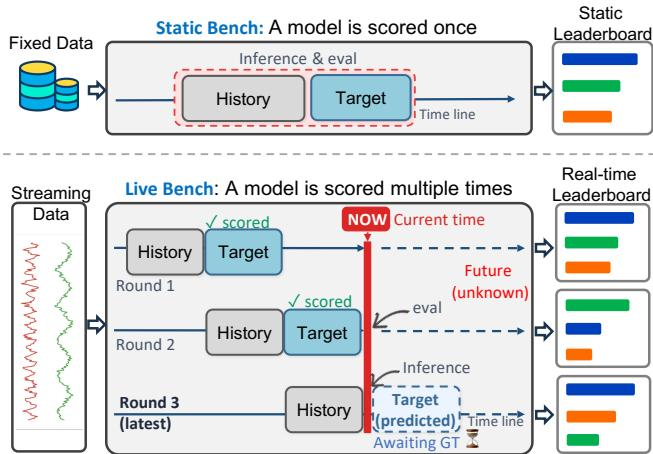  
Figure 1: Comparison between proposed LiveHouse-TS and static benchmark. LiveHouse-TS introduce a streaming evaluation protocol to capture model robustness under real-world operational conditions. It eliminates data leakage by requiring models to forecast at the current world time before ground truth is observed, with evaluation and the leaderboard updated continuously as new data arrives.

To address these limitations, we introduce LiveHouse-TS, the first open-world living benchmark infrastructure for TSFMs. We define our open-world setting as a temporally open system featuring continuous streaming observations and an extensible registry for dynamically expanding data sources. As illustrated in Figure 1, LiveHouse-TS enforces a strict prequential evaluation protocol: predictions must be made at the current world time before the corresponding ground-truth values exist, with metrics updated continuously as new observations arrive. Ultimately, LiveHouse-TS shifts time series benchmarking from snapshot accuracy to continuous temporal validity. We list the detailed comparsion of LiveHouse-TS and current benchmarks in Table 1. Crucially, rather than serving as a one-of leaderboard, LiveHouse-TS is conceptualized as a living time series infrastructure designed to spark and systematically answer new scientific questions vital to the community. For example, can model rankings be maintained long-term? Which models are genuinely robust under real-world deployment? In summary, our core contributions are:

Table 1: Comparison between representative TSFM benchmarks and LiveHouse-TS. (Abbr; LR: Leakage-resistant by nature; RTL: Real-time Leaderboard; OND: Open-to-new-data; FT: Forecasting Task, Prob.: Probability Forecasting). LiveHouse-TS provides the first systematic solution for benchmarking the live performance of time series foundation models.
<table><tr><td rowspan="2">Benchmark</td><td rowspan="2">Year</td><td colspan="3">Dataset</td><td colspan="4">Evaluation</td><td colspan="3">Leaderboard</td></tr><tr><td>Live/Static</td><td>#Domain</td><td>#Data</td><td>LR Test zero-shot?</td><td>FT</td><td></td><td>Multivariate RTL</td><td>OND</td><td></td><td>Metrics</td></tr><tr><td>Monash [22]</td><td>2021</td><td>Static</td><td>7</td><td>20</td><td>x</td><td>x</td><td>Point</td><td></td><td></td><td></td><td>MASE, sMAPE, msMAPE, MAE, RMSE</td></tr><tr><td>BasicTS [50]</td><td>2023</td><td>Static</td><td>5</td><td>20</td><td>x</td><td>x</td><td>point</td><td></td><td>x</td><td>x</td><td>MAE, RMSE, MAPE, WAPE</td></tr><tr><td>TFB [45]</td><td>2024</td><td>Static</td><td>10</td><td>41</td><td>x</td><td>x</td><td>Point</td><td></td><td>x</td><td>V</td><td>MAE, MSE, MASE, MSMAPE</td></tr><tr><td>ProbTS [60]</td><td>2024</td><td>Static</td><td>6</td><td>12</td><td>x</td><td>V</td><td>Point/Prob.</td><td>L</td><td>x</td><td>x</td><td>NMAE, CRPS</td></tr><tr><td>CiK [55]</td><td>2025</td><td>Static</td><td>7</td><td>9</td><td>x</td><td>V</td><td>Prob.</td><td>x</td><td>x</td><td>x</td><td>CRPS</td></tr><tr><td>GIFT-Eval [1]</td><td>2024</td><td>Static</td><td>7</td><td>23</td><td>x</td><td></td><td>Point/Prob.</td><td>V</td><td>x</td><td>x</td><td>MAPE, CRPS</td></tr><tr><td>fev-bench [51]</td><td>2025</td><td>Static</td><td>7</td><td>96</td><td>x</td><td></td><td>Point/Prob.</td><td></td><td>x</td><td>V</td><td>MASE, SQL</td></tr><tr><td>BOOM [11]</td><td>2025</td><td>Static</td><td>5</td><td></td><td>x</td><td>V</td><td>Point/Prob.</td><td></td><td>x</td><td>x</td><td>MASE, CRPS</td></tr><tr><td>TSFM-Bench [30]</td><td>2025</td><td>Static</td><td>10</td><td>21</td><td>x</td><td>V</td><td>Point</td><td></td><td>x</td><td>x</td><td>MAE, MSE</td></tr><tr><td>Impermanent [21]</td><td>2026</td><td>Live</td><td>1</td><td>1</td><td>V</td><td>J</td><td>Point/Prob.</td><td>V</td><td>x</td><td>x</td><td>MASE, CRPS</td></tr><tr><td>TS-Arena [41]</td><td>2026</td><td>Live</td><td>1</td><td>3</td><td>V</td><td></td><td>Point</td><td></td><td>V</td><td>V</td><td>MASE</td></tr><tr><td>LiveHouse-TS</td><td>2026</td><td>Live</td><td>11</td><td>17</td><td>V</td><td></td><td>Point/Prob.</td><td></td><td>V</td><td>V</td><td>RMSE,MAPE, CRPS, Stability, Improvement</td></tr></table>

• New Paradigm: We identify a critical evaluation gap in the snapshot paradigm and introduce a streaming evaluation protocol centered on continuous temporal validity to capture model robustness under real-world operational conditions.

• New Evaluation Infrastructure: We propose LiveHouse-TS, a leakage-resistant open-world live benchmark infrastructure featuring a real-time leaderboard, an extensible registry for streams and models, and new metrics specifically tailored for temporal stability and monotone performance improvement.

• New Insights: Current TSFMs generalize well for zero-shot forecasting on real future data. However, the rankings on LiveHouse-TS difer from those on prior static benchmarks, suggesting strong performance on static benchmarks may not necessarily translate to practical deployment.

## 2 Related Work

Time Series Foundation Models. TSFMs are pretrained on a large cross-domain time series corpus and then applied zero-shot or with light fine-tuning to unseen datasets [3, 7, 9, 15, 18, 20, 24, 53, 56]. They vary in tokenization, architecture, and pre-training objectives, including DeepAR, N-BEATS, N-HiTS, PatchTST, DLinear, and TimesNet [10, 42, 43, 48, 57, 59]; later models include Informer, Autoformer, FEDformer, Pyraformer, Crossformer, SCINet, and TiDE [14, 34, 35, 58, 62–64]. We refer the reader to Liang et al. [32] for a broader survey. To name a few examples, TimesFM [15] and Timer [38] follow a decoder-only design that models time series as patches, whereas Chronos [2, 3] discretizes (via scaling and quantization) continuous values into a token vocabulary to reuse language-model backbones. In contrast, encoder-style masked pretraining is adopted by MOIRAI [56] (masked any-variate modeling) and MOMENT [24] (masked multi-task pretraining), while Lag-Llama [46] produces probabilistic forecasts from lag-based features. Beyond modeling choices, Toto [13] and TTM [16] emphasize observability and lightweight deployment, and Time-MoE [52] and Moirai-MoE [36] scale up via sparse mixture-of-experts routing.

In parallel, another line of work reprograms or fine-tunes frozen language models for forecasting [8, 29, 65].

Time Series Forecasting Benchmark. Early competitions and archives fixed the unit of comparison, as M4 and M5 [39, 40] standardized point and probabilistic scoring over large series collections and the Monash archive [22] consolidated datasets into one format that later became a common pretraining source. A second wave then targeted fair and reproducible comparison, where TFB [45] and BasicTS [50] control preprocessing and dataset heterogeneity while ProbTS [60] and CiK [55] broaden the evaluation axis to distributional and context-aware forecasting. Most recently, GIFT-Eval [1, 31], TSFM-Bench [30], fev-bench [51], and BOOM [11] target foundation models directly to test their zero-shot ability. Across all three waves, a curated set of public series is frozen with predetermined train/test splits, and models are scored once over the held-out windows. Such a design introduces the potential data leakage and may not reflect model performance in real deployment (as discussed in Sec 1), which motivates our live and open-world benchmark. Overall, we refer to Table 1 for a detailed comparison with LiveHouse-TS and related ones.

Live Benchmark. A growing number of works in language and code evaluation address data contamination by making the benchmarks themselves live, continuously refreshing test data or gating them by release date so that every scored example is released after the model training. LiveBench [54], LiveCodeBench [28], and the multimodal LiveXiv [49] follow this principle and are supported by literature that analyzes why static benchmarks fail once their data leaks into pretraining [23, 47]. The methodological basis comes from the stream-learning literature, where prequential evaluation enforces that predictions are always made before observing the corresponding labels, thereby preventing look-ahead bias [19] and enabling adaptive performance tracking under concept drift [5]. This live paradigm is well-suited for benchmarking general time series forecasting, since real-world series are generated continuously and provide a natural supply of strictly post-cutof evaluation data.

## 3 Benchmark Details

## 3.1 Task Formulation

We consider a time series $\{ \mathbf { y } _ { t } \} _ { t \ge 1 }$ observed at regular time steps, where $\mathbf { y } _ { t } \in \mathbb { R } ^ { D }$ collects � target variables. At time �, the goal is

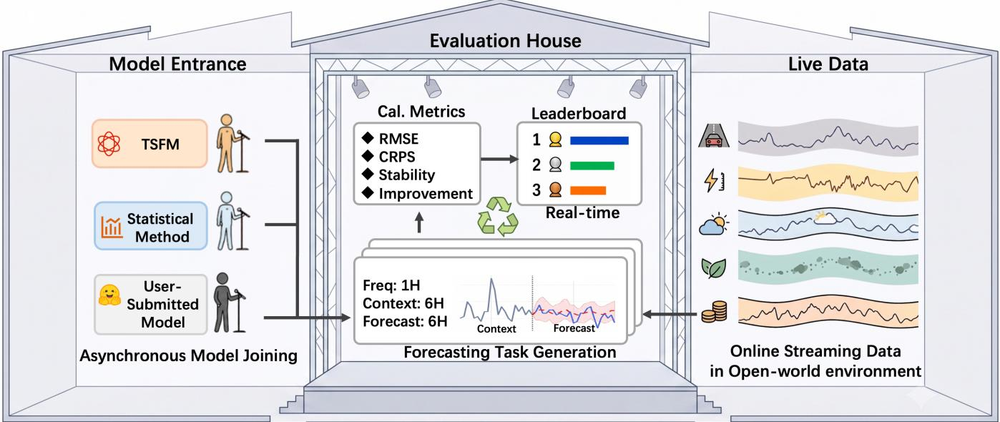  
Figure 2: Overall architecture of LiveHouse-TS, as an analogy in which models are performers and the benchmark is a live house. It contains three decoupled yet coordinated components: �) a Model Entrance that “checks tickets” and standardizes heterogeneous forecasters before they take the stage; ��) Live Data that turns public streams into a rolling set of forecasting tasks according to the dataset description (e.g., frequency, context length, and forecast horizon); and ���) an Evaluation House (the live house) that enforces the future-only rule, and updates the leaderboard.

to forecast the next � vectors given the most recent � observations (with optional covariates/metadata). In this setting, a point forecasting model outputs

$$
\begin{array} { r } { \hat { { \bf y } } _ { t + 1 : t + H } = f \big ( { \bf y } _ { t - L + 1 : t } , ~ { \bf x } _ { t - L + 1 : t } , ~ { \bf m } \big ) , } \end{array}\tag{1}
$$

where x denotes covariates (e.g., calendar features) and m denotes metadata such as frequency or horizon. Probabilistic forecasting instead targets a full predictive distribution over future trajectories,

$$
P ( \mathbf { y } _ { t + 1 : t + H } \mid \mathbf { y } _ { t - L + 1 : t } , \mathbf { x } _ { t - L + 1 : t } , \mathbf { m } ) .\tag{2}
$$

Zero-shot time series forecasting refers to applying a pretrained model to a novel dataset or unseen series without fine-tuning, using only the provided context window at inference time.

## 3.2 Overall Architecture

LiveHouse-TS is guided by the following three design principles:

Remark: Design principles.

(�) Leakge-resistant: Tasks are constructed from continually arriving public streams, and designed to test model’s ability on the real future to prevent the potential data leakage.

(��) Fairness: Ensuring fair comparisons across methods over time, since methods that join at diferent times may be evaluated over diferent time spans.

(���) Easy-to-scale: It should be easy for researchers and practitioners to join the leaderboard or contribute a new data source. Since we hope LiveHouse-TS serves as an infrastructure to evaluate the model’s generalizability in the open-world environment.

As in Figure 2, we realize these principles with three decoupled yet coordinated components—as an analogy in which models are performers and the benchmark is a live house: �) a Model Entrance that “checks tickets” and standardizes heterogeneous forecasters before they take the stage; ��) Live Data that turns public streams into a rolling set of forecasting tasks according to a dataset description (e.g., frequency, context length, and horizon); and ���) an Evaluation House (the live house) that enforces the future-only rule, and updates the leaderboard. Details are provided in Appx. B.

Model Entrance, which exposes a unified forecasting interface for forecasters, including hosted TSFMs and lightweight statistical baselines. Given a context window and dataset metadata (e.g., sampling frequency and horizon), each predictor is required to return forecasts aligned with the requested prediction horizon. The entrance adapter then validates the output shape and converts heterogeneous model outputs into a common scoring representation: a mean forecast for point-error metrics such as MSE/RMSE, a median forecast for quantile-based point metrics such as MAPE. And a fixed set of quantile forecasts at predefined levels for probabilistic metrics such as CRPS when available. If a method only provides point forecasts, we treat the point prediction as a degenerate predictive distribution for the evaluator. This canonical representation ensures that all methods, regardless of whether they are local TSFMs, user-submitted models, or statistical baselines, are scored by the same metric implementation under the same horizon and target alignment. Details in Appx. B.1.

Live Data, where collectors periodically retrieve fresh observations from multiple domains (see Sec 3.3 for more details). Each stream is cleaned and mapped into a shared schema before being windowed into tasks. Rather than imposing a single global setting, task construction follows the per-dataset specification (context length, prediction horizon, and frequency), ensuring that all models evaluated on a given dataset receive identical inputs and targets while respecting the natural time scale of each stream.

Evaluation House. For each newly created task, the evaluation engine retrieves the historical context available at issue time and packages it into a standardized forecasting instance. A future-only gate then compares the task timestamp with each model’s admission time, filtering out any tasks issued before the model entered the leaderboard. The remaining eligible tasks are dispatched through the unified forecasting interface, and their forecasts are evaluated once the corresponding future targets become observable. Details of the evaluation house are provided in Appx. B.3.

## 3.3 Streaming Data

3.3.1 Data Curation. LiveHouse-TS builds its evaluation stream from public, continuously updated time series rather than from a frozen archive. Figure 3 showcases representative examples from various domains. The current registry contains 17 benchmark datasets across 15 public sources, 11 domains, and 8 native frequencies, as detailed in Table 2. The registry contains both directly reported time series (e.g., sensor readings, market prices and macro indicators) and event-derived time series, where timestamped events are aggregated into regular buckets, such as GDELT document volume and USGS earthquake counts. Each dataset is described by a single registry entry containing its source identifier, entity granularity, native data frequency, recommended evaluation frequency, history length, forecast horizon, target variable, and optional covariates. Fourteen of the seventeen datasets include covariates for multivariate evaluation. History and forecast windows are measured in native-frequency steps. High-rate and daily operational streams provide short live contexts from minutes to weeks; while monthly and annual series preserve the longer seasonal and structural context (Appx. C.5 Table 5). We treat the native data frequency as a property of the series. This design choice ensures that changing how often we fetch data does not alter the forecasting problem itself—only the native frequency does.

3.3.2 Data Characteristics. The curated datasets have two properties: diversity (covering qualitatively diferent forecasting regimes) and liveness (streaming coming data).

Diversity. To avoid a high score being driven by matching a single domain, sampling rate, or smoothness pattern, we curate datasets along four complementary axes: source/domain breadth, temporal-scale breadth, task-structure breadth, and dynamic richness (Figure 4). Concretely, the current registry spans 15 public sources, 11 domains, and 8 native frequencies from one second to one year. Figure 5 summarizes this coverage by domain, native sampling frequency, and their joint distribution across the 17 datasets. Hourly series are the most common (7 datasets), followed by 15-minute (3) and daily (2); the remaining datasets cover 1s, 6min, 10min, 1mo, and 1y regimes. This range allows LiveHouse-TS to evaluate shorthorizon high-rate forecasting, ordinary sensor forecasting, eventvolume forecasting, and slow low-frequency forecasting under one protocol. Moreover, LiveHouse-TS is paried with dynamic richness diverse temporal behaviors such as seasonality, bursts, and regime shifts, and task-structure breadth that spans distinct forecasting setups (e.g., horizons, targets, and available covariates).

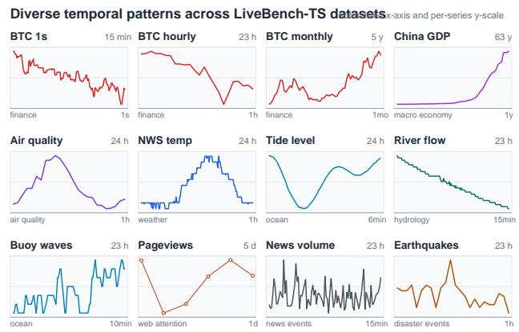  
Figure 3: Dataset examples with representative temporal patterns. Each panel shows one selected dataset window at its native cadence; axes are normalized independently to highlight temporal shape rather than absolute magnitude. The upper-right label gives the displayed window span, and the lower-right label is the native sampling frequency.

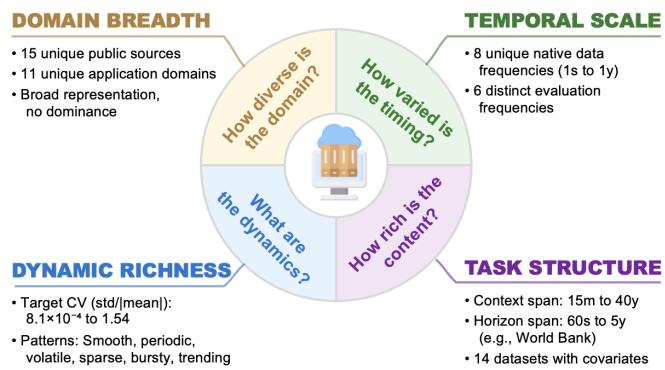  
Figure 4: Four measurements for dataset diversity. LiveHouse-TS is diverse enough both in terms of domain breadth, temporal scale, statistical variability, and task structure.

Liveness. Observations are collected from public sources as they are released, which enables evaluation on values that postdate a model’s participation in the leaderboard. The leaderboard therefore evolves as new collection rounds complete and previously issued forecasts become scoreable. Every canonical observation row links back to a raw response record and parser version, and the verification run parsed 2,672 observations across all 17 datasets. To keep the main paper focused, per-dataset registry fields and verification-slice statistics are reported in Appx. C.5.

3.3.3 Data pipeline. The crawled raw data are archived with request metadata, and converted into the forecasting task used for model evaluation. A future-only filter drops any context row whose observation was not yet available at forecast issue time. Appx. C.1 details collection, canonical parsing, and task filtering.

Table 2: Overview of streaming data in LiveHouse-TS (�=17 datasets, 15 public sources). Native freq. is the sampling rate; Eval freq. is the recommended evaluation frequency. Both exclude crawler polling frequency.
<table><tr><td>Group</td><td></td><td>Domains</td><td>Native freq.</td><td>Eval freq.</td><td>Sources</td><td>Targets</td></tr><tr><td>Environment</td><td></td><td>weather, air quality, weather-energy</td><td>1h (4), 1d</td><td>1h (4), 1d</td><td>Open-Meteo, NASA POWER, NWS, NOAA NCEI</td><td>temperature,  $\mathrm { P M } _ { 2 . 5 }$ </td></tr><tr><td>Water</td><td></td><td>hydrology, ocean</td><td>6min, 10min, 15min</td><td>1h</td><td>USGS Water, NOAA CO-OPS, NOAA NDBC</td><td>discharge, water level, wave height</td></tr><tr><td>Mobility</td><td>1</td><td>traffic</td><td>15min</td><td>15min</td><td>GBFS Citi Bike</td><td>available bikes</td></tr><tr><td>Finance</td><td>4</td><td>finance</td><td>1s, 1h (2), 1mo</td><td>1s, 1h (2), 1mo</td><td>Binance, CoinGecko</td><td>close, market price</td></tr><tr><td>Society/economy</td><td>2</td><td>web attention, macro-economy</td><td>1d, 1y</td><td>1d, 1y</td><td>Wikimedia, World Bank</td><td>pageviews, GDP</td></tr><tr><td>Events</td><td>2</td><td>news events, disaster events</td><td>15min, 1h</td><td>1d</td><td>GDELT, USGS Earthquake</td><td>event volume, count</td></tr></table>

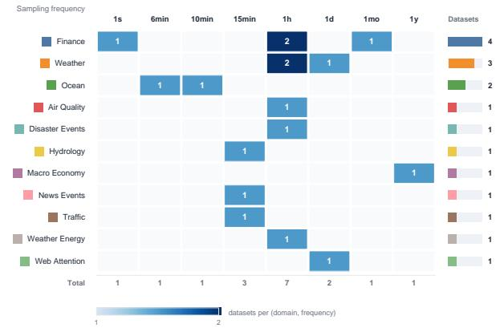  
Figure 5: Coverage by domain and native sampling frequency. LiveHouse-TS evaluation covers from short-horizon highrate forecast to long-horizon low-rate forecast.

## 3.4 Evaluation Mechanism

3.4.1 Metrics. Like most static benchmark, for point accuracy we use RMSE (↓) computed on �-normalized series to make magnitudes comparable across datasets, and we additionally report MAPE (↓) when targets are bounded away from zero. For probabilistic forecasts we use CRPS (↓), estimated from the quantiles emitted by each model. To summarize performance across datasets, we report Average Rank [61] (↓) across datasets, Win Rate [61] (↑) from pairwise wins, and an Elo rating [17] (↑) that weights wins over stronger opponents more heavily and yields a robust leaderboard score. We refer to Appx. B.4 for more details.

Moreover, since LiveHouse-TS is a live benchmark, we additionally introduce live-specific metrics that capture what static leaderboards cannot. Let $s _ { t }$ denote a base metric computed within a time window (i.e., a day) indexed by $t \in \{ 1 , \ldots , T \}$ on a forecasting task. We define Temporal Stability $( \downarrow )$ as the standard deviation over evaluations; it tests how stable a model’s performance is over time:

$$
{ \mathrm { S t a b i l i t y } } = { \sqrt { { \frac { 1 } { T - 1 } } \sum _ { t = 1 } ^ { T } ( s _ { t } - { \bar { s } } ) ^ { 2 } } } , \qquad { \bar { s } } = { \frac { 1 } { T } } \sum _ { t = 1 } ^ { T } s _ { t } ,\tag{3}
$$

We next introduce Improvement (↓) to test how reliably a model improves as new targets are revealed. Fix a target time � (which will be realized later). As the benchmark evolves, the model may issue multiple forecasts for this same � at diferent issue times $t _ { 1 } < \cdots < t _ { T _ { u } } ;$ ; let $s _ { u , k }$ be the resulting error (lower-is-better) once $y _ { u }$ is revealed. We quantify the monotone trend of $\left\{ s _ { u , k } \right\} _ { k = 1 } ^ { T _ { u } }$ with

Kendall’s �,

$$
\begin{array} { c } { \displaystyle \tau _ { u } = \frac { 2 } { T _ { u } ( T _ { u } - 1 ) } \sum _ { 1 \leq i < j \leq T _ { u } } \mathrm { s i g n } ( s _ { u , j } - s _ { u , i } ) , } \\ { \mathrm { I m p r o v e m e n t } = \frac { 1 } { | \mathcal { U } | } \sum _ { u \in \mathcal { U } } \tau _ { u } , } \end{array}\tag{4}
$$

where more negative values indicate a consistently decreasing (i.e., improving) error sequence as the issue time approaches the target. We choose Kendall’s � because it is non-linear and robust to spikes, capturing whether performance predominantly improves as new information arrives (details in Appx. B.4).

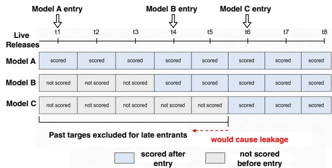  
Figure 6: Future-only evaluation under asynchronous model entry: models are scored only on targets released after they join the live leaderboard, to avoid leakage.

3.4.2 Fairness. Note that in the real case, the model can join the leaderboard at diferent times, which introduces a significant challenge to fair comparison for the live benchmark: As shown in Figure 6, models that join later may have already observed the ground-truth outcomes from earlier forecasting rounds, so scoring them on earlier periods would give an information advantage and introduce potential data leakage. To address this challenge, we propose evaluating each model only on targets released after it joins the leaderboard. This keeps comparisons fair across entry times.

However, models can therefore have diferent evaluation horizons under the future-only evaluation paradigm; we propose two solutions (�) fixed-horizon leaderboards (daily, weekly, and monthly) so that models are compared over the same evaluation window. (��) pair-wise historical ranking ranks models using only the forecasting tasks on which they were evaluated together (see more details in Appx. E). For each eligible model pair, it computes a datasetbalanced win rate from per-release comparisons (using both RMSE and CRPS), then aggregates these pairwise win rates into a modellevel score by macro-averaging over eligible opponents.

Table 3: Overall performance on LiveHouse-TS evaluated by RMSE, MAPE, and CRPS using Average Rank (↓), Win Rate (↑), and Elo Rating (↑). All baselines are ordered by their average rank across the three metrics. The best and second-best results in each row are highlighted in red bold and blue underline, respectively. TSFMs consistently outperform classical statistical methods. Moirai-2.0 dominates probabilistic forecasting, while TimesFM-2.5 and Chronos–2 excel primarily in point accuracy.
<table><tr><td rowspan="2">Measure</td><td rowspan="2">Metric</td><td colspan="8">Foundation models</td><td colspan="4">Classical baselines</td></tr><tr><td>Moi2</td><td>TFM</td><td>Chr2</td><td>TiRex</td><td>TabPFN</td><td>Sundial</td><td>ChrB</td><td>Toto1</td><td>ARIMA</td><td>MovAvg</td><td>ETS</td><td>SNaive</td></tr><tr><td rowspan="3">Average Rank (↓)</td><td>RMSE</td><td>4.70</td><td>3.30</td><td>3.80</td><td>4.00</td><td>5.80</td><td>6.40</td><td>7.10</td><td>10.70</td><td>7.45</td><td>7.75</td><td>8.00</td><td>9.00</td></tr><tr><td>MAPE</td><td>3.70</td><td>3.85</td><td>4.90</td><td>4.30</td><td>5.10</td><td>6.45</td><td>6.15</td><td>5.05</td><td>8.70</td><td>9.65</td><td>9.80</td><td>10.35</td></tr><tr><td>CRPS</td><td>2.30</td><td>9.20</td><td>7.25</td><td>7.05</td><td>4.70</td><td>3.15</td><td>3.90</td><td>2.95</td><td>8.70</td><td>9.35</td><td>9.45</td><td>10.00</td></tr><tr><td rowspan="3">Win Rate (↑)</td><td>RMSE</td><td>0.66</td><td>0.79</td><td>0.75</td><td>0.73</td><td>0.56</td><td>0.51</td><td>0.45</td><td>0.12</td><td>0.41</td><td>0.39</td><td>0.36</td><td>0.27</td></tr><tr><td>MAPE</td><td>0.76</td><td>0.74</td><td>0.65</td><td>0.70</td><td>0.63</td><td>0.51</td><td>0.53</td><td>0.63</td><td>0.30</td><td>0.21</td><td>0.20</td><td>0.15</td></tr><tr><td>CRPS</td><td>0.88</td><td>0.26</td><td>0.43</td><td>0.45</td><td>0.66</td><td>0.81</td><td>0.74</td><td>0.82</td><td>0.30</td><td>0.24</td><td>0.23</td><td>0.18</td></tr><tr><td rowspan="3">Elo Rating (↑)</td><td>RMSE</td><td>1218</td><td>1254</td><td>1225</td><td>1194</td><td>1161</td><td>1070</td><td>947</td><td>637</td><td>834</td><td>867</td><td>789</td><td>804</td></tr><tr><td>MAPE</td><td>1253</td><td>1139</td><td>1163</td><td>1251</td><td>1177</td><td>998 1358</td><td>1064</td><td>1055 1325</td><td>846 726</td><td>739 666</td><td>650 623</td><td>666</td></tr><tr><td>CRPS</td><td>1470</td><td>780</td><td>930</td><td>1003</td><td>1243</td><td></td><td>1265</td><td></td><td></td><td></td><td></td><td>611</td></tr></table>

## 4 Experiments

We conduct extensive experiments to answer the following four research questions: RQ1 (Zero-shot ability). Do TSFMs genuinely have strong zero-shot forecasting ability when evaluated on the real future? RQ2 (Static vs. live rankings). Do rankings of TSFMs on LiveHouse-TS change significantly compared to static ones? RQ3 (Drift robustness). How does TSFM performance evolve as the live distribution drifts? RQ4 (Ranking Stability.) Can model rankings be maintained long-term?

Models. We evaluate six TSFMs in frozen zero-shot mode, namely TiRex [4], Chronos-2 [2], and TimesFM-2.5 [15]. Toto-1.0 [12], Moirai-2.0 [33] Chronos-Bolt [3], TabPFN-TS [25], Sundial [37]. We select these models as the union of the TSFMs compared in widely used benchmarks, including GIFT-Eval [1], fev-bench [51], and TIME [44]. Collectively, these models represent major paradigms of modern TSFMs, including tokenization-based forecasting (Chronos-2), direct continuous-value prediction (Chronos-Bolt), decoder-only large-scale forecasting (TimesFM-2.5), retrieval-enhanced forecasting (TiRex), probabilistic modeling (Moirai-2.0), difusion-based forecasting (Sundial), large-scale autoregressive pre-training (Toto-1.0), and table foundation model adaptation for time series forecasting (TabPFN-TS). We also include four classical baselines, namely Seasonal Naive [26], Moving Average [6], ARIMA [6], and ETS [27], which provide the evaluation baselines. The foundation models are run with frozen weights and a fixed context window. To keep the result tables compact we abbreviate the models as Chr2 for Chronos-2, TFM for TimesFM-2.5, Toto1 for Toto-1.0, Moi2 for Moirai-2.0, MovAvg for Moving-Average, TabPFN for TabPFN-TS, Chr2 for Chronos-2, and SNaive for Seasonal-Naive, while TiRex, ARIMA, and ETS keep their origianl names.

Settings. All models are scored with a rolling mode, so that a forecast at time � uses only observations up to � and is graded once the ground truth arrives. The detailed forecasting settings of each dataset are presented in Appx. C.4 Table 5. Performance is assessed with the point metrics RMSE, and MAPE and the probabilistic metric CRPS, together with the aggregate measures Average Rank, Win Rate, and Elo detailed in Appx. B.4. Following GIFT-Eval [1], each Rank reported in the tables assigns every model a per-dataset rank by the metric (best = 1) and averages these ranks within the reported group. The evaluation horizon reported in the results is from 01/06/2026 to 01/07/2026. Among the 17 datasets, 10 are consistently available; the remaining 7 occasionally have missing observations during data collection. We therefore report results on the 10 stable datasets and reserve the other 7 for future benchmarks.

## 4.1 RQ1. Zero-shot ability

We evaluate whether TSFMs deliver strong zero-shot forecasts by comparing their predictions across the 10 eligible datasets in the live snapshot. We summarize the overall results in Table 3 and report per-dataset scores aggregated by domain, sampling frequency, and forecasting horizon in Appx. D Table 14, Table 15, and Table 16.

Overall. Table 3 presents the overall performance of all baselines across three ranking metrics computed from MAE, MAPE, and CRPS, with detailed per-dataset results reported in Appx. D Table 13. Overall, TSFMs consistently outperform statistical baselines. Specifically, Moirai-2.0 and TimesFM-2.5 achieve the best Average Rank, whereas Toto-1.0 performs consistently worse. The Elo and Win Rate results further reveal substantial diferences among TSFMs. Moirai-2.0 dominates probabilistic forecasting, while TimesFM-2.5 excels primarily in point accuracy (also see Appx. E Figure 17 and Figure 18 for more results).

By diferent domains. Figure 7 summarizes CRPS-based ranks across the domains; detailed results for other metrics, sampling frequencies, and forecasting horizons are reported in Appx. D Table 14, Table 15, and Table 16. Moirai-2.0 stays in the Top-2 CRPS rank on most domains, and diferent TSFMs lead under diferent domains, frequencies, and forecast horizons. Notably, the top-ranked Moirai-2.0 performs poorly on weather-related domains (Weather, Air Quality, and Ocean), which highlights a clear opportunity to improve performance on such domains.

Findings. TSFMs consistently outperform classical statistical baselines in the zero-shot setting, yet no single model dominates both point forecasting and probabilistic forecasting. Among tested TSFMs, Moirai-2.0 achives the best in probabilistic forecasting while TimesFM-2.5 and TiRex are good at point forecasting.

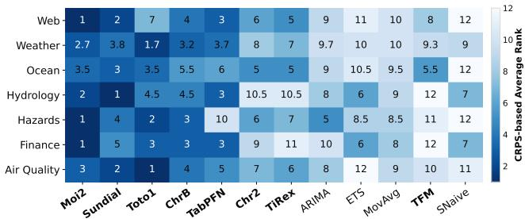  
Figure 7: CRPS-based average rank across seven domains. The results show that diferent TSFMs excel in distinct domains. Notably, the top-ranked Moirai-2.0 performs poorly on weather-related domains (Weather, Air Quality, and Ocean).

## 4.2 RQ2. Static versus live rankings

To avoid biases in a single leaderboard, we compare LiveHouse-TS with three popular static benchmarks, i.e., GIFT-Eval [1], fevbench [51], and TIME [44]. The comparison is restricted to the eight shared TSFMs with identical model versions (TabPFN-TS is unavailable in TIME). All benchmarks are ranked by CRPS. Figure 8 presents the ranking comparison.

Findings. The three static benchmarks exhibit remarkable agreement. Chronos-2 consistently ranks first, followed by TiRex and TimesFM-2.5, while Chronos-Bolt and Sundial remain near the bottom. In contrast, LiveHouse-TS produces a quite diferent rank ing. Moirai-2.0 and Toto-1.0 rise to the top, while Chronos-2 and TimesFM-2.5 fall to the bottom. Together with the RQ1 observation that Chronos-2 and TimesFM-2.5 achieve strong point accuracy but poor probabilistic calibration, these results suggest that static benchmarks fail to capture aspects of robustness that become apparent only under continuous live evaluation.

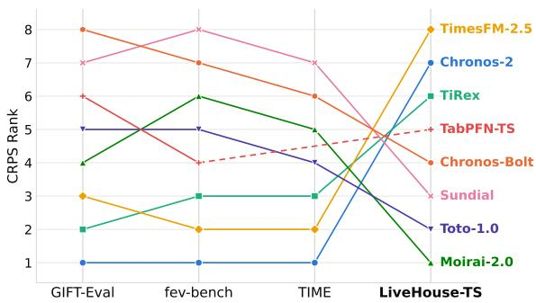  
Figure 8: CRPS ranking of the shared TSFMs across three static benchmarks and the live benchmark LiveHouse-TS. The dotted segment for TabPFN-TS indicates that it is not evaluated in TIME. The three static benchmarks reach a similar consensus, whereas the live benchmark produces a pronounced ranking inversion, showing that ofline (static) rankings can diverge from online performance and that a live benchmark is necessary to assess models under real deployment conditions.

## 4.3 RQ3. Drift robustness

Unlike static benchmarks, which evaluate a fixed test set, the live benchmark continuously assesses baselines on newly arriving observations and therefore reveals their robustness to temporal distribution shift. Figure 9 reports the Average Rank of the proposed Temporal Stability (↓) and Improvement (↓) metrics. The detailed numderical results are provided in Appx. D Table 11 and Table 12. Moirai-2.0 achieves the best performance on both metrics, consistent with its top ranking in the live benchmark. In contrast, Chronos-2 and TimesFM-2.5, which consistently lead the static benchmarks, rank near the bottom among TSFMs, indicating substantial degradation under temporal drift. Toto-1.0 further illustrates the diference between average accuracy and robustness. Despite ranking second in live CRPS, its Stability rank is only 10.50, revealing large performance fluctuations over time.

Findings. Drift robustness largely explains the ranking inversion observed in RQ2. Models that remain stable under evolving data also achieve stronger live benchmarking performance, while strong static accuracy alone does not guarantee robust deployment. These complementary metrics provide aspects of forecasting quality that static evaluations cannot capture.

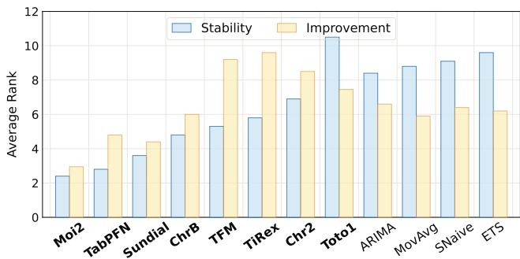  
Figure 9: Average Rank of Temporal Stability (blue) and Improvement (yellow). Moirai-2.0 ranks highest on both driftrobustness metrics, while several top static performers exhibit substantially lower temporal stability.

## 4.4 RQ4. Ranking Stability

Can model rankings be maintained long-term? In this subsection, we investigate whether model rankings remain stable across consecutive weekly snapshots of the live benchmark. Unlike RQ2, which compares static leaderboards with LiveHouse-TS, this analysis focuses on temporal ranking dynamics under the same evaluation protocol. Figure 11 shows CRPS rankings from W27 to W30 for all twelve baselines.

Finding. Rankings continue to evolve even over consecutive weekly snapshots. Rather than converging to a fixed ordering, the leading position alternates among Chronos-2, TiRex, TimesFM-2.5, and TabPFN-TS, while several mid-ranked models exchange positions across weeks. These observations suggest that no single model can dominated the live benchmark all the way, even though it is the best method in the static benchmark. This further highlights the necessity of the proposed LiveHouse-TS and its supporting infrastructure for establishing a realistic testbed to constantly assess model performance under real-world deployment.

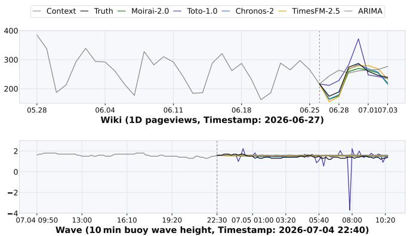  
(a) Wiki and Wave.

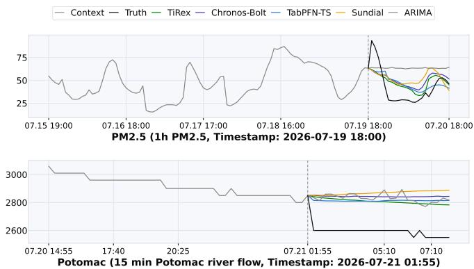  
(b) PM2.5 and Potomac.  
Figure 10: Forecasting visualization on Wiki, Wave, PM 2.5, and Potomac datasets. The left of the dashed line denotes the historical context and the right the forecasting horizon. Per-model visualizations are provided in Figure 13 and Figure 14. Although diferent TSFMs perform well on diferent datasets, they share common failure modes under evolving data distributions, including oversmoothing, delayed adaptation, and underestimated distribution shifts.

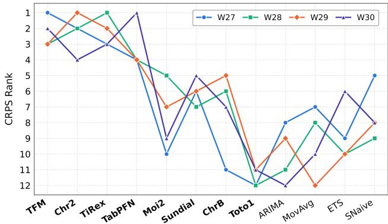  
Figure 11: CRPS rankings over four consecutive weekly snapshots. The dynamic rankings demonstrate that model performance evolves with the incoming data stream, highlighting the need for continuous live evaluation rather than a single leaderboard snapshot.

## 4.5 Case study

We visualize the predictions on four representative datasets from diferent domains and with diverse temporal characteristics: Wiki (daily Wikimedia page views), PM2.5 (hourly air quality), Wave (10-minute buoy wave height), and Potomac river flow (15-minute hydrology). Figure 10 shows the visualization comparison of these TSFMs together with ARIMA, and we provide the per-model showcases in Appx. D Figure 13 and 14.

As shown in Figure 10(a), on Wiki dataset, Moirai-2.0 and Chronos-2 can yield similar predictions with the ground truth throughout the forecasting horizon, whereas Toto-1.0 exhibits unstable oscillations with wider prediction intervals. Wave further reveals the complexity of long-term temporal dynamics. Chronos-2, TimesFM-2.5, and TiRex initially produce less fluctuating predictions, but their predictions gradually weaken and tend towards constant trajectories rather than maintaining the underlying periodicity. As shown in Figure 10(b), although TiRex, TabPFN-TS, Chronos-Bolt and Sundial capture the overall upeard trend of PM2.5 in later stages, they consistently underestimate the sharp increase in the earlier stages, while ARIMA remaines anchored near historical levels and failed to predict the shift. On the Potomac River dataset, the river flow drops rapidly after the predicted boundary, but all the highlighted methods react too slowly, consistently exceeding the true trajectory despite varying rates of decline.

Findings. Across these datasets, TSFM failures exhibit consistent patterns rather than isolated errors. Models smooth out abrupt PM 2.5 spikes, bias toward historical levels in Potomac, or collapse long-term forecasts into smoothed trajectories in Wave when periodic dynamics are under-observed. Crucially, these errors often occur simultaneously, indicating that prediction consistency does not imply reliability. Static benchmarks struggle to identify this behavior, merely averaging results over a fixed horizon. In contrast, live benchmarks iteratively evaluate TSFMs across evolving sources, revealing real-world performance degradation.

## 5 Conclusion

We presented a benchmark and live leaderboard for evaluating time series foundation models across diverse datasets and forecasting horizons. By standardizing data processing, evaluation protocols, this work aims to make comparisons more transparent and reproducible for the community. Our results highlight both the strengths of modern TSFMs and the remaining gaps in robustness and generalization when conditions shift across domains. Future work will expand the dataset coverage and tasks, and incorporate richer modalities to better reflect real-world deployment needs.

Limitations and Ethical Considerations. LiveHouse-TS evaluates forecasting models using publicly accessible time series streams and is not designed to collect private or personally identifiable in formation; therefore, individual consent is generally not applicable to the current datasets. Data sources are reviewed for accessibility, licensing, and provenance, and future contributors are expected to exclude sensitive personal data. Nevertheless, geographic, domain, availability, and measurement biases in the selected streams may afect model scores and rankings, which should not be interpreted as evidence of universal superiority or downstream fairness. Finally, the reported forecasts and rankings are research artifacts rather than operational advice and should not be used directly for highstakes financial, environmental, or public-safety decisions without domain-specific validation and human oversight.

## References

[1] Taha Aksu, Gerald Woo, Juncheng Liu, Xu Liu, Chenghao Liu, Silvio Savarese, Caiming Xiong, and Doyen Sahoo. 2024. GIFT-Eval: A Benchmark for General Time Series Forecasting Model Evaluation. arXiv preprint arXiv:2410.10393 (2024). NeurIPS 2024 Workshop on Time Series in the Age of Large Models (TSALM).

[2] Abdul Fatir Ansari, Oleksandr Shchur, Jaris Küken, Andreas Auer, Boran Han, Pedro Mercado, Syama Sundar Rangapuram, Huibin Shen, Lorenzo Stella, Xiyuan Zhang, Mononito Goswami, Shubham Kapoor, Danielle C. Maddix, Yuyang Wang, and Michael Bohlke-Schneider. 2025. Chronos-2: From Univariate to Universa Forecasting. arXiv preprint arXiv:2510.15821 (2025).

[3] Abdul Fatir Ansari, Lorenzo Stella, Caner Turkmen, Xiyuan Zhang, Pedro Mercado, Huibin Shen, Oleksandr Shchur, Syama Sundar Rangapuram, Sebastian Pineda Arango, Shubham Kapoor, Jasper Zschiegner, Danielle C. Maddix, Hao Wang, Michael W. Mahoney, Kari Torkkola, Andrew Gordon Wilson, Michael Bohlke-Schneider, and Yuyang Wang. 2024. Chronos: Learning the Language of Time Series. Transactions on Machine Learning Research (TMLR) (2024). arXiv:2403.07815.

[4] Andreas Auer, Patrick Podest, Daniel Klotz, Sebastian Böck, Günter Klambauer, and Sepp Hochreiter. 2025. TiRex: Zero-Shot Forecasting Across Long and Short Horizons with Enhanced In-Context Learning. arXiv:2505.23719 [cs.LG] https://arxiv.org/abs/2505.23719

[5] Albert Bifet and Ricard Gavaldà. 2007. Learning from Time-Changing Data with Adaptive Windowing. In Proceedings ofthe 2007 SIAM International Conference on Data Mining (SDM). 443–448. doi:10.1137/1.9781611972771.42

[6] George E. P. Box, Gwilym M. Jenkins, Gregory C. Reinsel, and Greta M. Ljung. 2015. Time Series Analysis: Forecasting and Control (5 ed.). John Wiley & Sons.

[7] Defu Cao, Michael Gee, Jinbo Liu, Hengxuan Wang, Wei Yang, Rui Wang, and Yan Liu. 2025. Conversational Time Series Foundation Models: Towards Explainable and Efective Forecasting. arXiv:2512.16022

[8] Defu Cao, Zijie Lei, Muyan Weng, Jiao Sun, and Yan Liu. 2026. Speaking Numbers to LLMs: Multi-Wavelet Number Embeddings for Time Series Forecasting. arXiv:2606.26487

[9] Defu Cao, Wen Ye, Yizhou Zhang, and Yan Liu. 2025. TimeDiT: General-purpose Difusion Transformers for Time Series Foundation Model. arXiv:2409.02322 [cs.LG] https://arxiv.org/abs/2409.02322

[10] Cristian Challu, Kin G. Olivares, Boris N. Oreshkin, Federico Garza, Max Mergenthaler-Canseco, and Artur Dubrawski. 2022. N-HiTS: Neural Hierarchical Interpolation for Time Series Forecasting. arXiv preprint arXiv:2201.12886 (2022). https://arxiv.org/abs/2201.12886

[11] Ben Cohen, Emaad Khwaja, Youssef Doubli, Salahidine Lemaachi, Chris Lettieri, Charles Masson, Hugo Miccinilli, Elise Ramé, Qiqi Ren, Afshin Rostamizadeh, Jean Ogier du Terrail, Anna-Monica Toon, Kan Wang, Stephan Xie, Zongzhe Xu, Viktoriya Zhukova, David Asker, Ameet Talwalkar, and Othmane Abou-Amal. 2025. This Time is Diferent: An Observability Perspective on Time Series Foundation Models. arXiv preprint arXiv:2505.14766 (2025).

[12] Ben Cohen, Emaad Khwaja, Youssef Doubli, Salahidine Lemaachi, Chris Lettieri, Charles Masson, Hugo Miccinilli, Elise Ramé, Qiqi Ren, Afshin Rostamizadeh, Jean Ogier du Terrail, Anna-Monica Toon, Kan Wang, Stephan Xie, Zongzhe Xu, Viktoriya Zhukova, David Asker, Ameet Talwalkar, and Othmane Abou Amal. 2026. This Time is Diferent: An Observability Perspective on Time Series Foundation Models. In The Thirty-ninth Annual Conference on Neural Information Processing Systems. https://openreview.net/forum?id=1jDAYXfcS2

[13] Ben Cohen, Emaad Khwaja, Kan Wang, Charles Masson, Elise Ramé, Youssef Doubli, and Othmane Abou-Amal. 2024. Toto: Time Series Optimized Transformer for Observability. arXiv preprint arXiv:2407.07874 (2024).

[14] Abhimanyu Das, Weihao Kong, Andrew Leach, Shaan Mathur, Rajat Sen, and Rose Yu. 2023. Long-term Forecasting with TiDE: Time-series Dense Encoder.

arXiv preprint arXiv:2304.08424 (2023). https://arxiv.org/abs/2304.08424

[15] Abhimanyu Das, Weihao Kong, Rajat Sen, and Yichen Zhou. 2024. A Decoder-Only Foundation Model for Time-Series Forecasting. In Proceedings ofthe 41st International Conference on Machine Learning (ICML). arXiv:2310.10688.

[16] Vijay Ekambaram, Arindam Jati, Pankaj Dayama, Sumanta Mukherjee, Nam H. Nguyen, Wesley M. Giford, Chandra Reddy, and Jayant Kalagnanam. 2024. Tiny Time Mixers (TTMs): Fast Pre-trained Models for Enhanced Zero/Few-Shot Forecasting of Multivariate Time Series. In Advances in Neural Information Processing Systems (NeurIPS). arXiv:2401.03955.

[17] Arpad E. Elo. 1978. The Rating of Chessplayers, Past and Present. Arco Publishing, New York.

[18] Yuchen Fang, Hao Miao, Yuxuan Liang, Liwei Deng, Yue Cui, Ximu Zeng, Yuyang Xia, Yan Zhao, Torben Bach Pedersen, Christian S. Jensen, Xiaofang Zhou, and Kai Zheng. 2026. Unraveling Spatio-Temporal Foundation Models via the Pipeline Lens: A Comprehensive Review. IEEE Transactions on Knowledge and Data Engineering 38, 3 (2026), 2040–2063.

[19] João Gama, Raquel Sebastião, and Pedro Pereira Rodrigues. 2013. On Evaluating Stream Learning Algorithms. Machine Learning 90, 3 (2013), 317–346. doi:10. 1007/s10994-012-5320-9

[20] Azul Garza, Cristian Challu, and Max Mergenthaler-Canseco. 2023. TimeGPT-1. arXiv preprint arXiv:2310.03589 (2023).

[21] Azul Garza, Renée Rosillo, Rodrigo Mendoza-Smith, David Salinas, Andrew Robert Williams, Arjun Ashok, Mononito Goswami, and José Martín Juárez. 2026. Impermanent: A Live Benchmark for Temporal Generalization in Time Series Forecasting. arXiv preprint arXiv:2603.08707 (2026).

[22] Rakshitha Godahewa, Christoph Bergmeir, Geofrey I. Webb, Rob J. Hyndman, and Pablo Montero-Manso. 2021. Monash Time Series Forecasting Archive. In Proceedings ofthe NeurIPS Track on Datasets and Benchmarks. arXiv:2105.06643.

[23] Shahriar Golchin and Mihai Surdeanu. 2024. Time Travel in LLMs: Tracing Data Contamination in Large Language Models. In The Twelfth International Conference on Learning Representations (ICLR). arXiv:2308.08493.

[24] Mononito Goswami, Konrad Szafer, Arjun Choudhry, Yifu Cai, Shuo Li, and Artur Dubrawski. 2024. MOMENT: A Family of Open Time-Series Foundation Models. In Proceedings of the 41st International Conference on Machine Learning (ICML). arXiv:2402.03885.

[25] Shi Bin Hoo, Samuel Müller, David Salinas, and Frank Hutter. 2026. From Tables to Time: Extending TabPFN-v2 to Time Series Forecasting. arXiv:2501.02945 [cs.LG] https://arxiv.org/abs/2501.02945

[26] Rob J. Hyndman and George Athanasopoulos. 2018. Forecasting: Principles and Practice (2 ed.). OTexts, Melbourne, Australia. https://otexts.com/fpp2/

[27] Rob J. Hyndman, Anne B. Koehler, J. Keith Ord, and Ralph D. Snyder. 2002. A State Space Framework for Automatic Forecasting Using Exponential Smoothing Methods. International Journal ofForecasting 18, 3 (2002), 439–454.

[28] Naman Jain, King Han, Alex Gu, Wen-Ding Li, Fanjia Yan, Tianjun Zhang, Sida Wang, Armando Solar-Lezama, Koushik Sen, and Ion Stoica. 2025. Live-CodeBench: Holistic and Contamination Free Evaluation of Large Language Models for Code. In The Thirteenth International Conference on Learning Representations (ICLR). arXiv:2403.07974.

[29] Ming Jin, Shiyu Wang, Lintao Ma, Zhixuan Chu, James Y. Zhang, Xiaoming Shi, Pin-Yu Chen, Yuxuan Liang, Yuan-Fang Li, Shirui Pan, and Qingsong Wen. 2024. Time-LLM: Time Series Forecasting by Reprogramming Large Language Models. In The Twelfth International Conference on Learning Representations (ICLR). arXiv:2310.01728.

[30] Zhe Li, Xiangfei Qiu, Peng Chen, Yihang Wang, Hanyin Cheng, Yang Shu, Jilin Hu, Chenjuan Guo, Aoying Zhou, Christian S Jensen, et al. 2025. Tsfm-bench: A comprehensive and unified benchmark of foundation models for time series forecasting. In Proceedings ofthe 31st ACM SIGKDD Conference on Knowledge Discovery and Data Mining V. 2. 5595–5606.

[31] Zhe Li, Xiangfei Qiu, Peng Chen, Yihang Wang, Hanyin Cheng, Yang Shu,Jilin Hu, Chenjuan Guo, Aoying Zhou, Christian S. Jensen, and Bin Yang. 2024. FoundTS: Comprehensive and Unified Benchmarking of Foundation Models for Time Series Forecasting. arXiv preprint arXiv:2410.11802 (2024)

[32] Yuxuan Liang, Haomin Wen, Yuqi Nie, Yushan Jiang, Ming Jin, Dongjin Song, Shirui Pan, and Qingsong Wen. 2024. Foundation Models for Time Series Analysis: A Tutorial and Survey. In Proceedings of the 30th ACM SIGKDD Conference on Knowledge Discovery and Data Mining (KDD). 6555–6565. doi:10.1145/3637528. 3671451 arXiv:2403.14735.

[33] Chenghao Liu, Taha Aksu, Juncheng Liu, Xu Liu, Hanshu Yan, Quang Pham, Silvio Savarese, Doyen Sahoo, Caiming Xiong, and Junnan Li. 2026. Moirai 2.0: When Less Is More for Time Series Forecasting. arXiv:2511.11698 [cs.LG] https://arxiv.org/abs/2511.11698

[34] Minhao Liu, Ailing Zeng, Muxi Chen, Zhijian Xu, Qiuxia Lai, Lingna Ma, and Qiang Xu. 2022. SCINet: Time Series Modeling and Forecasting with Sample Convolution and Interaction. In Advances in Neural Information Processing Systems. https://arxiv.org/abs/2106.09305

[35] Shizhan Liu, Hang Yu, Cong Liao, Jianguo Li, Weiyao Lin, Alex X. Liu, and Schahram Dustdar. 2022. Pyraformer: Low-Complexity Pyramidal Attention for Long-Range Time Series Modeling and Forecasting. In International Conference

on Learning Representations. https://iclr.cc/virtual/2022/poster/6827

[36] Xu Liu, Juncheng Liu, Gerald Woo, Taha Aksu, Yuxuan Liang, Roger Zimmermann, Chenghao Liu, Silvio Savarese, Caiming Xiong, and Doyen Sahoo. 2024. Moirai-MoE: Empowering Time Series Foundation Models with Sparse Mixture of Experts. arXiv preprint arXiv:2410.10469 (2024).

[37] Yong Liu, Guo Qin, Zhiyuan Shi, Zhi Chen, Caiyin Yang, Xiangdong Huang, Jianmin Wang, and Mingsheng Long. 2025. Sundial: A Family of Highly Capable Time Series Foundation Models. In Forty-second International Conference on Machine Learning. https://openreview.net/forum?id=LO7ciRpjI5

[38] Yong Liu, Haoran Zhang, Chenyu Li, Xiangdong Huang, Jianmin Wang, and Mingsheng Long. 2024. Timer: Generative Pre-trained Transformers Are Large Time Series Models. In Proceedings of the 41st International Conference on Machine Learning (ICML). arXiv:2402.02368.

[39] Spyros Makridakis, Evangelos Spiliotis, and Vassilios Assimakopoulos. 2020. The M4 Competition: 100,000 time series and 61 forecasting methods. International Journal ofForecasting 36, 1 (2020), 54–74.

[40] Spyros Makridakis, Evangelos Spiliotis, and Vassilios Assimakopoulos. 2022. The M5 competition: Background, organization, and implementation. International Journal ofForecasting 38, 4 (2022), 1325–1336.

[41] Marcel Meyer, Sascha Kaltenpoth, Henrik Albers, Kevin Zalipski, and Oliver Müller. 2026. TS-Arena – A Live Forecast Pre-Registration Platform. In Proceedings ofthe 32nd ACM SIGKDD Conference on Knowledge Discovery and Data Mining V.2. ACM, 9558–9568. doi:10.1145/3770855.3817515

[42] Yuqi Nie, Nam H. Nguyen, Phanwadee Sinthong, and Jayant Kalagnanam. 2023. A Time Series is Worth 64 Words: Long-term Forecasting with Transformers. In International Conference on Learning Representations. https://arxiv.org/abs/2211. 14730

[43] Boris N. Oreshkin, Dmitri Carpov, Nicolas Chapados, and Yoshua Bengio. 2020. N-BEATS: Neural Basis Expansion Analysis for Interpretable Time Series Forecasting. In International Conference on Learning Representations. https://arxiv. org/abs/1905.10437

[44] Zhongzheng Qiao, Sheng Pan, Anni Wang, Viktoriya Zhukova, Yong Liu, Xudong Jiang, Qingsong Wen, Mingsheng Long, Ming Jin, and Chenghao Liu. 2026. It’s TIME: Towards the Next Generation of Time Series Forecasting Benchmarks. arXiv preprint arXiv:2602.12147 (2026).

[45] Xiangfei Qiu, Jilin Hu, Lekui Zhou, Xingjian Wu, Junyang Du, Buang Zhang, Chenjuan Guo, Aoying Zhou, Christian S. Jensen, Zhenli Sheng, and Bin Yang. 2024. TFB: Towards Comprehensive and Fair Benchmarking of Time Series Forecasting Methods. Proceedings ofthe VLDB Endowment (PVLDB) 17, 9 (2024), 2363–2377. arXiv:2403.20150.

[46] Kashif Rasul, Arjun Ashok, Andrew Robert Williams, Hena Ghonia, Rishika Bhag watkar, Arian Khorasani, Mohammad Javad Darvishi Bayazi, George Adamopou los, Roland Riachi, Nadhir Hassen, Marin Biloš, Sahil Garg, Anderson Schneider, Nicolas Chapados, Alexandre Drouin, Valentina Zantedeschi, Yuriy Nevmyvaka, and Irina Rish. 2023. Lag-Llama: Towards Foundation Models for Probabilistic Time Series Forecasting. arXiv preprint arXiv:2310.08278 (2023).

[47] Oscar Sainz, Jon Ander Campos, Iker García-Ferrero, Julen Etxaniz, Oier Lopez de Lacalle, and Eneko Agirre. 2023. NLP Evaluation in Trouble: On the Need to Mea sure LLM Data Contamination for each Benchmark. In Findings ofthe Association for Computational Linguistics: EMNLP 2023. 10776–10787. arXiv:2310.18018.

[48] David Salinas, Valentin Flunkert, and Jan Gasthaus. 2017. DeepAR: Probabilistic Forecasting with Autoregressive Recurrent Networks. arXiv preprint arXiv:1704.04110 (2017). https://arxiv.org/abs/1704.04110

[49] Nimrod Shabtay, Eli Schwartz, Assaf Arbelle, Peter Staar, Sivan Doveh, Kate Saenko, Leonid Karlinsky, and Raja Giryes. 2025. LiveXiv – A Multi-Modal Live Benchmark Based on Arxiv Papers Content. In The Thirteenth International Conference on Learning Representations (ICLR). arXiv:2410.10783.

[50] Zezhi Shao, Fei Wang, Yongjun Xu, Wei Wei, Chengqing Yu, Zhao Zhang, Di Yao, Tao Sun, Guangyin Jin, Xin Cao, Gao Cong, Christian S. Jensen, and Xueqi Cheng. 2023. Exploring Progress in Multivariate Time Series Forecasting: Comprehensive Benchmarking and Heterogeneity Analysis. arXiv preprint arXiv:2310.06119 (2023).

[51] Oleksandr Shchur, Abdul Fatir Ansari, Caner Turkmen, Lorenzo Stella, Nick Erickson, Pablo Guerron, Michael Bohlke-Schneider, and Yuyang Wang. 2025. fev-bench: A Realistic Benchmark for Time Series Forecasting. arXiv preprint arXiv:2509.26468 (2025).

[52] Xiaoming Shi, Shiyu Wang, Yuqi Nie, Dianqi Li, Zhou Ye, Qingsong Wen, and Ming Jin. 2025. Time-MoE: Billion-Scale Time Series Foundation Models with Mixture of Experts. In The Thirteenth International Conference on Learning Representations (ICLR). arXiv:2409.16040.

[53] Shiyu Wang, Juntong Ni, Ziyi Zhang, Baichuan Mo, Xinyue Zhong, Chengxin Wang, Yuchen Fang, Zhou Ye, and Yang Xiang. 2026. ConFlux: Multivariate Time Series in Flux, One Unified Forecast in Confluence. In International Conference on Machine Learning (ICML).

[54] Colin White, Samuel Dooley, Manley Roberts, Arka Pal, Ben Feuer, Siddhartha Jain, Ravid Shwartz-Ziv, Neel Jain, Khalid Saifullah, Siddartha Naidu, Chinmay Hegde, Yann LeCun, Tom Goldstein, Willie Neiswanger, and Micah Goldblum. 2025. LiveBench: A Challenging, Contamination-Limited LLM Benchmark. In The

Thirteenth International Conference on Learning Representations (ICLR). Spotlight; arXiv:2406.19314.

[55] Andrew Robert Williams, Arjun Ashok, Étienne Marcotte, Valentina Zantedeschi, Jithendaraa Subramanian, Roland Riachi, James Requeima, Alexandre Lacoste, Irina Rish, Nicolas Chapados, and Alexandre Drouin. 2025. Context is Key: A Benchmark for Forecasting with Essential Textual Information. In Proceedings of the 42nd International Conference on Machine Learning (ICML). arXiv:2410.18959.

[56] Gerald Woo, Chenghao Liu, Akshat Kumar, Caiming Xiong, Silvio Savarese, and Doyen Sahoo. 2024. Unified Training of Universal Time Series Forecasting Transformers. In Proceedings of the 41st International Conference on Machine Learning (ICML). arXiv:2402.02592.

[57] Haixu Wu, Tengge Hu, Yong Liu, Hang Zhou, Jianmin Wang, and Mingsheng Long. 2023. TimesNet: Temporal 2D-Variation Modeling for General Time Series Analysis. In International Conference on Learning Representations. https://arxiv. org/abs/2210.02186

[58] Haixu Wu, Jiehui Xu, Jianmin Wang, and Mingsheng Long. 2021. Autoformer: Decomposition Transformers with Auto-Correlation for Long-Term Series Forecasting. In Advances in Neural Information Processing Systems. https://arxiv.org/ abs/2106.13008

[59] Ailing Zeng, Muxi Chen, Lei Zhang, and Qiang Xu. 2023. Are Transformers Efective for Time Series Forecasting?. In Proceedings ofthe AAAI Conference on Artificial Intelligence. https://arxiv.org/abs/2205.13504

[60] Jiawen Zhang, Xumeng Wen, Zhenwei Zhang, Shun Zheng, Jia Li, and Jiang Bian. 2024. ProbTS: Benchmarking Point and Distributional Forecasting across Diverse Prediction Horizons. In Advances in Neural Information Processing Systems (NeurIPS), Datasets and Benchmarks Track. arXiv:2310.07446.

[61] Xiyuan Zhang, Danielle Maddix Robinson, Junming Yin, Nick Erickson, Abdul Fatir Ansari, Boran Han, Shuai Zhang, Leman Akoglu, Christos Faloutsos, Michael Mahoney, et al. 2026. Mitra: Mixed synthetic priors for enhancing tabular foundation models. Advances in neural information processing systems 38 (2026), 15795–15840.

[62] Yunhao Zhang and Junchi Yan. 2023. Crossformer: Transformer Utilizing Cross-Dimension Dependency for Multivariate Time Series Forecasting. In International Conference on Learning Representations. https://openreview.net/forum?id= vSVLM2j9eie

[63] Haoyi Zhou, Shanghang Zhang, Jieqi Peng, Shuai Zhang, Jianxin Li, Hui Xiong, and Wancai Zhang. 2021. Informer: Beyond Eficient Transformer for Long Sequence Time-Series Forecasting. In Proceedings of the AAAI Conference on Artificial Intelligence. https://arxiv.org/abs/2012.07436

[64] Tian Zhou, Ziqing Ma, Qingsong Wen, Xue Wang, Liang Sun, and Rong Jin. 2022. FEDformer: Frequency Enhanced Decomposed Transformer for Longterm Series Forecasting. In International Conference on Machine Learning. https: //arxiv.org/abs/2201.12740

[65] Tian Zhou, Peisong Niu, Xue Wang, Liang Sun, and Rong Jin. 2023. One Fits All: Power General Time Series Analysis by Pretrained LM. In Advances in Neural Information Processing Systems (NeurIPS). arXiv:2302.11939.

## A Getting Started

We introduce how external participants can connect their TSFMs and contribute datasets to the live leaderboard. Because the benchmark updates in real time, each model must support sustainable repeated inference. Therefore, the leaderboard does not download model weights or execute user code. Instead, participants host a forecasting endpoint—such as a Hugging Face Space or Inference Endpoint—which the leaderboard calls via a standardized API. Participants manage inference resources, while the leaderboard handles data collection, evaluation, aggregation, and display.

## A.1 How to join the leaderboard

To join the leaderboard, participants provide a public Hugging Face model repository, a public URL for the endpoint implementation, and a stable HTTPS forecasting endpoint. Inference runs on participant-controlled infrastructure: the model owner supplies the inference compute, while the leaderboard handles live task generation, evaluation, aggregation, and display. A paid Hugging Face Space, a participant-owned domain, and a public server IP are not required.

The recommended workflow is:

(1) Initialize the portable endpoint template, replace its forecast\_one function with the model inference logic, and start the service on the participant’s inference server.

(2) Validate the local endpoint using a complete forecasting request.

(3) Run the publishing helper. By default, it exposes the local service through a persistent Tailscale Funnel with managed HTTPS and validates the resulting public route. A stable institutional HTTPS endpoint may be supplied instead.

(4) Submit the generated metadata and validation receipt after both the local and public endpoints pass validation.

The default deployment requires Python 3, Docker Engine, and Docker Compose v2. When the Tailscale route is used, Tailscale 1.52 or later must also be installed on the inference server. The complete setup is:

```shell
git clone https :// github . com/ zhouziyu02 /TS - Live .git
cd TS - Live
python3 -m venv . venv
source . venv /bin/ activate
python -m pip install -r requirements .txt
export MODEL_ID ="your -hf - username /your - model "
export DISPLAY_NAME =" YourModelName "
export CODE_URL =" https :// github .com/your -org /your -
endpoint "
# Verify the container runtime and Compose installation .
docker version
docker compose version
# Generate the portable forecasting service .
python scripts / community_model_wizard . py init \
--output - dir forecast - service
# Replace forecast_one and add model - specific
dependencies
# to forecast - service / requirements .txt . Publish this
source
# directory at CODE_URL before submitting the model .
docker compose -f forecast - service / compose . yaml \
up -d --build
```

```shell
# Check the container and wait for the local service .
docker compose -f forecast - service / compose . yaml ps
curl -- fail -- show - error \
--retry 30 --retry - delay 2 --retry - connrefused \
http ://127.0.0.1:7860/ health
# Send a complete local forecasting request .
python scripts / validate_external_model_endpoint . py \
--endpoint - url http ://127.0.0.1:7860/ forecast \
--model -id "${ MODEL_ID }" \
-- allow - http
# One - time Linux setup for the default Tailscale route .
tailscale version
sudo tailscale up
sudo tailscale set -- operator ="${ USER }
tailscale status
# Validate locally , create the persistent HTTPS Funnel ,
# validate the public route , and generate both artifacts .
python scripts / community_model_wizard .py publish \
--model -id "${ MODEL_ID }" \
--display - name "${ DISPLAY_NAME }" \
--code - url "${ CODE_URL }" \
--output - dir community - submission
```

The first Funnel activation may require the participant or a tailnet administrator to approve Funnel and HTTPS access in a browser. If the publishing helper displays an approval URL, the participant completes this one-time authorization and reruns the same publish command. The helper allows up to ten minutes for the public DNS record and HTTPS route to become available.

Participants who already operate a stable institutional HTTPS endpoint, or a named Cloudflare Tunnel with a stable hostname, may skip the Tailscale setup and run:

```shell
python scripts / community_model_wizard . py publish \
--model -id "${ MODEL_ID }" \
--display - name "${ DISPLAY_NAME }" \
-- code - url "${ CODE_URL }" \
--endpoint - url \
https :// forecast .your - domain . example / forecast \
--output - dir community - submission
```

For each evaluation request, the endpoint receives only the causal target history, an opaque series identifier, the forecast horizon, frequency, and requested quantile levels. It does not receive future observations, ground truth, raw dataset names, private metric values, or predictions from other models. The validator checks GET /health and sends a complete request to POST /forecast. It verifies the response length, numerical finiteness, requested quantiles, response-size limit, and HTTPS requirement before producing a successful receipt.

The default Funnel is initiated from the inference server and therefore requires no inbound firewall rule, participant-owned domain, or manually managed TLS certificate. Its \*.ts.net address remains stable while the Tailscale device identity and MagicDNS name are retained. Tailscale Funnel is a low-friction option but remains a beta service with provider-defined bandwidth limits. Participants requiring a custom domain or stronger ingress guarantees should use an institutional HTTPS service or a named Cloudflare Tunnel. Temporary tunnel URLs are not accepted.

After successful validation, the participant pastes the contents of community-submission/community\_model.yaml and community-submission/ into the community model request form at https://github.com/

zhouziyu02/TS-Live/issues/new?template=community-model.yml.   
The submitted endpoint is reviewed before being enabled.

An accepted model is admitted only to future live evaluation rounds and is never backfilled on releases preceding its admission time. Its results appear after the next successful evaluation cycle. Detailed release snapshots may be retained privately for auditing and metric recomputation, while only metric summaries and aggregate leaderboard tables are published.

## A.2 How to contribute new dataset

As an open online benchmark, LiveHouse-TS accepts new public time series streams from the community. A contribution plugs into the same live loop as the built-in sources in Sec. 3.3: register the dataset semantics, ingest fresh observations on a recurring schedule, and let the evaluation house form and score forecasting tasks auto matically. Contributors provide (i) a dataset-level specification that defines the forecasting problem and (ii) an ingestion adapter that fetches the public source and emits normalized observations. The full attribute contract and preprocessing requirements are given in Appx. B.2; accepted sources are reviewed for licensing, stability, and schema compliance before entering the public registry.

## B Implementation Details of LiveHouse-TS

## B.1 Model Entrance.

The model entrance is the component through which all forecasting methods are registered, adapted, and admitted into LiveHouse-TS. Its primary role is to decouple model-specific inference logic from the live data and evaluation pipeline. A model may be a hosted TSFM, an external service, a local predictor, or a statistical baseline; after passing through the entrance, however, all methods expose a uniform forecasting contract to the evaluation house.

Model registry. Each model is specified by a registry entry containing a stable model identifier, a display name, the model type, organization metadata, links to the model and replication code, and the information needed to instantiate its adapter. For hosted TSFMs, this includes the remote model identifier and API backend. For community submissions, the entry may instead specify a vali dated HTTPS forecast endpoint. For statistical baselines, the entry records the algorithm family and its fixed hyperparameters, such as the ARIMA order, moving-average window, or season length. The registry also records whether a model is enabled for public evaluation and the time from which its future-only evaluation window begins. This start time is important: LiveHouse-TS never backfills a newly added model on targets that were already observable before the model entered the benchmark.

Unified forecasting contract. For every admitted evaluation task, the entrance presents the model with a causal context window, the sampling frequency, the prediction horizon, and minimal task metadata. Formally, the model receives $\mathbf { x } _ { 1 : T }$ , a frequency descriptor $f ,$ and a horizon �, and is asked to return forecasts for $\mathbf { X } _ { T + 1 : T + H }$ . The standardized output contains a point forecast and, when available, predictive quantiles:

$$
\left( \hat { \pmb { \mu } } _ { 1 : H } , \left\{ \hat { \bf q } _ { \tau , 1 : H } \right\} _ { \tau \in Q } \right) ,
$$

where Q denotes the requested quantile levels. This contract is implemented through a common predictor abstraction, so the downstream evaluator does not need method-specific logic for TSFM APIs, local predictors, endpoints, or baselines. Forecast arrays are checked for shape, horizon length, and finite numeric values before they are converted into the common evaluation format.

Adapters for heterogeneous model outputs. Diferent TSFMs expose various native output formats. Some return means and quantile forecasts; others return samples, prediction intervals, or point forecasts. The model entrance normalizes these outputs into a uniform mean-plus-quantiles representation. If a model provides samples, empirical quantiles are computed from the sample paths. If a model exposes only point forecasts, the adapter constructs an approximate predictive distribution via repeated stochastic calls or residual-bootstrap perturbations. This normalization allows point and distributional metrics, such as the quantile-loss approximation to CRPS, to be computed by a single metric engine.

Hosted and external models. Built-in hosted TSFMs are queried through authenticated forecast APIs with fixed request fields: historical target values, frequency, prediction length, and requested quantile levels. Community models can be integrated through a self-hosted HTTPS endpoint. In this mode, LiveHouse-TS treats the submitted model as a black box: it does not import user code, download user weights, or execute third-party dependencies inside the leaderboard process. By default, the endpoint receives only the causal context, an opaque series identifier, the frequency, the horizon, and the requested quantiles. Future targets, metric values, authentication tokens, raw leaderboard internals, and other models’ predictions are never sent to the endpoint. The adapter enforces request timeouts, retry limits, maximum context lengths, maximum response sizes, and forecast-validity checks.

Statistical baselines. The same entrance also hosts non-pretrained reference methods, including seasonal naive, moving average, ARIMA, and exponential smoothing. These baselines are fit or instantiated only from the context window of the current task and therefore obey the same causal restriction as TSFMs. Since several classical methods naturally produce point forecasts, the entrance derives quantile forecasts using residual-bootstrap samples when probabilistic outputs are required. This makes the baselines compatible with both point-accuracy and distributional metrics without giving them any special treatment in the evaluator.

Failure handling and auditability. The entrance isolates model failures from the rest of the benchmark. Transient API failures can be retried, while invalid responses, non-finite forecasts, short horizons, malformed quantiles, or endpoint errors are rejected before scoring. For each successful run, LiveHouse-TS stores model metadata, task metadata, metric rows, and evaluation timestamps as persistent artifacts. These records make it possible to audit which adapter, model identifier, context window, horizon, and evaluation time produced each leaderboard entry. Thus, the model entrance provides both a practical integration layer for heterogeneous forecasting systems and a reproducibility boundary that keeps the live evaluation protocol model agnostic.

## B.2 Live Data.

As a public online benchmark, LiveHouse-TS is designed to grow beyond its initial registry. Researchers and practitioners can contribute additional public streams—for example, a weather station feed, an open mobility API, or a government statistics portal—as long as the source is openly accessible and can be mapped into the shared contract below. Each contribution reuses the same live loop as the built-in sources: raw responses are archived for provenance, observations are normalized into a common schema, forecast tasks are generated from per-dataset window settings, and the evaluation house scores only targets that become observable after a model joins the leaderboard.

Contribution contract. A new source requires two complementary pieces. First, a dataset specification that semantically defines the forecasting problem (domain, entity type, native frequency, evalua tion frequency, context and horizon lengths, targets, and covariates). Second, an ingestion adapter that periodically retrieves the public endpoint, preserves immutable raw evidence, and emits normalized observation records. The dataset specification is the single source of semantic truth; polling cadence is an operational scheduling choice and is kept separate from the forecasting definition itself.

Required dataset attributes. Each contributed dataset must declare the attributes below.

• Identity: dataset identifier, source identifier, human-readable name, domain, entity granularity, and short English description/background for downstream users.

• Forecasting setup: native data\_frequency, recommended eval history\_length\_steps and forecast\_horizon\_steps (both measured in native-frequency steps), target\_variables, and optional covariate\_variables.

• Behavior flags: whether the series is ready for direct zero-shot leaderboard scoring, and whether raw events must be aggregated to a regular grid before forecasting.

History and horizon windows are always expressed in the native series frequency, so a high-rate stream and a monthly macro series can coexist without forcing a single global window length.

Storage model. The data layer separates three concerns rather than relying on one monolithic training file.

• Raw archive: immutable copies of public responses, together with request metadata, fetch time, content hash, and parser version, so every normalized value remains auditable.

• Canonical store: relational long-format tables for datasets, entities, variables, observations, forecast tasks, and quality/run logs. This layer is the source of truth.

• Task export: ephemeral model-facing bundles that pair a context window with dataset metadata; future targets are exported separately for the evaluator only.

Preprocessing requirements. After each fetch, an ingestion adapter must satisfy the following requirements.

(1) Preserve provenance. Store the untouched response before parsing; never overwrite prior raw evidence.

(2) Normalize entities and variables. Map each forecastable object (station, market, fleet, grid point, country, etc.) to a stable entity identifier, and map measurable quantities to variable identifiers with units and frequency hints.

(3) Emit long-format observations. Represent each value as one record keyed by entity, timestamp, and variable. Every record must carry:

• timestamp: when the measurement refers to;

• available\_time: when the value became knowable to a forecaster;

• ingest\_time: when LiveHouse-TS retrieved it;

• numeric value, frequency, unit, and a link back to the raw evidence.

Event streams (e.g., news documents or earthquake catalogs) must be bucketed to the declared native frequency when aggregation is required.

(4) Generate forecast tasks. Instantiate tasks from the dataset specification: forecast issue time, context window, horizon window, covariate set, and frequency must be identical for all models evaluated on the same dataset.

(5) Report data health. Record missingness, duplicates, freshness delay, outliers, and ingestion failures so unstable or stale sources do not silently enter the leaderboard.

Leakage rule. Model inputs must never contain information that was unavailable at prediction time. For every context observation,

$$
\mathsf { a v a i l a b l e \_ t i m e \le f o r e c a s t \_ i s s u e \_ t i m e . }
$$

A measurement timestamp alone is therefore insuficient: the value must also have been publicly knowable before the forecast was issued. Future targets are kept evaluator-only and are never exposed

<sup>equency,</sup>as model inputs. This rule is the same leakage-resistant contract used by the built-in streams described in Appx. C.1. Once accepted, a contributed source inherits the same task generation, future-only gating, and leaderboard update loop as the core registry entries.

## B.3 Evaluation House.

The evaluation house is the component in LiveHouse-TS that turns standardized model forecasts into auditable leaderboard records. It receives forecasting tasks from the live data stage and model predictions from the model entrance, then applies a fixed evaluation protocol to all admitted model–task pairs. Its design goal is to ensure that every reported score is computed from the same target window, the same metric implementation, and the same aggregation rule, regardless of the model’s inference backend or output format.

Task admission and future-only scoring. For each refreshed data stream, the live data stage materializes a forecasting task consisting of a historical context window $\mathbf { x } _ { 1 : T }$ , a prediction horizon �, dataset metadata, and the future target $\mathbf { X } T + 1 ; T + H \cdot$ The evaluation house first checks whether the task is eligible for a given model. Let $a _ { m }$ denote the accepted entrance time of model �. A task is scored for � only if its target window is generated from observations that become available after $a _ { m } .$ . This future-only gate prevents newly submitted models from being evaluated retrospectively on data that could have been inspected during model development or endpoint debugging. The same gate is applied to hosted TSFMs, external community endpoints, local wrappers, and statistical baselines.

Forecast execution. After admission, the evaluation house dispatches the task through the unified predictor interface. The model receives only the causal context, frequency, and horizon; the target values are held out until scoring. The returned forecast is converted into a common representation containing a mean or median forecast and, when available, a set of predictive quantiles. The evaluator validates that all forecast arrays have the required horizon length and contain finite numeric values. Invalid, malformed, or incomplete outputs are rejected before metrics are computed, so downstream ranking is never based on partially parsed forecasts.

Metric computation. The metric engine evaluates both point accuracy and probabilistic quality. For point forecasts, LiveHouse-TS reports metrics such as MSE, RMSE, MAE, MASE, MAPE, sMAPE, NRMSE, and ND when they are well defined. For probabilistic forecasts, the evaluator computes interval and quantile-based scores, including MSIS and the mean weighted sum quantile loss, which is used as the CRPS-style distributional metric in the leaderboard. All metrics are computed on the same held-out target window for all models admitted to that task. Metrics that are undefined for a particular target, such as percentage errors near zero, are marked as unavailable rather than silently imputed.

Reference baselines and relative gain. The evaluation house also maintains matched baseline scores for lightweight reference methods. In particular, Seasonal-Naive is used as a causal reference because it requires no pretraining and can be instantiated from the same context window as every other method. For live aggregate reporting, LiveHouse-TS computes a relative real-time gain (RTG) from matched MSE values:

$$
{ \mathrm { R T G } } ( m ) = 1 0 0 \cdot { \frac { { \mathrm { M S E } } _ { \mathrm { S N a i v e } } - { \mathrm { M S E } } _ { m } } { { \mathrm { M S E } } _ { \mathrm { S N a i v e } } + { \mathrm { M S E } } _ { m } } } .
$$

This bounded form gives positive values to models that improve over the seasonal-naive reference and negative values to models that underperform it, while avoiding instability when absolute errors are small.

Aggregation and ranking. The evaluation house produces fine-grained and aggregate views. At the lowest level, it stores a metric row for each model–dataset–release combination. Datasetlevel scores are obtained by averaging over releases from the same stream. Overall live scores assign equal weight to datasets, prevent ing frequently refreshed streams from dominating. For grouped analysis, LiveHouse-TS reports GIFT-Eval-style aggregates by do main, frequency, and prediction length. These grouped tables normalize MSE and CRPS against matched Seasonal-Naive scores, then aggregate across configurations.

Ranks are computed from matched comparisons rather than from incomparable partial records. For compact overall presentation, LiveHouse-TS reports average rank, pairwise win rate, and an Elo-style score based on shared releases. The rank computation uses the lower-is-better ordering of MSE and CRPS and only com pares models on tasks where both models have valid scores. This preserves a fair comparison when some models join later or when an admitted forecast fails validation for a particular release.

Persistence and reproducibility. Every successful evaluation produces persistent artifacts: the model name and identifier, dataset configuration, release timestamp, prediction horizon, metric values, and aggregation metadata. These artifacts are stored separately from the model execution code and are suficient to reconstruct the public leaderboard tables. The system also records metadata for aggregate tables, including generation time, the normalization baseline, the aggregation rule, and the number of contributing models and configurations. This separation allows LiveHouse-TS to audit individual leaderboard entries, regenerate aggregate tables, and distinguish changes caused by new data from changes caused by model or code updates.

Robustness of the online loop. Because LiveHouse-TS operates continuously, the evaluation house is designed to handle partial failures without interrupting the full benchmark. A failed model call, invalid endpoint response, missing quantile, or undefined metric afects only the corresponding model–task pair. Other models evaluated on the same task remain valid, and later releases can still contribute new evidence for the failed model. As new observations arrive, the same admission, inference, scoring, persistence, and ag gregation steps are repeated. The evaluation house therefore serves as the reproducible boundary between live forecasting execution and public leaderboard publication.

## B.4 Evaluation Metrics

We evaluate each models along two complementary perspectives. Basic metrics quantify the absolute quality and cost of a forecast on each dataset, while performance-rank metrics aggregate these per-dataset scores into a single comparable measure of relative standing across the whole benchmark. Throughout we let $\mathbf { y } _ { t } \in \mathbb { R } ^ { C }$ denote the ground-truth vector at forecast step � and $\hat { \mathbf { y } } _ { t } \in \mathbb { R } ^ { C }$ the corresponding prediction over a horizon of length �, where � is the forecast dimension and ∥ · ∥ denotes a vector norm.

MSE and RMSE. The mean squared error (MSE) and root mean squared error (RMSE) are lower-is-better point-accuracy metrics. MSE penalizes large deviations quadratically and RMSE reports the same quantity in the original data scale,

$$
\mathrm { M S E } = \frac { 1 } { C H } \sum _ { t = 1 } ^ { H } \mathopen { } \mathclose \bgroup \left\| \mathbf { y } _ { t } - \hat { \mathbf { y } } _ { t } \aftergroup \egroup \right\| _ { 2 } ^ { 2 } , \qquad \mathrm { R M S E } = \sqrt { \mathrm { M S E } } .\tag{5}
$$

We compute both on �-normalized series so that datasets with diferent magnitudes contribute comparably.

MAPE. The mean absolute percentage error (MAPE) is a lower-isbetter metric that expresses error relative to the magnitude of each target, which makes it scale-free and comparable across datasets,

$$
\mathrm { M A P E } = \frac { 1 } { C H } \sum _ { t = 1 } ^ { H } \Bigl \| ( \mathbf { y } _ { t } - \hat { \mathbf { y } } _ { t } ) / \mathbf { y } _ { t } \Bigr \| _ { 1 } ,\tag{6}
$$

Because MAPE is undefined when a target is zero and inflates near small targets, we report it on series whose values stay bounded away from zero and rely on MSE and RMSE elsewhere.

CRPS. The continuous ranked probability score (CRPS) is a lower-is-better metric that assesses probabilistic forecasts. For a single coordinate with predicted cumulative distribution � and realized value � it is

$$
\mathrm { C R P S } ( F , y ) = \int _ { - \infty } ^ { \infty } \bigl ( F ( z ) - 1 \{ z \geq y \} \bigr ) ^ { 2 } \mathrm { d } z ,\tag{7}
$$

and we average it over the � coordinates of $\hat { \mathbf { y } } _ { t }$ and over the � forecast steps. CRPS is a strictly proper scoring rule that jointly rewards calibration and sharpness, and it reduces to absolute error when the forecast is a point mass. We estimate it from the predicted quantiles emitted by each model.

Average Rank. This lower-is-better metric ranks models on each dataset by a basic metric and averages these ranks across datasets, providing a simple scale-free indicator of consistent standing.

Win Rate. This higher-is-better metric is the fraction of pairwise comparisons a model wins. For each dataset and each opposing model it scores a win when its metric is better, and we report the proportion of wins over all such comparisons.

Elo. Elo rating [17] is a higher-is-better metric that treats perdataset head-to-head outcomes as matches and fits a rating $R _ { m }$ to each model, where expected score of model � against model � is

$$
\mathbb { E } [ S _ { m , n } ] = \frac { 1 } { 1 + 1 0 ^ { ( R _ { n } - R _ { m } ) / 4 0 0 } } .\tag{8}
$$

Ratings are updated from observed wins and losses, so Elo rewards beating strong competitors more than weak ones and yields a single rating robust to the inclusion or removal of individual models.

## C Dataset details

The main paper summarizes benchmark coverage and task configuration. This appendix provides additional background on series origins, physical or social quantities represented, and public acquisi tion methods. All sources are openly accessible without proprietary API keys. Table 4 documents each dataset’s monitoring entity, forecasting target, public endpoint, and background notes from our diversity verification samples.

## C.1 Data pipeline

Collection. At each collection round, the pipeline loads the registry, queries the corresponding public endpoints, and stores the response body without modification under a source-specific raw directory. Collection runs on a source-dependent schedule, from frequent polls for high-rate markets to daily polls for environmental and macroeconomic feeds. Each round appends new raw response records rather than overwriting prior responses; when suficient ob servations arrive, the pipeline exports fresh forecasting tasks whose future windows can be scored against newly observed ground truth. The raw layer keeps JSON, TXT, or ZIP responses together with request URL, request parameters, HTTP status, fetch time, content hash, parser version, and error messages when applicable. This raw response archive makes every benchmark observation traceable to the exact public response from which it was parsed.

Canonical parsing. Successful raw responses are parsed into a small relational schema rather than a single monolithic CSV. The metadata tables store dataset definitions, entities, variables, raw response records, quality reports, and run logs. The central table is a long-format observation table:

dataset\_id, source\_id, entity\_id, variable\_id, timestamp, available\_time, ingest\_time, value, frequency, unit, raw\_id

This design preserves provenance and supports heterogeneous sources with diferent entities, units, and update mechanisms. For event sources, such as GDELT and USGS Earthquake, raw events are converted into regular aggregate time series, e.g., document volume or earthquake counts per time bucket.

Task export. Forecasting tasks are generated from the canonical observation table using the history and horizon lengths specified in the registry. Each task records a target entity, target variable, forecast issue time, context window, horizon window, covariate list, and frequency. The model-facing export contains task.json and context.csv; labels are isolated in future\_target.csv for the evaluator. To prevent look-ahead leakage, the exporter enforces

$$
\mathsf { a v a i l a b l e \_ t i m e \le f o r e c a s t \_ i s s u e \_ t i m e }
$$

for every context row. Thus, a timestamp is insuficient for inclusion: values must also be available prior to prediction issuance.

## C.2 Per-dataset background and access

## C.3 Event-derived series

Two datasets arrive as events rather than natively regular measurements. GDELT returns a timeline of relative news-document volume for the query “climate change” at 15-minute resolution. USGS earthquakes publishes a rolling one-week GeoJSON feed of global events. For both sources, we aggregate timestamped events into regular time buckets before forming forecasting tasks, so that event-derived streams follow the same leaderboard protocol as directly reported time series.

## C.4 Diversity verification samples

Before live deployment we collected short public samples from every provider to confirm that each source can be downloaded and converted into a regular numeric series. The verification covered 17 datasets, 11 domains, and 2,672 representative observations in total; every source in Table 4 formed a usable time series in this check. Table 5 reports the resulting per-dataset registry windows and descriptive statistics; those numbers are verification slices, not fixed train/test sizes for the live leaderboard.

These statistics are generated from the canonical observation rows produced by the data pipeline, not from manual measurements. For each dataset, the diversity-report script selects the configured target variable (or a documented display variable for visualization), chooses one representative entity or aggregate, deduplicates observations by dataset, entity, variable, and timestamp, and then computes �, mean, range, and standard deviation on the selected target values. The underlying verification slices come from sourcedependent sample collection runs rather than from one identical calendar period imposed on every domain-frequency pair: high-rate feeds use short recent windows, backfillable daily or hourly sources use multi-day verification windows, and monthly or annual sources use their available historical records. This design lets the verification check whether each source is parseable and behaviorally distinct, while leaving the live benchmark free to keep collecting future observations.

## C.5 Dataset inventory and verification statistics

Table 6 summarizes the behavioral patterns seen in the verification charts. They illustrate why the registry mixes smooth environmental signals, volatile financial series, sparse attention counts, and event-driven streams under one benchmark.

Table 4: Background and public access information for each benchmark dataset. Endpoints are the base URLs used for collection; query parameters depend on entity, time window, and variables. Covariates may be omitted in univariate runs. We use the following abbreviations in subsequent tables and figures: BTC for Binance BTCUSDT, PM2.5 for Open-Meteo air quality, Quake for USGS earthquake aggregates, Potomac for USGS Potomac discharge, Water for NOAA CO-OPS water level, Wave for NOAA NDBC buoy observations, T2M for NASA POWER meteorology, KSFO for NWS KSFO observations, Temp2m for Open-Meteo weather, and Wiki for Wikimedia pageviews.
<table><tr><td rowspan=1 colspan=20>Dataset                          Domain      Entity &amp; region      Primary target     Public endpoint                 Background notes</td></tr><tr><td></td><td></td><td></td><td></td><td></td><td></td><td></td><td></td><td></td><td></td><td></td><td></td><td></td><td></td><td></td><td rowspan=12 colspan=5>Open-Meteo Shanghai weather        weather      Shanghai grid (31.23°N, 2 m temperature    https://api.open-meteo.com/v1/      Smooth diurnal weather; hu-121.47°E)variatesOpen-Meteo Shanghai air quality       air quality     Shanghai grid        PM2.5            https://air-quality-api.open-         Pollutant spikes; PM10, NO2,meteo.com/v1/air-qualityNASA POWER Shanghai meteorology   weather-energy Shanghai point       Air temperature (T2M) https://power.larc.nasa.gov/api/USGS Potomac discharge             hydrology     USGS site 01646500, Po- River discharge     https://waterservices.usgs.gov/nwis/iv/ High-frequency hydrology;tomac River                                                            gauge height covariateNOAA CO-OPS San Francisco water level ocean        Tide station 9414290, San Water level</td></tr><tr><td></td><td></td><td></td><td></td><td></td><td></td><td></td><td></td><td></td><td></td><td></td><td></td><td rowspan=1 colspan=8></td></tr><tr><td></td><td></td><td></td><td></td><td></td><td></td><td></td><td></td><td></td><td></td><td></td><td></td><td></td><td></td><td rowspan=1 colspan=6>CO covariates</td></tr><tr><td></td><td></td><td></td><td></td><td></td><td></td><td></td><td></td><td></td><td></td><td></td><td></td><td></td><td></td><td rowspan=1 colspan=6>Energy-oriented meteorol-</td></tr><tr><td></td><td></td><td></td><td></td><td></td><td></td><td></td><td></td><td></td><td></td><td></td><td></td><td></td><td rowspan=1 colspan=1>temporal/hourly/point</td><td rowspan=1 colspan=6>ogy; evaluated daily despite</td></tr><tr><td></td><td></td><td></td><td></td><td></td><td></td><td></td><td></td><td></td><td></td><td></td><td></td><td></td><td rowspan=3 colspan=1>https://waterservices.usgs.gov/nwis/iv/</td><td></td></tr><tr><td></td><td></td><td></td><td></td><td></td><td></td><td></td><td></td><td></td><td></td><td></td><td></td><td></td><td rowspan=4 colspan=1></td><td></td></tr><tr><td></td><td></td><td></td><td></td><td></td><td></td><td></td><td></td><td></td><td></td><td></td><td></td><td></td><td rowspan=1 colspan=6></td></tr><tr><td></td><td rowspan=2 colspan=4></td><td></td><td></td><td></td><td></td><td></td><td></td><td></td><td></td><td rowspan=1 colspan=6>gauge height covariate</td></tr><tr><td></td><td></td><td></td><td></td><td></td><td></td><td></td><td></td><td></td><td rowspan=2 colspan=6></td></tr><tr><td></td><td></td><td></td><td></td><td rowspan=1 colspan=1></td><td></td><td></td><td rowspan=2 colspan=6></td><td rowspan=1 colspan=5></td><td rowspan=1 colspan=1>api/prod/datagetter</td><td rowspan=2 colspan=1>NDB buoy  46013</td></tr><tr><td></td><td></td><td></td><td rowspan=1 colspan=2></td><td></td><td></td><td rowspan=1 colspan=1>https://www.ndbc.noaa.gov/data/</td><td rowspan=1 colspan=6>Marine buoy observations;</td></tr><tr><td></td><td></td><td></td><td></td><td></td><td></td><td rowspan=1 colspan=1></td><td rowspan=1 colspan=6>height</td><td rowspan=1 colspan=1>realtime2/46013.txt</td><td rowspan=1 colspan=6>wind, pressure, temperature</td></tr><tr><td></td><td></td><td></td><td></td><td></td><td></td><td></td><td rowspan=2 colspan=6>vailable bikes per sta-</td><td rowspan=2 colspan=1>https://gbfs.citibikenyc.com/gbfs/en/</td><td rowspan=1 colspan=6>covariates</td></tr><tr><td></td><td></td><td></td><td></td><td></td><td></td><td></td><td rowspan=1 colspan=6>Shared-mobility supply; ver-</td></tr><tr><td></td><td></td><td rowspan=1 colspan=3></td><td></td><td></td><td rowspan=1 colspan=6>tion</td><td rowspan=1 colspan=1>station_status.json</td><td rowspan=1 colspan=6>ification uses a system mean</td></tr><tr><td></td><td></td><td rowspan=1 colspan=3></td><td></td><td></td><td rowspan=1 colspan=6></td><td rowspan=1 colspan=1></td><td rowspan=1 colspan=6>over sampled stations</td></tr><tr><td></td><td></td><td rowspan=1 colspan=3>finance</td><td></td><td></td><td rowspan=1 colspan=6>ose price</td><td rowspan=1 colspan=1>https://api.binance.com/api/v3/klines</td><td rowspan=1 colspan=6>Hourly OHLCV with regime</td></tr><tr><td rowspan=2 colspan=2>Binance BTCUSDT (one-second)</td><td rowspan=2 colspan=3>finance</td><td></td><td></td><td rowspan=2 colspan=6>ose price</td><td rowspan=2 colspan=1>https://api.binance.com/api/v3/klines</td><td></td><td></td><td></td><td rowspan=2 colspan=1>BTCUSDT spot market Cl</td><td></td><td></td></tr><tr><td></td><td></td><td rowspan=1 colspan=6>Second-level marketmi-</td></tr><tr><td rowspan=1 colspan=5>Binance BTCUSDT (monthly)          finance</td><td></td><td></td><td></td><td></td><td></td><td></td><td></td><td rowspan=1 colspan=1>ose price</td><td rowspan=1 colspan=1>https://api.binance.com/api/v3/klines</td><td rowspan=1 colspan=6>Low-frequency crypto his-</td></tr><tr><td rowspan=1 colspan=2>CoinGecko Bitcoin market chart</td><td rowspan=1 colspan=3>finance</td><td></td><td></td><td></td><td></td><td></td><td></td><td></td><td rowspan=1 colspan=1>price</td><td rowspan=1 colspan=1>https://api.coingecko.com/api/v3/coin</td><td rowspan=1 colspan=6>s/ Market-cap and volume co-</td></tr><tr><td rowspan=2 colspan=2>Wikimedia Time Series article views</td><td rowspan=2 colspan=3>web attention</td><td></td><td></td><td rowspan=1 colspan=6></td><td rowspan=1 colspan=1>bitcoin/market_chart</td><td rowspan=1 colspan=6>variates</td></tr><tr><td></td><td></td><td rowspan=1 colspan=6>Daily pageviews</td><td rowspan=1 colspan=1>https://wikimedia.org/api/rest_v1/</td><td rowspan=1 colspan=6>Sparse daily attention signal</td></tr><tr><td rowspan=2 colspan=2>NWS KSFO observations</td><td rowspan=2 colspan=3>weather</td><td></td><td></td><td rowspan=1 colspan=6></td><td rowspan=1 colspan=1>metrics/pageviews/per-article/</td><td rowspan=1 colspan=6></td></tr><tr><td></td><td></td><td rowspan=1 colspan=6>emperature</td><td rowspan=1 colspan=1>https://api.weather.gov/stations/KSFO/ Of</td><td rowspan=1 colspan=6>ficial station observations;</td></tr><tr><td rowspan=1 colspan=2></td><td rowspan=1 colspan=2></td><td rowspan=1 colspan=1></td><td></td><td></td><td rowspan=1 colspan=6></td><td rowspan=1 colspan=1>observations</td><td rowspan=1 colspan=6>wind, humidity, pressure co-</td></tr><tr><td rowspan=4 colspan=2>NOAA NCEI NYC daily summaries</td><td></td><td></td><td></td><td></td><td></td><td></td><td></td><td></td><td></td><td></td><td></td><td></td><td></td><td></td><td></td><td></td><td></td><td></td></tr><tr><td rowspan=3 colspan=3>weather</td><td></td><td></td><td rowspan=3 colspan=6>Daily mean tempera-</td><td></td><td></td><td></td><td></td><td rowspan=3 colspan=1>NCEI</td><td></td><td></td></tr><tr><td></td><td></td><td rowspan=2 colspan=4>Daily mean tem</td><td></td><td></td><td></td><td></td><td></td><td></td></tr><tr><td></td><td></td><td rowspan=1 colspan=1>station Daily mean tempera- https://www.ncei.noaa.gov/access/</td><td rowspan=1 colspan=6>variatesLong-running official daily</td></tr><tr><td rowspan=2 colspan=5></td><td></td><td></td><td rowspan=1 colspan=5>ure</td><td rowspan=1 colspan=1></td><td rowspan=1 colspan=1>services/data/v1</td><td rowspan=5 colspan=6>climate summariesAnnual macro series since</td></tr><tr><td></td><td></td><td rowspan=1 colspan=6></td><td></td><td rowspan=1 colspan=1>York City</td></tr><tr><td rowspan=3 colspan=5>World Bank China macro indicators</td><td></td><td></td><td rowspan=3 colspan=3>GDP (current U</td><td></td><td></td><td></td><td></td><td rowspan=3 colspan=1>macro-economy China (country level) GDP (current US$)</td></tr><tr><td></td><td></td><td></td><td></td><td></td><td rowspan=2 colspan=1>https://api.worldbank.org/v2/country/</td></tr><tr><td></td><td></td><td rowspan=1 colspan=4>t US$)</td></tr><tr><td rowspan=1 colspan=5></td><td></td><td></td><td rowspan=1 colspan=6></td><td rowspan=1 colspan=1></td><td rowspan=1 colspan=1>CHN/indicator/</td><td rowspan=1 colspan=6>1961; population and inflation</td></tr><tr><td rowspan=2 colspan=1>GDELT climate-change timeline</td><td></td><td></td><td></td><td></td><td></td><td></td><td rowspan=2 colspan=6>Document volume http</td><td></td><td></td><td></td><td rowspan=2 colspan=1>news events</td><td rowspan=2 colspan=1>Global query: “climate</td><td></td><td></td></tr><tr><td></td><td></td><td></td><td></td><td></td><td></td><td rowspan=1 colspan=1>s://api.gdeltproject.org/api/v2/doc/ E</td><td rowspan=1 colspan=6>covariatesvent-attention   stream;</td></tr><tr><td rowspan=2 colspan=5>USGS global earthquake aggregates     disaster events</td><td></td><td></td><td rowspan=1 colspan=6>(15 min)</td><td rowspan=1 colspan=1>doc</td><td rowspan=1 colspan=6>scored at daily frequency</td></tr><tr><td></td><td></td><td rowspan=1 colspan=6>- Hourly earthquake h</td><td rowspan=1 colspan=1>ttps://earthquake.usgs.gov/</td><td rowspan=1 colspan=6>Sparse events bucketed by</td></tr><tr><td rowspan=2 colspan=5></td><td></td><td></td><td rowspan=1 colspan=6>count</td><td rowspan=2 colspan=1>earthquakes/feed/v1.0/summary/all_week.geojson</td><td rowspan=2 colspan=6>UTC hour</td></tr><tr><td></td><td></td><td rowspan=1 colspan=6></td><td rowspan=1 colspan=1></td></tr></table>

Table 6: Representative dynamics observed in diversity verification samples (June 2026).
<table><tr><td>Domain group</td><td>Observed pattern in verification samples</td></tr><tr><td>Weather &amp; air quality</td><td>Diurnal structure (Open-Meteo, NWS) and pollutant spikes (PM2.5)</td></tr><tr><td>Weather-energy</td><td>Smooth exogenous meteorology suitable as covariate- rich context</td></tr><tr><td>Hydrology &amp; ocean</td><td>Slower physical dynamics; sub-hourly coastal tides and buoy waves</td></tr><tr><td>Urban mobility</td><td>System-level bike availability rises/falls with commut- ing demand</td></tr><tr><td>Finance</td><td>Heavy-tailed movement from 1 s to monthly BTC series; CoinGecko adds market-level context</td></tr><tr><td>Web &amp; macro</td><td>Sparse daily pageviews and slow annual GDP growth with long history</td></tr><tr><td>News &amp; disaster events</td><td>Bursty document volume and hourly earthquake counts from sparse events</td></tr></table>

## C.6 Per-dataset verification charts

Figure 12 shows the verification-slice target trajectories used to summarize the dynamic patterns in Table 6. Each panel corresponds to one registry dataset; together they illustrate the diversity of observed temporal behavior. These are not fixed test windows but short public samples used to check that each source can be parsed into a regular numeric series. For the Citi Bike verification chart, each point averages available bikes across 50 stations before connecting the sequence; live evaluation can instead track individual stations or GBFS systems using the same public feed.

## C.7 Data attribution and usage

We gratefully acknowledge Open-Meteo, NASA POWER, USGS, NOAA, GBFS/Citi Bike, Binance, CoinGecko, Wikimedia Foundation, World Bank Open Data, and GDELT as the public data

Table 5: Per-dataset registry and verification statistics. Data freq. and Eval freq. are native series frequency and recommended scoring frequency. Hist. and Hor. are history and forecast horizon in native-frequency steps. Type distinguishes directly reported time series from event-derived time series. � is row\_count in the diversity verification slice (not a fixed train/test size). Mean, Std, and Range summarize the selected target variable in that slice.
<table><tr><td>Dataset</td><td>Domain</td><td>Data freq.</td><td>Eval freq.</td><td>Target</td><td></td><td>Hist. Hor.</td><td>Type</td><td>N</td><td>Mean</td><td>Std</td><td>Range</td></tr><tr><td>Open-Meteo weather</td><td>weather</td><td>1h</td><td>1h</td><td>temperature_2m</td><td>336</td><td>24</td><td>direct</td><td>32</td><td>26.97</td><td>2.746</td><td>24.0-33.7</td></tr><tr><td>Open-Meteo air quality</td><td>air_quality</td><td>1h</td><td>1h</td><td>pm2_5</td><td>336</td><td>24</td><td>direct</td><td>32</td><td>50.68</td><td>22.38</td><td>27.1-99.4</td></tr><tr><td>NASA POWER meteorology</td><td>weather_energy</td><td>1h</td><td>1d</td><td>T2M</td><td>336</td><td>24</td><td>direct</td><td>112</td><td>23.62</td><td>3.679</td><td>17.4-30.9</td></tr><tr><td>USGS Potomac water</td><td>hydrology</td><td>15min</td><td>1h</td><td>usgs_00060</td><td>96</td><td>24</td><td>direct</td><td>275</td><td>9,824</td><td>652.9</td><td>8,770-11,100</td></tr><tr><td>NOAA CO-OPS water level</td><td>ocean</td><td>6min</td><td>1h</td><td>water_level</td><td>240</td><td>60</td><td>direct</td><td>240</td><td>1.012</td><td>0.558</td><td>-0.042-1.84</td></tr><tr><td>NOAA NDBC buoy</td><td>ocean</td><td>10min</td><td>1h</td><td>wave_height</td><td>144</td><td>72</td><td>direct</td><td>76</td><td>2.034</td><td>0.187</td><td>1.8-2.4</td></tr><tr><td>GBFS Citi Bike status</td><td>traffic</td><td>15min</td><td>15min</td><td>num_bikes_available</td><td>96</td><td></td><td>4 direct</td><td>6</td><td>9.467</td><td>0.462</td><td>9.26-10.5</td></tr><tr><td>Binance BTCUSDT hourly</td><td>finance</td><td>1h</td><td>1h</td><td>close</td><td>96</td><td></td><td>24 direct</td><td>24</td><td>65,330</td><td>1,458</td><td>62,178-67,295</td></tr><tr><td>Binance BTCUSDT one-second</td><td>finance</td><td>1s</td><td>1s</td><td>close</td><td>900</td><td>60</td><td>direct</td><td>999</td><td>61,667</td><td>50.09</td><td>61,550-61,772</td></tr><tr><td>Binance BTCUSDT monthly</td><td>finance</td><td>1mo</td><td>1mo</td><td>close</td><td>60</td><td></td><td>12 direct</td><td>97</td><td>40,957</td><td>31,981</td><td>3,434-115,764</td></tr><tr><td>CoinGecko Bitcoin market</td><td>finance</td><td>1h</td><td>1h</td><td>price_usd</td><td>96</td><td></td><td>24 direct</td><td>289</td><td>65,335</td><td>1,397</td><td>61,557-67,327</td></tr><tr><td>Wikimedia pageviews</td><td>web_attention</td><td>1d</td><td>1d</td><td>pageviews</td><td>30</td><td></td><td>7 direct</td><td>6</td><td>277.2</td><td>58.13</td><td>187-339</td></tr><tr><td>NWS KSFO observations</td><td>weather</td><td>1h</td><td>1h</td><td>temperature</td><td>96</td><td></td><td>24 direct</td><td>313</td><td>15.67</td><td>2.999</td><td>12.0-21.1</td></tr><tr><td>NOAA NCEI daily summaries</td><td>weather</td><td>1d</td><td>1d</td><td>daily_avg_temperature</td><td>30</td><td></td><td>7 direct</td><td>4</td><td>24.20</td><td>1.602</td><td>21.7-25.6</td></tr><tr><td>World Bank China macro</td><td>macro_economy</td><td>1y</td><td>1y</td><td>gdp_current_usd</td><td>40</td><td>5 direct</td><td></td><td>64</td><td>3.65e12</td><td>5.63e12</td><td>4.73e10-1.87e13</td></tr><tr><td>GDELT climate timeline</td><td>news_events</td><td>15min</td><td>1d</td><td>document_volume</td><td>672</td><td></td><td>96 event-derived</td><td>79</td><td>1.249</td><td>0.348</td><td>0.701-2.347</td></tr><tr><td>USGS earthquake aggregates</td><td>disaster_events</td><td>1h</td><td>1d</td><td>earthquake_count</td><td>168</td><td></td><td>24 event-derived</td><td>24</td><td>10.71</td><td>4.067</td><td>4-23</td></tr></table>

Table 7: Per-dataset verification variability used to support the dynamic-richness criterion in Figure 4. CV is computed on the selected target variable in the verification slice as std/|mean|. These short slices illustrate temporal behavior but are not fixed train/test windows.
<table><tr><td>Dataset</td><td>Domain</td><td>N</td><td>CV</td><td>Observed dynamic pattern</td></tr><tr><td>Open-Meteo weather</td><td>weather</td><td>32</td><td>0.102</td><td>Smooth hourly diurnal temperature cycle</td></tr><tr><td>Open-Meteo air quality</td><td>air_quality</td><td>32</td><td>0.442</td><td>Pollutant variation with short spikes</td></tr><tr><td>NASA POWER meteorology</td><td>weather_energy</td><td>112</td><td>0.156</td><td>Smooth exogenous meteorology over several days</td></tr><tr><td>USGS Potomac water</td><td>hydrology</td><td>275</td><td>0.066</td><td>High-frequency river discharge with slow physical variation</td></tr><tr><td>NOAA CO-OPS water level</td><td>ocean</td><td>240</td><td>0.551</td><td>Sub-hourly tidal oscillation with values around zero</td></tr><tr><td>NOAA NDBC buoy</td><td>ocean</td><td>76</td><td>0.092</td><td>Marine wave-height fluctuations with meteorological covariates</td></tr><tr><td>GBFS Citi Bike status</td><td>traffic</td><td>6</td><td>0.049</td><td>Short mobility-supply sequence averaged over sampled stations</td></tr><tr><td>Binance BTCUSDT hourly</td><td>finance</td><td>24</td><td>0.022</td><td>Intraday financial movement</td></tr><tr><td>Binance BTCUSDT one-second</td><td>finance</td><td>999</td><td>8.1×10</td><td>Second-level market microstructure with small relative variation over the sampled</td></tr><tr><td>Binance BTCUSDT monthly</td><td>finance</td><td>97</td><td>0.781</td><td>window Long-horizon crypto regime shifts</td></tr><tr><td>CoinGecko Bitcoin market</td><td>finance</td><td>289</td><td>0.021</td><td>Market-level hourly Bitcoin price movement</td></tr><tr><td>Wikimedia pageviews</td><td>web attention</td><td>6</td><td>0.210</td><td>Sparse daily public-attention counts</td></tr><tr><td>NWS KSFO observations</td><td>weather</td><td>313</td><td>0.191</td><td>Station weather with diurnal structure and irregular updates</td></tr><tr><td>NOAA NCEI daily summaries</td><td>weather</td><td>4</td><td>0.066</td><td>Daily official climate summaries in a short verification slice</td></tr><tr><td>World Bank China macro</td><td>macro_economy</td><td>64</td><td>1.545</td><td>Long-term annual macroeconomic trend</td></tr><tr><td>GDELT climate timeline</td><td>news_events</td><td>79</td><td>0.279</td><td>Bursty event-attention volume aggregated from documents</td></tr><tr><td>USGS earthquake aggregates</td><td>disaster_events</td><td>24</td><td>0.380</td><td>Sparse hourly disaster-event counts</td></tr></table>

providers summarized in Table 4. Users operating a live deployment should respect each provider’s terms of use, attribution requirements, and request-rate limits.

## D Detailed Forecasting results

For completeness, we report per-dataset performance in Tables 8, 9, and 10, which present the RMSE, MAPE, and CRPS of every model in the frozen online benchmark snapshot on each dataset.

TS-Bench diversity charts  
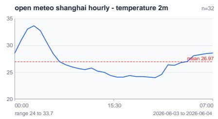

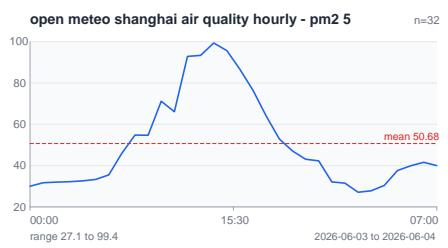

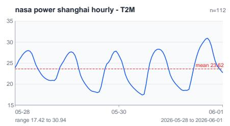

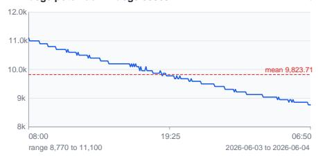

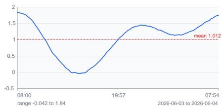

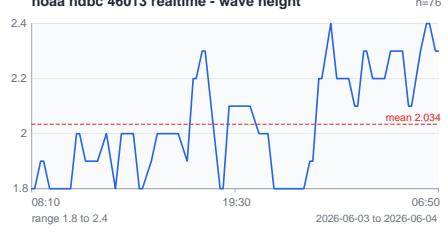

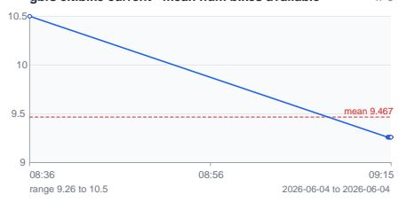

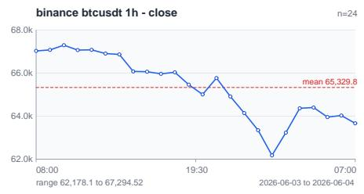

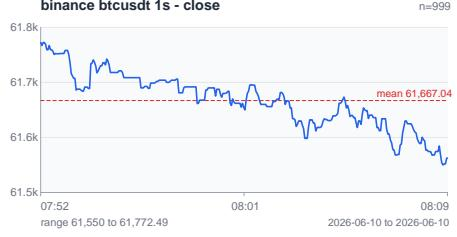

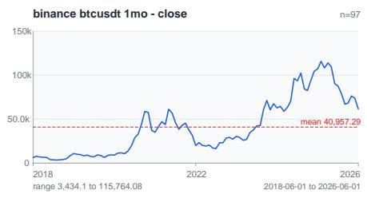

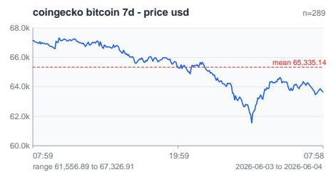

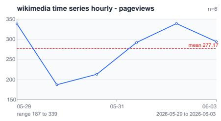

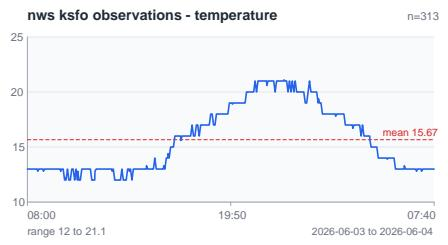

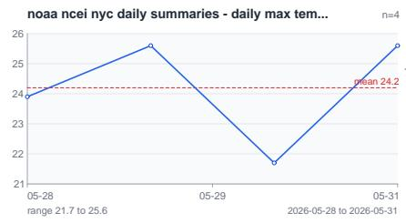

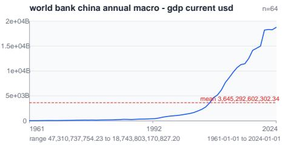

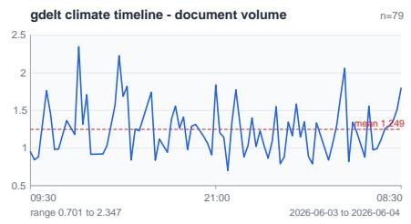

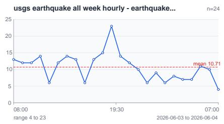  
Figure 12: Verification-slice target trajectories for all 17 registry datasets. Each panel plots the locally parsed public sample for one dataset and target variable; panel titles give the dataset identifier and selected target.

Table 8: Per-dataset RMSE (↓) on the online benchmark. In each column the best available model is in red bold and the second best is in blue underline.
<table><tr><td>Model</td><td>BTC</td><td>PM2.5</td><td>Quake</td><td>Potomac</td><td>Water</td><td>Wave</td><td>T2M</td><td>KSFO</td><td>Temp2m</td><td>Wiki</td></tr><tr><td>Chronos-2</td><td>483.614</td><td>11.420</td><td>2.830</td><td>19.675</td><td>0.318</td><td>0.892</td><td>1.293</td><td>1.078</td><td>1.074</td><td>8.420</td></tr><tr><td>TiRex</td><td>497.749</td><td>10.843</td><td>2.882</td><td>16.958</td><td>0.339</td><td>0.899</td><td>1.329</td><td>1.003</td><td>1.025</td><td>9.889</td></tr><tr><td>TimesFM-2.5</td><td>485.407</td><td>11.156</td><td>2.812</td><td>17.502</td><td>0.234</td><td>0.844</td><td>1.332</td><td>1.060</td><td>0.988</td><td>8.711</td></tr><tr><td>Toto-1.0</td><td>1.162e+03</td><td>40.693</td><td>5.314</td><td>58.600</td><td>0.539</td><td>1.093</td><td>1.578</td><td>1.208</td><td>1.835</td><td>96.250</td></tr><tr><td>Moirai-2.0</td><td>569.016</td><td>19.226</td><td>3.619</td><td>24.663</td><td>0.361</td><td>0.308</td><td>0.909</td><td>0.568</td><td>1.511</td><td>13.782</td></tr><tr><td>Chronos-Bolt</td><td>802.832</td><td>20.359</td><td>3.917</td><td>28.495</td><td>0.634</td><td>0.299</td><td>0.943</td><td>0.578</td><td>1.630</td><td>33.431</td></tr><tr><td>TabPFN-TS</td><td>716.183</td><td>19.586</td><td>3.934</td><td>27.656</td><td>0.518</td><td>0.307</td><td>1.141</td><td>0.515</td><td>1.538</td><td>20.472</td></tr><tr><td>Sundial</td><td>1.344e+03</td><td>19.184</td><td>4.298</td><td>24.235</td><td>0.294</td><td>0.410</td><td>1.313</td><td>0.890</td><td>1.539</td><td>20.726</td></tr><tr><td>Moving-Average</td><td>774.684</td><td>16.576</td><td>3.263</td><td>24.945</td><td>0.731</td><td>0.808</td><td>2.119</td><td>1.285</td><td>1.702</td><td>26.906</td></tr><tr><td>ETS</td><td>543.172</td><td>18.520</td><td>3.176</td><td>23.910</td><td>0.865</td><td>0.979</td><td>5.053</td><td>0.964</td><td>7.677</td><td>28.427</td></tr><tr><td>ARIMA</td><td>665.233</td><td>15.283</td><td>3.271</td><td>26.375</td><td>0.731</td><td>0.807</td><td>3.096</td><td>0.930</td><td>2.616</td><td>29.245</td></tr><tr><td>Seasonal-Naive</td><td>847.250</td><td>18.334</td><td>3.983</td><td>28.209</td><td>0.755</td><td>0.873</td><td>1.500</td><td>1.329</td><td>1.373</td><td>53.966</td></tr></table>

Table 9: Per-dataset MAPE (↓) on the online benchmark. In each column the best available model is in red bold and the second best is in blue underline.

<table><tr><td>Model</td><td>BTC</td><td>PM2.5</td><td>Quake</td><td>Potomac</td><td>Water</td><td>Wave</td><td>T2M</td><td>KSFO</td><td>Temp2m</td><td>Wiki</td></tr><tr><td>Chronos-2</td><td>0.010</td><td>0.329</td><td>0.565</td><td>0.009</td><td>0.469</td><td>0.158</td><td>0.043</td><td>0.043</td><td>0.043</td><td>0.061</td></tr><tr><td>TiRex</td><td>0.010</td><td>0.315</td><td>0.578</td><td>0.007</td><td>0.591</td><td>0.164</td><td>0.043</td><td>0.038</td><td>0.042</td><td>0.057</td></tr><tr><td>TimesFM-2.5</td><td>0.010</td><td>0.314</td><td>0.493</td><td>0.008</td><td>0.283</td><td>0.145</td><td>0.046</td><td>0.040</td><td>0.049</td><td>0.060</td></tr><tr><td>Toto-1.0</td><td>0.011</td><td>0.333</td><td>0.509</td><td>0.010</td><td>0.426</td><td>0.171</td><td>0.034</td><td>0.031</td><td>0.040</td><td>0.210</td></tr><tr><td>Moirai-2.0</td><td>0.008</td><td>0.341</td><td>0.483</td><td>0.009</td><td>0.437</td><td>0.178</td><td>0.031</td><td>0.031</td><td>0.045</td><td>0.046</td></tr><tr><td>Chronos-Bolt</td><td>0.011</td><td>0.364</td><td>0.546</td><td>0.010</td><td>0.722</td><td>0.176</td><td>0.030</td><td>0.031</td><td>0.045</td><td>0.134</td></tr><tr><td>TabPFN-TS</td><td>0.010</td><td>0.348</td><td>0.556</td><td>0.009</td><td>0.547</td><td>0.179</td><td>0.035</td><td>0.026</td><td>0.044</td><td>0.066</td></tr><tr><td>Sundial</td><td>0.020</td><td>0.282</td><td>0.534</td><td>0.008</td><td>0.600</td><td>0.204</td><td>0.040</td><td>0.046</td><td>0.045</td><td>0.073</td></tr><tr><td>Moving-Average</td><td>0.014</td><td>0.477</td><td>0.628</td><td>0.011</td><td>1.858</td><td>0.158</td><td>0.075</td><td>0.067</td><td>0.068</td><td>0.200</td></tr><tr><td>ETS</td><td>0.010</td><td>0.713</td><td>0.585</td><td>0.010</td><td>1.340</td><td>0.213</td><td>0.176</td><td>0.044</td><td>0.321</td><td>0.203</td></tr><tr><td>ARIMA</td><td>0.014</td><td>0.439</td><td>0.580</td><td>0.012</td><td>1.378</td><td>0.155</td><td>0.100</td><td>0.038</td><td>0.115</td><td>0.191</td></tr><tr><td>Seasonal-Naive</td><td>0.015</td><td>0.518</td><td>0.641</td><td>0.011</td><td>1.863</td><td>0.166</td><td>0.052</td><td>0.065</td><td>0.052</td><td>0.361</td></tr></table>

Table 10: Per-dataset CRPS (↓) on the online benchmark. In each column the best available model is in red bold and the second best is in blue underline.
<table><tr><td>Model</td><td>BTC</td><td>PM2.5</td><td>Quake</td><td>Potomac</td><td>Water</td><td>Wave</td><td>T2M</td><td>KSFO</td><td>Temp2m</td><td>Wiki</td></tr><tr><td>Chronos-2</td><td>0.112</td><td>0.445</td><td>0.345</td><td>0.139</td><td>0.166</td><td>0.445</td><td>0.059</td><td>0.438</td><td>0.092</td><td>0.122</td></tr><tr><td>TiRex</td><td>0.118</td><td>0.436</td><td>0.347</td><td>0.139</td><td>0.174</td><td>0.428</td><td>0.056</td><td>0.408</td><td>0.100</td><td>0.118</td></tr><tr><td>TimesFM-2.5</td><td>0.136</td><td>0.518</td><td>0.481</td><td>0.172</td><td>0.147</td><td>0.505</td><td>0.071</td><td>0.499</td><td>0.111</td><td>0.161</td></tr><tr><td>Toto-1.0</td><td>0.010</td><td>0.245</td><td>0.273</td><td>0.010</td><td>0.186</td><td>0.128</td><td>0.027</td><td>0.027</td><td>0.036</td><td>0.132</td></tr><tr><td>Moirai-2.0</td><td>0.008</td><td>0.260</td><td>0.262</td><td>0.008</td><td>0.207</td><td>0.124</td><td>0.027</td><td>0.028</td><td>0.040</td><td>0.050</td></tr><tr><td>Chronos-Bolt</td><td>0.010</td><td>0.272</td><td>0.278</td><td>0.010</td><td>0.365</td><td>0.129</td><td>0.027</td><td>0.028</td><td>0.041</td><td>0.111</td></tr><tr><td>TabPFN-TS</td><td>0.010</td><td>0.334</td><td>0.371</td><td>0.009</td><td>0.339</td><td>0.171</td><td>0.036</td><td>0.026</td><td>0.045</td><td>0.063</td></tr><tr><td>Sundial</td><td>0.018</td><td>0.257</td><td>0.296</td><td>0.007</td><td>0.151</td><td>0.164</td><td>0.033</td><td>0.039</td><td>0.040</td><td>0.054</td></tr><tr><td>Moving-Average</td><td>0.107</td><td>0.490</td><td>0.348</td><td>0.132</td><td>0.597</td><td>0.451</td><td>0.106</td><td>0.435</td><td>0.178</td><td>0.321</td></tr><tr><td>ETS</td><td>0.099</td><td>0.829</td><td>0.348</td><td>0.111</td><td>0.575</td><td>0.516</td><td>0.279</td><td>0.301</td><td>0.903</td><td>0.323</td></tr><tr><td>ARIMA</td><td>0.117</td><td>0.457</td><td>0.338</td><td>0.117</td><td>0.514</td><td>0.458</td><td>0.174</td><td>0.345</td><td>0.356</td><td>0.284</td></tr><tr><td>Seasonal-Naive</td><td>0.100</td><td>0.583</td><td>0.556</td><td>0.114</td><td>0.621</td><td>0.569</td><td>0.073</td><td>0.416</td><td>0.136</td><td>0.731</td></tr></table>

Table 11: Per-dataset Temporal Stability (↓) on the online benchmark, computed from release-level MSE histories. Cells with fewer than two releases are shown as –. In each column the best available model is in red bold and the second best is in blue underline.
<table><tr><td>Model</td><td>BTC</td><td>PM2.5</td><td>Quake</td><td>Potomac</td><td>Water</td><td>Wave</td><td>T2M</td><td>KSFO</td><td>Temp2m</td><td>Wiki</td></tr><tr><td>Chronos-2</td><td>7.329e+05</td><td>494.984</td><td>8.908</td><td>2.860e+03</td><td>0.271</td><td>3.756</td><td>1.756</td><td>27.049</td><td>1.953</td><td>129.300</td></tr><tr><td>TiRex</td><td> $6 . 8 0 5 \mathrm { e } + 0 5$ </td><td>463.452</td><td>8.575</td><td>2.414e+03</td><td>0.310</td><td>3.479</td><td>1.653</td><td>27.449</td><td>1.788</td><td>167.781</td></tr><tr><td>TimesFM-2.5</td><td> $6 . 4 0 7 \mathrm { e } + 0 5$ </td><td>499.814</td><td>8.574</td><td>2.685e+03</td><td>0.137</td><td>3.345</td><td>1.964</td><td>27.191</td><td>1.673</td><td>133.699</td></tr><tr><td>Toto-1.0</td><td> $3 . 7 6 7 \mathrm { e } { + } 0 6$ </td><td>8.411e+03</td><td>26.727</td><td>9.212e+03</td><td>0.653</td><td>7.889</td><td>7.376</td><td>3.933</td><td>6.619</td><td>8.228e+03</td></tr><tr><td>Moirai-2.0</td><td> $4 . 5 4 0 \mathrm { e } { + } 0 5 $ </td><td>185.713</td><td>5.250</td><td>2.734e+03</td><td>0.192</td><td>0.088</td><td>0.375</td><td>0.737</td><td>1.538</td><td>64.521</td></tr><tr><td>Chronos-Bolt</td><td> $6 . 8 1 8 \mathrm { e } + 0 5$ </td><td>169.701</td><td>5.282</td><td>3.085e+03</td><td>0.358</td><td>0.052</td><td>1.235</td><td>0.981</td><td>2.238</td><td>238.712</td></tr><tr><td>TabPFN-TS</td><td> $\mathbf { 4 . 0 6 9 e + 0 5 }$ </td><td>307.897</td><td>5.972</td><td>2.749e+03</td><td>0.288</td><td>0.081</td><td>0.928</td><td>0.701</td><td>1.273</td><td>68.714</td></tr><tr><td>Sundial</td><td>1.307e+06</td><td>645.449</td><td>5.049</td><td>2.020e+03</td><td>0.117</td><td>0.102</td><td>0.666</td><td>2.253</td><td>1.509</td><td>26.124</td></tr><tr><td>Moving-Average</td><td>9.664e+05</td><td>571.085</td><td>9.040</td><td>3.870e+03</td><td>1.352</td><td>3.555</td><td>5.080</td><td>26.020</td><td>2.855</td><td>1.196e+03</td></tr><tr><td>ETS</td><td>9.012e+05</td><td>7.217e+03</td><td>8.041</td><td>2.763e+03</td><td>1.431</td><td>4.353</td><td>29.082</td><td>26.072</td><td>209.632</td><td>1.770e+03</td></tr><tr><td>ARIMA</td><td>7.312e+05</td><td>943.393</td><td>8.244</td><td>3.046e+03</td><td>1.027</td><td>3.510</td><td>11.488</td><td>25.728</td><td>10.261</td><td>1.427e+03</td></tr><tr><td>Seasonal-Naive</td><td>1.002e+06</td><td>644.216</td><td>12.657</td><td>4.223e+03</td><td>1.389</td><td>3.750</td><td>2.021</td><td>25.672</td><td>1.829</td><td>4.084e+03</td></tr></table>

Table 12: Per-dataset Improvement (↓; more negative is better) on the online benchmark, computed as Kendall � on release-level MSE histories. Cells with fewer than two releases are shown as –. In each column the best available model is in red bold and the second best is in blue underline.

<table><tr><td>Model</td><td>BTC</td><td>PM2.5</td><td>Quake</td><td>Potomac</td><td>Water</td><td>Wave</td><td>T2M</td><td>KSFO</td><td>Temp2m</td><td>Wiki</td></tr><tr><td>Chronos-2</td><td>0.560</td><td>0.588</td><td>0.398</td><td>0.224</td><td>-0.033</td><td>-0.500</td><td>-0.138</td><td>-0.025</td><td>0.527</td><td>0.704</td></tr><tr><td>TiRex</td><td>0.565</td><td>0.545</td><td>0.429</td><td>0.242</td><td>-0.010</td><td>-0.504</td><td>0.144</td><td>-0.016</td><td>0.547</td><td>0.873</td></tr><tr><td>TimesFM-2.5</td><td>0.531</td><td>0.548</td><td>0.431</td><td>0.247</td><td>-0.051</td><td>-0.428</td><td>-0.002</td><td>-0.034</td><td>0.585</td><td>0.479</td></tr><tr><td>Toto-1.0</td><td>-0.309</td><td>0.059</td><td>-0.273</td><td>0.072</td><td>0.022</td><td>-0.085</td><td>0.344</td><td>0.123</td><td>0.022</td><td>1.000</td></tr><tr><td>Moirai-2.0</td><td>-0.355</td><td>-0.013</td><td>-0.351</td><td>0.132</td><td>-0.028</td><td>-0.639</td><td>-0.048</td><td>-0.195</td><td>-0.385</td><td>-1.000</td></tr><tr><td>Chronos-Bolt</td><td>0.090</td><td>0.307</td><td>-0.371</td><td>0.151</td><td>0.014</td><td>-0.098</td><td>-0.048</td><td>-0.143</td><td>-0.429</td><td>1.000</td></tr><tr><td>TabPFN-TS</td><td>-0.505</td><td>0.200</td><td>-0.415</td><td>0.121</td><td>0.000</td><td>-0.237</td><td>0.023</td><td>-0.086</td><td>-0.114</td><td>0.333</td></tr><tr><td>Sundial</td><td>0.503</td><td>0.066</td><td>-0.271</td><td>0.084</td><td>-0.080</td><td>-0.221</td><td>-0.505</td><td>-0.134</td><td>-0.096</td><td>0.000</td></tr><tr><td>Moving-Average</td><td>0.458</td><td>0.520</td><td>0.351</td><td>0.176</td><td>-0.321</td><td>-0.395</td><td>-0.391</td><td>-0.081</td><td>0.525</td><td>0.423</td></tr><tr><td>ETS</td><td>0.345</td><td>0.533</td><td>0.374</td><td>0.221</td><td>-0.267</td><td>-0.476</td><td>-0.379</td><td>0.054</td><td>0.296</td><td>0.366</td></tr><tr><td>ARIMA</td><td>0.393</td><td>0.555</td><td>0.414</td><td>0.191</td><td>-0.313</td><td>-0.464</td><td>-0.456</td><td>-0.079</td><td>0.364</td><td>0.592</td></tr><tr><td>Seasonal-Naive</td><td>0.484</td><td>0.459</td><td>0.381</td><td>0.134</td><td>-0.329</td><td>-0.419</td><td>-0.036</td><td>-0.074</td><td>0.491</td><td>0.477</td></tr></table>

Table 13: Overall zero-shot standing on the online benchmark aggregated over all datasets. For each metric we report Average Rank (↓), Win Rate (↑), and Elo (↑) computed from the per-dataset values. In each row the best available model is in red bold and the second best is in blue underline.

<table><tr><td>Metric</td><td>Chr2</td><td>TiRex</td><td>TFM</td><td>Toto1</td><td>Moi2</td><td>ChrB</td><td>TabPFN</td><td>Sundial</td><td>ARIMA</td><td>ETS</td><td>MovAvg</td><td>SNaive</td></tr><tr><td>Rank (RMSE) ↓</td><td>3.80</td><td>4.00</td><td>3.30</td><td>10.70</td><td>4.70</td><td>7.10</td><td>5.80</td><td>6.40</td><td>7.45</td><td>8.00</td><td>7.75</td><td>9.00</td></tr><tr><td>Win Rate (RMSE) ↑</td><td>0.745</td><td>0.727</td><td>0.791</td><td>0.118</td><td>0.664</td><td>0.445</td><td>0.564</td><td>0.509</td><td>0.414</td><td>0.364</td><td>0.386</td><td>0.273</td></tr><tr><td>Elo (RMSE) ↑</td><td>1225</td><td>1194</td><td>1254</td><td>637</td><td>1218</td><td>947</td><td>1161</td><td>1070</td><td>834</td><td>789</td><td>867</td><td>804</td></tr><tr><td>Rank (MAPE) ↓</td><td>4.90</td><td>4.30</td><td>3.85</td><td>5.05</td><td>3.70</td><td>6.15</td><td>5.10</td><td>6.45</td><td>8.70</td><td>9.80</td><td>9.65</td><td>10.35</td></tr><tr><td>Win Rate (MAPE) ↑</td><td>0.645</td><td>0.700</td><td>0.741</td><td>0.632</td><td>0.755</td><td>0.532</td><td>0.627</td><td>0.505</td><td>0.300</td><td>0.200</td><td>0.214</td><td>0.150</td></tr><tr><td>Elo (MAPE) ↑</td><td>1163</td><td>1251</td><td>1139</td><td>1055</td><td>1253</td><td>1064</td><td>1177</td><td>998</td><td>846</td><td>650</td><td>739</td><td>666</td></tr><tr><td>Rank (CRPS) ↓</td><td>7.25</td><td>7.05</td><td>9.20</td><td>2.95</td><td>2.30</td><td>3.90</td><td>4.70</td><td>3.15</td><td>8.70</td><td>9.45</td><td>9.35</td><td>10.00</td></tr><tr><td>Win Rate (CRPS) ↑</td><td>0.432</td><td>0.450</td><td>0.255</td><td>0.823</td><td>0.882</td><td>0.736</td><td>0.664</td><td>0.805</td><td>0.300</td><td>0.232</td><td>0.241</td><td>0.182</td></tr><tr><td>Elo (CRPS) ↑</td><td>930</td><td>1003</td><td>780</td><td>1325</td><td>1470</td><td>1265</td><td>1243</td><td>1358</td><td>726</td><td>623</td><td>666</td><td>611</td></tr><tr><td>Rank (Stability) ↓</td><td>6.90</td><td>5.80</td><td>5.30</td><td>10.50</td><td>2.40</td><td>4.80</td><td>2.80</td><td>3.60</td><td>8.40</td><td>9.60</td><td>8.80</td><td>9.10</td></tr><tr><td>Win Rate (Stability) ↑</td><td>0.464</td><td>0.564</td><td>0.609</td><td>0.136</td><td>0.873</td><td>0.655</td><td>0.836</td><td>0.764</td><td>0.327</td><td>0.218</td><td>0.291</td><td>0.264</td></tr><tr><td>Elo (Stability) ↑</td><td>989</td><td>992</td><td>1059</td><td>648</td><td>1423</td><td>1073</td><td>1410</td><td>1407</td><td>764</td><td>625</td><td>814</td><td>797</td></tr><tr><td>Rank (Improvement) ↓</td><td>8.50</td><td>9.60</td><td>9.20</td><td>7.45</td><td>2.95</td><td>6.00</td><td>4.80</td><td>4.40</td><td>6.60</td><td>6.20</td><td>5.90</td><td>6.40</td></tr><tr><td>Win Rate (Improvement) ↑</td><td>0.318</td><td>0.218</td><td>0.255</td><td>0.414</td><td>0.823</td><td>0.545</td><td>0.655</td><td>0.691</td><td>0.491</td><td>0.527</td><td>0.555</td><td>0.509</td></tr><tr><td>Elo (Improvement) ↑</td><td>849</td><td>753</td><td>838</td><td>776</td><td>1338</td><td>990</td><td>1161</td><td>1242</td><td>981</td><td>1059</td><td>1036</td><td>977</td></tr></table>

Table 14: Zero-shot rankings on the online benchmark aggregated by domain. For each metric we report Average Rank (↓), Win Rate (↑), and Elo (↑) computed from the per-dataset values within each domain. In each row the best available model is in red bold and the second best is in blue underline.
<table><tr><td rowspan=1 colspan=18>Group      Metric             Chr2  TiRex   TFM  Toto1   Moi2  ChrB  TabPFN  Sundial  ARIMA   ETS  MovAvg  SNaive</td></tr><tr><td rowspan=5 colspan=18>Rank (RMSE) ↓       3.00   1.00   2.00   12.00   9.00  11.00    10.00     8.00     4.00   7.00      5.00    6.00Win Rate (RMSE) ↑   0.818   1.000   0.909   0.000   0.273  0.091    0.182    0.364    0.727  0.455     0.636    0.545Elo (RMSE) ↑        1451   1786   1601    218    684   397     548     807     1326   931     1191    1059Rank (MAPE) ↓       4.00   3.00   2.00   5.00   6.00   8.00     7.00     1.00     9.00  12.00     10.00    11.00Air Quality  Win Rate (MAPE) ↑   0.727   0.818   0.909   0.636   0.545  0.364    0.455    1.000    0.273  0.000     0.182    0.091Elo (MAPE) ↑        1312   1438   1588   1192   1068   817      950    1783     695   206      553     397Rank (CRPS) ↓        7.00   6.00   10.00   1.00   3.00   4.00     5.00     2.00     8.00  12.00     9.00   11.00Win Rate (CRPS) ↑   0.455   0.545  0.182  1.000   0.818  0.727    0.636    0.909    0.364  0.000     0.273    0.091Elo (CRPS) ↑         941   1062    560   1783   1444   1312     1178    1606     823   208      683     399</td></tr><tr><td rowspan=1 colspan=5>8071326931</td><td rowspan=1 colspan=2>11911059</td></tr><tr><td rowspan=1 colspan=3>8.007.00</td><td rowspan=1 colspan=5>1.009.0012.00</td><td rowspan=1 colspan=2>10.0011.00</td></tr><tr><td rowspan=1 colspan=9></td><td rowspan=1 colspan=2>0.1820.091</td></tr><tr><td rowspan=1 colspan=9></td><td rowspan=1 colspan=2>553397</td></tr><tr><td rowspan=2 colspan=18>Rank (RMSE) ↓       1.00   3.00   2.00   11.00   5.00   9.00     7.00    12.00     6.00   4.00     8.00    10.00Win Rate (RMSE) ↑   1.000   0.818   0.909   0.091   0.636  0.273    0.455    0.000    0.545  0.727     0.364    0.182</td></tr><tr><td rowspan=1 colspan=1>0.364</td><td rowspan=1 colspan=1>0.182</td></tr><tr><td rowspan=7 colspan=3>Elo (RMSE) ↑Rank (MAPE) ↓       4.00Finance     Win Rate (MAPE) ↑   0.727Elo (MAPE) ↑        1300Rank (CRPS) ↓        9.00Win Rate (CRPS) ↑    0.273Elo (CRPS) ↑         680</td><td rowspan=1 colspan=1>1777</td><td rowspan=1 colspan=3>1441   1603    400</td><td rowspan=1 colspan=3>1190</td><td rowspan=1 colspan=2>688</td><td rowspan=1 colspan=3>938     216</td><td rowspan=1 colspan=1>1066</td><td rowspan=1 colspan=1>1321</td><td rowspan=1 colspan=1>819</td></tr><tr><td rowspan=1 colspan=1>4.00</td><td rowspan=1 colspan=3>4.00   4.00    7.50</td><td rowspan=1 colspan=1>1.00</td><td></td><td rowspan=1 colspan=2>7.50</td><td rowspan=1 colspan=3>4.00    12.00</td><td rowspan=1 colspan=2>9.50</td><td rowspan=1 colspan=1>4.00</td><td rowspan=1 colspan=1>9.50</td><td rowspan=1 colspan=1>11.00</td></tr><tr><td rowspan=1 colspan=1>0.727</td><td rowspan=1 colspan=3>0.727   0.727   0.409</td><td rowspan=1 colspan=1>1.000</td><td></td><td rowspan=1 colspan=2>0.409</td><td rowspan=1 colspan=3>0.727    0.000</td><td rowspan=1 colspan=2>0.227</td><td rowspan=1 colspan=1>0.727</td><td rowspan=1 colspan=1>0.227</td><td rowspan=1 colspan=1>0.091</td></tr><tr><td rowspan=1 colspan=13>1301   1301    914   1728   909     1300     228      651  1303</td><td rowspan=1 colspan=1>652</td><td rowspan=1 colspan=1>414</td></tr><tr><td rowspan=1 colspan=13>11.00   12.00    3.00   1.00   3.00     3.00     5.00    10.00   6.00</td><td rowspan=1 colspan=1>8.00</td><td rowspan=1 colspan=1>7.00</td></tr><tr><td rowspan=1 colspan=13>0.091   0.000   0.818  1.000  0.818    0.818    0.636    0.182  0.545</td><td rowspan=1 colspan=1>0.364</td><td rowspan=1 colspan=1>0.455</td></tr><tr><td rowspan=1 colspan=12>410    218   1450   1766   1445     1447     1199     550</td><td rowspan=1 colspan=1>1077</td><td rowspan=1 colspan=1>814</td><td rowspan=1 colspan=1>945</td></tr><tr><td rowspan=9 colspan=3>Rank (RMSE) ↓       2.00Win Rate (RMSE) ↑   0.909Elo (RMSE) ↑        1595Rank (MAPE) ↓       7.00Hazards     Win Rate (MAPE) ↑   0.455Elo (MAPE) ↑         935Rank (CRPS) ↓        6.00Win Rate (CRPS) ↑   0.545Elo (CRPS) ↑         1063</td><td rowspan=1 colspan=12>3.00   1.00   12.00   7.00   8.00     9.00    11.00     6.00</td><td rowspan=1 colspan=1>4.00</td><td rowspan=1 colspan=1>5.00</td><td rowspan=1 colspan=1>10.00</td></tr><tr><td rowspan=1 colspan=1>0.909</td><td rowspan=1 colspan=1>0.818</td><td rowspan=1 colspan=2>1.000   0.000</td><td rowspan=1 colspan=1>0.455</td><td rowspan=1 colspan=4>0.364    0.273</td><td rowspan=1 colspan=2>0.091</td><td rowspan=1 colspan=2>0.545</td><td rowspan=1 colspan=1>0.727</td><td rowspan=1 colspan=1>0.636</td><td rowspan=1 colspan=1>0.182</td></tr><tr><td rowspan=1 colspan=1>1595</td><td rowspan=1 colspan=1>1449</td><td rowspan=1 colspan=2>1782    217</td><td rowspan=1 colspan=1>938</td><td rowspan=1 colspan=3>823</td><td rowspan=1 colspan=1>694</td><td rowspan=1 colspan=2>392</td><td rowspan=1 colspan=1></td><td rowspan=1 colspan=2>1056   1319</td><td rowspan=1 colspan=1>1190</td><td rowspan=1 colspan=1>544</td></tr><tr><td rowspan=1 colspan=1>Rank (MAPE)↓</td><td rowspan=1 colspan=1>7.00</td><td rowspan=1 colspan=1>8.00</td><td rowspan=1 colspan=2>2.00   3.00</td><td rowspan=1 colspan=1>1.00</td><td rowspan=1 colspan=3>5.00</td><td rowspan=1 colspan=1>6.00</td><td rowspan=1 colspan=1></td><td rowspan=1 colspan=1>4.00</td><td rowspan=1 colspan=1></td><td rowspan=1 colspan=2>9.00  10.00</td><td rowspan=1 colspan=1>11.00</td><td rowspan=1 colspan=1>12.00</td></tr><tr><td rowspan=1 colspan=1>Win Rate (MAPE) ↑</td><td rowspan=1 colspan=1>0.455</td><td rowspan=1 colspan=1>0.364</td><td rowspan=1 colspan=2>0.909   0.818</td><td rowspan=1 colspan=1>1.000</td><td rowspan=1 colspan=3>0.636</td><td rowspan=1 colspan=1>0.545</td><td rowspan=1 colspan=1></td><td rowspan=1 colspan=1>0.727</td><td rowspan=1 colspan=1></td><td rowspan=1 colspan=1>0.273</td><td rowspan=1 colspan=1>0.182</td><td rowspan=1 colspan=1>0.091</td><td rowspan=1 colspan=1>0.000</td></tr><tr><td rowspan=1 colspan=1>Elo (MAPE) ↑</td><td rowspan=1 colspan=1>935</td><td rowspan=1 colspan=1>828</td><td rowspan=1 colspan=2>1603   1453</td><td rowspan=1 colspan=1>1777</td><td rowspan=1 colspan=3>1182</td><td rowspan=1 colspan=1>1055</td><td rowspan=1 colspan=1></td><td rowspan=1 colspan=1>1317</td><td rowspan=1 colspan=1></td><td rowspan=1 colspan=1>696</td><td rowspan=1 colspan=1>548</td><td rowspan=1 colspan=1>399</td><td rowspan=1 colspan=1>207</td></tr><tr><td rowspan=1 colspan=1>6.00</td><td rowspan=1 colspan=1>7.00</td><td rowspan=1 colspan=2>11.00   2.00</td><td rowspan=1 colspan=1>1.00</td><td rowspan=1 colspan=3>3.00</td><td rowspan=1 colspan=1>10.00</td><td rowspan=1 colspan=1></td><td rowspan=1 colspan=1>4.00</td><td rowspan=1 colspan=1></td><td rowspan=1 colspan=1>5.00</td><td rowspan=1 colspan=1>8.50</td><td rowspan=1 colspan=1>8.50</td><td rowspan=1 colspan=1>12.00</td></tr><tr><td rowspan=1 colspan=1>0.545</td><td rowspan=1 colspan=1>0.455</td><td rowspan=1 colspan=2>0.091   0.909</td><td rowspan=1 colspan=1>1.000</td><td rowspan=1 colspan=5>0.818    0.182</td><td rowspan=1 colspan=1>0.727</td><td rowspan=1 colspan=2>0.636</td><td rowspan=1 colspan=1>0.318</td><td rowspan=1 colspan=1>0.318</td><td rowspan=1 colspan=1>0.000</td></tr><tr><td rowspan=1 colspan=1>942</td><td rowspan=1 colspan=3>410   1601   1778</td><td rowspan=1 colspan=8>1452      553    1312     1175</td><td rowspan=1 colspan=1>750</td><td rowspan=1 colspan=2>752     212</td></tr><tr><td rowspan=5 colspan=2>Rank (RMSE) ↓Win Rate (RMSE) ↑Elo (RMSE) ↑Rank (MAPE) ↓Hydrology   Win Rate (MAPE) ↑</td><td rowspan=1 colspan=1>3.00</td><td rowspan=1 colspan=1>1.00</td><td rowspan=1 colspan=11>2.00   12.00    6.00  11.00     9.00     5.00     8.00</td><td rowspan=1 colspan=1>4.00</td><td rowspan=1 colspan=1>7.00</td><td rowspan=1 colspan=1>10.00</td></tr><tr><td rowspan=1 colspan=1>0.818</td><td rowspan=1 colspan=5>1.000   0.909   0.000   0.545</td><td rowspan=1 colspan=5>0.091     0.273    0.636</td><td rowspan=1 colspan=3>0.364  0.727</td><td rowspan=1 colspan=1>0.455</td><td rowspan=1 colspan=1>0.182</td></tr><tr><td rowspan=1 colspan=1>1456</td><td rowspan=1 colspan=1>1784</td><td rowspan=1 colspan=2>1599    216</td><td rowspan=1 colspan=1>1064</td><td></td><td rowspan=1 colspan=2>391</td><td rowspan=1 colspan=1>690</td><td rowspan=1 colspan=1></td><td rowspan=1 colspan=1>1187</td><td rowspan=1 colspan=2>812</td><td rowspan=1 colspan=1>1313</td><td rowspan=1 colspan=1>944</td><td rowspan=1 colspan=1>544</td></tr><tr><td rowspan=1 colspan=1>5.00</td><td rowspan=1 colspan=1>1.00</td><td rowspan=1 colspan=2>2.50    8.00</td><td rowspan=1 colspan=1>5.00</td><td></td><td rowspan=1 colspan=2>8.00</td><td rowspan=1 colspan=1>5.00</td><td rowspan=1 colspan=1></td><td rowspan=1 colspan=1>2.50</td><td rowspan=1 colspan=2>12.00</td><td rowspan=1 colspan=1>8.00</td><td rowspan=1 colspan=1>10.50</td><td rowspan=1 colspan=1>10.50</td></tr><tr><td rowspan=1 colspan=1>0.636</td><td rowspan=1 colspan=1>1.000</td><td rowspan=1 colspan=1>0.864</td><td rowspan=1 colspan=1>0.364</td><td rowspan=1 colspan=1>0.636</td><td></td><td rowspan=1 colspan=2>0.364</td><td rowspan=1 colspan=1>0.636</td><td rowspan=1 colspan=1></td><td rowspan=1 colspan=1>0.864</td><td rowspan=1 colspan=1></td><td rowspan=1 colspan=1>0.000</td><td rowspan=1 colspan=1>0.364</td><td rowspan=1 colspan=1>0.136</td><td rowspan=1 colspan=1>0.136</td></tr><tr><td rowspan=1 colspan=2>Elo (MAPE) ↑</td><td rowspan=1 colspan=1>1176</td><td rowspan=1 colspan=1>1763</td><td rowspan=1 colspan=1>1500</td><td rowspan=1 colspan=1>831</td><td rowspan=1 colspan=1>1175</td><td></td><td rowspan=1 colspan=2>826</td><td rowspan=1 colspan=1>1179</td><td rowspan=1 colspan=1></td><td rowspan=1 colspan=1>1509</td><td rowspan=1 colspan=1></td><td rowspan=1 colspan=1>223</td><td rowspan=1 colspan=1>825</td><td rowspan=1 colspan=1>496</td><td rowspan=1 colspan=1>497</td></tr><tr><td rowspan=3 colspan=2>Rank (CRPS) ↓Win Rate (CRPS) ↑Elo (CRPS) ↑</td><td rowspan=1 colspan=1>10.50</td><td rowspan=1 colspan=1>10.50</td><td rowspan=1 colspan=1>12.00</td><td rowspan=1 colspan=1>4.50</td><td rowspan=1 colspan=1>2.00</td><td></td><td rowspan=1 colspan=2>4.50</td><td rowspan=1 colspan=1>3.00</td><td rowspan=1 colspan=1></td><td rowspan=1 colspan=1>1.00</td><td rowspan=1 colspan=1></td><td rowspan=1 colspan=1>8.00</td><td rowspan=1 colspan=1>6.00</td><td rowspan=1 colspan=1>9.00</td><td rowspan=1 colspan=1>7.00</td></tr><tr><td rowspan=1 colspan=1>0.136</td><td rowspan=1 colspan=1>0.136</td><td rowspan=1 colspan=7>0.000   0.682   0.909  0.682    0.818</td><td rowspan=1 colspan=2>1.000</td><td rowspan=1 colspan=3>0.364  0.545</td><td rowspan=1 colspan=1>0.273</td><td rowspan=1 colspan=1>0.455</td></tr><tr><td rowspan=1 colspan=14>483    484    223   1253   1592   1250     1444    1782     804  1069</td><td rowspan=1 colspan=1>676</td><td rowspan=1 colspan=1>941</td></tr><tr><td rowspan=2 colspan=2>Rank (RMSE) ↓Win Rate (RMSE) ↑</td><td rowspan=1 colspan=11>6.00   7.00   4.00   9.50   4.00   4.50     4.00     3.00</td><td rowspan=1 colspan=3>7.25  11.50</td><td rowspan=1 colspan=1>7.75</td><td rowspan=1 colspan=1>9.50</td></tr><tr><td rowspan=1 colspan=1>0.545</td><td rowspan=1 colspan=1>0.455</td><td rowspan=1 colspan=2>0.727   0.227</td><td rowspan=1 colspan=1>0.727</td><td></td><td rowspan=1 colspan=3>0.682    0.727</td><td rowspan=1 colspan=1></td><td rowspan=1 colspan=1>0.818</td><td rowspan=1 colspan=2>0.432</td><td rowspan=1 colspan=1>0.045</td><td rowspan=1 colspan=1>0.386</td><td rowspan=1 colspan=1>0.227</td></tr><tr><td rowspan=7 colspan=13>Rank (MAPE) ↓       3.75   5.50   1.00    4.50   6.00   8.00     7.50     9.00Ocean      Win Rate (MAPE) ↑   0.750   0.591  1.000   0.682   0.545  0.364    0.409    0.273Elo (MAPE) ↑        1212   1061   1762   1080    958   859      858     754Rank (CRPS) ↓        5.00   5.00   5.50    3.50   3.50   5.50     6.00     3.00Win Rate (CRPS) ↑    0.636   0.636   0.591   0.773   0.773  0.591     0.545    0.818Elo (CRPS) ↑         1158   1180   1072   1363   1383   1201     1124    1361</td><td rowspan=1 colspan=3>Elo (RMSE) ↑</td><td rowspan=1 colspan=1>1002</td><td rowspan=1 colspan=1>924</td></tr><tr><td rowspan=1 colspan=1>Rank (MAPE) ↓</td><td rowspan=1 colspan=1></td><td rowspan=1 colspan=1>5.50</td><td rowspan=1 colspan=2>1.004.50</td><td rowspan=1 colspan=1>6.00</td><td rowspan=1 colspan=2>8.00</td><td rowspan=1 colspan=2>7.50</td><td rowspan=1 colspan=1>9.00</td><td rowspan=1 colspan=1></td><td rowspan=1 colspan=1>6.00</td><td rowspan=1 colspan=1>10.50</td><td rowspan=1 colspan=1>7.25</td><td rowspan=1 colspan=1>9.00</td></tr><tr><td rowspan=1 colspan=1>Win Rate (MAPE) ↑</td><td rowspan=1 colspan=1>0.750</td><td rowspan=1 colspan=1>0.591</td><td rowspan=1 colspan=2>1.0000.682</td><td rowspan=1 colspan=1>0.545</td><td rowspan=1 colspan=2>0.364</td><td rowspan=1 colspan=2>0.409</td><td rowspan=1 colspan=1>0.273</td><td rowspan=1 colspan=1></td><td rowspan=1 colspan=1>0.545</td><td rowspan=1 colspan=1>0.136</td><td rowspan=1 colspan=1>0.432</td><td rowspan=1 colspan=1>0.273</td></tr><tr><td rowspan=1 colspan=1>1212</td><td rowspan=1 colspan=1>1061</td><td rowspan=1 colspan=2>17621080</td><td rowspan=1 colspan=1>958</td><td rowspan=1 colspan=2>859</td><td rowspan=1 colspan=2>858</td><td rowspan=1 colspan=1>754</td><td rowspan=1 colspan=1></td><td rowspan=1 colspan=1>1066</td><td rowspan=1 colspan=1>611</td><td rowspan=1 colspan=1>967</td><td rowspan=1 colspan=1>812</td></tr><tr><td rowspan=1 colspan=1>5.00</td><td rowspan=1 colspan=1>5.00</td><td rowspan=1 colspan=2>5.503.50</td><td rowspan=1 colspan=1></td><td rowspan=1 colspan=2>5.50</td><td rowspan=1 colspan=2>6.00</td><td rowspan=1 colspan=1>3.00</td><td rowspan=1 colspan=1></td><td rowspan=1 colspan=2>9.00  10.50</td><td rowspan=1 colspan=1>9.50</td><td rowspan=1 colspan=1>12.00</td></tr><tr><td rowspan=1 colspan=1>0.636</td><td rowspan=1 colspan=1>0.636</td><td rowspan=1 colspan=2>0.5910.773</td><td rowspan=1 colspan=6>0.7730.5910.545</td><td rowspan=1 colspan=1>0.818</td><td rowspan=1 colspan=3>0.273  0.136</td><td rowspan=1 colspan=1>0.227</td><td rowspan=1 colspan=1>0.000</td></tr><tr><td rowspan=1 colspan=3>775   522</td><td rowspan=1 colspan=1>725</td><td rowspan=1 colspan=1>136</td></tr><tr><td rowspan=2 colspan=2>Rank (RMSE) ↓Win Rate (RMSE) ↑</td><td rowspan=1 colspan=1>5.33</td><td rowspan=1 colspan=10>5.00   5.33   9.67   2.67   4.33     3.33     5.33</td><td rowspan=1 colspan=3>9.00  10.00</td><td rowspan=1 colspan=1>10.00</td><td rowspan=1 colspan=1>8.00</td></tr><tr><td rowspan=1 colspan=1>Win Rate (RMSE) ↑</td><td rowspan=1 colspan=1>0.606</td><td rowspan=1 colspan=1>0.636</td><td rowspan=1 colspan=2>0.606   0.212</td><td rowspan=1 colspan=6>0.848  0.697     0.788</td><td rowspan=1 colspan=1>0.606</td><td rowspan=1 colspan=2>0.273</td><td rowspan=1 colspan=1>0.182</td><td rowspan=1 colspan=1>0.182</td><td rowspan=1 colspan=1>0.364</td></tr><tr><td rowspan=3 colspan=1>Weather</td><td rowspan=1 colspan=1>Elo (RMSE) ↑</td><td rowspan=1 colspan=1>1125</td><td rowspan=1 colspan=1>1172</td><td rowspan=1 colspan=2>1168    720</td><td rowspan=1 colspan=2>1306</td><td rowspan=1 colspan=4>1111     1245</td><td rowspan=1 colspan=1>1075</td><td rowspan=1 colspan=1></td><td rowspan=1 colspan=1>776</td><td rowspan=1 colspan=1>668</td><td rowspan=1 colspan=1>706</td><td rowspan=1 colspan=1>928</td></tr><tr><td rowspan=1 colspan=1>Rank (MAPE) ↓</td><td rowspan=1 colspan=1>5.83</td><td rowspan=1 colspan=1>4.67</td><td rowspan=1 colspan=2>7.67   2.33</td><td rowspan=1 colspan=2>3.67</td><td rowspan=1 colspan=4>3.33     3.00</td><td rowspan=1 colspan=1>7.00</td><td rowspan=1 colspan=1></td><td rowspan=1 colspan=1>9.17</td><td rowspan=1 colspan=1>11.00</td><td rowspan=1 colspan=1>10.67</td><td rowspan=1 colspan=1>9.67</td></tr><tr><td rowspan=1 colspan=2>Win Rate (MAPE) ↑   0.561</td><td rowspan=1 colspan=1>0.667</td><td rowspan=1 colspan=4>0.394  0.879   0.758</td><td rowspan=1 colspan=5>0.788    0.818    0.455</td><td rowspan=1 colspan=1></td><td rowspan=1 colspan=1>0.258</td><td rowspan=1 colspan=1>0.091</td><td rowspan=1 colspan=1>0.121</td><td rowspan=1 colspan=1>0.212</td></tr><tr><td rowspan=1 colspan=2>Elo (MAPE) ↑</td><td rowspan=1 colspan=1>1143</td><td rowspan=1 colspan=1>1265</td><td rowspan=1 colspan=9>884   1518   1281   1309     1411     951</td><td rowspan=1 colspan=1></td><td rowspan=1 colspan=2>681   426</td><td rowspan=1 colspan=2>490     641</td></tr><tr><td rowspan=1 colspan=2>Rank (CRPS) ↓</td><td rowspan=1 colspan=1>8.00</td><td rowspan=1 colspan=1>7.00</td><td rowspan=1 colspan=9>9.33   1.67   2.67   3.17     3.67     3.83</td><td rowspan=1 colspan=2>9.67</td><td rowspan=1 colspan=1>10.00</td><td rowspan=1 colspan=2>10.00    9.00</td></tr><tr><td rowspan=2 colspan=15>Win Rate (CRPS) ↑Elo (CRPS) ↑         741    850    596   1760   1575  1482     1418    1420     536</td><td rowspan=1 colspan=3></td></tr><tr><td rowspan=1 colspan=1>494</td><td rowspan=1 colspan=2>504     623</td></tr><tr><td rowspan=5 colspan=13>Rank (RMSE) ↓       1.00   3.00   2.00   12.00   4.00  10.00     5.00     6.00Win Rate (RMSE) ↑   1.000   0.818   0.909   0.000   0.727  0.182     0.636    0.545Elo (RMSE) ↑        1772   1441   1602    215   1316    550    1195    1071Rank (MAPE) ↓       4.00   2.00   3.00  11.00   1.00   7.00     5.00     6.00Web        Win Rate (MAPE) ↑   0.727   0.909   0.818   0.091   1.000  0.455    0.636    0.545</td><td rowspan=1 colspan=2>9.00</td><td rowspan=1 colspan=1>8.00</td><td rowspan=1 colspan=1>7.00</td><td rowspan=1 colspan=1>11.00</td></tr><tr><td rowspan=1 colspan=1>0.182</td><td rowspan=1 colspan=1></td><td rowspan=1 colspan=1>0.636</td><td rowspan=1 colspan=1></td><td rowspan=1 colspan=1>0.545</td><td rowspan=1 colspan=2>0.273</td><td rowspan=1 colspan=1>0.364</td><td rowspan=1 colspan=1>0.455</td><td rowspan=1 colspan=1>0.091</td></tr><tr><td rowspan=1 colspan=6></td><td rowspan=1 colspan=1>550</td><td rowspan=1 colspan=1></td><td rowspan=1 colspan=1>1195</td><td rowspan=1 colspan=1></td><td rowspan=1 colspan=1>1071</td><td rowspan=1 colspan=1></td><td rowspan=1 colspan=1>683</td><td rowspan=1 colspan=1>821</td><td rowspan=1 colspan=1>947</td><td rowspan=1 colspan=1>387</td></tr><tr><td rowspan=1 colspan=6></td><td rowspan=1 colspan=1>7.00</td><td rowspan=1 colspan=1></td><td rowspan=1 colspan=1>5.00</td><td rowspan=1 colspan=1></td><td rowspan=1 colspan=1>6.00</td><td rowspan=1 colspan=1></td><td rowspan=1 colspan=2>8.00  10.00</td><td rowspan=1 colspan=1>9.00</td><td rowspan=1 colspan=1>12.00</td></tr><tr><td rowspan=1 colspan=10></td><td rowspan=1 colspan=2>0.545</td><td rowspan=1 colspan=1></td><td rowspan=1 colspan=2>0.364  0.182</td><td rowspan=1 colspan=1>0.273</td><td rowspan=1 colspan=1>0.000</td></tr><tr><td rowspan=1 colspan=1></td><td rowspan=1 colspan=10>Elo (MAPÈ) ↑        1316   1600   1447    407   1774    935     1193</td><td rowspan=1 colspan=2>1069</td><td rowspan=1 colspan=3>822   546</td><td rowspan=1 colspan=1>684</td><td rowspan=1 colspan=1>208</td></tr><tr><td rowspan=1 colspan=11>Rank (CRPS) ↓        6.00   5.00    8.00   7.00   1.00   4.00     3.00</td><td rowspan=1 colspan=2>2.00</td><td rowspan=1 colspan=3>9.00  11.00</td><td rowspan=1 colspan=1>10.00</td><td rowspan=1 colspan=1>12.00</td></tr><tr><td rowspan=1 colspan=18>Win Rate (CRPS) ↑    0.545   0.636   0.364   0.455   1.000  0.727    0.818    0.909    0.273  0.091Elo (CRPS) ↑         1063   1183    818    949   1787   1302     1440    1596      698    402      552     209</td></tr></table>

Table 15: Zero-shot rankings on the online benchmark aggregated by sampling frequency. For each metric we report Average Rank (↓), Win Rate (↑), and Elo (↑) computed from the per-dataset values within each frequency group. In each row the best available model is in red bold and the second best is in blue underline
<table><tr><td>Group</td><td>Metric</td><td>Chr2</td><td>TiRex</td><td>TFM</td><td>Toto1</td><td>Moi2</td><td>ChrB</td><td>TabPFN</td><td>Sundial</td><td>ARIMA</td><td>ETS</td><td>MovAvg</td><td>SNaive</td></tr><tr><td rowspan="9">6min</td><td>Rank (RMSE) ↓</td><td>3.00</td><td>4.00</td><td>1.00 1.000</td><td>7.00 0.455</td><td>5.00 0.636</td><td>8.00</td><td>6.00 0.545</td><td>2.00 0.909</td><td>9.50 0.227</td><td>12.00 0.000</td><td>9.50 0.227</td><td>11.00</td></tr><tr><td>Win Rate (RMSE) ↑</td><td>0.818</td><td>0.727</td><td></td><td></td><td></td><td>0.364</td><td></td><td></td><td></td><td></td><td></td><td>0.091</td></tr><tr><td>Elo (RMSE) ↑</td><td>1436</td><td>1310</td><td>1780</td><td>944</td><td>1186</td><td>820</td><td>1062</td><td>1602</td><td>626</td><td>208</td><td>625</td><td>400</td></tr><tr><td>Rank (MAPE) ↓</td><td>4.00</td><td>6.00</td><td>1.00</td><td>2.00</td><td>3.00</td><td>8.00</td><td>5.00</td><td>7.00</td><td>10.00</td><td>9.00</td><td>11.00</td><td>12.00</td></tr><tr><td>Win Rate (MAPE) ↑</td><td>0.727</td><td>0.545</td><td>1.000</td><td>0.909</td><td>0.818</td><td>0.364</td><td>0.636</td><td>0.455</td><td>0.182</td><td>0.273</td><td>0.091</td><td>0.000</td></tr><tr><td>Elo (MAPE) ↑</td><td>1310</td><td>1068</td><td>1783</td><td>1599</td><td>1446</td><td>817</td><td>1182</td><td>947</td><td>549</td><td>692</td><td>399</td><td>206</td></tr><tr><td>Rank (CRPS)↓</td><td>3.00</td><td>4.00</td><td>1.00</td><td>5.00</td><td>6.00</td><td>8.00</td><td>7.00</td><td>2.00</td><td>9.00</td><td>10.00</td><td>11.00</td><td>12.00</td></tr><tr><td>Win Rate (CRPS) ↑</td><td>0.818</td><td>0.727</td><td>1.000</td><td>0.636</td><td>0.545</td><td>0.364</td><td>0.455</td><td>0.909</td><td>0.273</td><td>0.182</td><td>0.091</td><td>0.000</td></tr><tr><td>Elo (CRPS) ↑</td><td>1436</td><td>1314</td><td>1779</td><td>1190</td><td>1067</td><td>818</td><td>948</td><td>1602</td><td>693</td><td>547</td><td>399</td><td>206</td></tr><tr><td rowspan="9">10min</td><td>Rank (RMSE) ↓</td><td>9.00</td><td>10.00</td><td>7.00</td><td>12.00</td><td>3.00</td><td>1.00</td><td>2.00</td><td>4.00</td><td>5.00 0.636</td><td>11.00</td><td>6.00</td><td>8.00</td></tr><tr><td>Win Rate (RMSE) ↑ Elo (RMSE) ↑</td><td>0.273</td><td>0.182</td><td>0.455</td><td>0.000</td><td>0.818</td><td>1.000</td><td>0.909</td><td>0.727</td><td></td><td>0.091 399</td><td>0.545</td><td>0.364</td></tr><tr><td></td><td>685</td><td>559</td><td>941</td><td>214</td><td>1451</td><td>1784</td><td>1601</td><td>1317</td><td>1184</td><td></td><td>1054</td><td>811</td></tr><tr><td>Rank (MAPE) ↓</td><td>3.50</td><td>5.00</td><td>1.00</td><td>7.00</td><td>9.00</td><td>8.00</td><td>10.00</td><td>11.00</td><td>2.00</td><td>12.00</td><td>3.50</td><td>6.00</td></tr><tr><td>Win Rate (MAPE) ↑ Elo (MAPE) ↑</td><td>0.773</td><td>0.636</td><td>1.000</td><td>0.455</td><td>0.273</td><td>0.364</td><td>0.182 560</td><td>0.091</td><td>0.909</td><td>0.000</td><td>0.773</td><td>0.545</td></tr><tr><td></td><td>1379</td><td>1189</td><td>1778</td><td>936</td><td>692</td><td>816</td><td>5.00</td><td>405</td><td>1595</td><td>211</td><td>1375</td><td>1064</td></tr><tr><td>Rank (CRPS)↓ Win Rate (CRPS) ↑</td><td>7.00</td><td>6.00</td><td>10.00</td><td>2.00</td><td>1.00</td><td>3.00</td><td></td><td>4.00</td><td>9.00</td><td>11.00</td><td>8.00</td><td>12.00</td></tr><tr><td>Elo (CRPS) ↑</td><td>0.455</td><td>0.545</td><td>0.182</td><td>0.909</td><td>1.000</td><td>0.818</td><td>0.636</td><td>0.727</td><td>0.273</td><td>0.091</td><td>0.364</td><td>0.000</td></tr><tr><td>Rank (RMSE) ↓</td><td>943</td><td>1062</td><td>557</td><td>1602</td><td>1781</td><td>1454</td><td>1178</td><td>1306</td><td>689</td><td>401</td><td>818</td><td>208</td></tr><tr><td rowspan="9">15min</td><td></td><td>3.00</td><td>1.00 1.000</td><td>2.00 0.909</td><td>12.00 0.000</td><td>6.00 0.545</td><td>11.00 0.091</td><td>9.00 0.273</td><td>5.00 0.636</td><td>8.00 0.364</td><td>4.00 0.727</td><td>7.00 0.455</td><td>10.00</td></tr><tr><td>Win Rate (RMSE) ↑ Elo (RMSE) ↑</td><td>0.818 1456</td><td>1784</td><td>1599</td><td>216</td><td>1064</td><td>391</td><td>690</td><td>1187</td><td>812</td><td>1313</td><td></td><td>0.182</td></tr><tr><td>Rank (MAPE) ↓</td><td>5.00</td><td></td><td></td><td></td><td>5.00</td><td>8.00</td><td>5.00</td><td>2.50</td><td>12.00</td><td>8.00</td><td>944</td><td>544</td></tr><tr><td>Win Rate (MAPE) ↑</td><td></td><td>1.00</td><td>2.50</td><td>8.00</td><td></td><td></td><td>0.636</td><td></td><td>0.000</td><td>0.364</td><td>10.50</td><td>10.50</td></tr><tr><td></td><td>0.636</td><td>1.000</td><td>0.864</td><td>0.364</td><td>0.636</td><td>0.364</td><td>1179</td><td>0.864</td><td></td><td></td><td>0.136</td><td>0.136</td></tr><tr><td>Elo (MAPE) ↑</td><td>1176</td><td>1763</td><td>1500</td><td>831</td><td>1175</td><td>826</td><td></td><td>1509</td><td>223</td><td>825</td><td>496</td><td>497</td></tr><tr><td>Rank (CRPS) ↓</td><td>10.50</td><td>10.50</td><td>12.00</td><td>4.50</td><td>2.00</td><td>4.50</td><td>3.00</td><td>1.00</td><td>8.00</td><td>6.00</td><td>9.00</td><td>7.00</td></tr><tr><td>Win Rate (CRPS) ↑</td><td>0.136</td><td>0.136</td><td>0.000</td><td>0.682</td><td>0.909</td><td>0.682</td><td>0.818</td><td>1.000</td><td>0.364</td><td>0.545</td><td>0.273</td><td>0.455</td></tr><tr><td>Elo (CRPS) ↑ Rank (RMSE) ↓</td><td>483</td><td>484</td><td>223</td><td>1253</td><td>1592</td><td>1250</td><td>1444</td><td>1782</td><td>804</td><td>1069</td><td>676</td><td>941</td></tr><tr><td rowspan="9">1h Rank (CRPS)↓</td><td>Win Rate (RMSE) ↑</td><td>3.67 0.758</td><td>3.67 0.758</td><td>3.50 0.773</td><td>10.67 0.121</td><td>4.83 0.652</td><td>6.83 0.470</td><td>6.00 0.545</td><td>7.83 0.379</td><td>7.17 0.439</td><td>7.50 0.409</td><td>8.00 0.364</td><td>8.33 0.333</td></tr><tr><td>Elo (RMSE) ↑</td><td>1165</td><td>1200</td><td>1211</td><td>686</td><td>1177</td><td>1025</td><td>1117</td><td>989</td><td>870</td><td>809</td><td>829</td><td>923</td></tr><tr><td>Rank (MAPE) ↓</td><td>5.42</td><td>4.83</td><td>5.17</td><td>3.75</td><td>3.17</td><td>5.08</td><td>4.33</td><td>6.33</td><td>9.17</td><td>9.83</td><td>10.42</td><td>10.50</td></tr><tr><td>Win Rate (MAPE) ↑ Elo (MAPE) ↑</td><td>0.598</td><td>0.652</td><td>0.621</td><td>0.750</td><td>0.803</td><td>0.629</td><td>0.697</td><td>0.515</td><td>0.258</td><td>0.197</td><td>0.144</td><td>0.136</td></tr><tr></table>

Table 16: Zero-shot rankings on the online benchmark aggregated by forecast horizon. For each prediction length and metric, models are first ranked within each dataset and then ranked by their average rank across datasets sharing that prediction length (best = 1). In each row the best available model is in red bold and the second best is in blue underline
<table><tr><td>Pred. length</td><td>Metric</td><td>Chr2</td><td>TiRex</td><td>TFM</td><td>Toto1</td><td>Moi</td><td>Bolt</td><td>TabPFN</td><td>Sundial</td><td>ARIMA</td><td>ETS</td><td>MovAvg</td><td>SNaive</td></tr><tr><td rowspan="3">7</td><td>Rank (RMSE)</td><td>1</td><td>3</td><td>21</td><td>12</td><td>4</td><td>7</td><td>5</td><td>6</td><td>10</td><td>9</td><td>8</td><td>11</td></tr><tr><td>Rank (MAPE)</td><td>3</td><td>21</td><td>5</td><td>8</td><td>1</td><td>7</td><td>4</td><td>6</td><td>9</td><td>11</td><td>10</td><td>12</td></tr><tr><td>Rank (CRPS)</td><td>6</td><td>5</td><td>8</td><td>7</td><td>2</td><td>4</td><td>3</td><td>1</td><td>9</td><td>11</td><td>10</td><td>12</td></tr><tr><td rowspan="3">24</td><td>Rank (RMSE)</td><td>21</td><td>3</td><td>1</td><td>12</td><td>4</td><td>6</td><td>5</td><td>9</td><td>7</td><td>8</td><td>10</td><td>11</td></tr><tr><td>Rank (MAPE)</td><td>5</td><td>4</td><td>6</td><td>2</td><td>1</td><td>8</td><td>3</td><td>7</td><td>10</td><td>9</td><td>11</td><td>12</td></tr><tr><td>Rank (CRPS)</td><td>7</td><td>6</td><td>9</td><td>2</td><td>1</td><td>4</td><td>5</td><td>3</td><td>8</td><td>10</td><td>12</td><td>11</td></tr><tr><td rowspan="3">60</td><td>Rank (RMSE)</td><td>3</td><td>4</td><td>1</td><td>7</td><td>5</td><td>8</td><td>6</td><td>2</td><td>9</td><td>12</td><td>10</td><td>11</td></tr><tr><td>Rank (MAPE)</td><td>4</td><td>7</td><td>1</td><td>2</td><td>3</td><td>8</td><td>5</td><td>6</td><td>10</td><td>9</td><td>11</td><td>12</td></tr><tr><td>Rank (CRPS)</td><td>3</td><td>5</td><td>1</td><td>4</td><td>6</td><td>8</td><td>7</td><td>21</td><td>9</td><td>10</td><td>11</td><td>12</td></tr><tr><td rowspan="3">72</td><td>Rank (RMSE)</td><td>8</td><td>10</td><td>7</td><td>12</td><td>1</td><td>3</td><td>2</td><td>4</td><td>5</td><td>11</td><td>6</td><td>9</td></tr><tr><td>Rank (MAPE)</td><td>7</td><td>10</td><td>1</td><td>4</td><td>5</td><td>9</td><td>6</td><td>11</td><td>2</td><td>12</td><td>3</td><td>8</td></tr><tr><td>Rank (CRPS)</td><td>7</td><td>6</td><td>10</td><td>21</td><td>1</td><td>3</td><td>4</td><td>5</td><td>9</td><td>11</td><td>8</td><td>12</td></tr></table>

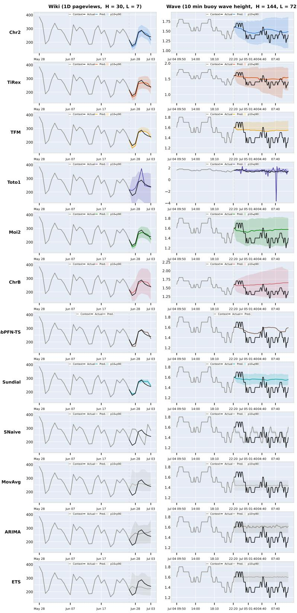  
Figure 13: Forecasting visualizations on Wiki (left column) and Wave (right column) for all baselines. Each row corresponds to one baseline. The left side of the dash line shows the context windows, and the right side shows the forecasting horizons.

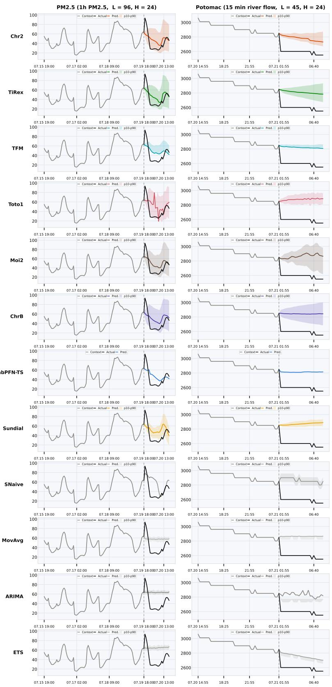  
Figure 14: Forecasting visualizations on PM 2.5 (left column) and Potomac (right column) for all baselines. Each row corresponds to one baseline. The left side of the dash line shows the context windows, and the right side shows the forecasting horizons.

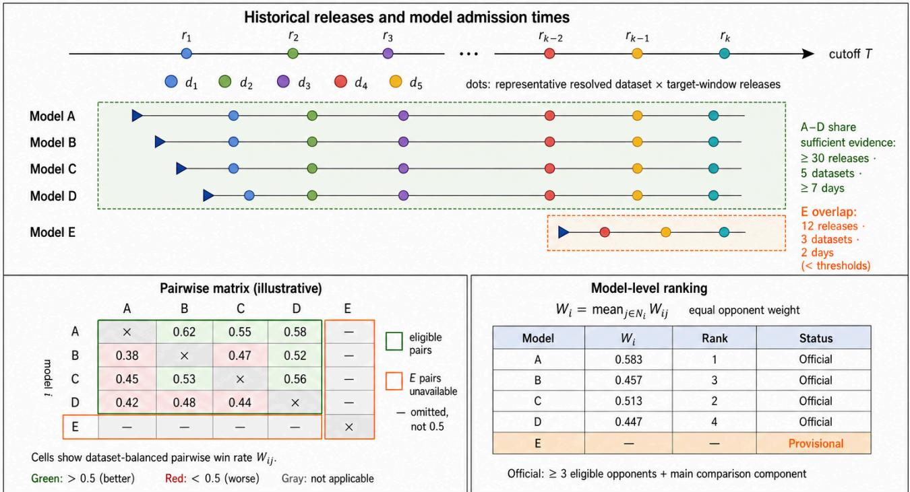  
Figure 15: Pairwise historical ranking under asynchronous model admission. The top panel shows representative resolved releases and model admission times. Models A–D have suficient shared evidence, whereas Model E joined later and remains below the eligibility thresholds. The lower-left panel shows dataset-balanced pairwise win rates $W _ { i j } ;$ unavailable comparisons involving Model E are omitted rather than treated as ties. The lower-right panel aggregates eligible pairwise comparisons into model-level scores and oficial ranks. Numerical values are illustrative.

## E Pairwise Historical Ranking

Models may enter a live leaderboard at diferent times. Directly comparing their average errors since admission can therefore be misleading: an early model may have experienced both volatile and calm periods, whereas a recently admitted model may have been evaluated only under the latest conditions. We address this cohort mismatch by comparing each pair of models only on releases that they completed in common.

A release is one resolved causal forecasting task for a particular dataset and future target window. At issue time, all admitted models receive the same historical context, sampling frequency, and forecast horizon. Their forecasts are frozen before the future target becomes available. Once the complete target window has been observed, the forecasts are scored and the task becomes a resolved release. Models evaluated on the same release therefore share the same context, target values, timestamps, normalization statistics, and metric implementation.

Figure 15 connects the three stages of the ranking procedure. In the top panel, the horizontal axis represents historical time up to cutof�. Each colored dot denotes a representative resolved dataset– target-window release, with colors indicating diferent datasets. The dots are illustrative; the actual ranking uses every resolved release. The blue triangle on each model row marks its admission time. A model is evaluated only on releases issued after admission. Models A–D entered suficiently early to accumulate overlapping evaluations from at least 30 releases, 5 datasets, and 7 days. Model E entered later and has only 12 shared releases from 3 datasets over 2 days. Its overlap is therefore insuficient for an oficial comparison. The lower-left panel records the pairwise win rate $W _ { i j }$ ofrow model � against column model �. For example, $W _ { A B } = 0 . 6 2$ means that Model A obtains a dataset-balanced win rate of 62% against Model B. The reverse comparison is ${ \cal W } _ { B A } = 0 . 3 8 .$ . Green cells indicate values above 0.5, red cells indicate values below 0.5, and gray cells are unavailable. In particular, missing comparisons involving Model E are omitted; they are not assigned a neutral value of 0.5. The lower-right panel averages each model’s eligible pairwise win rates with equal weight per opponent. This produces the model-level score �<sub>�</sub> used for ranking. Models A–D receive oficial ranks, while Model E remains Provisional until it accumulates suficient shared evidence.

## E.1 Shared releases and pair eligibility

Let $t _ { r }$ denote the end time of the target window for release �. At historical cutof�, define

$$
R _ { i } ( T ) = \{ r : t _ { r } \leq T , \ \mathrm { M S E } _ { i r } \ \mathrm { a n d } \ \mathrm { C R P S } _ { i r } \ \mathrm { a r e \ v a l i d } \}\tag{9}
$$

as the valid release history of model �. The shared release history of models � and � is

$$
\begin{array} { r } { R _ { i j } ( T ) = R _ { i } ( T ) \cap R _ { j } ( T ) . } \end{array}\tag{10}
$$

Thus, a release completed by only one member of the pair does not enter their comparison. Releases issued before the later model’s admission are automatically excluded. Let $d _ { r }$ be the dataset associated with release �. The shared dataset set is

$$
D _ { i j } ( T ) = \left\{ d _ { r } : r \in R _ { i j } ( T ) \right\} ,\tag{11}
$$

and the temporal coverage of the pair is

$$
\operatorname { s p a n } \bigl ( R _ { i j } ( T ) \bigr ) = \operatorname* { m a x } _ { r \in R _ { i j } ( T ) } t _ { r } - \operatorname* { m i n } _ { r \in R _ { i j } ( T ) } t _ { r } .\tag{12}
$$

A pair is eligible only if

$$
| R _ { i j } ( T ) | \geq 3 0 , \qquad | D _ { i j } ( T ) | \geq 5 , \qquad \mathrm { s p a n } \big ( R _ { i j } ( T ) \big ) \geq 7 \ \mathrm { d a y s } .\tag{13}
$$

These requirements prevent a model from receiving an oficial comparison based on a short period, a small number of releases, or a narrow selection of datasets. A pair that fails any requirement is treated as unavailable rather than as a tie.

## E.2 Comparing point and probabilistic forecasts

The leaderboard includes both probabilistic models and models that produce only point forecasts. Both model types are evaluated using MSE and CRPS under the same context-only normalization.

Let $z _ { r h }$ be the normalized target at horizon step ℎ. A probabilistic model provides a predictive mean $\mu _ { i r h }$ and quantiles $Q _ { i r h } ( \tau )$ for

$$
Q = \{ 0 . 1 , 0 . 2 , . . . , 0 . 9 \} .\tag{14}
$$

Its MSE is computed from the predictive mean, while its CRPS is approximated using the quantile forecasts:

$$
\mathrm { C R P S } _ { i r } = \frac { 2 } { H _ { r } | Q | } \sum _ { h = 1 } ^ { H _ { r } } \sum _ { \tau \in Q } \rho _ { \tau } ( z _ { r h } - Q _ { i r h } ( \tau ) ) ,\tag{15}
$$

where

$$
\rho _ { \tau } ( u ) = u \left( \tau - \mathbb { I } \{ u < 0 \} \right)\tag{16}
$$

is the pinball loss.

A point-only model provides one forecast $\hat { z } _ { i r h }$ per horizon step. We represent it as a degenerate predictive distribution by assigning the point forecast to every required quantile:

$$
Q _ { i r h } ^ { \mathrm { p o i n t } } ( \tau ) = \hat { z } _ { i r h } , \qquad \forall \tau \in Q .\tag{17}
$$

This conversion does not add artificial uncertainty: the model assigns all predictive mass to its point forecast. Because the quantile grid is symmetric around 0.5, substituting Eq. (17) into Eq. (15) gives

$$
\mathrm { C R P S } _ { i r } ^ { \mathrm { p o i n t } } = \frac { 1 } { H _ { r } } \sum _ { h = 1 } ^ { H _ { r } } \left| z _ { r h } - \hat { z } _ { i r h } \right| .\tag{18}
$$

Hence, the CRPS of a point-only model reduces to its normalized MAE. Probabilistic models are evaluated on both the location and dispersion of their predictive distributions, while point models are evaluated as zero-uncertainty distributions. Since CRPS is defined for both ordinary and degenerate predictive distributions, their scores remain directly comparable. Model output type and any benchmark-side procedure used to construct quantiles are fixed before the target is observed. Native quantiles are used when available; a declared point-only output is converted using Eq. (17).

## E.3 Release-level pairwise score

Both MSE and CRPS are lower-is-better. For two error values � and �, let

$$
c ( a , b ) = { \left\{ \begin{array} { l l } { 1 , } & { a < b , } \\ { 0 . 5 , } & { a = b , } \\ { 0 , } & { a > b . } \end{array} \right. }\tag{19}
$$

On shared release $r ,$ the score of model � against model � is

$$
s _ { i j r } = \frac { 1 } { 2 } \left[ c \bigl ( \mathrm { M S E } _ { i r } , \mathrm { M S E } _ { j r } \bigr ) + c \bigl ( \mathrm { C R P S } _ { i r } , \mathrm { C R P S } _ { j r } \bigr ) \right] .\tag{20}
$$

The two metrics receive equal weight. A model receives $s _ { i j r } = 1$ if it wins on both metrics and $s _ { i j r } = 0$ if it loses on both. A split decision gives 0.5; a win and a tie give 0.75; and a loss and a tie give 0.25. Therefore,

$$
s _ { i j r } \in \{ 0 , 0 . 2 5 , 0 . 5 , 0 . 7 5 , 1 \} , \qquad s _ { j i r } = 1 - s _ { i j r } .\tag{21}
$$

The same rule applies to point–point, probabilistic–probabilistic, and point–probabilistic comparisons. The MSE component compares central forecast accuracy, while the CRPS component compares the corresponding predictive distributions.

## E.4 Dataset-balanced pairwise win rate

Datasets resolve releases at diferent rates. Pooling all releases directly would allow high-frequency streams to dominate the ranking. We therefore average scores within each shared dataset before averaging across datasets.

Let

$$
R _ { i j , d } ( T ) = \left\{ r \in R _ { i j } ( T ) : d _ { r } = d \right\}\tag{22}
$$

be the releases shared by models � and � for dataset �. Their dataset-specific win rate is

$$
W _ { i j , d } ( T ) = \frac { 1 } { | R _ { i j , d } ( T ) | } \sum _ { r \in R _ { i j , d } ( T ) } s _ { i j r } .\tag{23}
$$

The dataset-balanced pairwise win rate is

$$
W _ { i j } ( T ) = \frac { 1 } { | D _ { i j } ( T ) | } \sum _ { d \in D _ { i j } ( T ) } W _ { i j , d } ( T ) .\tag{24}
$$

Every shared dataset therefore receives equal weight, regardless of how many releases it produces. Complementarity of the releaselevel score implies

$$
W _ { j i } ( T ) = 1 - W _ { i j } ( T ) .\tag{25}
$$

This is visible in the lower-left panel of Figure 15: for example, $W _ { A B } = 0 . 6 2$ and $W _ { B A } = 0$ .38. A value above 0.5 means that model � wins more often than model � after dataset balancing; it is a ranking score, not a statistical significance test.

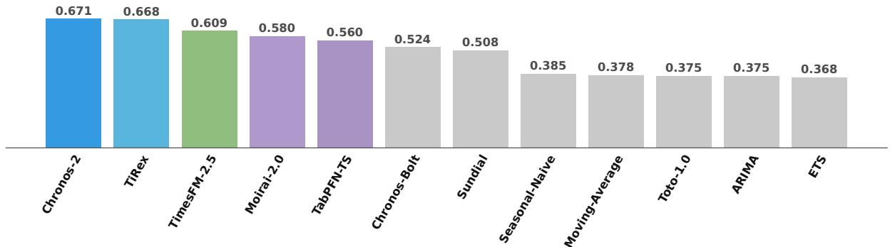  
Figure 16: Overall model ranking in the latest leaderboard snapshot. Bars show the dataset-balanced pairwise win rate aggregated over eligible metric-specific comparisons, historical releases, and opponents. Chronos-2 achieves the highest overall score, followed closely by TiRex. Higher values are better.

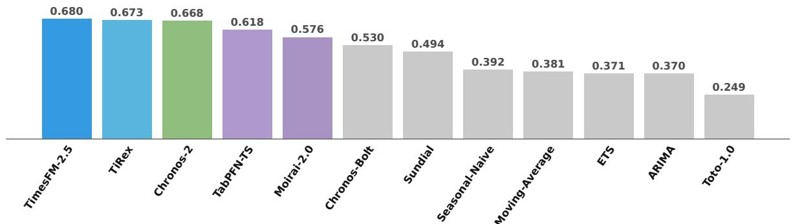  
Figure 17: MSE-based ranking within the point-forecast track. Bars report dataset-balanced pairwise win rates over eligible historical releases and opponents. TimesFM-2.5 achieves the highest score. Higher values are better.

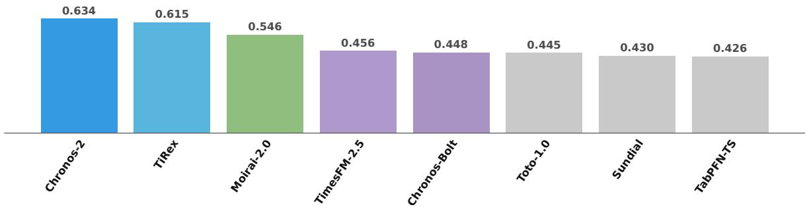  
Figure 18: CRPS-based ranking restricted to the eight TSFMs whose model families natively support probabilistic forecasting through quantiles or forecast samples. Chronos-2 achieves the highest score. Higher values are better.

## E.5 Model-level ranking and status

Let $N _ { i } ( T )$ be the set of opponents for which model � satisfies Eq. (13). The model-level score is the macro-average

$$
W _ { i } ( T ) = \frac { 1 } { | N _ { i } ( T ) | } \sum _ { j \in N _ { i } ( T ) } W _ { i j } ( T ) .\tag{26}
$$

Each eligible opponent receives equal weight. Thus, an opponent with a longer shared history does not dominate the final score merely because the pair has more releases.

In Figure 15, Model A has

$$
W _ { A } = \frac { W _ { A B } + W _ { A C } + W _ { A D } } { 3 } = \frac { 0 . 6 2 + 0 . 5 5 + 0 . 5 8 } { 3 } = 0 . 5 8 3 ,\tag{27}
$$

which gives it rank 1. Models are ordered by decreasing �<sub>�</sub> (�). We construct an undirected comparison graph whose vertices are models and whose edges are eligible model pairs. A model receives an oficial rank only if

(1) it has at least three eligible opponents; and

(2) it belongs to the main connected component of the graph.

Models that fail either condition remain Provisional. Missing pairs are omitted from Eq. (26); they are never imputed as 0.5. This is why Model E in the figure has neither a model-level score nor a rank, despite having completed some releases.

Alongside the rank, the leaderboard reports the number of eligible opponents, shared releases, shared datasets, and covered time span. These fields expose the amount of evidence supporting each result and distinguish an established ranking from a provisional one.

## F Overall Model Ranking

Figures 16–18 provide three complementary views of the latest leaderboard snapshot up to cutof time �. Each score is a datasetbalanced pairwise win rate, averaged with equal weight over eligible opponents and historical releases; higher values indicate better relative performance. Figure 16 shows the overall eligibility-aware aggregation, where Chronos-2 ranks first (0.671), narrowly ahead of TiRex (0.668), followed by TimesFM-2.5 (0.609).

To separate point accuracy from distributional forecast quality, Figure 17 ranks models using MSE within the point-forecast track. TimesFM-2.5 achieves the highest MSE-based win rate (0.680), followed by TiRex (0.673) and Chronos-2 (0.668). Figure 18 restricts the comparison to the eight TSFMs whose model families natively support probabilistic forecasts through quantiles or samples. Under CRPS, Chronos-2 ranks first (0.634), followed by TiRex (0.615) and Moirai-2.0 (0.546).

Together, the three views show that point-forecast accuracy and probabilistic forecast quality need not produce the same ordering: TimesFM-2.5 leads the MSE track, whereas Chronos-2 leads the CRPS track and the overall aggregation. TiRex remains consistently competitive across all three views. Because the MSE and CRPS rankings use diferent eligible model sets and opponent groups, their absolute scores should be interpreted within each figure rather than compared directly across tracks. These rankings summarize relative historical performance and do not by themselves establish statistical significance or long-term rank stability.