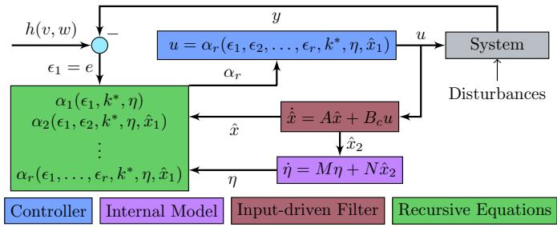
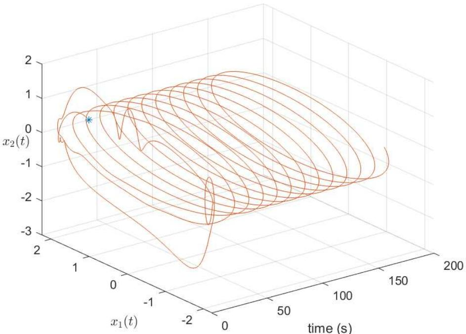
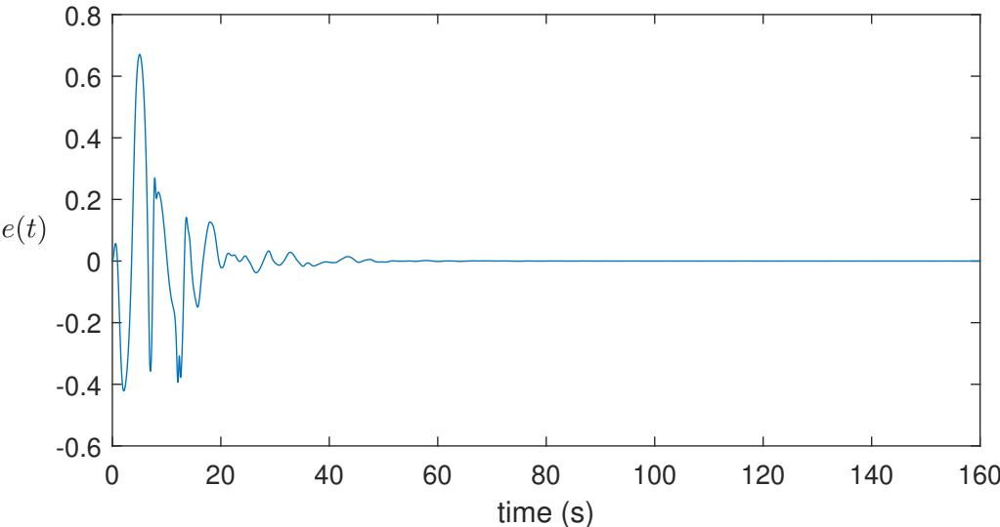
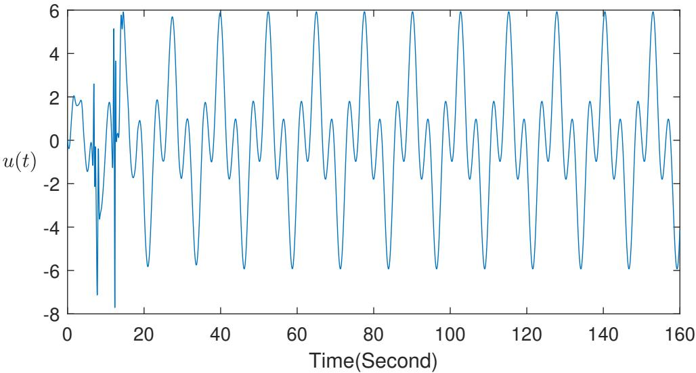
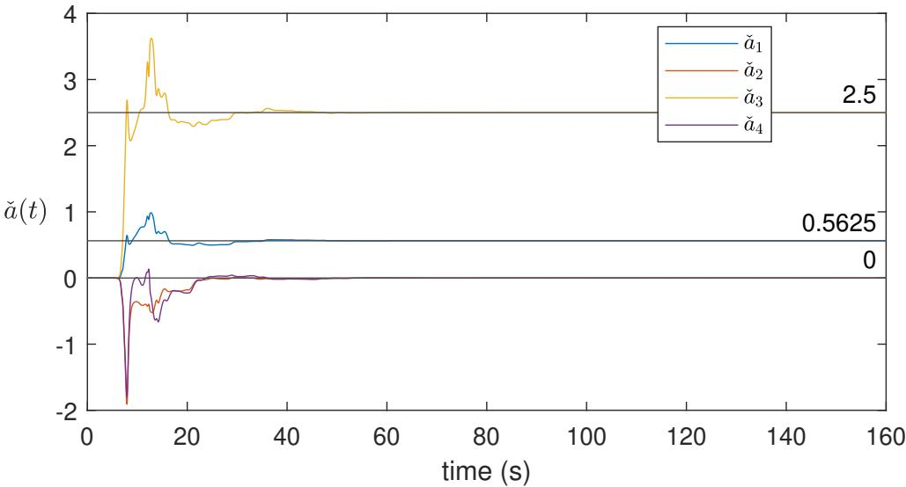
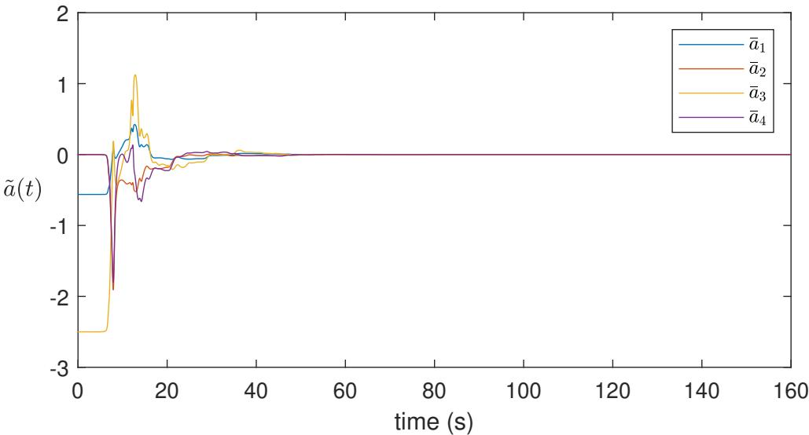

# NONADAPTIVE LEARNING IN ROBUST NONLINEAR OUTPUT REGULATION ∗

SHIMIN WANG †, MARTIN GUAY ‡, AND RICHARD D. BRAATZ §

Abstract. This paper considers robust nonadaptive regulation for general nonlinear systems in an output-feedback setting with arbitrarily high relative degree. We develop a nonadaptive design that combines an input-driven filter and a generic internal model with a recursive backstepping law, thereby recasting the regulation problem as the robust input-to-state stabilization of an augmented error system. Unlike adaptive schemes, the proposed method does not rely on linearly parameterized regressors and does not require the construction of Lyapunov functions having merely nonpositive derivatives. Under standard assumptions on the exosystem, including purely imaginary and simple eigenvalues, together with a minimum-phase input-to-state stability condition on the internal dynamics, we establish global asymptotic regulation and derive explicit, verifiable inequalities for selecting the design gains. The resulting nonadaptive framework guarantees convergence of the estimation and tracking errors even when the controlled-system dynamics are complex or only partially known. The efectiveness of the theoretical results is demonstrated using a benchmark controlled Dufing system.

Key words. nonlinear output regulation, nonadaptive learning, robust control, output feedback, internal model, data-driven control

AMS subject classifications. 93C10, 93B52, 93D15, 93C40

1. Introduction. Output regulation is an essential issue in the design of control systems [15, 32, 28]. It aims to have a system track a class of desired signals while rejecting the external disturbance [24, 15, 11]. In the linear case, regulation reduces to a pole-assignment problem because the steady-state tracking error depends linearly on the exogenous signals [10]. For nonlinear plants, however, the steady-state error is a nonlinear function of the exogenous signals [14, 17], and linear feedforward or linear internal-model designs fail in the presence of nonlinearities or parametric uncertainties.

To address general nonlinear output regulation problems, various internal-model structures have been developed over the past decades. Canonical linear internal models have been efectively used with adaptive methods to handle uncertain linear exosystems [27, 29, 11, 26] and more recently for disturbance rejection in Euler–Lagrange systems [35]. For nonlinear exosystems generating non-sinusoidal signals without uncertainty, nonlinear internal models were introduced in [2] and [4]. A significant milestone is the generic internal model proposed in [24], which removes structural assumptions on the steady-state input and accommodates both minimum-phase and non-minimum-phase systems. A broader overview can be found in [13].

Adaptive internal-model-based methods provide a mechanism to address parametric uncertainties but sufer from structural limitations. Specifically, they require Lyapunov functions with non-positive derivatives and rely on explicit regressors determined by the system and exosystem structure [9, 21]. Such designs ofer weaker robustness, as highlighted by counterexamples demonstrating that boundedness may fail even under small external inputs [3], and they apply primarily to systems with parametric uncertainty in a suitable regression form. These challenges restrict the applicability of adaptive approaches in general nonlinear output regulation.

Nonadaptive methods alleviate these dificulties by avoiding explicit parameter adaptation [16, 25], but the generic internal-model approach still depends on an explicit nonlinear continuous mapping that characterizes the steady-state input. This mapping is assumed to exist [19] but is generally unknown, and no general analytic expression is available.Existing solutions often rely on numerical least-squares techniques to approximate this function [24, 25], which introduces additional tuning requirements and may limit robustness or generality. Recent work [34] addresses this issue for nonlinear output regulation problems of relative degree one by constructing the steady-state mapping nonparametrically, without requiring parametric regressors or restrictive exosystem assumptions.

Motivated by these developments, the present article addresses the nonlinear robust output regulation problem for general nonlinear output-feedback systems with arbitrary relative degree by employing nonadaptive learning methods. This setting is considerably more challenging than the relative-degree-one case treated in [34], as the controller no longer has access to derivatives of the regulated output and the internal model and stabilization structures must be redesigned accordingly. The proposed approach difers from existing techniques based on adaptive control [33, 21, 23, 6], which typically require explicit regressors, parameter adaptation laws, and Lyapunov functions with non-positive derivatives, whose applicability is often restricted to parametric uncertainty structures. Output regulation for uncertain nonlinear systems with higher relative degree remains an active research topic [33, 5], with recent work focusing on low-complexity, approximation-free output-feedback designs capable of achieving prescribed transient and steady-state performance [5]. In contrast, the nonadaptive learning framework developed in this article addresses the global robust output regulation problem through the construction of a linear generic internal model based on the existence of a continuous nonlinear steady-state mapping. This construction transforms the nonlinear robust output regulation problem into a robust nonadaptive stabilization problem for an augmented system with Input-to-State Stable (ISS) dynamics.

The rest of this paper is organized as follows. Section 2 introduces some standard assumptions and lemmas. Section 3 is devoted to the presentation of the main results. This is followed by simulation examples in Section 4 and brief conclusions in Section 5.

Notation: k · k is the Euclidean norm. $I d : \mathbb { R }  \mathbb { R }$ is an identity function. For $X _ { i } \in \mathbb { R } ^ { n _ { i } \times m }$ with $i = 1 , \ldots , N$ , let co $( X _ { 1 } , \ldots , X _ { N } ) = [ X _ { 1 } ^ { \top } , \ldots , X _ { N } ^ { \top } ] ^ { \top }$ and

$$
\mathrm { d i a g } ( X _ { 1 } , \ldots , X _ { N } ) = \left[ \begin{array} { l l l l } { { X _ { 1 } } } & { { } } & { { } } & { { } } \\ { { } } & { { \ddots } } & { { } } & { { } } \\ { { } } & { { } } & { { X _ { N } } } \end{array} \right] .
$$

A function $\alpha : \mathbb { R } _ { \geq 0 }  \mathbb { R } _ { \geq 0 }$ is of class K if it is continuous, positive definite, and strictly increasing. The notation $\kappa _ { \infty }$ identifies the subclasses of unbounded K functions. For functions $f _ { 1 } ( \cdot )$ and $f _ { 2 } ( \cdot )$ with compatible dimensions, their composition $f _ { 1 } ( f _ { 2 } ( \cdot ) )$ is denoted by $f _ { 1 } \circ f _ { 2 } ( \cdot )$ . For a matrix $X , \operatorname { A d j } [ X ]$ denotes its adjugate matrix.

2. Problem Formulation and Assumptions. We consider a class of nonlinear control systems of the form:

(2.1a)

$$
\dot { z } = f ( z , y , v , w ) ,\tag{2.1b}
$$

$$
\dot { x } = A _ { c } x + g ( z , y , v , w ) + B _ { c } b u ,
$$

(2.1c)

$$
y = C _ { c } x ,\tag{2.1d}
$$

$$
e = y - h ( v , w ) ,
$$

where $( z , x ) \in \mathbb { R } ^ { n _ { z } } \times \mathbb { R } ^ { r }$ is the vector of state variables with $r \geq 1$ with a z-subsystem of fully nonlinear dynamics and a x-subsystem of partially structured linear dynamics with an additional nonlinear term $g ( z , y , v , w ) = \cot ( g _ { 1 } ( z , y , v , w ) , \dots , g _ { r } ( z , y , v , w ) )$ $y \in \mathbb { R }$ is the output of the system, $h ( v , w )$ is explicitly the reference output generated by the exosystem (2.2), $e \in \mathbb { R }$ is the tracking error of the system, $u \in \mathbb { R }$ is the input, $w \in \mathbb { W } \subset \mathbb { R } ^ { n _ { w } }$ is an uncertain parameter vector with W being an arbitrarily prescribed subset of $\mathbb { R } ^ { n _ { w } }$ containing the origin, b is a positive constant, the functions $h ( \cdot ) , f ( \cdot ) , g _ { i } ( \cdot )$ are globally defined and suficiently smooth and satisfy $f ( 0 , 0 , 0 , w ) = 0$ and $g _ { i } ( 0 , 0 , 0 , w ) = 0$ for all $w \in \mathbb { W }$ , and $\boldsymbol { v } ( t ) \in \mathbb { R } ^ { n _ { v } }$ is an exogenous signal representing the reference input and disturbance, which is generated by the exosystem

$$
\dot { v } = { \cal S } ( \sigma ) v ,\tag{2.2}
$$

where $\sigma \in \mathbb { S } \subset \mathbb { R } ^ { n _ { \sigma } }$ represents the uncertainties in the exosystem with $S ( \sigma )$ being a constant matrix. The matrices $A _ { c } \in \mathbb { R } ^ { r \times r } , C _ { c } \in \mathbb { R } ^ { 1 \times r }$ , and $B _ { c } \in \mathbb { R } ^ { r }$ have the form

$$
A _ { c } = \left[ { \bf 0 } \mathrm { ~ \small ~ \frac ~ { ~ \cos ~ \alpha ~ } { ~ \sin ~ } ~ } \right] , { \cal C } _ { c } ^ { \top } = \mathrm { c o l } ( 1 , { \bf 0 } _ { r - 1 } ) , { \cal B } _ { c } = \mathrm { c o l } ( { \bf 0 } _ { r - 1 } , 1 ) ,
$$

where $I _ { r - 1 }$ and $\mathbf { 0 } _ { r - 1 } = \mathrm { c o l } ( 0 , \ldots , 0 )$ are the identity matrix and zero vector of $r - 1$ dimension, respectively.

The nonlinear robust output regulation problem in this article is formulated below

Problem 2.1. Given the nonlinear system (2.1)–(2.2) and any compact subsets $\mathbb { S } \in \mathbb { R } ^ { n _ { \sigma } } , \mathrm { ~ \mathbb { W } ~ \in ~ \mathbb { R } ^ { n _ { w } } ~ }$ , and $\mathbb { V } \in \mathbb { R } ^ { n _ { v } }$ with W and V containing the origin, design a control law such that for all initial conditions $v ( 0 ) \in \mathbb { V } , \sigma \in \mathbb { S }$ and $w \in \mathbb { W }$ , and any initial states co $\left. ( z ( 0 ) , x ( 0 ) ) \in \mathbb { R } ^ { n _ { z } + r } \right.$ , the solution of the closed-loop system exists and is bounded for all $t \geq 0$ , and $\operatorname* { l i m } _ { t \to \infty } e ( t ) = 0$

Before proceeding with the main results, we state the assumptions.

Assumption 2.2. For all $\sigma ,$ all the eigenvalues of $S ( \sigma )$ are simple with zero real parts.

Assumption 2.3. There exists a globally defined smooth function $z ( v , w , \sigma ) \ :$ $\mathbb { R } ^ { n _ { v } } \times \mathbb { R } ^ { n _ { w } } \times \mathbb { R } ^ { n _ { \sigma } } \longmapsto \mathbb { R } ^ { n _ { z } }$ z such that

$$
\frac { \partial z ( v , w , \sigma ) } { \partial v } S ( \sigma ) v = f ( z ( v , w , \sigma ) , h ( v , w ) , v , w )\tag{2.3}
$$

for all $( v , w , \sigma ) \in \mathbb { V } \times \mathbb { W } \times \mathbb { S } \mathrm { ~ w i t h ~ } z ( 0 , w , \sigma ) = 0 .$

Remark 2.4. The term $z ( v , w , \sigma )$ denotes the steady state of the z-subsystem (2.1a), which is the solution to the associated regulator equation (2.3). Assumption 2.2 is a standard assumption appearing in [16, 12, 29, 34] which limits the exogenous signal v generated in (2.2) to be arbitrarily large constant signals and multi-tone sinusoidal signals with arbitrarily unknown initial phases, amplitudes and arbitrarily known frequencies.

Assumption 2.5 (Minimum-phase condition). The translated inverse system

$$
\dot { \bar { z } } = f ( \bar { z } + z ( \mu ) , e + h ( v , w ) , v , w ) - f ( z ( \mu ) , h ( v , w ) , v , w )\tag{2.4}
$$

is input-to-state stable with state $\bar { z } = z - z ( \mu ) , \mu = \mathrm { c o l } ( v , w , \sigma )$ and input e in the sense of [31]. In particular, there exists a continuous function $V _ { \bar { z } } ( \bar { z } )$ satisfying

$$
\underline { { \alpha } } _ { \bar { z } } ( \| \bar { z } \| ) \leq V _ { \bar { z } } ( \bar { z } ) \leq \overline { { \alpha } } _ { \bar { z } } ( \| \bar { z } \| )
$$

for some class $\kappa _ { \infty }$ functions $\underline { { \alpha } } _ { \bar { z } } ( \cdot )$ and $\overline { { \alpha } } _ { \bar { z } } ( \cdot )$ such that, for any $v \in \mathbb { V }$ , along the trajectories of the ¯z subsystem,

$$
\dot { V } _ { \bar { z } } \leq - \alpha _ { \bar { z } } ( \| \bar { z } \| ) + \gamma ( e ) ,
$$

where $\alpha _ { \bar { z } } ( \cdot )$ is some known class $\kappa _ { \infty }$ function satisfying lim sup $\big ( \alpha _ { \bar { z } } ^ { - 1 } ( \varsigma ^ { 2 } ) / \varsigma \big ) < + \infty .$ ς→0+ and $\gamma ( \cdot )$ is some known smooth positive definite function.

Remark 2.6. Assumption 2.5 guarantees that the ¯z-system (2.4) is input-to-state stable with state ¯z and input e. In addition, by the changing supply function technique [30], there exists a continuous function $\bar { V } _ { \bar { z } } ( \bar { z } )$ satisfying $\underline { { \alpha } } _ { \bar { z } } ( \| \bar { z } \| ) \leq \bar { V } _ { \bar { z } } ( \bar { z } ) \leq \bar { \alpha } _ { \bar { z } } ( \| \bar { z } \| )$ , for some class $\kappa _ { \infty }$ functions $\underline { { \alpha } } _ { \bar { z } } ( \cdot )$ and $\bar { \alpha } _ { \bar { z } } ( \cdot )$ such that for any smooth function $\Delta _ { \bar { z } } ( \bar { z } ) > 0$ and any $\mu \in \mathbb { V } \times \mathbb { W } \times \mathbb { S }$ , the time derivative of $\bar { V } _ { \bar { z } } ( \bar { z } )$ along the trajectory (2.4) satisfies the inequality

$$
\dot { \bar { V } } _ { \bar { z } } ( \bar { z } ) \leq - \Delta _ { \bar { z } } ( \bar { z } ) \| \bar { z } \| ^ { 2 } + \delta _ { \bar { z } } \gamma _ { \bar { z } } ( e ) e ^ { 2 } ,
$$

where $\delta _ { \bar { z } }$ and $\gamma _ { \bar { z } } ( \cdot )$ are some positive constant and positive smooth function, respectively.

Under Assumption 2.3, there exists globally defined smooth functions $\{ \pmb { x } ( v , w , \sigma ) , z ( v , w , \sigma ) , \pmb { u } ( v , w , \sigma ) \}$ with $\pmb { x } _ { 1 } ( v , w , \sigma ) = h ( v , w )$ satisfying

$$
\frac { \partial \pmb { x } ( \mu ) } { \partial \pmb { v } } S ( \sigma ) \pmb { v } = A _ { c } \pmb { x } ( \mu ) + g ( \pmb { z } ( \mu ) , \pmb { x } _ { 1 } ( \mu ) , \mu ) + B _ { c } b \pmb { u } ( \mu ) ,
$$

$$
{ \pmb u } ( \mu ) = b ^ { - 1 } \times \bigg [ \frac { \partial { \pmb x } _ { r } ( \mu ) } { \partial v } S ( \sigma ) v - g _ { r } ( z , { \pmb x } _ { 1 } ( \mu ) , \mu ) \bigg ] ,
$$

with $\pmb { x } ( \mu ) = \mathrm { c o l } ( \pmb { x } _ { 1 } ( \mu ) , \dots , \pmb { x } _ { r } ( \mu ) )$ . For convenience, let ${ \pmb x } \equiv { \pmb x } ( \mu ) , z \equiv z ( \mu )$ and $\pmb { u } \equiv \pmb { u } ( \mu )$

The control system (2.1) has relative degree $r \geq 2$ . Motivated by [18], we define the input-driven filter

$$
\dot { \hat { x } } = A \hat { x } + B _ { c } u ,\tag{2.5}
$$

where $\hat { x } \in \mathbb { R } ^ { r }$ is an estimate of x in system (2.1), and $A = A _ { c } - \lambda C _ { c }$ with $\lambda =$ $\mathrm { c o l } ( \lambda _ { 1 } , \ldots , \lambda _ { r } )$ such that A is Hurwitz. We perform the coordinate transformation $\tilde { x } _ { i } = b ^ { - 1 } x _ { i } - \hat { x } _ { i } , i = 1 , \ldots , r .$ to obtain

(2.6a)

$$
\dot { z } = f ( z , y , v , w ) ,\tag{2.6b}
$$

$$
\dot { \tilde { x } } = A \tilde { x } + b ^ { - 1 } \times ( \lambda y + g ( z , y , v , w ) ) ,\tag{2.6c}
$$

$$
\begin{array} { r } { \dot { y } = b \hat { x } _ { 2 } + b \tilde { x } _ { 2 } + g _ { 1 } ( z , y , v , w ) , } \end{array}\tag{2.6d}
$$

$$
\dot { \hat { x } } _ { i } = \hat { x } _ { i + 1 } - \lambda _ { i } \hat { x } _ { 1 } , i = 2 , \ldots , r - 1 ,\tag{2.6e}
$$

$$
\dot { \hat { x } } _ { r } = u - \lambda _ { r } \hat { x } _ { 1 } ,
$$

where $g ( z , y , v , w ) = \operatorname { c o l } ( g _ { 1 } ( z , y , v , w ) , \dots , g _ { r } ( z , y , v , w ) ) { \mathrm { ~ a n d ~ } } { \tilde { x } } = \operatorname { c o l } ( { \tilde { x } } _ { 1 } , \dots , { \tilde { x } } _ { r } )$

Assumption 2.7. The function ${ \pmb u } ( v , \sigma , w )$ is a polynomial in v with coeficients depending on w and $\sigma .$

Lemma 2.8. Suppose Assumption 2.3 holds. If the function $\mathbf { \Delta } u ( v , \sigma , w )$ is a polynomial in v with coeficients depending on w and $\sigma _ { i }$ then there exist a dimension $n _ { \tau }$ , a vector of monomials $\tau _ { u } ( v ) \in \mathbb { R } ^ { n _ { \tau } }$ , and matrices $\Phi _ { u } ( \sigma ) \in \mathbb { R } ^ { n _ { \tau } \times n _ { \tau } }$ and $\Gamma _ { u } ( \sigma , w ) \in \mathbb { R } ^ { 1 \times n }$ τ such that:

$$
\begin{array} { r } { \frac { \partial \tau _ { u } ( v ) } { \partial v } S ( \sigma ) v = \Phi _ { u } ( \sigma ) \tau _ { u } ( v ) , } \\ { u ( \mu ) = \Gamma _ { u } ( \mu ) \tau _ { u } ( v ) , } \end{array}\tag{2.7}
$$

where all eigenvalues $o f \Phi _ { u } ( \sigma )$ have zero real part. Furthermore, if the Hurwitz matrix A shares no common eigenvalues with $\Phi _ { u } ( \sigma )$ , there exists a unique matrix $P _ { u } \in \mathbb { R } ^ { r \times n . }$ τ such that $\hat { \pmb { x } } ( \mu ) : = P _ { u } \tau _ { u } ( v )$ satisfies the regulator equation:

$$
\dot { \hat { \mathbf { x } } } ( \mu ) = A \hat { \mathbf { x } } ( \mu ) + B _ { c } \mathbf { u } ( \mu ) .\tag{2.8}
$$

Proof. Since ${ \pmb u } ( v , \sigma , w )$ is a polynomial in $v ,$ there exists an integer $n _ { u }$ such that u can be expanded as:

$$
\begin{array} { l } { \displaystyle { \pmb u ( v , \sigma , w ) = \sum _ { l = 1 } ^ { n _ { u } } U _ { l } ( \sigma , w ) \pmb v ^ { [ l ] } } } \\ { \displaystyle { \quad = \underbrace { \left[ U _ { 1 } ( \sigma , w ) \quad \cdots \quad U _ { n _ { u } } ( \sigma , w ) \right] } _ { \Gamma _ { u } ( \sigma , w ) } \mathrm { c o l } ( v ^ { [ 1 ] } , \ldots , v ^ { [ n _ { u } ] } ) } } \end{array}
$$

where $\Gamma _ { u } ( \sigma , w )$ is a suitable coeficient matrix and $v ^ { [ l ] }$ represents the vector of monomials of degree l:

$$
v ^ { [ l ] } = \cot ( v _ { 1 } ^ { l } , v _ { 1 } ^ { l - 1 } v _ { 2 } , \ldots , v _ { 1 } ^ { l - 1 } v _ { n _ { u } } , \ldots , v _ { n _ { u } } ^ { l } ) , l = 1 , \ldots , n _ { u } .
$$

Let $\tau _ { u } ( v ) = \mathrm { c o l } ( v ^ { [ 1 ] } , \dots , v ^ { [ n _ { u } ] } )$ . Following Chapter 4 of [11], the time derivative of the monomial vector satisfies linear dynamics driven by a matrix $\Phi _ { u } ( \sigma )$ with eigenvalues on the imaginary axis, proving (2.7).

Since A is Hurwitz and $\Phi _ { u } ( \sigma )$ has eigenvalues with zero real parts, they share no common eigenvalues. Thus, the generalized Sylvester equation:

$$
P _ { u } \Phi _ { u } ( \sigma ) = A P _ { u } + B _ { c } \Gamma _ { u } ( \mu )
$$

admits a unique solution $P _ { u }$ . Defining $\hat { \pmb x } ( \mu ) = P _ { \ b u } \tau _ { \ b u } ( \ v v )$ and taking its time derivative along the trajectories of the exosystem yields:

$$
\begin{array} { l } { \displaystyle { \dot { \hat { x } } ( \mu ) = P _ { u } \frac { \partial \tau _ { u } ( v ) } { \partial v } S ( \sigma ) v } } \\ { \displaystyle { \vphantom { \frac { \partial } { \partial } } } } \\ { \displaystyle { \phantom { \frac { \partial } { \partial } } } } \\ { \displaystyle { \phantom { \frac { \partial } { \partial } } } } \\ { \displaystyle { \phantom { \frac { \partial } { \partial } } } } \end{array}
$$

This completes the proof.

Let $\pmb { { \cal E } } ( \mu ) = b ^ { - 1 } \pmb { x } ( \mu ) - \hat { \pmb { x } } ( \mu )$ ; then the regulator equation solution associated with the composite systems (2.2) and (2.6) is

$$
\{ z ( \mu ) , \ { \cal E } ( \mu ) , \ y ( \mu ) , \ \hat { x } ( \mu ) , \ u ( \mu ) \} .
$$

Remark 2.9. The second element of the vector $\hat { \pmb x } ( \mu ) = \mathrm { c o l } ( \hat { \pmb x } _ { 1 } ( \mu ) , \dots , \hat { \pmb x } _ { r } ( \mu ) )$ with $\mu = \mathrm { c o l } ( v , \sigma , w )$ is denoted by $\hat { \pmb x } _ { 2 } ( \mu )$ . Let xˆ be the steady state associated with (2.5) and, ${ \hat { \pmb x } } ( \mu )$ , the solution to the regulator equation (2.8). From [21], under Assumptions 2.2 and 2.7, for the function $\hat { \pmb x } _ { 2 } ( v , \sigma , w )$ , there exist integers $n > 0$ such that $\hat { \pmb x } _ { 2 } ( v , \sigma , w )$ can be expressed as

$$
\hat { \pmb { x } } _ { 2 } ( \boldsymbol { v } ( t ) , \sigma , w ) = \sum _ { j = 1 } ^ { n } C _ { j } ( \boldsymbol { v } ( 0 ) , w , \sigma ) e ^ { \imath \hat { \omega } _ { j } t }\tag{2.9}
$$

for some functions $C _ { j } ( v ( 0 ) , w , \sigma ) \in \mathbb { C }$ , where ı is the imaginary unit and $\hat { \omega } _ { j }$ are distinct real numbers for $1 \leq j \leq n$ . The minimal zeroing polynomial of $\hat { { \pmb x } } _ { 2 } ( v ( t ) , \sigma , w )$ is $\Pi _ { j = 1 } ^ { n } ( s + \imath \hat { \omega } _ { j } )$

Assumption 2.10. The initial condition $v ( 0 ) \in \mathbb { V }$ and any parameter vectors $w \in$ W and $\sigma \in { \mathbb S }$ satisfy the coeficients satisfy $C _ { j } ( v ( 0 ) , w , \sigma ) \neq 0$ for all $1 \leq j \leq n$

Remark 2.11 (On Assumption 2.10). Assumption 2.10 imposes a nondegeneracy condition on the coeficients $C _ { j } ( v ( 0 ) , w , \sigma )$ appearing in the steady-state generator. Its purpose is to ensure that the nonlinear mapping used in the construction of the generic internal model is well defined and does not encounter singularities for any admissible exosystem initial condition or parameter values. This prevents the generalized Sylvester-type equation from losing rank and guarantees the existence and uniqueness of the steady-state input required by the internal model. Similar nondegeneracy assumptions appear in classical nonlinear output regulation theory, e.g., in the solvability conditions of the nonlinear regulator equations and steady-state mappings in [15, 11] and [24], as well as in our previous nonparametric framework for relative-degree-one systems [34]. Assumption 2.10 should therefore be understood as a mild structural condition that avoids singularities rather than a stability or ISS requirement.

2.1. Generic internal model design. Under Assumptions 2.2 and 2.7, there exists a positive integer n such that $\hat { \pmb x } _ { 2 } ( \mu )$ satisfies, for all $\mu \in \mathbb { V } \times \mathbb { W } \times \mathbb { S }$

$$
\frac { d ^ { n } \hat { { \pmb x } } _ { 2 } ( \mu ) } { d t ^ { n } } + a _ { 1 } ( \sigma ) \hat { { \pmb x } } _ { 2 } ( \mu ) + \cdot \cdot \cdot + a _ { n } ( \sigma ) \frac { d ^ { n - 1 } \hat { { \pmb x } } _ { 2 } ( \mu ) } { d t ^ { n - 1 } } = 0 ,\tag{2.10}
$$

where $a _ { 1 } ( \sigma ) , \ldots , a _ { n } ( \sigma )$ belong to R. Under Assumptions 2.2 and 2.7, equation (2.10) yields the polynomial

$$
\varsigma ^ { n } + a _ { 1 } ( \sigma ) + a _ { 2 } ( \sigma ) \varsigma + \cdot \cdot \cdot + a _ { n } ( \sigma ) \varsigma ^ { n - 1 }
$$

whose roots are distinct with zero real parts for all $\sigma _ { \mathbf { \theta } } \in \mathbf { \theta } \mathrm { ~ \mathbb { S } ~ }$ Let $\begin{array} { r l } { a ( \sigma ) } & { { } = } \end{array}$ $\begin{array} { r } { \mathrm { c o l } ( a _ { 1 } ( \sigma ) , \dots , a _ { n } ( \sigma ) ) , \ \pmb { \xi } ( \mu ) = \mathrm { c o l } \Big ( \hat { x } _ { 2 } ( \mu ) , \frac { d \hat { x } _ { 2 } ( \mu ) } { d t } , \dots , \frac { d ^ { n - 1 } \hat { x } _ { 2 } ( \mu ) } { d t ^ { n - 1 } } \Big ) } \end{array}$ and $\xi \equiv \xi ( \mu )$ , and define

$$
\begin{array} { l } { \displaystyle \Phi ( { a ( \sigma ) } ) = \left[ \frac { \mathbf { 0 } _ { ( n - 1 ) \times 1 } } { \sigma - a _ { 1 } ( \sigma ) } \right] \frac { I _ { n - 1 } } { - a _ { 2 } ( \sigma ) , \dots , - a _ { n } ( \sigma ) } \Bigg ] , } \\ { \displaystyle \Gamma = \left[ \begin{array} { l l l l } { 1 } & { 0 } & { \cdots } & { 0 } \end{array} \right] _ { 1 \times n } . } \end{array}
$$

Then, $\xi ( \mu ) , \Phi ( a ( \sigma ) )$ and Γ satisfy

(2.11a)

$$
\dot { \pmb \xi } ( \mu ) = \Phi (  { \boldsymbol a } ( \sigma ) ) \pmb \xi ( \mu ) ,\tag{2.11b}
$$

$$
\hat { { \pmb x } } _ { 2 } ( \mu ) = \Gamma { \pmb \xi } ( \mu ) .
$$

System (2.11) is called a steady-state generator with output ${ \hat { x } } _ { 2 }$ as it can be used to produce the steady-state signal ${ \hat { \mathbf { x } } } _ { 2 }$ . Define the matrix pair $( M , N )$ by

(2.12a)

$$
M = \left[ \frac { \mathbf { 0 } _ { ( 2 n - 1 ) \times 1 } } { \mathbf { - } m _ { 1 } } \right] \left[ \begin{array} { c } { { I _ { 2 n - 1 } } } \\ { { - m _ { 2 , . . . , - m _ { 2 n } } } } \end{array} \right] ,\tag{2.12b}
$$

$$
\begin{array} { r } { \boldsymbol { N } = \left[ \begin{array} { l l l l } { 0 } & { \cdots } & { 0 } & { 1 } \end{array} \right] _ { 1 \times 2 n } ^ { \top } , } \end{array}
$$

where $m _ { 1 } , m _ { 2 } , \ldots , m _ { 2 n }$ are chosen such that M is Hurwitz, together with all the eigenvalues of $\Phi ( a )$ being distinct with zero real parts, which results in the nonsingular matrix-valued function

$$
\begin{array} { r } { \Xi ( a ) \equiv \Phi ( a ) ^ { 2 n } + \sum _ { j = 1 } ^ { 2 n } m _ { j } \Phi ( a ) ^ { j - 1 } \in \mathbb { R } ^ { n \times n } . } \end{array}
$$

Then, using $\Xi ( a ) \Phi ( a ) = \Phi ( a ) \Xi ( a )$ and co $( \Gamma , \Gamma \Phi ( a ) , \ldots , \Gamma \Phi ( a ) ^ { n - 1 } ) = I _ { n }$ gives that $\Phi ( a ) \Xi ( a ) ^ { - 1 } = \Xi ( a ) ^ { - 1 } \Phi ( a )$ and

$$
\begin{array} { r l } & { \quad \mathrm { c o l } ( Q _ { 1 } ( a ) , Q _ { 2 } ( a ) , \dots , Q _ { n } ( a ) ) } \\ & { = \mathrm { c o l } ( \Gamma \Xi ( a ) ^ { - 1 } , \Gamma \Xi ( a ) ^ { - 1 } \Phi ( a ) , \dots , \Gamma \Xi ( a ) ^ { - 1 } \Phi ( a ) ^ { n - 1 } ) } \\ & { = \mathrm { c o l } ( \Gamma \Xi ( a ) ^ { - 1 } , \Gamma \Phi ( a ) \Xi ( a ) ^ { - 1 } , \dots , \Gamma \Phi ( a ) ^ { n - 1 } \Xi ( a ) ^ { - 1 } ) } \\ & { = \underbrace { \mathrm { c o l } ( \Gamma , \Gamma \Phi ( a ) , \dots , \Gamma \Phi ( a ) ^ { n - 1 } ) } _ { I _ { n } } \Xi ( a ) ^ { - 1 } } \end{array}\tag{2.13}
$$

with $Q _ { j } ( a ) = \Gamma \Xi ( a ) ^ { - 1 } \Phi ( a ) ^ { j - 1 } \in \mathbb { R } ^ { 1 \times n } , j = 1 , \ldots , n$ . Define the Hankel real matrix [1]:

$$
\begin{array} { r } { { \Theta } ( \theta ) \equiv \left[ \begin{array} { c c c c } { \theta _ { 1 } } & { \theta _ { 2 } } & { \cdots } & { \theta _ { n } } \\ { \theta _ { 2 } } & { \theta _ { 3 } } & { \cdots } & { \theta _ { n + 1 } } \\ { \vdots } & { \vdots } & { \ddots } & { \vdots } \\ { \theta _ { n } } & { \theta _ { n + 1 } } & { \cdots } & { \theta _ { 2 n - 1 } } \end{array} \right] \in \mathbb { R } ^ { n \times n } , } \end{array}
$$

where $\theta = \operatorname { c o l } ( \theta _ { 1 } , \theta _ { 2 } , \dots , \theta _ { 2 n } ) = Q \pmb { \xi }$ with

$$
Q \equiv \operatorname { c o l } ( Q _ { 1 } , \dots , Q _ { 2 n } ) \in \mathbb { R } ^ { 2 n \times n } ,\tag{2.14}
$$

and

$$
Q _ { j } ( a ) = \Gamma \Xi ( a ) ^ { - 1 } \Phi ( a ) ^ { j - 1 } \in \mathbb { R } ^ { 1 \times n } , \mathrm { ~ \ ~ } 1 \leq j \leq 2 n .
$$

Under Assumptions 2.2, 2.3 and 2.7, the matrices $\Phi ( a ( \sigma ) ) , Q , M , N$ , and Γ satisfy the matrix equation (see [34]):

$$
M Q = Q \Phi ( a ( \sigma ) ) - N \Gamma ,\tag{2.15}
$$

which is called the Generalized Sylvester Matrix Equation. The explicit solutions can be found in [37].

As shown in [19, 25, 24] and [34], there exists a continuous nonlinear mapping $\chi ( \cdot )$ such that

$$
\eta ^ { \star } ( v ( t ) , \sigma , w ) ) = \int _ { - \infty } ^ { t } e ^ { M ( t - \tau ) } N \hat { \pmb x } _ { 2 } ( v ( \tau ) , \sigma , w ) d \tau ,\tag{2.16}
$$

$$
\begin{array} { r } { \hat { \boldsymbol { x } } _ { 2 } ( \boldsymbol { v } ( t ) , \sigma , w ) ) = \chi ( \eta ^ { \star } ( \boldsymbol { v } ( t ) , \sigma , w ) ) , \quad \eta ^ { \star } \in \mathbb { R } ^ { n _ { 0 } } , } \end{array}
$$

that satisfies the diferential equations

$$
\begin{array} { r l } & { \frac { d \eta ^ { \star } ( v ( t ) , \sigma , w ) } { d t } = M \eta ^ { \star } ( v ( t ) , \sigma , w ) + N \hat { x } _ { 2 } ( v ( t ) , \sigma , w ) , } \\ & { \frac { } { \hat { x } _ { 2 } ( v ( t ) , \sigma , w ) ) = \chi ( \eta ^ { \star } ( v ( t ) , \sigma , w ) ) , } } \end{array}\tag{2.17}
$$

namely, the steady-state generator of ${ \hat { \mathbf { x } } } _ { 2 }$ with suficiently large dimension $n _ { 0 }$ and some continuous mapping $\chi ( \cdot )$ . Under Assumptions 2.2, 2.7, and 2.10, insertion of Generalized Sylvester Matrix Equation (2.15) into (2.16) and rearranging gives that $\eta ^ { \star } = \theta$ (see Lemma 3 in [34]). Then, system (2.17) leads the internal model

$$
\dot { \eta } = M \eta + N \hat { x } _ { 2 } ,\tag{2.18}
$$

which is the internal model associated with the signal ${ \hat { x } } _ { 2 }$

2.2. Error dynamics. Perform coordinate and input transformations on the composite systems (2.2), (2.6), and (2.18) to give

$$
\begin{array} { l l } { { \bar { z } = z - z , ~ } } & { { ~ \bar { x } = \tilde { x } - E , } } \\ { { ~ \bar { \eta } = \eta - \eta ^ { \star } - N b ^ { - 1 } e , ~ } } & { { ~ e = y - x _ { 1 } , } } \end{array}
$$

which yields an error system in the form:

(2.19a)

$$
\dot { \bar { z } } = \bar { f } ( \bar { z } , e , \mu ) ,\tag{2.19b}
$$

$$
\dot { \bar { x } } = A \bar { x } + b ^ { - 1 } \big [ \bar { g } ( \bar { z } , e , \mu ) + \lambda e \big ] ,\tag{2.19c}
$$

$$
\dot { \bar { \eta } } = M \bar { \eta } - N \big ( \bar { x } _ { 2 } - b ^ { - 1 } e + b ^ { - 1 } \bar { g } _ { 1 } ( \bar { z } , e , \mu ) \big ) ,\tag{2.19d}
$$

$$
\dot { e } = b ( \hat { x } _ { 2 } - \hat { x } _ { 2 } ) + b \bar { x } _ { 2 } + \bar { g } _ { 1 } ( \bar { z } , e , \mu ) ,\tag{2.19e}
$$

$$
{ \dot { \hat { x } } } _ { i } = { \hat { x } } _ { i + 1 } - \lambda _ { i } { \hat { x } } _ { 1 } , \quad i = 2 , \ldots , r - 1 ,\tag{2.19f}
$$

$$
\dot { \hat { x } } _ { r } = u - \lambda _ { r } \hat { x } _ { 1 } ,
$$

where $\mu = \mathrm { c o l } ( \sigma , v , w )$ ),

$$
\begin{array} { l l } { \bar { f } ( \bar { z } , e , \mu ) = f ( \bar { z } + z , e + { \pmb x } _ { 1 } , \mu ) - f ( z , { \pmb x } _ { 1 } , \mu ) , } \\ { \bar { g } ( \bar { z } , e , \mu ) = g ( \bar { z } + z , e + { \pmb x } _ { 1 } , \mu ) - g ( z , { \pmb x } _ { 1 } , \mu ) . } \end{array}
$$

It can be verified that, for all $\mu \in \mathbb { V } \times \mathbb { W } \times \mathbb { S } , ~ \bar { f } ( 0 , 0 , \mu ) = 0$ and $\bar { g } ( 0 , 0 , \mu ) = 0$ Problem 2.1 can be solved if a control law can be found to stabilize the system (2.19).

Let $\bar { x } _ { c } = \mathrm { c o l } ( \bar { x } , \bar { \eta } )$ and $\bar { G } _ { c } ( \bar { z } , e , \mu ) = b ^ { - 1 } \mathrm { c o l } \big ( N e - N \bar { g } _ { 1 } ( \bar { z } , e , \mu ) , \bar { g } ( \bar { z } , e , \mu ) + \lambda e \big )$ ; the system (2.19) can be rewritten into the form

(2.20a)

$$
\dot { \bar { z } } = \bar { f } ( \bar { z } , e , \mu ) ,\tag{2.20b}
$$

$$
\dot { \bar { x } } _ { c } = \underbrace { \left[ \begin{array} { l l } { M } & { - N C _ { c } A _ { c } } \\ { \mathbf { 0 } } & { \begin{array} { c } { A } \end{array} } \end{array} \right] } _ { M _ { c } } \bar { x } _ { c } + \bar { G } _ { c } ( \bar { z } , e , \mu ) ,\tag{2.20c}
$$

$$
\dot { e } = b ( \hat { x } _ { 2 } - \chi ( \pmb { \eta } ^ { * } ) ) + b \bar { x } _ { 2 } + \bar { g } _ { 1 } ( \bar { z } , e , \mu ) ,\tag{2.20d}
$$

$$
\dot { \hat { x } } _ { i } = \hat { x } _ { i + 1 } - \lambda _ { i } \hat { x } _ { 1 } , \quad i = 2 , \ldots , r - 1 ,\tag{2.20e}
$$

$$
\dot { \hat { x } } _ { r } = u - \lambda _ { r } \hat { x } _ { 1 } .
$$

It can be verified that, for all $\mu \in \mathbb { V } \times \mathbb { W } \times \mathbb { S } , \bar { G } _ { c } ( 0 , 0 , \mu ) = \mathbf { 0 }$ and the matrix $M _ { c }$ is Hurwitz. Hence, the $( \bar { z } , \bar { x } _ { c } ) \mathrm { - s u b s y s t e m }$ in system (2.20) is in a similar form as the system (8) of [34]. As a result, the $( \bar { z } , \bar { x } _ { c } )$ -subsystem in system (2.20), under Assumptions 2.2, 2.3, and 2.5, admits the following properties (see Properties 1 and 2 in [34]):

Property 2.12. There exists a smooth input-to-state Lyapunov function $V _ { 0 } \equiv$ $V _ { 0 } ( \bar { z } , \bar { x } _ { c } )$ satisfying

$$
\begin{array} { r } { \underline { { \alpha _ { 0 } } } ( \| \bar { Z } \| ) \leq V _ { 0 } ( \bar { Z } ) \leq \bar { \alpha } _ { 0 } ( \| \bar { Z } \| ) , } \\ { \dot { V } _ { 0 } \leq - \| \bar { Z } \| ^ { 2 } + \bar { \gamma } ^ { * } \bar { \gamma } \left( e \right) , } \end{array}\tag{2.21}
$$

for some positive constant $\bar { \gamma } ^ { * }$ and comparison functions $\underline { { \alpha } } _ { 0 } ( \cdot ) \in { \mathcal { K } } _ { \infty } , \bar { \alpha } _ { 0 } ( \cdot ) \in { \mathcal { K } } _ { \infty }$ , and $\bar { \gamma } ( \cdot ) \in { \mathcal { K } } _ { \infty }$ with $\bar { Z } = \mathrm { c o l } ( \bar { z } , \bar { x } _ { c } )$

Property 2.13. There are positive smooth functions $\gamma _ { g 0 } ( \cdot )$ and $\gamma _ { g 1 } ( \cdot )$ such that

$$
b ^ { 2 } \bar { x } _ { 2 } ^ { 2 } + \| \bar { g } _ { 1 } ( \bar { z } , e , \mu ) \| ^ { 2 } \leq \gamma _ { g 0 } ( \bar { Z } ) \| \bar { Z } \| ^ { 2 } + e ^ { 2 } \gamma _ { g 1 } ( e ) .
$$

Remark 2.14. Since $\bar { G } _ { c } ( \bar { z } , e , \mu )$ in (2.20b) is smooth and satisfies $\bar { G } _ { c } ( 0 , 0 , \mu ) = \mathbf { 0 }$ for all $\mu \in \mathbb { V } \times \mathbb { W } \times \mathbb { S }$ , by Lemma 7.8 in [11],

$$
\Vert P _ { c } \bar { G } _ { c } ( \bar { z } , e , v ) \Vert ^ { 2 } \leq \pi _ { 1 } ( \bar { z } ) \Vert \bar { z } \Vert ^ { 2 } + \phi _ { 1 } ( e ) e ^ { 2 }
$$

for some known smooth functions $\pi _ { 1 } ( \cdot ) \geq 1$ and $\phi _ { 1 } ( \cdot ) \geq 1$ , where $P _ { c }$ is a positive definite matrix such that $P _ { c } M _ { c } + M _ { c } P _ { c } ^ { \top } = - 2 I$ . By Remark 2.6, for any smooth function $\Delta _ { \bar { z } } ( \bar { z } ) > 0$ , there exits a continuous function $\bar { V } _ { \bar { z } } ( \bar { z } )$ satisfying $\underline { { \alpha } } _ { \bar { z } } ( \lVert \bar { z } \rVert ) ~ \leq$ $\bar { V } _ { \bar { z } } ( \bar { z } ) \ \leq \ \bar { \alpha } _ { \bar { z } } ( \| \bar { z } \| )$ for some class $\kappa _ { \infty }$ functions $\underline { { \alpha } } _ { \bar { z } } ( \cdot )$ and $\bar { \alpha } _ { \bar { z } } ( \cdot )$ such that, for any $\mu \in \mathbb { V } \times \mathbb { W } \times \mathbb { S }$ , the time derivative of $\bar { V } _ { \bar { z } } ( \bar { z } )$ along the trajectory (2.4) satisfies

$$
\dot { \bar { V } } _ { \bar { z } } ( \bar { z } ) \leq - \Delta _ { \bar { z } } ( \bar { z } ) \| \bar { z } \| ^ { 2 } + \delta _ { \bar { z } } \gamma _ { \bar { z } } ( e ) e ^ { 2 } ,
$$

where $\delta _ { \bar { z } }$ and $\gamma _ { \bar { z } } ( \cdot )$ are some positive constant and positive function. Let $V _ { 0 } ( \bar { Z } ) =$ $\bar { V } _ { \bar { z } } ( \bar { z } ) + \bar { x } _ { c } ^ { \top } P _ { c } \bar { x } _ { c } .$ , which satisfies $\underline { { \alpha } } _ { 0 } ( \| \bar { Z } \| ) \le V _ { 0 } ( \bar { Z } ) \le \bar { \alpha } _ { 0 } ( \| \bar { Z } \| )$ for some class $\kappa _ { \infty }$ functions $\underline { { \alpha } } _ { 0 } ( \cdot ) \in { \mathcal { K } } _ { \infty }$ and $\bar { \alpha } _ { 0 } ( \cdot ) \in \mathcal { K } _ { \infty }$ . By choosing $\Delta _ { \bar { z } } ( \bar { z } ) > \pi _ { 1 } ( \bar { z } ) + 1$ , the time derivative of $V _ { 0 } ( \bar { Z } )$ along the Z¯-subsystem of (2.20) satisfies

$$
\begin{array} { r l } & { \dot { V } _ { 0 } \leq - \Delta _ { \bar { z } } ( \bar { z } ) \| \bar { z } \| ^ { 2 } + \delta _ { \bar { z } } \gamma _ { \bar { z } } ( e ) e ^ { 2 } - \| x _ { c } \| ^ { 2 } + \| P _ { c } \bar { G } _ { c } ( \bar { z } , e , v ) \| ^ { 2 } } \\ & { \quad \leq - \underbrace { ( \Delta _ { \bar { z } } ( \bar { z } ) - \pi _ { 1 } ( \bar { z } ) ) } _ { > 1 } \| \bar { z } \| ^ { 2 } - \| x _ { c } \| ^ { 2 } + \underbrace { ( \delta _ { \bar { z } } \gamma _ { \bar { z } } ( e ) + \phi _ { 1 } ( e ) ) e ^ { 2 } } _ { \bar { \gamma } ^ { * } \bar { \gamma } ( e ) } . } \end{array}
$$

Since $b ^ { 2 } \bar { x } _ { 2 } ^ { 2 } + \| \bar { g } _ { 1 } ( \bar { z } , e , \mu ) \| ^ { 2 }$ is smooth and vanishes at 0 when col $( \bar { x } _ { 2 } , \bar { z } , e ) = \mathrm { c o l } \left( 0 , 0 , 0 \right)$ ， for all $\mu \in \mathbb { V } \times \mathbb { W } \times \mathbb { S }$ , by using Lemma 7.8 in [11], Property 2.13 can be verified.

## 3. Main results.

3.1. Non-adaptive method in robust output regulation. The proposed non-adaptive framework for the solution of the robust output regulation problem is shown in Fig. 1. The analysis presented below is based on the backstepping recursive method introduced in [20]. This technique was further generalized to neural network control for strict-feedback nonlinear systems in [36]. This approach is suitable for the design of control systems that can handle the complexities and nonlinearities of the error system (2.20). Backstepping is a widely used approach for analyzing lower triangular systems and remains an active area of research in the control community. Very recently, [7, 8] originally established the high-order fully actuated system approaches, and based on which the second- and higher-order methods of backstepping (recursive method) are efectively proposed for both uncertain second-order and higher-order strict-feedback nonlinear systems. By iterating the control design process, the recursive method ensures the convergence, robustness, and stability of the error system (2.20). The analysis adopts the expressions:

  
Figure 1. Non-adaptive method in robust output regulation.

$$
\begin{array} { r l r } & { } & { < - \sigma _ { \mathrm { e f f } } < \sigma _ { \mathrm { e f f } } < \sigma _ { \mathrm { e f f } } - \sigma _ { \mathrm { e f f } } < \sigma _ { \mathrm { e f f } } < \sigma _ { \mathrm { e f f } } < \sigma _ { \mathrm { e f f } } < \sigma _ { \mathrm { e f f } } < \sigma _ { \mathrm { e f f } } < \sigma _ { \mathrm { e f f } } < \sigma _ { \mathrm { e f f } } } \\ & { } & { \mathrm { o t t h } \sigma _ { \mathrm { e f f } } > \sigma _ { \mathrm { e f f } } - \sigma _ { \mathrm { e f f } } \geq \sigma _ { \mathrm { e f f } } \geq \sigma _ { \mathrm { e f f } } < \sigma _ { \mathrm { e f f } } > \sigma _ { \mathrm { e f f } } < \sigma _ { \mathrm { e f f } } } \\ & { } & { - \mathrm { i } \sigma _ { \mathrm { e f f } } \geq \sigma _ { \mathrm { e f f } } \geq \sigma _ { \mathrm { e f f } } + \sigma _ { \mathrm { e f f } } \leq \sigma _ { \mathrm { e f f } } \leq \sigma _ { \mathrm { e f f } } } \\ & { } & { + \frac { 1 } { \sigma _ { \mathrm { e f f } } } \sigma _ { \mathrm { e f f } } < - \sigma _ { \mathrm { e f f } } \mathrm { c o l u t } ) } \\ & { } & { - \frac { 1 } { \sigma _ { \mathrm { e f f } } } \sigma _ { \mathrm { e f f } } \geq \frac { \sigma _ { \mathrm { e f f } } + \sigma _ { \mathrm { e f f } } } { \sigma _ { \mathrm { e f f } } } } \\ & { } & { - \sigma _ { \mathrm { e f f } } \geq \frac { \sigma _ { \mathrm { e f f } } + \sigma _ { \mathrm { e f f } } } { \sigma _ { \mathrm { e f f } } } - \frac { 1 } { \sigma _ { \mathrm { e f f } } } - \frac { \sigma _ { \mathrm { e f f } } } { \sigma _ { \mathrm { e f f } } } } \\ & { } & { \mathrm { o t h } \sigma _ { \mathrm { e f f } } - \sigma _ { \mathrm { e f f } } < \sigma _ { \mathrm { e f f } } < \sigma _ { \mathrm { e f f } } } \\ &  \end{array}\tag{3.1}
$$

where $\dot { k } ^ { * }$ will be zero when $k ^ { * }$ is a constant, and $\hat { x } _ { 1 } , \ldots , \hat { x } _ { r }$ and $\eta$ are generated in (2.5) and (2.18), respectively.

Theorem 3.1. For the system (2.20) under Assumptions 2.2–2.10, there is a suficiently large positive smooth function $\rho ( \cdot )$ and a positive real number $k ^ { * }$ such that the controller

$$
\boldsymbol { u } = \alpha _ { r } ( \epsilon _ { 1 } , \epsilon _ { 2 } , \ldots , \epsilon _ { r } , k ^ { * } , \eta , \hat { x } _ { 1 } )\tag{3.2}
$$

solves Problem 2.1. In addition, there exists a continuous positive definite function

$U _ { r } ( \bar { Z } , \epsilon _ { 1 } , \dots , \epsilon _ { r } )$ such that, for all $\mu \in \mathbb { S } \times \mathbb { V } \times \mathbb { W }$

$$
\dot { U } _ { r } ( \bar { Z } , \epsilon _ { 1 } , \dots , \epsilon _ { r } ) \le - \bigl \| \bar { Z } \bigr \| ^ { 2 } - \sum _ { j = 1 } ^ { r } \epsilon _ { j } .\tag{3.3}
$$

Proof. From Property 2.12, the changing supply rate technique [30] can be applied to show that, given any smooth function $\Delta _ { Z } ( \bar { Z } ) > 0$ , there exists a continuous function $V _ { 1 } ( \bar { Z } )$ satisfying

$$
\underline { { \alpha } } _ { 1 } \big ( \big \| \bar { Z } \big \| ^ { 2 } \big ) \leq V _ { 1 } \big ( \bar { Z } \big ) \leq \overline { { \alpha } } _ { 1 } \big ( \big \| \bar { Z } \big \| ^ { 2 } \big )
$$

for some class $\kappa _ { \infty }$ functions $\underline { { \alpha } } _ { 1 } ( \cdot )$ and $\overline { { \alpha } } _ { 1 } ( \cdot )$ , such that, for all $\mu \in \Sigma$ , along the trajectories of the Z subsystem,

$$
\dot { V } _ { 1 } \leq - \Delta _ { Z } ( \bar { Z } ) \big \| \bar { Z } \big \| ^ { 2 } + \hat { \gamma } ^ { * } \hat { \gamma } ( \epsilon _ { 1 } ) \epsilon _ { 1 } ^ { 2 } ,
$$

where $\hat { \gamma } ^ { * }$ is known positive constant and $\hat { \gamma } \left( \cdot \right) \geq 1$ is a known smooth positive definite function.

Define the Lyapunov function ${ U _ { 1 } ( \bar { Z } , \epsilon _ { 1 } ) = V _ { 1 } \left( \bar { Z } \right) + \epsilon _ { 1 } ^ { 2 } }$ . Then, the time derivative of $U _ { 1 } \equiv U _ { 1 } ( \bar { Z } , \epsilon _ { 1 } )$ along the trajectory of ǫ1-subsystem with $\hat { x } _ { 2 } = \epsilon _ { 2 } + \alpha _ { 1 }$ and $\eta =$ $\bar { \eta } + \eta ^ { \star } + N b ^ { - 1 } \epsilon _ { 1 }$ leads to

$$
\begin{array} { r l } { \vartheta _ { 1 } ( Z , q _ { 1 1 } ) } & { = \vartheta _ { 1 } ( \cdot , q _ { 2 2 } ) - 2 \alpha _ { 2 } \varepsilon _ { 1 } } \\ & { \leq - \Delta _ { 2 } ( \varepsilon _ { 1 } ) \widetilde { \varepsilon } \big \langle \mathcal { T } _ { 1 } \big \rangle ^ { 2 } + \sigma ^ { 2 } \widetilde { \varepsilon } \big \langle \varepsilon _ { 1 } \big \rangle \varepsilon _ { 1 } ^ { 3 } + 2 \gamma _ { 1 } \big \langle \mathcal { T } _ { 1 } \varphi _ { 1 } \big \rangle \varepsilon _ { 1 } ^ { 3 } } \\ & { \quad + 2 \alpha _ { 3 } \varepsilon _ { 1 } \big \langle \mathcal { T } _ { 2 } + \alpha _ { 4 } ( \varepsilon _ { 1 } , \varepsilon _ { 1 } , \varphi _ { 1 } ) - \nabla ^ { 2 } \varphi _ { 1 } ( \cdot ) + 2 \alpha _ { 3 } \varepsilon _ { 2 } } \\ & { \leq - 2 \alpha _ { 2 } ( \varepsilon _ { 1 } ) \big \langle \mathcal { T } _ { 1 } \big \rangle \varepsilon _ { 2 } ^ { 2 } + \sigma ^ { 2 } \widetilde { \varepsilon } \big \langle \varepsilon _ { 1 } \big \rangle \varepsilon _ { 1 } ^ { 3 } + 2 \gamma _ { 1 } \big \langle \varepsilon _ { 1 } \big \rangle \varepsilon _ { 1 } ^ { 3 } } \\ & { \quad + 2 \alpha _ { 3 } \big \langle \varepsilon _ { 1 } ( \cdot , \varepsilon _ { 2 } , \varphi _ { 2 } ) - \nu _ { 1 } ( \cdot ) \sigma _ { 2 } \big \rangle \varepsilon _ { 1 } ^ { 3 } + 2 \gamma _ { 1 } \big \langle \varepsilon _ { 1 } \mathcal { T } _ { 2 } \varphi _ { 1 } \big \rangle } \\ &  \leq - 2 \alpha _ { 3 } ( \varepsilon _ { 1 } ) \big \langle \mathcal { T } _ { 1 } \big \rangle \varepsilon _ { 1 } ^ { 3 } - 2 \alpha _ { 3 } \varepsilon _ { 1 } \big \langle \mathcal { T } _ { 2 } \varphi _ { 2 } \big \rangle \varepsilon _ { 1 } ^ { 3 } + 2 \gamma _ { 1 } \big \langle \varepsilon _ { 1 } \mathcal { T } _ { 1 } \varphi _ { 1 } \big \rangle \varepsilon _  \end{array}\tag{3.4}
$$

where

$$
\begin{array} { c } { { \Delta _ { 1 } ( \epsilon _ { 1 } , \bar { Z } , \mu ) = b ^ { 2 } \bar { x } _ { 2 } ^ { 2 } + \bar { g } _ { 1 } ( \bar { z } , \epsilon _ { 1 } , \mu ) ^ { 2 } + b ^ { 2 } \bar { \chi } ( \bar { \eta } , \epsilon _ { 1 } , \mu ) ^ { 2 } , } } \\ { { \bar { \chi } ( \bar { \eta } , \epsilon _ { 1 } , \mu ) \equiv \chi ( \bar { \eta } + \eta ^ { * } + N b ^ { - 1 } \epsilon _ { 1 } ) - \chi ( \eta ^ { * } ) . } } \end{array}
$$

Now let $U _ { 2 } ( \bar { Z } , \epsilon _ { 1 } , \epsilon _ { 2 } ) = U _ { 1 } ( \bar { Z } , \epsilon _ { 1 } ) + \epsilon _ { 2 } ^ { 2 }$ . The time derivative of $U _ { 2 } \equiv U _ { 2 } ( \bar { Z } , \epsilon _ { 1 } , \epsilon _ { 2 } )$ along the trajectory of ǫ2-subsystem with $\hat { x } _ { 3 } = \epsilon _ { 3 } + \alpha _ { 2 }$ is given by

$$
\begin{array} { r l r } { \left. { \dot { U } _ { 2 } \le \dot { U } _ { 1 } + 2 \epsilon _ { 2 } \dot { \epsilon } _ { 2 } } } \\ & { } & { \le - \left. \Delta _ { Z } ( \bar { Z } ) \right\| \bar { Z } \right\| ^ { 2 } - \left( b k ^ { * } \rho ( \epsilon _ { 1 } ) - 3 - \hat { \gamma } ^ { * } \hat { \gamma } \left( \epsilon _ { 1 } \right) \right) \epsilon _ { 1 } ^ { 2 } } \end{array}
$$

$$
\begin{array} { r l } { \mathbf { \Phi } _ { 1 } ^ { \mathrm { ( 1 ) } } ( x , x , x ) } & { \mathrm { ( 1 ) } } \\ { \mathbf { \Phi } _ { 2 } ^ { \mathrm { ( 1 ) } } ( x , x ) } & { \mathrm { ( 1 ) } } \\ { \mathbf { \Phi } _ { 3 } ^ { \mathrm { ( 2 ) } } ( x , x ) } & { \mathrm { ( 2 ) } } \\ { \mathbf { \Phi } _ { 4 } ^ { \mathrm { ( 3 ) } } ( x , x ) } & { \mathrm { ( 3 ) } } \\ { \mathbf { \Phi } _ { 4 } ^ { \mathrm { ( 4 ) } } ( x , x ) } & { \mathrm { ( 4 ) } } \\ { \mathbf { \Phi } _ { 5 } ^ { \mathrm { ( 4 ) } } ( x , x ) } & { \mathrm { ( 4 ) } } \\ { \mathbf { \Phi } _ { 7 } ^ { \mathrm { ( 4 ) } } ( x , x ) } & { \mathrm { ( 4 ) } } \\ { \mathbf { \Phi } _ { 8 } ^ { \mathrm { ( 4 ) } } ( x , x ) } & { \mathrm { ( 4 ) } } \\ { \mathbf { \Phi } _ { 7 } ^ { \mathrm { ( 4 ) } } ( x , x ) } & { \mathrm { ( 4 ) } } \\ { \mathbf { \Phi } _ { 8 } ^ { \mathrm { ( 4 ) } } ( x , x ) } & { \mathrm { ( 4 ) } } \\ { \mathbf { \Phi } _ { 8 } ^ { \mathrm { ( 4 ) } } ( x , x ) } & { \mathrm { ( 4 ) } } \\ { \mathbf { \Phi } _ { 7 } ^ { \mathrm { ( 4 ) } } ( x , x ) } & { \mathrm { ( 4 ) } } \\ { \mathbf { \Phi } _ { 8 } ^ { \mathrm { ( 4 ) } } ( x , x ) } & { \mathrm { ( 4 ) } } \\ { \mathbf { \Phi } _ { 8 } ^ { \mathrm { ( 4 ) } } ( x , x ) } & { \mathrm { ( 4 ) } } \\ { \mathbf { \Phi } _ { 7 } ^ { \mathrm { ( 4 ) } } ( x , x ) } & { \mathrm { ( 4 ) } } \\ { \mathbf { \Phi } _ { 8 } ^ { \mathrm { ( 4 ) } } ( x , x ) } & { \mathrm { ( 4 ) } } \\  \mathbf { \Phi } _   \end{array}
$$

Now let $U _ { i } ( \bar { Z } , \epsilon _ { 1 } , \dots , \epsilon _ { i } ) = U _ { i - 1 } ( \bar { Z } , \epsilon _ { 1 } , \dots , \epsilon _ { i - 1 } ) + \epsilon _ { i } ^ { 2 } $ . The time derivative of $U _ { i } \equiv U _ { i } ( \bar { Z } , \epsilon _ { 1 } , \dots , e _ { i } )$ along the trajectory of ǫi-subsystem with $\hat { x } _ { i + 1 } = \epsilon _ { i + 1 } + \alpha _ { i }$ is given by

$$
\begin{array} { r l } & { \dot { U } _ { i } \le - \Delta _ { Z } ( \bar { Z } ) \big \| \bar { Z } \big \| ^ { 2 } + i \Delta _ { 1 } ( \epsilon _ { 1 } , \bar { Z } , \mu ) + 2 \epsilon _ { i } \epsilon _ { i + 1 } } \\ & { \qquad - \left( 2 b k ^ { * } \rho ( \epsilon _ { 1 } ) - 3 - \hat { \gamma } ^ { * } \hat { \gamma } \left( \epsilon _ { 1 } \right) \right) \epsilon _ { 1 } ^ { 2 } - et { } { ' } \sum _ { j = 2 } ^ { i } \epsilon _ { j } ^ { 2 } . } \end{array}
$$

Finally, at $i = r$ and $\epsilon _ { r + 1 } = 0$ results in

$$
\begin{array} { r l } & { \dot { U } _ { r } \leq - \Delta _ { Z } ( \bar { Z } ) \big \| \bar { Z } \big \| ^ { 2 } + r \Delta _ { 1 } ( \epsilon _ { 1 } , \bar { Z } , \mu ) } \\ & { \qquad - \left( 2 b k ^ { * } \rho ( \epsilon _ { 1 } ) - 3 - \hat { \gamma } ^ { * } \hat { \gamma } \left( \epsilon _ { 1 } \right) \right) \epsilon _ { 1 } ^ { 2 } - \displaystyle \sum _ { j = 2 } ^ { r } \epsilon _ { j } ^ { 2 } . } \end{array}\tag{3.5}
$$

From $[ 1 9 ] , \chi ( \cdot )$ is a continuously diferentiable function defined in (2.16). Moreover, it can be verified that the function $\bar { \chi } ( \bar { \eta } , \epsilon _ { 1 } , \mu )$ is continuous and vanishes at co $( \bar { z } , \epsilon _ { 1 } , \bar { \eta } ) =$ $\mathrm { c o l } ( 0 , 0 , 0 )$ for all $\mu \in \mathbb { V } \times \mathbb { W } \times \mathbb { S }$ . As a result, the function $\Delta _ { 1 } ( \epsilon _ { 1 } , \bar { Z } , \mu ) = b ^ { 2 } \bar { x } _ { 2 } ^ { 2 } +$ $\bar { g } _ { 1 } ( \bar { z } , \epsilon _ { 1 } , \mu ) ^ { 2 } + b ^ { 2 } \bar { \chi } ( \bar { \eta } , \epsilon _ { 1 } , \mu ) ^ { 2 }$ is continuous diferentiable and vanishes at co $\begin{array} { r l } { { | ( \bar { Z } , \epsilon _ { 1 } , \mu ) = } } \end{array}$ col $( 0 , 0 , 0 )$ for all $\mu \in \mathbb { V } \times \mathbb { W } \times \mathbb { S }$ . Following Lemma 11.1 of [4], there exist positive smooth functions $\gamma _ { 1 } ( \cdot )$ and $\gamma _ { 2 } ( \cdot )$ such that

$$
\begin{array} { r } { \| \Delta _ { 1 } ( \epsilon _ { 1 } , \bar { Z } , \mu ) \| ^ { 2 } \leq \gamma _ { 1 } ( \bar { Z } ) \| \bar { Z } \| ^ { 2 } + \epsilon _ { 1 } ^ { 2 } \gamma _ { 2 } ( \epsilon _ { 1 } ) } \end{array}
$$

for $\mu \in \mathbb { V } \times \mathbb { W } \times \mathbb { S }$ . We can then choose the functions $\Delta _ { Z } ( \bar { Z } )$ and $\rho ( \epsilon _ { 1 } )$ and the constant $k ^ { * }$ as

$$
\begin{array} { r l } & { \Delta _ { Z } ( \bar { Z } ) \geq \gamma _ { 1 } ( \bar { Z } ) + 1 , } \\ & { \quad \rho ( \epsilon _ { 1 } ) \geq \operatorname* { m a x } \{ \gamma _ { 2 } ( \epsilon _ { 1 } ) , \hat { \gamma } \left( \epsilon _ { 1 } \right) , 1 \} , } \\ & { \quad \quad k ^ { * } \geq ( 3 + \hat { \gamma } ^ { * } ) / ( 2 b ) , } \end{array}\tag{3.6}
$$

such that (3.3) is satisfied. That is, for all $\mu \in \mathbb { V } \times \mathbb { W } \times \mathbb { S } .$ , the equilibrium of the closed-loop system at the origin is globally asymptotically stable. This completes the proof. □

From Theorem 3.1, we can also use the adaptive method to estimate the $k ^ { * }$

Corollary 3.2. For the system (2.20) under Assumptions ${ \it 2 . 2 \mathrm { - } } 2 . 1 0 ,$ there is a suficiently large enough positive smooth function $\rho ( \cdot )$ such that the controller,

(3.7a)

$$
\boldsymbol { u } = \alpha _ { r } ( \epsilon _ { 1 } , \epsilon _ { 2 } , \ldots , \epsilon _ { r } , \hat { k } , \eta ) ,\tag{3.7b}
$$

$$
\dot { \hat { k } } = \rho ( \epsilon _ { 1 } ) \epsilon _ { 1 } ^ { 2 } ,
$$

solves Problem 2.1 with the functions $\begin{array} { r l } { \alpha _ { 1 } ( \epsilon _ { 1 } , \hat { k } , \eta ) , } & { { } \alpha _ { 2 } ( \epsilon _ { 1 } , \epsilon _ { 2 } , \hat { k } , \eta , \hat { x } _ { 1 } ) } \end{array}$ and $\alpha _ { i } ( \epsilon _ { 1 } , \dots , \epsilon _ { i } , \hat { k } , \eta , \hat { x } _ { 1 } )$ defined in (3.1), for $i = 3 , \ldots , r .$

Remark 3.3. The proof of Corollary 3.2 can easily proceed with the Lyapunov function

$$
V _ { r } ( \bar { Z } , \epsilon _ { 1 } , \dots , \epsilon _ { r } , \hat { k } - k ^ { * } ) = U _ { r } ( \bar { Z } , \epsilon _ { 1 } , \dots , \epsilon _ { r } ) + b ( \hat { k } - k ^ { * } ) ^ { 2 } .
$$

Therefore, the proof is omitted for the sake of brevity. By diferentiating $V _ { r } ( t )$ and Theorem 3.1, we can show that $\dot { V } _ { r } ( t ) \leq 0$ . Thus $V _ { r } ( t )$ is nonincreasing and bounded below, and therefore converges as $t  \infty$ . In the meantime, the updated law in (3.7b) does not generate an unbounded high-gain. Since $\dot { V } _ { r } ( t )$ is uniformly continuous under the smooth closed-loop dynamics, Barbalat’s Lemma yields $\dot { V } _ { r } ( t )  0$ , implying that the driving term of $\dot { \hat { k } }$ vanishes asymptotically. Consequently, $\hat { k } ( t )$ is uniformly bounded and converges to a finite limit. Notably, the control law (3.7) difers from [21] and [33] by utilizing a non-adaptive design framework.

Remark 3.4. Following Lemma 3 in [34], the existence of the nonlinear mapping $\chi$ in (2.17) hinges on solving the time-varying linear equation

$$
\Theta ( \eta ) \check { a } ( \eta ) + \mathrm { c o l } ( \eta _ { n + 1 } , \dots , \eta _ { 2 n } ) = 0 .
$$

Since $\Theta ( \eta ( t ) )$ may be singular at isolated time instants, we introduce a globally defined smooth approximate inverse $O ( \Theta ) : \mathbb { R } ^ { n \times n }  \mathbb { R } ^ { n \times n }$ and set

$$
\breve { a } ( \eta ) \triangleq - O ( \Theta ( \eta ) ) \ \mathrm { c o l } ( \eta _ { n + 1 } , \dots , \eta _ { 2 n } ) ,
$$

with

$$
O ( \Theta ) = \frac { \operatorname * { d e t } ( \Theta ) } { \operatorname * { d e t } ( \Theta ) ^ { 2 } + \Psi \big ( 1 + \operatorname * { d e t } ( \Theta ) ^ { 2 } - \varepsilon ^ { 2 } \big ) } \operatorname * { a d j } ( \Theta ) ,\tag{3.8}
$$

  
Figure 2. State trajectory of the Dufing system (\*: initial point)

where $\varepsilon > 0$ is a design constant, adj(·) denotes the adjugate matrix, and

$$
\Psi ( \varsigma ) = \frac { \kappa ( \varsigma ) } { \kappa ( \varsigma ) + \kappa ( 1 - \varsigma ) } , \qquad \kappa ( s ) = \left\{ { e ^ { - 1 / s } , } \atop 0 , \right. \nonumber \ s \ > 0 .
$$

Note that $O ( \Theta ) = \Theta ^ { - 1 }$ when Θ is nonsingular and det $( \Theta ) ^ { 2 } \gg \varepsilon ^ { 2 }$ , whereas $O ( \Theta ) \to 0$ smoothly as det $( \Theta ) \to 0$ , which ensures global smoothness. Finally, define

$$
\chi ( \eta ) = \Gamma \Xi \bigl ( \check { a } ( \eta ) \bigr ) \ \mathrm { c o l } ( \eta _ { 1 } , \dots , \eta _ { n } ) .
$$

4. Application to Dufing’s system. Consider the nonlinear system modelled by a controlled Dufing system [22]:

(4.1a)

$$
{ \dot { x } } _ { 1 } = x _ { 2 } ,\tag{4.1b}
$$

$$
\dot { x } _ { 2 } = - c _ { 1 } x _ { 1 } - c _ { 2 } x _ { 1 } ^ { 3 } - c _ { 3 } x _ { 2 } + u + d ( t ) ,
$$

where $\mathrm { c o l } ( x _ { 1 } , x _ { 2 } ) \in \mathbb { R } ^ { 2 }$ is the state; $c _ { 1 } = 1 . 5 , c _ { 2 } = - 2 $ , and $c _ { 3 } = 0 . 5$ are the coeficients; and the external disturbance is $d ( t ) = A \cos ( \sigma t + \psi )$ with unknown amplitude, frequency, and phase, which can be generated by an uncertain exosystem in the form (2.2) with

$$
S ( \sigma ) = \left[ { \begin{array} { l l } { 0 } & { \sigma } \\ { - \sigma } & { 0 } \end{array} } \right] , \quad v = \left[ { v _ { 1 } } \right] , \quad e = y - h ( v , w ) ,\tag{4.2}
$$

  
Figure 3. Time profile of the tracking error $e \ = \ y - h ( v , w )$ for the Dufing system with $h ( v , w ) = v _ { 1 }$

  
Figure 4. Time profile of the control input for the Dufing system.

where $h ( v , w ) = v _ { 1 } , \sigma \in \mathbb { S } = \{ \sigma \in \mathbb { R } : \sigma \in [ 0 . 1 , 1 ] \}$ and $\mathbb { V } = \left. v \in \mathbb { R } ^ { 2 } : \| v \| \le 2 . 1 \right.$ with $\sigma$ being the unknown constant 0.5.

Under the stated assumptions, [21] showed that there exists a solution of $\hat { \pmb x } _ { 2 } ( v , \sigma , w )$ , polynomial in v, satisfying

$$
{ \frac { d ^ { 4 } { \hat { \pmb x } } _ { 2 } } { d t ^ { 4 } } } + a _ { 1 } { \hat { \pmb x } } _ { 2 } + a _ { 2 } { \frac { d { \hat { \pmb x } } _ { 2 } } { d t } } + a _ { 3 } { \frac { d ^ { 2 } { \hat { \pmb x } } _ { 2 } } { d t ^ { 2 } } } + a _ { 4 } { \frac { d ^ { 3 } { \hat { \pmb x } } _ { 2 } } { d t ^ { 3 } } } = 0 ,
$$

  
Figure 5. Estimated parameters of the steady-state dynamics for the Dufing system.

  
Figure 6. Parameter estimation error of the steady-state dynamics for the Dufing system.

with unknown true value vector

$$
a \equiv \underbrace { \mathrm { c o l } ( 9 \sigma ^ { 4 } , 0 , 1 0 \sigma ^ { 2 } , 0 ) } _ { \mathrm { c o l } ( a _ { 1 } , a _ { 2 } , a _ { 3 } , a _ { 4 } ) }
$$

in (2.11). For the control law (3.7a), we can choose $\rho ( e ) = 2 + 2 e ^ { 2 }$ based on (3.6) to make the the inequality (3.5) to be negative definite, $\lambda _ { 1 } = 4$ and $\lambda _ { 2 } = 4$ are chosen to make the matrix $A = A _ { c } - \lambda C _ { c }$ in (2.5) to be Hurwitz, $m _ { 1 } = 1 , m _ { 2 } = 5 . 1 5 0 3 , m _ { 3 } =$ 13.301, $m _ { 4 } = 2 2 . 2 0 1 6 , m _ { 5 } = 2 5 . 7 5 1 8 , m _ { 6 } = 2 1 . 6 0 1 3 , m _ { 7 } = 1 2 . 8 0 0 5$ , and $m _ { 8 } = 5 . 2 0 0 1$ are chosen to make M in (2.18) defined in (2.12) to be Hurwitz. The simulation starts with the initial conditions $x ( 0 ) = \mathrm { c o l } ( 1 , 1 ) , v ( 0 ) = \mathrm { c o l } ( 1 , 2 ) , \hat { x } ( 0 ) = \mathbf { 0 } _ { 2 } , \eta ( 0 ) = \mathbf { 0 } _ { 8 }$ , and $\hat { k } ( 0 ) = 0$ . The control law stabilizes the system, with the tracking error converging to nearly zero within 50 seconds (Figs. 2–3), and the control signal converging to a periodic signal (Fig. 4). The estimated parameters of the steady-state dynamics for the closed-loop Dufing system converge to zero within the same time period, which further implies the the estimated parameters converge to the true values (Fig. 5–6).

5. Conclusion. This article proposes a nonadaptive nonlinear robust output regulation approach for general nonlinear output feedback systems with error output. The proposed nonadaptive framework transforms the robust output regulation problem into a robust non-adaptive stabilization method that is efective for systems with Input-to-State Stable dynamics. The approach is illustrated in one numerical example, involving a controlled Dufing system, showing convergence of the parameter estimation error and of the tracking error to zero.

## REFERENCES

[1] C. Afri, V. Andrieu, L. Bako, and P. Dufour, State and parameter estimation: A nonlinear Luenberger observer approach, IEEE Transactions on Automatic Control, 62 (2016), pp. 973–980.

[2] C. I. Byrnes and A. Isidori, Limit sets, zero dynamics, and internal models in the problem of nonlinear output regulation, IEEE Transactions on Automatic Control, 48 (2003), pp. 1712– 1723.

[3] Z. Chen, Lasalle–Yoshizawa Theorem for nonlinear systems with external inputs: A counterexample, Automatica, 147 (2023), p. 110636.

[4] Z. Chen and J. Huang, Stabilization and Regulation of Nonlinear Systems, Springer, Cham, Switzerland, 2015.

[5] I. S. Dimanidis, C. P. Bechlioulis, and G. A. Rovithakis, Output feedback approximationfree prescribed performance tracking control for uncertain MIMO nonlinear systems, IEEE Transactions on Automatic Control, 65 (2020), pp. 5058–5069.

[6] Z. Ding, Global stabilization and disturbance suppression of a class of nonlinear systems with uncertain internal model, Automatica, 39 (2003), pp. 471–479.

[7] G. Duan, High-order fully actuated system approaches: Part iii. robust control and high-order backstepping, International Journal of Systems Science, 52 (2021), pp. 952–971.

[8] G. Duan, High-order fully actuated system approaches: Part iv. adaptive control and highorder backstepping, International Journal of Systems Science, 52 (2021), pp. 972–989.

[9] F. Forte, A. Isidori, and L. Marconi, Robust design of internal models by nonlinear regression, IFAC Proceedings Volumes, 46 (2013), pp. 283–288.

[10] B. A. Francis and W. M. Wonham, The internal model principle of control theory, Automatica, 12 (1976), pp. 457–465.

[11] J. Huang, Nonlinear Output Regulation: Theory and Applications, SIAM, 2004.

[12] J. Huang and Z. Chen, A general framework for tackling the output regulation problem, IEEE Transactions on Automatic Control, 49 (2004), pp. 2203–2218.

[13] J. Huang, A. Isidori, L. Marconi, M. Mischiati, E. Sontag, and W. Wonham, Internal models in control, biology and neuroscience, in 2018 IEEE Conference on Decision and Control (CDC), IEEE, 2018, pp. 5370–5390.

[14] J. Huang and C.-F. Lin, On a robust nonlinear servomechanism problem, IEEE Transactions on Automatic Control, 39 (1994), pp. 1510–1513.

[15] A. Isidori and C. I. Byrnes, Output regulation of nonlinear systems, IEEE Transactions on Automatic Control, 35 (1990), pp. 131–140.

[16] A. Isidori, L. Marconi, and L. Praly, Robust design of nonlinear internal models without adaptation, Automatica, 48 (2012), pp. 2409–2419.

[17] A. Isidori, L. Marconi, and A. Serrani, Robust autonomous guidance: an internal model approach, Springer Science & Business Media, 2003.

[18] Z.-P. Jiang, I. Mareels, D. J. Hill, and J. Huang, A unifying framework for global regulation via nonlinear output feedback: From ISS to iISS, IEEE Transactions on Automatic Control, 49 (2004), pp. 549–562.

[19] G. Kreisselmeier and R. Engel, Nonlinear observers for autonomous Lipschitz continuous systems, IEEE Transactions on Automatic Control, 48 (2003), pp. 451–464.

[20] M. Krstic, P. V. Kokotovic, and I. Kanellakopoulos, Nonlinear and Adaptive Control Design, John Wiley & Sons, Inc., New York, 1995.

[21] L. Liu, Z. Chen, and J. Huang, Parameter convergence and minimal internal model with an adaptive output regulation problem, Automatica, 45 (2009), pp. 1306–1311.

[22] L. Liu and J. Huang, Asymptotic disturbance rejection of the Dufing’s system by adaptive output feedback control, IEEE Transactions on Circuits and Systems II: Express Briefs, 55 (2008), pp. 1066–1070.

[23] S. Liuzzo, R. Marino, and P. Tomei, Adaptive learning control of nonlinear systems by output error feedback, IEEE Transactions on Automatic Control, 52 (2007), pp. 1232–1248.

[24] L. Marconi and L. Praly, Uniform practical nonlinear output regulation, IEEE Transactions on Automatic Control, 53 (2008), pp. 1184–1202.

[25] L. Marconi, L. Praly, and A. Isidori, Output stabilization via nonlinear Luenberger observers, SIAM Journal on Control and Optimization, 45 (2007), pp. 2277–2298.

[26] R. Marino and P. Tomei, Output regulation for linear systems via adaptive internal model, IEEE Transactions on Automatic Control, 48 (2003), pp. 2199–2202.

[27] V. O. Nikiforov, Adaptive non-linear tracking with complete compensation of unknown disturbances, European Journal of Control, 4 (1998), pp. 132–139.

[28] A. Serrani and A. Isidori, Global robust output regulation for a class of nonlinear systems, Systems & Control Letters, 39 (2000), pp. 133–139.

[29] A. Serrani, A. Isidori, and L. Marconi, Semi-global nonlinear output regulation with adaptive internal model, IEEE Transactions on Automatic Control, 46 (2001), pp. 1178–1194.

[30] E. Sontag and A. Teel, Changing supply functions in input/state stable systems, IEEE Transactions on Automatic Control, 40 (1995), pp. 1476–1478.

[31] E. D. Sontag, Input-to-state stability, in Encyclopedia of Systems and Control, J. Baillieul and T. Samad, eds., Springer, London, 2019, pp. 1–9.

[32] R. S. Sutton, A. G. Barto, and R. J. Williams, Reinforcement learning is direct adaptive optimal control, IEEE Control Systems Magazine, 12 (2002), pp. 19–22.

[33] P. Tomei and R. Marino, Adaptive regulation for minimum phase systems with unknown relative degree and uncertain exosystems, Automatica, 147 (2023), p. 110678.

[34] S. Wang, M. Guay, Z. Chen, and R. D. Braatz, A nonparametric learning framework for nonlinear robust output regulation, IEEE Transactions on Automatic Control, 70 (2025), pp. 2134 – 2149.

[35] S. Wang, H. Zhang, S. Baldi, and R. Zhong, Leaderless consensus of heterogeneous multiple euler–lagrange systems with unknown disturbance, IEEE Transactions on Automatic Control, 68 (2022), pp. 2399–2406.

[36] T. Zhang, S. S. Ge, and C. C. Hang, Adaptive neural network control for strict-feedback nonlinear systems using backstepping design, Automatica, 36 (2000), pp. 1835–1846.

[37] B. Zhou and G.-R. Duan, An explicit solution to the matrix equation AX-XF= BY, Linear Algebra and Its Applications, 402 (2005), pp. 345–366.