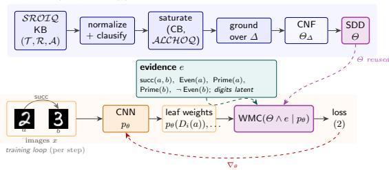

# Neuro-symbolic learning over OWL 2 DL via consequence-based compilation to diferentiable circuits

Olga Mashkova1[0000−0002−4916−1660], Asaad Mohammedsaleh1[0009−0007−3160−8819], Fernando Zhapa-Camacho1[0000−0002−0710−2259] and Robert Hoehndorf1[0000−0001−8149−5890]

Computer Science Program, Computer, Electrical, and Mathematical Sciences & Engineering Division, King Abdullah University of Science and Technology, Thuwal 23955, Saudi Arabia {first name.last name}@kaust.edu.sa

Abstract. OWL 2 DL ontologies, grounded in the description logic SROIQ, express large knowledge bases in biomedicine and the Semantic Web. Neuro-symbolic (NeSy) learners over description logics either embed the ontology in a continuous space, abandoning classical entailment, or restrict to the Horn fragment $\mathcal { E } \mathcal { L } ^ { + + }$ , which has a single canonical model. We present Baobab, which compiles a SROIQ ontology with a finite ABox into a Sentential Decision Diagram (SDD): it saturates a propositional core under a consequence-based calculus and instantiates the remaining SROIQ features (nominals, number restrictions, and the role axioms) over the active domain. The SDD’s evidence-conditioned weighted model count then trains a perception network to recognize real images under partial ABox supervision: on an ontology that exercises every distinctive SROIQ feature, a CNN learns to read MNIST digits coupled by a successor relation and recovers latent ontology concepts that an independent perception leaves at chance. When the supervision admits several ontology consistent completions, an independent perception collapses onto one, a reasoning shortcut: we show that a mixture indexed by the query’s justifications can represent the calibrated posterior no independent perception can, and that seeding it from the circuit’s enumerated completions attains the Bayes-optimal posterior on a real-image MNIST task where single-WMC and learned mixtures (the BEARS-ensemble hypothesis class) do not: to our knowledge the first to characterize and mitigate reasoning shortcuts in a non-Horn description logic. Soundness of the compiler and the representation result are machine-checked in Lean 4. Code is available at https://github.com/bio-ontology-research-group/baobab.

## 1 Introduction

OWL 2 DL ontologies, formally grounded in the description logic SROIQ [11], structure knowledge bases in biomedicine, scientific cataloging, and the Semantic

Web. We ask a neural network to read raw inputs into the concepts of such an ontology when most of those concepts carry no direct labels, so the network must infer them from the ontology’s logical structure. The neuro-symbolic (NeSy) com munity has produced two broad families of OWL-aware learners. Embedding-based methods such as EL Embeddings [19], OWL2Vec\* [6], BoxEL [36], Box2EL [13], and FALCON [31] project an ontology into a continuous space; they scale to OWLshaped knowledge graphs but compute no classical entailment during training. Knowledge-compilation methods such as DeepProbLog [23], Semantic Loss [37], Semantic Probabilistic Layers [1], Scallop [21], and NeuPSL [27] compute the weighted model count (WMC) of the compiled constraint and feed it to perception as a diferentiable signal, but target propositional formulas or Datalog-shaped programs; the few NeSy methods that take a description-logic ontology as input target ALC or the OWL 2 Horn profiles, compiling to a probabilistic circuit [20] or relaxing to fuzzy semantics [35,40].

The gap between the two families of methods is structural. Knowledge compilation keeps the classical semantics end to end (the WMC of Θ under p is exactly the probability that a world drawn from the perception’s per-atom posterior satisfies the ontology); but the propositional reduction of SROIQ adds disjunction, classical negation, qualified cardinality, nominals, and the full family of role axioms, which a Horn-only saturation calculus does not handle easily. Embedding-based NeSy buys scaling but loses classical semantics: a trained embedding can satisfy its loss while violating an entailment of the ontology.

We present Baobab, a compiler that takes a SROIQ ontology and produces a Sentential Decision Diagram (SDD) [7]: a circuit that scores whether the perception network’s predictions stay logically consistent with the ontology. Its weighted model count is the training signal under partial ABox supervision, so that a real image encoder learns latent ontology concepts it is never directly shown.

Specifically, we make three contributions. (i) SROIQ compilation. Baobab accepts any OWL 2 DL ontology and compiles it to an SDD, soundly on the grounding-covered fragment, combining consequence-based saturation over a propositional core (ALCHOQ) [32,33] with finite-domain grounding of the SROIQ-specific extensions (nominals, qualified cardinality, and the six roleaxiom shapes ALC lacks); an OWL loader [22] maps every OWL 2 DL axiom kind to the compiler’s syntax (§3.1). (ii) Latent concept learning of real images. The SDD’s evidence-conditioned weighted model count trains a CNN to recognize MNIST digit images through the ontology: under partial ABox supervision the perception recovers latent concepts it is never directly shown (digit identity 0.25→0.99) and drives ontology violations toward zero, where an independent perception sits at chance (§3.2, §4.1); the same workflow drives a ResNet through a role-based fragment of the real Pizzaiolo OWL ontology, recovering its latent pizza classes. (iii) Reasoning-shortcut awareness in SROIQ. When the supervision leaves several ontology-consistent completions, a single independent perception provably cannot place calibrated mass on them, but a mixture indexed by the query’s justifications can; realized as one network (JustWMC) and seeded from the completions the circuit enumerates, it attains the Bayes-optimal calibrated posterior on a real-image MNIST task where single-WMC and learned mixtures (the BEARS-ensemble hypothesis class) do not (§4.2). A per-axiom comparison shows that 23% of the SROIQ axioms leave DeepProbLog’s Horn fragment (§4.3); §3.3 states the formal guarantees behind the compiler and the representation result.

## 2 Background

A SROIQ knowledge base $( \mathcal { T } , \mathcal { R } , \mathcal { A } )$ has a TBox of general concept inclusions $C \subseteq D$ , an ABox of concept and role assertions $C ( { a } ) , R ( { a } , { b } )$ with (in)equalities, and an RBox of role hierarchies $R \subseteq S$ , role chains $R _ { 1 } \circ \cdots \circ R _ { k } \subseteq S .$ , and the eight role characteristics (transitivity, (a)symmetry, (ir)reflexivity, (inverse-)functionality, disjointness), over the standard syntax of [11]; App. A gives the full syntax (concepts close Boolean connectives, nominals, qualified number restrictions, and ∃R.Self) and the Tarskian semantics.

Consequence-based (CB) reasoning saturates a set of clauses under a fixed family of resolution-like inference rules and reads the entailed concept subsumptions of the resulting closure, rather than searching for a model as a tableau would. CB calculi were developed for SRIQ [3] and extended to ALCHOIQ [32,33], where clauses are grouped into contexts (clause sets anchored at a concept) between which consequences propagate; they underlie Sequoia [33] (SROIQ) and ELK [14] (the Horn profile). The calculus is deterministic and model-free, so the closure is a fixed propositional object.

Knowledge compilation represents a propositional theory as a circuit on which queries become eficient. A Sentential Decision Diagram (SDD) [7] is a decomposable, deterministic circuit over a fixed vtree (a binary tree over the variables); its size is worst-case exponential in the theory’s treewidth but, once built, supports linear-time weighted model counting. For atom weights $w ( a ) \in [ 0 , 1 ]$ , the weighted model count of a theory $\varphi$ is

$$
\mathsf { W M C } ( \varphi \mid w ) \ = \ \sum _ { \alpha \vdash \varphi } \ \prod _ { a : \alpha ( a ) = 1 } w ( a ) \prod _ { a : \alpha ( a ) = 0 } ( 1 - w ( a ) ) ,\tag{1}
$$

the total weight of $\varphi \mathrm { { s } }$ models, evaluated on an SDD in one bottom-up pass over the circuit.

Reading each atom as an independent Bernoulli event with parameter $w ( a )$ is the distribution semantics [30]: (1) is exactly the probability that a w-distributed world satisfies $\varphi ,$ the link knowledge-compilation neuro-symbolic methods exploit to turn per-atom probabilities into a diferentiable training signal [37,23].

## 3 Methods

## 3.1 Knowledge compilation algorithm

The algorithm takes a SROIQ knowledge base $( \mathcal { T } , \mathcal { R } , \mathcal { A } )$ whose ABox ranges over a finite set of individuals $\varDelta$ (the active domain), and returns an SDD over the ground propositional atoms $\{ C ( a ) , R ( a , b ) : a , b \in \varDelta \}$ , whose evidenceconditioned weighted model count is the diferentiable training signal of §3.2. The algorithm runs in five stages: normalization, structural transformation to DL-clauses, consequence-based saturation over the propositional ALCHOQ sublanguage, grounding of the SROIQ-extension features over $\varDelta .$ , and SDD compilation of the resulting CNF (Figure 1).

Fig. 1. The Baobab workflow. Compile time (once per ontology): the five stages above produce an SDD. Training loop: a shared CNN reads the coupled individuals $a , b$ (real MNIST digits) into per-atom posteriors that weight the SDD leaves; the evidenceconditioned WMC is the diferentiable loss.  

Normalization rewrites every concept into negation-normal form (NNF) by the standard de Morgan, quantifier, and cardinality dualities (App. B). The structural transformation then turns the NNF axioms into DL-clauses $\bigwedge _ { i } B _ { i } \  \ \bigvee _ { j } H _ { j }$ whose body atoms $B _ { i }$ and head atoms $H _ { j }$ are concept atoms C(t), role atoms $R ( t , t ^ { \prime } )$ , or equalities $t \approx t ^ { \prime }$ over variables, individuals, and unary function terms $f ( t )$ , with a fresh name $Q _ { D }$ for each non-atomic subconcept D. Nominals and qualified number restrictions are not clausified here but deferred to grounding (Table 2).

Saturation closes the DL-clause set under propositional hyperresolution (resolving body atoms against matching head atoms under a most-general unifier). Its role is to eliminate Skolem terms: head existentials and number restrictions clausify to function terms $f ( x )$ naming anonymous witnesses the finite grounder cannot instantiate, and saturation derives their function-free consequences over the named individuals. Four guards keep the closure terminating (tautology elimination, input-derived bounds on the variables and role atoms per clause, and a Skolem-term depth bound; exact bounds in App. C); the guarded calculus is sound (mechanized for the ALCHOQ core) but, being bounded, not complete.

Grounding instantiates the function-free clauses over the active domain ∆, replacing variables by individuals and expanding each deferred nominal, number restriction, and role characteristic into the propositional clauses listed below. The result is a propositional CNF $\Theta _ { \varDelta }$ that is sound over the active domain, and whose models are exactly the SROIQ interpretations over ∆ when every existential consequence is grounding-covered or function-free (Theorem 3).

A construct’s consequences reach $\Theta _ { \varDelta }$ either by grounding that closes the domain or by saturation that eliminates an existential witness symbolically; each deferred construct expands over $\varDelta$ into boundedly many clauses justified by a soundness lemma (Theorem 3), and Table 2 lists every schema. App. F shows why saturation is load-bearing exactly for ungrounded existentials and inert otherwise.

Finally, the grounded propositional CNF is compiled to an SDD with $\mathrm { P y S D D }$ and the diferentiable WMC layer of [23] backpropagates the loss through the SDD’s parameterized leaves into the perception network (Algorithm 1 gives the end-to-end workflow).

## 3.2 Latent concept learning under partial ABox supervision

We address ABox-supervised latent concept learning. Each training instance supplies a perceptual input (an image, or a noisy feature vector) together with a partial set of ground ABox literals over an observable signature; the concept and role atoms the ontology entails over a separate latent signature are never directly supervised. The output is a per-atom posterior over the latent signature, scored against the generating interpretation; the latent atoms are tied to the observables only through O, so the learner must propagate evidence through the ontology rather than read labels of the input.

Formally, let O be a fixed SROIQ ontology, $p _ { \theta } \colon \mathcal { A }  [ 0 , 1 ]$ the perception network’s per-atom posterior over the compiled circuit’s propositional signature ${ \mathcal { A } } ,$ and $e \subseteq { \mathcal { A } } \times \{ T , F \}$ a piece of supervisory evidence, a partial Boolean assignment over the example’s labels. The consistent set $K _ { e }$ is the set of complete assignments to $\mathcal { A }$ that satisfy $\Theta \wedge e ,$ where Θ is the SDD of O. When the supervision underdetermines the latent identity, $| K _ { e } | > 1$

We optimize the perception network against the evidence-conditioned weightedmodel-count loss

$$
{ \mathcal { L } } ( p _ { \theta } ; e ) = \operatorname { B C E } { \big ( } p _ { \theta } ( a ) , v { \big ) } \mid _ { ( a , v ) \in e } + \lambda \cdot \left( - \log \mathsf { W M C } ( \theta \wedge e \mid p _ { \theta } ) \right) .\tag{2}
$$

The label term is binary cross-entropy (BCE) directly supervising the observed labels; the semantic term is − log of the WMC of $\Theta \wedge$ e under $p _ { \theta }$ , the probability that some completion satisfies the ontology and the evidence. When e determines a single model this collapses to the fully supervised likelihood; when $| K _ { e } | > 1$ it distributes the gradient across $K _ { e }$ as a credal set, following [25,24]. Both terms are needed: label-only training ignores the ontology, while conditioning the semantic term on e (rather than on Θ alone) ties it to each example’s evidence instead of the ontology’s globally most probable assignment.

(2) still commits to a single mode of $K _ { e }$ when $| K _ { e } | ~ > ~ 1$ , and the reason is structural. A perception that scores each atom independently induces a product distribution, the universal conditionally independent (UCI) class $\begin{array} { r } { p _ { \mu } ^ { \perp } = \prod _ { i } \mu _ { i } ^ { c _ { i } } ( 1 - \mu _ { i } ) ^ { 1 - c _ { i } } } \end{array}$ ; the assignments such a distribution can concentrate on form a subcube: fix some atoms, let the rest vary freely. A reasoning shortcut (RS) is a latent assignment that satisfies the ontology yet difers from the one that generated the example [25]; with $| K _ { e } | > 1$ the optimum of (2) over a product distribution is exactly such a shortcut. [17] show that an independent perception cannot reproduce the predictions of an RS mixture unless the mixture’s valid completions already form one such subcube: those consistent with a single justification of the query (a minimal set of atom values forcing the query true). When the valid completions span several justifications, no independent perception can spread its mass over them; it collapses onto an arbitrary one. Theorem 5 establishes this characterization for SROIQ.

The converse is previously known: a mixture of independent distributions can be RS-aware [17,24]. We adapt it to SROIQ: a mixture of UCIs with one component per justification, $\begin{array} { r } { p _ { \mathrm { J u s t } } = \sum _ { k } \pi _ { k } ( x ) \prod _ { i } \mu _ { k , i } ( x ) ^ { c _ { i } } ( 1 - \mu _ { k , i } ( x ) ) ^ { 1 - c _ { i } } } \end{array}$ ， represents every RS mixture (Theorem 5): it can place mass on completions drawn from diferent justifications, which no single product distribution can cover (the disjunction benchmark of §4.2 is the canonical case). We realize it as one network, the MixtureEncoder, and call the method JustWMC: a shared body feeds K atom heads $\mu _ { k }$ and a softmax selector π, trained end-to-end on a mixture cross-entropy plus the selector-averaged semantic loss of (2), with a stop-gradient KL diversity term (after BEARS) that breaks head-permutation symmetry and spreads the heads across distinct Θ-consistent modes (App. G). BEARS trains K separate encoders and reports the best against an oracle; JustWMC returns one calibrated posterior with no oracle, its components readable of the circuit’s justifications (the anchored variant below) rather than trained.

The heads need not be learned: when the circuit enumerates the query’s justifications, we seed each head from one Θ-consistent completion (fixing its latent logits) and learn only π: anchored JustWMC, which realizes the positive direction of Theorem 5 by construction and reaches the calibrated posterior of §4.2 where the learned mixture, under the same objective, does not.

## 3.3 Formal guarantees

The compiler and its metatheory are formalized in Lean 4 [26]; the formal statements and proofs are in App. I and the module inventory in App. J. Four results support the claims above. Saturation is sound (Theorem 2): every derived clause is entailed, so over a fixed vtree the compiled SDD is invariant under saturation on the grounding-covered fragment (Theorem 1), and skipping it of that fragment over-approximates (sound but incomplete). Each grounding rule is faithful (Theorem 3): Θ is sound over ∆ and, when every existential is groundingcovered or function-free, its models are exactly the SROIQ interpretations over ∆. The compiled SDD’s weighted model count equals the probability the distribution semantics assigns (Theorem 4), the quantity the losses of §3.2 optimize. Finally, the RS-awareness characterization of [17] holds for SROIQ (Theorem 5). The development also proves the ALC core sound and complete and bounds the grounding by a polynomial in |∆|.

## 4 Experiments

## 4.1 Real-image perception

Unlike prior knowledge-compilation methods for description logics, which report on hand-built feature vectors [20], we drive the circuit Baobab compiles with two image encoders and recover ontology atoms that receive no direct supervision. All experiments use ten seeds; tables give mean±std on held-out unseen individuals, and bold marks a one-sided paired permutation gain (Holm-corrected per table) at $p < 0 . 0 5$ (all reach $p < 0 . 0 1 $ ).

Metrics. Digit accuracy: per-individual argmax over the five digit-identity atoms vs. the true digit (chance 0.20). Per-atom accuracy (latent, property, topping): each named atom thresholded at 0.5, so the easy negative atoms put it above the argmax. Violation: fraction of examples whose MAP decode (latent atoms argmaxed, evidence clamped) has no model (WMC = 0). Mode-coverage TV : total variation to uniform over the Θ-consistent modes (0=perfect; one of M scores 1−1/M). We also report standard ten-bin concept-marginal ECE [8] and the latent-atom NLL. Arrows in each table mark the improving direction.

MNIST-SROIQ (two supervision regimes). Each example pairs two real MNIST images a, b whose digits, restricted to 0−4, satisfy succ(a, b) with b = (a+1) mod 5 (a restricted-digit task after rsbench [4]). One per-image CNN runs on both slots; a SROIQ ontology couples the pair through every distinctive SROIQ feature: universal and qualified-cardinality restrictions, the inverse and transitive succ with the chain succ ◦ succ ⊑ plusTwo (compiled at $| \varDelta | = 3 )$ , complement, covering disjunctions, and the functional, (a)symmetric, and (ir)reflexive role characteristics; App. H lists it in full. The evidence mixes a role assertion (succ(a, b)) with concept assertions (Number(a), Number(b) and parity/primality); digit identities are never supervised. The amount of revealed concept evidence controls #RS, the number of Θ-consistent completions the evidence leaves open (the modes of K , §3.2; Table 1).

Grounded (succ, Number, and a random half of the parity/primality atoms; $\# \mathrm { R S } = 1 )$ : the evidence pins the digits through the ontology, and WMC recovers the never-supervised identities (0.25 → 0.99) at violation 0.02 and concept expected calibration error (ECE) 0.002; the ontology-blind independent perception stays at chance.

Under-determined (succ and Number only; #RS = 5): the universal/inverse/functional axioms admit the five cyclic relabelings of 0−4. The objective is invariant under them, so a factorized perception cannot pick one even when trained through the circuit: WMC reaches digit accuracy only 0.18 (chance 0.20) and leaves most decoded pairs successor-inconsistent (violation 0.78, concept ECE 0.15); the shortcut is intrinsic to the symmetry, not an optimization artifact. Only grounding breaks it: a single parity atom drops #RS to 3 and the full parity profile to 1, after which WMC recovers the digits and drives the violation to 0.02 (the grounded row).

Pizzaiolo (a real role-based OWL ontology). Each example is a synthetically rendered pizza image from the Pizzaiolo dataset [5], encoded by a frozen ImageNet ResNet-18 with a trainable linear head. The OWL ontology shipped with the dataset is genuinely role-based SROIQ: a hasTopping role links each pizza to its toppings and the pizza classes are defined by existential and universal restrictions over it (90 existential and 44 universal restrictions, 66 named classes). It does not compile to an SDD: it grounds in under a second, but the SDD exhausts memory even for a single pizza, a real-ontology instance of the circuit-size wall (§6; quantified in App. F, where grounding stays sub-second while the SDD exceeds 22 GB by three toppings).

Table 1. MNIST-SROIQ, mean±std over ten seeds (metrics in §4; digit identities never supervised). Grounding the concept evidence collapses #RS from 5 to 1.
<table><tr><td>regime</td><td>method</td><td>digit</td><td>latent</td><td> ${ \mathrm { v i o l ~ } } \downarrow$ </td><td>ECE↓</td></tr><tr><td>grounded  $\scriptstyle ( \# \mathrm { { R S = 1 } } )$ </td><td>Independent WMC</td><td> $0 . 2 5 { \pm } . 0 9$ </td><td> $0 . 4 9 \pm . 1 4$ </td><td> $0 . 8 0 \pm . 1 2$ </td><td>0.33±.14 0.99±.00 1.00±.00 0.02±.01 0.00±.00</td></tr><tr><td></td><td></td><td></td><td></td><td>Independent 0.20±.03 0.46±.10 0.93±.10 0.08±.08</td><td></td></tr><tr><td>under-det. (#RS=5)</td><td>WMC</td><td></td><td></td><td>0.18±.07 0.67±.03 0.78±.05 0.15±.02</td><td></td></tr></table>

To still drive the ResNet through the role structure we extract a compilable two-topping fragment (59 atoms): a hasTopping role to named topping individuals with the shipped definitions NonVeg ≡ Pizza⊓∃hasTopping.Meat, Spicy ≡ Pizza⊓ ∃hasTopping.Spicy, and $\mathsf { V e g } \equiv \mathsf { P i z z a } \cap \lnot \mathsf { N o n V e g }$ . Compiling even this needs three sound, opt-in grounding refinements, documented and mechanized in App. D (the rest of the paper’s circuits stay byte-identical): role atoms are pruned to hasTopping’s declared domain and range; the cubic equality theory is skipped; and a closed qualified existential is materialized as the exact biconditional $\textstyle X ( a ) \Leftrightarrow \sqcup _ { t }$ hasTopping(a, t) ⊓ C(t) over the named toppings, recovering a class from the absence of a topping, not only its presence. The ResNet predicts the toppings (supervised) while the property classes are latent: WMC recovers them (property $0 . 4 5  0 . 9 2 )$ and drives the violation from 0.89 to 0.06, where the independent perception stays at chance (Table 7, App. H).

The closed qualified-existential refinement is the one departure from openworld semantics in this fragment, so we ablate it directly (Table 3, App. D). Keeping the forward Skolemized direction but dropping the closure clause ∃hasTopping. $C \to X ( a )$ leaves the supervised toppings untouched (0.93 → 0.95) but lowers latent property recovery from 0.92 to 0.78, which stays 0.33 above the independent baseline’s 0.45, so perception does not collapse; it becomes over-permissive. The reported violation falls to 0.00 because the removed clause is the constraint whose violation was counted: the open model satisfies a weaker theory vacuously rather than recovering the latents it can no longer identify. The closure direction therefore contributes a 14-point gain in latent recovery, which isolates it as a learning signal over and above the EL-style forward grounding. Without the closure clause, the SROIQ fragment retains partial but degraded identifiability.

## 4.2 MNIST-Disjunction (RS-genuine, real images)

The MNIST regimes above are over-determining once a digit is grounded, so single-WMC and JustWMC coincide. We now build a task whose latents admit several equally plausible Θ-consistent completions per example, on real images. Three individuals $a , b , c$ each carry a real MNIST digit; $a , b$ show consecutive digits coupled by succ(a, b), and a shared CNN recovers them through a digit circuit (the grounded MNIST mechanism). On the same individuals an image-free gender attribute carries the reasoning shortcut: under Person ⊑ Male ⊔ Female (disjoint), Male ⊑ ∀marriedTo.Female with marriedTo(a, b), and the parenthood roles (App. H), exactly four Θ-consistent gender modes remain (a, b opposite sex, c free): $\# \mathrm { R S } = 4$ The pixels fix the digits but not the genders, so the gender modes are uninformed and uniform; the Bayes-optimal latent NLL over the gender atoms is 6 log 2 ≈ 4.16 and the target is the calibrated posterior over the four modes (RS diagnostics after [4,24]).

Compiling both as one SDD is intractable (the two disjunctive subsystems multiply out, §6), so we compile two circuits over the same individuals – a 114-atom digit and a 69-atom gender circuit – driven by one shared CNN with image-free gender heads. The split only separates the two independent subsystems; the reasoning shortcut lives entirely within the jointly-compiled gender circuit, so the target posterior is unafected.

Table 8 (App. H) summarizes the outcome. The CNN recovers the digits through the circuit on every method (accuracy 0.99). For the gender RS, no factorized method covers the four modes. Independent hedges (NLL 6.93) but leaks mass everywhere (TV 1.00); single-WMC (Semantic Loss [37], conditioned DeepProbLog [23]) and the learned mixture (JustWMC, the BEARS-ensemble class [24]) lower the NLL only marginally (6.13 / 6.69) and do not spread (TV 0.99): the mixture-WMC objective is minimized by one confident head, so gradient descent collapses onto a seed-dependent mode. Representability does not imply learnability [15]. Justification-anchored JustWMC closes the gap constructively: seeding the four heads from the circuit’s enumerated completions and learning only the selector (which converges to uniform) realizes the positive direction of Theorem 5 in practice: Bayes-optimal NLL 4.17, zero concept ECE, and mode-coverage TV 0.02 with no seed variance. The compiled circuit supplies the multimodal joint that gradient descent over a factorized hypothesis class does not find. An explicit ensemble mitigation is consistent with this boundary between hypothesis classes. BEARS [24], a K=4 deep ensemble, spreads mass across the modes, reaching mode-coverage TV 0.44 where the single-mode methods sit at 0.99–1.00. It stays far from the anchored posterior nonetheless (TV 0.44 against 0.02, ECE 0.41 against 0.00, NLL 6.36 against 4.17) and varies across seeds (±.11 TV, ±2.36 NLL). A learned mixture therefore does not recover the multimodal joint that anchoring reads directly from the circuit.

## 4.3 Size comparison with DeepProbLog

DeepProbLog (DPL) [23] compiles a probabilistic logic program to an sd-DNNF, the same arithmetic-circuit class our system builds on Horn inputs. On the MNIST-SROIQ ontology, 12 of 52 axioms (23%) leave ProbLog’s Horn fragment and need hand-written constraint encodings; none is strictly inexpressible, but each abandons the Horn structure DPL compiles natively (Table 10, App. H).

## 5 Related work

The closest concurrent work is the SDD compiler of [20], which also trains a NeSy model through a circuit compiled from a DL ontology; we extend the recipe to SROIQ, drive compilation by a consequence-based calculus [32,33] rather than synthesizing the circuit from the semantics, and add a mechanized metatheory. That line addresses neither the reasoning shortcuts we characterize and mitigate (§3.2) nor real perception (it reports on hand-built feature vectors); [9,10] survey the broader OWL-aware NeSy landscape.

The DL embeddings of §1, the lattice-saturated embeddings of [41], and fuzzy-DL variants [35,40] optimize a relaxation of OWL semantics on a continuous representation; they scale but compute no classical WMC. Embed2Sym [2] clusters embeddings to recover symbols. Within knowledge-compilation NeSy, DeepProbLog [23] compiles to sd-DNNF; Semantic Loss [37] and Semantic Probabilistic Layers [1] train against a propositional WMC; A-NeSI [18] amortizes it; NeuPSL [27], Scallop [21], DeepStochLog [34], NeurASP [38], and NeSyDM [16] target propositional, Datalog, or answer-set programs; we extend the lineage to OWL 2 DL.

Reductions of expressive DLs to rule languages predate NeSy (KAON2: SHIQ to disjunctive Datalog [12]); a reduction alone yields no learner, but Baobab adds the path to an exact, diferentiable WMC.

The independence assumption [25,24,15,17] is the limit we attack; our experiments give a SROIQ instance of the BEARS recipe with an RS-awareness characterization (Theorem 5). Other probabilistic-DL systems difer in target: DISPONTE [30] fixes the world-sum; BUNDLE [29] and TRILL [39] enumerate tableau explanations rather than one fixed circuit; LNNs [28] use user-set rule weights.

## 6 Limitations and future work

The guarded saturation that drives compilation (App. C) is sound but bounded, so it misses consequences of a deep ungrounded existential chain. Closing that gap calls for the full disjunctive context calculus [32,33], sound and complete under the trivial expansion strategy but not yet convergent on large ontologies; we treat it as a separate development. Our benchmarks sidestep the gap with grounding-covered, function-free constructs (Theorem 1). Multi-individual ABoxes inflate the ground theory by $O ( | \varDelta | ^ { 2 } )$ in role atoms and $O ( | \varDelta | ^ { 3 } )$ in the equality theory; larger ABoxes will need pairwise blocking, a sampling grounder, or amortized inference [18,16]. One of the three Pizzaiolo grounding refinements, the closed-world reading of the NonVegetarianPizza and SpicyPizza qualified existentials, is a genuine departure from the open-world Tarskian semantics of SROIQ: it materializes the biconditional $X ( a ) \Leftrightarrow \exists R . C$ so a latent class can be inferred from the absence of a filler, which the verified grounding (Theorem 3) does not license. It is opt-in and confined to declared families; App. D ablates it, and latent recovery degrades from 0.92 to 0.78 without it (the model becomes over-permissive rather than failing), so the refinement trades open-world faithfulness for identifiability under partial supervision. Datatypes are out of scope. The DeepProbLog comparison (§4.3) counts the axioms whose encoding leaves ProbLog’s Horn fragment (23%, an expressivity count, not an accuracy claim); it does not run DeepProbLog end to end. Our Independent, single-WMC, and learned-mixture rows are controlled ablations of one pipeline: no external NeSy system compiles a non-Horn ontology for a head-to-head run. In sum, the method’s scope rests on five assumptions, each stated where used: a finite active domain; exactness only on grounding-covered or function-free existentials; bounded, sound-but-incomplete saturation; the opt-in Pizzaiolo grounding refinements; and, for anchored JustWMC, a #RS small enough to enumerate. Scaling the perception to many-individual scenes is the natural next step, as is evaluating anchored JustWMC beyond the enumerable-#RS regime, on a reasoning-shortcut benchmark whose intended concepts are identifiable from the perceptual input under limited concept supervision, against an external mitigation baseline.

## 7 Conclusion

SROIQ admits neuro-symbolic learning by knowledge compilation: consequencebased saturation over ALCHOQ plus ABox grounding of the SROIQ features produce an SDD whose evidence-conditioned WMC trains perception under partial supervision. Where supervision underdetermines the latents, anchoring the mixture to the circuit’s enumerated justifications recovers the Bayes-optimal posterior that learned mixtures miss [17].

## References

1. Ahmed, K., Teso, S., Van den Broeck, G., Chang, K.W., Vergari, A.: Semantic probabilistic layers for neuro-symbolic learning. In: Advances in Neural Information Processing Systems (2022)

2. Aspis, Y., Broda, K., Lobo, J., Russo, A.: Embed2Sym: Scalable neuro-symbolic reasoning via clustered embeddings. In: Principles of Knowledge Representation and Reasoning (2022)

3. Bate, A., Motik, B., Cuenca Grau, B., Simˇanˇc´ık, F., Horrocks, I.: Extending consequence-based reasoning to SRIQ. In: Principles of Knowledge Representation and Reasoning (2016)

4. Bortolotti, S., Marconato, E., Carraro, T., Morettin, P., van Krieken, E., Vergari, A., Teso, S., Passerini, A.: A neuro-symbolic benchmark suite for concept quality and reasoning shortcuts. In: Advances in Neural Information Processing Systems, Datasets and Benchmarks Track (2024), arXiv:2406.10368

5. Bourguin, G., Lewandowski, A.: Pizza¨ıolo dataset: ontologically explainable synthetic pizza images (2023). https://doi.org/10.5281/zenodo.10165941, sysReIC, LISIC, Universit´e du Littoral Cˆote d’Opale; CC BY-NC 4.0

6. Chen, J., Hu, P., Jim´enez-Ruiz, E., Holter, O.M., Antonyrajah, D., Horrocks, I.: OWL2Vec\*: Embedding of OWL ontologies. Machine Learning 110(7), 1813–1845 (2021)

7. Darwiche, A.: SDD: A new canonical representation of propositional knowledge bases. In: International Joint Conference on Artificial Intelligence (2011)

8. Guo, C., Pleiss, G., Sun, Y., Weinberger, K.Q.: On calibration of modern neural networks. In: International Conference on Machine Learning (2017)

9. Herron, D., Jim´enez-Ruiz, E., Weyde, T.: On the benefits of OWL-based knowledge graphs for neural-symbolic systems. In: Neural-Symbolic Learning and Reasoning. CEUR Workshop Proceedings, vol. 3432, pp. 327–335 (2023)

10. Herron, D., Jim´enez-Ruiz, E., Weyde, T.: On the potential of logic and reasoning in neurosymbolic systems using OWL-based knowledge graphs. Neurosymbolic Artificial Intelligence (2025)

11. Horrocks, I., Kutz, O., Sattler, U.: The even more irresistible SROIQ. In: Principles of Knowledge Representation and Reasoning (2006)

12. Hustadt, U., Motik, B., Sattler, U.: Reasoning in description logics by a reduction to disjunctive datalog. Journal of Automated Reasoning 39(3), 351–384 (2007). https://doi.org/10.1007/s10817-007-9080-3

13. Jackermeier, M., Chen, J., Horrocks, I.: Dual box embeddings for the description logic EL++. In: Web Conference (2024)

14. Kazakov, Y., Kr¨otzsch, M., Simˇanˇc´ık, F.: The incredible ELK: From polynomial procedures to eficient reasoning with EL ontologies. Journal of Automated Reasoning 53, 1–61 (2014)

15. van Krieken, E., Minervini, P., Ponti, E.M., Vergari, A.: On the independence assumption in neurosymbolic learning. In: International Conference on Machine Learning (2024), arXiv:2404.08458

16. van Krieken, E., Minervini, P., Ponti, E.M., Vergari, A.: Neurosymbolic difusion models. In: Advances in Neural Information Processing Systems (2025)

17. van Krieken, E., Minervini, P., Ponti, E.M., Vergari, A.: Neurosymbolic reasoning shortcuts under the independence assumption. In: Neurosymbolic Learning and Reasoning (2025)

18. van Krieken, E., Thanapalasingam, T., Tomczak, J.M., van Harmelen, F., ten Teije, A.: A-NeSI: A scalable approximate method for probabilistic neurosymbolic inference. In: Advances in Neural Information Processing Systems (2023)

19. Kulmanov, M., Liu-Wei, W., Yan, Y., Hoehndorf, R.: EL embeddings: Geometric construction of models for the description logic EL++. In: International Joint Conference on Artificial Intelligence (2019)

20. Lazzari, N., Presutti, V., Vergari, A.: To neuro-symbolic classification and beyond by compiling description logic ontologies to probabilistic circuits. arXiv preprint arXiv:2601.14894 (2026)

21. Li, Z., Huang, J., Naik, M.: Scallop: A language for neurosymbolic programming. In: Programming Language Design and Implementation (2023)

22. Lord, P., Gehrke, B., De Bortoli, F., Larralde, M.: horned-owl: Building ontologies at big data scale. Rust library, https://github.com/phillord/horned-owl (2023)

23. Manhaeve, R., Dumanˇci´c, S., Kimmig, A., Demeester, T., De Raedt, L.: Deep-ProbLog: Neural probabilistic logic programming. In: Advances in Neural Information Processing Systems (2018)

24. Marconato, E., Bortolotti, S., van Krieken, E., Vergari, A., Passerini, A., Teso, S.: BEARS make neuro-symbolic models aware of their reasoning shortcuts. In: Uncertainty in Artificial Intelligence (2024)

25. Marconato, E., Teso, S., Vergari, A., Passerini, A.: Not all neuro-symbolic concepts are created equal: Analysis and mitigation of reasoning shortcuts. In: Advances in Neural Information Processing Systems (2023)

26. de Moura, L., Ullrich, S.: The Lean 4 theorem prover and programming language. In: Conference on Automated Deduction (2021)

27. Pryor, C., Dickens, C., Augustine, E., Albalak, A., Wang, W.Y., Getoor, L.: NeuPSL: Neural probabilistic soft logic. In: International Joint Conference on Artificial Intelligence (2023)

28. Riegel, R., Gray, A., Luus, F., Khan, N., Makondo, N., Akhalwaya, I.Y., Qian, H., Fagin, R., et al.: Logical neural networks. arXiv preprint arXiv:2006.13155 (2020)

29. Riguzzi, F., Bellodi, E., Lamma, E., Zese, R.: BUNDLE: A reasoner for probabilistic ontologies. In: Web Reasoning and Rule Systems (2013)

30. Riguzzi, F., Bellodi, E., Lamma, E., Zese, R.: Probabilistic description logics under the distribution semantics. Semantic Web 6(5), 477–501 (2015)

31. Tang, Z., Hinnerichs, T., Peng, X., Zhang, X., Hoehndorf, R.: FALCON: Faithful neural semantic entailment over ALC ontologies. arXiv preprint arXiv:2208.07628 (2022)

32. Tena Cucala, D., Cuenca Grau, B., Horrocks, I.: Consequence-based reasoning for description logics with disjunction, inverse roles, number restrictions, and nominals. In: International Joint Conference on Artificial Intelligence (2018)

33. Tena Cucala, D., Cuenca Grau, B., Horrocks, I.: Pay-as-you-go consequence-based reasoning for the description logic SROIQ. Artificial Intelligence 298, 103518 (2021)

34. Winters, T., Marra, G., Manhaeve, R., Raedt, L.D.: DeepStochLog: Neural stochastic logic programming. In: AAAI Conference on Artificial Intelligence (2022)

35. Wu, X., Zhu, X., Zhao, Y., Dai, X.: Diferentiable fuzzy ALC: A neural-symbolic representation language for symbol grounding. arXiv preprint arXiv:2211.12006 (2022)

36. Xiong, B., Potyka, N., Tran, T.K., Nayyeri, M., Staab, S.: Faithful embeddings for EL++ knowledge bases. In: International Semantic Web Conference (2022)

37. Xu, J., Zhang, Z., Friedman, T., Liang, Y., Van den Broeck, G.: A semantic loss function for deep learning with symbolic knowledge. In: International Conference on Machine Learning (2018)

38. Yang, Z., Ishay, A., Lee, J.: NeurASP: Embracing neural networks into answer set programming. In: International Joint Conference on Artificial Intelligence (2020)

39. Zese, R., Bellodi, E., Lamma, E., Riguzzi, F., Cota, G.: Tableau reasoning for description logics and its extension to probabilities. Annals of Mathematics and Artificial Intelligence 82(1–3), 101–130 (2018)

40. Zhao, Y.: Fast and faithful: Scalable neuro-symbolic learning and reasoning with diferentiable fuzzy EL++. In: ACM SIGKDD Conference on Knowledge Discovery and Data Mining. pp. 1987–1997 (2026)

41. Zhapa-Camacho, F., Hoehndorf, R.: Lattice-based ALC ontology embeddings with saturation. Neurosymbolic Artificial Intelligence (2025)

## A SROIQ syntax and semantics

The body (§2) summarizes the fragment; we give the full definition here for completeness. A SROIQ knowledge base is a triple $( \mathcal { T } , \mathcal { R } , \mathcal { A } )$ over a signature of atomic concept names ${ \mathsf { N } } _ { \mathsf { C } } ,$ atomic role names $\mathsf { N } _ { \mathsf { R } } .$ , and individual names $\mathsf { N } _ { \mathsf { I } } .$

A role is an atomic role $r \in \mathsf { N } _ { \mathsf { R } }$ , an inverse role $r ^ { - }$ , or the universal role $U .$ Concepts are generated by

$$
C , D \ : : = \ A \mid \mathsf { T } \mid \perp \mid \{ a \} \mid \ \neg C \mid C \cap D \mid C \sqcup D \mid \exists R . C \mid \forall R . C \mid \geq n R . C \mid \exists R . S \lnot \in \{ \mathrm { T } , D \} .
$$

where $A \in \mathsf { N } _ { \mathsf { C } } , a \in \mathsf { N } _ { 1 } .$ R a role, and $n \in \mathbb { N }$ . In the implementation (baobab/sroiq/syntax.py) these are the dataclasses ConceptName, Top, Bottom, Nominal, Not, And, Or, Exists, Forall, AtLeast, AtMost, HasSelf; roles are RoleName, InverseRole, UniversalRole. And/Or hold a flattened, deduplicated frozen set of operands.

Axioms are organized into three boxes. The TBox T is a set of general concept inclusions $C \subseteq D$ (with $C \equiv D$ abbreviating the two inclusions and Disjoint $( C , D )$ abbreviating $C \cap D \subseteq \bot )$ . The ABox A is a set of concept assertions $C ( \boldsymbol a )$ , role assertions $R ( a , b )$ , and (in)equalities $a \approx b , a \not \approx b$ . The RBox R contains role inclusions $R \subseteq S$ , role chains $R _ { 1 } \circ \cdots \circ R _ { k } \subseteq S$ , and the role characteristics Trans(R), Sym(R), Asym(R), Refl(R), Irrefl(R), Func(R), InvFunc(R), Disj(R, S). (As usual for decidability, SROIQ requires the RBox to be regular and number restrictions to use only simple roles; our benchmarks satisfy both.)

The semantics is Tarskian. An interpretation $\mathcal { I } = ( \varDelta ^ { \tau } , \cdot ^ { \tau } )$ has a non-empty domain $\varDelta ^ { \underline { { \tau } } }$ and maps each $A \in { \mathsf { N } } _ { \mathsf { C } }$ to $\mathring { A } ^ { \mathcal { L } } \subseteq \varDelta ^ { \underline { { \tau } } }$ , each $r \in \mathsf { N } _ { \mathsf { R } }$ to $r ^ { \mathcal { I } } \subseteq \varDelta ^ { \mathcal { I } } \times \bar { \Delta ^ { \bar { \tau } } }$ and each $a \in \mathsf { N } _ { 1 }$ to $\bar { a } ^ { \mathcal { L } } \in \varDelta ^ { \mathbb { Z } }$ . Roles extend by $( r ^ { - } ) ^ { \mathcal { Z } } = \{ ( y , x ) : ( x , y ) \in r ^ { \mathbb { Z } } \}$ and $U ^ { \mathcal { I } } = \varDelta ^ { \mathcal { I } } \times \varDelta ^ { \mathcal { I } }$ , and concepts by

$$
\begin{array} { r l r } { \mathsf { T } ^ { \mathcal { L } } = \varDelta ^ { \mathcal { L } } , } & { \quad \perp ^ { \mathcal { L } } = \emptyset , } & { \quad \{ a \} ^ { \mathcal { L } } = \{ a ^ { \mathcal { L } } \} , } \\ { ( \neg C ) ^ { \mathcal { L } } = \varDelta ^ { \mathcal { L } } \setminus C ^ { \mathcal { L } } , } & { \quad ( C \cap D ) ^ { \mathcal { L } } = C ^ { \mathcal { L } } \cap D ^ { \mathcal { L } } , } & { \quad ( C \sqcup D ) ^ { \mathcal { L } } = C ^ { \mathcal { L } } \cup D ^ { \mathcal { L } } . } \end{array}
$$

$$
\begin{array} { r l } & { ( \exists R . C ) ^ { \mathcal { T } } = \{ x : \exists y . ( x , y ) \in R ^ { \mathcal { T } } \land y \in C ^ { \mathcal { T } } \} , } \\ & { ( \forall R . C ) ^ { \mathcal { T } } = \{ x : \forall y . ( x , y ) \in R ^ { \mathcal { T } }  y \in C ^ { \mathcal { T } } \} , } \\ & { ( \ge n R . C ) ^ { \mathcal { T } } = \{ x : \# \{ y : ( x , y ) \in R ^ { \mathcal { T } } \land y \in C ^ { \mathcal { T } } \} \ge n \} , } \\ & { ( \exists R . 5 \mathrm { e } | \dag ) ^ { \mathcal { T } } = \{ x : ( x , x ) \in R ^ { \mathcal { T } } \} , } \end{array}
$$

with $\leq n R . C$ dual ${ \mathrm { t o } } \geq ( n { + } 1 ) R . C$ under negation. I satisfies $C \subseteq D$ if $C ^ { \mathcal { I } } \subseteq D ^ { \mathcal { I } }$ $R \subseteq S$ if $R ^ { \mathbb { Z } } \subseteq S ^ { \mathbb { Z } } , R _ { 1 } \circ \cdots \circ R _ { k } \subseteq S$ if $R _ { 1 } ^ { \mathcal { T } } \circ \cdot \cdot \cdot \circ R _ { k } ^ { \mathcal { T } } \subseteq S ^ { \mathcal { T } }$ , and the role characteristics under their standard relational readings (Trans: transitive; Func(R): $R ^ {  { \boldsymbol { \tau } } }$ is right-unique; $\operatorname { D i s j } ( R , S ) \colon R ^ { \mathbb { Z } } \cap S ^ { \mathbb { Z } } = \varnothing ; \operatorname { e t c . } )$ . This is the semantics our Lean development takes as the definition of truth (§J).

## B Normalization and clausification

The compiler (baobab/sroiq/normalisation.py) maps each axiom to DLclauses $\bigwedge _ { i } B _ { i } \  \ \bigvee _ { i } H _ { j }$ over the term language of variables x, y, individual constants a, auxiliary constants $o _ { \rho }$ (introduced at grounding time for nominal / cardinality witnesses), and unary Skolem terms $f ( t )$ . Atoms are concept atoms $C ( t )$ , role atoms $R ( t _ { 1 } , t _ { 2 } )$ , and equalities $t _ { 1 } \approx t _ { 2 }$ (dlclauses.py).

The first step is negation-normal form. nnf pushes negation to atomic concepts and nominals using the de Morgan, quantifier, and cardinality dualities:

$$
\begin{array} { r l } & { \neg \neg \to \bot , } \\ & { \neg ( C \cap D ) \to \neg C \sqcup \neg D , \ \neg ( C \sqcup D ) \to \neg C \cap \neg D , \qquad \neg \exists R . C \to \forall R . \neg C , } \\ & { \neg \forall R . C \to \exists R . \neg C , \qquad \neg ( \geq n R . C ) \to \leq ( n - 1 ) R . C , \neg ( \leq n R . C ) \to \geq ( n + 1 ) R . C , } \\ & { \neg ( \geq 0 R . C ) \to \bot , } \end{array}
$$

$\neg A$ and $\neg \{ a \}$ remain (atomic literals); ¬∃R.Self is preserved for grounding.

The structural transformation follows. Each non-atomic subconcept D is assigned a fresh concept name $Q _ { D }$ (method q) and defined by clauses for $Q _ { D } \equiv D$ (method define); a $S \mathcal { R } O \mathbb { Z } \mathcal { Q }$ inclusion $C \subseteq D$ then becomes the single clause $Q _ { C } ( x )  Q _ { D } ( x )$ . The definitional clauses are:

$$
- Q \equiv C \cap D \colonQ ( x ) \to Q _ { C } ( x ) , Q ( x ) \to Q _ { D } ( x ) , Q _ { C } ( x ) \land Q _ { D } ( x ) \to Q ( x ) .
$$

$$
\mathrm { ~ - ~ } Q \equiv C \sqcup D \colon \ Q ( x ) \to Q _ { C } ( x ) \lor Q _ { D } ( x ) , \ Q _ { C } ( x ) \to Q ( x ) , \ Q _ { D } ( x ) \to Q ( x ) .
$$

$\mathrm { ~ - ~ } Q \equiv \exists R . C \colon Q ( x )  R ( x , f _ { Q } ( x ) ) , Q ( x )  Q _ { C } ( f _ { Q } ( x ) ) , R ( x , y ) \wedge Q _ { C } ( y )  Q _ { C } ( x , y )  Q _ { C } ( y )$ $Q ( x )$ , where $f _ { Q }$ is a unary Skolem function.

$$
- \ Q \equiv \forall R . C \colon Q ( x ) \land R ( x , y ) \to Q _ { C } ( y ) .
$$

$$
- Q \equiv \neg A : \quad Q ( x ) \wedge A ( x ) \to \bot , \ \to Q ( x ) \vee A ( x ) .
$$

$$
- \ Q \equiv \exists R . S { \mathsf { e l f : } } \quad Q ( x ) \to R ( x , x ) , \ R ( x , x ) \to Q ( x ) .
$$

$- ~ Q \equiv \geq n R . C { \mathrm { : } }$ for $i = 0 , \ldots , n - 1 , \ Q ( x ) \ \to \ R ( x , f _ { Q , i } ( x ) )$ and $Q ( x ) $ $Q _ { C } ( f _ { Q , i } ( x ) )$ ; pairwise distinctness $Q ( x ) \wedge f _ { Q , i } ( x ) \approx f _ { Q , j } ( x ) \to \bot$ for $i < j ;$ closure $R ( x , y ) \land Q _ { C } ( y )  Q ( x )$ when $n = 1$

$\begin{array} { r } { - \ Q \equiv \le n R . C \colon \ Q ( x ) \wedge \bigwedge _ { t = 0 } ^ { n } \left( R ( x , y _ { t } ) \wedge Q _ { C } ( y _ { t } ) \right) \to \bigvee _ { i < j } y _ { i } \approx y _ { j } ( n + 1 ) \ . } \end{array}$ fresh successor variables).

Nominals $\{ a \}$ are not given definitional clauses: they map to a stable proxy ${ \mathsf { N o m } } _ { a }$ and an entry ${ \mathsf { N o m } } _ { a } \mapsto a$ in the GroundHooks record. Qualified number restrictions additionally register a tuple $( Q , n , R , Q _ { C } )$ in hooks.at least $/$ hooks.at most; inverse roles register $( R , S )$ in hooks.role inverses and resolve to a proxy role name; the universal role emits the fact $ U ( x , y )$ . RBox characteristics are routed either to native clauses (symmetric: $R ( x , y )  R ( y , x ) ;$ reflexive: $ R ( x , x )$ ; irreflexive: $R ( x , x ) \to \bot ;$ ; functional: $R ( x , y _ { 0 } ) \wedge R ( x , y _ { 1 } ) \to y _ { 0 } \approx y _ { 1 } ;$ inversefunctional dually) or to the grounding record (transitive, chains, asymmetric, disjoint, nominal).

## C Consequence-based saturation

The DL-clause set is saturated under propositional hyperresolution with mostgeneral-unifier matching (baobab/sroiq/cb saturation.py): from ${ \cal { T } }  \varDelta \vee { \cal { A } }$ and $A ^ { \prime } \wedge T ^ { \prime } \to \varDelta ^ { \prime }$ with $A \sigma = A ^ { \prime } \sigma$ the MGU resolvent $( { \cal { T } } \wedge { \cal { T } } ^ { \prime } ) \sigma \to ( \varDelta \vee \varDelta ^ { \prime } ) \sigma$ is added, unification using Robinson’s algorithm with occurs-check over the four term kinds. A clause is admitted to the pool only if it passes four guards that bound the otherwise unbounded context machinery and force termination:

1. tautology elimination: drop any clause whose head and body share an atom;

2. variable bound: at most max $\displaystyle ( 2 ,$ max-vars-in-input) distinct variables per clause (two sufices for ${ \mathcal { A } } { \mathcal { L } } { \mathcal { C } } { \mathcal { H O Q } } ;$ ; transitivity and two-step chains need three; $\leq n$ needs $n { + } 2 )$ ;

3. role-atom bound: at most $\operatorname* { m a x } ( 2$ , max-role-atoms-in-input) role atoms per body (a length-k chain needs $k ; \leq n$ needs $n { + 1 } )$ ;

4. term-depth bound: every function term has nesting depth $\leq 1$ , blocking unbounded Skolem chains $f ( g ( \dots ) )$ .

The fixpoint loop re-resolves all clause pairs until a full pass adds nothing.

Lemma 1 (Termination and soundness of the guarded saturation). The guarded saturation terminates, and every clause it derives is a logical consequence of its input.

Proof. Termination: the four guards keep the reachable atom-and-clause universe finite (bounded variables, bounded role atoms, depth-≤ 1 terms over a finite signature) and tautologies are removed, so the subsumption-minimal pool is finite and the fixpoint loop halts. Soundness: each resolution step adds only entailed clauses; the property is mechanized for the underlying ALCHOQ saturation (axiom-free; §J).

The calculus forgoes completeness: the bounded calculus need not derive every subsumption that the full ALCHOIQ context calculus [32,33] would. Incompleteness is harmless for the consequences a ground-time grounding already discharges (nominals, number restrictions, local reflexivity, role characteristics): there the grounded CNF $\Theta _ { \varDelta }$ is faithful on its own (§D), so any clause saturation adds is already entailed by $\Theta _ { \varDelta }$ and changes neither the model set nor, over a fixed vtree, the circuit (§F). It is not harmless for existential restrictions grounding does not cover: their consequences enter $\Theta _ { \varDelta }$ only through saturation, so an incomplete or skipped saturation yields a sound but over-permissive circuit that admits models the ontology forbids. The trade-of is deliberate: we bound the calculus for termination and accept incompleteness on deep existential chains. On a grounding-covered, function-free fragment saturation adds nothing (Theorem 1), so we skip it and ground directly (§6).

## D Grounding the SROIQ features

At grounding time the GroundHooks record is materialized over the active domain $\varDelta \left( d = | \varDelta | \right)$ ; baobab/grounding/). Each grounding rule emits a bounded number of propositional clauses, and each is justified by a Tarskian-semantics soundness lemma (§J). Table 2 lists every GroundHooks rule with its emitted clause schema and ground-clause count; the three optional refinements of §4.1 are documented separately below; the closed qualified-existential refinement is ablated in Table 3.

The grounder also allocates a propositional atom for every concept name applied to each individual $( O ( | \mathsf { N } _ { \mathsf { C } } | d ) )$ and every role applied to each ordered pair $\scriptstyle \left( O ( | \mathsf { N } _ { \mathsf { R } } | d ^ { 2 } ) \right)$ ; when the ontology uses nominals, qualified number restrictions, or (inverse-)functional roles it additionally emits an equality theory $( d ^ { 2 }$ atoms with reflexivity, symmetry, transitivity, and concept/role congruence), otherwise the equality predicate is omitted (refinement (ii) below). The dominant terms are the cubic transitivity / equality-transitivity clauses and, for a length-k chain or a number restriction of bound n, the $d ^ { k + 1 } / { \dot { O } } ( d ^ { n + 1 } )$ entries, the polynomial-degree bounds proved in our Lean development (§J).

Table 2. Grounding schemata over the active domain $\varDelta , d = | \varDelta | . a , i$ b, c range over ∆; dn is the n-subset count.
<table><tr><td>feature</td><td>emitted ground clauses</td><td>count</td></tr><tr><td>nominal Noma</td><td> $\mathsf { N o m } _ { a } ( a ) ; \mathsf { \Gamma } \neg \mathsf { N o m } _ { a } ( b ) , b \ne a$ </td><td> $d$ </td></tr><tr><td> $\geq n R . C { \mathrm { ~ a t ~ } } x$ </td><td> $Q ( a )  \bigvee _ { | S | = n } { \bigwedge } _ { y \in S } R ( a , y ) \wedge C ( y )$ </td><td> $d \left( { \binom { d } { n } } + 1 \right)$ </td></tr><tr><td> $\leq n R . C { \mathrm { ~ a t ~ } } x$ </td><td> $Q ( a ) \left. \bigwedge _ { | T | = n + 1 } ^ { \cdot } \left( \bigwedge _ { y \in T } R ( a , y ) \wedge C ( y ) \right. \bigvee _ { i < j } y _ { i } \approx y _ { j } \right) \ : O ( d ^ { n + 1 } )$ </td><td></td></tr><tr><td>inverse  $R \equiv S ^ { - }$ </td><td> $R ( a , b )  { \dot { S } } ( b , a )$ </td><td> $2 d ^ { 2 }$ </td></tr><tr><td> ${ \mathsf { T r a n s } } ( R )$ </td><td> $R ( a , b ) \land R ( b , c )  R ( a , c )$ </td><td> $d ^ { 3 } { - } d$ </td></tr><tr><td>chain</td><td> $R _ { 1 } \circ \dots \circ R _ { k } \subseteq S \ R _ { 1 } ( a _ { 0 } , a _ { 1 } ) \wedge \dots \wedge R _ { k } ( a _ { k - 1 } , a _ { k } ) \to S ( a _ { 0 } , a _ { k } )$ </td><td> $d ^ { k + 1 }$ </td></tr><tr><td> $\mathsf { S y m } ( R )$ </td><td> $R ( a , b )  R ( b , a )$ </td><td> $d ^ { 2 } { - } d$ </td></tr><tr><td> $\mathsf { A s y m } ( R )$ </td><td> $\neg ( R ( a , b ) \land R ( b , a ) ) , a \neq b$ </td><td> $d ^ { 2 } { - } d$ </td></tr><tr><td> $\mathsf { D i s j } ( R , S )$ </td><td> $\neg ( R ( a , b ) \land S ( a , b ) )$ </td><td> $d ^ { 2 }$ </td></tr><tr><td>Refl(R)</td><td> $R ( a , a )$ </td><td>d</td></tr><tr><td> $\mathsf { I r r e f l } ( R )$ </td><td> $\neg R ( a , a )$ </td><td> $d$ </td></tr><tr><td> ${ \mathsf { F u n c } } ( R )$ </td><td> $R ( a , b ) \land R ( a , c )  b \approx c$ </td><td> $d ^ { 2 } { - } d$ </td></tr><tr><td> $\mathsf { I n v F u n c } ( R )$ </td><td> $R ( b , a ) \land R ( c , a )  b \approx c$ </td><td> $d ^ { 2 } { - } d$ </td></tr><tr><td> $\exists R . S { \mathsf { e l f } } { \mathrm { ~ p r o x y ~ } } Q$ </td><td> $Q ( a )  R ( a , a )$ </td><td> $2 d$ </td></tr><tr><td>universal U</td><td> $U ( a , b )$ </td><td> $d ^ { 2 }$ </td></tr></table>

Three optional refinements. The role-typing, equality-skip, and closed-existential refinements used for the Pizzaiolo fragment (§4.1) are opt-in and of by default, so every other circuit in the paper is byte-identical to the unrefined grounding. Refinements (i) and (ii) are both instances of one fact about weighted model counting: it factorizes over an independent partition of the atoms, and a block whose sub-theory has a unique satisfying assignment contributes a single constant factor. We mechanize that fact and the two refinements as modelcount-preservation lemmas (wmc split, wmc factor, wmc prune forcedFalse, wmc skip equality, with exact count preservation wmc card preserved and constant log-ofset wmc log offset; §J). Refinement (iii) is a closed-world reading justified only by the Tarskian argument below. (i) Domain/range typing. When a role R declares a domain $D _ { R }$ and range $E _ { R }$ and the named individuals are typed accordingly, $R ( a , b )$ is false in every model unless $a \in D _ { R }$ and $b \in E _ { R }$ so allocating its atom only for those pairs replaces the $| \mathsf { N } _ { \mathsf { R } } | d ^ { 2 }$ role atoms by $\sum _ { R } \left. D _ { R } \right. \left. E _ { R } \right.$ . The pruned atoms form an independent block whose only model sets them all false, so the model count is preserved exactly and the WMC up to the constant Q w(false). (ii) Equality skip. On an ontology free of nominals, number restrictions, and functional roles, no clause outside the equality theory mentions ≈; the ≈ atoms then form an independent sub-theory with, under the unique-name default, a single model, so dropping it preserves the model count exactly and the weighted count up to a constant (the training gradient and the consistency check are identical). (iii) Closed existential. When a role’s fillers are closed to the named domain, a definition $X \equiv \exists R . C$ whose head Skolem witness the grounder drops (§3.1) is recovered as the exact biconditional $X ( a )  \bigvee _ { b \in \varDelta } R ( a , b ) \wedge C ( b ) \ ( 2 d$ clauses), restoring the backward and closure directions $( \breve { X } \to \breve { \exists } \mathrm { ~ a n d ~ } \neg \exists \to \neg X )$ that Skolemization omits. Unlike (i) and (ii)

Table 3. Closed-world ablation on the Pizzaiolo fragment (mean±std over ten seeds, five epochs; same fragment and metrics as Table 7). Closed materializes the exact biconditional $X ( a ) \Leftrightarrow \sqcup _ { t }$ hasTopping $( a , t ) \cap C ( t ) ;$ ; open keeps the forward direction $X ( a ) $ ∃hasTopping.C only, dropping the closure clause ∃hasTopping. $C \to X ( a )$ . Removing the closure clause leaves supervised toppings untouched but lowers latent property recovery from 0.92 to $0 . 7 8 ;$ the reported violation falls to 0.00 because the removed clause is the constraint whose violation was counted (§4.1).
<table><tr><td>refinement method</td><td>topping property viol ↓</td></tr><tr><td>closed closed</td><td>Independent  $0 . 9 5 { \pm } . 0 1 ~ 0 . 4 5 { \pm } . 1 5 ~ 0 . 8 9 { \pm } . 1 8$  WMC  $0 . 9 3 { \pm } . 0 1 \ 0 . 9 2 { \pm } . 0 2 \ 0 . 0 6 { \pm } . 0 2$ </td></tr><tr><td>open</td><td>Independent  $0 . 9 5 { \pm } . 0 1 ~ 0 . 4 5 { \pm } . 1 6 ~ 0 . 8 6 { \pm } . 2 8$ </td></tr><tr><td>open WMC</td><td> $0 . 9 5 { \pm } . 0 1 \ 0 . 7 8 { \pm } . 0 1 \ 0 . 0 0 { \pm } . 0 0 $ </td></tr></table>

Algorithm 1: Compile a SROIQ ontology to a diferentiable circuit   
and train the perception network   
Input: ontology O, active domain ∆, perception network ${ \mathit { p } } _ { \theta } ,$ supervised   
instances $\{ ( \boldsymbol { x } ^ { ( k ) } , e ^ { ( k ) } ) \}$   
/\* Compile (once): \*/   
1 $N \gets \bar { \mathrm { N N F } } ( \mathcal { O } ) ;$ $/ /$ normalization, App. B   
2 $\mathcal { C } \gets \mathrm { C l a u s i f y } ( N ) ;$ $/ /$ structural transformation   
3 C∗ ← Saturate(C); // hyperresolution; skip when grounding-covered   
4 $\theta _ { \Delta }  \operatorname { G r o u n d } ( { \mathcal { C } } ^ { * } , \Delta ) ;$ // expand nominals, number restrictions, roles   
5 $S \gets \mathrm { C o m p i l e S D D } ( \theta _ { \Delta } ) ;$ // PySDD over a fixed vtree   
/\* Train (per step): \*/   
6 foreach instance $( x ^ { ( k ) } , e ^ { ( k ) } )$ do   
7 $p  p _ { \theta } ( x ^ { ( k ) } ) ;$ // per-atom probabilities   
8 $\ell \gets - \log \mathrm { W M C } ( S , p , e ^ { ( k ) } ) ;$ // evidence-conditioned   
9 backpropagate ℓ through S into $\theta ;$

this is a closed-world reading: it is sound only under the named-filler closure assumption, which holds for the Pizzaiolo dataset (each pizza’s topping list is fully observed) but is not an open-world consequence and is therefore outside the mechanized guarantees.

## E SDD compilation, WMC, and the distribution semantics

Algorithm 1 states the end-to-end workflow referenced in §3.1: the five compiletime stages run once per ontology, and the diferentiable WMC pass runs once per training step.

The grounded CNF is compiled to an SDD with PySDD. The diferentiable WMC layer (baobab/nesy/wmc layer.py, class WmcLayer) evaluates the circuit bottom-up: a positive literal for atom a contributes its probability $p _ { a }$ , a negative literal $1 - p _ { a }$ , the true/false constants contribute $1 / 0 .$ , and a decision node with prime/sub partition $\left\{ \left( p _ { i } , s _ { i } \right) \right\}$ contributes $\begin{array} { r } { \sum _ { i } \mathsf { W M C } ( p _ { i } ) \cdot \mathsf { W M C } ( s _ { i } ) } \end{array}$ , memoized so each node is visited once. Probabilities are clamped to $[ \varepsilon , 1 - \varepsilon ]$ for log-stability; the pass is exact in floating point and diferentiable by autodif, so gradients flow into $p _ { \theta }$ . Evidence conditioning (wmc with evidence) fixes $p _ { a } = 1$ (resp. 0) for each (a, true) $\in e$ (resp. false) and counts on the resulting weights, yielding

$$
\mathsf { W M C } ( \theta \wedge e \mid p _ { \theta } ) = \sum _ { \alpha \mid = \theta \atop \alpha \supseteq e } \prod _ { a } p _ { a } ^ { \alpha _ { a } } \left( 1 - p _ { a } \right) ^ { 1 - \alpha _ { a } } ,
$$

the sum over satisfying assignments α of their product weight (Theorem 4 states this in full).

Proof (Proof of Theorem $\it 4 )$ . Reading each atom as an independent Bernoulli event with parameter $p _ { a }$ is exactly the distribution semantics [30]: the displayed expression is the total probability mass of the interpretations that satisfy $\Theta \wedge e$ , the world-sum, and taking $e = \emptyset$ gives the unconditioned statement of Theorem 4. The bottom-up evaluation above computes exactly this sum, and the correspondence on the compiled circuit is mechanized in Lean (§J).

The world-sum is the quantity the losses of §G optimize.

## F Saturation and circuit size

§3.1 divides a construct’s consequences into those a grounding discharges and those only saturation can supply. Here we make that division precise on two axes: circuit size, on which saturation is provably inert, and the model set, where saturation is decisive for existentials that no grounding rule covers. Recall that the compiler (§E) builds the SDD over a fixed vtree, conjoining the ground clauses with PySDD’s Apply, which keeps every node compressed and trimmed.

Theorem 1 (Saturation is circuit-invariant under a fixed vtree). Fix a vtree v. Let $\Theta _ { \varDelta }$ be the grounded CNF and let $\Theta _ { \Delta } ^ { + }$ add to it any set of clauses entailed by $\Theta _ { \varDelta }$ (as sound saturation does, Lemma 1). The compressed, trimmed SDDs of $\Theta _ { \varDelta }$ and $\Theta _ { \Delta } ^ { + }$ over v are identical; in particular they have the same node count and the same weighted model count.

Proof. Saturation resolves over the existing signature and introduces no new ground atoms, so $\Theta _ { \Delta } ^ { + }$ is a CNF over the same variables as $\Theta _ { \varDelta }$ and is compiled over the same vtree. Sound saturation adds only entailed clauses (Lemma 1), so $\Theta _ { \varDelta } ^ { + } \equiv \theta _ { \varDelta }$ as Boolean functions. For a fixed vtree the compressed and trimmed SDD of a function is unique [7], and Apply maintains compression and trimming, so the compiler returns this canonical diagram regardless of which equivalent clause set presents the function. The two SDDs, and hence their sizes and weighted model counts, therefore coincide. (The fixed vtree is essential: over a diferent variable order the same function can compile to a diferent size, so the claim is about adding clauses, not about reordering.)

Table 4. Efect of saturation on SDD node count, measured with the accompanying library. Saturation adds entailed clauses (column clauses) without changing the atom set. Over a fixed vtree the size is identical with and without saturation (Theorem 1); under dynamic vtree minimization it usually shrinks but is not guaranteed to (bird-penguin).
<table><tr><td></td><td>clauses unsat→sat unsat = sat unsat sat</td><td>fixed vtree minimized</td><td></td></tr><tr><td>ontology horn-chain</td><td> $3  6$ </td><td>10</td><td>8 8</td></tr><tr><td>disjunction</td><td> $7  1 2$ </td><td>23</td><td>17 12</td></tr><tr><td>two-disjunctions</td><td> $1 1  2 9$ </td><td>38</td><td>22 18</td></tr><tr><td>exists+disjunction</td><td> $8  7 3$ </td><td>73</td><td>41 36</td></tr><tr><td>bird-penguin</td><td> $1 1  4 4$ </td><td>1011</td><td>139 143</td></tr></table>

Consequently, under the fixed-vtree compilation we use, saturation is exactly size-neutral: it cannot shrink the circuit (nor enlarge it). A size reduction becomes available only once the compiler is allowed to search for a vtree, where the compiled size is no longer canonical across logically equivalent inputs.

Proposition 1 (Under vtree minimization the reduction is real but not monotone). With dynamic vtree minimization enabled, there are ontologies on which saturation strictly decreases the minimized SDD size and ontologies on which it strictly increases it.

Proof. By the witnesses in Table 4: for disjunction the minimized size drops from 17 to 12 after saturation, while for bird-penguin it rises from 139 to 143.

Every row of Table 4 is an ontology on which grounding is already faithful (the constructs are function-free or grounding-covered), so saturation only re-derives clauses already entailed by $\Theta _ { \varDelta }$ and Theorem 1 applies. The other regime is where saturation is not redundant.

Proposition 2 (Saturation is load-bearing for ungrounded existentials). There are ontologies on which skipping saturation strictly enlarges the model set and drops an entailment that holds in every model of the ontology.

Proof. Take $A \subseteq \exists R . B$ $B \subseteq C .$ $\exists R . C \subseteq D$ with $A ( a )$ over $\varDelta = \{ a \}$ ; the ontology entails $D ( a )$ . With saturation the grounded theory has 6 models and forces $D ( a )$ without it the head existential $A \subseteq \exists R . B$ clausifies to Skolem-term clauses the grounder drops, the theory has 14 models, and $D ( a )$ holds in only a 0.71 fraction of them. The two circuits compute diferent functions.

The two facts delimit the role of entailment exactly. Where grounding is already faithful, saturation cannot change the circuit (Theorem 1); where it is not, saturation is the only route by which an ungrounded existential’s consequences reach the finite theory (Proposition 2). Saturation’s job is completeness, not compression. Our benchmarks lie entirely in the first regime: every construct they use is function-free or grounding-covered, so their grounded circuits are faithful (Theorem 3) and saturation is provably unnecessary for them; we therefore report results without relying on it, and without any wall-clock cutof.

Table 5. Compiling the full Pizza¨ıolo SROIQ ontology (66 named classes, 90 existential and 44 universal restrictions, right-hand-side disjunctions on Pizza and SpicyPizza) over a growing active domain, with a fixed vtree throughout. Grounding stays sub-second at every size; the compiled SDD grows super-linearly and exceeds a 22 GB / 600 s budget at three toppings. The 59-atom two-topping fragment of §4.1 is a separately extracted role-based sub-signature, not a row here.
<table><tr><td colspan="5">toppings (|∆|) atoms clauses ground (s) SDD nodes peak mem</td></tr><tr><td> $1 \ ( | \varDelta | = 2 )$ </td><td>201</td><td>638 0.04</td><td>3,182</td><td>0.7GB</td></tr><tr><td> $2 \ ( | \Delta | = 3 )$ </td><td>302</td><td>957</td><td>0.19  $^ \mathrm { 1 2 , 0 6 4 }$ </td><td> $5 . 7 \mathrm { G B }$ </td></tr><tr><td> $3 \ ( | \varDelta | = 4 )$ </td><td>403 1,276</td><td>0.01</td><td></td><td> $> 2 2 \mathrm { G B } ^ { \dagger }$ </td></tr></table>

†compilation exceeds the 600 s / 22 GB budget; grounding still completes in 0.01 s.

The full workflow of this section, normalization, consequence-based saturation, grounding, and SDD compilation, is implemented as an installable Python package (baobab/sroiq/ in the released code), with the example ontologies used above under experiments/ontologies/; the measurements in Table 4 were produced with it.

Diagnosing the Pizza¨ıolo compilation wall. The full ontology of §4.1 is the object measured in Table 5; the 59-atom fragment we train on is a deliberately minimized role-based sub-signature, so its size is not comparable to the rows of that table. The three candidate bottlenecks separate. Grounding size is not the cause: the ground theory grows linearly (201 → 302 → 403 atoms) and grounding completes in under 0.2 s at every size, including the three-topping instance that fails to compile (0.01 s). The vtree is not the cause either: compilation uses a single fixed vtree throughout (Theorem 1), so the growth is a property of the compiled function, not of the variable order. The bottleneck is the intrinsic circuit size: the SDD grows super-linearly in the grounding (3,182 → 12,064 nodes, a 3.8× jump for a 1.5× clause increase), compile time rises 66× $( 0 . 9 \to 6 0 \mathrm { s } )$ for one added topping, and peak memory exceeds 22 GB at three toppings. The mechanism is treewidth: the 67 disjointness axioms together with the right-handside disjunctions (Pizza ⊑ VegetarianPizza ⊔ NonVegetarianPizza, SpicyPizza ≡ $\textstyle \bigcup _ { i } { \mathsf { T o p p i n g } } _ { i } )$ and the VegetarianPizza complement couple the topping atoms across each pizza, raising the primal-graph treewidth, and SDD size is worst-case exponential in treewidth (§6). Grounding size feeds this growth but is not itself the wall, which is why a hand-pruned sub-signature compiles where the full ontology cannot.

## G Learning objectives

Let $p _ { \theta } ( \cdot \mid x )$ be the perception’s per-atom posterior on example x and e its revealed evidence (baobab/nesy/wmc layer.py and the experiments/ drivers).

Independent. $\begin{array} { r } { \mathcal { L } = \frac { 1 } { | e | } \sum _ { ( a , v ) \in e } \mathrm { B C E } ( p _ { \theta } ( a ) , v ) } \end{array}$ , binary cross-entropy on the observed atoms only; the constraint is ignored.

WMC. $\mathcal { L } = \left. \mathrm { B C E } ( p _ { \theta } , v ) \right| _ { \rho } + \lambda \big ( - \log \mathsf { W M C } ( \theta \wedge e \mid p _ { \theta } ) \big ) \ ( \mathrm { E q . ~ } 2 ) ;$ the second term is the Semantic-Loss/DeepProbLog objective on the compiled circuit.

JustWMC. A single MixtureEncoder with a shared MLP body, K atom heads $\mu _ { k } .$ and a softmax selector π, trained on

$$
\begin{array} { r } { \mathcal { L } _ { \mathrm { J u s t } } = \underbrace { \sum _ { k } \pi _ { k } \mathrm { B C E } ( \mu _ { k } , v ) \big | _ { e } } _ { \mathrm { m i x t u r e ~ l a b e l ~ t e r m } } + \lambda \Big ( - \log \sum _ { k } \pi _ { k } \mathsf { W M C } ( \theta \wedge e \mid \mu _ { k } ) \Big ) - \kappa \cdot \frac { 1 } { K } \sum _ { k } \mathrm { K L } \big ( \mu _ { k } \big \| \mathrm { s g } ( \bar { \mu } ) \big ) , } \end{array}
$$

where $\begin{array} { r } { \bar { \mu } = \frac { 1 } { K } \sum _ { k } \mu _ { k } } \end{array}$ and sg is stop-gradient (.detach()). The first two terms are permutation-invariant in the heads, so the KL-from-mean diversity term is required to break head symmetry and let the heads occupy distinct Θ-consistent modes; the test-time prediction is the mixture marginal $\bar { \mu } _ { \pi } =$ $\sum _ { k } \pi _ { k } \mu _ { k }$

BEARS. K separately trained UCI encoders ([24]; train bears); member k minimizes its semantic loss plus a KL to the running average of members 0..k and a Bernoulli-entropy term, with members 0..k−1 frozen. We report both the ensemble mean and the best-of-K oracle.

Read as ablations, the baselines isolate each mechanism: the gap of WMC over Independent is the contribution of weighted model counting over the compiled Θ (circuit present vs. absent), while the gap of anchored over JustWMC is the contribution of the SDD-compiled support over a learned mixture support (support compiled vs. learned). The JustWMC construction is the empirical face of a result we verify in Lean (§J): every reasoning-shortcut mixture over a SROIQ query is representable by a categorical mixture of UCIs, whose components are indexed by the query’s justifications [17].

## H Experimental details

All drivers compile the SDD once, then train each method with Adam; every reported metric is computed on a held-out evaluation split of unseen individuals (fresh image pairs and pizzas) disjoint from the training examples, so the numbers measure generalization to new query individuals rather than memorization (sizes per experiment below). The MNIST drivers score real 28×28 images with a CNN (learning rate $1 0 ^ { - 3 }$ , batch 128); the Pizzaiolo fragment trains a linear head on a frozen ResNet-18 (learning rate $1 0 ^ { - 3 }$ , batch 64); the synthetic Pizza control reads a 12-bit feature vector with per-bit flip noise 0.05 through a small MLP (learning rate $1 0 ^ { - 2 }$ , batch 32). Table 6 collects the hyperparameters; the headline numbers below are the committed reference runs (results/ in the code repository) reported in $\ S 4$

All reference runs were produced on a single NVIDIA GeForce RTX 4090 (24 GB) under Slurm; no experiment needs more than one GPU. Compilation is cheap relative to training: the 114-atom MNIST-SROIQ circuit compiles to an SDD of $( 7 . 3 \mathrm { - } 9 . 7 ) { \cdot } 1 0 ^ { 3 }$ nodes in 1–3 s on CPU (the spread across runs comes from PySDD’s dynamic vtree minimization), the MNIST-Disjunction pair to 10,111 (digit) and 2,972 (gender) nodes, the Pizzaiolo fragment to 670–820 nodes (59 atoms, ∼2 s), and the synthetic Pizza control to ${ \sim } 1 . 2 \cdot 1 0 ^ { 5 }$ nodes. Training wall-clock per method and seed: MNIST-SROIQ 68 s for WMC (8 epochs) and 2 s for Independent; the two-regime RS driver 108 s per WMC regime (12 epochs); the Pizzaiolo fragment and MNIST-Disjunction each finish in minutes. No permethod hyperparameter tuning was performed: within each table all methods share the optimizer, learning rate, batch size, epoch count, and λ of Table 6, with the mixture-specific $( \kappa , K )$ fixed once across methods and seeds, so no baseline received a smaller tuning budget than Baobab.

Table 6. Hyperparameters (Adam; learning rates and batch sizes in the text). λ: semantic-loss weight; κ: diversity weight; K: mixture / ensemble size.
<table><tr><td>experiment</td><td>feat. dim</td><td>hidden epochs</td><td> $\lambda \quad \kappa K$ </td></tr><tr><td>MNIST (CNN)</td><td> $2 8 ^ { 2 }$ </td><td>CNN</td><td> $1 2 \ : 0 . 5 \ : \ : \ : \ : - \ : - \ :$ </td></tr><tr><td>Pizzaiolo frag. (ResNet-18)</td><td> $2 2 4 ^ { 2 }$ </td><td>linear head</td><td> $5 \ 0 . 5 \mathrm { ~ \ : ~ \ : ~ - ~ \ : ~ - ~ }$ </td></tr><tr><td>Pizza (synthetic)</td><td>12</td><td>64</td><td> $1 0 \ 0 . 3 \mathrm { ~  ~ { ~ - ~ } ~ } - \mathrm { ~  ~ { ~ - ~ } ~ }$ </td></tr><tr><td>MNIST-Disj. (CNN)</td><td> $2 8 ^ { 2 }$ </td><td>CNN</td><td> $2 0 \ 0 . 5 \ 2 . 0 4$ </td></tr></table>

Table 7. Pizzaiolo two-topping role-based fragment (mean±std over ten seeds; metrics in §4). topping is supervised; property are the latent Vegetarian/NonVegetarian/Spicy classes recovered through hasTopping.
<table><tr><td>method</td><td>topping property viol ↓</td></tr><tr><td>Independent  $0 . 9 5 { \pm } . 0 1 0 . 4 5 { \pm } . 1 5 0 . 8 9 { \pm } . 1 8$ </td></tr><tr><td>WMC  $0 . 9 3 { \pm } . 0 1 \ 0 . 9 2 { \pm } . 0 2 \ 0 . 0 6 { \pm } . 0 2$ </td></tr></table>

For the synthetic Pizza-SROIQ control (Table 9; the single-individual precursor to Pizzaiolo-SROIQ, §4.1), each example is a 12-bit topping vector (noisy); the latent atoms are the four named pizzas and seven derived classes (Pizza, NamedPizza, MeatyPizza, CheeseyPizza, RealItalianPizza, InterestingPizza, NonVegetarianPizza), entailed by the curated 28-concept subset. Supervision reveals 50% of the topping atoms only; the class atoms are never supervised. Train $/ \mathrm { \ e v a l } = 1 2 8 / 6 4$ . The compiled circuit has 66 atoms and an SDD of ${ \sim } 5 . 3 \cdot 1 0 ^ { 4 }$ nodes. Independent recovers the named-pizza class near chance (0.44, latent 0.43) and violates the ontology on every example (rate 1.00); the WMC loss lifts the class to 0.75 (latent 0.58) and drives violations to 0.00 (mean over ten seeds).

MNIST-SROIQ (§4.1) compiles a 52-axiom ontology (experiments/ontologies/mnist sroiq.ofn) over the digit classes 0−4 into a 114-atom SDD $( 5 . 3 \cdot 1 0 ^ { 9 }$ models, <1 s compile). It instantiates every distinctive SROIQ feature: subsumption (each digit ⊑ Number, parity, primality); disjointness (the five digits; Even/Odd; Prime/Composite); the covering disjunctions Number ⊑ Even⊔Odd and Number $\textstyle \sum \bigcup _ { d } d ;$ the complements Odd ≡ Number ⊓ ¬Even and NonPrime ≡ Number ⊓ ¬Prime; the universal succes sor closures $d \subseteq \forall \mathsf { s u c c . } ( d { + } 1 )$ and Number ⊑ ∀succ.Number; the qualified number

Table 8. MNIST-Disjunction $\mathrm { ( \# R S = 4 ; }$ mean±std over ten seeds; metrics in §4). NLL is over the gender atoms (Bayes-optimal 4.16); ECE and mode-coverage TV are the reasoning-shortcut diagnostics. BEARS is a $K { = } 4$ deep-ensemble mitigation [24] trained on the same circuit; its per-digit accuracy is not separately evaluated (−).
<table><tr><td>Method</td><td>digit</td><td></td><td>NLL ↓ ECE ↓ mode-cov. TV ↓</td></tr><tr><td>Independent (UCI)</td><td> $0 . 9 9 \pm . 0 0$   $6 . 9 3 { \pm } . 0 0$ </td><td> $0 . 0 0 { \scriptstyle \pm . 0 0 }$ </td><td> $1 . 0 0 \pm . 0 0$ </td></tr><tr><td>Single-WMC (SL / DPL)</td><td> $0 . 9 9 \pm . 0 0$   $6 . 1 3 { \pm } . 0 0$ </td><td> $0 . 0 0 \pm . 0 0$ </td><td> $0 . 9 9 \pm . 0 0$ </td></tr><tr><td>JustWMC (learned mix)</td><td> $0 . 9 9 \pm . 0 0$   $6 . 6 9 \pm . 4 3$ </td><td> $0 . 1 1 \pm . 0 3$ </td><td> $0 . 9 9 \pm . 0 1$ </td></tr><tr><td>BEARS</td><td> $6 . 3 6 { \pm } 2 . 3 6$ </td><td> $0 . 4 1 \pm . 1 2$ </td><td> $0 . 4 4 \pm . 1 1$ </td></tr><tr><td>JustWMC (anchored)</td><td> $0 . 9 9 \pm . 0 0$   ${ \bf 4 . 1 7 \pm . 0 0 }$ </td><td> $\mathbf { 0 . 0 0 } \pm . 0 0$ </td><td> ${ \bf 0 . 0 2 } { \pm . 0 0 }$ </td></tr></table>

Table 9. Pizza-SROIQ, 64 held-out examples, mean±std over ten seeds (higher is better except for violation). The pizza (4 latent) and latent (11 atoms) columns are the headline: WMC infers them from topping evidence though those atoms receive no direct supervision.
<table><tr><td rowspan="2">method</td><td rowspan="2">toppingpizza (observed) (4 latent) (11 latent) rate</td><td rowspan="2"></td><td rowspan="2"></td><td rowspan="2">latent violation</td></tr><tr><td></td></tr><tr><td>Independent</td><td> $0 . 9 9 \pm . 0 0$ </td><td> $0 . 4 4 \pm . 1 2$ </td><td> $0 . 4 3 { \pm } . 0 8$ </td><td>1.00</td></tr><tr><td>WMC</td><td> $0 . 7 6 \pm . 0 1$ </td><td> $\mathbf { 0 . 7 5 \pm . 0 0 }$ </td><td> $\mathbf { 0 . 5 8 \pm . 0 5 }$ </td><td>0.00</td></tr></table>

restriction HasSuccessor ≡ Number ⊓ ≥1 succ.Number; the inverse $\mathsf { p r e d } \equiv \mathsf { s u c c ^ { - } } ;$ the role hierarchy succ ⊑ related, lessThan; the chain succ ◦ succ ⊑ plusTwo; transitive lessThan; symmetric difersFrom; asymmetric succ/lessThan; irreflexive succ/difersFrom; reflexive sameDigitAs; and functional succ. Each example is a pair of real MNIST images scored by one MnistEncoder CNN; train / eval $= { 3 0 0 0 } / { 1 0 0 0 }$ , 12 epochs, semantic-loss weight 0.5. The two regimes of Table 1 difer only in the evidence revealed: grounded reveals succ $( a , b )$ , Number, and a random 50% of the parity/primality atoms $\mathrm { ( \# R S = 1 ) }$ ; under-determined reveals only succ(a, b) and Number, leaving the five cyclic relabelings of 0−4 consistent $\mathrm { ( \# R S = 5 } $ , computed exactly on the SDD). Revealing one parity atom drops #RS to 3; the full parity/primality profile of one slot, to 1. The chain fires only at $| \varDelta | = 3$ and is compiled in the companion file mnist chain.ofn.

MNIST-Disjunction (§4.2) puts a real MNIST digit on each of three individuals $a , b , c .$ Because compiling the digit and gender disjunctions jointly over the shared individuals blows up the SDD, we compile two circuits driven by one shared CNN (run mnist disjunction.py): a 114-atom digit circuit (the mnist sroiq ontology over $a , b ,$ with succ(a, b) coupling their digits) that the CNN recovers through, and a 69-atom gender circuit (the disjunction ontology over $a , b , c \mathrm { : }$ Person ⊑ Male ⊔ Female, Male ⊓ Female ⊑ ⊥, Male ⊑ ∀marriedTo.Female and its dual, hasChild ≡ hasParent− ⊑ hasAncestor transitive) whose four consistent gender modes (a,b opposite; c free) the image-free gender heads carry. Supervision reveals the digit parities (recovering the digits) and the structural role/class assertions; the six gender atoms and the four derived role atoms are latent. Train / eval = 2000/800, 20 epochs, $\lambda = 0 . 5$ . The latent NLL is summed over the ten gender + derived atoms (Bayes-optimal 6 log 2 ≈ 4.16, the genders contributing 6 log 2 and the entailed derived atoms 0). The CNN recovers the digits at 0.99 across all methods; only the anchored JustWMC, seeded from the four completions the gender circuit enumerates, reaches the Bayes-optimal NLL 4.17 with mode-coverage TV 0.02 and no seed variance, while the single-WMC and learned-mixture methods stay at TV ≈ 0.99.

Table 10. Per-OWL-axiom-kind encoding cost for the MNIST-SROIQ ontology. ours: normalized DL-clauses produced by the structural transformation. DPL Horn / DPL manual: DPL admits / requires user-written disjunctive / cardinality / negation encoding.
<table><tr><td colspan="6">OWL kind axioms ours DPL (Horn) DPL (manual) DPL (inexpr.) DPL clauses</td></tr><tr><td>SubClassOf</td><td>23</td><td>46</td><td>15</td><td>8</td><td>0 30</td></tr><tr><td>DisjointClasses</td><td>14</td><td>28</td><td>14</td><td>0</td><td>0 14</td></tr><tr><td>EquivalentClasses</td><td>3</td><td>12</td><td>0</td><td>3</td><td>0 11</td></tr><tr><td>RoleInclusion</td><td>2</td><td>4</td><td>2</td><td>0</td><td>0 2</td></tr><tr><td>AsymmetricRole</td><td>2</td><td>4</td><td>2</td><td>0</td><td>0 2</td></tr><tr><td>IrreflexiveRole</td><td>2</td><td>4</td><td>2</td><td>0</td><td>0 2</td></tr><tr><td>InverseRoles</td><td>1</td><td>2</td><td>1</td><td>0</td><td>0 2</td></tr><tr><td>FunctionalRole</td><td>1</td><td>2</td><td>0</td><td>1</td><td>0 1</td></tr><tr><td>ReflexiveRole</td><td>1</td><td>2</td><td>1</td><td>0</td><td>0 1</td></tr><tr><td>SymmetricRole</td><td>1</td><td>2</td><td>1</td><td>0</td><td>0 1</td></tr><tr><td>TransitiveRole</td><td>1</td><td>2</td><td>1</td><td>0</td><td>0 1</td></tr><tr><td>RoleChain</td><td>1</td><td>2</td><td>1</td><td>0</td><td>0 1</td></tr><tr><td>Total</td><td>52</td><td>110</td><td>40</td><td>12</td><td>0 68</td></tr></table>

For the size comparison with DeepProbLog (§4.3), running the per-axiom encoding analysis (baobab/nesy/sroiq deepproblog iface.py) on the MNIST-SROIQ ontology, 12 of its 52 axioms (23%) leave ProbLog’s Horn fragment: the eight universal-restriction and disjunctive subclass closures, the two complement and one qualified-cardinality equivalences, and the functional-role axiom. Under a charitable manual translation none is strictly inexpressible, but each abandons the Horn structure DeepProbLog compiles natively (Table 10).

## I Mechanized guarantees

The four results summarized in §3.3; all are machine-checked in the ELKSDD and GroundingRefinements libraries under lean/ in the released code, with the module inventory in App. J.

Theorem 2 (Saturation is model-preserving). The ALCHOQ saturation is sound, and the saturated grounding is logically equivalent to $\Theta _ { \varDelta } ;$ in particular the two have the same weighted model count.

Proof. Every clause the saturation derives is entailed by its input (soundness, mechanized in Lean and axiom-free). Adding an entailed clause to a propositional theory changes neither its models nor the weight assigned to any interpretation, so the saturated grounding and $\Theta _ { \varDelta }$ have the same weighted model count.

Theorem 3 (Faithful grounding on the grounding-covered fragment). Each grounding rule emits clauses that hold in exactly the interpretations the Tarskian semantics of its construct admits. Consequently $\Theta _ { \varDelta }$ is sound: every SROIQ interpretation over ∆ is a model of $\Theta _ { \varDelta }$ . When every existential consequence is discharged by grounding or is function-free, the converse holds and the models of $\Theta _ { \varDelta }$ are exactly the SROIQ interpretations over ∆; otherwise $\Theta _ { \varDelta }$ over-approximates them, the gap being precisely the head-existential consequences whose witnesses the finite grounder cannot name (§3.1).

Proof. One Tarskian-soundness lemma per grounding rule (App. D), each mechanized in Lean; soundness of $\Theta _ { \varDelta }$ follows since every emitted clause holds in every SROIQ interpretation over ∆. Exactness on the grounding-covered, function-free fragment holds because there every normalized clause is represented; the residual gap is exactly the Skolem-term clauses the grounder drops.

Theorem 4 (Weighted model count is the semantic target). On the compiled SDD, ${ \mathsf { W M C } } ( \theta \mid p _ { \theta } )$ equals the probability the ontology assigns to its models under the distribution semantics [30], the quantity the losses of §3.2 optimize.

Proof. The bottom-up evaluation of the SDD computes the world-sum of the distribution semantics; the equality is mechanized in Lean (App. E).

Theorem 5 (RS-awareness for SROIQ, after [17]). A single independent (UCI) perception cannot represent a reasoning-shortcut mixture unless its valid completions form one justification’s subcube, whereas a mixture of UCIs indexed by the query’s justifications represents every such mixture.

Proof. The two directions are the necessary and suficient conditions of [17]; we instantiate their implicants as the query’s justifications and mechanize both directions for SROIQ.

The development is foundation-only: every audited theorem reports just {propext, Classical.choice, Quot.sound} under #print axioms (the ALCHOQ saturation soundness is axiom-free), with no sorrys and no added axioms.

## J Lean module inventory

The Lean 4 development is structured as follows. ALC.lean carries the ALC syntax, Tarskian semantics, the eval neg \* duality lemmas, and a sound CB calculus with the monoExist/monoUniv role-axis monotonicity rules. ALCHOQ.lean adds nominals (Concept.nom) and qualified number restrictions (Concept.atLeast, Concept.atMost), with cardinality predicates atLeastCard/atMostCard and the filler-monotonicity rules monoAtLeast (covariant) and monoAtMost (contravariant); the soundness theorem ALCHOQ.sat sound reports zero axioms. SROIQ.lean defines the RAxiom inductive (incl, chain, trans, sym, asym, refl, irrefl, inv, disj) with a Tarskian RAxiom.eval and a soundness lemma per shape (incl sound, trans sound, sym sound, asym sound, refl sound, irrefl sound, inv sound, disj sound, chain two sound). Role identities trans iff chain and sym iff self inverse justify the transitivity-as-chain and symmetric-asinverse shortcuts; has self iff justifies the local-reflexivity proxy grounding rule.

Completeness goes via a canonical model. Completeness.lean mechanizes ALC completeness end-to-end: a strictly stronger calculus ALC.SatC extends ALC.Sat with the classical-logic rules necessary for completeness: double-negation, excluded middle, non-contradiction, de Morgan, ∃/∀-duality, the join rule ∃R.C ⊓ ∀R. $D \subseteq \exists R . ( C \cap D )$ , Boolean distribution, and the role-axis closures $\exists R . \bot \subseteq \bot$ and $\top \ \sqsubseteq \ \forall R . \top$ . The headline theorem satC complete : ${ \mathcal { O } } \ \ v { U } = { \mathcal { C } } \ \ v { U } \subseteq { \mathcal { D } } \ \ v { \to }$ $\mathtt { S a t C } \mathcal { O } C D$ is fully proved via a Lindenbaum canonical model: lindenbaum uses Mathlib’s zorn subset nonempty on consistent chain union; lindenbaum max closed follows by case analysis on excluded middle and Boolean distribution; the truth lemma canonical eval iff is by induction on Concept (propositional cases via top mem, bot not mem, mem xor neg; role-axis cases via witness exist from the iterated $\exists R \mathrm { - j o i n }$ lemma satC exist with univs, satC map univ to univListConj, and existBot). ALCHOQCompleteness.lean lifts every ALC-classical rule to ALCHOQ via ofAlchoq, plus the nominal identity nomRefl and the cardinality boundary closures ${ \mathsf { T } } \subseteq \geq 0 \ R . C , \leq 0 \ R . C \subseteq \forall R . \lnot C , \forall R . \lnot C \subseteq 0 \ R . C$ . Completeness for ALCHOQ is stated as a conjecture and deferred: closing it requires the auxiliary-individual construction of [33].

SROIQCompleteness.lean adds the role-axis consequence rules made available by membership of an RAxiom: role inclusion yields $\exists r . C \subseteq \exists s . C$ and $\forall s . C \subseteq \sqsubseteq$ $\forall r . C ;$ binary chains $r _ { 1 } \circ r _ { 2 } \subseteq s \mathrm { ~ y i e l d ~ } \exists r _ { 1 } . \exists r _ { 2 } . C \subseteq \exists s . C$ (and a k-ary generalization via existChain eval iff); transitivity yields ∃r.∃r. $C \subseteq \exists r . C ;$ reflexivity yields $C \subseteq \exists r . C$ and ∀r. $. C \subseteq C ;$ irreflexivity and role disjointness yield ∃r. $\{ i \} \cap \{ i \} \subseteq \bot$ and ∃r. $\{ i \} \cap \exists s . \{ i \} \ \subseteq \ \bot$ . Soundness satC sound is fully proved; completeness for full SROIQ is left as the conjecture sroiq complete conjecture. A canonical-model construction over SROIQ-side maximal-consistent types is given in SROIQCanonical.lean; SROIQSkolemCanonical.lean delivers unconditional SROIQ completeness on a SkolFragment ontology shape for the role-axiom sub-families (role-inclusion only; role-inclusion + reflexivity; role-inclusion + reflexivity + irreflexivity), and conditional completeness (parameterized on a canonical-RBox- satisfaction witness) for the remaining shapes.

Turning to the Tena Cucala context-structure calculus, ALCHOIQContext.lean encodes the core definitions of $[ 3 3 ] \colon \Sigma _ { u } ,$ context a- and p-terms, context clauses, admissible orders, context structure $D = \langle V , E , \mathrm { c o r e } , S , m , \theta \rangle$ , trigger sets $S _ { u } , P _ { r } , S _ { u } ^ { r } , P _ { r } ^ { r }$ expansion strategies, soundness, and derivations. The calculus’s twelve inference rules (Core, Hyper, Eq, Ineq, Factor, Elim, Join, Nom, Succ, Pred, r-Succ, r-Pred) each have a concrete refinement (StepCore, StepHyper, . . . ) with a perrule soundness lemma. Two unified meta-soundness lemmas (mono ext sound, mono restr sound) and a common StepAddEntailed schema streamline the

proofs; the edge-adding rules require explicit well-formedness preconditions and full case-analysis on whether each edge is new or pre-existing. The completeness statement of [33] is exposed as a typed Prop TenaCucalaCompleteness; each ingredient (model fragment $R _ { t } ^ { * }$ , nominal naming, composite Herbrand model, refutation lemma) is a separate structure $/$ definition with real semantic Props. An unconditional sliver (a Bool-Herbrand refutation construction) delivers Tena Cucala completeness for the empty ontology on a propositionally-refutable fragment of queries (tenaCucalaCompleteness emptyO propRefutable).

On complexity, ALCComplexity.lean formalizes the polynomial-degree grounding bounds: size measures syntactic concept size, subconcepts card le size bounds the subconcept Finset, saturation pair count le and alc subsumption pair bound give the $| \mathsf { S a t } ( \mathcal { O } ) | \le | \varSigma | ^ { 2 }$ bound, and the per-feature bounds (at least grounding size bound: $\geq n R . C$ contributes 4n · $d ^ { n + 1 }$ literals; chains contribute $d ^ { k + 1 }$ tuples; transitivity, hierarchy, inverses contribute $d ^ { 2 }$ or $d ^ { 3 } )$ compose into grounding size polynomial.

On the optional grounding refinements, GroundingRefinements.lean mechanizes refinements (i) and (ii) of §D as model-count-preservation lemmas over the weighted model count WMC (a Boolean model predicate weighted by per-atom literal weights). The workhorse wmc split proves that WMC factorizes over an independent atom partition Core ⊕ Extra, and wmc unique (hence wmc factor) proves that an Extra block with a unique satisfying assignment contributes a single constant factor. Refinement (i) is wmc prune forcedFalse (the pruned atoms’ only model is all-false) and (ii) is wmc skip equality (the equality block’s unique-name model); wmc card preserved gives exact model-count preservation under unit weights, and wmc log offset shows the − log WMC objective shifts by a constant whose gradient in the perception weights is zero.

Every theorem in every module passes the foundation-only axiom audit: #print axioms reports only {propext, Classical.choice, Quot.sound}, with no sorry and no user-introduced axioms.